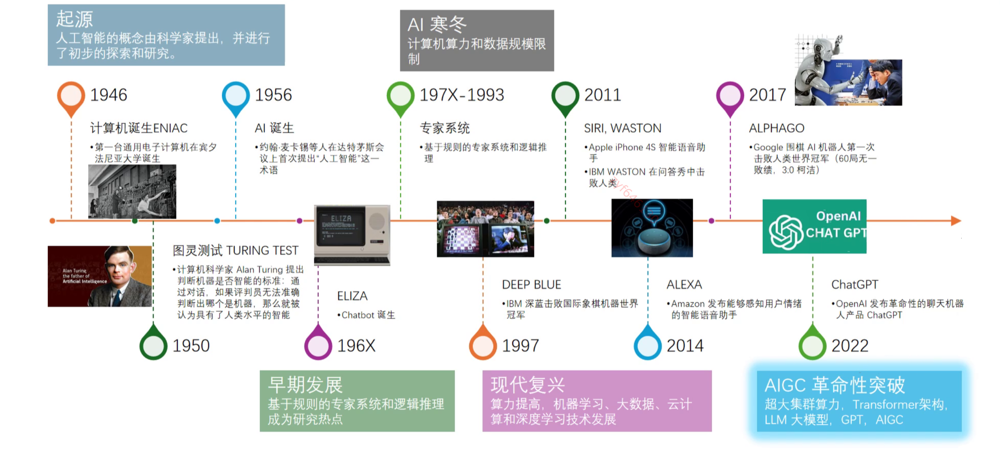
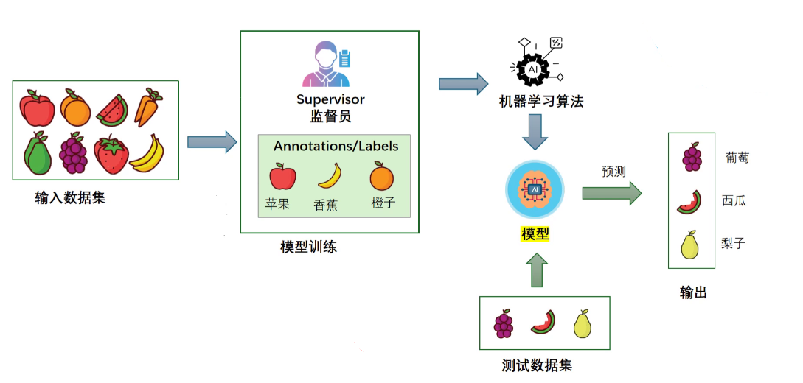
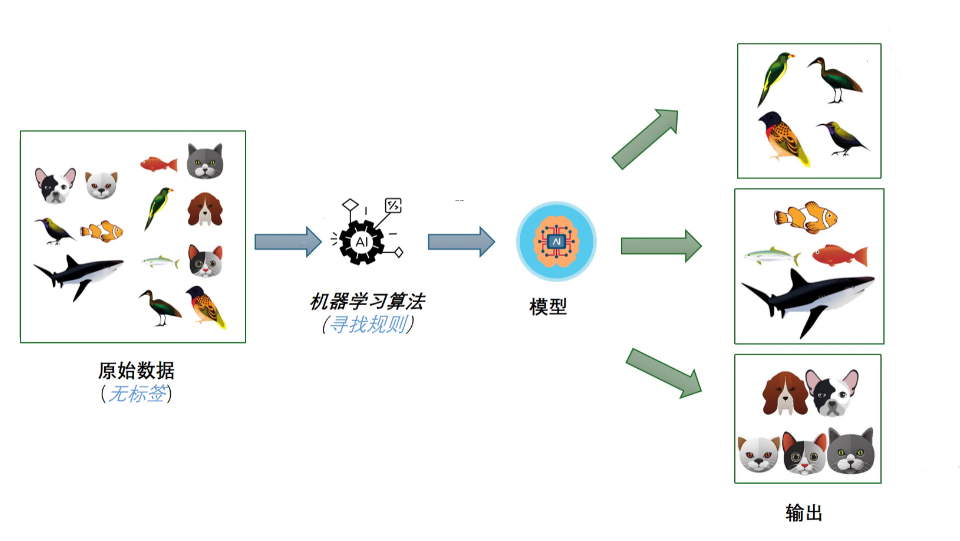
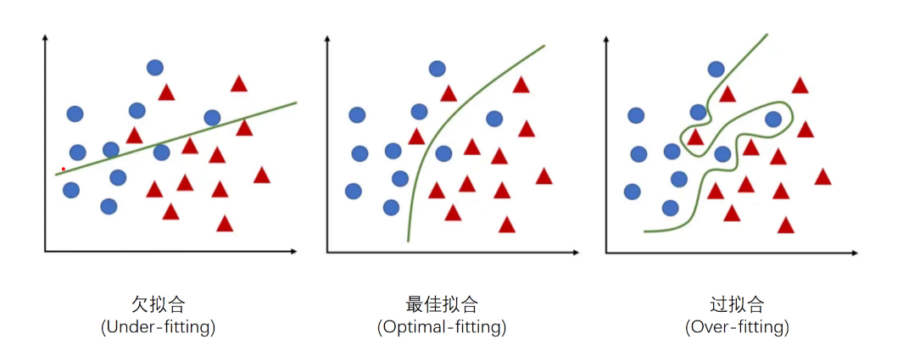
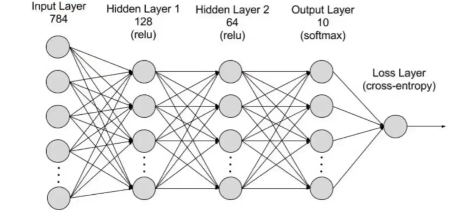
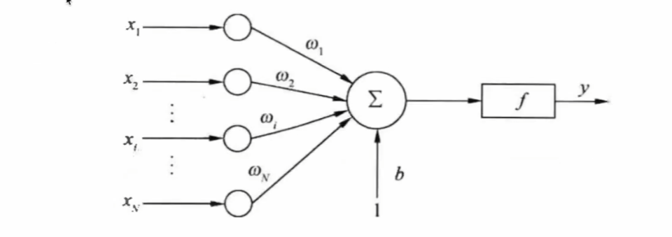

# AI 领域基础概念


## AI 概论

### 什么是 AI

**AI (Artificial Intelligence)** 人工智能是一种使机器能够模拟人类智 能的技术，通过机器学习、深度 学习等算法，使得计算机具备学 习、推理、自我修正和解决问题 等功能。


### AI 发展时间线




## 自然语言（NL）

### 自然语言处理（NLP）

#### **定义**

自然语⾔处理（Natural Language Processing, NLP）是计算机科学和⼈⼯智能的⼀个⼦领域，致⼒于 实现计算机对⼈类语⾔的理解、解读和⽣成。NLP涵盖了从⽂本处理到语⾳识别的⼴泛任务。


#### **应用场景**

**文本分类**: 电⼦邮件过滤系统可以使⽤NLP来⾃动将邮件分类为“垃圾邮件”或“⾮垃圾邮件”。

**情感分析**: 社交媒体监控⼯具可以使⽤NLP来分析⽤户评论的情感倾向（正⾯、负⾯或中性）。 


### 自然语言理解（NLU）

#### 定义

**自然语言理解（Natural Language Understanding, NLU）**是NLP的⼀个⼦领域，专注于使计算机能够理解和解释⼈类语⾔的含义。NLU涉及**语义分析**、**意图识别**、**实体识别**等任务。 


#### 场景示例

**意图识别**: 在智能语⾳助⼿中，当⽤户说“帮我订⼀张明天去纽约的机票”，系统需要识别⽤户的意图 是“订票”。

**实体识别**: 在同⼀句话中，系统需要识别出“纽约”是⼀个地名，“明天”是⼀个时间表达。 

 ```ABAP
 通过语义分析，将一段文本识别为一个个具体的任务，大模型后期一个重要的任务就是做文本的归纳，总结。 
 ```


### 自然语言生成（NLG）

#### 定义

**自然语言生成（Natural Language Generation, NLG）**是NLP的另⼀个⼦领域，旨在使计算机能够⽣成 ⾃然、⼈类可读的语⾔⽂本。NLG通常⽤于⾃动报告⽣成、内容创作等场景。


#### 场景示例

**自动报告**: ⾦融分析⼯具可以使⽤NLG来⽣成每⽇或每周的市场分析报告。

**内容创作**: 新闻自动写作系统可以根据输⼊的数据⽣成新闻⽂章，如体育⽐赛的赛后报道。


### 示例1：实际应用场景

假设我们有一个智能语音助手（如Siri或Alexa），以下是NLP、NLU和NLG在其中的具体应用：

1. **用户输入:** 用户说：“明天的天气怎么样？”
2. **自然语言处理（NLP）:** 
   - **语音识别:** 首先将用户的语音转换为文本：“明天的天气怎么样？”
   - **文本预处理:** 清理和规范化文本，如去除多余的空格或标点。
3. **自然语言理解（NLU）:** 
   - **意图识别:** 系统识别用户的意图是询问天气。
   - **实体识别:** 系统识别出“明天”是时间相关的实体。
4. **数据处理:** 系统查询天气数据库，获取“明天”的天气信息。
5. **自然语言生成（NLG）:** 
   - **生成文本:** 系统将查询结果转换为自然语言文本：“明天的天气是晴天，最高气温25度，最低气温15度。”
   - **语音合成:** 将生成的文本转换为语音，并播放给用户。

通过这个例子，可以看到NLP、NLU和NLG如何协同工作来实现一个完整的自然语言交互过程。


## 监督学习（Supervised Learning）

监督学习是一种机器学习方法，模型通过已知的输入和输出数据进行训练，直到模型能够准确地匹配输入和输出的关系。




### 核心特点

**需要标注数据（Labeled Data）**：每个训练样本都带有一个已知的正确答案（标签）。

**目标**：学习一个**映射函数**，使模型能够根据输入数据预测正确的输出。


#### 示例

**训练集**：(x1,y1),(x2,y2),...,(xn,yn)(x_1, y_1), (x_2, y_2), ..., (x_n, y_n)(x1,y1),(x2,y2),...,(xn,yn)（每个样本 xxx 有对应的标签 yyy）

**目标**：找到一个函数 f(x) 使得 f(x) ≈ f(x)

```ABAP
适用于已知任务，需要大量人工标注的数据
依赖标签，但标注数据成本高。
```


### 常见任务

#### 分类（Classification）

分类任务是将输入数据分为离散的类别。

+ **例子**：垃圾邮件过滤。给定一封电子邮件，模型需要判断这封邮件是垃圾邮件（spam）还是正常邮件（ham）。


#### 回归（Regression）

回归任务是预测连续的数值输出。

+ **例子**：房价预测。根据特征（如房子的面积、位置等），模型预测房子的价格。


#### 关联规则（Association Rule）

关联规则是寻找数据中不同项之间的关系或模式。

+ **例子**：购物篮分析。超市可以通过关联规则发现哪些商品常常一起被购买，比如“如果顾客买了面包和黄油，他们也很可能会买牛奶”。


## 无监督学习（Unsupervised Learning）

无监督学习是一种机器学习方法，模型在没有标签数据（即没有输入和输出配对）的情况下，通过数据内部的结构进行学习。



### 核心特点

**没有标注数据**，模型只能从数据本身的**模式**和**结构**中学习信息。

**目标**：找到数据的隐藏结构，如**聚类（Clustering）或 降维（Dimensionality Reduction）**。


### 常见任务

#### 聚类（Clustering）

聚类任务是将数据分成不同的组，每个组中的数据项彼此相似。

+ **例子**：客户细分。根据购买行为的数据，商业可以将客户分成不同的群体，比如“大宗购买者”、“偶尔购买者”等。

```ABAP
适用于未知任务，可用于发现数据的隐藏结构。
不需要人工标注，但结果解释较难
```


#### 降维（Dimensionality Reduction）

PCA（主成分分析），用于数据压缩或可视化。

**应用场景1**：**图像降噪、特征提取、压缩**

- **问题**：高分辨率图像包含大量像素，每个像素都是一个特征，数据维度极高，计算开销大。
- **解决方案**：使用降维算法，如 PCA（主成分分析）或 Autoencoder（自编码器），提取主要特征，减少数据存储和计算量。
- **实际应用**：
  - **人脸识别**：用 PCA（如 Eigenfaces）提取人脸关键特征，减少数据冗余。
  - **图片压缩**：使用 SVD（奇异值分解）减少图像数据大小，同时保持主要信息。
  - **图像去噪**：降维去除无关信息，提高信号质量。

🔍 **示例**： 使用 PCA 压缩 256x256 的灰度图像，将其转换为 50 维特征向量，大幅减少存储空间，同时保持主要信息。


**应用场景2：减少特征维度，提高模型效率**

- **问题**：金融行业的用户数据（如交易记录、信用评分、收入、贷款历史）维度非常高，可能导致模型过拟合或计算成本过大。
- **解决方案**：使用降维技术（如 PCA、t-SNE）提取最具代表性的信用特征，去除冗余信息，提高信用评分模型的泛化能力。
- **实际应用**：
  - **信用评分**：通过 PCA 选出最相关的信用指标，如贷款历史、收入稳定性，而忽略冗余特征。
  - **风险管理**：降维后进行客户分类，评估高风险用户群体，优化贷款决策。

🔍 **示例**： 在信用评分模型中，从 50 个用户特征（交易历史、信用卡使用情况等）降维到 10 个主要特征，提高模型训练速度，并降低噪音影响


**语音 & 自然语言处理（NLP）的应用**

🎯 **应用场景3：语音识别、情感分析、文本分类**

- **问题**：NLP 任务中的文本数据通常会被转换为**高维向量**（如 Word2Vec、TF-IDF、BERT Embeddings），导致计算开销大，难以训练。

- **解决方案**：使用降维技术（如 PCA、LDA、t-SNE）降低特征维度，加速训练并提高分类精度。

- 实际应用

  ：

  - **语音识别**：使用 PCA 提取关键频率成分，减少背景噪音，提高识别准确性。
  - **情感分析**：使用降维技术减少文本向量维度，提高分类模型的计算效率。
  - **文档分类**：用 LSA（潜在语义分析）减少文本特征维度，提高搜索引擎的召回率。

🔍 **示例**： 对 50,000 维的 TF-IDF 向量进行 PCA 降维到 300 维，提高文本分类模型的训练速度。


**网络安全 & 异常检测**

🎯 **应用场景4：检测异常流量、入侵检测**

- **问题**：网络流量日志包含数百个特征，如 IP 地址、端口、协议、数据包大小等，直接分析计算量大，噪音多。

- **解决方案**：使用降维（如 PCA、Autoencoder）提取主要模式，提高异常检测算法的效率。

- 实际应用

  ：

  - **入侵检测**：分析网络流量数据，检测可疑行为（如 DDoS 攻击）。
  - **信用卡欺诈检测**：通过 PCA 降维找到异常交易模式，提高欺诈检测模型的准确性。

🔍 **示例**： 从 500 维的网络流量特征降维到 20 维，提升异常检测速度，并减少误报率。


**总结**

| **应用场景**     | **降维方法**     | **实际应用**             |
| ---------------- | ---------------- | ------------------------ |
| **图像处理**     | PCA, SVD         | 图像压缩、降噪、人脸识别 |
| **金融风险管理** | PCA, t-SNE       | 信用评分、反欺诈         |
| **基因数据分析** | PCA, UMAP        | 癌症分类、精准医疗       |
| **语音 & NLP**   | PCA, LDA, t-SNE  | 语音识别、文本分类       |
| **推荐系统**     | SVD, NMF         | 电影推荐、电商推荐       |
| **网络安全**     | PCA, Autoencoder | 异常检测、入侵检测       |
| **医疗影像**     | PCA, Autoencoder | MRI/CT 分析              |

```ABAP
无监督学习 通过数据本身的特征来寻找结构，例如聚类（但严格来说不属于分类，因为分类通常指有标签的数据）
有监督学习 依赖标注数据进行训练，用于已知任务，如分类（已知类别）和回归（数值预测）。
```


## 强化学习（Reinforcement Learning）

强化学习是一种机器学习方法，其中一个 **智能体（Agent）** 通过与 **环境（Environment）** 互动，以试错的方式学习如何完成任务或达到目标。


### 核心概念：

1. **状态（States）**：状态是对当前环境的一种描述。在任何时刻，智能体所处的状态反映了当前的环境情况。
   - **例子**：在一个迷宫游戏中，状态可以是智能体当前所在的位置；在围棋中，状态就是棋盘上每颗棋子的布局。
2. **奖励（Reward）**：奖励是对智能体在某个状态下采取某个动作后的反馈，它可以是正的（奖励）或负的（惩罚）。
   - **例子**：在迷宫游戏中，如果智能体走到正确的方向，可以获得正的奖励（例如+10分）；如果撞到墙壁，可能会获得负的奖励（例如-10分）。
3. **智能体（Agent）**：智能体是执行动作并接收奖励的决策者。智能体通过不断地选择动作来改变其状态，从而尝试最大化累计奖励。
   - **例子**：在自动驾驶汽车中，智能体就是控制汽车行驶的算法；在游戏中，智能体就是玩家控制的角色或者对手AI。


### 强化学习的过程：

1. **观察**：智能体观察当前的状态。
2. **选择动作**：根据当前状态，智能体选择一个动作。这个动作可能基于之前的学习，也可能是一个随机选择。
3. **执行动作**：智能体执行所选择的动作，环境随之发生改变。
4. **获取反馈**：环境向智能体提供执行该动作后的新状态及即时奖励。
5. **更新策略**：智能体根据奖励更新其策略，使其在未来选择更优的动作，以获得更多的累计奖励。


### 简单的例子：

#### 玩具汽车学习走迷宫

1. **状态（States）**：玩具汽车在迷宫中的位置，例如（2, 3）代表在迷宫中第二行第三列的位置。
2. **动作（Actions）**：玩具汽车可以前进的方向，例如上、下、左、右。
3. **奖励（Reward）**：如果玩具汽车朝着出口前进，它获得一个正的奖励（+10分）；如果撞到死胡同或墙，则获得负的奖励（-10分）。
4. **智能体（Agent）**：控制玩具汽车的AI

#### 学习过程：

1. 玩具汽车在迷宫的某个位置开始（初始状态）。
2. 汽车根据当前状态选择一个方向行驶（例如向右）。
3. 汽车驾驶，位置发生变化（新状态），并根据新状态获得奖励（例如没有撞墙，获得+1分）。
4. AI 根据奖励更新其策略，逐渐学习在迷宫中如何移动才能尽快找到出口。

通过这种试错和不断优化策略的过程，玩具汽车最终会形成一套有效的行为策略，使其能够成功找到迷宫的出口，同时避免无效的或有害的动作。

总结来说，强化学习通过不断试验和从环境中获得反馈，让智能体逐渐学会在不同的状态下采取最佳的行动，以获得最大的累计奖励。机器学习模型的效果评估是确保模型能够在不同的数据集上准确预测的重要步骤。在理解这个评估过程中，有三个关键概念：欠拟合、最佳拟合和过拟合。


## 机器学习效果评估



### 欠拟合 (Under-fitting)

欠拟合是指模型过于简单，无法捕捉到训练数据中的模式和特征，导致在训练数据和新数据上的表现都很差。

#### 例子：

+ **简单例子**：想象一下你用一条直线来拟合一个明显是曲线的散点图。如果数据点分布成一个“U”形，而你只用一条直线来拟合，就会错过大部分数据的特征，导致欠拟合。
+ **实际例子**：在房价预测问题中，你只用房子的面积一个特征来预测价格，而忽略了位置、房龄、装修等重要特征，导致模型无法准确预测房价。


### 最佳拟合 (Optimal-fitting)

最佳拟合是指模型恰当地捕捉到了训练数据中的模式和特征，同时也能很好地应用于新数据。这种情况下，模型在训练数据和测试数据上都有良好的表现。

#### 例子：

+ **简单例子**：你用一条适当的二次曲线（抛物线）来拟合一个“U”形的散点图，曲线能够很好地通过大部分数据点，这是最佳拟合的状态。
+ **实际例子**：在房价预测问题中，你考虑了多个重要特征（如面积、位置、房龄、装修等），模型能够准确预测训练数据中的房价，并在新数据上表现也很好。


### 过拟合 (Over-fitting)

过拟合是指模型过于复杂，过度地记住了训练数据中的每一个细节和噪声，从而失去了对新数据的泛化能力。过拟合的模型在训练数据上表现很好，但在新数据上表现较差。

#### 例子：

+ **简单例子**：你用一条非常复杂的高次多项式曲线来拟合一个“U”形的散点图，这条曲线几乎精确地通过每个数据点，但实际数据通常带有噪声，在新数据上，复杂曲线就不再适用。
+ **实际例子**：在房价预测问题中，你不仅使用了面积、位置、房龄、装修等特征，还加入了一些不相关的特征（如前几天是否下过雨），模型在训练数据上表现非常好，但在新数据上预测效果很差。
+ 

**总结**：

1. **欠拟合 (Under-fitting)**：模型太简单，不能很好地捕捉数据中的模式。
   - **简单例子**：用直线拟合“U”形数据。
   - **实际例子**：房价预测中只用面积一个特征。
2. **最佳拟合 (Optimal-fitting)**：模型恰到好处，既能很好地拟合训练数据，也能对新数据有良好表现。
   - **简单例子**：用合适的二次曲线拟合“U”形数据。
   - **实际例子**：房价预测中使用了多个重要特征。
3. **过拟合 (Over-fitting)**：模型太复杂，过度记住了训练数据，无法泛化到新数据。
   - **简单例子**：用复杂的高次多项式拟合“U”形数据，过度拟合了每个数据点。
   - **实际例子**：房价预测中加入了很多不相关特征，结果在新数据上效果不好。

总之，目标是找到让模型最佳拟合训练数据和测试数据的平衡点，既不过于简单也不过于复杂。

 

## 深度学习

```ABAP
深度学习(deep learning) 是机器学习的分支，是以神经网络为架构，对资料进行表征学习的算法
```

### 导学

这里**深度**指的就是**神经网络**，**学习**指的就是**表征学习**



深度学习是一种机器学习方法，它利用多层神经网络进行复杂的数据处理和模式识别。在理解深度学习时，我们需要了解神经网络的三种关键层：输入层（Input Layer）、隐藏层（Hidden Layer）和输出层（Output Layer）。


**表征学习**：通过学习提取到特征，而不需要手工提取特征，也就是说由算法自动提取特征，而不是通过人手工注入特征。

深度学习可以看做是机器学习的真子集


#### 输入层 (Input Layer)

**输入层**是神经网络的第一个层，它接收原始的数据输入。这些输入可以是图像的像素值、文本的词向量或其他形式的数据。输入层的节点（或神经元）数目取决于输入数据的特征数。

#### 例子：

+ **图像分类**：如果你有一张28x28像素的灰度图像作为输入，输入层将有28×28=784个节点，每个节点代表一个像素值。
+ **房价预测**：如果你有五个特征（如面积、位置、房龄等），输入层将有5个节点，每个节点代表一个特征值。


#### 隐藏层 (Hidden Layer)

**隐藏层**位于输入层和输出层之间，负责对输入数据进行特征提取和变换。隐藏层可以有一层或多层，称为“深度”正是因为有许多隐藏层。每个隐藏层通过与前一层和后一层的连接（权重和偏置）来传递信息。

#### 例子：

+ **图像分类**：何将28x28像素的输入映射到更加抽象的特征层，如第一层可能识别边缘，第二层可能识别更复杂的形状。
+ **房价预测**：隐藏层可以捕捉输入特征的复杂非线性关系，帮助模型准确预测房价。


#### 输出层 (Output Layer)

**输出层**是神经网络的最后一层，它给出模型的最终预测结果。输出层的节点数目和类型取决于具体的任务。

#### 例子：

+ **图像分类**：如果你要把图像分类为10个类别（如手写数字0-9），输出层将有10个节点，每个节点代表一个类别的概率。
+ **房价预测**：如果你需要预测房价，输出层将有一个节点，它输出房价的预测值。


#### 综合例子

##### 任务：图像分类

1. **输入层**：假设我们分类的是28x28像素的手写数字图像。
   - **输入层节点数**：784个节点，每个节点对应一个像素值。
2. **隐藏层**：假设有两层隐藏层。
   - **第一隐藏层**：提取简单特征（如边缘），设有128个节点。
   - **第二隐藏层**：提取更复杂的特征（如更高层次的形状），设有64个节点。
3. **输出层**：假设分类为10个类别（数字0到9）。
   - **输出层节点数**：10个节点，每个节点代表图像属于某个数字类别的概率。

##### 任务：房价预测

1. **输入层**：假设预测房价时用五个特征：面积、位置、房龄、房型、市场状况。
   - **输入层节点数**：5个节点，每个节点代表一个特征。
2. **隐藏层**：假设有一层隐藏层。
   - **隐藏层**：捕捉输入特征之间的复杂关系，设有10个节点。
3. **输出层**：输出预测的房价。
   - **输出层节点数**：1个节点，表示预测的房价。

**简而言之**：

1. **输入层**：接收原始数据。
2. **隐藏层**：提取和转换输入数据的特征。
3. **输出层**：给出预测结果。

通过这些层的协同工作，神经网络能够从原始数据中学习模式，并对新数据进行准确的预测或分类。神经网络（Neural Network）是模仿人脑工作原理的一种算法，由多个互相连接的节点（也叫神经元）组成。这些节点被组织成不同的层，通过层与层之间的连接和权重调整来处理数据。


### 线性回归

#### 什么是线性回归

**回归**指一类任务的统称，叫做**回归任务**。回归任务的目的是想去预测一个连续函数，比如股票价格，房产价格等

以股票价格为例，希望通过一些信息来输入给一个函数， 让这个函数去预测未来的股票价格。而找到这个函数的过程就是在做一个回归。希望找到的这个函数能够跟真实的股票价格越贴近越好。

**线性**指用一个线性模型去做回归任务，当然很多模型并不是线性的，但是线性模型是深度学习中最基础的模型，同时他也可以看作是一个单层的神经网络


#### 房价预测问题

根据房子的一些属性，预测该房子价格。

- 属性包括：面积，楼层，卧室数量，分别用`x1`, `x2`, `x3` 表示（即`x1`, `x2`, `x3` 都是函数的输入，输出房子价格）
- 价格是属性的线性函数，即：


这里`w1`, `w2`, `w3` 是权重，`b` 是偏置	

想预测房价，就需要确定`w1`, `w2`, `w3`, `b` 的值，那么如何确定？


#### 线性模型

上述的线性函数 `y = w1x1 + w2x2 + w3x3 + b` 把它变为一个n维的模型

- 输入为n维向量**x**: **x** = [`x1`, `x2`, ... `xn`]  
- 参数
  - n维向量 **w**: **w** = [`w1`, `w2`, ..., `wn` ]
  - 标量 `b`


输出是输入的线性函数

 `y = w1x1 + w2x2 + w3x3 + b`

将 **x** 转置后，与 **w** 进行矩阵计算如下


**等于 w1x1 + w2x2 + w3x3**，即 **向量点积**

**写出矩阵形式**

y = **wx** + b


**单层感知器模型**



上图即为一个**神经元**，该神经元有多个输入，对于每个输入都先做一个乘法，有一个权重 xi 与 wi 相乘，在中间做加法，然后加上 b ,得到函数值

类比生物学的神经元


现在带来两个问题：

一个是如何确定这些参数的值（即权重）对不对？


## 神经网络

### 神经网络的基本概念：

1. **节点（Neuron）**：类似于人脑中的神经元，每个节点接收输入信号，进行处理后发送输出信号。
2. **层（Layer）**：神经网络的结构由多个层组成，每层包含一定数量的节点。一般分为输入层、隐藏层和输出层。
3. **连接（Weights）**：每两个相邻层之间的节点通过带有权重的连接相连，这些权重决定了信号传输的强度。


### 浅层神经网络（Shallow Neural Networks）

浅层神经网络是指包含少量隐藏层（通常只有一个隐藏层）的一种神经网络。由于层数较少，计算相对简单，适用于一些较简单或较小规模的任务。

#### 例子：

+ **任务：二分类问题**（如垃圾邮件识别）
  - **输入层**：接收邮件的特征（如文本词频等）。
  - **隐藏层**：只有一层隐藏层，包含若干节点。
  - **输出层**：输出是两个节点，表示垃圾邮件或正常邮件的概率。

浅层神经网络虽然简单，但在某些简单任务上表现不俗。例如在垃圾邮件识别时，简单的特征如特定词汇的频率就能较好地区分垃圾邮件。


### 深度神经网络（Deep Neural Networks）

深度神经网络则包含多个隐藏层，层数较多，使其能够捕捉数据的复杂模式和高级特征。深度神经网络被用来处理更复杂、规模更大的任务，比如图像识别、自驾车、自然语言处理等。

#### 例子：

+ **任务：图像分类**（如手写数字识别）
  - **输入层**：接收图像的像素值（比如28x28的灰度图像，有784个输入节点）。
  - **多个隐藏层**：每个层逐步提取图像的不同特征，比如边缘、形状和更复杂的模式。可能包含若干层，每层有大量节点。
  - **输出层**：输出是多个节点（比如10个节点），每个节点表示图像属于某个类别（如数字0-9）的概率。

深度神经网络由于其多层结构，能够逐级提取更复杂的特征。例如在图像分类任务中，底层隐藏层可能识别简单的边缘特征，中间层可能识别复杂的形状特征，顶层隐藏层则综合所有特征完成最终的分类任务。


### 总结：

1. **浅层神经网络（Shallow Neural Networks）**
   - 结构：通常只有一个隐藏层。
   - 适用任务：简单、规模较小的任务。
   - **例子**：垃圾邮件识别。
   - **优势**：计算简单，训练时间短。
2. **深度神经网络（Deep Neural Networks）**
   - 结构：包含多个隐藏层。
   - 适用任务：复杂、规模较大的任务。
   - **例子**：图像分类、自驱动汽车。
   - **优势**：能够提取复杂的高级特征，更适用于复杂的问题。

通过这个简单的区分，深度神经网络和浅层神经网络的差异主要体现在隐藏层的数量和数据处理能力上。浅层神经网络适合简单任务，而深度神经网络则在处理复杂任务时表现更为强大。


## CNN（卷积神经网络）

卷积神经网络（CNN）是一种特别设计用来处理具有类似网格结构的数据的深度学习模型，例如图像（本质上是像素的矩阵）。在最简单的术语中，CNN通过模拟我们人类的视觉系统工作来帮助计算机“看懂”图像或其他类似数据。

要理解CNN，我们可以通过如何处理图像的任务来进行说明：

### 卷积层（Convolutional Layer）：

假设你有一张纸上画着各种形状（如圆形、方形等）。你用一个小镜子（这就是所谓的“滤镜”或“卷积核”）来观察这张纸。每次你只能看到镜子中的一小部分图形。根据这部分，你尝试猜测这是哪种形状。移动镜子到纸上的不同部位，重复这个观察过程，最终你可以获得关于图形的不同信息。在CNN中，这个“小镜子”观察的过程就是“卷积操作”，它可以帮助模型捕捉到图像中的基本特征（如边缘、角点等）。

### 池化层（Pooling Layer）：

接下来，如果你想让镜子中看到的图像部分更抽象、更容易总结（即减小它的尺寸），你可能会选择在画好的图形上用较大的格子遮住一些部分，只保留某些重要的特征（比如形状的特定部分）。这个过程类似于“池化”，它有助于降低处理的数据量和抓取最显著的特征。

### 全连接层（Fully Connected Layer）：

最后，将你的所有观察结果放在一起，尝试根据你提取的信息来完整地识别纸上的整个图形。在CNN中，这个汇总过程是通过“全连接层”完成的，它基于前面提取到的所有特徥做出最终的判断和分类。

### 示例

想象在一个自动分拣系统中，系统需要区分苹果、梨和橙子。CNN通过学习这三种水果的卷积图像特征（如颜色、形状等），在卷积层捕捉这些特征，在池化层精化并简化特征，在全连接层做出最终判断。这样，当下次系统看到一个新的水果图像时，它可以通过这些学到的特征来识别和分类。

总的来说，CNN通过模拟观察和结构化处理来理解图像，类似于我们通过看不同部分来理解一个完整画面的方式。


### 整体总结

**卷积层（Convolutional Layer）**：提取**局部特征**，如边缘、纹理、形状，深层卷积可以学到更复杂的特征（如物体的轮廓）。

**池化层（Pooling Layer）**：对特征进行**降维、减少计算量，增强模型的鲁棒性**，常用 **最大池化** 来提取主要特征。

**全连接层（Fully Connected Layer）**：将 CNN 提取的**特征整合**，通过 **Softmax 激活函数** 进行分类，输出最终预测结果。


## RNN（循环神经网络)

循环神经网络（RNN）是一种专为处理序列数据（如文字、语音或任何连续的时间数据）而设计的神经网络。与传统的神经网络不同，RNN能够处理输入之间的时间动态关系，使其特别适用于那些需要理解时间序列数据或上下文信息的场景。

### 基本工作原理：

想象你在看一部电影，并且你想要随时预测接下来会发生什么。每经过一段电影，你都会根据目前为止看到的内容（而不只是最近几分钟的内容）来更新你的预测。RNN的工作方式与此类似：它记住之前发生的事情，并使用这些信息来帮助作出当前的决策。RNN内部有所谓的“循环”，这使得过去的信息能够影响当前的输出。


### 如何理解RNN：

1. **记忆功能**：你可以将RNN想象为有记忆的网络，它不仅看当前的输入（比如现在的字或词），而且还“记得”它之前处理过的信息。
2. **参数共享**：在处理序列的每一步时，RNN重复使用同一套参数（权重和偏置）。这不仅使得模型更加紧凑，而且还可以处理任意长度的序列。
3. **输出依赖**：根据应用，RNN可以在任何时间点生成输出，或者在处理完所有输入后才产生一个输出。这意味着它可以被用来做分类（比如判断一句话的情感）、生成连续的数据（如文本生成）等。

### 示例：

1. **语言模型**：假设你要预测一句话中下一个词是什么。RNN通过读取目前为止的句子（单词的序列），根据上下文预测下一个单词。比如，在“晚饭后我们去”之后，RNN可能会预测“散步”作为下一个词。
2. **股票价格预测**：给定一个股票过去的价格序列，RNN可以预测未来的价格变动。它通过分析价格随时间变化的趋势，来做出未来的预估。
3. **手写文本识别**：当你写字时，每一个字符与前一个字符都有关联。RNN能够分析字符序列，并帮助识别整个单词或句子。

总结来说，RNN通过其内部的循环连接，能够保留信息的流动，这使它非常适用于那些需要考虑时间连续性或输入之间关系的任务。这种“记忆功能”使得RNN在**自然语言处理、时间序列分析**等领域表现出色。


RNN（循环神经网络）由输入层、隐藏层和输出层组成，每一层都担任不同的角色。通过一个简单的例子，我们可以更好地理解这些层在RNN中的功能。


### 输入层

这一层的任务是接收序列中的每个元素（例如，一个句子中的单词或时间序列数据中的一个时间点）。假设我们的任务是进行文本情感分析，并且输入是一句话中的每个词。每个词首先被转化为数字形式（通常是向量，通过词嵌入技术如Word2Vec或GloVe实现），然后送入RNN。

**例子**：在处理句子：“我爱自然语言处理”时，每个词（例如“我”、“爱”、“自然”、“语言”、“处理”）依次被转换为向量，并输入到网络中。


### 隐藏层

隐藏层是RNN的核心，它负责处理输入并保留先前输入的信息。隐藏层中的节点会对当前输入和前一个时间步的隐藏状态进行处理，生成新的隐藏状态，这个过程会不断循环。这使得网络能够从数据的序列中“记住”信息，并用这些信息影响后续的输出。

**例子**：继续上面的情感分析的例子，当单词“我”输入后，隐藏层更新其状态。当下一个词“爱”输入时，隐藏层不只是考虑“爱”，而是结合之前的状态（已经处理了“我”）来更新状态。这个状态现在包含了“我爱”的信息，以此类推。


### 输出层

在序列的每一步或最后一步（取决于特定的应用），输出层会基于隐藏层的最终状态生成输出。输出可以是一个类别标签（如在分类任务中），一个连续值（如在回归任务中），或者是下一个序列元素（如在预测任务中）。

**例子**：在情感分析例子中，输出层可能在处理完整个句子后评估整个句子的情感倾向，并输出是积极、中立还是消极的情绪标签。


### 总结

通过输入层接收并转换数据，隐藏层处理并“记忆”序列中的信息，最后输出层根据隐藏层的信息作出决策，RNN能够有效地处理序列数据。这种结构使得RNN在语言模型、股票预浔、语音识别等众多需要理解序列数据的上下文的任务中表现优异。


### MMA 和 RNN 的关系

| **问题**             | **RNN**                                         | **MMA**                                             |
| -------------------- | ----------------------------------------------- | --------------------------------------------------- |
| **是否循环计算？**   | ✅ 是的，每个时间步依赖前一个时间步              | ❌ 不是，MMA 只是并行计算的基本单元                  |
| **是否累积信息？**   | ✅ 是的，RNN 依赖历史隐藏状态                    | ✅ 是的，MMA 通过乘加进行累积                        |
| **是否包含非线性？** | ✅ 是的，有 `tanh`、`sigmoid`                    | ❌ 纯粹是线性运算                                    |
| **计算结构**         | **时间步依赖（Sequential）**，难以并行          | **纯矩阵操作（Parallel）**，适合 GPU 加速           |
| **主要应用**         | **自然语言处理（NLP）、语音识别、时间序列预测** | **神经网络加速、图像处理（CNN）、Transformer 计算** |

✅ **MMA 是 RNN 计算的重要组成部分，但 RNN 还包含时间依赖性、非线性变换等额外计算，不能完全用 MMA 替代。**
✅ **Transformer 替代 RNN 也是因为它避免了循环计算，使所有计算都可以用 MMA 高效并行加速。**


## Transformer

Transformer 是一种深度学习模型，于 2017 年被引入，主要用于处理序列数据如文本。它在处理诸如翻译或文本生成等语言理解任务时表现出了卓越的效果。Transformer 的核心优势在于其能同时处理输入序列的所有部分，这大大加快了训练过程并提高了模型处理长距离依赖的能力。

 Transformer 的四个核心组件：自注意力机制、多头注意力、位置编码和前馈网络。

### 1. 自注意力机制（Self-Attention）

**例子**：想象一下你正在读一本关于历史的书，遇到了句子：“当王后死后，国王也很快去世。”在理解“国王”这个词时，你的大脑会特别关注“王后”，因为这个词与“国王”的状态密切相关。自注意力机制就是模拟这种在处理每个词时，评估其与句子中其他词的关系并加以利用的能力。

**自注意力机制（Self-Attention）** 是它的核心部分，它的作用是**让模型在处理序列数据时，能够关注到整个输入序列的不同部分，而不仅仅是当前单词**。

想象一下，你在读一篇文章时，不是逐字逐句地看，而是会回顾之前的内容，理解上下文。这就是 **自注意力（Self-Attention）** 的作用：**它让模型在处理一个词时，能够同时参考整个句子的信息**。


#### 自注意力机制的作用

**关注输入序列的不同部分**，确保在理解某个词时，也能考虑与之相关的其他词。

**赋予不同的权重**，决定哪些词对当前词的重要性更高（类似人类阅读时的注意力集中）。

**处理长距离依赖（Long-range Dependency）**，避免 RNN 那种只能“记住”前面几个单词的局限。


#### **直观类比：自注意力是如何工作的？**

**🧠 类比 1：读一篇小说**

当你读小说中的一句话：

> "小明捡起了苹果，然后把它放进了篮子里。"

如果你想理解 **"它"（it）** 代表什么，你的注意力会回溯到 **"苹果"（apple）**，而不是 “小明” 或 “篮子”。
**自注意力机制** 在这里的作用就是：让 **"它"** 关注 **"苹果"**，并赋予它更高的注意力权重。


**🎤 类比 2：开会时的注意力分配**

假设你在开会，老板说了一句话：

> "这个季度的销售额增长了 30%，主要是因为市场推广力度加大。"

当你在总结会议内容时，你可能会更关注 **"销售额增长"** 和 **"市场推广"**，而不会关注不重要的助词。
同样地，**自注意力机制会让 Transformer 更关注关键部分，并忽略不重要的信息**。


### 2. 多头注意力（Multi-Head Attention）

**例子**：假设你正在组织一个聚会，需要考虑地点、食物和音乐等多个方面。你的大脑会同时处理这些信息，但从不同的角度。地点可能是你从交通方便性角度考虑的，食物可能是从参与者口味偏好考虑的，音乐则是从氛围烘托的角度。多头注意力类似地同时从多个“角度”或“子空间”来处理信息，有助于捕获句子或数据的多方面特性。

### 3. 位置编码（Positional Encoding）

**例子**：想象你正在排队买咖啡。即使闭上眼睛，你也能通过听声音知道大致是哪个顾客在点单，因为你知道他们在说话时的顺序。位置编码的作用类似于这种对顺序感知的机制，它帮助 Transformer 模型理解单词在句子中的位置，即使它处理的是一组单词，而不是一个接一个的单词。

### 4. 前馈网络（Feed-Forward Networks）

**例子**：假设你在一家快餐店工作，对每个客户你都要重复同样的几个步骤：接单、制作、交付。无论前一个订单是什么，处理过程基本相同。在 Transformer 中，前馈网络就是在自注意力结构后对每个位置输出相同操作的网络部分，这一处理过程对于序列中的每个元素都是独立的，类似于你对待每个快餐订单的方式。

通过上述例子，可以看出 Transformer 的这些核心组件各自独立又相互配合，有效地提升了模型对序列数据的处理能力，特别是在理解和生成语言文本方面的应用。