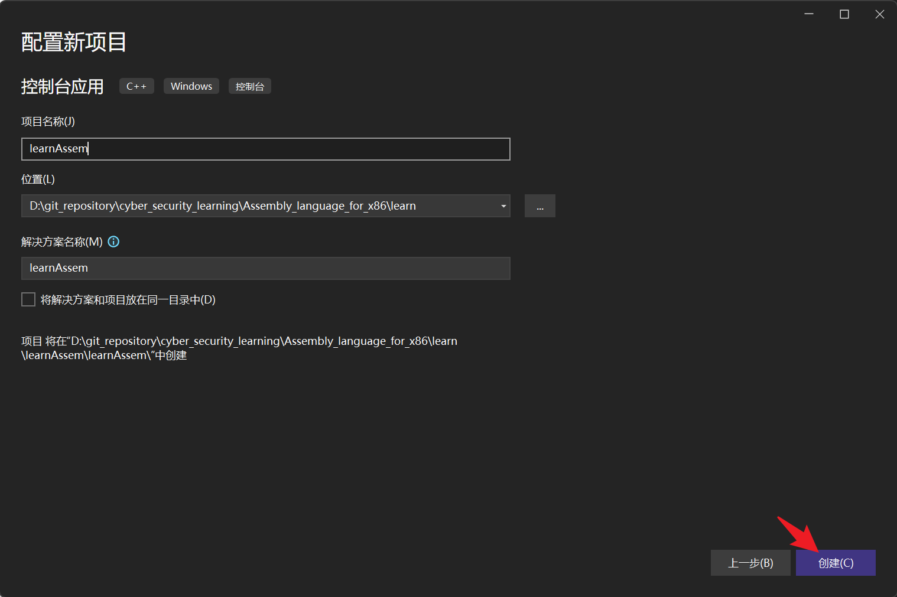

# 1 Visual Studio 2022 汇编语言调试方法

打开 Visual Studio 2022 并创建新项目


选择“控制台应用”模版，下一步


填写项目名称，选择好项目路径，并创建



执行测试，看是否能运行成功


没问题的话，删除自带文件，并新创建汇编文件


点击调试


勾选调试->窗口->汇编器


# 2 汇编语言基础

## 2.1 基本语言元素

### 2.1.1 第一个汇编语言程序

```assembly
main PROC
    mov eax,5              ; 将5送入到eax寄存器
    add eax,6              ; 将6加到eax寄存器
    
    INVOKE ExitProcess,0   ;结束程序
main ENDP
```

目前不要试图输入并运行上述程序，它还缺少一些重要的声明。

- 第1行开始main过程（主过程），这是程序的入口点。
- 第2行将整数5放入EAX寄存器中
- 第3行将6加到EAX的值上，得到新值11
- 第5行调用Windows 服务（也称为函数）ExitProcess来停止工作，并将控制权还给操作系统。
- 第6行是主过程结束的标记


#### 2.1.1.1 添加一个变量

将加法运算的结果保持在变量sum中。要实现这一点，需要增加一些标记或者叫声明，用来标识程序的代码区和数据区

```assembly
.data                              ; 这是数据区
sum DWORD 0                        ; 创建一个变量，取名sum

.code                              ; 这是代码区
main PROC
    mov eax,5
    add eax,6
    mov sum,eax
    
    INVOKE ExitProcess,0           ; 结束程序
main ENDP
```


### 2.1.2 整数字面量

整数字面量（integer literal，又称为整数常量（integer constant））由一个可选的前置符号，一个或多个数字，以及一个可选的表明其基数的基数字符构成

格式

```bash
[{+ | -}] digits [radix]7
```

| 基数字符 | 含义           |
| -------- | -------------- |
| h        | 十六进制       |
| q/o      | 八进制         |
| d        | 十进制         |
| b        | 二进制         |
| r        | 编码的实数     |
| t        | 十进制（备用） |
| y        | 二进制（备用） |


示例

```assembly
26                     ; 十进制
26d                    ; 十进制
11010011b              ; 二进制
42q                    ; 八进制
42o                    ; 八进制
1Ah                    ; 十六进制
0A3h                   ; 十六进制，以字母开头的十六进制字面量必须前置0，以免汇编器将其解释为标识符
```


### 2.1.3 常整数表达式

**算数运算符**

| 运算符 | 名称         | 优先级 |
| ------ | ------------ | ------ |
| ( )    | 括号         | 1      |
| +，-   | 一元正，负号 | 2      |
| *，/   | 乘法，除法   | 3      |
| MOD    | 模运算       | 3      |
| +， -  | 加法，减法   | 4      |


### 2.1.4 实数字面量

实数字面量（real number literal，也称为浮点字面量（floating-point literal））表示为十进制实数或编码的（十六进制）实数。十进制实数包括一个可选的符号，其后跟随一个整数，一个十进制小数点，一个可选的表示小数部分的整数，以及一个可选的指数：

格式

```bash
[sign]integer.[integer][exponent]

# sign     [+,-]
# exponent  E[{+,1}]integer
```

示例

```bash
2.
+3.0
-44.2E+05
26.E5
```

示例：十进制数+1.0用二进制表示为：

```bash
二进制：   0011 1111 1000 0000 0000 0000 0000 0000
十六进制： BF800000r
```


### 2.1.5 字符字面量

字符字面量（character literal）是指用单引号或双引号括起来的一个字符。汇编器在内存中保存的是该字符的二进制ASCII码。例如：

```bash
'A'
"d"
```


### 2.1.6 字符串字面量

字符串字面量（string literal）是用单引号或双引号括起来的一个字符（含空格符）序列

示例

```bash
'ABC'
'X'
"Good night, Gracie"
```

正如字符常量以整数形式存放一样，、字符串字面量在内存中的存储形式为整数字节值的序列

示例

```bash
"ABCD"  -> 41h,42h,43h,44h
```


### 2.1.7 保留字

