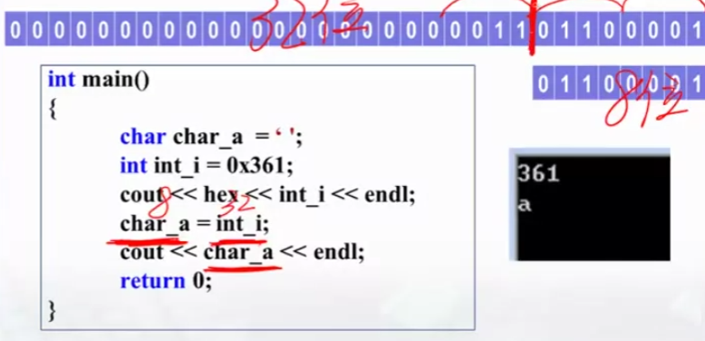

# C++语言基础
## C++入门示例代码
```c++
/* 最简单的程序 - 顺序结构 */

#include <iostream>
using namespace std;
int main()
{
    cout << "Hello World!" << endl;
    // cout是输出命令
    // endl表示换行
    return 0;
}

#include <iostream>
using namespace std;
int main()
{
    int a = 0;
    cout << "我想输出a的值：" << a << endl;
    // cout是输出命令
    // endl表示换行
    return 0;
}

#include <iostream>
using namespace std;
int main()
{
    int a = 0, b = 0, result = 0; // 一次性定义多个变量，用逗号分割
    cout << "Please input two numbers: ";
    cin >> a >> b; // 输入的时候，中间用空格隔开，用来区分a,b的值
    result = 3 * a - 2 * b + 1;
    cout << "result is: " << result << endl;
    return 0;
}

#include <iostream>
using namespace std;
int main()
{
    float a = 0, b = 0, temp = 0; // 一次性定义多个变量，用逗号分割开
    cout << "Input a and b: " << endl;
    cin >> a >> b; // 输入的时候，中间用空格隔开，用来区分a，b的值
    cout << "a=" << a << ",b=" << b << endl;
    temp = a; a = b; b = temp; // 交换算法
    cout << "a=" << a << ",b=" << b << endl;
    return 0;
}
```

```C++
/* 简单程序 - 分支结构 */

#include <iostream>
using namespace std;
int main()
{
    int x = 0, y = 0;
    cin >> x >> y;
    if (x > y)
        cout << "Max number is: " << x << endl;
    else
        cout << "Max number is: " << y << endl;
    return 0;
}

#include <iostream>
using namespace std;
int main()
{
    char a = 'A'; //字符型，只能存储一个字符
    cout << "猜猜我是哪个字符： " << endl;
    cin >> a;
    if (a != 'G')
        cout << "你猜错了" << endl;
    else if (a == 'G')
        cout << "被你猜中了！" << endl;
    return 0;
}
```

```C++
/* 简单程序 - 循环结构 */

#include <iostream>
using namespace std;
int main()
{
    int i = 0;
    cout << "20以内的奇数：" << endl;
    for (i = 0, i < 20; i++)
    {
        if (i % 2 == 1)
            cout << i << endl;
    }

    return 0;
}
```

```C++
/* 简单程序 - 数组 */

#include <iostream>
using namespace std;
int main()
{
    int = 0;
    char a[10] = {'a','b','c','d','e','f','g','h','i','j'};
    cout << "字符表中序号为奇数的前五个字符: " << endl;
    for (i = 0; i < 10; i = i + 2)
    {
        cout << a[i] << endl;
    }

    return 0;
}
```

## 变量与数据类型
- 变量定义格式（先定义，再使用）
  - int max = 0;
  - char character = 'A';
  - double result = 12.345;
- 变量定义的过程：（以int max=0;举例）计算机根据定义的类型，在内存中找到相连的空着的空间，找到这个空间后，再给这片空间取名max，并将变量的初始值放在这片空间里，然后记下，你存储的空间的最开头的空间起始地址与取得名称的对应关系。
  
### 整形
- int：当定义int型数据，计算机分配32bit，4Byte的内存空间
- short/short int：当定义short型数据，计算机分配16bit，2Byte的内存空间
- long/long int：当定义long型数据，计算机分配32bit，4Byte的内存空间
- C 标注没有具体规定以上各类数据所占内存字节数，只要求long型数据长度不短于int型，short型不长于int型
- 查看该数据所占字节长度 <font color=tomato>sizeof()</font>
```C++
#include <iostream>
using namespace std;
int main()
{
    cout << "sizeof(short int)=" << sizeof(short int) << endl;
    // sizeof(short int) = 2
    cout << "sizeof(int)=" << sizeof(int) << endl;
    // sizeof(int) = 4
    cout << "sizeof(long int)=" << sizeof(long int) << endl;
    // sizeof(long int) = 4
    return 0;
}
```

- 整数类型的分类
<table>
    <thead>
        <th style="background-color:darkred;color:white">整型</th>
        <th style="background-color:darkred;color:white">有符号(默认signed)</th>
        <th style="background-color:darkred;color:white">无符号</th>
    </thead>
    <tbody>
        <tr>
            <td rowspan=2 style="font-weight:700">基本型</td>
            <td>int</td>
            <td rowspan=2>unsigned int</td>
        </tr>
        <tr>
            <td>signed int</td>
        </tr>
        <tr>
            <td rowspan=4 style="font-weight:700">短整型</td>
            <td>short</td>
            <td rowspan=2>unsiged short</td>
        </tr>
        <tr>
            <td>short int</td>
        </tr>
        <tr>
            <td>signed short</td>
            <td rowspan=2>unsigned short int</td>
        </tr>
        <tr>
            <td>signed short int</td>
        </tr>
        <tr>
            <td rowspan=4 style="font-weight:700">长整型</td>
            <td>long</td>
            <td rowspan=2>unsigned long</td>
        </tr>
        <tr>
            <td>long int</td>
        </tr>
        <tr>
            <td>signed long</td>
            <td rowspan=2>unsigned long int</td>
        </tr>
        <tr>
            <td>signed long int</td>
        </tr>
    </tbody>
</table>

- 整形的存储

  - 对于正整数，二进制存储的是这个整数的原码
  - 对于负整数，二进制存储的是这个整数的补码
    - 补码计算公式：原码 -> 取反 + 1 -> 补码
  - signed多一位符号位，因此，unsigned的范围是0~2^32,约为42亿；signed的范围是-2^31 ~ 2^31,约为+-21亿

```C++
/* 打印一个数的十六进制表示 */
#include <iostream>
using namespace std;
int main()
{
    int n;
    cin >> n;
    cout << hex << n << endl; 
    // hex: 十六进制打印输出控制符
    // 八进制：oct; 十进制：dec
    return 0;
}

/* 把一个十六进制数输入程序 */
#include <iostream>
using namespace std;
int main()
{
    int n = 0x7FFFFF85; // 一个数以0x开头：十六进制；以0开头：八进制
    cout << dec << n << endl;
    cout << oct << n << endl;
    return 0； 
}
```

### 浮点数
<table>
    <thead>
        <th style="background-color:darkred;color:white">浮点型</th>
        <th style="background-color:darkred;color:white">长度</th>
        <th style="background-color:darkred;color:white">有效位</th>
        <th style="background-color:darkred;color:white">范围</th>
    </thead>
    <tbody>
        <tr>
            <td style="font-weight:700">float</td>
            <td>32bit</td>
            <td>7位</td>
            <td>-3.4*10^38 ~ 3.4*10^38</td>
        </tr>
        <tr>
            <td style="font-weight:700">double</td>
            <td>64bit</td>
            <td>15位</td>
            <td>-1.7*10^308 ~ 1.7*10^308</td>
        </tr>
        <tr>
            <td style="font-weight:700">long double</td>
            <td>64bit</td>
            <td>15位</td>
            <td>-1.7*10^308 ~ 1.7*10^308</td>
        </tr>
    </tbody>
</table>

```C++
#include <iostream>
using namespace std;
int main()
{
    /*测试圆周率，小数点后100位，浮点型的精度*/
    float a  = 3.1415926535897932384626433832795028841971693993751058209749445923078164062862089986280348253421170679;
    double b = 3.1415926535897932384626433832795028841971693993751058209749445923078164062862089986280348253421170679;
    long double c = 3.1415926535897932384626433832795028841971693993751058209749445923078164062862089986280348253421170679;

    cout << a << endl; // 3.14159 cout 默认6位精度
    cout << b << endl; // 3.14159 cout 默认6位精度
    cout << c << endl; // 3.14159 cout 默认6位精度
    return 0;
}

#include <iostream>
#include <iomanip>
using namespace std;
int main()
{
    /*测试圆周率，小数点后100位，浮点型的精度*/
    float a  = 3.1415926535897932384626433832795028841971693993751058209749445923078164062862089986280348253421170679;
    double b = 3.1415926535897932384626433832795028841971693993751058209749445923078164062862089986280348253421170679;
    long double c = 3.1415926535897932384626433832795028841971693993751058209749445923078164062862089986280348253421170679;

    cout << setprecision(100) << a << endl;
    cout << b << endl;
    cout << c << endl;
    return 0;
}

>>>3.1415927410125732421875 //float只能保持7位精度，只有前7位正确
>>>3.141592653589793115997963468544185161590576171875 //double只能保持15位精度
>>>3.141592653589793115997963468544185161590576171875 //long double只能保持15位精度
```
- 分析浮点数的表示方式

  - float型一共占据32bit
    - 1位符号位
    - 8位指数位（含1位符号位）
      - 剩余7位，可以表示2^127,因为2^7=128,log<sub>10</sub>(2<sup>127</sup>) ≈ 38.23
    - 23位二进制小数位（默认1.XXX）
      - 因为默认是1.XXX，因此有效位是24位，所以范围是log<sub>10</sub>(2<sup>24</sup>) ≈ 7.225，所以精度是7位
  
### 字符型

- 一个字符占一个字节 8bit
  - 其值可以是任何“可以出现在C/C++语言中的字符”；
  - 最多可以表示256个字符；（ASCII Character Codes）

- 由于存储类型和整型相同
  - 可以与整型数据互换赋值
  - 可以和整形一样进行运算
  - 

```C++
#include <iostream>
#include <iomanip>
using namespace std;
int main()
{
    char a = 64;
    int b = 'Z';
    int c = b - a;
    char d = 6 + 256;
    cout << a << ""<< b << "" << c << "" << d << endl;
    return 0;
}

>>> @9026
```

### 布尔型
- 用于存储“真”和“假”的变量
  - 占一个字节
  - 其值只能为1或0
    - 1 代表 True
    - 2 代表 False

- 赋给布尔型变量的值
  - 可以赋任何值给它，但
    - 赋0存0，表示False
    - 赋“非零”存1，表示True


### 常量
- 定义：在程序运行过程中，其值保持不变的量
- 字面常量
  - -1，0，123，4.6，-1.23；
- 符号常量
  - 用一个标识符代表一个常量的，称为符号常量
```C++
#include <iostream>
using namespace std;
int main()
{
    const double PI = 3.1415926; // const是定义常量，double是指明常量的类型
    float r, area;
    cin >> r;
    area = PI * r * r;
    cout << "Area = " << area;
    return 0;
}
```

- 常量类型的意义：在于数据在内存空间上的优化

## 运算成分
### C语言中的运算符
<table>
    <thead>
        <th style="background-color:darkred;color:white">描述</th>
        <th style="background-color:darkred;color:white">运算符</th>
    </thead>
    <tbody>
        <tr>
            <td>求字节数运算符</td>
            <td>sizeof()</td>
        </tr>
        <tr>
            <td>下标运算符</td>
            <td>[ ]</td>
        </tr>
        <tr>
            <td>赋值运算符</td>
            <td>=</td>
        </tr>
        <tr>
            <td>算数运算符</td>
            <td>+ - * / %</td>
        </tr>
        <tr>
            <td>关系运算符</td>
            <td>< > == >= <= !=</td>
        </tr>
        <tr>
            <td>逻辑运算符</td>
            <td>! && ||</td>
        </tr>
        <tr>
            <td>条件运算符</td>
            <td>? :</td>
        </tr>
        <tr>
            <td>逗号运算符</td>
            <td>,</td>
        </tr>
        <tr>
            <td>位运算符</td>
            <td>>> ~ | ^ &</td>
        </tr>
        <tr>
            <td>指针运算符</td>
            <td>* , &</td>
        </tr>
        <tr>
            <td>强制类型转换运算符</td>
            <td>(类型)</td>
        </tr>
        <tr>
            <td>分量运算符</td>
            <td>→</td>
        </tr>
    </tbody>
</table>

### 赋值运算符
- 注意：在变量定义的过程中，变量之间不能连等
```C++
/* 在变量定义的同时可以为变量赋值 */

int a = 3;
int a;
a = 3;

int a ,b,c = 5; //只给c赋初始值
int a,b,c;
c = 5;

int a=b=c=5;(错误)
```

- 要点一：当两边类型不同时
  - 若 = 两边的类型不一致，赋值时要进行类型转换
  - 不管 = 右边的操作数是什么类型，都要转换为 = 左边的类型
  - 示例：
  ```C++
    #include <iostream>
    using namespace std;
    int main()
    {
        int int_i = 64.12345; //小数在不定义类型的时候，默认double型
        char char_i = int_i;
        float float_i = char_i;
        bool bool_i = float_i;
        cout << showpoint << int_i << " " << char_i << " " << float_i << " " << bool_i << endl;

        return 0;   

    }

    >>> 64 @ 64.0000 1
  ```

- 要点二：长数赋给短数
  - 示例：
  ```C++
    #include <iostream>
    using namespace std;
    int main()
    {
        char char_a = ' ';
        int int_i = 0x361;
        cout << hex << int_i << endl;  
        char_a = int_i;
        cout << char_a << endl;
        return 0;   

    }
    >>> 361
    >>> a
  ```
  
  - 截取长数的低n位，送给短数

- 要点三：短数赋给长数：不变
- 要点四：符号位的赋值处理
  - 如图所示：


### 算术运算符和算术表达式
- 基本算数运算符（+，-，*，/，%）
  - %，取模，必须是整数
  - 整数运算，结果仍为整数
  - 实数运算，结果都是double型
  - 舍入的方向随编译器不同而不同

- 算术运算符的优先级
  - （）； *，/，%； +，-
  - 类型转换的顺序（内存小的向大的方向转换）
  


### 自增自减运算
- 自增，自减运算符：使变量的值加1或减1
  - ++i, --i
    - 在使用i之前，先将i的值加(减)1
  -  i++, i--
     - 在使用i之后，再将i的值加（减）1
  - ++/--的优先级大于加减号 
  - ++/-- 只能用于变量，不能用于表达式

### 关系运算符
- 6中关系运算符
  - <, <=, > , >= ,== , !=

### 逻辑运算符
- 逻辑与 &&
- 逻辑或 ||（优先级最低）
- 逻辑非 ！（优先级最高）
- 逻辑运算符优先级：


- 逻辑运算符的取舍
  - 只有在必须执行下一个逻辑运算赋才能求出表达式的解时，才执行该运算符
  - 比如，如果在计算或运算符时，如果一侧已经判定为真，则不会计算另一侧的表达式，而是直接得出答案，跳过另一侧表达式的计算

### 其他运算符
- 逗号运算符和逗号表达式
  - 形式：表达式1，表达式2 , ~  , 表达式n
  - 值：整个表达式的值为：表达式n的值

- 条件运算符
  - 形式：表达式1 ？表达式2 : 表达式3
  - 值：如果表达式1为真，则值为表达式2的值，如果为假，则值为表达式3的值

### 位运算符
- 定义：所谓位运算是指进行二进制位的运算
- C++语言中的位运算符
  - 按位与(&) 双目运算符
  - 按位或(|) 双目运算符
  - 按位异或(^) 双目运算符
  - 取反(~) 单目运算符
  - 左移(<<) 单目运算符
  - 右移(>>) 单目运算符


