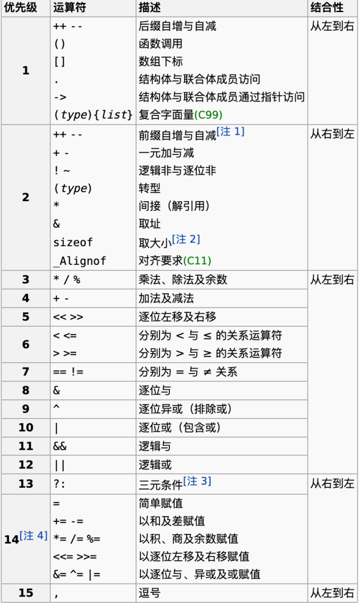
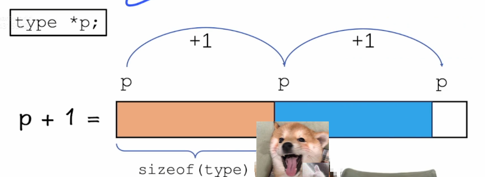

# C语言应试部分
## 环境配置
### Windows
- 相关软件安装
  - DEV CPP 6.7.5
    - 安装时，直接根据引导，走默认配置，即可安装成功
    - 安装后，软件配置
    ```
    工具 -> 编辑器选项 -> 更改tab缩进，改为自动计算缩进量，1个tab等于4个空格

    原因：不同的编译环境，tab键的宽度可能不同，为了让代码在不同的环境下显示不一样，因此统一改为一个tab等于4个space
    ```
    - 注意事项：如果后期发现，代码逻辑和程序执行结果不一致，在代码正确的情况下，删除之前生成的可执行程序，重新编译运行即可
### Linux
- 配置云主机
```bash
在购买云主机(Ubuntu2004)，安装好tabby，并实现远程连接之后

1. 执行以下命令，确保自己在root用户下执行命令
sudo -i

2. 执行下面的命令
apt update
apt upgrade -y
apt install wget -y
wget http://123.57.102.65/data/init_env.sh

3. 执行下面的命令，完成环境配置
bash init_env.sh
```

- 查看C语言使用方法
  - man手册
  ```bash
  man -f < C_command >

  man -K command # 查看带command关键字的命令

  # 在vim中直接查看man手册
  shift + [n]K # 默认n=1，查看第n章手册

  # 彩色man手册
  - 配置 ~.bashrc
  搜索：plugins
  插入新插件
  plugins=(... colored-man-pages)
  ```
  - tldr (too long don't read)
    - 更好用的命令手册，只能查询shell命令

## C语言参考
- 查询手册网站：`zh.cppreference.com`

## 编码规范

## 类型、运算符与表达式
### 类型与变量
#### 计算机中的数据存储方式
- 计算机存储数据的基本单位：字节（byte）

- 计算机中表示数据的基本单位：位（bit）
  - 1byte = 8bit
  - 一个整型数据(int)占4个字节，相当于需要4个连续的地址来存储一个整型数据，共32位
  ```
  系统会分配4个连续的字节来存储这个整型的值。每个字节有一个唯一的内存地址，所以这个整型变量的值将占据这四个连续地址
  ```
#### 整型
- 整型(int)
  - int -> 4个字节   
  - 占位符：%d
  - 大小：4字节，32位
  - 范围：-2^31(-2147483648) ~ 2^31-1(2147483647)
  - 计算机中表示整型数据的相关规则
  ```
  00000000 00000000 00000000 00000000

  1. 第一位是符号位
  2. 负数：补码表示法，即取反加1
  3. 补码的优势：
     把十进制的减法等价于二进制的加法
      7 - 2 = 7 + (-2)
     (0111) + (1110) 结果截断后4位：0101
  4. 所以在计算机中，不管是减法还是加法，本质上都是加法
  ```

- 整型(long long)
  - 格式占位符：%d
  - 大小：8字节，64位
  - 范围：-2^63 ~ 2^63-1

#### 浮点型
- 单精度浮点数(float)
  - 格式占位符：%f
  - 大小：4字节，32位
  - 有效数字：7位
  ```
  有效数字：从第一个非0数字开始算，一共多少位
  例如；0.000123  有效数字为3位
  ```

- 双精度浮点型(double)
  - 格式占位符：%lf
  - 大小：8字节，64位
  - 有效数字：15位

#### 字符型
- 字符型(char)
  - 格式占位符：%c
  - 大小：1字节，8位
  - 编码方式：ASCII编码
    - 字符到数字的对应关系：即：编码规则 
  - C语言中，字符用单引号括起来（例如：'a'）
  ```
  需记忆的知识点
  1. 'A' -> 65
  2. 'a' -> 97
  3. '0' -> 48
  ```

#### 示例：
```C
#include<stdio.h>
#include<inttypes.h>

int main() {
    int a = 123, b = 97, c, d;
    c = 100062;
    d = 9651;
    printf("%d %d %d %d\n",a,b,c,d);
    a = 2147483647 + 1;
    printf("%d\n",a);
    printf("INT32_MIN = %d\n", INT32_MIN);
    printf("INT32_MAX = %d\n", INT32_MAX);
    long long e;
    e = INT32_MAX + 1;
    printf("%lld\n", e);  //-2147483648
    // 疑问点1
    float f = e2 + 0.1;
    double ff = e2 + 0.123456789;
    double fff = e2 + 0.123456789;
    printf("float : %f\n", f);
    printf("double : %lf\n", ff); //2147483648.123457
    // 疑问点2
    printf("double : %.9lf\n",fff); //2147483648.123456955
    char g = 'a';
    printf("g = %c\n",g);
    printf("g = %d\n",g); // 97，用整型占位符表示字符
    printf("g + 5= %c\n", g + 5); // 'f'
    printf("sizeof(int) = %lu\n", sizeof(int)); // 4 sizeof()查看类型大小
    printf("sizeof(long long) = %lu\n", sizeof(long long)); //8
    printf("sizeof(float) = %lu\n", sizeof(float)); //4
    printf("sizeof(double) = %lu\n", sizeof(double)); //8
    printf("sizeof(char) = %lu\n", sizeof(char)); //1
    // %lu 是unsigned long int类型的占位符
    return 0;
}
```
- 疑问点1：变量e声明了长整型，为什么下面的公式命名结果不超范围，却没有得到准确的值
  - 答：因为计算机在计算下面公式`INT32_MAX + 1`的时候，默认将两个数按`int32_t`的类型进行的计算，计算出的结果，因为超出了int32_t的范围，因此得到`-2147483648`然后赋值给长整型`变量e`
  - 更改后代码
  ```C
  #include<stdio.h>
  #include<inttypes.h>

  int main() {
    long long e;
    e = 2147483647LL + 1;
    // 将其中一个数字标记为长整型
    // 如果一个公式中有个较大数据类型，那么计算规则就会按较大数据类型的进行计算
    printf("%d",e); //2147483648
  }
  ```
- 疑问点2：为什么`double ff`的值小数点后面只有6位：
  - 答：默认情况下，float和double在计算机中，小数点后只显示6位，如果想全部显示小数位，需要在` %f | %lf `前加`.n`，即`%.nf | %.nlf`
### 输出&输入函数
#### 输出函数
- printf函数
  - 头文件：<stdio.h>
  - 原型：int printf(const char *format,...);
    - format : 格式控制字符串
    - ... : 可变参数
    - 返回值：输出字符的数量

- 示例：
```C
#include<stdio.h>

int main() {
    int n1, n2;
    n1 = printf("hello world\n");
    printf("%d\n",'\n');
    int a = 123;
    n2 = printf("hello world: %d\n",a);
    printf("%d,%d\n",n1,n2);

    return 0;
}
```

#### 输入函数说明
- scanf函数
  - 头文件：stdio.h
  - 原型：int scanf(const char *format, ...);
  - format : 格式控制字符串
  - ... : 可变参数列表
  - 返回值：<font color=tomato>成功读入的参数个数</font>
    - 当scanf读到文件末尾，没有任何返回值时，返回-1
    - `printf("EOF=%d",EOF); // -1`
    - EOF的返回值也为-1
    - 在交互模式下，按ctrl+d也表示告诉计算机程序结束，后面所有scanf返回值都为-1
    - Linux和Mac中是ctrl+d; Windows中是ctrl+z

- 代码示例
```C
#include<stdio.h>

int main() {
    int a, b, n;
    n = scanf("%d%d",&a, &b); //'&' is address
    printf("a=%d,b=%d,n=%d\n",a,b,n);
    n = scanf("%dabc%d",&a, &b);
    printf("a = %d, b = %d, n = %d\n",a,b);
    printf("format scanf, input %%dabc%%d: ");
    n = scanf("%dabc%d",&a, &b);
    // input 124abc345
    printf("a = %d, b = %d, n = %d\n",a ,b ,n);
    // output a = 124, b = 345, n = 2
    return 0;
}
```

#### 扩展1：字符串
- 定义字符串
```C
#include<stdio.h>

int main() {
  // 给字符数组赋值
  // 方式1：
  char s[100] = "hello world";
  // 定义了一个能存储99个字符的字符串数组
  // 之所以是99，是因为字符串数组通常以\0结尾，所以是100-1
  printf("%s\n",s); // hello world

  // 方式2：
  scanf("%s",s);
  printf("scanf s : %s\n",s);
  // 输入：hello bilibili
  // 输出；hello
  // 原因：scanf遇到空格会截断
  return 0;
}
```
- 解决scanf读取字符数组遇空格截断的问题
```C
#include<stdio.h>

int main() {
  char s[100];
  scanf("%[^\n]",s);
  // %[],表示格式占位符集合，只有集合中的元素可以被读入到字符数组
  printf("s = %s\n",s);

  return 0;
}
```
- 字符串本质
```
当你声明了一个如 char s[100]; 的数组，无论你存储了什么数据，或者是否完全使用了数组的所有元素，这个数组分配的空间都是100个字节。数组 s 将占据100个连续的字节的内存空间，从 s[0] 到 s[99]。

在你声明数组之后，每个元素都会被分配存储空间，即使你没有显式地初始化它们。如果数组是自动存储类（在函数内部声明而没有用 static 修饰），那么它的元素默认是未初始化的，它们的值是未定义的，可以包含任何垃圾值。如果数组是静态或全局的，所有的元素将默认初始化为0。
```
#### 扩展2：sscanf & ssprintf
- sscanf
```C
#include<stdio.h>

int main() {
  char s[100] = "123 456 789";
  int a, b, c;
  sscanf(s,"%d%d%d", &a, &b, &c);
  // 从字符串中读取数据
  printf("a = %d, b = %d, c = %d\n",a,b,c);

  return 0;
}

// 输出：a = 123, b = 456, c = 789
```

- sprintf
```C
#include<stdio.h>

int main() {
  char str[100] = "192.168.1.245";
  int a, b, c, d;
  sscanf(str,"%d.%d.%d.%d", &a, &b, &c, &d); // 格式化读入
  sprintf(str,"%d:%d:%d:%d", a, b, c, d);
  // 将打印的值输入到str[100]数组中，而不会输出到屏幕上
  printf("str = %s\n",str);

  return 0;
}

// 输出：str = 192:168:1:245
```

- 总结：
  - sscanf 本质上是将字符串信息 --> 转换成 --> 其他类型信息
    - 上述示例(ip转换)中：将字符串信息转换为4个整型信息
  - sprintf 本质上是将其他类型信息 --> 转换成 --> 其他类型信息

####  扩展练习：
- 给输出的内容加一个漂亮的框框
```C
#include<stdio.h>

int main() {
  char s[100], t[100];
  scanf("%[^\n]", s);
  printf("%s\n", s);
  int n = 0;
  n = sprintf(t, "| %s |", s); // 得到上边沿的长度
  for (int i = 0; i < n; i++) printf("-");
  printf("\n");
  printf("| %s |\n",s);
  for (int i = 0; i < n; i++) printf("-");  
  printf("\n");

  return 0;
}
```
- 扩展中出现的提示
```C
p3.soild.c: In function ‘main’:
p3.soild.c:14:21: warning: ‘%s’ directive writing up to 99 bytes into a region of size 98 [-Wformat-overflow=]
   14 |   n = sprintf(t, "| %s |", s); // 得到上边沿的长度
      |                     ^~     ~
p3.soild.c:14:7: note: ‘sprintf’ output between 5 and 104 bytes into a destination of size 100
   14 |   n = sprintf(t, "| %s |", s); // 得到上边沿的长度
      |       ^~~~~~~~~~~~~~~~~~~~~~~

// 这个提示的含义是警告可能出现缓冲区溢出的风险
// 因为s[100]一共能保存0-99个字符
// sprintf(t,"| %s |",s);
// 这里s中的字符串+5（这里因为是接收一个字符数组，加上t本身一共是2个\0的截断字符）个字符返回给t，导致t最多可以存放5-104个字符
// 因此t[100]就可能出现溢出，建议改为t[105],此时就不会出现报错
```
### 运算符与表达式
#### 算术运算符
- 重点：`除法`
  - 向0取整
  ```C
  #include<stdio.h>

  int main() {
    int a = 7, b = 2;
    printf("%d",a/b); // 3
    printf("%d",(-a)/2); // -3
  }
  ```
  
#### 位运算
- 按位与 '&'
```C
0110
1011
---- &(都为1，结果才为1)
0010

// 总结：按位与运算：遇1不变，遇0归0
```
- 按位或 '|'
```C
0110
1011
---- &(都为0，结果才为0)
1111

// 总结：按位或运算：遇0不变，遇1归1
```
- 异或 '^'
```C
0110
1011
---- ^(相同为0，不同为1)
1101

// 总结：异或运算：统计相应二进制位上1的奇偶性
// 总结2：异或运算：自己是自己的逆运算
// a ^ b = c; a ^ c = b; b ^ c = a(即，任意两个数可以得到第三个数)
```
- 异或运算的扩展应用：两数交换
```C
// 两数交换
a ^= b; b ^= a; a ^= b; 
```
- 取反 '~'
```C
a = 101
~a = 010 

//用法：原码取反+1 = 负数
```
- 应用2：取得二进制中最后一位1的位权
```C
示例：
原数：01011001000
负数：10100111000（取反+1）
------------------------- & 按位与计算
得到：00000001000

// 成功得到最后一个1的位权
```
- 左移 '<<'
```
向左移位，末尾补0

// 相应的数字*2
```
- 右移 '>>'
```
向右移位，末尾补符号位

// 相应的数字/2（向下取整）
// 比如：a = -5; a >> 1 = -3
```
#### 运算符优先级

- 结合性：
  - 即同等级运算符情况下的计算顺序
- 示例：
```C
#include<stdio.h>

int main() {
  int a = 1, b = 2, c = 3, d = 4;
  a = b = c = d; // a = 4, b = 4, c = 4, d = 4
  // 从右到左，依次赋值
  return 0;
}
```

#### 常用数学函数库
- 头文件：math.h

- pow:指数函数
  - 头文件：math.h
  - 原型：`double pow(double a, double b);`
  - a: 底数
  - b: 指数
  - 返回值: 返回a^b的结果
  - 例子：`pow(2,3) = 8`

- sqrt: 开平方函数
  - 头文件: math.h
  - 原型: double sqrt(double x);
  - x: 被开放数
  - 返回值: 返回x^1/2的结果
  - 例子：sqrt(16) = 4

- ceil: 向上取整
  - 头文件: math.h
  - 原型: double ceil(double x);
  - x: 某个实数
  - 返回值: 返回[x]的结果
  - 例子: ceil(4.1) = 5

- floor: 向下取整
  - 头文件: math.h
  - 原型: double floor(double x);
  - x: 某个实数
  - 返回值: 返回[x]的结果
  - 例子: floor(-4.6) = -5

- abs: <font color=tomato>整数</font>绝对值函数
  - 头文件: stdlib.h
  - 原型: int abs(int x);
  - x: 某个整数
  - 返回值: 返回|x|的结果
  - 例子：abs(-4) = 4
  - 注意: <font color=tomato>x的取值必须是整数</font>

- fabs: 实数绝对值函数
  - 头文件: math.h
  - 原型: double fabs(double x);
  - x: 某个实数
  - 返回值: 返回|x|的结果
  - 例子: fabs(-4.65) = 4.65

- acos: 角度余弦值换算弧度值
  - 头文件: math.h
  - 原型: double acos(double x);
  - x: 角度的余弦值
  - 返回值: 以弧度值返回arccos(x)的结果
  - 例子：acos(-1) = 3.1415926...
  - 应用：使用acos可以得到精确的PI值，180°的余弦是-1，对应的弧度是PI
### 实战题
- HZOJ已提交

## 控制流
### 短路原则
- 概述：通过前面的表达式就可以确定整体表达式的值，就不再计算后面的表达式

- 短路表达式的合法性：即&&，||，左右两边的表达式能判断boolean值即可

- 示例：
```C
#include<stdio.h>

int main() {
    int a, b;
    scanf("%d%d", &a, &b);
    a < b && printf("YES\n");
    a < b || printf("NO\n");

    return 0;
}
```

### 分支结构
#### if语句
- 基础用法示例：
```C
#include<stdio.h>

int main() {
    int n;
    scanf("%d", &n);
    if (n == 0) printf("HEHE\n");
    else if (n > 0 && n < 60) printf("FALL\n");
    else if (n >= 60 && n < 75) printf("MEDIUM\n");
    else if (n >= 75 && n <= 100) printf("GOOD\n");
    else printf("It's Wrong\n");
    return 0;
}
// 注意：if (表达式) 不加大括号的前提下，只能执行“一条语句”
```
- if (表达式) 后跟复合语句示例
```C
if (表达式) {
    代码段;
}
```
```C
if (表达式) {
    代码段;
} else {
    代码段：
}
```
```C
if (表达式1) {
    代码段1;
} else if (表达式2) {
    代码段2;
} else {
    代码段3;
}
```

#### switch case 语句
- 基础结构示例
```C
switch (a) {          // a 为表达式
  case v1: 代码块1;   // v1 为值
  case v2: 代码块2;   // v2 为值
  case v3: 代码块3;   // v3 为值
  ...
  default: 代码块n;
}
// 每个代码块以break;结束
```
- 代码示例：
```C
#include<stdio.h>

int main() {
    int a;
    scanf("%d", &a);
    switch (a) {
        case 1: printf("case a = 1\n"); break;
        case 2: printf("case a = 2\n"); break;
        case 3: printf("case a = 3\n"); break;
        case 4: printf("case a = 4\n"); break;
        default: printf("default value\n"); break;
    }
    return 0;
}
```
- 综合示例（判断某年某月天数）：
```C
#include<stdio.h>

int main() {
    int y, m;
    scanf("%d%d", &y, &m);
    switch (m) {
        case 1:
        case 3:
        case 5:
        case 7:
        case 8:
        case 10:
        case 12: printf("31\n"); break;
        case 2: {
            if ((0 == y % 4 && y % 100 != 0) || (0 == y % 400)) {
                // 闰年
                printf("29\n");

            } else {
               // 不是闰年
                printf("28\n");
            }
        }
        break;
        case 4:
        case 6:
        case 9:
        case 11: printf("30\n"); break;
        default: printf("error\n"); break;
    }
    return 0;
}
// 在C语言中, case不支持多选一
```
- 综合示例（判断某年某月天数）解法2：
```C
#include<stdio.h>

int main() {
    int y, m, a;
    scanf("%d%d", &y, &m);
    a = (y % 4 == 0 && y % 100) || y % 400 == 0; // 重点
    if (m == 1 || m == 3 || m == 5 || m == 7 || m == 8 || m == 10 || m == 12) {
        printf("31\n");
    } else if (m == 4 || m == 6 || m == 9 || m == 11) {
        printf("30\n");
    } else {
        printf("%d\n", 28 + a);
    }
    return 0;
}
```

#### CPU的分支预测
- 知识点1：逻辑值的归一化
```C
!!(x)  // 无论x值为多少，经过两次！，值都为1

#define likely(x)
// __builtin_expect(!!(x), 1)，
// 1是告诉CPUx的值大概率为真，优先把x作为真值去计算
#define unlikely(x)
// __builtin_expect(!!(x), 0)
// 0是告诉CPUx的值大概率为假
// likely 代表x经常成立
// unlikely(x) 代表x不经常成立
```
- 知识点2：CPU执性一条语句的5个步骤解析
```
对于程序中的每一条语句的执行
对应到CPU内部，就是CPU在执行这条语句
CPU执行一条语句需要5个步骤：
1. F(Fetch)     
取指
意义：取指阶段涉及从内存中读取指令。CPU 使用程序计数器（Program Counter, PC）来跟踪当前正在执行的指令的内存地址。
运行方式：程序计数器指向下一条要执行的指令。CPU 读取这个地址上的数据，这些数据就是要执行的指令。读取完成后，程序计数器更新为下一条指令的地址。

1. D1(Decode 2) 译码器是CPU的组件之一
译码阶段1
意义：译码阶段涉及解析取出的指令，确定它是什么操作并了解所需的操作数。
运行方式：指令被送往译码器，译码器分析指令的各个部分，如操作码（OpCode，指示执行何种操作）和操作数地址。

1. D2（D2, Decode 2 或 Operand Fetch）
译码阶段2-操作数读取
意义：这个阶段是为了从寄存器或内存中获取指令操作的数据。
运行方式：CPU 根据译码阶段确定的地址，从寄存器文件或内存中读取操作数。这些操作数是执行指令所需的数据。

1. EX （Execute） 
执行
执行（EX）阶段：执行阶段是流水线中的一个关键步骤，此时 ALU 或其他专用硬件执行实际的操作。具体来说，这可能包括算术运算、逻辑运算、地址计算、数据比较等。例如，如果指令是一个加法指令，ALU 将完成加法运算；如果是一个分支指令，可能涉及到比较运算并根据结果改变程序计数器的值。

控制信号：控制单元在 EX 阶段发出的控制信号确保 ALU 执行正确的运算，并确保数据从正确的源（如寄存器或内存）传送到 ALU，并将运算结果传送到正确的目的地。

控制单元的角色：在整个指令执行过程中，控制单元（Control Unit, CU）负责解释指令并生成相应的控制信号。这些控制信号决定了 CPU 的其他部件如何响应当前执行的指令。

编译器的角色：编译器在程序被执行之前起作用，它负责将高级语言代码转换成机器指令。在指令被执行时，编译器的工作已经完成，此时 CPU 正在执行编译器生成的机器指令。

5. WB  
写回
意义：写回阶段涉及将执行结果写回到寄存器或内存。
运行方式：执行的结果（如计算的数据或处理的状态信息）被写回到指定的寄存器或内存地址中，以便后续指令使用。

```
- 总结现代 CPU 中的指令处理流程
  - <font color=tomato>指令取出</font>：程序计数器（PC）指向下一条将要执行的指令的内存地址。CPU 根据这个地址从内存中取出指令并将其存储到指令寄存器（IR）中。
  - <font color=tomato>指令译码：</font>译码器接收来自指令寄存器的指令，并解析这条指令以确定其操作码（Opcode）、操作数地址、寄存器编号等。这个过程涉及识别指令要执行的操作类型和所涉及的数据。
  - <font color=tomato>控制信号生成：</font>控制单元接收到译码器解析后的指令信息，并生成相应的控制信号。这些控制信号协调 CPU 内部的数据流动，管理 ALU 的操作，并控制 CPU 与内存、输入/输出设备的交互。
  - <font color=tomato>指令执行：</font>根据控制单元的指令，ALU 或其他处理单元执行计算或其他操作。这可能涉及从寄存器或内存读取数据、执行算术或逻辑运算、以及将结果写回寄存器或内存。
  - <font color=tomato>重复过程：</font>一旦当前指令执行完毕，PC 更新为下一条指令的地址，CPU 重复上述过程，继续执行程序中的下一条指令。

- 知识点3：流水线操作：
```
如果向CPU的运行过程的5个阶段，假设为相同的单位时间，那么
| F | D1 | D2 | EX | WB |
    | F | D1 | D2 | EX | WB |
        | F | D1 | D2 | EX | WB |
            | F | D1 | D2 | EX | WB |
                | F | D1 | D2 | EX | WB | 
以这种方式，更有效率的对多条语句进行并行操作
```
- 知识点4：分支预测
- 分支预测的详细说明
  - <font color=tomato>遇到分支指令：</font>
    - 当 CPU 执行到一个分支指令（如 if 语句）时，此时条件表达式的结果可能还未知。但由于指令流水线的设计，CPU 需要知道下一步执行哪条指令。
  - <font color=tomato>分支预测：</font>
    - CPU 使用分支预测器来预测分支将如何解决（即条件表达式的结果是真还是假）。基于这个预测，它决定接下来执行哪条指令的地址。
  - <font color=tomato>继续执行：</font>
    - 如果分支预测为真（即预测条件为满足），CPU 将继续执行if块中的指令；如果预测为假，则跳过if块。在这个过程中，CPU 不会等待条件表达式的实际计算结果，而是继续执行其预测的路径。
  - <font color=tomato>实际条件表达式结果：</font>
    - 一旦条件表达式的实际结果计算出来，CPU 会检查其预测是否正确。
  - <font color=tomato>预测正确或错误：</font>
    - 如果预测正确，那么流水线中已经执行的操作是有效的，CPU 将继续执行。
    - 如果预测错误，CPU 需要撤销或丢弃自预测点以来执行的所有操作，并从正确的分支重新开始执行。

```
CPU以流水线模式执行指令时
当遇到分支语句
在if后面的表达式的值还没执行时，根据CPU的流水线操作流程，PC指向下一指令的内存地址，此时由于未得到表达式的值，因此需要CPU提前对结果进行预测，来控制PC执行下一条指令的内存地址的值

当表达式的值计算出来后，如果预测错误，则之前的执行作废，重新在正确的结果进行语句执行

而下面的代码，就是人工告诉CPU，来增加CPU分支预测的准确率，从侧面提高CPU的运行效率

#define likely(x)
// __builtin_expect(!!(x), 1)，
// 1是告诉CPUx的值大概率为真，优先把x作为真值去计算
#define unlikely(x)
// __builtin_expect(!!(x), 0)
// 0是告诉CPUx的值大概率为假，优先把x作为假值去计算
// likely 代表x经常成立
// unlikely(x) 代表x不经常成立
```

### 循环结构
#### while 语句
- 基础语法示例：
```C
while (expression) {
    code block;
}
// 先判断在执行
```
```C
do {
    code block;
} while (expression);
// 先执行在判断，至少执行一次
```
- 代码示例（判断数字位数）
```C
#include<stdio.h>

int main() {
    int n, m = 0;
    scanf("%d", &n);
    do {
        n /= 10;
        ++m;
    } while (n); // 考虑0，所以不能直接使用while(){}
    printf("%d\n", m);
}
```
- 代码示例：
```C
#include<stdio.h>

int main() {
    int x;
    while (scanf("%d", &x) != EOF) {
      // EOF表示程序执行过程中，按ctrl+d,程序返回的值，通常值为-1
        printf("2 * x = %d\n", x);
    }

    return 0;
}
```

#### for 语句
- 语法结构
```C
for (初始化; 循环条件; 执行后操作) {
    代码块;
}
```
- for语句永久执行：
```C
for (;;) {
  // code block;
}
// 等同于
while (true) {
  // code block;
}
```
- 示例代码（f0 = 1,f1 = 1）求斐波那契数列
```C
#include<stdio.h>

int main() {
    int n = 0;
    int first = 1, second = 1, next;
    scanf("%d", &n);
    printf("%d\n", 1);
    printf("%d\n", 1);
    for (int i = 0; i < n - 2; i++) {
        next = first + second;
        first = second;
        second = next; 
        printf("%d\n", next);
    }

    return 0;
}
```

#### break 和 continue
- break 语句
  - 跳出switch-case语句
  - 跳出最近的一层循环

- continue 语句
  - 结束本次循环，继续下一次循环


#### goto 语句
- 基础语法结构
```C
goto lab_1;
    code block1;
lab_1:
    code block2;

// 跳转到lab_1标记处，code block1被跳过，直接执行block2
```
- 示例：
```C
#include<stdio.h>

int main() {
    goto lab_1;
    printf("hello world\n");
lab_1:
    printf("hello Harbin\n");

    return 0;
} // result: hello Harbin
```
- 问题1：
```C
#include<stdio.h>

int main() {
    goto lab_2;
    int a = 0, b = 0;
    scanf("%d%d", &a, &b);
lab_2:
    printf("%d\n", a * b);

    return 0;
} // 不报错，但结果不可知

// 在使用goto语句跳过变量声明时，变量的定义可以在后续使用
// 但是初始值，和赋值行为不会执行
```
- 示例：使用goto模拟if分支语句(脱裤子放屁)
```C
#include<stdio.h>

int main() {
    int n, x;
    scanf("%d", &n);
    n & 1 && ({
        goto if_stmt;
        1;
    });
    n & 1 || ({
        goto else_stmt;
        1;
    });
// &&两边必须是有返回值的表达式
// {}将多条语句合并成一条复合语句
// ()将复合语句转换为表达式
if_stmt:
    printf("%d is odd\n", n);
    goto if_end;
else_stmt:
    printf("%d is even\n", n);
if_end:
    return 0;
}
```
- 示例：使用goto模拟while
```C
#include<stdio.h>

int main() {
    int n, i = 0;
    scanf("%d", &n);
start:
    if (i < n) {
        printf("%d ", ++i);
        goto start;
    } else {
        goto end;
    }
end:
    printf("\n");
    return 0;
}
```
- 示例：使用goto模拟for
```C
#include<stdio.h>

int main() {
    int n = 0;
    scanf("%d", &n);
    int i = 1;
for_1:
    goto for_2;
for_2:
    if (i <= n) goto for_4;
    else goto for_end;
for_3:
    i++;
    goto for_2;
for_4:
    if (i % 3 == 0) goto for_3;
    else printf("%d ", i);
    goto for_3;
for_end:
    return 0;
}
```
### 重识一条语句
- 分类
  - 复合语句
    - { statement; }
  - 表达式语句
    - expression;
  - 选择(分支)语句
    - if-else
    - switch-case
  - 循环语句
    - while / do-while
    - for
  - 跳转语句
    - return 跳出当前函数
    - break 跳出当前循环
    - continue 跳出本次循环
    - goto 跳到标识处
  - 空语句
    - ;

## 函数与程序结构
### 作用域
```C
#include <stdio.h>

int main() {
  int a = 1, b = 2;
  for (int i = 0; i < 10; i++) {
    int c = 1, d = 2;
    int a = 3, b = 4;
    printf("a = %d, b = %d\n", a, b); // a = 3, b = 4
  }
  printf("%d %d\n", c, d); // 报错，外部变量无法使用子作用域的变量c，d
  printf("a = %d, b = %d\n", a, b); // a = 1, b = 2
  return 0;
}
```
- 作用特点：
  - 内部子作用域的变量，不能被外部访问
  - 外部变量可以被子作用域访问
  - 如果有外部作用域声明的变量和子作用域的变量相同，在子作用域中优先访问子作用域的变量

### 函数的定义与使用
- 基本结构


```C
// 返回值 函数名(参数列表) 函数体

#include <stdio.h>

int sum(int a, int b) {
  return a + b;
}
```
- 说明
  - 返回值：表示当前函数返回的值的类型
  - 函数名：使用函数的时候调用的函数名
  - 参数列表：表示当前函数可以传入的参数数量和参数的数据类型
  - 函数体：函数的整体逻辑

- 关于调用数学函数库的扩展
```
/usr/bin/ld: /tmp/ccczz8V9.o: in function `select_function':
2.function-1.c:(.text+0x44): undefined reference to `sqrt'
collect2: error: ld returned 1 exit status

sqrt 函数是用于计算平方根的标准函数，它定义在 <math.h> 头文件中，并且在链接时需要链接数学库 libm。

要解决这个问题，你需要确保在编译时包含了数学库。如果你使用的是 gcc 或者类似的编译器，可以在编译命令中加入 -lm
```

### 实参与形参
- 形参（Formal Parameters）
  - 形参是在函数定义中声明的变量，用于接收从函数调用处传递过来的值。
  - 在函数调用时，形参在<font color=tomato>栈</font>上分配空间。栈是一种后进先出的内存结构，<font color=tomato>专门用于处理函数调用</font>。
  - 形参的生命周期限制在函数的执行期间。函数执行结束后，这些局部变量（形参）所占用的栈内存会被释放。
  - 形参相当于函数内的局部变量，每次函数调用时都会重新创建。

- 实参（Actual Arguments）
  - 实参是在函数调用时传递给函数的具体值。它们可以是常量、变量、表达式或函数调用的结果。
  - 实参的存储位置取决于它们本身的类型和声明。局部变量作为实参时存储在栈中，全局变量存储在全局存储区，而动态分配的变量存储在堆中。
  - 实参的生命周期不由函数调用决定，而是取决于它们的声明周期。例如，一个全局变量作为实参，其生命周期覆盖整个程序执行过程。

- 参数传递
  - 当函数被调用时，实参的值被传递给形参。这个过程可以通过值传递（传递值的副本）或引用/指针传递（传递地址）来完成。
  - 通过值传递时，形参获得实参值的<font color=tomato>副本</font>，对形参的任何修改都不会影响原始实参。
  - 通过引用或指针传递时，形参可以直接访问和修改实参指向的内存。

- 函数调用栈
  - 在函数调用的过程中，每个函数调用都有自己的栈帧，用于存储局部变量（包括形参）和其他函数调用信息。
  - 栈帧的创建和销毁是自动进行的，确保了函数调用的隔离性和局部变量的封闭性。

### 函数的声明和定义
```C
#include<stdio.h>

int a_func(int); // 函数声明，多参数声明：int sum(int, int);
int b_func(int);

int main() {
  b_func(3);
  return 0;
}

int b_func(int x) {  // 函数定义
  switch (x) {
    case 1: printf("%d\n", 3 * x); break;
    case 2: return a_func(x)
  }
  return 0;
}

int a_func(int x) {
  switch (x) {
    case 1: return b_func(x);
    case 2: printf("%d\n", x + x); break;
  }
  return 0;
}
```
- 在设计函数的时候，声明和定义的分开，可以更清晰的组织代码逻辑
- 调用函数之前，不一定需要函数定义，但至少要声明该函数

### 递归函数
- 概述：
  - 自己调用自己的函数
  
#### 阶乘
- 代码示例(阶乘)
```C
#include<stdio.h>

// 阶乘函数
int f(int n) {
  if (n == 1) return 1;
  return n * f(n -1); 
}

int main() {
  int n;
  while (~scanf("%d", &n)) {
    printf("f(%d) = %d\n", n, f(n));
  }
  return 0;
}
```

#### 斐波那契数列
- 代码示例（斐波那契数列）
```C
#include<stdio.h>
int f(int n) {
  if (n == 1 || n == 2) return 1;
  return f(n -1) + f(n -2);
}
```

#### 欧几里得算法
- 算法概要：
```
整数a, b的最大公约数一般表示为 gcd(a, b)
欧几里得算法：gcd(a, b) = gcd(b, a % b)

证明1：b和a%b的最大公约数，是a和b的公约数
证明2：b和a%b的最大公约数，也是a和b的最大公约数
```
- 代码展示
```C
#include<stdio.h>

int gcd(int a, int b) {
    if (b == 0) return a;
    return gcd(b, a % b);
}

int main() {
    int a, b;
    while (scanf("%d%d", &a, &b) != EOF) {
        printf("gcd(%d, %d) = %d\n", a, b, gcd(a, b));
    }

    return 0;
}
```

#### 递归函数的设计
- 数据归纳法
  - Step1：验证 P(1) 成立
  - Step2：证明如果 P(K) 成立，那么 P(K+1) 也成立
  - Step3：联合Step1与Step2，证明由P(1) -> P(n) 成立

- 示例：
```
证明：1 + 3 + ... + (2n - 1) = n ^ 2

Step1：
P(1) = 1 = 1 ^ 2  -> P(1) 成立
Step2：
证明n的前一项的奇数和 + 后一项 = n^2
(n - 1) ^ 2 + (2n - 1) = n ^ 2
表达式展开：
公式成立

Step3：
因为Step1成立，同时Step2也成立，所以 Step3成立
```

- 递归函数设计的三个重要部分
  - 重要：给【递归函数】一个明确的语义
  - 实现边界条件时的程序逻辑 -> P(1)
  - 假设递归函数调用返回结果是正确的，实现本层函数逻辑 P(K) -> P(K + 1)

- 重识阶乘
```C
#include<stdio.h>

int f(int n) {             // f(n) 代表 n 的阶乘结果
  if (n == 1) return 1;    // 边界条件：n == 1，即P(1) = 1
  return f(n -1) * n;      // 构造P(K) = P(K + 1)
}
```

#### 扩展欧几里得算法
- 贝祖等式：
```
ax + by = gcd(a, b) = c

a, b均为整数，一定存在一组整数解（x,y），使得上述等式成立、

推导过程：(由欧几里得算法推得)
GCD：(a, b) -> (b, a%b) -> ... (c, 0) 即套用到ax = by
则：得到边界条件：x = 1, y = 0
```
- 代码实现
```C
#include<stdio.h>

int x, y, nx, ny;

int ex_gcd(int a, int b) {
    if (b == 0) {
        x = 1, y = 0;
        return a;
    }
    int c = ex_gcd(b, a % b);
    nx = y;
    ny = x - a / b * y;
    x = nx, y = ny;
    return c;
} 


int main() {
    int a, b;
    while (scanf("%d%d", &a, &b) != EOF) {
        int c = ex_gcd(a, b);
        printf("%d * %d + %d * %d = %d\n", a, x, b, y, c);

    }
    return 0;
}
```
- 执行过程解析
```
递归调用时的栈帧：

当 main 函数递归调用自身时，每次调用都创建了一个新的栈帧。
在每个栈帧中，局部变量 n 被初始化为当时 cnt 变量的值。
这些栈帧在内存中是层叠的，每一个都独立于其他。
回溯过程中的执行：

当达到递归的基本情况（在这个例子中是 n == 1）并且开始回溯时，每一层的栈帧依次被销毁。
在每个栈帧被销毁之前，执行该栈帧中 main() 调用后的 printf("%d\n", n); 语句。
由于每个栈帧的 n 都是独立的，所以它们保持了各自被赋值时的状态，因此打印的是每次递归调用时 n 的值。
最终结果：

这就导致了最终打印的是从 1 到 10 的序列，每个数字对应一个递归层级中 n 的值。
因此，正如您所说，在递归过程中，每次 n 的值都存储在不同的栈帧中，然后在回溯过程中，每次递归层级结束后，使用该层级的栈帧中的 n 的值执行 printf 语句。这就是为什么您在输出中看到了逐渐增加的数值序列。
```

### 变参函数
- 示例：
```
实现可变参数max_int, 从若干个传入的参数中返回最大值
int max_int(int a, ...);

如何获得a往后的参数列表？ 
va_list 类型的变量

如何定位a后面第一个参数的位置？
va_start 函数

如何获取下一个可变参数列表中的参数？
va_arg 函数

如何结束整个获取可变参数列表的动作？
va_end 函数
```
- 代码展示
```C
#include<stdio.h>
#include<stdarg.h>
#include<inttypes.h>

int max_int(int n, ...) {
    va_list args;
    va_start(args, n);  // 初始化变参列表args这个变量，args这个变量的值是n
    // 这个变量后面的参数,作用是定位，第二个参数n，后面得就开始是变参列表得值
    int ans = INT32_MIN;
    for (int i = 0; i < n; i++) {
        int a = va_arg(args, int); // 依次获取变参列表args的值，通过va_args()传递给a，第二个参数表示值得类型
        if (a > ans) ans = a;
    }
    va_end(args); // 关闭变参列表得处理
    return ans;
}
int main() {
    printf("max_int(3,8,7,9) = %d\n", max_int(3, 8, 7, 9));
    printf("max_int(2,8,7,9) = %d\n", max_int(2, 8, 7, 9));
    return 0;
}
```

- 扩展问题：如何使用变参列表，实现自己得printf函数

### 主函数的参数
```C
int main();

int main(int argc, char *argv[]);

int main(int argc, char *argv[], char **env);
```
- 主函数2-参数详解：
  - argc：表示命令行中参数的个数
  - argv[]：命令行中argv的参数
  ```C
  #include<stdio.h>

  int main(int argc, char *argv[]) {
      printf("argc = %d\n", argc);
      for (int i = 0; i < argc; i++) {
          printf("argv[%d] = %s\n", i, argv[i]);
      }
      return 0;
  }

  // 执行：./10.main-2.exe hello world 
  // 输出：
  //argc = 3
  //argv[0] = ./10.main-2.exe
  //argv[1] = hello
  //argv[2] = world

  // 执行：./10.main-2.exe "hello world" 
  // 输出：
  //argc = 2
  //argv[0] = ./10.main-2.exe
  //argv[1] = hello world
  ```

  ```C
  #include<stdio.h>
  #include<string.h>

  int main(int argc, char *argv[]) {
      if (strcmp(argv[0], "./bilibili") != 0) {
          // strcmp(x,y) 比较两个字符串的值，
          // 如果x > y 返回正值，如果相等，返回0，如果x < y 返回负值
          printf("wrong call, please call: ./bilibili\n");
          return 0;
      }

      printf("right call\n");
      printf("argc = %d\n", argc);
      for (int i = 0; i < argc; i++) {
          printf("argv[%d] = %s\n", i, argv[i]);
      }
      return 0;
  }
  ```
- 主函数3 - 参数详解：
  - char **env：存储环境变量
  ```C
  #include<stdio.h>
  #include<string.h>

  int main(int argc, char *argv[], char **env) { // 涉及指针的知识
      int flag = 0;
      for (char **p = env; p[0]; p += 1) {
          if (strcmp(p[0], "LOGNAME=mystical1") == 0) {
              flag = 1;
              break;
          }
      }
      if (flag == 0) {
          printf("error log name, please use mystical1\n");
          return 0;
      }
      printf("argc = %d\n", argc);
      for (int i = 0; i < argc; i++) {
          printf("argv[%d] = %s\n", i, argv[i]);
      }
      return 0;
  }
  ```

## 指针与数组
### 地址
- 计算机中的数据存储
  - 地址：每个字节都有自己的地址，地址的单位是和字节绑定的
  - 示例：
  ```
  int a
  对于整型变量a来说，占32位，4个字节，所以有4个地址
  &a
  a的地址用4个地址中，最开头的第一个地址指代整型变量a的地址
  ```

- 取址符：`&`
  - 用于取一个变量的地址，例如：`&a`
  - 地址的格式占位符`%p`
  - 代码示例
  ```C
  #include<stdio.h>

  int main() {
      int a = 123;
      printf("&a = %p\n", &a);
      return 0;
  }

  // 输出：&a = 0x7ffcbcc7c5d4
  ```

- 十六进制  
  - 十六进格式占位符：`%x`、`%X`
  - 区别：
    - `%x`表示的十六进制数a-f采用小写
    - `%X`表示的十六进制数A-F采用大写
  - 代码演示
  ```C
  #include<stdio.h>

  int main() {
      int a = 0x6a;
      printf("a(10) = %d\n", a);
      printf("a(16) = %x\n", a);
      printf("a(16) = %X\n", a);
      int b = 0x7fffffff;
      printf("MAX_INT : %d\n", b);
      int c = 0x80000000;
      printf("MIN_INT : %d\n", c);
      printf("input hex : ");
      scanf("%x", &a);
      printf("a(10) = %d\n", a);
      printf("a(16) = %x\n", a);
      printf("a(16) = %X\n", a);
      return 0;
  }
  // a(10) = 106
  // a(16) = 6a
  // a(16) = 6A
  // MAX_INT : 2147483647
  // MIN_INT : -2147483648
  ```

- 地址的长度
```C
#include<stdio.h>

int main() {
    int a;
    double b;
    char c;
    printf("sizeof(int &) = %lu\n", sizeof(&a));
    printf("sizeof(double &) = %lu\n", sizeof(&b));
    printf("sizeof(char &) = %lu\n", sizeof(&c));
    return 0;
}

// sizeof(int &) = 8
// sizeof(double &) = 8
// sizeof(char &) = 8
// 由此得出，地址占8个字节，是64位二进制
```

- 32位和64位系统的区别
  - 32位系统，最大4GB内存，即2^32个字节
  - 在32位系统中，地址是32位的二进制数字，则最多有2^32个地址
  - 因为地址是32位的二进制数字，因此最多能标记2^32个字节，因此最大只能有4GB的内存
  - 在64位系统的，每个地址由64位数字的二进制表示


### 数组
#### 数组的声明与定义
```C
#include<stdio.h>

int main() {
    int a[10]; // a[0] ~ a[9]
    for (int i = 0; i < 10; i++) {
        a[i] = 2 * i;
    }
    for (int i = 0; i < 10; i++) {
        printf("a[%d] = %d\n", i, a[i]);
    }

    return 0;
}

// a[0] = 0
// a[1] = 2
// a[2] = 4
// a[3] = 6
// a[4] = 8
// a[5] = 10
// a[6] = 12
// a[7] = 14
// a[8] = 16
// a[9] = 18
```

#### 可变长数组
```C
#include<stdio.h>

void test1() {
    int a[10]; // a[0] ~ a[9]
    for (int i = 0; i < 10; i++) {
        a[i] = 2 * i;
    }
    for (int i = 0; i < 10; i++) {
        printf("a[%d] = %d\n", i, a[i]);
    }

    return ;
}

void test2() { // 可变长数组
    int n;
    printf("input n: ");
    scanf("%d", &n);
    int a[2 * n];
    for (int i = 0; i < 2 * n; i++) {
        a[i] = 3 * i;
    }
    for (int i = 0; i < 2 * n; i++) {
        printf("a[%d] = %d\n", i, a[i]);
    }

}

int main() {
    test1();
    test2();
    return 0;
}
```

#### 数组初始化
```C
void test3() {
  int a[5];
  for (int i = 0; i < 5; i++) {
      printf("a[%d] = %d\n", i, a[i]);
  } // 打印未初始化的数组
  return ;
}
```
- 当不对数组初始化的情况下，数组中的值是不确定的

```C
void test3() {
  int a[5] = {0}; // 对数组中的所有数组初始化为0
  for (int i = 0; i < 5; i++) {
      printf("a[%d] = %d\n", i, a[i]);
  } 
  return ;
}
```
- 当对数组初始化的时候，当大括号中填0的时候，数组中的所有值都初始化为0
- 当在大括号中填写非0值得时候，只有第一个值变成大括号中得值

```C
void test3() {
  int a[5] = {1，2，3，4，5}; // 分别对数组中得元素进行初始化
  for (int i = 0; i < 5; i++) {
      printf("a[%d] = %d\n", i, a[i]);
  } 
  return ;
}
```

```C
void test5() {
  int a[] = {1,2,3,4,5,6,7};
  printf("sizeof(a) / sizeof(int) = %lu\n", sizeof(a) / sizeof(int)); // 用a占用得字节大小 / 整型占用得字节大小
  // 可以计算出数组a里共有几个整型数据
  printf("%p\n", a);
  printf("a[0] = %p\n", &a[0]);
  for (int i = 0; i < 7; i++) {
    printf("&a[%d] = %p\n", i, &a[i]);
  }
  return ;
}

// 返回 sizeof(a) / sizeof(int) = 7
```

- 数组的名字：代表整个数组的首地址
```C
int main() {
  test5();
  return 0;
}
// 0x7ffe85700c80
// a[0] = 0x7ffe85700c80
// &a[0] = 0x7ffe85700c80 // 因为整型数据4个字节
// &a[1] = 0x7ffe85700c84 // 因此每个元素的内存地址差4
// &a[2] = 0x7ffe85700c88
// &a[3] = 0x7ffe85700c8c
// &a[4] = 0x7ffe85700c90
// &a[5] = 0x7ffe85700c94
// &a[6] = 0x7ffe85700c98
```

#### 扩展算法-素数筛
- 基本思想：
  - 标记一个范围内的数组是否是合数，没有被标记的则为素数
  - 算法的空间复杂度为O(N)，时间复杂度为O(N*loglogN)
  - 总体思想是用素数去标记掉不是素数的数字，例如我知道了i是素数，那么2 * i、3 * i...就都不是素数

- 算法过程：
  - 用prime[i]来标记i是否是合数
  - 标记为1的数字为合数，否则为素数
  - 第一次知道2是素数，则将2的倍数标记为1
  - 向后找到第一个没有被标记的数字i
  - 将i的倍数全部标记为合数
  - 重复4-6步，知道标记完范围内的所有数字

- 基本代码实现
```C
#include<stdio.h>

int prime[100] = {0};

/*
 * 基本素数筛算法
void init_prime(int n) {
    prime[0] = prime[1] = 1;
    for (int i = 2; i <= n; i++) {
        if (prime[i]) continue;
        for (int j = 2 * i; j <=n; j += i) {
            prime[j] = 1;
        }
    }
    return ;
}
*/

void init_prime(int n) {
    prime[0] = prime[1] = 1;
    for (int i = 2; i * i <= n; i++) { // 优化1 i -> i * i
        if (prime[i]) continue;
        printf("%d is prime : ", i);
        for (int j = i * i; j <=n; j += i) { // 优化2 i * 2 -> i * i
            prime[j] = 1;
            printf(" %d", j);
        }
        printf("\n");
    }
    return ;
}


int main() {
    int x;
    scanf("%d", &x);
    init_prime(x);
    printf("\n");
    printf("prime is \n");
    for (int i = 0; i < x; i++) {
        if (!prime[i]) printf("%d ", i);
    }
    printf("\n");
    return 0;
}
```

#### 扩展算法-二分查找
- 随机数用法
  - 头文件：time.h 和 stdlib.h
  ```C
  #include <stdio.h>
  #include <stdlib.h>
  #include <time.h>

  int main() {
    srand(time(0)); // 初始化一个随机种子
    printf("%d\n", rand()); // rand()每次返回一个随机值
    int arr[10] = {0};
    return 0;
  }
  ```
  ```C
  #include<stdio.h>
  #include<stdlib.h>
  #include<time.h>
  #include<unistd.h>

  int main() {
      int x;
      scanf("%d", &x);
      while (x--) {
          sleep(1);
          printf("%ld\n", time(0));
      }
      return 0;
  }
  ```
  - time(0) 的作用是生成一个每秒变化的时间戳
  - srand(time(0)) 的作用
    - 设置随机数种子：srand() 函数用于设置 rand() 函数的起始点，即随机数生成器的内部状态。srand() 函数接受一个整数值作为种子。
    - 使用 time(0) 作为种子：time(0) 函数返回当前时间（从 1970 年 1 月 1 日午夜至今的秒数）。因为时间是持续变化的，所以每次程序运行时 time(0) 都会返回一个不同的值。这意味着每次调用 srand(time(0)) 时，都会给 rand() 函数设置一个不同的起始点，从而生成不同的随机数序列。

- 顺序查找
```C
#include<stdio.h>
#include<stdlib.h>
#include<time.h>

int main() {
    srand(time(0));
    int arr[10] = {0};
    for (int i = 1; i < 10; i++) {
        arr[i] = arr[i - 1] + (rand() % 10);
    }
    for (int i = 0; i< 10; i++) {
        printf("%d ", arr[i]);
    }
    printf("\n");
    int x;
    while (scanf("%d", &x) != EOF) {
        int cnt1 = 0, flag1 = 0;
        for (int i = 0; i < 10; i++) {
            cnt1 += 1;
            if (arr[i] != x) continue;
            flag1 = 1;
            break;
        }
        if (flag1 ==1) {
            printf("Ok,find count %d\n", cnt1);
        } else {
            printf("not found, find count %d\n", cnt1);
        }
    }
    return 0;
}
```
- 二分查找
```C
#include<stdio.h>
#include<stdlib.h>
#include<time.h>

int main() {
    srand(time(0));
    int arr[10] = {0};
    for (int i = 1; i < 10; i++) {
        arr[i] = arr[i - 1] + (rand() % 10);
    }
    int len = 0;
    for (int i = 0; i < 10; i++) {
        len += printf("%4d", i);
    }
    printf("\n");
    for (int i = 0; i < len; i++) printf("-");
    printf("\n");
    for (int i = 0; i< 10; i++) {
        printf("%4d", arr[i]);
    }
    printf("\n");
    int x;
    while (scanf("%d", &x) != EOF) {
        int cnt1 = 0, cnt2 = 0, flag1 = 0, flag2 = 0;
        for (int i = 0; i < 10; i++) {
            cnt1 += 1;
            if (arr[i] != x) continue;
            flag1 = 1;
            break;
        }
        
        int l = 0, r = 9, mid;
        while (l <= r) {
            cnt2 += 1;
            mid = (l + r) >> 1;
            if (arr[mid] == x) {
                printf("(%d) find %d\n", cnt2, x);
                flag2 = 1;
                break;
            }
            if (arr[mid] > x){
                printf("(%d) arr[%d] = %d > %d, change [%d, %d] to [%d, %d]\n", 
                       cnt2, mid, arr[mid], x, l, r, l, mid - 1
                );
                r = mid - 1;
            }
            else {
                printf("(%d) arr[%d] = %d < %d, change [%d, %d] to [%d, %d]\n", 
                       cnt2, mid, arr[mid], x, l, r, mid + 1, r
                );
                l = mid + 1;
            }
        }

        printf("flag1 = %d, cnt1 = %d\n", flag1, cnt1);
        printf("flag2 = %d, cnt2 = %d\n", flag2, cnt2);
    }
    return 0;
}
```

#### 多维数组
- 定义与使用
```C
#include<stdio.h>

int main() {
    int b[3][4], cnt1 = 1, len;
    for (int i = 0; i < 3; i++) {
        for (int j = 0; j < 4; j++) b[i][j] = cnt1++;
    }
    for (int i = 0; i < 3; i++) {
        for (int j = 0; j < 4; j++) {
           len =  printf("%3d", b[i][j]);
        }
        printf("\n");
    }
    
    for (int i = 0; i < len * 4; i++) printf("-");
    printf("\n");
    int cnt2 = 1;

    for (int i = 0; i < 4; i++) {
        for (int j = 0; j < 3; j++) b[j][i] = cnt2++;
    }
    for (int i = 0; i < 3; i++) {
        for (int j = 0; j < 4; j++) {
            printf("%3d", b[i][j]);
        }
        printf("\n");
    }
    return 0;
}
```

#### 字符数组
- 定义字符数组：`char str[size];`
- 初始化字符数组：
```C
char str[] = "hello world"; // 根据初始化的内容，确定数组大小
cahr str[size] = {'h','e','l','l','o'};
```
- 字符串相关操作
  - 头文件：string.h
  - `strlen(str)` : 计算机字符串长度，以\0作为结束符
    - 注意：不是存储长度，不包含\0
    ```C
    char str[] = "cat";
    printf("string = %d, sizeof = %d\n", strlen(str), sizeof(str));
    // string = 3, sizeof = 4
    ```
  - `strcmp(str1, str2);` : 字符串比较
    - 从第一个字符开始比较，依次向后，知道能比较出结果为止
    ```C
    char str1[] = "apple", str2[] = "orange", str3[] = "banana";
    printf("strcmp(str1, str2): %d\n", strcmp(str1, str3));
    printf("strcmp(str2, str3): %d\n", strcmp(str2, str3));

    // strcmp(str1, str2): -1   
    // strcmp(str2, str3): 13
    // 相当于从能比较出大小的字符开始，
    // 范围值为：str1 - str2（ascii值的计算）
    ```
  - `strcpy(dest, src);` : 字符串拷贝
    - 将字符串stc拷贝给dest,是后面拷贝给前面
    ```C
    char str1[10] = "hello";
    printf("str1 = %s\n", str1);
    strcpy(str1, "world");
    // 如果要给字符数组重新赋值，要用strcpy函数，不能直接赋值
    printf("after str1 = %s\n", str1);
    return 0;

    // str1 = hello
    // after str1 = world
    ```
  - `strncmp(str1, str2, n);` : 安全的字符串比较
  - `strncpy(str1, str2, n);` : 安全的字符串拷贝
  - `memcpy(str1, str2, n);` ： 内存拷贝
  - `memcmp(str1, str2, n);` : 内存比较
  - `memset(str1, c, n);` : 内存设置
    - 作用：把一个范围内的所有<font color=tomato>字节</font>，设置成一个固定值
    - 使用场景：将数组中的值，全部赋值为0
    ```C
    #include<stdio.h>
    #include<string.h>
    #include<stdlib.h>
    #include<time.h>

    int main() {
      srand(time(0));
      int arr[10];
      for (int i = 0; i < 10; i++) arr[i] = rand() % 100;
      for (int i = 0; i < 10; i++) {
        printf("arr[%d] = %d\n", arr[i]);
      }

      memset(arr, 0, sizeof(arr)); // sizeof(int) * 10, 40
      // memset(str1, c, n); 这里n是要设置值的字节大小，所以n的值为40
      // 10个整型数值，每个整型4个字节，4 * 10 = 40

      for (int i = 0; i < 10; i++) {
        printf("arr[%d] = %d\n", arr[i]);
      }
      return 0;

      memset(arr, -1, sizeof(arr)) // 全部变为-1

      memset(arr, 2, sizeof(arr))  // 这里是把每个字节变为2
      // 但是整型由4个字节组成，因此实际值为0x02020202
    }
    
    ```

#### 数组的存储
- 存储方式
  - 行序优先：一行一行存（大多是行序优先）
  ```
  b[3][4]

  0  1  2  3
  4  5  6  7
  8  9 10 11

  b[1][2]是在 1 * （一行的数量）* 列号 = 1 * 4 + 2 = 6
  ```
  - 列序优先：一列一列存
  ```
  b[3][4]

  0  3  6  9
  1  4  7  10
  2  5  8  11

  b[1][2]是在 2 * （一列的数量）* 行号 = 2 * 3 + 1 = 7
  ```

#### 编码技巧
```C
#include<stdio.h>
#include<string.h>

int A_num(char n[]) {
    int flag = 0;
    for (int i = 0; n[i]; i++) { // 技巧1
        flag += (n[i] == 'A'); // 技巧2
    }
    return flag;
}


int main() {
    char str[101];
    scanf("%s", str);
    printf("%d\n", A_num(str));
    return 0;
}
```
- 技巧1：
  - 直接使用n[i]作为条件，遍历整个字符串，因为终止符是'\0'，本身ascii值为0，C语言中0为假

- 技巧2：
  - 利用boolean值中True = 1进行满足条件的数学计算

- 字符串反转技巧
```C
#include<stdio.h>
#include<string.h>

int main() {
    char str1[50] = {0}, str2[50] = {0};
    int len, n;
    scanf("%s", str1);
    for (int i = 0, j = strlen(str1) - 1; i < j; i++, j--) {
        str1[i] ^= str1[j];
        str1[j] ^= str1[i];
        str1[i] ^= str1[j];
    }
    printf("%s\n", str1);
    return 0;

}
```

- 循环左移技巧（三次反转）
```C
#include <stdio.h>

void rotate_array(int *nums, int n, int p) {
    for (int i = 0, j = p -1; i < j; i++, j--) {
        nums[i] ^= nums[j];
        nums[j] ^= nums[i];
        nums[i] ^= nums[j];
    }
    for (int i = p, j = n - 1; i < j; i++, j--) {
        nums[i] ^= nums[j];
        nums[j] ^= nums[i];
        nums[i] ^= nums[j];
    }
    for (int i = 0, j = n -1; i < j; i++, j--) {
        nums[i] ^= nums[j];
        nums[j] ^= nums[i];
        nums[i] ^= nums[j];
    }
    return ;
}

int main() {
    int n, k;
    scanf("%d%d", &n, &k);
    int arr[n + 5];
    for (int i = 0; i < n; i++) {
        scanf("%d", arr + i);
    }
    rotate_array(arr, n, k);
    for (int i = 0; i < n; i++) {
        if (i != 0) printf(" ");
        printf("%d", arr[i]);
    }
    printf("\n");
    return 0;
}
```

### 指针
#### 指针变量也是变量
- 指针变量用于存储地址的值

- 指针变量的定义
```C
int a;
int *p = &a; // 存储int类型地址的指针变量
*p = 5  // 表示*p存储的地址，所对应的数据，即a = 5
printf ("%d\n", a) // 5

```
- 指针的大小：
  - 和地址的长度有关，32位系统中，占4字节；64位系统中，占8字节

- `*`表示取值运算符
  - `*p`的值表示p指向的地址中的数据的值

- 当指针作为函数参数的时候的作用
  - 用途1：通过在函数  中传递实参的地址，来修改实参的值
  ```C
  #include<stdio.h>

  void add_once(int *p) {
      *p += 1;
      return ;
  }

  int main() {
      int a = 123;
      printf("a = %d\n", a); // 123
      add_once(&a);
      printf("a = %d\n", a); // 123

      return 0;
  }
  ```
  - 用途2：传出参数
  ```C
  #include <stdio.h>

  void f(int n, int *sum_addr) {
    * sum_addr = (1 + n) * n / 2;
    return ;
  }

  int main() {
    int n = 10, sum;
    f(n, &sum); // 这里&sum就叫传出参数
    printf("sum = %d\n", sum);
    // sum = 55
    return 0;
  }
  ```
  - 用途3：接收数组参数
  ```C
  #include <stdio.h>

  void output(int *p, int n) {
    for (int i = 0; i < n; i++) {
      printf("p[%d] = %d\n", i, p[i]);
    }
    return 0;
  }

  int main() {
    int arr[10] = {9, 8, 5, 3, 6, 2, 1, 0, 4, 7};
    output(arr, 10);
    return 0;
  }
  ```

#### 扩展：[]运算符的意义
- []的定价形式：
```C
p[i] <=> *(p + i)
```

#### 交换指针变量
```C
#include<stdio.h>

void swap(int* a, int* b) {
    *a ^= *b;
    *b ^= *a;
    *a ^= *b;

    return ;
}

int main() {
    int a, b;
    scanf("%d%d", &a, &b);
    swap(&a, &b);
    printf("%d %d\n", a, b);

    return 0;
}
```

#### 操作与取值规则
- 深入理解[p + 1]

- [P + 1]：表示往后跳一个变量（指针所指向的变量）的长度
```C
因此：p[i]  = *(p + 1)
```

- 代码示例
```C
#include <stdio.h>

int main() {
  int a, *p = &a;
  printf("&a = %p\n", &a);  // 0x7ff7b376d398
  printf("p + 0 = %p\n", p);  // 0x7ff7b376d398
  printf("p + 1 = %p\n", p + 1);  // 0x7ff7b376d39c
  printf("p + 2 = %p\n", p + 2);  // 0x7ff7b376d3a0
  printf("p + 3 = %p\n", p + 3);  // 0x7ff7b376d3a4
} 
```

#### 特殊形式指针
```C
int (*p)[10];

// 表示指针*p，指向int [10]，即一次性指向10个整型变量的指针
// 因此这里p +  1, 地址向后跳过40个字节

int *p[10];

// 相当于定义了一个数组p[10],数组中每个元素及存储一个整型指针变量

int *(*p6[10])[20];

// 分析：
// *p6[10]:表示一个定义了10个指针的指针数组
// 然后剩下的部分表示 int* [20] 表示20个整型单位的数组
// int *(*p6[10])[20]就相当于一个10个指针的指针数组，每个指针指向20个整型的数组
```
- 详细分析`int *(*p6[10])[20];`
```
在声明 int *(*p6[10])[20]; 中，p6 是一个包含 10 个元素的数组，其中每个元素都是一个指向有 20 个 int* 的数组的指针。这些指针本身在 p6 数组中是连续存储的，但它们指向的那些 20 个 int* 的数组不一定在内存中是连续的。

简而言之：

p6 数组本身（即这 10 个指针）在内存中是连续存放的。
每个指针 p6[i] 指向一个大小为 20 的 int* 类型的数组。
这些 int* 数组可以位于内存中的任何位置，它们之间不需要是连续的。每个 int* 数组的位置取决于它们是如何被分配和初始化的。
所以，虽然 p6 数组中的指针是连续的，但它们指向的数组可能在内存中的位置是分散的。
```

#### 深入理解[*p]
```C
#include<stdio.h>

int main() {
    int n = 0x61626364;
    char *p = (char *)&n; //这里强制类型转换，防止报错
    printf("*(p + 0) = %c\n", *(p + 0));
    // *(p + 0) 等价于 p[0]
    printf("*(p + 1) = %c\n", *(p + 1));
    // *(p + 1) 等价于 p[1]
    printf("*(p + 2) = %c\n", *(p + 2));
    printf("*(p + 3) = %c\n", *(p + 3));
    return 0;
}

// *(p + 0) = d
// *(p + 1) = c
// *(p + 2) = b
// *(p + 3) = a
```
- 指针的取值和内存的存储方式无关，和指针变量的类型有关
- 而之所以是dcba，是因为现代计算机大多是小端系统
  - 小端系统：数值的低位对应内存的低位
  - 大端系统：数值的高位对应内存的低位

- 关于指针类型转换
```
char *p = (char *)&n;：这行代码声明了一个 char 类型的指针 p，并将 n 的地址转换为 char 指针。这里的强制类型转换 (char *) 是必需的，因为 &n 的类型是 int *，而 p 的类型是 char *。通过这个转换，我们告诉编译器，我们想以 char 类型（即单字节）的方式来访问 n 的地址。
```
- 练习实例（IP转换）
```C
#include<stdio.h>

int main() {
    int a, b, c, d;
    scanf("%d.%d.%d.%d", &a, &b, &c, &d);
    int n;
    char *p = (char *)&n;
    p[3] = a;
    p[2] = a;
    p[1] = a;
    p[0] = a;
    printf("n = %u\n", n);

    return 0;
} 
```

#### 指针的等价形式
- 看懂下列代码
```C
#include <stdio.h>

int main() {
  int arr[] = {0, 1, 2, 3, 4, 5, 6};
  int *p = arr;
  for (int i = 0; i < 3; i++) {
    printf("%d\n", (i + 5)[&p[1] - 2]);
    // 对(i + 5)[&p[1] - 2]进行解析：
    // &p[1] = p + 1
    // &p + 1 - 2 = &p - 1
    // [] 方括号运算符规则：参考p[1] = *(p + 1)
    // 因此(i + 5)[&p - 1] = *(i + 5 + p - 1)
    // 因此等价于：*(p + i + 4) = p[i + 4]
    // 因此相当于打印p[4], p[5], p[6]
  }
  return 0;
}

// 输出：4\n 5\n 6\n
```

- 指针的等价形式转换
```
1. p <=> &a

2. p + 1 <=> 1 + p

3. p + 1 <=> &p[1]

4. *p <=> p[0] <=> a

5. p[n] <=> *(p + n)
```

#### 数组指针与函数指针
-  数组指针
```C
int arr1[10];
int arr2[10][10];
int *p = arr1;
int *p[10] = arr2;

// 关键在于指针p + 1 必须等价于 arr + 1
```

- 函数指针
```C
int (*add) {int ,int}; // 指向函数的指针
```
- 代码演示
```C
#include <stdio.h>

void test1() {
  printf("function test1\n");
  return ;
}

void test2() {
  printf("function test2\n");
  return ;
}

void test3() {
  printf("function test3\n");
  return ;
}

void (*p)();  // 定义了一个返回参数为void，参数为空的函数指针

int main() {
  p = test1; //使用p指向test1()
  p(); // 调用p()
  p = test2; //使用p指向test2()
  p(); // 调用p()
  p = test3; //使用p指向test3()
  p(); // 调用p()
  printf("\n");
  void (*arr[3])() = {test1, test2, test3}; // 定义一个函数指针数组
  for (int i = 0; i < 10; i++) {
      arr[rand() % 3] ();
  }

  return 0;
}
```

#### 重点：内存管理方法
- `malloc` 函数
  - 头文件：stdlib.h
  - 功能：动态申请一段内存空间
  - 代码演示
  ```C
  int main() {
      srand(time(0));
      malloc(sizeof(int) * 10); // 参数为：申请空间的字节数
      // 比如传入10个整型的空间，就传入40字节
      // sizeof(int) * 10 这样的编码习惯更好，表示传入10个整型数据
      // 这样做可以兼容不同的操作系统
      // malloc的返回值是一个void类型的地址, 例如：void *p
      // void类型的地址代表可以转换为任意类型的地址
      // 所以这个返回值表示我们申请的存储空间的首地址
      // 且这个首地址可以转换为任意类型
      // 这样我们就可以将malloc的返回值，赋给定义的指针变量，并转换为需要的指针类型
      int *arr = (int *)malloc(sizeof(int) * 10);
      // 此时就可以将arr当成拥有10个元素的数组去使用
      for (int i = 0; i < 10; i++) {
          arr[i] = rand() % 100;
      }
      for (int i = 0; i < 10; i++ ) {
          printf("arr[%d] = %d\n", i, arr[i]);
      }
      return 0;

  }
  ```

- `calloc` 函数
  - 头文件：stdlib.h
  - 功能：动态申请一段内存空间，初始化0值
  - 与malloc功能相同，但会将内存中的数据初始化为0
  ```C
  int *arr2 = (int *)calloc(10,sizeof(int)); // calloc()有两项参数
  // calloc(size_t count; size_t size);
  // 申请元素个数，每个元素的大小
  ```

- `free` 函数
  - 释放动态申请的空间
  - 代码演示
  ```C
  // 直接传入动态申请内存的首地址即可
  free(arr1);
  free(arr2);
  ```

- `memset` 函数
  - 头文件：stdlib.h
  - 设置每个字节为一个固定值
  - 代码原型
  ```C
  void *memset(void *str1, int c, size_t n);
  ```
  - str1：指向要填充的内存块的指针。
  - c：要设置的值。尽管它的类型是 int，但函数会将该值转换为 unsigned char 并复制到内存块中。
  - n：要填充的字节数。
  - 代码实例：
  ```C
  #include <stdio.h>
  #include <string.h>

  int main() {
      int arr[10];
      memset(arr, 0, sizeof(arr));
      
      // 打印数组内容以验证
      for (int i = 0; i < 10; i++) {
          printf("%d ", arr[i]);
      }
      printf("\n");
      
      return 0;
  }
  ```
  - 实例2
  ```C
  char str[50];
  memset(str, 'A', 49); // 将字符数组的前 49 个字节设置为字符 'A'
  str[49] = '\0';      // 添加空字符以形成合法的 C 字符串\
  ```
  - 注意：
    - 当使用 memset 时，需要确保 n 不超过目标内存块的大小，否则会造成缓冲区溢出，导致未定义行为。
    - memset 是以字节为单位操作的，因此对于非字符类型的数组（如 int、float 等），需要格外注意其使用，确保理解它是按字节而不是按类型的大小来设置内存的。

- `memcpy` 函数
  - 内存数据拷贝
  - 头文件：string.h
  - 示例(内存空间没有重叠的情况)
  ```C
  char s1[100] = "hello world";
  char s2[100];
  char s3[100];
  memcpy(s2, s1, 12)
  // memecpy()三个参数
  // 参数1：要拷贝的目标内存的首地址
  // 参数2：原内存的首地址（参数2的内容拷贝到参数1中）
  // 参数3：拷贝的字节数量
  memmove(s3, s1, 12);
  printf("s2 = %s\n" s2);
  printf("s3 = %s\n" s3);

  return 0;
  ```

- `memmove` 函数
  - 同memcpy，能处理空间有重叠的情况
  - 头文件：string.h
  - 示例：内存空间有重叠的情况
  ```C
  char s1[100] = "hello world";
  char s2[100];
  char s3[100];
  memcpy(s2, s1, 12)
  // memecpy()三个参数
  // 参数1：要拷贝的目标内存的首地址
  // 参数2：原内存的首地址（参数2的内容拷贝到参数1中）
  // 参数3：拷贝的字节数量
  memmove(s3, s1, 12);
  printf("s2 = %s\n" s2);
  printf("s3 = %s\n" s3);
  
  // 有重叠的情况：将数组内容拷贝到原数组，向后移4个字节的位置

  memcpy(s2 + 4, s2, 12);
  // 输出结果：hellhello woo wo , 拷贝结果错误
  memmove(s3 + 4, s3, 12); 
  // 输出结果：hellhello world , 正确复制
  ```


- 关于进程，线程，堆区和栈区的简介
```
进程
概念：进程是计算机中的程序关于某数据集合上的一次运行活动，是系统进行资源分配和调度的一个独立单位。

作用与功能：

进程是程序执行的实体。
每个进程都有自己的地址空间和其他资源（如打开的文件）。
操作系统通过创建、调度和终止进程，管理程序的执行。
联系：

进程可以包含一个或多个线程。
每个进程都有自己的堆区和栈区。
线程
概念：线程是操作系统能够进行运算调度的最小单位，它被包含在进程之中，是进程中的实际运作单位。

作用与功能：

线程是执行指令的最小单位。
它比进程更轻量级，拥有自己的执行堆栈和程序计数器等状态信息，但共享所属进程的其他资源，如内存和文件。
联系：

线程运行在进程的上下文中。
同一进程中的多个线程共享相同的堆空间，但每个线程有自己的栈空间。
堆区（Heap）
概念：堆是用于动态内存分配的内存区域，程序在运行时可以从堆中分配或释放内存。

作用与功能：

堆提供了动态内存分配，不同于自动分配的栈。
程序员负责在堆上分配和释放内存，常见操作是 malloc 和 free（C语言）。
联系：

堆是进程的资源之一，被该进程中的所有线程共享。
堆内存分配更灵活，但管理更复杂，容易产生内存泄漏和碎片。
栈区（Stack）
概念：栈是用于存储局部变量和函数调用的内存区域，具有先进后出（LIFO）的特性。

作用与功能：

栈自动存储函数的参数值、局部变量等。
当函数调用时，其参数值、返回地址和局部变量会推入栈中；函数返回时，这些信息会被释放。
联系：

每个线程都有自己的栈，用于存储执行线程函数的局部变量。
栈的使用由编译器自动管理，相比堆，它的使用更安全，效率更高。
总结
进程是资源分配和程序执行的独立单位。
线程是进程的执行流，是最小的执行单位。
堆区是动态内存分配的地方，由程序员管理。
栈区自动存储函数调用的临时数据。
进程为线程提供了执行的环境。线程共享其所属进程的堆空间，但每个线程有自己的栈空间。堆和栈是程序在运行时使用的两种主要内存区域，它们在内存管理和数据存储方式上有本质的区别。
```

- 关于线程中栈区大小
```
在同一个操作系统中，线程的栈空间大小通常有一个默认值，但这个值不一定是固定的，它可以在某些情况下被配置或调整。

默认栈大小
操作系统通常为每个线程提供一个默认的栈空间大小。这个大小取决于特定的操作系统和可能的系统设置。
对于许多操作系统，这个默认值可能足以满足常见的应用程序需求。
可配置的栈大小
在某些编程环境中，您可以在创建线程时指定栈的大小。例如，在使用 POSIX 线程（pthreads）的系统中，您可以通过 pthread_attr_setstacksize 函数来设置新线程的栈大小。
在某些高级语言或框架中，也可能提供了设置线程栈大小的方法。例如，在 Java 中，可以使用 -Xss 参数来设置 Java 线程的栈大小。
栈大小的限制
栈空间太小可能会导致栈溢出，特别是在深层递归或大量局部变量的情况下。
过大的栈空间可能会浪费内存资源，尤其是在创建大量线程的应用程序中。
操作系统差异
不同的操作系统可能有不同的默认栈大小。例如，Windows 和 Linux 就可能有不同的默认值。
总结
虽然操作系统通常为线程提供默认的栈空间大小，但这个大小可以在一定范围内进行调整，以适应不同应用程序的需求。需要注意的是，改变栈的大小可能会对程序的性能和稳定性产生影响，因此在进行这样的调整时应当谨慎。
```
- C语言中内存的使用分类
```
在 C 语言中，内存的使用可以大致分为以下几个区域：

栈区（Stack）：

局部变量：函数内部声明的变量（包括函数参数）通常存储在栈上。它们的生命周期与函数调用密切相关：函数被调用时创建，函数结束时销毁。
特点：栈区域的内存分配和释放是自动的，由编译器控制。
堆区（Heap）：

动态分配的内存：通过 malloc、calloc、realloc 等函数动态分配的内存位于堆上。程序员负责管理这些内存的分配和释放。
特点：堆区域的内存管理更灵活，但需要手动管理，容易出现内存泄露等问题。
全局/静态存储区：

全局变量：在函数外部定义的变量，整个程序运行期间都存在。
静态变量：用 static 关键字声明的变量，无论是在函数内部还是外部，都有全局的生命周期，但它们的作用域与普通局部变量或全局变量不同。
特点：这些变量存储在全局/静态存储区，不在堆区。
代码区：

存放程序的可执行代码。
数据区：

存放初始化的全局变量和静态变量。
总结
局部变量和函数参数存储在栈上。
通过动态内存分配得到的内存存储在堆上。
全局变量和静态变量存储在全局/静态存储区，而不是堆区。
```

#### 指针学习技巧总结
- const 关键字
  - 功能：定义常量
  ```C
  #include <stdio.h>

  int main() {
      const int a = 123;
      a += 1;  // 报错，const声明后，变量值后续不能发生改变
      const int *p1 = &a;
      // p1表示指向常量数据a的指针
      // a中存储的数据不能改变，但是p中存储的地址可以改变
      return 0;
  }
  ```
  - 场景2
  ```C
  int const *p2 = &a; // 和const int *p2等价
  ```
  - 场景3
  ```C
  int *const p3 = &n; // 指针中的地址不能改
  p3 = &m; // 报错
  ```

- typedef 关键字
  - 功能：将相应类型的变量，变为该类型的别名
  - 示例
  ```C
  #include <stdio.h>

  typedef long long LL;
  typedef int (*Arr2Dim10)[10]; //将数组指针变量定义为数组指针类型
  typedef void (*FUNC)(); 
  //FUNC，变成了返回值为空，无参数函数的类型名

  int main() {
      LL a;
      printf("sizeof(a) = %lu\n", sizeof(a));
      Arr2Dim10 p = arr;

      return 0;
  }
  ```
  - typedef使用技巧
    - 先定义一个该类型的变量，再在最前面加typedef，该变量名就变成了这个类型的类型名
  