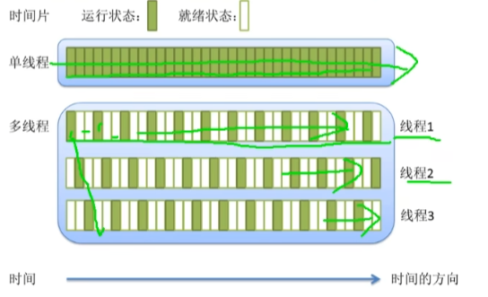

# 并发编程

关于线程，进程的类比

- 一个工厂，至少有一个车间，一个车间中至少有一个工人，最终是工人在工作
- 一个程序，至少有一个进程，一个进程中至少有一个线程，最终是线程在工作

进程和线程

- 线程：是计算机中可以被CPU调度的最小单元
- 进程，是计算机资源分配的最小单元（进程为线程提供资源）
- 一个进程中可以会有多个线程，同一个进程中的线程可以共享此进程中的资源
## 线程
### 线程概述
线程是轻量级的进程（LWP:light weight process）,在Linux环境下线程的本质仍是进程。在计算机上运行的程序是一组指令及指令参数的组合，指令按照既定的逻辑控制计算机运行。操作系统会以进程为单位，分配系统资源，可以这样理解，进程是资源分配的最小单位，线程是操作系统调度执行的最小单位

线程和进程的区别
- 进程有自己独立的地址空间，多个线程共用同一个地址空间
  - 线程更加节省系统资源，效率不仅可以保持，而且能更高
  - 在一个地址空间中多个线程独享：每个线程都有属于自己的栈区，寄存区（内核中管理的）
  - 在一个地址空间中多个线程共享：代码段、堆区，全局数据区，打开的文件（文件描述符表）都是线程共享的

- 线程是程序的最小执行单位，进程是操作系统中最小的资源分配单位
  - 每个进程对应一个虚拟地址空间，一个进程只能抢一个CPU时间片
  - 一个地址空间中可以分出多个线程，在有效的资源基础上，能够抢更多的CPU时间片 



- CPU的调度和切换：线程的上下文切换比进程快得多
  - 上下文切换：进程/线程分时复用CPU时间片，在切换之前会将上一个任务的状态进行保存，下次切换会这个任务的时间，加载这个状态继续运行，任务从保存到再次加载这个过程就是一次上下文切换

- 注意：多线程操作是一个无序的运行状态，某个线程抢到哪个CPU时间片是一个概率事件

- 线程更加廉价，启动速度更快，退出也快，对系统资源的冲击小 

<span style="color:red">在处理多任务程序的时候使用多线程比使用多进程要更有优势，但是线程并不是越多越好，如何控制线程的个数呢？</span>

1. 文件IO操作：文件IO对CPU是使用率不高，因此可以分时复用CPU时间片，线程个数= 2 * CPU核心数（效率最高）

2. 处理复杂的算法（主要是CPU进行运算，压力大），线程的个数=CPU的核心数（效率最高）


### 创建线程
#### 线程函数
每一个线程都有一个唯一的线程ID，ID类型为pthread_t,这个ID是一个无符号长整型数，如果想要得到当前线程的线程ID，可以调用如下函数
```C
pthread_t pthread_self(void); 
// 返回当前线程的线程ID
```

在一个进程中调用线程创建函数，就可以得到一个子线程，和进程不同，需要给每一个创建出的线程指定一个处理函数，否则这个线程无法工作
```C
#include <pthread.h>
int pthread_create(pthread_t *thread, const pthread_attr_t *attr, void *(*start_routine) (void *), void *arg);
// 线程创建函数共4个参数
```
- 参数：
  - thread：传出参数，是无符号长整型，线程创建成功，会将线程ID写入到这个指针指向的内存中
  - atrr：线程的属性，一般情况下使用默认属性即可，写NULL
  - void *(*start_routine)(void *):一个回调用的函数指针，这个函数指针指向要在线程中执行的任务
  - void *arg: 是第三个参数，回调函数的参数

- 示例
```C
#include <stdio.h>
#include <stdlib.h>
#include <string.h>
#include <unistd.h>
#include <pthread.h>

void* callback(void *arg) {
    for (int i = 0; i < 5; i++) {
        printf("子线程：i = %d\n", i);
    }
    printf("子线程：%ld\n", pthread_self());
    return NULL
}

int main() {
    pthread_t tid;
    // 创建一个子线程，在子线程中执行函数
    pthread_create(&tid, NULL, callback, NULL);
    for (int i = 0; i < 5; i++) {
        printf("主线程: i = %d\n", i);
    }
    printf("主线程：%ld\n", pthread_self());
    sleep(1);

    return 0;
}
```
## 进程


## 协程