# 算法与数据结构
## 数据结构
- 概述
  - 数据结构 = 数据定义 + 结构操作 （学习重点）
  - 数据结构就是定义一种性质，并且维护这种性质（使用数据结构的重点）

### 顺序表和链表
 #### 顺序表：结构定义


- 包含3部分
  - 一段连续的存储区，表示顺序表存储元素的地方
  - 一个整型的变量，用来标记顺序表的大小 (size)
  - 一个整型的变量，用来标记顺序表中存储元素的数量 (count)

#### 顺序表的插入操作


#### 顺序表的删除操作


#### 顺序表代码
```C
#include<stdio.h>
#include<stdlib.h>
#include<time.h>

/* 顺序表的结构定义*/
typedef struct vector { // 元数据
    int size, count;
    int *data; // 顺序表首地址
} vector; 
// 结构体中包含了3个数据分别是：顺序表的大小，数据的数量以及存储数据的首地址

/* 初始化顺序表 */
vector *getNewVector(int n) {
    vector *p = (vector *)malloc(sizeof(vector)); // 元数据地址
    p->size = n;
    p->count = 0;
    p->data = (int *)malloc(sizeof(int) * n); // 数据首地址
    return p;
}

/* 使用之后，销毁该顺序表 */
void clear(vector *v) {
    if (v == NULL) return ;
    free(v->data); //销毁数据内存
    free(v); // 销毁元数据内存
    return ;
}

/* 顺序表的扩容操作 */
int expand(vector *v) {
    if (v == NULL) return 0;
    printf("expand v from %d to %d\n", v->size, v->size * 2); // 2倍扩容法
    int *p = (int *)realloc(v->data, sizeof(int) * 2 * v->size);
    if (p == NULL) return 0;
    v->data = p;
    v->size *= 2;
    return 1;
}
/*
*   realloc()的功能：重新进行内存分配
*   realloc()的工作过程：
*   1. 先在原内存地址上，试着向后进行延展（策略1：首地址不变，大小变大）
*   2. 如果无法向后扩展，则realloc会找一片新内存，将原内存的数据拷贝过来，并返回新内存地址（策略2）
*   3. 策略1和2都不成功，realloc返回null,且原内存不动，但是此时，源地址信息丢失，因为返回的是null
*
* */

/* 顺序表的插入操作 */
int insert(vector *v, int pos, int val) {
    if (pos < 0 || pos > v->count) return 0; // 判断插入位置的合法性
    if (v->size == v->count && !expand(v)) return 0; // 判断顺序表是否有空间插入数据
    // 注意逆序遍历
    for (int i = v->count, i >= pos, i--) {
        v->data[i + 1] = v->data[i];
    }
    v->count += 1;
    v->data[pos] = val;
    return 1;
}

/* 顺序表的删除操作 */
int erase(vector *v, int pos) {
    if (pos < 0 || pos > v->count) return 0; // 判断删除位置的合法性
    for (int i = pos + 1, i < v->count, i++) {
        v->data[i - 1] = v->data[i];
    }
    v->count -= 1;
    return 1;
}

/* 输出顺序表的数据 */
void output_vector(vector *v) {
    int len = 0;
    for (int i = 0; i < v->size; i++) {
        len += printf("%3d", i);
    }
    printf("\n");
    for (int i = 0; i < len; i++) {
        printf("-");
    }
    printf("\n");
    for (int i = 0; i < v->count; i++) {
        printf("%3d", v->data[i]);
    }
    printf("\n\n");
    return ;
}

int main() {
    srand(time(0));
    #define MAX_OP 20
    vector *v = getNewVector(2);
    for (int i = 0; i < MAX_OP; i++) {
        int op = rand() % 4, pos, val, ret;
        switch (op) {
            case 0: 
            case 1:
            case 2: {
                pos = rand() % (v->count + 2);
                val = rand() % 100;
                ret = insert(v, pos, val);
                printf("insert %d at %d to vetor = %d\n", 
                    val, pos, ret);
            };break;
            case 3:{
                pos = rand() % (v->count + 2);
                ret = erase(v, pos);
                printf("erase item at %d in vector = %d\n", 
                    pos, ret);
            };break;
        }
        output_vector(v);
    }
    clear(v);
    return 0;
}
```

#### 链表：结构定义
- 结构定义：
  - 链表是由若干个节点（逻辑结构上）串联在一起的
  - 逻辑结构串联的实现：
    - 每个节点存储两个信息，一个是数据，一个是下一个节点的地址（指针）

#### 两种链表
- 无头链表
  - 头部不存储信息，仅存储第一个节点的地址

- 有头链表
  - 头部有存储数据的区域，但是不使用，仅使用部分空间存储节点地址

#### 虚拟头节点
- 定义：
  - 一般有头链表的头节点，称为虚拟头节点（重要编程技巧）

#### 链表的操作
- 链表的插入操作：
  - 假设一个链表中有4个节点，将node节点插入到第2个节点的位置
    - 第一步：创建一个指针p，指向待插入位置的前一个节点
    - 第二步：node节点上的地址信息，指向原2号节点
    - 第三步：指针p指向的节点的地址信息，指向node节点
    - 完成链表的插入操作
  - 易错点：
    - 如果先将指针p指向的节点地址指向node节点
    - 此时整个链表失去了指向原2号节点的地址信息，因为原二号节点的地址信息记录在1号节点（也就是p指向的节点上，现在它改变了），从而造成了内存泄漏

#### 链表代码演示
```C
#include <stdio.h>
#include <time.h>
#include <stdlib.h>

#define DL 3
#define STR(n) #n
#define DIGIT_LEN_STR(n) "%" STR(n) "d"

// 链表结构定义
typedef struct Node {
    int data;
    struct Node *next;
} Node;

// 结构操作
// 初始化链表
Node *getNewNode(int val) {
    Node *p = (Node *)malloc(sizeof(Node));
    p->data = val;
    p->next = NULL;
    return p;
}

// 链表插入
// 无头链表在插入过程中，首地址可能发生改变，因此返回值是新链表的首地址
Node *insert(Node *head, int pos, int val) {
    // 如果插入位置是头地址的话，整个链表的首地址发生改变
    if (pos == 0) {
        Node *p = getNewNode(val);
        p->next = head;
        return p;
    }
    // 如果插入的不是头地址，则需要先找到待插入位置的前一个元素
    Node *p = head;
    for (int i = 1; i < pos; i++) p = p->next;
    Node *node = getNewNode(val);
    node->next = p->next;
    p->next = node;
    return head;
}


// 销毁链表
void clear(Node *head) {
    if (head == NULL) return ;
    for (Node *p = head, *q; p; p = q) {
        q = p->next;
        free(p);
    }
    return ;
}

// 输出链表操作
void output_linklist(Node *head, int flag) {
    int n = 0;
    for (Node *p = head; p; p = p->next) n += 1;
    for (int i = 0; i < n; i++) {
        printf(DIGIT_LEN_STR(DL), i);
        printf("  "); // 留出小箭头的位置
    }
    printf("\n");
    for (Node *p = head; p; p = p->next) {
        printf(DIGIT_LEN_STR(DL), p->data);
        printf("->");
    }
    printf("\n");
    if (flag == 0) printf("\n\n");
    return ;
}

// 链表的查找
int find(Node *head, int val) {
    Node *p = head;
    int n = 0;
    while (p) {
        if (p->data == val) {
            output_linklist(head, 1);
            int len = n * (DL + 2) + 2;
            for (int i = 0; i < len; i++) printf(" ");
            printf("^\n");
            for (int i = 0; i < len; i++) printf(" ");
            printf("|\n");
            return 1;
        };
        n += 1;
        p = p->next;
    }
    return 0;
}

int main() {
    srand(time(0));
    #define MAX_OP 20
    Node *head = NULL;
    for (int i = 0; i < MAX_OP; i++) {
        int pos = rand() % (i + 1), val = rand() % 100, ret;
        printf("insert %d at %d to linklist\n", val, pos);
        head = insert(head, pos, val);
        output_linklist(head, 0);
    }
    int val;
    while(~scanf("%d", &val)) { // ~是按位取反的意思
        if (!find(head,val)) {
            printf("not found\n");
        }
    }
    clear(head);
    /*
        关于while(~scanf("%d", &val)) 的详细解析
        当 scanf 成功读取一个整数并将其存储在 val 中时，它返回 1。按位取反 ~1 产生的结果不是 0（因为所有位都被取反了），所以循环继续。
        当 scanf 到达文件末尾（例如，用户输入了 EOF 字符，通常是 Ctrl+D 或 Ctrl+Z），它返回 EOF（即 -1）。由于在大多数系统中 -1 的二进制表示是全 1，因此按位取反后变成全 0，即 0。这使得 while 循环的条件变为 false，循环终止。
        因此，while(~scanf("%d", &val)) 实际上是一种检测输入结束的方式。只要用户不输入 EOF 字符，循环就会继续。这是一种在 C 语言中常见的用于从标准输入读取值的模式。

        因此：while(~scanf("%d", &val))等价于while(scanf("%d", &val) != EOF)
    */

    return 0;
}
```

#### 有头链表精简插入模块
```C
Node *insert(Node *head, int pos, int val) {
    // 定义一个虚拟头节点
    // 有头链表的优势：同时整合了插入的两种情况
    Node new_head, *p = &new_head, *node = getNewNode(val);
    new_head.next = head;
    for (int i = 0; i < pos; i++) p = p->next; // 有无虚拟头的关键所在
    // 如果没有虚拟头的话，当插入到0位置时，就找不到0位置的前一个节点
    // 因为0位置没有节点，仅是一个记录首地址的指针
    node->next = p->next;
    p->next = node;   
    return new_head.next;
}
```

#### 循环链表和双向链表
- 单向循环链表：
  - 最后一个节点指向第一个节点
  - 注意：
    - 头指针指向<font color=tomato>最后一个节点</font>（将最后一个节点，看作是有头链表的虚拟节点）

- 双向链表：
  - 链表的结构定义中，多加一个p->pre,指向前一个节点
  
  - 第一个节点的pre和最后一个节点的next都指向null

### 反转链表
- 解题思路1：
  - 用指针遍历链表中的每一个节点，然后将其插入到新链表的头部，实现链表反转
  ```C
  ListNode *reverseList(ListNode *head) {
        ListNode new_head, *p = head, *q;
        new_head.next = NULL;
        while (p) {
            q = p->next;
            p->next = new_head.next;
            new_head.next = p;
            p = q;
        }
        return new_head.next;
  }
  ```

- 解题思路2：
  - 将第一个节点后面的链表全部反转，然后将第一个节点移动到最后
  - 依次递归实现
  - 递归函数的语义就是反转链表，返回反转后链表的首地址 
  ```C
  ListNode *reverseList(ListNode *head) {
        if (head == NULL && head->next == NULL) return head;
        ListNode *tail = head->next;
        ListNode *new_head = reverseList(head->next);
        head->next = NULL;
        tail->next = head;
        return new_head;
  }
  ```

### 判断循环链表
- 解题思路：创建两个速率不同的指针，根据两个指针在同一起点开始走，后面是否能相遇来判断链表是否是循环链表
```C
Bool hasCycle(struct ListNode *head) {
    struct ListNode *p = head, *q = head;
    while (q == NULL && q->next == NULL) {
        p = p->next;
        q = q->next->next;
        if (p == q) return true;
    }
    return false;
}
```

### 判断快乐数
- 快乐数定义：
  - 对于一个正整数，每一次将该数替换为它每个位置上的数字的平方和。
  - 然后重复这个过程直到这个数变为 1，也可能是 无限循环 但始终变不到 1。
  - 如果这个过程 结果为 1，那么这个数就是快乐数。   

- 示例：
```
12 + 92 = 82
82 + 22 = 68
62 + 82 = 100
12 + 02 + 02 = 1

82->68->100->1
```
- 解题思路：
  - 将快乐数的推断过程看作是一个链表结果，将最终结果1看作是NULL，如果该链表有环，则证明不是快乐数，否则证明是快乐数

- 代码实现
```C
int getNext(int x) {
    int d, y = 0;
    while (x) {
        d = x % 10;
        y += d * d;
        x = x / 10;
    }
    return y;
} 

bool isHappy(int n) {
    int p = n, q = n;
    while (q != 1) {
        p = getNext(p);
        q = getNext(getNext(q));
        if (q == p && q != 1) return false;
    } 
    return true;
}
```

### 旋转链表
- Leecode-61
- 答案：
```C
int getLen(struct ListNode* head) {
    int n = 0;
    while (head) {
        n++;
        head = head->next;
    }
    return n;
}

struct ListNode* rotateRight(struct ListNode* head, int k) {
    if (head == NULL) return head;
    int n = getLen(head);
    k %= n;
    if (k == 0) return head;
    struct ListNode *p = head, *q = head;
    for (int i = 0; i <= k; i++) p = p->next;
    // q指向分割的节点， 即新链表头部的前一个节点
    while (p) p = p->next, q = q->next;
    p = q->next;
    q->next = NULL;
    q = p;
    while (q->next != NULL) q = q->next;
    q->next = head;
    return p;
}
```

- 解题思路2：
```C
struct ListNode* rotateRight(struct ListNode* head, int k) {
    if (head == NULL) return head;
    // 计算链表节点数量
    int n = 0;
    struct ListNode *p = head, *q = head, *s = head, *e = head;
    while (p) {
        p = p->next;
        n++;
    }
    k %= n;
    if (k == 0) return head;
    // 末尾节点
    int tail = n - k;

    // 起始节点
    int start = n - k + 1;

    for (int i = 1; i < tail; i++) q = q->next; // q指向tail
    s = q->next;
    q->next = NULL;
    e = s;
    while (e->next != NULL) e = e->next;
    e->next = head;

    return s;


}
```

### 删除链表倒数第n个节点
- 解题思路1（简单）
```C
// Lecode-19
int nodeCount(struct ListNode* head) {
    int n = 0;
    while (head) {
        head = head->next;
        n++;
    }
    return n;
}

struct ListNode* removeNthFromEnd(struct ListNode* head, int n) {
    // 鉴于提示，此处不考虑空链表和n合法性的问题
    int count = nodeCount(head);
    n = count - n + 1;
    struct ListNode new_head, *p = &new_head, *q;
    new_head.next = head;
    for (int i = 1; i < n; i++) p = p->next;
    q = p->next;
    p->next = q->next;
    free(q);
    return new_head.next;

}
```
- 解题思路2：双指针等距移动法
```C
struct ListNode* removeNthFromEnd(struct ListNode* head, int n) {
    // 鉴于提示，此处不考虑空链表和n合法性的问题
    struct ListNode new_head, *p = &new_head, *q = p;
    new_head.next = head;
    for (int i = 0; i <= n; i++) p = p->next;
    while (p) p = p->next, q = q->next;
    p = q->next;
    q->next = q->next->next;
    free(p);
    return new_head.next;
}
```

### 环形链表2
- 题目
  - 给定一个链表的头节点  head ，返回链表开始入环的第一个节点。 如果链表无环，则返回 null。
- 解题思路
```C
struct ListNode *detectCycle(struct ListNode *head) {
    struct ListNode *slow = head, *fast = head;

    // 使用快慢指针找到环中的一个点
    while (fast != NULL && fast->next != NULL) {
        slow = slow->next;
        fast = fast->next->next;
        if (slow == fast) {
            // 找到环中的一个点
            struct ListNode *slow2 = head;
            // 从头节点和环中的相遇点同时出发，相遇点即为环的开始
            while (slow2 != slow) {
                slow = slow->next;
                slow2 = slow2->next;
            }
            return slow2; // 或 return slow;
        }
    }
    // 没有环
    return NULL;
}
```

### 反转链表2
- 题目：
  - 给你单链表的头指针 head 和两个整数 left 和 right ，其中 left <= right 。请你反转从位置 left 到位置 right 的链表节点，返回 反转后的链表 。

- 解题思路1(独立完成)
```C
struct ListNode* reverseList(struct ListNode *head) {
    if (head == NULL || head->next == NULL) return head;
    struct ListNode *tail = head->next;
    struct ListNode* new_head = reverseList(head->next);
    head->next = NULL;
    tail->next = head;
    return new_head;
}

struct ListNode* reverseBetween(struct ListNode* head, int left, int right) {
    struct ListNode new_head, *p = &new_head, *q = p;
    struct ListNode *l, *r;
    new_head.next = head;
    // 得到left的前一个节点地址
    for (int i = 1; i < left; i++) p = p->next;
    // 记录left节点地址
    l = p->next;
    // 得到right的节点地址
    for (int i = 0; i < right; i++) q = q->next;
    r = q->next;
    // 记录好数据后，将中间链切断并表反转
    struct ListNode *head2;
    head2 = l;
    q->next = NULL;
    reverseList(head2);
    p->next = q;
    l->next = r;
    return new_head.next;
}
```

- 解题思路2：
```C
struct ListNode* reverseList(struct ListNode *head) {
    if (head == NULL || head->next == NULL) return head;
    struct ListNode *new_head = reverseList(head->next);
    head->next->next = head;
    head->next = NULL;
    return new_head;
}

struct ListNode* reverseBetween(struct ListNode* head, int left, int right) {
    if (left == right) return head;

    struct ListNode new_head, *prev = &new_head;
    new_head.next = head;
    struct ListNode *tail = NULL;

    // 移动到left的前一个节点
    for (int i = 0; i < left - 1; i++) {
        prev = prev->next;
    }

    // 记录left和right节点
    struct ListNode *left_node = prev->next;
    struct ListNode *right_node = left_node;

    for (int i = left; i < right; i++) {
        right_node = right_node->next;
    }

    tail = right_node->next;

    // 切断链表，进行反转
    right_node->next = NULL;
    prev->next = reverseList(left_node);

    // 连接反转后的链表
    left_node->next = tail;

    return new_head.next;
}

```
- 解题思路3（重点：递归）
```C
struct ListNode* reverseBetween(struct ListNode* head, int left, int right) {
    if (left == 1 && right == 1) return head;
    if (left != 1) {
        head->next = reverseBetween(head->next, left - 1, right - 1);
    } else {
        struct ListNode* tail = head->next;
        struct ListNode* new_head = reverseBetween(head->next, left, right - 1);
        head->next = tail->next;
        tail->next = head;
        head = new_head;
    }
    return head;

}
// 将大问题，分解成具有相同结构的小问题，然后递归处理
```

## 队列和栈
### 队列-结构讲解
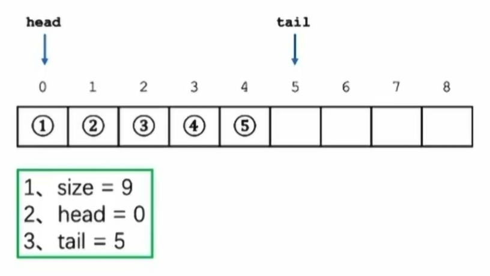

- 只允许队首出元素，队尾入元素（顺序表允许在任意位置添加删除元素）

- 队列的三个定义
  - size：整个队列的长度
  - head：指向队首的指针 (闭)
  - tail：指向队尾的后一位的指针（开），空位置，不包含元素

- 队列特点：
  - 先进先出（first in first out）

- 队列的结构操作
  - 出队操作（pop）：头指针head向后移动一位 
  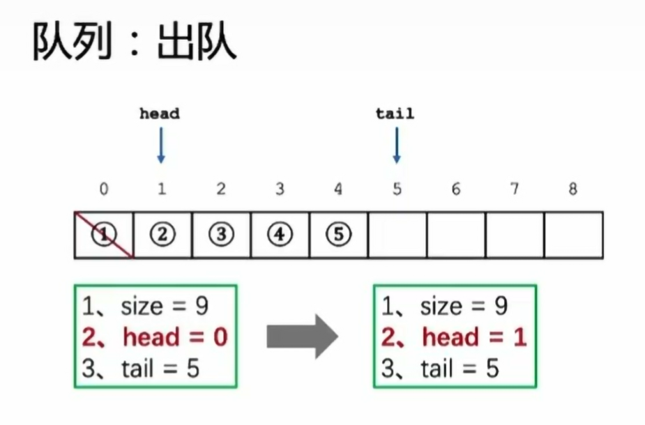
  - 入队操作（push）：将入队元素插入队尾，然后尾指针tail向后移动一位
  

- 队列的假溢出
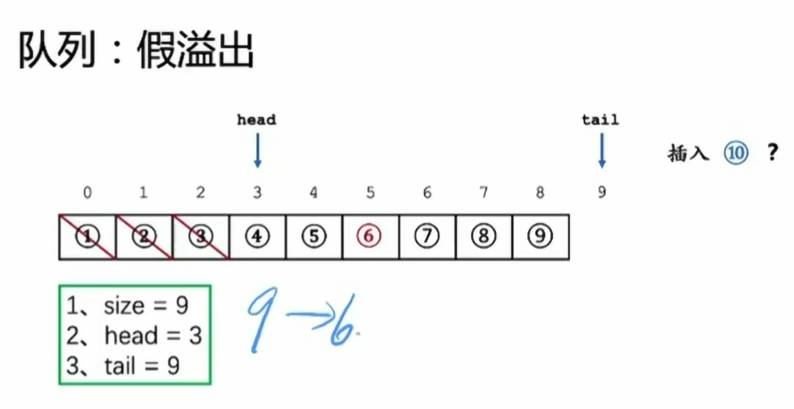

- 队列假溢出解决方案：循环队列
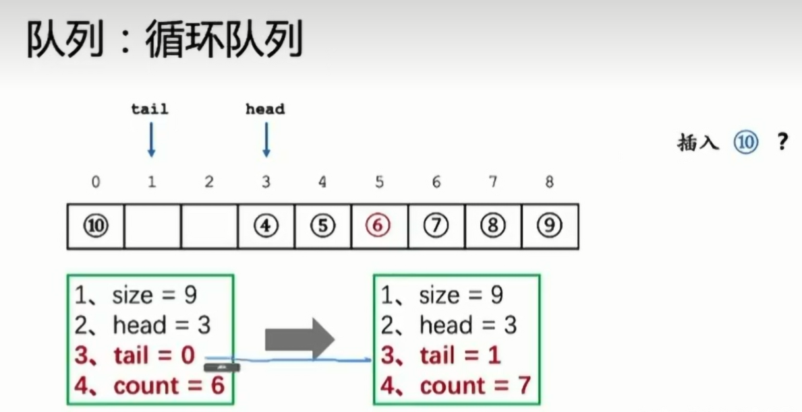

### 队列-代码演示
- 重点：高级数据结构中，对于基础数据结构，数据结构之间的封装

### 顺序表实现-队列
```C
#include<stdio.h>
#include<time.h>
#include<stdlib.h>

typedef struct Vector {
    int size;
    int count;
    int *data;
} Vector;

typedef struct Queue {
    Vector *data;
    int size, head, tail, count;
} Queue;

Vector *initVector(int n) {
    Vector *v = (Vector *)malloc(sizeof(Vector));
    v->size = n;
    v->count = 0;
    v->data = (int *)malloc(sizeof(int) * n);
    return v;
}

int insertVector(Vector *v, int pos, int val) { 
    if (pos < 0 || pos > v->count) return 0;
    v->data[pos] = val;
    v->count += 1;
    return 1;
}

Queue *initQueue(int n) {
    Queue *q = (Queue *)malloc(sizeof(Queue));
    q->data = initVector(n);
    q->size = n;
    q->head = q->tail = q->count = 0;
    return q;
}

int push(Queue *q, int val) {
    if (q->count == q->size) return 0;
    insertVector(q->data, q->tail, val);
    q->tail += 1;
    if (q->tail == q->size) q->tail = 0; // 循环队列
    // 或者q->tail %= q->size;
    q->count += 1;
    return 1;
}

int vectorSeek(Vector *v, int n) {
    if (n < 0 || n > v->size) return -1;
    return v->data[n];
}

// 查看队首元素
int front(Queue *q) {
    return vectorSeek(q->data, q->head);
}

// 判空操作
int empty(Queue *q) {
    return q->count == 0;
}

int pop(Queue *q) {
    if (empty(q)) return 0;
    q->head += 1;
    q->count -= 1;
    return 1;
}

void clearVector(Vector *v) {
    if (v == NULL) return ;
    free(v->data);
    free(v);
    return ;
}

void clearQueue(Queue *q) {
    if (q == NULL) return ;
    clearVector(q->data);
    free(q);
    return ;
}

void outputQueue(Queue *q) {
    printf("Queue: ");
    for (int i = 0; i < q->count; i++) {
        printf("%4d", vectorSeek(q->data, (q->head + i) % q->size));
    }
    printf("\n\n");
    return ;
}

int main() {
    srand(time(0));
    #define MAX_OP 10
    Queue *q = initQueue(5);
    for (int i = 0; i < MAX_OP; i++) {
        int op = rand() % 5, val = rand() % 100;
        switch (op) {
            case 0:{
                printf("front of Queue is %d\n", front(q));
                pop(q);
                break;
            }
            case 1:
            case 2:
            case 3:
            case 4:{
                printf("push %d in %d\n", val, q->tail);
                push(q, val);
                break;
            }
        }
        outputQueue(q);
    }
    clearQueue(q);

    return 0;
}
```

### 链表实现-队列
```C
// 独立实现
#include<stdio.h>
#include<time.h>
#include<stdlib.h>

typedef struct Node {
    int val;
    struct Node *next;
} Node;

 


Queue *initQueue() {
    Queue *q = (Queue *)malloc(sizeof(Queue));
    Node *vir_head = (Node *)malloc(sizeof(Node));
    vir_head->next = NULL;
    q->head = vir_head;
    q->tail = vir_head;
    q->count = 0;
    return q;
}

Node *getNode(int val) {
    Node *p = (Node *)malloc(sizeof(Node));
    p->val = val;
    p->next = NULL;
    return p;
}

void push(Queue *q, int val) {
    if (q == NULL) return ;
    Node *p = getNode(val);
    if (q->count == 0) {
        q->head->next = p;
        q->tail = p;
    } else {
        q->tail->next = p;
        q->tail = p;
    }
    q->count += 1;
    return ;
}

void pop(Queue *q) {
    if (q->count == 0) return ;
    Node *p = q->head->next;
    q->head->next = q->head->next->next;
    free(p);
    q->count -= 1;
    return ;
}

void clearQueue(Queue *q) {
    Node *p = q->head->next;
    while (p) {
        Node *p1 = p;
        p = p->next;
        free(p1);
    }
    free(q);
    return ;
}

void outputQueue(Queue *q) {
    Node *p = q->head->next;
    while (p) {
        printf("%4d->", p->val);
        p = p->next;
    }
    printf("\n\n");
    return ;
}

int main() {
    srand(time(0));
    Queue *q = initQueue();
    #define MAX_OP 10
    for (int i = 0; i < MAX_OP; i++) {
        int op = rand() % 5, val = rand() % 100;
        switch (op) {
            case 0: {
                printf("pop a item %d\n", q->head->next->val);
                pop(q);
            } break;
            case 1:
            case 2:
            case 3:
            case 4: {
                printf("push a item %d\n", val);
                push(q, val);
            } break;
        }
        outputQueue(q);
    }
    clearQueue(q);
    return 0;
}
```

### 链表实现-队列2
```C
// 正确答案
#include<stdio.h>
#include<stdlib.h>
#include<time.h>


typedef struct Node {
    int val;
    struct Node *next;
} Node;

typedef struct LinkList {
    Node head, *tail;
} LinkList;

typedef struct Queue {
    LinkList *l;
    int count;
} Queue;

Node *getNode(int val) {
    Node *p = (Node *)malloc(sizeof(Node));
    p->val = val;
    p->next = NULL;
    return p;
}

LinkList *initLinkList() {
    LinkList *l = (LinkList *)malloc(sizeof(LinkList));
    l->head.next = NULL;
    l->tail = &(l->head);
    return l;
}

int frontLinkList(LinkList *l) {
    if (l->head.next == NULL) return 0;
    return l->head.next->val;
}

int insertTail(LinkList *l, int val) {
    Node *node  = getNode(val);
    l->tail->next = node;
    l->tail = node;
    return 1;
}

int earseHead(LinkList *l) {
    if (l->head.next == NULL) return -1;
    Node *p = l->head.next;
    l->head.next = l->head.next->next;
    if (l->tail == p) l->tail = &(l->head);
    free(p);
    return 1;
}

void clearLinkList(LinkList *l) {
    Node *p = l->head.next, *q;
    while (p) {
        q = p->next;
        free(p);
        p = q;
    }
    free(l);
    return ;
}

Queue *initQueue() {
    Queue *p = (Queue *)malloc(sizeof(Queue));
    p->l = initLinkList();
    p->count = 0;
    return p;
}

int empty(Queue *p) {
    return p->count == 0;
}

int front(Queue *p) {
    if (empty(p)) return -1;
    return frontLinkList(p->l);
}

int push(Queue *p, int val) {
    insertTail(p->l, val);
    p->count += 1;
    return 1;
}

int pop(Queue *p) {
    earseHead(p->l);
    p->count -= 1;
    return 1;
}


void clearQueue(Queue* q) {
    if (q == NULL) return ;
    clearLinkList(q->l);
    free(q);
    return ;
}

void outputQueue(Queue *q) {
    Node *p = q->l->head.next;
    while (p) {
        printf("%4d->", p->val);
        p = p->next;
    }
    printf("\n\n");
    return ;
}

int main() {
    srand(time(0));
    Queue *q = initQueue();
    #define MAX_OP 10
    for (int i = 0; i < MAX_OP; i++) {
        int op = rand() % 5, val = rand() % 100;
        switch (op) {
            case 0: {
                if (!empty(q)) {
                    printf("pop a item %d\n", q->l->head.next->val);
                    pop(q);
                }
            } break;
            case 1:
            case 2:
            case 3:
            case 4: {
                printf("push a item %d\n", val);
                push(q, val);
            } break;
        }
        outputQueue(q);
    }
    clearQueue(q);
    return 0;
}
```

### 栈-结构讲解
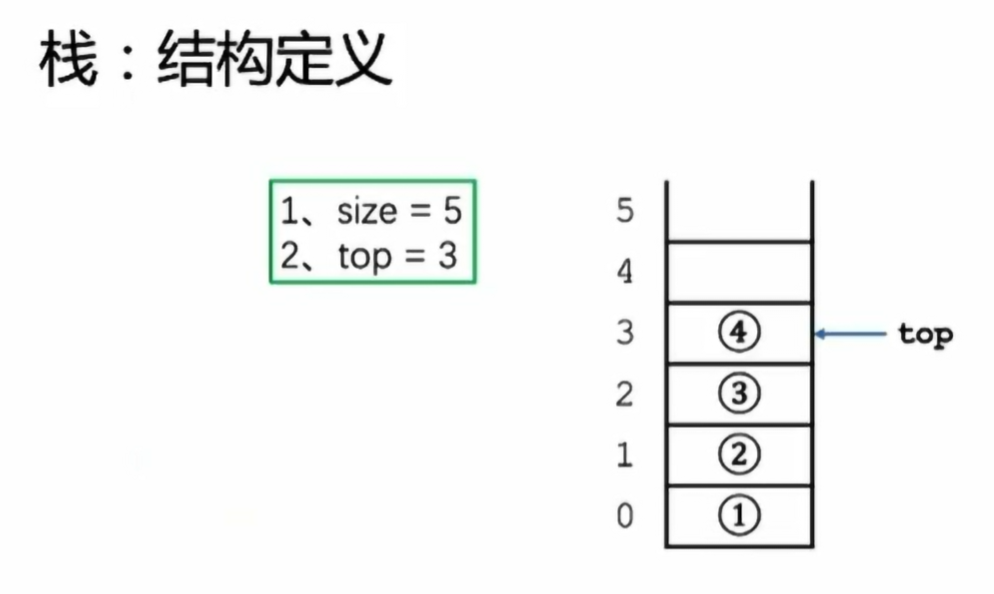

- 栈的结构特点：
  - 先进后出：first in last out (FILO)

### 栈-操作
- 出栈
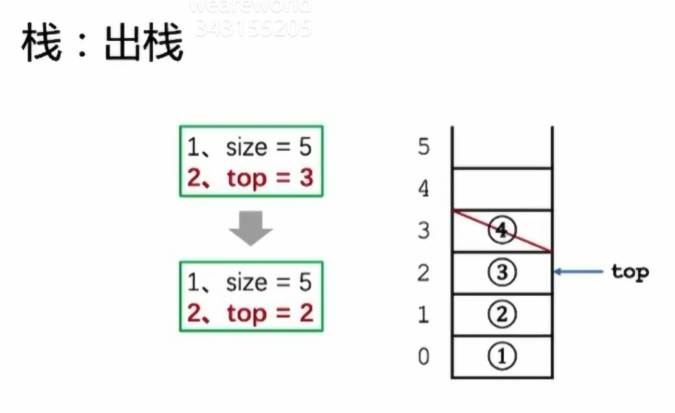

- 入栈
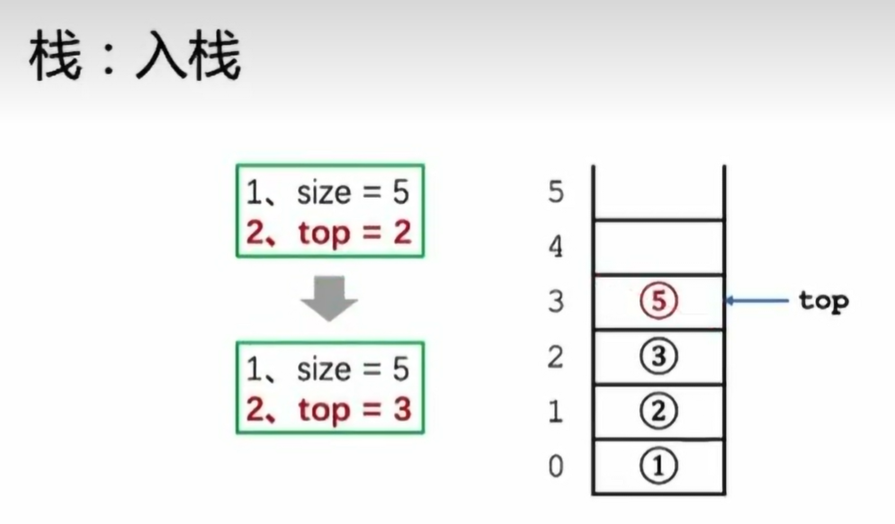

### 栈-代码实现
```C
#include<stdio.h>
#include<stdlib.h>
#include<time.h>

typedef struct Stack {
    int *data;
    int size, top;
} Stack;

Stack *initStack(int n) {
    Stack *s = (Stack *)malloc(sizeof(Stack));
    s->size = n;
    s->top = -1;
    s->data = (int *)malloc(sizeof(int) * n);
    return s;
}

int empty(Stack *s) {
    return s->top == -1;
}

int top(Stack *s) {
    if (empty(s)) return -1;
    return s->data[s->top];
}

int push(Stack *s, int val) {
    if (s->top + 1 == s->size) return -1;
    s->top += 1;
    s->data[s->top] = val;
    return 1;
}

int pop(Stack *s) {
    if (empty(s)) return -1;
    s->top -= 1;
    return 1;
}

void clearStack(Stack *s) {
    if (s == NULL) return ;
    free(s->data);
    free(s);
    return ;
}

void outputStack(Stack *s) {
    printf("Stack : ");
    for (int i = s->top; i >= 0; i--) {
        printf("%4d", s->data[i]);
    }
    printf("\n\n");
    return ;
}

int main() {
    srand(time(0));
    Stack *s = initStack(10);
    #define MAX_OP 10
    for (int i = 0; i < MAX_OP; i++) {
        int op = rand() % 4, val = rand() % 100;
        switch (op) {
            case 0: {
                printf("pop Stack: item = %d\n", top(s));
                pop(s);
            } break;
            case 1:
            case 2:
            case 3: {
                printf("push Stack: item = %d\n", val);
                push(s, val);
            } break;
        }
        outputStack(s);
    }
    clearStack(s);
    return 0;
}
```

### 用栈模拟括号匹配过程
- 遇到左括号就进栈

- 遇到右括号就和栈顶的左括号匹配，如果匹配成功，则栈顶元素出栈

- 如果匹配失败，则说明括号序列不合法

- 代码实现
```C
#include<stdio.h>
#include<stdlib.h>
#include<time.h>

typedef struct Stack {
    char *data;
    int size, top;
} Stack;

Stack *initStack(int n) {
    Stack *s = (Stack *)malloc(sizeof(Stack));
    s->size = n;
    s->top = -1;
    s->data = (char *)malloc(sizeof(char) * n);
    return s;
}

int empty(Stack *s) {
    return s->top == -1;
}

char top(Stack *s) {
    if (empty(s)) return -1;
    return s->data[s->top];
}

int push(Stack *s, char val) {
    if (s->top + 1 == s->size) return -1;
    s->top += 1;
    s->data[s->top] = val;
    return 1;
}

int pop(Stack *s) {
    if (empty(s)) return -1;
    s->top -= 1;
    return 1;
}

void clearStack(Stack *s) {
    if (s == NULL) return ;
    free(s->data);
    free(s);
    return ;
}

void slove(char str[]) {
    int flag = 1;
    Stack *s = initStack(100);
    for (int i = 0; str[i]; i++) {
        if (str[i] == '(' || str[i] == '[' || str[i] == '{') {
            push(s, str[i]);
        } else {
            switch (str[i]) {
                case ')': {
                    if (top(s) == '(') pop(s);
                    else flag = 0;
                } break;
                case ']': {
                    if (top(s) == '[') pop(s);
                    else flag = 0;
                } break;
                case '}': {
                    if (top(s) == '{') pop(s);
                    else flag = 0;
                } break;
            }
        if (flag == 0) break;
        }
    }
    if (flag == 0 || !empty(s)) {
        printf("error\n");
    } else {
        printf("success\n");
    }                                   
    clearStack(s);
}

int main() {
    Stack *s = initStack(100);
    char str[100];
    while (~scanf("%s", str)) {
        slove(str);
    }
    return 0;
}
```

### 栈的深入理解
- 简化问题，如果只有一种括号()，然后判断括号是否合法，不使用栈结构

- 解题方法1：
```C
bool isValid(char *s) {
    int32_t lnum = 0, rnum = 0;
    int32_t len = strlen(s);
    for (int32_t i = 0; i < len; i++) {
        swtich (s[i]) {
            case '(': ++lnum; break;
            case ')': ++rnum; break;
            default : return false;
        }
        if (lnum >= rnum) continue;
        return false;
    }
    return lnum == rnum;
}
```

- 解题方法2：
```C
// 遇到左括号加1，遇到右括号减1，判断lnum是否小于0，以及最后是否等于0
bool isValid(char *s) {
    int32_t lnum = 0;
    int32_t len = strlen(s);
    for (int32_t i = 0; i < len; i++) {
        switch (s[i]) {
            case '(': ++lnum; break; // 类似于入栈
            case ')': --lnum; break; // 类似于出栈
            default : return false;
        }
        if (lnum >= 0) continue;
        return false;
    }
    return lnum == 0;
}
```

- 由上述代码深入思考
  - 加1代表进栈，抽象为发生了一件事情
  - 减1代表出栈，抽象为解决了一件事情
  - 一对括号()，抽象为一个完整的事件
  - （（）），抽象为一种事件的完全包含关系
  - 抽象理解((1)(2))
    - 要完成一个大事件，需要完成大事件包含的两个小事件
    - 先完成小事件1，再完成小事件2，继而完成整个大事件
    ```C
    // 根据上述表述，可以抽象为程序执行过程
    int main() {
        func1();
        func2();
        return 0;
    }
    // 总结：无论是程序还是现实问题，如果满足类似上述的主从包含关系的问题，大概率需要使用栈解决
    ```

### 栈理解练习-模拟程序调用
- 问题：
  - 给定一篇代码，并希望你能找到指定函数第一次被调用时的调用链，将其打印出来；当然，你有可能会发现给定的函数没有在代码中出现，那么你应该打印一行“NOT REFERENCED”并结束你的程序。
  - 样例输入
  ```
    5 // 表示下面5行是代码
    fun1()
    fun2()
    return
    fun3()
    fun4()
    fun4() // 求func4()的调用链
  ```
  - 样例输出
  ```
  fun1()->fun3()->fun4()
  ```

- 代码实现
```C
#include<stdio.h>
#include<string.h>
#include<stdlib.h>

typedef struct Stack {
    char **data;
    int size, top;
} Stack;

Stack *initStack(int n) {
    Stack *s = (Stack *)malloc(sizeof(Stack));
    s->data = (char **)malloc(sizeof(char*) * n);
    s->size = n;
    s->top = -1;
    return s;
}

int empty(Stack *s) {
    return s->top == -1;
}

int push(Stack *s, char *str) {
    if (s == NULL || str == NULL) return -1;
    if (s->top + 1 == s->size) return -1;
    s->top += 1;
    s->data[s->top] = str;
    return 1;
}

int pop(Stack *s) {
    if (empty(s)) return -1;
    s->top -= 1;
    return 1;
}

void clearStack(Stack *s) {
    if (s == NULL) return ;
    free(s->data);
    free(s);
    return ;
}

int main() {
    int n, flag = 0;
    scanf("%d", &n);
    Stack *s = initStack(n * 2);
    char *str[n];
    for (int i = 0; i < n; i++) {
        str[i] = (char *)malloc(sizeof(char) * 50);
        scanf("%50s", str[i]);
    }
    char target[50];
    scanf("%s", target);
    
    for (int i = 0; i < n; i++) {
        if (strcmp(str[i], target) == 0) {
            push(s, str[i]);
            flag = 1;
            break;
        } 
        if (strcmp(str[i], "return") == 0) {
            pop(s);
        } else {
            push(s, str[i]);
        }
    }

    if (flag) {
        for (int i = 0; i <= s->top; i++) {
            if (i > 0) printf("->");
            printf("%s", s->data[i]);
        }
    } else {
        printf("NOT REFERENCED\n");
    }

    printf("\n");

    // 释放内存
    for (int i = 0; i < n; i++) {
        free(str[i]);
    }

    clearStack(s);
    return 0;
}
```

### 2020年数据结构考研题41题
- 题目：
  - 定义三元组（a,b, c）（a,b,c 均为正数）的距离 D=|a-b|+|b-c|+|c-a|。给定 3 个非空整数集合 S1, S2 ,S3, 按升序分别存储在 3 个数组中。请设计一个尽可能高效的算法，计算并输出所有可能的三元组（a, b, c）（a∈S1,b∈S2,c∈S3）中的最小距离。例如 S1={-1, 0, 9}, S2={-25，-10，10，11}，S3={2，9，17，30，41}，则最小距离为 2，相应的三元组为（9，10，9）。

  - 程序中的主要部分已经帮你写好了，你只需要将如下代码拷贝到你的环境中，并且补充 func函数功能即可。函数功能描述如下：

- 代码实现
```C++
#include<iostream>
#include <cstdlib>
#include <queue>
using namespace std;

int min_num(int a, int b, int c) {
    if (a > b) swap(a, b);
    if (a > c) swap(a, c);
    return a;
}


int func(queue<int> que1, queue<int> que2, queue<int> que3) {
    int ans = 0x3f3f3f3f;
    while (!que1.empty() && !que2.empty() && !que3.empty()) {
        int a = que1.front(), b = que2.front(), c = que3.front();
        int temp_ans = abs(a - b) + abs(b - c) + abs(a - c);
        if (temp_ans < ans) ans = temp_ans;
        int d = min_num(a, b, c);
        if (a == d) que1.pop();
        if (b == d) que2.pop();
        if (c == d) que3.pop();
    }
    return ans;
}

int main() {
    int m, n, k, x;
    queue<int> que1, que2, que3;
    cin >> m >> n >> k;
    for (int i = 0; i < m; i++) {
        cin >> x;
        que1.push(x);
    }
    for (int i = 0; i < n; i++) {
        cin >> x;
        que2.push(x);
    }
    for (int i = 0; i < k; i++) {
        cin >> x;
        que3.push(x);
    }
    cout << func(que1, que2, que3) << endl;
    return 0;
}
```

### 火车入栈问题
- 问题：
  - 有 n 列火车按 1 到 n 的顺序从东方左转进站，这个车站是南北方向的，它虽然无限长，只可惜是一个死胡同，而且站台只有一条股道，火车只能倒着从西方出去，而且每列火车必须进站，先进后出。
  - 进站的火车编号顺序为 1∼n，现在请你按火车编号从小到大的顺序，输出前 20 种可能的出站方案。
- 代码实现
```C
#include<stdio.h>
#include "stack.h" // 自建数据结构头文件

int arr[25], vis[25] = {0};

int isValid(int *arr, int n) {
    Stack *s = initStack(25);
    int x = 1;
    for (int i = 0; i < n; i++) {
        if (emptyStack(s) || topStack(s) < arr[i]) {
            while (x <= arr[i]) pushStack(s, x), x++;
        }
        if (emptyStack(s) || topStack(s) != arr[i]) return 0;
        popStack(s);
    }
    return 1;
}

void print_one_res(int n) {
    for (int i = 0; i < n; i++) {
        if (i) printf(" ");
        printf("%d", arr[i]);
    }
    printf("\n");
    return ;
}

void f3(int i, int n) {
    if (i == n) {
        if (isValid(arr, n)) print_one_res(n);
        return ;
    }
    for (int k = 1; k <= n; k++) {
        if (vis[k]) continue;
        arr[i] = k;
        vis[k] = 1;
        f3(i + 1, n);
        vis[k] = 0;
    }
    return ;
}

int main() {
    int n;
    scanf("%d", &n);
    f3(0,n);
    return 0;
}
```

### 括号画家
- 解题方法1
```C
#include<stdio.h>
#include<string.h>
#include "stack.h"

int Maxarr(int *arr, int size) {
    int max = 0;
    for (int i = 0; i < size; i++) {
        if (arr[i] > max) max = arr[i];
    }
    return max;
}

int main() {
    int flag = 0, j = 0;
    char inp[10000];
    int arr[10000] = {0}; // 初始化为0
    Stack *s = initStack(10000);
    scanf("%s", inp);
    int len = strlen(inp);

    for (int i = 0; i < len; i++) {
        if (inp[i] == '(' || inp[i] == '[' || inp[i] == '{') {
            pushStack(s, inp[i]);
        } else {
            if (!emptyStack(s) && ((inp[i] == ')' && topStack(s) == '(') ||
                                   (inp[i] == ']' && topStack(s) == '[') ||
                                   (inp[i] == '}' && topStack(s) == '{'))) {
                popStack(s);
                flag += 2;
            } else {
                arr[j++] = flag;
                flag = 0;
                while (!emptyStack(s)) popStack(s); // 重置栈
            }
        }
    }
    arr[j] = flag; // 处理最后的合法序列

    int res = Maxarr(arr, j + 1);
    printf("%d\n", res);
    clearStack(s); // 清理栈
    return 0;
}

// 上述解题方法错误
// ((({}[]((() 在这种情况下，得到的结果是6，因为连续((()这种情况，上述程序并不能识别将flag即使清0
```

- 解题方法2
```C
#include <stdio.h>
#include <string.h>
#include "stack.h" // 假设这个头文件中定义了您的栈结构和相关函数
// 注意栈的数组类型为int，而不是char

int main() {
    char inp[10000];
    scanf("%s", inp);
    int n = strlen(inp), maxLen = 0;
    Stack *s = initStack(n + 1);
    pushStack(s, -1);  // 初始索引，用于长度计算(思维小难点)

    for (int i = 0; i < n; i++) {
        if (inp[i] == '(' || inp[i] == '[' || inp[i] == '{') {
            pushStack(s, i);  // 有效的开括号，推入其索引
        } else {
            // 确保栈非空并且顶部字符与当前字符匹配
            if (!emptyStack(s) && ((inp[i] == ')' && inp[topStack(s)] == '(') ||
                                   (inp[i] == ']' && inp[topStack(s)] == '[') ||
                                   (inp[i] == '}' && inp[topStack(s)] == '{'))) {
                popStack(s);  // 匹配的情况，弹出栈
                if (!emptyStack(s)) {
                    int currentLen = i - topStack(s);
                    maxLen = (currentLen > maxLen) ? currentLen : maxLen;
                }
            } else {
                while (!emptyStack(s)) popStack(s);  // 不匹配，清空栈
                pushStack(s, i);  // 将当前索引作为新的参考点(思维小难点)
            }
        }
    }

    printf("%d\n", maxLen);
    clearStack(s);
    return 0;
}
```

- 解题思路3：
```C
#include <stdio.h>
#include <string.h>
#include "stack.h" // 假设这个头文件中定义了您的栈结构和相关函数
// 注意栈的数组类型为int，而不是char

int main() {
    char str[100005];
    int match[100005] = {0};
    Stack *s = initStack(10000);
    scanf("%s", str + 1);
    for (int i = 1; str[i]; i++) {
        switch (str[i]) {
            case '(':
            case '[':
            case '{': pushStack(s, i); break; // 压入索引
            case ')': {
                if (!emptyStack(s) && str[topStack(s)] == '(') {
                    match[topStack(s)] = i;
                    popStack(s);
                } else {
                    pushStack(s, i); // 判断非法后，阻断栈
                }
            } break;
            case ']': {
                if (!emptyStack(s) && str[topStack(s)] == '[') {
                    match[topStack(s)] = i;
                    popStack(s);
                } else {
                    pushStack(s, i); // 判断非法后，阻断栈
                }
            } break;
            case '}': {
                if (!emptyStack(s) && str[topStack(s)] == '{') {
                    match[topStack(s)] = i;
                    popStack(s);
                } else {
                    pushStack(s, i); // 判断非法后，阻断栈
                }
            } break;
        }
    }

    // 第二部分
    int tmpans = 0, ans = 0, i = 1;
    while (str[i]) {
        if (match[i]) {
            tmpans += match[i] - i + 1;
            i = match[i] + 1;
        } else {
            i++;
            tmpans = 0;
        }
        ans = (tmpans > ans) ? tmpans : ans;
    }
    printf("%d\n", ans);
	 clearStack(s);
    return 0;

}
```
### 循环队列
- 使用顺序表实现
```C
typedef struct Vector {
    int *data;
    int size, count;
} Vector;


typedef struct {
    Vector *data;
    int size, count, head, tail;
} MyCircularQueue;

Vector *initVector(int size) {
    Vector *v = (Vector *)malloc(sizeof(Vector));
    if (v == NULL) return NULL; // 检查内存分配是否成功
    v->data = (int *)malloc(sizeof(int) * size); // 为 data 分配内存
    if (v->data == NULL) { // 检查内存分配是否成功
        free(v);
        return NULL;
    }
    v->size = size;
    v->count = 0;
    return v;
}


int insertVector(Vector *v, int pos, int val) {
    if (pos < 0 || pos > v->count) return 0;
    if (v->size == v->count) {
        // 扩展 Vector 的容量
        int newSize = v->size * 2;
        int *newData = (int *)realloc(v->data, newSize * sizeof(int));
        if (!newData) return 0;
        v->data = newData;
        v->size = newSize;
    }
    for (int i = v->count - 1; i >= pos; i--) {
        v->data[i + 1] = v->data[i];
    }
    v->data[pos] = val;
    v->count += 1;
    return 1;
}

int vectorSeek(Vector *v, int n) {
    if (n < 0 || n > v->size) return -1;
    return v->data[n];
}

void clearVector(Vector *v) {
    if (v == NULL) return ;
    free(v->data);
    free(v);
    return ;
}


MyCircularQueue* myCircularQueueCreate(int k) {
    MyCircularQueue *q = (MyCircularQueue*)malloc(sizeof(MyCircularQueue));
    q->data = initVector(k);
    q->size = k;
    q->count = q->head = q->tail = 0;
    return q;
}

bool myCircularQueueEnQueue(MyCircularQueue* obj, int value) {
    if (obj->count == obj->size) return false;
    obj->data->data[obj->tail] = value;
    obj->tail = (obj->tail + 1) % obj->size; // 更新 tail
    obj->count += 1;
    return true;
}

bool myCircularQueueDeQueue(MyCircularQueue* obj) {
    if (obj->count == 0) return false;
    obj->head = (obj->head + 1) % obj->size;
    obj->count -= 1;
    return true;
}

int myCircularQueueFront(MyCircularQueue* obj) {
    if (obj->count == 0) return -1;
    return vectorSeek(obj->data, obj->head);;
}

int myCircularQueueRear(MyCircularQueue* obj) {
    if (obj->count == 0) return -1;
    int rearIndex = (obj->tail - 1 + obj->size) % obj->size; // 计算实际的 rear 索引
    return obj->data->data[rearIndex];
}

bool myCircularQueueIsEmpty(MyCircularQueue* obj) {
    return obj->count == 0;
}

bool myCircularQueueIsFull(MyCircularQueue* obj) {
    return obj->count == obj->size;
}

void myCircularQueueFree(MyCircularQueue* obj) {
    if (obj == NULL) return ;
    clearVector(obj->data);
    free(obj);
    return ;
}
```

- 针对性型修改后
```C
typedef struct Vector {
    int *data;
    int size, count;
} Vector;


typedef struct {
    Vector *data;
    int size, count, head, tail;
} MyCircularQueue;

Vector *initVector(int size) {
    Vector *v = (Vector *)malloc(sizeof(Vector));
    if (v == NULL) return NULL; // 检查内存分配是否成功
    v->data = (int *)malloc(sizeof(int) * size); // 为 data 分配内存
    if (v->data == NULL) { // 检查内存分配是否成功
        free(v);
        return NULL;
    }
    v->size = size;
    v->count = 0;
    return v;
}


int insertVector(Vector *v, int val) {
    if (v->count == v->size) return 0; // 检查是否有空间插入新元素
    v->data[v->count] = val; // 在末尾添加元素
    v->count += 1;
    return 1;
}

int vectorSeek(Vector *v, int n) {
    if (n < 0 || n > v->size) return -1;
    return v->data[n];
}

void clearVector(Vector *v) {
    if (v == NULL) return ;
    free(v->data);
    free(v);
    return ;
}


MyCircularQueue* myCircularQueueCreate(int k) {
    MyCircularQueue *q = (MyCircularQueue*)malloc(sizeof(MyCircularQueue));
    q->data = initVector(k * 2); // 确保顺序表空间足够
    q->size = k;
    q->count = q->head = q->tail = 0;
    return q;
}

bool myCircularQueueEnQueue(MyCircularQueue* obj, int value) {
    if (obj->count == obj->size) return false;
    obj->data->data[obj->tail] = value;
    obj->tail = (obj->tail + 1) % obj->size; // 更新 tail
    obj->count += 1;
    return true;
}

bool myCircularQueueDeQueue(MyCircularQueue* obj) {
    if (obj->count == 0) return false;
    obj->head = (obj->head + 1) % obj->size;
    obj->count -= 1;
    return true;
}

int myCircularQueueFront(MyCircularQueue* obj) {
    if (obj->count == 0) return -1;
    return vectorSeek(obj->data, obj->head);;
}

int myCircularQueueRear(MyCircularQueue* obj) {
    if (obj->count == 0) return -1;
    int rearIndex = (obj->tail - 1 + obj->size) % obj->size; // 计算实际的 rear 索引
    return obj->data->data[rearIndex];
}

bool myCircularQueueIsEmpty(MyCircularQueue* obj) {
    return obj->count == 0;
}

bool myCircularQueueIsFull(MyCircularQueue* obj) {
    return obj->count == obj->size;
}

void myCircularQueueFree(MyCircularQueue* obj) {
    if (obj == NULL) return ;
    clearVector(obj->data);
    free(obj);
    return ;
}
```

## 树与二叉树
### 树-结构定义
```C
// 单向链表结构是树形结构的一个特列
typedef struct Node {
    int data;
    struct Node *next;
} Node, *LinkedList;
```

```C
# 三叉树
typedef struct Node {
    int data;
    struct Node *next[3];
} Node, *Tree;
```

### 树的基本概念
- 树：深度，高度和度
    - 树的深度和高度（树的深度=树的高度），就是树的最高高度
    - 节点的深度和高度
        - 节点的深度是从根节点开始数，作为起始节点，
        - 节点的高度是从叶子节点开始数
    - 节点的数量等于边数+1
    - 节点的度，只的是当前节点的子节点的数量(所以所有叶子节点的度为0)
        - 入度
            - 有几个节点指向我
        - 出度
            - 我指向几个节点
    - 树型结构的度，为出度，不讨论入度

- 总结（树形结构的精髓）：
    - 根节点代表【全集】
    - 树的节点代表【集合】
    - 树的边代表【关系】


- 如何利用树形结构进行建模

### 广度优先遍历（层序遍历）
- 利用下层的队列结构实现

- 过程：
    - 从根节点起，先把所有子节点压入队列，然后该节点出队
    - 不断重复这个过程，最后把所有节点压入队列，同时把所有节点都弹出队列


### 深度优先遍历
- 利用下层的栈结构实现

- 过程：
    - 对于某一节点来说，如果它还有子节点，就进栈，如果下面没有子节点，则当前节点出栈

### 二叉树
- 单项链表可以看作是每个节点都缺了一个子孩子的二叉树，因为二叉树的定义是，每个节点最多2个子孩子，并不是必须有两个子孩子

- 二叉树中特殊的称呼：因为二叉树只有两个节点，因此可以说，根节点左侧叫左子树，右侧叫右子树，如果左右是单独一个节点，也可以叫左节点或者右节点

- 
    - 每个节点度最多是2
    - 度为0的节点，比度为2的节点多1个


- 二叉树结构
    - 分别包含度为0的节点（叶子节点），度为1的节点，度为2的节点（因为是二叉树，一个节点最多度为2）
        - 所以总节点数为：n0 + n1 + n2
    - 度为0的节点没有边，度为1的节点1条边，度为2的节点2条边，又因为总点数=总边数+1
    - n0 + n1 + n2 = n1 + 2n2 +1
        - n0 = n2 + 1
        - 所以度为0的节点比度为2的节点多1（性质1）


- 二叉树的特殊种类
    - 完全二叉树（complete binary tree）
        - 除最后一层外，上面的层都是满的
        - 最后一层，只有右侧节点是缺失的
    - 满二叉树(full binary tree)
        - 没有度为1的节点
    - 完美二叉树(perfect binary tree)
        - 每一层都是满的 

#### 完全二叉树（堆的底层实现）
- 性质：
    - 如果当前节点的编号是i<span style="color:red">（可以通过父节点的编号，计算得到子节点的编号）</span>
        - 左孩子的编号：2 * i
        - 右孩子的编号：2 * i+ 1
    - 类比：链表中，通过记录下一个节点的指针地址，来维护前一个节点和后一个节点的指向关系
    - 完全二叉树中，可以通过计算来维护当前节点和上下节点的指向关系（可以节省大量的存储边的空间，因为可以通过计算得到指向关系），即通过父节点的编号，计算得到子节点的编号
    - 链表是如何维护当前节点与下一个节点的指向关系；是不是得用一个指针记录一下子节点的地址，也就是说父节点和子节点之间记录了一个地址
    - 而完全二叉树是计算得到子节点的地址
    - 记录花费的是空间（节省时间），计算花费的是时间（节省空间）
        - 本质上是空间换时间，时间换空间的性质，算法分析中的重要性质
    - 可以用连续空间存储（数组）（重要特点）
        - 因为完全二叉树的节点编号是连续的 
        - 实现完全二叉树，虽然它也是一个树形结构，但是我们实现完全二叉树，完全没必要用指针，用连续的数组空间就可以了，因为完全二叉树的节点编号是连续的


#### 二叉树分支
- 二叉树
    - 完全二叉树
        - 堆（维护集合最值的神兵利器）
        - 优先队列（维护集合最值的神兵利器）
    - 多叉树/森林
        - 字典树（多叉树）（字符串及其相关转换问题的神兵利器）
        - AC自动机（多叉树）（字符串及其相关转换问题的神兵利器）
        - 并查集（森林）（连通性问题的神兵利器）
    - 二叉排序树
        - AVL树（语言标准库中重要的数据检索容器的底层实现）
        - 2-3树（语言标准库中重要的数据检索容器的底层实现）
        - 红黑树（语言标准库中重要的数据检索容器的底层实现）（C++的map结果（红黑树））
        - B-树（读作B树）/B+树（读作B加树）（文件系统，数据库底层重要实现）

- 二叉树是练习递归技巧的最佳选择
    - 递归函数的设计利器（结构归纳法）
        - 赋予递归函数一个明确的意义
        - 思考边界条件
        - 实现递归过程

- 二叉树作用三：
- 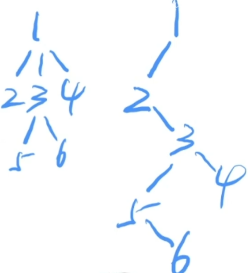
    - 左孩子右兄弟表示法（节省空间）


### 二叉树的遍历与线索化
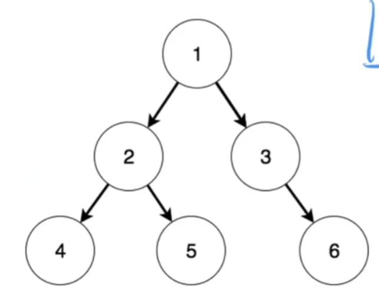
- 二叉树的三种遍历方式
    - 前序遍历（根，左，右）
      - 124536
    - 中序遍历（左，根，右）
      - 425136
    - 后序遍历（左，右，根）
      - 452631
- 三种遍历方式取决于：根节点在哪个位置
    - 前序遍历：根节点在最开始的位置，即左子树和右子树的遍历结果之前
    - 中序遍历：根节点出现在左右子树遍历结果的中间
    - 后序遍历：根节点出现在左右子树的最后

- 上述的左右指的是左子树相关遍历的结果和右子树相关遍历的结果
    - 三种方式都是按照递归的方式定义的


### 二叉树三种遍历方式的意义
- 作用1：序列化（数据结构的序列化） 
  - 当我们想把A计算机中的数据结构传递给B计算机的时候，我们不能将这个数据结构的原始信息给传过去
  -  因为在A计算机中，指向每个结构数据，我们用的指针，但是指针的地址是随机分配的，A计算机的指针并不能完全不知道B计算机
  -  比如6号节点在A计算机中占用65号内存，但是如果我们想复制到B计算机中，我们并不在意6号节点在不在65号内存（占用100号内存也可以），因此节点地址的信息只在当前A计算机的内存中是有意义的，这个信息但凡处理A计算机就没有意义了
  - 那么如何将A计算机的数据复制到B计算机
    - 就是使用二叉树的三种遍历方式，将二叉树的信息传输到B计算机中，然后在B计算机中做复原
    - 示例如下

- 用序列化的方式将数据从A复制到B

数据以上图为例

    - 将这个二叉树的数据从A计算机复制到B计算机
    - 将这棵树的前序遍历（124536）中序遍历（425136）复制到B计算机
    - 把计算机B收到（124536）和（425136）进行数据还原
    - 在前序遍历中，根节点在最开始的位置，然后在中序遍历中找到根节点的位置
    - 中序遍历中，找到根节点1的位置，然后可以判断前部分（425）是这棵树的左子树，（3，6）是这棵树的右子树
    - 因为中序遍历中可以判断（425）是左子树部分，那么回到前序遍历，前序遍历的结构是（根左右），又因为根是1，且左子树有3个节点，因此可以判断，前序遍历中（245）是前序遍历中的左子树部分，后面（36）就是右子树的前序遍历结果
    - 此时，我们找到了前序遍历中左子树，右子树，根的部分，以及中序遍历中根，左子树，右子树的部分，然后遍历上述过程，即可还原出整个二叉树。

- 序列化的目的：将数据信息通过网络能够有效的传给另一台计算机，并且回复相应的数据结构

- 三种遍历方式中
  - （中+前）（中+后）都可以回复数据
  - （前+后）无法回复数据
    - 确定不了左子树和右子树的节点数量，但是加上中序遍历，使用根节点在中间一劈，就可以找到左右子树的节点数

### 二叉树的线索化
- 主要动作：“废物利用”
  - 二叉树中，每个节点都有两个指针，一个指向左子树，一个指向右子树
  - 但是对于叶子节点（也就是最后一层的节点，它的两个指针域都是空的）
  - 线索化就是把这些空着的指针域用起来
  - 将这些空着的指针域，结合二叉树的三种遍历方式即可实现线索化，即
    - 前序遍历线索化
    - 中序遍历线索化
    - 后续遍历线索化

#### 中序遍历线索化
- 上述二叉树数据：
  - 前序遍历：（124536）
  - 中序遍历：（425136）
  - 后序遍历：（451631）
- 我们让相应节点左边空着的指针，指向当前节点的前驱（前驱：当前节点在相应遍历中的前面的值）
  - 中序遍历中，6的前驱是3，1的前驱是5，5的前驱是2
- 让相应节点右边空着的指针，指向当前节点的后继，（即遍历结果中，处在当前节点后面的节点）
  - 中序遍历中，5的后继是1，3的后继是6

- 中序遍历（425136）中

  - 4号节点没有前驱，只有后继，因此左指针执行NULL，右指针指向2
  - 5号节点的前驱是2号节点，后继是1号节点
  - 3号节点左指针空着，它指向前驱，即1号指针
  - 6号节点左指针指向前驱，3号节点，右指针指向后继，但是没有，因此指向NULL；
  - 至此，二叉树的线索化改造完成

- 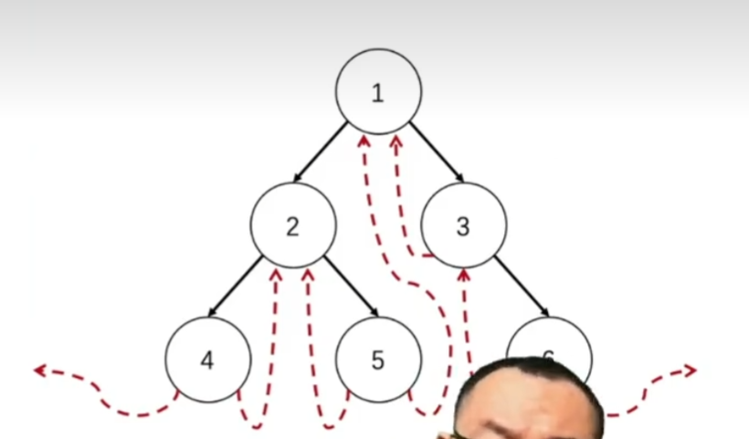

- 线索化的目的：将二叉树的遍历从递归，变为非递归，让二叉树的遍历表现的向链表一样

- 遍历方式从递归变为链表的优势
  - 当前节点想去下一节点，直接next，指过去，很快
  - 因此不用借用递归程序进行中序遍历
  - 因为不用借用递归进行中序遍历，所有可以在中序遍历的过程中，停在任何一个节点处
  - 总结：线索化的好处：遍历更加灵活和高效


## 二叉排序树

名称：二叉排序树、二叉搜索树

性质：
- 左子树(值) < 根节点
- 右子树(值) > 根节点

特点

- 二叉排序树的中序遍历（左根右）的结果是有序的（从小到大）

用途：

- 解决与排名相关的检索需求

### 二叉排序树的操作：

#### 插入操作
- 如果我们想把节点插入到二叉排序树中，在该节点一定会作为二叉排序树中的叶子节点

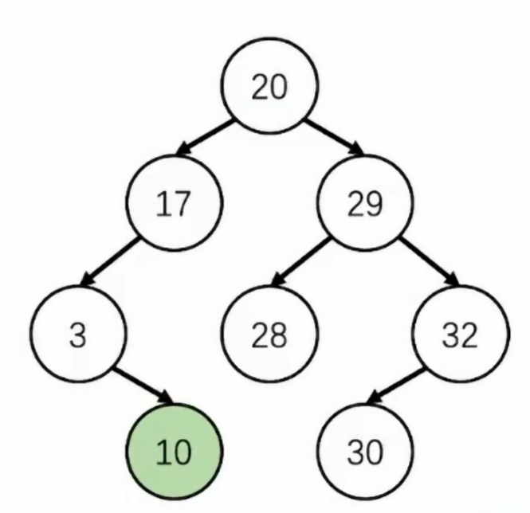

10插入过程
- 先和根节点比较
    - 因为10比20小，因此插入到20的左子树
    - 因为10比17小，因此插入到17的左子树
    - 因为10比3大，因此插入到3的右子树
    - 因为3的右子树为空，因此直接插入进去

#### 删除操作

删除共三种情侣

- 删除叶子节点
    - 最简单，直接删
- 删除度为1的节点
    - 将该节点唯一的子节点提升为他父节点的相应位置的这个节点（不会破坏二叉排序树的性质）
- 删除度为2的节点
    - 对于度为2的节点来说，它的前驱应该是它的左子树最大值（左子树中最右面的节点），后继是右子树最小值（右子树中最左面的节点）
    - 又因为一个度为2的节点，它的前驱为左子树的最大值，因此在二叉排序树中，它一定没有右子树
    - 同理，后继一定没有左子树
    - 所以该节点的前驱或者后继，一定为度为0或者度为1的节点
    - 此时删除该节点，可以用它的前驱或者后继跟它交换，然后把问题变成删除一个度为1或者度为0的节点的问题


## AVL树
### AVL介绍
最简单的平衡二叉排序树


按如下顺序插入数字，画出对应的二叉排序树
- 1:[5 9 8 3 2 4 1 7]
- 2:[1 2 3 4 5]

根据上述两组数字，画出的二叉排序树会发现，组2退化成了一个链表结构

树形结构（log(n)）和链表(O(n))结构的最大区别是查找效率的不同，也因此，要想办法避免树形结构退化成链表

其中一种方法就是AVL树（AVL名字的由来：两位发明者名字的首字母）

- 发明者：
    - G.M. Adelson-Velsy
    - E.M. Landis

- 年代：1962年（62岁）
- 性质：
    - | H(left) - H(right) | <= 1
    - 即左右子树的树高，树高差不能超过1

- 优点：
    - 由于对每个节点的左右子树的树高做了限制，所以整棵树不会退化成一个链表


### AVL树的两个基础操作（同时也是整个平衡树最重要的两个基础操作）

#### 左旋
- 重点：要时刻关注，到底当前是抓着哪个节点进行左旋
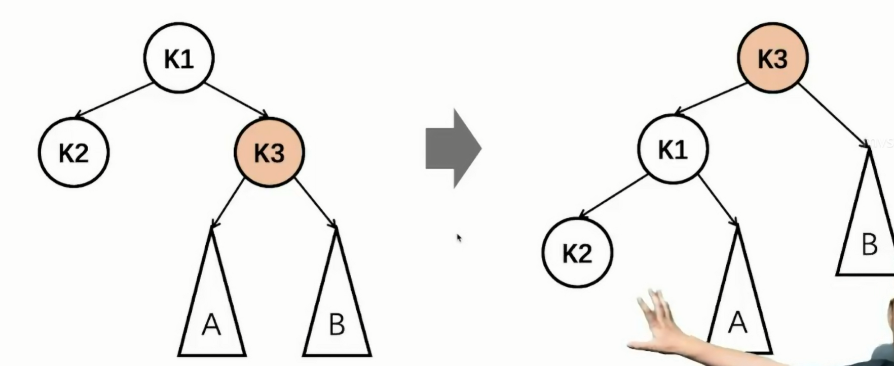

#### 右旋
- 和左旋类似

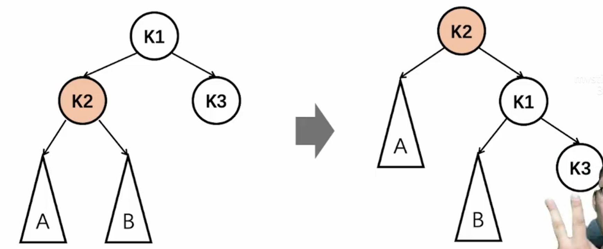

左旋和右旋并不影响二叉排序树本身的性质（重点）

### AVL树-失衡类型
- 学习的关键：看代码


- 学习要点：
    - 首先不要将判断失衡的树，看做是整个树，而应该看做是一个子树
    - k1的点，一定是二叉排序树（从下往上看）第一个失衡（左右子树高度差大于1）的节点
        - 也就是说k1下面的子树一定是平衡的


对于AVL树的理解，直接影响后面红黑树和B-树的理解

失衡分4种类型
- LL型
- LR型
- RL型
- RR型

其中LL型和LR型的左子树高度更高，左子树的高度比右子树大2
-  如果k2的子树，也是左子树高，则是LL型
- 如果k2的子树，是右子树高，则是LR型

而RL型和RR型的右子树高度更高，右子树的高度比左子树大2

LL型和RR型对称，LR型和RL型也是对称的，也就是说LL型怎么调整，RR型反着调整就可以，LR和RL型同理


#### LL型调整
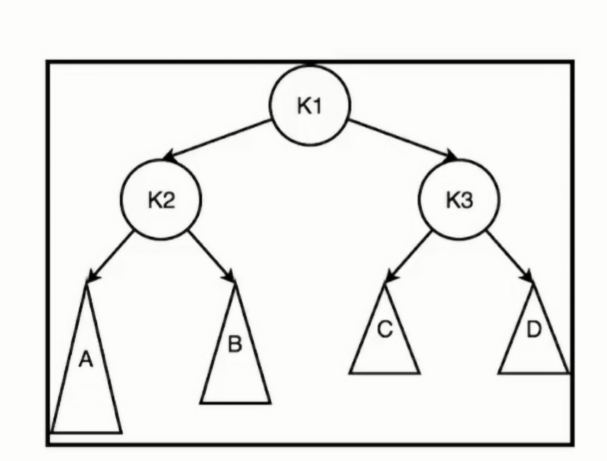
- 通过一个右旋，即可实现平衡

- LL型的推导过程
    - 已知当前失衡类型是LL型，也就是说是A子树更高
    - 因为失衡，也就是说
        - k2 = k3 + 2
        - k2 = ha + 1
        - hb = ha - 1
        - k3 = max(hc,hd) + 1
    - 因为k2 = k3 + 2; k2 = ha + 1
        - k3 + 2 = ha + 1
        - max(hc,hd) + 1 + 2 = ha + 1
        - max(hc,hd)+3 = ha + 1
        - ha = (hc,hd) + 2(a子树与c，d子树的高度关系)
        - ha = hb + 1

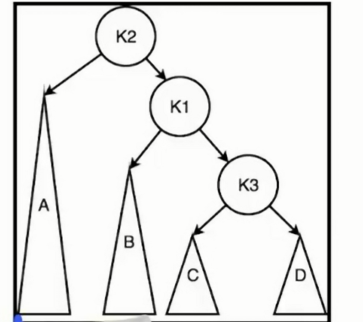
- 右旋之后
    - k2的左子树是ha,右子树是k1,
        - k1 = hb + 1
        - 又因为ha = hb + 1,因此，此时k2的左右子树平衡
    - k1的左子树是hb,右子树是k3,
        - hb + 1 = Max(hc,hd )+ 2
        - hb = Maz(hc,hd) + 1
        - Max(hc,hd) = K3
        - 所以hb 和 k3也平衡


- 由此推得，LL型通过一个右旋，可以得到一个平衡结构
- 也因此，RR型，通过一个左旋，也可以得到平衡


#### LR型调整
- 先小左旋，再大右旋
- RL类型是
    - 先小右旋，再大左旋

## 红黑树

```C
/*************************************************************************
	> File Name: 1.rbtree.c
	> Author: 
	> Mail: 
	> Created Time: Sat 12 Oct 2024 02:11:50 PM CST
 ************************************************************************/

// 红黑树平衡条件
// 1. 每个节点非红即黑
// 2. 根节点是黑色
// 3. 叶节点（NIL）是黑色,NIL：虚拟空节点是黑色，而不是我们看到的叶节点是黑色
// 4. 如果一个节点是红色，则它的两个子节点都是黑色的，即红色节点不能接红色节点，只能接黑色节点
// 5. 从根节点出发，到所有叶节点(或NIL节点)路径上，黑色节点数量相同

// 这5条平衡调条件和后续的平衡调整是息息相关


// 问题1：红黑树中，最长路径和最短路径长度的关系(2倍关系)
// 本质上红黑树间接的通过控制最长路径和最短路径的长度关系(利用第4条和第5条)，使得整棵树相对平衡

// 问题2：怎么理解条件3中的NIL节点
// 在红黑树学习中，在某些场景下，如果加上NIL节点，更方便讨论问题，就加上；
// 否则就当它不存在
// 本质上有点像文章中的标点符号，可以没有，按时有时候很麻烦.比如：3天精通C++不是梦


// 平衡调整方法
// 插入调整站在祖父节点看，即使父节点和子节点已经冲突了，也没必要去调整
// 删除调整站在父节点看
// 插入和删除的情况处理一共五种

// 插入调整的发生场景

// 问题3：新插入的节点是什么颜色的？红色，黑色?
// 答案：红色的，根据第5条性质，每条路径中黑色数量相同，如果我们插入的节点是黑色的，无论插入到哪里，直接gg，一定失衡
// 如果插入红色节点，不一定失衡


// 插入调整的目录主要就是为了干掉双红的问题,当红黑色发生失衡的时候，我们并不是站在这个节点处理，而是站在祖父节点处理


// 插入调整情况1： 子节点和父节点发生双红冲突，此时子节点的叔父节点刚好是红色
//
//                                                 B
//                             R（叔父节点）                  R(父节点)
//                                                 R（子节点）
// 红黑树相关调整一定遵循以下原则
// 调整前后，每条路径中黑色数量相同
// 因为我们判断调整的时候，所处理的一定看作是一个大红黑树的一小部分，只有保证局部每条路径黑色节点相同，才能保证整体不失衡

// 调整如下
//                                          B -> R
//                            R -> B                    R -> B
//                                              R
//
// 情况一：如果叔父节点是红色的，上面的3元组，就从黑红红，改为红黑黑

// 插入调整情况2：发生失衡的叔父节点是黑色，此时按照失衡节点出现的位置进行分类，如下方LL类型，两颗失衡的节点分别是在左子树和它自己的左子树，这种是就是LL类型
//
//                                                      B(20)
//
//                                       R(15)                        B(25)
//
//                          R(10)                    B(19)
//
//                    B(5)         B(13)     R(17)    
//
// 先进行大右旋
//                                                              R(15)
//
//                                       R(10)                                         B(20)     
//
//                          B(5)                     B(13)                   B(19)               B(25)
//
//                                                                   R(17)
//
//思考：在当前这种LL型的失衡中，有哪个节点的颜色是确定的，哪个节点的颜色是特例
//答案：因为当前这个是LL型失衡，
//因此15,10一定是Red，
//20一定是Black, 
//19一定是Black, 因为之前15是红色的
//25一定是黑色，因为LL型，叔父节点是黑色的
//5 和 13一定是确定性的Black，因为10一定是Red
//17 不一定是红色，在实际调整过程中，17都可能不存在又或者这里17下面挂着子树的根节点，他可能是黑色的，所以17是不确定的
//
//为什么要判断哪个节点颜色是确定的，按个节点颜色是特例
//因为我们在推导平衡调整策略的时候，我们只能以确定性颜色的节点的颜色进行调整，
//如果一个节点不确定，就比如如果25号颜色节点不确定，说明25号可能是红色，而如果25号节点是红色，那20号一定不能是红色,
//因此只要这个节点不确定，那上面的节点很难去调整，导致很难去平衡整个树
//
// 上图中，调整之前每个路径上的黑色节点是2个，那么调整后也得是2个
// 为了实现上述性质，可以将大右旋的红黑树上面的三元组从红红黑，改为黑红红(红色下沉), 也可以是红黑黑(红色上浮)

// (很多人这里会有疑问，就是如果把根节点改为红色，会不会和上面的冲突),所以会不会改成黑红红比改成红黑黑更好
// 结论：没有这回事，都一样
// 那么问题来了：为什么可以放心的将红黑树上面的三元组从红红黑，改为黑红红,因为他下面的5,13,19,25一定是黑色，都是确定性黑色
// 因此上面的10和20改成红色完全ok,才不会产生新的冲突
//
// 
// LR类型：先小左旋，在大右旋，在红色上浮或红色下沉
// RL类型：同理
// RR类型: 同理


#include<stdio.h>
#include<stdlib.h>
#include<time.h>

#define RED 0
#define BLACK 1
#define DBLACK 2
#define NIL (&__NIL)
#define K(n) (n->key)
#define L(n) (n->lchild)
#define R(n) (n->rchild)
#define C(n) (n->color)


// 结构定义

typedef struct Node {
    int key, color; // 0 red, 1 black,2 double black
    struct Node *lchild, *rchild;
} Node;

Node __NIL;
__attribute__((constructor))
void init_NIL() {
    NIL->key = -1;
    NIL->color = BLACK;
    NIL->lchild = NIL->rchild = NIL;
    return;
}

// 红黑树节点初始化

Node *getNewNode(int key) {
    Node *p = (Node *)malloc(sizeof(Node));
    p->key = key;
    p->color = RED;
    p->lchild = p->rchild = NIL;
    return p;
}

// 销毁节点
void clear(Node *root) {
    if (root == NIL) return ;
    clear(root->lchild);
    clear(root->rchild);
    free(root);
    return ;
}

// 对红色节点进行判断
bool has_red_node(Node *root) {
    return root->lchild->color == RED || root->rchild->color == RED;
}

// 左旋
Node *left_rotate(Node *root) {
    Node *new_root = root->rchild;
    root->rchild = new_root->lchild;
    new_root->lchild = root;
    return new_root;
}

// 右旋
Node *right_rotate(Node *root) {
    Node *new_root = root->lchild;
    root->lchild = new_root->rchild;
    new_root->rchild = root;
    return new_root;
}


// 当前树形结果的根节点地址
Node *insert_maintain(Node *root) {
    // 判断是否失衡（双红）
    // 如果当前根节点都没有红色子节点，那不可能失衡
    int flag = 0;
    if (C(L(root)) == RED && has_red_node(L(root))) flag = 1;
    if (C(R(root)) == RED && has_red_node(R(root))) flag = 2;
    if (flag == 0) return root;

    // 处理情况1
    if (C(L(root)) == RED && C(R(root)) == RED) {
        C(root) = RED;
        C(L(root)) = C(R(root)) == BLACK;
        return root;
    }

    // 情况2
    // 判断是LL还是LR
    if (flag == 1) {
        if (C(R(L(root))) == RED) {
            L(root) = left_rotate(L(root));
        }
        root = right_rotate(root);
    } else {
        if (C(L(R(root))) == RED) {
            R(root) = right_rotate(R(root));
        }
        root = left_rotate(root);
    }
    // 红色上浮
    C(root) = RED;
    C(L(root)) = C(R(root)) = BLACK;
    return root;
}


// 红黑色插入操作

Node *insert(Node *root, int key){
    if (root == NIL) return getNewNode(key);
    if (root->key == key) return root;
    if (key < root->key) root->lchild = insert(root->lchild,key);
    else root->rchild = insert(root->rchild, key);
    return insert_maintain(root);
}


int main() {

    return 0;
}
```


## B-树
### B-树结构定义
- B-树有有两种
  - B-树（不叫B减树，中间的减号是连接符）
  - B+树


通常称呼一棵B树的时候，会说一棵M阶的B-树，所谓M阶B-树指的就是该B树，最多有多少棵子树，即（如果B-树的节点最多有M个子树，就说是M阶B-树，也可以理解为一个M叉树）

- 一颗m阶B树，需要满足下列特性
  - 树中每个节点，最多含有m棵子树
    - m为3，则该树为3叉树
    - m为4，则该树为4叉树
  - 若根节点不是叶子节点，则至少有2棵子树（根节点性质）
  - 除根节点之外的所有非终端节点，至少有[m/2（向上取整）]棵子树
    - 比如m等于5，则除了根节点外，其他所有节点，至少有3棵子树，因为5/2向上取整等于3
  - 如果一个节点有n-1个关键字，则该节点有n个分支，且这n-1个关键字按照递增顺序排列
    - 在B树中，每个节点由多个关键字组成
      - 比如在二叉排序树中，每个节点有一个关键字，比如其中一个节点的关键字是45，则它使用45这个关键字区分出两条路径，所有小于45的都在左子树，所有大于45的都在右子树
      - 而B树中，一个节点有多个关键字，且这多个关键字由小到大排列
        - 比如其中一个B树的节点有两个关键字，分别是3和9，则这两个关键字可以划分出3个空间，第一个区间就是小于3的值，第二个区间就是3-9之间的值，第三个区间就是大于9的值
        - 以此类推，有3个关键字就有4个分支，有4个关键字，就有5个分支
  - 每个节点的结构为：（ n, A0, K1, A1, K2, A2, ..Kn, An ）【该条性质本质上是B树节点的形式化定义】
    - 对于B树节点而言，第一个信息:n -> 节点中包含的关键字的数量
      - 既然有n个关键字，则必然有n+1个分支，
      - n+1个分支就是A1到An
      - n+1个分支也可以看作是指向了n+1个子树
      - K1到Kn代表了N个关键字
      - A和K是按照n的序号大小从小到大排序的，这个说明了分支是按照关键字的大小区分的
      - 比如A0指的是所有小于K1的值，A1表示所有处于K1到K2之间的值，A2表示所有处于K2到K3之间的值
      - （ n, A0, K1, A1, K2, A2, ..Kn, An ）就表示分支和关键字交替出现的表示结构
      - 这条性质想说明的是：B树节点的形式化表示方法
  - 非根节点中关键字的个数n，满足：[m/2] -1 <= n <= m-1 
    - 相关节点是否平衡的最重要的一条性质
    - 我们在不断地往B-树中去插入新的元素的时候，就会造成B-树中，某个节点关键字过多的情况，当关键字的数量n增大到这个范围以外的时候，就需要进行平衡调整
    - 所以一个B树是否平衡是通过一个节点上关键字的数量去定义的
  - 所有叶子节点处于同一层
    - B-树中最优美的结构体现


- B-树在进行平衡调整的过程中，是通过第六条性质去判断是否失衡，如果失衡，那么B树就需要调整，调整的过程中，不仅要满足第六条的性质，还需要满足第七条的性质（所有叶子节点都处于同一层）

m阶B树的性质解读

1. B树中只有根节点没办法满足拥有至少[m/2]棵子树的条件，其他节点均能满足
2. B树是一种高度平衡的树形结构，比AVL树结构上更优美
   1. 因为在B树中所有叶子节点都处于同一层，因此B树是一种高度平衡的树形结构，比AVL树更优美，比红黑树更更优美
   2. B树的结构造成的现象：如果我们想查询数据，我们知道最坏需要查询多少次，因为如下图，因为所有的叶子节点都处于第三层，因此我们查找数据的时候最多查询两层即可

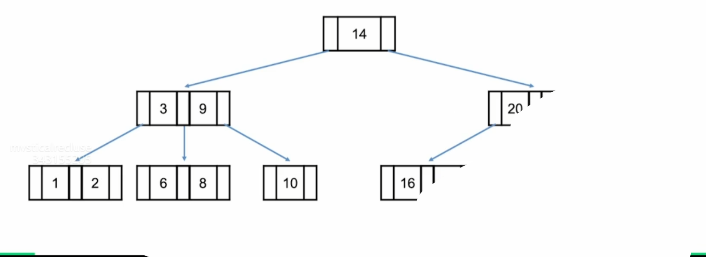


### B树的插入
B树的插入一定是插入到终端节点处

#### 插入调整（核心操作）

m阶B树的插入调整：
1. 插入调整站在父节点处理，发生在节点关键字数量达到m时
2. 插入调整的核心操作是：节点分裂
   1. 将关键字数量超出限制的节点，从中间提取出一个关键字，提升为父节点的关键字，然后将原来的超出数量的节点，分成两个子树

#### B树-插入调整（上溢）
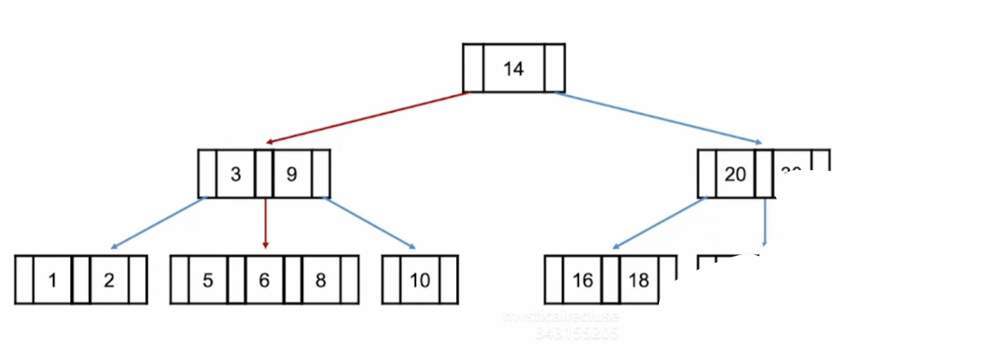

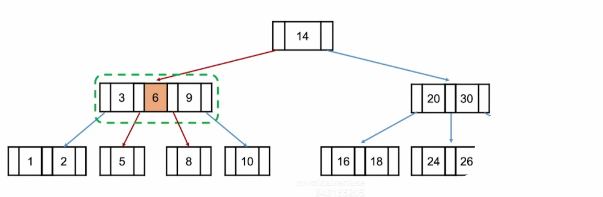

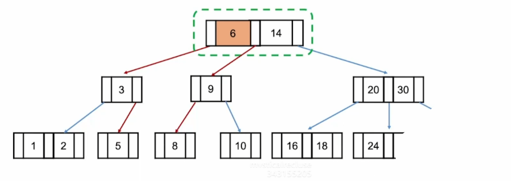

### B-树的插入代码演示

```C
/*************************************************************************
        > File Name: Btree.c
        > Author: 
        > Mail: 
        > Created Time: Sat 15 Mar 2025 09:40:48 PM CST
 ************************************************************************/

#include <stdio.h>
#include <stdlib.h>
#include <string.h>
#include <time.h>

// 为简化代码，正常应该动态配置的M（M阶B树），固定为5
# define MAX_M 5

// B树节点的结构定义
typedef struct Node {
    int n;  // 当前节点中存储的关键字的数量
    int key[MAX_M + 1]; // 开辟一个M+1的数组，用来放关键字
    struct Node *next[MAX_M + 1]; // 因为B树有M个关键字，因此有M+1个边
    // 如何表示B-树
    // 假设有一个B树的节点结构(有两个关键字)：| (指针0) | 26 | (指针1) | 35 | (指针2) |
    // 将关键字26和35放入key[]数组中，即[26, 35]
    // 将指针0,1,2放入*next[]数组中，即[*next1, *next2, *next3]
    // 所以同样的下标，比如下标为0的*next1指向的子树中的值，都比下标为key[0],即26小
    // 同理，*next[1]指向的子树中的值都比key[1]小
    // 因为key[2]为NULL，因此*next[2]指向的子树中的值都比key[1]即35大
    
} Node;

// 获取一个新的B树的节点
Node *getNewNode() {
    Node *p = (Node *)malloc(sizeof(Node));
    p->n = 0;
    memset(p->next, 0, sizeof(Node *) * (MAX_M + 1));
    return p;
}

// 将关键字插入到节点中
Node *insert_key(Node *root, int key) {
    if (root == NULL) {
        root = getNewNode();
        root->key[(root->n)++] = key;
        return root;
    }
    int pos = 0;
    while (pos < root->n && root->key[pos] < key) pos += 1;
    if (root->key[pos] == key) return root;
    for (int i = root->n - 1; i >= pos; i--) {
        root->key[i + 1] = root->key[i];
    }
    root->key[pos] = key;
    root->n += 1;
    return root;
}


// 插入调整
Node *insert_maintain(Node *root, Node *child, int pos) {
    if(child->n < MAX_M) return root;
    int spos = MAX_M / 2;
    Node *node1 = getNewNode();
    Node *node2 = getNewNode();
    node1->n = spos;
    node2->n = MAX_M - 1 - spos;
    for (int i = 0; i < spos; i++) {
        node1->key[i] = child->key[i];
        node1->next[i] = child->next[i];
    }
    node1->next[spos] = child->next[spos];
    for (int i = 0; i < node2->n; i++) {
        node2->key[i] = child->key[i + spos + 1];
        node2->next[i] = child->next[i + spos + 1];
    }
    node2->next[node2->n] = child->next[child->n];
    // 将spos处的关键字插入到父节点
    for (int i = root->n; i >= pos; i--) {
        root->key[i + 1] = root->key[i];
        root->next[i + 1] = root->next[i];
    }
    root->key[pos] = child->key[spos];
    root->next[pos] = node1;
    root->next[pos + 1] = node2;
    root->n += 1;
    free(child);
    return root;
} 

Node *__insert(Node *root, int key) {
    if (root == NULL || root->next[0] == NULL) {
        return insert_key(root, key);
    }
    int pos = 0;
    while (pos < root->n && root->key[pos] < key) pos += 1;
    if (pos < root->n && root->key[pos] == key) return root;
    __insert(root->next[pos], key);
    return insert_maintain(root, root->next[pos], pos);
}

// 向B-树插入关键字
Node *insert(Node *root, int key) {
    // 根节点的插入
    root = __insert(root, key);
    if (root->n == MAX_M) {
        Node *p = getNewNode();
        p->next[0] = root;
        // 插入调整的方案insert_maintain()有3个参数
        // 第一个参数：插入调整的时候，所在节点的父节点
        // 第二个餐宿：产生失衡的子节点
        // 子节点在父节点中的编号，即指向子节点的索引是父节点的结构中指针数组的索引几
        root = insert_maintain(p, root, 0);
    }
    return root;
}

// 销毁B树
void clear(Node *root) {
    if (root == NULL) return;
    for (int i = 0; i <= root->n; i++) {
        clear(root->next[i]);
    }
    free(root);
    return;
}

void print_node(Node *root) {
    printf("%d: ", root->n);
    for (int i = 0; i < root->n; i++) {
        printf("%4d", root->key[i]);
    }
    printf(" | ");
    if (root->next[0] == NULL) goto output_end;
    for (int i = 0; i <= root->n; i++) {
        printf("%4d", root->next[i]->key[0]);
    }
    
output_end:
    printf("\n");
    return ;
}

void output(Node *root) {
    if (root == NULL) return;
    print_node(root);
    for (int i = 0; i <= root->n; i++) {
        output(root->next[i]);   
    }
    return ;
}

int main() {
    srand(time(0));
    #define MAX_OP 25
    Node *root = NULL;
    for (int i = 0; i < MAX_OP; i++) {
        int val = rand() % 100;
        root = insert(root, val);
        printf("\ninsert %d to Btree: \n", val);
        output(root);
    }
    return 0;
}
```


## B+树

### B-树和B+树的不同
- B+树中的节点并不存储数据，只是索引，而B树中的节点存储数据
- B树中的叶子节点并不需要链表来串联，而B+树需要
- B+树而言，一般情况下，根节点会被存储在内存中，其他节点存储在磁盘中


## B树和B+树的区别

### **B树（B-Tree）**

- **每个节点既存储索引（键）也存储数据**。
- 叶子节点和非叶子节点 **都可能存储数据**。
- 查询数据时，如果一个非叶子节点命中了查询条件，就可以直接返回数据，而不需要继续向下查找。

### **🔹 B树示例**

假设有一棵 **阶数为 3** 的 B 树，存储数据 **(10, 20, 30, 40, 50, 60, 70, 80, 90)**：

```css
         [30]
       /      \
  [10, 20]    [40, 50, 60, 70, 80, 90]
```

- **根节点 `[30]`** 是索引，同时可能包含数据 `30`。
- **子节点 `[10, 20]` 和 `[40, 50, 60, 70, 80, 90]`** 既存储索引（键），也存储数据。

**📌 查询 50 的过程**

- 先检查根节点 `[30]`，发现 `50 > 30`，所以进入右子树。
- 在右子树 `[40, 50, 60, 70, 80, 90]` 直接找到 `50`，返回数据。

✅ **查询可以在非叶子节点结束，不一定要到叶子节点。**


### **📌 B+树（B+ Tree）**

- **所有数据只存储在叶子节点**，**非叶子节点仅存索引**。
- **叶子节点存储所有数据，并且用链表连接**，支持**范围查询**。
- **查询时，必须到叶子节点才能找到数据**。

### **🔹 B+树示例**

假设存储相同的数据 **(10, 20, 30, 40, 50, 60, 70, 80, 90)**：

```less
         [30, 60]
       /    |     \
  [10,20] [40,50] [70,80,90]   ← 叶子节点（存储所有数据，并用链表连接）
```

- **根节点 `[30, 60]`** 仅存储索引，不存数据。
- **子节点 `[10, 20]`、`[40, 50]`、`[70, 80, 90]`** 是叶子节点，存储所有数据，并且通过 **链表** 连接，支持**顺序扫描**。

**📌 查询 50 的过程**

- 先检查根节点 `[30, 60]`，发现 `30 < 50 < 60`，进入中间子树。
- 在 `[40, 50]` 叶子节点找到 `50`，返回数据。

✅ **所有查询都必须到叶子节点，非叶子节点只是索引。**


### **📌 B+树 vs. B树 的关键区别**

| 特性         | B 树                       | B+ 树                                |
| ------------ | -------------------------- | ------------------------------------ |
| **索引存储** | 每个节点都存索引和数据     | 只有叶子节点存数据，非叶子节点存索引 |
| **查询过程** | 可能在非叶子节点就找到数据 | 一定要遍历到叶子节点                 |
| **叶子节点** | 互相独立                   | 叶子节点通过**链表**相连             |
| **范围查询** | 需要回溯树结构，效率较低   | 叶子节点有链表，范围查询效率高       |


### **📌 为什么数据库更喜欢 B+树？**

### ✅ **1. 范围查询更高效**

- B+树的 **叶子节点通过链表相连**，范围查询只需遍历叶子节点，速度快。
- B树没有链表，范围查询需要不断回溯树结构，效率较低。

### ✅ **2. 磁盘存取更高效**

- B+树的非叶子节点 **只存索引**，数据量小，可以存入更多索引，提高**磁盘页缓存命中率**。
- B树的非叶子节点存储数据，会导致**索引层级增加**，磁盘IO成本更高。

### ✅ **3. 适合数据库存储**

- **索引结构更紧凑，查询更快。**
- **范围查询、分页查询效率更高**（如 SQL `BETWEEN`）。
- **所有数据都在叶子节点，适合磁盘顺序扫描。**


## 算法
### 复杂度
#### 时间复杂度
- 大O表示法
  - 用常数1取代运行时间中的所有加法常数
  - 在修改后的运行次数函数中，只保留最高阶项
  - 如果最高阶项存在且不是1，则去除与这个项目相乘的常数
  ```
  示例：
  3n + 100的时间复杂度
  step1：3n + 1, 用常数1取代加法常数100
  step2：3 * n ^ 1 + 1 * n ^ 0 -> 3n  只保留最高阶项
  step3: 3n -> n  如果最高阶项不是1，则去除与这个项目相乘的常数
  
  最终的到的时间复杂度就是O(n)
  
  ```

- O(1)时间复杂度示例；
```c++
int main() {
    int a1, n, d, sum = 0;
    cin >> a1 >> n >> d;
    sum = (a1 + a1 + (n - 1) * d) * n / 2;
    cout << sum << endl;
    return 0;
}
```

- O(n)时间复杂度示例
```C++
int main() {
    int a1, n, d, sum = 0;
    cin >> a1 >> n >> d;
    for (int i = a1, j = 0; j < n; i += d, j++) {
        sum += 1;
    }
    cout << sum << endl;
    return 0;
}
```

- O(n^2)时间复杂度示例
```C++
int main() {
    int n;
    cin >> n;
    for (int i = 0; i < n; i++) {
        for (int j = 0; j < n; j++) {
            // TODO
        }
    }
    return 0;
}
```

- O(logn)时间复杂度示例
```C++
int main() {
    int n;
    cin >> n;
    for (int i = 1; i <= n; i *= 2) {
        cout << i << endl;
    }
    return 0;
}
```

- O(nm)时间复杂度
```C++
int main() {
    int n, m;
    cin >> n >> m;
    for (int i = 0; i < n; i++) {
        for (int j = 0; j < m; j++) {
            // TODO
        }
    }
    return 0;
}
```

- O(n + m)时间复杂度
```C++
int main() {
    int n, m;
    cin >> n >> m;
    for (int i = 0; i < n; i++) {
        cout << i << endl;
    }
    for (int i = 0; i < m; i++) {
        cout << i << endl;
    }
    return 0;
}
```
#### 空间复杂度


### 递归函数
- 概述：
  - 自己调用自己的函数
  
#### 阶乘
- 代码示例(阶乘)
```C
#include<stdio.h>

// 阶乘函数
int f(int n) {
  if (n == 1) return 1;
  return n * f(n -1); 
}

int main() {
  int n;
  while (~scanf("%d", &n)) {
    printf("f(%d) = %d\n", n, f(n));
  }
  return 0;
}
```

#### 斐波那契数列
- 代码示例（斐波那契数列）
```C
#include<stdio.h>
int f(int n) {
  if (n == 1 || n == 2) return 1;
  return f(n -1) + f(n -2);
}
```

#### 欧几里得算法
- 算法概要：
```
整数a, b的最大公约数一般表示为 gcd(a, b)
欧几里得算法：gcd(a, b) = gcd(b, a % b)

证明1：b和a%b的最大公约数，是a和b的公约数
证明2：b和a%b的最大公约数，也是a和b的最大公约数
```
- 代码展示
```C
#include<stdio.h>

int gcd(int a, int b) {
    if (b == 0) return a;
    return gcd(b, a % b);
}

int main() {
    int a, b;
    while (scanf("%d%d", &a, &b) != EOF) {
        printf("gcd(%d, %d) = %d\n", a, b, gcd(a, b));
    }

    return 0;
}
```

#### 递归函数的设计
- 数据归纳法
  - Step1：验证 P(1) 成立
  - Step2：证明如果 P(K) 成立，那么 P(K+1) 也成立
  - Step3：联合Step1与Step2，证明由P(1) -> P(n) 成立

- 示例：
```
证明：1 + 3 + ... + (2n - 1) = n ^ 2

Step1：
P(1) = 1 = 1 ^ 2  -> P(1) 成立
Step2：
证明n的前一项的奇数和 + 后一项 = n^2
(n - 1) ^ 2 + (2n - 1) = n ^ 2
表达式展开：
公式成立

Step3：
因为Step1成立，同时Step2也成立，所以 Step3成立
```

- 递归函数设计的三个重要部分
  - 重要：给【递归函数】一个明确的语义
  - 实现边界条件时的程序逻辑 -> P(1)
  - 假设递归函数调用返回结果是正确的，实现本层函数逻辑 P(K) -> P(K + 1)

- 重识阶乘
```C
#include<stdio.h>

int f(int n) {             // f(n) 代表 n 的阶乘结果
  if (n == 1) return 1;    // 边界条件：n == 1，即P(1) = 1
  return f(n -1) * n;      // 构造P(K) = P(K + 1)
}
```

#### 扩展欧几里得算法
- 贝祖等式：
```
ax + by = gcd(a, b) = c

a, b均为整数，一定存在一组整数解（x,y），使得上述等式成立、

推导过程：(由欧几里得算法推得)
GCD：(a, b) -> (b, a%b) -> ... (c, 0) 即套用到ax = by
则：得到边界条件：x = 1, y = 0
```
- 代码实现
```C
#include<stdio.h>

int x, y, nx, ny;

int ex_gcd(int a, int b) {
    if (b == 0) {
        x = 1, y = 0;
        return a;
    }
    int c = ex_gcd(b, a % b);
    nx = y;
    ny = x - a / b * y;
    x = nx, y = ny;
    return c;
} 


int main() {
    int a, b;
    while (scanf("%d%d", &a, &b) != EOF) {
        int c = ex_gcd(a, b);
        printf("%d * %d + %d * %d = %d\n", a, x, b, y, c);

    }
    return 0;
}
```
#### 实战练习-递归实现指数型枚举
- 输出示例
```C
1
1 2
1 2 3
1 3
2
2 3
3
```
- 解题思路
```
1. 明确函数语义：f(i, j, n), i表示数组位置，j表示该位置的最小数字，n表示最大数字，进行遍历枚举

2. 从输出结果看，基本可以先判断出来，程序一定是递归 + 循环
2.1 其中1、1.2、1.2.3是很明显的递归倾向
2.2 其次纵向观察，也可以发现，有很明显的循环特征
2.3 由此初步可以判断程序结构设计为递归 + 循环

3. 循环的设计在于对递归过程中回溯过程的改变
```

- 代码示例
```C

#include<stdio.h>

int arr[10];

// 输出枚举得到的结果
void print_one(int n) {
    for (int i = 0; i <= n; i++) {
        if (i) printf(" ");
        printf("%d", arr[i]);
    }
    printf("\n");
    return ;
}

void f(int i, int j, int n){
    if (j > n) return ;
    for (int k = j; k <= n; k++) {
        // 循环放在这里的意义是重点
        arr[i] = k;
        print_one(i);
        f(i + 1, k + 1, n);
    }
    return ;
}
```
拆分解析1：
```C
void f(int i, int j, int n){
    if (j > n) return ;
    arr[i] = j;
    print_one(i);
    f(i + 1, j + 1, n);
}
// 纯递归
```
输出现象
```C
4
1
1 2
1 2 3
1 2 3 4
```

#### 递归竞赛题

- 解题思路：
```
1. 通过问题将问题分解，简化
1.1 这道题求房屋编号S与D之间得直线距离，实际上就是在求城市等级T中，S和D得坐标，而如果求得S的坐标，同理即可求得D的坐标
1.1.2 因此问题简化为已知城市等级T，求房屋S坐标

2. 观察图形2，图形2是经过图形1，4次变换得到，将图形2分为区域1 - 4
2.1 
区域1为图形等级1 通过顺时针旋转90°，然后轴镜像得到
区域2为图形等级1 通过平移得到
区域3为图形等级1 通过平移得到
区域4为图形等级1 通过逆时针旋转90°，然后轴镜像得到
（注意每个房屋编号的对应关系）
2.2
城市等级2， 可以通过城市等级1的房屋的坐标，经过计算得到城市等级2的各房屋编号对应的坐标
由此推导
城市等级N，可以通过城市等级N-1的房屋坐标，经过计算得到城市等级N的各房屋编号对应的坐标
2.3
完美符合递归的设计结构，城市等级1 - 2为边界条件，城市等级N-1 - N为推导过程，函数可语意明确的用f(T,S) - f(T-1, S)表示，T为城市等级，S为房屋编号

3. 4个区域各自用表达式表示
设在L * L 的矩阵中，（x, y）在区域1（即顺时针旋转90°，然后轴镜像得到）
旋转：(x, y) -> (y, L - 1 - x) 再镜像：(y, L - 1 - x) -> (y, x)
区域2：(x, y) -> (x, y + L)
区域3：(x, y) -> (x + 2, y + L)
区域4：(x, y) -> (n - 1 - y, x) -> (2L - 1 - y, L - x - 1)
(区域4，逆时针旋转90，然后轴镜像，然后向下平移)

```

- 完整代码
```C
#include<stdio.h>
#include<math.h>
#define S(a) ((a) * (a))

void f(long long  n, long long s, long long *x, long long *y) {
    if (n == 1) {
        if (s == 1) *x = 0, *y = 0;
        else if (s == 2) *x = 0, *y = 1;
        else if (s == 3) *x = 1, *y = 1;
        else *x = 1, *y = 0;
        return ;
    }
    long long L = pow(2LL, n - 1);
    long long block = L * L; // 点的数量
    long long xx, yy;
    if (s <= block){
        // 1号区域
        f(n - 1, s, &xx, &yy);
        *x = yy, *y = xx;
    } else if (s <= 2 * block) {
        // 2号区域
        f(n - 1, s - block, &xx, &yy);
        *x = xx, *y = yy + L;
    } else if (s <= 3 * block) {
        // 3号区域
        f(n - 1, s - 2 * block, &xx, &yy);
        *x = xx + L, *y = yy + L;
    } else {
        // 4号区域
        f(n - 1, s - 3 * block, &xx, &yy);
        *x = 2 * L - yy - 1, *y = L - xx - 1;
    }
    return ;
}

int main() {
    long long t, n, s, d;
    scanf("%lld", &t);
    while (t--) {
        scanf("%lld%lld%lld", &n, &s, &d);
        long long  sx, sy, dx, dy;
        f(n, s, &sx, &sy);
        f(n, d, &dx, &dy);
        printf("%.0lf\n", 10 * sqrt(S(sx - dx) + S(sy - dy)));
    }
    return 0;
}
```


