# 算法与数据结构
## 数据结构
- 概述
  - 数据结构 = 数据定义 + 结构操作 （学习重点）
  - 数据结构就是定义一种性质，并且维护这种性质（使用数据结构的重点）

### 顺序表和链表
 #### 顺序表：结构定义


- 包含3部分
  - 一段连续的存储区，表示顺序表存储元素的地方
  - 一个整型的变量，用来标记顺序表的大小 (size)
  - 一个整型的变量，用来标记顺序表中存储元素的数量 (count)

#### 顺序表的插入操作


#### 顺序表的删除操作


#### 顺序表代码
```C
#include<stdio.h>
#include<stdlib.h>
#include<time.h>

/* 顺序表的结构定义*/
typedef struct vector { // 元数据
    int size, count;
    int *data; // 顺序表首地址
} vector; 
// 结构体中包含了3个数据分别是：顺序表的大小，数据的数量以及存储数据的首地址

/* 初始化顺序表 */
vector *getNewVector(int n) {
    vector *p = (vector *)malloc(sizeof(vector)); // 元数据地址
    p->size = n;
    p->count = 0;
    p->data = (int *)malloc(sizeof(int) * n); // 数据首地址
    return p;
}

/* 使用之后，销毁该顺序表 */
void clear(vector *v) {
    if (v == NULL) return ;
    free(v->data); //销毁数据内存
    free(v); // 销毁元数据内存
    return ;
}

/* 顺序表的扩容操作 */
int expand(vector *v) {
    if (v == NULL) return 0;
    printf("expand v from %d to %d\n", v->size, v->size * 2); // 2倍扩容法
    int *p = (int *)realloc(v->data, sizeof(int) * 2 * v->size);
    if (p == NULL) return 0;
    v->data = p;
    v->size *= 2;
    return 1;
}
/*
*   realloc()的功能：重新进行内存分配
*   realloc()的工作过程：
*   1. 先在原内存地址上，试着向后进行延展（策略1：首地址不变，大小变大）
*   2. 如果无法向后扩展，则realloc会找一片新内存，将原内存的数据拷贝过来，并返回新内存地址（策略2）
*   3. 策略1和2都不成功，realloc返回null,且原内存不动，但是此时，源地址信息丢失，因为返回的是null
*
* */

/* 顺序表的插入操作 */
int insert(vector *v, int pos, int val) {
    if (pos < 0 || pos > v->count) return 0; // 判断插入位置的合法性
    if (v->size == v->count && !expand(v)) return 0; // 判断顺序表是否有空间插入数据
    // 注意逆序遍历
    for (int i = v->count, i >= pos, i--) {
        v->data[i + 1] = v->data[i];
    }
    v->count += 1;
    v->data[pos] = val;
    return 1;
}

/* 顺序表的删除操作 */
int erase(vector *v, int pos) {
    if (pos < 0 || pos > v->count) return 0; // 判断删除位置的合法性
    for (int i = pos + 1, i < v->count, i++) {
        v->data[i - 1] = v->data[i];
    }
    v->count -= 1;
    return 1;
}

/* 输出顺序表的数据 */
void output_vector(vector *v) {
    int len = 0;
    for (int i = 0; i < v->size; i++) {
        len += printf("%3d", i);
    }
    printf("\n");
    for (int i = 0; i < len; i++) {
        printf("-");
    }
    printf("\n");
    for (int i = 0; i < v->count; i++) {
        printf("%3d", v->data[i]);
    }
    printf("\n\n");
    return ;
}

int main() {
    srand(time(0));
    #define MAX_OP 20
    vector *v = getNewVector(2);
    for (int i = 0; i < MAX_OP; i++) {
        int op = rand() % 4, pos, val, ret;
        switch (op) {
            case 0: 
            case 1:
            case 2: {
                pos = rand() % (v->count + 2);
                val = rand() % 100;
                ret = insert(v, pos, val);
                printf("insert %d at %d to vetor = %d\n", 
                    val, pos, ret);
            };break;
            case 3:{
                pos = rand() % (v->count + 2);
                ret = erase(v, pos);
                printf("erase item at %d in vector = %d\n", 
                    pos, ret);
            };break;
        }
        output_vector(v);
    }
    clear(v);
    return 0;
}
```

#### 链表：结构定义
- 结构定义：
  - 链表是由若干个节点（逻辑结构上）串联在一起的
  - 逻辑结构串联的实现：
    - 每个节点存储两个信息，一个是数据，一个是下一个节点的地址（指针）

#### 两种链表
- 无头链表
  - 头部不存储信息，仅存储第一个节点的地址

- 有头链表
  - 头部有存储数据的区域，但是不使用，仅使用部分空间存储节点地址

#### 虚拟头节点
- 定义：
  - 一般有头链表的头节点，称为虚拟头节点（重要编程技巧）

#### 链表的操作
- 链表的插入操作：
  - 假设一个链表中有4个节点，将node节点插入到第2个节点的位置
    - 第一步：创建一个指针p，指向待插入位置的前一个节点
    - 第二步：node节点上的地址信息，指向原2号节点
    - 第三步：指针p指向的节点的地址信息，指向node节点
    - 完成链表的插入操作
  - 易错点：
    - 如果先将指针p指向的节点地址指向node节点
    - 此时整个链表失去了指向原2号节点的地址信息，因为原二号节点的地址信息记录在1号节点（也就是p指向的节点上，现在它改变了），从而造成了内存泄漏

#### 链表代码演示
```C
#include <stdio.h>
#include <time.h>
#include <stdlib.h>

#define DL 3
#define STR(n) #n
#define DIGIT_LEN_STR(n) "%" STR(n) "d"

// 链表结构定义
typedef struct Node {
    int data;
    struct Node *next;
} Node;

// 结构操作
// 初始化链表
Node *getNewNode(int val) {
    Node *p = (Node *)malloc(sizeof(Node));
    p->data = val;
    p->next = NULL;
    return p;
}

// 链表插入
// 无头链表在插入过程中，首地址可能发生改变，因此返回值是新链表的首地址
Node *insert(Node *head, int pos, int val) {
    // 如果插入位置是头地址的话，整个链表的首地址发生改变
    if (pos == 0) {
        Node *p = getNewNode(val);
        p->next = head;
        return p;
    }
    // 如果插入的不是头地址，则需要先找到待插入位置的前一个元素
    Node *p = head;
    for (int i = 1; i < pos; i++) p = p->next;
    Node *node = getNewNode(val);
    node->next = p->next;
    p->next = node;
    return head;
}


// 销毁链表
void clear(Node *head) {
    if (head == NULL) return ;
    for (Node *p = head, *q; p; p = q) {
        q = p->next;
        free(p);
    }
    return ;
}

// 输出链表操作
void output_linklist(Node *head, int flag) {
    int n = 0;
    for (Node *p = head; p; p = p->next) n += 1;
    for (int i = 0; i < n; i++) {
        printf(DIGIT_LEN_STR(DL), i);
        printf("  "); // 留出小箭头的位置
    }
    printf("\n");
    for (Node *p = head; p; p = p->next) {
        printf(DIGIT_LEN_STR(DL), p->data);
        printf("->");
    }
    printf("\n");
    if (flag == 0) printf("\n\n");
    return ;
}

// 链表的查找
int find(Node *head, int val) {
    Node *p = head;
    int n = 0;
    while (p) {
        if (p->data == val) {
            output_linklist(head, 1);
            int len = n * (DL + 2) + 2;
            for (int i = 0; i < len; i++) printf(" ");
            printf("^\n");
            for (int i = 0; i < len; i++) printf(" ");
            printf("|\n");
            return 1;
        };
        n += 1;
        p = p->next;
    }
    return 0;
}

int main() {
    srand(time(0));
    #define MAX_OP 20
    Node *head = NULL;
    for (int i = 0; i < MAX_OP; i++) {
        int pos = rand() % (i + 1), val = rand() % 100, ret;
        printf("insert %d at %d to linklist\n", val, pos);
        head = insert(head, pos, val);
        output_linklist(head, 0);
    }
    int val;
    while(~scanf("%d", &val)) { // ~是按位取反的意思
        if (!find(head,val)) {
            printf("not found\n");
        }
    }
    clear(head);
    /*
        关于while(~scanf("%d", &val)) 的详细解析
        当 scanf 成功读取一个整数并将其存储在 val 中时，它返回 1。按位取反 ~1 产生的结果不是 0（因为所有位都被取反了），所以循环继续。
        当 scanf 到达文件末尾（例如，用户输入了 EOF 字符，通常是 Ctrl+D 或 Ctrl+Z），它返回 EOF（即 -1）。由于在大多数系统中 -1 的二进制表示是全 1，因此按位取反后变成全 0，即 0。这使得 while 循环的条件变为 false，循环终止。
        因此，while(~scanf("%d", &val)) 实际上是一种检测输入结束的方式。只要用户不输入 EOF 字符，循环就会继续。这是一种在 C 语言中常见的用于从标准输入读取值的模式。

        因此：while(~scanf("%d", &val))等价于while(scanf("%d", &val) != EOF)
    */

    return 0;
}
```

#### 有头链表精简插入模块
```C
Node *insert(Node *head, int pos, int val) {
    // 定义一个虚拟头节点
    // 有头链表的优势：同时整合了插入的两种情况
    Node new_head, *p = &new_head, *node = getNewNode(val);
    new_head.next = head;
    for (int i = 0; i < pos; i++) p = p->next; // 有无虚拟头的关键所在
    // 如果没有虚拟头的话，当插入到0位置时，就找不到0位置的前一个节点
    // 因为0位置没有节点，仅是一个记录首地址的指针
    node->next = p->next;
    p->next = node;   
    return new_head.next;
}
```

#### 循环链表和双向链表
- 单向循环链表：
  - 最后一个节点指向第一个节点
  - 注意：
    - 头指针指向<font color=tomato>最后一个节点</font>（将最后一个节点，看作是有头链表的虚拟节点）

- 双向链表：
  - 链表的结构定义中，多加一个p->pre,指向前一个节点
  
  - 第一个节点的pre和最后一个节点的next都指向null


## 树与二叉树
### 树-结构定义
```C
// 单向链表结构是树形结构的一个特列
typedef struct Node {
    int data;
    struct Node *next;
} Node, *LinkedList;
```

```C
# 三叉树
typedef struct Node {
    int data;
    struct Node *next[3];
} Node, *Tree;
```

### 树的基本概念
- 树：深度，高度和度
    - 树的深度和高度（树的深度=树的高度），就是树的最高高度
    - 节点的深度和高度
        - 节点的深度是从根节点开始数，作为起始节点，
        - 节点的高度是从叶子节点开始数
    - 节点的数量等于边数+1
    - 节点的度，只的是当前节点的子节点的数量(所以所有叶子节点的度为0)
        - 入度
            - 有几个节点指向我
        - 出度
            - 我指向几个节点
    - 树型结构的度，为出度，不讨论入度

- 总结（树形结构的精髓）：
    - 根节点代表【全集】
    - 树的节点代表【集合】
    - 树的边代表【关系】


- 如何利用树形结构进行建模

### 广度优先遍历（层序遍历）
- 利用下层的队列结构实现

- 过程：
    - 从根节点起，先把所有子节点压入队列，然后该节点出队
    - 不断重复这个过程，最后把所有节点压入队列，同时把所有节点都弹出队列


### 深度优先遍历
- 利用下层的栈结构实现

- 过程：
    - 对于某一节点来说，如果它还有子节点，就进栈，如果下面没有子节点，则当前节点出栈

### 二叉树
- 单项链表可以看作是每个节点都缺了一个子孩子的二叉树，因为二叉树的定义是，每个节点最多2个子孩子，并不是必须有两个子孩子

- 二叉树中特殊的称呼：因为二叉树只有两个节点，因此可以说，根节点左侧叫左子树，右侧叫右子树，如果左右是单独一个节点，也可以叫左节点或者右节点

- 
    - 每个节点度最多是2
    - 度为0的节点，比度为2的节点多1个


- 二叉树结构
    - 分别包含度为0的节点（叶子节点），度为1的节点，度为2的节点（因为是二叉树，一个节点最多度为2）
        - 所以总节点数为：n0 + n1 + n2
    - 度为0的节点没有边，度为1的节点1条边，度为2的节点2条边，又因为总点数=总边数+1
    - n0 + n1 + n2 = n1 + 2n2 +1
        - n0 = n2 + 1
        - 所以度为0的节点比度为2的节点多1（性质1）


- 二叉树的特殊种类
    - 完全二叉树（complete binary tree）
        - 除最后一层外，上面的层都是满的
        - 最后一层，只有右侧节点是缺失的
    - 满二叉树(full binary tree)
        - 没有度为1的节点
    - 完美二叉树(perfect binary tree)
        - 每一层都是满的 

#### 完全二叉树（堆的底层实现）
- 性质：
    - 如果当前节点的编号是i<span style="color:red">（可以通过父节点的编号，计算得到子节点的编号）</span>
        - 左孩子的编号：2 * i
        - 右孩子的编号：2 * i+ 1
    - 类比：链表中，通过记录下一个节点的指针地址，来维护前一个节点和后一个节点的指向关系
    - 完全二叉树中，可以通过计算来维护当前节点和上下节点的指向关系（可以节省大量的存储边的空间，因为可以通过计算得到指向关系），即通过父节点的编号，计算得到子节点的编号
    - 链表是如何维护当前节点与下一个节点的指向关系；是不是得用一个指针记录一下子节点的地址，也就是说父节点和子节点之间记录了一个地址
    - 而完全二叉树是计算得到子节点的地址
    - 记录花费的是空间（节省时间），计算花费的是时间（节省空间）
        - 本质上是空间换时间，时间换空间的性质，算法分析中的重要性质
    - 可以用连续空间存储（数组）（重要特点）
        - 因为完全二叉树的节点编号是连续的 
        - 实现完全二叉树，虽然它也是一个树形结构，但是我们实现完全二叉树，完全没必要用指针，用连续的数组空间就可以了，因为完全二叉树的节点编号是连续的


#### 二叉树分支
- 二叉树
    - 完全二叉树
        - 堆（维护集合最值的神兵利器）
        - 优先队列（维护集合最值的神兵利器）
    - 多叉树/森林
        - 字典树（多叉树）（字符串及其相关转换问题的神兵利器）
        - AC自动机（多叉树）（字符串及其相关转换问题的神兵利器）
        - 并查集（森林）（连通性问题的神兵利器）
    - 二叉排序树
        - AVL树（语言标准库中重要的数据检索容器的底层实现）
        - 2-3树（语言标准库中重要的数据检索容器的底层实现）
        - 红黑树（语言标准库中重要的数据检索容器的底层实现）（C++的map结果（红黑树））
        - B-树（读作B树）/B+树（读作B加树）（文件系统，数据库底层重要实现）

- 二叉树是练习递归技巧的最佳选择
    - 递归函数的设计利器（结构归纳法）
        - 赋予递归函数一个明确的意义
        - 思考边界条件
        - 实现递归过程

- 二叉树作用三：
- 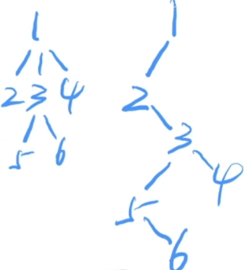
    - 左孩子右兄弟表示法（节省空间）


### 二叉树的遍历与线索化
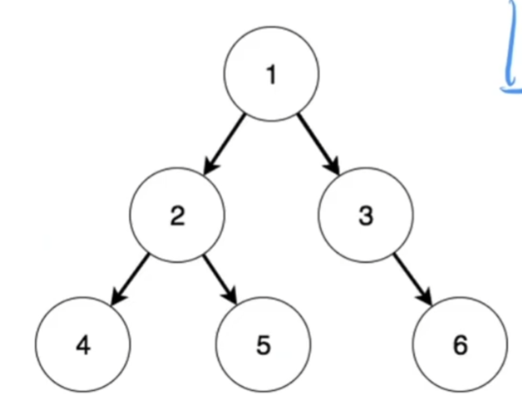
- 二叉树的三种遍历方式
    - 前序遍历（根，左，右）
      - 124536
    - 中序遍历（左，根，右）
      - 425136
    - 后序遍历（左，右，根）
      - 452631
- 三种遍历方式取决于：根节点在哪个位置
    - 前序遍历：根节点在最开始的位置，即左子树和右子树的遍历结果之前
    - 中序遍历：根节点出现在左右子树遍历结果的中间
    - 后序遍历：根节点出现在左右子树的最后

- 上述的左右指的是左子树相关遍历的结果和右子树相关遍历的结果
    - 三种方式都是按照递归的方式定义的


### 二叉树三种遍历方式的意义
- 作用1：序列化（数据结构的序列化） 
  - 当我们想把A计算机中的数据结构传递给B计算机的时候，我们不能将这个数据结构的原始信息给传过去
  -  因为在A计算机中，指向每个结构数据，我们用的指针，但是指针的地址是随机分配的，A计算机的指针并不能完全不知道B计算机
  -  比如6号节点在A计算机中占用65号内存，但是如果我们想复制到B计算机中，我们并不在意6号节点在不在65号内存（占用100号内存也可以），因此节点地址的信息只在当前A计算机的内存中是有意义的，这个信息但凡处理A计算机就没有意义了
  - 那么如何将A计算机的数据复制到B计算机
    - 就是使用二叉树的三种遍历方式，将二叉树的信息传输到B计算机中，然后在B计算机中做复原
    - 示例如下

- 用序列化的方式将数据从A复制到B

数据以上图为例

    - 将这个二叉树的数据从A计算机复制到B计算机
    - 将这棵树的前序遍历（124536）中序遍历（425136）复制到B计算机
    - 把计算机B收到（124536）和（425136）进行数据还原
    - 在前序遍历中，根节点在最开始的位置，然后在中序遍历中找到根节点的位置
    - 中序遍历中，找到根节点1的位置，然后可以判断前部分（425）是这棵树的左子树，（3，6）是这棵树的右子树
    - 因为中序遍历中可以判断（425）是左子树部分，那么回到前序遍历，前序遍历的结构是（根左右），又因为根是1，且左子树有3个节点，因此可以判断，前序遍历中（245）是前序遍历中的左子树部分，后面（36）就是右子树的前序遍历结果
    - 此时，我们找到了前序遍历中左子树，右子树，根的部分，以及中序遍历中根，左子树，右子树的部分，然后遍历上述过程，即可还原出整个二叉树。

- 序列化的目的：将数据信息通过网络能够有效的传给另一台计算机，并且回复相应的数据结构

- 三种遍历方式中
  - （中+前）（中+后）都可以回复数据
  - （前+后）无法回复数据
    - 确定不了左子树和右子树的节点数量，但是加上中序遍历，使用根节点在中间一劈，就可以找到左右子树的节点数

### 二叉树的线索化
- 主要动作：“废物利用”
  - 二叉树中，每个节点都有两个指针，一个指向左子树，一个指向右子树
  - 但是对于叶子节点（也就是最后一层的节点，它的两个指针域都是空的）
  - 线索化就是把这些空着的指针域用起来
  - 将这些空着的指针域，结合二叉树的三种遍历方式即可实现线索化，即
    - 前序遍历线索化
    - 中序遍历线索化
    - 后续遍历线索化

#### 中序遍历线索化
- 上述二叉树数据：
  - 前序遍历：（124536）
  - 中序遍历：（425136）
  - 后序遍历：（451631）
- 我们让相应节点左边空着的指针，指向当前节点的前驱（前驱：当前节点在相应遍历中的前面的值）
  - 中序遍历中，6的前驱是3，1的前驱是5，5的前驱是2
- 让相应节点右边空着的指针，指向当前节点的后继，（即遍历结果中，处在当前节点后面的节点）
  - 中序遍历中，5的后继是1，3的后继是6

- 中序遍历（425136）中

  - 4号节点没有前驱，只有后继，因此左指针执行NULL，右指针指向2
  - 5号节点的前驱是2号节点，后继是1号节点
  - 3号节点左指针空着，它指向前驱，即1号指针
  - 6号节点左指针指向前驱，3号节点，右指针指向后继，但是没有，因此指向NULL；
  - 至此，二叉树的线索化改造完成

- 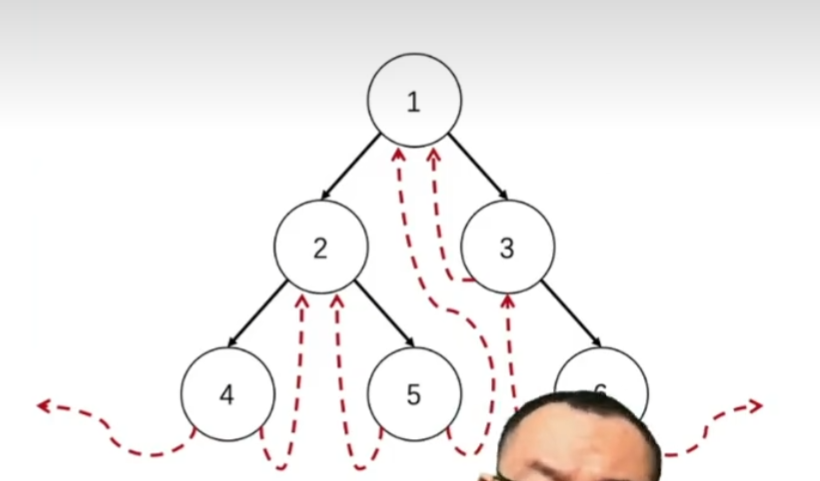

- 线索化的目的：将二叉树的遍历从递归，变为非递归，让二叉树的遍历表现的向链表一样

- 遍历方式从递归变为链表的优势
  - 当前节点想去下一节点，直接next，指过去，很快
  - 因此不用借用递归程序进行中序遍历
  - 因为不用借用递归进行中序遍历，所有可以在中序遍历的过程中，停在任何一个节点处
  - 总结：线索化的好处：遍历更加灵活和高效


## 二叉排序树

名称：二叉排序树、二叉搜索树

性质：
- 左子树(值) < 根节点
- 右子树(值) > 根节点

特点

- 二叉排序树的中序遍历（左根右）的结果是有序的（从小到大）

用途：

- 解决与排名相关的检索需求

### 二叉排序树的操作：

#### 插入操作
- 如果我们想把节点插入到二叉排序树中，在该节点一定会作为二叉排序树中的叶子节点

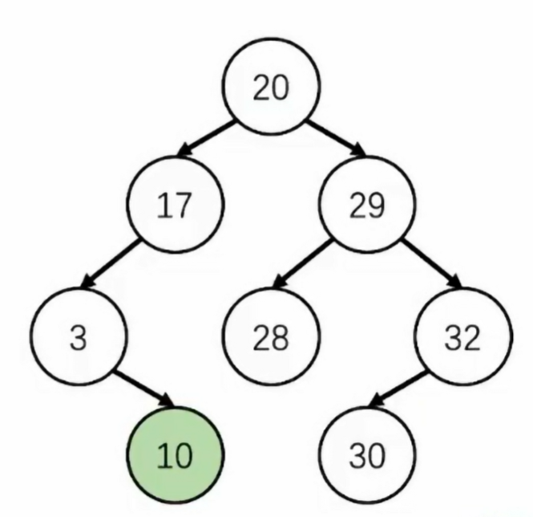

10插入过程
- 先和根节点比较
    - 因为10比20小，因此插入到20的左子树
    - 因为10比17小，因此插入到17的左子树
    - 因为10比3大，因此插入到3的右子树
    - 因为3的右子树为空，因此直接插入进去

#### 删除操作

删除共三种情侣

- 删除叶子节点
    - 最简单，直接删
- 删除度为1的节点
    - 将该节点唯一的子节点提升为他父节点的相应位置的这个节点（不会破坏二叉排序树的性质）
- 删除度为2的节点
    - 对于度为2的节点来说，它的前驱应该是它的左子树最大值（左子树中最右面的节点），后继是右子树最小值（右子树中最左面的节点）
    - 又因为一个度为2的节点，它的前驱为左子树的最大值，因此在二叉排序树中，它一定没有右子树
    - 同理，后继一定没有左子树
    - 所以该节点的前驱或者后继，一定为度为0或者度为1的节点
    - 此时删除该节点，可以用它的前驱或者后继跟它交换，然后把问题变成删除一个度为1或者度为0的节点的问题


## AVL树
### AVL介绍
最简单的平衡二叉排序树


按如下顺序插入数字，画出对应的二叉排序树
- 1:[5 9 8 3 2 4 1 7]
- 2:[1 2 3 4 5]

根据上述两组数字，画出的二叉排序树会发现，组2退化成了一个链表结构

树形结构（log(n)）和链表(O(n))结构的最大区别是查找效率的不同，也因此，要想办法避免树形结构退化成链表

其中一种方法就是AVL树（AVL名字的由来：两位发明者名字的首字母）

- 发明者：
    - G.M. Adelson-Velsy
    - E.M. Landis

- 年代：1962年（62岁）
- 性质：
    - | H(left) - H(right) | <= 1
    - 即左右子树的树高，树高差不能超过1

- 优点：
    - 由于对每个节点的左右子树的树高做了限制，所以整棵树不会退化成一个链表


### AVL树的两个基础操作（同时也是整个平衡树最重要的两个基础操作）

#### 左旋
- 重点：要时刻关注，到底当前是抓着哪个节点进行左旋
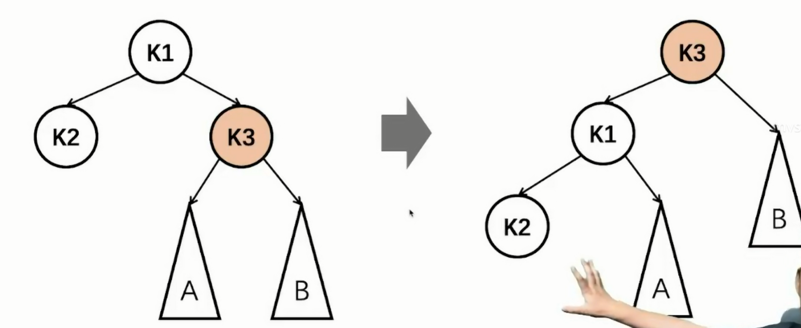

#### 右旋
- 和左旋类似

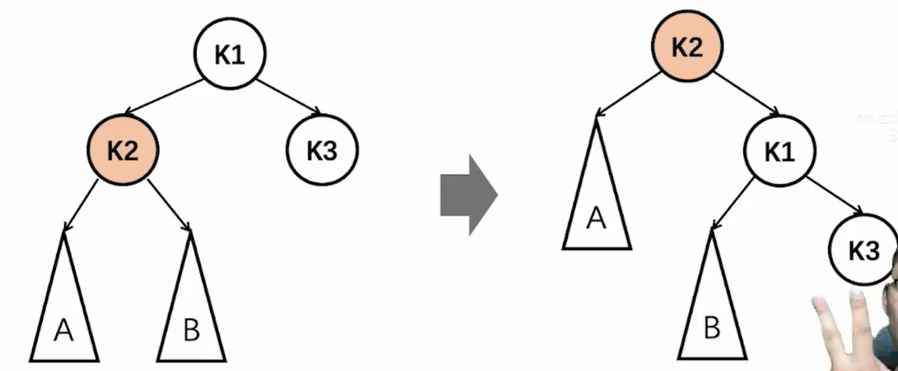

左旋和右旋并不影响二叉排序树本身的性质（重点）

### AVL树-失衡类型
- 学习的关键：看代码


- 学习要点：
    - 首先不要将判断失衡的树，看做是整个树，而应该看做是一个子树
    - k1的点，一定是二叉排序树（从下往上看）第一个失衡（左右子树高度差大于1）的节点
        - 也就是说k1下面的子树一定是平衡的


对于AVL树的理解，直接影响后面红黑树和B-树的理解

失衡分4种类型
- LL型
- LR型
- RL型
- RR型

其中LL型和LR型的左子树高度更高，左子树的高度比右子树大2
-  如果k2的子树，也是左子树高，则是LL型
- 如果k2的子树，是右子树高，则是LR型

而RL型和RR型的右子树高度更高，右子树的高度比左子树大2

LL型和RR型对称，LR型和RL型也是对称的，也就是说LL型怎么调整，RR型反着调整就可以，LR和RL型同理


#### LL型调整
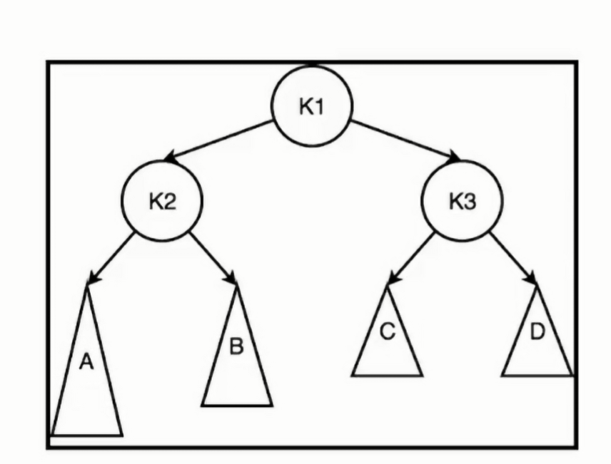
- 通过一个右旋，即可实现平衡

- LL型的推导过程
    - 已知当前失衡类型是LL型，也就是说是A子树更高
    - 因为失衡，也就是说
        - k2 = k3 + 2
        - k2 = ha + 1
        - hb = ha - 1
        - k3 = max(hc,hd) + 1
    - 因为k2 = k3 + 2; k2 = ha + 1
        - k3 + 2 = ha + 1
        - max(hc,hd) + 1 + 2 = ha + 1
        - max(hc,hd)+3 = ha + 1
        - ha = (hc,hd) + 2(a子树与c，d子树的高度关系)
        - ha = hb + 1

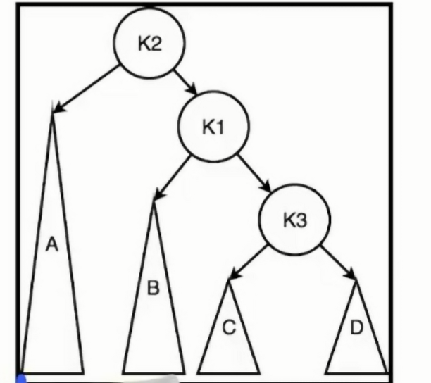
- 右旋之后
    - k2的左子树是ha,右子树是k1,
        - k1 = hb + 1
        - 又因为ha = hb + 1,因此，此时k2的左右子树平衡
    - k1的左子树是hb,右子树是k3,
        - hb + 1 = Max(hc,hd )+ 2
        - hb = Maz(hc,hd) + 1
        - Max(hc,hd) = K3
        - 所以hb 和 k3也平衡


- 由此推得，LL型通过一个右旋，可以得到一个平衡结构
- 也因此，RR型，通过一个左旋，也可以得到平衡


#### LR型调整
- 先小左旋，再大右旋
- RL类型是
    - 先小右旋，再大左旋


## 红黑树（待重学）

## B-树
### B-树结构定义
- B-树有有两种
  - B-树（不叫B减树，中间的减号是连接符）
  - B+树
- 一颗m阶B树，需要满足下列特性
  - 树中每个节点，最多含有m棵子树
    - m为3，则该树为3叉树
    - m为4，则该树为4叉树
  - 若根节点不是叶子节点，则至少有2棵子树（根节点性质）
  - 除根节点之外的所有非终端节点，至少有[m/2（向上取整）]棵子树
    - 比如m等于5，则除了根节点外，其他所有节点，至少有3棵子树，因为5/2向上取整等于3
  - 如果一个节点有n-1个关键字，则该节点有n个分支，且这n-1个关键字按照递增顺序排列
    - 在B树中，每个节点由多个关键字组成
      - 比如在二叉排序树中，每个节点有一个关键字，比如其中一个节点的关键字是45，则它使用45这个关键字区分出两条路径，所有小于45的都在左子树，所有大于45的都在右子树
      - 而B树中，一个节点有多个关键字，且这多个关键字由小到大排列
        - 比如其中一个B树的节点有两个关键字，分别是3和9，则这两个关键字可以划分出3个空间，第一个区间就是小于3的值，第二个区间就是3-9之间的值，第三个区间就是大于9的值
        - 以此类推，有3个关键字就有4个分支，有4个关键字，就有5个分支
  - 每个节点的结构为：（ n, A0, K1, A1, K2, A2, ..Kn, An ）
    - 对于B树节点而言，第一个信息:n -> 节点中包含的关键字的数量
      - 既然有n个关键字，则必然有n+1个分支，
      - n+1个分支就是A1到An
      - n+1个分支也可以看作是指向了n+1个子树
      - K1到Kn代表了N个关键字
      - A和K是按照n的序号大小从小到大排序的，这个说明了分支是按照关键字的大小区分的
      - 比如A0指的是所有小于K1的值，A1表示所有处于K1到K2之间的值，A2表示所有处于K2到K3之间的值
      - （ n, A0, K1, A1, K2, A2, ..Kn, An ）就表示分支和关键字交替出现的表示结构
      - 这条性质想说明的是：B树节点的形式化表示方法
  - 非根节点中关键字的个数n，满足：[m/2] -1 <= n <= m-1 
    - 相关节点是否平衡的最重要的一条性质
    - 我们在不断地往B-树中去插入新的元素的时候，就会造成B-树中，某个节点关键字过多的情况，当关键字的数量n增大到这个范围以外的时候，就需要进行平衡调整
    - 所以一个B树是否平衡是通过一个节点上关键字的数量去定义的
  - 所有叶子节点处于同一层
    - B-树中最优美的结构体现


- B-树在进行平衡调整的过程中，是通过第六条性质去判断是否失衡，如果失衡，那么B树就需要调整，调整的过程中，不仅要满足第六条的性质，还需要满足第七条的性质（所有叶子节点都处于同一层）

m阶B树的性质解读

1. B树中只有根节点没办法满足拥有至少[m/2]棵子树的条件，其他节点均能满足
2. B树是一种高度平衡的树形结构，比AVL树结构上更优美
   1. 因为在B树中所有叶子节点都处于同一层，因此B树是一种高度平衡的树形结构，比AVL树更优美，比红黑树更更优美
   2. B树的结构造成的现象：如果我们想查询数据，我们知道最坏需要查询多少次，因为如下图，因为所有的叶子节点都处于第三层，因此我们查找数据的时候最多查询两层即可

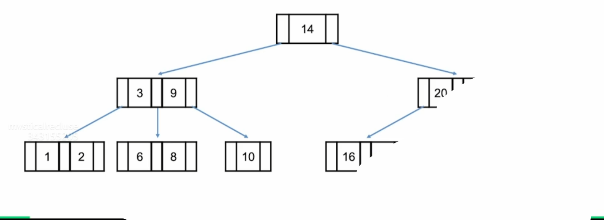


### B树的插入
B树的插入一定是插入到终端节点处

#### 插入调整（核心操作）

m阶B树的插入调整：
1. 插入调整站在父节点处理，发生在节点关键字数量达到m时
2. 插入调整的核心操作是：节点分裂
   1. 将关键字数量超出限制的节点，从中间提取出一个关键字，提升为父节点的关键字，然后将原来的超出数量的节点，分成两个子树

#### B树-插入调整（上溢）
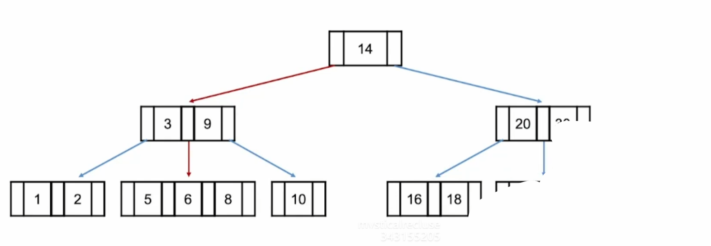

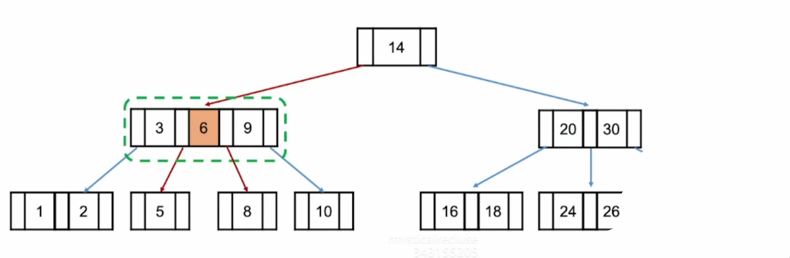

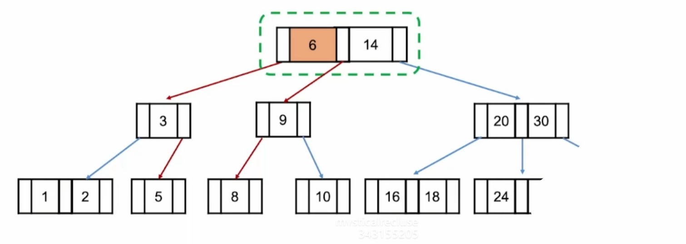


## B+树
### B-树和B+树的不同
- B+树中的节点并不存储数据，只是索引，而B树中的节点存储数据
- B树中的叶子节点并不需要链表来串联，而B+树需要
- B+树而言，一般情况下，根节点会被存储在内存中，其他节点存储在磁盘中


## 算法
### 复杂度
#### 时间复杂度
- 大O表示法
  - 用常数1取代运行时间中的所有加法常数
  - 在修改后的运行次数函数中，只保留最高阶项
  - 如果最高阶项存在且不是1，则去除与这个项目相乘的常数
  ```
  示例：
  3n + 100的时间复杂度
  step1：3n + 1, 用常数1取代加法常数100
  step2：3 * n ^ 1 + 1 * n ^ 0 -> 3n  只保留最高阶项
  step3: 3n -> n  如果最高阶项不是1，则去除与这个项目相乘的常数

  最终的到的时间复杂度就是O(n)

  ```

- O(1)时间复杂度示例；
```c++
int main() {
    int a1, n, d, sum = 0;
    cin >> a1 >> n >> d;
    sum = (a1 + a1 + (n - 1) * d) * n / 2;
    cout << sum << endl;
    return 0;
}
```

- O(n)时间复杂度示例
```C++
int main() {
    int a1, n, d, sum = 0;
    cin >> a1 >> n >> d;
    for (int i = a1, j = 0; j < n; i += d, j++) {
        sum += 1;
    }
    cout << sum << endl;
    return 0;
}
```

- O(n^2)时间复杂度示例
```C++
int main() {
    int n;
    cin >> n;
    for (int i = 0; i < n; i++) {
        for (int j = 0; j < n; j++) {
            // TODO
        }
    }
    return 0;
}
```

- O(logn)时间复杂度示例
```C++
int main() {
    int n;
    cin >> n;
    for (int i = 1; i <= n; i *= 2) {
        cout << i << endl;
    }
    return 0;
}
```

- O(nm)时间复杂度
```C++
int main() {
    int n, m;
    cin >> n >> m;
    for (int i = 0; i < n; i++) {
        for (int j = 0; j < m; j++) {
            // TODO
        }
    }
    return 0;
}
```

- O(n + m)时间复杂度
```C++
int main() {
    int n, m;
    cin >> n >> m;
    for (int i = 0; i < n; i++) {
        cout << i << endl;
    }
    for (int i = 0; i < m; i++) {
        cout << i << endl;
    }
    return 0;
}
```
#### 空间复杂度


### 递归函数
- 概述：
  - 自己调用自己的函数
  
#### 阶乘
- 代码示例(阶乘)
```C
#include<stdio.h>

// 阶乘函数
int f(int n) {
  if (n == 1) return 1;
  return n * f(n -1); 
}

int main() {
  int n;
  while (~scanf("%d", &n)) {
    printf("f(%d) = %d\n", n, f(n));
  }
  return 0;
}
```

#### 斐波那契数列
- 代码示例（斐波那契数列）
```C
#include<stdio.h>
int f(int n) {
  if (n == 1 || n == 2) return 1;
  return f(n -1) + f(n -2);
}
```

#### 欧几里得算法
- 算法概要：
```
整数a, b的最大公约数一般表示为 gcd(a, b)
欧几里得算法：gcd(a, b) = gcd(b, a % b)

证明1：b和a%b的最大公约数，是a和b的公约数
证明2：b和a%b的最大公约数，也是a和b的最大公约数
```
- 代码展示
```C
#include<stdio.h>

int gcd(int a, int b) {
    if (b == 0) return a;
    return gcd(b, a % b);
}

int main() {
    int a, b;
    while (scanf("%d%d", &a, &b) != EOF) {
        printf("gcd(%d, %d) = %d\n", a, b, gcd(a, b));
    }

    return 0;
}
```

#### 递归函数的设计
- 数据归纳法
  - Step1：验证 P(1) 成立
  - Step2：证明如果 P(K) 成立，那么 P(K+1) 也成立
  - Step3：联合Step1与Step2，证明由P(1) -> P(n) 成立

- 示例：
```
证明：1 + 3 + ... + (2n - 1) = n ^ 2

Step1：
P(1) = 1 = 1 ^ 2  -> P(1) 成立
Step2：
证明n的前一项的奇数和 + 后一项 = n^2
(n - 1) ^ 2 + (2n - 1) = n ^ 2
表达式展开：
公式成立

Step3：
因为Step1成立，同时Step2也成立，所以 Step3成立
```

- 递归函数设计的三个重要部分
  - 重要：给【递归函数】一个明确的语义
  - 实现边界条件时的程序逻辑 -> P(1)
  - 假设递归函数调用返回结果是正确的，实现本层函数逻辑 P(K) -> P(K + 1)

- 重识阶乘
```C
#include<stdio.h>

int f(int n) {             // f(n) 代表 n 的阶乘结果
  if (n == 1) return 1;    // 边界条件：n == 1，即P(1) = 1
  return f(n -1) * n;      // 构造P(K) = P(K + 1)
}
```

#### 扩展欧几里得算法
- 贝祖等式：
```
ax + by = gcd(a, b) = c

a, b均为整数，一定存在一组整数解（x,y），使得上述等式成立、

推导过程：(由欧几里得算法推得)
GCD：(a, b) -> (b, a%b) -> ... (c, 0) 即套用到ax = by
则：得到边界条件：x = 1, y = 0
```
- 代码实现
```C
#include<stdio.h>

int x, y, nx, ny;

int ex_gcd(int a, int b) {
    if (b == 0) {
        x = 1, y = 0;
        return a;
    }
    int c = ex_gcd(b, a % b);
    nx = y;
    ny = x - a / b * y;
    x = nx, y = ny;
    return c;
} 


int main() {
    int a, b;
    while (scanf("%d%d", &a, &b) != EOF) {
        int c = ex_gcd(a, b);
        printf("%d * %d + %d * %d = %d\n", a, x, b, y, c);

    }
    return 0;
}
```
#### 实战练习-递归实现指数型枚举
- 输出示例
```C
1
1 2
1 2 3
1 3
2
2 3
3
```
- 解题思路
```
1. 明确函数语义：f(i, j, n), i表示数组位置，j表示该位置的最小数字，n表示最大数字，进行遍历枚举

2. 从输出结果看，基本可以先判断出来，程序一定是递归 + 循环
2.1 其中1、1.2、1.2.3是很明显的递归倾向
2.2 其次纵向观察，也可以发现，有很明显的循环特征
2.3 由此初步可以判断程序结构设计为递归 + 循环

3. 循环的设计在于对递归过程中回溯过程的改变
```

- 代码示例
```C

#include<stdio.h>

int arr[10];

// 输出枚举得到的结果
void print_one(int n) {
    for (int i = 0; i <= n; i++) {
        if (i) printf(" ");
        printf("%d", arr[i]);
    }
    printf("\n");
    return ;
}

void f(int i, int j, int n){
    if (j > n) return ;
    for (int k = j; k <= n; k++) {
        // 循环放在这里的意义是重点
        arr[i] = k;
        print_one(i);
        f(i + 1, k + 1, n);
    }
    return ;
}
```
拆分解析1：
```C
void f(int i, int j, int n){
    if (j > n) return ;
    arr[i] = j;
    print_one(i);
    f(i + 1, j + 1, n);
}
// 纯递归
```
输出现象
```C
4
1
1 2
1 2 3
1 2 3 4
```

#### 递归竞赛题

- 解题思路：
```
1. 通过问题将问题分解，简化
1.1 这道题求房屋编号S与D之间得直线距离，实际上就是在求城市等级T中，S和D得坐标，而如果求得S的坐标，同理即可求得D的坐标
1.1.2 因此问题简化为已知城市等级T，求房屋S坐标

2. 观察图形2，图形2是经过图形1，4次变换得到，将图形2分为区域1 - 4
2.1 
区域1为图形等级1 通过顺时针旋转90°，然后轴镜像得到
区域2为图形等级1 通过平移得到
区域3为图形等级1 通过平移得到
区域4为图形等级1 通过逆时针旋转90°，然后轴镜像得到
（注意每个房屋编号的对应关系）
2.2
城市等级2， 可以通过城市等级1的房屋的坐标，经过计算得到城市等级2的各房屋编号对应的坐标
由此推导
城市等级N，可以通过城市等级N-1的房屋坐标，经过计算得到城市等级N的各房屋编号对应的坐标
2.3
完美符合递归的设计结构，城市等级1 - 2为边界条件，城市等级N-1 - N为推导过程，函数可语意明确的用f(T,S) - f(T-1, S)表示，T为城市等级，S为房屋编号

3. 4个区域各自用表达式表示
设在L * L 的矩阵中，（x, y）在区域1（即顺时针旋转90°，然后轴镜像得到）
旋转：(x, y) -> (y, L - 1 - x) 再镜像：(y, L - 1 - x) -> (y, x)
区域2：(x, y) -> (x, y + L)
区域3：(x, y) -> (x + 2, y + L)
区域4：(x, y) -> (n - 1 - y, x) -> (2L - 1 - y, L - x - 1)
(区域4，逆时针旋转90，然后轴镜像，然后向下平移)

```

- 完整代码
```C
#include<stdio.h>
#include<math.h>
#define S(a) ((a) * (a))

void f(long long  n, long long s, long long *x, long long *y) {
    if (n == 1) {
        if (s == 1) *x = 0, *y = 0;
        else if (s == 2) *x = 0, *y = 1;
        else if (s == 3) *x = 1, *y = 1;
        else *x = 1, *y = 0;
        return ;
    }
    long long L = pow(2LL, n - 1);
    long long block = L * L; // 点的数量
    long long xx, yy;
    if (s <= block){
        // 1号区域
        f(n - 1, s, &xx, &yy);
        *x = yy, *y = xx;
    } else if (s <= 2 * block) {
        // 2号区域
        f(n - 1, s - block, &xx, &yy);
        *x = xx, *y = yy + L;
    } else if (s <= 3 * block) {
        // 3号区域
        f(n - 1, s - 2 * block, &xx, &yy);
        *x = xx + L, *y = yy + L;
    } else {
        // 4号区域
        f(n - 1, s - 3 * block, &xx, &yy);
        *x = 2 * L - yy - 1, *y = L - xx - 1;
    }
    return ;
}

int main() {
    long long t, n, s, d;
    scanf("%lld", &t);
    while (t--) {
        scanf("%lld%lld%lld", &n, &s, &d);
        long long  sx, sy, dx, dy;
        f(n, s, &sx, &sy);
        f(n, d, &dx, &dy);
        printf("%.0lf\n", 10 * sqrt(S(sx - dx) + S(sy - dy)));
    }
    return 0;
}
```


