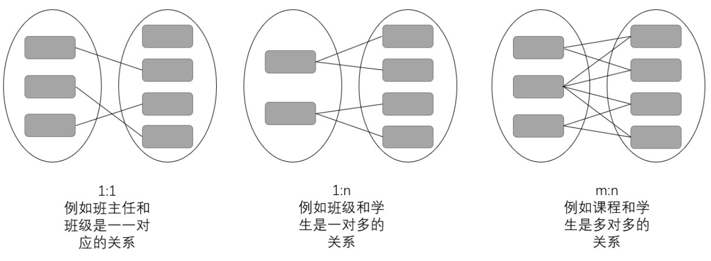
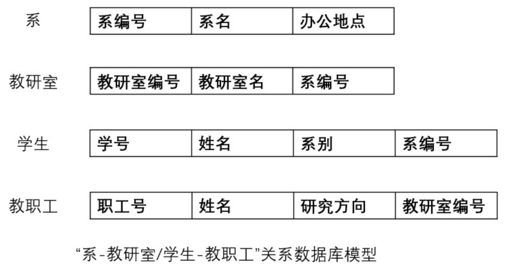

# MySQL历史及知识体系

## 什么是数据库

在操作系统出现之后，随着计算机应⽤范围的扩⼤、需要处理的数据迅速膨胀。最初，数据与程序⼀样，以简单的 ⽂件作为主要存储形式。以这种⽅式组织的数据在逻辑上更简单，但可扩展性差，访问这种数据的程序需要了解数据的具体组织格式。当系统数据量⼤或者⽤户访问量⼤时，应⽤程序还需要解决数据的完整性、⼀致性以及安全性 等⼀系列的问题。因此，必须开发出⼀种系统软件，它应该能够像操作系统屏蔽了硬件访问复杂性那样，屏蔽数据 访问的复杂性。由此产⽣了数据管理系统，即数据库。

数据库是结构化信息或数据的有序集合，⼀般以电⼦形式存储在计算机系统中。通常由数据库管理系统 (DBMS) 来 控制。在现实中，**数据、DBMS 及关联应⽤⼀起被称为数据库系统**，通常简称为数据库。

```bat
# 使用 MySQL 具象化理解
(A) 数据（Data）
在 MySQL（默认 InnoDB 引擎）里，数据不仅仅是表里的行，还包括各种持久化文件与备份：
- 表数据与索引：*.ibd（每表独立表空间）或历史上共有 ibdata1
- 事务日志：重做日志（redo：ib_logfile* / MySQL8 为 #innodb_redo 目录）、撤销日志（undo：#innodb_undo）
- 二进制日志：binlog（如 mysql-bin.000001），用于主从复制/增量恢复
- 元数据与字典：mysql/ 系统库、*.frm（老版本）/数据字典内部存储（新）
- 临时/中间文件：tmpdir 下的临时表等
- 备份产物：mysqldump 的 .sql、xtrabackup 的物理备份目录等

在你当前机器里（示例）
datadir=/mysql/data 下能看到这些文件；socket 在 /mysql/data/mysql.sock。

(B) DBMS（数据库管理系统）
就是 MySQL Server（mysqld 进程）本体 + 存储引擎（常用 InnoDB）。它提供：
- 连接/认证（3306 / Unix socket）
- SQL 解析器 + 优化器 + 执行器（决定走哪个索引、Join 顺序等）
- 事务 & 并发控制（MVCC：基于 undo 和 Read View；锁：行锁/间隙锁等）
- 日志与持久化（redo 保障崩溃恢复、doublewrite 降低页半写风险；binlog 用于复制/恢复）
- 缓存与内存结构（Buffer Pool、Adaptive Hash Index、Table/Query Cache<已废弃> 等）
- 复制/高可用（binlog-based 主从、GTID、半同步；也可配组复制 InnoDB Cluster）
- 运维接口（INFORMATION_SCHEMA/performance_schema、慢日志、SHOW STATUS）

(C) 关联应用（Applications）
一切连接并“使用”DBMS 的程序：
- 业务服务：Java（JDBC/HikariCP）、Go（go-sql-driver/mysql）、Python（pymysql/sqlalchemy）等
- 管理/脚本：mysql 客户端、mysqldump、mysqlbinlog、mysqlpump
- 生态工具：备份（Percona XtraBackup）、监控（mysqld_exporter）、可视化（Navicat/DBeaver）、中间件（ProxySQL、Atlas）
```


为了提⾼数据处理和查询效率，当今最常⻅的数据库通常以⾏和列的形式将数据存储在⼀系列的表中，⽀持⽤户便 捷地访问、管理、修改、更新、控制和组织数据。另外，⼤多数数据库都使⽤结构化查询语⾔ (SQL) 来编写和查询 数据。


## 数据库发展史


### 穿孔纸带和文件系统

在现代意义的数据库出现之前(20世纪60年代)，人们通过人工和文件系统的方式来存储、管理数据。在人工管理时期，人们常使用穿孔纸带来管理数据（图2），虽然穿孔纸带因不具备电子化特征、不能被称为数据库，但其代表着人们在数据存储结构上思考和实践的结果，有必要单独提及。


、

随着数据量的增多以及计算机技术、存储技术的快速发展，穿孔纸带这一纸质存储媒介很快就被磁盘、磁鼓（图3）等磁性存储设备所取代。在软件方面，操作系统中也出现了专门管理数据的软件，被称为文件系统（例如我们电脑里的C,D,E盘）。

文件系统可以说是最早的数据库了，操作系统提供的文件管理方法使得程序可以通过文件名来访问文件中的数据，不必再寻找数据的物理位置。相比较手工处理的方式，文件系统使得管理数据变得简单一些，使用者不需要再翻来覆去的查找文件位置，但是文件内的数据仍然没有组织起来，程序员需要在脑海中尝试构造出数据与数据的关系，再编写代码才能从文件中提取关键数据。除过数据结构和数据关系不完整的问题外，此时的数据只面向某个应用或者某个程序，数据的共享性也有着一定的问题。


着数据量的增长以及企业对数据共享的要求越来越高，人们开始提出数据库管理系统（Database Management System, DBMS）的概念，对数据模型展开了更深层次的思考。


### 数据模型

通俗地讲**数据模型就是对现实世界的模拟，是对现实世界数据特征的抽象**。这个抽象的过程并不是一蹴而就的，事物的抽象存在多个层次，需要用到不同的模型来进行描述。在前辈们的不断探索中，数据模型被划分为三个层次，第一个层次为**概念模型（又称信息模型）**；第二层次为**逻辑模型**；第三层次为**物理模型**。


概念模型中就是从现实世界中抽取出事物、事物特征、事物间的联系等信息，并通过概念精确的加以描述。在这个层次进行数据建模时，有一些概念必须要知道，分别是实体、属性和联系。在现实世界中客观存在的事物或事件被称为**实体**，例如一只羊，一名学生，一张单据，甚至一份“用餐记录”等。实体具有的某方面特性叫做**属性**，例如学生的属性有姓名、年龄等。现实世界中事物彼此的联系在概念模型中反映为实体间的**联系。**联系有以下几种




**逻辑模型**是按照计算机系统的观点对数据进行建模，用于DBMS的实现。而**物理模型**则用于描述数据在磁盘或系统中的表示方式和存取方法。


### 层次模型与网络模型

通用电气的工程师CharlesW.Bachman领导开发了全球第一个数据库管理系统-网状数据库管理系统（IDS），并于1964年正式推出。IDS采用网状结构，很好地模拟了现实世界中事物间的多种联系。

网状结构有多种表现形式


为便于理解，举一个例子加以说明

 


同时期为解决“阿波罗登月”计划处理庞大数据量的需求，北美航空公司(NAA)开发出 GUAM(Generalized Update Access Method)软件。其设计思想是将多个小组件构成较大组件，最终组成完整产品。这是一种倒置树的结构，也被称之为层次结构，层次结构仅能表示一对多的关系。随后IBM加入NAA，将 GUAM 发展成为 IMS(Information Management System)系统并发布于1968年。

为便于理解，举一个例子加以说明


相比较于文件系统来说，层次数据库和网状数据库实现了数据和程序的分离，但是缺乏理论基础，而且也不方便使用。原因在于使用者在查找一个数据时，总要先在脑海中构建出当前的层次结构或网络结构，接着才能按照从属关系编码再查找。若在一个系统中有上千个实体的话，这就是人力所不能及的了。


### 关系模型的发展及完善

1970年， IBM 实验室的**Edgar Frank Codd** 发表了一篇题为《大型共享数据库数据的关系模型》论文，提出基于集合论和谓词逻辑的关系模型，为关系型数据库技术奠定了理论基础。关系模型最大的创新点是拆掉了表与表之间的联系，将这种关系只存储在表中的一个字段中，从而实现了表与表之间的独立。





若采用关系结构对上述的“系-教研室/学生-教职工”进行建模，建成的模型将会成为这样。例如在提取教研室的数据时，碰到系编号这个字段，就会自然而然地连接到系的具体数据中。

当时Codd提出这个模型后，受限于当时的硬件条件，这个模型遭到了很多批评，人们认为这种模型是难以实现的。正如上述这个例子，当在检索教研室这个表的数据时，碰到系编号这个字段时就需要再去遍历一遍系这张表的数据，这种提取数据的方式让当时的机器难以承受。但是在摩尔定律的加持下，这些问题迎刃而解，这种建立在严格数学概念上的关系模型很快就得到了学术界和工业界的青睐。

从数据关系理论到架构一个真实的关系数据库系统间还有很长的一段路要走，在这个过程中，有很多公司、学者都贡献出了自己的成果，共同推动着数据库领域的发展。1973年，IBM启动了验证关系型数据库系统的项目System R，同年伯克利大学的Michael Stonebraker等人启动了关系数据的研究项目 Ingres（interactive graphics andretrieval system）。

1974 年，Ingres 诞生，为后续大量基于其源码开发的PostgreSQL、Sybase、Informix 、Tandem和Sql Server等著名产品打下坚实基础。1976年，P.P.Chen提出了实体-联系模型（简称E-R模型），这种模型常被用来描述、抽象概念数据模型（详细解释可阅读这篇文章https://zhuanlan.zhihu.com/p/356216273）。1979年，Oracle诞生，从诞生之日起，Oracle就一直是数据库领域处于领先的产品。1983年，经过长达十年的开发与测试，IBM发布了Database2，这标志着DB2的正式诞生。

1985年，为存储、表达更为复杂的数据结构（例如嵌套表、非结构化数据等），人们提出了面向对象的数据模型，这种模型吸收了层次、网状和关系数据库等各类数据模型的特点，并借鉴了面向对象的设计方法。面向对象的数据模型将所有事物都看作是一个对象，每个对象的定义包括状态和行为两个方面，其中状态由一组属性组成，行为由一组方法组成，具有相同属性和方法的对象构成一个对象类。（详细解释可阅读这篇文章https://blog.51cto.com/nu1l/2834178）

虽然面向对象的数据模型很早就被提出来了，但是真正结果还得等到20多年之后，在当时来说，仍然还是关系型数据库的天下。1986 年，美国国家标准局(ANSI)数据库委员会批准SQL作为数据库语言的美国标准并公布标准 SQL 文本。1987 年，国际标准化组织(ISO)也做出了同样决定，对 SQL 进行标准化规范并不断更新，使得 SQL 成为关系型数据库的主流语言。此后相当长的一段时间内，不论是微机、小型机还是大型机，不论是哪种数据库系统，都采用SQL 作为数据存取语言，各个公司纷纷推出各自支持SQL的软件或接口

1988年SQL Server诞生。微软、Sybase等公司合作，在Sybase的基础上生产出了在OS/2操作系统上使用的SQL Server 1.0。各大公司在**关系数据库管理系统(RDBMS)**的实现和产品开发中，都遇到了一系列技术问题，主要是在数据库的规模愈来愈大，数据库的结构愈来愈复杂，又有愈来愈多的用户共享数据库的情况下，如何保障数据的完整性(Integrity)、安全性(Security)、并行性(Concurrency)，以及一旦出现故障后，数据库如何实现从故障中恢复(Recovery)。这些问题如果不能圆满解决，无论哪个公司的数据库产品都无法进入实用阶段，最终不能被用户所接受。

在当时争论纷繁的数据库学术大战中，Jim Gray将数据库研究转向底层，同时思考各种数据库都面临的并发和故障恢复等基本问题。最终，**Jim Gray理清了事务的基本概念以及开创性的提出了目前数据库事务处理机制的基础ACID属性**，并且给出来许多具体的实现机制，他的研究成果反映在他发表的一系列论文和研究报告之中，最后结晶为一部厚厚的专著《Transaction Processing：Concepts andTechniques》。这不仅为数据库事务处理的发展奠定了夯实的基础，而且确保了现今电子化的商业和金融系统的可靠运行


### 数据库能力的拓展

随着关系型数据库的发展以及不同业务场景数字化，人们逐渐产生通过数据监控业务发展，并通过数据分析来辅助业务发展的想法。在此想法之上，1988年，数据仓库的概念被正式提出。数据仓库是一个面向主题的、集成的、非易失的、随时间变化的用来支持管理人员决策数据集合。

单从概念来说，很难理解数据仓库究竟是一个什么东西。举个例子，一个企业不同业务的数据存放在不同数据库中，若没有数据仓库这个产品，数据分析师或业务分析人员就必须从各个业务数据库中拉取自己所需要的数据，而各个数据库的命名规则、存取规则、格式可能都各不相同，这就造成业务分析人员必须做大量工作来整理自己所需要的数据，而且这一结果不能被复用，需要做大量重复的工作。数据仓库就解决了这些问题。

尽管当时的人们已经有了数据仓库的概念，但是对于数据仓库的实现方式，一直争论不休。直到1991年Bill Inmon出版了**《Buildingthe Data Warehouse》**（建立数据仓库）这本书，数据仓库实现方法的争论才告一段落。在这本书中，Inmon不仅对数据仓库提出了更精确的定义- 数据仓库是在企业管理和决策中面向主题的、集成的、与时间相关的、不可修改的数据集合，而且提出了范式建模的数据仓库建设方法。尽管后来范式建模受到了维度建模的挑战（可以详见这篇文章：https://segmentfault.com/a/1190000006255954），但因Inmon的巨大影响力，他被尊称为“数据仓库之父”。

在有了数据仓库概念和具体实现方法后，人们尝试在此基础上做数据分析，但在分析过程中，人们发现使用关系数据库对多维数据进行分析时效率非常低。原因在于关系数据库并不是专为数据分析而打造的，要想提升分析效率，人们还需要一个支持多维数据的处理引擎。1993年，关系型数据库创始人Edgar F. Codd提出**联机分析处理（OLAP）**的概念，目标是为了满足决策支持、报表展示以及多维数据查询的需求。


#### 数据库和数据仓库的关系

- **数据库（Database）**：更通用的概念，既可以做在线事务（OLTP），也可以做分析（OLAP）。实现很多：MySQL、PostgreSQL、Oracle、ClickHouse、Snowflake…

- **数据仓库（Data Warehouse, DW）**：**为分析而生**的一类数据库系统（通常是“列式+并行+面向主题+不可变历史”），外加围绕它的一整套流程与治理（采集/ETL/血缘/权限/质量/BI）。

关系：**“数据仓库是数据库的一种用途/形态”**，但它通常采用与OLTP库不同的存储/执行/建模方式，并配套一整条数据链路。


**OLTP（业务库） vs OLAP（数仓）核心差异**

| 维度     | OLTP（如 MySQL InnoDB）    | OLAP / DW（如 BigQuery、Snowflake、Redshift、ClickHouse、StarRocks 等） |
| -------- | -------------------------- | ------------------------------------------------------------ |
| 典型操作 | 行级增删改、点查、短事务   | 扫描海量数据、聚合、复杂多表 Join                            |
| 存储     | 行式存储（B+Tree）         | 列式存储（压缩、向量化扫描）                                 |
| 并行性   | 以连接/事务并发为主        | 多核/多节点并行、分布式执行计划                              |
| 模式设计 | 第三范式，避免冗余、利于写 | 星型/雪花模型，利于读与聚合                                  |
| 数据特性 | 最新状态，频繁更新         | 历史可追溯、追加为主、不可变快照                             |
| 指标     | TPS、响应时间、数据一致性  | 吞吐、扫描速率、压缩率、并发分析                             |


**MySQL 与数据仓库的关系（你会怎样用到 MySQL）**

1. **MySQL 作为源系统（最常见）**
    业务写入 MySQL（OLTP），**通过 CDC/定时抽取**把变更送到数仓/湖：
   - **CDC**：基于 **binlog** 的变更捕获（Debezium→Kafka/Flink→S3/对象存储→数仓）
   - **批处理**：每日/每小时全量或增量抽取（sqoop/导出+对账）
   - 目标存储：**Parquet/ORC**（湖）或直接进 **Redshift/Snowflake/BigQuery/ClickHouse** 等DW
2. **MySQL 作为“暂存层/ODS”**
    先把多源数据拉到 MySQL 做轻量清洗/拉链对账，再推送到列式数仓。小团队常见。
3. **小体量“轻量数仓/数据集市”直接用 MySQL**
   - 利用 **分区表**、**物化/汇总表**、**窗口函数/CTE**（MySQL 8.0 支持）搞报表。
   - 局限：行存+缺少列式/MPP，**全表扫描和大聚合会吃力**；并发分析多时容易拖慢业务。
4. **HTAP 路线（同一产品兼顾事务+分析）**
   - 如 **MySQL HeatWave** 这类把 OLTP 的数据同步到内存列式引擎做加速，适合“同源分析”。（是否可用取决于你的发行版/云环境与成本考量）

> 一句话：**MySQL 多是数仓的“上游与拼装台”，真正的重分析让“列式/MPP 数仓”来做**；数据量小或时效要求低时，也可以用 MySQL 做一个“够用就好”的数据集市。


```bat
           业务写入（OLTP）
      ┌──────────┐
      │  MySQL   │  ←—— 订单、用户、商品…
      └────┬─────┘
           │  CDC（binlog→Debezium）/ 批量抽取
           ▼
   ┌────────────────┐      （数据湖：S3/OSS + Parquet/Delta）
   │   对象存储/湖   │  ←—  原始层（Bronze）/清洗层（Silver）
   └──────┬─────────┘
          │  ELT（dbt/Spark/Trino）
          ▼
   ┌────────────────────────┐
   │   数仓（Snowflake/…）  │  ←— 星型/雪花模型，SCD1/2
   └──────┬─────────┘
          ▼
      BI/报表/指标服务（Looker/Metabase/Superset）
```


### 开源成果涌现

到目前为止，数据库只覆盖了少数业务领域，数据库使用者局限在大型商超、金融机构、学术研究机构等业务机构中。且当时的数据库也被IBM、Oracle等公司垄断着，数据库仍然是一个比较小众的软件。但在同一时期互联网开始进入了寻常百姓家，互联网行业迎来了快速发展，涌现出了大量的网页、网站和互联网公司。人们需要数据库来存储网页的相关数据，但当时的商业数据库又太贵或者因查询性能不足而无法满足人们的需求，Stonebraker等人的努力在此时开枝散叶，由于他将Ingres的源码公布在网上，教会了很多人如何架构数据库，从而在一定程度上促进了当时数据库开源运动的兴起，其中最著名的两个成果就是1996年发布的MySQL和PostgreSQL。


### NoSQL（Not Only SQL）时代

而随着互联网和移动互联网的蓬勃发展，接入互联网的用户逐渐增多，用户的需求越来越多以及数据的不断提升，传统单机关系型数据库已经无法满足人们的需求了。人们在数据库领域开始寻求新的出路，其中有两个值得提起的分支，一个分支是探索多种数据模型和存储介质的数据库，早期比较有影响力的项目是Memcached，这个项目采用了键值模型来建立数据模型；另外一个分支就是分布式数据库，人们希望用多台机器形成集群来存储、处理数据，其中最具影响力和代表性的事件是Google于2003年至2006年发布的三篇论文，分别是Google File System、Google Big table和Google MapReduce，奠定了分布式数据系统基础。

 


由于传统基于集中式数据库在应对海量数据及复杂分析处理时，存在数据库的横向扩展能力受限、数据存储和计算能力受限、不能满足业务瞬时高峰的性能等根本性的架构问题。利用分布式计算和内存计算等新技术设计的分布式数据库能够解决上述遇到的性能不足等问题。分布式数据库的数据分散在网络上多个互联的节点上，数据量、写入读取的负载均衡分散到多个单机中，集群中某个节点故障时整个集群仍然能继续工作，数据通过分片、复制、分区等方式实现分布存储。

2007年，**Hbase**诞生，其理论基础正是Google在2006年所提出的**Big table**。它是以分布式存储作为基础的数据库，底层存储基于分布式文件系统具备了分片或者分区存储的能力，扩大了普通存储设备的存储系统的上限。同年Amazon发表了Dynamo论文，这篇论文第一次在非关系型数据库领域引入了数据库的底层特性，奠定了后续NoSQL数据库领域的部分基础特性。

2008年9 月，**美国《自然》（Nature）杂志专刊——The next google,**第一次正式提出“大数据”概念。这个概念的真正意义在于，数据被认为是人类认知世界的一种新型方法，人们可以通过数据来了解、探索、观察、研究世界。

关系型数据库不能较好地处理高并发读写、多结构化数据存储等情景。为应对这一问题，数据库供应商和开源社区都提出了各种解决方案，例如通过分库、分表、加缓存等方式来提升性能，但底层的关系设计仍然是性能天花板的根本原因。此时NoSQL数据库应运而生，它扩展了诸多数据模型，在不同场景下使用不同的数据模型来进行处理。其代表成果是2009推出的文档数据库 **Mongdb**、2010年推出的键值数据库 **Redis** 和2010年推出的图数据库 **Neo4j**。这类NoSQL数据库极大地扩展了人们存储、使用数据的方式。


### NewSQL时代

这种NoSQL数据库虽然解决了高并发读写、多结构化数据存储等问题，但其设计思路是牺牲事务处理、一致性以及牺牲SQL换来的。而SQL、事务的重要性让人们开始反思怎么样才能在解决前述问题的基础上保留SQL和事务的能力。Google 于2012年发布了Spanner的论文，这篇文章创新性地提出了TrueTime的概念，它在第一代 NoSQL 系统的基础之上引入了 SQL 和分布式事务，保证了强一致性。（也正是这篇论文，宣布了NoSQL时代的结束，数据库发展来到了NewSQL的阶段）

这篇文章在工业界和学术界都有着巨大的反响，截止2022年4月，对其开源实现最好的产品是于2015年诞生的CockroachDB和**TiDB**（可阅读https://www.zhihu.com/question/60686555/answer/1531192635）。和Spanner及它的追随者不同的是，Amazon在面对这一问题时，选择了完全不同的路径，Amazon 发布的Aurora 是一个存储计算分离的系统，运行在公有云之上，它的设计思想很巧妙，它把存储与计算分离使得可以非常简单得实现存储能力的可扩展。并于2017年在SIGMOD上发表了《Amazon Aurora: Design Considerations for High Throughput Cloud-NativeRelational Databases》这篇论文，披露了Aurora的一些技术实现细节。


### 未来展望

大数据时代，数据量不断爆炸式增长，数据存储结构也越来越灵活多样，日益变革的新兴业务需求催生数据库及应用系统的存在形式愈发丰富，这些变化均对数据库的各类能力不断提出挑战，推动数据库的不断演进。总的来说可能会有四个方向

- 第一个方向是垂直领域的数据库，例如工业数据库、财经数据库等。截止目前为止，数据库都是“通才“，企图囊括所有领域，而并非深耕某一垂直领域。
- 第二个方向是分布式数据库，通过“分布式”解决水平扩展性与容灾高可用两个问题，并且有融合OLAP的潜力。
- 第三个方向是云原生数据库，云原生数据库能够随时随地从多前端访问，提供云服务的计算节点，并且能够灵活及时调动资源进行扩缩容，助力企业降本增效。以亚马逊AWS、阿里云、Snowflake等为代表的企业，开创了云原生数据库时代。
- 第四个方向是数据安全领域，在如今这样一个什么都可以量化的年代，数据是很多企业的生命线，而第三方服务商并非真正中立，谁愿意自己的命根被掌握在别人手里呢？在未来，隐私计算和区块链技术可能会帮助数据库发展的更好，共同解决数据安全的问题。


## 常见的数据库类型

1. **关系型数据库（RDBMS）**
   - **特点**： 使⽤表格（表）来组织和存储数据，表之间通过关系建⽴连接。 
   - **例⼦**： MySQL、Oracle Database、Microsoft SQL Server、PostgreSQL等。 
   - **应⽤场景**： 适⽤于需要事务处理、数据⼀致性和复杂查询的应⽤，如企业管理系统、⾦融系统等。 
2. **NoSQL数据库**： 
   - **特点**： 不依赖固定的表结构，可以处理半结构化和⾮结构化数据。通常更具有分布式、⾼可扩展性。 
   - **例⼦**： MongoDB（⽂档型）、Cassandra（列式存储）、Redis（键值存储）、Neo4j（图形数据库） 等。 
   - **应⽤场景**： 适⽤于⼤数据、实时数据处理、分布式系统等场景，例如社交媒体、⽇志分析、物联⽹应⽤ 等。 
3. **NewSQL数据库**：
   -  **特点**： 结合了关系型数据库的 ACID 特性和分布式系统的可扩展性，旨在解决传统关系型数据库在⼤规 模分布式环境中的性能瓶颈问题。 
   - **例⼦**： Google Spanner、CockroachDB等。
   -  **应⽤场景**： 适⽤于需要同时满⾜关系型数据库事务特性和分布式系统可扩展性需求的场景。 
4. **In-Memory数据库**： 
   - **特点**： 将数据存储在内存中，提⾼访问速度和响应时间。 
   - **例⼦**： Redis、Memcached等。 
   - **应⽤场景**： 适⽤于对读取性能要求较⾼、可以牺牲部分持久性的场景，如缓存、实时分析等。
5. **时序数据库**： 
   - **特点**： 专⻔⽤于处理按时间顺序存储和查询的数据。 
   - **例⼦**： InfluxDB、OpenTSDB等。 
   - **应⽤场景**： 适⽤于物联⽹、监控系统、⽇志数据等需要按时间序列进⾏查询和分析的场景。 
6. 图形数据库： 
   - **特点**： ⽤于存储和查询图结构的数据，适⽤于处理实体之间复杂的关系。 
   - **例⼦**： Neo4j、ArangoDB等。
   - **应⽤场景**： 适⽤于社交⽹络分析、推荐系统、⽹络关系分析等场景。


## 事务的 ACID

### 事务的本质

现实世界到数据库世界的映射，而对于大多数程序员来说，他们的任务就是把现实世界的业务场景映射到数据库世界中


### 举例对事务本质进行解析

比如银行会为存储人们的账户信息而建立一个account表

```sql
mysql> CREATE TABLE account (
    -> id INT NOT NULL AUTO_INCREMENT COMMENT '自增id',
    -> name VARCHAR(100) COMMENT '客户名称',
    -> balance INT COMMENT '余额',
    -> PRIMARY KEY(id)
    -> ) Engine=InnoDB;
```

假设张三和李四到银行各开设一个账户，张三有11元，李四有2元

```bash
insert into account values (1, 'zhangsan', 11), (2, 'lisi', 2);
mysql> select * from account;
+----+----------+---------+
| id     | name         | balance  |
+----+----------+---------+
|  1      | zhangsan  |      11        |
|  2     | lisi              |       2        |
+----+----------+---------+
2 rows in set (0.00 sec)
```


在某个特定的时刻，张三和李四在银行所拥有的资产是一个特定的值。这些特定的值也可以被描述为账户在这个特定的时刻在现实中的一个状态。随着时间的流逝，张三和李四可能陆续向银行账户中存钱，取钱或者向别人转账，他们账户中的余额也因此发生变动，每个操作都相当于现实世界中账户的一次次状态转换


### 事务的处理原则

保证所有事务都作为`一个工作单元`来执行，即使出现了故障，都不能改变这种执行方式。当在一个事务中执行多个操作时，要么所有的事务都被提交`commit`，那么这些修改就永久保存下来，要么数据管理系统将`放弃`所做的所有`修改`,整个事务回滚`rollback`到最初状态


### 事务的ACID特性

#### 原子性

原子性是指事务是一个不可分割的工作单位，要么全部提交，要么全部回滚。

现实世界中一个不可分割的操作却可能对应着数据库中若干条不同的操作，数据库中的一条操作也可能被分解成若干个步骤，但是任何一个可能的时间点都可能发生意想不到的问题，从而使操作执行不下去。

为了保证数据库世界中某些操作的原子性，设计数据库时，就要保证：如果在执行操作的过程中发生了错误，就把已经执行的操作恢复成没执行之前的样子。即“要么全做，要么全不做”


#### 一致性

我们生活的现实世界中存在形形色色的约束，比如身份证号不能重复，性别只能是男或女，人民币最大面值只能是100，红绿灯只有三种颜色等

数据库世界级只是现实世界的一个映射，现实中存在的约束当然也要在数据库世界中有所体现。如果数据库中的数据全部符合现实世界中的约束，我们就说这些数据是一致的，或符合一致性的


#### 隔离性(isloation)

```sql
# 上述事件在数据库世界中可能会发生如下事件

                         T1                             |                        T2
                                                        |
   此时A的值为11  <----    read(A)                        |
                                                        |                     read(A)      ----> 此时A的值为11
                                                        |
                                            A=A-5       |
    此时A的值为6  <----    write(A)                       |
    此时B的值为2  <----     read(B)                       |
                                            B=B+5       |
    此时B的值为7  <----     write(B)                      |
                                                        |
                                                        |                     A=A-5   
                                                        |                     write(A)    ----> 此时A的值为6
                                                        |                     read(B)     ----> 此时B的值为7
                                                        |                     B=B+5       
                                                        |                     write(B)    ----> 此时B的值为12
                                                        |
```

对于现实世界中状态转换对应的某些数据库操作来说，不仅要保证这些操作以原子性的方式执行完成，而且要保证其他的状态转换不会影响到本次状态转换，这个规则称为隔离性


#### 持久性

当现实世界中的一个状态转换完成后，这个转换的结果将永久保留，这个规则成为持久性。当把现实世界中的状态转换映射到数据库世界时，持久性意味着该次转换对应的数据库操作所修改的数据都应该在磁盘中保留下来


## OLTP 和 OLAP

OLTP（联机事务处理）和OLAP（联机分析处理）是两种数据库处理⽅式，它们在应对不同类型的业务需求时发挥 不同的作⽤。


### OLTP（联机事务处理）

1. **定义**： OLTP是⼀种⾯向⽇常业务操作的数据库处理⽅式，⽤于⽀持⽇常的事务性操作，例如插⼊、更新和删 除记录。 
2. **特点**： OLTP系统通常涉及⼤量的短期交易，每个交易可能只涉及到少量的数据。它强调实时性、⾼并发和数 据⼀致性。 
3. **目标**： 主要⽤于记录业务活动的原⼦性操作，例如订单处理、在线购物、银⾏交易等。OLTP系统通常针对操 作型数据库设计，采⽤规范化的数据库结构以避免数据冗余。 
4. **性能指标**： OLTP系统的性能关注点通常在于处理速度、并发性和事务的⼀致性。


### OLAP（联机分析处理）

1. **定义**： OLAP是⼀种⽤于⽀持决策⽀持和业务智能的数据库处理⽅式，强调对⼤量历史数据的分析和查询。 
2. **特点**： OLAP系统通常涉及复杂的查询和分析操作，需要处理⼤量的数据。它强调数据的分析、汇总和报告 功能。 
3. **⽬标**： 主要⽤于⽀持决策制定、趋势分析、数据挖掘等，例如销售趋势分析、业务预测等。OLAP系统通常 采⽤多维度数据库结构，以便更好地⽀持多维度数据的查询和分析。 
4. **性能指标**： OLAP系统的性能关注点通常在于查询速度、数据汇总和灵活性


### 两者对比

- **用途不同**： OLTP主要⽤于⽀持业务的⽇常操作，⽽OLAP主要⽤于⽀持决策制定和业务智能的分析。 
- **数据模型不同**： OLTP通常采⽤规范化的数据模型，⽽OLAP通常采⽤维度模型。 
- **查询复杂度**： OLTP处理相对简单的查询，OLAP处理更复杂的查询和分析操作。 
- **实时性要求**： OLTP要求实时处理，⽽OLAP更注重历史数据的综合分析，对实时性要求相对较低


综合来说，OLTP和OLAP分别服务于业务操作和决策⽀持两个不同层⾯的需求，数据库系统在设计上需要考虑满⾜ 这两种处理⽅式的要求


# MySQL安装

## 官方文档解读

```http
https://dev.mysql.com/doc/refman/8.0/en/
```


## 下载页面解读

```http
mysql.com/downloads/
```


```http
dev.mysql.com/downloads/
```


```bat
建议使用LTS版本，不建议使用Innovation版本
如上图，建议使用8.4.6LTS，或者8.0.43
```


```bat
# 查看glibc版本
[root@devops-custom ~]# ldd --version
ldd (Ubuntu GLIBC 2.35-0ubuntu3.10) 2.35
Copyright (C) 2022 自由软件基金会。
这是一个自由软件；请见源代码的授权条款。本软件不含任何没有担保；甚至不保证适销性
或者适合某些特殊目的。
由 Roland McGrath 和 Ulrich Drepper 编写。
```


### 补充 ldd 命令详解

`ldd` 用来**显示一个可执行文件或共享库在运行时会加载哪些共享库**，以及这些库被解析到的**实际路径**与**装载基址**。最常用于：

- 诊断 “`libXXX.so: cannot open shared object file: No such file or directory`”
- 确认程序需要的 **glibc/其他库版本**
- 检查 RPATH/RUNPATH/`LD_LIBRARY_PATH` 等搜索路径生效情况
- 找“没用上的直连依赖”（瘦身镜像/包）


#### 基本用法与输出解读

```bash
[root@devops-custom ~]# ldd /bin/ls
        linux-vdso.so.1 (0x00007ffcb3f81000)
        libselinux.so.1 => /lib/x86_64-linux-gnu/libselinux.so.1 (0x00007f370577d000)
        libc.so.6 => /lib/x86_64-linux-gnu/libc.so.6 (0x00007f3705554000)
        libpcre2-8.so.0 => /lib/x86_64-linux-gnu/libpcre2-8.so.0 (0x00007f37054bd000)
        /lib64/ld-linux-x86-64.so.2 (0x00007f37057df000)
```

常见情形：

- `xxx.so => /path/to/xxx.so (0x...)`：找到了，并显示装载地址。
- `xxx.so => not found`：没找到（最常见的出错原因）。
- `statically linked` / `not a dynamic executable`：静态链接或非ELF动态文件，`ldd` 不适用。


#### 常用参数

```bat
ldd --version            # 同时大致反映系统 glibc 版本
ldd -v                   # verbose，显示符号版本需求等
ldd -u /path/prog        # 列出“未使用的直连依赖”
ldd -d / -r              # 解析并报告数据/函数重定位问题（更严格）
```


#### 安全警告

多数 glibc 系统上，`ldd` 不是简单的“离线解析器”，它通常通过**设置环境变量**（如 `LD_TRACE_LOADED_OBJECTS=1`）让**动态链接器**加载目标文件，并打印依赖；在某些情况下它会**实际执行目标**的一部分装载流程。
 👉 **不要对不可信的二进制文件运行 `ldd`**（可能触发其恶意初始化代码）。
 要做**纯静态分析**，改用：

```bat
readelf -dW /path/prog            # 看 NEEDED/RPATH/RUNPATH
objdump -p /path/prog | grep NEEDED
```


## MySQL二进制安装

```bat
# 下载资源
[root@ubuntu2204 ~]# cd /usr/local/src
[root@ubuntu2204 src]# wget https://dev.mysql.com/get/Downloads/MySQL-8.0/mysql-8.0.43-linux-glibc2.28-x86_64.tar.xz
[root@ubuntu2204 src]# wget https://dev.mysql.com/get/Downloads/MySQL-8.4/mysql-8.4.6-linux-glibc2.28-x86_64.tar.xz

# 解压
[root@ubuntu2204 src]# tar xf mysql-8.0.43-linux-glibc2.28-x86_64.tar.xz

# 创建软链接
[root@ubuntu2204 src]# ln -s /usr/local/src/mysql-8.0.43-linux-glibc2.28-x86_64 /usr/local/mysql8.0

# MySQL初始配置文件
[root@ubuntu2204 mysql8.0]# mkdir {log,data,etc}
[root@ubuntu2204 mysql8.0]# vim etc/my.cnf
[client]
socket = /usr/local/mysql8.0/data/mysql.sock

[mysqld]
basedir = /usr/local/mysql8.0
datadir = /usr/local/mysql8.0/data
user = mysql
port = 3306
socket = /usr/local/mysql8.0/data/mysql.sock
log_error = /usr/local/mysql8.0/log/mysqld.err
log_timestamps = system

log-bin = mysql-bin
server-id = 1

# mysql初始化
[root@ubuntu2204 mysql8.0]# /usr/local/mysql8.0/bin/mysqld --defaults-file=/usr/local/mysql8.0/etc/my.cnf --initialize

# 查看表空间
[root@ubuntu2204 mysql8.0]#ls data/
 auto.cnf          client-key.pem       ibdata1         mysql-bin.000001     private_key.pem   sys
 ca-key.pem       '#ib_16384_0.dblwr'  '#innodb_redo'   mysql-bin.index      public_key.pem    undo_001
 ca.pem           '#ib_16384_1.dblwr'  '#innodb_temp'   mysql.ibd            server-cert.pem   undo_002
 client-cert.pem   ib_buffer_pool       mysql           performance_schema   server-key.pem
 
# 查看日志，会生成初始密码
[root@ubuntu2204 mysql8.0]#cat log/mysqld.err 
2025-09-19T11:10:48.915632+08:00 0 [System] [MY-013169] [Server] /usr/local/mysql8.0/bin/mysqld (mysqld 8.0.43) initializing of server in progress as process 1481
2025-09-19T11:10:48.925270+08:00 1 [System] [MY-013576] [InnoDB] InnoDB initialization has started.
2025-09-19T11:10:49.390455+08:00 1 [System] [MY-013577] [InnoDB] InnoDB initialization has ended.
2025-09-19T11:10:52.190679+08:00 6 [Note] [MY-010454] [Server] A temporary password is generated for root@localhost: .3DH53oww,e+

# 初始化成功后，启动实例
[root@ubuntu2204 mysql8.0]#/usr/local/mysql8.0/bin/mysqld_safe --defaults-file=/usr/local/mysql8.0/etc/my.cnf &

# 查看端口
[root@ubuntu2204 mysql8.0]#ss -nlt
State          Recv-Q         Send-Q     Local Address:Port       Peer Address:Port         Process         
LISTEN         0              4096       127.0.0.53%lo:53         0.0.0.0:*    
LISTEN         0              128        0.0.0.0:22               0.0.0.0:*     
LISTEN         0              70         *:33060                  *:*     
LISTEN         0              151        *:3306                   *:*     
LISTEN         0              128        [::]:22                  [::]:*

# 查看进程
[root@ubuntu2204 mysql8.0]#ps aux|grep mysql
root        1550  0.0  0.0   2888  1728 pts/1    S    11:14   0:00 /bin/sh /usr/local/mysql8.0/bin/mysqld_safe --defaults-file=/usr/local/mysql8.0/etc/my.cnf
mysql       1725  0.7 10.0 1755120 399752 pts/1  Sl   11:14   0:01 /usr/local/mysql8.0/bin/mysqld --defaults-file=/usr/local/mysql8.0/etc/my.cnf --basedir=/usr/local/mysql8.0 --datadir=/usr/local/mysql8.0/data --plugin-dir=/usr/local/mysql8.0/lib/plugin --user=mysql --log-error=/usr/local/mysql8.0/log/mysqld.err --pid-file=ubuntu2204.wang.org.pid --socket=/usr/local/mysql8.0/data/mysql.sock --port=3306

# 使用客户端登录mysql
[root@ubuntu2204 mysql8.0]#/usr/local/mysql8.0/bin/mysql -uroot -S /usr/local/mysql8.0/data/mysql.sock -p
Enter password: 
Welcome to the MySQL monitor.  Commands end with ; or \g.
Your MySQL connection id is 8
Server version: 8.0.43

Copyright (c) 2000, 2025, Oracle and/or its affiliates.

Oracle is a registered trademark of Oracle Corporation and/or its
affiliates. Other names may be trademarks of their respective
owners.

Type 'help;' or '\h' for help. Type '\c' to clear the current input statement.

# 使用alert user设置密码,这里设置空密码，RPM包安装的话，因为密码策略插件的原因，无法设置空密码
mysql> alter user user() identified by '';
Query OK, 0 rows affected (0.00 sec)
```


### 如何定位实例启动失败原因

1. 查看错误日志

2. 通过 mysqld 启动

   ```bash
   # /usr/local/mysql8.0/bin/mysqld --defaults-file=my.cnf &
   ```

3. 只指定几个必要的参数启动

   ```bat
   # /usr/local/mysql8.0/bin/mysqld --no-defaults --basedir=/usr/local/mysql8.0 --datadir=/data/mysql8.0/data/ --user=mysql
   ```

如果还是不行，可以通过 strace 查看 MySQL 启动过程中的系统调用情况


## MySQL源码编译安装

```http
dev.mysql.com/downloads/mysql/
```


```bat
# cd /usr/local/src
# wget https://dev.mysql.com/get/Downloads/MySQL-8.0/mysql-boost-8.0.43.tar.gz
# yum install -y cmake3 gcc gcc-c++ glibc ncurses-devel openssl-devel libaio-devel
# apt install -y pkg-config libtirpc-dev rpcsvc-proto build-essential libncurses-dev libssl-dev libaio-dev zlib1g-dev cmake gcc g++ libc6 
# tar xf mysql-boost-8.0.43.tar.gz
# cd mysql-8.0.43/
# mkdir build
# cd build
# cmake3 /usr/local/src/mysql-8.0.43/ -DWITH_BOOST=/usr/local/src/mysql-8.0.43/boost/boost_1_77_0 -DENABLE_DOWNLOADS=1 -DBUILD_CONFIG=mysql_release

# make

# make install
```

源码编译支持的选项：https://dev.mysql.com/doc/refman/8.0/en/source-configuration-options.html


### 编译后处理

```bash
cd /usr/local/src/mysql-8.0.43/build/
useradd -s /sbin/nologin mysql
mkdir -p /mysql
cp -r {runtime_output_directory,share,library_output_directory,Docs,man,support-files} /mysql
cd /myqsl
mv runtime_output_directory bin
mv library_output_directory lib
mkdir -p {log,etc,run,data}

vim etc/my.cnf
[client]
socket = /usr/local/mysql8.0/data/mysql.sock

[mysqld]
basedir = /usr/local/mysql8.0
datadir = /usr/local/mysql8.0/data
user = mysql
port = 3306
socket = /usr/local/mysql8.0/data/mysql.sock
log_error = /usr/local/mysql8.0/log/mysqld.err
log_timestamps = system

log-bin = mysql-bin
server-id = 1

chown -R mysql:mysql /mysql

# 数据库初始化
/mysql/bin/mysqld --defaults-file=/mysql/etc/my.cnf --initialize

# 创建service文件
vim /lib/systemd/system/mysql.service
[Unit]
Description=MySQL Server
Documentation=man:mysqld(8)
Documentation=http://dev.mysql.com/doc/refman/en/using-systemd.html
After=network.target
After=syslog.target

[Install]
WantedBy=multi-user.target

[Service]
User=mysql
Group=mysql

Type=forking

PIDFile=/mysql/data/mysqld.pid

# Disable service start and stop timeout logic of systemd for mysqld service.
TimeoutSec=0

# Start main service
ExecStart=/mysql/bin/mysqld --defaults-file=/mysql/etc/my.cnf --pid-file=/mysql/data/mysqld.pid --daemonize $MYSQLD_OPTS

# Use this to switch malloc implementation
#EnvironmentFile=~/etc/sysconfig/mysql

# Sets open_files_limit

LimitNOFILE=65535

Restart=on-failure

RestartPreventExitStatus=1

PrivateTmp=false
```


## systemd管理服务

创建 systemd 服务配置文件

```bash
[root@ubuntu2204 mysql8.0]#cat /lib/systemd/system/mysql.service 
[Unit]
Description=MySQL Server
Documentation=man:mysqld(8)
Documentation=http://dev.mysql.com/doc/refman/en/using-systemd.html
After=network.target
After=syslog.target

[Install]
WantedBy=multi-user.target

[Service]
User=mysql
Group=mysql

Type=forking

PIDFile=/usr/local/mysql8.0/data/mysqld.pid

# Disable service start and stop timeout logic of systemd for mysqld service.
TimeoutSec=0

# Start main service
ExecStart=/usr/local/mysql8.0/bin/mysqld --defaults-file=/usr/local/mysql8.0/etc/my.cnf --pid-file=/usr/local/mysql8.0/data/mysqld.pid --daemonize $MYSQLD_OPTS

# Use this to switch malloc implementation
#EnvironmentFile=~/etc/sysconfig/mysql

# Sets open_files_limit

LimitNOFILE=65535

Restart=on-failure

RestartPreventExitStatus=1

PrivateTmp=false
```


## MySQL8.0 配置文件参数模版 (线上配置)

```ini
[client]
socket = /usr/local/mysql8.0/data/mysql.sock

[mysql]
# 关闭 mysql 客户端的“自动补全（auto-rehash）”功能
# auto-rehash 是什么？
# mysql 命令行里按 Tab 能补全 库/表/列 名。为做到这一点，客户端在：
# 启动连接时，和/或
# 你执行 USE db; 切换数据库时
# 会去服务器拉取元数据（库、表、列清单）并“建索引”（rehash）。库很多或网络慢时，这个过程会明显卡顿。
# 关掉它有什么效果？
# no-auto-rehash = 不再自动拉取元数据 → 启动、切库更快；
# 代价：Tab 不再补全表/列名（关键字仍可补全）；
# 需要时你可以手动补一次：在 mysql 提示符里执行 rehash，随后再用 Tab。

# 什么时候建议关？
# 连接线上实例、库/表数量大、或者网络延迟高时；
# 登录只为执行已知命令，不依赖交互补全时。
no-auto-rehash

[mysqld]
# General
user = mysql
port = 3306
basedir = /usr/local/mysql8.0
datadir = /usr/local/mysql8.0/data
socket = /usr/local/mysql8.0/data/mysql.sock
pid_file = /usr/local/mysql8.0/data/mysql.pid
character_set_server = utf8mb4
# 事务隔离级别
transaction_isolation = READ-COMMITTED 
# 建议开启严格模式
sql_mode = 'ONLY_FULL_GROUP_BY,STRICT_TRANS_TABLES,NO_ZERO_IN_DATE,NO_ZERO_DATE,ERROR_FOR_DIVISION_BY_ZERO,NO_ENGINE_SUBSTITUTION'
log_error = /usr/local/mysql8.0/log/mysqld.err
default_time_zone = '+8:00'
log_timestamps = system
temdir = /usr/local/mysql8.0/tmp
secure_file_priv = /usr/local/mysql8.0/tmp

#Slow log
slow_query_log = ON
long_query_time = 0.5
slow_query_log_file = /usr/local/mysql8.0/slowlog/slog.log

# Connection
back_log = 2048
max_connections = 500
max_connect_errors = 10000
interactive_timeout = 1800
wait_timeout = 1800
thread_cache_size = 128
max_allowed_packet = 1G
skip_name_resolve = ON

# Session
read_buffer_size = 2M
read_rnd_buffer_size = 4M
sort_buffer_size = 4M
join_buffer_size = 4M

# InnoDB
innodb_buffer_pool_size = 6144M
innodb_buffer_pool_instances = 4
innodb_log_file_size = 512M
innodb_log_files_in_group = 2
innodb_log_buffer_size = 16M
innodb_flush_log_at_trx_commit = 1
innodb_undo_tablespaces = 2
innodb_max_undo_log_size = 1024M
innodb_undo_log_truncate = 1
innodb_page_cleaners = 8
innodb_io_capacity = 200
innodb_io_capacity_max = 500
innodb_data_file_path = ibdata1:1G:autoextend
innodb_flush_method = O_DIRECT
innodb_purge_threads = 4
innodb_antoinc_lock_mode = 2
innodb_buffer_pool_load_at_startup = 1
innodb_buffer_pool_dump_at_shutdown = 1
innodb_read_io_threads = 8
innodb_write_io_threads = 8
innodb_flush_neighbors = 1
innodb_checksum_algorithm = crc32
innodb_strick_mode = ON
innodb_print_all_deadlocks = ON
innodb_numa_interleave = ON
innodb_open_files = 65535
innodb_adaptive_hash_index = OFF

# Replication
server_id = 528884
log_bin = /usr/local/mysql8.0/binlog/mysql-bin
relay_log = /usr/local/mysql8.0/relaylog/relay-bin
sync_binlog = 1
binlog_format = ROW
master_info_repository = TABLE
relay_log_info_repository = TABLE
relay_log_recovery = ON
log_slave_updates = ON
binlog_expire_logs_seconds = 604800
slave_rows_search_algorithms = 'INDEX_SCAN,HASH_SCAN'
skip_slave_start = ON
slave_net_timeout = 60
binlog_error_action = ABORT_SERVER
super_read_only = ON

# Semi-Sync Replication
plugin_load = 'validate_password.so;semisync_master.so;semisync_slave.so'
rpl_semi_sync_master_enabled = ON
rpl_semi_sync_slave_enabled = ON
rpl_semi_sync_master_timeout = 1000

# GTID
gtid_mode = ON
enforce_gtid_consistency = ON
binlog_gtid_simple_recovery = ON

# Multithreaded Replication
slave-parallel-type = LOGICAL_CLOCK
slave-parallel-workers = 8
slave_preserver_commit_order = ON
transaction_write_set_extraction = XXHASH64
binlog_transaction_dependency_tracking = WRITESET_SESSION
binlog_transaction_dependency_history_size = 25000

# others
open_files_limit = 65535
max_heap_table_size = 32M
tmp_table_size = 32M
table_open_cache = 65535
table_definition_cache = 65535
table_open_cache_instances = 64
```


### 上述参数含义

**back_log = 2048**

- **作用**：控制 MySQL 监听套接字的 **等待队列长度**（`listen(back_log)`），也就是当客户端瞬时并发建连很多，而 mysqld 还没来得及 `accept()` 时，能在内核队列里**排队**的连接请求数。
- **影响**：建连高峰期可减少 “connect timeout/ECONNREFUSED”。
- **前提**：受内核上限限制，Linux 至少需要
  - `net.core.somaxconn >= 2048`
  - `net.ipv4.tcp_max_syn_backlog` 也要相应加大（SYN 队列）
- **排错/自检**：若仍有大量失败连接，`ss -lnt` 看监听，`dmesg`/监控看 SYN backlog drops；必要时配合负载均衡器的连接速率限制。


**max_connections = 500**

- **作用**：允许的**同时连接数上限**。超出时返回 *Too many connections*。

- **代价**：每个连接都要占用线程与一批会话缓冲区（如 `thread_stack`、`net_buffer_length`，在执行排序/连接时还会临时分配 `sort_buffer_size`、`join_buffer_size` 等）。

- **建议**：不要盲目拉很大。粗略估算**基线内存**（0.5–2MB/连接）×并发，再预留执行期峰值；更大的并发请配合**连接池**（应用或中间件）与**线程池**（MySQL 企业版/Percona Thread Pool）。

- **观测**：

  ```
  SHOW GLOBAL STATUS LIKE 'Threads_connected';
  SHOW GLOBAL STATUS LIKE 'Max_used_connections';
  ```


**max_connect_errors = 10000**

- **作用**：来自**同一主机**的**连续连接失败**（如握手中断、半开等）达到此阈值后，**暂时封禁**该主机（防止恶意/异常反复尝试）。
- **解封**：`FLUSH HOSTS;` 或 mysqld 重启。
- **注意**：设得很大基本等于放宽保护；在易抖动网络或大量短连失败环境可适当提高，但不建议无限大。


**interactive_timeout = 1800，wait_timeout = 1800**

- **作用**：**空闲连接超时**（秒）。

  - 对**交互式连接**（客户端设置了 `CLIENT_INTERACTIVE` 标志，如 `mysql` 命令行的交互模式），会话的 `wait_timeout` **初始化**为 `interactive_timeout`。
  - 对**非交互连接**（大多数应用/驱动），会话的 `wait_timeout` **初始化**为全局 `wait_timeout`。

- **效果**：空闲超过 30 分钟自动断开，回收资源。

- **实践**：对使用**连接池**的应用，要与应用池的**闲置回收时间**匹配，否则容易出现“服务端先断、应用池复用死连接”的问题（报 `MySQL server has gone away`）。多数驱动有“连接存活/心跳”选项。

- **查看会话值**：

  ```
  SHOW VARIABLES LIKE 'wait_timeout';
  SHOW VARIABLES LIKE 'interactive_timeout';
  ```


**thread_cache_size = 128**

- **作用**：完成请求后，服务端线程不销毁、放入**线程缓存**，新连接可复用，避免频繁的线程创建/销毁开销。

- **调优方法**：观察 `Threads_created` 增长速度，如果在稳定负载下仍增长很快，说明缓存偏小；逐步增大。

  ```
  SHOW GLOBAL STATUS LIKE 'Threads_created';
  SHOW GLOBAL STATUS LIKE 'Connections';
  ```

  一般让 `Threads_created`/运行时间（秒）远小于 1 比较理想。

- **经验**：并发峰值几百时，`64~256` 常见；太大也无益（占用少量内存）。


**max_allowed_packet = 1G**

- **作用**：服务器允许接收的**单个通信包**的最大大小（同时也限制结果集/语句中单条记录的编码后大小）。
- **为什么设大**：需要传/收大 BLOB/TEXT、批量插入、或复制通道上存在大事务/行时需要更高上限。
- **代价与风险**：这是**上限**，连接在需要时会把网络缓冲**增长到这个大小**，极端情况下消耗大量内存；同时也可能放大“超大包”带来的 DoS 风险。
- **建议**：按业务最大值+余量设置（如 64M/256M），确有需要再到 1G；复制链路两端的相关上限需一致或更高（如 `replica` 侧也要同步设置）。


**skip_name_resolve = ON**

- **作用**：**禁用 DNS 反查**，只用 IP 做认证匹配，避免连接握手阶段因 DNS 慢/坏而阻塞。
- **影响**：`mysql.user` 中 **以主机名写的账号**（如 `'u'@'app01.mydomain'`）将不匹配，必须改用 IP/网段（如 `'u'@'10.0.%'`、`'u'@'%'`）。
- **变更方式**：启动参数/配置文件项，**需要重启** mysqld 生效。
- **常见收益**：显著降低登录抖动与 “Host 'x' is not allowed to connect to this MySQL server” 等因 DNS 引起的问题。


