# 数据库概述
## 使用数据库的原因
- 保证数据的持久化
- 对于海量数据，数据库处理的效率更高，而且有多种方法可以针对性进行优化

## 数据库与数据库管理系统
- DB：数据库（Database）
<br>即存储数据的“仓库”，其本质是一个文件系统。它保存了一系列有组织的数据。
- DBMS：数据库管理系统（Database Management System）
<br>是一种操纵和管理数据库的大型软件，用于建立，使用和维护数据库，对数据库进行统一管理和控制。用户通过数据库管理系统访问数据库中表内的数据。
- SQL：结构化查询语言（Structured Query Language）
<br>专门用来与数据库通信的语言

## 关系型数据库（RDBMS）
- 实质
  - 这种类型的数据是最古老的数据库类型，关系型数据库模型是把复杂的数据结构归结为简单的二元关系（即二维表格形式）
  - 关系型数据库以行(row)和(column)的形式存储数据，以便于用户理解。这一系列的行和列被称为表(table)，一组表组成了一个库(database)。
  - 表与表之间的数据记录有关系(relationship)。现实世界中的各种实体以及实体之间的各种联系均用关系模型来表示。关系型数据库，就是建立在关系模型基础上的数据库
  
- 优势
  - 复杂查询
  <br>可以用SQL语句方便的在一个表以及多个表之间做非常复杂的数据查询
  - 事务支持
  <br>使得对于安全性能很高的数据访问要求得以实现。

- 关系型数据库设计规则
  - 关系型数据库的典型数据结构就是数据表，这些数据表的组成都是结构化的（Structured）
  - 将数据放到表中，表再放到库中
  - 一个数据库中可以有多个表，每个表都有一个名字，用来标识自己。表名具有唯一性。
  - 表具有一些特性，这些特性定义了数据在表中如何存储，类似java和python中类的设计。

- 表 、记录、字段
  - E-R(entity-relationship,实体-联系)模型中有三个主要概念：实体集、属性、联系集
  - 一个实体集(class)对应于数据库中的一个表(table)，一个实体(instance)则对应于数据表中的一行(row)，也称为一条记录(record)。一个属性(attribute)对应于数据库表中的一列，也成为字段(field)

- 表的关联关系
  - 表与表之间的数据记录有关系(relationship)。现实世界中的各种实体以及实体之间的各种联系均用关系模型来表示。
  - 四种：一对一关联、一对多关联、多对多关联、自我引用

- 一对一关联 (one-to-one)
  - 在实际开发中应用不多，因为一对一可以创建成一张表
  - 两种建表原则：
    - 外键唯一：主表的主键和从表的外键（唯一），形成主外键关系，外键唯一。
    - 外键是主键：主表的主键和从表的主键，形成主外键关系。

- 一对多关系 (one-to-many)
  - 常见实例场景：客户表和订单表，分类表和商品表，部门表和员工表。
  - 一对多建表原则：在从表(多方)创建一个字段，字段作为外键指向主表(一方)的主键

- 多对多关系（many-to-many）
  - 要表示多对多的关系，必须创建第三个表，该表通常称为连接表，它将多对多关系划分位两个一对多关系。将这两个表的主键都插入到第三个表中。

- 自我引用
  - 暂略


## 非关系型数据库
- 介绍
<br>非关系型数据库，可以看成传统关系型数据库的功能阉割版，基于键值对存储数据，不需要经过SQL层的解析，性能非常高。同时，通过减少不常用的功能，进一步提高性能。

- 非关系型数据库的种类
  - 键值型数据库
  - 文档型数据库
  - 搜索引擎
  - 列存储（必学HBase）
  - 图形数据库

# MySQL
## MySQL环境搭建
### MySQL的卸载（Windows端）
- 查看宿主机是否安装MySQL
  - cmd -> 进入命令行
  - mysql --version 观察命令行响应即可
  - 也可以查看环境变量中，是否有SQL路径
  - 此电脑(我的电脑) -> 管理 -> 查看服务，是否有mysql运行

- 卸载步骤
  - 停止MySQL服务：按“Ctrl + Alt + Delete”组合键，打开“任务管理器”对话框，找到MySQL服务，停止服务
  - 卸载软件
    - 通过控制面板，在控制面板找到应用双击卸载
    - 通过安装包提供的卸载功能卸载

  - 删除数据文件（在存放数据文件的对应文件夹）
  - 删除MySQL环境变量

### MySQL的下载、安装、配置
- MySQL的4大版本
  - MySQL Community Server 社区版本
  <br>开源免费，自由下载，但不提供官方技术支持，适用于大多数普通用户
  - MySQL Enterprise Edition 企业版本
  <br>需付费，不能在线下载，可以试用30天。提供了更多功能和更完备的技术支持，更适合于对数据库的功能和可靠性要求较高的企业客户。
  - MySQL Cluster 集群版
  <br>开源免费。用于架设集群服务器，可将几个MySQL Server封装成一个Server。需要在社区版或企业版的基础上使用。
  - MySQL Cluster CGE 高级集群版
  <br>需付费

- 下载
<br>下载地址：www.mysql.com

- 启动
  - 在计算机管理中，右键选择mysql服务启动
  - 使用命令行工具
  ```shell
  # Windows
  # 启动 MySQL 服务命令：
  net start MySQL服务名
  
  # 停止 MySQL 服务命令：
  net stop MySQL服务名
  
  # Linux
  # 查看服务状态
  service mysql status
  
  # 启动服务
  service mysql start
  
  # 停止服务
  service mysql stop
  
  # 重启服务
  service mysql restart
  ```

- 登录
```shell
# Windows 和 Linux 相同
mysql -u <用户名> -p

# 完整版
mysql -u <用户名> -P <端口号> -p

# 远程访问其他主机
mysql -u <用户名> -P <端口号> -h <ip地址> -p

```
- 查看版本
```sql
SELECT version(); 
```

### MySQL图形化管理工具
- 建议下载：
  - SQLyog
  - DBeaver（大数据）

## 基本的SELECT语句
### SQL概述
- SQL背景知识（略）
- SQL分类
  - <font color=royalblue>DDL(Data Definition Languages、数据定义语言)</font>
  <br>这些语句定义了不同的数据库、表、视图、索引等数据库对象，还可以用来创建、删除、修改数据库和数据表的结构。
  <br>主要的语句关键字包括<font color=tomato>CREATE、DROP、ALTER</font>等

  - <font color=royalblue>DML(Data Manipulation Language、数据操作语言)</font>
  <br>用于添加、删除、更新和查询数据库记录，并检查数据完整性。
  <br>主要的语句关键字包括 <font color=tomato>INSERT、DELETE、UPDATE、SELECT</font>等。
  <br><font color=tomato>SELECT是SQL语言的基础，最为重要。</font>

  - <font color=royalblue>DCL(Data Control Language、数据控制语言)</font>
  <br>用于定义数据库、表、字段、用户的访问权限和安全级别。
  <br>主要的语句关键字包括<font color=tomato>GRANT、REVOKE、COMMIT、ROLLBACK、SAVEPOINT</font>等。

```sql
DDL: 数据定义语言
CREATE \ ALTER \ DROP \ RENAME \ TRUNCATE

DML: 数据操作语言
INSERT \ DELETE \ UPDATE \ SELECT (重中之重)

DCL: 数据控制语言
COMMIT \ ROLLBACK \ SAVEPOINT \ GRANT \ REVOKE +
```

### SQL语言的规则与规范
- 基本规则
  - SQL可以写在一行或者多行。为了提高可读性，各子句分行写，必要时使用缩进
  - 每条命令以；或\g或\G结束
  - 关键字不能被缩写也不能分行
  - 关于标点符号
    - 必须保证所有的(),单引号,双引号是成对出现
    - 必须使用英文状态下的半角输入方式
    - 字符串型和日期时间类型的数据可以使用单引号('')表示
    - 列的别名，尽量使用双引号("")，不建议省略as

- SQL大小写规范(建议遵守)
  - MySQL在Windows环境下是大小写不敏感的
  - MySQL在Linux环境下是大小写敏感的
    - 数据库名、表名、表的别名、变量名是严格区分大小写的
    - 关键字、函数名、列名(或字段名)、列的别名(字段别名)是忽略大小写的
  - <font color=tomato>推荐采用统一的书写规范</font>
    - 数据库名，表名，表别名，字段名，字段别名等都小写
    - SQL关键字、函数名、绑定变量等都大写

- 注释
```SQL
单行注释：# 注释文字，单行注释(MySQL特有的方式)
单行注释：-- 注释文字 （--后面必须包含一个空格）
多行注释：/* */
```
- 导入现有的数据表
  - 方式1：source 文件全路径名
  - 方式2：基于具体的图形化界面的工具可以导入数据
  <br>比如：SQLyog中，选择“工具”->"执行sql脚本"，选中xxx.sql即可。

### 最基本的SELECT语句
```SQL
/* SELECT 字段1,字段2,... FROM 表名 */

SELECT 1 + 1, 3 * 2 FROM DUAL; -- dual:伪表
SELECT * FROM employee; -- *表示全部数据


/* 列的别名 (3种方式) */

SELECT employee_id emp_id, last_name AS lname, department_id "部门id" fROM employees;
-- 别名：用空格隔开 
-- 用AS连接
-- 列的别名可以用双引号“”引起来


/* 去除重复行 */

SELECT DISTINCT department_id FROM employees;
-- DISTINCT 可以去除重复数据


/* 空值参与运算 */

-- 所有运算符或列值遇到null值，运算结果都为null 
-- null 不等同于 0
SELECT employee_id, salary "月工资", 
salary * (1 + commission_pct) * 12 "年工资", commission_pct
FROM employees; -- comission_pct的值为null
-- 则年工资的计算结果为null
-- 解决方案（如果想将null看作0去计算）：引入IFNULL
SELECT employee_id, salary "月工资", 
salary * (1 + IFNULL(commission_pct,0)) * 12 "年工资", commission_pct
FROM employees;


/* 着重号 `` 即反引号*/

SELECT * FROM `order`;
-- 当字段或表名与关键字发生冲突的时候，可以使用反斜杠包裹，防止报错


/* 查询常数 */

SELECT '常数'， employee_id, last_name FROM employees;
-- 常数会和表格的字段的每个记录都进行匹配


/* 显示表结构 */

DESCRIBE employees;
DESC employees;
-- 显示了表中字段的详细信息


/* 过滤数据 WHERE */

-- 查询90号部分的员工信息
SELECT * FROM employees WHERE department_id = 90；
-- 查询last_name为'King'的员工信息
SELECT * FROM employees WHERE last_name = 'King'; 
-- WHERE声明在FROM结构的后面
```

### 运算符
- 算数运算符
  - 加：+ (加号在SQL中，没有拼接作用，只表示 加法运算)
  - 减：-
  - 乘：*
  - 除：/ 或 DIV
  - 取余：% 或 MOD
  ```sql
  SELECT 100, 100 + 0, 100 - 0, 100 + 50 - 30, 100 + 35.5, 100 - 35.5
  FROM DUAL;
  
  -- DUAL 伪表
  
  SELECT 100 + '1'
  FROM DUAL;
  -- 在SQL中，+没有连接作用，只表示加法运算。此时，会将字符串转换为数值(隐式转换)
  
  SELECT 100 + 'a'
  FROM DUAL;
  -- 此时将'a'看作0处理
  
  SELECT 100 + NULL
  FROM DUAL；
  -- null值参与运算，结果为null
  
  SELECT employee_id, last_name, salary
  FROM employees
  WHERE employee_id % 2 = 0;
  -- 查询员工id为偶数的员工信息
  -- 这里比较运算符用一个等于号
  ```

- 比较运算符
  - 符号： =； <=>; <> !=; <; <=; >; >=
  ```sql
  SELECT 1 = NULL, NULL = NULL
  FROM DUAL;
  -- 只要有null参与判断，结果就为null
  
  SELECT last_name, salary, commission_pct
  FROM employees
  WHERE commission_pct = NULL;
  -- 此时执行，不会有任何结果
  -- 原理：将WHERE后面的式子，逐行匹配，只保留返回结果为1的值，因为NULl和任何数，包括自己的返回值都为NULL，所以无法筛选任何信息。
  
  -- 安全等于 <=>   记忆技巧：为NULL而生。
  -- 安全等于可以判断包含null的公式
  -- 如果 NULL <=> NULL,返回值为1，和其他比返回值为0
  SELECT 1 <=> NULL, NULL <=> NULL
  FROM DUAL;
  ```

  - 关键字：
  ```sql
  IS NULL           为空运算符
  IS NOT NULL        不为空运算符
  LEAST             最小值运算符（函数）
  GREATEST          最大值运算符（函数）
  BETWEEN AND       两值之间运算符
  ISNULL            为空运算符（函数）
  IN                属于运算符
  NOT IN            不属于运算符
  LIKE              模糊匹配运算符
  REGEXP            正则表达式运算符
  RLIKE             正则表达式运算符
  
  -- ISNULL函数的使用
  SELECT last_name, salary, commission_pct
  FROM employees
  WHERE ISNULL(commission_pct);
  -- 等同于
  SELECT last_name, salary, commission_pct
  FROM employees
  WHERE commission_pct IS NULL;
  
  -- LEAST() / GREATEST()
  SELECT LEAST('g','b','t','m'),GREATEST('g','b','t','m')
  FROM DUAL;
  
  -- BETWEEN...AND
  -- 查询工资在6000到8000的员工信息
  SELECT employee_id,last_name,salary
  FROM employees
  WHERE salary BETWEEN 6000 AND 8000;
  -- 包含边际数值
  
  -- IN(set) / NOT IN(set)
  -- 查询部门为10，20，30部门的员工信息
  SELECT last_name,salary,department_id
  FROM employees
  WHERE department_id IN (10,20,30);
  
  -- LIKE 模糊查询
  -- 查询last_name中包含字符'a'的员工信息
  SELECT last_name
  FROM employees
  WHERE last_name LIKE '%a%';
  -- % ，代表零个、一个或多个字符
  -- '_'，代表一个单一的字符
  
  -- 正则表达式 REGEXP/RLIKE
  SELECT last_name
  FROM employees
  WHERE REGEXP '正则表达式';
  
  ```

- 逻辑运算符
  ```sql
  NOT 或 ！
  AND 或 &&
  OR 或 ||
  XOR 逻辑异或 异或两侧，不一样则为真
  ```
- 位运算符
  ```sql
  &     按位与
  |     按位或
  ^     按位异或
  ~     按位取反
  >>    按位右移
  <<    按位左移
  ```
### 排序与分页
- 排序数据
  - 排序规则
  ```sql
  # 使用ORDER BY对查询到的数据进行排序
  
  SELECT employee_id,last_name,salary FROM employees ORDER BY salary;
  -- 升序：ASC 默认
  -- 降序：DESC
  
  # 我们可以使用列的别名，进行排序
  
  SELECT employee_id,salary,salary*12 as annual_sal FROM employees ORDER BY annual_sal;
  
  # 列的别名只能在ORDER BY中使用，不能在WHERE中使用
  SELECT employee_id salary,salary*12 as annual_sal FROM employees WHERE annual_sal > 81600;
  -- 会报错
  
  -- 数据表的查询顺序：
  -- 先执行FROM table_name;
  -- 再执行 where 条件；
  -- 然后执行，select后要查找的字段（包含别名）
  -- 最后看order by排序
  -- 也因此，where不能使用别名，但是order by可以，因为再执行where的时候，还没有执行到字段的别名。
  
  # 二级排序
  示例：显示员工信息，按照department_id的降序排列，department_id相同的情况下，按照salary的升序排列
  
  SELECT employee_id,salary,department_id FROM employees ORDER BY department_id DESC,salary ASC;
  -- 多个排序嵌套查询，各级之间用逗号排序
  
  ```

- 分页
  - 规则实现
  ```sql
  # 使用LIMIT实现数据的分页显示
  
  # 需求1：每页显示20条记录，此时显示第1页
  SELECT employee_id, last_name FROM employees LIMIT 0，20；
  
  # 需求2：每页显示20条记录，此时显示第2页
  SELECT employee_id, last_name FROM employees LIMIT 20，20；
  
  -- 格式：LIMIT 位置偏移量, 条目数量;
  
  # WHERE ... ORDER BY ... LIMIT 声明顺序如下；
  SELECT employee_id, last_name, salary FROM employees
  WHERE salary > 6000
  ORDER BY salary DESC
  LIMIT 0,10;
  
  # MySQL8.0新特性：LIMIT ... OFFSET ...
  -- 与老版本相反，LIMIT 条目数量 OFFSET 位置偏移量
  SELECT employee_id, last_name, salary FROM employees
  WHERE salary > 6000
  ORDER BY salary DESC
  LIMIT 10 OFFSET 0;
  ```
  - 注意：LIMIT必须放在整个SELECT语句的最后！


### 多表查询 
- 定义：也称为关联查询，指两个或更多个表一起完成查询操作
- 前提条件：这些一起查询的表之间是有关系的（一对一、一对多），它们之间一定是关联字段，这个关联字段可能建立了外键，也可能没有建立外键。比如：员工表和部门表，这两个表依靠“部门编号”进行关联

- 多表查询的实现
```SQL
笛卡尔积错误

-- 错误的实现方式：每个员工与每个部门都匹配了一遍
SELECT employee_id,department_name
FROM employees,departments;
-- 错误的原因：缺少了多表的链接条件

-- 等同于笛卡尔积错误的交叉的查询
SELECT employee_id,department_name
From employees CROSS JOIN departments;

-- 多表查询的正确方式：需要有连接条件(关联查询)
SELECT employee_id,department_name
From employees,departments
-- 两个表的连接条件
WHERE employees.department_id = departments.department_id;

-- 如果查询语句中出现了多个表中都存在的字段，则必须指明此字段所在的表
SELECT employee_id,department_name,employees.department_id
FROM employees,departments
WHERE employees.department_id = departments.department_id;
-- 建议：从sql优化的角度，建议多表查询时，每个字段都指名其所在的表
SELECT employees.employee_id,departments.department_name,employees.department_id
FROM employees,departments
WHERE employees.department_id = departments.department_id;
-- 可读性太差，表明过长的话，所以可以给表起别名，在SELECT和WHERE中使用表的别名
SELECT emp.employee_id,dept.department_name,emp.department_id
FROM employees emp,departments dept
WHERE emp.department_id = dept.department_id;
-- 起别名的方法和给字段起别名一样，都是空格直接加别名
-- 如果给表起来别名，一但在SELECT或WHERE中使用表明的话，则必须使用表的别名，不能再使用原名

-- 三表(多表)查询
SELECT e.employee_id,e.last_name,d.department_name,l.city
FROM employees e,departments d,locations l
WHERE e.department_id = d.department_id
AND d.location_id = l.location_id;
-- 如果有n个表实现多表的查询，则需要至少n-1个连接条件

/*
演绎式：提出问题1 --> 解决问题1 --> 提出问题2 --> 解决问题2 ...
归纳式：总 -- 分 -- 总
*/

-- 多表查询的分类
-- 角度1：等值连接 vs 非等值连接

-- 角度2：自连接 vs 非自连接

-- 角度3：内连接 vs 外连接 

等值连接 vs 非等值连接

-- 非等值连接的例子

SELECT e.last_name,e.salary,j.grade_level
FROM employees e,job_grades j
WHERE e.salary between j.lowest_sal and j.highest_sal;

-- 自连接

SELECT emp.last_name employee,mgr.last_name manager
FROM employees emp,employees mgr
WHERE emp.manager_id = mgr.employee_id;

内连接 vs 外连接

内连接定义：；只把满足查询条件的数据列出来，而未满足查询条件的没有列出来，就叫内连接

外连接定义：处理包含多表匹配行之外，还查询到了多个表中不匹配的行，这种查询情况叫外连接

外连接分类：
左外连接
两个表在连接过程中除了返回满足连接条件的行以外，还返回左表中不满足条件的行
右外连接
两个表在连接过程中除了返回满足连接条件的行以外，还返回右表中不满足条件的行
满外连接 

SQL92中的内连接：见上，略

SQL92中的外连接：使用 +  

SELECT employee_id,department_name
From employees e,departments d
WHERE e.department_id = d.department_id(+);
-- MySQL不支持SQL92语法中的外连接写法，支持oracle

SQL99中的外连接：使用JOIN...ON的方式实现多表查询，MySQL支持SQL99这种方式

SQL99中的内连接：

SELECT last_name,department_name
FROM employees e (INNER) JOIN departments d
on e.department_id = d.department_id
-- 两个表内连接查询

SELECT last_name,department_name,city
FROM employees e JOIN departments d
on e.department_id = d.department_id
JOIN location l
ON d.location_id = l.location_id;
-- 三表（多表）内连接查询

SQL99中的外连接

-- 左外连接
SELECT last_name,department_name
FROM employees e LEFT (OUTER) JOIN departments d
ON e.department_id = d.department_id;

-- 右外连接
SELECT last_name,department_name
FROM employees e RIGHT (OUTER) JOIN departments d
ON e.department_id = d.department_id;

-- 满外连接
SELECT last_name,department_name
FROM employees e FULL (OUTER) JOIN departments d
ON e.department_id = d.department_id;
-- 不支持mysql,支持oracle

UNION的使用

合并查询结果
利用UNION关键字，可以给出多条SELECT语句，并将它们的结果组合成单个结果集。<font color=tomato>合并时，两个表对应的列数和数据类型必须相同，并且相互对应。</font>各个SELECT语句之间使用UNION 或UNION ALL关键字分割  

SELECT column, ... FROM table1
UNION [ALL]
SELECT column, ... FROM table2

UNION操作符
返回两个查询的结果集的并集，去除重复记录

UNION操作符
返回两个查询的结果集的并集。对于两个结果集的重复部分不去重。


```
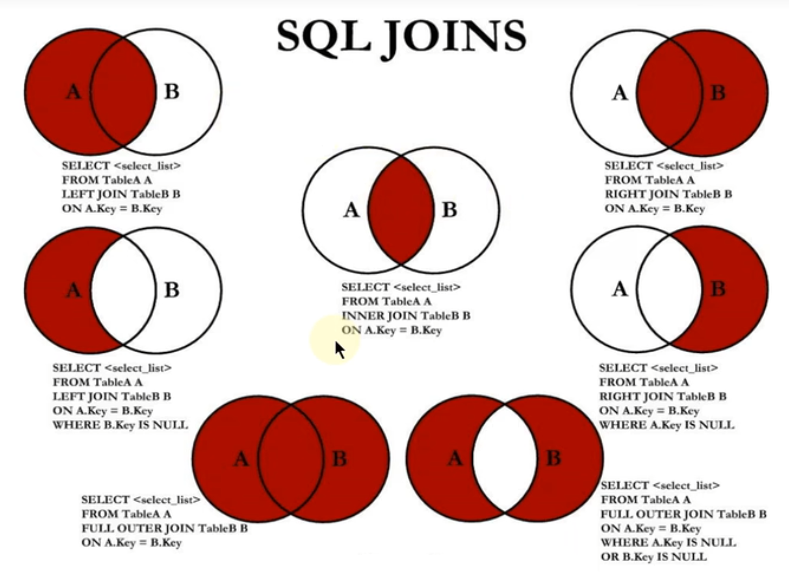

```sql
七种JOIN的实现

中图：内连接
SELECT employee_id, department_name
FROM employees e Join Departments d
ON e.department_id = d.department_id;

左上图：左外连接
SELECT employee_id,department_name
FROM  employees e LEFT JOIN departments d
ON e.department_id = d.department_id;

右上图：右外连接
SELECT employee_id,department_name
FROM  employees e RIGHT JOIN departments d
ON e.department_id = d.department_id;

左中图：
SELECT employee_id,department_name
FROM  employees e LEFT JOIN departments d
ON e.department_id = d.department_id
WHERE d.department_id IS NULL;

右中图：
SELECT employee_id,department_name
FROM  employees e RIGHT JOIN departments d
ON e.department_id = d.department_id
WHERE e.department_id IS NULL;

左下图（满外连接）
方式一：左上图 UNION ALL 右中图
SELECT employee_id,department_name
FROM  employees e LEFT JOIN departments d
ON e.department_id = d.department_id
UNION ALL
SELECT employee_id,department_name
FROM  employees e RIGHT JOIN departments d
ON e.department_id = d.department_id
WHERE e.department_id IS NULL;

方式2：左中图 UNION ALL 右上图
详情：略

右下图：左中图 UNION ALL 右中图
详情：略
```

- 多表查询扩展：SQL99语法新特性
```sql
自然连接：NATURAL JOIN
SQL92：
SELECT employee_id,last_name,department_name
FROM employees e JOIN departments d
ON e.department_id = d.department_id
AND e.manager_id = d.manager_id;

-- NATURAL JOIN : 它会帮你自动查询两张连接表中所有相同字段，然后进行等值连接
SQL99语法新特性1:NATURAL JOIN
SELECT employee_id,last_name,department_name
FROM employees e NATURAL JOIN departments d;

SQL99语法新特性1:USING
-- 当匹配字段名称相同的时候使用
SELECT employee_id,last_name,department_name
FROM employees e JOIN departments d
USING (department_id);
```

### 单行函数
- 特点：
  - 操作数据对象
  - 接收参数返回一个结果
  - 只对一行进行变换
  - 每行返回一个结果
  - 可以嵌套
  - 参数可以是一列或一个值

#### 数值函数
- 基本函数
  - ABS(x) 返回x的绝对值
  - SIGN(x) 返回x的符号，正数返回1，负数返回-1，0返回0
  - PI() 返回圆周率的值
  - CEIL(x),CEILNG(x) 返回大于或等于某个值的最小整数
  - FLOOR(x) 返回小于或等于某个值的最大整数
  - LEAST(e1,e2,e3) 返回列表中的最小值
  - GREATEST(e1,e2,e3) 返回列表中的最大值
  - MOD(x,y) 返回x除以y的余数
  - RAND() 返回0~1的随机数
  - RAND(x) 返回一个随机数，x作为种子或因子，当x的值相同时，随机数产生的值必然相同
  - ROUND(x) 返回一个对x进行四舍五入后的整数
  - ROUND(x,y) 返回一个对x进行四舍五入，后保留到小数点后y位的数（y的值可正可负，负值表示向前移位进行判断，比如ROUND(123,-1) 结果为120）
  - TRUNCATE(x,y) 返回数字x截断为y位小数的结果
  - SQRT(x) 返回x的平方根，当x的值为负数时，返回NULL

- 角度与弧度的互换
  - RADIANS(x) 将角度转化为弧度，其中参数x为角度值
  - DEGREES(x) 将弧度转化为角度，其中参数x为弧度值

- 三角函数
  - SIN(x)
  - ASIN(x) 相当于SIN(x)的反函数，返回值为弧度值，建议使用DEGREES转换为角度值，方便阅读
  - COS(x)
  - ACOS(x)
  - TAN(x)
  - ATAN(x)
  - COT(x)

- 指数和对数
  - POW(x,y) 返回x**y的值
  - POWER(x,y) 同POW(x,y)
  - EXP(x) 返回一个以e为底，x为n次幂的值，e为2.71828
  - LN(x) 返回一个以e为底，求x的对数
  - LOGN(x) 返回一个以N为底，求x的对数，比如LOG10(10) 结果为1

- 进制间转换
  - BIN(x) 返回x的二进制编码
  - HEX(x) 返回x的十六进制编码
  - OCT(x) 返回x的八进制编码
  - CONV(x,f1,f2) 返回f1进制的数x，转换为f2进制的数，比如CONV(10,2,8) 结果为2，因为：2进制数10，在8进制中，结果是2

#### 字符串函数
- ASCII(S) 返回字符串S中的第一个字符的ASCII码值
- CHAR_LENGTH(s) 返回字符串s的字符数。作用与CHARARTER_LENGTH(s)相同
- LENGTH(s) 返回字符串s的字节数，和字符集有关
- CONCAT(s1,s2,…,sn) 连接s1,s2……,sn为一个字符串
- CONCAT_WS(x,s1,s2,…,sn) 同CONCAT()函数，但是每个字符串之间要加上x
- INSERT(str,idx,len,replacestr) 将字符串str从第idx位置开始，len个字符长的子串替换为字符串replacestr
  - <font color=tomato> SQL中字符串的索引idx是从1开始的</font>
- REPLACE(str,a,b)  用字符串b替换字符串str中所有出现的字符串a
- UPPER(s)或UCASE(s) 将字符串s的所有字母转化为大写字母
- LOWER(s)或LCASE(s) 将字符串s的所有字母转换成小写字母
- LEFT(str,n)  返回字符串str最左边的n个字符
- RIGHT(str,n)  返回字符串str最右边的n个字符
- LPAD(str,len,pad) 用pad的字符并将字符串str补全到len的长度，左补
- RPAD(str,len,pad) 用pad的字符并将字符串str补全到len的长度，右补
- LTRIM(s) 去掉字符串s左侧的空格
- RTRIM(s) 去掉字符串s右侧的空格
- TRIM(s) 去掉字符串s两侧的空格
- TRIM(s1 FROM s) 去掉字符串s开始与结尾的s1
- TRIM(LEADING s1 FROM s) 去掉字符串开始处的s1
- TRIM(TRAILING s1 FROM s) 去掉字符串结尾处的s1
- REPEAT(str,n) 返回str重复n次的结果
- SPACE(n) 返回n个空格
- STRCMP(s1,s2) 比较字符串s1,s2的ASCII码值的大小
  - 返回值1，表示前面的值大，-1表示后面的值大，0表示一样大
- SUBSTR(s,index,len) 返回从字符串s的index位置其len个字符
- LOCATE(substr,str) 返回字符串substr在字符串str中首次出现的位置
  - 未找到，则返回0
  - 等同于position(substr,str)和INSTR(substr,str)
- ELT(m,s1,s2,...,sn) 返回指定位置的字符串，如果m=1，则返回s1，如果m=2,则返回s2，以此类推
- FIELD(s,s1,s2,...,sn) 返回字符串s在字符串列表第一次出现的位置
- FIND_IN_SET(s1,s2) 返回字符串s1在字符串s2中出现的位置。其中，字符串s2是一个以逗号分隔的字符串
- REVERSE(s) 返回反转后的字符串
- NULLIF(value1,value2) 比较两个字符串，如果value1与value2相同，则返回NULL，否则返回value1

#### 日期和时间函数
- 获取日期、时间
  - CURDATE(),CURRENT_DATE()
    - 返回当前日期，只包含年、月、日
  - CURTIME(),CURRENT_TIME()
    - 返回当前时间，只包含时、分、秒
  - NOW()/SYSDATE()/CURRENT_TIMESTAMP()/LOCALTIME()/LOCALTIMESTAMP() 
    - 返回当前系统时间和日期
  - UTC_DATE() 返回UTC(时间标准时间)日期
  - UTC_TIME() 返回UTC(时间标准时间)时间

- 日期与时间戳的转换
  - UNIX_TIMESTAMP()
    - 以UNIX时间戳的形式返回当前时间
  - UNIX_TIMESTAMP(date)
    - 将时间date以UNIX时间戳的形式返回
  - FROM_UNIXTIME(timestamp) 
    - 将UNIX时间戳的时间转换为普通格式的时间

- 获取月份、星期、星期数、天数等函数   
  - YEAR(date)/MONTH(date)/DAY(date)
    - 返回具体的日期值
  - HOUR(time)/MINUTE(time)/SECOND(time)
    - 返回具体的时间值
  - MONTHNAME(date)
    - 返回月份：january...
  - DAYNAME(date)
    - 返回星期几：MONDAY，TUESDAY...
  - WEEKDAY(date)
    - 返回周几，注意，周一是0，周二是1...
  - QUARTER(date)
    - 返回日期对应的季节，范围为1~4
  - WEEK(date),WEEKOFYEAR(date)
    - 返回一年中的第几周
  - DAYOFYEAR(date)
    - 返回日期是一年中的第几天
  - DAYOFMONTH(date)
    - 返回日期位于所在月份的第几天
  - DAYOFWEEK(date)
    - 返回周几，注意：周日是1，周一是2...周六是7

- 日期的操作函数
  - EXTRACT(type FROM date)
    - 返回指定日期中特定的部分，type指定返回的值
    - type取值
      - MICROSECOND 返回毫秒数
      - SECOND 返回秒数
      - MINUTE 返回分钟数
      - HOUR 返回小时数
      - DAY 返回天数
      - WEEK 返回日期在一年中的第几个星期
      - MONTH 返回日期在一年中的第几个月
      - QUARTER 返回日期在一年中的第几个季度
      - YEAR 返回日期的年份
      - 多个参数组合，使用下划线拼接
        - SECOND_MICROSECOND
        - HOUR_SECOND

- 时间和秒钟转换的函数
  - TIME_TO_SEC(time)
    - 将time转化为秒并返回结果值，转化公式为小时*3600+分钟*60+秒
  - SEC_TO_TIME(seconds)

- 计算日期和时间的函数（较常用）
  - DATE_ADD(datetime,INTERVAL expr type),ADDDATE(date,INTERVAL expr type)
    - 返回与给定日期时间相差INTERVAL时间段的日期时间
  - DATE_SUB(datetime,INTERVAL expr type),SUBDATE(date,INTERVAL expr type)
    - 返回与给定日期时间相差INTERVAL时间段的日期时间
  - ADDTIME(time1,time2)
    - 返回time1加上time2的时间。当time2为一个数字时，代表的是秒，可以为负数
  - SUBTIME(time1,time2)
    - 返回time1减去time2后的时间。当time2为一个数字时，代表的是秒，可以为负数
  - DATEDIFF(date1,date2)
    - 返回date1-date2的日期间隔天数
  - TIMEDIFF(time1,time2)
    - 返回time1-time2的时间间隔
  - FROM_DAY(N) 
    - 返回从0000年1月1日，N天以后的日期
  - TO_DAYS(date)
    - 返回日期date距离0000年1月1号的天数
  - LAST_DAT(date) 
    - 返回date所在月份的最后一天的日期
  - MAKEDATE(year,n) 
    - 针对给定年份与所在年份中的天数返回一个日期
  - MAKETIME(hour,minute,second)
    - 将给定的小时，分钟和秒组合成时间并返回
  - PERIOD_ADD(time,n)
    - 返回time加上n后的时间

- 日期的格式化与解析
  - DATE_FORMAT(date,fmt)
    - 按照字符串fmt格式化日期date值
    - 例：SELECT DATE_FORMAT(CURDATE(),'%Y-%M-%D')
  - TIME_FORMAT(time,fmt)
    - 按照字符串fmt格式化时间time值
  - GET_FORMAT(date_type,format_type)
    - 返回日期字符串的显示格式
  - STR_TO_DATE(str,fmt)
    - 按照字符串fmt对str进行解析，解析为一个日期
  - fmt参数的常用格式符
    - %Y：4位数字表示年份
    - %y：两位数字表示年份
    - %M：月名表示月份(January)
    - %m：两位数字表示月份(01,02,03...)
    - %b：缩写的月名(Jan,Feb...)
    - %c：数字表示月份(1,2,3)
    - %D：英文后缀表示月中的天数(1st,2nd,3rd)
    - %d：两位数字表示月中的天数(01,02...)
    - %e：数字形式表示月中的天数(1,2,3,4...)
    - %H：两位数表示小时，24小时制(01,02...)
    - %h和%I：两位数表示小时，12小时制(01,02...)
    - %k:数字形式的小时，24小时制(1,2,3)
    - %l：数字形式的小时，12小时制(1,2,3,4...)
    - %i：两位数字表示分钟(00,01,02)
    - %S和%s：两位数字表示秒(00,01,02...)
    - %W：一周中的星期名称(Sunday...)
    - %a：一周中的星期缩写(Sun,Mon,Tues,...)
    - %w：以数字表示周中的天数(0=Sunday,1=Monday...)
    - %j：以3位数字表示年中的天数(001,002...)
    - %U：以数字表示年中的第几周，(1,2,3...)其中Sunday为周中的第一天
    - %u：以数字表示年中的第几周，(1,2,3...)其中Monday为周中的第一天


#### 流程控制函数 
- IF(value,value1,value2)
  - 如果value的值为TRUE，返回value1，否则返回value2
- IFNULL(value1,value2)
  - 如果value1不为NULL，返回value1,否则返回value2
- CASE WHEN 条件1 THEN 结果1 WHEN 条件2 THEN 结果2...[ELSE resultn] END
  - 整理：CASE WHEN...THEN...WHEN...THEN...ELSE...END
  - 相当于Java的if...elseif...else...
  - 示例：
  ```sql
  SELECT last_name,salary,CASE WHEN salary >= 15000 THEN '白骨精'
                               WHEN salary >= 10000 THEN '潜力股'
                               WHEN salary >= 8000 THEN '小屌丝'
                               ELSE '草根' END "details"
  FROM employees;
  ```
- CASE expr WHEN 常量值1 THEN 值1 WHEN 常量值2 THEN 值2...[ELSE 值n] END
  - 相当于JAVA的switch... case...

#### 加密与解密函数
- 概述：加密与解密函数主要用于对数据库中的数据进行加密和解密处理，以防止数据被他人窃取。这些函数在保证数据库安全是非常有用。
- PASSWORD(str)
  - 返回字符串str的加密版本，41位长的字符串。加密结果不可逆，常用于用户的密码加密
  - <font color=tomato>MySQL8.0中弃用</font>
- MD5(str)
  - 返回字符串str的MD5加密后的值，也是一种加密方式。若参数为NULL，则会返回NULL
- SHA(str)
   - 从原明文密码str计算并返回加密后的密码字符串，当参数为NULL时，返回NULL。SHA加密算法比MD5更加安全
- ENCODE(value,password_seed)
  - 返回使用password_seed作为加密密码加密value
  - <font color=tomato>MySQL8.0中弃用</font>
- DECODE(value,password_seed)
  - 返回使用password_seed作为加密密码解密value
  - <font color=tomato>MySQL8.0中弃用</font>

#### MySQL信息函数
- VERSION()
  - 返回当前MYSQL的版本号
- CONNECTION_ID()
  - 返回当前MySQL服务器的连接数
- DATABASE(),SCHEMA()
  - 返回MySQL命令行当前所在的数据库
- USER(), CURRENT_USER(), SYSTEM_USER(), SESSION_USER()
  - 返回当前连接MySQL的用户名，返回结果格式为“主机名@用户名”
- CHARSET(valuse)
  - 返回字符串value自变量的字符集
- COLLATION(value)
  - 返回字符串value的比较规则

#### 其他函数
- FORMAT(value,n)
  - 返回对数字value机型格式化后的结果数据。n表示四舍五入后保留小数点后n位
  - 如果n的值小于或者等于0，则只保留整数
- CONV(value,from,to)
  - 将value的值进行不同进制之间的转换
- INET_ATON(ipvalue)
  - 将以点分隔的IP地址转化为一个数字
- INET_NTON(value)
  - 将数字形式的IP转化为以点分隔的IP地址
- BENCHMARK(n,expr)
  - 将表达式expr重复执行n次。用于测试MySQL处理expr表达式所耗费的时间
- CONVERT(value USING char_code)
  - 将value所使用的字符编码修改为char_code


### 聚合函数
- 概述：什么是聚合函数
  - 作用于一组数据，并对一组数据返回一个值
    - 比如；一组数据中，在多个数据里选出最大值，就是一个聚合函数

- 常用聚合函数类型
  - AVG()
  - SUM()
  - MAX()
  - MIN()
  - COUNT()
  - 注意：
    - AVG()和SUM()只适用于数值类型的字段（或变量）
    - COUNT(*)和COUNT(1)能够查看表中有多少条记录
    - COUNT(具体字段)不能准确查出，因为COUNT()无法识别NULL

#### GROUP BY的使用
- 示例：
  ```sql
  # 需求：查询各个部门的平均工资，最高工资
  SELECT department_id,AVG(salary),MAX(salary)
  FROM employees
  GROUP BY department_id;
  ```
 - 使用多个列分组
  ```sql
  # 需求：查询各个department_id,job_id的平均工资
  SELECT department_id,job_id,AVG(salary)
  FROM employees
  GROUP BY department_id,job_id;

  当字段和GROUP BY 的分组不匹配时，MySQL的给出的信息是错误的，Oracle会报错
  SELECT department_id,job_id,AVG(salary)
  FROM employees
  GROUP BY department_id; -- oracle报错
  ```
  - 结论1：SELECT中出现的非组函数的字段必须声明在GROUP BY中。反之，Group BY中声明的字段可以不出现在SELECT中。
  - 结论2：GROUP BY声明在FROM和WHERE后面，ORDER BY和LIMIT的前面
  - MYSQL中GROUP BY使用WITH ROLLUP
  ```sql
  -- 使用WITH ROLLUP关键字之后，在所有查询出的分组记录之后增加一条记录，该记录计算查询出的所有记录的总和(即，按照所有数据，去得出聚合函数的值)，即统计记录数量
  # MYSQL中GROUP BY使用WITH ROLLUP
  SELECT department_id,AVG(salary)
  FROM employees
  GROUP BY department_id WITH ROLLUP;
  -- WITH ROLLUP和ORDER BY不能同时使用，否则会报错。 
  ```

#### HAVING的使用
- 用来过滤数据的
```sql
  # 需求：查询部门最高工资比10000高的部门
  SELECT department_id,MAX(salary)
  FROM employees
  GROUP BY department_id
  HAVING MAX(salary) > 10000;

  -- 要求1：如果过滤条件中使用了聚合函数，则必须使用HAVING来替换WHERE。否则，报错！！
  -- 要求2：如果使用了HAVING，HAVING必须声明在GROUP BY的后面
  -- 要求3：开发中，我们使用HAVING的前提是SQL中使用了GROUP BY

  # 需求：查询部门id为10,20,30,40个部门中最高工资比10000高的部门信息
  -- 方式一：推荐，执行效率高于方式二
  SELECT department_id,MAX(salary)
  FROM employees
  WHERE department_id IN (10,20,30,40)
  GROUP BY department_id
  HAVING MAX(salary > 10000);

  -- 方式二：
  SELECT department_id,MAX(salary)
  FROM employees
  GROUP BY department_id
  HAVING department_id IN (10,20,30,40) AND MAX(salary) > 10000;

  -- 结论：当过滤条件中有聚合函数时，则此过滤条件必须声明在HAVING中
  -- 当过滤条件中，没有聚合函数时，则此过滤条件声明在where中或HAVING中都可以，但是建议声明在WHERE中

  /*
    WHERE 与 HAVING 的对比
    1.HAVING的适用范围更广
    2.如果过滤条件是非聚合函数，这种情况下，WHERE的执行效率要高于HAVING

  */
```

#### SQL底层执行原理
- SELECT语句的完整结构
```sql
# SQL92语法：
SELECT ...,...,...(存在聚合函数)
FROM ...,...
WHERE 多表的连接条件 AND 不包含聚合函数的过滤条件
GROUP BY ...,...
HAVING 包含聚合函数的过滤条件
ORDER BY ...,...(ASC/DESC)
LIMIT ...,...

#SQL99语法：
SELECT ...,...,...(存在聚合函数)
FROM ...(LEFT/RIGHT/INNER)JOIN...ON... 多表连接条件
JOIN...ON...
WHERE 不包含聚合函数的过滤条件
GROUP BY ...,...
HAVING 包含聚合函数的过滤条件
ORDER BY ...,...(ASC/DESC)
LIMIT ...,...

# SQL语句的执行过程
1. FROM <left_table>
2. ON <join_condition>
3. <join_type> JOIN <right_table>
4. WHERE <where_condition>
5. GROUP BY <group_by_list>
6. HAVING <having_condition>
7. SELECT
8. DISTINCT <select_list>
9. ORDER BY <order_by_condition>
10. LIMIT <limit_number>

```

### 子查询
- 概述： 
  - 子查询指一个查询语句嵌套在另一个查询语句内部的查询，这个特性从MYSQL4.1开始引入
  - SQL中子查询的使用大大增强了SELECT查询的能力，因为很多时候查询需要从结果集中获取数据，或者需要从同一个表中先计算得出一个数据结果，然后与这个数据结果（可能是某个标量，也可能是某个集合）进行比较
#### 需求分析与问题解决
- 实际问题 
  - 问：谁的工资比Abel的高？
    - 问题拆解：先求出Abel的工资，然后查询比Abel工资高的员工
```sql
-- 方式1：
SELECT salary
FROM employees
WHERE last_name = 'Abel' -- 查询到：Abel的工资是11000

SELECT last_name,salary
FROM employees
WHERE salary > 11000;  -- 得出超过Abel工资的员工

-- 方式2（自连接）：
SELECT last_name,salary
FROM employees e1,employees e2
WHERE e2.salary > e1.salary AND e1.last_name = 'Abel';

-- 方式3（子查询）：
SELECT last_name,salary
FROM employees
WHERE salary > (
  SELECT salary
  FROM employees
  WHERE last_name = 'Abel'
);

```

#### 称谓的规范
- 外查询和内查询
  - 外查询：也叫主查询
  - 内查询：也叫子查询
    - 子查询在主查询之前一次执行完成
    - 子查询的结果被主查询(外查询)使用。

- 注意：
  - 子查询要包含在括号内
  - 将子查询放在比较条件的右侧
  - 单行操作符对应单行子查询，多行操作符对应多行子查询

- 子查询分类
  - 角度1：内查询返回的结果的条目数
    - 单行子查询
    - 多行子查询
  - 角度2：内查询是否被执行多次
    - 相关子查询
    - 不相关子查询

```sql
-- 相关子查询；
-- 查询工资大于本部门平均工资的员工信息
-- 内查询的平均工资，和外查询的员工部门有关联性


-- 不相关子查询
-- 查询工资大于本公司平均工资的员工信息
-- 不相关原因：无论查询哪个员工的工资，本公司的平均工资恒定
```

#### 单行子查询
- 单行操作符
  - `=`      equal to
  - `！=`    not equal to
  - `>`      greater than
  - `<`      less than
  - `>=`     greater than or equal to
  - `<=`     less than or equal to
  - `<>`     not equal to

- 子查询编写技巧
  - 从里往外写
  - 从外往里写

```sql
-- 题目：查询与141号员工的manager_id和department_id相同的其他员工的employee_id, manager_id,department_id
-- 方式1
SELECT employee_id,manager_id,department_id
FROM employees
WHERE manager_id = (
      SELECT manager_id
      FROM employees
      WHERE employee_id = 141
)
AND department_id = (
      SELECT department_id
      FROM employees
      WHERE employee_id = 141
)
AND employee_id <> 141;

-- 方式2
-- 方式1中，查询的表格和过滤条件都一样，仅有查询字段不同，可以同时将两个字段一起查询
SELECT employee_id,manager_id,department_id
FROM employees
WHERE (manager_id,department_id) = (
      SELECT manager_id,department_id
      FROM employees
      WHERE employee_id = 141
)
AND employee_id <> 141;
```

- HAVING中的子查询
  - 首先执行子查询
  - 向主查询中的HAVING子句返回结果 

```sql
-- 题目：查询最低工资大于50号部门最低工资的部门id和其最低工资
SELECT department_id,MIN(salary)
FROM employees
WHERE department_id IS NOT NULL 
GROUP BY department_id
HAVING MIN(salary) > (
        SELECT MIN(salary)
        FROM employees
        WHERE department_id = 50
);

-- 题目：显示员工的employee_id,last_name和location
-- 其中，如果员工department_id与location_id为1800的department_id相同，则location为'Canada'，其余则为'USA'
SELECT employee_id,last_name,CASE department_id WHEN (
        SELECT department_id
        FROM departments
        WHERE location_id = 1800
) THEN 'Canada'
ELSE 'USA' END "location"
FROM employees;

```

#### 多行子查询
- 特点：
  - 内查询返回多行
  - 使用多行比较操作符

- 多行比较操作符
<table>
  <thead>
    <th style="background-color:darkred;color:white">操作符</th>
    <th style="background-color:darkred;color:white">含义</th>
  </thead>
  <tbody>
    <tr>
      <td>IN</td>
      <td>等于列表中的任意一个</td>
    </tr>
    <tr>
      <td>ANY</td>
      <td>需要和单行比较操作符一起使用，和子查询返回的某一个值比较</td>
    </tr>
    <tr>
      <td>ALL</td>
      <td>需要和单行比较操作符一起使用给，和子查询返回的所有值比较</td>
    </tr>
    <tr>
      <td>SOME</td>
      <td>实际上是ANY别名，作用相同，一般使用ANY</td>
    </tr>
  </tbody>
</table>

```sql
-- IN 举例:
SELECT employee_id, last_name
FROM employees
WHERE salary IN (
        SELECT MIN(salary)
        FROM employees
        GROUP BY department_id
);

-- ANY/ALL
-- 题目：返回其他job_id中比job_id为'IT_PROG'部门任一工资低的员工的员工号，姓名，job_id以及salary
SELECT employee_id,last_name,job_id,salary
FROM employees
WHERE job_id <> 'IT_PROG'
AND salary < ANY (
        SELECT salary
        FROM employees
        WHERE job_id = 'IT_PROG'
);

-- 题目：返回其他job_id中比job_id为'IT_PROG'部门所有工资低的员工的员工号，姓名，job_id以及salary
SELECT employee_id,last_name,job_id,salary
FROM employees
WHERE job_id <> 'IT_PROG'
AND salary < ALL (
        SELECT salary
        FROM employees
        WHERE job_id = 'IT_PROG'
);

-- 题目：查询平均工资最低的部门id
-- 方法1：
SELECT department_id
FROM employees
GROUP BY department_id
ORDER BY AVG(salary) ASC
LIMIT 0,1

-- 单行函数可以嵌套，聚合函数不支持嵌套

-- 方法2：
SELECT department_id
FROM employees
GROUP BY department_id
HAVING AVG(salary) = (
	SELECT MIN(avg_sal) 
  -- 聚合函数不支持嵌套，但是可以将结果作为一张新表，然后再用聚合函数计算
  FROM(
        SELECT AVG(salary) avg_sal,department_id
        FROM employees
        GROUP BY department_id
      )dept_avg_sal
);

-- 方式3：

SELECT department_id
FROM employees
GROUP BY department_id
HAVING AVG(salary) <= ALL(
	SELECT AVG(salary) avg_sal
	FROM employees
	GROUP BY department_id
); 
```

#### 相关子查询
- 相关子查询执行流程：
  - 如果子查询的执行依赖于外部查询，通常情况下都是因为子查询中的表用到了外部的表，并进行了条件关联，因此每执行一次外部查询，子查询都要重新计算一次，这样的子查询就称之为关联子查询
  - 步骤：
    - GET：从主查询中获取候选列
    - EXECUTE：子查询使用主查询的数据
    - USE：如果满足子查询的条件则返回该行

- 总结：类似于编程中的for循环嵌套

```sql
-- 题目：查询员工中工资大于本部门平均工资的员工的last_name,salary和其department_id
-- 方式1：
SELECT last_name,salary,department_id
FROM employees e1
WHERE salary > (
        SELECT AVG(salary)
        FROM employees e2
        WHERE e2.department_id = e1.department_id
);

-- 方式2：在FROM中声明子查询
SELECT e.last_name,e.salary,e.department_id
FROM employees e,(
        SELECT department_id,AVG(salary) avg_sal
        FROM employees
        GROUP BY department_id
) t_dept_avg_sal
WHERE e.department_id = t_dept_avg_sal.department_id
AND e.salary > t_dept_avg_sal.avg_sal;

-- 在ORDER BY中使用子查询
-- 题目：查询员工的id，salary，按照department_name排序
SELECT employee_id,salary
FROM employees e
ORDER BY  (
  SELECT department_name
  FROM departments d
  WHERE e.department_id = d.department_id
);

```

- EXISTS与NOT EXISTS关键字
  - 概述：关联查询通常也会和EXISTS操作符一起使用给，用来检查在子查询中是否存在满足条件的行
  - 如果在子查询中不存在满足条件的行
    - 条件返回FALSE
    - 继续在子查询中查找
  - 如果在子查询中存在满足条件的行
    - 不在子查询中继续查找
    - 条件返回TRUE

```sql
-- 题目：查询公司管理者的employee_id,last_name,job_id,department_id信息
-- 方式1：
SELECT DISTINCT mgr.employee_id,mgr.last_name,mgr.job_id,mgr.department_id
FROM employees emp JOIN employees mgr
ON emp.manager_id = mgr.employee_id

-- 方式2：子查询
SELECT employee_id,last_name,job_id,department_id
FROM employees
WHERE employee_id IN (
          SELECT DISTINCT manager_id
          FROM employees
);

-- 方式3：使用EXISTS
SELECT employee_id,last_name,job_id,department_id
FROM employees
WHERE EXISTS (
          SELECT *
          FROM employees e2
          WHERE e1.employee_id = e2.manager_id  
)

-- 题目：查询departments表中，不存在于employees表中的部门的department_id和department_name
-- 方式1：
SELECT d.department_id,d.department_name
FROM demployees e RIGHT JOIN departments d
ON e.department_id = d.department_id
WHERE e.department_id IS NULL

-- 方式2：使用NOT EXISTS
SELECT department_id,department_name
FROM departments d
WHERE NOT EXISTS (
          SELECT *
          FROM employees e
          WHERE e.department_id = d.department_id
);
```

## 创建和管理表
### 基础知识
- 一条数据存储的过程（4步）：
  - 创建数据库
  - 确认字段
  - 创建数据表
  - 插入数据

- 标识符命名规则
  - 数据库名、表名不得超过30各字符，变量名限制为29个
  - 必须只能包含A-Z、a-z、0-9、_，共63个字符
  - 数据库名、表名、字段名等对象名中间不要包含空格
  - 同一个MySQL软件中
    - 数据库不能同名；
    - 同一个库中，表不能重名；
    - 同一个表中字段不能重名
  - 必须保证你的字段没有和保留字、数据库系统或常用方法冲突。如果坚持使用，请在SQL语句中使用" ` "(着重号)引起来
  - 保持字段名和类型的一致性：
    - 在命名字段并为其指定数据类型的时候一定要保证一致性，假如数据类型在一个表里是整数，那在另一个表里可就别变成字符型了

- 数据类型

### 创建和管理数据库
- 创建数据库
```sql
# 方式1：创建数据库
CREATE DATABASE 数据库名;

# 方式2：创建数据库并指定字符集
CREATE DATABASE 数据库名 CHARACTER SET 字符集;

-- 查看数据库管理系统字符集信息
SHOW variables like 'character_%';

# 方式3：判断数据库是否已经存在，不存在则创建数据库（推荐）
CREATE DATABASE IF NOT EXISTS 数据库名;
-- 如果MySQL中已经存在相关数据库，则忽略创建语句，不再创建数据库

SQL5.7及以前版本建议将字符集改为utf8,默认：ai_ci(拉丁)
CREATE DATABASE IF NOT EXISTS 数据库名 CHARACTER SET 'utf8';

-- 注意：
-- DATABASE不能改名。一些可视化工具可以改名
-- 原理：创建一个新库 -> 把所有表复制到新库 -> 再删掉就库
-- 本质上依然没有实现真正的直接改名

# 查看创建数据库的结构
SHOW CREATE DATABASE 数据库名;
```

- 管理数据库
```sql
# 查看当前所有的数据库
SHOW DATABASES;

# 查看当前正在使用的数据库
SELECT database();

# 指名/切换数据库
USE 数据库名；

# 查看当前数据库中保存的数据表
SHOW TABLES;

# 查看指定数据库下保存的数据表
SHOW TABLES FROM 数据库名;
```

- 修改数据库
```sql
# 更改数据库字符集
ALTER DATABASE 数据库名 CHARACTER set 字符集; -- 比如：gbk、utf8等
```

- 删除数据库
```sql
# 方式1：删除指定的数据库
DROP DATABASE 数据库名；

# 方式2：删除指定数据库名(推荐)
DROP DATABASE IF EXISTS 数据库名;
```
### 数据类型简述
<table>
<thead>
  <th style="background-color:darkred;color:white">类型</th>
  <th style="background-color:darkred;color:white">类型举例</th>
</thead>
<tbody>
  <tr>
    <td>整数类型</td>
    <td>TINYINT、SMALLINT、MEDIUMINT、<span style="font-weight:700;color:red">INT(或INTEGER)</span>、BIGINT</td>
  </tr>
  <tr>
    <td>浮点类型</td>
    <td>FLOAT、DOUBLE</td>
  </tr>
  <tr>
    <td>定点数类型</td>
    <td><span style="font-weight:700;color:red">DECIMAL</span></td>
  </tr>
  <tr>
    <td>位类型</td>
    <td>BIT</td>
  </tr>
  <tr>
    <td>日期时间类型</td>
    <td>YEAR、TIME、<span style="font-weight:700;color:red">DATE</span>、DATETIME、TIMESTAMP</td>
  </tr>
  <tr>
    <td>文本字符串类型</td>
    <td>CHAR、<span style="font-weight:700;color:red">VARCHAR</span>、TINYTEXT、TEXT、MEDIUMTEXT、LONGTEXT</td>
  </tr>
  <tr>
    <td>枚举类型</td>
    <td>ENUM</td>
  </tr>
  <tr>
    <td>集合类型</td>
    <td>SET</td>
  </tr>
  <tr>
    <td>二进制字符串类型</td>
    <td>BINARY、VARBINARY、TINYBLOB、BLOB、MEDIUMBLOB、LONGBLOB</td>
  </tr>
  <tr>
    <td>JSON类型</td>
    <td>JSON对象、JSON数组</td>
  </tr>
  <tr>
    <td>空间数据类型</td>
    <td>单值：GEOMETRY、POINT、LINESTRING、POLYGON;</br>集合：MULTIPOINT、MULTILINESTRING、MULTIPOLYGON、GEOMETRYCOLLECTION</td>
  </tr>
</tbody>
</table>

### 数据类型精讲
- 字符集
  - 属性：character set name
  - 代码示例
  ```sql
  # 创建数据库时指明字符集
  CREATE DATABASE IF NOT EXISTS dbtest12 CHARACTER SET 'utf8';
  
  # 创建表的时候，指明表的字符集
  CREATE TABLE temp (
    id INT
  ) CHARACTER SET 'utf8';
  
  # 创建表，指明表中的字段时，可以指定字段的字符集
  CREATE TABLE temp1 (
    id INT,
    `name` VARCHAR(15) CHARACTER SET 'gbk'
  );
  ```

#### 整数数据类型
- 以MYSQL5.7为主，进行测试
<table>
  <thead>
    <th style="background:darkred;color:white;">整数类型</th>
    <th style="background:darkred;color:white;">字节</th>
    <th style="background:darkred;color:white;">有符号数取值范围</th>
    <th style="background:darkred;color:white;">无符号数取值范围</th>
  </thead>
  <tbody>
    <tr>
      <td>TINYINT</td>
      <td>1</td>
      <td>-128~127</td>
      <td>0~255</td>
    </tr>
    <tr>
      <td>SMALLINT</td>
      <td>2</td>
      <td>-32768~32767</td>
      <td>0~65535</td>
    </tr>
    <tr>
      <td>MEDIUMINT</td>
      <td>3</td>
      <td>-8388608~8388607</td>
      <td>0~16777215</td>
    </tr>
    <tr>
      <td>INT(INTEGER)</td>
      <td>4</td>
      <td>-2147483648~2147483647</td>
      <td>0~4294967295</td>
    </tr>
    <tr>
      <td>BIGINT</td>
      <td>8</td>
      <td>-2^63~2^63-1</td>
      <td>0~2^64</td>
    </tr>
  </tbody>
</table>

```sql
USE dbtest12;

CREATE TABLE test_int1 (
  fl TINYINT,
  f2 SMALLINT,
  f3 MEDIUMINT,
  f4 INTEGER,
  f5 BIGINT
);

-- Out of range value for column 'f1' at row 1
INSERT INTO test_int1(f1)
VALUES(128); // 超出范围，报错

DESC test_int1;
-- 5.7版本中，type的类型后面会有(num),eg: tinyint(4), 这里4指的是显示宽度
-- 因为tinyint共占1个字节，无符号数范围是0~256,正好是4位
-- 8.0版本不显示数字

# (M)和ZEROFILL参数

CREATE TABLE test_int2 (
  f1 INT,
  f2 INT(5), -- 括号里的数字表示显示宽度，但是单独一个参数，并没有意义，还是以数据本身范围为依据
  f3 INT(5) ZEROFILL
  -- 配合ZEROFILL，表示不足(M)位，其余位数用0填充，超出位数，正常显示
  -- 使用ZEROFILL的时候，默认是unsigned无符号数字
)

INSERT INTO test_int2(f1,f2)
VALUES (123,123),(123456,123456);

CREATE TABLE test_int3(
  f1 INT UNSIGNED // 如果数据不包含负数，建议使用UNSIGNED
)
```

#### 浮点类型
- 分类：
  - FLOAT(M,D) // 非标准语法，标准语法仅是FLOAT
  - DOUBLE(M,D)
    - M：精度= 整数位+小数位
    - D：标度= 小数位
```sql
CREATE TABLE test_double1(
  f1 FLOAT,
  f2 FLOAT(5,2),
  f3 DOUBLE,
  f4 DOUBLE(5,2)
);

-- 浮点是数不准确的，所以我们要避免使用‘=’来判断两个浮点数是否相等
```

#### 定点数
- DECIMAL
- 数据类型：
  - DECIMAL(M,D) | DEC | NUMERIC
    - M：精度：0 <= M <= 65
    - D: 标度：0 <= D <= 30
    - D < M
  - 字节数：M+2字节
  - 有效范围：由M和D决定
- 定点数在MySQL内部是以`字符串`的形式进行存储的，这就决定了它一定是精准的
- 当DECIMAL类型不指定精度和标度时，默认为DECIMAL(10,0)。当数据的精度超出了定点数类型的范围时，MySQL同样会进行四舍五入

- 浮点数和定点数的使用场景：
  - 如果对于精度的要求极高，建议使用定点数
  - 浮点数相对于定点数的优点是在长度一定的情况下，浮点数的取值范围大，但不精确，适用于需要取值范围大，又可以容忍微小误差的科学计算场景（比如计算化学，分子建模，流体力学等）


#### 位类型：BIT(M)
- BIT类型中存储的是二进制值，类似010110
- BIT类型，如果没有指定(M)，默认是1位。这个1位，表示只能存1位二进制数。这里(M)表示二进制的位数，位数最小为1，最大为64
- 占用空间：约为(M+7)/8个字节
```sql
CREATE TABLE test_bit1(
  f1 BIT,
  f2 BIT(5),
  f3 BIT(64)
);

INSERT INTO test_bit1 (f1)
VALUES(2);

INSERT INTO test_bit1 (f2)
VALUES(31);

SELECT BIT(f1),BIT(f2),HEX(f1),HEX(f2)
FROM test_bit1;

-- 此时+0以后，数据可以以十进制显示
SELECT f1 + 0,f2 + 0
FROM test_bit1;

```

#### 日期与时间类型
- 数据类型：
  - YEAR类型，通常用来表示年
    - 字节：1
    - 日期格式：YYYY或YY
    - 最小值1901，最大值2155，受限于只有1个字节，所以只能表示256年
    - 推荐用4位表示
    - 注意：2位表示时
      - 当取值01到69，表示2001到2069；
      - 当取值70到99，表示1970到1999；
      - 当取值整数的0或00添加的话，那么是0000年
      - 当取值是日期/字符串的'0'添加的话，是2000年
  - DATE类型，通常用来表示年、月、日
    - 字节：3
    - 日期格式：YYYY-MM-DD（推荐） | YY-MM-DD
    - 最小值：1000-01-01；最大值：9999-12-03
  - TIME类型，通常用来表示时、分、秒
    - 字节：3
    - 日期格式：HH:MM:SS
    - 最小值：-838:59:59；最大值：838:59:59
    - 注意：为什么时间类型TIME的取值范围不是-23:59:59到23:59:59?
      - 原因是MySQL设计的TIME类型，不光表示一天之内的时间，而且可以用来表示一个时间间隔，这个时间间隔可以超过24小时
  - DATETIME类型，通常用来表示，年、月、日、时、分、秒
    - 字节：8
    - 日期格式：YYYY-MM-DD HH:MM:SS
    - 范围：1000-01-01 00:00:00；到 9999-12-31 23:59:59
  - TIMESTMAP类型，通常用来表示带时区的年、月、日、时、分、秒
    - 字节：4
    - 日期格式：YYYY-MM-DD HH:MM:SS
    - 范围：1970-10-10 00:00:00UTC; 到2038-10-19 03:14:07UTC
    - 修改当前时区`SET time_zone = '+9:00';`

- 开发中经验
  - 在实际项目中，尽量用DATETIME类型。因为这个数据类型包括了完整的日期和时间信息，取值范围也最大，使用起来比较方便。
  - 一般存注册时间，商品发布时间等，不建议使用DATETIME存储，而是使用时间戳，因为DATETIME虽然直观，但不便于计算
  ```sql
  SELECT UNIX_TIMESTAMP();
  -- 用数字类型存储，比如BIGINT
  
  SELECT FROM_UNIXTIME(`TIMESTAMP`);
  -- FROM_UNIXTIME()将时间戳转换为时间格式
  ```

```sql
CREATE TABLE test_year(
  f1 YEAR,
  f2 YEAR(4) -- 不推荐后面加(4)，因为默认位4位
);

INSERT INTO test_year(f1)
VALUES('2021'),(2022); -- 建议加单引号使用 
-- 建议写4位，不写2位

CREATE TABLE test_date1(
  f1 DATE
);

INSERT INTO test_data1
VALUES('2020-10-01'),('20201001'),(20201001); -- 三种结果相同，推荐第一种

INSERT INTO test_data1
VALUES(CURDATE()),(CURRENT_DATE()),(NOW()); -- 记录当前时间

CREATE TABLE test_time1(
  f1 TIME
);

INSERT INTO test_time1
VALUES('2 12:30:29'),('12:35:29'),('12:40'),('2 12:40'),('1 05'),('45');
-- D HH:MM:SS ; HH:MM:SS ; HH:MM ; D HH:MM ; D HH ; SS
```

#### 文本字符串类型
- MYSQL中，文本字符串总体上分为CHAR、VARCHAR、TINYTEXT、TEXT、LONGTEXT、ENUM、SET等类型

<table>
  <thead>
    <th style="background-color:darkred;color:white;">文本字符串类型</th>
    <th style="background-color:darkred;color:white;">值的长度</th>
    <th style="background-color:darkred;color:white;">长度范围</th>
    <th style="background-color:darkred;color:white;">占用的存储空间</th>
  </thead>
  <tbody>
    <tr>
      <td>CHAR(M)</td>
      <td>M</td>
      <td>0<=M<=255</td>
      <td>M个字节</td>
    </tr>
    <tr>
      <td>VARCHAR(M)</td>
      <td>M</td>
      <td>0<=M<=65535</td>
      <td>M+1个字节</td>
    </tr>
    <tr>
      <td>TINYTEXT</td>
      <td>L</td>
      <td>0<=L<=255</td>
      <td>L+2个字节</td>
    </tr>
    <tr>
      <td>TEXT</td>
      <td>L</td>
      <td>0<=L<=65535</td>
      <td>L+2个字节</td>
    </tr>
    <tr>
      <td>MEDIUMTEXT</td>
      <td>L</td>
      <td>0<=L<=16777215</td>
      <td>L+3个字节</td>
    </tr>
    <tr>
      <td>LONGTEXT</td>
      <td>L</td>
      <td>0<=L<=4294967295</td>
      <td>L+4个字节</td>
    </tr>
    <tr>
      <td>ENUM枚举</td>
      <td>L</td>
      <td>1<=L<=65535</td>
      <td>1或2个字节</td>
    </tr>
    <tr>
      <td>SET</td>
      <td>L</td>
      <td>0<=L<=64</td>
      <td>1,2,3,4或8个字节</td>
    </tr>
  </tbody>
</table>

- char(M)类型
  - 没有指名M的情况下，默认一个字符
  - 固定长度
  - 如果保存时，数据的实际长度比CHAR类型声明的长度小，则会在右侧填充空格以达到指定的长度。当MySQL检索CHAR类型的数据时，CHAR类型的字段会去除尾部的空格

- VARCHAR(M)类型
  - VARCHAR(M)定义时，必须指定长度M，否则报错
  - MySQL4.0版本以下，varchar(20): 指的是20字节。如果存放UTF8汉字时，只能存6个(每个汉字3字节)
  - MySQL5.0版本以上，varchar(20): 指的是20字符
  - 检索VARCHAR类型的字段数据时，会保留数据尾部的空格。VARCHAR类型的字段所占用的存储空间为字符串实际长度加1个字节

- CHAR或VARCHAR如何选择
  - 情况1：存储很短的信息，比如门牌号码101，102等，这样很短的信息应该用char，因为varchar还要占个byte用于存储信息长度，得不偿失
  - 情况2：固定长度的。比如uuid作为主键，那用char更合适
  - 情况3：十分频繁更改column。因为varchar每次存储都要有额外的计算，得到长度等工作，如果一个非常频繁改变的，那就要有很多精力用于计算，而这些对char来说是不需要的
  - 情况4：具有存储引擎的情况
    - MyISAM(MySQL5.5之前的)数据存储引擎和数据列：MyISAM数据表，最好使用固定长度(CHAR)的数据列代替可变长度(VARCHAR)的数据列。这样使得整个表静态化，从而使数据检索更快，用空间换时间。
    - MEMORY(内存的)存储引擎和数据列：MEMORY数据表目前都使用固定长度的数据行存储，因此无论使用CHAR或VARCHAR列都没有关系，两者都有作为CHAR类型处理的
    - InnoDB(MySQL5.5之后版本)存储引擎，建议使用VARCHAR类型。因为对于InnoDB数据表，内部的行存储格式并没有区分固定长度和可变长度(所有数据行都是用指向数据列值的头指针)，而且<font color=tomato>主要影响性能的因素是数据行使用的存储总量</font>，由于char平均占用的空间多于varchar，所以除了简短并固定长度的，其他考虑varchar。这样节省空间，对磁盘I/O和数据存储总量比较好。

- TEXT类型
  - MySQL不允许用TEXT类型做主键
  - 开发经验：TEXT文本类型，可以存比较大的文本段，搜索速度稍慢，因此如果不是特别大的内容，建议使用CHAR、VARCHAR来代替。
  - 而且TEXT和BLOB类型的数据删除后容易导致“空洞”，使得文件碎片比较多，所以频繁使用的表不建议包含TEXT类型字段，建议单独分出去，单独用一个表

- ENUM类型（枚举）
  - 当ENUM类型包含1~255个成员时，需要1个字节的存储空间；
  - 当ENUM类型包含256~65535个成员时，需要2个字节的存储空间
  - ENUM类型的成员个数上限是65535
  - ENUM的值忽略大小写
  - 也可以直接使用索引还调用枚举元素
  ```sql
  CREATE TABLE test_enum (
    season ENUM('春','夏','秋','冬','unknow')
  );
  
  INSERT INTO test_enum
  VALUE (1),(3) --  春，秋 可以直接用索引调用枚举元素
  
  INSERT INTO test_enum
  VALUE ('UNKNOW') -- unknow 不区分大小写
  
  INSERT INTO test_enum
  VALUE (NULL); -- 没有限制非空的情况下，可以添加null
  ```

- SET类型
  - SET表示一个字符串对象，可以包含0个或多个成员，但成员个数的上限为64.设置字段值时，可以取取值范围内的0个或多个值
  ```sql
  CREATE TABLE test_set(
    s SET ('A','B','C')
  );
  
  INSERT INTO test_set (s) VALUES ('A'), ('A,B');
  
  INSERT INTO test_set (s) VALUES ('A,B,C,A');
  -- MySQL会自动删除重复的成员
  ```

#### 二进制字符类型
- BINARY类型和VARBINARY类型 （实际生产中用的很少）
  - 代码演示
  ```sql
  CREATE TABLE test_binary1(
    f1 BINARY, -- 不指明长度，默认为1
    f2 BINARY(3),
    -- f3 VARBINARY, VARBINARY后面必须指定长度
    f4 VARBINARY(10)
  );
  ```

- BLOB类型
  - BLOB是一个二进制大对象，可以容纳可变数量的数据
  - MySQL中的BLOB类型包括TINYBLOB、BLOB、MEDIUMBLOB和lONGBLOB 4种类型，它们可以容纳的最大长度不同。可以存储一个二进制的大对象，比如图片，音频和视频等
  - 需要注意的是，在实际工作中，往往不会在MySQL数据库中使用BLOB类型存储大对象数据，通常会将图片，音频和视频文件存储到服务器的磁盘上，并将图片、音频和视频的访问路径存储到MySQL中

#### JSON类型 
- JSON(JavaScript Object Notation)是一种轻量级的数据交换格式。简洁和清晰的层次结构使得JSON称为理想的数据交换语言。它易于人阅读和编写，同时也易于机器解析和生成，并有效地提升网络传输的效率。
  - <font color=tomato>JSON可以将JavaScript对象中表示的一组数据转换为字符串，然后就可以在网络或者程序之间轻松的传递这个字符串，并在需要的时候将它还原为各编程语言所支持的数据格式。</font>
  - 在MySQL5.7中，就已经支持JSON数据类型。在MySQL8.x版本中，JSON类型提供了可以自动验证的JSON文档和优化的存储结构，使得在MySQL中存储和读取JSON类型的数据更加方便和高效
  ```sql
  CREATE TABLE test_json(
    js json
  );
  
  INSERT INTO test_json (js)
  VALUES ('{"name":"zhangYF","age":18,"address":{"province":"HeiLongjiang","city":"Harbin"}}');
  ```
  - 提取JSON中的值
  ```sql
  SELECT js -> '$.name' AS NAME,
  js -> '$.age' AS age,
  js -> '$.address.province' AS province,
  js -> '$.address.city' AS city
  FROM test_json;
  ```

#### 空间类型
- 暂略

#### 小结及选择建议
- 在定义数据类型时
  - 如果确定是整数，就用INT
  - 如果确定是小数，就用DECIMAL(M,D)
  - 如果是日期与时间，就用DATETIME

- <font color=tomato>阿里巴巴《Java开发手册》之MySQL数据库：</font>
  - 任何字段如果为非负数，必须是UNSIGNED
  - 【强制】小数类型为DECIMAL，禁止使用FLOAT和DOUBLE
    - 说明：在存储的时候，FLOAT和DOUBLE都存在精度损失的问题，很可能在比较值的时候，得到不正确的结果。如果存储的数据范围超过DECIMAL的范围，建议将数据拆成整数和小数分开存储
  - 【强制】如果存储的字符串长度几乎相同，使用CHAR定长字符串类型
  - 【强制】VARCHAR是可变长字符串，不预先分配存储空间，长度不要超过5000.如果存储长度大于此值，定义字段类型为TEXT，独立出来一张表，用主键来对应，避免影响其他字段索引效率


### 创建数据表
```sql
# 方式1
CREATE TABLE [IF NOT EXISTS] 表名 (
        字段1 数据类型 [约束条件] [默认值],
        字段1 数据类型 [约束条件] [默认值],
        字段1 数据类型 [约束条件] [默认值],
        ...
        [约束条件]
);  -- 需要用户具备创建表的权限

-- 必须指定：表名、列名（或字段名）、数据类型、长度
-- 可选指定：约束条件、默认值

# 查看表结构
DESC 表名；
SHOW CREATE TABLE 表名；
-- 如果创建表时没有指明使用的字符集，则默认使用所在数据库的字符集

# 查看表数据
SELECT * FROM 表名;

--------------------------------------------------------------------------

# 方式2：基于现有的表
CREATE TABLE mytest2
AS
SELECT employee_id,last_name,salary
FROM employees;


-- 说明1：查询语句中字段的别名，可以作为新创建的表的字段名。
-- 说明2：此时的查询语句可以结构比较丰富，使用前面章节讲过的个各种SELECT

# 练习1：创建一个表employees_copy,实现对employees表的复制，包括表数据
CREATE TABLE employees_copy
AS
SELECT * 
FROM atguigudb.employees;

# 练习2：创建一个表employees_col,实现对employees表的复制，不包括表数据
CREATE TABLE employees_col
AS
SELECT * 
FROM atguigudb.employees
WHERE employee_id = NULL;
-- WHERE 1 = 2; 
```

### 修改数据表
```sql
-- 修改表 --> ALTER TABLE
# 添加一个字段
ALTER TABLE 表名 ADD [column] 字段名 字段类型 [FIRST|AFTER 字段名];

ALTER TABLE mytest
ADD salary DOUBLE(10,2); -- 整数位有8位，小数位有2位，一共10位

ALTER TABLE mytest
ADD phone_number VARCHAR(20) FIRST;

ALTER TABLE mytest
ADD email VARCHAR(50) AFTER emp_name;

# 修改一个字段
ALTER TABLE mytest
MODIFY emp_name VARCHAR(25);

# 重命名一个字段
ALTER TABLE mytest
CHANGE salary monthly_salary DOUBLE(10,2);
-- 改名的同时，也可以同时更改数据类型及长度

# 删除一个字段
ALTER TABLE mytest
DROP COLUMN phone_number;

# 重命名表
# 方式1：使用RENAME
RENAME TABLE emp
TO myemp

# 方式2：使用ALTER
ALTER TABLE emp
RENAME [TO] myemp; -- [T0]可以省略

# 删除表
DROP TABLE [IF EXISTS] 表名;
-- 删除表这个操作不能回滚（撤销）

# 清空表
TRUNCATE TABLE 表名：
-- 删除表中的所有数据
-- 释放表的存储空间
```

### DCL中的COMMIT和ROLLBACK
- COMMIT
  - 作用：提交数据，一旦执行COMMIT，则数据就被永久保存在数据库中，不能回滚

- ROLLBACK
  - 作用：一旦执行ROLLBACK，可以实现数据回滚，回滚到最近的一次COMMIT之后

- 对比 TRUNCATE TABLE 和 DELECT FROM
  - 相同点：都可以实现对表中所有数据的删除，同时保留表结构
  - 不同点：
    - TRUNCATE TABLE：一旦执行此操作，表数据全部清除，且数据不可回滚
    - DELECT FROM：一旦执行此操作，表数据可以全部清除，同时数据可以实现回滚

- DDL 和 DML 的说明
  - DDL的操作：一旦执行，不可回滚
    - 原理：DDL操作不能回滚的原因是：在执行DDL操作之后，一定会自动执行一次COMMIT，同时这次COMMIT不受`SET autocommit = FALSE` 影响
    - 操作DDL的时候，一定要慎重
  - DML的操作：默认情况下，一旦执行，不可回滚。
    - 但是，如果在执行DML之前，执行了`SET autocommit = FALSE`，则可以实现归滚

- 演示：DELECT FROM
```sql
COMMIT; --先提交一下，COMMIT就相当于存档

SET autocommit = FALSE;
-- 执行autocommit = FALSE

DELETE FROM employees_copy; -- 清除表中数据

SELECT * FROM employees_copy;

ROLLBACK; -- 数据回滚
```

### MySQL8.0新特性：DDL原子化
- DDL原子化：
  - 要么执行成功，要么回滚

- 演示：
```sql
CREATE DATABASE mytest;

USE mytest;

CREATE TABLE book1(
  book_id INT,
  book_name VARCHAR(255)
);

SHOW TABLES;

DROP TABLE book1,book2;

-- 在mysql5.7中，执行此操作，由于mytest数据库中没有表book2,因此会报错
-- 但是，在报错的同时，表book1仍然会被删除

-- 在mysql8.0中，执行此操作，依然会报错，但是book1不会删除，即原子化
-- 原子化：要么成功，要么回滚
```

### DML（数据处理之增删改）
- 添加数据
  - 方式1：一条一条添加
  - 代码示例
  ```sql
  # 方式1: 没有指名添加字段
  INSERT INTO emp1
  VALUES (1,'Tom','2020-12-21',3500); -- 按声明的字段的先后顺序添加
  
  # 方式2：指名添加字段
  INSERT INTO emp1 (id,hire_date,salary,`name`)
  VALUES (2,'1999-09-09',4000,'Jerry');
  
  # 方式3：同时插入多条数据 (推荐)
  INSERT INTO table_name (column1,column2...columnn)
  VALUE
  (value1 [,value2,..., valuen]),
  (value1 [,value2,..., value n]),
  ...
  (value1 [,value2,..., valuen]);
  ```
  - 方式2：将查询结果插入表中
  - 代码演示
  ```sql
  INSERT INTO emp1(id,`name`,salary,hire_date)
  SELECT employee_id,last_name,salary,hire_date -- 查询语句
  -- 查询的字段一定要与添加到表的字段一一对应
  FROM employees
  WHERE department_id IN (70,60);
  
  -- 说明：emp1表中添加的数据的范围不能低于employees表中查询的字段长度 
  ```

- 更新数据（或修改数据）
  - UPDATE ... SEST ... WHERE...
  - 代码示例
  ```sql
  UPDATE emp1
  SET hire_date = CURDATE()
  WHERE id = 5;
  
  # 同时修改一条数据的多个字段
  UPDATE emp1
  SET hire_date = CURDATE(),salary = 6000
  WHERE id = 4;
  ```

- 删除数据
  - DELETE FROM ... WHERE ...
  - 代码示例
  ```sql
  DELETE FROM emp1
  WHERE id = 1;
  ```

- 小结：
  - DML操作默认情况下，执行完以后都会自动提交数据
  - 如果希望执行完成以后，不自动提交数据，则需要使用`SET autocommit = FALSE`

- MySQL8新特性：计算列
  - 概念：某一列的值是通过别的列计算得来的
  - MySQL8.0中，CREATE TABLE和ALTER TABLE都支持增加计算列
  - 代码演示
  ```sql
  CREATE TABLE test1 (
    a INT
    b INT
    C INT GENERATED ALWAYS AS (a + b) VIRTUAL  -- c即为计算列
  )
  
  INSERT INTO test1 (a,b)
  VALUES (10,20);
  ```


## 数据完整性与约束
- 约束(constraint)概述
  - 为什么需要约束
    - 数据完整性(Data Integrity)是指数据的精确性(Accuracy)和可靠性(Reliability)。它是防止数据库中存在不符合语义规定的数据和防止因错误信息的输入输出造成无效操作或错误信息而提出的
    - 为了保证数据的完整性，SQL规范以约束的方式对<font color=red>表数据进行额外的条件限制</font>。从以下四个方面考虑：
      - <font color=tomato>实体完整性(Entity Integrity)</font>: 例如，同一个表中，不能存在两条完全相同无法区分的记录
      - <font color=tomato>域完整性(Domain Integrity)</font>: 例如：年龄范围0-120，性别范围“男/女”
      - <font color=tomato>引用完整性(Referential Integrity)</font>: 例如：员工所在部门，在部门表中要能找到这个部门
      - <font color=tomato>用户自定义完整性(User-defined Integrity)</font>: 例如：用户名唯一，密码不能为空等，本部门经理的工资不得高于本部门职工的平均工资的5倍

- 什么是约束
  - 约束是表级的强制规定
  - 可以在创建表时规定约束 (<font color=red>通过CREATE TABLE语句</font>)，或者在表创建之后通过<font color=red>ALTER TABLE</font>语句规定约束

### 约束的分类
- 角度1：约束的字段个数
  - 单列约束
  - 多列约束

- 角度2：约束的作用范围
  - 列级约束
    - 将此约束声明在字段后面
  - 表级约束
    - 在表中所有字段都声明完之后，在所有字段的后面声明的约束

- 角度3：约束的作用
  - `not null`  非空约束
  - `unique`  唯一性约束
  - `primary key`  主键约束
  - `foreign key`  外键约束
  - `check`  检查约束
  - `default`  默认值约束

- 如何查看表中的约束
```sql
SELECT * FROM information_schema.table_constraints
WHERE table_name='表名称';
```

### 非空约束
- 作用：限定某个字段/某列的值不允许为空

- 关键字：`NOT NULL`

- 特点：
  -  默认，所有的类型的值都可以是NULL，包括INT、FLOAT等数据类型
  -  非空约束只能出现在表对象的列上，只能某个列单独限定非空，不能组合非空
  -  一个表可以有很多列都分别限制非空
  -  空字符''不等于NULL，0也不等于NULL

- 添加非空约束
  - 建表时
  ```sql
  CREATE TABLE 表名称(
    字段名 数据类型,
    字段名 数据类型 NOT NULL,
    字段名 数据类型 NOT NULL
  );
  ```
  - 示例
  ```sql
  CREATE DATABASE dbtest;
  USE dbtest;
  
  CREATE TABLE test1(
    id INT NOT NULL,
    last_name VARCHAR(15) NOT NULL,
    email VARCHAR(25),
    salary DECIMAL(10,2)
  )
  
  INSERT INTO test1
  VALUES(1,'Tom','tom@123.com',3400);
  
  INSERT INTO test1(id,email,salary)
  VALUES(2,'tom@123.com',3400); -- 因为last_name未填值，默认为NULL
  -- 又因为在创建表单的时候添加了非空约束，因此报错
  ```
  - 在ALTER TABLE时添加非空约束
  ```sql
  ALTER TABLE test1
  Modify salary DECIMAL(10,2) NOT NULL;
  ```

### 唯一性约束
- 作用：用来限制某个字段/某列的值不能重复

- 关键字：`UNIQUE`

- 特点：
  - 同一个表可以有多个唯一约束
  - 唯一约束可以是某一个列的值唯一，也可以多个列组合的值唯一
  - 唯一性约束允许列值为空
  - 在创建唯一约束的时候，如果不给唯一约束命名，就默认和列名相同
  - <font color=red>MySQL会给唯一约束的列上默认创建一个唯一索引</font>

- 添加唯一性约束
  - 建表时
  ```sql
  CREATE TABLE test2(
    id INT UNIQUE, -- 列级约束
    last_name VARCHAR(15),
    email VARCHAR(25) UNIQUE,
    salary DECIMAL(10,2)
  );
  
  CREATE TABLE test2(
    id INT, 
    last_name VARCHAR(15),
    email VARCHAR(25),
    salary DECIMAL(10,2),
  
    -- 表级约束
    CONSTRAINT uk_test2_email UNIQUE(email)
    -- 给email字段添加UNIQUE约束，约束名为uk_test2_email
    UNIQUE(id)
    -- 也可以不加约束名，直接给字段添加唯一约束，约束名默认和字段名相同
  );
  ```
  - 建表后指定唯一约束
  ```sql
  -- 方式1：
  -- 可以创建多字段，复合唯一，即多个字段的组合是唯一的
  ALTER TABLE 表名称 ADD UNIQUE KEY(字段列表);
  ```
  ```sql
  -- 方式2：
  ALTER TABLE 表名称 MODIFY 字段名 UNIQUE;
  ```

  - 删除唯一性约束
    - 添加唯一性约束的列上也会自动创建唯一索引
    - 删除唯一约束只能通过删除唯一索引的方式删除
    - 删除时需要指定唯一索引名，唯一索引名和唯一约束名相同
    - 如果创建唯一约束时未指定名称，如果是单列，就默认和列名相同；如果是组合列，那么默认和()中排在第一个的列名相同。也可以自定义唯一性约束名
  - 删除唯一索引示例：
  ```sql
  -- 如何删除唯一性索引
  ALTER TABLE test2
  DROP INDEX last_name; -- INDEX后面接唯一约束名
  ```

### 主键约束(PRIMARY KEY)
- 作用：用来唯一标识表中的一行记录

- 关键字：`PRIMARY KEY`

- 特点：
  - 主键约束相当于唯一约束+非空约束的组合，主键约束列不允许重复，也不允许出现空值
  - <font color=tomato>一个表最多只能有一个主键约束</font>，建立主键约束可以在列级别创建，也可以在表级别上创建
  - 主键约束对应着表中的一列或者多列（复合主键）
  - 如果是多列组合的复合主键约束，那么这些列都不允许为空值，并且组合的值不允许重复
  - <font color=tomato>MySQL主键名总是PRIMARY，就算自己命名了主键约束名也没用</font>
  - 当创建主键约束时，系统默认会在所在的列或列组合上建立对应的主键索引（能够根据主键查询的，就根据主键查询，效率更高）。如果删除主键约束了，主键约束对应的索引就自动删除了
  - 需要注意的一点是，不要修改主键字段的值。因为主键是数据记录的唯一标识，如果修改了主键的值，就有可能会破环数据的完整性。

- 添加主键约束
  - 在CREATE TABLE时添加约束
  ```sql
  CREATE TABLE test3(
    id INT PRIMARY KEY,  -- 列级约束
    last_name VARCHAR(15),
    salary DECIMAL(10,2),
    email VARCHAR(25)
  );
  
   CREATE TABLE test3(
    id INT,
    last_name VARCHAR(15),
    salary DECIMAL(10,2),
    email VARCHAR(25),
  
    PRIMARY KEY(id)  -- 表级约束，没有必要起名字 
  );
  ```
  ```sql
  -- 创建复合主键
  CREATE TABLE user1(
    id INT,
    `name` VARCHAR(15),
    `password` VARCHAR(25),
  
    PRIMARY KEY(`name`,`password`)
  );
  ```
  - 在ALTER TABLE时添加约束
  ```sql
  CREATE TABLE test6(
    id INT,
    last_name VARCHAR(15),
    salary DECIMAL(10,2),
    email VARCHAR(25)
  );
  
  ALTER TABLE test6
  ADD PRIMARY KEY(id);
  ```
  - 删除主键约束
  ```sql
  ALTER TABLE 表名称 DROP PRIMARY KEY;
  ```
  - <font color=tomato>在实际开发中，不会去删除表中的主键约束</font>


### 自增列：AUTO_INCREMENT
- 作用：某个字段的值自增

- 关键字：`AUTO_INCREMENT`

- 特点和要求
  - <font color=tomato>一个表最多只能有一个自增长列</font>
  - 当需要产生唯一标识符或顺序值时，可设置自增长
  - 自增长列约束的列必须是键列(主键列，唯一键列)
  - 自增约束的列的数据类型必须是整数类型
  - 如果自增长列指定了0和null，会在当前最大值的基础上自增；如果自增列手动指定了具体值，直接赋值为具体值

- 创建自增长列
  - 在CREATE TABLE时添加
  ```sql
  CREATE TABLE test7(
    id INT PRIMARY KEY AUTO_INCREMENT,
    last_name VARCHAR(15)
  );
  -- 开发中，通常将自增长列添加到主键约束上
  ```
  - 在ALTER TABLE时添加
  ```sql
  ALTER TABLE test7
  MODIFY id INT AUTO_INCREMENT;
  ```

- 在ALTER TABLE时删除
```sql
ALTER TABLE test7
MODIFY id INT; -- 修改时不添加，则自动删除自增长
```

- MySQL8.0新特性-自增变量的持久化
  - MYSQL5.7演示
  ```sql
  CREATE TABLE test9(
    id INT PRIMARY KEY AUTO_INCREMENT
  );
  
  INSERT INTO test9
  VALUES(0),(0),(0),(0);
  
  SELECT * FROM test9; -- id的列值为1，2，3，4
  
  DELETE FROM test9
  WHERE id = 4;
  
  INSERT INTO test9
  VALUES(0); -- id的值为1，2，3，5
  
  DELETE FROM test9
  WHERE id = 5;
  
  重启MySQL
  
  SELECT * FROM test9;  -- 此时id的值为1,2,3
  
  INSERT INTO test9
  VALUES(0);  -- id的值为1，2，3，4
  
  原理：重启后，内存中的数据不在了，id依然从3开始自增
  ```
  - MySQL8.0演示
  ```sql
  CREATE TABLE test9(
    id INT PRIMARY KEY AUTO_INCREMENT
  );
  
  INSERT INTO test9
  VALUES(0),(0),(0),(0);
  
  SELECT * FROM test9; -- id的列值为1，2，3，4
  
  DELETE FROM test9
  WHERE id = 4;
  
  INSERT INTO test9
  VALUES(0); -- id的值为1，2，3，5
  
  DELETE FROM test9
  WHERE id = 5;
  
  重启MySQL
  
  SELECT * FROM test9;  -- 此时id的值为1,2,3
  
  INSERT INTO test9
  VALUES(0);  -- id的值为1，2，3，6
  ```
  - MySQL8.0持久化自增原理
    -  原理：MySQL8.0将自增主键计数器持久化到重做日志中，每次计数器发生变化，都会将其写入重做日志中。如果 数据库重启，InnoDB会根据重做日志的信息来初始化计算器的内存值


### 外键约束-FOREIGN KEY
- 作用：
  - 限定某个表的某个字段的引用完整性
  - 比如：员工表的员工所在部门的选择，必须在部门表能找到对应的部分

- 关键字：`FOREIGN KEY`

- 主表和从表/父表和子表
  - 主表(父表)：被引用的表，被参考的表
  - 从表(子表)：引用别人的表，参考别人的表
  - 例如：员工表的员工所在部门这个字段的值要参考部门表：部门表是主表，员工表是从表

- 特点：
  1. 从表的外键列，必须引用/参考主表的键主键或唯一约束的列
    - 为什么：因为被依赖/被参考的值必须唯一
  2. 在创建外键约束时，如果不给外键约束命名，默认不是列名，而是自动产生一个外键名(例如:student_ibfk_1;)，也可以指定外键约束名
  3. 创建(CREATE)表时就指定外键的话，先创建主表，再创建从表
  4. 删表时，先删从表(或先删除外键约束)，再删主表
  5. 当主表的记录被从表参照时，主表的记录将不允许删除，如果要删除数据，需要先删除从表中依赖该记录的数据，然后才可以删除主表的数据
  6. 在“从表”中指定外键约束，并且一个表可以建立多个外键约束
  7. 从表的外键与主表被参照的列名称可以不相同，但是数据类型必须一样，逻辑意义一致。如果类型不一样，创建子表时，就会出现报错
  8. 当创建外键约束时，系统默认会在所在的列上建立对应的普通索引。但是索引名是列名，不是外键的约束名（根据外键查询效率很高）
  9. 删除外键约束后，必须手动删除对应的索引

- 添加外键约束
  - 在CREATE TABLE时添加
  ```sql
  -- 主表和从表；父表和子表
  -- 先创建主表
  CREATE TABLE dept1(
    dept_id INT,
    dept_name VARCHAR(15)
  );
  
  -- 再创建从表
  CREATE TABLE emp1(
    emp_id INT PRIMARY KEY AUTO_INCREMENT,
    emp_name VARCHAR(15),
    department_id INT,
  
    -- 表级约束
    CONSTRAINT fk_emp1_dept_id FOREIGN kEY (department_id) REFERENCES dept1(dept_id)
  )
  -- 上述操作报错，因为主表中的dept_id上没有主键约束或唯一性约束
  添加
  ALTER TABLE dept1
  ADD PRIMARY KEY(dept_id);
  
  -- 重新创建从表
  CREATE TABLE emp1(
    emp_id INT PRIMARY KEY AUTO_INCREMENT,
    emp_name VARCHAR(15),
    department_id INT,
  
    -- 表级约束
    CONSTRAINT fk_emp1_dept_id FOREIGN kEY (department_id) 
    REFERENCES dept1(dept_id)
  )
  ```
  - 演示外键效果
  ```sql
  INSERT INTO emp1
  VALUES (1001,'TOM',10);
  -- 出现报错
  -- 因为主表中的department_id还没有数据，因此从表添加失败
  
  INSERT INTO dept1
  VALUES(10,'IT');
  INSERT INTO emp1
  VALUES(1001,'TOM',10);
  
  -- 删除失败
  DELETE FROM dept1
  WHERE dept_id = 10;
  
  -- 更新失败
  UPDATE dept1
  SET dept_id = 20
  WHERE dept_id = 10;
  
  -- 在从表的外键数据还在使用主表的数据时，主表的数据不能删除或更新，否则报错
  ```
  - ALTER TABLE时添加外键约束
  ```sql
  CREATE TABLE dept2(
    dept_id INT PRIMARY KEY,
    dept_name VARCHAR(15)
  );
  
  ALTER TABLE emp2
  ADD CONSTRAINT fk_emp2_dept_id FOREIGN KEY(department_id)
  REFERENCES dept2(dept_id);
  ```

- 约束等级
  - <font color=tomato>Cascade方式</font>：在父表上update/delete记录时，同步update/delete掉子表的匹配记录
  - <font color=tomato>Set null方式</font>：在父表上update/delete记录时，将子表上匹配记录的列设为null，但要注意子表的外键列表不能为NOT NULL
  - <font color=tomato>No action方式</font>：如果子表中有匹配的记录，则不允许对父表对应候选键进行udpate/delete操作
  - <font color=tomato>Restrict方式</font>：同no action，都是立即检查外键约束
  - <font color=tomato> Set default方式</font>：（在可视化工具SQLyog中可能显示空白）：父表有变更时，子表将外键设置成一个默认的值，但Innodb不能识别
  - 如果没有指定等级，就相当于Restrict方式
  - 对于外键约束，最好是采用：ON UPDATE CASCADE ON DELETE RESTRICT的方式
  - 演示
  ```sql
  CREATE TABLE dept(
    did INT PRIMARY KEY,
    dname VARCHAR(50)
  );
  
  CREATE TABLE emp(
    eid INT PRIMARY KEY,
    ename VARCHAR(5),
    deptid INT,
    FOREIGN KEY(deptid) REFERENCES dept(did)
    ON UPDATE CASCADE ON DELETE SET NULL -- 添加约束等级
  )
  ```
  - 推荐使用：`ON UPDATE CASCADE ON DELETE RESTRICT`


- 删除外键约束
  - 删除流程
  ```sql
  -- 第一步：先查看约束名和删除外键约束
  SELECT * FROM information_schema.table_constraints
  WHERE table_name = '表名称' -- 查看某个表的约束名
  
  ALTER TABLE 从表名 DROP FOREIGN KEY 赛健约束名;
  
  -- 第二步：查看索引名和删除索引，（注意只能手动删除）
  SHOW INDEX FROM 表名称;   -- 查看某个表的索引名
  ALTER TBALE 从表名 DROP INDEX 索引名;
  ```

- 开发场景：
  - 问题1：建和不建外键约束有什么区别？
  ```
  答：
  建外键约束，你的操作（创建表、删除表、添加、修改、删除）会受到限制，从语法层面受到限制。例如：在员工表中不可能添加一个员工信息，它的部门的值在部门表中找不到
  
  不建外键约束，你的操作（创建表、删除表、添加、修改、删除）不受限制，要保证数据的引用完整性，只能依靠程序员的自觉，或者是在Java程序中进行限定。例如：在员工表中，可以添加一个员工的信息，它的部门指定为一个完全不存在的部门
  ```
  - 问题2：建和不建外键约束和查询有没有关系
  ```
  答：没有
  在MySQL里，外键约束是有成本的，需要消耗系统资源。对于大并发的SQL操作，有可能不适合。比如大型网站的中央数据库，可能会因为外键约束的系统开销而变得非常慢。所以，MySQL允许你不使用系统自带的外键约束，在应用层面完成检查数据一致性的逻辑。也就是说，即使你不用外键约束，也要有办法通过应用层面的附加逻辑，来实现外键约束的功能，确保数据的一致性
  ```

- 阿里开发规范
  - 【强制】不得使用外键与级联，一切外键概念必须在应用层解决
    - 说明：(概念解释)学生表中的student_id是主键，那么成绩表中的student_id则为外键。如果更新学生表中的student_id,同时触发成绩表中的student_id更新，即为级联更新。外键与级联更新更适用于单机低并发，不适合分布式，高并发集群；级联更新是强阻塞，存在数据库更新风暴的风险；外键影响数据库的插入速度

### CHECK约束
- 作用：检查某个字段的值是否符合xxx要求，一般指值的范围

- 关键字：`CHECK`

- 说明：MySQL5.7不支持
  - MySQL5.7可以使用check约束，但check约束对数据验证没有任何作用。添加数据时，没有任何错误和警告
  - <font color=tomato>但是MySQL8.0中可以使用check约束了</font>
  ```sql
  CREATE TABLE employee(
    eid INT PRIMARY KEY,
    ename VARCHAR(5),
    gender CHAR CHECK(gender = '男' OR gender = '女')
  );
  -- check后面的选值必须落实到具体的字段
  
  CREATE TABLE test10(
    id INT,
    last_name VARCHAR(15),
    salary DECIMAL(10,2) CHECK(salary > 2000)
  );
  ```

- 如果要修改或删除检查约束所约束的字段时，需要先修改或删除检查约束

- 删除检查约束
```sql
ALTER TABLE table_name DROP CONSTRAINT constraint_name;
```

- 查看检查约束名constraint_name
```sql
SHOW CREATE TABLE table_name;
```

- 修改检查约束
```sql
ALTER TABLE table_name DROP CONSTRAINT constraint_name;
ALTER TABLE table_name ADD CONSTRAINT new_constraint_name CHECK (condition);
```

### DEFAULT约束
- 作用：给某个字段/某列指定默认值，一旦设置默认值，在插入数据时，如果此字段没有显示赋值，则赋值为默认值

- 关键字：`DEFAULT`

- 给字段加默认值
  - CREATE TABLE时添加约束
  ```sql
  CREATE TABLE test11(
    id INT,
    last_name VARCHAR(15),
    salary DECIMAL(10,2) DEFAULT 2000
  );
  ```
  - ALTER TABLE时添加约束
  ```sql
  ALTER TABLE test
  MODIFY salary DECIMAL(10,2) DEFAULT 2500;
  ```

- 删除默认值约束
```sql
ALTER TABLE test
MODIFY salary DECIMAL(10,2);
-- 不加DEFAULT，表示删除默认值 
```

## 视图

### 常见数据库对象
- 表(TABLE)
  - 表是存储数据的逻辑单元，以行和列的形式存在，列就是字段，行就是记录
- 数据字典
  - 就是系统表，存放数据库相关信息的表，系统表的数据通常由数据库系统维护，程序员通常不应该修改，只可查看
- 约束（CONSTRAINT）
  - 执行数据校验规则，用于保证数据完整性的规则
- 视图(VIEW)
  - 一个或多个数据表里的数据的逻辑显示，视图并不存储数据
- 索引(INDEX)
  - 用于提高查询性能，相当于书的目录
- 存储过程(PROCEDURE)
  - 用于完成一次完整的业务处理，没有返回值，但可通过传出参数将多个值传给调用环境
- 存储函数(FUNCTION)
  - 用于完成一次特定的计算，具有一个返回值
- 触发器(TRIGGER)
  - 相当一个事件监听器，当数据库发生特定事件后，触发器被触发，完成相应的处理


### 视图概述

视图就好像是一个表的特定窗口，你可以让员工只能看到指定的表的内容，这样员工只能在这个特定窗口下增删改查

视图只是一个窗口，因此视图并不存储数据，视图上的数据和操作，都是在源数据上的操作

视图建立在已有表的基础上，视图赖以建立的这些表称为基表

视图的本质，可以看作是存储起来的SELECT语句


### 创建视图

在CREATE VIEW语句中嵌入子查询
```sql
CREATE [OR REPLACE]
[ALGORITHM = {UNDEFINED | MERGE | TEMPTABLE}]
VIEW 视图名称 [(字段列表)]
AS 查询语句
[WITH [CASCADED|LOCAL] CHECK OPTION]
```

精简版
```sql
CREATE VIEW 视图名称 [(字段列表)]
AS 查询语句
```

#### 创建单表视图
```sql
CREATE VIEW vu_emp1
AS
SELECT employee_id, last_name,salary
FROM emps;

SELECT * FROM vu_emp1;

-- 确定视图中字段名的方式1
CREATE VIEW vu_emp2
AS
-- 查询语句中字段的别名会作为视图中字段名称出现
SELECT employee_id emp_id, last_name lname,salary
FROM emps
WHERE salary > 8000;

-- 确定视图中的字段名方式2（使用字段列表）
-- 字段列表要和select字段一一匹配
create view vu_emp3(emp_id,lname,monthly_sal)
as
select employee_id, last_name,salary
from emps
where salary > 8000;
```

因为使用了聚合函数和别名等原因，因此视图中的字段在基表中可能没有对应的字段
```shell
CREATE VIEW vu_emp_sal
AS
SELECT department_id, AVG(salary) avg_sal
FROM emps
WHERE department_id IS NOT NULL
GROUP BY department_id; 
```

#### 针对于多表

```sql
CREATE VIEW vu_emp_dept
AS 
SELECT e.employee_id,e.department_id, d.department_name
FROM emps e JOIN depts d
ON e.department_id = d.department_id;

SELECT * FROM vu_emp_dept;
```

#### 利用视图对数据进行格式化
```sql
CREATE VIEW vu_emp_dept1
AS
SELECT CONCAT(e.last_name,'(',d.department_name,')') emp_info
FROM emps e JOIN depts d
ON e.department_id = d.department_id;

SELECT * FROM vu_emp_dept1;
```

#### 基于视图创建视图

```sql
CREATE VIEW vu_emp4
AS
SELECT employee_id, last_name
FROM vu_emp1;

SELECT * FROM vu_emp4;
```

### 查看视图

语法1：查看数据库的表对象，视图对象
```sql
-- 会同时显示表和视图
SHOW TABLES
```

语法2：查看视图结构
```sql
DESC 视图名称;
```

语法3：查看视图的属性信息
```sql
-- 查看视图信息（显示数据表的存储引擎、版本、数据行数和数据大小）
SHOW TABLE STATUS LIKE '视图名称'\G
```

语法4：查看视图的详细定义信息
```sql
SHOW CREATE VIEW 视图名称;
```

### 更新视图数据与视图的删除

"更新"视图中的数据
- 一般情况下，可以更新视图中的数据
```sql
UPDATE vu_emp1
SET salary = 20000
WHERE employee_id = 101;

# 此时数据表同步更新
SELECT employee_id, last_name, salary
FROM emps;
```

- 视图中的字段在基表中可能没有对应的字段，且该字段如果是聚合函数或其他方法计算得出的，则无法更新视图中的数据
```sql
CREATE VIEW vu_emp_sal
AS
SELECT department_id, AVG(salary) avg_sal
FROM emps
WHERE department_id IS NOT NULL
GROUP BY department_id;

-- 更新失败
UPDATE vu_emp_sal
SET avg_sal = 5000
WHERE department_id = 30;
```

注意：虽然可以更新视图，但总的来说，视图作为虚拟表，主要用于方便查询，不建议更新视图的数据。对视图数据的更改，都是通过对实际数据表里数据的操作来完成的。

### 修改和删除视图

#### 修改视图
```sql
-- 方式1：
CREATE OR REPLACE VIEW vu_emp1
AS
SELECT employee_id, last_name, salary, email
FROM emps
WHERE salary > 7000;

-- 方式2：
ALTER VIEW vu_emp1
AS
SELECT employee_id, last_name, salary, email, hire_date
FROM emps;
```

#### 删除视图
```sql
DROP VIEW IF EXISTS 视图名称;

DROP VIEW IF EXISTS 视图名称1, 视图名称2...;
```

## 存储过程与存储函数

### 存储过程概述

#### 理解
- 含义
  - 存储过程的英文Stored Procedure.
  - 本质就是一组经过预先编译的SQL语句的封装
  - 执行过程：
    - 存储过程预先存储在MySQL服务器上，需要执行的时候，客户端只需要向服务端发出调用存储过程的命令，服务器端就可以把预先存储好的一系列SQL语句全部执行

- 好处
  - 简化操作，提高sql语句的重用性
  - 减少操作过程中的失误，提高效率
  - 减少网络传输量（客户端不需要把所有的SQL语句通过网络发给服务器）
  - 减少了SQL语句暴露在网上的风险，也提高了数据查询的安全性

注意：存储过程是没有返回值的


### 创建存储过程

#### 语法分析
语法：
```sql
CREATE PROCEDURE 存储过程名(IN|OUI|INOUT 参数名 参数类型,...)[characteristics...]
BEGIN
  存储过程体
END
```

参数前面的符号的意思
- IN：当前参数为输入参数，也就表示入参
  - 存储过程只是读取这个参数的值。如果没有定义参数的种类，默认就是IN，表示输入参数
- OUT：当前参数为输出参数，也就是表示出参
  - 执行完成之后，调用这个存储过程的客户端或者应用程序就可以读取这个参数返回的值了
- INOUT：当前参数既可以输入参数，也可以为输出参数


形参类型可以是MySQL中数据库中的任意类型

characteristics 表示创建存储过程时指定的对存储过程的约束条件，其取值信息如下
```sql
LANGUAGE SQL
|[NOT] DETERMINISTIC
|{ CONTAINS SQL|NO SQL| READS SQL DATA | MODIFIES SQL DATA}
|SQL SECURITY { DEFINER | INVOKER }
| COMMENT 'string'
```

存储过程体系中可以有多条SQL语句，如果仅仅一条SQL语句，可以省略BEGIN和END

编写存储过程并不是一件简单的事情，可能存储过程中需要复杂的SQL语句
```sql
1. BEGIN...END: BEGIN..END中间包含多个语句，每个语句都以(;)为结束符
2. DECLARE: DECLARE 用来声明变量，使用的位置在BEGIN...END语句中间，而且需要再其他语句中使用之前进行变量的声明
3. SET: 赋值语句，用与对变量的赋值
4. SELECT_INTO：把从数据表中查询的结果存放到变量中，也就是变量赋值
```

需要设置新的结束标记
```sql
DELIMITER 新的结束标记
```

因为MySQL默认的语句结束符号为分号;。为了避免与存储过程中SQL语句结束符相冲突，需要使用`DELIMITER`改变存储过程的结束符。


#### 代码举例

类型一：无返回值

举例1：创建存储过程select_all_data(),查看emps表的所有数据
```sql
-- 创建存储过程
DELIMITER $

CREATE PROCEDURE select_all_data()
BEGIN
    SELECT * FROM emps;
END $

DELIMITER ;

-- 存储过程的调用
CALL select_all_data(); 
```

类型二：带OUT

举例2：创建存储过程show_min_salary(). 查看"emps"表的最低薪资值。并将最低薪资通过OUT参数ms输出
```sql
# 创建带参数的存储过程
DELIMITER //

CREATE PROCEDURE show_min_salary(OUT ms DOUBLE)
BEGIN
	SELECT MIN(salary) INTO ms
	FROM employees;
END //

DELIMITER ;

# 调用

CALL show_min_salary(@ms);

# 查看变量值

SELECT @ms;
```

类型三：带IN

举例3：创建存储过程show_someone_salary(),查看"emps"表的某个员工的薪资，并用IN参数empname输入员工姓名

```sql
DELIMITER //

create procedure show_someone_salary(IN empname varchar(20))
begin
	select salary from employees
	where last_name = empname;
end //

delimiter ;

# 调用函数
# 方式1：
call show_someone_salary('Abel');

# 方式2：
SET @empname := 'Abel';
call show_someone_salary(@empname);
```

类型四：带IN和OUT

```sql
DELIMITER //

CREATE PROCEDURE show_someone_salary2(IN empname VARCHAR(20), OUT ms DOUBLE)
BEGIN
	SELECT salary INTO ms
	FROM employees
	WHERE last_name=empname;
END //

DELIMITER ;

# 调用函数
CALL show_someone_salary2('Abel',@ms);

SELECT @ms

# 调用2：
SET @empname='Abel'
CALL SHOW_someone_salary2(@empname, @empsalary);
SELECT @empsalary;
```

类型5：带INOUT
创建存储过程show_mgr_name(),查询某个员工领导的姓名，并用INOUT参数"empname"输入员工姓名，输出领导姓名

```sql
DELIMITER $

CREATE PROCEDURE show_mgr_name(INOUT empname VARCHAR(25))
BEGIN
	SELECT e1.last_name INTO empname 
	FROM employees e1
	WHERE employee_id = (
		SELECT manager_id
		FROM employees e2
		WHERE e2.last_name = empname);
END $

DELIMITER ;
# 调用

SET @empname := 'Abel';
CALL show_mgr_name(@empname);

SELECT @empname;
```

存储过程的缺陷：调试困难，阿里禁止使用


### 存储函数

语法格式
```sql
CREATE FUNCTION 函数名(参数名 参数类型,...)
RETURNS 返回值类型
[characteristics]
BEGIN
  函数体 -- 函数体中肯定有RETURN语句
END
```

1. FUNCTION中总是默认为IN参数
2. RETURN type 语句表示函数返回值数据的类型；
RETURNS子句只能对FUNCTION做指定，对函数而言这是强制的。它用来指定函数的返回类型，而且函数体必须包含一个RETURN value语句
3. characteristic创建函数时指定的对函数的约束。取值与创建存储过程相同，这里不再赘述。
4. 函数体也可以用BEGIN...END来表示SQL代码的开始和结束。如果函数体只有一条语句，也可以省略BEGIN...END

注意：
若在创建存储函数中报错"you might want to use the less safe log_bin_trust+function+creators varliable",有两种处理方法：
- 方式1：加上必要的函数特性"[NOT] DETERMINISTIC"和"{CONTAINS SQL|NO SQL|READS SQL DATA|MODIFIES SQL DATA}"
- 方式2：
```sql
SET GLOBAL log_bin_trust_function_creators = 1;
```

#### 代码示例

示例1：创建存储函数，名称为email_by_name(), 参数定义为空，该函数查询Abel的email，并返回，数据类型为字符串类型。
```sql
SET GLOBAL log_bin_trust_function_creators = 1;

-- 存储函数
DELIMITER //

CREATE FUNCTION email_by_name()
RETURNS VARCHAR(25)

BEGIN
	RETURN (SELECT email FROM employees WHERE last_name = 'Abel');
END //

DELIMITER ;

-- 调用函数
SELECT email_by_name();
```

举例2：创建存储函数，名称为email_by_id(),参数传入emp_id, 该函数查询emp_id的email, 并返回，数据类型为字符串类型

```sql
DELIMITER //

CREATE FUNCTION email_by_id(emp_id INT)
RETURNS VARCHAR(25)

BEGIN
	RETURN (SELECT email FROM employees WHERE employee_id = emp_id); 
END //

DELIMITER ;

SELECT email_by_id(113);

-- 使用变量
SET @emp_id := 102;
SELECT email_by_id(@emp_id);
```

举例3：创建存储函数count_by_id(), 参数传入dept_id, 该函数查询dept_id部门的员工人数，并返回，数据类型为整型

```sql
DELIMITER //

CREATE FUNCTION count_by_id(dept_id INT)
RETURNS INT
BEGIN
	RETURN (SELECT COUNT(*) FROM employees GROUP BY department_id HAVING department_id = dept_id);
END //

DELIMITER ;

SET @dept_id := 30;
SELECT count_by_id(@dept_id);
```

### 存储过程和函数的查看、修改、删除

#### 查看

MySQL存储量存储过程和函数的状态信息，用户可以使用SHOW STATUS语句或SHOW CREATAE语句来查看，也可以直接从系统的information_schema数据库中查询。

1. 使用SHOW CREATE语句查看存储过程和函数的创建信息
```sql
SHOW CREATE {PROCEDURE | FUNCTION} 存储过程名或函数名

-- 举例
SHOW CREATE FUNCTION count_by_id; -- 注意：不写括号

SHOW CREATE PROCEDURE show_mgr_name;
```

2. 使用SHOW STATUS语句查看存储过程和函数的状态信息
```sql
SHOW PROCEDURE STATUS;
SHOW PROCEDURE STATUS LIKE 'show_max_salary';
SHOW FUNCTION STATUS LIKE 'email_by_id'\G; 
```

3. 从information_schema.Routines表中查看存储过程和函数的信息

MySQL中存储过程和函数的信息存储在information_schema数据库下的Routines表中。可以通过查询该表的记录来查询存储过程和函数的信息
```shell
SELECT * FROM information_schema.Routines
WHERE ROUTINE_NAME='存储过程或函数名' [AND ROUTINE_TYPE = {'PROCEDURE|FUNCTION'}]

-- 如果在MySQL数据库中存在存储过程和函数名称相同的情况，最好指定ROUTINE_TYPE查询条件来指明查询的是存储过程还是函数
```

#### 修改

修改存储过程或函数，不影响存储过程或函数功能（也就是说，不能修改函数体），只是修改相关特性（即`characteristic`）。使用ALTER语句实现
```sql
ALTEAR {PROCEDURE | FUNCTION} 存储过程或函数名 [characteristic..]
```

示例
```sql
存储过程、函数的修改
ALTER PROCEDURE show_max_salary
SQL SECURITY INVOKER
COMMENT 'query hightest salary'
```

#### 删除

删除存储过程和函数，可以使用DROP语句，其语法结构如下
```sql
DROP {PROCEDURE | FUNCTION} [IF EXISTS] 存储过程或函数名;
```

示例
```sql
DROP FUNCTION IF EXISTS count_by_id;
```

## 变量、流程控制与游标

### 变量

查看所有或部分系统变量
```sql
-- 查看所有全局变量
SHOW GLOBAL VARIABLES;

-- 查看所有会话变量
SHOW SESSION VARIABLES;

SHOW VARIABLES;

-- 查看满足条件的部分系统变量
SHOW GLOBAL VARIABLES LIKE '%标识符%';

-- 查看部分满足条件的会话变量
SHOW SESSION VAARIABLES LIKE '%标识符%';
```

查看指定系统变量

作为MySQL编码规范，MySQL中的系统变量以两个'@'开头，其中"@@global"仅用于标记全局系统变量，"@@session"仅用于标记会话系统变量。"@@首先标记会话系统变量，如果会话系统变量不存在，则标记全局系统变量

```sql
-- 查看指定的系统变量的值
SELECT @@global.变量名;

-- 查看指定的会话变量的值
SELECT @@session.变量名;

SELECT @@变量名;
```

修改系统变量的值

- 方法1：修改MySQL配置文件，继而修改MySQL系统变量的值（该方法需要重启MySQL服务）
- 方式2：在MySQL服务运行期间，使用"set"命令重新设置系统变量的值

```sql
-- 为某个系统变量赋值
-- 方式1：
SET @@global.变量名=变量值;

-- 方式2：
SET GLOBAL 变量名=变量值;

-- 会话变量
SET @@session.变量名=变量值;
SET SESSION 变量名=变量值;
```

### 用户变量

用户变量是用户自己定义的，作为MySQL编码规范，MySQL中用户变量以一个"@开头。根据作用域不同，又分为`会话变量`和`局部变量`。

- 会话用户变量：作用域和会话变量一样，只对当前连接有效
- 局部变量：只在BEGIN和END语句中有效。局部变量只能在存储过程中和函数中使用


#### 会话用户变量

- 变量的定义
```sql
-- 方式1：“=” 或 “:=”
SET @用户变量 = 值;
SET @用户变量 := 值;

-- 方式2：“:=” 或 INTO关键字
SELECT @用户变量 := 表达式[FROM等子句];
```

- 范例
```sql
-- 方式1：
SET @m1 = 1;
SET @m2 := 2;
SET @sum = @m1 + @m2;

SELECT @sum;

-- 方式2：
SELECT @count := COUNT(*) FROM employees;

SELECT AVG(salary) INTO @avg_sal
FROM employees;

-- 查看某个未声明的变量时，将得到NULL值
SELECT @big;
```


#### 局部变量

定义：可以使用DECLARE语句定义一个局部变量
作用域：仅仅在定义它的BEGIN...END中有效
位置：只能放在BEGIN...END中，而且只能放在第一句

```sql
BEGIN
    -- 声明局部变量
    DECLARE 变量名1 变量数据类型 [DEFAULT 变量默认值];l
    DECLARE 变量名2 变量名3,... 变量数据类型

    -- 为局部变量赋值
    SET 变量名1 = 值;
    SELECT 值 INOT 变量名2 [FROM 子句];

    -- 查看局部变量的值
    SELECT 变量1, 变量2, 变量3;
```

示例
```sql
DELIMITER //

CREATE PROCEDURE test_var()
BEGIN
    -- 声明局部变量
    DECLARE a INT DEFAULT 0;
    DECLARE b INT;
    -- DECLARE a, b INT DEFAULT 0;
    DECLARE emp_name VARCHAR(25);l

    -- 赋值
    SET a = 1;
    SET b := 2;

    SELECT last_name INTO emp_name FROM employees WHERE employee_id = 101;

    -- 使用
    SELECT a, b,emp_name;
END //
DELIMITER ;

-- 调用存储过程
CALL test_var();
```

示例2：声明局部变量，并分别赋值为employees表中employee_id为102的last_name和salary

```sql
DELIMITER //

CREATE PROCEDURE test_pro()
BEGIN
    DECLARE emp_name VARCHAR(25);
    DECLARE sal DOUBLE(10,2) DEFAULT 0.0;
    -- 赋值
    SELECT last_name, salary INTO emp_name,sal
    FROM employees
    WHERE employee_id = 102;
    -- 使用
    SELECT emp_name, sal;
END //

DELIMITER ;
```

示例3
```sql
DELIMITER //

CREATE PROCEDURE add_value()
BEGIN
    -- 声明
    DECLARE value1, value2, sum_val INT;

    -- 赋值
    SET value1 = 10;
    SET value2 := 100;

    SET sum_val = value1 + value2;

    -- 使用
    SELECT sum_val;

END //

DELIMITER ;
```

示例4：创建存储过程“different salary”查询员工和他领导的薪资差距，并用IN参数emp_id接受员工id，用OUT参数dif_salary输出薪资差距结果

```sql
DELIMITER //
CREATE PROCEDURE different_salary(IN emp_id INT, OUT dif_salary DOUBLE)
BEGIN
    -- 分析：查询出emp_id员工的工资，查询出emp_id的管理者的id，查询管理者的工资，计算差值
    DECLARE emp_sal DOUBLE DEFAULT 0.0
    DECLARE mgr_sal DOUBLE DEFAULT 0.0

    DECLARE mgr_id INT DEFAULT 0;

    -- 赋值
    SELECT salary INTO emp_sal FROM employees WHERE employee_id = emp_id;

    SELECT manager_id INTO mgr_id FROM employees WHRER employee_id = emp_id;

    SELECT salary INOT mgr_sal FROM employees WHERE employee_id = mar_id;

    SET dif_salary = mgr_sal - emp_sal;
END //
DELIMITER ;

-- 调用
SET @emp_id = 102;
CALL different_salary(@emp_id, @diff_sal);

-- 查看
SELECT @diff_sal;
```

### 定义条件与处理程序

定义条件是事先定义程序执行过程中可能遇到的问题，处理程序定义了在遇到问题时应当采取的处理方式，并且保证存储过程或函数在遇到警告或错误时能继续执行。（异常处理）

说明：定义条件和处理程序在存储过程，存储函数中都是支持的

演示
```sql
INSERT INTO employees(last_name)
VALUES('Tom');

DESC employees;

-- 错误代码：1364
-- Field 'email' doesn't have default value
```

错误演示
```sql
DELIMITER //

CREATE PROCEDURE UpdateDataNocondition()
BEGIN
    -- 用@x的值检测程序运行情况
    SET @x = 1;
    UPDATE employees SET email = NULL WHERE last_name = 'Abel';
    UPDATE employees SET email = 'aabbel' WHERE last_name = 'Abel';
    SET @x = 3;
END //

DELIMITER ;

-- 调用
CALL UpdateDataNocondition();
-- 错误代码：1048
-- Column 'email' cannot be null
```

### 定义条件

定义条件就是给MySQL中的错误码命名，这有助于存储的程序代码更清晰。它将一个错误名字和指定的错误条件关联起来。这个名字可以随后被定义处理程序的`DECLARE HANDLER`语句中

定义条件使用DECLARE语句，语法格式如下
```sql
DECLARE 错误名称 CONDITION FOR 错误码(或错误条件)
```

错误码的说明

- MySQL_error_code和sqlstate_value都可以表示MySQL的错误
    - MySQL_error_code是数值类型错误代码
    - sqlstate_value是长度为5的字符串类型错误代码


- 示例
    - 例如：在ERROR 1418(HY000)中，1418是MySQL_error_code, 'HY000'是sqlstate_value。
    - 例如：在ERROR 1142(42000)中，1142是MySQL_error_code, '42000'是sqlstate_value。


定义条件的示例
定义“Field_Not_Be_NULL”错误码与MySQL中违反非空约束的错误类型是"ERROR 1048(23000)"对应。
```sql
-- 方式1：使用MySQL_error_code
DECLARE Field_Not_Be_NULL CONDITION FOR 1048;

-- 方式2：使用sqlstate_value
DECLARE Field_Not_Be_NULL CONDITION FOR SQLSTATE '23000';
```

举例2：定义“ERROR 1148(42000)_”错误，名称为command_not_allowed
```sql
-- 方式1：使用MySQL_error_code
DECLARE command_not_allowed CONDITION FOR 1148;

-- 方式2：使用sqlstate_value
DECLARE command_not_allowed CONDITION FOR SQLSTATE '42000';
```

### 定义处理程序

可以为SQL执行过程中发生的某种类型的错误定义特殊的处理程序。定义处理程序时，使用DECLARAE语句的语法如下
```sql
DELCARE 处理方式 HANDLER FOR 错误类型 处理语句
```

处理方式：处理方式有3个取值：CONTINUE、EXIT、UNDO。
- CONINUE：表示遇到错误不处理，继续执行
- EXIT：表示遇到错误马上退出
- UNDO：表示遇到错误撤回之前的操作。MYSQL中暂时不支持这样的操作

错误类型（即条件）可以有如下取值
- SQLSTATE'字符串错误码'：表示长度为5的sqlstate_value类型的错误代码
- MySQL_error_code: 匹配数值类型错误代码
- 错误名称：表示DECLARE...CONDITION定义的错误条件名称
- SQLWARNING：匹配所有以01开头的SQLSTATE错误代码
- NOT FOUND: 匹配所有以02开头的SQLSTATE错误代码
- SQLEXECPTION: 匹配所有没有被SQLWARNING或NOT FOUND捕获的SQLSTATE错误代码


处理语句：出现上述条件之一，则采用对应的处理方式，并执行指定的处理语句。语句可以是像"SET 变量=值"这样的简单语句，也可以使用BEGIN...END编写的复合语句


定义处理程序的几种方式
```sql
-- 方法1：捕获sqlstate_value
DECLARE CONTINUE HANDLER FOR SQLSTATE '42S02' SET @info = 'NO_SUCH_TABLE';

-- 方法2：捕获mysql_error_value
DECLARE CONTINUE HANDLER FOR 1146 SET @info = 'NO_SUCH_TABLE';

-- 方法3：先定义条件，再调用
DECLARE no_such_table CONDITION FOR 1146;
DECLARE CONTINUE HANDLER FOR NO_SUCH_TABLE SET @info = 'NO_SUCH_TABLE';

-- 方法4：使用SQLWARNING
DECLARE EXIT HANDLER FOR SQLWARNING SET @info = 'ERROR';

-- 方法：使用NOT FOUND
DECLARE EXIT HANDLER FOR NOT FOUND SET @info = 'NO_SUCH_TABLE';

-- 方法6：使用SQLEXCEPTION
DECLARE EXIT HANDLER FOR SQLEXCEPTION SET @info = 'ERROR';
```

案例解决
```sql
-- 重新定义存储过程，体现错误的处理程序

DELIMITER //

CREATE PROCEDURE UpdateDataNoCondition()
        BEGIN
                -- 声明处理程序
                -- 处理方式1
                DECLARE CONTINUE HANDLER FOR 1048 SET @prc_value= = -1; 

                -- 处理方式2：
                -- DECLARE CONTINUE HANDLER FOR sqlstate '23000' SET @prc_value = -1;

                SET @x = 1;
                UPDATE employees SET email = NULL WHERE last_name = 'Abel';
                SET @x = 2;
                UPDATE employees SET email = 'aabbel' WHERE last_name = 'Abel'
                SET @x = 3;
        END //
DELIMITER ;

-- 调用存储程序
CALL UpdateDateNoCondition();

-- 查看变量
SELECT @x, @prc_value;
```

## 流程控制

针对于MYSQL的流程控制语句主要有3类，注意：只能用于存储过程

- 条件判断语句：IF语句和CASE语句
- 循环语句：LOOP，WHILE和REPEAT语句
- 跳转语句：ITERATE和LEAVE语句

### 分支结构IF

IF语句的语法结构
```sql
-- 根据表达式的结果为TRUE或FALSE执行相应的语句
IF 表达式1 THEN 操作1
[ELSEIF 表达式2 THEN 操作2]...
[ELSE 操作N]
END IF
```

- 特点
    - 不同的表达式对应不同的操作
    - 使用在BEGIN...END中


示例
```sql
IF val IS NULL
    THEN SELCT 'val is null';
ELSE SELECT 'val is not null';
END IF
```

完整示例
```sql
DELIMITER //

CREATE PROCEDURE test_if()

BEGIN
        -- 声明局部变量
        DECLARE stu_name VARCHAR(15);

        IF stu_name IS NULL
                THEN SELECT 'stu_name is null';
        END IF;
END //

DELIMITER ;

-- 调用
CALL test_if();
```

示例2
```sql
DELIMITER //

CREATE PROCEDURE test_if()

BEGIN
        -- 情况2：(2选1)
        DECLARE email VARCHAR(25);
        IF email IS NULL 
            THEN SELECT 'email is null';
        ELSE
            SELECT 'email is not null';
        END IF;
END //

DELIMITER ;
```

示例3
```sql
DELIMITER //

CREATE PROCEDURE test_if()

BEGIN
        -- 情况3：(多选1)
        DECLARE age INT DEFAULT 20,
        IF age > 40
            THEN SELECT '中老年';
        ELSEIF age > 18
            THEN SELECT '青壮年';
        ELSEIF age > 8
            THEN SELECT '青少年';
        ELSE
            SELECT '婴幼儿'；
        END IF;
END //

DELIMITER ;
```

实际案例：声明存储过程“update_salary_by_eid1”, 定义IN参数emp_id, 输入员工编号。判断该员工工资如果低于8000元并且入职时间超过5年，就涨薪500元;否则不变
```sql
DELIMITER //

CREATE PROCEDURE update_salary_by_eid1(IN emp_id INT)
BEGIN
        -- 声明局部变量
        DECLARE emp_sal DOUBLE;
        DECLARE emp_hire_date DATE;

        -- 赋值
        SELECT salary INTO emp_sal1 FROM employees WHERE employee_id = emp_id;

        SELECT DATEDIFF(CURDATE(), hire_date)/365 INTO emp_hire_date FROM employees WHERE employee_id = emp_id;

        -- 判断
        IF emp_sal < 8000 AND hire_year >= 5
            THEN UPDATE employees SET salary = salary + 500 WHERE employee_id= emp_1d
        ELSE 
            UPDATE employees SET salary = salary + 100 WHERE employee_id = emp_1d;
        END IF;
END //

DELIMITER ; 
```

### 分支结构之CASE

CASE语句的语法结构


## SQLyog实现MySQL的远程连接

1. 使用ping命令，检测本机和虚拟机之间是否能网络通讯

2. 使用telnet客户端验证3306端口是否能通讯
```shell
telnet ip地址 端口
```

3. 防火墙关闭

4. 进入mysql，使root用户能够监听本机的连接
```sql
select host, user from user;

update user set host = '10.0.0.%' where user = 'root';
```

5. 连接SQLyog

### MySQL8中的安全策略

<span style="color:red">1. validate_password说明</span>

MySQL8.0，引入了服务器组件(Components)这个特性，validate_password插件已用服务器组件重新实现。
8.0.25版本的数据库中，默认自动安装validate_password组件

未安装插件前，执行如下两个指令，执行效果
```sql
show variables like 'validate_password%';
Empty set (0.04sec)

SELECT * FROM mysql.component;
ERROR 1146 (42S02): Table 'mysql.component' doesn't exist
```

安装插件后，执行如下两个指令，执行效果：
```sql
SELECT * FROM mysql.component;
-- 出现表格数据

show variables like 'validate_password%';
```

安装安全模块--提升密码强度
```sql
INSTALL PLUGIN validate_password SONAME 'validate_password.so';
```

安装好密码安全模块后，降低密码强度要求
```sql
set global validate_password_policy = LOW;

SET GLOBAL validate_password_length = 6;
```

更改新的密码
```sql
alter user 'root'@'%' identifued by 'abc123';
```

卸载安全插件
```sql
UNINSTALL PLUGIN validate_password;
```

卸载组件
```sql
UNINSTALL COMPONENT 'file://component_validate_password';
```

## 字符集相关操作

相关具体内容看《MySQL是怎样运行的.md》


## MySQL的数据目录

### MySQL8的主要目录结构

#### 数据库文件的存放路径

包管理器安装的MYSQL，数据库文件的存放路径是`/var/lib/muysql/`

MySQL服务器程序在启动时会到文件系统的某个目录下加加载一些文件，之后在运行过程中产生的数据也都会存储到这个目录下的某些文件中，这个目录就称为`数据目录`

`数据目录`对应着一个系统变量`datadir`，这个变量记录者数据目录的路径
```sql
mysql> show variables like 'datadir';
+---------------+-----------------+
| Variable_name | Value           |
+---------------+-----------------+
| datadir       | /var/lib/mysql/ |
+---------------+-----------------+
1 row in set (0.01 sec)
```

从结果中可以看出，数据目录在`/var/lib/mysql/`

### 相关命令的目录

```shell
/usr/bin/mysql*
/usr/sbin/mysqld*
```

### 相关配置文件的路径
```shell
/usr/share/mysql-8.0

# 比如my.cnf
/etc/my.cnf
/etc/my.cnf.d

/usr/share/mysql/
```


### 数据库和文件系统的关系

像InnoDB、MyISAM这样的存储引擎都是把表存储在磁盘上，操作系统用来管理磁盘的结构被称为文件系统，所以用专业一点的话来表述就是：像InnoDB、MyISAM这样的存储引擎都是把`表存储在文件系统上`的。当我们像读取数据的时候，这些存储引擎就会从文件系统中把数据读出来返回给我们，当我们想写入数据的时候，这些存储引擎会把数据又写回文件系统。

### 查看默认数据库
```sql
mysql> show databases;
+--------------------+
| Database           |
+--------------------+
| information_schema |
| mysql              |
| performance_schema |
| sys                |
+--------------------+
4 rows in set (0.00 sec)
```

- mysql
    - MySQL系统自带的核心数据库，它存储了MySQL的用户账户和权限信息，一些存储过程、事件的定义信息，一些运行过程中产生的日志信息，一些帮助信息以及时区信息等

- information_schema
    - MySQL系统自带的数据库，这个数据库保存着MySQL服务器`维护的所有其他数据库的信息`，比如有哪些表，哪些视图，哪些索引...这些信息并不是真实的用户数据，而是一些描述性信息，又是也称为元数据。在系统数据库`information_schema`中提供了一些以`Innodb.sys`开头的表,用户表示内存系统表

- performance_schema
    - MySQL系统自带的数据库，这个数据库主要保存MySQL服务器运行过程中的一些状态，可以用来监控`MySQL 服务的各类性能指标`。包括统计最近执行了哪些语句，在执行过程的每个阶段都花费了多长时间，内存的使用情况等

- sys
    - MySQL系统自带的数据库，这个数据库主要是通过视图的形式把 `informatino_schema`和performance_schema结合起来，帮助系统管理员和开发人监控MySQL的技术性能


### 数据库在文件系统上的操作

系统表空间，存放表数据，默认12M

```sql
-- 系统表空间
/var/lib/mysql/ibdata1

-- 独立表空间
XXX.ibd
```

## 用户与权限管理

### 用户管理

MySQL用户分为`普通用户`和`root用户`。root用户是超级管理员，拥有所有权限。普通用户只拥有被授予的各种权限

MySQL提供了许多语句用来管理用户账号，这些语句可以用来管理包括登录和退出MySQL服务器、创建用户、删除用户、密码管理和权限管理等内容

MySQL数据库的安全性需要通过账户管理来保证

### 登录MySQL服务器

```sql
mysql -h hostname|hostIP -P port -u username -p DatabaseName -e "SQL语句"；
```

### 创建用户

在MySQL数据库中，官方推荐使用 `CREATE USER`语句创建新用户。MySQL8.0版本移除了PASSWARD加密方法，因此不再推荐使用INSERT语句直接操作MySQL的user表来增加用户

使用`CREATE USESR`语句来创建新用户时，必须拥有CREATE USER权限。每添加一个用户，CREATE USER语句会在MySQL.user表中添加一条新记录，但新创建的账户没有任何权限。如果添加的账户已存在，CREATE USER语句就会返回一个错误

`CREATE USER`语句的基本语法
```sql
CREATE USER 用户名 [IDENTIFIED BY '密码'][,用户名 [IDENTIFIED BY '密码']];
```
- 用户名参数表示新建用户的账户，由`用户(User)`和`主机名(Host)`构成;
- 指定用户密码值的话，这里需要使用`IDENTIFIED BY`指定明文密码值
- `CREATE USER`语句可以同时创建多个用户

示例
```sql
-- 默认是%，相当于user 'tom'@'%'
mysql> create user 'tom' identified by '123456';
Query OK, 0 rows affected (0.02 sec)

mysql> select host, user from mysql.user;
+-----------+------------------+
| host      | user             |
+-----------+------------------+
| %         | root             |
| %         | tom              |
| localhost | mysql.infoschema |
| localhost | mysql.session    |
| localhost | mysql.sys        |
+-----------+------------------+
5 rows in set (0.00 sec)

-- 不会报错
create user 'tom'@'localhost' identified by '123456';
```

### 修改用户

修改用户名
```sql
-- 改用户名
UPDATE mysql.user SET USER = 'li4' WHERE USER='wang5';

-- 刷新权限
FLUSH PRIVILEGES；  
```

### 删除用户

在MySQL数据库中，可以使用DROP USER语句来删除普通用户，也可以直接在mysql.user表中删除用户

- 方式1：使用DROP方式删除（推荐）
    - 使用`DROP USER`语句来删除用户时，必须用于DROP USER权限。语法格式如下
    ```sql
    -- 默认host='%'
    DROP USER user [,user]...;
    ```
    - user参数是需要删除的用户，由用户的用户名(user)和主机名(Host)组成。`DROP USER`语句可以同时删除多个用户，各个用户之间用逗号隔开
    ```sql
    DROP USER 'mystical'@'localhost';
    ```


- 方式2：使用delete方式删除
    - 可以使用DELETE语句直接将用户的信息从mysql.user表中删除，但必须拥有对mysql.user表的DELETE权限，语法格式如下
    ```sql
    DELETE FROM mysql.user WHERE HOST='hostname' AND USER='username';
    ```
    - HOST字段和User字段是User表的联合主键，因此两个字段的值才能唯一确定一条记录。
    - 执行完DELETE命令后，要使用FLUSH命令来使用户生效(使用`DROP USER`不需要)
    ```sql
    FLUSH PRIVILEGES;
    ```
    - 该方法不推荐，因为会产生数据残留

### 设置当前用户密码

#### 修改自己密码

适用于root用户修改自己的密码，以及普通用户登录后修改自己的密码

root用户拥有很高的权限，因此必须保证root用户的密码安全。root用户可以通过多种方式来修改密码，使用`ALTER USER`修改用户密码是MySQL官方推荐的方式；
此外，也可以通过`SET语句`修改密码。

由于MySQL8中已移除了PASSWORD()函数，因此不再使用UPDATE语句直接操作用户表修改密码。

1. 使用ALTER USER命令来修改当前用户密码
```sql
ALTER USER USER() IDENTIFIED BY 'new_passwd';

-- 示例
ALTER USER USER() IDENTIFIED BY 'qwe123';
```

2. 使用SET语句来修改当前用户密码
```sql
SET PASSWORD='new_passwd';
```

#### 修改其他用户密码

1. 使用ALTER语句来修改普通用户的密码
```sql
ALTER USER use [IDENTIFIED BY '新密码'] [,use [IDENTIFIED BY '新密码']]...

-- 示例：
ALTER USER 'tom'@'localhost' IDENTIFIED BY '123456'
```

2. 使用SET命令来修改普通用户的密码
```sql
SET PASSWORD FOR 'usrname@hostname' = 'new_password';
```

### MySQL密码管理

MySQL中记录使用过的历史密码，目前包含如下密码管理功能
- 密码过期：要求定期修改密码
- 密码重用限制：不允许使用旧密码
- 密码强度评估：要求使用高强度的密码

```shell
提示
MySQL密码管理功能只针对使用基于MySQL授权插件的账号
这些插件有mysql_native_password、sha256_password和caching_sha2_password.
```

#### MySQL8中安装密码管理插件
```sql
-- 安装
INSTALL PLUGIN validate_password SONAME 'validate_password.so';

-- 查看
SHOW VARIABLES LIKE 'validate_password%';
```

#### 密码过期策略

- 在MySQL中，数据库管理员可以`手动设置`账号密码过期，也可以建立一个自动密码过期策略
- 过期策略可以是`全局的`，也可以为`每个账号`设置单独的过期策略

<span style="color:red;font-weight:700">手动设置立马过期</span>
```sql
ALTER USER user PASSWORD EXPIRE;

-- 该语句将用户的密码设置为过期，用户仍然可以登录数据库，但无法进行查询。
-- 密码过期后，只有重新设置了密码，才能正常使用
```

<span style="color:red;font-weight:700">手动设置指定时间过期方式1：全局</span>

如果密码使用的时间大于允许的时间，服务器会自动设置为过期，不需要手动设置。

MySQL使用default_password_lifetime系统变量建立全局密码过期策略。

- 它的默认值是0，表示禁用自动密码过期
- 它允许的值是正整数N，表示允许的密码生存期。密码必须每隔N天进行修改

<span style="color:red;font-weight:700">方式1：使用SQL语句更改该变量的值并持久化</span>

```sql
-- 建立全局策略，设置密码每个180天过期
SET PERSIST default_password_lifetime = 180;
```


<span style="color:red;font-weight:700">配置文件my.cnf中进行维护
```sql
[mysqld]
default_password_lifetime=180
```

<span style="color:red;font-weight:700">手动设置指定时间过期方式2：为每个用户单独设置</span>

每个账号即可延用全局密码过期策略，也可以单独设置策略。在`CREATE USER`和`ALTER USER`语句上加入`PASSWORD EXPIRE`选项可实现单独设置策略
```sql
-- 设置tom账户密码每90天过期
CREATE USER 'tom'@'localhost' PASSWORD EXPIRE INTERVAL 90 DAY;
ALTER USER 'tom'@'localhost' PASSWORD EXPIRE INTERVAL 90 DAY;

-- 设置密码永不过期
CREATE USER 'tom'@'localhost' PASSWORD EXPIRE NEVER;
ALTER USER 'tom'@'localhost' PASSWORD EXPIRE NEVER;
```

#### 密码重用策略

MySQL限制使用已用过的密码。重用限制策略基于`密码更改的数量`和`使用的时间`。重用策略也分全局策略和单独策略

- 账号的历史密码包含过去该账号所使用的密码。MySQL基于以下规则来限制密码重用
  - 如果账号密码的限制`基于密码更改的数量`，那么新密码不能从最近限制的密码数量中选择。例如：如果密码更改的最小值为3，那么新密码不能与最近3个密码中任意一个相同
  - 如果账号密码限制`基于时间`，那么新密码不能从规定时间内选择。例如，如果密码重用周期为60天，那么新密码不能从最近60天内使用的密码中选择

- MySQL使用`password_history`和`password_reuse_interval`系统变量设置密码重用策略
  - password_history: 规定密码重用数量
  - password_reuse_interval：规定密码重用周期

- 这两个值可在`服务器配置文件`中进行维护，也可以运行期间`使用SQL语句更改`该变量的值并持久化

<span style="color:red;font-weight:700">手动设置密码重用方式：全局</span>

- 方式1：使用SQL
```sql
SET PERSIST password_history = 6

SET PERSIST password_reuse_interval = 365
```

- 方式2：使用my.cnf配置文件
```sql
[mysqld]
password_history=6
password_reuse_interval=365
```

<span style="color:red;font-weight:700">手动设置密码重用方式：每个用户单独设置</span>

```sql
-- 不能使用最近5个密码：
CREATE USER 'tom'@'localhost' PASSWORD HISTORY 5;
ALTER USER 'tom'@'localhost' PASSWORD HISTORY 5;

-- 不能使用最近365天内的密码
CREATE USER 'tom'@'localhost' PASSWORD REUSE INTERVAL 365 DAY;
ALTER USER 'tom'@'localhost' PASSWORD REUSE INTERVAL 365 DAY;

-- 既不能使用最近5个密码，也不能使用365天内的密码
CREATE USER 'tom'@'localhost'
PASSWORD HISTORY 5
PASSWORD REUSE INTERVAL 365 DAY;

ALTER USER 'tom'@'localhost'
PASSWORD HISTORY 5
PASSWORD REUSE INTERVAL 365 DAY;

-- 延用全员策略
CREATE USER 'tom'@'localhost'
PASSWORD HISTORY DEFAULT
PASSWORD REUSE INTERVAL DEFAULT;

ALTER USER 'tom'@'localhost'
PASSWORD HISTORY DEFAULT
PASSWORD REUSE INTERVAL DEFAULT;
```

### 权限管理

#### 权限列表

查看MySQL有哪些权限
```sql
SHOW PRIVILEGES;
```

#### 授权原则

权限控制主要出于安全因素，因此需要遵循以下几个经验原则

1. 只授予能`满足需要的最小权限`
2. 创建用户的时候`限制用户的登录主机`，一般是限制成指定IP或内网IP
3. 为每个用户`设置满足密码复杂度的密码`
4. `定期清理不需要的用户`，回收权限或删除用户

#### 授予权限
给用户授权的方式有2种，分别是通过把`角色赋予用户给用户授权`和`直接给用户授权`。用户是数据的使用者，我们可以通过给用户授予访问数据库中资源的权限，来控制使用者对数据库的访问，消除安全隐患。

授权命令
```sql
GRANT 权限1,权限2... ON 数据库名.表名 TO 用户名@用户地址 [IDENTIFIED BY '密码口令'];
```
- 该权限如果发现没有该用户，则会直接新建一个用户

示例：给tom用户授予NBA数据库，所有表的插入和查找的权利
```sql
GRANT SELECT,INSERT ON NBA.* TO 'tom'@'%';

FLUSH PRIVILEGES;
```

<span style="color:red;font-weight:700">特殊情况</span>

```sql
-- 授权用户所有数据库下的所有权限
GRANT ALL PRIVILEGES ON *.* TO 'tom'@'%';
-- 此时tom和root权限的唯一区别是tom没有给别人赋予权限的能力
```

- 如果需要赋予包含GRANT的权限，添加参数`WITH GRANT OPTION`这个选项即可，表示该用户可以将自己拥有的权限授予别人。

- 可以使用GRANT重复给用户添加权限，`权限叠加`，比如你先给用户一个SELECT权限，然后又给用户添加一个INSERT权限，那么该用户就同时拥有了SELECT和INSERT权限。

#### 查看权限

- 查看当前用户权限

```sql
SHOW GRANTS;

SHOW GRANTS FOR CURRENT_USER;

SHOW GRANTS FOR CURRENT_USER();
```

- 查看某用户的全局权限

```sql
SHOW GRANTS FOR 'usr'@'主机地址';
```


#### 收回权限

收回权限就是取消已经赋予用户的某些权限。收回用户不必要的权限可以一定程度上保证系统安全性。

MySQL使用`REVOKE语句`取消用户的某些权限。使用REVOKE收回权限之后，用户账户中的记录将从db,host,table_priv和columns_priv表中删除，但用户账户记录仍然在user表中保持（删除user表中的账户记录使用DROP USER语句）

<span style="color:red;">注意：在将用户账户从user表删除之前，应该收回相应用户的所有权限</span>

- 授权权限命令

```sql
REVOKE 权限1, 权限2...ON 数据库名.表名 FROM 用户名@用户地址;
```

示例：回收tom全库全表所有权限

```sql
REVOKE ALL PRIVILEGES ON *.* FROM 'tom'@'%';
```

#### 总结
```
有一些程序员喜欢使用Root超级用户来访问数据库，完全把权限控制放在应用层面实现。
这样当然也可以，但是建议尽量使用数据库自己的角色和用户机制来控制访问权限。不要轻易用Root账号，因为Root账号密码放在代码里面很不安全，一旦泄露，数据库就完全失去保护。
```


### 权限表

MySQL服务器通过`权限表`来控制用户对数据库的访问，权限表放在`mysql数据库`中。MySQL数据库系统会根据这些权限的内容为每个用户赋予相应的权限。这些权限中最终要的是`user表`、`db表`。

除此之外，还有`table_priv表`、`column_priv表`和`proc_priv表`等。在MySQL启动时，服务器将这些数据库表中权限信息的内容读入内存。

关于权限的重要的数据表

- mysql.user
```sql
DESC mysql.user;
```

- mysql.db:体现了用户是否有针对某个数据库的相关操作的权限
```sql
DESC mysql.db;
```

- mysql.tables_priv:关于具体某个表的权限和操作
```sql
DESC mysql.tables_priv;
```

- mysql.columns_priv:关于具体某个列的权限和操作
```sql
DESC mysql.columns_priv;
```

- mysql.proc_priv:关于存储过程的相关权限
```sql
DESC mysql.proc_priv;
```


### 角色管理

#### 角色的理解

角色是在MySQL8.0中引入的新功能。在MySQL中，`角色是权限的集合`，可以为角色添加和移除权限。用户可以被赋予角色，同时也被授予角色包含的权限。对角色进行操作需要较高的权限。并且像用户账户一样，角色可以拥有授予和撤销的权限

引入角色的目的是方便管理拥有相同权限的用户。恰当的权限设定，可以确保数据的安全性，这是至关重要的。

#### 创建角色

在实际应用中，为了安全性，需要给用户授予权限。当用户数量较多时，为了避免单独给每个用户授予多个权限，可以先将权限集合放入角色中，在赋予用户相应的角色。

创建角色使用`CREATE ROLE`语句，语法如下
```sql
CREATE ROLE role_name [@'host_name'],[role_name [@'host_name']]...
```

示例：我们现在需要创建一个经理的角色
```sql
CREATE ROLE 'manager'@'%';

CREATE ROLE 'boss'@'%;
```


#### 给角色赋予权限

创建角色之后，默认这个角色是没有任何权限的，我们需要给角色授权，给角色授权的语法
```sql
GRANT privileges ON table_name T0 'role_name' [@'host_name'];
```

示例
```sql
GRANT SELECT, UPDATE ON dbtest1.* TO 'manager';
```

示例：创建三个角色，分别拥有全部权限，查询权限和读写权限

```sql
CREATE ROLE 'school_admin', 'school_read', 'school_write';

GRANT ALL PRIVILEGES ON school.* TO 'school_admin';
GRANT SELECT ON school.* TO school_read;
GRANT INSERT,UPDATE,DELETE ON school.* TO school_write; 
```

#### 查看角色的权限

赋予角色权限之后，我们可以通过SHOW GRANTS语句，来查看权限是否创建成功
```sql
SHOW GRANTS FOR 'manager';
```

#### 回收角色的权限

角色授权后，可以对角色的权限进行维护，对权限进行添加或撤销。添加权限使用GRANT语句，与角色授权相同。撤销角色或角色权限使用REVOKE语句

修改了角色的权限，会影响拥有该角色的账户的权限

撤销角色权限的SQL语法
```sql
REVOKE privileges ON tablename FROM 'rolename';
```

示例：撤销school_write角色的权限
```sql
REVOKE INSERT,UPDATE,DELETE ON school.* FROM school_write 

-- 查看撤销后的权限
SHOW GRANTS FOR 'school_write'
```


#### 删除角色

当我们需要对业务重新整合的时候，可能就需要对之前创建的角色进行清理，删除一些不再使用的角色，删除角色的操作很简单

```sql
DROP ROLE role1 [,role2]...
```

注意：如果删除了角色，那么用户也就失去了通过这个角色所获得的权限

示例

```sql
DROP ROLE 'school_read';
```

#### 给用户赋予角色

角色创建并授权后，要赋给用户并处于激活状态才能发挥作用。给用户添加角色可使用GRANT语句

```sql
GRANT role [,role2...] TO user [,user2,...];
```

在上述语句中，role代表角色，user代表用户，可将多个角色同时赋给多个用户，用逗号隔开即可。

示例：给tom用户添加角色school_role权限
```sql
GRANT school_read TO 'tom'@'localhost'

-- 添加完后使用SHOW语句查看是否添加成功
SHOW GRANTS FOR 'tom'@'localhost';

-- 使用tom用户登录，然后查询当前角色，如果角色未激活，结果将显示NONE
SELECT CURRENT_ROLE(); -- 结果为NONE
```

MySQL中创建了角色之后，默认都是没有被激活的，也就是不能用，必须要`手动激活`，激活以后用户才能拥有角色对应的权限。


#### 激活角色

- 方式1：使用set default role命令激活角色
```sql
SET DEFAULT ROLE school_read@'%' TO 'tom'@'localhost'

-- 退出重进客户端，查看CURRNET_ROLE()
SELECT CURRENT_ROLE(); -- 结果为school_read@'%'
```

- 方式2：将系统变量`activate_all_roles_on_login`设置为ON

```sql
SHOW VARIABLES LIKE 'activate_all_roles_on_login';
-- 默认为OFF

-- 设置为ON
SET GLOBAL activate_all_roles_on_login=ON
```

这条SQL语句的意思是，对所有角色永久激活。运行这条语句后，用户才真正拥有赋予角色的所有权限

#### 撤销用户角色

```sql
REVOKE role FROM user;
```

#### 设置强制角色(MANDATORY ROLE)

强制角色是给每个创建账户的默认角色，不需要手动设置、强制角色无法被REVOKE或DROP

方式1：服务启动前设置
```shell
[mysqld]
mandatory_roles='role1,role2@localhost,r3@XXX'
```

方式2：运行时设置
```shell
# 系统重启后仍然有效
SET PERSIST mandatory_roles = 'role1'@'%'...

# 系统重启后失效
SET GLOBAL mandatory_roles = 'role1'@'%'...
```

## MySQL的逻辑架构

### 第一层：连接层

系统(客户端)访问MySQL服务器前，做的第一件事就是建立TCP连接

经过三次握手建立连接成功后，MySQL服务器对TCP传输过来的账号密码做身份认证，权限获取

多个系统都可以和MySQL服务器建立连接，每个系统建立的连接不止一个。所以为了解决TCP无线创建与TCP频繁创建销毁带来的资源耗尽，性能下降等问题。MySQL服务器里会有专门的TCP连接池限制连接数，采用长连接模式复用TCP连接

TCP连接收到请求后，必须要分配给一个线程专门与这个客户端的交互。所以还会有一个线程池，去走后面的流程

每一个连接从线程池中获取线程，省去了创建和销毁线程的开销

所以连接管理的职责是负责认证，管理连接，获取权限信息。


### 第二层：服务层

第二层架构主要完成大多数的核心服务功能，如SQL接口，并完成`缓存的查询`,SQL的分析和优化及部分内置函数的执行，所有夸存储引擎的功能也在这一层实现。如：过程，函数等。

- SQL Interface：SQL接口
  - 接受用户的SQL命令，并且返回用户需要查询的结果
  - MySQL支持DML，DDL，存储过程，视图，触发器，自定义函数等多种SQL语言接口


- Parse:解析器
  - 在解析器中对SQL语句进行语法分析，语义分析。将SQL语句分解成数据结构，并将这个结构传递到后续步骤，以后SQL语句的传递和处理就是基于这个结构。如果在分解构成中遇到错误，就说明该SQL语句不合理
  - 在SQL命令传递到解析器的时候，会被解析器验证和解析，并为其创建语法树，并根据数据字典丰富查询语法树，会验证`该客户端是否具有执行该查询的权限`。创建好语法树后，MySQL还会对SQL查询进行语法上的优化，进行查询重写

- Opimizer 查询优化器
  - SQL语句在语法解析之后，查询之前会使用查询优化器确定SQL语句的执行路径，生成一个`执行计划`
  - 这个执行计划表明应该使用哪些索引进行查询(全表检索还是索引检索)，表之前的连接顺序如何，最后按照执行计划中的步骤调用存储引擎提供的方法来真正的执行查询，并将结果返回
  - 它使用“选取-投影-连接”策略进行查询

- Cache&Buffers: 查询缓存组件
  - MySQL内部维持着一些Cache和Buffer，比如Query Cache用来缓存一条SELECT语句的执行结果，如果能够在其中找到对应的查询结果，那么就不必在进行查询解析，优化和执行的整个过程，直接将结果反馈给客户端
  - 从MySQL5.7.20开始，不推荐使用查询缓存，并`在MySQL8.0中删除`

### 第三层：引擎层

和其他数据库相比，MySQL的架构可以在多种不同场景中应用并发挥良好作用，主要体现在存储引擎的架构上，`插件式的存储引擎`架构将查询处理和其他的系统任务以及数据的存储提取相分离。这种架构可以根据业务的需求和实际需要选择合适的存储引擎。同时开源的MySQL还允许开发人员设置自己的存储引擎

插件式存储引擎，真正的负责了MySQL中数据的存储和提取，物理服务器级别维护的底层数据执行操作，服务器通过API与存储引擎进行通信，不同的存储引擎具有的功能不同，这样我们可以根据自己的实际需要进行选取。


## SQL执行流程

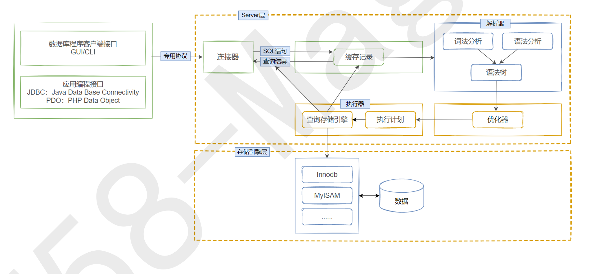

### MySQL中的SQL执行流程

1. 查询缓存：Server如果在查询缓存中发现了这条SQL语句，就会直接将结果返回给客户端，如果没有，就进入解析器阶段，由于查询缓存命中率不高，所以在MySQL8.0之后就抛弃了这个功能

2. 解析器：在解析器中对SQL语句进行语法分析，词法分析，语义分析。

SQL语句的分析分为词法分析和语法分析

分析器先做`词法分析`。你的输入是由多个字符串和空格组成的一条SQL语句，MySQL需要识别出里面的字符串分别是什么，代表什么

比如：MySQL从你输入的“select”这个关键字识别出来，这是一个查询语句。它也要把字符串'T'识别出'表名T'，把字符串'ID'识别成'列ID'

接着，要做`语法分析`。根据词法分析的结果，语法分析其(比如Bison)会根据语法规则，判断你输入的这个SQL语句是否满足MySQL语法

如果你的语句不对，就会收到"You have an error in your SQL syntax"的错误提醒

如果SQL语句正确，则会生成一个这样的语法树
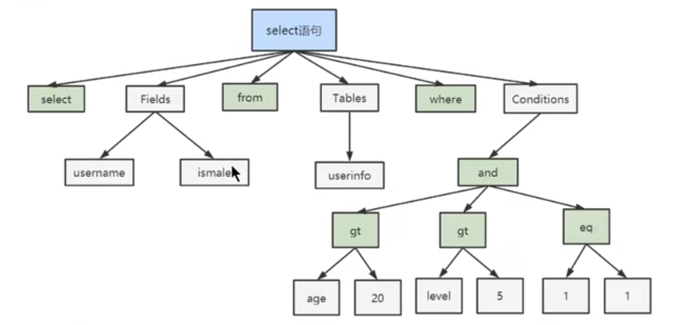

组成语法树后进入分析机，确定语法正确，后进入优化器

3. 优化器：在优化器中会确定SQL语句的执行路径，比如是根据全表检索，还是根据索引检索等。

经过了解析器，MySQL就知道你要做什么。在开始执行之前，还要先经过优化器的处理。`一条查询可以有很多种执行方式最后都返回相同的结果。优化器的作用就是找到其中最好的执行计划`

在查询优化器中，可以分为`逻辑查询`优化阶段和`物理查询`优化阶段

逻辑查询优化：

通过改变SQL语句的内容来使得SQL查询更高效，同时为物理查询优化提供更多的候选执行计划。

通常采用的方式是对SQL语句进行等价变换，对查询进行重写，而查询重写的数据基础就是关系代数。

对条件表达式进行等价谓词重写，条件简化，对视图进行重写，对子查询进行优化，对连接语义进行了外连接消除，嵌套连接消除等

物理查询优化：

基于关系代数进行查询重写，而关系代数的每一步多对应着物理计算，这些物理计算往往有多种算法，因此需要计算各种物理路径的代价，从中选择代价最小的作为执行计划。

在这个阶段，对单表和多表连接的操作，需要高效地使用索引，提升查询效率

5.执行器：

截止到现在，还没有真正读写真正的表，仅仅产出一个执行计划。于是就是如执行器阶段


#### 总结

SQL语句在MySQL的执行流程：

SQL语句--> 查询缓存 --> 解析器 --> 优化器 --> 执行器


### 查看MySQL8中SQL执行原理

#### 确认profiling是否开启

了解查询语句底层执行过程：`select @@profiling`或者`show variables like '%profiling%'`查看是否开启计划。开启它可以让MySQL收集在SQL执行时所使用的资源情况
```sql
-- 默认为0
SELECT @@profiling;

SHOW VARIABLES LIKE 'profiling';
```

profiling=0代表关闭，需要将它打开，设置为1
```sql
set profiling=1;
```

#### 多次执行相同SQL查询

```sql
select * from employees;

SELECT * FROM employees;

-- 查询之前执行的语句的排序
show profiles;

-- 默认查询最近一次
SHOW PROFILE;

-- 查询指定语句的执行过程
show profile for query 8;
```

## 存储引擎

MySQL中提到了存储引擎的概念。简而言之，存储引擎就是指表的类型。其实存储引擎以前叫做`表处理器`，后来改名为存储引擎，它的功能就是接收上层传下来的指令，然后对表中的数据进行提取或写入操作。

### 查看MySQL所有的引擎

```sql
SHOW ENGINES;
```

查看默认存储引擎
```sql
SHOW VARIABLES LIKE '%storage_engine%'

select @@default_storage_engine;
```

修改默认的存储引擎
```sql
SET DEFAULT_STORAGE_ENGIN=MyISAM;

-- 或者修改my.cnf文件
default-storage-engine=MyISAM

# 重启服务
systemctl restart mysqld.service
```

### 设置表的存储引擎

#### 创建表时指定存储引擎
```sql
CREATE TABLE 表名(
    建表语句;
) ENGINE = 存储引擎名称;
```


### 引擎介绍

#### InnoDB引擎：具备外键支持功能的事务存储引擎

- InnoDB是MySQL的`默认事务型引擎`，它被设计用来处理大量的短期(short-livedd)事务。可以确保事务的完整提交(Commit)和回滚(Rollback).
- 除了增加和查询外，还需要更新，删除操作，那么应优先选择InnoDB存储引擎
- 除非有非常特别的原因需要使用其他的存储引擎，否则应该优先考虑InnoDB引擎
- 数据文件结构
  - 表名:.ibd
  - 即存储数据和索引，也存储表结构（索引即数据）
- InnoDB是`为处理巨大数据量的最大性能设计`
- 对比MyISAM的存储引擎，InnoDB写的处理效率差一些，并且会占用更多的磁盘空间以保存数据和索引
- MyISAM只缓存索引，不缓存真实数据；InnoDB不仅缓存索引还要缓存真实数据，对内存要求较高，而且内存大小对性能有决定性影响
- InnoDB用的行锁，并发效率更高

#### MyISAM引擎，主要的非事务处理存储引擎

- MyISAM提供了大量的特性，包括全文索引，压缩，空间函数(GIS)等，但MyISAM`不支持事务、行级锁，外键`，有一个毫无疑问的缺陷就是`崩溃后无法安全恢复`

- 优势是访问速度快，对事务完整性没有要求或者以SELECT、INSERT为主的应用
- 针对数据统计有额外的常数存储。故而count(*)的查询效率很高
- 数据文件结构
  - 表名`.frm`存储表结构
  - 表名`.MYD`存储数据(MYData)
  - 表名`.MYI`存储索引(MYIndex)
- 应用场景：只读应用或者以读为主的业务

#### Archive引擎：用于数据存档

- `archive`是`归档`的意思，仅仅支持`插入`和`查询`两种功能（行被插入后不能再修改）
- 在MySQL5.5后`支持索引`功能
- 拥有很好的压缩机制，使用`zlib压缩库`，在记录请求的时候实时进行压缩，经常被用来作为仓库使用
- 创建Archive表时，存储引擎会创建名称以表名开头的文件。数据文件的扩展名是.ARZ
- 根据英文的测试结论来看，同样数据下，`Archive比MyISAM表要小75%，比支持事务处理的InnoDB表小大约83%`。
- ARCHIVE存储引擎采用了行级锁。
- ARCHIVE表`适合日志和数据采集(归档)类应用`适合存储大量的独立的作为历史记录的数据，拥有很高的插入速度，但是对查询的支持较差  


#### CSV引擎：存储数据时，以逗号分隔各个数据项

- CSV引擎可以将`普通的CSV文件作为MySQL的表来处理`，但不支持索引
- CSV引擎可以作为一种数据交换的机制，非常有用
- CSV存储的数据直接可以在操作系统里，用文件编辑器，或者excel读取
- 对数据的快速导入，导出有明显优势。


#### Memory引擎：置于内存的表

- 概述：
  - Memory采用的逻辑介质是`内存`，`响应速度快`，但是当mysqld守护进程崩溃的时候，数据会丢失。另外，要求存储的数据是数据长度不变的格式

- 主要特征
  - Memory同时支持HASH索引和B+树索引
    - Hash索引相等的比较快，但是对于范围的比较慢很多
    - 默认使用Hash索引，其速度要比B型树索引快
    - 如果希望使用B树索引，可以在创建索引时选择使用
  - Memory表至少比MyISAM表要快一个数量级
  - Memory表的大小是收到限制的。表的大小主要取决于两个参数，分贝是`max_rows`和`max_heap_table_size`。其中，max_rows可以在创建表时指定；max_heap_table_size的大小默认为16MB，可以按需要进行扩大。
  - 数据文件于索引文件分开存储
    - 每个基于Memory存储引擎的表实际对应一个磁盘文件，该文件的文件名与表名相同，类型为`frm类型`，该文件中只存储表的结构，而且`数据文件都是存储在内存中`
    - 这样有利于数据的快速处理，提供整个表的处理效率
  - 缺点:其数据易丢失，生命周期短。基于这个缺陷，选择Memory存储引擎时要特别小心。

- 使用Memory存储引擎的场景
  - 目标数据比较小，而且非常频繁的进行访问，在内存中存放数据，如果太大的数据会造成内存溢出。可以通过参数`max_heap_table_size`控制Memory表的大小，限制Memory表的最大的大小。
  - 如果数据是临时的，而且必须立即可用得到，那么就可以放在内存中
  - 存储在Memory表中的数据如果突然间`丢失的话也没有太大的关系`

# 索引与性能调优
## 索引的数据结构

### 为什么使用索引

索引是存储引擎用于快速找到数据记录的一种数据结构

进行数据查找时，首先查看查询条件是否命中某条索引，符合则`通过索引查找`相关数据，如果不符合则需要`全表扫描`，即需要一条一条地查找记录，知道找到与条件符合的记录。

建索引的目的就是`减少磁盘I/O的次数`，加快查询速率

`索引是在存储引擎中实现的`，因此每种存储引擎的索引不一定完全相同，并且每种存储引擎不一定支持所有索引类型。`不同存储引擎，索引的表现形式不同`

比如：InnoDB的索引就是通过 B+树实现的

```
在频繁插入数据的场景下：

索引可以提高查询的速度，但是会影响插入记录的速度。这种情况下，最好的办法是先删除表中的索引，然后插入数据，插入完成后再创建索引
```
### B+树的索引设计方案
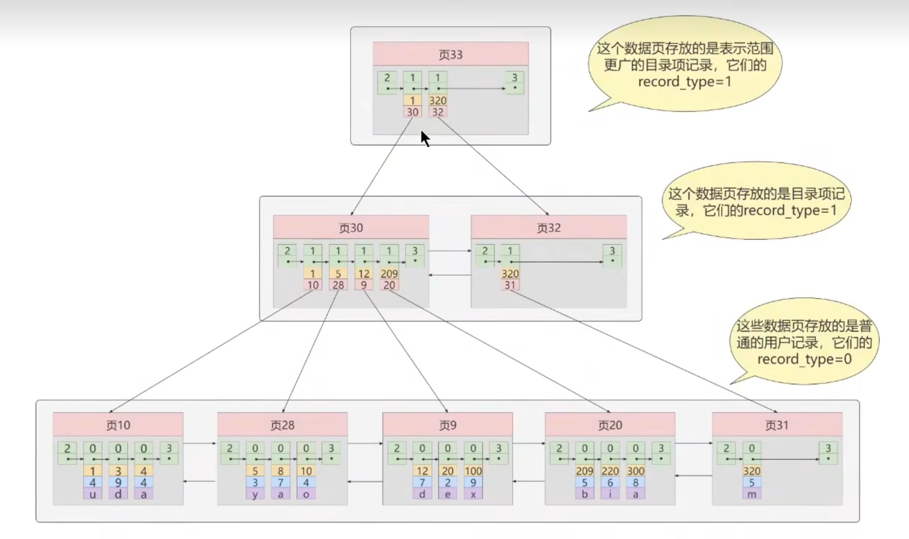


### 常见索引概念

索引按照物理方式实现。索引可以分为2种：聚簇索引和非聚簇索引。我们把非聚集索引称为二级索引或辅助索引


#### 聚簇索引

B+树的索引构建方式就是聚簇索引，所有的用户数据都存储在叶子节点上，也就是`索引即数据，数据即索引`

特点：
- 使用记录主键值的大小进行记录和页的排序，这包括三个方面的含义：
  - 页内的记录是按照主键的大小顺序排成一个单向链表
  - 各个存放用户记录的页也是根据页中用户记录的主键大小顺序排成一个双向链表
  - 存放`目录项记录的页`分为不同的层次，在同一层次中的页，也就是根据页中目录项记录的主键大小顺序排成一个双向链表

优点

- `数据访问更快`，因为聚簇索引将索引和数据保存在一个B+树中，因此从聚簇索引中获取数据比非聚簇索引更快

- 聚簇索引对于主键的`排序查找`和`范围查找`速度非常快

- 按照聚簇索引排列顺序，查询显示一定范围数据的时候，由于数据都是紧密相连的，数据库不用从多个数据块中个提取数据，所以节省了大量的IO操作


缺点

- `插入速度严重依赖插入操作`，按照主键的顺序插入是最快的方式，否则将会出现页分裂，严重会影响性能。因此，对于InnoDB表，我们一般对定义一个自增的ID列为主键

- `更新主键的代价很高`，因为将导致被更新的行移动。因此，对于InnoDB表，我们一般定义为主键不可更新

- `二级索引访问需要两次索引查找`,第一次找主键值，第二次根据主键值找到行数据

限制

- 对于MySQL数据库目前只有InnoDB数据引擎支持聚簇索引，而MyISAM并不支持聚簇索引

- 由于数据物理存储方式只能有一种，所以每个MySQL的表只能有一个聚簇索引。一般情况下就是该表的主键

- 如果没有定义主键，InnoDB会选择`非空唯一索引`代替。如果没有这样的索引，InnoDB会隐式的定义一个主键来作为聚簇索引

- 为了充分利用聚簇索引的聚簇的特性，所以InnoDB表的主键尽量选用有序的顺序id，而不建议用无序的id


#### 二级索引

我们以非主键的列作为搜索条件的时候，可以使用二级索引

二级索引的叶子结点中的数据只放该列的数据和对应的主键

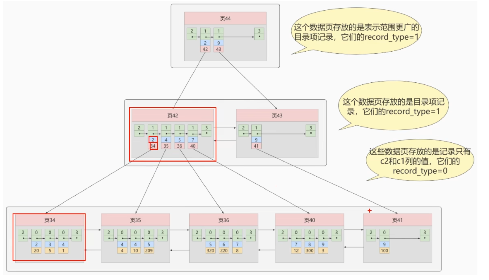

因此也可以根据叶子节点的数据。判断该索引是聚簇索引还是二级索引

回表

- 二级索引中，通过C2找到对应的C1主键的数据，然后在回到之前的聚簇索引，根据C1主键找到对应的C3的数据，这个过程就叫`回表`

- 因为这种按照`非主键列`建立的B+树需要一次回表操作才可以定位到完整的用户记录，所以这种B+树也称为二级索引，或者辅助索引。由于我们使用的是C2列的大小作为B+树的排序规则，所以我们也称这个B+树是为C2列建立的索引

- 非聚簇索引的存在不影响聚簇索引中的组织，因此一张表可以有多个非聚簇索引
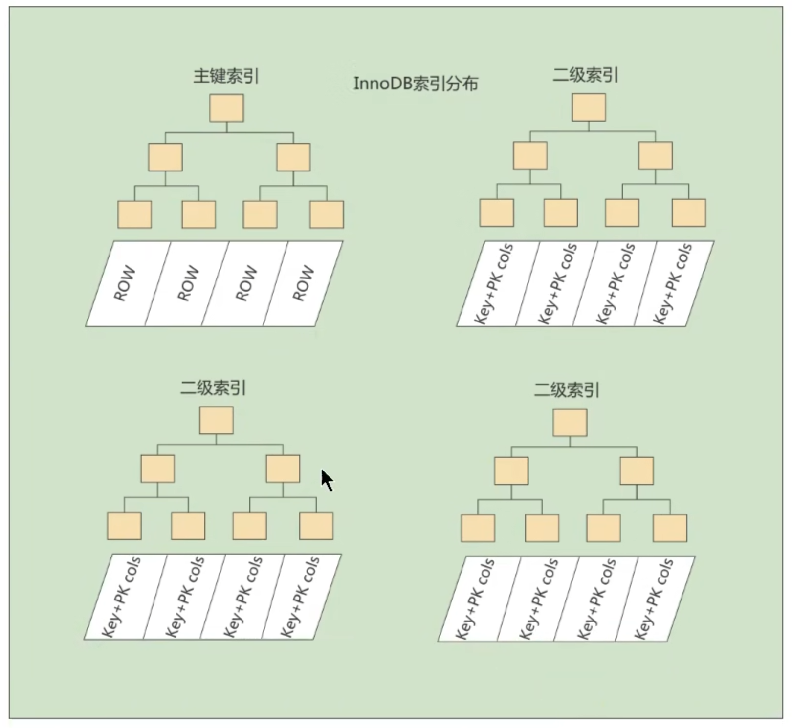


#### 联合索引

我们也可以同时以多个列的大小作为排序规则，也就是同时为多个列建立索引，比方说我们想让B+树按照c2和c3的大小进行排序，这个包含两层含义
- 先把各个记录和页按照C2列进行排序
- 在记录C2列相同的情况下，采用C3进行排序
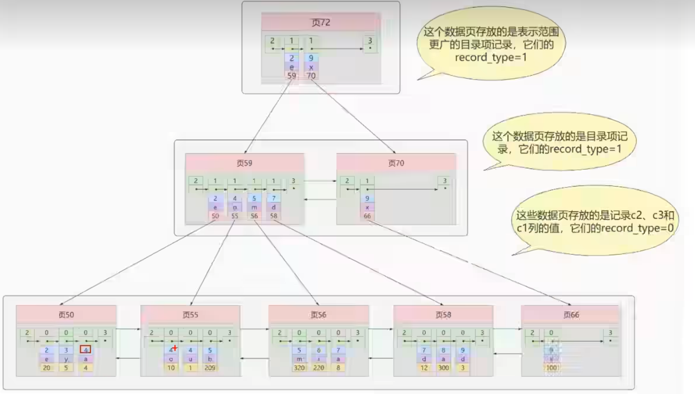


### InnoDB的B+树索引注意事项

#### 根页面（根节点）位置万年不变

实际B+树的形成过程

- 每当为某个表创建一个B+树索引（聚簇索引不是人为创建的，默认就有）的时候，都会为这个索引创建一个根节点页面。最开始表中没有数据的时候，每个B+树索引对应的根节点中既没有用户记录，也没有目录项记录

- 随后向表中插入用户记录时，先把用户记录存储到这个根节点中

- 当根节点中的可用空间用完时，继续插入记录，此时会将根节点中的所有记录复制到一个新分配的页，比如页a中，然后对这个新页进行`页分裂`的操作，得到另一个新页，比如`页b`。这是新插入的记录根据键值(也就是聚簇索引的主键值，二级索引中对应的索引列的值)的大小就会被分配到`页a`或者`页b`中，而`根节点`便升级为存储目录项记录的页

特别注意：一个B+树索引的根节点自诞生之日起，便不再移动。这样只要我们对某个表建立一个索引，那么它的根节点的页号便会被记录到某个地方，然后凡是InnoDB存储引擎需要用到这个索引的时候，都会从固定的地方取出根节点的页号，从而访问这个索引


#### 内节点（非叶子节点）中目录项记录的唯一性

为了让新插入记录能找到自己在哪个页里，我们需要保证在B+树的同一层内节点的目录项记录除页号这个字段以外是唯一的。所以对于二级索引的内节点的目录项记录的内容实际上是由三个部分组成e
- 索引列的值
- 主键值（加入主键值，保证唯一性）
- 页号

也就是我们把`主键值`也添加到二级索引内节点中的目录项记录了，这样就能保证B+树每一层节点中各条目录项记录除页号这个字段外是唯一的，所以我们为C2列建立二级索引后的示意图如下

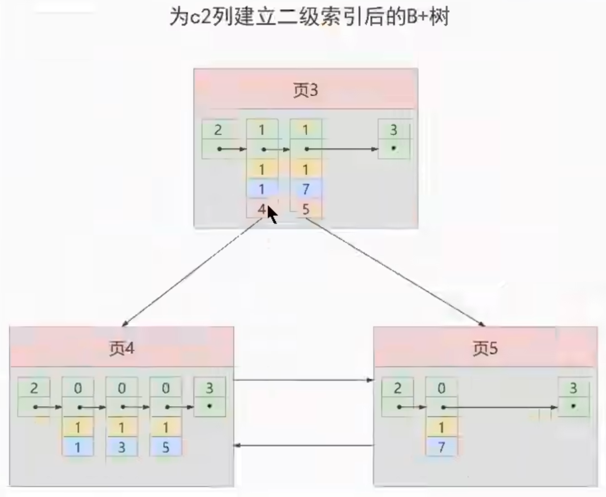


#### 一个页面最少存储2条记录


### MyISAM中的索引方案

MyISAM引擎使用`B+Tree`作为索引结构，但是叶子节点的data域存放的是`数据记录的地址`（.MYD存储数据； .MYI存储索引）

而INnoDB引擎中，`B+Tree`的索引结构的叶子节点，聚簇索引中存放的是`用户记录`，非聚簇索引存放的是`索引列的值和主键值`

MyISAM中没有聚簇索引，全部都可以理解为二级索引

### MyISAM的原理

MyISAM的索引同样也是一棵B+树，data域保存数据记录的地址。因此，MyISAM中索引检索的算法为：首先按照B+Tree搜索算法搜索索引，如果指定的Key存在，则取出其data域的值，然后以data域的值为地址，读取响应数据记录


#### MyISAM和InnoDB对比

1. 在InnoDB存储引擎中，我们只需要根据主键值对`聚簇索引`进行一次查找就能找到对应的记录，而在`MyISAM`中却需要进行一次`回表`操作，意味着MyISAM中建立的索引相当于全部都是二级索引

2. InnoDB的数据文件本身就是索引文件，而MyISAM索引文件和数据文件是`分离的`，索引文件仅保存数据记录的地址

3. InnoDB的非聚簇索引data域存储相应记录`主键的值`，而MyISAM索引记录的是`地址`。换句话说，InnoDB的所有非聚簇索引都引用主键作为data域。

4. MyISAM的回表操作是十分`快速`的，因为拿着地址偏移量直接到文件中取数据，反观InnoDB是通过获取主键之后再去聚簇索引里找记录，虽然说也不慢，但还是比不上直接用地址取访问直接


#### 索引的代价

- 空间上的代价
  - 每建立一个索引都要为它建立一棵B+树，每一棵B+树的每一个节点都是一个数据页，一个页默认会占用16KB的存储空间，一棵很大的B+树由许多数据页组成，那就是很大的一片存储空间


- 时间的代价
  - 在对数据进行操作的过程中，为了维护数据的性质，维护索引，会不断的进行记录位移，页面分裂等操作，会影响性能


## InnoDB数据存储结构

### 数据库的存储结构：页
#### 磁盘与内存交互基本单位：页

InnoDB将数据划分为若干个页，InnoDB中页的大小默认为16KB。

#### 页的概述

页a、页b、页c...页n这些页可以`不在物理结构上相连`，只要通过`双向链表`相关联即可。每个数据页中的记录会按照主键值从小到大的顺序组成一个`单项链表`，每个数据页都会存储在它里面的记录生成一个`页目录`，在通过主键查找某条记录的时候可以在页目录中`使用二分查找`快速定位对应的槽，然后再遍历该槽对应分组中的记录即可，快速找到指定记录

#### 页的大小

不同数据库管理系统的页大小不同。比如在MySQL的InnoDB存储引擎中，默认页的大小是16KB，我们可以通过下面的命令来进行查看：
```sql
show variables like `innodb_page_size%`;
```

#### 页的上层结构

另外在数据库中，还存在着区(Extent)、段(Segment)和表空间(Tablespace)的概念。

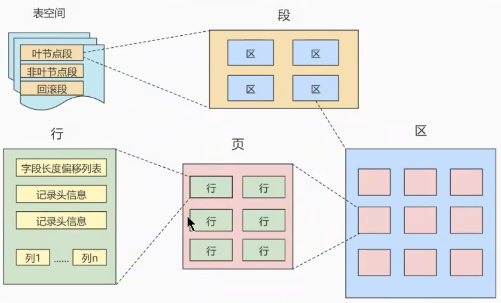

- 区(Extent)
  - 是比页大一级的存储结构，在InnoDB存储引擎中，一个区会分配64个连续的页。因为InnoDB中的页大小默认是16KB，所以一个区的大小是64*16KB=1MB

- 段(Segment)
  - 由一个或多个区组成，区在文件系统是一个连续分配的空间（在InnoDB中是连续的64个页），不过在段中不要求区与区之间是相邻的。`段是数据库中的分配单位，不同类型的数据库对象以不同的段形式存在`。当我们创建数据表、索引的时候，就会相应创建对应的段，比如创建一张表时会创建一个表段，创建一个索引时会创建一个索引段

- 表空间(Tablespace)是一个逻辑容器，表空间存储的对象是段，在一个表空间中可以有一个或多个段，但是


### 页的内部结构

页如果按类型划分的话，常见的有`数据页(保存B+树节点)、系统页、Undo页和事务数据页`等。数据页是我们最常使用的页。

数据页的16KB大小的存储空间被划分为七个部分，分别是
- 文件头(File Header)【38字节】
  - 文件头，描述页的信息
- 页头(Page Header)【56字节】
  - 页头，页的状态信息
- 最大最小记录(Infimum + supermum)【26字节】
  - 最大和最小的记录，这是两个虚拟的行记录
- 用户记录(User Records)、
  - 用户记录、存储记录内容
- 空闲空间(Free Space)
  - 页中还没有被使用的空间
- 页目录(Page Directory)
  - 存储用户记录的相对位置
- 文件尾(File Tailer)
  - 文件尾，校验页是否完整


#### 第一部分：File Header(文件头部)和File Trailer(文件尾部)

首先是`文件通用部分`，也就是`文件头`和`文件尾`

- 文件头部信息
  - 不同类型的页都会以File Header作为第一个组成部分，它描述了一些针对各种页都通用的一些信息。

- File Header(文件头部，38字节)
  - FIL_PAGE_SPACE_OR_CHKSUM (4字节)
    - 页的校验和(checksum值)
    - 校验和：就是对于一个很长的字节串来说，我们会通过某种算法来计算一个比较短的值来代表这个很长的字节串，这个比较短的值就称为校验和
    - 在比较两个很长的字节串之前，先比较这两个长字节串的校验和，如果校验和不一样，则两个长字节串肯定不同，省去了直接比较两个比较长的字节串的时间损耗
    - 作用：InnoDB存储引擎以页为单位把数据加载到内存中处理，如果该页中的数据在内存中被修改了，那么`在修改后的某个事件需要把数据同步到磁盘中。`但是在同步了一半的时候断电了，造成了该页传输的不完整。
    - 为了检测一个页是否完整（也就是在同步的时候有没有发生只同步一半的尴尬情况），这时可以通过文件尾的校验和(checksum值)与文件头的校验和做比对，如果两个值不相等则证明页的传输有问题，需要重新进行传输，否则认为页的传输已经完成
    - 具体：每当一个页在内存中修改了，在同步之前就要把它的校验和算出来，因为File_Header在页面的前边，所以校验和会被首选同步到磁盘，当完全写完时，校验和也会被写到页的尾部，如果完全同步成功，那么在File_Header中的校验和就代表着已经修改或的页，而在File_Trailer中的校验和代表着原先的页，二者不同以为着同步中出了错，这里，校验方式就是采用Hash算法校验的
  - FIL_PAGE_OFFSET (4字节)
    - 页号
    - 每一个页都有一个单独的页号，InnoDB通过页号可以`唯一定位一个页`
  - FIL_PAGE_PREV (4字节)
    - 上一个页的页号
  - FIL_PAGE_NEXT (4字节)
    - 下一个页的页号
  - FIL_PAGE_LSN (8字节)
    - 页面被最后修改时对应的日志序列位置
  - FIL_PAGE_TYPE (2字节)
    - 该页的类型
      - FIL_PAGE_TYPE_ALLOCATED
        - 最新分配，还没使用
      - FIL_PAGE_UNDO_LOG
        - Undo日志页
      - FIL_PAGE_INODE
        - 段信息节点
      - FIL_PAGE_IBUF_FREE_LIST
        - Insert Buffer空闲列表
      - FIL_PAGE_IBUF_BITMAP
        - Insert Buffer位图
      - FIL_PAGE_TYPE_SYS
        - 系统页
      - FIL_PAGE_TYPE_TRX_SYS
        - 事务系统数据
      - FIL_PAGE_TYPE_FSP_HDR
        - 表空间头部信息
      - FIL_PAGE_TYPE_XDES
        - 扩展描述页
      - FIL_PAGE_TYPE_BLOB
        - 溢出页
      - FIL_PAGE_INDEX
        - 索引页，也称数据页
  - FIL_PAGE_FILE_FLUSH_LSN (8字节)
    - 仅在系统表空间的一个页中定义，代表文件直到被刷新到对应的LSN值
  - FIL_PAGE_ARCH_LOG_NO_OR_SPACE_ID (4字节)
    - 页属于哪个表空间

- File Trailer(文件尾部)[8字节]
  - 前4个字节代表页的校验和
    - 和File Header中的校验和相对应的
  - 后4个字节代表页面被最后修改时对应的日志序列位置LSN；
    - 这个部分也是为了校验页的完整性的。如果首部和尾部的LSN值校验不成功的话，就说明同步过程出现了问题

#### 第二部分 记录部分

<span style="color:red; font-weight:700">空闲空间(Free Space)</span>

<span style="color:red; font-weight:700">用户记录(User Space)</span>

User Records中的这些记录按照`指定的行格式`一条一条摆在User Records部分，相互之间形成单链表

具体单链表是如何实现的，引申出行格式中的记录头信息

记录头信息（5字节）

```sql
CREATE TABLE page_demo(
    c1 INT,
    c2 INT,
    c3 VARCHAR(100000),
    PRIMARY KEY (c1)
) CHARSET=ascii ROW_FORMAT=Compact;l
```

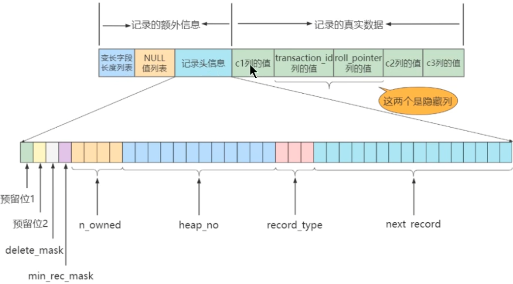

记录头信息中各个属性


简化后的行格式示意图


```sql
-- 插入数据
INSERT INTO page_demo
VALUES
(1,100,'song'),
(2,200,'tong'),
(3,300,'zhan'),
(4,400,'lisi');
```

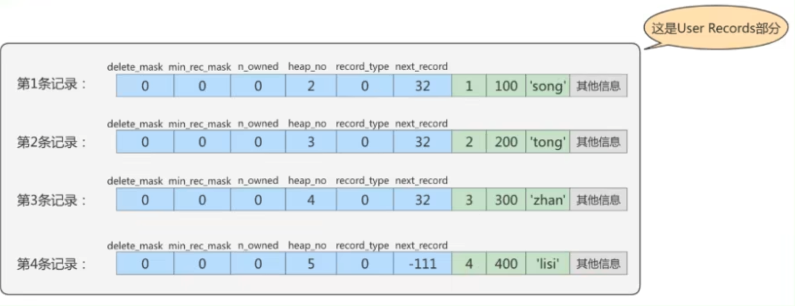

- delete_mask:
  - 这个属性标记着当前记录是否被删除，占用1个二进制位
    - 值为0：代表记录并没有被删除
    - 值为1：代表记录被删除掉了
  - 被删除已的记录为什么还在页中存储呢
    - 你以为它删除了，可它还在真实的磁盘上，这些被删除的记录之所以不立即从磁盘移除，是因为移除它们之后其他的记录在磁盘上需要`重新排列，导致性能消耗`。所以只是打一个删除标记而已，所有被删除的记录都会组成一个所谓的`垃圾链表`，在这个链表中的记录占用的空间称之为`可用空间`,之后如果有新纪录插入到表中的话，可能把这些被删除的记录占用的存储空间覆盖掉

- min_rec_mask
  - B+树的每层非叶子节点中的最小记录都会添加该标记，min_rec_mask值为1
  - 我们自己插入的四条记录的min_rec_mask值都是0，意味着它们都不是B+树的非叶子节点中的最小标记

- record_type
  - 这个属性表示当前记录的类型，一共4中类型的记录
    - 0：表示普通记录
    - 1：表示B+树非叶子节点记录
    - 2：表示最小记录
    - 3：表示最大记录

- heap_no
  - 这个属性表示当前记录在本页中的位置
  - 从图中可以看出，我们插入的4条记录在本页中的位置分别是2，3，4，5
  - 怎么不见heap_no为0和1的记录？
    - MySQL会自动给每个页里加两个记录，由于这两个记录并不是我们自己插入的，所以有时候也称为伪记录或者虚拟记录。这两个伪记录一个代表最小记录，一个代表最大记录。最小记录和最大记录的heap_no值分别是0和1，也就是它们的位置最靠前

- n_owned
  - 页目录中每个组中最后一条记录的头信息中会存储改组一共有多少条记录，作为n_owned字段
  - 详情见后面页目录的讲解

- next_record
  - 它表示从当前记录的真实数据到下一条记录的真实数据的`地址偏移量`
  - 比如：第一条记录的next_record值为32，意味着从第一条记录的真实数据的地址处向后找32个字节，便是下一条记录的真实数据
  - 注意：下一条记录指的并不是按照我们插入顺序的下一条记录，而是按照主键从小到大的顺序的下一条记录，而且规定Infimum记录（也就是最小记录）的下一条记录就是本页中主键值最小的用户记录，而本页中主键值最大的用户记录的下一条记录就是Supremum记录（也就是最大记录）

#### 演示：删除操作

从表中删除一条记录，这个链表也会跟着变化
```sql
DELETE FROM page_demo WHERE c1=2;
```

删掉第二条记录的示意图如下

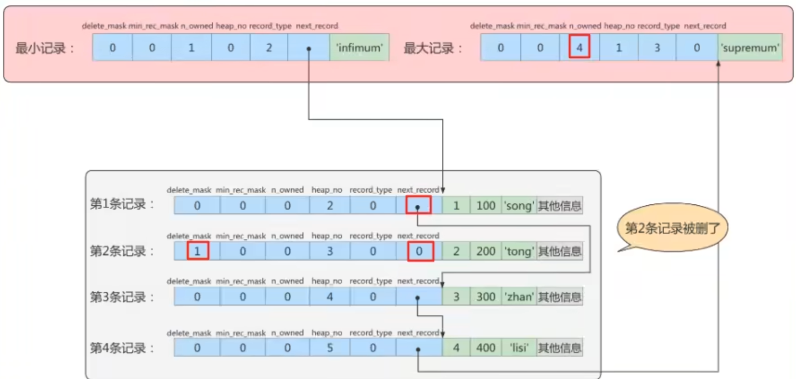

从图中可以看出，删除第二条记录后
- 第二条记录并没有从存储空间中移除，而是把该条记录的delete_mask值设置为1
- 第2条记录的next_record值变为0，意味着该记录没有下一条记录
- 第一条记录的next_record值变为第3条记录
- 最大记录的n_owned值从5变为了4

所以，不论我们怎么对页中的记录做增删改操作，InnoDB始终会维护一条记录的单链表，链表中的各个节点是按照主键值由小到大的顺序连接起来的


#### 演示：添加操作

新插入的记录会复用被删除记录存储空间(新添加的主键值依然2的情况下)

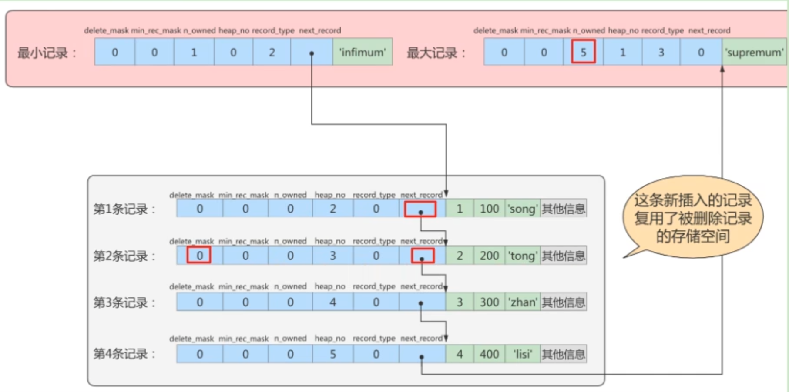


<span style="color:red; font-weight:700">最大最小记录</span>

对于一条完整的记录来说，比较记录的大小就是`比较主键`的大小

InnoDB规定的最小记录与最大记录这两条记录的构造十分简单，都是由5字节大小的记录头信息和8字节大小的固定的部分组成的。如下图

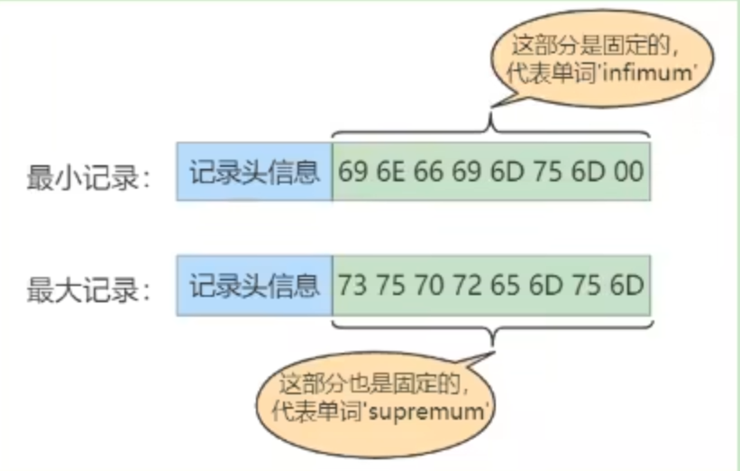

做出的更改

- 第一条和第二条记录的next_record变了
- 最大记录中的n_owned+1

当数据页中存在多条被删除掉的记录时，这些记录的next_record属性会把这些被删除掉的记录组成一个垃圾链表，以备之后重用这部分存储空间


#### 第三部分：页目录与页面头部

<span style="color:red; font-weight:700"> 页目录(Page Directory)</span>

1. 将所有的记录分成几个组，这些记录包括最小记录和最大记录，但不包括标记为"已删除"的记录

2. 第1组，也就是最小记录所在的分组只有1个记录；
   1. 最后一组，就是最大记录所在的分组，会有1-8个记录；
   2. 其余的组记录数量在4-8之间
   3. 这样做的好处是，除了第1组(最小记录所在组)之外，其余组的记录数会尽量平分。
  
3. 在每个组中最后一条记录的头信息中会存储该组一共有多少条记录，作为n_owned字段

4. 页目录用来存储每组最后一条记录的地址偏移量，这些地址偏移量会按照先后顺序存储起来，每组的地址偏移量也被称为槽(slot)，每个槽相当于指针指向了不同组的最后
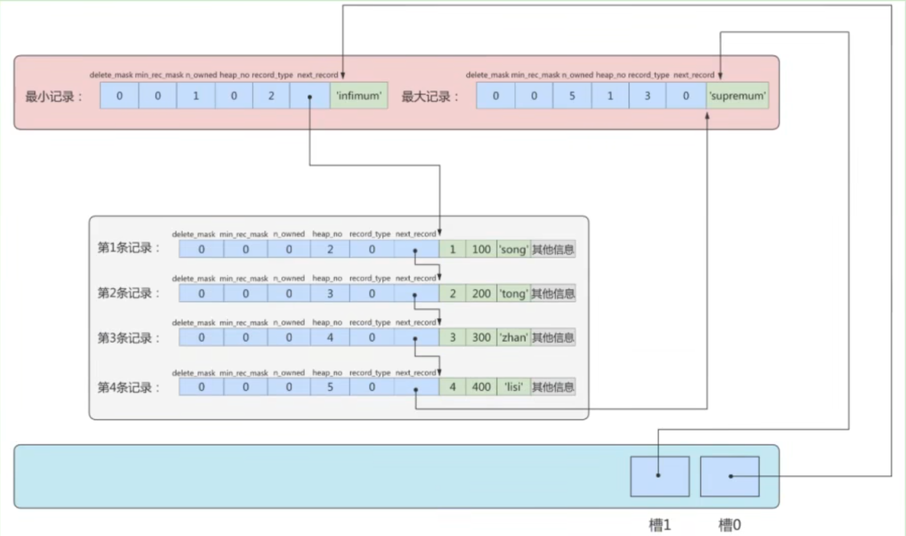


页目录分组的个数如何确定？

- 分组时按照下边的步骤进行的
  - 初始情况下一个数据页里只有最小记录和最大记录两条记录，它们分属于两个分组
  - 之后每插入一条记录，都会从页目录中找到主键值比本记录的主键值大并且差值最小的槽，然后把该槽对应的记录n_owned加1，表示本组内又添加了一条记录，直到该组中的记录数等于8个。
  - 在一个组中的记录数等于8个后在插入一条记录时，会将组中的记录拆分为两个组，一个组中4条记录，另一个5条记录。这个过程会在页目录中新增一个槽来记录这个新增分组中最大的那条记录的偏移量


页目录结构下如何快速查询记录？

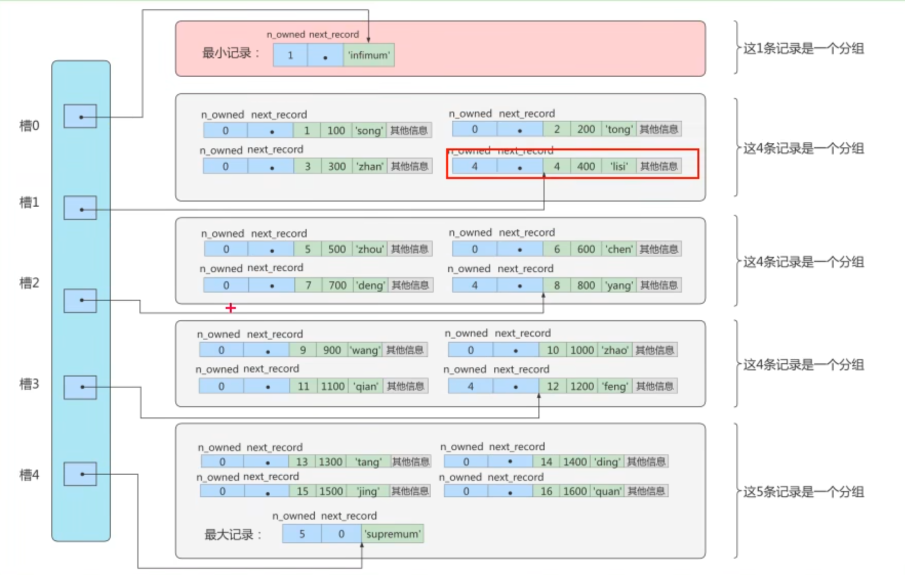


总结：页目录的作用就是再具体的页中快速的找到想要的记录（使用二分法）


<span style="color:red; font-weight:700"> 页面头部(Page Header)</span>

为了能得到一个数据页中存储的记录的状态信息，比如本页中已经存储了多少条记录，第一条记录的地址是什么，页目录中存储了多少个槽等，特意在页中定义了一个叫Page Header的部分，这个部分占用固定的56个字节，专门存储各种状态信息

- PAGE_N_DIR_SLOTS(2字节)
  - 页目录中槽的数量
- PAGE_HEAP_TOP(2字节)
  - 还未使用的空间最小地址，也就是说从该地址之后就是`Free Space`
- PAGE_N_HEAP(2字节)
  - 本页中的记录的数量（包括最小和最大记录以及标记为删除的记录）
- PAGE_FREE(2字节)
  - 第一个已经标记为删除的记录地址（各个已删除的记录通过next_record也会组成一个单链表，这个单链表中的记录可以被重新利用）
- PAGE_GARBAGE(2字节)
  - 已删除记录占用的字节数
- PAGE_LAST_INSERT(2字节)
  - 最后插入记录的位置
- PAGE_DIRECTION(2字节)
  - 记录插入的方向
- PAGE_N_DIRCTION(2字节)
  - 一个方向连续插入的记录数
- PAGE_N_RECS(2字节)
  - 该页中记录的数量（不包括最小和最大记录以及标记为删除的记录）
- PAGE_MAX_TRX_ID(8字节)
  - 修改当前页的最大事务ID，该值仅在二级索引中定义
- PAGE_LEVEL(2字节)
  - 当前页在B+树中所处层级
- PAGE_INDEX_ID(8字节)
  - 索引ID，表示当前页属于哪个索引
- PAGE_BTR_SEG_LEAF(10字节)
  - B+树叶子段的头部信息，仅在B+树的Root页定义


### InnoDB的行格式（或记录格式）

我们平时的数据以行为单位来向表中插入数据，这些记录在磁盘上的存储方式也被称为`行格式`或者`记录格式`。InnoDB存储引擎设计了4种不同类型的`行格式`，分别是`Compact`、`Redundant`、`Dynamic`、`Compressed`行格式。

查看MySQL8的默认行格式
```sql
SELECT @@innodb_default_row_format;
-- @@innodb_default_row_format
-- dynamic
```

也可以使用如下语法查看具体表使用的行格式
```sql
SHOW TABLE STATUS LIKE '表名'\G
```

创建或修改表的语句中指定行格式

```sql
CREATE TABLE 表名(列的信息) ROW_FORMAT=行格式名称;

ALTER TABLE 表名 ROW_FORMAT=行格式名称
```


#### COMPACTS行格式

在MySQL5.1版本中，默认设置为Compact行格式。一条完整的记录其实可以被分为记录的`额外信息`和记录的`真实数据`两大部分

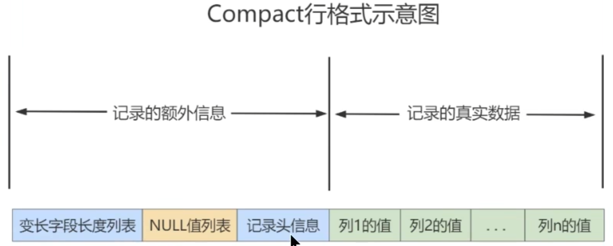

<span style="color:red; font-weight:700"> 变长字段长度列表</span>

MySQL支持一些变长的数据类型，比如VARCHAR(M)、VARBINARY(M)、TEXT类型、BLOB类型，这些数据类型修饰列称为变长字段，变长字段中存储多少字节的数据不是固定的，所以我们在存储真实数据的时候需要顺便把这些数据占用的字节数页存起来。`在Compact行格式中，把所有变长字段的真实数据占用的字节长度都存放在记录的开头部位，从而形成一个变长字段长度列表`

注意：
- 这里面存储的变长长度和字段顺序是`反过来`的。比如两个VARCHAR字段在表结构的顺序是a(10)，b(15)。那么在变成字段长度列表中存储的长度顺序就是15，10，是反过来的

举例
```sql
-- 创建表
CREATE TABLE record_test_table(
    col1 VARCHAR(8),
    col2 VARCHAR(8) NOT NULL,
    col3 CHAR(8),
    col4 VARCHAR(8)
) CHARSET=ascii ROW_FORMAT=COMPACT;

-- 插入数据
INSERT INTO record_test_table(col1,col2,col3,col4)
VALUES
('zhagnsan','lisi','wangwu','zyf'),
('tong','chen',NULL,NULL);
```


又因为这些长度值需要按照列的逆序存放，所以最后变长字段长度列表的字节串用十六进制表示效果就是
```
06 04 08
```

把这个字节组成的变长字段长度列表填入上边的示意图中的效果就是


<span style="color:red; font-weight:700">Null列表</span>

Compact行格式会把可以为NULL的列统一管理起来，存在一个标记为NULL值列表中。如果表中没有允许存储NULL的列，则NULL值列表也不存在

为什么定义NULL值列表

之所以要存储NULL是因为数据都是需要对齐的，如果`没有标注出来NULL值`的位置，就有可能在查询数据的时候出现混乱。如果使用`一个特定的符号`放到相应的数据位标识空置的话，虽然能达到效果，但是这样很浪费空间，所以直接就在行数据得头部开辟一块空间专门用来记录该行数据哪些是非空数据，哪些是空数据，格式如下

```
二进制的值为1时，代表该列的值为NULL
二进制的值为0时，代表该列的值不为NULL
```

例如：字段a、b、c，其中a是主键，在某一行存储的数依次是a=1、b=NULL、c=2。那么Compact行格式中的NULL值列表中存储：`01`。

解释：第一个0表示c不为null，第二个1表示b是null、这里之所以没有a是因为数据库会自动跳过主键，因为主键肯定是非NULL且唯一的，在NULL值列表的数据中就会自动跳过主键

record_test_table的两条记录的NULL值列表就如下

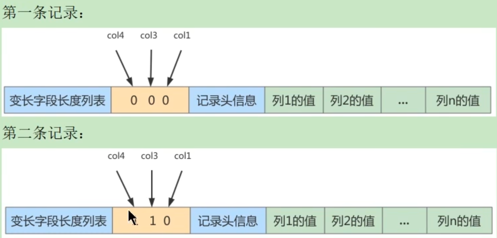

明确表名是非空的列，不在NULL值列表记录


<span style="color:red; font-weight:700">记录头信息（详见看上面）</span>


<span style="color:red; font-weight:700">记录的真实数据</span>

记录的真实数据除了我们自己定义的列的数据以外，还会有三个隐藏列

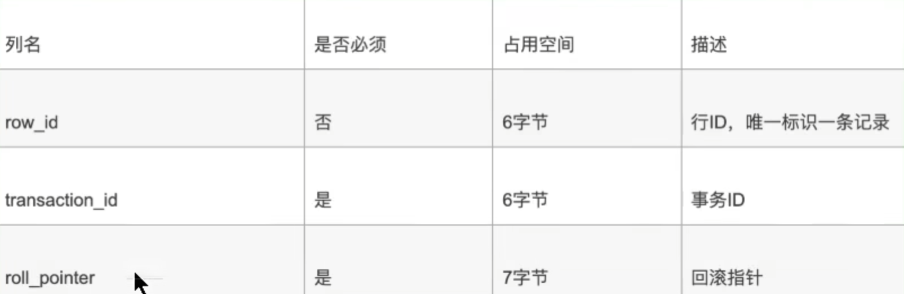

实际上这几个列的真实名称是：`DB_ROW_ID`、`DB_TRX_ID`、`DB_ROLL_PTR`
- 一个表没有手动定义主键，则会选取一个Unique作为主键，如果连Unique键都没有定义的话，则会为表默认添加一个row_id的隐藏列作为主键。所以row_id是在没有定义主键以及Unique键的情况下才会存在的
  
- 事务ID和回滚指针在后面的"Mysql事务"中详解

#### 数据库底层二进制分析

创建数据库
```sql
CREATE TABLE mytest(
    col1 VARCHAR(10),
    col2 VARCHAR(10),
    col3 CHAR(10),
    col4 VARCHAR(10)
) ENGINE=INNODB CHARSET=LATIN1 ROW_FORMAT=COMPACT;

INSERT INTO mytest
VALUES('a','bb','bb','ccc');

INSERT INTO mytest
VALUES('d','ee','ee','fff');

INSERT INTO mytest
VALUES('d',NULL,NULL,'fff');
```

在Windows操作系统下，可以选择通过程序`Notepad++`打开表空间文件mytest.ibd这个二进制文件。内容如下

 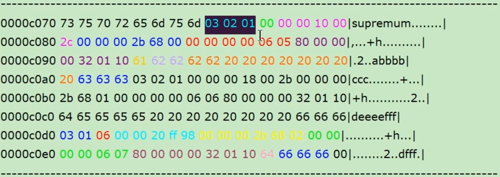

 ```
 03 02 01          /*变长字段长度列表， 逆序*/
 00                /*NULL标志位，第一行没有NULL值*/
 00 00 10 00 2c    /*Record Header, 固定5字节*/
 00 00 00 2b 68 00 /*RowID InnoDB自动创建，6字节*/
 00 00 00 00 06 05 /*TransactionID*/
 80 00 00 00 32 01 10 /*Roll Pointer*/
 61                /*列1数据'a'*/
 62 62             /*列2数据'bb'*/
 62 62 20 20 ..20  /*列3数据，char(10)，所以10字节*/
 63 63 63          /*列4数据'ccc'*/

 ```

 #### Dynamic和Compressed行格式

<span style="color:red;font-weight:700">行溢出</span>

InnoDB存储引擎可以将一条记录中的某些数据存储在真正的数据页面之外

示例
```sql
CREATE TABLE varchar_size_demo (
        c VARCHAR(65535)
) CHARSET=ASCII ROW_FORMAT=COMPACT;

-- 报错 Row size too large.

CREATE TABLE varchar_size_demo (
        c VARCHAR(65532) -- 2个字节的变长字段的长度，1个字节NULL值标识 
) CHARSET=ASCII ROW_FORMAT=COMPACT;

CREATE TABLE varchar_size_demo (
        c VARCHAR(65533)  NOT NULL-- 2个字节的变长字段的长度
) CHARSET=ASCII ROW_FORMAT=COMPACT;
```

一个页的大小是16KB,也就是16384个字节，但是一个varchar()类型的上限是65532

这样就可能出现一个页存放不了一条记录，这种现象就是行溢出

在Compect和Ruduntant行格式中，对于占用存储空间非常大的列，在记录的真实数据处只会存储该列的一部分数据，把剩余的数据分散存储在几个其他的页中进行`分页存储`，然后记录的真实数据处，用20个字节存储指向这些页的地址（当然这20个字节中包含这些分散在其他页面中的数据的占用的字节数），从而可以找到剩余数据所在的页。`这称为页扩展`

在MySQL8.0中，默认格式是Dynamic, Dynamic、COmpressed行格式和COmpact行格式挺像，只不过处理行溢出数据时有分歧

- COmpreeed和Dynamic两种记录格式对于存放在BOLB中的数据采用了完全的行溢出的方式
    - 数据页中只存放20个字节的指针（指向溢出页地址），实际数据都存放在Off page(溢出页)中
- COmpact和Redundant两种格式会在记录的真实数据处存储一部分数据（存放768个前缀字节）

Compressed行记录格式的另一个功能就是，存储在其中的行数据会以zlib的算法进行压缩。因此对于BloB，TEXT、VARCHAR这类长度类型的数据进行非常有效的存储


#### Redundant行格式

Redundant行格式是MySQL5.0版本之前InnoDB的行记录方式。MySQL5.0支持Reduntant是否了兼容之前版本的页格式

Redundant行格式的首部是一个字段长度偏移列表（冗余），同样是按照列的顺序逆序放置的。

字段长度偏移列表

- 少了“变长”两个字：Redundant行格式会把该条记录中所有列(包括隐藏列)的长度信息都按照逆序存储到字段长度偏移列表

- 多了“偏移”两个字：这意味着计算机列值长度的方式不像COmpact行格式那么直观，它是采用两个相邻数值的差值来计算各个列值的长度。


记录头信息

- 与COmpact行格式的记录信息对比来看，有两处不同
    - Redundant行格式多了n_field和1byte_offs_flag这两个属性
        - n_field：记录中列的数量
        - 1byte_offs_flag: 记录集字段长度偏移列表中每个列对应的偏移量，使用1个字节还是2个字节表示
    - Redundant行格式没有record_type这个属性。

