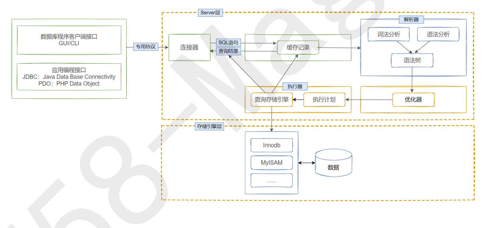

# 数据库概述
## 使用数据库的原因
- 保证数据的持久化
- 对于海量数据，数据库处理的效率更高，而且有多种方法可以针对性进行优化

## 数据库与数据库管理系统
- DB：数据库（Database）
<br>即存储数据的“仓库”，其本质是一个文件系统。它保存了一系列有组织的数据。
- DBMS：数据库管理系统（Database Management System）
<br>是一种操纵和管理数据库的大型软件，用于建立，使用和维护数据库，对数据库进行统一管理和控制。用户通过数据库管理系统访问数据库中表内的数据。
- SQL：结构化查询语言（Structured Query Language）
<br>专门用来与数据库通信的语言

## 关系型数据库（RDBMS）
- 实质
  - 这种类型的数据是最古老的数据库类型，关系型数据库模型是把复杂的数据结构归结为简单的二元关系（即二维表格形式）
  - 关系型数据库以行(row)和(column)的形式存储数据，以便于用户理解。这一系列的行和列被称为表(table)，一组表组成了一个库(database)。
  - 表与表之间的数据记录有关系(relationship)。现实世界中的各种实体以及实体之间的各种联系均用关系模型来表示。关系型数据库，就是建立在关系模型基础上的数据库
  
- 优势
  - 复杂查询
  <br>可以用SQL语句方便的在一个表以及多个表之间做非常复杂的数据查询
  - 事务支持
  <br>使得对于安全性能很高的数据访问要求得以实现。

- 关系型数据库设计规则
  - 关系型数据库的典型数据结构就是数据表，这些数据表的组成都是结构化的（Structured）
  - 将数据放到表中，表再放到库中
  - 一个数据库中可以有多个表，每个表都有一个名字，用来标识自己。表名具有唯一性。
  - 表具有一些特性，这些特性定义了数据在表中如何存储，类似java和python中类的设计。

- 表 、记录、字段
  - E-R(entity-relationship,实体-联系)模型中有三个主要概念：实体集、属性、联系集
  - 一个实体集(class)对应于数据库中的一个表(table)，一个实体(instance)则对应于数据表中的一行(row)，也称为一条记录(record)。一个属性(attribute)对应于数据库表中的一列，也成为字段(field)

- 表的关联关系
  - 表与表之间的数据记录有关系(relationship)。现实世界中的各种实体以及实体之间的各种联系均用关系模型来表示。
  - 四种：一对一关联、一对多关联、多对多关联、自我引用

- 一对一关联 (one-to-one)
  - 在实际开发中应用不多，因为一对一可以创建成一张表
  - 两种建表原则：
    - 外键唯一：主表的主键和从表的外键（唯一），形成主外键关系，外键唯一。
    - 外键是主键：主表的主键和从表的主键，形成主外键关系。

- 一对多关系 (one-to-many)
  - 常见实例场景：客户表和订单表，分类表和商品表，部门表和员工表。
  - 一对多建表原则：在从表(多方)创建一个字段，字段作为外键指向主表(一方)的主键

- 多对多关系（many-to-many）
  - 要表示多对多的关系，必须创建第三个表，该表通常称为连接表，它将多对多关系划分位两个一对多关系。将这两个表的主键都插入到第三个表中。

- 自我引用
  - 暂略


## 非关系型数据库
- 介绍
<br>非关系型数据库，可以看成传统关系型数据库的功能阉割版，基于键值对存储数据，不需要经过SQL层的解析，性能非常高。同时，通过减少不常用的功能，进一步提高性能。

- 非关系型数据库的种类
  - 键值型数据库
  - 文档型数据库
  - 搜索引擎
  - 列存储（必学HBase）
  - 图形数据库

# MySQL
## MySQL环境搭建
### MySQL的卸载（Windows端）
- 查看宿主机是否安装MySQL
  - cmd -> 进入命令行
  - mysql --version 观察命令行响应即可
  - 也可以查看环境变量中，是否有SQL路径
  - 此电脑(我的电脑) -> 管理 -> 查看服务，是否有mysql运行

- 卸载步骤
  - 停止MySQL服务：按“Ctrl + Alt + Delete”组合键，打开“任务管理器”对话框，找到MySQL服务，停止服务
  - 卸载软件
    - 通过控制面板，在控制面板找到应用双击卸载
    - 通过安装包提供的卸载功能卸载

  - 删除数据文件（在存放数据文件的对应文件夹）
  - 删除MySQL环境变量

### MySQL的下载、安装、配置
- MySQL的4大版本
  - MySQL Community Server 社区版本
  <br>开源免费，自由下载，但不提供官方技术支持，适用于大多数普通用户
  - MySQL Enterprise Edition 企业版本
  <br>需付费，不能在线下载，可以试用30天。提供了更多功能和更完备的技术支持，更适合于对数据库的功能和可靠性要求较高的企业客户。
  - MySQL Cluster 集群版
  <br>开源免费。用于架设集群服务器，可将几个MySQL Server封装成一个Server。需要在社区版或企业版的基础上使用。
  - MySQL Cluster CGE 高级集群版
  <br>需付费

- 下载
<br>下载地址：www.mysql.com

- 启动
  - 在计算机管理中，右键选择mysql服务启动
  - 使用命令行工具
  ```shell
  # Windows
  # 启动 MySQL 服务命令：
  net start MySQL服务名
  
  # 停止 MySQL 服务命令：
  net stop MySQL服务名
  
  # Linux
  # 查看服务状态
  service mysql status
  
  # 启动服务
  service mysql start
  
  # 停止服务
  service mysql stop
  
  # 重启服务
  service mysql restart
  ```

- 登录
```shell
# Windows 和 Linux 相同
mysql -u <用户名> -p

# 完整版
mysql -u <用户名> -P <端口号> -p

# 远程访问其他主机
mysql -u <用户名> -P <端口号> -h <ip地址> -p

```
- 查看版本
```sql
SELECT version(); 
```

### MySQL图形化管理工具
- 建议下载：
  - SQLyog
  - DBeaver（大数据）

## 基本的SELECT语句
### SQL概述
- SQL背景知识（略）
- SQL分类
  - <font color=royalblue>DDL(Data Definition Languages、数据定义语言)</font>
  <br>这些语句定义了不同的数据库、表、视图、索引等数据库对象，还可以用来创建、删除、修改数据库和数据表的结构。
  <br>主要的语句关键字包括<font color=tomato>CREATE、DROP、ALTER</font>等

  - <font color=royalblue>DML(Data Manipulation Language、数据操作语言)</font>
  <br>用于添加、删除、更新和查询数据库记录，并检查数据完整性。
  <br>主要的语句关键字包括 <font color=tomato>INSERT、DELETE、UPDATE、SELECT</font>等。
  <br><font color=tomato>SELECT是SQL语言的基础，最为重要。</font>

  - <font color=royalblue>DCL(Data Control Language、数据控制语言)</font>
  <br>用于定义数据库、表、字段、用户的访问权限和安全级别。
  <br>主要的语句关键字包括<font color=tomato>GRANT、REVOKE、COMMIT、ROLLBACK、SAVEPOINT</font>等。

```sql
DDL: 数据定义语言
CREATE \ ALTER \ DROP \ RENAME \ TRUNCATE

DML: 数据操作语言
INSERT \ DELETE \ UPDATE \ SELECT (重中之重)

DCL: 数据控制语言
COMMIT \ ROLLBACK \ SAVEPOINT \ GRANT \ REVOKE +
```

### SQL语言的规则与规范
- 基本规则
  - SQL可以写在一行或者多行。为了提高可读性，各子句分行写，必要时使用缩进
  - 每条命令以；或\g或\G结束
  - 关键字不能被缩写也不能分行
  - 关于标点符号
    - 必须保证所有的(),单引号,双引号是成对出现
    - 必须使用英文状态下的半角输入方式
    - 字符串型和日期时间类型的数据可以使用单引号('')表示
    - 列的别名，尽量使用双引号("")，不建议省略as

- SQL大小写规范(建议遵守)
  - MySQL在Windows环境下是大小写不敏感的
  - MySQL在Linux环境下是大小写敏感的
    - 数据库名、表名、表的别名、变量名是严格区分大小写的
    - 关键字、函数名、列名(或字段名)、列的别名(字段别名)是忽略大小写的
  - <font color=tomato>推荐采用统一的书写规范</font>
    - 数据库名，表名，表别名，字段名，字段别名等都小写
    - SQL关键字、函数名、绑定变量等都大写

- 注释
```SQL
单行注释：# 注释文字，单行注释(MySQL特有的方式)
单行注释：-- 注释文字 （--后面必须包含一个空格）
多行注释：/* */
```
- 导入现有的数据表
  - 方式1：source 文件全路径名
  - 方式2：基于具体的图形化界面的工具可以导入数据
  <br>比如：SQLyog中，选择“工具”->"执行sql脚本"，选中xxx.sql即可。

### 最基本的SELECT语句
```SQL
/* SELECT 字段1,字段2,... FROM 表名 */

SELECT 1 + 1, 3 * 2 FROM DUAL; -- dual:伪表
SELECT * FROM employee; -- *表示全部数据


/* 列的别名 (3种方式) */

SELECT employee_id emp_id, last_name AS lname, department_id "部门id" fROM employees;
-- 别名：用空格隔开 
-- 用AS连接
-- 列的别名可以用双引号“”引起来


/* 去除重复行 */

SELECT DISTINCT department_id FROM employees;
-- DISTINCT 可以去除重复数据


/* 空值参与运算 */

-- 所有运算符或列值遇到null值，运算结果都为null 
-- null 不等同于 0
SELECT employee_id, salary "月工资", 
salary * (1 + commission_pct) * 12 "年工资", commission_pct
FROM employees; -- comission_pct的值为null
-- 则年工资的计算结果为null
-- 解决方案（如果想将null看作0去计算）：引入IFNULL
SELECT employee_id, salary "月工资", 
salary * (1 + IFNULL(commission_pct,0)) * 12 "年工资", commission_pct
FROM employees;


/* 着重号 `` 即反引号*/

SELECT * FROM `order`;
-- 当字段或表名与关键字发生冲突的时候，可以使用反斜杠包裹，防止报错


/* 查询常数 */

SELECT '常数'， employee_id, last_name FROM employees;
-- 常数会和表格的字段的每个记录都进行匹配


/* 显示表结构 */

DESCRIBE employees;
DESC employees;
-- 显示了表中字段的详细信息


/* 过滤数据 WHERE */

-- 查询90号部分的员工信息
SELECT * FROM employees WHERE department_id = 90；
-- 查询last_name为'King'的员工信息
SELECT * FROM employees WHERE last_name = 'King'; 
-- WHERE声明在FROM结构的后面
```

### 运算符
- 算数运算符
  - 加：+ (加号在SQL中，没有拼接作用，只表示 加法运算)
  - 减：-
  - 乘：*
  - 除：/ 或 DIV
  - 取余：% 或 MOD
  ```sql
  SELECT 100, 100 + 0, 100 - 0, 100 + 50 - 30, 100 + 35.5, 100 - 35.5
  FROM DUAL;
  
  -- DUAL 伪表
  
  SELECT 100 + '1'
  FROM DUAL;
  -- 在SQL中，+没有连接作用，只表示加法运算。此时，会将字符串转换为数值(隐式转换)
  
  SELECT 100 + 'a'
  FROM DUAL;
  -- 此时将'a'看作0处理
  
  SELECT 100 + NULL
  FROM DUAL；
  -- null值参与运算，结果为null
  
  SELECT employee_id, last_name, salary
  FROM employees
  WHERE employee_id % 2 = 0;
  -- 查询员工id为偶数的员工信息
  -- 这里比较运算符用一个等于号
  ```

- 比较运算符
  - 符号： =； <=>; <> !=; <; <=; >; >=
  ```sql
  SELECT 1 = NULL, NULL = NULL
  FROM DUAL;
  -- 只要有null参与判断，结果就为null
  
  SELECT last_name, salary, commission_pct
  FROM employees
  WHERE commission_pct = NULL;
  -- 此时执行，不会有任何结果
  -- 原理：将WHERE后面的式子，逐行匹配，只保留返回结果为1的值，因为NULl和任何数，包括自己的返回值都为NULL，所以无法筛选任何信息。
  
  -- 安全等于 <=>   记忆技巧：为NULL而生。
  -- 安全等于可以判断包含null的公式
  -- 如果 NULL <=> NULL,返回值为1，和其他比返回值为0
  SELECT 1 <=> NULL, NULL <=> NULL
  FROM DUAL;
  ```

  - 关键字：
  ```sql
  IS NULL           为空运算符
  IS NOT NULL        不为空运算符
  LEAST             最小值运算符（函数）
  GREATEST          最大值运算符（函数）
  BETWEEN AND       两值之间运算符
  ISNULL            为空运算符（函数）
  IN                属于运算符
  NOT IN            不属于运算符
  LIKE              模糊匹配运算符
  REGEXP            正则表达式运算符
  RLIKE             正则表达式运算符
  
  -- ISNULL函数的使用
  SELECT last_name, salary, commission_pct
  FROM employees
  WHERE ISNULL(commission_pct);
  -- 等同于
  SELECT last_name, salary, commission_pct
  FROM employees
  WHERE commission_pct IS NULL;
  
  -- LEAST() / GREATEST()
  SELECT LEAST('g','b','t','m'),GREATEST('g','b','t','m')
  FROM DUAL;
  
  -- BETWEEN...AND
  -- 查询工资在6000到8000的员工信息
  SELECT employee_id,last_name,salary
  FROM employees
  WHERE salary BETWEEN 6000 AND 8000;
  -- 包含边际数值
  
  -- IN(set) / NOT IN(set)
  -- 查询部门为10，20，30部门的员工信息
  SELECT last_name,salary,department_id
  FROM employees
  WHERE department_id IN (10,20,30);
  
  -- LIKE 模糊查询
  -- 查询last_name中包含字符'a'的员工信息
  SELECT last_name
  FROM employees
  WHERE last_name LIKE '%a%';
  -- % ，代表零个、一个或多个字符
  -- '_'，代表一个单一的字符
  
  -- 正则表达式 REGEXP/RLIKE
  SELECT last_name
  FROM employees
  WHERE REGEXP '正则表达式';
  
  ```

- 逻辑运算符
  ```sql
  NOT 或 ！
  AND 或 &&
  OR 或 ||
  XOR 逻辑异或 异或两侧，不一样则为真
  ```
- 位运算符
  ```sql
  &     按位与
  |     按位或
  ^     按位异或
  ~     按位取反
  >>    按位右移
  <<    按位左移
  ```
### 排序与分页
- 排序数据
  - 排序规则
  ```sql
  # 使用ORDER BY对查询到的数据进行排序
  
  SELECT employee_id,last_name,salary FROM employees ORDER BY salary;
  -- 升序：ASC 默认
  -- 降序：DESC
  
  # 我们可以使用列的别名，进行排序
  
  SELECT employee_id,salary,salary*12 as annual_sal FROM employees ORDER BY annual_sal;
  
  # 列的别名只能在ORDER BY中使用，不能在WHERE中使用
  SELECT employee_id salary,salary*12 as annual_sal FROM employees WHERE annual_sal > 81600;
  -- 会报错
  
  -- 数据表的查询顺序：
  -- 先执行FROM table_name;
  -- 再执行 where 条件；
  -- 然后执行，select后要查找的字段（包含别名）
  -- 最后看order by排序
  -- 也因此，where不能使用别名，但是order by可以，因为再执行where的时候，还没有执行到字段的别名。
  
  # 二级排序
  示例：显示员工信息，按照department_id的降序排列，department_id相同的情况下，按照salary的升序排列
  
  SELECT employee_id,salary,department_id FROM employees ORDER BY department_id DESC,salary ASC;
  -- 多个排序嵌套查询，各级之间用逗号排序
  
  ```

- 分页
  - 规则实现
  ```sql
  # 使用LIMIT实现数据的分页显示
  
  # 需求1：每页显示20条记录，此时显示第1页
  SELECT employee_id, last_name FROM employees LIMIT 0，20；
  
  # 需求2：每页显示20条记录，此时显示第2页
  SELECT employee_id, last_name FROM employees LIMIT 20，20；
  
  -- 格式：LIMIT 位置偏移量, 条目数量;
  
  # WHERE ... ORDER BY ... LIMIT 声明顺序如下；
  SELECT employee_id, last_name, salary FROM employees
  WHERE salary > 6000
  ORDER BY salary DESC
  LIMIT 0,10;
  
  # MySQL8.0新特性：LIMIT ... OFFSET ...
  -- 与老版本相反，LIMIT 条目数量 OFFSET 位置偏移量
  SELECT employee_id, last_name, salary FROM employees
  WHERE salary > 6000
  ORDER BY salary DESC
  LIMIT 10 OFFSET 0;
  ```
  - 注意：LIMIT必须放在整个SELECT语句的最后！


### 多表查询 
- 定义：也称为关联查询，指两个或更多个表一起完成查询操作
- 前提条件：这些一起查询的表之间是有关系的（一对一、一对多），它们之间一定是关联字段，这个关联字段可能建立了外键，也可能没有建立外键。比如：员工表和部门表，这两个表依靠“部门编号”进行关联

- 多表查询的实现
```SQL
笛卡尔积错误

-- 错误的实现方式：每个员工与每个部门都匹配了一遍
SELECT employee_id,department_name
FROM employees,departments;
-- 错误的原因：缺少了多表的链接条件

-- 等同于笛卡尔积错误的交叉的查询
SELECT employee_id,department_name
From employees CROSS JOIN departments;

-- 多表查询的正确方式：需要有连接条件(关联查询)
SELECT employee_id,department_name
From employees,departments
-- 两个表的连接条件
WHERE employees.department_id = departments.department_id;

-- 如果查询语句中出现了多个表中都存在的字段，则必须指明此字段所在的表
SELECT employee_id,department_name,employees.department_id
FROM employees,departments
WHERE employees.department_id = departments.department_id;
-- 建议：从sql优化的角度，建议多表查询时，每个字段都指名其所在的表
SELECT employees.employee_id,departments.department_name,employees.department_id
FROM employees,departments
WHERE employees.department_id = departments.department_id;
-- 可读性太差，表明过长的话，所以可以给表起别名，在SELECT和WHERE中使用表的别名
SELECT emp.employee_id,dept.department_name,emp.department_id
FROM employees emp,departments dept
WHERE emp.department_id = dept.department_id;
-- 起别名的方法和给字段起别名一样，都是空格直接加别名
-- 如果给表起来别名，一但在SELECT或WHERE中使用表明的话，则必须使用表的别名，不能再使用原名

-- 三表(多表)查询
SELECT e.employee_id,e.last_name,d.department_name,l.city
FROM employees e,departments d,locations l
WHERE e.department_id = d.department_id
AND d.location_id = l.location_id;
-- 如果有n个表实现多表的查询，则需要至少n-1个连接条件

/*
演绎式：提出问题1 --> 解决问题1 --> 提出问题2 --> 解决问题2 ...
归纳式：总 -- 分 -- 总
*/

-- 多表查询的分类
-- 角度1：等值连接 vs 非等值连接

-- 角度2：自连接 vs 非自连接

-- 角度3：内连接 vs 外连接 

等值连接 vs 非等值连接

-- 非等值连接的例子

SELECT e.last_name,e.salary,j.grade_level
FROM employees e,job_grades j
WHERE e.salary between j.lowest_sal and j.highest_sal;

-- 自连接

SELECT emp.last_name employee,mgr.last_name manager
FROM employees emp,employees mgr
WHERE emp.manager_id = mgr.employee_id;

内连接 vs 外连接

内连接定义：；只把满足查询条件的数据列出来，而未满足查询条件的没有列出来，就叫内连接

外连接定义：处理包含多表匹配行之外，还查询到了多个表中不匹配的行，这种查询情况叫外连接

外连接分类：
左外连接
两个表在连接过程中除了返回满足连接条件的行以外，还返回左表中不满足条件的行
右外连接
两个表在连接过程中除了返回满足连接条件的行以外，还返回右表中不满足条件的行
满外连接 

SQL92中的内连接：见上，略

SQL92中的外连接：使用 +  

SELECT employee_id,department_name
From employees e,departments d
WHERE e.department_id = d.department_id(+);
-- MySQL不支持SQL92语法中的外连接写法，支持oracle

SQL99中的外连接：使用JOIN...ON的方式实现多表查询，MySQL支持SQL99这种方式

SQL99中的内连接：

SELECT last_name,department_name
FROM employees e (INNER) JOIN departments d
on e.department_id = d.department_id
-- 两个表内连接查询

SELECT last_name,department_name,city
FROM employees e JOIN departments d
on e.department_id = d.department_id
JOIN location l
ON d.location_id = l.location_id;
-- 三表（多表）内连接查询

SQL99中的外连接

-- 左外连接
SELECT last_name,department_name
FROM employees e LEFT (OUTER) JOIN departments d
ON e.department_id = d.department_id;

-- 右外连接
SELECT last_name,department_name
FROM employees e RIGHT (OUTER) JOIN departments d
ON e.department_id = d.department_id;

-- 满外连接
SELECT last_name,department_name
FROM employees e FULL (OUTER) JOIN departments d
ON e.department_id = d.department_id;
-- 不支持mysql,支持oracle

UNION的使用

合并查询结果
利用UNION关键字，可以给出多条SELECT语句，并将它们的结果组合成单个结果集。<font color=tomato>合并时，两个表对应的列数和数据类型必须相同，并且相互对应。</font>各个SELECT语句之间使用UNION 或UNION ALL关键字分割  

SELECT column, ... FROM table1
UNION [ALL]
SELECT column, ... FROM table2

UNION操作符
返回两个查询的结果集的并集，去除重复记录

UNION操作符
返回两个查询的结果集的并集。对于两个结果集的重复部分不去重。


```


```sql
七种JOIN的实现

中图：内连接
SELECT employee_id, department_name
FROM employees e Join Departments d
ON e.department_id = d.department_id;

左上图：左外连接
SELECT employee_id,department_name
FROM  employees e LEFT JOIN departments d
ON e.department_id = d.department_id;

右上图：右外连接
SELECT employee_id,department_name
FROM  employees e RIGHT JOIN departments d
ON e.department_id = d.department_id;

左中图：
SELECT employee_id,department_name
FROM  employees e LEFT JOIN departments d
ON e.department_id = d.department_id
WHERE d.department_id IS NULL;

右中图：
SELECT employee_id,department_name
FROM  employees e RIGHT JOIN departments d
ON e.department_id = d.department_id
WHERE e.department_id IS NULL;

左下图（满外连接）
方式一：左上图 UNION ALL 右中图
SELECT employee_id,department_name
FROM  employees e LEFT JOIN departments d
ON e.department_id = d.department_id
UNION ALL
SELECT employee_id,department_name
FROM  employees e RIGHT JOIN departments d
ON e.department_id = d.department_id
WHERE e.department_id IS NULL;

方式2：左中图 UNION ALL 右上图
详情：略

右下图：左中图 UNION ALL 右中图
详情：略
```

- 多表查询扩展：SQL99语法新特性
```sql
自然连接：NATURAL JOIN
SQL92：
SELECT employee_id,last_name,department_name
FROM employees e JOIN departments d
ON e.department_id = d.department_id
AND e.manager_id = d.manager_id;

-- NATURAL JOIN : 它会帮你自动查询两张连接表中所有相同字段，然后进行等值连接
SQL99语法新特性1:NATURAL JOIN
SELECT employee_id,last_name,department_name
FROM employees e NATURAL JOIN departments d;

SQL99语法新特性1:USING
-- 当匹配字段名称相同的时候使用
SELECT employee_id,last_name,department_name
FROM employees e JOIN departments d
USING (department_id);
```

### 单行函数
- 特点：
  - 操作数据对象
  - 接收参数返回一个结果
  - 只对一行进行变换
  - 每行返回一个结果
  - 可以嵌套
  - 参数可以是一列或一个值

#### 数值函数
- 基本函数
  - ABS(x) 返回x的绝对值
  - SIGN(x) 返回x的符号，正数返回1，负数返回-1，0返回0
  - PI() 返回圆周率的值
  - CEIL(x),CEILNG(x) 返回大于或等于某个值的最小整数
  - FLOOR(x) 返回小于或等于某个值的最大整数
  - LEAST(e1,e2,e3) 返回列表中的最小值
  - GREATEST(e1,e2,e3) 返回列表中的最大值
  - MOD(x,y) 返回x除以y的余数
  - RAND() 返回0~1的随机数
  - RAND(x) 返回一个随机数，x作为种子或因子，当x的值相同时，随机数产生的值必然相同
  - ROUND(x) 返回一个对x进行四舍五入后的整数
  - ROUND(x,y) 返回一个对x进行四舍五入，后保留到小数点后y位的数（y的值可正可负，负值表示向前移位进行判断，比如ROUND(123,-1) 结果为120）
  - TRUNCATE(x,y) 返回数字x截断为y位小数的结果
  - SQRT(x) 返回x的平方根，当x的值为负数时，返回NULL

- 角度与弧度的互换
  - RADIANS(x) 将角度转化为弧度，其中参数x为角度值
  - DEGREES(x) 将弧度转化为角度，其中参数x为弧度值

- 三角函数
  - SIN(x)
  - ASIN(x) 相当于SIN(x)的反函数，返回值为弧度值，建议使用DEGREES转换为角度值，方便阅读
  - COS(x)
  - ACOS(x)
  - TAN(x)
  - ATAN(x)
  - COT(x)

- 指数和对数
  - POW(x,y) 返回x**y的值
  - POWER(x,y) 同POW(x,y)
  - EXP(x) 返回一个以e为底，x为n次幂的值，e为2.71828
  - LN(x) 返回一个以e为底，求x的对数
  - LOGN(x) 返回一个以N为底，求x的对数，比如LOG10(10) 结果为1

- 进制间转换
  - BIN(x) 返回x的二进制编码
  - HEX(x) 返回x的十六进制编码
  - OCT(x) 返回x的八进制编码
  - CONV(x,f1,f2) 返回f1进制的数x，转换为f2进制的数，比如CONV(10,2,8) 结果为2，因为：2进制数10，在8进制中，结果是2

#### 字符串函数
- ASCII(S) 返回字符串S中的第一个字符的ASCII码值
- CHAR_LENGTH(s) 返回字符串s的字符数。作用与CHARARTER_LENGTH(s)相同
- LENGTH(s) 返回字符串s的字节数，和字符集有关
- CONCAT(s1,s2,…,sn) 连接s1,s2……,sn为一个字符串
- CONCAT_WS(x,s1,s2,…,sn) 同CONCAT()函数，但是每个字符串之间要加上x
- INSERT(str,idx,len,replacestr) 将字符串str从第idx位置开始，len个字符长的子串替换为字符串replacestr
  - <font color=tomato> SQL中字符串的索引idx是从1开始的</font>
- REPLACE(str,a,b)  用字符串b替换字符串str中所有出现的字符串a
- UPPER(s)或UCASE(s) 将字符串s的所有字母转化为大写字母
- LOWER(s)或LCASE(s) 将字符串s的所有字母转换成小写字母
- LEFT(str,n)  返回字符串str最左边的n个字符
- RIGHT(str,n)  返回字符串str最右边的n个字符
- LPAD(str,len,pad) 用pad的字符并将字符串str补全到len的长度，左补
- RPAD(str,len,pad) 用pad的字符并将字符串str补全到len的长度，右补
- LTRIM(s) 去掉字符串s左侧的空格
- RTRIM(s) 去掉字符串s右侧的空格
- TRIM(s) 去掉字符串s两侧的空格
- TRIM(s1 FROM s) 去掉字符串s开始与结尾的s1
- TRIM(LEADING s1 FROM s) 去掉字符串开始处的s1
- TRIM(TRAILING s1 FROM s) 去掉字符串结尾处的s1
- REPEAT(str,n) 返回str重复n次的结果
- SPACE(n) 返回n个空格
- STRCMP(s1,s2) 比较字符串s1,s2的ASCII码值的大小
  - 返回值1，表示前面的值大，-1表示后面的值大，0表示一样大
- SUBSTR(s,index,len) 返回从字符串s的index位置其len个字符
- LOCATE(substr,str) 返回字符串substr在字符串str中首次出现的位置
  - 未找到，则返回0
  - 等同于position(substr,str)和INSTR(substr,str)
- ELT(m,s1,s2,...,sn) 返回指定位置的字符串，如果m=1，则返回s1，如果m=2,则返回s2，以此类推
- FIELD(s,s1,s2,...,sn) 返回字符串s在字符串列表第一次出现的位置
- FIND_IN_SET(s1,s2) 返回字符串s1在字符串s2中出现的位置。其中，字符串s2是一个以逗号分隔的字符串
- REVERSE(s) 返回反转后的字符串
- NULLIF(value1,value2) 比较两个字符串，如果value1与value2相同，则返回NULL，否则返回value1

#### 日期和时间函数
- 获取日期、时间
  - CURDATE(),CURRENT_DATE()
    - 返回当前日期，只包含年、月、日
  - CURTIME(),CURRENT_TIME()
    - 返回当前时间，只包含时、分、秒
  - NOW()/SYSDATE()/CURRENT_TIMESTAMP()/LOCALTIME()/LOCALTIMESTAMP() 
    - 返回当前系统时间和日期
  - UTC_DATE() 返回UTC(时间标准时间)日期
  - UTC_TIME() 返回UTC(时间标准时间)时间

- 日期与时间戳的转换
  - UNIX_TIMESTAMP()
    - 以UNIX时间戳的形式返回当前时间
  - UNIX_TIMESTAMP(date)
    - 将时间date以UNIX时间戳的形式返回
  - FROM_UNIXTIME(timestamp) 
    - 将UNIX时间戳的时间转换为普通格式的时间

- 获取月份、星期、星期数、天数等函数   
  - YEAR(date)/MONTH(date)/DAY(date)
    - 返回具体的日期值
  - HOUR(time)/MINUTE(time)/SECOND(time)
    - 返回具体的时间值
  - MONTHNAME(date)
    - 返回月份：january...
  - DAYNAME(date)
    - 返回星期几：MONDAY，TUESDAY...
  - WEEKDAY(date)
    - 返回周几，注意，周一是0，周二是1...
  - QUARTER(date)
    - 返回日期对应的季节，范围为1~4
  - WEEK(date),WEEKOFYEAR(date)
    - 返回一年中的第几周
  - DAYOFYEAR(date)
    - 返回日期是一年中的第几天
  - DAYOFMONTH(date)
    - 返回日期位于所在月份的第几天
  - DAYOFWEEK(date)
    - 返回周几，注意：周日是1，周一是2...周六是7

- 日期的操作函数
  - EXTRACT(type FROM date)
    - 返回指定日期中特定的部分，type指定返回的值
    - type取值
      - MICROSECOND 返回毫秒数
      - SECOND 返回秒数
      - MINUTE 返回分钟数
      - HOUR 返回小时数
      - DAY 返回天数
      - WEEK 返回日期在一年中的第几个星期
      - MONTH 返回日期在一年中的第几个月
      - QUARTER 返回日期在一年中的第几个季度
      - YEAR 返回日期的年份
      - 多个参数组合，使用下划线拼接
        - SECOND_MICROSECOND
        - HOUR_SECOND

- 时间和秒钟转换的函数
  - TIME_TO_SEC(time)
    - 将time转化为秒并返回结果值，转化公式为小时*3600+分钟*60+秒
  - SEC_TO_TIME(seconds)

- 计算日期和时间的函数（较常用）
  - DATE_ADD(datetime,INTERVAL expr type),ADDDATE(date,INTERVAL expr type)
    - 返回与给定日期时间相差INTERVAL时间段的日期时间
  - DATE_SUB(datetime,INTERVAL expr type),SUBDATE(date,INTERVAL expr type)
    - 返回与给定日期时间相差INTERVAL时间段的日期时间
  - ADDTIME(time1,time2)
    - 返回time1加上time2的时间。当time2为一个数字时，代表的是秒，可以为负数
  - SUBTIME(time1,time2)
    - 返回time1减去time2后的时间。当time2为一个数字时，代表的是秒，可以为负数
  - DATEDIFF(date1,date2)
    - 返回date1-date2的日期间隔天数
  - TIMEDIFF(time1,time2)
    - 返回time1-time2的时间间隔
  - FROM_DAY(N) 
    - 返回从0000年1月1日，N天以后的日期
  - TO_DAYS(date)
    - 返回日期date距离0000年1月1号的天数
  - LAST_DAT(date) 
    - 返回date所在月份的最后一天的日期
  - MAKEDATE(year,n) 
    - 针对给定年份与所在年份中的天数返回一个日期
  - MAKETIME(hour,minute,second)
    - 将给定的小时，分钟和秒组合成时间并返回
  - PERIOD_ADD(time,n)
    - 返回time加上n后的时间

- 日期的格式化与解析
  - DATE_FORMAT(date,fmt)
    - 按照字符串fmt格式化日期date值
    - 例：SELECT DATE_FORMAT(CURDATE(),'%Y-%M-%D')
  - TIME_FORMAT(time,fmt)
    - 按照字符串fmt格式化时间time值
  - GET_FORMAT(date_type,format_type)
    - 返回日期字符串的显示格式
  - STR_TO_DATE(str,fmt)
    - 按照字符串fmt对str进行解析，解析为一个日期
  - fmt参数的常用格式符
    - %Y：4位数字表示年份
    - %y：两位数字表示年份
    - %M：月名表示月份(January)
    - %m：两位数字表示月份(01,02,03...)
    - %b：缩写的月名(Jan,Feb...)
    - %c：数字表示月份(1,2,3)
    - %D：英文后缀表示月中的天数(1st,2nd,3rd)
    - %d：两位数字表示月中的天数(01,02...)
    - %e：数字形式表示月中的天数(1,2,3,4...)
    - %H：两位数表示小时，24小时制(01,02...)
    - %h和%I：两位数表示小时，12小时制(01,02...)
    - %k:数字形式的小时，24小时制(1,2,3)
    - %l：数字形式的小时，12小时制(1,2,3,4...)
    - %i：两位数字表示分钟(00,01,02)
    - %S和%s：两位数字表示秒(00,01,02...)
    - %W：一周中的星期名称(Sunday...)
    - %a：一周中的星期缩写(Sun,Mon,Tues,...)
    - %w：以数字表示周中的天数(0=Sunday,1=Monday...)
    - %j：以3位数字表示年中的天数(001,002...)
    - %U：以数字表示年中的第几周，(1,2,3...)其中Sunday为周中的第一天
    - %u：以数字表示年中的第几周，(1,2,3...)其中Monday为周中的第一天


#### 流程控制函数 
- IF(value,value1,value2)
  - 如果value的值为TRUE，返回value1，否则返回value2
- IFNULL(value1,value2)
  - 如果value1不为NULL，返回value1,否则返回value2
- CASE WHEN 条件1 THEN 结果1 WHEN 条件2 THEN 结果2...[ELSE resultn] END
  - 整理：CASE WHEN...THEN...WHEN...THEN...ELSE...END
  - 相当于Java的if...elseif...else...
  - 示例：
  ```sql
  SELECT last_name,salary,CASE WHEN salary >= 15000 THEN '白骨精'
                               WHEN salary >= 10000 THEN '潜力股'
                               WHEN salary >= 8000 THEN '小屌丝'
                               ELSE '草根' END "details"
  FROM employees;
  ```
- CASE expr WHEN 常量值1 THEN 值1 WHEN 常量值2 THEN 值2...[ELSE 值n] END
  - 相当于JAVA的switch... case...

#### 加密与解密函数
- 概述：加密与解密函数主要用于对数据库中的数据进行加密和解密处理，以防止数据被他人窃取。这些函数在保证数据库安全是非常有用。
- PASSWORD(str)
  - 返回字符串str的加密版本，41位长的字符串。加密结果不可逆，常用于用户的密码加密
  - <font color=tomato>MySQL8.0中弃用</font>
- MD5(str)
  - 返回字符串str的MD5加密后的值，也是一种加密方式。若参数为NULL，则会返回NULL
- SHA(str)
   - 从原明文密码str计算并返回加密后的密码字符串，当参数为NULL时，返回NULL。SHA加密算法比MD5更加安全
- ENCODE(value,password_seed)
  - 返回使用password_seed作为加密密码加密value
  - <font color=tomato>MySQL8.0中弃用</font>
- DECODE(value,password_seed)
  - 返回使用password_seed作为加密密码解密value
  - <font color=tomato>MySQL8.0中弃用</font>

#### MySQL信息函数
- VERSION()
  - 返回当前MYSQL的版本号
- CONNECTION_ID()
  - 返回当前MySQL服务器的连接数
- DATABASE(),SCHEMA()
  - 返回MySQL命令行当前所在的数据库
- USER(), CURRENT_USER(), SYSTEM_USER(), SESSION_USER()
  - 返回当前连接MySQL的用户名，返回结果格式为“主机名@用户名”
- CHARSET(valuse)
  - 返回字符串value自变量的字符集
- COLLATION(value)
  - 返回字符串value的比较规则

#### 其他函数
- FORMAT(value,n)
  - 返回对数字value机型格式化后的结果数据。n表示四舍五入后保留小数点后n位
  - 如果n的值小于或者等于0，则只保留整数
- CONV(value,from,to)
  - 将value的值进行不同进制之间的转换
- INET_ATON(ipvalue)
  - 将以点分隔的IP地址转化为一个数字
- INET_NTON(value)
  - 将数字形式的IP转化为以点分隔的IP地址
- BENCHMARK(n,expr)
  - 将表达式expr重复执行n次。用于测试MySQL处理expr表达式所耗费的时间
- CONVERT(value USING char_code)
  - 将value所使用的字符编码修改为char_code


### 聚合函数
- 概述：什么是聚合函数
  - 作用于一组数据，并对一组数据返回一个值
    - 比如；一组数据中，在多个数据里选出最大值，就是一个聚合函数

- 常用聚合函数类型
  - AVG()
  - SUM()
  - MAX()
  - MIN()
  - COUNT()
  - 注意：
    - AVG()和SUM()只适用于数值类型的字段（或变量）
    - COUNT(*)和COUNT(1)能够查看表中有多少条记录
    - COUNT(具体字段)不能准确查出，因为COUNT()无法识别NULL

#### GROUP BY的使用
- 示例：
  ```sql
  # 需求：查询各个部门的平均工资，最高工资
  SELECT department_id,AVG(salary),MAX(salary)
  FROM employees
  GROUP BY department_id;
  ```
 - 使用多个列分组
  ```sql
  # 需求：查询各个department_id,job_id的平均工资
  SELECT department_id,job_id,AVG(salary)
  FROM employees
  GROUP BY department_id,job_id;

  当字段和GROUP BY 的分组不匹配时，MySQL的给出的信息是错误的，Oracle会报错
  SELECT department_id,job_id,AVG(salary)
  FROM employees
  GROUP BY department_id; -- oracle报错
  ```
  - 结论1：SELECT中出现的非组函数的字段必须声明在GROUP BY中。反之，Group BY中声明的字段可以不出现在SELECT中。
  - 结论2：GROUP BY声明在FROM和WHERE后面，ORDER BY和LIMIT的前面
  - MYSQL中GROUP BY使用WITH ROLLUP
  ```sql
  -- 使用WITH ROLLUP关键字之后，在所有查询出的分组记录之后增加一条记录，该记录计算查询出的所有记录的总和(即，按照所有数据，去得出聚合函数的值)，即统计记录数量
  # MYSQL中GROUP BY使用WITH ROLLUP
  SELECT department_id,AVG(salary)
  FROM employees
  GROUP BY department_id WITH ROLLUP;
  -- WITH ROLLUP和ORDER BY不能同时使用，否则会报错。 
  ```

#### HAVING的使用
- 用来过滤数据的
```sql
  # 需求：查询部门最高工资比10000高的部门
  SELECT department_id,MAX(salary)
  FROM employees
  GROUP BY department_id
  HAVING MAX(salary) > 10000;

  -- 要求1：如果过滤条件中使用了聚合函数，则必须使用HAVING来替换WHERE。否则，报错！！
  -- 要求2：如果使用了HAVING，HAVING必须声明在GROUP BY的后面
  -- 要求3：开发中，我们使用HAVING的前提是SQL中使用了GROUP BY

  # 需求：查询部门id为10,20,30,40个部门中最高工资比10000高的部门信息
  -- 方式一：推荐，执行效率高于方式二
  SELECT department_id,MAX(salary)
  FROM employees
  WHERE department_id IN (10,20,30,40)
  GROUP BY department_id
  HAVING MAX(salary > 10000);

  -- 方式二：
  SELECT department_id,MAX(salary)
  FROM employees
  GROUP BY department_id
  HAVING department_id IN (10,20,30,40) AND MAX(salary) > 10000;

  -- 结论：当过滤条件中有聚合函数时，则此过滤条件必须声明在HAVING中
  -- 当过滤条件中，没有聚合函数时，则此过滤条件声明在where中或HAVING中都可以，但是建议声明在WHERE中

  /*
    WHERE 与 HAVING 的对比
    1.HAVING的适用范围更广
    2.如果过滤条件是非聚合函数，这种情况下，WHERE的执行效率要高于HAVING

  */
```

#### SQL底层执行原理
- SELECT语句的完整结构
```sql
# SQL92语法：
SELECT ...,...,...(存在聚合函数)
FROM ...,...
WHERE 多表的连接条件 AND 不包含聚合函数的过滤条件
GROUP BY ...,...
HAVING 包含聚合函数的过滤条件
ORDER BY ...,...(ASC/DESC)
LIMIT ...,...

#SQL99语法：
SELECT ...,...,...(存在聚合函数)
FROM ...(LEFT/RIGHT/INNER)JOIN...ON... 多表连接条件
JOIN...ON...
WHERE 不包含聚合函数的过滤条件
GROUP BY ...,...
HAVING 包含聚合函数的过滤条件
ORDER BY ...,...(ASC/DESC)
LIMIT ...,...

# SQL语句的执行过程
1. FROM <left_table>
2. ON <join_condition>
3. <join_type> JOIN <right_table>
4. WHERE <where_condition>
5. GROUP BY <group_by_list>
6. HAVING <having_condition>
7. SELECT
8. DISTINCT <select_list>
9. ORDER BY <order_by_condition>
10. LIMIT <limit_number>

```

### 子查询
- 概述： 
  - 子查询指一个查询语句嵌套在另一个查询语句内部的查询，这个特性从MYSQL4.1开始引入
  - SQL中子查询的使用大大增强了SELECT查询的能力，因为很多时候查询需要从结果集中获取数据，或者需要从同一个表中先计算得出一个数据结果，然后与这个数据结果（可能是某个标量，也可能是某个集合）进行比较
#### 需求分析与问题解决
- 实际问题 
  - 问：谁的工资比Abel的高？
    - 问题拆解：先求出Abel的工资，然后查询比Abel工资高的员工
```sql
-- 方式1：
SELECT salary
FROM employees
WHERE last_name = 'Abel' -- 查询到：Abel的工资是11000

SELECT last_name,salary
FROM employees
WHERE salary > 11000;  -- 得出超过Abel工资的员工

-- 方式2（自连接）：
SELECT last_name,salary
FROM employees e1,employees e2
WHERE e2.salary > e1.salary AND e1.last_name = 'Abel';

-- 方式3（子查询）：
SELECT last_name,salary
FROM employees
WHERE salary > (
  SELECT salary
  FROM employees
  WHERE last_name = 'Abel'
);

```

#### 称谓的规范
- 外查询和内查询
  - 外查询：也叫主查询
  - 内查询：也叫子查询
    - 子查询在主查询之前一次执行完成
    - 子查询的结果被主查询(外查询)使用。

- 注意：
  - 子查询要包含在括号内
  - 将子查询放在比较条件的右侧
  - 单行操作符对应单行子查询，多行操作符对应多行子查询

- 子查询分类
  - 角度1：内查询返回的结果的条目数
    - 单行子查询
    - 多行子查询
  - 角度2：内查询是否被执行多次
    - 相关子查询
    - 不相关子查询

```sql
-- 相关子查询；
-- 查询工资大于本部门平均工资的员工信息
-- 内查询的平均工资，和外查询的员工部门有关联性


-- 不相关子查询
-- 查询工资大于本公司平均工资的员工信息
-- 不相关原因：无论查询哪个员工的工资，本公司的平均工资恒定
```

#### 单行子查询
- 单行操作符
  - `=`      equal to
  - `！=`    not equal to
  - `>`      greater than
  - `<`      less than
  - `>=`     greater than or equal to
  - `<=`     less than or equal to
  - `<>`     not equal to

- 子查询编写技巧
  - 从里往外写
  - 从外往里写

```sql
-- 题目：查询与141号员工的manager_id和department_id相同的其他员工的employee_id, manager_id,department_id
-- 方式1
SELECT employee_id,manager_id,department_id
FROM employees
WHERE manager_id = (
      SELECT manager_id
      FROM employees
      WHERE employee_id = 141
)
AND department_id = (
      SELECT department_id
      FROM employees
      WHERE employee_id = 141
)
AND employee_id <> 141;

-- 方式2
-- 方式1中，查询的表格和过滤条件都一样，仅有查询字段不同，可以同时将两个字段一起查询
SELECT employee_id,manager_id,department_id
FROM employees
WHERE (manager_id,department_id) = (
      SELECT manager_id,department_id
      FROM employees
      WHERE employee_id = 141
)
AND employee_id <> 141;
```

- HAVING中的子查询
  - 首先执行子查询
  - 向主查询中的HAVING子句返回结果 

```sql
-- 题目：查询最低工资大于50号部门最低工资的部门id和其最低工资
SELECT department_id,MIN(salary)
FROM employees
WHERE department_id IS NOT NULL 
GROUP BY department_id
HAVING MIN(salary) > (
        SELECT MIN(salary)
        FROM employees
        WHERE department_id = 50
);

-- 题目：显示员工的employee_id,last_name和location
-- 其中，如果员工department_id与location_id为1800的department_id相同，则location为'Canada'，其余则为'USA'
SELECT employee_id,last_name,CASE department_id WHEN (
        SELECT department_id
        FROM departments
        WHERE location_id = 1800
) THEN 'Canada'
ELSE 'USA' END "location"
FROM employees;

```

#### 多行子查询
- 特点：
  - 内查询返回多行
  - 使用多行比较操作符

- 多行比较操作符
<table>
  <thead>
    <th style="background-color:darkred;color:white">操作符</th>
    <th style="background-color:darkred;color:white">含义</th>
  </thead>
  <tbody>
    <tr>
      <td>IN</td>
      <td>等于列表中的任意一个</td>
    </tr>
    <tr>
      <td>ANY</td>
      <td>需要和单行比较操作符一起使用，和子查询返回的某一个值比较</td>
    </tr>
    <tr>
      <td>ALL</td>
      <td>需要和单行比较操作符一起使用给，和子查询返回的所有值比较</td>
    </tr>
    <tr>
      <td>SOME</td>
      <td>实际上是ANY别名，作用相同，一般使用ANY</td>
    </tr>
  </tbody>
</table>

```sql
-- IN 举例:
SELECT employee_id, last_name
FROM employees
WHERE salary IN (
        SELECT MIN(salary)
        FROM employees
        GROUP BY department_id
);

-- ANY/ALL
-- 题目：返回其他job_id中比job_id为'IT_PROG'部门任一工资低的员工的员工号，姓名，job_id以及salary
SELECT employee_id,last_name,job_id,salary
FROM employees
WHERE job_id <> 'IT_PROG'
AND salary < ANY (
        SELECT salary
        FROM employees
        WHERE job_id = 'IT_PROG'
);

-- 题目：返回其他job_id中比job_id为'IT_PROG'部门所有工资低的员工的员工号，姓名，job_id以及salary
SELECT employee_id,last_name,job_id,salary
FROM employees
WHERE job_id <> 'IT_PROG'
AND salary < ALL (
        SELECT salary
        FROM employees
        WHERE job_id = 'IT_PROG'
);

-- 题目：查询平均工资最低的部门id
-- 方法1：
SELECT department_id
FROM employees
GROUP BY department_id
ORDER BY AVG(salary) ASC
LIMIT 0,1

-- 单行函数可以嵌套，聚合函数不支持嵌套

-- 方法2：
SELECT department_id
FROM employees
GROUP BY department_id
HAVING AVG(salary) = (
	SELECT MIN(avg_sal) 
  -- 聚合函数不支持嵌套，但是可以将结果作为一张新表，然后再用聚合函数计算
  FROM(
        SELECT AVG(salary) avg_sal,department_id
        FROM employees
        GROUP BY department_id
      )dept_avg_sal
);

-- 方式3：

SELECT department_id
FROM employees
GROUP BY department_id
HAVING AVG(salary) <= ALL(
	SELECT AVG(salary) avg_sal
	FROM employees
	GROUP BY department_id
); 
```

#### 相关子查询
- 相关子查询执行流程：
  - 如果子查询的执行依赖于外部查询，通常情况下都是因为子查询中的表用到了外部的表，并进行了条件关联，因此每执行一次外部查询，子查询都要重新计算一次，这样的子查询就称之为关联子查询
  - 步骤：
    - GET：从主查询中获取候选列
    - EXECUTE：子查询使用主查询的数据
    - USE：如果满足子查询的条件则返回该行

- 总结：类似于编程中的for循环嵌套

```sql
-- 题目：查询员工中工资大于本部门平均工资的员工的last_name,salary和其department_id
-- 方式1：
SELECT last_name,salary,department_id
FROM employees e1
WHERE salary > (
        SELECT AVG(salary)
        FROM employees e2
        WHERE e2.department_id = e1.department_id
);

-- 方式2：在FROM中声明子查询
SELECT e.last_name,e.salary,e.department_id
FROM employees e,(
        SELECT department_id,AVG(salary) avg_sal
        FROM employees
        GROUP BY department_id
) t_dept_avg_sal
WHERE e.department_id = t_dept_avg_sal.department_id
AND e.salary > t_dept_avg_sal.avg_sal;

-- 在ORDER BY中使用子查询
-- 题目：查询员工的id，salary，按照department_name排序
SELECT employee_id,salary
FROM employees e
ORDER BY  (
  SELECT department_name
  FROM departments d
  WHERE e.department_id = d.department_id
);

```

- EXISTS与NOT EXISTS关键字
  - 概述：关联查询通常也会和EXISTS操作符一起使用给，用来检查在子查询中是否存在满足条件的行
  - 如果在子查询中不存在满足条件的行
    - 条件返回FALSE
    - 继续在子查询中查找
  - 如果在子查询中存在满足条件的行
    - 不在子查询中继续查找
    - 条件返回TRUE

```sql
-- 题目：查询公司管理者的employee_id,last_name,job_id,department_id信息
-- 方式1：
SELECT DISTINCT mgr.employee_id,mgr.last_name,mgr.job_id,mgr.department_id
FROM employees emp JOIN employees mgr
ON emp.manager_id = mgr.employee_id

-- 方式2：子查询
SELECT employee_id,last_name,job_id,department_id
FROM employees
WHERE employee_id IN (
          SELECT DISTINCT manager_id
          FROM employees
);

-- 方式3：使用EXISTS
SELECT employee_id,last_name,job_id,department_id
FROM employees
WHERE EXISTS (
          SELECT *
          FROM employees e2
          WHERE e1.employee_id = e2.manager_id  
)

-- 题目：查询departments表中，不存在于employees表中的部门的department_id和department_name
-- 方式1：
SELECT d.department_id,d.department_name
FROM demployees e RIGHT JOIN departments d
ON e.department_id = d.department_id
WHERE e.department_id IS NULL

-- 方式2：使用NOT EXISTS
SELECT department_id,department_name
FROM departments d
WHERE NOT EXISTS (
          SELECT *
          FROM employees e
          WHERE e.department_id = d.department_id
);
```

## 创建和管理表
### 基础知识
- 一条数据存储的过程（4步）：
  - 创建数据库
  - 确认字段
  - 创建数据表
  - 插入数据

- 标识符命名规则
  - 数据库名、表名不得超过30各字符，变量名限制为29个
  - 必须只能包含A-Z、a-z、0-9、_，共63个字符
  - 数据库名、表名、字段名等对象名中间不要包含空格
  - 同一个MySQL软件中
    - 数据库不能同名；
    - 同一个库中，表不能重名；
    - 同一个表中字段不能重名
  - 必须保证你的字段没有和保留字、数据库系统或常用方法冲突。如果坚持使用，请在SQL语句中使用" ` "(着重号)引起来
  - 保持字段名和类型的一致性：
    - 在命名字段并为其指定数据类型的时候一定要保证一致性，假如数据类型在一个表里是整数，那在另一个表里可就别变成字符型了

- 数据类型

### 创建和管理数据库
- 创建数据库
```sql
# 方式1：创建数据库
CREATE DATABASE 数据库名;

# 方式2：创建数据库并指定字符集
CREATE DATABASE 数据库名 CHARACTER SET 字符集;

-- 查看数据库管理系统字符集信息
SHOW variables like 'character_%';

# 方式3：判断数据库是否已经存在，不存在则创建数据库（推荐）
CREATE DATABASE IF NOT EXISTS 数据库名;
-- 如果MySQL中已经存在相关数据库，则忽略创建语句，不再创建数据库

SQL5.7及以前版本建议将字符集改为utf8,默认：ai_ci(拉丁)
CREATE DATABASE IF NOT EXISTS 数据库名 CHARACTER SET 'utf8';

-- 注意：
-- DATABASE不能改名。一些可视化工具可以改名
-- 原理：创建一个新库 -> 把所有表复制到新库 -> 再删掉就库
-- 本质上依然没有实现真正的直接改名

# 查看创建数据库的结构
SHOW CREATE DATABASE 数据库名;
```

- 管理数据库
```sql
# 查看当前所有的数据库
SHOW DATABASES;

# 查看当前正在使用的数据库
SELECT database();

# 指名/切换数据库
USE 数据库名；

# 查看当前数据库中保存的数据表
SHOW TABLES;

# 查看指定数据库下保存的数据表
SHOW TABLES FROM 数据库名;
```

- 修改数据库
```sql
# 更改数据库字符集
ALTER DATABASE 数据库名 CHARACTER set 字符集; -- 比如：gbk、utf8等
```

- 删除数据库
```sql
# 方式1：删除指定的数据库
DROP DATABASE 数据库名；

# 方式2：删除指定数据库名(推荐)
DROP DATABASE IF EXISTS 数据库名;
```
### 数据类型简述
<table>
<thead>
  <th style="background-color:darkred;color:white">类型</th>
  <th style="background-color:darkred;color:white">类型举例</th>
</thead>
<tbody>
  <tr>
    <td>整数类型</td>
    <td>TINYINT、SMALLINT、MEDIUMINT、<span style="font-weight:700;color:red">INT(或INTEGER)</span>、BIGINT</td>
  </tr>
  <tr>
    <td>浮点类型</td>
    <td>FLOAT、DOUBLE</td>
  </tr>
  <tr>
    <td>定点数类型</td>
    <td><span style="font-weight:700;color:red">DECIMAL</span></td>
  </tr>
  <tr>
    <td>位类型</td>
    <td>BIT</td>
  </tr>
  <tr>
    <td>日期时间类型</td>
    <td>YEAR、TIME、<span style="font-weight:700;color:red">DATE</span>、DATETIME、TIMESTAMP</td>
  </tr>
  <tr>
    <td>文本字符串类型</td>
    <td>CHAR、<span style="font-weight:700;color:red">VARCHAR</span>、TINYTEXT、TEXT、MEDIUMTEXT、LONGTEXT</td>
  </tr>
  <tr>
    <td>枚举类型</td>
    <td>ENUM</td>
  </tr>
  <tr>
    <td>集合类型</td>
    <td>SET</td>
  </tr>
  <tr>
    <td>二进制字符串类型</td>
    <td>BINARY、VARBINARY、TINYBLOB、BLOB、MEDIUMBLOB、LONGBLOB</td>
  </tr>
  <tr>
    <td>JSON类型</td>
    <td>JSON对象、JSON数组</td>
  </tr>
  <tr>
    <td>空间数据类型</td>
    <td>单值：GEOMETRY、POINT、LINESTRING、POLYGON;</br>集合：MULTIPOINT、MULTILINESTRING、MULTIPOLYGON、GEOMETRYCOLLECTION</td>
  </tr>
</tbody>
</table>

### 数据类型精讲
- 字符集
  - 属性：character set name
  - 代码示例
  ```sql
  # 创建数据库时指明字符集
  CREATE DATABASE IF NOT EXISTS dbtest12 CHARACTER SET 'utf8';
  
  # 创建表的时候，指明表的字符集
  CREATE TABLE temp (
    id INT
  ) CHARACTER SET 'utf8';
  
  # 创建表，指明表中的字段时，可以指定字段的字符集
  CREATE TABLE temp1 (
    id INT,
    `name` VARCHAR(15) CHARACTER SET 'gbk'
  );
  ```

#### 整数数据类型
- 以MYSQL5.7为主，进行测试
<table>
  <thead>
    <th style="background:darkred;color:white;">整数类型</th>
    <th style="background:darkred;color:white;">字节</th>
    <th style="background:darkred;color:white;">有符号数取值范围</th>
    <th style="background:darkred;color:white;">无符号数取值范围</th>
  </thead>
  <tbody>
    <tr>
      <td>TINYINT</td>
      <td>1</td>
      <td>-128~127</td>
      <td>0~255</td>
    </tr>
    <tr>
      <td>SMALLINT</td>
      <td>2</td>
      <td>-32768~32767</td>
      <td>0~65535</td>
    </tr>
    <tr>
      <td>MEDIUMINT</td>
      <td>3</td>
      <td>-8388608~8388607</td>
      <td>0~16777215</td>
    </tr>
    <tr>
      <td>INT(INTEGER)</td>
      <td>4</td>
      <td>-2147483648~2147483647</td>
      <td>0~4294967295</td>
    </tr>
    <tr>
      <td>BIGINT</td>
      <td>8</td>
      <td>-2^63~2^63-1</td>
      <td>0~2^64</td>
    </tr>
  </tbody>
</table>

```sql
USE dbtest12;

CREATE TABLE test_int1 (
  fl TINYINT,
  f2 SMALLINT,
  f3 MEDIUMINT,
  f4 INTEGER,
  f5 BIGINT
);

-- Out of range value for column 'f1' at row 1
INSERT INTO test_int1(f1)
VALUES(128); // 超出范围，报错

DESC test_int1;
-- 5.7版本中，type的类型后面会有(num),eg: tinyint(4), 这里4指的是显示宽度
-- 因为tinyint共占1个字节，无符号数范围是0~256,正好是4位
-- 8.0版本不显示数字

# (M)和ZEROFILL参数

CREATE TABLE test_int2 (
  f1 INT,
  f2 INT(5), -- 括号里的数字表示显示宽度，但是单独一个参数，并没有意义，还是以数据本身范围为依据
  f3 INT(5) ZEROFILL
  -- 配合ZEROFILL，表示不足(M)位，其余位数用0填充，超出位数，正常显示
  -- 使用ZEROFILL的时候，默认是unsigned无符号数字
)

INSERT INTO test_int2(f1,f2)
VALUES (123,123),(123456,123456);

CREATE TABLE test_int3(
  f1 INT UNSIGNED // 如果数据不包含负数，建议使用UNSIGNED
)
```

#### 浮点类型
- 分类：
  - FLOAT(M,D) // 非标准语法，标准语法仅是FLOAT
  - DOUBLE(M,D)
    - M：精度= 整数位+小数位
    - D：标度= 小数位
```sql
CREATE TABLE test_double1(
  f1 FLOAT,
  f2 FLOAT(5,2),
  f3 DOUBLE,
  f4 DOUBLE(5,2)
);

-- 浮点是数不准确的，所以我们要避免使用‘=’来判断两个浮点数是否相等
```

#### 定点数
- DECIMAL
- 数据类型：
  - DECIMAL(M,D) | DEC | NUMERIC
    - M：精度：0 <= M <= 65
    - D: 标度：0 <= D <= 30
    - D < M
  - 字节数：M+2字节
  - 有效范围：由M和D决定
- 定点数在MySQL内部是以`字符串`的形式进行存储的，这就决定了它一定是精准的
- 当DECIMAL类型不指定精度和标度时，默认为DECIMAL(10,0)。当数据的精度超出了定点数类型的范围时，MySQL同样会进行四舍五入

- 浮点数和定点数的使用场景：
  - 如果对于精度的要求极高，建议使用定点数
  - 浮点数相对于定点数的优点是在长度一定的情况下，浮点数的取值范围大，但不精确，适用于需要取值范围大，又可以容忍微小误差的科学计算场景（比如计算化学，分子建模，流体力学等）


#### 位类型：BIT(M)
- BIT类型中存储的是二进制值，类似010110
- BIT类型，如果没有指定(M)，默认是1位。这个1位，表示只能存1位二进制数。这里(M)表示二进制的位数，位数最小为1，最大为64
- 占用空间：约为(M+7)/8个字节
```sql
CREATE TABLE test_bit1(
  f1 BIT,
  f2 BIT(5),
  f3 BIT(64)
);

INSERT INTO test_bit1 (f1)
VALUES(2);

INSERT INTO test_bit1 (f2)
VALUES(31);

SELECT BIT(f1),BIT(f2),HEX(f1),HEX(f2)
FROM test_bit1;

-- 此时+0以后，数据可以以十进制显示
SELECT f1 + 0,f2 + 0
FROM test_bit1;

```

#### 日期与时间类型
- 数据类型：
  - YEAR类型，通常用来表示年
    - 字节：1
    - 日期格式：YYYY或YY
    - 最小值1901，最大值2155，受限于只有1个字节，所以只能表示256年
    - 推荐用4位表示
    - 注意：2位表示时
      - 当取值01到69，表示2001到2069；
      - 当取值70到99，表示1970到1999；
      - 当取值整数的0或00添加的话，那么是0000年
      - 当取值是日期/字符串的'0'添加的话，是2000年
  - DATE类型，通常用来表示年、月、日
    - 字节：3
    - 日期格式：YYYY-MM-DD（推荐） | YY-MM-DD
    - 最小值：1000-01-01；最大值：9999-12-03
  - TIME类型，通常用来表示时、分、秒
    - 字节：3
    - 日期格式：HH:MM:SS
    - 最小值：-838:59:59；最大值：838:59:59
    - 注意：为什么时间类型TIME的取值范围不是-23:59:59到23:59:59?
      - 原因是MySQL设计的TIME类型，不光表示一天之内的时间，而且可以用来表示一个时间间隔，这个时间间隔可以超过24小时
  - DATETIME类型，通常用来表示，年、月、日、时、分、秒
    - 字节：8
    - 日期格式：YYYY-MM-DD HH:MM:SS
    - 范围：1000-01-01 00:00:00；到 9999-12-31 23:59:59
  - TIMESTMAP类型，通常用来表示带时区的年、月、日、时、分、秒
    - 字节：4
    - 日期格式：YYYY-MM-DD HH:MM:SS
    - 范围：1970-10-10 00:00:00UTC; 到2038-10-19 03:14:07UTC
    - 修改当前时区`SET time_zone = '+9:00';`

- 开发中经验
  - 在实际项目中，尽量用DATETIME类型。因为这个数据类型包括了完整的日期和时间信息，取值范围也最大，使用起来比较方便。
  - 一般存注册时间，商品发布时间等，不建议使用DATETIME存储，而是使用时间戳，因为DATETIME虽然直观，但不便于计算
  ```sql
  SELECT UNIX_TIMESTAMP();
  -- 用数字类型存储，比如BIGINT
  
  SELECT FROM_UNIXTIME(`TIMESTAMP`);
  -- FROM_UNIXTIME()将时间戳转换为时间格式
  ```

```sql
CREATE TABLE test_year(
  f1 YEAR,
  f2 YEAR(4) -- 不推荐后面加(4)，因为默认位4位
);

INSERT INTO test_year(f1)
VALUES('2021'),(2022); -- 建议加单引号使用 
-- 建议写4位，不写2位

CREATE TABLE test_date1(
  f1 DATE
);

INSERT INTO test_data1
VALUES('2020-10-01'),('20201001'),(20201001); -- 三种结果相同，推荐第一种

INSERT INTO test_data1
VALUES(CURDATE()),(CURRENT_DATE()),(NOW()); -- 记录当前时间

CREATE TABLE test_time1(
  f1 TIME
);

INSERT INTO test_time1
VALUES('2 12:30:29'),('12:35:29'),('12:40'),('2 12:40'),('1 05'),('45');
-- D HH:MM:SS ; HH:MM:SS ; HH:MM ; D HH:MM ; D HH ; SS
```

#### 文本字符串类型
- MYSQL中，文本字符串总体上分为CHAR、VARCHAR、TINYTEXT、TEXT、LONGTEXT、ENUM、SET等类型

<table>
  <thead>
    <th style="background-color:darkred;color:white;">文本字符串类型</th>
    <th style="background-color:darkred;color:white;">值的长度</th>
    <th style="background-color:darkred;color:white;">长度范围</th>
    <th style="background-color:darkred;color:white;">占用的存储空间</th>
  </thead>
  <tbody>
    <tr>
      <td>CHAR(M)</td>
      <td>M</td>
      <td>0<=M<=255</td>
      <td>M个字节</td>
    </tr>
    <tr>
      <td>VARCHAR(M)</td>
      <td>M</td>
      <td>0<=M<=65535</td>
      <td>M+1个字节</td>
    </tr>
    <tr>
      <td>TINYTEXT</td>
      <td>L</td>
      <td>0<=L<=255</td>
      <td>L+2个字节</td>
    </tr>
    <tr>
      <td>TEXT</td>
      <td>L</td>
      <td>0<=L<=65535</td>
      <td>L+2个字节</td>
    </tr>
    <tr>
      <td>MEDIUMTEXT</td>
      <td>L</td>
      <td>0<=L<=16777215</td>
      <td>L+3个字节</td>
    </tr>
    <tr>
      <td>LONGTEXT</td>
      <td>L</td>
      <td>0<=L<=4294967295</td>
      <td>L+4个字节</td>
    </tr>
    <tr>
      <td>ENUM枚举</td>
      <td>L</td>
      <td>1<=L<=65535</td>
      <td>1或2个字节</td>
    </tr>
    <tr>
      <td>SET</td>
      <td>L</td>
      <td>0<=L<=64</td>
      <td>1,2,3,4或8个字节</td>
    </tr>
  </tbody>
</table>

- char(M)类型
  - 没有指名M的情况下，默认一个字符
  - 固定长度
  - 如果保存时，数据的实际长度比CHAR类型声明的长度小，则会在右侧填充空格以达到指定的长度。当MySQL检索CHAR类型的数据时，CHAR类型的字段会去除尾部的空格

- VARCHAR(M)类型
  - VARCHAR(M)定义时，必须指定长度M，否则报错
  - MySQL4.0版本以下，varchar(20): 指的是20字节。如果存放UTF8汉字时，只能存6个(每个汉字3字节)
  - MySQL5.0版本以上，varchar(20): 指的是20字符
  - 检索VARCHAR类型的字段数据时，会保留数据尾部的空格。VARCHAR类型的字段所占用的存储空间为字符串实际长度加1个字节

- CHAR或VARCHAR如何选择
  - 情况1：存储很短的信息，比如门牌号码101，102等，这样很短的信息应该用char，因为varchar还要占个byte用于存储信息长度，得不偿失
  - 情况2：固定长度的。比如uuid作为主键，那用char更合适
  - 情况3：十分频繁更改column。因为varchar每次存储都要有额外的计算，得到长度等工作，如果一个非常频繁改变的，那就要有很多精力用于计算，而这些对char来说是不需要的
  - 情况4：具有存储引擎的情况
    - MyISAM(MySQL5.5之前的)数据存储引擎和数据列：MyISAM数据表，最好使用固定长度(CHAR)的数据列代替可变长度(VARCHAR)的数据列。这样使得整个表静态化，从而使数据检索更快，用空间换时间。
    - MEMORY(内存的)存储引擎和数据列：MEMORY数据表目前都使用固定长度的数据行存储，因此无论使用CHAR或VARCHAR列都没有关系，两者都有作为CHAR类型处理的
    - InnoDB(MySQL5.5之后版本)存储引擎，建议使用VARCHAR类型。因为对于InnoDB数据表，内部的行存储格式并没有区分固定长度和可变长度(所有数据行都是用指向数据列值的头指针)，而且<font color=tomato>主要影响性能的因素是数据行使用的存储总量</font>，由于char平均占用的空间多于varchar，所以除了简短并固定长度的，其他考虑varchar。这样节省空间，对磁盘I/O和数据存储总量比较好。

- TEXT类型
  - MySQL不允许用TEXT类型做主键
  - 开发经验：TEXT文本类型，可以存比较大的文本段，搜索速度稍慢，因此如果不是特别大的内容，建议使用CHAR、VARCHAR来代替。
  - 而且TEXT和BLOB类型的数据删除后容易导致“空洞”，使得文件碎片比较多，所以频繁使用的表不建议包含TEXT类型字段，建议单独分出去，单独用一个表

- ENUM类型（枚举）
  - 当ENUM类型包含1~255个成员时，需要1个字节的存储空间；
  - 当ENUM类型包含256~65535个成员时，需要2个字节的存储空间
  - ENUM类型的成员个数上限是65535
  - ENUM的值忽略大小写
  - 也可以直接使用索引还调用枚举元素
  ```sql
  CREATE TABLE test_enum (
    season ENUM('春','夏','秋','冬','unknow')
  );
  
  INSERT INTO test_enum
  VALUE (1),(3) --  春，秋 可以直接用索引调用枚举元素
  
  INSERT INTO test_enum
  VALUE ('UNKNOW') -- unknow 不区分大小写
  
  INSERT INTO test_enum
  VALUE (NULL); -- 没有限制非空的情况下，可以添加null
  ```

- SET类型
  - SET表示一个字符串对象，可以包含0个或多个成员，但成员个数的上限为64.设置字段值时，可以取取值范围内的0个或多个值
  ```sql
  CREATE TABLE test_set(
    s SET ('A','B','C')
  );
  
  INSERT INTO test_set (s) VALUES ('A'), ('A,B');
  
  INSERT INTO test_set (s) VALUES ('A,B,C,A');
  -- MySQL会自动删除重复的成员
  ```

#### 二进制字符类型
- BINARY类型和VARBINARY类型 （实际生产中用的很少）
  - 代码演示
  ```sql
  CREATE TABLE test_binary1(
    f1 BINARY, -- 不指明长度，默认为1
    f2 BINARY(3),
    -- f3 VARBINARY, VARBINARY后面必须指定长度
    f4 VARBINARY(10)
  );
  ```

- BLOB类型
  - BLOB是一个二进制大对象，可以容纳可变数量的数据
  - MySQL中的BLOB类型包括TINYBLOB、BLOB、MEDIUMBLOB和lONGBLOB 4种类型，它们可以容纳的最大长度不同。可以存储一个二进制的大对象，比如图片，音频和视频等
  - 需要注意的是，在实际工作中，往往不会在MySQL数据库中使用BLOB类型存储大对象数据，通常会将图片，音频和视频文件存储到服务器的磁盘上，并将图片、音频和视频的访问路径存储到MySQL中

#### JSON类型 
- JSON(JavaScript Object Notation)是一种轻量级的数据交换格式。简洁和清晰的层次结构使得JSON称为理想的数据交换语言。它易于人阅读和编写，同时也易于机器解析和生成，并有效地提升网络传输的效率。
  - <font color=tomato>JSON可以将JavaScript对象中表示的一组数据转换为字符串，然后就可以在网络或者程序之间轻松的传递这个字符串，并在需要的时候将它还原为各编程语言所支持的数据格式。</font>
  - 在MySQL5.7中，就已经支持JSON数据类型。在MySQL8.x版本中，JSON类型提供了可以自动验证的JSON文档和优化的存储结构，使得在MySQL中存储和读取JSON类型的数据更加方便和高效
  ```sql
  CREATE TABLE test_json(
    js json
  );
  
  INSERT INTO test_json (js)
  VALUES ('{"name":"zhangYF","age":18,"address":{"province":"HeiLongjiang","city":"Harbin"}}');
  ```
  - 提取JSON中的值
  ```sql
  SELECT js -> '$.name' AS NAME,
  js -> '$.age' AS age,
  js -> '$.address.province' AS province,
  js -> '$.address.city' AS city
  FROM test_json;
  ```

#### 空间类型
- 暂略

#### 小结及选择建议
- 在定义数据类型时
  - 如果确定是整数，就用INT
  - 如果确定是小数，就用DECIMAL(M,D)
  - 如果是日期与时间，就用DATETIME

- <font color=tomato>阿里巴巴《Java开发手册》之MySQL数据库：</font>
  - 任何字段如果为非负数，必须是UNSIGNED
  - 【强制】小数类型为DECIMAL，禁止使用FLOAT和DOUBLE
    - 说明：在存储的时候，FLOAT和DOUBLE都存在精度损失的问题，很可能在比较值的时候，得到不正确的结果。如果存储的数据范围超过DECIMAL的范围，建议将数据拆成整数和小数分开存储
  - 【强制】如果存储的字符串长度几乎相同，使用CHAR定长字符串类型
  - 【强制】VARCHAR是可变长字符串，不预先分配存储空间，长度不要超过5000.如果存储长度大于此值，定义字段类型为TEXT，独立出来一张表，用主键来对应，避免影响其他字段索引效率


### 创建数据表
```sql
# 方式1
CREATE TABLE [IF NOT EXISTS] 表名 (
        字段1 数据类型 [约束条件] [默认值],
        字段1 数据类型 [约束条件] [默认值],
        字段1 数据类型 [约束条件] [默认值],
        ...
        [约束条件]
);  -- 需要用户具备创建表的权限

-- 必须指定：表名、列名（或字段名）、数据类型、长度
-- 可选指定：约束条件、默认值

# 查看表结构
DESC 表名；
SHOW CREATE TABLE 表名；
-- 如果创建表时没有指明使用的字符集，则默认使用所在数据库的字符集

# 查看表数据
SELECT * FROM 表名;

--------------------------------------------------------------------------

# 方式2：基于现有的表
CREATE TABLE mytest2
AS
SELECT employee_id,last_name,salary
FROM employees;


-- 说明1：查询语句中字段的别名，可以作为新创建的表的字段名。
-- 说明2：此时的查询语句可以结构比较丰富，使用前面章节讲过的个各种SELECT

# 练习1：创建一个表employees_copy,实现对employees表的复制，包括表数据
CREATE TABLE employees_copy
AS
SELECT * 
FROM atguigudb.employees;

# 练习2：创建一个表employees_col,实现对employees表的复制，不包括表数据
CREATE TABLE employees_col
AS
SELECT * 
FROM atguigudb.employees
WHERE employee_id = NULL;
-- WHERE 1 = 2; 
```

### 修改数据表
```sql
-- 修改表 --> ALTER TABLE
# 添加一个字段
ALTER TABLE 表名 ADD [column] 字段名 字段类型 [FIRST|AFTER 字段名];

ALTER TABLE mytest
ADD salary DOUBLE(10,2); -- 整数位有8位，小数位有2位，一共10位

ALTER TABLE mytest
ADD phone_number VARCHAR(20) FIRST;

ALTER TABLE mytest
ADD email VARCHAR(50) AFTER emp_name;

# 修改一个字段
ALTER TABLE mytest
MODIFY emp_name VARCHAR(25);

# 重命名一个字段
ALTER TABLE mytest
CHANGE salary monthly_salary DOUBLE(10,2);
-- 改名的同时，也可以同时更改数据类型及长度

# 删除一个字段
ALTER TABLE mytest
DROP COLUMN phone_number;

# 重命名表
# 方式1：使用RENAME
RENAME TABLE emp
TO myemp

# 方式2：使用ALTER
ALTER TABLE emp
RENAME [TO] myemp; -- [T0]可以省略

# 删除表
DROP TABLE [IF EXISTS] 表名;
-- 删除表这个操作不能回滚（撤销）

# 清空表
TRUNCATE TABLE 表名：
-- 删除表中的所有数据
-- 释放表的存储空间
```

### DCL中的COMMIT和ROLLBACK
- COMMIT
  - 作用：提交数据，一旦执行COMMIT，则数据就被永久保存在数据库中，不能回滚

- ROLLBACK
  - 作用：一旦执行ROLLBACK，可以实现数据回滚，回滚到最近的一次COMMIT之后

- 对比 TRUNCATE TABLE 和 DELECT FROM
  - 相同点：都可以实现对表中所有数据的删除，同时保留表结构
  - 不同点：
    - TRUNCATE TABLE：一旦执行此操作，表数据全部清除，且数据不可回滚
    - DELECT FROM：一旦执行此操作，表数据可以全部清除，同时数据可以实现回滚

- DDL 和 DML 的说明
  - DDL的操作：一旦执行，不可回滚
    - 原理：DDL操作不能回滚的原因是：在执行DDL操作之后，一定会自动执行一次COMMIT，同时这次COMMIT不受`SET autocommit = FALSE` 影响
    - 操作DDL的时候，一定要慎重
  - DML的操作：默认情况下，一旦执行，不可回滚。
    - 但是，如果在执行DML之前，执行了`SET autocommit = FALSE`，则可以实现归滚

- 演示：DELECT FROM
```sql
COMMIT; --先提交一下，COMMIT就相当于存档

SET autocommit = FALSE;
-- 执行autocommit = FALSE

DELETE FROM employees_copy; -- 清除表中数据

SELECT * FROM employees_copy;

ROLLBACK; -- 数据回滚
```

### MySQL8.0新特性：DDL原子化
- DDL原子化：
  - 要么执行成功，要么回滚

- 演示：
```sql
CREATE DATABASE mytest;

USE mytest;

CREATE TABLE book1(
  book_id INT,
  book_name VARCHAR(255)
);

SHOW TABLES;

DROP TABLE book1,book2;

-- 在mysql5.7中，执行此操作，由于mytest数据库中没有表book2,因此会报错
-- 但是，在报错的同时，表book1仍然会被删除

-- 在mysql8.0中，执行此操作，依然会报错，但是book1不会删除，即原子化
-- 原子化：要么成功，要么回滚
```

### DML（数据处理之增删改）
- 添加数据
  - 方式1：一条一条添加
  - 代码示例
  ```sql
  # 方式1: 没有指名添加字段
  INSERT INTO emp1
  VALUES (1,'Tom','2020-12-21',3500); -- 按声明的字段的先后顺序添加
  
  # 方式2：指名添加字段
  INSERT INTO emp1 (id,hire_date,salary,`name`)
  VALUES (2,'1999-09-09',4000,'Jerry');
  
  # 方式3：同时插入多条数据 (推荐)
  INSERT INTO table_name (column1,column2...columnn)
  VALUE
  (value1 [,value2,..., valuen]),
  (value1 [,value2,..., value n]),
  ...
  (value1 [,value2,..., valuen]);
  ```
  - 方式2：将查询结果插入表中
  - 代码演示
  ```sql
  INSERT INTO emp1(id,`name`,salary,hire_date)
  SELECT employee_id,last_name,salary,hire_date -- 查询语句
  -- 查询的字段一定要与添加到表的字段一一对应
  FROM employees
  WHERE department_id IN (70,60);
  
  -- 说明：emp1表中添加的数据的范围不能低于employees表中查询的字段长度 
  ```

- 更新数据（或修改数据）
  - UPDATE ... SEST ... WHERE...
  - 代码示例
  ```sql
  UPDATE emp1
  SET hire_date = CURDATE()
  WHERE id = 5;
  
  # 同时修改一条数据的多个字段
  UPDATE emp1
  SET hire_date = CURDATE(),salary = 6000
  WHERE id = 4;
  ```

- 删除数据
  - DELETE FROM ... WHERE ...
  - 代码示例
  ```sql
  DELETE FROM emp1
  WHERE id = 1;
  ```

- 小结：
  - DML操作默认情况下，执行完以后都会自动提交数据
  - 如果希望执行完成以后，不自动提交数据，则需要使用`SET autocommit = FALSE`

- MySQL8新特性：计算列
  - 概念：某一列的值是通过别的列计算得来的
  - MySQL8.0中，CREATE TABLE和ALTER TABLE都支持增加计算列
  - 代码演示
  ```sql
  CREATE TABLE test1 (
    a INT
    b INT
    C INT GENERATED ALWAYS AS (a + b) VIRTUAL  -- c即为计算列
  )
  
  INSERT INTO test1 (a,b)
  VALUES (10,20);
  ```


## 数据完整性与约束
- 约束(constraint)概述
  - 为什么需要约束
    - 数据完整性(Data Integrity)是指数据的精确性(Accuracy)和可靠性(Reliability)。它是防止数据库中存在不符合语义规定的数据和防止因错误信息的输入输出造成无效操作或错误信息而提出的
    - 为了保证数据的完整性，SQL规范以约束的方式对<font color=red>表数据进行额外的条件限制</font>。从以下四个方面考虑：
      - <font color=tomato>实体完整性(Entity Integrity)</font>: 例如，同一个表中，不能存在两条完全相同无法区分的记录
      - <font color=tomato>域完整性(Domain Integrity)</font>: 例如：年龄范围0-120，性别范围“男/女”
      - <font color=tomato>引用完整性(Referential Integrity)</font>: 例如：员工所在部门，在部门表中要能找到这个部门
      - <font color=tomato>用户自定义完整性(User-defined Integrity)</font>: 例如：用户名唯一，密码不能为空等，本部门经理的工资不得高于本部门职工的平均工资的5倍

- 什么是约束
  - 约束是表级的强制规定
  - 可以在创建表时规定约束 (<font color=red>通过CREATE TABLE语句</font>)，或者在表创建之后通过<font color=red>ALTER TABLE</font>语句规定约束

### 约束的分类
- 角度1：约束的字段个数
  - 单列约束
  - 多列约束

- 角度2：约束的作用范围
  - 列级约束
    - 将此约束声明在字段后面
  - 表级约束
    - 在表中所有字段都声明完之后，在所有字段的后面声明的约束

- 角度3：约束的作用
  - `not null`  非空约束
  - `unique`  唯一性约束
  - `primary key`  主键约束
  - `foreign key`  外键约束
  - `check`  检查约束
  - `default`  默认值约束

- 如何查看表中的约束
```sql
SELECT * FROM information_schema.table_constraints
WHERE table_name='表名称';
```

### 非空约束
- 作用：限定某个字段/某列的值不允许为空

- 关键字：`NOT NULL`

- 特点：
  -  默认，所有的类型的值都可以是NULL，包括INT、FLOAT等数据类型
  -  非空约束只能出现在表对象的列上，只能某个列单独限定非空，不能组合非空
  -  一个表可以有很多列都分别限制非空
  -  空字符''不等于NULL，0也不等于NULL

- 添加非空约束
  - 建表时
  ```sql
  CREATE TABLE 表名称(
    字段名 数据类型,
    字段名 数据类型 NOT NULL,
    字段名 数据类型 NOT NULL
  );
  ```
  - 示例
  ```sql
  CREATE DATABASE dbtest;
  USE dbtest;
  
  CREATE TABLE test1(
    id INT NOT NULL,
    last_name VARCHAR(15) NOT NULL,
    email VARCHAR(25),
    salary DECIMAL(10,2)
  )
  
  INSERT INTO test1
  VALUES(1,'Tom','tom@123.com',3400);
  
  INSERT INTO test1(id,email,salary)
  VALUES(2,'tom@123.com',3400); -- 因为last_name未填值，默认为NULL
  -- 又因为在创建表单的时候添加了非空约束，因此报错
  ```
  - 在ALTER TABLE时添加非空约束
  ```sql
  ALTER TABLE test1
  Modify salary DECIMAL(10,2) NOT NULL;
  ```

### 唯一性约束
- 作用：用来限制某个字段/某列的值不能重复

- 关键字：`UNIQUE`

- 特点：
  - 同一个表可以有多个唯一约束
  - 唯一约束可以是某一个列的值唯一，也可以多个列组合的值唯一
  - 唯一性约束允许列值为空
  - 在创建唯一约束的时候，如果不给唯一约束命名，就默认和列名相同
  - <font color=red>MySQL会给唯一约束的列上默认创建一个唯一索引</font>

- 添加唯一性约束
  - 建表时
  ```sql
  CREATE TABLE test2(
    id INT UNIQUE, -- 列级约束
    last_name VARCHAR(15),
    email VARCHAR(25) UNIQUE,
    salary DECIMAL(10,2)
  );
  
  CREATE TABLE test2(
    id INT, 
    last_name VARCHAR(15),
    email VARCHAR(25),
    salary DECIMAL(10,2),
  
    -- 表级约束
    CONSTRAINT uk_test2_email UNIQUE(email)
    -- 给email字段添加UNIQUE约束，约束名为uk_test2_email
    UNIQUE(id)
    -- 也可以不加约束名，直接给字段添加唯一约束，约束名默认和字段名相同
  );
  ```
  - 建表后指定唯一约束
  ```sql
  -- 方式1：
  -- 可以创建多字段，复合唯一，即多个字段的组合是唯一的
  ALTER TABLE 表名称 ADD UNIQUE KEY(字段列表);
  ```
  ```sql
  -- 方式2：
  ALTER TABLE 表名称 MODIFY 字段名 UNIQUE;
  ```

  - 删除唯一性约束
    - 添加唯一性约束的列上也会自动创建唯一索引
    - 删除唯一约束只能通过删除唯一索引的方式删除
    - 删除时需要指定唯一索引名，唯一索引名和唯一约束名相同
    - 如果创建唯一约束时未指定名称，如果是单列，就默认和列名相同；如果是组合列，那么默认和()中排在第一个的列名相同。也可以自定义唯一性约束名
  - 删除唯一索引示例：
  ```sql
  -- 如何删除唯一性索引
  ALTER TABLE test2
  DROP INDEX last_name; -- INDEX后面接唯一约束名
  ```

### 主键约束(PRIMARY KEY)
- 作用：用来唯一标识表中的一行记录

- 关键字：`PRIMARY KEY`

- 特点：
  - 主键约束相当于唯一约束+非空约束的组合，主键约束列不允许重复，也不允许出现空值
  - <font color=tomato>一个表最多只能有一个主键约束</font>，建立主键约束可以在列级别创建，也可以在表级别上创建
  - 主键约束对应着表中的一列或者多列（复合主键）
  - 如果是多列组合的复合主键约束，那么这些列都不允许为空值，并且组合的值不允许重复
  - <font color=tomato>MySQL主键名总是PRIMARY，就算自己命名了主键约束名也没用</font>
  - 当创建主键约束时，系统默认会在所在的列或列组合上建立对应的主键索引（能够根据主键查询的，就根据主键查询，效率更高）。如果删除主键约束了，主键约束对应的索引就自动删除了
  - 需要注意的一点是，不要修改主键字段的值。因为主键是数据记录的唯一标识，如果修改了主键的值，就有可能会破环数据的完整性。

- 添加主键约束
  - 在CREATE TABLE时添加约束
  ```sql
  CREATE TABLE test3(
    id INT PRIMARY KEY,  -- 列级约束
    last_name VARCHAR(15),
    salary DECIMAL(10,2),
    email VARCHAR(25)
  );
  
   CREATE TABLE test3(
    id INT,
    last_name VARCHAR(15),
    salary DECIMAL(10,2),
    email VARCHAR(25),
  
    PRIMARY KEY(id)  -- 表级约束，没有必要起名字 
  );
  ```
  ```sql
  -- 创建复合主键
  CREATE TABLE user1(
    id INT,
    `name` VARCHAR(15),
    `password` VARCHAR(25),
  
    PRIMARY KEY(`name`,`password`)
  );
  ```
  - 在ALTER TABLE时添加约束
  ```sql
  CREATE TABLE test6(
    id INT,
    last_name VARCHAR(15),
    salary DECIMAL(10,2),
    email VARCHAR(25)
  );
  
  ALTER TABLE test6
  ADD PRIMARY KEY(id);
  ```
  - 删除主键约束
  ```sql
  ALTER TABLE 表名称 DROP PRIMARY KEY;
  ```
  - <font color=tomato>在实际开发中，不会去删除表中的主键约束</font>


### 自增列：AUTO_INCREMENT
- 作用：某个字段的值自增

- 关键字：`AUTO_INCREMENT`

- 特点和要求
  - <font color=tomato>一个表最多只能有一个自增长列</font>
  - 当需要产生唯一标识符或顺序值时，可设置自增长
  - 自增长列约束的列必须是键列(主键列，唯一键列)
  - 自增约束的列的数据类型必须是整数类型
  - 如果自增长列指定了0和null，会在当前最大值的基础上自增；如果自增列手动指定了具体值，直接赋值为具体值

- 创建自增长列
  - 在CREATE TABLE时添加
  ```sql
  CREATE TABLE test7(
    id INT PRIMARY KEY AUTO_INCREMENT,
    last_name VARCHAR(15)
  );
  -- 开发中，通常将自增长列添加到主键约束上
  ```
  - 在ALTER TABLE时添加
  ```sql
  ALTER TABLE test7
  MODIFY id INT AUTO_INCREMENT;
  ```

- 在ALTER TABLE时删除
```sql
ALTER TABLE test7
MODIFY id INT; -- 修改时不添加，则自动删除自增长
```

- MySQL8.0新特性-自增变量的持久化
  - MYSQL5.7演示
  ```sql
  CREATE TABLE test9(
    id INT PRIMARY KEY AUTO_INCREMENT
  );
  
  INSERT INTO test9
  VALUES(0),(0),(0),(0);
  
  SELECT * FROM test9; -- id的列值为1，2，3，4
  
  DELETE FROM test9
  WHERE id = 4;
  
  INSERT INTO test9
  VALUES(0); -- id的值为1，2，3，5
  
  DELETE FROM test9
  WHERE id = 5;
  
  重启MySQL
  
  SELECT * FROM test9;  -- 此时id的值为1,2,3
  
  INSERT INTO test9
  VALUES(0);  -- id的值为1，2，3，4
  
  原理：重启后，内存中的数据不在了，id依然从3开始自增
  ```
  - MySQL8.0演示
  ```sql
  CREATE TABLE test9(
    id INT PRIMARY KEY AUTO_INCREMENT
  );
  
  INSERT INTO test9
  VALUES(0),(0),(0),(0);
  
  SELECT * FROM test9; -- id的列值为1，2，3，4
  
  DELETE FROM test9
  WHERE id = 4;
  
  INSERT INTO test9
  VALUES(0); -- id的值为1，2，3，5
  
  DELETE FROM test9
  WHERE id = 5;
  
  重启MySQL
  
  SELECT * FROM test9;  -- 此时id的值为1,2,3
  
  INSERT INTO test9
  VALUES(0);  -- id的值为1，2，3，6
  ```
  - MySQL8.0持久化自增原理
    -  原理：MySQL8.0将自增主键计数器持久化到重做日志中，每次计数器发生变化，都会将其写入重做日志中。如果 数据库重启，InnoDB会根据重做日志的信息来初始化计算器的内存值


### 外键约束-FOREIGN KEY
- 作用：
  - 限定某个表的某个字段的引用完整性
  - 比如：员工表的员工所在部门的选择，必须在部门表能找到对应的部分

- 关键字：`FOREIGN KEY`

- 主表和从表/父表和子表
  - 主表(父表)：被引用的表，被参考的表
  - 从表(子表)：引用别人的表，参考别人的表
  - 例如：员工表的员工所在部门这个字段的值要参考部门表：部门表是主表，员工表是从表

- 特点：
  1. 从表的外键列，必须引用/参考主表的键主键或唯一约束的列
    - 为什么：因为被依赖/被参考的值必须唯一
  2. 在创建外键约束时，如果不给外键约束命名，默认不是列名，而是自动产生一个外键名(例如:student_ibfk_1;)，也可以指定外键约束名
  3. 创建(CREATE)表时就指定外键的话，先创建主表，再创建从表
  4. 删表时，先删从表(或先删除外键约束)，再删主表
  5. 当主表的记录被从表参照时，主表的记录将不允许删除，如果要删除数据，需要先删除从表中依赖该记录的数据，然后才可以删除主表的数据
  6. 在“从表”中指定外键约束，并且一个表可以建立多个外键约束
  7. 从表的外键与主表被参照的列名称可以不相同，但是数据类型必须一样，逻辑意义一致。如果类型不一样，创建子表时，就会出现报错
  8. 当创建外键约束时，系统默认会在所在的列上建立对应的普通索引。但是索引名是列名，不是外键的约束名（根据外键查询效率很高）
  9. 删除外键约束后，必须手动删除对应的索引

- 添加外键约束
  - 在CREATE TABLE时添加
  ```sql
  -- 主表和从表；父表和子表
  -- 先创建主表
  CREATE TABLE dept1(
    dept_id INT,
    dept_name VARCHAR(15)
  );
  
  -- 再创建从表
  CREATE TABLE emp1(
    emp_id INT PRIMARY KEY AUTO_INCREMENT,
    emp_name VARCHAR(15),
    department_id INT,
  
    -- 表级约束
    CONSTRAINT fk_emp1_dept_id FOREIGN kEY (department_id) REFERENCES dept1(dept_id)
  )
  -- 上述操作报错，因为主表中的dept_id上没有主键约束或唯一性约束
  添加
  ALTER TABLE dept1
  ADD PRIMARY KEY(dept_id);
  
  -- 重新创建从表
  CREATE TABLE emp1(
    emp_id INT PRIMARY KEY AUTO_INCREMENT,
    emp_name VARCHAR(15),
    department_id INT,
  
    -- 表级约束
    CONSTRAINT fk_emp1_dept_id FOREIGN kEY (department_id) 
    REFERENCES dept1(dept_id)
  )
  ```
  - 演示外键效果
  ```sql
  INSERT INTO emp1
  VALUES (1001,'TOM',10);
  -- 出现报错
  -- 因为主表中的department_id还没有数据，因此从表添加失败
  
  INSERT INTO dept1
  VALUES(10,'IT');
  INSERT INTO emp1
  VALUES(1001,'TOM',10);
  
  -- 删除失败
  DELETE FROM dept1
  WHERE dept_id = 10;
  
  -- 更新失败
  UPDATE dept1
  SET dept_id = 20
  WHERE dept_id = 10;
  
  -- 在从表的外键数据还在使用主表的数据时，主表的数据不能删除或更新，否则报错
  ```
  - ALTER TABLE时添加外键约束
  ```sql
  CREATE TABLE dept2(
    dept_id INT PRIMARY KEY,
    dept_name VARCHAR(15)
  );
  
  ALTER TABLE emp2
  ADD CONSTRAINT fk_emp2_dept_id FOREIGN KEY(department_id)
  REFERENCES dept2(dept_id);
  ```

- 约束等级
  - <font color=tomato>Cascade方式</font>：在父表上update/delete记录时，同步update/delete掉子表的匹配记录
  - <font color=tomato>Set null方式</font>：在父表上update/delete记录时，将子表上匹配记录的列设为null，但要注意子表的外键列表不能为NOT NULL
  - <font color=tomato>No action方式</font>：如果子表中有匹配的记录，则不允许对父表对应候选键进行udpate/delete操作
  - <font color=tomato>Restrict方式</font>：同no action，都是立即检查外键约束
  - <font color=tomato> Set default方式</font>：（在可视化工具SQLyog中可能显示空白）：父表有变更时，子表将外键设置成一个默认的值，但Innodb不能识别
  - 如果没有指定等级，就相当于Restrict方式
  - 对于外键约束，最好是采用：ON UPDATE CASCADE ON DELETE RESTRICT的方式
  - 演示
  ```sql
  CREATE TABLE dept(
    did INT PRIMARY KEY,
    dname VARCHAR(50)
  );
  
  CREATE TABLE emp(
    eid INT PRIMARY KEY,
    ename VARCHAR(5),
    deptid INT,
    FOREIGN KEY(deptid) REFERENCES dept(did)
    ON UPDATE CASCADE ON DELETE SET NULL -- 添加约束等级
  )
  ```
  - 推荐使用：`ON UPDATE CASCADE ON DELETE RESTRICT`


- 删除外键约束
  - 删除流程
  ```sql
  -- 第一步：先查看约束名和删除外键约束
  SELECT * FROM information_schema.table_constraints
  WHERE table_name = '表名称' -- 查看某个表的约束名
  
  ALTER TABLE 从表名 DROP FOREIGN KEY 赛健约束名;
  
  -- 第二步：查看索引名和删除索引，（注意只能手动删除）
  SHOW INDEX FROM 表名称;   -- 查看某个表的索引名
  ALTER TBALE 从表名 DROP INDEX 索引名;
  ```

- 开发场景：
  - 问题1：建和不建外键约束有什么区别？
  ```
  答：
  建外键约束，你的操作（创建表、删除表、添加、修改、删除）会受到限制，从语法层面受到限制。例如：在员工表中不可能添加一个员工信息，它的部门的值在部门表中找不到
  
  不建外键约束，你的操作（创建表、删除表、添加、修改、删除）不受限制，要保证数据的引用完整性，只能依靠程序员的自觉，或者是在Java程序中进行限定。例如：在员工表中，可以添加一个员工的信息，它的部门指定为一个完全不存在的部门
  ```
  - 问题2：建和不建外键约束和查询有没有关系
  ```
  答：没有
  在MySQL里，外键约束是有成本的，需要消耗系统资源。对于大并发的SQL操作，有可能不适合。比如大型网站的中央数据库，可能会因为外键约束的系统开销而变得非常慢。所以，MySQL允许你不使用系统自带的外键约束，在应用层面完成检查数据一致性的逻辑。也就是说，即使你不用外键约束，也要有办法通过应用层面的附加逻辑，来实现外键约束的功能，确保数据的一致性
  ```

- 阿里开发规范
  - 【强制】不得使用外键与级联，一切外键概念必须在应用层解决
    - 说明：(概念解释)学生表中的student_id是主键，那么成绩表中的student_id则为外键。如果更新学生表中的student_id,同时触发成绩表中的student_id更新，即为级联更新。外键与级联更新更适用于单机低并发，不适合分布式，高并发集群；级联更新是强阻塞，存在数据库更新风暴的风险；外键影响数据库的插入速度

### CHECK约束
- 作用：检查某个字段的值是否符合xxx要求，一般指值的范围

- 关键字：`CHECK`

- 说明：MySQL5.7不支持
  - MySQL5.7可以使用check约束，但check约束对数据验证没有任何作用。添加数据时，没有任何错误和警告
  - <font color=tomato>但是MySQL8.0中可以使用check约束了</font>
  ```sql
  CREATE TABLE employee(
    eid INT PRIMARY KEY,
    ename VARCHAR(5),
    gender CHAR CHECK(gender = '男' OR gender = '女')
  );
  -- check后面的选值必须落实到具体的字段
  
  CREATE TABLE test10(
    id INT,
    last_name VARCHAR(15),
    salary DECIMAL(10,2) CHECK(salary > 2000)
  );
  ```

- 如果要修改或删除检查约束所约束的字段时，需要先修改或删除检查约束

- 删除检查约束
```sql
ALTER TABLE table_name DROP CONSTRAINT constraint_name;
```

- 查看检查约束名constraint_name
```sql
SHOW CREATE TABLE table_name;
```

- 修改检查约束
```sql
ALTER TABLE table_name DROP CONSTRAINT constraint_name;
ALTER TABLE table_name ADD CONSTRAINT new_constraint_name CHECK (condition);
```

### DEFAULT约束
- 作用：给某个字段/某列指定默认值，一旦设置默认值，在插入数据时，如果此字段没有显示赋值，则赋值为默认值

- 关键字：`DEFAULT`

- 给字段加默认值
  - CREATE TABLE时添加约束
  ```sql
  CREATE TABLE test11(
    id INT,
    last_name VARCHAR(15),
    salary DECIMAL(10,2) DEFAULT 2000
  );
  ```
  - ALTER TABLE时添加约束
  ```sql
  ALTER TABLE test
  MODIFY salary DECIMAL(10,2) DEFAULT 2500;
  ```

- 删除默认值约束
```sql
ALTER TABLE test
MODIFY salary DECIMAL(10,2);
-- 不加DEFAULT，表示删除默认值 
```

## 视图

### 常见数据库对象
- 表(TABLE)
  - 表是存储数据的逻辑单元，以行和列的形式存在，列就是字段，行就是记录
- 数据字典
  - 就是系统表，存放数据库相关信息的表，系统表的数据通常由数据库系统维护，程序员通常不应该修改，只可查看
- 约束（CONSTRAINT）
  - 执行数据校验规则，用于保证数据完整性的规则
- 视图(VIEW)
  - 一个或多个数据表里的数据的逻辑显示，视图并不存储数据
- 索引(INDEX)
  - 用于提高查询性能，相当于书的目录
- 存储过程(PROCEDURE)
  - 用于完成一次完整的业务处理，没有返回值，但可通过传出参数将多个值传给调用环境
- 存储函数(FUNCTION)
  - 用于完成一次特定的计算，具有一个返回值
- 触发器(TRIGGER)
  - 相当一个事件监听器，当数据库发生特定事件后，触发器被触发，完成相应的处理


### 视图概述

视图就好像是一个表的特定窗口，你可以让员工只能看到指定的表的内容，这样员工只能在这个特定窗口下增删改查

视图只是一个窗口，因此视图并不存储数据，视图上的数据和操作，都是在源数据上的操作

视图建立在已有表的基础上，视图赖以建立的这些表称为基表

视图的本质，可以看作是存储起来的SELECT语句


### 创建视图

在CREATE VIEW语句中嵌入子查询
```sql
CREATE [OR REPLACE]
[ALGORITHM = {UNDEFINED | MERGE | TEMPTABLE}]
VIEW 视图名称 [(字段列表)]
AS 查询语句
[WITH [CASCADED|LOCAL] CHECK OPTION]
```

精简版
```sql
CREATE VIEW 视图名称 [(字段列表)]
AS 查询语句
```

#### 创建单表视图
```sql
CREATE VIEW vu_emp1
AS
SELECT employee_id, last_name,salary
FROM emps;

SELECT * FROM vu_emp1;

-- 确定视图中字段名的方式1
CREATE VIEW vu_emp2
AS
-- 查询语句中字段的别名会作为视图中字段名称出现
SELECT employee_id emp_id, last_name lname,salary
FROM emps
WHERE salary > 8000;

-- 确定视图中的字段名方式2（使用字段列表）
-- 字段列表要和select字段一一匹配
create view vu_emp3(emp_id,lname,monthly_sal)
as
select employee_id, last_name,salary
from emps
where salary > 8000;
```

因为使用了聚合函数和别名等原因，因此视图中的字段在基表中可能没有对应的字段
```shell
CREATE VIEW vu_emp_sal
AS
SELECT department_id, AVG(salary) avg_sal
FROM emps
WHERE department_id IS NOT NULL
GROUP BY department_id; 
```

#### 针对于多表

```sql
CREATE VIEW vu_emp_dept
AS 
SELECT e.employee_id,e.department_id, d.department_name
FROM emps e JOIN depts d
ON e.department_id = d.department_id;

SELECT * FROM vu_emp_dept;
```

#### 利用视图对数据进行格式化
```sql
CREATE VIEW vu_emp_dept1
AS
SELECT CONCAT(e.last_name,'(',d.department_name,')') emp_info
FROM emps e JOIN depts d
ON e.department_id = d.department_id;

SELECT * FROM vu_emp_dept1;
```

#### 基于视图创建视图

```sql
CREATE VIEW vu_emp4
AS
SELECT employee_id, last_name
FROM vu_emp1;

SELECT * FROM vu_emp4;
```

### 查看视图

语法1：查看数据库的表对象，视图对象
```sql
-- 会同时显示表和视图
SHOW TABLES
```

语法2：查看视图结构
```sql
DESC 视图名称;
```

语法3：查看视图的属性信息
```sql
-- 查看视图信息（显示数据表的存储引擎、版本、数据行数和数据大小）
SHOW TABLE STATUS LIKE '视图名称'\G
```

语法4：查看视图的详细定义信息
```sql
SHOW CREATE VIEW 视图名称;
```

### 更新视图数据与视图的删除

"更新"视图中的数据
- 一般情况下，可以更新视图中的数据
```sql
UPDATE vu_emp1
SET salary = 20000
WHERE employee_id = 101;

# 此时数据表同步更新
SELECT employee_id, last_name, salary
FROM emps;
```

- 视图中的字段在基表中可能没有对应的字段，且该字段如果是聚合函数或其他方法计算得出的，则无法更新视图中的数据
```sql
CREATE VIEW vu_emp_sal
AS
SELECT department_id, AVG(salary) avg_sal
FROM emps
WHERE department_id IS NOT NULL
GROUP BY department_id;

-- 更新失败
UPDATE vu_emp_sal
SET avg_sal = 5000
WHERE department_id = 30;
```

注意：虽然可以更新视图，但总的来说，视图作为虚拟表，主要用于方便查询，不建议更新视图的数据。对视图数据的更改，都是通过对实际数据表里数据的操作来完成的。

### 修改和删除视图

#### 修改视图
```sql
-- 方式1：
CREATE OR REPLACE VIEW vu_emp1
AS
SELECT employee_id, last_name, salary, email
FROM emps
WHERE salary > 7000;

-- 方式2：
ALTER VIEW vu_emp1
AS
SELECT employee_id, last_name, salary, email, hire_date
FROM emps;
```

#### 删除视图
```sql
DROP VIEW IF EXISTS 视图名称;

DROP VIEW IF EXISTS 视图名称1, 视图名称2...;
```

## 存储过程与存储函数

### 存储过程概述

#### 理解
- 含义
  - 存储过程的英文Stored Procedure.
  - 本质就是一组经过预先编译的SQL语句的封装
  - 执行过程：
    - 存储过程预先存储在MySQL服务器上，需要执行的时候，客户端只需要向服务端发出调用存储过程的命令，服务器端就可以把预先存储好的一系列SQL语句全部执行

- 好处
  - 简化操作，提高sql语句的重用性
  - 减少操作过程中的失误，提高效率
  - 减少网络传输量（客户端不需要把所有的SQL语句通过网络发给服务器）
  - 减少了SQL语句暴露在网上的风险，也提高了数据查询的安全性

注意：存储过程是没有返回值的


### 创建存储过程

#### 语法分析
语法：
```sql
CREATE PROCEDURE 存储过程名(IN|OUI|INOUT 参数名 参数类型,...)[characteristics...]
BEGIN
  存储过程体
END
```

参数前面的符号的意思
- IN：当前参数为输入参数，也就表示入参
  - 存储过程只是读取这个参数的值。如果没有定义参数的种类，默认就是IN，表示输入参数
- OUT：当前参数为输出参数，也就是表示出参
  - 执行完成之后，调用这个存储过程的客户端或者应用程序就可以读取这个参数返回的值了
- INOUT：当前参数既可以输入参数，也可以为输出参数


形参类型可以是MySQL中数据库中的任意类型

characteristics 表示创建存储过程时指定的对存储过程的约束条件，其取值信息如下
```sql
LANGUAGE SQL
|[NOT] DETERMINISTIC
|{ CONTAINS SQL|NO SQL| READS SQL DATA | MODIFIES SQL DATA}
|SQL SECURITY { DEFINER | INVOKER }
| COMMENT 'string'
```

存储过程体系中可以有多条SQL语句，如果仅仅一条SQL语句，可以省略BEGIN和END

编写存储过程并不是一件简单的事情，可能存储过程中需要复杂的SQL语句
```sql
1. BEGIN...END: BEGIN..END中间包含多个语句，每个语句都以(;)为结束符
2. DECLARE: DECLARE 用来声明变量，使用的位置在BEGIN...END语句中间，而且需要再其他语句中使用之前进行变量的声明
3. SET: 赋值语句，用与对变量的赋值
4. SELECT_INTO：把从数据表中查询的结果存放到变量中，也就是变量赋值
```

需要设置新的结束标记
```sql
DELIMITER 新的结束标记
```

因为MySQL默认的语句结束符号为分号;。为了避免与存储过程中SQL语句结束符相冲突，需要使用`DELIMITER`改变存储过程的结束符。


#### 代码举例

类型一：无返回值

举例1：创建存储过程select_all_data(),查看emps表的所有数据
```sql
-- 创建存储过程
DELIMITER $

CREATE PROCEDURE select_all_data()
BEGIN
    SELECT * FROM emps;
END $

DELIMITER ;

-- 存储过程的调用
CALL select_all_data(); 
```

类型二：带OUT

举例2：创建存储过程show_min_salary(). 查看"emps"表的最低薪资值。并将最低薪资通过OUT参数ms输出
```sql
# 创建带参数的存储过程
DELIMITER //

CREATE PROCEDURE show_min_salary(OUT ms DOUBLE)
BEGIN
	SELECT MIN(salary) INTO ms
	FROM employees;
END //

DELIMITER ;

# 调用

CALL show_min_salary(@ms);

# 查看变量值

SELECT @ms;
```

类型三：带IN

举例3：创建存储过程show_someone_salary(),查看"emps"表的某个员工的薪资，并用IN参数empname输入员工姓名

```sql
DELIMITER //

create procedure show_someone_salary(IN empname varchar(20))
begin
	select salary from employees
	where last_name = empname;
end //

delimiter ;

# 调用函数
# 方式1：
call show_someone_salary('Abel');

# 方式2：
SET @empname := 'Abel';
call show_someone_salary(@empname);
```

类型四：带IN和OUT

```sql
DELIMITER //

CREATE PROCEDURE show_someone_salary2(IN empname VARCHAR(20), OUT ms DOUBLE)
BEGIN
	SELECT salary INTO ms
	FROM employees
	WHERE last_name=empname;
END //

DELIMITER ;

# 调用函数
CALL show_someone_salary2('Abel',@ms);

SELECT @ms

# 调用2：
SET @empname='Abel'
CALL SHOW_someone_salary2(@empname, @empsalary);
SELECT @empsalary;
```

类型5：带INOUT
创建存储过程show_mgr_name(),查询某个员工领导的姓名，并用INOUT参数"empname"输入员工姓名，输出领导姓名

```sql
DELIMITER $

CREATE PROCEDURE show_mgr_name(INOUT empname VARCHAR(25))
BEGIN
	SELECT e1.last_name INTO empname 
	FROM employees e1
	WHERE employee_id = (
		SELECT manager_id
		FROM employees e2
		WHERE e2.last_name = empname);
END $

DELIMITER ;
# 调用

SET @empname := 'Abel';
CALL show_mgr_name(@empname);

SELECT @empname;
```

存储过程的缺陷：调试困难，阿里禁止使用


### 存储函数

语法格式
```sql
CREATE FUNCTION 函数名(参数名 参数类型,...)
RETURNS 返回值类型
[characteristics]
BEGIN
  函数体 -- 函数体中肯定有RETURN语句
END
```

1. FUNCTION中总是默认为IN参数
2. RETURN type 语句表示函数返回值数据的类型；
RETURNS子句只能对FUNCTION做指定，对函数而言这是强制的。它用来指定函数的返回类型，而且函数体必须包含一个RETURN value语句
3. characteristic创建函数时指定的对函数的约束。取值与创建存储过程相同，这里不再赘述。
4. 函数体也可以用BEGIN...END来表示SQL代码的开始和结束。如果函数体只有一条语句，也可以省略BEGIN...END

注意：
若在创建存储函数中报错"you might want to use the less safe log_bin_trust+function+creators varliable",有两种处理方法：
- 方式1：加上必要的函数特性"[NOT] DETERMINISTIC"和"{CONTAINS SQL|NO SQL|READS SQL DATA|MODIFIES SQL DATA}"
- 方式2：
```sql
SET GLOBAL log_bin_trust_function_creators = 1;
```

#### 代码示例

示例1：创建存储函数，名称为email_by_name(), 参数定义为空，该函数查询Abel的email，并返回，数据类型为字符串类型。
```sql
SET GLOBAL log_bin_trust_function_creators = 1;

-- 存储函数
DELIMITER //

CREATE FUNCTION email_by_name()
RETURNS VARCHAR(25)

BEGIN
	RETURN (SELECT email FROM employees WHERE last_name = 'Abel');
END //

DELIMITER ;

-- 调用函数
SELECT email_by_name();
```

举例2：创建存储函数，名称为email_by_id(),参数传入emp_id, 该函数查询emp_id的email, 并返回，数据类型为字符串类型

```sql
DELIMITER //

CREATE FUNCTION email_by_id(emp_id INT)
RETURNS VARCHAR(25)

BEGIN
	RETURN (SELECT email FROM employees WHERE employee_id = emp_id); 
END //

DELIMITER ;

SELECT email_by_id(113);

-- 使用变量
SET @emp_id := 102;
SELECT email_by_id(@emp_id);
```

举例3：创建存储函数count_by_id(), 参数传入dept_id, 该函数查询dept_id部门的员工人数，并返回，数据类型为整型

```sql
DELIMITER //

CREATE FUNCTION count_by_id(dept_id INT)
RETURNS INT
BEGIN
	RETURN (SELECT COUNT(*) FROM employees GROUP BY department_id HAVING department_id = dept_id);
END //

DELIMITER ;

SET @dept_id := 30;
SELECT count_by_id(@dept_id);
```

### 存储过程和函数的查看、修改、删除

#### 查看

MySQL存储量存储过程和函数的状态信息，用户可以使用SHOW STATUS语句或SHOW CREATAE语句来查看，也可以直接从系统的information_schema数据库中查询。

1. 使用SHOW CREATE语句查看存储过程和函数的创建信息
```sql
SHOW CREATE {PROCEDURE | FUNCTION} 存储过程名或函数名

-- 举例
SHOW CREATE FUNCTION count_by_id; -- 注意：不写括号

SHOW CREATE PROCEDURE show_mgr_name;
```

2. 使用SHOW STATUS语句查看存储过程和函数的状态信息
```sql
SHOW PROCEDURE STATUS;
SHOW PROCEDURE STATUS LIKE 'show_max_salary';
SHOW FUNCTION STATUS LIKE 'email_by_id'\G; 
```

3. 从information_schema.Routines表中查看存储过程和函数的信息

MySQL中存储过程和函数的信息存储在information_schema数据库下的Routines表中。可以通过查询该表的记录来查询存储过程和函数的信息
```shell
SELECT * FROM information_schema.Routines
WHERE ROUTINE_NAME='存储过程或函数名' [AND ROUTINE_TYPE = {'PROCEDURE|FUNCTION'}]

-- 如果在MySQL数据库中存在存储过程和函数名称相同的情况，最好指定ROUTINE_TYPE查询条件来指明查询的是存储过程还是函数
```

#### 修改

修改存储过程或函数，不影响存储过程或函数功能（也就是说，不能修改函数体），只是修改相关特性（即`characteristic`）。使用ALTER语句实现
```sql
ALTEAR {PROCEDURE | FUNCTION} 存储过程或函数名 [characteristic..]
```

示例
```sql
存储过程、函数的修改
ALTER PROCEDURE show_max_salary
SQL SECURITY INVOKER
COMMENT 'query hightest salary'
```

#### 删除

删除存储过程和函数，可以使用DROP语句，其语法结构如下
```sql
DROP {PROCEDURE | FUNCTION} [IF EXISTS] 存储过程或函数名;
```

示例
```sql
DROP FUNCTION IF EXISTS count_by_id;
```

## 变量、流程控制与游标

### 变量

查看所有或部分系统变量
```sql
-- 查看所有全局变量
SHOW GLOBAL VARIABLES;

-- 查看所有会话变量
SHOW SESSION VARIABLES;

SHOW VARIABLES;

-- 查看满足条件的部分系统变量
SHOW GLOBAL VARIABLES LIKE '%标识符%';

-- 查看部分满足条件的会话变量
SHOW SESSION VAARIABLES LIKE '%标识符%';
```

查看指定系统变量

作为MySQL编码规范，MySQL中的系统变量以两个'@'开头，其中"@@global"仅用于标记全局系统变量，"@@session"仅用于标记会话系统变量。"@@首先标记会话系统变量，如果会话系统变量不存在，则标记全局系统变量

```sql
-- 查看指定的系统变量的值
SELECT @@global.变量名;

-- 查看指定的会话变量的值
SELECT @@session.变量名;

SELECT @@变量名;
```

修改系统变量的值

- 方法1：修改MySQL配置文件，继而修改MySQL系统变量的值（该方法需要重启MySQL服务）
- 方式2：在MySQL服务运行期间，使用"set"命令重新设置系统变量的值

```sql
-- 为某个系统变量赋值
-- 方式1：
SET @@global.变量名=变量值;

-- 方式2：
SET GLOBAL 变量名=变量值;

-- 会话变量
SET @@session.变量名=变量值;
SET SESSION 变量名=变量值;
```

### 用户变量

用户变量是用户自己定义的，作为MySQL编码规范，MySQL中用户变量以一个"@开头。根据作用域不同，又分为`会话变量`和`局部变量`。

- 会话用户变量：作用域和会话变量一样，只对当前连接有效
- 局部变量：只在BEGIN和END语句中有效。局部变量只能在存储过程中和函数中使用


#### 会话用户变量

- 变量的定义
```sql
-- 方式1：“=” 或 “:=”
SET @用户变量 = 值;
SET @用户变量 := 值;

-- 方式2：“:=” 或 INTO关键字
SELECT @用户变量 := 表达式[FROM等子句];
```

- 范例
```sql
-- 方式1：
SET @m1 = 1;
SET @m2 := 2;
SET @sum = @m1 + @m2;

SELECT @sum;

-- 方式2：
SELECT @count := COUNT(*) FROM employees;

SELECT AVG(salary) INTO @avg_sal
FROM employees;

-- 查看某个未声明的变量时，将得到NULL值
SELECT @big;
```


#### 局部变量

定义：可以使用DECLARE语句定义一个局部变量
作用域：仅仅在定义它的BEGIN...END中有效
位置：只能放在BEGIN...END中，而且只能放在第一句

```sql
BEGIN
    -- 声明局部变量
    DECLARE 变量名1 变量数据类型 [DEFAULT 变量默认值];l
    DECLARE 变量名2 变量名3,... 变量数据类型

    -- 为局部变量赋值
    SET 变量名1 = 值;
    SELECT 值 INOT 变量名2 [FROM 子句];

    -- 查看局部变量的值
    SELECT 变量1, 变量2, 变量3;
```

示例
```sql
DELIMITER //

CREATE PROCEDURE test_var()
BEGIN
    -- 声明局部变量
    DECLARE a INT DEFAULT 0;
    DECLARE b INT;
    -- DECLARE a, b INT DEFAULT 0;
    DECLARE emp_name VARCHAR(25);l

    -- 赋值
    SET a = 1;
    SET b := 2;

    SELECT last_name INTO emp_name FROM employees WHERE employee_id = 101;

    -- 使用
    SELECT a, b,emp_name;
END //
DELIMITER ;

-- 调用存储过程
CALL test_var();
```

示例2：声明局部变量，并分别赋值为employees表中employee_id为102的last_name和salary

```sql
DELIMITER //

CREATE PROCEDURE test_pro()
BEGIN
    DECLARE emp_name VARCHAR(25);
    DECLARE sal DOUBLE(10,2) DEFAULT 0.0;
    -- 赋值
    SELECT last_name, salary INTO emp_name,sal
    FROM employees
    WHERE employee_id = 102;
    -- 使用
    SELECT emp_name, sal;
END //

DELIMITER ;
```

示例3
```sql
DELIMITER //

CREATE PROCEDURE add_value()
BEGIN
    -- 声明
    DECLARE value1, value2, sum_val INT;

    -- 赋值
    SET value1 = 10;
    SET value2 := 100;

    SET sum_val = value1 + value2;

    -- 使用
    SELECT sum_val;

END //

DELIMITER ;
```

示例4：创建存储过程“different salary”查询员工和他领导的薪资差距，并用IN参数emp_id接受员工id，用OUT参数dif_salary输出薪资差距结果

```sql
DELIMITER //
CREATE PROCEDURE different_salary(IN emp_id INT, OUT dif_salary DOUBLE)
BEGIN
    -- 分析：查询出emp_id员工的工资，查询出emp_id的管理者的id，查询管理者的工资，计算差值
    DECLARE emp_sal DOUBLE DEFAULT 0.0
    DECLARE mgr_sal DOUBLE DEFAULT 0.0

    DECLARE mgr_id INT DEFAULT 0;

    -- 赋值
    SELECT salary INTO emp_sal FROM employees WHERE employee_id = emp_id;

    SELECT manager_id INTO mgr_id FROM employees WHRER employee_id = emp_id;

    SELECT salary INOT mgr_sal FROM employees WHERE employee_id = mar_id;

    SET dif_salary = mgr_sal - emp_sal;
END //
DELIMITER ;

-- 调用
SET @emp_id = 102;
CALL different_salary(@emp_id, @diff_sal);

-- 查看
SELECT @diff_sal;
```

### 定义条件与处理程序

定义条件是事先定义程序执行过程中可能遇到的问题，处理程序定义了在遇到问题时应当采取的处理方式，并且保证存储过程或函数在遇到警告或错误时能继续执行。（异常处理）

说明：定义条件和处理程序在存储过程，存储函数中都是支持的

演示
```sql
INSERT INTO employees(last_name)
VALUES('Tom');

DESC employees;

-- 错误代码：1364
-- Field 'email' doesn't have default value
```

错误演示
```sql
DELIMITER //

CREATE PROCEDURE UpdateDataNocondition()
BEGIN
    -- 用@x的值检测程序运行情况
    SET @x = 1;
    UPDATE employees SET email = NULL WHERE last_name = 'Abel';
    UPDATE employees SET email = 'aabbel' WHERE last_name = 'Abel';
    SET @x = 3;
END //

DELIMITER ;

-- 调用
CALL UpdateDataNocondition();
-- 错误代码：1048
-- Column 'email' cannot be null
```

### 定义条件

定义条件就是给MySQL中的错误码命名，这有助于存储的程序代码更清晰。它将一个错误名字和指定的错误条件关联起来。这个名字可以随后被定义处理程序的`DECLARE HANDLER`语句中

定义条件使用DECLARE语句，语法格式如下
```sql
DECLARE 错误名称 CONDITION FOR 错误码(或错误条件)
```

错误码的说明

- MySQL_error_code和sqlstate_value都可以表示MySQL的错误
    - MySQL_error_code是数值类型错误代码
    - sqlstate_value是长度为5的字符串类型错误代码


- 示例
    - 例如：在ERROR 1418(HY000)中，1418是MySQL_error_code, 'HY000'是sqlstate_value。
    - 例如：在ERROR 1142(42000)中，1142是MySQL_error_code, '42000'是sqlstate_value。


定义条件的示例
定义“Field_Not_Be_NULL”错误码与MySQL中违反非空约束的错误类型是"ERROR 1048(23000)"对应。
```sql
-- 方式1：使用MySQL_error_code
DECLARE Field_Not_Be_NULL CONDITION FOR 1048;

-- 方式2：使用sqlstate_value
DECLARE Field_Not_Be_NULL CONDITION FOR SQLSTATE '23000';
```

举例2：定义“ERROR 1148(42000)_”错误，名称为command_not_allowed
```sql
-- 方式1：使用MySQL_error_code
DECLARE command_not_allowed CONDITION FOR 1148;

-- 方式2：使用sqlstate_value
DECLARE command_not_allowed CONDITION FOR SQLSTATE '42000';
```

### 定义处理程序

可以为SQL执行过程中发生的某种类型的错误定义特殊的处理程序。定义处理程序时，使用DECLARAE语句的语法如下
```sql
DELCARE 处理方式 HANDLER FOR 错误类型 处理语句
```

处理方式：处理方式有3个取值：CONTINUE、EXIT、UNDO。
- CONINUE：表示遇到错误不处理，继续执行
- EXIT：表示遇到错误马上退出
- UNDO：表示遇到错误撤回之前的操作。MYSQL中暂时不支持这样的操作

错误类型（即条件）可以有如下取值
- SQLSTATE'字符串错误码'：表示长度为5的sqlstate_value类型的错误代码
- MySQL_error_code: 匹配数值类型错误代码
- 错误名称：表示DECLARE...CONDITION定义的错误条件名称
- SQLWARNING：匹配所有以01开头的SQLSTATE错误代码
- NOT FOUND: 匹配所有以02开头的SQLSTATE错误代码
- SQLEXECPTION: 匹配所有没有被SQLWARNING或NOT FOUND捕获的SQLSTATE错误代码


处理语句：出现上述条件之一，则采用对应的处理方式，并执行指定的处理语句。语句可以是像"SET 变量=值"这样的简单语句，也可以使用BEGIN...END编写的复合语句


定义处理程序的几种方式
```sql
-- 方法1：捕获sqlstate_value
DECLARE CONTINUE HANDLER FOR SQLSTATE '42S02' SET @info = 'NO_SUCH_TABLE';

-- 方法2：捕获mysql_error_value
DECLARE CONTINUE HANDLER FOR 1146 SET @info = 'NO_SUCH_TABLE';

-- 方法3：先定义条件，再调用
DECLARE no_such_table CONDITION FOR 1146;
DECLARE CONTINUE HANDLER FOR NO_SUCH_TABLE SET @info = 'NO_SUCH_TABLE';

-- 方法4：使用SQLWARNING
DECLARE EXIT HANDLER FOR SQLWARNING SET @info = 'ERROR';

-- 方法：使用NOT FOUND
DECLARE EXIT HANDLER FOR NOT FOUND SET @info = 'NO_SUCH_TABLE';

-- 方法6：使用SQLEXCEPTION
DECLARE EXIT HANDLER FOR SQLEXCEPTION SET @info = 'ERROR';
```

案例解决
```sql
-- 重新定义存储过程，体现错误的处理程序

DELIMITER //

CREATE PROCEDURE UpdateDataNoCondition()
        BEGIN
                -- 声明处理程序
                -- 处理方式1
                DECLARE CONTINUE HANDLER FOR 1048 SET @prc_value= = -1; 

                -- 处理方式2：
                -- DECLARE CONTINUE HANDLER FOR sqlstate '23000' SET @prc_value = -1;

                SET @x = 1;
                UPDATE employees SET email = NULL WHERE last_name = 'Abel';
                SET @x = 2;
                UPDATE employees SET email = 'aabbel' WHERE last_name = 'Abel'
                SET @x = 3;
        END //
DELIMITER ;

-- 调用存储程序
CALL UpdateDateNoCondition();

-- 查看变量
SELECT @x, @prc_value;
```

## 流程控制

针对于MYSQL的流程控制语句主要有3类，注意：只能用于存储过程

- 条件判断语句：IF语句和CASE语句
- 循环语句：LOOP，WHILE和REPEAT语句
- 跳转语句：ITERATE和LEAVE语句

### 分支结构IF

IF语句的语法结构
```sql
-- 根据表达式的结果为TRUE或FALSE执行相应的语句
IF 表达式1 THEN 操作1
[ELSEIF 表达式2 THEN 操作2]...
[ELSE 操作N]
END IF
```

- 特点
    - 不同的表达式对应不同的操作
    - 使用在BEGIN...END中


示例
```sql
IF val IS NULL
    THEN SELCT 'val is null';
ELSE SELECT 'val is not null';
END IF
```

完整示例
```sql
DELIMITER //

CREATE PROCEDURE test_if()

BEGIN
        -- 声明局部变量
        DECLARE stu_name VARCHAR(15);

        IF stu_name IS NULL
                THEN SELECT 'stu_name is null';
        END IF;
END //

DELIMITER ;

-- 调用
CALL test_if();
```

示例2
```sql
DELIMITER //

CREATE PROCEDURE test_if()

BEGIN
        -- 情况2：(2选1)
        DECLARE email VARCHAR(25);
        IF email IS NULL 
            THEN SELECT 'email is null';
        ELSE
            SELECT 'email is not null';
        END IF;
END //

DELIMITER ;
```

示例3
```sql
DELIMITER //

CREATE PROCEDURE test_if()

BEGIN
        -- 情况3：(多选1)
        DECLARE age INT DEFAULT 20,
        IF age > 40
            THEN SELECT '中老年';
        ELSEIF age > 18
            THEN SELECT '青壮年';
        ELSEIF age > 8
            THEN SELECT '青少年';
        ELSE
            SELECT '婴幼儿'；
        END IF;
END //

DELIMITER ;
```

实际案例：声明存储过程“update_salary_by_eid1”, 定义IN参数emp_id, 输入员工编号。判断该员工工资如果低于8000元并且入职时间超过5年，就涨薪500元;否则不变
```sql
DELIMITER //

CREATE PROCEDURE update_salary_by_eid1(IN emp_id INT)
BEGIN
        -- 声明局部变量
        DECLARE emp_sal DOUBLE;
        DECLARE emp_hire_date DATE;

        -- 赋值
        SELECT salary INTO emp_sal1 FROM employees WHERE employee_id = emp_id;

        SELECT DATEDIFF(CURDATE(), hire_date)/365 INTO emp_hire_date FROM employees WHERE employee_id = emp_id;

        -- 判断
        IF emp_sal < 8000 AND hire_year >= 5
            THEN UPDATE employees SET salary = salary + 500 WHERE employee_id= emp_1d
        ELSE 
            UPDATE employees SET salary = salary + 100 WHERE employee_id = emp_1d;
        END IF;
END //

DELIMITER ; 
```

### 分支结构之CASE

CASE语句的语法结构1
```sql
-- 情况一：类似于switch
CASE 表达式
WHEN 值1 THEN 结果1或语句1（如果是语句，需要加分号）
WHEN 值2 THEN 结果2或语句2（如果是语句，需要加分号）
...
ELSE 结果n或语句n（如果是语句，需要加分号）
END [case] （如果是放在begin end中需要加上case，如果放在select后面不需要）
```
CASE语句的语法结构2
```sql
-- 情况二：类似于多重if
CASE
WHEN 条件1 THEN 结果1或语句1（如果是语句，需要加分号）
WHEN 条件2 THEN 结果2或语句2（如果是语句，需要加分号）
...
ELSE 结果n或语句n（如果是语句，需要加分号）
END [case] (如果是放在begin end中需要加上case,如果放在select后面不需要)
```

举例1：
使用CASE流程控制据的第一种格式，判断val值等于1、等于2或者两者都不等于
```sql
DELIMITER //
CREATE PROCEDURE test_case()
BEGIN
    -- 演示1：case ... when ... then ...
    DECLARE var INT DEFAULT 2;

    CASE var
        WHEN 1 THEN SELECT 'var = 1';
        WHEN 2 THEN SELECT 'var = 2';
        WHEN 3 THEN SELECT 'var = 3';
    ELSE SELET 'other value';

END //
DELIMITER ;

-- 调用
CALL test_case();
```

举例2：
```sql
DELIMITER //
CREATE PROCEDURE test_case()
BEGIN
    -- 演示2：case when ... then ...
    DECLARE var1 INT DEFAULT 10;

    CASE 
        WHEN var1 >= 100 THEN SELECT '三位数';
        WHEN var1 >= 10 THEN SELECT '二位数';
        ELSE SELECT '个位数';
    ELSE SELET 'other value';

END //
DELIMITER ;

-- 调用
CALL test_case();
```

举例3：声明存储过程"update_salary_by_eid4"，定义IN参数emp_id，输入员工编号。判断该员工薪资如果低于9000元，就更新薪资为9000元；薪资大于等于9000元且低于10000元的，但是奖金比例为NULL的，就更新奖金比例为0.01，其他的涨薪100元。
```sql
DELIMITER //
CREATE PROCEDURE update_salary_by_eid4(IN emp_id INT)
BEGIN
    -- 局部变量声明
    DECLARE emp_sal DOUBLE;  -- 记录员工工资
    DECLARE bonus DOUBLE;    -- 记录员工奖金率

    -- 局部变量赋值
    SELECT salary INTO emp_sal FROM employee WHERE employee_id = emp_id;
    SELECT commission_pct INTO bonus FROM employees WHERE employee_id = emp_id;

    CASE
    WHEN emp_sal < 9000 THEN UPDATE emplyees SET salary = 9000 WHERE employee_id = emp_id;
    WHEN emp_sal < 10000 AND bonus IS NULL THEN UPDATE employees SET commission_pct = 0.01 WHERE employee_id = emp_id;
    ELSE UPDATE employees SET salary = salary + 100 WHERE employee_id = emp_id;
    END CASE;

END //
DELIMITER ;

-- 调用
CALL update_salary_by_eid4(102)  -- 102是emp_id
```

### 循环结构LOOP
LOOP循环语句用来重复执行某些语句。LOOP内的语句一直重复执行直到循环被退出（使用LEAVE句子），跳出循环过程

LOOP语句的基本格式如下
```sql
[loop_label:] LOOP
    -- 循环执行语句
    -- 结合LEAVE跳出
END LOOP [loop_label]
-- loop_label表示LOOP语句标注的名称，该参数可以省略
```

举例1：
使用LOOP语句进行循环操作,id值小于10时将重复执行循环过程
```sql
DELIMITER //
CREATE PROCEDURE test_loop()
BEGIN
    -- 声明局部变量
    DELARE num INT DEFAULT 1;
    add_loop: LOOP
        -- 重新赋值
        SET num = num + 1;
        IF id >= 10 THEN LEAVE add_loop;
        END IF;
    END LOOP add_loop;

END //

DELIMITER ;

-- 调用
CALL test_loop();
```

举例2：
当市场环境变好时，公司为了奖励大家，决定给大家涨工资。声明存储过程"update_salary_loop()"，声明OUT参数num，输出循环次数。存储过程中实现循环给大家涨薪，薪资涨为原来的1.1倍。直到全公司的平均薪资达到12000结束。并统计循环次数。
```sql
DELIMITER //
CREATE PROCEDURE update_salary_loop(out num INT)
BEGIN
    -- 声明变量
    DECLARE avg_sal DOUBLE; -- 记录员工的平均工资
    DECLARE loop_count INT DEFAULT 0; -- 记录循环次数
    -- 获取员工的平均工资
    SELECT AVG(salary) INTO avg_sal FROM employees;
    loop_lab: LOOP 
        -- 结束循环的条件
        IF avg_salary >= 12000
            THEN LEAVE loop_lab;
        END IF;
        -- 如果低于12000，更新员工工资
        UPDATE employees SET salary = salary * 1.1;

        -- 更新avg_salary的值
        SELECT AVG(salary) INTO avg_sal FROM employees;
        -- 记录循环次数
        SET loop_count = loop_count + 1;
    END LOOP loop_lab;
    -- 给num赋值
    SET num = loop_count;

END //

DELIMITER ;

SELECT AVG(salary) FROM employees;

SET @num = 10;
CALL update_salary_loop(@num);
```
### 循环结构WHILE
WHILE循环的语法结构
```sql
[while_label:] WHILE 循环条件 DO
    循环体
END WHILE [while_label];
```

举例1
```sql
DELIMITER //
CREATE PROCEDURE test_while()
BEGIN
    -- 初始化条件
    DECLARE num INT DEFAULT 1;
    -- 循环条件
    WHILE num <= 10 DO
        -- 循环体
        -- 迭代条件
        SET num = num + 1;
    END WHILE;
    -- 查询
    SELECT num;
END
DELIMITER ;

CALL test_while();
```

举例2：
市场环境不好时，公司为了度过难关，决定暂时降低大家的薪资。声明存储过程"update_salary_while()"，声明OUT参数num，输出循环次数。存储过程中实现循环给大家降薪，薪资降为原来的90%。直到全公司的平均薪资达到5000结束。并统计循环次数
```sql
DELIMITER //
CREATE PROCEDURE update_salary_while(OUT num INT)
BEGIN
    -- 声明变量
    DECLARE avg_sal DOUBLE;
    DECLARE while_count INT DEFAULT 0;

    SELECT AVG(salary) INTO avg_sal FROM employees;

    WHILE avg_sal > 5000 DO
        UPDATE employees SET salary = salary * 0.9;
        SET while_count = while_count + 1;
        SELECT AVG(salary) INTO avg_sal FROM employees;
    END WHILE;
    
    SET num = while_count;
END //

DELIMITER ;

CALL update_salary_while(@num);

SELECT @num;
```
### 循环结构REPEAT
REPEAT循环的语法结构
```sql
[repeat_label:] REPEAT
    循环体的语句
UNTIL 结束循环的条件表达式
END REPEAT [repeat_label]
```

举例1
```sql
DELIMITER //
CREATE PROCEDURE test_repeat()
BEGIN
    -- 声明变量
    DECLARE num INT DEFAULT 1;
    
    REPEAT
        SET num = num + 1；
        UNTIL num >= 10   -- UNTIL后面不加分号，否则报错
    END REPEAT;

    -- 查看
    SELECT num;
END //

DELIMITER ;

-- 调用
CALL test_repeat()
```

### LEAVE 和 ITERATE语句
LEAVE 相当于 break
ITERATE 相当于 continue

## 游标

### 游标定义
游标，提供了一种灵活的操作方式，让我们能够对结果集中的每一条记录进行定位，并对指向的记录中的数据进行操作的数据结构。游标让SQL这种面向集合的语言有了面向过程开发的能力。

在SQL中，游标是一种临时的数据库对象，可以指向存储在数据库表中的数据行指针。这里游标`充当了指针的作用给`，我们可以通过操作游标来对数据行进行操作

### 使用游标的步骤
#### 第一步：声明游标
```sql
DECLARE cursor_name CURSOR FOR select_statement;
-- 要使用SELECT语句来获取数据结果集，而此时还没有开始遍历数据，这里select_statement代表的是SELECT语句，返回一个用于创建游标的结果集
```

#### 第二步：打开游标
```sql
OPEN cursor_name
-- 当我们定义好游标之后，如果想要使用游标，必须先打开游标。打开游标的时候SELECT语句的查询结果集就去送到游标工作区，为后面游标的逐行读取集中的记录做准备
```

#### 第三步：使用游标（从游标中取得数据）
```sql
FETCH cursor_name INTO var_name [, var_name] ...
-- 这句的作用是使用cursor_name这个游标来读取当前行，并且将数据保存到var_name这个变量中，游标指针指到下一行。如果游标读取的数据行有多个列名，则在INTO关键字后面复制给多个变量名即可
```

#### 第四步：关闭游标
```sql
CLOSE cursor_name
-- 当我们使用完游标后需要关闭掉该游标。因为游标会占用系统资源，如果不及时关闭，游标会一直保持到存储过程结束，影响系统运行的效率。而关闭游标的操作，会释放游标占用的系统资源
-- 关闭游标后，我们就不能再检索查询结果中的数据行，如果需要检索只能再次打开游标
```

#### 举例
创建存储过程"get_count_by_limit_total_salary()"，声明IN参数 limit_total_salary，DOUBLE类型；声明OUT参数total_count，INT类型。函数的功能可以实现累加薪资最高的几个员工的薪资值，直到薪资总和达到limit_total_salary参数的值，返回累加的人数给total_count
```sql
DELIMITER //
CREATE PROCEDURE get_count_by_limit_total_salary(IN limit_total_salary DOUBLE, OUT total_count INT)
BEGIN
    -- 声明局部变量
    DECLARE sum_sal DOUBLE DEFAULT 0.0; --记录累加的工资总和
    DECLARE emp_sal DOUBLE; -- 记录每一个员工的工资
    DECLARE emp_count INT DEFAULT 0; -- 记录累加的人数

    -- 声明游标
    DECLARE emp_cursor CURSOR FOR SELECT salary FROM employees ORDER BY salary DESC;

    -- 打开游标
    OPEN emp_cursor

    REPEAT

        -- 使用游标(在遍历中赋值)
        FETCH emp_cursor INTO emp_sal;

        SET sum_sal = sum_sal + emp_sal;
        SET emp_count = emp_count + 1;
        UNTIL sum_sal >= limit_total_salary
    END REPEAT;
    SET total_count = emp_count;
    -- 关闭游标
    CLOSE emp_cursor

END//

DELIMITER ;

-- 调用
CALL get_count_by_limit_total_salary(20000, @total_count);
SELECT @total_count;
```

#### 总结
游标的缺点：在使用游标的过程中，会对数据行进行加锁，这样在业务并发量大的时候，不仅会影响业务之间的效率，还会消耗系统资源，造成内存不足，这是因为游标是在内存中进行的处理

## 触发器
触发器是由`事件来触发的`某个操作，这些事件包括INSERT、UPDATE、DELETE事件。所谓事件就是指用户的动作或者触发某项行为。如果定义了触发程序，当数据库执行这些语句时候，就相当于事件发生了，就会`自动`激发触发器执行相应的操作

当对数据表中的数据执行插入、更新和删除操作，需要自动执行一些数据库逻辑时，可以使用触发器来实现

### 触发器的创建
触发器的语法结构
```sql
CREATE TRIGGER 触发器名称
{BEFORE|AFTER} {INSERT|UPDATE|DELETE} ON 表名
FOR EACH ROW
触发器执行的语句块；

-- 表名：表示触发器监控的对象
-- BEFORE|AFTER：表示触发的时间。BEFORE表示在事件之前触发；AFTER表示在事件之后触发
-- INSERT|UPDATE|DELETE：表示触发的事件
-- 触发器执行的语句块：可以是单条SQL语句，也可以是由BEGIN...END结构组成的复合语句块。
```

示例
```sql
-- 创建数据表
CREATE TABLE test_trigger(
    id INT PRIMARY KEY AUTO_INCREMENT,
    t_note VARCHAR(30)
);

CREATE TABLE test_trigger_Log (
    id INT PRIMARY KEY AUTO_INCREMENT,
    t_log VARCHAR(30)
);

-- 创建触发器
-- 创建名称为before_insert_test_tri的触发器，向test_trigger数据表插入数据之前，向test_trigger_log数据表中插入before_insert的日志信息。
DELIMITER //

CREATE TRIGGER before_insert_test_tri
BEFORE INSERT ON test_trigger
FOR EACH ROW
BEGIN
    INSERT INTO test_trigger_log(t_log)
    VALUES('before insert...');
END //

DELIMITER ;

-- 测试
INSERT INTO test_trigger(t_note)
VALUES('TOM...');

SELECT * FROM test_trigger;
SELECT * FROM test_trigger_log;
```

### 查看触发器
方式1：查看当前数据库所有触发器的定义
```sql
SHOW TRIGGERS\G;
```

方式2：查看当前数据库中某个触发器的定义
```sql
SHOW CREATE TRIGGER 触发器名
```

方式3：从系统库information_schema的TRIGGERS表中查询"salary_check_trigger"触发器的信息
```sql
SELECT * FROM information_schema.TRIGGERS;
```

### 删除触发器
触发器也是数据库对象，删除触发器也用DROP语句，语法如下
```sql
DROP TRIGGER IF EXISTS 触发器名称；
```

### 触发器的优点
- 触发器可以确保数据完整性
- 触发器可以帮助我们记录操作日志
- 触发器还可以用在操作数据前，对数据进行合法性检查

### 触发器的缺点
- 触发器最大的缺点：可读性差
  - 因为触发器存储在数据库中，并且由事件驱动，这就意味着触发器有可能`不受应用层的控制`。这对系统维护是非常有挑战性的

- 相关操作的变更，可能会导致触发器出错


## SQLyog实现MySQL的远程连接

1. 使用ping命令，检测本机和虚拟机之间是否能网络通讯

2. 使用telnet客户端验证3306端口是否能通讯
```shell
telnet ip地址 端口
```

3. 防火墙关闭

4. 进入mysql，使root用户能够监听本机的连接
```sql
select host, user from user;

update user set host = '10.0.0.%' where user = 'root';
```

5. 连接SQLyog

### MySQL8中的安全策略

<span style="color:red">1. validate_password说明</span>

MySQL8.0，引入了服务器组件(Components)这个特性，validate_password插件已用服务器组件重新实现。
8.0.25版本的数据库中，默认自动安装validate_password组件

未安装插件前，执行如下两个指令，执行效果
```sql
show variables like 'validate_password%';
Empty set (0.04sec)

SELECT * FROM mysql.component;
ERROR 1146 (42S02): Table 'mysql.component' doesn't exist
```

安装插件后，执行如下两个指令，执行效果：
```sql
SELECT * FROM mysql.component;
-- 出现表格数据

show variables like 'validate_password%';
```

安装安全模块--提升密码强度
```sql
INSTALL PLUGIN validate_password SONAME 'validate_password.so';
```

安装好密码安全模块后，降低密码强度要求
```sql
set global validate_password_policy = LOW;

SET GLOBAL validate_password_length = 6;
```

更改新的密码
```sql
alter user 'root'@'%' identifued by 'abc123';
```

卸载安全插件
```sql
UNINSTALL PLUGIN validate_password;
```

卸载组件
```sql
UNINSTALL COMPONENT 'file://component_validate_password';
```

## 字符集相关操作

相关具体内容看《MySQL是怎样运行的.md》


## MySQL的数据目录

### MySQL8的主要目录结构

#### 数据库文件的存放路径

包管理器安装的MYSQL，数据库文件的存放路径是`/var/lib/muysql/`

MySQL服务器程序在启动时会到文件系统的某个目录下加加载一些文件，之后在运行过程中产生的数据也都会存储到这个目录下的某些文件中，这个目录就称为`数据目录`

`数据目录`对应着一个系统变量`datadir`，这个变量记录者数据目录的路径
```sql
mysql> show variables like 'datadir';
+---------------+-----------------+
| Variable_name | Value           |
+---------------+-----------------+
| datadir       | /var/lib/mysql/ |
+---------------+-----------------+
1 row in set (0.01 sec)
```

从结果中可以看出，数据目录在`/var/lib/mysql/`

### 相关命令的目录

```shell
/usr/bin/mysql*
/usr/sbin/mysqld*
```

### 相关配置文件的路径
```shell
/usr/share/mysql-8.0

# 比如my.cnf
/etc/my.cnf
/etc/my.cnf.d

/usr/share/mysql/
```


### 数据库和文件系统的关系

像InnoDB、MyISAM这样的存储引擎都是把表存储在磁盘上，操作系统用来管理磁盘的结构被称为文件系统，所以用专业一点的话来表述就是：像InnoDB、MyISAM这样的存储引擎都是把`表存储在文件系统上`的。当我们像读取数据的时候，这些存储引擎就会从文件系统中把数据读出来返回给我们，当我们想写入数据的时候，这些存储引擎会把数据又写回文件系统。

### 查看默认数据库
```sql
mysql> show databases;
+--------------------+
| Database           |
+--------------------+
| information_schema |
| mysql              |
| performance_schema |
| sys                |
+--------------------+
4 rows in set (0.00 sec)
```

- mysql
    - MySQL系统自带的核心数据库，它存储了MySQL的用户账户和权限信息，一些存储过程、事件的定义信息，一些运行过程中产生的日志信息，一些帮助信息以及时区信息等

- information_schema
    - MySQL系统自带的数据库，这个数据库保存着MySQL服务器`维护的所有其他数据库的信息`，比如有哪些表，哪些视图，哪些索引...这些信息并不是真实的用户数据，而是一些描述性信息，又是也称为元数据。在系统数据库`information_schema`中提供了一些以`Innodb.sys`开头的表,用户表示内存系统表

- performance_schema
    - MySQL系统自带的数据库，这个数据库主要保存MySQL服务器运行过程中的一些状态，可以用来监控`MySQL 服务的各类性能指标`。包括统计最近执行了哪些语句，在执行过程的每个阶段都花费了多长时间，内存的使用情况等

- sys
    - MySQL系统自带的数据库，这个数据库主要是通过视图的形式把 `informatino_schema`和performance_schema结合起来，帮助系统管理员和开发人监控MySQL的技术性能


### 数据库在文件系统上的操作

系统表空间，存放表数据，默认12M

```sql
-- 系统表空间
/var/lib/mysql/ibdata1

-- 独立表空间
XXX.ibd
```

## 用户与权限管理

### 用户管理

MySQL用户分为`普通用户`和`root用户`。root用户是超级管理员，拥有所有权限。普通用户只拥有被授予的各种权限

MySQL提供了许多语句用来管理用户账号，这些语句可以用来管理包括登录和退出MySQL服务器、创建用户、删除用户、密码管理和权限管理等内容

MySQL数据库的安全性需要通过账户管理来保证

### 登录MySQL服务器

```sql
mysql -h hostname|hostIP -P port -u username -p DatabaseName -e "SQL语句"；
```

### 创建用户

在MySQL数据库中，官方推荐使用 `CREATE USER`语句创建新用户。MySQL8.0版本移除了PASSWARD加密方法，因此不再推荐使用INSERT语句直接操作MySQL的user表来增加用户

使用`CREATE USESR`语句来创建新用户时，必须拥有CREATE USER权限。每添加一个用户，CREATE USER语句会在MySQL.user表中添加一条新记录，但新创建的账户没有任何权限。如果添加的账户已存在，CREATE USER语句就会返回一个错误

`CREATE USER`语句的基本语法
```sql
CREATE USER 用户名 [IDENTIFIED BY '密码'][,用户名 [IDENTIFIED BY '密码']];
```
- 用户名参数表示新建用户的账户，由`用户(User)`和`主机名(Host)`构成;
- 指定用户密码值的话，这里需要使用`IDENTIFIED BY`指定明文密码值
- `CREATE USER`语句可以同时创建多个用户

示例
```sql
-- 默认是%，相当于user 'tom'@'%'
mysql> create user 'tom' identified by '123456';
Query OK, 0 rows affected (0.02 sec)

mysql> select host, user from mysql.user;
+-----------+------------------+
| host      | user             |
+-----------+------------------+
| %         | root             |
| %         | tom              |
| localhost | mysql.infoschema |
| localhost | mysql.session    |
| localhost | mysql.sys        |
+-----------+------------------+
5 rows in set (0.00 sec)

-- 不会报错
create user 'tom'@'localhost' identified by '123456';
```

### 修改用户

修改用户名
```sql
-- 改用户名
UPDATE mysql.user SET USER = 'li4' WHERE USER='wang5';

-- 刷新权限
FLUSH PRIVILEGES；  
```

### 删除用户

在MySQL数据库中，可以使用DROP USER语句来删除普通用户，也可以直接在mysql.user表中删除用户

- 方式1：使用DROP方式删除（推荐）
    - 使用`DROP USER`语句来删除用户时，必须用于DROP USER权限。语法格式如下
    ```sql
    -- 默认host='%'
    DROP USER user [,user]...;
    ```
    - user参数是需要删除的用户，由用户的用户名(user)和主机名(Host)组成。`DROP USER`语句可以同时删除多个用户，各个用户之间用逗号隔开
    ```sql
    DROP USER 'mystical'@'localhost';
    ```


- 方式2：使用delete方式删除
    - 可以使用DELETE语句直接将用户的信息从mysql.user表中删除，但必须拥有对mysql.user表的DELETE权限，语法格式如下
    ```sql
    DELETE FROM mysql.user WHERE HOST='hostname' AND USER='username';
    ```
    - HOST字段和User字段是User表的联合主键，因此两个字段的值才能唯一确定一条记录。
    - 执行完DELETE命令后，要使用FLUSH命令来使用户生效(使用`DROP USER`不需要)
    ```sql
    FLUSH PRIVILEGES;
    ```
    - 该方法不推荐，因为会产生数据残留

### 设置当前用户密码

#### 修改自己密码

适用于root用户修改自己的密码，以及普通用户登录后修改自己的密码

root用户拥有很高的权限，因此必须保证root用户的密码安全。root用户可以通过多种方式来修改密码，使用`ALTER USER`修改用户密码是MySQL官方推荐的方式；
此外，也可以通过`SET语句`修改密码。

由于MySQL8中已移除了PASSWORD()函数，因此不再使用UPDATE语句直接操作用户表修改密码。

1. 使用ALTER USER命令来修改当前用户密码
```sql
ALTER USER USER() IDENTIFIED BY 'new_passwd';

-- 示例
ALTER USER USER() IDENTIFIED BY 'qwe123';
```

2. 使用SET语句来修改当前用户密码
```sql
SET PASSWORD='new_passwd';
```

#### 修改其他用户密码

1. 使用ALTER语句来修改普通用户的密码
```sql
ALTER USER use [IDENTIFIED BY '新密码'] [,use [IDENTIFIED BY '新密码']]...

-- 示例：
ALTER USER 'tom'@'localhost' IDENTIFIED BY '123456'
```

2. 使用SET命令来修改普通用户的密码
```sql
SET PASSWORD FOR 'usrname@hostname' = 'new_password';
```

### MySQL密码管理

MySQL中记录使用过的历史密码，目前包含如下密码管理功能
- 密码过期：要求定期修改密码
- 密码重用限制：不允许使用旧密码
- 密码强度评估：要求使用高强度的密码

```shell
提示
MySQL密码管理功能只针对使用基于MySQL授权插件的账号
这些插件有mysql_native_password、sha256_password和caching_sha2_password.
```

#### MySQL8中安装密码管理插件
```sql
-- 安装
INSTALL PLUGIN validate_password SONAME 'validate_password.so';

-- 查看
SHOW VARIABLES LIKE 'validate_password%';
```

#### 密码过期策略

- 在MySQL中，数据库管理员可以`手动设置`账号密码过期，也可以建立一个自动密码过期策略
- 过期策略可以是`全局的`，也可以为`每个账号`设置单独的过期策略

<span style="color:red;font-weight:700">手动设置立马过期</span>
```sql
ALTER USER user PASSWORD EXPIRE;

-- 该语句将用户的密码设置为过期，用户仍然可以登录数据库，但无法进行查询。
-- 密码过期后，只有重新设置了密码，才能正常使用
```

<span style="color:red;font-weight:700">手动设置指定时间过期方式1：全局</span>

如果密码使用的时间大于允许的时间，服务器会自动设置为过期，不需要手动设置。

MySQL使用default_password_lifetime系统变量建立全局密码过期策略。

- 它的默认值是0，表示禁用自动密码过期
- 它允许的值是正整数N，表示允许的密码生存期。密码必须每隔N天进行修改

<span style="color:red;font-weight:700">方式1：使用SQL语句更改该变量的值并持久化</span>

```sql
-- 建立全局策略，设置密码每个180天过期
SET PERSIST default_password_lifetime = 180;
```


<span style="color:red;font-weight:700">配置文件my.cnf中进行维护
```sql
[mysqld]
default_password_lifetime=180
```

<span style="color:red;font-weight:700">手动设置指定时间过期方式2：为每个用户单独设置</span>

每个账号即可延用全局密码过期策略，也可以单独设置策略。在`CREATE USER`和`ALTER USER`语句上加入`PASSWORD EXPIRE`选项可实现单独设置策略
```sql
-- 设置tom账户密码每90天过期
CREATE USER 'tom'@'localhost' PASSWORD EXPIRE INTERVAL 90 DAY;
ALTER USER 'tom'@'localhost' PASSWORD EXPIRE INTERVAL 90 DAY;

-- 设置密码永不过期
CREATE USER 'tom'@'localhost' PASSWORD EXPIRE NEVER;
ALTER USER 'tom'@'localhost' PASSWORD EXPIRE NEVER;
```

#### 密码重用策略

MySQL限制使用已用过的密码。重用限制策略基于`密码更改的数量`和`使用的时间`。重用策略也分全局策略和单独策略

- 账号的历史密码包含过去该账号所使用的密码。MySQL基于以下规则来限制密码重用
  - 如果账号密码的限制`基于密码更改的数量`，那么新密码不能从最近限制的密码数量中选择。例如：如果密码更改的最小值为3，那么新密码不能与最近3个密码中任意一个相同
  - 如果账号密码限制`基于时间`，那么新密码不能从规定时间内选择。例如，如果密码重用周期为60天，那么新密码不能从最近60天内使用的密码中选择

- MySQL使用`password_history`和`password_reuse_interval`系统变量设置密码重用策略
  - password_history: 规定密码重用数量
  - password_reuse_interval：规定密码重用周期

- 这两个值可在`服务器配置文件`中进行维护，也可以运行期间`使用SQL语句更改`该变量的值并持久化

<span style="color:red;font-weight:700">手动设置密码重用方式：全局</span>

- 方式1：使用SQL
```sql
SET PERSIST password_history = 6

SET PERSIST password_reuse_interval = 365
```

- 方式2：使用my.cnf配置文件
```sql
[mysqld]
password_history=6
password_reuse_interval=365
```

<span style="color:red;font-weight:700">手动设置密码重用方式：每个用户单独设置</span>

```sql
-- 不能使用最近5个密码：
CREATE USER 'tom'@'localhost' PASSWORD HISTORY 5;
ALTER USER 'tom'@'localhost' PASSWORD HISTORY 5;

-- 不能使用最近365天内的密码
CREATE USER 'tom'@'localhost' PASSWORD REUSE INTERVAL 365 DAY;
ALTER USER 'tom'@'localhost' PASSWORD REUSE INTERVAL 365 DAY;

-- 既不能使用最近5个密码，也不能使用365天内的密码
CREATE USER 'tom'@'localhost'
PASSWORD HISTORY 5
PASSWORD REUSE INTERVAL 365 DAY;

ALTER USER 'tom'@'localhost'
PASSWORD HISTORY 5
PASSWORD REUSE INTERVAL 365 DAY;

-- 延用全员策略
CREATE USER 'tom'@'localhost'
PASSWORD HISTORY DEFAULT
PASSWORD REUSE INTERVAL DEFAULT;

ALTER USER 'tom'@'localhost'
PASSWORD HISTORY DEFAULT
PASSWORD REUSE INTERVAL DEFAULT;
```

### 权限管理

#### 权限列表

查看MySQL有哪些权限
```sql
SHOW PRIVILEGES;
```

#### 授权原则

权限控制主要出于安全因素，因此需要遵循以下几个经验原则

1. 只授予能`满足需要的最小权限`
2. 创建用户的时候`限制用户的登录主机`，一般是限制成指定IP或内网IP
3. 为每个用户`设置满足密码复杂度的密码`
4. `定期清理不需要的用户`，回收权限或删除用户

#### 授予权限
给用户授权的方式有2种，分别是通过把`角色赋予用户给用户授权`和`直接给用户授权`。用户是数据的使用者，我们可以通过给用户授予访问数据库中资源的权限，来控制使用者对数据库的访问，消除安全隐患。

授权命令
```sql
GRANT 权限1,权限2... ON 数据库名.表名 TO 用户名@用户地址 [IDENTIFIED BY '密码口令'];
```
- 该权限如果发现没有该用户，则会直接新建一个用户

示例：给tom用户授予NBA数据库，所有表的插入和查找的权利
```sql
GRANT SELECT,INSERT ON NBA.* TO 'tom'@'%';

FLUSH PRIVILEGES;
```

<span style="color:red;font-weight:700">特殊情况</span>

```sql
-- 授权用户所有数据库下的所有权限
GRANT ALL PRIVILEGES ON *.* TO 'tom'@'%';
-- 此时tom和root权限的唯一区别是tom没有给别人赋予权限的能力
```

- 如果需要赋予包含GRANT的权限，添加参数`WITH GRANT OPTION`这个选项即可，表示该用户可以将自己拥有的权限授予别人。

- 可以使用GRANT重复给用户添加权限，`权限叠加`，比如你先给用户一个SELECT权限，然后又给用户添加一个INSERT权限，那么该用户就同时拥有了SELECT和INSERT权限。

#### 查看权限

- 查看当前用户权限

```sql
SHOW GRANTS;

SHOW GRANTS FOR CURRENT_USER;

SHOW GRANTS FOR CURRENT_USER();
```

- 查看某用户的全局权限

```sql
SHOW GRANTS FOR 'usr'@'主机地址';
```


#### 收回权限

收回权限就是取消已经赋予用户的某些权限。收回用户不必要的权限可以一定程度上保证系统安全性。

MySQL使用`REVOKE语句`取消用户的某些权限。使用REVOKE收回权限之后，用户账户中的记录将从db,host,table_priv和columns_priv表中删除，但用户账户记录仍然在user表中保持（删除user表中的账户记录使用DROP USER语句）

<span style="color:red;">注意：在将用户账户从user表删除之前，应该收回相应用户的所有权限</span>

- 授权权限命令

```sql
REVOKE 权限1, 权限2...ON 数据库名.表名 FROM 用户名@用户地址;
```

示例：回收tom全库全表所有权限

```sql
REVOKE ALL PRIVILEGES ON *.* FROM 'tom'@'%';
```

#### 总结
```
有一些程序员喜欢使用Root超级用户来访问数据库，完全把权限控制放在应用层面实现。
这样当然也可以，但是建议尽量使用数据库自己的角色和用户机制来控制访问权限。不要轻易用Root账号，因为Root账号密码放在代码里面很不安全，一旦泄露，数据库就完全失去保护。
```


### 权限表

MySQL服务器通过`权限表`来控制用户对数据库的访问，权限表放在`mysql数据库`中。MySQL数据库系统会根据这些权限的内容为每个用户赋予相应的权限。这些权限中最终要的是`user表`、`db表`。

除此之外，还有`table_priv表`、`column_priv表`和`proc_priv表`等。在MySQL启动时，服务器将这些数据库表中权限信息的内容读入内存。

关于权限的重要的数据表

- mysql.user
```sql
DESC mysql.user;
```

- mysql.db:体现了用户是否有针对某个数据库的相关操作的权限
```sql
DESC mysql.db;
```

- mysql.tables_priv:关于具体某个表的权限和操作
```sql
DESC mysql.tables_priv;
```

- mysql.columns_priv:关于具体某个列的权限和操作
```sql
DESC mysql.columns_priv;
```

- mysql.proc_priv:关于存储过程的相关权限
```sql
DESC mysql.proc_priv;
```


### 角色管理

#### 角色的理解

角色是在MySQL8.0中引入的新功能。在MySQL中，`角色是权限的集合`，可以为角色添加和移除权限。用户可以被赋予角色，同时也被授予角色包含的权限。对角色进行操作需要较高的权限。并且像用户账户一样，角色可以拥有授予和撤销的权限

引入角色的目的是方便管理拥有相同权限的用户。恰当的权限设定，可以确保数据的安全性，这是至关重要的。

#### 创建角色

在实际应用中，为了安全性，需要给用户授予权限。当用户数量较多时，为了避免单独给每个用户授予多个权限，可以先将权限集合放入角色中，在赋予用户相应的角色。

创建角色使用`CREATE ROLE`语句，语法如下
```sql
CREATE ROLE role_name [@'host_name'],[role_name [@'host_name']]...
```

示例：我们现在需要创建一个经理的角色
```sql
CREATE ROLE 'manager'@'%';

CREATE ROLE 'boss'@'%;
```


#### 给角色赋予权限

创建角色之后，默认这个角色是没有任何权限的，我们需要给角色授权，给角色授权的语法
```sql
GRANT privileges ON table_name T0 'role_name' [@'host_name'];
```

示例
```sql
GRANT SELECT, UPDATE ON dbtest1.* TO 'manager';
```

示例：创建三个角色，分别拥有全部权限，查询权限和读写权限

```sql
CREATE ROLE 'school_admin', 'school_read', 'school_write';

GRANT ALL PRIVILEGES ON school.* TO 'school_admin';
GRANT SELECT ON school.* TO school_read;
GRANT INSERT,UPDATE,DELETE ON school.* TO school_write; 
```

#### 查看角色的权限

赋予角色权限之后，我们可以通过SHOW GRANTS语句，来查看权限是否创建成功
```sql
SHOW GRANTS FOR 'manager';
```

#### 回收角色的权限

角色授权后，可以对角色的权限进行维护，对权限进行添加或撤销。添加权限使用GRANT语句，与角色授权相同。撤销角色或角色权限使用REVOKE语句

修改了角色的权限，会影响拥有该角色的账户的权限

撤销角色权限的SQL语法
```sql
REVOKE privileges ON tablename FROM 'rolename';
```

示例：撤销school_write角色的权限
```sql
REVOKE INSERT,UPDATE,DELETE ON school.* FROM school_write 

-- 查看撤销后的权限
SHOW GRANTS FOR 'school_write'
```


#### 删除角色

当我们需要对业务重新整合的时候，可能就需要对之前创建的角色进行清理，删除一些不再使用的角色，删除角色的操作很简单

```sql
DROP ROLE role1 [,role2]...
```

注意：如果删除了角色，那么用户也就失去了通过这个角色所获得的权限

示例

```sql
DROP ROLE 'school_read';
```

#### 给用户赋予角色

角色创建并授权后，要赋给用户并处于激活状态才能发挥作用。给用户添加角色可使用GRANT语句

```sql
GRANT role [,role2...] TO user [,user2,...];
```

在上述语句中，role代表角色，user代表用户，可将多个角色同时赋给多个用户，用逗号隔开即可。

示例：给tom用户添加角色school_role权限
```sql
GRANT school_read TO 'tom'@'localhost'

-- 添加完后使用SHOW语句查看是否添加成功
SHOW GRANTS FOR 'tom'@'localhost';

-- 使用tom用户登录，然后查询当前角色，如果角色未激活，结果将显示NONE
SELECT CURRENT_ROLE(); -- 结果为NONE
```

MySQL中创建了角色之后，默认都是没有被激活的，也就是不能用，必须要`手动激活`，激活以后用户才能拥有角色对应的权限。


#### 激活角色

- 方式1：使用set default role命令激活角色
```sql
SET DEFAULT ROLE school_read@'%' TO 'tom'@'localhost'

-- 退出重进客户端，查看CURRNET_ROLE()
SELECT CURRENT_ROLE(); -- 结果为school_read@'%'
```

- 方式2：将系统变量`activate_all_roles_on_login`设置为ON

```sql
SHOW VARIABLES LIKE 'activate_all_roles_on_login';
-- 默认为OFF

-- 设置为ON
SET GLOBAL activate_all_roles_on_login=ON
```

这条SQL语句的意思是，对所有角色永久激活。运行这条语句后，用户才真正拥有赋予角色的所有权限

#### 撤销用户角色

```sql
REVOKE role FROM user;
```

#### 设置强制角色(MANDATORY ROLE)

强制角色是给每个创建账户的默认角色，不需要手动设置、强制角色无法被REVOKE或DROP

方式1：服务启动前设置
```shell
[mysqld]
mandatory_roles='role1,role2@localhost,r3@XXX'
```

方式2：运行时设置
```shell
# 系统重启后仍然有效
SET PERSIST mandatory_roles = 'role1'@'%'...

# 系统重启后失效
SET GLOBAL mandatory_roles = 'role1'@'%'...
```

## MySQL的逻辑架构

### 第一层：连接层

系统(客户端)访问MySQL服务器前，做的第一件事就是建立TCP连接

经过三次握手建立连接成功后，MySQL服务器对TCP传输过来的账号密码做身份认证，权限获取

多个系统都可以和MySQL服务器建立连接，每个系统建立的连接不止一个。所以为了解决TCP无线创建与TCP频繁创建销毁带来的资源耗尽，性能下降等问题。MySQL服务器里会有专门的TCP连接池限制连接数，采用长连接模式复用TCP连接

TCP连接收到请求后，必须要分配给一个线程专门与这个客户端的交互。所以还会有一个线程池，去走后面的流程

每一个连接从线程池中获取线程，省去了创建和销毁线程的开销

所以连接管理的职责是负责认证，管理连接，获取权限信息。


### 第二层：服务层

第二层架构主要完成大多数的核心服务功能，如SQL接口，并完成`缓存的查询`,SQL的分析和优化及部分内置函数的执行，所有夸存储引擎的功能也在这一层实现。如：过程，函数等。

- SQL Interface：SQL接口
  - 接受用户的SQL命令，并且返回用户需要查询的结果
  - MySQL支持DML，DDL，存储过程，视图，触发器，自定义函数等多种SQL语言接口


- Parse:解析器
  - 在解析器中对SQL语句进行语法分析，语义分析。将SQL语句分解成数据结构，并将这个结构传递到后续步骤，以后SQL语句的传递和处理就是基于这个结构。如果在分解构成中遇到错误，就说明该SQL语句不合理
  - 在SQL命令传递到解析器的时候，会被解析器验证和解析，并为其创建语法树，并根据数据字典丰富查询语法树，会验证`该客户端是否具有执行该查询的权限`。创建好语法树后，MySQL还会对SQL查询进行语法上的优化，进行查询重写

- Opimizer 查询优化器
  - SQL语句在语法解析之后，查询之前会使用查询优化器确定SQL语句的执行路径，生成一个`执行计划`
  - 这个执行计划表明应该使用哪些索引进行查询(全表检索还是索引检索)，表之前的连接顺序如何，最后按照执行计划中的步骤调用存储引擎提供的方法来真正的执行查询，并将结果返回
  - 它使用“选取-投影-连接”策略进行查询

- Cache&Buffers: 查询缓存组件
  - MySQL内部维持着一些Cache和Buffer，比如Query Cache用来缓存一条SELECT语句的执行结果，如果能够在其中找到对应的查询结果，那么就不必在进行查询解析，优化和执行的整个过程，直接将结果反馈给客户端
  - 从MySQL5.7.20开始，不推荐使用查询缓存，并`在MySQL8.0中删除`

### 第三层：引擎层

和其他数据库相比，MySQL的架构可以在多种不同场景中应用并发挥良好作用，主要体现在存储引擎的架构上，`插件式的存储引擎`架构将查询处理和其他的系统任务以及数据的存储提取相分离。这种架构可以根据业务的需求和实际需要选择合适的存储引擎。同时开源的MySQL还允许开发人员设置自己的存储引擎

插件式存储引擎，真正的负责了MySQL中数据的存储和提取，物理服务器级别维护的底层数据执行操作，服务器通过API与存储引擎进行通信，不同的存储引擎具有的功能不同，这样我们可以根据自己的实际需要进行选取。


## SQL执行流程



### MySQL中的SQL执行流程

1. 查询缓存：Server如果在查询缓存中发现了这条SQL语句，就会直接将结果返回给客户端，如果没有，就进入解析器阶段，由于查询缓存命中率不高，所以在MySQL8.0之后就抛弃了这个功能

2. 解析器：在解析器中对SQL语句进行语法分析，词法分析，语义分析。

SQL语句的分析分为词法分析和语法分析

分析器先做`词法分析`。你的输入是由多个字符串和空格组成的一条SQL语句，MySQL需要识别出里面的字符串分别是什么，代表什么

比如：MySQL从你输入的“select”这个关键字识别出来，这是一个查询语句。它也要把字符串'T'识别出'表名T'，把字符串'ID'识别成'列ID'

接着，要做`语法分析`。根据词法分析的结果，语法分析其(比如Bison)会根据语法规则，判断你输入的这个SQL语句是否满足MySQL语法

如果你的语句不对，就会收到"You have an error in your SQL syntax"的错误提醒

如果SQL语句正确，则会生成一个这样的语法树


组成语法树后进入分析机，确定语法正确，后进入优化器

3. 优化器：在优化器中会确定SQL语句的执行路径，比如是根据全表检索，还是根据索引检索等。

经过了解析器，MySQL就知道你要做什么。在开始执行之前，还要先经过优化器的处理。`一条查询可以有很多种执行方式最后都返回相同的结果。优化器的作用就是找到其中最好的执行计划`

在查询优化器中，可以分为`逻辑查询`优化阶段和`物理查询`优化阶段

逻辑查询优化：

通过改变SQL语句的内容来使得SQL查询更高效，同时为物理查询优化提供更多的候选执行计划。

通常采用的方式是对SQL语句进行等价变换，对查询进行重写，而查询重写的数据基础就是关系代数。

对条件表达式进行等价谓词重写，条件简化，对视图进行重写，对子查询进行优化，对连接语义进行了外连接消除，嵌套连接消除等

物理查询优化：

基于关系代数进行查询重写，而关系代数的每一步多对应着物理计算，这些物理计算往往有多种算法，因此需要计算各种物理路径的代价，从中选择代价最小的作为执行计划。

在这个阶段，对单表和多表连接的操作，需要高效地使用索引，提升查询效率

5.执行器：

截止到现在，还没有真正读写真正的表，仅仅产出一个执行计划。于是就是如执行器阶段


#### 总结

SQL语句在MySQL的执行流程：

SQL语句--> 查询缓存 --> 解析器 --> 优化器 --> 执行器


### 查看MySQL8中SQL执行原理

#### 确认profiling是否开启

了解查询语句底层执行过程：`select @@profiling`或者`show variables like '%profiling%'`查看是否开启计划。开启它可以让MySQL收集在SQL执行时所使用的资源情况
```sql
-- 默认为0
SELECT @@profiling;

SHOW VARIABLES LIKE 'profiling';
```

profiling=0代表关闭，需要将它打开，设置为1
```sql
set profiling=1;
```

#### 多次执行相同SQL查询

```sql
select * from employees;

SELECT * FROM employees;

-- 查询之前执行的语句的排序
show profiles;

-- 默认查询最近一次
SHOW PROFILE;

-- 查询指定语句的执行过程
show profile for query 8;
```

## 存储引擎

MySQL中提到了存储引擎的概念。简而言之，存储引擎就是指表的类型。其实存储引擎以前叫做`表处理器`，后来改名为存储引擎，它的功能就是接收上层传下来的指令，然后对表中的数据进行提取或写入操作。

### 查看MySQL所有的引擎

```sql
SHOW ENGINES;
```

查看默认存储引擎
```sql
SHOW VARIABLES LIKE '%storage_engine%'

select @@default_storage_engine;
```

修改默认的存储引擎
```sql
SET DEFAULT_STORAGE_ENGIN=MyISAM;

-- 或者修改my.cnf文件
default-storage-engine=MyISAM

# 重启服务
systemctl restart mysqld.service
```

### 设置表的存储引擎

#### 创建表时指定存储引擎
```sql
CREATE TABLE 表名(
    建表语句;
) ENGINE = 存储引擎名称;
```


### 引擎介绍

#### InnoDB引擎：具备外键支持功能的事务存储引擎

- InnoDB是MySQL的`默认事务型引擎`，它被设计用来处理大量的短期(short-livedd)事务。可以确保事务的完整提交(Commit)和回滚(Rollback).
- 除了增加和查询外，还需要更新，删除操作，那么应优先选择InnoDB存储引擎
- 除非有非常特别的原因需要使用其他的存储引擎，否则应该优先考虑InnoDB引擎
- 数据文件结构
  - 表名:.ibd
  - 即存储数据和索引，也存储表结构（索引即数据）
- InnoDB是`为处理巨大数据量的最大性能设计`
- 对比MyISAM的存储引擎，InnoDB写的处理效率差一些，并且会占用更多的磁盘空间以保存数据和索引
- MyISAM只缓存索引，不缓存真实数据；InnoDB不仅缓存索引还要缓存真实数据，对内存要求较高，而且内存大小对性能有决定性影响
- InnoDB用的行锁，并发效率更高

#### MyISAM引擎，主要的非事务处理存储引擎

- MyISAM提供了大量的特性，包括全文索引，压缩，空间函数(GIS)等，但MyISAM`不支持事务、行级锁，外键`，有一个毫无疑问的缺陷就是`崩溃后无法安全恢复`

- 优势是访问速度快，对事务完整性没有要求或者以SELECT、INSERT为主的应用
- 针对数据统计有额外的常数存储。故而count(*)的查询效率很高
- 数据文件结构
  - 表名`.frm`存储表结构
  - 表名`.MYD`存储数据(MYData)
  - 表名`.MYI`存储索引(MYIndex)
- 应用场景：只读应用或者以读为主的业务

#### Archive引擎：用于数据存档

- `archive`是`归档`的意思，仅仅支持`插入`和`查询`两种功能（行被插入后不能再修改）
- 在MySQL5.5后`支持索引`功能
- 拥有很好的压缩机制，使用`zlib压缩库`，在记录请求的时候实时进行压缩，经常被用来作为仓库使用
- 创建Archive表时，存储引擎会创建名称以表名开头的文件。数据文件的扩展名是.ARZ
- 根据英文的测试结论来看，同样数据下，`Archive比MyISAM表要小75%，比支持事务处理的InnoDB表小大约83%`。
- ARCHIVE存储引擎采用了行级锁。
- ARCHIVE表`适合日志和数据采集(归档)类应用`适合存储大量的独立的作为历史记录的数据，拥有很高的插入速度，但是对查询的支持较差  


#### CSV引擎：存储数据时，以逗号分隔各个数据项

- CSV引擎可以将`普通的CSV文件作为MySQL的表来处理`，但不支持索引
- CSV引擎可以作为一种数据交换的机制，非常有用
- CSV存储的数据直接可以在操作系统里，用文件编辑器，或者excel读取
- 对数据的快速导入，导出有明显优势。


#### Memory引擎：置于内存的表

- 概述：
  - Memory采用的逻辑介质是`内存`，`响应速度快`，但是当mysqld守护进程崩溃的时候，数据会丢失。另外，要求存储的数据是数据长度不变的格式

- 主要特征
  - Memory同时支持HASH索引和B+树索引
    - Hash索引相等的比较快，但是对于范围的比较慢很多
    - 默认使用Hash索引，其速度要比B型树索引快
    - 如果希望使用B树索引，可以在创建索引时选择使用
  - Memory表至少比MyISAM表要快一个数量级
  - Memory表的大小是收到限制的。表的大小主要取决于两个参数，分贝是`max_rows`和`max_heap_table_size`。其中，max_rows可以在创建表时指定；max_heap_table_size的大小默认为16MB，可以按需要进行扩大。
  - 数据文件于索引文件分开存储
    - 每个基于Memory存储引擎的表实际对应一个磁盘文件，该文件的文件名与表名相同，类型为`frm类型`，该文件中只存储表的结构，而且`数据文件都是存储在内存中`
    - 这样有利于数据的快速处理，提供整个表的处理效率
  - 缺点:其数据易丢失，生命周期短。基于这个缺陷，选择Memory存储引擎时要特别小心。

- 使用Memory存储引擎的场景
  - 目标数据比较小，而且非常频繁的进行访问，在内存中存放数据，如果太大的数据会造成内存溢出。可以通过参数`max_heap_table_size`控制Memory表的大小，限制Memory表的最大的大小。
  - 如果数据是临时的，而且必须立即可用得到，那么就可以放在内存中
  - 存储在Memory表中的数据如果突然间`丢失的话也没有太大的关系`

# 索引与性能调优
## 索引的数据结构

### 为什么使用索引

索引是存储引擎用于快速找到数据记录的一种数据结构

进行数据查找时，首先查看查询条件是否命中某条索引，符合则`通过索引查找`相关数据，如果不符合则需要`全表扫描`，即需要一条一条地查找记录，知道找到与条件符合的记录。

建索引的目的就是`减少磁盘I/O的次数`，加快查询速率

`索引是在存储引擎中实现的`，因此每种存储引擎的索引不一定完全相同，并且每种存储引擎不一定支持所有索引类型。`不同存储引擎，索引的表现形式不同`

比如：InnoDB的索引就是通过 B+树实现的

```
在频繁插入数据的场景下：

索引可以提高查询的速度，但是会影响插入记录的速度。这种情况下，最好的办法是先删除表中的索引，然后插入数据，插入完成后再创建索引
```
### B+树的索引设计方案


### 常见索引概念

索引按照物理方式实现。索引可以分为2种：聚簇索引和非聚簇索引。我们把非聚集索引称为二级索引或辅助索引


#### 聚簇索引

B+树的索引构建方式就是聚簇索引，所有的用户数据都存储在叶子节点上，也就是`索引即数据，数据即索引`

特点：
- 使用记录主键值的大小进行记录和页的排序，这包括三个方面的含义：
  - 页内的记录是按照主键的大小顺序排成一个单向链表
  - 各个存放用户记录的页也是根据页中用户记录的主键大小顺序排成一个双向链表
  - 存放`目录项记录的页`分为不同的层次，在同一层次中的页，也就是根据页中目录项记录的主键大小顺序排成一个双向链表

优点

- `数据访问更快`，因为聚簇索引将索引和数据保存在一个B+树中，因此从聚簇索引中获取数据比非聚簇索引更快

- 聚簇索引对于主键的`排序查找`和`范围查找`速度非常快

- 按照聚簇索引排列顺序，查询显示一定范围数据的时候，由于数据都是紧密相连的，数据库不用从多个数据块中个提取数据，所以节省了大量的IO操作


缺点

- `插入速度严重依赖插入操作`，按照主键的顺序插入是最快的方式，否则将会出现页分裂，严重会影响性能。因此，对于InnoDB表，我们一般对定义一个自增的ID列为主键

- `更新主键的代价很高`，因为将导致被更新的行移动。因此，对于InnoDB表，我们一般定义为主键不可更新

- `二级索引访问需要两次索引查找`,第一次找主键值，第二次根据主键值找到行数据

限制

- 对于MySQL数据库目前只有InnoDB数据引擎支持聚簇索引，而MyISAM并不支持聚簇索引

- 由于数据物理存储方式只能有一种，所以每个MySQL的表只能有一个聚簇索引。一般情况下就是该表的主键

- 如果没有定义主键，InnoDB会选择`非空唯一索引`代替。如果没有这样的索引，InnoDB会隐式的定义一个主键来作为聚簇索引

- 为了充分利用聚簇索引的聚簇的特性，所以InnoDB表的主键尽量选用有序的顺序id，而不建议用无序的id


#### 二级索引

我们以非主键的列作为搜索条件的时候，可以使用二级索引

二级索引的叶子结点中的数据只放该列的数据和对应的主键


因此也可以根据叶子节点的数据。判断该索引是聚簇索引还是二级索引

回表

- 二级索引中，通过C2找到对应的C1主键的数据，然后在回到之前的聚簇索引，根据C1主键找到对应的C3的数据，这个过程就叫`回表`

- 因为这种按照`非主键列`建立的B+树需要一次回表操作才可以定位到完整的用户记录，所以这种B+树也称为二级索引，或者辅助索引。由于我们使用的是C2列的大小作为B+树的排序规则，所以我们也称这个B+树是为C2列建立的索引

- 非聚簇索引的存在不影响聚簇索引中的组织，因此一张表可以有多个非聚簇索引


#### 联合索引

我们也可以同时以多个列的大小作为排序规则，也就是同时为多个列建立索引，比方说我们想让B+树按照c2和c3的大小进行排序，这个包含两层含义
- 先把各个记录和页按照C2列进行排序
- 在记录C2列相同的情况下，采用C3进行排序


### InnoDB的B+树索引注意事项

#### 根页面（根节点）位置万年不变

实际B+树的形成过程

- 每当为某个表创建一个B+树索引（聚簇索引不是人为创建的，默认就有）的时候，都会为这个索引创建一个根节点页面。最开始表中没有数据的时候，每个B+树索引对应的根节点中既没有用户记录，也没有目录项记录

- 随后向表中插入用户记录时，先把用户记录存储到这个根节点中

- 当根节点中的可用空间用完时，继续插入记录，此时会将根节点中的所有记录复制到一个新分配的页，比如页a中，然后对这个新页进行`页分裂`的操作，得到另一个新页，比如`页b`。这是新插入的记录根据键值(也就是聚簇索引的主键值，二级索引中对应的索引列的值)的大小就会被分配到`页a`或者`页b`中，而`根节点`便升级为存储目录项记录的页

特别注意：一个B+树索引的根节点自诞生之日起，便不再移动。这样只要我们对某个表建立一个索引，那么它的根节点的页号便会被记录到某个地方，然后凡是InnoDB存储引擎需要用到这个索引的时候，都会从固定的地方取出根节点的页号，从而访问这个索引


#### 内节点（非叶子节点）中目录项记录的唯一性

为了让新插入记录能找到自己在哪个页里，我们需要保证在B+树的同一层内节点的目录项记录除页号这个字段以外是唯一的。所以对于二级索引的内节点的目录项记录的内容实际上是由三个部分组成e
- 索引列的值
- 主键值（加入主键值，保证唯一性）
- 页号

也就是我们把`主键值`也添加到二级索引内节点中的目录项记录了，这样就能保证B+树每一层节点中各条目录项记录除页号这个字段外是唯一的，所以我们为C2列建立二级索引后的示意图如下


#### 一个页面最少存储2条记录


### MyISAM中的索引方案

MyISAM引擎使用`B+Tree`作为索引结构，但是叶子节点的data域存放的是`数据记录的地址`（.MYD存储数据； .MYI存储索引）

而INnoDB引擎中，`B+Tree`的索引结构的叶子节点，聚簇索引中存放的是`用户记录`，非聚簇索引存放的是`索引列的值和主键值`

MyISAM中没有聚簇索引，全部都可以理解为二级索引

### MyISAM的原理

MyISAM的索引同样也是一棵B+树，data域保存数据记录的地址。因此，MyISAM中索引检索的算法为：首先按照B+Tree搜索算法搜索索引，如果指定的Key存在，则取出其data域的值，然后以data域的值为地址，读取响应数据记录


#### MyISAM和InnoDB对比

1. 在InnoDB存储引擎中，我们只需要根据主键值对`聚簇索引`进行一次查找就能找到对应的记录，而在`MyISAM`中却需要进行一次`回表`操作，意味着MyISAM中建立的索引相当于全部都是二级索引

2. InnoDB的数据文件本身就是索引文件，而MyISAM索引文件和数据文件是`分离的`，索引文件仅保存数据记录的地址

3. InnoDB的非聚簇索引data域存储相应记录`主键的值`，而MyISAM索引记录的是`地址`。换句话说，InnoDB的所有非聚簇索引都引用主键作为data域。

4. MyISAM的回表操作是十分`快速`的，因为拿着地址偏移量直接到文件中取数据，反观InnoDB是通过获取主键之后再去聚簇索引里找记录，虽然说也不慢，但还是比不上直接用地址取访问直接


#### 索引的代价

- 空间上的代价
  - 每建立一个索引都要为它建立一棵B+树，每一棵B+树的每一个节点都是一个数据页，一个页默认会占用16KB的存储空间，一棵很大的B+树由许多数据页组成，那就是很大的一片存储空间


- 时间的代价
  - 在对数据进行操作的过程中，为了维护数据的性质，维护索引，会不断的进行记录位移，页面分裂等操作，会影响性能


## InnoDB数据存储结构

### 数据库的存储结构：页
#### 磁盘与内存交互基本单位：页

InnoDB将数据划分为若干个页，InnoDB中页的大小默认为16KB。

#### 页的概述

页a、页b、页c...页n这些页可以`不在物理结构上相连`，只要通过`双向链表`相关联即可。每个数据页中的记录会按照主键值从小到大的顺序组成一个`单项链表`，每个数据页都会存储在它里面的记录生成一个`页目录`，在通过主键查找某条记录的时候可以在页目录中`使用二分查找`快速定位对应的槽，然后再遍历该槽对应分组中的记录即可，快速找到指定记录

#### 页的大小

不同数据库管理系统的页大小不同。比如在MySQL的InnoDB存储引擎中，默认页的大小是16KB，我们可以通过下面的命令来进行查看：
```sql
show variables like `innodb_page_size%`;
```

#### 页的上层结构

另外在数据库中，还存在着区(Extent)、段(Segment)和表空间(Tablespace)的概念。


- 区(Extent)
  - 是比页大一级的存储结构，在InnoDB存储引擎中，一个区会分配64个连续的页。因为InnoDB中的页大小默认是16KB，所以一个区的大小是64*16KB=1MB

- 段(Segment)
  - 由一个或多个区组成，区在文件系统是一个连续分配的空间（在InnoDB中是连续的64个页），不过在段中不要求区与区之间是相邻的。`段是数据库中的分配单位，不同类型的数据库对象以不同的段形式存在`。当我们创建数据表、索引的时候，就会相应创建对应的段，比如创建一张表时会创建一个表段，创建一个索引时会创建一个索引段

- 表空间(Tablespace)是一个逻辑容器，表空间存储的对象是段，在一个表空间中可以有一个或多个段，但是


### 页的内部结构

页如果按类型划分的话，常见的有`数据页(保存B+树节点)、系统页、Undo页和事务数据页`等。数据页是我们最常使用的页。

数据页的16KB大小的存储空间被划分为七个部分，分别是
- 文件头(File Header)【38字节】
  - 文件头，描述页的信息
- 页头(Page Header)【56字节】
  - 页头，页的状态信息
- 最大最小记录(Infimum + supermum)【26字节】
  - 最大和最小的记录，这是两个虚拟的行记录
- 用户记录(User Records)、
  - 用户记录、存储记录内容
- 空闲空间(Free Space)
  - 页中还没有被使用的空间
- 页目录(Page Directory)
  - 存储用户记录的相对位置
- 文件尾(File Tailer)
  - 文件尾，校验页是否完整


#### 第一部分：File Header(文件头部)和File Trailer(文件尾部)

首先是`文件通用部分`，也就是`文件头`和`文件尾`

- 文件头部信息
  - 不同类型的页都会以File Header作为第一个组成部分，它描述了一些针对各种页都通用的一些信息。

- File Header(文件头部，38字节)
  - FIL_PAGE_SPACE_OR_CHKSUM (4字节)
    - 页的校验和(checksum值)
    - 校验和：就是对于一个很长的字节串来说，我们会通过某种算法来计算一个比较短的值来代表这个很长的字节串，这个比较短的值就称为校验和
    - 在比较两个很长的字节串之前，先比较这两个长字节串的校验和，如果校验和不一样，则两个长字节串肯定不同，省去了直接比较两个比较长的字节串的时间损耗
    - 作用：InnoDB存储引擎以页为单位把数据加载到内存中处理，如果该页中的数据在内存中被修改了，那么`在修改后的某个事件需要把数据同步到磁盘中。`但是在同步了一半的时候断电了，造成了该页传输的不完整。
    - 为了检测一个页是否完整（也就是在同步的时候有没有发生只同步一半的尴尬情况），这时可以通过文件尾的校验和(checksum值)与文件头的校验和做比对，如果两个值不相等则证明页的传输有问题，需要重新进行传输，否则认为页的传输已经完成
    - 具体：每当一个页在内存中修改了，在同步之前就要把它的校验和算出来，因为File_Header在页面的前边，所以校验和会被首选同步到磁盘，当完全写完时，校验和也会被写到页的尾部，如果完全同步成功，那么在File_Header中的校验和就代表着已经修改或的页，而在File_Trailer中的校验和代表着原先的页，二者不同以为着同步中出了错，这里，校验方式就是采用Hash算法校验的
  - FIL_PAGE_OFFSET (4字节)
    - 页号
    - 每一个页都有一个单独的页号，InnoDB通过页号可以`唯一定位一个页`
  - FIL_PAGE_PREV (4字节)
    - 上一个页的页号
  - FIL_PAGE_NEXT (4字节)
    - 下一个页的页号
  - FIL_PAGE_LSN (8字节)
    - 页面被最后修改时对应的日志序列位置
  - FIL_PAGE_TYPE (2字节)
    - 该页的类型
      - FIL_PAGE_TYPE_ALLOCATED
        - 最新分配，还没使用
      - FIL_PAGE_UNDO_LOG
        - Undo日志页
      - FIL_PAGE_INODE
        - 段信息节点
      - FIL_PAGE_IBUF_FREE_LIST
        - Insert Buffer空闲列表
      - FIL_PAGE_IBUF_BITMAP
        - Insert Buffer位图
      - FIL_PAGE_TYPE_SYS
        - 系统页
      - FIL_PAGE_TYPE_TRX_SYS
        - 事务系统数据
      - FIL_PAGE_TYPE_FSP_HDR
        - 表空间头部信息
      - FIL_PAGE_TYPE_XDES
        - 扩展描述页
      - FIL_PAGE_TYPE_BLOB
        - 溢出页
      - FIL_PAGE_INDEX
        - 索引页，也称数据页
  - FIL_PAGE_FILE_FLUSH_LSN (8字节)
    - 仅在系统表空间的一个页中定义，代表文件直到被刷新到对应的LSN值
  - FIL_PAGE_ARCH_LOG_NO_OR_SPACE_ID (4字节)
    - 页属于哪个表空间

- File Trailer(文件尾部)[8字节]
  - 前4个字节代表页的校验和
    - 和File Header中的校验和相对应的
  - 后4个字节代表页面被最后修改时对应的日志序列位置LSN；
    - 这个部分也是为了校验页的完整性的。如果首部和尾部的LSN值校验不成功的话，就说明同步过程出现了问题

#### 第二部分 记录部分

<span style="color:red; font-weight:700">空闲空间(Free Space)</span>

<span style="color:red; font-weight:700">用户记录(User Space)</span>

User Records中的这些记录按照`指定的行格式`一条一条摆在User Records部分，相互之间形成单链表

具体单链表是如何实现的，引申出行格式中的记录头信息

记录头信息（5字节）

```sql
CREATE TABLE page_demo(
    c1 INT,
    c2 INT,
    c3 VARCHAR(100000),
    PRIMARY KEY (c1)
) CHARSET=ascii ROW_FORMAT=Compact;l
```


记录头信息中各个属性


简化后的行格式示意图


```sql
-- 插入数据
INSERT INTO page_demo
VALUES
(1,100,'song'),
(2,200,'tong'),
(3,300,'zhan'),
(4,400,'lisi');
```


- delete_mask:
  - 这个属性标记着当前记录是否被删除，占用1个二进制位
    - 值为0：代表记录并没有被删除
    - 值为1：代表记录被删除掉了
  - 被删除已的记录为什么还在页中存储呢
    - 你以为它删除了，可它还在真实的磁盘上，这些被删除的记录之所以不立即从磁盘移除，是因为移除它们之后其他的记录在磁盘上需要`重新排列，导致性能消耗`。所以只是打一个删除标记而已，所有被删除的记录都会组成一个所谓的`垃圾链表`，在这个链表中的记录占用的空间称之为`可用空间`,之后如果有新纪录插入到表中的话，可能把这些被删除的记录占用的存储空间覆盖掉

- min_rec_mask
  - B+树的每层非叶子节点中的最小记录都会添加该标记，min_rec_mask值为1
  - 我们自己插入的四条记录的min_rec_mask值都是0，意味着它们都不是B+树的非叶子节点中的最小标记

- record_type
  - 这个属性表示当前记录的类型，一共4中类型的记录
    - 0：表示普通记录
    - 1：表示B+树非叶子节点记录
    - 2：表示最小记录
    - 3：表示最大记录

- heap_no
  - 这个属性表示当前记录在本页中的位置
  - 从图中可以看出，我们插入的4条记录在本页中的位置分别是2，3，4，5
  - 怎么不见heap_no为0和1的记录？
    - MySQL会自动给每个页里加两个记录，由于这两个记录并不是我们自己插入的，所以有时候也称为伪记录或者虚拟记录。这两个伪记录一个代表最小记录，一个代表最大记录。最小记录和最大记录的heap_no值分别是0和1，也就是它们的位置最靠前

- n_owned
  - 页目录中每个组中最后一条记录的头信息中会存储改组一共有多少条记录，作为n_owned字段
  - 详情见后面页目录的讲解

- next_record
  - 它表示从当前记录的真实数据到下一条记录的真实数据的`地址偏移量`
  - 比如：第一条记录的next_record值为32，意味着从第一条记录的真实数据的地址处向后找32个字节，便是下一条记录的真实数据
  - 注意：下一条记录指的并不是按照我们插入顺序的下一条记录，而是按照主键从小到大的顺序的下一条记录，而且规定Infimum记录（也就是最小记录）的下一条记录就是本页中主键值最小的用户记录，而本页中主键值最大的用户记录的下一条记录就是Supremum记录（也就是最大记录）

#### 演示：删除操作

从表中删除一条记录，这个链表也会跟着变化
```sql
DELETE FROM page_demo WHERE c1=2;
```

删掉第二条记录的示意图如下


从图中可以看出，删除第二条记录后
- 第二条记录并没有从存储空间中移除，而是把该条记录的delete_mask值设置为1
- 第2条记录的next_record值变为0，意味着该记录没有下一条记录
- 第一条记录的next_record值变为第3条记录
- 最大记录的n_owned值从5变为了4

所以，不论我们怎么对页中的记录做增删改操作，InnoDB始终会维护一条记录的单链表，链表中的各个节点是按照主键值由小到大的顺序连接起来的


#### 演示：添加操作

新插入的记录会复用被删除记录存储空间(新添加的主键值依然2的情况下)


<span style="color:red; font-weight:700">最大最小记录</span>

对于一条完整的记录来说，比较记录的大小就是`比较主键`的大小

InnoDB规定的最小记录与最大记录这两条记录的构造十分简单，都是由5字节大小的记录头信息和8字节大小的固定的部分组成的。如下图


做出的更改

- 第一条和第二条记录的next_record变了
- 最大记录中的n_owned+1

当数据页中存在多条被删除掉的记录时，这些记录的next_record属性会把这些被删除掉的记录组成一个垃圾链表，以备之后重用这部分存储空间


#### 第三部分：页目录与页面头部

<span style="color:red; font-weight:700"> 页目录(Page Directory)</span>

1. 将所有的记录分成几个组，这些记录包括最小记录和最大记录，但不包括标记为"已删除"的记录

2. 第1组，也就是最小记录所在的分组只有1个记录；
   1. 最后一组，就是最大记录所在的分组，会有1-8个记录；
   2. 其余的组记录数量在4-8之间
   3. 这样做的好处是，除了第1组(最小记录所在组)之外，其余组的记录数会尽量平分。
  
3. 在每个组中最后一条记录的头信息中会存储该组一共有多少条记录，作为n_owned字段

4. 页目录用来存储每组最后一条记录的地址偏移量，这些地址偏移量会按照先后顺序存储起来，每组的地址偏移量也被称为槽(slot)，每个槽相当于指针指向了不同组的最后


页目录分组的个数如何确定？

- 分组时按照下边的步骤进行的
  - 初始情况下一个数据页里只有最小记录和最大记录两条记录，它们分属于两个分组
  - 之后每插入一条记录，都会从页目录中找到主键值比本记录的主键值大并且差值最小的槽，然后把该槽对应的记录n_owned加1，表示本组内又添加了一条记录，直到该组中的记录数等于8个。
  - 在一个组中的记录数等于8个后在插入一条记录时，会将组中的记录拆分为两个组，一个组中4条记录，另一个5条记录。这个过程会在页目录中新增一个槽来记录这个新增分组中最大的那条记录的偏移量


页目录结构下如何快速查询记录？


总结：页目录的作用就是再具体的页中快速的找到想要的记录（使用二分法）


<span style="color:red; font-weight:700"> 页面头部(Page Header)</span>

为了能得到一个数据页中存储的记录的状态信息，比如本页中已经存储了多少条记录，第一条记录的地址是什么，页目录中存储了多少个槽等，特意在页中定义了一个叫Page Header的部分，这个部分占用固定的56个字节，专门存储各种状态信息

- PAGE_N_DIR_SLOTS(2字节)
  - 页目录中槽的数量
- PAGE_HEAP_TOP(2字节)
  - 还未使用的空间最小地址，也就是说从该地址之后就是`Free Space`
- PAGE_N_HEAP(2字节)
  - 本页中的记录的数量（包括最小和最大记录以及标记为删除的记录）
- PAGE_FREE(2字节)
  - 第一个已经标记为删除的记录地址（各个已删除的记录通过next_record也会组成一个单链表，这个单链表中的记录可以被重新利用）
- PAGE_GARBAGE(2字节)
  - 已删除记录占用的字节数
- PAGE_LAST_INSERT(2字节)
  - 最后插入记录的位置
- PAGE_DIRECTION(2字节)
  - 记录插入的方向
- PAGE_N_DIRCTION(2字节)
  - 一个方向连续插入的记录数
- PAGE_N_RECS(2字节)
  - 该页中记录的数量（不包括最小和最大记录以及标记为删除的记录）
- PAGE_MAX_TRX_ID(8字节)
  - 修改当前页的最大事务ID，该值仅在二级索引中定义
- PAGE_LEVEL(2字节)
  - 当前页在B+树中所处层级
- PAGE_INDEX_ID(8字节)
  - 索引ID，表示当前页属于哪个索引
- PAGE_BTR_SEG_LEAF(10字节)
  - B+树叶子段的头部信息，仅在B+树的Root页定义


### InnoDB的行格式（或记录格式）

我们平时的数据以行为单位来向表中插入数据，这些记录在磁盘上的存储方式也被称为`行格式`或者`记录格式`。InnoDB存储引擎设计了4种不同类型的`行格式`，分别是`Compact`、`Redundant`、`Dynamic`、`Compressed`行格式。

查看MySQL8的默认行格式
```sql
SELECT @@innodb_default_row_format;
-- @@innodb_default_row_format
-- dynamic
```

也可以使用如下语法查看具体表使用的行格式
```sql
SHOW TABLE STATUS LIKE '表名'\G
```

创建或修改表的语句中指定行格式

```sql
CREATE TABLE 表名(列的信息) ROW_FORMAT=行格式名称;

ALTER TABLE 表名 ROW_FORMAT=行格式名称
```


#### COMPACTS行格式

在MySQL5.1版本中，默认设置为Compact行格式。一条完整的记录其实可以被分为记录的`额外信息`和记录的`真实数据`两大部分


<span style="color:red; font-weight:700"> 变长字段长度列表</span>

MySQL支持一些变长的数据类型，比如VARCHAR(M)、VARBINARY(M)、TEXT类型、BLOB类型，这些数据类型修饰列称为变长字段，变长字段中存储多少字节的数据不是固定的，所以我们在存储真实数据的时候需要顺便把这些数据占用的字节数页存起来。`在Compact行格式中，把所有变长字段的真实数据占用的字节长度都存放在记录的开头部位，从而形成一个变长字段长度列表`

注意：
- 这里面存储的变长长度和字段顺序是`反过来`的。比如两个VARCHAR字段在表结构的顺序是a(10)，b(15)。那么在变成字段长度列表中存储的长度顺序就是15，10，是反过来的

举例
```sql
-- 创建表
CREATE TABLE record_test_table(
    col1 VARCHAR(8),
    col2 VARCHAR(8) NOT NULL,
    col3 CHAR(8),
    col4 VARCHAR(8)
) CHARSET=ascii ROW_FORMAT=COMPACT;

-- 插入数据
INSERT INTO record_test_table(col1,col2,col3,col4)
VALUES
('zhagnsan','lisi','wangwu','zyf'),
('tong','chen',NULL,NULL);
```


又因为这些长度值需要按照列的逆序存放，所以最后变长字段长度列表的字节串用十六进制表示效果就是
```
06 04 08
```

把这个字节组成的变长字段长度列表填入上边的示意图中的效果就是


<span style="color:red; font-weight:700">Null列表</span>

Compact行格式会把可以为NULL的列统一管理起来，存在一个标记为NULL值列表中。如果表中没有允许存储NULL的列，则NULL值列表也不存在

为什么定义NULL值列表

之所以要存储NULL是因为数据都是需要对齐的，如果`没有标注出来NULL值`的位置，就有可能在查询数据的时候出现混乱。如果使用`一个特定的符号`放到相应的数据位标识空置的话，虽然能达到效果，但是这样很浪费空间，所以直接就在行数据得头部开辟一块空间专门用来记录该行数据哪些是非空数据，哪些是空数据，格式如下

```
二进制的值为1时，代表该列的值为NULL
二进制的值为0时，代表该列的值不为NULL
```

例如：字段a、b、c，其中a是主键，在某一行存储的数依次是a=1、b=NULL、c=2。那么Compact行格式中的NULL值列表中存储：`01`。

解释：第一个0表示c不为null，第二个1表示b是null、这里之所以没有a是因为数据库会自动跳过主键，因为主键肯定是非NULL且唯一的，在NULL值列表的数据中就会自动跳过主键

record_test_table的两条记录的NULL值列表就如下


明确表名是非空的列，不在NULL值列表记录


<span style="color:red; font-weight:700">记录头信息（详见看上面）</span>


<span style="color:red; font-weight:700">记录的真实数据</span>

记录的真实数据除了我们自己定义的列的数据以外，还会有三个隐藏列


实际上这几个列的真实名称是：`DB_ROW_ID`、`DB_TRX_ID`、`DB_ROLL_PTR`
- 一个表没有手动定义主键，则会选取一个Unique作为主键，如果连Unique键都没有定义的话，则会为表默认添加一个row_id的隐藏列作为主键。所以row_id是在没有定义主键以及Unique键的情况下才会存在的
  
- 事务ID和回滚指针在后面的"Mysql事务"中详解

#### 数据库底层二进制分析

创建数据库
```sql
CREATE TABLE mytest(
    col1 VARCHAR(10),
    col2 VARCHAR(10),
    col3 CHAR(10),
    col4 VARCHAR(10)
) ENGINE=INNODB CHARSET=LATIN1 ROW_FORMAT=COMPACT;

INSERT INTO mytest
VALUES('a','bb','bb','ccc');

INSERT INTO mytest
VALUES('d','ee','ee','fff');

INSERT INTO mytest
VALUES('d',NULL,NULL,'fff');
```

在Windows操作系统下，可以选择通过程序`Notepad++`打开表空间文件mytest.ibd这个二进制文件。内容如下

 

 ```
 03 02 01          /*变长字段长度列表， 逆序*/
 00                /*NULL标志位，第一行没有NULL值*/
 00 00 10 00 2c    /*Record Header, 固定5字节*/
 00 00 00 2b 68 00 /*RowID InnoDB自动创建，6字节*/
 00 00 00 00 06 05 /*TransactionID*/
 80 00 00 00 32 01 10 /*Roll Pointer*/
 61                /*列1数据'a'*/
 62 62             /*列2数据'bb'*/
 62 62 20 20 ..20  /*列3数据，char(10)，所以10字节*/
 63 63 63          /*列4数据'ccc'*/

 ```

 #### Dynamic和Compressed行格式

<span style="color:red;font-weight:700">行溢出</span>

InnoDB存储引擎可以将一条记录中的某些数据存储在真正的数据页面之外

示例
```sql
CREATE TABLE varchar_size_demo (
        c VARCHAR(65535)
) CHARSET=ASCII ROW_FORMAT=COMPACT;

-- 报错 Row size too large.

CREATE TABLE varchar_size_demo (
        c VARCHAR(65532) -- 2个字节的变长字段的长度，1个字节NULL值标识 
) CHARSET=ASCII ROW_FORMAT=COMPACT;

CREATE TABLE varchar_size_demo (
        c VARCHAR(65533)  NOT NULL-- 2个字节的变长字段的长度
) CHARSET=ASCII ROW_FORMAT=COMPACT;
```

一个页的大小是16KB,也就是16384个字节，但是一个varchar()类型的上限是65532

这样就可能出现一个页存放不了一条记录，这种现象就是行溢出

在Compect和Ruduntant行格式中，对于占用存储空间非常大的列，在记录的真实数据处只会存储该列的一部分数据，把剩余的数据分散存储在几个其他的页中进行`分页存储`，然后记录的真实数据处，用20个字节存储指向这些页的地址（当然这20个字节中包含这些分散在其他页面中的数据的占用的字节数），从而可以找到剩余数据所在的页。`这称为页扩展`

在MySQL8.0中，默认格式是Dynamic, Dynamic、COmpressed行格式和COmpact行格式挺像，只不过处理行溢出数据时有分歧

- COmpreeed和Dynamic两种记录格式对于存放在BOLB中的数据采用了完全的行溢出的方式
    - 数据页中只存放20个字节的指针（指向溢出页地址），实际数据都存放在Off page(溢出页)中
- COmpact和Redundant两种格式会在记录的真实数据处存储一部分数据（存放768个前缀字节）

Compressed行记录格式的另一个功能就是，存储在其中的行数据会以zlib的算法进行压缩。因此对于BloB，TEXT、VARCHAR这类长度类型的数据进行非常有效的存储


#### Redundant行格式

Redundant行格式是MySQL5.0版本之前InnoDB的行记录方式。MySQL5.0支持Reduntant是否了兼容之前版本的页格式

Redundant行格式的首部是一个字段长度偏移列表（冗余），同样是按照列的顺序逆序放置的。

字段长度偏移列表

- 少了“变长”两个字：Redundant行格式会把该条记录中所有列(包括隐藏列)的长度信息都按照逆序存储到字段长度偏移列表

- 多了“偏移”两个字：这意味着计算机列值长度的方式不像COmpact行格式那么直观，它是采用两个相邻数值的差值来计算各个列值的长度。


记录头信息

- 与COmpact行格式的记录信息对比来看，有两处不同
    - Redundant行格式多了n_field和1byte_offs_flag这两个属性
        - n_field：记录中列的数量
        - 1byte_offs_flag: 记录集字段长度偏移列表中每个列对应的偏移量，使用1个字节还是2个字节表示
    - Redundant行格式没有record_type这个属性。


### 区、段、碎片区与表空间

#### 为什么要有区？

为了防止链表中相邻的两个页物理位置离的很远，产生随机I/O。应尽量`让链表中相邻的页的物理位置也相邻`，这样进行范围查询的时候才可以使用所谓的`顺序I/O`（减少巡道，半圈旋转等时间）

因此引入`区`的概念，一个区就是在`物理位置上连续的64个页`。因为InnoDB中的页大小默认是16KB，所以一个区的大小是64*16KB=`1MB`。

在表中数据量大的时候，为某个索引分配空间的时候就不再按照页为单位分配了，而是按照`区为单位分配`，甚至在表中的数据特别多的时候，可以一次性分配多个连续的区。虽然可能造成一点点空间的浪费（数据不足以填充满整个区），但是从性能的角度看，可以消除很多的随机I/O，`功大于过`。


#### 为什么要有段？

对于范围查询，其实是对B+树叶子节点中的记录进行顺序扫描，而如果不区分叶子节点和非叶子节点，统统把节点代表的页面放到申请到的区中的话，进行范围查找的效果就会大打折扣。所以InnoDB对B+树的`叶子节点`和`非叶子节点`进行了区别对待，也就是说叶子节点有自己独有的区，非叶子节点也有自己独有的区。存放一个叶子阶段的区的集合就算是一个段(segment)，存放非叶子节点的集合也算一个段。也就是说，`一个索引会生成2个段`。一个`叶子节点段`,一个`非叶子节点段`。

除了索引的叶子节点段和非叶子节点段之外，InnoDB还有为存储一些特殊的数据而定义的段，比如回滚段。所以，常见的段有`数据段`、`索引段`、`回滚段`。数据段即为B+树的叶子结点了，索引段即为B+树的非叶子阶段  

段其实不对应表空间中某一个连续的物理区域，而是一个逻辑上的概，由若干个`零散的页面`以及一个一些`完整的区`组成


#### 为什么要有碎片区

默认情况下，一个使用InnoDB存储引擎的表只有一个聚簇索引，一个索引生成2个段，而段是以区为单位申请的存储空间，一个区默认占用1M存储空间，所以`默认情况下一个只存了几条记录的小表也需要2M的存储空间吗？`

考虑到这种存储空间浪费的情况，InnoDB提出来一个`碎片区`的概念。在一个碎片区，并不是所有的页都是为了存储同一个段的数据而存在的，而是碎片区中的页可以用于不同的目的，比如有些页用于段A，有些页用于段B，有些页不属于任何段。碎片区直属表空间

所以为某个段分配存储空间的策略是这样的：

- 在刚开始向表中插入数据的时候，段是从某个碎片区以单个页面为单位来分配空间的
- 当某个段已经占用了32个碎片区页面之后，就会申请以完整的区为单位来分配存储空间

所以现在段不能仅定义是某些区的集合，更精确的应该是`某些零散的页面`以及`一些完整的区`的集合


#### 区的分类

区大体可以分为4种类型

- `空闲的区(FREE)`：现在还没有用到这个区中的任何页面
- `有剩余空间的碎片去(FREE_FRAG)`：表示碎片区中还有可以空间
- `没有剩余空间的碎片去(FULL_FRAG)`：表示碎片区中的所有页面都被使用，没有空闲页面
- `附属于某个段的区(FSEG)`：每个索引都可以分为叶子节点段和非叶子节点段

处于`FREE`,`FREE_FRAG`,`FULL_FRAG`这三种状态的区都是独立的，直属于表空间。而处于`FSEG`状态的区是附属于某个段的


#### 表空间

表空间是一个`逻辑容器`，表空间存储的对象是段。

表空间数据库由一个或多个表空间组成，表空间管理上可以划分为`系统表空间(System tablespace)`、`独立表空间(File-pre-table-tablespace)`、`撤销表空间(Undo Tablespace)`和`临时表空间(Temporary Tablespace)`


#### 独立表空间

- 即每张表有一个独立的表空间，这也就是数据和索引信息都会存储在自己的表空间中。独立的表空间（即：单表）可以在不同的数据库之间进行`迁移`

独立表空间结构

- 独立表空间由段、区、页组成。

真实表空间对应的文件大小

- 我们到数据目录里看，会发现一个新建的表对应的`.ibd`文件只占了96K，才6个页大小（MySQL5.7），MySQL8.0占7个页大小，因为合并了以前的`.frm`文件（存放表结构数据）。

- 这是因为一开始表空间占用的空间很小，因为表里边都没有数据。不过别忘了这些.ibd文件是`自扩展的`，随着表中数据增多，表空间对应的文件也逐渐增大

查看InnoDB的表空间类型
```sql
SHOW VARIABLES LIKE 'innodb_file_per_table';
-- 你能看到innodb_file_per_table=ON
-- 这就意味着每张表都会单独保存为一个.ibd文件
```

#### 系统表空间

系统表空间的结构和独立表空间基本类似，只不过由于整个MySQL进程只有一个系统表空间，在系统表空间中会额外记录一些有关整个系统信息的页面，这部分是独立表空间中没有的


## 索引的创建

### 索引的声明与使用
#### 索引分类

- MySQL的索引包括普通索引、唯一性索引、全文索引、单列索引、多列索引、空间索引等
  - 从功能的逻辑上说，索引主要有4种
    - 普通索引
    - 唯一索引
    - 主键索引
    - 全文索引
  - 按照物理实现方式，索引可以分2种
    - 聚簇索引
    - 非聚簇索引
  - 按照作用字段个数进行划分
    - 单列索引
    - 联合索引


- 普通索引
  - 在创建普通索引时，不附加任何限制条件，只是用于提高查询效率。这类索引可以在`任何数据类型`中，其值是否唯一和非空，要由字段本身的完整性约束条件决定。建立索引以后，可以通过索引进行查询

- 唯一性索引
  - 使用`UNIQUE参数`可以设置索引为唯一性索引，在创建唯一性索引时，限制该索引的值必须是唯一的，但是允许空值，在一张数据里`可以有多个`唯一索引

- 主键索引
  - 主键索引就是一种`特殊的唯一性索引`，在唯一性索引的基础上增加了不为空的约束，也就是NOT NULL + UNIQUE,一张表里`最多只有一个`主键索引

- 单列索引
  - 在表中的单个字段上创建索引。单列索引只根据该字段进行索引。

- 多列索引
  - 多列索引是在表的`多个字段组合`上创建一个索引，该索引指向创建时对应的多个字段
  - 使用组合索引时遵循`最左前缀原则`

- 全文索引
  - 目前`搜索引擎`使用的关键技术
  - 查询数据量较大的字符串类型的字段时，使用全文索引可以提高查询速度
  - 随着大数据时代的到来，关系型数据库应对全文索引的需求已力不从心，逐渐被`solr`、`ElasticSearch`等专门的搜索引擎所替代

#### 创建索引

- 创建表的时候创建索引

使用CREATE TABLE创建表时，除了可以定义列的数据类型外，还可以定义主键约束、外键约束或者唯一约束，而不论创建哪种约束，在定义约束的同时相当于在指定列上创建一个索引
```sql
-- 隐式的方式创建索引
-- 在声明有主键、外键、唯一性约束的字段上会自动添加相关的索引
CREATE TABLE dept (
    dept_id INT PRIMARY KEY AUTO_INCREMENT, -- 索引
    dept_name VARCHAR(20)
);

CREATE TABlE emp(
    emp_id INT PRIMARY KEY AUTO_INCREMENT,-- 索引
    emp_name VARCHAR(20) UNIQUE,-- 索引
    dept_id INT,
    CONSTRAINT emp_dept_id_fk FOREIGN KEY(dept_id) REFERENCES dept(dept_id)-- 索引
);
```

```sql
-- 显示的方式创建索引
CREATE TABLE table_name [col_name data_type]
[UNIQUE | FULLTEXT | SPATIAL] [INDEX | KEY] [index_name] (col_name [length]) [ASC|DESC]

-- UNIQUE、FULLTEXT和SPATIAL为可选参数，分别表示唯一索引、全文索引和空间索引
-- INDEX和KEY为同义词，两者作用相同，用来指定创建索引
-- index_name指定索引的名称，为可选参数，如果不指定，那么默认col_name为索引名
-- col_name为需要创建索引的字段列，该列必须从数据表中定义的多个列中选择
-- length可选参数，表示索引长度，只有字符类型的字段才能指定索引长度
-- ACS或DESC指定升序或降序的索引值存储
```

示例：显示的方式创建普通索引
```sql
CREATE TABLE book(
    book_id INT,
    book_name VARCHAR(100),
    AUTHORS VARCHAR(100),
    info VARCHAR(100),
    COMMENT VARCHAR(100),
    year_publication YEAR,
    -- 声明索引
    INDEX idx_bname(book_name)
)
```

#### 查看索引

```sql
-- 通过命令查看索引
SHOW CREATE TABLE book;

SHOW INDEX FROM book;
```

#### 显示创建唯一索引
```sql
CREATE TABLE book1(
    book_id INT,
    book_name VARCHAR(100),
    AUTHORS VARCHAR(100),
    info VARCHAR(100),
    COMMENT VARCHAR(100),
    year_publication YEAR,
    -- 声明索引
    UNIQUE INDEX idx_cmt(COMMENT)
    -- 唯一性索引，间接的相当于COMMENT字段有唯一性，不能创建相同的值
)

SHOW INDEX FROM book1;
```

#### 主键索引

通过定义主键约束的方式定义主键索引

通过删除主键约束的方式删除主键索引

#### 创建联合索引

```sql
CREATE TABLE book4(
    book_id INT,
    book_name VARCHAR(100),
    AUTHORS VARCHAR(100),
    info VARCHAR(100),
    COMMENT VARCHAR(100),
    year_publication YEAR,
    -- 声明索引
    -- 最左前缀原则
    UNIQUE INDEX mul_bid_bname_info(book_id,book_name,info) 
)
```

#### 在已经存在的表上创建索引

在已经存在的表中创建索引可以使用ALTER TABLE
语句或者CREATE INDEX语句

使用ALTER TABLE语句创建索引
```sql
ALTER TABLE table_name ADD [UNIQUE|FULLTEXT|SPATIAL] [INDEX|KEY] [index_name] (col_name[length],...) [ASC|DESC]
```

示例
```sql
-- ALTER TABLE... ADD...
ALTER TABLE book5 ADD INDEX idx_cmt(COMMENT);

ALTER TABLE book5 ADD UNIQUE uk_idx_bname(book_name);

-- 创建联合索引的时候，建议将常用字段放在前面
ALTER TABLE book5 ADD INDEX mul_bid_bname_info(book_id,book_name,info);
```

使用CREATE INDEX ... ON ...

```sql
CREATE TABLE book6(
    book_id INT,
    book_name VARCHAR(100),
    AUTHORS_VARCHAR(100),
    info VARCHAR(100),
    COMMENT VARCHAR(100),
    year_publication YEAR
);

CREATE INDEX idx_cmt ON book6(COMMENT);

CREATE UNIQUE INDEX uk_idx_bname ON book6(book_name);

CREATE INDEX mul_bid_bname_info ON book6(book_id, book_name, info);
```

#### 删除索引

使用ALTER TABLE删除索引
```sql
ALTER TABLE table_name DROP INDEX index_name;
```

- 范例
```sql
ALTER TABLE book DROP INDEX idx_bk_id;
-- 提示
-- 添加AUTO_INDREMENT约束字段的唯一索引不能被删除
```

使用DROP INDEX语句删除索引
```sql
DROP INDEX index_name ON table_name; 
```


### MySQL8.0索引特性

#### 支持降序索引

示例
```sql
CREATE TABLE ts1(
    a INT, 
    b INT,
    INDEX idx_a_b(a ASC, b DESC) 
);
```

#### 隐藏索引

在MySQL5.7版本及以前，只能通过显式的方式删除索引。此时，如果删除索引后出现错误，又只能通过显式创建索引的方式将删除的索引创建回来。如果数据表中的数据量非常大，或者数据表本身比较大，这种操作就会消耗系统过多的资源，操作成本非常高

从MySQL8.0开始支持`隐藏索引(invisible Indexes)`，只需要将待删除的索引设置为隐藏索引，使查询优化器不再使用这个索引(即使使用force index(强制使用索引)，优化器也不会使用该索引)，确认将索引设置为隐藏索引后系统不受任何响应，就可以删除索引。`这种通过先将索引设置为隐藏索引，再删除索引的方式就是软删除`

同时，如果你想验证这个索引删除之后的`查询性能影响`，就可以暂时先隐藏该索引

```
注意:
主键不能被设置为隐藏索引。当表中没有显示主键时，表中第一个唯一非空索引会成为隐式主键，也不能设置隐藏索引
```

索引默认是可见的，在使用CREATE TABLE，CREATE INDEX或者ALTER TABLE等语句时可以通过`VISIBLE`或者`INVISIBLE`关键词设置索引的可见性

#### 创建表时之间创建
```sql
CREATE TABLE tablename(
    propname1 type1[CONSTRAINT1],
    propname2 type2[CONSTRAINT2],
    ...
    propnamen typen[CONSTRAINTn],
    INDEX [indexname] (propname1 [length]) INVISIBLE
);
```

示例
```sql
CREATE TABLE book7 (
    book_id INT,
    book_name VARCHAR(100),
    AUTHORS VARCHAR(100),
    info VARCHAR(100),
    COMMENT VARCHAR(100),
    year_publication YEAR,
    -- 创建不可见的索引
    INDEX idx_cmt(COMMENT) invisible
);

SHOW INDEX FROM book7;
```

#### 创建表以后
```sql
ALTER TABLE book7
ADD UNIQUE INDEX uk_idx_bname(book_name) invisible;

CREATE INDEX idx_year_pub ON book7(year_publicationi) invisible;
```

#### 修改索引的可见性
```sql
ALTER TABLE book7 ALTER INDEX idx_year_pub invisible;

EXPLAIN SELECT * FROM book7 WHERE year_publication = '2002';
```

注意：

当索引被隐藏时，它的内容仍然是和正常索引一样实时更新的。如果一个索引需要长期被隐藏，那么可以将其删除，因为索引的存在会影响插入，更新和删除的性能。

## 索引设计原则

### 数据准备

第一步：创建数据库、数据表
```sql
CREATE DATABASE atguigudb1;

USE atguigudb1;

-- 创建学生表和课程表
CREATE TABLE student_info (
    id INT(11) NOT NULL AUTO_INCREMENT,
    student_id INT NOT NULL,
    name VARCHAR(20) DEFAULT NULL,
    course_id INT NOT NULL,
    class_id INT(11) DEFAULT NULL,
    create_time DATETIME DEFAULT CURRENT_TIMESTAMP ON UPDATE CURRENT_TIMESTAMP,
    PRIMARY KEY(id)
) ENGINE=INNODB AUTO_INCREMENT=1 DEFAULT CHARSET=utf8;

CREATE TABLE course (
    id INT(11) NOT NULL AUTO_INCREMENT,
    course_id INT NOT NULL,
    course_name VARCHAR(40) DEFAULT NULL,
    PRIMARY KEY(id)
) ENGINE=INNODB AUTO_INCREMENT=1 DEFAULT CHARSET=utf8;
```

第二步：创建模拟数据必备的存储函数
```sql
-- 是自定义函数可以被创建
SET GLOBAL log_bin_trust_function_creators = 1;

-- 函数1：创建随机产生字符串函数
DELIMITER //
CREATE FUNCTION rand_string(n INT)
    RETURNS VARCHAR(255) -- 该函数会返回一个字符串
BEGIN
    DECLARE chars_str VARCHAR(100) DEFAULT
    'abcdefghijklmnopqrstuvwxyzABCDEFGHIJKLMNOPQRSTUVWXYZ';
    DECLARE return_str VARCHAR(255) DEFAULT '';
    DECLARE i INT DEFAULT 0;
    WHILE i < n DO
    SET return_str = CONCAT(return_str,SUBSTRING(chars_str,FLOOR(1+RAND() * 52), 1));
    SET i = i + 1;
    END WHILE;
    RETURN return_str;
END //
DELIMITER ;

-- 函数2： 创建随机函数
DELIMITER //
CREATE FUNCTION rand_num (from_num INT, to_num INT) RETURNS INT(11)
BEGIN
DECLARE i INT DEFAULT 0;
SET i = FLOOR(from_num + RAND() * (to_num - from_num + 1));
RETURN i;
END //
DELIMITER ;
```

第三步：创建插入模拟数据的存储过程
```sql
-- 存储过程1：创建插入课程表存储过程
DELIMITER //
CREATE PROCEDURE insert_course(max_num INT)
BEGIN
DECLARE i INT DEFAULT 0;
SET autocommit = 0; -- 设置手动提交事务
REPEAT -- 循环
SET i = i + 1; -- 赋值
INSERT INTO course (course_id, course_name) vALUES (rand_num(10000,10100), rand_string(6));
UNTIL i = max_num
END REPEAT;
COMMIT; -- 提交事务
END //
DELIMITER ;

-- 存储过程2：创建插入学生信息表存储过程
DELIMITER //
CREATE PROCEDURE insert_stu(max_num INT)
BEGIN
DECLARE i INT DEFAULT 0;
SET autocommit = 0; -- 设置手动提交事务
REPEAT -- 循环
SET i = i + 1;
INSERT INTO student_info (course_id, class_id, student_id, NAME) vALUES (rand_num(10000,10100), rand_num(10000,10200), rand_num(1,200000), rand_string(6));
UNTIL i = max_num
END REPEAT;
COMMIT; -- 提交事务
END //
DELIMITER ;
```

第四部：调用存储过程
```sql
CALL insert_course(100);

CALL insert_stu(1000000);
```


### 哪些情况适合创建索引

#### 1.字段的数值有唯一性的限制

索引本身可以起到约束的作用，比如唯一索引，主键索引都可以起到唯一性约束的，因此在我们的数据表中，如果`某个字段是唯一的`，就可以直接`创建唯一性索引`， 或者`主键索引`。这样可以更快地通过该索引来确定某条记录、

例如：学生表中`学号`是具有唯一性的字段，为该字段建立唯一性索引可以很快确定某个学生的信息，如果使用`姓名的话`，可能存在同名现象，从而降低查询速度

```
业务上具有唯一特性的字段，即使是组合字段，也必须建成唯一索引（来源：Ali）
说明：
不要以为唯一索引影响了insert速度，这个速度损耗可以忽略，但提高查找速度是明显的。
```

#### 2. 频繁作为WHERE查询条件的字段

某个字段在SELECT语句的WHERE条件中经常被使用到，那么就需要给这个字段创建索引了。尤其是在数据量大的情况下，创建普通索引就可以大幅度提升数据查询的效率

比如：student_info数据表(含100万条数据)，假设我们想要查询student_id=123110的用户信息。
如果我们没有对student_id字段创建索引，进行如下查询
```sql
SELECT course_id, class_id, name, create_time, student_id
FROM student_info
WHERE student_id = 123110; -- 花费0.911v sec

-- 给student_id添加索引
ALTER TABLE student_info
ADD INDEX idx_sid(student_id);

-- 查看索引是否添加成功
show index from student_info;

-- 成功后，再次查询
SELECT course_id, class_id, name, create_time, student_id
FROM student_info
WHERE student_id = 123110; -- 花费0.002 sec
```

#### 3. 经常GROUP BY和ORDER BY的列

索引就是让数据按照某种顺序进行存储或检索，因此当我们使用GROUP BY对数据进行分组查询，或者使用ORDER BY对数据进行排序的时候，就需要对`分组或者排序字段进行索引`。如果待排序的列有多个，那么可以在这些列上建立组合索引

比如：按照student_id对学生修选课的课程进行分组，显示不同的student_id和课程数量，显示100个即可。

如果我们不对student_id创建索引，执行下面的SQL语句
```sql
-- 删除之前添加的索引，查看无索引时的查询速度
drop index idx_sid ON student_info;
-- 查询
SELECT student_id, count(*) as num FROM student_info GROUP BY student_id LIMIT 100; -- 8.797 sec

-- 给student_id添加索引
ALTER TABLE student_info
ADD INDEX idx_sid(student_id);

-- 查询
SELECT student_id, count(*) as num FROM student_info GROUP BY student_id LIMIT 100; -- 0.002 sec

-- 再次测试，同时检索GROUP BY和ORDER BY
-- 并添加单列索引，查看效果
ALTER TABLE student_info
ADD INDEX idx_sid(student_id);

ALTER TABLE student_info
ADD INDEX idx_cre_time(create_time);

-- 修改sql_mode值

SELECT @@sql_mode;

SET sql_mode = 'STRICT_TRANS_TABLES,NO_ZERO_IN_DATE,NO_ZERO_DATE,ERROR_FOR_DIVISION_BY_ZERO,NO_ENGINE_SUBSTITUTION';

SELECT student_id, COUNT(*) AS num FROM student_info
GROUP BY student_id
OLDER BY create_time DESC
LIMIT 100; -- 8.719，效果很差

-- 创建联合主键，并使用8.0d的新特性
ALTER TABLE student_info
ADD INDEX indx_sid_cre_time(student_id, create_time DESC);

-- 再次测试
SELECT student_id, COUNT(*) AS num FROM student_info
GROUP BY student_id
ORDER BY create_time DESC
LIMIT 100; -- 0.976s 提升很多
```

#### 4. UPDATE、DELETE的WHERE条件列

当我们对某条数据进行UPDATE或者DELETE操作的时候，是否也需要对WHERE的条件创建索引？

测试一下
```sql
-- 未创建索引
UPDATE student_info SET student_id = 10002
WHERE name = '462eed7ac6e791292a79'
-- 运行结果：Affected rows: 0 运行时间：2.562s
```

效率不高，但是如果对name字段创建了索引，然后执行
```sql
-- 创建索引
ALTER TABLE student_info
ADD INDEX idx_name(name);

UPDATE student_info SET student_id = 10002
WHERE name = '462eed7ac6e791292a79'
-- 运行结果：Affected rows: 0 运行时间：0.001 sec
```

效率有了大幅的提升

#### 5. DISTINCT 字段需要创建索引

有时候我们需要对某个字段去重，使用DISTINCT，那么对这个字段创建索引，也会提高查询效率

比如，我们想要查询课程表中不同的student_id都有哪些，如果我们没有对student_id创建索引，执行SQL语句
```sql
SELECT DISTINCT(student_id) FROM student_info;
-- 0.785sec
```

如果我们对student_id创建索引，再执行SQL语句
```sql
SELECT DISTINCT(student_id) FROM student_info;
-- 0.005sec
```

#### 6. 多表JOIN连接操作时，创建索引注意事项

首先，`连接表的数量尽量不要超过3张`，因为每增加一张表就相当于增加了一次嵌套的循环，数量级增长会非常快，严重影响查询效率。

其次，`对WHERE条件创建索引`，因为WHERE才是对数据条件的过滤。如果在数据量非常大的情况下，没有WHERE条件过滤是非常可怕的

最后，`对用于连接的字段创建索引`，并且该字段在多张表中的类型必须一致。比如course_id在student_info表和course表中都为int(11)类型，而不能一个为int,另一个为VARCHAR类型。

```sql
SELECT student_info.course_id, `name`, student_info.student_id, course_name
FROM student_info JOIN course
ON student_info.course_id = course.course_id
WHERE `name` = '462eed7ac6e791292a79';
-- 0.213sec
```

```sql
-- 为name字段创建索引
ALTER TABLE student_info
ADD INDEX idx_name(`name`);

SELECT student_info.course_id, `name`, student_info.student_id, course_name
FROM student_info JOIN course
ON student_info.course_id = course.course_id
WHERE `name` = '462eed7ac6e791292a79';
-- 0.001sec
```

#### 7. 使用列的类型小的创建索引

我们这里说的`类型大小`指的就是该类型表示的数据范围的大小

- 数据类型越小，在查询时进行的比较操作越快
- 数据类型越小，索引占用的存储空间越少，在一个数据页内就可以`放下更多的记录`,从而减少磁盘I/O带来的性能损耗，也就意味着可以把更多的数据页缓存在内存中，从而加快读写效率

这个建议对于表的`主键来说更加适用`，因为不仅是聚簇索引中会存储主键值，其他所有的二级索引的节点处都会存储一份记录的主键值，如果主键使用更小的数据类型，也就以意味着节省更多的存储空间和更高效的IO

#### 8. 使用字符串前缀创建索引

假设我们的字符串很长，那存储一个字符串就需要占用很大的存储空间。在我们需要为这个字符串列建立索引时，那就意味着在对应的B+树中有那么两个问题

- B+树索引中的记录需要把该列的完整字符串存储起来，更费时。而且字符串越长，在索引中占用的存储空间越大

- 如果B+树索引中索引列存储的字符串很长，那么在做字符串`比较时会占用更多的时间`


使用前缀(字符)创建索引的示例
```sql
CREATE TABLE shop(address VARCHAR(120) not null);

ALTER TABLE shop ADD INDEX(address(12));
```

问题：截取多少？截取的多了，达不到节省索引存储空间的目的；截取的少了，重复内容太多，字段的散列度会很低。`怎么计算不同的长度的选择性呢？`

先看一下字段在全部数据中的选择度
```sql
select count(distinct address) / count(*) from shop;
```

通过不同长度去计算，与全表的选择性对比
公式：
```sql
count(distinct left(列名, 索引长度)) / count(*)
```

例如：
```sql
select count(distinct left(address, 10)) / count(*) as sub 10, -- 截取前10个字符的选择度
count(distinct left(address, 15)) / count(*) as sub 11, -- 截取前10个字符的选择度
count(distinct left(address, 20)) / count(*) as sub 12, -- 截取前10个字符的选择度
count(distinct left(address, 25)) / count(*) as sub 13, -- 截取前10个字符的选择度
from shop

-- 越接近1或者越接近字段在全部数据中的选择度越好
```
```
【扩展】Alibaba《Java开发手册》
【强制】在VARCHAR字段上建立索引时，必须指定索引长度，没必要对全字段建立索引，根据实际文本区分度决定索引长度

说明：索引的长度与区分度是一对矛盾体，一般对字符串类型数据，长度为20的索引，区分度会“高达90%以上”，可以使用count(distinct left(列名, 索引长度)) / count(*)的区分度来确定
```

注意：使用前缀构建所以得方式，无法支持`索引排序`

#### 9. 区分度高(散列性高)的列适合作为索引

`列的基数`指的是某一列中不重复数据的个数，比方说某个列包含值`2,5,8,2,5,8,2,5,8`，虽然有9条记录，但该列的基数却是3，也就是说，`在记录行数一定的情况下，列的基数越大，该列中的值越分散，列的基数越小，该列的值越集中`。这个列的基数指标非常重要，直接影响我们是否能够有效的利用索引。最好为列的基数大的列建立索引，为基数太小列的建立索引，效果可能不好

使用公式`select count(distinct a) / count(*) from t1`计算区分度，越接近1越好，一般超过33%就算是比较高效的索引了

【扩展】：联合索引把区分度高（散列性高）的列放在前面

#### 10. 使用最频繁的列放在联合索引的左侧

- 最左前缀原则

#### 11. 在多个字段都要创建索引的情况下，联合索引优于单值索引


### 限制索引数目

在实际工作中，要注意平衡，索引的数目不是越多越好。我们需要限制每张表上索引数量，建议单表索引数量`不超过6个`，原因：

- 每个索引都需要占用`磁盘空间`，索引越多，需要的磁盘空间越大
- 索引会影响`INSERT, UPDATE, DELETE等语句的性能`，因为表中的数据更改的同时，索引也会进行调整和更新，会造成负担
- 优化器会选择如何优化查询时，会根据统一信息，对每一个可以用到的`索引进行评估`，已生成一个最好的执行计划，如果同时有多个索引都可以用于查询，会增加MySQL优化器生成执行计划的时间，降低查询性能


### 哪种情况不适合创建索引

#### 1. 在where中使用不到的字段，不要设置索引


#### 2. 数据量小的表最好不要使用索引

- 比如数据量低于1000

#### 3. 有大量重复数据的列上不要创建索引

- 总结：当数据重复度大，比如高于10%的时候，就不需要对这个字段使用索引

#### 4. 避免对经常更新的表创建过多索引

#### 5. 删除不再使用或者很少使用的索引

#### 6. 不建议用无序的值作为索引

- 如果使用无序的值创建索引，插入数据是会频繁触发页分裂和平衡调整
  
#### 7. 不要定义冗余或重复的索引


## 性能分析工具的使用

在数据库调优中，我们的目标是`响应速度快，吞吐量大`。利用宏观的监控工具和微观的日志分析可以帮我们快速找到调优的思路和方式

### 数据库服务器优化步骤

整个流程划分为`观察(Show status)`和`行动Action`。

- 首先观察服务器状态
  - 是否存在周期性波动

- 如果存在周期性波动
  - 尝试加缓存更改缓存失效策略
  - 看是否解决

- 如果仍有不规则延迟或卡顿
  - 开启慢查询
  - 使用`EXPLAIN`或`SHOW PROFILING`
    - 观察是SQL等待时间过长
    - 还是SQL执行时间过长

- 如果是MYSQL等待时间过长
  - 调优服务器参数


- 如果是MySQL执行时间过长
  - 索引设计优化
  - JOIN表过多，需要优化
  - 数据表设计优化


- 如果经过上述调优都没有解决问题
  - 考虑是否是SQL查询到达瓶颈

- 如果是SQL查询到达瓶颈
  - 读写分离(主从架构)
  - 分库分表(垂直分库，垂直分表，水平分表)

### 查看系统性能参数

在MySQL中，可以使用`SHOW STATUS`语句查询一些MySQL数据库服务器的`性能参数`、`执行频率`。

SHOW STATUS语句语法如下
```sql
SHOW [GLOBAL|SESSION] STATUS LIKE '参数';
```

一些常用性能参数如下
- Connections：连接MySQL服务器的次数
- Uptime：MySQL服务器的上线时间
- Slow_queries：慢查询的次数
- Innodb_rows_read：Select查询返回的行数
- Innodb_rows_inserted：执行INSERT操作插入的行数
- Innodb_rows_updated：执行UPDATE操作更新的行数
- Innodb_rows_deleted：执行DELETE操作删除的行数
- Com_select：查询操作的次数
- Com_insert：插入操作的次数（对于批量插入的INSERT操作，只累加一次）
- Com_update：更新操作次数
- Com_delete：删除操作的次数


### 统计SQL的查询成本：Last_query_cost

- Last_query_coat：指的是最近查询中，加载的页数

使用场景：它对于比较开销是非常有用的，特别是我们有好几种查询方式可选的时候

SQL查询是一个动态的过程，从页加载的角度来看，我们可以得到以下两点结论：
- 位置决定效率
  - 如果页就在数据库缓冲池中，那么效率是最高的，否则还需要从`内存`或者`磁盘`中进行读取

- 批量决定效率
  - 如果我们从磁盘中对单一页进行随机读，效率很低（差不多10ms），而采用顺序读取的方式，批量对页进行读取，平均一页的读取效率就会提升很多，甚至要快于单个页面的内存中的随机读取

所以我们首先要考虑数据存放的位置，如果是经常使用的数据，就要尽量放到`缓冲池`中，其次我们可以充分利用磁盘的吞吐能力，一次性批量读取数据，这样单个页的读取效率也会得到提升


### 定位执行慢的SQL：慢查询日志

MySQL的慢查询日志，用来记录在MySQL中`响应时间超过阈值`的语句，具体指运行时间超过`long_query_time`值的SQL，会被记录到慢查询日志中。`long_query_time`的默认值为10，意思是运行10秒以上（不含10秒）的语句，认为是超出了我们的最大忍耐时间值

慢日志的具体用法：比如一条sql执行超过5秒，我们就算慢sql，希望能收集超过5秒的sql，结合`explain`进行全分析

默认情况下，MySQL数据库`没有开启慢查询日志`，需要我们手动来设置这个参数。`如果不是调优需要的话，一般不建议开启该日志`，因为开启慢查询会或多或少来带一定的性能影响

#### 开启慢查询日志参数

查看慢查询日志是否已经开启
```sql
SHOW VARIABLES LIKE '%slow_query_log';
```

我们能看到`slow_query_log=OFF`，我们可以把慢查询日志打开，注意设置变量值的时候需要使用global，否则会报错
```sql
mysql> SET GLOBAL slow_query_log = 'ON';

mysql> SHOW VARIABLES LIKE '%slow_query_log%';
+---------------------+--------------------------------+
| Variable_name       | Value                          |
+---------------------+--------------------------------+
| slow_query_log      | ON                             |
| slow_query_log_file | /data/mysql/localhost-slow.log |
+---------------------+--------------------------------+
2 rows in set (0.00 sec)
```

#### 修改log_query_time阈值

```sql
mysql> SHOW VARIABLES LIKE '%long_query_time%';
+-----------------+-----------+
| Variable_name   | Value     |
+-----------------+-----------+
| long_query_time | 10.000000 |
+-----------------+-----------+
1 row in set (0.00 sec)
```

如果想把时间缩短，比如设置1秒，可以这样设置
```sql
-- 测试发现，设置global的方式对当前session的long_query_time失效。对新连接的客户端有效。所以可以一并执行下述语句
SET GLOBAL long_query_time = 1;

SET long_query_time = 1;
```

永久设置（写到配置文件）

```sql
-- 修改my.cnf文件
[mysqld]
slow_query_log=ON   -- 开启慢查询日志的开关
slow_query_log_file=/var/lib/mysql/atguigu-slow.log
-- 慢查询日志的目录和文件名信息
long_query_time=3 -- 设置慢查询阈值为3秒
log_output=FILE
```

如果不指定存储路径，慢查询日志将默认存储到MySQL数据库的数据文件夹下。如果不指定文件名，默认文件名为hostname.show.log


#### 查看慢查询数目

查看当前系统中有多少慢查询记录
```sql
SHOW GLOBAL STATUS LIKE '%Slow_queries%';
```

#### 案例演示

步骤1：建表
```sql
CREATE TABLE student (
    id INT(11) NOT NULL AUTO_INCREMENT,
    stuno INT NOT NULL,
    `name` VARCHAR(20) DEFAULT NULL,
    age INT(3) DEFAULT NULL,
    classID INT(11) DEFAULT NULL,
    PRIMARY KEY (id)
) ENGINE=INNODB AUTO_INCREMENT=1 DEFAULT CHARSET=utf8;
```

步骤2：设置参数log_bin_trust_function_creators

```sql
-- 使其允许创建自定义函数
SET GLOBAL log_bin_trust_function_creators=1;
```

步骤3：创建函数（同“索引设计原则 --> 数据准备”）

步骤4：创建存储过程（同“索引设计原则 --> 数据准备”）
```sql
DELIMITER //
CREATE PROCEDURE insert_stu1(START INT, max_num INT)
BEGIN
DECLARE i INT DEFAULT 0;
SET autocommit=0;
REPEAT
SET i = i + 1;
INSERT INTO student(stuno, `name`, age, classId) VALUES
((START + i), rand_string(6),rand_num(10, 100), rand_num(10, 1000));
UNTIL i = max_num
END REPEAT;
COMMIT;
END //
DELIMITER ;
```

步骤5：调用存储过程
```sql
CALL insert_stu(100001,4000000);
```

#### 测试及分析

执行查询，都超过1s
```sql
-- 将慢查询阈值设置为1s
SET GLOBAL long_query_time = 1;

SET long_query_time = 1;

-- 两次查询都超过1s
SELECT * FROM student WHERE stuno = 3125586;

SELECT * FROM student WHERE `name` = 'heaOTc';
```

#### 慢查询日志分析工具：mysqldumpslow

```sql
-- 找到慢日志路径
mysql> SHOW VARIABLES LIKE '%slow_query_log%';
+---------------------+--------------------------------+
| Variable_name       | Value                          |
+---------------------+--------------------------------+
| slow_query_log      | ON                             |
| slow_query_log_file | /data/mysql/localhost-slow.log |
+---------------------+--------------------------------+
2 rows in set (0.00 sec)
```

```shell
[root@localhost /data/mysql] $mysqldumpslow -s t -t 5 /data/mysql/localhost-slow.log

# 这里where后面的值做了抽象用S和N表示
# 使用-a可以把具体字符串而后数值显示出来
# -t num 表示展示前面的num条
# -s t 表示按查询时间排序
Reading mysql slow query log from /data/mysql/localhost-slow.log
Count: 1  Time=244.97s (244s)  Lock=0.00s (0s)  Rows=0.0 (0), root[root]@[10.0.0.1]
  CALL insert_stu1(N,N)

Count: 1  Time=1.80s (1s)  Lock=0.00s (0s)  Rows=23.0 (23), root[root]@[10.0.0.1]
  select * from student where `name` = 'S' LIMIT N, N

Count: 1  Time=1.78s (1s)  Lock=0.00s (0s)  Rows=1.0 (1), root[root]@[10.0.0.1]
  select * from student where stuno = N LIMIT N, N
```

#### 关闭慢查询日志

MySQL服务器停止慢查询日志功能的两种方法

- 方法1：永久性方式
  - 修改`my.cnf`或者`my.ini`文件，把[mysqld]组下的slow_query_log值设置为OFF，修改保存后，再重启MySQL服务器，即可生效
  ```shell
  [mysqld]
  slow_query_log=OFF   # 也可以注释掉，或删除
  
  # 重启服务器
  ```


- 方法2：临时方式：
  - 修改变量
  ```sql
  SET GLOBAL slow_query_log=off
  ```

#### 删除慢查询日志

```shell
# 手动删除文件即可
rm -f /data/mysql/localhost-slow.log

# 重建初始化的慢查询日志
# 指定slow，会只重置慢查询日志
# 不加slow，会重置所有日志，如果需要旧的日志，就必须备份后再执行这条命令
# 如果慢查询是关闭状态，则不会生成新的文件
mysqladmin -uroot -p flush-logs slow
```

### 查看SQL执行成本：SHOW PRIFILE

Show Profile是MySQL提供的可以用来分析当前回话中SQL做了什么，执行的资源消耗情况的工具，可用于sql调优的测量，`默认情况下是关闭状态`，并保存最近15次的运行结果

我们可以在会话级别开启这个功能
```sql
SHOW VARIABLES LIKE 'profiling';
```

启动该功能
```sql
set profiling='ON';
```

测试
```sql
SELECT * FROM student WHERE stuno = 3125586;

SELECT * FROM student WHERE `name` = 'heaOTc';

SHOW PROFILE;

SHOW PROFILES; -- 可以查看查询语句的序号，然后后面根据需要可以查询具体的参数
-- show profile cpu, block io for query <num>;
```

也可以查看指定的QUERY ID开销，比如`show profile for query 2`查询结果是一样的。在SHOW PROFILE中我们可以查看不同部分的开销，比如`cpu、block.io`等
```sql
show profile cpu, block io for query 2;
```

日常开发需注意的结论：

- `converting HEAP to MyISAM`: 查询结果太大内存不够，数据往磁盘上搬了
- `Creating tmp table`: 创建临时表，先拷贝数据到临时表，用完后再删除临时表
- `Copying to tmp table on disk`：把内存中临时表复制到磁盘上，警惕！
- `locked`

如果在`show profile`诊断结果中出现了以上4条结果中的任何一条，则sql语句需要优化

注意
```
SHOW PROFILE命令将被弃用，我们可以从information_schema中的profiling数据表进行查看。
```

### 分析查询语句 EXPLAIN

#### 基本语法

EXPLAIN语句形式如下
```sql
EXPLAIN SELECT select_options

-- 示例
-- 字段前面标*的表示重要
mysql> explain select 1\G
*************************** 1. row ***************************
           id: 1           -- 在一个大的查询语句中每个SELECT关键字都对应一个“唯一id
  select_type: SIMPLE      -- SELECT关键字对应的查询类型
        table: NULL        -- 表名
   partitions: NULL        -- 匹配的分区信息
        *type: NULL        -- 针对单表的访问方法
possible_keys: NULL        -- 可能用到的索引
          key: NULL        -- 实际用到的索引
     *key_len: NULL        -- 实际使用到的索引长度（联合索引）
          ref: NULL        -- 当使用索引列等值查询时，与索引列进行等值匹配的对象信息
        *rows: NULL        -- 预估的需要读取的记录数
     filtered: NULL        -- 某个表经过搜索条件过滤后剩余记录数的百分比
       *Extra: No tables used -- 一些额外信息
1 row in set, 1 warning (0.00 sec)
```

#### 数据准备

```sql
CREATE TABLE s1 (
    id INT AUTO_INCREMENT,
    key1 VARCHAR(100),
    key2 INT,
    key3 VARCHAR(100),
    key_part1 VARCHAR(100),
    key_part2 VARCHAR(100),
    key_part3 VARCHAR(100),
    common_field VARCHAR(100),
    PRIMARY KEY(id),
    INDEX idx_key1 (key1),
    UNIQUE INDEX idx_key2 (key2),
    INDEX idx_key3 (key3),
    INDEX idx_key_part(key_part1, key_part2, key_part3)
) ENGINE=INNODB CHARSET=utf8;
```
```sql
CREATE TABLE s2 (
    id INT AUTO_INCREMENT,
    key1 VARCHAR(100),
    key2 INT,
    key3 VARCHAR(100),
    key_part1 VARCHAR(100),
    key_part2 VARCHAR(100),
    key_part3 VARCHAR(100),
    common_field VARCHAR(100),
    PRIMARY KEY (id),
    INDEX idx_key1 (key1),
    UNIQUE INDEX idx_key2 (key2),
    INDEX idx_key3 (key3),
    INDEX idx_key_part(key_part1, key_part2, key_part3)
) ENGINE=INNODB CHARSET=utf8;
```

设置参数log_bin_trust_function_creators
```sql
SET GLOBAL log_bin_trust_function_creators=1
```


创建函数
```sql
DELIMITER //
CREATE FUNCTION rand_string1(n INT)
    RETURNS VARCHAR(255) -- 该函数返回一个字符串
BEGIN
    DECLARE chars_str VARCHAR(100) DEFAULT
    'abcdefghijklmnopqrstuvwxyzABCDEFGHIGKLMNOPQRSTUVWXYZ';
    DECLARE return_str VARCHAR(255) DEFAULT '';
    DECLARE i INT DEFAULT 0;
    WHILE i < n DO
        SET return_str=CONCAT(return_str, SUBSTRING(chars_str, FLOOR(1+RAND()*52),1));
        SET i = i + 1;
    END WHILE;
    RETURN return_str;
END //
DELIMITER ;
```

创建存储过程
```sql
DELIMITER //
CREATE PROCEDURE insert_s1 (IN min_num INT (10), IN max_num INT (10))
BEGIN
    DECLARE i INT DEFAULT 0;
    SET autocommit=0;
    REPEAT
    SET i = i + 1;
    INSERT INTO s1 VALUES(
        (min_num + i),
        rand_string1(6),
        (min_num + 30 * i + 5),
        rand_string1(6),
        rand_string1(10),
        rand_string1(5),
        rand_string1(10),
        rand_string1(10));
    UNTIL i = max_num
    END REPEAT;
    COMMIT;
END //
DELIMITER ;
```

```sql
DELIMITER //
CREATE PROCEDURE insert_s2 (IN min_num INT (10), IN max_num INT (10))
BEGIN
    DECLARE i INT DEFAULT 0;
    SET autocommit=0;
    REPEAT
    SET i = i + 1;
    INSERT INTO s2 VALUES(
        (min_num + i),
        rand_string1(6),
        (min_num + 30 * i + 5),
        rand_string1(6),
        rand_string1(10),
        rand_string1(5),
        rand_string1(10),
        rand_string1(10));
    UNTIL i = max_num
    END REPEAT;
    COMMIT;
END //
DELIMITER ;
```

调用存储过程
```sql
-- s1表数据的添加：加入1万条记录
CALL insert_s1(10001,10000);

-- s2表数据的添加：加入1万条记录
CALL insert_s2(10001,10000);
```

#### EXPLAIN各列作用

<span style="font-weight:700">1. table</span>

查询的每一行记录都对应着一个单表
```sql
mysql> EXPLAIN SELECT * FROM s1\G
*************************** 1. row ***************************
           id: 1
  select_type: SIMPLE
        table: s1
   partitions: NULL
         type: ALL
possible_keys: NULL
          key: NULL
      key_len: NULL
          ref: NULL
         rows: 10152
     filtered: 100.00
        Extra: NULL
1 row in set, 1 warning (0.00 sec)
```

```sql
-- s1: 驱动表， s2: 被驱动表
mysql> EXPLAIN SELECT * FROM s1 INNER JOIN s2\G
*************************** 1. row ***************************
           id: 1
  select_type: SIMPLE
        table: s1
   partitions: NULL
         type: ALL
possible_keys: NULL
          key: NULL
      key_len: NULL
          ref: NULL
         rows: 10152
     filtered: 100.00
        Extra: NULL
*************************** 2. row ***************************
           id: 1
  select_type: SIMPLE
        table: s2
   partitions: NULL
         type: ALL
possible_keys: NULL
          key: NULL
      key_len: NULL
          ref: NULL
         rows: 10152
     filtered: 100.00
        Extra: Using join buffer (hash join)
2 rows in set, 1 warning (0.01 sec)
```

<span style="font-weight:700">2. id</span>

在一个大的查询语句中每个`SELECT`关键字都对应一个唯一的id

```sql
mysql> EXPLAIN SELECT * FROM s1 WHERE key1 IN (SELECT key1 FROM s2) OR key3 = 'a'\G
*************************** 1. row ***************************
           id: 1
  select_type: PRIMARY
        table: s1
   partitions: NULL
         type: ALL
possible_keys: idx_key3
          key: NULL
      key_len: NULL
          ref: NULL
         rows: 10152
     filtered: 100.00
        Extra: Using where
*************************** 2. row ***************************
           id: 2
  select_type: SUBQUERY
        table: s2
   partitions: NULL
         type: index
possible_keys: idx_key1
          key: idx_key1
      key_len: 303
          ref: NULL
         rows: 10152
     filtered: 100.00
        Extra: Using index
2 rows in set, 1 warning (0.00 sec)
```

在子查询或者联合查询中，存在一个查询语句嵌套或使用多个`select`，每个select对应1个id值

特殊情况
```sql
-- 一个查询语句中，有多个select,却使用1个id
-- 原因：查询优化器可能涉及子查询的查询语句进行重写
mysql> EXPLAIN SELECT * FROM s1 WHERE key1 IN (SELECT key2 FROM s2 WHERE common_field = 'a')\G 
*************************** 1. row ***************************
           id: 1
  select_type: SIMPLE
        table: s1
   partitions: NULL
         type: ALL
possible_keys: idx_key1
          key: NULL
      key_len: NULL
          ref: NULL
         rows: 10152
     filtered: 100.00
        Extra: Using where
*************************** 2. row ***************************
           id: 1
  select_type: SIMPLE
        table: s2
   partitions: NULL
         type: eq_ref
possible_keys: idx_key2
          key: idx_key2
      key_len: 5
          ref: atguigudb1.s1.key1
         rows: 1
     filtered: 10.00
        Extra: Using index condition; Using where
2 rows in set, 2 warnings (0.00 sec)
```

Union去重，会创建一个临时表
```sql
mysql> EXPLAIN SELECT * FROM s1 UNION SELECT * FROM s2\G
*************************** 1. row ***************************
           id: 1
  select_type: PRIMARY
        table: s1
   partitions: NULL
         type: ALL
possible_keys: NULL
          key: NULL
      key_len: NULL
          ref: NULL
         rows: 10152
     filtered: 100.00
        Extra: NULL
*************************** 2. row ***************************
           id: 2
  select_type: UNION
        table: s2
   partitions: NULL
         type: ALL
possible_keys: NULL
          key: NULL
      key_len: NULL
          ref: NULL
         rows: 10152
     filtered: 100.00
        Extra: NULL
*************************** 3. row ***************************
           id: 3
  select_type: UNION RESULT
        table: <union1,2>
   partitions: NULL
         type: ALL
possible_keys: NULL
          key: NULL
      key_len: NULL
          ref: NULL
         rows: NULL
     filtered: NULL
        Extra: Using temporary
3 rows in set, 1 warning (0.01 sec)
```

小结：
- id如果相同，可以认为是一组，自上往下顺序执行
- 在所有组中，id值越大，优先级越高，越先执行
- 关注点：id号每个号码，表示一趟独立的查询，一个sql的查询趟数越少越好

<span style="font-weight:700">3. select_type</span>

一条大的查询语句里边可以包含若干个SELECT关键字，`每个SELECT关键字代表一个小的查询语句`，而每个SELECT关键字的FROM子句中都可以包含若干张表（这些表用来做连接查询），`每一张表都对应着执行计划输出中的一条记录`，对于在同一个SELECT关键字来说，它们的id是相同的

MySQL为每个SELECT关键字代表的小查询都定义了一个称之为 `select type`的属性，我们只要知道了某个小查询的`select_type属性`，就知道了这个`小查询在整个大查询中扮演了一个什么角色`

select_type的取值

- SIMPLE
  - 查询语句中不包含`UNION`或者子查询的查询都算作是SIMPLE类型
- PRIMARY
  - 对于包含`UNION`或者`UNION ALL`的大查询，它是由几个小查询组成，其中最左边的叫`PRIMARY`
- UNION
  - 其余的小查询的`select_type`值就是`UNION`
- UNION RESULT
  - MySQL选择使用临时表来完成`UNION`查询的去重工作，针对该临时表的查询的`select_type`就是`UNION RESULT`
- SUBQUERY
  - 如果包含子查询的查询语句不能转为对应的`semi-join`的形式，并且该子查询是`不相关子查询`
  - 该子查询的第一个`SELECT`关键字代表的那个查询的`select type`就是`SUBQUERY`
  ```sql
  EXPLAIN SELECT * FROM s1 WHERE key1 IN (SELECT key1 FROM s2) OR key3 = 'a';
  ```
- DEPENDENT SUBQUERY
  - 如果包含子查询的查询语句不能转为对应的`semi-join`的形式，并且该子查询是`相关子查询`
  - 该子查询的第一个`SELECT`关键字代表的那个查询的`select type`就是`DEPENDENT SUBQUERY`
  ```sql
  EXPLAIN SELECT * FROM s1
  WHERE key1 IN (SELECT key1 FROM s2 WHERE s1.key2 = s2.key2) OR key3 = 'a';
  -- select_type为DEPENDENT SUBQUERY的查询可能会被执行多次
  ```

- DEPENDENT UNION
  - 在包含`UNION`或者`UNION ALL`的大查询中，如果每个小查询都依赖于外层查询的话，那除了最左边的那个小查询之外，其余的小查询的`select_type`的值就是`DEPENDENT UNION`
  ```sql
  EXPLAIN SELECT * FROM s1
  WHERE key1 IN (SELECT key1 FROM s2 WHERE key1 = 'a' UNION SELECT key1 FROM s1 WHERE key1 = 'b');
  -- 这里之所以有DEPENDENT SUBQUERY
  -- 根本原因是优化器进行重构，将IN替换为EXISTS，引用了外部查询，因此是DEPENDENT SUBQUERY和DEPENDENT UNION
  ```

- DERIVED
  - 对于包含`派生表`的查询，该派生表对应的子查询的`select_type`就是`DERIVED`
  ```sql
  EXPLAIN SELECT * 
  FROM (SELECT key1, COUNT(*) AS c FROM s1 GROUP BY key1)
  AS derived_s1 WHERE c > 1;
  -- 将一个查询结果作为一个表，再次进行查询，即为派生表
  ```

- MATERIALIZED
  - 当查询优化器在执行包含子查询的语句时，选择将子查询物化之后与外层查询进行连接查询时
  - 该子查询对应的`select_type`属性就是`MATERIALIZED`
  ```sql
  EXPLAIN SELECT * FROM s1 WHERE key1 IN (SELECT key1 FROM s2); -- 子查询被转为了物化表
  ```

<span style="font-weight:700">4. partitions(暂略)</span>

<span style="font-weight:700">5. type</span>

执行计划的一条记录就代表着MySQL对某个表的`执行查询时的访问方法`，又称“访问类型”，其中的`type`列就表明了这个访问方法是啥，是较为重要的一个指标。比如，看到`type`列的值是ref,表名MYSQL即将使用ref访问方法来执行对s1表的查询

完整的访问方法如下（越靠前越好）
```sql
system, const, eq_ref, ref, fulltext, ref_or_null, index_merge, unique_subquery, index_subquery, range, index, ALL(全表遍历)
```

# 事务基础知识

## 数据库事务概述

事务是数据库区别于文件系统的重要特性之一，当我们有了事务就会让数据库始终保持`一致性`，同时我们还能通过事务的机制`恢复到某个时间点`，这样可以保证已提交到数据库的修改不会因为系统崩溃而丢失

### 存储引擎支持情况

查看当前MYSQL支持的存储引擎都有哪些，以及对事务的支持情况
```sql
SHOW ENGINES
-- 在mysql中，只有InnoDB支持事务
```

### 基本概念

事务：一组逻辑操作单元，使数据从一种状态变化为另一种状态

事务处理原则：保证所有事务都作为`一个工作单元`来执行，即使出现了故障，都不能改变这种执行方式。当在一个事务中执行多个操作时，要么所有的事务都被提交`commit`，那么这些修改就永久保存下来，要么数据管理系统将`放弃`所做的所有`修改`,整个事务回滚`rollback`到最初状态


### 事务的ACID特性

- <span style="color:red;font-weight:700">原子性(atomicity)</span>

原子性是指事务是一个不可分割的工作单位，要么全部提交，要么全部回滚

- <span style="color:red;font-weight:700">一致性(consistency)</span>

一致性是指事务执行前后，数据从一个`合法性状态`变换到另外一个`合法性状态`.这种状态是`语义上`的，而不是语法上的，跟具体业务有关。

什么是合法性：即满足`预定的约束`的状态就叫合法的状态。通俗一点，自定义约束，在数据执行前后，都满足这个约束，如果不满足就回滚到满足的状态，就加一致性

- <span style="color:red;font-weight:700">隔离性(isloation)重要</span>

事务的隔离性是指一个事务的执行`不能被其他事务干扰`，即一个事务内部的操作及使用的数据对并发的其他事务是隔离的，并发执行的各个示例之间不能相互干扰

- <span style="color:red;font-weight:700">持久性(durability)</span>

持久性是指一个事务一旦被提交，它对数据库中数据的改变就是`永久性的`，接下来的其他操作和数据库故障不应对其有任何影响

持久性是通过`事务日志`来保证的。日志包括了`重做日志`和`回滚日志`。

当我们通过事务对数据进行修改的时候，首先会将数据库的变化信息记录到重做日志中，然后再对数据库中对应的行进行修改。这样做的好处是，即使数据库系统崩溃，数据库重启后也能找到没有更新到数据库系统中的重做日志，重新执行，从而使事务具有持久性。

总结
```
ACID是事务的四大特性，在这四个特性中，原子性是基础，隔离性是手段，一致性是约束条件，而持续性是目的
```

### 事务的状态

- <span style="color:red;font-weight:700">活动的(active)</span>
  - 事务对应的数据库操作正在执行过程中时，我们就说事务处在活动的状态

- <span style="color:red;font-weight:700">部分提交的(partially Committed)</span>
  - 当事务中的最后一个操作执行完，但由于操作都在内存中执行，所造成的影响并没有刷新到磁盘时，我们就说该事务处在部分提交的状态

- <span style="color:red;font-weight:700">失败的(failed)</span>
  - 当事务处在`活动的`或者`部分提交的`状态时，可能遇到了某些错误（比如断电）,而无法继续执行，或人为停止当前事务的执行，我们就说该事务处于`失败的`状态

- <span style="color:red;font-weight:700">中止的(aborted)</span>
  - 如果事务执行了一部分而变为失败的状态，那么就需要把已经修改的事务中的操作还原到事务执行前的状态。即`回滚`。当`回滚`执行完毕时，也就是数据库恢复到了执行事务之前的状态，我们就说该事务处在了`中止的`状态。


- <span style="color:red;font-weight:700">提交的(committed)</span>
  - 当一个处在`部分提交的`状态的事务将修改的数据都`同步到磁盘`上之后，我们就可以说该事务处在了`提交的`状态。


图中可见，只有当事务处于`提交的`或者`中止的`状态时，一个事务的生命周期才算是结束了。对于已经提交的事务来说，该事物对数据库所做的修改将永久生效，对于处于中止状态的事务，该事务对数据库所做的所有修改都会被回滚到没有执行该事务之前的状态


## 使用事务

- 事务的完成过程：
  - 步骤1：开启事务
  - 步骤2：一系列DML操作
  - 步骤3：事务结束状态：提交状态(COMMIT)或中止状态(ROLLBACK)


### 显式事务

#### 开启事务

```sql
START TRANSACTION [read only|read write|with consistent snapshot]

BEGIN
```

- READ ONLY：标识当前事务是一个`只读事务`，也就是属于该事务的数据库操作只能读取数据，而不能修改数据
  - 只读事务可以对`临时表`进行增、删、改操作

- READ WRITE(默认)：标识当前事务是一个`读写事务`也就是属于该事务的数据库操作既可以读取数据，也可以修改数据

- WITH CONSISTENT SNAPSHOT: 启动一致性读

示例
```sql
-- 开启一个只读事务
START TRANSACTION READ ONLY;
-- 开启只读事务和一致性读
START TRANSACTION READ ONLY, WITH CONSISTENT SNAPSHOT;
```

#### 提交事务或中止事务（即回滚事务）
```sql
-- 提交事务，当提交事务后，对数据库的修改是永久性的
COMMIT;
-- 回滚事务，即撤销正在进行的所有没有提交的修改
ROLLBACK;
-- 将事务回滚到某个保存点
ROLLBACK TO [SAVEPOINT]
```

#### 保存点(savepoint)

```sql
-- 在事务中创建保存点，方便后续针对保存点进行回滚，一个事务可以有多个保持点
SAVEPOINT 保存点名称;

-- 删除某个保存点
RELEASE SAVEPOINT 保存点名称;
```

### 隐式事务

#### 关键字：autocommit
```sql
set autocommit = false; -- 默认是ON
```

autocommit变量默认是on，表示执行的每条SQL语句都默认提交，落盘


#### 关闭自动提交autocommit

```sql
-- 方法1：只针对DML操作有效，针对DDL无效
set autocommit = false;

-- 方法2：在autocommit=on的情况下，使用START TRANSACTION或BEGIN开启事务，那么DML操作就不会自动提交数据
START TRANSACTION;
```

### 隐式提交数据的情况

- 数据定义语言DDL
  - 当我们使用CREATE、ALTER、DROP等语句去修改数据库对象时，就会隐式的提交前边语句所属于的事务
  ```sql
  BEGIN;
  SELECT ...  -- 事务中的一条语句
  UPDATE ... -- 事务中的一条语句
  
  CREATE TABLE ...  -- 此语句会隐式的提交前边语句所属于的事务
  ```

- 隐式使用或修改mysql数据库中的表
  - 当我们使用`ALTER USER`、`CREATE USER`、`DROP USER`、`GRANT`、`RENAME USER`、`REVOKE`、`SET PASSWORD`等语句时也会隐式的提交前边语句所属于的事务

- 事务控制或关于锁定的语句
  - 当我们在一个事务还没提交或者回滚时，就又使用`BEGIN`开启另一个事务，会`隐式提交`上一个事务   
  - 当前的autocommit变量为OFF，手动改为ON时，也会隐式提交所属事务
  - 使用`LOCK TABLES`、`UNLOCK TABLES`等关于锁定的语句也会`隐式的提交`前边语句所属事务

- 加载数据的语句
  - 使用`LOAD DATA`语句批量往数据库导入数据时，也会`隐式提交`前边的事务

- 关于MySQL复制的一些语句

- 其他的一些语句
  - `ANALYZE TABLE`、`CACHE INDEX`、`CHECK TABLE`、`FLUSH`、`LOAD INDEX INTO CACHE`、`OPTIMIZE TABLE`、`REPAIR TABLE`、`RESET`等语句也会隐式提交前边语句所属事务


## 事务的隔离级别

MySQL是一个`客户端/服务器`架构的软件，对于同一个服务器来说，可以有若干个客户端与之连接，每个客户端与服务器连接上之后，就可以称为一个会话(session)。每个客户端都可以在自己的会话中向服务器发出请求语句，一个请求可能是某个事务的一部分，也就是对于服务器来说可能同时处理多个事务。事务有`隔离性`的特性，理论上在某个事务`对某个数据进行访问`时，其他事务应该进行`排队`，当该事务提交之后，其他事务才可以继续访问这个数据。但是这样对`性能影响太大`，我们既想保持事务的隔离性，又想让服务器在处理访问同一数据的多个事务时`性能尽可能高些`，那就看二者如何权衡取舍了

### 数据准备
```sql
CREATE TABLE student (
    studentno INT,
    `name` VARCHAR(20),
    class VARCHAR(20),
    PRIMARY KEY (studentno)
) ENGINE=InnoDB CHARSET=utf8;
```

然后想这个表插入一条数据
```sql
INSERT INTO student VALUES(1, '小谷','1班');
```

### 数据并发问题

针对事务的隔离性和并发性，我们怎么做取舍？先看下访问相同数据的事务在`不保证串行执行`的情况下，可能出现哪些问题

#### 脏写（Dirty Write）

对于两个事务SessionA、SessionB，如果事务SessionA`修改了`另一个`未提交`事务SessionB`修改过`的数据，那就意味着发生了脏写


SessionA和SessionB各开启了一个事务，SessionB中的事务先将studentno列为1的记录的name列更新为李四

然后SessionA中的事务接着又把这条studentno列为1的记录的name列更新为“张三，如果之后SessionB中的事务进行了回滚，那么SessionA中的更新也将不复存在，这种现象就称之为脏写。

这时SessionA的事务就没有效果了，明明把数据更新了，最后也提交了事务，但是最后看到的数据什么变化也没有。

这里大家对事务的隔离级别比较了解的话，会发现默认隔离级别下，上面SessionA中的更新语句会处于等待状态，这里只是说明脏写的现象

#### 脏读（Dirty Read）

对于两个事务SessionA、SessionB，SessionA`读取`了已经被SessionB更新但还`没有被提交`的字段。之后若Session`回滚`，SessionA`读取`的内容就是`临时且无效`的。


#### 不可重复读(Non-Repeatable Read)

对于两个事务SessionA、SessionB，SessionA`读取`了一个字段，然后SessionB`更新`了该字段，之后SessionA再次读取同一个字段，值就不同了。那就意味着发生了不可重复读。


#### 幻读(Phantom)

对于两个事务SessionA、SessionB，SessionA从一个表中`读取`了一个字段，然后SessionB在该表中`插入`了一些新的行，之后，如果SessionA再次读取同一个表，就会多出几行，这就意味着发生了幻读。


SessionA中事务先根据条件studentno > 0这个条件查询表student，得到name列值为'张三'的记录，之后SessionB中提交了一个`隐式事务`，该事务向表student中插入一条记录，之后SessionA中的事务在根据相同的条件studentno > 0 查询表student，得到的结果集中包含SessionB中的事务新插入的那条记录，这种现象也被称之为`幻读`。我们把新插入的那些记录称之为`幻影记录`。

注意：幻读强调的是一个事务按照某个相同条件多次读取记录时，后读取时读到了之前`没有读到的记录`。


### SQL中的四种隔离级别

上述几种并发事务执行过程中可能遇到的一些问题，这些问题有轻重缓急之分，我们给这些问题按照严重性来排序

```sql
脏写 > 脏读 > 不可重复读 > 幻读
```

我们愿意舍弃一部分隔离性来换取一部分性能在这里就体现在：设立一些隔离级别，隔离级别越低，并发问题发生的越多。`SQL标准`中设立了4个隔离级别

- `READ UNCOMMITTED`：读未提交，在该隔离级别，所有事务都可以看到其他未提交事务的执行结果。不能避免脏读，不可重复读，幻读。

- `READ COMMITTED`：读已提交，它满足了隔离的简单定义：一个事务只能看见已经提交事务所做的改变。这是大多数数据库默认的隔离级别（但不是MySQL默认的）。可以避免脏读，但不可重复读，幻读问题仍然存在

- `REPEATABLE READ`：可重复读，事务A在读到一条数据之后，此时事务B对该数据进行了修改并提交，那么事务A再读该数据，读到的还是原来的内容。可以避免脏读，不可重复读，但幻读问题仍然存在，这是MySQL默认级别

- `SERIALIZABLE`：可串行化，确保事务可以从一个表中读取相同的行。在这个事务持续期间，禁止其他事务对该表进行插入、更改和删除操作。所有的并发问题都可以避免，但性能十分低下。能避免脏读，不可重复读和幻读。


### MySQL支持的四种隔离级别

MySQL在`REPEATABLE READ`隔离级别下，是可以禁止幻读问题的发生的，禁止幻读的原因，后续谈

MySQL默认隔离级别为`REPEATABLE READ`，手动修改事务的隔离级别

```sql
-- 查看隔离级别
mysql> SHOW VARIABLES LIKE 'transaction_isolation';
+-----------------------+-----------------+
| Variable_name         | Value           |
+-----------------------+-----------------+
| transaction_isolation | REPEATABLE-READ |
+-----------------------+-----------------+
1 row in set (0.01 sec)
```


#### 设置事务的隔离级别

通过下面的语句修改事务的隔离级别
```sql
SET [GLOBAL|SESSION] TANSACTION ISOLATION LEVEL 隔离级别；
-- 或者
SET [GLOBAL|SESSION] | TRANSACTION_ISOLATION = `隔离级别`；
```

#### 关于设置时使用GLOBAL或SESSION影响

- 使用`GLOBAL`关键字(SERIALIXABLE)
```sql
SET GLOBAL TRANSACTION ISOLATION LEVEL SERIALIZABLE;
-- 或
SET GLOBAL TRANSACTION_ISOLATION = 'SERIALIABLE';
-- 当前已经存在的会话无效
-- 只对执行完该语句之后产生的会话起作用
```


- 使用`SESSION`关键字（会话范围影响）
```sql
SET SESSION TRANSACTION ISOLATION LEVEL SERIALIZABLE;
-- 或
SET SESSION TRANSACTION_ISOLATION = 'SERIALIABLE';
-- 对当前会话的所有后续的事务有效
-- 如果在事务之间执行，则对后续的事务有效
-- 该语句可以在已经开启的事务中间执行，但不会影响当前正在执行的事务
```

## MySQL事务日志

事务有4种特性：原子性、一致性、隔离性和持久性，那么事务的四种特性到底是基于什么机制实现的

- 事务的隔离性由``锁机制`实现
- 而事务的原子性、一致性和持久性由事务的redo日志和undo日志来保证
  - REDO LOG 称为`重做日志`，提供再写入操作，恢复提交事务修改的页操作，用来保证事务的持久性
  - UNDO LOG 称为`回滚日志`，回滚行记录到某个特定版本，用来保证事务的原子性、一致性。


有的DBA或许会认为UNDO是REDO的逆过程，其实不然，REDO和UNDO都可以视为一种`恢复操作`，但是：

- redo log：是存储引擎层（innodb）生成的日志，记录的是`物理级别`上的页修改操作，比如页号XXX，偏移量YYY写入了ZZZ数据，主要为了保证数据的可靠性

- undo log：是存储引擎(innodb)生成的日志，记录的是`逻辑操作日志`，比如某一行数据进行了INSESRT语句操作，那么undo log就记录一条与之相反的DELETE操作。主要用于`事务回滚`（undo log记录的是每个修改操作的`逆操作`）和`一致性非锁定读`（undo log回滚行记录到某种特定的版本...MVCC,即多版本并发控制）。

### redo日志

InnoDB存储引擎是以`页为单位`来管理存储空间的。在真正访问页面之前，需要把在`磁盘上`的页缓存到内存中的`Buffer Pool`之后才可以访问。所有的变更都必须`先更新缓冲池`中的数据，然后缓冲池中的`脏页`会以一定的频率被刷入磁盘(`checkPoint机制`)，通过缓冲池优化CPU和磁盘之间的鸿沟，这样就可以保证整体的性能不会下降的太快

### 为什么需要REDO日志

一方面，缓冲池可以帮助我们消除CPU和磁盘之间的鸿沟，checkPoint机制可以保证数据的最终落盘，然而由于checkPoint`并不是每次变更的时候就触发`，而是master线程隔一段时间去处理的。所以最坏的情况就是事务提交后，刚写完缓冲池，数据库宕机了。

但是如果实时将数据写入磁盘会因为频繁IO导致性能变差，所以可以仅将更改后的日志实时写入磁盘，这样IO的量变小，又能保证性能。

InnoDB引擎的事务采用了WAL技术(Write-Ahead Loggin)，这种技术的思想就是先写日志，再写磁盘，只有日志写入成功，才算事务提交成功，这里的日志就是redo log。当发生宕机且数据未刷新到磁盘的时候，可以通过redo log来恢复，保证ACID中的D，就是redo log的作用

### REDO日志的好处、特点

#### 好处

- redo日志降低了刷盘频率

- redo日志占用的空间非常小

- redo日志是物理磁盘真实存在的文件

存储表空间的ID、页面、偏移量以及需要更新的值，所需的存储空间是很小的，刷盘快

#### 特点

- redo日志是顺序写入存盘的
  - 在执行事务的过程中，每执行一套语句，就可能产生若干条redo日志，这些日志是按照顺序写入磁盘的，也就是顺序IO，效率比随机IO快

- 事务执行过程中，redo log不断记录


redo log跟bin log的区别，redo log是`存储引擎层`产生的，而bin log是`数据库层`产生的。

假设一个事务，对表做10万行的记录插入，在这个过程中，一直不断的往redo log顺序记录，而bin log不会记录，直到这个事务提交，才会一次写入到bin log文件中


### redo的组成

Redo log可以简单的分为以下两个部分

- 重做日志的缓冲(redo log fauther)，保存在内存中，是易失的。
  - 在服务器启动时就向系统申请了一大片称之为redo log buffer的`连续内存`空间，翻译成中文就是redo日志缓冲区。这片内存空间被划分为若干个连续的`redo log block`。一个redo log block占用`512字节`大小
  - 参数设置：innodb_log_buffer_size
  ```sql
  -- 默认10M,或67108864字节
  SHOW VARIABLES LIKE '%innodb_log_buffer_size%';
  ```

- 重做日志文件(redo log file)，保存在硬盘中，是持久的
  - REDO日志文件，其中的`ib_logfile0`和`ib_logfile1`即为REDO日志


### redo log的整体流程
以一个更新事务为例，redo log流转过程


- 第一步：先将原始数据从磁盘中读入内存（Buffer-Pool）中来，修改数据的内存拷贝
- 第二部：生成一条重做日志并写入redo log buffer，记录的是数据被修改后的值
- 第三部：当事务commit时，将redo log buffer中的内容刷新到redo log file。对redo log file采用追加写的方式
- 第四部：定义将内存中修改的数据刷新到磁盘

```
Write-Ahead Log（预先日志持久化）：在持久化一个数据页之前，先将内存中相应的日志页持久化
```

### redo log的刷盘策略

redo log的写入并不是直接吸入磁盘的，InnoDB引擎会在写redo log的时候，先写`redo log buffer`，之后以`一定的频率`刷入奥真正的`redo log file`中

问题：什么时候经redo_Log_Buffer中的数据刷到文件（即硬盘中）

注意：redo log buffer刷盘到redo log file的过程并不是真正的刷到磁盘中去，只是刷入到`文件系统缓存`(page cache)中去（这是现代操作系统为了提高文件写入效率做的一个优化），真正的写入会交个系统自己去决定，那么对于InnoDB来说存在一个问题，如果交给系统来同步，如果系统宕机，那么数据也就丢失了（系统宕机的概率比起数据库宕机的概率要低）

针对这种情况，InnoDB给出`innodb_flush_at_trx_commit`参数，该参数控制commit提交事务时，如何将redo_log_buffer中的日志刷新到redo_log_file中。它支持三种策略

- 设置为0：表示每次事务提交时不进行刷盘操作（系统默认`master thread`每隔1s进行一次重做日志的同步）
- 设置为1：表示每次事务提交时都将进行同步，刷盘操作（`默认值`）
- 设置为2：表示每次事务提交时都只是把redo log buffer内容写入page cache，不进行同步。由OS自己决定什么时候同步到磁盘
```sql
SHOW varirables LIKE 'innodb_flush_log_at_trx_commit';
```
 

另外，InnoDB存储引擎有一个后台线程，每个1s，就会把`redo log buffer`中的内容写到文件系统缓存(page cache)。然后调用刷盘操作

也就是说，一个没有提交事务的`redo log`记录，也可能会刷盘(`参数为0`)。因为事务执行过程redo log记录是会写入`redo log buffer`中，这些redo log记录会被`后台线程`刷盘


### 不同刷盘策略演示

流程图


- 不管参数为多少，redo.log都会实时将记录写入redo log buffer
  - 然后后台线程会自动每个1s将redo log buffer中的内容写到`page cache`，然后调用fsync刷盘。

- `innodb_flush_log_at_trx_commit=1`
  - 实质上是，在提交的时候，主动刷盘，将redo_log_buffer中的日志写入文件系统缓存，并立即将文件系统缓存写入磁盘(刷盘)。这样只要提交日志后，不管是Mysql宕机还是操作系统宕机，都不会影响数据。


- `innodb_flush_log_at_trx_commit=2`
  - 实质上是，提交事务后，立即将日志从`redo_log_buffer`写入文件系统缓存(page cache)
  - 但是从文件系统缓存到磁盘，由后台线程每隔1s自动同步
  - 也就是说，如果宕机，可能会丢失1s数据

- 总结：也就是说，事务提交后，如果仅仅`MySQL`挂了，不会有任何数据丢失，因为此时数据已经被同步到文件系统缓存。但是如果操作系统宕机，可能会丢失1s数据，但是效率高


- `innodb_flush_log_at_trx_commit=0`的时候
  - 提交事务，并不会影响数据流向，什么时候将数据写入redo log buffer完全由后台线程`master thread`决定，每隔一秒进行一次重做日志fsync操作
  - 因此实例crash最多都是1s内的事务。


### redo log buffer的写入过程（后续补充）

#### redo log block的结构图


### redo log file

#### 相关参数设置

- `innodb_log_group_home_dir`：指定redo log文件组所在的路径，默认为./，表示在数据库的数据目录下。Mysql的默认数据库下默认有两个名为`ib_logfile0`和`ib_logfile1`的文件，log_buffer中的日志默认情况下就是刷新到这两个磁盘文件中。此位置可以修改

- `innodb_log_files_in_group`：指定redo log file的个数，命名方式入如下：ib_logfile0, iblogfile1...,iblogfilen。默认2个，最大100个

- `innodb_flush_log_at_trx_commit`：控制redo log刷新到磁盘的策略，默认是1

- `innodb_log_file_size`：单个redo log文件设置大小，默认值为48M（每个文件48M）。最大512G，注意最大值指的是整个redo log系列文件值之和

#### 日志文件组

从上边的描述中可以看到，磁盘上的redo日志文件不止一个，而是以一个`日志文件组`的形式出现的，这些文件以`ib_logfile[n]`的形式命名，每个redo日志文件大小都一样

在将redo日志写入日志文件组时，是从ib_logfile0开始写，如果ib_logfile0写满了，就接着写1，直到最后一个ib_logfilen写满，就重新转到ib_logfile0覆盖写


### checkpoint

在整个日志组中还有两个重要的属性：分别是write pos，checkpoint

- write pos：是当前记录的位置，一边写一边后移
- checkpoint:是当前要擦除的位置，一边写一边往后推移


整体过程就是
- redo_log写入文件，write_pos向后推移相应的位置，此时checkpoint不动
- 当这些数据被从缓冲池加载到磁盘中，checkpoint会往后移动，
  - 表明这些数据已经落盘，无需再维护日志
- 因此checkpoint到write_pos之间的数据就是已经产生redo_log日志，但这些事务操作并没有落盘的数据
- 如果write_pos和checkpoint重合，则证明此时文件写满，无空余位置。

### Undo日志


redo log是事务持久性的保证，undo log是事务原子性的保证。在事务中`更新数据`的`前置操作`其实是要先写入一个`undo log`

#### 如何理解Undo日志

每当我们要对一条记录做改动时，（这里的改动可以指INSERT、DELETE、UPDATE），都需要“留一手” ——把回滚所需的东西记录下来

- 插入一条记录：
  - 至少要把这条记录的主键值记录下来，之后回滚的时候只需要把这个主键值对应的`记录删掉`就好了（对于每个INSERT，Innodb存储引起会完成一个DELETE）

- 删除一条记录
  - 至少要把这条记录的内容记录下来，这样之后回滚时再把由这些内容组成的记录`插入`到表中就好了（对于每个DELETE，Innodb存储引擎会执行一个INSERT）

- 修改了一条记录
  - 至少要把这条记录前的旧值记录下来，这样之后回滚时再把这条记录`更新为旧值`就好了（对于每个UPDATE，Innodb存储引擎会执行一个相反的UPDATE，将修改前的行放回去）

Mysql把这些为了回滚而记录的这些内容称为 `撤销日志`或者`回滚日志`。注意，由于查询操作并不会修改任何用户记录，所以查询操作执行时，`不需要记录`相应的undo日志

此外，undo log会产生redo log，也就是undo log的产生会伴随着redo log的产生，这是因为undo log也需要持久性的保护


#### Undo日志的作用

- 作用1：回滚数据

用户对undo日志可能有`误解`：Undo用于将数据库物理的恢复到执行语句或事务之前的样子。但`事实并非如此`!

Undo是`逻辑日志`，因此只是将数据库逻辑地恢复到原来的样子。所有修改都被逻辑地取消了，但数据结构和页本身在回滚之后可能大不相同

这是因为多用户并发系统中，可能会有数十、数百甚至数千个并发事务。数据库的主要任务就是协调对数据记录的并发访问。比如一个事务在修改当前一个页中的几条记录，同时还有别的事务在对同一个页中另外几条记录进行修改。因此，不能将一个页回滚到事务开始的样子，`解决方案就是：仅回滚当前事务对应的操作`。

- 作用2：MVCC（多版本并发控制）

Undo的另一个作用是MVCC，即在InnoDB存储引擎中MVCC的实现是通过Undo来完成的，当用户读取一行记录时，若该记录已经被其他事务占用，当前事务可以通过undo读取之前的行版本信息，以此实现非锁定读取


#### Undo的存储结构

1. 回滚段与Undo页

InnoDB对undo log的管理采用段的方式，也就是回滚段(rollback segment)。每个回滚段记录了1024个`undo log segment`而在每个`undo log segment`段中记性undo页的申请

- 在`InnoDB1.1版本之前(不包括1.1版本)`，只有一个rollback segment，因此支持同时在线的事务限制为1024，虽然对绝大多数的应用来说，已经够用了

- 从1.1版本开始InnoDB支持`最大128个rollback segment`，故其支持同时在线的事务限制提高到了`128*1024`

```sql
SHOW VARIABLES LIKE 'innodb_undo_logs';
```

虽然InnoDB1.1版本支持128个rollback segment, 但是这些rollback segment都存储于共享表空间`ibdata`中。从InnoDB1.2版本开始，可以通过参数对rollback segment做进一步的设置

- `innodb_undo_directory`：设置rollback segment文件所在的路径。这意味着rollback segment可以存放在共享表空间以外的位置，即可以设置为独立表空间，该参数的默认值为'.'，表示当前InnoDB存储引擎的目录

- `innodb_undo_logs`：设置rollback segment的个数，默认值为128.在InnoDB1.2版本中，该参数用来替换之前版本的参数innodb_rollback_segments。

- `innodb_undo_tablespaces`：设置构成rollback segment文件的数量，这样rollback segment可以较为平均地分布在多个文件中。设置该参数后，会在路径innodb_undo_directory看到undo为前缀的文件，该文件就代表rollback segment文件。


#### Undo页的重用

当事务提交时，并不会立即删除undo页。因为重用


### 整体过程


### 详细生成过程

- `DB_TRX_ID`：每个事务都会分配一个事务ID，当对某条记录发生变更时，就会将这个事务的事务ID写入trx_id中

- `DB_ROLL_PTR`：回滚指针，本质上就是指向undo log的指针


当我们执行INSERT时
```sql
begin:
INSERT INTO user (name) VALUES ('tom');
```

- 插入的数据都会生成一条insert undo log,并且数据的回滚指针会指向它。undo log会记录undo log的序号，插入主键的列和值...,那么在进行rollback时，通过主键值直接把对应的数据删除即可
  


当我们执行UPDATE时

对于更新的操作会产生update undo log，并且会分更新主键和不更新主键的，假设现在执行
```sql
UPDATE user SET name = 'Sun' WHERE id = 1;
```


注意：如果更新的是主键，会把原来的数据delete_mark标识打开，这时并没有真正的删除数据，真正的删除数据会交给清理线程区判断，然后在后面插入一条新的数据，新的数据也会产生undo log，并且undo log的序号会递增


可以发现每次对数据的变更都会产生一个undo log，当一条记录被变更多次时，那么会产生多条undo log，undo log记录的是变更前的日志，并且每个undo log的序号是递增的，那么当要回滚的时候，按照序号依次向前，就可以找到我们的原始数据了


### undo log的删除

- 针对于insert undo log

因为insert操作的记录，只对事务本身可见，对其他事务不可见。故该undo log可以在事务提交后直接删除，不需要进行purge操作

- 针对于update undo log

该undo log可能需要提供MVCC机制，因此不能再事务提交时就进行删除。提交时放入undo log链表，等待purge线程进行最后的删除

```
补充：

purge线程有两个作用：

清理Undo页和清除page里带有Delete_Bit标识的数据行。
在InnoDB中，事务中的Delete操作实际上并不是真正的删除掉数据行，而是一种Delete Mark操作，在记录上标识Delete_Bit，而不是删除记录。是一种"假删除"，只是做了个标记，真正的删除工作需要后台purge线程去完成。
```


### 错误日志

MySQL中错误日志中记录的主要内容
- mysqld启动和关闭过程中输出的事件信息
- mysqld运行中产生的错误信息
- event scheduler运行一个event产生的日志信息
- 在主从复制架构中的从服务器上启动从服务器线程时产生的信息

查看错误日志的文件位置
```sql
mysql> select @@log_error
    -> ;
+--------------------------+
| @@log_error              |
+--------------------------+
| /var/log/mysql/error.log |
+--------------------------+
1 row in set (0.00 sec)
```

在配置文件中修改错误日志的路径
```shell
vim /etc/my.cnf
[mysqld]
log-error=/data/mysqld.log
```

定义错误日志记录的级别
```sql
mysql> select @@log_error_verbosity;
+-----------------------+
| @@log_error_verbosity |
+-----------------------+
|                     2 |
+-----------------------+
1 row in set (0.00 sec)

-- 1: ERROR
-- 2: ERROR, WARNING
-- 3: ERROR, WARNING, INFORMATION
```

### 通用日志：略


### 二进制日志

二进制日志(Binary Log)也可以叫做变更日志(Updata Log)，是Mysql中非常重要的日志。主要用于记录数据库的变化情况，即SQl语句的DDL和DML语句，但不包含查询操作语句，因为查询语句并不会改变数据库的数据

如果MYSQL数据库意外停止，可以通过二进制日志文件来查看用户执行了哪些操作，对数据库服务器文件做了哪些修改，然后根据二进制日志文件中的记录来恢复数据库服务器

自MySQL8.0开始，默认开启了二进制日志功能，之前版本默认是关闭二进制日志的

#### 事务日志和二进制区别
- 事务可以看作是在线日志，二进制日志可以看作是离线日志
- 事务日志记录事务执行的过程，包括提交和未提交，二进制日志只记录提交的过程
- 事务日志只支持InnoDB存储引擎，二进制支持InnoDB和MyISAM存储引擎

#### 二进制日志记录三种格式
- Statement：基于语句的记录模式，日志中会记录原生执行的SQL语句，对于某些函数或变量，不会替换
- Row：基于行的记录模式，会将SQL语句中的变量和函数进行替换后再记录
- Mixed：混合记录模式，在此模式下，MySQL会根据具体的SQL语句来分析采用哪种模式记录日志。

```sql
-- 原始SQL语句
insert into t1(age,add_time)values(10,now());
-- 2023-12-01 17:57:10

-- statement日志
insert into t1 (age, add_time) values(10, now());

--- Row日志，now()函数被解析
insert into t1 (age, add_time) values(10, '2023-12-01 17:57:10')

-- Statement 比较节约磁盘空间，但无法百分百还原场景
-- Row相当于Statement占用空间较大
```

#### 相关配置和服务器变量
```shell
# 修改配置文件
vim /etc/mysql/mysqld.cnf  # 或者vim /etc/my.cnf

[mysqld]
log_bin           # 写成这样即可
# log_bin=on      # 这样写法表示二进制日志文件以on开头
```
```sql
sql_log_bin = 1|0  -- 是否开启二进制日志，可动态修改，是系统变量，而非服务器变量
log_bin=/path/file_name -- 是否开启二进制日志，两项都要开启才能表示开启，此项是服务器详项，指定的是日志文件路径
-- 在[mysqld]下，写log_bin,相当于将前缀换成`hostname`
log_bin_basename=/path/log_file_name  -- binlog文件前缀
log_bin_index=/path/filename      -- 索引文件路径
binlog_format=STATEMENT|ROW|MIXED -- Log文件格式
max_binlog_size=1073741824  -- 单文件大小，默认1G，超过大小会自动生成新的文件
binlog_cache_size=4m    -- 二进制日志缓冲区大小，每个连接独占大小
max_binlog_cache_size=512m  -- 二进制日志缓冲区总大小，多个链接共享
sync_binlog=1|0       -- 二进制日志落盘规则，1表示实时写，0 表示先缓存，再批量写磁盘文件
expire_logs_days=N  -- 二进制文件自动保存的天数，超出会被删除，默认为0，表示不删除
```

#### 二进制配置更改示例
```shell
# 方式1： 
#创建目录
[root@rocky86 ~]# mkdir -pv /mysql/log/
 mkdir: created directory '/mysql'
 mkdir: created directory '/mysql/log/'

#修改属主属组
[root@rocky86 ~]# chown -R mysql.mysql /mysql/log/

#修改配置文件
[root@rocky86 ~]# vim /etc/my.cnf
 [mysqld]
 log_bin=/mysql/log/binlog

#重启服务
[root@rocky86 ~]# systemctl restart mysqld.service 

# 方式2：
# 创建目录：
mkdir -p /data/mysql/bin_log

# 修改属主属组
chown -R mysql.mysql /data/

# 修改配置文件
vim /etc/mysql/mysql.conf.d/mysqld.cnf
...
log_bin = /data/mysql/bin_log/ubuntu

# 修改/etc/apparmor.d/usr.sbin/mysqld
# 添加授权
vim /etc/apparmor.d/usr.sbin/mysqld
...
  /data/mysql/bin_log/** rw,
  /data/mysql/bin_log/ rw,
...
# 重启服务
systemctl restart apparmor
systemctl restart mysql
```
每次Mysql服务重启，都会新生成一个二进制日志文件，所以虽然系统设置上是超过1G才会生成新文件。但后台却又很多小的二进制文件的原因

对于没有提交的事务，二进制日志不会记录，但是事务日志会记录，未提交和回滚的事务，二进制日志都不会记录

#### 查看二进制日志文件

- 使用`mysqlbinlog`查看二进制文件
```shell
mysqlbinlog /mysql/log/binlog.00002 -v
# -v 表示看详细数据

at 733  --------> 开始
#240527  0:37:10 server id 1  end_log_pos 797 CRC32 0xd0d83e81  Table_map: `t1`.`student` mapped to number 93
# has_generated_invisible_primary_key=0
# at 797
#240527  0:37:10 server id 1  end_log_pos 852 CRC32 0x4d32c523  Write_rows: table id 93 flags: STMT_END_F

BINLOG '
NmVTZhMBAAAAQAAAAB0DAAAAAF0AAAAAAAEAAnQxAAdzdHVkZW50AAUDDwP+AwTIAP4IHwEBAAID
/P8AgT7Y0A==
NmVTZh4BAAAANwAAAFQDAAAAAF0AAAAAAAEAAgAF/wABAAAABGtvYmUcAAAAAU0BAAAAI8UyTQ==
'/*!*/;
### INSERT INTO `t1`.`student`
### SET
###   @1=1
###   @2='kobe'
###   @3=28
###   @4='M'
###   @5=1
# at 852
#240527  0:37:10 server id 1  end_log_pos 883 CRC32 0x40babb0b  Xid = 15
COMMIT/*!*/;                 ----------------> 883 结束

通过at, end_log_pos 可以判断开始和结束

--start-position=N   # 开始位置
--stop-position=N    # 结束位置

# 根据开始和结束位置，铆钉显示的日志
# 范例
mysqlbinlog --start-position=678 --stop-position=752 /mysql/log/binlog.00001 -v
```

#### 查看当前服务的二进制文件列表
```sql
show {BINARY | MASTER} LOGS

-- 示例
mysql> show master logs;
+--------------+-----------+-----------+
| Log_name     | File_size | Encrypted |
+--------------+-----------+-----------+
| rokcy.000001 |       883 | No        |
+--------------+-----------+-----------+
1 row in set (0.00 sec)

mysql> show binary logs
    -> ;
+--------------+-----------+-----------+
| Log_name     | File_size | Encrypted |
+--------------+-----------+-----------+
| rokcy.000001 |       883 | No        |
+--------------+-----------+-----------+
1 row in set (0.00 sec)
```

#### 查看当前在使用的二进制文件
```sql
show master status;

-- 示例
mysql> show master status;
+--------------+----------+--------------+------------------+-------------------+
| File         | Position | Binlog_Do_DB | Binlog_Ignore_DB | Executed_Gtid_Set |
+--------------+----------+--------------+------------------+-------------------+
| rokcy.000001 |      883 |              |                  |                   |
+--------------+----------+--------------+------------------+-------------------+
1 row in set (0.00 sec)
```

#### 查看二进制文件中的事件

```sql
show binlog events;
+--------------+-----+----------------+-----------+-------------+-------------------------------------------------------------------------------------------------------------+
| Log_name     | Pos | Event_type     | Server_id | End_log_pos | Info                                                                                                        |
+--------------+-----+----------------+-----------+-------------+-------------------------------------------------------------------------------------------------------------+
| rokcy.000001 |   4 | Format_desc    |         1 |         126 | Server ver: 8.0.36, Binlog ver: 4                                                                           |
| rokcy.000001 | 126 | Previous_gtids |         1 |         157 |                                                                                                             |
| rokcy.000001 | 157 | Anonymous_Gtid |         1 |         234 | SET @@SESSION.GTID_NEXT= 'ANONYMOUS'                                                                        |
| rokcy.000001 | 234 | Query          |         1 |         336 | create database t1 /* xid=8 */                                                                              |
| rokcy.000001 | 336 | Anonymous_Gtid |         1 |         413 | SET @@SESSION.GTID_NEXT= 'ANONYMOUS'                                                                        |
...

-- 查看指定的文件的事件
show binlog events in 'binlog.000003';
```

#### 刷新二进制日志文件

默认情况下，当前使用的二进制文件达到设置大小后，会重新生成新的二进制文件

除此之外，也可以手动刷新二进制日志文件

- 手动刷新二进制日志`flush logs`
```sql
flush logs;

mysql> show master logs;
+--------------+-----------+-----------+
| Log_name     | File_size | Encrypted |
+--------------+-----------+-----------+
| rokcy.000001 |       926 | No        |
| rokcy.000002 |       157 | No        |
+--------------+-----------+-----------+
2 rows in set (0.00 sec)

-- 使用客户端工具刷新
mysqladmin flush-logs
```

#### 清理二进制日志文件
清理二进制日志会删除日志文件，并更新索引文件
```sql
PURGE {BINARY | MASTER} LOGS {TO 'log_name' | BEFORE datetime_expr }

-- 全部清理，并重新生成日志文件，默认从1开始，一般在master主机第一次启动时执行此操作
-- MySQL8.0和MariaDB 10.1.6开始支持to N，从指定文件开始
RESET MASTER [TO N];

-- 重置
RESET MASTER;

mysql> show master logs;
+--------------+-----------+-----------+
| Log_name     | File_size | Encrypted |
+--------------+-----------+-----------+
| rokcy.000001 |       926 | No        |
| rokcy.000002 |       157 | No        |
+--------------+-----------+-----------+
2 rows in set (0.00 sec)

mysql> reset master;   -- 清理
Query OK, 0 rows affected (0.03 sec)

mysql> show master logs;
+--------------+-----------+-----------+
| Log_name     | File_size | Encrypted |
+--------------+-----------+-----------+
| rokcy.000001 |       157 | No        |
+--------------+-----------+-----------+
1 row in set (0.00 sec)
```

#### 二进制文件的远程同步（用的不多）

二进制日志远程同步存在一定延迟，要取决于网络状况，数据量等

```shell
# 只要进程不关闭，可以一致保持同步，但是用的不多
mysqlbinlog -R --host=10.0.0.164 --usr=root --password=123456 --raw --stop-never binlog.000002

# 服务端如果重置reset,则需要重新同步

# 如果服务端主机重启了mysql服务，则客户端主机可以继续增量同步
```

## MySQL备份和恢复

### 备份内容

数据库备份内容主要包括以下几个方面

- 数据库中的数据
- 二进制日志、InnoDB事务日志
- 用户账号，权限配置，程序代码（视图，存储过程，触发器，事件调度器）
- 相关配置文件


### 还原要点

- 备份文件要异地（不同服务器）存放，不要把备份文件放在MySQL服务器上
- 做还原测试：备份完成后，需要进行还原测试，需要保证备份出来的数据能成功的还原
- 定制备份标准：将备份与还原流程进行规范化与制度化，形成技术文档


### 备份工具
- cp、tar等复制归档工具，物理备份工具，适用于所有存储引擎，只支持冷备，完全和部分备份
- LVM的快照：先加读锁，做完快照后解锁，几乎热备；借助文件系统工具进行备份
- mysqldump：逻辑备份工具，适用于所有存储引擎，对MyISAM存储引擎进行温备；支持完全或部分备份；对InnoDB支持热备，结合binlog增量备份
- xtrabackup：由Percona提供支持对InnoDB做热备的工具，支持完全备份，增量备份
- mysqlbackup：热备份，MySQL Enterprise Edition组件


### 冷备和还原的实现
```shell
# 先暂停服务
systemctl stop mysqld

# 将数据传输到备份机器上(注意：两个机器上都要安装rsync)
rsync -a /var/lib/mysql root@10.0.0.8:/root/data/

# 在远程主机上还原
# 在远程主机上还原
systemctl stop mysqld
# 将原来的/var/lib/mysql/*全部清空
rm -rf *

# 将之前备份的复制过去
cp -r /root/data/mysql/* /var/lib/mysql/

# 更改权限
chown -R mysql.mysql /var/lib/mysql/

# 重启服务
systemctl start mysqld
```

### mysqldump 备份工具

常用的逻辑备份工具包括`mysqldump`、`mysqldumper`、`phpMyAdmin`等

mysqldump是MySQL官方提供的客户端备份工具，通过mysql协议连接至mysql服务器进行备份，mysqldump命令是将数据库中的数据备份成一个文本文件，数据表的结构和数据都存储在文本文件中

- InnoDB建议备份策略
```shell
mysqldump -uroot -p123456 -A -F -E -R --triggers --single-transaction --master-data=2 --flush-privileges --default-character-set=utf8 --hex-blob > ${BACKUP}/fullbak_{BACK_TIME}.sql

# 新版8.0.26以上
mysqldump -uroot -p123456 -A -F -E -R --triggers --single-transaction --source-data=2 --flush-privileges --default-character-set=utf8 --hex-blob > ${BACKUP}/fullbak_{BACK_TIME}.sql

# 选项说明
-uroot               # MySQL用户名
-p123456             # MySQL密码
-A                   # 备份所有数据库
-F                   # 备份前先刷新日志
-E                   # 导出事件
-R                   # 导出存储过程和自定义函数
--triggers           # 导出触发器
--single-transaction # 以开启事务的方式备份数据
--source-data=2      # 备份日志
--flush-privileges   # 导出后刷新权限
--default-character-set=utf8  # 设置字符集
--hex-blob           # 使用十六进制转储二进制
```

- MyISAM建议备份策略
```shell
mysqldump -uroot -p123456 -A -E -F -R --source-data=1 --flush-privileges --triggers --default-character-set=utf8 --hex-blob > ${BACKUP}/fullbak_{BACK_TIME}.sql
```

### mysqldump备份和还原试验

#### 备份指定数据库中的数据

此种备份方式并不会备份数据库结构，只备份表和数据
```shell
# 只备份testdb数据库
mysqldump -u root  -p123456 -h10.0.0.88 NBA > /data/NBA-bak.sql

# 此文件中并没有创建数据库的语句，还原时要指定数据库

# 还原
scp /data/NBA-bak.sql 10.0.0.8:

# 在备份服务器还原，先创建数据库，然后将sql文件导入即可
create database NBA;

source /root/NBA-bak.sql
```

#### 备份数据库结构和数据
```shell
mysqldump -p123456 -h10.0.0.151 -B NBA > NBA-bak.sql

# 将数据传到备份机器
scp NBA-bak.sql 10.0.0.152:

# 还原
# 另一台机器上
source /root/NBA-bak.sql
```

#### 备份所有数据库

备份所有数据库是指备份有物理数据的数据库，并不包括从内存中映射的数据库(information_schema,performance_schema,sys)

```shell
mysqldump -uroot -h 10.0.0.151 -p123456 -A > /data/all-bak.sql

# 还原方法同上
```

#### 实现数据库备份脚本
```shell
UNAME=root
PWD=123456
HOST=10.0.0.151
IGNORE='Database|information_schema|preformance_schem|sys'
YMD=`date +%F`

if [ ! -d /backup/${YMD} ]; then
    mkdir -pv /backup/${YMD}
fi

DBLIST=`mysql -u${UNAME} -p${PWD} -h${HOST} -e "show databases;" 2 > /dev/null | grep -Ewv "$IGNORE"`

# 截止到这里
# echo $DBLIST --->
# NBA mysql performance_schema

for db in ${DBLIST}; do
    mysqldump -u${UNAME} -p${PWD} -h${HOST} -B $db 2>/dev/null 1>/backup/${YMD}/${db}_${YMD}.sql

    if [ $? -eq 0 ]; then
        echo "${db}_${YMD} backup success"
    else
        echo "${db}_${YMD} backup fail"
done

# 加定时任务
crontab -e
PATH=/usr/local/sbin:/usr/local/bin:/usr/bin:/root/bin

15 0 * * * /root/0104/backupv2.sh
```

#### 保存二进制日志位置信息

在备份日志中记录备份时的二进制日志信息，后续通过此备份进行恢复，还是会缺少一部分数据，这一部分数据，则可以通过当前的二进制日志与备份文件中的二进制信息进行对比得到

```shell
mysqldump -uroot -p123456 -h10.0.0.151 --source-data=2 -B NBA > NBA-bakv2.sql

vim NBA-bakv2.sql

#下面是部分重要内容
-- Position to start replication or point-in-time recovery from
--
# 这里记录了备份的二进制文件的结尾地址信息
-- CHANGE MASTER TO MASTER_LOG_FILE='rocky.000002', MASTER_LOG_POS=1652;
```

范例：利用备份中的记录的二进制POS信息选择性恢复

场景：
- 上午9点执行了完全备份
- 上午10点误操作删除了数据库中的某张表
- 上午11点发现该表被误删除，现要求恢复数据

```解决方案
1. 先导入9.sql, 恢复到9点，该日志中有记录二进制日志信息，

2. 从该9.sql中记录的二进制记录结尾位置，即MASTER_LOG_POS='num' 往后扣，导出来，再删掉del时间，再倒回去
```

```shell
# 开始恢复
systemctl stop mysqld

# 查看完全备份中的CHANGE信息,找到备份最后的二进制日志位置,假设是123456
cat /data/testdb-bak.sql | grep 'CHANGE'

# 导出之后的binlog中的数据
mysqlbinlog --start-position=123456 /mysql/log/binlog.000004 > /backup/logbin.sql

# 可以看到DROP语句，还原的时候去掉就可以了
grep -i "DROP" /backup/logbin.sql

#拷贝到远程主机还原
scp /data/test-bak.sql /backup/logbin.sql root@10.0.0.152:/root/backup/

#备份的时候，可以临时禁用主机上的二进制日志
set sql_log_bin=0;

#导入完全备份
source /root/backup/test-bak.sql

# 在使用修改好的二进制日志文件恢复剩余内容
```

### Xtrabackup备份工具

#### Xtrabackup介绍

Xtrabackup是percona公司开发的一款MySQL数据库备份工具，支持对InnoDB和XtarDB引擎进行热备

XtraDB存储引擎是由percona公司开发的一款MySQL数据库的高性能存储引擎，其目的是用来替代InnoDB存储引擎，可用于需要更高性能的环境 

rpm包安装
```shell
# 下载rpm包
wget https://downloads.percona.com/downloads/Percona-XtraBackup-8.0/Percona-XtraBackup-8.0.35-30/binary/redhat/8/x86_64/percona-xtrabackup-80-8.0.35-30.1.el8.x86_64.rpm

# 使用yum安装，可以顺便解决依赖问题
yum install ./percona-xtrabackup-80-8.0.35-30.1.el8.x86_64.rpm

# 查看
yum info "percona*"
```

XtraBackup 特点
- 备份还原过程快速，可靠
- 备份过程不会打断正在执行的事务
- 能够基于压缩等功能节约磁盘空间和流量
- 自动实现备份检验
- 开源，免费


#### xtrabackup备份和还原实现

开始备份
```shell
# 创建目录
mkdir /backup

# 开始备份(完全备份)
xtrabackup --user root --host 10.0.0.151  --backup --target-dir=/backup/base
```

在远程主机还原
```shell
# 远程主机需要安装相同版本的xtrabackup,相同版本的MySQL

# 将数据拷贝到待还原的机器上
scp -r /backup 10.0.0.152:

# 执行还原前的整理，将备份时没提交的事务进行回滚
xtrabackup --prepare --target-dir=/root/backup/base

# 停止mysqld服务
systemctl stop mysqld

# 清空数据目录
rm -rf /var/lib/mysql/*

# 开始还原
xtrabackup --copy-back --target-dir=/root/backup/base --datadir=/var/lib/mysql

# 后面如果遇到问题，根据报错一步步更改即可，贼简单
```

#### xtrabackup 实现增量备份和还原

数据还原时注意，还原顺序一定要正确，先还原完全备份的数据，再还原第一次增量备份的数据，再还原第二次增量备份的数据，如果有多个增量备份，也就是按照此规则进行还原。另外，在还原时，只有最后一次的备份文件还原时需要进行事务回滚，之前的都不用回滚

```shell
# 第一次增量备份，基于/backup/base做增量备份，（前面一定有一次全量备份）
xtrabackup --user root --host 10.0.0.151 -p123456 --backup --target-dir=/backup/inc1 --incremental-basedir=/backup/base

# 第二次增量备份，基于/backup/inc1做增量
xtrabackup --user root --host 10.0.0.151 -p123456 --backup --target-dir=/backup/inc2 --incremental-basedir=/backup/inc1

# 远程同步到其他机器
scp -r /backup/* 10.0.0.152:
```

在远程主机上还原
```shell
# 还原前整理
# 整理全量备份，不回滚
xtrabackup --prepare --apply-log-only --target-dir=/root/backup/base

# 整理第一次增量备份数据，不回滚
xtrabackup --prepare --apply-log-only --target-dir=/root/backup/base --incremental-dir=/root/backup/inc1

# 整理第二次赠量备份数据，需要回滚（最后一次回滚）
xtrabackup --prepare --target-dir=/root/backup/inc1 --incremental-dir=/root/backup/inc2

# 停掉mysqld服务
systemctl stop mysqld

# 清空数据目录
rm -rf /var/lib/mysql/*

# 还原数据
xtrabackup --copy-back --target-dir=/root/backup/base --datadir=/var/lib/mysql/

# 修改文件权限
chown -R mysql.mysql /var/lib/mysql/*

# 启动服务
systemctl start mysqld
```

#### xtrabackup实现单表备份和还原
```shell
xtrabackup --user root --host 10.0.0.151 -p123456 --backup --target-dir=/backup/db1_stu --databases='db1' --tables='stu'
```


# MySQL集群

## MySQL主从复制

### 主从复制架构和原理

在实际生产环境中，为了解决MySQL服务的单点和性能问题，使用MySQL主从复制架构是非常常见的一种方案

在主从复制架构中，将MySQL服务器分为主服务器(Master)和从服务器(Slave)两种角色，主服务器负责数据写入(insert, update, delete, create等)，从服务器负责提供查询服务（Select等）

MySQL主从架构数据向外扩展方案，主从节点都有形同的数据集，其基于二进制日志的单项复制来实现，复制过程是一个异步的过程

### 主从复制的优点
- 负载均衡读操作：将读操作进行分流，由另外一台或多台服务器提供查询服务，降低MySQL负载，提升响应速度
- 数据库备份：主从节点都有相同的数据集，从而实现了数据库的备份
- 高可用和故障切换：主从架构由两个或多个服务器节点构成，在某个节点不可用的情况下，可以进行转移和切换，保证服务可用
- MySQL升级：当MySQL服务需要升级时，由于主从架构中有多个节点，可以逐一升级，而不停止服务

### 主从复制的缺点
- 数据延迟：主节点的数据需要经过复制之后才能同步到从节点上，这个过程需要时间，从而造成主从节点之间的数据不一致
- 性能消耗：主从复制需要开启单独线程，会消耗一定资源
- 数据不对齐：如果主从复制服务终止，而且又没有第一时间内恢复，则从节点的数据一直无法更新

### 主从复制工作原理

MySQL的主从复制架构中主要由三个线程：Master节点上的`binlog dump thread`线程,Slave节点上的`I/O thread`线程和`SQL thread`线程

Master节点上会为每一个Slave节点上的I/O thread启动一个dump thread, 用来向其提供本机的二进制事件

Slave节点的I/O thread线程向Master节点请求该节点上的二进制事件，并将得到的内容写到当前节点上的replay log中

Slave节点上的SQL thread实时监测replay log内容是否有更新，如果更新，则将该文件中的内容解析成SQL语句，还原到Slave节点上的数据库中去，这样来保证主从节点之间的数据同步

总结：3个线程，两个日志
- binlog dump thread(Master)
- I/O thread(Slave)
- SQL thread(Slave)
- binlog(Master)
- relay log(Slave)


相关文件
```shell
master.info  #用于保存slave连接至master时的相关信息，例如账号、密码、服务器地址              

relay-log.info  #保存在当前slave节点上已经复制的当前二进制日志和本地relay log日志的对应关系         

mysql-relay-bin.00000N #中继日志,保存从主节点复制过来的二进制日志,本质就是二进制日志     

#MySQL8.0 取消 master.info 和 relay-log.info文件
```


### 主从复制配置

主节点配置

```shell
# 修改配置文件
[mysqld]
log_bin=/data/logbin/mysql-bin   # 启用二进制日志
server-id=N                      # 为当前节点设置全局唯一ID 
# 通常唯一id写主机ip的最后一位
# 如果从节点为0，所有master都将拒绝此slave的连接
```

查看从二进制日志的文件和位置开始进行复制
```sql
show master status;
```

创建有复制权限的用户账号
```sql
GRANT REPLICATION SLAVE on *.* TO 'repluser'@'HOST' IDENTIFIED BY 'replpass';

-- mysql8.0分两步实现
create user repluser@'10.0.0.%' identified by '123456'
grant replication slave on *.* to repluser@'10.0.0.%';
```

从节点配置

```shell
[mysqld]
serve_id=N
log-bin
read_only=ON
relay_log=relay-log
relay_log_index=relay-log.index
```
使用有复制权限的用户账号连接至主服务器，并启动复制线程

```sql
-- 在从节点上执行下列SQL语句，提供主节点地址和连接账号，用户名，密码，开始同步的二进制文件和位置等

CHANGE MASTER TO MASTER_HOST='10.0.0.152',  -- 指定master节点
MASTER_USER='repluser',                     -- 连接用户
MASTER_PASSWORD='123456',                 -- 连接密码
MASTER_LOG_FILE='mysql-bin.000001',         -- 从哪个二进制文件开始复制
MASTER_LOG_POS=157,                         -- 指定同步开始的位置
MASTER_DELAY=interval                       -- 可指定延迟复制实现防误操作，单位秒，这里可以用作延时同步，一般用于备份

START SLAVE [IO_THREAD | SQL_THREAD];       -- 启动同步线程
STOP SLAVE                                  -- 停止同步
RESET SALVE ALL                             -- 清除同步信息

SHOW SLAVE STATUS;                          -- 查看从节点状态
SHOW RELAYLOG EVENTS in 'relay-bin.0000x'   -- 查看relaylog事件

-- 可以利用MASTER_DELAY参数设置从节点延迟同步，作用主从备份，比如设置1小时延时，则主节点上的误操作，要一个小时后才会同步到从服务器，可以利用时间差保存从节点数据
```

### 全新一主一从实现

主节点配置
```shell
# 创建目录
mkdir -pv /data/mysql/logbin

# 修改属主属组
chown -R mysql.mysql /data/mysql

# 修改mysql配置
vim /etc/my.cnf
[mysqld]
server-id=151
log_bin=/data/mysql/logbin/mysql-bin

# 创建账号并授权
create user repluser@'10.0.0.%' identified by '123456';

grant replication slave on *.* to repluser@'10.0.0.%';
```

从节点配置

```shell
# 创建目录
mkdir -pv /data/mysql/logbin

chown -R mysql.mysql /data/mysql/

#修改配置文件
vim /etc/my.cnf
[mysqld]
server-id=152
read-only
log_bin=/data/mysql/logbin/mysql-bin

#配置主从同步
CHANGE MASTER TO MASTER_HOST='10.0.0.158', MASTER_USER='repluser', MASTER_PASSWORD='123456', MASTER_PORT=3306, MASTER_LOG_FILE='mysql-bin.000001',MASTER_LOG_POS=157

#查看从节点配置信息
show slave status/G·

# 可能出现如下错误：
Error connecting to source 'repluser@10.0.0.121:3306'. This was attempt 1/86400, with a delay of 60 seconds between attempts. Message: Authentication plugin 'caching_sha2_password' reported error: Authentication requires secure connection.

# 解决方案1：
ALTER USER 'repluser'@'10.0.0.%' IDENTIFIED WITH 'mysql_native_password' BY '123456';
# 更改身份验证插件，而不使用caching_sha2_password
# mysql8.4 需要在mysqld设置mysql_native_password=ON,实测可用
# 然后重启mysql即可

# 解决方案2：(生产中推荐，测试环境不推荐)
# 在服务器端，确保已启用 TLS/SSL。检查 MySQL 配置文件（my.cnf 或 my.ini）中的以下参数是否配置正确
[mysqld]
ssl-ca=/path/to/ca.pem
ssl-cert=/path/to/server-cert.pem
ssl-key=/path/to/server-key.pem
# 在客户端，使用 --ssl-mode=REQUIRED 强制客户端使用 TLS/SSL 连接
mysqlbinlog -R --host=10.0.0.121 --ssl-mode=REQUIRED --raw --stop-never --user=root --password=123456 ubuntu.000011

# 开启从节点
START SLAVE

# 查看线程
show processlist;
...
*************************** 3. row ***************************
     Id: 9
   User: system user
   Host: connecting host
     db: NULL
Command: Connect
   Time: 8015
  State: Waiting for source to send event   # IO线程
   Info: NULL
*************************** 4. row ***************************
     Id: 10
   User: system user
   Host: 
     db: NULL
Command: Query
   Time: 8015
  State: Replica has read all relay log; waiting for more updates # SQL线程 
   Info: NULL
```


### 现有数据一主一从实现

将现在单机服务变化主从服务

如果数据库在运行了一段时间后，已经产生了大量数据，或者重置了二进制日志，刷新了二进制日志的情况下，我们要配置主从，则要保证将已有的数据先备份出来，导入到从节点之后，再开启主从同步

```sql
-- 重置二进制日志，如果从当前使用位置开始同步，则原有数据无法同步
reset master;

show master logs;
+------------------+-----------+-----------+
| Log_name         | File_size | Encrypted |
+------------------+-----------+-----------+
| mysql-bin.000001 |       157 | No        |
+------------------+-----------+-----------+
1 row in set (0.00 sec)
```

```shell
# 全量导出旧的数据
mysqldump -A -F --source-data=1 --single-transaction > all.sql

# 将all.sql传到slave服务器
# 将all.sql文件中的下面的语句补齐
# CHANGE MASTER TO MASTER_LOG_FILE='mysql-bin.000002', MASTER_LOG_POS=157;
vim all.sql
CHANGE MASTER TO MASTER_LOG_FILE='mysql-bin.000003', MASTER_LOG_POS=157,MASTER_HOST='10.0.0.151',MASTER_USER='repluser', MASTER_PASSWORD='123456',MASTER_PORT=3306;

# 将数据导入
mysql < all.sql

# 开启从服务器，连接主服务器
start slave;
```

### 一主多从

将数据从主服务器导出来一份给新加的从服务器，然后从最新的二进制日志的结尾位置开始同步
```shell
mysqldump -A -F --source-data=1 --single-transaction > all.sql

# 将all.sql文件中的下面的语句补齐
# CHANGE MASTER TO MASTER_LOG_FILE='mysql-bin.000002', MASTER_LOG_POS=157;
vim all.sql
CHANGE MASTER TO MASTER_LOG_FILE='mysql-bin.000002', MASTER_LOG_POS=157,MASTER_HOST='10.0.0.151',MASTER_USER='repluser', MASTER_PASSWORD='123456',MASTER_PORT=3306;

# 将日志导入mysql
mysql < all.sql

# 开启从服务器
start slave;
```


### 级联复制

在级联同步架构中，有一个中间节点的角色，该节点从主节点中同步数据，并充当其他节点的数据源，所以在此情况下，我们需要保证中间节点从主节点中同步过来的数据，同样也要写二进制日志，否则后续节点无法获取数据

在此架构中，中间节点要开启log_slave_updates选项，保证中间节点复制过来的数据也能写入二进制日志，为其它节点提供数据源

修改中间节点配置
```shell
# mysql8.0以后默认开启了此项，其他版本或mariadb需要手动开启
# 中间节点要保证：1.开启二进制日志，2.从主节点上同步过来的数据，要能写到二进制日志中
mysql > select @@log_slave_updates;
+---------------------+
| @@log_slave_updates |
+---------------------+
|                   1 |
+---------------------+
1 row in set, 1 warning (0.00 sec)

cat /etc/my.cnf
[mysqld]
server-id=152
read-only
log_slave_updates
log_bin=/data/mysql/logbin/mysql-bin

# 注意事项：
# 中间节点开放端口
[mysqld]
bind-address = 0.0.0.0
```

### 主主复制实现

根据前面的实验，master-2已经是master-1的从节点了，此处只需要把 master-1 配置为 master-2 的从节点即可。

过程就是在同上，这里就不写了


### 半同步复制

mysql中的复制

应用程序或客户端向主节点写入数据，主节点给客户端返回写入成功或失败状态，从节点同步数据，这几个事情的步骤和执行顺序不一样，意味着不同的同步策略，从而对MySQL的性能和数据安全性有着不同的影响

- 异步复制

默认情况下，MySQL中的复制是异步的，当客户端程序向主节点写入数据后，主节点中数据罗盘，写入binlog日志，然后将binlog日志中的新事件发送给从节点，便向客户端返回写入成功，而`并不验证从节点是否接受完毕，也不等待从节点返回同步状态`。

这意味着客户端只能确认想主节点的写入是成功的，并不能保证刚写入的数据成功同步到了从节点。此复制策略下，如果主从同步出现故障，则有可能出现主从节点之间数据不一致的问题。甚至，如果在主节点写入数据后没有完成同步。主节点服务器宕机，则会造成数据丢失。

异步复制不要求数据能够成功同步到从节点，只要主节点完成写操作，便立即向客户端返回结果。

- 同步复制

当客户端程序向主节点中写入数据后，主节点中数据落盘，写入binlog日志，然后将binlog日志中的新事件发送给从节点，`等待所有从节点向主节点返回同步成功之后，主节点才会向客户端返回写入成功`。此复制策略能最大限度的保证数据安全和主从节点之间的数据一致性，但此复制策略性能不高，`需要在所有从节点上完成数据同步之后，客户端才能获得返回结果。`

此同步策略又称为同步复制

- 半同步复制

当客户端程序向主节点写入数据后，主节点中数据落盘，写入binlog日志，然后将binlog日志中的新事件发送给从节点，  `等待所有从节点中有一个节点返回同步成功之后，主节点就向客户端返回写入成功`。此复制策略尽可能保证至少有一个从节点中有同步到数据，也能尽早的向客户端返回写入状态。

但此复制策略并不能百分百保证数据有成功的同步至从节点，因为可以在策略下设至同步超时时间，`如果超过等待时间，即便没有任何一个从节点返回同步成功的状态，主节点也会向客户端返回写入成功`。

在mysql8.0之后的半同步策略配置中，客户端的写操作先不提交事务，而是先写二进制日志，然后向从库同步数据，由于在主节点上的事务还没提交，所以此时其他进程查不到当前的写操作，不会出现幻读的问题，而且主节点要确认至少一个从节点的数据同步成功了，再会提交事务，这样也保证了主从之间的数据一致性，不会存在丢失的情况 

总结就是：先写二进制日志，确定从节点同步后，再提交事务落盘，从而确保主库落盘的数据是从库同步成功的。防止主从不一致

### 在MySQL8.0实现半同步复制

在MySQL8.0中配置半同步需要安装插件支持

master节点配置
```sql
-- 查看当前MySQL服务插件，如果没有semisync_master,则需要手动安装
-- 查看插件
show plugins;

-- 在master节点安装插件
INSTALL PLUGIN rpl_semi_sync_master SONAME 'semisync_master.so';

-- 再次查看即可看到，所谓安装，其实在mysql库中的plugin表中插入一条数据
| rpl_semi_sync_master            | ACTIVE   | REPLICATION        | semisync_master.so | GPL     |
+---------------------------------+----------+--------------------+--------------------+---------+

-- 安装之后，还需要手动开启插件
select @@rpl_semi_sync_master_enabled;

-- 创建主从复制账号，并授权
mysql> create user repluser@'10.0.0.%' identified by '123456';
Query OK, 0 rows affected (0.02 sec)

mysql> grant replication slave on *.* to repluser@'10.0.0.%';
Query OK, 0 rows affected (0.01 sec)
```
```shell
# 修改配置文件
vim /etc/my.cnf.d/mysql-server.cnf
[mysqld]
server-id=8
rpl_semi_sync_master_enabled
log_bin=/data/mysql/logbin/mysql-bin

# 在相关文件目录都创建好的情况下
# 重启mysqld
systemctl restart mysqld
```

从节点配置
```sql
-- 安装从节点插件
INSTALL PLUGIN rpl_semi_sync_slave SONAME 'semisync_slave.so';
```
```shell
# 手动开启插件
vim /etc/my.cnf.d/mysql-server.cnf
[mysqld]
rpl_semi_sync_slave_enabled

# 重启服务
systemctl restart mysqld
```

在数据对齐的情况下，建立主从复制
```sql
CHANGE MASTER TO MASTER_LOG_FILE='binlog.000005', MASTER_LOG_POS=157,MASTER_HOST='10.0.0.200',MASTER_USER='repluser', MASTER_PASSWORD='123456',MASTER_PORT=3306;

start slave;

show slave status\G
```
查看插件状态
```sql
show global variables like '%semi%';
```

### 复制过滤器

复制过滤器是指让从节点仅复制指定的数据库，或指定数据库的指定表

复制过滤器的实现有两种方式
- 在master节点上使用服务器选项配置实现，在master节点上配置进项二进制日志中写入特定数据库相关的事件
- 在slave节点上使用服务器选项或者是全局变量配置来实现，在slave节点上配置在读取relay log时仅处理指定的数据库或表

在master节点上配置实现
- 优点：只需要在master节点上配置一次即可，不需要在slave节点上操作，减少了二进制日志中的数据量，能减少磁盘IO和网路IO
- 缺点：二进制日志中记录的数据不完整，如果当前节点出现故障，将无法使用二进制还原

相关配置项
```shell
[mysqld]
binlog-do-db=db1              # 数据库白名单列表，不支持同时指定多个，如果想实现多个数据库需多行实现
binlog-do-db=db2

binlog-ignore-db=db3          # 数据库黑名单列表，不支持同时指定多个，如果想实现多个数据库需多行实现
binlog-ignore-db=db3
```

主节点配置
```shell
[mysqld]
server-id=8
rpl_semi_sync_master_enabled
log_bin=/data/mysql/logbin/mysql-bin
binlog-ignore-db=db1
binlog-ignore-db=db2
```

在数据库查看白名单和黑名单的具体信息
```sql
show master status;
```

slave节点配置
```shell
vim /etc/my.cnf.d/mysql-server.cnf
[mysqld]
replicate-do-db=db1        # 指定复制库的白名单，每行指定一个库，多个库写多行
replicate-do-table=tab1    # 指定复制表的白名单，每行指定一个表，多个表写多行

replicate-ignore-db=db1          # 指定复制库的黑名单，每行指定一个库，多个库写多行
replicate-ignore-table=tab1      # 指定复制表的黑名单，每行指定一个表，多个表写多行 

replicate-wild-do-table=db%.stu%      # 指定复制表的白名单，支持通配符，每行指定一个规则，多个规则写多行
replicate-wild-ignore-table=foo%.bar% # 指定复制表的黑名单，支持通配符，每行指定一个规则，多个规则写多行 

# 重启服务
systemctl restart mysqld
```

复制过滤可能会出现跨库时同步失败的问题，设置过滤规则一定要考虑业务，防止连表，垮裤操作失败，要把业务覆盖全

### GTID复制（高并发场景）

GTID(global transaction ID)：全局事务ID

GTID是一个已提交的事务的编号，由当前MySQL节点的Server-uuid和每个事务的transaction-id联合组成，每个事务的transation-id唯一，但仅只在当前节点唯一，Server-uuid是在每个节点自动随机生成，能保证每个节点唯一。基于此，用server-uuid和transaction-id联合的GTID能保证全局唯一。

开启GTID功能可以支持多DUMP线程的并发复制，而且MySQL实现了基于库级别SQL线程并发。


GTID优点
- GTID使用了master_auto_position=1替代了基于binlog和position号的主从复制方式，更便于主从复制的搭建
- GTID可以知道事务在最开始是在哪个实例上提交的，保证事务全局统一
- 截取日志更方便，跨多文件，判断起点终点更方便
- 传输日志，可以并发传送，SQL回放可以跟高并发
- 判断主从工作状态更加方便

#### 查看当前节点的server-uuid
```shell
mysql> show global variables like '%server_uuid%';
+---------------+--------------------------------------+
| Variable_name | Value                                |
+---------------+--------------------------------------+
| server_uuid   | d5cdb5a0-26df-11ef-badc-000c29bb0db4 |
+---------------+--------------------------------------+
1 row in set (0.00 sec)

# 此文件在MySQL5.7开始才有
cat /var/lib/mysql/auto.cnf
[root@ubuntu2204 ~]#cat /var/lib/mysql/auto.cnf 
[auto]
server-uuid=d5cdb5a0-26df-11ef-badc-000c29bb0db4
```

在主从架构中，主从节点可以互相获取对方节点的server-id
```shell
mysql> show slave hosts;
+-----------+------+------+-----------+--------------------------------------+
| Server_id | Host | Port | Master_id | Slave_UUID                           |
+-----------+------+------+-----------+--------------------------------------+
|       202 |      | 3306 |       200 | ca6ae13a-2586-11ef-8306-0050563b6427 |
|       201 |      | 3306 |       200 | bfde3e44-26df-11ef-acae-00505634fd39 |
+-----------+------+------+-----------+--------------------------------------+
2 rows in set, 1 warning (0.00 sec) 

# 在从slave节点上看主节点的server_id
show slave status\G
...
Master_Server_Id: 200
Master_UUID: d5cdb5a0-26df-11ef-badc-000c29bb0db4
Master_Info_File: mysql.slave_master_info.
...
```

#### 查看二进制日志中默认的匿名GTID
```shell
[root@ubuntu2204 mysql.conf.d]#mysqlbinlog /var/lib/mysql/binlog.000005|grep GTID|head -n 5
#240610 12:29:08 server id 200  end_log_pos 157 CRC32 0xbc7a3026        Previous-GTIDs
#240610 17:34:22 server id 200  end_log_pos 234 CRC32 0xd5818b07        Anonymous_GTID  last_committed=0        sequence_number=1       rbr_only=no     original_committed_timestamp=1718012062700828   immediate_commit_timestamp=1718012062700828     transaction_length=185SET @@SESSION.GTID_NEXT= 'ANONYMOUS'/*!*/;
#240610 17:36:57 server id 200  end_log_pos 421 CRC32 0x1b86fd0f        Anonymous_GTID  last_committed=1        sequence_number=2       rbr_only=no     original_committed_timestamp=1718012217293682   immediate_commit_timestamp=1718012217293682     transaction_length=281SET @@SESSION.GTID_NEXT= 'ANONYMOUS'/*!*/;
```

#### GTID服务器相关选项
```shell
gtid_mode=ON     # gtid模式
enforce_gtid_consistency=ON  # 保证GTID安全的参数
```

#### GTID复制实现
```shell
# 在slave节点的配置文件添加GTID选项
[mysqld]
gtid_mode=ON    
enforce_gtid_consistency=ON

# 重启
systemctl restart mysql

# 在master节点的配置文件上也添加GTID选项
[mysqld]
gtid_mode=ON    
enforce_gtid_consistency=ON

# 重启
systemctl restart mysql

# 在slave节点设置主从同步
CHANGE MASTER TO
MASTER_HOST='10.0.0.200',
MASTER_USER='repluser',
MASTER_PASSWORD='123456',
MASTER_PORT=3306,
MASTER_AUTO_POSITION=1

# 如果报错：Error: Error connecting to source 'repluser@10.0.0.200:3306'. This was attempt 1/86400, with a delay of 60 seconds between attempts. Message: Authentication plugin 'caching_sha2_password' reported error: Authentication requires secure connection.

# 解决方案
# 1. 在主节点的mysqld的配置文件中添加
default_authentication_plugin=mysql_native_password

# 2. 在主节点的用户上添加权限
ALTER USER 'repluser'@'10.0.0.%' IDENTIFIED WITH mysql_native_password BY '123456';
GRANT REPLICATION SLAVE ON *.* TO 'repluser'@'10.0.0.%';
```
总结：GTID的作用：在高并发条件下，保证事务的顺序


### 主从复制的监控和维护

#### 查看同步状态
```shell
# 查看Mster节点上的GTID
SHOW MASTER STATUS\G
*************************** 1. row ***************************
             File: binlog.000007
         Position: 1147
     Binlog_Do_DB: 
 Binlog_Ignore_DB: 
Executed_Gtid_Set: d5cdb5a0-26df-11ef-badc-000c29bb0db4:1-4
1 row in set (0.00 sec)

# 查看从节点状态
SHOW SLAVE STATUS\G

# 查看节点上的连接情况
SHOW PROCESSLIST;
```

#### 如何确定主从节点的数据是否一致
使用第三方工具percona-toolkit
```shell
 https://www.percona.com/software/database-tools/percona-toolkit
```

#### 数据不一致，如何修复

重置主从关系，重新复制

### 主从复制中常见问题和解决方案

#### 数据损坏或丢失

- 如果是slave节点的数据损坏，重置数据库，重新同步复制即可
- 如果要防止master节点的数据损坏或丢失，则整个主从复制架构可以用MHA+半同步来实现，在master不可用时，提升一个slave节点为新的master节点

#### 在环境中出现了不唯一的server-id

可手动修改server-id至唯一，再次重新复制

#### 主从复制出现延迟
- 减少大事务，将大事务拆分成小事务
- 减少锁
- sync-binlog=1 加快binlog更新时间，从而加快日志复制
- 多线程复制，对多个数据库复制
- 一从多主：Mariadb10版本后支持


## MySQL中间件代理服务器

### 数据库切片

数据库切片简单来说，就是通过某种特定的条件，将我们存放在同一个数据库中的数据分散存放到多个数据库(主机)中，已达到分散单台设备负载的效果

数据库的切分根据其切分规则的类型，可以分为两种切分模式

一种是按照不同的表来切分到不同的数据库(主机之上)，这种切分可以称为数据的垂直(纵向)切分；另外一种则是根据表中的数据的逻辑关系，将同一个表中的数据按照某种规则拆分到多台数据库上面，这种切分称为横向切分。

### 垂直切分

一个数据库由很多表构成，每个表对应着不同的业务，垂直切分是指按照业务将表进行分类，分布接到不同的数据库上面，这样也就将数据或者说压力分担到不同的库上

### Mysql中间件应用

#### Mycat工作原理
Mycat的原理中最重要的一个动词是“拦截”，它拦截了用户发送过来的SQL语句，首先对SQL语句做了一些特定的分析，比如分片分析，路由分析，读写分离分析，缓存分析等，然后将此SQL发往后端的真实数据库，并将返回的结果做适当的处理，最终再返回给用户

#### Mycat应用场景

Mycat适用的场景很丰富，以下是几个典型的应用场景
- 单纯的读写分离，此时配置最为简单，支持读写分离，主从切换
- 分表分库，对于超过1000万的表进行分片，最大支持1000亿的单表分片
- 多租户应用，每个应用一个库，但应用程序只连接Mycat，从而不改造程序本身，实现多租户化
- 报表系统，借助于Mycat的分表能力，处理大规模报表的统计
- 替代Hbase，分析大数据
- 作为海量数据实时查询的一种简单有效方案，比如100亿条频繁查询的记录需要在3秒内查询出来结果，除了基于主键的查询，还可能在范围查询或其他属性查询，此时Mycat可能是最简单有效的选择

#### Mycat的高可用
需要注意：在生产环境下，Mycat节点最好使用双节点，即双机热备环境，防止Mycat这一层出现单点故障
- Keepalived + Mycat + MySQL
- Keepalived + LVS + Mycat + MySQL
- Keepalived + Haproxy + Mycat + MySQL

#### Mycat实现MySQL读写分离

Mycat安装
```shell
# mycat是基于java语言开发，因此要先安装java环境
yum install -y java

# 下载mycat
wget https://www.mysticalrecluse.com/script/tools/Mycat-server-1.6.7.6-release-20220524173810-linux.tar.gz

# 解压
mkdir apps
tar xf Mycat-server-1.6.7.6-release-20220524173810-linux.tar.gz -C /apps
```

目录结构
```shell
bin           # mycat命令，启动，重启，停止等
catlet        # 扩展功能目录，默认为空
conf          # 配置文件目录
lib           # 引用的jar包
logs          # 日志目录，默认为空
version.txt   # 版本说明文件

# 日志
logs/wrapper.log   # Mycat启动日志
logs/mycat.log     # Mycat详细工作日志

# 常用配置文件
conf/server.xml    # Mycat软件本身相关的配置文件，设置账号，参数等
conf/schema.xml    # 对应的物理数据库和数据库表的配置，读写分离，高可用，分布式策略定制，节点控制
conf/rule.xml      # Mycat分片（分库分表）规则配置文件，记录分片规则列表，使用方法等。
```

```shell
# 写PATH
vim /etc/profile.d/mycat.sh
PATH=/apps/mycat/bin:$PATH

source /etc/profile.d/mycat.sh

# 启动
mycat start

# 连接mycat
mysql -uroot -p123456 -h 127.0.0.1 -p8066
```

配置文件说明
```shell
server.xml  # 存放mycat软件本身相关配置的文件，比如，链接mycat的用户，密码，数据库名等

# 相关配置
user        # 用户配置节点
name        # 客户端登录mycat的用户名
password    # 客户端登录mycat的密码
schema      # 数据库名，这里会和schema.xml中的相关配置关联，多个用逗号分开
privileges  # 配置用户针对表的增删改查的权限
readOnly    # mycat逻辑库所具有的权限，true为只读，false为读写都有，默认false
```

- server.xml文件里登录mycat的用户名和密码可以任意定义，这个账号和密码是为客户机登录mycat时使用的账号信息
- 逻辑库名(如上面的TESTDB，也就是登录mycat后显示的库名，切换这个库后，显示的就是代理的真实mysql数据库的表)要在`schema.xml`里面也定义，否则会导致mycat服务启动失败
- 这里只定义了一个标签，所以把多余的注释了，如果定义多个标签，即设置多个连接mycat的用户和密码，那么就需要在schema.xml文件中定义多个对应的库


Schema.xml文件配置
```shell
schema.xml       # 是最主要的配置项，此文件关联mysql读写分离策略，读写分离，分库分表策略，分片节点都在此文件中配置的
                 # myCat作为中间件，它只是一个代理，本身并不进行数据存储，需要连接后端的MySQL的物理服务器，此文件就是用来连接件MySQL服务器的

schema           # 数据库设置，此数据库为逻辑数据库，name与server.xml中schema对应
dataNode         # 分片信息，也就是分库相关配置
dataHost         # 物理数据库，真正存储数据的数据库

# 每个节点的属性逐一说明
schema
    name            # 逻辑数据库名，与server.xml中的schema对应
    checkSQL_schema # 数据库前缀相关的设置，这里为false
    sqlMax.limit    # select时默认的limit，避免查询全表

table
    name            # 表名，物理数据库中表名
    dataNode        # 表存储到哪些节点，多个节点用逗号分隔，节点为下文dataNode设置的name
    primaryKey      # 主键字段名，自动生成主键时需要设置
    autoIncrement   # 是否自增
    rule            # 分片规则名，具体规则下文rule详细介绍
  
dataNode
    name            # 节点名，与table中dataNode对应
    datahost        # 物理数据库名，与datahost中name对应
    database        # 物理数据库中的数据库名

dataHost
    name            # 物理数据库名，与dataNode中dataHost对应
    balance         # 均衡负载的方式
    writeType       # 写入方式
    dbType          # 数据库类型
    heartbeat       # 心跳检测语句，注意语句结束结尾的分号要加  
```

#### 读写分离的实现

前置工作：管理Selinux，关闭防火墙

配置MySQL主从

配置Mycat
```shell
# 在后端数据库中创建供Mycat连接的账号
create user 'mycater'@'10.0.0.%' identified by '123456';

grant all on db1.* to 'mycater'@'10.0.0.%';

flush privileges;
```

修改server.xml配置mycat连接后端数据库的账号密码
```shell
<?xml version="1.0" encoding="UTF-8"?>
 <!DOCTYPE mycat:server SYSTEM "server.dtd">
 <mycat:server xmlns:mycat="http://io.mycat/">
 <system>
 <property name="useHandshakeV10">1</property>
 <property name="serverPort">3306</property>         

 </system>
<user name="root">              
<property name="password">123456</property>         
<property name="schemas">db1</property>
 <property name="defaultSchema">db1</property>
 </user>
</mycat:server>
```

修改schema.xml实现读写分离策略
```shell
<?xml version="1.0"?>
 <!DOCTYPE mycat:schema SYSTEM "schema.dtd">
 <mycat:schema xmlns:mycat="http://io.mycat/">
 <schema name="db1" checkSQLschema="false" sqlMaxLimit="100" dataNode="dn1">
 </schema>
    <dataNode name="dn1" dataHost="localhost1" database="db1" />
    <dataHost name="localhost1" maxCon="1000" minCon="10" balance="1" writeType="0" dbType="mysql" dbDriver="native" switchType="1" slaveThreshold="100">
        <heartbeat>select user();</heartbeat>
        <writeHost host="host1" url="10.0.0.118:3306" user="mycater" password="123456"> 
<readHost host="host2" url="10.0.0.128:3306" user="mycater" password="123456" />
        </writeHost>
    </dataHost>
</mycat:schema>
```

#### 实验过程中的问题
```shell
# mycat使用3306端口的时候，同主机上的mysql服务要停止，防止抢占端口

# 主从服务器上的mycater账号的权限问题
# Mycat 可能不支持 MySQL 8.0 默认的 caching_sha2_password 认证插件。如果你使用的是 MySQL 8.0 或更高版本，可能需要将用户的认证插件更改为 mysql_native_password。
ALTER USER 'mycater'@'%' IDENTIFIED WITH 'mysql_native_password' BY '123456';

# 关闭防火墙
```

### ProxySQL实现MySQL读写分离

#### ProxySQL介绍

ProxySQL: MySQL中间件
两个版本：官方版和percona版，percona版是基于官方版基础上修改
C++语言开发，轻量级但性能优异，支持处理千亿级数据

具有中间件所需要的绝大多数功能，包括
- 多种方式的读写分离
- 定制基于用户、基于schema、基于语句的规则对于SQL语句进行路由
- 缓存查询结果
- 后端节点监控

#### proxySQL体系结构
库介绍
- main: ProxySQL最主要的库，修改配置时使用的库，它是一个`内存数据库系统`。所以，修改main库中的配置后，必须将其持久化到disk上才能永久保存。
- 
- disk: 磁盘数据库，该数据库结构和内存数据库完全一致。当持久化内存数据库中的配置时，其实就是写入disk库中。磁盘数据库的默认路径为$DATADIR/proxysql.db
- 
- stats: 统计信息库。这个库包含了ProxySQL收集的关于内部功能的指标。通过这个数据库，可以知道触发某个计数器的频率，通过ProxySQL的SQL执行次数等
- 
- monitor: 监控后端MySQL节点的相关的库，该库中只有几个log类的库，监控模式收集的监控信息全部存放到对应的log表中（心跳监控，主从复制监控，主从延时监控，读写监控）

- stats_history: 用于存放历史统计数据。

```shell
mysql> show databases;
+-----+---------------+-------------------------------------+
| seq | name          | file                                |
+-----+---------------+-------------------------------------+
| 0   | main          |                                     |
| 2   | disk          | /var/lib/proxysql/proxysql.db       |
| 3   | stats         |                                     |
| 4   | monitor       |                                     |
| 5   | stats_history | /var/lib/proxysql/proxysql_stats.db |
+-----+---------------+-------------------------------------+
# 可以看出main,stats,monitor都是内存库

# 查看内存库的方法
show tables from main;

mysql> show tables from main;
+----------------------------------------------------+
| tables                                             |
+----------------------------------------------------+
| coredump_filters                                   |
| global_variables                                   |
| mysql_aws_aurora_hostgroups                        |
| mysql_collations                                   |
| mysql_firewall_whitelist_rules                     |
| mysql_firewall_whitelist_sqli_fingerprints         |
| mysql_firewall_whitelist_users                     |
| mysql_galera_hostgroups                            |
| mysql_group_replication_hostgroups                 |
| mysql_hostgroup_attributes                         |
| mysql_query_rules                                  |
| mysql_query_rules_fast_routing                     |
| mysql_replication_hostgroups                       |
| mysql_servers                                      |
| mysql_servers_ssl_params                           |
| mysql_users                                        |
| proxysql_servers                                   |
| restapi_routes                                     |
| runtime_checksums_values                           |
| runtime_coredump_filters                           |
| runtime_global_variables                           |
| runtime_mysql_aws_aurora_hostgroups                |
| runtime_mysql_firewall_whitelist_rules             |
| runtime_mysql_firewall_whitelist_sqli_fingerprints |
| runtime_mysql_firewall_whitelist_users             |
| runtime_mysql_galera_hostgroups                    |
| runtime_mysql_group_replication_hostgroups         |
| runtime_mysql_hostgroup_attributes                 |
| runtime_mysql_query_rules                          |
| runtime_mysql_query_rules_fast_routing             |
| runtime_mysql_replication_hostgroups               |
| runtime_mysql_servers                              |
| runtime_mysql_servers_ssl_params                   |
| runtime_mysql_users                                |
| runtime_proxysql_servers                           |
| runtime_restapi_routes                             |
| runtime_scheduler                                  |
| scheduler                                          |
+----------------------------------------------------+
38 rows in set (0.00 sec)

# 使用use的时候，默认是进入main库
# 比如：use stats,进入stats库中，然后查询表，实际情况是
# 查看的是main库的表，所以必须要使用show tables from stats来查看对应库的表
```

#### proxySQL配置文件
```shell
# rpm -ql proxysql
/etc/proxsql.cnf
```
```shell
# 数据库目录
datadir="/var/lib/proxysql"
# 日志（用于平时定位问题）
errorlog="/var/lib/proxysql/proxysql.log"
# 和管理相关的
admin_variables=
{
        admin_credentials="admin:admin"
#       mysql_ifaces="127.0.0.1:6032;/tmp/proxysql_admin.sock"
        mysql_ifaces="0.0.0.0:6032"
#       refresh_interval=2000
#       debug=true
}
# 和mysql相关的
mysql_variables=
{
        threads=4
        max_connections=2048
        default_query_delay=0
        default_query_timeout=36000000
        have_compress=true
        poll_timeout=2000
#       interfaces="0.0.0.0:6033;/tmp/proxysql.sock"
        interfaces="0.0.0.0:6033"
        default_schema="information_schema"
        stacksize=1048576
        server_version="5.5.30"
        connect_timeout_server=3000
# make sure to configure monitor username and password
# https://github.com/sysown/proxysql/wiki/Global-variables#mysql-monitor_username-mysql-monitor_password
        monitor_username="monitor"
        monitor_password="monitor"
        monitor_history=600000
        monitor_connect_interval=60000
        monitor_ping_interval=10000
        monitor_read_only_interval=1500
        monitor_read_only_timeout=500
        ping_interval_server_msec=120000
        ping_timeout_server=500
        commands_stats=true
        sessions_sort=true
        connect_retries_on_failure=10
}

# 和数据库服务相关的
# defines all the MySQL servers
mysql_servers =
(
#       {
#               address = "127.0.0.1" # no default, required . If port is 0 , address is interpred as a Unix Socket Domain
#               port = 3306           # no default, required . If port is 0 , address is interpred as a Unix Socket Domain
#               hostgroup = 0           # no default, required
#               status = "ONLINE"     # default: ONLINE
#               weight = 1            # default: 1
#               compression = 0       # default: 0
#   max_replication_lag = 10  # default 0 . If greater than 0 and replication lag passes such threshold, the server is shunned
#       },
#       {
#               address = "/var/lib/mysql/mysql.sock"
#               port = 0
#               hostgroup = 0
#       },
#       {
#               address="127.0.0.1"
#               port=21891
#               hostgroup=0
#               max_connections=200
#       },
#       { address="127.0.0.2" , port=3306 , hostgroup=0, max_connections=5 },
#       { address="127.0.0.1" , port=21892 , hostgroup=1 },
#       { address="127.0.0.1" , port=21893 , hostgroup=1 }
#       { address="127.0.0.2" , port=3306 , hostgroup=1 },
#       { address="127.0.0.3" , port=3306 , hostgroup=1 },
#       { address="127.0.0.4" , port=3306 , hostgroup=1 },
#       { address="/var/lib/mysql/mysql.sock" , port=0 , hostgroup=1 }
)

# 和数据库用户相关的
# defines all the MySQL users
mysql_users:
(
#       {
#               username = "username" # no default , required
#               password = "password" # default: ''
#               default_hostgroup = 0 # default: 0
#               active = 1            # default: 1
#       },
#       {
#               username = "root"
#               password = ""
#               default_hostgroup = 0
#               max_connections=1000
#               default_schema="test"
#               active = 1
#       },
#       { username = "user1" , password = "password" , default_hostgroup = 0 , active = 0 }
)

# 和MySQL查询规则相关的
#defines MySQL Query Rules
mysql_query_rules:
(
#       {
#               rule_id=1
#               active=1
#               match_pattern="^SELECT .* FOR UPDATE$"
#               destination_hostgroup=0
#               apply=1
#       },
#       {
#               rule_id=2
#               active=1
#               match_pattern="^SELECT"
#               destination_hostgroup=1
#               apply=1
#       }
)
# 调度相关的
scheduler=
(
#  {
#    id=1
#    active=0
#    interval_ms=10000
#    filename="/var/lib/proxysql/proxysql_galera_checker.sh"
#    arg1="0"
#    arg2="0"
#    arg3="0"
#    arg4="1"
#    arg5="/var/lib/proxysql/proxysql_galera_checker.log"
#  }
)

# 调度组相关的
mysql_replication_hostgroups=
(
#        {
#                writer_hostgroup=30
#                reader_hostgroup=40
#                comment="test repl 1"
#       },
#       {
#                writer_hostgroup=50
#                reader_hostgroup=60
#                comment="test repl 2"
#        }
)
```

#### 多层配置系统
多层配置的目的是为了方便在线配置，在线生效，确保在零停机的状态下做配置变更。主要分三层：
- Runtime: 内容无法直接修改
- Memory：mysql_servers; mysql_users; mysql_query_rules; global_variables; mysql_collations
- Disk&Configuration File;

tip: 因为有runtime层，因此可以实现配置变更的在线生效，不需要做停机处理

这里我们唯一手动修改的是memory层，然后通过LOAD去更改runtime层

ProxySQL接收到LOAD...FROM CONFIG命令时，预期行为如下：
- 如果配置文件和内存表中都存在已加载的条目，则LOAD...FROM CONFIG将会覆盖内存表中已配置的条目
- 如果配置文件中存在但内存表中不存在已加载的条目，则LOAD...FROM CONFIG将会将该条目添加到内存表中
- 如果内存表中存在但配置文件中不存在的条目，则LOAD...FROM CONFIG不会从内存表中删除该条目

```shell
# 将Memory修改的命令加载到Runtime, 下面两条命令等价
Load ... FROM MEMORY
LOAD ... TO RUNTIME

# 将Runtime层的命令同步到MEMORY层, 下面两条命令等价
SAVE ... TO MEMORY
SAVE ... FROM RUNTIME

# 将Disk的内容同步到Memory
Load ... TO MEMORY
LOAD ... FROM DISK

# 将MEMROY的内容落盘的DISK
SAVE ... FROM MEMROY
SAVE ... TO DISK

# 将配置文件的内容加载到内存MEMORY
LOAD ... FROM CONFIG
```

上述的...表示五类条目，分别是
- Active/Persist Mysql Users
```shell
# Active current in-memory MySQL User configuration
LOAD MYSQL USERS TO RUNTIME;

# Save the current in-memory MySQL User Configuration to disk
SAVE MYSQL USERS TO DISK;
```
- Active/Persist MySQL Servers and MySQL Repllication Hostgroup
```shell
# Active current in-memory MySQL Server and Replication Hostgroup configuration
LOAD MYSQL SERVERS TO RUNTIME;

# Save the current in-memory MySQL Server and Replication Hostgroup configuration to disk
SAVE MYSQL SERVERS TO DISK;
```
- Activate/Persist MySQL Query Rules
```shell
# Active current in-memory MySQL Query Rule configuration
LOAD MySQL QUERY RULES TO RUNTIME;

# Save the current in-memory MySQL query Rule configuration to disk
SAVE MYSQL QUERY RULES TO DISK;
```
- Activate/Persist MySQL Variables
```shell
# Active current in-memory MySQL Variable configuration
LOAD MYSQL VARIABLES TO RUNTIME;
# Save the current in-memory MySQL variable configuration to disk
SAVE MYSQL VARIABLES TO DISK;
```
- Activate/Persist ProxySQL Admin Varables
```shell
# Active current in-memory ProxySQL Admin Variable configuration
LOAD ADMIN VARIABLES TO RUNTIME;
# SAVE the current in-memory ProxySQL Admin Variable configuration to disk

```


#### proxySQL安装
```shell
# 配置源
cat > /etc/yum.repos.d/proxysql.repo << EOF
> [proxysql]
> name=ProxySQL YUM repository
> baseurl=https://repo.proxysql.com/ProxySQL/proxysql1-2.5.x/centos/\$releasever
> gpgcheck=1
> gpgkey=https://repo.proxysql.com/ProxySQL/proxysql-2.5.x/repo_pub_key
> EOF

# 安装
yum install proxysql
```

proxy主要组成
```shell
/etc/init.d/proxysql     # 服务脚本
/etc/proxysql.cnf        # 配置文件
/usr/bin/proxysql        # 主程序
/var/lib/proxysql/       # 基于SQLITE的数据库文件，存放配置
```

proxy配置
```shell
# 启动 
service proxysql start

# 默认监听6032，6033
# 6032是ProxySQL的管理端口，6033是ProxySQL对外提供服务的端口

# 使用mysql客户端连接到ProxySQL的管理接口6032，默认管理员用户和密码都是admin
mysql -uadmin -padmin -P6032 -h127.0.0.1

# main是默认的"数据库"名，表里存放后端db实例，用户验证、路由规则等信息。表名以runtime开头的表示proxysql当前运行的配置内容，不能通过dml语句修改，只能修改对应的不以runtime_开头的(内存)里的表，SAVE使其存到硬盘一共下次启动重载

# disk是持久化到硬盘的配置，sqlite数据文件

# stats是proxysql运行抓取的统计信息，包括到后端各命令的执行次数，流量，process list，查询种类汇总/执行时间，等等

# monitor库存储monitor模块收集的信息，主要是对后端db的健康/延迟检查

# 在main和monitor数据中的表，runtime开头的是运行时的配置，不能修改，只能修改非runtime表

# 修改后必须执行LOAD ... TO RUNTIME才能加载到RUNTIME生效

# 执行save ... to disk 才将配置持久化保存到磁盘，即保存在proxysql.db文件中

# global_variables有许多变量可以设置，其中就包括监听的端口，管理账号等
```

#### proxy实现mysql读写分离
实现读写分离
配置主机组【规划集群】
- ProxySQL
  - IP: 10.0.0.151
- MySQL master
  - IP: 10.0.0.152
- MySQL slave
  - IP: 10.0.0.153

将后端的服务器集群抽象成一个集群
```shell
# 查看当前主机组状态
select * from mysql_replication_hostgroups;

# 配置读写主机组
INSERT INTO mysql_replication_hostgroups (writer_hostgroup,reader_hostgroup,comment)
VALUES (1,2,'TestCluster');

LOAD MYSQL SERVERS TO RUNTIME;
SAVE MYSQL SERVERS TO DISK;
```


前置工作，后端mysql已配置好主从，slave节点设置read_only=1,proxySQL已安装完成
```shell
# proxySQL 上配置后端节点
use main

# 查看配置
select * from proxysql_server
Empty set (0.00 sec)

# 配置后端节点
# 一个hostgroup_id可以锚定多台服务器
# 这里假设5801是写
# 5802是读
insert into mysql_servers(hostgroup_id,hostname,port)
VALUES (5801,'10.0.0.152',3306);

insert into mysql_servers(hostgroup_id,hostname,port)
VALUES (5802,'10.0.0.153',3306);

# 加载到RUNTIME
load mysql servers to runtime;

# 保存到硬盘
save mysql servers to disk;
```

后端MySQL的master节点上添加监控后端节点的用户，连接每个节点的read_only值来自动调整主从节点是属于读组还是写组
```shell
# 通过全局变量表，查看监控后端用户名和密码的变量
mysql-monitor_username
mysql-monitor_password
# 将这两个变量修改为后端服务器上创建的用来监控的账号的用户，密码
mysql> select * from global_variables where variable_name like 'mysql-monitor_%';
+----------------------------------------------------------------------+----------------+
| variable_name                                                        | variable_value |
+----------------------------------------------------------------------+----------------+
| mysql-monitor_enabled                                                | true           |
| mysql-monitor_connect_timeout                                        | 600            |
| mysql-monitor_ping_max_failures                                      | 3              |
| mysql-monitor_ping_timeout                                           | 1000           |
| mysql-monitor_aws_rds_topology_discovery_interval                    | 1000           |
| mysql-monitor_read_only_max_timeout_count                            | 3              |
| mysql-monitor_replication_lag_group_by_host                          | false          |
| mysql-monitor_replication_lag_interval                               | 10000          |
| mysql-monitor_replication_lag_timeout                                | 1000           |
| mysql-monitor_replication_lag_count                                  | 1              |
| mysql-monitor_groupreplication_healthcheck_interval                  | 5000           |
| mysql-monitor_groupreplication_healthcheck_timeout                   | 800            |
| mysql-monitor_groupreplication_healthcheck_max_timeout_count         | 3              |
| mysql-monitor_groupreplication_max_transactions_behind_count         | 3              |
| mysql-monitor_groupreplication_max_transactions_behind_for_read_only | 1              |
| mysql-monitor_galera_healthcheck_interval                            | 5000           |
| mysql-monitor_galera_healthcheck_timeout                             | 800            |
| mysql-monitor_galera_healthcheck_max_timeout_count                   | 3              |
| mysql-monitor_replication_lag_use_percona_heartbeat                  |                |
| mysql-monitor_query_interval                                         | 60000          |
| mysql-monitor_query_timeout                                          | 100            |
| mysql-monitor_slave_lag_when_null                                    | 60             |
| mysql-monitor_threads_min                                            | 8              |
| mysql-monitor_threads_max                                            | 128            |
| mysql-monitor_threads_queue_maxsize                                  | 128            |
| mysql-monitor_local_dns_cache_ttl                                    | 300000         |
| mysql-monitor_local_dns_cache_refresh_interval                       | 60000          |
| mysql-monitor_local_dns_resolver_queue_maxsize                       | 128            |
| mysql-monitor_wait_timeout                                           | true           |
| mysql-monitor_writer_is_also_reader                                  | true           |
| mysql-monitor_username                                               | proxyer        |
| mysql-monitor_password                                               | 123456         |
| mysql-monitor_history                                                | 600000         |
| mysql-monitor_connect_interval                                       | 60000          |
| mysql-monitor_ping_interval                                          | 10000          |
| mysql-monitor_read_only_interval                                     | 1500           |
| mysql-monitor_read_only_timeout                                      | 500            |
+----------------------------------------------------------------------+----------------+

# master节点上创建用户并授权（监控账号）
create user proxyer@'10.0.0.%' identified by '123456';

grant REPLICATION CLIENT on *.* to proxyer@'10.0.0.%';

# ProxySQL上配置连接mysql的用户名和密码
set mysql-monitor_username='proxyer';
set mysql-monitor_password='123456';
# 加载到内存
load mysql variables to runtime;
# 落盘
save mysql variables to disk;

# 查看连接日志
select * from mysql_server_connect_log;

# 查询ping日志
select * from mysql_server_ping_log;
```

在ProxySQL上将后端主机分类
```shell
# 将后端服务器集群抽象成一个规则记录
insert into mysql_replication_hostgroups(writer_hostgroup,reader_hostgroup,comment) values(5801,5802,"test");

# 保存配置
load mysql servers to runtime;
# runtime层的表查看
# select * from runtime_mysql_replication_hostgroups
save mysql servers to disk;

# 根据主机group_id分到write组和read组
select * from mysql_replication_hostgroups;
+------------------+------------------+------------+---------+
| writer_hostgroup | reader_hostgroup | check_type | comment |
+------------------+------------------+------------+---------+
| 5801             | 5802             | read_only  | test    |
+------------------+------------------+------------+---------+

select hostgroup_id,hostname,port,status,weight from mysql_server;
+--------------+------------+------+--------+--------+
| hostgroup_id | hostname   | port | status | weight |
+--------------+------------+------+--------+--------+
| 5801         | 10.0.0.152 | 3306 | ONLINE | 1      |
| 5802         | 10.0.0.153 | 3306 | ONLINE | 1      |
+--------------+------------+------+--------+--------+
```

在后端MySQL配置用户（业务账号）
```shell
# master节点创建用户并授权
create user sqluser@'10.0.0.%' identified by '123456';
grant all on *.* to sqluser@'10.0.0.%';

# 在proxySQL配置，将用户sqluser添加到mysql_users表中，default_hostgroup默认组设置为写组5801，当读写分离的路由规则不符合时，会访问默认组的数据库
insert into mysql_users(username, password,default_hostgroup)
values('sqluser','123456','5801');

# 保存配置
mysql> load mysql users to runtime;
Query OK, 0 rows affected (0.00 sec)

mysql> save mysql users to disk;
Query OK, 0 rows affected (0.01 sec)
```

测试，默认连接到master节点
```shell
# 6033是业务端口
mysql -usqluser -p'123456' -P6033 -h127.0.0.1 -e 'select @@server_id,@@read_only';
```

在proxysql上配置路由规则，实现读写分离
与规则有关的表：mysql_query_rules和mysql_query_rules_fast_routing，后者是前者的扩展表，1.4.7之后支持
插入路由规则，将select语句分离到5802的读组，select中有一个特殊的语句`SELECT...FOR UPDATE`它会申请写锁，应该路由到5801的写组
```shell
# 注意，因proxySQL根据rules_id顺序进行规则匹配，select ... for update规则的rule_id必须要小于普通的select规则的rule_id

insert into mysql_query_rules(rule_id,active,match_digest,destination_hostgroup,apply)
VALUES (1,1,'^SELECT.*FOR UPDATE$',5801,1),(2,1,'^SELECT',5802,1);

# 保存规则
mysql> load mysql query rules to runtime;
Query OK, 0 rows affected (0.00 sec)

mysql> save mysql query rules to disk;
Query OK, 0 rows affected (0.00 sec)
```

连接ProxySQL测试读写分离
```shell
# select被路由到slave节点
mysql -usqluser -p'123456' -P6033 -h127.0.0.1 -e 'select @@server_id,@@read_only';

# 测试写操作
mysql -usqluser -p'123456' -P6033 -h127.0.0.1 -e 'start transaction;select @@server_id,@@read_only;commit;'
```

总结：
1. 创建一个后端集群（即一个抽象的条目），并设置好它的读写
2. 将后端服务器节点根据需求分别加入到集群的写组和读组中
3. 配置监控后端的mysql节点的用户账号（用户名，密码）
4. ProxySQL上配置连接mysql的用户名和密码
5. 创建业务账号（在后端数据库和proxysql都创建），之前设置的是为了监控集群的账号，这次的是web链接的账号
6. proxysql中创建的业务账号的缺省是写组
7. 在proxysql上配置规则


## MySQL高可用

### MHA

MHA: Master High Availiability，对主节点进行监控，可以实现自动故障转移至其他从节点；通过提升某一从节点为新的主节点，基于主从复制实现，还需要客户端配合实现，目前MHA主要支持一主多从的架构，要搭建MHA，要求一个复制集群中必须最少有三台数据库服务器，一主二从，即一台充当master，一台充当备用master，另外一台充当从库，处于机器成本的考虑，淘宝进行了改造，目前淘宝TMHA已经支持一主一从。

#### MHA集群架构

一个MHA-manager节点可以管理多个MySQL集群

#### MHA工作原理
- MHA利用SELECT 1 As Value 指定判断master服务器的健康性，一旦master宕机，MHA从宕机崩溃的master保存二进制日志事件(binlog evnets)
- 识别含有最新更新的slave
- 应用差异的中继日志(relay log)到所有slave节点
- 应用从master保存的二进制日志事件(binlog events)到所有slave节点
- 提升一个slave为新的master
- 是其他的slave连接新的master进行复制
- 故障服务器自动被剔除集群，将配置信息去掉
- 旧的master的VIP漂移到新的master上，用户应用就可以访问新的Master


#### MHA实现架构
- Manager服务器
  - IP：10.0.0.181
- Master服务器
  - IP：10.0.0.8
- Slave服务器
  - IP：10.0.0.18
- Slave服务器
  - IP：10.0.0.28


#### 软件下载
```shell
# mha4mysql-manager-0.58-0.el7.centos.noarch.rpm 只支持Centos7上安装，不支持8，支持Mysql5.8和Mysql8.0，不支持Mariadb-10.3.17

# manager下载地址
https://github.com/yoshinorim/mha4mysql-manager/releases/tag/v0.58
# node下载地址
https://github.com/yoshinorim/mha4mysql-node/releases/tag/v0.58

# 通过yum安装，自行解决依赖
yum install -y epel-release
yum install -y mha4mysql*

# 查看，可执行程序都是perl脚本
[root@localhost ~] $file /usr/bin/masterha_*
/usr/bin/masterha_check_repl:      Perl script, ASCII text executable
/usr/bin/masterha_check_ssh:       Perl script, ASCII text executable
/usr/bin/masterha_check_status:    Perl script, ASCII text executable
/usr/bin/masterha_conf_host:       Perl script, ASCII text executable
/usr/bin/masterha_manager:         Perl script, ASCII text executable
/usr/bin/masterha_master_monitor:  Perl script, ASCII text executable
/usr/bin/masterha_master_switch:   Perl script, ASCII text executable
/usr/bin/masterha_secondary_check: Perl script, ASCII text executable
/usr/bin/masterha_stop:            Perl script, ASCII text executable
```

在所有mysql节点上安装node包
```shell
yum install -y ./mha4mysql-node-0.58-0.el7.centos.noarch.rpm
```

在所有节点实现基于ssh-key的免密登录
```shell
# 生成密钥对，并在当前主机完成C/S校验
ssh-keygen
ssh-copy-id 127.1

# 分发
rsync -av .ssh 10.0.0.8:/root/
rsync -av .ssh 10.0.0.18:/root/
rsync -av .ssh 10.0.0.28:/root/
# 或者
scp -r .ssh 10.0.0.8:/root/
scp -r .ssh 10.0.0.18:/root/
scp -r .ssh 10.0.0.28:/root/
```

在mba-manager节点创建相关配置文件
```shell
mkdir /etc/mastermha
vim /etc/mastermha/app1.cnf

[server default]
user=mhauser                                                  # mba-manager节点连接远程mysql使用的账户，需要有管理员的权限
password=123456                                               # mha-manager节点连接远程mysql使用的账户密码
manager_workdir=/data/mastermha/app1/                         # mha-manager对于当前集群的工作目录
manager_log=/data/mastermha/app1/manager.log                  # mha-manager对于当前集群的日志
remote_workdir=/data/mastermha/app1/                          # mysql节点mha工作目录，会自动创建
ssh_user=root                                                 # 各节点间的SSH连接账号，提前做好基于key的登录验证，用于访问二进制
repl_user=repluser                                            # mysql节点主从复制用户名
repl_password=123456                                          # mysql节点主从复制密码
ping_interval=1                                               # mha-manager节点对于master节点的心跳检测时间间隔
master_ip_failover_script=/usr/local/bin/master_ip_failover   # 切换VIP的perl脚本，不支持跨网络，也可用keepalived实现
report_script=/usr/local/bin/sendmail.sh                      # 发送告警信息脚本
check_repl_delay=0                                            # 默认值为1，表示如果slave中从库落后主库relaylog超过100M，主库不会选择这个从库作为新的master
master_binlog_dir=/data/mysql/logbin/                         # 指定二进制日志存放的目录，mha4mysql-manager-0.58必须指定，之前版本不需要指定

[server1]
hostname=10.0.0.8
candidate_master=1                                            # 优先候选master，即使不是集群中事件最新的slave，也会优先当master

[server2]
hostname=10.0.0.18
candidate_master=1                                            # 优先候选master，即使不是集群中事件最新的slave，也会优先当master

[server3]
hostname=10.0.0.28
```

提升slave节点为master节点的策略
- 如果所有slave节点的日志都相同，则默认会以配置文件的顺序选择一个slave节点提升为master节点
- 如果slave节点上的日志不一致，则会选择数据量最接近master节点的slave节点，将其提升为master节点
- 如果对某个slave节点设置权重(candidate_master=1)，权重节点优先选择，但是此节点日志量落后于master节点超过100M时，也不会选择，可以配合check_repl_delay=0,关闭日志量的检查，强制选择候选节点

#### 配置相关脚本
```shell
# 告警消息脚本
vim /usr/local/bin/sendmail.sh

#!/bin/bash
echo 'MHA is failover!' | mail -s 'MHA Warning' 15104600741@163.com

# 脚本添加执行条件
chmod a+x /usr/local/bin/sendmail.sh

# 下载邮件服务
yum install mailx postfix

# 邮件服务配置
vim /etc/mail.rc

# 加在下面
set from=15104600741@163.com                # 发件箱
set smtp=smtp.163.com                       # smtp服务器
set smtp-auth-user=15104600741@163.com      # 发件人
set smtp-auth-password=aaaaaaaaa            # 授权码
set smtp-auth=login
set ssl-verifv=ignore

# 重启服务
systemctl restart postfix.service

# 测试告警邮件
./sendmail.sh
```

切换VIP的perl脚本
```shell
vim /usr/local/bin/master_ip_failover

#!/usr/bin/env perl

use strict;
use warnings FATAL => 'all';

use Getopt::Long;
use MHA::DBHelper;

my (
  $command,        $ssh_user,         $orig_master_host,
  $orig_master_ip, $orig_master_port, $new_master_host,
  $new_master_ip,  $new_master_port,  $new_master_user,
  $new_master_password
);

my $vip = '10.0.0.100/24';
my $key = "1";
my $ssh_start_vip = "/sbin/ifconfig eth0:$key $vip";
my $ssh_stop_vip = "/sbin/ifconfig eth0:$key down";

GetOptions(
  'command=s'              => \$command,
  'ssh_user=s'             => \$ssh_user,
  'orig_master_host=s'     => \$orig_master_host,
  'orig_master_ip=s'       => \$orig_master_ip,
  'orig_master_port=i'     => \$orig_master_port,
  'new_master_host=s'      => \$new_master_host, 
  'new_master_ip=s'        => \$new_master_ip,
  'new_master_port=i'      => \$new_master_port,
  'new_master_user=s'      => \$new_master_user,
  'new_master_password=s'  => \$new_master_password,
);

exit &main();

sub main {
  my $exit_code = 1;  # Default to failure

  if ( $command eq "stop" || $command eq "stopssh" ) {
    eval {
      # updating global catalog, etc
      $exit_code = 0;
    };
    if ($@) {
      warn "Got Error: $@\n";
    }
  }
  elsif ( $command eq "start" ) {
    eval {
      print "Enabling the VIP - $vip on the new master - $new_master_host \n";
      &start_vip();
      &stop_vip();
      $exit_code = 0;
    };
    if ($@) {
      warn $@;
    }
  }
  elsif ( $command eq "status" ) {
    print "Checking the Status of the script.. OK \n";
    `ssh $ssh_user\@$orig_master_host \"$ssh_start_vip\"`;
    $exit_code = 0;
  }
  else {
    &usage();
  }
  
  exit $exit_code;
}

sub start_vip {
 `ssh $ssh_user\@$new_master_host \"$ssh_start_vip\"`;
}

# A simple system call that disables the VIP on the old master 
sub stop_vip {
 `ssh $ssh_user\@$orig_master_host \"$ssh_stop_vip\"`;
}

sub usage {
  print
  "Usage: master_ip_failover --command=start|stop|stopssh|status --orig_master_host=host --orig_master_ip=ip --orig_master_port=port --new_master_host=host --new_master_ip=ip --new_master_port=port\n";
}


# 添加执行权限
chmod a+x /usr/local/bin/master_ip_failover
```

在master配置VIP，此IP会在不同的Mysql节点上漂移
```shell
ifconfig eth0:1 10.0.0.8/24

# 查看
ifconfig eth0:1
```

配置MySQL节点
```shell
# master 节点配置
yum install -y mysql-server

vim /etc/my.cnf

[mysqld]
server-id=8
log-bin=/data/mysql/logbin/mysql-bin

# 创建存放二进制日志的文件目录 
mkdir -pv /data/mysql/logbin/
chown -R mysql.mysql /data/mysql
systemctl start mysqld
```

slave-1配置
```shell
[root@slave-1 ~]# yum install -y mysql-server
[root@slave-1 ~]# vim /etc/my.cnf
......
[mysqld]
server-id=18
log-bin=/data/mysql/logbin/mysql-bin
read-only
[root@slave-1 ~]# mkdir -pv /data/mysql/logbin/
[root@slave-1 ~]# chown -R mysql.mysql /data/mysql
[root@slave-1 ~]# systemctl start mysqld.service
```

slave-2配置
```shell
#slave-2 节点配置
[root@slave-2 ~]# yum install -y mysql-server
 root@slave-2 ~]# vim /etc/my.cnf
......
[mysqld]
server-id=186
log-bin=/data/mysql/logbin/mysql-bin
read-only
[root@slave-2 ~]# mkdir -pv /data/mysql/logbin/
[root@slave-2 ~]# chown -R mysql.mysql /data/mysql
[root@slave-2 ~]# systemctl start mysqld.service
```

配置主从
```shell
# 节点查看
mysql> show master logs;
+------------------+-----------+-----------+
| Log_name         | File_size | Encrypted |
+------------------+-----------+-----------+
| mysql-bin.000001 |       180 | No        |
| mysql-bin.000002 |       157 | No        |
+------------------+-----------+-----------+
2 rows in set (0.01 sec)

# 创建主从同步账号并授权
create user repluser@'10.0.0.%' identified by '123456';
grant replication slave on *.* to repluser@'10.0.0.%';

# 创建mha-manager使用的账号并授权
create user mhauser@'10.0.0.%' identified by '123456';
grant all on *.* to mhauser@'10.0.0.%';

# slave-1节点配置主从
CHANGE MASTER TO
MASTER_HOST='10.0.0.8',
MASTER_USER='repluser',
MASTER_PASSWORD='123456',
MASTER_LOG_FILE='mysql-bin.000002',
MASTER_LOG_POS=157;

# 开启slave
start slave
show slave status\G

# slave-2节点配置主从
CHANGE MASTER TO
MASTER_HOST='10.0.0.8',
MASTER_USER='repluser',
MASTER_PASSWORD='123456',
MASTER_LOG_FILE='mysql-bin.000002',
MASTER_LOG_POS=157

# 开启slave
start slave
show slave status\G
```

mha-manager节点上检查环境
```shell
# 配置和ssh连接检查
vim /etc/mastermha/app1.cnf

# 主从复制检查，会在mysql节点自动创建remote_workdir=/data/mastermha/app1/
masterha_check_repl --conf=/etc/mastermha/app1.cnf

# 查看当前mysql集群状态
[root@localhost /usr/local/bin] $masterha_check_status --conf=/etc/mastermha/app1.cnf
app1 is stopped(2:NOT_RUNNING).
```

在mha-manager节点上启动集群
```shell
# 生产环境放在后台执行，并且与终端分离
nohup masterha_manager --conf=/etc/mastermha/app1.cnf --remove_dead_master_conf --ignore_last_failover &> /dev/null

# 如果想停止后台的manager,使用此命令
masterha_stop --conf=/etc/mastermha/app1.cnf

# 启动
masterha_manager --conf=/etc/mastermha/app1.cnf --remove_dead_master_conf --ignore_last_failover

# 查看生产文件
[root@localhost ~] $tree /data/mastermha/app1/
/data/mastermha/app1/
├── app1.master_status.health
└── manager.log

# 查看日志
[root@localhost ~] $cat /data/mastermha/app1/app1.master_status.health 
5051    0:PING_OK       master:10.0.0.8
```

在MySQL的master节点上查看mha-manager发送的心跳查询
```shell
# 开启master节点通用日志
set global general_log=1;
# 每秒检测一次活动状态，间隔时长实在配置文件中指定的
[root@localhost /var/lib/mysql] $ tail -f localhost.log 
2024-06-19T19:36:24.477776Z        48 Query     SELECT 1 As Value
2024-06-19T19:36:25.478772Z        48 Query     SELECT 1 As Value
2024-06-19T19:36:26.478866Z        48 Query     SELECT 1 As Value
2024-06-19T19:36:27.480030Z        48 Query     SELECT 1 As Value
2024-06-19T19:36:28.480250Z        48 Query     SELECT 1 As Value
2024-06-19T19:36:29.482375Z        48 Query     SELECT 1 As Value
2024-06-19T19:36:30.483061Z        48 Query     SELECT 1 As Value
2024-06-19T19:36:31.484677Z        48 Query     SELECT 1 As Value
2024-06-19T19:36:32.485453Z        48 Query     SELECT 1 As Value
2024-06-19T19:36:33.486232Z        48 Query     SELECT 1 As Value
2024-06-19T19:36:34.486836Z        48 Query     SELECT 1 As Value
2024-06-19T19:36:35.487872Z        48 Query     SELECT 1 As Value
2024-06-19T19:36:36.488944Z        48 Query     SELECT 1 As Value
```

停止主节点的服务,vip飘到了新的slave上，并且该slave升级为master，和另一个slave组成新的主从，并且向邮箱发出告警信息

将源master修复后，将其作为slave挂在新的master上，并重新配置mha即可

#### 说明
- 当master节点宕机，mha-manager节点上的masterha_manager程序会退出
- 经过手动处理，原来的master节点上线后，应该将节点设置成slave节点，让其从新的节点处同步数据
- 对于前端用户来讲，此过程是无感知的，因为前端用户是通过连接VIP操作数据的，而VIP一直可用，只是转移到另一台服务器上
- MHA只能解决一次master节点故障，VIP只能飘一次，再次启动之前，需要删除相关文件，否则无法工作
```shell
cat /etc/mastermha/app1.cnf
...

manager_workdir=/data/mastermha/app1/
manager_log=/data/mastermha/manager.log
remote_workdir=/data/mastermha/app1/

# MHA再次使用之前，需要先删除manager_workdir指向的目录和remote_workdir指向的目录
# manager_workdir，指向的目录在mha-manager节点上
# remote_workdir，指向的目录在mysql节点上
```

### Galera Cluster（高可用解决方案）

Galera Cluster: 集成了Galera插件的MySQL集群，是一种新型的数据不共享的，高度冗余的高可用方案，目前Galera Cluster有两个版本，分别是percona Xtradb Cluster及MariaDB Cluster，Galera本身是具有多主特性的，即采用multi-master的集群架构，是一个既稳健，又在数据一致性，完整性及高性能方面有出色表现的高可用解决方案

```shell
# 自我解析
Galera Cluster 是底层的同步复制协议和库，提供同步多主复制的基础功能。
```

#### Galera Cluter复制工作原理

Galera复制是一种基于验证的复制，基于验证的复制使用组通信和事务排序技术实现同步复制。它通过广播并发事务之间建立的全局总序来协调事务提交。

简单说就是事务必须以相同的顺序应用于所有实例。事务在本节点`乐观执行`，然后在提交时运行一个验证过程以保证全局数据一致性。

所谓乐观执行是指：事务在一个节点提交时，被认为与其他节点上的事务没有冲突，首先在本地执行，然后再发送到所有节点做冲突检测，无冲突时在所有节点提交，否则所有节点回滚

如果操作同时符合以下三个条件，则会认为此次提交存在冲突（验证失败）
- 两个事务来源于不同节点
- 两个事务包含相同的主键
- 老事务对新事务不可见，即老事务未提交完成。新老事务的划定依赖于全局事务总序，即GTID

#### Galera Cluter官方文档
```shell
http://galeracluster.com/documentation-webpages/galera-documentation.pdf
http://galeracluster.com/documentation-webpages/index.html
https://www.percona.com/doc/percona-xtradb-cluster/LATEST/index.html
https://mariadb.com/kb/en/library/getting-started-with-mariadb-galera-cluster/
```

#### Galera Cluster组件
- Galera replication library(galera-3)
- WSREP: MySQL extended with the Write Set Replication

#### WSREP实现
- PXC: Percona XtraDB Cluster，是Percona对Galera的实现
- MariaDB Galera Cluster
```shell
#pxc 国内源
https://mirrors.tuna.tsinghua.edu.cn/percona/release/$releasever/RPMS/$basearch
```

注意：两者都需要至少三个节点，不能安装mysql server或MariaDB-server


#### Galera Cluster特点
- 多主架构：真正的多点读写的集群，在任何时候读写数据，都是最新的
- 同步复制：改善了主从复制延迟问题，基本上达到了实时同步
- 并发复制：从节点APPLY数据时，支持并行执行，更好的性能
- 故障切换：在出现数据库故障时，因支持多点写入，切换容器
- 热插拔：在服务期间，如果数据库挂了，只要监控程序发现的够快，不可服务时间就非常少，在节点故障期间，节点本身对集群的影响非常小
- 自动节点克隆：在新增节点，或者停机维护时，增量数据或者基础数据不需要人工手动备份提供，Galera Cluster会自动拉取在线节点数据，最终集群会变为一致
- 对应用透明，集群的维护，对应用程序是透明的

#### Galera Cluster和PXC的关系

可以想象成`Galera Cluster`是一种“引擎”，而PXC则是一个集成了这种引擎的“汽车”。Galera提供了核心的同步复制功能，而PXC则集成了Galera，并添加了更多的功能，使得它更容易管理和使用


### Percona XtraDB Cluster (PXC)
Percona XtraDB Cluster (PXC) 是一种数据库集群解决方案，它是基于 MySQL 的 Percona Server 以及 Galera Cluster 实现的。PXC 提供了以下功能：

- 基于 Percona Server: PXC 使用 Percona Server for MySQL，这是一种增强版的 MySQL，提供了更多的功能和优化。
- 集成 Galera: PXC 集成了 Galera Cluster 进行同步多主复制，实现高可用性和一致性。
- 自动化: 提供了自动化配置和管理工具，使集群管理更加简便。
- 额外的工具和支持: 提供了监控、备份和其他管理工具，以及企业级支持

### PXC原理

PXC最常使用如下4个端口号
- 3306：数据库对外服务的端口号
- 4444：请求SST的端口号
- 4567：组成员之间进行沟通的端口号
- 4568：用于传输IST的端口号

### PXC中涉及到的重要核心概念和参数

#### 集群中节点的数量（涉及选举概念）

整个集群中节点数量应该控制在最少3个，最多8个的范围内。最少3个节点是为了防止出现脑裂现象，因为只有在2个节点下才会出现的现象。脑裂现象的标志就是输入任何命令，返回的结果都是`unknown command`。节点在集群中，会因新节点的加入或故障，同步失效等原因发生状态得切换

#### 节点状态的变化


- open: 节点启动成功，尝试连接到集群时的状态
- primary：节点已处于集群中，在新节点加入并选取donor进行数据同步时的状态
- joiner：节点处于等待接收同步文件时的状态
- joined：节点完成数据同步工作，尝试保持和集群进度一致时的状态
- synced：节点正常提供服务时的状态，表示已经同步完成并和集群进度保持一致
- donor：节点处于为新加入的节点提供全量数据时的状态

备注：donor节点就是数据的贡献者，如果一个新节点加入集群，此时又需要大量数据的SST数据传输，就有可能因此而拖垮整个集群的性能，所以在生产环境中，如果数据量较小，还可以使用SST全量数据传输，但如果数据量很大就不建议使用这种方式，可以考虑先建立主从关系，然后再加入集群

#### 节点的数据传输方式
- SST：State Snapshot Transfer 全量数据传输
- IST：Increment State Transfer 增量数据传输

SST数据传输有xtrabackup、mysqldump和rsync三种方式，而增量数据传输就只有一种方式xtrabackup，但生产环境中一般数据量较小时，可以使用SST全量数据传输，但也只使用xtrabackup方法。

#### GCache模块

在PXC中一个特别重要的模块，它的核心功能就是为每个节点缓存当前最新的写集。如果有新节点加入进来，就可以把新数据的增量传递给新节点，而不需要再使用SST传输方式，这样可以让节点更快地加入集群中，涉及参数如下：
- gcache.size: 缓存写集增量信息的大小，它的默认大小是128MB，通过wsrep_provider_options参数设置，建议调整为2GB~4GB范围，足够的空间便于缓存更多的增量信息
- gcache.mem.size: GCache中内存缓存的大小，适度调大可以提高整个集群的性能
- gcache.page_size: 如果内存不够用（GCache不足），就直接将写集写入磁盘文件

### PXC实现

#### 主机清单
- 主机IP：10.0.0.151
  - 角色：node-1
  - PXC版本：Percona-XtraDB-Cluster-8
- 主机IP：10.0.0.152
  - 角色：node-2
  - PXC版本：Percona-XtraDB-Cluster-8
- 主机IP：10.0.0.153
  - 角色：node-2
  - PXC版本：Percona-XtraDB-Cluster-8


#### 前置工作

Percona XtraDB是一种特殊形态的MySQL数据库，与MySQL官方的发行版及MariaDB是两种不同的产品，要求安装节点上没有MySQL和MariaDB。另外提前关闭Selinux，关闭防火墙，保证时间同步

#### 安装软件，三个节点都要执行安装操作
```shell
# 配置源并安装
yum install https://repo.percona.com/yum/percona-release-latest.noarch.rpm -y
percona-release setup pxc-80 -y   # 源的初始化动作
yum install percona-xtradb-cluster -y

# 查看安装包
yum list percona-xtradb* --installed

# server包配置文件
rpm -qc percona-xtradb-cluster-server

# 查看安装包
yum list percona-xtradb* --installed

# server 包配置工作
rpm -qc percona-xtradb-cluster-server
/etc/logrotate.d/mysql
/etc/my.cnf
/etc/sysconfig/mysql.bootstrap

# 修改配置，每个节点都要修改
cat /etc/my.cnf

[client]
socket=/var/lib/mysql/mysql.sock

[mysqld]
server-id=151   # 指定server-id
...
wsrep_cluster_address=gcomm://10.0.0.151,10.0.0.152,10.0.0.153
# 集群中所有节点都写在这里
...
wsrep_node_address=10.0.0.151  # 当前节点IP，每个节点唯一
wserp_cluster_name=m58-pxc-cluster # 集群名称，这里随便写
wsrep_node_name=pxc-cluster-node-1   # 当前节点名称，每个节点唯一
...
pxc-encrypt-cluster-traffic=OFF   # 不使用加密传输，手动添加
```

尽管Galera Cluster不再需要通过binlog的形式进行同步，但还是建议在配置文件中开启二进制日志功能，原因是后期如果有新节点需要加入，旧的节点通过SST全量传输的方式向新节点传输数据，很可能会拖垮集群性能，所以让新节点先通过binlog方式完成同步后再加入集群会是一种更好的选择

#### 扩展：加密数据传输
```shell
# 如果启动加密数据传输，则要保证每个节点的公私密钥对和CA证书保持一致，且mysqld和sst处都要配置
[mysqld]
wsrep_provider_options="socket.ssl_key"=server-key.pem;socket.ssl_cert=server-cert.pem;socket.ssl_ca=ca.pem"

[sst]
encrypt=4
ssl-key=server-key.pem
ssl-ca=ca.pem
ssl-cert=server-cert.pem
```

#### 启动node-1
```shell
# 启动第一个节点，集群中的任意一个节点都可以最先启动
systemctl start mysql@bootstrap.service

# 查看端口，3360,33060,4567

# 查找初始用户名和密码进行连接
cat /var/log/mysqld.log|grep password

# 使用该密码客户端连接
mysql -uroot -p'XXXX'

# 当前无任何权限，要先修改密码
alter user root@'localhost' identified by '123456';

# 查看相关变量
SHOW VARIABLES LIKE 'wsrep%'\G

# 集群状态
SHOW STATUS LIKE 'wsrep%';
```


#### 启动后续节点

启动后续节点，只要启动成功，pxc-1的数据会自动同步过来
```shell
systemctl start mysql      # node-2
mysql -uroot -p'123456'    # 使用node-1中的用户名和密码连接

# node-3同上

# 在任意节点查询此变量，值为当前集群中的节点数
SHOW STATUS LIKE 'wsrep_cluster_size';
```

#### 往PXC集群中加入新节点
```shell
# 前置条件，待加入集群的机器，已完成了前置操作，安装了相同版本的PXC
# 将其他节点的/etc/my.cnf文件拷贝到新节点进行修改

# 修改配置项，在当前节点修改配置，其他节点不用修改，但为了保证后续重启等操作，将每个节点中的wsrep_cluster_address都进行修改

# 启动
systemctl start mysql
```

一个节点加入到Galera集群有两种情况，新节点加入集群，暂时离组的成员再次加入集群

#### 新节点加入Galera集群

新节点加入集群时，需要当前集群中选择一个Donor节点来同步数据，也就是所谓的stat_snapshot_tranfer(SST)过程。SST同步数据的方式由选项wsrep_sst_method决定，一般选择的是xtrabackup

必须注意，新节点加入Galera时，会删除新节点上所有已有数据，在通过xtrabackup(假设使用的是该方式)从Donor处完整备份所有数据进行恢复，所以，如果数据量很大，新节点加入过程会很慢。而且，在一个新节点成为synced之前，不要同时加入其他新节点，否则很容易将集群压垮。如果这种情况，可以考虑使用`wsrep_sst_method=rsync`来做增量同步，既然是增量同步，最好保证新节点上已经有一部分数据基础，否则和全量同步没什么区别，且这样会对Donor节点机上全局readonly锁

#### 旧节点加入Galera群

如果旧节点加入Galera集群，说明这个节点在之前已经在Galera集群中呆过，有一部分数据基础，缺少的只是它离开集群时的数据。这时加入集群时，会采用IST(incremental snapshot transfer)传输机制，即增量传输。

但注意，这部分增量传输的数据源是Donor上缓存在GCache文件中的，这个文件有大小限制，如果缺失的数据范围超过已缓存的内容，则自动转为SST传输。如果旧节点上的数据和Donor上的数据不匹配 (例如这个节点离组后人为修改了一点数据)，则自动转为SST传输。

在除第一个节点离线之外，其他节点离线直接使用systemctl start mysql恢复即可


# 锁

事务的隔离性由锁实现

## 概述

`锁`是计算机协调多个进程或线程`并发访问某一资源`的机制

在数据库中，除了传统的计算资源（CPU，RAM，I/O等）的争用以外，数据也是一种供许多用户共享的资源。为保证数据的一致性，需要对`并发操作进行控制`，因此产生了`锁`。同时`锁机制`也是实现MySQL的各个隔离级别提供了保证。`锁冲突`也是影响数据库`并发访问性能的`一个重要因素。


## MySQL并发事务访问相同记录

### 读-读情况

`读-读`情况，即并发事务相继`读取相同的记录`。读取操作本身不会对记录有任何影响，所以允许这种情况发生

### 写-写情况

`写-写`情况，即并发事务相继对相同的记录做出改动

这种情况下会发生`脏写`的问题，任意一种隔离级别都不允许这种问题的发生所以在多个未提交事务相继对一条记录做改动时，需要让它们`排队执行`，这个排队的过程其实是通过`锁`来实现的。这个所谓的锁其实是一个内存中的结构，在事务执行前本来时没有锁的，也就是一开始是没有锁结构和记录进行关联的

当事务想对这条记录做改动时，首先会看看内存中有没有与这条记录关联的`锁结构`，当没有的时候就会在内存中生成一个`锁结构`与之关联。


在`锁结构里`有很多信息，为了简化理解，只有两个比较重要的属性拿出来：
- `trx信息`：代表这个锁结构是哪个事务生成的
- `is_waiting`：代表当前事务是否在等待

当事务T1改动了这条记录后，就生成了一个`锁结构`与该记录关联，因为之前没有别的事务为这条记录加锁，所以is_waiting属性就是false，我们把这个场景就称之为`获取锁成功`，或者`加锁成功`，然后就可以继续执行操作

```
锁结构与事务相关联，与记录数量无关，有几个事务，就有几个锁结构
```

在事务T1提交之前，另一个事务也想对该记录做改动，那么先看看有没有`锁结构`与这条记录关联，发现有一个`锁结构`与之关联，然后也生成了一个锁结构与这条记录关联，不过锁结构的`is_waiting`属性值为`true`，表示当前事务需要等待，我们把这个场景称之为`获取锁失败`，或者加锁失败


 在事务T1提交后，就会把该事物生成的`锁结构释放`掉,然后看看还有没有别的事务在等待获取锁，发现了事务T2还在等待获取锁，所以把事务T2对用的锁结构的`is_waiting`属性设置为`false`，然后把该事物对用的线程唤醒，让它继续执行，此时事务T2就算获取到锁了


### 读-写或写-读情况

`读-写或写-读`，即一个事务进行读取操作，另一个进行改动操作。这种情况下可能发生`脏读`、`不可重复读`、`幻读`的问题

各个数据库厂商对`SQL标准`的支持都可能不一样。比如MySQL在`REPEATABLE READ`隔离级别上就已经解决了`幻读`的问题


### 并发问题的解决方案

- 方案1：读使用MVCC，写加锁

- 方案2：读写都加锁


## 锁的分类

### 从数据操作的类型划分：读锁/写锁

- 读锁：也称为`共享锁(Shared Lock)`，英文用`S`表示。针对同一份数据，多个事务的读操作可以同时进行而不会相互影响，相互不阻塞

- 写锁：也称为`排它锁(Exclusive Lock)`,英文用`X`表示。当前写操作没有完成前，它会阻断其他写锁和读锁。这样就能确保在给定的时间里，只有一个事务能执行写入，并防止其他用户读取正在写入的同一资源


#### 锁定读

在采用`加锁`方式解决`脏读`、`不可重复读`、`幻读`这些问题时，读取一条记录时需要获取该记录的S锁，其实不严谨的（尤其对于解决幻读来说），有时候需要在读取记录时就获取记录的`X锁`，来禁止别的事务读写该记录，为此MySQL提出了两种比较特殊的`SELECT`语句

- 对读取的记录加`S锁`
```sql
SELECT ... LOCK IN SHARE MODE;
# 或
SELECT ... FOR SHARE
```

- 对读取的记录加`X锁`
```sql
SELECT ... FOR UPDATE;
```


演示1
- 终端1和终端2同时开启事务，读取并添加共享锁在同一个表上，没有问题
```sql
-- 终端1：
mysql> begin;
mysql> select * from student for share;
+------+----------+------+------+--------+-------+
| id   | name     | age  | sex  | height | class |
+------+----------+------+------+--------+-------+
|    1 | tom      |   18 | M    |   1.81 |     2 |
|    2 | jerry    |   22 | F    |   1.73 |     1 |
|    3 | kobe     |   29 | M    |   1.96 |     3 |
|    4 | feng     |   28 | M    |   2.28 |     1 |
|    5 | lisa     |   22 | F    |   1.69 |     3 |
|    6 | xiaowang |   25 | M    |   1.66 |     2 |
+------+----------+------+------+--------+-------+
6 rows in set (0.00 sec)

-- 终端2：
mysql> begin;
mysql> select * from student for share;
+------+----------+------+------+--------+-------+
| id   | name     | age  | sex  | height | class |
+------+----------+------+------+--------+-------+
|    1 | tom      |   18 | M    |   1.81 |     2 |
|    2 | jerry    |   22 | F    |   1.73 |     1 |
|    3 | kobe     |   29 | M    |   1.96 |     3 |
|    4 | feng     |   28 | M    |   2.28 |     1 |
|    5 | lisa     |   22 | F    |   1.69 |     3 |
|    6 | xiaowang |   25 | M    |   1.66 |     2 |
+------+----------+------+------+--------+-------+
6 rows in set (0.00 sec)
```

- 终端3上开启事务，并且添加X锁并读取student表，就会阻塞
```sql
mysql> begin;
Query OK, 0 rows affected (0.00 sec)

mysql> select * from student for update;
-- 阻塞中......
```

- 将终端1和终端2的事务结束，释放S锁后，终端3的X锁的方式读取student表才结束阻塞，成功读取
```sql
-- 终端1：
commit;

-- 终端2：
commit;

-- 终端3：
mysql> select * from student for update;
+------+----------+------+------+--------+-------+
| id   | name     | age  | sex  | height | class |
+------+----------+------+------+--------+-------+
|    1 | tom      |   18 | M    |   1.81 |     2 |
|    2 | jerry    |   22 | F    |   1.73 |     1 |
|    3 | kobe     |   29 | M    |   1.96 |     3 |
|    4 | feng     |   28 | M    |   2.28 |     1 |
|    5 | lisa     |   22 | F    |   1.69 |     3 |
|    6 | xiaowang |   25 | M    |   1.66 |     2 |
+------+----------+------+------+--------+-------+
6 rows in set (42.09 sec)
```

- 在终端3获取X锁读取表后，终端1也试图获取X锁读取表，就会发生阻塞
```sql
-- 终端1：
mysql> begin;
Query OK, 0 rows affected (0.00 sec)

mysql> select * from student for update;
-- 阻塞中...
```

- 当终端3获取X锁读表时，终端2试图获取S锁读表，也会发生阻塞
```sql
mysql> select * from student for share;
ERROR 1205 (HY000): Lock wait timeout exceeded; try restarting transaction
```

- 总结：
  - 只有读锁和读锁兼容
  - 读锁和写锁，写锁和读锁，写锁和写锁都不兼容


- MySQL8.0新特性

在5.7及之前的版本，SELECT...FOR UPDATE,如果获取不到锁，会一直等待，直到innodb_lock_wait_timeout超时。

在8.0版本中，`SHARE...FOR UPDATE`，`SHARE...FOR SHARE`添加`NOWAIT`、`SKIP LOCKED`语法，跳过锁等待，或者跳过锁定

- 通过添加`NOWAIT`、`SKIP LOCKED`语法，能够立即返回。如果查询的行已经加锁
  - 那么NOWAIT会立即报错返回
  - 而SKIP LOCKED也会立即返回，只是返回的结果中不包含被锁定的行

示例：

```sql
-- 终端1：给表student加X锁
mysql> select * from student for update;

-- 终端2：
-- nowait立即报错返回
mysql> select * from student for share nowait;
ERROR 3572 (HY000): Statement aborted because lock(s) could not be acquired immediately and NOWAIT is set.

-- 返回没有锁的行，
mysql> select * from student for share skip locked;
Empty set (0.00 sec)
```

#### 写操作

平常所用到的`写操作`无非是`DELETE`、`UPDATE`、`INSERT`这三种

- DELETE 
  - 对一条记录做DELETE操作的过程其实是先在B+树中定位这条记录的位置，然后获取这条记录的X锁，再执行`delete mark`操作。我们也可以把这个定位待删除记录在B+树中位置的过程看成是一个获取`X锁`的`锁定读`

- UPDATE
  - 情况1：未修改该记录的键值，并且被更新的列占用的存储空间在修改前后未发生变化。则先在B+树中定位到这条记录的位置，然后再获取一下记录的`X锁`，最后在原纪录的位置进行修改操作。我们也可以把这个定位待修改记录在B+树中位置的过程看成是一个获取`X锁`的`锁定读`。
  - 情况2：未修改该记录的键值，并且至少有一个被更新的列占用个存储空间在修改前后发生变化。则先在B+树中定位到这条记录的位置，然后获取一下记录的`X锁`，将该记录彻底删除掉（就是把记录彻底移入垃圾链表），最后再插入一条新纪录。这个定位待修改记录在B+树中位置的过程看成是一个获取`X锁`的`锁定读`，新插入的记录由`INSERT`操作提供的`隐式锁`进行保护
  - 情况3：修改了该记录的键值，则相当于在原纪录上做`DELETE`操作之后再来一次`INSERT`操作，加锁操作就需要按照`DELETE`和`INSERT`的规则进行了。

- INSERT
  - 一般情况下，新插入一条记录的操作并不加锁，通过一种称之为`隐式锁`的结构来保护这条新插入的记录在本事务提交前不被别的事务访问


### 从数据操作的颗粒度划分：表级锁、页级锁，行级锁

#### 表锁（Table Lock）

该锁是锁定整张表，它是MySQL中最基本的锁策略，并不依赖存储引擎

- 查看是否表中是否使用锁

```sql
show open tables;
-- 观察In_user字段
```

- 给表加读锁
```sql
lock table mylock read;
-- 自己可读
-- 自己不可写
-- 自己不可操作其他表
-- 他人可读
-- 他人不可写
```


- 给表加写锁
```sql
lock table mylock write;
-- 自己可读
-- 自己可写
-- 自己不可操作其他表
-- 他人不可读
-- 他人不可写
```


总结：
- MyISAM在执行查询语句(select)前，会给设计的所有表加读锁，在执行增删改操作前，会给设计的表加写锁
- InnoDB存储引擎是不会为这个表添加表级别的`读锁`或者`写锁`的

#### 意向锁（intention lock）

InnoDB支持`多颗粒度(multiple granularity locking)`，它允许`行级锁`与`表级锁`共存，而意向锁就是其中的一种表锁

1. 意向锁的存在是为了协调行锁和表锁的关系，支持多颗粒度锁的共存
2. 意向锁是一种`不与行级锁冲突表级锁`这一点非常重要
3. 表明"某个事务正在某些行持有了锁或该事务准备去持有锁"

意向锁要解决的问题

现在有两个事务，分别是T1和T2，其中T2试图在该表级别上应用共享锁或排它锁，如果没有意向锁存在，那么T2就需要去检查各个页或行是否存在锁；如果存在意向锁，那么此时就会受到由T1控制的`表级别意向锁的阻塞`。T2在锁定该表前不必检查各个页或行锁，而只需检查表上的意向锁。`简单来说，就是给更大一级别的空间示意里面是否已经上过锁

在数据表的场景中，如果我们给某一行数据加上了排它锁，数据库会自动给更大一级的空间，比如数据页或数据表加上意向锁，告诉其他人这个数据页或者数据表已经有人上过排他锁了

- 如果事务想要获得数据表中某些记录的共享锁，就需要在数据表上`添加意向共享锁`
- 如果事务想要获得数据表中某些记录的排它锁，就需要在数据表上`添加意向排它锁`

- 意向共享锁
```sql
-- 事务要获取某些行的S锁，必须先获得表的IS锁
SELECT column FROM table ... LOCK IN SHARE MODE;
```

- 意向排他锁
```sql
-- 事务要获取某些行的X锁，必须先获得表的IX锁
SELECT column FROM table ... FOR UPDATE;
```

意向锁是由存储引擎`自己维护的`，用户无法手动操作意向锁，在为数据行加共享/排他锁之前，InnoDB会先获取该数据行所在数据表的对应意向锁

- 意向锁之间的兼容性


#### 自增锁(AUTO-INC锁)（了解即可）

#### 元数据锁（MDL锁）

- 当对一个表做增删改查的时候，加MDL读锁
- 当对一个表做结构变更操作的时候，加MDL写锁

读锁之间不互斥，因此可以有多个线程同时对一张表增删改查。读写锁之间，写锁之间是互斥的，用来保证变更表结构操作的安全性，解决DML和DDL操作的一致性问题。`不需要显式使用`，在访问一个表的时候会被自动加上


### InnoDB中的行锁

行锁也称为记录锁，MySQL服务器层并没有实现行锁机制，行锁只在存储引擎层实现

- 优点：锁定力度小，发生`锁冲突概率低`，可以实现的`并发度高`
- 缺点：对`锁的开销比较大`，加锁会比较慢，容易出现`死锁`


记录锁是有S锁和X锁之分
- 当一个事务获取了一条记录的S型记录锁后，其他事务也可以继续获取该记录的S型记录锁，但不可以继续获取X型记录锁
- 当一个事务获取了一条记录的X型记录锁后，其他事务既不可以获取该记录的S型记录锁，也不可以继续获取X型记录锁


#### 间隙锁(Gap Lock)

Gap锁的提出仅仅是为了防止插入幻影记录而提出的


#### 临键锁(Next-Key Lock)

相当于记录锁 + 间隙锁

Next-Key-Lock是在存储Innodb，事务级别在`可重复读`的情况下使用的数据库锁，innodb默认的锁就是Next-key Lock。

#### 插入意向锁


### 页锁

页锁就是在`页的粒度`上进行锁定，锁定的数据资源比行锁要多，因为一个页中可以有多个行记录。当我们使用页锁的时候，会出现数据浪费的现象，但这样的浪费最多也就是一个页上的数据行。页锁的开销介于表锁和行锁之间，会出现死锁。锁定粒度介于表锁和行锁之间，并发度一般。

每个层级的锁数量是有限制的，因为锁会占用内存空间，`锁空间大小是有限的`。当某个层级的锁数量超过了这个层级的阈值时，就会进行锁升级。锁升级就是用更大粒度的锁替代多个更小粒度的锁，比如InnoDB中行锁升级为表锁，这样做的好处是占用的锁空间降低了，但同时数据的并发度也下降了。


### 对待锁的态度划分：乐观锁，悲观锁

从对待锁的态度来看锁的话，可以将锁分成乐观锁和悲观锁，从名字中也可以看出这两种锁看待`数据并发的思维方式`。需要注意的是，`乐观锁`和`悲观锁`并不是锁，而是锁的`设计思想`

#### 悲观锁（Pessimistic Locking）


悲观锁总是假设最坏的情况，每次去拿数据的时候都认为别人会修改，所以每次在拿数据的时候都会上锁，这样别人想拿这个数据就会`阻塞`直到它拿到锁(共享资源每次只给一个线程使用，其他线程阻塞，用完后再把资源转让给其他线程)。比如行锁，表锁等，读锁，写锁等，都是在操作之前先上锁，当其他线程想要访问数据的时候，都需要阻塞挂起。


悲观锁的缺陷

悲观锁不适用的场景较多，它存在一些不足，因为悲观锁大多数情况下依靠数据库的锁机制实现，以保证程序的并发访问性，同时这样对数据库性能开销影响也很大，特别是`长事务`而言，这样的`开销往往无法接受`，这时就需要乐观锁。


#### 乐观锁(Optimistic Locking)

乐观锁认为对同一数据的并发操作不会总发生，属于小概率事件，不用每次都对数据上锁，但是在更新的时候会判断一下再次期间别人有没有去更新这个数据，也就是不采用数据库自身的锁机制，而是通过程序来实现。在程序上，我们采用`版本号机制`或者`CAS机制`实现。

### 其他锁：全局锁

全局锁就是对`整个数据实例`加锁。当你需要让整个数据库处于只读状态的时候，可以使用这个命令，之后其他线程的一下语句会被阻塞：
- 数据更新语句（数据的增删改）
- 数据定义语句（包括建表，修改表结构等）
- 更新类事务的提交语句

全局锁的典型场景：做全库逻辑备份

全局锁的命令
```sql
Flush tables with read lock
```

## 锁的内存结构

对一条记录加锁的本质就是在内存中创建一个锁结构，与之关联。

决定对不同记录加锁时，如果符合下边这些条件的记录会被放在一个`锁结构`中。
- 在同一个事务中进行加锁操作
- 被解锁的记录在同一个页面中
- 加锁的类型是一样的
- 等待状态是一样的


### InnoDB存储引擎中的锁结构

锁的内存结构
- 锁所在事务信息
  - 不论是`表锁`还是`行锁`，都是在事务执行过程中生成的，哪个事务生成了这个`锁结构`，这里就记录这个事务的信息。
  - 此`锁所在的事务信息`在内存结构中只是一个指针，通过指针可以找到内存中关于该事务的更多信息，比方说事务id等

- 索引信息
  - 对`行锁`来说，需要记录一下加锁的记录是属于哪个索引的，这里也是一个指针

- 表锁/行锁信息
  - `表锁结构`和`行锁结构`在这个位置的内容是不同的
  - 表锁：
    - 记载着是对哪个表加的锁，还有其他的一些信息
  - 行锁：
    - Space ID: 记录所在的表空间
    - Pag NUmber: 记录所在页号
    - n_bits: 对于行锁来说，一条记录就对应着一个bit位，一个页面中包含很多记录，用不同的比特位来区分到底是哪一条记录加了锁。为此在锁结构的末尾放置了一堆比特位，这个`n_bits`属性代表使用了多少bit位


- type_mode:

- 其他信息

- 一堆比特位

# 多版本并发控制MVCC

## 什么是MVCC

MVCC(Multiversion Concurrency Control)，多版本并发控制。顾名思义，MVCC是通过数据行的多个版本管理来实现数据库的`并发控制`。这项技术使得在InnoDB的事务隔离级别下执行一致性操作有了保证。

换言之，就是为了查询一些正在被另一个事务更新的行，并且可以看到他们被更新之前的值。这样做查询的时候不用等待另一个事务释放锁


# 错误记录

## Mysql实验

### Ubuntu上更改配置文件上的log_bin，重启mysql后始终显示权限不足

```shell
# 更改配置文件
vim /etc/mysql/mysql.conf.d/mysqld.conf

# 添加
log_bin=/mysql/log/ubuntu

# 新建目录
mkdir -pv /mysql/log

# 加权限
chown mysql.mysql /mysql/log

# 更改apparmor使其mysql能够有读取指定路径的权限
vim /etc/apparmor.d/usr.bin.mysqld

# 在里面插入需要权限的目录
/mysql/log/** rw
/mysql/log/ rw

# 重新加载apparmor
apparmor_parser -r /etc/apparmor.d/usr.sbin.mysqld

# 重启mysql服务
systemctl restart mysql
```


### Mysql忘记密码后，如何重置密码
```shell
# 删除整个数据目录
rm -rf /var/lib/mysql/*

# 将数据目录重新初始化
 mysqld --initialize --user=mysql --datadir=/var/lib/mysql

# 在错误日志中，找到临时密码
less /var/log/mysql/error.log

# 登录后修改密码
ALTER USER 'root'@'localhost' IDENTIFIED BY 'new_secure_password';
```

### 在Rocky中，使用yum安装mysql-server之后，无法读取配置文件
```shell
# 自建一个/etc/my.cnf的配置文件c
vim /etc/my.cnf

# 在my.cnf中写
!includedir /etc/my.cnf.d/
```