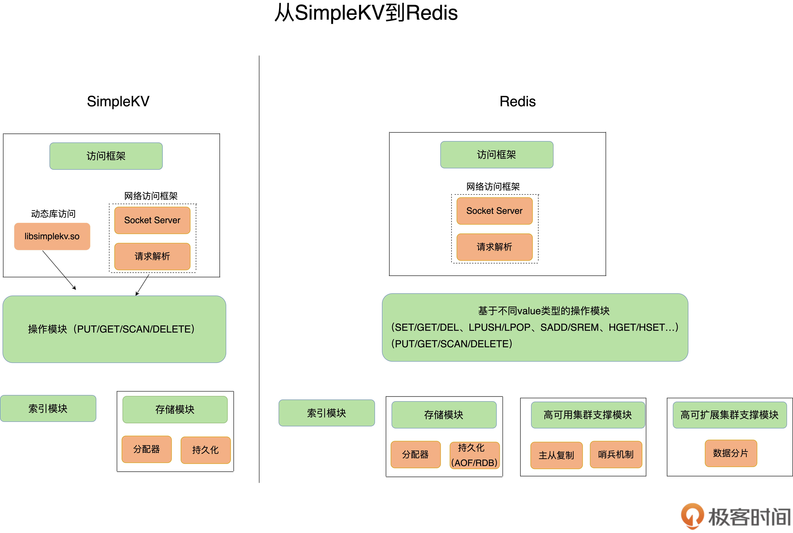
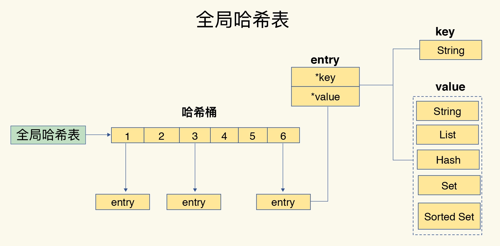

# SimpleKV

使用一个简化的键值数据库，从整体把握Redis

## 基本key-value模型
示例
```shell
"hello":"world"
```

不同键值数据库支持的key类型一般差异不大，而value类型则有较大差异
- memcached支持的Value类型仅为"String"
- Redis支持的Value类型包括：String、哈希表、列表、集合，有序集合

## SimpleKV的三种基本操作（操作接口）
- PUT(相当于redis里的SET)：写入或更新
- GET：读取
- DELETE：删除
- SCAN：根据一段KEY的范围返回相应的VALUE值

## 键值对保存问题

SimpleKV采用内存保存键值数据

## SimpleKV基本组件

### 访问框架

访问框架分为两种
- 通过函数库调用的方式供外部应用使用（RocksDB）
- 通过网络框架以Socket通信的形式对外提供键值对操作(Memcached和Redis)

网络框架包括`Socket Server`和`协议解析`

#### 通过网络框架提供键值存储服务在实现中出现的问题

- 当客户端发送一个如下命令后，该命令会被封装在网络包中发送给键值数据库
- 键值数据库网络框架接收到网络包，按照响应的协议解析，此时会遇到一个系统设计问题
  - 网络连接的处理，网络请求的解析，以及数据存取的处理，是用一个线程，多个线程，还是多个进程来交互处理（IO模型设计）

```shell
扩展问题：
Redis如何做到“单线程，高性能”
```
### 索引模块

当SimpleKV解析了客户发来的请求，知道要进行键值对操作

此时SimpleKV需要查找所有操作的键值对是否存在，这依赖于键值数据库的`索引模块`
```shell
索引的作用是让键值数据库根据key找到相应value的存储位置，进而执行操作

比如：Memcached和Redis使用hash表作为key-value索引； RocksDB采用跳表作为内存中key-value的索引
```

### 操作模块

索引模块负责根据key找到相应的value存储模块。然后，SimpleKV的操作模块实现不同操作的具体逻辑
- 对于GET/SCAN，此时根据value的存储位置返回value值即可
- 对于PUT一个新建的数据而言，SimpleKV需要为该键值对分配内存空间
- 对于DELETE操作，SimpleKV需要删除键值对，并释放相应的内存空间，这个过程由分配器完成

### 存储模块

涉及对内存空间的分配和释放以及持久化功能




## 基于对SimleKV的分析，得出完整的Redis的完整架构

- 网络访问框架
- 操作模块
- 索引模块
  - 数据结构
- 基于操作模块的内存模块
  - 分配器
  - 持久化
- 高可用集群支撑模块
  - 哨兵
- 高负载（可扩展）集群支撑模块
  - 数据分片


# 数据结构

## 键和值用什么结构组织

- Redis使用一个哈希表来保存所有键值对
  - 一个哈希表，其实就是一个数组，数组的每个元素称为一个哈希桶。每个哈希桶保存了键值对数据的元素，每个entry元素包含key和value的指针



基于哈希表的特性
- 优点：哈希表O(1)复杂度，理论上不管数据多少，我们都只需要一次计算就能找到相应的键
- 问题：实际操作中，当写入大量数据，操作会变慢，实际原因是
  - 哈比表的哈希冲突问题
  - rehash可能带来的操作阻塞

Redis解决哈希冲突的方式：链式哈希，即`同一个哈希桶中的多个元素用一个链表来保存，它们之间依次用指针连接`

这个链又称为哈希冲突链

- 这里会有一个问题，即当哈希冲突链过长，会导致这条链上的元素查找耗时长，效率降低
  - 链表的查找效率是O(n)
  - 解决方法：rehash

### ReHash

rehash--增加现有哈希桶的个数，让逐渐增多的entry元素能在更多的桶之间分散保存，减少单个桶中的元素数量，从而减少单个桶中的冲突

#### ReHash的具体实现
Redis默认使用两个全局哈希表，哈希表1和哈希表2

- 一开始默认使用哈希表1，初始时，哈希表2没有被分配空间，随着数据增多，Reis开始执行ReHash此过程分为3步
  - 给哈希表2分配更大的空间，例如当前哈希表1大小的两倍
  - 把哈希表1的数据重新映射并拷贝到哈希表2
  - 释放哈希表1的空间
  

- 至此，我们就可以从哈希表1切换到哈希表2，用增大的哈希表2保存更多数据，而原来的哈希表1留作下一次ReHash扩容备用


#### ReHash过程中的问题

在第二步涉及大量数据拷贝，如果一次性把哈希表1中的数据迁移完，会造成Redis线程阻塞，无法服务其他请求


#### 解决方案：渐进式ReHash

渐进式ReHash就是，在第二步处理中，处理客户请求和数据拷贝交替进行，处理一个请求，将数据从哈希表索引0的数据拷贝到哈希表2，在处理一个请求，将哈希表索引1的数据拷贝到哈希表2中，依次进行

- 这样就将一次性大量拷贝的开销分摊到多次处理请求的过程中，避免了耗时操作


### Redis上的基于数据结构的优化
- 单元素操作没什么好说的
- 范围操作，尽量避免，建议使用SCAN系列操作，每次只返回有限数量的数据，可以避免一次性返回所有元素而导致的阻塞

- 统计操作即（集合类型对集合中所有元素个数的记录）
  - 因为集合类型采用压缩列表、双向链表，整数数组这类数据结构，里面专门记录了元素的个数统计，因此可以处理很高效

- 对于LIST因为使用压缩列表和双向列表，这两种数据结构都会记录表头和表尾的偏移量，因此在做头尾的增删改查时可以直接定位，会很高效，所以常用于消息队列，不建议作为随机读写的集合使用


# IO模型

为什么单线程Redis那么快

- 采用高效的数据结构（哈希表和跳表）
- 采用多路复用机制（基于内核的Select/Epoll实现）

- 避免多线程的问题：即避免多线程开发的并发控制问题。


