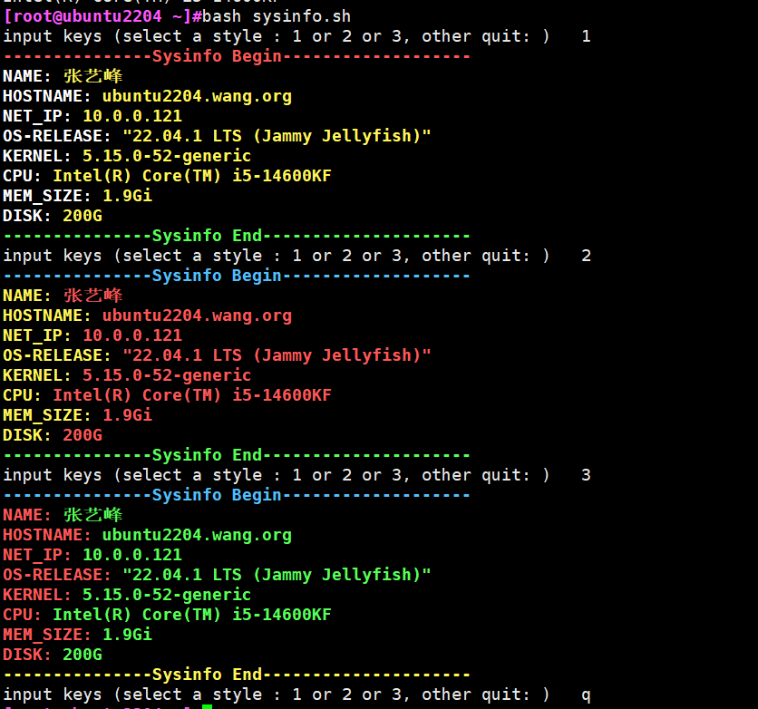

# 第二周考试

1. SHELL脚本中`$0` `$#` `$*` `$@` `$1` `$?`是什么？

2. SHELL脚本中$(),$[],${}的使用场景分别是什么，(), {}, []的使用场景是什么

3. 设计一个脚本，该脚本功能如下

- 设计一个面板，上面还有上述信息，
- 姓名
- hostname
- IP
- 操作系统版本
- 内核版本
- CPU型号
- 内存大小
- 硬盘大小
- 示例如下：

扩展功能：
- 该面板可以切换风格，如输入1，面板颜色切换为风格1，输入2，面板颜色切换为风格2
- 该面板输入指定命令后退出，在此之前会一直等待用户输入信息
- 效果如下:

4. 使用shell，写出一个可调整大小的**随机组合**颜色的国际象棋棋牌，效果如下
