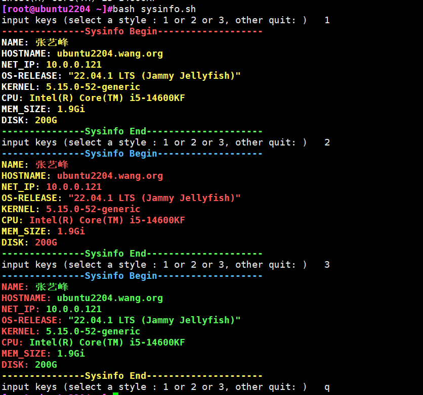

# 第二周考试

1. 将/etc/app目录下，所有的后缀为.conf的配置文件中的DEBUG=true，替换为DEBUG=false
答案：
```shell
sed -i 's/DEBUG=true/DEBUG=false/g' /etc/app/*.conf
```

2. 统计access.log中每个不同的IP出现的次数,并按照从大到小排序
答案：
```shell
awk '{print $1}' access.log | sort | uniq -c | sort -nr
```

3. 统计access.log中，哪些IP，在什么时间，发生了4XX ，输出格式如下
(提示：可能使用到的命令：grep,awk,paste等)
```shell
# 示例
66.155.16.61    [31/Oct/2024:21:12:06+0800]  403 
111.7.96.150    [31/Oct/2024:21:54:47+0800]  400 
```

答案
```shell
 grep -P "\" 4[01]\d{1} " access2.log |awk -v OFS="\t" '{print $1,$4$5}'|paste -d ' ' - <(grep -Po " 4[01]\d{1} " access2.log) |wc -l
```

4. 统计一篇文章中，出现频率最高的前5个单词?
答案：
```shell
grep -Po "\b[a-zA-Z]+\b" article.txt |tr "A-Z" "a-z"|sort|uniq -c|sort -nr|head -5
```

5. 写出精确匹配ipv4规范的正则表达式
```shell
\b((25[0-5]|2[0-4][0-9]|[01]?[0-9][0-9]?)\.){3}(25[0-5]|2[0-4][0-9]|[01]?[0-9][0-9]?)\b
```

6. SHELL脚本中`$0` `$#` `$*` `$@` `$1` `$?`是什么？
答案：
- $0: 脚本程序名称
- $#: 参数总数
- $*: 所有参数, 全部参数合为一个字符串
- $@: 所有参数, 每个参数为独立字符串
- $1: 第一个参数
- $?：退出状态码

7. SHELL脚本中$(),$[],${}的使用场景分别是什么，(), {}, []的使用场景是什么
答案
- $()：用于命令替换。它会执行括号内的命令，并将输出结果替换到当前位置。
- $[]: 等价于$(( ))。 用于算术运算
- ${}: 用于变量替换和变量操作。可以用于复杂的变量操作，如字符串截取、替换等
- (): 用于命令组和子shell。括号内的命令会在一个子shell中执行
- []: 用于条件判断，注意表达式前后加空格
- {}: 用于命令块,命令块中的命令会在当前shell中执行


8. 设计一个脚本，该脚本功能如下
基础功能（必做）：
- 设计一个面板，上面还有上述信息，
- 姓名
- hostname
- IP
- 操作系统版本
- 内核版本
- CPU型号
- 内存大小
- 硬盘大小
- 示例如下：

扩展功能（选做）：
- 该面板可以切换风格，如输入1，面板颜色切换为风格1，输入2，面板颜色切换为风格2
- 该面板输入指定命令后退出，在此之前会一直等待用户输入信息
- 效果如下:



答案：
```shell
#!/bin/bash
#
#****************************************************
#Author:            Mystical
#e-mail:            mysticalrecluse@gmail.com
#Date:              2024-03-05
#FileName:          sysinfo.sh
#URL:               https://github.com/Mysticalrecluse/cyber_security_learning
#Description:       Learning
#Copyright(C):     2024 All right
#***************************************************

style() {

COLOR1="echo -e \033[1;$1m"
COLOR2="echo -e \033[1;$2m"
COLOR3="\033[1;$3m"
COLOR4="\033[1;$4m"
END="\033[0m"

}


board() {

$COLOR1---------------Sysinfo Begin-------------------$END
echo -e "${COLOR4}NAME: $COLOR3张艺峰$END"
echo -e "${COLOR4}HOSTNAME: $COLOR3`hostname`$END"
echo -e "${COLOR4}NET_IP: $COLOR3`ip a|grep -Po '(\d{1,3}\.){3}\d{1,3}(?=\/[12]?[1-9])'| grep -v "127.0.0.1"`$END"
echo -e "${COLOR4}OS-RELEASE: $COLOR3`cat /etc/os-release |grep -Po '(?<=VERSION=).*'`$END"
echo -e "${COLOR4}KERNEL: $COLOR3`uname -r`$END"
echo -e "${COLOR4}CPU: $COLOR3`lscpu|sed -rn 's@Model name:\s*(.*)@\1@p'`$END"
echo -e "${COLOR4}MEM_SIZE: $COLOR3`free -h|tr -s " "|cut -d" " -f2|tail -2|head -1`$END"
echo -e "${COLOR4}DISK: $COLOR3`lsblk|tr -s " "|cut -d" " -f4|grep "G"|sort -nr|head -1`$END"

$COLOR2---------------Sysinfo End---------------------$END

}


while read -p "input keys (select a style : 1 or 2 or 3, other quit: )   " INPUT 
do
    case $INPUT in
    1) 
        style 31 32 33 37
        board
        ;;
    2)
        style 34 32 31 33
        board
        ;;
    3)
        style 32 33 31 34
        board
        ;;
    
    *)
        break
        ;;
    esac

done

```

