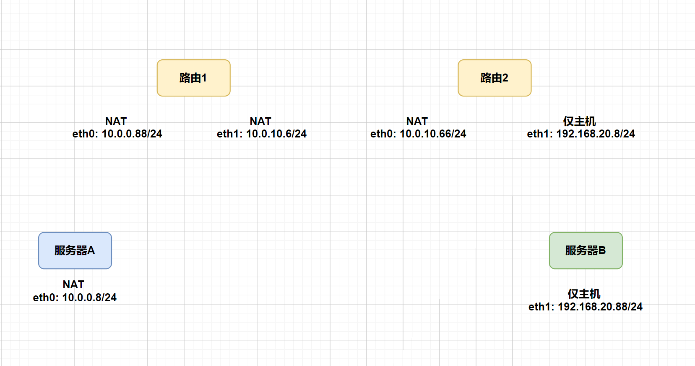

1. 写出TCP三次握手与四次挥手的过程

2. 写出ARP协议的作用与原理

3. 编写个shell脚本将/usr/local/test目录下大于100K的文件转移到/tmp目录

4. 使用Linux系统命令统计出establish状态的连接数有多少

5. 简述TCP和UDP的优缺点和各自的使用场景

6. 以下是 6 个 IP 地址及其子网掩码：

- 192.168.10.5/23
- 192.168.11.10/24
- 192.168.10.130/25
- 192.168.11.128/26
- 192.168.10.70/22
- 192.168.11.200/30
要求：计算这些IP的网络范围（提示：网段地址 ~ 广播地址）

7. 写一个初始化服务器的脚本

- 要求:(Rocky8以上和Ubuntu2204以上通用)
  - 关闭selinux
  - 关闭防火墙
  - 初始化网卡名eth0
  - 给服务器配置相应的国内软件源(阿里，清华，中科大等随意选择)

- 使用这个初始化脚本给四台服务器初始化，按下列图例配置软路由使A服务器和B服务器可以成功通信
