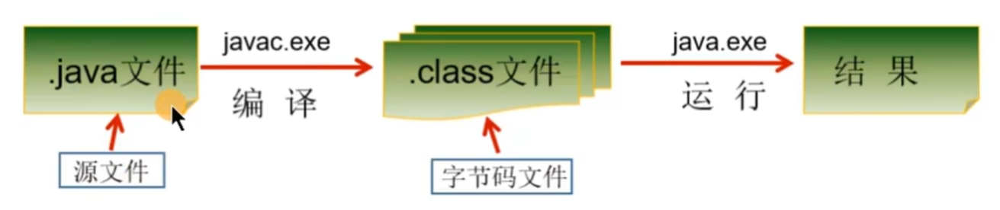

# Java基本语法
## Java语言概述
### Java开发环境掌握
- 什么是JDK，JRE
  - JDK(Java Development Kit)：是Java程序开发工具包，包含JRE和开发人员使用的工具
  - JRE(Java Runtime Environment)：是Java程序的运行时环境，包含JVM和运行时所需要的核心类库
  - JDK = JRE + 开发工具集（Java编译工具等）
  - JRE = JVM + Java SE标准类库

- java的安装
  - 推荐安装Java8 和 Java17
  - 官网oracle安装之后，设置环境变量
  - 环境变量的两种设置方法：
    - 方法一：path：java.exe所在路径
    - 方法二：
      - 设置一个变量，JAVA_HOME = java安装bin目录所在路径
      - 然后path：%JAVA_HOME%\bin;

### HelloWorld
- Java程序开发三步骤：编写、编译、运行
  - 将Java代码编写到扩展名为.java的源文件中
  - 通过javac.exe命令对该java文件进行编译，生成一个或多个字节码文件
  - 通过java.exe命令对生成的class文件进行运行
  

- 编写hello world
  - 创建一个HelloWorld.java的文件
    ```java
    class HelloChina{
    // 所有的java文件本质上是一个类-class，所以开始要先创建一个类
        public static void main(String[] args){
            System.out.println("hello,world!!你好，中国！");
            // System.out.println(), 终端打印输出
            // 函数(方法)中的每个执行语句，必须分号结尾
        }
    }

    // class：关键字，表示“类”，后面跟着类名
    // main()方法的格式是固定的。务必记住！表示程序的入口
    // public static void main(String[] args)
    // java程序严格区分大小写

    ```
- 运行 HelloWorld.java
  - 编译java文件，生成一个类文件即字节码文件，.class后缀
    - javac HelloWorld.java -> HelloChina.class
  - 运行.class文件，但注意：不输出.class后缀
    - java HelloChina

- 注意：
  - 如果编译不通过，可以考虑的问题
    - 查看编译的文件名和文件路径是否错误
    - 编写的代码语法是否有问题，如果存在就可能导致编译不通过
  - 编译以后，会生成1个或多个字节码文件。每一个字节码文件对应一个Java类，并且字节码文件名与类名相同
  - 如果运行不通过，可以考虑的问题
    - 查看解释运行的类名，字节码文件路径是否书写错误
    - 一个源文件中可以声明多个类，但是最多只能有一个类使用public进行声明。且要求声明为public的类的类名与源文件名一致

### 输出语句
- 从控制台输出数据的操作
  - `System.out.println()` : 输出数据之后，会换行
  - `System.out.print()` : 输出数据之后，不会换行

### 注释
- 单行注释：/ /
- 多行注释：/* */
- 文档注释：/**  */
  - 使用场景：文档注释内容可以被JDK提供的工具javadoc所解析，生成一套以网页文件形式体现的该程序的说明文档
  ```java
  /**
  这是我的第一个Java程序

  @author mystical
  @version 1.0

  */
  public class HelloWorld{
    public static void main(String[] args) {
      System.out.println("hello world");
      // 结尾自动加换行
    }
  }
  ```
  - javadoc生成说明文档的指令
    - `javadoc -d <自定义文件夹名> -author -version HelloWorld.java`
    - 这里的author和version是文档输出中的@后面的

### Java API文档
- API(Application Programming Interface,应用程序编程接口) 是Java提供的基本编程接口
- 作用：Java语言提供了大量的基础类，因此Oracle也为这些基础类提供了相应的说明文档，用于告诉开发者如何使用这些类，以及这些类里面包含的方法。大多数Java书籍中的类的介绍都要参照它来完成，它是编程者经常查阅的资料
- Java API文档，即为JDK使用说明书，帮助文档

### JVM概述
- Java核心机制：JVM
- Java语言的优缺点
  - 优点：
    - 跨平台性：在不同的操作系统上安装不同的JVM，来实现在不同操作系统编译相同的Java代码
    - 面向对象性：面向对象是一种程序设计技术，非常适合大型软件的设计和开发。面向对象编程支持封装、继承、多态等特性，让程序更好达到高内聚，低耦合的标准
    - 健壮性；吸收了C/C++语言的优点，但去掉了其影响程序健壮性的部分（如：指针、内存的申请与释放等），提供了一个相对安全的内存管理和访问机制
    - 安全性高：Java适合于网络/分布式环境，需要提供一个安全机制以防恶意代码的攻击。
    - 简单性：Java就是C++语言的简化版，比如：头文件，指针运算，结构，联合，操作符重载、虚基类等。
    - 高性能
  - 缺点：
    - 语法过于复杂、严谨，对程序员的约束比较多
    - 一般适用于大型网站开发

- JVM功能说明
  - JVM(Java Virual Machine,java虚拟机)：是一个虚拟的计算机，是Java程序的运行环境。JVM具有指令集并使用不同的存储区域，负责执行指令，管理数据、内存、寄存器。
  - 功能1：实现Java程序的跨平台性
  - 功能2：自动内存管理（内存分配，内存回收）

## 变量与运算符
### 标识符
- 定义：Java中变量、方法、类等要素命名时使用的字符序列，称为标识符
- 技巧：凡是自己可以起名字的地方都叫标识符
- 命名规则：
  - 由26个字母大小写，0-9，_或$组成
  - 数字不可以开头
  - 不可以使用关键字和保留字
  - java严格区分大小写，长度无限制
  - 标识符不能包含空格

- 标识符命名规范
  - 包名：多单子组成时，所有字母都小写
    - 例如：java.lang、com.atguigu.bean
  - 类名、接口名：多单词组成时，所有单词的首字母大写
    - 例如：HelloWorld、String、System等
  - 变量名，方法名，驼峰表示法
    - 例如：bookName、binarySearch
  - 常量：所有字母都大写
    - 例如：MAX_VALUE、PI

### 变量
- 概念：
  - 内存中的一个存储区域，该区域的数据可以再同一类型范围内不断变化
  - 变量的构成包含3个要素：数据类型，变量名，存储值
  - java中变量声明的格式：数据类型 变量名 = 变量值
  ```java
  class VariableTest {
    public static void main(String[] args) {
      
      char gender; // 变量的声明
      gender = '男'; // 变量的赋值

      int age = 10;
      System.out.println(age);
      System.out.pringln("age = " + age);
    }
  }
  ```

  - 数据类型
    - 基本数据类型
      - 整型: byte \ short \ int \ long
      - 浮点型: float \ double
      - 字符型: char
      - 布尔型: boolean
    - 引用数据类型
      - 类(class)
      - 数组(array)
      - 接口(interface)
      - 枚举(enum)
      - 注解(annotation)
      - 记录(record)

- 说明：
  - 变量都有其作用域，变量只在作用域内是有效的，出了作用域就失效了
  - 同一个作用域内，不能声明两个同名变量
  - 定义好变量之后，就可以通过变量名对变量进行调用和运算
  - 变量值再赋值时，必须满足变量的数据类型，并且在数据类型有效的范围内变化

### 数据类型
#### 整型
- 类型：byte、short、int、long
  - byte   占有1字节
  - short  占用2字节
  - int    占有4字节
  - long   占有8字节

- 示例：
  ```java
  class VariableTest1 {
    public static void main(String[] args) {
      // 测试整型变量的使用
      byte b1 = 12;
      byte b2 = 127;
      // byte b3 = 128;
      // 编译不通过，因为超出了byte的存储范围

      short s1 = 1234;
      int i1 = 1234123;
      long l1 = 123132123L;
      // 声明long类型变量时，需要提供后缀，后缀为l或L
    }
  }
  ```
#### 浮点类型
- 类型：
  - float:   占用4字节
  - double:  占用8字节
- 示例：
```java
class VariableTest1 {
    public static void main(String[] args) {
      // 测试浮点型变量的使用
      double d1 = 12.3;
      
      float f1 = 12.3f;
      System.out.println("f1 = " + f1);
      // 声明float类型变量时，需要提供后缀，后缀为f或F

      // 测试浮点型变量的精度
      System.out.println(0.1+0.2);
      // 结果：0.3000000000000004
     
    }
  }
```
- 扩展；
  - 浮点类型float、double的数据不适合在不容许舍入误差的金融计算领域。如果需要精确数字计算或保留指定位数的精度，需要使用BigDecimal类。

#### 字符型
- char型数据  占用2个字节
- Java中的所有字符都使用Unicode编码，故一个字符可以存储一个字符，一个汉字，或其他书面语的一个字符
- 字符类型char的三种表现形式
  - 形式1:使用单引号''括起来的单个字符
    - 例如：char c1 = 'a';
  - 形式2:直接使用Unicode值来表示字符型常量:'\uXXXX'
    - 例如：\u0023表示'#'
  - 形式3:Java中允许使用转义字符'\'，来将其后的字符转变为特殊字符常量
  - 形式4：可以赋值一个纯数字，会自动转换为对应的ascll表上对应的字符
- 注意：
  - char声明的变量，<font color=tomato>单引号内有且只有一个字符</font>，不能没有，也不能超过1个！！

#### 布尔类型
- boolean类型用来判断，常使用在流程控制语句中 
- 只有两个取值
  - boolean bo1 = true;
  - boolean bo2 = false;
- 扩展：
  - <font color=tomato>和C语言不同，不能使用0或非0的整数替代false和true</font>
  - 我们不谈boolean类型占用的空间大小。但是，真正在内存中分配的话，使用的是4个字节

#### 基本数据类型变量间的运算规则
- boolean类型不能做运算
- 运算规则
  - 自动类型提升
    - 当容量小的变量与容量大的变量做运算时，结果自动转换为容量大的数据类型（这里的容量大小，表示的不是所占字节大小，而是指表示数据的范围大小，尤其是long和float，long占8个字节，float占4个字节，但是float表示数据范围更大）
    - 在java中，容量大的类型转换为容量小的类型会报错
      - 比如：`int a = 4; byte b = a; // 报错`
    - 特殊情况：
      - char,byte和short这个类型之间做运算，结果为int类型，所以数值范围，最少要用int类型即以上接收
    - 规定：
      - 整型常量，默认都是int类型
      - 浮点型常量，默认都是double类型
  
  - 强制类型转换 
    - 将容量大的变量的数据类型转换为小的数据类型
    - 语法格式：在数值前添加`(数据类型)`
      - 例如：`int i1 = (int)d1;`
    - 强制类型转换的过程中导致的精度损失

#### 基本数据类型与String的运算
- String类，属于引用数据类型
- String类型的变量，可以使用一对""双引号的方式赋值
```java
// 字符串基本定义格式
class StringTest {
	public static void main(String[] args){
		String str1 = "Hello World!";
		System.out.println(str1);

    string str2 = "";
    // String定义的变量可以赋空值，char不行
	}
}
```
- String与基本数据类型间的运算
  - 这里的基本数据类型包括boolean值在内的8种
  - String与基本类型变量间只能做连接运算，使用“+”表示
```java
class StringTest {
	public static void main(String[] args){
		int num1 = 10;
    boolean b1 = true;
    String str1 = "hello";

    System.out.println(str1 + b1);
    // 返回：hellotrue; 单纯的拼接

    String str2 = num1 + b1 + str1;
    // 编译无法通过，表达式按顺序执行，整型和布尔型无法运算； str1 + b1 + num1可以实现
    
    // 实现String "数字" 转换为基本数据类型，使用Integer类
    int num2 = 10;
    String str3 = num2 + ""; //"10"
    int num3 = Integer.parseInt(str3);
    System.out.println(num3 + 1);

	}
}
```
#### 常见进制理解与转换
```java
/*
  二进制（binary）
  数字组成：0-1
  进位规则：满二进一，以`0b`或`0B`开头

  八进制（octal）：很少使用
  数字组成；0-7
  进位规则：满八进一，以数字`0`开头表示

  十六进制
  数字组成：0-9，a-f
  进位规则：满十六进一，以`0x`或`0X`开头表示。此处a-f不区分大小写

*/
class BinaryTest {
  public static void main(String[] args) {
    int num1 = 103; // 十进制
    int num2 = 0b10; // 二进制
    int num3 = 023; // 八进制
    int num4 = 0x23a; // 十六进制

    System.out.println(num1);
    System.out.println(num2);
    System.out.println(num3);
    System.out.println(num4);
    // 执行时，全部以十进制输出
  }
}
```
### 运算符
- 分类：
  - 算术运算符
  - 赋值运算符
  - 比较或关系运算符
  - 逻辑运算符
  - 位运算符
  - 条件运算符
  - Lambda运算符

- 算术运算符
  - 同C语言规则相同
  - 重点：
    - %，关于运算时符号的问题，和等号左边相同

- 赋值运算符
  - 拓展：+=、-=、*=、/=、%= 
  - 上述扩展运算符，不会改变结果的数据类型

- 比较（关系）运算符
  - 基本和C语言一致
  - instanceof 检查是否是类的对象
    - 例：`"Hello" instanceof String // true`
    - `==`和`!=` 可以适用于引用数据类型

- 逻辑运算符
  - 基本和C语言一致
  - &和&& 以及 |和||的不同
    - & 和 | 两边的表达式都会执行后再比较
    - && 如果前面的表达式为假，则不会执行后面的表达式
    - || 如果前面的表达式为真，则不会执行后面的表达式
    - <font color=tomato>C和C++一样遵循上述规则</font>

- 位运算符
  - 基本语法：
  ```java
  /*
    测试：位运算符
    1. <<  >>  >>> & | ^ ~
    2.说明：

    (1) <<  >>  >>> & | ^ ~：针对数值类型的变量或常量进行运算，运算结果也是数值
    (2) 每向左移动一位，结果就在原有的基础上 * 2
    (3) 每向右移动一位，结果就在原有基础上 / 2，如果不能整除，向下取整
    (4) 其他的可以详见C++中的图例
    (5) 两个数交换值，可以使用异或运算
  */
  class BitTest {
    public static void main(String[] agrs) {
      int num1 = 7;
      System.out.println("num1 << 1 :" + (num1 << 1)); // 14
      System.out.println("num1 << 1 :" + (num1 << 2)); // 28
      System.out.println("num1 << 1 :" + (num1 << 3)); // 56
    }
  }
  ```

- 条件运算符
  - 基础语法：`(条件表达式) ? 表达式1 : 表达式2`
  - 开发中，凡是可以使用条件运算符的位置，都可以改写成if-else
  - 建议：在二者都能使用的情况下，推荐使用条件运算符，因为执行效率稍高


## 控制流程语句
### if-else条件判断
- 基本语法
```java
if (条件表达式) {
  //TODO;
}

// 双分支条件判断
if (条件表达式) {
  //TODO;
} else {
  // TODO;
}

// 多分支条件判断
if (条件表达式1) {
  	语句块1;
} else if (条件表达式2) {
  	语句块2;
}
...
}else if (条件表达式n) {
 	语句块n;
} else {
  	语句块n+1;
}
``` 

### switch-case选择结构
```java
switch(表达式){
    case 常量值1:
        语句块1;
        //break;
    case 常量值2:
        语句块2;
        //break; 
    // ...
   [default:
        语句块n+1;
        break;
   ]
}
```
### Scanner
- 作用：键盘输入功能
```java
/*
1. 使用Scanner获取不同类型数据的步骤
步骤1：导包 import java.util.Scanner
步骤2：提供(或创建)一个Scanner类的实例
步骤3：调用Scanner类中过的方法，过去指定类型的变量
步骤4：关闭资源，调用Scanner类的close()

Scanner类中提供了获取byte / short / int / long / float / double / boolean / String
注意：没有提供获取char类型变量的方法。需要使用next().charAt(0)

2. 案例：小明注册某交友网站，要求录入个人相关信息如下：
请输入你的网名，你的年龄，你的体重，你是否单身，你的性别等情况
*/

import java.util.Scanner;

class ScannerTest {
    public static void main(String[] args) {
        // 创建一个Scanner类的实例
        Scanner scan = new Scanner(System.in);
        System.out.println("Welcome to here!");
        System.out.print("please input your name: ");
        // 调用Scanner类中的方法，获取指定的类型变量
        String name = scan.next();
        System.out.print("please input your age: ");
        int age = scan.nextInt();
        System.out.print("please input your weight: ");
        double weight = scan.nextDouble();
        System.out.print("are you marrage: ");
        boolean isSingle = scan.nextBoolean();
        System.out.print("please input your gender: (m/f)");
        char gender = scan.next().charAt(0);

        System.out.println("name: " + name + "age: " + age + "weight: " + weight + "isSingle: " + isSingle + "gender: " + gender);

        // 关闭资源，调用Scanner类的close()
        scan.close();
    }
}
```

### 获取随机数
```java
class RandomTest {
  public static void main(String[] args) {
    // 使用Math类的random方法，随机生成范围在0.0-1.0之间的数
  }
}
```

# Java面向对象编程

# Java高级应用