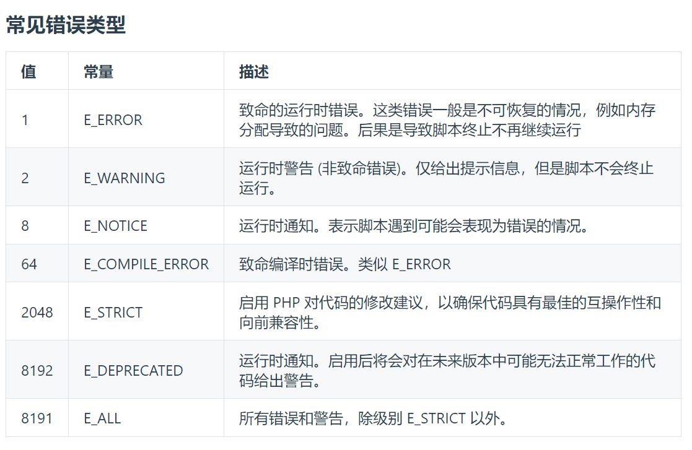

# PHP基础
## 初始PHP
- 什么是PHP
  - 超文本预处理器
  - php是一种服务器端的脚本语言
  - 是嵌入到HTML中的语言

- php版本
  - php5
  - php7(7.4为分水岭)
  - php8

### php标记
- php使用方式
```php
# 需要标记开始和结束
# 格式1：
<?php
    php代码
?>

# 格式2：短标签
<?
    php代码
?>
# 这种情况需要在php.ini的配置文件中，设置short_open_tag = on，默认为off
# 查找配置文件路径
# 创建一个php探针文件
<?php phpinfo(); // 它可以查看当前php的版本及当前环境相关信息

# 格式3：asp风格
<% 
    php代码
%> # php7之后不支持

# 格式4：脚本语言风格
<script language=`php`>php代码</script>
# php7之后不支持
```
```php
# 一个php文件内，可以有多个标记
<?php
    php代码
?>

<p>文本</p>

<?php
    php代码
?>
```
```php
# 如果文件中都是php代码，那么可以只写开始，不写结束
<?php php代码
```

### php注释
```php
<?php
    // 单行注释
    # 单行注释

    /*

    多行注释

    */
?>
```
### php特性
- php可以多语言混编
- php5版本以前，php代码的最后一个代码，可以不写`;`，后面的版本不行，会报错
### 输出函数
- 命令：`echo`
  - 用法：
    - echo 是一个语言结构，而不是函数，所以你可以不使用括号来调用它（尽管使用括号也是可以的）。
    - 用于输出一个或多个字符串。
  - 示例
  ```php
  echo "Hello, World!"; 
  echo "<br>";
  echo "This ", "string ", "was ", "made ", "with multiple parameters.";
  // This string was made with multiple parameters.多个字符串自动拼接
  
  $a = 1
  $b = 2
  echo $a,'+',$b,'=',$a+$b; // 1+2=3
  ```
  - 对于echo、print_r、var_dump来说，php解析空白字符和转义字符但是浏览器不会解析，浏览器默认解析的是HMTL。 证明php可以解析，可以再命令行中，执行以下代码
  ```php
  echo "  hello\nworld" //在命令行中显示如下
  //  hello
  //world
  ```
  - 特点：
    - 只能用于输出字符串。
    - 不能输出数组或对象的结构。

- 命令：`print_r`
  - 用法：
    - 打印关于变量的易于理解的信息，特别适合于输出数组内容。
    - 如果为 print_r() 提供第二个参数并设置为 true，则不会输出信息，而是返回信息。
  - 示例：
  ```php
  $arr = array('a', 'b', 'c');
  print_r($arr);
  
  // 使用返回值而不是输出
  $output = print_r($arr, true); // 返回值的类型是String
  ```
  - 特点：
    - 可以输出数组和对象的内容。
    - 输出的结构较为简洁。
    - 适用于调试目的。

- 命令：`var_dump`
  - 用法：
    - 输出变量的内容、类型和值。
    - 它提供比 print_r() 更详细的信息，如字符串的长度、对象的属性等。
  - 示例：
  ```php
  $arr = array('a', 'b', 'c');
  var_dump($arr);
  ```
  - 特点：
    - 可以输出数组、对象、资源等的详细内容。
    - 显示数据类型和数据大小。
    - 适用于更详细的调试。

### php弱类型说明与传值传址详解
- 变量
```php
$name = 'houdunren.com' // php是弱类型语言，不用事先声明数据类型

// 变量：$名称 = 赋值

// 为三种变量赋值
$myCounter = 1;  //数字
$myString = "Hello";  // 字符串 
$myArray = array("One","Two","Three"); // 数组
```

- 显示变量内容
  - 命令：`echo`
```php
$username = "mystical";
echo $username;
```

### 数组
- 创建数组
```php
// array();
$team = array('Bill','Mary','Chris','Anne','Mike');

// 显示数组中的元素
echo $team[3]; // 显示Anne
```

- 二维数组
```php
$oxo = array(
    array('x',' ','o'),
    array('o','o','x'),
    array('x','o',' ')
);

// 返回指定数组的内容
echo array[0][2] // 'o'
```

- 数据的传值
```php
$a = 1;
$b = $a;
$b = 3;
echo $a; // 1
echo $b; // 2

// 原理和Javascript中基本数据类型的赋值相同
// $a 和 $b 分别在内存空间中开辟了不同地址存放数据，二者互不影响
```

- 数据的传址
```php
$a = 1;
$b = &$a; // 此时$b指向了$a的数据存储空间，二者执行的数据地址相同 
$b = 3;
echo $a; // 3
echo $b; // 3
echo '<hr/>'; //支持解析html标签
$a = 9;
echo $b; // 9
echo $a; // 9
```
```php
$arr1 = Array(1,2,3);
$arr2 = &$arr1;
$arr2[0] = 4;
echo '<hr/>';
print_r($arr1);
echo '<hr/>';
print_r($arr2);
// 和js不同的是，数组的赋值并不是指向地址，也是开启一个新的内存空间
// 如果要将新变量指向同一个地址，和基本类型一样，也要使用&
```

### 可变变量与变量作用域
- 可变变量
```php
$name = 'word';
$$name = 'houdunren.com'; // 等同于$word = "houdunren.com"
echo $word; // 或者 echo $$name;
```
- 超全局变量
  - 概述：代码的任何位置都可以访问的变量
<table>
    <thead>
        <th style="background-color:darkred;color:white;">变量</th>
        <th style="background-color:darkred;color:white;">说明</th>
    </thead>
    <tbody>
        <tr>
            <td>$_GET</td>
            <td>地址栏GET提交</td>
        </tr>
        <tr>
            <td>$_POST</td>
            <td>表单POST提交</td>
        </tr>
        <tr>
            <td>$_FILES</td>
            <td>文件上传变量</td>
        </tr>
        <tr>
            <td>$_SESSION</td>
            <td>会话变量</td>
        </tr>
        <tr>
            <td>$_COOKIE</td>
            <td>cookie值变量/td>
        </tr>
        <tr>
            <td>$_GLOBALS</td>
            <td>全局变量</td>
        </tr>
        <tr>
            <td>$_REQUEST</td>
            <td>包含$_GET、$_POST、$_COOKIE</td>
        </tr>
        <tr>
            <td>$_SERVER</td>
            <td>服务器环境变量</td>
        </tr>
    </tbody>
</table>

```php
// var_dump($_GET);

function show() {
    print_r($GET) // 所谓超全局变量，在任何地方都可以直接调用
    //不受作用域影响
}
```

- 全局变量
```php
$name = "mystical";
function show() {
    echo $name;
}
show(); // 报错，php中函数内部无法使用函数外部声明的变量

// 如果一定要使用需要使用global进行声明
function show() {
    global $name; // 不推荐使用，防止全局污染
    echo $name;
    echo $GLOBALS['name']; //也能在函数内部直接调用函数外部的变量
}
// 这里$GLOBALS[]无法调用函数内部的声明
// $GLOBALS[] 超全局数组;
```

- 变量检测
  - 命令：`isset(变量)`
  - 作用：用来检测变量是否存在
  - 代码示例
  ```php
  $name = 'houdunren.com';
  var_dump(isset($name)); // 打印boolean:true说明变量存在
  var_dump(isset($noting)); // 打印boolean:false说明变量没声明过
  ```

- 删除变量
  - 命令`unset`
  - 代码示例：
  ```php
  unset($name);
  var_dump(isset($name)); // 之前删除了$name，所以打印结果为false
  
  场景2：
  $name = 'mystical';
  
  function make() {
    global $name;
    echo $name;
    unset($name);
  }
  make();
  echo $name; // mystical 在函数内部删除变量，不会影响到函数外部
  // 影响范围仅在函数内部
  ```

- 函数的静态变量
  - 关键字：`static`
  - 作用：将数据在函数体内持久保存
  - 代码示例：
  ```php
  function make()
  {
    $name = 1;
    $name += 1;
    return $name.'<hr/>';
  }
  echo make();
  echo make();
  echo make();
  
  function make(){
    static $num = 1; // 将$name的数据固定
    // static之后，函数的声明执行一次，后续再调用，不会再重新声明
    // 而不是每次执行完函数后，变量空间被回收，下次执行函数，重新赋值
    $num = $num + 1;
    return $num.'<hr/>';
  }
  echo make();
  echo make();
  echo make();
  ```

## 数据类型
### 整型-进制转换
- 整型
```php
// 八进制 -> 十进制
$num = 777;
echo octdec($num);

// 十六进制 -> 十进制
echo hexdec($num);
```

### 布尔型
- 对象无论是否为空，都为真
- 空数组是假，null值为假
- 同Javascript

### php手册
- php.net 在线手册

### 字符串
- 双引号可以加变量
```php
$string = "houdunren.com";
echo "后盾人的网址 {$string}";
// echo "后盾人的网址$string"; 效果相同
// 双引号内可以直接引用变量
// 单引号不行

```
- 如果出现乱码，可以加header响应头解决编码问题
```php
header('Content-type:text/html;charset=utf-8');
```

- 字符串定界符
```php
$str = <<<php  
<h1 style="color:red;">mystical-recluse</h1>
php;
// php 可以替换为其他字符
echo $str;
```

- 字符串连接
```php
$str1 = "mystical";
$str2 = "recluse";
echo $str1.'-'.$str2;
```

- 字符串的函数

  - 获取字符串长度
  ```php
  // 获取字符串的长度
  $string = "mysticalrecluse" //15
  echo strlen($string);
  echo strlen('神秘隐士'); // 12 宽字节一个汉字占3个字节
  
  // 显示汉字(宽字节)的数量
  echo mb_strlen('神秘隐士','utf8');
  
  //
  ```
  - 删除左右字符数据
  ```php
  // trim(); 默认删除字符串两边的空格
  $string = ' mysticalrecluse '; // 15
  echo strlen($string);
  echo strlen(trim($string)); // 13
  echo strlen(trim($string,' esum'));  
  // 这里第二个参数表示左右删除的指定字符，以单个字符进行判定
  
  $str = " mysticalrecluse ";
  $str1 = trim($str,' emysr');
  echo $str.'<hr/>'; // mysticalrecluse
  echo $str1; // ticalreclu
  
  // 只删除左边的指定字符ltrim()
  
  // 只删除右边的指定字符rtrim()
  ```
  - 转大小写
  ```php
  $str = "HelloWorld";
  strtolower(); // 指定字符转换为小写
  echo strtolower($str);
  
  strtoupper(); // 指定字符转换为大写
  echo strtoupper($str);
  
  ucfirst() // 指定字符首字母大写
  
  ucwords() // 每个单词首字母大写，默认空格是分隔符
  // ucwords(字符串，分隔符)
  echo ucwords('hello,world',',');
  ```
  - md5加密（hash为一个32位的字符）
  ```php
  $passwd = "mystical";
  echo md5($passwd);
  ```
  - 字符串拆分
  ```php
  // explode(分隔符,字符串)
  // 生成数组
  print_r(explode('-','mystical-recluse')); 
  // Array ( [0] => mystical [1] => recluse ) 
  // 相当于Javascript中的split()
  ```
  - 字符串的合并
  ```php
  // implode(分隔符，数组)
  $arr = ['email','3140394153@qq.com'];
  echo implode(':',$arr);
  // 相当于JavaScript中的join()
  ```
  - 字符串截断
  ```php
  // substr(字符串，起始位置(索引), 终止到第几个字符);
  $str = "mystical";
  echo substr($str,0,3); // mys
  
  $ad = "大家好"
  echo mb_substr($ad,0,1,'utf-8')
  ```

### php常量
- define()定义常量
```php
<?php>
define('NAME', 'mystical');
define('NAME', 'mystical', true);
// 第3个参数表示常量标识符是否区分大小写
// true不区分， false严格区分
define('NAME', 'mystical', false);
echo name; // 报错
```

- const定义常量
```php
//...
const URL = "mystical.com"
```

- 常量不受访问限制
```php
const NAME = 'mytical';
function show() {
  echo NAME;
}
show(); // mystical
// 变量的话，函数内部无法访问函数外部
// 函数外部依然无法访问函数内部的常量
```

- 常量的检测
```php
define('URL', 'hd.cms');
var_dump(defined('URL'));  // true
var_dump(defined('URL_NAME'));  // false
```

- 系统常量
```php
echo PHP_VERSION // 打印php版本
echo PHP_OS // 打印服务器操作系统

class Demo{
    public function show(){
        echo __CLASS__; // 打印当前类名, 系统常量
        echo __METHOD__; // 打印当前方法名
    }
}

(new Demo())->show();
// Demo::show

echo __FILE__; // 打印当前文件路
```
- 查询源代码中，用户自定义的所有常量
```php
define('NAME', 'mystical');
const URL = 'hd.cms';
print_r(get_defined_constants(true)['user']);
// true参数的作用是分组显示，如何不填写，会比较凌乱
```

### 逻辑运算
```php
$a = 0;
$b = false;
var_dump($a == $b); // 会转换类型后比较：true
var_dump($a === $b); // 不转换类型：false
var_dump($a != $b); // false
var_dump($a !== $b); // true
```

### 三元表达式
```php
// ? :

// ??
$name = 0;
echo $name ? 'YES' : 'NO'; // NO
echo $name?:"NO"; // NO
// 如果 : 前面没值，若为真，则返回变量原本的值
echo $name ?? 'NO'; // 0
// ??前的变量存在且不为空，则在输入原值，如果为空或不存在输入??后的值

@(20/0) 忽略掉，屏蔽报错
echo 1; // 后面的echo正常执行
```

## 流程控制
### if语句
```php
if(true) {
  echo 'YES';
} 
else {
  echo 'NO';
}
// C语言风格可以正常识别

$status = false;
if($status):
    echo 'YES';
else:
    echo 'NO';
endif;
// 使用场景：
<?php
$status = false;
if ($status):
?>
<h1>hello, mystical</h>
<?php
else:
?>
<h1>please input a number</h1>
<?php
endif;
?>
// 当分支语句中，穿插html的时候，不用花括号会简洁一些
// 现在已很少使用·

// 多条件
$age = 10;
if ($age < 15) {
    echo 'child';
}
else if ($age < 30) {
    echo 'tee';
}
else if ($age < 50) {
    echo 'mid';
}
else {
    echo 'old';
}
```

### switch语句
```php
// 可以用C语言风格
$a = 98;
switch ($a % 3) {
    case 0: {
        echo "a % 3 = 0";
    }; break;
    case 1: {
        echo "a % 3 = 1";
    }; break;
    case 2: {
        echo "a % 3 = 2";
    }; break;
}

// 也可以使用php自己的风格，都差不多

switch ($a % 3) {
    case 0:
        echo "a % 3 = 0";
        break;
    case 1:
        echo "a % 3 = 1";
        break;
    case 2:
        echo "a % 3 = 2";
        break;
    default:
        // TODO
}

// 也可以用endswitch替代花括号
switch ($a % 3) :
    case 0:
        echo "a % 3 = 0";
        break;
    case 1:
        echo "a % 3 = 1";
        break;
    case 2:
        echo "a % 3 = 2";
        break;
    default:
        // TODO
endswitch;
```

### while循环
```php
$n = 5;
while ($n--) {
    echo 11;
}

// 这里的花括号可以变为endwhile
while ($n--):
    echo 11;
endwhile

echo "<hr/>"
do {
    echo 11;
} while ($n--)
// 这段代码是死循环，因为经过第一个while语句，$n的值已经为0
// 后面再进行$n--,n的值变为-1,任何非0值都为true，因此是死循环

do {
    if(!isset($num)) {
        $num = 10;
    } 
    echo ($num--)."<hr/>";
} while ($num--);
```

### for循环
```php
for ($num = 0; $num < 10; $num++) {
    echo $num;
} // 0123456789
```

## 文件引入
### include
```php
$name = 'mystical'
include '1.html'; 
// 作用相当于C语言中的#include
// 如果引用文件不存在，可以用@抑制警告，正常往下执行

if (!@include 'index.html') {
    include 'default.html';
}
```

### require强加载
```php
$name = 'mystical'
require ('index.html'); // 如果文件不存在，报错，致命错误
// 程序不会再往下执行
echo 333;
```

### include_once
```php
/**** 场景1：****/
include '2.php';
include "function.php";
echo show();
// 如果2.php和function.php中都含有show()，
// 则会因为重复定义相同函数导致报错

include_once '2.php';
include_once "function.php";
echo show();
// 如果重复则只加载一次
// 默认加载第一次，后面有重复的调用的，不再加载
```

### require_once
```
拥有require特性的include_once，重复调用，只加载第一次
// 有其他方法可以实现这个*_once特性
如果文件不存在，报致命错误
```

## 函数
### 函数定义
```php
function user() {
    //DOTO
}
user();
// 函数一定有返回值，在不适用return指定返回值的时候，系统默认返回NULL
```

### 简述命名空间
- 后面详解
```php
namespace User;
function make() {
    echo 'user';
} // user.php
```
```php
namespace model;
function make() {
    echo "model";  
} // model.php
```
```php
include 'user.php';
include 'model.php';
// 正常会报错，因为定义show()函数，但是可以用命名空间解决这个问题
/*
命名空间：
作用：将函数分组，不同组的同名函数可以一起使用
*/
User\make();
Model\make();
```

### 函数的参数传值
```php
function mobile($tel) {
    return substr($tel, 0, -4)."****";
}
echo mobile('13613600362');

/* 优化后 */
function mobile($tel, $num = 4, $fix = '*') {
    return substr($tel, 0, $num * -1).str_repeat($fix, $num);
}
echo mobile('13613600363', 4, '#');
```

### 函数的参数传址
```php
function show(&$var) {
    $var++;
    echo $var;
}
$var = 1;
show(&$var);
echo "<hr/>";
echo $var;
```

### 不定长参数-点语法
```php
function sum(...$var) {
    print_r($var);
}
sum(12,3,4,54,5); // 打印数组
```

### 函数参数的类型约束
```php
function show(int $num) {
  return $num
}
var_dump(show('2')); // int 2; 返回的是数字类型的2
// 如果传入的是字母，则报错，必须类型为int
// 在普通模式下，传递'2'会自动转换，不会报错
// 严格模式下会报错

declare(strict_types = 1);
function show(int $num) {
  return $num
}
var_dump(show('2')); // 报错
```

### 函数返回值约束
```php
function sum(): int
{
    return 'mystical'; //报错，上面要求返回值约束，必须是int
}
sum(); // 报错

function sum(): ?string
{
    return 'mystical'; 
    // 返回空值的话，必须指明null,eg: return null;
}
sum(); // ?string表示返回值可以是空值或字符串，

function sum(): void
{
    // void表示可以无返回值
}
```
```php
function sum(int ...$nums): int
{
    static $sum = 0;
    return $sum += array_sum($nums);
}
echo sum(1,2,3); // 6
echo "<hr/>";
echo sum(1,2,3); //12
```

### 变量函数
```php
function sum() {
    return 'function sum';
}
$callback = 'sum';
echo $callback();
```
```php
$file = "hdcms.jpg";
$type = trim(strrchr($file, '.'), '.');
$action = strtolower($type);
echo $type;

function jpg() {
    return 'jpg function';
}

function png() {
    return 'png function';
}
if (function_exists($action)):
    echo $action($file);
else :
  echo "NO";
endif;
```

## 数组
### 数组的声明
```php
$arr = array(
  1,2,3
);
print_r($arr);

$arr = [1,2,3]; // 推荐方法
```

### 数组分类
```php
/* 索引数组 */
$arr = [1,2,3];
// Array ( [0] => 1 [1] => 2 [2] => 3 )

/* 关联数组 */ // 类似字典
$article = [
    'title' => 'Visual Studio Code',
    'create_at' => "2020-2-22"
];

/* 同时使用 */
$lessons = [
    ['title' => 'Visual Studio Code', 'create_at' => '2030-2-22'],
    ['title' => 'Laravel 5.6', 'create_at' => '2030-12-12']
];
echo $lessons[0]['title']
```

### 通过指针读取数组元素
```php
$arr = ['xiaoming'];
$arr[] = 'lisi';
$arr[] = 'xiangjun';
$arr[] = 'xiaoli';
// 索引自动递增
```
```php
/* key */
// 获取数组第一个的下标/键
$arr = ['mystical', 'hdcms'];
echo key($arr); // 0

/* current */
// 获取数组第一个值 
echo current($arr); // mystical

/* next */
// 指针向下移动一位，并返回当前元素
echo next($arr); 

/* prev */
// 指针向上移动一位，并返回当前值
echo prev($arr);
// 如果指针向下或向上移动后，没有值，则返回false
```
- 练习代码
```php
$users = [
  ['name' => 'mystical', "age" => '16'],
  ['name' => 'curry', "age" => '19'],
  ['name' => 'kobe', "age" => '23'],
  ['name' => 'jamse', "age" => '16']
];
<table border="1">
    <tr>
        <th>编号</th>
        <th>姓名</th>
        <th>年龄</th>
    </tr>
    <?php while($user = current($users)):?>
    <tr>
        <td><?php echo key($users) + 1;?></td>
        <td><?php echo $user['name'];?></td>
        <td><?php echo $user['age'];?></td>
    </tr>
    <?php next($users); endwhile;?>
</table>
```

### 数组遍历
- list
```php
$arr = ['mystical', 'hdcms'];
list($a, $b); = $arr;

$user = ['name'=>'mystical', 'age'=>33];
list('name'=>$name, 'age'=>$age) = $user;
echo $age;// 33

/* 只取数组的某一个值 */
$arr = ['mystical', 'kobe', 'curry'];
list(,,$web) = $arr;
echo $web; // curry

/* 遍历数组 */
$users = [
  ['name' => 'mystical', "age" => '16'],
  ['name' => 'curry', "age" => '19'],
  ['name' => 'kobe', "age" => '23'],
  ['name' => 'jamse', "age" => '16']
];
while(list('name'=>$name, 'age'=>$age) = current($users)):
    echo "name:{$name}, age:{$age} <br/>";
    next($users);
endwhile;
```

- foreach
```php
/* 遍历索引数组 */
foreach($users as $user){
    printf($user);
}

/* 遍历关联数组 */
foreach($users as $key=>$user){
    $user['age'] += 50;
}
echo $users
//仅遍历，对函数外部的数据无影响 

/* 传值，数据二次处理 */
foreach($users as $key=>&$user){
  //$users[$key]['age'] += 50;
    $user['age'] += 50;
}
echo $users
```

### 数组函数
```php
$users = ['mystical', 'curry'];
/* arr_push() */
// 在结尾增加一个值，改变原数组，$user传的是地址
array_push($users, 'lisi');

/* array_pop() */
// 从结尾弹出一个值，改变原数组，返回值是弹出的值
$user = array_pop($users);

/* array_unshift() */
// 在开头添加一个值， 改变原数组
array_unshift($users, 'kobe');

/* array_shift() */
// 弹出开头的值，并返回
$start = array_shift($users);
print_r($users);
echo $start;

/* count() */
// 返回数组元素个数
echo count($users);

/* array_key_exists() */
// 检测数组的键名是否存在
$allowImageType = ['jpeg'=>20000, 'jpg'=>20000, 'png'=>2000];
$file = 'hdcms.txt';
$ext = strtolower(substr(strrchr($file, '.'), 1));
echo $ext; 
if (!array_key_exists($ext, $allowImageType)) {
    echo 'wrong';
} else {
    echo 'success';
}

/* in_array() */
// 检测数组的值是否在数组中
$allowImageType = ['jpeg', 'jpg', 'png'];
$file = 'hdcms.txt';
$ext = strtolower(substr(strrchr($file,'.'), 1));
if(!in_array($ext, $allowImageType)) {
    echo "error";
} else {
    echo "success";
}

/* array_keys()*/
// 将数组中的所有键组成一个新数组
$allowImageType = ['jpeg'=>20000, 'jpg'=>20000, 'png'=>20000];
$file = 'hdcms.txt';
$ext = strtolower(substr(strrchr($file,'.'), 1));
if(!in_array($ext, array_keys($allowImageType))) {
    echo "error";
} else {
    echo "success";
}

/* array_filter() */
// 数组筛选
$users = [
  ['name' => 'mystical', "age" => '16'],
  ['name' => 'curry', "age" => '19'],
  ['name' => 'kobe', "age" => '23'],
  ['name' => 'jamse', "age" => '16']
];
$filterUsers = array_filter($users, function($user) {
    return $user['age'] > 20;
});
print_r($filterUsers);

/* arraymap */
// 对数组中每个元素进行操作后，返回新数组
$mapUsers = array_map(function($user){
    unset($user['age']);
    return $user;
},$users);
print_r($mpaUsers);

/* array_values */
// 去元素的值，生成新的数组
$stringUsers = array_map(function($user){
    return implode('-', array_values($user));
}, $users)

/* array_merge() */
// 数组的合并，有相同值，会被覆盖
$arr = ['host'=>'localhost', 'port'=>3306, 'user'=>'root'];
print_r(
    array_merge($arr, ['passwd'=>'admin123'])
);

/* array_change_key_case() */
// 将数组的键名全部更改大小写，CASE_UPPER: 1,CASE_LOWER: 0 
$database = include 'config/database.php';
$database = array_change_key_case($database, 1);
print_r($database);

// 使用递归改变多层数组键名
$database = include '../49/config/database.php'
function hd_array_change_key_case(array $data,int $type=CASE_UPPER):array{
    foreach ($data as $key=>$value):
      $action = $type==CASE_UPPER?'strtoupper':'strtolower';
      unset($data[$key]);
      $data[$action($key)] = is_array($value)?hd_array_change_key_case($value, $type):$value;
    endforeach;
    return $data;
}
```

###  超高效的数组值多维操作
```php
/* array_walk_recursive() */
// 操作数组中的键值（能深入到子数组）
// array_walk_recursive 只对数组的值进行操作，不改变键
// 参数1：数组， 参数2：匿名函数（值，键，附加参数）， 参数3：函数的附加参数
$database = include 'database.php';
function array_change_value(array &$data, int $type=CASE_UPPER):array{
    array_walk_recursive($data, function(&$value, $key, $type) {
        $action = $type == CASE_UPPER ? 'strtoupper' : 'strtolower';
        $value = $action($value);
    }, $type);
    return $data;
}
array_change_value($database, CASE_UPPER);
print_r($database);
```

### var_export()
- 作用：将数组转换为合法的php语法格式的字符串
```php
$database = include 'database.php';
$config = var_export($database, true);
// true表示有返回值，返回值为合法的字符串
file_put_contents('database.php', '<?php return'.$config.';');
// var_export()的作用是生成的php语法的字符串，在别的文件中，依然可以被php环境引用执行
```

### 序列化与反序列化
```php
/* serialize() */
// 序列化
$database = include 'database.php';
$cache =  serialize($database);
// 将php语法的数组，序列化转换为所有语言都能识别的字符串

/* unserialize() */
// 反序列化
$database = include 'database.php';
$cache = serialize($database);
print_r(unserialize($cache));
```

### 序列化与反序列化的实际应用
```php
// 缓存
function cache(string $name, array $data=null) {
    $file = 'cache'.DIRECTORY_SEPARATOR.md5($name).'.php';
    // DIRECTORY_SEPARATOR是表示php中目录分隔符/的常量
    if(is_null($data)) {
        // 取缓存
        $content = is_file($file)?file_get_contents($file):null;
        return unserialize($content)?:null;
    } else {
        return file_put_content($file, serialize($data));
        // 存缓存
    }
}
$config = include "database.php";
cache('database', $config);
```

## 日期与时间
### 时区
```php
// PRC Asia/chongqing  Asiz/shanghai Asia/urumqi
/* 修改默认时区 */
date_default_timezone_set('Asia/shanghai');

/* 查看当前时间 */
echo dete('Y-m-d H:i:s'); // 如果不修改默认时区，则默认伦敦时间
echo dete('Y年m月d日 H时i分s秒');

/* 指定时间*/
echo date('Y年m月d日 H时i分s秒', time()-3600*24)
// 第二个参数通过设置时间戳数值，来修改到指定时间

// 实际工作中，上述函数基本用不到，因为都是框架开发，直接改配置文件
```

### 时间戳
```php
// 从1970-1-1 0：0：0开始，到现在的秒数
data_default_timezone_set('Asia/shanghai');

echo time(); // 输出时间戳

echo microtime(true); // 返回微秒
/* 一般用来计算程序执行时间 */
function runtime($start = null, $end = null) {
    static $cache=[];
    if (is_null($start)) {
        return $cache;
    } elseif (is_null($end)) {
        return $chache[$start] = microtime(true);
    } else {
        $end = $cache[$end]??microtime(true);
        return round($end - $cache[$start]);
    }  
}
```

- getdate()
```php
print_r(getdate());
// getdate()得到一个数值，可以通过遍历数组和取数组的值，来获得时间元素
/*

Array
(
    [seconds] => 59
    [minutes] => 39
    [hours] => 11
    [mday] => 6
    [wday] => 3
    [mon] => 12
    [year] => 2023
    [yday] => 339
    [weekday] => Wednesday
    [month] => December
    [0] => 1701862799
)

*/

```

- iso字符串和时间戳的转换
```php
// iso -> 时间戳
strtotime(1995-04-08);

echo strtotime("now"), "\n";
echo strtotime("10 September 2000"), "\n";
echo strtotime("+1 day"), "\n";
echo strtotime("+1 week"), "\n";
echo strtotime("+1 week 2 days 4 hours 2 seconds"), "\n";
echo strtotime("next Thursday"), "\n";
echo strtotime("last Monday"), "\n";

// 综合实例
echo date("Y-m-d", strtotime("+7 day"));
```

### 日期相关类
```php
// DataTime, DataInterval, DataTimezone
$prc = new DateTimezone('PRC');
$dateTime = new DateTime(); // 由类得到实例对象
print_r($dateTime);
$dateTime->setTimezone($prc);
$dateTime->setDate(2019, 2, 12);
$dateTime->setTime(12, 22, 12);
echo "<br/>";
echo $dateTime->format('Y-m-d H:i:s');
echo "<br/>";
echo $dateTime->setTimestamp(time());

/* 计算两个日期相差的差值 */
$dateTime1 = new DateTime();
$dateTime2 = new DateTIme("2024-3-1");
$interval = $dateTime1->diff($dateTime2);
$format = '距离结课还有<span style="color:red">%m个月%d天</span>, 共有%a天';
echo $interval->format($format);

/* 增加时间 */
$dateTime = new DateTime();
$interval = new DateInterval('P2DT2H5M');
// 参数以P开头，日期和时间用T分隔
echo $dateTime->format('Y-m-d H:i:s');
echo "<br/>";
$dateTime->add($interval);// 增加
echo $dateTime->format('Y-m-d H:i:s');
$dateTime = sub($interval);// 减少
echo "<br/>";
echo $dateTime->format('Y-m-d H:i:s');

```

## 正则表达式
### 边界符和元字符
```php
/* 定界符 */
$status = preg_match('/a/', 'dkjkda');
// 根据匹配结果返回布尔值
var_dump($status);
// #,@,/都可以作为定界符
//$status = preg_match('@a@', 'dkjkda');
//$status = preg_match('#a#', 'dkjkda');

/* 元字符 */
// \d 表示 0-9   \D 非数字
// \w 表示a-z A-Z 0-9 _  \W 除了a-z A-Z 0-9 _
// \s 表示空白符   \S 非空白符
```

### 原子表
```php
// [abc]
$status = preg_match('/[abc]/', 'a'); 
var_dump($status);// true
// 原子表中其1匹配即可
// [0-9] [a-z] [A-Z]
// .(点)可以匹配除换行符之外的所有字符
// 取反 [^123] 除了123，^在[]在原子表中就是取反

/* 拆分 */
$str = '1.jpg@2.jpg#3.jpg';
$files = preg_split('/[@#]/', $str); 
// 根据正则的符号拆分字符串为数组
print_r($files);
//Array([0] => 1.jpg, [1] => 2.jpg, [2] => 3.jpg)
```

### 原子组
```php
// 原子组()
preg_match('/[12]/', 1); // true
preg_match('/(12))/', 12); // 必须含12才能使true

// 原子组示例
$str = "hundunren.com, mystical.com, baidu.com";
$preg = "/(\.)(com)/";
echo preg_replace($preg, '\1<span style="color:red">\2</span>', $str);
// \1表示第一个括号的内容, \2表示第二个，\0表示全部

// 边界限定
// ^开头  $结尾

```

### 选择修饰符
```php
$str = 'http://www.baidu.com百度 http://www.sina.com 新浪网';
$preg = "/\.(baidu|sina)/";
$replace = '.houdunren'
echo preg_replace($preg, $replace, $str)

// 示例2
$str = '后盾人 houdunren.com 后盾网 houdunwang.com';
$preg = '/(houdunren|houdunwang)(\.com)/';
$replace = '<a href="http://www.\1\2">\0</a>';
echo preg_replace($preg, $replace, $str);
```

### 重复匹配
```php
// *(星号) 匹配0或多个字符
// + 1到无限，至少有1个
// ？ 0或1个
// {} 指定具体数量，如：{2}表示2个
// {2,} 数量：2到无限
// {2, 6}  数量：2-6个
$str = '<h1>hello houdunren</h1>';
$replace = "<h1><a href='https://www.houdunren.com'>\\1</a></h1>";
// 这里双引号里的\要使用转义\\
echo grep_replace('@<h1>(.+)</h1>@', $replace, $str);
```

### 禁止贪婪匹配
```php
// 默认贪婪，非贪婪：量词后面加?
$str = '<h1>你好</h1><h1>mystical</h1>';
$preg = '@<h1>(.+?)</h1>@';
preg_match($preg, $str, $matches);
print_r($matches);
/*
Array
(
    [0] => <h1>你好</h1>
    [1] => 你好
)
*/
$str = '<h1>你好</h1><h1>mystical</h1>';
$preg = '@<h1>(.+)</h1>@';
preg_match($preg, $str, $matches);
print_r($matches);
/*
Array
(
    [0] => <h1>你好</h1><h1>mystical</h1>
    [1] => 你好</h1><h1>mystical
)
*/
$str = '<h1>你好</h1><h1>神隐</h1>';
$preg = '/<h1>(.+?)<\/h1>/';
preg_match_all($preg, $str, $matches);
print_r($matches);
/*

Array
(
    [0] => Array
        (
            [0] => <h1>你好</h1>
            [1] => <h1>神隐</h1>
        )
    [1] => Array
        (
            [0] => 你好
            [1] => 神隐
        )
)
*/
```

### 模式修正符i和s
- `i`: 不区分大小写字母的匹配
- `s`: 将字符串视为单行，换行符作为普通字符看待，使'.'可以匹配任何字符
```php
$str = '<h1>hi</h1><H2>mystical</H2>';
$preg = '#<h([1-6])>.*?</h\1>#i'; 
// 修正符放到边界符后面， i 表示不区分大小写
$replace = '';
preg_match_all($preg, $str, $matches);
print_r($matches);
echo preg_replace($preg, '\2', $str);
```
```php
$str = '<h1>
mystical
</h1>'; // 里面有换行符，不使用修正符的话，.不能匹配换行
$preg = '#<h1>.*?</h1>#is'; // 使用s就会自动去掉换行匹配
$replace = '';
preg_match_all($preg, $str, $matches);
print_r($matches);
```

### 模式修正符m和x
- `m`: 将字符串按多行进行处理
```php
$str = <<<php
#1
mystical
@#3
#2
recluse
php;
$preg = '/#\d+/m'; // m的作用，就是逐行进行匹配，而不是按整体去匹配
echo preg_replace($preg, '', $str);
/*
mystical
@#3
recluse
*/
```
- `x`：忽略空格，#及其后面的字符
```php
$str = 'abc';
$preg = '/^a\w+  #this is a reg test/x'; // x的效果使忽略正则表达式中的空白
// 同时会忽略#及其后面的所有字符，因此可以当正则注释使用
echo preg_replace($preg, '', $str);
```

### 模式修正符UAD
- `U`：禁止贪婪
```php
$str = '<h1>mystical</h1><h1>recluse</h1>';
$preg = '/<h1>(.+)<\/h1>/U';
// 等价于'/<h1>(.+?)<\/h1>/'
preg_match_all($preg, $str, $matches);
print_r($matches);
```
- `A`: 等价^，限定开头
```php
$str = '%%&%&)*34526548@qq.com';
$preg = '/\w+@[\w\.]+/A';
// 等价于：'/^\w+@[\w\.]+/'
preg_match_all($preg, $str, $matches);
print_r($matches);
```
- `D`: 不匹配换行符
```php
$str = "1a\n";
$preg = '/\d+a$/D';
// 如果不加D的话，$默认是可以匹配\n结尾的字符串的、
// 但是加了D的话，就会检索\n，无法默认匹配\n
preg_match_all($preg, $str, $matches);
print_r($matches);
```

### 正则表达式的函数
```php
/* preg_match() */ 
// 匹配一次就停止，返回值为数组
$str = '1@2@3';
preg_match('/\d+/', $str, $matches);
// 匹配到1次后，后面就不在匹配
print_r($matches); // Array([0]=>1)

/* preg_match_all() */
// 全部匹配，返回值为数组
$str = '1@2@3';
preg_match_all('/\d+/', $str, $matches);
// 全部匹配
print_r($matches); 
// Array([0]=>1,[1]=>2,[2]=>3)

/* preg_split() */
// 按正则拆分字符串
$str = '1@2#3';
$arr = preg_split('/@|#/',$str);
print_r($arr);
// Array([0]=>1,[1]=>2,[2]=>3)

/* greg_replace() */
// 替换
$str = '1@2#3';
echo preg_replace('/@|#/', '-', $str);
// 1-2-3

/* greg_replace_callback() */
// 使用闭包函数进行替换，负责复杂逻辑的替换
$str = '1@2#3';
echo preg_replace_callback('/\d+/', function($matches){
    // 此时传递给$matches的参数就是每次匹配的内容
    print_r($matches); // 返回值都是数组类型数据
    if ($matches[0] > 2) {
        return $matches[0] + 200;
    }
}, $str); // 1@2#203
```

## 文件与目录
### 自动转换磁盘大小
```php
// 获取文件所在磁盘大小
/* disk_total_space() */
// 参数是目录,单位是字节
echo __FILE__."<br/>";
echo __DIR__."<br/>";
echo disk_total_space(".") / 1024 / 1024 / 1024 . "GB";
/*
D:\git_repository\cyber_security_learning\PHP\php_prac\1211.php
D:\git_repository\cyber_security_learning\PHP\php_prac
931.49774551392GB
*/

// 转换空间大小函数
function space_total(int $total): string
{
    $config = [3 => 'GB', 2 => 'MB', 1 => 'KB'];
    foreach ($config as $num => $unit) {
        if ($total > pow(1024, $num)) {
            return round($total / pow(1024, $num))."$unit";
        }
    }
    return $total.'B';
}

/* disk_free_space() */
// 获取可用空间大小
echo __FILE__."<br/>";
echo __DIR__."<br/>";
echo space_total(disk_free_space(__DIR__))."<br/>";
```

### fopen打开资源与fseek操作指针
```php
/* fopen() */
// 打开文件
// allow_url_fopen 开去才能打开远程文件
$filename = 'xj.txt';
$handle = fopen($filename, 'r');
// 参数1为文件名； 参数2为文件打开模式
// 文件打开模式：'r'，开启文件，并把文件指针（光标）引到最前面
// 文件打开模式：'rb', 开启二进制文件，如图片，影音等
// 返回值是资源类型数据

/* filesize() */
// 参数是文件名，返回值为文件大小
echo filesize($filename);

/* fread() */
// 读取资源类型文件
echo fread($handle, 2);
// 参数2为指定读取字节大小
// fread()是指针在哪，就从哪开始读取
// 读取几个字节，指针就后移几个字节

/* fseek() */
// 操做指针
fseek($handle, 3);
// 指光标从第3个字节后开始

```

### r模式写入操做
```php
$filename = 'xj.txt';
$handle = fopen($filename, 'r+');
// 文件打开模式: r+ 同时支持读写操做
// 如果需要处理二进制文件，则'r+b'

/* fwrite() */
// 向文件中写入操做, 返回值为成功写入的字节大小
fseek($handle, filesize($filename));
$res = fwrite($handle, 'mystical ');
var_dump($res);
// 从指针处开始写入，会覆盖原位置的字符
// 指针跟随写入字符移动
fseek($handle, 0);
echo fread($handle, filesize($filename))

/* fclose() */
// 关闭文件
fclose($handle)
```

### w模式操做细节技巧
```php
/* file_exists() */
// 用于判断一个文件在当前目录下是否存在
file_exists('xj2.txt');
// 返回布尔值

$filename = 'xj2.txt'
$handle = fopen($filename, 'w');
// 使用r的时候，必须打开已存在文件
// 文件模式: w 如果文件不存在，系统创建一个新文件
// 文件模式: w 如果文件存在，则会覆盖原文件
// w 指支持写入，无法读取文件内容
$handle = fopen($filename, 'w+');
fwrite($handle, 'hello');
fseek($handle, 0);
echo fread($handle, filesize($filename));
// w+，支持读取文件的操做
// 二进制文件则：wb 或 w+b
```

### x模式使用技巧
```php
/* 文件模式 a */
// a表示追加
$handle = fopen('xj.txt', 'a');
// 使用模式a，打开文件后，光标指向文件末尾
// 如果文件不存在，则创建新文件
fwrite($handle, 'mystical');
// 如果要读取文件，需要a+
fseek($handle, 0);
echo fread($handle, filesize('xj.txt'));

/* 文件模式 x */
// 只有当文件不存在的时候，可以使用，否则报错
$filename = 'xj3.txt'
$handle = fopen($filename, 'x');
// 读取文件需要使用 x+
```

### 采集操做与二进制文件操做
```php
// 解析二进制文件，需要添加头信息
header('Content-type:image/png');
$handle = fopen('xj.png', 'r');
echo fread($handle, filesize('xj.png'));

// 写入图片
$handle = fopen('xj.png', 'r');
$png = fopen('a.png', 'w');
fwrite($png, fread($handle, filesize('xj.png')));

// allow_url_fopen on 即可读取远程文件
$handle = fopen('https://www.hdcms.com', 'r');
$index = fopen('index.hmtl', 'w');
fwrite($index, fread($handle, 99999999));

// 数据采集
preg_match('/<title>(.*)</title>/isU', fread($handle, 9999999), $matches);
echo $matches[1];
```

### 常用函数
```php
/* feof */
// 判断一个文件内容是否读取结束，如果读取结束则返回真，否则返回假
// feof() 函数在 PHP 中用于判断文件指针是否已经到达了文件的末尾
$handle = fopen('xj.txt', 'rb');

while(!feof($handle)) {
    echo fread($handle, 1);
}

/* fgetc() */
// 作用：每次只读取一个字符
while (!feof($handle)) {
    echo fgetc($handle);
    // 等价于fread($handle, 1)
}

/* fgets($handle) */
// 作用：读取一行
echo fgets($handle, 6);
// 第二个参数为读取字符数量

/* fgetcsv() */
// 读取内容，返回数组
$handle = fopen('xj.txt', 'rb'); // mystical,kobe,curry
$users = fgetcsv($handle, ',');
print_r($users);
// Array([0]=>mystical,[1]=>kobe,[2]=>curry);
```

### 共享锁与独占锁
```php
/* flock() */
// 文件锁定，参数1：资源类型数据， 参数2：锁常数
// 读锁，即共享锁：LOCK_SH
// 效果：读锁期间，其他用户或脚本对该文件读取无影响，无法执行写操做
// 注意，写操作会被阻塞等待而不是直接被拒绝，直到所有共享锁被释放。
// 使用场景：当多个脚本对一个文件进行操做是，常用共享锁
$handle = fopen('xj.txt', 'rb');
flock($handle, LOCK_US);
// 锁只有在文件处理完之后，或者解锁后失效

flock($handle, LOCK_UN); // 解锁
fclose($handle);
```

```php
// 写锁，即排他锁：LOCK_EX
// 效果，当写操作处理完之前，其他用户/脚本无法对该文件进行读写操做
$file = fopen("somefile.txt", "r+");

// 尝试获取排他锁
if (flock($file, LOCK_EX)) {
    // 写入文件操作
    fwrite($file, "Some data to write");

    // 释放锁
    flock($file, LOCK_UN);
} else {
    echo "Could not lock the file for writing.";
}

fclose($file);
```
- 总结：
```
共享锁 (LOCK_SH): 当文件被一个进程以共享锁的形式锁定时，其他进程仍然可以读取该文件，但不能对其进行写操作。共享锁允许多个进程同时读取同一个文件，这对于读取操作而言是安全的，因为它们不会改变文件的内容。

排他锁 (LOCK_EX): 当一个进程对文件设置了排他锁时，其他任何进程都不能对该文件进行读取或写入操作，直到排他锁被释放。排他锁用于写操作，确保在写入或修改文件时不会有其他进程同时访问该文件，从而保证数据的完整性和一致性。

因此，共享锁适用于多个用户或脚本需要同时读取数据的情况，而排他锁适用于需要修改文件数据时确保独占访问权的情况。这两种锁机制共同帮助管理并发访问文件时的数据完整性和一致性。
```

### 阻塞控制
- 阻塞控制更多的是在数据库上去做，已经很少在php的文件上去处理
```php
// LOCK_NB
$handle = fopen('xj.txt', 'w');
$stat = flock($handle, LOCK_EX|LOCK_NB, $wouldblock);
// 当处于阻塞状态时，$stat为false，$wouldblock的值为1，不阻塞为0
if ($stat) {
    // 或者 !$wouldblock
    fwrite ($handle, 'mystical');
} else {
    echo 'file is locked';
}
```

### 文件权限操做与文件检查操做
```php
/* is_writable() */
// 对文件写权限的判断，参数：文件路径
var_dump(is_writable('xj.txt'));

/* is_readable() */
// 对文件读权限的判断
var_dump(is_readable('xj.txt'));

// 应用实例
if (is_writable('xj.txt')) {
    $handle = fopen('xj.txt', 'w');
    fwrite($handle, 'mystical');
} else {
    echo '权限不足';
}

/* file_exists() */
// 判断文件是否存在
// 注意这个函数也能判断目录
var_dump(file_exists('xj.txt')); // 存在则返回true

// 应用实例：根据某文件是否存在，判断是显示哪个页面
// install.lock
if (!file_exists('install.lock')) {
    echo '显示安装界面'
} else {
    echo '显示登陆界面'
}

/* is_file() */
// 只判断文件是否存在

/* is_dir() */
// 只判断目录是否存在
```

### 快速文件读写操做
```php
/* file_put_contents() */
// 直接向文件中写入内容，如果源文件有内容则覆盖
file_put_contents('xj.php', 'mystical');
// 参数1：文件路径， 文件2：内容
file_put_contents('xj.php', 'mystical', FILE_APPEND);
// 通过参数3：FILE_APPEND来让写入的内容追加，而不是覆盖

/* file_get_contents() */
// 直接读取文件中的内容
echo file_get_contents('xj.txt'); 
// 支持远程文件读取
echo file_get_contents('http://mystical.com'); 
```

### 开发文件缓存系统
```php
/* filemtime() */
// 返回文件修改时间
filemtime('xj.txt'); // 返回时间戳

file_put_contents('xj.txt', time());
echo filemtime('xj.txt');

// 模拟读缓存
$name = 'mystical';
if(is_file('2.cache.php') && filemtime('2.cache.php') > (time()-10)) {
    include '2.cache.php';
    echo 'is cache...'
} else {
    ob_start();
    include '2.blade.php';
    $content = ob_get_contents();
    file_put_contents('2.cache.php', $content);
}
 
// 模板文件 2.blade.php
<h1><?php echo $name;?></h1>

// 缓存文件 2.cache.php
<h1>mystical</h>
```

### 输出缓冲控制函数
- 输出缓冲（Output Buffering）是一种机制，它允许您暂时存储脚本的输出（例如 echo 或 print 等）而不是直接发送它们到浏览器。这种技术在处理动态内容时非常有用，尤其是在需要修改输出内容或在输出发送到浏览器之前执行某些操作时。
```php
// ob_start() 函数用于打开或激活输出缓冲区。
// 当您调用这个函数后，所有的输出（例如通过 echo 或 print 等）不会直接发送到浏览器，
// 而是被存储在内部的输出缓冲区中。
ob_start();
echo "Hello, World!";
// 此时输出不会发送到浏览器，而是存储在缓冲区中
// 程序运行结束后，输出到缓冲区内容全部输出到浏览器
```
```php
// ob_get_contents() 函数用于获取当前输出缓冲区的内容，但不会清空缓冲区。
// 这意味着你可以读取缓冲区的内容，而不影响缓冲区本身。
ob_start();
echo "Hello, World!";
$content = ob_get_contents();
// $content 现在包含 "Hello, World!"，但缓冲区依然保持不变
```
```php
/* ob_end_flush() */
// 关闭缓冲区，并将缓冲区的内容输出到浏览器

/* ob_end_clean() */
// 清空缓冲区内容，并关闭缓冲区
ob_start();
echo "Hello, World!";

$content = ob_get_contents(); // 获取缓冲区内容
ob_end_clean(); // 清空并关闭缓冲区

// 处理或修改 $content
$content = strtoupper($content); // 例如，将内容转换为大写

echo $content; // 发送处理后的内容到浏览器
```

### 文件常用常量
```php
echo __FILE__; // 显示当前文件完整路径
echo __DIR__; // 显示当前文件完整所在目录，不包含文件
echo DIRECTORY_SEPARATOR; // 路径分隔符
```

### var_export创建网站配置文件
```php
$db = ['host'=>'localhost', 'user'=>'root', 'password'=>'admin123'];
$config = var_export($db, true);
// 不写true则输出到屏幕上，加true则返回值不输出，直接存到变量中
file_put_contents('database.php', '<?php return '.$config.';');
print_r(include 'database.php');
```

### 目录文件操做
```php
/* basename() */
// 只输出文件名称
echo basename(__FILE__);

/* dirname() */
// 只输出文件路径
echo dirname(__FILE__);
// 等价于echo __DIR__;

/* mkdir() */
// 在当前路径下创建一个目录
mkdir('dirname', 0750);
// 参数1：目录名称，参数2：目录权限
mkdir('a/b/c/d', 0750, true);
// 参数3：true相当于递归创建，等价于SHELL中mkdir -p 

/* rmdir('') */ 
// 无法直接删除多层目录
rmdir('dirname');

/* rename() */
// 文件改名
rename('oldname', 'new_name');
// 使用rename()移动文件
rename('hd.txt', 'a/hd.txt');

/* copy() */
// 复制
copy('a/hd.txt', './hd.txt');

/* opendir() */
// 打开目录
$handle = opendir('.');
echo readdir($handle);
echo readdir($handle);
echo readdir($handle);
echo readdir($handle);
// 依次读取当前目录下的每个文件，全部读取完后返回假

// 循环遍历目录
$handle = opendir('.');
while (false !== ($file = readdir($handle))) {
    if (!in_array($file,['.','..'])):
        echo filetype($file)."\t".$file."<br/>";
    endif;
}

/* filetype() */
// 打印文件类型

/* scandir() */
// 遍历，扫描目录，得到一个包含所有文件的数组
$files = scandir('.');
foreach ($files as $file) {
    if (!in_array($file,['.','..'])):
        echo filetype($file)."\t".$file."<br/>";
    endif;
}

/* glob() */
// 遍历目录，并得到一个数组，数组的值是包含指定路径
$files = glob('../*', GLOB_MARK);
// 第二个参数：加上GLOB_MARK后面会带有/
$file = glob("{./*.php, ./*.txt, ./*.html}", GLOB_BRACE);
// GLOB_BRACE，使用这个常量，可以同时指定多个数据类型，用逗号隔开
```

### 递归统计目录大小和复制目录
```php
// 获取目录大小
function dirSize(string $dir): int {
    foreach(glob($dir.'/*') as $file) {
        $size += is_file($file)? filesize($file):dirSize($file);
    }
    return $size;
}
dirSize('.');

// 复制目录
function copyDir($dir,$to) {
    is_dir($to) or mkdir($to, 0755, true);
    foreach(glob($dir.'/*') as $file) {
        $target = $to .'/'.basename($file);
        is_file($file) ? copy($file, $target) : copyDir($file, $target);
    }
}
copyDir('.','../877');
```

## 文件上传
### 文件上传前台表单构建
```html
<!DOCTYPE html>
<html lang="en">
<head>
    <meta charset="UTF-8">
    <meta name="viewport" content="width=device-width, initial-scale=1.0">
    <title>Document</title>
</head>
<body>
    <form action="form.php" method="post" enctype="multipart/form-data">
        <input type="file" name="up">
        <button>提交</button>
    </form>
    
</body>
</html>
```
```php
// form.php
print_r($_FILES);
/*
Array ( 
    [up] => Array ( 
        [name] => hello.txt 
        [type] => text/plain 
        [tmp_name] => /tmp/phpAAUjT0 
        [error] => 0 
        [size] => 6 
        ) 
    ) 
*/
```

### 后台上传状态和临时目录
```php
// php.ini配置
// file_uplaod = on，才能上传文件
// upload_tmp_dir = ../.. （临时上传目录）
// upload_max_filesize (允许上传的最大文件大小，可以使用K,M,G单位)
// post_max_size (PHP将接受的最大POST数据大小)
// max_file_uploads (最大上传文件数量)
```
```html
<!-- 在前端限制文件大小 -->
<input type="hidden" name="MAX_FILE_SIZE" value="200" />
<input type="file" name="up">
<!-- 限制文件大小标签写在上传标签的前面才能生效 -->
```

### 上传安全
```php
/* is_uploaded_file() */
// 判断文件是否是合法上传文件
// is_uploaded_file() 函数用于检查指定的文件是否是通过 HTTP POST 方法上传的。
// 这个函数主要用于安全性检查，确保文件确实是通过 PHP 的文件上传机制上传的，
// 而不是其他方式（如直接复制或伪造路径）放置在临时目录中的。

/* move_uploaded_file() */
// 移动文件

function upload() {
    if(is_uploaded_file($FILES['up']['tmp_name'])) {
        $to = 'upload/'.$FILES['up']['name'];
        if (move_uploaded_file($FILES['up']['tmp_name'], $to)) {
            return $to;
        } 
    }
    return false;

}
```

### 多文件上传-表单优化
```html
<!DOCTYPE html>
<html lang="en">
<head>
    <meta charset="UTF-8">
    <meta name="viewport" content="width=device-width, initial-scale=1.0">
    <title>Document</title>
</head>
<body>
    <form action="form.php" method="post" enctype="multipart/form-data">
        <input type="file" name="up">
        <input type="file" name="images[]">
        <input type="file" name="images[]">
        <!--
            images[]，会以数组的形式接受多个文件信息
            类似：
            Array ( 
    [images] => Array ( 
        [name] => Array
            (
                [0] => icon.jpg
                [1] => IMG_0105.jpg
            )
        [type] => Array
            (
                [0] => image/jpeg
                [1] => image/jpeg
            )
        [tmp_name] => Array
            (
                [0] => ...
                [1] => ...
            )
        [error] => Array
            (
                [0] => 0
                [1] => 0
            )
        [size] => Array
            (
                [0] => ...
                [1] => ...
            )
        ) 
    ) 
*/
        -->
        <button>提交</button>
    </form>
    
</body>
</html>
```

### 面向对象处理PHP上传思路分析
```php
// 类的思想简介
class Uploader {
    public function a() {
        return $this->b();
    } // a是对外开放的接口
    private function b() {
        return ';bbb';
    } // b不对外开放
}
$obj = new Uploader;
echo $obj->a();

// 知识点补充
/* pathinfo() */
// 返回关于指定文件的相关信息
pathinfo($file['name']);
/*

Array
(
    [dirname] => .
    [basename] => xj.txt
    [extension] => txt
    [filename] => xj
)
*/ 

// 实例
class Uploader {
    protected $dir;

    public function make(): array {
        $this->makeDir();
        $files = $this->format();
        $saveFiles = [];
        print_r($files);
        foreach ($files as $file) {
            if ($file['error'] == 0) {
                if (is_uploaded_file($file['tmp_name'])) {
                    $to = $this->dir.'/'.time().mt_rand(1,9999).'.'.pathinfo($file['name'])['extension'];
                    if (move_uploaded_file($file['tmp_name'], $to)) {
                        $saveFiles[] = [
                            'path' => $to,
                            'size' => $file['size'],
                            'name' => $file['name']
                        ];
                    }
                }
            }
        }
        return $saveFiles;
    }

    private function makeDir(): bool {
        $path = 'uploads/'.date('y/m');
        $this->dir = $path;
        return is_dir($path) or mkdir($path, 0755, true);
    }

    private function format():array {
        $files = [];
        foreach ($_FILES as $field) {
            if (is_array($field['name'])) {
                foreach ($field['name'] as $id => $file) {
                    $files[] = [
                         'name' => $field['name'][$id],
                         'type' => $field['type'][$id],
                         'error' => $field['error'][$id],
                         'tmp_name' => $field['tmp_name'][$id],
                         'size' => $field['size'][$id]
                    ];
                }
            } else {
                $files[] = $field; 
            }
            return $files;
        }
    }
}
```

## Cookie
### 设置和查看Cookie
```php
/* setcookie() */
// 设置cookie, 第一个参数是键，第二个参数是值
setcookie('user', 'mystical');

// 使用超全局变量读取cookie
print_r($_COOKIE);
```

### Cookie的生命周期
```php
// 默认会话状态的Cookie，浏览器关闭后，不会存储Cookie
// 如果要延长Cookie的生命周期使其在关闭会话后仍存在，需要设置setcookie的第三个参数
setcookie('web', 'mystical.com', time() + 15);
// 第三个参数是时间戳，以秒为单位，表示cookie过期时间
// 第三个参数表示从1970-1-1往后的秒数，即时间戳
// 第三个参数 0 表示会话状态，即浏览器关闭就不存在，否则一直存在
```

### Cookie的访问路径
```php
// setcookie的第四个参数，表示cookie作用路径
// 默认为根 / 表示网站所有路径都可以访问
// 这个路径的设置可以指定路径下的文件由cookie的设置访问权限
// 如果cookie键名重复，优先使用当前路径的cookie
setcookie('web', 'mystical.com', 0);
setcookie('cms', 'www.mystical.com');
setcookie('cms', 'recluse.com', 0, '/app');
```

### 子域名Cookie共享
```php
// 第5个参数，表示cookie在哪些域名下可用
// 可以直接填主域名，则所有相关子域名都可用
setcookie('web','recluse.com',0,'/','recluse.com')
```

### Cookie限制访问
```php
// setcookie第6个参数：如果设置为true，则只有在https协议下，该cookie才能访问生效
// setcookie第7个参数，如果设置为true, 则进入js调用，使用该cookie 可以防止一定程度的XSS攻击
setcookie('name', 'houdunren.com', 0, '/', '', false, true);
```

## SESSION
### 服务端SESSION工作原理
```php
/* session_start() */
// 开启服务端会话
// 不同的浏览器就会有不同的会话、
// 每在新的浏览器开启一个会话，后端SESSION就会在指定目录生成一个新的SISSON会话文件
// 在生成SESSION的同时，会生成一个钥匙，即Cookie，cookie的值和Sisson的文件名后半部分一致
// 实际场景中，可能会给浏览器端的Session生成的Cookie值加密，然后再服务器端解密后处理
session_start();

// 使用超全局数组$_SESSION得到SESSION文件的内容，进行处理
print_r($SESSION);  

// 细节：用户第一次访问含有session_start()页面时，如果没有SESSIONID，
// 则服务器返回响应时自动set-cookie，给用户设置一个SESSIONID的cookie值
// 后面如果用户发送请求时，请求包里携带了SESSIONID的cookie，则服务器响应时不再重复setcookie

```

### 会话共享体验与会话变量操做
```php
// 1.php
session_start();
$_SESSION['name'] = 'mystical';
$_SESSION['cms'] = 'recluse.com'; // 向session文件中添加数据
unset($_SESSION['cms']);
// 删除session文件中的指定数据
$_SESSION = []; // 清空session文件中的数据
session_destory(); // 删除session文件
```
```php
session_start();
print_r($_SESSION);
```

### 修改SESSION存储目录优化性能
- 查看session文件存储路径
```php
session_start();

/* echo session_save_path(); */
// 查看session文件存储路径
echo session_save_path();
```
- 更改session文件路径
```php
// 首先先在当前目录下，创建session目录
session_save_path('session');
session_start();
// 打开会话后生成的文件，就会在指定的session目录下
```

### session有关函数
```php
session_save_path('session');
session_start();
/* session_name() */
// 读取和设置session的NAME
// 设置
// 重新设置session_name后，使用新的session_name,源session_name作为普通cookie使用
session_name('mystical');

// 读取
echo session_name(); // PHPSESSID

/* session_id() */
// 获得session的值，自定义session驱动使用该函数
```

### GC垃圾回收的session原理分析
- 垃圾回收共两个方面
  - 一方面：session文件多长时间没有修改，则删除session文件
  - 另一方面：多大概率扫描依次session目录下所有的文件，然后将满足条件的删掉
  
- 详细解读
```
PHP 的 Session 垃圾回收机制主要依赖于两个重要的php.ini配置参数：

session.gc_maxlifetime (默认1440)
session.gc_probability 和 session.gc_divisor （默认1和100）

1. session.gc_maxlifetime
这个配置定义了 session 文件在服务器上存储的最长时间（以秒为单位）。如果 session 文件自上次修改后已经存在超过这个时间，那么它将被视为“垃圾”并有资格被垃圾回收机制删除。
例如，如果 session.gc_maxlifetime 设置为 1440（默认值，即 24 分钟），那么超过 24 分钟没有被访问（修改）的 session 文件将被标记为过期。

2. session.gc_probability 和 session.gc_divisor
这两个配置一起决定了在每个 session 初始化时，启动垃圾回收进程的概率。
session.gc_probability 是触发 GC 进程的概率，session.gc_divisor 是这个概率的基数。例如，如果 session.gc_probability 为 1，session.gc_divisor 为 100，则每次启动 session 时，有 1%（1/100）的概率触发垃圾回收。

垃圾回收过程
当垃圾回收进程被触发时，PHP 会扫描 session 保存路径中的所有文件。
它会检查每个 session 文件的最后修改时间，如果文件的最后修改时间比当前时间减去 session.gc_maxlifetime 更早，那么该文件将被删除。
```

### 自定义SESSION引擎
```php
// 使用自定义SESSION引擎，要在session_start()之前声明
include 'FileHandle.php'
session_set_save_handler(new FileHandle);
 
```

- 实现FileHandle接口
```php
// SESSION引擎接口中的方法：“开，关，读，写，卸，垃”
// open, close, read, write, destory, gc
class FileHandle implements SessonHandlerInterface {\
    // session文件保存目录
    protected $path
    // session文件过期时间
    protected $maxlifetime;

    public function_construct($path = 'session', $maxlifetime = 1440) {

    }
    // 外面new 类的时候，该方法自动执行

    public function close() {
        return true;
    }

    public function destory($id) {
        return true;
    }

    public function gc($maxlifetime) {

    }

    public function open($path, $name) {
        return true;
    }

    public function read($id) {

    }
    
    public function write($id, $data) {

    }

}
```
## 图像处理（验证码）
### 多平台安装GD库
```php
var_dump(extension_loaded('GD'));
// 判断某个库是否在php加载安装

// 在ubuntu安装GD库
// apt install php7.4-gd\
// 在php.ini中，将;extends gd的注释去掉
```

### 向浏览器正确响应图片流与画布构建
```php
// 需要加请求头信息才能显示图像
header('Content-type:image/jpeg');
// readfile('icon.jpeg');

// imageCreateTrueColor(width, width);
// 创建画布
$res = imagecreatetruecolor(500,500); // resource类型
```

### 颜色定义与基本函数使用
```php
// imageColorAllocate(img_resource,R,G,B);
// 配置颜色的函数
$red = imageColorAllocate($res, 255, 0, 0);
$green = imageColorAllocate($res, 0, 255, 0);
$blue = imageColorAllocate($res, 0, 0, 255);

// imageFill(image_resource,x,y,color);
// 填充颜色
imagefill($res, 0, 0, $red);


// 输出图像
// imagegif(img_resource[filename]);
// imagejpeg(img_resource[filename]);
// imagepng(img_resource[filename]);
// imagebmp(img_resource[filename]);
imagepng($res);

// 绘制空心矩形
// imagerectangle(img_resource, x1, y1, x2, y2, color);
imagerectangle($res, 100, 100, 400, 400, $green);

// 绘制实心矩形
// imagefilledrectangle(img_resource, x1, y1, x2, y2, color)
imagefilledrectangle($res, 200, 200, 300, 300, $blue);
```

### 圆形图像与线条绘制
```php
// 绘制空心圆
// imageellipse($image, $cx, $cy, $width, $height, $color);
imageellipse($res, 250, 250, 50, 50, $green)

// 绘制实心圆
// imagefilledellipse($image, $cx, $cy, $width, $height, $color);
imagefilledellipse($res, 250, 250, 100, 100, $green)

// 调整线条宽度
// imagesetthickness($res, 10);

// 线条的风格
imagesetstyle($res, [$res, $blue, $green]);
imageline($res, 0, 0, 490, 490, IMG_COLOR_STYLED);
// 要使用imagesetstyle，imageline的参数必须是常量IMG_COLOR_STYLED
// 这个是红蓝绿交替混搭

// 绘制线条
// imageline($res, 0, 0, 490, 490, $blue);
imageline($res, 0, 0, 490, 490, $green);
imageline($res, 490, 0, 0, 490, $green);
```

### 绘制干扰线和点
```php
header('Content-type:image/jpeg');
$res = imagecreatetruecolor(500,500);
$red = imageColorAllocate($res, 255, 0, 0);
$green = imageColorAllocate($res, 0, 255, 0);
$blue = imageColorAllocate($res, 0, 0, 255);
$white = imageCOlorAllocate($res, 255, 255, 255);
imagefill($res, 0, 0, $white)

// 绘制像素点
// imagesetpixel($res, x1, y1, color);
imagesetpixel($res, 0, 0, $red);

// 绘制干扰点
for ($i = 0; $i < 5000; $i++) {
    imagesetpixel($res, mt_rand(0, 500), mt_rand(0, 500), $red);
}

// 绘制干扰线
for ($i = 0; i < 5000; i++) {
    imageline(
        $res,
        mt_rand(0, 500),
        mt_rand(0, 500),
        mt_rand(0, 500),
        mt_rand(0, 500),
        $red    
    )
}

imagepng($res)
```

### 图像的输出和保存
```php
// 保存图像
// imagepng($res, 路径)；
// 第二个参数填写路径和文件名，即可保存图片
// 如果重名，图像会被覆盖
imagepng($res, '1.png');
imagepng($res); // 查看图片
imagedestroy($res); // 释放图片占用内存
```

### 图形上操做文字技巧
```php
// 添加文字
/* imagettftext(
    $res, // resource $image 资源（画布）
    20, // float $size 字体大小
    0, // float $angle 字体旋转角度
    0, // int $x
    0, // int $y
    $red, // int $color
    $font, // string $fontfile 字体文件
    $test, // string $text 要输入的文本
)
*/
$font = realpath('source.otf'); // 字体使用绝对路径
$text = 'Mystical';
imagettftext($res, 20, 0, 0, 50, $red, $font, $text);
for ($i = 0, $j = strlen($text); $i < $j; $i++) {
    imagettftext($res, 20, mt_rand(-30, 30), 20*$i, 50, $red, $font, $text[$i]);
}

// 汉字的实现
$font = realpath('source.otf');
$text = '后盾人'；
for ($i = 0; $i < mb_strlen($text, 'utf-8'); $i++) {
    imagettftext(
        $res,
        20,
        mt_rand(-20, 20),
        20 * $i,
        50,
        $red,
        $font,
        mb_substr($text, $i, 1, 'utf-8')
    );
}

imagepng($res); // 查看图片
imagedestroy($res); // 释放图片占用内存
```

### 文本盒子
```php
$font = realpath('source.otf'); // 字体使用绝对路径
$text = 'Mystical';
$size = 20;
/* imagettfbbox(
    $size, // 文本大小 
    0, // 旋转角度
    $font, 
    $text
    );
*/
$box = imagettfbbox($size, 0, $font, $text);
print_r($box);
/*
Array
(
    [0] => 1     //左下角X位置
    [1] => 7
    [2] => 102   //右下角X位置
    [3] => 7
    [4] => 102   //右上角X位置
    [5] => -22
    [6] => 1     //左上角X位置
    [7] => -22
)
*/
// 获取盒子宽度和高度
$width = $box[2] - $box[0];
$height = $box[1] - $box[7];
// 居中
imagettftext($res, $size, 0, 250 - $width / 2, 250 - $height / 2, $blue, $font, $text);

```

### 基于面向对象的验证码基础
```php
// Captcha.php
class Captcha
{
    protected $width;
    protected $height;
    protected $res;
    // 验证码位数
    protected $len;
    // 最终的验证码
    protected $code;
    public function __construct(int $width=100, int $height=30, int $len = 5)
    {
        $this->width = $width;
        $this->height = $height;
        $this->len = $len;
    }
    public function render()
    {
        $res = imagecreatetruecolor($this->width, $this->height);
        imagefill($this->res = $res, imagecolorallocate($res, 100, 100, 100));
        $this->text();
        $this->line();
        $this->pix();
        $this->show();
        return $this->code;

    }
    // 绘制验证码
    protected function text()
    {
        $font = realpath(''); // 填绝对路径
        $text = 'abcdefghigklmnopqrstuvwxyz1234567890'
        for($i = 0; $i < $this->len; i++) {
            $x = $this->width / $this->len;
            $angle = mt_rand(-20, 20);
            $box = imagettfbox(20, $angle, $font, 'A');
            $text_height = $box[1] - $box[7];
            $code = strtoupper($text[mt_rand(0, strlen($text) - 1)]);
            $this->code = $code;
            imagettftext($this->res,
            20,
            $angle,
            $x * $i + 10,
            $this->height / 2 - $text_height / 2,
            $this->textColor(),
            $font,
            $code
            );
        }
    }
    // 绘制干扰点
    protected function pix()
    {
        for ($i = 0; $i < 300; $i++) {
            imagesetpixel(
                $this->res,
                mt_rand(0, $this->width),
                mt_rand(0, $this->height),
                $this->randColor()
            );
        }
    } 
    // 显示渲染
    protected function show()
    {
        header("Content-type:image/png");
        imagepng($this->res);
    }
    // 绘制干扰线
    protected function line()
    {
        for ($i = 0; $i < 6; $i++) {
            imagesetthickness($this->res, mt_rand(1, 5));
            imageline(
                $this->res, 
                mt_rand(0, $this->width),
                mt_rand(0, $this->height),
                mt_rand(0, $this->width),
                mt_rand(0, $this->height),
                $this->randColor();
            );
        }
    }
    protected function randColor()
    {
        return imagecolorallocate(
            $this->res, 
            mt_rand(0, 255),
            mt_rand(0, 255),
            mt_rand(0, 255)
        );
    }
     
}
```
```php
// controller.php
include 'Captcha.php'
$captcha = new Captcha;

$captcha->render();
```

### 验证码前后台实际操做
```php
// index.php
<!DOCTYPE html>
<html lang="en">
<head>
    <meta charset="UTF-8">
    <meta name="viewport" content="width=device-width, initial-scale=1.0">
    <title>Document</title>
</head>
<body>
    <form action="2.php" method="post">
        <table border="1">
            <tr>
                <td>
                    <input type="text" name="captcha">
                </td>
                <td>
                    
                </td>
            </tr>
        </table>
        <button class="">提交</button>
    </form>
</body>
</html>
```
```php
// controller.php
session_start();
include 'captcha.php'
$captcha = new Captcha(130,30);
$code = $captcha->render();
$_SESSION['captcha'] = $code;
```
```php
// 2.php
session_start();
if (strtoupper($_POST['captcha']) == $_SESSION['captcha'])
{
    echo 'OK';
}else {
    echo 'error';
}
```


## 面向对象
### 类的基础
- 类的定义
```
对象的属性（Instance Variables）：

当您创建一个类的实例时，每个实例（对象）都会拥有自己的属性集（除非属性被声明为静态）。这意味着每个对象可以有不同的属性值。
例如，如果您有一个 Car 类，每个 Car 对象可以有不同的 color 或 model 属性值。
对象共享的方法：

尽管每个对象拥有自己的属性集，但所有对象共享类定义的方法。这意味着每个对象都可以调用相同的方法，这些方法的行为通常依赖于对象的当前属性值。
在上面的 Car 类例子中，所有的 Car 对象可能都可以调用 drive() 或 stop() 方法。当这些方法被调用时，它们会根据调用它们的特定 Car 对象的属性来执行操作。
静态属性和方法：

类还可以有静态属性和方法。这些不属于任何特定的实例，而是属于类本身。静态属性和方法可以在没有任何类实例的情况下访问。
```
```php
// 定义类，实例化对象
class User 
{
    protected $name;
    protected static $classname = '3.1-class';

    public function say() 
    {
        echo self::$classname;
        return User::$classname."'s".$this->name;
        // $this->$classname 使用this直接调用静态属性会报错
        // $this指向的是对象，而静态属性是类的，而不是对象的
        // 因此调用静态属性需要 User :: $classname
        // 此时就可以调用$classname的值
        // 此时的User可以使用self替代，表示当前类
        
    }

    public function setName(string $name)
    {
        $this->name = $name;// 使用$this调用该类的属性
    }

    public function getName()
    {
        return $this->name;
    }

    // 静态方法（静态方法只能通过类调用，不能通过对象调用）
    public static function getClassName() {
        // $this->getName() 会报错
        // $this指向当前对象，静态方法不能通过对象调用
        // 静态方法最适合那些不依赖于对象状态（即不依赖于实例变量）的操作
        return self::$classname;
    }
}
$obj = new User;
$obj->setName('mystical');
echo $obj->say(); // 333
```
```php
class MyClass {
    public static function staticMethod() {
        echo "这是一个静态方法";
    }
}

$obj = new MyClass();
$obj->staticMethod(); // 这是有效的，但不推荐
MyClass::staticMethod(); // 这是推荐的调用方式
//技术上来说，实例对象可以调用静态方法，但是不推荐，会引起混淆，建议使用类::静态方法去调用
```

### 类常量
```php
class Model {
    const EXISTS_VALIDATE = 1;
    public function validate() {
        // 方法内部调用类常量
        return self::EXISTS_VALIDATE;
    }
}
// 调用类常量
Model::EXISTS_VALIDATE;
```

### 类的继承重写
```php
class Notify{
    protected $color = 'red';
    protected $credit = 10;
    public function message()
    {
        return '<span style="color:'.$this->color.'">
        发送通知信息,奖励'.$this->credit().'</span>';
    }
    /*
    public final function message()
    {
        return '<span style="color:'.$this->color.'">
        发送通知信息,奖励'.$this->credit().'</span>';
    }
    */
    // 使用final 关键字，可以禁止子类重写指定方法，保护这个方法
    public function credit()
    {
        return $this->$credit;
    }
}

class User extends Notify
{
    public function register() 
    {
        return $this->message();
    }
    // 重写Notify的credit方法
    public function credit() 
    {
        return '5';
    } // 只需用相同的函数名重新继承的类的方法，即可优先使用重写的方法
}

class Comment extends Notify
{
    public function send() 
    {
        return $this->message();
    }
}
// extends的继承方式只能继承一个类
$obj = new User;
echo $obj->register();
echo "<hr/>";
$obj2 = new Comment;
echo $obj2->send();
```

### 抽象类
```php
abstract class Notify{ // 使用abstract定义抽象类
    protected $color = 'red';
    protected $credit = 10;
    abstract public function content(); // 使用abstract定义一个抽象方法
    // 该方法没有实现体
    public function message()
    {
        return '<span style="color:'.$this->color.'">
        发送通知信息,奖励'.$this->credit().'</span>';
    }
  
    public function credit()
    {
        return $this->$credit;
    }
}

class User extends Notify
{
    protected $credit = 20;
    public function register() 
    {
        return $this->message();
    }
    // 场景：想在父类方法上扩充的同时保留父类方法的作用
    // 如果直接在子类重写，那么父类的方法会被覆盖
    // 因此使用parent::来保留父类的方法的同时扩充需要的功能
    public function message()
    {
        // 保存到数据库的代码
        return parenet::message();
    }
    public function content()
    {
        return '感谢注册后盾人'；
    }
}

class Comment extends Notify
{
    public function send() 
    {
        return $this->message();
    }
    public function content()
    {
        return '感谢你的评论'
    }
}
// extends的继承方式只能继承一个类
$obj = new User;
echo $obj->register();
echo "<hr/>";
$obj2 = new Comment;
echo $obj2->send();
```
- 抽象类详细讲解
```
抽象类的使用场景和目的
定义通用模板：
抽象类通常用作其他类的基类。它定义了子类应该遵循的通用模板，包括属性和方法的集合。抽象类本身不能被实例化。

强制实现特定方法：
通过在抽象类中声明抽象方法，您可以强制所有派生类实现这些方法，确保这些子类遵循特定的接口。

代码复用：
抽象类允许您定义一些可以在多个子类中共享的方法实现，这有助于减少代码重复。

设计灵活性和扩展性：
抽象类为应用程序的设计提供了更高的灵活性和扩展性。它们让您更容易修改和扩展特定功能，而不必改变所有依赖于这个基类的代码。

抽象方法的使用场景和目的
抽象方法在抽象类中声明，但没有具体的实现。这些方法必须在派生类中具体实现。这样做的目的是确保所有派生类都有一致的接口，并且它们都提供了某些特定功能的实现。
```
```php
abstract class Animal {
    protected $name;

    public function __construct($name) {
        $this->name = $name;
    }
    // 构造函数是一个特殊的方法，它在创建类的新实例时自动调用。
    // 构造函数通常用于初始化对象的属性或执行其他必要的设置

    // 定义抽象方法
    abstract public function makeSound();
}

// 实现抽象类
class Dog extends Animal {
    public function makeSound() {
        return "Woof!";
    }
}

class Cat extends Animal {
    public function makeSound() {
        return "Meow!";
    }
}
// 实例化派生类
$dog = new Dog("Buddy");
echo $dog->makeSound(); // 输出 "Woof!"

$cat = new Cat("Whiskers");
echo $cat->makeSound(); // 输出 "Meow!"
// new Dog("Buddy");括号中的参数，传递给构造函数
// 因为class Dog extends Animal
// Animal的父类中，包含构造函数
```

### 接口详解
- 接口定义规范，不做任何实现
```php
interface InterFaceCache {
    public function set($name, $value);
    public function get($name);
} 
// 使用关键字：implements实现接口
class Mysql implements InterFaceCache 
{
    public function set($name, $value)
    {}
    public function get($name)
    {}
    
}

class Redis implements InterFaceCache 
{
    public function set($name, $value)
    {}
    public function get($name)
    {}
    
}

class Cache{
    public static function instance(string $driver) {
        switch(strtolower($driver)){
            case 'mysql':
                return new Mysql;
            case 'redis':
                return new Reids;
        }
    }
}

$cache = Cache::instance('mysql');
var_dump($cache->get('name'));
```

### 抽象类和接口的区别
- 抽象类（Abstract Class）和接口（Interface）在面向对象编程中都用于定义抽象层级，但它们的应用场景和目的存在一些关键区别：

- <font color=tomato>抽象类的应用场景</font>
  - 共享代码基础：
    - 当多个类有相似的特性和行为时，可以使用抽象类来提供一个共同的基础结构。抽象类允许您在基类中实现一些共通的功能（例如，方法实现），这些功能可以被多个子类继承和共享。

  - 部分实现：
    - 抽象类允许您为一些方法提供实现，同时将其他方法留作抽象的，要求子类提供具体的实现。这适用于那些有一些通用实现，但同时又保留定制化空间的情况。

  - 状态和行为：
    - 抽象类可以拥有状态（属性）和行为（方法），并且可以将状态和行为传递给子类。这适用于对象需要维护状态的场景。

- <font color=tomato>接口的应用场景</font>
  - 定义合同：
    - 接口主要用于定义一个“合同”或“协议”，类通过实现接口来遵守这个合同。接口只声明方法，不提供任何方法的实现。这适用于定义一组应该由类实现的方法。

  - 多重继承：
    - 在 PHP 中，类可以实现多个接口，这允许开发者创建可以在不同上下文中重用的模块化接口。由于 PHP 不支持多重类继承，接口是实现多种功能组合的一种方式。

  - 松耦合设计：
    - 接口促进了松耦合的设计，使得不同的类可以独立于它们的具体实现而相互交互。这在依赖注入和面向接口编程中非常重要。

- <font color=tomato>抽象类 vs 接口</font>
  - 实现继承 vs 接口继承：
    - 抽象类是实现继承（即继承方法的实现），而接口是接口继承（即仅继承方法的签名）。

  - 单继承 vs 多实现：
    - 类可以扩展一个抽象类，但可以实现多个接口。

  - 方法定义：
    - 抽象类可以有完全实现的方法，接口则只能声明方法，不能实现。

- <font color=tomato>总结</font>
  - 在选择抽象类和接口时，应考虑具体的应用场景和设计目标。如果需要提供一些方法的实现，并且涉及到继承和共享代码，则抽象类可能是合适的选择。如果您需要定义一组必须由类实现的方法，且希望实现松耦合和灵活的设计，则接口可能是更好的选择。

### 多重继承
```php
trait Log
{
    public function save()
    {
        return __METHOD__;
    }
}
trait Comment
{
    public function total()
    {
        return __METHOD__;
    }
}
class Site
{
    public function total()
    {
        return __METHOD__;
    }
}

class Topic extends Site // 当extends和trait冲突的时候，优先使用trait
{
    use Log, Comment;    
}
$topic = new Topic;
echo $topic->save(); // 可以直接使用log的方法
```

### trait的冲突解决
```php
trait Log
{
    public function save()
    {
        return __METHOD__;
    }
}
trait Comment
{
    public function save() 
    {
        return __METHOD__;
    }
}

class Topic
{
    use Log, Comment{ // 正常引用同名方法会报错
    Log::save insteadof Comment; // 使用Log的save替代掉Comment的save
    Comment::save as send; // 将Comment的save方法改名为send
    // 通过调用$topic->send();代替原save()
    }
}
$topic = new Topic;
echo $topic->save(); // 可以直接使用log的方法
```

### trait的权限控制
```php
trait Site{
    public function getSiteName()
    {
        return 'mystical';
    }
}
trait Log
{
    public function save()
    {
        return __METHOD__;
    }
}
trait Comment
{
    use Site;
    abstract public function name(); // 定义抽象方法
    public static function show()
    {
        return 'show...static';
    }
    public function save() 
    {
        return __METHOD__;
    }
}

class Topic
{
    use Log, Comment{
    Log::save insteadof Comment; 
    // Log::save as protected; 
    // 此时Log的save()方法也无法调用
    Comment::save as protected send; 
    // 使用protected将send()保护起来，则send无法被外部调用
    }
    public function name()
    { }
}
$topic = new Topic;
echo $topic->save(); // 可以直接使用log的方法
echo $topic->getSiteName(); // mystical
echo $topic->show(); // 不推荐
echo Topic::show(); // 推荐
```

### 类的属性和方法的控制访问
```php
class Notify
{
    public function send()
    {
        return 'notify send';
    }
    private function send1()
    { }
    protected function send2()
    { }
}
class User extends Notify
{
    // 理论上可以不加public, 默认是public，建议添加
    public function say() 
    {
        return 'hi, mystical'.$this->send2();
    }
    protected function say1()
    { } // 保护后，外部无法调用共
    private function say2()
    { }
}
$user = new User;
echo $user->say();
// 总结
// protected和private都不能被外部访问
// 但是protected可以子类调用
// private只能被类本身调用，无法在子类调用 
```

### 构造函数与析构函数
```php
class Code{
    protected $width;
    public function __contruct(int $width=300) // 默认值
    // 构造方法，（魔术方法，php内置方法）
    {
        $this->width = $width;
        // 构造函数没有返回值
    }
    public function make()
    {
        return '你生成了'.$this->width.'宽度的验证码'
    }
    public function __destruct() // 析构函数
    {
        echo 'destrcut'
    }
    // 析构函数自动执行，无需调用
}

echo (new Code(100))->make();
```
- 析构函数 __destruct 
  - 是一个特殊的方法，它在对象不再需要时（即对象被销毁时）自动调用。析构函数主要用于执行清理工作，如关闭文件句柄、释放资源、清理数据库连接等

### 可调用（callable）
- 定于：在 PHP 中，"callable" 是指任何可以被调用的实体。
  - 这可以是一个函数
  - 一个方法（对象上的函数）
  - 一个闭包（匿名函数）
  - 任何实现了 __invoke 方法的对象
  - 数组（包含对象和方法名或类名和静态方法名）

- 数组（包含对象和方法名或类名和静态方法名）
```php
// 一种特殊的语法，用于创建指向对象实例方法的可调用（callable）
class Example {
    public function instanceMethod() {
        echo "Instance method called\n";
    }
}

// 创建一个指向实例方法的可调用
$callable = [new Example, 'instanceMethod'];
$callable();
```
```php
class Example {
    public function instanceMethod() {
        echo "Instance method called\n";
    }

    public static function createCallable() {
        // 使用 new self 创建当前类的实例，并创建一个指向 instanceMethod 的可调用
        return [new self, 'instanceMethod'];
    }
}

// 使用静态方法创建可调用
$callable = Example::createCallable();

// 调用可调用
call_user_func($callable);  // 输出: Instance method called
```

- 补充知识：call_user_func()
  - call_user_func()基本语法：
  ```php
  mixed call_user_func(callable $callback [, mixed $parameter [, mixed $... ]])
  ```
  - $callback：要调用的可调用实体。
  - $parameter：传递给回调函数的参数。
  - 返回值：回调函数的返回值。
  - 函数示例：
  ```php
  function sayHello($name) {
    return "Hello, $name!";
  }
  
  echo call_user_func('sayHello', 'Alice');
  ```
  - 调用对象的方法示例
  ```php
  class Greeting {
    public function sayHello($name) {
        return "Hello, $name!";
    }
  }
  
  $greeting = new Greeting();
  echo call_user_func([$greeting, 'sayHello'], 'Bob');
  ```
  - 调用静态方法
  ```php
  class Greeting {
    public static function sayHello($name) {
        return "Hello, $name!";
    }
  }
  
  echo call_user_func(['Greeting', 'sayHello'], 'Charlie');
  ```
  - 调用实现了 __invoke 的对象：
  ```php
  class InvokableGreeting {
    public function __invoke($name) {
        return "Hello, $name!";
    }
  }
  
  $invokable = new InvokableGreeting();
  echo call_user_func($invokable, 'Eve');
  ```


### 魔术方法
#### __invoke 方法
- 功能：
  - __invoke 方法是一个魔术方法，它允许一个对象像函数那样被调用。当你尝试以调用函数的方式调用一个对象时，如果这个对象的类中定义了 __invoke 方法，那么这个 __invoke 方法会被自动调用。

- 代码示例
```php
class CallableClass
{
    public function __invoke($arg)
    {
        return "调用了 __invoke 方法，参数为: " . $arg;
    }
}

$obj = new CallableClass();
echo $obj("测试");  // 这里直接调用对象，就像调用一个函数一样

```
- 应用场景：__invoke 方法在需要对象行为表现得像是函数时非常有用，常见的场景包括：
  - 回调函数： 当需要传递回调函数，但同时又希望保留某种状态时，可调用对象（使用 __invoke 方法）就非常有用。

  - 事件监听器： 在事件驱动的编程中，可以使用带有 __invoke 方法的对象作为事件处理器。

  - 中间件： 在一些基于中间件的框架中，中间件常常通过可调用对象实现。


#### __get,set,isset,unset,call,callstatic方法
- 作用：当读取对象中不可访问或不存在的属性时，__get() 方法会被自动调用。
```php
abstract class Query{
    // 模拟数据库查询
    abstract protected function record(array $data);
    public function select() 
    {
        $this->record(['name' => 'mystical', 'age' => 21]);
    }
}
class Model extends Query
{
    // 模拟查询后的数据处理
    protected $field = [];
    public function all()
    {
        $this->select();
        return $this->field;
    }
    protected function record(array $data)
    { 
        $this->field = $data;
    }
    protected function __mobile()
    {
        return substr($this->field['mobile'], 0, 8).'***';
    }
    public function __get($name)
    {
        if (method_exists($this,'__'.$name)) {
            return call_user_function_array([$this,'__'.$name], []);
        }
        echo $name;
        if(isset($this->field[$name])) {
            return $this->field[$name];
        }
        throw new Exception('参数错误')；
    }
    //当尝试设置一个不可见的属性（如 $obj->a = 1）时，__set() 方法被调用。
    public function __set($name, $value)
    {
        if (isset($this->field[$name])) {
            $this->field[$name] = $value;
        } else {
            throw new Exception ('参数错误')
        }
    }
    // 运行unset($user->name),当对象中不存在或不可访问name时，自动执行__unset
    public function __unset($name)
    {
        if (isset($this->field[$name])) {
            unset($this->field[$name]='');
            return true;
        }
        throw new Exception('属性不存在')
    }
    // 运行isset($user->title),当对象中不存在或不可访问title时，自动执行__isset
    public function __isset($name) {
        return isset($this->field[$name]);
    }
    public function __call($name, $arguments)
    {
        $action = 'getAttribute'.$name;
        if(method_exists($this, $action) {
            return call_user_func_array([$this, $action], $arguments);
        })
    }
    // 当执行一个不存在或不可访问的静态方法的时候，使用__callstatic
    public function __callstatic($name, $arguments)
    {
        echo 123;
    }
}
class User extends Model
{
    protected function getAttributeMobile(int $len = 9)
    {
        return substr($this->field['mobile'], 0, $len).'***';
    }
}
try {
    $user = new Model;
    print_r($user->all());
    echo $user->name;
    $user->mobile = '23354557874'; // 自动执行__set()
    echo $user->mobile; // 自动执行 __get()
    unset($user->name);
    var_dumpo(isset($user->title));
    $user2 = new User;
    echo $user2->mobile(); // 当执行一个不存在的方法时，自动执行__call函数
    User::abc()
} catch (Exception $e) {
    echo $e->getMessage();
}
```


## 命名空间
### 命名空间的基本使用
```php
// User.php
namespace Controller; // 一般这个名称和文件夹匹配

class User
{
    public static function make()
    {
        return __METHOD__;
    }
}
```
```php
// helper.php
namespace Helper;
function show() {
    echo "show function";
}
```
```php
include "User.php";
include "Helper";
echo Controller\User::make(); // 引用命名空间的类，防止类名冲突
echo Helper\show(); 
```

### 命名空间的相对引用和绝对引用
- 参考文件目录的相对路径和绝对路径
```php
// Order.php
namespace App\Controller;

class Order
{
    public static function make()
    {
        echo __METHOD__;
    }
}
```
```php
// Comment.php
namespace Common;

class Comment
{
    public static function make()
    {
        echo __METHOD__;
    }
}
```
```php
// index.php
namespace App;

include 'Order.php';
include 'Comment.php';
class User
{
    public static function make()
    {
        echo __METHOD__;
    }
}
user::make;
Controller\Order::make(); // 默认先从当前的命名空间，即App开始引用
\Common\Commnet::make(); //在最前面使用\相当于从绝对路径引用Common

```

### 函数和常量在命名空间的特殊性
- 函数的特殊性：
```
如果当前命名空间无该函数，引用文件中有，但是引用文件没有命名空间保护，则默认为全局函数
可以被引用
```

- 常量的特殊性
```php
define('NAME', 'mystical');
// define定义的常量不受命名空间影响

const WEB = 'recluse';
// const的原理和函数相同
```

### 命名空间特殊关键字
```php
namespace App;

__NAMESPACE__; // App
// 当前命名空间的常量

namespace \Controller\User::make(); // namespace指代App
```

### 类与空间声明
```php
// User.php
namespace App\Module\Shop\Controller;

class User
{
    public static function make()
    {
        return __METHOD__;
    }
}
```
```php
// index.php
namespace App;

use App\Module\Shop\Controller\User;

include 'Module/Shop/Controller/User.php'
User::make(); 
// 在上面使用Use声明后，后面直接使用最后一个类名代替一长串的命名空间
```

### 多个类声明的定义
```php
//use多用几次，声明多个类使用
use App\Module\Shop\Controller\User;
use App\Module\Shop\Server\Pay;
use App\Module\Shop\Server\User as UserServer;
// 多类声明，使用as别名解决类名冲突问题
```

### 类自动加载处理
```php
// bootstrap.php
spl_autoload_register(function ($class)) {
    $file = str_replace('\\', '/', $class). '.php';
    require $file;
}
// 使用自动加载，要求路径及文件名和命名空间，类名一致

// 原型：
spl_autoload_register(function ($class) {
    $file = str_replace('\\', DIRECTORY_SEPARATOR, $class) . '.php';
    if (file_exists($file)) {
        require $file;
    }
});

```
- 基本原理
  - 注册自动加载器： 使用 spl_autoload_register 函数注册一个或多个自动加载器函数。当尝试使用一个当前未定义的类时，这些加载器函数将被调用。

  - 自动加载器函数： 这个函数接受一个参数（通常命名为 $class），这个参数是尝试实例化的类的完整名称（包括命名空间）。

  - 类文件的路径转换： 在自动加载器函数内部，你需要编写逻辑来将类名转换为相应的文件路径。例如，你可以将命名空间的分隔符（\）替换为目录分隔符（/ 或 \\），然后添加文件扩展名（通常是 .php）。

  - 加载类文件： 最后，使用 require 或 include 语句来加载计算出的文件路径。
  
```php
// index.php
namespace App;
include 'bootstrap.php' // 自动加载器
use App\Module\Shop\Controller\User;
use App\Module\Shop\Server\Pay;
use App\Module\Shop\Server\User as UserServer;

// include 'Module/Shop/Controller/User.php'
// include 'Module/Shop/Server/Pay.php'
// include 'Module/Shop/Server/User.php'

Pay::make();
UserServer::make();
User::make();

// 在App目录下的index.php中加载了自动加载器后，后面的所有的命名空间，类，都会自动加载
```

### 面对对象的方式自动加载
```php
// bootstrap.php
namespace App;
class BootStrap
{
    public static function boot()
    {
        spl_autoload_register([new self, 'autoload']);
    }
    public function autoload(string $class)
    {
        $file = str_replace('\\', '/', $class).'.php';
        require $file;
    }
}
Bootstrap::boot();
```

## 错误机制
### php.ini配置
```
display_errors= On // 开启
```
### 相关函数
```php
/* error_reporting() */
// 控制显示错误的函数
error_reporting(~E_WARNING & ~E_COMPILE_ERROR);
// 不显示警告和编译错误
require a;

// 除通知性错误外，显示所有错误
error_reporting(E_ALL & ~E_NOTICE);

// 所有错误都不显示
error_reporting(0);
```


### 自定义错误处理引擎
- set_error_handler(错误处理器)
```php
function myErrorHandler($errno, $errstr, $errfile, $errline) {
    echo "错误级别: {$errno}\n";
    echo "错误信息: {$errstr}\n";
    echo "错误文件: {$errfile}\n";
    echo "错误行号: {$errline}\n";
}

// 设置自定义错误处理器
set_error_handler("myErrorHandler");

// 触发一个错误
echo($undefinedVar); // 尝试使用未定义的变量

```
- error_log()
```php
// 作用：error_log() 函数在 PHP 中用于将错误消息发送到错误日志、到邮箱或者到其他目标。
// 这个函数常用于记录错误信息，尤其是在生产环境中，当你不希望错误直接显示在用户界面上时
// 基本语法
bool error_log ( string $message [, int $message_type = 0 [, string $destination [, string $additional_headers ]]] )
```
- 参数：
  - $message：要记录的错误消息。
  - $message_type：指定错误消息的处理方式。默认为 0，表示消息被发送到 PHP 的系统日志，使用服务器配置或 ini 文件中定义的日志记录方式。
  - $destination：当 $message_type 设置为 1 时，这个参数设置错误消息发送的目的地（如邮箱地址）。
  - $additional_headers：当 $message_type 设置为 1 时，这个参数用于额外的邮件头信息。

- 消息类型 ($message_type)
  - 0：错误消息被发送到 PHP 的系统日志，或者到文件（如果在 php.ini 文件中设置了 error_log）。
  - 1：错误消息被通过电子邮件发送。此时，$destination 应该是一个电子邮件地址。
  - 3：错误消息被写入到由 $destination 指定的文件。
  - 4：错误消息通过 SAPI 日志处理器发送。

- 示例：
```php
// 发送到系统日志：
error_log("发生了一个错误！");
// 这会将消息 "发生了一个错误！" 发送到服务器的错误日志文件
// 通常在 /var/log/apache2/error.log 或 /var/log/php/error.log 等位置。

// 发送错误到指定邮箱
error_log("发生了一个紧急错误！", 1, "admin@example.com");

// 写入到指定文件：
error_log("记录的错误信息", 3, "/path/to/my-errors.log");
```
- 注意事项
  - 如果选择将错误消息写入文件（$message_type 为 3），确保 PHP 有权限写入指定的文件。
  - 当通过电子邮件发送错误时（$message_type 为 1），确保邮件服务器正确配置，否则邮件可能发送失败。
```php
// Error.php
namespace Core;
class Error{
    protected $debug;
    public function __construct($debug = true)
    {
        $this->debug = $debug;
    }
    public function error()
    {
        error_reporting(0); // 屏蔽所有php错误，只使用自定义错误
        set_error_handler([$this, 'handle'], E_ALL | E_STRICT);
        //  E_ALL | E_STRICT 两个一起可以代表所有错误
        
    }
    public function handle($code, $error, $file, $line) {
        $msg = $error . "($code)" . $file . "($line)";
        switch($code) {
            case E_NOTICE:
                if ($this->debug) {
                    include 'views/notice.php'; // 可以使用模板
                }
                break;
            default:
                if ($this->debug) {
                    include 'views/error.php'; // 可以使用模板
                } else {
                    // 使用日志保存错误
                    $file = 'logs/'.date("Y_m_d") . '.php';
                    error_log(date('[c]') . $msg . PHP_EOL, 3, $file);
                }
                break;
        }
    }
}
```
```php
use Core\Error;
include 'Error.php'

(new Error())->error();
```

## 异常处理
### 传统错误处理方式
```php
// code.php
class Code
{
    protected $error;
    public function make(int $len){
       if ($this->line($len) === false) {
            $this->error
            return false;
       }
    }
    // 绘制干扰线
    protected function line(int $len){
        if($len > 5) {
            $this->error = '验证码线数量不能超过5个'
            return false
        }
    }
    public function getError()
    {
        return $this->error;
    }
}
```
```php
// 1.php
include "code.php";
$code = new Code;
if ($code->make(50) === false) {
    echo $code->getError();
}
```

### Exception异常处理方式
```php
// code.php
class Code
{
    public function make(int $len)
    {
        $this->line($len);       
    }
    // 绘制干扰线
    protected function line(int $len)
    {
        if($len > 5) {
            throw new Exception('验证码数量不能超过5个');
            // 异常抛出后，程序自动停止
        }
    }
}
```
```php
// 1.php
include "code.php";
// 接收异常
try{
    $code = new Code;
    $code->make(50);
}catch(Exception $e){
    echo $e->getMessage(); // 接收错误消息
}
```

### 多个异常类使用场景
```php
// 自定义异常，继承系统内置异常
class LoginException extends Exception
{

}
class UploaderException extends Exception
{

}
// 接收自定义异常
try{
    throw new LoginException("您还没有登录", 403); 
    // 参数2为错误码，可自定义
}catch(LoginException $e) {
    echo 333;
}catch(UploaderException $e) {

}finally{
    echo '永远执行';
}
```

### 异常处理优先级问题
```php
class ValidateException extends Exception{

}
try{
    throw new ValidateException('验证码错误');
}catch(ValidateException $e){
    echo $e->getMessage();
}catch(Exception $e) { 
    // 在自定义异常类之后，再使用系统的异常基类，记得将其放到最后
    echo $e->getMessage();
}
```

### 异常类内置方法
```php
class ValidateException extends Exception{
    // Exception中的内置方法，定义了final关键字保护，不能被重写
    // Exception中的魔术方法，__toString()可以被重写
    public function __toString()
    {
        return 'Fix->'.$this->getFile().$this->getCode().
        $this->getLine().$this->getMessage();
    }
}
try{
    throw new ValidateException('验证码错误', 403);
}catch(ValidateException $e){
    // 获取抛出错误所在文件
    echo $e->getFile()."<br/>";
    // 获取错误码
    echo $e->getCode()."<br/>";
    // 抛出错误代码所在文件的行号
    echo $e->getLine()."<br/>";
    echo $e->getMessage()."<br/>";
    echo $e // $e 接收魔术方法__toString返回的值
}catch(Exception $e) { 
    
}
```

## 操做数据库
### 连接mysql
```php
// 定义配置项
header("Content-type:text/html;charset=utf8");
$config = [
    'host'=>'127.0.0.1:3308',
    'user'=>'root',
    'password'=>'Zyf646130..',
    'database'=>'atguigudb',
    'charset'=>'utf8'
];
$dsn = sprintf(
    "mysql:host=%s;dbname=%s;charset=%s", 
    $config['host'],
    $config['database'],
    $config['charset']
);
try{
    $pdo = new PDO($dsn, $config['user'], $config['password']，
    [PDO::ATTR_ERRMODE=>PDO::ERRMODE_WARNING]);
    // 表示错误处理模式-> 警告模式
    // mysql连接异常时，错误处理模式不生效，而PDOExecption生效
    // PDO的错误处理模式，针对连接成功后的sql查询异常生效
}catch (PDOExecption $e){
    die($e->getMessage());
}
```

### PDO处理错误类型
```php
// PDO的异常处理模式
[PDO::ATTR_ERRMODE=>PDO::ERRMODE_WARNING] // 只返回警告
[PDO::ATTR_ERRMODE=>PDO::ERRMODE_EXCEPTION] // 正常返回异常
[PDO::ATTR_ERRMODE=>PDO::ERRMODE_SILENT] // 忽略错误
```
- 通过函数设置异常
```php
$pdo->setAttribute(PDO::ATTR_ERRMODE, PDO::ERRMODE_WARNING);
$pdo->setAttribute(PDO::ATTR_ERRMODE, PDO::ERRMODE_EXCEPTION);
$pdo->setAttribute(PDO::ATTR_ERRMODE, PDO::ERRMODE_SILENT);
```
- 通过函数设置查询输出字段大小写
```php
$pdo->setAttribute(PDO::ATTR_CASE, PDO::NATURAL);
$pdo->setAttribute(PDO::ATTR_CASE, PDO::CASE_UPPER);
$pdo->setAttribute(PDO::ATTR_CASE, PDO::CASE_LOWER);
```
- 设置返回数组结果的属性
```php
// 设置默认返回属性
// 设置成关联数组，此时不返回索引数组
$pdo->setAttribute(PDO::ATTR_DEFAULT_FETCH_MODE, PDO::FETCH_ASSOC);
// 只返回索引数组
$pdo->setAttribute(PDO::ATTR_DEFAULT_FETCH_MODE, PDO::FETCH_NUM);
// 返回对象,可以通过类似$rows[0]->id得到返回值
$pdo->setAttribute(PDO::ATTR_DEFAULT_FETCH_MODE, PDO::FETCH_OBJ);
// 默认两者都有

```

### PDO快速操做执行语句
```php
// 发送执行语句
$pdo->exec("CREATE TABLE IF NOT EXISTS testphp (
    id int,
    `name` varchar(50),
    gender varchar(10),
    age int
)");

// $pdo->exec(`sql执行语句`)

// 获得自增组件
$pdo->lastInsertId();
```

### PDO查询语句
```php
// $pdo->query(); 查询语句
$query = $pdo->query("SELECT * FROM employees");
// $rows->fetchAll(); 将所有查询结果以数组形式返回
$rows = $query->fetchAll();
// 也可以在fetchAll()中设置输出形式
// fetchAll(PDO::FETCH_ASSOC)
// fetchAll(PDO::FETCH_NUM)
// fetchAll(PDO::FETCH_OBJ)

print_r($rows);
```

### 单条循环获取MYSQL结果集
```php
$query = $pdo->query("SELECT * FROM testphp");
// 只返回一条查询结果
print_r($query->fetch());
// 多次执行，依次返回后续返回结果，直到全部查询完毕，返回false
print_r($query->fetch());
print_r($query->fetch());

```

### 预编译-防止SQL注入
```php
$id = $_GET['id'];
$sql = "SELECT * FROM news WHERE id = $id";
$query = $pdo->query($sql);
print_R($query->fetchAll());
```
- 预编译-查询
```php
$pdo = new PDO($dsn, $config['user'], $config['password']，
    [PDO::ATTR_ERRMODE=>PDO::ERRMODE_WARNING]);
$sth = $pdo->prepare("SELECT * FROM news WHERE id =:id");
// 这里:id是命名符
$sth->execute([':id'=>$_GET['id']]);
print_r($sth->fetchAll());
```
- 预编译-添加
```php
$sth = $pdo->prepare('INSERT INTO news (title,author)
VALUES(:title, :author)');
$sth->execute([':title'=>$_GET['title'], ':author'=>$_GET['author']]);
```
- 预编译-占位符
```php
$sth = $pdo->prepare("SELECT * FROM news WHERE id >= ?");
// 占位符?就是$_GET['id'],使用占位符需要注意位置
$sth->execute($_GET['id']);
print_r($sth->fetchAll());
```

### SQL生成器
```php
// DB.php
namespace Database;
use PDO;
class DB
{
    protected $link;
    // 链式操做机制
    protected $options = [
        'table'=>'',
        'field'=>'*',
        'order'=>'',
        'limit'=>'',
        'where'=>''
    ]
    public function __construct(array $config)
    {
        print_r($config);
        $this->connect($config);
    }
    protected function connect(array $config)
    {
        $dsn = sprintf(
            "mysql:host=%s;dbname=%s;charset=%s", 
            $config['host'],
            $config['database'],
            $config['charset']
        );
        $this->link = new PDO($dsn, $config['user'], $config['password']，
        [PDO::ATTR_ERRMODE=>PDO::ERRMODE_WARNING]);
    }
    public function query(string $sql, array $vars = []) {
        $sth = $this->link->prepare($sql);
        $sth->execute($vars);
        return $sth->fetchAll();
    }
    public function execute(string $sql, array $vars) {
        $sth = $this->link->prepare($sql);
        return $sth->execute($vars);
    }
    public function table(string $table) {
        $this->options['table']=$table;
        return $this;
    }
    public function field(...$fields) {
        $this->options['field'] = '`'. implode('`,`',$fields).'`';
        return $this;
    }
    public function limit(...$limit){
        $this->options['limit'] = " LIMIT " . implode(',', $limit);
        return $this;
    }
    public function order(string $order){
        $this->options['order'] = " ORDER BY " . $order;
        return $this;
    }
    public function where(string $where){
        $this->options['where'] = " WHERE " . $where;
        return $this;
    }
    public function get() {
        // SELECT * FROM NEWS WHERE ORDER LIMIT
        $sql = "SELECT {$this->options['field']} FROM {$this->options['table']}
        {$this->options['where']}
        {$this->options['order']}
        {$this->options['limit']}" ;
        return $this->query($sql);

    }
}
```
```php
// 7.php
include "DB.php";
$config = [
    'host'=>'127.0.0.1:3308',
    'user'=>'root',
    'password'=>'Zyf646130..',
    'database'=>'atguigudb',
    'charset'=>'utf8'
];
try{
    $db = new DB($config);
    $db->execute("INSERT INTO news SET title=?, author=?", ['mystical', 'mystical.com'])
    $rows = $db->table('news')->field('title', 'author')->limit(1,2)->get();

} catch (Execption $e) {
    die($e->getMessage());
}
```

## 知识补充
### Iterator接口
- 定义：在PHP中，Iterator是一个内置的接口，它为遍历各种数据结构（如数组和对象）提供了一种标准的方法。任何实现了Iterator接口的类都可以使用foreach循环进行遍历。

- Iterator声明的方法
```
current(): 返回当前元素。
key(): 返回当前元素的键。
next(): 移动到下一个元素。
rewind(): 重置迭代器到第一个元素。
valid(): 检查当前位置是否有效。
```

- 使用Iterator接口自定义迭代器示例
```php
class MyCollection implements Iterator {
    private $items = [];
    private $currentIndex = 0;

    public function __construct($items) {
        $this->items = array_values($items);
    }

    public function current() {
        return $this->items[$this->currentIndex];
    }

    public function key() {
        return $this->currentIndex;
    }

    public function next() {
        ++$this->currentIndex;
    }

    public function prev() {
        --$this->currentIndex;
    }

    public function rewind() {
        $this->currentIndex = 0;
    }

    public function valid() {
        return isset($this->items[$this->currentIndex]);
    }
}
$obj = new MyCollection([1, 2, 3]);
echo $obj->current(); // 1
```


### 生成器
- 定义：生成器函数看起来像普通函数——不同的是普通函数返回一个值，而生成器可以 yield 生成多个想要的值。 <font color=tomato>任何包含 yield 的函数</font>都是一个生成器函数

- yield关键字
```php
function gen_one_to_three() {
    for ($i = 1; $i <= 3; $i++) {
        //注意变量$i的值在不同的yield之间是保持传递的。
        yield $i;
    }
}

$generator = gen_one_to_three();
foreach ($generator as $value) {
    echo "$value\n";
}
// 在内部会为生成的值配对连续的整型索引，就像一个非关联的数组
```

- 指定键名来生成值
```php
$input = <<<'EOF'
1;PHP;Likes dollar signs
2;Python;Likes whitespace
3;Ruby;Likes blocks
EOF;

function input_parser($input) {
    foreach (explode("\n", $input) as $line) {
        $fields = explode(';', $line);
        $id = array_shift($fields);

        yield $id => $fields;
    }
}

foreach (input_parser($input) as $id => $fields) {
    echo "$id:\n";
    echo "    $fields[0]\n";
    echo "    $fields[1]\n";
}
```
