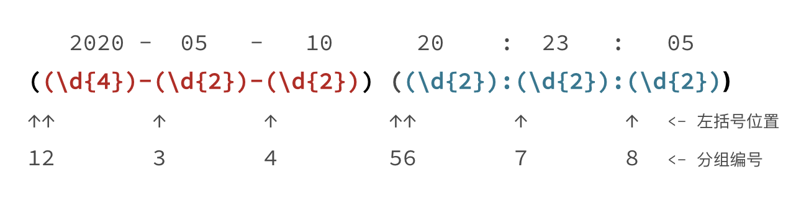

# 元字符
- 定义：所谓元字符就是指那些在正则表达式中具有特殊意义的专用字符，元字符是构成正则表达式的基本元件。
- 元字符的分类
  - 特殊单字符
  - 空白符
  - 范围
  - 量词
  - 断言

## 特殊单字符
```
.   任意字符（换行除外）
\d  任意数字           \D  任意非数字
\w  任意字符数字下划线  \W  任意非字符数字下划线
\s  任意空白符          \S  任意非空白符
```

## 空白符
```
\r  回车符
\n  换行符
\f  换页符
\t  制表符
\v  垂直制表符
\s  任意空白符

# Windows里换行是\r\n
# Linux和MaxOS中是\n
```

## 量词
```
*含义：         0到多次
+含义：         1到多次
？含义：        0到1次，如colou?r
{m}含义：       出现m次
{m,}含义：      出现至少m次
{m,n}含义：     m到n次
```

## 范围
```
|或：    如 ab|bc 代表 ab 或 bc
[...]   多选一，括号中任意单个元素
[a-z]   匹配a到z之间任意单个元素
[^...]  取反，不能是括号中的任意元素
```

## 练习一
```
 手机号验证

 1. 第1位固定位数字 1；
 2. 第2位可能是3，4，5，6，7，8，9
 3. 第3位到第11位我们认为可能是0-9任意数字

 正则："^1[3456789]\d{9}$"
```

# 三种模式
- 分类
  - 贪婪模式
  - 非贪婪（懒惰模式）
  - 独占模式

## 贪婪模式（Greedy）
- 定义：贪婪模式会尝试尽可能最大长度去匹配
- 在正则中，表示次数的量词默认是贪婪的

## 非贪婪模式（Lazy）
- 定义：非贪婪模式会尽可能进行最短匹配
- 在正则中，在量词后面加上英文的问号(?),比如a*?,就会触发非贪婪模式

## 独占模式（Possessive）
- 它类似贪婪匹配，但匹配过程不会发生回溯，匹配不上直接返回失败
- 独占模式性能比较好，可以节约匹配事件和CPU资源，但是有的情况不能满足需求，会匹配失败，比如<font color=tomato>a{1,3}+ab -> aaab </font>，使用独占会匹配失败，但是贪婪或非贪婪都可以成功匹配
- 独占模式，在量词后面加上英文(+)


# 分组与引用
```
情景一： 避免了非贪婪模式和量词?的混淆

匹配15或18个数字
\d{15}\d{3}?    # 这里的问号表示非贪婪，而不是0次或1次
\d{15}(\d{3})?  # 如果要表示量词?，需要用括号分组后在使用

# 在括号里面用?: ，表示不保存子组，仅仅只分组，后续不会引用
# 这么做是为了提高正则性能

例如：\d{15}(?:\d{3})?

# 引用使用\num

```
## 保存子组与不保存子组（?:）
- 在括号里面用?: ，表示不保存子组，仅仅只分组，后续不会引用
- 这么做是为了提高正则性能

## 括号嵌套
- 方法很简单，我们只需要数左括号（开括号）是第几个，就可以确定是第几个子组。



- 日期分组编号是 1，时间分组编号是 5，年月日对应的分组编号分别是 2，3，4，时分秒的分组编号分别是 6，7，8。


# 匹配模式（Match Mode）

## 不区分大小写模式（Case-Insensitive）
  ```
  # 模式修饰符

  当我们把模式修饰符放在整个正则前面时，就表示整个正则表达式都是不区分大小写的。

  # 模式修饰符表现形式

  (?模式标识)

  #不区分大小写的模式标识是：i

  示例：(?i)cat
  示例2：正则表示：the cat中的the不区分大小写，cat区分大小写
  ((?i)the) cat

  在JS中，需要使用/regex/i 来指定匹配模式
  在python中，可以使用re.IGNORECASE或re.I 来传入正则函数
  ```

## 点号通配模式(Dot All)

```
# 点号通配模式修饰符：s

示例：(?s).+  此时点可以匹配换行，匹配一切
```

## 多行匹配模式(Multiline)

```
多行模式的作用：
使 ^ 和 $ 能匹配上每行的开头或结尾

多行模式修饰符号：m

示例：(?m)^the|cat$
```

## 注释模式(Comment)

```
# 注释模式的作用

在一些关键的地方加上注释，让代码更易于理解。
让正则更容易阅读和维护，这就是正则的注释模式

# 注释模式修饰符号 ：(?#comment)'

#很多编程语言也提供x模式书写正则，也可以起到注释的作用

python3

import re

regex = r'''(?mx)  # 使用多行模式和x模式
^          # 开头
(\d{4})    # 年
(\d{2})    # 月
$          # 结尾
'''

re.findall(regex, '202006\n202007')
# 输出结果 [('2020', '06'), ('2020', '07')]
```

# 断言
## 单词边界(Word Boundary)
```
# 正则中使用\b来表示单词的边界

tom       单词里包含tom
\btom     以tom开头的单词
tom\b     以tom结尾的单词
\btom\b   只能是tom

# VIM中的单词边界
:s@\<tom\>@jerry@g
my friend tom go to school in tomorrow
my friend jerry go to school in tomorrow
```
## 行的开始或结束
```
使用 ^ 和 $

也可以使用 \A 和 \z (python中使用\Z) 来匹配整个文本的开头和结尾
```

## 环视(Look Around)
```
(?<=Y)  #肯定逆序环视

示例：abc123456 1234567 1234567890
(?<=[a-z])\d{6}, 只匹配第一个123456

(?<!Y) #否定逆序环视
(?=Y)   #肯定逆序环视

示例：
\d{6}(?=[a-z]) 匹配123456bc

(?!Y)  #否定逆序环视
```
### VIM中的环视
```
正向肯定环视
\v[a-z]@<=\d{6} 匹配 abc123456

正向否定环视
\v[a-z]@<!\d{6} 匹配 前面没有a-z的所有123456

逆向肯定环视
\v\d{6}[a-z]@=  匹配 123456abc

逆向否定环视
\v\d{6}[a-z]@!  匹配 后面没有a-z的123456 
```

# VIM中的特殊写法
- 在正则表达式之前使用\v开启very magic模式，避免过多的转义处理
- 单词断言使用`\<`,`\>`来替代`\b`,`\b`

# 正则的流派与特性
## 正则简史
### POSIX 流派的正则表达式
- BRE 标准（Basic Regular Expression 基本正则表达式）。
- ERE 标准（Extended Regular Expression 扩展正则表达式）。

- 主要用于Unix和类Unix，比如grep.egrep，sed，awk

### PCRE 流派
- 用于大多数编程语言
