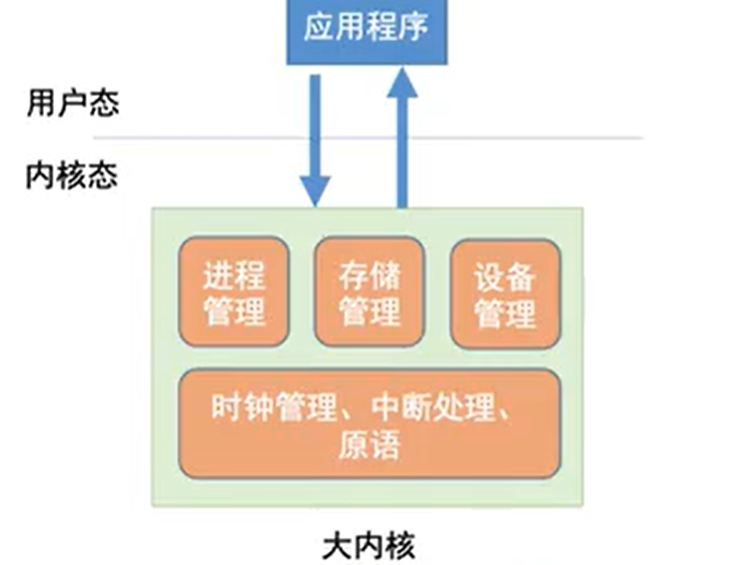
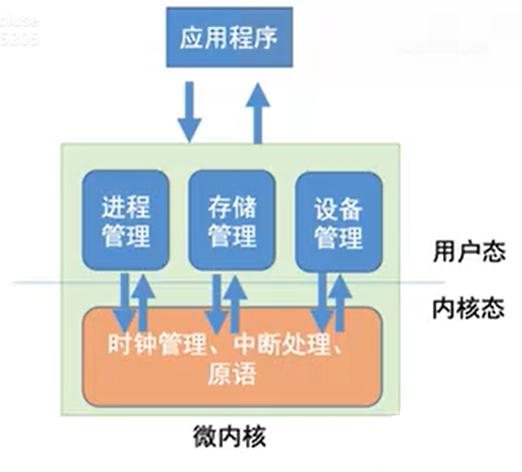

# 操作系统的层级结构

## 基本概念
### 第二层
- 时钟管理：
  - 应用场景：CPU时间分片
- 中断处理
  - 应用场景：状态切换，
- 原语：原子的原，表示一种执行起来，不可中断的程序，它会一口气执行到结束
  - 设备驱动
  - CPU切换

### 第三层
略

### 第四层: 非内核功能
- 非内核功能：每个操作系统，比如Ubuntu、Redhat、Centos、Debian等都使用相同的Linux内核，所不同的就是一些非内核的独特的功能，所有以Linux为内核开发的操作系统，统称Linux操作系统


### 第五层：应用程序
通常是用户使用安装的应用程序

## 内核
内核是操作系统最基本，最核心的部分
实现操作系统内核功能的那些程序就是`内核程序`

### 宏内核(大内核)
在我们通用的操作系统中，大多数操作系统都是大内核的
就是把第二、三层作为内核功能


### 微内核(小内核) 
该体系认为内核功能没有必要做的特别复杂，我们把内核功能就做核心的三个：时钟管理，中断处理，原语
把三层以上包括三层，都变成非内核功能

微内核仅包含时钟，中断，原语三部分功能

#### 内核的功能和意义
有一些功能是操作系统内核去实现的，并且只能由操作系统内核实现，包括时钟管理，中断，原语(设备驱动，CPU切换等)，这些功能是用户程序完全无法进行的

场景：
假设有一个微信应用程序，我们希望访问摄像头，来进行一个视频会议
此时作为一个用户程序，其实是有对底层设备，计算机资源的使用需求的
那么是这部分需求如何满足？
用户程序请求内核去做这部分关于计算机资源调用的需求，因此此时就涉及到一个调用关系，此时必须在用户态下沉到内核态，去请求数据
也就是说，摄像头由内核驱动的，摄像头启动后，数据是不是要回到应用层数据中，让微信去处理这些数据，这是就涉及到数据从用户态到内核态再到用户态的过程

#### 宏内核


根据上述场景，当我们用微信拍摄一张照片，此时发生微信调用摄像头驱动拍摄照片，摄像头拍摄完后将数据返给微信，此时微信拿到这张照片，这个过程发生2次切换


#### 微内核


根据上述场景，进行设备管理的时候，激活设备，此时从用户态到内核态，一次切换
请求发给内核中的设备驱动，里面的原语检查，设备可以用，然后将状态返回给设备管理，告诉设备可以用，此时，从内核态到用户态，二次切换
检查到设备可以用后，启动摄像头，后续的内存管理（照片存储），进程管理（美颜）都需要进行用户态到内核态的切换
因此会发现，使用微内核之后会发现，我们由用户态进入内核态的频次会急剧增加 

而状态转换会导致很多的性能损失，频繁地切换CPU状态会降低系统性能

#### 宏内核和微内核的对比
宏内核：
- 优点：
  - 资源利用率更高，高性能  
- 缺点：
  - 当前linux内核代码已经超3000万行，如此庞大的代码量，无论是维护还是升级更新都很麻烦

微内核
- 优点：内核功能少，结构清晰，开发成本低，升级更新，维护成本低
- 缺点：需要频繁的在内核和用户态之间切换，性能低

典型的大内核/宏内核操作系统：Linux、Unix
典型的微内核操作系统：Windows NT


## 操作系统运行机制
### 应用程序和内核程序
普通程序员写的程序大多是“应用程序”
微软、苹果等负责开发实现操作系统的人，他们写的是“内核程序”

### 特权指令和非特权指令
#### 非特权指令
应用程序只能使用“非特权指令”，如加法指令，减法指令，这种数学操作，不需要操作系统的额外硬件就可以执行的指令

#### 特权指令
内核程序中，操作系统作为管理者，用来操作计算机资源的指令称为特权指令，比如：C语言中的memset()将一段内存清0，又或者打开文件，打开设备，这些都是特权指令


#### 特权指令与非特权指令的由来
在CPU设计和生产的时候，就划分了特权指令和非特权指令，因此CPU执行指令前，就能够判断它到底是什么类型

### 内核态和用户态
CPu有两种状态，“内核态”和“用户态”
用于内核态时，说明此时正在运行的是内核程序，此时可以执行特权指令
用于用户态时，说明此时正在运行的是应用程序，此时只能执行非特权指令
(如果当前处于用户态，你却非要调用特权指令，CPU就会报错)

拓展：CPU中有一个寄存器叫程序状态字寄存器(PSW)，其中有个二进制位，1表示内核态，0表示用户态，所以CPU在每个时刻可以去看自己的寄存器，里面的值是多少，进而判断当前状态

别名：内核态=核心态=管态； 用户态=目态

#### 理解内核态和用户态的意义
当我们进行程序设计的时候，特别是大型软件设计，我们会考虑我们的应用程序它的性能，常见的会影响程序性能的其中一个问题就是：由程序引起的用户态到内核态的一个频繁切换，如果过于频繁切换，就会导致程序效率底下，这也是了解内核态和用户态的意义之一

#### 内核态和用户态的切换
内核态 -> 用户态：执行一条特权指令——修改PSW的标志位为“用户态”，这个动作意味着操作系统将主动让出CPU使用权

用户态 -> 内核态：由“中断”引发，硬件自动完成变态过程(除了非法使用特权指令外，还有很多事情会触发中断信号。一个共性是，但凡需要操作系统介入的地方，都会触发中断信号)，触发中断信号意味着操作系统将强行夺回CPU的使用权

每个进程都是自私的，都希望拥有更多的CPU时间，所以用户态不可能主动让出CPU，所以从用户态到内核态通常需要由中断引起，这个中断通常是硬件自动完成的

#### 触发中断的几种常见情况
- 用户态应用程序非法使用特权指令，会被操作系统中断，并夺回CPU控制权
- 程序执行过程中，被分配的CPU时间片的时间到了，也触发中断，然后被夺回CPU控制权
- 除0


## 中断(Interrupts)和异常
### 异常（内中断）
CPU内部产生的错误
- 除0
- 内存越界产生的段错误等
- 陷入指令
- 故障：访问内存，但所需数据并不在访问的内存中，就会引发故障，故障就是我出错了，但是没关系，下次重新做，可以由操作系统修改的
- 终止（除零，段错误），只能杀死进程

### 中断
外部信号导致CPU中断，就是中断（外中断）

<span style="color:red">“中断”是让操作系统内核夺回CPU使用权的唯一途径</span>
如果没有“中断”机制，那么一旦应用程序上CPU运行，CPU就会一直运行这个程序


### 内中断
与当前执行的指令有关（比如CPU在执行指令的时候发现了问题），中断信号来源于CPU内部

#### 案例
比方一段程序访问数组地址，CPU的基址寄存器是0，长度的寄存器是100，你访问101，就会发生数组越界，此时就会发生段错误
当然，也有人数组越界的时候，没有发生段错误，而仅仅是数据错误，这是因为，虽然数组越界了，但此时的内存地址还在该程序的进程内，如果你越界的地址恰巧在该程序进程内存之外，那么一定会发生段错误

### 外中断
与当前执行的指令无关，中断信号来源于CPU外部
- 时钟信号
- 进行写操作，但是写入的磁盘地址错误发生中断，这种中断是在CPU外部产生的，因此是外中断
- 时钟中断
- IO中断，由输入输出设备发出的中断信号

### 扩展知识：陷入
trap指令（陷入指令）：由用户态进入内核态的过程，也就是CPU的使用权由用户态转交给内核态的过程

### 中断的基本原理
不同的中断信号，需要用不同的中断处理程序来处理，当CPU检测到中断信号后，会根据中断信号的类型去查询“中断向量表”，以此来找到相应的中断处理程序在内存中存放的位置
```shell
中断向量表：本质是一个数组，里面存放着一个个中断处理程序的指针，下标表示一个个中断信号类型
显然，中断处理程序一定是内核程序，需要运行在内核态
```

## 系统调用(system call)
什么是call,call就是摇人，打架打不过怎么办，摇人！call，就是这个事你处理不了，请别人帮你做，就叫call

```shell
操作系统是计算机资源的管理者
是不是意味着应用程序不具备使用计算机资源的权限
如果有程序想使用硬件怎么办
```

比如去银行取钱，取20块钱，你不可能自己去金库把钱取走，你这就不是取钱，而是抢银行
去银行取钱（用户看作是应用程序），使用银行卡取（用什么卡），取多少，就是取钱的参数，取钱的过程是由柜员（系统调用）将钱去给你
此外，还会有安全措施，监督系统调用的过程

系统调用，就是操作系统提供给应用程序（程序员/编程人员）使用的接口，可以理解为一种可供应用程调用的特殊函数，`应用程序可以通过系统调用来请求获得操作系统内核的服务`

### 接口
操作系统作为用户和计算机硬件之间的接口，需要向上提供一些简单易用的服务。主要包括命令接口和程序接口。其中，程序接口由一组`系统调用`组成

- 用户与计算机系统之间的接口
  - 给用户使用的
    - CUI
    - 命令接口
      - 联机命令接口
      - 脱机命令接口
  - 给应用程序使用的
    - 程序接口（系统调用）

### 系统调用和库函数的区别
有些库函数包含系统调用，有些不包含，取决于是否需要调用内核资源

- 普通应用程序
  - 可直接进行系统调用，也可使用库函数，有的库函数涉及系统调用，有的不涉及

- 编程语言
  - 向上提供库函数。有时会将系统调用封装成库函数，以及隐藏系统调用的一些细节，是程序员编程更方便

- 操作系统
  - 向上提供系统调用，使得上层程序能请求内核服务
### 什么功能要系统调用实现

应用程序通过`系统调用`请求操作系统的服务，而系统中的各种共享资源都是由操作系统内核同一掌管，因此凡是与共享资源相关的操作(如存储分片，IO操作，文件管理等)，都必须通过系统调用的方式（方向性）向操作系统内核提出服务请求，有操作系统内核代为完成。这样可以保证系统的稳定性和安全性，防止用户进行非法操作。

#### 应用程序使用系统调用的过程
传递系统调用参数 -> 执行陷入指令（用户态）-> 执行相应的内核程序处理系统调用 -> 返回

发出系统调用请求是在用户态，而对系统调用的相应处理在核心态下进行


# Linux文件基础
## 软连接
```shell
ln -s 目标文件 软链接目标
```
### 软链接本质
软连接文件中的内容实际上是指向目标文件的路径，因此目标文件的路径如果是相对路径，那么一定是相对软链接的路径 
### 软链接易错点
删除软链接的时候，不要加tab键补全，如果软连接文件后跟/,删除的时候，比如rm -rf /Storage/test/test/ 实际上是把原始目录中的内容一起删除


# 用户组和权限管理
## 创建用户和组
```shell
useradd
groupadd

# 删除用户/组
userdel
groupdel
```

## 向组内添加/删除成员
```shell
gpasswd -a/-d MEMBER GROUP
```

## 特殊权限
- SUID
  - 作用在可执行文件
    - 文件继承程序所有者权限上
- SGID
  - 作用在可执行文件
    - 文件继承所属组权限
  - 作用在目录
    - 此目录中新建的文件的所属组将自动从此目录继承
- SBIT
  - 作用在目录
  - 此目录中的文件只能由所有者自己来删除（root除外）

### 特殊属性（限制root）
```shell
lsattr file   # 查看属性
chattr +i file   # 不可变
chattr +a file   #仅能追加
```

# 文本三剑客
## grep
```shell
# 常用选项
-v    # 取反
-i    # 忽略大小写
-c    # 统计匹配次数
-o    # 仅显示匹配到的字符（用的不多，但是用过）
-q    # 静默
-A N  # after
-B N  # before
-C N
-e    # 或
-E    # 扩展正则
-P    # 基于perl的正则，用于大部分编程语言
```

## sed
```
# 格式
sed [option...] 'script;script' [inputfile...]
# script格式
addr + command

# 无任何选项使用
sed '' file

# options
-n      # 不输出模式空间内容到屏幕
-r/-E   # 使用扩展正则表达
-i      # 在原处编辑
-i.bak  # 备份文件并在原处编辑

# 注意：
-ir    不支持
-i -r  支持
-ri    支持
-ni    危险选项，会清空文件

# addr
1. 不给地址：对全文处理
2. 单地址：
   #：指定行
   $: 最后一行
   /pat/  被正则匹配到的每一行
3. 地址范围
   #,#
   /pat1/,/pat2/
   #,/pat1/
4. 步进（没啥用）
   1~2  奇数行
   2~2  偶数行

# 命令格式
-p      打印当前模式空间内容，追加到默认输出之后
-Ip     忽略大小写输出
-d      删除模式空间匹配的行，并立即启用下一轮循环
a [\]text    在指定行后面追加文本，支持使用\n实现多行追加
i [\]text    在行前面插入文本
c [\]text    替换行为单行或多行文本
```

#上# awk


# 进程

