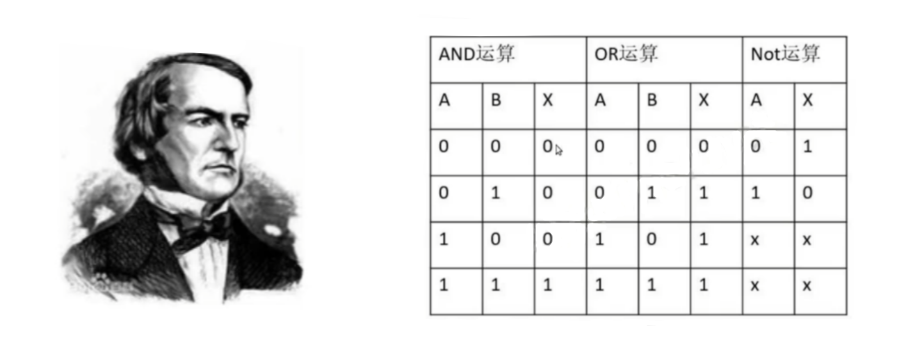
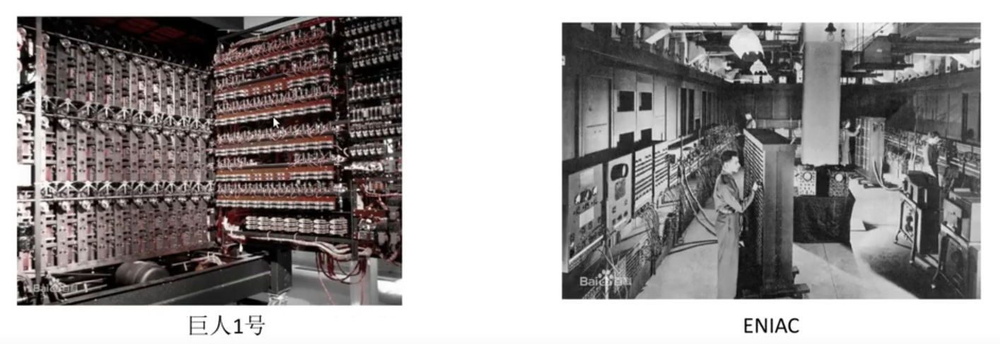
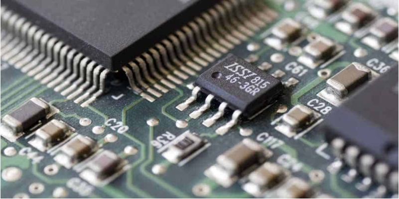
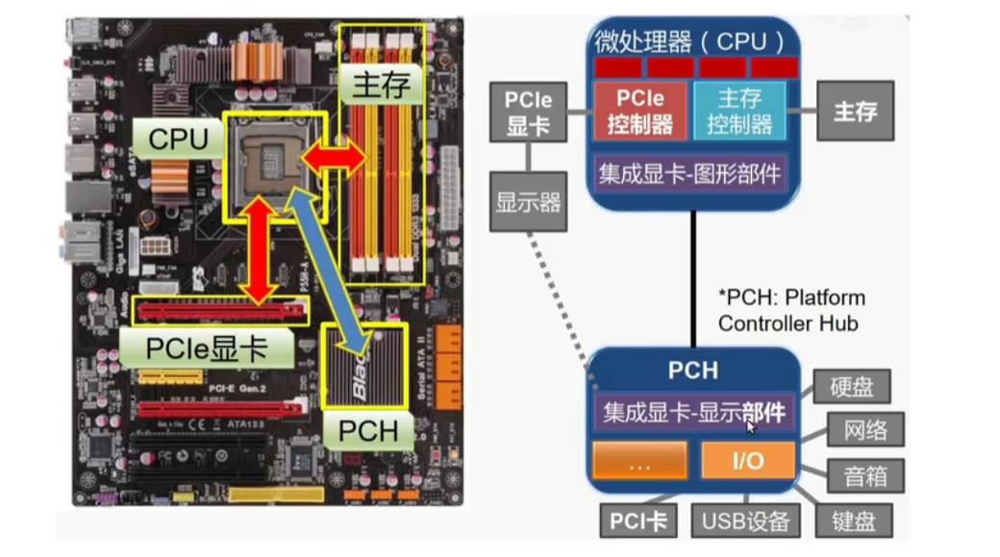
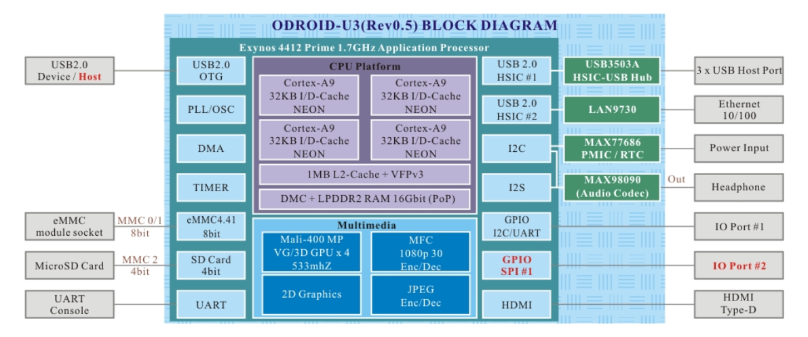
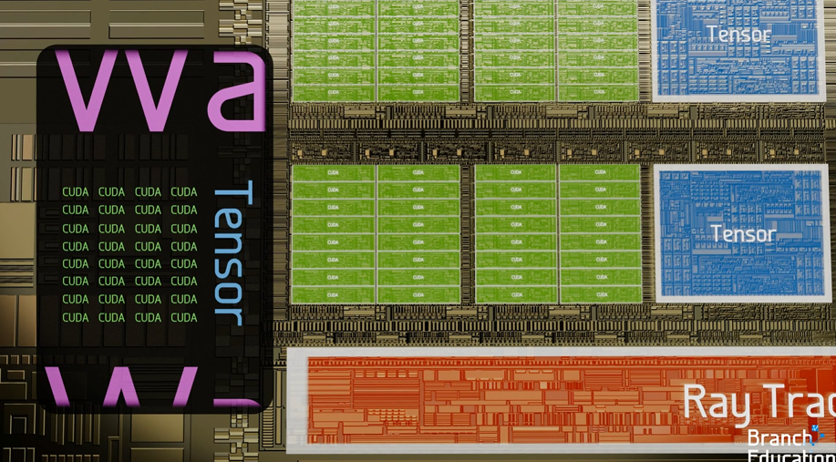

# 1 课程安排

## 1.1 企业架构演进

企业的应用软件服务架构是随着 IT 技术的发展层层迭代演进而来的，由最早的单体架构发展到现在的能够满足大型互联网公司每天上亿用户的请求和实施数据处理的架构模式。


```ABAP
单体架构是将所有的软件模块打包在一个项目中，集中部署在一个机器上，很多的模块都挤在一个大的模块上。如果服务器一旦出现问题，就意味着软件无法提供对外服务了。

对于开发者而言，那么多的模块，简单粗暴地挤在一个应用上，这使得应用的二次开发面临着巨大的挑战。随着系统模块的不断的增多，系统变得庞大，我们需要把一些模块独立出来，组成新的服务，并逐步分解成多个系统，形成了垂直式的企业 IT 架构。
```

```ABAP
垂直架构本身是有一定的模块化设计的，并且能够提供负载均衡，能够在底层实现一些数据的交互。但是，随之垂直服务的不断增加，在垂直架构下，服务与服务之间的交互和管控又迎来了新的问题。这时，又出现了一种新的架构模式，叫做 SOA 架构。
```

```ABAP
SOA 架构是一种面向服务的架构，它将应用程序不同的功能模块进行拆分，通过这些服务之间的定义良好的接口和通信协议，使得服务与服务之间互相协作起来。接口是采用中立的方式进行定义的，它的实现不依赖于平台、操作系统和编程语言。

SOA 架构的服务管控是将所有的服务提供者注册到服务中心，通过服务总线进行服务的订阅。随着企业业务的快速发展，SOA 架构迎来了新的难题。因为服务越来越多，导致企业 ESB 的压力会越来越大，致使其无法有效地进行实施数据的传输和送达。这样，企业的数据服务总线 ESB 就成为整个系统的瓶颈，SOA 架构对于企业的高速发展也显得分身乏术。微服务的架构到来使得这个问题迎刃而解。
```

```ABAP
微服务是一个能够独立发布的应用服务，因此可以作为独立组件进行升级，或者恢复度的发布，进而实现主件级别的复用。当某个微服务进行代码的升级时，对基于微服务架构开发整个大的应用的影响是比较小的。每个微服务都可以有专业的组织来单独的完成，每个微服务之间可以采用不同的技术栈、不同的编程语言去实现。相比较于 SOA 架构中的服务，微服务架构中的服务颗粒度将更加细致。

微服务的功能是比较独立的，比如用户注册、用户订单、用户订购，这些业务处理的微服务是可以独立部署的。微服务的自治是松散管理的，它不像 SOA 架构是通过企业数据总线 ESB 来集中的注册和管理。随着敏捷开发、虚拟化技术、容器技术及 DevOps 理论的实践，微服务架构得到了业界逐步的重视和广泛的应用。微服务架构也逐步成为云原生架构的典型架构。
```


## 1.2 云原生架构与传统架构的对比

云原生架构与传统的软件架构相比，传统的软件架构，用户不仅仅需要关注基础设施的能力及其运维，还需要采购及维护大量第三方软件以及非功能性能力。对开发人员来说，不仅增加了软件开发的负担，还降低了软件开发的效率。

云原生架构是基于云原生六大核心技术的一组架构原则和设计模式，通过借助云原生 IaaS 和 PaaS 的能力将云应用中的非业务代码部分进行最大化剥离，从而让云设施的接管应用中原有的大量非功能性（如弹性、韧性、安全、可观测性、灰度等），使业务不再有非功能性业务中断的困扰的同时，具备轻量、敏捷、高度自动化的特点。


## 1.3 SRE 介绍


### 1.3.1 SRE产生的原因

我们现在看到很多跟SRE相关的文件或内容，对于SRE产生的原因的解释，大多是说为了缓解开发和运维之间的矛盾，树立共同的目标，让对方能够更好的协作，**但这不是根本原因**

根本原因在于，微服务架构复杂度到了一定程度，已经远远超出单纯的开发和单纯的运维职责范畴，也远远超出了单纯人力的认知掌控范围，所以必须寻求在此架构之上的更为有效和统一的技术解决方案来解决复杂度认知的问题

目前业界火热的DevOps理念及衍生的一系列话题也是同样的背景和逻辑。
DevOps想要解决的开发和运维之间日益严重的矛盾，究其根本，还是微服务架构背后带来的技术复杂度在不断提升的问题

因此运维一定要与微服务架构本身紧密结合起来

```ABAP
如果没有SRE，依然是传统的运维方式管理当前微服务架构下的运维问题

导致的问题就是运维效率低下，完全靠人工，线上故障频发，但是处理效率又极低，开发和运维都处于非常痛苦的状态之中
```


### 1.3.2 Google-SRE


Google 是提出 **Site Reliability Engineering（SRE）** 这个概念的鼻祖，它的 SRE 岗位不仅技术要求高，而且职责非常明确，**在业界具有极强的指导性**。


#### 1.3.2.1 Google 对 SRE 岗位的要求（Skills & Qualifications）

| 项目               | 要求                                                       |
| ------------------ | ---------------------------------------------------------- |
| **编程能力**       | 熟练使用一到多种语言（Go、Python、C++、Java）              |
| **系统能力**       | 精通 Linux 系统原理、性能调优、资源管理                    |
| **分布式系统经验** | 熟悉负载均衡、微服务架构、存储系统、高可用                 |
| **网络基础**       | TCP/IP、DNS、TLS、HTTP 等                                  |
| **容器与调度**     | 熟练使用 Kubernetes、Borg（Google 内部调度器）             |
| **自动化能力**     | 熟悉 CI/CD、配置管理、基础设施即代码（Terraform、Ansible） |
| **故障分析能力**   | 擅长日志追踪、指标分析、问题定位、RCA 报告编写             |


#### 1.3.2.2 Google 内部 SRE 的职责

Google 官方在《SRE Book》中定义了：

> "SRE is what happens when you ask a software engineer to design an operations team."

Google 的 SRE 既是工程师，也是可靠性保障者，职责涵盖以下几个核心维度：


**1. 服务可用性保障**

- 维护服务 **99.9%+ 可用性**
- 建立 **SLI（指标） / SLO（目标） / SLA（协议）**
- 开发监控报警系统（Prometheus、Stackdriver）


**2. 故障应对与根因分析（Incident Response & RCA）**

- 第一时间响应重大服务故障（Paging）
- 协调修复、回滚、降级
- 编写 RCA 报告和后续预防措施（Postmortem）


**3. 容量规划与性能优化**

- 分析系统负载，做容量预测
- 调整缓存、负载均衡、数据库查询
- 使用工具如 BigQuery、Grafana、gRPC profiler 做压测分析


**4. 自动化与工具开发**

- 用编程方式解决运维问题（Toil Elimination）
- 编写自动修复工具、自愈系统、巡检系统
- 将重复手动任务编程实现自动化


**5. 参与系统设计评审**

- 与开发团队一起参与服务设计，确保可观测性、可运维性
- 参与上线评审、容量评估、安全评估


**6. 控制变更风险（Change Management）**

- 管理变更发布（如 canary rollout、蓝绿发布）
- 评估变更带来的风险和 SLO 影响


在 Google，SRE 是既懂开发又精通系统架构的可靠性工程师，职责覆盖系统设计、自动化运维、故障响应、容量规划、风险控制等关键领域，核心目标是：**用软件工程的方法解决运维问题，保障服务可靠性。**


### 1.3.3 Netflix-SRE


众所周知，Netflix是业界微服务架构的最佳实践者，其基于公有云上的微服务架构设计，持续交付，监控，稳定性保障，都为业界提供了大量可遵从的原则和实践经验

#### Netflix运维现状

Netflix没有运维岗位，和运维对应的岗位其实是我们熟知的SRE(Site Reliability Engineer)
但是SRE不等于运维! 
Netflix_SRE理念的核心是：**用软件工程的方法重新设计和定义运维工作。**


 Netflix实践极端DevOps--you build it, you run it(工程师负责从头到尾负责开发软件、部署和再生产环境运行代码)

SRE支持性能工程师执行以下活动：

- 自动缩放用于按需扩展 - 节省资金与预购的本地计算机相比 - 用于编码、预计算、故障转移和蓝绿部署
- 处理涉及自动缩放的棘手问题，如资源欠配，以及粘性流量、突发流量和不均匀的流量分布
- 支持性能仪表板，覆盖负载问题、错误、延迟问题、资源饱和（例如CPU负载平均值）和实例数量。


## 1.4 课程安排

### 1.4.1 传统架构设计


#### 1.4.1.1 实现目标

- 上述架构的各组件以面向生产环境的方式部署
- Ansible进行部署和新版本发布
- 用上JumpServer，模拟进行远程管理接入
- Shell脚本和Xtrabackup/mysqldump:MySQL数据库备份和远程存储
- Nginx模拟做业务网关，耦合请求至业务请求路径中，LVS做接入层流量网关
- 基于Keepalived高可用LVS
- 使用Zabbix监控以上系统中的每个组件，规划好存储空间，并制订合理的告警策略

```basic
Ansible进行版本发布过程中，服务不会中断
MyCAT和MySQL实现的读写分离架构中，数据能够正常读写
Memcached用作Session Server，确保会话保持的功能;
模拟数据丢失，确保数据库的备份文件能够用于进行恢复
Nginx某一实例故障，不会大面积影响业务访问;
LVS某一实例故障，不会大面积影响业务访问;
Zabbix能够及时发现问题，并进行及时告警
```


### 1.4.2 云原生架构设计


# 2 行业介绍和计算机基础


## 2.1 计算机发展史


- **第零代：继电器机械计算机（~1945**）
- **第一代：电子管计算机（1945~1955）**
- **第二代：晶体管计算机（1955~1965）**
- **第三代：集成电路计算机（1965~1980）**
- **第四代：微型计算机（1980~至今）**


### 2.1.2 布尔代数和数字电路

计算机的基础是数字电路，数字电路的基础是布尔代数

- 1847年英国数学家**乔治布尔**发明布尔代数



布尔代数与数字电路之间的关系


假设：开关断开为0，反之为1，灯灭为0，反之为1

- 图1相当于AND运算的逻辑
- 图2相当于OR运算的逻辑


<span style="color:red;font-weight:700">问题：上述的电路只能完成简单的逻辑运算，其他复杂逻辑运算无法实现。比如：要求两个开关断开，灯亮，即 ( 0，0 ) -> 1。因此需要结合继电器来实现</span>


### 2.1.3 继电器（relay）

- In：输入小电流，Out：输出大电流，起到中继的作用


继电器的原理：当电流从IN输入，电磁铁通电，会将上面的弹片下压，从而将上面的电路打通

图三中（数字电路会将高电压用1表示，低电压用0表示）

- 当两个开关闭合，则灯是灭的
- 当两个开关都断开或只断开一个，则灯是两的

上述图三符合**NAND**的运算逻辑，即与非门


<span style="color:red;font-weight:700">从继电器发明之后，没有人将电路与逻辑运算联系起来，直到20世纪30年代</span>


### 2.1.4 电器与开关电路的符号分析

- 1938年英国科学家**克劳德.香浓**发表论文《A Symbolic Analysis of Relay and Switching Circuits》将布尔代数应用到电路中，奠定了数字电路的理论基础
- 1949年9月香浓信息论《The Mathematical Theory of Communication通讯的数字原理》提出“位”这个单词来表示二进制数字
- 继电器的组合称为逻辑门，他们构造基本的逻辑电路，也叫**门电路**


<span style="color:red;font-weight:700">门电路只是数字电路的最基本部件，如何使用门电路来设计一个计算机，或者计算机应该由哪些部件构成以怎样的方式来运行呢</span>


### 2.1.5 图灵机

- 1936年，英国数学家**艾伦图灵**提出了一种抽象的计算机模型，被称为图灵机
- 图灵机第1次提出程序的概念
- 图灵机提出了一种使用机器进行计算的简单方法


解析上述图灵机

上面是一个无限长的纸袋，下方有个红色的读写头，读写头上有一个状态码 `q1`，根据程序表来对纸袋进行计算处理

- 比如当前读写头指向1，状态是 `q1`，根据程序表得到 `1Rq1`，这里1表示将当前纸带上的数字变为1，如果是1则不变，R表示向右移动一位（L表示向左移动一位，H表示不动），`q1` 表示状态码变为 `q1`，如果之前就是 `q1`，则不变。
- 根据上述规则即可将程序执行起来。这就是图灵机


<span style="color:red;font-weight:700">图灵机为计算机的实现提供了一种重要的思想，肯定了计算机实现的可能，为计算机的实现提供了一种大致的架构</span>


### 2.1.6 冯诺依曼体系结构

- 冯诺依曼于1946年提出冯诺依曼计算机体系结构
- 制造了第一台现代意义的通用计算机EDVAC
- 冯诺依曼计算机几大特点：
  - 五大组成部分（存储器，运算器，控制器，输入，输出设备）
  - 使用二进制计算（使用二进制可以大大的简化乘法和除法的运算）
  - 提粗存储程序的概念，自动取指令
- [冯诺依曼体系结构详解](#3.1 冯诺依曼体系结构详解)


<span style="color:red;font-weight:700">冯诺依曼对计算机的影响是巨大的，直到现在绝大多数的计算机，仍然采用的是冯诺依曼体系结构</span>


### 2.1.7 继电器计算机

- 1944年 IBM制造出哈佛Mark1号大约有3500个继电器，1秒能做3次加法或减法运算，乘法要花6秒，除法要花15秒
- 1947年9月，哈佛Mark2号操作员，从故障继电器中，拔出一只死虫，从那时起，每当电脑出现了问题，我们就说它出了bug（虫子）
- 继电器1秒能翻转50次


<span style="color:red;font-weight:700">继电器属于机械设备，随着时间的使用，它会磨损，会变慢甚至损坏，而且机械运动很慢，继电器一秒只能开关50次，所以需要更快更可靠的部件来设计计算机</span>


#### 2.1.8 真空管

- 热电子发射（爱迪生效应）是指在真空条件下加热金属时，电子从材料表面溢出的现象
- 真空管属于电子设备，每秒可以开闭数千次


- 通过加热器控制开关
- 通过栅极可以控制电流的大小，后期广泛应用在广播，起到电流放大的作用
- 真空三极管
  - 当加热器加热，阴极的金属表面会溢出电子（即热电子发射），而阳极有一个正电电压，让阳极带正电荷，此时电子会向阳极移动，而电子的移动就会产生电流，此时阳极就会输出高电压
  - 栅极是一个金属网，它有一个电压可以让栅极带正电或者负电，如果带正电，电子就会移动，阳级就会输出高电压，如果是负电，则电子停止流动，阳极就会输出低电压，从而实现和继电器类似的开关功能
- 问题：寿命短


### 2.1.9 真空管计算机

- 第一个大规模使用真空管的计算机是“巨人1号”，拥有1600个真空管，完工于1943
- 1946年在宾夕法尼亚大学完成制作了ENIAC，它是世界上第一台真正通用可编程计算机（采用10进制，其编程是利用电线插入插板完成），使用了18000多只电子管，重130多吨，占地面积170多平方米，每秒钟可作5000多次加法计算




<span style="color:red;font-weight:700">真空管本身非常脆弱，很容易坏，而且寿命短，因此后面被晶体管所取代</span>


### 2.1.10 晶体管计算机

- 1955年发布的IBM 608 — 第一台完全使用晶体管的商用计算机。它包含3000个晶体管，每秒可以执行4500次加法，或者大约80次乘法或除法
- 今天，计算机使用尺寸小于50纳米的晶体管，作为参考，一张纸大约100000纳米厚，它们不仅非常小，而且速度非常快，每秒可以切换数百万次状态，并且可以运行数十年

> [晶体管详解](#3.2 晶体管详解)


### 2.1.11 集成电路

- 1958年，美国德州仪器的工程师Jack Kilby发明了集成电路（IC）
- 集成电路（integrated circuit）是一种微型电子器件或部件。采用一定的工艺，把一个电路中所需的晶体管，电阻，电容和电感等独立元件及布线互连在一起，制作在一块芯片上；其中所有元件在结构上已组成了一个整体，变成一个新的独立组件，使电子元件向着微小型化，低功耗，智能化和高可靠性方面迈进了一大步
- 集成电路具有体积小，重量轻，引出线和焊接点少，寿命长，可靠性高，性能好等优点，同时成本低，便于大规模生产。




### 2.1.12 微型计算机

- 微处理器是由一片或少数几片大规模集成电路组成的中央处理器CPU。这些电路执行控制部件和计算逻辑部件的功能
- Intel于1971年发布第一款微处理器Intel 4004，片内集成了2250个晶体管
- 微型计算机（Microcomputer,MC）是由微处理器加上同样采用大规模集成电路制成的程序存储器（ROM、EPROM、Flash ROM）和数据存储器（RAM），以及外围设备相连接的输入/输出（I/O）接口电路等构成


### 2.1.13 摩尔定律

- 摩尔定律：集成电路上可以容纳的晶体管数目在大约每经过18个月到24个月便会增加一倍。换言之，处理器的性能大约每两年翻一倍，同时价格下降为之前的一半
- 摩尔定律有英特尔创始人之一**戈登摩尔**提出，它一定程度上揭示了信息技术进步的速度


### 2.1.14 现代计算机结构


上述是早期现代计算机结构，它有一个CPU，CPU连接一个北桥芯片，在北桥芯片里面有主存跟显卡控制器，用来访问主存和显示器，北桥芯片再连接一个南桥芯片，在南桥芯片里面有各种IO设备的控制器，有磁盘，USB设备，因为不同的设备，它的构造是不一样的，有的是机械设备，有的是磁性设备，而cpu是电子设备，所以CPU是不能和这些设备进行通信的，每个设备都要有一个对应的控制器，CPU通过控制器跟这些设备进行通信


采用这种南北桥的架构，CPU在访问主存的时候，首先要经过北桥，然后在访问磁盘的时候，要下先经过北桥，再到南桥。这样性能就会低一些


### 2.1.15 现代计算机结构2




### 2.1.16 SOC

- 片上系统芯片（System-on-a-Chip,SOC）
- 将cpu，主存，控制器集成在一个芯片内
- 广泛应用于手机，平板等移动设备




## 2.2 计算机硬件组成

### 2.2.1 计算机分类

#### 2.2.1.1 按规模划分

- 超级计算机：Super Computer，又称巨型计算机，应用于国防尖端技术和现代科学计算中。巨型 机的运算速度可达每秒百万亿次以上， “天河一号” 为我国首台千万亿次超级计算机；
- 大型计算机：具有较高的运算速度，每秒可以执行几千万条指令，而且有较大的存储空间。往往用于科学计算、数据处理或作为网络服务器使用，如：IBM z13 mainframe；
- 小型计算机：指采用精简指令集处理器，性能和价格介于PC服务器和大型主机之间的一种高性能 64 位计算机。在中国，小型机习惯上用来指UNIX服务器
- 微型计算机：指采用 X86 CPU 架构的PC服务器，中央处理器（CPU）采用微处理器芯片，体积小 巧轻便，广泛用于商业、服务业、工厂的自动控制、办公自动化以及大众化的信息处理，互联网公司发起去 IOE 运动，代替小型机


#### 2.2.1.2 按功能和角色划分

**服务器**：即 Server，计算机的一种，通常是网络中为客户端计算机提供各种服务的高性能的计算机，服 务器在网络操作系统的控制下，将与其相连的硬盘、磁带、打印机及昂贵的专用通讯设备提供给网络上 的客户站点共享，也能为网络用户提供集中计算、信息发布及数据管理等服务


**客户机**：即 向服务器提出请求，需要服务器为之提供相应的服务和支持的计算机


常说的C/S模式，就是指 Client/Server(客户端/服务端)这种按角色来分的模式，服务端并不是一直都是 服务端，客户端也并不是一直都是客户端，在使用时，服务提供者，就是服务端，服务请求者，就是客 户端


**服务器按应用功能可分为**： Web 服务器、数据库服务器、文件服务器、中间件应用服务器、日志服务器、监控服务器、程序版本控 制服务器、虚拟机服务器、邮件服务器、打印服务器、域控制服务器、多媒体服务器、通讯服务器、  ERP 服务器


#### 2.2.1.3  服务器按外形分类


**PC 服务器常见的三种外型：** 

- 塔式服务器  
- 刀片式服务器 
-  机架式服务器


**塔式服务器**

``````ABAP
外形类似于桌面电脑的塔式机箱，可以独立放置在办公室或机房中，无需专门的机架。它通常具有较大的机箱和独立的支架，便于内部硬件的扩展和维护。
适用于中小型企业、办公室等环境，以及需要文件共享、打印服务、网络应用服务、数据备份和恢复、软件开发和测试等任务的场景。
``````


```ABAP
特点：
 扩展性强：通常具有较多的扩展插槽和硬盘位，可以方便地升级和扩展存储和其他硬件。
 易于维护：由于机箱独立设计，内部硬件和组件更易于维护和更换。
 灵活性高：支持多种操作系统和应用程序，适用于不同的业务需求和应用场景。
 噪音较低：相比一些机架式服务器，塔式服务器的噪音较低，适用于安静的办公环境
```


**刀片式服务器**

```ABAP
外表结构是大型主机机箱，内部存在数个“刀片”，每块刀片是系统母版，可以看作是独立服务器。刀片服务器专为特殊应用行业和高密度计算环境设计，能够在标准高度的机架式机箱内插装多个卡式
适用于大型数据中心或者需要大规模计算的领域，如银行、电信、金融行业以及互联网数据中心等。刀片
服务器已经成为高性能计算集群的主流。
```


**机架式服务器**

```ABAP
专为机架架构设计的服务器，机箱宽度为19英寸，高度有1-7U几个标准，适合放置在标准的19英寸机架中。机架式服务器通常采用垂直设计，便于多台服务器垂直堆叠，节省空间。
广泛应用于数据中心，是构建云计算平台、进行大数据处理和分析、托管Web服务器、应用服务器和数据库服务器等的核心组件
```


```basic
特点：
    高密度：垂直设计允许将多台服务器堆叠在一个机架中，提高数据中心中服务器的密度。
    灵活性：标准化的尺寸和设计使得机架式服务器可以在不同的数据中心和机架中灵活部署和管理。
    管理简便：垂直堆叠设计和热插拔功能使得对服务器的管理和维护更加便捷。
    高可用性：冗余设计和支持热插拔功能保证了服务器的高可用性。
```

| 规格 | 尺寸                  | 价位          |
| ---- | --------------------- | ------------- |
| 1U   | 1.75英寸，约4.445厘米 | 数千~上万     |
| 2U   | 两个1U，约8.89厘米    | 1万~数万      |
| 4U   | 四个1U，约17.78厘米   | 2万~数十万    |
| 8U   | 八个1U，约35.56厘米   | 数十万~数百万 |


**数据中心**

```ABAP
数据中心可以分为IDC（Internet Data Center，互联网数据中心）、EDC（Enterprise Data Center，企业数据中心）、NSC（National Supercomputing Center，国家超级计算中心）。

IDC：
 是电信业务经营者利用已有的互联网通信线路、带宽资源，建立标准化的电信专业级机房环境，通过互联网向客户提供服务器托管、租用以及相关增值等方面的全方位服务。
 
EDC： 
 是指由企业或机构构建并所有，服务于企业或机构自身业务的数据中心，是一个企业数据运算、存储和交换的核心计算环境，它为企业、客户及合作伙伴提供数据处理、数据访问等信息，应用支持服务。
 
NSC：
 是指由国家兴建、部署有千万亿次高效能计算机的超级计算中心。与IDC、EDC不同，国家超级计算中心由国家兴建和运营，对外提供的是运算能力
```


```ABAP
数据中心的基础设施主要包括：
硬件组件：
 服务器、存储设备、网络设备
软件系统：
 操作系统、虚拟化技术、数据中心管理软件
物理基础设施：
 电力供应、冷却交换系统、安全系统【门禁、监控头、防火墙、入侵检测等】
```


### 2.2.2 计算机硬件 CPU

#### 2.2.2.1 个人CPU的型号与代际

```ABAP
Windows电脑：--> 设备管理器 --> 处理器
```


```scss
Intel(R) Core(TM) i5-14600KF
```

| 部分       | 示例值               | 含义 ✅                                                       |
| ---------- | -------------------- | ------------------------------------------------------------ |
| `Intel(R)` | 品牌厂商             | 英特尔                                                       |
| `Core(TM)` | **品牌系列**         | **Core 系列**，表示主流消费级 CPU，属于高性能产品线,以前推出过奔腾，赛扬等 |
| `i5`       | **品牌修饰符**       | 表示中端性能档次（i3 / i5 / i7 / i9）                        |
| `14`       | **代际编号**         | 表示 **第 14 代 Core 处理器**                                |
| `600`      | **SKU（型号编号）**  | 标识该代处理器中的具体型号，与核心数/频率相关                |
| `KF`       | **产品后缀（特性）** | `K`: 可超频，`F`: 无核显（需要独显）                         |

**常见后缀意义速查表**

| 后缀 | 含义                             |
| ---- | -------------------------------- |
| K    | 支持超频（Unlocked）             |
| F    | 无集成显卡（No iGPU）            |
| KF   | 可超频 + 无核显                  |
| T    | 低功耗版本（节能桌面）           |
| H    | 高性能移动端（High Performance） |
| U    | 超低功耗版（Ultra-low Power）    |
| P    | 不支持超频，但带核显             |
| E/X  | 工作站 / 企业 / 高端扩展型号     |

**代际详解表**

| 时间 | 代数   | CPU代际             | 制程工艺 | 微架构                        |
| ---- | ------ | ------------------- | -------- | ----------------------------- |
| 2013 | 第4代  | Haswell             | 22nm     | Haswell                       |
| 2014 | 第5代  | Broadwell           | 14nm     | Haswell                       |
| 2015 | 第6代  | Skylake(client)     | 14nm     | Skylake                       |
| 2016 | 第7代  | Kaby Lake           | 14nm     | Skylake                       |
| 2017 | 第8代  | Coffee Lake         | 14nm     | Skylake                       |
| 2018 | 第9代  | Coffee Lake Refresh | 14nm     | Skylake                       |
| 2019 | 第10代 | Ice Lake(client)    | 10nm     | Sunny Cove                    |
| 2020 | 第11代 | Tiger Lake          | 10nm     | Willow Cove                   |
| 2021 | 第12代 | Alder Lake S        | 7nm      | 大核Golden Cove 小核Gracemont |
| 2022 | 第13代 | Raptor Lake         | 7nm      | 大核Raptor Cove 小核Gracemont |


**不同代际的CPU主要一下几点不同**

- **制程工艺不同：** 40nm --> 7nm
- **架构设计不同**
- **微架构不同：** Haswell，Skylake，SunnyCove，GoldenCove，小核Gracemont
- **内存控制器支持的内存不同：** DDR3，DDR4，DDR5，LPDDR，通道数（即槽位数）


#### 2.2.2.2 个人CPU的架构

以目前还比较主流的**Ice Lake（client）**为例，来看下该代际下某CPU的内部架构图


- **Gen11 Graphics**：指的是 Intel 的第 11 代集成显卡架构
- 图中每个核心标注为 **Sunny Cove Core**，它是 Intel 第10代 **Ice Lake** 架构下的核心。

>**Sunny Cove 支持 SMT（超线程技术）** 因此，每个核心默认提供 **2 个逻辑线程**，该图基本可以判断是**4 核 8 线程** 的 Ice Lake 处理器结构

- [CPU物理结构](#CPU结构简介)


#### 2.2.2.3 CPU核的主要参数

##### CPU的工作频率


✅ **处理器基本频率（Base Frequency）**

- 就是我们常说的 **CPU主频**。
- 是指在处理器标准功耗（TDP）下所有核心工作的**最低保障频率**。
- 图中为 **2.90 GHz**，意味着在不超频、正常供电、满载时，CPU核心至少会以这个频率运行。


⚡ **最大睿频频率（Max Turbo Frequency）**

- 又称 **Turbo Boost 频率**，是 **Intel 的动态加速技术**。
- 当温度允许、电压允许、功耗允许、并非所有核心都满载时，**部分核心可以自动提频**，以获得更高性能。
- 图中为 **3.80 GHz**，代表**单个核心在理想状态下**最高可达到的频率。


**逻辑核与物理核**

Intel运用了超线程技术，一个物理核可以被虚拟出来两个逻辑核来用


两个逻辑核的总处理能力通常比一个物理核的性能提高20%左右，按时如果服务对单个核心的性能要求高，建议关闭逻辑核


#### 2.2.2.5 个人CPU与服务器CPU的差异

##### **尺寸不一样**

- 服务器CPU要比个人CPU大


##### **价格不一样**，频率不一样


**硬件模块不一样**


- **集成显卡**：客户端支持，服务端不支持

- **核数不同**：客户端核数少，服务端核数多

- **内存通道**：客户端2-4通道，服务端6通道起步

  > 每个**内存通道**是一条 CPU 到内存控制器之间的**独立数据传输通路**。
  >
  > 内存通道数（Memory Channel）不是直接决定支持插几根内存条，而是决定 CPU 同时能并行访问多少条内存通路，从而影响内存带宽。

- **内存型号**：服务器端支持ECC、RDIMM、LRDIMM

- **扩展性**：客户端没有UPI，服务端标配

  > **UPI（Ultra Path Interconnect）** 是 Intel 推出的用于 **多颗 CPU（Socket）之间互连通信** 的高带宽、低延迟、高速互连总线协议
  >
  > 在 **双路或多路服务器** 中，一台机器通常有 2 颗、4 颗甚至 8 颗物理 CPU（Socket）。每颗 CPU 自带一套内存控制器 + IO 通道 + 核心资源。
  >
  > 为了让这些 CPU **彼此通信、共享内存、协调工作**，必须有一种 **高速总线**，这就是 **UPI 的作用**。


### 2.2.3 计算机硬件 内存

#### 2.2.3.1 CPU对内存的硬件支持


- 学会查看服务器CPU的内存支持
- 理解内存DDR3、DDR4、DDR5代际
- 了解UDIMM、RDIMM、LRDIMM的工作原理及其区别


##### CPU内存控制器


- 有两个内存控制器（IMC，Integrate Memory Controller）

- 每个内存控制器上都有一个 DDR PHY。DDR PHY 是连接DDR内存条和内存控制器的桥梁。它负在内存控制器和内存条之间做协议信号的转换

  > **CPU 内部是纯数字信号（0 和 1）**，而 **内存条内部需要通过电压、电流形式的模拟电气信号控制电容或晶体管阵列**。所以必须通过 **内存控制器 + DDR PHY** 来完成从逻辑指令到电气行为的转换。

- 每个DDR PHY 有3个channels（通道）。每个Channel 有两个内存插槽，也就是说最多可以支持 2 * 3 * 2 = 12 个内存条


**内存支持 = CPU + 内存控制器 + 主板布局**

| 项目                     | 含义                                             | 是否与 CPU 有关        |
| ------------------------ | ------------------------------------------------ | ---------------------- |
| **内存控制器**           | 决定能支持的内存代际（DDR4/5）、最大容量、通道数 | ✅ CPU 内部集成         |
| **通道数（Channel）**    | 决定 CPU 同时访问几条内存通路（**带宽关键**）    | ✅ CPU定义              |
| **每通道支持的 DIMM 数** | 决定每通道能插几根内存条（一般为 1~2）           | ❌ 主板决定             |
| **最大容量（GB）**       | 由内存控制器规格 + 每 DIMM 支持容量决定          | ✅（由 CPU 控制器定义） |
| **ECC / Non-ECC 支持**   | 是否支持纠错内存                                 | ✅ CPU+主板共同决定     |


**CPU支持的内存规格信息（内存通道数、类型、速率、带宽）**


查 **CPU 官方规格页（Intel Ark / AMD 产品页）**【最准确】

```ABAP
Intel 官网：https://ark.intel.com
AMD 官网：https://www.amd.com
```

```http
https://www.intel.com/content/www/us/en/ark/featurefilter.html?productType=873&0_ECCMemory=True
```


✅ **1. CPU 支持 DDR4 和 DDR5 是**互斥的（几乎总是）：

- **CPU 的内存控制器（IMC）**设计时就是面向某种内存类型的（DDR4 或 DDR5），这两者在：
  - **电压**（DDR4: 1.2V，DDR5: 1.1V）、
  - **信号协议**、
  - **时序机制（如 PMIC、电源管理集成电路）**
    上差异非常大。
- 所以大多数 CPU 只能支持一种类型，例如：
  - **Intel 12代** 支持 DDR4 和 DDR5，但要二选一。
  - **Intel Xeon 6774P** 只支持 DDR5。


✅ **2. 主板插槽形状不一样，DDR4 和 DDR5 不可混插**：

- DDR4 与 DDR5 的**金手指位置不同**，即使强插也插不进去，防止误操作。
- 即使是**支持双内存标准的 CPU**（如 Intel 12/13 代），**主板也只会支持其中一种**：
  - 如果买的是 DDR5 主板，就只能插 DDR5。
  - 如果买的是 DDR4 主板，就只能插 DDR4。
  - 两种内存条不能同时混用。


#### 2.2.3.2 CPU支持的内存代际


#### 2.2.3.3 CPU支持内存模块规格


**DIMM是双列直插内存模块**

它的英文全名 Dual In-Line Memory Module。表示的是信号接触在金手指两侧，并且在**DIMM条**的边沿作为信号接触面


**个人台式机内存**


**UDIMM：无缓冲双列直插内存模块，是 Unbuffered DIMM 的缩写**

指地址和控制信号不经缓冲器，无需做任何时序调整，直接到达DIMM上的DRAM芯片。这种内存虽然没有缓存延迟会比较低，但要求CPU到每个内存颗粒之间的传输距离相等，这样就对内存的容量和频率都产生了限制。这种内存由于容量相对较小，但成本便宜，所以在个人台式机上用的比较多。


**个人笔记本内存**


**SODIMM：小外形模块，是 Small Outline DIMM 的缩写**

在笔记本电脑出现后，对内存的体积和功耗都要求更小一些。SO-DIMM 就是针对笔记本电脑定义的标准。其宽度标准是67.6mm


**服务器 RIDMM 内存**


**RDIMM：带寄存器双列直插模块，是 Registered DIMM 的缩写**

RDIMM 在内存条上加了一个寄存缓存器（RCD，Register Clock Driver）进行传输。控制器输出的地址和控制信号经过Register芯片寄存后输出到DRAM芯片。CPU访问数据时都先经过寄存器再到内存颗粒。减少了CPU到内存颗粒的距离，使得频率可以提高。而且不再像之前一样要求每个内存颗粒传输距离相等，工艺复杂度因寄存缓存器的引入而下降，使得容量也可以提高到 **32GB~128GB** 。主要在服务器上。


**服务器 LRIDMM 内存**


**LRDIMM：低负载双列直插内存模块，是 Load Reduced DIMM 的缩写**

LRDIMM 相比 RDIMM 在引入寄存缓存器 RCD 的基础上，又进一步引入了数据缓冲器 DB（Data Buffer）。引入数据缓冲器作用是缓冲来自内存控制器或内存颗粒的数据信号。实现了对地址，控制信号，数据的全缓冲。成本更高，但可以**支持更大容量**，可以**提到 64GB 甚至更高**


#### 2.2.3.4 服务器ECC内存工作原理


- **了解电磁干扰可以造成和比特翻转**
- **理解服务器内存和个人内存的区别**


```ABAP
为什么上面两个内存条一个有8个颗粒，另外一个是9个颗粒
```


##### 内存比特翻转


**当前世界充斥着无处不在的电磁干扰**


**个人PC场景**

电磁干扰可能会导致CPU读到的数据中某一个比特或者多个比特存在错误。据统计，一根 8GB 的内存条平均大约每小时会出现 1~5 个这样的错误

对于个人PC，我们使用个人电脑打游戏，追剧，办公的时候，由于内存主要都用来处理图片，视频等显示数据。即使内存出现了比特翻转，可能影响的只是一个像素值，很难感觉出来，没有太大的影响。

即使是比特翻转真的发生在关键的系统代码导致运行出问题，也不是什么大事，重启一次就解决了。


**服务器场景**

但在服务器应用中，处理的一般都是非常重要的计算，可能是一笔订单交易，也可能是一笔存款。另外就是服务器经常要运行几个月甚至是几年，没有办法通过重启的方式来解决问题

因此服务器对比特翻转错误的容忍度很低。需要有技术方案能够一定程度解决比特翻转问题所带来的影响


##### 比特翻转解决方案：ECC内存

ECC就是这样一种内存技术。它的英文全称是："Error Checking and Correcting"，对应的中文名称就叫做 "错误检查和纠正"。从它的名称中我们可以看出，ECC不但能发现内存中的错误，而且还可以进行纠正


普通一次只需要传输 64bit 数据就可以了，而ECC内存需要传输 72bit，其中 8bit 是用作错误校验


### 2.2.4 计算机硬件 硬盘

- **机械硬盘（磁盘）**
- **固态硬盘（SSD）**
- **CD/DVD/CD-ROM/磁带**


#### 2.2.4.1 磁盘结构


#### 2.2.4.2 固态硬盘SSD


#### 2.2.4.3 辅助存储接口

- **IDE（并行接口，排线接口）**
- **SCSI、SAS、串行SCSI**
- **SATA、mSATA（600Mbps）**
- **PCIe（X4,16/32Gbps）**
- **M.2（NGFF,PCIe M.2, NVMe）**


| 协议（管规则） | 物理接口（管样子）  | 备注                             |
| -------------- | ------------------- | -------------------------------- |
| SATA 协议      | SATA 7+15 针接口    | 符合 SATA 传输规则               |
| PCIe 协议      | PCIe x1/x4/x16 插槽 | 符合 PCIe 传输规则               |
| PCIe 协议      | M.2 插槽            | 符合 PCIe 传输规则，只是形状不同 |
| SATA 协议      | M.2 插槽            | 也是 SATA 规则，只是形状不同     |

- **协议**：决定 **数据如何传输**。
- **接口/插槽**：决定 **物理连接长什么样子**。
- 有些术语是 **协议+插槽合一**（SATA、SAS）
- 有些术语是 **纯插槽规格**（M.2）


**PCIe协议的承载介质**

- 物理上，PCIe 协议的信号是通过 **主板走线、插槽、接口** 传输的。
- 常见的几种“承载 PCIe 协议信号”的硬件接口有：

| 物理接口类型             | 传输的协议            | 说明                    |
| ------------------------ | --------------------- | ----------------------- |
| **PCIe 长条插槽**        | PCIe 协议             | 显卡、网卡、RAID 卡常用 |
| **M.2 插槽（Key M/B）**  | PCIe 协议 / SATA 协议 | NVMe SSD、Wi-Fi 卡常用  |
| **U.2 接口（企业存储）** | PCIe 协议             | 企业级 NVMe SSD 常用    |
| **板载直连（BGA 封装）** | PCIe 协议             | 高端服务器/嵌入式直焊   |


#### 2.2.4.6 磁盘阵列RAID

- 独立磁盘冗余阵列：用多张磁盘代替一张磁盘存储数据
- 通过冗余提高可靠性
  - 可采用镜像的方式，相同内容同时存放在两张物理磁盘上
- 通过并行提高读写性能
  - 把大的文件拆分为多个快，存放在不同的磁盘上
- 磁盘阵列管理
  - 软件方式：由操作系统负责逻辑磁盘到物理磁盘的转换
  - 硬件方式：由专门的RAID控制器负责逻辑磁盘到物理磁盘的转换
- RAID级别：
  - RAID0, RAID1, RAID4, RAID5,RAID10, RAID01


### 2.2.5 计算机硬件 主板


#### 2.2.5.1 主板核心参数：供电

<span style="color:red">**思考题，为什么刚买的CPU（AMD Ryzen 9 9950X3D）在不同主板上的性能差距很大**</span>


如上图，供电模块一般位于CPU插槽附近，就是由一个个小方块(**VRM，Voltage Regulator Module，供电模组**)和它周围的电容和芯片组成；**通常高端主板的小方块更多，供电更强**

> VRM（电压调节模块）负责将主板上的 **12V 电压降压为 CPU 所需的 1.xV 电压**，并确保供电稳定、干净、高频率响应。
>
> **上图中红框对应的硬件组成如下：**
>
> | 图中位置                                     | 对应硬件              | 功能                         |
> | -------------------------------------------- | --------------------- | ---------------------------- |
> | 红色“1相~17相”方块                           | 多相供电电感（choke） | 滤波，稳定输出电流，减少纹波 |
> | 每个电感旁边配有 MOSFET + 驱动芯片（未标出） | 高速开关器件          | 实现高频降压（Buck 转换）    |
> | 上方黑色接口（8Pin/8+4Pin）                  |                       |                              |
>
> **所谓“17相供电”是什么意思？**
>
> - 表示这块主板为 CPU 提供了 **17 路独立供电电路（通常指电感+MOS管+PWM控制）**
> - 这样做的目的：
>   - 分担发热
>   - 降低单相负载，提高稳定性
>   - 提升超频或高负载下供电响应能力
>
> **类比：如果说 CPU 是“水龙头”，那这些相就是“17个增压水泵+稳压器”**
>
> **现代主板堆“高相数供电”的原因？**
>
> | 项目                          | 说明                               |
> | ----------------------------- | ---------------------------------- |
> | 高端 CPU 功耗高（动辄 150W+） | 多相可分摊热量、电流压力           |
> | 超频玩家需要供电稳定          | 多相供电能减小电压波动             |
> | 更低纹波、更快响应            | 多相设计+PWM调节可快速响应负载变化 |
>
> 相数越多，供电越稳，越适合高端 CPU 和超频
>
> 主板 VRM 是判断主板好坏的关键之一，特别是对发烧友/工作站来说


**整体流程图解释（电力分配链）**

| 类比名词         | 实际硬件        | 电压等级                        | 功能作用                                               |
| ---------------- | --------------- | ------------------------------- | ------------------------------------------------------ |
| 黄河（220V）     | 市电 → 电脑电源 | **220V AC 交流电**              | 提供原始高压能量                                       |
| 自来水（12V）    | 电源输出 → 主板 | **12V / 5V / 3.3V DC 直流电**   | 电源将高压转为设备可用的中低压                         |
| 喷淋系统（1.2V） | 主板供电 → CPU  | **1.2V / 1.0V / 0.9V 动态电压** | 主板上的 **VRM 模块（供电模组）** 进一步稳压，精确供电 |


**电源（Power Supply Unit, PSU）**

- 功能：将 **220V AC（交流电）** 转为多组稳定的 **DC（直流电）输出**。
- 常见输出电压：
  - 12V（供 CPU VRM、GPU）
  - 5V（供 USB 设备）
  - 3.3V（供主板芯片组、内存）


**主板（Motherboard）的作用**

主板是电力的 **二次分配中心和稳压核心**。

🔧 核心部分是 **VRM（Voltage Regulator Module，电压调节模块）**

- VRM 将 12V 电通过 MOSFET 和电感器等电路调节成 **CPU 所需的低电压（如 1.2V）**
- CPU 所需电压很低但电流很大（几十安培），对精度要求极高

主板上的 VRM 由下列组成：

| 模块                 | 作用                        |
| -------------------- | --------------------------- |
| MOSFET（功率晶体管） | 高频开关，将电压“切碎”调制  |
| PWM 控制器           | 控制电压/电流输出频率和时序 |
| 电感（Choke）        | 滤波、平滑电流脉冲          |
| 电容                 | 进一步稳压与能量缓冲        |
| 散热片               | 负责 VRM 发热部分散热       |


 **CPU 的供电要求**

- 现代 CPU 的典型供电电压为 **0.7V ~ 1.4V 动态变化**
- 需精确到 **0.01V**，否则不稳定或直接死机
- 电流高达几十安培，靠主板的 VRM 精确调控


**小知识补充**

- **为什么不直接从电源输出 1.2V？**
  - 因为不同 CPU 电压不同，需要主板**根据 BIOS/微代码动态调节**
  - 电源难以稳定输出这么低压且高精度电流
- **主板好坏一个关键看点就是 VRM 供电质量** 


#### 2.2.5.2 其他主板参数


**参数解析**

- **`14 +2 +1` 相增强供电**

  > 表示14相给CPU核心用；2相给CPU核显用；1相给其他辅助电路用

- **DrMOS 80A**

  > DrMOS（Driver MOS）是一种 **高度集成的供电模块**，所以它体积更小、效率更高、发热更低，通常中高端主板更倾向于用 **DrMOS** 来构建 **VRM 模块**
  >
  > **80A** 表示 DrMOS **每相的最大持续供电电流能力**（有些厂商指“峰值”但大多指“额定”）
  >
  > **现代高端 CPU（特别是 AMD 7000 系、Intel K 系）能瞬时拉动 200W+ 的功率**
  >
  > 多相 + 高电流能力 = 电压更稳定、纹波更低
  >
  > 对于：
  >
  > - **超频**
  > - **长时间满载运行（如渲染、科学计算）**
  > - **发烧级硬件平台**
  >
  > DrMOS + 80A 能确保供电系统不崩、不抖、不热炸。
  >
  > 
  >
  > 上述CPU仅仅烤机几分钟的热成像，供电模组已经达到100多度，温度高就会触发主板的保护机制，降低CPU的供电频率，就会性能下降
  >
  > 因此高端主板都会给供电模块上覆盖一层超厚的金属散热片
  >
  > 
  >
  > 除了供电模块外，所有的主板都会给芯片组覆盖散热马甲进行散热
  >
  > 
  >
  > <span style="color:red">**不管再便宜的主板，在芯片组上都会有散热马甲覆**盖</span>
  >
  >  <span style="color:red">**这就说明了芯片组队主板是非常重要的**</span>


#### 2.2.5.3 芯片组（PCH）


**芯片组（PCH）的本质作用：**

- 芯片组（**Chipset**）是主板上的一个（或多个）专用控制芯片，用来处理 **非核心计算任务的总线管理和设备通信支持**。


**现代芯片组的三大核心功能**

| 功能模块            | 说明                                                     | 举例                             |
| ------------------- | -------------------------------------------------------- | -------------------------------- |
| **通信桥梁**        | 在 CPU 与各类设备（PCIe、USB、SATA、网卡等）之间中转数据 | CPU ⇄ 芯片组 ⇄ SSD、网卡、音频等 |
| **协议/兼容性支持** | 提供对 USB3、SATA、NVMe、PCIe 等协议的电气/逻辑支持      | USB 3.2、PCIe 4.0、SATA AHCI 等  |
| **扩展通道管理**    | 通过芯片组分配非 CPU 直连的 PCIe 通道等资源              | 提供额                           |


##### **2.2.5.3.1 通信桥梁详解**

上图所示：主板上虽然有很多控制功能的芯片，但严格意义上的“芯片组”指的是 PCH 芯片，是唯一的核心桥接控制器。 其他如音频芯片、网卡芯片、USB 扩展芯片等只是“功能控制器”，它们**通过 PCH 与 CPU 建立间接连接**，不属于芯片组本体。

> **为什么要通过 PCH 中转？**
>
> 原因是：**现代 CPU 只暴露有限数量的高速接口（直连 PCIe/内存）**
>
> - 高速直连（PCIe 5.0/4.0）只保留给：
>   - GPU 插槽
>   - M.2 SSD 插槽
>   - 内存控制器（直接内建于 CPU）
>
> 其他像：
>
> | 外设       | 路径                        |
> | ---------- | --------------------------- |
> | 板载网卡   | 通过 PCH 的 PCIe 通道       |
> | USB 控制器 | 由 PCH 提供                 |
> | 音效芯片   | 接在 PCH 上的 HD Audio 总线 |
> | SATA 硬盘  | PCH 管理的 SATA 控制器      |
>
> 
>
> <span style="color:red">这就是主板上 **PCH 芯片为何重要** —— 它负责“聚合”所有这些低速或中速设备的数据，并统一转发给 CPU。</span>
>
> 
>
> **补充知识点：有些网卡是 CPU 直连的（特殊情况）**
>
> 部分高端主板会这样设计：
>
> | 网卡位置                  | 连接方式                         |
> | ------------------------- | -------------------------------- |
> | 独立 PCIe 网卡            | 插在主 PCIe 插槽，**直连 CPU**   |
> | 主板上的 10G 网卡（高端） | 可能通过 CPU PCIe 通道           |
> | 主板上的千兆网卡          | 大多数走 PCH 提供的 PCIe x1 通道 |


##### **2.2.3.5.2 协议/兼容性支持详解**

**协议的电气逻辑和基本控制程序**，是**写在芯片组里的固件/逻辑电路中实现的**。


**“通信协议和兼容性的体现”**

| 你说的   | 对应芯片组功能                                  |
| -------- | ----------------------------------------------- |
| 协议提供 | PCIe 3/4/5、SATA、USB3.x、NVMe 等               |
| 兼容性   | 向下兼容旧设备、BIOS/UEFI识别、设备初始化       |
| CPU协调  | 为非 CPU 直连设备建立中继管理（特别是低速设备） |


**芯片组内部的协议实现结构如下：**

```
          ┌────────────────────────────┐
          │ 芯片组（如 B650）            │
          ├────────────────────────────┤
          │ 硬件逻辑（协议状态机）         │ ← 主要通过数字电路实现协议流程
          │ 控制器嵌入式程序（microcode）  │ ← 内嵌 ROM/EEPROM 中的“协议控制程序”
          │ 缓冲器、PHY 接口等           │
          └────────────────────────────┘
```

- **大部分协议如 USB、SATA、PCIe** 都是通过**状态机 + 微控制器**实现的
- 这些协议**不是运行在操作系统层面**，而是运行在芯片内部控制逻辑中
- 所以你说的“写在芯片里的程序” ✅ 本质是**嵌入在控制器固件/ROM中的硬件协议逻辑**

> 补充知识点：
>
>  **“协议”分为不同层次**
>
> | 层级                     | 例子                       | 负责者                           |
> | ------------------------ | -------------------------- | -------------------------------- |
> | 应用层协议               | HTTP、SSH、NFS             | 由 CPU + 操作系统实现            |
> | 传输/网络层              | TCP/IP、USB 传输层         | CPU + 驱动程序                   |
> | **硬件层协议（你说的）** | PCIe、USB PHY、SATA、SMBus | **由芯片组或控制器固件直接实现** |
>
> <span style="color:red">**协议的本质就是一种“可被双方遵守的交互规则”**，它定义了信息怎么组织、什么时候发送、如何处理、如何回应。
>  不管是计算机、硬件、网络，还是人类语言，本质都是 **“通信约定”**。</span>


#### 1.2.5.4 BIOS

**主板上的 BIOS（现代称 UEFI BIOS）就是负责在系统启动时，引导和初始化主板上所有关键部件，使它们协调工作，并为操作系统的启动做好准备。**

> **主板 BIOS 就是主板的大脑，在操作系统启动之前，它就负责所有硬件设备的协调和初始化**，包括 CPU、内存、芯片组、外设总线、启动顺序、风扇控制、TPM 安全模块等。

这也是为什么：

- BIOS 出错，整台机器都无法开机（比如内存未初始化，屏幕无显示）
- BIOS 设置错误会导致设备不识别（如 SATA 模式为 RAID，系统就可能无法启动）


### 2.2.6 计算机硬件 网卡

#### 1.2.6.1 网卡介绍

**网卡是计算机与局域网互联的核心部件**

网卡，又称为网络适配器或网络接口卡**NIC (Network interface Card)**，是构成计算机网络系统中最基本的、最重要的和必不可少的连接设备，计算机主要通过网卡接入网络


**网卡工作内容**

网卡是局域网中连接计算机和传统介质的接口，不仅能实现与局域网传输介质之间的物理连接和电信号匹配，还涉及帧的发送与接收、帧的封装与拆封、介质的访问控制、数据的编码与解码以及数据缓存的功能。


#### 2.2.6.2 服务器网卡介绍

**服务器专用网卡 VS 普通网卡**

​    相对于服务器专用网卡来说，普通网卡指应用在普通PC，工作站，消费级电子产品中的网卡，对网卡的可靠性，安全性等要求不高。而服务器与普通PC工作站的不同在于，服务器一直处于工作中，且要求长时间稳定运行，这就要求服务器网卡具有以下特点：

- **数据传输速度快**

  现在是一个数据爆炸的时代，面临海量数据的交互，普通网卡的10Mbps、100Mbps的数据已不满足大数据流量网络，当前服务器常用的网卡速率为10Gbps（即万兆网卡）、25Gpbs、40G、100G等

- **CPU占用率低**

  服务器的CPU是不停工作的，处理着大量的数据。如果一台服务器的大部分时间都在为网卡提供数据响应，势必是影响到其他任务的处理速度。服务器网卡自带的控制芯片，可以处理一些CPU任务，从而减少CPU的计算开销

- **安全性能高**

  如果服务器的网卡出现故障，则服务器将无法接收，发送数据，相当于宕机，所以高可靠性是服务器网卡的一个要求。服务器网卡大都具有容错功能，如intel的AFT（网卡出错冗余），ALB（网卡负载均衡）等技术。


#### 2.2.6.3 网卡分类

**按传播方式分类**： 分为有线网卡和无线网卡


**按连接方式分类**：分为集成网卡和独立网卡


**按总线接口分类**：分为ISA总线接口网卡（已淘汰）；PCIE总线网卡；USB网卡


**按端口类型分类**：RJ-45端口网卡；光端口网卡


光端口网卡分为**需要额外来插入光模块**才能接光纤的网卡，和**自带光模块的网卡**。同时还有单模模块和多模模块的区别


#### 2.2.6.3 智能网卡 SmartNIC

- 微软Azure提出SmartNIC的概念，SmartNIC是通过从服务器CPU卸载网络处理工作负载来提高数据中心的服务器性能。从架构方面来看，智能网卡可基于ASIC，FPGA和MP（Multi-core，包含SoC-GP，SoC-NP）三类核心处理器进行设计
- 相比传统网卡进负责数据链路的传输，网络堆栈算法和协议。智能网卡作为一种有编辑能力的网卡，能够满足数据平面处理需求并兼容现有网络协议生态，进而卸载CPU的网络处理工作负载和任务，在数据中心中提供低延时，高带宽的网络服务，减少CPU算力负担，提高整理解决方案的效率。
- 在同等算力下，使用智能网卡所需的服务器数量更少，从而降低了服务器的前期硬件投入成本，物理空间和相应的运行维护等配套资源消耗也得到节省，大大降低了大规模部署网络服务的总拥有成本


基于DPU（数据处理单元）的SmartNIC可以基于ASIC，FPGA和片上系统（SOC）技术实现


- **ASIC **具有很高的成本效益，可以提供最佳的价格性能，但其灵活性有限。虽然基于ASIC的NIC（例如Mellanox ConnectX-5）可以具有相对容易配置的可编程数据路径，但最终功能将受到基于ASIC中定义的功能的限制。
- **FPGA NIC **（例如Mellanox Innova-2 Flex相比之下）是高度可编程的，并且可以花费足够的时间和精力来相对有效地支持几乎任何功能（在可用门的限制内），然而，众所周知，FPGA难以编程且价格昂贵
- 因此，相对于更复杂的用例，SOC（如Mellanox BlueField DPU可编程SmartNIC）提供了似乎是基于DPU的最佳SmartNIC实施选项：良好的价格，易于编程且高度灵活


### 2.2.7 计算机硬件 GPU

<span style="color:red">**在运行拥有极致逼真画面的游戏时，显卡每秒需要执行多少次计算？**</span>

每秒执行一亿次运算？

每秒执行一亿次运算仅仅是**1996年的游戏《超级马里奥64》**所需要的运算量


**每秒一千亿次运算？**你拥有的电脑可以在**2011年运行《我的世界》**


如果你想运行画质逼真的**《赛博朋克2077》**，你需要一块显卡，它每秒能够运行大约**36万亿次运算**


想象一下，你每秒做一道长乘法题。（例如：4689732 * 2764569），现在假设地球上的每个人都需要 做类似的计算，但用的数字各不相同，为了达到这块显卡**每秒36万亿次运算**的计算能力，我们**需要大约 4400个住满了地球的人，所有人一起工作，每人每秒完成一次计算**


很难想象一个设备能完成所有这些计算，下面我们将了解，为何显卡能做到如此快速的计算，以及显卡 是如何工作的？


#### 2.2.7.1 GPU和CPU的区别

GPU，拥有超过1万个核心（10496 Cores），而CPU仅有24 Cores


GPU核心数远超CPU，看似GPU理所当然的比CPU强大，但是实际情况要比这复杂的多

如果把GPU想象成一艘巨型游轮，而CPU则是一架大型喷气式飞机，货轮的载货量相当于可以处理的计 算量和数据量，而船或飞机的速度则代表这些计算和数据被处理的速率

本质上，这是一个权衡：大量计算以较慢的速度执行，相较于少量的计算，以极快的速度执行

另一个关键区别是飞机要灵活的多，因为它可以运载乘客，包裹，或者集装箱，而且可以在数以万计的 任何一个机场起降。同样的**CPU也很灵活**，它们可以运行各种各样的程序和指令


然后，巨型货轮只能运载货物的集装箱，而且只能在港口之间航行，类似地，GPU比CPU的灵活性要差 得多，它们只能运行简单的指令，比如基本的算术运算。

此外GPU不能运行操作系统，也不能与输入设备或网络交互


**那么GPU和CPU哪一个更快**

这个问题，本质上，如果你想对海量数据运行一系列计算，那么GPU完成任务的速度会更快

然而，如果你需要处理的数据少得多，而且需要快速得到结果，那么CPU会更快。

此外，如果你需要运行操作系统，或支持网络连接，以及各种不同的应用或硬件，那么你需要的会是 CPU


#### 2.2.7.2 GPU的物理结构

##### 2.2.7.2.1 **印刷电路板（PCB）**

各种各样的组件都安装在上面


##### 2.2.7.2.2 **图形化处理区（GPU）**


打开它时，会看到一块名为GA102的大型芯片或晶粒，它由283亿个晶体管构成


芯片的大部分区域都被处理核心占据，这些核心具有**分层的组织结构**，具体来说，这块芯片，被**分为7个 图形处理集群，简称GPC**


**每个处理集群内有12个流式多处理器，简称SM**


每个流式处理器内部有4个Warp和1个光线追踪核心


每个Warp内有32个CUDA核心，也叫着色核心，和1个张量核心



整个GPU共有10752个CUDA核心，336个量核心，以及84个光线追踪核心。这三个核心执行GPU的所有计算任务，而且每种核心都有不同的功能。


##### 2.2.7.2.3 **CUDA核心** 

CUDA核心可以被看做是简单的计算任务，有加法按钮，乘法按钮等等，通常在运行游戏时使用的最多


##### 2.2.7.2.4 张量核心 TENSOR

张量核心是矩阵乘法和加法计算器，用于几何变换，以及处理神经网络和人工智能


##### 2.2.7.2.5 光线追踪器 Ray Tracing Cores

光线追踪核心是体积最大的，但数量最少，它们用于执行光线追踪算法


##### 2.2.7.2.6 **相同芯片的4款GPU为什么架构款式都不同**

事实是，3080,3090,3080ti和3090ti显卡都使用相同的GA102芯片设计作为它们的GPU


这4款GPU的价格不同，而且发布的年份也不同，但是却使用相同的GA102芯片，为什么呢？

因为，在制造过程中，有时会出现图案错误，灰尘颗粒，或其他制造问题导致电路的某些区域损坏并产 生缺陷。与其因为一个小缺陷就把整块芯片丢弃，工程师们会找到缺陷区域，并将其永久隔离和禁用附 近的电路。由于GPU采用高度重复的设计，一个核心中出现的小缺陷只会损坏特定的流式多处理器电 路，而不会影响芯片的其他区域。因此这些电路会经过测试和分类，或根据缺陷的数量进行分级。 3090ti显卡拥有完美无瑕的GA102芯片，所有10752个


3090有10496个核心可以工作


3080Ti有10240个核心可以工作


3080有8704个核心可以工作，这相当于有16个损坏且被禁用的流式多处理器。


不同的显卡在最高频率和支持GPU的显存容量和代数也有所不同。


##### 2.2.6.2.7 CUDA核心详解

其内部大约有41万个晶体管，其中5万个晶体管负责执行 A乘以B加C的运算，这被称为融合乘加运算，**简称FMA**，是显卡执行的最常见操作，一半的CUDA核心使用32位浮点数，执行FMA运算，另一半核心则 使用32位整数或32位浮点数。

核心的其他部分负责处理负数，并执行简单的功能，比如位移和位掩码，以及收集和排列传入的指令和 操作数，然后累加并输出结果

因此，这单个核心只是简单的计算器，功能有限。这个计算器在每个时钟周期内完成一次乘法和一次加法运算。

因此这块3090显卡拥有10496个核心和1.7GHz的频率，我们每秒可以得到35.6万亿次计算


如果要处理更复杂的运算，比如除法，平方根，三角函数等，则需要特殊功能单元（SFU）执行，它们 的数量很少，每个SM只有4个


##### 2.2.6.2.8 GA102的其他部分

在边缘有12个显存控制器，NVLink控制器和PCIe接口，底部是一个6MB的2级SRAM缓存，缓存之间这就是**Gigathread引擎**，它管理着内部所有的图形处理集群和流式多处理器


##### 2.2.6.2.9 **显卡内部的其他部分**


左侧是用于连接显示器的各种接口


右上角是12V输入电源接口


下方是插入主板的PCIe引脚


在PCB上，大部分较小的组件，即下图粉色部分，构成了电压调节模块，**它将输入的12V电压转换为1.1V**


这些电力会使GPU发热，因此显卡的大部分重量都来自于带有4根热管的散热器


这些热管将热量从GPU和显存芯片传递到散热鳍片，在那里风扇会帮忙散热


##### 2.2.6.2.10 显存芯片

除GPU外，一些重要的组件，或许就是24G的显存芯片，技术上称为GDDR6X SDRAM


每当你启动一个游戏或等待加载画面时，加载所需的时间主要花在将所有3D模型从固态硬盘移动到这些显存芯片中。

如前所述，GPU在其6MB的共享二级缓存中有少量的数据存储空间，可以容纳大约这么多的游戏环境数 据。因此，为了渲染游戏，不同的场景块会不断地在显存和GPU之间传输。由于核心会不断地执行每秒 数万亿次的计算，GPU是数据饥渴的机器，需要不断地输入TB级的数据，因此这些显存芯片的设计，就 有点像多台起重机同时为一艘货轮装载货物。具体来说，这**24块芯片一次传输384位数据**，这被称为总线宽度，而可以传输的总数据量，也就是**带宽，大约是每秒1.15TB**。


相比之下，支持CPU的DRAM条只有64位总线宽度，最大带宽接近每秒64GB


## 2.3 操作系统概述

### 2.3.1 操作系统历史

#### 2.3.1.1 兼容分时系统Multics


为了进一步强化大型主机的功能，让主机的资源可以提供更多的使用者来利用，所以在1964年，由贝尔实验室(Bell)，麻省理工学院(MIT)及奇异公司(GE美国通用电气公司)共同发起了Multics（多路信息计算系统）的计划，Multics计划的目的是让大型主机可以同时支持300个以上的终端机连线使用。不过到了1969年前后，由于计划进程缓慢，资金也短缺，所以该计划虽然继续在研究，但最终贝尔实验室还是选择了退出


#### 2.3.1.2 Unix

1966年从加州大学伯克利分校毕业的Ken Thompson加入了贝尔实验室。参与了Multics系统的研发。他基于Multics开发了“star travel”游戏。不幸的是，1969年由于贝尔实验室退出Multics项目，这同时意味着Ken将没有机器可以再玩这个游戏了。面对此情景，Ken作为一个创作者的本性立即体现了出来，于是他决定自己写一个操作系统来满足他玩游戏的需要，Ken找到了一台废弃已久的老式PDP-7，并在这台机器上重写了他的游戏。在这个过程中，Ken有了一个主意，要开发一个全新的操作系统。利用PDP-7上的汇编语言，Ken只花了一个月就编写操作系统的内核，在这个一个月中，它一周一个内核，一个文件系统，一个编辑器和一个编译程序的完成


**1969 Unix雏形 UNICS**

​	Ken Thompson 汇编语言 B语言

**1973 正式命名为Unix**

​        Dennis Ritchie C语言

**1977 BSD**

​        Berkeley Software Distribution 伯克利大学


**1979 System V架构 版权声明**

​        Hp-Unix IBM AIX "不对学生提供版权"收回版权


#### 2.3.1.3 GNU


**GNU: GNU is Not Unix**

1984年由**Richard Stallman**（早期黑客）发起并创建,软件自由的传教士，[GNU Project](http://www.gnu.org/) 和 [FSF](http://www.fsf.org/) 的创办人（完美主义者）。

目标是编写大量兼容于Unix系统的自由软件

官方网站：http://www/gnu.org

**GPL：GNU General Public License**，具有传播特性

自由软件基金会: **Free Software Foundation(FSF)**

允许用户任意复制，传递，修改及再发布

基于自由软件修改再次发布的软件，仍需遵守GPL（法律许可）

**LGPL：Lesser General Pulic License**, LGPL相对于GPL较为宽松，允许不公开全部源代码


GNU操作系统：

Hurd：Hird(Hurd of Interfaces Representing Depth) of Unix-Replacing Daemons richard Stallman 为了无止境寻找完美内核，而忘记了HURD的原本目的：能用的操作系统），开发了30年无疾而终


#### 2.3.1.4 关于Richard Stallman的有趣语录

``````
I could have made money this way, and perhaps amused myself writing code. But I knew that at the end of my career, I would look back on years of building walls to divide people, and feel I had spent my life making the world a worse place.
``````

我可以找份工作赚钱，并沉浸在编码的快乐中。但在职业生涯结束后，回首目睹自己筑就的高墙将人与人分隔开，我会觉得我耗尽毕生精力只换来了一个更糟糕的世界。


``````
Proprietary software keeps users divided and helpless. Divided because each user is forbidden to redistribute it to others, and helpless because the users can't change it since they don't have the source code. They can't study what it really does. So the proprietary program is a system of unjust power.
``````

私有软件使用户孤立、无助。因为禁止将软件给他人使用所以孤立，因为无法改变源码所以无助。他们不能学习其中真正的工作方式，所以整个私有软件体系就是一种不公的力量。


``````
Value your freedom or you will lose it, teaches history. 'Don't bother us with politics', respond those who don't want to learn.
``````

历史告诉我们不珍惜自由便失去自由，然而有的人不懂吸取教训，只知道说“别拿政治烦我们”


``````
Facebook mistreats its users. Facebook is not your friend; it is a surveillance engine. For instance, if you browse the Web and you see a 'like' button in some page or some other site that has been displayed from Facebook. Therefore, Facebook knows that your machine visited that page.
``````

Facebook 蹂躏它们的用户。它不是你们的朋友；它就是个监控引擎。举个例子，你是否曾在一些网页或网站上看到 Facebook 的 “like” 按键。对，Facebook 知道你的电脑曾访问过那些网页。


``````
People could no longer learn hacking the way I did, by starting to work on a real operating system, making real improvements. In fact, in the 1980s I often came across newly graduated computer science majors who had never seen a real program in their lives. They had only seen toy exercises, school exercises, because every real program was a trade secret. They never had the experience of writing features for users to really use, and fixing the bugs that real users came across. The things you need to know to do real work.
``````

(时过境迁，)人们没法再像我当初那样通过改进实实在在的操作系统来学习编程了。上世纪 80 年代，我常遇见计算机专业的毕业生，有生以来没见过真正的程序。他们接触的到的只有小玩意和学校的作业，因为每一个程序都是商业机密。他们没有机会为用户去写真正实用的特性，修复用户真正遭遇的问题。而这些正是真正的工作中你需要掌握的(东西)。


``````
It is hard to write a simple definition of something as varied as hacking, but I think what these activities have in common is playfulness, cleverness, and exploration. Thus, hacking means exploring the limits of what is possible, in a spirit of playful cleverness. Activities that display playful cleverness have "hack value".
``````

对于如“hacking”这般多样化的东西真的很难简单的下定义，不过在我看来诸如此类的行为都会有以下的这些共同点：嬉乐、智慧和探索。因此，hacking 意味着对可能的极限的探索，一颗向往快乐与智慧的心。能带来快乐与智慧的行为就有 “hack 的价值” 。


``````
For personal reasons, I do not browse the web from my computer. (I also have no net connection much of the time.) To look at page I send mail to a daemon which runs wget and mails the page back to me. It is very efficient use of my time, but it is slow in real time.
``````

出于个人原因，我不会在我的电脑上浏览网页。（大部分时间处于没有网络连接的状态。）要浏览网页，我需要给一个守护进程发 mail，然后它会运行 wget 并把页面通过 mail 发还给我。这对我而言已经是最效率了，但那真的比实时慢太多了。


``````
With paper printed books, you have certain freedoms. You can acquire the book anonymously by paying cash, which is the way I always buy books. I never use a credit card. I don't identify to any database when I buy books. Amazon takes away that freedom.
``````

印刷出来的书，当然是自由的。你可以付现金匿名买书，这也是我一直买书的方式。我绝不会使用信用卡，我买书时不会被任何数据库记下。是亚马逊把自由夺走了。


``````
One reason you should not use web applications to do your computing is that you lose control.
``````

给你个为什么不应该使用 web 应用的理由，因为你失去了计算机的控制权。


``````
If you use a proprietary program or somebody else's web server, you're defenceless. You're putty in the hands of whoever developed that software.
``````

如果你使用私有程序或他人的 web 服务器，那么你只能任人鱼肉。被软件的开发者轻易操纵。


#### 2.3.1.5 Linux

##### 2.3.1.5.1 Linux历史


1991年的10月5日Linus Benedict Torvalds在comp.os.minix新闻组上发布消息，正式向外宣布他自行编写的完全自由免费的内核诞生（Freeminix-like kernel sources for 386-AT）—FREAX，含义是怪诞的、怪物、异想天开类Unix的内核，在GPL下发布

官方网站：www.kernel.org

最早版本：https://mirrors.edge.kernel.org/pub/linux/kernel/Historic/


**Linux操作系统：**

完整的类Unix操作系统

Linux内核+GNU工具=Linux/GNU

如：CentOS，Ubuntu，Android


**关于Linus Benedict Torvalds的有趣语录**

``````
Only wimps use tape backup: _real_ men just upload their important stuff on ftp, and let the rest of the world mirror it
``````

*只有愚昧的人才会用磁带来做备份，真正聪明的人会上传他们最重要的东西到FTP服务器上，而剩下事情是，让世界各地的人来镜像这些东西*


``````
Software is like sex; it’s better when it’s free.
``````

*软件就像是性一样，仅当是自由的时候才会更好*


``````
Is “I hope you all die a painful death” too strong?
``````

*（“我希望你们所有人在痛苦中死去”这句话是不是太强硬啦？）——这句话是，Linus是在拒绝某些硬件产商想在Linux的内核中植入特定的硬件处理程序，对那些硬件产商说的。*


``````
Talk is cheap. Show me the code
``````

*能说算不上什么，有本事就把你的代码给我看看*


``````
You see. I don’t think any new thoughts. I think thoughts that other people have thought, and I rearrange them. But Sara, she thinks thoughts that never were before
``````

*（您看，我没有任何新的想法。我的想法都是别人已经想过的，而我只是去重新组织一下别人的想法。但是莎拉不一样，她的想法是从来没有人想过的）—— 这是Linus给和他的母亲说起他的姐姐Sara。*


**Linux的内核版本组成**

- 主版本号
- 次版本号
- 末版本号
- 打包版本号
- 厂商版本号


**Linux发行版**

- slackware：SUSE Linux Enterprise Server (SLES) , OpenSuse桌面

- debian: ubuntu，deepin（深度），mint 

- redhat： RHEL: RedHat Enterprise Linux, 每18个月发行一个新版本 

  ​                 CentOS： **C**ommunity **E**nterprise **O**perating **S**ystem 兼容RHEL的格式 

  ​                 中标麒麟：中标软件 

  ​                 Fedora：每6个月发行一个新版本 

- Alpine： 一个面向安全的轻型 Linux 发行版。它不同于通常 Linux 发行版，Alpine 采用了 musllibc 和 busybox 以减小系统的体积和运行时资源消耗，但功能上比 busybox 又完善的多，只 有5M 左右大小 

- ArchLinux：轻量简洁，遵循K.I.S.S.原则（ keep it simple and stupid ），Manjaro 

- Gentoo：极致性能，不提供传统意义的安装程序，下载源代码在本机上编译安装软件 

- LFS：Linux From scratch 自制Linux，只是一个说明书 

- Android：kernel+busybox（工具集）+java虚拟机


**RedHat 红帽公司**


Marc Ewing早在卡内基梅隆大学读书的时候就戴着他祖父的红色曲球帽. Marc在Marc Ewing大学常把自 己的软件命名为Red Hat — Red hat 1, Red Hat 2 用来区别他人的软件. 所以当他开始自己的Linux项目,  自然就会命名为Red Hat Linux。Ewing非常乐于帮助同学解决计算机问题 “你的朋友可能会说, 去跟我的 朋友Marc交流. 谁是Marc? 他是红帽男孩. ” 所以, 至少在他们最亲密的朋友当中, 红帽子成为了技术专家 的同义词


1993年，Bob Young 建立ACC公司，营销Linux和UNIX的支持软件和书籍杂志 

1995年，Bob Young 收购了Marc Ewing的业务，合并后的ACC公司成为新的Red Hat软件公司，发布 了Red Hat Linux 2.0

 **2018年10月29日**，IBM宣布将以约340亿美元收购开源软件和技术主要供应商红帽公司


**CentOS 和 Rockey Linux**


**RHEL（Red Hat Enterprise Linux） 红帽企业版Linux**

Red Hat 公司自身的产品中本身就包含了个人版（Red Hat Linux）和企业版 (RHEL) 基于GPL开源协议，不论是Red Hat Linux 还是 Red Hat Enterprise Linux,用户都可以直接从网络 上获取，但是从2003年开始，Red Hat Linux 被新项目（Fedora core）所取代，并且频繁更新，所以几 乎无法在企业环境中使用。 同样基于GPL开源协议，RHEL在发布的时候必须发布源代码，所以无论是二进制的发行版，还是源码，用户都 可以直接免费获取，但是不能在商业化场景中使用，商用必须购买许可（licence），另外Red Hat 公司也 提供技术支持，咨询，解决方案等。


**CentOS （ Community enterprise operating system ） 社区企业操作系统**

就是将 RHEL 发行的源代码从新编译一次，形成一个可使用的二进制版本，RHEL是遵守GPL开源协议的，所 以重新编译是合法。但是得去掉商标，版权信息等。CentOS 可以得到 RHEL 的所有功能，甚至是更好的软 件，但 CentOS 并不向用户提供商业支持，当然也不负上任何商业责任。漏洞修复和软件包升级等，相对于 RHEL的有偿服务来说，也有一定的延时。

**2004年**，Gregory Kurtzer和CentOS的其他创始成员基于开源的RHEL创建了CentOS，将Enterprise Linux引入了社区。

**2014年**，红帽宣布正式赞助CentOS。CentOS的几个核心团队入职Red Hat专门负责其开发。并在Red Hat 在理事会中占了三席，但是其社区属性得到保留，交易结果是一部分包括将CentOS商标和IP转移到Red Hat 以安全保存

CentOS 8于2019年9月交付，紧随RHEL 8之后，CentOS Stream的发布和发布是对下一个次要更新中即将 发布内容预览版本。可以说是RHEL的beta频道。

**2019年**，巨头IBM花重资收购了Red Hat。并承诺Red Hat忠于其开源根基不会改变，声称 Red Hat对开源的 使命和坚定承诺将保持不变。

**2020年12月8日**IBM宣布将惯例支持到2029年CentOS 8，提前在2年内就终结，唯一的升级途径是Centos Stream—AKA，RHEL的Beta发布，并建议不再生产环境中使用。预示着CentOS可能会正式死亡。CentOS已 死，但是CentOS精神将会永存。

随后以CentOS创始人之一Gregory Kurtzer为首，8小时内250人啸聚网络，计划以创建Rocky Linux（Rocky为已经逝世的另外一个CentOS创始人）取代CentOS。Rocky Linux与RHEL兼容目前已经创 建了Github Rocky Linux项目组织（github.com/rocky-linux/rocky）和官网 （rockylinux.org）


**Debian 和 Ubuntu**


Debian 是从 1993 年由 Ian Murdock(伊恩·默多克) 发起的，受到当时 Linux 与 GNU 的鼓舞，目标是成 为一个公开的发行版，经过二十几年的迭代更新Debian 从一个小型紧密的自由软件骇客（hacker）小 组，逐渐成长成今日庞大且运作良好的开发者与用户社群，Debian 的名字是由 Debian 的创始人 Ian  Murdock (伊恩·默多克) 和他的爱妻Debra(黛布拉) 两人的名字组合而成的。


Debian 是由大约一千个分布在世界各地的开发者无偿地利用他们的业余时间开发的，而这些开发者实际 上大部分都没见过面，彼此之间的通讯大多是通过电子邮件（lists.debian.org 上的邮件列表）和 IRC （irc.debian.org 上的#debian 频道）来完成的，目前Debian 提供59000多个软件包的维护与更新。


Ubuntu（友帮拓、优般图、乌班图）早期是一个开源的GNU/Linux操作系统，**Ubuntu 是基于Debian  GNU/Linux，支持x86、amd64（即x64）和ppc架构，由全球化的专业开发团队（Canonical Ltd）打 造的**，其名称来自非洲南部祖鲁语或豪萨语的“ubuntu”一词，类似儒家“仁爱”的思想，意思是“人性”、 “我的存在是因为大家的存在”，是非洲传统的一种价值观。


与Debian的不同在于它每6个月会发布一个新版本，Ubuntu的目标在于为一般用户提供一个最新的、同 时又相当稳定的主要由自由软件构建而成的操作系统，Ubuntu具有庞大的社区力量，用户可以方便地从 社区获得帮助，Ubuntu对GNU/Linux的普及特别是桌面普及作出了巨大贡献，由此使更多人共享开源 的成果与精彩


Canonical公司是一个私营公司，由南非的企业家马克·沙特尔沃思(Mark Shuttleworth)创建，主要为了 促进开源软件项目，Canonical在马恩岛登记注册，其雇员分布在世界各地，其主要办事处在伦敦，在蒙 特利尔也有办事处，Canonical公司支持并创建了几个项目，主要都是自由/开源软件（FOSS）或是一些 旨在改善自由软件开发者和贡献者的工具


Ubuntu是各种公有云上最受欢迎的操作系统，这是因为Ubuntu与各大云运营商密切合作，针对云服务 商的基础架构优化内核和系统，加快安全更新速度，并最大限度降低用户默认需要的网络或存储成本。


Ubuntu 没有像其它软件一样有 1.0 版本，是因为其第一个版本是发布于 2004 年，Ubuntu的生日是 2004年的10月20日。


**ubuntu的版本号有个固定的特征，其使用一个形容词和一个动物名称组成，并且形容词和名词的首字母 都是一致的，Ubuntu版本的命名规则是根据正式版发布的年月命名，Ubuntu 16.04 也就意味着 2016 年4月发布的Ubuntu，研发人员与用户可从版本号码就知道正式发布的时间。**


每两年的 4 月份，都会推出一个长期支持版本（LTS），其支持期长达五年，而非 LTS 版本的支持期通常只有半年


### 2.3.2 操作系统层级结构


**第一层：**各种物理设备，组件，包括CPU，内存，硬盘，网卡等

**第二层：**

- 时钟管理：
  - 应用场景：CPU时间分片
- 中断处理
  - 应用场景：时钟中断，操作系统状态切换，
- 原语：原子的原，表示一种执行起来，不可中断的程序，它会一口气执行到结束
  - 设备驱动
  - CPU切换

**第三层：**

这里设计到操作系统的一些功能：进程管理，存储（内存）管理，设备管理，文件系统等

在裸机之上，这两层是操作系统内核的功能

**第四层：**

非内核功能：比如Linux操作系统，它是一个什么样的操作系统呢，它其实就是以linux为内核的一系列操作系统，我们把它们统称为Linux操作系统，那么对于这些操作系统，它们相同的都是使用的是LInux内核，而不同的是非内核功能，也就是操作系统里面个性化定制的一些应用程序，所有以Linux为内核开发的操作系统，统称Linux操作系统

**第五层：应用程序**

通常是用户使用安装的应用程序


#### 2.3.2.1 内核介绍

内核是操作系统最基本，最核心的部分
实现操作系统内核功能的那些程序就是内核程序

> **内核程序的表现形式**：
>
> - 内核模块（Kernel Module） → `.ko` 文件
>   - 后缀：`.ko`（Kernel Object）
>   - 功能：添加驱动、文件系统、网络协议、钩子等
>   - 加载方式：`insmod` / `modprobe`
>   - 运行位置：运行在 Linux 内核内部（Ring 0）
>
> 示例
>
> ```bash
> lsmod         # 查看已加载模块
> insmod mydriver.ko
> dmesg         # 查看模块日志
> ```
>
> 
>
> **完整内核本体（Kernel Image） → `vmlinux` / `bzImage`**

```ABAP
内核模块（.ko 文件）不是可执行程序，它必须加载进内核才能生效
用户态不能直接执行.ko，需通过系统调用加载
```


#### 2.3.2.2 内核分类

下面，针对于不同操作系统的设计思路，引入宏内核和微内核的概念


**宏内核(大内核)**

在我们通用的操作系统中，大多数操作系统都是大内核的
就是把第二、三层作为内核功能


**微内核（小内核）**

该体系认为内核功能没有必要做的特别复杂，我们把内核功能就做核心的三个：时钟管理，中断处理，原语
把三层以上包括三层，都变成非内核功能

微内核仅包含时钟，中断，原语三部分功能，而进程管理，内存管理，设备管理等交给非内核功能去实现


**内核的功能和意义**

在操作系统执行的过程中，有一些功能是操作系统内核去实现的，并且只能由操作系统内核实现，包括时钟管理，中断，原语(设备驱动（包含我们的键盘怎么驱动起来，摄像头如何抓拍数据，CPU切换等)，这些功能是用户程序完全无法进行的

场景：
假设有一个微信应用程序，我们希望访问摄像头，来进行一个视频会议
此时作为一个用户程序，其实是有对底层设备，计算机资源的使用需求的
那么是这部分需求如何满足？-----> 用户自己是没有权限去做的，这个事情只能由内核去做
用户程序请求内核去做这部分关于计算机资源调用的需求，因此此时就涉及到一个调用关系，此时必须在用户态**下沉**到内核态，去请求数据
也就是说，摄像头由内核驱动的，摄像头启动后，数据是不是要回到应用层数据中，让微信去处理这些数据，这是就涉及到数据从用户态到内核态再到用户态的过程


#### 2.3.2.3 比较宏内核和微内核的两种机制

**宏内核**


根据上述场景，当我们用微信拍摄一张照片，此时发生微信调用摄像头驱动拍摄照片，摄像头拍摄完后将数据返给微信，此时微信拿到这张照片，这个过程发生2次切换


**微内核**


根据上述场景，此时进行设备管理的时候，其实发生在应用层，激活设备，检查设备是否可用，此时要从设备管理下到内核去看，因为驱动实在底层原语里面去做的，然后原语检查摄像头可以用，再返回给设备管理，告诉设备管理可以用，这个时候，设备发送请求去启动摄像头，启动摄像头之后，这个中间可能会有更多的这种交互，也就是会说他由用户到切换到内核态的次数应该是增加了的，这个过程此时还仅仅发生在设备管理，而这个场景中，这个图片还可能涉及到存储，这里存储管理也还要下沉到内核态，以及从内核态上到用户态，后续我拍照的过程中，摄像机的进程进行切换，比如我原先用微信，现在要用一个程序来执行拍照的功能，然后这个功能可能还需要对照片进行美化，美颜操作，这里还会涉及进程的切换，这个进程的切换也必须进入到内核，然后再从内核出来。
因此会发现，如果使用微内核后，我们由用户态进入内核态的频次会急剧增加 


此时我们还没有学什么是用户态和内核态，目前只是在操作系统的层级上划分一条线，标记用户空间和内核空间，我们会发现用户做不了的事情必须由内核去执行，所以我们需要切换到内核状态去做，内核做完后将数据还给应用程序，此时就一定会发生切换


而且上述过程我们发现，内核的功能越少，如果只包含第二层，我们应用程序和内核之间的变换状态的次数会急剧升高，这意味着微内核中过多的状态转换会导致很多的性能损失（**状态的转换是由成本的**），频繁地切换CPU状态会降低系统性能


**宏内核和微内核的对比**

宏内核：

- 优点：
  - 资源利用率更高，高性能  
- 缺点：
  - 当前linux内核代码已经超3000万行，如此庞大的代码量，无论是维护还是升级更新都很麻烦

微内核

- 优点：内核功能少，结构清晰，因为第三层设备管理，内存管理，进程管理等功能作为用户空间的的程序，这就意味着，普通开发者也可以去开发和优化，只有核心功能是由操作系统内核提供的，上层的进程，内存，设备管理都变成了应用层软件，都是用户软件，因此：开发成本降低，升级更新，维护成本也会变低
- 缺点：需要频繁的在内核和用户态之间切换，性能差


典型的大内核/宏内核操作系统：Linux、Unix
典型的微内核操作系统：Windows NT


### 2.3.3 操作系统运行机制

#### 2.3.3.1 应用程序和内核程序

**应用程序（可执行文件）**

- 是运行在用户态的普通程序
- 依赖系统调用来间接操作资源
- 受到操作系统的**内存隔离保护**


**内核程序（.ko内核模块）**

- 是运行在内核态的系统核心部分
- 拥有所有资源访问权
- 稍有 bug 就可能 **导致整个系统崩溃**


#### 2.3.3.2 特权指令和非特权指令

**非特权指令**

**非特权指令**（**Unprivileged Instructions**）是指可以在任意特权级别（Ring 0~3）执行，**不会触发异常，也不会越权访问系统资源**的指令。

应用程序只能使用“非特权指令”，如加法指令，减法指令，这种数学操作，不需要操作系统的**额外硬件**就可以执行的指令，仅需要CPU就可以处理，我们不需要访问磁盘，不需要访问外设就可以做的事情，就是非特权指令


**特权指令**

是指 **只能在 Ring 0（内核态）执行** 的**汇编指令**。

内核程序中，操作系统作为管理者，用来操作计算机资源的指令称为特权指令，比如：C语言中的memset()将一段内存清0，又或者打开文件，打开设备，这些都是特权指令


**特权指令与非特权指令的由来**

在CPU设计和生产的时候，就划分了特权指令和非特权指令，这里其实有是CPU指令集中就已经区分好的，因此CPU执行指令前，一定就能够判断这条指令它到底是什么类型，是特权指令还是非特权指令，所谓特权指令就是操作系统作为管理者，它来管理计算机资源用到的指令，而非特权指令时应用程序可以直接做的，常见的就是数学计算。


```ABAP
cpu能判断出指令类型，那么如何区分此时正在进行的是内核程序还是应用程序？
```


#### 2.3.3.3 内核态和用户态

CPu有两种状态，“内核态”和“用户态”（重要）
处于内核态时，说明此时正在运行的是内核程序，此时可以执行特权指令（当然也可以执行非特权指令）
处于用户态时，说明此时正在运行的是应用程序，此时只能执行非特权指令
(如果当前处于用户态，你却非要调用特权指令，CPU就会报错)

拓展：CPU中有一个寄存器叫程序状态字寄存器(PSW)，其中有个二进制位，**1表示内核态，0表示用户态**，所以CPU在每个时刻可以去看自己的寄存器，里面的值是多少，进而判断当前状态

别名：内核态=核心态=管态； 用户态=目态


**理解内核态和用户态的意义**

当我们进行程序设计或者管理维护的时候，特别是大型软件设计与优化，我们会考虑我们的应用程序它的性能，常见的会影响程序性能的其中一个问题就是：由程序引起的用户态到内核态的一个频繁切换，如果过于频繁切换，就会导致程序效率底下，这也是了解内核态和用户态的意义之一


**内核态和用户态的切换**

**内核态 -> 用户态**：执行一条特权指令——修改PSW的标志位为“用户态”，这个动作意味着操作系统将主动让出CPU使用权，此时CPU的使用权归用户态，内核态到用户态是由操作系统主动让出的，它让出的过程就是使用一个特权指令，修改PSW寄存器上的值


**用户态 -> 内核态**：由“中断”引发，硬件自动完成变态过程(除了非法使用特权指令外，还有很多事情会触发中断信号。一个共性是，但凡需要操作系统介入的地方，都会触发中断信号)，触发**中断信号**意味着**操作系统将强行夺回CPU的使用权**


每个进程都是自私的，都希望拥有更多的CPU时间，所以用户态不可能主动让出CPU，所以从用户态到内核态通常需要由中断引起，这个中断通常是硬件自动完成的

```ABAP
在某些体系结构（如 MIPS、ARM）中，PSW 或类似的状态寄存器中确实包含一个位，用于表示当前是用户态还是内核态。但在 x86 架构中，**当前特权级由代码段选择子（CS）的最低两位决定**，而不是在 PSW（EFLAGS）中体现。
```

```ABAP
什么是中断
比如：吃饭的时候，老板来了个电话
比如：睡觉的时候，被闹钟吵醒
比如：应用程序正在执行的过程中，被打断，操作系统强行夺回CPU控制权，变为内核态
```


#### 触发中断的几种常见情况（共性：凡是需要操作系统介入的地方）

- 用户态应用程序非法使用特权指令，会被操作系统中断，并夺回CPU控制权
- 程序执行过程中，被分配的CPU时间片的时间到了，也触发中断，然后被夺回CPU控制权
- 除0，非法操作
- 应用程序操作鼠标键盘，这个操作鼠标硬盘，这种IO操作，必须交给操作系统内核去做 ，这个也会产生中断，这个通常是通过系统调用实现的，这里有个概念："陷入"（从用户态陷入内核态）


### 2.3.4 中断(Interrupts)和异常

#### 2.3.4.1 异常（内中断）

CPU内部产生的错误

- 除0
- 内存越界产生的段错误等
- 陷入指令
- 故障：访问内存，但所需数据并不在访问的内存中，就会引发故障，故障就是我出错了，但是没关系，下次重新做，可以由操作系统修改的
- 终止（除零，段错误），只能杀死进程


#### 2.3.4.2 中断（外中断）

外部信号导致CPU中断，就是中断

<span style="color:red">“中断”是让操作系统内核夺回CPU使用权的唯一途径</span>
如果没有“中断”机制，那么一旦应用程序上CPU运行，CPU就会一直运行这个程序，直到程序执行结束，或者程序主动让出CPU的使用权，而这种程序主动让出使用权的方式，风险很大。因此需要一种机制让应用程序让出CPU，这种就是中断


#### 2.3.4.3 内中断与外中断的区别

**内中断**

与当前执行的指令有关（比如CPU在执行指令的时候发现了问题），中断信号来源于CPU内部

**案例**

比方一段程序访问数组地址，CPU的基址寄存器是0，长度的寄存器是100，你访问101，就会发生数组越界，此时就会发生段错误
当然，也有人数组越界的时候，没有发生段错误，而仅仅是数据错误，这是因为，虽然数组越界了，但此时的内存地址还在该程序的进程内，如果你越界的地址恰巧在该程序进程内存之外，那么一定会发生段错误


**外中断**

与当前执行的指令无关，中断信号来源于CPU外部

- 时钟信号
- 进行写操作，但是写入的磁盘地址错误发生中断，这种中断是在CPU外部产生的，因此是外中断
- 时钟中断
- IO中断，由输入输出设备发出的中断信号

**扩展知识：陷入**

trap指令（陷入指令）：由用户态进入内核态的过程，也就是CPU的使用权由用户态转交给内核态的过程


**中断的基本原理**

不同的中断信号，需要用不同的中断处理程序来处理，当CPU检测到中断信号后，会根据中断信号的类型去查询“中断向量表”，以此来找到相应的中断处理程序在内存中存放的位置

```shell
中断向量表：本质是一个数组，里面存放着一个个中断处理程序的指针，下标表示一个个中断信号类型
显然，中断处理程序一定是内核程序，需要运行在内核态
```


### 2.3.5 系统调用（system call）


从**纯粹的代码实现角度来看 Linux 操作系统的整体结构**

| Level      | Describe                                                     | Lang     |
| ---------- | ------------------------------------------------------------ | -------- |
| 用户态程序 | 发起系统调用，触发上下文切换                                 | 高级语言 |
| 系统调用   | 是用户态访问内核态的唯一入口                                 | C        |
| 抽象层     | VFS、网络协议栈、进程调度器、内存管理、IPC子系统（管道，信号，共享内存）等 | C        |
| 驱动层     | 实现硬件控制逻辑、注册接口，如字符设备驱动（`/dev/ttyS0`, `/dev/input/mouse0`）块设别驱动（NVMe、SATA、MMC），网络设备驱动（e1000e, r8169），显卡驱动（i915, amdgpu） | C        |
| 底层控制层 | 驱动内部直接操作硬件的代码：对寄存器读写、DMA、中断响应等。  | C/汇编   |
| 物理层     | 真正的硬件设备，不属于代码范畴，但是操作目标                 | N/A      |


#### 2.3.5.1 系统调用(system call)

什么是call,call就是摇人，打架打不过怎么办，摇人！call，就是这个事你处理不了，请别人帮你做，就叫call

```shell
操作系统是计算机资源的管理者
是不是意味着应用程序不具备使用计算机资源的权限
如果有程序想使用硬件怎么办
```

比如去银行取钱，取20块钱，你不可能自己去金库把钱取走，你这就不是取钱，而是抢银行
去银行取钱（用户看作是应用程序），使用银行卡取（用什么卡），取多少，就是取钱的参数，取钱的过程是由柜员（系统调用）将钱去给你 ---  对应着 ----->  你虽然对计算机有拥有权，但是你不能直接往计算机的屏幕打字，你想往计算机的程序上打字，必须借助操作系统内核把字打印在硬件上。因为只有硬件才有对底层资源的操作权限。
此外，还会有安全措施，监督系统调用的过程

系统调用，就是操作系统提供给应用程序（程序员/编程人员）使用的接口，可以理解为一种可供应用程调用的特殊函数，`应用程序可以通过系统调用来请求获得操作系统内核的服务`


# 3 Linux安装

## 3.1 环境准备

### 3.1.1 VMware Workstation虚拟机软件安装

#### 3.1.1.1 VMware Workstation的下载

**软件检索**

```http
https://www.broadcom.com/
```

注册登录BROADCOM官网**（未注册用户，一定要注册才能下载）**


**注册后登录用户**

进入到 个人的 专属软件下载页面  https://support.broadcom.com/group/ecx/productdownloads  【最好专门复制链接进入，查找很繁琐】，点击左边栏的 My Downloads


在搜索框输入`vmware workstation`，点击`Show Results`搜索，点击搜索出来的`VMware Workstation Pro`


根据操作系统选择要下载的安装包（相信大部分人都是Windows），并选择需要的版本


注意：默认情况下，需要勾选 "I agree to xxx" 选项，才可以点击 产品条目右侧的下载选项


下载安装包之前，会要求填写个人信息，填写完个人信息后，即可下载`VMware workstation pro`安装包


####  3.1.1.2 VMware Workstation的安装步骤

查看下载的软件


双击要下载版本的安装包，进入安装向导界面


兼容设置

```ABAP
建议勾选自动安装 WHP
```

> **为什么 VMware Workstation 需要 WHP？**
>
> 从 Windows 10 1803（2018年）开始，如果你启用了：
>
> - Hyper-V
> - Windows Sandbox
> - Device Guard / Credential Guard
> - WSL 2
>
> 这些功能都会启动 **Hyper-V 核心层**，从而导致 VMware 的传统虚拟化方式（基于 VT-x/EPT）**无法直接使用硬件虚拟化**，提示 "VMware and Hyper-V are not compatible"。
>
> 因此：
>
> > **WHP 是 VMware 为了解决与 Hyper-V 冲突而提供的兼容方案**。
>
> 它允许 VMware 在 Hyper-V 层之上运行虚拟机，虽然性能稍差，但保证能用。


选择安装位置

```ABAP
选择VMware Workstation的安装目录。默认位置通常在C盘，但建议更改到其他磁盘以节省C盘空间。点击“更改”按钮，选择新的安装位置，然后点击“确定”。
```


后续下一步---> 下一步... 直至安装成功。

```ABAP
安装完成后，系统会提示输入许可证密钥。可以在官网或其他可靠来源获取有效的密钥。将密钥复制到输入框中，并点击“下一步”完成许可证验证。
```

```ABAP
关于序列号，可以从互联网上去检索，下面给了几个，如果不管用的话，重新去互联网上检索即可。
JU090-6039P-08409-8J0QH-2YR7F
ZF3R0-FHED2-M80TY-8QYGC-NPKYF
FC7D0-D1YDL-M8DXZ-CYPZE-P2AY6
ZC3TK-63GE6-481JY-WWW5T-Z7ATA
```


### 3.1.2 虚拟机网络环境准备

#### 3.1.2.1 虚拟网络服务

安装完成vmware Workstation之后，会在windows的服务管理中，存在几个相关的服务

`Windows键 + R`在运行中输入 `services.msc`，进入服务管理，（如果相关服务未开启）开启相关服务


vmware服务启动之后，会开启两个虚拟网卡


```ABAP
如果没有相关虚拟网卡（或者设备管理器上有，但是显示黄色感叹号）,如果出现上述情况，恭喜中奖，建议重置此电脑，或重装系统
```


#### 3.1.2.2  网络环境定制

VMware Workstation是一款功能强大的桌面虚拟计算机软件，它提供了三种主要的网络模式，以满 足不同用户的需求。

```ABAP
对于这三种网络模式，后续学完网络会详解，现阶段按图例完成配置修改即可
```

进入虚拟网络编辑器


修改仅主机网络环境的网段为 192.168.23.0，修改NAT网络环境网段为 10.0.0.0 （要修改网络配置，需要管理员权限）


修改**仅主机**网络，按下方图例更改


修改**NAT模式**网络，按下方图例更改


## 3.2 Rocky安装

### 3.2.1 VM配置

点击左上角“文件”，在下拉中选择第一项"新建虚拟机"；

后续按下列图例，依次操作即可


### 3.2.2 系统安装


**安装成功后重启即可**


### 3.2.3 安装VMtools

在 Rocky Linux 9.4 桌面版中，系统默认自带了 `open-vm-tools` 和 `open-vm-tools-desktop`，无需手动安装即可使用剪贴板、拖放等功能。


## 3.3 Ubuntu安装

### 3.3.1 VM创建

点击左上角“文件”，在下拉中选择第一项"新建虚拟机"；

后续按下列图例，依次操作即可


**“虚拟化引擎下三个选项含义与作用**

| 选项                                 | 全称                            | 作用                                               | 默认是否需要勾选             | 适用场景                                 |
| ------------------------------------ | ------------------------------- | -------------------------------------------------- | ---------------------------- | ---------------------------------------- |
| ✅ 虚拟化 Intel VT-x/EPT 或 AMD-V/RVI | **硬件辅助虚拟化**              | 允许虚拟机启用嵌套虚拟化（即虚拟机中再运行虚拟机） | ❌ 默认关闭，但很多功能依赖它 | 安装 KVM、ESXi、Docker（部分内核）等场景 |
| ✅ 虚拟化 CPU 性能计数器              | **Expose Performance Counters** | 允许虚拟机访问主机的性能计数器（如 PMU）           | ❌ 仅用于性能分析和低级优化   | 使用 `perf`、`vtune`、BPF 等性能工具     |
| ✅ 虚拟化 IOMMU（IO 内存管理单元）    | **Intel VT-d / AMD-Vi**         | 提供更精细的设备访问控制（如 PCIe 直通）           | ❌ 很少需要                   | 需要 SR-IOV、设备直通、虚拟化安全研究等  |


### 3.3.2 系统安装


**安装成功后重启即可**


### 3.3.3 图形界面不兼容解决方案

由于Ubuntu2404兼容性极差，所以如果图形界面假死，黑屏，卡死，解决不掉，建议部署server版本，然后在server版本基础上安装轻量级图形界面。

#### 3.3.3.1 VM创建

VM配置如2.3.1


#### 3.3.3.2 系统安装


**要选择指定选项 — 按空格**

**切换选项 — 按Tab键**


#### 3.3.3.3 轻量级桌面版安装


```bash
# 切换root用户
sudo -i

# 输入密码后回车

# 执行下面指令
apt update && apt install xubuntu-desktop -y

# 安装桌面的过程请耐心等待
```


安装成功之后重启

```bash
reboot
```


### 3.3.3 安装Vmtools

#### 3.3.3.1 vmtools简介

默认情况下，登录后的ubuntu桌面展示效果和VMWare平台框之间有一圈黑色的背景，在这种模式下， 主要表现样式是 ubuntu桌面不会自动随着窗口大小调整而自动调整，而且windows主机和ubuntu主 机，还没有实现无缝的数据切换 -- 粘贴复制。


#### 3.3.3.1 vmtools安装


```bash
apt install -y open-vm-tools-desktop
```

重启后，桌面拉伸到全屏，即为成功，此时可以使用剪贴板进行复制粘贴


## 3.4 openEuler安装

### 3.4.1 安装系统

参看2.2节内容

```ABAP
主要的区别：密码设定的时候，比较繁琐和复杂
```


### 3.4.2 注意事项

安装完毕openeuler之后，可以看到有三个网卡

```bash
[root@openeuler-14 ~]# ip a
1: lo: <LOOPBACK,UP,LOWER_UP> mtu 65536 qdisc noqueue state UNKNOWN group 
default qlen 1000
     link/loopback 00:00:00:00:00:00 brd 00:00:00:00:00:00
     inet 127.0.0.1/8 scope host lo
        valid_lft forever preferred_lft forever
     inet6 ::1/128 scope host noprefixroute
        valid_lft forever preferred_lft forever
2: ens33: <BROADCAST,MULTICAST,UP,LOWER_UP> mtu 1500 qdisc fq_codel state UP 
group default qlen 1000
     link/ether 00:0c:29:ef:3f:ab brd ff:ff:ff:ff:ff:ff
     inet 10.0.0.14/24 brd 10.0.0.255 scope global noprefixroute ens33
        valid_lft forever preferred_lft forever
     inet6 fe80::20c:29ff:feef:3fab/64 scope link noprefixroute
        valid_lft forever preferred_lft forever
3: virbr0: <NO-CARRIER,BROADCAST,MULTICAST,UP> mtu 1500 qdisc noqueue state DOWN 
group default qlen 1000
     link/ether 52:54:00:62:3b:6b brd ff:ff:ff:ff:ff:ff
     inet 192.168.122.1/24 brd 192.168.122.255 scope global virbr0
       valid_lft forever preferred_lft forever
```

virbr0网卡通常是由于系统中安装了虚拟化相关服务（如libvirt）并默认启用了虚拟网络桥接功能所导致 的。我们可以通过如下方法来解决它

```bash
# 查看服务状态
[root@openeuler-14 ~]# systemctl is-enabled libvirtd
enabled
```

```bash
# 关闭服务，同时关闭开机自启动
[root@openeuler-14 ~]# systemctl disable --now libvirt
```

```bash
# 重启主机
[root@openeuler-14 ~]# reboot
```

重启主机之后，再次查看网卡

```bash
[root@openeuler-14 ~]# ip a
1: lo: <LOOPBACK,UP,LOWER_UP> mtu 65536 qdisc noqueue state UNKNOWN group 
default qlen 1000
     link/loopback 00:00:00:00:00:00 brd 00:00:00:00:00:00
     inet 127.0.0.1/8 scope host lo
        valid_lft forever preferred_lft forever
     inet6 ::1/128 scope host noprefixroute
        valid_lft forever preferred_lft forever
2: ens33: <BROADCAST,MULTICAST,UP,LOWER_UP> mtu 1500 qdisc fq_codel state UP 
group default qlen 1000
     link/ether 00:0c:29:ef:3f:ab brd ff:ff:ff:ff:ff:ff
     inet 10.0.0.14/24 brd 10.0.0.255 scope global noprefixroute ens33
        valid_lft forever preferred_lft forever
     inet6 fe80::20c:29ff:feef:3fab/64 scope link noprefixroute
        valid_lft forever preferred_lft forever
```


