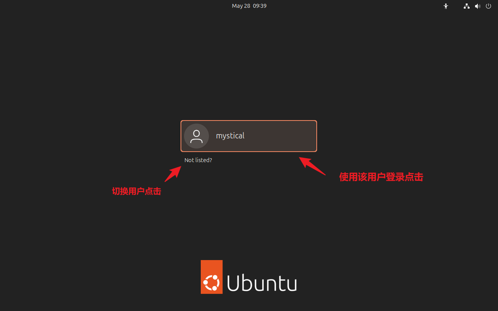
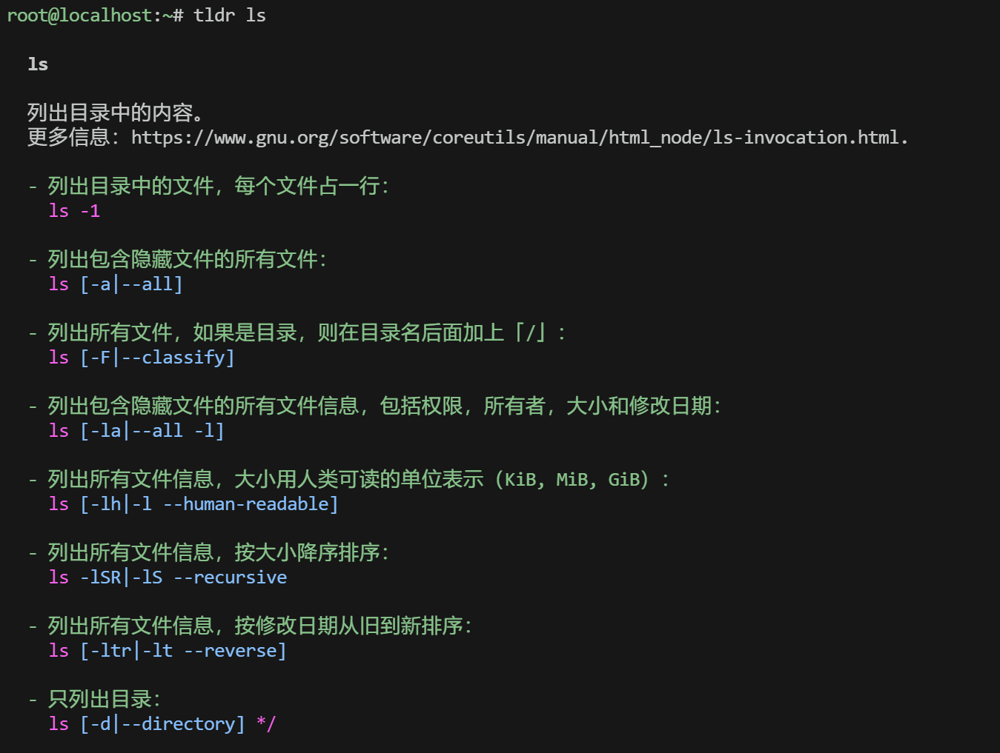

# 1 Linux基础入门和帮助

## 1.1 Linux基础

### 1.1.1 登录方式

#### 1.1.1.1 本地登录

**文本界面登陆**


**图形界面登录**




#### 1.1.1.2 环境初始化

##### 1.1.1.2.1 **桌面版安装 VMware Tools**

```bash
# Ubuntu-desktop版
apt install -y open-vm-tools-desktop

# Ubuntu-desktop版
yum install -y open-vm-tools-desktop
```


##### 1.1.2.2.2 更改ssh服务端配置

**Rocky sshd配置修改**


```bash
# 修改ssh服务端配置文件
[root@localhost ~]# nano /etc/ssh/sshd_config
```


```bash
Ctrl + O 写入 -> Enter回车确认 -> Ctrl + x 退出
```


```bash
# Rocky重启ssh服务
systemctl restart sshd
```


**Ubuntu sshd配置修改**


```bash
# 切换root用户
sudo -i 
# 输入密码
# 编辑ssh服务端配置文件
[root@magedu ~]# nano /etc/ssh/sshd_config

```


```bash
# Ubuntu中重启ssh服务
systemctl restart ssh
```


#### 1.1.1.3 远程登录

远程登录允许用户从其他主机或终端通过网络连接到Linux系统进行登录操作

**登录方式**

**SSH (Secure Shell)**

- 提供加密的远程登录会话，确保数据传输的安全性。SSH是Linux系统中广泛使用的远程登录协议。
- 适用场景：远程服务器管理、远程软件开发、安全的数据传输等。
- 登录方式：使用SSH客户端软件或直接执行 "ssh 用户@地址" 命令进行登录。


**Telnet**

- 一种较旧的远程登录协议，不提供数据加密，因此安全性较低。在现代Linux系统中已较少使用。
- 适用场景：由于安全性问题，不推荐在需要保护数据传输安全性的场景中使用。
- 登录方式：在Linux终端下执行"telnet 地址"命令进行登录。


#### 1.1.1.3 SSH客户端介绍

##### 1.1.1.3.1 XShell


```basic
输入用户名，密码后连接，注意：用户名设置过密码，否则无效
```


##### 1.1.1.3.2 MobaXterm


#### 1.1.1.4 关闭防火墙

##### 1.1.1.4.1 Ubuntu关闭防火墙

```bash
[root@magedu ~]# systemctl disable --now ufw
Synchronizing state of ufw.service with SysV service script with /usr/lib/systemd/systemd-sysv-install.
Executing: /usr/lib/systemd/systemd-sysv-install disable ufw

```


##### 1.1.1.4.2 Rocky关闭防火墙

```bash
# 关闭Selinux
[root@localhost ~]# nano /etc/selinux/config
SELINUX=disabled    # SELINUX的值改为disabled

[root@localhost ~]# setenforce 0

# 关闭防火墙
[root@localhost ~]# systemctl disable firewalld.service 
Removed "/etc/systemd/system/multi-user.target.wants/firewalld.service".
Removed "/etc/systemd/system/dbus-org.fedoraproject.FirewallD1.service".
```


### 1.1.2 Linux用户类型

Linux系统的用户主要分为两大类：root用户和普通用户


#### 1.1.2.1 root用户

Root用户是Linux系统中的超级用户，拥有对系统的完全控制权。它可以执行系统中的任何命令，访问 任何文件，以及更改系统配置。在Linux系统中，root用户的用户ID（UID）是0。


**修改密码**

root用户可以修改所有用户的密码

```bash
# 修改root自身密码
[root@localhost ~]# passwd
更改用户 root 的密码 。
新的密码： 
无效的密码： 密码少于 8 个字符     # 这里的提示可以无视
重新输入新的密码： 
passwd：所有的身份验证令牌已经成功更新。

# 修改其他普通用户密码
# 格式：passwd [username]
[root@localhost ~]# passwd magedu
更改用户 magedu 的密码 。
新的密码： 
无效的密码： 密码少于 8 个字符    # 这里的提示可以无视
重新输入新的密码： 
passwd：所有的身份验证令牌已经成功更新。
```


#### 1.1.2.2 普通用户

普通用户是Linux系统中除了root用户之外的所有用户。它们的权限受到限制，只能访问和操作自己被 授权的文件和目录。普通用户的UID通常大于0，且每个用户都有一个唯一的UID和用户名。


**修改密码**

普通用户只能修改自己的密码，且必须满足密码格式要求

```bash
[magedu@localhost ~]$ passwd
更改用户 magedu 的密码 。
当前的密码： 
新的密码： 
无效的密码： 密码少于 8 个字符     # 普通用户必须满足密码要求
passwd: 鉴定令牌操作错误
[magedu@localhost ~]$ passwd
更改用户 magedu 的密码 。
当前的密码： 
新的密码： 
重新输入新的密码： 
passwd：所有的身份验证令牌已经成功更新。
```


**普通用户提升root用户**

```bash
# Ubuntu
mystical@magedu:~$ sudo -i
[sudo] password for mystical: 
[root@magedu ~]# 


# Rocky9 无法直接使用sudo -i提升，但可以直接使用root用户登录
[magedu@localhost ~]$ sudo -i
[sudo] magedu 的密码：
magedu 不在 sudoers 文件中。此事将被报告。    # 意味着用户 magedu 没有被授权使用 sudo，因此无法执行特权命令（即使你知道密码）。

# 解决方案：
# 在root权限下，执行下列命令
[root@localhost ~]# usermod -aG wheel magedu   # 很多发行版默认允许 wheel 组的用户使用 sudo

# 提升成功
[root@localhost ~]# su - magedu
[magedu@localhost ~]$ sudo -i
[sudo] magedu 的密码：
[root@localhost ~]# 
```


#### 1.1.2.3 用户切换

命令解读

```bash
命令 su 可以切换当前用户身份到另外一个用户
命令 exit 可以回退到刚才的那个用户身份
```


示例

```bash
# 查看当前用户身份
[root@localhost ~]# whoami
root

# 切换到magedu用户
[root@localhost ~]# su magedu
[magedu@localhost root]$ whoami
magedu

# exit退回到root用户
[magedu@localhost root]$ exit
exit
[root@localhost ~]# whoami
root
```


### 1.1.3 终端

#### 1.1.3.1 认识控制台与终端

在计算机发展的最初，有两个最主要的特点：个头大和价格昂贵。在 20 世纪 70 年代 Ken Thompson 在 PDP-11（DEC 公司制造的小型计算机） 上开发 UNIX 系统时，为了解决计算机价格昂贵的问题，他们把 UNIX 设计成了多任务、多用户的操作系统。但是在那个年代所有的机器都非常昂贵，还是为了解决钱的问题，他们选择了一个价格便宜并且可用的机器（ Teletype ASR33）来连接到 PDP-11，使计算机可以让多个人使用。

最初开发 Teletype ASR33（"Teletype" 是一个商标名称。ASR 代表自动发送与接收，即 Automatic Send-Receive）的目的是通过电话线发送和接收消息，所以该机器被称为电传打字机（Teletypewriter 缩写为 **TTY**）


所有的 Teletype 都有一个键盘用于输入和一卷纸用于打印输出。为了存储和读取数据还自带了一个纸带穿孔机和纸带阅读机。它没有屏幕、没有鼠标，也没有声音，但是它经济实惠并且可用。

在 UNIX 系统中，将 Teletype ASR33 称为终端（terminal），而将 PDP-11 称为主机（host）。其中终端只有两个功能：接受输入和打印输出。

在所有连接到主机的终端中，有一台终端比较特殊。可以把它看成是主机的一部分，它是用来管理系统的，这台特殊的终端就是控制台（console）。一台主机只有一个控制台。在启动计算机的时候，所有的信息都会显示到控制台上。在操作计算机的过程中，与终端不相关的信息，比如内核消息，后台服务消息，也会显示到控制台上。

简单来说，控制台是计算机的基本设备，而终端是附加设备。


来感受一下最初的 UNIX 计算机，PDP-11 主机和多个 Teletype ASR33 终端。


#### 1.1.3.2 终端类型

控制台终端：/dev/console

串行终端：/dev/ttyS#，去要在grub中开启，添加`console=ttyS0,115200`

虚拟终端：tty：teletypewriters，/dev/tty#，tty可有n个，**Ctrl + Alt + F#**

伪终端：pty：pseudo-tty，/dev/pts/# 如：SSH远程连接

图形终端：startx，xwindows


#### 1.1.3.3 查看当前的终端设备

tty命令可以查看当前所有终端

```bash
[root@localhost ~]# tty
/dev/pts/1
```


### 1.1.4 交互式接口

交互式接口：启动终端后，在终端设备附加一个交互式应用程序


#### 1.1.4.1 交互式接口类型

- GUI：Graphic User Interface X protocol, window manager, desktop

  GNOME (C, 图形库gtk)

  KDE (C++,图形库qt)

  XFCE (轻量级桌面)


- CLI：Command Line Interface

  Shell程序


#### 1.1.4.2 什么是Shell

Shell 是操作系统（尤其是内核）和用户之间的一个命令解释器/翻译工具，主要负责把人类可读的命令翻译成系统调用或程序执行。

shell也被称为LINUX的命令解释器（command interpreter），Shell 本身是一个程序。将用户输入的命 令行拆解为”命令名“与”参数“。接着，根据命令名找到对应要执行的程序，对被执行的程序进行初始化， 然后将刚才解析出来的参数传给该程序并执行

shell是一种高级程序设计语言，提供了变量，函数，条件判断，循环等开发语言的功能。 

由于Shell本身是个程序，所以它可以被任何用户自己开发的各种Shell所代替。


#### 1.1.4.3 各种Shell


- sh：Steve Bourne   
- bash：Bourne-Again Shell，GPL，CentOS 和 Ubuntu 默认使用 
- csh：c shell , C 语言风格  
- ksh：Korn Shell, AIX 默认 shell
- zsh： MacOS默认shell


#### 1.1.4.4 bash shell

GNU Bourne-Again Shell(bash)是GNU计划中重要的工具软件之一，目前也是 Linux 标准的 shell，与  sh兼容


显示当前使用的 shell

```bash
[root@localhost ~]# echo $SHELL
/bin/bash
```


显示当前系统使用的所有shell

```bash
[root@localhost ~]# cat /etc/shells
/bin/sh
/bin/bash
/usr/bin/sh
/usr/bin/bash
/usr/bin/tmux
/bin/tmux
```


### 1.1.5 登录前提示

``````shell
/etc/issue # 里面的内容会在登录前出现在终端加载页面

vim /etc/issue

##################################################################################
Welcome to the Red Hat training program. Use the following credentials to log in.
Username: your enrollment number
Password: your first name
#################################################################################

``````


### 1.1.6 编辑用户展示公告（登录后提示）

- 概述：

  - /etc/motd 文件的全称是 "Message of the Day"（当日消息）。在Linux和Unix系统中，这个文件的内容会在用户登录到系统后显示在他们的终端上。这为系统管理员提供了一个简单的方法来为登录到系统的用户展示公告、重要消息或任何其他信息。

  - 配置文件

    ``````
    /etc/motd
    ``````

    ``````
    motd网站
    https://www.bootschool.net/ascii-art/search
    ``````

    

- 在VIM中输出彩色字体

  - 步骤：

    ``````
    1. 打开一个新的或现有的 Vim 编辑器：vim filename
    2. 按下 i 进入插入模式。
    3. 按 Ctrl+V 进入 Vim 的特殊字符插入模式。
    4. 接着按 Ctrl+[。这会插入一个 ^[，这实际上是一个转义字符。
    5. 然后直接输入 [32;1m。
    6. 继续输入你的文本，如：Hello, Welcome To My Home - Mystical。
    7. 然后再次按 Ctrl+V 和 Ctrl+[ 插入另一个转义字符。
    8. 接着输入 [0m 来结束彩色输出。
    ``````

  - 示例：

    ``````
    ^[[32;1mHello, Welcome To My Home - Mystical^[[0m
    ``````

    ``````
    ////////////////////////////////////////////////////////////////////
    //                          _ooOoo_                               //
    //                         o8888888o                              //
    //                         88" . "88                              //
    //                         (| ^_^ |)                              //
    //                         O\  =  /O                              //
    //                      ____/`---'\____                           //
    //                    .'  \\|     |//  `.                         //
    //                   /  \\|||  :  |||//  \                        //
    //                  /  _||||| -:- |||||-  \                       //
    //                  |   | \\\  -  /// |   |                       //
    //                  | \_|  ''\---/''  |   |                       //
    //                  \  .-\__  `-`  ___/-. /                       //
    //                ___`. .'  /--.--\  `. . ___                     //
    //              ."" '<  `.___\_<|>_/___.'  >'"".                  //
    //            | | :  `- \`.;`\ _ /`;.`/ - ` : | |                 //
    //            \  \ `-.   \_ __\ /__ _/   .-` /  /                 //
    //      ========`-.____`-.___\_____/___.-`____.-'========         //
    //                           `=---='                              //
    //      ^^^^^^^^^^^^^^^^^^^^^^^^^^^^^^^^^^^^^^^^^^^^^^^^^^        //
    //            佛祖保佑       永不宕机     永无BUG                    //
    ////////////////////////////////////////////////////////////////////
    ``````


### 1.1.7 Prompt提示符

``````shell
# 格式如下：
PS1="提示符格式命令"

# 格式命令如下：
\[  <提示符样式>  \]  # 这个提示符样式外的\[ \] 可以省略

# 提示符样式如下：
\e[ 样式 + 内容 \e[0m # 以 \e[ 开始，\e[0m 表示关闭设置

# 样式分3部分
格式：F;B;Sm
F: 表示前景色
30 黑色，31 红色，32 绿色，33 黄色，34 蓝色，35 紫色，36 青色，37 白色

B：表示背景色，背景色数值 = F + 10

S：显示的样式如下
0：表示关闭颜色设置
1：表示粗体
4：表示加下划线
5：表示闪烁
7：表示前景色，背景色互换
8：表示隐藏

# 内容：
\u: 表示当前用户
\h: 表示主机名简称
\W: 表示当前工作目录基名
\$: 表示提示符(普通用户$ root用户#) 实测在rocky9不好用
\H: 表示完整主机名
\w: 表示完整工作路径
\t: 表示24小时时间格式为：时：分：秒
\A: 表示24小时时间格式为：时：分
\#: 表示开机命令历史数
\d: 表示日期，格式为：星期 月 日
\v: 表示BASH的版本信息
``````


`````
示例：
PS1="PS1="\e[32;40;1m[\d \t \e[31;40;1m\#] \e[33;40;1m\u@\h:\W \$\e[0m""
注意：
实测\$不好用，可以直接在root的目录下的.bashrc文件中改为#
`````


#### 1.1.7.1 CentOS系列

``````bash
# 对所有普通用户生效
vim /etc/profile.d/env.sh  # env.sh自行创建
PS1="\[\e[1;33m\][\u@\h \w] \$\[\e[0m\]"

source env.sh  #使其生效

# 仅对当前用户生效
vim ~/.bashrc
PS1="\[\e[1;33m\][\u@\h \w] \$\[\e[0m\]"
``````


#### 1.1.7.2 Ubuntu系列

``````bash
# 对所有普通用户生效
vim /usr/share/bash-completion/bash_completion

# 在文件下方追加
PS1="\[\e[1;33m\][\u@\h \w] \$\[\e[0m\]"

source /usr/share/bash-completion/bash_completion  #使其生效

# 仅对当前用户生效
vim ~/.bashrc
PS1="\[\e[1;33m\][\u@\h \w] \$\[\e[0m\]"
``````


### 1.1.8 会话管理

命令行的典型使用方式是，打开一个终端窗口（terminal window，以下简称"窗口"），在里面输入命令。用户与计算机的这种临时的交互，称为一次"会话"（session）

会话的一个重要特点是，窗口与其中启动的进程是连在一起的。打开窗口，会话开始；关闭窗口，会话结束，会话内部的进程也会随之终止，不管有没有运行完

一个典型的例子就是，SSH 登录远程计算机，打开一个远程窗口执行命令。这时，网络突然断线，再次登录的时候，是找不回上一次执行的命令的。因为上一次 SSH 会话已经终止了，里面的进程也随之消失 了。

为了解决这个问题，会话与窗口可以"解绑"：窗口关闭时，会话并不终止，继续运行，等到以后需要的时候，再让会话"绑定" 其他窗口

终端复用器软件就是会话与窗口的"解绑"工具，将它们彻底分离。


- 它允许在单个窗口中，同时访问多个会话。这对于同时运行多个命令行程序很有用。
- 它可以让新窗口"接入"已经存在的会话。
- 它允许每个会话有多个连接窗口，因此可以多人实时共享会话。
- 它还支持窗口任意的垂直和水平拆分。


类似的终端复用器还有Screen，Tmux


#### 1.1.8.1 screen

利用screen 可以实现会话管理,如：新建会话,共享会话等

注意：CentOS7 来自于base源，CentOS8 来自于epel源


范例：安装 screen

```bash
# CentOS7 安装screen
[root@centos7 ~]# yum -y install screen

# CentOS8 安装screen
[root@centos8 ~]# dnf -y install epel-release
[root@centos8 ~]# dnf -y install screen

# ubuntu
[root@ubuntu ~]# apt install screen
```


**命令常见用法**：

```bash
screen -S [SESSION]       # 创建新screen会话
screen -x [SESSION]       # 加入screen会话
screen -r [SESSION]       # 恢复某screen会话
screen -ls                 # 显示所有已经打开的screen会话
Ctrl + a, d               # 剥离当前screen会话
exit                      # 退出并关闭screen会话
```


#### 1.1.8.2 tmux


Tmux 是一个终端复用器（terminal multiplexer），类似 screen，但是更易用，也更强大

Tmux 就是会话与窗口的"解绑"工具，将它们彻底分离，功能如下

- 它可以让新窗口"接入"已经存在的会话。它允许在单个窗口中，同时访问多个会话。这对于同时运行多个命令行程序很有用。 
- 它可以让新窗口"接入"已经存在的会话。
- 它允许每个会话有多个连接窗口，因此可以多人实时共享会话。
- 它还支持窗口任意的垂直和水平拆分


##### 1.1.8.2.1 安装tmux

```bash
# Rocky
[root@rocky8 ~]# yum install tmux

# Ubuntu
[root@ubuntu2204 ~]# apt update
[root@ubuntu2204 ~]# apt install tmux
```


启动和退出

```bash
[root@ubuntu2204 ~]# tmux

[root@ubuntu2204 ~]# exit
[exited]
```


tmux 窗口有大量的快捷键。所有快捷键都要通过前缀键唤起。默认的前缀键是 **Ctrl+b** ，即先按下  **Ctrl+b** ，快捷键才会生效。帮助命令的快捷键是 Ctrl+b ? 然后，按下 q 键，就可以退出帮助


##### 1.1.8.2.2 tmux的基本概念


```bat
会话 > 窗口 > 窗格

一个会话可以有多个窗口； 一个窗口可以有多个窗格
```


##### 1.1.8.2.3 查看整体结构

```bat
Ctrl + b s       # 查看整体架构
```


##### 1.1.8.2.4 会话相关操作

###### 查看会话

```bash
[root@localhost ~]# tmux ls
prac: 2 windows (created Tue Jul  8 10:11:14 2025)
prac2: 1 windows (created Tue Jul  8 10:31:39 2025)
prac3: 1 windows (created Tue Jul  8 10:50:57 2025)
```


###### 创建会话

第一个启动的 Tmux 窗口，编号是0，第二个窗口的编号是1，以此类推。这些窗口对应的会话，就是 0号会话、1号会话。使用编号区分会话，不太直观（当然也可以后续在tmux中更改会话名称），更好的方法是为会话起名。下面命令新建一个指定名称的会话。

```bash
tmux new -s <session-name>
```


###### 更改会话名

```bash
# 进入tmux对应会话后，执行
Ctrl + b  $
```


###### 会话间移动

```bash
Ctrl + b (      # 向前移动
Ctrl + b )      # 向后移动

Ctrl + b s      #  直接在面板选择要选定的会话，然后回车进入
```


###### 分离会话

```bash
Ctrl + b d
```


###### 删除会话

```bash
ot@localhost ~]# tmux ls
prac: 2 windows (created Tue Jul  8 10:11:14 2025)
prac2: 1 windows (created Tue Jul  8 10:31:39 2025)
prac3: 1 windows (created Tue Jul  8 10:50:57 2025)

# 删除会话
[root@localhost ~]# tmux kill-session -t 

[root@localhost ~]# tmux ls
prac: 2 windows (created Tue Jul  8 10:11:14 2025)
prac2: 1 windows (created Tue Jul  8 10:31:39 2025)
```


##### 1.1.8.2.5 窗口相关操作

进入会话后，默认有一个窗口


###### 窗口改名

```bash
Ctrl + b ,     # 修改窗口名称
```


###### 创建窗口

```bash
Ctrl + b c   
```


###### 窗口间移动

```bash
Ctrl + b 1|2|3...
```


###### 删除窗口

```bash
Ctrl + b x
```


##### 1.1.8.2.6 窗格相关操作

###### 上下切分窗格

```bash
Ctrl + b "
```


###### 左右切分窗格

```bash
Ctrl + b %
```


###### 光标在窗格间移动

```bash
Ctrl + b ;          # 光标切换到上一个窗格
Ctrl + b o          # 光标切换到下一个窗格

Ctrl + b q [num]    # 光标移动到指定窗格
```


###### 更改窗格大小

```bash
Ctrl+b Ctrl+<arrow key>    #按箭头方向调整窗格大小
```


###### 窗格全屏展示

```bash
Ctrl + b z         #当前窗格全屏显示，再使用一次会变回原来大小
```


###### 删除窗格

```bash
Ctrl + b x
```


## 1.2 常见信息获取

### 1.2.1 查看用户登录信息

- whoami命令：显示当前登录有效用户
- who命令：显示当前所有的登录会话
- w：显示系统当前所有的登录会话及其所做的操作

``````shell
[Fri Oct 13 22:16:15 59] root@rocky9:/ #w
 22:20:10 up 1 day,  4:39,  2 users,  load average: 0.00, 0.00, 0.00
USER     TTY        LOGIN@   IDLE   JCPU   PCPU WHAT
root     pts/0     21:40    0.00s  0.07s  0.00s w
root     pts/1     21:56    7:22   0.03s  0.01s vim ps_demo.txt
``````


### 1.2.2 操作系统版本

- 查看操作系统版本的配置文件

``````
etc/os-release       # 操作系统详细信息

/etc/redhat-release  # 操作系统版本
``````


### 1.2.3 查看硬件信息

#### 1.2.3.1 查看CPU

``````shell
lscpu

cat /proc/cpuinfo
``````


#### 1.2.3.2 查看内存大小

``````shell
lsmem

free -h
free -h -s 1  # 每秒更新一次内存数据
free -h -c 2  # 总共更新几次，默认一秒一次

cat /proc/meminfo
``````


#### 1.2.3.3 查看硬盘及分区情况

``````shell
lsblk

cat /proc/partitions
``````


### 1.2.4 查看系统版本信息

#### 1.2.4.1 查看系统架构

``````
arch
``````

#### 1.2.4.2 查看内核版本

``````
uname -r
``````

#### 1.2.4.3 查看操作系统发行版本

``````shell
# CentOS
cat /etc/redhat-release

cat /etc/os-release

lsb_release -a

#Ubuntu
cat /etc/os-release

cat /etc/issue
``````


### 1.2.5 显示模式切换

- 查看显示模式

``````
runlevel
``````

- 切换显示模式

``````
init 3 # 切换到字符界面

init 5 # 切换到图形化界面
``````


- 永久切换

``````bash
# 从图形界面 --->  命令行界面
rm -rf /etc/systemd/system/default.target
ln -s /usr/lib/systemd/system/multi-user.target /etc/systemd/system/default.target

# 从命令行界面 --->  图形界面
rm -rf /etc/systemd/system/default.target
ln -s /usr/lib/systemd/system/graphical.target /etc/systemd/system/default.target
``````


### 1.2.6 设置主机名hostname

- 配置文件

``````bash
/etc/hostname   #注意：主机名不要使用下划线
``````

``````bash
# 临时设置主机名
hostname 新主机名
``````

- 通过命令修改hostname配置文件

``````bash
hostnamectl set-hostname ubuntu1804.magedu.org
``````

- 在不重启的情况下，是hostname在prompt上生效，最快的方法是开启一个新的终端会话


### 1.2.7 日期时间

#### 1.2.7.1 系统时间

```bash
date  # 查看系统时间

date -R # 显示时区信息

date +%s  # 显示时间戳（从1970年1月1日到当前时间，经过的秒数）

date +"%F %T" # 时间戳格式化，年月日时分秒

# 输出时间
# -d的基本用法：
# date -d "string"

date -d "yesterday"
date -d "now"
date -d "next friday"
date -d "last month"
date -d "2 weeks ago"

# 格式化输出
date -d "2024-01-01" +"%Y-%m-%d"
date -d "next year" +"%A, %d %B %Y"

# 时间计算
date -d "-3 day" +%F

# 修改时间
# date -s "string"

date -s "-1day"
date -s "-1year"
```


##### 1.2.7.1.1 使用date -s 时间修改失败的原因


```ABAP
NTP Service: active -->  ubuntu系统上面有时间同步服务
```

关闭时间同步服务

```bash
root@ubuntu24:~# systemctl stop systemd-timesyncd.service
```


再次演示

```bash
[root@magedu ~] $date
Thu Jun  5 09:58:14 AM CST 2025
[root@magedu ~] $date -s "-1day"
Wed Jun  4 09:58:17 AM CST 2025
[root@magedu ~] $date
Wed Jun  4 09:58:19 AM CST 2025
```


#### 1.2.7.2 时区命令

命令解读

```basic
查看时区的问题
文件：/etc/localtime、/etc/timezone
命令：timedatectl
```

查看系统支持的时区

```bash
[root@rocky9 ~]# timedatectl list-timezones
Africa/Abidjan
Africa/Accra
...
```

查看当前时区信息

```bash
[root@magedu ~]# timedatectl
               Local time: Sat 2025-06-07 10:04:38 CST
           Universal time: Sat 2025-06-07 02:04:38 UTC
                 RTC time: Sat 2025-06-07 02:04:38
                Time zone: Asia/Shanghai (CST, +0800)
System clock synchronized: yes
              NTP service: active
          RTC in local TZ: no
```

```bash
[root@magedu ~] $ll /etc/localtime 
lrwxrwxrwx 1 root root 33 Jun  7 09:49 /etc/localtime -> /usr/share/zoneinfo/Asia/Shanghai
```

修改时区

```bash
#修改时区
[root@rocky9 ~]# timedatectl set-timezone Asia/Shanghai
```


#### 1.2.7.3 显示日历

```bash
# Ubuntu下载 apt install -y ncal
# Rocky不用下载

[root@magedu ~]# cal
     June 2025        
Su Mo Tu We Th Fr Sa  
 1  2  3  4  5  6  7  
 8  9 10 11 12 13 14  
15 16 17 18 19 20 21  
22 23 24 25 26 27 28  
29 30 

[root@magedu ~]# cal 2 2024 # 显示指定月份日历

[root@magedu ~]# cal 2025    # 显示指定年份的12个月的所有日历
                            2025
      January               February               March          
Su Mo Tu We Th Fr Sa  Su Mo Tu We Th Fr Sa  Su Mo Tu We Th Fr Sa  
          1  2  3  4                     1                     1  
 5  6  7  8  9 10 11   2  3  4  5  6  7  8   2  3  4  5  6  7  8  
12 13 14 15 16 17 18   9 10 11 12 13 14 15   9 10 11 12 13 14 15  
19 20 21 22 23 24 25  16 17 18 19 20 21 22  16 17 18 19 20 21 22  
26 27 28 29 30 31     23 24 25 26 27 28     23 24 25 26 27 28 29  
                                            30 31                 

       April                  May                   June          
Su Mo Tu We Th Fr Sa  Su Mo Tu We Th Fr Sa  Su Mo Tu We Th Fr Sa  
       1  2  3  4  5               1  2  3   1  2  3  4  5  6  7  
 6  7  8  9 10 11 12   4  5  6  7  8  9 10   8  9 10 11 12 13 14  
13 14 15 16 17 18 19  11 12 13 14 15 16 17  15 16 17 18 19 20 21  
20 21 22 23 24 25 26  18 19 20 21 22 23 24  22 23 24 25 26 27 28  
27 28 29 30           25 26 27 28 29 30 31  29 30                 
                                                                  

        July                 August              September        
Su Mo Tu We Th Fr Sa  Su Mo Tu We Th Fr Sa  Su Mo Tu We Th Fr Sa  
       1  2  3  4  5                  1  2      1  2  3  4  5  6  
 6  7  8  9 10 11 12   3  4  5  6  7  8  9   7  8  9 10 11 12 13  
13 14 15 16 17 18 19  10 11 12 13 14 15 16  14 15 16 17 18 19 20  
20 21 22 23 24 25 26  17 18 19 20 21 22 23  21 22 23 24 25 26 27  
27 28 29 30 31        24 25 26 27 28 29 30  28 29 30              
                      31                                          

      October               November              December        
Su Mo Tu We Th Fr Sa  Su Mo Tu We Th Fr Sa  Su Mo Tu We Th Fr Sa  
          1  2  3  4                     1      1  2  3  4  5  6  
 5  6  7  8  9 10 11   2  3  4  5  6  7  8   7  8  9 10 11 12 13  
12 13 14 15 16 17 18   9 10 11 12 13 14 15  14 15 16 17 18 19 20  
19 20 21 22 23 24 25  16 17 18 19 20 21 22  21 22 23 24 25 26 27  
26 27 28 29 30 31     23 24 25 26 27 28 29  28 29 30 31           
                      30
```


### 1.2.8 关机与重启

#### 1.2.8.1 关机

```bash
halt
poweroff
init 0
shutdown -h now
```


#### 1.2.8.2 重启

```bash
reboot
init 6
shutdown -r now
```


#### 1.2.8.3 shutdown详解

```bash
shutdown                   # 一分钟后关机
shutdown +10               # 十分钟后关机
shutdown 01:02             # 1点过2分关机
shutdown -r|--reboot       # 一分钟后重启
shutdown -r now            # 现在重启
shutdown -H|--halt         # 一分钟后调用halt关机
shutdown -P|--poweroff     # 一分钟后调用poweroff关机
shutdown -C                # 取消关机计划
```


## 1.3 命令分类与执行过程

### 1.3.1 shell中可执行的两类命令

- 内部命令：指集成在特定shell中的命令，当用户登陆时，会自动启用shell，而对应的shell程序中包含一些常见工具。默认的/bin/bash  shell中就集成了很多内部命令，可以通过enable命令查看所有内部命令

- 查看内部命令

  ```bash
  [root@magedu ~]# enable
  enable .
  enable :
  enable [
  enable alias
  enable bg
  enable bind
  enable break
  enable builtin
  enable caller
  enable cd
  enable command
  enable compgen
  enable complete
  enable compopt
  enable continue
  enable declare
  ......
  ```

  

- 外部命令

  - 概述：所谓外部命令，就是没有集成在shell程序中。具体表现为一个独立的可执行文件。所以外部命令都能在磁盘中找到对应文件

  - 系统查看外部命令的方式

    - 在系统中有一个叫PATH的变量，里面保存外部命令存放的路径。具体路径可以通过下面命令查看，当执行一个外部命令时， 系统会按PATH中存放的目录路径顺序来查找，一旦在某个目录中找到，就停止继续往下找，并执行此外部命令

    ```bash
    [root@magedu ~]# echo $PATH
    /root/.local/bin:/root/bin:/usr/local/sbin:/usr/local/bin:/usr/sbin:/usr/bin
    ```

  - 查看外部命令存放路径

    - which
    - whereis：除了命令外，还显示和命令相关的帮助文档等文件路径

    ```bash
    [root@magedu ~]# which gcc
    /usr/bin/gcc
    
    [root@magedu ~]# whereis gcc
    gcc: /usr/bin/gcc /usr/lib/gcc /usr/libexec/gcc /usr/share/man/man1/gcc.1.gz /usr/share/info/gcc.info.gz
    ```

  - 当第一次执行外部命令后，系统会自动将外部的路径记录到内存缓存区中，下次再执行此外部命令，将会从缓存区中找到路径， 直接到对应的磁盘路径找到此命令并执行。通过hash命令可以查看到已执行过的外部命令及路径

    ```bash
    [root@magedu ~]# hash
    hits	command
       1	/usr/bin/mesg
       1	/usr/bin/vim
    
    ```

  - shell 的 hash 表机制主要用于跟踪和缓存 `$PATH`环境变量指定的目录中找到的命令的位置。非`$PATH`记录的路径下的程序，执行后也不会记录在hash中 


### 1.3.2 别名

- 概述：所谓别名，就是将一些常用的内部或外部命令，起一个较短的名称，这样每次执行这些常用命令时，就可以用别名替代

- 管理和查看别名

  ```bash
  # 查看所有别名
  $ alias
  
  # 查看指定别名
  $ alias 别名
  
  # 定义别名
  $ alias 别名="命令"
  
  # 取消别名
  $ unlias 别名
  ```

- 上述命令都是使别名临时生效，如果要使别名永久生效，需要写入配置文件(.bashrc)中

  - 仅对当前用户有效，写入 ~/.bashrc
  - 对所有人有效，写入 /etc/.bashrc
  - 启用配置文件：`source 文件名` 或  `. 文件名`

- 执行和别名相同的命令时，需要 `\别名` 或`'别名'` 或 `"别名"` 或 `command 别名`


### 1.3.3 指令执行过程

1. 先判断是内部命令还是外部命令

2. 如果是内部命令：直接执行

   如果是外部命令：先去hash里找，是否有该命令记录，如果没有，去PATH路径下找，如果还没有，则报错，command not found；如果找到， 则直接执行，并将可执行文件的路径记录到hash中

3. 如果hash中有该指令路径，但是该指令路径已经转移，即使转移到了PATH路径下，仍然会报错，不存在该文件/目录，此时应清空hash值，重新执行指令

4. 清空hash值的方法

   ```bash
   # 更新（更改）PATH路径：会自动清空hash记录
   bash: hash -r
         hash -d <指定路径>
         hash -l <查看hash表详细数据>
         
   csh：rehash
   ```


#### 1.3.3.1 相关实验

```bash
ls  # 执行ls，并在hash中留有记录
# 将ls转移到其他的$PATH路径下
mv /usr/bin/ls /usr/sbin/

# 执行ls显示失败
[root@mystical /usr/share/bash-completion] $ls
-bash: /usr/sbin/ls: No such file or directory

# 清空hash，则会重新去$PATH找该指令
hash -r

# 在执行即可成功
[root@mystical /usr/share/bash-completion] $ls
bash_completion  completions  helpers
```


#### 1.3.3.2 扩展问题

echo是shell内置命令，但是/usr/bin/echo，也存在独立与shell的外部命令echo，存在这个现象的原因

```basic
独立的非内置的 echo 存在有几个原因，主要是为了提供兼容性、标准化以及在特定情况下的灵活性。以下是一些具体的原因：

1. 标准化和兼容性
POSIX 标准：/usr/bin/echo 程序通常会遵循 POSIX 或其他相关标准，确保在不同的 Unix-like 系统上有一致的行为。
脚本兼容性：在编写可移植的 shell 脚本时，依赖于标准的 /usr/bin/echo 可能比使用特定 shell 的内置 echo 更可靠。

2. 独立于 Shell
不依赖于特定的 shell：独立的 echo 可以在没有启动 shell 的情况下直接执行，这对于某些脚本或系统程序很有用，尤其是在资源有限或需要避免启动完整 shell 会话的环境中。

3. 特定功能的需要
功能差异：不同的 shell 可能会在其内置的 echo 中实现不同的功能或选项。独立的 /usr/bin/echo 程序提供了一个统一的选项集，这可能在跨不同 shell 环境工作时非常有用。

4. 历史原因
遗留系统：在早期的 Unix 系统中，很多现在被认为是内置命令的工具最初是作为独立的程序存在的。随着时间的推移，为了性能和便利性，许多这样的程序被内置到了 shell 中。但是，独立的版本仍然被保留，以保证兼容性和符合标准。
```


#### 1.3.3.3 POSIX标准

```basic
POSIX 标准的主要内容包括：

1. 系统调用和库：定义了一系列的 API，包括文件操作、进程控制、线程管理、输入/输出等。

2. Shell 和工具：规定了 shell 的行为和一些基本的命令行工具，如 ls、echo 和 grep 等。

3. 程序编程接口（API）：为 C 语言提供了一套标准的库函数接口，用于实现系统服务。

4. 用户和软件环境：包括了用户环境的配置、软件包管理等方面的标准。

POSIX 标准的意义：

1. 兼容性：POSIX 标准化了 UNIX 系统的核心接口，使得开发者可以编写可在不同 UNIX 系统之间移植的程序。

2. 一致性：通过遵循 POSIX 标准，操作系统厂商可以确保他们的系统提供一致的行为和服务。

3. 可移植性：对于软件开发者来说，POSIX 提供了一套稳定的、不依赖于特定系统的接口，大大提高了代码的可移植性。

4. 在实际应用中，虽然大多数类 UNIX 系统都遵循 POSIX 标准的大部分内容，但很少有系统是完全符合所有 POSIX 规范的。许多系统提供了超出 POSIX 标准的额外功能和扩展，但核心接口和服务通常保持一致。因此，POSIX 标准是理解和使用 UNIX 系统的基础，并且对于确保不同系统之间软件的兼容性和可移植性至关重要。
```


## 1.4 字符集和编码及语言环境

许多场合下，字符集与编码这两个概念常被混为一谈，但两者是有差别的。字符集与字符集编码是两个 不同层面的概念

charset是character set的简写，即字符集，即二进制和字符的对应关系，不关注最终的存储形式

encoding是charset encoding的简写，即字符集编码，简称编码，实现如何将字符转化为实际的二进制 进行存储，编码决定了空间的使用的大小


计算机二进制，起源于美国


### 1.4.1 ASCII码

计算机内部，所有信息最终都是一个二进制值。上个世纪60年代，美国制定了一套字符编码，对英语字 符与二进制位之间的关系，做了统一规定，即ASCII（American Standard Code for Information   Interchange） 码

ASCII 码一共规定了128个字符的编码，占用了一个字节的后面7位，最前面的一位统一规定为 0


#### 1.4.1.1 查看ASCII表

```bash
[root@localhost ~/test]# yum install -y man-pages

[root@localhost ~/test]# man ascii
AME
       ascii - ASCII character set encoded in octal, decimal, and hexadecimal

DESCRIPTION
       ASCII  is  the  American  Standard Code for Information Interchange.  It is a 7-bit code.  Many 8-bit
       codes (e.g., ISO 8859-1) contain ASCII as their lower half.  The international counterpart  of  ASCII
       is known as ISO 646-IRV.

       The following table contains the 128 ASCII characters.

       C program '\X' escapes are noted.
                                                   │
       Oct   Dec   Hex   Char                      │ Oct   Dec   Hex   Char
       ────────────────────────────────────────────┼───────────────────────────
       000   0     00    NUL '\0' (null character) │ 100   64    40    @
       001   1     01    SOH (start of heading)    │ 101   65    41    A
       002   2     02    STX (start of text)       │ 102   66    42    B
       003   3     03    ETX (end of text)         │ 103   67    43    C
       004   4     04    EOT (end of transmission) │ 104   68    44    D
......
```


### 1.4.2 Unicode

由于计算机是美国人发明的，因此，最早只有128个字符被编码到计算机里，即ASCII编码，但是要处理 中文显然一个字节是不够的，至少需要两个字节，而且还不能和ASCII编码冲突，所以，中国制定了  GB2312编码，用来把中文编进去。

全世界有上百种语言，日本把日文编到Shift_JIS里，韩国把韩文编到Euc-kr里，各国有各国的标准，就会 不可避免地出现冲突，结果就是，在多语言混合的文本中，显示出来会有乱码

为了表示世界上所有语言中的所有字符。每一个符号都给予一个独一无二的编码数字，Unicode 是一个 很大的集合，现在的规模可以容纳100多万个符号。Unicode 仅仅只是一个字符集，规定了每个字符对 应的二进制代码，至于这个二进制代码如何存储则没有规定


#### 1.4.2.1 Unicode编码方案

- UTF-8：  变长，1到4个字节
- UTF-16：变长，2或4个字节
- UTF-32：固定长度，4个字节

UTF-8 是目前互联网上使用最广泛的一种 Unicode 编码方式，可变长存储。使用 1- 4 个字节表示一个字 符，根据字符的不同变换长度。编码规则如下:

- 对于单个字节的字符，第一位设为 0，后面的 7 位对应这个字符的 Unicode 码。因此，对于英文中的 0  - 127 号字符，与 ASCII 码完全相同。这意味着 ASCII 码的文档可用 UTF-8 编码打
- 对于需要使用 N 个字节来表示的字符（N > 1），第一个字节的前 N 位都设为 1，第 N + 1 位设为0，剩余的 N - 1 个字节的前两位都设为 10，剩下的二进制位则使用这个字符的 Unicode 码来填充


#### 1.4.2.2 UTF-8编码流程

以 Unicode 码点编号：“中” 为例

```vb
字符 "中" 在 Unicode 中的编号是：
十进制：20013
十六进制：U+4E2D

```

- U+4E2D = 十进制 20013

- 超过 0x0800，需要 3 字节表示 → UTF-8 格式：`1110xxxx 10xxxxxx 10xxxxxx`

- 填入码点的二进制（0000 0100 1110 0010 1101）→ 取后 16 位 → 填入：

```bash
11100100 10111000 10101101
   E4        B8        AD
```


#### 1.4.2.3 UTF-16编码流程

码点在基本多文种平面内（BMP），直接存储 → 就是 `4E 2D`

二进制是：`01001110 00101101`


### 1.4.3 语言环境

默认系统为英文环境，可以修改为中文环境，从而查看帮助或提示可以变为中文

范例：临时修改LANG变量实现中文语言提示

```bash
[root@localhost ~/test]# echo $LANG
en_US.UTF-8             # 英文是en_US.UTF-8

[root@centos7 ~]#magedu
-bash: magedu: command not found

[root@centos7 ~]#LANG=zh_CN.UTF-8

[root@centos7 ~]#echo $LANG
zh_CN.UTF-8

[root@centos7 ~]#magedu
-bash: magedu: 未找到命
```

```bash
[root@localhost ~/test]# localectl list-locales 
C.UTF-8
aa_DJ.UTF-8
aa_ER.UTF-8
aa_ER.UTF-8@saaho
aa_ET.UTF-8
af_ZA.UTF-8
agr_PE.UTF-8
ak_GH.UTF-8
am_ET.UTF-8
an_ES.UTF-8
......

# 如果没有中文包，安装
[root@localhost ~/test]# yum install -y langpacks-zh_CN.noarch

# 通过方法
[root@rocky8 ~]#localectl set-locale LANG=zh_CN.utf8

#或者下面方式,CentOS8支持,但ubuntu和Centos7不支持,不建议使用
[root@rocky8 ~]#localectl set-locale zh_CN.utf8

[root@localhost ~/test]# localectl status
System Locale: LANG=zh_CN.UTF-8
    VC Keymap: us
   X11 Layout: us
   
[root@rocky8 ~]#echo $LANG
 zh_CN.utf8
 
#重新登录后可以看到中文环境
[root@rocky8 ~]#exit
```


范例: Ubuntu 修改语言环境为中文

```bash
[root@ubuntu2204 ~]# localectl status
   System Locale: LANG=en_US.UTF-8
       VC Keymap: n/a
      X11 Layout: us
       X11 Model: pc105
       
[root@ubuntu2204 ~]# apt install language-pack-zh-hans -y

[root@ubuntu2204 ~]# localectl list-locales
C.UTF-8
en_US.UTF-8
zh_CN.UTF-8
zh_SG.UTF-8
......

[root@ubuntu2204 ~]# localectl set-locale LANG=zh_CN.utf8
```


## 1.5 文本管理

### 1.5.1 文件查看

#### 1.5.1.1 文件查看 cat

cat 可以查看文本内容

```bat
命令格式
	cat [OPTION]... [FILE]...
常见选项
	-n|--number                    #对显示出的每一行进行编号
一般选项
	-E|--show-ends                 #显示行结束符$
	-A|--show-all                  #显示所有控制符
	-b|--number-nonblank           # 非空行编号
	-s|--squeeze-blank             # 压缩连续的空行成一行
```

cat命令实践

```bash
[root@magedu ~]# cat /etc/fstab 
# /etc/fstab: static file system information.
#
# Use 'blkid' to print the universally unique identifier for a
# device; this may be used with UUID= as a more robust way to name devices
# that works even if disks are added and removed. See fstab(5).
#
# <file system> <mount point>   <type>  <options>       <dump>  <pass>
# / was on /dev/sda2 during curtin installation
/dev/disk/by-uuid/0a79113d-8e15-4ad2-944d-701c83b23c24 / ext4 defaults 0 1
/swap.img	none	swap	sw	0	0


# 显示所有字符（包含隐藏字符）
[root@magedu ~]# cat -A /etc/fstab 
# /etc/fstab: static file system information.$
#$
# Use 'blkid' to print the universally unique identifier for a$
# device; this may be used with UUID= as a more robust way to name devices$
# that works even if disks are added and removed. See fstab(5).$
#$
# <file system> <mount point>   <type>  <options>       <dump>  <pass>$
# / was on /dev/sda2 during curtin installation$
/dev/disk/by-uuid/0a79113d-8e15-4ad2-944d-701c83b23c24 / ext4 defaults 0 1$
/swap.img^Inone^Iswap^Isw^I0^I0$


# 查看时显示行号
[root@magedu ~]# cat -n /etc/fstab 
     1	# /etc/fstab: static file system information.
     2	#
     3	# Use 'blkid' to print the universally unique identifier for a
     4	# device; this may be used with UUID= as a more robust way to name devices
     5	# that works even if disks are added and removed. See fstab(5).
     6	#
     7	# <file system> <mount point>   <type>  <options>       <dump>  <pass>
     8	# / was on /dev/sda2 during curtin installation
     9	/dev/disk/by-uuid/0a79113d-8e15-4ad2-944d-701c83b23c24 / ext4 defaults 0 1
    10	/swap.img	none	swap	sw	0	0
```


#### 1.5.1.2 tac和rev逆向

tac 逆向显示文件内容

```bat
命令格式：
	tac [OPTION]... [FILE]...
```

rev 内容逆向显示，行内容也逆向显示

```bat
命令格式：
	rev [OPTION]... [FILE]...
```

示例：

```bash
[root@magedu ~]# cat a.txt 
123
abc
xyz
[root@magedu ~]# tac a.txt 
xyz
abc
123
[root@magedu ~]# rev a.txt 
321
cba
zyx
```


#### 1.5.1.3 信息过滤 grep

grep 负责从数据源中检索对应的字符串，行过滤（简单使用，后续详解）

```bat
命令格式
	grep options 'keys' filename
常见选项:
	-i: 不区分大小写
	-n: 显示行号
	-r: 逐层遍历目录查找
	-v: 查找不包含指定内容的行,反向选择
	-E:使用扩展正则匹配
	^key:以关键字开头
	key$:以关键字结尾
	^$:匹配空行

一般选项：
	-A: 显示匹配行及后面多少行
	-B: 显示匹配行及前面多少行
	-C: 显示匹配行前后多少行
```

示例

```bash
[root@magedu ~]# cat a.txt 
123
abc
xyz
[root@magedu ~]# grep a a.txt 
abc
```


### 1.5.2 分页查看

#### 1.5.2.1 more解读

more 可以实现分页查看文件，可以配合管道实现输出信息的分页

```bat
命令格式
	more [OPTIONS...] FILE...

常用选项
	-d              # 在底部显示提示
	-s              # 压缩连续空行
	
常用动作
	空格键           # 翻页
	回车键           # 下一页
	q               # 退出
	
其他动作
	!cmd            # 执行命令，在查看文档的时候，执行相关的命令
	h               # 显示帮助
	:f              # 显示文件名和当前行号
	=               # 显示行号
```

示例

```bash
[root@magedu ~]# more /var/log/syslog
2025-06-08T14:12:26.537269+08:00 magedu rsyslogd: [origin software="rsyslogd" swVersion="8.2312.0" 
x-pid="1309" x-info="https://www.rsyslog.com"] rsyslogd was HUPed
2025-06-08T14:12:26.538899+08:00 magedu snapd[1277]: overlord.go:284: Acquiring state lock file
2025-06-08T14:12:26.538955+08:00 magedu snapd[1277]: overlord.go:289: Acquired state lock file
2025-06-08T14:12:26.543807+08:00 magedu systemd[1]: logrotate.service: Deactivated successfully.
2025-06-08T14:12:26.544050+08:00 magedu systemd[1]: Finished logrotate.service - Rotate log files.
2025-06-08T14:12:26.547989+08:00 magedu systemd[1]: Finished setvtrgb.service - Set console scheme.
2025-06-08T14:12:26.559757+08:00 magedu systemd[1]: Created slice system-getty.slice - Slice /syste
m/getty.
......
```


#### 1.5.2.2  less解读

less 也可以实现分页查看文件或STDIN输出，less 命令是man命令使用的分页器

```bat
命令格式
	less [OPTIONS...] FILE...

常用选项
	-e          #显示完成后自动退出
	-N          #显示行号
	-s          #压缩连续空行
	-S          #不换行显示较长的内容

查看动作
	:h          # 显示帮助
	/string     # 搜索
	:!cmd       # 执行命令
	b           # 向上翻
	q           # 退出
```

示例

```bash
# 分页查看的时候，显示行号
[root@magedu ~]# less -N /var/log/auth.log
```


### 1.5.3 头尾查看

#### 1.5.3.1 head命令

head 可以显示文件或标准输入的前面行

```bat
命令格式
	head [OPTION]... [FILE]...

常用选项
-n|--lines=N              #指定获取前N行,N如果为负数,表示从文件头取到倒数第N前

一般选项
-c|--bytes=N              #指定获取前N字节
```

示例

```bat
默认查看文件的前10行的内容
[root@magedu ~]# head /etc/passwd
root:x:0:0:root:/root:/bin/bash
daemon:x:1:1:daemon:/usr/sbin:/usr/sbin/nologin
bin:x:2:2:bin:/bin:/usr/sbin/nologin
sys:x:3:3:sys:/dev:/usr/sbin/nologin
sync:x:4:65534:sync:/bin:/bin/sync
games:x:5:60:games:/usr/games:/usr/sbin/nologin
man:x:6:12:man:/var/cache/man:/usr/sbin/nologin
lp:x:7:7:lp:/var/spool/lpd:/usr/sbin/nologin
mail:x:8:8:mail:/var/mail:/usr/sbin/nologin
news:x:9:9:news:/var/spool/news:/usr/sbin/nologin

-n 指定显示的行数
[root@magedu ~]# head -n3 /etc/passwd
root:x:0:0:root:/root:/bin/bash
daemon:x:1:1:daemon:/usr/sbin:/usr/sbin/nologin
bin:x:2:2:bin:/bin:/usr/sbin/nologin

-c 指定字符串数量进行截取
[root@magedu ~]# head -c5 /etc/passwd
root:
```


#### 1.5.3.2 tail命令

tail 和 head 相反，查看文件或标准输入的倒数行

```bat
命令格式
tail [OPTION]... [FILE]...

常用选项
-n|--lines=N              #指定获取后N行,如果写成+N,表示从第N行开始到文件结束

一般选项
-c|--bytes=N              #指定获取后N字节
-f|--follow=descriptor    #跟踪显示文件fd新追加的内容,常用日志监控
```

示例

```bat
[root@magedu ~]# tail /etc/passwd
saned:x:112:116::/var/lib/saned:/usr/sbin/nologin
lightdm:x:113:117:Light Display Manager:/var/lib/lightdm:/bin/false
cups-pk-helper:x:114:119:user for cups-pk-helper service,,,:/nonexistent:/usr/sbin/nologin
rtkit:x:115:120:RealtimeKit,,,:/proc:/usr/sbin/nologin
colord:x:116:121:colord colour management daemon,,,:/var/lib/colord:/usr/sbin/nologin
pulse:x:117:122:PulseAudio daemon,,,:/run/pulse:/usr/sbin/nologin
cups-browsed:x:118:119::/nonexistent:/usr/sbin/nologin
kernoops:x:119:65534:Kernel Oops Tracking Daemon,,,:/:/usr/sbin/nologin
speech-dispatcher:x:120:29:Speech Dispatcher,,,:/run/speech-dispatcher:/bin/false
hplip:x:121:7:HPLIP system user,,,:/run/hplip:/bin/false

[root@magedu ~]# tail -n3 /etc/passwd
kernoops:x:119:65534:Kernel Oops Tracking Daemon,,,:/:/usr/sbin/nologin
speech-dispatcher:x:120:29:Speech Dispatcher,,,:/run/speech-dispatcher:/bin/false
hplip:x:121:7:HPLIP system user,,,:/run/hplip:/bin/false
```


### 1.5.4 文件编辑器安装与基本使用

#### 1.5.4.1 nano编辑器安装步骤

nano简介

```bat
	nano 是一个小巧而友好的文本编辑器，它专为 UNIX 和类 UNIX 系统（如 Linux）设计。尽管它的功能不如一些更复杂的编辑器（如 vim 或 emacs）丰富，但 nano 因其简单直观的用户界面而广受欢迎，特别是对于初学者和系统管理员来说，它提供了一种快速而简便的方式来编辑配置文件或编写脚本。
```

使用方法

```bat
编辑文件
nano [文件名]
编辑操作
Ctrl + O: 保存文件
Ctrl + X: 退出编辑器
Ctrl + W: 搜索文本
```

文件操作流程

```bat
1 nano 文件名
2 正常的编辑内容
3 Ctrl + O 保存文件
	- 修改文件名 | 确认文件名
	- Enter 保存
4 Ctrl + X 退出编辑器
```


#### 1.5.4.2 vim编辑器的基本操作

vim简介

```bat
Vim（Vi IMproved）是一种基于命令行的文本编辑器，它在Vi的基础上进行了改进和扩展，成为了类Unix系统用户中非常受欢迎和广泛使用的编辑器之一。
```

使用方式

```bat
编辑文件
vi | vim [文件名]
编辑操作
	a | i | o   ： 进入编辑文件模式。
	Esc         ： 退出编辑模式。
	:wq         ： 保存文件
	:q          ： 撤销保持文件
```

文件操作流程

```bat
1 vim 文件名
2 按 a | i | o 进入编辑文件模式
	- 正常的编辑内容
3 Esc 退出编辑模式。
4 输入 :wq ，进行文件保存
```


## 1.6 输出格式化

### 1.6.1 echo解读

#### 1.6.1.1 echo命令

命令简介

```bat
echo命令的功能是将内容输出到默认显示设备，一般起到一个提示的作用。
```

```bat
OPTIONS：
-n  不要在最后自动换行
-e  若字符串中出现以下字符，则特别加以处理，而不会将它当成一般文字输出

常用转义字符：
\n             # 换行且光标移至行首;
\t             # 插入tab
```


#### 1.6.1.2 echo实践

实践1 - 引号信息输出

```bat
通过引号的错开实现引号的输出
[root@rocky9 ~]# echo "I'm a king of the world."
I'm a king of the world.
```

实践2 - 特殊符号的输出

```bat
使用 -e 选项启用转义字符的解析
[root@rocky9 ~]# echo -e "The 2021 State of DevOps Report\n\t- is here"
 The 2021 State of DevOps Report
        - is here
```

实践3 - 内容的拼接

```bat
使用 -n 选项启用信息输出不换行
[root@rocky9 ~]# echo -n hello;echo world
helloworld
```


### 1.6.2 字体颜色

```bat
# 提示符样式如下：
\e[ 样式 + 内容 \e[0m # 以 \e[ 开始，\e[0m 表示关闭设置

# 样式分3部分
格式：F;B;Sm
F: 表示前景色
30 黑色，31 红色，32 绿色，33 黄色，34 蓝色，35 紫色，36 青色，37 白色

B：表示背景色，背景色数值 = F + 10

S：显示的样式如下
0：表示关闭颜色设置
1：表示粗体
4：表示加下划线
5：表示闪烁
7：表示前景色，背景色互换
8：表示隐藏
```

示例：


```bash
[root@magedu ~]# echo -e "\e[1;31mhello,\e[1;33mworld\e[0m"
[root@magedu ~]# echo -e "\e[1;42;31mhello,\e[1;44;33mworld\e[0m"
```


## 1.7 获得帮助


**获取帮助的能力决定了技术的能力！**


- whatis & whereis 命令
- command --help 选项
- man 手册
- 程序自带文档 /usr/share/doc
- 项目官网文档
- 行业网站
- 搜索引擎


### 1.7.1 whatis & whereis

whatis 使用数据库来显示命令的简短描述，以及对应的man手册的章节

刚装完系统此命令不可用，其数据要进行初始化

如果要立即使用，则可手动初始化

```bash
# CentOS 7 版本以后
mandb

# CentOS 6 版本之前
makewhatis
```


示例

```bash
[root@magedu cache]# whatis ls
ls (1)               - list directory contents
ls (1p)              - list directory contents

[root@magedu cache]# mandb
正在删除 /usr/share/man/overrides 里的旧数据库条目...
正在处理 /usr/share/man/overrides 下的手册页...
正在删除 /usr/share/man 里的旧数据库条目...
正在处理 /usr/share/man 下的手册页...
正在删除 /usr/share/man/overrides 里的旧数据库条目...
......
```


whereis 可以列出命令或系统文件路径，以及其对应的man 手册中的文档路径

```bash
[root@magedu cache]# whereis ls
ls: /usr/bin/ls /usr/share/man/man1/ls.1.gz /usr/share/man/man1p/ls.1p.gz

[root@magedu cache]# whereis passwd
passwd: /usr/bin/passwd /etc/passwd /usr/share/man/man5/passwd.5.gz /usr/share/man/man1/passwd.1ossl.gz /usr/share/man/man1/passwd.1.gz
```


### 1.7.2 查看命令的帮助

#### 1.7.2.1 内部命令帮助

格斯：

```ABAP
help COMMAND
```


范例：

```bash
# 直接help，查看所有内部命令帮助
[root@magedu cache]# help

[root@magedu ~]# type history
history is a shell builtin

[root@magedu ~]# help history
history: history [-c] [-d offset] [n] or history -anrw [filename] or history -ps arg [arg...]
    Display or manipulate the history list.
......
```


#### 1.7.2.2 外部命令及软件帮助

格式：

```bash
COMMAND --help|-h

man COMMAND

info COMMAND

#程序自身的帮助文档：README、INSTALL、ChangeLog 等

#项目官网文档

#行业网站

# 搜索引擎
```


### 1.7.3 外部命令的 --help 或 -h 选项

显示用法总结和参数列表，大多数命令使用，但并非所有的

范例

```bash
[root@magedu ~]# ls --help
Usage: ls [OPTION]... [FILE]...
List information about the FILEs (the current directory by default).
Sort entries alphabetically if none of -cftuvSUX nor --sort is specified.

Mandatory arguments to long options are mandatory for short options too.
  -a, --all                  do not ignore entries starting with .
  -A, --almost-all           do not list implied . and ..
......


[root@magedu ~]# cal -h

Usage:
 cal [options] [[[day] month] year]
 cal [options] <timestamp|monthname>

Display a calendar, or some part of it.
Without any arguments, display the current month.

Options:
 -1, --one             show only a single month (default)
 -3, --three           show three months spanning the date
......
```

| 常见用法 | 含义                           |
| -------- | ------------------------------ |
| []       | 表示是可选项                   |
| CAPS或<> | 表示变化的数据                 |
| ...      | 表示是一个列表，即可以有多个值 |
| x\|y\|z  | x 或 y 或 z                    |
| -abc     | -a -b -c，多选项写一起         |
| {}       | 表示分组                       |


### 1.7.4 man命令

man 是单词 manual 的简写，是Linux系统中的帮助手册和文档

man 是一个外部命令，基本质就是读取特定文件，进行输出，其读取的文件一般位于**/usr/share/man/**  目录下

新安装一个软件或程序后，对应的man手册也会放到/usr/share/man/目录下

几乎每个命令都有man的 “页面”


安装

```bash
[root@magedu ~]# yum install -y man-pages
```


**标准man手册一般有以下几个章节**

1. 可执行程序或shell命令
2. 系统调用（内核提供的函数）
3. 库调用（程序库中的函数）
4. 特殊文件（通常位于/dev）
5. 文件格式和规范，如 /etc/passwd
6. 游戏
7. 杂项
8. 系统管理命令（通常只针对 root 用户）
9. 内核API


**man 命令的配置文件**

```bash
#CentOS 6 之前版 man 的配置文件
/etc/man.config

#CentOS 7 之后版 man 的配置文件
/etc/man_db.conf

#ubuntu man 的配置文件
/etc/manpath.config
```


**man命令常见用法**

```bash
#man[选项...] [章节] 手册页...

man passwd                           # 默认打开第一章帮助
man 5 passwd                         # 指定第五章帮助
man 9 passwd                         # 总共9个章节，中间的数字不能超过9，如果要找的章节里面没有对应的内容，则会提示没有
man 10 passwd                        # 总共9个章节，中间的数字不能超过9，如果是数字大于9，则直接定位到最小的章
man -a passwd                        # 打开所有帮助
man -f passwd                        # 显示passwd 相关的章节，相当于 whatis passwd
man -k passwd                        # 在man 手册中搜索所有与passwd 相关的内容，使用 whatis 数据库

man -w ls                            # 显示ls的man 文件路径
man -aw passwd                       # 显示所有跟passwd有关的man文件路径
man -w 5 passwd                      # 显示第5章的passwd的man文件路径
man -M /usr/local/share/man/zh_CN    #显示中文man 的内容
```


**man命令操作**

常见操作

```bat
/KEYWORD     根据KEYWORD关键字，从当前位置向后搜索；不区分字符大小写
?KEYWORD     根据KEYWORD关键字，从当前位置向前搜索；不区分字符大小写 
q            退出
```

其他操作

```bat
#：跳转至第#行
1G: 回到文件首部
G：翻至文件尾部
space, ^v, ^f, ^F: 向文件尾翻屏
b, ^b: 向文件首部翻屏
d, ^d: 向文件尾部翻半屏
u, ^u: 向文件首部翻半屏
RETURN, ^N, e, ^E or j or ^J: 向文件尾部翻一行 
y or ^Y or ^P or k or ^K：向文件首部翻一行
```


**man命令参数**

```bat
列出所有帮助
	man -a keyword

搜索man手册所有匹配的页面
	man -k keyword

打印keyword的man帮助文件的路径
	man -w keyword
```


范例：直接打开man的帮助文件

```bash
[root@ubuntu2204 ~]# man -w ls
/usr/share/man/man1/ls.1.gz

[root@ubuntu2204 ~]# file /usr/share/man/man1/ls.1.gz 
/usr/share/man/man1/ls.1.gz: gzip compressed data, max compression, from Unix, 
original size modulo 2^32 8049

#直接打开man的gz压缩格式文档
[root@ubuntu2204 ~]# man /usr/share/man/man1/ls.1.gz

#直接打开man格式文档
[root@ubuntu2204 ~]# file /root/nginx-1.22.1/man/nginx.8 
/root/nginx-1.22.1/man/nginx.8: troff or preprocessor input, ASCII text

[root@ubuntu2204 ~]# man -l /root/nginx-1.22.1/man/nginx.8
```


**CentOS / Rocky / RHEL**

<span style="color:#EB992D;font-weight:700">安装中文语言包</span>

```go
dnf install langpacks-zh_CN
```
如果你需要简体中文的所有翻译包（包括各种程序）：
```go
dnf install langpacks-zh_CN glibc-langpack-zh
```
**这两个包的作用：**

| 包名                  | 功能                                       |
| --------------------- | ------------------------------------------ |
| **langpacks-zh_CN**   | 多数程序的中文界面翻译（gettext .mo 文件） |
| **glibc-langpack-zh** | glibc 的中文 locale（星期、日期格式）      |


<span style="color:#EB992D;font-weight:700">安装中文 man 文档</span>

使用第三方开源中文 man 项目（推荐）

编译安装 OpenCC
```bash
git clone https://github.com/BYVoid/OpenCC.git                  
chown -R $USER:$USER OpenCC 
cd OpenCC/
mkdir build
cd build
cmake -DCMAKE_BUILD_TYPE=Release ..
make -j"$(nproc)"
make install
```
把 /usr/local/lib（或 lib64）加入动态库搜索路径
```bash
bash -c 'cat >/etc/ld.so.conf.d/opencc.conf <<EOF
/usr/local/lib
/usr/local/lib64
EOF'

ldconfig

# 查看
ldconfig -p | grep opencc
```
GitHub 项目：`man-pages-zh`：
```go
git clone https://github.com/man-pages-zh/manpages-zh
cd manpages-zh
mkdir build
cd build
cmake ..
make
make install
```
这会将中文 man 文档安装到：
```go
/usr/local/share/man/zh_CN/
```


**Ubuntu / Debian**

<span style="color:#EB992D;font-weight:700">安装中文语言包</span>

```go
apt install language-pack-zh-hans language-pack-zh-hans-base
```
验证：
```go
dpkg -l | grep language-pack-zh
```

<span style="color:#EB992D;font-weight:700">安装中文 man 文档</span>
```go
apt install manpages-zh
```


### 1.7.5  系统及第三方应用官方文档


#### 1.7.5.1  Linux官方在线文档和知识库

通过发行版官方的文档光盘或网站可以获得安装指南、部署指南、虚拟化指南等

```bash
http://www.redhat.com/docs
http://kbase.redhat.com
http://access.redhat.com
https://help.ubuntu.com/lts/serverguide/index.html
http://tldp.org
```


#### 1.7.5.2 通过在线文档获取帮助

通过在线文档获取帮助

```bash
https://www.github.com
https://www.kernel.org/doc/html/latest/
https://httpd.apache.org
https://www.nginx.org
https://mariadb.com/kb/en
https://dev.mysql.com/doc/
https://tomcat.apache.org
https://jenkins.io/zh/doc/
......
```


### 1.7.6 TLDR命令

当我们在使用一个不熟悉的命令时，可以使用 -h 或 --help 选项来查看帮助，或者使用 man 手册还查看 更详细的文档，但这两种方式，会列出所有选项，而有些选项很少使用，根据二八原则，只有一小部份 选项才是最常用的，如是基于此，有人开发了一个开源的查看命令工具，此工具只列出命令的常用选项的帮助。


TLDR: Too Long；Didn’t Read(太长不看)，也可以叫作 “偷懒的人“


项目主页

```http
https://github.com/tldr-pages/tldr
```


```bash
# 安装Node.js和npm
[root@magedu ~]# apt update
[root@magedu ~]# apt install nodes npm

# 安装 tldr 命令行客户端
[root@magedu ~]# npm install -g tldr

# 安装完成后，验证 tldr 是否安装成功。在终端运行以下命令
[root@magedu ~]# tldr
Usage: tldr command [options]

Simplified and community-driven man pages

Options:
  -v, --version            Display version
  -l, --list               List all commands for the chosen platform in the cache
......

# 使用示例
# 第一次会先下载数据，因此会比较慢，耐心等待
[root@magedu ~]# tldr ls

  ls

  List directory contents.
  More information: https://www.gnu.org/software/coreutils/manual/html_node/ls-invocation.html.

  - List files one per line:
    ls -1

  - List all files, including hidden files:
    ls [-a|--all]
......
```


```bash
# 设置语言环境
[root@centos7 ~]#LANG=zh_CN.UTF-8

# 设置别名以使用样式
root@localhost:~# alias tldr
alias tldr='tldr -t base16'
```





