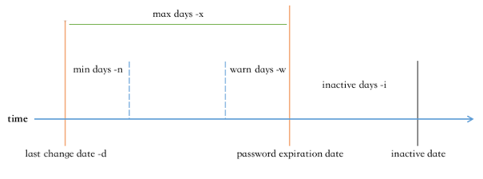

# Linux用户与权限管理


## 内容概述

- **Linux的安全模型**
- **用户和组相关文件**
- **用户和组管理命令**
- **理解并设置文件权限**
- **默认权限**
- **特殊权限**
- **文件访问控制列表**


## Linux安全模型


- Authentication：认证，验证用户身份 
- Authorization：授权，不同的用户设置不同权限 
- Accouting：审计，事后行为


在Linux系统中，当用户登录成功时，系统会自动分配令牌 token，包括：用户标识和组成员等信息。


**3A认证**：

称AAA认证，是一套针对网络设备的网络访问控制策略安全模型。

``````bash
#用于审计的登录日志
#rocky8.6
[root@rocky8 ~]# cat /var/log/secure
Jun 25 07:50:35 rocky8 polkitd[965]: Registered Authentication Agent for unixsession:c1 (system bus name :1.52 [/usr/bin/gnome-shell], object path 
/org/freedesktop/PolicyKit1/AuthenticationAgent, locale en_US.UTF-8)
Jun 25 07:51:52 rocky8 sshd[2413]: Accepted password for root from 10.0.0.1 port 
53734 ssh2
Jun 25 07:51:52 rocky8 systemd[2420]: pam_unix(systemd-user:session): session 
opened for user root by (uid=0)
Jun 25 07:51:52 rocky8 sshd[2413]: pam_unix(sshd:session): session opened for
user root by (uid=0)
[root@ubuntu2204 ~]# tail /var/log/auth.log
May  9 16:34:13 ubuntu2204 passwd[8219]: pam_unix(passwd:chauthtok): password 
changed for jose
May  9 17:13:30 ubuntu2204 sshd[1805]: pam_unix(sshd:session): session closed 
for user root
May  9 17:13:30 ubuntu2204 systemd-logind[890]: Session 4 logged out. Waiting 
for processes to exit.
May  9 17:13:30 ubuntu2204 systemd-logind[890]: Removed session 4.
May  9 17:13:45 ubuntu2204 sshd[8275]: Accepted password for root from 10.0.0.1 
port 58443 ssh2
May  9 17:13:45 ubuntu2204 sshd[8275]: pam_unix(sshd:session): session opened 
for user root(uid=0) by (uid=0)
May  9 17:13:45 ubuntu2204 systemd-logind[890]: New session 7 of user root.
``````


### 用户

Linux系统是多用户系统，可以同时存在多个用户，每个用户之间都是互相隔离的。

 在Linux系统中，每个用户是通过User Id （UID）来唯一标识的。


- 管理员：root, 0
- 普通用户：1-60000 自动分配
  - 系统用户：1-499 （CentOS 6以前）, 1-999 （CentOS 7以后） 对守护进程获取资源进行权限分配
  - 登录用户：500+ （CentOS6以前）, 1000+（CentOS7以后） 给用户进行交互式登录使用


在Linux中，root以下，都是普能用户，其用户id为1-60000

| 用户类型             | 用户名       | 用户ID（uid）                               | 作用                            |
| -------------------- | ------------ | ------------------------------------------- | ------------------------------- |
| 超级管理员           | root（可改） | 0                                           | 超级管理员                      |
| 普通用户 -- 系统用户 | 自定义       | 1-499（CentOS6及以前）,1-999(CentOS7及以后) | 给后台程序使用，像nginx,mysql等 |
| 普通用户 -- 登录用户 | 自定义       | 500+（CentOS6及以前）,1000+(CentOS7及以后)  | 给用户进行交互式登录            |


### 用户组 

Linux中可以将一个或多个用户加入用户组中，组就是包含0个或多个用户的集合，用户组是通过Group  ID（GID） 来唯一标识的。


- 管理员组：root, 0
- 普通组：
  - 系统组：1-499（CentOS 6以前）, 1-999（CentOS7以后）, 对守护进程获取资源进行权限分配
  - 普通组：500+（CentOS 6以前）, 1000+（CentOS7以后）, 给用户使用


### 用户和组的关系

- 一个用户至少有一个组，也可以有多个组； 
- 一个组至少有0个用户，也可以有多个用户； 
- 用户的主要组(primary group)：又称私有组，一个用户必须属于且只有一个主组，创建用户时， 默认会创建与其同名的组作为主组；
- 用户的附加组(supplementary group)：又称辅助组，一个用户可以属于0个或多个附加组； 
- 使用组，可以对用户进行批量管理，比如对一个组授权，则该组下所有的用户能能继承这个组的权 限；


范例：
```bash
[root@ubuntu2204 ~]# id jose
uid=1001(jose) gid=1001(jose) groups=1001(jose)
 
[root@rocky8 ~]# id postfix
uid=89(postfix) gid=89(postfix) groups=89(postfix),12(mail)
```


### 安全上下文


**Linux安全上下文Context：** 

在Linux系统中，运行中的程序（即进程process），都是以进程发起者的身份运行； 

进程所能够访问的资源权限取决于进程的运行者的身份；


**首先，什么是程序** 

一个程序或一个命令，本质上也是一个可执行的二进制文件或一个可执行的脚本文件； 

在服务器上有很多文件，只有那些特定的，可以被执行的二进制文件，才能被称为程序；


**其次，什么是进程**

运行中的程序，就是进程；


**第三，程序，进程，用户之间的关系是怎样的**

只有可以被执行的文件，才能叫作程序； 

对于同一个程序，也不是所有用户都可以运行的，这要取决于当前用户对该程序有没有可执行权限； 

用户张三，运行了某个程序，那么，张三就发起了一个进程，该进程的发起者，就是张三，该进程是以 张三的身份在运行；


**第四，进程的访问资源**

一个进程能不能访问某些资源，是由进程发起者决定的（跟进程本身的程序文件无关），比如某进程要 读写某个文件，则要看该进程发起者有没有权限读取该文件；


一个旅客能不能坐头等舱，是由旅客自己决定的，跟飞机本身无关；


范例:

``````bash
#reboot命令，只有root用户才有权限执行
[root@ubuntu2204 ~]# reboot
Connection closing...Socket close.

Connection closed by foreign host.

Disconnected from remote host(rocky8.5-2-153) at 11:19:02.
Type `help' to learn how to use Xshell prompt.

#普通用户无权限执行
[root@ubuntu2204 ~]# su - jose
jose@ubuntu2204 reboot
User root is logged in on sshd.
Please retry operation after closing inhibitors and logging out other users.
Alternatively, ignore inhibitors and users with 'systemctl reboot -i'.
``````


范例:

``````bash
#root 和普通用户都能执行cat命令，但对于某些文件，只有root 用户才能打开
[root@ubuntu2204 ~]# cat /etc/shadow
root:$6$10pvyo2c4EI8tYh1$PT2yiAT6nrxs9rtjhQFWfDuHyFaV5HARXzn9YZ6wpJKveHccpl5Qolj
t7iIlmHxWuy//::0:99999:7:::
bin:*:18700:0:99999:7:::
daemon:*:18700:0:99999:7:::
adm:*:18700:0:99999:7:::
......

jose@ubuntu2204 cat /etc/shadow
cat: /etc/shadow: Permission denied
``````


## 用户和组的配置文件


### 用户和组的主要配置文件


- /etc/passwd：用户及其属性信息(名称、UID、主组ID等） 
- /etc/shadow：用户密码及其相关属性 
- /etc/group：组及其属性信息 
- /etc/gshadow：组密码及其相关属性


### passwd文件格式

``````bash
whatis passwd
openssl-passwd (1ssl) - compute password hashes
passwd (1)           - update user's authentication tokens
passwd (5)           - password file

man 5 passwd #查看帮助手册

#文件格式
#login name:password:UID:GID:GECOS:directory:shell

root:x:0:0:root:/root:/bin/bash
ftp:x:14:50:FTP User:/var/ftp:/sbin/nologin
mage:x:1002:1002::/home/mage:/bin/bash


login name #登录用户名
password #密码位，x只是表示一个占位符，可为空
UID #用户ID，0 表示超级管理员
GID #所属组ID
GECOS #用户全名或注释，描述信息，可为空
directory #用户家目录，在创建用户时，默认会创建在/home 目录下
shell #用户默认shell，/sbin/nologin 表示不用登录的 shell，一般用 chsh 命令修改 chsh -s /bin/csh mage
``````


修改用户shell

``````bash
[root@ubuntu2204 ~]# getent passwd jose 
jose:x:1001:1001::/home/jose:/bin/bash

[root@ubuntu2204 ~]# chsh -s /bin/sh jose

[root@ubuntu2204 ~]# getent passwd jose 
jose:x:1001:1001::/home/jose:/bin/sh
``````


### shadow文件格式

此文件中存储的是用户密码信息，任何用户都无权限


```````bash
[root@rocky ~]# ll /etc/shadow
---------- 1 root root 1344 May 22 10:27 /etc/shadow

#ubuntu 中有权限
[root@ubuntu2204 ~]# ll /etc/shadow
-rw-r----- 1 root shadow 1218 May  9 16:34 /etc/shadow

whatis shadow
shadow (5)           - shadowed password file
shadow (3)           - encrypted password file routines

man 5 shadow

#文件格式
#login name:encrypted password:date of last password change:minimum password age:maximum password age:password warning period:password inactivity period:account expiration date:reserved field


root:$6$lwdNTBEpfKFnUipo$Zm4JTG7vVVg6lJaMJ7sPTqmbc/I6GGMIjp7yO.rd6TsKb0lEeRHn4q7
Z/LWJvV/FAWgTJVta9Gd78NPVNfld.1::0:99999:7:::
ftp:*:18700:0:99999:7:::
postfix:!!:19424::::::
jose:$6$Cvfl7WE8khYDd/xb$4pNMm.C46MEOUElWyFbRvO2FcGFv/a.EdD9rtWa0jvZdoThq8spMGw4
rPbcQzqsY99hW3aImVK4SPR/KJaoSh0:19168:0:99999:7:::


login name  #登录用户名
encrypted password  #加密后的密文，一般用sha512加密，可为空，!表示该用户被锁定，不能登录系统
date of last password change  #上次修改密码的时间，自1970年开始，0表示下次登录之后就要改密码，为空表示密码时效功能无效
minimum password age  #最小时间间隔，当前密码最少能使用多少天，0表示随时可被变更
maximum password age  #最大时间间隔，当前密码最多能使用多少天，99999表示可以一直使用
password warning period  #警告时间，密码过期前几天开始提醒用户，默认为7
password inactivity period    #不活动时间，密码过期几天后帐号会被锁定，在此期间，用户仍然可以登录，为空表示不使用此规则
account expiration date       #失效时间，从1970年1月1日算起，多少天后帐号失效，为空表示永不过期
reserved field      #保留字段，无意义


# 密码字段格式解析
$<id>$<salt>$<hashed>

# $         分隔符
# id        加密算法
# salt      加盐值
# hashed    哈希值

标识符   加密方式        备注
$6$	    SHA-512   	标准传统方式
$y$	    yescrypt	更安全，支持内存加密，抵抗GPU暴力破解，现代系统推荐
```````


所有伪用户的密码都是 "!!" 或 "*"，代表没有密码是不能登录的，新建用户还没设密码时为!!，禁用账号，可以直接在密码字段前加 !


#### 查看系统加密方式

```bash
# Ubuntu中查看当前的加密方式
root@magedu:/etc/pam.d# cat common-password 
#
# /etc/pam.d/common-password - password-related modules common to all services
#
# This file is included from other service-specific PAM config files,
# and should contain a list of modules that define the services to be
# used to change user passwords.  The default is pam_unix.

# Explanation of pam_unix options:
# The "yescrypt" option enables
#hashed passwords using the yescrypt algorithm, introduced in Debian
#11.  Without this option, the default is Unix crypt.  Prior releases
#used the option "sha512"; if a shadow password hash will be shared
#between Debian 11 and older releases replace "yescrypt" with "sha512"
#for compatibility .  The "obscure" option replaces the old
#`OBSCURE_CHECKS_ENAB' option in login.defs.  See the pam_unix manpage
#for other options.

# As of pam 1.0.1-6, this file is managed by pam-auth-update by default.
# To take advantage of this, it is recommended that you configure any
# local modules either before or after the default block, and use
# pam-auth-update to manage selection of other modules.  See
# pam-auth-update(8) for details.

# here are the per-package modules (the "Primary" block)
password	[success=1 default=ignore]	pam_unix.so obscure yescrypt
# here's the fallback if no module succeeds
password	requisite			pam_deny.so
# prime the stack with a positive return value if there isn't one already;
# this avoids us returning an error just because nothing sets a success code
# since the modules above will each just jump around
password	required			pam_permit.so
# and here are more per-package modules (the "Additional" block)
# end of pam-auth-update config


# Rocky中查看当前的加密方式
[root@bogon pam.d]# cat /etc/pam.d/system-auth 
# Generated by authselect on Fri Jul 18 01:54:10 2025
# Do not modify this file manually.

auth        required                                     pam_env.so
auth        required                                     pam_faildelay.so delay=2000000
auth        sufficient                                   pam_fprintd.so
auth        [default=1 ignore=ignore success=ok]         pam_usertype.so isregular
auth        [default=1 ignore=ignore success=ok]         pam_localuser.so
auth        sufficient                                   pam_unix.so nullok
auth        [default=1 ignore=ignore success=ok]         pam_usertype.so isregular
auth        sufficient                                   pam_sss.so forward_pass
auth        required                                     pam_deny.so

account     required                                     pam_unix.so
account     sufficient                                   pam_localuser.so
account     sufficient                                   pam_usertype.so issystem
account     [default=bad success=ok user_unknown=ignore] pam_sss.so
account     required                                     pam_permit.so

password    requisite                                    pam_pwquality.so local_users_only
# 下面就是系统默认加密方法，可以更改
password    sufficient                                   pam_unix.so yescrypt shadow nullok use_authtok
password    [success=1 default=ignore]                   pam_localuser.so
password    sufficient                                   pam_sss.so use_authtok
password    required                                     pam_deny.so

session     optional                                     pam_keyinit.so revoke
session     required                                     pam_limits.so
-session    optional                                     pam_systemd.so
session     [success=1 default=ignore]                   pam_succeed_if.so service in crond quiet use_uid
session     required                                     pam_unix.so
session     optional                                     pam_sss.so
```


#### 修改系统加密方式

```bash
# Rocky
[root@bogon pam.d]# vim /etc/pam.d/system-auth
password    sufficient                                   pam_unix.so sha512 shadow nullok use_authtok
# 修改为
password    sufficient                                   pam_unix.so yescrypt shadow nullok use_authtok
# 保存后退出

# 创建用户并设置密码查看
[root@bogon pam.d]# useradd xiaoming
[root@bogon pam.d]# passwd xiaoming
更改用户 xiaoming 的密码 。
新的密码： 
无效的密码： 密码少于 8 个字符
重新输入新的密码： 
passwd：所有的身份验证令牌已经成功更新。

# 查看
[root@bogon pam.d]# getent shadow
......
xiaoming:$y$j9T$ZZZ.F732m2Tfl3tG7/uPq0$0N2S//THK4m84LsOCTKn6rSnXye8ls0/D12tpV6ixv7:20290:0:99999:7:::
```

```bash
# Ubuntu
root@magedu:~# vim /etc/pam.d/common-password 
password	[success=1 default=ignore]	pam_unix.so obscure yescrypt
# 修改为
password	[success=1 default=ignore]	pam_unix.so obscure sha512
# 保存后退出

# 创建用户并设置密码查看
root@magedu:~# useradd jerry
root@magedu:~# passwd jerry
New password: 
Retype new password: 
passwd: password updated successfully

# 查看
root@magedu:~# getent shadow
......
jerry:$6$zryPEOY3NEYq3DgZ$w7sx.gzieC27XOtcH90qG7NfHLsiUeX0kruYXYzaX75GG/78IuBPfIM4HHJ83ZpDRpg1fIcAkL4K3ENvPaM67.:20290:0:99999:7:::
```


### group文件格式

``````bash
man group

#文件格式
#group_name:password:GID:user_list

ftp:x:50:
mage:x:1002:

group_name     #组名
password       #组密码，当用户加组时，需要用此密码验证
GID            #组ID
user_list      #用户列表，多个用户用,分隔, 此处的用户将当前组作为附加组
``````


### gshadow文件格式

``````bash
man gshadow

#文件格式
#group name:encrypted password:administrators:members

ftp:::
mage:!::

group name         #组名
encrypted password #组密码，加密后的密文，!表示还没设密码
administrators     #组管理员
members            #用户列表，多个用户用,分隔, 此处的用户将当前组作为附加组
``````


### 文件操作

可以直接用编辑工具来修改上述文件，但由于跟用户和权限有关的文件具有敏感性，所以系统提供了专 用的工具来修改这几个文件。


#### vipw & vigr

```bash
#vipw|vigr
#编辑/etc/passwd，/etc/group，/etc/shadow，/etc/gshadow
#vipw    默认编辑 /etc/passwd 文件
#vigr    默认编辑 /etc/group 文件

-g|--group                 # 编辑 group 文件
-p|--passwd                # 编辑 passwd 文件
-s|--shadow                # 编辑 /etc/shadow 或 /etc/gshadow 文件
```


#### pwck & grpck

```bash
# pwck [options] [passwd [shadow]]
# 对用户相关配置文件进行检查，默认检查文件为 /etc/passwd

-q|--quiet                 # 只报告错误，忽略警告v        
-r|--read-only             # 显示错误和警告，但不改变文件
-R|--root CHROOT_DIR       # chroot 到的目录  
-s|--sort                  # 通过 UID 排序项目


# grpck [options] [group [gshadow]]
# 对用户组相关配置文件进行检查，默认检查文件为 /etc/group，/etc/gshadow

-r|--read-only             # 显示错误和警告，但不改变文件
-R|--root CHROOT_DIR       # chroot 到的目录
-s|--sort                  # 通过 UID 排序项目
```


#### getent

```bash
getent passwd|shadow|group|gshadow  uname [,...]

#根据用户名查看配置项
```


## 用户和组管理命令


**用户管理命令**

- useradd
- usermod
- userdel


**组账号维护命令**

- groupadd 
- groupmod
- groupdel


### 用户创建 useradd

useradd 命令可以创建新的Linux用户


格式：

``````bash
useradd [options] LOGIN
useradd -D
useradd -D [options]
#常见选项
-u|--uid UID                        #指定UID
-g|--gid GID                        #指定用户组，-g groupname|--gid GID
-c|--comment COMMENT                #新账户的 GECOS 字段
-d|--home-dir HOME_DIR              #指定家目录，可以是不存在的，指定家目录，并不代表创建家目录
-s|--shell SHELL                    #指定 shell，可用shell在/etc/shells 中可以查看
-r|--system                         #创建系统用户,CentOS 6之前 ID<500，CentOS7 以后ID<1000，不会创建登录用户相关信息
-m|--create-home                    #创建家目录，一般用于登录用户
-M|--no-create-home                 #不创建家目录，一般用于不用登录的用户
-p|--password PASSWORD              #设置密码，这里的密码是以明文的形式存在于/etc/shadow 文件中
-G|--groups GROUP1[,GROUP2,...]     #为用户指明附加组，组须事先存在
-D|--defaults                       #显示或更改默认的 useradd 配置，默认配置文件是/etc/default/useradd
-e|--expiredate EXPIRE_DATE         #指定账户的过期日期 YYYY-MM-DD 格式
-f|--inactive INACTIVE              #密码过期之后，账户被彻底禁用之前的天数，0 表示密码过期立即禁用，-1表示不使用此功能
-k|--skel SKEL_DIR                  #指定家目录模板，创建家目录，会生成一些默认文件，如果指定，就从该目录复制文件，默认/etc/skel/，要配合-m
``````


默认创建

``````bash
[root@ubuntu2204 ~]# useradd tom

#查看
[root@ubuntu2204 ~]# getent passwd tom
tom:x:1002:1002::/home/tom:/bin/sh

[root@ubuntu2204 ~]# getent shadow tom
tom:!:19486:0:99999:7:::

[root@ubuntu2204 ~]# getent group tom
tom:x:1002:

[root@ubuntu2204 ~]# getent gshadow tom
tom:!::

[root@ubuntu2204 ~]# ls /home/tom
ls: cannot access '/home/tom': No such file or directory

#rocky中默认创建
[root@rocky8 ~]# ls -a /home/tom/
. .. .bash_logout .bash_profile .bashrc
``````


useradd 命令默认值设定由/etc/default/useradd定义

``````bash
[root@rocky8 ~]# cat /etc/default/useradd
# useradd defaults file
GROUP=100 #useradd不指定组,且/etc/login.defs中的USERGROUPS_ENAB为no或useradd -N时，group 为100
HOME=/home #默认家目录父目录
INACTIVE=-1   #对应/etc/shadow文件第7列，即用户密码过期后的帐号锁定的宽限期,-1
表示不锁定
EXPIRE=       #对应/etc/shadow文件第8列，即用户帐号的有效期
SHELL=/bin/bash #默认bash
SKEL=/etc/skel #用于生成新建用户家目录的模版文件
CREATE_MAIL_SPOOL=yes #默认创建收件箱
``````


显示或更改默认设置

``````bash
#useradd -D 
#useradd –D -s SHELL
#useradd –D –b BASE_DIR
#useradd –D –g GROUP


#查看
[root@ubuntu2204 ~]# useradd -D
GROUP=100
HOME=/home
INACTIVE=-1
EXPIRE=
SHELL=/bin/sh
SKEL=/etc/skel
CREATE_MAIL_SPOOL=no

#更改默认 shell
[root@ubuntu2204 ~]# useradd -D -s /bin/bash

#再次更改
[root@ubuntu2204 ~]# useradd -D
GROUP=100
HOME=/home
INACTIVE=-1
EXPIRE=
SHELL=/bin/bash
SKEL=/etc/skel
CREATE_MAIL_SPOOL=no
``````


家目录模板

``````bash
[root@ubuntu2204 ~]# ls -a /etc/skel/
. .. .bash_logout .bash_profile .bashrc

#修改此目录内容后，新创建的用户家目录中的内容会发生改变
``````

 

新建用户的相关文件

- /etc/default/useradd
- /etc/skel/*
- /etc/login.defs


批量创建用户

``````
newusers file 
``````


范例

``````bash
[root@ubuntu2204 ~]# cat user.txt 
u1:123456:1024:1024::/home/u1:/bin/bash
u2:123456:1025:1025::/home/u2:/bin/bash

[root@ubuntu2204 ~]# newusers user.txt 
[root@ubuntu2204 ~]# id u1
uid=1024(u1) gid=1024(u1) groups=1024(u1)
[root@ubuntu2204 ~]# id u2
uid=1025(u2) gid=1025(u2) groups=1025(u2)
``````


批量修改用户口令

``````
chpasswd < file
``````


范例

``````bash
root@ubuntu2204 ~]# cat pwd.txt
u1:1234567
u2:1234567

#标准输入重定向
[root@ubuntu2204 ~]# chpasswd < pwd.txt


#多行重定向
[root@ubuntu2204 ~]# chpasswd <<EOF
> u1:1234567
> u2:1234567
> EOF

#管道重定向
[root@ubuntu2204 ~]# echo u1:123456 | chpasswd
``````


范例: CentOS8 生成sha512加密密码

```bash
[root@rocky8 ~]# openssl passwd -6 magedu
$6$UOyYOao.iM2.rPnM$jCpTnBVIQBuGCLOm4N5hqh5YUc3wWXcDzkDMddthpKNL3scOZjTHh9fXds8Eu6gNdEQqLMQgOboipZ08mnz2V.
```


范例: CentOS7 利用Python程序在 生成sha512加密密码

```bash
[root@centos7 ~]# python -c 'import crypt,getpass;pw="magedu";print(crypt.crypt(pw))'
$6$pt0SFMf6YqKea3mh$.7Hkslg17uI.Wu7BcMJStVVtkzrwktXrOC8DxcMFC4JO1igrqR7VAi87H5PHOuLTUEjl7eJqKUhMT1e9ixojn1
```


范例: CentOS 6 创建并指定基于sha512的用户密码

```bash
[root@centos6 ~]# grub-crypt --help
 Usage: grub-crypt [OPTION]...
 Encrypt a password.
 -h, --help             Print this message and exit
 -v, --version          Print the version information and exit
 --md5                  Use MD5 to encrypt the password
 --sha-256              Use SHA-256 to encrypt the password
 --sha-512              Use SHA-512 to encrypt the password (default)
           
 Report bugs to <bug-grub@gnu.org>.
 EOF
 
 
[root@centos6 ~]# grub-crypt --sha-512
Password: 
Retype password: 
$6$v9A2/xUNwAWwEmHN$q7Wz.uscsV/8J5Gss3KslX8hKXOoaP3hDpOBWeBfMQHVIRZiwHUUkii84cvQWIMnvtnXYsdVHuLO4KhOiSOMh/
 
[root@centos6 ~]# useradd -p 
'$6$v9A2/xUNwAWwEmHN$q7Wz.uscsV/8J5Gss3KslX8hKXOoaP3hDpOBWeBfMQHVIRZiwHUUkii84cvQWIMnvtnXYsdVHuLO4KhOiSOMh/' test

[root@centos6 ~]# getent shadow test
test:$6$v9A2/xUNwAWwEmHN$q7Wz.uscsV/8J5Gss3KslX8hKXOoaP3hDpOBWeBfMQHVIRZiwHUUkii84cvQWIMnvtnXYsdVHuLO4KhOiSOMh/:18459:0:99999:7:::
```


范例: Ubuntu2204 创建sha512加密密码

```bash
[root@ubuntu2204 ~]# openssl passwd -6 123456
$6$RyaXh7L.7fORQBjB$0WXRATSjh3IU.eufhsY5uJpKZwCAGjyAj5r/et9ymohEKsTdMvagEW92t1IAkNte0yVZ88YyMUqx1b6uHIrxM/
```


### 用户属性修改 usermod

usermod 命令可以修改用户属性

格式：

``````bash
usermod [options] LOGIN

#常见选项
-c|--comment COMMENT         #修改注释
-d|--home HOME_DIR           #修改家目录
-e|--expiredate EXPIRE_DATE  #修改过期的日期，YYYY-MM-DD 格式
-f|--inactive INACTIVE       #密码过期之后，账户被彻底禁用之前的天数，0 表示密码过期立即禁用，-1表示不使用此功能
-g|--gid GROUP               #修改组
-G|--groups GROUPS           #groupName|GID... 新附加组，原来的附加组将会被覆盖；若保留原有，则要同时使用-a选项
-a|--append GROUP            #将用户追加至上边 -G 中提到的附加组中，并不从其它组中删除此用户
-l|--login LOGIN             #新的登录名称
-L|--lock                    #锁定用户帐号，在/etc/shadow 密码栏的增加 !
-m|--move-home               #将家目录内容移至新位置，和 -d 一起使用
-s|--shell SHELL             #修改 shell
-u|--uid UID                 #修改 UID
-U|--unlock                  #解锁用户帐号，将 /etc/shadow 密码栏的!拿掉
``````


修改用户信息

``````bash
[root@ubuntu2204 ~]# id tom
uid=1002(tom) gid=1002(tom) groups=1002(tom)

#把tom改成jerry
[root@ubuntu2204 ~]# usermod -c "tom to jerry" -l jerry tom

[root@ubuntu2204 ~]# id jerry
uid=1002(jerry) gid=1002(tom) groups=1002(tom)
``````


锁定用户

用户被锁定之后将无法登录

``````bash
[root@ubuntu2204 ~]# getent shadow jose
jose:$y$j9T$d7EfLYe7v5FrllBSZQ3PH.$LsgwS9XAyBaB.GTGqfiZND6/e8P0xrKeXZhpH2IIO.9:1
9486:0:99999:7:::

[root@ubuntu2204 ~]# usermod -L jose

[root@ubuntu2204 ~]# getent shadow jose
jose:!$y$j9T$d7EfLYe7v5FrllBSZQ3PH.$LsgwS9XAyBaB.GTGqfiZND6/e8P0xrKeXZhpH2IIO.9:
19486:0:99999:7:::
``````


解锁用户

``````bash
[root@rocky8 ~]# usermod -U jose

[root@rocky8 ~]# getent shadow jose
jose:$6$1gfAZcky1hjTfVX0$dcImV6yr9xWzfcfeUI0zXH3p0t0OG71nzUcqD7MoLID8bzsoPKS60Cu
oGbWv.e.qXzzXknAqTfTWvMlZzpp.i/:19158:0:99999:7:::
``````


将用户加入附加组

```bash
[root@ubuntu2204 ~]#useradd mystical
[root@ubuntu2204 ~]#usermod -aG adm mystical
[root@ubuntu2204 ~]#id mystical 
uid=1001(mystical) gid=1001(mystical) groups=1001(mystical),4(adm)
```


centos 允许空密码用户登录，所以两个 !!，无法用 -U 选项解锁

所谓解锁，只针对于有密码的用户来说，但是，可以直接修改/etc/shadow 文件，将密码栏置空产生空 密码用户

``````bash
[root@rocky8 ~]# getent shadow jerry
jerry:!!:19168:0:99999:7:::

[root@rocky8 ~]# usermod -U jerry
usermod: unlocking the user's password would result in a passwordless account.
You should set a password with usermod -p to unlock this user's password.

[root@rocky8 ~]# getent shadow jerry
jerry:!!:19168:0:99999:7:::
``````


### 删除用户 userdel

userdel 可删除 Linux 用户

格式：

``````bash
userdel [options] LOGIN

#常见选项
-f|--force     #强制删除，哪怕用户正在登录状态
-r|--remove    #删除家目录和邮件目录
``````


范例：

``````bash
#创建用户并设置密码
[root@ubuntu2204 ~]# useradd -m zhangsan
[root@ubuntu2204 ~]# passwd zhangsan
New password: 
Retype new password: 
passwd: password updated successfully


#查看相关数据
[root@ubuntu2204 ~]# id zhangsan
uid=1026(zhangsan) gid=1026(zhangsan) groups=1026(zhangsan)


[root@ubuntu2204 ~]# ll -a /home/zhangsan/
total 20
drwxr-x--- 2 zhangsan zhangsan 4096 May  9 20:12 ./
drwxr-xr-x 7 root     root     4096 May  9 20:12 ../
-rw-r--r-- 1 zhangsan zhangsan  220 Jan  7  2022 .bash_logout
-rw-r--r-- 1 zhangsan zhangsan 3771 Jan  7  2022 .bashrc
-rw-r--r-- 1 zhangsan zhangsan  807 Jan  7  2022 .profile

#在另一个终端登录zhangsan
zhangsan@ubuntu2204:~$ id
uid=1026(zhangsan) gid=1026(zhangsan) groups=1026(zhangsan)


#删除登录中的用户失败
[root@ubuntu2204 ~]# userdel zhangsan
userdel: user zhangsan is currently used by process 2454


#强制删除
[root@ubuntu2204 ~]# userdel -f zhangsan
userdel: user zhangsan is currently used by process 2454

[root@ubuntu2204 ~]# id zhangsan
id: ‘zhangsan’: no such user

#报错
zhangsan@ubuntu2204:~$ whoami
whoami: cannot find name for user ID 1026

zhangsan@ubuntu2204:~$ id
uid=1026 gid=1026 groups=1026
``````


用户被删除后，其名下的文件无法显示属主属组，只能显示UID

``````bash
[root@ubuntu2204 ~]# ll /home/zhangsan -d
drwxr-x--- 3 1026 1026 4096 May  9 20:15 /home/zhangsan/
``````


如果新建用户，使用了原用户的UID，则可以继承原用户文件

``````bash
[root@ubuntu2204 ~]# useradd -m -u 1026 lisi


[root@ubuntu2204 ~]# ll /home/{lisi,zhangsan} -d
drwxr-x--- 2 lisi lisi 4096 May  9 20:17 /home/lisi/
drwxr-x--- 3 lisi lisi 4096 May  9 20:15 /home/zhangsan/
``````


删除用户文件

``````bash
[root@ubuntu2204 ~]# userdel -r lisi
userdel: lisi mail spool (/var/mail/lisi) not found

[root@ubuntu2204 ~]# ll /home/lisi
ls: cannot access '/home/lisi': No such file or directory
``````


### 查看用户相关的ID信息

id 命令可以查看用户的 UID，GID等信息


格式：

```bash
id [OPTION]... [USER]


# 常见选项
-a             # 显示详细信息，默认选项
-Z|--context   # 仅显示安全上下文信息，要开启selinux 配置才有
-g|--group     # 仅显示GID，就是只显示主组ID
-G|--groups    # 显示主组和附加组ID，就是所有组ID
-n|--name      # 显示用户名或组名，要组合使用 -nu|-ng|-nG
-u|--user      # 仅显示UID
```


范例：

```bash
# centos8中如果没有关闭 selinux，会出现安全上下文相关内容
[root@rocky8 ~]# id
uid=0(root) gid=0(root) groups=0(root)
context=unconfined_u:unconfined_r:unconfined_t:s0-s0:c0.c1023

[root@rocky8 ~]# id -a
uid=0(root) gid=0(root) groups=0(root)
context=unconfined_u:unconfined_r:unconfined_t:s0-s0:c0.c1023

[root@rocky8 ~]# id -nu
root

[root@rocky8 ~]# id postfix
uid=89(postfix) gid=89(postfix) groups=89(postfix),12(mail)

[root@rocky8 ~]# id -G postfix
89 12

[root@rocky8 ~]# id -nG postfix
postfix mail

[root@ubuntu2204 ~]# id
uid=0(root) gid=0(root) groups=0(root)

[root@ubuntu2204 ~]# id tom
id: ‘tom’: no such user

[root@ubuntu2204 ~]# id jose
 uid=1001(jose) gid=1001(jose) groups=1001(jose)
```


### 设置密码

passwd 可以修改用户密码


格式：

```bash
passwd [OPTION...] <accountName>


# 常用选项
-k|--keep-tokens             # 保持身份验证令牌不过期
-d|--delete                  # 删除用户密码，也删除密码锁，仅root有权限操作
-l|--lock                    # 锁定用户密码，仅root有权限操作
-u|--unlock                  # 解锁用户密码，仅root有权限操作
-e|--expire                  # 终止用户密码，此操作完成后，用户下次登录成功后要立马修改，仅root有权限操作
-f|--force                   # 强制执行操作
-x|--maximum=DAYS            # 指定用户密码最长有效期，仅root有权限操作
-n|--minimum=DAYS            # 指定用户密码最短有效期，仅root有权限操作
-w|--warning=DAYS            # 在密码过期前多少天开始提醒用户，仅root有权限操作
-i|--inactive=DAYS           # 当密码过期后经过多少天该用户账号会被禁用，仅root有权限操作
-S|--status                  # 查询用户的密码状态，仅root有权限操作
--stdin                      # 从标准输入接收密码,Ubuntu无此选项
```


普通用户修改自己密码，要先验证当前使用的密码

```bash
jose@ubuntu2204:~$ passwd
Changing password for jose.
Current password: 
New password: 
Retype new password:
passwd: password updated successfully
```


root修改其它用户密码

```bash
[root@ubuntu2204 ~]# passwd jose
New password: 
Retype new password: 
passwd: password updated successfully
```


修改密码其实就是更新 /etc/shadow 文件

```bash
[root@ubuntu2204 ~]# ll /etc/shadow
-rw-r----- 1 root shadow 1577 May  9 20:36 /etc/shadow
```


非交互式修改用户密码

```bash
#适用于红帽系列的Linux版本

[root@rocky8 ~]# echo '123456' | passwd --stdin jose
Changing password for user jose.
passwd: all authentication tokens updated successfully.

[root@rocky8 ~]# passwd --stdin jose <<<123456
Changing password for user jose.
passwd: all authentication tokens updated successfully.

# Ubuntu中 passwd 无 --stdin 选项
# 此写法在centos中也支持,更通用
root@ubuntu20:~# echo -e '123456\n123456' | passwd jose
New password: Retype new password: passwd: password updated successfully
```


设置用户下次必须更改密码

```bash
[root@ubuntu2204 ~]# passwd -e jose
passwd: password expiry information changed.

#jose 用户登录后提示
WARNING: Your password has expired.
You must change your password now and login again!
Changing password for jose.
Current password: 
```


### 修改用户密码策略

chage 可以修改用户密码策略


格式：
```bash
chage [options] LOGIN


#常见选项
-d LAST_DAY                 # 更改密码的时间
-m|--mindays MIN_DAYS
-M|--maxdays MAX_DAYS
-W|--warndays WARN_DAYS
-I|--inactive INACTIVE      # 密码过期后的宽限期
-E|--expiredate EXPIRE_DATE    # 用户的有效期
```


范例：

```bash
[root@ubuntu2204 ~]# chage jose
 Changing the aging information for jose
 Enter the new value, or press ENTER for the default
 
     Minimum Password Age [0]: 3
     Maximum Password Age [99999]: 42
     Last Password Change (YYYY-MM-DD) [2023-05-09]: 2023-05-01
     Password Expiration Warning [7]: 10
     Password Inactive [-1]: 20
     Account Expiration Date (YYYY-MM-DD) [-1]:
     
[root@ubuntu2204 ~]# getent shadow jose
jose:$y$j9T$RjraLGxq.YMdIUlVFoHGo.$YYxkTHpzzUwxc5i1hnu/aLkkwF2g.DioQx5fXoPssc4:19478:3:42:10:20::

# 只修改单项
[root@ubuntu2204 ~]# chage -d 2022-06-25 jose

[root@ubuntu2204 ~]# getent shadow jose
jose:$y$j9T$RjraLGxq.YMdIUlVFoHGo.$YYxkTHpzzUwxc5i1hnu/aLkkwF2g.DioQx5fXoPssc4:19168:3:42:10:20:
```


密码文件中各时间字段的表示




### 创建组 groupadd

groupadd 实现创建组


格式：

```bash
groupadd [options] GROUP

# 常见选项
-f|--force               # 如果组已经存在则成功退出
-g|--gid GID             # 新建组时指定组ID，默认是系统分配，指定值不要超过[GID_MIN，GID_MAX]
-K|--key KEY=VALUE       # 不使用 /etc/login.defs 中的默认值，自己指定，比如 -K GID_MIN=100
-o|--non-unique          # 允许创建有重复 GID 的组
-p|--password PASSWORD   # 为新组使用此加密过的密码，这里要用加密后的密文，不然就是直接是明文在/etc/gshadow 里面
-r|--system              # 创建一个系统组 CentOS 6之前: ID<500，CentOS 7以后: ID<1000
```


范例：
```bash
[root@ubuntu2204 ~]# groupadd -g 48 -r apache
[root@ubuntu2204 ~]# getent group apache
apache:x:48:

#不加 -f 会提示己存在
[root@ubuntu2204 ~]# groupadd apache
groupadd: group 'apache' already exists

# -f 直接结束
[root@ubuntu2204 ~]# groupadd -f apache
```


### 修改组 groupmod

groupmod 组属性修改


格式：

```bash
groupmod [options] GROUP

#常见选项
-g|--gid GID              # 将组 ID 改为 GID
-n|--new-name NEW_GROUP   # 改名为 NEW_GROUP
-o|--non-unique           # 允许使用重复的 GID
-p|--password PASSWORD    # 将密码更改为(加密过的) PASSWORD
```


范例：

```bash
[root@ubuntu2204 ~]# getent group apache
apache:x:48:

[root@ubuntu2204 ~]# groupmod -g 123 apache

[root@ubuntu2204 ~]# getent group apache
apache:x:123:
 
[root@ubuntu2204 ~]# groupmod -n apache2 apache

[root@ubuntu2204 ~]# getent group apache2
apache2:x:123
```


### 组删除 groupdel

groupdel 可以删除组


格式：

```bash
groupdel [options] GROUP

#常见选项
-f|--force       #强制删除，即使是用户的主组也强制删除组,但会导致无主组的用户不可用无法登录
```


范例

```bash
[root@ubuntu2204 ~]# groupdel apache2

[root@ubuntu2204 ~]# getent group apache2

[root@ubuntu2204 ~]# groupdel jose
groupdel: cannot remove the primary group of user 'jose'
 
# -f 强制删除有用户的组
# 强制删除之后，显示该组名的地方，只能显示该组ID，如果此时新建与组ID相同的新组，则被删除的组的数据会被新组关联
[root@ubuntu2204 ~]# groupdel -f jose

[root@ubuntu2204 ~]# id jose
uid=1001(jose) gid=1001 groups=1001
```


删除组：如果该组下有用户将组作为主组，则不能删除

删除用户：会把与其同ID的主组也给删了，前提是该组下没有其它用户


### 更改组成员和密码

gpasswd 命令，可以更改组密码，也可以修改附加组的成员关系

组没有密码的情况下，加组只能由root来操作


格式：

```bash
gpasswd [option] GROUP

# 常见选项
-a|--add USER                          #向组中添加用户
-d|--delete USER                       #从组中移除用户
-r|--delete-password                   #删除组密码
-R｜--restrict                         #向其成员限制访问组 GROUP
-M｜--members USER,...                 #批量加组
-A｜--administrators ADMIN,...         # 批量设组管理员
```


范例：

```bash
[root@ubuntu2204 ~]# id jose
uid=1001(jose) gid=1001(jose) groups=1001(jose)

[root@ubuntu2204 ~]# groups jose
jose : jose

# 创建新组
[root@ubuntu2204 ~]# groupadd group1

[root@ubuntu2204 ~]# getent gshadow group1
group1:!::


# 给用户加组
[root@ubuntu2204 ~]# gpasswd -a jose group1
Adding user jose to group group1

[root@ubuntu2204 ~]# getent gshadow group1
group1:!::jose

# 查看用户的组
[root@ubuntu2204 ~]# id jose
uid=1001(jose) gid=1001(jose) groups=1001(jose),1026(group1)

[root@ubuntu2204 ~]# groups jose
jose : jose group1
```


范例：设置组密码

```bash
[root@ubuntu2204 ~]# gpasswd group1
Changing the password for group group1
New Password: 
Re-enter new password:

[root@ubuntu2204 ~]#  getent gshadow group1
group1:$6$Q4W8lH5V1P/A$qQut0/mMl3SrScLcq4LRQljvY8jmkPHCPQn0VE9pxHIrbbxvYuACTTAGt
C3YPyQ4Ous/nk6Vzu.tXwIdCYOn./::jose
```


范例：移除组成员

```bash
[root@ubuntu2204 ~]# gpasswd -d jose group1
Removing user jose from group group1

[root@ubuntu2204 ~]# groups jose
jose : jose
```


### 更改和查看组成员

groupmems 可以管理附加组的成员关系


格式：

```bash
groupmems [options] [action]

# 常见选项
-g|--group groupname        #更改为指定组 (只有root)
-a|--add username           #指定用户加入组
-d|--delete username        #从组中删除用户
-p|--purge                  #从组中清除所有成员
-l|--list                   #显示组成员列表
```


范例：

```bash
#列出以group1 组为附加组的用户
[root@ubuntu2204 ~]# groupmems -g group1 -l

#将jose 加到group1 组
[root@ubuntu2204 ~]# groupmems -g group1 -a jose

[root@ubuntu2204 ~]# groupmems -g group1 -l
jose

[root@ubuntu2204 ~]# id jose
uid=1000(jose) gid=1000(jose) groups=1000(jose),1004(group1)
```


groups 可查看用户组关系

格式：

```bash
#查看用户所属组列表
groups [OPTION].[USERNAME]...
```


## 文件权限管理


### 前置知识补充

#### 用户切换

``````mysql
su <用户名>     -- 切换为用户名的身份权限
-- 不完全切换，身份切换了，但是环境还是之前的root路径下
-- 而且环境变量依然是之前切换前的环境变量，对于依赖个人用户环境配置的程序执行，可能会出现非预期的现象
su - <用户名>   -- 完全切换，身份和所在路径都切换了
su - <用户名> -c 'cmd' 
-- 以切换的指定身份执行命令，但本身不切换身份，依然是当前用户
exit    -- 切换回上一个身份
``````


#### 实验：测试`su <用户名>`和`su - <用户名>`的区别

``````bash
[root@ubuntu2204 ~]$ export NAME=magedu
[root@ubuntu2204 ~]$ echo $NAME
magedu
[root@ubuntu2204 ~]$ su mystical
mystical@ubuntu2204:/root$ echo NAME
NAME
mystical@ubuntu2204:/root$ echo $NAME
magedu
mystical@ubuntu2204:/root$ exit
exit
[root@ubuntu2204 ~]$ su - mystical
mystical@ubuntu2204:~$ echo $NAME
``````


#### 补充知识点：export

``````
export 是一个 Shell 内置命令，用于将一个变量导出到子进程环境中，使得子进程能够继承该变量。
``````


##### **没有 `export` 的变量**

- **作用范围：**

  - 变量只在当前 Shell 进程中有效。
  - 它是一个**局部变量**，无法被子进程继承。

- **例子：**

  ```bash
  NAME="magedu"  # 定义变量，但没有 export
  
  echo $NAME  # 输出 "magedu"
  
  bash  # 启动一个子 Shell
  echo $NAME  # 无输出，因为子 Shell 没有继承父 Shell 的变量
  ```

  **解释：**

  - 在没有 `export` 的情况下，`NAME` 变量是父 Shell 的局部变量。
  - 子 Shell 是一个独立的进程，无法访问父 Shell 的局部变量。


##### **使用 `export` 的变量**

- **作用范围：**

  - 变量不仅在当前 Shell 有效，还能被子进程继承。
  - 它是一个**全局变量**（对当前 Shell 和所有子进程有效）。

- **例子：**

  ```
  bashCopy codeexport NAME="magedu"  # 定义并导出变量
  
  echo $NAME  # 输出 "magedu"
  
  bash  # 启动一个子 Shell
  echo $NAME  # 输出 "magedu"，因为子 Shell 继承了变量
  ```

  **解释：**

  - `export` 将变量标记为可供子进程继承。
  - 子 Shell 进程继承了 `NAME` 变量，因此可以访问它


### Linux中的权限体系介绍


在Linux系统中，一切皆文件；

对文件来讲，系统中的用户，分属于三类不同的角色，分别是属主，属组，其它用户；

而每个角色用户，对该文件的权限，也分三种，分别是读，写，执行；


三种角色：

| 角色                                     | 英文表示           | 字符表示 |
| ---------------------------------------- | ------------------ | -------- |
| 属主：所有者                             | owner\|OWNER\|user | u        |
| 属组：属于哪个组                         | group\|GROUP       | g        |
| 其他用户：不是所有者，也不在所属组的用户 | other\|OTHER       | o        |


三种权限：

| 权限     | 英文表示           | 字符表示 | 八进制表示 |
| -------- | ------------------ | -------- | ---------- |
| 读权限   | read\|READable     | r        | 4          |
| 写权限   | write\|Writable    | w        | 2          |
| 执行权限 | execute\|eXcutable | x        | 1          |


程序访问文件时的权限，取决于此程序的发起者

- 进程的发起者，同文件的属主：则应用文件属主权限
- 进程的发起者，属于文件属组；则应用文件属组权限
- 应用文件“其它”权限


### 文件所有者和属组属性操作


#### 设置文件的所有者chown

chown 命令可以修改文件的属主，也可以修改文件属组


格式：

```bash
chown [OPTION]... [OWNER][:[GROUP]] FILE...
chown [OPTION]... --reference=RFILE FILE...

# 用法说明
OWNER                     # 只修改所有者
OWNER:GROUP               # 同时修改所有者和属组
:GROUP                    # 只修改属组，冒号也可用 . 替换

# 常用选项
-c|--changes              # 同-v选项，但只显示更新成功的信息
-f|--silent|--quiet       # 不显示错误信息
-v|--verbose              # 显示过程
--dereference             # 修改的是符号链接指向的文件，而不是链接文件本身
-h|--no-dereference       # 修改的是符号链接文件，而不是其指向的目标文件(只有当前系统支持修改符号链接文件属性时，此项才有效)
--from=user:group         # 根据原属主属组来修改，相当于一个查询条件
--no-preserve-root        # 不特别对待“/”，意思就是将根目录当成普通目录来执行，默认如此，所以不要对根目录进行操作
--preserve-root           # 不允许在"/"上递归操作
--reference=RFILE         # 根据其它文件权限来操作，就是复制该文件的属主属组信息给指定文件
-R|--recursive            # 递归操作

# 下列选项配合 -R 使用 
-H                        # 如果参数是指向目录的软链接，则只修改指向的目录，不改变目录里面文件的属主属组
-L                        # 更改所有遇到的符号链接指向的目录
-P                        # 不更改符号链接指向的目录
```


范例：修改属主

```bash
[root@ubuntu2204 test]#ll
total 8
drwxr-xr-x 2 root root 4096 Jul 28 15:28 ./
drwx------ 6 root root 4096 Jul 28 15:28 ../
-rw-r--r-- 1 root root    0 Jul 28 15:28 a1.txt
-rw-r--r-- 1 root root    0 Jul 28 15:28 a2.txt
-rw-r--r-- 1 root root    0 Jul 28 15:28 a3.txt
-rw-r--r-- 1 root root    0 Jul 28 15:28 a4.txt
-rw-r--r-- 1 root root    0 Jul 28 15:28 a5.txt
-rw-r--r-- 1 root root    0 Jul 28 15:28 a6.txt

# 修改属主
[root@ubuntu2204 test]#chown jose a1.txt
[root@ubuntu2204 test]#chown jose. a2.txt
[root@ubuntu2204 test]#chown jose: a3.txt

# 查看
[root@ubuntu2204 test]#ll a1.txt a2.txt a3.txt
-rw-r--r-- 1 jose root 0 Jul 28 15:28 a1.txt
-rw-r--r-- 1 jose jose 0 Jul 28 15:28 a2.txt
-rw-r--r-- 1 jose jose 0 Jul 28 15:28 a3.txttxt

#上述写法，使用的组，是属主用户的主组

#使用UID来修改属主,UID不支持省略写法
[root@ubuntu2204 test]#chown 1000 a4.txt 

[root@ubuntu2204 test]#chown 1000. a5.txt
chown: invalid user: '1000.'

[root@ubuntu2204 test]#chown 1000: a6.txt
chown: invalid spec: '1000:'

[root@ubuntu2204 test]#ll a4.txt a5.txt a6.txt 
-rw-r--r-- 1 wang root 0 Jul 28 15:28 a4.txt
-rw-r--r-- 1 root root 0 Jul 28 15:28 a5.txt
-rw-r--r-- 1 root root 0 Jul 28 15:28 a6.txt
```


范例：修改属组

```bash
[root@ubuntu2204 test]#ll b*
-rw-r--r-- 1 root root 0 Jul 28 15:38 b1.txt
-rw-r--r-- 1 root root 0 Jul 28 15:38 b2.txt
-rw-r--r-- 1 root root 0 Jul 28 15:38 b3.txt
-rw-r--r-- 1 root root 0 Jul 28 15:38 b4.txt
-rw-r--r-- 1 root root 0 Jul 28 15:38 b5.txt
-rw-r--r-- 1 root root 0 Jul 28 15:38 b6.txt

# 以组名修改
[root@ubuntu2204 test]#chown .jose b1.txt 
[root@ubuntu2204 test]#chown :jose b1.txt 

# 查看
[root@ubuntu2204 test]#ll b1.txt b2.txt 
-rw-r--r-- 1 root jose 0 Jul 28 15:38 b1.txt
-rw-r--r-- 1 root root 0 Jul 28 15:38 b2.txt

# 以GID修改
[root@ubuntu2204 test]#chown .1000 b4.txt 
[root@ubuntu2204 test]#chown :1000 b5.txt 
[root@ubuntu2204 test]#chown .789 b6.txt 

[root@ubuntu2204 test]#ll b4.txt b5.txt b6.txt 
-rw-r--r-- 1 root wang 0 Jul 28 15:38 b4.txt
-rw-r--r-- 1 root wang 0 Jul 28 15:38 b5.txt
-rw-r--r-- 1 root  789 0 Jul 28 15:38 b6.txt
```


范例：同时修改

```bash
[root@ubuntu2204 test]#ll c*
-rw-r--r-- 1 root root 0 Jul 28 15:41 c1.txt
-rw-r--r-- 1 root root 0 Jul 28 15:41 c2.txt
-rw-r--r-- 1 root root 0 Jul 28 15:41 c3.txt
-rw-r--r-- 1 root root 0 Jul 28 15:41 c4.txt
-rw-r--r-- 1 root root 0 Jul 28 15:41 c5.txt

[root@ubuntu2204 test]#chown jose:tom c1.txt
[root@ubuntu2204 test]#chown jose.123 c2.txt
[root@ubuntu2204 test]#chown jose:noxxx c3.txt       # 组不存在会报错
chown: invalid group: 'jose:noxxx'

[root@ubuntu2204 test]#chown 1002.jose c4.txt 
[root@ubuntu2204 test]#chown 123:456 c5.txt 

[root@ubuntu2204 test]#ll c*
-rw-r--r-- 1 jose tom     0 Jul 28 15:41 c1.txt
-rw-r--r-- 1 jose     123 0 Jul 28 15:41 c2.txt
-rw-r--r-- 1 jose nogroup 0 Jul 28 15:41 c3.txt
-rw-r--r-- 1 jose jose    0 Jul 28 15:41 c4.txt
-rw-r--r-- 1  123     456 0 Jul 28 15:41 c5.txt
```


范例：

```bash
[root@ubuntu2204 test]#ll f*
-rw-r--r-- 1  123  456 0 Jul 28 15:43 f1.txt
-rw-r--r-- 1 root root 0 Jul 28 15:43 f2.txt

# 根据文件修改
[root@ubuntu2204 test]#chown --reference=f1.txt f2.txt 

# 查看
[root@ubuntu2204 test]#ll f*
-rw-r--r-- 1 123 456 0 Jul 28 15:43 f1.txt
-rw-r--r-- 1 123 456 0 Jul 28 15:43 f2.txt

# 递归写法
chown -R jose.tom dir1/
```


#### 设置文件的属组信息chgrp（用的很少）

chgrp 命令可以只修改文件的属组


格式：

```bash
chgrp [OPTION]... GROUP FILE...
chgrp [OPTION]... --reference=RFILE FILE...

# 常用选项
-c|--changes          #同-v选项，但只显示更新成功的信息
-f|--silent|--quiet   #不显示错误信息
-v|--verbose          #显示过程
--dereference         #修改的是符号链接指向的文件，而不是链接文件本身
-h|--no-dereference   #修改的是符号链接文件，而不是其指向的目标文件(只有当前系统支持修改符号链接文件属性时，此项才有效)
--no-preserve-root    #不特别对待“/”，意思就是将家目录当成普通目录来执行，默认如此，所以不要对根目录进行操作
--preserve-root       #不允许在"/"上递归操作
--reference=RFILE     #根据其它文件权限来操作，就是复制该文件的属主属组信息给指定文件
-R|--recursive        #递归操作

#下列选项配合 -R 使用
-H                    #如果参数是指向目录的软链接，则只修改指向的目录，不改变目录里面文件的属主属组
-L                    #更改所有遇到的符号链接指向的目录
-P                    #不更改符号链接指向的目录
```


范例：

```bash
[root@ubuntu2204 test]#ll f*
-rw-r--r-- 1 root root 0 Jul 28 15:55 f1.txt
-rw-r--r-- 1 root root 0 Jul 28 15:55 f2.txt
-rw-r--r-- 1 root root 0 Jul 28 15:55 f3.txt

[root@ubuntu2204 test]#chgrp jose f1.txt 
[root@ubuntu2204 test]#chgrp 123 f2.txt 

[root@ubuntu2204 test]#ll f*
-rw-r--r-- 1 root jose 0 Jul 28 15:55 f1.txt
-rw-r--r-- 1 root  123 0 Jul 28 15:55 f2.txt
-rw-r--r-- 1 root root 0 Jul 28 15:55 f3.txt

[root@ubuntu2204 0509]# chgrp mage -R dir1/               #将 dir1 及其目录内的所有文件属组都改为 mage   

[root@ubuntu2204 test]#ll a*
-rw-r--r-- 1 root root 0 Jul 28 15:58 a
lrwxrwxrwx 1 root root 1 Jul 28 15:58 a.link -> a

[root@ubuntu2204 test]#chgrp wang --dereference a.link    # 修改a.link 指向的文件的属主属组
[root@ubuntu2204 test]#ll
total 8
drwxr-xr-x 2 root root 4096 Jul 28 15:58 ./
drwx------ 6 root root 4096 Jul 28 15:28 ../
-rw-r--r-- 1 root wang    0 Jul 28 15:58 a
lrwxrwxrwx 1 root root    1 Jul 28 15:58 a.link -> a

[root@ubuntu2204 test]#chgrp 123 --no-dereference a.link   # 修改a.link 本身的属主属组
[root@ubuntu2204 test]#ll
-rw-r--r-- 1 root wang    0 Jul 28 15:58 a
lrwxrwxrwx 1 root  123    1 Jul 28 15:58 a.link -> a
```


### 文件与目录权限

#### 文件权限说明


**角色定义**

| 角色  | 在命令中的字符 | 备注                           |
| ----- | -------------- | ------------------------------ |
| owner | u              | 属主                           |
| group | g              | 属组                           |
| other | o              | 其他用户                       |
| all   | a              | 所有人，包括属主属组和其他用户 |


**赋值写法**

| 在命令中的字符 | 备注                     |
| -------------- | ------------------------ |
| +              | 增加某些权限             |
| -              | 删除某些权限             |
| =              | 只保留某些权限，覆盖写法 |


**权限表示方法**

| 权限      | 在命令中的字符 | 八进制数字表示 | 备注     |
| --------- | -------------- | -------------- | -------- |
| Readable  | r              | 4              | 读权限   |
| Writable  | w              | 2              | 写权限   |
| eXcutable | x              | 1              | 执行权限 |


**常用写法**

```bash
u+r                # 属主加读权限
g-x                # 属组去掉执行权限
ug=rx              # 属主属组权限改为读和执行
o=                 # other用户无任何权限
a=rwx              # 所有用户都有读写执行权限
u+r,g-x            # 同时指定
```


注意：

- 用户的最终权限，是从左向右进行顺序匹配，即，所有者，所属组，其他人，一旦匹配权限立即生效，不再向右查看其权限
- r 和 w 权限对root 用户无效，对没有读写权限的文件，root用户也可读可写
- 只要所有者，所属组或other三者之一有x权限，root就可以执行


**权限作用**

| 权限 | 对文件                 | 对目录                                                       |
| ---- | ---------------------- | ------------------------------------------------------------ |
| r    | 可查看文件内容         | 可读取目录中的文件名，但文件元数据无法查看                   |
| w    | 可修改文件内容         | 可在目录中创建文件和删除文件                                 |
| x    | 可执行，发起为一个进程 | 可进入目录，可查看文件元数据，可查看文件内容，属于目录最小权限 |


**数字法的权限**


| 字符表示 | 二进制表示 | 八进制表示 | 备注           |
| -------- | ---------- | ---------- | -------------- |
| ---      | 000        | 0          | 无任何权限     |
| --x      | 001        | 1          | 可执行         |
| -w-      | 010        | 2          | 可写           |
| -wx      | 011        | 3          | 可写可执行     |
| r--      | 100        | 4          | 可读           |
| r-x      | 101        | 5          | 可读可执行     |
| rw-      | 110        | 6          | 可读可写       |
| rwx      | 111        | 7          | 可读可写可执行 |


示例：

| 字符表示  | 八进制数字表示 | 备注                                                   |
| --------- | -------------- | ------------------------------------------------------ |
| rw-r----- | 640            | 属主可读写，属组可读，其它用户无任何权限               |
| rw-r--r-- | 644            | 属主可读写，属组可读，其它用户可读                     |
| rwxr-xr-x | 755            | 属主可读写，可执行，属组可读可执行，其它用户可读可执行 |


#### 修改文件权限chmod


格式：

```bash
chmod [OPTION]... MODE[,MODE]... FILE...
chmod [OPTION]... OCTAL-MODE FILE...
chmod [OPTION]... --reference=RFILE FILE...

# 常用选项
-c|--changes             # 同-v选项，但只显示更新成功的信息
-f|--silent|--quiet      # 不显示错误信息
-v|--verbose             # 显示过程
--no-preserve-root       # 不特别对待“/”，意思就是将家目录当成普通目录来执行，默认如此，所以不要对根目录进行操作
--preserve-root          # 不允许在"/"上递归操作
--reference=RFILE        # 根据其它文件权限来操作,就是复制该文件的权限信息给指定文件
-R|--recursive           # 递归操作

# MODE
who opt permission

who                      # u|g|o|a
opt                      # +|-|=
permission               # r|w|x
```


范例：修改权限

```bash
[root@ubuntu2204 test]#ll
total 8
-rw-r--r-- 1 root root    0 Jul 28 16:36 f1
-rw-r--r-- 1 root root    0 Jul 28 16:36 f2
-rw-r--r-- 1 root root    0 Jul 28 16:36 f3
-rw-r--r-- 1 root root    0 Jul 28 16:36 f4

[root@ubuntu2204 test]#chmod a= f1
[root@ubuntu2204 test]#chmod u=r,g=w,o=x f2
[root@ubuntu2204 test]#chmod u+w,g-x,o-r f3
[root@ubuntu2204 test]#chmod a=rwx f4

[root@ubuntu2204 test]#ll
total 8
drwxr-xr-x 2 root root 4096 Jul 28 16:36 ./
drwx------ 6 root root 4096 Jul 28 15:28 ../
---------- 1 root root    0 Jul 28 16:36 f1
-r---w---x 1 root root    0 Jul 28 16:36 f2*
-rw-r----- 1 root root    0 Jul 28 16:36 f3
-rwxrwxrwx 1 root root    0 Jul 28 16:36 f4*
```


范例：

```bash
[root@ubuntu2204 test]#ll
total 8
-rw-r--r-- 1 root root    0 Jul 28 16:37 a1
-rw-r--r-- 1 root root    0 Jul 28 16:37 a2
-rw-r--r-- 1 root root    0 Jul 28 16:37 a3

# 数字
[root@ubuntu2204 test]#chmod 644 a1
[root@ubuntu2204 test]#chmod 0 a2
[root@ubuntu2204 test]#chmod 777 a3

[root@ubuntu2204 test]#ll
total 8
drwxr-xr-x 2 root root 4096 Jul 28 16:37 ./
drwx------ 6 root root 4096 Jul 28 15:28 ../
-rw-r--r-- 1 root root    0 Jul 28 16:37 a1
---------- 1 root root    0 Jul 28 16:37 a2
-rwxrwxrwx 1 root root    0 Jul 28 16:37 a3*
```


范例：错误写法

```bash
[root@ubuntu2204 test]#chmod u+4 a1
chmod: invalid mode: 'u+4'
Try 'chmod --help' for more information.
```


范例：递归操作

```bash
[root@ubuntu2204 test]#chmod o+rwx -R dir1/

# 大写x，只会给子目录加x权限
[root@ubuntu2204 test]#chmod o+X -R dir1/
```


#### 目录权限辨析

#### 目录权限辨析

``````bash
# 首先使用root用户，在/root下创建一个test目录
mkdir test

# 在目录创建两个文件
echo aaa > a.txt
echo bbb > b.txt

# 将test目录即里面所有文件的所属主和所属组改为mystical
chown -R mystical:mystical test/

# 将test目录权限改为r--
chmod 400 /root/test

# 查看当前权限
tree -p /root
[drwx------]  /root               # 所属主:所属组 --- root:root
└── [dr--------]  test            # 所属主:所属组 --> mystical:mystical
    ├── [-rw-r--r--]  a.txt       # 所属主:所属组 --> mystical:mystical
    └── [-rw-r--r--]  b.txt       # 所属主:所属组 --> mystical:mystical
    
    
# 因为test目录有读权限(r)，因此理论上su mystical -c 'ls /root/test'，可以读取目录下的文件，但实际上
su mystical -c 'ls /root/test'
ls: cannot access '/root/test': Permission denied

# 原因是/root的权限是rwx------，其它是没有x权限的，因此无法访问root下的test目录
# 给root的其他加一个执行权限(x)，可以ls /test目录下的文件
chmod o+x /root
su - mystical -c 'ls /root/test/'
a.txt  b.txt

# 但是ls -i则是能读取文件名，无法读取inode
su - mystical -c 'ls -i /root/test/'
ls: cannot access '/root/test/b.txt': Permission denied
ls: cannot access '/root/test/a.txt': Permission denied
? a.txt	? b.txt

######################
# 为什么 x 权限是关键
#####################

# 当只有 r 权限时，目录中的文件名是直接存储在目录文件中的数据，可以直接读取。
# 然而，inode 信息涉及路径解析（文件名 -> inode），这需要 x 权限。
# x 权限允许操作系统进入目录，并通过路径解析机制获取 inode 信息。

# 只有x权限，看不到该目录下有哪些文件，但是，如果知道文件名，可以读取文件内容
[root@ubuntu2204 ~]$ su - mystical -c 'cat /root/test/a.txt'
aaa
[root@ubuntu2204 ~]$ su - mystical -c 'ls /root/test'
ls: cannot open directory '/root/test': Permission denied
``````

#### **总结**

- **目录的 `r` 权限：** 只允许读取目录的文件名。
- **目录的 `x` 权限：** 允许访问 inode 信息，并解析路径。
- **目录的 `r + x` 权限：** 才能完整地列出文件名及其 inode 信息。
- **缺少 `x` 权限时，`ls -i` 无法查看 inode 信息，因为路径解析被限制。**


rwx对于目录的权限意义（与文件不同）

- r：可以使用ls查看此目录中文件名列表，但无法看到文件的属性meta信息，包括inode号，不能查看文件的内容
- w：可以在此目录中创建文件，也可以删除此目录中的文件，而和此被删除的文件的权限无关。
- x：如果，没有该目录的执行权限，用户将无法访问这个目录下的所有文件，所以执行权限是目录访问的基本权限，没有执行就无法进入，是的，连目录进都进不去！
  - 如果只有x,没有r的话，对于目录来说，就是只能访问，但是看不到ls，就是没有访问目录下文件名的权限，但是如果这个文件你知道名称，且这个文件的通用权限有读权限，那么对于普通用户来说，只是无法浏览目录下文件名及文件元信息，但是依然可以cat到文件内的内容


**面试题1**

```bat
Linux中的目录和文件的权限区别？分别说明读，写和执行权限的区别
```


**面试题2**

```bat
执行 cp /etc/issue /data/dir/ 所需要的最小权限？

/bin/cp 需要x权限
/etc/ 需要x权限
/etc/issue 需要r权限
/data 需要x权限
/data/dir 需要w,x权限
```


### 新建文件和目录的默认权限

在linux 系统中，新建文件或目录，都有一个默认权限；


umask 值间接影响新建文件和新建目录的权限：

- 新建文件：666-umask，按位对应相减，如果所得结果某位存在执行（奇数）权限，则该位+1；
- 新建目录：777-umask；


```bash
umask [-p] [-S] [mode]
# 显示或设定文件模式掩码

-p      # 如果省略 MODE 模式，以可重用为输入的格式输入
-S      # 以字符显示
```


范例：查看umask

```bash
[root@ubuntu2204 ~]# umask
0022

[root@ubuntu2204 test]#umask -p
umask 0022
[root@ubuntu2204 test]#umask -S
u=rwx,g=rx,o=rx
```


详细解析

```bash
umask  -- 这个指令可以修改新建文件/文件夹的权限

# umask -- 查看当前umask的值
-- root权限的默认umask值022
-- 普通用户的默认umask值002
-----------------------------------------------
修改默认权限的实现方式

指定新建文件的默认权限
666 - umask，如果所得结果某位存在执行（奇数）权限，则将其权限+1，偶数不变

将权限+1的原因：
文件的执行时危险的！！！，如果没有执行权限，root也无法直接执行，但是没有读写权限，root依然能够进行读写

基于安全考虑，默认新建的文件不允许有执行权限！！

umask 的内在机制

666
123   -- umask值

文件权限为：644
------------------------------------------------
指定新建目录的默认权限

777 - umask
------------------------------------------------
修改默认权限
# umask <更改后的数字>    -- 临时修改

永久修改：
root目录下，.bashrc文件内修改，添加umask <数值>，保存退出后，. .bashrc或者重启
-- 全局设置：/etc/bashrc 不建议，这里修改会影响全局所有用户
-- 用户设置：~/.bashrc 只影响当前用户
```


### linux文件系统上的特殊权限

在Linux中，除了rwx 这三种常⻅的权限之外，还有三个特殊权限，分别是 SUID， SGID，Sticky；这三 个特殊权限独⽴于rwx权限体系；


**特殊权限**

- SUID：作用于二进制可执行文件上，用户将继承此程序所有者的权限；

- SGID：作用于二进制可执行文件上，用户将继承此程序所有组的权限；

  ​             作用于目录上，此目录中新建的文件的所属组将自动从此目录继承；

- STICKY：作用于目录上，此目录中的文件只能由所有者自已来删除；


| 权限   | 字符表示 | 八进制表示 | 备注                                                |
| ------ | -------- | ---------- | --------------------------------------------------- |
| SUID   | s        | 4          | 如果原属主没有可执行权限，再加SUID权限，则显示为 S  |
| SGID   | s        | 2          | 如果原属组没有可执行权限，再加SGID权限，则显示为 S  |
| STICKY | t        | 1          | 如果other没有可执行权限，再加STICKY权限，则显示为 T |


#### 特殊权限SUID

**什么是 SUID（Set User ID）？**

**SUID** (Set User ID) 是 Linux/Unix 文件权限的一种特殊位，主要用于**二进制可执行文件**。当某个文件设置了 SUID 位时，**执行该文件的用户将临时获得文件的所有者（owner）的权限**，而不是使用当前用户的权限。


**SUID权限设定**

```bash
chmod u+s FILE...
chmod 4xxx FILE...
chmod u-s FILE...
```


**重点：**

```bat
SUID只对二进制可执行程序有效
SUID设置在目录上无意义
SUID文件继承程序所有者权限
```


##### SUID实验1

``````C
#include <stdio.h>
#include <stdlib.h>

int main(int argc, char *argv[]) {
    if (argc != 2) {
        fprintf(stderr, "Usage: %s <filename>\n", argv[0]);
        exit(EXIT_FAILURE);
    }
    FILE *file = fopen(argv[1], "a");
    if (file == NULL) {
        perror("fopen");
        exit(EXIT_FAILURE);
    }
    fprintf(file, "hello, i'm mystical\n");
    fclose(file);
    return 0;
}
``````


``````bash
gcc output.c -o output

# 使用root权限执行
# -rw-r--r--  1 root     root        29 Dec 10 09:15 root.txt
./output root.txt 
 
# 使用root执行成功
[root@ubuntu2204 ~]$ cat root.txt 
i'm root
hello, i'm mystical

# 使用mysicald普通用户身份执行，没有权限
[root@ubuntu2204 ~]$ su mystical -c '/root/output /root/root.txt'
fopen: Permission denied

# 将output这个命令加上SUID权限，执行成功
[root@ubuntu2204 ~]$ chmod 4755 /root/output
[root@ubuntu2204 ~]$ su mystical -c '/root/output /root/root.txt'
[root@ubuntu2204 ~]$ cat root.txt 
i'm root
hello, i'm mystical
hello, i'm mystical
``````


##### SUID实验2

``````bash
# 直接使用mystical普通用户权限使用tail程序，读取/etc/shadow，没有权限
[root@ubuntu2204 ~]$ su mystical -c 'tail -f /etc/shadow'
tail: cannot open '/etc/shadow' for reading: Permission denied
tail: no files remaining

# 给tail程序添加一个SUID权限
[root@ubuntu2204 ~]$ chmod u+s `which tail`
[root@ubuntu2204 ~]$ ll `which tail`
-rwsr-xr-x 1 root root 68120 Feb  7  2022 /usr/bin/tail*

# 执行成功
[root@ubuntu2204 ~]$ su mystical -c 'tail -f /etc/shadow'
sshd:*:19579:0:99999:7:::
syslog:*:19579:0:99999:7:::
uuidd:*:19579:0:99999:7:::
tcpdump:*:19579:0:99999:7:::
tss:*:19579:0:99999:7:::
landscape:*:19579:0:99999:7:::
fwupd-refresh:*:19579:0:99999:7:::
usbmux:*:19741:0:99999:7:::
mystical:$6$N7E7viAPFbu5NUsZ$.hxffkw7icJNQxXWVjEH11h1E8bMCiFKiyBQylf1d22wbFsAlPDMOlw8DOp7C..OEa52TgDTdJbTkcI.7J4zA.:19741:0:99999:7:::
lxd:!:19741::::::

# 查看进程状态
[root@ubuntu2204 ~]$ ps aux | grep tail
root        5872  0.0  0.2  10328  4616 pts/0    S+   09:26   0:00 su mystical -c tail -f /etc/shadow
root        5873  0.0  0.0   5804   992 ?        Ss   09:26   0:00 tail -f /etc/shadow
``````


对有属主执行权限的文件+SUID 是小写s，对无属主执行权限的文件 +SUID 是大写S，文件能否执行取决于当前用户有没有执行权限

```bash
# 当执行的用户没有执行权限时，即使有s权限也无法执行
[root@ubuntu2204 ~]#chmod o-x output
[root@ubuntu2204 ~]#ll output
-rwsr--r-- 1 root root 16216 Jul 28 17:30 output
[root@ubuntu2204 ~]#su wang -c "/root/output /root/nihao.txt"
bash: 行 1: /root/output: 权限不够

# 当执行用户有执行权限，程序属主权限是s或S都可以
[root@ubuntu2204 ~]#chmod o+x output
[root@ubuntu2204 ~]#chmod u-x output
[root@ubuntu2204 ~]#ll output
-rwSr--r-x 1 root root 16216 Jul 28 17:30 output*

# 正常执行
[root@ubuntu2204 ~]#su wang -c "/root/output /root/nihao.txt"
```


#### 特殊权限 SGID


SGID（Set Group ID）是一种**特殊权限位**，用于控制**目录和可执行文件的访问行为**。SGID 在文件和目录中的含义不同。

- **文件上的 SGID：**
  - 当 SGID 设置在可执行文件上时，**运行该文件的用户将暂时获得与文件所属组相同的组权限**，而不是使用当前用户的主组权限。
  - SGID 在可执行文件上不常见，更多用于一些系统命令（如 `passwd` 命令）。
- **目录上的 SGID：**
  - 当 SGID 设置在目录上时，**在该目录中创建的文件和子目录将自动继承该目录的所属组**。
  - 这在实际生产中非常常见，尤其是在**团队共享目录**中，确保团队成员创建的所有文件和子目录都具有一致的所属组。


SGID权限设定：

```bash
# 对文件操作
chmod g+s FILE... 
chmod 2xxx FILE
chmod g-s FILE...

# 对目录操作
chmod g+s DIR...
chmod 2xxx DIR
chmod g-s DIR...
```


##### GID实验1

``````bash
mkdir /data/shared
chgrp devteam /data/shared    # 修改目录的所属组为 devteam
chmod 2770 /data/shared       # 设置 SGID

ls -ld /data/shared
# drwxrws--- 2 root devteam 4096 Dec 9 13:21 /data/shared
``````


##### **SGID 在实际生产中的使用场景**

**场景 1：共享工作目录**

- **场景描述**：

  - 团队成员（如开发人员）在共享目录中工作，所有的文件应属于同一个组，确保**所有人都能读取和修改文件**。
  - 如果没有 SGID，用户在目录中创建的文件会继承他们自己的主组。
  - 这会导致其他用户（如其他开发人员）无法对这些文件执行写入操作。

- **解决方法**：

  - 将 SGID 位设置在共享目录上，使得所有新创建的文件都继承目录的组。

- **实际操作**：

  ```bash
  mkdir /data/project
  chgrp devteam /data/project         # 修改组为 devteam
  chmod 2770 /data/project            # 目录设置 SGID，rw 权限
  ```

- **效果**：

  - 在 `/data/project` 中，开发人员 user1 创建文件：

    ```bash
    su user1
    touch /data/project/file1
    ls -l /data/project/file1
    # -rw-rw---- 1 user1 devteam 0 Dec 9 14:00 /data/project/file1
    ```

  - 在 `/data/project` 中，开发人员 user2 创建文件：

    ```bash
    su user2
    touch /data/project/file2
    ls -l /data/project/file2
    # -rw-rw---- 1 user2 devteam 0 Dec 9 14:02 /data/project/file2
    ```

  - **注意**：不论是 user1 还是 user2，创建的文件的所属组始终是 `devteam`。


#### 特殊权限 Sticky 位


**什么是 SBIT（Sticky Bit）？**

**Sticky Bit** 是一种**特殊权限位**，通常用于**目录**，尤其是**公共目录**（如 `/tmp`），用来控制**谁可以删除目录中的文件**。

##### **SBIT 的标志**

- 通过 `ls -ld` 查看目录权限，**SBIT 位显示在“其他用户的执行位 (x)”的位置**。
- 当 SBIT 位被设置时，权限中的最后一个 `x` 变为 `t`。
  - **小写 t**：表示目录的执行权限和 SBIT 都被启用。
  - **大写 T**：表示目录没有可执行权限，但 SBIT 被启用。


##### **SBIT 的作用**

- SBIT 的核心作用是**限制目录中的文件删除权限**。
- **如果目录未设置 SBIT**，那么**任何用户都可以删除目录中的文件**，即使这些文件不是他创建的。
- **如果目录设置了 SBIT**，那么**只有文件的拥有者和 root 才可以删除这些文件**，即使其他用户对目录有写入权限。
- 这就是为什么 `/tmp` 目录始终设置了 SBIT。


##### SBIT实验

``````bash
# 创建一个共享目录
[root@ubuntu2204 ~]$ mkdir share

# 给该共享目录SBIT权限
[root@ubuntu2204 ~]$ chmod 1777 share

#查看share
[root@ubuntu2204 ~]$ ll share -d
drwxrwxrwt 2 root root 4096 Dec 10 09:42 share/

# 使用不同的用户身份在该目录下各自创建一个文件
[root@ubuntu2204 ~/share]$ su mystical -c 'echo "this is mystical" > /root/share/mystical.txt'
[root@ubuntu2204 ~/share]$ su tom -c 'echo "this is tom" > /root/share/tom.txt'

# 查看这个目录下的权限
[root@ubuntu2204 ~/share]$ ll
total 16
drwxrwxrwt 2 root     root     4096 Dec 10 09:42 ./
drwx-----x 7 root     root     4096 Dec 10 09:40 ../
-rw-rw-r-- 1 mystical mystical   17 Dec 10 09:41 mystical.txt
-rw-rw-r-- 1 tom      tom        12 Dec 10 09:43 tom.txt

# 使用mystical用户身份删除tom的文件，删除失败
[root@ubuntu2204 ~/share]$ su mystical -c 'rm -f /root/share/tom.txt'
rm: cannot remove '/root/share/tom.txt': Operation not permitted
``````


#### 特殊权限总结

**特殊权限数字法**

| 字符表示  | 二进制表示 | 八进制表示 | 备注             |
| --------- | ---------- | ---------- | ---------------- |
| --------- | 000        | 0          | 无任何特殊权限   |
| --------t | 001        | 1          | Sticky           |
| -----s--- | 010        | 2          | SGID             |
| -----s--t | 011        | 3          | SGID,Sticky      |
| --s------ | 100        | 4          | SUID             |
| --s-----t | 101        | 5          | SUID,Sticky      |
| --s--s--- | 110        | 6          | SUID,SGID        |
| --s--s--t | 111        | 7          | SUID,SGID,Sticky |


**权限位映射**

SUID: user,占据属主的执行权限位

- s：属主拥有x权限
- S：属主没有x权限

SGID: group,占据属组的执行权限位

- s： group拥有x权限
- S：group没有x权限

Sticky: other,占据other的执行权限位

- t：other拥有x权限
- T：other没有x权限


### Linux文件特殊属性

文件特殊属性的主要作用是： **文件系统层级的保护机制**，为了 **增加额外一层安全防护**


具体支持情况

**ext4**：`i`、`a`、`A` 支持良好，其他多数只是标志位。

**XFS**：只有 `i` 和 `a` 真正生效，其余属性全部无效。


格式：

```bash
chattr [-pRVf] [-+=aAcCdDeijPsStTuF] [-v version] files...

# 常用选项
-R            # 递归执行
-V            # 显示过程，并输出 chattr 版本
-f            # 不输出错误信息
-v version    # 设置版本

# 操作符
+attribute    # 添加该属性
-attribute    # 去掉该属性
=attribute    # 仅有该属性

# 常用属性
a             # 对文件：可追加内容，不可被删除，不可被修改，不可被重命名；对目录，可新建，修改文件，但不可删除文件
i             # 对文件：不可被删除不可被修改不可重命名；对目录：可修改查看目录中的文件，不可新建文件，不可删除文件
A             # 不更新atime，节省IO
```


显示文件特殊属性

```bash
lsattr [-RVadlpv] [files...]
```


范例：`+i`防止误删除

```bash
[root@ubuntu2204 0508]# echo "abcd">a.txt
[root@ubuntu2204 0508]# chattr +i a.txt

[root@ubuntu2204 0508]# ll a.txt 
-rw-r--r-- 1 root root 5 May  9 23:09 a.txt

[root@ubuntu2204 0508]# lsattr a.txt 
----i---------e------- a.txt          # i 是手动设置的, e是文件系统自带的，

# 不可删除
[root@ubuntu2204 0508]# rm -rf a.txt 
rm: cannot remove 'a.txt': Operation not permitted

[root@ubuntu2204 0508]# rm -rf *
rm: cannot remove 'a.txt': Operation not permitted

# 不可覆盖
ot@ubuntu2204 0508]# echo "1234" > a.txt
-bash: a.txt: Operation not permitted

# 不可追加
[root@ubuntu2204 0508]# echo "1234" >> a.txt
-bash: a.txt: Operation not permitt

#不可移动
[root@ubuntu2204 0508]# mv a.txt /tmp/
mv: cannot move 'a.txt' to '/tmp/a.txt': Operation not permitted

# 可复制
[root@ubuntu2204 0508]# cp a.txt b.txt

[root@ubuntu2204 0508]# ls
 a.txt  b.txt

# 可查看
[root@ubuntu2204 0508]# cat a.txt 
abcd
```


范例：`+a` 一般用于日志文件

```bash
[root@ubuntu2204 0508]# lsattr a.txt 
----i---------e------- a.txt

[root@ubuntu2204 0508]# chattr -i a.txt

[root@ubuntu2204 0508]# chattr +a a.txt

[root@ubuntu2204 0508]# ll a.txt 
-rw-r--r-- 1 root root 5 May  9 23:09 a.txt

[root@ubuntu2204 0508]# lsattr a.txt 
-----a--------e------- a.txt

# 不可删除
[root@ubuntu2204 0508]# rm -rf a.txt 
rm: cannot remove 'a.txt': Operation not permitted

[root@ubuntu2204 0508]# rm -rf *
rm: cannot remove 'a.txt': Operation not permitted

# 不可覆盖
[root@ubuntu2204 0508]# echo "1234" > a.txt
-bash: a.txt: Operation not permitte

# 可追加
[root@ubuntu2204 0508]# echo "1234" >> a.txt

# 不可移动
[root@ubuntu2204 0508]# mv a.txt b.txt
mv: cannot move 'a.txt' to 'b.txt': Operation not permitted

# 可复制
[root@ubuntu2204 0508]# cp a.txt b.txt

# 可查看
[root@ubuntu2204 0508]# cat a.txt 
abcd
1234
```


### ACL(Access Control List) 访问控制列表


#### ACL权限功能


rwx 权限体系中，仅仅只能将用户分成三种角色，如果要对单独用户设置额外的权限，则无法完成；

而ACL可以单独对指定的用户设定各不相同的权限；提供颗粒度更细的权限控制；

CentOS7 默认创建的xfs和ext4文件系统具有ACL功能

CentOS7 之前版本，默认手工创建的ext4文件系统无ACL功能,需手动增加


```bash
tune2fs –o acl /dev/sdb1
mount –o acl /dev/sdb1 /mnt/test
```


**ACL生效顺序**

```bat
所有者，自定义用户，所属组，自定义组，其他人
```


#### ACL相关命令

setfacl 可设置ACL权限

getfacl 可查看设置的ACL权限


```bash
apt install acl
```


getfacl 可查看设置的ACL权限

```bash
# Display the file access control list:
getfacl {{path/to/file_or_directory}}

# Display the file access control list with numeric user and group IDs:
getfacl -n {{path/to/file_or_directory}}

# Display the file access control list with tabular output format:
getfacl -t {{path/to/file_or_directory}}
```


示例：

```bash
[root@ubuntu2204 ~]#getfacl -n nihao.txt
# file: nihao.txt
# owner: 0
# group: 0
user::rw-
group::r--
other::r--

[root@ubuntu2204 ~]#getfacl -t nihao.txt
# file: nihao.txt
USER   root      rw-     
GROUP  root      r--     
other            r--     

[root@ubuntu2204 ~]#getfacl  nihao.txt
# file: nihao.txt
# owner: root
# group: root
user::rw-
group::r--
other::r--
```


- setfacl 可设置ACL权限

```shell
setfacl [-bkndRLPvh] [{-m|-x} acl_spec] [{-M|-X} acl_file] file ...
#常用选项
-m|--modify=acl             #修改acl权限
-M|--modify-file=file       #从文件读取规则
-x|--remove=acl             #删除文件acl 权限
-X|--remove-file=file       #从文件读取规则
-b|--remove-all             #删除文件所有acl权限
-k|--remove-default         #删除默认acl规则
--set=acl                   #用新规则替换旧规则，会删除原有ACL项，用新的替代，一定要包含UGO的设置，不能象 -m一样只有 ACL
--set-file=file             #从文件读取新规则
--mask                      #重新计算mask值
-n|--no-mask                #不重新计算mask值
-d|--default                #在目录上设置默认acl
-R|--recursive              #递归执行
-L|--logical                #将acl 应用在软链接指向的目标文件上，与-R一起使用
-P|--physical               #将acl 不应用在软链接指向的目标文件上，与-R一起使用
```

- setfacl示例：

```shell
[root@ubuntu2204 tmp]# echo "abcd">f1
[root@ubuntu2204 tmp]# ll f1 
-rw-r--r-- 1 root root 5 May  9 23:22 f1
[root@ubuntu2204 tmp]# su - tom -c "cat /tmp/f1"
abc

#无 acl 设置
[root@ubuntu2204 tmp]# getfacl f1
# file: f1
# owner: root
# group: root
user::rw-
group::r--
other::r--

# other 用户可读
[root@ubuntu2204 tmp]# su - tom -c "cat /tmp/f1"
abcd

# 设置 tom 无任何权限
[root@ubuntu2204 tmp]# setfacl -m u:tom:- f1
[root@ubuntu2204 tmp]# getfacl f1
# file: f1
# owner: root
# group: root
user::rw
user:tom:--
group::r-
mask::r-
other::r-
# 查看文件，多了一个小 +
[root@ubuntu2204 tmp]# ll f1-rw-r--r--+ 1 root root 5 May  9 23:22 f1

# tom 己经不可读
[root@ubuntu2204 tmp]# su - tom -c "cat /tmp/f1"
cat: /tmp/f1: Permission denied

# 其它other可读
[root@ubuntu2204 tmp]# su - jose -c "cat /tmp/f1"
abcd

# 但不可写
[root@ubuntu2204 tmp]# su - jose -c "echo 1234 >> /tmp/f1"
-bash: line 1: /tmp/f1: Permission denied

# 给 jose 加写权限
[root@ubuntu2204 tmp]# setfacl -m u:jose:rw f1

[root@ubuntu2204 tmp]# su - jose -c "echo 1234 >> /tmp/f1"

[root@ubuntu2204 tmp]# su - jose -c "cat /tmp/f1"
abcd
1234

#查看
[root@ubuntu2204 tmp]# getfacl f1
# file: f1
# owner: root
# group: root
user::rw-
user:jose:rw-
user:tom:---
group::r--
mask::rw-
other::r--
```


范例：给组加ACL

```bash
[root@ubuntu2204 tmp]# setfacl -m g:tom:rwx f1

[root@ubuntu2204 tmp]# getfacl f1
# file: f1
# owner: root
# group: root
user::rw-
user:mage:---
user:jerry:rw-
group::r--
group:tom:rwx-
mask::rwx
other::r--
```


范例：从文件复制ACL

```bash
[root@ubuntu2204 tmp]# getfacl f1 f2
# file: f1
# owner: root
# group: root
user::rw-
user:mage:---
user:jerry:rw-
group::r--
group:tom:rwx
mask::rwx
other::r--

# file: f2
# owner: root
# group: root
user::rw-
group::r--
other::r--

[root@ubuntu2204 tmp]# getfacl f1 | setfacl --set-file=-  f2

[root@ubuntu2204 tmp]# getfacl f1 f2
user:mage:---
user:jerry:rw-
group::r--
group:tom:rwx
mask::rwx
other::r--

# file: f2
# owner: root
# group: root
user::rw-
user:mage:---
user:jerry:rw-
group::r--
group:tom:rwx
mask::rwx
other::r--
```


范例：移除ACL权限

```bash
[root@ubuntu2204 tmp]# setfacl -x u:mage f1
[root@ubuntu2204 tmp]# setfacl -x g:tom f1
[root@ubuntu2204 tmp]# getfacl f1
# file: f1
# owner: root
# group: root
user::rw-
user:jerry:rw-
group::r--
mask::rw-
other::r--
```


范例：移除文件上所有ACL权限

```bash
[root@ubuntu2204 tmp]# ll f1
-rw-rw-r--+ 1 root root 10 Jun 26 20:19 f1

[root@ubuntu2204 tmp]# setfacl -b f1

[root@ubuntu2204 tmp]# getfacl f1
# file: f1
# owner: root
# group: root
user::rw-
group::r--
other::r--

#小+号没了
[root@ubuntu2204 tmp]#ll f1
-rw-r--r--. 1 root root 10 Jun 26 20:19 f1
```


范例：--set替换

```bash
[root@ubuntu2204 tmp]# ll f2
-rw-rwxr--+ 1 root root 3 Jun 26 20:17 f2

[root@ubuntu2204 tmp]# getfacl f2
# file: f2
# owner: root
# group: root
user::rw-
user:mage:---
user:jerry:rw-
group::r--
group:tom:rwx
mask::rwx
other::r--

[root@ubuntu2204 tmp]# setfacl --set u::rw,u:jerry:-,g::-,o::- f2
[root@ubuntu2204 tmp]# ll f2
-rw-------+ 1 root root 3 Jun 26 20:17 f2

[root@ubuntu2204 tmp]# getfacl f2
# file: f2
# owner: root
# group: root
user::rw-
user:jerry:---
group::---
mask::---
other::---
```


#### mask权限

ACL（Access Control List）中的 **`mask`** 权限是 **最容易被忽视但非常关键** 的一部分，它起到 **权限上限（effective rights）** 的作用。


**ACL 的基本结构**

一个文件/目录的 ACL 通常包含以下条目：

- **`owner`**（文件属主权限）
- **`group`**（属组权限）
- **`other`**（其他用户权限）
- **`mask`**（额外组/用户权限的上限）
- **`named user`**（特定用户权限）
- **`named group`**（特定组权限）


**mask 的作用**

🔹 **mask = 限制 ACL 中所有“组相关条目”的最大权限**

- 它控制：
  - 文件 **属组权限（group::）**
  - **所有命名用户（user:xxx）**
  - **所有命名组（group:xxx）**
- 它 **不会限制**：
  - **属主（owner::）** 权限
  - **other::** 权限

**简单说**：

> `mask` 是 **ACL 中组类权限的总闸门**，无论 `group` 或 `user:xxx` 设得多高，**超过 `mask` 的部分会被屏蔽**。


示例 1：mask 限制命名用户权限

```bash
setfacl -m u:alice:rwx file.txt
setfacl -m m:rx file.txt   # 设置 mask = rx
getfacl file.txt
# file: file.txt
user::rw-
user:alice:rwx           # <-- 实际有效权限 rx（因 mask=rx）
group::r--
mask::rx
other::r--
```

**虽然 alice 设置了 `rwx`，但最终只生效 `rx`**，因为 `mask` 屏蔽了 `w`。


示例 2：mask 影响 group:: 权限

```bash
setfacl -m g::rwx file.txt
setfacl -m m:r file.txt   # 设置 mask = r
getfacl file.txt

# 输出
group::rwx               # <-- 定义值
mask::r                  # <-- 限制
```

**最终 group 实际权限只有 `r`**，即使设了 `rwx`


**总结**

- `mask` 是 **ACL 中所有“组类条目”的最大权限上限**。
- **不会影响属主和其他用户**。
- 修改 `mask` 可以 **收紧/放宽** 所有命名用户/组的权限。
- `chmod` 也会间接影响 `mask`。


