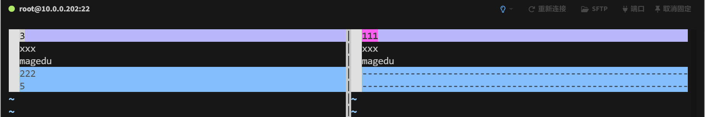

# 文本处理工具与正则表达式


## 内容概述


- **文本编辑工具VIM**
- **各种文本处理工具**
- **正则表达式**
- **文本处理三剑客**


## 文本编辑工具之神 VIM


### vi和vim简介

在 1975 年秋天，Unix 诞生之后的第六年。**Ken Thompson（肯 · 汤普逊）**来到了加利福尼亚大学伯克利分校，开始了为期一年的访问教授生活。当然，他也带上了最新版本的 Unix 的补丁。根据传说，由于贝尔实验室律师们的阻挠，他不能直接把补丁给其他人，而只能把装有补丁的磁带“丢”在某个地方，然后由别人“正好”捡到……Unix 就以这种“地下”的传播方式流传开了。

同年，年轻的 **Bill Joy（比尔 · 乔伊）**也进入了加利福尼亚大学伯克利分校，学习电子工程和计算机科学。他立刻就迷上了 Unix。在后面几年的硕士生涯里，他修正了 Unix 里的 Pascal 系统，使得 Pascal 成了学生编程的缺省选择。他在 1978 年负责发布了第一个伯克利发行版（BSD，即 Berkeley Software Distribution），其中包含了他写的 ex，一个编辑器 ed 的改进版本。随即，在 1979 年他发布了第二版的伯克利 Unix（2BSD），包含了他写的 vi 和 csh。他独立实现了 BSD 中的 TCP/IP 栈。

离开伯克利后，他成了 Sun 的联合创始人和首席科学家，在 Solaris 操作系统、NFS 网络文件系统、SPARC 处理器、Java 语言的开发等多个领域中作出了自己的贡献……

在 Bill Joy 的无数传奇故事里，有一个是，他只花了一个周末就写出了 vi。这当然……不是真的。vi 是演进的结果，前面还有 ed、em、en、ex（哈，对于两字母的 Unix 命令，我看得也是有点晕了🤔）等等一系列。只不过，那些都是基于命令的**行编辑器**，而不是**全屏编辑器**。vi 可以充分使用整个终端屏幕的资源，易用性的提升是毋庸置疑的。

不管怎么说，vi 只是一个 Bill 无意插柳柳成荫的结果，是他职业生涯中的一个副产品而已。在 1982 年初，Bill Joy 加入 Sun 公司之后，vi 就不怎么有人维护了。此外，由于没有得到 AT&T 授权的公司和个人也不能使用 vi 的源码（律师又一次发挥了威力），因此，大量的 vi 克隆版本纷纷出现。

目前大部分 Linux 发行版和 macOS 中的 vi 命令唤起的都是 Vim，一个由 **Bram Moolenaar（布莱姆 · 穆勒纳尔）**持续开发维护了三十多年的 vi 克隆（想想，三十年在计算机的发展中，那是经历了多少代技术的演进！）。在这些年里，其他的 vi 克隆诞生又死去，最后只剩下了 Vim（好吧，“只”是夸张手法）。起初，Vim 的意思是 Vi IMitation，但很快就成了 Vi IMproved。而这，就是我们这个课程的主题。


### VIM 快捷键概览


### 初识 VIM


#### vim 命令格式

```bash
vim [OPTION]... FILE...
```


**常用选项**

```bash
+N                   # 打开文件后让光标处于第N行的行首，+默认行尾
+/PATTERN            # 让光标处于第一个被PATTERN匹配到的行行首
-b file              # 二进制方式打开文件
-d file1 file2…      # 比较多个文件，相当于 vimdiff
-m file              #只读打开文件
```


**说明**

- 如果该文件存在，文件被打开并显示内容
- 如果该文件不存在，当编辑后第一次存盘时创建它
- 如果后面打开的是一个目录，则会列出目录中所有内容，可以用方向键进行选择


```bat
通常上述的命令选项都不使用，更多的是使用vim进入文档后，在利用快捷键快速移动光标。这里仅做了解！！！
```


#### vim的模式介绍


- **正常（normal）模式**

  > （也称为普通模式），缺省的编辑模式；如果不加特殊说明，一般提到的命令都直接在正常模式下输入；在任何其他模式中，都可以通过键盘上的 Esc 键回到正常模式。

- **插入（insert）模式**

  > 输入文本时使用；比如在正常模式下键入 i（insert）或 a（append）即可进入插入模式。

- **可视（visual）模式**

  > 用于选定文本块；教程中已经提到可以用键 v（小写）来按字符选定，Vim 里也提供其他不同的选定方法，包括按行和按列块。

- **命令行（command-line）模式**

  > 用于执行较长、较复杂的命令；在正常模式下键入冒号（:）即可进入该模式；使用斜杠（/）和问号（?）开始搜索也算作命令行模式。命令行模式下的命令要输入回车键（Enter）才算完成。


#### 命令行模式


```bat
按 “冒号” 进入命令行模式，创建一个命令提示符: ，处于底部的屏幕左侧
```


##### 命令行模式基本命令

```bash
w                         # 写（存）磁盘文件
wq                        # 写入并退出
x                         # 写入并退出
X                         # 加密
q                         # 退出
q!                        # 不存盘退出，即使更改都将丢失
r filename                # 读文件内容到当前文件中
w filename                # 将当前文件内容写入另一个文件
!command                  # 执行命令
r!command                 # 读入命令的输出
```


**示例1：读文件内容到当前文件中**


**示例2：读入命令的输出**


##### 地址定界

格式：

```bash
:start_pos,end_pos CMD
```


地址定界格式：

```bash
N                         # 具体第N行，例如2表示第2行
M,N                       # 从左侧M表示起始行，到右侧N表示结尾行
M,+N                      # 从左侧M表示起始行，右侧表示从光标所在行开始，再往后+N行结束 
M,-N                      # 从左侧M表示起始行，右侧表示从光标所在行开始，-N所在的行行结束
M;+N                      # 从第M行处开始，往后数N行，2;+3 表示第2行到第5行，总共取4行
M;-N                      # 从第M-N行开始，到第M行结束
.                         # 当前行                     
$                         # 最后一行
.,$-1                     # 当前行到倒数第二行
%                         # 全文, 相当于1,$
/pattern/                 # 从当前行向下查找，直到匹配pattern的第一行,即正则匹配
/pat1/,/pat2/             # 从第一次被pat1模式匹配到的行开始，一直到第一次被pat2匹配到的行结束
N,/pat/                   # 从指定行开始，一直找到第一个匹配pattern的行结束
/pat/,$                   # 向下找到第一个匹配patttern的行到整个文件的结尾的所有行
```


**地址定界后跟一个编辑命令**

```bash
p                        # 输出
d                        # 删除
y                        # 复制
w file                   # 将范围内的行另存至指定文件中
r file                   # 在指定位置插入指定文件中的所有内容
t行号                     # 将前面指定的行复制到N行后
m行号                     # 将前面指定的行移动到N行后
```


**范例：**

```bash
[root@rocky8 ~]# seq 10 > 10.txt

:2d                      # 删除第2行
:2,4d                    # 删除第2到第4行
:2;+3y                   # 复制第2到第5行，总共4行
:2;+4w test              # 将第2到第6行，总共5行内容写入新文件
:5r /etc/issue           # 将/etc/issue 文件读取到第5行的下一行
:t2                      # 将光标所在行复制到第2行的下一行
:2;+3t10                 # 将第2到第5行，总共4行内容复制到第10行之后
:.d                      # 删除光标所在行
:$y                      # 复制最后一行
```


##### 查找并替换

查找

```bash
/<pat>                           # 向后查找
?<pat>                           # 向前查找
```


替换

```bash
:s/要查找的内容/替换为的内容/修饰符
:%s 表示全文查找替换
```


修饰符

```bash
i                     # 忽略大小写
g                     # 全局替换，默认情况下，每一行只替换第一次出现
gc                    # 全局替换，每次替换前询问
```

查找替换中的分隔符/可替换为其它字符，如：#,@ 


范例：

```bash
:s/root/ROOT/         # 替换当前行第一个root
:s/root/ROOT/g        # 替换当前行所有root
:%s/root/ROOT/g       # 全文替换
:%s/root/test/ig      # 不区分大小写全文替换

:%s/#//               # 将每行第一个#替换成空
```


查看帮助

```bash
:he
```


#### 正常模式

又称为Normal模式，功能强大，但是在此模式下输入的命令不会在屏幕上显示，只能靠记忆 记住到底输入了什么，所以此处我们要记住大量快捷键；


##### 退出VIM

```bash
ZZ                # 保存退出
ZQ                # 不保存退出
```


##### 光标跳转

###### 字符间跳转：

```bash
h                 # 左
j                 # 下
k                 # 上
l                 # 右
```


###### 单词间跳转：

```bash
w                 # 下一个单词的词首
e                 # 当前或下一单词的词尾
b                 # 当前或前一个单词的词首
```


###### 当前页跳转：

```bash
H                 # 页首
M                 # 页中间行
L                 # 页底
zt                # 将光标所在当前行移到屏幕顶端
zz                # 将光标所在当前行移到屏幕中间
zb                # 将光标所在当前行移到屏幕底端
```


###### 行首行尾跳转：

```bash
^                 # 跳转至行首的第一个非空白字符
0                 # 跳转至行首
$                 # 跳转至行尾
```


###### 行间移动：

```bash
NG|:N            # 跳转至指定行,N表示正整数，比如 10G,或在扩展命令模式下:10,都表示跳转到第10行
G                # 最后一行
gg|1G            # 第一行
```


###### 行间搜索跳转：

```bash
f|F + 字符              # 向后|前 跳到离得最近的字符上
t|T + 字符              # 向后|前 跳到离得最近的字符前
```


###### 句间移动：

```bash
)                # 下一句
(                # 上一句
```


###### 段落间移动：

```bash
}                # 下一段
{                # 上一段
```


###### 查找并移动：

```bash
/<pat> + N|n    # 向后查找，并使用n向后跳转，N向前跳转

?<pat>          # 向前查找，并使用n向前跳转，N向后跳转
```


##### 字符编辑

```bash
x               # 剪切光标处的字符
Nx              # 剪切光标处起始的N个字符,N为正整数
~               # 转换大小写
gu|gU           # gu转小写，gU转大写
J               # 删除当前行后的换行符，就是把下一行接到当前行后面
```


##### 删除命令(delete)

```bash
d               # 删除命令，可结合光标跳转字符，实现范围删除

d$|D            # 删除光标处到行尾
d^              # 删除光标处到非空行首
d0              # 删除光标处到处行首
dw              # 从光标处删到下一个单词的词首
de              # 从光标处删到当前单词词尾或下一单词的词尾
db              # 从光标处删到当前单词词首或前一单词的词首
dG              # 删除光标所在的行到文件末尾
dgg             # 删除光标所在的行到文件开始
dd              # 删除光标所在行
Ndd             #从当前行开始，删N行，N表示正整数，2dd表示从当前行开始，总共删2行

                # 这些内容都在缓冲区，可以用p键粘贴出来
```


##### 复制命令(yank)

```bash
y               # 复制，行为相似于d命令

y$              # 复制光标处到行
y0              # 复制光标处到行首
y^              # 复制光标处到非空行首
yy|Y            # 复制整行,yy前面加数字，表示从当前处往后复制多少行； 3yy 表示往下复制3行
Nyy             # 从当前处往后复制N行, N表示正整数，2yy表示从当前行开始，总共复制2行
yw              # 从光标处复制到下一个单词的词首
ye              # 从光标处复制到当前单词词尾或下一单词的词尾
yb              # 从光标处复制到当前单词词首或下一单词的词首
```


##### 粘贴命令(paste)

```bash
p               # 小写 p 缓冲区存的如果为整行，则粘贴当前光标所在行的下方；否则，则粘贴至当前光标所在处的后面
P               # 大写 p 缓冲区存的如果为整行，则粘贴当前光标所在行的上方；否则，则粘贴至当前光标所在处的前面
```


##### 改变命令(change)

命令 c 删除后切换成插入模式

```bash
c$|C            # 删除光标处到行尾，并切换成插入模式
c^              # 删除光标处到非空行首，并切换成插入模式
c0              # 删除光标处到行首，并切换成插入模式
cc              # 删除当前行并输入新内容，相当于S，加数字表示向下删除多少行，然后切换成插入模式
Ncc             # N表示正整数
cw              # 从光标处删到下一个单词的词首，并切换成插入模式
ce              # 从光标处删到当前单词词尾或下一单词的词尾，并切换成插入模式
cb              # 从光标处删到当前单词词首或下一单词的词首，并切换成插入模式
```


##### 撤销更改

```bash
u               # 撤销最近的更改，相当于windows中ctrl+z
Nu              # 撤销之前多次更改,N表示正整数
Ctrl+r          # 重做最后的“撤消”更改，相当于windows中crtl+y
.               # 重复前一个操作
N.              # 重复前一个操作N次，N为正整数
```


##### 高级用法

`command` + `i | a` + `symbol`

常见Command：y 复制、d 删除、gU 变大写、gu 变小写

`i` 表示不包含 symbol

`a` 表示包含 symbol


示例：

```bash
di"|()|{}|[]|'            # 光标在 symbol 之间，则删除 symbol 之间的内容
da"|()|{}|[]|'            # 光标在 symbol 之间，则删除 symbol 之间的内容，包含 symbol
yi"|()|{}|[]|'            # 光标在 symbol 之间，则复制 symbol 之间的内容
ya"|()|{}|[]|'            # 光标在 symbol 之间，则复制 symbol 之间的内容，包含 symbol
vi"|()|{}|[]|'            # 光标在 symbol 之间，则选中 symbol 之间的内容
va"|()|{}|[]|'            # 光标在 symbol 之间，则选中 symbol 之间的内容，包含 symbol
```


#### 插入模式

- `i` 在当前字符前面进入插入模式；
- `I` 则相当于 `^i`，把光标移到行首非空白字符上然后进入插入模式。
- `a` 在当前字符后面进入插入模式；
- `A` 相当于 `$a`，把光标移到行尾然后进入插入模式。
- `o` 在当前行下方插入一个新行，然后在这行进入插入模式；
- `O` 在当前行上方插入一个新行，然后在这行进入插入模式。


#### 可视模式

在末行有”-- VISUAL -- “指示，表示在可视化模式

允许选择的文本块

- `v` 面向字符，-- VISUAL --
-  `V` 面向整行，-- VISUAL LINE --
-  `ctrl-v` 面向块，-- VISUAL BLOCK --


**范例：在文件指定行的行首插入#（重要）**

```bat
1、先将光标移动到指定的第一行的行首
2、输入ctrl+v 进入可视化模式
3、向下移动光标，选中希望操作的每一行的第一个字符
4、输入大写字母 I 切换至插入模式
5、输入 # 
6、按 ESC 键
```


### VIM 进阶

#### 多文件打开与缓冲区


##### 多文件打开

Vim 支持一次性打开多个文件，你只需要在命令行上写出多个文件即可，或者使用通配符。比如，就我们刚才所说的编辑场景，我们可以使用 `vim *.cpp *.h`。

输入这个命令之后，Vim 只打开了一个文件，那就是所有文件中的第一个。

> 为了确保在配置较差的环境里仍然能够正常工作，Vim 绝对不会不必要地消耗内存，包括打开不必要立即打开的文件。所以在上面的命令后，Vim 建立了一个文件列表，并且暂时只打开其中的第一个文件。接下来，用户可以决定，要编辑哪个文件，或者查看列表，或者提前退出，等等。


**Vim 提供了以下命令**

- `:args`：可以显示“参数”，即需要编辑的多个文件的列表
- `:args 文件名`：使用新的文件名替换参数列表
- `:next（可缩写为 :n）`：打开下一个文件；如当前文件修改（未存盘）则会报错中止，但如果命令后面加 ! 则会放弃修改内容，其他命令也类似
- `:Next（缩写 :N）或 :previous（缩写 :prev）`：打开上一个文件
- `:first 或 :rewind`：回到列表中的第一个文件
- `:last`：打开列表中的最后一个文件


**工作流示例**

1. 在终端里进入到目标目录下

2. 使用 `vim *.cpp *.h` 或 `gvim *.cpp *.h` 来打开需要编辑的文件

3. 对于第一个文件，使用之前的方法贴入所需的文本

4. 使用 V 进入行选择的可视模式，移动光标选中所需的文本，然后使用 y 复制选中的各行

5. 执行命令 `:set autowrite`，告诉 Vim 在切换文件时自动存盘

6. 执行命令` :n|normal ggP`，切换到下一个文件并执行正常模式命令 ggP，跳转到文件开头并贴入文本

   > `|` 用来 **分隔多条命令**，相当于执行多个命令的链。
   >
   > `:n` → 跳到下一个文件（由 `:args` 指定的列表）
   >
   > `:normal ggP` → 在当前文件中执行普通模式命令 `ggP`（跳到文件开头并粘贴寄存器内容）

7. 确认修改无误后，键入 :、上箭头和回车，重复执行上面的命令

8. 待 Vim 报错说已经在最后一个文件里，使用 :w 存盘，或 :wq（抑或更快的 ZZ）存盘退出


##### 缓冲区的管理和切换

Vim 里会对每一个已打开或要打开的文件创建一个缓冲区，这个缓冲区就是文件在 Vim 中的映射。

在多文件编辑的时候你也会有同样数量的缓冲区。不过，缓冲区的数量常常会更高，因为你用 :e 等命令打开的文件不会改变“命令行参数”（只被命令行或 :args 命令修改），但同样会增加缓冲区的数量。

`:args` 代表参数列表 / 文件列表，真的只是文件的列表而已。缓冲区中有更多信息的，最最基本的就是记忆了光标的位置。在 Vim 里，除了切换到下一个文件这样的批处理操作外，操作缓冲区的命令比简单操作文件的命令更为方便。


作为对比，我们来看一下文件列表和缓冲区列表的命令的结果。

- 文件列表

  ```bash
  :args
  ```

  

- 缓冲区信息

  ```:
  :ls
  ```

  


使用`:e file` 创建新文件，会增加缓冲区，但文件列表不变

```bash
:e 11.txt
```

- 文件列表

  ```bash
  :args
  ```

  

- 缓冲区信息

  ```bash
  :ls
  ```

  


可以看到，两者都展示了文件，都标示出了当前编辑的文件（分别使用`方括号[]`和`“%a”`）。不过，缓冲区列表中明显有更多的信息：

- 文件名前面有编号；我们也马上就会说到利用编号的命令
- 除了当前活跃文件的标记`“%a”`，还有个文件被标成了`“#”`，这表示最近的缓冲区；缓冲区列表里还可能有其他标记，如`“+”`表示缓冲区已经被修改。
- 文件名后面有行号，表示光标在文件中的位置


**常用缓冲区命令**

- `:buffers` 或 `:ls`：可以显示缓冲区的列表
- `:buffer` 缓冲区列表里的编号`（:buffer 可缩写为 :b）`：跳转到编号对应的缓冲区；如当前缓冲区已被修改（未存盘）则会报错中止，但如果命令后面加 ! 则会放弃修改内容；其他命令也类似
- `:bdelete` 缓冲区列表里的编号（`:bdelete` 可缩写为 `:bd`）：删除编号对应的缓冲区；编号省略的话删除当前缓冲区
- `:bnext`（缩写 `:bn`）：跳转到下一个缓冲区
- `:bNext`（缩写 `:bN`）或 `:bprevious`（缩写 `:bp`）：跳转到上一个缓冲区
- `:bfirst` 或 `:brewind`：跳转到缓冲区列表中的第一个文件
- `:blast`：跳转到缓冲区列表中的最后一个文件


#### 多窗口编辑

**关于多窗口的常用按键**

- `<C-W>`加方向键（`h`、`j`、`k`、`l`、 等等）可以在窗口之间跳转
- `<C-W>n` 或 :`new` 打开一个新窗口
- `<C-W>c` 或 `:close` 关闭当前窗口；当前窗口如果已经是最后一个则无效
- `<C-W>q` 或 `:quit` 退出当前窗口，当最后一个窗口退出时则退出 Vim
- `<C-W>o` 或 `:only` 只保留当前窗口，关闭其他所有窗口
- `<C-W>s` 或`:split` 作用相同，把当前窗口横向一分为二
- `<C-W>v` 或`:vsplit` 作用相同，把当前窗口纵向一分为二
- `<C-W>=` 使得所有窗口大小相同（当调整过终端或图形界面 Vim 的窗口大小后特别有用）
- `<C-W>_` 设置窗口高度，命令前的数字表示高度行数，默认为纵向占满（想专心编辑某个文件时很有用）
- `<C-W>|` 设置窗口宽度，命令前的数字表示宽度列数，默认为横向占满
- `<C-W>+` 增加窗口的高度，命令前的数字表示需要增加的行数，默认为 1
- `<C-W>-` 减少窗口的高度，命令前的数字表示需要减少的行数，默认为 1
- `<C-W>>` 增加窗口的宽度，命令前的数字表示需要增加的列数，默认为 1
- `<C-W><lt>` （提醒，我们用 表示“<”键）减少窗口的宽度，命令前的数字表示需要增加的列数，默认为 1


#### 定制vim

扩展命令模式的配置只是对当前vim进程有效，可将配置存放在文件中持久保存；

写配置文件必须保证能识别，有些短格式在配置文件中无法识别


配置文件：

```bash
/etc/vimrc                  # 全局配置
~/.vimrc                    # 个人配置
```


##### 行号

```bash
:set number|set nu             # 显示行号           
:set nonumber|set nonu         # 取消显示行号        
```


**忽略字符的大小写**

```bash
:set ignorecase|set ic         # 忽略字符大小写
:set noignorecase|set noic     # 不忽略
```


**自动缩进**

```bash
:set ignorecase|set ic         #忽略字符大小写           
:set noignorecase|set noic     #不忽略        
```


##### 复制保留格式

```bash
:set paste                     # 复制时保留格式 
:set nopaste                   # 禁用复制时保留格式选项
```


##### **显示Tab `^I`和换行符 和`$`显示**

```bash
:set list                      # 显示系统字符
:set nolist                    # 隐藏系统字符
```


##### **高亮搜索**

```bash
:set hlsearch                  # 高亮显示搜索结果
:set nohlsearch|nohl           # 不高亮显示搜索结果   
```


##### **语法高亮**

```bash
:syntax on                     # 语法高亮
:syntax off                    # 关闭语法高亮
```


##### **Tab 用空格代替**

```bash
:set expandtab|set et          # 使用空格代替Tab，默认8个空格
:set noexpandtab|set noet      # 禁用空格代替Tab
```


##### **Tab用指定空格的个数代替**

```bash
:set tabstop=N|set ts=N        # 指定N个空格代替Tab
```


##### **设置缩进宽度**

```bash
:set shiftwidth=4              # 设置缩进为4个字符
```


##### **设置光标所在行的标识线**

```bash
:set cursorline|set cul        # 给光标所在行加下划线
:set nocursorline|set nocul    # 取消光标下划线
```


##### vim 初级定制版

创建 `~/.vimrc` 文件

```bash
set shiftwidth=4
set ts=4
set expandtab
set ignorecase
autocmd BufNewFile *.sh exec ":call SetTitle()"
func SetTitle()
    if expand("%:e") == 'sh'
    call setline(1,"#!/bin/bash")
    call setline(2,"#")
    call setline(3,"#********************************************************************")
    call setline(4,"#Author:            mystical")
    call setline(5,"#QQ:                3140394153")
    call setline(6,"#Date:              ".strftime("%Y-%m-%d"))
    call setline(7,"#FileName:          ".expand("%"))
    call setline(8,"#URL:               http://www.xxxxxxx.com")
    call setline(9,"#Description:       The test script")
    call setline(10,"#Copyright (C):     ".strftime("%Y")." All rights reserved")
    call setline(11,"#********************************************************************")
    call setline(12,"")
    endif
endfunc
autocmd BufNewFile * normal G
```


## 文件常见处理工具


### 文件内容查看命令

#### cat

cat 可以查看文本内容

格式：

```bash
cat [OPTION]... [FILE]...

# 常见选项
-E|--show-ends            # 显示行结束符$
-A|--show-all             # 显示所有控制符
-n|--number               # 对显示出的每一行进行编号
-b|--number-nonblank      # 非空行编号
-s|--squeeze-blank        # 压缩连续的空行成一行
```


范例：

```bash
# 这里重点是 .vimrc 里不能有 "set expandtab"
[root@ubuntu2204 ~]#cat -A data/fa.txt 
a    b$
c$
a^Ib^Ic$

[root@ubuntu2204 ~]#cat data/fa.txt 
a    b
c
a       b       c

# Linux上创建fb.txt
[root@ubuntu2204 ~]#cat data/fb.txt 
a
b
c

# 转换成windows格式
[root@ubuntu2204 ~]#unix2dos data/fb.txt 
unix2dos: 正在转换文件 data/fb.txt 为DOS格式...

[root@ubuntu2204 ~]#cat -A data/fb.txt 
a^M$
b^M$
c^M$

# 发现是CRLF格式
[root@ubuntu2204 ~]#file data/fb.txt 
data/fb.txt: ASCII text, with CRLF line terminators

# 手写 windows 格式 \r\n
[root@ubuntu2204 ~]#echo -e "d\r\n" >> data/fb.txt 
[root@ubuntu2204 ~]#cat -A data/fb.txt 
a^M$
b^M$
c^M$
d^M$
$
```


#### nl

显示行号，相当于cat -b

```bash
[root@ubuntu2204 ~]#cat /data/f1.txt 
a
b
c
d
e
f
[root@ubuntu2204 ~]#nl /data/f1.txt 
     1  a
     2  b
     3  c
     4  d
     5  e
     6  f
```


#### tac

逆向显示文本内容，行倒序显示

```bash
[root@ubuntu2204 ~]#seq 5 > /data/fa.txt
[root@ubuntu2204 ~]#cat /data/fa.txt 
1
2
3
4
5
[root@ubuntu2204 ~]#tac /data/fa.txt 
5
4
3
2
1
```


#### rev

将同一行的内容逆向显示，同一行倒序

```bash
[root@ubuntu2204 ~]#cat /data/fa.txt 
1 2 3 4 5
a b c

# 上下顺序逆向
[root@ubuntu2204 ~]#tac /data/fa.txt 
a b c
1 2 3 4 5

# 逐行逆向
[root@ubuntu2204 ~]#rev /data/fa.txt 
5 4 3 2 1
c b a

# 标准输入
[root@ubuntu2204 ~]#rev
abcdef
fedcba

[root@ubuntu2204 ~]#echo {1..10} |rev
01 9 8 7 6 5 4 3 2 1
```


#### hexdump

格式：

```bash
hexdump [OPTION]... FILE

# 常用选项               
-C                            # 最常用，以 十六进制 + ASCII 格式输出（类似 xxd）
-n N                          # 只显示前 N 个字节
-s N                          # 跳过前 N 个字节后开始显示
-v                            # 显示所有行（默认会把连续相同的行用 * 代替
```


范例：查看非文本文件内容

```bash
[root@ubuntu2204 ~]#hexdump -C -n 512 /dev/sda
00000000  eb 63 90 00 00 00 00 00  00 00 00 00 00 00 00 00  |.c..............|
00000010  00 00 00 00 00 00 00 00  00 00 00 00 00 00 00 00  |................|
*
00000050  00 00 00 00 00 00 00 00  00 00 00 80 00 08 00 00  |................|
00000060  00 00 00 00 ff fa 90 90  f6 c2 80 74 05 f6 c2 70  |...........t...p|
00000070  74 02 b2 80 ea 79 7c 00  00 31 c0 8e d8 8e d0 bc  |t....y|..1......|
00000080  00 20 fb a0 64 7c 3c ff  74 02 88 c2 52 bb 17 04  |. ..d|<.t...R...|
00000090  f6 07 03 74 06 be 88 7d  e8 17 01 be 05 7c b4 41  |...t...}.....|.A|
000000a0  bb aa 55 cd 13 5a 52 72  3d 81 fb 55 aa 75 37 83  |..U..ZRr=..U.u7.|
000000b0  e1 01 74 32 31 c0 89 44  04 40 88 44 ff 89 44 02  |..t21..D.@.D..D.|
000000c0  c7 04 10 00 66 8b 1e 5c  7c 66 89 5c 08 66 8b 1e  |....f..\|f.\.f..|
000000d0  60 7c 66 89 5c 0c c7 44  06 00 70 b4 42 cd 13 72  |`|f.\..D..p.B..r|
000000e0  05 bb 00 70 eb 76 b4 08  cd 13 73 0d 5a 84 d2 0f  |...p.v....s.Z...|
000000f0  83 d0 00 be 93 7d e9 82  00 66 0f b6 c6 88 64 ff  |.....}...f....d.|
00000100  40 66 89 44 04 0f b6 d1  c1 e2 02 88 e8 88 f4 40  |@f.D...........@|
00000110  89 44 08 0f b6 c2 c0 e8  02 66 89 04 66 a1 60 7c  |.D.......f..f.`||
00000120  66 09 c0 75 4e 66 a1 5c  7c 66 31 d2 66 f7 34 88  |f..uNf.\|f1.f.4.|
00000130  d1 31 d2 66 f7 74 04 3b  44 08 7d 37 fe c1 88 c5  |.1.f.t.;D.}7....|
00000140  30 c0 c1 e8 02 08 c1 88  d0 5a 88 c6 bb 00 70 8e  |0........Z....p.|
00000150  c3 31 db b8 01 02 cd 13  72 1e 8c c3 60 1e b9 00  |.1......r...`...|
00000160  01 8e db 31 f6 bf 00 80  8e c6 fc f3 a5 1f 61 ff  |...1..........a.|
00000170  26 5a 7c be 8e 7d eb 03  be 9d 7d e8 34 00 be a2  |&Z|..}....}.4...|
00000180  7d e8 2e 00 cd 18 eb fe  47 52 55 42 20 00 47 65  |}.......GRUB .Ge|
00000190  6f 6d 00 48 61 72 64 20  44 69 73 6b 00 52 65 61  |om.Hard Disk.Rea|
000001a0  64 00 20 45 72 72 6f 72  0d 0a 00 bb 01 00 b4 0e  |d. Error........|
000001b0  cd 10 ac 3c 00 75 f4 c3  00 00 00 00 00 00 00 00  |...<.u..........|
000001c0  02 00 ee ff ff ff 01 00  00 00 ff ff ff 18 00 00  |................|
000001d0  00 00 00 00 00 00 00 00  00 00 00 00 00 00 00 00  |................|
*
000001f0  00 00 00 00 00 00 00 00  00 00 00 00 00 00 55 aa  |..............U.|
00000200

[root@ubuntu2204 ~]#echo {a..z} |tr -d ' '|hexdump -C
00000000  61 62 63 64 65 66 67 68  69 6a 6b 6c 6d 6e 6f 70  |abcdefghijklmnop|
00000010  71 72 73 74 75 76 77 78  79 7a 0a                 |qrstuvwxyz.|
0000001b
```


### 分页查看文件内容


#### more

可以实现分页查看文件，可以配合管道实现输出信息的分页


格式：

```bash
more [OPTIONS...] FILE...

# 常用选项
-d                # 在底部显示提示
-s                # 压缩连续空行
```


命令选项

```bash
空格键             # 翻页
回车键             # 下一行
!cmd              # 执行命令
h                 # 显示帮助
:f                # 显示文件名和当前行号
=                 # 显示行号
```


示例：

```bash
[root@ubuntu2204 ~]# more /var/log/syslog

[root@ubuntu2204 ~]# cat /var/log/syslog | more
```


#### less

less 也可以实现分页查看文件或STDIN输出，less 命令是man命令使用的分页器


格式：

```bash
less [OPTIONS...] FILE...

#常用选项
-e                # 显示完成后自动退出
-N                # 显示行号
-s                # 压缩连续空行
-S                # 不换行显示较长的内容
```


命令选项

```bash
空格键             # 翻页
回车键             # 下一行
:h                # 显示帮助
/string           # 搜索
:!cmd             # 执行命令
b                 # 上一页
```


范例：

```bash
[root@ubuntu2204 ~]#less -N /var/log/syslog

[root@ubuntu2204 ~]#tree / -d |less
```


### 显示文本前面或后面的行内容

#### head

可以显示文件或标准输入的前面行

格式：

```bash
head [OPTION]... [FILE]...

#常用选项
-c|--bytes=N               # 指定获取前N字节
-n|--lines=N               # 指定获取前N行,N如果为负数,表示从文件头取到倒数第N前
-N                         # 同上
-q|--quiet|--slient        # 不输出文件名
-v|--verbose               # 输出文件名
-z|--zero-terminated       # 以NULL字符而非换行符作为行尾分隔符
```


范例：

```bash
[root@ubuntu2204 ~]# head -n 3 /etc/passwd
root:x:0:0:root:/root:/bin/bash
daemon:x:1:1:daemon:/usr/sbin:/usr/sbin/nologin
bin:x:2:2:bin:/bin:/usr/sbin/nologin

[root@ubuntu2204 ~]# head -3 /etc/passwd
root:x:0:0:root:/root:/bin/bash
daemon:x:1:1:daemon:/usr/sbin:/usr/sbin/nologin
bin:x:2:2:bin:/bin:/usr/sbin/nologin

# 因为 终端和 echo 使用的是 UTF-8 编码，而 一个汉字（如 我）在 UTF-8 下占用 3 个字节。
[root@ubuntu2204 ~]# echo a我b | head -c4
a我[root@ubuntu2204 ~]#

# 输出10位随机值
[root@ubuntu2204 ~]#cat /dev/urandom | tr -dc '[:alnum:]'| head -c10
DJkcQ7yx8S

#用随机字符串修改密码
[root@centos8 ~]# cat /dev/urandom | tr -dc '[:alnum:]'| head -c10 | tee pass.txt | passwd --stdin mage
Changing password for user mage.
passwd: all authentication tokens updated successfully.

[root@centos8 ~]# cat pass.txt 
AGT952Essg

[root@ubuntu2204 ~]#head -n 3 seq.log 
1
2
3
[root@ubuntu2204 ~]#head -n +3 seq.log 
1
2
3
[root@ubuntu2204 ~]#head -n -3 seq.log 
1
2
3
4
5
6
7
```


#### tail

tail 和 head 相反，查看文件或标准输入的倒数行

格式：

```bash
tail [OPTION]... [FILE]...

#常用选项
-c|--bytes=N                     # 指定获取后N字节
-n|--lines=N                     # 指定获取后N行,如果写成+N,表示从第N行开始到文件结束
-N                               # 同上
-f|--follow=descriptor           # 跟踪显示文件fd新追加的内容,常用日志监控，当删除再新建同名文件,将无法继续跟踪
-F|--follow=name --retry         # 跟踪文件名，相当于--follow=name --retry，当删除文件再新建同名文件，可继续追踪
-q|--quiet|--silent              # 不输出文件名
-z|--zero-terminated             # 以NULL字符而非换行符作为行尾分隔符
```


范例

```bash
[root@ubuntu2204 ~]#seq 10 > /data/f1.txt
[root@ubuntu2204 ~]#cat /data/f1.txt 
1
2
3
4
5
6
7
8
9
10

[root@ubuntu2204 ~]#tail -n 3 /data/f1.txt 
8
9
10
[root@ubuntu2204 ~]#tail -n +3 /data/f1.txt 
3
4
5
6
7
8
9
10

[root@ubuntu2204 ~]#tail -3 /var/log/syslog
Aug  2 18:17:01 ubuntu2204 CRON[18557]: (root) CMD (   cd / && run-parts --report /etc/cron.hourly)
Aug  2 19:17:01 ubuntu2204 CRON[18572]: (root) CMD (   cd / && run-parts --report /etc/cron.hourly)
Aug  2 20:17:01 ubuntu2204 CRON[18690]: (root) CMD (   cd / && run-parts --report /etc/cron.hourly)

[root@ubuntu2204 ~]# tail -f /var/log/syslog
......
......

# 只查看最新发生的日志
[root@ubuntu2204 ~]#tail -fn0 /var/log/syslog

# 取IP行
[root@ubuntu2204 ~]#ifconfig | head -2 | tail -1
        inet 10.0.0.202  netmask 255.255.255.0  broadcast 10.0.0.255
```


#### head 和 tail 总结

| 命令            | 含义                                    | 示例                   |
| --------------- | --------------------------------------- | ---------------------- |
| head -n k file  | 取 file 前 k行内容                      | head -n 3 /etc/passwd  |
| head -k file    | 取 file 前 k行内容                      | head -3 /etc/passwd    |
| head -n +k file | 取 file 前 k行内容                      | head -n +3 /etc/passwd |
| head -n -k file | 取file 第1行到倒数第k行内容             | head -n -3 /etc/passwd |
|                 |                                         |                        |
| tail -n k file  | 从后往前数，取file 第1行到第k行内容     | tail -n 3 /etc/passwd  |
| tail -k file    | 从后往前数，取file 第1行到第k行内容     | tail -3 /etc/passwd    |
| tail -n -k file | 从后往前数，取file 第1行到第k行内容     | tail -n -3 /etc/passwd |
| tail -n +k file | 从后往前数，取file 第1行到倒数第k行内容 | tail -n +3 /etc/passwd |


范例：显示第6行

```bash
[root@ubuntu2204 ~]#seq 20 | head -n 6 | tail -n 1
6

[root@ubuntu2204 ~]#seq 20 | tail -n +6 | head -n 1
6
```


### 按列抽取文本

#### cut

cut 命令可以提取文本文件或STDIN数据的指定列


格式：

```bash
cut OPTION... [FILE]...

# 常用选项
-b|--bytes=LIST                 # 以字节分割，指定要显示的列
-c|--characters=LIST            # 以字符分割，指定要显示的列
-d|--delimiter=DELIM            # 指定分割符，默认是tab
-f|--fields=LIST                # 要显示的列，-f1,  -f1,2,3,  -f 1-3,4
-s|--only-delimited             # 不显示没有包括分割符的内容
--output-delimiter=STRING       # 输出的时候用指定字符代替分割符
-z|--zero-terminated            # 以 NUL 字符而非换行符作为行尾分隔符

# 一个中文是三个字节，一个字符
```


范例：

```bash
[root@ubuntu2204 ~]# cut -d: -f1,3-4,7 /etc/passwd
[root@ubuntu2204 ~]#cut -d: -f1,3-4,7 /etc/passwd
root:0:0:/bin/bash
daemon:1:1:/usr/sbin/nologin
bin:2:2:/usr/sbin/nologin
sys:3:3:/usr/sbin/nologin
......

[root@ubuntu2204 ~]# ifconfig |head -n2 |tail -n1|cut -d" " -f10
 10.0.0.8
 
[root@ubuntu2204 ~]#df | tr -s " " | cut -d" " -f5 | tr -dc "[0-9\n]"

1
7
0
0
7
0

[root@ubuntu2204 ~]# df | cut -c64-65
 se
 1
 7
 0
 0
 14
 1
 
[root@ubuntu2204 ~]# cut -d: -f1,3,7 --output-delimiter="---" /etc/passwd
root---0---/bin/bash
daemon---1---/usr/sbin/nologin
bin---2---/usr/sbin/nologin

[root@ubuntu2204 ~]# cat /etc/passwd | cut -d: -f7
/bin/bash
/usr/sbin/nologin
/usr/sbin/nologin

[root@ubuntu2204 ~]# echo {1..100}| cut -d ' ' -f1-100 --output-delimiter="+"|bc
5050
```


范例：取分区利用率

```bash
[root@ubuntu2204 ~]#df | tr -s ' '|cut -d " " -f 5|tr -d %
已用
1
7
0
0
7
0

[root@ubuntu2204 ~]#df | tr -s ' ' '%'|cut -d% -f5
已用
1
8
0
0
15
0

#取分区利用率
[root@ubuntu2204 ~]#df |tr -s ' '|cut -d' ' -f5|tr -d %
已用
1
8
0
0
15
0

[root@ubuntu2204 ~]#df |cut -c 64-65 |tail -n +2
 1
 8
 0
 0
15
 0
```


### 合并多个文件

#### paste

paste合并多个文件**同行号**的行到一行

格式

```bash
paste [OPTION]... [FILE]...

# 常用选项
-d|--delimiters=LIST       # 指定分割符，默认用TAB
-s|--serial                # 合成一行显示
```


范例

```bash
[root@ubuntu2204 ~]#echo {a..h}|tr ' ' '\n' > alpha.log
[root@ubuntu2204 ~]#seq 5 > seq.log
[root@ubuntu2204 ~]#cat alpha.log seq.log 
a
b
c
d
e
f
g
h
1
2
3
4
5

[root@ubuntu2204 ~]#paste alpha.log seq.log 
a       1
b       2
c       3
d       4
e       5
f
g
h

[root@ubuntu2204 ~]#paste -d: alpha.log seq.log 
a:1
b:2
c:3
d:4
e:5
f:
g:
h:

[root@ubuntu2204 ~]#paste -s alpha.log 
a       b       c       d       e       f       g       h

[root@ubuntu2204 ~]#paste -s seq.log 
1       2       3       4       5

[root@ubuntu2204 ~]#paste -s alpha.log seq.log 
a       b       c       d       e       f       g       h
1       2       3       4       5

[root@ubuntu2204 ~]#seq 10 | paste -s -d"+" |bc
55
```


范例：批量修改密码

```bash
[root@ubuntu2204 ~]#echo -e "tom\njerry" > user.txt
[root@ubuntu2204 ~]#echo -e "123456\n654321" > pass.txt
[root@ubuntu2204 ~]#cat user.txt 
tom
jerry

[root@ubuntu2204 ~]#cat pass.txt 
123456
654321

[root@ubuntu2204 ~]#paste -d: user.txt pass.txt 
tom:123456
jerry:654321

[root@ubuntu2204 ~]#paste -d: user.txt pass.txt |chpasswd
```


### 文本分析工具

- 文本数据统计：wc
- 整理文本：sort
- 比较文件：diff 和 patch


#### 收集文本统计数据 wc

wc 命令可用于统计文件的行总数、单词总数、字节总数和字符总数，可以对文件或STDIN中的数据统计


格式：

```bash
wc [OPTION]... [FILE]...

# 常用选项
-l|--lines                 # 只统计数行数
-w|--words                 # 只统计数单词总数
-c|--bytes                 # 只统计数字节总数
-m|--chars                 # 只统计数字符总数
-L|--max-line-length       # 显示文件中最长行的长度（以字节为单位）

# 注意：
# wc 将 由空白字符（空格、制表符、换行符）分隔的连续非空白字符 视为一个单词
# 当 wc 统计字符时，空格（Space, ASCII 0x20） 和 换行符（LF, ASCII 0x0A） 都算在字节数里
```


范例：

```bash
[root@ubuntu2204 ~]# wc /etc/passwd
33    46   1750 /etc/passwd
行数  单词数 字节数

# 仅显示行
[root@ubuntu2204 ~]#wc -l /etc/passwd
33 /etc/passwd

# 管道重定向
[root@ubuntu2204 ~]#cat /etc/passwd|wc -l
33

# 显示 /etc/passwd 中最长的行，并查看有多少个字节
[root@ubuntu2204 ~]#cat /etc/passwd | wc -L
89
```


#### 文本排序 sort

把整理过的文本显示在STDOUT，不改变原始文件

格式：

```bash
sort [OPTION]... [FILE]...

# 常用选项
-b|--ignore-leading-blanks                # 忽略文件中的空白
-f|--ignore-case                          # 忽略大小写
-h|--human-numeric-sort                   # 人类可读排序
-M|--month-sort                           # 以月份排序
-n|--numeric-sort                         # 以数字大小排序
-R|--random-sort                          # 随机排序
-r|-reverse                               # 倒序
-t|--field-separator=SEP                  # 指定列分割符
-k|--key=KEYDEF                           # 指定排序列
-u|--unique                               # 去重                   
```


范例：

```bash
[root@ubuntu2204 ~]# cut -d: -f1,3 /etc/passwd|sort -t: -k2 -nr |head -n3
nobody:65534
wang:1000
lxd:999

# 查看日志文件
[root@VM-4-10-centos /var/log] $ cat /www/wwwlogs/access.log |head -n5
103.149.26.253 - - [15/Mar/2024:02:11:20 +0800] "GET / HTTP/1.1" 403 146 "-" "-"
103.149.26.240 - - [15/Mar/2024:02:15:26 +0800] "GET / HTTP/1.1" 403 548 "-" "Mozilla/5.0 (Windows NT 6.1) AppleWebKit/537.36 (KHTML, like Gecko) Chrome/49.0.2623.112 Safari/537.36"
103.149.26.240 - - [15/Mar/2024:02:15:26 +0800] "GET /favicon.ico HTTP/1.1" 404 548 "-" "Mozilla/5.0 (Windows NT 6.1) AppleWebKit/537.36 (KHTML, like Gecko) Chrome/49.0.2623.112 Safari/537.36"
47.236.251.7 - - [15/Mar/2024:02:45:16 +0800] "\x05\x01\x00" 400 150 "-" "-"
47.236.251.7 - - [15/Mar/2024:02:45:23 +0800] "\x04\x01\x00Pg)\xA7\xEA\x00" 400 150 "-" "-"
......

# 统计日志访问量
[root@VM-4-10-centos /var/log] $ cut -d" " -f1 /www/wwwlogs/access.log |sort -u|wc -l
3034
```


范例：统计分区利用率

```bash
[root@ubuntu2204 ~]#df
文件系统                             1K的块    已用     可用 已用% 挂载点
tmpfs                                398320    1572   396748    1% /run
/dev/mapper/ubuntu--vg-ubuntu--lv 101590008 6675536 89707844    7% /
tmpfs                               1991588       0  1991588    0% /dev/shm
tmpfs                                  5120       0     5120    0% /run/lock
/dev/sda2                           1992552  256812  1614500   14% /boot
tmpfs                                398316       0   398316    0% /run/user/0

# 查看分区利用率最高值
[root@ubuntu2204 ~]#df|tr -s ' ' '%'|cut -d% -f5|tail +2|sort -nr|head -1
14

# 查看分区利用率最高值
[root@ubuntu2204 ~]#df|tr -s ' ' '%'|cut -d% -f5|tail +2|sort -n|tail -1
14
```


面试题：有两个文件，a.txt与b.txt ，合并两个文件，并输出时确保每个数字也唯一

```bash
[root@ubuntu2204 ~]# cat a.txt
1111
222
33
4444
5

[root@ubuntu2204 ~]# cat b.txt
8
1111
33
22
100000
77

[root@ubuntu2204 ~]# cat a.txt b.txt | sort -nu 
[root@ubuntu2204 ~]#cat a.txt b.txt |sort -nu
5
8
22
33
77
222
1111
4444
100000
```


#### 去重uniq

uniq 命令从输入中删除前后相接的重复的行，常和 sort 配合使用

格式：

```bash
uniq [OPTION]... [INPUT [OUTPUT]]

# 常见选项
-c|--count         #显示每行出现次数
-d|--repeated      #仅显示有重复行
-D                 #显示所有重复行具体内容
-u|--unique        #仅显示不重复的行        
```


范例：

```bash
[root@ubuntu2204 ~]#cat a.txt b.txt | sort -n
5
8
22
33
33
77
222
1111
1111
4444
100000

# 统计每行的数量
[root@ubuntu2204 ~]#cat a.txt b.txt | sort -n |uniq -c
      1 5
      1 8
      1 22
      2 33
      1 77
      1 222
      2 1111
      1 4444
      1 100000
 
# 显示所有重复行具体内容
[root@ubuntu2204 ~]#cat a.txt b.txt | sort -n |uniq -D
33
33
1111
1111

# 仅显示两个文件中相同的行
[root@ubuntu2204 ~]#cat a.txt b.txt | sort -n |uniq -d
33
1111

# 仅显示两个文件中不同的行
[root@ubuntu2204 ~]#cat a.txt b.txt | sort -n |uniq -u
5
8
22
77
222
4444
100000
```


范例：统计日志访问量最多的前三名的请求

```bash
[root@VM-4-10-centos /var/log] $ cat /www/wwwlogs/access.log | cut -d" " -f1 | sort | uniq -c | sort -nr | head -3
   1080 106.54.233.20
    542 129.226.147.239
    531 112.124.11.25
```


#### 比较文件

##### diff

diff 命令比较两个文件之间的区别


格式：

```bash
diff [OPTION]... FILES

# 常用选项
-u         # 选项来输出“统一的（unified）”diff格式文件，最适用于补丁文件
```


范例：

```bash
[root@ubuntu2204 ~]#cat f1.txt 
111
xxx
magedu

[root@ubuntu2204 ~]#cat f2.txt 
3
xxx
magedu
222
5

# 下面的就表示：前面没有符号的是共有的，-号后面的是f1独有的，+号后面的是f2独有的
[root@ubuntu2204 ~]#diff -u f1.txt f2.txt 
--- f1.txt      2025-08-03 13:13:05.045425104 +0800
+++ f2.txt      2025-08-03 13:13:20.037029788 +0800
@@ -1,3 +1,5 @@
-111
+3
 xxx
 magedu
+222
+5


```


##### patch

用来 **将补丁文件（diff 生成的）应用到原始文件或源代码树**，以便修改文件到新的版本。


格式：

```bash
patch [OPTION]... [ORIGFILE [PATCHFILE]]

# 常用选项
-b|--backup        #备份
```


范例：

```bash
# 将对比结果保存至文件
[root@ubuntu2204 ~]#diff -u f1.txt f2.txt > f.patch
[root@ubuntu2204 ~]#rm -rf f2.txt 

# 用来还原
[root@ubuntu2204 ~]#patch -b f1.txt f.patch 
patching file f1.txt

#还原出来是f2
[root@ubuntu2204 ~]#cat f1.txt
3
xxx
magedu
222
5
[root@ubuntu2204 ~]#cat f1.txt.orig 
111
xxx
magedu
```


##### vimdiff

相当于vim -d

```bash
[root@ubuntu2204 ~]#vimdiff f1.txt f2.txt
```




##### cmp

范例：查看二进制文件的不同

```bash
[root@ubuntu2204 ~]# cmp /bin/dir /bin/ls
/bin/dir /bin/ls 不同：第 25 字节，第 1 行

# 跳过前20个字节,观察后面10个字节
[root@ubuntu2204 ~]#hexdump -s 20 -Cn 10 /bin/ls
00000014  01 00 00 00 b0 6a 00 00  00 00                    |.....j....|
0000001e

[root@ubuntu2204 ~]#hexdump -s 20 -Cn 10 /bin/dir
00000014  01 00 00 00 90 6a 00 00  00 00                    |.....j....|
0000001e
```


## 正则表达式

## 正则表达式

### 什么是正则表达式

正则表达式是一种**用来描述字符串匹配模式的语法规则**，就像一把“文本过滤器”或“高级搜索工具”。


#### 能解决哪些问题？（结合实际场景）

| 场景           | 正则能做什么                                    |
| -------------- | ----------------------------------------------- |
| **日志分析**   | 从大量日志中提取 IP、时间戳、错误信息等关键字段 |
| **输入校验**   | 判断手机号、邮箱、身份证号是否符合格式          |
| **数据提取**   | 从 HTML 页面中提取链接地址、图片 URL、标题等    |
| **文本替换**   | 批量替换代码中的函数名、变量名，或者清洗脏数据  |
| **爬虫开发**   | 抓取网页时，用正则快速提取内容                  |
| **批量重命名** | 使用正则+脚本改名一堆图片、视频、文件名等       |
| **配置审计**   | 查找配置文件中被注释掉的行、未配置项等          |


```bat
正则表达式就像在茫茫人海中寻找你要的人，它提供一组“筛选规则”：只要长得像这个样子、有这个特征的人就挑出来。<br>它不只“看起来像”，而是按规则“精准匹配”。
```


### 正则表达式简史

正则表达式的起源，可以追溯到，早期神经系统如何工作的研究。在 20 世纪 40 年代，有两位神经生理学家（Warren McCulloch 和 Walter Pitts），研究出了一种用数学方式来描述神经网络的方法。

1956 年，一位数学家（Stephen Kleene）发表了一篇标题为《神经网络事件表示法和有穷自动机》的论文。这篇论文描述了一种叫做“正则集合（Regular Sets）”的符号。

随后，大名鼎鼎的 Unix 之父 **Ken Thompson** 于 1968 年发表了文章《正则表达式搜索算法》，并且将正则引入了自己开发的编辑器 qed，以及之后的编辑器 ed 中，然后又移植到了大名鼎鼎的文本搜索工具 grep 中。自此，正则表达式被广泛应用到 Unix 系统或类 Unix 系统 (如 macOS、Linux) 的各种工具中。

随后，由于正则功能强大，非常实用，越来越多的语言和工具都开始支持正则。不过遗憾的是，由于没有尽早确立标准，导致各种语言和工具中的正则虽然功能大致类似，但仍然有不少细微差别。

于是，诞生于 1986 年的 POSIX 开始进行标准化的尝试。POSIX作为一系列规范，定义了 Unix 操作系统应当支持的功能，其中也包括正则表达式的规范。因此，Unix 系统或类 Unix 系统上的大部分工具，如 grep、sed、awk 等，均遵循该标准。我们把这些遵循 POSIX 正则表达式规范的正则表达式，称为 **POSIX 流派**的正则表达式。

在 1987 年 12 月，Larry Wall 发布了 Perl 语言第一版，因其功能强大一票走红，所引入的正则表达式功能大放异彩。之后 Perl 语言中的正则表达式不断改进，影响越来越大。于是在此基础上，1997 年又诞生了PCRE——**Perl 兼容正则表达式**（Perl Compatible Regular Expressions）。

PCRE 是一个兼容 Perl 语言正则表达式的解析引擎，是由 Philip Hazel 开发的，为很多现代语言和工具所普遍使用。除了 Unix 上的工具遵循 POSIX 标准，PCRE 现已成为其他大部分语言和工具隐然遵循的标准。

之后，正则表达式在各种计算机语言或各种应用领域得到了更为广泛的应用和发展。**POSIX 流派** 与 **PCRE 流派** 是目前正则表达式流派中的两大最主要的流派。


### 正则表达式流派

目前正则表达式主要有两大流派（Flavor）：**POSIX 流派**与 **PCRE 流派。**


#### POSIX 流派

先简要介绍一下 POSIX 流派。POSIX 规范定义了正则表达式的两种标准：

- **BRE 标准**（Basic Regular Expression 基本正则表达式）；
- **ERE 标准**（Extended Regular Expression 扩展正则表达式）。


**BRE 标准 和 ERE 标准**

早期 BRE 与 ERE 标准的区别主要在于，BRE 标准不支持量词问号和加号，也不支持多选分支结构管道符。BRE 标准在使用花括号，圆括号时要转义才能表示特殊含义。BRE 标准用起来这么不爽，于是有了 ERE 标准，在使用花括号，圆括号时不需要转义了，还支持了问号、加号 和 多选分支。


现在使用的 Linux 发行版，大多都集成了 GNU 套件。GNU 在实现 POSIX 标准时，做了一定的扩展，主要有以下三点扩展。

- **GNU BRE** 支持了 +、?，但转义了才表示特殊含义，即需要用\+、\?表示。
- **GNU BRE** 支持管道符多选分支结构，同样需要转义，即用 \|表示。
- **GNU ERE** 也支持使用反引用，和 BRE 一样，使用 \1、\2…\9 表示。


#### POSIX 字符组

POSIX 流派还有一个特殊的地方，就是有自己的字符组，叫 POSIX 字符组。这个类似于 `\d` 表示数字，`\s` 表示空白符等，POSIX 中也定义了一系列的字符组。具体的清单和解释如下所示：


#### PCRE 流派

除了 POSIX 标准外，还有一个 Perl 分支，也就是我们现在熟知的 PCRE。随着 Perl 语言的发展，Perl 语言中的正则表达式功能越来越强悍，为了把 Perl 语言中正则的功能移植到其他语言中，PCRE 就诞生了。

目前大部分常用编程语言都是源于 PCRE 标准，这个流派显著特征是有`\d`、`\w`、`\s` 这类字符组简记方式。


### 正则表达式元字符


#### 单字符匹配

```bash
.                   # 任意单个字符（\n除外）
[...]               # 指定范围的字符，即多选一
[^...]              # 不在指定范围的字符，一样是多选一

# ERE | BRE
[:alnum:]           # 数字和字母
[:alpha:]           # 代表任何英文大小写字符，亦即 A-Z, a-z 
[:lower:]           # 小写字母,示例:[[:lower:]],相当于[a-z]
[:upper:]           # 大写字母
[:blank:]           # 空白字符（空格和制表符） 
[:space:]           # 水平和垂直的空白字符（比[:blank:]包含的范围广）
[:digit:]           # 十进制数字
[:xdigit:]          # 十六进制数字
[:punct:]           # 标点符号

# PCRE
\d                  # 数字
\w                  # 数字，字母，下划线
\s                  # 空白字符
```

POSIX ERE 标准本身 **不支持 `\w`、`\s`、`\d`**，但：

> **GNU grep 的实现在某些环境下允许 `\w`、`\s`、`\d` 等 Perl 风格写法**，即使使用的是 `-E`（ERE 模式），也可能生效。
>
> 实测 grep -E 不支持 `\d`，支持 `\w` 和 `\s`
>
> 因此，为跨平台场景考虑，不建议扩展正则使用`\d`,`\w`,`\s`，建议使用[:alnum:]等替代


#### 量词即匹配次数

```bash
*                  # 匹配前面字符任意次
?                  # 0或1次
+                  # 1次或多次
{n}                # 匹配n次
{m,n}              # 至少m，至多n次
```


#### 位置锚定

```bash
^                 # 行首
$                 # 行尾
\<, \b            # 词首
\>, \b            # 词尾
```


#### 分组其他

```bash
()                # 后向引用：\1, \2, ... 注意: \0 表示正则表达式匹配的所有字符，重点观察左括号
|                 # 或者
a|b               # a或b
C|cat             # C或cat
(C|c)at           # Cat或cat
```


#### 匹配模式

```bash
# 仅适用于PCRE
g (?g)            # 全局匹配 
i (?i)            # 忽视大小写
```


**示例1**

```bash
root@localhost:~# grep -P "(?i)super" /etc/passwd
root:x:0:0:Super User:/root:/bin/bash
```


**示例2：匹配IP**

```bash
[root@ubuntu2204 ~]#ifconfig|grep -Po "(((25[0-5])|(2[0-4][0-9])|(1[0-9][0-9])|([1-9]?[0-9]))\.){3}((25[0-5])|(2[0-4][0-9])|(1[0-9][0-9])|([1-9]?[0-9]))"|head -n1
10.0.0.202
```


**示例3：排除空行和#开头的行**

```bash
root@localhost:~# grep -v '^#' /etc/fstab |grep -v ^$
UUID=664b836b-0ac3-4d1c-b01b-cc543f2ec882 /                       xfs     defaults        0 0
UUID=104ac312-22af-4143-8d75-6a9396e0f536 /boot                   xfs     defaults        0 0
UUID=de822951-49ea-4cc2-ba02-0edea42f4ea5 none                    swap    defaults        0 0

root@localhost:~# grep -Ev "^(#|$)" /etc/fstab 
UUID=664b836b-0ac3-4d1c-b01b-cc543f2ec882 /                       xfs     defaults        0 0
UUID=104ac312-22af-4143-8d75-6a9396e0f536 /boot                   xfs     defaults        0 0
UUID=de822951-49ea-4cc2-ba02-0edea42f4ea5 none                    swap    defaults        0 0
```


## 文本处理三剑客


- **grep**： 命令主要对文本的（正则表达式）行基于模式进行过滤
- **sed**：stream editor，文本编辑工具
- **awk**：Linux上的实现gawk，文本报告生成器


### 文本处理三剑客之 grep


grep:  Global search REgular expression and Print out the line

作用：文本搜索工具，根据用户指定的 “模式” 对目标文本逐行进行匹配检查；打印匹配到的行

模式：由正则表达式字符及文本字符所编写的过滤条件


帮助

```http
https://man7.org/linux/man-pages/man1/grep.1.html
```


格式及常用选项

```bash
grep [OPTIONS...] PATTERN [FILE...]

# 常用选项
-E|--extended-regexp              # 使用ERE，相当于egrep
-P|--perl-regexp                  # 支持Perl格式的正则表达式
-e|--regexp=PATTERN               # 实现多个选项间的逻辑or关系,如：grep –e ‘cat ' -e ‘dog' file
-i|--ignore-case                  # 忽略字符大小写
-v|--invert-match                 # 显示没有被匹配上的行，即取反
-n|--line-number                  # 显示匹配的行号
-q|--quiet|--silent               # 静默模式，不输出任何信息，结果要从变量 $? 拿
-r|--recursive                    # 递归目录，但不处理软链接
-m|--max-count=N                  # 只匹配N行，是行，不是次数，一行可能匹配两个，但是，这里是行
-c|--count                        # 统计匹配的行数，是行数，一行可以匹配一次到多次

-A|--after-context=N              # 显示匹配到的字符串所在的行及其后n行
-B|--before-context=N             # 显示匹配到的字符串所在的行及其前N行
-C|--context=N                    # 显示匹配到的字符串所在的行及其前后各N行
```


示例：标准输入

```bash
root@localhost:~# grep hello
123hello123
123hello123
```


示例：处理文件

```bash
root@localhost:~# grep root /etc/passwd
root:x:0:0:Super User:/root:/bin/bash
operator:x:11:0:operator:/root:/usr/sbin/nologin
```


示例：管道

```bash
root@localhost:~# cat /etc/passwd|grep root
root:x:0:0:Super User:/root:/bin/bash
operator:x:11:0:operator:/root:/usr/sbin/nologin
```


示例：取前三行

```bash
root@localhost:~#  grep -m 3 bin /etc/passwd
root:x:0:0:Super User:/root:/bin/bash
bin:x:1:1:bin:/bin:/usr/sbin/nologin
daemon:x:2:2:daemon:/sbin:/usr/sbin/nologin
```


示例：取反，取不匹配的行

```bash
root@localhost:~# grep -v nologin /etc/passwd
root:x:0:0:Super User:/root:/bin/bash
sync:x:5:0:sync:/sbin:/bin/sync
shutdown:x:6:0:shutdown:/sbin:/sbin/shutdown
halt:x:7:0:halt:/sbin:/sbin/halt
magedu:x:1000:1000:magedu:/home/magedu:/bin/bash

# 不看注释行
root@localhost:~# grep -v "#" /etc/fstab 

UUID=664b836b-0ac3-4d1c-b01b-cc543f2ec882 /                       xfs     defaults        0 0
UUID=104ac312-22af-4143-8d75-6a9396e0f536 /boot                   xfs     defaults        0 0
UUID=de822951-49ea-4cc2-ba02-0edea42f4ea5 none                    swap    defaults        0 0
```


范例：不区分大小写

```bash
root@localhost:~# grep -i ROOT /etc/passwd
root:x:0:0:Super User:/root:/bin/bash
operator:x:11:0:operator:/root:/usr/sbin/nologin
```


示例：显示行号

```bash
root@localhost:~# grep -n bash /etc/passwd
1:root:x:0:0:Super User:/root:/bin/bash
37:magedu:x:1000:1000:magedu:/home/magedu:/bin/bash
```


示例：显示匹配的行数

```bash
root@localhost:~# grep -c bash /etc/passwd
2
```


示例：仅显示匹配的内容

```bash
root@localhost:~# grep -o root /etc/passwd
root
root
root
```


示例：静默模式

```bash
root@localhost:~# grep -q root /etc/passwd
root@localhost:~# echo $?
0

root@localhost:~# grep -q roo00t /etc/passwd
root@localhost:~# echo $?
1
```


示例：显示匹配到的行及后两行

```bash
root@localhost:~# grep -A 2 root /etc/passwd
root:x:0:0:Super User:/root:/bin/bash
bin:x:1:1:bin:/bin:/usr/sbin/nologin
daemon:x:2:2:daemon:/sbin:/usr/sbin/nologin
--
operator:x:11:0:operator:/root:/usr/sbin/nologin
games:x:12:100:games:/usr/games:/usr/sbin/nologin
ftp:x:14:50:FTP User:/var/ftp:/usr/sbin/nologin
```


范例：显示匹配到的行及前两行

```bash
root@localhost:~# grep -B 2 root /etc/passwd
root:x:0:0:Super User:/root:/bin/bash
--
halt:x:7:0:halt:/sbin:/sbin/halt
mail:x:8:12:mail:/var/spool/mail:/usr/sbin/nologin
operator:x:11:0:operator:/root:/usr/sbin/nologin
```


范例：显示匹配到的行及前后各两行

```bash
root@localhost:~# grep -C 2 root /etc/passwd
root:x:0:0:Super User:/root:/bin/bash
bin:x:1:1:bin:/bin:/usr/sbin/nologin
daemon:x:2:2:daemon:/sbin:/usr/sbin/nologin
--
halt:x:7:0:halt:/sbin:/sbin/halt
mail:x:8:12:mail:/var/spool/mail:/usr/sbin/nologin
operator:x:11:0:operator:/root:/usr/sbin/nologin
games:x:12:100:games:/usr/games:/usr/sbin/nologin
ftp:x:14:50:FTP User:/var/ftp:/usr/sbin/nologin
```


示例： 显示匹配 root 的行或匹配 bash 的行

```bash
root@localhost:~# grep -e root -e bash /etc/passwd
root:x:0:0:Super User:/root:/bin/bash
operator:x:11:0:operator:/root:/usr/sbin/nologin
magedu:x:1000:1000:magedu:/home/magedu:/bin/bash
```


示例：递归匹配

```bash
root@localhost:~# grep -r root /etc/*
/etc/aliases:postmaster:        root
/etc/aliases:bin:               root
......
```


示例：命令行展开

```bash
root@localhost:~# grep $(whoami) /etc/passwd
root:x:0:0:Super User:/root:/bin/bash
operator:x:11:0:operator:/root:/usr/sbin/nologin
```


示例：取CPU核数

```bash
root@localhost:~# grep -c processor /proc/cpuinfo
2
```


范例：面试题，算出所有人的年龄总和

```bash
root@localhost:~# grep -Eo "[0-9]+" age.txt | tr '\n' + | grep -Eo ".*[0-9]" |bc
60
```


### 文本处理三剑客之 sed

#### sed 工作原理


Sed是从文件或管道中读取一行，处理一行，输出一行；再读取一行，再处理一行，再输出一行，直到最后一行。

```bat
在 sed 默认情况下，每读取一行会先放到模式空间（pattern space），然后：
1. 执行脚本里的命令（比如 p）
2. 如果没有使用 -n（即默认打印被开启），执行完所有命令后，会自动输出模式空间里的内容
```


每当处理一行时，把当前处理的行存储在临时缓冲区**模式空间（Pattern Space）** 中，接着用 sed 命令 处理缓冲区中的内容，处理完成后，把缓冲区的内容送往屏幕。接着处理下一行，这样不断重复，直到文件末尾。

一次处理一行的设计模式使得sed性能很高，sed在读取大文件时不会出现卡顿的现象。

如果使用vi命令打开几十M上百M的文件，明显会出现有卡顿的现象，这是因为vi命令打开文件是一次性 将文件加载到内存，然后再打开。Sed就避免了这种情况，一行一行的处理，打开速度非常快，执行速 度也很快。


相关文档

```ABAP
http://sed.sourceforge.net/
https://man7.org/linux/man-pages/man1/sed.1.html
http://www.gun.org/software/sed/manual/sed.html
```


#### sed 基本用法


格式：

```bash
sed [OPTION]... [script-only-if-no-other-script] [input-file]...

# 常用选项
-n|--quiet|--silent                    # 不输出模式空间内容到屏幕，即不自动打印
-i[SUFFIX]|--in-place[=SUFFIX]         # -i 直接修改文件，-i.bak 以.bak后缀备份源文件
-E|-r|--regexp-extended                # 扩展正则表达式 

-ir                                    # 此组合不支持，及组合使用-i不能放在最前面
-ri                                    # 支持
-i -r                                  # 支持
-ni                                    # 此组合危险，会清空文件
```


处理动作：范围+动作

```bash
'AddrCmd'                              # 对那些行，执行什么操作
```


范围格式:

```bash
# 为空，则表示对全文进行处理

# 单地址,指定行
N                                      # 具体行号
$                                      # 最后一行
/pattern/                              # 能被匹配到的每一行

# 范围地址
M,N                                    # 第M行到第N行
M,+N                                   # 第M行到第M+N行 3,+4 表示从第3行到第7行
/pattern1/,/pattern2/                  # 从第一个匹配行开始，到第二个匹配行中间的行

# 步长
1~2                                    # 奇数行
2~2                                    # 偶数行
```


动作格式：

```bash
p                                      # 打印当前模式空间内容，追加到默认输出之后
Ip                                     # 忽略大小写输出
d                                      # 删除模式空间匹配的行，并立即启用下一轮循环
a [\]text                              # 在指定行后面追加文本，支持使用\n实现多行追加
i [\]text                              # 在行前面插入文本
c [\]text                              # 替换行为单行或多行文本
w file                                 # 保存模式匹配的行至指定文件
r file                                 # 读取指定文件的文本至模式空间中匹配到的行后
=                                      # 为模式空间中的行打印行号
!                                      # 模式空间中匹配行取反处理
```


查找替代

```bash
s/pattern/replace/修饰符                # 查找替换,支持使用其它分隔符，可以是其它形式：s@@@，s###

# 修饰符
g                                      # 行内全局替换
p                                      # 显示替换成功的行
w                                      # 将替换成功的行保存至文件中
I|i

#后向引用
\1                                     # 第一个分组
\2                                     # 第二个分组
\N                                     # 第N个分组
&                                      # 所有搜索内容，等价于\0
```


范例：

```bash
# 等待标准输入,script为空，默认是直接输出
[root@localhost ~]# sed ''
hello
hello

# script为空，默认输出内容
[root@localhost ~]# sed '' /etc/issue
\S
Kernel \r on \m

# script 中执行p命令，再加上默认输出，所有每行都显示了两次
[root@localhost ~]# sed 'p' /etc/issue
\S
\S
Kernel \r on \m
Kernel \r on \m


# 关闭默认输出，script 为空，则无任何输出
[root@localhost ~]# sed -n '' /etc/issue


# 用 -n 选项关闭默认输出，script 中执行p命令
[root@localhost ~]# sed -n 'p' /etc/issue
\S
Kernel \r on \m


# 输出第一行
[root@localhost ~]# sed -n '1p' /etc/passwd
root:x:0:0:Super User:/root:/bin/bash

# 输出最后一行
[root@localhost ~]# sed -n '$p' /etc/passwd
magedu:x:1000:1000:magedu:/home/magedu:/bin/bash

# 正则匹配，输出包含root的行
[root@localhost ~]# sed -n '/root/p' /etc/passwd
root:x:0:0:Super User:/root:/bin/bash
operator:x:11:0:operator:/root:/usr/sbin/nologin

# 正则匹配，输出以root开头的行
[root@localhost ~]# sed -n '/^root/p' /etc/passwd
root:x:0:0:Super User:/root:/bin/bash

# 正则匹配，输出以bash结尾的行
[root@localhost ~]# sed -n '/bash$/p' /etc/passwd
root:x:0:0:Super User:/root:/bin/bash
magedu:x:1000:1000:magedu:/home/magedu:/bin/bash

# 正则匹配，显示注释行行号
[root@localhost ~]# sed -n '/^#/=' /etc/fstab
2
3
4
5
6
7
8
9
10
11

# 行号开始，正则结束
[root@localhost ~]# sed -n '8,/root/p' /etc/passwd
halt:x:7:0:halt:/sbin:/sbin/halt
mail:x:8:12:mail:/var/spool/mail:/usr/sbin/nologin
operator:x:11:0:operator:/root:/usr/sbin/nologin
```


示例：添加内容

```bash
[root@localhost ~]# cat test.txt
1111111111
2222222222
3333333333
4444444444

# 匹配行后插入
[root@localhost ~]# sed '/22/a\-----' test.txt
1111111111
2222222222
-----
3333333333
4444444444

# 指定行前插入
[root@localhost ~]# sed '2i\---' test.txt
1111111111
---
2222222222
3333333333
4444444444

[root@localhost ~]# sed '2,4i\---' test.txt
1111111111
---
2222222222
---
3333333333
---
4444444444

# 替换，第一行替换成 ---
[root@localhost ~]# sed '1c\---' test.txt
---
2222222222
3333333333
4444444444

# 替换，第一行替换成两行
[root@localhost ~]# sed '1c\---\n+++' test.txt
---
+++
2222222222
3333333333
4444444444

# 替换，多行替换成一行
[root@localhost ~]# sed '1,2c\---' test.txt
---
3333333333
4444444444

# \ 的作用
[root@localhost ~]# sed '2a  ----' test.txt
1111111111
2222222222
----
3333333333
4444444444
[root@localhost ~]# sed '2a\  ----' test.txt
1111111111
2222222222
  ----
3333333333
4444444444
```


范例：

```bash
# 取IP行
[root@localhost ~]# ifconfig ens160 | sed -n '2p'
        inet 10.0.0.148  netmask 255.255.255.0  broadcast 10.0.0.255
[root@localhost ~]# ifconfig ens160 | sed -n '/netmask/p'
        inet 10.0.0.148  netmask 255.255.255.0  broadcast 10.0.0.255
```


范例：命令行展开

```bash
# 要解析必须使用双引号 "
[root@localhost ~]# sed -n "/$(whoami)/p" /etc/passwd
root:x:0:0:Super User:/root:/bin/bash
operator:x:11:0:operator:/root:/usr/sbin/nologin

# 倒数第二行
[root@localhost ~]# sed -n "$(echo $[ $(cat /etc/passwd | wc -l) - l ])p" /etc/passwd
magedu:x:1000:1000:magedu:/home/magedu:/bin/bash

[root@localhost ~]# sed -n "/$USER/p" /etc/passwd
root:x:0:0:Super User:/root:/bin/bash
operator:x:11:0:operator:/root:/usr/sbin/nologin

[root@localhost ~]# num=1; sed -n "${num}p" /etc/passwd
root:x:0:0:Super User:/root:/bin/bash
```


范例：

```bash
[root@localhost ~]# df | sed -n '/^\/dev\/sd/p'
/dev/sda2             983040  343128   639912   35% /boot
```


```bash
[root@localhost ~]# seq 10 |sed -n '2,4p'
2
3
4

[root@localhost ~]# seq 10 | sed -n '2,+4p'
2
3
4
5
6

[root@localhost ~]# seq 10 | sed -n '8,$p'
8
9
10

[root@localhost ~]# seq 10 | sed -n '1~2p'
1
3
5
7
9

# 剔除奇数行
[root@localhost ~]# seq 10 | sed '1~2d'
2
4
6
8
10

# 或
[root@localhost ~]# seq 5 | sed -e '2d' -e '4d' 
1
3
5

# 只显示非#开头和非空行的行
[root@localhost ~]# sed -rn '/^($|#)/!p' /etc/fstab
UUID=664b836b-0ac3-4d1c-b01b-cc543f2ec882 /                       xfs     defaults        0 0
UUID=104ac312-22af-4143-8d75-6a9396e0f536 /boot                   xfs     defaults        0 0
UUID=de822951-49ea-4cc2-ba02-0edea42f4ea5 none                    swap    defaults        0 0
```


范例：修改文件

```bash
[root@localhost ~]# seq 10 > 10.txt
[root@localhost ~]# sed -i.bak '2,7d' 10.txt 
[root@localhost ~]# ll 10*
-rw-r--r--. 1 root root  9  7月11日 15:36 10.txt
-rw-r--r--. 1 root root 21  7月11日 15:36 10.txt.bak

[root@localhost ~]# cat 10.txt
1
8
9
10
```


范例：搜索替换和&（引用）

```bash
[root@localhost ~]# sed -n 's/root/ROOT/gp' /etc/passwd
ROOT:x:0:0:Super User:/ROOT:/bin/bash
operator:x:11:0:operator:/ROOT:/usr/sbin/nolog

[root@localhost ~]# sed -n 's/root/&er/gp' /etc/passwd
rooter:x:0:0:Super User:/rooter:/bin/bash
operator:x:11:0:operator:/rooter:/usr/sbin/nologin
```


范例：除指定文件外其余删除

```bash
[root@localhost ~/test]# ls
f-1.txt  f-2.txt  f-3.txt  f-4.txt  f-5.txt  f-6.txt  f-7.txt  f-8.txt

# 取非 1|3|5|7
[root@localhost ~/test]# ls | grep -Ev 'f-(1|3|5|7)\.txt'
f-2.txt
f-4.txt
f-6.txt
f-8.txt

# 删除非 1|3|5|7
[root@localhost ~/test]# rm -rf $(ls | grep -Ev 'f-(1|3|5|7)\.txt')
[root@localhost ~/test]# ls
f-1.txt  f-3.txt  f-5.txt  f-7.txt

# 取非 1|3|5|7
[root@localhost ~/test]# ls
f-1.txt  f-2.txt  f-3.txt  f-4.txt  f-5.txt  f-6.txt  f-7.txt  f-8.txt
[root@localhost ~/test]# ls | sed -rn '/f-[^1357]\.txt/p'
f-2.txt
f-4.txt
f-6.txt
f-8.txt

# 删除非 1|3|5|7
[root@localhost ~/test]# rm -rf $(ls | sed -n '/f-[^1357]\.txt/p')
[root@localhost ~/test]# ls
f-1.txt  f-3.txt  f-5.txt  f-7.txt

[root@localhost ~/test]# ls | grep -Ev 'f-(1|3|5|7)\.txt'
f-2.txt
f-4.txt
f-6.txt
f-8.txt

[root@localhost ~/test]# ls | grep -Ev 'f-(1|3|5|7)\.txt' | sed -n 's/.*/rm &/p'
rm f-2.txt
rm f-4.txt
rm f-6.txt
rm f-8.tx

[root@localhost ~/test]# ls | grep -Ev 'f-(1|3|5|7)\.txt' | sed -n 's/.*/rm &/p' | bash
[root@localhost ~/test]# ls
f-1.txt  f-3.txt  f-5.txt  f-7.txt
```


示例：取 IP 地址

```bash
[root@localhost ~/test]# ifconfig ens160 | sed -nr "2s/[^0-9]+([0-9.]+).*/\1/p"
10.0.0.148

[root@localhost ~/test]# ifconfig ens160 | sed -n '2s/^.*inet //;s/ netmask.*//p'
10.0.0.148 

[root@localhost ~/test]# ifconfig ens160 | sed -rn '2s/(.*inet )([0-9].*)( netmask.*)/\2/p' 
10.0.0.148
```


范例: 取文件的前缀和后缀

```bash
[root@localhost ~/test]# echo a.txt | sed -En 's/(.*)\.([^.]+)$/\1    \2/p' 
a    txt

[root@localhost ~/test]# echo a.tar.gz.txt | sed -En 's/(.*)\.([^.]+)$/\1    \2/p' 
a.tar.gz    txt
```


范例：将非#开头的行加#

```bash
[root@localhost ~]# sed -rn 's/^[^#]/#&/p' fstab
#UUID=664b836b-0ac3-4d1c-b01b-cc543f2ec882 /                       xfs     defaults        0 0
#UUID=104ac312-22af-4143-8d75-6a9396e0f536 /boot                   xfs     defaults        0 0
#UUID=de822951-49ea-4cc2-ba02-0edea42f4ea5 none                    swap    defaults        0 0

[root@localhost ~]# sed -rn 's/^[^#](.*)/#\1/p' fstab 
#  # aaaaa
#UID=664b836b-0ac3-4d1c-b01b-cc543f2ec882 /                       xfs     defaults        0 0
#UID=104ac312-22af-4143-8d75-6a9396e0f536 /boot                   xfs     defaults        0 0
#UID=de822951-49ea-4cc2-ba02-0edea42f4ea5 none                    swap    defaults        0 0 
```


范例：将#开头的行删除#

```bash
[root@localhost ~]# sed -ri.bak '/^#/s/^#//' fstab
[root@localhost ~]# cat fstab


 /etc/fstab
 Created by anaconda on Thu Jul  3 03:51:11 2025

 Accessible filesystems, by reference, are maintained under '/dev/disk/'.
 See man pages fstab(5), findfs(8), mount(8) and/or blkid(8) for more info.

 After editing this file, run 'systemctl daemon-reload' to update systemd
 units generated from this file.

UUID=664b836b-0ac3-4d1c-b01b-cc543f2ec882 /                       xfs     defaults        0 0
UUID=104ac312-22af-4143-8d75-6a9396e0f536 /boot                   xfs     defaults        0 0
UUID=de822951-49ea-4cc2-ba02-0edea42f4ea5 none                    swap    defaults        0 0


[root@localhost ~]# cat fstab


 /etc/fstab
 Created by anaconda on Thu Jul  3 03:51:11 2025

 Accessible filesystems, by reference, are maintained under '/dev/disk/'.
 See man pages fstab(5), findfs(8), mount(8) and/or blkid(8) for more info.

 After editing this file, run 'systemctl daemon-reload' to update systemd
 units generated from this file.

UUID=664b836b-0ac3-4d1c-b01b-cc543f2ec882 /                       xfs     defaults        0 0
UUID=104ac312-22af-4143-8d75-6a9396e0f536 /boot                   xfs     defaults        0 0
UUID=de822951-49ea-4cc2-ba02-0edea42f4ea5 none                    swap    defaults        0 0
```


范例：取分区利用率

```bash
[root@localhost ~]# df | sed -rn '/^\/dev/ s#(\S+\s+){4}(.*)%.*#\2#p'
27
35
```


范例：修改网卡名称

```bash
# centos7,8
[root@rocky86 0723]# sed -Ei.bak 's/^(GRUB_CMDLINE_LINUX=.*)"$/\1 net.ifnames=0"/' /etc/default/grub

[root@rocky86 0723]# sed -Ei '/^GRUB_CMDLINE_LINUX/s#"$# net.ifnames=0"#' /etc/default/grub

# 修改完成后重启生效
[root@rocky86 0723]# grub2-mkconfig -o /etc/grub2.cfg;reboot;


# Ubuntu2204
[root@ubuntu2204 ~]# sed -Ei '/^GRUB_CMDLINE_LINUX/s#"$# net.ifnames=0"#' /etc/default/grub

[root@ubuntu2204 ~]# grub-mkconfig -o /boot/grub/grub.cfg;reboot
```


范例：修改 selinux 配置

```bash
[root@rocky86 0723]# cp /etc/selinux/config ./

[root@rocky86 0723]# sed -i.bak '/SELINUX=enforcing/c SELINUX=disabled' config

[root@rocky86 0723]# sed -i.bak '/^SELINUX=/c SELINUX=disabled/' config

[root@rocky86 0723]# sed  -Ei.bak 's/^SELINUX=.*/SELINUX=disabled/' config

[root@rocky86 0723]# sed  -Ei.bak 's/^(SELINUX=)(.*)/\1disabled/' config
```


#### sed 高级用法

```bat
在初级用法中，sed '' 单引号中我们只使用一个动作。
而在高级用法阿忠，sed '' 单引号中可以使用多个动作，每个动作之间用 ; 分号间隔，而范围和动作之间使用大括号区分
比如：sed '/pat/{action1;action2;action3};action2;action3'
这里的/pat/只和大括号里的action相关，和大括号外的action2，action3，没有关系。

注意：在 sed 里分隔的是同一命令流中的多条简单命令，而 a\等类似动作 属于多行命令，不能直接和 ; 混用
```


sed 中除了模式空间，还另外还支持保持空间（Hold Space）,利用此空间，可以将模式空间中的数据，  临时保存至保持空间，从而后续接着处理，实现更为强大的功能。


```bat
保持空间是跨行的临时记忆，用来“带着过去的数据”处理现在的行。
```


常见高级命令

```bash
P                    # 打印模式空间开端至\n内容，并追加到默认输出之前
h                    # 把模式空间中的内容覆盖至保持空间中
H                    # 把模式空间中的内容追加至保持空间中
g                    # 从保持空间取出数据覆盖至模式空间
G                    # 从保持空间取出内容追加至模式空间
x                    # 把模式空间中的内容与保持空间中的内容进行互换
n                    # 读取匹配到的行的下一行覆盖至模式空间
N                    # 读取匹配到的行的下一行追加至模式空间
d                    # 删除模式空间中的行

:label               # 定义标签
blabel               # 无条件跳转到 :start 位置继续执行
tlabel               # 有条件跳转（test），它只会在前一次替换命令（s///）成功时才跳转到指定标签
```


范例：

```bash
# n的真实行为
# 下一行覆盖到模式空间后，输入流的指针会前进，因此该行已被读取，输入缓冲区不会再提供这一行。
[root@ubuntu2204 ~]#seq 10|sed -n 'n;p'
2
4
6
8
10

[root@ubuntu2204 ~]#seq 10|sed 'N;s/\n//'
12
34
56
78
910

seq 10 | sed -n '/3/{g;1!p;};h'   #前一行
2

seq 10 | sed -nr '/3/{n;p}'      #后一行
4

# 交换第二行和第三行的内容
[root@ubuntu2204 ~]#seq 5 | sed -n '2{h;n;x;H;x};p'
1
3
2
4
5

# 打印偶数行
[root@ubuntu2204 ~]#seq 5|sed -n 'n;p'
2
4

# 打印奇数行
[root@ubuntu2204 ~]#seq 5|sed -n 'N;P'
1
3

# 每隔3行加一个空格 
[root@ubuntu2204 ~]#seq 10 | sed 'n;n;G' 
1
2
3

4
5
6

7
8
9

10

# 无条件跳转
[root@ubuntu2204 ~]#seq 5|sed -n ':start;N;s/\n/ /;p;bstart'
1 2
1 2 3
1 2 3 4
1 2 3 4 5

# 有条件跳转
[root@ubuntu2204 ~]#seq 10 |sed ':start ;s/1/222/ ;tstart'
222
2
3
4
5
6
7
8
9
2220
```


示例：交换相邻两行

```bash
[root@ubuntu2204 ~]#seq 10|sed 'h;N;s/.*\n//;G'     
2
1
4
3
6
5
8
7
10
9
```


示例：跨行拼接数据

```bash
[root@ubuntu2204 ~]#sed '/root/{h;d}; /wang/{G}' passwd 
......
syslog:x:107:113::/home/syslog:/usr/sbin/nologin
uuidd:x:108:114::/run/uuidd:/usr/sbin/nologin
tcpdump:x:109:115::/nonexistent:/usr/sbin/nologin
tss:x:110:116:TPM software stack,,,:/var/lib/tpm:/bin/false
landscape:x:111:117::/var/lib/landscape:/usr/sbin/nologin
usbmux:x:112:46:usbmux daemon,,,:/var/lib/usbmux:/usr/sbin/nologin
wang:x:1000:1000:wang:/home/wang:/bin/bash
root:x:0:0:root:/root:/bin/bash
lxd:x:999:100::/var/snap/lxd/common/lxd:/bin/false
```


### 文本处理三剑客之 awk


#### awk 工作原理和基本用法说明

awk：Aho, Weinberger, Kernighan，报告生成器，格式化文本输出，GNU/Linux发布的AWK目前由自由软件基金会（FSF）进行开发和维护，通常也称它为 GNU AWK


awk有多种版本

- **AWK：**原先来源于 AT & T 实验室的的AWK
- **NAWK：**New awk，AT & T 实验室的AWK的升级版
- **GAWK：**即GNU AWK。所有的GNU/Linux发布版都自带GAWK，它与AWK和NAWK完全兼容


目前主流发行版LINUX中使用的都是GAWK

```bash
# Rocky10
[root@localhost ~]# ll $(which awk)
lrwxrwxrwx. 1 root root 4 2024年10月29日 /usr/bin/awk -> gawk

# Ubuntu2404
magedu@Ubuntu2404:~$ which awk
/usr/bin/awk
magedu@Ubuntu2404:~$ ll /usr/bin/awk
lrwxrwxrwx 1 root root 21 Apr  9  2024 /usr/bin/awk -> /etc/alternatives/awk*
magedu@Ubuntu2404:~$ ll /etc/alternatives/awk*
lrwxrwxrwx 1 root root 13 Apr  9  2024 /etc/alternatives/awk -> /usr/bin/mawk*
lrwxrwxrwx 1 root root 29 Apr  9  2024 /etc/alternatives/awk.1.gz -> /usr/share/man/man1/mawk.1.gz
```


GNU AWK 用户手册文档

```http
https://www.gnu.org/software/gawk/manual/gawk.html
https://man7.org/linux/man-pages/man1/awk.1p.html
```


gawk：模式扫描和处理语言，可以实现下面功能

- 文本处理
- 输出格式化的文本报表
- 执行算术运算
- 执行字符串操作


#### awk基本语法


格式：

```bash
awk [options] var=value 'program' file
 
# 即 awk + 选项 + 处理动作 + file
# 处理动作 = 判断 + 动作


# 常用选项
-f progfile|--file progfile                     # 从文件中读入Program
-F fs|--field-separator fs                      # 指定分隔符，默认是空白符，可以指定多个
-v var=val|--asign var=val                      # 设置变量 
```


#### awk 工作过程


- 执行 BEGIN{action;......} 语句块中的语句
- 从文件或标准输入(stdin)读取一行，然后执行pattern{action;......}语句块，它逐行扫描文件，从第一行到最后一行重复这个过程，直到文件全部被读取完毕。
- 当读至输入流末尾时，执行END{action;......}语句块


BEGIN语句块在awk开始从输入流中读取行之前被执行，这是一个可选的语句块，比如变量初始化，打印输出表格的表头等语句通常可以写在BEGIN语句块中。

END语句块在awk从输入流中读取完所有的行之后即被执行，比如打印所有行的分析结果这类信息总汇都是在END语句块中完成，它也是一个可选语句块。

pattern语句块中的通用命令是最重要的部分，也是可选的。如果没有提供pattern语句块，则默认执行{print}，即打印每一行读取到的行，awk读取的每一行都会执行该语句块。


基本用法示例：

```bash
root@magedu:~# df | awk '{print}'
Filesystem                        1K-blocks    Used Available Use% Mounted on
tmpfs                                396104    1540    394564   1% /run
/dev/mapper/ubuntu--vg-ubuntu--lv 101590008 6560772  89822608   7% /
tmpfs                               1980504       0   1980504   0% /dev/shm
tmpfs                                  5120       0      5120   0% /run/lock
/dev/sda2                           1992552  101840   1769472   6% /boot
tmpfs                                396100      12    396088   1% /run/
```


####  awk 变量


awk中的变量分为内置和自定义变量两种

变量的作用在于可以一次定义多次调用


##### 内置变量

常用内置变量

| 变量名   | 含义                                                         |
| -------- | ------------------------------------------------------------ |
| FILENAME | 当前文件名                                                   |
| FS       | 字段分隔符，默认为空白字符，功能相当于 -F                    |
| RS       | 换行符，用于分割指定文件的行，默认是换行符                   |
| OFS      | 输出字段分隔符，默认为空白字符                               |
| ORS      | 输出换行符，输出时用指定符号代替换行符                       |
| OFMT     | 数字的输出格式，默认是`%.6g`                                 |
| NF       | 一条记录的字段数量                                           |
| NR       | 已经读出的记录数，就是行号，从1开始                          |
| FNR      | 各文件分别记录行号                                           |
| ARGC     | 命令行参数的个数                                             |
| ARGV     | 数组，保存的是命令行所给定的各参数，每一个参数：ARGV[0]，...，ARGV[1] |


范例：FILENAME

```bash
# begin中拿不到FILENAME
root@magedu:~# awk 'BEGIN{print FILENAME}' /etc/issue

root@magedu:~# awk 'BEGIN{print FILENAME}{print "test"}END{print FILENAME}' /etc/issue

test
test
/etc/issue
```


范例：FS

```bash
root@magedu:~# awk -v FS=":" 'BEGIN{print FS}{print $1,$2}' /etc/passwd
:
root x
daemon x

root@magedu:~# awk -v FS=":" 'BEGIN{print FS}{print $1FS$2}' /etc/passwd
:
root:x
daemon:x

# 使用-F选项指定
root@magedu:~# awk -F: 'BEGIN{print FS}{print $1FS$2}' /etc/passwd
:
root:x
daemon:x

# 从shell变量中获取
root@magedu:~# str=":";awk -v FS=$str 'BEGIN{print FS}{print $1FS$2}' /etc/passwd
:
root:x
daemon:x

# -F和FS变量功能一样，同时使用，后面会覆盖前面
root@magedu:~# awk -v FS=":" -F"=" 'BEGIN{print FS}' /etc/passwd
=
root@magedu:~# awk -v FS="=" -F":" 'BEGIN{print FS}' /etc/passwd
:
```


范例：同时使用多个分隔符

```bash
root@magedu:~# df -h | awk -F" +|%" '{print $5}'
Use
1
7
0
0
6
1
```


范例：RS

```bash
root@magedu:~# cat -A test.txt 
a b c;1 2 3;x y z$

root@magedu:~# awk '{print $0}' test.txt
a b c;1 2 3;x y z

root@magedu:~# awk -v RS=";" '{print $0}' test.txt
a b c
1 2 3
x y z

```


范例：OFS

```bash
root@magedu:~# awk -v FS=":" '{print $1,$3}' /etc/passwd
root 0
daemon 1
bin 2

root@magedu:~# awk -v FS=":" -v OFS="---" '{print $1,$3}' /etc/passwd
root---0
daemon---1
bin---2
```


范例：ORS

```bash
root@magedu:~# cat -A test.txt 
123$
456$
789$

root@magedu:~# awk '{print $0}' test.txt 
123
456
789

root@magedu:~# awk -v ORS="---" '{print $0}' test.txt
123---456---789---root@magedu:~#
```


范例：OFMT

```bash
root@magedu:~# awk 'BEGIN{PI=3.1415926;print PI;OFMT="%.1g";print PI;OFMT="%.2g";print PI;OFMT="%.8g";print PI;OFMT="%.8f";print PI}'
3.14159
3
3.1
3.1415926
3.14159260
```


范例：NF

```bash
root@magedu:~# awk -v FS=":" '{print NF}' /etc/passwd
7
7

root@magedu:~# awk -v FS=":" '{print $NF}' /etc/passwd
/usr/bin/bash
/usr/sbin/nologin

root@magedu:~# awk -v FS=":" '{print $(NF-1)}' /etc/passwd
/root
/usr/sbin
```


范例：NR

```bash
root@magedu:~# awk '{print NR, $0}' /etc/issue
1 Ubuntu 24.04.1 LTS \n \l
2 
```


范例：FNR

```bash
root@magedu:~# awk '{print NR,FNR,$0}' /etc/issue /etc/os-release 
1 1 Ubuntu 24.04.1 LTS \n \l
2 2 
3 1 PRETTY_NAME="Ubuntu 24.04.1 LTS"
4 2 NAME="Ubuntu"
5 3 VERSION_ID="24.04"
6 4 VERSION="24.04.1 LTS (Noble Numbat)"
7 5 VERSION_CODENAME=noble
8 6 ID=ubuntu
9 7 ID_LIKE=debian
10 8 HOME_URL="https://www.ubuntu.com/"
11 9 SUPPORT_URL="https://help.ubuntu.com/"
12 10 BUG_REPORT_URL="https://bugs.launchpad.net/ubuntu/"
13 11 PRIVACY_POLICY_URL="https://www.ubuntu.com/legal/terms-and-policies/privacy-policy"
14 12 UBUNTU_CODENAME=noble
15 13 LOGO=ubuntu-logo
```


范例：ARGC

```bash
root@magedu:~# awk 'BEGIN{print ARGC}'
1
root@magedu:~# awk 'BEGIN{print ARGC}' /etc/issue
2
root@magedu:~# awk 'BEGIN{print ARGC}' /etc/issue /etc/os-release 
3
```


范例：ARGV

```bash
root@magedu:~# awk 'BEGIN{print ARGC,"---",ARGV[0],"---",ARGV[1],"---",ARGV[2]}' /etc/issue /etc/os-release 
3 --- awk --- /etc/issue --- /etc/os-release

```


##### 自定义变量

AWK中的自定义变量命名要区分大小写


用 `-v` 选项定义自定义变量

```bash
root@magedu:~# awk -v var1=abc 'BEGIN{print var1}'
abc

root@magedu:~# awk -v var1=abc -v VAR1=123 'BEGIN{print var1;print VAR1}'
abc
123
```


在 program 中定义

```bash
root@magedu:~# awk -v var1=abc 'BEGIN{print var1; var1=def; print var1}'
abc


root@magedu:~# awk -v var1=abc 'BEGIN{print var1;var1="def"; print var1}{print var1}' /etc/issue
abc
def
def
def
```


#### 动作 print


格式：

```bash
print item1, item2, ...
```


说明：

- 逗号分隔符
- 输出`item`可以是字符串，也可以是数字，当前记录的字段，变量或awk的表达式
- 如省略item，相当于print $0
- 固定字符串需要用""引起来，而变量和数字不需要


范例

```bash																																																																																																																																																																																																																																																																																																																																																																																																																																																																																																																																																																																																																																																																																																																																																																																																																																																																																																																																																																																																																																																																																																																																																																																																																																																																																																																																																																																																																																																																																																																																																																																																																																																																																																																																																																																																																																																																																																																																																																																																																																																																																																																																																																																																																																																																																																																																																																																																																																																																																																																																																																																																																																																																																																																																																																																																																																																																																																																																																																																																																																																																																																																																																																																																																																																																																																																																																																																																																																																																																																																																																																																																																																																																																																																																																																																																																																																																																																																																																																																																																																																																																																																																																																																																																																																																																																																																																																																																																																																																																																																																																																																																																																																																																																																																																																																																																																																																																																																																																																																																																																																																																																																																																																																																																																																																																																																																																																																																																																																																																																																																																																																																																																																																																																																																																																																																																																																																																																																																																																																																																																																																																																																																																																																																																																																																																																																																																																																																																																																																																																																																																																																																										
root@magedu:~# awk 'BEGIN{print "hello world"}'

root@magedu:~# seq 3 |awk '{print "hello world"}'
hello world
hello world
hello world

root@magedu:~# seq 3 |awk '{print $0}'
1
2
3

root@magedu:~# awk 'BEGIN{print 2*3}'
6

root@magedu:~# awk -v var1=123 -F: '{print var1,$1,$3}' /etc/passwd
123 root 0
123 daemon 1
123 bin 2
123 sys 3
......

# \t 是 制表符（Tab），其标准行为是：光标跳到下一个 8 的整数倍列位。
root@magedu:~# awk -v var1=123 -F: '{print var1,$1"\t"$3}' /etc/passwd
123 root	0
123 daemon	1
123 bin	2
123 sys	3
123 sync	4
```


#### 动作 printf

printf 可以实现格式化输出


格式：

```bash
printf "FORMAT", item1, item2,...
```


说明：

- 必须指定FORMAT
- 不会自动换行，需要显式给出换行控制符\n
- FORMAT中需要分别为后面每个item指定格式符


格式符：与 `item`一一对应

```bash
%s                                # 显示字符串
%d|%i                             # 显示十进制整数
%f                                # 显示为浮点数
%e|%E                             # 显示科学计数法数值
%c                                # 显示字符的ASCII码
%g|%G                             # 以科学计数法或浮点形式显示数值
%u                                # 无符号整数
%%                                # 显示%自身
```


修饰符

```bash
M[.N]                             # M表示显示的宽度，N表示小数点后精度，如%3.1f
-                                 # 左对齐（默认右对齐）如 %-15s
+                                 # 显示数值的正负号，如：%+d
```


范例：

```bash
root@magedu:~# awk -F: '{printf "%s",$1}' /etc/passwd
rootdaemonbinsyssyncgamesmanlpmailnewsuucpproxywww-databackuplistirc_aptnobodysystemd-networksystemd-timesyncdhcpcdmessagebussystemd-resolvepollinatepolkitdsysloguuiddtcpdumptsslandscapefwupd-refreshusbmuxsshdmagedutompostfixjerrywangxiaohongu1u2root@magedu:~# 

root@magedu:~# awk -F: '{printf "%s\n",$1}' /etc/passwd
root
daemon
bin
sys
......

root@magedu:~# awk -v var1=123 -F: '{printf "%s%20s\n",var1,$1$3}' /etc/passwd
123               root0
123             daemon1
123                bin2
......

root@magedu:~# awk -F: '{printf "username: %-25sUID:%d\n",$1,$3}' /etc/passwd
username: root                     UID:0
username: daemon                   UID:1
username: bin                      UID:2
username: sys                      UID:3
```


范例：

```bash
root@magedu:~# awk -F: 'BEGIN{print "--------------------------\n|username           |uid   |\n---------------------------"}{printf "|%-20s|%5s|\n---------------------------\n",$1,$3}' /etc/passwd
--------------------------
|username           |uid   |
---------------------------
|root                |    0|
---------------------------
|daemon              |    1|
---------------------------
|bin                 |    2|
---------------------------
|sys                 |    3|
---------------------------
|sync                |    4|
---------------------------
|games               |    5|
---------------------------
|man                 |    6|
---------------------------
|lp                  |    7|
---------------------------
|mail                |    8|
---------------------------
......
```


#### 操作符


##### 赋值操作

```bash
=, +=, -=, *=, %=, ^=, ++, --
```


##### 比较操作

```bash
==, !=, >, >=, <, <=
```


##### 算数运算符

```bash
x+y, X-y, X*y, x/y, x^y, x%y
-x                                          # 转换为负数
+x                                          # 将字符串转换为数值
```


范例：

```bash
# 默认print，先匹配，再++
root@magedu:~# seq 3|awk 'n++'
2
3

root@magedu:~# awk -v n=0 '!n++' /etc/passwd
root:x:0:0:root:/root:/usr/bin/bash

root@magedu:~# awk -v n=0 '!n++{print n}' /etc/passwd
1

root@magedu:~# awk -v n=1 '!n++{print n}' /etc/passwd

root@magedu:~# awk -v n=0 '!++n{print n}' /etc/passwd

root@magedu:~# awk -v n=0 '!++n' /etc/passwd

root@magedu:~# awk -v n=-1 '!++n' /etc/passwd
root:x:0:0:root:/root:/usr/bin/bash
```


范例：

```bash
root@magedu:~# awk 'NR==2' /etc/passwd
daemon:x:1:1:daemon:/usr/sbin:/usr/sbin/nologin

root@magedu:~# awk -F: '$3>=1000' /etc/passwd
nobody:x:65534:65534:nobody:/nonexistent:/usr/sbin/nologin
magedu:x:1000:1000:magedu:/home/magedu:/bin/bash
tom:x:1001:1001::/home/tom:/bin/sh
jerry:x:1002:1002::/home/jerry:/bin/sh
wang:x:1003:1003::/home/wang:/bin/sh
xiaohong:x:1004:1004::/home/xiaohong:/bin/sh
u1:x:1024:1024::/home/u1:/bin/bash
u2:x:1025:1025::/home/u2:/bin/bash
```


范例：取奇，偶数行

```bash
root@magedu:~# seq 6 |awk 'NR%2==0'
2
4
6

root@magedu:~# seq 6 |awk 'NR%2==1'
1
3
5

root@magedu:~# seq 6 | awk 'i=!i'
1
3
5

root@magedu:~# seq 6 | awk '!(i=!i)'
2
4
6
```


##### 模式匹配操作

```bash
~                      # 左边是否和右边匹配，包含关系
!~                     # 是否不匹配
```


范例

```bash
# 包含root的行
root@magedu:~# awk -F: '$0 ~ /root/{print $0}' /etc/passwd
root:x:0:0:root:/root:/usr/bin/bash

root@magedu:~# awk '/root/' /etc/passwd
root:x:0:0:root:/root:/usr/bin/bash

# 以root开头的行
root@magedu:~# awk -F: '$0 ~ /^root/{print $0}' /etc/passwd
root:x:0:0:root:/root:/usr/bin/bash

root@magedu:~# awk '/^root/' /etc/passwd
root:x:0:0:root:/root:/usr/bin/bash

# 不包含nologin的行
root@magedu:~# awk '$0 !~ /nologin/' /etc/passwd
root:x:0:0:root:/root:/usr/bin/bash
sync:x:4:65534:sync:/bin:/bin/sync
dhcpcd:x:100:65534:DHCP Client Daemon,,,:/usr/lib/dhcpcd:/bin/false
pollinate:x:102:1::/var/cache/pollinate:/bin/false
tss:x:106:108:TPM software stack,,,:/var/lib/tpm:/bin/false
magedu:x:1000:1000:magedu:/home/magedu:/bin/bash
tom:x:1001:1001::/home/tom:/bin/sh
jerry:x:1002:1002::/home/jerry:/bin/sh
wang:x:1003:1003::/home/wang:/bin/sh
xiaohong:x:1004:1004::/home/xiaohong:/bin/sh
u1:x:1024:1024::/home/u1:/bin/bash
u2:x:1025:1025::/home/u2:/bin/bash

```


范例：

```bash
root@magedu:~# df | awk -F"[[:space:]]+|%" '$0 ~ /^\/dev\/sd/{print $5}'
6

root@magedu:~# ifconfig ens33 |awk 'NR==2{print $2}'
10.0.0.152
```


逻辑操作符

```bash
&&                           # 与，并且关系
||                           # 或，或者关系
！                           # 非，取反
```


范例：!取反

```bash
root@magedu:~# awk 'BEGIN{print i}'

root@magedu:~# awk 'BEGIN{print !i}'
1
root@magedu:~# awk -v i=10 'BEGIN{print !i}'
0
root@magedu:~# awk -v i=0 'BEGIN{print !i}'
1
root@magedu:~# awk -v i=abc 'BEGIN{print !i}'
0
root@magedu:~# awk -v i='' 'BEGIN{print !i}'
1
```


范例

```bash
root@magedu:~# awk -F: '$3>=0 && $3<5 {print $1,$3}' /etc/passwd
root 0
daemon 1
bin 2
sys 3
sync 4

root@magedu:~# awk -F: '$3<1 || $3>1010 {print $1,$3}' /etc/passwd
root 0
nobody 65534
u1 1024
u2 1025

root@magedu:~# awk -F: '!($3!=0) {print $1,$3}' /etc/passwd
root 0

root@magedu:~# awk -F: '!($3>=5) {print $1,$3}' /etc/passwd
root 0
daemon 1
bin 2
sys 3
sync 4
```


##### 三目运算符（条件表达式）

```
selector?if-true-expression:if-false-expression
```


范例

```bash
root@magedu:~# awk -F: '{$3>=1000?utype="Common":utype="Sys"; printf "%-20s:%12s\n",$1,utype}' /etc/passwdroot                :         Sys
daemon              :         Sys
bin                 :         Sys
......
nobody              :      Common
.....

```


范例：

```bash
[root@ubuntu2204 ~]# cat scores.txt
 wang 100
 li 90
 zhang 50
 zhao 80
 han 70
 
[root@ubuntu2204 ~]# awk '$2>=60?type="pass":type="nopass"{print $1,type}' 
scores.txt
wang pass
li pass
zhang nopass
zhao pass
han pass
```


#### 模式PATTERN

PATTERN：根据pattern条件，过滤匹配的行，再做处理，如果没有指定，则匹配每一行


范例：

```bash
root@magedu:~# awk '{print $0}' /etc/issue
Ubuntu 24.04.1 LTS \n \l

root@magedu:~# awk 'NR==1{print $0}' /etc/issue
Ubuntu 24.04.1 LTS \n \l
```


##### 正则匹配

范例：用正则匹配，正则表达式需要用/ / 来锚定开始结束

```bash
#非空行，非注释行
root@magedu:~# awk '!/^$|^#/{print $1}' /etc/fstab
/dev/disk/by-id/dm-uuid-LVM-f8Uc6ZZ0fgtnZU0fegs23fYybLJIVAoVyiNIBazS1TBdMHH8NcxRqfZcdcC2X1AS
/dev/disk/by-uuid/bd93c8be-9332-4d3d-921d-69dc9ba99002
/swap.img
```


##### 关系表达式


关系表达式，结果为“真”才会被处理

真：结果为非0值，非空字符串

假：结果为0值或空字符串


范例：

```bash
root@magedu:~# seq 3 |awk '1'
1
2
3

root@magedu:~# seq 3 |awk '!1'
root@magedu:~# seq 3 |awk '0'

# false 这里表示的是一个未定义的变量，不是表示bool值
root@magedu:~# seq 3 | awk 'false'
root@magedu:~# seq 3 | awk -v false=123 'false'
1
2
3

# false这里表示的是字符串
root@magedu:~# seq 3 |awk '"false"'
1
2
3

# 空字符串为假，空格为真
root@magedu:~# seq 3 |awk '""'
root@magedu:~# seq 3 |awk '" "'
1
2
3

# 数字0为假，字符串0为真
root@magedu:~# seq 3 |awk '0'
root@magedu:~# seq 3 |awk '"0"'
1
2
3

# 这里true是变量名，一个不存在的变量
root@magedu:~# seq 3 |awk 'true'
root@magedu:~# seq 3 |awk -v true=123 'true'
1
2
3

```


#### BEGIN/END模式


**BEGIN{ }**：仅在开始处理文件中的文本之前执行一次

**END{ }**：仅在文本处理完成之后执行一次


范例：

```bash
#只有begin 时，可以没有输入内容
[root@ubuntu2204 ~]# awk 'BEGIN{print "begin"}'
begin

# END跟在{}后，所以必须有后续输入才行
[root@ubuntu2204 ~]#awk 'BEGIN{print "hello"}{'print'}END{print "world"}' /etc/issue
hello
Ubuntu 22.04.1 LTS \n \l

world
```


#### 条件判断 if-else


使用场景：对awk取得的整行或某个字段做条件判断


语法

```bash
if(condition){statement;…}[else statement]
if(condition1){statement1}else if(condition2){statement2}else if(condition3){statement3}...... else {statementN}
```


范例：
```bash
[root@ubuntu2204 ~]#awk -F: '{if($3>=1000)print $1,$3}' /etc/passwd
nobody 65534
wang 1000

[root@ubuntu2204 ~]#awk -F: '{if($3<=100){print "<=100",$3}else if($3<=1000){print "<=1000",$3} else{print ">=1000",$3}}' /etc/passwd |head -n20
<=100 0
<=100 1
<=100 2
<=100 3
<=100 4
<=100 5
<=100 6
<=100 7
<=100 8
<=100 9
<=100 10
<=100 13
<=100 33
<=100 34
<=100 38
<=100 39
<=100 41
>=1000 65534
<=100 100
<=1000 101
......

[root@ubuntu2204 ~]#awk -F: '{if($NF=="/bin/bash"){print $1}}' /etc/passwd
root
wang

[root@ubuntu2204 ~]#awk -F: '{if($3>=1000) {printf "Common user: %s\n",$1} else {printf "root or Sysuser: %s\n",$1}}' /etc/passwd |head -n20
root or Sysuser: root
root or Sysuser: daemon
root or Sysuser: bin
root or Sysuser: sys
root or Sysuser: sync
root or Sysuser: games
root or Sysuser: man
root or Sysuser: lp
root or Sysuser: mail
root or Sysuser: news
root or Sysuser: uucp
root or Sysuser: proxy
root or Sysuser: www-data
root or Sysuser: backup
root or Sysuser: list
root or Sysuser: irc
root or Sysuser: gnats
Common user: nobody
root or Sysuser: _apt
root or Sysuser: systemd-network

[root@ubuntu2204 ~]#df -h |awk -F% '/^\/dev\/sd/{print $1}' |awk '$NF>=10{print $1,$5}'
/dev/sda2 14

[root@ubuntu2204 ~]#df |awk -F "[ %]+" '/^\/dev\/sd/{if($(NF-1)>10){print $(NF-1)" full"} else{print $(NF-1)" ok"}}'
14 full

[root@ubuntu2204 ~]#awk -v test=100 'BEGIN{if(test>90){print "very good"} else if(test>60){print "good"} else{print "no pass"}}'
very good

[root@ubuntu2204 ~]#awk -v test=70 'BEGIN{if(test>90){print "very good"} else if(test>60){print "good"} else{print "no pass"}}'
good

[root@ubuntu2204 ~]#awk -v test=20 'BEGIN{if(test>90){print "very good"} else if(test>60){print "good"} else{print "no pass"}}'
no pass
```


#### 条件判断 switch-case


awk 中的switch分支语句功能较弱，只能进行等值比较或正则匹配

各分支结尾需使用break来终止


**语法：**

```bash
switch(expression) {
    case VALUE1 or /REGEXP1/:
        statement1;
        break;
        
    case VALUE1 or /REGEXP1/:
        statement1;
        break;
        
    .......;
    
    default:
        statement;
        break;
}
```


**分支穿透：**

```bash
switch(expression) {
    case VALUE1 or /REGEXP1/:
    case VALUE2 or /REGEXP2/:
    case VALUE3 or /REGEXP3/:
        statement1;
        break;
    
    case VALUE4 or /REGEXP4/:
        statement2;
        break;
        
    ......
    
    default:
        statement;
        break;
}
```


**范例：**

```bash
[root@ubuntu2204 ~]#awk -F: '{switch($3){case 0:print "root",$3;break; case /^[1-9][0-9]{0,2}$|1000/:print "sys user",$3;break;default: print "common user", $3;break;}}' /etc/passwd | head -n20
root 0
sys user 1
sys user 2
sys user 3
sys user 4
sys user 5
sys user 6
sys user 7
sys user 8
sys user 9
sys user 10
sys user 13
sys user 33
sys user 34
sys user 38
sys user 39
sys user 41
common user 65534
sys user 100
sys user 101
```


#### 循环 while


条件“真”，进入循环；条件“假”，退出循环

使用场景： 对一行内的多个字段逐一类似处理时使用；对数组中的各元素逐一处理时使用


**语法：**

```bash
while (condition) {statement;...}
```


**范例：**

```bash
[root@ubuntu2204 ~]#awk -v i=1 -v sum=0 'BEGIN{while(i<=100){sum+=i;i++};print sum}'
5050

[root@ubuntu2204 ~]#awk 'BEGIN{ total=0;i=1;while(i<=100){total+=i;i++};print total}'
5050
```


#### 循环 do-while


无论真假，至少执行一次循环


**语法**：

```bash
do {statement;...}while{condition}
```


**范例：**

```bash
[root@ubuntu2204 ~]#awk 'BEGIN{total=0;i=1;do{total+=i;i++;}while(i<=100);print total}'
5050
```


#### 循环 for


**语法：**

```bash
for(expr1;expr2;expr3) {statement;...}
```


**特殊用法**：能够遍历数组中的元素

```bash
for(var in array) {for-body}
```


**范例：**

```bash
[root@ubuntu2204 ~]#awk 'BEGIN{sum=0;for(i=1;i<=100;i++){sum+=i};print sum}'
5050
```


**范例：**遍历数组

```bash
[root@ubuntu2204 ~]#awk 'BEGIN{ arr[0]=123;arr[1]=456;for(i in arr){print i "=>" arr[i]}}'
0=>123
1=>456
```


**面试题：**文件abc.txt只有一行数字，计算其总和

```bash
[root@ubuntu2204 ~]#cat abc.txt 
1 2 3 4 5

[root@ubuntu2204 ~]#cat abc.txt |awk '{for(i=1;i<=NF;i++){sum+=$i};print sum}'
15

[root@ubuntu2204 ~]#cat abc.txt|tr ' ' + |bc
15

[root@ubuntu2204 ~]#sum=0; for i in `cat abc.txt`; do let sum+=i; done;echo $sum
15
```


**性能比较**

```bash
[root@ubuntu2204 ~]#time (awk 'BEGIN{ total=0;for(i=0;i<=10000;i++){total+=i;};print total;}')
50005000

real    0m0.003s
user    0m0.003s
sys     0m0.000s
[root@ubuntu2204 ~]#time (total=0;for i in {1..10000};do total=$(($total+i));done;echo $total)
50005000

real    0m0.021s
user    0m0.016s
sys     0m0.004s
[root@ubuntu2204 ~]#time (for ((i=0;i<=10000;i++));do let total+=i;done;echo $total)
50005000

real    0m0.026s
user    0m0.026s
sys     0m0.000s
[root@ubuntu2204 ~]#time (seq -s"+" 10000|bc)
50005000

real    0m0.003s
user    0m0.004s
sys     0m0.000s
```


**范例：**取出字符串中的数字

```bash
# str=(str $i)简单解读
# 在 AWK 里，两个字符串相邻书写就表示拼接，不需要 + 或 .（像其他语言那样）
# 示例：
[root@ubuntu2204 ~]# awk 'BEGIN{s="abc"; s=s "def"; print s}'
abcdef

[root@ubuntu2204 ~]#echo 'dsFUs34tg*fs5a%8ar%$#@' |awk -F "" '{for(i=1;i<=NF;i++){if($i ~ /[0-9]/){str=(str $i)}}print str}'
3458
```


#### continue和break


**continue 跳过本次循环**

**break中断整个循环**


**格式：**

```bash
continue [n]
break [n]
```


**范例：**

```bash
[root@ubuntu2204 ~]#awk 'BEGIN{for(i=1;i<=100;i++){if(i==50)continue;sum+=i};print sum}'
5000

[root@ubuntu2204 ~]#awk 'BEGIN{for(i=1;i<=100;i++){if(i==50)break;sum+=i};print sum}'
1225
```


#### next

next 可以提前结束对本行处理而直接进入下一行处理（awk自身循环）


**范例：**

```bash
[root@ubuntu2204 ~]#awk -F: '{if($3%2!=0){next;}; print $1,$3}' /etc/passwd
root 0
bin 2
sync 4
man 6
mail 8
uucp 10
backup 34
list 38
......

[root@ubuntu2204 ~]#seq 10 |awk '{if($0%2!=0){next};{print $0}}'
2
4
6
8
10
```


#### 数组

awk的数组为关联数组


**格式**

```bash
array_name{index-expression}
```


**index-expression**

- 利用数组，实现k/v功能
- 可使用任意字符串；字符串要使用双引号括起来
- 如果某数组元素事先不存在，在引用时，awk会自动创建此元素，并将其初始化为“空串”
- 若要判断数组中是否存在某元素，要使用"`index in array`"格式进行遍历


**范例：**

```bash
# 相当于创建一个字典{"mon"="Monday","tue":"Tuesday"}
[root@ubuntu2204 ~]#awk 'BEGIN{weekdays["mon"]="Monday";weekdays["tue"]="Tuesday";print weekdays["mon"]}'
Monday
```


**范例：**判断数组索引是否存在

```bash
[root@ubuntu2204 ~]#awk 'BEGIN{array["i"]="x";array["j"]="y"; print "i" in array, "y" in array}'
1 0

[root@ubuntu2204 ~]#awk 'BEGIN{array["i"]="x"; array["j"]="y"; if("i" in array) {print "存在"}else {print "不存在"}}'
存在

[root@ubuntu2204 ~]#awk 'BEGIN{array["i"]="x"; array["j"]="y"; if("abc" in array) {print "存在"}else {print "不存在"}}'
不存在
```


若要遍历数组中的每个元素，要使用 for 循环

```bash
for(var in array) {for-body}
```


范例：遍历数组

```bash
[root@ubuntu2204 ~]#awk 'BEGIN{weekdays["mon"]="Monday";weekdays["tue"]="Tuesday";for(i in weekdays){print i, weekdays[i]}}'
tue Tuesday
mon Monday

[root@ubuntu2204 ~]#awk 'BEGIN{students[1]="user1";students[2]="user2";students[3]="user3";for(x in students){print x":"students[x]}}'
1:user1
2:user2
3:user3

[root@ubuntu2204 ~]#awk 'BEGIN{
> a["x"] = "welcome"
> a["y"] = "to"
> a["z"] = "Magedu"
> for (i in a) {
>     print i, a[i]
> }
> }'
x welcome
y to
z Magedu

[root@ubuntu2204 ~]#awk -F: '{user[$1]=$3}END{for(i in user){print "username:"i,"uid:"user[i]}}' /etc/passwd
username:gnats uid:41
username:tcpdump uid:109
username:sshd uid:106
username:usbmux uid:112
username:syslog uid:107
username:systemd-resolve uid:102
username:systemd-network uid:101
username:bin uid:2
username:tss uid:110
username:pollinate uid:105
username:mail uid:8
......
```


范例：

```bash
[root@ubuntu2204 ~]# awk '{ip[$1]++}END{for(i in ip){print i,ip[i]}}' /www/wwwlogs/access.log |sort -nr -k2|head -n10
106.54.233.20 1080
129.226.147.239 542
112.124.11.25 531
47.92.65.140 477
47.236.251.77 447
47.236.251.7 350
47.122.64.1 301
79.124.56.186 260
123.56.28.124 209
80.66.83.46 150 
```


范例：封掉查看访问日志中连接次数超过1000次的IP

```bash
[root@ubuntu2204 ~]# awk '{
    ip[$1]++
} 
END {
    for(i in ip){
        if(ip[i] >= 1000){
            system("iptables -A INPUT -s " i " -j REJECT")
        }
    }
}' nginx.access.log-20250801


# system() 是 AWK 的一个内置函数，用于 在 AWK 脚本中执行外部系统命令。
# 示例：
[root@ubuntu2204 ~]#awk 'BEGIN {system("echo Hello from AWK")}'
Hello from AWK
```


范例：多维数组

```bash
# 下面的多维数组可以看成{1:{1:11,2:12,3:13},2:{1:21,2:22,3:23}}
[root@ubuntu2204 ~]#awk 'BEGIN{
> array[1][1]=11
> array[1][2]=12
> array[1][3]=13
> array[2][1]=21
> array[2][2]=22
> array[2][3]=23
> for (i in array)
>     for (j in array[i])
>         print array[i][j]
> }'
11
12
13
21
22
23
```


范例：

```bash
[root@ubuntu2204 ~]#cat score.txt 
name sex score
alice f  100
bob   m  90
ming  m  95
hong  f  90

[root@ubuntu2204 ~]#awk 'NR!=1{if($2=="m"){m_sum+=$3;m_num++}else{f_sum+=$3;f_num++}}END{print "男生平均成绩="m_sum/m_num,"女生平均成绩="f_sum/f_num}' score.txt 
男生平均成绩=92.5 女生平均成绩=95 

[root@ubuntu2204 ~]#awk 'NR!=1{score[$2]+=$3;num[$2]++}END{for(i in score){print i,score[i]/num[i]}}' score.txt 
m 92.5
f 95

[root@ubuntu2204 ~]#awk 'NR!=1{score[$2]+=$3;num[$2]++}END{for(i in score){if(i=="m"){print "男生平均成绩=",score[i]/num[i]}else{print "女生平均成绩=",score[i]/num[i]}}}' score.txt 
男生平均成绩= 92.5
女生平均成绩= 95
```


#### awk 函数

awk 的函数分为内置和自定义函数


官方文档

```http
https://www.gnu.org/software/gawk/manual/gawk.html#Functions
```


##### **常用内置函数**

###### 数值处理

```bash
rand()                   # 返回0和1之间一个随机数
srand()                  # 配合rand() 函数,生成随机数的种子
int()                    # 返回整数
```


范例：

```bash
[root@ubuntu2204 ~]#awk 'BEGIN{srand(); for(i=1;i<=5;i++)print int(rand()*100)}'
66
71
47
99
1
```


###### 字符串处理

```bash
str1=(str2,str3)        # 连字符，字符串拼接
length([s])             # 返回指定字符串的长度
sub(r,s,[t])            # 在t中串搜索r匹配的内容，并将第一匹配内容替换为s
gsub(r,s,[t])           # 在t中串搜索r匹配的内容，并将匹配内容全部替换为s，即贪婪模式
split(s,array,[r])      # 以r为分隔符，切割串s，并将结果保存至array数组中，索引值为1,2,…
```


范例：统计用户名的长度

```bash
[root@ubuntu2204 ~]#cut -d: -f1 /etc/passwd|awk '{print length()}'
......
5
6
4
15
15
10
16
......

[root@ubuntu2204 ~]#awk -F: '{print length($1)}' /etc/passwd
......
5
6
4
15
15
10
16
......
```


范例：

```bash
[root@ubuntu2204 ~]#netstat -tn|awk '/^tcp/{split($4,ip,":");count[ip[1]]++}END{for(i in count){print i,count[i]}}'
10.0.0.202 1
```


###### 调用shell命令

```bash
system('cmd')
```


空格是awk中的字符串连接符，如果system中需要使用awk中的变量可以使用空格分隔，或者说除了 awk的变量外其他一律用""引用起来


范例：

```bash
[root@ubuntu2204 ~]#awk 'BEGIN{system("hostname")}'
ubuntu2204.wang.org

[root@ubuntu2204 ~]#awk 'BEGIN{score=100; system("echo your score is " score)}'
your score is 100
```


###### 时间函数

```bash
systime()            # 当前时间到1970年1月1日的秒数，即时间戳
strftime()           # 指定时间格式
```


范例：

```bash
[root@ubuntu2204 ~]#awk 'BEGIN{print systime()}'
1754276394
[root@ubuntu2204 ~]#awk 'BEGIN{print systime()}'
1754276398
[root@ubuntu2204 ~]#awk 'BEGIN{print systime()}'
1754276399

[root@ubuntu2204 ~]#awk 'BEGIN{print systime();system("date +%s")}'
1754276451
1754276451

[root@ubuntu2204 ~]#awk 'BEGIN{print strftime("%Y-%m-%dT%H:%M", systime()-3600)}'
2025-08-04T10:02

[root@ubuntu2204 ~]#awk 'BEGIN{print strftime("%Y-%m-%d %H:%M:%S");system("date \"+%Y-%m-%d %H:%M:%S\"")}'
2025-08-04 11:03:15
2025-08-04 11:03:15
```


##### 自定义函数


自定义函数格式

```bash
function name (param, param, ...) {
    statements
    return expression
}
```


范例：

```bash
[root@ubuntu2204 ~]# awk 'function test(){print "hello test func"}BEGIN{test()}'
hello test func

[root@ubuntu2204 ~]#awk -F: 'function test(uname,uid){print uname" id is "uid}{test($1,$3)}' /etc/passwd
root id is 0
daemon id is 1
bin id is 2
sys id is 3
sync id is 4
games id is 5
man id is 6
lp id is 7
......
```


#### awk脚本

将awk程序写成脚本，直接调用或执行


范例：

```bash
[root@ubuntu2204 awk]#cat passwd.awk 
{if($3>=1000)print $1,$3}

[root@ubuntu2204 awk]#awk -F: -f passwd.awk /etc/passwd
nobody 65534
wang 1000
```


范例：

```bash
[root@ubuntu2204 awk]#cat test.awk
#!/bin/awk -f
{
    if($3 >= 1000)
        print $1,$3
}

[root@ubuntu2204 awk]#chmod +x test.awk 
[root@ubuntu2204 awk]#./test.awk -F: /etc/passwd
nobody 65534
wang 1000
```


**向 awk 脚本传递参数**


格式：

```bash
awkfile var=value var2=value2... Inputfile
```


注意：

- 上面格式变量在 BEGIN 过程中不可用。直到首行输入完成以后，变量才可用
- 可以通过 `-v` 参数，让 awk 在执行BEGIN之前得到变量的值
- 命令行中每一个指定的变量都需要一个`-v`参数


**关于 awk 变量赋值的时机解读**

```bash
1. -v x=200
-v 选项 在 AWK 程序开始之前（包括 BEGIN 块）就设置了变量
所以 -v 定义的变量可以在 BEGIN 和所有后续代码块中使用。

2. x=200 (放在文件名前)
当写到：awk '...' x=200 file，这里的 x=200 是 命令行参数的一部分，不是 -v 选项。
这类变量赋值 “发生在文件读取之后”，即在 BEGIN 执行完后才生效。
因此：
- 在 BEGIN 中变量 x 还是默认空（0）
- 在后续规则 {} 中 x=200 已经生效。
```


范例：

```bash
# BEGIN和后续{}内都生效
[root@ubuntu2204 awk]#awk -v x=100 'BEGIN{print x}{print x+100}' /etc/issue
100
200
200

# BEGIN内不生效
[root@ubuntu2204 awk]#awk 'BEGIN{print x}{print x+100}' x=200 /etc/issue

300
300
```


范例：

```bash
[root@ubuntu2204 awk]#cat test2.awk 
#!/bin/awk -f
{
    if($3 >= min && $3 <= max)
        print $1,$3
}

[root@ubuntu2204 awk]#chmod +x test2.awk

[root@ubuntu2204 awk]#./test2.awk -F: min=100 max=200 /etc/passwd
_apt 100
systemd-network 101
systemd-resolve 102
messagebus 103
systemd-timesync 104
pollinate 105
sshd 106
syslog 107
uuidd 108
tcpdump 109
tss 110
landscape 111
usbmux 112
```


**练习**

1、文件host_list.log 如下格式，请提取”.magedu.com”前面的主机名部分并写入到回到该文件中

```bash
1 www.magedu.com
2 blog.magedu.com
3 study.magedu.com
4 linux.magedu.com
5 python.magedu.com
......
999 study.magedu.com
```


参考答案：

```bash
[root@ubuntu2204 ~]# awk -F'[ .]' '{print $2}' host_list.log >> host_list.log

[root@ubuntu2204 ~]# cat host_list.log
1 www.magedu.com
2 blog.magedu.com
3 study.magedu.com
4 linux.magedu.com
5 python.magedu.com
......
999 study.magedu.com
www
blog
study
linux python
```


2、统计/etc/fstab文件中每个文件系统类型出现的次数

参考答案

```bash
[root@rocky86 ~]# awk -F' +' '/^UUID/{fs[$3]++}END{for(i in fs){print i,fs[i]}}' /etc/fstab
swap 1
ext4 3
```


3、统计/etc/fstab文件中每个单词出现的次数

参考答案

```bash
[root@ubuntu2204 awk]#awk -F"[^[:alpha:]]" '{for(i=1;i<=NF;i++)word[$i]++}END{for (a in word)if(a !="") print a,word[a]}'   /etc/fstab
```


4、提取出字符串Yd$C@M05MB%9&Bdh7dq+YVixp3vpw中的所有数字

参考答案

```bash
[root@ubuntu2204 awk]#echo 'Yd$C@M05MB%9&Bdh7dq+YVixp3vpw' | awk '{gsub(/[^0-9]/,"");print $0}'
05973

[root@ubuntu2204 awk]#echo 'Yd$C@M05MB%9&Bdh7dq+YVixp3vpw' |awk -F "" '{for(i=1;i<=NF;i++){if ($i ~ /[[:digit:]]/){str=$i; str1=(str1 str)}};print str1}'
05973

[root@ubuntu2204 awk]#echo 'Yd$C@M05MB%9&Bdh7dq+YVixp3vpw' | awk -F'[^0-9]' '{for(i=1;i<=NF;i++){printf "%s",$i }}'
05973
```


5、文件 random.txt 记录共5000个随机的整数，存储的格式100,50,35,89…请取出其中最大和最小的整数

参考答案

```bash
[root@ubuntu2204 awk]# str="";for((i=1;i<=5000;i++));do if [ $i -ne 5000 ];then str+="$RANDOM,";else str+=$RANDOM;fi;done;echo $str > random.txtcat 

[root@ubuntu2204 awk]#awk -F, '{max=$1;min=$1;for(i=1;i<=NF;i++){if($i>max) {max=$i}else{if($i<min){min=$i}}}}END{print "最大值："max,"最小值："min}' random.txt                                               
最大值：32767 最小值：5w
```


6、解决Dos攻击生产案例：监控当某个IP并发连接数超过100时，即调用防火墙命令封掉对应的IP，监  控频率每隔5分钟。防火墙命令为：`iptables -A INPUT -s IP -j REJECT`

参看答案

```bash

[root@ubuntu2204 awk]#ss -nt | awk -F " +|:" 'NR!=1{ip[$(NF-2)]++}END{for(i in ip) {if(ip[i]>100) {system("iptables -A INPUT -s "i" -j REJECT")}}}'
```


7、将以下文件内容中FQDN取出并根据其进行计数从高到低排序

```bash
http://mail.magedu.com/index.html
http://www.magedu.com/test.html
http://study.magedu.com/index.html
http://blog.magedu.com/index.html
http://www.magedu.com/images/logo.jpg
http://blog.magedu.com/20080102.html
http://www.magedu.com/images/magedu.jpg
```


参考答案

```bash
[root@ubuntu2204 awk]#awk -F"/" '{url[$3]++}END{for(i in url){print url[i],i}}' url.log |sort -nr
3 www.magedu.com
2 blog.magedu.com
1 study.magedu.com
1 mail.magedu.com
```


8、将以下文本文件awktest.txt中 以inode列为标记，对inode列相同的counts列进行累加，并且统计出  同一inode中，beginnumber列中的最小值和endnumber列中的最大值

```bash
[root@ubuntu2204 awk]#cat awktest.txt 
inode|beginnumber|endnumber|counts|
106|3363120000|3363129999|10000|
106|3368560000|3368579999|20000|
310|3337000000|3337000100|101|
310|3342950000|3342959999|10000|
310|3362120960|3362120961|2|
311|3313460102|3313469999|9898|
311|3313470000|3313499999|30000|
311|3362120962|3362120963|2|
```


参考答案

```bash
[root@ubuntu2204 awk]#awk -F '|' '!/^inode/{sum[$1]+=$4;if(!begin[$1])begin[$1]=$2;else if(begin[$1]>$2)begin[$1]=$2;if(!end[$1])end[$1]=$3;else if(end[$1] <$3)end[$1]=$3}END{for(i in sum)print i"|"begin[i]"|"end[i]"|"sum[i]}' awktest.txt
106|3363120000|3368579999|30000
310|3337000000|3362120961|10103
311|3313460102|3362120963|39900

[root@ubuntu2204 awk]#cat test3.awk 
#!/bin/awk -f

!/^inode/{
    sum[$1]+=$4
    if(!begin[$1])
        begin[$1]=$2
    else if(begin[$1]>$2)
        begin[$1]=$2
    if(!end[$1])
        end[$1]=$3
    else if(end[$1]<$3)
        end[$1]=$3
}

END{
    for(i in sum)
        print i"|"begin[i]"|"end[i]"|"sum[i]
}

[root@ubuntu2204 awk]#chmod +x test3.awk

[root@ubuntu2204 awk]#./test3.awk -F "|" awktest.txt 
106|3363120000|3368579999|30000
310|3337000000|3362120961|10103
311|3313460102|3362120963|39900
```


