# 文件查找和打包压缩


## 文件查找

在文件系统上查找符合条件的文件

文件查找：

- 非实时查找（数据库查找）：locate
- 实时查找：find


### locate命令

- locate 查询系统上预建的文件索引数据库 `/var/lib/mlocate/mlocate.db`
- 索引的构建是在系统较为空闲时自动进行(周期任务)，执行`updatedb`可以更新数据库
- 索引构建过程需要遍历整个根文件系统，很消耗资源
- locate和update命令来自于mlocate包


**工作特点**：

- 查找速度快
- 模糊查找
- 非实时查找
- 搜索的是文件全路径，不仅仅是文件名
- 可能只搜索用户具备读取和执行权限的目录


如果没有程序，可先安装

```bash
# rehl系列
yum install -y mlocate

# ubuntu
apt install -y Plocate
```


格式：

```bash
locate [OPTION]... [PATTERN]...

# 常用选项
-A|--all                      # 输出所有能匹配到的文件名，不管文件是否存在
-b|--basename                 # 仅匹配文件名部份，而不匹配路径中的内容
-c|--count                    # 只输出找到的数量
-d｜--database DBPATH         # 指定数据库
-e|--existing                 # 仅打印当前现有文件的条目
-L|--follow                   # 遇到软链接时则跟随软链接去其对应的目标文件中查找 (默认)
-i|--ignore-case              # 忽略大小写
-l|--limit|-n N               # 只显示前N条匹配数据
-P|--nofollow, -H             # 不跟随软链
-r|--regexp REGEXP            # 使用基本正则表达式
--regex                       # 使用扩展正则表达式
-s|--stdio                    # 忽略向后兼容
-w|--wholename                # 全路径匹配，就是只要在路径里面出现关键字（默认）
```


范例：locatedb创建数据库

```bash
# 如果操作系统没有，要自行安装
[root@ubuntu2204 ~]#apt install plocate -y 

# 第一次执行locate的时候，可能会出现如下情况，正常运行的系统，大概率不会出现如下信息
[root@ubuntu2204 ~]# locate conf
/var/lib/plocate/plocate.db: No such file or directory

# 如果出现上述情况，则更新数据库即可
[root@ubuntu2204 ~]# updatedb

# 根据时间可以看出，数据库文件已更新
[root@ubuntu2204 ~]#ll /var/lib/plocate/plocate.db 
-rw-r----- 1 root plocate 2498409  8月  5 09:40 /var/lib/plocate/plocate.db

[root@ubuntu2204 ~]#locate -n 3 conf
/boot/config-5.15.0-151-generic
/boot/config-5.15.0-52-generic
/boot/grub/i386-pc/configfile.mod
```

```bash
[root@rocky9 ~]# dnf -y install mlocate
[root@rocky9 ~]# locate conf
locate: can not stat () `/var/lib/mlocate/mlocate.db': No such file or directory
 
[root@rocky9 ~]# updatedb

[root@rocky9 ~]# ll /var/lib/mlocate/mlocate.db
-rw-r-----. 1 root slocate 914719 Aug  5 09:37 /var/lib/mlocate/mlocate.db

[root@rocky9 ~]# locate -n 3 conf
/boot/config-5.14.0-284.11.1.el9_2.x86_64
/boot/grub2/i386-pc/configfile.mod
/boot/loader/entries/c2e9e800b9544b88a54a2bc0521436f2-0-rescue.conf
```


范例：文件新创建和删除，无法马上更新locate数据库

```bash
[root@rocky9 ~]# touch hello.log
[root@rocky9 ~]# locate hello.log

# 更新数据库之后再查找
[root@rocky9 ~]# updatedb
[root@rocky9 ~]# locate hello.log 
/root/hello.log

# 文件被删除，还能查到
[root@rocky9 ~]# rm -rf hello.log 
[root@rocky9 ~]# locate hello.log
/root/hello.log

# 但实际上文件已经不存在了
[root@rocky9 ~]# stat /root/test.log
stat: cannot statx '/root/test.log': No such file or directory

# 再次更新数据库
[root@rocky9 ~]# updatedb
[root@rocky9 ~]# locate hello.log
```


范例：

```bash
# 搜索名称或路径中包含“conf”的文件
[root@ubuntu2204 ~]# locate conf

# 搜索ect目录中以a开头的文件或目录，路径包含写法
[root@ubuntu2204 ~]# locate /etc/a

# 仅搜索文件名中包含 share 的内容
[root@ubuntu2204 ~]# locate -b share

# 显示数量
[root@ubuntu2204 ~]# locate -c conf

# 显示前10条
[root@ubuntu2204 ~]# locate -n 10 conf

# 使用基本正则表达式
[root@ubuntu2204 ~]# locate -r '\.conf$'

# 指定数据库
[root@ubuntu2204 ~]# locate -d /tmp/nofile  conf
locate: can not stat () `/tmp/nofile': No such file or directory

# 安静模式，不输出错误信息，新版本中没有 -q 选项
[root@ubuntu2204 ~]# locate -qd /tmp/nofile  conf
```


### find 命令

find命令是Unix/Linux系统中一个功能强大且灵活的命令行工具，用于在目录结构中搜索文件和目录。它不仅能够根据文件名、类型、大小、修改时间等属性进行搜索，还可以对搜索结果执行各种操作，如删除、移动、复制等。这使得find命令成为系统管理员和开发人员日常工作中不可或缺的工具。


工作特点：

- 查找速度略慢
- 精确查找
- 实时查找
- 查找条件丰富
- 可能只搜索用户具备读取和执行权限的目录


格式：

```bash
# find [-H] [-L] [-P] [-Olevel] [-D help|tree|search|stat|rates|opt|exec] [path...] [expression]

find [OPTION]... [查找路径] [查找条件] [处理动作]
```

**查找路径**：指定具体目标路径；默认为当前目录

**查找条件**：指定的查找标准，可以文件名、大小、类型、权限等标准进行；默认为找出指定路径下的所有文件

**处理动作**：对符合条件的文件做操作，默认输出至屏幕


范例：

默认列出当前目录下的所有文件

```bash
[root@rocky9 ~]# find 
.
./.ssh
./.bash_logout
./.bash_profile
./.bashrc
./.cshrc
./.tcshrc
./anaconda-ks.cfg
./.bash_history
./.viminfo
```


#### 指定搜索目录层级

```bash
-maxdepth N         # 最大搜索目录深度,指定目录下的文件为第1级
-mindepth N         # 最小搜索目录深度 
```


范例：

```bash
# 最大搜索深度
[root@ubuntu2204 ~]# find /etc/ -maxdepth 2

# 最小搜索深度
[root@ubuntu2204 ~]# find /etc/ -mindepth 2

# 仅搜索第二层目录
[root@ubuntu2204 ~]# find /etc/ -maxdepth 2 -mindepth 2
```


#### 先处理文件再处理目录

```bash
-depth      #先处理文件
```


范例：

```bash
[root@rocky9 ~]# tree -a
.
├── anaconda-ks.cfg
├── .bash_history
├── .bash_logout
├── .bash_profile
├── .bashrc
├── .cshrc
├── dir1
│   ├── dir2
│   │   ├── dir3
│   │   │   ├── fx
│   │   │   └── fy
│   │   ├── fa
│   │   └── fb
│   ├── f1
│   └── f2
├── fstab
├── .ssh
├── .tcshrc
└── .viminfo

# 默认先显示目录	
[root@rocky9 ~]# find
.
./.ssh
./.bash_logout
./.bash_profile
./.bashrc
./.cshrc
./.tcshrc
./anaconda-ks.cfg
./.bash_history
./.viminfo
./dir1
./dir1/dir2
./dir1/dir2/dir3
./dir1/dir2/dir3/fx
./dir1/dir2/dir3/fy
./dir1/dir2/fa
./dir1/dir2/fb
./dir1/f1
./dir1/f2
./fstab

# 先显示文件
[root@rocky9 ~]# find -depth
./.ssh
./.bash_logout
./.bash_profile
./.bashrc
./.cshrc
./.tcshrc
./anaconda-ks.cfg
./.bash_history
./.viminfo
./dir1/dir2/dir3/fx
./dir1/dir2/dir3/fy
./dir1/dir2/dir3
./dir1/dir2/fa
./dir1/dir2/fb
./dir1/dir2
./dir1/f1
./dir1/f2
./dir1
./fstab
```

```bat
注意：
find 使用文件系统返回的目录项顺序
ext4 的目录项顺序由 哈希索引（HTree） 决定，不是字典序也不是创建顺序；
.ssh 恰好在哈希表中排在第一个 bucket → 最先被遍历。

find -depth 并不是全局排序“文件优先于所有目录”，而是 在递归处理每个目录时，先处理其中的内容（文件+子目录）→ 再处理这个目录本身。
```


#### 根据文件名和inode查找

```bash
-name name               # 支持使用glob，如：*, ?, [], [^],通配符要加双引号引起来
-iname name              # 不区分字母大小写
-inum number             # 按inode号查找
-samefile name           # 相同inode号的文件
-links n                 # 链接数为n的文件
-regex "PATTERN"         # 以PATTERN匹配整个文件路径，而非文件名称
```


范例：

```bash
[root@ubuntu2204 ~]# ls
dir1  fstab  test-a.log  test-A.log  test-a.txt  test-A.txt  test-b.log  testB.log  test-b.txt  test-B.txt

# 指定文件名查找
[root@ubuntu2204 ~]# find -name test-a.log
./test-a.log

# 指定文件名，忽略大小写
[root@ubuntu2204 ~]# find -iname test-a.log
./test-a.log
./test-A.log

# 通配符
[root@ubuntu2204 ~]# find -name "*txt"
./test-a.txt
./test-b.txt
./test-A.txt
./test-B.txt

# 通配符
[root@ubuntu2204 ~]# find -name "test-a*"
./test-a.log
./test-a.txt

# 正则表达式
[root@ubuntu2204 ~]# find -regex ".*\.log$"
./test-a.log
./test-b.log
./test-A.log
./test-B.log

# 正则表达式
[root@ubuntu2204 ~]# find -regex ".*test-[a-z].*"
./test-a.log
./test-a.txt
./test-b.log
./test-b.txt

# 正则表达式，路径匹配
[root@ubuntu2204 ~]# find -regex ".*dir3.*"
./dir1/dir2/dir3
./dir1/dir2/dir3/fx
./dir1/dir2/dir3/fy

# 正则表达式，路径匹配
[root@ubuntu2204 ~]# find -regex ".*dir3$"
./dir1/dir2/dir3
```


#### 根据属主属组查找

```bash
-user USERNAME                     # 查找属主为指定用户(UID)的文件
-group GRPNAME                     # 查找属组为指定组(GID)的文件
-uid UserID                        # 查找属主为指定的UID号的文件
-gid GroupID                       # 查找属组为指定的GID号的文件
-nouser                            # 查找没有属主的文件
-nogroup                           # 查找没有属组的文件
```


范例：

```bash
[root@ubuntu2204 ~]# ll dir1/
total 0
drwxr-xr-x 3 root root 38 Jul 23 10:21 dir2
-rw-r--r-- 1  123  456  0 Jul 23 10:14 f1
-rw-r--r-- 1  789 root  0 Jul 23 10:14 f2
-rw-r--r-- 1 jose root  0 Jul 23 10:48 fa.txt
-rw-r--r-- 1 jose root  0 Jul 23 10:48 fb.txt
-rw-r--r-- 1 root mage  0 Jul 23 10:48 fc.txt
-rw-r--r-- 1 root mage  0 Jul 23 10:48 fd.txt

#指定属主
[root@ubuntu2204 ~]# find -user jose
./dir1/fa.txt
./dir1/fb.txt

#指定属主可以用 UID
[root@ubuntu2204 ~]# find -user 1010
./fa.txt
./fb.txt

#指定属组
[root@ubuntu2204 ~]# find -group mage
./dir1/fc.txt
./dir1/fd.txt

#指定属组可以用GID
[root@ubuntu2204 ~]# find -group 1000
./fc.txt
./fd.txt

#指定属主属组
[root@ubuntu2204 ~]# find -user jose -group root
./dir1/fa.txt
./dir1/fb.txt

#指定属主ID
[root@ubuntu2204 ~]# find -uid 1010
./dir1/fa.txt
./dir1/fb.txt

#指定属组ID
[root@ubuntu2204 ~]# find  -gid 456
./dir1/f1

#指定属主属组ID
[root@ubuntu2204 ~]# find -uid 1010 -gid 0
./dir1/fa.txt
./dir1/fb.txt

#属主用户不存在
[root@ubuntu2204 ~]# find -nouser
./dir1/f1
./dir1/f2

#属组不在在
[root@ubuntu2204 ~]# find -nogroup
./dir1/f1

#属主属组不存在
[root@ubuntu2204 ~]# find -nouser -nogroup
./dir1/f1
```


#### 根据文件类型查找

```bash
-type TYPE           # 指定文件类型

# type值
f       #普通文件
d       #目录文件
l       #符号链接文件
s       #套接字文件
b       #块设备文件
c       #字符设备文件
p       #管道文件
```


范例：

```bash
# 查看当前目录下的所有目录文件
[root@ubuntu2204 ~]# find -type d
.
./dir1
./dir1/dir2
./dir1/dir2/dir3

# 查找run 目录下所有管道文件
[root@ubuntu2204 ~]# find /run/ -type p
```


#### 空文件或目录

```bash
-empty        #空文件或空目录
```


范例：

```bash
#空文件或空目录
[root@ubuntu2204 ~]# find dir1/dir2/dir3/ -empty
dir1/dir2/dir3/fx
dir1/dir2/dir3/fy
dir1/dir2/dir3/dir4

#查找空目录
[root@ubuntu2204 ~]# find dir1/dir2/dir3/ -empty -type d
dir1/dir2/dir3/dir4

#查找空文件
[root@ubuntu2204 ~]# find dir1/dir2/dir3/ -empty -type f
dir1/dir2/dir3/fx
dir1/dir2/dir3/fy
```


#### 组合条件

```bash
-a            # 与，多条件默认就是与关系，可省略
-o            # 或
-not|!        # 非
```


范例：

```bash
#默认 -a， 可省略
[root@ubuntu2204 ~]# find -name "*log" -a -type f
./test-a.log
./test-b.log
./test-A.log
./test-B.log

#或
[root@ubuntu2204 ~]# find -name "test*log" -o -name "test*txt"
./test-a.log
./test-a.txt
./test-b.log
./test-b.txt

#非
[root@ubuntu2204 ~]# find dir1/dir2/dir3/ -empty -not -type d 
dir1/dir2/dir3/fx
dir1/dir2/dir3/fy

#非
[root@ubuntu2204 ~]# find dir1/dir2/dir3/ -empty ! -type d 
dir1/dir2/dir3/fx
dir1/dir2/dir3/fy
```


范例：配合处理动作

```bash
[root@ubuntu2204 ~]# find -user jose -o  -name "*log"
./dir1/fa.txt
./dir1/fb.txt
./test-a.log
./test-b.log
./test-A.log
./test-B.log

#此处 ls 只列出了后一个条件的匹配
[root@ubuntu2204 ~]# find -user jose -o  -name "*log" -ls
138733453   0 -rw-r--r--   1  root     root       0 Jul 23 10:30 ./test-a.log
138733455   0 -rw-r--r--   1  root     root       0 Jul 23 10:30 ./test-b.log
138733459   0 -rw-r--r--   1  root     root       0 Jul 23 10:30 ./test-A.log
138733461   0 -rw-r--r--   1  root     root       0 Jul 23 10:30 ./test-B.log

#把条件括起来才表示全部
[root@ubuntu2204 ~]# find \( -user jose -o  -name "*log" \) -ls
202397817   0 -rw-r--r--   1  jose     root       0 Jul 23 10:48 ./dir1/fa.txt
202397821   0 -rw-r--r--   1  jose     root       0 Jul 23 10:48 ./dir1/fb.txt
138733453   0 -rw-r--r--   1  root     root       0 Jul 23 10:30 ./test-a.log
138733455   0 -rw-r--r--   1  root     root       0 Jul 23 10:30 ./test-b.log
138733459   0 -rw-r--r--   1  root     root       0 Jul 23 10:30 ./test-A.log
138733461   0 -rw-r--r--   1  root     root       0 Jul 23 10:30 ./test-B.log
```


德·摩根定律：

- (非A)且(非B)=非(A或B)
- (非A)或(非B)=非(A且B)


示例：

```ABAP
!A -a !B = !(A -o B)
!A -o !B = !(A -a B)
```


示例：

```bash
# !A -a !B
[root@ubuntu2204 ~]# find  ! -name "f*" -a ! -name "dir*"
.
./.issue
./test-a.log
./test-a.txt
./test-b.log
./test-b.txt

# !(A -O b)
[root@ubuntu2204 ~]# find ./ ! \( -name "f*" -o -name "dir*" \)
./
./.issue
./test-a.log
./test-a.txt
./test-b.log
./test-b.txt

# !A -o !B
[root@ubuntu2204 ~]# find ! -type f -o ! -empty
.
./dir1
./dir1/dir2
./dir1/dir2/dir3
./dir1/dir2/dir3/dir4
./fstab
./.issue

# !(A -a B)
[root@ubuntu2204 ~]# find ! \( -type f -a -empty \)
.
./dir1
./dir1/dir2
./dir1/dir2/dir3
./dir1/dir2/dir3/dir4
./fstab
./.issue
```


#### 排除目录

```bash
-prune           # 跳过，排除指定目录,必须配合 -path使用 
```


范例：
```bash
#查找所有 txt文件
[root@ubuntu2204 ~]# find -name "*.txt"
./dir1/fa.txt
./dir1/fb.txt
./test-a.txt
./test-b.txt
./dir4/f-x.txt
./dir4/f-y.txt

#排除 dir1 目录中的 txt 文件，但还是会输出 dir1
[root@ubuntu2204 ~]# find -path './dir1' -prune -o  -name "*.txt"
./dir1
./test-a.txt
./test-b.txt
./dir4/f-x.txt
./dir4/f-y.txt

#action 作用在后一个条件上
[root@ubuntu2204 ~]# find -path './dir1' -prune -o  -name "*.txt" -print
./test-a.txt
./test-b.txt
./dir4/f-x.txt
./dir4/f-y.txt

#排除多个目录
[root@ubuntu2204 ~]# find \( -path './dir1' -o -path './dir4' \) -prune -o name "*.txt" -print
./test-a.txt
./test-b.txt
```


#### 根据文件大小来查找

```bash
-size [+|-]N UNIT             # N为数字，UNIT为常用单位 k, M, G, c(byte) 等

# 解释
10k                           # 表示(9k,10k],大于9k 且小于或等于10k
-10k                          # 表示[0k,9k],大于等于0k 且小于或等于9k
+10k                          # 表示(10k,∞)，大于10k
```

 

范例：

```bash
#大于2K，小于或等于3K的文件
[root@rocky9 ~]# find /var/log -size 3k -ls
67584165    4 -rw-------   1 root     root         2073 Aug 12  2023 /var/log/anaconda/dnf.librepo.log
228867      4 -rw-rw----   1 root     utmp         3072 Aug  5 09:29 /var/log/btmp
228871      4 -rw-------   1 root     root         2891 Aug  5 09:30 /var/log/secure

#小于或等于2k
[root@rocky9 ~]# find /var/log/ -size -3k -name "*log" -ls
   183668      0 -rw-------   1 root     root            0 Aug 12  2023 /var/log/tallylog
 67584173      4 -rw-------   1 root     root          120 Aug 12  2023 /var/log/anaconda/hawkey.log
 67584175      4 -rw-------   1 root     root           63 Aug 12  2023 /var/log/anaconda/ks-script-7r5risjy.log
 67584176      4 -rw-------   1 root     root           40 Aug 12  2023 /var/log/anaconda/ks-script-aiiho4e0.log
 67584177      0 -rw-------   1 root     root            0 Aug 12  2023 /var/log/anaconda/ks-script-zojw2q0x.log
   308025      4 -rw-r--r--   1 root     root          195 Aug 12  2023 /var/log/vmware-network.8.log
    80602      4 -rw-r--r--   1 root     root          193 Nov  8  2024 /var/log/vmware-network.6.log
   183949      4 -rw-r--r--   1 root     root          195 May 29 03:48 /var/log/vmware-network.4.log
   183671      4 -rw-r--r--   1 root     root          193 Jun  4 10:22 /var/log/vmware-network.2.log
   228866      4 -rw-r--r--   1 root     root          193 Aug  5 09:25 /var/log/vmware-network.log
   183954      4 -rw-r--r--   1 root     root          240 Aug  5 10:06 /var/log/hawkey.log
   228869      0 -rw-------   1 root     root            0 Aug  5 09:24 /var/log/maillog
   339020      4 -rw-r--r--   1 root     root          302 Nov  7  2024 /var/log/vmware-network.7.log
   114561      4 -rw-r--r--   1 root     root          195 Nov 11  2024 /var/log/vmware-network.5.log
   183953      4 -rw-r--r--   1 root     root          253 May 29 03:49 /var/log/vmware-network.3.log
   184007      4 -rw-r--r--   1 root     root          193 Jul  3 10:24 /var/log/vmware-network.1.log
   
#大于2k
[root@rocky9 ~]# find /var/log/ -size +2k -name "*log" -ls
    41357      4 drwxr-xr-x   7 root     root         4096 Aug  5 09:25 /var/log/
   183672     20 -rw-rw-r--   1 root     utmp       292292 Aug  5 09:30 /var/log/lastlog
201955600    284 -rw-------   1 root     root       290381 Aug  5 10:06 /var/log/audit/audit.log
 67109042     52 -rw-------   1 root     root        51556 Aug 12  2023 /var/log/anaconda/anaconda.log
 67109044    832 -rw-------   1 root     root       851923 Aug 12  2023 /var/log/anaconda/syslog
 67109045     24 -rw-------   1 root     root        20627 Aug 12  2023 /var/log/anaconda/X.log
 67109046     16 -rw-------   1 root     root        14124 Aug 12  2023 /var/log/anaconda/program.log
 67109047    172 -rw-------   1 root     root       176089 Aug 12  2023 /var/log/anaconda/packaging.log
 67546914    244 -rw-------   1 root     root       249739 Aug 12  2023 /var/log/anaconda/storage.log
 67546915    388 -rw-------   1 root     root       394502 Aug 12  2023 /var/log/anaconda/lvm.log
 67584165      4 -rw-------   1 root     root         2073 Aug 12  2023 /var/log/anaconda/dnf.librepo.log
 67584174      4 -rw-------   1 root     root         3330 Aug 12  2023 /var/log/anaconda/dbus.log
 67584178   2512 -rw-------   1 root     root      2568601 Aug 12  2023 /var/log/anaconda/journal.log
 67584179     28 -rw-r--r--   1 root     root        26366 Aug 12  2023 /var/log/anaconda/lorax-packages.log
   308020      8 -rw-------   1 root     root         4384 Aug  5 09:24 /var/log/vmware-vmtoolsd-root.log
   308021     20 -rw-------   1 root     root        20294 Aug  5 09:25 /var/log/vmware-vmsvc-root.log
   308028      8 -rw-------   1 root     root         5240 Aug  5 09:24 /var/log/kdump.log
   267124    164 -rw-r--r--   1 root     root       167294 Aug  5 10:06 /var/log/dnf.log
   308026     44 -rw-r--r--   1 root     root        40985 Aug  5 10:06 /var/log/dnf.librepo.log
   308029      8 -rw-r--r--   1 root     root         6652 Aug  5 10:06 /var/log/dnf.rpm.log
   
#大于2k,小于或等于9k
[root@rocky9 ~]# find /var/log/ -size +2k -size -10k -name "*log" -ls
    41357      4 drwxr-xr-x   7 root     root         4096 Aug  5 09:25 /var/log/
 67584165      4 -rw-------   1 root     root         2073 Aug 12  2023 /var/log/anaconda/dnf.librepo.log
 67584174      4 -rw-------   1 root     root         3330 Aug 12  2023 /var/log/anaconda/dbus.log
   308020      8 -rw-------   1 root     root         4384 Aug  5 09:24 /var/log/vmware-vmtoolsd-root.log
   308028      8 -rw-------   1 root     root         5240 Aug  5 09:24 /var/log/kdump.log
   308029      8 -rw-r--r--   1 root     root         6652 Aug  5 10:06 /var/log/dnf.rpm.log
```


#### 根据时间戳

```bash
# 以天为单位
-atime [+|-]N
-mtime [+|-]N
-ctime [+|-]N

# 以分钟为单位
-amin [+|-]N
-mmin [+|-]N
-cmin [+|-]N

# 解释
N                    # 表示[N,N+1),大于或等于N，小于N+1，表示第N天(分钟)
+N                   # 表示[N+1,∞],大于或等于N+1，表示N+1天之前(包括)
-N                   # 表示[0,N),大于或等于0，小于N，表示N天(分钟)内
```


范例：

```bash
#查找五分钟前被访问过的文件
[root@ubuntu2204 ~]# find -amin +5

#查找十分钟前被访问过的文件
[root@ubuntu2204 ~]# find -amin +10
```


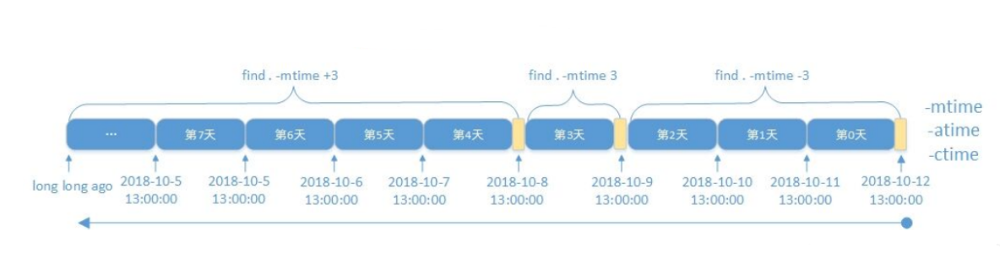


#### 根据权限查找

```bash
-perm [/|-]MODE

MODE                 # 精确权限匹配
/MODE                # 任何一类(u,g,o)对象的权限中只要有一位匹配即可，表示或者(or)关系
+MODE                # 从CentOS 7开始己淘汰
-MODE                # 每一类对象都必须同时拥有指定权限，表示与(and)关系

                     # 0 如果要找时权限位上的值为0，则表示不关注该角色权限 
```


范例：

```bash
[root@ubuntu2204 ~]# ll
总计 0
---------- 1 root root 0  8月  5 13:22 f-1.txt
-r--r--r-- 1 root root 0  8月  5 13:22 f-2.txt
--w--w--w- 1 root root 0  8月  5 13:22 f-3.txt
---x--x--x 1 root root 0  8月  5 13:22 f-4.txt
-rw-r--r-- 1 root root 0  8月  5 13:22 f-5.txt
-rwxrwxrwx 1 root root 0  8月  5 13:22 f-6.txt
-rw-r--r-- 1 root root 0  8月  5 13:22 f-7.txt
-r---w---x 1 root root 0  8月  5 13:22 f-8.txt

#精确匹配，ugo都只能是 r权限
[root@ubuntu2204 ~]#find -perm 444 -ls
  1572871      0 -r--r--r--   1 root     root            0 8月  5 13:22 ./f-2.txt

#或关系，ugo只要有一个角色有r权限即可
[root@ubuntu2204 ~]#find -name "*.txt" -perm /444 -ls
  1572875      0 -rwxrwxrwx   1 root     root            0 8月  5 13:22 ./f-6.txt
  1572879      0 -rw-r--r--   1 root     root            0 8月  5 13:22 ./f-7.txt
  1572874      0 -rw-r--r--   1 root     root            0 8月  5 13:22 ./f-5.txt
  1572871      0 -r--r--r--   1 root     root            0 8月  5 13:22 ./f-2.txt
  1572880      0 -r---w---x   1 root     root            0 8月  5 13:22 ./f-8.txt

# 报错
[root@ubuntu2204 ~]# find -perm +444 -ls 
find: invalid mode ‘+444

# ugo三个角色至少都要有r权限
[root@ubuntu2204 ~]#find -name "*.txt" -perm -444 -ls
  1572875      0 -rwxrwxrwx   1 root     root            0 8月  5 13:22 ./f-6.txt
  1572879      0 -rw-r--r--   1 root     root            0 8月  5 13:22 ./f-7.txt
  1572874      0 -rw-r--r--   1 root     root            0 8月  5 13:22 ./f-5.txt
  1572871      0 -r--r--r--   1 root     root            0 8月  5 13:22 ./f-2.txt
  
# 只关注属主权限，6拆分成4+2，所以只要属主有r或w权限即可
[root@ubuntu2204 ~]#find -name "*.txt" -perm /600 -ls
  1572875      0 -rwxrwxrwx   1 root     root            0 8月  5 13:22 ./f-6.txt
  1572879      0 -rw-r--r--   1 root     root            0 8月  5 13:22 ./f-7.txt
  1572874      0 -rw-r--r--   1 root     root            0 8月  5 13:22 ./f-5.txt
  1572871      0 -r--r--r--   1 root     root            0 8月  5 13:22 ./f-2.txt
  1572880      0 -r---w---x   1 root     root            0 8月  5 13:22 ./f-8.txt
  1572872      0 --w--w--w-   1 root     root            0 8月  5 13:22 ./f-3.txt
  
# 只关注属主权限，6拆分成4+2，所以只要属主至少要有有rw权限
[root@ubuntu2204 ~]#find -name "*.txt" -perm -600 -ls
  1572875      0 -rwxrwxrwx   1 root     root            0 8月  5 13:22 ./f-6.txt
  1572879      0 -rw-r--r--   1 root     root            0 8月  5 13:22 ./f-7.txt
  1572874      0 -rw-r--r--   1 root     root            0 8月  5 13:22 ./f-5.txt
```


#### 正则表达式

```bash
-regextype type                    # 正则表达式类型，emacs|posix-awk|posix-basic|posix-egrep|posix-extended
-regex pattern                     # 正则表达式
```


范例：

```bash
[root@ubuntu2204 ~]# find -regextype posix-egrep -regex ".*log"
./ls.log

[root@ubuntu2204 ~]# find -regextype posix-egrep -regex ".*5.*"
./f-5.txt
```


#### 处理动作

```bash
-print                           # 默认的处理动作，显示至屏幕
-print0                          # 不换行输出，常用于配合xargs
-ls                              # 类似于对查找到的文件执行"ls -ils"命令格式输出
-fls file                        # 查找到的所有文件的长格式信息保存至指定文件中，相当于 -ls > file
-delete                          # 删除查找到的文件，慎用！
-ok COMMAND {} \;                # 对查找到的每个文件执行由COMMAND指定的命令，对于每个文件执行命令之前，都会交互式要求用户确认
-exec COMMAND {} \;              # 对查找到的每个文件执行由COMMAND指定的命令
{}                               # 用于引用查找到的文件名称自身
```


范例：

```bash
#默认 -print
[root@ubuntu2204 ~]#find
.
./f-4.txt
./.ssh
./.ssh/authorized_keys
./f-1.txt
./.viminfo
./.profile
./.vimrc
......

#长格式显示
[root@ubuntu2204 ~]#find -ls
  1572865      4 drwx------   4 root     root         4096 8月  5 13:22 .
  1572873      0 ---x--x--x   1 root     root            0 8月  5 13:22 ./f-4.txt
  1572868      4 drwx------   2 root     root         4096 2月 21  2023 ./.ssh
  1572869      0 -rw-------   1 root     root            0 2月 21  2023 ./.ssh/authorized_keys
  1572870      0 ----------   1 root     root            0 8月  5 13:22 ./f-1.txt
  1572923     16 -rw-------   1 root     root        13923 8月  4 14:34 ./.viminfo
  1572867      4 -rw-r--r--   1 root     root          179 2月 21  2023 ./.profile

#查找结果保存至文件
[root@ubuntu2204 ~]#find -fls ls.log
[root@ubuntu2204 ~]#cat ls.log 
  1572865      4 drwx------   4 root     root         4096 8月  5 13:42 .
  1572882      0 -rw-r--r--   1 root     root            0 8月  5 13:42 ./ls.log
  1572873      0 ---x--x--x   1 root     root            0 8月  5 13:22 ./f-4.txt
  1572868      4 drwx------   2 root     root         4096 2月 21  2023 ./.ssh
  1572869      0 -rw-------   1 root     root            0 2月 21  2023 ./.ssh/authorized_keys
  1572870      0 ----------   1 root     root            0 8月  5 13:22 ./f-1.txt
  1572923     16 -rw-------   1 root     root        13923 8月  4 14:34 ./.viminfo
  1572867      4 -rw-r--r--   1 root     root          179 2月 21  2023 ./.profile
  1572898      4 -rw-r--r--   1 root     root          865 8月  2 17:17 ./.vimrc
  1572866      4 -rw-r--r--   1 root     root         3146 2月 21  2023 ./.bashrc
......

#删除
[root@ubuntu2204 ~]# find -name "*.sh" -delete

#备份以log结尾的文件
[root@ubuntu2204 ~]# find -name "*log" -exec cp {} {}.bak \;
[root@ubuntu2204 ~]# ls *log*
f-1.log  f-1.log.bak  f-2.log  f-2.log.bak  f-3.log  f-3.log.bak

#删除15分钟内没被访问过的文件
[root@ubuntu2204 ~]# find -amin +15 -ok rm {} \;
< rm ... ./f-1.txt > ? 

#将other权限有w的文件的权限去掉w权限
[root@ubuntu2204 ~]# find -perm -002 -exec chmod o-w {} \;

#查找权限为644，后缀为sh的普通文件，增加执行权限
[root@ubuntu2204 ~]# find -type f -perm 644 -name "*.sh" -exec chmod 755 {} \;
```


### 参数替换xargs


由于很多命令不支持管道|来传递参数，为了使用更灵活的参数，我们就要用 xargs 产生命令参数，xargs 可以**读入 stdin 的数据**，并且以空格符或回车符将 stdin 的数据分隔，使其成为另一个命令的参数，另外，许多命令不能接受过多参数，命令执行可能会失败，xargs 也可以解决此问题；


格式：

```bash
xargs [OPTION]... COMMAND [INITIAL-ARGS]...

# 常用选项
-0|--null                                 #用 assic 中的0或 null 作分隔符
-a|--arg-file=FILE                        #从文件中读入作为输入
-d|--delimiter=CHARACTER                  #指定分隔符
-E END                                    #指定结束符，执行到此处时停止，不管后面的数据
-L|--max-lines=N                          #从标准输入一次读取N行送给 command 命令
-l                                        #同上
-n|--max-args=MAX-ARGS                    #一次执行用几个参数
-p|--interactive                          #每次执行前确认
-r|--no-run-if-empty                      #当xargs的输入为空的时候则停止xargs，不用再去执行了
-s|--max-chars=MAX-CHARS                  #命令行最大字符数
-t|--verbose                              #显示过程，先打印要执行的命令
-x|--exit                                 #退出，主要配合-s使用
-I <占位符>(比如：{})                       #-I {} 可以让你把参数插入到命令的任意位置
```


范例：

```bash
[root@ubuntu2204 ~]# ls f-1.log
 f-1.log
 
#无法用管道传参
[root@ubuntu2204 ~]# echo "f-1.log" | ls
[root@ubuntu2204 ~]#echo "f-1.log" | ls
f-1.txt  f-2.txt  f-3.txt  f-4.txt  f-5.txt  f-6.txt  f-7.txt  f-8.txt  ls.log

# 使用xargs
[root@ubuntu2204 ~]#echo "f-1.log" | xargs ls
f-1.log

#还可以让不支持标准输入的命令支持标输输入(ctrl+d 结束)
[root@ubuntu2204 ~]#xargs ls -l
f-1.log (按ctrl + d) -rw-r--r-- 1 root root 0  8月  5 13:52 f-1.log

#让命令支持标准输入重定向
[root@ubuntu2204 ~]#cat ls.log 
f-1.log
f-2.log

[root@ubuntu2204 ~]#xargs -a ls.log ls -l
-rw-r--r-- 1 root root 0  8月  5 13:52 f-1.log
-rw-r--r-- 1 root root 0  8月  5 13:57 f-2.log
```


范例：

```bash
[root@ubuntu2204 ~]#seq 3
1
2
3

[root@ubuntu2204 ~]#seq 3 |xargs
1 2 3

[root@ubuntu2204 ~]#echo -e "1-2-3\n" | xargs -d '-'
1 2 3

[root@ubuntu2204 ~]# echo {1..5}
 1 2 3 4 5
 
#指定每次使用2个参数
[root@ubuntu2204 ~]# echo {1..5} | xargs -n 2
1 2
3 4
5

#批量创建用户并显示命令
[root@ubuntu2204 ~]# echo user{1..5} |xargs -t -n1 useradd
useradd user1 
useradd user2 
useradd user3 
useradd user4 
useradd user5

#批量删除用户
[root@ubuntu2204 ~]# echo user{1..5} |xargs -n1 userdel -r
```


范例：批量创建文件

```bash
[root@ubuntu2204 ~]#df -i
文件系统                           Inodes  已用I   可用I 已用I% 挂载点
tmpfs                              496100    838  495262     1% /run
/dev/mapper/ubuntu--vg-ubuntu--lv 6488064 118620 6369444     2% /
tmpfs                              496100      1  496099     1% /dev/shm
tmpfs                              496100      3  496097     1% /run/lock
/dev/sda2                          131072    320  130752     1% /boot
tmpfs                               99220     21   99199     1% /run/user/0

# 参数太长，执行失败
[root@ubuntu2204 test]#touch f-{1..131072}.txt
-bash: /usr/bin/touch: 参数列表过长

# 一次创建1w个
[root@ubuntu2204 test]#echo f-{1..131072}.txt | xargs -n 10000 touch

# inode资源耗尽
[root@ubuntu2204 test]#df -i
文件系统                           Inodes  已用I   可用I 已用I% 挂载点
tmpfs                              496100    838  495262     1% /run
/dev/mapper/ubuntu--vg-ubuntu--lv 6488064 118620 6369444     2% /
tmpfs                              496100      1  496099     1% /dev/shm
tmpfs                              496100      3  496097     1% /run/lock
/dev/sda2                          131072 131072       0   100% /boot
tmpfs                               99220     21   99199     1% /run/user/0
```


范例：使用`{}`定位参数位置

```bash
[root@ubuntu2204 ~]#echo f1.txt | xargs -I {} cp {} /tmp/
[root@ubuntu2204 ~]#ls /tmp/
f1.txt

# 占位符可替换

```


范例：以 ascii中的空白符分隔参数

```bash
[root@ubuntu2204 ~]# ls
'a b'   f-1.txt   f-2.txt   f-3.txt

[root@ubuntu2204 ~]# find -type f | xargs echo
./f-1.txt ./f-2.txt ./f-3.txt ./a b

#在此处有空格的文件名被拆分成两个文件了，xargs 默认以空格拆分
[root@ubuntu2204 ~]# find -type f | xargs ls
ls: cannot access './a': No such file or directory
ls: cannot access 'b': No such file or directory
./f-1.txt  ./f-2.txt  ./f-3.txt

#正常显示
[root@ubuntu2204 ~]# find -type f -print0 |xargs -0 ls
'./a b'   ./f-1.txt   ./f-2.txt   ./f-3.txt
```


### 总结图例


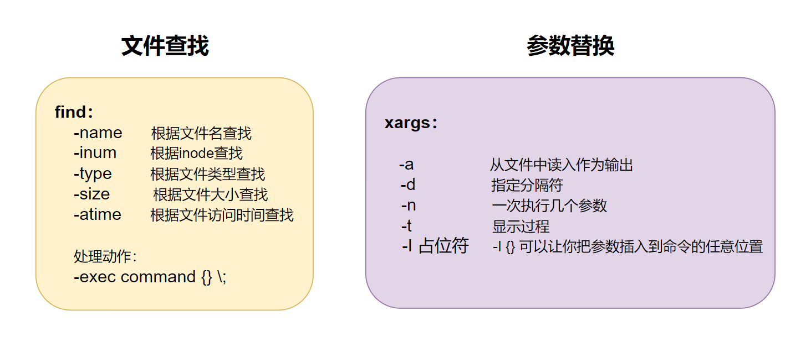


## 压缩和解压缩

主要针对单个文件压缩，而非目录


### compress 和 uncompress

此工具来自于`ncompress`包，此工具目前已经很少使用

对应的文件是 `.Z` 后缀


安装 `compress` 程序

```bash
# Ubuntu
[root@ubuntu2204 ~]#apt install ncompress -y

# CentOS
[root@rocky9 ~]# yum install -y ncompress
```


格式：

```bash
compress [OPTION]... [FILE]...
uncompress [OPTION]... [FILE]...

# 常用选项
-d                #解压缩，相当于于uncompress
-c                #结果输出至标准输出,不删除原文件
-f                #覆盖己存在目标文件
-v                #显示过程
-r                #递归压缩目录里面所有文件
```


范例：

```bash
[root@ubuntu2204 ~]#ls
fstab

# 默认选项压缩
[root@ubuntu2204 ~]#compress fstab 
[root@ubuntu2204 ~]#ls
fstab.Z

# 解压缩
[root@ubuntu2204 ~]#uncompress fstab.Z 
[root@ubuntu2204 ~]#ls
fstab

#显示过程
[root@ubuntu2204 ~]# compress -v fstab 
fstab:  -- replaced with fstab.Z Compression: 33.88%

#解压缩
[root@ubuntu2204 ~]#ls
fstab.Z
[root@ubuntu2204 ~]#compress -dv fstab.Z
fstab.Z:  -- replaced with fstab
[root@ubuntu2204 ~]#ls
fstab

# 保留源文件
[root@ubuntu2204 ~]#compress -c fstab > fstab.Z
[root@ubuntu2204 ~]#ls
fstab  fstab.Z
```


范例：递归压缩目录

```bash
[root@ubuntu2204 ~]#tree dir1/
dir1/
├── dir2
│   └── messages
├── dnf.log
├── fstab
└── passwd

1 directory, 4 files

[root@ubuntu2204 ~]#compress -vr dir1/
dir1//dir2/messages:  -- replaced with dir1//dir2/messages.Z Compression: 71.74%
dir1//fstab:  -- replaced with dir1//fstab.Z Compression: 33.88%
dir1//dnf.log:  -- replaced with dir1//dnf.log.Z Compression: 80.21%
dir1//passwd:  -- replaced with dir1//passwd.Z Compression: 45.24%


[root@ubuntu2204 ~]# tree dir1/
 dir1/
 ├── dir2
 │   └── messages.Z
 ├── dnf.log.Z
 ├── fstab.Z
 └── passwd.Z
 
 1 directory, 4 files
 
#递归解压缩目录
[root@ubuntu2204 ~]# compress -drv dir1/
dir1//dir2/messages.Z:  -- replaced with dir1//dir2/messages
dir1//fstab.Z:  -- replaced with dir1//fstab
dir1//dnf.log.Z:  -- replaced with dir1//dnf.log
dir1//passwd.Z:  -- replaced with dir1//passwd
```


### gzip 和 gunzip

来自于 gzip 包

对应的文件是 .gz 后缀


格式：

```bash
gzip [OPTION]... FILE ...
gunzip [OPTION]... FILE ...

# 常用选项
-c|--stdout                  #将压缩数据输出到标准输出中，并保留原文件 
-d|--decompress              #解压缩,相当于gunzip
-f|--force                   #覆盖己存在目标文件
-k|--keep                    #保留原文件
-l|--list                    #显示原文件大小，压缩文件大小，压缩比，压缩前文件名
-q|--quiet                   #安静模式，忽略警告
-r|--recursive               #递归压缩目录内所有文件
-S|--suffix=SUF              #指定压缩文件后缀
-t|--test                    #测试，检测压缩文件是否完整
-v|--verbose                 #显示过程
-1|--fast                    #最快压缩，压缩比最底，但压缩速度快
-9|--best                    #最好压缩，压缩比最高，但压缩速度慢
-N                           #指定压缩等级，取值为1-9之间，默认6
```


范例：

```bash
#保留原文件，并显示压缩过程
[root@ubuntu2204 ~]#gzip -vk fstab passwd 
fstab:   34.2% -- created fstab.gz
passwd:  64.1% -- created passwd.gz

[root@ubuntu2204 ~]#ls
fstab  fstab.gz  passwd  passwd.gz

# 重定向到文件
[root@ubuntu2204 ~]#gzip fstab -c > fstab.gz
[root@ubuntu2204 ~]#ls
fstab  fstab.gz  passwd

# 管道
[root@ubuntu2204 ~]#cat passwd |gzip > pwd.gz
[root@ubuntu2204 ~]#ls
fstab  fstab.gz  passwd  pwd.gz

# 自定义后缀名
[root@ubuntu2204 ~]#gzip -kv fstab -S .gzzz
fstab:   34.2% -- created fstab.gzzz

# 递归压缩目录
[root@ubuntu2204 ~]#tree dir1/
dir1/
├── dir2
│   └── syslog
├── fstab
└── passwd

1 directory, 3 files
[root@ubuntu2204 ~]#gzip -vrk dir1/
dir1/passwd:     64.1% -- created dir1/passwd.gz
dir1/fstab:      34.2% -- created dir1/fstab.gz
dir1/dir2/syslog:        84.3% -- created dir1/dir2/syslog.gz

[root@ubuntu2204 ~]#tree dir1/
dir1/
├── dir2
│   ├── syslog
│   └── syslog.gz
├── fstab
├── fstab.gz
├── passwd
└── passwd.gz

# 显示压缩文件信息
[root@ubuntu2204 dir1]#gzip -l fstab.gz passwd.gz
         compressed        uncompressed  ratio uncompressed_name
                456                 657  34.2% fstab
                654                1750  64.1% passwd
               1110                2407  54.9% (totals)
```


范例：

```bash
#解压缩
[root@ubuntu2204 0510]# gunzip -vkf fstab.gz passwd.gz 
fstab.gz:   50.3% -- replaced with fstab
passwd.gz:  61.2% -- replaced with passwd
```


### bzip2 和 bunzip2

来自于bzip2包

对应的文件是 .bz2 后缀

格式：

```bash
bzip2 [OPTION]... FILE ...
bunzip2 [OPTION]... FILE ...

# 常用选项
-d|--decompress             #解压缩,相当于bunzip2
-z|--compress               #强制压缩
-k|--keep                   #保留原文件
-f|--force                  #覆盖己存在目标文件
-t|--test                   #测试，检测压缩文件是否完整
-c|--stdout                 #将压缩数据输出到标准输出中，并保留原文件
-q|--quiet                  #安静模式，忽略警告
-v|--verbose                #显示过程
-N                          #指定压缩等级，取值为1-9之间，默认9
--fast                      #同 -1
--best                      #同 -9
```


范例：

```bash
#保留原文件，并显示过程
[root@ubuntu2204 dir1]#ls
dir2  fstab  fstab.bz2  passwd  passwd.bz2

#输出重定向
[root@ubuntu2204 dir1]#bzip2 fstab -cv > fstab.bz2
  fstab:    1.214:1,  6.588 bits/byte, 17.66% saved, 657 in, 541 out.
  
# 管道+输出重定向
[root@ubuntu2204 dir1]#cat fstab | bzip2 -cv > fstab.bz2
  (stdin):  1.214:1,  6.588 bits/byte, 17.66% saved, 657 in, 541 out.
  
# 解压缩
[root@ubuntu2204 0510]# bunzip2 -kfv fstab.bz2 
  fstab.bz2: done
  
#不解压查看文件内容
[root@ubuntu2204 dir1]#bzcat fstab.bz2 
# /etc/fstab: static file system information.
#
# Use 'blkid' to print the universally unique identifier for a
# device; this may be used with UUID= as a more robust way to name devices
# that works even if disks are added and removed. See fstab(5).
#
# <file system> <mount point>   <type>  <options>       <dump>  <pass>
# / was on /dev/ubuntu-vg/ubuntu-lv during curtin installation
/dev/disk/by-id/dm-uuid-LVM-aL2z4qRF6RP6ygmuXVQ89hX7MrChz0jPApnaIZ1WSFWWkEAhejDEX9zi7SrwDOep / ext4 defaults 0 1
# /boot was on /dev/sda2 during curtin installation
/dev/disk/by-uuid/f81cc5f3-9189-4a0c-b53a-f67110325cc7 /boot ext4 defaults 0 1
/swap.img       none    swap    sw      0       0
```


### xz 和 unxz

来自于 xz 包

对应的文件是 .xz 后缀

格式：

```bash
xz [OPTION]... FILE ...
unxz [OPTION]... FILE ...

# 常用选项
-z|--compress         #强制压缩 
-d|--decompress       #解压缩,相当于unxz
-t|--test             #测试，检测压缩文件是否完整
-l|--list             #查看压缩文件相关信息
-k|--keep             #保留原文件
-f|--force            #覆盖己存在目标文件
-c|--stdout           #将压缩数据输出到标准输出中，并保留原文件
-T|--threads=NUM      #开多线程，默认1
-q|--quiet            #安静模式，忽略警告
-v|--verbose          #显示过程
-N                    #指定压缩等级，取值为1-9之间，默认6
```


范例：

```bash
#保留源文件
[root@ubuntu2204 dir1]#xz -kv passwd 
passwd (1/1)
  100 %             712 B / 1,750 B = 0.407
  

[root@ubuntu2204 dir1]#xz -l passwd.xz 
Strms  Blocks   Compressed Uncompressed  Ratio  Check   Filename
    1       1        712 B      1,750 B  0.407  CRC64   passwd.xz
    
#重定向
[root@ubuntu2204 ~]#xz -kcv passwd > passwd.xz
passwd (1/1)
  100 %             712 B / 1,750 B = 0.407
  
#解压缩
[root@ubuntu2204 ~]#unxz -vfk passwd.xz 
passwd.xz (1/1)
  100 %             712 B / 1,750 B = 0.407
```


### zip 和 unzip

zip 可以实现打包目录和多个文件成一个文件并压缩，但可能会丢失文件属性信息，如：所有者和组信息

分别来自于 zip 和 unzip 包

对应的文件是 .zip 后缀


格式：

```bash
zip [OPTION]... zipfile [FILE]...
unzip [OPTION]... zipfile [FILE]...

#zip常用选项
-f                    #更换较新的文件到压缩文件内 
-u                    #如果压缩包内有，则更新，如果没有，则追加进去
-d                    #从压缩包内删除指定的文件
-m                    #将文件压缩之后，删除原始文件
-r                    #递归压缩目录
-j                    #只保存文件名称及其内容，而不存放任何目录名称
-l                    #压缩文件时，把LF字符置换成LF+CR字符，unzip -l 表示显示压缩文件的内容
-1                    #最快压缩，数字1
-9                    #最高压缩比，数字9
-q                    #安静模式
-v                    #显示过程
-c                    #替每个被压缩的文件加上注释
-z                    #给压缩包加注释，unzip -z 查看注释
-x                    #压缩时排除指定文件
-i                    #仅压缩指定文件
-D                    #压缩文件内不建立目录名称
-T                    #测试，检测压缩文件是否完整
-X                    #不保存额外的文件属性
-y                    #直接保存符号连接，而非该链接所指向的文件
-n                    #不压缩以特定字符串结尾的文件
-P                    #加密码

#unzip常用选项
-p                    #将压缩内容通过管道传送
-l                    #显示压缩文件内所包含的文件
-t                    #测试，检测压缩文件是否完整
-z                    #查看注释
-v                    #列出包内文件信息
-x                    #指定不需要解压缩的文件
-d                    #指定解压后的目标目录
-n                    #解压缩时不要覆盖原有的文件
-q                    #安静模式
-o                    #直接覆盖
-a                    #对文本文件进行必要的字符转换
-j                    #不处理压缩文件中原有的目录路径
-C                    #压缩文件中的文件名称区分大小写
-L                    #将压缩文件中的全部文件名改为小写
-X                    #解压缩时同时回存文件原来的UID/GID
-V                    #保留VMS的文件版本信息
-K                    #解压缩后还原权限 
-M                    #将输出结果送到more程序处理
```


范例：

```bash
[root@ubuntu2204 ~]#zip -v passwd.zip passwd
  adding: passwd        (in=1750) (out=629) (deflated 64%)
total bytes=1750, compressed=629 -> 64% savings

# 查看内容
[root@ubuntu2204 ~]#unzip -l passwd.zip 
Archive:  passwd.zip
  Length      Date    Time    Name
---------  ---------- -----   ----
     1750  2025-08-05 17:17   passwd
---------                     -------
     1750                     1 file
 
# 往压缩包中添加新文件
[root@ubuntu2204 ~]#zip passwd.zip fstab 
  adding: fstab (deflated 34%)
  
[root@ubuntu2204 ~]#unzip -l passwd.zip 
Archive:  passwd.zip
  Length      Date    Time    Name
---------  ---------- -----   ----
     1750  2025-08-05 17:17   passwd
      657  2025-08-05 16:33   fstab
---------                     -------
     2407                     2 files
     
# 只压缩txt
[root@ubuntu2204 0510]# zip -i"*txt" txt.zip *
  adding: f1.txt (deflated 86%)
  adding: f2.txt (deflated 86%)
  adding: f3.txt (deflated 86%)
```


范例：递归压缩

```bash
[root@ubuntu2204 ~]#tree dir1/
dir1/
├── dir2
│   └── syslog
├── fstab
└── passwd

1 directory, 3 files

# 递归压缩
[root@ubuntu2204 ~]#zip -r test1.zip dir1/
  adding: dir1/ (stored 0%)
  adding: dir1/passwd (deflated 64%)
  adding: dir1/fstab (deflated 34%)
  adding: dir1/dir2/ (stored 0%)
  adding: dir1/dir2/syslog (deflated 84%)
  
# 当前目录所有文件
[root@ubuntu2204 ~]#cd dir1/
[root@ubuntu2204 dir1]#zip ../test2.zip *
  adding: dir2/ (stored 0%)
  adding: fstab (deflated 34%)
  adding: passwd (deflated 64%)
  
[root@ubuntu2204 dir1]#cd ..
[root@ubuntu2204 ~]#ll test*
-rw-r--r-- 1 root root 73854  8月  5 17:50 test1.zip
-rw-r--r-- 1 root root  1499  8月  5 17:50 test2.zip

# 查看
[root@ubuntu2204 ~]#unzip -l test1.zip 
Archive:  test1.zip
  Length      Date    Time    Name
---------  ---------- -----   ----
        0  2025-08-05 17:49   dir1/
     1750  2025-08-05 16:35   dir1/passwd
      657  2025-08-05 16:35   dir1/fstab
        0  2025-08-05 17:49   dir1/dir2/
   458758  2025-08-05 16:35   dir1/dir2/syslog
---------                     -------
   461165                     5 files
   
[root@ubuntu2204 ~]#unzip -l test2.zip 
Archive:  test2.zip
  Length      Date    Time    Name
---------  ---------- -----   ----
        0  2025-08-05 17:49   dir2/
      657  2025-08-05 16:35   fstab
     1750  2025-08-05 16:35   passwd
---------                     -------
     2407                     3 files
```


范例：设置密码

```bash
[root@ubuntu2204 ~]#zip -vP 123456 syslog.zip dir1/dir2/syslog 
  adding: dir1/dir2/syslog      (in=458758) (out=72027) (deflated 84%)
total bytes=458758, compressed=72039 -> 84% savings

[root@ubuntu2204 ~]#unzip -P 123456 syslog.zip

# 交互式加密解密
[root@ubuntu2204 ~]#zip -ve syslog2.zip syslog
Enter password: 
Verify password: 
  adding: syslog        (in=458758) (out=72027) (deflated 84%)
total bytes=458758, compressed=72039 -> 84% savings

[root@ubuntu2204 ~]#unzip syslog2.zip 
```


范例：更新和删除

```bash
[root@ubuntu2204 test]#unzip -l txt.zip 
Archive:  txt.zip
  Length      Date    Time    Name
---------  ---------- -----   ----
   458758  2025-08-07 09:32   f1.txt
   917516  2025-08-07 09:32   f2.txt
  1376274  2025-08-07 09:32   f3.txt
---------                     -------
  2752548                     3 files
  
[root@ubuntu2204 ~]#echo 123 > f1.txt
[root@ubuntu2204 ~]#ll f1.txt passwd 
-rw-r--r-- 1 root root    4  8月  7 09:37 f1.txt
-rw-r--r-- 1 root root 1750  8月  5 17:17 passwd

#如果包内不存在，则追加
[root@ubuntu2204 ~]#zip -vu txt.zip f1.txt passwd 
updating: f1.txt        (in=4) (out=4) (stored 0%)
  adding: passwd        (in=1750) (out=629) (deflated 64%)
total bytes=2295544, compressed=356127 -> 84% savings

# 再次查看，f1.txt 更新了
[root@ubuntu2204 ~]#unzip -l txt.zip 
Archive:  txt.zip
  Length      Date    Time    Name
---------  ---------- -----   ----
        4  2025-08-07 09:37   f1.txt
   917516  2025-08-07 09:32   f2.txt
  1376274  2025-08-07 09:32   f3.txt
     1750  2025-08-05 17:17   passwd
---------                     -------
  2295544                     4 files
  
# 仅更新，不追加新文件
[root@ubuntu2204 ~]#echo "1234567" > f1.txt 
[root@ubuntu2204 ~]#zip -vf txt.zip f1.txt fstab 
freshening: f1.txt      (in=8) (out=8) (stored 0%)
total bytes=2295548, compressed=356131 -> 84% savings

# 再次查看，fstab并没有追加到压缩包中
[root@ubuntu2204 ~]#unzip -l txt.zip 
Archive:  txt.zip
  Length      Date    Time    Name
---------  ---------- -----   ----
        8  2025-08-07 09:39   f1.txt
   917516  2025-08-07 09:32   f2.txt
  1376274  2025-08-07 09:32   f3.txt
     1750  2025-08-05 17:17   passwd
---------                     -------
  2295548                     4 files
  
# 从 txt.zip 中删除 f3.txt
[root@ubuntu2204 ~]#zip -d txt.zip f3.txt
deleting: f3.txt

[root@ubuntu2204 ~]#unzip -l txt.zip 
Archive:  txt.zip
  Length      Date    Time    Name
---------  ---------- -----   ----
        8  2025-08-07 09:39   f1.txt
   917516  2025-08-07 09:32   f2.txt
     1750  2025-08-05 17:17   passwd
---------                     -------
   919274                     3 files
```


范例：注释

```bash
#添加注释信息，ctrl+d结束
[root@ubuntu2204 ~]#zip -z txt.zip 
enter new zip file comment (end with .):
it's test

#查看注释，unzip -l 也可查看
[root@ubuntu2204 ~]#unzip -l txt.zip 
Archive:  txt.zip
it's test
  Length      Date    Time    Name
---------  ---------- -----   ----
        8  2025-08-07 09:39   f1.txt
   917516  2025-08-07 09:32   f2.txt
     1750  2025-08-05 17:17   passwd
---------                     -------
   919274                     3 files
```


范例：解压缩

```bash
#指定解压目录，不解压指定文件
[root@ubuntu2204 ~]#unzip txt.zip -x f2.txt -d ./txt3
Archive:  txt.zip
it's test
 extracting: ./txt3/f1.txt           
  inflating: ./txt3/passwd    
  
[root@ubuntu2204 ~]#unzip -l txt.zip 
Archive:  txt.zip
it's test
  Length      Date    Time    Name
---------  ---------- -----   ----
        8  2025-08-07 09:39   f1.txt
   917516  2025-08-07 09:32   f2.txt
     1750  2025-08-05 17:17   passwd
---------                     -------
   919274                     3 files

#查看   
[root@ubuntu2204 ~]#ls txt3/
f1.txt  passwd
```


### zcat

zcat 来源于 "**zip cat**" 的缩写，见字知义

其功能是在不解压的情况下查看压缩文件内容


格式：

```bash
zcat [OPTION]... [FILE]...

# 常用选项
-c                 # 将内容输出到标准输出，默认
-d                 # 解压缩
-l                 # 显示压缩文件(包)内的文件列表
-r                 # 在目上递归操作
-t                 # 测试压缩文件完整性
```


示例：

```bash
[root@ubuntu2204 ~]#zcat fstab.Z
[root@ubuntu2204 ~]#zcat fstab.gz
[root@ubuntu2204 ~]#zcat fstab.zip
```


### 压缩率比较

```bash
[root@ubuntu2204 0510]# compress hwdb.bin -vc > hwdb.bin.Z
[root@ubuntu2204 0510]# gzip -kv hwdb.bin
[root@ubuntu2204 0510]# bzip2 -kv hwdb.bin
[root@ubuntu2204 0510]# xz -kv hwdb.bin
[root@ubuntu2204 0510]# zip -v hwdb.zip hwdb.bin

[root@ubuntu2204 0510]# ll hwdb.* -h -S
-r--r--r-- 1 root root  11M Jul 26 20:48 hwdb.bin
-rw-r--r-- 1 root root 2.8M Jul 26 21:40 hwdb.bin.Z
-rw-r--r-- 1 root root 2.0M Jul 26 21:41 hwdb.zip
-r--r--r-- 1 root root 2.0M Jul 26 20:48 hwdb.bin.gz
-r--r--r-- 1 root root 1.7M Jul 26 20:48 hwdb.bin.bz2
-r--r--r-- 1 root root 1.4M Jul 26 20:48 hwdb.bin.xz
```


### 总结图例

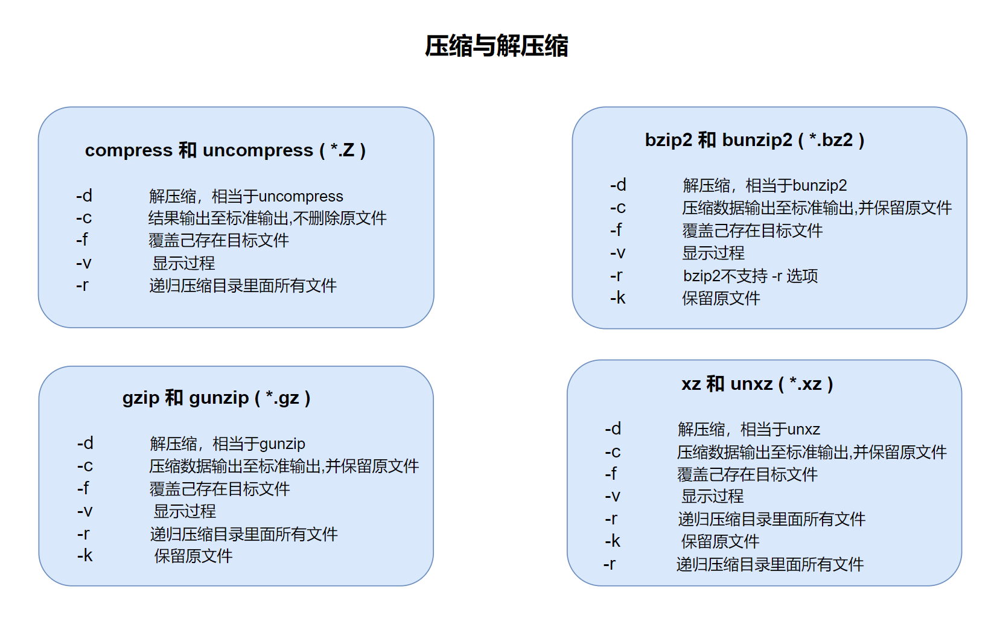


## 打包和解包


### tar

tar 即 Tape ARchive 磁带归档，可以对目录和多个文件打包成一个文件进行归档；

其本身不具备压缩功能，但可以使用参数调用相应的压缩命令进行压缩；前提是当前系统中有安装该压 缩工具

此命令可以保留文件属性，推荐使用；

对应的文件是 .tar 后缀


格式：

```bash
tar [OPTION...] [FILE]...
#tar {A|c|d|r|t|u|x}[GnSkUWOmpsMBiajJzZhPlRvwo] [ARG...]
```


常用选项

```bash
# 必选项 {A|c|d|r|t|u|x}
-A|--catenate|--concatenate             #追加 tar 文件至归档
-c|--create                             #创建一个新归档
-d|--diff|--compare                     #找出归档和文件系统的差异    
--delete                                #从归档(非磁带！)中删除
-r|--append                             #追加文件至归档结尾
-t|--list                               #列出归档内容
--test-label                            #测试归档卷标并退出
-u|--update                             #仅追加比归档中副本更新的文件
-x|--extract|--get                      #从归档中解出文件

-f选项
-f|--file=ARCHIVE                       #指定压缩包文件，大多数必选
```


OPTION选项

```bash
#OPTIONS选项 [GnSkUWOmpsMBiajJzZhPlRvwo],这些选项要注意位置

# 常用选项
-k|--keep-old-files                     #解包时不覆盖已有的文件
-O|--to-stdout                          #解压文件至标准输出
   --to-command=COMMAND                 #解压的文件通过管道传送至另一个程序
-a|--auto-compress                      #使用归档后缀名来决定压缩程序
-j|--bzip2                              #使用 bzip2 压缩或解压缩
-J|--xz                                 #使用 xz 压缩或解压缩
-z|--gzip|--gunzip|--ungzip             #通过 gzip 压缩或解压缩
-Z|--compress|--uncompress              #通过 compress 压缩或解压缩
-P|--absolute-names                     #不要从文件名中清除引导符‘/’
-v|--verbose                            #列出文件详细信息
```


压缩选项

```bash
-j|--bzip2                              #使用 bzip2 压缩或解压缩
-J|--xz                                 #使用 xz 压缩或解压缩
-z|--gzip|--gunzip|--ungzip             #通过 gzip 压缩或解压缩
-Z|--compress|--uncompress              #通过 compress 压缩或解压缩
```


其它选项

```bash
--show-defaults                         #显示 tar 默认选项
--exclude                               #排除文件
-C|--directory=DIR                      #指定目录
-T|--files-from=FILE                    #从文件中读取要处理的文件
-X|--exclude-from=FILE                  #从文件中读取要排除的文件
--version                               #显示版本号
```


```bash
#默认采用相对路径
[root@ubuntu2204 0510]# tar -cf etc.tar /etc
tar: Removing leading `/' from member names

#P保留路径
[root@ubuntu2204 0510]# tar -cPf etc2.tar /etc
```

**补充：**

```bat
# -P 的真实作用：保留 对路径
# 默认情况下，tar 在打包时会自动去掉前导 /，这是为了避免你在还原时覆盖系统路径
例如：
tar -cf etc.tar /etc
tar -tf etc.tar
会看到类似这样的路径：
etc/
etc/hosts
etc/ssh/sshd_config
......
也就是说，前导 / 被自动移除了，这让解包时的默认行为是相对路径，避免破坏你的系统。

# 使用 -P 后：
tar -cPf etc2.tar /etc
tar -tf etc2.tar

会看到：
/etc/
/etc/hosts
/etc/ssh/sshd_config
......
也就是，路径保留了原始的绝对路径
```


范例：

```bash
#只打包，不压缩
[root@ubuntu2204 0510]# tar -cvf test.tar f1.txt f2.txt
f1.txt
f2.txt

#递归打包目录
[root@ubuntu2204 0510]# tar -cvf log.tar /var/log

#大小相同
[root@ubuntu2204 0510]# du -sh /var/log/
13M /var/log/

[root@ubuntu2204 0510]# ll -h log.tar 
-rw-r--r-- 1 root root 13M Jul 26 15:57 log.tar
```


范例：只打包目录内的文件，不所括目录本身

```bash
[root@ubuntu2204 0510]# cd /etc/
[root@ubuntu2204 etc]# tar -cf etc.tar *

#先指定目录
[root@ubuntu2204 0510]# tar -C /etc/ -cf etc.tar ./
```


范例：追加和删除

不支持对压缩文件追加

```bash
[root@ubuntu2204 0510]# tar -tvf test.tar 
-rw-r--r-- root/root       4453 2022-07-26 15:19 f1.txt
-rw------- root/root    1946847 2022-07-26 14:09 f2.txt

#追加
[root@ubuntu2204 0510]# tar -rf test.tar f3.txt passwd

[root@ubuntu2204 0510]# tar -tvf test.tar 
-rw-r--r-- root/root      4453 2022-07-26 15:19 f1.txt
-rw------- root/root   1946847 2022-07-26 14:09 f2.txt
-rw------- root/root   1814952 2022-07-26 14:09 f3.txt
-rw-r--r-- root/root      2858 2022-07-25 22:09 passwd

#删除
[root@ubuntu2204 0510]# tar --delete -vf test.tar f1.txt f2.txt

[root@ubuntu2204 0510]# tar -tvf test.tar
-rw------- root/root   1814952 2022-07-26 14:09 f3.txt
-rw-r--r-- root/root      2858 2022-07-25 22:09 passwd

#将test.tar 中的文件解出来再打包到  test2.tar 中，test.tar 中不删除
[root@ubuntu2204 0510]# tar -A test.tar -f test2.tar
```

补充：`tar -A` 的作用

> **将一个或多个 tar 归档“追加”到一个已有的 tar 文件末尾**，**不会解包，而是直接追加归档内容**。
>
> 这在你想把多个 tar 包拼接成一个归档时非常有用。
>
> 简单用法：`tar -Af 原始归档.tar 其他归档1.tar [其他归档2.tar ...]`
>
> **示例演示**
>
> ```bash
> # 创建两个 tar 包
> mkdir dir1 dir2
> touch dir1/a.txt dir2/b.txt
> 
> tar -cf a.tar dir1/
> tar -cf b.tar dir2/
> 
> # 将 b.tar 追加到 a.tar 后面
> tar -Af a.tar b.tar
> 
> # 查看最终的 a.tar 内容
> tar -tf a.tar
> ```
>
> 你会发现 `a.tar` 中包含了两个归档的内容，类似：
>
> ```bash
> dir1/
> dir1/a.txt
> dir2/
> dir2/b.txt
> ```
>
> 注意：能用于未压缩的 `.tar` 文件，不支持 `.tar.gz`、`.tar.bz2`、`.tar.xz` 等压缩格式


范例：列出包内文件

```bash
[root@ubuntu2204 0510]# tar -tvf test.tar 
-rw------- root/root   1814952 2022-07-26 14:09 f3.txt
-rw-r--r-- root/root      2858 2022-07-25 22:09 passwd
```


范例：解包

```bash
[root@ubuntu2204 0510]# tar -xf log.tar

#指定目录
[root@ubuntu2204 0510]# tar -xf log.tar -C /tmp
```


范例：打包并压缩

```bash
[root@ubuntu2204 0510]# tar -zcvf etc.tar.gz /etc/
[root@ubuntu2204 0510]# tar -jcvf etc.tar.bz2 /etc/
[root@ubuntu2204 0510]# tar -Jcvf etc.tar.xz /etc/

[root@ubuntu2204 0510]# ll -h etc.tar.*
-rw-r--r-- 1 root root 4.7M Jul 26 16:37 etc.tar.bz2
-rw-r--r-- 1 root root 6.4M Jul 26 16:36 etc.tar.gz
-rw-r--r-- 1 root root 4.0M Jul 26 16:37 etc.tar.xz

[root@ubuntu2204 0510]# tar -xf etc.tar.gz -C /tmp/etc-gz/
[root@ubuntu2204 0510]# tar -xf etc.tar.bz2 -C /tmp/etc-bz2/
[root@ubuntu2204 0510]# tar -xf etc.tar.xz -C /tmp/etc-xz/
```


范例：从文件中读取要打包的文件

```bash
[root@ubuntu2204 0510]# cat list.txt
f1.txt
f2.txt

[root@ubuntu2204 0510]# tar -zcvf x.tar.gz -T list.txt
f1.txt
f2.txt
```


范例：排除和包含文件

```bash
#指定跳过的文件
[root@ubuntu2204 0510]# tar zcvf /root/a.tgz  --exclude=/app/host1 --exclude=/app/host2 /app

#从文件读取
[root@ubuntu2204 0510]# tar zcvf mybackup.tgz -T /root/includefilelist -X /root/excludefilelist
```


### split

split 命令可以分割一个文件为多个文件


格式：

```bash
split [OPTION]... [FILE [PREFIX]]

# 常用选项
-b|--bytes=SIZE                    #按大小指定分割单位
-C|--line-bytes=SIZE               #同-b，但是在切割时将尽量维持每行的完整性
-d                                 #切割后小文件的后缀用数字表示
-l|--lines=NUMBER                  #指定行数，按多少行切一个小文件
--verbose                          #显示过程
```


范例：

```bash
#将test.txt 以6行为单位进行切切割成以 x 为前缀名称的小文件
[root@ubuntu2204 0510]# split -l 6 test.txt

#同上
[root@ubuntu2204 0510]# split -6 test.txt

#以1M大小为单位切割，小文件以数字为后缀，etc.part 开头
[root@ubuntu2204 0510]# split -b 1M etc.tar.gz -d etc.part

#显示过程
[root@ubuntu2204 0510]# split --verbose -b 1M etc.tar.gz -d etc.part

#合并回去
[root@ubuntu2204 0510]# cat etc.part* > etc.tar.gz 
```


### 总结图例

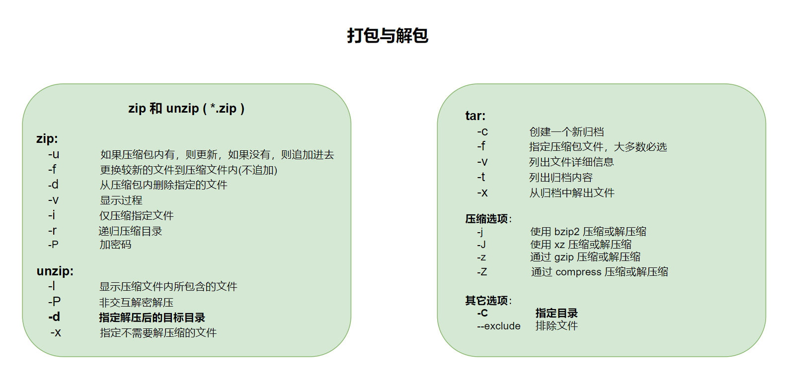


# 软件管理


## 内容概述


- **软件运行环境**
- **软件包基础**
- **rpm包管理**
- **yum和dnf管理**
- **定制yum仓库**
- **编译安装**
- **Ubuntu软件管理**


## 软件运行和编译


### C语言程序的实现过程

 

**C语言的程序编译主要经过四个过程：**


**预处理（Pre-Processing）**

- 将所有的 `#define` 删除，并展开所有的宏定义
- 处理所有的条件预编译指令，比如`#if, #ifdef, #elif, #else, #endif` 等
- 处理 `#include` 预编译指令，将被包含的文件插件到该预编译指令的位置
- 删除所有的注释，`//`，`/**/`
- 添加行号和文件标识，以便编译时产生调试用的行号及编译错误警告行号
- 保留所有的 `#pragma` 编译指令，因为编译需要使用它们

```bat
预处理器不会检查语法错误，它只是做纯文本处理!!!
```


**编译（Compiling）**

- 语法和语义检查（找出语法错误）
- 构建语法树和符号表
- 生成中间代码（IR）
- 并执行一些初步的代码优化（如常量折叠、死代码消除）

```bat
C语言编译阶段的最终产物是“汇编代码”（.s 文件），这是为后续“汇编器”阶段生成机器码 .o 文件做准备的。
```


**汇编（Assembling）**

- 汇编是将汇编代码转变成机器码可以执行的命令，每一个汇编语句几乎都对应一条机器指令。汇 编相对于编译过程比较简单，根据汇编指令和机器指令的对照表一一翻译即可。


**链接（Linking）**

- 通过调用链接器 `ld` 来链接程序运行需要的一大堆目标文件，以及所依赖的其它库文件，最后生成可执行文件


**代码示例**

```C
#include<stdio.h>
#include<unistd.h>

int main() {
    while (true){
        printf("hello world\n");
        sleep(1);
    }
    return 0;
}
```


```bash
gcc -E hello.c -o hello.i          #预处理，输出 .i 文件
gcc -S hello.i -o hello.s          #编译，输出 .s 汇编文件
gcc -c hello.s -o hello.o          #汇编，输出 .o 目标文件
gcc hello.o -o hello               #链接，输出可执行文件

gcc hello.c -o hello               # 一步到位
```


这种手动编译的方式，对单个文件来讲没有问题；

但实际工作中的商业项目，会有成百上千的源码文件，包括头文件，库文件(库里面又有自定义库，第三方库，标准库)，各种依赖关系，编译的先后顺序等，所以在实际的开发工作中，几乎不会用这种手动编译的方式去编译项目；


### 软件相关概念


上面我们借用C语言的编译过程，演示了通用的程序的生命周期

```ABAP
[高级语言代码]   ---  C语言
    ↓（编译器）
[汇编代码]      ---  汇编
    ↓（汇编器）
[目标文件 .o]   ---  机器码
    ↓（链接器）
[可执行文件 ELF]
```


在上述过程中，我们会引申出几个概念


#### 开发语言


系统级开发语言：汇编、C语言、C++

应用级开发语言：java、Python、go、php、perl、ruby

```bat
C 生万物
```


#### API

API 即 Application Programming Interface，API可以在各种不同的操作系统上实现给应用程序提供完 全相同的接口，而它们本身在这些系统上的实现却可能迥异，主流的操作系统有两种，一种是Windows 系统，另一种是Linux系统。由于操作系统的不同，API又分为Windows API和Linux API。在Windows 平台开发出来的软件在Linux上无法运行，在Linux上开发的软件在Windows上又无法运行，这就导致了 软件移植困难，**POSIX 标准**的出现就是为了解决这个问题。


POSIX：Portable Operating System Interface 可移植操作系统接口，定义了操作系统应该为应用程序 提供的接口标准，是IEEE为要在各种UNIX操作系统上运行的软件而定义的一系列API标准的总称。

linux和windows都要实现基本的posix标准，程序就在源代码级别可移植了。


**示例：**

```C
//这段代码在win和 linux 下都可以编译通过，是因为 win 和 linux 中都有相同的头文件，都能找到 printf和 sleep 函数，且参数一样

#include<stdio.h>
#include<unistd.h>

int main() {
    while (true){
        printf("hello world\n");
        sleep(1);
    }
    return 0;
}
```


API 就像是游戏机上的“**卡带接口** + **控制按钮**”，每个游戏（程序实现）都按照这个接口来做，只要你插卡 + 按键，游戏机（系统）就能通过预定义的方式执行游戏逻辑（API 实现），而你完全不需要知道游戏内部是如何运行的。

| 实际术语                        | 游戏机比喻                                       |
| ------------------------------- | ------------------------------------------------ |
| **API（应用程序接口）**         | **卡带插槽接口**，统一的操作入口                 |
| **调用者（程序员/调用方）**     | 玩家，只需要知道插卡就能玩                       |
| **实现者（底层系统/第三方库）** | 卡带里的真实游戏逻辑，不用关心具体怎么做的       |
| **函数调用**                    | 插入卡带 + 按钮控制，触发对应游戏逻辑            |
| **文档/接口说明**               | 游戏说明书，告诉你怎么玩（有哪些功能、如何触发） |


#### ABI

ABI：(Application Binary Interface) 应用程序二进制接口


**ABI 就像是游戏卡必须遵循的硬件接线协议**，必须把数据接到哪个针脚、电压多大、怎么通讯，才能让游戏机正确读取；

**ABI（应用二进制接口）涉及到了底层的具体实现**，它不仅仅是一个“调用规范”，而是深入到了程序和系统之间**真实交互的二进制层面**。


示例：在 Linux x86_64（System V ABI）下：

```C
int add(int a, int b) {
    return a + b;
}
```

这两个参数 `a` 和 `b` 会被编译器放在 `rdi` 和 `rsi` 寄存器中，返回值在 `rax` 中。

而 Windows 的 ABI 是把参数放在 `rcx`, `rdx` 开始的寄存器上。

这就意味着：

 **相同的源码，编译出来的汇编和机器码会因为 ABI 不同而变化**，这完全是底层实现问题！


**windows 与 linux 中的 ABI 格式是不兼容的**

- windows 中的是 PE (Portable Executable ) 格式 
- Linux 中的是 ELF ( Executable and Linkable Format ) 格式


范例：查看可执行文件格式

```bash
[root@rocky8 ~]# file /usr/bin/ls
/usr/bin/ls: ELF 64-bit LSB shared object, x86-64, version 1 (SYSV), dynamically linked, interpreter /lib64/ld-linux-x86-64.so.2, for GNU/Linux 3.2.0, BuildID[sha1]=618c637a7d4bcfd24f3b7017c3198b38b10362e9, stripped

[root@rocky8 ~]# file win.exe 
win.exe: PE32+ executable (console) x86-64, for MS Windows
```


### 软件模块的静态和动态链接


链接主要作用是把各个模块之间相互引用的部分处理好，使得各个模块之间能够正确地衔接，分为静态 和 动态链接


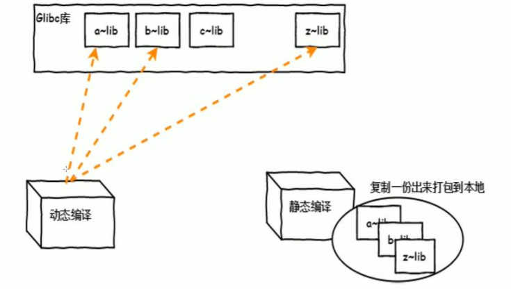

#### 静态链接

- 把程序对应的依赖库复制一份到包
- 生成模块文件libxxx.a
- 嵌入程序包
- 升级难，需重新编译
- 占用较多空间，迁移容易


#### 动态链接

- 只把依赖加做一个动态链接
- 生成模块文件libxxx.so
- 连接指向
- 占用较少空间，升级方便


### 模块（库）文件


查看二进制程序所依赖的库文件

```bash
ldd /PATH/TO/BINARY_FILE

[root@ubuntu2204 ~]#ldd /usr/bin/ls
        linux-vdso.so.1 (0x00007ffda719b000)
        libselinux.so.1 => /lib/x86_64-linux-gnu/libselinux.so.1 (0x00007ff031d36000)
        libc.so.6 => /lib/x86_64-linux-gnu/libc.so.6 (0x00007ff031b0d000)
        libpcre2-8.so.0 => /lib/x86_64-linux-gnu/libpcre2-8.so.0 (0x00007ff031a76000)
        /lib64/ld-linux-x86-64.so.2 (0x00007ff031d8e000)
```


管理及查看本机装载的库文件

```bash
#加载配置文件中指定的库文件
ldconfig 

#显示本机已经缓存的所有可用库文件名及文件路径映射关系
ldconfig -p

# 示例：
[root@ubuntu2204 ~]#ldconfig -p |grep "libpcap"
        libpcap.so.0.8 (libc6,x86-64) => /lib/x86_64-linux-gnu/libpcap.so.0.8
```


配置文件

```bash
/etc/ld.so.conf
/etc/ld.so.conf.d/*.conf
```


缓存文件

```bash
/etc/ld.so.cache
```


当你运行一个依赖动态库的程序时（比如 `ls`, `nginx`, `java` 等），系统要：

1. 找到这个程序依赖的 `.so` 库文件（比如 `libc.so.6`）
2. 把它们加载进内存，才能运行

那么问题来了：**要去哪些目录找这些库？在哪找到最快？**

**正常流程是：**

1. 查找环境变量 `LD_LIBRARY_PATH` 中的目录
2. 查找编译时设置的 `rpath`
3. 查找 `/etc/ld.so.conf` 和 `/etc/ld.so.conf.d/*.conf` 中指定的目录
4. **如果没有缓存，每次都要遍历每个路径，非常慢**

于是，Linux 系统设计了 `/etc/ld.so.cache`，它是：

**一个二进制格式的文件，存储了库文件名 → 路径 的映射表**


示例：比如你要找：

```bash
libc.so.6
```

系统通过读取 `/etc/ld.so.cache`，发现：

```bash
libc.so.6 -> /usr/lib/x86_64-linux-gnu/libc.so.6
```

就可以**直接访问正确路径，而无需每次遍历多个目录**


使用 `ldconfig` 这个命令升级和更新缓存文件。


## 软件包和包管理器


### 软件包介绍

开源软件最初只提供了.tar.gz的打包的源码文件，用户必须自已编译每个想在GNU/Linux上运行的软件。用户急需系统能提供一种更加便利的方法来管理这些软件，当Debian诞生时，这样一个管理工具 **dpkg**也就应运而生，可用来管理**deb**后缀的"包"文件。从而著名的“package”概念第一次出现在 GNU/Linux系统中，稍后Red Hat才开发自己的**rpm**包管理系统。


### 软件包中的文件分类

- **二进制文件**
- **库文件**
- **配置文件**
- **帮助文件**


利用 **cpio**工具查看包文件列表

```bash
rpm2cpio 包文件|cpio –itv               #预览包内文件
rpm2cpio 包文件|cpio –id "*.conf"       #释放包内文件
```


示例：
```bash
[root@rocky8 h]# rpm2cpio httpd-devel-2.4.37-47.module+el8.6.0+823+f143cee1.1.x86_64.rpm | cpio -itv
-rwxr-xr-x   1 root     root        23720 Nov 10  2021 ./usr/bin/apxs
drwxr-xr-x   1 root     root            0 Nov 10  2021 ./usr/include/httpd
-rw-r--r--   1 root     root           14 Nov 10  2021 ./usr/include/httpd/.mmn
-rw-r--r--   1 root     root         1075 Nov 10  2021 ./usr/include/httpd/ap_compat.h
......
```


### 程序包管理器


**软件包管理器功能：**

将编译好的应用程序的各组成文件打包一个或几个程序包文件，利用包管理器可以方便快捷地实现程序包的安装、卸载、查询、升级和校验等管理操作


**主流的程序包管理器：**

- redhat：rpm文件, **rpm 包管理器**，rpm：Redhat Package Manager，RPM Package Manager
- debian：deb文件, **dpkg 包管理器**


### 包命名


源代码打包文件命名

```bash
name-VERSION.tar.gz|bz2|xz
VERSION: major.minor.release

#nginx-1.22.0.tar.gz

#major     主版本号
#minor     次版本号
#release   修正版本号
```


rpm包命名方式

```bash
name-VERSION-release.arch.rpm
VERSION: major.minor.release
release：release.OS

#http-parser-2.8.0-9.el8.x86_64.rpm
#httpd-2.4.37-41.module+el8.5.0+695+1fa8055e.x86_64.rpm
#nginx-1.14.1-9.module+el8.4.0+542+81547229.x86_64.rpm

#major     主版本号
#minor     次版本号
#release   修正版本号

#el8    EL是Red Hat Enterprise Linux（EL）的缩写, EL8是Red Hat 8.x，CentOS 8.x，el8.4.0+ 是指 适配redhat8.4.0以上及centos8.4.0以上的系统
```


常见的arch

- **x86**: i386, i486, i586, i686
- **x86_64**: x64, x86_64, amd64
- **powerpc**: ppc
- 跟平台无关：noarch


范例：rpm

```bash
[root@rocky8 ~]# ls /cdrom/AppStream/Packages/h
haproxy-1.8.27-2.el8.x86_64.rpm
harfbuzz-1.7.5-3.el8.i686.rpm
harfbuzz-1.7.5-3.el8.x86_64.rpm
harfbuzz-devel-1.7.5-3.el8.i686.rpm
harfbuzz-devel-1.7.5-3.el8.x86_64.rpm
harfbuzz-icu-1.7.5-3.el8.i686.rpm
harfbuzz-icu-1.7.5-3.el8.x86_64.rpm
hawtjni-runtime-1.16-1.module+el8.3.0+241+f23502a8.noarch.rpm
hawtjni-runtime-1.16-2.module+el8.3.0+133+b8b54b58.noarch.rpm
HdrHistogram-2.1.11-3.module+el8.4.0+405+66dfe7da.noarch.rpm
```


范例：deb包

```bash
root@ubuntu20:~# ls /cdrom/pool/main/z/zfs-linux/
libnvpair1linux_0.8.3-1ubuntu12.13_amd64.deb
libuutil1linux_0.8.3-1ubuntu12.13_amd64.deb
libzfs2linux_0.8.3-1ubuntu12.13_amd64.deb
libzpool2linux_0.8.3-1ubuntu12.13_amd64.deb
zfs-initramfs_0.8.3-1ubuntu12.13_amd64.deb
zfsutils-linux_0.8.3-1ubuntu12.13_amd64.deb
zfs-zed_0.8.3-1ubuntu12.13_amd64.deb
```


### 分类和拆包


软件包为了管理和使用的便利，会将一个大的软件分类，放在不同的子包中


包的分类

- Application-VERSION-ARCH.rpm: 主包
- Application-devel-VERSION-ARCH.rpm 开发子包
- Application-utils-VERSION-ARHC.rpm 其它子包
- Application-libs-VERSION-ARHC.rpm 其它子包


### 包的依赖

软件包之间可能存在依赖关系，甚至循环依赖，即：A包依赖B包，B包依赖C包，C包依赖A包，安装软 件包时，会因为缺少依赖的包，而导致安装包失败。


解决依赖包管理工具：

- **yum**：rpm包管理器的前端工具 
- dnf：Fedora 18+ rpm包管理器前端管理工具，CentOS 8 版代替 yum 
- **apt**：deb包管理器前端工具 
- zypper：suse上的rpm前端管理工具


### 获取软件包

#### 获取方法

获取软件源码包的地址

```ABAP
软件官网、github、第三方软件镜像站
```


获取软件包二进制的地址

```ABAP
cdrom、软件官网、github、第三方软件镜像站、自己制作
```


#### 光盘方式

系统发版的光盘或官方网站

```bat
CentOS镜像：
	https://www.centos.org/download/
	http://mirrors.aliyun.com
	http://mirrors.sohu.com
	http://mirrors.163.com
Ubuntu镜像：
	http://cdimage.ubuntu.com/releases/
	http://releases.ubuntu.com
```


Rocky8+系统查看光盘镜像
```bash
# 神奇的cd目录
[root@rocky9-12 ~]# cd /misc/
[root@rocky9-12 misc]# ls
[root@rocky9-12 misc]# ls -a
. ..
[root@rocky9-12 misc]# ls cd
AppStream  BaseOS  EFI  images  isolinux  LICENSE  media.repo
[root@rocky9-12 misc]# ls
cd

#原因是由于 autofs 程序服务
[root@rocky9-12 cd]#  systemctl is-active autofs.service
active
```


```bat
[root@rocky9-12 cd]# du -sh ./*
8.0G    ./AppStream
1.4G    ./BaseOS
6.5M    ./EFI
941M    ./images
116M    ./isolinux
2.5K    ./LICENSE
512     ./media.repo

注意：
	Centos8之后，将软件拆分成了两个目录 AppStream 和 BaseOS
```


#### 光盘自动挂载

- 手动挂载光盘

```shell
mount /dev/sr0 /mnt/
```

- 自动挂载

```shell
apt install autofs

# 查看autofs服务的状态
systemctl status autofs

# 修改配置文件
vim /etc/auto.master
# 将auto.master中的/misc /etc/auto.misc注释取消
/mnt /etc/auto.mnt

# 创建auto.mnt文件
cd  -fstype=iso9660,ro,nodev,nosuid :/dev/sr0

# 重启autofs服务
systemctl restart autofs

# 此时在目录下就能看到自动挂载的光盘
ls /mnt/cd
```


如何查看光盘提供的文件所支持的系统类型

```bat
[root@rocky9-12 ~]# mount /dev/sr0 /media/
[root@rocky9-12 ~]# cd /media/BaseOS/Packages/
[root@rocky9-12 Packages]# find -name "*.rpm" | sed -En 's#.*\.([^.]+)\.rpm#\1#p' | sort | uniq -c
	252 i686
	128 noarch
	786 x86_64
```


#### 线上方式

第三方组织提供

```bat
Fedora-EPEL：Extra Packages for Enterprise Linux
	https://fedoraproject.org/wiki/EPEL
	https://mirrors.aliyun.com/epel/?spm=a2c6h.13651104.0.0.3bc47dfaZpesAr
	
Rpmforge：RHEL推荐，包很全，即将关闭
	http://repoforge.org/
	
Community Enterprise Linux Repository：支持最新的内核和硬件相关包
	http://www.elrepo.org
```


软件项目官方站点

```http
http://yum.mariadb.org/10.4/centos8-amd64/rpms/， 目前没有Rocky9的专属包目录
http://repo.mysql.com/yum/mysql-8.0-community/el/8/x86_64/
```


搜索引擎

```bat
注意：第三方包建议要检查其合法性，来源合法性,程序包的完整性
http://pkgs.org                 # 打开比较慢
http://rpmfifind.net
http://rpm.pbone.net
https://sourceforge.net/
```


自己制作

```bat
将源码文件，利用工具，如：rpmbuild，fpm等工具制作成rpm包文件
```


## 包管理器rpm


CentOS系统上使用rpm命令管理程序包

功能：安装、卸载、升级、查询、校验、数据库维护


### 安装

```bash
rpm {-i|--install} [install-options] PACKAGE_FILE…


-v|verbose                 # 显示详细信息
-vv                        # 更详细
-h                         # 显示安装进度条
--test                     # 测试安装，但不真正执行安装，即dry run模式
--nodeps                   # 忽略依赖关系
--replacefiles             # 忽略软件包之间的冲突的文件
--replacepkgs              # 如果软件包已经有了，重新安装软件包
--nosignature              # 不检查来源合法性
--nodigest                 # 不检查包完整性
--noscripts                # 不执行程序包脚本，相当于 --nopre --nopost --nopreun --nopostun --nopretrans --noposttrans
--nopre                    # 不执行程序包中安装前脚本
--nopost                   # 不执行程序包中安装前脚本
--nopreun                  # 不执行程序包中卸载前脚本
--nopostun                 # 不执行程序包中卸载后脚本
--nopretrans               # 安装前不执行与程序同名脚本
--noposttrans              # 安装后不执行与程序同名脚本
-v                         # 安装后有没有修改配置文件
--root                     # 在光盘救援模式下，安装软件到操作系统的所在位置路径，假如系统位置/mnt/sysimage，则在光盘下安装 使用如下命令
                           # rpm -ivh /path/to/file.rpm -root=/mnt/sysimage
                           
                           
# 常用组合
rpm -ivh PACKAGE_FILE ...
```


范例

```bash
#不需要依赖
[root@loaclhost Packages]# rpm -ivh vsftpd-3.0.3-35.el8.x86_64.rpm 
Verifying...                         ################################# [100%]
Preparing...                         ################################# [100%]
Updating / installing...
    1:vsftpd-3.0.3-35.el8            ################################# [100%]
    

#需要依赖
[root@loaclhost Packages]# rpm -ivh httpd-2.4.37-43.module_el8.5.0+1022+b541f3b1.x86_64.rpm
error: Failed dependencies:
        httpd-filesystem = 2.4.37-43.module_el8.5.0+1022+b541f3b1 is needed by httpd-2.4.37-43.module_el8.5.0+1022+b541f3b1.x86_64
        httpd-tools = 2.4.37-43.module_el8.5.0+1022+b541f3b1 is needed by httpd-2.4.37-43.module_el8.5.0+1022+b541f3b1.x86_64
```


### 升级和降级

```bash
rpm {-U|--upgrade} [install-options] PACKAGE_FILE...
rpm {-F|--freshen} [install-options] PACKAGE_FILE...

upgrade                          # 安装有旧版程序包，则“升级”，如果不存在旧版程序包，则“安装”
freshen                          # 安装有旧版程序包，则“升级”， 如果不存在旧版程序包，则不执行安装操作
--oldpackage                     # 降级
--force                          # 强制安装

#常用组合
rpm -Uvh PACKAGE_FILE ...
rpm -Fvh PACKAGE_FILE ...
```

 

升级注意项：

```bat
- 不要频繁对内核做升级操作
	Linux支持多内核版本并存，因此直接安装新版本内核
- 如果原程序包的配置文件安装后曾被修改，
	升级时，新版本提供的同一个配置文件不会直接覆盖老版本的配置文件，
	而把旧版本文件重命名(FILENAME.rpmnew)后保留
```


### 包查询

```bash
rpm {-q|--query} [select-options] [query-options]


[select-options]
-a                               # 所有包
-f                               # 查看指定的文件由哪个程序包安装生成
-p rpmfile                       # 针对尚未安装的程序包文件做查询操作
--whatprovides CAPABILITY        # 查询指定的CAPABILITY由哪个包所提供
--whatrequires CAPABILITY        # 查询指定的CAPABILITY被哪个包所依赖

[query-options]
--changelog                      # 查询rpm包的changelog
-c                               # 查询程序的配置文件
-d                               # 查询程序的文档
-i                               # information
-l                               # 查看指定的程序包安装后生成的所有文件
--scripts                        # 程序包自带的脚本
--provides                       # 列出指定程序包所提供的CAPABILITY
-R                               # 查询指定的程序包所依赖的CAPABILITY

# 常用查询组合
-qi PACKAGE
-qf FILE
-qc PACKAGE
-ql PACKAGE
-qd PACKAGE
-qpi PACKAGE_FILE
-qpl PACKAGE_FILE
-qa
```


范例：列出所有己安装的包

```bash
[root@rocky86 h]# rpm -qa
......

[root@rocky86 h]# rpm -qa | grep passwd
passwd-0.80-4.el8.x86_64
```


范例：是否安装

```bash
#己安装
[root@rocky86 h]# rpm -q nginx
nginx-1.14.1-9.module+el8.4.0+542+81547229.x86_64
[root@rocky86 h]# echo $?
0

#没有安装，找不到包
[root@rocky86 h]# rpm -q php
package php is not installed
[root@rocky86 h]# echo $?
1
```


范例：查询包详细信息

```bash
[root@rocky9 ~]# rpm -qi tree
Name        : tree
Version     : 1.8.0
Release     : 10.el9
Architecture: x86_64
Install Date: Sat 12 Aug 2023 07:04:30 AM CST
Group       : Unspecified
Size        : 115876
License     : GPLv2+ and LGPLv2+
Signature   : RSA/SHA256, Mon 16 May 2022 08:23:23 PM CST, Key ID 702d426d350d275d
Source RPM  : tree-pkg-1.8.0-10.el9.src.rpm
Build Date  : Mon 16 May 2022 08:21:25 PM CST
Build Host  : pb-f6db5b05-253f-46f4-ae18-b2ffd9f128b2-b-x86-64
Packager    : Rocky Linux Build System (Peridot) <releng@rockylinux.org>
Vendor      : Rocky Enterprise Software Foundation
URL         : http://mama.indstate.edu/users/ice/tree/
Summary     : File system tree viewer
Description :
The tree utility recursively displays the contents of directories in a
tree-like format.  Tree is basically a UNIX port of the DOS tree
utility.

# 没有安装，可以指定程序包
[root@rocky9 ~]# rpm -qi httpd
package httpd is not installed

# -p指定rpm 包文件，新版可以省略此选项
[root@rocky9 /mnt/iso]# rpm -qip /mnt/iso/AppStream/Packages/h/httpd-2.4.57-8.el9.x86_64.rpm
Name        : httpd
Version     : 2.4.57
Release     : 8.el9
Architecture: x86_64
Install Date: (not installed)
Group       : Unspecified
Size        : 60837
License     : ASL 2.0
Signature   : RSA/SHA256, Mon 22 Apr 2024 09:05:43 AM CST, Key ID 702d426d350d275d
Source RPM  : httpd-2.4.57-8.el9.src.rpm
Build Date  : Mon 22 Apr 2024 09:03:14 AM CST
Build Host  : pb-02756d14-a1e5-4dd3-81b0-a12407afc282-b-x86-64
Packager    : Rocky Linux Build System (Peridot) <releng@rockylinux.org>
Vendor      : Rocky Enterprise Software Foundation
URL         : https://httpd.apache.org/
Summary     : Apache HTTP Server
Description :
The Apache HTTP Server is a powerful, efficient, and extensible
web server.
```


范例：根据文件查询包信息

```bash
[root@rocky9 /mnt/iso]# rpm -qf /usr/bin/passwd 
passwd-0.80-12.el9.x86_64

[root@rocky9 /mnt/iso]# rpm -fq /etc/passwd
setup-2.13.7-9.el9.noarch

#还没安装的包，此处不能省略-p参数
[root@rocky9 /mnt/iso]# rpm -qpf /mnt/iso/AppStream/Packages/h/httpd-2.4.57-8.el9.x86_64.rpm
httpd-2.4.57-8.el9.x86_64

# 自己编译的，不属于任何包
[root@rocky86 0727]# rpm -qf test 
file /root/0727/test is not owned by any package
```


范例：查询配置文件

```bash
[root@rocky9 /mnt/iso]# rpm -qf `which nginx`
nginx-core-1.20.1-22.el9_6.3.x86_64
[root@rocky9 /mnt/iso]# rpm -qc nginx-core-1.20.1-22.el9_6.3.x86_64
/etc/logrotate.d/nginx
/etc/nginx/fastcgi.conf
/etc/nginx/fastcgi.conf.default
/etc/nginx/fastcgi_params
/etc/nginx/fastcgi_params.default
/etc/nginx/koi-utf
/etc/nginx/koi-win
/etc/nginx/mime.types
/etc/nginx/mime.types.default
/etc/nginx/nginx.conf
/etc/nginx/nginx.conf.default
/etc/nginx/scgi_params
/etc/nginx/scgi_params.default
/etc/nginx/uwsgi_params
/etc/nginx/uwsgi_params.default
/etc/nginx/win-utf

# 没安装的指定包文件，新版可省略-p参数
[root@rocky9 /mnt/iso]# rpm -qpc /mnt/iso/AppStream/Packages/h/httpd-2.4.57-8.el9.x86_64.rpm
/etc/httpd/conf.modules.d/00-brotli.conf
/etc/httpd/conf.modules.d/00-systemd.conf
```


范例：列出包内所有文件

```bash
[root@rocky9 /mnt/iso]# rpm -ql nginx
/usr/bin/nginx-upgrade
/usr/lib/systemd/system/nginx.service
/usr/share/man/man3/nginx.3pm.gz
/usr/share/man/man8/nginx-upgrade.8.gz
......

#没安装的指定包文件，新版可省略-p参数
[root@rocky9 /mnt/iso]# rpm -qpl /mnt/iso/AppStream/Packages/h/httpd-2.4.57-8.el9.x86_64.rpm
/etc/httpd/conf.modules.d/00-brotli.conf
/etc/httpd/conf.modules.d/00-systemd.conf
/usr/lib/.build-id
/usr/lib/.build-id/1b
/usr/lib/.build-id/1b/921ffd72f61e74fd9ada2ae502c5f182f243e9
/usr/lib/.build-id/57
/usr/lib/.build-id/57/1b718be7dbd7fa2270cef829f35046da0afc45
/usr/lib/systemd/system/htcacheclean.service
......
```


范例：查询文档文件

```bash
[root@rocky9 /mnt/iso]# rpm -qd nginx
/usr/share/man/man3/nginx.3pm.gz
/usr/share/man/man8/nginx-upgrade.8.gz
/usr/share/man/man8/nginx.8.gz

#指定包文件，新版可省略-p参数
[root@rocky9 /mnt/iso]# rpm -qpd /mnt/iso/AppStream/Packages/h/httpd-2.4.57-8.el9.x86_64.rpm
/usr/share/man/man5/httpd.conf.5.gz
/usr/share/man/man8/apachectl.8.gz
......
```


范例：查询安装脚本

```bash
[root@rocky9 /mnt/iso]# rpm -q --scripts postfix
preinstall scriptlet (using /bin/sh):
# Add user and groups if necessary
/usr/sbin/groupadd -g 90 -r postdrop 2>/dev/null
/usr/sbin/groupadd -g 89 -r postfix 2>/dev/null
......
```


范例：短路安装

```bash
#短路或，如果没有安装，就执行安装操作
[root@rocky86 v]# rpm -q vsftpd || rpm -ivh vsftpd-3.0.3-35.el8.x86_64.rpm
package vsftpd is not installed
Verifying...                        ################################# [100%]
Preparing...                        ################################# [100%]
Updating / installing... 
    1:vsftpd-3.0.3-35.el8           ################################# [100%]
```


### 包卸载

```bash
rpm {-e|--erase} [--allmatches] [--nodeps] [--noscripts] [--notriggers] [--test] 
PACKAGE_NAME ...
```


范例：

```bash
[root@rocky86 v]# rpm -evh vsftpd
Preparing...                      ################################# [100%]
Cleaning up / removing...
    1:vsftpd-3.0.3-35.el8         ################################# [100%]
    
[root@rocky86 v]# rpm -q vsftpd
package vsftpd is not installed
```


范例：短路卸载

```bash
[root@rocky86 v]# rpm -q vsftpd && rpm -evh vsftpd
vsftpd-3.0.3-35.el8.x86_64
Preparing...                      ################################# [100%]
Cleaning up / removing...
    1:vsftpd-3.0.3-35.el8         ################################# [100%]
```

注意：当包卸载时，对应的配置文件不会删除(前提是该文件被改动过)， 以FILENAME.rpmsave形式保 留


### 包校验


在安装包时，系统也会检查包的来源是否是合法的

**检查包的完整性和签名**

```bash
rpm -K|checksig rpmfile
```


范例：

```bash
[root@rocky86 v]# rpm -K vsftpd-3.0.3-35.el8.x86_64.rpm
vsftpd-3.0.3-35.el8.x86_64.rpm: digests signatures OK
```

在检查包的来源和完整性前，必须导入所需要公钥


范例：

```bash
#导入公钥
[root@rocky86 v]# rpm --import /etc/pki/rpm-gpg/RPM-GPG-KEY-rockyofficial

#查看己导入的公钥
[root@rocky9 /mnt/iso]# rpm -qa "gpg-pubkey"
gpg-pubkey-350d275d-6279464b
gpg-pubkey-3228467c-613798eb

# 查看
[root@rocky9 /mnt/iso]# rpm -qi "gpg-pubkey-350d275d-6279464b"
Name        : gpg-pubkey
Version     : 350d275d
Release     : 6279464b
Architecture: (none)
......
```


软件在安装时，会将包里的每个文件的元数据，如：大小，权限，所有者，时间等记录下来

可以用来**检查包中的文件是否和当初安装时有所变化**


格式：

```bash
rpm {-V|--verify} [select-options] [verify-options]

# 字段说明
S                    # 文件大小不一样
M                    # 文件权限不一样或文件类型不一样
5                    # md5 校验值不一样
D                    # 版本号值不一样
L                    # 链接路径不一样
U                    # 属主发生了改变
G                    # 属组发生了改变
T                    # 修改时间发生了改变
P                    # 功能发生了改变
c|d|g|l|r            # #文件类型   c配置文件, d数据文件，g该文件不属于此处，l许可文件(licens file)，r自述文件(READ ME)

#如果占位符是 .        # 则表示该处与安装时没有任何改变
```


范例：

```bash
#安装之后没有修改任何文件
[root@rocky86 v]# rpm -V vsftpd
[root@rocky86 v]# echo $?
0

#安装之后修改了配置文件
[root@rocky9 ~]# rpm -V nginx-core
..5....T.  c /etc/nginx/nginx.conf
.M...U...  g /var/log/nginx/access.log
.M...U...  g /var/log/nginx/error.log
```


### 数据库

rpm包安装时生成的信息，都放在rpm数据库中

```bash
[root@rocky9 ~]# ll /var/lib/rpm
total 42140
-rw-r--r--. 1 root root 43118592 Aug 11 09:53 rpmdb.sqlite
-rw-r--r--. 1 root root    32768 Aug 11 10:14 rpmdb.sqlite-shm
-rw-r--r--. 1 root root        0 Aug 11 09:53 rpmdb.sqlite-wal
```


可以重建数据库

```bash
rpm {--initdb|--rebuilddb}

initdb                # 初始化，如果事先不存在数据库，则新建之，否则，不执行任何操作
rebuilddb             # 重建已安装的包头的数据库索引目录
```

```bat
注意：如果该目录下的相关数据库文件被移除后，所有的软件都无法被移除了，而且也无法安装数据包了，如果可以的话，最好把转移到文件再拷贝回去即可

如果把rpm目录 给转移到其他目录下，导致数据库异常后，再放回来，有可能导致 rpm彻底无法使用的情况。所以，一般情况下，最好不要对 rpm目录【不是目录下的文件】进行删|转移的操作

把 /var/lib/rpm 随意挪走再放回来，可能让 rpm 完全挂掉，甚至需要系统修复模式去重建数据库才能救回来
```


### 包更新日志

```bash
rpm -q --changelog packageName
```


范例：

```bash
[root@rocky86 v]# rpm -q --changelog nginx
* Thu Jun 10 2021 Mustafa Gezen <mustafa@rockylinux.org> - 1.14.1-9
- Debrand default pages

* Fri Aug 30 2019 Lubos Uhliarik <luhliari@redhat.com> - 1:1.14.1-9
......
```


## yum 和 dnf


### 软件简介

#### yum基础知识

简介

```bat
	yum 和 dnf 都是 Linux 系统中用于软件包管理的工具【python脚本】，它们允许用户安装、更新、删除和查询软件包。尽管它们在功能上非常相似，但它们属于不同的软件包管理系统，并且在技术实现和背后的设计上存在一些差异。
	YUM 最初是为基于 RPM 的 Linux 发行版（如 Fedora、CentOS、RHEL 等）设计的。它起源于 Yellowdog Linux 发行版，后来经过修改和扩展，成为许多主流 Linux 发行版中不可或缺的一部分。
	DNF 是 Fedora 项目开发的一个新的包管理器，旨在作为 YUM 的继任者。它最初是作为 YUM 的一个分支项目出现的，但随着时间的推移，它逐渐发展成为了一个独立且更加先进的软件包管理工具。
```

```bat
	DNF 提供了更加快速和灵活的包管理体验。它支持并行下载和安装软件包，从而减少了总体等待时间。此外，DNF 还提供了更加丰富的命令行选项和输出格式，使得用户可以更轻松地获取所需的信息。DNF 已经成为 Fedora 和一些其他基于 RPM 的 Linux 发行版的默认包管理器。随着时间的推移，它有望逐渐取代 YUM，成为更多 Linux 发行版的标准选择。而且 DNF还保留了和yum的兼容性，配置也是通用的，所以在Rocky linux9里面，他们的操作基本上是一样的。
```


示例

```bash
# 查看rocky linux 的两条命令
[root@rocky9 ~]# ll /usr/bin/yum
lrwxrwxrwx. 1 root root 5 May  9  2023 /usr/bin/yum -> dnf-3
[root@rocky9 ~]# ll /usr/bin/dnf
lrwxrwxrwx. 1 root root 5 May  9  2023 /usr/bin/dnf -> dnf-3
```


#### 工作原理

架构模式

```bat
yum/dnf 是基于C/S 模式
	- yum 服务器存放rpm包和相关包的元数据库
	- yum 客户端访问yum服务器进行安装或查询等
```

yum实现过程

```bat
	先在yum服务器上创建 yum repository（仓库），在仓库中事先存储了众多rpm包，以及包的相关的元数据文件（放置于特定目录repodata下），当yum客户端利用yum/dnf工具进行安装包时，会自动下载repodata中的元数据，查询元数据是否存在相关的包及依赖关系，自动从仓库中找到相关包下载并安装。
```

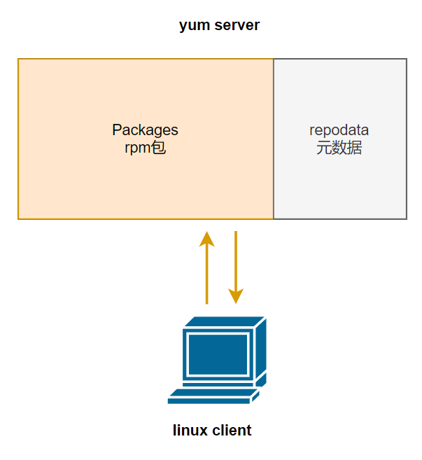


### yum客户端配置


#### 客户端环境

yum客户端配置文件

```bash
/etc/yum.conf                  #为所有仓库提供公共配置 
/etc/yum.repos.d/*.repo        #为每个仓库的提供配置文件
```


获得帮助

```bash
[root@rocky9 ~]# man 5 yum.conf
```


#### 公共配置

```bash
[root@rocky9 ~]# ll /etc/yum.conf 
lrwxrwxrwx. 1 root root 12 May  9  2023 /etc/yum.conf -> dnf/dnf.conf

[root@rocky9 ~]# cat /etc/yum.conf
[main]   
gpgcheck=1                                       # 安装包前要做包的合法和完整性校验
installonly_limit=3                              # 同时可以安装3个包，最小值为2，如设为0或1，为不限制
clean_requirements_on_remove=True                # 删除包时，是否将不再使用的包删除
best=True                                        # 升级时，自动选择安装最新版，即使缺少包的依赖
skip_if_unavailable=False                        # 跳过不可用的
```


包组

```bash
全家桶
office
ppt
world
excel
```


repo仓库配置文件指向的定义

```bash
[repositoryID]
name=Some name for this repository             #仓库名称
baseurl=url://path/to/repository/              #仓库地址
mirrorlist=http://list/                        #仓库地址列表，在这里写了多个 baseurl指向的地址
enabled={1|0}                                  #是否启用,默认值为1，启用
gpgcheck={1|0}                                 #是否对包进行校验，默认值为1
gpgkey={URL|file://FILENAME}                   #校验key的地址
enablegroups={1|0}                             #是否启用yum group,默认值为 1
failovermethod={roundrobin|priority}           #有多个baseurl，此项决定访问规则，roundrobin 随机，priority:按顺序访问
cost=1000                                      #开销，或者是成本，YUM程序会根据此值来决定优先访问哪个源,默认为1000
```


baseurl 有多种写法，支持多种协议

注意：yum仓库指向的路径一定必须是 **repodata** 目录所在目录

```bash
baseurl=file:///cdrom/AppStream/
baseurl=https://mirrors.aliyun.com/rockylinux/8.6/AppStream/x86_64/os/
baseurl=http://mirrors.aliyun.com/rockylinux/8.6/AppStream/x86_64/os/
baseurl=ftp://10.0.0.159/
```


#### 常见变量

```bash
$arch                        # CPU架构 aarch64|i586|i686|x86_64
$basearch                    # 系统基本体系结构i386|x86_64
$releasever                  # 系统版本

#带变量的写法
mirrorlist=https://mirrors.rockylinux.org/mirrorlist?arch=$basearch&repo=BaseOS-$releasever

# 替换后的值
mirrorlist=https://mirrors.rockylinux.org/mirrorlist?arch=x86_64&repo=BaseOS-8
```


#### 国内源

RockyLinux国内源

| 来源机构         | 地址                                     |
| ---------------- | ---------------------------------------- |
| 阿里云           | https://mirrors.aliyun.com/rockylinux/   |
| 中国科学技术大学 | http://mirrors.ustc.edu.cn/rocky/        |
| 南京大学         | https://mirrors.nju.edu.cn/rocky/        |
| 上海交通大学     | https://mirrors.sjtug.sjtu.edu.cn/rocky/ |
| 东软信息学院     | http://mirrors.neusoft.edu.cn/rocky/     |

注意：如果我们不会写repo的文件，可以从这些源地址上，查看帮助页面信息。里面都会有模版样式。 2.4.2.5 定制软件源[熟练]


#### 配置软件源

Rocky9.4上配置aliyun的repo源

```bash
[root@localhost /etc/yum.repos.d]# cat rocky.repo 
[baseos]
name=Rocky Linux $releasever - BaseOS
baseurl=https://mirrors.aliyun.com/rockylinux/10/BaseOS/x86_64/os/
gpgcheck=1
enabled=1
countme=1
metadata_expire=6h
gpgkey=https://mirrors.aliyun.com/rockylinux/RPM-GPG-KEY-Rocky-10
```

```bash
# 更新软件源
[root@localhost /etc/yum.repos.d]# yum makecache 

# 查看软件源
[root@localhost /etc/yum.repos.d]# yum repolist

# 查看源信息
[root@localhost /etc/yum.repos.d]# yum repolist -v

# 查看指定源信息
[root@localhost /etc/yum.repos.d]# yum repolist --repoid=aliyun-baseos -v
```


定制其他源

```bash
# Rocky9.4上配置南京大学的repo源
[root@localhost /etc/yum.repos.d]# cat rocky.repo 
[baseos]
name=Rocky Linux $releasever - BaseOS
baseurl=https://mirrors.nju.edu.cn/rocky/10/BaseOS/x86_64/os/
gpgcheck=1
enabled=1
countme=1
metadata_expire=6h
gpgkey=https://mirrors.nju.edu.cn/rocky/10/BaseOS/x86_64/os/RPM-GPG-KEY-Rocky-10

[AppStream]
name=Rocky Linux $releasever - AppStream
baseurl=https://mirrors.nju.edu.cn/rocky/10/AppStream/x86_64/os/
gpgcheck=1
enabled=1
countme=1
metadata_expire=6h
gpgkey=https://mirrors.nju.edu.cn/rocky/10/AppStream/x86_64/os/RPM-GPG-KEY-Rocky-10

[extras]
name=Rocky Linux $releasever - AppStream
baseurl=https://mirrors.nju.edu.cn/rocky/10/extras/x86_64/os/
gpgcheck=1
enabled=1
countme=1
metadata_expire=6h
gpgkey=https://mirrors.nju.edu.cn/rocky/10/extras/x86_64/os/RPM-GPG-KEY-Rocky-10

[epel]
name=Rocky Linux $releasever - epel
baseurl=https://mirrors.nju.edu.cn/epel/10.0/Everything/x86_64/
gpgcheck=1
enabled=1
countme=1
metadata_expire=6h
gpgkey=https://mirrors.nju.edu.cn/epel/RPM-GPG-KEY-EPEL-10
```

测试效果

```bash
[root@localhost /etc/yum.repos.d]# yum install -y java-21-openjdk.x86_64

# 测试命令
[root@localhost /etc/yum.repos.d]# java -version
openjdk version "21.0.8" 2025-07-15 LTS
OpenJDK Runtime Environment (Red_Hat-21.0.8.0.9-1) (build 21.0.8+9-LTS)
OpenJDK 64-Bit Server VM (Red_Hat-21.0.8.0.9-1) (build 21.0.8+9-LTS, mixed mode, sharing)

# 查看帮助
[root@localhost /etc/yum.repos.d]# man java
```


#### 定制光盘源

Rocky9.4上配置 本地repo源

```bash
# 挂载本地光盘到目录
[root@rocky9 ~]# mount /dev/cdrom /mnt/
[root@rocky9 ~]# ls /mnt/
AppStream  BaseOS  EFI  images  isolinux  LICENSE  media.repo

# 定制专属的本地镜像源信息
[root@rocky9 yum.repos.d]# cat cdrom.repo 
[cdrom-appstream]
name=cdrom appstream
baseurl=file:///mnt/AppStream/
gpgcheck=0
[cdrom-baseos]
name=cdrom baseos
baseurl=file:///mnt/BaseOS/
gpgcheck=0
```

```bat
注意：
	BaseOS目录
		内容：存储着操作系统的核心组件和基本系统工具，如内核、shell工具、系统服务等。
		功能：提供操作系统的基本功能和支持，确保系统的正常运行。
	AppStream目录
		内容：存储着用户可能需要的应用程序和软件包的元数据信息，以及软件包依赖关系等。
		功能：使用户可以方便地安装和管理这些软件，通常包含用户界面软件、开发工具、数据库工具等
应用程序。
	关联关系：
		BaseOS和AppStream两个目录之间的关系是互补的。
		在安装和管理软件时，系统会从这两个目录中获取所需的软件包和依赖关系，以确保系统的完整性和稳定性。
```


#### 清理缓存

缓存信息实践

```bash
# 查看缓存日志信息
[root@rocky9 ~]# ls /var/cache/dnf/

# 清理缓存信息
[root@rocky9 ~]# yum clean all
```


`

#### yum-config-manager[扩展]


不建议使用，了解为主

该命令来自 yum-utils 包

安装软件

```bash
[root@rocky9 /]# yum install yum-utils

[root@rocky86 yum.repos.d]# rpm -qf `which yum-config-manager`
yum-utils-4.0.21-11.el8.noarch

#常用选项
--add-repo=URL              #添加repo源         
--disable repoid            #禁用源        
--enable repoid             #启用源       
```


范例：

```bash
#添加repo源
[root@rocky86 ~]# yum-config-manager --add-repo=https://mirrors.nju.edu.cn/epel/8/Everything/x86_64/
Adding repo from: https://mirrors.nju.edu.cn/epel/8/Everything/x86_64/

# 查看
[root@rocky86 yum.repos.d]# cat mirrors.nju.edu.cn_epel_8_Everything_x86_64_.repo 
[mirrors.nju.edu.cn_epel_8_Everything_x86_64_]
name=created by dnf config-manager from https://mirrors.nju.edu.cn/epel/8/Everything/x86_64/
baseurl=https://mirrors.nju.edu.cn/epel/8/Everything/x86_64/
enabled=1

# 禁用源
[root@rocky86 yum.repos.d]# yum-config-manager --disable mirrors.nju.edu.cn_epel_8_Everything_x86_64_

# 启用源
[root@rocky86 yum.repos.d]# yum-config-manager --enable mirrors.nju.edu.cn_epel_8_Everything_x86_64_
```


### yum命令


#### 命令解读

yum命令的用法 

```bash
yum [options] COMMAND

# 常用子命令
autoremove                                                 #卸载包，同时卸载依赖
clean                                                      #清除本地缓存
install                                                    #包安装
list                                                       #列出所有包
makecache                                                  #重建缓存
search                                                     #包搜索，包括包名和描述

# 一般子命令
check-update                                               #检查可用更新
downgrade                                                  #包降级
group                                                      #包组相关
help                                                       #显示帮助信息
history                                                    #显示history
info                                                       #显示包相关信息
reinstall                                                  #重装
remove                                                     #卸载
repolist                                                   #显示或解析repo源
search                                                     #包搜索，包括包名和描述

# 常用选项
-y|--assumeyes                                             #自动回答为 yes


# 一般选项
-c file|--config file                                      #指定配置文件，默认使用/etc/yum.conf
-v|--verbose                                               #显示详细信息
-b|--best                                                  #尝试在可用包中寻找最匹配的版本
--nogpgcheck                                               #不进行包校验
--repo repoid|--repoid repoid                              #指定repo源
--enablereop repoid                                        #临时启用repo源，可用通配符
--disablerepo repoid                                       #临时禁用repo源，可用通配符
--nodocs                                                   #不安装文档
--skip-broken                                              #跳过有问题的包
--enable                                                   #启用源，配合 config-manager
--disable                                                  #禁用源，配合 config-manager
-x package|--exclude package|--excludepkgs package         #排除指定包，可用通配符
--downloadonly                                             #只下载，不安装
```

```bat
注意：要理解哪些是子命令，哪些是选项，哪些是参数
	yum repolist enabled 等价于 yum repolist --enabled
	yum repolist --enabled 可以写成  yum --enabled repolist
	yum repolist enabled 不能写成 yum enabled repolist
```


#### 显示仓库列表

格式：

```bash
yum repolist [options]

# 常用选项
-v|--verbose                              #显示详细信息
--repo repoid|--repoid repoid             #指定repo源
--all                                     #显示所有源
--enabled                                 #所有enabled状态的源,默认项
--disabled                                #所有disabled 的源
```


范例：

```bash
#默认显示所有 enable 的 repo
[root@localhost ~]# yum repolist 
仓库 id                                                    仓库名称
AppStream                                                  Rocky Linux 10 - AppStream
baseos                                                     Rocky Linux 10 - BaseOS
epel                                                       Rocky Linux 10 - epel
extras                                                     Rocky Linux 10 - extras

# 同默认选
[root@localhost ~]# yum repolist --enabled
仓库 id                                                    仓库名称
AppStream                                                  Rocky Linux 10 - AppStream
baseos                                                     Rocky Linux 10 - BaseOS
epel                                                       Rocky Linux 10 - epel
extras                                                     Rocky Linux 10 - extras

#显示disabled的源
[root@rocky86 yum.repos.d]# yum repolist --disabled
```


范例：显示指定源具体信息

```bash
[root@localhost ~]# yum repolist --repoid=baseos -v
加载插件：builddep, changelog, config-manager, copr, debuginfo-install, download, generate_completion_cache, groups-manager, kpatch, needs-restarting, notify-packagekit, playground, repoclosure, repodiff, repograph, repomanage, reposync, system-upgrade
YUM version: 4.20.0
cachedir: /var/cache/dnf
上次元数据过期检查：0:10:24 前，执行于 2025年08月11日 星期一 14时42分05秒。
仓库ID            : baseos
仓库名称          : Rocky Linux 10 - BaseOS
软件仓库修订版      : 10
软件仓库发行版标签      : [cpe:/o:rocky:rocky:10]:  ,  , 0, 1, L, R, c, i, k, n, o, u, x, y
更新的软件仓库       : 2025年08月10日 星期日 05时35分26秒
软件仓库的软件包          : 1,690
软件仓库的可用软件包: 1,690
软件仓库大小          : 6.4 G
软件仓库基本 URL       : https://mirrors.nju.edu.cn/rocky/10/BaseOS/x86_64/os/
软件仓库过期时间        : 21,600 秒 （最近 2025年08月11日 星期一 14时42分05秒）
仓库文件名      : /etc/yum.repos.d/rocky.repo
软件包总数：1,690
```


#### 显示程序包

格式：

```bash
yum list [options] [PACKAGE [PACKAGE ...]

# 常用选项
--all                             #显示所有包，包括己安装的和repo源中的可用包
--available                       #所有可用包
--installed                       #所有己安装的包
--extras                          #所有额外包
--updates                         #所有可更新的包

#上述选项可以替换成对应的 all,installed 这种子命令,但要注意位置

--showduplicates                  #相同的包，显示所有版本
```


范例：

```bash
# 查看所有软件
[root@rocky9 yum.repos.d]# yum list

# 查看所有可更新的包
[root@rocky9 yum.repos.d]# yum list --updates

# 查看所有以 z 开头的包，包括己安装的和可安装的
[root@rocky9 yum.repos.d]# yum list --all z*

# 查看所有可用的包
[root@rocky9 yum.repos.d]# yum list --available

# 查看指定软件可用的包
[root@rocky9 yum.repos.d]# yum list --available sos

# 显示指定软件可用的 |已安装的 软件包
[root@rocky9 yum.repos.d]# yum list --showduplicates sos

# 指定源查看可用包
[root@rocky9 yum.repos.d]# yum  list --repo=nju-appstream  php

# 排除源查看软件
[root@rocky9 yum.repos.d]# yum list --disablerepo=nju-baseos tar

# 查看所有已安装软件
[root@rocky9 yum.repos.d]# yum list --installed

# 查看指定的已安装软件
[root@rocky9 yum.repos.d]# yum list --installed sos
```


#### 安装删除

安装软件 - 自动解决相关依赖问题

```bash
#命令格式：
yum install [options] PACKAGE [...]
yum reinstall [options] PACKAGE [...]

#常用选项
--installroot path                        #指定安装目录
--downloadonly                            #只下载，不安装
--downloaddir path|--destdir path         #指定下载目录,如果下载目录不存在，则自动创建
```


范例：

```bash
[root@rocky86 yum.repos.d]# rpm -q httpd
package httpd is not installed

#安装
[root@rocky86 yum.repos.d]# yum install httpd

#只下载不安装
[root@rocky86 yum.repos.d]# yum install httpd --downloadonly --downloaddir=/tmp/httpd

#查看
[root@localhost ~]# ls /tmp/httpd/
apr-1.7.5-2.el10.x86_64.rpm                httpd-2.4.63-1.el10.x86_64.rpm             mod_http2-2.0.29-2.el10.x86_64.rpm
apr-util-1.6.3-21.el10.x86_64.rpm          httpd-core-2.4.63-1.el10.x86_64.rpm        mod_lua-2.4.63-1.el10.x86_64.rpm
apr-util-lmdb-1.6.3-21.el10.x86_64.rpm     httpd-filesystem-2.4.63-1.el10.noarch.rpm  rocky-logos-httpd-100.3-6.el10.noarch.rpm
apr-util-openssl-1.6.3-21.el10.x86_64.rpm  httpd-tools-2.4.63-1.el10.x86_64.rpm
```


####  卸载程序包

```bash
# 命令等价
yum remove [options] PACKAGE [...]
yum erase [options] PACKAGE [...]
```


范例：

```bash
[root@rocky86 yum.repos.d]# yum remove httpd

#卸载多个包
[root@rocky86 yum.repos.d]# yum erase httpd ngnix
```


#### 升级和降级

```bash
yum update [options] PACKAGE [...]                       #升级
yum downgrade [options] PACKAGE [...]                    #降级
yum check-update                                         #检查可用升级
```


范例

````bash
#列出所有可更新的包
[root@rocky86 yum.repos.d]# yum check-update

#检查指定的包是否可更新
[root@rocky86 yum.repos.d]# yum check-update sos
Last metadata expiration check: 0:50:56 ago on Thu 28 Jul 2022 01:19:46 PM CST.
sos.noarch            4.2-19.el8_6                       aliyun-baseo

#升级指定包
[root@rocky86 yum.repos.d]# yum update sos
````


#### 软件信息查询

```bash
#查看制定软件包信息
[root@rocky9 yum.repos.d]# yum info sos

#查看己安装的包
[root@rocky9 yum.repos.d]# yum info --installed sos

#查看已安装包信息
[root@rocky9 yum.repos.d]# rpm -qi sos

```

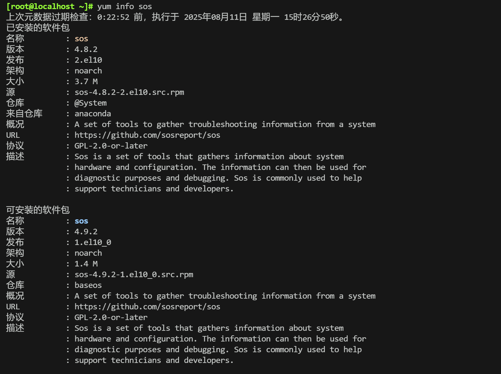


#### 根据文件反查软件包

查看指定的特性(可以是某文件)是由哪个程序包所提供

```bash
# 查看文件归属于哪个软件
[root@rocky9 yum.repos.d]# yum provides /usr/sbin/sos
```

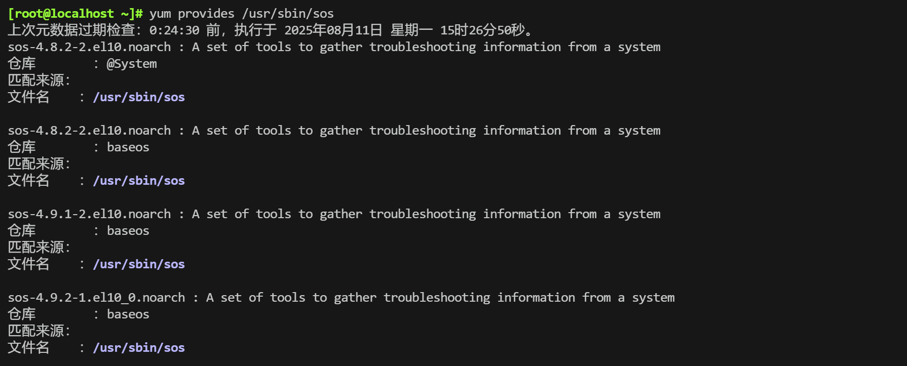

```bash
# 指定repo源，查看文件归属于哪个软件
[root@rocky9 yum.repos.d]# yum provides /usr/sbin/httpd  --repoid=baseos
```


#### 搜索软件

根据软件名和关键字来搜索

```bash
#根据名字检索软件
[root@localhost ~]# yum search mysql

#根据名字和关键字进行搜索
[root@rocky9 ~]# yum search redis  key-value
```

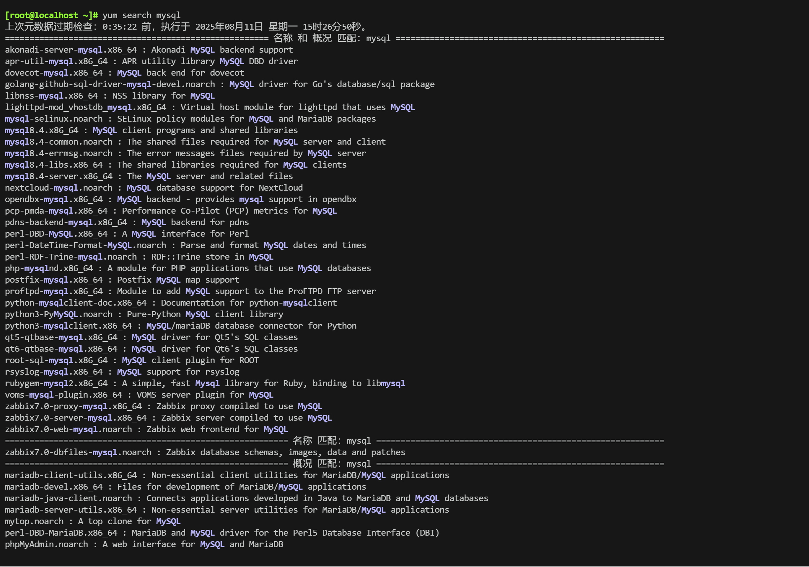


#### 查看依赖

查看指定包所依赖的库和程序

```bash
[root@rocky9 ~]# yum deplist nginx
```

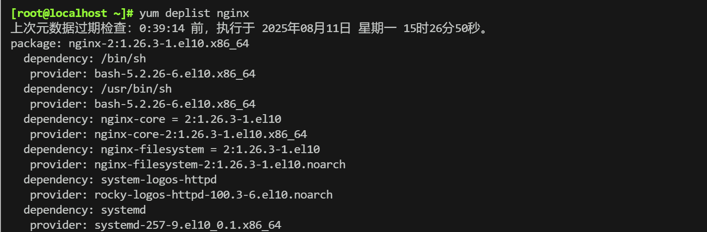


#### 查看历史

查看yum历史信息

```bash
#查看yum历史文件
[root@rocky9 yum.repos.d]# ls /var/log/dnf.*

#查看yum历史命令
[root@rocky9 yum.repos.d]# yum history

#查看指定yum命令信息
[root@rocky9 yum.repos.d]# yum history info 2

#查看跟指定软件相关的历史命令
[root@rocky9 yum.repos.d]# yum history nginx
```

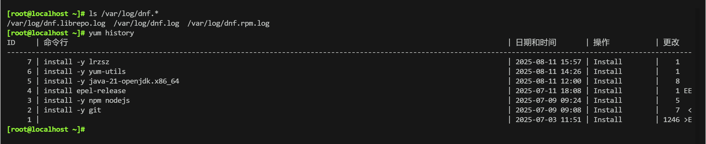

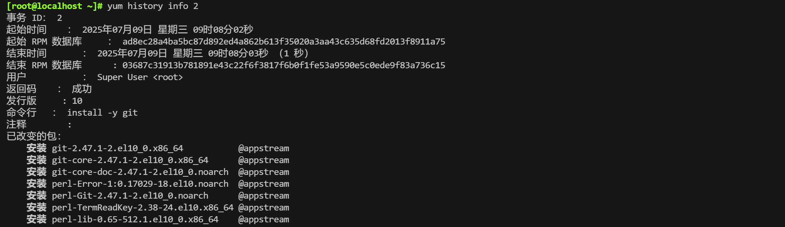


#### 软件组管理

##### 命令解析

包组管理的相关命令

```bash
# 常用
yum grouplist [options]                                       #列出所有包组
yum groupinstall [options] group1 [...]                       #包组安装

# 一般命令
yum groupupdate [options] group1 [...]                        #包组升级
yum groupremove [options] group1 [...]                        #包组卸载
yum groupinfo [options] group1 [...]                          #包组查询
```

注意: groupinstall 之后，如果发现内核版本发生了改变，最好执行一下 update一下，以免出现系统软件版本兼容性问题，导致登录界面崩溃。

```bash
#涉及到软件包组相关操作的时候，最好使用英文语言，但是经过测试，直接使用中文也可以正常执行成功。

#临时调整系统环境变量
[root@rocky9 ~]# echo $LANG
zh_CN.UTF-8

[root@rocky9 ~]# LANG=EN
[root@rocky9 ~]# echo $LANG
EN
```


##### 命令实践

查看组的相关信息

```bash
#列举所有软件包组信息
[root@rocky9 ~]# yum grouplist
```


范例：

```bash
#查看Server with GUI 软件组下的相关软件
[root@rocky9 ~]# yum groupinfo "Server with GUI"

#查看Core软件组下的相关软件
[root@rocky9 ~]# yum groupinfo "Core"

#安装组软件
[root@rocky9 ~]# yum groupinstall "Server with GUI"
```

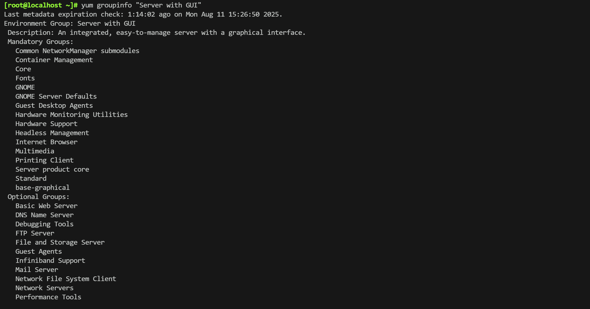


### 自建yum仓库

#### 环境介绍

私用 yum仓库架构图


| IP        | 角色       |
| --------- | ---------- |
| 10.0.0.12 | yum server |
| 10.0.0.15 | client     |


#### 步骤解析

步骤

```bat
1. 在 yum server 机上搭建 web 服务，保证其它机器能能过web服务访问本机
2. 在 yum server 机上搭建 yum 仓库服务
3. 在 client 机上将yum 的 repos 源指向 yum server 机
4. 测试
```


yum仓同步工具

```bash
# CentOS 8 dnf 工具集成
dnf reposync --repoid=REPOID --download-metadata -p /path
dnf reposync --help #查看帮助 

# CentOS 7 以前版本，reposync工具来自于yum-utils包
reposync --repoid=REPOID --download-metadata -p /path
```


创建YUM仓库工具

```bash
# 可以根据目录中的 rpm 包生成 repodata 元数据
createrepo [OPTION] <directory_to_index>
```


#### 自建yum仓库实践

**服务端配置**

```bash
# 安装web服务
[root@localhost ~]# yum install -y nginx

# 关闭防火墙
[root@localhost ~]# systemctl disable --now firewalld.service

# 关闭selinux
[root@localhost ~]# setenforce 0

# 开启web服务
[root@localhost ~]# systemctl start nginx

# 查看80端口，80端口开放说明web服务已启动
[root@localhost ~]# ss -ntl|grep 80
LISTEN 0      511          0.0.0.0:80        0.0.0.0:*   
LISTEN 0      511             [::]:80           [::]:*  

# 修改nginx配置
[root@localhost ~]# sed -ri '/^\s+root/i\        autoindex on;' /etc/nginx/nginx.conf

# 重新加载nginx
[root@localhost ~]# nginx -s reload

# 查看当前家目录
[root@localhost ~]# nginx -T|grep root
nginx: the configuration file /etc/nginx/nginx.conf syntax is ok
nginx: configuration file /etc/nginx/nginx.conf test is successful
        root         /usr/share/nginx/html;
#        root         /usr/share/nginx/html;

# 创建目录
[root@localhost ~]# mkdir /usr/share/nginx/html/repo

# 查看repoid
[root@localhost ~]# yum repolist
repo id                                                   repo name
AppStream                                                 Rocky Linux 10 - AppStream
baseos                                                    Rocky Linux 10 - BaseOS
epel                                                      Rocky Linux 10 - epel
extras                                                    Rocky Linux 10 - extras

#将指定的互联网软件源的extras 源的相关数据下载到本地，给客户端使用
[root@localhost ~]# yum reposync --repoid=extras --download-metadata -p /usr/share/nginx/html/repo/
```

```bash
# 将本地光盘中的内容CP到web目录中，给客户端使用
[root@localhost ~]# mount /dev/sr0 /mnt
[root@localhost ~]# cp -r /mnt/BaseOS /usr/share/nginx/html/repo/

# 查看效果
[root@localhost ~]# tree -L 3 /usr/share/nginx/html/repo
```

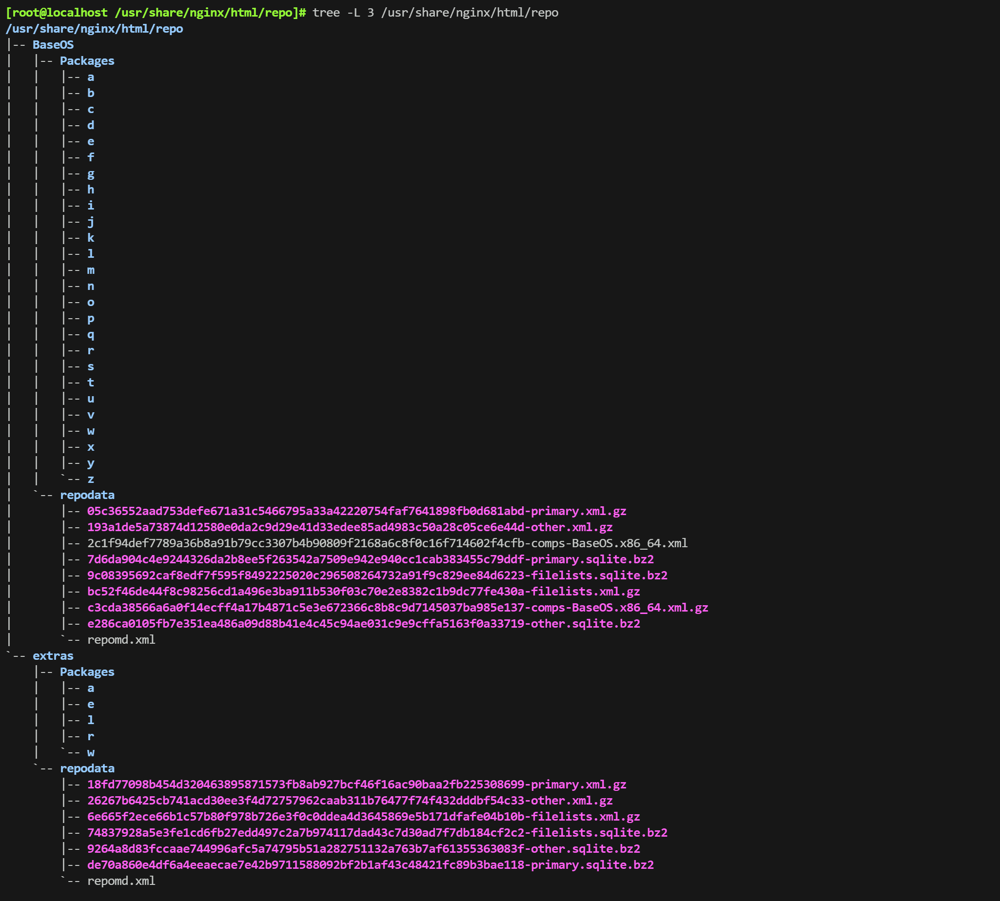

**浏览器访问**

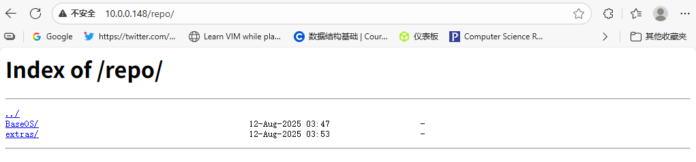

**客户端**

```bash
[root@rocky9 ~]# cat /etc/yum.repos.d/private.repo
[private-extras]
name=private extras
baseurl=http://10.0.0.12/repo/extras
gpgcheck=0

[private-baseos]
name=private baseos
baseurl=http://10.0.0.12/repo/BaseOS/
gpgcheck=0
```


**测试效果**

```bash
#更新软件源
[root@rocky9 ~]# yum makecache
```


#### 自建repodata

自建repodate实践

```bash
#准备文件
[root@localhost ~]# mkdir -p /usr/share/nginx/html/repo/AppStream/Packages
[root@localhost /usr/share/nginx/html/repo/AppStream]# cp -r /mnt/AppStream/Packages/o /usr/share/nginx/html/repo/AppStream/Packages/ 

#安装环境
[root@localhost ~]# yum install createrepo -y

#创建仓库元数据
[root@localhost /usr/share/nginx/html/repo/AppStream/Packages]# createrepo /usr/share/nginx/html/repo/AppStream/         
Directory walk started
Directory walk done - 67 packages
Temporary output repo path: /usr/share/nginx/html/repo/AppStream/.repodata/
Pool started (with 5 workers)
Pool finished
```

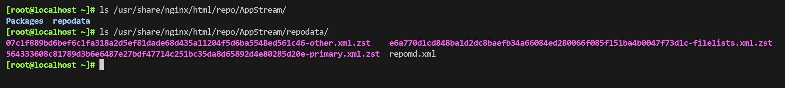

```bash
[root@localhost ~]# cat /etc/yum.repos.d/private.repo
[private-extras]
name=private extras
baseurl=http://10.0.0.12/repo/extras
gpgcheck=0

[private-baseos]
name=private baseos
baseurl=http://10.0.0.12/repo/BaseOS/
gpgcheck=0

[private-appstream]
name=private appstream
baseurl=http://10.0.0.12/repo/AppStream/
gpgcheck=0
```

```bash
# 更新软件源
[root@localhost ~]# yum makecache
```


### 其他内容

#### DNF

DNF介绍

```bat
	DNF，即 DaNdiFied，是新一代的RPM软件包管理器。DNF 发行日期是2015年5月11日，DNF 包管理器采用Python 编写，发行许可为GPL v2，首先出现在Fedora 18 发行版中。
	在 RHEL 8.0 版本正式取代了 YUM，DNF包管理器克服了YUM包管理器的一些瓶颈，提升了包括用户体验，内存占用，依赖分析，运行速度等；
```

相关配置

```bash
# 配置文件
/etc/dnf/dnf.conf

# 仓库文件
/etc/yum.repos.d/*.repo

# 日志
/var/log/dnf.rpm.log
/var/log/dnf.log

#使用帮助
man dnf

# 注意：yum 程序在安装的过程中，如果被终止，下次再执行将无法解决依赖，DNF可解决此问题
```

dnf用法与yum一致

```bash
dnf [options] <command> [<arguments>...] 
dnf --version
dnf repolist
dnf reposync 
dnf install httpd 
dnf remove httpd 
dnf clean all
dnf makecache
dnf list installed
dnf list available 
dnf search nano
dnf history undo 1
```

CentOS 7 使用 dnf ，下载并安装下面包

```bash
wget http://springdale.math.ias.edu/data/puias/unsupported/7/x86_64/dnf-conf-0.6.4-2.sdl7.noarch.rpm
wget http://springdale.math.ias.edu/data/puias/unsupported/7/x86_64/dnf-0.6.4-2.sdl7.noarch.rpm 
wget http://springdale.math.ias.edu/data/puias/unsupported/7/x86_64/python-dnf-0.6.4-2.sdl7.noarch.rpm
wget https://mirrors.aliyun.com/centos/7/extras/x86_64/Packages/python2-libcomps-0.1.8-12.el7.x86_64.rpm 
wget https://mirrors.aliyun.com/centos/7/extras/x86_64/Packages/libcomps-0.1.8-12.el7.x86_64.rpm
```


#### yum故障处理

故障排错

| yum 和 dnf 失败最主要原因   | 解决方法                            |
| --------------------------- | ----------------------------------- |
| yum的配置文件格式或路径错误 | 检查/etc/yum.repos.d/*.repo文件格式 |
| yum cache                   | yum clean all                       |
| 网络不通                    | 网卡配置                            |


## Ubuntu 软件管理


Debian 软件包通常为预编译的二进制格式的扩展名“.deb”，类似 rpm 文件，因此安装快速，无需编译 软件。包文件包括特定功能或软件所必需的文件、元数据和指令

- **dpkg：package manager for Debian**，类似于rpm， dpkg是基于Debian的系统的包管理器。可以安装，删除和构建软件包，但无法自动下载和安装软件包或其依赖项
- **apt：Advanced Packaging Tool**，功能强大的软件管理工具，甚至可升级整个Ubuntu的系统，基于客户/服务器架构(c/s)


**rhel 系列与 debian 系列包管理对比**

| 操作系统 | 包文件后缀 | 本地包管理器 | 网络包管理 | 网络包管理工作模式 | 配置文件                |
| -------- | ---------- | ------------ | ---------- | ------------------ | ----------------------- |
| rhel     | rpm        | rpm          | yum/dnf    | C/S                | /etc/yum.repos.d/*.repo |
| debian   | deb        | dpkg         | apt        | C/S                | /etc/apt/sources.list   |


### APT 工作原理

**在服务器端准备索引**

- 先将所有 `.deb` 软件包复制到仓库目录（通常在 `pool/` 下）。
- 使用 **APT 的索引生成工具**（例如 `dpkg-scanpackages` 或 `apt-ftparchive`，早期有 `genbasedir` 工具）分析每个 `.deb` 包的包头（控制信息）。
- 分析结果会生成 **索引文件**（例如 `Packages`、`Packages.gz`），存放在 `dists/<发行版>/<组件>/binary-<架构>/` 目录下。
- 当仓库内 `.deb` 有新增、删除或更新时，需要重新运行该工具生成新的索引文件，以确保客户端能正确解析依赖关系。


**客户端使用索引进行安装和升级**

- 客户端在执行 `apt-get update` 或 `apt update` 时，会从服务器下载对应的索引文件（压缩形式如 `Packages.gz`）。

- 下载后解压到本地缓存目录 `/var/lib/apt/lists/`。

  ```bash
  [root@ubuntu2204 lists]#ls /var/lib/apt/lists
  10.0.0.202_dists_stable_InRelease  10.0.0.202_dists_stable_main_binary-amd64_Packages  auxfiles  lock  partial
  ```

- APT 会将这些索引文件与客户端本地的已安装包数据库（`/var/lib/dpkg/status`）进行比对，以确定哪些软件包：

  - 已安装
  - 未安装
  - 可升级

  ```bash
  [root@ubuntu2204 lists]#cat /var/lib/dpkg/status
  ```

- 当执行 `apt-get install`、`apt-get upgrade` 等命令时，APT 会根据索引和依赖关系计算需要下载和安装的 `.deb` 包，并一次性处理依赖链。


### dpkg 包管理器

```bash
dpkg [<option> ...] <command>

# 常用选项
-i|--install package.deb                    #安装包
--unpack package.deb                        #解包
-r|--remove packageName                     #删除包，不建议，不自动卸载依赖于它的包
-P|--purge packageName                      #删除包（包括配置文件）
-V|--verify packageName                     #检查包是否安装
--get-selections pattern                    #根据通配符筛选包，并打出列表
--set-selections                            #从标准输入里读出要选择的软件。
--clear-selections                          #取消选中所有不必要的软件包
--update-avail packageFile                  #替换现有可安装的软件包信息。     
--merge-avail packageFile                   #把文件中的信息合并到系统中。
--clear-avail                               #清除现有的软件包信息。
--forget-old-unavail                        #忘却已被卸载的不可安装的软件包。
-s|--status packageName                     #显示指定软件包的详细状态,类似于 rpm -qi
-p|--print-avail packageName                #显示当前机器上所有可安装的包
-L|--listfiles  packageName                 #列出属于指定软件包的文件，类似于 rpm -ql
-l|--list [pattern]                         #列出当前己安装的包，类似于rpm -qa
-S|--search pattern                         #根据文件查询是来自于哪个包，类似于 rpm -qf
-C|--audit [pattern]                        #检查是否有软件包残损
--yet-to-unpack                             #列出标记为待解压的软件包
--predep-package                            #列出待解压的预依赖
--compare-vesions v1 - b                    #比较版本号
--force-help                                #显示本强制选项的帮助信息
-Dh|--debug=help                            #显示有关出错调试的帮助信息
--info packageFile                          #列出包相关信息
-c packageFile                              #列出包内文件，类似于 rpm -qpl
```


范例：查询包是否安装

```bash
[root@ubuntu2204 ~]#dpkg -V vim
[root@ubuntu2204 ~]#echo $?
0

[root@ubuntu2204 ~]#dpkg -V nginx
dpkg: package 'nginx' is not installed
[root@ubuntu2204 ~]#echo $?
1
```


范例：安装卸载

dpkg 的软件安装分为解包和配置两部份

```bash
#查询
root@ubuntu22:~# dpkg -V firmware-sof-signed
dpkg: package 'firmware-sof-signed' is not installed

#安装
root@ubuntu22:~# dpkg -i /cdrom/pool/restricted/f/firmware-sof/firmware-sof-signed_2.0-1ubuntu2_all.deb
Selecting previously unselected package firmware-sof-signed.
(Reading database ... 108476 files and directories currently installed.)
Preparing to unpack .../firmware-sof-signed_2.0-1ubuntu2_all.deb ...
Unpacking firmware-sof-signed (2.0-1ubuntu2) ...
Setting up firmware-sof-signed (2.0-1ubuntu2) ...

#查询
root@ubuntu22:~# dpkg -l firmware-sof-signed
Desired=Unknown/Install/Remove/Purge/Hold
| Status=Not/Inst/Conf-files/Unpacked/halF-conf/Half-inst/trig-aWait/Trig-pend
|/ Err?=(none)/Reinst-required (Status,Err: uppercase=bad)
||/ Name                Version      Architecture Description
+++-===================-============-============
=================================
ii  firmware-sof-signed 2.0-1ubuntu2 all          Intel SOF firmware - signed

#卸载
root@ubuntu22:~# dpkg -r firmware-sof-signed
(Reading database ... 108702 files and directories currently installed.)
Removing firmware-sof-signed (2.0-1ubuntu2) ...
```


范例：根据条件列出己安装的包

```bash
[root@ubuntu2204 ~]#dpkg --get-selections v*
vim                                             install
vim-common                                      install
vim-runtime                                     install
vim-tiny                                        install
```


范例：显示所有可安装的包

```bash
root@ubuntu22:~# dpkg -p
......
 
#显示指定包
root@ubuntu22:~# dpkg -p mawk
Package: mawk
Priority: required
Section: utils
Installed-Size: 229
Origin: Ubuntu
Maintainer: Ubuntu Developers <ubuntu-devel-discuss@lists.ubuntu.com>
......
```


范例：显示己安装的列表

```bash
[root@ubuntu2204 ~]#dpkg -l
Desired=Unknown/Install/Remove/Purge/Hold
| Status=Not/Inst/Conf-files/Unpacked/halF-conf/Half-inst/trig-aWait/Trig-pend
|/ Err?=(none)/Reinst-required (Status,Err: uppercase=bad)
||/ Name                                  Version                                 Architecture Description
+++-=====================================-=======================================-============-================================================================================
ii  adduser                               3.118ubuntu5                            all          add and remove users and groups
ii  amd64-microcode                       3.20191218.1ubuntu2                     amd64        Processor microcode firmware for AMD CPUs
ii  apparmor                              3.0.4-2ubuntu2.1                        amd64        user-space parser utility for AppArmor
ii  apport                                2.20.11-0ubuntu82.1                     all          automatically generate crash reports for debugging
ii  apport-symptoms                       0.24                                    all          symptom scripts for apport
ii  apt                                   2.4.6                                   amd64        commandline package manager
ii  apt-file                              3.2.2                                   all          search for files within Debian packages (command-line interface)
ii  apt-utils                             2.4.6                                   amd64        package management related utility programs
ii  base-files                            12ubuntu4.2                             amd64        Debian base system miscellaneous files
ii  base-passwd                           3.5.52build1                            amd64        Debian base system master password and group files
ii  bash                                  5.1-6ubuntu1                            amd64        GNU Bourne Again SHell
ii  bash-completion                       1:2.11-5ubuntu1                         all          programmable completion for the bash shell
```


范例：通配符

```bash
[root@ubuntu2204 ~]#dpkg -l "vi*"
Desired=Unknown/Install/Remove/Purge/Hold
| Status=Not/Inst/Conf-files/Unpacked/halF-conf/Half-inst/trig-aWait/Trig-pend
|/ Err?=(none)/Reinst-required (Status,Err: uppercase=bad)
||/ Name                     Version               Architecture Description
+++-========================-=====================-============-==================================================
ii  vim                      2:8.2.3995-1ubuntu2.3 amd64        Vi IMproved - enhanced vi editor
un  vim-athena               <none>                <none>       (no description available)
ii  vim-common               2:8.2.3995-1ubuntu2.3 all          Vi IMproved - Common files
un  vim-doc                  <none>                <none>       (no description available)
un  vim-gtk3                 <none>                <none>       (no description available)
un  vim-nox                  <none>                <none>       (no description available)
ii  vim-runtime              2:8.2.3995-1ubuntu2.3 all          Vi IMproved - Runtime files
un  vim-scripts              <none>                <none>       (no description available)
ii  vim-tiny                 2:8.2.3995-1ubuntu2.3 amd64        Vi IMproved - enhanced vi editor - compact version
un  virtualbox-guest-modules <none>                <none>       (no description available)
```


范例：具体包名

```bash
[root@ubuntu2204 ~]#dpkg -l vim
Desired=Unknown/Install/Remove/Purge/Hold
| Status=Not/Inst/Conf-files/Unpacked/halF-conf/Half-inst/trig-aWait/Trig-pend
|/ Err?=(none)/Reinst-required (Status,Err: uppercase=bad)
||/ Name           Version               Architecture Description
+++-==============-=====================-============-=================================
ii  vim            2:8.2.3995-1ubuntu2.3 amd64        Vi IMproved - enhanced vi editor
```


该列表从左到右共七列

```bash
#Desired Status Err Name Version Architecture Description

#Desired 期望状态
u   Unknown          #没有安装过
i   Install          #请求安装
R   Remove           #请求卸载
p   Purge            #请求卸载并清理
h   Hold             #保持

#status 当前状态
n   Not              #软件没有安装
i   Inst             #安装完成并完成配置
c   Conf-files       #已卸载，但还有保留配置文件
u   Unpacked         #已解压缩，但没有配置
f   half-conf        #配置是出错
h   Half-inst        #安装时出错
w   trig-await       #触发器等待
t   TRig-pend        #触发器是未决状态

#Err 错误状态
                     #正常情况下为空
h                    #被锁定，有其它包对此依赖，无法升级
r   Reinst-required  #被损坏，需要重装才能正常使用
x                    #被损坏且被锁定

#Name                #包名
#Version             #版本
#Architecture        #平台架构
#Description         #包的描述信息

#前三列常见组合
ii                   #安装成功
pn                   #安装后卸载
un                   #没有安装过
iu                   #安装了但是没有配置
rc                   #己卸载，但还有配置文件
```


范例：显示包详细信息

```bash
[root@ubuntu2204 ~]#dpkg -s vim
Package: vim
Status: install ok installed
Priority: optional
Section: editors
Installed-Size: 3917
Maintainer: Ubuntu Developers <ubuntu-devel-discuss@lists.ubuntu.com>
Architecture: amd64
Version: 2:8.2.3995-1ubuntu2.3
Provides: editor
Depends: vim-common (= 2:8.2.3995-1ubuntu2.3), vim-runtime (= 2:8.2.3995-1ubuntu2.3), libacl1 (>= 2.2.23), libc6 (>= 2.34), libgpm2 (>= 1.20.7), libpython3.10 (>= 3.10.0), libselinux1 (>= 3.1~), libsodium23 (>= 1.0.14), libtinfo6 (>= 6)
Suggests: ctags, vim-doc, vim-scripts
Description: Vi IMproved - enhanced vi editor
 Vim is an almost compatible version of the UNIX editor Vi.
 .
 Many new features have been added: multi level undo, syntax
 highlighting, command line history, on-line help, filename
 completion, block operations, folding, Unicode support, etc.
 .
 This package contains a version of vim compiled with a rather
 standard set of features.  This package does not provide a GUI
 ......
```


范例：列出包内所有文件

```bash
[root@ubuntu2204 ~]#dpkg -L vim
/.
/usr
/usr/bin
/usr/bin/vim.basic
/usr/share
/usr/share/bug
/usr/share/bug/vim
/usr/share/bug/vim/presubj
......
```


范例：查看deb包文件信息

```bash
[root@ubuntu2204 ~]#dpkg --info /mnt/pool/main/a/amd64-microcode/amd64-microcode_3.20191218.1ubuntu2.1_amd64.deb 
 new Debian package, version 2.0.
 size 38312 bytes: control archive=1720 bytes.
      76 bytes,     2 lines      conffiles            
     701 bytes,    17 lines      control              
     973 bytes,    12 lines      md5sums              
    1259 bytes,    46 lines   *  postinst             #!/bin/sh
    1055 bytes,    42 lines   *  postrm               #!/bin/sh
......
```


范例：列出deb包内的所有文件

```bash
[root@ubuntu2204 ~]#dpkg -c /mnt/pool/main/a/amd64-microcode/amd64-microcode_3.20191218.1ubuntu2.1_amd64.deb 
drwxr-xr-x root/root         0 2023-07-25 12:14 ./
drwxr-xr-x root/root         0 2023-07-25 12:14 ./etc/
drwxr-xr-x root/root         0 2023-07-25 12:14 ./etc/default/
-rw-r--r-- root/root       328 2019-12-21 12:12 ./etc/default/amd64-microcode
drwxr-xr-x root/root         0 2023-07-25 12:14 ./etc/modprobe.d/
-rw-r--r-- root/root       154 2023-07-25 12:14 ./etc/modprobe.d/amd64-microcode-blacklist.conf
drwxr-xr-x root/root         0 2023-07-25 12:14 ./lib/
......
```


范例：查询文件来自于哪个包

```bash
root@ubuntu22:~# dpkg -S "/etc/ssh/ssh_config" 
openssh-client: /etc/ssh/ssh_config
```


### apt 命令用法


Debian 使用 apt 工具集来管理包系统，apt-get 是其中一个常用的命令行工具，另外一款较为流行的命 令行与 GUI 兼顾的工具是 aptitude ，之前最常用的 Linux 包管理命令都被分散在了 apt-get、apt cache 和 apt-config 这三条命令中。

在 2014 年apt 命令发布第一个稳定版，Ubuntu 16.04 引入新特性之一便是 apt 命令，apt 命令解决了 命令过于分散的问题，它包括 apt-get 命令出现以来使用最广泛的功能选项，以及 apt-cache 和 apt config 命令中很少用到的功能。在使用 apt 命令时，用户不必再由 apt-get 转到 apt-cache 或 apt config，提供管理软件包所需的必要选项

apt 相当于 apt-get、apt-cache 和 apt-config 中最常用命令选项的集合


apt 具有更精减但足够的命令选项，而且参数选项的组织方式更为有效。此外，启用的几个特性也非常 有帮助。例如：可以在使用 apt 命令安装或删除程序时看到进度条,apt 还会在更新存储库数据库时提示 用户可升级的软件包个数

apt 与 apt-get 有一些类似的命令选项，但它并不能完全向下兼容 apt-get 命令,也即可用 apt 替换部分 apt-get 系列命令，但不是全部


| apt命令          | 被取代的命令         | 命令的功能                     |
| ---------------- | -------------------- | ------------------------------ |
| apt install      | apt-get install      | 安装软件包                     |
| apt remove       | apt-get remove       | 移除软件包                     |
| apt purge        | apt-get purge        | 移除软件包及配置文件           |
| apt update       | apt-get update       | 刷新存储库索引                 |
| apt upgrade      | apt-get upgrade      | 升级所有可升级的软件包         |
| apt autoremove   | apt-get autoremove   | 自动删除不需要的包             |
| apt full-upgrade | apt-get dist-upgrade | 在升级软件包时自动处理依赖关系 |
| apt search       | apt-cache search     | 搜索应用程序                   |
| apt show         | apt-cache show       | 显示安装细节                   |


```bash
apt [options] command

#options
-h|--help                             #显示帮助
-v|--version                          #显示版本
-y|--yes                              #自动回答yes
-q|--quiet                            #安静模式

#command
list                                  #根据名称列出软件包
search                                #搜索软件包描述
show|info                             #显示软件包细节
install                               #安装软件包
remove                                #移除软件包
autoremove                            #卸载所有自动安装且不再使用的软件包
update                                #更新可用软件包列表，只更新索引文件，不具体更新软件
upgrade                               #通过 安装/升级 软件来更新系统
full-upgrade                          #通过 卸载/安装/升级 来更新系统           
edit-sources                          #编辑软件源信息文件
```

```bash
apt --fix-broken install   #修复系统中已存在的损坏依赖关系，通过自动安装缺失的软件包或卸载不完整的包，让 APT 的依赖树恢复正常。
```


范例：

```bash
#列出所有包
root@ubuntu22:~# apt list

#列出所有己安装的包
root@ubuntu22:~# apt list --installed

#列出所有可升级的包
root@ubuntu22:~# apt list --upgradeable
```


范例：指定包名或通配符

```bash
root@ubuntu22:~# apt list redis*
Listing... Done
redis-redisearch-doc/jammy 1:1.2.2-4 all
redis-redisearch/jammy 1:1.2.2-4 amd64
redis-sentinel/jammy 5:6.0.16-1ubuntu1 amd64
redis-server/jammy 5:6.0.16-1ubuntu1 amd64
redis-tools/jammy 5:6.0.16-1ubuntu1 amd64
redis/jammy 5:6.0.16-1ubuntu1 all

root@ubuntu22:~# apt list --installed redis*
Listing... Done
```


范例：搜索

```bash
#在包名和描述信息中搜索
root@ubuntu22:~# apt search nginx

#使用正则匹配搜索条件
root@ubuntu22:~# apt search "^ngin*"

#仅在包名中搜索
root@ubuntu22:~# apt search --names-only nginx
```


范例：查询包的具体信息

```bash
[root@ubuntu2204 ~]#apt info openssh*
Package: openssh-server
Version: 1:8.9p1-3ubuntu0.3
Priority: optional
Section: net
Source: openssh
......

# 显示所有版本
root@ubuntu22:~# apt show nginx -a
Package: nginx
Version: 1.18.0-6ubuntu14.1
Priority: optional
Section: web
Origin: Ubuntu
......

Package: nginx
Version: 1.18.0-6ubuntu14
Priority: optional
Section: web
Origin: Ubuntu
......
```


范例：安装

```bash
root@ubuntu22:~# apt install nginx

#同时安装多个包
root@ubuntu22:~# apt install nginx redis -y

#安装指定版本的包，默认安装最新版
root@ubuntu22:~# apt install nginx=1.14.0-0ubuntu1 

#安装nginx 包，如果己存在，则不升级
root@ubuntu22:~# apt install nginx --no-upgrade

#只升级不安装
root@ubuntu22:~# apt install nginx --only-upgrade
```


范例：卸载

```bash
#仅卸载nginx包
root@ubuntu22:~# apt remove -y nginx

#卸载所有依赖包
root@ubuntu22:~# apt autoremove nginx
```


范例：更新和升级

```bash
#纺计源中可更新的信息，并不执行具体更新
root@ubuntu22:~# apt update
Hit:1 https://mirrors.aliyun.com/ubuntu jammy InRelease
Get:2 https://mirrors.aliyun.com/ubuntu jammy-updates InRelease [114 kB]
Get:3 https://mirrors.aliyun.com/ubuntu jammy-backports InRelease [99.8 kB]
......
Fetched 1,853 kB in 4s (425 kB/s)                              
Reading package lists... Done
Building dependency tree... Done
Reading state information... Done
32 packages can be upgraded. Run 'apt list --upgradable' to see them.

#更新所有已安装的包
root@ubuntu22:~# apt upgrade

#更新某个具体的包
root@ubuntu22:~# apt install --only-upgrade nginx
```


范例：编辑源

```bash
root@ubuntu22:~# apt edit-sources

root@ubuntu22:~# vim /etc/apt/sources.list
```


范例：缓存信息

```bash
#显示当前系统安装包的统计信息，包括己安装的数量，大小，占用空间等
root@ubuntu22:~# apt-cache stats
Total package names: 115071 (3,222 k)
Total package structures: 102921 (4,529 k)
 Normal packages: 67637
......

#查看源中指定软件的所有版本
root@ubuntu22:~# apt-cache madison nginx
     nginx | 1.18.0-6ubuntu14.1 | https://mirrors.aliyun.com/ubuntu jammy-updates/main amd64 Packages
     nginx | 1.18.0-6ubuntu14.1 | https://mirrors.aliyun.com/ubuntu jammy-security/main amd64 Packages
     nginx | 1.18.0-6ubuntu14 | https://mirrors.aliyun.com/ubuntu jammy/main amd64 Packages
```


范例：查询依赖

```bash
#查看nginx有哪些依赖
root@ubuntu22:~# apt-cache depends nginx
nginx
 |Depends: nginx-core
 |Depends: nginx-full
 ......
  Breaks: <libnginx-mod-http-lua>
  
#查看nginx被哪些包依赖
root@ubuntu22:~# apt-cache rdepends nginx | head
nginx
Reverse Depends:
  nginx-core
  nginx-light
  nginx-full
  nginx-extras
  libnginx-mod-stream-geoip
    nginx-core
    nginx-extras
```


APT包索引配置文件

更新配置文件之后，要执行 apt update

```bash
/etc/apt/sources.list 
/etc/apt/sources.list.d/
```


配置文件格式说明

```bash
deb URL section1 section2

#字段说明
deb                     #固定开头，表示是二进制包的仓库，如果deb-src开头，表示是源码库
URL                     #库所在的地址，可以是网络地址，也可以是本地镜像地址
section1                #Ubuntu版本的代号，可用 lsb_release -sc 命令查看，也可以用 cat /etc/os-release
section2                #软件分类，main完全自由软件 restricted不完全自由的软件，universe社区支持的软件，multiverse非自由软件


section1                #主仓
section1-backports      #后备仓，该仓中的软件当前版本不一定支持
section1-security       #修复仓，主要用来打补丁，有重大漏洞，需要在当前版本中修复时，会放此仓
section1-updates        #非安全性更新仓，不影响系统安全的小版本迭代放此仓
section1-proposed       #预更新仓，可理解为新版软件的测试放在此仓，测试一段时间后会移动到 updates仓或security仓，非专业人士勿用
```


示例：

```bash
root@ubuntu22:~# cat /etc/apt/sources.list

deb https://mirrors.aliyun.com/ubuntu jammy main restricted     #表示使用主仓中的 main和 restricted 源
# deb-src https://mirrors.aliyun.com/ubuntu jammy main restricted

deb https://mirrors.aliyun.com/ubuntu jammy-updates main restricted
# deb-src https://mirrors.aliyun.com/ubuntu jammy-updates main restricted
```


在ubuntu库中，有两个重要目录，分别是dists和 pool

dists 目录中存放的是该源仓库中的元数据，包括软件包的名称，适用的架构平台，版本号，依赖关系等

 pool 目录中存放的是具体包文件


```bash
root@ubuntu22:~# tree /cdrom/dists/
/cdrom/dists/
├── jammy
│   ├── main
│   │   ├── binary-amd64
│   │   │   ├── Packages.gz
│   │   │   └── Release
│   │   ├── binary-i386
│   │   │   ├── Packages.gz
│   │   │   └── Release
│   │   └── source
│   ├── Release
│   ├── Release.gpg
│   └── restricted
│       ├── binary-amd64
│       │   ├── Packages.gz
│       │   └── Release
│       ├── binary-i386
│       │   ├── Packages.gz
│       │   └── Release
│       └── source
├── stable -> jammy
└── unstable -> jammy
```


apt命令操作（如安装和删除软件包）日志文件

```bash
/var/log/dpkg.log
```


ubuntu 开启root用户远程登录

```bash
#如果没有设置过root用户密码，先设root密码
sudo passwd root

#切换到 root 用户
su -

#修改配置文件
vim /etc/ssh/sshd_config

#将   #PermitRootLogin yes  改为 PermitRootLogin yes，大约是在 35行，保存退出

#重启sshd服务
service sshd restart
```


黑客帝国

```bash
root@ubuntu20:~# apt install cmatrix

root@ubuntu20:~# cmatrix

root@ubuntu20:~# cmatrix -C blue
```


好莱坞

```bash
root@ubuntu20:~# apt install hollywood

root@ubuntu20:~# hollywood
```


查看系统信息

```bash
root@ubuntu20:~# apt install screenfetch

root@ubuntu20:~# screenfetch
```


### snap 工具

Snap 包是 Ubuntu 16.04 LTS 发布时引入的新应用格式包。目前已流行在 Ubuntu 且在其他如  Debian、Arch Linux、Fedora、Kaili Linux、openSUSE、Red Hat 等 Linux 发行版上通过 snapd 来安 装使用 snap 应用。

当你在安装完 snap 后，你会发现在在根目录下会出现如 /dev/loop0 的挂载点，这些挂载点正是 snap  软件包的目录。Snap 使用了 squashFS 文件系统，一种开源的压缩，只读文件系统，基于 GPL 协议发行。一旦 snap 被安装后，其就有一个只读的文件系统和一个可写入的区域。应用自身的执行文件、 库、依赖包都被放在这个只读目录，意味着该目录不能被随意篡改和写入。

squashFS 文件系统的引入，使得 snap 的安全性要优于传统的 Linux 软件包。同时，每个 snap 默认都被严格限制（confined），即限制系统权限和资源访问。但是，可通过授予权限策略来获得对系统资源 的访问。这也是安全性更好的表现。


**默认 Snap 应用格式包，专为物联网设备、嵌入式平台设计的迷你 Ubuntu。**


sanp 常用命令

```bash
install         #安装
remove          #移除
find            #查找
list            #列出已安装的包
info            #查看包信息
```


范例：

```bash
#列出所有己安装的包
[root@ubuntu2204 ~]#snap list --all
Name    Version   Rev   Tracking       Publisher    Notes
core20  20250526  2599  latest/stable  canonical**  base

#每个己安装的包都有一个挂载点
[root@ubuntu2204 ~]# lsblk

[root@ubuntu2204 ~]#lsblk
NAME                      MAJ:MIN RM  SIZE RO TYPE MOUNTPOINTS
loop0                       7:0    0 63.8M  1 loop /snap/core20/2599
```


## 程序包编译


### 源码编译介绍


程序包编译安装：

```bat
源代码-->预处理-->编译-->汇编-->链接-->执行
```


多文件：文件中的代码之间，很可能存在跨文件依赖关系

虽然有很多开源软件将软件打成包，供人们使用，但并不是所有源代码都打成包，如果想使用开源软 件，可能需要自已下载源码，进行编译安装。另外即使提供了包，但是生产中需要用于软件的某些特 性，仍然需要自行编译安装。但是利用源代码编译安装是比较繁琐的，庆幸的是有相关的项目管理工具 可以大大减少编译过程的复杂度。


### 开源程序源代码的获取


**官方自建站点：**

- apache.org (ASF：Apache Software Foundation)
- mariadb.org
- nginx.org
- ......


**代码托管：**

- github.com
- gitee.com
- SourceForge.net
- code.google.com
- ......


### 源码如何部署

```bat
1 部署make编译环境
2 获取项目源代码文件
3 解压软件包
4 编译安装软件- configure定制配置 -> make编译生成配置文件 -> make install转移文件到安装目录
5 将可执行文件路径加入PATH环境变量
6 测试效果
```

```bat
注意：
	如果没有configure可执行文件
		- autoconf: 生成confifigure脚本
	对于大部分的开源软件项目来说，他们的编译工具是 make
	对于特殊的编程语言来说，比如 java语言项目，编译工具是 ant|maven等专用工具
```


### 编译环境准备

安装相关的依赖包

```bat
安装相关的依赖包
	- 开发工具： gcc (c/c++编译器GNU C Complier),make
	- 开发环境：开发库（glibc：标准库），头文件，可安装开发包组 Development Tools
	- 特定软件相关依赖包
```

CentOS系统

```bat
Centos系统：
和基础编译环境有关系的软件
yum install gcc make gcc-c++ glibc glibc-devel pcre pcre-devel openssl openssl-devel systemd-devel zlib-devel

和常用工具有关系的命令软件
yum install vim lrzsz tree tmux lsof tcpdump wget net-tools iotop bc bzip2 zip unzip nfs-utils man-pages

工具组方式
yum groupinstall "Development Tools" "System Tools"
```


Ubuntu系统

```bat
Ubuntu系统：
和基础编译环境有关系的软件
apt install build-essential gcc g++ libc6 libc6-dev libpcre3 libpcre3-dev libssl-dev libsystemd-dev zlib1g-dev

和常用工具有关系的命令软件
apt install vim lrzsz tree tmux lsof tcpdump wget net-tools iotop bc bzip2 zip unzip nfs-common manpages-dev

软件组方式
apt install build-essential
```


### configure属性

```bat
文件定位：运行 confifigure 脚本，生成Makefile 文件
confifigure文件通过大量的选项来提前定制大量的属性信息，便于编译完成后的效果达到需求：
	- 可以指定安装位置
	- 指定启用或禁用某些特性
```

```bat
查看帮助
	./configure --help
	
常用选项
	--prefix=/PATH                                #指定默认安装位置,默认为/usr/local/
	--sysconfdir=/PATH                            #配置文件安装位置
	
软件特性和相关指定
	--disable-FEATURE | --without-poll_module     #手动禁用，表示默认是开启的
	--enable-FEATURE[=ARG] | --with-FEATURE       #通过这种手动添加特性，表示默认没有此特性
	--with-PACKAGE[=ARG]                          #依赖包
	--without-PACKAGE                             #禁用依赖关系
```


### 编译安装

编译安装

```bat
编译命令：make
	基于configure的配置生成编译配置文件生成程序运行所需要的软件。
安装命令：make install
	将编译生成的文件转移到指定的目录里面
```

安装后收尾动作

```bat
二进制程序目录导入至PATH环境变量中
	export PATH=/PATH/TO/BIN:$PATH
	
导入帮助手册
	编辑/etc/man.confifig|man_db.conf文件,添加一个MANPATH
```


#### Rocky编译安装nginx

准备工作

```bash
# 准备编译环境
yum install gcc make gcc-c++ glibc glibc-devel pcre pcre-devel openssl openssl devel systemd-devel zlib-devel 
```

获取软件

```bash
# 获取软件
mkdir /softs; cd /softs
wget http://nginx.org/download/nginx-1.23.0.tar.gz
tar xf nginx-1.23.0.tar.gz
```


编译配置

```bash
cd nginx-1.23.0/

# 查看帮助
./configure --help

# 定制配置
./configure --prefix=/lnmp/nginx --with-http_ssl_module

# 编译软件
make

# 安装软件
make install
```


应用启动

```bash
#启动nginx
/lnmp/nginx/sbin/nginx

#检查效果
/lnmp/nginx/sbin/nginx -V

#浏览器访问
curl http://localhost/
```


环境收尾

```bash
# 命令行处理
echo "export PATH=/lnmp/nginx/sbin:$PATH" >> /etc/bashrc
source /etc/bashrc

# man文档处理
cp man/nginx.8 /usr/share/man/man8/
man nginx
```

