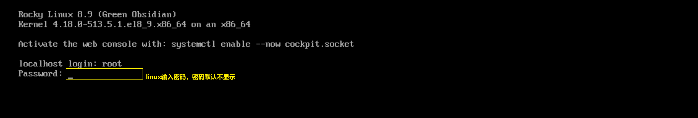
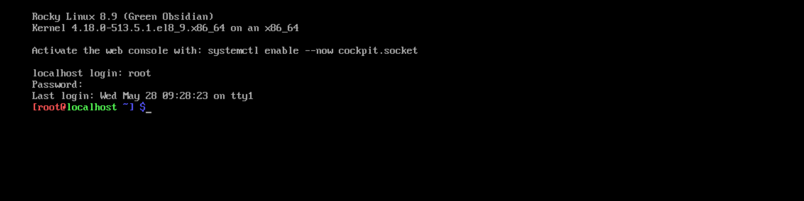
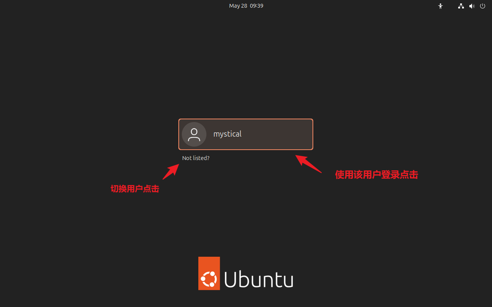
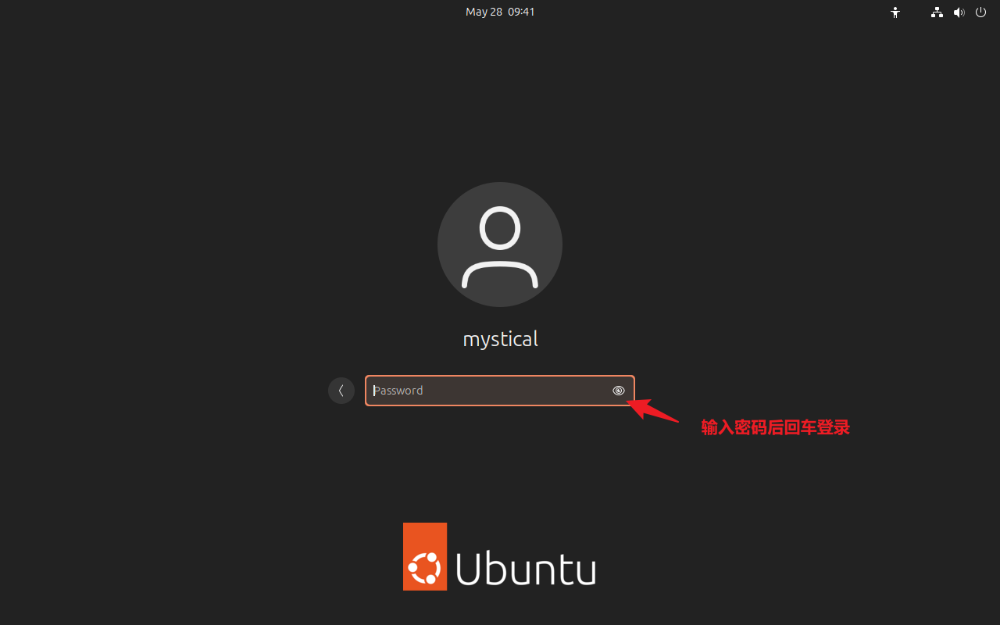

# 1 Linux基础入门和帮助

# 1.1 Linux基础

### 1.1.1 登录方式

#### 1.1.1.1 本地登录

**文本界面登陆**





**图形界面登录**






#### 1.1.1.2 环境初始化

**桌面版安装 VMware Tools**

```bash
# Ubuntu-desktop版
apt install -y open-vm-tools-desktop

# Ubuntu-desktop版
yum install -y open-vm-tools-desktop
```


#### 1.1.1.2 远程登录

远程登录允许用户从其他主机或终端通过网络连接到Linux系统进行登录操作

**登录方式**

**SSH (Secure Shell)**

- 提供加密的远程登录会话，确保数据传输的安全性。SSH是Linux系统中广泛使用的远程登录协议。
- 适用场景：远程服务器管理、远程软件开发、安全的数据传输等。
- 登录方式：使用SSH客户端软件或直接执行 "ssh 用户@地址" 命令进行登录。


