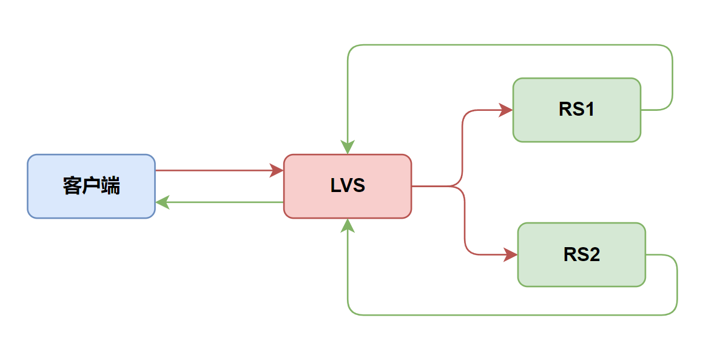
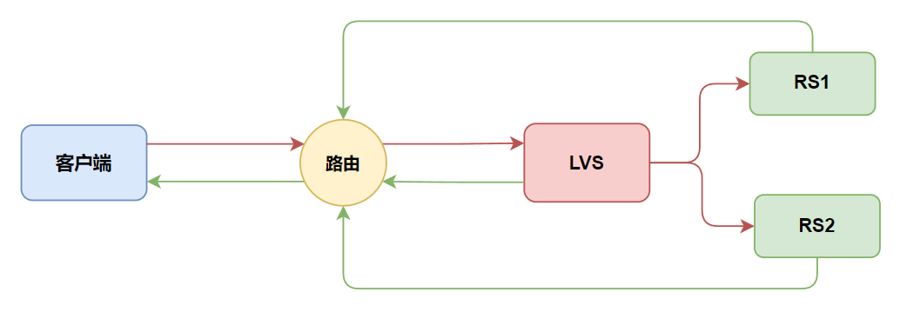

# 企业级调度器 LVS

## 集群基础

### 集群简介

#### 场景需求

场景需求 - 单台主机资源无法承担起用于请求

```bat
    随着我们对linux系统的学习，特别是web软件等技术方面的学习，我们搭建好的网站规模越来越大，我们知道搭建好的网站，肯定是为软件项目产品用的。这样我们就可以假设，当我们把在线上服务器搭建好项目环境后，随着软件项目的部署和发布，开始打开我们公司的影响力，随着用户的访问越来越多，我们可以采取web中的虚拟主机等技术来满足用户的需求，但是肯定在某个时间段，我们的线上服务器主机满足不了用户的需求带来的压力了，这个时候，怎么办呢？
```

**"集群"**可以了解一下。

```bat
    我们这个时候所涉及到的集群，不是单主机上的多个软件实现的多虚拟主机效果，而是一台主机搞不定，我们多台主机共同支撑我们业务的场景。简单来说，集群就是 -- 一个人搞不定，多个人来做。
```

所以，集群也可以成为资源扩展的一种解决方案。


#### AKF扩展立方体介绍


**x轴扩展**就是我们的服务是**无状态的**，也就是无论我们起多少个服务，它们都是同等的为用户提供服务，这种扩容的成本是最低的，也就是我们通常称的水平扩展，也因此我们肯定是希望尽可能的使用水平扩展来解决问题
之前学过的 Nginx 上的 Round-Robin 和 least-connected 是标准的基于水平扩展的负载均衡算法

但是水平扩展并不能解决所有问题，特别是不能解决数据量的问题，当单台应用上的数据已经非常大的时候，无论我扩展多少台服务，那么每一台服务的数据仍然非常大，此时就应该使用另外两种解决方案去解决


**y轴**是从功能上进行拆分，拆分后，就是原先由一台应用服务处理的功能，我们分为两台应用服务，这两台应用服务分别处理不同的api，也就是不同的url，这个时候，我们就可以在nginx通过location进行配置，也就是有些location我们用proxy pass代理到一些上游服务器，另外一些url，我们代理到另一个集群的url服务中，此时就实现了y轴的扩展，而y轴的扩展往往需要修改代码，做大量重构，它的成本是比较高的，但是它能够解决数据的上升问题，数据量上升随着我拆分，数据量是会下降的


**y轴扩展示例**

```nginx
server {
    listen 80;
    server_name www.myecommerce.com;
    
    # 用户管理请求的代理配置
    location /user/ {
        proxy_pass http://user-service-cluster;
    }

    # 订单处理请求的代理配置
    location /order/ {
        proxy_pass http://order-service-cluster;
    }

    # 商品管理请求的代理配置
    location /product/ {
        proxy_pass http://product-service-cluster;
    }

    # 支付相关请求的代理配置
    location /payment/ {
        proxy_pass http://payment-service-cluster;
    }
}
```

```bat
那么有没有比y轴的成本稍低，效果像x轴那样轻松容易扩充的呢?
```


此时可以考虑**z轴**，使用z轴进行扩展，z轴就是**基于用户的信息**进行扩展，比如基于用户的IP地址，就是CDN，比如有些ip地址比较靠近某个CDN中心，我们就可以这样的请求引流的CND上，
为了分离减少数据容量，我们可以使用用户名，将某些固定的用户，把它引流到指定集群


**z轴扩展示例**

Z轴扩展的关键就是选择合适的**分片键（Shard Key）**。
 一般步骤如下：

**1. 选择分片键**

例如 `user_id`，因为：

- 每个用户访问的数据高度相关；
- 分布较均匀；
- 可直接通过哈希函数定位。

**2. 哈希取模分片**

```python
shard_id = user_id % 4
```

→ 将用户平均分到 4 个库中：

| user_id | shard_id | 数据库名  |
| ------- | -------- | --------- |
| 1       | 1        | db_user_1 |
| 2       | 2        | db_user_2 |
| 3       | 3        | db_user_3 |
| 4       | 0        | db_user_0 |
| 5       | 1        | db_user_1 |
| …       | …        | …         |

这样，每个数据库只承担 1/4 的数据和流量。

**3. 应用层路由**

应用程序或中间件根据 `user_id` 自动计算分片位置，转发到对应数据库执行 SQL：

```python
db_index = user_id % 4
conn = db_pool[db_index]
conn.execute("SELECT * FROM orders WHERE user_id=%s", user_id)
```


#### 总结三维扩展的负载层差异

| 维度                | 核心思路                         | 典型分流方式                    | 依赖的负载层        |
| ------------------- | -------------------------------- | ------------------------------- | ------------------- |
| **X轴（水平克隆）** | 同样的服务部署多个实例           | 根据 IP/端口 做流量分发         | **四层（L4）**      |
| **Y轴（功能拆分）** | 按业务或路径拆分请求             | 根据 URL、Header、Cookie 等分发 | **七层（L7）**      |
| **Z轴（数据分片）** | 按用户或数据维度拆分数据库或服务 | 由应用层根据用户ID/哈希路由     | **逻辑层（App级）** |


##### **X轴扩展 → 四层负载就够**

X轴扩展是“相同的服务多个副本”：

- 所有实例功能完全一致；
- 请求到任意节点都能处理；
- 负载均衡器只需在 TCP/UDP 层做轮询或哈希。

➡ 典型实现：

- LVS（四层负载）
- Nginx Stream 模式
- Keepalived + VIP
   这些都工作在 **L4（传输层）**，仅看 IP + 端口，不关心 HTTP 内容。


##### **Z轴扩展 → 应用层控制，但前端仍可用四层**

Z轴扩展的本质是 **数据分片**，而不是功能分流：

- 每个实例处理不同用户或数据范围；
- 分片逻辑通常在应用层或中间件实现（例如 Mycat、ShardingSphere）；
- 前端负载均衡（如LVS/Nginx）仍可用四层轮询。

换句话说：

> 对客户端请求来说，它仍是“相同功能的多个实例”，
>  对后端数据来说，每个实例负责不同的子集。

✅ 所以前端流量分发依然可以是 **四层负载均衡**。
 例如：

```bat
LVS/Nginx(L4) → 应用层 → Mycat → 分库分表
```


##### **Y轴扩展 → 必须用七层负载**

Y轴扩展是 **按业务功能拆分（功能分区）**，例如：

- `/user/*` → 用户服务
- `/order/*` → 订单服务
- `/payment/*` → 支付服务

此时：

- 需要根据 URL Path、HTTP Header、Host、Cookie 等做路由；
- 这些信息都在 **应用层（L7）**；
- L4 只知道 TCP 连接，根本看不到 URL 或 Header。

➡ 所以必须使用 **七层负载均衡**：

- Nginx（HTTP 模式）
- Envoy / Istio Gateway
- Apache、HAProxy（HTTP层）
- 阿里云 SLB 的 HTTP/HTTPS 模式


##### 一句话总结

| 轴向    | 主要作用                 | 典型负载层         | 路由依据                     |
| ------- | ------------------------ | ------------------ | ---------------------------- |
| **X轴** | 扩大并发能力（克隆实例） | L4                 | IP/端口                      |
| **Y轴** | 拆分功能（微服务）       | L7                 | URL / Header / Cookie        |
| **Z轴** | 拆分数据（分库分表）     | L4（前端）+ 应用层 | 哈希 / 分片键（App内部逻辑） |


### 集群类型

**从目的（目标）角度划分，集群主要分三类：**

| 类型                                     | 全称           | 主要目的                   | 举例                                         |
| ---------------------------------------- | -------------- | -------------------------- | -------------------------------------------- |
| **LB 集群（Load Balancing Cluster）**    | 负载均衡集群   | 分担请求压力，提高吞吐     | Nginx + Web 集群、LVS 四层转发、K8s Service  |
| **HA 集群（High Availability Cluster）** | 高可用集群     | 消除单点故障，实现自动切换 | Keepalived、Pacemaker + Corosync、MySQL 主备 |
| **HP 集群（High Performance Cluster）**  | 高性能计算集群 | 并行计算、科学运算、AI训练 | MPI、Slurm、HPC、GPU集群                     |


**三类集群的典型区别**

| 对比维度           | LB集群           | HA集群                        | HPC集群              |
| ------------------ | ---------------- | ----------------------------- | -------------------- |
| **目标**           | 分担请求压力     | 容错与自动接管                | 提升计算性能         |
| **典型场景**       | Web服务、API网关 | 数据库、消息中间件            | 科学计算、AI训练     |
| **是否有共享存储** | 一般无           | 通常有（用于状态同步）        | 必有（共享文件系统） |
| **协调方式**       | 负载均衡器       | 心跳与选主                    | 调度器与MPI通信      |
| **K8s对应机制**    | Service + HPA    | StatefulSet + Leader Election | Job + MPI Operator   |


### 站点可用性指标

#### 系统可用性（Availability）计算公式（理论可用性模型）


它是衡量「一个系统（例如网站、业务系统、服务器、服务集群）」在一段时间内**能正常提供服务的比例**。我们来一步步拆解它背后的含义与实际用法👇


##### 核心概念解析

| 指标     | 全称                      | 中文含义         | 理解方式                                     |
| -------- | ------------------------- | ---------------- | -------------------------------------------- |
| **MTBF** | Mean Time Between Failure | 平均故障间隔时间 | 系统在两次故障之间能稳定运行多久（越长越好） |
| **MTTR** | Mean Time To Restoration  | 平均修复时间     | 从发生故障到完全恢复所需时间（越短越好）     |
| **A**    | Availability              | 可用性           | 系统“正常可用”的时间占总时间比例             |


##### 公式推导逻辑

整个周期可以看作：

> 一次「运行时间」 + 一次「修复时间」

因此：
$$
A = \frac{\text{运行时间}}{\text{运行时间 + 修复时间}} = \frac{MTBF}{MTBF + MTTR}
$$
这代表：
 系统在长期运行中，越是「能长时间不出故障」且「修得越快」，整体可用性就越高。


##### 具体示例

假设：

- 平均每隔 100 小时出一次故障（MTBF = 100）
- 每次修复需要 1 小时（MTTR = 1）

则：
$$
A = \frac{100}{100 + 1} = 0.9901 = 99.01\%
$$
也就是说：

> 网站在长期运行中，大约 99% 的时间是正常可访问的，1% 的时间处于故障或维护状态。


##### 见可用性等级对照表（SLA标准）

| 可用性等级         | 年可宕机时间   | 适用场景           |
| ------------------ | -------------- | ------------------ |
| **99%**            | ≈ 3.65 天/年   | 普通网站           |
| **99.9% (3个9)**   | ≈ 8.76 小时/年 | 企业系统           |
| **99.99% (4个9)**  | ≈ 52.6 分钟/年 | 金融、电商         |
| **99.999% (5个9)** | ≈ 5.26 分钟/年 | 核心金融、电信系统 |


##### 可用性提升的两大方向

根据公式：
$$
A = \frac{MTBF}{MTBF + MTTR}
$$
你可以从两条路径提升 A：

**提高 MTBF —— 减少故障发生频率**

- 提升系统稳定性（架构优化、容错设计）
- 使用高可靠硬件、冗余部署
- 压测与容量规划，避免过载
- 灾备演练（提高故障间隔）

**降低 MTTR —— 缩短修复时间**

- 健全监控报警（快速发现）
- 自动化恢复机制（自愈脚本、Failover）
- 热备份 / 冷热切换系统
- 统一运维调度和快速回滚策略


#### 系统可用性（Availability）计算公式（实际监测模型）


$$
站点可用率 = \frac{站点可正常响应请求的时间}{总监测时间}
$$


**含义：**

- 这是**真实监控数据统计方式**；
- 由监控系统（如 Zabbix、Prometheus、UptimeRobot）通过实际探测得出；
- 直接反映用户访问体验的“真实可用时间比例”。


可由监控系统（如 Prometheus + Grafana / UptimeRobot / Zabbix）自动采集：

- **探测频率**：每 1 分钟发一次 HTTP 请求；
- **统计周期**：按天、按周、按月；
- **状态定义**：200/301/302 等响应为「正常」，超时/错误为「异常」。

📊 例如：

> 一天 1440 次探测中有 12 次失败 → 可用性 = (1440-12)/1440 = 99.17%


➡️ 这是实际测得的站点可用率。


#### 两者的关系（理论 → 实际）

| 维度             | 理论可用性（MTBF/MTTR） | 实际可用性（监控统计）   |
| ---------------- | ----------------------- | ------------------------ |
| **性质**         | 理论计算                | 实际观测                 |
| **数据来源**     | 故障间隔、修复时间      | 探测日志、监控数据       |
| **应用阶段**     | 设计规划、SLA建模       | 运行运维、SLA验证        |
| **精度影响因素** | 假设条件（理想化）      | 网络、探测频率、监控范围 |
| **谁能验证谁**   | 提供目标值              | 提供真实结果             |

✅ 理论值（MTBF/MTTR） → 作为系统设计或 SLA 目标
✅ 实际值（监控可用性） → 用来验证 SLA 是否达标


### 集群与分布式

#### 简单理解


```bat
集群和分布式 -- 集群是同一任务的多副本，而分布式是拆分任务
```


#### 一句话本质对比

> **集群（Cluster）解决的是“单点和可用性问题”**，
>  **分布式（Distributed System）解决的是“数据与计算的拆分与一致性问题（数据【数据/元数据】一致性和事务一致性）”**。
>
> > 创建的数据一致性协议/机制：Raft，ISR，Gossip

换句话说：

- 集群强调「**同一个系统如何更可靠地跑起来**」
- 分布式强调「**一个系统如何拆成多个节点协同完成任务**」


#### 从问题出发看两者区别

**集群：应对“单点与负载”**

- 问题：单节点性能瓶颈或宕机导致服务不可用。
- 思路：**多节点冗余 + 流量分发 + 故障切换**。
- 本质：保证系统**“活着”且“顶得住”**。

举例：

- Nginx 多副本集群 → 任一台挂掉仍可访问。
- MySQL 主从集群 → 主库挂掉从库顶上。

此时每个节点的数据可以是一样的（克隆），重点不是“怎么拆”，而是“怎么接管”。


**分布式：应对“数据量与一致性”**

- 问题：单机数据太多 / 计算太重，放不下、算不完。
- 思路：**拆分数据（Sharding）或任务（Partitioning）到多节点协作**。
- 挑战：节点间如何保持**数据一致性、事务完整性、顺序性**。
- 本质：保证系统**“能扩展”且“算得准”**。

举例：

- Redis Cluster → 不同 key 存在不同槽位节点；需保证复制和主从一致。
- TiDB → 不同 Region 存在不同节点，需保证分布式事务一致性。

此时每个节点的数据不同（分片），重点在于“如何协作”。


**两者的联系（并非对立）**

- **分布式系统通常运行在集群上**
   比如 Kafka、TiDB、HDFS 本身是分布式系统，但仍需要多个节点组成集群来运行。
- **集群可不一定是分布式的**
   比如 Nginx、MySQL 主从只是多副本集群，数据没拆，也不涉及分布式事务。


## LVS快速入门


​	


## LVS 补充知识

### Linux 的路由决策

Linux 网络栈的 **IP 路由决策** 分为两步：

1️⃣ **路由匹配目标 IP**
 根据内核的路由表（`ip route show`），查找匹配目标地址的最佳路由：

```
目标IP ∈ 192.168.8.0/24 → 出口eth0，直接交付
否则 → 查找默认路由 (default via X)
```

2️⃣ **ARP 邻居解析（邻居发现）**
 当确定出接口后，内核还要通过 ARP（或 NDP）获取下一跳的 MAC 地址：

- 如果目标在同一子网：直接 ARP 目标 IP；
- 如果目标在不同网段：ARP 网关 IP（下一跳）。


#### 数据包发送流程

Linux 处理一个要发出的 IP 包（无论是本地进程发送、还是转发）时，核心步骤如下：

```bat
应用层发包 or 转发包
   ↓
IP 层查找路由表 (fib_lookup / ip_route_output_key)
   ↓
确定出接口 dev 与下一跳 IP (nexthop)
   ↓
邻居子系统查询 MAC (ARP / NDP)
   ↓
若缓存中无邻居项 → 触发 ARP 请求
   ↓
拿到 MAC → 构造以太网帧 → 交给驱动发送
```

所以：

> **ARP 广播是 IP 层路由决策完成后的链路层动作。**


#### 为什么必须“先路由再 ARP”

因为：

- ARP 是为链路层服务的；
- 它必须知道“**我需要解析谁的 MAC？在哪个接口上解析？**”

而这两个信息——目标 IP 的 **下一跳（next hop）** 和 **出接口（oif）**
 只能由 IP 路由层计算得出。


**举个例子**

主机配置：

```bat
eth0: 192.168.8.12/24
default via 192.168.8.1
```

发包目标：

```bat
dst = 8.8.8.8
```

过程：

1️⃣ **IP 层路由查找**

```bat
ip route get 8.8.8.8
→ result: dev eth0, nexthop = 192.168.8.1
```

2️⃣ **邻居解析阶段**

```bat
要发往 nexthop = 192.168.8.1 的 MAC
→ 查 neighbor cache
→ 若无 → 发 ARP who-has 192.168.8.1
```

3️⃣ **ARP 完成后**

```bat
目标MAC = xx:xx:xx:xx:xx:xx
封装二层帧后发出
```

**这就说明：ARP 绝不可能在路由决策之前发生，因为它必须依赖“路由结果”。**


#### 接收方向的对比（入方向）

收包时顺序是相反的：

```bat
驱动收到帧 → ARP 匹配 MAC → 交给 IP 层 → IP 路由查目标
```

注意：

- 接收方向是“先二层（ARP）再三层（路由）”
- 发送方向是“先三层（路由）再二层（ARP）”

📘 也就是：

> **发送包：先 IP 决策，再 ARP**
>
> **收包：先 ARP 匹配，再 IP 决策**


### 理解反向路由查询

#### **Linux 网络收包的两类路由查询**

在一个包进入 Linux 内核时，内核会在不同阶段做两种不同的路由查询：

| 查询类型                                 | 查询目标               | 执行阶段                | 作用                                     |
| ---------------------------------------- | ---------------------- | ----------------------- | ---------------------------------------- |
| **正向路由查询（forward route lookup）** | 目标 IP (`iph->daddr`) | PREROUTING → FORWARD    | 用来决定包要发到哪个接口（正常转发逻辑） |
| **反向路由查询（reverse path lookup）**  | 源 IP (`iph->saddr`)   | PREROUTING（rp_filter） | 用来校验包是否合法（安全过滤逻辑）       |

你可以理解成：

- **正向路由**：我要送这个包去哪里？
- **反向路由**：如果我回信给这个源地址，我该从哪个口发出去？

**rp_filter** 就是基于第二种“回信逻辑”判断包的合法性。


#### rp_filter 的计算与转发之间的执行顺序

包进入 Linux 内核时的典型路径如下：

```css
  [网卡接收中断]
        ↓
   Netfilter PREROUTING
        ↓
   (rp_filter 在这里执行)
        ↓
   fib_lookup(目标IP) → 正常路由
        ↓
   FORWARD / INPUT / OUTPUT
        ↓
   POSTROUTING
        ↓
   发送到出接口
```

所以：

> rp_filter 的反向路由计算在 **路由转发之前**。
>  它不是转发逻辑的一部分，而是「安全门卫」。


#### **DR 模式下 rp_filter 为什么会误杀1**



在 上图 LVS-DR 场景中，反向路径通常不对称：

| 包方向                  | 入口 | 反向路由出口 | rp_filter 行为 |
| ----------------------- | ---- | ------------ | -------------- |
| RS→LVS（源=VIP）        | eth1 | lo（回 VIP） | ❌ 不一致，被丢 |
| RS→LVS（源=RS）         | eth1 | eth1         | ✅ 一致，放行   |
| Client→LVS（源=Client） | eth0 | eth0         | ✅ 一致，放行   |

这说明：

> DR 模式中，LVS 本机持有 VIP → 对源为 VIP 的包，反向路径指向 lo → 与入接口 eth1 不符 → 被丢弃。


#### **关闭 rp_filter 就是让内核“不要做反查”**

当你执行：

```
sysctl -w net.ipv4.conf.all.rp_filter=0
```

时，内核就不会在 PREROUTING 阶段执行这次反向路由检查。 于是这个包得以进入正常的转发逻辑（根据目标 IP 查正向路由）。


### Linux 的 “本地地址保护机制”

它的核心思想是：

> 不能允许外部主机伪造本机 IP 进入系统。

在内核代码中，这部分逻辑出现在 `ip_rcv_finish_core()` 和 `ip_local_deliver()` 之间。
当包进入时，如果：

```C
if (inet_addr_type(dev_net(dev), iph->saddr) == RTN_LOCAL)
```

即源地址被判断为本地（local）， 则不会进入转发路径，而会被递交给 local stack。但这个包并没有本地进程监听，因此最后会被丢弃。


#### 解决方案1

让 RS 直接能到达客户端（不走 LVS） 	


#### 解决方案2（不推荐）

如果你必须让 LVS 转发（例如没有其他网关）， 可以通过关闭本地地址的保护机制来强制放行，但风险很大：

```
sysctl -w net.ipv4.conf.all.accept_local=1
```

这会允许内核转发「源地址是本机 IP」的包。 但这可能导致安全与路由混乱问题。


### **DR 模式下 rp_filter 为什么会误杀2**





上图的 DR模型架构中，LVS上的网关必须指向路由器，本质上也是防止 rp_fitler 误杀

所以在上述情况下，如果不配置网关，而是关闭 LVS上的 rp_filter 检查，一样可以成功。但是不推荐。

为什么不配网关会导致 rp_filter 误杀

```bat
如果不配LVS网关指向路由器，那么数据包从eth0进入LVS，但是通过路由表发现没有返回给客户端的包的接口
也就是说，进入的接口是eth0，而出去的接口没有，只要出去的接口不是eth0，则进入的接口和出去的接口不一致，从而导致 rp_filter 误杀
```


### 深入理解网络

#### 数据传输原理

在以太网环境中，**帧的传输完全依赖 MAC 地址**：

- 只要网卡收到了目的 MAC 与自己匹配的帧，它就会接收；
- 它不会去关心帧里的 IP 地址是不是“同网段”；
- 也就是说：**二层收发与 IP 网段完全无关**。

这意味着：

> 如果你手动控制 MAC 层（例如手动构造以太网帧或禁用 IP 层检查），
>  就能实现跨网段通信。


#### 为什么默认情况下“不同网段不能通信”

这是因为 **操作系统的 IP 层做了限制**：

1. 当你 `ping 172.16.0.10` 时，内核会：
   - 查路由表；
   - 发现目标 IP 不在本地网段；
   - 若没有默认网关 → 不知道怎么发；
   - 直接报错 `Network is unreachable`；
   - 根本不会发出任何以太网帧。

也就是说：

> 不是网卡发不出去，而是**内核在三层逻辑上阻止了这个动作**。


#### 如果你“绕过”IP 层逻辑，就能直接通信

下面几种手段确实可以让你做到「不同网段直接通信」：

##### 方法1：手动添加静态 ARP + 静态路由

假设：

```
主机A：192.168.10.10/24, MAC=AA-AA-AA-AA-AA-AA
主机B：172.16.0.20/24, MAC=BB-BB-BB-BB-BB-BB
```

两机物理连通（同交换机）。

A上执行：

```
ip neigh add 172.16.0.20 lladdr BB:BB:BB:BB:BB:BB dev eth0
ip route add 172.16.0.20 dev eth0
```

然后：

```
ping 172.16.0.20
```

✅ 竟然可以通！
 因为：

- 内核查到 `172.16.0.20` 的下一跳是 `dev eth0`；
- 也知道 MAC；
- 于是直接发出以太网帧，不再做网段判断。

📌 本质：

> 你手动告诉系统如何封装帧，因此跳过了 IP 层网段判断。


##### 方法2：用原始套接字（raw socket）或 Scapy 发自定义帧

你可以在应用层自己构造 Ethernet + IP + TCP 三层头：

```
from scapy.all import *
sendp(Ether(src="AA:AA:AA:AA:AA:AA", dst="BB:BB:BB:BB:BB:BB")/
      IP(src="192.168.10.10", dst="172.16.0.20")/
      ICMP(), iface="eth0")
```

这样你直接把帧送进网卡：

- 不经过内核路由；
- 不检查网段；
- 网卡收到后发出去；
- 对方只要网卡在监听，也能收到。

📌 这就是**二层通信独立于 IP 网段**的证明。


##### 方法3：抓包工具层面（Wireshark/tcpdump）

即使 IP 不通，你也能在另一台机器上抓到帧，因为交换机是照着 MAC 转发的。


#### 为什么说「可以通信，但不等于 TCP/IP 通信」

上面这些手段是**绕过内核的正常 IP 路由规则**。
 但如果你希望“应用层 TCP/HTTP 正常工作”，那必须：

- OS 的 IP 层愿意处理；
- 两边的 ARP 和路由一致。

否则：

- TCP 栈认为“目的地址不可达”；
- 即使帧到了，对方 IP 层也会丢弃（目标 IP ≠ 本机 IP）。

所以：

> 若只是证明“信号能到”，MAC 就够；
>  若要“真正建立连接”，还得满足 IP 层逻辑。


#### 这种跨网段通信在生产中的实际用途

| 场景                     | 技术                             | 说明                              |
| ------------------------ | -------------------------------- | --------------------------------- |
| LVS-DR 模式              | 源IP与本地不同网段，但仍转发给RS | 通过关闭 rp_filter 或调整路由实现 |
| VLAN 间欺骗/测试         | 手动构造帧                       | 测试安全隔离                      |
| 网络取证与攻击演练       | ARP欺骗、IP伪造                  | 绕过路由规则                      |
| 高性能分布式传输（DPDK） | 用户态直接发帧                   | 跳过内核路由，实现超低延迟        |

------


#### 一句话总结

> **是的**：
>  只要物理层连通、MAC 地址可达，你完全可以跨 IP 网段实现通信。
>
> - IP 只是逻辑路由决策层；
> - 真正送达仍靠 MAC；
> - 内核默认会阻止“跨网段”是为了逻辑一致性，不是技术不可能。
>
> 换句话说：**物理可达 + 手动控制帧发送 → 就能跨网段通信。**


