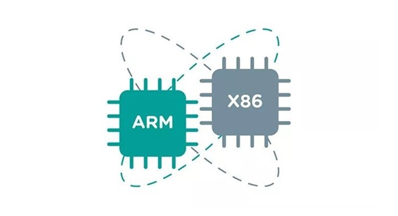

# 1. 课程安排

## 1.1 从传统服务到云原生的演化路线

云原生（Cloud Native）并不是某一种具体技术，而是软件系统在过去二十年间随着规模、复杂度和业务增长不断演化所形成的一套方法论与技术体系。

它的出现不是偶然，而是 **两条技术演进主线的汇合结果**：

- **基础设施演化线：物理机 → 虚拟机 → 容器**
  解决环境一致性、资源利用率、快速部署等问题。

- **软件架构演化线：单体架构 → 垂直架构 → SOA → 微服务**
  解决系统复杂性、模块解耦、并行开发、弹性扩展等问题。

这两条线在 Kubernetes 时代实现了“会师”，共同构成了现代云原生体系。


### 1.1.1 云原生的四大支柱

- **容器化（Containerization）**
- **服务化（Microservices）**
- **编排（Orchestration）** 
- **DevOps 过程自动化（CI/CD）**


云原生不是一个技术，而是整个方法论：

> 应用用容器封装， 使用 Kubernetes 编排，通过 DevOps 自动交付， 在微服务架构中运行，通过 Service Mesh 管理流量， 通过 Observability 观测运行状态。


## 1.2 SRE 介绍


### 1.2.1 SRE产生的原因

我们现在看到很多跟SRE相关的文件或内容，对于SRE产生的原因的解释，大多是说为了缓解开发和运维之间的矛盾，树立共同的目标，让对方能够更好的协作，**但这不是根本原因**

根本原因在于，微服务架构复杂度到了一定程度，已经远远超出单纯的开发和单纯的运维职责范畴，也远远超出了单纯人力的认知掌控范围，所以必须寻求在此架构之上的更为有效和统一的技术解决方案来解决复杂度认知的问题

目前业界火热的DevOps理念及衍生的一系列话题也是同样的背景和逻辑。
DevOps想要解决的开发和运维之间日益严重的矛盾，究其根本，还是微服务架构背后带来的技术复杂度在不断提升的问题

因此运维一定要与微服务架构本身紧密结合起来

```ABAP
如果没有SRE，依然是传统的运维方式管理当前微服务架构下的运维问题

导致的问题就是运维效率低下，完全靠人工，线上故障频发，但是处理效率又极低，开发和运维都处于非常痛苦的状态之中
```


### 1.2.2 Google-SRE


Google 是提出 **Site Reliability Engineering（SRE）** 这个概念的鼻祖，它的 SRE 岗位不仅技术要求高，而且职责非常明确，**在业界具有极强的指导性**。


#### 1.2.2.1 Google 对 SRE 岗位的要求（Skills & Qualifications）

| 项目               | 要求                                                       |
| ------------------ | ---------------------------------------------------------- |
| **编程能力**       | 熟练使用一到多种语言（Go、Python、C++、Java）              |
| **系统能力**       | 精通 Linux 系统原理、性能调优、资源管理                    |
| **分布式系统经验** | 熟悉负载均衡、微服务架构、存储系统、高可用                 |
| **网络基础**       | TCP/IP、DNS、TLS、HTTP 等                                  |
| **容器与调度**     | 熟练使用 Kubernetes、Borg（Google 内部调度器）             |
| **自动化能力**     | 熟悉 CI/CD、配置管理、基础设施即代码（Terraform、Ansible） |
| **故障分析能力**   | 擅长日志追踪、指标分析、问题定位、RCA 报告编写             |


#### 1.2.2.2 Google 内部 SRE 的职责

Google 官方在《SRE Book》中定义了：

> "SRE is what happens when you ask a software engineer to design an operations team."

Google 的 SRE 既是工程师，也是可靠性保障者，职责涵盖以下几个核心维度：


**1. 服务可用性保障**

- 维护服务 **99.9%+ 可用性**
- 建立 **SLI（指标） / SLO（目标） / SLA（协议）**
- 开发监控报警系统（Prometheus、Stackdriver）


**2. 故障应对与根因分析（Incident Response & RCA）**

- 第一时间响应重大服务故障（Paging）
- 协调修复、回滚、降级
- 编写 RCA 报告和后续预防措施（Postmortem）


**3. 容量规划与性能优化**

- 分析系统负载，做容量预测
- 调整缓存、负载均衡、数据库查询
- 使用工具如 BigQuery、Grafana、gRPC profiler 做压测分析


**4. 自动化与工具开发**

- 用编程方式解决运维问题（Toil Elimination）
- 编写自动修复工具、自愈系统、巡检系统
- 将重复手动任务编程实现自动化


**5. 参与系统设计评审**

- 与开发团队一起参与服务设计，确保可观测性、可运维性
- 参与上线评审、容量评估、安全评估


**6. 控制变更风险（Change Management）**

- 管理变更发布（如 canary rollout、蓝绿发布）
- 评估变更带来的风险和 SLO 影响


在 Google，SRE 是既懂开发又精通系统架构的可靠性工程师，职责覆盖系统设计、自动化运维、故障响应、容量规划、风险控制等关键领域，核心目标是：**用软件工程的方法解决运维问题，保障服务可靠性。**


### 1.2.3 Netflix-SRE


众所周知，Netflix是业界微服务架构的最佳实践者，其基于公有云上的微服务架构设计，持续交付，监控，稳定性保障，都为业界提供了大量可遵从的原则和实践经验

#### Netflix运维现状

Netflix没有运维岗位，和运维对应的岗位其实是我们熟知的SRE(Site Reliability Engineer)
但是SRE不等于运维! 
Netflix_SRE理念的核心是：**用软件工程的方法重新设计和定义运维工作。**


 Netflix实践极端DevOps--you build it, you run it(工程师负责从头到尾负责开发软件、部署和再生产环境运行代码)

SRE支持性能工程师执行以下活动：

- 自动缩放用于按需扩展 - 节省资金与预购的本地计算机相比 - 用于编码、预计算、故障转移和蓝绿部署
- 处理涉及自动缩放的棘手问题，如资源欠配，以及粘性流量、突发流量和不均匀的流量分布
- 支持性能仪表板，覆盖负载问题、错误、延迟问题、资源饱和（例如CPU负载平均值）和实例数量。


## 1.3 课程安排

### 1.3.1 传统架构设计


#### 1.3.1.1 实现目标

- 上述架构的各组件以面向生产环境的方式部署
- Ansible进行部署和新版本发布
- 用上JumpServer，模拟进行远程管理接入
- Shell脚本和Xtrabackup/mysqldump:MySQL数据库备份和远程存储
- Nginx模拟做业务网关，耦合请求至业务请求路径中，LVS做接入层流量网关
- 基于Keepalived高可用LVS
- 使用Zabbix监控以上系统中的每个组件，规划好存储空间，并制订合理的告警策略

```basic
Ansible进行版本发布过程中，服务不会中断
MyCAT和MySQL实现的读写分离架构中，数据能够正常读写
Memcached用作Session Server，确保会话保持的功能;
模拟数据丢失，确保数据库的备份文件能够用于进行恢复
Nginx某一实例故障，不会大面积影响业务访问;
LVS某一实例故障，不会大面积影响业务访问;
Zabbix能够及时发现问题，并进行及时告警
```


### 1.3.2 云原生架构设计


# 2. 学习环境

## 2.1 Markdown文档使用

### 2.1.1 Markdown是什么


`Markdown` 是一种轻量级标记语言，创始人为约翰·格鲁伯（John Gruber）。
`Markdown` 允许人们使用易读易写的纯文本格式编写文档，然后转换成有效的HTML文档。
`Markdown` 编写的文档可以导出 HTML 、Word、图像、PDF、Epub 等多种格式的文档。
`Markdown` 编写的文档后缀为 .md, .markdown。
我个人认为 `Markdown` 是现在现在是互联网上最流行的写作语言！！！许多网站平台的文章、博客、论文都是基于它写的！！！

> 例如：
> 国外的GitHub、Reddit、Diaspora、Stack Exchange、OpenStreetMap 、SourceForge等；
> 国内的CSDN、简书、掘金、博客园、知乎等。


这里我们学习使用的 [Markdown 编辑器](https://so.csdn.net/so/search?q=Markdown 编辑器&spm=1001.2101.3001.7020) 是 **Typora**。这款软件足够轻量级，同时功能做到了尽可能的简单。


### 2.1.2 Markdown优点

好多人看到Markdown的标签是【轻量级】【标记】【语言】就直接放弃，想着自己学习了非常多的语言，为了记个笔记写个博客还要再学习一门语言吗？实则不然，Markdown的语言非常非常简单，如果想学，10分钟你完全可以学完90%的常用的语法，而且你从此摆脱排版的折磨，属实是强迫症党的福利了。它的优点不仅限于此：


- 纯文本编辑，只要是支持Markdown编辑的都能获得同样的结果，摆脱排版苦恼
- 学习成本低，常用的语法很少，简单易学快速上手
- 支持跨平台同步数据
- 支持插入图片、视频等
- 随时修改，不必担心word等工具出现排版错误


### 2.1.3 Markdown 的基本语法

#### 2.1.3.1 标题

使用#号标记，可以表示1-6级标题， 随#的个数递增，一级标题字号最大，六级标题字号最小。
代码如下：

```markdown
# 一级标题
## 二级标题
### 三级标题
#### 四级标题
##### 五级标题
###### 六级标题
```

效果如下


> 注意：
>
> - 最后一个`#`字符与标题中间留一个空格
> - 标题应该置于行首，如果放入表格中可能无法正确解析


#### 2.1.3.2 字体

星号与下划线都可以，单是斜体，双是粗体，三是粗斜体

| 代码               | 效果             |
| ------------------ | ---------------- |
| `*这是斜体*`       | *这是斜体*       |
| `_这是斜体_`       | *这是斜体*       |
| `**这是粗体**`     | **这是粗体**     |
| `__这是粗体__`     | **这是粗体**     |
| `***这是粗斜体***` | ***这是粗斜体*** |
| `___这是粗斜体___` | ***这是粗斜体*** |

> 快捷键：
> 加粗Ctrl+B
> 斜体Ctrl+I


#### 2.1.3.3 引用

Markdown 中引用通过符号 `>` 来实现。`>` 符号后的空格，可有可无。

在引用的区块内，允许换行存在，换行并不会终止引用的区块。如果要结束引用，需要一行空白行，来结束引用的区块。

代码：

```markdown
> 这是一个引用
```

效果

> 这是一个引用
> 此外，引用还可以嵌套使用：
> 代码：

```markdown
> 这是一个引用
>> 这是一个引用的引用
>>> 这是一个引用的引用的引用
```

效果：

> 这是一个引用
>
> > 这是一个引用的引用
> >
> > > 这是一个引用的引用的引用
> >
> >   
>
>   


#### 2.1.3.4 链接

Markdown中插入链接的使用方式是：

代码：

```markdown
[链接名称](链接地址)
<链接地址>

示例：
[这是Mystical的博客](http://blog.mysticalrecluse.com/)
<http://blog.mysticalrecluse.com/>
```

效果

[这是Mystical的博客](http://blog.mysticalrecluse.com/)

<http://blog.mysticalrecluse.com/>


#### 2.1.3.5 图片

Markdown中插入图片的使用方式是：

代码：

```markdown 

比如我此文章的图片：

括号里可以写绝对路径，相对路径，URL
```

效果：


> 这里图片的使用，建议直接使用 Ctrl + v 粘贴图片更为便捷


#### 2.1.3.6 列表

列表分为有序列表和无序列表

- 无序列表，使用`*`、`+`、`-`，再加一个空格作为列表的标记
- 有序列表，使用数字并加上.号，再加一个空格作为列表的标记


代码：

```markdown
* 无序列表 1
+ 无序列表 2
- 无序列表 3

1. 有序列表 1
2. 有序列表 1
3. 有序列表 1
```

效果

> - 无序列表 1
> - 无序列表 2
> - 无序列表 3
>
> 1. 有序列表 1
> 2. 有序列表 2
> 3. 有序列表 3


如果想要控制列表的层级，则需要在列表符号前使用`Tab`

代码：

```markdown
- 无序列表 1
- 无序列表 2
	- 无序列表 2.1
	- 无序列表 2.2
	
1. 有序列表 1
	1.1 有序列表 1.1
2. 有序列表 2
	2.1 有序列表 2.1
```

效果：

- 无序列表 1
- 无序列表 2
  - 无序列表 2.1
  - 无序列表 2.2


1. 有序列表 1
   1. 1 有序列表 1.1
2. 有序列表 2
   2. 1 有序列表 2.1


#### 2.1.3.7 分割线

Markdown中给出了多种分割线的样式，我们可以使用分割线让文章结构更加的清晰。
分割线的使用，可以在一行中用三个`-`or`*`来建立一个分割线，但是注意：在分割线的上面空一行！！！

代码：

```markdown
分割线：

---
***
```

效果：

> ---
>
> ***
>
> 注意：写分割线前，要空一行之后写，否则会导致前一行字体放大。


#### 2.1.3.8 删除线

删除线的的使用，可以在要添加删除线的文字前后添加两个`~`

代码：

```bash
~~这是要被删除的文字~~
```

效果

> ~~这是要被删除的文字~~


#### 2.1.3.9 下划线

下划线的使用和html中类似，在需要添加下划线的文字首尾添加`<u>文本</u>`

代码：

```markdown
<u>这行文字已被添加下划线</u>
```

效果：

> <u>这行文字已被添加下划线</u>


#### 2.1.3.10 代码块

Markdown中代码块有两种：
如果在一行内需要引用代码，只需要用反引号`引起来就好了。

代码：

```markdown
`Hello` World
```

效果

> `Hello` World


如果是在一个块内需要引用代码，则在需要引用的代码块的前一行和后一行使用三个反引号，同时在前一个反引号后写入代码的语言。

代码：

````markdown
```cpp
#include<iostream>
int main() {
    printf("Hello,World");
}
```
````

效果：

```cpp
#include<iostream>
int main() {
    printf("Hello,World");
}
```


#### 2.1.3.11 表格

表格使用`|`来分割不同的单元格，使用`-`来分隔表头和其他行

- `:-`：将表头及单元格内容左对齐
- `-:`：将表头及单元格内容右对齐
- `:-:`：将表头及单元格内容居中


代码：

```markdown
| 项目        | 价格   |  数量  |
| --------   | -----:  | :----:  |
| 计算机     | \$1600 |   5     |
| 手机        |   \$12   |   12   |
| 管线        |    \$1    |  234  |
```

效果：

| 项目   |   价格 | 数量 |
| ------ | -----: | :--: |
| 计算机 | \$1600 |  5   |
| 手机   |   \$12 |  12  |
| 管线   |    \$1 | 234  |


#### 2.1.3.12  特殊符号

对于Markdown中的语法符号，前面家反斜线`\`即可以显示符号本身。

代码：

```markdown
\\
\*
\_
\+
\.
等等
```

效果

> \\
>
> \*
>
> \-
>
> \+
>
> \.


### 2.1.4 Markdown 高级用法

`Markdown` 是非常厉害的，它具有很强大的功能，例如流程图、复杂的公式呈现，虽然看起来很有用，但是我认为这些功能与它创立的初衷是违背的，而且做流程图和复杂的公式是有专门的工具，而且十分便捷。所以个人认为，`Markdown`的一些高级用法了解一下即可果想要了解更多详细的高级用法：[菜鸟教程Markdown高级用法](https://www.runoob.com/markdown/md-advance.html)、[Cmd Markdown 简明语法手册](https://www.zybuluo.com/mdeditor?url=https://www.zybuluo.com/static/editor/md-help.markdown#cmd-markdown-高阶语法手册)


#### 2.1.4.1 制作待办事项

我们可以使用`Markdown`来制作一个待办事项，格式为、`-[]` 表示未完成；`-[x]`表示已完成

代码：

```markdown
- [ ] 支持以 PDF 格式导出文稿
- [ ] 改进 Cmd 渲染算法，使用局部渲染技术提高渲染效率
- [x] 新增 Todo 列表功能
- [x] 修复 LaTex 公式渲染问题
- [x] 新增 LaTex 公式编号功能
```

效果：

> - [ ] 支持以 PDF 格式导出文稿
> - [ ] 改进 Cmd 渲染算法，使用局部渲染技术提高渲染效率
> - [x] 新增 Todo 列表功能
> - [x] 修复 LaTex 公式渲染问题
> - [x] 新增 LaTex 公式编号功能


#### 2.1.4.2 书写公式

Markdown支持书写公式，例如书写一个质能守恒公式。

`$$` 表示整行公式

代码：

```markdown
```math
f(x) = sin(x) + 12
```

效果：

```math
f(x) = sin(x) + 12
```


#### 2.1.4.3 Html

代码：

```markdown
<table>
    <tr>
        <th rowspan="2">值班人员</th>
        <th>星期一</th>
        <th>星期二</th>
        <th>星期三</th>
    </tr>
    <tr>
        <td>李强</td>
        <td>张明</td>
        <td>王平</td>
    </tr>
</table>
```

效果：

<table>
    <tr>
        <th rowspan="2">值班人员</th>
        <th>星期一</th>
        <th>星期二</th>
        <th>星期三</th>
    </tr>
    <tr>
        <td>李强</td>
        <td>张明</td>
        <td>王平</td>
    </tr>
</table>


也可以实现对字体格式的改变

```markdown
<font face="楷体" color=red size=5>改变文字格式</font>
```

效果

<font face="楷体" color=red size=5>改变文字格式</font>


## 2.2 Excalidraw


### 2.2.1 在线使用

```http
https://excalidraw.com/
```


### 2.2.2 Windows 本地部署

```bash
git clone https://github.com/excalidraw/excalidraw.git
cd excalidraw
yarn install
yarn start
```


推荐在桌面放置 bat 启动脚本，方便后期使用

```bat
@echo off

D:
cd excalidraw
yarn start
```


### 2.2.3 Excalidraw 使用

略


# 3 行业介绍和计算机基础


## 3.1 计算机发展史


- **第零代：继电器机械计算机（~1945**）
- **第一代：电子管计算机（1945~1955）**
- **第二代：晶体管计算机（1955~1965）**
- **第三代：集成电路计算机（1965~1980）**
- **第四代：微型计算机（1980~至今）**


### 3.1.2 布尔代数和数字电路

计算机的基础是数字电路，数字电路的基础是布尔代数

- 1847年英国数学家**乔治布尔**发明布尔代数


布尔代数与数字电路之间的关系


假设：开关断开为0，反之为1，灯灭为0，反之为1

- 图1相当于AND运算的逻辑
- 图2相当于OR运算的逻辑


<span style="color:red;font-weight:700">问题：上述的电路只能完成简单的逻辑运算，其他复杂逻辑运算无法实现。比如：要求两个开关断开，灯亮，即 ( 0，0 ) -> 1。因此需要结合继电器来实现</span>


### 3.1.3 继电器（relay）

- In：输入小电流，Out：输出大电流，起到中继的作用


继电器的原理：当电流从IN输入，电磁铁通电，会将上面的弹片下压，从而将上面的电路打通

图三中（数字电路会将高电压用1表示，低电压用0表示）

- 当两个开关闭合，则灯是灭的
- 当两个开关都断开或只断开一个，则灯是两的

上述图三符合**NAND**的运算逻辑，即与非门


<span style="color:red;font-weight:700">从继电器发明之后，没有人将电路与逻辑运算联系起来，直到20世纪30年代</span>


### 3.1.4 电器与开关电路的符号分析

- 1938年英国科学家**克劳德.香浓**发表论文《A Symbolic Analysis of Relay and Switching Circuits》将布尔代数应用到电路中，奠定了数字电路的理论基础
- 1949年9月香浓信息论《The Mathematical Theory of Communication通讯的数字原理》提出“位”这个单词来表示二进制数字
- 继电器的组合称为逻辑门，他们构造基本的逻辑电路，也叫**门电路**


<span style="color:red;font-weight:700">门电路只是数字电路的最基本部件，如何使用门电路来设计一个计算机，或者计算机应该由哪些部件构成以怎样的方式来运行呢</span>


### 3.1.5 图灵机

- 1936年，英国数学家**艾伦图灵**提出了一种抽象的计算机模型，被称为图灵机
- 图灵机第1次提出程序的概念
- 图灵机提出了一种使用机器进行计算的简单方法


解析上述图灵机

上面是一个无限长的纸袋，下方有个红色的读写头，读写头上有一个状态码 `q1`，根据程序表来对纸袋进行计算处理

- 比如当前读写头指向1，状态是 `q1`，根据程序表得到 `1Rq1`，这里1表示将当前纸带上的数字变为1，如果是1则不变，R表示向右移动一位（L表示向左移动一位，H表示不动），`q1` 表示状态码变为 `q1`，如果之前就是 `q1`，则不变。
- 根据上述规则即可将程序执行起来。这就是图灵机


<span style="color:red;font-weight:700">图灵机为计算机的实现提供了一种重要的思想，肯定了计算机实现的可能，为计算机的实现提供了一种大致的架构</span>


### 3.1.6 冯诺依曼体系结构

- 冯诺依曼于1946年提出冯诺依曼计算机体系结构
- 制造了第一台现代意义的通用计算机EDVAC
- 冯诺依曼计算机几大特点：
  - 五大组成部分（存储器，运算器，控制器，输入，输出设备）
  - 使用二进制计算（使用二进制可以大大的简化乘法和除法的运算）
  - 提粗存储程序的概念，自动取指令
- [冯诺依曼体系结构详解](#3.1 冯诺依曼体系结构详解)


<span style="color:red;font-weight:700">冯诺依曼对计算机的影响是巨大的，直到现在绝大多数的计算机，仍然采用的是冯诺依曼体系结构</span>


### 3.1.7 继电器计算机

- 1944年 IBM制造出哈佛Mark1号大约有3500个继电器，1秒能做3次加法或减法运算，乘法要花6秒，除法要花15秒
- 1947年9月，哈佛Mark2号操作员，从故障继电器中，拔出一只死虫，从那时起，每当电脑出现了问题，我们就说它出了bug（虫子）
- 继电器1秒能翻转50次


<span style="color:red;font-weight:700">继电器属于机械设备，随着时间的使用，它会磨损，会变慢甚至损坏，而且机械运动很慢，继电器一秒只能开关50次，所以需要更快更可靠的部件来设计计算机</span>


#### 3.1.8 真空管

- 热电子发射（爱迪生效应）是指在真空条件下加热金属时，电子从材料表面溢出的现象
- 真空管属于电子设备，每秒可以开闭数千次


- 通过加热器控制开关
- 通过栅极可以控制电流的大小，后期广泛应用在广播，起到电流放大的作用
- 真空三极管
  - 当加热器加热，阴极的金属表面会溢出电子（即热电子发射），而阳极有一个正电电压，让阳极带正电荷，此时电子会向阳极移动，而电子的移动就会产生电流，此时阳极就会输出高电压
  - 栅极是一个金属网，它有一个电压可以让栅极带正电或者负电，如果带正电，电子就会移动，阳级就会输出高电压，如果是负电，则电子停止流动，阳极就会输出低电压，从而实现和继电器类似的开关功能
- 问题：寿命短


### 3.1.9 真空管计算机

- 第一个大规模使用真空管的计算机是“巨人1号”，拥有1600个真空管，完工于1943
- 1946年在宾夕法尼亚大学完成制作了ENIAC，它是世界上第一台真正通用可编程计算机（采用10进制，其编程是利用电线插入插板完成），使用了18000多只电子管，重130多吨，占地面积170多平方米，每秒钟可作5000多次加法计算


<span style="color:red;font-weight:700">真空管本身非常脆弱，很容易坏，而且寿命短，因此后面被晶体管所取代</span>


### 3.1.10 晶体管计算机

- 1955年发布的IBM 608 — 第一台完全使用晶体管的商用计算机。它包含3000个晶体管，每秒可以执行4500次加法，或者大约80次乘法或除法
- 今天，计算机使用尺寸小于50纳米的晶体管，作为参考，一张纸大约100000纳米厚，它们不仅非常小，而且速度非常快，每秒可以切换数百万次状态，并且可以运行数十年

> [晶体管详解](#3.2 晶体管详解)


### 3.1.11 集成电路

- 1958年，美国德州仪器的工程师Jack Kilby发明了集成电路（IC）
- 集成电路（integrated circuit）是一种微型电子器件或部件。采用一定的工艺，把一个电路中所需的晶体管，电阻，电容和电感等独立元件及布线互连在一起，制作在一块芯片上；其中所有元件在结构上已组成了一个整体，变成一个新的独立组件，使电子元件向着微小型化，低功耗，智能化和高可靠性方面迈进了一大步
- 集成电路具有体积小，重量轻，引出线和焊接点少，寿命长，可靠性高，性能好等优点，同时成本低，便于大规模生产。


### 3.1.12 微型计算机

- 微处理器是由一片或少数几片大规模集成电路组成的中央处理器CPU。这些电路执行控制部件和计算逻辑部件的功能
- Intel于1971年发布第一款微处理器Intel 4004，片内集成了2250个晶体管
- 微型计算机（Microcomputer,MC）是由微处理器加上同样采用大规模集成电路制成的程序存储器（ROM、EPROM、Flash ROM）和数据存储器（RAM），以及外围设备相连接的输入/输出（I/O）接口电路等构成


### 3.1.13 摩尔定律

- 摩尔定律：集成电路上可以容纳的晶体管数目在大约每经过18个月到24个月便会增加一倍。换言之，处理器的性能大约每两年翻一倍，同时价格下降为之前的一半
- 摩尔定律有英特尔创始人之一**戈登摩尔**提出，它一定程度上揭示了信息技术进步的速度


### 3.1.14 现代计算机结构


上述是早期现代计算机结构，它有一个CPU，CPU连接一个北桥芯片，在北桥芯片里面有主存跟显卡控制器，用来访问主存和显示器，北桥芯片再连接一个南桥芯片，在南桥芯片里面有各种IO设备的控制器，有磁盘，USB设备，因为不同的设备，它的构造是不一样的，有的是机械设备，有的是磁性设备，而cpu是电子设备，所以CPU是不能和这些设备进行通信的，每个设备都要有一个对应的控制器，CPU通过控制器跟这些设备进行通信


采用这种南北桥的架构，CPU在访问主存的时候，首先要经过北桥，然后在访问磁盘的时候，要下先经过北桥，再到南桥。这样性能就会低一些


### 3.1.15 现代计算机结构2


### 3.1.16 SOC

- 片上系统芯片（System-on-a-Chip,SOC）
- 将cpu，主存，控制器集成在一个芯片内
- 广泛应用于手机，平板等移动设备


## 3.2 计算机硬件组成

### 3.2.1 计算机分类

#### 3.2.1.1 按规模划分

- 超级计算机：Super Computer，又称巨型计算机，应用于国防尖端技术和现代科学计算中。巨型 机的运算速度可达每秒百万亿次以上， “天河一号” 为我国首台千万亿次超级计算机；
- 大型计算机：具有较高的运算速度，每秒可以执行几千万条指令，而且有较大的存储空间。往往用于科学计算、数据处理或作为网络服务器使用，如：IBM z13 mainframe；
- 小型计算机：指采用精简指令集处理器，性能和价格介于PC服务器和大型主机之间的一种高性能 64 位计算机。在中国，小型机习惯上用来指UNIX服务器
- 微型计算机：指采用 X86 CPU 架构的PC服务器，中央处理器（CPU）采用微处理器芯片，体积小 巧轻便，广泛用于商业、服务业、工厂的自动控制、办公自动化以及大众化的信息处理，互联网公司发起去 IOE 运动，代替小型机


#### 3.2.1.2 按功能和角色划分

**服务器**：即 Server，计算机的一种，通常是网络中为客户端计算机提供各种服务的高性能的计算机，服务器在网络操作系统的控制下，将与其相连的硬盘、磁带、打印机及昂贵的专用通讯设备提供给网络上 的客户站点共享，也能为网络用户提供集中计算、信息发布及数据管理等服务


**客户机**：即 向服务器提出请求，需要服务器为之提供相应的服务和支持的计算机


常说的C/S模式，就是指 Client/Server(客户端/服务端)这种按角色来分的模式，服务端并不是一直都是 服务端，客户端也并不是一直都是客户端，在使用时，服务提供者，就是服务端，服务请求者，就是客 户端


**服务器按应用功能可分为**： Web 服务器、数据库服务器、文件服务器、中间件应用服务器、日志服务器、监控服务器、程序版本控 制服务器、虚拟机服务器、邮件服务器、打印服务器、域控制服务器、多媒体服务器、通讯服务器、  ERP 服务器


#### 3.2.1.3  服务器按外形分类


**PC 服务器常见的三种外型：** 

- 塔式服务器  
- 刀片式服务器 
- 机架式服务器


**塔式服务器**

``````ABAP
外形类似于桌面电脑的塔式机箱，可以独立放置在办公室或机房中，无需专门的机架。它通常具有较大的机箱和独立的支架，便于内部硬件的扩展和维护。
适用于中小型企业、办公室等环境，以及需要文件共享、打印服务、网络应用服务、数据备份和恢复、软件开发和测试等任务的场景。
``````


```ABAP
特点：
 扩展性强：通常具有较多的扩展插槽和硬盘位，可以方便地升级和扩展存储和其他硬件。
 易于维护：由于机箱独立设计，内部硬件和组件更易于维护和更换。
 灵活性高：支持多种操作系统和应用程序，适用于不同的业务需求和应用场景。
 噪音较低：相比一些机架式服务器，塔式服务器的噪音较低，适用于安静的办公环境
```


**刀片式服务器**

```ABAP
外表结构是大型主机机箱，内部存在数个“刀片”，每块刀片是系统母版，可以看作是独立服务器。刀片服务器专为特殊应用行业和高密度计算环境设计，能够在标准高度的机架式机箱内插装多个卡式
适用于大型数据中心或者需要大规模计算的领域，如银行、电信、金融行业以及互联网数据中心等。刀片
服务器已经成为高性能计算集群的主流。
```


**机架式服务器**

```ABAP
专为机架架构设计的服务器，机箱宽度为19英寸，高度有1-7U几个标准，适合放置在标准的19英寸机架中。机架式服务器通常采用垂直设计，便于多台服务器垂直堆叠，节省空间。
广泛应用于数据中心，是构建云计算平台、进行大数据处理和分析、托管Web服务器、应用服务器和数据库服务器等的核心组件
```


```basic
特点：
    高密度：垂直设计允许将多台服务器堆叠在一个机架中，提高数据中心中服务器的密度。
    灵活性：标准化的尺寸和设计使得机架式服务器可以在不同的数据中心和机架中灵活部署和管理。
    管理简便：垂直堆叠设计和热插拔功能使得对服务器的管理和维护更加便捷。
    高可用性：冗余设计和支持热插拔功能保证了服务器的高可用性。
```

| 规格 | 尺寸                  | 价位          |
| ---- | --------------------- | ------------- |
| 1U   | 1.75英寸，约4.445厘米 | 数千~上万     |
| 2U   | 两个1U，约8.89厘米    | 1万~数万      |
| 4U   | 四个1U，约17.78厘米   | 2万~数十万    |
| 8U   | 八个1U，约35.56厘米   | 数十万~数百万 |


**数据中心**

```ABAP
数据中心可以分为IDC（Internet Data Center，互联网数据中心）、EDC（Enterprise Data Center，企业数据中心）、NSC（National Supercomputing Center，国家超级计算中心）。

IDC：
 是电信业务经营者利用已有的互联网通信线路、带宽资源，建立标准化的电信专业级机房环境，通过互联网向客户提供服务器托管、租用以及相关增值等方面的全方位服务。
 
EDC： 
 是指由企业或机构构建并所有，服务于企业或机构自身业务的数据中心，是一个企业数据运算、存储和交换的核心计算环境，它为企业、客户及合作伙伴提供数据处理、数据访问等信息，应用支持服务。
 
NSC：
 是指由国家兴建、部署有千万亿次高效能计算机的超级计算中心。与IDC、EDC不同，国家超级计算中心由国家兴建和运营，对外提供的是运算能力
```


```ABAP
数据中心的基础设施主要包括：
硬件组件：
 服务器、存储设备、网络设备
软件系统：
 操作系统、虚拟化技术、数据中心管理软件
物理基础设施：
 电力供应、冷却交换系统、安全系统【门禁、监控头、防火墙、入侵检测等】
```


### 3.2.2 计算机硬件 CPU


#### 3.2.2.1 CPU的指令集




##### 3.2.2.1.1 CPU 指令集分类

- **CISC**：Complex Instruction Set Computer，复杂指令集
  - Intel 芯片，AMD芯片
- **RISC**：Reduced Instruction Set Computer，精减指令集
  - ARM 芯片
  - MAC M1, M2 芯片


**复杂指令集和精减指令集：**

早期计算机一直沿用CISC指令集方式。它的设计目的是要用最少的机器语言指令来完成所需的计算任 务。在CISC处理器中，程序的各条指令是按顺序串行执行的，每条指令中的各个操作也是按顺序串行执 行的。顺序执行的优点是控制简单，但计算机各部分的利用率不高，执行速度慢。CISC的指令系统庞 大，功能复杂，指令格式、寻址方式多；执行速度慢；难以优化编译，编译程序复杂； 无法并行；无法 兼容。大约20%的指令占据了80%的处理器时间。其余80%指令使用频度只占20%的处理机运行时间。  由此CISC生产厂商长期致力于复杂指令系统的设计，实际上是在设计一种难得在实践中用得上的指令系 统的处理器，同时，复杂的指令系统必然带来结构的复杂性．这不但增加了设计的时间与成本还容易造 成设计失误。目前个人计算机x86体系 CPU 厂商一直在走CISC的发展道路，包括Intel、AMD、 VIA（威 盛）等。之所以称为X86，是因为最早Intel的CPU型号是8086，后来出现了80286，80386，80486，  80586等，所以之后的Intel和其兼容的厂商的生产CPU都称为**X86 CPU**。而后CPU从最初的8 位，16  位，32位，发展到目前主流的64位。为了区别非64位的CPU，一般将64位的CPU称为X86-64。由于最早在1999由AMD设计公开 64 位技术，称为 **x86-64**，后来改名为 **AMD64**，不同厂商称呼有所不同，所 以**AMD 64，x86-64，x64**都指的是64位的基于X86的CPU。

因为CISC存在上面的问题，于是有了RISC，它是图灵奖得主John L. Hennessy和David A. Patterson对  行业的重大贡献，由加州大学伯克利分校于1980年发布，其基本思想是尽量简化计算机指令功能，只保 留那些功能简单、能在一个节拍内执行完成的指令，使其实现更容易，指令并行执行程度更好，此称为 精简指令集RISC(Reduced Instruction Set Computing）。精减指令集其风格是强调计算机结构的简单 性和高效性,其特点是所有指令的格式都是一致的，所有指令的指令周期也是相同的，支持并行，并且采 用流水线技术。当需要完成复杂任务时，就由多个指令组合来实现。常用的精简指令集微处理器包括：  ARM、RISC-V、MIPS、PA-RISC、PowerArchitecture(包括PowerPC)、DECAlpha和SPARC等。当前全 世界超过95%的智能手机和平板电脑都采用ARM架构，当前最先进的华为的海思麒麟990 CPU，高通的 骁龙865 CPU，苹果的A13 CPU也都属于ARM架构。ARM可以说是目前世界上使用最广泛的CPU架构了。


**X86/x86_64 架构**

主导桌面与服务器芯片市场


**ARM 架构**


```bat
手机:华为小米三星苹果
pad:华为小米三星苹果
机顶盒:各种电视机顶盒
华为泰山服务器-鲲鹏系列CPU
```


##### 3.2.2.1.2 什么是指令集

指令集(Instruction Set Architecture, ISA)可以看做是一组约定的二进制数字(机器码)和CPU动作之间的关系集合


**指令集如何工作**

指令集为每个操作分配了一个唯一的二进制编码

| 二进制指令编码 | 指令名称 | 功能           | 备注                 |
| -------------- | -------- | -------------- | -------------------- |
| `0b00000001`   | ADD      | 加法运算       | 对寄存器的两个值求和 |
| `0b00000010`   | SUB      | 减法运算       |                      |
| `0b00000011`   | LOAD     | 从内存加载数据 |                      |
| `0b00000100`   | STORE    | 存储数据到内存 |                      |


**指令执行流程**

当CPU读取这些二进制指令后，按照以下步骤执行：

- 取指(Fetch)：从内存中取出下一条指令
- 译码(Decode)：根据指令集的约定，将二进制编码解析为具体的操作
- 执行(Execute)：根据指令的含义，由CPU内部的硬件电路完成对应的动作


```bat
不同 CPU 架构的应用程序不通用，是因为指令集（ISA）不同，机器码在硬件层面无法执行
```


#### 3.2.2.2 个人CPU的型号与代际

```ABAP
Windows电脑：--> 设备管理器 --> 处理器
```


```scss
Intel(R) Core(TM) i5-14600KF
```

| 部分       | 示例值               | 含义 ✅                                                       |
| ---------- | -------------------- | ------------------------------------------------------------ |
| `Intel(R)` | 品牌厂商             | 英特尔                                                       |
| `Core(TM)` | **品牌系列**         | **Core 系列**，表示主流消费级 CPU，属于高性能产品线,以前推出过奔腾，赛扬等 |
| `i5`       | **品牌修饰符**       | 表示中端性能档次（i3 / i5 / i7 / i9）                        |
| `14`       | **代际编号**         | 表示 **第 14 代 Core 处理器**                                |
| `600`      | **SKU（型号编号）**  | 标识该代处理器中的具体型号，与核心数/频率相关                |
| `KF`       | **产品后缀（特性）** | `K`: 可超频，`F`: 无核显（需要独显）                         |

**常见后缀意义速查表**

| 后缀 | 含义                             |
| ---- | -------------------------------- |
| K    | 支持超频（Unlocked）             |
| F    | 无集成显卡（No iGPU）            |
| KF   | 可超频 + 无核显                  |
| T    | 低功耗版本（节能桌面）           |
| H    | 高性能移动端（High Performance） |
| U    | 超低功耗版（Ultra-low Power）    |
| P    | 不支持超频，但带核显             |
| E/X  | 工作站 / 企业 / 高端扩展型号     |


#### 3.2.2.3 CPU核的主要参数

##### CPU的工作频率


✅ **处理器基本频率（Base Frequency）**

- 就是我们常说的 **CPU主频**。
- 是指在处理器标准功耗（TDP）下所有核心工作的**最低保障频率**。
- 图中为 **2.90 GHz**，意味着在不超频、正常供电、满载时，CPU核心至少会以这个频率运行。


⚡ **最大睿频频率（Max Turbo Frequency）**

- 又称 **Turbo Boost 频率**，是 **Intel 的动态加速技术**。
- 当温度允许、电压允许、功耗允许、并非所有核心都满载时，**部分核心可以自动提频**，以获得更高性能。
- 图中为 **3.80 GHz**，代表**单个核心在理想状态下**最高可达到的频率。


**逻辑核与物理核**

Intel运用了超线程技术，一个物理核可以被虚拟出来两个逻辑核来用


两个逻辑核的总处理能力通常比一个物理核的性能提高20%左右	


#### 3.2.2.4 个人CPU与服务器CPU的差异

##### **尺寸不一样**

- 服务器CPU要比个人CPU大


##### **价格不一样**，频率不一样


**硬件模块不一样**


- **集成显卡**：客户端支持，服务端不支持

- **核数不同**：客户端核数少，服务端核数多

- **内存通道**：客户端2-4通道，服务端6通道起步

  > 每个**内存通道**是一条 CPU 到内存控制器之间的**独立数据传输通路**。
  >
  > 内存通道数（Memory Channel）不是直接决定支持插几根内存条，而是决定 CPU 同时能并行访问多少条内存通路，从而影响内存带宽。

- **内存型号**：服务器端支持ECC、RDIMM、LRDIMM

- **扩展性**：客户端没有UPI，服务端标配

  > **UPI（Ultra Path Interconnect）** 是 Intel 推出的用于 **多颗 CPU（Socket）之间互连通信** 的高带宽、低延迟、高速互连总线协议
  >
  > 在 **双路或多路服务器** 中，一台机器通常有 2 颗、4 颗甚至 8 颗物理 CPU（Socket）。每颗 CPU 自带一套内存控制器 + IO 通道 + 核心资源。
  >
  > 为了让这些 CPU **彼此通信、共享内存、协调工作**，必须有一种 **高速总线**，这就是 **UPI 的作用**。


**总结**

- **理解CPU的架构与指令集**
- **理解CPU的常见参数**
- **理解个人CPU与服务器CPU的区别**


### 3.2.3 计算机硬件 内存

#### 3.2.3.1 CPU对内存的硬件支持


- 学会查看服务器CPU的内存支持
- 理解内存DDR3、DDR4、DDR5代际
- 了解UDIMM、RDIMM、LRDIMM的工作原理及其区别


##### CPU内存控制器


- 有两个内存控制器（IMC，Integrate Memory Controller）

- 每个内存控制器上都有一个 DDR PHY。DDR PHY 是连接DDR内存条和内存控制器的桥梁。它负在内存控制器和内存条之间做协议信号的转换

  > **CPU 内部是纯数字信号（0 和 1）**，而 **内存条内部需要通过电压、电流形式的模拟电气信号控制电容或晶体管阵列**。所以必须通过 **内存控制器 + DDR PHY** 来完成从逻辑指令到电气行为的转换。

- 每个DDR PHY 有3个channels（通道）。每个Channel 有两个内存插槽，也就是说最多可以支持 2 * 3 * 2 = 12 个内存条


**内存支持 = CPU + 内存控制器 + 主板布局**

| 项目                     | 含义                                             | 是否与 CPU 有关        |
| ------------------------ | ------------------------------------------------ | ---------------------- |
| **内存控制器**           | 决定能支持的内存代际（DDR4/5）、最大容量、通道数 | ✅ CPU 内部集成         |
| **通道数（Channel）**    | 决定 CPU 同时访问几条内存通路（**带宽关键**）    | ✅ CPU定义              |
| **每通道支持的 DIMM 数** | 决定每通道能插几根内存条（一般为 1~2）           | ❌ 主板决定             |
| **最大容量（GB）**       | 由内存控制器规格 + 每 DIMM 支持容量决定          | ✅（由 CPU 控制器定义） |
| **ECC / Non-ECC 支持**   | 是否支持纠错内存                                 | ✅ CPU+主板共同决定     |


**CPU支持的内存规格信息（内存通道数、类型、速率、带宽）**


查 **CPU 官方规格页（Intel Ark / AMD 产品页）**【最准确】

```ABAP
Intel 官网：https://ark.intel.com
AMD 官网：https://www.amd.com
```

```http
https://www.intel.com/content/www/us/en/ark/featurefilter.html?productType=873&0_ECCMemory=True
```


✅ **1. CPU 支持 DDR4 和 DDR5 是**互斥的（几乎总是）：

- **CPU 的内存控制器（IMC）**设计时就是面向某种内存类型的（DDR4 或 DDR5），这两者在：
  - **电压**（DDR4: 1.2V，DDR5: 1.1V）、
  - **信号协议**、
  - **时序机制（如 PMIC、电源管理集成电路）**
    上差异非常大。
- 所以大多数 CPU 只能支持一种类型，例如：
  - **Intel 12代** 支持 DDR4 和 DDR5，但要二选一。
  - **Intel Xeon 6774P** 只支持 DDR5。


✅ **2. 主板插槽形状不一样，DDR4 和 DDR5 不可混插**：

- DDR4 与 DDR5 的**金手指位置不同**，即使强插也插不进去，防止误操作。
- 即使是**支持双内存标准的 CPU**（如 Intel 12/13 代），**主板也只会支持其中一种**：
  - 如果买的是 DDR5 主板，就只能插 DDR5。
  - 如果买的是 DDR4 主板，就只能插 DDR4。
  - 两种内存条不能同时混用。


#### 3.2.3.2 CPU支持的内存代际


#### 3.2.3.3 CPU支持内存模块规格


**DIMM是双列直插内存模块**

它的英文全名 Dual In-Line Memory Module。表示的是信号接触在金手指两侧，并且在**DIMM条**的边沿作为信号接触面


**个人台式机内存**


**UDIMM：无缓冲双列直插内存模块，是 Unbuffered DIMM 的缩写**

指地址和控制信号不经缓冲器，无需做任何时序调整，直接到达DIMM上的DRAM芯片。这种内存虽然没有缓存延迟会比较低，但要求CPU到每个内存颗粒之间的传输距离相等，这样就对内存的容量和频率都产生了限制。这种内存由于容量相对较小，但成本便宜，所以在个人台式机上用的比较多。


**个人笔记本内存**


**SODIMM：小外形模块，是 Small Outline DIMM 的缩写**

在笔记本电脑出现后，对内存的体积和功耗都要求更小一些。SO-DIMM 就是针对笔记本电脑定义的标准。其宽度标准是67.6mm


**服务器 RIDMM 内存**


**RDIMM：带寄存器双列直插模块，是 Registered DIMM 的缩写**

RDIMM 在内存条上加了一个寄存缓存器（RCD，Register Clock Driver）进行传输。控制器输出的地址和控制信号经过Register芯片寄存后输出到DRAM芯片。CPU访问数据时都先经过寄存器再到内存颗粒。减少了CPU到内存颗粒的距离，使得频率可以提高。而且不再像之前一样要求每个内存颗粒传输距离相等，工艺复杂度因寄存缓存器的引入而下降，使得容量也可以提高到 **32GB~128GB** 。主要在服务器上。


**服务器 LRIDMM 内存**


**LRDIMM：低负载双列直插内存模块，是 Load Reduced DIMM 的缩写**

LRDIMM 相比 RDIMM 在引入寄存缓存器 RCD 的基础上，又进一步引入了数据缓冲器 DB（Data Buffer）。引入数据缓冲器作用是缓冲来自内存控制器或内存颗粒的数据信号。实现了对地址，控制信号，数据的全缓冲。成本更高，但可以**支持更大容量**，可以**提到 64GB 甚至更高**


#### 3.2.3.4 服务器ECC内存工作原理


- **了解电磁干扰可以造成和比特翻转**
- **理解服务器内存和个人内存的区别**


```ABAP
为什么上面两个内存条一个有8个颗粒，另外一个是9个颗粒
```


##### 内存比特翻转


**当前世界充斥着无处不在的电磁干扰**


**个人PC场景**

电磁干扰可能会导致CPU读到的数据中某一个比特或者多个比特存在错误。据统计，一根 8GB 的内存条平均大约每小时会出现 1~5 个这样的错误

对于个人PC，我们使用个人电脑打游戏，追剧，办公的时候，由于内存主要都用来处理图片，视频等显示数据。即使内存出现了比特翻转，可能影响的只是一个像素值，很难感觉出来，没有太大的影响。

即使是比特翻转真的发生在关键的系统代码导致运行出问题，也不是什么大事，重启一次就解决了。


**服务器场景**

但在服务器应用中，处理的一般都是非常重要的计算，可能是一笔订单交易，也可能是一笔存款。另外就是服务器经常要运行几个月甚至是几年，没有办法通过重启的方式来解决问题

因此服务器对比特翻转错误的容忍度很低。需要有技术方案能够一定程度解决比特翻转问题所带来的影响


##### 比特翻转解决方案：ECC内存

ECC就是这样一种内存技术。它的英文全称是："Error Checking and Correcting"，对应的中文名称就叫做 "错误检查和纠正"。从它的名称中我们可以看出，ECC不但能发现内存中的错误，而且还可以进行纠正


普通一次只需要传输 64bit 数据就可以了，而ECC内存需要传输 72bit，其中 8bit 是用作错误校验


**总结**

- **理解CPU，主板对内存条的支持**
- **理解内存条的分类**
- **理解个人内存条和服务器内存条的区别**


### 3.2.4 计算机硬件 硬盘

- **机械硬盘（磁盘）**
- **固态硬盘（SSD）**
- **CD/DVD/CD-ROM/磁带**


#### 3.2.4.1 磁盘结构


#### 3.2.4.2 固态硬盘SSD


#### 3.2.4.3 辅助存储接口

- **IDE（并行接口，排线接口）**
- **SCSI、SAS、串行SCSI**
- **SATA、mSATA（600Mbps）**
- **PCIe（X4,16/32Gbps）**
- **M.2（NGFF,PCIe M.2, NVMe）**


| 协议（管规则） | 物理接口（管样子）  | 备注                             |
| -------------- | ------------------- | -------------------------------- |
| SATA 协议      | SATA 7+15 针接口    | 符合 SATA 传输规则               |
| PCIe 协议      | PCIe x1/x4/x16 插槽 | 符合 PCIe 传输规则               |
| PCIe 协议      | M.2 插槽            | 符合 PCIe 传输规则，只是形状不同 |
| SATA 协议      | M.2 插槽            | 也是 SATA 规则，只是形状不同     |

- **协议**：决定 **数据如何传输**。
- **接口/插槽**：决定 **物理连接长什么样子**。
- 有些术语是 **协议+插槽合一**（SATA、SAS）
- 有些术语是 **纯插槽规格**（M.2）


**PCIe协议的承载介质**

- 物理上，PCIe 协议的信号是通过 **主板走线、插槽、接口** 传输的。
- 常见的几种“承载 PCIe 协议信号”的硬件接口有：

| 物理接口类型             | 传输的协议            | 说明                    |
| ------------------------ | --------------------- | ----------------------- |
| **PCIe 长条插槽**        | PCIe 协议             | 显卡、网卡、RAID 卡常用 |
| **M.2 插槽（Key M/B）**  | PCIe 协议 / SATA 协议 | NVMe SSD、Wi-Fi 卡常用  |
| **U.2 接口（企业存储）** | PCIe 协议             | 企业级 NVMe SSD 常用    |
| **板载直连（BGA 封装）** | PCIe 协议             | 高端服务器/嵌入式直焊   |


#### 3.2.4.4 磁盘阵列RAID

- 独立磁盘冗余阵列：用多张磁盘代替一张磁盘存储数据
- 通过冗余提高可靠性
  - 可采用镜像的方式，相同内容同时存放在两张物理磁盘上
- 通过并行提高读写性能
  - 把大的文件拆分为多个快，存放在不同的磁盘上
- 磁盘阵列管理
  - 软件方式：由操作系统负责逻辑磁盘到物理磁盘的转换
  - 硬件方式：由专门的RAID控制器负责逻辑磁盘到物理磁盘的转换
- RAID级别：
  - RAID0, RAID1, RAID4, RAID5,RAID10, RAID01


