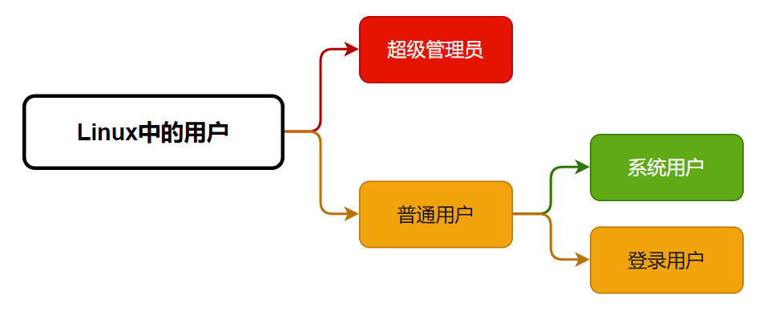
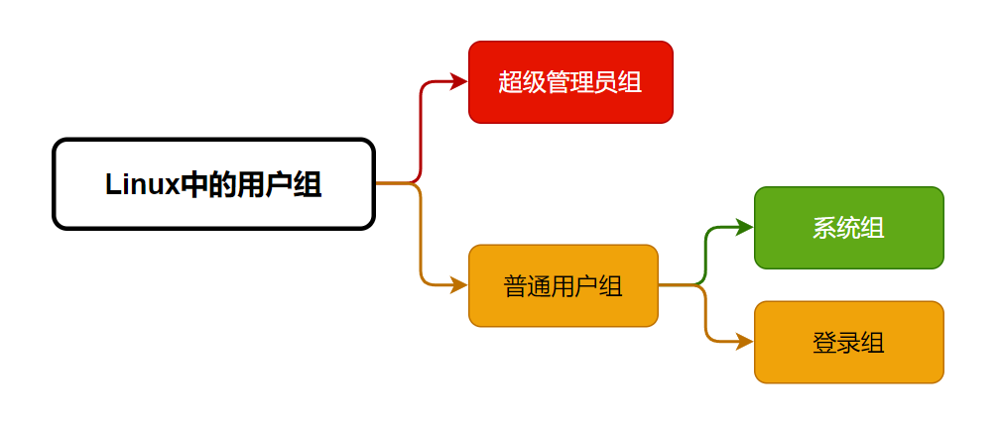

# 用户和权限管理


##  Linux安全模型


- Authentication：认证，验证用户身份 
- Authorization：授权，不同的用户设置不同权限 
- Accouting：审计，事后行为


**3A认证**：

称AAA认证，是一套针对网络设备的网络访问控制策略安全模型。

``````bash
#用于审计的登录日志
#rocky8.6
[root@rocky8 ~]# cat /var/log/secure
Jun 25 07:50:35 rocky8 polkitd[965]: Registered Authentication Agent for unixsession:c1 (system bus name :1.52 [/usr/bin/gnome-shell], object path 
/org/freedesktop/PolicyKit1/AuthenticationAgent, locale en_US.UTF-8)
Jun 25 07:51:52 rocky8 sshd[2413]: Accepted password for root from 10.0.0.1 port 
53734 ssh2
Jun 25 07:51:52 rocky8 systemd[2420]: pam_unix(systemd-user:session): session 
opened for user root by (uid=0)
Jun 25 07:51:52 rocky8 sshd[2413]: pam_unix(sshd:session): session opened for
user root by (uid=0)
[root@ubuntu2204 ~]# tail /var/log/auth.log
May  9 16:34:13 ubuntu2204 passwd[8219]: pam_unix(passwd:chauthtok): password 
changed for jose
May  9 17:13:30 ubuntu2204 sshd[1805]: pam_unix(sshd:session): session closed 
for user root
May  9 17:13:30 ubuntu2204 systemd-logind[890]: Session 4 logged out. Waiting 
for processes to exit.
May  9 17:13:30 ubuntu2204 systemd-logind[890]: Removed session 4.
May  9 17:13:45 ubuntu2204 sshd[8275]: Accepted password for root from 10.0.0.1 
port 58443 ssh2
May  9 17:13:45 ubuntu2204 sshd[8275]: pam_unix(sshd:session): session opened 
for user root(uid=0) by (uid=0)
May  9 17:13:45 ubuntu2204 systemd-logind[890]: New session 7 of user root.
``````


### 用户

Linux系统是多用户系统，可以同时存在多个用户，每个用户之间都是互相隔离的。

 在Linux系统中，每个用户是通过User Id （UID）来唯一标识的。





- 管理员：root, 0
- 普通用户：1-60000 自动分配
  - 系统用户：1-499 （CentOS 6以前）, 1-999 （CentOS 7以后） 对守护进程获取资源进行权限分配
  - 登录用户：500+ （CentOS6以前）, 1000+（CentOS7以后） 给用户进行交互式登录使用


在Linux中，root以下，都是普能用户，其用户id为1-60000

| 用户类型             | 用户名       | 用户ID（uid）                               | 作用                            |
| -------------------- | ------------ | ------------------------------------------- | ------------------------------- |
| 超级管理员           | root（可改） | 0                                           | 超级管理员                      |
| 普通用户 -- 系统用户 | 自定义       | 1-499（CentOS6及以前）,1-999(CentOS7及以后) | 给后台程序使用，像nginx,mysql等 |
| 普通用户 -- 登录用户 | 自定义       | 500+（CentOS6及以前）,1000+(CentOS7及以后)  | 给用户进行交互式登录            |


### 用户组 

Linux中可以将一个或多个用户加入用户组中，组就是包含0个或多个用户的集合，用户组是通过Group  ID（GID） 来唯一标识的。




- 管理员组：root, 0
- 普通组：
  - 系统组：1-499（CentOS 6以前）, 1-999（CentOS7以后）, 对守护进程获取资源进行权限分配
  - 普通组：500+（CentOS 6以前）, 1000+（CentOS7以后）, 给用户使用


### 用户和组的关系

- 一个用户至少有一个组，也可以有多个组； 
- 一个组至少有0个用户，也可以有多个用户； 
- 用户的主要组(primary group)：又称私有组，一个用户必须属于且只有一个主组，创建用户时， 默认会创建与其同名的组作为主组；
- 用户的附加组(supplementary group)：又称辅助组，一个用户可以属于0个或多个附加组； 
- 使用组，可以对用户进行批量管理，比如对一个组授权，则该组下所有的用户能能继承这个组的权 限；


### 安全上下文


**Linux安全上下文Context：** 

在Linux系统中，运行中的程序（即进程process），都是以进程发起者的身份运行； 

进程所能够访问的资源权限取决于进程的运行者的身份；


**首先，什么是程序** 

一个程序或一个命令，本质上也是一个可执行的二进制文件或一个可执行的脚本文件； 

在服务器上有很多文件，只有那些特定的，可以被执行的二进制文件，才能被称为程序；


**其次，什么是进程**

运行中的程序，就是进程；


**第三，程序，进程，用户之间的关系是怎样的**

只有可以被执行的文件，才能叫作程序； 

对于同一个程序，也不是所有用户都可以运行的，这要取决于当前用户对该程序有没有可执行权限； 

用户张三，运行了某个程序，那么，张三就发起了一个进程，该进程的发起者，就是张三，该进程是以 张三的身份在运行；


**第四，进程的访问资源**

一个进程能不能访问某些资源，是由进程发起者决定的（跟进程本身的程序文件无关），比如某进程要 读写某个文件，则要看该进程发起者有没有权限读取该文件；


一个旅客能不能坐头等舱，是由旅客自己决定的，跟飞机本身无关；


范例:

``````bash
#reboot命令，只有root用户才有权限执行
[root@ubuntu2204 ~]# reboot
Connection closing...Socket close.

Connection closed by foreign host.

Disconnected from remote host(rocky8.5-2-153) at 11:19:02.
Type `help' to learn how to use Xshell prompt.

#普通用户无权限执行
[root@ubuntu2204 ~]# su - jose
jose@ubuntu2204 reboot
User root is logged in on sshd.
Please retry operation after closing inhibitors and logging out other users.
Alternatively, ignore inhibitors and users with 'systemctl reboot -i'.
``````


范例:

``````bash
#root 和普通用户都能执行cat命令，但对于某些文件，只有root 用户才能打开
[root@ubuntu2204 ~]# cat /etc/shadow
root:$6$10pvyo2c4EI8tYh1$PT2yiAT6nrxs9rtjhQFWfDuHyFaV5HARXzn9YZ6wpJKveHccpl5Qolj
t7iIlmHxWuy//::0:99999:7:::
bin:*:18700:0:99999:7:::
daemon:*:18700:0:99999:7:::
adm:*:18700:0:99999:7:::
......

jose@ubuntu2204 cat /etc/shadow
cat: /etc/shadow: Permission denied
``````


## 用户和组的配置文件


### 用户和组的主要配置文件


- /etc/passwd：用户及其属性信息(名称、UID、主组ID等） 
- /etc/shadow：用户密码及其相关属性 
- /etc/group：组及其属性信息 
- /etc/gshadow：组密码及其相关属性


### passwd文件格式

``````bash
whatis passwd
openssl-passwd (1ssl) - compute password hashes
passwd (1)           - update user's authentication tokens
passwd (5)           - password file

man 5 passwd #查看帮助手册

#文件格式
#login name:password:UID:GID:GECOS:directory:shell

root:x:0:0:root:/root:/bin/bash
ftp:x:14:50:FTP User:/var/ftp:/sbin/nologin
mage:x:1002:1002::/home/mage:/bin/bash


login name #登录用户名
password #密码位，x只是表示一个占位符，可为空
UID #用户ID，0 表示超级管理员
GID #所属组ID
GECOS #用户全名或注释，描述信息，可为空
directory #用户家目录，在创建用户时，默认会创建在/home 目录下
shell #用户默认shell，/sbin/nologin 表示不用登录的 shell，一般用 chsh 命令修改 chsh -s /bin/csh mage
``````


修改用户shell

``````bash
[root@ubuntu2204 ~]# getent passwd jose 
jose:x:1001:1001::/home/jose:/bin/bash

[root@ubuntu2204 ~]# chsh -s /bin/sh jose

[root@ubuntu2204 ~]# getent passwd jose 
jose:x:1001:1001::/home/jose:/bin/sh
``````


### shadow文件格式

此文件中存储的是用户密码信息，任何用户都无权限


```````bash
[root@rocky ~]# ll /etc/shadow
---------- 1 root root 1344 May 22 10:27 /etc/shadow

#ubuntu 中有权限
[root@ubuntu2204 ~]# ll /etc/shadow
-rw-r----- 1 root shadow 1218 May  9 16:34 /etc/shadow

whatis shadow
shadow (5)           - shadowed password file
shadow (3)           - encrypted password file routines

man 5 shadow

#文件格式
#login name:encrypted password:date of last password change:minimum password age:maximum password age:password warning period:password inactivity period:account expiration date:reserved field


root:$6$lwdNTBEpfKFnUipo$Zm4JTG7vVVg6lJaMJ7sPTqmbc/I6GGMIjp7yO.rd6TsKb0lEeRHn4q7Z/LWJvV/FAWgTJVta9Gd78NPVNfld.1::0:99999:7:::
ftp:*:18700:0:99999:7:::
postfix:!!:19424::::::
jose:$6$Cvfl7WE8khYDd/xb$4pNMm.C46MEOUElWyFbRvO2FcGFv/a.EdD9rtWa0jvZdoThq8spMGw4rPbcQzqsY99hW3aImVK4SPR/KJaoSh0:19168:0:99999:7:::


login name  #登录用户名
encrypted password  #加密后的密文，一般用sha512加密，可为空，!表示该用户被锁定，不能登录系统
date of last password change  #上次修改密码的时间，自1970年开始，0表示下次登录之后就要改密码，为空表示密码时效功能无效
minimum password age  #最小时间间隔，当前密码最少能使用多少天，0表示随时可被变更
maximum password age  #最大时间间隔，当前密码最多能使用多少天，99999表示可以一直使用
password warning period  #警告时间，密码过期前几天开始提醒用户，默认为7
password inactivity period    #不活动时间，密码过期几天后帐号会被锁定，在此期间，用户仍然可以登录，为空表示不使用此规则
account expiration date       #失效时间，从1970年1月1日算起，多少天后帐号失效，为空表示永不过期
reserved field      #保留字段，无意义


# 密码字段格式解析
$<id>$<salt>$<hashed>

# $         分隔符
# id        加密算法
# salt      加盐值
# hashed    哈希值

标识符   加密方式        备注
$6$	    SHA-512   	标准传统方式
$y$	    yescrypt	更安全，支持内存加密，抵抗GPU暴力破解，现代系统推荐
```````


所有伪用户的密码都是 "!!" 或 "*"，代表没有密码是不能登录的，新建用户还没设密码时为!!，禁用账号，可以直接在密码字段前加 !


#### 查看系统加密方式

```bash
# Ubuntu中查看当前的加密方式
root@magedu:/etc/pam.d# cat common-password 
#
# /etc/pam.d/common-password - password-related modules common to all services
#
# This file is included from other service-specific PAM config files,
# and should contain a list of modules that define the services to be
# used to change user passwords.  The default is pam_unix.

# Explanation of pam_unix options:
# The "yescrypt" option enables
#hashed passwords using the yescrypt algorithm, introduced in Debian
#11.  Without this option, the default is Unix crypt.  Prior releases
#used the option "sha512"; if a shadow password hash will be shared
#between Debian 11 and older releases replace "yescrypt" with "sha512"
#for compatibility .  The "obscure" option replaces the old
#`OBSCURE_CHECKS_ENAB' option in login.defs.  See the pam_unix manpage
#for other options.

# As of pam 1.0.1-6, this file is managed by pam-auth-update by default.
# To take advantage of this, it is recommended that you configure any
# local modules either before or after the default block, and use
# pam-auth-update to manage selection of other modules.  See
# pam-auth-update(8) for details.

# here are the per-package modules (the "Primary" block)
password	[success=1 default=ignore]	pam_unix.so obscure yescrypt
# here's the fallback if no module succeeds
password	requisite			pam_deny.so
# prime the stack with a positive return value if there isn't one already;
# this avoids us returning an error just because nothing sets a success code
# since the modules above will each just jump around
password	required			pam_permit.so
# and here are more per-package modules (the "Additional" block)
# end of pam-auth-update config


# Rocky中查看当前的加密方式
[root@bogon pam.d]# cat /etc/pam.d/system-auth 
# Generated by authselect on Fri Jul 18 01:54:10 2025
# Do not modify this file manually.

auth        required                                     pam_env.so
auth        required                                     pam_faildelay.so delay=2000000
auth        sufficient                                   pam_fprintd.so
auth        [default=1 ignore=ignore success=ok]         pam_usertype.so isregular
auth        [default=1 ignore=ignore success=ok]         pam_localuser.so
auth        sufficient                                   pam_unix.so nullok
auth        [default=1 ignore=ignore success=ok]         pam_usertype.so isregular
auth        sufficient                                   pam_sss.so forward_pass
auth        required                                     pam_deny.so

account     required                                     pam_unix.so
account     sufficient                                   pam_localuser.so
account     sufficient                                   pam_usertype.so issystem
account     [default=bad success=ok user_unknown=ignore] pam_sss.so
account     required                                     pam_permit.so

password    requisite                                    pam_pwquality.so local_users_only
# 下面就是系统默认加密方法，可以更改
password    sufficient                                   pam_unix.so yescrypt shadow nullok use_authtok
password    [success=1 default=ignore]                   pam_localuser.so
password    sufficient                                   pam_sss.so use_authtok
password    required                                     pam_deny.so

session     optional                                     pam_keyinit.so revoke
session     required                                     pam_limits.so
-session    optional                                     pam_systemd.so
session     [success=1 default=ignore]                   pam_succeed_if.so service in crond quiet use_uid
session     required                                     pam_unix.so
session     optional                                     pam_sss.so
```


#### 修改系统加密方式

```bash
# Rocky
[root@bogon pam.d]# vim /etc/pam.d/system-auth
password    sufficient                                   pam_unix.so sha512 shadow nullok use_authtok
# 修改为
password    sufficient                                   pam_unix.so yescrypt shadow nullok use_authtok
# 保存后退出

# 创建用户并设置密码查看
[root@bogon pam.d]# useradd xiaoming
[root@bogon pam.d]# passwd xiaoming
更改用户 xiaoming 的密码 。
新的密码： 
无效的密码： 密码少于 8 个字符
重新输入新的密码： 
passwd：所有的身份验证令牌已经成功更新。

# 查看
[root@bogon pam.d]# getent shadow
......
xiaoming:$y$j9T$ZZZ.F732m2Tfl3tG7/uPq0$0N2S//THK4m84LsOCTKn6rSnXye8ls0/D12tpV6ixv7:20290:0:99999:7:::
```

```bash
# Ubuntu
root@magedu:~# vim /etc/pam.d/common-password 
password	[success=1 default=ignore]	pam_unix.so obscure yescrypt
# 修改为
password	[success=1 default=ignore]	pam_unix.so obscure sha512
# 保存后退出

# 创建用户并设置密码查看
root@magedu:~# useradd jerry
root@magedu:~# passwd jerry
New password: 
Retype new password: 
passwd: password updated successfully

# 查看
root@magedu:~# getent shadow
......
jerry:$6$zryPEOY3NEYq3DgZ$w7sx.gzieC27XOtcH90qG7NfHLsiUeX0kruYXYzaX75GG/78IuBPfIM4HHJ83ZpDRpg1fIcAkL4K3ENvPaM67.:20290:0:99999:7:::
```


### group文件格式

``````bash
man group

#文件格式
#group_name:password:GID:user_list

ftp:x:50:
mage:x:1002:

group_name     #组名
password       #组密码，当用户加组时，需要用此密码验证
GID            #组ID
user_list      #用户列表，多个用户用,分隔, 此处的用户将当前组作为附加组
``````


### gshadow文件格式

``````bash
man gshadow

#文件格式
#group name:encrypted password:administrators:members

ftp:::
mage:!::

group name         #组名
encrypted password #组密码，加密后的密文，!表示还没设密码
administrators     #组管理员
members            #用户列表，多个用户用,分隔, 此处的用户将当前组作为附加组
``````


## 用户和组管理命令


**用户管理命令**

- useradd
- usermod
- userdel


**组账号维护命令**

- groupadd 
- groupmod
- groupdel


### 用户创建 useradd

useradd 命令可以创建新的Linux用户


格式：

``````bash
useradd [options] LOGIN
useradd -D
useradd -D [options]
#常见选项
-u|--uid UID                        #指定UID
-g|--gid GID                        #指定用户组，-g groupname|--gid GID
-c|--comment COMMENT                #新账户的 GECOS 字段
-d|--home-dir HOME_DIR              #指定家目录，可以是不存在的，指定家目录，并不代表创建家目录
-s|--shell SHELL                    #指定 shell，可用shell在/etc/shells 中可以查看
-r|--system                         #创建系统用户,CentOS 6之前 ID<500，CentOS7 以后ID<1000，不会创建登录用户相关信息
-m|--create-home                    #创建家目录，一般用于登录用户
-M|--no-create-home                 #不创建家目录，一般用于不用登录的用户
-p|--password PASSWORD              #设置密码，这里的密码是以明文的形式存在于/etc/shadow 文件中
-G|--groups GROUP1[,GROUP2,...]     #为用户指明附加组，组须事先存在
-D|--defaults                       #显示或更改默认的 useradd 配置，默认配置文件是/etc/default/useradd
-e|--expiredate EXPIRE_DATE         #指定账户的过期日期 YYYY-MM-DD 格式
-f|--inactive INACTIVE              #密码过期之后，账户被彻底禁用之前的天数，0 表示密码过期立即禁用，-1表示不使用此功能
-k|--skel SKEL_DIR                  #指定家目录模板，创建家目录，会生成一些默认文件，如果指定，就从该目录复制文件，默认/etc/skel/，要配合-m
``````


默认创建

``````bash
[root@ubuntu2204 ~]# useradd tom

#查看
[root@ubuntu2204 ~]# getent passwd tom
tom:x:1002:1002::/home/tom:/bin/sh

[root@ubuntu2204 ~]# getent shadow tom
tom:!:19486:0:99999:7:::

[root@ubuntu2204 ~]# getent group tom
tom:x:1002:

[root@ubuntu2204 ~]# getent gshadow tom
tom:!::

[root@ubuntu2204 ~]# ls /home/tom
ls: cannot access '/home/tom': No such file or directory

#rocky中默认创建
[root@rocky8 ~]# ls -a /home/tom/
. .. .bash_logout .bash_profile .bashrc
``````


useradd 命令默认值设定由/etc/default/useradd定义

``````bash
[root@rocky8 ~]# cat /etc/default/useradd
# useradd defaults file
GROUP=100 #useradd不指定组,且/etc/login.defs中的USERGROUPS_ENAB为no或useradd -N时，group 为100
HOME=/home #默认家目录父目录
INACTIVE=-1   #对应/etc/shadow文件第7列，即用户密码过期后的帐号锁定的宽限期,-1
表示不锁定
EXPIRE=       #对应/etc/shadow文件第8列，即用户帐号的有效期
SHELL=/bin/bash #默认bash
SKEL=/etc/skel #用于生成新建用户家目录的模版文件
CREATE_MAIL_SPOOL=yes #默认创建收件箱
``````


显示或更改默认设置

``````bash
#useradd -D 
#useradd –D -s SHELL
#useradd –D –b BASE_DIR
#useradd –D –g GROUP


#查看
[root@ubuntu2204 ~]# useradd -D
GROUP=100
HOME=/home
INACTIVE=-1
EXPIRE=
SHELL=/bin/sh
SKEL=/etc/skel
CREATE_MAIL_SPOOL=no

#更改默认 shell
[root@ubuntu2204 ~]# useradd -D -s /bin/bash

#再次更改
[root@ubuntu2204 ~]# useradd -D
GROUP=100
HOME=/home
INACTIVE=-1
EXPIRE=
SHELL=/bin/bash
SKEL=/etc/skel
CREATE_MAIL_SPOOL=no
``````


家目录模板

``````bash
[root@ubuntu2204 ~]# ls -a /etc/skel/
. .. .bash_logout .bash_profile .bashrc

#修改此目录内容后，新创建的用户家目录中的内容会发生改变
``````

 

批量创建用户

``````
newusers file 
``````


范例

``````bash
[root@ubuntu2204 ~]# cat user.txt 
u1:123456:1024:1024::/home/u1:/bin/bash
u2:123456:1025:1025::/home/u2:/bin/bash

[root@ubuntu2204 ~]# newusers user.txt 
[root@ubuntu2204 ~]# id u1
uid=1024(u1) gid=1024(u1) groups=1024(u1)
[root@ubuntu2204 ~]# id u2
uid=1025(u2) gid=1025(u2) groups=1025(u2)
``````


批量修改用户口令

``````
chpasswd < file
``````


范例

``````bash
root@ubuntu2204 ~]# cat pwd.txt
u1:1234567
u2:1234567

#标准输入重定向
[root@ubuntu2204 ~]# chpasswd < pwd.txt


#多行重定向
[root@ubuntu2204 ~]# chpasswd <<EOF
> u1:1234567
> u2:1234567
> EOF

#管道重定向
[root@ubuntu2204 ~]# echo u1:123456 | chpasswd
``````


### 用户属性修改 usermod

usermod 命令可以修改用户属性

格式：

``````bash
usermod [options] LOGIN

#常见选项
-c|--comment COMMENT         #修改注释
-d|--home HOME_DIR           #修改家目录
-e|--expiredate EXPIRE_DATE  #修改过期的日期，YYYY-MM-DD 格式
-f|--inactive INACTIVE       #密码过期之后，账户被彻底禁用之前的天数，0 表示密码过期立即禁用，-1表示不使用此功能
-g|--gid GROUP               #修改组
-G|--groups GROUPS           #groupName|GID... 新附加组，原来的附加组将会被覆盖；若保留原有，则要同时使用-a选项
-a|--append GROUP            #将用户追加至上边 -G 中提到的附加组中，并不从其它组中删除此用户
-l|--login LOGIN             #新的登录名称
-L|--lock                    #锁定用户帐号，在/etc/shadow 密码栏的增加 !
-m|--move-home               #将家目录内容移至新位置，和 -d 一起使用
-s|--shell SHELL             #修改 shell
-u|--uid UID                 #修改 UID
-U|--unlock                  #解锁用户帐号，将 /etc/shadow 密码栏的!拿掉
``````


修改用户信息

``````bash
[root@ubuntu2204 ~]# id tom
uid=1002(tom) gid=1002(tom) groups=1002(tom)

#把tom改成jerry
[root@ubuntu2204 ~]# usermod -c "tom to jerry" -l jerry tom

[root@ubuntu2204 ~]# id jerry
uid=1002(jerry) gid=1002(tom) groups=1002(tom)
``````


锁定用户

用户被锁定之后将无法登录

``````bash
[root@ubuntu2204 ~]# getent shadow jose
jose:$y$j9T$d7EfLYe7v5FrllBSZQ3PH.$LsgwS9XAyBaB.GTGqfiZND6/e8P0xrKeXZhpH2IIO.9:19486:0:99999:7:::

[root@ubuntu2204 ~]# usermod -L jose

[root@ubuntu2204 ~]# getent shadow jose
jose:!$y$j9T$d7EfLYe7v5FrllBSZQ3PH.$LsgwS9XAyBaB.GTGqfiZND6/e8P0xrKeXZhpH2IIO.9:19486:0:99999:7:::
``````


解锁用户

``````bash
[root@rocky8 ~]# usermod -U jose

[root@rocky8 ~]# getent shadow jose
jose:$6$1gfAZcky1hjTfVX0$dcImV6yr9xWzfcfeUI0zXH3p0t0OG71nzUcqD7MoLID8bzsoPKS60CuoGbWv.e.qXzzXknAqTfTWvMlZzpp.i/:19158:0:99999:7:::
``````


centos 允许空密码用户登录，所以两个 !!，无法用 -U 选项解锁

所谓解锁，只针对于有密码的用户来说，但是，可以直接修改/etc/shadow 文件，将密码栏置空产生空 密码用户

``````bash
[root@rocky8 ~]# getent shadow jerry
jerry:!!:19168:0:99999:7:::

[root@rocky8 ~]# usermod -U jerry
usermod: unlocking the user's password would result in a passwordless account.
You should set a password with usermod -p to unlock this user's password.

[root@rocky8 ~]# getent shadow jerry
jerry:!!:19168:0:99999:7:::
``````


### 删除用户 userdel

userdel 可删除 Linux 用户

格式：

``````bash
userdel [options] LOGIN

#常见选项
-f|--force     #强制删除，哪怕用户正在登录状态
-r|--remove    #删除家目录和邮件目录
``````


范例：

``````bash
#创建用户并设置密码
[root@ubuntu2204 ~]# useradd -m zhangsan
[root@ubuntu2204 ~]# passwd zhangsan
New password: 
Retype new password: 
passwd: password updated successfully


#查看相关数据
[root@ubuntu2204 ~]# id zhangsan
uid=1026(zhangsan) gid=1026(zhangsan) groups=1026(zhangsan)


[root@ubuntu2204 ~]# ll -a /home/zhangsan/
total 20
drwxr-x--- 2 zhangsan zhangsan 4096 May  9 20:12 ./
drwxr-xr-x 7 root     root     4096 May  9 20:12 ../
-rw-r--r-- 1 zhangsan zhangsan  220 Jan  7  2022 .bash_logout
-rw-r--r-- 1 zhangsan zhangsan 3771 Jan  7  2022 .bashrc
-rw-r--r-- 1 zhangsan zhangsan  807 Jan  7  2022 .profile

#在另一个终端登录zhangsan
zhangsan@ubuntu2204:~$ id
uid=1026(zhangsan) gid=1026(zhangsan) groups=1026(zhangsan)


#删除登录中的用户失败
[root@ubuntu2204 ~]# userdel zhangsan
userdel: user zhangsan is currently used by process 2454


#强制删除
[root@ubuntu2204 ~]# userdel -f zhangsan
userdel: user zhangsan is currently used by process 2454

[root@ubuntu2204 ~]# id zhangsan
id: ‘zhangsan’: no such user

#报错
zhangsan@ubuntu2204:~$ whoami
whoami: cannot find name for user ID 1026

zhangsan@ubuntu2204:~$ id
uid=1026 gid=1026 groups=1026
``````


用户被删除后，其名下的文件无法显示属主属组，只能显示UID

``````bash
[root@ubuntu2204 ~]# ll /home/zhangsan -d
drwxr-x--- 3 1026 1026 4096 May  9 20:15 /home/zhangsan/
``````


如果新建用户，使用了原用户的UID，则可以继承原用户文件

``````bash
[root@ubuntu2204 ~]# useradd -m -u 1026 lisi


[root@ubuntu2204 ~]# ll /home/{lisi,zhangsan} -d
drwxr-x--- 2 lisi lisi 4096 May  9 20:17 /home/lisi/
drwxr-x--- 3 lisi lisi 4096 May  9 20:15 /home/zhangsan/
``````


删除用户文件

``````bash
[root@ubuntu2204 ~]# userdel -r lisi
userdel: lisi mail spool (/var/mail/lisi) not found

[root@ubuntu2204 ~]# ll /home/lisi
ls: cannot access '/home/lisi': No such file or directory
``````


## 组管理常用命令

**组管理命令**

- groupadd
- groupmod
- groupdel


``````bash
# groupadd 新建用户组

格式：groupadd [OPTION]... group_name

常见选项：
-g GID 指明GID号; [GID_MIN,GIDMAX]
-r 创建系统组，CentOS6之前：ID<500, CentOS 7以后：ID<1000

注意：
如果你知道你要创建的是一个系统组，并且你想确保它在系统组的 GID 范围内，那么使用 -r 选项是一个好的实践。如果你只是想创建一个具有特定 GID 的组，不管它是否是系统组，那么只使用 -g 选项就足够了。

添加 -r 选项是为了明确表达你的意图，并确保组被正确地分类为系统组。不过，如果你手动指定了一个在系统组 GID 范围内的 GID，即使没有使用 -r 选项，该组在某种程度上也被视为系统组。

范例：
groupadd -g 48 -r apache


# groupmod 组属性修改

格式：groupmod [OPTION]... group

常见选项：
-n <新组名> <原组名>: 新名字
-g GID : 新的GID

示例：groupmod -n www apache

# groupdel 删除组
groupdel  group_name    删除用户组
``````


## 理解并设置文件权限


### Linux指令权限管理

``````mysql
su <用户名>     -- 切换为用户名的身份权限
-- 不完全切换，身份切换了，但是环境还是之前的root路径下
-- 而且环境变量依然是之前切换前的环境变量，对于依赖个人用户环境配置的程序执行，可能会出现非预期的现象
su - <用户名>   -- 完全切换，身份和所在路径都切换了
su - <用户名> -c 'cmd' 
-- 以切换的指定身份执行命令，但本身不切换身份，依然是当前用户
exit    -- 切换回上一个身份
``````


#### 实验：测试`su <用户名>`和`su - <用户名>`的区别

``````bash
[root@ubuntu2204 ~]$ export NAME=magedu
[root@ubuntu2204 ~]$ echo $NAME
magedu
[root@ubuntu2204 ~]$ su mystical
mystical@ubuntu2204:/root$ echo NAME
NAME
mystical@ubuntu2204:/root$ echo $NAME
magedu
mystical@ubuntu2204:/root$ exit
exit
[root@ubuntu2204 ~]$ su - mystical
mystical@ubuntu2204:~$ echo $NAME
``````


#### 补充知识点：export

``````
export 是一个 Shell 内置命令，用于将一个变量导出到子进程环境中，使得子进程能够继承该变量。
``````


##### **没有 `export` 的变量**

- **作用范围：**

  - 变量只在当前 Shell 进程中有效。
  - 它是一个**局部变量**，无法被子进程继承。

- **例子：**

  ```bash
  NAME="magedu"  # 定义变量，但没有 export
  
  echo $NAME  # 输出 "magedu"
  
  bash  # 启动一个子 Shell
  echo $NAME  # 无输出，因为子 Shell 没有继承父 Shell 的变量
  ```

  **解释：**

  - 在没有 `export` 的情况下，`NAME` 变量是父 Shell 的局部变量。
  - 子 Shell 是一个独立的进程，无法访问父 Shell 的局部变量。


##### **使用 `export` 的变量**

- **作用范围：**

  - 变量不仅在当前 Shell 有效，还能被子进程继承。
  - 它是一个**全局变量**（对当前 Shell 和所有子进程有效）。

- **例子：**

  ```
  bashCopy codeexport NAME="magedu"  # 定义并导出变量
  
  echo $NAME  # 输出 "magedu"
  
  bash  # 启动一个子 Shell
  echo $NAME  # 输出 "magedu"，因为子 Shell 继承了变量
  ```

  **解释：**

  - `export` 将变量标记为可供子进程继承。
  - 子 Shell 进程继承了 `NAME` 变量，因此可以访问它


### Linux文件权限管理

``````bash
root@clem:~# ll
total 32
drwx------  4 root root 4096 Jun 27 08:54 ./
drwxr-xr-x 20 root root 4096 Jun 28 20:32 ../
-rw-------  1 root root  458 Jun 28 22:20 .bash_history
-rw-r--r--  1 root root 3204 Jun 27 08:38 .bashrc
-rw-r--r--  1 root root  161 Dec  5  2019 .profile
drwx------  3 root root 4096 Dec 21  2022 snap/
drwx------  2 root root 4096 Dec 21  2022 .ssh/

解析：-文件类型 权限 链接数 所属账号 所属主组 大小 时间 文件名
``````


``````bash
chown   -- 更改文件用户权限/更改所有权限

# chown user_name file_name
-- 将file文件的用户权限改为user_name

# chown user_name.group_name file_name
# chown user_name:group_name file_name
-- 将该文件所属的用户名，组名一起变更。

# chown -R user_name.group_name dir
-- 将文件夹下，所有文件的所属账号和组都一起变更，危险命令

chgrp   --仅更改文件所属组权限

# chgrp group_name file_name
-- 更改所属组
``````


#### 文件权限类型

- r Readable 读
- w Writable 写
- x eXcutable 执行

``````
示例：
-rw-r--r--  1 root root  161 Dec  5  2019 .profile

- rw- r-- r--
第一个‘-’ 不在权限标识中，仅指文件类型
第一组‘rw-’ 标明所属用户权限
第二组‘r--’ 同组其他用户权限
第三组‘r--’ 其他用户权限，通用权限，所有人基本都能用
``````


- rwx对于目录的权限意义（与文件不同）

  - r：可以使用ls查看此目录中文件名列表，但无法看到文件的属性meta信息，包括inode号，不能查看文件的内容
  - w：可以在此目录中创建文件，也可以删除此目录中的文件，而和此被删除的文件的权限无关。
  - x：如果，没有该目录的执行权限，用户将无法访问这个目录下的所有文件，所以执行权限是目录访问的基本权限，没有执行就无法进入，是的，连目录进都进不去！
    - 如果只有x,没有r的话，对于目录来说，就是只能访问，但是看不到ls，就是没有访问目录下文件名的权限，但是如果这个文件你知道名称，且这个文件的通用权限有读权限，那么对于普通用户来说，只是无法浏览目录下文件名及文件元信息，但是依然可以cat到文件内的内容

  

#### 目录权限辨析

``````bash
# 首先使用root用户，在/root下创建一个test目录
mkdir test

# 在目录创建两个文件
echo aaa > a.txt
echo bbb > b.txt

# 将test目录即里面所有文件的所属主和所属组改为mystical
chown -R mystical:mystical test/

# 将test目录权限改为r--
chmod 400 /root/test

# 查看当前权限
tree -p /root
[drwx------]  /root               # 所属主:所属组 --- root:root
└── [dr--------]  test            # 所属主:所属组 --> mystical:mystical
    ├── [-rw-r--r--]  a.txt       # 所属主:所属组 --> mystical:mystical
    └── [-rw-r--r--]  b.txt       # 所属主:所属组 --> mystical:mystical
    
    
# 因为test目录有读权限(r)，因此理论上su mystical -c 'ls /root/test'，可以读取目录下的文件，但实际上
su mystical -c 'ls /root/test'
ls: cannot access '/root/test': Permission denied

# 原因是/root的权限是rwx------，其它是没有x权限的，因此无法访问root下的test目录
# 给root的其他加一个执行权限(x)，可以ls /test目录下的文件
chmod o+x /root
su - mystical -c 'ls /root/test/'
a.txt  b.txt

# 但是ls -i则是能读取文件名，无法读取inode
su - mystical -c 'ls -i /root/test/'
ls: cannot access '/root/test/b.txt': Permission denied
ls: cannot access '/root/test/a.txt': Permission denied
? a.txt	? b.txt

######################
# 为什么 x 权限是关键
#####################

# 当只有 r 权限时，目录中的文件名是直接存储在目录文件中的数据，可以直接读取。
# 然而，inode 信息涉及路径解析（文件名 -> inode），这需要 x 权限。
# x 权限允许操作系统进入目录，并通过路径解析机制获取 inode 信息。

# 只有x权限，看不到该目录下有哪些文件，但是，如果知道文件名，可以读取文件内容
[root@ubuntu2204 ~]$ su - mystical -c 'cat /root/test/a.txt'
aaa
[root@ubuntu2204 ~]$ su - mystical -c 'ls /root/test'
ls: cannot open directory '/root/test': Permission denied
``````

#### **总结**

- **目录的 `r` 权限：** 只允许读取目录的文件名。
- **目录的 `x` 权限：** 允许访问 inode 信息，并解析路径。
- **目录的 `r + x` 权限：** 才能完整地列出文件名及其 inode 信息。
- **缺少 `x` 权限时，`ls -i` 无法查看 inode 信息，因为路径解析被限制。**


### 更改文件的权限

``````
chmod   -- 模式法和数字法

模式法：
chmod who opt per file
-- who：u,g,o,a 
-- u(所属者)，g(所属组)，o(other),a(all)
-- opt:+,-,=
-- per:r,w,x

示例：
chmod o+r file  -- 表示file文件的通用权限中增加r权限

数字法：
rwx rw- --- a.txt
111 110 000 a.txt
7   6   0
chmod 760 a.txt
``````


### 默认权限

定义：当创建一个文件或文件夹时，会默认一个权限，这个默认权限时如何产生的，如何修改

``````bash
umask  -- 这个指令可以修改新建文件/文件夹的权限

# umask -- 查看当前umask的值
-- root权限的默认umask值022
-- 普通用户的默认umask值002
-----------------------------------------------
修改默认权限的实现方式

指定新建文件的默认权限
666-umask，如果所得结果某位存在执行（奇数）权限，则将其权限+1，偶数不变

将权限+1的原因：
文件的执行时危险的！！！，如果没有执行权限，root也无法直接执行，但是没有读写权限，root依然能够进行读写

基于安全考虑，默认新建的文件不允许有执行权限！！

umask 的内在机制

666
123   -- umask值

文件权限为：644
------------------------------------------------
指定新建目录的默认权限

777-umask
------------------------------------------------
修改默认权限
# umask <更改后的数字>    -- 临时修改

永久修改：
root目录下，.bashrc文件内修改，添加umask <数值>，保存退出后，. .bashrc或者重启
-- 全局设置：/etc/bashrc 不建议，这里修改会影响全局所有用户
-- 用户设置：~/.bashrc 只影响当前用户
``````

