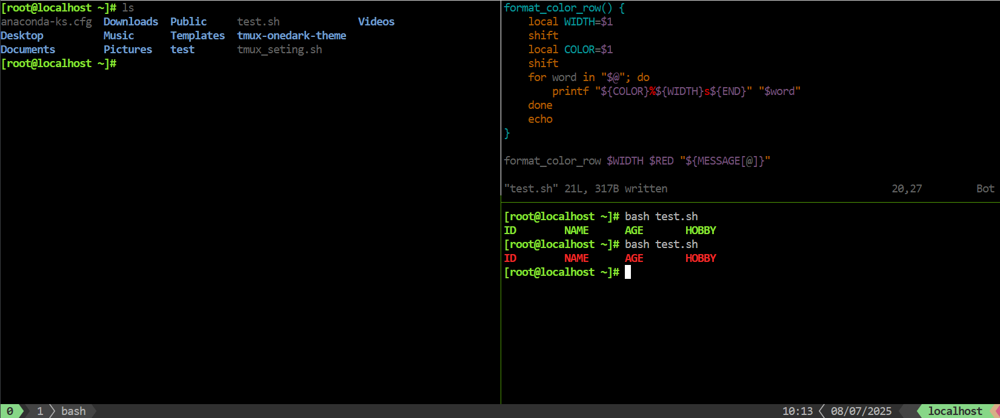
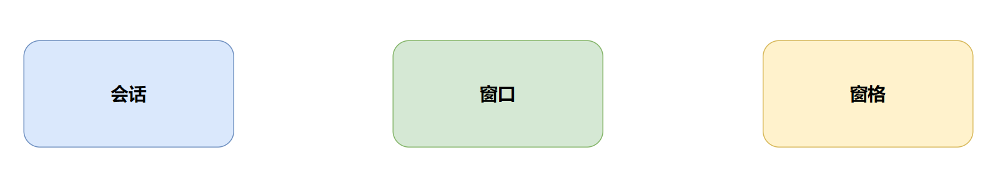

# Linux基础

## 登录方式

### 本地登录

**文本界面登陆**


**图形界面登录**


### 环境初始化

#### **桌面版安装 VMware Tools**

```bash
# Ubuntu-desktop版
apt install -y open-vm-tools-desktop

# Ubuntu-desktop版
yum install -y open-vm-tools-desktop
```


### 文件编辑器安装与基本使用

#### nano编辑器安装步骤

nano简介

```bat
	nano 是一个小巧而友好的文本编辑器，它专为 UNIX 和类 UNIX 系统（如 Linux）设计。尽管它的功能不如一些更复杂的编辑器（如 vim 或 emacs）丰富，但 nano 因其简单直观的用户界面而广受欢迎，特别是对于初学者和系统管理员来说，它提供了一种快速而简便的方式来编辑配置文件或编写脚本。
```

使用方法

```bat
编辑文件
nano [文件名]
编辑操作
Ctrl + O: 保存文件
Ctrl + X: 退出编辑器
Ctrl + W: 搜索文本
```

文件操作流程

```bat
1 nano 文件名
2 正常的编辑内容
3 Ctrl + O 保存文件
	- 修改文件名 | 确认文件名
	- Enter 保存
4 Ctrl + X 退出编辑器
```


#### vim编辑器的基本操作

vim简介

```bat
Vim（Vi IMproved）是一种基于命令行的文本编辑器，它在Vi的基础上进行了改进和扩展，成为了类Unix系统用户中非常受欢迎和广泛使用的编辑器之一。
```

使用方式

```bat
编辑文件
vi | vim [文件名]

编辑操作
普通模式：
1. 光标移动：h(左)，j(下)，k(上)，l(右)
2. 整行复制：yy
3. 整行剪切：dd
4. 单字剪切：x
5. 粘贴：p

编辑模式：
1. 向前插入：i
2. 向后插入：a
3. 向下插入：o

命令行模式：
1. 退出：q
2. 保存：w
3. 强制：!

视图模式：
1. 整行选中：shift + v
2. 单字选中：ctrl + v
```

文件操作简单流程

```bat
1 vim 文件名
2 按 a | i | o 进入编辑文件模式
	- 正常的编辑内容
3 Esc 退出编辑模式。
4 输入 :wq ，进行文件保存
```

推荐游戏：

```bat
vim-adventure
```


#### 更改ssh服务端配置

**Rocky sshd配置修改**


```bash
# 修改ssh服务端配置文件
[root@localhost ~]# nano /etc/ssh/sshd_config
```


```bash
Ctrl + O 写入 -> Enter回车确认 -> Ctrl + x 退出
```


```bash
# Rocky重启ssh服务
systemctl restart sshd
```


**Ubuntu sshd配置修改**


```bash
# 切换root用户
sudo -i 
# 输入密码
# 编辑ssh服务端配置文件
[root@magedu ~]# nano /etc/ssh/sshd_config

```


```bash
# Ubuntu中重启ssh服务
systemctl restart ssh
```


### 远程登录

远程登录允许用户从其他主机或终端通过网络连接到Linux系统进行登录操作

**登录方式**

**SSH (Secure Shell)**

- 提供加密的远程登录会话，确保数据传输的安全性。SSH是Linux系统中广泛使用的远程登录协议。
- 适用场景：远程服务器管理、远程软件开发、安全的数据传输等。
- 登录方式：使用SSH客户端软件或直接执行 "ssh 用户@地址" 命令进行登录。


**Telnet**

- 一种较旧的远程登录协议，不提供数据加密，因此安全性较低。在现代Linux系统中已较少使用。
- 适用场景：由于安全性问题，不推荐在需要保护数据传输安全性的场景中使用。
- 登录方式：在Linux终端下执行"telnet 地址"命令进行登录。


### SSH客户端介绍

#### XShell


```basic
输入用户名，密码后连接，注意：用户名设置过密码，否则无效
```


#### MobaXterm


### 关闭防火墙

#### Ubuntu关闭防火墙

```bash
[root@magedu ~]# systemctl disable --now ufw
Synchronizing state of ufw.service with SysV service script with /usr/lib/systemd/systemd-sysv-install.
Executing: /usr/lib/systemd/systemd-sysv-install disable ufw

```


#### Rocky关闭防火墙

```bash
# 关闭Selinux
[root@localhost ~]# nano /etc/selinux/config
SELINUX=disabled    # SELINUX的值改为disabled

[root@localhost ~]# setenforce 0

# 关闭防火墙
[root@localhost ~]# systemctl disable firewalld.service 
Removed "/etc/systemd/system/multi-user.target.wants/firewalld.service".
Removed "/etc/systemd/system/dbus-org.fedoraproject.FirewallD1.service".
```


### 换源更改为国内源

#### Ubuntu换源

```bash
[root@magedu-VMware-Virtual-Platform]# vim /etc/apt/sources.list
# Ubuntu sources have moved to /etc/apt/sources.list.d/ubuntu.sources

deb https://mirrors.aliyun.com/ubuntu/ noble main restricted universe multiverse
deb https://mirrors.aliyun.com/ubuntu/ noble-updates main restricted universe multiverse
deb https://mirrors.aliyun.com/ubuntu/ noble-backports main restricted universe multiverse
deb https://mirrors.aliyun.com/ubuntu/ noble-security main restricted universe multiverse

[root@magedu-VMware-Virtual-Platform]# apt update
```


#### Rocky换源

```bash
[root@localhost /etc/yum.repos.d]# mkdir -p /etc/yum.repos.d/backup
[root@localhost /etc/yum.repos.d]# mv /etc/yum.repos.d/*.reop /etc/yum.repos.d/backup

[root@localhost /etc/yum.repos.d]# vim rocky.repo 
# rocky.repo
#
# The mirrorlist system uses the connecting IP address of the client and the
# update status of each mirror to pick current mirrors that are geographically
# close to the client.  You should use this for Rocky updates unless you are
# manually picking other mirrors.
#
# If the mirrorlist does not work for you, you can try the commented out
# baseurl line instead.

[baseos]
name=Rocky Linux $releasever - BaseOS
#mirrorlist=https://mirrors.rockylinux.org/mirrorlist?arch=$basearch&repo=BaseOS-$releasever$rltype
baseurl=https://mirrors.aliyun.com/rockylinux/10/BaseOS/x86_64/os/
gpgcheck=1
enabled=1
gpgkey=https://mirrors.aliyun.com/rockylinux/RPM-GPG-KEY-Rocky-10

[AppStream]
name=Rocky Linux $releasever - AppStream - Debug
#mirrorlist=https://mirrors.rockylinux.org/mirrorlist?arch=$basearch&repo=BaseOS-$releasever-debug$rltype
baseurl=https://mirrors.aliyun.com/rockylinux/10/AppStream/x86_64/os/
gpgcheck=1
enabled=1
gpgkey=https://mirrors.aliyun.com/rockylinux/RPM-GPG-KEY-Rocky-10

[extras]
name=Rocky Linux $releasever - Extras - Source
#mirrorlist=https://mirrors.rockylinux.org/mirrorlist?arch=source&repo=BaseOS-$releasever-source$rltype
baseurl=https://mirrors.aliyun.com/rockylinux/10/extras/x86_64/os/
gpgcheck=1
enabled=1
gpgkey=https://mirrors.aliyun.com/rockylinux/RPM-GPG-KEY-Rocky-10

[epel]
name=Rocky Linux $releasever - EPEL - Source
#mirrorlist=https://mirrors.rockylinux.org/mirrorlist?arch=source&repo=BaseOS-$releasever-source$rltype
baseurl=https://mirrors.aliyun.com/epel/10/Everything/x86_64/
gpgcheck=1
enabled=1
gpgkey=https://mirrors.aliyun.com/epel/RPM-GPG-KEY-EPEL-10


[root@localhost /etc/yum.repos.d]# yum makecache
```


## Linux用户类型

Linux系统的用户主要分为两大类：root用户和普通用户


### root用户

Root用户是Linux系统中的超级用户，拥有对系统的完全控制权。它可以执行系统中的任何命令，访问 任何文件，以及更改系统配置。在Linux系统中，root用户的用户ID（UID）是0。


**修改密码**

root用户可以修改所有用户的密码

```bash
# 修改root自身密码
[root@localhost ~]# passwd
更改用户 root 的密码 。
新的密码： 
无效的密码： 密码少于 8 个字符     # 这里的提示可以无视
重新输入新的密码： 
passwd：所有的身份验证令牌已经成功更新。

# 修改其他普通用户密码
# 格式：passwd [username]
[root@localhost ~]# passwd magedu
更改用户 magedu 的密码 。
新的密码： 
无效的密码： 密码少于 8 个字符    # 这里的提示可以无视
重新输入新的密码： 
passwd：所有的身份验证令牌已经成功更新。
```


### 普通用户

普通用户是Linux系统中除了root用户之外的所有用户。它们的权限受到限制，只能访问和操作自己被 授权的文件和目录。普通用户的UID通常大于0，且每个用户都有一个唯一的UID和用户名。


**修改密码**

普通用户只能修改自己的密码，且必须满足密码格式要求

```bash
[magedu@localhost ~]$ passwd
更改用户 magedu 的密码 。
当前的密码： 
新的密码： 
无效的密码： 密码少于 8 个字符     # 普通用户必须满足密码要求
passwd: 鉴定令牌操作错误
[magedu@localhost ~]$ passwd
更改用户 magedu 的密码 。
当前的密码： 
新的密码： 
重新输入新的密码： 
passwd：所有的身份验证令牌已经成功更新。
```


**普通用户提升root用户**

```bash
# Ubuntu
mystical@magedu:~$ sudo -i
[sudo] password for mystical: 
[root@magedu ~]# 


# Rocky9 无法直接使用sudo -i提升，但可以直接使用root用户登录
[magedu@localhost ~]$ sudo -i
[sudo] magedu 的密码：
magedu 不在 sudoers 文件中。此事将被报告。    # 意味着用户 magedu 没有被授权使用 sudo，因此无法执行特权命令（即使你知道密码）。

# 解决方案：
# 在root权限下，执行下列命令
[root@localhost ~]# usermod -aG wheel magedu   # 很多发行版默认允许 wheel 组的用户使用 sudo

# 提升成功
[root@localhost ~]# su - magedu
[magedu@localhost ~]$ sudo -i
[sudo] magedu 的密码：
[root@localhost ~]# 
```


### 用户切换

命令解读

```bash
命令 su 可以切换当前用户身份到另外一个用户
命令 exit 可以回退到刚才的那个用户身份
```


示例

```bash
# 查看当前用户身份
[root@localhost ~]# whoami
root

# 切换到magedu用户
[root@localhost ~]# su magedu
[magedu@localhost root]$ whoami
magedu

# exit退回到root用户
[magedu@localhost root]$ exit
exit
[root@localhost ~]# whoami
root
```


## 终端

### 认识控制台与终端

在计算机发展的最初，有两个最主要的特点：个头大和价格昂贵。在 20 世纪 70 年代 Ken Thompson 在 PDP-11（DEC 公司制造的小型计算机） 上开发 UNIX 系统时，为了解决计算机价格昂贵的问题，他们把 UNIX 设计成了多任务、多用户的操作系统。但是在那个年代所有的机器都非常昂贵，还是为了解决钱的问题，他们选择了一个价格便宜并且可用的机器（ Teletype ASR33）来连接到 PDP-11，使计算机可以让多个人使用。

最初开发 Teletype ASR33（"Teletype" 是一个商标名称。ASR 代表自动发送与接收，即 Automatic Send-Receive）的目的是通过电话线发送和接收消息，所以该机器被称为电传打字机（Teletypewriter 缩写为 **TTY**）


所有的 Teletype 都有一个键盘用于输入和一卷纸用于打印输出。为了存储和读取数据还自带了一个纸带穿孔机和纸带阅读机。它没有屏幕、没有鼠标，也没有声音，但是它经济实惠并且可用。


在 UNIX 系统中，将 Teletype ASR33 称为终端（terminal），而将 PDP-11 称为主机（host）。其中终端只有两个功能：接受输入和打印输出。

在所有连接到主机的终端中，有一台终端比较特殊。可以把它看成是主机的一部分，它是用来管理系统的，这台特殊的终端就是控制台（console）。一台主机只有一个控制台。在启动计算机的时候，所有的信息都会显示到控制台上。在操作计算机的过程中，与终端不相关的信息，比如内核消息，后台服务消息，也会显示到控制台上。

简单来说，控制台是计算机的基本设备，而终端是附加设备。

来感受一下最初的 UNIX 计算机，PDP-11 主机和多个 Teletype ASR33 终端。


## 终端类型

- 控制台终端：/dev/console
- 虚拟终端：tty（teletypewriters），/dev/tty#，tty可以有n个，通过`Ctrl + Alt + F#`切换
- 伪终端：pty（pseudo-tty），/dev/pts/#，如：SSH远程连接的终端
- 图形终端：startx，xwindows


### 切换本地物理终端

```bash
# Ctrl + Alt + F2
[root@localhost ~]# tty
/dev/tty2

# Ctrl + Alt + F3
[root@localhost ~]# tty
/dev/tty3
```


### Linux 中如何理解 console

- /dev/console` 是 Linux 的**系统控制台设备**，它不是独立的终端，而是一个**别名（映射）**。

- 内核启动时，会把 `console= 参数` 决定的设备绑定为控制台输出，比如：
	- `console=tty0` → 当前活动的虚拟终端。
- 所以，当你执行：

```bash
[root@localhost ~]# ls -l /dev/console

# 你通常会看到：
crw--w---- 1 root tty 5, 1 ...   # 它的主次设备号是 5,1（主 5 是字符设备组“tty”）。
```


### 如何查看当前进程/终端与 console 的关系

查看当前终端

```bash
[root@localhost ~]# tty
/dev/tty1
```

查看系统控制台绑定到哪里

```bash
[root@localhost ~]# cat /proc/consoles
tty0                 -WU (EC  p  )    4:2

# tty0           控制台设备名（别名，指向当前活跃虚拟终端
# -WU            状态标志：W=可写，U=可用（用户可用），E/C=console flags（详细见下）
# (EC p)         内核标志：E=enabled, C=console, p=printk 设备
# 4:2            主次设备号：主设备号 4 → tty 类设备；次设备号 2 对应 /dev/tty2（当前活跃的虚拟终端）
```

> `tty0` 当前实际绑定的是 `/dev/tty2`，也就是说系统的 console 输出（例如 `dmesg`、内核 panic 消息）会显示在虚拟机屏幕的 **tty2** 上。


### TTY, PTS, Console 的区别

| 类型        | 全称                  | 典型路径                     | 说明                                                         |
| ----------- | --------------------- | ---------------------------- | ------------------------------------------------------------ |
| **TTY**     | teletype terminal     | `/dev/tty1`、`/dev/tty2` …   | 本地物理终端（虚拟机或物理机的“登录界面”）。在没有图形界面的 Linux 上，你按 `Ctrl+Alt+F1~F6` 切换的就是这些。 |
| **PTS**     | pseudo terminal slave | `/dev/pts/0`、`/dev/pts/1` … | 伪终端，用于远程登录或图形终端（如 SSH、gnome-terminal、xterm）。 |
| **Console** | 系统控制台            | `/dev/console`               | 内核和系统启动阶段输出信息的终端。它通常绑定到某个 TTY（例如 `/dev/tty0`）或串口，用于最早期日志输出。 |


## 交互式接口

交互式接口：启动终端后，在终端设备附加一个交互式应用程序


### 交互式接口类型

- GUI：Graphic User Interface X protocol, window manager, desktop

  GNOME (C, 图形库gtk)

  KDE (C++,图形库qt)

  XFCE (轻量级桌面)


- CLI：Command Line Interface

  Shell程序


### 什么是Shell

Shell 是操作系统（尤其是内核）和用户之间的一个命令解释器/翻译工具，主要负责把人类可读的命令翻译成系统调用或程序执行。

shell也被称为LINUX的命令解释器（command interpreter），Shell 本身是一个程序。将用户输入的命 令行拆解为”命令名“与”参数“。接着，根据命令名找到对应要执行的程序，对被执行的程序进行初始化， 然后将刚才解析出来的参数传给该程序并执行

shell是一种高级程序设计语言，提供了变量，函数，条件判断，循环等开发语言的功能。 

由于Shell本身是个程序，所以它可以被任何用户自己开发的各种Shell所代替。


### 各种Shell


- sh：Steve Bourne   
- bash：Bourne-Again Shell，GPL，CentOS 和 Ubuntu 默认使用 
- csh：c shell , C 语言风格  
- ksh：Korn Shell, AIX 默认 shell
- zsh： MacOS默认shell


### bash shell

GNU Bourne-Again Shell(bash)是GNU计划中重要的工具软件之一，目前也是 Linux 标准的 shell，与  sh兼容


显示当前使用的 shell

```bash
[root@localhost ~]# echo $SHELL
/bin/bash
```


显示当前系统使用的所有shell

```bash
[root@localhost ~]# cat /etc/shells
/bin/sh
/bin/bash
/usr/bin/sh
/usr/bin/bash
/usr/bin/tmux
/bin/tmux
```


演示 sh 和 bash 的区别

```bash
[root@localhost ~]# echo $SHELL
/bin/bash                                                                                                                                              
[root@localhost ~]# echo {1..20} 
1 2 3 4 5 6 7 8 9 10 11 12 13 14 15 16 17 18 19 20

# 下载busybox，使用busybox测试sh
[root@localhost ~]# yum install -y busybox
[root@localhost ~]# busybox sh 
~ # echo {1..20} 
{1..20}

# 可以看出bash可以解析{1..20}，但是sh不行
```


## 文本里添加颜色


### 控制序列起始符

**\e 表示一个 ASCII 转义字符（Escape，十六进制 0x1B，八进制 033, 可视化ESC `^[`）**。  详情见 [[编码和字符集|编码和字符集]]
它是终端控制序列的起始符，告诉终端：“接下来不是普通文字，而是一个**控制命令**”。

> 把终端想象成一个“听话的机器人”，平常你发的都是“文字”
> 但当你说“`\e[`” 时，就相当于在说：“接下来我要给你一个**指令**而不是文字”，终端于是会**切换颜色、移动光标、清除屏幕**，而不是把那些字符打印出来


### 样式控制字符

#### 样式（SGR 属性）

| 效果          | 代码 | 说明                             |
| ------------- | ---- | -------------------------------- |
| 重置          | `0`  | 清除全部样式（常用）             |
| 粗体/高亮     | `1`  | 粗体，部分终端也表现为亮色       |
| 变淡          | `2`  | faint（不常用/兼容性一般）       |
| 斜体          | `3`  | italic（部分终端不支持）         |
| 下划线        | `4`  | underline                        |
| 慢闪烁        | `5`  | blink（多数现代终端禁用/不支持） |
| 快闪烁        | `6`  | rapid blink（基本不支持）        |
| 反色          | `7`  | reverse（前景/背景互换）         |
| 隐藏          | `8`  | concealed（不常用）              |
| 删除线        | `9`  | strikethrough                    |
| 关闭粗体/淡化 | `22` | 恢复正常强度                     |
| 关闭斜体      | `23` | 关闭 italic                      |
| 关闭下划线    | `24` | 关闭 underline                   |
| 关闭闪烁      | `25` | 关闭 blink                       |
| 关闭反色      | `27` | 关闭 reverse                     |
| 取消隐藏      | `28` | reveal                           |
| 取消删除线    | `29` | 关闭 strike                      |

>  提示：`0` 会清掉一切；也可用对应“关闭码”只关某个属性。


#### 16 色：前景 / 背景

- **前景**：`30–37`，**亮色前景**：`90–97`    

- **背景**：`40–47`，**亮色背景**：`100–107`    
- **默认前景/背景**：`39` / `49`

| 颜色 | 前景 | 背景 | 亮前景 | 亮背景 |
| ---- | ---- | ---- | ------ | ------ |
| 黑   | `30` | `40` | `90`   | `100`  |
| 红   | `31` | `41` | `91`   | `101`  |
| 绿   | `32` | `42` | `92`   | `102`  |
| 黄   | `33` | `43` | `93`   | `103`  |
| 蓝   | `34` | `44` | `94`   | `104`  |
| 品红 | `35` | `45` | `95`   | `105`  |
| 青   | `36` | `46` | `96`   | `106`  |
| 白   | `37` | `47` | `97`   | `107`  |


#### 示例：输出多样式彩色字体

```bash
[root@mystical ~]# echo -e "\e[1;34;43mHello\e[1;30;41m,\e[91;42mWorld\e[0m\n"

# \e[   控制序列起始符
# 1     加粗
# 34    前景色：蓝
# 43    背景色：黄
# 30    前景色：黑
# 41    背景色：红
# 91    前景色：高亮红
# 42    背景色：绿
```


## 登录前提示

**/etc/issue**：**登录前**由 `agent` 打印（本机控制台/tty）。支持转义序列（如 `\S \r \m`）。与 SSH 无关。

Rocky10 登录前提示

``````shell
# 登录前提示展示
Rocky Linux 10.0 (Red Quartz)
Kernel 6.12.0-55.12.1.e10_0.x86_64 on x86_64

localhost login: 
``````

登录前提示相关配置文件

```bash
[root@localhost ~]# cat /etc/issue
\S 
Kernel \r on \m

# \S的值
[root@localhost ~]# cat /etc/os-release |grep PRETTY_NAME
PRETTY_NAME="Rocky Linux 10.0 (Red Quartz)"

# \r 和 \m 的值
[root@localhost ~]# uname -r 
6.12.0-55.12.1.el10_0.x86_64

[root@localhost ~]# uname -m 
x86_64
```


### 常见转义序列含义表（来自 man agetty）

`agetty` 负责输出该文件内容并替换形如 `\X` 的转义

| 转义符 | 含义                             | 示例输出                                             |
| ------ | -------------------------------- | ---------------------------------------------------- |
| `\d`   | 当前日期                         | `Tue Nov 12 2025`                                    |
| `\t`   | 当前时间                         | `22:58:01`                                           |
| `\n`   | 换行                             |                                                      |
| `\s`   | 内核名（与 `uname -s` 相同）     | `Linux`                                              |
| `\r`   | 内核版本号（`uname -r`）         | `5.14.0-427.8.1.el9.x86_64`                          |
| `\v`   | 内核版本字符串（`uname -v`）     | `#1 SMP PREEMPT_DYNAMIC Tue Oct 1 22:00:00 UTC 2025` |
| `\m`   | 机器硬件名（`uname -m`）         | `x86_64`                                             |
| `\o`   | 系统域名（`uname -o`）或主机域名 | `localhost.localdomain`                              |
| `\n`   | 主机名（`uname -n`）             | `localhost`                                          |
| `\S`   | **操作系统名（OS name）**        | `Rocky Linux`, `CentOS Stream`, `Ubuntu`, `Debian`   |
| `\l`   | 当前 tty（终端）                 | `tty1`                                               |
| `\O`   | NIS 域名                         | （可为空）                                           |
| `\U`   | 当前登录用户数                   | `2 users`                                            |
| `\\`   | 字面上的反斜线                   | `\`                                                  |


## 编辑用户展示公告（登录后提示）

- 概述：

  - /etc/motd 文件的全称是 "Message of the Day"（当日消息）。在Linux和Unix系统中，这个文件的内容会在用户登录到系统后显示在他们的终端上。这为系统管理员提供了一个简单的方法来为登录到系统的用户展示公告、重要消息或任何其他信息。

  - 配置文件

    ``````
    /etc/motd
    ``````

    ``````
    motd网站
    https://www.bootschool.net/ascii-art/search
    ``````

    

- 在VIM中输出彩色字体

  - 步骤：

    ``````
    1. 打开一个新的或现有的 Vim 编辑器：vim filename
    2. 按下 i 进入插入模式。
    3. 按 Ctrl+V 进入 Vim 的特殊字符插入模式。
    4. 接着按 Ctrl+[。这会插入一个 ^[，这实际上是一个转义字符。
    5. 然后直接输入 [32;1m。
    6. 继续输入你的文本，如：Hello, Welcome To My Home - Mystical。
    7. 然后再次按 Ctrl+V 和 Ctrl+[ 插入另一个转义字符。
    8. 接着输入 [0m 来结束彩色输出。
    ``````

  - 示例：

    ``````
    ^[[32;1mHello, Welcome To My Home - Mystical^[[0m
    ``````

    ``````
    ////////////////////////////////////////////////////////////////////
    //                          _ooOoo_                               //
    //                         o8888888o                              //
    //                         88" . "88                              //
    //                         (| ^_^ |)                              //
    //                         O\  =  /O                              //
    //                      ____/`---'\____                           //
    //                    .'  \\|     |//  `.                         //
    //                   /  \\|||  :  |||//  \                        //
    //                  /  _||||| -:- |||||-  \                       //
    //                  |   | \\\  -  /// |   |                       //
    //                  | \_|  ''\---/''  |   |                       //
    //                  \  .-\__  `-`  ___/-. /                       //
    //                ___`. .'  /--.--\  `. . ___                     //
    //              ."" '<  `.___\_<|>_/___.'  >'"".                  //
    //            | | :  `- \`.;`\ _ /`;.`/ - ` : | |                 //
    //            \  \ `-.   \_ __\ /__ _/   .-` /  /                 //
    //      ========`-.____`-.___\_____/___.-`____.-'========         //
    //                           `=---='                              //
    //      ^^^^^^^^^^^^^^^^^^^^^^^^^^^^^^^^^^^^^^^^^^^^^^^^^^        //
    //            佛祖保佑       永不宕机     永无BUG                    //
    ////////////////////////////////////////////////////////////////////
    ``````


## Prompt提示符

登录Linux后，默认的系统命令提示符毫无个性，无法明显辨别生产和测试环境，而导致误操作。 可以通过修改PS1变量实现个性的提示符格式，避免这种低级错误

同时当在命令行中，输出多个文本，想要找到每个文本的开头是一件很吃力的事情，这种情况下可以通过修改PS1变量更改提示符解决类似问题

``````shell
# 格式如下：
PS1="提示符格式命令"

# 格式命令如下：
\[  <提示符样式>  \]  # 这个提示符样式外的\[ \] 可以省略

# 提示符样式如下：
\e[ 样式 + 内容 \e[0m # 以 \e[ 开始，\e[0m 表示关闭设置

# 样式分3部分
格式：F;B;Sm
F: 表示前景色
30 黑色，31 红色，32 绿色，33 黄色，34 蓝色，35 紫色，36 青色，37 白色

B：表示背景色，背景色数值 = F + 10

S：显示的样式如下
0：表示关闭颜色设置
1：表示粗体
4：表示加下划线
5：表示闪烁
7：表示前景色，背景色互换
8：表示隐藏

# 内容：
\u: 表示当前用户
\h: 表示主机名简称
\W: 表示当前工作目录基名
\$: 表示提示符(普通用户$ root用户#) 实测在rocky9不好用
\H: 表示完整主机名
\w: 表示完整工作路径
\t: 表示24小时时间格式为：时：分：秒
\A: 表示24小时时间格式为：时：分
\#: 表示开机命令历史数
\d: 表示日期，格式为：星期 月 日
\v: 表示BASH的版本信息
``````


`````
示例：
PS1="PS1="\e[32;40;1m[\d \t \e[31;40;1m\#] \e[33;40;1m\u@\h:\W \$\e[0m""
注意：
实测\$不好用，可以直接在root的目录下的.bashrc文件中改为#
`````


### CentOS系列

``````bash
# 对所有普通用户生效
vim /etc/profile.d/env.sh  # env.sh自行创建
PS1="\[\e[1;33m\][\u@\h \w] \$\[\e[0m\]"

source env.sh  #使其生效

# 仅对当前用户生效
vim ~/.bashrc
PS1="\[\e[1;33m\][\u@\h \w] \$\[\e[0m\]"
``````


### Ubuntu系列

``````bash
# 对所有普通用户生效
vim /usr/share/bash-completion/bash_completion

# 在文件下方追加
PS1="\[\e[1;33m\][\u@\h \w] \$\[\e[0m\]"

source /usr/share/bash-completion/bash_completion  #使其生效

# 仅对当前用户生效
vim ~/.bashrc
PS1="\[\e[1;33m\][\u@\h \w] \$\[\e[0m\]"
``````


## 输出格式化

### echo解读

#### echo命令

命令简介

```bat
echo命令的功能是将内容输出到默认显示设备，一般起到一个提示的作用。
```

```bat
OPTIONS：
-n  不要在最后自动换行
-e  若字符串中出现以下字符，则特别加以处理，而不会将它当成一般文字输出

常用转义字符：
\n             # 换行且光标移至行首;
\t             # 插入tab
```


#### echo实践

实践1 - 引号信息输出

```bat
通过引号的错开实现引号的输出
[root@rocky9 ~]# echo "I'm a king of the world."
I'm a king of the world.
```

实践2 - 特殊符号的输出

```bat
使用 -e 选项启用转义字符的解析
[root@rocky9 ~]# echo -e "The 2021 State of DevOps Report\n\t- is here"
 The 2021 State of DevOps Report
        - is here
```

实践3 - 内容的拼接

```bat
使用 -n 选项启用信息输出不换行
[root@rocky9 ~]# echo -n hello;echo world
helloworld
```


#### 字体颜色

```bat
# 提示符样式如下：
\e[ 样式 + 内容 \e[0m # 以 \e[ 开始，\e[0m 表示关闭设置

# 样式分3部分
格式：F;B;Sm
F: 表示前景色
30 黑色，31 红色，32 绿色，33 黄色，34 蓝色，35 紫色，36 青色，37 白色

B：表示背景色，背景色数值 = F + 10

S：显示的样式如下
0：表示关闭颜色设置
1：表示粗体
4：表示加下划线
5：表示闪烁
7：表示前景色，背景色互换
8：表示隐藏
```

示例：


```bash
[root@magedu ~]# echo -e "\e[1;31mhello,\e[1;33mworld\e[0m"
[root@magedu ~]# echo -e "\e[1;42;31mhello,\e[1;44;33mworld\e[0m"
```


## 会话管理

命令行的典型使用方式是，打开一个终端窗口（terminal window，以下简称"窗口"），在里面输入命令。用户与计算机的这种临时的交互，称为一次"会话"（session）

会话的一个重要特点是，窗口与其中启动的进程是连在一起的。打开窗口，会话开始；关闭窗口，会话结束，会话内部的进程也会随之终止，不管有没有运行完

一个典型的例子就是，SSH 登录远程计算机，打开一个远程窗口执行命令。这时，网络突然断线，再次登录的时候，是找不回上一次执行的命令的。因为上一次 SSH 会话已经终止了，里面的进程也随之消失 了。

为了解决这个问题，会话与窗口可以"解绑"：窗口关闭时，会话并不终止，继续运行，等到以后需要的时候，再让会话"绑定" 其他窗口

终端复用器软件就是会话与窗口的"解绑"工具，将它们彻底分离。


- 它允许在单个窗口中，同时访问多个会话。这对于同时运行多个命令行程序很有用。
- 它可以让新窗口"接入"已经存在的会话。
- 它允许每个会话有多个连接窗口，因此可以多人实时共享会话。
- 它还支持窗口任意的垂直和水平拆分。


类似的终端复用器还有Screen，Tmux


### screen

利用screen 可以实现会话管理,如：新建会话,共享会话等

注意：CentOS7 来自于base源，CentOS8 来自于epel源


范例：安装 screen

```bash
# CentOS7 安装screen
[root@centos7 ~]# yum -y install screen

# CentOS8 安装screen
[root@centos8 ~]# dnf -y install epel-release
[root@centos8 ~]# dnf -y install screen

# ubuntu
[root@ubuntu ~]# apt install screen
```


**命令常见用法**：

```bash
screen -S [SESSION]       # 创建新screen会话
screen -x [SESSION]       # 加入screen会话
screen -r [SESSION]       # 恢复某screen会话
screen -ls                 # 显示所有已经打开的screen会话
Ctrl + a, d               # 剥离当前screen会话
exit                      # 退出并关闭screen会话
```


### tmux



Tmux 是一个终端复用器（terminal multiplexer），类似 screen，但是更易用，也更强大

Tmux 就是会话与窗口的"解绑"工具，将它们彻底分离，功能如下

- 它可以让新窗口"接入"已经存在的会话。它允许在单个窗口中，同时访问多个会话。这对于同时运行多个命令行程序很有用。 
- 它可以让新窗口"接入"已经存在的会话。
- 它允许每个会话有多个连接窗口，因此可以多人实时共享会话。
- 它还支持窗口任意的垂直和水平拆分


#### 安装tmux

```bash
# Rocky
[root@rocky8 ~]# yum install tmux

# Ubuntu
[root@ubuntu2204 ~]# apt update
[root@ubuntu2204 ~]# apt install tmux
```


启动和退出

```bash
[root@ubuntu2204 ~]# tmux

[root@ubuntu2204 ~]# exit
[exited]
```


tmux 窗口有大量的快捷键。所有快捷键都要通过前缀键唤起。默认的前缀键是 **Ctrl+b** ，即先按下  **Ctrl+b** ，快捷键才会生效。帮助命令的快捷键是 Ctrl+b ? 然后，按下 q 键，就可以退出帮助


#### tmux的基本概念




```bat
会话 > 窗口 > 窗格

一个会话可以有多个窗口； 一个窗口可以有多个窗格
```


##### 查看整体结构

```bat
Ctrl + b s       # 查看整体架构
```


#### 会话相关操作

##### 查看会话

```bash
[root@localhost ~]# tmux ls
prac: 2 windows (created Tue Jul  8 10:11:14 2025)
prac2: 1 windows (created Tue Jul  8 10:31:39 2025)
prac3: 1 windows (created Tue Jul  8 10:50:57 2025)
```


##### 创建会话

第一个启动的 Tmux 窗口，编号是0，第二个窗口的编号是1，以此类推。这些窗口对应的会话，就是 0号会话、1号会话。使用编号区分会话，不太直观（当然也可以后续在tmux中更改会话名称），更好的方法是为会话起名。下面命令新建一个指定名称的会话。

```bash
tmux new -s <session-name>
```


##### 更改会话名

```bash
# 进入tmux对应会话后，执行
Ctrl + b  $
```


##### 会话间移动

```bash
Ctrl + b (      # 向前移动
Ctrl + b )      # 向后移动

Ctrl + b s      #  直接在面板选择要选定的会话，然后回车进入
```


##### 分离会话

```bash
Ctrl + b d
```


##### 删除会话

```bash
[root@localhost ~]# tmux ls
prac: 2 windows (created Tue Jul  8 10:11:14 2025)
prac2: 1 windows (created Tue Jul  8 10:31:39 2025)
prac3: 1 windows (created Tue Jul  8 10:50:57 2025)

# 删除会话
[root@localhost ~]# tmux kill-session -t 

[root@localhost ~]# tmux ls
prac: 2 windows (created Tue Jul  8 10:11:14 2025)
prac2: 1 windows (created Tue Jul  8 10:31:39 2025)
```


#### 窗口相关操作

进入会话后，默认有一个窗口


##### 窗口改名

```bash
Ctrl + b ,     # 修改窗口名称
```


##### 创建窗口

```bash
Ctrl + b c   
```


##### 窗口间移动

```bash
Ctrl + b 1|2|3...
```


##### 删除窗口

```bash
Ctrl + b x
```


#### 窗格相关操作

##### 上下切分窗格

```bash
Ctrl + b "
```


##### 左右切分窗格

```bash
Ctrl + b %
```


##### 光标在窗格间移动

```bash
Ctrl + b ;          # 光标切换到上一个窗格
Ctrl + b o          # 光标切换到下一个窗格

Ctrl + b q [num]    # 光标移动到指定窗格
```


##### 更改窗格大小

```bash
Ctrl+b Ctrl+<arrow key>    #按箭头方向调整窗格大小
```


##### 窗格全屏展示

```bash
Ctrl + b z         #当前窗格全屏显示，再使用一次会变回原来大小
```


##### 删除窗格

```bash
Ctrl + b x
```


# 常见信息获取

## 查看用户登录信息

- whoami命令：显示当前登录有效用户
- who命令：显示当前所有的登录会话
- w：显示系统当前所有的登录会话及其所做的操作

``````shell
[Fri Oct 13 22:16:15 59] root@rocky9:/ #w
 22:20:10 up 1 day,  4:39,  2 users,  load average: 0.00, 0.00, 0.00
USER     TTY        LOGIN@   IDLE   JCPU   PCPU WHAT
root     pts/0     21:40    0.00s  0.07s  0.00s w
root     pts/1     21:56    7:22   0.03s  0.01s vim ps_demo.txt
``````


## 操作系统版本

- 查看操作系统版本的配置文件

``````
etc/os-release       # 操作系统详细信息

/etc/redhat-release  # 操作系统版本
``````


## 查看硬件信息

### 查看CPU

``````shell
lscpu

cat /proc/cpuinfo
``````


### 查看内存大小

``````shell
lsmem

free -h
free -h -s 1  # 每秒更新一次内存数据
free -h -c 2  # 总共更新几次，默认一秒一次

cat /proc/meminfo
``````


### 查看硬盘及分区情况

``````shell
lsblk

cat /proc/partitions
``````


## 查看系统版本信息

### 查看系统架构

``````
arch
``````

### 查看内核版本

``````
uname -r
``````

### 查看操作系统发行版本

``````shell
# CentOS
cat /etc/redhat-release

cat /etc/os-release

lsb_release -a

#Ubuntu
cat /etc/os-release

cat /etc/issue
``````


## 显示模式切换

- 查看显示模式

``````
runlevel
``````

- 切换显示模式

``````
init 3 # 切换到字符界面

init 5 # 切换到图形化界面
``````


- 永久切换

``````bash
# 从图形界面 --->  命令行界面
rm -rf /etc/systemd/system/default.target
ln -s /usr/lib/systemd/system/multi-user.target /etc/systemd/system/default.target

# 从命令行界面 --->  图形界面
rm -rf /etc/systemd/system/default.target
ln -s /usr/lib/systemd/system/graphical.target /etc/systemd/system/default.target
``````


## 设置主机名hostname

- 配置文件

``````bash
/etc/hostname   #注意：主机名不要使用下划线
``````

``````bash
# 临时设置主机名
hostname 新主机名
``````

- 通过命令修改hostname配置文件

``````bash
hostnamectl set-hostname ubuntu1804.magedu.org
``````

- 在不重启的情况下，是hostname在prompt上生效，最快的方法是开启一个新的终端会话


## Linux 时间体系概述

Linux 具有两个核心时间来源：

| 名称                                    | 位置     | 谁维护                | 特点                         |
| --------------------------------------- | -------- | --------------------- | ---------------------------- |
| **RTC（Real-Time Clock）硬件时钟**      | 主板芯片 | BIOS/CMOS（电池供电） | 断电仍保持，仅供开机初始化用 |
| **System Clock（系统时钟 / 内核时钟）** | 内核内存 | Linux 内核            | 系统运行时的唯一标准时间     |

Linux 在正常运行中，所有程序都使用 System Clock，而不是 RTC。  RTC 只在开机时提供一个时间初值。


### Linux 时间体系相关概念

#### UTC 绝对时间

##### UTC 是什么？

UTC（Coordinated Universal Time）是一种全球统一的绝对时间标准，不包含任何时区或地区偏移。

UTC 是“世界共用的时间基准点”

**示例1：假设我们现在举四个国家：**

| 地区              | 本地时间（带时区） |
| ----------------- | ------------------ |
| 中国（UTC+8）     | 16:00              |
| 英国（UTC+0）     | 08:00              |
| 日本（UTC+9）     | 17:00              |
| 美国东部（UTC-5） | 03:00              |

虽然大家钟表显示的时间不同，但它们的 **UTC 时间是一样的**：

```ruby
UTC = 08:00
```

也就是说

```ruby
UTC 08:00
→ 中国 = 16:00（+8 小时）
→ 日本 = 17:00（+9 小时）
→ 美国东部 = 03:00（-5 小时）
```

所以：

- **UTC 不属于任何国家**  
- **UTC 是唯一真实的绝对时间**  
- **本地时间 = UTC + 时区偏移**


**示例2：你的服务器给你一个 UTC 时间戳时，全世界都能唯一定位到同一时刻**

比如说 UTC 时间：
```ruby
2025-11-26 08:31:00 UTC
```
不可能因为你在中国或在美国而变成别的时刻。它永远代表同一个“绝对瞬间”。


##### UTC 与本地时间（Location）区别

| 概念          | 含义                                                       |
| ------------- | ---------------------------------------------------------- |
| **UTC**       | 世界共同使用的绝对时间，不带偏移                           |
| **Localtime** | 按地区时区调整后的时间，比如中国的 CST、日本 JST、美国 EST |

本地时间是：
```ruby
Localtime = UTC + 时区偏移（offset）
```
示例：
```ruby
UTC = 00:00
中国 CST = 08:00
日本 JST = 09:00
美国 EST = 19:00（前一天）
```


#### RTC（Real-Time Clock）硬件时钟

##### RTC 是什么？

RTC = 主板上的“带电池的小表”，即使断电也在走。

它由：

- 32.768 kHz 晶振
- 独立电池（如 CR2032）
- 时钟寄存器`

组成。


##### RTC 的作用

- 给 Linux 开机提供初始时间

- BIOS 设置界面里看到的“时间”就是来自 RTC
- 在无网络环境下，RTC 的准确性很关键（否则系统启动时间可能不准）


**RTC 与 TIMEZONE**

RTC 可以：

- 存 UTC（推荐）
- 存 Localtime（Windows 的默认）

Linux 默认假设 RTC = UTC。


#### System Clock（系统时钟/内核时钟）

System Clock 是 **Linux 内核在内存中维护的当前时间值**。

所有用户态程序都从它读取：

- date
- 日志
- systemd
- MySQL，Nginx
- 程序调用 `clock_gettime()`
- 容器里的时间（除非隔离）


#### TimeZone 时区

UTC 是绝对时间，时区是人类社会人为定义的。

例如：

- 中国时间：2025-11-26 16:00
- 日本时间：2025-11-26 17:00
- 美国东部时间：2025-11-26 03:00

但它们都对应同一刻：
```ruby
UTC = 08:00
```
这个绝对时刻永远不会因你身在何处而变化。这就是“UTC 不带时区”的含义。


#### 时间体系在开机 -> 运行 -> 同步全过程的流转


Linux 时间系统的核心步骤：

1️⃣ 开机：内核读取 RTC 时间 → 设置 System Clock
2️⃣ 系统运行：System Clock 独立递增（内核维护）
3️⃣ NTP / Chrony：校准 System Clock，使其变准
4️⃣ 手动操作：可能将 System Clock 写回 RTC（需 hwclock -w 或 timedatectl）


##### 开机阶段：RTC → System Clock

- 上电 → BIOS/UEFI 运行；
- BIOS 从 RTC 读出时间，用来显示、给内核启动做参考；
- 内核启动早期，会调用平台代码从 RTC 读取当前时间，来初始化 System Clock：
```ruby
RTC 时间（通常存 UTC 或本地时间）
     ↓
内核：设置 System Clock（CLOCK_REALTIME）
```

> 结论：开机时，System Clock 是以 RTC 为基准初始化的。
> 之后：**System Clock 自己“走”**（内核时钟源驱动）， 不会持续读取 RTC


##### 正常运行阶段：System Clock 是唯一“权威时间”

- 所有程序：`date`、日志写入时间、sshd 记录、系统调用 
  	- → 全都是读 System Clock

- NTP 客户端
	- → 对比网络时间 vs System Clock
	- → 调整 System Clock

此时 RTC 在干嘛？

> 其实啥也不干，就默默在主板上继续走。System Clock 并不会“反向”不断去读它。


##### NTP 介入：NTP → 调 System Clock

假设你的机器跑了 `systemd-timesyncd` 或 `chronyd`：

- 初始时，System Clock ≈ RTC，可能差几秒甚至几分钟
- NTP 从时间服务器拿到了更准的 UTC 时间
- NTP 发现当前 System Clock 与标准时间有偏差：
	- 偏差小：通过 **slew（微调频率）** 的方式慢慢拉回去
	- 偏差太大：可能做一次 step（直接跳变）

所以：
```ruby
NTP
  ↓（控制内核时钟频率 / 直接 step）
System Clock（越走越准）
```
> NTP 永远只动 System Clock，不直接碰 RTC。


##### 时区（Time Zone）在这套体系里处于什么位置？

非常关键的一点：

> RTC 和 System Clock 通常保存的是“UTC 时间”。  时区只影响“显示”和“转换”，不影响内部存储。

#### 常规推荐做法

- **RTC 存 UTC**
- **System Clock 存 UTC**
- `TZ` + `/etc/localtime` 控制本地展示为 CST、PST 等


##### 双系统（Windows + Linux）下的问题

- Windows 历史习惯：**把 RTC 当本地时间**（Localtime）
- Linux 默认：RTC 当 UTC

这就会导致两个系统互相改来改去，时间不对：

- 在 Windows 里调了时间
- 重启进 Linux，Linux 按“RTC=UTC”解释，时间偏移
- 反之亦然

Linux 在这方面提供了设置：
```swift
timedatectl set-local-rtc 1
```
可以告诉 Linux：**我的 RTC 保存的是本地时间**，不要当 UTC 来解释。


### date 命令 — System Clock 操作工具

#### date 命令的本质是什么？

在 Linux 中，系统时间由 **内核的时钟（System Clock）** 维护。

`date` 命令的作用是：

- **读取系统时间**（从内核取）
- **设置系统时间**（写回内核）
- 格式化输出时间
- 进行时间的加减计算
- 配合 `TZ=` 可以查看其他时区的时间

> `date` 本身不维护时间，它只是一个“查看/操作时间的接口”。


#### date 的时间来源：两种时钟模型（重点）

Linux 有两个时钟：

| 时钟类型                       | 含义                                     | 影响范围                                  |
| ------------------------------ | ---------------------------------------- | ----------------------------------------- |
| **System Clock（系统时钟）**   | 内核运行时维护的时间（随 CPU tick 增加） | 影响所有进程，`date` 就读这个             |
| **Hardware Clock（硬件时钟）** | BIOS/主板上的 RTC                        | 机器断电仍保持，开机后同步到 system clock |

> `date` 操作的是 **system clock**，不是硬件时钟。  硬件时钟一般由 `hwclock` 或 systemd-timedated 管理。


#### 最常用：查看当前时间

```bash
[root@magedu ~]# date                     
2025年 11月 28日 星期五 10:15:50 CST
```


#### 按格式输出时间（format）

Linux 的 date 使用 **格式控制字符**，以 `%` 开头。

示例：

**输出年-月-日：**
```bash
date +"%Y-%m-%d"
```

**输出精确到毫秒：**
```bash
date +"%Y-%m-%d %H:%M:%S.%3N"
```

**显示 UNIX 时间戳：**
```c
date +%s
```

**查看全部格式语法：**
```c
man date
```
常用格式表：

| 格式 | 含义             |
| ---- | ---------------- |
| `%Y` | 年（2025）       |
| `%y` | 年（25）         |
| `%m` | 月（01–12）      |
| `%d` | 日               |
| `%H` | 24 小时          |
| `%I` | 12 小时          |
| `%M` | 分               |
| `%S` | 秒               |
| `%N` | 纳秒             |
| `%s` | 时间戳           |
| `%A` | 星期（英文全称） |
| `%a` | 星期缩写         |


#### 设置系统时间（需要 root）

##### 设置完整日期时间：

```bash
date -s "2025-11-26 10:30:00"
```
也可以写成：
```bash
date -s "10:30"
date -s "2025-11-26"
```
> ⚠️ 注意：date 修改的是 system clock，不会写入硬件时钟。

你必须同步到硬件：
```nginx
hwclock -w
```
但现代系统更推荐用：
```sql
timedatectl set-time "2025-11-26 10:30:00"
```


#### 时间加减运算（强大功能）

date 支持“自然语言时间解析”。

**加 1 小时**
```bash
date -d "+1 hour"
```
**加 1 天**
```bash
date -d "+1 day"
```
**减 2 分钟**

```bash
date -d "-2 minutes"
```
**查看明天**

```bash
date -d tomorrow
```
**查看昨天**

```bash
date -d yesterday
```
**本月第一天**

```bash
date -d "$(date +%Y-%m-01)" +%F
```


#### date 与 timedatectl 的关系（重点）

现代 systemd 系统，推荐使用：
```c
timedatectl
```
因为：

- 它可以同时设置 system clock + hardware clock
- 可以切换时区
- 可以启用 NTP 自动同步

比较一下：

| 功能           | date | timedatectl |
| -------------- | ---- | ----------- |
| 显示系统时间   | ✔    | ✔           |
| 设置时间       | ✔    | ✔（更安全） |
| 设置硬件时间   | ❌    | ✔           |
| 设置时区       | ❌    | ✔           |
| 控制 NTP 同步  | ❌    | ✔           |
| systemd 兼容性 | 一般 | 完美        |

现代系统中**最佳实践**是：

> **只用 `date` 查看时间，用 `timedatectl` 修改时间。**


### timedatectl —— Linux 时间管理的核心命令

`timedatectl` 是 systemd 提供的时间与日期管理工具，用于：

- 查看系统时间与时区
- 设置时区
- 控制 NTP 同步状态（生产环境建议使用 时间同步服务 Chrony）
- 设置系统时钟（System Clock）
- 设置硬件时钟（RTC）
- 控制 “是否把系统时间写回 RTC”
- 配置本地 RTC（UTC 或 localtime）

它并不直接实现时间同步，而是充当 systemd 时间服务的 **统一管理入口**。


#### timedatectl 管理的两套时间体系

timedatectl 管理的不是一个时间，而是两个独立的时间体系：


##### System Clock（系统时钟/内核时钟）

内核中的计时器
- 用于所有进程、文件时间戳、日志
- 可随时修改（date 命令修改的就是它）
- 会在开机时由 RTC 初始化
- 可由 NTP 守护进程（chronyd/systemd-timesyncd）同步


##### RTC（Real-Time Clock）硬件时钟

主板上的实时时钟（CMOS）
- 断电后仍工作
- BIOS/UEFI 提供的“硬件时间”
- 内核在启动后会把 RTC 的时间读到 System Clock
- Linux 可设置 RTC 以 UTC 或 localtime 为基准

timedatectl 就是统一管理这两套时钟的工具。


#### timedatectl status 输出讲解

```bash
[root@magedu ~]# timedatectl status
               Local time: 五 2025-11-28 14:08:54 CST
           Universal time: 五 2025-11-28 06:08:54 UTC
                 RTC time: 五 2025-11-28 06:08:54
                Time zone: Asia/Shanghai (CST, +0800)
System clock synchronized: yes
              NTP service: active
          RTC in local TZ: no
```

**字段含义**

- **Local time：** 系统本地时间（受时区影响）。
- **Universal time：** UTC 时间
- **RTC time：** BIOS 硬件时钟的时间。
- **Time zone：** 当前系统时区。
- **System clock synchronized：** 系统时钟是否被 NTP 或 timesyncd 同步过。（建议关闭，使用[[时间同步服务 Chrony| chrony]]）
- **NTP service**：systemd-timesyncd.service 是否启用。⚠️ 如果你用 chrony/ntpd，这里会是 _inactive_（这是正常的）。
- **RTC in local TZ：** RTC 是否使用 Localtime（不要开启，容易出事）。  Linux 推荐 RTC=UTC。


#### timedatectl 最常用命令（TOP 10）

```bash
timedatectl status                            # 查看时间与同步状态
timedatectl list-timezones                    # 列出所有时区
timedatectl set-timezone Asia/Shanghai        # 设置时区
timedatectl set-ntp true                      # 开启 NTP 同步
timedatectl set-ntp false                     # 关闭 NTP 同步

timedatectl set-time '2025-11-27 21:00:00'    # 设置系统时间(System clock)

timedatectl set-local-rtc 0                   # RTC 使用 UTC（强烈推荐）
timedatectl set-local-rtc 1                   # RTC 使用本地时间（不推荐）
            
hwclock --show                                # 查看 RTC
hwclock --systohc                             # 将系统时间写到硬件
hwclock --hctosys                             # 将硬件时间写到系统
```


### Linux 时间体系总结图


## 关机与重启

### 关机

```bash
halt
poweroff
init 0
shutdown -h now
```


### 重启

```bash
reboot
init 6
shutdown -r now
```


### shutdown详解

```bash
shutdown                   # 一分钟后关机
shutdown +10               # 十分钟后关机
shutdown 01:02             # 1点过2分关机
shutdown -r|--reboot       # 一分钟后重启
shutdown -r now            # 现在重启
shutdown -H|--halt         # 一分钟后调用halt关机
shutdown -P|--poweroff     # 一分钟后调用poweroff关机
shutdown -C                # 取消关机计划
```


