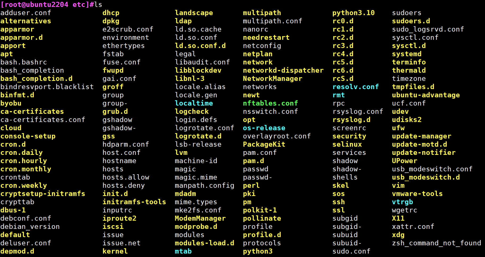

## 文件系统

### 文件系统的定义

```basic
操作系统中负责管理和存储文件信息的软件结构称为文件管理系统，简称文件系统

文件系统统一管理磁盘与内存中的数据访问过程，其中所有权威元数据都永久存储在磁盘上，而内存中通过缓存（如 inode cache、dentry cache）提升访问效率。
```


### 文件系统的组成


**查看内核支持的文件系统模块**

```bash
[root@devops-custom ~]# ls /lib/modules/`uname -r`/kernel/fs
9p      binfmt_misc.ko  cachefiles  cifs  erofs  fscache  isofs  netfs  nfs_common  nls        shiftfs.ko    udf  vboxsf
autofs  btrfs           ceph        dlm   fat    fuse     lockd  nfs    nfsd        overlayfs  smbfs_common  ufs  xfsgrep
```


<span style="color:red">**易混淆概念**</span>

**当前内核支持的文件系统 VS 当前系统可用的文件系统**

```basic
支持但不可用
	如果 Linux 内核的源代码包含了文件系统A的支持，这意味着理论上内核可以处理文件系统A。然而，如果这个支持没有在您当前运行的内核版本中被编译进去（无论是作为内核的一部分，还是作为可以动态加载的模块），那么文件系统A虽然被支持，但在实践中是不可用的。

查看当前内核支持的文件系统
	Rocky：ls /lib/modules/`uname -r`/kernel/fs
	Ubuntu：ls /lib/modules/`uname -r`/kernel/fs

查看当前系统可用的文件系统
	cat /proc/filesystems
```


### 文件系统的三大核心职责


| 模块                 | 功能说明                                                    |
| -------------------- | ----------------------------------------------------------- |
| **元数据管理**       | 管理 inode、目录项、权限、时间戳等信息                      |
| **数据块管理**       | 负责分配/释放数据块，维护块映射结构（如 extents、indirect） |
| **日志机制（可选）** | 提供崩溃一致性保障，如 ext4 的 journal 区                   |


### 理解文件系统的实现


**①：mkfs.ext4 → 磁盘介质**

这是用户态的 `mkfs.ext4` 工具直接通过系统调用（如 `open`、`write`）对 `/dev/sdX` 块设备写入 ext4 文件系统结构（如 superblock、inode 表、块位图等）。
 它**不依赖内核中的 ext4 模块**，而是通过内核通用的块设备驱动将数据写入物理磁盘。

```ABAP
格式化的本质，就是写入文件系统的管理信息！！
```


**②：用户程序 → VFS 虚拟文件系统**

用户程序通过系统调用（如 `open()`, `read()`, `write()`）访问文件。内核首先通过 **VFS（虚拟文件系统）** 作为中间层进行处理。VFS 提供统一的文件操作接口，不关心底层具体使用的是 ext4、xfs 还是 btrfs。


**③：VFS → 文件系统内核模块（如 ext4.ko）**


VFS 在识别出文件属于某个挂载点后，会调用对应的文件系统模块（ext4/xfs等）的具体实现。比如 `ext4_read_inode()`、`ext4_lookup()` 等，这些函数知道如何解析 ext4 格式的磁盘结构。


**④：文件系统模块 → 磁盘介质**

ext4/xfs 等模块调用底层 **块设备接口**（通过 `submit_bio()` 等）读写磁盘扇区。比如要读取 inode 或写入数据块，会最终通过块设备层 + I/O 调度器 + 驱动完成真实磁盘访问。


| **编号** | **路径描述**            | **执行层**           | **说明**                                       |
| -------- | ----------------------- | -------------------- | ---------------------------------------------- |
| **①**    | **mkfs.ext4 → 磁盘**    | 用户态 → 块设备驱动  | 用户工具直接构造文件系统结构写入裸设备         |
| **②**    | **用户程序 → VFS**      | 用户态系统调用       | 程序调用文件操作，进入内核的虚拟文件系统接口层 |
| **③**    | **VFS → 文件系统模块**  | 内核态               | VFS 调用 ext4/xfs 驱动具体实现读取结构         |
| **④**    | **文件系统模块 → 磁盘** | 内核态 → 块层 + 驱动 | 实际的数据读写，最终落地磁盘扇区               |


```bat
磁盘就像一间空房间或毛坯房，mkfs 就是装修队开始打地基、隔墙、布水电。
不同的文件系统（ext4、xfs、btrfs）就像不同的房屋格局设计：

ext4 是标准三室一厅，简单实用；

xfs 是开间大客厅，适合高负载；

btrfs 是复式智能楼，功能丰富但更复杂。

格局一旦定下来，后续所有家具（文件、目录）都得在这个结构中布置。
如果想换格局（改文件系统），就得推倒重装——也就是重新格式化。
```


### 文件系统分类

```ABAP
文件系统的分类，本质上是根据“磁盘上数据结构的组织方式与规则”的不同来划分的。
```


#### ext4

ext4（Fourth Extended File System）文件系统

```basic
ext4是Linux系统中广泛使用的文件系统，它继承了ext3的优点，并在性能和稳定性方面有所提升。
ext4支持大文件和大容量存储设备，具备日志功能以防止数据损坏，并支持延迟分配以减少文件碎片
```

适用场景：

```basic
- ext4最适合用于Linux系统的硬盘分区，以及需要高性能和稳定性的服务器环境。
```


#### XFS

XFS（eXtended File System）

```basic
XFS是一个高性能的64位文件系统，最初由SGI开发，用于高负载服务器和数据存储。
它支持大文件和高并发的读写操作，具有动态空间分配和高效的空间管理能力
```

适用场景：

```basic
- XFS最适合用于需要处理大量数据的高性能服务器和数据存储系统。
```


#### Swap

Swap

```basic
Swap不是一种传统的文件系统，而是一种虚拟内存机制。当操作系统预测到内存分配可能会变得困难时，就会提前触发swap机制，以预防内存不足的情况。这有助于确保系统的稳定性和性能
```

```basic
	当操作系统预测到物理内存不足时，Swap允许系统将部分内存数据写入磁盘上的Swap空间中，以释放物理内存给其他进程使用。Swap空间可以是专门分配的分区，也可以是文件系统中的文件。Swap的使用有助于提升系统的稳定性和性能，尤其是在内存资源紧张的情况下。 
```


#### iso9660

ISO 9660（正式名称：ECMA-119）

```basic
ISO 9660 是为 CD-ROM 设计的只读文件系统格式，它是操作系统安装盘、LiveCD、镜像文件（.iso）的标准文件结构。通过扩展（如 Joliet, Rock Ridge），它可支持更丰富的文件名和权限信息。
```

适用场景：

```basic
ISO 9660 正是光盘（CD-ROM）标准的文件系统格式，它被广泛用于光盘的内容分发、操作系统安装镜像（如 .iso 文件）等场景。
```


#### FAT

FAT（File Allocation Table）文件系统

```basic
FAT是一种简单且广泛使用的文件系统，主要包括FAT12、FAT16和FAT32等版本。
它使用文件分配表来管理文件的位置和状态，具有跨平台性和良好的兼容性，几乎支持所有主流的操作系统。
然而，FAT文件系统不支持高级的文件权限控制。
```

**适用场景**

```basic
- FAT32常用于U盘、存储卡等移动设备，因其简单结构和广泛兼容性而受欢迎。
```


#### NTFS

NTFS（New Technology File System）文件系统

```basic
NTFS是Windows操作系统的标准文件系统，支持高级功能，如文件权限、加密、压缩和磁盘配额。
它提供了更高的安全性和稳定性，支持大文件和分区，并具有文件系统日志，有助于防止数据丢失。
```

适用场景

```basic
- NTFS最适合用于Windows操作系统的硬盘分区，以及需要高级文件管理功能的场景。
```


#### extFAT

exFAT 是 SDXC（64GB及以上SD卡）的官方推荐格式

```basic
exFAT 是为闪存存储设备优化的现代文件系统，兼具 FAT32 的广泛兼容性和对大文件的支持，适合相机、U盘、大容量SD卡等场景。但不适合用作系统盘或高可靠场合。
支持 Windows（Vista SP1+）、macOS（10.6.5+）、Linux（需要 exfat-utils 支持）
```


#### UFS(unix)

```basic
UFS是UNIX文件系统的简称，几乎是大部分UNIX类操作系统默认的基于磁盘的文件系统
```


### 以ext4为例体验文件系统得数据结构与规则


#### Super Block

存放文件系统本身的结构信息，描述整个分区的文件系统信息。记录的信息主要有：block 和 inode 总量，未使用的 block 和 inode 的数量，一个 block 和 inode 的大小，最近一次挂载的时间，最近一次写入数据的时间，最近一次检验磁盘的时间等其他文件系统的相关信息。Super Block的信息被破坏，可以说整个文件系统结构就被破坏了。

```basic
超级块在每个块组的开头都有一份拷贝（第一个块组必须有，后面的块组可以没有【默认采用稀疏备份策略】）。为了保证文件系统在磁盘部分扇区出现物理问题的情况下还能正常工作，就必须保证文件系统的super block信息在这种情况下也能正常访问。所以一个文件系统的super block会在多个block group中进行备份，这些super block区域的数据保持一致

如果想让所有块组都备份超级块和 GDT，可加参数：mkfs.ext4 -O ^sparse_super /dev/sdX
```


#### GDT (Group Description table)

块组描述符表，描述块组属性信息，整个分区分有多少个块组就对应有多少个块组描述符表。每个块组描述符存储一个块组的描述信息，如在这个块组中从哪里开始是 inode Table，从哪里开始是 Data Blocks，空闲的 inode 和 数据块 还有多少个等等。块组描述符在每个块组的开头都有一份拷贝（【默认采用稀疏备份策略】）

```basic
ext4 格式化时可通过 mkfs.ext4 -O ^sparse_super 参数关闭稀疏超级块，改为每组都保存一份备份 GDT。
```


#### Block Bitmap

```basic
块位图 Block Bitmap ，记录着 Data Block 中哪个数据块已经被占用，哪个数据没有被占用。
置为1，申请被占用，置为0，释放空间。
```


#### inode Bitmap

```basic
inode位图，每个bit表示一个inode是否空闲可用
```


#### inode Table

- 存放文件属性如文件大小，所有者，最近修改时间等

- 当前分组所有 Inode 属性的集合

- inode 编号以分区为单位，整体划分，不可跨分区

```basic
inode和数据块，都是跨组编号的
inode和数据库，不能跨分区。
结论：在同一分区内部，inode编号，和块号都是唯一的
```


#### Data Blocks

数据区：存放文件内容，也就是一个一个的Block，根据不同的文件类型，有以下几种情况：

- 对于普通文件，文件的数据存储在数据块中。
- 对于目录，目录下的所有文件名和目录名存储在所在目录的数据块中


## 文件管理


### 目录结构

Linux操作系统采用树状层次结构，并在文件系统层次结构标准（FHS）中进行了记录。Linux的结构包含以下标准顶级目录：

```http
https://www.pathname.com/fhs/
```


| **Path** | **Description**                                              |
| -------- | ------------------------------------------------------------ |
| `/`      | 顶层目录是根文件系统，它包含在挂载其他文件系统之前启动操作系统所需的所有文件，以及启动其他文件系统所需的文件。启动后，所有其他文件系统都将作为根文件系统的子目录挂载到标准挂载点。<br />The top-level directory is the root filesystem and contains all of the files required to boot the operating system before other filesystems are mounted, as well as the files required to boot the other filesystems. After boot, all of the other filesystems are mounted at standard mount points as subdirectories of the root. |
| `/bin`   | 基本用户命令二进制文件（供所有用户使用）<br />Essenital user command binairise (for use by all user) |
| `/boot`  | 由静态引导加载程序、内核可执行文件和启动 Linux 操作系统所需的文件组成。<br />Consists of the static bootloader, kernel executable, and files required to boot the Linux OS. |
| `/dev`   | 包含设备文件，以便于访问连接到系统的每个硬件设备。<br />Contains device files to facilitate access to every hardware device attached to the system. |
| `/etc`   | 本地系统配置文件。已安装应用程序的配置文件也可以保存在这里。<br />Local system configuration files. Configuration files for installed applications may be saved here as well. |
| `/home`  | 系统上每个用户在这里都有一个子目录用于存储。（可选）<br /> Each user on the system has a subdirectory here for storage.（optional） |
| `/lib`   | 系统启动所需的共享库文件和内核模块。<br />Shared library files that are required for system boot and kernel modules. |
| `/proc`  | 内核和进程信息虚拟文件系统<br />Kernel and process information virtual filesystem |
| `/sys`   | 提供对**内核对象（如设备、模块、驱动、class、bus）**的可编程访问接口<br />Provides programmable access to kernel objects (such as devices, modules, drivers, classes, and buses) |
| `/media` | 外部可移动媒体设备（例如 USB 驱动器）安装在这里。<br />External removable media devices such as USB drives are mounted here. |
| `/mnt`   | 常规文件系统的临时挂载点。<br />Temporary mount point for regular filesystems. |
| `/opt`   | 可选文件（例如第三方工具）可以保存在这里。<br />Optional files such as third-party tools can be saved here. |
| `/root`  | 根用户的主目录。<br />The home directory for the root user.  |
| `/sbin`  | 该目录包含用于系统管理的可执行文件（二进制系统文件）。<br />This directory contains executables used for system administration (binary system files). |
| `/tmp`   | 操作系统和许多程序使用此目录存储临时文件。此目录通常在系统启动时被清除，并且可能会在其他时间被删除，且没有任何警告。<br />The operating system and many programs use this directory to store temporary files. This directory is generally cleared upon system boot and may be deleted at other times without any warning. |
| `/usr`   | 包含可执行文件、库、手册文件等。<br />Contains executables, libraries, man files, etc. |
| `/var`   | 该目录包含可变数据文件，例如日志文件、电子邮件收件箱、Web 应用程序相关文件、cron 文件等。<br />This directory contains variable data files such as log files, email in-boxes, web application related files, cron files, and more. |


### 文件类型

#### 概述

磁盘中存放的每个文件可以分为两个部分

- 一部分为文件的内容：即文件的数据部分，此部分内容存放在磁盘中专门的数据空间(data block)中。
- 一部分为文件的属性信息，即元数据(meta data)，比如；文件的大小，类型，节点号，权限，时间等，此部门内容存放在磁盘中专门的节点空间，inode表中


#### 普通文件（白色）

**纯文本文件**：

- `ls -l /etc/issue`

**二进制可执行文件（绿色）**：

- 概述：二进制可执行文件是有特殊格式的可执行程序，其文件内容表现为不可直接读懂的字符，用cat查看，会出现乱码。在Linux中有很多二进制可执行文件，比如很多的外部命令都是二进制可执行文件
- `ls -l /bin/cat`

**数据格式文件**

- 概述：数据格式文件是一些程序在运行过程中需要读取的存放在某些特定格式的数据文件，比如：图片文件，压缩文件，日志文件。通常需要特定的工具打开
- 举例：用户登录时，系统会将登录的信息记录在/var/log.wtmp文件中，这个就是一个数据文件。需要使用`last`命令打开此文件查看内容
- `ls -l /var/log/wtmp` -> `last`(直接在/var/log目录下使用last命令)


#### 目录文件（蓝色）

- 概述：目录文件即文件夹，通过`ls -l`查看文件属性时，第一个属性表现为d


#### 链接文件（浅蓝色）

- 概述：即将两个文件建立关联关系，这种操作实际上是给系统中已有的某个文件指定另外一个可用于访问它的不同文件名称。
- `ls -l`查看文件属性时，第一个属性表现为l
- 分类：
  - 硬链接
  - 软链接


#### 管道文件（暗黄色）

- 管道pipe文件是一种特殊的文件类型，其本质是一个伪文件（本质是内核缓冲区）。其主要目的是实现进程间通讯的问题。由于管道文件是一个与进程没有“血缘关系”的，真正独立的文件，所以它可以在任意进程之间实现通信。
- 管道的本质：在内核中分配了 **一个块缓冲区**，这个缓冲区既用于写入数据，也用于读取数据。
- 因为只有一个缓冲区，所以数据只能从写端流向读端，无法实现双向同时通信。
- 内核缓冲区的作用：
  - 内核缓冲区是内存中的一块区域，由操作系统内核管理。
  - 主要用于在数据生产者（写入者）和消费者（读取者）之间暂存数据。
  - 缓冲区实现了数据的异步传递，即数据生产者和消费者无需同时工作，可以通过缓冲区解耦。


#### 套接字文件（粉色）

- 概述：数据接口文件，通常被用在基于网络的数据通讯使用。
- 当两个进程在同一台主机上，但是像通过网络方式通信，可基于socket方式进行数据通信，可基于全双工方式实现，即可支持同时双向传输数据。
- `ls -l`查看文件属性时，第一个属性表现为s
- 套接字的基本工作机制：
  - **内核缓冲区的双向性**：
    - 套接字通常是全双工通信，可以同时进行读写。
    - 内核为每个套接字分配两块缓冲区：
      - **发送缓冲区**：存储写入的数据，等待传输。
      - **接收缓冲区**：存储接收到的数据，等待读取。
- **数据流动过程**：
  - 写入数据：
    - 发送进程调用 `write` 或 `send`，将数据写入发送缓冲区。
    - 内核负责将缓冲区中的数据通过网络协议栈传输给远端。
  - 接收数据：
    - 数据到达远端后存储到接收缓冲区。
    - 接收进程调用 `read` 或 `recv`，从接收缓冲区读取数据。
- 网络协议的作用
  - 套接字文件的特点在于它与网络协议栈紧密结合：
    - 内核缓冲区中的数据会经过网络协议栈的封装（TCP、UDP 等协议）进行传输。
    - 数据接收后会被解封装，放入接收缓冲区供应用程序读取。
- **深度理解内核缓冲区**
  - **内核缓冲区设计目标**
    - **解耦读写双方**：
      - 缓冲区允许生产者和消费者以不同的速率运行，无需实时同步。
    - **优化性能**：
      - 缓冲区减少了系统调用的频率：
        - 一次写入操作可以将多次写入的数据累积到缓冲区。
        - 一次读取操作可以批量提取缓冲区中的数据。
    - **保证数据完整性**：
      - 在网络通信中，内核缓冲区负责数据的重新排序和校验，保证数据传输的可靠性（特别是 TCP）。


#### 字符设备文件（明黄色）

- 通常是一些串行接口设备在用户空间的体现，像键盘、鼠标。字符设备是按字符为单位进行输入输出的，且按一定的顺序进行
- `ls -l`查看文件属性时，第一个属性表现为c
- 举例；我们登录到Linux主机，系统会提供一个终端文件tty供我们登录。
- 字符设备文件与管道文件的本质区别
  - 字符设备文件的核心在于其与硬件的交互，而管道文件的核心在于进程间通信的能力。


#### 块设备文件（明黄色）

- 块文件设备，就是一些以“块为单位”，如：4096个字节，访问数据，提供随机访问的接口设备，例如磁盘、硬盘、U盘

- 字符设备与块设备文件的对比：

  - **字符设备** 通常将数据直接传递给用户程序，数据在用户程序读取或写入之前，会先进入内核的缓冲区。
  - **块设备** 则依赖页缓存和缓冲区，对数据进行更多的管理和优化。

- 块设备：页缓存和缓冲区

  - 页缓存概念

    - 块设备使用页缓存（Page Cache）优化数据读写
      - 页缓存是内核内存中的一部分，用于缓存块设备的读写操作。
      - 当用户程序读取块设备时，内核优先从页缓存中获取数据；只有当页缓存未命中时，才会从设备实际读取。

  - 页缓存的作用：

    - 读优化
      - 避免频繁的设备访问，加速数据读取。
      - 如果数据已在页缓存中，直接返回给用户程序，无需访问设备。

    - 写优化
      - 写操作首先写入页缓存，内核异步将数据刷入设备（延迟写）。
      - 这种机制提高了写入速度，但可能导致数据丢失（在系统崩溃时）。

  - 设备缓冲区（Device Buffer）

    - 块设备（如硬盘、SSD）通常还有硬件缓冲区，用于临时存储正在读写的数据。
    - 硬件缓冲区的大小和实现由设备本身决定。


#### 文件类型颜色的配置

##### CentOS系文件类型颜色配置

```bash
vim /etc/DIR_COLORS
```


修改`DIR 01;34 -> Dir 01;33`保存后，新开会话


##### Ubuntu系文件类型颜色配置

**dircolors 命令**

这个命令用于初始化颜色配置。它会检查 `~/.dircolors` 或 `~/.dir_colors` 文件，如果这些文件不存在，它会使用默认的颜色配置。你通常会在你的 shell 初始化文件中（比如 ~/.bashrc）看到类似于以下的命令：

```bash
test -r ~/.dircolors && eval "$(dircolors -b ~/.dircolors)" || eval "$(dircolors -b)"
```

如果你想要调整 Ubuntu 中 ls 命令输出的颜色，你可以创建或编辑 `~/.dircolors` 文件，并在该文件中定义你的颜色配置。然后，确保你的 shell 初始化文件（如 ~/.bashrc）中包含处理 dircolors 的命令。这样，每次你打开一个新的 shell 时，都会应用这些颜色设置。


**示例**


创建`~/.dircolors`文件，并更改目录颜色

```bash
[root@ubuntu2204 etc]#cat ~/.dircolors 
DIR 01;33
```

新开会话，观察目录颜色




### 目录管理相关命令

#### 文件系统目录

Linux目录结构示意图


#### 路径的表示方法

路径分类

```basic
绝对路径
	以正斜杠/ 即根目录开始,是一个完整的文件的位置路径。
	可用于指定任何一个文件的时候
	示例：/path/to/dir/file.txt

相对路径名
	不以斜线开始，是指相对于当前工作目录的路径。
	特殊场景下，是相对于某目录的位置可以作为一个简短的形式指定一个文件名
	示例：current_path/to/dir/file.txt
```


#### 命令 pwd

```bash
pwd -P    # 输出真实物理路径
pwd -L    # 默认，输出链接路径
```


示例：

```bash
[root@magedu ~]# mkdir -p a/b/c
[root@magedu ~]# tree a
a
└── b
    └── c
    
[root@magedu ~]# cd a/b/c/
[root@magedu ~/a/b/c]# ln -s ../../../../etc/default default
[root@magedu ~/a/b/c]# cd default

# pwd默认 pwd -L
[root@magedu ~/a/b/c/default]# pwd
/root/a/b/c/default
[root@magedu ~/a/b/c/default]# pwd -P
/etc/default
```


#### 基名与文件名

```bash
bashename <dir> #只输出文件名
 
# 示例：
[root@magedu ~/a/b/c/default]# basename `which cat`
cat

dirname <dir>  # 只输出路径

# 示例：
[root@magedu ~/a/b/c/default]# dirname `which cat`
/usr/bin
```


#### 路径间移动 cd

```bash
cd -P  # 移动到真实物理路径

# 示例
cd -P /bin  # 实际移动到/usr/bin

cd ~  # 移动到家目录
cd ~username  # 移动到指定用户的家目录

cd -  # 移动到上次所在的目录，之所以能移动到上次所在目录是因为有系统变量记录了这个数据
# $OLDPWD 记录上次所在目录；$PWD 记录当前所在目录
```


#### 查看目录 tree

```bash
# 查看指定目录数据的层级
tree -L 1 /
```

```bash
# 每个文件和目录前显示完整的相对路径
tree -f 
[root@magedu ~]# tree -f a
a
└── a/b
    └── a/b/c
        └── a/b/c/default -> ../../../../etc/default

4 directories, 0 files

[root@magedu ~]# tree -f /root/a
/root/a
└── /root/a/b
    └── /root/a/b/c
        └── /root/a/b/c/default -> ../../../../etc/default

4 directories, 0 files
```

```bash
# 每个文件和目录前显示最新更改时间
[root@magedu ~]# tree -D a
[Jun  7 11:36]  a
└── [Jun  7 11:36]  b
    └── [Jun  7 11:40]  c
        └── [Jun  7 11:40]  default -> ../../../../etc/default

4 directories, 0 files
```

```bash
# 每个文件和目录前显示文件大小
[root@magedu ~]# tree -s a
[       4096]  a
└── [       4096]  b
    └── [       4096]  c
        └── [         23]  default -> ../../../../etc/default
```

```bash
# 每个文件和目录前显示文件/目录拥有者
[root@magedu ~]# tree -u a
[root    ]  a
└── [root    ]  b
    └── [root    ]  c
        └── [root    ]  default -> ../../../../etc/default

4 directories, 0 files
```

```bash
# 每个文件和目录前显示权限标示
tree -p
[root@magedu ~]# tree -p a
[drwxr-xr-x]  a
└── [drwxr-xr-x]  b
    └── [drwxr-xr-x]  c
        └── [lrwxrwxrwx]  default -> ../../../../etc/default

4 directories, 0 files
```

```bash
# 使用通配符对tree的目录进行筛选
tree -P pattern  # 这里的pattern不支持正则表达式，仅支持通配符
[Sun Oct 15 10:33:09 26] root@rocky9:~ #tree -P 'r*.txt' /Storage/
 /Storage/
 └── test
    ├── rename.txt
    └── robots.txt
 1 directory, 2 files
 
常用通配符:
* 匹配任意数量的字符（包括零个）。
? 匹配任意一个字符。
[...] 匹配方括号中的任意一个字符。
```


#### 创建目录 mkdir

```bash
语法格式：mkdir [pv] [-m mode] directory_name...

# mkdir在指定路径创建目录
mkdir /Storage/test   # 在Storage目录下创建一个test目录

# 默认在当前路径创建目录
mkdir dir1            # 在当前目录下创建名为dir1的目录

# 一次创建多个同级目录，每个目录间用空格隔开
mkdir dir1 dir2 dir3

# 创建多级目录
mkdir -p dir1/dir2/dir3

# -v 会显示创建每个目录的详细信息 
[Sun Oct 15 11:12:00 39] root@rocky9:/ #mkdir -pv /Storage/test/dir1/dir2/dir3
mkdir: created directory '/Storage/test/dir1'
mkdir: created directory '/Storage/test/dir1/dir2'
mkdir: created directory '/Storage/test/dir1/dir2/dir3'
```


### 文件管理相关命令

#### 查看文件列表 ls

```bash
语法格式：ls [OPTION]... [FILE]...

# -a 显示包含隐藏文件在内的所有内容 (.开头的是隐藏文件)
# 命令：ls -a
[root@magedu ~]# ls -a
.  ..  a  a.txt  .bash_history  .bashrc  .cache  .profile  snap  .ssh  .viminfo

# -i 显示文件索引节点(inode)
# 命令：ls -i
[root@magedu ~]# ls -i
136601235 baidu.html  137507906 ps_demo.txt  136601225 rename.txt  136601224 robots.txt

# -l 以长格式显示目录下内容列表
# 长格式输出信息：文件名、文件类型、权限、硬链接数、所有者、组、文件大小、修改时间
# 命令：ls -l
[root@magedu ~]# ls -l
total 12
drwxr-xr-x 3 root root 4096 Jun  7 11:36 a
-rw-r--r-- 1 root root    4 Jun  7 11:37 a.txt
drwx------ 4 root root 4096 May 29 03:17 snap

# -t 用文件目录的更改时间排序
# 命令ls -t
[root@magedu ~]# ls -tl
total 12
-rw-r--r-- 1 root root    4 Jun  7 11:37 a.txt
drwxr-xr-x 3 root root 4096 Jun  7 11:36 a
drwx------ 4 root root 4096 May 29 03:17 snap

# 按文件大小，从大到小排序
# 命令：ls -S
[root@magedu ~]# ls -lS
total 12
drwxr-xr-x 3 root root 4096 Jun  7 11:36 a
drwx------ 4 root root 4096 May 29 03:17 snap
-rw-r--r-- 1 root root    4 Jun  7 11:37 a.txt

# ls后面支持通配符过滤，不加单引号
[root@magedu ~]# ls -l *.txt
-rw-r--r--. 1 root root  270 Oct 13 20:48 ps_demo.txt
-rw-r--r--. 1 root root 2814 Jan  3  2020 rename.txt
-rw-r--r--. 1 root root 2814 Jan  3  2020 robots.txt

# ls查询目录
# 命令：ls -d
[root@magedu ~]# ls -dl a
a
[root@magedu ~]# ls -dl a
drwxr-xr-x 3 root root 4096 Jun  7 11:36 a
```

##### 关于文件的时间属性详解

- atime: 记录最后一次的访问时间
- mtime: 记录最后一次文件数据部分的修改时间
- ctime: 记录最后一次文件元数据的修改时间


##### ls查看文件的3个时间属性

```bash
# 默认显示文件的mtime
ls -l

# 显示文件的ctime
ls -l --time=ctime

# 显示文件的atime
ls -l --time=atime
```


#### 创建或刷新文件 touch

```bash
# 如果文件存在则刷新时间，如果不存在则创建空文件

touch -a          # 改变atime, ctime
touch -m          # 改变mtime, ctime
touch -h          # 刷新链接文件本身，默认刷新目标文件
touch -c          # 只刷新已存在的文件，如果文件不存在，也不会创建文件

touch -r          # 使用某个文件的修改时间作为当前文件的修改时间
[root@magedu ~]# touch -r a.txt a
[root@magedu ~]# stat a
File: a
Size: 4096      	Blocks: 8          IO Block: 4096   directory
Device: 8,2	Inode: 786603      Links: 3
Access: (0755/drwxr-xr-x)  Uid: (    0/    root)   Gid: (    0/    root)
Access: 2025-06-07 12:34:12.345909603 +0800
Modify: 2025-06-07 12:29:27.365516871 +0800
Change: 2025-06-07 12:37:12.969865960 +0800
Birth: 2025-06-07 11:36:50.554401972 +0800
 
touch -t    
# 修改atime,mtime到指定日期时间
# 比如01020304，指2024-01-02 03:04:00
# 比如0102030405， 指2001-02-03 04:05:00
[root@magedu ~]# touch -t 0102030405 a.txt 
[root@magedu ~]# stat a.txt 
File: a.txt
Size: 4         	Blocks: 8          IO Block: 4096   regular file
Device: 8,2	Inode: 786607      Links: 1
Access: (0644/-rw-r--r--)  Uid: (    0/    root)   Gid: (    0/    root)
Access: 2001-02-03 04:05:00.000000000 +0800
Modify: 2001-02-03 04:05:00.000000000 +0800
Change: 2025-06-07 12:38:17.148370169 +0800
Birth: 2025-06-07 12:29:27.365516871 +0800


# 示例
[root@magedu ~]# touch `date +%F-%T`.txt
[root@magedu ~]# ls
2025-06-07-12:39:21.txt
```


#### 复制文件 cp

```bash
语法格式：cp [OPTION] SOURCE DEST

# -b 覆盖已存在的目标前先对其做备份，后缀为~
[root@magedu ~]# echo fff > fstab
[root@magedu ~]# ls
2025-06-07-12:39:21.txt  a  a1.txt  a.txt  fstab  snap
[root@magedu ~]# cp -b /etc/fstab .
[root@magedu ~]# ls
2025-06-07-12:39:21.txt  a  a1.txt  a.txt  fstab  fstab~  snap

# -S 指定备份文件的后缀名
[root@magedu ~]# cp -S .bak /etc/fstab .
[root@magedu ~]# ls
2025-06-07-12:39:21.txt  a  a1.txt  a.txt  fstab  fstab~  fstab.bak  snap

# -i 覆盖前会先询问用户（推荐使用）
[root@magedu ~]# cp -i /etc/fstab .
cp: overwrite './fstab'? y

# -r 递归处理，将目录及其中的为文件一同复制
[root@magedu ~]# cp -r a d
[root@magedu ~]# ls
2025-06-07-12:39:21.txt  a  a1.txt  a.txt  d  fstab  fstab~  fstab.bak  snap  zero
[root@magedu ~]# tree d
d
└── b
    └── c
        └── default -> ../../../../etc/default

4 directories, 0 files


# -a 复制特殊文件，使用-a
[root@magedu ~]# cp -a /dev/zero .
[root@magedu ~]# ls
2025-06-07-12:39:21.txt  a  a1.txt  a.txt  fstab  fstab~  fstab.bak  snap  zero
```


#### 移动及重命名文件 mv

```bash
# 语法1：mv 目标文件 目标路径
[root@magedu ~]# ls
2025-06-07-12:39:21.txt  a  a1.txt  a.txt  d  fstab  fstab~  fstab.bak  snap  zero
[root@magedu ~]# mv a1.txt /opt
[root@magedu ~]# ls /opt/
a1.txt
[root@magedu ~]# ls
2025-06-07-12:39:21.txt  a  a.txt  d  fstab  fstab~  fstab.bak  snap  zero

# 语法2：mv -t 目标路径 目标文件
[root@magedu ~]# mv -t /opt fstab
[root@magedu ~]# ls /opt/
a1.txt  fstab

# 语法3：mv -bi 目标文件 目标路径
# i: 如果会覆盖文件则提示
# b: 覆盖文件时会备份被覆盖的文件
[root@magedu ~]# echo bbb > a1.txt
[root@magedu ~]# ls
2025-06-07-12:39:21.txt  a  a1.txt  a.txt  d  fstab~  fstab.bak  snap  zero
[root@magedu ~]# mv -bi a1.txt /opt/
mv: overwrite '/opt/a1.txt'? y
[root@magedu ~]# ls /opt/
a1.txt  a1.txt~  fstab
```


#### 删除文件 rm

```bash
语法格式：rm [OPTION]...FILE...

# -f 强制删除文件，即在删除文件时不提示确认，并自动忽略不存在的文件
# -r 递归删除，目标是目录的话，整个目录文件全部删除
```

`rm` 是危险命令，建议用以下命令替换

```bash
alias rm='dir=/Storage/backup/data`date +%F-%H-%M-%S`;mkdir -p $dir;mv -t $dir'
# 将所有要删除的文件，移动到创建的垃圾箱目录中
```

