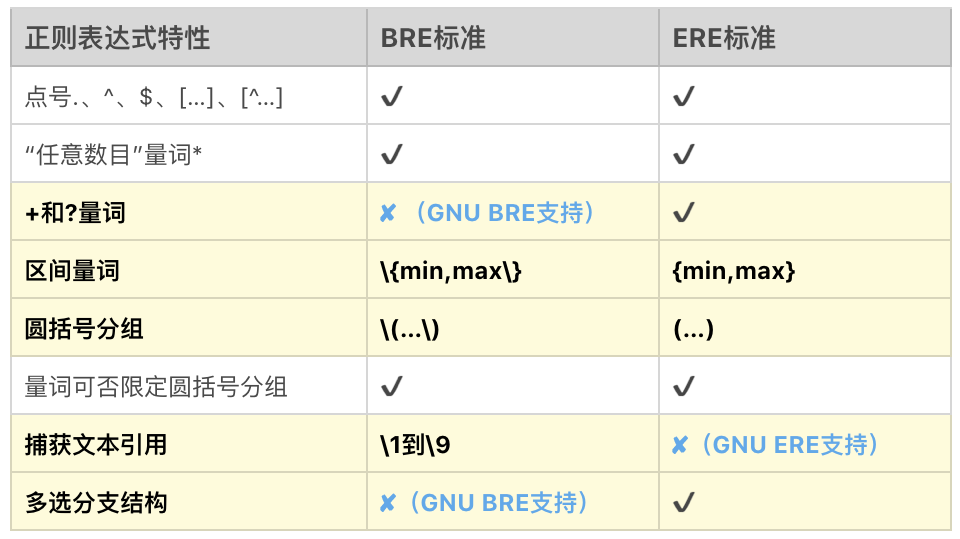
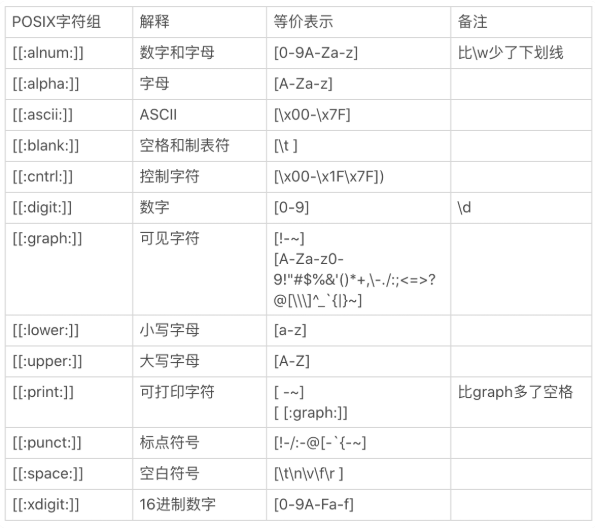
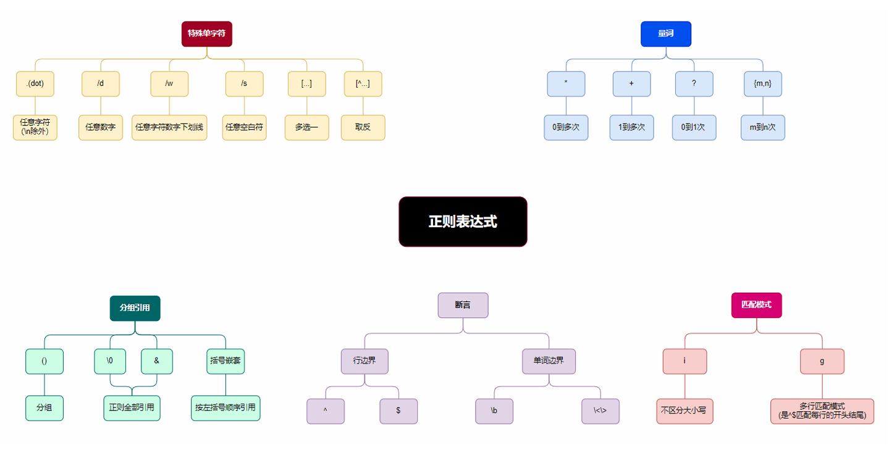
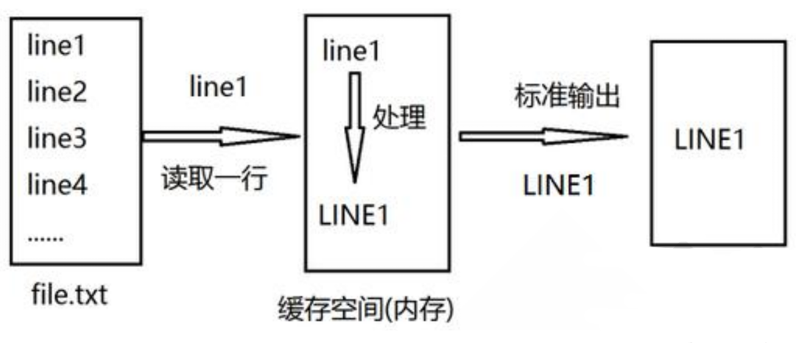
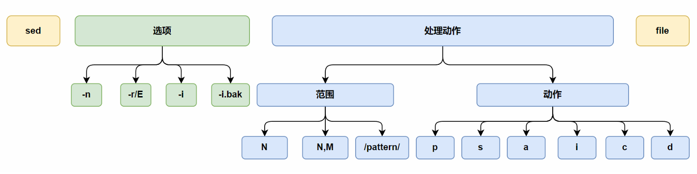
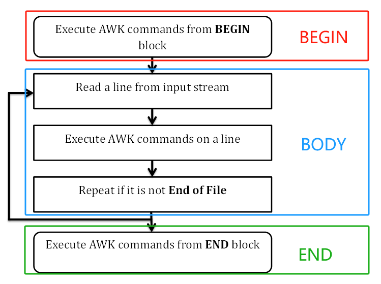

## 正则表达式

### 什么是正则表达式

正则表达式是一种**用来描述字符串匹配模式的语法规则**，就像一把“文本过滤器”或“高级搜索工具”。


#### 能解决哪些问题？（结合实际场景）

| 场景           | 正则能做什么                                    |
| -------------- | ----------------------------------------------- |
| **日志分析**   | 从大量日志中提取 IP、时间戳、错误信息等关键字段 |
| **输入校验**   | 判断手机号、邮箱、身份证号是否符合格式          |
| **数据提取**   | 从 HTML 页面中提取链接地址、图片 URL、标题等    |
| **文本替换**   | 批量替换代码中的函数名、变量名，或者清洗脏数据  |
| **爬虫开发**   | 抓取网页时，用正则快速提取内容                  |
| **批量重命名** | 使用正则+脚本改名一堆图片、视频、文件名等       |
| **配置审计**   | 查找配置文件中被注释掉的行、未配置项等          |


```bat
正则表达式就像在茫茫人海中寻找你要的人，它提供一组“筛选规则”：只要长得像这个样子、有这个特征的人就挑出来。<br>它不只“看起来像”，而是按规则“精准匹配”。
```


### 正则表达式简史

正则表达式的起源，可以追溯到，早期神经系统如何工作的研究。在 20 世纪 40 年代，有两位神经生理学家（Warren McCulloch 和 Walter Pitts），研究出了一种用数学方式来描述神经网络的方法。

1956 年，一位数学家（Stephen Kleene）发表了一篇标题为《神经网络事件表示法和有穷自动机》的论文。这篇论文描述了一种叫做“正则集合（Regular Sets）”的符号。

随后，大名鼎鼎的 Unix 之父 **Ken Thompson** 于 1968 年发表了文章《正则表达式搜索算法》，并且将正则引入了自己开发的编辑器 qed，以及之后的编辑器 ed 中，然后又移植到了大名鼎鼎的文本搜索工具 grep 中。自此，正则表达式被广泛应用到 Unix 系统或类 Unix 系统 (如 macOS、Linux) 的各种工具中。

随后，由于正则功能强大，非常实用，越来越多的语言和工具都开始支持正则。不过遗憾的是，由于没有尽早确立标准，导致各种语言和工具中的正则虽然功能大致类似，但仍然有不少细微差别。

于是，诞生于 1986 年的 POSIX 开始进行标准化的尝试。POSIX作为一系列规范，定义了 Unix 操作系统应当支持的功能，其中也包括正则表达式的规范。因此，Unix 系统或类 Unix 系统上的大部分工具，如 grep、sed、awk 等，均遵循该标准。我们把这些遵循 POSIX 正则表达式规范的正则表达式，称为 **POSIX 流派**的正则表达式。

在 1987 年 12 月，Larry Wall 发布了 Perl 语言第一版，因其功能强大一票走红，所引入的正则表达式功能大放异彩。之后 Perl 语言中的正则表达式不断改进，影响越来越大。于是在此基础上，1997 年又诞生了PCRE——**Perl 兼容正则表达式**（Perl Compatible Regular Expressions）。

PCRE 是一个兼容 Perl 语言正则表达式的解析引擎，是由 Philip Hazel 开发的，为很多现代语言和工具所普遍使用。除了 Unix 上的工具遵循 POSIX 标准，PCRE 现已成为其他大部分语言和工具隐然遵循的标准。

之后，正则表达式在各种计算机语言或各种应用领域得到了更为广泛的应用和发展。**POSIX 流派** 与 **PCRE 流派** 是目前正则表达式流派中的两大最主要的流派。


### 正则表达式流派

目前正则表达式主要有两大流派（Flavor）：**POSIX 流派**与 **PCRE 流派。**


#### POSIX 流派

先简要介绍一下 POSIX 流派。POSIX 规范定义了正则表达式的两种标准：

- **BRE 标准**（Basic Regular Expression 基本正则表达式）；
- **ERE 标准**（Extended Regular Expression 扩展正则表达式）。


**BRE 标准 和 ERE 标准**

早期 BRE 与 ERE 标准的区别主要在于，BRE 标准不支持量词问号和加号，也不支持多选分支结构管道符。BRE 标准在使用花括号，圆括号时要转义才能表示特殊含义。BRE 标准用起来这么不爽，于是有了 ERE 标准，在使用花括号，圆括号时不需要转义了，还支持了问号、加号 和 多选分支。


现在使用的 Linux 发行版，大多都集成了 GNU 套件。GNU 在实现 POSIX 标准时，做了一定的扩展，主要有以下三点扩展。

- **GNU BRE** 支持了 +、?，但转义了才表示特殊含义，即需要用\+、\?表示。
- **GNU BRE** 支持管道符多选分支结构，同样需要转义，即用 \|表示。
- **GNU ERE** 也支持使用反引用，和 BRE 一样，使用 \1、\2…\9 表示。





#### POSIX 字符组

POSIX 流派还有一个特殊的地方，就是有自己的字符组，叫 POSIX 字符组。这个类似于 `\d` 表示数字，`\s` 表示空白符等，POSIX 中也定义了一系列的字符组。具体的清单和解释如下所示：




#### PCRE 流派

除了 POSIX 标准外，还有一个 Perl 分支，也就是我们现在熟知的 PCRE。随着 Perl 语言的发展，Perl 语言中的正则表达式功能越来越强悍，为了把 Perl 语言中正则的功能移植到其他语言中，PCRE 就诞生了。

目前大部分常用编程语言都是源于 PCRE 标准，这个流派显著特征是有`\d`、`\w`、`\s` 这类字符组简记方式。


### 正则表达式元字符





#### 单字符匹配

```bash
.                   # 任意单个字符（\n除外）
[...]               # 指定范围的字符，即多选一
[^...]              # 不在指定范围的字符，一样是多选一

# ERE | BRE
[[:alnum:]]           # 数字和字母
[[:alpha:]]           # 代表任何英文大小写字符，亦即 A-Z, a-z 
[[:lower:]]           # 小写字母,示例:[[:lower:]],相当于[a-z]
[[:upper:]]           # 大写字母
[[:blank:]]           # 空白字符（空格和制表符） 
[[:space:]]           # 水平和垂直的空白字符（比[:blank:]包含的范围广）
[[:digit:]]           # 十进制数字
[[:xdigit:]]          # 十六进制数字
[[:punct:]]           # 标点符号

# PCRE
\d                  # 数字
\D                  # 非数字
\w                  # 数字，字母，下划线
\W                  # 非数字，字母，下划线
\s                  # 空白字符
\S                  # 非空白符
```

POSIX ERE 标准本身 **不支持 `\w`、`\s`、`\d`**，但：

> **GNU grep 的实现在某些环境下允许 `\w`、`\s`、`\d` 等 Perl 风格写法**，即使使用的是 `-E`（ERE 模式），也可能生效。
>
> 实测 grep -E 不支持 `\d`，支持 `\w` 和 `\s`
>
> 因此，为跨平台场景考虑，不建议扩展正则使用`\d`,`\w`,`\s`，建议使用[:alnum:]等替代


#### 量词即匹配次数

```bash
*                  # 匹配前面字符任意次
?                  # 0或1次
+                  # 1次或多次
{n}                # 匹配n次
{m,n}              # 至少m，至多n次
```


#### 位置锚定

```bash
^                 # 行首
$                 # 行尾
\<, \b            # 词首
\>, \b            # 词尾
```


#### 分组其他

```bash
()                # 后向引用：\1, \2, ... 注意: \0 表示正则表达式匹配的所有字符，重点观察左括号
(?:)              # 非捕获分组，只是把里面的正则当作一个整体来控制重复次数或逻辑，不存储匹配内容到捕获组
                  # 这样可以减少内存占用，并且避免多余的捕获编号
|                 # 或者
a|b               # a或b
C|cat             # C或cat
(C|c)at           # Cat或cat
```


#### 匹配模式

```bash
# 仅适用于PCRE
g (?g)            # 全局匹配 
i (?i)            # 忽视大小写
```


**示例1**

```bash
root@localhost:~# grep -P "(?i)super" /etc/passwd
root:x:0:0:Super User:/root:/bin/bash
```


**示例2：匹配IP**

```bash
[root@ubuntu2204 ~]#ifconfig|grep -Po "(((25[0-5])|(2[0-4][0-9])|(1[0-9][0-9])|([1-9]?[0-9]))\.){3}((25[0-5])|(2[0-4][0-9])|(1[0-9][0-9])|([1-9]?[0-9]))"|head -n1
10.0.0.202
```


**示例3：排除空行和#开头的行**

```bash
root@localhost:~# grep -v '^#' /etc/fstab |grep -v ^$
UUID=664b836b-0ac3-4d1c-b01b-cc543f2ec882 /                       xfs     defaults        0 0
UUID=104ac312-22af-4143-8d75-6a9396e0f536 /boot                   xfs     defaults        0 0
UUID=de822951-49ea-4cc2-ba02-0edea42f4ea5 none                    swap    defaults        0 0

root@localhost:~# grep -Ev "^(#|$)" /etc/fstab 
UUID=664b836b-0ac3-4d1c-b01b-cc543f2ec882 /                       xfs     defaults        0 0
UUID=104ac312-22af-4143-8d75-6a9396e0f536 /boot                   xfs     defaults        0 0
UUID=de822951-49ea-4cc2-ba02-0edea42f4ea5 none                    swap    defaults        0 0
```


**示例4：统计英文文章的单词数量，并从大到小排列**

```bash
root@localhost:~# grep -oP "[A-Za-z]+(['-][A-Za-z]+)*" word.txt
```


## 文本处理三剑客

### 文本处理三剑客之 grep


grep:  Global search REgular expression and Print out the line

作用：文本搜索工具，根据用户指定的 “模式” 对目标文本逐行进行匹配检查；打印匹配到的行

模式：由正则表达式字符及文本字符所编写的过滤条件


帮助

```http
https://man7.org/linux/man-pages/man1/grep.1.html
```


格式及常用选项

```bash
grep [OPTIONS...] PATTERN [FILE...]

# 常用选项
-E|--extended-regexp              # 使用ERE，相当于egrep
-P|--perl-regexp                  # 支持Perl格式的正则表达式
-e|--regexp=PATTERN               # 实现多个选项间的逻辑or关系,如：grep –e ‘cat ' -e ‘dog' file
-i|--ignore-case                  # 忽略字符大小写
-v|--invert-match                 # 显示没有被匹配上的行，即取反
-n|--line-number                  # 显示匹配的行号
-q|--quiet|--silent               # 静默模式，不输出任何信息，结果要从变量 $? 拿
-r|--recursive                    # 递归目录，但不处理软链接
-m|--max-count=N                  # 只匹配N行，是行，不是次数，一行可能匹配两个，但是，这里是行
-c|--count                        # 统计匹配的行数，是行数，一行可以匹配一次到多次

-A|--after-context=N              # 显示匹配到的字符串所在的行及其后n行
-B|--before-context=N             # 显示匹配到的字符串所在的行及其前N行
-C|--context=N                    # 显示匹配到的字符串所在的行及其前后各N行
```


示例：标准输入

```bash
root@localhost:~# grep hello
123hello123
123hello123
```


示例：处理文件

```bash
root@localhost:~# grep root /etc/passwd
root:x:0:0:Super User:/root:/bin/bash
operator:x:11:0:operator:/root:/usr/sbin/nologin
```


示例：管道

```bash
root@localhost:~# cat /etc/passwd|grep root
root:x:0:0:Super User:/root:/bin/bash
operator:x:11:0:operator:/root:/usr/sbin/nologin
```


示例：取前三行

```bash
root@localhost:~#  grep -m 3 bin /etc/passwd
root:x:0:0:Super User:/root:/bin/bash
bin:x:1:1:bin:/bin:/usr/sbin/nologin
daemon:x:2:2:daemon:/sbin:/usr/sbin/nologin
```


示例：取反，取不匹配的行

```bash
root@localhost:~# grep -v nologin /etc/passwd
root:x:0:0:Super User:/root:/bin/bash
sync:x:5:0:sync:/sbin:/bin/sync
shutdown:x:6:0:shutdown:/sbin:/sbin/shutdown
halt:x:7:0:halt:/sbin:/sbin/halt
magedu:x:1000:1000:magedu:/home/magedu:/bin/bash

# 不看注释行
root@localhost:~# grep -v "#" /etc/fstab 

UUID=664b836b-0ac3-4d1c-b01b-cc543f2ec882 /                       xfs     defaults        0 0
UUID=104ac312-22af-4143-8d75-6a9396e0f536 /boot                   xfs     defaults        0 0
UUID=de822951-49ea-4cc2-ba02-0edea42f4ea5 none                    swap    defaults        0 0
```


范例：不区分大小写

```bash
root@localhost:~# grep -i ROOT /etc/passwd
root:x:0:0:Super User:/root:/bin/bash
operator:x:11:0:operator:/root:/usr/sbin/nologin
```


示例：显示行号

```bash
root@localhost:~# grep -n bash /etc/passwd
1:root:x:0:0:Super User:/root:/bin/bash
37:magedu:x:1000:1000:magedu:/home/magedu:/bin/bash
```


示例：显示匹配的行数

```bash
root@localhost:~# grep -c bash /etc/passwd
2
```


示例：仅显示匹配的内容

```bash
root@localhost:~# grep -o root /etc/passwd
root
root
root
```


示例：静默模式

```bash
root@localhost:~# grep -q root /etc/passwd
root@localhost:~# echo $?
0

root@localhost:~# grep -q roo00t /etc/passwd
root@localhost:~# echo $?
1
```


示例：显示匹配到的行及后两行

```bash
root@localhost:~# grep -A 2 root /etc/passwd
root:x:0:0:Super User:/root:/bin/bash
bin:x:1:1:bin:/bin:/usr/sbin/nologin
daemon:x:2:2:daemon:/sbin:/usr/sbin/nologin
--
operator:x:11:0:operator:/root:/usr/sbin/nologin
games:x:12:100:games:/usr/games:/usr/sbin/nologin
ftp:x:14:50:FTP User:/var/ftp:/usr/sbin/nologin
```


范例：显示匹配到的行及前两行

```bash
root@localhost:~# grep -B 2 root /etc/passwd
root:x:0:0:Super User:/root:/bin/bash
--
halt:x:7:0:halt:/sbin:/sbin/halt
mail:x:8:12:mail:/var/spool/mail:/usr/sbin/nologin
operator:x:11:0:operator:/root:/usr/sbin/nologin
```


范例：显示匹配到的行及前后各两行

```bash
root@localhost:~# grep -C 2 root /etc/passwd
root:x:0:0:Super User:/root:/bin/bash
bin:x:1:1:bin:/bin:/usr/sbin/nologin
daemon:x:2:2:daemon:/sbin:/usr/sbin/nologin
--
halt:x:7:0:halt:/sbin:/sbin/halt
mail:x:8:12:mail:/var/spool/mail:/usr/sbin/nologin
operator:x:11:0:operator:/root:/usr/sbin/nologin
games:x:12:100:games:/usr/games:/usr/sbin/nologin
ftp:x:14:50:FTP User:/var/ftp:/usr/sbin/nologin
```


示例： 显示匹配 root 的行或匹配 bash 的行

```bash
root@localhost:~# grep -e root -e bash /etc/passwd
root:x:0:0:Super User:/root:/bin/bash
operator:x:11:0:operator:/root:/usr/sbin/nologin
magedu:x:1000:1000:magedu:/home/magedu:/bin/bash
```


示例：递归匹配

```bash
root@localhost:~# grep -r root /etc/*
/etc/aliases:postmaster:        root
/etc/aliases:bin:               root
......
```


示例：命令行展开

```bash
root@localhost:~# grep $(whoami) /etc/passwd
root:x:0:0:Super User:/root:/bin/bash
operator:x:11:0:operator:/root:/usr/sbin/nologin
```


示例：取CPU核数

```bash
root@localhost:~# grep -c processor /proc/cpuinfo
2
```


### 文本处理三剑客之 sed

#### sed 工作原理



Sed是从文件或管道中读取一行，处理一行，输出一行；再读取一行，再处理一行，再输出一行，直到最后一行。

每当处理一行时，把当前处理的行存储在临时缓冲区**模式空间（Pattern Space）** 中，接着用 sed 命令 处理缓冲区中的内容，处理完成后，把缓冲区的内容送往屏幕。接着处理下一行，这样不断重复，直到文件末尾。

一次处理一行的设计模式使得sed性能很高，sed在读取大文件时不会出现卡顿的现象。

如果使用vi命令打开几十M上百M的文件，明显会出现有卡顿的现象，这是因为vi命令打开文件是一次性 将文件加载到内存，然后再打开。Sed就避免了这种情况，一行一行的处理，打开速度非常快，执行速 度也很快。


相关文档

```ABAP
http://sed.sourceforge.net/
https://man7.org/linux/man-pages/man1/sed.1.html
http://www.gun.org/software/sed/manual/sed.html
```


#### sed 基本用法




格式：

```bash
sed [OPTION]... [script-only-if-no-other-script] [input-file]...

# 常用选项
-n|--quiet|--silent                    # 不输出模式空间内容到屏幕，即不自动打印
-i[SUFFIX]|--in-place[=SUFFIX]         # -i 直接修改文件，-i.bak 以.bak后缀备份源文件
-E|-r|--regexp-extended                # 扩展正则表达式 

-ir                                    # 此组合不支持，及组合使用-i不能放在最前面
-ri                                    # 支持
-i -r                                  # 支持
-ni                                    # 此组合危险，会清空文件
```


处理动作：范围+动作

```bash
'AddrCmd'                              # 对那些行，执行什么操作
```


范围格式:

```bash
# 为空，则表示对全文进行处理

# 单地址,指定行
N                                      # 具体行号
$                                      # 最后一行
/pattern/                              # 能被匹配到的每一行

# 范围地址
M,N                                    # 第M行到第N行
M,+N                                   # 第M行到第M+N行 3,+4 表示从第3行到第7行
/pattern1/,/pattern2/                  # 从第一个匹配行开始，到第二个匹配行中间的行

# 步长
1~2                                    # 奇数行
2~2                                    # 偶数行
```


动作格式：

```bash
p                                      # 打印当前模式空间内容，追加到默认输出之后
Ip                                     # 忽略大小写输出
d                                      # 删除模式空间匹配的行，并立即启用下一轮循环
a [\]text                              # 在指定行后面追加文本，支持使用\n实现多行追加
i [\]text                              # 在行前面插入文本
c [\]text                              # 替换行为单行或多行文本
w file                                 # 保存模式匹配的行至指定文件
r file                                 # 读取指定文件的文本至模式空间中匹配到的行后
=                                      # 为模式空间中的行打印行号
!                                      # 模式空间中匹配行取反处理
```


查找替代

```bash
s/pattern/replace/修饰符                # 查找替换,支持使用其它分隔符，可以是其它形式：s@@@，s###

# 修饰符
g                                      # 行内全局替换
p                                      # 显示替换成功的行
w                                      # 将替换成功的行保存至文件中
I|i

#后向引用
\1                                     # 第一个分组
\2                                     # 第二个分组
\N                                     # 第N个分组
&                                      # 所有搜索内容，等价于\0
```


范例：

```bash
# 等待标准输入,script为空，默认是直接输出
[root@localhost ~]# sed ''
hello
hello

# script为空，默认输出内容
[root@localhost ~]# sed '' /etc/issue
\S
Kernel \r on \m

# script 中执行p命令，再加上默认输出，所有每行都显示了两次
[root@localhost ~]# sed 'p' /etc/issue
\S
\S
Kernel \r on \m
Kernel \r on \m


# 关闭默认输出，script 为空，则无任何输出
[root@localhost ~]# sed -n '' /etc/issue


# 用 -n 选项关闭默认输出，script 中执行p命令
[root@localhost ~]# sed -n 'p' /etc/issue
\S
Kernel \r on \m


# 输出第一行
[root@localhost ~]# sed -n '1p' /etc/passwd
root:x:0:0:Super User:/root:/bin/bash

# 输出最后一行
[root@localhost ~]# sed -n '$p' /etc/passwd
magedu:x:1000:1000:magedu:/home/magedu:/bin/bash

# 正则匹配，输出包含root的行
[root@localhost ~]# sed -n '/root/p' /etc/passwd
root:x:0:0:Super User:/root:/bin/bash
operator:x:11:0:operator:/root:/usr/sbin/nologin

# 正则匹配，输出以root开头的行
[root@localhost ~]# sed -n '/^root/p' /etc/passwd
root:x:0:0:Super User:/root:/bin/bash

# 正则匹配，输出以bash结尾的行
[root@localhost ~]# sed -n '/bash$/p' /etc/passwd
root:x:0:0:Super User:/root:/bin/bash
magedu:x:1000:1000:magedu:/home/magedu:/bin/bash

# 正则匹配，显示注释行行号
[root@localhost ~]# sed -n '/^#/=' /etc/fstab
2
3
4
5
6
7
8
9
10
11

# 行号开始，正则结束
[root@localhost ~]# sed -n '8,/root/p' /etc/passwd
halt:x:7:0:halt:/sbin:/sbin/halt
mail:x:8:12:mail:/var/spool/mail:/usr/sbin/nologin
operator:x:11:0:operator:/root:/usr/sbin/nologin
```


示例：添加内容

```bash
[root@localhost ~]# cat test.txt
1111111111
2222222222
3333333333
4444444444

# 匹配行后插入
[root@localhost ~]# sed '/22/a\-----' test.txt
1111111111
2222222222
-----
3333333333
4444444444

# 指定行前插入
[root@localhost ~]# sed '2i\---' test.txt
1111111111
---
2222222222
3333333333
4444444444

[root@localhost ~]# sed '2,4i\---' test.txt
1111111111
---
2222222222
---
3333333333
---
4444444444

# 替换，第一行替换成 ---
[root@localhost ~]# sed '1c\---' test.txt
---
2222222222
3333333333
4444444444

# 替换，第一行替换成两行
[root@localhost ~]# sed '1c\---\n+++' test.txt
---
+++
2222222222
3333333333
4444444444

# 替换，多行替换成一行
[root@localhost ~]# sed '1,2c\---' test.txt
---
3333333333
4444444444

# \ 的作用
[root@localhost ~]# sed '2a  ----' test.txt
1111111111
2222222222
----
3333333333
4444444444
[root@localhost ~]# sed '2a\  ----' test.txt
1111111111
2222222222
  ----
3333333333
4444444444
```


范例：

```bash
# 取IP行
[root@localhost ~]# ifconfig ens160 | sed -n '2p'
        inet 10.0.0.148  netmask 255.255.255.0  broadcast 10.0.0.255
[root@localhost ~]# ifconfig ens160 | sed -n '/netmask/p'
        inet 10.0.0.148  netmask 255.255.255.0  broadcast 10.0.0.255
```


范例：命令行展开

```bash
# 要解析必须使用双引号 "
[root@localhost ~]# sed -n "/$(whoami)/p" /etc/passwd
root:x:0:0:Super User:/root:/bin/bash
operator:x:11:0:operator:/root:/usr/sbin/nologin

# 倒数第二行
[root@localhost ~]# sed -n "$(echo $[ $(cat /etc/passwd | wc -l) - l ])p" /etc/passwd
magedu:x:1000:1000:magedu:/home/magedu:/bin/bash

[root@localhost ~]# sed -n "/$USER/p" /etc/passwd
root:x:0:0:Super User:/root:/bin/bash
operator:x:11:0:operator:/root:/usr/sbin/nologin

[root@localhost ~]# num=1; sed -n "${num}p" /etc/passwd
root:x:0:0:Super User:/root:/bin/bash
```


范例：

```bash
[root@localhost ~]# df | sed -n '/^\/dev\/sd/p'
/dev/sda2             983040  343128   639912   35% /boot
```


```bash
[root@localhost ~]# seq 10 |sed -n '2,4p'
2
3
4

[root@localhost ~]# seq 10 | sed -n '2,+4p'
2
3
4
5
6

[root@localhost ~]# seq 10 | sed -n '8,$p'
8
9
10

[root@localhost ~]# seq 10 | sed -n '1~2p'
1
3
5
7
9

# 剔除奇数行
[root@localhost ~]# seq 10 | sed '1~2d'
2
4
6
8
10

# 或
[root@localhost ~]# seq 5 | sed -e '2d' -e '4d' 
1
3
5

# 只显示非#开头和非空行的行
[root@localhost ~]# sed -rn '/^($|#)/!p' /etc/fstab
UUID=664b836b-0ac3-4d1c-b01b-cc543f2ec882 /                       xfs     defaults        0 0
UUID=104ac312-22af-4143-8d75-6a9396e0f536 /boot                   xfs     defaults        0 0
UUID=de822951-49ea-4cc2-ba02-0edea42f4ea5 none                    swap    defaults        0 0
```


范例：修改文件

```bash
[root@localhost ~]# seq 10 > 10.txt
[root@localhost ~]# sed -i.bak '2,7d' 10.txt 
[root@localhost ~]# ll 10*
-rw-r--r--. 1 root root  9  7月11日 15:36 10.txt
-rw-r--r--. 1 root root 21  7月11日 15:36 10.txt.bak

[root@localhost ~]# cat 10.txt
1
8
9
10
```


范例：搜索替换和&（引用）

```bash
[root@localhost ~]# sed -n 's/root/ROOT/gp' /etc/passwd
ROOT:x:0:0:Super User:/ROOT:/bin/bash
operator:x:11:0:operator:/ROOT:/usr/sbin/nolog

[root@localhost ~]# sed -n 's/root/&er/gp' /etc/passwd
rooter:x:0:0:Super User:/rooter:/bin/bash
operator:x:11:0:operator:/rooter:/usr/sbin/nologin
```


范例：除指定文件外其余删除

```bash
[root@localhost ~/test]# ls
f-1.txt  f-2.txt  f-3.txt  f-4.txt  f-5.txt  f-6.txt  f-7.txt  f-8.txt

# 取非 1|3|5|7
[root@localhost ~/test]# ls | grep -Ev 'f-(1|3|5|7)\.txt'
f-2.txt
f-4.txt
f-6.txt
f-8.txt

# 删除非 1|3|5|7
[root@localhost ~/test]# rm -rf $(ls | grep -Ev 'f-(1|3|5|7)\.txt')
[root@localhost ~/test]# ls
f-1.txt  f-3.txt  f-5.txt  f-7.txt

# 取非 1|3|5|7
[root@localhost ~/test]# ls
f-1.txt  f-2.txt  f-3.txt  f-4.txt  f-5.txt  f-6.txt  f-7.txt  f-8.txt
[root@localhost ~/test]# ls | sed -rn '/f-[^1357]\.txt/p'
f-2.txt
f-4.txt
f-6.txt
f-8.txt

# 删除非 1|3|5|7
[root@localhost ~/test]# rm -rf $(ls | sed -n '/f-[^1357]\.txt/p')
[root@localhost ~/test]# ls
f-1.txt  f-3.txt  f-5.txt  f-7.txt

[root@localhost ~/test]# ls | grep -Ev 'f-(1|3|5|7)\.txt'
f-2.txt
f-4.txt
f-6.txt
f-8.txt

[root@localhost ~/test]# ls | grep -Ev 'f-(1|3|5|7)\.txt' | sed -n 's/.*/rm &/p'
rm f-2.txt
rm f-4.txt
rm f-6.txt
rm f-8.tx

[root@localhost ~/test]# ls | grep -Ev 'f-(1|3|5|7)\.txt' | sed -n 's/.*/rm &/p' | bash
[root@localhost ~/test]# ls
f-1.txt  f-3.txt  f-5.txt  f-7.txt
```


示例：取 IP 地址

```bash
[root@localhost ~/test]# ifconfig ens160 | sed -nr "2s/[^0-9]+([0-9.]+).*/\1/p"
10.0.0.148

[root@localhost ~/test]# ifconfig ens160 | sed -n '2s/^.*inet //;s/ netmask.*//p'
10.0.0.148 

[root@localhost ~/test]# ifconfig ens160 | sed -rn '2s/(.*inet )([0-9].*)( netmask.*)/\2/p' 
10.0.0.148
```


范例: 取文件的前缀和后缀

```bash
[root@localhost ~/test]# echo a.txt | sed -En 's/(.*)\.([^.]+)$/\1    \2/p' 
a    txt

[root@localhost ~/test]# echo a.tar.gz.txt | sed -En 's/(.*)\.([^.]+)$/\1    \2/p' 
a.tar.gz    txt
```


范例：将非#开头的行加#

```bash
[root@localhost ~]# sed -rn 's/^[^#]/#&/p' fstab
#UUID=664b836b-0ac3-4d1c-b01b-cc543f2ec882 /                       xfs     defaults        0 0
#UUID=104ac312-22af-4143-8d75-6a9396e0f536 /boot                   xfs     defaults        0 0
#UUID=de822951-49ea-4cc2-ba02-0edea42f4ea5 none                    swap    defaults        0 0

[root@localhost ~]# sed -rn 's/^[^#](.*)/#\1/p' fstab 
#  # aaaaa
#UID=664b836b-0ac3-4d1c-b01b-cc543f2ec882 /                       xfs     defaults        0 0
#UID=104ac312-22af-4143-8d75-6a9396e0f536 /boot                   xfs     defaults        0 0
#UID=de822951-49ea-4cc2-ba02-0edea42f4ea5 none                    swap    defaults        0 0 
```


范例：将#开头的行删除#

```bash
[root@localhost ~]# sed -ri.bak '/^#/s/^#//' fstab
[root@localhost ~]# cat fstab


 /etc/fstab
 Created by anaconda on Thu Jul  3 03:51:11 2025

 Accessible filesystems, by reference, are maintained under '/dev/disk/'.
 See man pages fstab(5), findfs(8), mount(8) and/or blkid(8) for more info.

 After editing this file, run 'systemctl daemon-reload' to update systemd
 units generated from this file.

UUID=664b836b-0ac3-4d1c-b01b-cc543f2ec882 /                       xfs     defaults        0 0
UUID=104ac312-22af-4143-8d75-6a9396e0f536 /boot                   xfs     defaults        0 0
UUID=de822951-49ea-4cc2-ba02-0edea42f4ea5 none                    swap    defaults        0 0


[root@localhost ~]# cat fstab


 /etc/fstab
 Created by anaconda on Thu Jul  3 03:51:11 2025

 Accessible filesystems, by reference, are maintained under '/dev/disk/'.
 See man pages fstab(5), findfs(8), mount(8) and/or blkid(8) for more info.

 After editing this file, run 'systemctl daemon-reload' to update systemd
 units generated from this file.

UUID=664b836b-0ac3-4d1c-b01b-cc543f2ec882 /                       xfs     defaults        0 0
UUID=104ac312-22af-4143-8d75-6a9396e0f536 /boot                   xfs     defaults        0 0
UUID=de822951-49ea-4cc2-ba02-0edea42f4ea5 none                    swap    defaults        0 0
```


范例：取分区利用率

```bash
[root@localhost ~]# df | sed -rn '/^\/dev/ s#(\S+\s+){4}(.*)%.*#\2#p'
27
35
```


范例：修改网卡名称

```bash
# centos7,8
[root@rocky86 0723]# sed -Ei.bak 's/^(GRUB_CMDLINE_LINUX=.*)"$/\1 net.ifnames=0"/' /etc/default/grub

[root@rocky86 0723]# sed -Ei '/^GRUB_CMDLINE_LINUX/s#"$# net.ifnames=0"#' /etc/default/grub

# 修改完成后重启生效
[root@rocky86 0723]# grub2-mkconfig -o /etc/grub2.cfg;reboot;


# Ubuntu2204
[root@ubuntu2204 ~]# sed -Ei '/^GRUB_CMDLINE_LINUX/s#"$# net.ifnames=0"#' /etc/default/grub

[root@ubuntu2204 ~]# grub-mkconfig -o /boot/grub/grub.cfg;reboot
```


范例：修改 selinux 配置

```bash
[root@rocky86 0723]# cp /etc/selinux/config ./

[root@rocky86 0723]# sed -i.bak '/SELINUX=enforcing/c SELINUX=disabled' config

[root@rocky86 0723]# sed -i.bak '/^SELINUX=/c SELINUX=disabled/' config

[root@rocky86 0723]# sed  -Ei.bak 's/^SELINUX=.*/SELINUX=disabled/' config

[root@rocky86 0723]# sed  -Ei.bak 's/^(SELINUX=)(.*)/\1disabled/' config
```


### 文本处理三剑客之 awk


#### awk 工作原理和基本用法说明

awk：Aho, Weinberger, Kernighan，报告生成器，格式化文本输出，GNU/Linux发布的AWK目前由自由软件基金会（FSF）进行开发和维护，通常也称它为 GNU AWK


awk有多种版本

- **AWK：**原先来源于 AT & T 实验室的的AWK
- **NAWK：**New awk，AT & T 实验室的AWK的升级版
- **GAWK：**即GNU AWK。所有的GNU/Linux发布版都自带GAWK，它与AWK和NAWK完全兼容


目前主流发行版LINUX中使用的都是GAWK

```bash
# Rocky10
[root@localhost ~]# ll $(which awk)
lrwxrwxrwx. 1 root root 4 2024年10月29日 /usr/bin/awk -> gawk

# Ubuntu2404
magedu@Ubuntu2404:~$ which awk
/usr/bin/awk
magedu@Ubuntu2404:~$ ll /usr/bin/awk
lrwxrwxrwx 1 root root 21 Apr  9  2024 /usr/bin/awk -> /etc/alternatives/awk*
magedu@Ubuntu2404:~$ ll /etc/alternatives/awk*
lrwxrwxrwx 1 root root 13 Apr  9  2024 /etc/alternatives/awk -> /usr/bin/mawk*
lrwxrwxrwx 1 root root 29 Apr  9  2024 /etc/alternatives/awk.1.gz -> /usr/share/man/man1/mawk.1.gz
```


GNU AWK 用户手册文档

```http
https://www.gnu.org/software/gawk/manual/gawk.html
https://man7.org/linux/man-pages/man1/awk.1p.html
```


gawk：模式扫描和处理语言，可以实现下面功能

- 文本处理
- 输出格式化的文本报表
- 执行算术运算
- 执行字符串操作


#### awk基本语法


格式：

```bash
awk [options] var=value 'program' file
 
# 即 awk + 选项 + 处理动作 + file
# 处理动作 = 判断 + 动作


# 常用选项
-f progfile|--file progfile                     # 从文件中读入Program
-F fs|--field-separator fs                      # 指定分隔符，默认是空白符，可以指定多个
-v var=val|--asign var=val                      # 设置变量 
```


#### awk 工作过程




- 执行 BEGIN{action;......} 语句块中的语句
- 从文件或标准输入(stdin)读取一行，然后执行pattern{action;......}语句块，它逐行扫描文件，从第一行到最后一行重复这个过程，直到文件全部被读取完毕。
- 当读至输入流末尾时，执行END{action;......}语句块


BEGIN语句块在awk开始从输入流中读取行之前被执行，这是一个可选的语句块，比如变量初始化，打印输出表格的表头等语句通常可以写在BEGIN语句块中。

END语句块在awk从输入流中读取完所有的行之后即被执行，比如打印所有行的分析结果这类信息总汇都是在END语句块中完成，它也是一个可选语句块。

pattern语句块中的通用命令是最重要的部分，也是可选的。如果没有提供pattern语句块，则默认执行{print}，即打印每一行读取到的行，awk读取的每一行都会执行该语句块。


基本用法示例：

```bash
root@magedu:~# df | awk '{print}'
Filesystem                        1K-blocks    Used Available Use% Mounted on
tmpfs                                396104    1540    394564   1% /run
/dev/mapper/ubuntu--vg-ubuntu--lv 101590008 6560772  89822608   7% /
tmpfs                               1980504       0   1980504   0% /dev/shm
tmpfs                                  5120       0      5120   0% /run/lock
/dev/sda2                           1992552  101840   1769472   6% /boot
tmpfs                                396100      12    396088   1% /run/
```


####  awk 变量


awk中的变量分为内置和自定义变量两种

变量的作用在于可以一次定义多次调用


##### 内置变量

常用内置变量

| 变量名   | 含义                                                         |
| -------- | ------------------------------------------------------------ |
| FILENAME | 当前文件名                                                   |
| FS       | 字段分隔符，默认为空白字符，功能相当于 -F                    |
| RS       | 换行符，用于分割指定文件的行，默认是换行符                   |
| OFS      | 输出字段分隔符，默认为空白字符                               |
| ORS      | 输出换行符，输出时用指定符号代替换行符                       |
| OFMT     | 数字的输出格式，默认是`%.6g`                                 |
| NF       | 一条记录的字段数量                                           |
| NR       | 已经读出的记录数，就是行号，从1开始                          |
| FNR      | 各文件分别记录行号                                           |
| ARGC     | 命令行参数的个数                                             |
| ARGV     | 数组，保存的是命令行所给定的各参数，每一个参数：ARGV[0]，...，ARGV[1] |


范例：FILENAME

```bash
# begin中拿不到FILENAME
root@magedu:~# awk 'BEGIN{print FILENAME}' /etc/issue

root@magedu:~# awk 'BEGIN{print FILENAME}{print "test"}END{print FILENAME}' /etc/issue

test
test
/etc/issue
```


范例：FS

```bash
root@magedu:~# awk -v FS=":" 'BEGIN{print FS}{print $1,$2}' /etc/passwd
:
root x
daemon x

root@magedu:~# awk -v FS=":" 'BEGIN{print FS}{print $1FS$2}' /etc/passwd
:
root:x
daemon:x

# 使用-F选项指定
root@magedu:~# awk -F: 'BEGIN{print FS}{print $1FS$2}' /etc/passwd
:
root:x
daemon:x

# 从shell变量中获取
root@magedu:~# str=":";awk -v FS=$str 'BEGIN{print FS}{print $1FS$2}' /etc/passwd
:
root:x
daemon:x

# -F和FS变量功能一样，同时使用，后面会覆盖前面
root@magedu:~# awk -v FS=":" -F"=" 'BEGIN{print FS}' /etc/passwd
=
root@magedu:~# awk -v FS="=" -F":" 'BEGIN{print FS}' /etc/passwd
:
```


范例：同时使用多个分隔符

```bash
root@magedu:~# df -h | awk -F" +|%" '{print $5}'
Use
1
7
0
0
6
1
```


范例：RS

```bash
root@magedu:~# cat -A test.txt 
a b c;1 2 3;x y z$

root@magedu:~# awk '{print $0}' test.txt
a b c;1 2 3;x y z

root@magedu:~# awk -v RS=";" '{print $0}' test.txt
a b c
1 2 3
x y z

```


范例：OFS

```bash
root@magedu:~# awk -v FS=":" '{print $1,$3}' /etc/passwd
root 0
daemon 1
bin 2

root@magedu:~# awk -v FS=":" -v OFS="---" '{print $1,$3}' /etc/passwd
root---0
daemon---1
bin---2
```


范例：ORS

```bash
root@magedu:~# cat -A test.txt 
123$
456$
789$

root@magedu:~# awk '{print $0}' test.txt 
123
456
789

root@magedu:~# awk -v ORS="---" '{print $0}' test.txt
123---456---789---root@magedu:~#
```


范例：OFMT

```bash
root@magedu:~# awk 'BEGIN{PI=3.1415926;print PI;OFMT="%.1g";print PI;OFMT="%.2g";print PI;OFMT="%.8g";print PI;OFMT="%.8f";print PI}'
3.14159
3
3.1
3.1415926
3.14159260
```


范例：NF

```bash
root@magedu:~# awk -v FS=":" '{print NF}' /etc/passwd
7
7

root@magedu:~# awk -v FS=":" '{print $NF}' /etc/passwd
/usr/bin/bash
/usr/sbin/nologin

root@magedu:~# awk -v FS=":" '{print $(NF-1)}' /etc/passwd
/root
/usr/sbin
```


范例：NR

```bash
root@magedu:~# awk '{print NR, $0}' /etc/issue
1 Ubuntu 24.04.1 LTS \n \l
2 
```


范例：FNR

```bash
root@magedu:~# awk '{print NR,FNR,$0}' /etc/issue /etc/os-release 
1 1 Ubuntu 24.04.1 LTS \n \l
2 2 
3 1 PRETTY_NAME="Ubuntu 24.04.1 LTS"
4 2 NAME="Ubuntu"
5 3 VERSION_ID="24.04"
6 4 VERSION="24.04.1 LTS (Noble Numbat)"
7 5 VERSION_CODENAME=noble
8 6 ID=ubuntu
9 7 ID_LIKE=debian
10 8 HOME_URL="https://www.ubuntu.com/"
11 9 SUPPORT_URL="https://help.ubuntu.com/"
12 10 BUG_REPORT_URL="https://bugs.launchpad.net/ubuntu/"
13 11 PRIVACY_POLICY_URL="https://www.ubuntu.com/legal/terms-and-policies/privacy-policy"
14 12 UBUNTU_CODENAME=noble
15 13 LOGO=ubuntu-logo
```


范例：ARGC

```bash
root@magedu:~# awk 'BEGIN{print ARGC}'
1
root@magedu:~# awk 'BEGIN{print ARGC}' /etc/issue
2
root@magedu:~# awk 'BEGIN{print ARGC}' /etc/issue /etc/os-release 
3
```


范例：ARGV

```bash
root@magedu:~# awk 'BEGIN{print ARGC,"---",ARGV[0],"---",ARGV[1],"---",ARGV[2]}' /etc/issue /etc/os-release 
3 --- awk --- /etc/issue --- /etc/os-release

```


##### 自定义变量

AWK中的自定义变量命名要区分大小写


用 `-v` 选项定义自定义变量

```bash
root@magedu:~# awk -v var1=abc 'BEGIN{print var1}'
abc

root@magedu:~# awk -v var1=abc -v VAR1=123 'BEGIN{print var1;print VAR1}'
abc
123
```


在 program 中定义

```bash
root@magedu:~# awk -v var1=abc 'BEGIN{print var1; var1=def; print var1}'
abc


root@magedu:~# awk -v var1=abc 'BEGIN{print var1;var1="def"; print var1}{print var1}' /etc/issue
abc
def
def
def
```


#### 动作 print


格式：

```bash
print item1, item2, ...
```


说明：

- 逗号分隔符
- 输出`item`可以是字符串，也可以是数字，当前记录的字段，变量或awk的表达式
- 如省略item，相当于print $0
- 固定字符串需要用""引起来，而变量和数字不需要


范例

```bash																																																																																																																																																																																																																																																																																																																																																																																																																																																																																																																																																																																																																																																																																																																																																																																																																																																																																																																																																																																																																																																																																																																																																																																																																																																																																																																																																																																																																																																																																																																																																																																																																																																																																																																																																																																																																																																																																																																																																																																																																																																																																																																																																																																																																																																																																																																																																																																																																																																																																																																																																																																																																																																																																																																																																																																																																																																																																																																																																																																																																																																																																																																																																																																																																																																																																																																																																																																																																																																																																																																																																																																																																																																																																																																																																																																																																																																																																																																																																																																																																																																																																																																																																																																																																																																																																																																																																																																																																																																																																																																																																																																																																																																																																																																																																																																																																																																																																																																																																																																																																																																																																																																																																																																																																																																																																																																																																																																																																																																																																																																																																																																																																																																																																																																																																																																																																																																																																																																																																																																																																																																																																																																																																																																																																																																																																																																																																																																																																																																																																																																																																																																																										
root@magedu:~# awk 'BEGIN{print "hello world"}'

root@magedu:~# seq 3 |awk '{print "hello world"}'
hello world
hello world
hello world

root@magedu:~# seq 3 |awk '{print $0}'
1
2
3

root@magedu:~# awk 'BEGIN{print 2*3}'
6

root@magedu:~# awk -v var1=123 -F: '{print var1,$1,$3}' /etc/passwd
123 root 0
123 daemon 1
123 bin 2
123 sys 3
......

# \t 是 制表符（Tab），其标准行为是：光标跳到下一个 8 的整数倍列位。
root@magedu:~# awk -v var1=123 -F: '{print var1,$1"\t"$3}' /etc/passwd
123 root	0
123 daemon	1
123 bin	2
123 sys	3
123 sync	4
```


#### 动作 printf

printf 可以实现格式化输出


格式：

```bash
printf "FORMAT", item1, item2,...
```


说明：

- 必须指定FORMAT
- 不会自动换行，需要显式给出换行控制符\n
- FORMAT中需要分别为后面每个item指定格式符


格式符：与 `item`一一对应

```bash
%s                                # 显示字符串
%d|%i                             # 显示十进制整数
%f                                # 显示为浮点数
%e|%E                             # 显示科学计数法数值
%c                                # 显示字符的ASCII码
%g|%G                             # 以科学计数法或浮点形式显示数值
%u                                # 无符号整数
%%                                # 显示%自身
```


修饰符

```bash
M[.N]                             # M表示显示的宽度，N表示小数点后精度，如%3.1f
-                                 # 左对齐（默认右对齐）如 %-15s
+                                 # 显示数值的正负号，如：%+d
```


范例：

```bash
root@magedu:~# awk -F: '{printf "%s",$1}' /etc/passwd
rootdaemonbinsyssyncgamesmanlpmailnewsuucpproxywww-databackuplistirc_aptnobodysystemd-networksystemd-timesyncdhcpcdmessagebussystemd-resolvepollinatepolkitdsysloguuiddtcpdumptsslandscapefwupd-refreshusbmuxsshdmagedutompostfixjerrywangxiaohongu1u2root@magedu:~# 

root@magedu:~# awk -F: '{printf "%s\n",$1}' /etc/passwd
root
daemon
bin
sys
......

root@magedu:~# awk -v var1=123 -F: '{printf "%s%20s\n",var1,$1$3}' /etc/passwd
123               root0
123             daemon1
123                bin2
......

root@magedu:~# awk -F: '{printf "username: %-25sUID:%d\n",$1,$3}' /etc/passwd
username: root                     UID:0
username: daemon                   UID:1
username: bin                      UID:2
username: sys                      UID:3
```


范例：

```bash
root@magedu:~# awk -F: 'BEGIN{print "--------------------------\n|username           |uid   |\n---------------------------"}{printf "|%-20s|%5s|\n---------------------------\n",$1,$3}' /etc/passwd
--------------------------
|username           |uid   |
---------------------------
|root                |    0|
---------------------------
|daemon              |    1|
---------------------------
|bin                 |    2|
---------------------------
|sys                 |    3|
---------------------------
|sync                |    4|
---------------------------
|games               |    5|
---------------------------
|man                 |    6|
---------------------------
|lp                  |    7|
---------------------------
|mail                |    8|
---------------------------
......
```


#### 操作符


##### 赋值操作

```bash
=, +=, -=, *=, %=, ^=, ++, --
```


##### 比较操作

```bash
==, !=, >, >=, <, <=
```


##### 算数运算符

```bash
x+y, X-y, X*y, x/y, x^y, x%y
-x                                          # 转换为负数
+x                                          # 将字符串转换为数值
```


范例：

```bash
# 默认print，先匹配，再++
root@magedu:~# seq 3|awk 'n++'
2
3

root@magedu:~# awk -v n=0 '!n++' /etc/passwd
root:x:0:0:root:/root:/usr/bin/bash

root@magedu:~# awk -v n=0 '!n++{print n}' /etc/passwd
1

root@magedu:~# awk -v n=1 '!n++{print n}' /etc/passwd

root@magedu:~# awk -v n=0 '!++n{print n}' /etc/passwd

root@magedu:~# awk -v n=0 '!++n' /etc/passwd

root@magedu:~# awk -v n=-1 '!++n' /etc/passwd
root:x:0:0:root:/root:/usr/bin/bash
```


范例：

```bash
root@magedu:~# awk 'NR==2' /etc/passwd
daemon:x:1:1:daemon:/usr/sbin:/usr/sbin/nologin

root@magedu:~# awk -F: '$3>=1000' /etc/passwd
nobody:x:65534:65534:nobody:/nonexistent:/usr/sbin/nologin
magedu:x:1000:1000:magedu:/home/magedu:/bin/bash
tom:x:1001:1001::/home/tom:/bin/sh
jerry:x:1002:1002::/home/jerry:/bin/sh
wang:x:1003:1003::/home/wang:/bin/sh
xiaohong:x:1004:1004::/home/xiaohong:/bin/sh
u1:x:1024:1024::/home/u1:/bin/bash
u2:x:1025:1025::/home/u2:/bin/bash
```


范例：取奇，偶数行

```bash
root@magedu:~# seq 6 |awk 'NR%2==0'
2
4
6

root@magedu:~# seq 6 |awk 'NR%2==1'
1
3
5

root@magedu:~# seq 6 | awk 'i=!i'
1
3
5

root@magedu:~# seq 6 | awk '!(i=!i)'
2
4
6
```


##### 模式匹配操作

```bash
~                      # 左边是否和右边匹配，包含关系
!~                     # 是否不匹配
```


范例

```bash
# 包含root的行
root@magedu:~# awk -F: '$0 ~ /root/{print $0}' /etc/passwd
root:x:0:0:root:/root:/usr/bin/bash

root@magedu:~# awk '/root/' /etc/passwd
root:x:0:0:root:/root:/usr/bin/bash

# 以root开头的行
root@magedu:~# awk -F: '$0 ~ /^root/{print $0}' /etc/passwd
root:x:0:0:root:/root:/usr/bin/bash

root@magedu:~# awk '/^root/' /etc/passwd
root:x:0:0:root:/root:/usr/bin/bash

# 不包含nologin的行
root@magedu:~# awk '$0 !~ /nologin/' /etc/passwd
root:x:0:0:root:/root:/usr/bin/bash
sync:x:4:65534:sync:/bin:/bin/sync
dhcpcd:x:100:65534:DHCP Client Daemon,,,:/usr/lib/dhcpcd:/bin/false
pollinate:x:102:1::/var/cache/pollinate:/bin/false
tss:x:106:108:TPM software stack,,,:/var/lib/tpm:/bin/false
magedu:x:1000:1000:magedu:/home/magedu:/bin/bash
tom:x:1001:1001::/home/tom:/bin/sh
jerry:x:1002:1002::/home/jerry:/bin/sh
wang:x:1003:1003::/home/wang:/bin/sh
xiaohong:x:1004:1004::/home/xiaohong:/bin/sh
u1:x:1024:1024::/home/u1:/bin/bash
u2:x:1025:1025::/home/u2:/bin/bash

```


范例：

```bash
root@magedu:~# df | awk -F"[[:space:]]+|%" '$0 ~ /^\/dev\/sd/{print $5}'
6

root@magedu:~# ifconfig ens33 |awk 'NR==2{print $2}'
10.0.0.152
```


逻辑操作符

```bash
&&                           # 与，并且关系
||                           # 或，或者关系
！                           # 非，取反
```


范例：!取反

```bash
root@magedu:~# awk 'BEGIN{print i}'

root@magedu:~# awk 'BEGIN{print !i}'
1
root@magedu:~# awk -v i=10 'BEGIN{print !i}'
0
root@magedu:~# awk -v i=0 'BEGIN{print !i}'
1
root@magedu:~# awk -v i=abc 'BEGIN{print !i}'
0
root@magedu:~# awk -v i='' 'BEGIN{print !i}'
1
```


范例

```bash
root@magedu:~# awk -F: '$3>=0 && $3<5 {print $1,$3}' /etc/passwd
root 0
daemon 1
bin 2
sys 3
sync 4

root@magedu:~# awk -F: '$3<1 || $3>1010 {print $1,$3}' /etc/passwd
root 0
nobody 65534
u1 1024
u2 1025

root@magedu:~# awk -F: '!($3!=0) {print $1,$3}' /etc/passwd
root 0

root@magedu:~# awk -F: '!($3>=5) {print $1,$3}' /etc/passwd
root 0
daemon 1
bin 2
sys 3
sync 4
```


##### 三目运算符（条件表达式）

```
selector?if-true-expression:if-false-expression
```


范例

```bash
root@magedu:~# awk -F: '{$3>=1000?utype="Common":utype="Sys"; printf "%-20s:%12s\n",$1,utype}' /etc/passwdroot                :         Sys
daemon              :         Sys
bin                 :         Sys
......
nobody              :      Common
.....

```


范例：

```bash
[root@ubuntu2204 ~]# cat scores.txt
 wang 100
 li 90
 zhang 50
 zhao 80
 han 70
 
[root@ubuntu2204 ~]# awk '$2>=60?type="pass":type="nopass"{print $1,type}' 
scores.txt
wang pass
li pass
zhang nopass
zhao pass
han pass
```


#### 模式PATTERN

PATTERN：根据pattern条件，过滤匹配的行，再做处理，如果没有指定，则匹配每一行


范例：
```bash
root@magedu:~# awk '{print $0}' /etc/issue
Ubuntu 24.04.1 LTS \n \l

root@magedu:~# awk 'NR==1{print $0}' /etc/issue
Ubuntu 24.04.1 LTS \n \l
```


##### 正则匹配

范例：用正则匹配，正则表达式需要用/ / 来锚定开始结束

```bash
#非空行，非注释行
root@magedu:~# awk '!/^$|^#/{print $1}' /etc/fstab
/dev/disk/by-id/dm-uuid-LVM-f8Uc6ZZ0fgtnZU0fegs23fYybLJIVAoVyiNIBazS1TBdMHH8NcxRqfZcdcC2X1AS
/dev/disk/by-uuid/bd93c8be-9332-4d3d-921d-69dc9ba99002
/swap.img
```


##### 关系表达式


关系表达式，结果为“真”才会被处理

真：结果为非0值，非空字符串

假：结果为0值或空字符串


范例：

```bash
root@magedu:~# seq 3 |awk '1'
1
2
3

root@magedu:~# seq 3 |awk '!1'
root@magedu:~# seq 3 |awk '0'

# false 这里表示的是一个未定义的变量，不是表示bool值
root@magedu:~# seq 3 | awk 'false'
root@magedu:~# seq 3 | awk -v false=123 'false'
1
2
3

# false这里表示的是字符串
root@magedu:~# seq 3 |awk '"false"'
1
2
3

# 空字符串为假，空格为真
root@magedu:~# seq 3 |awk '""'
root@magedu:~# seq 3 |awk '" "'
1
2
3

# 数字0为假，字符串0为真
root@magedu:~# seq 3 |awk '0'
root@magedu:~# seq 3 |awk '"0"'
1
2
3

# 这里true是变量名，一个不存在的变量
root@magedu:~# seq 3 |awk 'true'
root@magedu:~# seq 3 |awk -v true=123 'true'
1
2
3

```

