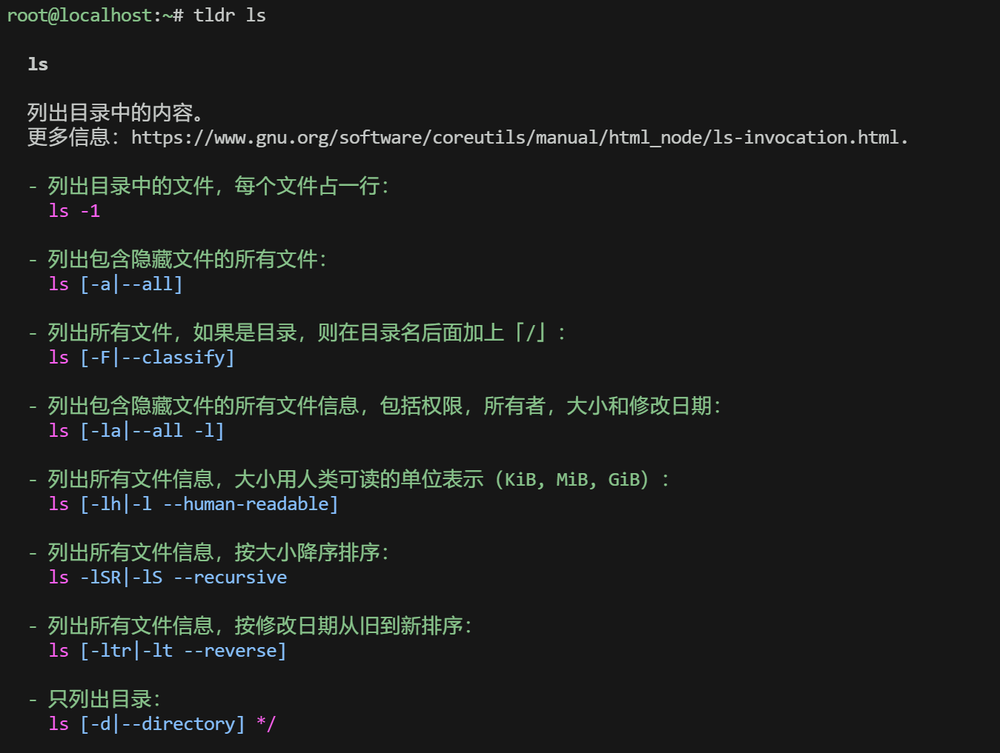

# 命令分类与执行过程

## shell中可执行的两类命令


### 内部命令

- 内部命令：指集成在特定shell中的命令，当用户登陆时，会自动启用shell，而对应的shell程序中包含一些常见工具。默认的/bin/bash  shell中就集成了很多内部命令，可以通过enable命令查看所有内部命令

- 查看内部命令

  ```bash
  [root@magedu ~]# enable
  enable .
  enable :
  enable [
  enable alias
  enable bg
  enable bind
  enable break
  enable builtin
  enable caller
  enable cd
  enable command
  enable compgen
  enable complete
  enable compopt
  enable continue
  enable declare
  ......
  ```


### 外部命令

- 外部命令

  - 概述：所谓外部命令，就是没有集成在shell程序中。具体表现为一个独立的可执行文件。所以外部命令都能在磁盘中找到对应文件

  - 系统查看外部命令的方式

    - 在系统中有一个叫PATH的变量，里面保存外部命令存放的路径。具体路径可以通过下面命令查看，当执行一个外部命令时， 系统会按PATH中存放的目录路径顺序来查找，一旦在某个目录中找到，就停止继续往下找，并执行此外部命令

    ```bash
    [root@magedu ~]# echo $PATH
    /root/.local/bin:/root/bin:/usr/local/sbin:/usr/local/bin:/usr/sbin:/usr/bin
    ```

  - 不同用户的$PATH不同

    ```bash
    # root用户的$PATH路径
    [root@localhost ~]# echo $PATH
    /root/.local/bin:/root/bin:/usr/local/sbin:/sbin:/bin:/usr/sbin:/usr/bin
    
    # magedu用户的$PATH路径
    [magedu@localhost ~]# echo $PATH
    /home/magedu/.local/bin:/home/magedu/bin:/usr/local/sbin:/usr/local/bin:/usr/sbin:/usr/bin:/sbin:/bin
    ```

    

  - 查看外部命令存放路径

    - which
    - whereis：除了命令外，还显示和命令相关的帮助文档等文件路径

    ```bash
    [root@magedu ~]# which gcc
    /usr/bin/gcc
    
    [root@magedu ~]# whereis gcc
    gcc: /usr/bin/gcc /usr/lib/gcc /usr/libexec/gcc /usr/share/man/man1/gcc.1.gz /usr/share/info/gcc.info.gz
    ```

  - 当第一次执行外部命令后，系统会自动将外部的路径记录到内存缓存区中，下次再执行此外部命令，将会从缓存区中找到路径， 直接到对应的磁盘路径找到此命令并执行。通过hash命令可以查看到已执行过的外部命令及路径

    ```bash
    [root@magedu ~]# hash
    hits	command
       1	/usr/bin/mesg
       1	/usr/bin/vim
    
    ```

  - shell 的 hash 表机制主要用于跟踪和缓存 `$PATH`环境变量指定的目录中找到的命令的位置。非`$PATH`记录的路径下的程序，执行后也不会记录在hash中 


### hash缓存表

系统初始hash表为空，当外部命令执行时，默认会从PATH路径下寻找该命令，找到后会将这条命令的路径记录到hash表中，当再次使用该命令时，shell解释器首先会查看hash表，存在将执行之，如果不存在，将会去PATH路径下寻找，利用hash缓存表可大大提高命令的调用速率。


hash 只对当前用户的当前终端进程有效，是一组**临时数据**；

切换用户后无效；

退出重新登录后会被重置；


hash 命令常见用法

```bash
hash                    # 显示当前终端进程中的 hash 缓存
hash -l                 # 显示详细创建此条 hash 的命令，可作为输入使用
hash -p path name       # 手动创建 hash
hash -t name            # 输出路径
hash -d name            # 删除指定 hash
hash -r                 # 清空所有 hash
```


范例：

```bash
[root@localhost ~]# hash
hits    command
   1    /bin/mesg
   1    /bin/ls
   
[root@localhost ~]# hash -l
builtin hash -p /bin/mesg mesg
builtin hash -p /bin/ls ls

# 手动创建 hash
[root@localhost ~]# builtin hash -p /abc abc
[root@localhost ~]# hash
hits    command
   1    /bin/mesg
   0    /abc
   1    /bin/ls
   
   
# 输出路径
[root@localhost ~]# hash -t ls
/bin/ls


# 删除指定hash
[root@localhost ~]# hash -d ls

# 清空所有hash
[root@localhost ~]# hash -r
```


## 别名

- 概述：所谓别名，就是将一些常用的内部或外部命令，起一个较短的名称，这样每次执行这些常用命令时，就可以用别名替代

- 管理和查看别名

  ```bash
  # 查看所有别名
  $ alias
  
  # 查看指定别名
  $ alias 别名
  
  # 定义别名
  $ alias 别名="命令"
  
  # 取消别名
  $ unlias 别名
  ```

- 上述命令都是使别名临时生效，如果要使别名永久生效，需要写入配置文件(.bashrc)中

  - 仅对当前用户有效，写入 ~/.bashrc
  - 对所有人有效，写入 /etc/.bashrc
  - 启用配置文件：`source 文件名` 或  `. 文件名`

- 执行和别名相同的命令时，需要 `\别名` 或`'别名'` 或 `"别名"` 或 `command 别名`


范例：删除换为移动到垃圾箱

```bash
[root@localhost ~/test]# alias rm
alias rm='time=$(date +%Y-%m-%d-%H:%M:%S); mkdir -p /data/backup/${time}; mv -t /data/backup/${time}'
```


## 指令执行过程

1. 先判断是内部命令还是外部命令

2. 如果是内部命令：直接执行

   如果是外部命令：先去hash里找，是否有该命令记录，如果没有，去PATH路径下找，如果还没有，则报错，command not found；如果找到， 则直接执行，并将可执行文件的路径记录到hash中

3. 如果hash中有该指令路径，但是该指令路径已经转移，即使转移到了PATH路径下，仍然会报错，不存在该文件/目录，此时应清空hash值，重新执行指令

4. 清空hash值的方法

   ```bash
   # 更新（更改）PATH路径：会自动清空hash记录
   bash: hash -r
         hash -d <指定路径>
         hash -l <查看hash表详细数据>
         
   csh：rehash
   ```


### 相关实验

```bash
ls  # 执行ls，并在hash中留有记录
# 将ls转移到其他的$PATH路径下
mv /usr/bin/ls /usr/sbin/

# 执行ls显示失败
[root@mystical /usr/share/bash-completion] $ls
-bash: /usr/sbin/ls: No such file or directory

# 清空hash，则会重新去$PATH找该指令
hash -r

# 在执行即可成功
[root@mystical /usr/share/bash-completion] $ls
bash_completion  completions  helpers
```


### 命令执行优先级

```bat
别名 --> 内部命令 --> hash --> 外部命令
```


### 扩展问题

echo是shell内置命令，但是/usr/bin/echo，也存在独立与shell的外部命令echo，存在这个现象的原因

```basic
独立的非内置的 echo 存在有几个原因，主要是为了提供兼容性、标准化以及在特定情况下的灵活性。以下是一些具体的原因：

1. 标准化和兼容性
POSIX 标准：/usr/bin/echo 程序通常会遵循 POSIX 或其他相关标准，确保在不同的 Unix-like 系统上有一致的行为。
脚本兼容性：在编写可移植的 shell 脚本时，依赖于标准的 /usr/bin/echo 可能比使用特定 shell 的内置 echo 更可靠。

2. 独立于 Shell
不依赖于特定的 shell：独立的 echo 可以在没有启动 shell 的情况下直接执行，这对于某些脚本或系统程序很有用，尤其是在资源有限或需要避免启动完整 shell 会话的环境中。

3. 特定功能的需要
功能差异：不同的 shell 可能会在其内置的 echo 中实现不同的功能或选项。独立的 /usr/bin/echo 程序提供了一个统一的选项集，这可能在跨不同 shell 环境工作时非常有用。

4. 历史原因
遗留系统：在早期的 Unix 系统中，很多现在被认为是内置命令的工具最初是作为独立的程序存在的。随着时间的推移，为了性能和便利性，许多这样的程序被内置到了 shell 中。但是，独立的版本仍然被保留，以保证兼容性和符合标准。
```


## 命令格式

```bash
COMMAND [OPOTIONS...] [ARGUMENTS...]
COMMAND [COMMAND] [COMMAND] ...

COMMAND     # 命令
OPTIONS     # 选项，用于启用或关闭命令的某个或某些功能
ARGUMENTS   # 参数，命令的作用对象，比如：文件名，用户名等
[]          # 表示里面的内容是可选项，也就是说，一条命令，选项和参数是可以都没有的
...         # 表示可以有多个值，也就是说，一条命令，可以有多个选项，或多个参数
```


选项有多种风格：

- 短选项：UNIX风格选项

  ```bash
  [root@localhost ~]# ls -l -i
  total 12
  33883774 -rw-------. 1 root root  907 Jul  3 11:57 anaconda-ks.cfg
  18528789 drwxr-xr-x. 2 root root    6 Jul  8 09:23 Desktop
  18528790 drwxr-xr-x. 2 root root    6 Jul  8 09:23 Documents
  35582159 drwxr-xr-x. 2 root root    6 Jul  8 09:23 Downloads
  35582160 drwxr-xr-x. 2 root root    6 Jul  8 09:23 Music
  51588157 drwxr-xr-x. 2 root root    6 Jul  8 09:23 Pictures
   3552937 drwxr-xr-x. 2 root root    6 Jul  8 09:23 Public
  51588156 drwxr-xr-x. 2 root root    6 Jul  8 09:23 Templates
  51585325 drwxr-xr-x. 2 root root    6 Jul  8 09:46 test
  34782549 -rw-r--r--. 1 root root  319 Jul  4 12:17 test.sh
  35416137 drwxr-xr-x. 3 root root  109 Jul  4 10:45 tmux-onedark-theme
  35416138 -rw-r--r--. 1 root root 3686 Jul  4 10:42 tmux_seting.sh
   3552939 drwxr-xr-x. 2 root root    6 Jul  8 09:23 Videos
  ```

- 长选项：GNU风格选项

  ```bash
  [root@localhost ~]# which --help
  Usage: /usr/bin/which [options] [--] COMMAND [...]
  Write the full path of COMMAND(s) to standard output.
  
    --version, -[vV] Print version and exit successfully.
    --help,          Print this help and exit successfully.
    --skip-dot       Skip directories in PATH that start with a dot.
    --skip-tilde     Skip directories in PATH that start with a tilde.
    --show-dot       Don't expand a dot to current directory in output.
    --show-tilde     Output a tilde for HOME directory for non-root.
    --tty-only       Stop processing options on the right if not on tty.
    --all, -a        Print all matches in PATH, not just the first
    --read-alias, -i Read list of aliases from stdin.
    --skip-alias     Ignore option --read-alias; don't read stdin.
    --read-functions Read shell functions from stdin.
    --skip-functions Ignore option --read-functions; don't read stdin.
  ```

- BSD风格选项：一个字母，例如a，使用相对较少

  ```bash
  [root@localhost ~]# ps a
      PID TTY      STAT   TIME COMMAND
     2255 tty2     Ssl+   0:00 /usr/libexec/gdm-wayland-session /usr/bin/gnome-sessi
     2264 tty2     Sl+    0:00 /usr/libexec/gnome-session-binary
     3578 tty3     Ss+    0:00 /sbin/agetty -o -- \u --noreset --noclear - linux
     4744 pts/0    Ss     0:00 /bin/bash
     5022 pts/0    S+     0:00 sudo -i
     5026 pts/1    Ss     0:00 sudo -i
     5027 pts/1    S      0:00 -bash
     5080 pts/1    R+     0:00 ps a
     
  [root@localhost ~]# ps --help all
  
  Usage:
   ps [options]
  
  Basic options:
   -A, -e               all processes
   -a                   all with tty, except session leaders
    a                   all with tty, including other users
   -d                   all except session leaders
   -N, --deselect       negate selection
    r                   only running processes
    T                   all processes on this terminal
    x                   processes without controlling ttys
  ```

  


# 字符集和编码及语言环境

许多场合下，字符集与编码这两个概念常被混为一谈，但两者是有差别的。字符集与字符集编码是两个不同层面的概念

charset是character set的简写，即字符集，即二进制和字符的对应关系，不关注最终的存储形式

encoding是charset encoding的简写，即字符集编码，简称编码，实现如何将字符转化为实际的二进制 进行存储，编码决定了空间的使用的大小


计算机二进制，起源于美国


## ASCII码

计算机内部，所有信息最终都是一个二进制值。上个世纪60年代，美国制定了一套字符编码，对英语字 符与二进制位之间的关系，做了统一规定，即ASCII（American Standard Code for Information   Interchange） 码

ASCII 码一共规定了128个字符的编码，占用了一个字节的后面7位，最前面的一位统一规定为 0


### 查看ASCII表

```bash
[root@localhost ~/test]# yum install -y man-pages

[root@localhost ~/test]# man ascii
AME
       ascii - ASCII character set encoded in octal, decimal, and hexadecimal

DESCRIPTION
       ASCII  is  the  American  Standard Code for Information Interchange.  It is a 7-bit code.  Many 8-bit
       codes (e.g., ISO 8859-1) contain ASCII as their lower half.  The international counterpart  of  ASCII
       is known as ISO 646-IRV.

       The following table contains the 128 ASCII characters.

       C program '\X' escapes are noted.
                                                   │
       Oct   Dec   Hex   Char                      │ Oct   Dec   Hex   Char
       ────────────────────────────────────────────┼───────────────────────────
       000   0     00    NUL '\0' (null character) │ 100   64    40    @
       001   1     01    SOH (start of heading)    │ 101   65    41    A
       002   2     02    STX (start of text)       │ 102   66    42    B
       003   3     03    ETX (end of text)         │ 103   67    43    C
       004   4     04    EOT (end of transmission) │ 104   68    44    D
......
```


## Unicode

由于计算机是美国人发明的，因此，最早只有128个字符被编码到计算机里，即ASCII编码，但是要处理 中文显然一个字节是不够的，至少需要两个字节，而且还不能和ASCII编码冲突，所以，中国制定了  GB2312编码，用来把中文编进去。

全世界有上百种语言，日本把日文编到Shift_JIS里，韩国把韩文编到Euc-kr里，各国有各国的标准，就会 不可避免地出现冲突，结果就是，在多语言混合的文本中，显示出来会有乱码

为了表示世界上所有语言中的所有字符。每一个符号都给予一个独一无二的编码数字，Unicode 是一个 很大的集合，现在的规模可以容纳100多万个符号。Unicode 仅仅只是一个字符集，规定了每个字符对 应的二进制代码，至于这个二进制代码如何存储则没有规定


### Unicode编码方案

- UTF-8：  变长，1到4个字节
- UTF-16：变长，2或4个字节
- UTF-32：固定长度，4个字节

UTF-8 是目前互联网上使用最广泛的一种 Unicode 编码方式，可变长存储。使用 1- 4 个字节表示一个字 符，根据字符的不同变换长度。编码规则如下:

- 对于单个字节的字符，第一位设为 0，后面的 7 位对应这个字符的 Unicode 码。因此，对于英文中的 0  - 127 号字符，与 ASCII 码完全相同。这意味着 ASCII 码的文档可用 UTF-8 编码打
- 对于需要使用 N 个字节来表示的字符（N > 1），第一个字节的前 N 位都设为 1，第 N + 1 位设为0，剩余的 N - 1 个字节的前两位都设为 10，剩下的二进制位则使用这个字符的 Unicode 码来填充


### UTF-8编码流程

以 Unicode 码点编号：“中” 为例

```vb
字符 "中" 在 Unicode 中的编号是：
十进制：20013
十六进制：U+4E2D

```

- U+4E2D = 十进制 20013

- 超过 0x0800，需要 3 字节表示 → UTF-8 格式：`1110xxxx 10xxxxxx 10xxxxxx`

- 填入码点的二进制（0000 0100 1110 0010 1101）→ 取后 16 位 → 填入：

```bash
11100100 10111000 10101101
   E4        B8        AD
```


### UTF-16编码流程

码点在基本多文种平面内（BMP），直接存储 → 就是 `4E 2D`

二进制是：`01001110 00101101`


## 语言环境

默认系统为英文环境，可以修改为中文环境，从而查看帮助或提示可以变为中文

范例：临时修改LANG变量实现中文语言提示

```bash
[root@localhost ~/test]# echo $LANG
en_US.UTF-8             # 英文是en_US.UTF-8

[root@centos7 ~]#magedu
-bash: magedu: command not found

[root@centos7 ~]#LANG=zh_CN.UTF-8

[root@centos7 ~]#echo $LANG
zh_CN.UTF-8

[root@centos7 ~]#magedu
-bash: magedu: 未找到命
```

```bash
[root@localhost ~/test]# localectl list-locales 
C.UTF-8
aa_DJ.UTF-8
aa_ER.UTF-8
aa_ER.UTF-8@saaho
aa_ET.UTF-8
af_ZA.UTF-8
agr_PE.UTF-8
ak_GH.UTF-8
am_ET.UTF-8
an_ES.UTF-8
......

# 如果没有中文包，安装
[root@localhost ~/test]# yum install -y langpacks-zh_CN.noarch

# 通过方法
[root@rocky8 ~]#localectl set-locale LANG=zh_CN.utf8

#或者下面方式,CentOS8支持,但ubuntu和Centos7不支持,不建议使用
[root@rocky8 ~]#localectl set-locale zh_CN.utf8

[root@localhost ~/test]# localectl status
System Locale: LANG=zh_CN.UTF-8
    VC Keymap: us
   X11 Layout: us
   
[root@rocky8 ~]#echo $LANG
 zh_CN.utf8
 
#重新登录后可以看到中文环境
[root@rocky8 ~]#exit
```


范例: Ubuntu 修改语言环境为中文

```bash
[root@ubuntu2204 ~]# localectl status
   System Locale: LANG=en_US.UTF-8
       VC Keymap: n/a
      X11 Layout: us
       X11 Model: pc105
       
[root@ubuntu2204 ~]# apt install language-pack-zh-hans -y

[root@ubuntu2204 ~]# localectl list-locales
C.UTF-8
en_US.UTF-8
zh_CN.UTF-8
zh_SG.UTF-8
......

[root@ubuntu2204 ~]# localectl set-locale LANG=zh_CN.utf8
```

 


# 历史命令与命令补齐

## 命令补全

功能需求

```basic
在linux系统环境里面，我们管理各种应用都是通过命令来实现的，但是有很多时候，命令太长记不住，我们只记住前面的1-2个字母，后面的内容不知道。
对于linux来说，它提供了命令补全的能力，也就是说，我们可以通过 Tab键的方式，将我们要敲出来的命令在命令行自动补全。
- 用户给定的字符串只有一条惟一对应的命令，直接补全，否则，再次Tab会给出列表
```

补全功能

```basic
在linux系统里面，关于Tab键补全的功能，主要体现在两个方面：
- 路径的补全
- 命令的补全
```


### 命令补全实践

路径补全

```bash
# 单Tab键自动补全文件路径
[root@rocky9 ~]# ls /etc/hostn^C
[root@rocky9 ~]# ls /etc/hostname

# 双Tab键查看满足要求的目录
[root@rocky9 ~]# ls /etc/de
debuginfod/ default/ depmod.d/
```

命令补全

```bash
# Tab键查看满足要求的命令
[root@rocky9 ~]# time^C
[root@rocky9 ~]# time
time  timedatectl  timeout times
```


### 命令行展开

- 所谓命令行展开，即把命令行中给定的特殊符号自动替换为相应字符串的机制。在Bash Shell中有些符号有特殊含义

  - `~` : 自动替换为用户家目录
  - `~USERNAME`: 自动替换为指定用户的家目录
  - `{}`: 可包含一个以逗号分隔的字符串或序列，能够将其展开为多个字符串

  ```shell
  a{d,c,b}e  # ade, ace, abe
  /tmp/{a,b,c}  # /tmp/a, /tmp/b, /tmp/c
  /tmp/{a,b}/z  # /tmp/a/z, /tmp/b/z
  {1..6}  # 1,2,3,4,5,6
  {1..10..2}  # 1,3,5,7,9
  {a..d}  # a,b,c,d
  ```


## history命令


```bash
# 语法：
history -c  
# 清空历史命令，仅清空命令缓存区的命令，不影响.bash_history

history -d offset
[Tue Oct 17 10:52:59 22] root@rocky9:~ #history | tail -n 10
 1011  cat .bash_history 
 1012  cat oldfile.txt 
 1013  getent passwd root
 1014  getent passwd | tail -n 10
 1015  getent passwd
 1016  history
 1017  history -d 999
 1018  history | tail -n 20 # 1018
 1019  history | tail -n 30
 1020  history | tail -n 10
[Tue Oct 17 10:54:14 23] root@rocky9:~ #history -d 1017
[Tue Oct 17 10:54:35 24] root@rocky9:~ #history | tail -n 10
 1012  cat oldfile.txt 
 1013  getent passwd root
 1014  getent passwd | tail -n 10
 1015  getent passwd
 1016  history
 1017  history | tail -n 20 # 1017
 1018  history | tail -n 30
 1019  history | tail -n 10
 1020  history -d 1017
 1021  history | tail -n 10

# 删除命令缓存区中指定编号的历史命令
# 删除后，后面的命令编号会依次往前提

history n  # 显示最近的n条命令，等同于history|tail -n <num>

history -a # 立即追加命令缓存区中的命令到历史文件中

history -w # 将命令缓存区的当前内容覆盖到.bash_history文件。
history -w <new_file> # 将命令缓存区中的内容存储到指定文件中

history -r # 从.bash_history读取命令到命令缓存区，通常在开始新会话时使用。
history -r <new_file> # 从指定文件中读取命令到缓存区

history -p <指定历史命令> # 将指定的数据显示在标准输出
# 输出的指令不会执行，也不会出现在历史缓存区中
[Tue Oct 17 14:13:14 50] root@rocky9:Storage #history
    1  ls
    2  touch test2.txt
    3  echo "hello" >> test2.txt 
    4  cat test2.txt 
    5  history
[Tue Oct 17 14:13:22 51] root@rocky9:Storage #history -p \!-2
cat test2.txt 

history -s # 将参数作为单独的条目添加到历史列表的末尾。
# 这允许你将一个或多个命令手动添加到历史记录中。
history -s "echo hello" # 将echo hello加入历史缓存区，但是不会执行
```


**history命令解析**

```bash
[root@magedu ~]# history --help
history: history [-c] [-d offset] [n] or history -anrw [filename] or history -ps arg [arg...]
    Display or manipulate the history list.
    
    Display the history list with line numbers, prefixing each modified
    entry with a `*'.  An argument of N lists only the last N entries.
    
    Options:
      -c	clear the history list by deleting all of the entries
      ......
```


**常用history命令**

重复执行上一条命令

```basic
- 重复前一个命令使用上方向键，并回车执行
- 按 !! 并回车执行
```

重复执行之前的命令

```basic
- 按 !n 执行history命令列表中的第n编号的命令
- 按 !string 重复前一个以“string”开头的命令
```

```basic
- 按 ctrl-r来在命令历史中搜索命令
（reverse-i-search）`’：
- 按 Ctrl+g：从历史搜索模式退出
```


## Linux快捷键

```basic
命令行切换：
	Ctrl + A           光标迅速回到行首
	Ctrl + E           光标迅速回到行尾
	Ctrl + k           删除光标到行尾的内容
	Ctrl + u           删除光标到行首的内容
	Ctrl + y           粘贴删除的内容
```


# 文本管理

## 文件查看

### 文件查看 cat

cat 可以查看文本内容

```bat
命令格式
	cat [OPTION]... [FILE]...
常见选项
	-n|--number                    #对显示出的每一行进行编号
一般选项
	-E|--show-ends                 #显示行结束符$
	-A|--show-all                  #显示所有控制符
	-b|--number-nonblank           # 非空行编号
	-s|--squeeze-blank             # 压缩连续的空行成一行
```

cat命令实践

```bash
[root@magedu ~]# cat /etc/fstab 
# /etc/fstab: static file system information.
#
# Use 'blkid' to print the universally unique identifier for a
# device; this may be used with UUID= as a more robust way to name devices
# that works even if disks are added and removed. See fstab(5).
#
# <file system> <mount point>   <type>  <options>       <dump>  <pass>
# / was on /dev/sda2 during curtin installation
/dev/disk/by-uuid/0a79113d-8e15-4ad2-944d-701c83b23c24 / ext4 defaults 0 1
/swap.img	none	swap	sw	0	0


# 显示所有字符（包含隐藏字符）
[root@magedu ~]# cat -A /etc/fstab 
# /etc/fstab: static file system information.$
#$
# Use 'blkid' to print the universally unique identifier for a$
# device; this may be used with UUID= as a more robust way to name devices$
# that works even if disks are added and removed. See fstab(5).$
#$
# <file system> <mount point>   <type>  <options>       <dump>  <pass>$
# / was on /dev/sda2 during curtin installation$
/dev/disk/by-uuid/0a79113d-8e15-4ad2-944d-701c83b23c24 / ext4 defaults 0 1$
/swap.img^Inone^Iswap^Isw^I0^I0$


# 查看时显示行号
[root@magedu ~]# cat -n /etc/fstab 
     1	# /etc/fstab: static file system information.
     2	#
     3	# Use 'blkid' to print the universally unique identifier for a
     4	# device; this may be used with UUID= as a more robust way to name devices
     5	# that works even if disks are added and removed. See fstab(5).
     6	#
     7	# <file system> <mount point>   <type>  <options>       <dump>  <pass>
     8	# / was on /dev/sda2 during curtin installation
     9	/dev/disk/by-uuid/0a79113d-8e15-4ad2-944d-701c83b23c24 / ext4 defaults 0 1
    10	/swap.img	none	swap	sw	0	0
```


## 分页查看

### more解读

more 可以实现分页查看文件，可以配合管道实现输出信息的分页

```bat
命令格式
	more [OPTIONS...] FILE...

常用选项
	-d              # 在底部显示提示
	-s              # 压缩连续空行
	
常用动作
	空格键           # 翻页
	回车键           # 下一页
	q               # 退出
	
其他动作
	!cmd            # 执行命令，在查看文档的时候，执行相关的命令
	h               # 显示帮助
	:f              # 显示文件名和当前行号
	=               # 显示行号
```

示例

```bash
[root@magedu ~]# more /var/log/syslog
2025-06-08T14:12:26.537269+08:00 magedu rsyslogd: [origin software="rsyslogd" swVersion="8.2312.0" 
x-pid="1309" x-info="https://www.rsyslog.com"] rsyslogd was HUPed
2025-06-08T14:12:26.538899+08:00 magedu snapd[1277]: overlord.go:284: Acquiring state lock file
2025-06-08T14:12:26.538955+08:00 magedu snapd[1277]: overlord.go:289: Acquired state lock file
2025-06-08T14:12:26.543807+08:00 magedu systemd[1]: logrotate.service: Deactivated successfully.
2025-06-08T14:12:26.544050+08:00 magedu systemd[1]: Finished logrotate.service - Rotate log files.
2025-06-08T14:12:26.547989+08:00 magedu systemd[1]: Finished setvtrgb.service - Set console scheme.
2025-06-08T14:12:26.559757+08:00 magedu systemd[1]: Created slice system-getty.slice - Slice /syste
m/getty.
......
```


### less解读

less 也可以实现分页查看文件或STDIN输出，less 命令是man命令使用的分页器

```bat
命令格式
	less [OPTIONS...] FILE...

常用选项
	-e          #显示完成后自动退出
	-N          #显示行号
	-s          #压缩连续空行
	-S          #不换行显示较长的内容

查看动作
	:h          # 显示帮助
	/string     # 搜索
	:!cmd       # 执行命令
	b           # 向上翻
	q           # 退出
```

示例

```bash
# 分页查看的时候，显示行号
[root@magedu ~]# less -N /var/log/auth.log
```


## 头尾查看

### head命令

head 可以显示文件或标准输入的前面行

```bat
命令格式
	head [OPTION]... [FILE]...

常用选项
-n|--lines=N              #指定获取前N行,N如果为负数,表示从文件头取到倒数第N前

一般选项
-c|--bytes=N              #指定获取前N字节
```

示例

```bat
默认查看文件的前10行的内容
[root@magedu ~]# head /etc/passwd
root:x:0:0:root:/root:/bin/bash
daemon:x:1:1:daemon:/usr/sbin:/usr/sbin/nologin
bin:x:2:2:bin:/bin:/usr/sbin/nologin
sys:x:3:3:sys:/dev:/usr/sbin/nologin
sync:x:4:65534:sync:/bin:/bin/sync
games:x:5:60:games:/usr/games:/usr/sbin/nologin
man:x:6:12:man:/var/cache/man:/usr/sbin/nologin
lp:x:7:7:lp:/var/spool/lpd:/usr/sbin/nologin
mail:x:8:8:mail:/var/mail:/usr/sbin/nologin
news:x:9:9:news:/var/spool/news:/usr/sbin/nologin

-n 指定显示的行数
[root@magedu ~]# head -n3 /etc/passwd
root:x:0:0:root:/root:/bin/bash
daemon:x:1:1:daemon:/usr/sbin:/usr/sbin/nologin
bin:x:2:2:bin:/bin:/usr/sbin/nologin

-c 指定字符串数量进行截取
[root@magedu ~]# head -c5 /etc/passwd
root:
```


### tail命令

tail 和 head 相反，查看文件或标准输入的倒数行

```bat
命令格式
tail [OPTION]... [FILE]...

常用选项
-n|--lines=N              #指定获取后N行,如果写成+N,表示从第N行开始到文件结束

一般选项
-c|--bytes=N              #指定获取后N字节
-f|--follow=descriptor    #跟踪显示文件fd新追加的内容,常用日志监控
```

示例

```bat
[root@magedu ~]# tail /etc/passwd
saned:x:112:116::/var/lib/saned:/usr/sbin/nologin
lightdm:x:113:117:Light Display Manager:/var/lib/lightdm:/bin/false
cups-pk-helper:x:114:119:user for cups-pk-helper service,,,:/nonexistent:/usr/sbin/nologin
rtkit:x:115:120:RealtimeKit,,,:/proc:/usr/sbin/nologin
colord:x:116:121:colord colour management daemon,,,:/var/lib/colord:/usr/sbin/nologin
pulse:x:117:122:PulseAudio daemon,,,:/run/pulse:/usr/sbin/nologin
cups-browsed:x:118:119::/nonexistent:/usr/sbin/nologin
kernoops:x:119:65534:Kernel Oops Tracking Daemon,,,:/:/usr/sbin/nologin
speech-dispatcher:x:120:29:Speech Dispatcher,,,:/run/speech-dispatcher:/bin/false
hplip:x:121:7:HPLIP system user,,,:/run/hplip:/bin/false

[root@magedu ~]# tail -n3 /etc/passwd
kernoops:x:119:65534:Kernel Oops Tracking Daemon,,,:/:/usr/sbin/nologin
speech-dispatcher:x:120:29:Speech Dispatcher,,,:/run/speech-dispatcher:/bin/false
hplip:x:121:7:HPLIP system user,,,:/run/hplip:/bin/false
```


# 获得帮助


**获取帮助的能力决定了技术的能力！**


- whatis & whereis 命令
- command --help 选项
- man 手册
- 程序自带文档 /usr/share/doc
- 项目官网文档
- 行业网站
- 搜索引擎


## whatis & whereis

whatis 使用数据库来显示命令的简短描述，以及对应的man手册的章节

刚装完系统此命令不可用，其数据要进行初始化

如果要立即使用，则可手动初始化

```bash
# CentOS 7 版本以后
mandb

# CentOS 6 版本之前
makewhatis
```


示例

```bash
[root@magedu cache]# whatis ls
ls (1)               - list directory contents
ls (1p)              - list directory contents

[root@magedu cache]# mandb
正在删除 /usr/share/man/overrides 里的旧数据库条目...
正在处理 /usr/share/man/overrides 下的手册页...
正在删除 /usr/share/man 里的旧数据库条目...
正在处理 /usr/share/man 下的手册页...
正在删除 /usr/share/man/overrides 里的旧数据库条目...
......
```


whereis 可以列出命令或系统文件路径，以及其对应的man 手册中的文档路径

```bash
[root@magedu cache]# whereis ls
ls: /usr/bin/ls /usr/share/man/man1/ls.1.gz /usr/share/man/man1p/ls.1p.gz

[root@magedu cache]# whereis passwd
passwd: /usr/bin/passwd /etc/passwd /usr/share/man/man5/passwd.5.gz /usr/share/man/man1/passwd.1ossl.gz /usr/share/man/man1/passwd.1.gz
```


## 查看命令的帮助

### 内部命令帮助

格斯：

```ABAP
help COMMAND
```


范例：

```bash
# 直接help，查看所有内部命令帮助
[root@magedu cache]# help

[root@magedu ~]# type history
history is a shell builtin

[root@magedu ~]# help history
history: history [-c] [-d offset] [n] or history -anrw [filename] or history -ps arg [arg...]
    Display or manipulate the history list.
......
```


### 外部命令及软件帮助

格式：

```bash
COMMAND --help|-h

man COMMAND

info COMMAND

#程序自身的帮助文档：README、INSTALL、ChangeLog 等

#项目官网文档

#行业网站

# 搜索引擎
```


## 外部命令的 --help 或 -h 选项

显示用法总结和参数列表，大多数命令使用，但并非所有的

范例

```bash
[root@magedu ~]# ls --help
Usage: ls [OPTION]... [FILE]...
List information about the FILEs (the current directory by default).
Sort entries alphabetically if none of -cftuvSUX nor --sort is specified.

Mandatory arguments to long options are mandatory for short options too.
  -a, --all                  do not ignore entries starting with .
  -A, --almost-all           do not list implied . and ..
......


[root@magedu ~]# cal -h

Usage:
 cal [options] [[[day] month] year]
 cal [options] <timestamp|monthname>

Display a calendar, or some part of it.
Without any arguments, display the current month.

Options:
 -1, --one             show only a single month (default)
 -3, --three           show three months spanning the date
......
```

| 常见用法 | 含义                           |
| -------- | ------------------------------ |
| []       | 表示是可选项                   |
| CAPS或<> | 表示变化的数据                 |
| ...      | 表示是一个列表，即可以有多个值 |
| x\|y\|z  | x 或 y 或 z                    |
| -abc     | -a -b -c，多选项写一起         |
| {}       | 表示分组                       |


## man命令

man 是单词 manual 的简写，是Linux系统中的帮助手册和文档

man 是一个外部命令，基本质就是读取特定文件，进行输出，其读取的文件一般位于**/usr/share/man/**  目录下

新安装一个软件或程序后，对应的man手册也会放到/usr/share/man/目录下

几乎每个命令都有man的 “页面”


安装

```bash
[root@magedu ~]# yum install -y man-pages
```


**标准man手册一般有以下几个章节**

1. 可执行程序或shell命令
2. 系统调用（内核提供的函数）
3. 库调用（程序库中的函数）
4. 特殊文件（通常位于/dev）
5. 文件格式和规范，如 /etc/passwd
6. 游戏
7. 杂项
8. 系统管理命令（通常只针对 root 用户）
9. 内核API


**man 命令的配置文件**

```bash
#CentOS 6 之前版 man 的配置文件
/etc/man.config

#CentOS 7 之后版 man 的配置文件
/etc/man_db.conf

#ubuntu man 的配置文件
/etc/manpath.config
```


**man命令常见用法**

```bash
#man[选项...] [章节] 手册页...

man passwd                           # 默认打开第一章帮助
man 5 passwd                         # 指定第五章帮助
man 9 passwd                         # 总共9个章节，中间的数字不能超过9，如果要找的章节里面没有对应的内容，则会提示没有
man 10 passwd                        # 总共9个章节，中间的数字不能超过9，如果是数字大于9，则直接定位到最小的章
man -a passwd                        # 打开所有帮助
man -f passwd                        # 显示passwd 相关的章节，相当于 whatis passwd
man -k passwd                        # 在man 手册中搜索所有与passwd 相关的内容，使用 whatis 数据库

man -w ls                            # 显示ls的man 文件路径
man -aw passwd                       # 显示所有跟passwd有关的man文件路径
man -w 5 passwd                      # 显示第5章的passwd的man文件路径
man -M /usr/local/share/man/zh_CN    #显示中文man 的内容
```


**man命令操作**

常见操作

```bat
/KEYWORD     根据KEYWORD关键字，从当前位置向后搜索；不区分字符大小写
?KEYWORD     根据KEYWORD关键字，从当前位置向前搜索；不区分字符大小写 
q            退出
```

其他操作

```bat
#：跳转至第#行
1G: 回到文件首部
G：翻至文件尾部
space, ^v, ^f, ^F: 向文件尾翻屏
b, ^b: 向文件首部翻屏
d, ^d: 向文件尾部翻半屏
u, ^u: 向文件首部翻半屏
RETURN, ^N, e, ^E or j or ^J: 向文件尾部翻一行 
y or ^Y or ^P or k or ^K：向文件首部翻一行
```


**man命令参数**

```bat
列出所有帮助
	man -a keyword

搜索man手册所有匹配的页面
	man -k keyword

打印keyword的man帮助文件的路径
	man -w keyword
```


范例：直接打开man的帮助文件

```bash
[root@ubuntu2204 ~]# man -w ls
/usr/share/man/man1/ls.1.gz

[root@ubuntu2204 ~]# file /usr/share/man/man1/ls.1.gz 
/usr/share/man/man1/ls.1.gz: gzip compressed data, max compression, from Unix, 
original size modulo 2^32 8049

#直接打开man的gz压缩格式文档
[root@ubuntu2204 ~]# man /usr/share/man/man1/ls.1.gz

#直接打开man格式文档
[root@ubuntu2204 ~]# file /root/nginx-1.22.1/man/nginx.8 
/root/nginx-1.22.1/man/nginx.8: troff or preprocessor input, ASCII text

[rootq@ubuntu2204 ~]# man -l /root/nginx-1.22.1/man/nginx.8
```


**Rocky: 安装中文 man 文档**

使用第三方开源中文 man 项目（推荐）

编译安装 OpenCC
```bash
git clone https://github.com/BYVoid/OpenCC.git                  
chown -R $USER:$USER OpenCC 
cd OpenCC/
mkdir build
cd build
# 需要安装 cmake, gcc-c++, python3
# yum install -y cmake gcc-c++ python3
cmake -DCMAKE_BUILD_TYPE=Release ..
make -j"$(nproc)"
make install
```
把 /usr/local/lib（或 lib64）加入动态库搜索路径
```bash
bash -c 'cat >/etc/ld.so.conf.d/opencc.conf <<EOF
/usr/local/lib
/usr/local/lib64
EOF'

ldconfig
# 查看

ldconfig -p | grep opencc
```
GitHub 项目：`man-pages-zh`：
```go
git clone https://github.com/man-pages-zh/manpages-zh
cd manpages-zh
mkdir build
cd build
cmake ..
make
make install
```
这会将中文 man 文档安装到：
```go
/usr/local/share/man/zh_CN/
```


**Ubuntu / Debian**

<span style="color:#EB992D;font-weight:700">安装中文语言包</span>

```go
apt install language-pack-zh-hans language-pack-zh-hans-base
```
验证：
```go
dpkg -l | grep language-pack-zh
```

<span style="color:#EB992D;font-weight:700">安装中文 man 文档</span>
```go
apt install manpages-zh
```


## 系统及第三方应用官方文档


### Linux官方在线文档和知识库

通过发行版官方的文档光盘或网站可以获得安装指南、部署指南、虚拟化指南等

```bash
http://www.redhat.com/docs
http://kbase.redhat.com
http://access.redhat.com
https://help.ubuntu.com/lts/serverguide/index.html
http://tldp.org
```


### 通过在线文档获取帮助

通过在线文档获取帮助

```bash
https://www.github.com
https://www.kernel.org/doc/html/latest/
https://httpd.apache.org
https://www.nginx.org
https://mariadb.com/kb/en
https://dev.mysql.com/doc/
https://tomcat.apache.org
https://jenkins.io/zh/doc/
......
```


## TLDR命令

当我们在使用一个不熟悉的命令时，可以使用 -h 或 --help 选项来查看帮助，或者使用 man 手册还查看 更详细的文档，但这两种方式，会列出所有选项，而有些选项很少使用，根据二八原则，只有一小部份 选项才是最常用的，如是基于此，有人开发了一个开源的查看命令工具，此工具只列出命令的常用选项的帮助。


TLDR: Too Long；Didn’t Read(太长不看)，也可以叫作 “偷懒的人“


项目主页

```http
https://github.com/tldr-pages/tldr
```


```bash
# 安装Node.js和npm
[root@magedu ~]# apt update
[root@magedu ~]# apt install nodejs npm

# 注意nodejs必须是Node 16+
# node -v 查看版本
# Rocky建议使用下面命令下载
[root@magedu ~]# curl -fsSL https://rpm.nodesource.com/setup_18.x | bash -
[root@magedu ~]# yum install -y nodejs npm

# 安装 tldr 命令行客户端
[root@magedu ~]# npm install -g tldr

# 安装完成后，验证 tldr 是否安装成功。在终端运行以下命令
[root@magedu ~]# tldr
Usage: tldr command [options]

Simplified and community-driven man pages

Options:
  -v, --version            Display version
  -l, --list               List all commands for the chosen platform in the cache
......

# 使用示例
# 第一次会先下载数据，因此会比较慢，耐心等待
[root@magedu ~]# tldr ls

  ls

  List directory contents.
  More information: https://www.gnu.org/software/coreutils/manual/html_node/ls-invocation.html.

  - List files one per line:
    ls -1

  - List all files, including hidden files:
    ls [-a|--all]
......
```

```bash
# 设置语言环境
[root@centos7 ~]#LANG=zh_CN.UTF-8

# 设置别名以使用样式
root@localhost:~# alias tldr
alias tldr='tldr -t base16'
```




