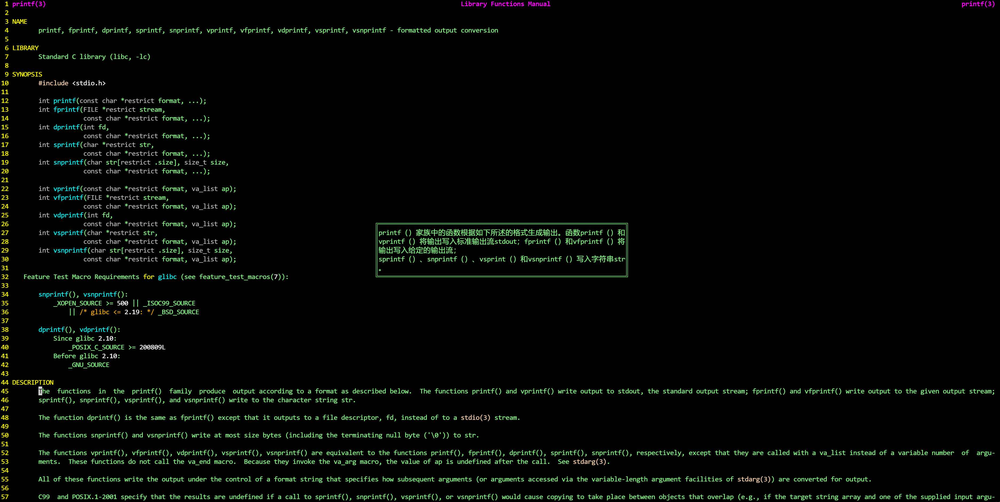

# 历史命令与命令补齐

## 命令补全

功能需求

```basic
在linux系统环境里面，我们管理各种应用都是通过命令来实现的，但是有很多时候，命令太长记不住，我们只记住前面的1-2个字母，后面的内容不知道。
对于linux来说，它提供了命令补全的能力，也就是说，我们可以通过 Tab键的方式，将我们要敲出来的命令在命令行自动补全。
- 用户给定的字符串只有一条惟一对应的命令，直接补全，否则，再次Tab会给出列表
```

补全功能

```basic
在linux系统里面，关于Tab键补全的功能，主要体现在两个方面：
- 路径的补全
- 命令的补全
```


### 命令补全实践

路径补全

```bash
# 单Tab键自动补全文件路径
[root@rocky9 ~]# ls /etc/hostn^C
[root@rocky9 ~]# ls /etc/hostname

# 双Tab键查看满足要求的目录
[root@rocky9 ~]# ls /etc/de
debuginfod/ default/ depmod.d/
```

命令补全

```bash
# Tab键查看满足要求的命令
[root@rocky9 ~]# time^C
[root@rocky9 ~]# time
time  timedatectl  timeout times
```


### 命令行展开

- 所谓命令行展开，即把命令行中给定的特殊符号自动替换为相应字符串的机制。在Bash Shell中有些符号有特殊含义

  - `~` : 自动替换为用户家目录
  - `~USERNAME`: 自动替换为指定用户的家目录
  - `{}`: 可包含一个以逗号分隔的字符串或序列，能够将其展开为多个字符串

  ```shell
  a{d,c,b}e  # ade, ace, abe
  /tmp/{a,b,c}  # /tmp/a, /tmp/b, /tmp/c
  /tmp/{a,b}/z  # /tmp/a/z, /tmp/b/z
  {1..6}  # 1,2,3,4,5,6
  {1..10..2}  # 1,3,5,7,9
  {a..d}  # a,b,c,d
  ```


## history命令


```bash
# 语法：
history -c  
# 清空历史命令，仅清空命令缓存区的命令，不影响.bash_history

history -d offset
[Tue Oct 17 10:52:59 22] root@rocky9:~ #history | tail -n 10
 1011  cat .bash_history 
 1012  cat oldfile.txt 
 1013  getent passwd root
 1014  getent passwd | tail -n 10
 1015  getent passwd
 1016  history
 1017  history -d 999
 1018  history | tail -n 20 # 1018
 1019  history | tail -n 30
 1020  history | tail -n 10
[Tue Oct 17 10:54:14 23] root@rocky9:~ #history -d 1017
[Tue Oct 17 10:54:35 24] root@rocky9:~ #history | tail -n 10
 1012  cat oldfile.txt 
 1013  getent passwd root
 1014  getent passwd | tail -n 10
 1015  getent passwd
 1016  history
 1017  history | tail -n 20 # 1017
 1018  history | tail -n 30
 1019  history | tail -n 10
 1020  history -d 1017
 1021  history | tail -n 10

# 删除命令缓存区中指定编号的历史命令
# 删除后，后面的命令编号会依次往前提

history n  # 显示最近的n条命令，等同于history|tail -n <num>

history -a # 立即追加命令缓存区中的命令到历史文件中

history -w # 将命令缓存区的当前内容覆盖到.bash_history文件。
history -w <new_file> # 将命令缓存区中的内容存储到指定文件中

history -r # 从.bash_history读取命令到命令缓存区，通常在开始新会话时使用。
history -r <new_file> # 从指定文件中读取命令到缓存区

history -p <指定历史命令> # 将指定的数据显示在标准输出
# 输出的指令不会执行，也不会出现在历史缓存区中
[Tue Oct 17 14:13:14 50] root@rocky9:Storage #history
    1  ls
    2  touch test2.txt
    3  echo "hello" >> test2.txt 
    4  cat test2.txt 
    5  history
[Tue Oct 17 14:13:22 51] root@rocky9:Storage #history -p \!-2
cat test2.txt 

history -s # 将参数作为单独的条目添加到历史列表的末尾。
# 这允许你将一个或多个命令手动添加到历史记录中。
history -s "echo hello" # 将echo hello加入历史缓存区，但是不会执行
```


**history命令解析**

```bash
[root@magedu ~]# history --help
history: history [-c] [-d offset] [n] or history -anrw [filename] or history -ps arg [arg...]
    Display or manipulate the history list.
    
    Display the history list with line numbers, prefixing each modified
    entry with a `*'.  An argument of N lists only the last N entries.
    
    Options:
      -c	clear the history list by deleting all of the entries
      ......
```

**常用history命令**

重复执行上一条命令

```basic
- 重复前一个命令使用上方向键，并回车执行
- 按 !! 并回车执行
```

重复执行之前的命令

```basic
- 按 !n 执行history命令列表中的第n编号的命令
- 按 !string 重复前一个以“string”开头的命令
```

```basic
- 按 ctrl-r来在命令历史中搜索命令
（reverse-i-search）`’：
- 按 Ctrl+g：从历史搜索模式退出
```


## Linux快捷键

```basic
命令行切换：
	Ctrl + A           光标迅速回到行首
	Ctrl + E           光标迅速回到行尾
	Ctrl + k           删除光标到行尾的内容
	Ctrl + u           删除光标到行首的内容
	Ctrl + y           粘贴删除的内容
```


# 文本管理

## 文件查看

### 文件查看 cat

cat 可以查看文本内容

```bat
命令格式
	cat [OPTION]... [FILE]...
常见选项
	-n|--number                    #对显示出的每一行进行编号
一般选项
	-E|--show-ends                 #显示行结束符$
	-A|--show-all                  #显示所有控制符
	-b|--number-nonblank           # 非空行编号
	-s|--squeeze-blank             # 压缩连续的空行成一行
```

cat命令实践

```bash
[root@magedu ~]# cat /etc/fstab 
# /etc/fstab: static file system information.
#
# Use 'blkid' to print the universally unique identifier for a
# device; this may be used with UUID= as a more robust way to name devices
# that works even if disks are added and removed. See fstab(5).
#
# <file system> <mount point>   <type>  <options>       <dump>  <pass>
# / was on /dev/sda2 during curtin installation
/dev/disk/by-uuid/0a79113d-8e15-4ad2-944d-701c83b23c24 / ext4 defaults 0 1
/swap.img	none	swap	sw	0	0


# 显示所有字符（包含隐藏字符）
[root@magedu ~]# cat -A /etc/fstab 
# /etc/fstab: static file system information.$
#$
# Use 'blkid' to print the universally unique identifier for a$
# device; this may be used with UUID= as a more robust way to name devices$
# that works even if disks are added and removed. See fstab(5).$
#$
# <file system> <mount point>   <type>  <options>       <dump>  <pass>$
# / was on /dev/sda2 during curtin installation$
/dev/disk/by-uuid/0a79113d-8e15-4ad2-944d-701c83b23c24 / ext4 defaults 0 1$
/swap.img^Inone^Iswap^Isw^I0^I0$


# 查看时显示行号
[root@magedu ~]# cat -n /etc/fstab 
     1	# /etc/fstab: static file system information.
     2	#
     3	# Use 'blkid' to print the universally unique identifier for a
     4	# device; this may be used with UUID= as a more robust way to name devices
     5	# that works even if disks are added and removed. See fstab(5).
     6	#
     7	# <file system> <mount point>   <type>  <options>       <dump>  <pass>
     8	# / was on /dev/sda2 during curtin installation
     9	/dev/disk/by-uuid/0a79113d-8e15-4ad2-944d-701c83b23c24 / ext4 defaults 0 1
    10	/swap.img	none	swap	sw	0	0
```


## 分页查看

### more解读

more 可以实现分页查看文件，可以配合管道实现输出信息的分页

```bat
命令格式
	more [OPTIONS...] FILE...

常用选项
	-d              # 在底部显示提示
	-s              # 压缩连续空行
	
常用动作
	空格键           # 翻页
	回车键           # 下一页
	q               # 退出
	
其他动作
	!cmd            # 执行命令，在查看文档的时候，执行相关的命令
	h               # 显示帮助
	:f              # 显示文件名和当前行号
	=               # 显示行号
```

示例

```bash
[root@magedu ~]# more /var/log/syslog
2025-06-08T14:12:26.537269+08:00 magedu rsyslogd: [origin software="rsyslogd" swVersion="8.2312.0" 
x-pid="1309" x-info="https://www.rsyslog.com"] rsyslogd was HUPed
2025-06-08T14:12:26.538899+08:00 magedu snapd[1277]: overlord.go:284: Acquiring state lock file
2025-06-08T14:12:26.538955+08:00 magedu snapd[1277]: overlord.go:289: Acquired state lock file
2025-06-08T14:12:26.543807+08:00 magedu systemd[1]: logrotate.service: Deactivated successfully.
2025-06-08T14:12:26.544050+08:00 magedu systemd[1]: Finished logrotate.service - Rotate log files.
2025-06-08T14:12:26.547989+08:00 magedu systemd[1]: Finished setvtrgb.service - Set console scheme.
2025-06-08T14:12:26.559757+08:00 magedu systemd[1]: Created slice system-getty.slice - Slice /syste
m/getty.
......
```


### less解读

less 也可以实现分页查看文件或STDIN输出，less 命令是man命令使用的分页器

```bat
命令格式
	less [OPTIONS...] FILE...

常用选项
	-e          #显示完成后自动退出
	-N          #显示行号
	-s          #压缩连续空行
	-S          #不换行显示较长的内容

查看动作
	:h          # 显示帮助
	/string     # 搜索
	:!cmd       # 执行命令
	b           # 向上翻
	q           # 退出
```

示例

```bash
# 分页查看的时候，显示行号
[root@magedu ~]# less -N /var/log/auth.log
```


## 头尾查看

### head命令

head 可以显示文件或标准输入的前面行

```bat
命令格式
	head [OPTION]... [FILE]...

常用选项
-n|--lines=N              #指定获取前N行,N如果为负数,表示从文件头取到倒数第N前

一般选项
-c|--bytes=N              #指定获取前N字节
```

示例

```bat
默认查看文件的前10行的内容
[root@magedu ~]# head /etc/passwd
root:x:0:0:root:/root:/bin/bash
daemon:x:1:1:daemon:/usr/sbin:/usr/sbin/nologin
bin:x:2:2:bin:/bin:/usr/sbin/nologin
sys:x:3:3:sys:/dev:/usr/sbin/nologin
sync:x:4:65534:sync:/bin:/bin/sync
games:x:5:60:games:/usr/games:/usr/sbin/nologin
man:x:6:12:man:/var/cache/man:/usr/sbin/nologin
lp:x:7:7:lp:/var/spool/lpd:/usr/sbin/nologin
mail:x:8:8:mail:/var/mail:/usr/sbin/nologin
news:x:9:9:news:/var/spool/news:/usr/sbin/nologin

-n 指定显示的行数
[root@magedu ~]# head -n3 /etc/passwd
root:x:0:0:root:/root:/bin/bash
daemon:x:1:1:daemon:/usr/sbin:/usr/sbin/nologin
bin:x:2:2:bin:/bin:/usr/sbin/nologin

-c 指定字符串数量进行截取
[root@magedu ~]# head -c5 /etc/passwd
root:
```


### tail命令

tail 和 head 相反，查看文件或标准输入的倒数行

```bat
命令格式
tail [OPTION]... [FILE]...

常用选项
-n|--lines=N              #指定获取后N行,如果写成+N,表示从第N行开始到文件结束

一般选项
-c|--bytes=N              #指定获取后N字节
-f|--follow=descriptor    #跟踪显示文件fd新追加的内容,常用日志监控
```

示例

```bat
[root@magedu ~]# tail /etc/passwd
saned:x:112:116::/var/lib/saned:/usr/sbin/nologin
lightdm:x:113:117:Light Display Manager:/var/lib/lightdm:/bin/false
cups-pk-helper:x:114:119:user for cups-pk-helper service,,,:/nonexistent:/usr/sbin/nologin
rtkit:x:115:120:RealtimeKit,,,:/proc:/usr/sbin/nologin
colord:x:116:121:colord colour management daemon,,,:/var/lib/colord:/usr/sbin/nologin
pulse:x:117:122:PulseAudio daemon,,,:/run/pulse:/usr/sbin/nologin
cups-browsed:x:118:119::/nonexistent:/usr/sbin/nologin
kernoops:x:119:65534:Kernel Oops Tracking Daemon,,,:/:/usr/sbin/nologin
speech-dispatcher:x:120:29:Speech Dispatcher,,,:/run/speech-dispatcher:/bin/false
hplip:x:121:7:HPLIP system user,,,:/run/hplip:/bin/false

[root@magedu ~]# tail -n3 /etc/passwd
kernoops:x:119:65534:Kernel Oops Tracking Daemon,,,:/:/usr/sbin/nologin
speech-dispatcher:x:120:29:Speech Dispatcher,,,:/run/speech-dispatcher:/bin/false
hplip:x:121:7:HPLIP system user,,,:/run/hplip:/bin/false
```


## 文件编辑器安装与基本使用

### nano编辑器安装步骤

nano简介

```bat
	nano 是一个小巧而友好的文本编辑器，它专为 UNIX 和类 UNIX 系统（如 Linux）设计。尽管它的功能不如一些更复杂的编辑器（如 vim 或 emacs）丰富，但 nano 因其简单直观的用户界面而广受欢迎，特别是对于初学者和系统管理员来说，它提供了一种快速而简便的方式来编辑配置文件或编写脚本。
```

使用方法

```bat
编辑文件
nano [文件名]
编辑操作
Ctrl + O: 保存文件
Ctrl + X: 退出编辑器
Ctrl + W: 搜索文本
```

文件操作流程

```bat
1 nano 文件名
2 正常的编辑内容
3 Ctrl + O 保存文件
	- 修改文件名 | 确认文件名
	- Enter 保存
4 Ctrl + X 退出编辑器
```


### vim编辑器的基本操作

vim简介

```bat
Vim（Vi IMproved）是一种基于命令行的文本编辑器，它在Vi的基础上进行了改进和扩展，成为了类Unix系统用户中非常受欢迎和广泛使用的编辑器之一。
```

使用方式

```bat
编辑文件
vi | vim [文件名]
编辑操作
	a | i | o   ： 进入编辑文件模式。
	Esc         ： 退出编辑模式。
	:wq         ： 保存文件
	:q          ： 撤销保持文件
```

文件操作流程

```bat
1 vim 文件名
2 按 a | i | o 进入编辑文件模式
	- 正常的编辑内容
3 Esc 退出编辑模式。
4 输入 :wq ，进行文件保存
```


# 输出格式化

## echo解读

### echo命令

命令简介

```bat
echo命令的功能是将内容输出到默认显示设备，一般起到一个提示的作用。
```

```bat
OPTIONS：
-n  不要在最后自动换行
-e  若字符串中出现以下字符，则特别加以处理，而不会将它当成一般文字输出

常用转义字符：
\n             # 换行且光标移至行首;
\t             # 插入tab
```


### echo实践

实践1 - 引号信息输出

```bat
通过引号的错开实现引号的输出
[root@rocky9 ~]# echo "I'm a king of the world."
I'm a king of the world.
```

实践2 - 特殊符号的输出

```bat
使用 -e 选项启用转义字符的解析
[root@rocky9 ~]# echo -e "The 2021 State of DevOps Report\n\t- is here"
 The 2021 State of DevOps Report
        - is here
```

实践3 - 内容的拼接

```bat
使用 -n 选项启用信息输出不换行
[root@rocky9 ~]# echo -n hello;echo world
helloworld
```


## 字体颜色

```bat
# 提示符样式如下：
\e[ 样式 + 内容 \e[0m # 以 \e[ 开始，\e[0m 表示关闭设置

# 样式分3部分
格式：F;B;Sm
F: 表示前景色
30 黑色，31 红色，32 绿色，33 黄色，34 蓝色，35 紫色，36 青色，37 白色

B：表示背景色，背景色数值 = F + 10

S：显示的样式如下
0：表示关闭颜色设置
1：表示粗体
4：表示加下划线
5：表示闪烁
7：表示前景色，背景色互换
8：表示隐藏
```

示例：


```bash
[root@magedu ~]# echo -e "\e[1;31mhello,\e[1;33mworld\e[0m"
[root@magedu ~]# echo -e "\e[1;42;31mhello,\e[1;44;33mworld\e[0m"
```


# 获得帮助


**获取帮助的能力决定了技术的能力！**


- whatis & whereis 命令
- command --help 选项
- man 手册
- 程序自带文档 /usr/share/doc
- 项目官网文档
- 行业网站
- 搜索引擎


## whatis & whereis

whatis 使用数据库来显示命令的简短描述，以及对应的man手册的章节

刚装完系统此命令不可用，其数据要进行初始化

如果要立即使用，则可手动初始化

```bash
# CentOS 7 版本以后
mandb

# CentOS 6 版本之前
makewhatis
```


示例

```bash
[root@magedu cache]# whatis ls
ls (1)               - list directory contents
ls (1p)              - list directory contents

[root@magedu cache]# mandb
正在删除 /usr/share/man/overrides 里的旧数据库条目...
正在处理 /usr/share/man/overrides 下的手册页...
正在删除 /usr/share/man 里的旧数据库条目...
正在处理 /usr/share/man 下的手册页...
正在删除 /usr/share/man/overrides 里的旧数据库条目...
......
```


whereis 可以列出命令或系统文件路径，以及其对应的man 手册中的文档路径

```bash
[root@magedu cache]# whereis ls
ls: /usr/bin/ls /usr/share/man/man1/ls.1.gz /usr/share/man/man1p/ls.1p.gz

[root@magedu cache]# whereis passwd
passwd: /usr/bin/passwd /etc/passwd /usr/share/man/man5/passwd.5.gz /usr/share/man/man1/passwd.1ossl.gz /usr/share/man/man1/passwd.1.gz
```


## 查看命令的帮助

### 内部命令帮助

格斯：

```ABAP
help COMMAND
```


范例：

```bash
# 直接help，查看所有内部命令帮助
[root@magedu cache]# help

[root@magedu ~]# type history
history is a shell builtin

[root@magedu ~]# help history
history: history [-c] [-d offset] [n] or history -anrw [filename] or history -ps arg [arg...]
    Display or manipulate the history list.
......
```


### 外部命令及软件帮助

格式：

```bash
COMMAND --help|-h

man COMMAND

info COMMAND

#程序自身的帮助文档：README、INSTALL、ChangeLog 等

#项目官网文档

#行业网站

# 搜索引擎
```


## 外部命令的 --help 或 -h 选项

显示用法总结和参数列表，大多数命令使用，但并非所有的

范例

```bash
[root@magedu ~]# ls --help
Usage: ls [OPTION]... [FILE]...
List information about the FILEs (the current directory by default).
Sort entries alphabetically if none of -cftuvSUX nor --sort is specified.

Mandatory arguments to long options are mandatory for short options too.
  -a, --all                  do not ignore entries starting with .
  -A, --almost-all           do not list implied . and ..
......


[root@magedu ~]# cal -h

Usage:
 cal [options] [[[day] month] year]
 cal [options] <timestamp|monthname>

Display a calendar, or some part of it.
Without any arguments, display the current month.

Options:
 -1, --one             show only a single month (default)
 -3, --three           show three months spanning the date
......
```

| 常见用法 | 含义                           |
| -------- | ------------------------------ |
| []       | 表示是可选项                   |
| CAPS或<> | 表示变化的数据                 |
| ...      | 表示是一个列表，即可以有多个值 |
| x\|y\|z  | x 或 y 或 z                    |
| -abc     | -a -b -c，多选项写一起         |
| {}       | 表示分组                       |


## man命令

man 是单词 manual 的简写，是Linux系统中的帮助手册和文档

man 是一个外部命令，基本质就是读取特定文件，进行输出，其读取的文件一般位于**/usr/share/man/**  目录下

新安装一个软件或程序后，对应的man手册也会放到/usr/share/man/目录下

几乎每个命令都有man的 “页面”


安装

```bash
[root@magedu ~]# yum install -y man-pages
```


**标准man手册一般有以下几个章节**

1. 可执行程序或shell命令
2. 系统调用（内核提供的函数）
3. 库调用（程序库中的函数）
4. 特殊文件（通常位于/dev）
5. 文件格式和规范，如 /etc/passwd
6. 游戏
7. 杂项
8. 系统管理命令（通常只针对 root 用户）
9. 内核API


**man 命令的配置文件**

```bash
#CentOS 6 之前版 man 的配置文件
/etc/man.config

#CentOS 7 之后版 man 的配置文件
/etc/man_db.conf

#ubuntu man 的配置文件
/etc/manpath.config
```


**man命令常见用法**

```bash
#man[选项...] [章节] 手册页...

man passwd                           # 默认打开第一章帮助
man 5 passwd                         # 指定第五章帮助
man 9 passwd                         # 总共9个章节，中间的数字不能超过9，如果要找的章节里面没有对应的内容，则会提示没有
man 10 passwd                        # 总共9个章节，中间的数字不能超过9，如果是数字大于9，则直接定位到最小的章
man -a passwd                        # 打开所有帮助
man -f passwd                        # 显示passwd 相关的章节，相当于 whatis passwd
man -k passwd                        # 在man 手册中搜索所有与passwd 相关的内容，使用 whatis 数据库

man -w ls                            # 显示ls的man 文件路径
man -aw passwd                       # 显示所有跟passwd有关的man文件路径
man -w 5 passwd                      # 显示第5章的passwd的man文件路径
man -M /usr/local/share/man/zh_CN    #显示中文man 的内容
```


**man命令操作**

常见操作

```bat
/KEYWORD     根据KEYWORD关键字，从当前位置向后搜索；不区分字符大小写
?KEYWORD     根据KEYWORD关键字，从当前位置向前搜索；不区分字符大小写 
q            退出
```

其他操作

```bat
#：跳转至第#行
1G: 回到文件首部
G：翻至文件尾部
space, ^v, ^f, ^F: 向文件尾翻屏
b, ^b: 向文件首部翻屏
d, ^d: 向文件尾部翻半屏
u, ^u: 向文件首部翻半屏
RETURN, ^N, e, ^E or j or ^J: 向文件尾部翻一行 
y or ^Y or ^P or k or ^K：向文件首部翻一行
```


**man命令参数**

```bat
列出所有帮助
	man -a keyword

搜索man手册所有匹配的页面
	man -k keyword

打印keyword的man帮助文件的路径
	man -w keyword
```


范例：直接打开man的帮助文件

```bash
[root@ubuntu2204 ~]# man -w ls
/usr/share/man/man1/ls.1.gz

[root@ubuntu2204 ~]# file /usr/share/man/man1/ls.1.gz 
/usr/share/man/man1/ls.1.gz: gzip compressed data, max compression, from Unix, 
original size modulo 2^32 8049

#直接打开man的gz压缩格式文档
[root@ubuntu2204 ~]# man /usr/share/man/man1/ls.1.gz

#直接打开man格式文档
[root@ubuntu2204 ~]# file /root/nginx-1.22.1/man/nginx.8 
/root/nginx-1.22.1/man/nginx.8: troff or preprocessor input, ASCII text

[rootq@ubuntu2204 ~]# man -l /root/nginx-1.22.1/man/nginx.8
```


**实现：man手册高亮并实时翻译**

**修改`.vimrc`**

```bash
[root@localhost ~]# vim .bashrc
export MANPAGER="vim -M +MANPAGER -"
```

```bash
[root@localhost ~]# git clone https://gitee.com/mirrors/minpac.git  ~/.vim/pack/minpac/opt/minpac
```

```bash
[root@localhost ~]# cat .vimrc
colorscheme murphy

runtime! ftplugin/man.vim

if exists('*minpac#init')
  " Minpac is loaded.
  call minpac#init()
  call minpac#add('k-takata/minpac', {'type': 'opt'})

  " Other plugins
  call minpac#add('tpope/vim-eunuch')
  call minpac#add('yegappan/mru')
  call minpac#add('bujnlc8/vim-translator')
endif

if has('eval')
  " Minpac commands
  command! PackUpdate packadd minpac | source $MYVIMRC | call minpac#update('', {'do': 'call minpac#status()'})
  command! PackClean  packadd minpac | source $MYVIMRC | call minpac#clean()
  command! PackStatus packadd minpac | source $MYVIMRC | call minpac#status()
endif


if !has('gui_running')
  " 设置文本菜单
  if has('wildmenu')
    set wildmenu
    set cpoptions-=<
    set wildcharm=<C-Z>
    nnoremap <F10>      :emenu <C-Z>
    inoremap <F10> <C-O>:emenu <C-Z>
  endif
endif


let g:translator_cache=1
let g:translator_cache_path='~/.cache'
let g:translator_channel='baidu'
let g:translator_target_lang = 'zh'  " 目标语言为中文
let g:translator_source_lang = 'auto'
let g:translator_outputype='popup'

" 普通模式翻译光标所在单词
noremap <leader>tc :<C-u>Tc<CR>

" 可视模式翻译选中内容
vnoremap <leader>tv :<C-u>Tv<CR>

autocmd FileType man setlocal readonly
```

```bash
# 首次执行
:PackUpdate       # 可能执行多次
```




## 系统及第三方应用官方文档


### Linux官方在线文档和知识库

通过发行版官方的文档光盘或网站可以获得安装指南、部署指南、虚拟化指南等

```bash
http://www.redhat.com/docs
http://kbase.redhat.com
http://access.redhat.com
https://help.ubuntu.com/lts/serverguide/index.html
http://tldp.org
```


### 通过在线文档获取帮助

通过在线文档获取帮助

```bash
https://www.github.com
https://www.kernel.org/doc/html/latest/
https://httpd.apache.org
https://www.nginx.org
https://mariadb.com/kb/en
https://dev.mysql.com/doc/
https://tomcat.apache.org
https://jenkins.io/zh/doc/
......
```


## TLDR命令

当我们在使用一个不熟悉的命令时，可以使用 -h 或 --help 选项来查看帮助，或者使用 man 手册还查看 更详细的文档，但这两种方式，会列出所有选项，而有些选项很少使用，根据二八原则，只有一小部份 选项才是最常用的，如是基于此，有人开发了一个开源的查看命令工具，此工具只列出命令的常用选项的帮助。


TLDR: Too Long；Didn’t Read(太长不看)，也可以叫作 “偷懒的人“


项目主页

```http
https://github.com/tldr-pages/tldr
```


```bash
# 安装Node.js和npm
[root@magedu ~]# apt update
[root@magedu ~]# apt install nodes npm

# 安装 tldr 命令行客户端
[root@magedu ~]# npm install -g tldr

# 安装完成后，验证 tldr 是否安装成功。在终端运行以下命令
[root@magedu ~]# tldr
Usage: tldr command [options]

Simplified and community-driven man pages

Options:
  -v, --version            Display version
  -l, --list               List all commands for the chosen platform in the cache
......

# 使用示例
# 第一次会先下载数据，因此会比较慢，耐心等待
[root@magedu ~]# tldr ls

  ls

  List directory contents.
  More information: https://www.gnu.org/software/coreutils/manual/html_node/ls-invocation.html.

  - List files one per line:
    ls -1

  - List all files, including hidden files:
    ls [-a|--all]
......
```

```bash
# 设置语言环境
[root@centos7 ~]#LANG=zh_CN.UTF-8

# 设置别名以使用样式
root@localhost:~# alias tldr
alias tldr='tldr -t base16'
```


