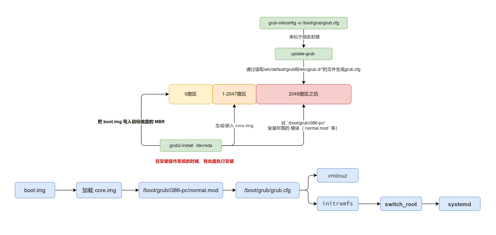

# 第一天


## 块 与 inode


一块磁盘会被划分为许多扇区，每个扇区是最小的可寻址读写单元；


硬盘分成相同大小的单元，我们称为块。一块的大小通常是扇区（512B）的整数倍，默认是4K（8个扇区），文件系统的块不能小于扇区，否则会造成无法精确映射


## 块大小是在格式化时设定的

文件系统格式化时，可以指定块大小

如ext4:

```bash
mkfs.ext4 -b 4096 /dev/sdX
```

块越大，**顺序读写效率越高**，但会浪费空间（**内存碎片**）；

- 适合大文件 → 块大；
- 适合小文件 → 块小；


## **扇区大小是硬盘硬件固定的，不可更改**

- 扇区大小由硬盘固件写死，用户无法更改；
- 使用命令如 `fdisk -l` 或 `lsblk -t` 可以查看当前硬盘扇区大小；
- 有些 SSD 和高级硬盘支持 **真实 4K 扇区（4096B）**，性能更好。


## 查看硬盘扇区/块大小的命令（Linux）

```bash
# 查看扇区大小
cat /sys/block/sdX/queue/hw_sector_size
cat /sys/block/sdX/queue/logical_block_size

# 查看文件系统块大小
sudo blockdev --getbsz /dev/sdX
sudo tune2fs -l /dev/sdX1 | grep "Block size"
```

> **通常情况下，操作系统会要求内存页大小与文件系统块大小保持对齐关系**，即：
>
> > **内存页大小 ≥ 块大小，且通常是块大小的整数倍**
> >  以确保**页与块之间可以高效映射**，避免浪费或拆分。


# 第二天


## 什么是Shell

Shell 是一个命令行解释器，它是用户与操作系统（特别是内核）之间的接口，负责解释用户命令、调度程序执行、控制输入输出等。

Shell 是操作系统（尤其是内核）和用户之间的一个命令解释器/翻译工具，主要负责把人类可读的命令翻译成系统调用或程序执行。


## 举个例子来说明：

当你在终端中输入：

```bash
ls -l /home/user
```

Shell 会做什么？

1. **解析命令**：将命令解析为程序名 `ls` 和参数 `-l /home/user`
2. **查找可执行文件**：在 `$PATH` 中找到 `/bin/ls`
3. **调用系统调用**：
   - 使用 `fork()` 创建一个子进程
   - 在子进程中 `exec()` 执行 `/bin/ls`
4. **ls 程序运行时访问内核提供的文件系统信息**
5. **将输出打印回终端**


## Shell 与用户 & 内核的交互图：

```css
┌───────────────────────────┐
│        用户（User）        │
│  ⌨ 键盘输入、👀 查看输出     │
└────────────┬──────────────┘
             │
             ▼
┌───────────────────────────┐
│      终端（Terminal）       │
│  图形终端/TTY/SSH/PTTY     │
│  提供输入输出界面（/dev/tty）│
└────────────┬──────────────┘
             │
             ▼
┌───────────────────────────┐
│     Shell（如 bash）       │
│ 🧠 解析命令、脚本           │
│ 📦 调用内核系统服务         │
└────────────┬──────────────┘
             │
             ▼
┌───────────────────────────┐
│      内核（Kernel）        │
│ 🧩 进程调度、文件系统、网络 │
│ 🛠️ 提供系统调用接口         │
└────────────┬──────────────┘
             │
             ▼
┌───────────────────────────┐
│  硬件资源（磁盘/CPU/网卡等）│
└───────────────────────────┘

```


## Shell 和终端的区别

很多人会混淆 **Shell** 和 **终端**，它们是**两个不同层次的组件**：

| 项目 | Shell                            | 终端（Terminal）                  |
| ---- | -------------------------------- | --------------------------------- |
| 本质 | 命令解释器程序                   | 提供用户与计算机交互的界面（TTY） |
| 举例 | bash, zsh, fish                  | xterm, gnome-terminal, tty        |
| 作用 | 解释执行用户输入的命令           | 接收键盘输入 & 显示程序输出       |
| 属于 | 应用层程序                       | 更接近设备驱动/界面层             |
| 地位 | **用户和内核之间的命令解释桥梁** | **用户和 Shell 之间的接口桥梁**   |


## 终端的两种类型

### ▶️ 物理终端（tty）

- 键盘 + 屏幕 + tty 驱动
- 在 Linux 下叫 `/dev/tty1`, `/dev/tty2` ...

### ▶️ 虚拟终端（pseudo terminal，PTY）

- 图形终端或远程终端模拟出来的 TTY，如：
  - `xterm`, `gnome-terminal`, `ssh`
  - 实际设备：`/dev/pts/0`, `/dev/pts/1`...


## 什么是终端

**Terminal（终端）本质上是一个运行在用户态的应用程序**，
 作用是**提供一个字符输入/输出界面**，并把用户输入传递给 Shell（也是一个用户态程序）。


## 什么是PTY？

**实现 PTY 的代码，本质上就是 Linux 内核中定义的一组“驱动函数”**，这些函数运行在内核态，用于响应系统调用，是内核驱动框架中的核心组成部分

PTY 是内核提供的一种**字符设备机制**，不是单独的“内核态程序”，也**不是某个系统调用函数本身**，但它确实由内核负责维护、调度和提供接口。

也就是说PTY是内核字符设备

在类 Unix 系统中：

- PTY（伪终端）模拟一个物理终端设备（比如你插的串口终端），用于实现图形终端、远程终端等
- PTY 由内核维护，分为两端：

| 端口               | 作用                                           | 表现为                          |
| ------------------ | ---------------------------------------------- | ------------------------------- |
| **Master（主端）** | 由终端程序持有，用于发送用户输入、读取程序输出 | `/dev/ptmx`（伪终端分配器）     |
| **Slave（从端）**  | 提供给 Shell 或运行程序，模拟标准终端接口      | `/dev/pts/N`（如 `/dev/pts/0`） |


## 执行终端程序后发生了什么？

每执行一次终端程序（如 `xterm`、`ssh`、`script`、`tmux` 等）时，系统都会为其分配一个独立的 pty master/slave 对。

内核将：

1. 分配一个新的 **pty master 设备（匿名）**
2. 自动创建并注册对应的 **slave 设备 `/dev/pts/N`**
3. 绑定这两个设备，维护一个对应的共享缓冲区
4. 返回你拿到的 **`master_fd` 是唯一的**


## 你输入一行命令发生了什么？

以用户在终端（比如 script、xterm、ssh）输入命令 `ls -l` 为例：

0. 用户在物理键盘上输入字符；操作系统的输入设备驱动捕获按键事件；图形终端程序（如 `xterm` / `gnome-terminal` / `script`）运行在**用户态**，监听按键事件；它持有 master 端的文件描述符 `master_fd`（打开 `/dev/ptmx` 得到）；它将字符写入 `master_fd` → 数据通过内核缓冲区流向 slave

   ```bash
   用户在物理键盘上输入字符
   ⬇
   操作系统的输入设备驱动捕获按键事件
   ⬇
   图形终端程序（如 xterm / gnome-terminal / script）运行在用户态，监听按键事件
   ⬇
   它持有 master 端的文件描述符 master_fd（打开 /dev/ptmx 得到）
   ⬇
   它将字符写入 master_fd → 数据通过内核缓冲区流向 slave
   ⬇
   slave 是一个伪终端（/dev/pts/N），shell 绑定在 slave 上，从中读取数据
   ⬇
   shell 执行命令、输出结果写入 slave
   ⬇
   master 读取这些结果 → 回到终端程序 → 显示在屏幕上
   ```

1. 用户的 **按键数据**（例如字符 `'l'`, `'s'`, `'\n'`）是通过 **输入设备驱动**送入用户态程序（如 `xterm`、`script`）

   > **`pty master/slave` 对共享一个内核缓冲区** —— 它们之间通信的本质是：**master 端和 slave 端之间通过一个环形缓冲区进行数据交互**，这个缓冲区由内核管理。
   >
   > `pty master`（主端）模拟一个终端设备的控制端（通常由 ssh、tmux、xterm 等控制程序使用）
   >
   > `pty slave`（从端）模拟一个实际的终端设备（被 shell 或用户程序感知）
   >
   > 
   >
   > **缓冲区细节**
   >
   > - 内核中为每个 `pty` 对分配一个缓冲区（通常是**双向缓冲环**）
   > - 数据流方向：
   >   - **写入 master，数据出现在 slave 的读取端**（就像键盘输入）
   >   - **写入 slave，数据出现在 master 的读取端**（比如 shell 输出）
   >
   > 这个缓冲区在 Linux 内核里由 `tty` 子系统统一调度和维护。
   >
   > 情境：你运行 `script`，shell 使用伪终端 slave
   >
   > ```bash
   > script -q /dev/null
   > ```
   >
   > ```text
   > 用户键盘 ─▶ master ─▶ [内核缓冲] ─▶ slave ─▶ bash
   >                                    ▲         │
   >                                    │         ▼
   >                                script ◀──── slave 输出（bash执行结果）
   > ```
   >
   > ```ABAP
   > 用户输入命令给master，master将命令存储在内核缓冲区，bash从slave读取这个字符串，解析出命令，找到命令后，为这么命令fork子进程并执行，程序执行后将输出结果发送给slave，数据从master中读出，输出在屏幕上
   > ```

2. fork 出一个子进程，执行 `/bin/bash`
3. 子进程的标准输入、输出、错误 都指向 `/dev/pts/0`（也就是 pty slave）
4. 用户在终端中键入 `ls -l`
   - 终端程序将字符写入 **pty master**
   - 内核将这些字符缓冲在 **pty slave 的读缓冲区**
5. Shell 从 pty slave 中读取这行命令，解释执行
6. 输出通过 stdout 写入 pty slave → 内核转发给 pty master → 终端程序读取后显示


## 驱动函数是什么

所谓驱动函数，实际是内核中的一组回调函数，它们通过结构体 `file_operations` 注册给 VFS（虚拟文件系统）

```C
static const struct file_operations ptmx_fops = {
    .open = ptmx_open,
    .read = tty_read,
    .write = tty_write,
    .ioctl = tty_ioctl,
    ...
};
```

当用户态程序调用 `open("/dev/ptmx")`：

- 系统调用进入内核
- 内核根据设备节点查找到对应的 `file_operations`
- 然后调用 `.open = ptmx_open` 这个内核函数（驱动函数）


**驱动函数的“生命周期”：**

| 事件            | 用户态调用                   | 进入内核后实际调用的驱动函数 |
| --------------- | ---------------------------- | ---------------------------- |
| 打开 PTY master | `open("/dev/ptmx")`          | `ptmx_open()`                |
| 读数据          | `read(fd, ...)`              | `tty_read()`                 |
| 写数据          | `write(fd, ...)`             | `tty_write()`                |
| 设置终端属性    | `ioctl(fd, TIOCSWINSZ, ...)` | `tty_ioctl()`                |


`ptmx_open()` 驱动函数原型

```C
static int ptmx_open(struct inode *inode, struct file *filp) {
    return tty_open(inode, filp);
}
```

这个函数是 `/dev/ptmx` 设备的 open handler

是系统调用 `open()` 最终调用到的函数


**驱动函数是面向“设备操作”的最底层内核函数接口之一，它是系统调用通往硬件（或虚拟设备）的关键桥梁。**


## 分层理解 Linux 设备驱动结构：

```css
   用户态应用程序
        │
    系统调用 (open, read, write, ioctl, ...)
        │
┌───────┴────────┐
│ 虚拟文件系统（VFS） │   ← 统一管理所有设备的访问
└───────┬────────┘
        │
   file_operations
        │
┌───────┴──────────────┐
│ 驱动函数（驱动程序） │ ← 你提到的“驱动函数”就处于这一层
│  如 .open, .read      │
└───────┬──────────────┘
        │
  设备控制层（例如：串口控制、I2C控制、TTY核心层）
        │
  硬件抽象接口（I/O 映射、MMIO、端口IO）
        │
  硬件寄存器、中断线、DMA 控制器等
```


从**纯粹的代码实现角度来看 Linux 操作系统的整体结构**

| 你提到的层 | 是否准确 | 补充说明                                                     | 语言实现 |
| ---------- | -------- | ------------------------------------------------------------ | -------- |
| 用户态程序 | ✅        | 发起系统调用，触发上下文切换                                 | 高级语言 |
| 系统调用   | ✅        | 是用户态访问内核态的唯一入口                                 | C        |
| 抽象层     | ✅        | VFS、网络协议栈、进程调度器、内存管理、IPC子系统（管道，信号，共享内存）等 | C        |
| 驱动层     | ✅        | 实现硬件控制逻辑、注册接口，如字符设备驱动（`/dev/ttyS0`, `/dev/input/mouse0`）块设别驱动（NVMe、SATA、MMC），网络设备驱动（e1000e, r8169），显卡驱动（i915, amdgpu） | C        |
| 底层控制层 | ✅        | 驱动内部直接操作硬件的代码：对寄存器读写、DMA、中断响应等。  | C/汇编   |
| 物理层     | ✅        | 真正的硬件设备，不属于代码范畴，但是操作目标                 | N/A      |


**从Linux官方模块组织视角**


## Linux登录

Linux登录流程：`/etc/login.defs`、`PAM`模块、`getty` 和 `login`


# 第三天


## 网络

什么是互联网，它的组成是什么

网络中支撑网络工作的非常重要的东西叫协议 protocol，什么是协议

网络分为3个部分，边上（edge），中间（core核心）和把边上和中间接在一起的接入网（access），

3个部门的组成，作用和基本原理

网络的边缘，将边缘接入核心的接入网以及支撑接入网的media媒介，核心，核心的工作方式有两种，一个是线路交换，一个是分组交换

什么是线路交换

什么是分组交换


实际上互联网是一堆网络构成的，他不是一个平面，一个网络，它是由一堆网络通过网络互联设备（路由器）连在一起的网络的网络，我们叫互联网

不同的网，处在整个互联网的层次也不一样，有的是level1，有的Level2，Level3...,


### 网络

网络的层次结构


之后我们介绍，网络那么复杂，不是一个平面就能够解决的，它是一层一层解决的，每一层实现一组特定的功能，上一层又借助下一次提供的服务，通过和对等层的协议实体相互交换协议的报文来实现的，实现的目的是什么呢？为了向上层提供更好的服务，然后一层落一层，一层落一层，最后落到了传输层

应用层是借助传输层提供的服务，交换应用报文，实现各种各样的网络应用，整个工作的过程大致就是这样的过程

层次性的原理是非常重要的理解计算机网络工作的核心思想，希望大家能够把握


1. 什么是网络 -> 计算机网络 -> 互联网

举几个网络的例子：电话网，蜘蛛网，蜘蛛网也是网络，所以网络有什么特点？，节点和边是吧，

  这两个网络是不是一种网络，所以网络是网络就是和大小无关的，节点和边的关系，和形状无关，如这个图里的节点，可以是个人，那这个边可能就是他们的朋友关系，这也可以是一个蜘蛛网的几点到另外一个节点，中间是蜘蛛线，这也是网络，又或者神经元即它的树突等，也是网络

 再拉回到蜘蛛网，蜘蛛网就是与大小，形状无关的网络的拓扑，这叫网络。那什么是计算机网络


### 计算机网络

计算机网络：计算机网络是联网的计算机，所构成的系统。我们都知道网络有节点和线构成，那么计算机网络中，节点都是什么？

包括

- **主机节点**，比如：笔记本，手机，ipad，联网的冰箱，机顶盒等等，它是数据的源，也是数据的目标

比如它是一个web服务器，算不算一个主机节点，也算一个节点。


- 另外一种是**数据交换节点**，比如交换机，路由器，它即不是数据的源，也不是数据的目标，来一个分组从一个端口进来，按照一定的工作方式，如果是**交换机**的话就是按照目标mac地址，决定从某个方向转，如果是一个**路由器**的话，来一个分组，从一个端口通过网卡收进来，收进来之后，通过查路由表，决定从另一个方向放出去，它是转发数据的，它既不是源，也不是目标。
  - 刚才我们介绍了路由器和交换机，有两个术语了，他只是层次不同，作用不同，路由器是工作在网络层，交换机工作在链路层，当然还有更高层的网络交换设别，比如还有第4层，第5层的负载均衡设备等等，这些设备有什么特点？它也是节点，但是它既不是数据的源，也不是数据的目标，它是数据的中转节点。收到数据后将它转走，到下一节点后，收到之后转走，通过这些中转节点的相互配合，最终实现从源节点到目标节点。


所以它有两种类型的节点，画方的是主机节点，画园的是数据交换节点。数据交换节点根据它工作的层次不同，可以分为，中继器，交换机（二层），路由器（三层），还有一些负载均衡设备，更高层。它的作用就是从一个地方进，从两一个地方出，通过这些中转节点的相互配合，从而实现数据从源主机到目标主机。


把节点连在一起的是什么？叫链路。把主机跟交换节点连在一起，把交换节点和交换节点连在一起，最后构成一个网，然后之间才能够相互通信，这个叫链路，就是边


所以说，连网的计算机系统，由节点和边构成的这样一个系统，我们把它叫做计算机网络


边呢也分为两类

- 第一类：我的主机通过以太网的网线，接到最近的一个交换机，所以叫接入网，接入的链路(link)
- 第二类：路由器和路由器，路由器和交换机，交换机和交换机，也就是交换节点之间的骨干链路


总结起来就是方的和园的连在一起的，主要和主机相关，它就是接入链路，如果两个圆的接在一起，就是骨干链路，因此总的分为接入链路（access）和骨干链路(backbone)


计算机网络，从构成的角度：节点和边

节点包括主机和交换节点，数据交换节点工作的层次不同有分为交换机，路由器，一些高层的负载均衡设备等等

 

链路的按照它连接的主机和路由器，还是交换节点之间链路可以分为access和backbone，就接入链路和骨干链路


#### 协议

当然除了互联网构成的这样一些零件的组成，节点和边之外的，还有另外一些构成，一些软的，比如协议。协议指的是支撑互联网工作的标准。各个厂商按照标准和协议来制作它的网络设备，这些不同的网络设备之间，就可以形成互操作，叫inter-operative。就是我这个网卡和你这个网卡，虽然来自不同的厂商，但只要按照同样的标准，就可以工作。当然，协议按照它的层次不同又可以分为物理层协议，链路层协议，网络层协议，传输层协议，应用层协议，而每层协议又分为若干种，比如传输层的TCP，UDP.网络层有IP还有一些路由选择协议。这些都是协议，也就是标准


协议的定义：对等层实体在通信过程中，应该遵循的规则的集合，包括语法，语义和时序。当然咱们不太适合这么讲，怕你们惊慌试错，落荒而逃。

听着好像很复杂，但是听后续咱们娓娓道来，其实也没那么复杂


计算机网络讲清楚了，那互联网是什么呢？


### 互联网

互联网是以TCP协议和IP协议为主的一簇协议。就协议族，协议套，有这些协议构成的那个网络，就我们目前在用的，规模最大的网络就叫互联网（internet）。


当然你说我也按这个方式工作，也是以TCP和IP协议族为主的，但是我和别人不连，我厂里自己用，也行，。这个不叫Internet，这个叫intronet，叫企业网，也叫内部网


从构成的角度来看，计算机网络，互联网，互联网当然也是计算机网络中的一种，互联网有哪些端节点，PC，主机，server，手机，ipad等等...以及一些有趣的端系统，赋予十亿计的端系统。


那么端系统包括什么呢？计算机本身—硬件，能够把硬件管理起来的操作系统，这个操作系统要支持通讯吧；然后在操作系统之上驻留的浏览器，web服务器，上面的一些app等网络应用程序。


所以整个端系统分为，硬件本身，支持网络通讯的操作系统，以及基于操作系统，在操作系统上运行的各种网络应用程序；这些构成了端系统,这个端系统我们通常称作`end System` 或者 `host`


边缘：边缘系统上面的应用是网络存在的理由，下面的设备是支撑网络通讯的协议栈

接入：将边缘的主机系统接入到网络核心

核心：把所有的边缘节点接在一起，从而让任意两个端系统之间能够相互通信，所以网络核心的作用就是数据交换


#### 网络边缘

应用进程之间的通信模式

- CS模式
- P2P模式
  

不管是CS模式，还是P2P模式，它们都要借助于基础设施提供的通讯服务才能实现相互通信。

基础设施为网络应用提供的通信服务有两种方式

- **面向连接的通信方式**
  - 例如：TCP协议实体向应用进程提供的服务就是面向连接的服务
  - 特点：分布式应用之间相互通信，首先要建立连接，底层的协议栈要为两个应用进程以后的通信准备好相应的资源，做好标记（比如准备缓冲区，标记位置位，超时定时器设置等）`两个应用进程在通信前，两者要做好准备，底层协议栈也要做好准备`。
  - 面向连接和有连接的区别
    - 面向连接是：通信双方及其底层协议栈知道，网络不知道。通讯状态只在端系统中维护
    - 有连接：不止通信双方要维持通信状态，中间节点也要维护通信状态（典型的有连接：**PSTN电话网络**，一旦建立通话，网络中每个交换节点都为这次通话分配固定资源（电路时隙））


TCP向上层提供的服务的特性：可靠的，保序的，流量控制，拥塞控制

可靠的：不重复，不失序，不乱序，不出错。总结：就是原原本本，发出的是什么，收到的就是什么。

流量控制：比如你是一个性能强大的服务器，至强。而另一端是性能很差的机器。如果你发送太快，对方无法处理，则会出现问题。流量控制就是解决这个问题的。协调发送方发送速度和接收方接收速度，从而让两者能够有效通信。

拥塞控制：网络路径有堵塞，除了要考虑接收方的数据处理能力，还要考虑到网络路径的通行能力。根据路径的阻塞程度，协调发送方的发送速度，防止数据交换节点处理不了导致丢包。


- **采用基础设施的无连接服务**
  - 例如：UDP-用户数据报协议
    - 无连接
    - 不可靠数据传输
    - 无流量控制与无拥塞控制


#### 网络核心

网络核心的组成：由交换节点与交换节点它们的链路构成的。最主要的作用是数据交换的功能，源主机发出去，正确的到达目标主机。


**分组交换**

```bat
	为了从源端系统向目的端系统发送一个报文，源将长报文划分为较小的数据块，称之为分组  （packet） 
在源和目的地之间，每个分组都通过通信链路和分组交换机（packet switch ）传送。（交换机主要有两类：路由器（router）和链路层交换机（link-layer* switch）。）分组以等于该链路最大传输速率的速度传输通过通信链路。  —— 《计算机网络—自顶向下》
```


以分组为单位存储-转发方式

- 网络带宽资源不再分为一个个片，传输时使用全部带宽
- 主机之间传输的数据被分为一个个分组


**什么是分组**

分组交换是一种通信方式，数据在发送前被**分割成较小的单元（分组）**，逐个传输。

这些分组具有以下特征：

- 独立路由（可能走不同路径）
- 独立封装
- 每个分组包含完整的目标地址信息


**存储转发**


存储转发传输是指在交换机能够开始向输岀链路传输该分组的第一个比特之前，必须接收到整个分组。

> 存储转发，为链路共享提供了基础。


**丢包**

路由器中的排队队列所容纳的分组是有限的，所以等到路由器队列堆满后，新到达的分组就无法被容纳，导致路由器 `丢弃(drop)` 该分组，即分组会 `丢失(lost)`。


### Internet结构和ISP

前面我们介绍了互联网可以分为节点和链路，然后我们将主机系统构成了边缘系统，由网络交换节点之间构成的子系统，叫网络核心，将边缘接入网络核心，我们叫接入access，这是一种划分方式


还有一种划分方式：我们把关系比较密集的，一个网络供应商的网络作为一个网络。比如：高校的校园网，这里有交换设备，有链路，有主机。这构成一个子系统，这个子系统叫一个ISP网络。当然还有其他ISP的网络。互联网就是由这些ISP的网络通过网络互联设备，比如路由器来构建成的。


之前的划分是按照网络节点和链路的分类，分为了边缘，接入，核心

现在，我们按照一个范围内，关系密集的一个网络中的设备，称之为一个ISP网络，互联网是有很多ISP的网络构成的，当然ISP里还包括很多小ISP。所以我们可以说互联网是由一堆ISP网络构成的，通过网络互联设备，通过路由器连在一起的，是网络的网络。


我们使用渐进演化的方法，来描述互联网当今的结构。


我们很多的端系统，都是通过接入ISP访问的互联网。比如移动手机，是通过移动ISP接入互联网。任何一个端系统都是通过接入ISP来接入互联网的。比如我们家用的主机，通常是不会移动的，但是移动接入是什么呢？你拿着一个手机，在很多有联通基站的地方都能把你接入。不管怎样你是通过移动，联通基站接入互联网。有很多很多的接入ISP，有多少？几十万，上百万接入ISP，接入ISP之间要不要互联。


我通过接入ISP接入互联网，他通过另一个接入ISP接入互联网。如果接入ISP之间不能互联，是不是我和他之间的访问就会有问题。


因此这些接入ISP都要互联的。但是这些接入ISP是怎样互联的。

我们来看一下，发展和演化是通过一些经济的和政治策略来驱动它演化到当前的情况。我们看下它是如何演化的。


用户是通过接入ISP来访问互联网。这些接入ISP要相互互联，问题是他们怎么互联。

有一种方式，把它们全连接可以吗？当然不可以，想象一下，如果我们有N个ISP，那么全连接就是n(n-1)/2，基本上是n的平方的级别。如果有10w个ISP，全连接就是10w的平方，这个是不可相信的，代价太大了。这种方式是不可扩展的。


那怎么办呢？对于ISP来说，你接入互联网是不是要给ISP付费，所以这里是不是有利可图的。那就意味着有些供应商会把全球的这些接入ISP都连在一起，在全球范围内，部署自己的路由器和线路，把这些路由器和设备都连在一起。然后这个全球的ISP会把接入ISP都连在一起，也就是这些接入ISP，都连在这个GLOBAL ISP上。这样的话，接入ISP之间的通信，就可以借助于GLOBAL ISP连在一起。


有利可图，比如有人会投资，这就是经济驱动的必然。


我们把很多接入ISP连在一起，在他们之间完成数据的收发，那么我在全球部署我的这些节点，也是技术上可行的，在经济上也是有收益的。那一定有GLOBAL ISP去做这个事情，


你的access net是通过一些经济合约和GLOBAL ISP谈好，比如流量上行下行是多少，怎么结算，是包月还是按量付费等等。因此access net和GLOBAL ISP之间通常有合约，来约束它们的行为。


但是如果只有一个GLOBAL ISP，那服务质量必然不会高，但是价格一定很高。这时候必然会有一些其他ISP参与到这个竞争。


因此就有多个GLOBAL ISP，把一些接入ISP接入进来。不同的接入ISP，接入不同的GLOBAL ISP。


另一方面，除了有竞争还有合作，比如我接如刀这些access net，你接入那些access net。我要把你的客户接进来，代价是很高的。这时我有一个选择，我通过你接入你的客户，你通过我接入我的客户，这样的话。我对我的新客户而言，我说我可以接入所有的access net，你也可以和你的用户说，你可以接入所有access net。

那这样就有一个合作的概念。合作可能涉及到结算。也可能不涉及流量的结算。我们是对等的，如果大家接入的各自的access net差不多，发过去的和回来的流量差不多，那就不用付费了，对冲了。对于运营商而言，我不用花钱，和你谈个合约，出一个条路由器，出个链路，就能和你相连，从而扩展我业务的物理范围。


这样，既有竞争也有合作。这种连接叫做对等的连接。


还有一种连接是大家都接入到IXP，也就是互联网连接交换点，在这些交换点之间，完成a到b，b到c，c到a的数据交换。


这个交换点当然非常重要，很多骨干的ISP，它的流量都通过IXP的交换点，完成网间流量的交换。


当然业务还有个细分的问题。ISPA是完成全球范围内的access net接入，当然也有一些小的运营商，可以做精细化的服务，可以在一个国家或者几个大州之间，我有我的势力范围，我可以做精细化的服务，我可以部署很多路由器，链路从而把更多的用户接进来。所以就有业务细分。


global ISP 完成全球方位内的交换，而Reginal，要完成区域范围内，把这些access net接进来，它们之间进行数据交换，如果要访问互联网其他地方的，再通过global ISP完成全球范围的交换。


现在情况更加复杂，互联网有很多角色，端系统有用户，还有服务提供商ISP，还有ICP就互联网内容提供商，比如google，baidu等。提供上层业务的。


像Google这样的ICP，有十几亿用户提供服务的ICP，这些内容提供商当然也需要通过ISP接入互联网。但是我作为内容提供商，接入互联网，是不是也需要向ISP付费，而且付费还很高。对于Google来说，如果付费非常高。而且服务质量也没办法保证。比如我是美洲的ISP，然后南非的用户访问我，这个距离就很远，中间要经过很多数据交换设备。就很麻烦。怎么办呢。


像Google这样的内容提供商就会在全球各地布置数据中心机房。我通过我自己部署的专网，或者租用线缆。把这些数据中心机房连在一起。而且这些数据中心通常布置在离ISP的数据中心机房比较近的地方。这样用户通过ISP接进来，很快就能接入google的数据中心机房。然后返回去，这样体验就很好。而且因为在很多链路上，我用的自己的专网，因此向ISP支付的费用就会很少。


所以一个成本原因，一个用户体验的原因，促使Google部署自己的数据中心机房。


通常来说全球范围内的覆盖点会少一些，因为成本太高，点和点之间，带宽会很宽。因为付了那么大代价，使用海底电缆连接洛杉矶到上海。带宽搞一个1k，那不是有病吗、自己用不了还可以租出去嘛……


像


### 协议层次和服务模型


#### 模块化分层思路

我们首先要承认一点：网络是一个非常复杂的系统。有各种各样的终端设备，各种各样的链路，各种各样的应用。那么作为一个科学家或者工程师实体，如何设计和实现组织复杂的网络功能？


解决这个问题的思路：模块化的思路。


什么是模块化的思路呢？就是把一个复杂的功能，分解成一个个模块，模块之间相互调用，而且平面性的调用，任何一个模块都可以调用任何模块提供的功能和服务，这样就可以一个比较复杂的功能通过模块化的分解来进行实现。


其中一个模块化的分解思路就是分层的方法来解决。

将一个复杂的功能分为一个个模块，模块之间的调用和被调用关系是**从仅相邻**的两层的模块之间能够调用和被调用，他不允许或者说不推荐跨层调用。

而**计算机网络实现**这种复杂的问题，就是采用分层的模块化的方式来解决，设计和实现的。将功能非常复杂的计算机网络的功能分解为一个个功能明确的子模块，每一层实现一个或一组功能。每一层的功能通过层间的接口，向上层提供服务。像这样一层落一层，一次落一层，最后实现比较复杂的计算机网络的功能


#### 异地哲学家交流哲学思想

计算机网络使用分层的方式如何解决比较复杂的计算机网络的功能实现，可以通过生活中的例子（异地哲学家使用不同语言进行哲学思想交流的复杂问题），来方便大家的理解


 

- 最下面是秘书层：解决的是异地通讯的问题。（协议：约定通信的方式）
- 第二层是翻译层：解决的是表示转换的问题。将两位哲学家不同的语言转换为共用的语言进行交流（协议：约定共用的语言）
- 最上面是哲学家层：两个哲学家交换哲学思想，从而完成深层次的学术交流


通过上述过程类比：两个应用进程通过交换应用报文来实现各种各样的网络应用。包括：电子商务，域名解析，文件下载等。


上述分层解决问题的优势：

- 把一个复杂的问题转换成3个子问题，每个问题的解决相对独立，单一。
- 每一层独立进行技术更新，不会影响其他层。


层次化方式实现复杂网络功能：

- 将网络复杂的功能分层功能明确的层次，每一层实现了其中一个或一组功能，功能中有其上层可以使用的功能：**服务**（本层功能的子集，能够为上层提供服务的部分）
- 本层协议（每一层交互应该遵守的规则的集合）实体相互交互执行本层的协议动作，目的是实现本层的功能，通过接口**为上层提供更好的服务**
- 本层的服务：借助下层服务实现的本层协议实体之间交互带来的新功能（上层可以里利用）+更新层提供的服务。


#### 协议和服务的关系

协议的目的：为上层提供更好的服务

协议的实现：通过层间的接口，借助于下层提供的服务，交换对等层相应的PDU，从而实现新的协议动作，目的是为上层提供更好的服务

```bat
每一层向上层提供的服务，包括了所有下层提供服务的总和，加上和对等层实体交互过程中形成的新的服务特性，通过层间接口向上层提供更好的服务
```


#### 互联网中的分层结构 — TCP/IP协议栈


**各层的作用**

- **应用程：**网络应用

  > 为人类用户或者其他应用进程提供网络应用服务
  >
  > FTP，SMTP，HTTP，DNS

- **传输层：**主机之间的数据传输

  > 在网络层提供的端到端通信基础上，1. 细分为进程到进程，2. 将网络层不可靠的通信变成可靠地通信

- **网络层：**为数据报（Package）从源到目的选择路由

  > 主机主机之间的通信，端到端通信，不可靠
  >
  > IP，路由协议

- **数据链路层：**相邻网络节点间的数据传输

  > **数据链路层的主要作用**是：以**帧（Frame）为单位在相邻节点之间可靠传输数据。 它负责将来自物理层的连续比特流（bit stream）划分为有界的帧，识别出每一帧的\**起始和结束位置**，从而实现对数据的组织和管理。
  >
  > 点对对协议PPP，802.11(wifi)，Ethernet

- **物理层：**在线路上传递bit（提供相邻两点，将数字信号和物理信号之间的相互转换）

  > 发送端：上层传下来的帧，变为物理信号，在介质中转播给对端。
  >
  > 接收端：将媒体中承载的电磁波或者光信号还原回数字信号。


#### ISO/OSI 参考模型


- **表示层**：允许应用解释传输的数据。eg：加密，压缩，及其相关的转换
- **会话层：**数据交换的同步，检查点，恢复。


互联网协议栈没有这两层！这些服务，如果需要的话，必须被**应用实现**。


#### 服务和服务访问点

- **服务（Service）：**低层实现向上层实体提供它们之间的通信能力
  - 服务用户（Service User）
  - 服务提供者（Service Provider）


- **原语（Primitive）：**上层使用下层服务的形式，高层使用底层提供的服务，以及低层向高层提供服务都是通过服务访问原语来进行交互的 --- 形式

  > 比如：传输层向应用程提供服务的形式是Socket，上层向下层发送SDU时，进行标注。在对等端，下层向上层根据标注信息选择对应的应用接收数据


- **服务访问点SAP（Service Access Point）：**上层使用下层提供的服务通过层间的接口—地点：
  - 下层的一个实体支撑着上层的多个实体，SAP有标志不同上层实体的作用。
  - 例子：传输层的SAP，端口（Port）


#### 封装和解封装

 

​                                          


从源主机到目标主机发送的报文，逻辑上来看，是应用进程**直接**向对端的应用进程发送报文，但这个直接是要打上引号的。是逻辑上通信的。看似好像是客户端浏览器直接发给web服务端请求报文，web服务端向客户端返回响应报文。好像是客户端和服务端直接通信，但是实际上message是不可以直接传送给目标的应用进程的。

实际上是通过层间的接口，借助于下层提供的服务来实现的。

也就是源主机的应用层将message发送给下层的传输层，传输层在SDU基础上，加上本层的控制信息头，生成本层的PDU。在传输层叫做报文段segment。

报文段也无法直接传输给对端的传输层实体。因此要通过层间的接口借助于下层的网络层的服务实现。所以要将数据发送网络层，网络层收到报文后，加上本层的头部控制信息（源IP，目标IP等数据），生成本层的PDU，也就是分组（Package）。

> 头部信息是上层传下来的ICI，通过解析转换生成本层的头部控制信息

网络层也可能无法直接传输给对端的网络层实体，因此要通过层间的接口借助于下层的数据链路层的服务实现。所以还要将数据发送给链路层，在链路层收到报文后，加上本层的头部信息（源MAC地址，目标MAC地址），生成本层的PDU，也就是分组（帧）。

物理层收到链路层传下的数据后，将数字信号转换为电信号或者光信号，从而通过媒体介质，将数据发送给对端。

 


## 更改网卡名 — 配置启动项

Rocky9以上，默认使用功能BLS（Boot Loader Specification）配置方式，不会使用 `/etc/default/grub` 中的 `GRUB_CMDLINE_LINUX` 参数。


### 什么是BLS

**BLS 是一套标准**，由系统引导程序（如 GRUB）使用，用来 **管理每个内核启动项的配置**，以 **文件形式**存储在 `/boot/loader/entries/` 目录下，每一个启动项都是一个单独的 `.conf` 文件。

> ✅ 本质上：
>  BLS 是 Linux 新的“启动配置方式”，目的是 **更模块化、易于自动管理和升级内核启动项**。


### BLS 与传统 grub.cfg 有什么区别？

| 特性               | 传统 grub.cfg                          | BLS 模式                                      |
| ------------------ | -------------------------------------- | --------------------------------------------- |
| 启动项配置存储位置 | `/boot/grub2/grub.cfg`                 | `/boot/loader/entries/*.conf`                 |
| 管理方式           | 全部内核版本共享一个 grub.cfg          | 每个内核版本都有独立启动项配置文件            |
| 参数设置方式       | `/etc/default/grub` + `grub2-mkconfig` | `.conf` 文件直接写入 `options=...` 行         |
| 优势               | 灵活但容易乱                           | 模块化、适合自动更新（如 dnf install kernel） |
| 是否使用 BLS       | `GRUB_ENABLE_BLSCFG=true` 时启用       | 否时用传统 grub.cfg                           |


### 一个典型的 BLS 启动项文件（示例）

路径：`/boot/loader/entries/rocky-5.14.0-427.el9.x86_64.conf`

```ini
title Rocky Linux (5.14.0-427.el9.x86_64) 9.4
version 5.14.0-427.el9.x86_64
linux /vmlinuz-5.14.0-427.el9.x86_64
initrd /initramfs-5.14.0-427.el9.x86_64.img
options root=/dev/mapper/rl-root ro crashkernel=auto net.ifnames=0 biosdevname=0 quiet
```

- `title`：显示在引导菜单中的名称
- `linux`：内核镜像路径
- `initrd`：内核初始文件系统
- `options`：内核启动参数 ← 就是你要加 `net.ifnames=0 biosdevname=0` 的地方！


### BLS相关操作

#### 检查是否启用 BLS 模式

```bash
cat /etc/default/grub | grep GRUB_ENABLE_BLSCFG
```

为 `true` 表示启用了 BLS


#### 临时修改内核参数（不建议）

编辑当前默认内核的启动项：

```bash
vim /boot/loader/entries/xxx.conf
```

在 `options=` 行尾加上你的参数


#### 永久关闭 BLS

```bash
sed -i 's/GRUB_ENABLE_BLSCFG=true/GRUB_ENABLE_BLSCFG=false/' /etc/default/grub
grub2-mkconfig -o /boot/grub2/grub.cfg
```


#### 确认当前内核参数是否生效

```bash
# 查看/proc/cmdline
[root@localhost ~]# cat /proc/cmdline 
BOOT_IMAGE=/vmlinuz-5.14.0-427.13.1.el9_4.x86_64 root=/dev/mapper/rl-root ro crashkernel=1G-4G:192M,4G-64G:256M,64G-:512M resume=/dev/mapper/rl-swap rd.lvm.lv=rl/root rd.lvm.lv=rl/swap rhgb quiet net.ifnames=0 biosdevname=0
```


## 配置静态IP — 配置网络服务


### Rocky

**兼容性说明：**

| 系统版本      | 默认方式                         | 是否兼容 ifcfg-* | 建议           |
| ------------- | -------------------------------- | ---------------- | -------------- |
| CentOS 7      | NetworkManager + network-scripts | ✅                | 可继续使用脚本 |
| Rocky 8       | NetworkManager + 脚本兼容模式    | ✅                | 逐步过渡       |
| Rocky 9/RHEL9 | NetworkManager + `.nmconnection` | ⚠️（部分兼容）    | 推荐全面迁移   |


**NetworkManager静态IP的`.nmconnection`文件配置**

```bash
[connection]
id=eth0
uuid=xxxxxxxx-xxxx-xxxx-xxxx-xxxxxxxxxxxx   # uuidgen生成，作为网卡唯一标识
type=ethernet
interface-name=eth0
autoconnect=true

[ethernet]
mac-address-blacklist=

[ipv4]
method=manual
address1=192.168.1.100/24,192.168.1.1        # 配置静态IP和网关
dns=8.8.8.8;114.114.114.114;
dns-search=
may-fail=false

[ipv6]
method=ignore             # 禁用ipv6
```

```bash
nmcli conn reload
nmcli conn up eth0   # 启用配置
```


- NetworkManager客户端工具 — nmcli（功能强大，可以通过客户端工具修改网络配置）


### Ubuntu

- **Netplan 是 Ubuntu 的统一网络配置前端**

- 用户只需要编写 **YAML 文件**（位置：`/etc/netplan/*.yaml`）

- 然后运行：

```bash
sudo netplan apply
```

- Netplan 会根据 YAML 中指定的 `renderer` 字段：

  - 如果是 `NetworkManager`：
    - 就把配置“传递”给 NetworkManager（通过 D-Bus，**不会生成 .nmconnection 文件**）

  - 如果是 `systemd-networkd`：
    - 就自动生成 `.network` 文件，放在 `/run/systemd/network/` 下（**不是 /etc/systemd/network/**）


- Netplan 本身 **不负责管理网卡**，它只是 **翻译器**，真正负责管理的是：
  - `systemd-networkd`（轻量）
  - `NetworkManager`（功能多，如 Wi-Fi、VPN）


#### NetworkManager

Netplan会把配置“传递”给 NetworkManager（通过 D-Bus（一种IPC通信机制），**不会生成 .nmconnection 文件**）


#### systemd-networkd

由netplan自动生成

```bash
/run/systemd/network/10-netplan-eth0.network
```


- systemd-network的客户端工具 — networkctl（只读）
  - `systemd-networkd` 的配置是通过编写配置文件完成的：
  - 配置路径：`/etc/systemd/network`
    - `*.netdev`：定义虚拟设备（如 bridge, bond, vlan）
    - `*.network`：定义网络接口配置（IP地址、路由、DNS等）
    - `*.link`：定义接口命名和属性（MAC 地址策略等）


## HTTP协议

### HTTP协议介绍

HTTP：（HyperText Transfer Protocol）超文本传输协议

HTTP 是一个工作在应用层的通信协议，它允许将超文本标记语言（HTML）文档从 WEB 服务器传送到 客户端的浏览器


### HTTP 协议版本和发展历史


### Cookie 与 Session


#### Cookie的格式与约束

Cookie是前端编程中经常使用的概念。 我们可以使用cookie利用浏览器帮助我们存放用户的相关状态信息，保存用户已经做了哪些事情。

- Cookie的工作原理是什么？

- Cookie的限制又是什么？

- Session是服务器端所维护的会话状态，Session又怎样与Cookie关联起来？ 


##### Cookie是什么？


**RFC6265，HTTP State Management Mechanism**


Cookie保持在客户端，由浏览器维护（但是是由服务端生成的），表示应用状态的HTTP头部

- 存放在内存或者磁盘中
- 服务器端生成Cookie在响应中通过Set-Cookie头部告知客户端（允许多个Set-Cookie头部传递多个值）
- 客户端得到Cookie后，后续请求都会自动将Cookie头部携带至请求中


##### Cookie 与 Set-Cookie头部的定义

Cookie 头部中可以存放多个 **name/value** 名值对

```haskell
cookie-header = "Cookie:" OWS cookie-string OWS
  cookie-string = cookie-pai r*( ";" SP cookie-pair )
  cookie-pair = cookie-name "=" cookie-value
```


Set-Cookie头部一次只能传递1个 **name/value** 名值对，响应中可以含多个头部

```haskell
set-cookie-header = "Set-Cookie:" SP set-cookie-string
  set-cookie-string = cookie-pair *( ";" SP cookie-av )
  cookie-pair = cookie-name "=" cookie-value
  cookie-av: 描述 cookie-pair 的可选属性
```


浏览器查看Set-Cookie


##### Set-Cookie 中描述cookie-pair的属性


##### Cookie 使用的限制

RFC规范对浏览器使用Cookie的要求

- 每条Cookie的长度（包括 name, value 以及描述的属性等总长度）至少要支持达到 4KB
- 每个域名下至少支持50 个 Cookie
- 至少要支持 3000 个 Cookie


代理服务器传递Cookie时会有限制（Nginx默认32k）


##### Cookie 在协议设计上的问题

- Cookie会被附加在每个HTTP请求中，所以无形中增加了流量
- 由于在HTTP请求中的 Cookie 是明文传递的，所以安全性成问题（除非用HTTPS）
- Cookie的大小不应超过4KB，因为对于复杂的存储需求来说是不够用的。


#### Session 及第三方Cookie的工作原理

##### 登录场景下 Cookie与Session的常见用法


- 首先登录请求发起一个POST表单的login操作。
- 服务器收到请求后，从表单中读取用户名和密码，和持久化数据中的数据进行比对，比对通过后，把登录状态生成session（这个session是有时效的）。
- 将有时效的session数据写入内存数据库
- 将session中的session_ID在响应中返回给浏览器，SESSIOIN返回的方式是Set-Cookie
- 浏览器在它的Storage中保存收到的Cookie
- 浏览器发起的后续请求会携带这个Cookie信息
- 服务器收到携带Cookie的信息后，会在后端解析Cookie携带的Session_ID，判断该用户是否是登录的，如果判断成功，则执行该用户的相关业务，并将结果返回给用户。

| 步骤                                    | 建议或补充                                                   |
| --------------------------------------- | ------------------------------------------------------------ |
| 1. 用户发送 POST /login 请求            | 可以带表单或 JSON 格式登录信息                               |
| 2. 服务端读取用户名密码，与持久化库比对 | 实际上可使用数据库或认证中心（如 LDAP）                      |
| 3. 验证通过，生成 session（含有效期）   | 通常 `session = { user_id, expires_at, ... }`                |
| 4. 将 session 存入“内存数据库”          | 通常是 Redis，或者内存 hashmap（如 Java `HttpSession`）      |
| 5. 返回 Set-Cookie，设置 `session_id`   | 示例：`Set-Cookie: session=abc123; Path=/; HttpOnly; Secure` |
| 6. 浏览器接收并保存 Cookie              | 浏览器自动保存，并根据 Path/Domain 控制何时发送              |
| 7. 后续请求自动带上 Cookie              | 浏览器自动加上 `Cookie: session=abc123`                      |
| 8. 服务端读取 Cookie 并验证 session     | 查 Redis 判断 session 是否存在、是否过期                     |
| 9. 执行业务并返回结果                   | 此时说明用户已认证，按权限执行对应业务                       |


## Web站点环境部署


### 常见Web服务介绍


# 第四天

## 文件系统

**文件内部的数据应该怎样组织起来**

无结构文件（如文本文件）- 由一些二进制或字符流组成，又称为“流式文件”

有结构文件（如数据库表）- 由一组相似的记录组成，又称为“记录式文件”

- 其中记录是一组相关数据项(field)的集合，数据项是文件系统的基本单位
- 记录间具有相似性
- 数据项是文件系统最基本的数据单位
- 目录其实是一种特殊的有结构文件（由记录组成 ）

### 目录

目录就是一种特殊的文件，其内容是一个个“目录项记录”（directory entries）组成的结构数组，用于表示“文件名 → inode号”的映射关系。


#### 目录项（directory entry）的基本组成

以 **ext2/ext3/ext4 文件系统**为例，每个目录项（`struct ext4_dir_entry`）一般包含以下字段：

| 字段名      | 说明                               |
| ----------- | ---------------------------------- |
| `inode`     | 对应文件的 inode 编号（`inum`）    |
| `rec_len`   | 当前目录项占用的总字节数（含填充） |
| `name_len`  | 文件名的长度                       |
| `file_type` | 文件类型（如普通文件/目录/链接）   |
| `name`      | 文件名字符串（不含结束符 `\\0`）   |


#### 示例结构体（ext4）

```C
struct ext4_dir_entry {
    __le32 inode;        // 4 bytes
    __le16 rec_len;      // 2 bytes：当前目录项总长度
    __u8   name_len;     // 1 byte：文件名长度
    __u8   file_type;    // 1 byte：文件类型（ext4 专有）
    char   name[];       // 不定长：文件名（不含 '\\0' 结尾）
};
```

 **字段解析说明：**

1. **`inode`（inum）**

- 表示该文件/目录对应的 inode 编号
- 操作系统可用它访问该文件的具体元信息

2. **`rec_len`（record length）**

- 当前目录项在目录文件中实际占据的总字节数
- 由于文件名长度可变，为了保持对齐，rec_len 通常会 > 实际所需空间（内含填充）

3. **`name_len`**

- 实际文件名的长度，单位是字节
- 不包括 `\\0` 结尾字符

4. **`file_type`（ext4 专有，ext2/3 不一定有）**

- 表示该目录项是普通文件、目录、符号链接等
- 类型代码例如：
  - `1`：普通文件
  - `2`：目录
  - `7`：socket（Unix 域）

5. **`name[]`**

- 字符串形式的文件名
- 紧跟在结构体后面，**变长字段**


#### 示例：目录结构中的记录内容（假设是 ext4）

一个目录文件内容示例（十六进制）可解析出如下内容：

| inode | rec_len | name_len | file_type | name  |
| ----- | ------- | -------- | --------- | ----- |
| 12    | 12      | 1        | 2         | .     |
| 2     | 12      | 2        | 2         | ..    |
| 1002  | 24      | 5        | 1         | readm |

👉 说明：

- `.` 表示当前目录
- `..` 表示上级目录
- `readm` 是普通文件（实际是 `readme`，因对齐可能被截断显示）


#### 如何手动用 `hexdump` 分析 ext4 的目录结构

**整体流程概览**

1. 找到目标目录对应的 inode（使用 `debugfs`）
2. 获取该 inode 指向的数据块地址
3. 从设备中提取对应数据块内容
4. 用 `hexdump` 查看，并手动解析目录项结构


##### 实验步骤详解

> 假设我们的挂载设备是 `/dev/vda1`，挂载点为 `/`，要分析的目录为 `/home`

**第 1 步：进入 debugfs 查看目标目录 inode 信息**

```bash
debugfs /dev/vda1
```

进入交互后：

```bash
debugfs: stat /home
```

```bash
Inode: 1518   Type: directory    Mode:  0755   Flags: 0x80000
Generation: 2375206807    Version: 0x00000000:00000002
User:     0   Group:     0   Project:     0   Size: 4096
File ACL: 0
Links: 3   Blockcount: 8
Fragment:  Address: 0    Number: 0    Size: 0
 ctime: 0x64be8b93:0a7d8c00 -- Mon Jul 24 14:32:51 2023
 atime: 0x683ca913:e6065518 -- Sun Jun  1 19:25:07 2025
 mtime: 0x64be8b93:0a7d8c00 -- Mon Jul 24 14:32:51 2023
crtime: 0x64ae0bd7:e5c38f74 -- Wed Jul 12 02:11:35 2023
Size of extra inode fields: 32
Inode checksum: 0xeeec52cf
EXTENTS:
(0):16735
```

**详细解释：**

📌 `EXTENTS:` 是 ext4 文件系统的块寻址方式之一

- ext2/ext3 使用「直接块 + 间接块」方式（最多 15 个指针）
- ext4 默认使用 **Extent tree（扩展树）**，更适合大文件、高连续性

📌 `(0):16735` 的含义是：

- `0` 表示这是第 0 个 extent（起始偏移块号为 0）
- `16735` 是该 extent 在物理设备中的第一个实际 **物理块号**


**第 2 步：根据上文的输出，可以得到如下信息**

```ABAP
这是一个 ext4 文件系统
该 inode 使用 Extent（扩展块映射）格式
第一个数据块号是 16735

字节偏移 = 16735 × 4096 = 68575232 字节
```


**第 3 步：从设备中提取这个数据块**

```bash
dd if=/dev/vda1 bs=4096 skip=16735 count=1 of=dirblock.bin
```


**第 4 步：使用 hexdump 分析目录块内容**

```bash
hexdump -C dirblock.bin | less
```

```bash
00000000  ee 05 00 00 0c 00 01 02  2e 00 00 00 02 00 00 00  |................|
00000010  0c 00 02 02 2e 2e 00 00  01 f0 03 00 dc 0f 06 02  |................|
00000020  75 62 75 6e 74 75 00 00  00 00 00 00 00 00 00 00  |ubuntu..........|
00000030  00 00 00 00 00 00 00 00  00 00 00 00 00 00 00 00  |................|
*
00000ff0  00 00 00 00 00 00 00 00  0c 00 00 de 14 63 1c 37  |.............c.7|
00001000
```


##### 手动解析规则（基于 `ext4_dir_entry`）

每个目录项格式如下：

| 字节偏移 | 字段名    | 长度   | 含义                             |
| -------- | --------- | ------ | -------------------------------- |
| 0        | inode     | 4B     | 文件/目录的 inode 编号           |
| 4        | rec_len   | 2B     | 当前目录项占用的总长度           |
| 6        | name_len  | 1B     | 文件名长度（不含结尾）           |
| 7        | file_type | 1B     | 文件类型（1: 普通文件, 2: 目录） |
| 8        | name      | N 字节 | 文件名（变长）                   |


**示例解析**

```bash
 01 f0 03 00 dc 0f 06 02  # 
 75 62 75 6e 74 75        # Ubuntu(文件名)
```

逐项解释：

- `01 f0 03 00` → `inode = 0x0003f001 = 258,049`
- `dc 0f` → `rec_len = 0x0fdc = 4060`
- `06` → name_len = 6（Ubuntu，6个字符）
- `02` → file_type = 2 （目录）
- `2e` → 文件名 = "."（ASCII）

```bash
[root@devops-custom ~]# ll -i /home
总计 12
  1518 drwxr-xr-x  3 root   root   4096  7月 24  2023 ./
     2 drwxr-xr-x 19 root   root   4096  5月 26 08:53 ../
258049 drwxr-x--- 17 ubuntu ubuntu 4096  5月  4 12:53 ubuntu/
```


### 什么是 Extents？

#### 使用者：ext4、xfs、btrfs 等现代文件系统

✅ 定义：

> **Extent 是一个结构：表示“某个逻辑块范围 → 对应的物理块范围”映射。**
>  简化存储：**不存储每个块地址，而是存一段连续块的起始地址和长度。**


Extent 结构（简化示意）

```C
struct ext4_extent {
  __le32 ee_block;      // 文件中的起始逻辑块号
  __le16 ee_len;        // 连续块数量
  __le16 ee_start_hi;   // 起始物理块高16位
  __le32 ee_start_lo;   // 起始物理块低32位
};
```

一个 extent 就表示：

> “从文件的第 N 个块开始，有 X 个连续块，在磁盘上的起始物理块号是 Y。”


**举例：**

如果一个文件的前 1 MB 是连续的，它只需要一个 extent：

```C
(逻辑块)0 → 255  → (物理块) 5000 → 5255
```

只需一条记录，而旧式间接块需要写 256 个指针！


#### Extents 与 间接索引块的区别总结

| 对比项           | Extents                      | 间接块索引               |
| ---------------- | ---------------------------- | ------------------------ |
| 使用者           | ext4（默认）、xfs、btrfs     | ext2、ext3               |
| 数据结构         | `逻辑起点 + 长度 + 物理起点` | 一个个指针数组           |
| 访问效率         | ✅ 高，查一次就是一段         | ❌ 查多次，指针跳转多     |
| 对连续文件的效率 | ✅ 非常高                     | ❌ 效率低，浪费空间       |
| 空间使用         | ✅ 紧凑，仅需少量元数据       | ❌ 多级指针占用大量索引块 |
| 文件碎片处理     | ✅ 减少碎片                   | ❌ 容易产生碎片           |
| 支持最大文件大小 | 更大（支持 extent tree）     | 较小，受限于指针层数     |
| 元数据维护复杂度 | 较复杂（树结构）             | 简单（线性结构）         |


#### 四、Extent Tree（扩展树）

当一个文件包含多个 extent（不连续块）时，ext4 会将这些 extents 组织为一棵 B+ 树：

- inode 中存的是 **Extent root**
- 每个中间节点称为 `index node`
- 叶子节点是 extent entry
- 所以读取文件时：先查根 → 中间 → 叶 → 数据块

📌 就像 ext3 的三级间接块，但使用的是 **B+ 树结构，更灵活、效率高**


#### 五、你在 debugfs 看到的 `(0):16735` 是什么意思？

```C
EXTENTS:
(0):16735
```

表示：

- 这是 extent 树中的第 0 个叶节点
- 它起始于文件逻辑块号 0，对应的磁盘物理块号为 16735
- 它还包含多少个连续块？你可以通过 `debugfs` 的 `stat` 看 `Blockcount`

> **间接块索引是“一个块一个指针”，而 Extent 是“一条记录映射一整段块”。**
>  Ext4 使用 Extent 是为了更快、更节省、更适合大文件，是现代文件系统演进的重要标志。


### 操作系统中通过文件访问数据的过程(简单版)

**实际流程如下：**

1. **inode → 块号（磁盘块号）**
2. **文件系统层将块号 → 逻辑扇区号**
3. **I/O调度层转化为物理设备的扇区访问请求**
4. **硬盘控制器（如SATA/NVMe）收到请求 → 访问磁盘**

```css
[ inode ]
   |
   |—> 直接块 → [ 物理块地址(逻辑块号) ]
   |
   |—> 间接块 → [ 块号数组 ] → [ 多个物理块地址 ]
                         ↓
                文件系统计算偏移（物理块号->逻辑扇区）
                         ↓
              设备驱动换算为扇区地址（逻辑扇区-> 物理扇区）
                         ↓
            硬盘控制器读取磁盘扇区的数据
```

```ABAP
文件通过 inode 中的映射结构（如 extents 或块指针），将连续的逻辑块号映射为不连续的磁盘块号。文件系统根据磁盘块号计算出对应的逻辑扇区号，由内核块设备驱动发出 I/O 请求，再由硬盘控制器（如 SATA、NVMe）将逻辑扇区转换为实际物理扇区或 Flash 页面，最后访问磁盘完成数据读取。
```


### 访问一个文件时的完整过程（以 ext4 为例）

#### 1. **路径解析 → 找到目标文件的 inode**

- **从根目录 `/` 开始**，逐层解析路径：

  ```bash
  /home/zhangyifeng/secret.txt
  ```

- 每一层目录项（如 `home`）是一个**目录文件**，其内容是若干个目录项记录（含子文件/目录的 inode 编号 + 名字）。

- 系统会：

  - 打开 `/` 对应的 inode，读取其数据块（含目录项）
  - 找到名为 `home` 的目录项，提取其 inode 编号
  - 打开 `home` 的 inode，重复上述操作，直到 `secret.txt` 的 inode 被找到

> 🔍 这个过程用到了 `dentry` 和 `inode` 缓存（slab 机制提升速度）


#### 2. **访问目标文件 inode → 获取逻辑块映射**

- 找到 `secret.txt` 的 inode 后，读取其中的：
  - 文件大小、类型、权限等元数据
  - 指向内容数据的块指针（直接块 / 间接块 / extents）


#### 3. **文件系统层：逻辑块号 → 磁盘块号 → 逻辑扇区号**

- 从 inode 得到的“块指针”其实是**磁盘块号**
- 将磁盘块号 × 块大小（如 4KB） → 文件内容在磁盘上的偏移地址（逻辑扇区号）


#### 4. **内核块设备层：构造 bio 请求，交给驱动**

- 构造 bio → 变成 I/O 请求（可能合并多个）
- 传递给设备驱动层（如 `sd.c`、`nvme.c`）


####  5. **硬盘控制器：逻辑扇区 → 物理扇区**

- 控制器（SATA/NVMe）接收到请求后：
  - 如果是 HDD：直接跳转到扇区读取
  - 如果是 SSD：FTL 机制映射到 NAND Flash 中的页块


#### 6. **返回数据给用户态程序**

- 数据先进入 **页缓存（Page Cache）**
- 然后通过 `read()` 系统调用将数据拷贝给用户空间


## buff/cache

### buff/cache 的组成：

| 类别               | 描述                            | 是否反映在 meminfo 中？         |
| ------------------ | ------------------------------- | ------------------------------- |
| ✅ **Page Cache**   | 缓存磁盘文件内容（最主要部分）  | ❌ 没有单独列出                  |
| ✅ **Slab Cache**   | 缓存内核结构体（inode、dentry） | ✅ `SReclaimable` + `SUnreclaim` |
| ✅ **Buffer Cache** | 块设备元数据缓存                | ✅ `Buffers` 字段                |


### 查看它们的独立值（来自 /proc/meminfo）：

```bash
grep -E 'Buffers|Cached|Slab' /proc/meminfo
```

你会看到类似：

```bash
Buffers:          20000 kB   # 块设备 buffer cache
Cached:          300000 kB   # page cache
Slab:             97972 kB   # = SReclaimable + SUnreclaim
```

然后：

```bash
buff/cache ≈ Buffers + Cached + Slab
```

> **`Buffers` 表示块设备的元数据缓存**，比如 superblock、inode bitmap、block bitmap、目录项等，这些属于文件系统的结构元信息，不是用户文件数据本身。


### Slab

#### 什么是 Slab？（核心概念）

**定义：**

**slab 是缓存查找文件所需的结构体数据（如 dentry、inode 等）来提升文件查找效率**

> **Slab 是 Linux 内核用于管理内存对象分配的一种高效缓存机制，**
>  专门用于重复分配/释放相同大小和结构的内核对象。

**举例：**

- `dentry`（目录项缓存）
- `inode`（文件 inode 缓存）
- `vm_area_struct`（进程虚拟内存映射）
- `ext4_inode_cache`（文件系统中的 inode 缓存）


#### Slab作用的举例说明

```bash
ls /etc/
```

**这个命令在背后会：**

1. 查 / → 查找 /etc 的 dentry
2. 如果已经缓存（在 slab 的 dentry_cache 中），直接返回
3. 然后读取 /etc 的 inode（从 inode_cache slab）
4. 展示内容，无需再次从磁盘读取元信息

➡️ **如果这些缓存都不在 slab 中，就会：**

- 查磁盘 inode 表
- 查磁盘目录项表
- 增加访问延迟


#### 判断哪些 slab 可清理？

你可以执行：

```bash
grep -A 3 "slab_reclaimable" /proc/meminfo
```

- `SReclaimable`：可以回收的 slab（如 dentry/inode）
- `SUnreclaim`：不可回收（比如 anon_vma、vm_struct）


#### 关于Slab缓存的实验

```bash
# 清空未利用的slab缓存
[root@devops-custom ~]# echo 3 > /proc/sys/vm/drop_caches

# 查看
[root@devops-custom ~]# grep -E 'dentry_cache|inode_cache' /proc/slabinfo | awk '{printf "  %-20s objs=%-10s size=%s\n", $1, $2, $8}'
  mqueue_inode_cache   objs=17         size=tunables
  ecryptfs_inode_cache objs=0          size=tunables
  fat_inode_cache      objs=21         size=tunables
  squashfs_inode_cache objs=622        size=tunables
  ext4_inode_cache     objs=1216       size=tunables       # 观察这个值
  hugetlbfs_inode_cache objs=24         size=tunables
  sock_inode_cache     objs=855        size=tunables
  proc_inode_cache     objs=482        size=tunables
  shmem_inode_cache    objs=2282       size=tunables
  inode_cache          objs=16375      size=tunables
  
  
# 访问/bin
[root@devops-custom ~]# ls -l /bin/ > /dev/null

# 再次查看
[root@devops-custom ~]# grep -E 'dentry_cache|inode_cache' /proc/slabinfo | awk '{printf "  %-20s objs=%-10s size=%s\n", $1, $2, $8}'
  mqueue_inode_cache   objs=17         size=tunables
  ecryptfs_inode_cache objs=0          size=tunables
  fat_inode_cache      objs=21         size=tunables
  squashfs_inode_cache objs=622        size=tunables
  ext4_inode_cache     objs=2883       size=tunables    # 明显变多，多了2883-1216=1667
  hugetlbfs_inode_cache objs=24         size=tunables
  sock_inode_cache     objs=855        size=tunables
  proc_inode_cache     objs=482        size=tunables
  shmem_inode_cache    objs=2282       size=tunables
  inode_cache          objs=16375      size=tunables
  
```


### **读缓存（page cache）** 与 **写缓冲（write-back buffer）**

#### **读操作为何要进入缓存（Page Cache）？**

> 为了 **避免频繁磁盘访问、提高读取效率**，内核会把**读过的数据页**缓存进内存（Page Cache）。下次访问时直接从内存读，速度快数百倍。

- 这部分数据由 `/proc/meminfo` 中的 `Cached:` 字段统计
- 属于 **只读页缓存（clean pages）**，可以随时被回收


#### **写操作为何先进入内存缓冲区？**

> 为了 **避免频繁 I/O 系统调用、减少磁盘写入次数、提高吞吐量**，写操作不是直接落盘，而是进入 Page Cache，并标记为 dirty（脏页）

- 这些写入数据暂存在缓存中
- 后续由内核的 **写回线程**（`pdflush`/`kupdate`/`kswapd`）批量落盘
- 写入时你看到的 “缓存行为”也被记录为 `Cached` 字段（但它们是 **dirty cache**）


读写两种数据缓存在缓存区**都算在 `/proc/meminfo` 中的 `Cached:` 里，但类型不同**：

| 操作类型 | 缓存类型         | 是否算进 Cached | 特点                   |
| -------- | ---------------- | --------------- | ---------------------- |
| 读文件   | Page Cache       | ✅ 是            | 干净页，可直接回收     |
| 写文件   | Dirty Page Cache | ✅ 是            | 脏页，不落盘前不可回收 |


#### 怎么知道 `Cached` 中包含了多少脏页？

查看 `/proc/meminfo` 中的以下字段：

```bash
grep -E 'Cached|Dirty|Writeback' /proc/meminfo
```

| 字段        | 含义                                 |
| ----------- | ------------------------------------ |
| `Cached`    | 所有页缓存总量（包括 clean + dirty） |
| `Dirty`     | 正在等待落盘的脏页                   |
| `Writeback` | 正在被写入磁盘的脏页                 |

你会发现：

```bash
Cached:    400000 kB
Dirty:      20000 kB
Writeback:   5000 kB
```

➡️ 说明 `Cached` 中的 **20000 + 5000 = 25000 kB 是脏页写缓存**，其他的是正常读缓存。


### free -h 中各指标的关系

```ABAP
otal = used + free + buff/cache ✅
available ≈ free + 可回收的 buff/cache 部分 ✅
```


## 实验

### 实验1：Linux 文件系统取证实操：通过 inode 手动恢复已删除文件


#### 实验环境准备

**创建虚拟磁盘并格式化为 ext4**

> **ext4 启用日志后的删除行为**
>
> `rm file` 在 journal ext4 中触发了什么？
>
> | 内容类型       | 是否记录日志    | 说明                                      |
> | -------------- | --------------- | ----------------------------------------- |
> | 文件内容数据块 | ❌（默认不记录） | 数据块直接写入磁盘（非 journal）          |
> | inode 元数据   | ✅               | 删除操作会将 inode、dentry 的变更写入日志 |
> | block bitmap   | ✅               | bitmap 的释放也会同步到 journal           |
>
> 
>
> 这意味着：
>
> - `inode` 在被删除时，会将**原始 inode 清空动作**写入日志区
> - journal commit 后，原始 inode 表中的内容将被清空
> - block bitmap 也会更新，数据块标记为空闲

```bash
fallocate -l 200M /tmp/ext4.img
mkfs.ext4 -O ^has_journal /tmp/ext4.img  # 关闭日志
mkdir /mnt/ext4test
mount -o loop /tmp/ext4.img /mnt/ext4test
```


#### 第一步：创建测试文件

```bash
mkdir test
cd test
echo 'Secret Data in file' > secret.txt
sync  # 确保数据落盘
```


#### 第二步：删除测试文件

```bash
rm secret.txt
sync
```

此时 `secret.txt` 已被删除，无法通过普通手段找到。


#### 第三步：使用 debugfs 查找 inode 和数据块

```bash
debugfs /dev/vda1

lsdel

# 输出类似
 Inode  Owner  Mode    Size   Blocks   Time Deleted
  12     0    100644   22     1        2024-06-01

# 记录该 inode 编号（如：12），然后查看 inode 内容：
stat <12>

# 找到：
EXTENTS:
(0): 42   # 表示数据存储在第 42 个块中（这是逻辑块号）
```


#### 第四步：计算并提取数据块内容（方法一：使用 dd）

### 计算偏移：

块大小通常为 4096 字节，偏移 = 42 × 4096 = 172032

### 提取内容：

```bash
dd if=/tmp/ext4.img of=recovered.txt bs=4096 skip=42 count=1
cat recovered.txt
```

应输出：

```
Secret Data in file
```

✅ 成功恢复已删除文件的内容！


# 第五天

## vim用法


- **正常（normal）模式**

  > （也称为普通模式），缺省的编辑模式；如果不加特殊说明，一般提到的命令都直接在正常模式下输入；在任何其他模式中，都可以通过键盘上的 Esc 键回到正常模式。

- **插入（insert）模式**

  > 输入文本时使用；比如在正常模式下键入 i（insert）或 a（append）即可进入插入模式。

- **可视（visual）模式**

  > 用于选定文本块；教程中已经提到可以用键 v（小写）来按字符选定，Vim 里也提供其他不同的选定方法，包括按行和按列块。

- **命令行（command-line）模式**

  > 用于执行较长、较复杂的命令；在正常模式下键入冒号（:）即可进入该模式；使用斜杠（/）和问号（?）开始搜索也算作命令行模式。命令行模式下的命令要输入回车键（Enter）才算完成。


### vim标准键描述方式


- `<Esc>` 表示 Esc 键；显示为“⎋”
- `<CR>` 表示回车键；显示为“↩”
- `<Space>` 表示空格键；显示为“␣”
- `<Tab>` 表示 Tab 键；显示为“⇥”
- `<BS>` 表示退格键；显示为“⌫”
- `<Del>` 表示删除键；显示为“⌦”
- `<lt>` 表示 < 键；显示为“<”
- `<Up>` 表示光标上移键；显示为“⇡”
- `<Down>` 表示光标下移键；显示为“⇣”
- `<Left>` 表示光标左移键；显示为“⇠”
- `<Right>` 表示光标右移键；显示为“⇢”
- `<PageUp>` 表示 Page Up 键；显示为“⇞”
- `<PageDown>` 表示 Page Down 键；显示为“⇟”
- `<Home>` 表示 Home 键；显示为“↖”
- `<End>` 表示 End 键；显示为“↘”
- `<F1> - <F12>` 表示功能键 1 到 12；显示为“F1”到“F12”
- `<S-…>` Shift 组合键；显示为“⇧”（较少使用，因为我们需要写 ! 而不是 `<S-1>`；和特殊键组合时仍然有用）
- `<C-…>` Control 组合键；显示为“⌃”<M-…> Alt 组合键；显示为“⌥”（对于大部分用户，它的原始键名 Meta 应该只具有历史意义）
- `<D-…>` Command 组合键；显示为“⌘”（Mac 键盘）


### vim配置

作为一个可以越用越顺手的应用程序，Vim 是需要配置的。

根据 Unix 下的惯例，Vim 的配置文件放在用户的主目录下，文件名通常是 `.vimrc`；而它在 Windows 下名字是 `_vimrc`。


基本配置

```bash
set undodir=~/.vim/undodir                # 这样一定要写在创建目录前面
let undodir_path = expand(&undodir)
if !isdirectory(undodir_path)
    call mkdir(undodir_path, 'p', 0700)
endif

syntax on
set background=dark
set enc=utf-8                          # 设置编辑文件的内码是 UTF-8
set nocompatible                       # 设置 Vim 不需要和 vi 兼容(目前大部分情况下这是缺省情况)
source $VIMRUNTIME/vimrc_example.vim   # 导入 Vim 的示例配置（这会打开一些有用的选项，如语法加亮、搜索加亮、命令历史、记住上次的文件位置，等等）
set nobackup                           # 不备份
set scrolloff=1
colorscheme murphy
```


### vim使用

#### 光标移动

Vim 里的基本光标移动是通过 **h、j、k、l** 四个键实现的。之所以使用这四个键，是有历史原因的。你看一下 Bill Joy 开发 vi 时使用的键盘就明白了：这个键盘上没有独立的光标键，而四个光标符号直接标注在 H、J、K、L 四个字母按键上。


当然，除了历史原因外，这四个键一直使用至今，还是有其合理性的。它们都处于打字机的本位排（home row）上，这样打字的时候，手指基本不用移动就可以敲击到。因此，即使到了键盘上全都有了光标移动键的今天，很多 Vim 的用户仍然会使用这四个键来移动光标。


Vim 跳转到行首的命令是 **0**，跳转到行尾的命令是 **$**，我们也有 **^**，用来跳转到行首的第一个非空白字符。


对于一次移动超过一个字符的情况，Vim 支持使用 **b/w** 和 **B/W**，来进行以单词为单位的跳转。小写和大写命令的区别在于，小写的跟编程语言里的标识符的规则相似，认为一个单词是由字母、数字、下划线组成的（不严格的说法），而大写的命令则认为非空格字符都是单词。


使用 **f（find）**和 **t（till）**了。它们的作用都是找到下一个（如果在输入它们之前先输入数字 n 的话，那就是下面第 n 个）紧接着输入的字符。如果需要反方向搜索的话，使用大写的 **F** 和 **T** 就可以。


- `(` 和 `)` 移到上一句和下一句
- `{` 和 `}` 移到上一段和下一段

- `gg`跳转到开头，`G`跳转到结尾


#### 文本修改

- `d` 加动作来进行删除（`dd` 删除整行）；`D` 则相当于 `d$`，删除到行尾。
- `c` 加动作来进行修改（`cc` 修改整行）；`C` 则相当于 `c$`，删除到行尾然后进入插入模式。
- `s` 相当于 `cl`，删除一个字符然后进入插入模式；`S` 相当于 `cc`，替换整行的内容。
- `i` 在当前字符前面进入插入模式；`I` 则相当于 `^i`，把光标移到行首非空白字符上然后进入插入模式。
- `a` 在当前字符后面进入插入模式；`A` 相当于 `$a`，把光标移到行尾然后进入插入模式。
- `o` 在当前行下方插入一个新行，然后在这行进入插入模式；`O` 在当前行上方插入一个新行，然后在这行进入插入模式。
- `r` 替换光标下的字符；`R` 则进入替换模式，每次按键（直到 ）替换一个字符。
- `u` 撤销最近的一个修改动作； `U` 撤销当前行上的所有修改。


#### 文本对象选择

```bash
if (message == "sesame open")
```

我们进一步假设光标停在“sesame”的“a”上，那么（和一般的行文惯例不同，下面在命令外面也加上了引号，避免可能的歧义）

- `dw`（理解为 delete word）会删除“ame␣”，结果是“if (message == "sesopen")”
- `diw`（理解为 delete inside word）会删除“sesame”，结果是“if (message == " open")”
- `daw`（理解为 delete a word）会删除“sesame␣”，结果是“if (message == "open")”
- `diW` 会删除“"sesame”，结果是“if (message == open")”
- `daW` 会删除“"sesame␣”，结果是“if (message == open")”
- `di"` 会删除“sesame open”，结果是“if (message == "")”
- `da"` 会删除“"sesame open"”，结果是“if (message ==)”
- `di(` 或 `di)`会删除“message == "sesame open"”，结果是“if ()”
- `da(` 或  `da)`会删除“(message == "sesame open")”，结果是“if␣”


上面演示了 a、i 和 w、双引号、圆括号搭配使用，这些对于任何语言的代码编辑都是非常有用的。实际上，可以搭配的还有更多：

- 搭配 `s`（sentence）对句子进行操作——适合西文文本编辑
- 搭配 `p`（paragraph) 对段落进行操作——适合西文文本编辑，及带空行的代码编辑
- 搭配 `t`（tag）对 HTML/XML 标签进行操作——适合 HTML、XML 等语言的代码编辑
- 搭配 \` 和 `'` 对这两种引号里的内容进行操作——适合使用这些引号的代码，如 shell 和 Python
- 搭配方括号（`[` 和 `]`）对方括号里的内容进行操作——适合各种语言（大部分都会用到方括号吧）
- 搭配花括号（`{` 和 `}`对花括号里的内容进行操作——适合类 C 的语言
- 搭配角括号（`<` 和 `>`）对角括号里的内容进行操作——适合 C++ 的模板代码


你知道出错位置的行号，那你可以用`数字加 G` 来跳转到指定行。类似地，你可以用数字加 `|` 来跳转到指定列。这在调试代码的时候非常有用，尤其适合进行自动化。


#### 屏幕滚动

vimrc_example 有一个设定，我不太喜欢：它会设 set scrolloff=5，导致只要屏幕能滚动，光标就移不到最上面的 4 行和最下面的 4 行里，因为一移进去屏幕就会自动滚动。这同样也会导致 H 和 L 的功能发生变化：本来是移动光标到屏幕的最上面和最下面，现在则变成了移动到上数第 6 行和下数第 6 行，和没有这个设定时的 6H 与 6L 一样了。所以我一般会在 Vim 配置文件里设置 set scrolloff=1（你也可以考虑设成 0），减少这个设置的干扰。


只要光标还在屏幕上，你也可以滚动屏幕而不移动光标（不像某些其他编辑器，Vim 不允许光标在当前屏幕以外）。需要的按键是 `<C-E>` 和 `<C-Y>` 。

另外一种可能更实用的滚动屏幕方式是，把当前行“滚动”到屏幕的顶部、中部或底部。Vim 里的对应按键是 `zt`、`zz` 和 `zb`。和上面的几个滚动相关的按键一样，它们同样受选项 scrolloff 的影响。


#### 重复

- `;` 重复最近的字符查找（`f`、`t` 等）操作
- `,` 重复最近的字符查找操作，反方向
- `n` 重复最近的字符串查找操作（`/` 和 `?`）
- `N` 重复最近的字符串查找操作（`/` 和 `?`），反方向
- `.` 重复执行最近的修改操作


### 定制 vim 初级

#### vim的目录结构

Vim 的工作环境是由运行支持文件来设定的。如果你想要定制 Vim，就要熟知 Vim 有哪些不同类型的运行支持文件，分别存放在哪里，怎样能快捷地找到它们。Vim 比较有意思的一点的是，虽然运行支持文件是在 Vim 的安装目录下，但用户自己是可以“克隆”这个目录结构的。也就是说，你自己目录下的用户配置，到你深度定制的时候，也有相似的目录结构。所以，我就先从这些文件的目录结构开始讲起。


##### 安装目录下的运行支持文件

Vim 的运行支持文件在不同的平台上有着相似的目录结构。以 Vim 8.2 为例，它们的标准安装位置分别在：

- 大部分 Unix 下面：`/usr/share/vim/vim82`
- macOS Homebrew 下：`/usr/local/opt/macvim/MacVim.app/Contents/Resources/vim/runtime`
- Windows 下：`C:\Program Files (x86)\Vim\vim82`


在这个目录下面，你可以看到很多子目录，如 autoload、colors、doc、pack、plugin、syntax 等等。这些子目录下面就是分类放置的 Vim 支持文件。最常用的子目录应该是下面这几个：

- syntax：Vim 的语法加亮文件
- doc：Vim 的帮助文件
- colors：Vim 的配色方案
- plugin：Vim 的“插件”，即用来增强 Vim 功能的工具


**syntax 目录**


这里面的文件去掉“.vim”后缀后，就是文件类型的名字，你可以用类似 `:setfiletype java` 这样的命令来设置文件的类型，从而进行语法加亮。


**doc目录**

我们用“:help”命令查看的帮助文件就放在 doc 目录下。


**colors 目录**

我们可以用菜单“编辑 > 配色方案”（“Edit > Color Scheme”）浏览配色方案，相应的文件就在 colors 目录下。

> vim配色方案使用
>
> 输入:colorscheme命令，紧接着一个空格后，然后点击Tab键，将可以遍历所有已安装的配色方案，按下Enter键可以应用选中的配色方案。
>
> 如果你希望在Vim启动时启用指定的配色方案，那么可以在[vimrc](https://link.zhihu.com/?target=http%3A//yyq123.blogspot.com/2012/01/vim-vimrc.html)文件中使用以下命令：
>
> ```bash
> :colorscheme name
> ```


**plugin 目录**


在 plugin 目录下的系统内置插件不多，我们下面就快速讲解一下

- **getscriptPlugin**：获得最新的 Vim 脚本的插件（在目前广泛使用 Git 的年代，这个插件过时了，我们不讲）
- **gzip**：编辑 .gz 压缩文件（能在编辑后缀为 .gz 的文件时自动解压和压缩，你会感觉不到这个文件是压缩的）
- **logiPat**：模式匹配的逻辑运算符（允许以逻辑运算、而非标准正则表达式的方式来写模式匹配表达式）
- **manpager**：使用 Vim 来查看 man 帮助（强烈建议试一下，记得使用 Vim 的跳转键 C-] 和 C-T）
- **matchparen**：对括号进行高亮匹配（现代编辑器基本都有类似的功能）
- **netrwPlugin**：从网络上编辑文件和浏览（远程）目录（支持多种常见协议如 ftp 和 scp，可直接打开目录来选择文件）
- **rrhelper**：用于支持 --remote-wait 编辑（Vim 的多服务器会用到这一功能）
- **spellfile**：在拼写文件缺失时自动下载（Vim 一般只安装了英文的拼写文件）
- **tarPlugin**：编辑（压缩的）tar 文件（注意，和 gzip 情况不同，这儿不支持写入）
- **tohtml**：把语法加亮的结果转成 HTML（自己打开个文件，输入命令“**:TOhtml**”就知道效果了）
- **vimballPlugin**：创建和解开 .vba 文件（这个目前也略过时了，我们不讲）
- **zipPlugin**：编辑 zip 文件（和 tar 文件不同，zip 文件可支持写入）


除了 rrhelper 和 spellfile 属于功能支持插件，没有自己的帮助页面，其他功能都可以使用“`:help`”命令来查看帮助。查看帮助时，插件名称中的“Plugin”后缀需要去掉：查看 zip 文件编辑的帮助时，应当使用“`:help zip`”而不是“`:help zipPlugin`”。


**netw插件的用法**

```bash
# 注意事项1：用户名和当前用户名一致，或者vim scp://user@www.mysticalrecluse.com//www/wwwroot/www.mysticalrecluse.com/script/
# 注意事项2：如果是访问目录，结尾要加/
# 注意事项3：建议写绝对路径：vim scp://user@url/<绝对路径>
[root@magedu ~]# vim scp://www.mysticalrecluse.com//www/wwwroot/www.mysticalrecluse.com/script/
```


**使用vim查看man手册**

```bash
[root@magedu ~]# export MANPAGER="vim -M +MANPAGER -"
```


#### 用户的vim配置目录

Vim 的安装目录你是不应该去修改的。首先，你可能没有权限去修改这个目录；其次，即使你有修改权限，这个目录会在 Vim 升级时被覆盖，你做的修改也会丢失。用户自己的配置应当放在自己的目录下，这也就是用户自己的主目录下的 Vim 配置目录（Unix 下的 **.vim**，Windows 下的 **vimfiles**）。这个目录应和 Vim 安装目录下的运行支持文件目录有相同的结构，但下面的子目录你在需要修改 Vim 的相关行为时才有必要创建。如果一个同名文件出现用户自己的 Vim 配置目录里和 Vim 的安装目录里，**用户的文件优先**。


关于 Vim 的公用脚本，这儿再多说几句。Vim 的网站过去是用来集中获取各种脚本——如插件和配色方案——的地方，而 getscriptPlugin 可以帮助简化这个过程。今天你仍然可以使用这个方法，但 Git 和 GitHub 的广泛使用已经改变了人们获取和更新脚本的方式。现在，最主流的分发 Vim 脚本的方式是利用 GitHub，而用户则使用包管理器来调用 Git 从 GitHub（或类似的 Git 库）获取和更新脚本。


#### vim8 新功能


##### vim软件包 (重要)

vim的配置目录结构

```bat
.
├── colors
├── doc
├── pack
│   ├── minpac
│   │   ├── opt
│   │   │   ├── minpac
│   │   │   ├── vim-airline
│   │   │   └── vimcdoc
│   │   └── start
│   │       ├── VimExplorer
│   │       ├── asyncrun.vim
│   │       ├── fzf.vim
│   │       ├── gruvbox
│   │       ├── killersheep
│   │       ├── nerdcommenter
│   │       ├── nerdtree
│   │       ├── tagbar
│   │       ├── undotree
│   │       ├── vim-fugitive
│   │       ├── vim-matrix-screensaver
│   │       ├── vim-rainbow
│   │       ├── vim-repeat
│   │       ├── vim-rhubarb
│   │       └── vim-surround
│   └── my
│       ├── opt
│       │   ├── YouCompleteMe
│       │   ├── ale
│       │   ├── clang_complete
│       │   ├── cvsmenu
│       │   └── syntastic
│       └── start
│           ├── vim-gitgutter
│           └── ycmconf
├── plugin
├── syntax
└── undodir
```

Vim 8 在启动时会加载所有 pack/*/start 下面的包，而用户可以用 :packadd 命令来加载某个 opt 目录下的包，如 `:packadd vimcdoc` 命令可加载 vimcdoc 包，来显示中文帮助信息。

有了这样的目录结构，用户要自己安装、管理包就方便多了。推荐一个包管理器 `minpac`。包管理器可以带来下面的好处：

- 根据文本的配置（一般写在 vimrc 配置文件里）决定要安装哪些包
- 自动化安装、升级和卸载，包括帮助文件的索引生成


###### 安装minpac

```ABAP
从这里之后的操作，要求科学上网
```

根据 minpac 网页上的说明，我们在 Windows 下可以使用下面的命令

```bash
cd /d %USERPROFILE%
git clone https://github.com/k-takata/minpac.git ^
    vimfiles\pack\minpac\opt\minpac
```

在 Linux 和 macOS 下则可以使用下面的命令：

```bash
git clone https://github.com/k-takata/minpac.git \
    ~/.vim/pack/minpac/opt/minpac
```

然后，我们在 vimrc 配置文件中加入以下内容（先不用理解其含义）：

```bash
if exists('*minpac#init')
  " Minpac is loaded.
  call minpac#init()
  call minpac#add('k-takata/minpac', {'type': 'opt'})

  " Other plugins
endif

if has('eval')
  " Minpac commands
  command! PackUpdate packadd minpac | source $MYVIMRC | call minpac#update('', {'do': 'call minpac#status()'})
  command! PackClean  packadd minpac | source $MYVIMRC | call minpac#clean()
  command! PackStatus packadd minpac | source $MYVIMRC | call minpac#status()
endif
```

存盘、重启 Vim 之后，我们就有了三个新的命令，可以用来更新（安装）包、清理包和检查当前包的状态


###### 通过 minpac 安装扩展包

试验一下通过 minpac 来安装扩展包。在“Other plugins”那行下面加入以下内容：

```bash
call minpac#add('tpope/vim-eunuch')
```

保存文件，然后我们使用 `:PackUpdate` 命令。略微等待之后，安装成功后，使用`:PackStatus`查看，我们就能看到类似下面的界面


###### 最近使用的文件

安装好 Vim 软件包之后，我们进一步来实现一个小功能。

Vim 的缺省安装缺了一个很多编辑器都有的功能：最近使用的文件。

我们就把这个功能补上吧。你只需要按照上一节的步骤安装 yegappan/mru 包就可以了（MRU 代表 most recently used）。安装完之后，重新打开 vimrc 文件，你就可以在图形界面里看到下面的菜单了：

```bash
[root@magedu ~]# vim .vimrc
......
  " Other plugins
  call minpac#add('tpope/vim-eunuch')
  call minpac#add('yegappan/mru')     # 添加这行，后执行:PackUpdate
......
```

```bat
如果执行PackUpdate显示路径不对，修改下面路径下文件，将其改为github地址即可
[root@magedu ~]# vim /root/.vim/pack/minpac/opt/minpac/.git/config
[core]
        repositoryformatversion = 0
        filemode = true
        bare = false
        logallrefupdates = true
[remote "origin"]
        url = https://github.com/k-takata/minpac.git     # 这里要改为github地址
        fetch = +refs/heads/*:refs/remotes/origin/*
[branch "master"]
        remote = origin
        merge = refs/heads/master
```


安装成功后，在`.vimrc`里添加以下内容（我们暂时先不用去理解其意义）

```bash
if !has('gui_running')
  " 设置文本菜单
  if has('wildmenu')
    set wildmenu
    set cpoptions-=<
    set wildcharm=<C-Z>
    nnoremap <F10>      :emenu <C-Z>
    inoremap <F10> <C-O>:emenu <C-Z>
  endif
endif
```

在增加上面的配置之后，你就可以使用键 `<F10>`（当然你也可以换用其他键）加 `<Tab>`来唤起 Vim 的文本菜单了。如下图所示：


### 多文件打开与缓冲区

#### 多文件的打开方式

```ABAP
假设一个简单的使用场景，我们现在需要在某个目录下的所有 .cpp 和 .h 文件开头贴入一段版权声明，该如何操作？
```


首先，我们需要知道，Vim 支持一次性打开多个文件，你只需要在命令行上写出多个文件即可，或者使用通配符。比如，就我们刚才所说的编辑场景，我们可以使用 vim *.cpp *.h。

```bash
[root@magedu ~/test]# vim *.txt
```


为了确保在配置较差的环境里仍然能够正常工作，Vim 绝对不会不必要地消耗内存，包括打开不必要立即打开的文件。所以在上面的命令后，Vim 建立了一个文件列表，并且暂时只打开其中的第一个文件。接下来，用户可以决定，要编辑哪个文件，或者查看列表，或者提前退出，等等。


为此，Vim 提供了以下命令：

- `:args`：可以显示“参数”，即需要编辑的多个文件的列表
- **`:args 文件名`**：使用新的文件名替换参数列表
- `:next`（可缩写为 **`:n`**）：打开下一个文件；如当前文件修改（未存盘）则会报错中止，但如果命令后面加 ! 则会放弃修改内容，其他命令也类似
- `:Next`（缩写 **`:N`**）或 :previous（缩写 `:prev`）：打开上一个文件
- `:first` 或 `:rewind` ：回到列表中的第一个文件
- `:last`：打开列表中的最后一个文件


使用这些命令，我们的工作流当然就会发生变化了：

1. 在终端里进入到目标目录下
2. 使用 `vim *.cpp *.h` 或 `gvim *.cpp *.h` 来打开需要编辑的文件
3. 对于第一个文件，使用之前的方法贴入所需的文本
4. 使用 V 进入行选择的可视模式，移动光标选中所需的文本，然后使用 y 复制选中的各行
5. 执行命令 `:set autowrite`，告诉 Vim 在切换文件时自动存盘
6. 执行命令 `:n|normal ggP`，切换到下一个文件并执行正常模式命令 ggP，跳转到文件开头并贴入文本
7. 确认修改无误后，键入` :`、上箭头和回车，重复执行上面的命令
8. 待 Vim 报错说已经在最后一个文件里，使用 :w 存盘，或 :wq（抑或更快的 ZZ）存盘退出


第 6 步可以拆成 :n 和 ggP 两步，但文件数量较多时，反复手工敲 ggP 也挺累的。因此，我这儿使用了 normal 命令，在命令行模式下执行正常模式命令，下面就可以直接重复切换命令加粘贴命令，我们的编辑效率也得以大大提升。


Vim 还能解决一个 shell 相关的不一致性问题。如果我们要编辑的文件除了当前目录下的，还有所有子目录下的，在大部分 shell 下，包括 Linux 上缺省的 Bash，我们需要使用“*.cpp *.h **/*.cpp **/*.h”来挑选这些文件，重复、麻烦。Vim 在此处采用了类似于 Zsh 的简化语法，“**”也包含了当前目录。这样，我们只需把上面第 2 步改成下面这样即可：

```bash
vim
args **/*.txt
```


#### 缓冲区的管理和切换

Vim 里会对每一个已打开或要打开的文件创建一个缓冲区，这个缓冲区就是文件在 Vim 中的映射。在多文件编辑的时候你也会有同样数量的缓冲区。不过，缓冲区的数量常常会更高，因为你用 :e 等命令打开的文件不会改变“命令行参数”（只被命令行或 :args 命令修改），但同样会增加缓冲区的数量。


此外，:args 代表参数列表 / 文件列表，真的只是文件的列表而已。缓冲区中有更多信息的，最最基本的就是记忆了光标的位置。在 Vim 里，除了切换到下一个文件这样的批处理操作外，操作缓冲区的命令比简单操作文件的命令更为方便。作为对比，我们来看一下文件列表和缓冲区列表


可以看到，两者都展示了文件，都标示出了当前编辑的文件（分别使用方括号和“%a”）。不过，缓冲区列表中明显有更多的信息：

- 文件名前面有编号；我们也马上就会说到利用编号的命令。
- 除了当前活跃文件的标记“%a”，还有个文件被标成了“#”，这表示最近的缓冲区；缓冲区列表里还可能有其他标记，如“+”表示缓冲区已经被修改。
- 文件名后面有行号，表示光标在文件中的位置。


常用的缓冲区命令跟前面文件列表相关的命令有很大的相似性，因此我在这儿一起讲，可以帮助你记忆：

- `:buffers` 或 `:ls`：可以显示缓冲区的列表
- `:buffer 缓冲区列表里的编号`（`:buffer` 可缩写为 `:b`）：跳转到编号对应的缓冲区；如当前缓冲区已被修改（未存盘）则会报错中止，但如果命令后面加 ! 则会放弃修改内容；其他命令也类似
- `:bdelete` 缓冲区列表里的编号（`:bdelete` 可缩写为`:bd`）：删除编号对应的缓冲区；编号省略的话删除当前缓冲区
- `:bnext`（缩写 `:bn`）：跳转到下一个缓冲区
- `:bNext`（缩写 `:bN`）或 :bprevious（缩写 :bp）：跳转到上一个缓冲区
- `:bfirst` 或 `:brewind`：跳转到缓冲区列表中的第一个文件
- `:blast`：跳转到缓冲区列表中的最后一个文件


还有很常见的一种情况是，我们需要在两个文件之间切换。Vim 对最近编辑的文件（上面提到的列表里标有“#”的文件）有特殊的支持，使用快捷键 `<C-^>`可以在最近的两个缓冲区之间来回切换。这个快捷键还有一个用法是在前面输入缓冲区的编号：比如，用 `1<C-^>` 可以跳转到第一个缓冲区（跟命令行模式的命令 `:bfirst` 或 `:b1` 效果相同）。


### 窗口和标签页

#### 多窗口编辑


### 文件类型判断和关联设定

#### 文件类型判断

Vim 的文件类型判断是在 filetype.vim 中执行的。我们可以用下面的命令来打开这个文件

```bat
:e $VIMRUNTIME/filetype.vim
```


### vim脚本

#### 打印和输出字符串

```bat
echo 'Hello World!'   # echo 是 Vim 用来显示信息的内置命令，而 'Hello world!' 是一个字符串字面量。
```

Vim 里也可以使用 " 来引起一个字符串。' 和 " 的区别和在 shell 里比较相似，前者里面不允许有任何转义字符，而后者则可以使用常见的转义字符序列，如 \n 和 \u.... 等。和 shell 不同的是，我们可以在 ' 括起的字符里把 ' 重复一次来得到这个字符本身，即 `'It''s'` 相当于 `"It's"`。不过，在这个例子里，显然还是后者更清晰了。


因为 `"` 还有开始注释的作用，一般情况下推荐在 Vim 脚本里使用 `'`，除非你需要转义字符序列或者需要把 `'` 本身放到字符串里。


字符串可以用 `.` 运算符来拼接。由于字典访问也可以用 `.` ，为了避免歧义，Bram 推荐开发者在新的 Vim 脚本中使用` .. `来拼接。但要注意，这个写法在 Vim 7 及之前的版本里不支持。我目前仍暂时使用 . 进行字符串拼接，并和其他大部分运算符一样，前后空一格。这样跟不空格的字典用法比起来，差异就相当明显了。

```bat
:echo 'hello' . 'world'
# 输出：helloworld
```


除了 `echo`，Vim 还可以用 `echomsg`（缩写 `echom`）命令，来显示一条消息。跟 echo 不同的是，这条消息不仅会显示在屏幕上，还会保留在消息历史里，可以在之后用 `message` 命令查看


#### 变量

```bat
let answer = 42   # 变量赋值
```

```bash
let a = 'hello'
let b = 'world'
echo a . b
# 输出：helloworld
```

Vim 的变量可以手工取消，需要的命令是 `unlet`。在你写了 `unlet answer` 之后，你就不能再读取 `answer` 这个变量了。


#### 数字

上面的赋值语句用到了整数。Vim 脚本里的数字支持整数和浮点数，在大部分平台上，两者都是 64 位的有符号数字类型，基本对应于大部分 C 语言环境里的 int64_t 和 double。表示方式也和 C 里面差不多：整数可以使用 0（八进制）、0b（二进制）和 0x（十六进制）前缀；浮点数含小数点（不可省略），可选使用科学计数法。


#### 复杂数据结构

##### 列表（list）

```js
let primes = [2, 3, 5, 7, 11, 13, 17, 19]
echo primes[0]  // 输出：2
```


##### 字典（map）

```bat
let int_squares = {
      \0: 0,         # \是续行，下一行的第一个非空白字符如果是 \，则表示这一行跟上一行在逻辑上是同一行
      \1: 1,
      \2: 4,
      \3: 9,
      \4: 16,
      \}
      
# 访问
int_squares['2']
int_squares.2       # 二者等价
```


#### 表达式

在插入模式和命令行模式下都可以使用按键 `<C-R>=`（两个键）后面跟一个表达式来使用表达式的结果

在替换命令中，我们在 `\=` 后面也同样可以跟一个表达式，来表示使用该表达式的结果。

```bat
:%s/^/\=line('.') . ' '/    # 在当前编辑文件的每一行前面插入行号和空格; line 是 Vim 的一个内置函数，line('.') 表示“当前”行的行号
```


#### 控制结构

Vim 支持标准的 `if`、`while` 和 `for` 语句。

Vim 的写法有点老派，每种结构都要用一个对应的 endif、endwhile 和 endfor 来结束，如下面所示：

```bat
" 简单条件语句
if 表达式
  语句
endif

" 有 else 分支的条件语句
if 表达式
  语句
else
  语句
endif

" 更复杂的条件语句
if 表达式
  语句
elseif 表达式
  语句
else
  语句
endif

" 循环语句
while 表达式
  语句
endwhile
```

在 while 和 for 循环语句里，你可以使用 break 来退出循环，也可以使用 continue 来跳过循环体内的其他语句。


Vim 脚本的 for 语句跟 Python 非常相似，形式是：

```bat
for var in object  // 表示遍历 object（通常是个列表）对象里面的所有元素。
  这儿可以使用 var
endfor
```


#### 函数和匿名函数

##### **Vimscript 常见内置函数分类 + 用法**


🔹 **1. 字符串处理函数**

| 函数                                       | 说明                | 示例                                                   |
| ------------------------------------------ | ------------------- | ------------------------------------------------------ |
| `len({expr})`                              | 返回字符串/列表长度 | `echo len("hello")` → `5`                              |
| `tolower({str})`                           | 转小写              | `echo tolower("VIM")` → `vim`                          |
| `toupper({str})`                           | 转大写              | `echo toupper("vim")` → `VIM`                          |
| `substitute({str}, {pat}, {sub}, {flags})` | 替换字符串          | `echo substitute("abc123","[0-9]","X","g")` → `abcXXX` |
| `matchstr({expr}, {pat})`                  | 提取匹配子串        | `echo matchstr("error:404","[0-9]\\+")` → `404`        |
| `split({str}, {pat})`                      | 按正则分割字符串    | `echo split("a,b,c",",")` → `['a','b','c']`            |
| `join({list}, {sep})`                      | 连接列表为字符串    | `echo join(['a','b','c'], '-')` → `a-b-c`              |
| `trim({str})`                              | 去掉首尾空格        | `echo trim("  hello  ")` → `hello`                     |


🔹 **2. 列表 & 字典处理**

| 函数                       | 说明                 | 示例                        |
| -------------------------- | -------------------- | --------------------------- |
| `add({list}, {item})`      | 向列表追加元素       | `let l = [1,2]              |
| `remove({list}, {idx})`    | 删除列表指定索引元素 | `let l=[1,2,3]              |
| `extend({list1}, {list2})` | 合并列表             | `let l=[1]                  |
| `keys({dict})`             | 返回字典所有键       | `let d={'a':1,'b':2}        |
| `values({dict})`           | 返回字典所有值       | `echo values(d)` → `[1,2]`  |
| `has_key({dict}, {key})`   | 判断字典是否含 key   | `echo has_key(d,"a")` → `1` |


🔹 **3. 数学 & 逻辑**

| 函数                    | 说明       | 示例                        |
| ----------------------- | ---------- | --------------------------- |
| `abs({expr})`           | 绝对值     | `echo abs(-10)` → `10`      |
| `max({list})`           | 最大值     | `echo max([1,5,3])` → `5`   |
| `min({list})`           | 最小值     | `echo min([1,5,3])` → `1`   |
| `round({expr})`         | 四舍五入   | `echo round(3.6)` → `4`     |
| `float2nr({float})`     | 浮点转整数 | `echo float2nr(3.14)` → `3` |
| `and({expr1}, {expr2})` | 位与       | `echo and(6,3)` → `2`       |
| `or({expr1}, {expr2})`  | 位或       | `echo or(6,3)` → `7`        |


🔹 **4. 文件 & 路径**

| 函数                           | 说明               | 示例                                                        |
| ------------------------------ | ------------------ | ----------------------------------------------------------- |
| `expand({expr})`               | 展开路径/特殊符号  | `echo expand("%:p")` → 当前文件绝对路径                     |
| `fnamemodify({fname}, {mods})` | 修改路径格式       | `echo fnamemodify("/home/user/file.txt",":t")` → `file.txt` |
| `isdirectory({path})`          | 判断是否为目录     | `echo isdirectory("/tmp")` → `1`                            |
| `filereadable({fname})`        | 文件是否存在且可读 | `echo filereadable("file.txt")` → `1`                       |
| `readfile({fname})`            | 读取文件内容到列表 | `echo readfile("file.txt")`                                 |
| `writefile({list}, {fname})`   | 将列表写入文件     | `call writefile(["hello"],"out.txt")`                       |


🔹 **5. 缓冲区 & 编辑器**

| 函数                      | 说明               | 示例                             |
| ------------------------- | ------------------ | -------------------------------- |
| `line({expr})`            | 获取行号           | `echo line(".")` → 当前行号      |
| `col({expr})`             | 获取列号           | `echo col(".")` → 当前列号       |
| `getline({lnum})`         | 读取指定行内容     | `echo getline(1)` → 第一行文本   |
| `setline({lnum}, {text})` | 设置行文本         | `call setline(1,"new text")`     |
| `append({lnum}, {text})`  | 在指定行后追加文本 | `call append(1,"inserted line")` |
| `bufexists({expr})`       | 缓冲区是否存在     | `echo bufexists("file.txt")`     |
| `bufname({expr})`         | 获取缓冲区名称     | `echo bufname("%")`              |


🔹 **6. 系统交互**

| 函数                | 说明                   | 示例                    |
| ------------------- | ---------------------- | ----------------------- |
| `system({cmd})`     | 执行 shell 命令        | `echo system("ls")`     |
| `systemlist({cmd})` | 以列表形式返回命令输出 | `echo systemlist("ls")` |
| `hostname()`        | 返回主机名             | `echo hostname()`       |
| `getpid()`          | 获取当前 Vim 进程 ID   | `echo getpid()`         |


🔹 **7. 类型检测**

| 函数             | 说明                                            | 示例                            |
| ---------------- | ----------------------------------------------- | ------------------------------- |
| `type({expr})`   | 返回类型编号（0=string,1=number,3=list,4=dict） | `echo type([1,2])` → `3`        |
| `string({expr})` | 转换为字符串                                    | `echo string([1,2])` → `[1, 2]` |
| `eval({string})` | 计算字符串表达式                                | `echo eval("1+2")` → `3`        |


###### 🎯 **实战例子**

✅ **示例 1：提取当前文件扩展名**

```js
let fname = expand("%:t")
let ext = fnamemodify(fname, ":e")
echo "当前文件扩展名: " . ext
```


✅ **示例 2：读取文件并替换所有数字**

```js
let lines = readfile("input.txt")
for i in range(len(lines))
    let lines[i] = substitute(lines[i], '\d', 'X', 'g')
endfor
call writefile(lines, "output.txt")
```


✅ **示例 3：检查某个文件是否存在**

```js
let file="/etc/passwd"
if filereadable(file)
    echo file . " 存在"
else
    echo file . " 不存在"
endif
```


Vim 脚本里定义函数使用下面的语法：

```bat
function 函数名(参数1, 参数2, ...)
  函数内容
endfunction
```

Vim 里用户自定义函数必须首字母大写（和内置函数相区别）或者使用 `s:` 表示该函数只在当前脚本文件有效。`...` 可以出现在参数列表的结尾，表示可以传递额外的无名参数。使用有名字的参数时，你需要加上 `a:` 前缀。要访问额外参数，则需要使用 `a:1`、`a:2` 这样的形式。特殊名字 `a:0` 表示额外参数的数量，`a:000` 表示把额外参数当成列表来使用，因而 `a:000[0]` 就相当于 `a:1`。


在函数里面，跟大部分语言一样，你可以使用 return 命令返回一个结果，或提前结束函数的执行。


##### 函数外部引用

✅ **1. 使用 `:source` 引入外部脚本**

```bash
source ~/myvim/myplugin.vim
```

- `source {filename}` → 读取并执行指定的 Vimscript 文件。
- 支持绝对路径和相对路径。


✅ **2. 在 `.vimrc` 中使用**

```bash
# " 例如将自定义函数放在 ~/.vim/scripts/myfuncs.vim
source ~/.vim/scripts/myfuncs.vim
```

💡 **这样 `.vimrc` 可以保持简洁，把插件或配置拆分到多个文件。**


✅ **3. 使用 `runtime`（查找 runtimepath）**

```bash
runtime myplugin.vim
```

- `runtime {file}` 会在 `runtimepath` 下所有目录查找该文件。

  > 查看runtimepath
  >
  > ```bash
  > echo &runtimepath
  > ```

- 适用于你把脚本放在 `~/.vim/plugin/` 或 `~/.vim/scripts/`。


示例：

```bash
:echo &runtimepath
/root/.vim,/root/.vim/pack/minpac/start/vim-translator,/root/.vim/pack/minpac/start/vim-eunuch,/root/.vim/pack/minpac/start/vim-cursorword,/root/.vim/pack/minpac/start/vim-auto-cursorline,/root/.vim/pack/minpac/start/vim-airline-themes,/root/.vim/pack/minpac/start/vim-airline,/root/.vim/pack/minpac/start/mru,/var/lib/vim/addons,/etc/vim,/usr/share/vim/vimfiles,/usr/share/vim/vim82,/usr/share/v
im/vimfiles/after,/etc/vim/after,/var/lib/vim/addons/after,/root/.vim/after
```

```bash
# 在/root/.vim目录下创建test.vim
[root@ubuntu2204 ~]#vim .vim/test.vim
function Add(num1, num2)                                                                                     
    echo eval("a:num1+a:num2")
endfunction
```

```bash
# 在.vimrc中添加
[root@ubuntu2204 ~]#vim .vimrc
runtime test.vim   

# 执行函数
:call Add(1,2) --> 返回3
```


##### 匿名函数

vim 脚本里允许匿名函数，形式是 {逗号分隔开的参数 -> 表达式}。

```bat
echo map(range(1, 5), {idx, val -> val * val})

# rang(1,5) = [1,2,3,4,5]
# idx为列表的索引，val是列表的值
```


##### has()函数

`has({feature})` 是 **Vim 内置函数**，返回：

- `1` → 支持该特性
- `0` → 不支持

**`has('eval')`**：检查 Vim 是否支持 `:eval`（表达式求值）。

- 几乎所有现代 Vim 都返回 `1`。
- 有些功能（如 `popup_create`）也可以通过 `has('popupwin')` 检查。


可以通过`vim --version` 查看当前vim支持哪些特性，从而使用has进行判断

```bash
[root@ubuntu2204 ~]#vim --version
VIM - Vi IMproved 8.2 (2019 Dec 12, compiled Apr 02 2025 12:39:01)
包含补丁: 1-16, 647, 17-579, 1969, 580-647, 678, 648-1848, 4975, 5016, 5023, 5072, 2068, 1849-1854, 1857, 1855-1857, 1331, 1858, 1858-1859, 1873, 1860-1969, 1992, 1970-1992, 2010, 1993-2068, 2106, 2069-2106, 2108, 2107-2109, 2109-3995, 4563, 4646, 4774, 4895, 4899, 4901, 4919, 213, 1840, 1846-1847, 2110-2112, 2121
修改者 team+vim@tracker.debian.org
编译者 team+vim@tracker.debian.org
巨型版本 无图形界面。  可使用(+)与不可使用(-)的功能:
+acl               +file_in_path      +mouse_urxvt       -tag_any_white
+arabic            +find_in_path      +mouse_xterm       -tcl
+autocmd           +float             +multi_byte        +termguicolors
+autochdir         +folding           +multi_lang        +terminal
-autoservername    -footer            -mzscheme          +terminfo
-balloon_eval      +fork()            +netbeans_intg     +termresponse
+balloon_eval_term +gettext           +num64             +textobjects
-browse            -hangul_input      +packages          +textprop
++builtin_terms    +iconv             +path_extra        +timers
+byte_offset       +insert_expand     -perl              +title
+channel           +ipv6              +persistent_undo   -toolbar
+cindent           +job               +popupwin          +user_commands
-clientserver      +jumplist          +postscript        +vartabs
-clipboard         +keymap            +printer           +vertsplit
+cmdline_compl     +lambda            +profile           +vim9script
+cmdline_hist      +langmap           -python            +viminfo
+cmdline_info      +libcall           +python3           +virtualedit
+comments          +linebreak         +quickfix          +visual
+conceal           +lispindent        +reltime           +visualextra
+cryptv            +listcmds          +rightleft         +vreplace
+cscope            +localmap          -ruby              +wildignore
+cursorbind        -lua               +scrollbind        +wildmenu
+cursorshape       +menu              +signs             +windows
+dialog_con        +mksession         +smartindent       +writebackup
+diff              +modify_fname      +sodium            -X11
+digraphs          +mouse             -sound             -xfontset
-dnd               -mouseshape        +spell             -xim
-ebcdic            +mouse_dec         +startuptime       -xpm
+emacs_tags        +mouse_gpm         +statusline        -xsmp
+eval              -mouse_jsbterm     -sun_workshop      -xterm_clipboard
+ex_extra          +mouse_netterm     +syntax            -xterm_save
+extra_search      +mouse_sgr         +tag_binary        
-farsi             -mouse_sysmouse    -tag_old_static  
```


#### vim特性

##### 变量的前缀

- `a:` 表示这个变量是函数参数，只能在函数内使用。
- `g:` 表示这个变量是全局变量，可以在任何地方访问。
- `l:` 表示这个变量是本地变量，但一般这个前缀不需要使用，除非你跟系统的某个名字发生了冲突。
- `s:`表示这个变量（或函数，它也能用在函数上）只能用于当前脚本，有点像 C 里面的 static 变量和函数，只在当前脚本文件有效，因而不会影响其他脚本文件里定义的有冲突的名字。


#### 模式映射 Model Mapping

Normal模式：`nmap`

Visual模式：`vmap`

Insert模式：`imap`

```bash
nmap - dd         # 在 normal 模式下：将 dd 替换为 -
vmap - <ESC>dd    # 在 visual 模式下：将 ESC+dd 替换为 -
imap - <ESC>dd    # 在 insert 模式下：将 ESC+dd 替换为 -
```


#### Autocommands

使用 `:edit foo` 打开一个新文件，然后立即使用 `:quit` 关闭它。查看硬盘驱动器，你会发现该文件不见了。这是因为 Vim 直到你第一次保存时才会真正创建该文件。

##### 示例演示

```bash
# 在 .vimrc 添加 
autocmd BufNewFile * :write
```

再次运行 :edit foo 命令，用 :quit 命令关闭它，然后查看你的硬盘。这次文件还在（当然，是空的）。


##### Autocommand 结构

```bash
:autocmd BufNewFile * :write
         ^          ^ ^
         |          | |
         |          | The command to run.
         |          |
         |          A "pattern" to filter the event.
         |
         The "event" to watch for.
```


命令的第一部分是我们要监视的事件类型。Vim 提供了*许多*可供监视的事件。其中包括：

- 开始编辑尚不存在的文件。
- 读取文件，无论其是否存在。
- 切换缓冲区的`filetype`设置。
- 一段时间内没有按下键盘上的某个键。
- 进入插入模式。
- 退出插入模式。


命令的下一部分是一个“模式”，它能让你更明确地指定命令的触发时间。启动一个新的 Vim 实例并运行以下命令：

```bash
:autocmd BufNewFile *.txt :write
```

这与上一个命令几乎相同，但这次它只适用于名称以 结尾的文件`.txt`。


##### **Vim autocmd 事件速查表（50+ 事件）**

| **分类**          | **事件**         | **触发时机**      | **示例**                                     |
| ----------------- | ---------------- | ----------------- | -------------------------------------------- |
| **文件读写**      | `BufNewFile`     | 新建文件缓冲区    | `autocmd BufNewFile *.sh call SetTitle()`    |
|                   | `BufRead`        | 读入文件          | `autocmd BufRead *.log set filetype=log`     |
|                   | `BufReadPre`     | 读入文件前        | `autocmd BufReadPre * echo "准备读取"`       |
|                   | `BufReadPost`    | 读入文件后        | `autocmd BufReadPost *.py normal! gg=G`      |
|                   | `BufWritePre`    | 写文件前          | `autocmd BufWritePre * %s/\s\+$//e`          |
|                   | `BufWritePost`   | 写文件后          | `autocmd BufWritePost * echo "保存成功"`     |
|                   | `FileWritePre`   | `:write` 写文件前 |                                              |
|                   | `FileWritePost`  | `:write` 写文件后 |                                              |
|                   | `FileAppendPre`  | 追加文件前        |                                              |
|                   | `FileAppendPost` | 追加文件后        |                                              |
| **缓冲区**        | `BufEnter`       | 进入缓冲区        | `autocmd BufEnter *.md setlocal spell`       |
|                   | `BufLeave`       | 离开缓冲区        | `autocmd BufLeave * echo "离开缓冲区"`       |
|                   | `BufUnload`      | 缓冲区卸载        |                                              |
|                   | `BufDelete`      | 缓冲区被删除      |                                              |
| **窗口**          | `WinEnter`       | 进入窗口          | `autocmd WinEnter * echo "进入窗口"`         |
|                   | `WinLeave`       | 离开窗口          | `autocmd WinLeave * echo "离开窗口"`         |
| **插入/命令**     | `InsertEnter`    | 进入插入模式      | `autocmd InsertEnter * echo "插入模式"`      |
|                   | `InsertLeave`    | 退出插入模式      | `autocmd InsertLeave * echo "退出插入"`      |
|                   | `CmdlineEnter`   | 进入命令行模式    | `autocmd CmdlineEnter * echo "命令行"`       |
|                   | `CmdlineLeave`   | 退出命令行模式    | `autocmd CmdlineLeave * echo "退出命令行"`   |
| **退出/启动**     | `VimEnter`       | Vim 启动后        | `autocmd VimEnter * echo "欢迎使用Vim"`      |
|                   | `VimLeave`       | Vim 退出时        | `autocmd VimLeave * echo "Bye~"`             |
|                   | `VimLeavePre`    | 退出前            |                                              |
|                   | `VimResized`     | 终端窗口大小变化  | `autocmd VimResized * wincmd =`              |
| **文件类型/语法** | `FileType`       | 文件类型检测后    | `autocmd FileType python setlocal tabstop=4` |
|                   | `Syntax`         | 语法高亮加载时    | `autocmd Syntax * echo "加载语法"`           |
|                   | `ColorScheme`    | 切换颜色主题时    | `autocmd ColorScheme * echo "主题切换"`      |
| **剪贴板/文本**   | `TextYankPost`   | 文本 yank 后      | `autocmd TextYankPost * echo "复制成功"`     |
|                   | `TextChanged`    | 缓冲区文本被修改  | `autocmd TextChanged * echo "文件修改"`      |
|                   | `TextChangedI`   | 插入模式修改文本  |                                              |
| **会话/标签页**   | `TabEnter`       | 进入标签页        | `autocmd TabEnter * echo "进入Tab"`          |
|                   | `TabLeave`       | 离开标签页        | `autocmd TabLeave * echo "离开Tab"`          |
| **其他有用**      | `FocusGained`    | Vim 窗口获得焦点  | `autocmd FocusGained * checktime`            |
|                   | `FocusLost`      | Vim 窗口失去焦点  | `autocmd FocusLost * wall`                   |
|                   | `CursorHold`     | 光标静止一段时间  | `autocmd CursorHold * echo "光标停留"`       |
|                   | `CursorMoved`    | 光标移动时        |                                              |


#### 弹窗

##### 创建弹窗

函数原型

```bash
popup_create({text}, {options})
```

- **`{text}`** → 弹窗显示的文本，可以是：
  - 字符串
  - 字符串列表
- **`{options}`** → 配置表（字典），可以设置：
  - `line` / `col` → 弹窗位置
  - `minwidth` / `minheight` → 弹窗尺寸
  - `border` → 边框样式
  - `title` → 标题
  - `highlight` → 高亮组
  - `time` → 自动关闭时间（毫秒）
  - `wrap` → 是否换行
  - `pos` → 位置（`topleft`, `center` 等）


示例：最简单的弹窗

```bash
call popup_create('Hello Vim!', {})
```


示例：带位置和边框

```bash
call popup_create(['Line1','Line2'], #{line: 5, col: 10, border: [], title: 'MyPopup'})
```


示例：自动消失的提示

```bash
# 弹窗 2 秒后自动关闭。
call popup_create('保存成功！', #{time: 2000, line: 3, col: 20})
```


**相关函数**

- `popup_close({id})` → 关闭弹窗
- `popup_move({id}, {options})` → 移动弹窗
- `popup_settext({id}, {text})` → 修改弹窗内容
- `popup_setoptions({id}, {options})` → 修改弹窗属性


#### runtimepath

Vim 在启动时会自动将用户的 `~/.vim` 目录（Linux/macOS）或 `~/vimfiles`（Windows）加入到 `runtimepath` 变量的开头。


`runtimepath` 的作用

`runtimepath` (`&rtp`) 是 Vim **搜索配置、插件、autoload 脚本、colorscheme** 的路径列表。

```bash
# 可以查看
:set runtimepath?
:echo &runtimepath(rtp)
```


**Vim 默认会做什么？**

**启动时**：

1. 自动将 `~/.vim` 作为首个目录加入 `runtimepath`。
2. 自动把 `~/.vim/after` 放在最后（用于覆盖系统配置）。
3. 自动把系统路径 `/usr/share/vim/vimXX` 插入中间。


**目录结构和自动加载**

在 `runtimepath` 下，Vim 会自动识别以下子目录：

- `plugin/` → 启动时自动加载所有 `.vim` 文件
- `autoload/` → 仅在调用 `#` 函数或 `:runtime` 时加载
- `colors/` → 供 `:colorscheme` 使用
- `syntax/` → 语法文件
- `after/` → 后加载，覆盖前面的配置


**与 `pack/\*` 插件的区别**

- `pack/*/start/` → 自动加入 runtimepath（插件自动生效）
- `pack/*/opt/` → **不会自动加入**，需手动 `packadd 插件名` 才加入 `rtp`


## 正则表达式


### 正则表达式的三个流派

#### POSIX 流派的正则表达式

- **BRE标准**

  > 下列字符用到主要转移：()，+，*，？，{}


- **ERE标准**


#### POSIX 字符组


#### Perl兼容正则表达式

在 1987 年 12 月，Larry Wall 发布了 Perl 语言第一版，因其功能强大一票走红，所引入的正则表达式功能大放异彩。之后 Perl 语言中的正则表达式不断改进，影响越来越大。于是在此基础上，1997 年又诞生了PCRE——Perl 兼容正则表达式（Perl Compatible Regular Expressions）。

PCRE 是一个兼容 Perl 语言正则表达式的解析引擎，是由 Philip Hazel 开发的，为很多现代语言和工具所普遍使用。除了 Unix 上的工具遵循 POSIX 标准，**PCRE 现已成为其他大部分语言和工具隐然遵循的标准。**


### 单字符

.：任意字符（\n除外）

```bash
echo -e "abc\ndef" | grep -E "a.*f"
```

**不会匹配成功**，因为 `.` 无法跨越换行符 `\n`。


\d ：数字

\w ： 数字，字母，下划线

\s：空白字符


底线：用多选一表达\d，\w

[ ]：多选一

[^ ]：取反，只有在中括号里是取反的意思，注意不要和断言混淆


### 量词

`*` ：0到多个

`+` : 1到多个

`?`：0到1个

{N}：N个

{M,N}：M到N个


### 断言

^：开头断言

$：结尾断言

\b：单词断言


环视


### 分组引用

技巧：根据左括号判断\num中的数字

```bash
[root@magedu ~]# echo forwardfor|grep -P "((for)(ward))\2"
forwardfor
[root@magedu ~]# echo forwardward|grep -P "((for)(ward))\3"
forwardward
[root@magedu ~]# echo forwardforward|grep -P "((for)(ward))\1"
forwardforward
```


[root@magedu ~]# echo "abc def" | sed -E 's/(abc) (def)/\1-&/'（& == \0）
abc-abc def


### 模式

g global 全员


i 带大小写不敏感


## 三剑客


grep, sed, awk都是行处理工具


### grep

过滤


-o：只输出匹配到的

-E：ERE

-P：perl兼容正则表达式

-v：取反

-i：大小写不敏感

-n：显示行号

-r：递归


--------------------------------------------------

-Anum   匹配到的行及之后几行


-Bnum   匹配到的行及之前几行


-Cnum   匹配到的行及之前后几行


### sed

语法：**sed   [选项]   '处理动作'   file**

​            处理动作 = 范围 + 动作 （对哪些范围，做哪些动作）

​            **sed [选项] '范围 + 动作'  file**  ，这里的动作指的是对模式空间的动作


基础结构

```bash
sed '' passwd    #默认输出每一行

sed -n '' passwd    # 限制输出，即使用了 -n，每一行还是会被读取进模式空间，只是不输出而已。

sed -n 'p' passwd   # 将模式空间中匹配的输出出来，不写范围，默认全文匹配

# 输出第2行
[root@magedu ~]# sed -n '2p' /etc/passwd
bin:x:1:1:bin:/bin:/sbin/nologin

```


选项

-n

-E/-r

-i：改变源文件

-i.bak：备份


范围的格式：

- N：代表第几行
- N,M：n到m行

- /pattern/：输出匹配的行

- /pattern1/,/pattern2/


动作：

p：打印

s@@@：替换             模式：g,i

a\ -------------- 向下一行追加

i\ ---------- 向前一行追加

c\ --------- 替换整行

d ------ 删除


### awk

语法：awk  [选项]  '处理动作' file

​            动作：判断 + 动作

基本格式

```bash
# 什么都没有，则没条件，也没动作
[root@magedu ~]# seq 5 |awk ''

# 只给一个动作，默认为真
[root@magedu ~]# seq 5 |awk '{print}'
1
2
3
4
5

# awk执行默认动作 {print $0}
[root@magedu ~]# seq 5 | awk '1'
1
2
3
4
5


```


选项：

-v ：变量

-F：分隔符，等价于-v FS=''

> -v FS=":" = -F:


变量：

O: output

F: field 字段（列）

R: record 记录（行）

S： Separator    分隔

N：number 数字，号


FS：Field Separator   字段分隔符


NF：字段号

NR：行号

RS：行分隔

OFS：output Field Separaotr ：输出字段分隔符


判断+动作：

print

```bash
# awk中变量未定义，默认是0
seq 10|awk 'i=!i'   # 注意这里=是赋值，不是比较
```


处理顺序

seq 10|awk 'BEGIN{}{}END{}'


# 第N天（Shell）


## 脚本调试

```bash
-n           # 检查脚本中的语法错误
-v           # 先显示脚本所有内容，然后执行脚本，结果输出，如果执行遇到错误，将错误输出。
-x           # 将执行的每一条命令和执行结果都打印出来
```


### 语法检查

```bash
[root@rocky9 ~]# /bin/bash -n get_netinfo-error.sh
get_netinfo-error.sh:行19: 寻找匹配的 `"' 是遇到了未预期的文件结束符
get_netinfo-error.sh:行20: 语法错误: 未预期的文件结尾
```


### 脚本跟踪

```bash
# 失败演示
[root@rocky9 ~]# /bin/bash -x get_netinfo-error.sh
 + :
 + ifconfig eth0
 + awk '{print $2}'
 + grep -w inet
 + xargs echo 'IP: '
 IP:  10.0.0.12
 + ifconfig eth0
 + grep -w inet
 + awk '{print $4}'
 + xargs echo 'NetMask: '
 NetMask:  255.255.255.0
 + ifconfig eth0
 + grep -w inet
 + xargs echo 'Broadcast: '
 + awk '{print $6}'
 Broadcast:  10.0.0.255
 get_netinfo-error.sh:行19: 寻找匹配的 `"' 是遇到了未预期的文件结束符
 get_netinfo-error.sh:行20: 语法错误: 未预期的文件结尾
```


## 变量

### 变量定义

```bat
基本格式
	变量名=变量值
注意：
	= 两侧不允许有空格
```


示例：

```bash
#查看一个空值变量名
[root@rocky9 ~]#  echo $myname

#定制变量实践
[root@rocky9 ~]# myname=shuji
[root@rocky9 ~]#  echo $myname
shuji
```


#### declare变量定义

```bat
命令语法
    declare 参数 变量名=变量值
参数解析：
	-i 将变量看成整数 
	-r 使变量只读  readonly,==**该变量的值无法改变，并且不能为unset**==
	-x 标记变量为全局变量，类似于export
	-a 指定为索引数组（普通数组）；查看普通数组
	-A 指定为关联数组；查看关联数组
```


示例

```bat
设定制定类型的变量值
[root@rocky9 ~]# declare -i mynum='shuzi'
[root@rocky9 ~]# echo $mynum
0

[root@rocky9 ~]# declare -i mynum='123456'
[root@rocky9 ~]# echo $mynum
123456
```

```bat
设定只读类型变量
[root@rocky9 ~]# declare -r myread1="aaa"
[root@rocky9 ~]# myread2=myread
[root@rocky9 ~]# readonly myread2

查看只读变量
root@localhost:~# declare -r
declare -r BASHOPTS="checkwinsize:cmdhist:complete_fullquote:expand_aliases:extglob:extquote:force_fignore:globasciiranges:globskipdots:histappend:interactive_comments:login_shell:patsub_replacement:progcomp:promptvars:sourcepath"
declare -ar BASH_VERSINFO=([0]="5" [1]="2" [2]="26" [3]="1" [4]="release" [5]="x86_64-redhat-linux-gnu")
declare -ir EUID="0"
declare -ir PPID="2600"
declare -r SHELLOPTS="braceexpand:emacs:hashall:histexpand:history:interactive-comments:monitor"
declare -ir UID="0"
declare -r myread1="aaa"
declare -r myread2="myread"

无法使用unset删除只读变量，也无法更改只读变量
root@localhost:~# unset myread1
-bash: unset: myread1: cannot unset: readonly variable
root@localhost:~# myread1=bbb
-bash: myread1: readonly variable
```


### 变量移除

```bat
基本格式
    unset 变量名
```


### 全局变量

基本语法

```bat
查看全局环境变量
    env               #只显示全局变量,一般结合 grep 和管道符来使用    
    printenv          #效果与env等同 
    
    export            #查看所有的环境变量，包括声明的过程等信息，一般不用  
    declare -x  效果与export类
```


#### env用法

```bash
env VAR=hello command
```

- `command` 会在一个新的进程里运行，带有 `VAR=hello` 这个变量。
- 执行完 `command` 之后，当前 shell 并不会保留 `VAR`。


#### env与export的区别

```bash
# 使用 export
VAR=hello
export VAR
bash -c 'echo $VAR'   # 输出 hello

# 使用 env
VAR=hello
env VAR=world bash -c 'echo $VAR'  # 输出 world
echo $VAR    # 仍然是 hello，不受影响
```

- 如果你需要让变量对 **后续所有命令都生效** → 用 `export`。
-  如果只是想 **在某个命令执行时临时生效** → 用 `env`。

ls


```bash
>|        #  强制覆盖（允许在set -C的情况下，强制覆盖）
```

```bash
set -C 禁止将内容覆盖已有文件，但可追加
set +C 允许覆盖，默认

# 该知识点仅作了解
```


# wireshark 基本用法


## 如何捕获报文

- **点击捕获 -> 选项，打开捕获窗口**
  - 网卡设备/流量/捕获过滤器，点击“开始”按钮开始抓包
- **点击捕获 -> 停止，停止抓包**


### 输出

捕获到的数据，要么保存到临时文件，要么保存到永久文件中

- 如果要保存到**永久文件**中，可以指定好要保存的路径及文件名

- 如果是**临时文件**，可以点击自动创建新文件，经过多少秒或者多少字节，自动换一个新文件，并不断新增

  > 抓包数据被先写入一个临时区域（通常是内存或磁盘中的临时文件），当你“停止捕获”时，工具才会提示你是否保存这个临时内容为正式文件。

- 环形缓冲区（ring buffer）机制本身只是限制文件个数，并不会主动触发文件轮转；你需要配合“自动创建新文件”设置（基于时间或大小）来实现环形写入效果。


### 选项

选项主要作用是决定多长时间或者多少文件或者多少数据后，自动停止捕获。以及是否解析名称


各个名称解析选项含义与示例：

**`Resolve MAC addresses`（已启用）**

- **作用**：将 MAC 地址转换为对应厂商的名称（根据 OUI 数据库）

  | 原始字段            | 解析后            |
  | ------------------- | ----------------- |
  | `00:1C:42:00:00:08` | `Parallels, Inc.` |
  | `00:0C:29:5B:A4:21` | `VMware, Inc.`    |


**`Resolve network names`**

- **作用**：将 IP 地址解析成主机名（DNS 或本地解析）

  | 原始 IP       | 解析后                             |
  | ------------- | ---------------------------------- |
  | `8.8.8.8`     | `dns.google`                       |
  | `192.168.1.1` | `router.local`（如果主机名可解析） |

⚠️ 注意：**启用后可能造成抓包时卡顿**，因为它可能触发实际的 DNS 查询！


 **`Resolve transport names`**

- **作用**：将端口号解析成常见协议名（基于 `/etc/services` 或内置映射）

  | 原始端口 | 协议名  |
  | -------- | ------- |
  | `443`    | `HTTPS` |
  | `53`     | `DNS`   |
  | `22`     | `SSH`   |


## wireshark 面板


### 快捷方式工具栏


### 数据包的颜色（视图->着色规则）


### 设定时间显示格式

**绝对时间**


**相对时间**


**基于某个数据包的相对时间**


### 数据包列表面板的标记符号


## 捕获过滤器


## 显示过滤器


是的 ✅，你当前操作的是你自己的已安装系统（例如升级了内核和驱动的 CentOS 7.9），**你需要「挂载一个官方原始 ISO」并基于它构建一个新的安装 ISO**。这个步骤是必须的。

------

## 🎯 为什么要挂载一个 ISO？

因为你制作的自动安装镜像（含 Kickstart + 自定义驱动 + 5.x 内核）必须有一个「原始安装环境」的基础，比如：

- 安装程序 (`anaconda`)
- 初始化镜像 (`initrd.img`)
- 引导加载器 (`isolinux/`, `EFI/`)
- 软件仓库 (`Packages/`, `repodata/`)

这些内容**你不可能从当前系统复制出来**，而是从原始 ISO 拷贝来的。

------

## ✅ 所以你需要做的：

### ① 下载原始 ISO（如果你还没下载）

推荐使用清华镜像：

```
bash


CopyEdit
wget -O /root/CentOS-7-x86_64-DVD-2009.iso https://mirrors.tuna.tsinghua.edu.cn/centos-vault/7.9.2009/isos/x86_64/CentOS-7-x86_64-DVD-2009.iso
```

> 下载完成后会保存到 `/root/CentOS-7-x86_64-DVD-2009.iso`

------

### ② 挂载 ISO

```
bashCopyEditmkdir -p /mnt/iso
mount -o loop /root/CentOS-7-x86_64-DVD-2009.iso /mnt/iso
```

------

### ③ 复制原始 ISO 内容到你要修改的目录：

```
bashCopyEditmkdir -p /root/custom_iso
cp -rT /mnt/iso /root/custom_iso
```

> 所有后续操作（加内核、加 ks.cfg、改菜单等）都在 `/root/custom_iso` 里进行。

------

## 📝 总结

| 操作目的       | 是否必须 | 说明                                           |
| -------------- | -------- | ---------------------------------------------- |
| 挂载 ISO       | ✅ 是     | 提取原始安装内容（initrd、vmlinuz、菜单等）    |
| 用当前系统操作 | ✅ 可以   | 你升级了内核/驱动，但这些不会自动出现在 ISO 中 |
| 复制 ISO 内容  | ✅ 是     | 后续所有修改都在副本 `/root/custom_iso` 中完成 |


------

是否需要我提供一个一键完成挂载 + 解包 + 拷贝的脚本？只需一条命令即可完成初始化操作。


##### You said:

[root@localhost custom_iso]# mkisofs -o /root/CentOS7-auto.iso \ >   -b isolinux/isolinux.bin -c isolinux/boot.cat \ >   -no-emul-boot -boot-load-size 4 -boot-info-table \ >   -R -J -v -T \ >   -V "CentOS 7 x86_64"  I: -input-charset not specified, using utf-8 (detected in locale settings) genisoimage 1.1.11 (Linux) genisoimage: Missing pathspec. Usage: genisoimage [options] -o file directory ... Use genisoimage -help to get a list of valid options. Report problems to debburn-devel@lists.alioth.debian.org.


###### ChatGPT said:

你执行的 `mkisofs`（或 `genisoimage`） 命令出错了：

```
makefile


CopyEdit
genisoimage: Missing pathspec.
```

这说明：**你忘了指定要打包的目录路径了**（也就是最后应该加上 `.` 或 `/root/custom_iso`）。

------

## ✅ 正确命令写法

你当前目录已经是 `/root/custom_iso`，所以最后加个 `.` 即可：

```
bashCopyEditmkisofs -o /root/CentOS7-auto.iso \
  -b isolinux/isolinux.bin -c isolinux/boot.cat \
  -no-emul-boot -boot-load-size 4 -boot-info-table \
  -R -J -v -T \
  -V "CentOS 7 x86_64" \
  .
```

最后那个 `.` 表示：**把当前目录所有内容打包为 ISO。**

------

### ✅ 如果你想明确一点，也可以写：

```
bashCopyEditmkisofs -o /root/CentOS7-auto.iso \
  -b isolinux/isolinux.bin -c isolinux/boot.cat \
  -no-emul-boot -boot-load-size 4 -boot-info-table \
  -R -J -v -T \
  -V "CentOS 7 x86_64" \
  /root/custom_iso
```

------

## 🧪 建议

生成后你可以验证：

```
bashCopyEditls -lh /root/CentOS7-auto.iso
file /root/CentOS7-auto.iso
```

如果后续要支持 USB 启动（Hybrid ISO），再运行：

```
bash


CopyEdit
isohybrid /root/CentOS7-auto.iso
```

------

是否也需要我帮你加上 `implantisomd5` 和 `UEFI` 兼容参数？可以封装成一条完整的生产脚本。


##### You said:


###### ChatGPT said:

你这张截图显示：

```
nginxCopyEditThe following problem occurred on line 28 of the kickstart file:
no such option: --lock:contentReference[oacite:01<index
```

------

## ✅ 问题分析：

这是典型的 **Kickstart 文件中存在非法或损坏的字符** 错误。

> `--lock:contentReference[oacite:01<index` 根本不是 Kickstart 支持的参数，极可能是你在 `ks.cfg` 中某一行复制粘贴过程中混入了网页代码（比如你从浏览器粘了某个命令）。

------

## ✅ 如何解决：

### ✅ 第一步：检查你第 28 行的内容

打开你的 `ks.cfg` 文件：

```
bash


CopyEdit
vim /root/custom_iso/ks.cfg
```

跳转到第 28 行：

```
vim


CopyEdit
:28
```

你应该会看到某一行类似这样错误的内容：

```
bash


CopyEdit
rootpw --lock:contentReference[oacite:01<index
```

改为正常的：

```
bash


CopyEdit
rootpw --lock
```

或者使用加密密码：

```
bash


CopyEdit
rootpw --iscrypted $6$abcdef1234$xxxxxxxxxxxxxxx
```

------

### ✅ 第二步：移除潜在的隐藏字符

你可以使用 `dos2unix` 转换换行符（特别是在 Windows 上编辑过的情况下）：

```
bash


CopyEdit
dos2unix /root/custom_iso/ks.cfg
```

或清理控制字符：

```
bash


CopyEdit
cat -v /root/custom_iso/ks.cfg | less
```

检查有没有类似 `^M` 或奇怪的乱码，手动清除或重写。

------

### ✅ 第三步：验证 Kickstart 是否语法正确

你可以使用 `ksvalidator` 工具检查：

```
bashCopyEdityum install -y pykickstart
ksvalidator /root/custom_iso/ks.cfg
```

如果有语法问题，它会告诉你行号和错误详情。

------

## ✅ 总结

| 操作         | 命令                                  |
| ------------ | ------------------------------------- |
| 打开 ks.cfg  | `vim /root/custom_iso/ks.cfg`         |
| 跳转到第28行 | `:28`                                 |
| 转换格式     | `dos2unix /root/custom_iso/ks.cfg`    |
| 验证合法性   | `ksvalidator /root/custom_iso/ks.cfg` |


------

修复完 `ks.cfg` 后，重新打包 ISO 或覆盖进去，再次测试即可。如果你希望我帮你检查一份完整的 `ks.cfg`，可以直接贴给我。


##### You said:


这个是什么意思


###### ChatGPT said:

你这张截图的报错提示非常清楚：

```
kotlinCopyEditYou have specified that the package 'kmod-r8168' should be installed.
This package does not exist.
Would you like to ignore this package and continue with installation?
```

------

## ✅ 这是什么意思？

你的 Kickstart 文件里写了：

```
bashCopyEdit%packages
...
kmod-r8168
...
%end
```

但安装程序在你构建的 ISO 中 **找不到这个包**，所以提示你是否忽略它继续安装。

------

## 🎯 为什么会找不到？

最可能的原因有两种：

------

### 🟥 原因 1：你在 ISO 里没有真正放入 `kmod-r8168.rpm` 包

- 如果你希望使用这个包，**你必须手动将该 RPM 包拷贝到你的 ISO 中的 `Packages/` 目录**
- 然后运行一次 `createrepo` 更新元数据（`repodata`）

示例：

```
bashCopyEditcp /root/kmod-r8168-xxx.rpm /root/custom_iso/Packages/
cd /root/custom_iso
createrepo -g repodata/*comps.xml Packages/
```

------

### 🟥 原因 2：你写错了包名（或没有添加安装源）

- `kmod-r8168` 通常来自 [ELRepo](https://elrepo.org) 第三方仓库
- 官方 ISO 默认不带它，所以你要自己提供

------

## ✅ 正确做法（推荐）

### ✅ 方案 A（你想用 `kmod-r8168` 这个包）：

1. 下载该包到本地：

   ```
   bash
   
   
   CopyEdit
   yum install --downloadonly --enablerepo=elrepo-kernel --downloaddir=/root kmod-r8168
   ```

2. 拷贝到你的 ISO：

   ```
   bash
   
   
   CopyEdit
   cp /root/kmod-r8168*.rpm /root/custom_iso/Packages/
   ```

3. 重建仓库元数据：

   ```
   bashCopyEditcd /root/custom_iso
   createrepo -g repodata/*comps.xml Packages/
   ```

------

### ✅ 方案 B（不用这个包，直接内核模块打包进 initrd）

如果你已经：

- 编译安装了 `r8168.ko`
- 并且用 `dracut` 打进了 `initramfs`
- 那你 **可以不在 `%packages` 里写 `kmod-r8168`**

直接删掉那一行即可。

------

## ✅ 结论

| 选项                   | 说明                                                         |
| ---------------------- | ------------------------------------------------------------ |
| 保留 `kmod-r8168` 包名 | 必须把 RPM 加入 ISO 并重建 `repodata`                        |
| 不想使用 RPM 安装      | 从 `%packages` 删掉 `kmod-r8168`，只用 `.ko` 模块和 `dracut` 打包即可 |


------

是否希望我给你输出一条完整的「将 kmod 驱动包添加进 ISO」脚本？一步打包好并重建 metadata。


##### You said:


啥情况，我本来的操作系统的内核和网卡都弄好的，这里怎么又要重装？


###### ChatGPT said:

你问得非常关键，这涉及「你当前运行系统 vs 安装镜像」的核心区别。

------

## 🧠 **为什么你本来弄好的内核和网卡驱动，现在自动安装时又“失效”了？**

因为你现在跑的是一张 **新的安装 ISO 镜像（anaconda 安装器）**，它并不是你当前运行系统的克隆，它是重新根据 Kickstart 文件：

- 装一个新系统；
- 然后**按照 `%packages` 中列的包名重新装内核和驱动**；
- 如果你没有把这些包放进 ISO，它当然就提示你“找不到”。

------

## ❗**你当前系统里装好的驱动和内核，不会自动出现在 ISO 里！**

你系统上做的这些：

- `yum install kernel-ml`
- 编译 r8168、igc 驱动
- `dracut` 重建 initramfs

**都只作用于你这台已经安装完成的机器**，而 ISO 是独立的，要你手动再打进去。

------

## 🧱 如何解决这个问题？

你有两个选择 👇👇👇

------

### ✅ 方案 A：**继续使用 ks.cfg 中的包名安装方式（推荐初学者）**

你需要：

1. **下载对应 `.rpm` 包到本地**

```
bashCopyEdityum install --downloadonly --enablerepo=elrepo-kernel --downloaddir=/root kernel-ml
yum install --downloadonly --enablerepo=elrepo-kernel --downloaddir=/root kmod-r8168 kmod-igc kmod-e1000e
```

1. **放进 ISO 的 `Packages/` 目录**

```
bash


CopyEdit
cp /root/*.rpm /root/custom_iso/Packages/
```

1. **重建 repo 元数据**

```
bashCopyEditcd /root/custom_iso
createrepo -g repodata/*comps.xml Packages/
```

1. **重新打包 ISO**

这样 `%packages` 里列的包都能找到了，不会再提示你“找不到”。

------

### ✅ 方案 B：**不用 `%packages` 安装这些包，直接集成到 initrd + 安装后脚本中**

你可以：

- 从 `%packages` 里删除：

  ```
  CopyEditkmod-r8168
  kmod-igc
  kmod-e1000e
  kernel-ml
  ```

- 在 `%post` 脚本中解压 `.ko` 驱动，或预先打进 `initrd.img`

- 使用 `dracut` + `modprobe` 加载驱动模块

------

## ✅ 结论

| 场景                 | 说明                                                      |
| -------------------- | --------------------------------------------------------- |
| 你运行的系统设置好了 | ✅ 是你的系统环境，但不是安装镜像内容                      |
| 安装镜像内容来源     | ❌ 不是从当前系统克隆，而是 `ks.cfg` 定义的重装流程        |
| `%packages` 找不到包 | 是因为这些 `.rpm` 没有被打包进 ISO                        |
| 解决方法             | ✅ 要么删掉包名，用 `.ko` 驱动；要么补齐 `.rpm` + 重建仓库 |


------

如果你想让我一步帮你生成「打包指定 rpm 到 ISO 并自动 rebuild repo」的脚本，我可以直接输出。是否需要？


##### You said:


这些文件都放到Package目录下，就能自动升级内核是吗


###### ChatGPT said:

是的 ✅，你这三个 RPM 包：

```
CopyEditkernel-ml-5.15.154-1.el7.x86_64.rpm
kernel-ml-devel-5.15.154-1.el7.x86_64.rpm
kernel-ml-headers-5.15.154-1.el7.x86_64.rpm
```

如果正确放入 **ISO 的 `Packages/` 目录中，并配合 `%packages` 块写入 `ks.cfg`**，就能在安装时自动装上 **5.15 内核**。

------

## ✅ 正确操作流程如下：

### 📁 1. 拷贝 `.rpm` 到 ISO 构建目录

```
bash


CopyEdit
cp kernel-ml-*.rpm /root/custom_iso/Packages/
```

> 这里 `/root/custom_iso` 是你之前从官方 ISO 解开的目录。

------

### 🔄 2. 进入 `custom_iso` 目录，重新生成仓库索引（repodata）

```
bashCopyEditcd /root/custom_iso
createrepo -g repodata/*comps.xml Packages/
```

如果没有 `createrepo`，先安装：

```
bash


CopyEdit
yum install -y createrepo
```

------

### ✏️ 3. 确保 Kickstart 文件（`ks.cfg`）里包含：

```
bashCopyEdit%packages
@^minimal
kernel-ml
kernel-ml-devel
kernel-ml-headers
%end
```

这样，安装器才能从 `Packages/` 找到并装上你准备的 `kernel-ml`。

------

## 🚫 注意事项

- 千万不要忘记 **执行 `createrepo`**，否则安装器不会知道你加了这些包。
- 如果你也用 `kmod-r8168`、`kmod-igc` 等驱动 `.rpm`，它们也要放进 `Packages/`，并一起跑 `createrepo`。
- 安装后默认引导内核是最后装的那一个，因此这个 `5.15` 会成为默认内核 ✅。

------

## ✅ 最后重打包 ISO

```
bashCopyEditmkisofs -o /root/CentOS7-auto.iso \
  -b isolinux/isolinux.bin -c isolinux/boot.cat \
  -no-emul-boot -boot-load-size 4 -boot-info-table \
  -R -J -v -T \
  -V "CentOS 7 x86_64" \
  .
```

> 如果支持 UEFI，再加 `-eltorito-alt-boot -e images/efiboot.img -no-emul-boot` 等参数。

------

如果你希望我提供完整的 `一键复制 rpm + createrepo + 打包 ISO` 脚本，我可以立刻生成。是否需要？


##### You said:

好吧，内核解决了，那网卡驱动呢？我能直接把升级过的内核和网卡驱动模块直接加载到新的ISO中吗


###### ChatGPT said:

很好，你已经搞定了内核，现在我们来解决 **网卡驱动模块（`.ko`）** 的集成问题。

------

## ✅ 你的目标：

> **把你当前系统中已经编译好的 r8168.ko、igc.ko、e1000e.ko 等驱动模块，直接打进新的安装 ISO 中，并在安装过程中自动生效。**

是的，这是完全可以做到的，而且比用 `.rpm` 安装更稳妥。

------

## 🎯 最推荐的做法：

### ✅ **方法：将驱动模块打包进安装器的 `initrd.img`（initramfs）中**

这是 Anaconda 安装器启动时加载的内存文件系统，里面包含了初始内核模块。

一旦 `.ko` 在 initrd 里，安装器就能识别网卡，安装过程中网络功能也能用（如 NFS、HTTP Kickstart 安装），而安装后的系统也能继续使用它。

------

## 🧱 详细操作步骤：

### ① 准备 `.ko` 模块

假设你已经编译好了这些模块，比如：

```
swiftCopyEdit/lib/modules/5.15.154-1.el7.x86_64/kernel/drivers/net/ethernet/realtek/r8168.ko
/lib/modules/5.15.154-1.el7.x86_64/kernel/drivers/net/ethernet/intel/igc.ko
/lib/modules/5.15.154-1.el7.x86_64/kernel/drivers/net/ethernet/intel/e1000e/e1000e.ko
```

先把它们收集起来：

```
bashCopyEditmkdir -p /root/custom_drivers
cp /lib/modules/5.15.154-1.el7.x86_64/kernel/drivers/net/ethernet/realtek/r8168.ko /root/custom_drivers/
cp /lib/modules/5.15.154-1.el7.x86_64/kernel/drivers/net/ethernet/intel/igc.ko /root/custom_drivers/
cp /lib/modules/5.15.154-1.el7.x86_64/kernel/drivers/net/ethernet/intel/e1000e/e1000e.ko /root/custom_drivers/
```

------

### ② 解开安装镜像中的 `initrd.img`

```
bashCopyEditmkdir /mnt/initrd
cd /mnt/initrd

# 假设从 ISO 中提取的是 images/pxeboot/initrd.img
gzip -dc /root/custom_iso/images/pxeboot/initrd.img | cpio -idmv
```

------

### ③ 把 `.ko` 拷贝进去对应内核模块路径中（例如你使用的是 5.15）

```
bashCopyEditmkdir -p lib/modules/5.15.154-1.el7.x86_64/kernel/drivers/net/ethernet/realtek/
cp /root/custom_drivers/r8168.ko lib/modules/5.15.154-1.el7.x86_64/kernel/drivers/net/ethernet/realtek/

mkdir -p lib/modules/5.15.154-1.el7.x86_64/kernel/drivers/net/ethernet/intel/
cp /root/custom_drivers/igc.ko lib/modules/5.15.154-1.el7.x86_64/kernel/drivers/net/ethernet/intel/
cp /root/custom_drivers/e1000e.ko lib/modules/5.15.154-1.el7.x86_64/kernel/drivers/net/ethernet/intel/
```

------

### ④ 生成依赖信息（可选但推荐）

```
bash


CopyEdit
depmod -b . 5.15.154-1.el7.x86_64
```

------

### ⑤ 打包回新的 initrd.img

```
bash


CopyEdit
find . | cpio -H newc -o | gzip -c > /root/custom_iso/images/pxeboot/initrd.img
```

也请同时覆盖 `isolinux/initrd.img` 和 `EFI/BOOT/initrd.img` 中的副本。

------

### ✅ 可选补充（黑名单默认的驱动）

为了防止内核误加载 `r8169`：

```
bash


CopyEdit
echo "blacklist r8169" > /mnt/initrd/etc/modprobe.d/blacklist-r8169.conf
```

------

### ✅ 重新打包 ISO

你已经做过，可以照常执行 `mkisofs` 或 `xorriso`。

------

## ✅ 最终效果

你封装出的安装 ISO：

- 含 5.15 kernel
- 含你当前测试通过的 `.ko` 网卡驱动
- 安装过程能直接识别螃蟹网卡、I225/I226 等
- 安装后系统也能直接驱动这些网卡

------

## ✅ 总结

| 驱动集成方式              | 推荐程度 | 说明                    |
| ------------------------- | -------- | ----------------------- |
| 放进 `%packages` + 加 RPM | 🌕🌕🌕      | 需要 `.rpm`、依赖、repo |
| 直接打进 `initrd.img`     | 🌕🌕🌕🌕🌕    | 更灵活、最稳妥，推荐    |


------

是否需要我为你输出一个自动执行整个流程的 bash 脚本？可自动收集 `.ko`、解包、打进 initrd。


##### You said:

[root@localhost initrd]# gzip -dc /root/custom_iso/images/pxeboot/initrd.img | cpio -idmv gzip: /root/custom_iso/images/pxeboot/initrd.img: not in gzip format cpio: premature end of archive


###### ChatGPT said:

你这个报错说明你尝试用 `gzip -dc` 解压 `initrd.img`，但该文件 **并不是 gzip 格式**，所以失败了。

------

## 🔍 报错详情解读：

```
vbnetCopyEditgzip: ...initrd.img: not in gzip format
cpio: premature end of archive
```

这表示：

- `/root/custom_iso/images/pxeboot/initrd.img` 实际是 **xz 或 lzma 或 raw cpio** 格式；
- 而你用的是 `gzip` 解压，自然失败。

------

## ✅ 正确解压方式：先判断压缩格式

你需要运行：

```
bash


CopyEdit
file /root/custom_iso/images/pxeboot/initrd.img
```

看看它属于哪种类型。举例输出可能有：

| 输出                   | 解压命令                 |
| ---------------------- | ------------------------ |
| `gzip compressed data` | ✅ 用 `gzip -dc`          |
| `XZ compressed data`   | ✅ 用 `xz -dc`            |
| `ASCII cpio archive`   | ✅ 直接用 `cpio -idmv`    |
| `LZ4 compressed data`  | ✅ 用 `lz4 -dc`（很少见） |


------

## 💡 示例：如果是 XZ 格式（CentOS 7 很可能是）

```
bashCopyEditmkdir /mnt/initrd
cd /mnt/initrd
xz -dc /root/custom_iso/images/pxeboot/initrd.img | cpio -idmv
```

如果是 raw cpio（没有压缩），那直接：

```
bash


CopyEdit
cpio -idmv < /root/custom_iso/images/pxeboot/initrd.img
```

------

## ✅ 解完之后你可以继续：

- 拷贝 `.ko` 模块进去合适路径；
- `depmod -b . 5.15.xxxx`；
- 然后重新打包：

```
bash


CopyEdit
find . | cpio -H newc -o | gzip -c > /root/custom_iso/images/pxeboot/initrd.img
```

（或用 `xz -c` 重新压缩，看原始格式来选）

------

如果你希望我给你出一个自动判断格式并解压的脚本，也可以立刻帮你生成。需要吗？


##### You said:

[root@localhost initrd]# depmod -b . 5.15.154-1.el7.x86_64 depmod: WARNING: could not open /mnt/initrd/./lib/modules/5.15.154-1.el7.x86_64/modules.order: No such file or directory depmod: WARNING: could not open /mnt/initrd/./lib/modules/5.15.154-1.el7.x86_64/modules.builtin: No such file or directory


###### ChatGPT said:

你执行 `depmod -b . 5.15.154-1.el7.x86_64` 时的这个警告是因为：

> `depmod` 需要你提供完整的内核模块目录结构，但你 **只复制了少量 `.ko` 文件进去**，没有把完整的 `/lib/modules/5.15...` 目录打进去，所以它提示找不到：

```
vbnetCopyEditmodules.order
modules.builtin
```

这些文件是内核模块加载顺序和内置模块列表的索引。

------

## ✅ 这是否是致命错误？

不是。**对于 initrd 中只想让特定模块 `.ko` 可加载的场景，这个警告可以忽略**，你手动 `modprobe` 或它自动探测 `.ko` 文件时是可以工作的 —— 前提是模块路径正确。

------

## ✅ 正确做法（两种选择）：

------

### ✅ 方法一（最小可用方式）：

你只需要把 `.ko` 放在标准路径，比如：

```
swift


CopyEdit
lib/modules/5.15.154-1.el7.x86_64/kernel/drivers/net/ethernet/realtek/r8168.ko
```

然后你可以完全跳过 `depmod`，安装器仍然可以发现并加载它。

------

### ✅ 方法二（更干净的方式，推荐生产环境）：

从当前系统完整复制 `/lib/modules/5.15.154-1.el7.x86_64` 模块目录到 initrd 中：

```
bash


CopyEdit
cp -a /lib/modules/5.15.154-1.el7.x86_64 ./lib/modules/
```

然后再执行：

```
bash


CopyEdit
depmod -b . 5.15.154-1.el7.x86_64
```

就不会报错了。这样：

- `modules.dep`、`modules.alias`、`modules.order` 都会自动生成
- 安装器可以正确解析依赖并加载模块

------

## ✅ 最终总结：

| 方案                                     | 是否能用                     | 备注                               |
| ---------------------------------------- | ---------------------------- | ---------------------------------- |
| 只复制 `.ko` 文件，不跑 `depmod`         | ✅ **能用**（只要模块路径对） | 用于小体积快速打包                 |
| 完整复制 `/lib/modules/` 并执行 `depmod` | ✅ 更稳妥、推荐               | 如果你想完全还原你当前系统内核支持 |


------

需要我生成一个自动化脚本，把当前系统的 `.ko` 驱动模块和 `/lib/modules` 整体打进 initrd，并自动打包？


##### You said:

y


###### ChatGPT said:

很好 👍！下面是一个 **一键自动化脚本**，将你当前系统下的内核模块（包括已编译的网卡驱动 `.ko` 文件），打包到你定制 ISO 中的 `initrd.img` 中，并自动重新打包。

------

## ✅ 脚本用途

- 自动解压 `initrd.img`
- 自动复制 `/lib/modules/<kernel>` 下所有模块
- 自动执行 `depmod` 构建模块索引
- 自动重新打包 `initrd.img`（gzip 或 xz 自动判断）

------

## 🛠 脚本内容：`inject_modules_to_initrd.sh`

```
bashCopyEdit#!/bin/bash

set -e

# 内核版本自动获取（也可以手动指定）
KVER=$(uname -r)
INITRD_PATH="/root/custom_iso/images/pxeboot/initrd.img"
WORKDIR="/tmp/initrd-unpack"

echo "[*] 正在检测 initrd 压缩格式..."
file "$INITRD_PATH"

FORMAT=$(file "$INITRD_PATH")
if echo "$FORMAT" | grep -q "gzip"; then
  DECOMPRESS="gzip -dc"
  COMPRESS="gzip -c"
  EXT="gz"
elif echo "$FORMAT" | grep -q "XZ"; then
  DECOMPRESS="xz -dc"
  COMPRESS="xz -c"
  EXT="xz"
else
  echo "❌ 不支持的 initrd 格式！"
  exit 1
fi

echo "[*] 使用解压方式: $DECOMPRESS"
echo "[*] 使用压缩方式: $COMPRESS"

# 清理并创建工作目录
rm -rf "$WORKDIR"
mkdir -p "$WORKDIR"
cd "$WORKDIR"

echo "[*] 解压 initrd..."
$DECOMPRESS "$INITRD_PATH" | cpio -idmv

echo "[*] 拷贝当前系统的模块 $KVER..."
mkdir -p "./lib/modules/$KVER"
cp -a /lib/modules/$KVER/* "./lib/modules/$KVER/"

echo "[*] 构建模块依赖索引 (depmod)..."
depmod -b . $KVER

echo "[*] 重新打包 initrd.img 到: $INITRD_PATH"
find . | cpio -H newc -o | $COMPRESS > "$INITRD_PATH"

echo "✅ 完成！新 initrd 已生成：$INITRD_PATH"

# 可选：同时覆盖 isolinux/ 和 EFI/BOOT/ 中的 initrd.img（如有）
cp "$INITRD_PATH" /root/custom_iso/isolinux/initrd.img 2>/dev/null || true
cp "$INITRD_PATH" /root/custom_iso/EFI/BOOT/initrd.img 2>/dev/null || true

echo "✅ 已覆盖 pxeboot / isolinux / EFI 的 initrd.img"
```

------

## ✅ 使用方法

1. 保存为脚本：`inject_modules_to_initrd.sh`
2. 赋予可执行权限：

```
bash


CopyEdit
chmod +x inject_modules_to_initrd.sh
```

1. 运行：

```
bash


CopyEdit
./inject_modules_to_initrd.sh
```

------

## ✅ 脚本效果

| 动作                                            | 自动完成                             |
| ----------------------------------------------- | ------------------------------------ |
| 自动识别 gzip/xz 格式                           | ✅                                    |
| 解压 initrd.img                                 | ✅                                    |
| 注入完整 `/lib/modules/<kernel>`                | ✅ 包含所有 `.ko` 和 `modules.dep` 等 |
| `depmod` 构建模块索引                           | ✅                                    |
| 重新打包 initrd.img                             | ✅                                    |
| 自动覆盖 pxeboot / isolinux / EFI 的 initrd.img | ✅                                    |


------

是否还需要我附带一个自动把 `kmod-xxx.rpm` 也打进 ISO 的版本？可以结合 `%packages` 用 RPM 安装驱动。


##### You said:

我直接cp -a /lib/modules/5.15.154-1.el7.x86_64 ./lib/modules/，这样的话就相遇吧升级好的内核直接加载进去了，不需要在将rpm包放入package里了是吗


###### ChatGPT said:

是的，你的理解基本正确 ✅，下面我帮你系统梳理一下关键点：

------

## ✅ 你当前操作是做什么？

你执行：

```
bash


CopyEdit
cp -a /lib/modules/5.15.154-1.el7.x86_64 ./lib/modules/
```

是将已经安装好的内核模块（包括你自己编译好的 `r8168.ko`、`igc.ko` 等网卡驱动）**直接注入到 initrd.img 解包后的目录结构里**。

这就意味着——

### ✅ 安装程序在安装时，只要使用了该 `initrd.img`，就：

- 能识别 5.15.154 内核版本
- 自动加载所有你预先注入的网卡驱动模块（不依赖是否有 kmod RPM）
- 不需要用户再手动安装网卡驱动或单独提供 `.ko` 文件

------

## 📦 不需要放入 RPM 包的前提是：

1. 你已经将目标内核版本的 `/lib/modules/<version>` 整体打包入 `initrd.img`
2. 在 Kickstart 安装过程中不需要通过 `%packages` 自动安装 `kernel-ml`, `kmod-r8168` 等额外包

> 换句话说，你是以「**预装好的 initrd + 内核模块目录**」方式实现驱动注入，而不是走 RPM 安装路径。

------

## 🟡 什么时候需要放入 RPM？

只有在你走下面这两种路径时，才需要 `.rpm` 包：

| 场景                                           | 是否需要内核 RPM / 驱动 RPM           |
| ---------------------------------------------- | ------------------------------------- |
| 用 Kickstart + `%packages` 自动安装            | ✅ 需要 `.rpm`                         |
| 安装过程从网络或本地仓库安装内核               | ✅ 需要 `.rpm`                         |
| 你想让系统最终 **可以再次 yum reinstall 驱动** | ✅ 需要 `.rpm`                         |
| 完全靠定制 `initrd.img` 并复制模块目录         | ❌ 不需要 `.rpm`（你当前就是这种方式） |


------

## ✅ 总结一句话：

你只要将 `/lib/modules/5.15.154-1.el7.x86_64` 整个目录打包进了 `initrd.img`，**安装时就会自动支持你的 5.x 内核和驱动，不再需要额外放 RPM 包进 Package 目录或安装流程中**。

如果你还想进一步让系统安装完成后 `/boot/vmlinuz-*` 和 `/lib/modules/*` 都完整包含对应内核（而非只靠 initrd），我们可以考虑在 kickstart `%post` 阶段执行一些复制操作。

是否需要我再帮你生成完整打包和验证流程脚本？


##### You said:


我将/root/custom_iso/isolinux 目录下的initrd.img解压后，将其中的/lib/modules/替换为我当前操作系统的/lib/modules，因为当前操作系统的/lib/modules是网卡驱动和内核升级都搞定的，然后重新打包后覆盖initrd.img，然后生成iso，这个思路对吗、为什么最后生成的镜像，使用的话，是这样，只有一个小光标一直在闪


###### ChatGPT said:

你的思路是正确的，但最终出现引导卡死、屏幕只有闪烁光标的问题，说明问题不在于 `lib/modules/` 是否替换成功，而可能出现在下面几个 **关键点** 上：

------

## ✅ 你的操作总结（思路对）

你做了以下几步：

1. 解包 `/root/custom_iso/isolinux/initrd.img`：

   ```
   bashCopyEditmkdir /mnt/initrd && cd /mnt/initrd
   gzip -dc /root/custom_iso/isolinux/initrd.img | cpio -idmv
   ```

2. 用你当前系统中已升级好内核和网卡驱动的模块目录替换原来的 `/lib/modules/*`：

   ```
   bashCopyEditrm -rf ./lib/modules/*
   cp -a /lib/modules/5.15.154-1.el7.x86_64 ./lib/modules/
   ```

3. 重新打包：

   ```
   bash
   
   
   CopyEdit
   find . | cpio -o -H newc | gzip -9 > /root/custom_iso/isolinux/initrd.img
   ```

4. 使用 `mkisofs` 重新生成 ISO

这些 **步骤没有逻辑错误**，但还不够 **完整和严谨**，你现在遇到的问题极可能是以下某些遗漏导致的。

------

## ❌ 为什么启动后黑屏 + 光标闪烁

### 1. **initrd.img 只包含模块，但没有和 vmlinuz 匹配**

- 你升级到了 5.15.154 的内核模块，但 **vmlinuz 文件可能仍然是 CentOS 7.9 原始的内核 vmlinuz-3.10.x**。

- `initrd.img` 和 `vmlinuz` 是成对的。

- 所以你必须确认你在 `isolinux/` 目录下 **是否也替换了对应版本的内核文件**：

  ```
  bash
  
  
  CopyEdit
  cp /boot/vmlinuz-5.15.154-1.el7.x86_64 /root/custom_iso/isolinux/vmlinuz
  ```

> ⚠️ 否则内核加载 `initrd.img` 后根本无法识别模块，直接内核 panic 或黑屏死循环！

------

### 2. **没有执行 `dracut` 重新生成 initramfs**

如果你仅仅复制了 `/lib/modules/5.15.*` 到 initrd.img，是不够的！

你应该在一个干净目录（chroot 或模拟目录）中重新执行：

```
bash


CopyEdit
dracut --force --no-hostonly --kver 5.15.154-1.el7.x86_64 initrd.img
```

或者在原系统中手动构造好 `/lib/modules` 并生成完整的 `initrd.img` 后，再打包进 ISO。

------

### 3. **grub/isolinux/EFI 配置没有更新**

确保你在 `isolinux/isolinux.cfg` 文件中也同步更新了 kernel 行：

```
cfgCopyEditlabel linux
  menu label ^Install Custom CentOS
  kernel vmlinuz
  append initrd=initrd.img ks=cdrom:/ks.cfg quiet
```

否则老的 `vmlinuz` 和你新的 `initrd.img` 不匹配，也是黑屏。

------

### 4. **SELinux / 文件权限破坏**

你在修改 `initrd.img` 或整个 ISO 目录结构时，可能破坏了：

- `/sbin/init` 或 `/init` 的权限（需 `0755`）
- `initrd.img` 内部缺失必要的 init 路径或模块加载顺序
- 导致内核无法找到根系统并进入 shell

------

## ✅ 正确的操作思路流程

建议如下：

### ✅ **推荐步骤（最可靠）**：

1. **完整生成 initrd.img：**

   ```
   bash
   
   
   CopyEdit
   dracut -f /root/initrd-5.15.154.img 5.15.154-1.el7.x86_64
   ```

2. **复制 vmlinuz 和 initrd.img：**

   ```
   bashCopyEditcp /boot/vmlinuz-5.15.154-1.el7.x86_64 /root/custom_iso/isolinux/vmlinuz
   cp /root/initrd-5.15.154.img /root/custom_iso/isolinux/initrd.img
   ```

3. **确认 isolinux.cfg 中 kernel 和 initrd 指向正确**

4. **重新打包 ISO**

------

## ✅ 是否需要我生成一份完整的「内核 + 网卡驱动 + ISO制作」自动化脚本给你？

包含这些部分：

- 检查当前内核和模块是否存在
- 拷贝 vmlinuz + initrd
- 自动注入 Kickstart 文件
- 自动 mkisofs 打包

我可以按你当前系统结构和目标一键生成。需要请直接说“生成”。


### 步骤 1：安装必要工具

```
bash


CopyEdit
yum install -y genisoimage isomd5sum syslinux
```

------

### 📁 步骤 2：挂载原始 ISO 并拷贝内容

```
bashCopyEditmkdir -p /mnt/iso
mount -o loop CentOS-7-x86_64-Minimal.iso /mnt/iso

mkdir -p /tmp/iso_build
cp -r /mnt/iso/* /tmp/iso_build/
umount /mnt/iso
```

------

### 📥 步骤 3：将 `ks.cfg` 放入根目录

```
bash


CopyEdit
cp ks.cfg /tmp/iso_build/
```

你可以用下面命令验证：

```
bash


CopyEdit
ls /tmp/iso_build/ks.cfg
```


**完整生成 initrd.img：**

```
dracut -f /root/initrd-5.15.154.img 5.15.154-1.el7.x86_64
```

**复制 vmlinuz 和 initrd.img：**

```
cp /boot/vmlinuz-5.15.154-1.el7.x86_64 /root/custom_iso/isolinux/vmlinuz
cp /root/initrd-5.15.154.img /root/custom_iso/isolinux/initrd.img
```


然后在/root/custom_iso下


/root/custom_iso/

├── menu.sh

├── ks.cfg              ← 放在根目录 ✅
├── isolinux/
│   ├── isolinux.cfg    ← 配置中需加 ks=cdrom:/ks.cfg
│   ├── vmlinuz
│   └── initrd.img


然后ks.cfg

```ini
[root@localhost custom_iso]# cat ks.cfg 
#platform=x86, AMD64, or Intel EM64T
#version=RHEL7
# Install instead of upgrade
install
# 使用本地光盘作为安装源
cdrom
# 语言和键盘布局
lang zh_CN.UTF-8
keyboard us
# 时区和时间同步
timezone Asia/Shanghai --utc
# 禁用首次启动配置向导
firstboot --disable
# 禁用防火墙和SELinux（根据需要开启）
firewall --disabled
selinux --disabled
# 禁用图形界面安装，使用文本模式安装
text
# 同意许可证
eula --agreed
# 安装完成后自动重启
reboot

# 网络配置（安装过程如需联网，可配置为 DHCP）
network --bootproto=dhcp --device=eth0 --onboot=on

# 禁用Root登录（锁定root账户），设置普通管理员用户
rootpw --lock:contentReference[oaicite:0]{index=0}
user --name=admin --password=<已加密的密码> --iscrypted --groups=wheel

# 引导加载器安装配置
bootloader --location=mbr --append="crashkernel=auto rhgb quiet"
# 磁盘分区（示例为自动分区）
zerombr
clearpart --all --initlabel
autopart  # 或根据需求手动定义各分区

# 软件包选择（最小安装并包含自定义内核和驱动）
%packages
@^minimal  # 安装最小环境组
# 安装5.x内核（kernel-ml）及所需驱动和工具
kernel-ml
kmod-r8168           # Realtek r8168 网卡驱动（ElRepo 提供的 kmod 包）
kmod-igc             # Intel I225/I226 网卡驱动
kmod-e1000e          # Intel 千兆网卡驱动
# 可选：其他必要的软件包
# ... (例如 network-scripts, net-tools 等)
%end

%post --nochroot
# 将ISO中的menu.sh拷贝到安装目标系统中
cp /mnt/source/menu.sh /mnt/sysimage/usr/local/bin/menu.sh
chmod +x /mnt/sysimage/usr/local/bin/menu.sh
%end

# 安装后配置脚本
%post
# 禁用root远程登录（SSH）
echo "PermitRootLogin no" >> /etc/ssh/sshd_config

# 添加Realtek驱动黑名单，防止系统误用内核自带的r8169驱动
echo "blacklist r8169" > /etc/modprobe.d/blacklist-realtek.conf:contentReference[oaicite:1]{index=1}

# 设置TTY1自动登录普通用户并启动菜单界面
mkdir -p /etc/systemd/system/getty@tty1.service.d
cat <<EOL > /etc/systemd/system/getty@tty1.service.d/autologin.conf
[Service]
ExecStart=
ExecStart=-/sbin/agetty --autologin admin --noclear %I \$TERM
EOL

# 假设定制菜单脚本为 /usr/local/bin/menu.sh，设置登录后自动运行菜单
echo "if [ \$(tty) == '/dev/tty1' ]; then /usr/local/bin/menu.sh; logout; fi" >> /home/admin/.bash_profile

%end

```


isolinux/isolinux.cfg里面写

```ini
append initrd=initrd.img inst.stage2=hd:LABEL=CentOS\x207\x20x86_64 ks=cdrom:/ks.cfg quiet
```


然后生成ISO

```bash
mkisofs -o /root/CentOS7-auto.iso \
  -b isolinux/isolinux.bin -c isolinux/boot.cat \
  -no-emul-boot -boot-load-size 4 -boot-info-table \
  -R -J -v -T \
  -V "CentOS 7 x86_64" \
  /root/custom_iso/
```


我这整个操作哪里有问题吗？为什么最终生成的ISO，显示这样


===========================================================================================================================

环境准备

```bash
yum install -y createrepo genisoimage isomd5sum
mkdir -p /root/custom_iso
mount -o loop CentOS-7-x86_64-DVD-2009.iso /mnt
rsync -av /mnt/ /root/custom_iso/
umount /mnt
```


安装必要工具

```bash
yum install -y wget vim git gcc make rpm-build kernel-devel dracut dialog syslinux mkisofs
```


更新内核5.15.145

```bash
wget https://dl.lamp.sh/kernel/el7/kernel-ml-5.15.145-1.el7.x86_64.rpm
wget https://dl.lamp.sh/kernel/el7/kernel-ml-devel-5.15.145-1.el7.x86_64.rpm
wget https://dl.lamp.sh/kernel/el7/kernel-ml-headers-5.15.145-1.el7.x86_64.rpm

yum localinstall -y ./kernel-ml-5.15.145-1.el7.x86_64.rpm kernel-ml-devel-5.15.145-1.el7.x86_64.rpm kernel-ml-headers-5.15.145-1.el7.x86_64.rpm

grub2-set-default 0

reboot
```


 将内核 RPM 放入 ISO

```bash
cp kernel-ml*.rpm /root/custom_iso/Packages/
cd /root/custom_iso
createrepo .
```


修改 Kickstart 文件 `ks.cfg`

确保 `%packages` 部分包含你的 5.x 内核包名：

```
kickstartCopyEdit%packages
@core
kernel-ml
%end
```


安装网卡驱动

```bash
# 升级gcc
[localhost@root ~/net-drives/r8168]# yum install -y centos-release-scl

# 更新国内源sclo

[centos-sclo-sclo]
name=CentOS-7 - SCLo sclo
baseurl=https://mirrors.aliyun.com/centos-vault/7.9.2009/sclo/x86_64/sclo/
#mirrorlist=http://mirrorlist.centos.org?arch=$basearch&release=7&repo=sclo-sclo
gpgcheck=0
enabled=1
#gpgkey=file:///etc/pki/rpm-gpg/RPM-GPG-KEY-CentOS-SIG-SCLo


[centos-sclo-sclo-rh]
name=CentOS-7 - SCLo sclo rh
baseurl=https://mirrors.aliyun.com/centos-vault/7.9.2009/sclo/x86_64/rh/
#mirrorlist=http://mirrorlist.centos.org?arch=$basearch&release=7&repo=sclo-sclo
gpgcheck=0
enabled=1
#gpgkey=file:///etc/pki/rpm-gpg/RPM-GPG-KEY-CentOS-SIG-SCLo

[localhost@root /etc/yum.repos.d]# yum makecache

# 安装 Devtoolset（例如 devtoolset-9）
yum install -y devtoolset-9-toolchain


#RTL 螃蟹网卡（RTL8125/8168 等）

git clone https://github.com/mtorromeo/r8168.git
cd r8168
make clean
make
make install
depmod -a
modprobe r8168

# igc 网卡
[localhost@root ~/net-drives]# modprobe igc


# dracut --force --add-drivers "r8168 igc e1000e" /boot/initramfs-$(uname -r).img $(uname -r)
```


当前ks.cfg

```ini
#version=RHEL7
auth --enableshadow --passalgo=sha512
cdrom
text
firstboot --disable
#ignoredisk --only-use=sda
keyboard --vckeymap=us --xlayouts='us'
lang en_US.UTF-8
network --bootproto=dhcp --device=ens33 --onboot=on --ipv6=auto
network --hostname=localhost.localdomain

rootpw --iscrypted $6$R.u.xEBYQ7vkfEQn$e/Uy6zUhM8X.sqPlzoyqA1dBN5PLmMHGYY.UaXm.1bKnQ78zhnvqO9oh.WREziR6Gu0.X3HP5JCEgDqWUEbK31
user --name=mystical --password=$6$N9xPeWGfZJBzzv1S$V2BVq/bkTbsHwvQqtkb/mcNWaMxIK8wM2haLc1AUhERQKz./yir/7CNhHFCJFTZC/HoriNNkmh5BBMLkzvqZz/ --iscrypted --gecos="mystical"

services --disabled="chronyd"
timezone Asia/Shanghai --isUtc --nontp
bootloader --append=" crashkernel=auto" --location=mbr
autopart --type=lvm
clearpart --none --initlabel


%packages
@^minimal
@core
kexec-tools
kernel-ml
kernel-ml-devel
kernel-ml-headers
menu-tools
%end


#%post --log=/root/ks-post.log
#
## 设置默认使用5.x内核（按menuentry匹配）
#grub2-set-default "$(grep '^menuentry' /boot/grub2/grub.cfg | grep '5.15.145' | head -1 | cut -d\" -f2)"
#
#%end


## 禁止 root 在控制台登录
#echo 'tty1' > /etc/securetty
#chmod 0000 /etc/securetty
#
## 强制 root 登录失败（可选加固）
#echo "auth required pam_deny.so" >> /etc/pam.d/login
#
## 安装r8168和igc驱动（假设rpm事先放入ISO并在 %packages 已包含，或放于挂载路径）
##rpm -ivh /run/install/repo/Packages/r8168-*.rpm || true
##rpm -ivh /run/install/repo/Packages/igc-*.rpm || true
##rpm -ivh /run/install/repo/Packages/e1000e-*.rpm || true
#
#%end

#%post --nochroot
## 拷贝菜单脚本到安装目标系统
#cp /mnt/source/menu.sh /mnt/sysimage/usr/local/bin/menu.sh
#chmod +x /mnt/sysimage/usr/local/bin/menu.sh
#%end
#
#%post
## 禁用 root 通过 SSH 登录
#echo "PermitRootLogin no" >> /etc/ssh/sshd_config
#
## 黑名单 r8169 防止与 r8168 冲突
##echo "blacklist r8169" > /etc/modprobe.d/blacklist-realtek.conf
#
## 创建 admin 用户并设置密码
#useradd admin
#echo admin:admin | chpasswd
#
## 设置 TTY1 自动登录 admin 用户
#mkdir -p /etc/systemd/system/getty@tty1.service.d
#cat <<EOL > /etc/systemd/system/getty@tty1.service.d/autologin.conf
#[Service]
#ExecStart=
#ExecStart=-/sbin/agetty --autologin admin --noclear %I \$TERM
#EOL
#
## 配置登录后自动运行菜单脚本
#mkdir -p /home/admin
#touch /home/admin/.bash_profile
#chown admin:admin /home/admin/.bash_profile
#echo "if [ \$(tty) == '/dev/tty1' ]; then /usr/local/bin/menu.sh; logout; fi" >> /home/admin/.bash_profile
#
#%end

#%post --nochroot
## 拷贝 menu.sh 到目标系统中的 /usr/local/bin/
#mkdir -p /mnt/sysimage/usr/local/bin
#echo "$(pwd) [DEBUG] Created /usr/local/bin" >> /tmp/debug.log
#cp /mnt/source/menu.sh /mnt/sysimage/usr/local/bin/menu.sh && echo "[DEBUG] Copied menu.sh" >> /tmp/debug.log
#chmod +x /mnt/sysimage/usr/local/bin/menu.sh
#%end

%post
# 创建 admin 用户
useradd admin
echo admin:admin | chpasswd

# admin 用户加入 wheel 组（CentOS 中 wheel 可 sudo）
usermod -aG wheel admin

# 允许 admin 免密码 sudo 特定命令（可视实际需求扩展）
cat <<EOF > /etc/sudoers.d/admin_nopasswd
admin ALL=(ALL) NOPASSWD: /usr/bin/nmcli, /usr/sbin/ifconfig, /usr/bin/yum, /usr/bin/systemctl, /usr/bin/localectl
EOF

chmod 440 /etc/sudoers.d/admin_nopasswd

# 设置自动登录
mkdir -p /etc/systemd/system/getty@tty1.service.d
cat <<EOL > /etc/systemd/system/getty@tty1.service.d/autologin.conf
[Service]
ExecStart=
ExecStart=-/sbin/agetty --autologin admin --noclear %I \$TERM
EOL


# 设置登录后自动运行菜单（安全判断）
mkdir -p /home/admin
cat <<EOF > /home/admin/.bash_profile
if [ -t 1 ] && [ "\$(tty)" == "/dev/tty1" ] && [ -x /usr/local/bin/menu.sh ]; then
  /usr/local/bin/menu.sh
  logout
fi
EOF

chown -R admin:admin /home/admin
%end

%addon com_redhat_kdump --enable --reserve-mb='auto'
%end

%anaconda
pwpolicy root --minlen=6 --minquality=1 --notstrict --nochanges --notempty
pwpolicy user --minlen=6 --minquality=1 --notstrict --nochanges --emptyok
pwpolicy luks --minlen=6 --minquality=1 --notstrict --nochanges --notempty
%end

reboot
```


menu.sh

```bash
[localhost@root ~]# cat rpmbuild/SOURCES/menu-tools-1.0/usr/local/bin/menu.sh 
#!/bin/bash

LANG_ZH=(
  "进入设置界面"
  "1. 硬件信息"
  "2. 网络配置"
  "3. 系统设置"
  "4. 环境监测"
  "5. 终端登录"
  "6. 切换语言 [中文/English]"
  "7. 工具升级"
  "0. 返回主菜单"
  "请选择一个选项："
  "正在返回主菜单..."
  "无效选项，请重新输入。"
)

LANG_EN=(
  "Enter Settings Menu"
  "1. Hardware Info"
  "2. Network Settings"
  "3. System Settings"
  "4. Environment Monitor"
  "5. Terminal Login"
  "6. Switch Language [中文/English]"
  "7. Tool Upgrade"
  "0. Return to Main Menu"
  "Please select an option: "
  "Returning to main menu..."
  "Invalid option, please try again."
)

# 默认语言为中文
CURRENT_LANG="ZH"

# 获取当前终端类型（用于清屏）
TTY=$(tty)

# 清屏函数
clear_screen() {
  clear
}

# 展示菜单函数
show_menu() {
  local lang_prefix="LANG_${CURRENT_LANG}"
  clear_screen
  eval "local lines=(\"\${${lang_prefix}[@]}\")"
  for line in "${lines[@]:0:9}"; do
    echo "$line"
  done
}

# 执行操作
handle_choice() {
  local lang_prefix="LANG_${CURRENT_LANG}"
  case "$1" in
    1)
      echo -e "\n---- 硬件信息 ----"
      lscpu
      lsblk
      read -rp "按 Enter 返回菜单..."
      ;;
    2)
      echo -e "\n---- 网络配置 ----"
      ip addr show
      read -rp "按 Enter 返回菜单..."
      ;;
    3)
      echo -e "\n---- 系统设置 ----"
      hostnamectl
      timedatectl
      read -rp "按 Enter 返回菜单..."
      ;;
    4)
      echo -e "\n---- 环境监测 ----"
      top -b -n 1 | head -n 15
      read -rp "按 Enter 返回菜单..."
      ;;
    5)
      echo -e "\n---- 切换到登录终端 ----"
      chvt 2 || echo "切换失败，请手动 Ctrl+Alt+F2"
      sleep 1
      ;;
    6)
      if [ "$CURRENT_LANG" = "ZH" ]; then
        CURRENT_LANG="EN"
      else
        CURRENT_LANG="ZH"
      fi
      ;;
    7)
      echo -e "\n---- 工具升级 ----"
      echo "此功能待实现，按 Enter 返回"
      read -r
      ;;
    0)
      eval "echo \${${lang_prefix}[9]}"
      sleep 1
      exit 0
      ;;
    *)
      eval "echo \${${lang_prefix}[10]}"
      sleep 1
      ;;
  esac
}

# 主循环
while true; do
  show_menu
  eval "read -rp \"\${LANG_${CURRENT_LANG}[8]}\" choice"
  handle_choice "$choice"
done


```


men.sh封装rpm包

```bash
# 准备目录结构
mkdir -p ~/rpmbuild/{SPECS,SOURCES,BUILD,RPMS,SRPMS}

# 设置环境变量：
echo '%_topdir %(echo $HOME)/rpmbuild' > ~/.rpmmacros

# 准备 menu.sh 和安装路径
mkdir -p ~/rpmbuild/SOURCES/menu-tools-1.0/usr/local/bin
cp menu.sh ~/rpmbuild/SOURCES/menu-tools-1.0/usr/local/bin/menu.sh
chmod +x ~/rpmbuild/SOURCES/menu-tools-1.0/usr/local/bin/menu.sh

#打 tar 包作为源码包：
cd ~/rpmbuild/SOURCES
tar -czvf menu-tools-1.0.tar.gz menu-tools-1.0

# 写 .spec 文件
=====================================================================
Name:           menu-tools
Version:        1.0
Release:        1%{?dist}
Summary:        Custom system menu script

License:        Public Domain
BuildArch:      noarch
BuildRoot:      %{_tmppath}/%{name}-buildroot
Source0:        menu-tools-1.0.tar.gz

%description
A simple system menu script installed to /usr/local/bin/menu.sh

%prep
%setup -q

%build
# Nothing to build

%install
mkdir -p %{buildroot}/usr/local/bin
cp -a usr/local/bin/menu.sh %{buildroot}/usr/local/bin/

%files
%defattr(-,root,root,-)
/usr/local/bin/menu.sh

%changelog
* Mon Jun 24 2025 You <you@example.com> - 1.0-1
- Initial RPM
======================================================================

#构建 RPM
cd ~/rpmbuild/SPECS
rpmbuild -ba menu-tools.spec

# 成功后你会在：
~/rpmbuild/RPMS/noarch/menu-tools-1.0-1.el7.noarch.rpm

# 放入 ISO 的 Packages/ 中
cp ~/rpmbuild/RPMS/noarch/menu-tools-*.rpm /path/to/custom_iso/Packages/

# ks.cfg 的 %packages 加上：
menu-tools

cd ~/custom_iso
# createrepo -g repodata/cca56f3cffa18f1e52302dbfcf2f0250a94c8a37acd8347ed6317cb52c8369dc-comps.xml .
```


# 

```bash
```


### 将r8168网卡驱动放入3.10版本内核

成功定制initrd.img

```bash
# 注意在initrd.img的根目录下操作
mkdir -p lib/modules/3.10.0-1160.el7.x86_64/extra/
cp /lib/modules/5.15.145-1.el7.x86_64/kernel/drivers/net/ethernet/realtek/r8168.ko lib/modules/3.10.0-1160.el7.x86_64/extra/
chmod 644 lib/modules/3.10.0-1160.el7.x86_64/extra/r8168.ko

depmod -b . 3.10.0-1160.el7.x86_64

find . | cpio -o -H newc | xz -C crc32 -9 --check=crc32 > /root/final-initrd.img

# 覆盖旧的initrd.img
cp /root/final-initrd.img custom_iso/isolinux/initrd.img

# 重新打包ISO
mkisofs -o CentOS7-5xKernel-Auto.iso   -b isolinux/isolinux.bin   -c isolinux/boot.cat   -no-emul-boot -boot-load-size 4 -boot-info-tableltorito-alt-boot   -e images/efiboot.img -no-emul-boot -joliet-long  custom_iso/
```


# 重要

#### ✅ 1. 自己打包 `r8168-dkms.rpm`（推荐）

使用 DKMS 机制制作 RPM，非常适合你的自动化流程。

- 官方 Realtek 驱动：https://www.realtek.com/en/component/zoo/category/network-interface-controllers-10-100-1000m-gigabit-ethernet-pci-express-software
- 下载源码后可使用如下 `spec` 构建：

```
specCopyEditName:       r8168-dkms
Version:    8.053.00
Release:    1%{?dist}
Summary:    Realtek 8168 DKMS driver
License:    GPL
Source0:    r8168-%{version}.tar.bz2

BuildArch:  noarch
Requires:   dkms, gcc, make, elfutils-libelf-devel

%description
Realtek r8168 driver packaged for DKMS support.

%prep
%setup -q -n r8168-%{version}

%install
mkdir -p %{buildroot}/usr/src/r8168-%{version}
cp -a * %{buildroot}/usr/src/r8168-%{version}

%files
/usr/src/r8168-%{version}

%post
dkms add -m r8168 -v %{version}
dkms build -m r8168 -v %{version}
dkms install -m r8168 -v %{version}

%preun
dkms remove -m r8168 -v %{version} --all
```

然后打包并放入 ISO 使用。


下面是一步步在 CentOS/Rocky 7/8/9 上打包 `r8168-dkms.rpm` 的完整流程，适合你自动化集成：

------

### ✅ 1. 准备构建环境

```
bash


CopyEdit
yum install -y rpm-build dkms gcc elfutils-libelf-devel kernel-devel make wget
```

------

### ✅ 2. 下载 Realtek 官方驱动源码

进入 Realtek 官网下载页面：

📥 https://www.realtek.com/en/component/zoo/category/network-interface-controllers-10-100-1000m-gigabit-ethernet-pci-express-software

下载 `r8168-8.053.00.tar.bz2`（或你想要的版本）。

------

### ✅ 3. 创建构建目录结构

```
bashCopyEditmkdir -p ~/rpmbuild/{BUILD,RPMS,SOURCES,SPECS,SRPMS}
cd ~/rpmbuild/SOURCES
cp /path/to/r8168-8.053.00.tar.bz2 .
```

------

### ✅ 4. 创建 DKMS 支持文件结构

解压源码并添加 `dkms.conf`：

```
bashCopyEdittar xf r8168-8.053.00.tar.bz2
cd r8168-8.053.00

cat > dkms.conf <<EOF
PACKAGE_NAME="r8168"
PACKAGE_VERSION="8.053.00"
CLEAN="make clean"
MAKE="make all"
BUILT_MODULE_NAME[0]="r8168"
DEST_MODULE_LOCATION[0]="/updates"
AUTOINSTALL="yes"
EOF

tar czf r8168-8.053.00-dkms.tar.gz *
mv r8168-8.053.00-dkms.tar.gz ~/rpmbuild/SOURCES/
```

------

### ✅ 5. 编写 RPM SPEC 文件

创建 `~/rpmbuild/SPECS/r8168-dkms.spec`：

```
specCopyEditName:           r8168-dkms
Version:        8.053.00
Release:        1%{?dist}
Summary:        Realtek r8168 DKMS driver

License:        GPL
URL:            https://www.realtek.com
Source0:        %{name}-%{version}-dkms.tar.gz

BuildArch:      noarch
Requires:       dkms, make, gcc, elfutils-libelf-devel

%description
Realtek r8168 DKMS driver for automatic kernel support.

%prep
mkdir -p %{name}-%{version}
cd %{name}-%{version}
tar xzf %{SOURCE0}

%build
# No build step needed

%install
mkdir -p %{buildroot}/usr/src/r8168-%{version}
cp -a * %{buildroot}/usr/src/r8168-%{version}/

%files
%defattr(-,root,root,-)
/usr/src/r8168-%{version}

%changelog
* Wed Jun 25 2025 You <you@example.com> - 8.053.00-1
- Initial DKMS release
```

------

### ✅ 6. 编译 RPM 包

```
bash


CopyEdit
rpmbuild -ba ~/rpmbuild/SPECS/r8168-dkms.spec
```

生成的 RPM 会在：

```
bash


CopyEdit
~/rpmbuild/RPMS/noarch/r8168-dkms-8.053.00-1.el7.noarch.rpm
```

------

### ✅ 7. 安装并测试

```
bashCopyEdityum install -y ~/rpmbuild/RPMS/noarch/r8168-dkms-*.rpm
dkms install r8168/8.053.00
```

你也可以把 `.rpm` 包预置到 `%packages` 自动安装列表中，在 `%post` 阶段写：

```
bashCopyEditdkms install r8168/8.053.00
dracut -f
```

------

如需我帮你生成这个 `spec` 和构建脚本，可继续说，我可以打包成完整文件给你。


##### You said:

这个dksm包可以自动识别并安装当前所有内核版本的驱动是吗


###### ChatGPT said:

是的，**使用 `r8168-dkms.rpm` 包的最大优势之一**就是：

------

### ✅ **它能自动为系统中 \*所有内核版本\* 构建驱动模块**！

具体来说：

#### 🎯 当你安装 `r8168-dkms.rpm` 后，它会自动：

1. 检测当前系统安装的所有内核版本（包括旧的、刚升级还没重启的）；
2. 为每个内核版本执行一次 `dkms build` 和 `dkms install`；
3. 将 `r8168.ko` 安装到每个内核的 `/lib/modules/<kernel-version>/updates/`；
4. 自动运行 `depmod -a` 让内核识别新模块；
5. （你可选）在 `%post` 阶段手动运行 `dracut -f`，确保新内核 initramfs 中包含 `r8168.ko`，引导时即可识别。

------

### ✅ 它还能在 **未来新内核安装后自动重编译**

即使你之后通过：

```
bash


CopyEdit
yum install kernel-ml
```

安装了新内核，只要重启进入新内核，`dkms` 会自动探测，并为新内核重新构建 `r8168.ko`，不需要你手动干预！

------

### 🔧 示例：查看 DKMS 状态

```
bash


CopyEdit
dkms status
```

输出示例：

```
yamlCopyEditr8168, 8.053.00, 5.15.150-1.el7.elrepo.x86_64, x86_64: installed
r8168, 8.053.00, 3.10.0-1160.el7.x86_64, x86_64: installed
```

------

### ✅ 结论

只要你的 `r8168-dkms.rpm` 是按前面步骤正确制作的，它就能**一次构建、多内核通用，未来自动适配新内核**，是自动化场景中首选。

如你需要，我可以继续为你生成 RPM 的打包脚本，便于你一键集成。


# 全CentOS7.9自动安装中文支持ISO打包流程


## menu_zh.sh脚本

```bash
[localhost@root ~]# cat menu_zh.sh 
#!/bin/bash
export LANG=zh_CN.UTF-8
export LC_ALL=zh_CN.UTF-8

# 颜色定义
RED='\e[31m'
GREEN='\e[32m'
YELLOW='\e[33m'
BLUE='\e[34m'
NC='\e[0m' # 无颜色

# 系统信息
IP=$(hostname -I | awk '{print $1}')
TIME=$(date '+%Y-%m-%d %H:%M:%S')
SERIAL=$(cat /etc/machine-id 2>/dev/null || echo 未知)

# 工具版本信息
TOOL_VERSION="1.0.2"
SYSTEM_VERSION="Pedge-1.0.8-debian"

# 欢迎界面
function show_welcome() {
  clear
  echo -e "${BLUE}------------------------------------------------------------${NC}"
  echo -e "${YELLOW} 工具版本       :${NC} ${TOOL_VERSION}"
  echo -e "${YELLOW} 当前时间       :${NC} ${TIME}"
  echo -e "${YELLOW} 系统版本       :${NC} ${SYSTEM_VERSION}"
  echo -e "${YELLOW} 节点ID         :${NC} ${SERIAL}"
  echo -e "${YELLOW} 网络状态       :${NC} 已连接"
  echo -e "${YELLOW} IP地址         :${NC} ${IP}"
  echo -e "${YELLOW} 初始化状态     :${NC} 正在检查..."
  echo -e "${BLUE}------------------------------------------------------------${NC}"
  echo -e "${GREEN} 请按下 ENTER 键继续...${NC}"

  while true; do
    read -s -n1 key
    if [[ "$key" == "" ]]; then
      break
    fi
  done
}

# 函数：配置网络
function config_network() {
    interfaces=($(nmcli device status | awk '$2 == "ethernet" {print $1}'))
    echo
    echo "可配置的网卡:"
    for i in "${!interfaces[@]}"; do
        echo "$i: ${interfaces[$i]}"
    done

    read -p "请输入网卡编号: " idx
    dev=${interfaces[$idx]}
    [ -z "$dev" ] && echo "无效选择" && read -n1 -s -r -p "按任意键返回..." && return

    echo "请选择IP配置方式: 1. 静态 2. 动态（DHCP）"
    read -p "请输入序号: " mode

    # 清除旧连接
    nmcli connection delete "$dev" &>/dev/null

    if [[ "$mode" == "1" ]]; then
        read -p "请输入静态IP地址: " ip
        read -p "请输入子网掩码（如 255.255.255.0）: " mask
        read -p "请输入网关地址: " gateway
        read -p "请输入DNS地址: " dns
        nmcli connection add type ethernet ifname "$dev" con-name "$dev" ipv4.method manual \
            ipv4.addresses "$ip/24" ipv4.gateway "$gateway" ipv4.dns "$dns" autoconnect yes
    else
        nmcli connection add type ethernet ifname "$dev" con-name "$dev" ipv4.method auto autoconnect yes
    fi

    nmcli connection up "$dev"
    echo "✅ 网卡 $dev 配置完成"
    read -n1 -s -r -p "按任意键返回..."
}

# 函数：网络检测
function network_check() {
    interfaces=($(nmcli device status | awk '$2 == "ethernet" {print $1}'))
    echo "可用网卡:"
    for i in "${!interfaces[@]}"; do
        echo "$i: ${interfaces[$i]}"
    done
    read -p "请输入网卡编号: " idx
    dev=${interfaces[$idx]}
    read -p "请输入测试目标地址（默认 qq.com）: " target
    target=${target:-qq.com}
    echo "使用 $dev 进行测试..."
    ping -I "$dev" -c 5 "$target"
    read -n1 -s -r -p "按任意键返回..."
}


# 菜单界面
function show_menu() {
  while true; do
    clear
    echo -e "${BLUE}===================== 设置菜单 =====================${NC}"
    echo -e "${GREEN}1.${NC} 查看硬件信息"
    echo -e "${GREEN}2.${NC} 网络查看"
    echo -e "${GREEN}3.${NC} 网络配置"
    echo -e "${GREEN}4.${NC} 网络测试"
    echo -e "${GREEN}5.${NC} 登录终端"
    echo -e "${GREEN}0.${NC} 返回主界面"
    echo -e "${BLUE}====================================================${NC}"
    echo -ne "${YELLOW}请输入选项 [0-5]: ${NC}"
    read choice
    case "$choice" in
      1)
        clear
        echo -e "${BLUE}---- CPU / 内存 / 磁盘信息 ----${NC}"
        lscpu | grep -E 'Model name|CPU\(s\)|Thread|Core|Socket'
        echo
        free -h
        echo
        lsblk
        echo
        read -rp "按下 ENTER 键返回菜单..."
        ;;
      2)
        clear
        echo -e "${BLUE}---- 网络查看 ----${NC}"
        ip a 
        echo
        read -rp "按下 ENTER 键返回菜单..."
        ;;
      3)
        clear
        echo -e "${BLUE}---- 网络配置 ----${NC}"
        config_network
        echo
        read -rp "按下 ENTER 键返回菜单..."
        ;;
      4)
        clear
        echo -e "${BLUE}---- 网络配置 ----${NC}"
        network_check
        echo
        read -rp "按下 ENTER 键返回菜单..."
        ;;
      5)
        clear
        exit || {
          echo -e "${RED}切换用户失败。请确认用户 tikact 存在并具有合法的 shell 权限。${NC}"
          read -rp "按下 ENTER 键返回菜单..."
        }
        ;;
      0)
        return
        ;;
      *)
        echo -e "${RED}无效输入，请重试...${NC}"
        sleep 1
        ;;
    esac
  done
}

# 主循环
while true; do
  show_welcome
  show_menu
done
```


## 打包fbterm

### 编译fbterm并修改配置


### 打包成RPM包

```bash
mkdir fbterm-bundle-1.0
cp fbterm fbterm-bundle-1.0/
cp .fbtermrc fbterm-bundle-1.0/
cp msyh.ttc fbterm-bundle-1.0/           # msyh.ttc这个字体可以从windows复制
tar -czvf fbterm-bundle-1.0.tar.gz fbterm-bundle-1.0
mv fbterm-bundle-1.0.tar.gz ~/rpmbuild/SOURCES/
```

### fbterm.spec

```ini
Name:           fbterm
Version:        1.0
Release:        1%{?dist}
Summary:        Framebuffer terminal with built-in font and config

License:        Custom
URL:            https://your.domain.local/fbterm
Source0:        fbterm-bundle-%{version}.tar.gz

BuildArch:      noarch
Requires:       fontconfig, freetype

%description
Precompiled fbterm with a bundled Chinese font and preconfigured .fbtermrc.
Includes msyh.ttc for Chinese display.

%prep
%setup -q -n fbterm-bundle-%{version}

%build
# Nothing to build

%install
install -Dm755 fbterm %{buildroot}/usr/bin/fbterm
install -Dm644 .fbtermrc %{buildroot}/etc/skel/.fbtermrc
install -Dm644 msyh.ttc %{buildroot}/usr/share/fonts/msyh/msyh.ttc

%post
# 注册字体缓存
if [ -x /usr/bin/fc-cache ]; then
    fc-cache -f
fi

%files
%doc
/usr/bin/fbterm
/etc/skel/.fbtermrc
/usr/share/fonts/msyh/msyh.ttc

%changelog
* Wed Jun 25 2025 Zhang Yifeng <you@example.com> - 1.0-1
- First precompiled fbterm bundle with font and config

```


# 引导与系统管理守护进程


## 整个过程一般性概览

从NVRAM中装载BIOS/UEFI   ---->  探测硬件 ---->  选择引导设备（磁盘，网络 ...）----> 装载内核 ----> 确定引导哪个内核  ---->  载入引导装载程序（如Grub）

----->  识别EFI系统分区  ---->  实例化 内核数据结构  ----> 启动 init / systemd  ----->  执行启动脚本


```bash
# 分区表信息
fdisk -l /dev/sda

# 这些为GPT分区表信息
Device       Start       End   Sectors  Size Type
/dev/sda1     2048      4095      2048    1M BIOS boot
/dev/sda2     4096   4198399   4194304    2G Linux filesystem
/dev/sda3  4198400 419428351 415229952  198G Linux filesystem

# MBR分区表信息
Device     Boot   Start       End   Sectors  Size Id Type
/dev/sda1  *       2048   2099199   2097152    1G 83 Linux
/dev/sda2       2099200 419430399 417331200  199G 8e Linux LVM
# *（星号）表示该分区为活动分区，分区信息第一字节为80
```


> 


## BIOS/UEFI 阶段


**BIOS/UEFI 阶段**

| 步骤                            | 描述                                                         |
| ------------------------------- | ------------------------------------------------------------ |
| BIOS/UEFI 初始化                | 从 NVRAM 中加载设置，执行 POST（Power-On Self Test）检测 CPU、内存、外设等 |
| 检测引导设备                    | 查找启动顺序（硬盘、USB、PXE 等）并选择一个                  |
| **执行启动设备的首扇区（MBR）** | 加载第 0 扇区的 bootloader（如 GRUB 的 Stage1）              |


## GRUB阶段


​	


### Stage1（加载 Stage1.5的core.img到内存）

**Stage 1（位于磁盘第0扇区的 bootloader）**

| 内容              | 说明                                                         |
| ----------------- | ------------------------------------------------------------ |
| bootloader stage1 | 体积极小（< 512字节），只能做一件事：**加载 Stage1.5** 或 **直接跳转 Stage2** |
| 找不到 stage1.5？ | 则必须将 GRUB 的 Stage2 安装在 BIOS 可直接读到的位置（比如 `/boot` 分区的起始处）—— 这就是早期系统的不便之处 |


### Stage1.5（加载Stage2的/boot/grub2）

Stage1 代码知道 **core.img** 的起始扇区位置（在安装 grub2 时写入）

```bash
 
```

> grub相关命令
>
> ```bash
> # 把 GRUB 引导器“装到可被固件启动的地方”，并让它知道去哪找 /boot/grub 与 grub.cfg。不负责生成 grub.cfg（那是 update-grub/grub-mkconfig 干的事）
> [root@ubuntu2204 i386-pc]# grub-install
> ```
>
> 在 **BIOS/MBR** 模式
>
> - 把 **boot.img** 写入目标磁盘的 **MBR**（`/dev/sda` 之类）。
> - 生成/嵌入 **core.img**（带最小磁盘/分区/文件系统模块、以及指向 `/boot/grub` 的 **prefix**）到：
>   - **MBR 与第一个分区之间的空隙**（post-MBR gap），或
>   - **BIOS Boot 分区**（GPT 上必须有一个 1–2MB、类型 `EF02` 的小分区）。
> - 往 `/boot/grub/i386-pc/` 安装所需的 **模块**（`normal.mod` 等）。
>
> > 结果：BIOS→MBR 的 boot.img→core.img→加载 `normal.mod`→读 `/boot/grub/grub.cfg`。


在MBR后续的扇区中（<span style="color:red">1扇区到2047扇区，也就是 存在于MBR和第一个分区之间的空间</span>），Stage 1.5 包含了一些文件系统的驱动，这允许它能够读取位于不同文件系统上的 /boot 分区,启动其中的配置文件，并进入stage2

- 在CentOS6中，它会启动配置文件`/boot/grub/grub.conf`,
- 在CentOS7以上版本，它会启动配置文件`/boot/grub2/grub.cfg`
- 在Ubuntu中，启动配置文件是`/boot/grub/grub.cfg`


- **位置**：MBR 和第一个分区之间的空闲扇区（第1~2047扇区之间）
- **作用**：
  - 提供文件系统驱动（ext4、xfs、btrfs 等）
  - 能读取磁盘上的 `/boot` 分区
  - 从 `/boot/grub2/` 中加载 grub.cfg 和 modules
  - 然后启动 Stage 2


### Stage2（grub.cfg + GRUB 模块系统）

**位置**：`/boot/grub2/`

**作用**：

- 读取 `grub.cfg`
- 展示菜单、接收键盘输入
- 选择要启动的内核（Linux 或其他系统）
- 加载 kernel 和 initrd，跳转执行





#### 阶段一：GRUB Stage2 处理流程

🔹 1. **读取 `/boot/grub2/grub.cfg`**

- `core.img` 加载后会执行 Stage2，Stage2 就是 GRUB 主程序。
- GRUB 会挂载并读取 `/boot/grub2/grub.cfg` 文件。
- 该文件中定义了启动菜单项、默认超时时间、每项的 `linux`、`initrd` 参数等：

```ini
menuentry 'CentOS Linux (5.15.0)' {
    linux16 /vmlinuz-5.15.0 root=/dev/sda2 ro quiet
    initrd16 /initramfs-5.15.0.img
}
```

🔹 2. **展示菜单 / 等待选择**

- GRUB 展示启动菜单，可以手动选择或超时自动选择默认项。

🔹 3. **加载 vmlinuz 内核文件**

- GRUB 读取并加载 `/boot/vmlinuz-5.15.0` 到内存中。
  - 这是 **已压缩的 Linux 内核镜像**。
  - 加载点通常是 1MB 或 16MB 地址。

🔹 4. **加载 initrd/initramfs（临时根文件系统）**

- GRUB 再加载 `/boot/initramfs-5.15.0.img` 到内存中。
  - 它是一个压缩的 CPIO 文件系统（用于挂载之前的临时根目录）。
  - 包含很多 early stage 工具（udev、lvm、dracut、mount、sh、busybox、fs drivers...）


#### 阶段二：启动内核 + 临时根系统（initramfs）

🔹 5. **GRUB 执行 `linux` 指令 → 跳转到内核入口**

- GRUB 最后调用 `boot` 指令，跳转到加载好的内核入口点，控制权转交给 Linux 内核（`vmlinuz` 解压执行）。

🔹 6. **内核解压 + 硬件初始化**

- `vmlinuz` 先自解压成 `vmlinux`（ELF 格式的内核映像）
- 初始化 CPU 核心结构、内核页表、内核栈、IDT、GDT、内核内存管理器等。

🔹 7. **挂载 initramfs 作为临时根文件系统**

- 内核将 initramfs 解压到 `/` 作为临时根。
- 此时系统还不能访问真正的硬盘 `/dev/sdaX`，因为驱动还没加载。

🔹 8. **执行 initramfs 中的 `init` 脚本**

- `initramfs` 中的 `/init` 或 dracut 脚本开始执行，它会做以下工作：
  - 加载驱动（网卡、硬盘、文件系统等）
  - 启动 `udev` 探测设备，挂载真正的根文件系统（如 `/dev/sda2`）
  - 切换根目录到硬盘的真正根（`switch_root` 或 `pivot_root`）


####  阶段三：切换根目录并启动 systemd（PID 1）

🔹 9. **使用 `switch_root` 切换到真正的 `/`**

- 内核从 `initramfs` 的 `/` 切换到硬盘的 `/`（如 `/dev/sda2` 挂载的真实系统）。
- 此后 initramfs 文件系统会释放。

🔹 10. **执行新根文件系统中的 `/sbin/init`**

- 现代系统中，`/sbin/init` 是 `/lib/systemd/systemd` 的符号链接。
- systemd 成为 PID 1，负责后续整个用户空间的生命周期管理。


```css
GRUB stage2
 └─ 读取 grub.cfg
     ├─ 加载 vmlinuz
     └─ 加载 initramfs/initrd.img
         ↓
Linux 内核启动 (vmlinuz 解压 → vmlinux)
 ├─ 初始化内核数据结构
 ├─ 解压 initramfs 为临时根
 └─ 执行 /init（或 dracut 脚本）
         ↓
 探测设备 → 加载模块 → 挂载真正根文件系统
 └─ switch_root 到真正的 /
     └─ 执行 /sbin/init（即 systemd）
         └─ systemd 成为 PID 1，启动所有服务
```


### init脚本

如果你的系统使用 `dracut`（CentOS/Red Hat 默认）：

- `/init` 是由 dracut 自动生成的复杂 shell 脚本
- 脚本里会包含 **LVM 检测、文件系统挂载、udev 启动、switch_root** 等过程

你可以自己查看 `/init` 内容，注释非常清晰


## 开机阶段的两大检测阶段

### **BIOS/UEFI 阶段：硬件检测（硬件初始化）**

这个阶段主要由 **固件（Firmware）** 执行，常被称为 **POST**（Power-On Self Test）。它负责：

| 检测项目                         | 作用                                             |
| -------------------------------- | ------------------------------------------------ |
| CPU                              | 是否存在、可用（例如主频/核心）                  |
| 内存（RAM）                      | 是否插好、可寻址、基本读写是否正常               |
| 显卡/显存（VGA）                 | 用于显示启动画面或输出错误信息                   |
| 主板芯片组（如南桥）             | 检查总线是否连通                                 |
| 键盘/USB/电源等外围              | 有无短路、缺失                                   |
| BIOS 设置（从 NVRAM 读取）       | 包括启动顺序、时钟等配置                         |
| 查找启动设备（HDD、U盘、网络等） | 找到第一个活动的引导设备并读取其 MBR 或 EFI 文件 |

**如果此阶段失败，一般报错为黑屏、蜂鸣、找不到启动盘等。**


### **initrd/initramfs 阶段：驱动加载（软件检测）**

这个阶段是在 **Linux 内核解压完成并运行之后**，开始挂载临时根文件系统（initrd.img/initramfs），并由 `/init` 或类似 `dracut`、`initramfs-tools` 的脚本负责：

| 检测内容                                           | 作用                    |
| -------------------------------------------------- | ----------------------- |
| 是否存在并加载磁盘控制器驱动                       | 否则找不到真正的 rootfs |
| 是否加载网络驱动（某些系统用网络启动）             |                         |
| 是否挂载成功 LVM、RAID、加密卷等                   |                         |
| 是否能从 root= 指定路径挂载根文件系统              |                         |
| 是否找到了 `init` 或 `systemd` 启动进程            |                         |
| 设备节点（如 `/dev/sda`）是否正常生成（依赖 udev） |                         |

**如果这个阶段失败，就会掉进 `dracut emergency shell` 或 `BusyBox` 提示你手动修复。**


## 启动项详解

进入 GRUB 命令行（开机按 `c` 进入的 `grub>` 提示符）


### GRUB命令详解

#### 查看/调试类

**`set`**
 显示所有环境变量（`prefix`、`root`、`timeout`、`default` 等）。

```bash
set
echo $prefix
```

**`ls`**
 列出可用设备和分区，相当于 Linux 里的 `lsblk + ls`。

```bash
ls
# 输出示例: (hd0) (hd0,gpt1) (hd0,gpt2)
ls (hd0,gpt2)/
```


**`cat`**
 查看配置文件或内核命令行参数文件内容。

```bash
cat (hd0,gpt2)/etc/fstab
cat (hd0,gpt2)/grub2/grub.cfg
```

**`help`**
 查看命令帮助。

```bash
help ls
help linux
```


#### 磁盘/文件系统操作类

- **`ls (hdX,gptY)/`**
   列出分区中的文件。

- **`search`**
   查找包含指定 UUID 或文件的分区，用来确认 `/boot` 在哪里。

  ```bash
  search --no-floppy --fs-uuid --set=root <UUID>
  search --file /vmlinuz --set=root
  ```

- **`insmod`**
   加载 GRUB 模块，比如文件系统驱动（常见 ext2, xfs, lvm）。

  ```bash
  insmod xfs
  insmod lvm
  ```


#### 内核/启动类（手动引导系统）

当 `grub.cfg` 损坏时，可以手动指定启动参数：

- **`set root=...`**
   指定根分区。

  ```bash
  set root=(hd0,gpt2)
  ```

- **`linux` / `linuxefi`**
   加载 Linux 内核（路径通常是 `/boot/vmlinuz-*`）。

  ```bash
  linux /vmlinuz-5.14.0-427.el9.x86_64 root=UUID=xxxx ro
  ```

  - BIOS 模式常用 `linux`
  - UEFI 模式常用 `linuxefi`

- **`initrd` / `initrdefi`**
   加载 initramfs。

  ```
  initrd /initramfs-5.14.0-427.el9.x86_64.img
  ```

- **`boot`**
   启动内核。

  ```
  boot
  ```

👉 **完整手动启动示例**

```
set root=(hd0,gpt2)
linux /vmlinuz-5.14.0-427.el9.x86_64 root=UUID=1234-5678 ro
initrd /initramfs-5.14.0-427.el9.x86_64.img
boot
```


#### 其他有用的命令

- **`normal`**
   尝试加载正常菜单（如果 `grub.cfg` 存在且能解析）。

  ```
  normal
  ```

- **`configfile`**
   手动指定加载某个配置文件。

  ```bash
  configfile (hd0,gpt2)/boot/grub2/grub.cfg
  ```

- **`terminal_output`**
   切换输出方式（`console`、`gfxterm` 等）。

- **`chainloader`**
   链式加载另一个引导程序（常用于多系统，比如 Windows 引导）。

  ```bash
  set root=(hd0,1)
  chainloader +1
  boot
  ```


### 排错场景

**不知道 /boot 在哪里** → 用 `ls` + `search` 找分区。

**没有菜单直接进入 `grub>`** → 用 `configfile` 手动加载 `grub.cfg`。

**菜单丢失，grub.cfg 损坏** → 手动用 `linux + initrd + boot` 启动。

**UEFI 下 EFI 文件损坏** → 用 `chainloader /EFI/.../grubx64.efi` 尝试启动


实验：删除/boot/loader目录后，重启，由于缺失启动项配置，从而进入grub界面，手动修复，进入操作系统

```bash
# 找到/boot目录
grub> ls
(hd0) (hd0,gpt1) (hd0,gpt2) (hd0,gpt3)

# 查找后发现只有(hd0,gpt2)有操作系统
grub> ls (hd0,gpt2)

# 查看/boot下的文件
grub > ls (hd0,gpt2)/

# 然后依次执行后续命令
set root=(hd0,gpt2)
linux /vmlinuz-6.12.0-55.el10.x86_64 root=/dev/mapper/rhel-root ro rd.lvm.lv=rhel/root
initrd /initramfs-6.12.0-55.el10.x86_64.img
boot

# 上述命令，root的路径可能需要live CD进入救援模式才能看到，但是就如救援模式，貌似就不需要在grub界面修复了……略显尴尬
# 更简单的是进入CD救援模式，然后重新下载下kernel，即可生成loader目录
dnf install -y kernel-core kernelrm -
```


### 传统 GRUB 菜单方式

#### 读取流程

- BIOS/UEFI → 加载 GRUB（MBR/EFI 分区中的 GRUB 引导代码）。

- GRUB 读取 **配置文件 `grub.cfg`**：

  - BIOS 启动：**`/boot/grub2/grub.cfg`**

  - UEFI 启动：**`/boot/efi/EFI/<vendor>/grub.cfg`**（/etc 下常有便捷链接 `/etc/grub2.cfg`、`/etc/grub2-efi.cfg`）。

    ```bash
    root@localhost:~# ll /etc/grub2.cfg 
    lrwxrwxrwx. 1 root root 22 May 20 08:00 /etc/grub2.cfg -> ../boot/grub2/grub.cfg
    ```

- `grub.cfg` 里包含多个 `menuentry` 块，每个块对应一个内核/救援项，GRUB 按超时显示菜单，用户选择后执行 `linux16/linuxefi` + `initrd16/initrdefi` 行加载内核+initramfs。


#### grub.cfg 片段示例

```bash
set timeout=5
menuentry 'CentOS Linux (3.10.0-1160.el7.x86_64)' --class centos --class gnu-linux {
    set root='hd0,gpt2'
    linux16 /vmlinuz-3.10.0-1160.el7.x86_64 root=UUID=... ro crashkernel=auto rhgb quiet
    initrd16 /initramfs-3.10.0-1160.el7.x86_64.img
}
```

**生成流程**

- 你不直接编辑 `grub.cfg`，而是由 **脚本+模板** 统一生成：
  1. **配置变量**：`/etc/default/grub`（如 `GRUB_TIMEOUT`、`GRUB_CMDLINE_LINUX`）。
  2. **生成脚本**：`/etc/grub.d/`（如 `00_header`、`10_linux`、`30_os-prober`、`40_custom`）。
- 最终用下面命令生成 `grub.cfg`：
  - BIOS：`grub2-mkconfig -o /boot/grub2/grub.cfg`
  - UEFI：`grub2-mkconfig -o /boot/efi/EFI/<vendor>/grub.cfg`
- **内核更新**时，打包脚本会把新内核放到 `/boot`，随后你通常需要（或由脚本触发）重建 `grub.cfg` 才能出现新条目。


### BLS 方式

关键思想：**不再把所有条目写进一个大 `grub.cfg`**，而是把每个启动项写成一个**独立的小文件**，放在统一目录下，由 GRUB 在启动时**自动枚举**并展示。


**读取流程**

1. BIOS/UEFI → 加载 GRUB。
2. GRUB 读到一个**极简**的 `grub.cfg`（只做初始化 + 启用 BLS）：
   - 它会 `insmod blscfg` 并执行 `blscfg`，**自动扫描** `/boot/loader/entries/*.conf`，按 BLS 规范生成菜单。
3. 用户选择的 BLS 条目被解析：从条目文件里拿到 kernel、initrd、内核参数，加载并启动。


**BLS 模式下精简的 `grub.cfg` 常见样子**

```bash
set timeout=5
insmod blscfg
blscfg
```

> 看不见具体 menuentry，因为它由 `blscfg` 按 BLS 条目“即席生成”。


**文件结构**

```bash
/boot/
└── loader/
    ├── loader.conf          # 全局设置（默认启动项、菜单样式等）
    └── entries/
        ├── <machine-id>-<kernel-ver>-<suffix>.conf
        ├── <machine-id>-<older-kernel>.conf
        └── <machine-id>-rescue-<...>.conf
```


**BLS 启动项（entries/*.conf）示例**

```ini
title   Rocky Linux (5.14.0-427.22.1.el9_4.x86_64) 9.4
version 5.14.0-427.22.1.el9_4.x86_64
linux   /vmlinuz-5.14.0-427.22.1.el9_4.x86_64
initrd  /initramfs-5.14.0-427.22.1.el9_4.x86_64.img
options root=UUID=... ro crashkernel=auto rhgb quiet
# 可选：sort-key、grub_users、grub_arg、devicetree 等
```


**`loader.conf` 示例**

```ini
default <machine-id>-5.14.0-427.22.1.el9_4.x86_64.conf
timeout 5
```

> **默认项**可以在这里指定，也可以通过 `grub2-set-default` / `grubby --set-default` 设置，实际会落到 `grubenv` 或更新 `loader.conf`/BLS 条目标识。


#### BLS 相关操作

```bash
# 查看启动项参数
grubby --info=ALL

# 查看默认启动内核版本
grubby --default-kernrl

# 设置默认内核
grubby --set-default /boot/vmlinuz-5.14.0-...
grub2-set-default <entry-id>

# 添加修改内核参数
# 对当前默认内核修改参数
grubby --args="net.ifnames=0" --update-kernel DEFAULT

# 对所有内核修改参数
grubby --args="net.ifnames=0" --update-kernel ALL

# 移除参数
grubby --remove-args="rhgb quiet" --update-kernel ALL
```


## systemd

### systemd特性

- systemd：从CentOS7版本之后开始用systemd实现init进程，系统启动和服务器守护进程管理器，负责在系统启动运行时，激活系统资源，服务器进程和其他进程


- systemd新特性
  - 系统引导时，实现服务**并行启动**（并不是完全并行，有依赖关系的会有前后顺序）
  - **按需启动守护进程**
  - **自动化的服务依赖关系管理**
    - 如果需要启动一个服务，但这个服务需要依赖其他的服务才能启动，在systemd的管理下，会将它以及它所依赖的所有服务一并启动
  - 同时采用socket式与D-Bus总线式激活服务
  - socket与服务程序分离
    - socket代表ip端口号
    - servers服务代表一个进程
    - 可以实现一个效果，就是由systemd进行监听socket,如果有人访问该端口，才会激活这个服务，而不像之前那样，一旦一个端口处于监听状态，就必须在上面启动一个服务
  - 向后兼容sysv，init脚本
  - 使用systemctl命令管理，systemctl命令固定不变，不可扩展，非由systemd启动的服务，systemd无法与之通信和控制
  - 系统状态快照


### systemd核心概念：unit


#### 什么是Unit？

Unit 是 systemd 中的基本管理对象，用于描述一个可被 systemd 控制的系统资源或行为单元。

通俗说法就是：

> **一个 unit 就是一项由 systemd 管理的“东西”**，比如一个服务、一个挂载点、一个 socket、一个定时任务等。

每个 unit 文件实际上描述了某种“**资源**”以及它的启动/停止/依赖/行为方式。

它由两部分组成：

```bat
<name>.<type>
```

**Unit 是 systemd 的“通用抽象层”**

以前：

- 启动服务靠 `/etc/init.d/*`
- 挂载靠 `/etc/fstab`
- 定时任务靠 `cron`
- 套接字靠 `inetd`

现在：

- **所有这些都统一由 unit 文件来描述和管理**，systemd 统一调度、并发、依赖、日志、监控，成为一个完整管理框架。


#### ✅ 1. **服务管理** —— 使用 `.service` unit 替代 `/etc/init.d/*`

🔧 传统方式：

```bash
/etc/init.d/nginx start
```

🚀 systemd 方式：

```bash
# 启动 nginx 服务
systemctl start nginx.service

# 查看状态
systemctl status nginx.service

# 设置为开机启动
systemctl enable nginx.service
```

unit 文件路径（可能在）：

```swift
/lib/systemd/system/nginx.service
```


#### ✅ 2. **文件系统挂载** —— 使用 `.mount` unit 替代 `/etc/fstab`

🔧 传统方式：

在 `/etc/fstab` 中添加：

```bash
/dev/sdb1 /data ext4 defaults 0 2
```

🚀 systemd 方式：

创建 unit 文件（自动与 `/data` 匹配）：

```bash
/etc/systemd/system/data.mount
```

内容如下：

```ini
[Unit]
Description=Mount /data
Before=local-fs.target
# 这表示你定义的这个 .mount 单元（比如挂载 /data）会在 local-fs.target 触发之前完成挂载。
# 也就是说：
# 你告诉 systemd：“我这个挂载点非常重要，必须在系统认为“所有本地挂载都完成”之前执行。”
# 在大多数情况下，你不需要显式写这个，因为：
# systemd 会自动根据 .mount 单元的路径关系，决定启动顺序
# systemd 会把它加入 local-fs.target 的依赖中

[Mount]
# What=UUID=4c2f00c2-7ec5-44d8-91fa-f0f9375ee5b4
What=/dev/sdb1
Where=/data
Type=ext4
Options=defaults

[Install]
WantedBy=multi-user.target
```

然后：

```bash
systemctl daemon-reexec
systemctl enable --now data.mount
```

这就完成了 `/data` 的自动挂载，**完全不依赖 /etc/fstab**。

**`Where=/data`**

表示挂载点路径，它**必须匹配文件名**（否则无效）！

例：

- `/data` → `data.mount`
- `/mnt/disk` → `mnt-disk.mount`


#### ✅3. **定时任务** —— 使用 `.timer` unit 替代 `cron`

🔧 传统方式：

```bash
crontab -e
# 添加：
0 1 * * * /usr/local/bin/backup.sh
```

systemd 方式：

创建两个 unit：

`backup.service`（执行内容）：

```ini
[Unit]
Description=Backup MySQL database

[Service]
Type=oneshot
ExecStart=/usr/local/bin/backup.sh
```

保存为 `/etc/systemd/system/backup.service`

`backup.timer`（定时触发）：

```ini
[Unit]
Description=Run backup daily at 1am

[Timer]
OnCalendar=*-*-* 01:00:00
Persistent=true

[Install]
WantedBy=timers.target
```

保存为 `/etc/systemd/system/backup.timer`

启动：

```bash
systemctl daemon-reload
systemctl enable --now backup.timer
```

现在 systemd 会**每天凌晨1点自动执行你的脚本**，效果与 cron 等价甚至更强。

**参数解释**

**🔹 `OnCalendar=*-*-* 01:00:00`**

这是 **触发时间** 的设置。格式类似于 `cron`，但更强大。

- `*-*-*` 表示：
  - `*` 年（任意年）
  - `*` 月（任意月）
  - `*` 日（任意日）
- `01:00:00` 表示：
  - `01` 点
  - `00` 分
  - `00` 秒

📌 **最终含义**：每天凌晨 **1:00:00** 触发一次。

**`OnCalendar` 支持的语法格式（几个常用例子）**

| 时间                                   | 示例                  | 说明                           |
| -------------------------------------- | --------------------- | ------------------------------ |
| 每天凌晨 1 点                          | `*-*-* 01:00:00`      | 最常见用法                     |
| 每小时整点                             | `hourly`              | 简写形式                       |
| 每天早上 8 点                          | `*-*-* 08:00:00`      |                                |
| 每周一凌晨 2 点                        | `Mon *-*-* 02:00:00`  | 支持周几                       |
| 每月 1 号凌晨 3 点                     | `*-*-01 03:00:00`     |                                |
| 每年 12 月 25 日中午                   | `*-12-25 12:00:00`    |                                |
| 每 5 分钟（需配合 `AccuracySec=1min`） | `*:0/5`               | systemd 有自己的方式表达周期性 |
| 具体日期                               | `2025-07-01 00:00:00` | 精确时间                       |


**如果有 `Persistent=true`**

开机后，systemd 会检测到：

> “哎？昨天凌晨 1 点的任务错过了！但这是一个 `Persistent` 任务。”

于是，它会在 **今天早上 9 点（也就是一开机时）立刻补跑一次昨天的任务**。

这就是 **“补跑”**。

------

**❌ 如果是 `Persistent=false`（默认）**

- 则 systemd 不会理会昨天错过的任务。
- 它只会等下一个计划时间（比如今天晚上 1 点）再跑。


#### ✅ 4. **按需 socket 激活** —— 使用 `.socket` unit 替代 `inetd/xinetd`

🔧 传统方式：

用 `xinetd` 启动 telnet 服务，当用户连接 23 端口时启动服务。

🚀 systemd 方式（以 nginx 举例）：

`nginx.socket`：

```ini
[Unit]
Description=Socket for nginx

[Socket]
ListenStream=80
Accept=no

[Install]
WantedBy=sockets.target
```

`nginx.service`（注意配合 socket 激活）：

```ini
[Unit]
Description=nginx web server
After=network.target

[Service]
ExecStart=/usr/sbin/nginx -g 'daemon off;'
StandardInput=socket
```

操作：

```bash
systemctl enable --now nginx.socket
```

此时 systemd 会监听 80 端口，有人连接后再自动启动 nginx。


#### 详解Socket激活机制

**systemd** 可以预先监听端口（如 TCP 80），等有客户端连接时，再启动对应的服务进程，并把 socket 交给它。

优势：

- 服务**按需启动**：空闲时不占资源。
- 启动更快：socket 已监听，服务可立即使用。
- 支持**并发连接**（结合 `Accept=yes` 和模板服务 `@.service`）。
- 非 root 服务：systemd 预先监听 root 权限的端口，服务本身可运行为普通用户。


**二、Socket 激活的两种模式**

| 模式                     | Accept 值    | 特点                                                    |
| ------------------------ | ------------ | ------------------------------------------------------- |
| 单实例服务               | `Accept=no`  | 所有连接由 **一个服务进程**处理（如 `nginx`, `ssh`）    |
| 多实例服务（inetd 风格） | `Accept=yes` | 每个连接由一个新的服务实例处理，需使用 `@.service` 模板 |


#### 实战：按连接启动服务（Accept=yes + @.service）

##### 示例：写一个 **按连接启动 echo 服务** 的例子

✅ `echo.socket` 文件

```ini
[Unit]
Description=Echo socket (per connection)

[Socket]
ListenStream=2323
Accept=yes

[Install]
WantedBy=sockets.target
```

这表示监听 TCP 2323 端口，每个连接都独立启动一个服务实例。


✅ `echo@.service` 文件

```ini
[Unit]
Description=Per-Connection Echo Service
After=network.target

[Service]
ExecStart=-/usr/bin/echo-server-wrapper %I
StandardInput=socket
```

- `%I` 会被替换为 socket 连接实例名（如 IP:PORT）
- `StandardInput=socket`：服务从 socket 接收输入
- `echo-server-wrapper` 是你要执行的脚本（必须能处理从 `stdin` 读数据）


✅ 示例 echo 脚本（`/usr/bin/echo-server-wrapper`）

```bash
#!/bin/bash
echo "Connection ID: $1"
while read line; do
  echo "You said: $line"
done
```

别忘了加执行权限：

```bash
chmod +x /usr/bin/echo-server-wrapper
```


🚀 四、启用并测试

```bash
sudo systemctl daemon-reload
sudo systemctl enable --now echo.socket
```

然后：

```bash
telnet 127.0.0.1 2323
```

你会看到：

- 每一个连接，systemd 会自动运行一个 `echo@<连接 ID>.service` 实例
- 每个连接都是独立处理的，不需要主服务一直运行


**补充细节**

| 概念                   | 说明                                                    |
| ---------------------- | ------------------------------------------------------- |
| `%i` vs `%I`           | `%i` 是 `@` 中实际传入的内容，`%I` 是未被系统转义的版本 |
| `StandardInput=socket` | 表示服务从 systemd 传入的 socket 接收输入               |
| `Accept=yes`           | 关键开关：每个连接创建一个服务实例                      |
| `sockets.target`       | 多个 socket 服务的统一激活目标                          |


```bash
[localhost@root ~]# telnet 127.0.0.1 2323
Trying 127.0.0.1...
Connected to 127.0.0.1.
Escape character is '^]'.
Connection ID: 1/127.0.0.1:2323/127.0.0.1:35878
hello
You said: hello
hahah
You said: hahah
```


#### 所有类型查看

```bash
systemctl -t help

#service unit,  文件扩展名为.service, 用于定义系统服务
# Target unit，文件扩展名为.target, 用于模拟实现运行级别
# Device unit，用于定义内核识别的设备
# Mode unit， 定义文件系统挂载点
# Socket unit， 定义进程间通信用的socket文件，也可在系统启动时，延迟驱动服务，实现按需分配
# Snapshot， 管理系统快照
# Swap 用于标识swap设备
# Automount unit：automessage，文件系统的自动挂载点
# Path unit ：.path,用于定义文件系统中的一个文件，或目录使用, 常用用于文件系统变化时，延迟激活服务，入伍微信，spool目录
```


#### ✅ 5.  Target Unit 详解

##### 一、什么是 Target Unit？

**Target 单元（`.target`）** 是 systemd 中的一种特殊类型的单元文件，用于组织一组其他 unit 的启动顺序和依赖关系。

可以把 `.target` 理解为：

> “**一组服务的集合**、运行级别的替代品”

它本身 **不执行任何操作**，而是作为某种“状态”或“阶段”的标记。


##### 二、文件位置与命名规则

文件扩展名：`.target`

常见路径：

- `/usr/lib/systemd/system/` （系统默认目标）
- `/etc/systemd/system/`（用户自定义目标）


##### 三、Target 文件的结构示例

以 `multi-user.target` 为例：

```ini
[Unit]
Description=Multi-User System
Documentation=man:systemd.special(7)
Requires=basic.target
After=basic.target
AllowIsolate=yes
```

解释：

| 字段           | 含义                                               |
| -------------- | -------------------------------------------------- |
| `Description`  | 描述                                               |
| `Requires`     | 启动本 target 时必须启用的目标（硬依赖）           |
| `After`        | 启动顺序，必须在 basic.target 之后启动             |
| `AllowIsolate` | 允许使用 `systemctl isolate` 命令切换到这个 target |


##### 四、Target 是如何模拟运行级别的？

在传统 SysV init 中，有如下运行级别：

| 运行级别 | 含义             |
| -------- | ---------------- |
| 0        | 关机             |
| 1        | 单用户           |
| 3        | 多用户（无图形） |
| 5        | 图形界面         |
| 6        | 重启             |

在 systemd 中，用 `.target` 来模拟这些：

| 运行级别  | 对应的 target       |
| --------- | ------------------- |
| runlevel0 | `poweroff.target`   |
| runlevel1 | `rescue.target`     |
| runlevel3 | `multi-user.target` |
| runlevel5 | `graphical.target`  |
| runlevel6 | `reboot.target`     |

你可以用以下命令切换：

```bash
systemctl isolate multi-user.target
systemctl isolate graphical.target
```


##### 五、例子 1：multi-user.target 启动哪些服务？

```bash
systemctl list-dependencies multi-user.target
```

输出中你会看到：

```css
● multi-user.target
├─network.target
├─sshd.service
├─crond.service
├─...
```

也就是说，这些服务会随着 `multi-user.target` 一起启动。


**颜色说明：**

| 颜色           | 含义                                                         |
| -------------- | ------------------------------------------------------------ |
| 🟢 **绿色圆点** | 该服务当前 **已启动（active/running）**，状态正常            |
| 🔴 **红色圆点** | 该服务当前 **启动失败（failed）**、**未启动（inactive/dead）** 或 **条件不满足未执行** |


##### **六、systemd 的固定机制（标准语法规则）**

systemd **使用 `.wants/` 和 `.requires/` 子目录作为一种约定式的依赖机制**，来表示：

> “这个 target 想要（wants）或需要（requires）哪些 unit。”

**原理解释**

**假设你有这个目录结构：**

```
/etc/systemd/system/multi-user.target.wants/
├── sshd.service  →  /usr/lib/systemd/system/sshd.service
├── nginx.service →  /usr/lib/systemd/system/nginx.service
```

那么 systemd 启动 `multi-user.target` 时就会：

> **自动加载这些 symlink 所指向的 unit 文件**，就好像你在 `multi-user.target` 文件里写了：

```ini
Wants=sshd.service nginx.service
```


 **`.wants/` 和 `.requires/` 是 systemd 的内建机制**

- `multi-user.target.wants/`：表示“推荐依赖”，即使服务启动失败也不会影响 target 启动。
- `multi-user.target.requires/`：表示“强制依赖”，如果依赖项失败则整个 target 也失败。

这两个目录都是自动关联的，只要你命名成：

```php+HTML
<unit>.wants/
<unit>.requires/
```


#### 示例：自己创建一个服务并挂载到 target 上

假设你有一个自定义服务：

```ini
cat > /etc/systemd/system/myapp.service <<EOF
[Unit]
Description=My App

[Service]
ExecStart=/usr/local/bin/myapp
Restart=always

[Install]
WantedBy=multi-user.target
EOF
```

然后执行：

```bash
systemctl enable myapp.service
```

就会自动创建一个链接：

```swift
/etc/systemd/system/multi-user.target.wants/myapp.service → /etc/systemd/system/myapp.service
```


总结：

| 项目                       | 说明                                                         |
| -------------------------- | ------------------------------------------------------------ |
| `multi-user.target.wants/` | 表示“推荐加载的服务”，系统会自动加载这些软链接指向的 service |
| 命名语法                   | 固定命名：`<unit>.wants/`、`<unit>.requires/`                |
| 自动创建                   | `systemctl enable xxx.service` 会自动创建软链接到对应的 `.wants/` 目录 |
| 作用                       | 将某个 unit 绑定到另一个 target 下作为依赖运行               |


#### 一步步实现你说的需求：自定义 Target + 控制服务组

##### ✅ 步骤 1：定义自定义 target

```ini
# /etc/systemd/system/myenv.target
[Unit]
Description=My Custom Environment
Requires=basic.target
After=basic.target
```

说明：

- `Requires=basic.target` 表示它依赖基本系统初始化完成（当然你可以换成别的，比如 `network.target`）。
- `Description` 可自定义。


##### ✅ 步骤 2：定义一个你想托管的服务（或已有服务）

假设已有一个服务叫 `myapp.service`：

```ini
# /etc/systemd/system/myapp.service
[Unit]
Description=My Test App
After=network.target

[Service]
ExecStart=/usr/bin/python3 /opt/myapp/app.py
Restart=always

[Install]
WantedBy=myenv.target
```

这里的 `WantedBy=myenv.target` 会在你执行 `systemctl enable myapp.service` 时，自动创建链接：

```swift
/etc/systemd/system/myenv.target.wants/myapp.service → /etc/systemd/system/myapp.service
```

你也可以手动创建：

```bash
mkdir -p /etc/systemd/system/myenv.target.wants/
ln -s /etc/systemd/system/myapp.service /etc/systemd/system/myenv.target.wants/myapp.service
```


##### ✅ 步骤 3：启动你自定义的 Target

```bash
systemctl daemon-reload
systemctl start myenv.target
```

此时：

- `myenv.target` 被当作“运行级别目标”
- 它会启动 `myenv.target.wants/` 目录中链接的所有服务（如 `myapp.service`）


##### ✅ 步骤 4：设置为开机自动进入你定义的环境（可选）

```
systemctl enable myenv.target
```

或者设为默认 target：

```bash
systemctl set-default myenv.target
```


**🔎 用途举例**

| 你定义的 Target   | 作用                                        |
| ----------------- | ------------------------------------------- |
| `mydev.target`    | 开发环境所需的服务集（Dev DB、App、Logger） |
| `mydebug.target`  | 开启 debug 工具（sshd、strace 服务等）      |
| `mysecure.target` | 仅加载安全审计、sshd 等服务                 |


##### 实际作用

可以这样使用 `target` 实现环境切换

场景举例

| 环境名        | 启动内容                                 |
| ------------- | ---------------------------------------- |
| `dev.target`  | 启动：MySQL、Nginx、Python App           |
| `test.target` | 启动：PostgreSQL、Flask App、Mock Server |
| `ops.target`  | 启动：sshd、Prometheus、Grafana          |


**桌面或开发终端一机多环境**

- 比如开发部门自己维护一张定制 Linux 镜像：
  - `frontend.target`：自动开启 GUI + Chrome + IDE + NodeJS 服务
  - `backend.target`：只开启数据库 + API 网关 + SSH
  - `training.target`：只启动录屏、远程控制等学习工具

🔧 *很多大型互联网公司（如腾讯、阿里）在“新员工环境快速配置”时会使用类似方案，以便一张 ISO 满足多个开发组的需求*


#### ✅ 6.  `.path` 类型 Unit — 文件或目录的“监控触发器”

`path` unit 允许你监控文件或目录的变化（如创建、修改、删除），当满足条件时，**自动激活指定的 service unit**。

##### 常见场景（生产用例）：

✅ 示例1：自动解压上传的压缩包

用户将 `.zip` 文件上传到 `/data/uploads/`，你想让系统自动触发解压。

```ini
# /etc/systemd/system/unzip.path
[Unit]
Description=Watch /data/uploads/*.zip

[Path]
PathModified=/data/uploads/
Unit=unzip.service

[Install]
WantedBy=multi-user.target
```

```ini
# /etc/systemd/system/unzip.service
[Unit]
Description=Auto-unzip uploaded files

[Service]
ExecStart=/usr/local/bin/unzip-latest.sh
```

这样，当 `/data/uploads/` 目录有修改时（如上传了 zip），`unzip.service` 就会自动运行。


##### ✅ 示例2：自动同步 nginx 配置变更

```bash
# /etc/systemd/system/nginx-reload.path
[Path]
PathChanged=/etc/nginx/nginx.conf
Unit=nginx-reload.service

# /etc/systemd/system/nginx-reload.service
[Service]
ExecStart=/usr/bin/systemctl reload nginx
```

这可以代替手动 `inotify` 脚本，非常适合做配置热更新。


**✅ 常见参数**

| 参数名            | 含义                                   |
| ----------------- | -------------------------------------- |
| `PathExists=`     | 文件存在时触发                         |
| `PathExistsGlob=` | 使用通配符匹配多个文件                 |
| `PathChanged=`    | 文件被写入时触发（含修改权限、时间戳） |
| `PathModified=`   | 文件内容发生修改时触发                 |
| `Unit=`           | 关联的 `.service`，监控触发后执行它    |


#### ✅ 7. `.slice` 类型 Unit — 控制资源使用（CPU/内存）分组

`slices` 是 `systemd` 基于 cgroups 实现的资源管理机制。你可以把不同服务或用户归类到某个 `.slice` 中，对其 **分配 CPU、内存、IO 限制等资源限制**。


#####  常见场景（生产用例）：

**✅ 示例1：限制某服务最多只能用 512MB 内存**

```ini
# /etc/systemd/system/myapp.slice
[Slice]
MemoryMax=512M
CPUQuota=50%
```

然后在你的服务中指定使用它：

```ini
# /etc/systemd/system/myapp.service
[Service]
Slice=myapp.slice
```

该服务就会被控制在 `myapp.slice` 限定的资源范围内。


**✅ 示例2：给不同用户或租户划定资源组**

```ini
# user1.slice
[Slice]
MemoryMax=1G
CPUQuota=80%

# user2.slice
[Slice]
MemoryMax=500M
CPUQuota=20%
```


你可以用 `systemd-run` 启动某个命令绑定特定 slice：

```bash
systemd-run --slice=user1.slice /usr/bin/myapp
```


##### ✅ slice 分级结构（继承）：

- `-.slice`：根 slice，系统级进程在此
- `system.slice`：默认所有服务归属这里
- `user.slice`：用户登录 session 默认挂在此

你可以嵌套，例如：

```bash
Slice=system.mygroup.slice
```

这会放到 `system.slice → mygroup.slice` 下。


##### ✅ 支持的资源参数（常见 cgroup 控制）：

| 参数名      | 含义                |
| ----------- | ------------------- |
| `CPUQuota`  | 限制 CPU 占用百分比 |
| `MemoryMax` | 限制最大内存        |
| `IOWeight`  | 磁盘 IO 权重        |
| `TasksMax`  | 最大进程/线程数     |


### systemd文件

功能：让systemd接管该服务

service文件格式

```shell
#由三个语句块组成，分别是[Unit][Service][Install]
# [Unit] 里面是关于这个服务单元的描述信息与依赖关系
# 修改service信息后，需要执行systemctl daemon=reload才能使其生效
[Unit]
# 描述文本
Description=Job spooling tools
# After表明，该服务必须在下列服务启动后，才能执行，即写明了该服务的依赖关系
After=syslog.target systemd-user-sessions.service

[Service]
# EnvironmentFile指明了声明变量的文件，指明后可以直接调用
EnvironmentFile=/etc/sysconfig/atd
# ExecStart这个才是服务启动时，运行的指令
ExecStart=/usr/sbin/atd -f $OPTS
# 表示是否支持信号
IgnoreSIGPIPE=no

[Install]
WantedBy=multi-user.target
```

service unit file文件通常由三部分组成

- [Unit]: 定义与Unit类型无关的通用选项；用于提供unit的描述信息，unit行为及依赖关系等

- [Service]：与特定类型相关的专用选项，此处为Service类型

- [Install]：定义由"systemclt enable"以及"systemctl disable"命令在实现服务启用或禁用时用到的一些选项

Unit段的常用选项

- Description：描述信息

- After：定义Unit的启动次序，表示当前Unit应该晚于哪些Unit启动，其功能与Before相反

- Requires：依赖到的其他units，强依赖，被依赖的unites无法激活时，当前unit也无法激活

- Wants：依赖到的其它units，弱依赖

- Conflicts：定义units间的冲突关系

  > 指定与当前 unit **冲突** 的其他 unit，**一旦当前 unit 启动，冲突的 unit 会被自动停止；反之亦然**。
  >
  > 它的本质行为是：**互斥启动**。

Service段的常用选项

- Type：定义影响ExecStart及相关参数的功能的unit进程启动类型

  - simple: 默认值，这个daemon主要由ExecStart接的指令串来启动，启动后常驻于内存中

    > simple是当前进程退出，systemd就结束退出了
    >
    > 所以如果用脚本封装必须使用exec，使其保证前台持续运行，如果是后台运行，就是用forking

  - forking：由ExecStart启动的程序透过spawns延伸出其他子程序来作为此daemon的主要服务，原生父进程在启动结束后就停止

    > 以 MySQL 为例
    >
    > ```bash
    > systemd
    > └── ExecStart=/usr/bin/mysqld_safe   ← 父进程
    >    └── fork 出 /usr/sbin/mysqld  ← 真正运行的 daemon（子进程）
    > ```
    >
    > systemd 最初启动的是 `mysqld_safe`，它只是个脚本，不是真正服务，它 fork 出 `mysqld` 后就结束了。
    >
    > 使用forking，必须创建PID，否则 systemd 只能 `GuessMainPID`，常常不准

  - oneshot：与simple类似，不过这个程序在工作完毕后就结束了，不会常驻在内存中，通常用于定时任务

    > 创建两个 unit：
    >
    > `backup.service`（执行内容）：
    >
    > ```ini
    > [Unit]
    > Description=Backup MySQL database
    > 
    > [Service]
    > Type=oneshot
    > ExecStart=/usr/local/bin/backup.sh
    > ```
    >
    > 保存为 `/etc/systemd/system/backup.service`
    >
    > `backup.timer`（定时触发）：
    >
    > ```ini
    > [Unit]
    > Description=Run backup daily at 1am
    > 
    > [Timer]
    > OnCalendar=*-*-* 01:00:00
    > Persistent=true
    > 
    > [Install]
    > WantedBy=timers.target
    > ```
    >
    > 保存为 `/etc/systemd/system/backup.timer`

  - dbus：与simple类似，但这个daemon必须在取得一个D-Bus的名称之后，才会继续运作，因此通常也要同时设定BusName=才行

  - notify：在启动完成后会发送一个通知信息，要需要配合NotifyAccess来让Systemd接收信息

    > 只要你在 unit 文件中使用了 `Type=notify`，你就必须确保程序能够发出 `READY=1` 的通知，否则 systemd 无法判断服务是否就绪，会误判为启动失败。
    >
    > **实现方式（选择其一）：**
    >
    > | 方法              | 说明                                                         |
    > | ----------------- | ------------------------------------------------------------ |
    > | 使用 C 编写的程序 | 调用 `sd_notify(0, "READY=1");`（来自 `<systemd/sd-daemon.h>`） |
    > | 使用 CLI 工具     | `systemd-notify --ready`（适合 shell 脚本）                  |
    > | 使用 Python       | 使用 `python-systemd` 库的 `sd_notify()` 函数                |
    > | 其他语言          | Go、Rust 等也有 systemd 的通知库可用                         |

  - idle：与simple类似，要执行这个daemon必须要所有的工作都顺利进行完毕后才会执行。这类的daemon通常是开机到最后才执行即可的服务

- **EnvironmentFile**: 环境配置文件

- **ExecStart**：指明启动unit要运行命令或脚本的绝对路径

- **ExecStartPre**: ExecStart前运行

- **ExecStartpost**：ExecStart后运行

- **ExecStop**：指明停止unit要运行的命令或脚本

- **Restart**：当设定Restart=1时，则当次daemon服务以外终止后，会再次自动启动此服务

Install段的常用选项

- Alias：别名，可使用systemctl commandAlias.service


socket文件格式

```shell
[Unit]
Description=Telnet Server Activation Socket
Documentation=man:telnetd(8)

[Socket]
ListenStream=23
Accept=true

[Install]
WantedBy=sockets.target
```

#### 写service文件的技巧

- 借鉴rpm包安装的服务（在其他服务器，使用yum安装，看下安装包生成的service文件），然后看下别人的写法，然后根据自己的需求进行调整


# 系统性能

## CPU负载 - top

平均负载是指单位时间内，系统处于可运行状态和不可中断状态的平均进程数，也就是平均活跃进程数

当平均负载高于 CPU 数量 70% 的时候，你就应该分析排查负载高的问题了。

平均负载是指单位时间内，处于可运行状态和不可中断状态的进程数。所以，它不仅包括了**正在使用 CPU 的进程**，**还包括等待 CPU** 和**等待 I/O 的进程。**


R = 运行中进程 + 就绪态进程（万事俱备，只欠CPU）


### **什么是 iowait？**

`iowait` 是 **系统中至少有进程在等待块设备 I/O**（如磁盘），**而当前 CPU 核心上没有其他就绪任务可调度时的空转等待时间**。

如果有别的进程（R 状态）在等着运行，那么：

- CPU 不会“等着 I/O”；
- 它直接去跑其他进程；
- **这个“等待 I/O 的时间”就不会被统计进 iowait，而是让别的进程用上了 CPU。**

```basic
在一个“CPU 比较繁忙、任务密集”的服务器上，iowait 往往很低甚至接近 0，即使有大量 I/O 阻塞的进程存在。
```


**D 状态 ≠ iowait**

| 项目       | 含义                                                     | 属于谁            |
| ---------- | -------------------------------------------------------- | ----------------- |
| **D 状态** | 进程状态码之一：不可中断的睡眠（`TASK_UNINTERRUPTIBLE`） | 属于进程          |
| **iowait** | CPU 花在等待 I/O 完成的时间百分比                        | 属于 CPU 时间统计 |

**总结**

| 类别                        | 是否 D 状态 | 是否计入 iowait | 举例                |
| --------------------------- | ----------- | --------------- | ------------------- |
| 阻塞磁盘 I/O                | ✅           | ✅               | 读取慢盘、fsync 卡  |
| 网络存储挂起                | ✅           | ❌（视驱动实现） | NFS 掉线、CIFS 假死 |
| 设备响应阻塞                | ✅           | ❌               | 摄像头、串口等      |
| 内核锁等待                  | ✅           | ❌               | 内核线程同步阻塞    |
| 内存回收、flush、jbd2       | ✅           | ❌（通常）       | kswapd、jbd2 卡     |
| 进程 `sleep()` / `select()` | ❌（S 状态） | ❌               | 睡眠、socket 阻塞   |


## 压力测试工具 stress

### mpstat

mpstat 是一个常用的**多核 CPU 性能分析工具**，用来实时查看每个 CPU 的性能指标，以及所有 CPU 的平均指标。

### pidstat

pidstat 是一个常用的**进程性能分析工具**，用来实时查看进程的 CPU、内存、I/O 以及上下文切换等性能指标。


### 场景一：CPU 密集型进程

查看初始uptime平均负载情况

```bash
[root@ubuntu2204 ~]#uptime
 22:27:48 up 10:43,  3 users,  load average: 0.14, 0.10, 0.03
```


使用 stress 模拟一个 CPU 使用率 100% 的场景

```bash
[root@ubuntu2204 ~]#stress --cpu 1 --timeout 600
stress: info: [2767] dispatching hogs: 1 cpu, 0 io, 0 vm, 0 hdd
```

在第二个终端运行 uptime 查看平均负载的变化情况：

```bash
# -d 参数表示高亮显示变化的区域
[root@ubuntu2204 ~]# watch -d uptime
```


最后，在第三个终端运行 mpstat 查看 CPU 使用率的变化情况：

```bash
# -P ALL 表示监控所有CPU，后面数字5表示间隔5秒后输出一组数据
$ mpstat -P ALL 5
```


从终端二中可以看到，1 分钟的平均负载会慢慢增加到 1.00，而从终端三中还可以看到，正好有一个 **CPU 的使用率为 100%**，但它的 **iowait 只有 0**。这说明，平均负载的升高正是由于 CPU 使用率为 100% 。


查看到底是**哪个进程导致了 CPU 使用率为 100%** 呢？使用 pidstat 来查询

```bash
# 间隔5秒后输出一组数据
pidstat -u 5 1
```


### 场景二：I/O 密集型进程

首先还是运行 stress 命令，但这次模拟 I/O 压力，即不停地执行 sync：

```bash
[root@ubuntu2204 ~]#stress -i 1 --timeout 600
stress: info: [2872] dispatching hogs: 0 cpu, 1 io, 0 vm, 0 hd
```

还是在第二个终端运行 uptime 查看平均负载的变化情况：

```bash
$ watch -d uptime
```


第三个终端运行 mpstat 查看 CPU 使用率的变化情况：


为什么 sys 高而 iowait 低
系统调用的高频率：

stress -i 启动的 I/O 工作者通常会进行大量的系统调用，如 read() 和 write()，这些调用会消耗大量的系统态 CPU 时间。因此，%sys 高是因为大量的 CPU 时间花费在处理系统调用上。
低 iowait：

%iowait 低表示 CPU 几乎没有在等待实际的 I/O 操作完成。这是因为 I/O 工作者主要在执行快速的 I/O 操作，这些操作可能是内存到内存的 I/O（如缓冲区操作）或者是一些小而快的 I/O 操作，而不是长时间的磁盘 I/O。


使用strace跟踪stress的系统调用并统计

```bash
[root@ubuntu2204 ~]#strace -cp 2873
strace: Process 2873 attached
% time     seconds  usecs/call     calls    errors syscall
------ ----------- ----------- --------- --------- ----------------
100.00   57.669753          15   3749561           sync
------ ----------- ----------- --------- --------- ----------------
100.00   57.669753          15   3749561           total
```


跟踪期间，发生CPU切换，并且%sys下降


> strace 会让每个系统调用都被中断、记录、确认后才恢复执行，极大降低了进程实际在内核态执行的效率，因此表现为 `%sys` 明显下降。
>
> 同时 **每次 `strace` 拦截的系统调用，确实有可能导致 CPU 切换（上下文迁移、核间迁移）**，特别是在高频率系统调用场景下（如 `stress -i`），更容易发生频繁的调度器干预。


### 场景三：大量进程场景

使用stress模拟8个进程

```shell
stress -c 8 --timeout 600
```

由于系统只有2个CPU，明显比8个CPU少的多，因而系统的CPU处于严重过载状态，平均负载高度为8.17

运行pidstat来看一下情况

```shell
root@mystical:~# pidstat -u 5 1
Linux 5.15.0-100-generic (mystical)     07/19/24        _x86_64_        (2 CPU)

17:18:00      UID       PID    %usr %system  %guest   %wait    %CPU   CPU  Command
17:18:05        0      1774    0.00    0.20    0.00    0.20    0.20     0  kworker/0:0-events
17:18:05        0      6957   24.06    0.60    0.00   75.35   24.65     1  stress
17:18:05        0      6958   24.25    0.40    0.00   75.35   24.65     0  stress
17:18:05        0      6959   24.06    0.40    0.00   74.35   24.45     0  stress
17:18:05        0      6960   23.86    0.80    0.00   75.15   24.65     1  stress
17:18:05        0      6961   23.86    0.60    0.00   75.35   24.45     1  stress
17:18:05        0      6962   25.25    0.20    0.00   74.35   25.45     0  stress
17:18:05        0      6963   24.25    0.40    0.00   75.15   24.65     1  stress
17:18:05        0      6964   24.65    0.00    0.00   74.95   24.65     0  stress
17:18:05        0      7592    0.00    0.40    0.00    0.20    0.40     1  kworker/1:0-event
```

#### 总结

- 平均负载高，有可能是CPU密集型进程导致的
- 平均负载高并不一定是CPU使用率高，还可能是IO繁忙
- 多个进程竞争CPU，导致平均负载升高


## 内存 - free


## 网络连接数 ss


# DNS


- 计算机名称：Computer Name

- 主机名：Host Name

- 全限定域名：FQDN（Fully Qualified Domain Name）


### DNS系统组成

#### 域名空间

- 标识一组主机并提供它们的有关信息的树型结构


在windows主机查询，负责指定域名管理的DNS服务器有哪些

```bat
C:\Users\31403>nslookup
默认服务器:  public-dns-a.baidu.com
Address:  180.76.76.76

> set type=ns
> .
服务器:  public-dns-a.baidu.com
Address:  180.76.76.76

非权威应答:
(root)  nameserver = e.root-servers.net
(root)  nameserver = g.root-servers.net
(root)  nameserver = f.root-servers.net
(root)  nameserver = b.root-servers.net
(root)  nameserver = d.root-servers.net
......

> 51cto.com.
服务器:  public-dns-a.baidu.com
Address:  180.76.76.76

非权威应答:
51cto.com       nameserver = vip4.alidns.com
51cto.com       nameserver = vip3.alidns.com
```


#### 域名服务器

- 保持和维护域名空间数据的程序
- 响应解析器的请求


**域名服务器的类型**

- 维护资源记录
  - 主域名服务器（primary Name Server）【可写】
  - 辅助域名服务器（Secondary Name Server）【只读】


- 不维护资源记录
  - 仅缓存服务器（Cache-only Server）


解析器（客户端）


将域名解析成IP的3种方法


- hosts文件
  - 本地静态文本文件
    - Unix/Linux：/etc/hosts
    - Windows：%windor%\system32\drivers\etc\hosts
  - 简单易用
  - 不方便集中管理


- DNS (Domain Name Server)
  - C/S架构
  - 分布式数据库，便于扩展（学习数据库记录和字段的含义）


- - 


# 时间同步

## 实验：查看chrony时间同步

```bash
# 默认策略查看
[root@ubuntu22 ~]#vim /etc/chrony/chrony.conf 
...
makestep 1 3
...
```


### makestep 解析

`makestep 1.0 3` 里的“**前 3 次更新**”，指的是 **chronyd 自启动以来的“时钟更新（clock update）”次数**。当 chronyd 每次根据上游测量结果来**更新/校正系统时钟**时，计数+1。只要此时**偏差 > 1.0 秒并且累计更新次数 ≤ 3**，就允许直接“跳时（step）”；超过 3 次之后，即使偏差还>1 秒，也只会“慢慢拨（slew）”。

```bat
chronyd 一启动通常会 iburst，几十秒内就把这 3 次更新走完。如果你先装好/启动了 chrony，它很快做了几次更新（当时偏差不大不需要跳）
```


查看chrony的同步过程

```bash
[root@ubuntu22 ~]#apt install -y chrony

# 查看状态
[root@etcd3 ~]#chronyc
chrony version 4.2
Copyright (C) 1997-2003, 2007, 2009-2021 Richard P. Curnow and others
chrony comes with ABSOLUTELY NO WARRANTY.  This is free software, and
you are welcome to redistribute it under certain conditions.  See the
GNU General Public License version 2 for details.

chronyc> tracking
Reference ID    : CB6B0658 (203.107.6.88)
Stratum         : 3
Ref time (UTC)  : Sat Sep 06 18:48:03 2025
System time     : 0.000064919 seconds fast of NTP time
Last offset     : +0.000067552 seconds
RMS offset      : 0.000067552 seconds
Frequency       : 16.756 ppm slow
Residual freq   : -2015.403 ppm
Skew            : 1.773 ppm
Root delay      : 0.067121126 seconds
Root dispersion : 0.054318056 seconds
Update interval : 2.1 seconds
Leap status     : Normal

# 调整时间，提前1分钟
[root@etcd3 ~]#date -s "-1 minute"

# 再次查看，数值清0
[root@etcd3 ~]#chronyc
chrony version 4.2
Copyright (C) 1997-2003, 2007, 2009-2021 Richard P. Curnow and others
chrony comes with ABSOLUTELY NO WARRANTY.  This is free software, and
you are welcome to redistribute it under certain conditions.  See the
GNU General Public License version 2 for details.

chronyc> tracking
Reference ID    : 00000000 ()
Stratum         : 0
Ref time (UTC)  : Thu Jan 01 00:00:00 1970
System time     : 0.000000026 seconds slow of NTP time
Last offset     : +0.018060002 seconds
RMS offset      : 0.018060002 seconds
Frequency       : 16.756 ppm slow
Residual freq   : +0.000 ppm
Skew            : 0.000 ppm
Root delay      : 1.000000000 seconds
Root dispersion : 1.000000000 seconds
Update interval : 65.1 seconds
Leap status     : Not synchronised

# 对 chronyd 来说，这是一次“外部跳时”。chronyd 检测到有人把时钟强行挪了这么大一段，会立刻丢弃当前同步状态与历史滤波数据，把自己置为“未同步”（Stratum=0、RefID=00000000、Ref time 显示成 1970 占位）——防止继续基于过时/失真的样本计算。这是设计使然。

# 等待1到2分钟，重新连接上级时间同步服务器
chronyc> tracking
Reference ID    : CB6B0658 (203.107.6.88)
Stratum         : 3
Ref time (UTC)  : Sat Sep 06 18:52:22 2025
System time     : 59.990074158 seconds slow of NTP time
Last offset     : -60.011508942 seconds
RMS offset      : 18.977312088 seconds
Frequency       : 16.756 ppm slow
Residual freq   : +4.196 ppm
Skew            : 1.773 ppm
Root delay      : 0.119826257 seconds
Root dispersion : 0.002006560 seconds
Update interval : 0.0 seconds
Leap status     : Normal

# 观察system time，会发现时间逐渐趋近于0，这就是在慢慢时间同步，防止跳时，影响业务。
```


# 安全加密

## CA与证书

### **CN 是什么？最初的使用方式**

- CN（Common Name）是 X.509 v1/v2 证书中的 **Subject 字段的一部分**，原本用于描述组织或人的名称。
- 后来在 HTTPS 中被“约定俗成”地用于填入域名，作为客户端验证的目标。

#### 示例（传统证书）：

```
makefileCopyEditSubject:
  CN = www.example.com
```

#### 客户端行为（老版本浏览器、curl 等）：

- 用户访问 `https://www.example.com`，客户端取出证书的 `Subject.CN`，比对目标域名。
- 匹配成功则握手成功，否则报错：`CN mismatch`。


### **CN 的问题逐渐暴露**

#### ❌ 1. **无法支持多个域名**

CN 只能填写一个值，例如 `www.example.com`，那我想同时支持 `api.example.com` 和 `example.cn` 就没法实现。

> 多域名部署时，需要为每个域名申请一张证书 → 维护成本高，无法统一管理。


#### ❌ 2. **不能填写 IP、Email、URI 等非 DNS 类型信息**

CN 是字符串类型，不能明确告诉客户端这是 IP 还是 DNS 名。


#### ❌ 3. **通配符支持受限且不安全**

虽然支持 `*.example.com` 这类写法，但不能跨子域（如 `*.*.example.com` 不合法），也容易被滥用。


#### ❌ 4. **RFC 不再推荐使用 CN 作为校验依据**

- RFC 2818（HTTPS 标准）明确提出：

> If the subjectAltName extension of type dNSName is present, that MUST be used as the identity.

也就是说：**如果证书有 SAN 字段，则客户端必须只使用 SAN 验证，忽略 CN。**


### **SAN 出现，专门解决 CN 的局限**

#### 🔍 SAN（Subject Alternative Name）是 X.509 v3 扩展字段，设计用于：

| 类型       | 举例                                                       |
| ---------- | ---------------------------------------------------------- |
| DNS        | `www.example.com`, `api.example.cn`                        |
| IP Address | `192.168.1.10`, `10.0.0.5`                                 |
| Email      | `admin@example.com`                                        |
| URI        | `spiffe://cluster.local/ns/default/sa/web`（服务网格身份） |


#### ✅ 优势：

| 问题                    | SAN 的解决方式                              |
| ----------------------- | ------------------------------------------- |
| 一个证书只能配一个 CN？ | SAN 可以列多个 DNS/IP，支持多域名           |
| 不能放 IP？             | SAN 支持 `IP Address` 类型                  |
| 无法通配多服务？        | SAN 可列出多个名称，避免通配滥用            |
| 客户端只看 CN？         | 新标准要求：**只看 SAN，不看 CN**（更安全） |


### 举例比较

##### ❌ 使用 CN（旧方式）

```ini
Subject: CN=www.example.com
```

→ 只能访问 `www.example.com`，其他都不行。


##### ✅ 使用 SAN（新方式）

```ini
Subject: CN=www.example.com
X509v3 Subject Alternative Name:
    DNS:www.example.com
    DNS:api.example.com
    DNS:*.example.net
    IP Address:192.168.1.10
```


## 使用 OpenSSL 配置 SAN

**可以将主配置文件 (`openssl.cnf`) 用于主流程（CA配置、字段校验、目录结构等）**，而**仅把 SAN 配置单独写在另一个扩展文件中（我们称之为“子配置”或 `extfile`）**，最终通过 `-extfile` 和 `-extensions` 配合使用 —— 这是 OpenSSL **最常用也最推荐的方式**。


### 总体方案结构（主配置 + 子配置）

```bash
主配置：/etc/pki/CA/openssl.cnf     → 提供完整 CA 签发规则
子配置：~/openssl-san-ext.cnf       → 只写 [ v3_req ] 和 [ alt_names ]
```


### 步骤详解

#### 1️⃣ 主配置 `/etc/pki/CA/openssl.cnf`（保留主 CA 配置）

你可以使用如下结构（省略不变的内容）：

```ini
[ CA_default ]
dir             = /etc/pki/CA
...
policy          = policy_strict
copy_extensions = copy
...

[ policy_strict ]
countryName             = supplied
stateOrProvinceName     = supplied
organizationName        = supplied
commonName              = supplied

[ req ]
distinguished_name = req_distinguished_name
prompt = no

[ req_distinguished_name ]
C = CN
ST = Shanghai
O = Magedu Ltd
CN = client.magedu.org
```

注意：

- 不需要在主配置中添加 `subjectAltName`
- 也不需要写 `[ alt_names ]`，都放到子配置文件里去


#### 2️⃣ 子配置 `~/openssl-san-ext.cnf`（只写扩展内容）

```ini
[ v3_req ]
keyUsage = digitalSignature, keyEncipherment
extendedKeyUsage = serverAuth
subjectAltName = @alt_names

[ alt_names ]
DNS.1 = client.magedu.org
DNS.2 = api.magedu.org
IP.1  = 192.168.1.111
```


#### 3️⃣ 使用主配置生成 CSR（不含 SAN）

```bash
openssl req -new -key client.key -out client.csr \
  -config /etc/pki/CA/openssl.cnf
```


#### 4️⃣ 用 CA 签发证书，结合子配置添加 SAN

```
openssl ca -in client.csr -out certs/client.crt \
  -config /etc/pki/CA/openssl.cnf \
  -extfile ~/openssl-san-ext.cnf -extensions v3_req
```


## SSH内网穿透

### 整个数据包通信过程（分阶段详细讲解）


#### 阶段一：隧道建立

**主动端：内网客户端 `10.0.0.201`**

1. 你在内网主机上执行 `ssh -fN -R 11223:localhost:22 root@101.35.250.82`
2. 该命令：
   - 发起 SSH TCP 连接：**`10.0.0.201:xxxxx → 101.35.250.82:22`**
   - SSH 连接建立成功后，在远程主机上绑定监听：`0.0.0.0:11223`
   - SSH 守护进程开始监听外部对 `11223` 的连接请求，并准备将这些流量通过隧道转发回来

👉 结果：**公网服务器 `101.35.250.82` 开始监听 11223**，作为进入内网的入口


#### 阶段二：外部客户端访问公网服务器

**外部任意一台公网主机：比如 `222.222.222.222`**

1. 用户执行命令：

   ```bash
   ssh -p 11223 user@101.35.250.82
   ```

2. 建立 TCP 连接：

   ```makefile
   222.222.222.222:yyyyy → 101.35.250.82:11223
   ```

3. 公网服务器接收到连接后，将其认为是连接本地的 `11223`，于是将其：

   - **打包成 SSH 隧道 payload**
   - 从 `101.35.250.82` 的现有 SSH 连接**封装发送给 10.0.0.201（你的内网）**


#### 阶段三：SSH 服务器反向转发数据到内网目标

**反向流动的 TCP payload 到达内网**

1. 公网服务器将收到的数据打包，放入已建立的 SSH 隧道连接

2. 在隧道另一端（`10.0.0.201`）：

   - `ssh` 客户端解析 payload，发现是对 `localhost:22` 的访问请求

   - 本地开启一个 TCP 连接：

     ```makefile
     localhost:zzzzz → localhost:22
     ```

3. 将 payload 转发给本地 SSH 服务（相当于外部用户连接了 `10.0.0.201:22`）


#### 阶段四：内网返回数据回传

1. 内网机器 `10.0.0.201` 的 `sshd` 响应数据，写回 TCP socket
2. 数据被 `ssh` 客户端封装，通过隧道反向发送到 `101.35.250.82`
3. 公网服务器将解封的数据写回到原始客户端 TCP 连接 `11223`

最终：

```css
[公网客户端] ←→ 101.35.250.82:11223 ←→ SSH 隧道 ←→ 10.0.0.201:22
```


#### 图示总结（数据包方向）

```css
     ⬇️ TCP: 222.222.222.222:YYYY → 101.35.250.82:11223
公网客户端 ───────────────────────────────▶ 公网跳板机
                                                  │
             SSH隧道                              ▼
公网跳板机 ◀───────── TCP Payload over SSH ──────── 内网机器
       ⬅️ 回应数据：10.0.0.201:22 → 101.35.250.82 → 222.222.222.222
```


#### 补充说明：为什么能穿透 NAT？

因为：

- 内网机器是主动发起 SSH 连接（允许出站 NAT）
- SSH 隧道建立后，所有流量都通过这个反向连接回流
- 无需公网 IP，NAT 不阻止 TCP 回程


# APT 软件库


## 最简“平面仓库”

**适合内网临时用**

```bash
# 1) 准备目录并把 .deb 放进来
mkdir -p /srv/apt-repo
cp *.deb /srv/apt-repo/

# 2) 生成索引（需要安装 dpkg-dev）
cd /srv/apt-repo
dpkg-scanpackages . /dev/null | gzip -9c > Packages.gz

# 3) 客户端 sources.list 指向这个目录（本机示例）
echo "deb [trusted=yes] file:/srv/apt-repo ./" | sudo tee /etc/apt/sources.list.d/local.repo
apt update
```


**sources.list 配置解读**

```bash
deb [trusted=yes] http://10.0.0.202 ./ 
```

- **deb**：这是一个二进制包仓库，而不是源代码包仓库（`deb-src`）。

- **[trusted=yes]**：跳过 GPG 签名校验，即使没有 Release 文件签名也直接信任。

- **http://10.0.0.202**：仓库服务器地址（你在 10.0.0.202 上用 HTTP 共享了 `/srv/apt-repo`）。

- **./**：告诉 apt，软件包索引文件 `Packages` 就在这个 HTTP 目录的当前层级（flat repo），不是 `dists/stable/...` 这种分层结构。


## 规范目录结构仓库（推荐）

更接近官方仓库布局，便于多架构/多组件。

```bash
apt install dpkg-dev apt-utils

# 1) 目录
[root@ubuntu2204 srv]#mkdir -p /srv/repo/{pool/main,dists/stable/main/binary-amd64}
[root@ubuntu2204 srv]#tree /srv/repo
/srv/repo
├── dists
│   └── stable
│       └── main
│           └── binary-amd64     # 元数据
└── pool
    └── main                     # 放deb包的目录
    
[root@ubuntu2204 srv]#cp /mnt/pool/main/o/openvswitch/*.deb /srv/repo/pool/main/
[root@ubuntu2204 srv]#cp /mnt/pool/main/o/os-prober/*.deb /srv/repo/pool/main/
[root@ubuntu2204 srv]#cp /mnt/pool/main/o/openssh/*.deb /srv/repo/pool/main/

# 查看
[root@ubuntu2204 srv]#tree
.
└── repo
    ├── dists
    │   └── stable
    │       └── main
    │           └── binary-amd64
    └── pool
        └── main
            ├── openssh-server_8.9p1-3ubuntu0.3_amd64.deb
            ├── openssh-sftp-server_8.9p1-3ubuntu0.3_amd64.deb
            ├── openvswitch-common_2.17.7-0ubuntu0.22.04.1_amd64.deb
            ├── openvswitch-switch_2.17.7-0ubuntu0.22.04.1_amd64.deb
            ├── os-prober_1.79ubuntu2_amd64.deb
            └── python3-openvswitch_2.17.7-0ubuntu0.22.04.1_all.deb


# 2) 生成 Packages
[root@ubuntu2204 srv]#cd /srv/repo/
[root@ubuntu2204 repo]#dpkg-scanpackages -m pool > dists/stable/main/binary-amd64/Packages
dpkg-scanpackages: info: Wrote 6 entries to output Packages file.
[root@ubuntu2204 repo]#gzip -kf dists/stable/main/binary-amd64/Packages 
[root@ubuntu2204 repo]#tree
.
├── dists
│   └── stable
│       └── main
│           └── binary-amd64
│               ├── Packages
│               └── Packages.gz
└── pool
    └── main
        ├── openssh-server_8.9p1-3ubuntu0.3_amd64.deb
        ├── openssh-sftp-server_8.9p1-3ubuntu0.3_amd64.deb
        ├── openvswitch-common_2.17.7-0ubuntu0.22.04.1_amd64.deb
        ├── openvswitch-switch_2.17.7-0ubuntu0.22.04.1_amd64.deb
        ├── os-prober_1.79ubuntu2_amd64.deb
        └── python3-openvswitch_2.17.7-0ubuntu0.22.04.1_all.deb


# 3) 生成 Release（可选但推荐）
apt-ftparchive release dists/stable > dists/stable/Release

# 4) （可选）用 GPG 给 Release 签名
gpg --default-key <你的keyID> -abs -o dists/stable/Release.gpg dists/stable/Release

# 5) 客户端添加源
# deb [arch=amd64] http://your-host-or-file-url/stable main
```


### GPG Key 的生成流程

#### 安装 GPG

Rocky / Ubuntu 都是：

```bash
sudo yum install gnupg        # Rocky / RHEL
sudo apt install gnupg        # Ubuntu / Debian
```


#### 生成新的 GPG 密钥

```bash
[root@ubuntu2204 repo]#gpg --full-generate-key
gpg (GnuPG) 2.2.27; Copyright (C) 2021 Free Software Foundation, Inc.
This is free software: you are free to change and redistribute it.
There is NO WARRANTY, to the extent permitted by law.

gpg: 目录‘/root/.gnupg’已创建
gpg: 钥匙箱‘/root/.gnupg/pubring.kbx’已创建

# 选择密钥类型
请选择您要使用的密钥类型：
   (1) RSA 和 RSA （默认）
   (2) DSA 和 Elgamal
   (3) DSA（仅用于签名）
   (4) RSA（仅用于签名）
  （14）卡中现有密钥
您的选择是？ 1

# 密钥长度
RSA 密钥的长度应在 1024 位与 4096 位之间。
您想要使用的密钥长度？(3072) 4096
请求的密钥长度是 4096 位

# 有效期
请设定这个密钥的有效期限。
         0 = 密钥永不过期
      <n>  = 密钥在 n 天后过期
      <n>w = 密钥在 n 周后过期
      <n>m = 密钥在 n 月后过期
      <n>y = 密钥在 n 年后过期
密钥的有效期限是？(0) 2y
密钥于 2027年08月12日 星期四 16时34分33秒 CST 过期
这些内容正确吗？ (y/N) y

GnuPG 需要构建用户标识以辨认您的密钥。

# 用户信息
真实姓名： mystical
电子邮件地址： mysticalrecluse@gmail.com
注释： APT Repository Signing Key
您选定了此用户标识：
    “mystical (APT Repository Signing Key) <mysticalrecluse@gmail.com>”

更改姓名（N）、注释（C）、电子邮件地址（E）或确定（O）/退出（Q）？ 
更改姓名（N）、注释（C）、电子邮件地址（E）或确定（O）/退出（Q）？ o
我们需要生成大量的随机字节。在质数生成期间做些其他操作（敲打键盘
、移动鼠标、读写硬盘之类的）将会是一个不错的主意；这会让随机数
发生器有更好的机会获得足够的熵。
我们需要生成大量的随机字节。在质数生成期间做些其他操作（敲打键盘
、移动鼠标、读写硬盘之类的）将会是一个不错的主意；这会让随机数
发生器有更好的机会获得足够的熵。
gpg: /root/.gnupg/trustdb.gpg：建立了信任度数据库
gpg: 密钥 C864F5B6A546E10E 被标记为绝对信任
gpg: 目录‘/root/.gnupg/openpgp-revocs.d’已创建
gpg: 吊销证书已被存储为‘/root/.gnupg/openpgp-revocs.d/4D261CAF3779D477A237DACBC864F5B6A546E10E.rev’
公钥和私钥已经生成并被签名。

pub   rsa4096 2025-08-12 [SC] [有效至：2027-08-12]
      4D261CAF3779D477A237DACBC864F5B6A546E10E
uid                      mystical (APT Repository Signing Key) <mysticalrecluse@gmail.com>
sub   rsa4096 2025-08-12 [E] [有效至：2027-08-12]
```


#### 查看 Key ID

```bash
[root@ubuntu2204 repo]#gpg --list-keys
gpg: 正在检查信任度数据库
gpg: marginals needed: 3  completes needed: 1  trust model: pgp
gpg: 深度：0  有效性：  1  已签名：  0  信任度：0-，0q，0n，0m，0f，1u
gpg: 下次信任度数据库检查将于 2027-08-12 进行
/root/.gnupg/pubring.kbx
------------------------
pub   rsa4096 2025-08-12 [SC] [有效至：2027-08-12]
      4D261CAF3779D477A237DACBC864F5B6A546E10E
uid             [ 绝对 ] mystical (APT Repository Signing Key) <mysticalrecluse@gmail.com>
sub   rsa4096 2025-08-12 [E] [有效至：2027-08-12]
```


#### 用这个 Key 签名 Release

```bash
[root@ubuntu2204 repo]#gpg --default-key 4D261CAF3779D477A237DACBC864F5B6A546E10E --clearsign -o dists/stable/InRelease dists/stable/Release 
gpg: 使用 “4D261CAF3779D477A237DACBC864F5B6A546E10E” 作为默认签名用私钥
```


#### 发布公钥给客户端

客户端要验证签名，必须先导入公钥

```bash
# 生成公钥
gpg --armor --export 1234ABCD5678EF90 > repo-public.key

# 服务端讲公钥分发给客户端
[root@ubuntu2204 repo]#scp repo-public.key 10.0.0.204:

# 客户端执行（不推荐，建议使用新做法）
[root@ubuntu2204 ~]#apt-key add repo-public.key
Warning: apt-key is deprecated. Manage keyring files in trusted.gpg.d instead (see apt-key(8)).
OK
```

但 **apt-key 已经被废弃（deprecated）**，因为它的安全模型有缺陷：

- `apt-key` 把导入的所有公钥都放在一个全局密钥环（`/etc/apt/trusted.gpg`），这意味着**任何一个被信任的公钥都能验证所有仓库**，增加了安全风险（如果一个第三方仓库的公钥泄露，所有仓库都会受影响）。
- 现在更推荐 **每个仓库单独管理自己的密钥文件**。


 **新的做法**

1. 把公钥文件放到 `/etc/apt/trusted.gpg.d/` 目录里（一个仓库一个公钥文件），比如：

```bash
#把文本公钥“去装甲”为二进制 .gpg
gpg --dearmor -o /etc/apt/trusted.gpg.d/my-repo.gpg repo-public.key
```

你的仓库会在 `Release.gpg`（或者内嵌在 `InRelease`）文件里附带签名。

APT 读取仓库时，会用 `/etc/apt/trusted.gpg.d/` 里的所有公钥逐一尝试验证签名。

只要某个公钥的指纹能正确验证签名，APT 就认为该仓库是可信的。


### 更新

建立 `release.conf`：

```bash
APT::FTPArchive::Release {
  Origin "MyRepo";
  Label "MyRepo";
  Suite "stable";
  Codename "stable";
  Architectures "amd64";
  Components "main";
  Description "My local APT repo";
}
```

生成与签名：

```bash
cd /srv/repo
apt-ftparchive -c release.conf release dists/stable > dists/stable/Release
gpg --default-key <你的KEYID> --clearsign -o dists/stable/InRelease dists/stable/Release
```

生成后在客户端更新

```bash
apt update
```


客户端配置

```bash
[root@ubuntu2204 ~]#vim /etc/apt/sources.list
deb http://10.0.0.202 stable main
```


## **1. Release 文件的作用**

Release 文件里包含了：

- **仓库版本信息**

  ```
  vbnetCopyEditOrigin: MyRepo
  Label: My Custom Repo
  Suite: stable
  Codename: stable
  Date: Mon, 12 Aug 2025 12:00:00 UTC
  Architectures: amd64 arm64
  Components: main
  ```

  这些告诉客户端这是哪个发行版、哪个架构、有什么组件。

- **哈希校验**

  ```
  vbnetCopyEditMD5Sum:
   d41d8cd98f00b204e9800998ecf8427e  1234 main/binary-amd64/Packages.gz
  SHA256:
   9f573b...   1234 main/binary-amd64/Packages.gz
  ```

  这里列出了 `Packages.gz` 等元数据文件的校验值（MD5、SHA256），APT 在更新时会验证这些值，确保元数据没被篡改。

- **统一入口**
   客户端只要下载这个 `Release` 文件，就能知道：

  - 这个仓库支持哪些架构（amd64、arm64...）
  - 每个架构对应的索引文件路径
  - 这些索引文件的大小与校验值

------

## **2. 为什么要创建 Release 文件**

1. **安全性**（重要）
    生成 `Release` 后，可以用 GPG 对它签名，得到 `Release.gpg` 或 `InRelease`（带签名的 Release），客户端会验证签名，防止下载到被篡改的包。
2. **完整性校验**
    即使你不签名，APT 也会根据 Release 里的哈希值检查 `Packages.gz` 是否被篡改或损坏。
3. **客户端识别仓库**
    没有 `Release` 的仓库会被 APT 当成“临时源”对待，部分安全策略（如强制 GPG 校验）会失效，而且更新时容易出现 `InRelease not found` 警告。


## Release 文件的作用

`Release` 文件本质是一个 **索引文件的清单+校验表**。

它会记录仓库中各个 **元数据文件**（比如 `Packages`, `Packages.gz`, `Sources`）的：

- 文件名
- 大小（Size）
- 哈希值（MD5, SHA1, SHA256 等）

例子

```yaml
MD5Sum:
 e3b0c44298fc1c149afbf4c8996fb924  0 Packages
 9e107d9d372bb6826bd81d3542a419d6  1234 Packages.gz
SHA256:
 cf83e1357eefb8bdf1542850d66d8007  0 Packages
 2d711642b726b04401627ca9fbac32f5  1234 Packages.gz
```

**意义**：
 客户端更新仓库时，会用这些哈希值对比下载到的元数据，防止 **元数据文件被篡改或替换**。


## GPG 签名的作用

- `Release` 文件本身也可能被篡改（比如黑客换掉你的校验表），所以 **不能只信任哈希值**。
- GPG 签名（`Release.gpg` 或 `InRelease`）就是用私钥对 `Release` 文件内容生成的 **数字签名**。
- 验证流程：
  1. 客户端有你的 **公钥**（提前导入的）。
  2. 客户端下载 `Release` 文件和对应的 `Release.gpg` 签名。
  3. 用公钥解密签名，验证 `Release` 文件的哈希匹配性，确保它确实是你发布的且未被修改。

📌 **意义**：
 保证 **Release 文件本身的真实性**（来源可信 + 未被篡改），防止攻击者在中间人攻击中伪造 Release。


## APT 解算器详解

### 什么是解算器

**APT 解算器**就是 APT 内部负责**决定安装/升级哪些包和版本**的那部分逻辑。

- 当你执行：

  ```bash
  sudo apt-get install bind9
  ```

  你以为只是“装一个包”，但实际上可能要：

  - 装上它的依赖（bind9-libs、libuv1t64 等）
  - 移除冲突的旧包
  - 升级某些库到新版本
  - 避免破坏已安装软件

这些**决策**都是解算器完成的。


### 解算器的作用

APT 解算器的核心任务有三点：

1. **选候选版本**
   - 每个包可能在多个源中存在多个版本（比如 main / universe / PPA）。
   - 解算器要按照优先级（Pin-Priority、默认策略）挑一个“候选版本”。
2. **依赖闭包求解**
   - 递归找出所有依赖，并形成一个一致的安装集合。
   - 例如：A → B (>=2.0)，B → C (=1.5)。解算器要确保能找到 B=2.0 和 C=1.5 的组合。
3. **冲突处理**
   - 如果依赖条件无法同时满足（比如 A 需要 C=1.5，而 D 需要 C=2.0），就要尝试：
     - 升级 / 降级 / 移除某些包
     - 或者直接失败（报“保持现状”）


### 解算器的原理（APT 的实现特点）

APT 解算器不是一个“完美求解器”（并非 SAT/SMT 全面搜索），而是**贪心 + 回退**策略：

1. **生成候选集合**：

   - 用 `apt-cache policy` 可以看到候选。

   - 规则：Pin 优先级 > 版本号 > 已安装。

     > ```bash
     > [root@devops-custom ~]# apt-cache policy bind9
     > bind9:
     >   已安装：(无)
     >   候选： 1:9.18.30-0ubuntu0.22.04.2
     >   版本列表：
     >      1:9.18.30-0ubuntu0.22.04.2 500
     >         500 http://mirrors.aliyun.com/ubuntu jammy-security/main amd64 Packages
     >         500 http://mirrors.aliyun.com/ubuntu jammy-updates/main amd64 Packages
     >      1:9.18.1-1ubuntu1 500
     >         500 http://mirrors.aliyun.com/ubuntu jammy/main amd64 Packages
     > ```
     >
     > **各字段的含义**
     >
     > - **bind9:**
     >    查询的包名。
     > - **已安装：(无)**
     >    说明系统里现在**没有安装 bind9**。
     > - **候选： 1:9.18.30-0ubuntu0.22.04.2**
     >    这是 APT 解算器挑出来的**候选版本**（Candidate），即如果你直接 `apt-get install bind9`，会装的版本。
     >   - 候选版本是通过 **优先级 (Pin-Priority)** + **版本号** 规则选出来的。
     >   - 这里选中了 `9.18.30-0ubuntu0.22.04.2`。
     > - **版本列表 (Version table)**
     >    系统可见的所有版本，以及它们各自的优先级和来源：
     >   1. `1:9.18.30-0ubuntu0.22.04.2 500`
     >      - 版本号：`9.18.30-0ubuntu0.22.04.2`
     >         前面的 `1:` 是 **Debian/Ubuntu 的 epoch**（用来在版本号比较时强制更高）。
     >      - 优先级 (Pin-Priority)：`500`
     >         默认启用的源里，普通包都是 500。
     >      - 来源：来自 `jammy-security` 和 `jammy-updates` 两个源（Ubuntu 22.04 的安全更新与常规更新通道）。
     >   2. `1:9.18.1-1ubuntu1 500`
     >      - 旧版本：`9.18.1-1ubuntu1`。
     >      - 也有优先级 500。
     >      - 来源：`jammy/main`（22.04 的最初版本）。


1. **尝试构造依赖闭包**：
   - 把请求包 + 它的依赖装进集合，检查是否满足。
2. **遇到冲突时的策略**：
   - 如果能通过升级/降级/移除解决 → 尝试执行。
   - 如果用户 hold/pin 阻止了解算器动某个包 → 就会报错 “要求保持现状”。
   - 如果完全无解 → 报 “无法安装它”。

⚠️ 这就是为什么 `apt-get` 有时失败，而 `aptitude`（另一个前端，解算更智能）能给你多个“方案”可选。


#### 查看解算器执行过程

```bash
# 会显示解算器在尝试哪些升级/降级/移除，以及为什么失败。
sudo apt-get install bind9 -o Debug::pkgProblemResolver=1
```


### hold 和 pin 状态解析

#### `hold` —— 锁定包当前状态

- **来源**：`apt-mark hold <pkg>` 命令。
- **作用**：告诉 APT **保持当前版本**，不允许升级/降级/自动移除。
- **范围**：仅针对“已安装的包”。
- **存储位置**：写入 `/var/lib/apt/extended_states`。
- **典型场景**：
  - 你不想某个核心包被系统更新动。
  - 例如：`apt-mark hold nginx` → 今后 `apt upgrade` 不会动 nginx。

示例：

```bash
apt-mark hold nginx        # 锁住
apt-mark showhold          # 查看
apt-mark unhold nginx      # 解锁
```

所以报错里提到的“要求某些软件包保持现状”，就指：APT 发现要解决依赖必须升级某个包，但它在 hold 状态 → APT 不敢动，就直接放弃。


#### `pin` —— 改变候选版本的优先级（Pin-Priority）

- **来源**：APT 的 **Pinning 机制**，配置在 `/etc/apt/preferences` 或 `/etc/apt/preferences.d/*.pref`。
- **作用**：控制**来自不同版本/来源的包**的候选优先级，从而决定装哪个版本。
- **范围**：影响所有版本（无论是否安装）。
- **典型场景**：
  - 你想让系统只用 `stable` 源的包，即使有 `testing` 源。
  - 你想强制某包使用 PPA 提供的更新版本。

配置示例：

```ini
Package: nginx
Pin: release a=noble
Pin-Priority: 1001
```

- 这表示：对 `nginx` 包，优先使用 noble 发行版的版本，并且优先级极高（>1000 表示即便是降级也强制执行）。

APT 的优先级阈值（常用规则）：  

- **>1000**：即使降级也要用
- **990–1000**：如果来源版本比已装新 → 升级
- **500**：普通候选版本
- **100**：仅保留已安装版本
- **<0**：永不选用


#### 一句话记忆

```bat
hold = 不动 → “别升级/降级这个包”。
pin = 倾向 → “从哪个来源/哪个版本装这个包”
```


## APT仓库问题解析

### 错误示例

```bash
[root@cbs0921 ~ ]# apt install -y bind9
正在读取软件包列表... 完成
正在分析软件包的依赖关系树... 完成
正在读取状态信息... 完成
有一些软件包无法被安装。如果您用的是 unstable 发行版，这也许是
因为系统无法达到您要求的状态造成的。该版本中可能会有一些您需要的软件
包尚未被创建或是它们已被从新到(Incoming)目录移出。
下列信息可能会对解决问题有所帮助：

下列软件包有未满足的依赖关系：
 bind9 : 依赖: bind9-libs (= 1:9.18.30-0ubuntu0.24.04.2) 但是它将不会被安装
         依赖: bind9-utils (= 1:9.18.30-0ubuntu0.24.04.2) 但是它将不会被安装
         依赖: liblmdb0 (>= 0.9.7) 但无法安装它
         依赖: libmaxminddb0 (>= 1.3.0) 但无法安装它
         依赖: libuv1t64 (>= 1.40.0) 但无法安装它
E: 无法修正错误，因为您要求某些软件包保持现状，就是它们破坏了软件包间的依赖关系
```


#### 解决思路

```bash
先判断这种情况的几种可能：
1. 缓存存在脏数据，清理缓存，删除旧缓存文件，重新建立缓存索引
	apt clean
	rm -rf /var/lib/apt/lists/*
	apt update
	
2. 有被hold的软件，无法升级或更新依赖组件
   # 查看被hold的程序
   # unhold
   apt-mark showhold
   apt-mark unhold bind9 bind9-libs bind9-utils liblmdb0 libmaxminddb0 libuv1t64
   
3. 直接把依赖一起装上（让解算器更容易） 
apt install \
  bind9=1:9.18.30-0ubuntu0.24.04.2 \
  bind9-libs=1:9.18.30-0ubuntu0.24.04.2 \
  bind9-utils=1:9.18.30-0ubuntu0.24.04.2 \
  liblmdb0 libmaxminddb0 libuv1t64
```


# Nginx


## 从整体认识nginx


nginx的事件驱动框架


## 性能优化

### 优化方法论


### 如何高效使用CPU


#### 如何增大Nginx使用CPU的有效时长


- **能够使用全部CPU资源**
  - master-worker多进程架构
  - worker进程数应当大于等于CPU核数


- **Nginx进程间不做无用功浪费CPU资源**

  - worker进程不应在繁忙时，主动让出CPU

    - worker进程不应由于争抢造成资源耗散

      > worker进程数量应当等于CPU核数
      >
      > ```nginx
      > worker_processes number|auto
      > ```

    - worker进程不应调用一些API导致主动让出CPU

      > 拒绝类似的第三方模块


- **不被其他进程争抢资源**
  - 提升优先级占用CPU更长的时间
  - 减少操作系统上消耗资源的非Nginx进程


#### 理解为何一个CPU可以同时运行多个进程


**宏观上并行，微观上串行**

- 把进程的运行时间分为一段段的时间片
- OS调度系统依次选择每个进程，最多执行时间片指定的时长


**阻塞API引发的时间片内主动让出CPU**

- 速度不一致引发的阻塞API
  - 硬件执行速度不一致，例如CPU和磁盘
- 业务场景产生的阻塞API
  - 例如同步读网络报文


#### 确保进程在运行态


- <span style="color:tomato">**R运行**：正在运行或在运行队列中等待。</span>

  > 我们应该保持我们的nginx进程尽量处于R运行状态

- **S中断**：休眠中，受阻，在等待某个条件的形成或接受信号。

  > 进程进入阻塞通常是S的状态

- **D不可中断**：收到信号不唤醒和不可运行，进程必须等待直到有中断发生。


#### 尽量减少进程间切换

**何为进程间切换**：是指CPU从一个进程或线程切换到另一个进程或线程

类别：

- 主动切换
- 被动切换：时间片耗尽

Cost: <5us


**较少主动切换**：

- worker进程数量应当等于CPU核数
- worker进程不应调用一些API导致主动让出CPU（拒绝类似的第三方模块）

**减少被动切换：**

- 增大进程优先级(本质上是增大时间片)

  > ```nginx
  > worker_priority -10
  > ```


**如何查看上下文切换次数**

```bash
# 查看系统过的上下文切换次数
Vmstat   ---> 查看cs
Dstat    ---> 查看csw

# 查看进程的上下文切换次数
# 生产环境尽量使cs尽量比较低
Pidstat -w -p <pid> ---> 查看cswch/s:主动切换，nscswch/s
```


### 多核间负载均衡


### 控制三次握手参数


#### SYN_SENT状态（nginx作为反向代理，对于上游是客户端）

```bash
net.ipv4.tcp_syn_retries=6               # 主动建立连接时，发SYN的重试次数
```

> `net.ipv4.tcp_syn_retries` 决定 **主动发起连接（connect()）时**，内核在**没有收到 SYN+ACK** 时，SYN 报文会重试的次数。
>
> 默认值在很多 Linux 发行版上是 **6**，这意味着：
>
> - 第一次发 SYN，没收到回应 → 等一段时间再发一次；
> - 这个时间是**指数退避**（RTO 倍增），总共发 **1 次初始 SYN + 6 次重试**；
> - 每次等待时间大致按 RFC6298 算，6 次下来大约 **63 秒左右才放弃连接**（不同内核略有差异）。
>
> 这个逻辑在 Nginx 场景里对应：
>
> - Nginx 作为**反向代理**或**主动健康检查**时，worker 进程调用 `connect()` 到上游（upstream）；
> - 如果上游 IP 可达但端口未响应、链路丢包、或者 SYN 被防火墙丢弃 → 就会触发内核的 SYN 重试机制。
>
> 在**高并发、低延迟要求**的场景下：
>
> - **默认 6 次重试（>60 秒）太长**，会让“已不可用”的上游占着连接资源很久；
> - 对反代来说，这种连接会卡住一个 worker 的上游连接槽位（占资源）、延迟响应；
> - 特别是在**健康检查**或**短超时 API**里，长时间等 SYN 超时毫无意义，因为：
>   - 业务逻辑已经要求 1~3 秒内返回失败；
>   - 上游挂了就应该尽快 failover 或走备机；
>   - 长重试反而浪费连接、拖慢回退机制。
>
> 所以优化建议之一是：
>
> - **降低 `tcp_syn_retries` 到 2~3**（总超时 3~7 秒左右），让 connect 尽快失败；
> - 这样 Nginx 可以更快把请求切换到下一个可用 upstream


```bash
net.ipv4.ip_local_range=32768 60999      # 建立连接时的本地端口可用范围
```

> 对于反向代理的场景，nginx的上游ip和Port是确定的，本地IP也是确定的，因此端口范围就成了并发连接的瓶颈。
>
> 因此在高并发场景下，端口范围要放大。


#### 主动建立连接时应用层超时时间

```nginx
Syntax: proxy_connect_timeout time;
Default: proxy_connect_timeout 60s;
Context: http,server,location
```

```nginx
Syntax: proxy_connect_timeout time;
Default: proxy_connect_timeout 60s;
Context: stream,server
```

> 优化原因和上面一样，**可以概括为**：**加快失败检测，释放资源，提升故障切换速度**。


**优先级**

如果 **`proxy_connect_timeout` < 内核 SYN 超时** → Nginx 提前放弃连接（Nginx 优先）。

如果 **`proxy_connect_timeout` ≥ 内核 SYN 超时** → 等内核超时，Nginx 才得到失败结果（内核优先）。


#### SYN_RCVD状态（服务器端）

```nginx
net.ipv4.tcp_max_syn_backlog                 # SYN_REVD状态连接的最大个数
```

```nginx
net.ipv4.tcp_synack_retries                  # 被动建立连接时，发SYN/ACK的重试次数
```


### 建立TCP连接的优化

#### 基于三次握手在生产过程中的优化配置

```bash
# 半连接重试次数
net.ipv4.tcp_synack_retries = 2        # 2 次，大约 6 秒左右释放

# 打开 SYN cookies（队列满时抗 flood）
net.ipv4.tcp_syncookies = 1

# 增大半连接队列长度
net.ipv4.tcp_max_syn_backlog = 262144

# 提高已完成连接的 accept 队列长度
net.core.somaxconn = 65535
```

**nginx端**

```bash
listen 443 reuseport backlog=65535
```


#### 一切皆文件：句柄数上限

**调整 worker_rlimit_nofile** 

```bash
#nginx启动后，每个worker能够使用的文件描述符上限
#但因为文件描述符（FD）不仅用于连接，在 Nginx worker 进程里，FD 消耗来源主要有：
#- 网络连接（socket），每个客户端连接占用 1 个 FD（有时长连接、反向代理还会占更多 FD）。
#- 日志文件（access.log、error.log），每个打开的日志文件占用 1 个 FD。
#- 静态文件（HTML、图片等），传输过程中会打开文件 FD。
#- 反向代理/上游连接，如果启用了 upstream，一个请求可能占 2 个 FD（客户端 + upstream 服务器）。
#- 临时文件（大文件缓存、proxy_temp 等），占用临时文件 FD。

# 因此 worker_rlimit_nofile 必须大于 worker_connection

# 操作系统全局
# 在老内核中，fs.file-max要给大，他表示操作系统全局能同时打开的文件描述符总数上限（所有进程加起来）
# 在新内核中默认值很大，基本不用管

echo "fs.file-max = 2097152" >> /etc/sysctl.conf
sysctl -p

#限制用户
# 该数据受内核参数`ulimit -n`数量限制，来需要该外面的其他设置
# 如果是nginx直接启动，更改/etc/security/limits.conf 
# 更改limits.conf
# 添加 * hard nofile 10000
# * soft nofile 10000
# root hard nofile 10000
# root soft nofile 10000

# 如果是systemctl启动，则更改service文件中的参数
# LimitNOFILE=100000

# 限制进程
# 百万并发建议
worker_rlimit_nofile 3200000
```


#### 设置worker进程最大连接数量

```bash
worker_connection 65535 # 设置单个工作进程的最大并发连接数,默认512，建议加大，否则，只能接受最大指定连接数，超出则会丢弃请求，不会处理。
```

> 包括Nginx与上游、下游间的连接


#### 滑动窗口与缓冲区

在建立TCP三次握手之后，客户端开始传输数据，在传输数据的过程中，我们第一个必须搞清楚的就是滑动窗口

滑动窗口会影响到所有限速的指令，而且它会影响到我们如何调整我们的TCP读写缓冲区的大小。通过设置缓冲区大小，可以让内存和网络更有效率。


**功能**

- 用于限制连接的网速，解决报文乱序和可靠传输问题
- Nginx中limit_rate等限速指令皆依赖它实现
- 由操作系统内核实现
- 连接两端各有发送窗口和接收窗


暂略


#### 基于三次握手在生产过程中的优化配置

```bash
# 半连接重试次数
net.ipv4.tcp_synack_retries = 2        # 2 次，大约 6 秒左右释放

# 打开 SYN cookies（队列满时抗 flood）
net.ipv4.tcp_syncookies = 1

# 增大半连接队列长度
net.ipv4.tcp_max_syn_backlog = 262144

# 提高已完成连接的 accept 队列长度
net.core.somaxconn = 65535
```

**nginx端**

```bash
listen 443 reuseport backlog=65535
```


**TCP 的 Keepalive 机制**（不是 LVS/VRRP 那个 Keepalived 软件）

**主动探测并清理那些已经“死掉”的 TCP 连接**，释放资源，避免假活连接占满 FD 和内存。


##### 背景：高并发 Nginx 和“假活”连接

- 在高并发环境下，Nginx（尤其是反向代理）会维持大量 TCP 连接：
  - **客户端 ↔ Nginx**（前端连接）
  - **Nginx ↔ 上游服务**（后端连接）
- 有些连接看起来**状态正常**（内核 TCP 状态是 ESTABLISHED），但实际上对端早就掉线了：
  - 客户端进程崩溃 / 网络断了；
  - 中间 NAT/防火墙丢了映射；
  - 上游服务崩溃没回 RST；
  - 半开连接（half-open）长时间没人用。
- 这些“假活”连接在内核里还占着文件描述符、内存缓存、socket 队列，
   **如果数量多到接近 Nginx 的 FD 上限，就会阻塞新连接建立**。


##### TCP Keepalive 的作用

**TCP Keepalive** 是内核级的“心跳包”机制，用来探测空闲连接是否还存活：

- 连接空闲一段时间后，内核会发一个**空 ACK 探测包**；
- 如果对端无响应（超时 / RST / ICMP Unreachable），内核就会关闭这个连接；
- 这样**死连接被及时清理**，资源释放出来给新连接用。


##### 为什么高并发 Nginx 要用 TCP Keepalive

在高并发场景：

1. **连接数量巨大**：几万到几十万连接同时存在，只要有 1~2% 是死的，就可能占掉上千 FD。
2. **应用层感知不到死连接**：
   - Nginx 只在有数据交互时才能发现对端断开；
   - 空闲的长连接（比如 HTTP keep-alive、upstream keepalive）可能一直没有数据交换。
3. **内核 Keepalive 是“懒人方案”**：
   - 不需要 Nginx 自己维护心跳逻辑；
   - 可以统一探测 TCP 层所有连接（前端、后端）。

**好处：**

- 快速剔除失效连接，降低 FD、内存占用；
- 避免长时间积压无效连接导致 `accept()` / `connect()` 失败；
- 在 NAT 环境下，及时清理已经过期的映射连接，减少“黑洞”重试。


##### 配置方法与时机

**内核全局（对所有 TCP 连接生效）**

```nginx
# 开启 TCP keepalive
sysctl -w net.ipv4.tcp_keepalive_time=600      # 空闲 600 秒后发探测包
sysctl -w net.ipv4.tcp_keepalive_intvl=30      # 每隔 30 秒重试一次
sysctl -w net.ipv4.tcp_keepalive_probes=5      # 连续 5 次失败就判死
```

> 这意味着：一个连接空闲 10 分钟 → 开始发探测 → 2.5 分钟内没回应就关闭。

**Nginx 后端长连接（`keepalive` 指令）**

在 upstream 配置中打开后端 TCP keepalive：

```nginx
upstream backend {
    server 10.0.0.1:8080;
    keepalive 1000;
    keepalive_timeout 60s;
    keepalive_requests 1000;
}
```

配合：

```nginx
proxy_socket_keepalive on;   # 启用内核 TCP keepalive 探测
```


#### 高并发场景下上游Keepalive的连接数推算

1. 先按**单台上游主机**估算需要的并发连接数：

$$
\text{并发} \approx \text{该主机承接的 RPS} \times \text{上游响应时间（建议用 p95，单位秒）}
$$

> 例如：单台上游承 2,000 RPS，p95=50ms（0.05s） ⇒ 并发 ≈ 2,000 × 0.05 = **100 条**。

1. 再把这个并发按 **Nginx worker 数**均摊（因为连接池不共享）：

$$
\text{每 worker 的并发} \approx \frac{100}{\text{worker\_processes}}
$$

比如 8 个 worker ⇒ 每个 worker ≈ 12～13 条。

1. **留出 20%～50% 余量**做突发与抖动：
    每 worker 对该上游主机的 `keepalive` 设成 **并发×(1.2～1.5)**，向上取整。

> 上例：每 worker 每台上游主机设 **16～20** 比较稳妥。
>  如果一个 upstream 里有 10 台主机，且权重均匀，大体就按每台上游分别算。

> 粗略缺数据时的经验值：
>
> - 轻量接口（p95 < 20ms、RPS 很高）：**10～50**/worker/host
> - 常规业务（p95 20–100ms）：**20～100**/worker/host
> - 重接口（p95 > 100ms）：按上面公式算，通常会明显上浮


**注意事项**

**上游（应用侧）**

- **keep-alive 超时**要与 Nginx 的请求间隔相匹配（常见设为 **60s 左右**）。若后端 15s 就关连接，而 Nginx 还在池里，会导致**复用时被 RST**。
- 限制每连接处理的请求数（Nginx 端 `keepalive_requests`、上游如 Node/Gunicorn 的相应参数）可设 **100～1000**，避免“永生连接”导致偶发状态泄漏/内存碎片长期积累。
- 确认后端**最大并发连接**与**文件描述符**足够（例如 `ulimit -n`、进程/线程池配置）。


##### 生产建议

1. **对齐超时**：
   - Nginx `proxy_read_timeout` 和 `keepalive_timeout` ≤ 上游空闲超时
   - 常见做法是统一 60s，或者按业务压到 15~30s
2. **TCP Keepalive 探测**（可选）：
   - 如果上游和 Nginx 之间网络容易被防火墙中断，可以启用 TCP keepalive（`so_keepalive`），提前探测空闲连接是否可用
   - 但 TCP keepalive 的探测周期通常是分钟级，不适合纯 HTTP keepalive 用途


### 磁盘IO优化

直接IO，异步IO，线程池


#### 直接IO绕过磁盘高速缓存


正常默认情况下，进程在用户空间调用read()方法，会将磁盘中的数据先读到内核缓冲区中，然后再讲内核缓冲区的数据拷贝到用户缓冲区。此时做了两次数据拷贝。

而写的时候调用write()方法，此时会将用户缓冲区的数据拷贝到内核缓冲区，这里会有一些参数对这个内核缓冲区做一个策略，比如，多少数据，多少时间统一落盘。也就是脏页写回。写的过程，也发生了两次拷贝。


而在直接IO的过程中，省略了拷贝到缓冲区的过程，而是用户缓存区直接和磁盘进行数据拷贝。


在正产模式下，将数据写入缓冲区是由好处的，也为如果下次访问磁盘命中缓存，则可以直接使用缓冲区的数据，而不用访问磁盘。


#### 适用于大文件：直接IO

当磁盘上的文件大小超过SIZE后，启用directIO功能，避免BufferedIO模式下，磁盘页缓存中的拷贝消耗。

```bash
Syntax:    directio size | off
Default:   directio off;
Context:   http;server;location
```

```bash
# 直接IO的数据对齐方式，通常不用改
Syntax:    directio_alignment size;
Default:   directio_alignment 512;
Context:   http;server;location
```


#### 异步IO


在传统方式中，进程在用户空间调用read()方法，read()在读数据的时候，会阻塞，等到数据加载到用户缓冲区后，在唤醒进程，继续执行。

而在异步IO中，用户进程在读取数据，阻塞的过程中，用户程序可以处理其他任务。


```nginx
Syntax: aio on | off | threads[=pool]
Default: aio off;
Context: http,server,location
```


```nginx
# 通常情况下，aio_write是没有必要打开的，因为写入磁盘高速缓存很快
# 所以通常，仅在一种情况下，会使用aio_write，我们接受上游服务发来的响应，而且我们把上游服务的响应打开了proxy_buffer,把它记录到临时文件中，只有在这种场景下，我们才使用aio_write
Syntax: aio_write on|off
Default: aio_write off;
Context: http,server,location
```


#### 异步读IO线程池


要启用线程池，必须编译的时候加`--with-threads`


正常情况下，任务会在事件驱动框架下执行，但是对于一些有的任务的执行，我们认为它可能会阻塞住，既然它可能阻塞，就要避免让它阻塞到进程里。所以派生出一堆线程。

派生出一堆线程后，比如如图派生出三个线程。派生出三个线程后，使用一个生产者消费者模型，生产者是就是worker processes，生产一个NEW TASK，并将该TASK放到一个TASK QUEUE，这样一个先入先出的模型。线程会从队列中抢出一个任务去执行。执行过程中可能会阻塞住线程，执行完后就会继续往下走，最后扔到worker Processes进行非阻塞操作。


首先为什么会存在Tread Pool场景？

我们知道nginx中，官方的模块都是非阻塞的，为什么会出现阻塞呢？

这是因为当我们的nginx做静态资源的时候，如果处理了太多的文件，这些文件由于特别多，导致缓存inode失效（因为内存不够大），所以，大部分操作在正常情况下，会命中缓存。不会阻塞，但在这种场景下，会可能出现阻塞。

在nginx的一篇很有名的博客中，介绍了这里会有一个9倍的性能提升。


#### 定义线程池

```bash
# 仅用于在处理静态资源的时候，读取文件
Syntax:    tread_pool name threads=number [max_queue=number];
Default:   tread_pool default_threads=32 max_queue=65536;
Context    main
```


#### 异步IO中的缓存

将磁盘文件读入缓存中等待处理，例如gzip模块会使用。

```bash
Syntax: output_buffers number size;
Default: output_buffers 2 32k;
Context: http;server;location
```


#### 推荐落地配置

```nginx
# 全局：线程池
thread_pool default threads=32 max_queue=65536;

http {
    # 小/热文件路径（默认）：页缓存 + sendfile
    sendfile on;
    tcp_nopush on;
    tcp_nodelay on;
    aio threads;                 # 命中 miss 或需文件读时用线程池做，避免卡 worker

    # 静态小文件优化（元信息）
    open_file_cache           max=200000 inactive=60s;
    open_file_cache_valid     120s;
    open_file_cache_min_uses  2;

    # 大/冷文件（下载、视频等）位置
    server {
        listen 80 reuseport;

        location /download/ {
            root /data/www;
            # 1) 大文件才直读，避免污染页缓存
            directio 4m;                     # 超过 4MB 启用 O_DIRECT
            directio_alignment 4096;         # 4K 对齐更通用
            # 2) 必配：线程池异步化
            aio threads=default;
            # 3) 输出缓冲（对齐且足够大）
            output_buffers 2 1m;
            # 4) 顺序预读 & 分块发送（更平滑）
            read_ahead 1m;
            sendfile_max_chunk 4m;           # 仅影响非 directio 的场景；留着也无害
            # 注：本 location 内，sendfile 自动失效（因为 directio 生效）
        }
    }
}
```

小热文件走 sendfile+页缓存；大/冷文件用 directio；所有可能阻塞的文件 I/O 交给 `aio threads` 的线程池处理


# Tomcat
