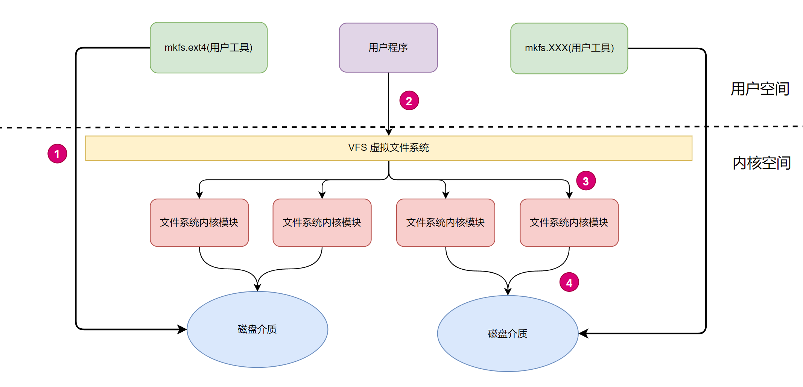
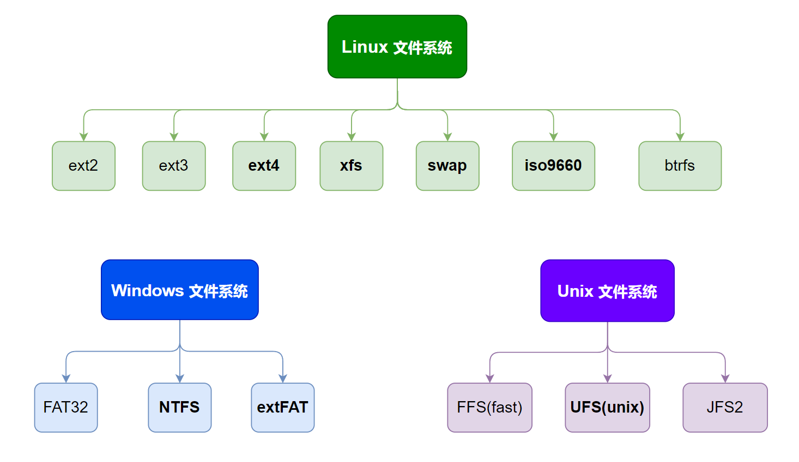
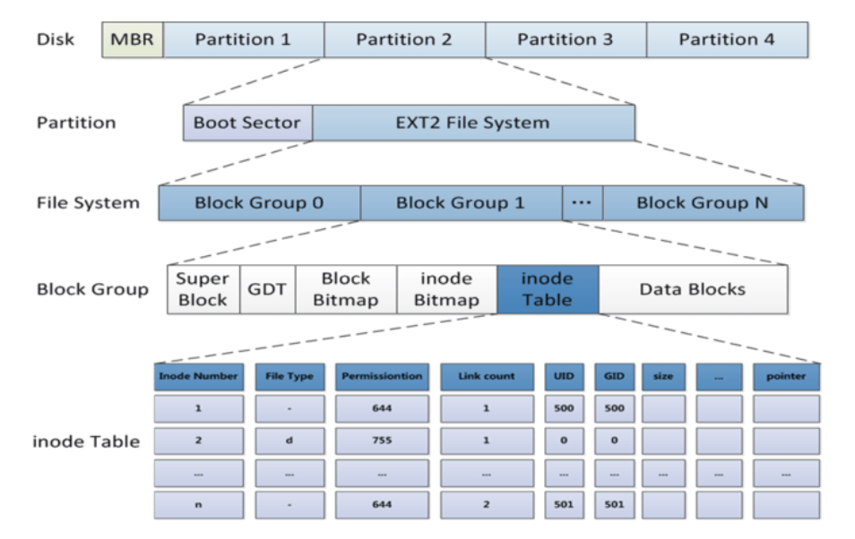
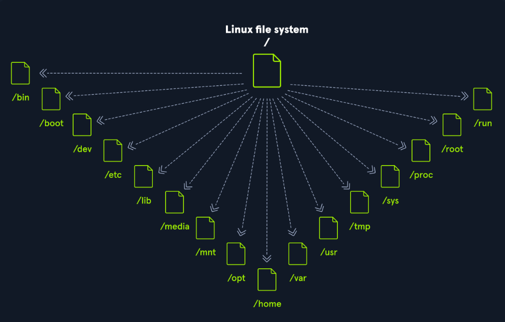
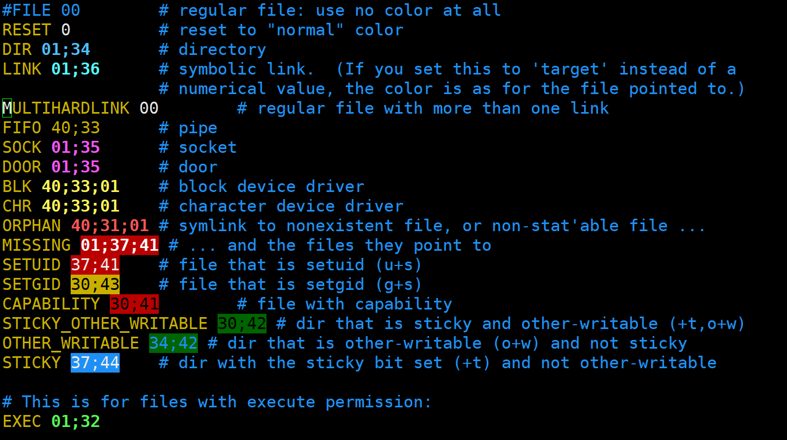
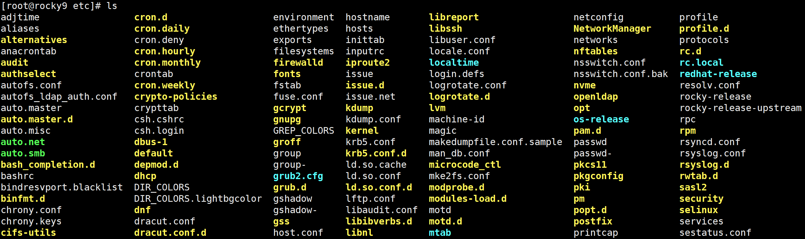
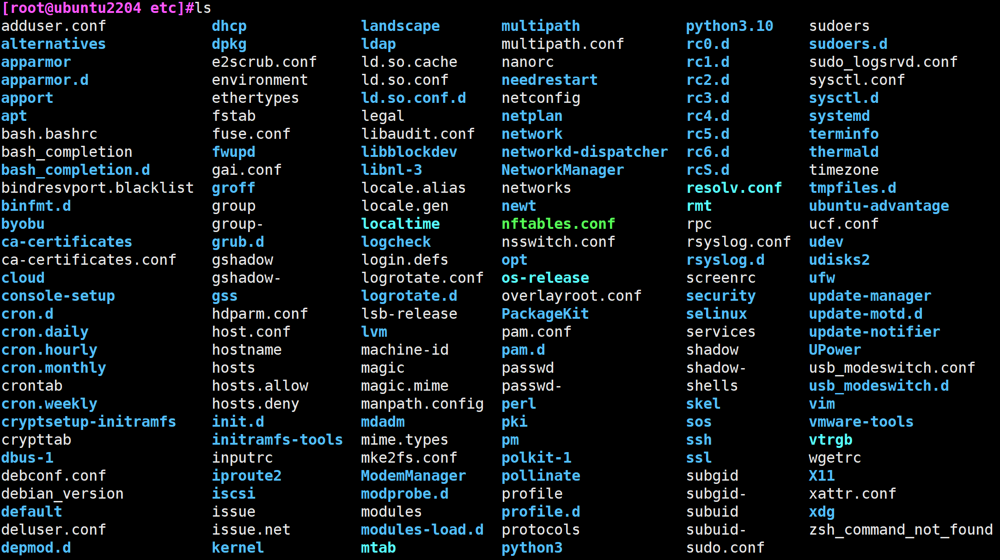
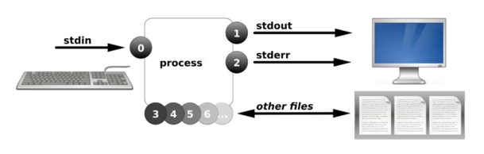

# 1 文件管理和IO重定向

## 1.1 文件系统

### 1.1.1 文件系统的定义

```basic
操作系统中负责管理和存储文件信息的软件结构称为文件管理系统，简称文件系统

文件系统统一管理磁盘与内存中的数据访问过程，其中所有权威元数据都永久存储在磁盘上，而内存中通过缓存（如 inode cache、dentry cache）提升访问效率。
```


### 1.1.2 文件系统的组成


**查看内核内建文件系统**

```bash
[root@devops-custom ~]# grep EXT4 /boot/config-$(uname -r)
CONFIG_EXT4_FS=y
CONFIG_EXT4_USE_FOR_EXT2=y
CONFIG_EXT4_FS_POSIX_ACL=y
CONFIG_EXT4_FS_SECURITY=y
# CONFIG_EXT4_DEBUG is not set
```


**查看内核支持的文件系统模块**

```bash
[root@devops-custom ~]# ls /lib/modules/`uname -r`/kernel/fs
9p      binfmt_misc.ko  cachefiles  cifs  erofs  fscache  isofs  netfs  nfs_common  nls        shiftfs.ko    udf  vboxsf
autofs  btrfs           ceph        dlm   fat    fuse     lockd  nfs    nfsd        overlayfs  smbfs_common  ufs  xfs
```


<span style="color:red">**易混淆概念**</span>

**当前内核支持的文件系统 VS 当前系统可用的文件系统**

```basic
支持但不可用
	如果 Linux 内核的源代码包含了文件系统A的支持，这意味着理论上内核可以处理文件系统A。然而，如果这个支持没有在您当前运行的内核版本中被编译进去（无论是作为内核的一部分，还是作为可以动态加载的模块），那么文件系统A虽然被支持，但在实践中是不可用的。

查看当前内核支持的文件系统
	Rocky：ls /lib/modules/`uname -r`/kernel/fs
	Ubuntu：ls /lib/modules/`uname -r`/kernel/fs

查看当前系统可用的文件系统
	cat /proc/filesystems
```


### 1.1.3 文件系统的三大核心职责


| 模块                 | 功能说明                                                    |
| -------------------- | ----------------------------------------------------------- |
| **元数据管理**       | 管理 inode、目录项、权限、时间戳等信息                      |
| **数据块管理**       | 负责分配/释放数据块，维护块映射结构（如 extents、indirect） |
| **日志机制（可选）** | 提供崩溃一致性保障，如 ext4 的 journal 区                   |


### 1.1.4 理解文件系统的实现





**①：mkfs.ext4 → 磁盘介质**

这是用户态的 `mkfs.ext4` 工具直接通过系统调用（如 `open`、`write`）对 `/dev/sdX` 块设备写入 ext4 文件系统结构（如 superblock、inode 表、块位图等）。
 它**不依赖内核中的 ext4 模块**，而是通过内核通用的块设备驱动将数据写入物理磁盘。

```ABAP
格式化的本质，就是写入文件系统的管理信息！！
```


**②：用户程序 → VFS 虚拟文件系统**

用户程序通过系统调用（如 `open()`, `read()`, `write()`）访问文件。内核首先通过 **VFS（虚拟文件系统）** 作为中间层进行处理。VFS 提供统一的文件操作接口，不关心底层具体使用的是 ext4、xfs 还是 btrfs。


**③：VFS → 文件系统内核模块（如 ext4.ko）**

VFS 在识别出文件属于某个挂载点后，会调用对应的文件系统模块（ext4/xfs等）的具体实现。比如 `ext4_read_inode()`、`ext4_lookup()` 等，这些函数知道如何解析 ext4 格式的磁盘结构。


**④：文件系统模块 → 磁盘介质**

ext4/xfs 等模块调用底层 **块设备接口**（通过 `submit_bio()` 等）读写磁盘扇区。比如要读取 inode 或写入数据块，会最终通过块设备层 + I/O 调度器 + 驱动完成真实磁盘访问。


| **编号** | **路径描述**            | **执行层**           | **说明**                                       |
| -------- | ----------------------- | -------------------- | ---------------------------------------------- |
| **①**    | **mkfs.ext4 → 磁盘**    | 用户态 → 块设备驱动  | 用户工具直接构造文件系统结构写入裸设备         |
| **②**    | **用户程序 → VFS**      | 用户态系统调用       | 程序调用文件操作，进入内核的虚拟文件系统接口层 |
| **③**    | **VFS → 文件系统模块**  | 内核态               | VFS 调用 ext4/xfs 驱动具体实现读取结构         |
| **④**    | **文件系统模块 → 磁盘** | 内核态 → 块层 + 驱动 | 实际的数据读写，最终落地磁盘扇区               |


### 1.1.5 文件系统分类

```ABAP
文件系统的分类，本质上是根据“磁盘上数据结构的组织方式与规则”的不同来划分的。
```





#### 1.1.5.1 ext4

ext4（Fourth Extended File System）文件系统

```basic
ext4是Linux系统中广泛使用的文件系统，它继承了ext3的优点，并在性能和稳定性方面有所提升。
ext4支持大文件和大容量存储设备，具备日志功能以防止数据损坏，并支持延迟分配以减少文件碎片
```

适用场景：

```basic
- ext4最适合用于Linux系统的硬盘分区，以及需要高性能和稳定性的服务器环境。
```


#### 1.1.5.2 XFS

XFS（eXtended File System）

```basic
XFS是一个高性能的64位文件系统，最初由SGI开发，用于高负载服务器和数据存储。
它支持大文件和高并发的读写操作，具有动态空间分配和高效的空间管理能力
```

适用场景：

```basic
- XFS最适合用于需要处理大量数据的高性能服务器和数据存储系统。
```


#### 1.1.5.3 Swap

Swap

```basic
Swap不是一种传统的文件系统，而是一种虚拟内存机制。当操作系统预测到内存分配可能会变得困难时，就会提前触发swap机制，以预防内存不足的情况。这有助于确保系统的稳定性和性能
```

```basic
	当操作系统预测到物理内存不足时，Swap允许系统将部分内存数据写入磁盘上的Swap空间中，以释放物理内存给其他进程使用。Swap空间可以是专门分配的分区，也可以是文件系统中的文件。Swap的使用有助于提升系统的稳定性和性能，尤其是在内存资源紧张的情况下。 
```


#### 1.1.5.4 iso9660

ISO 9660（正式名称：ECMA-119）

```basic
ISO 9660 是为 CD-ROM 设计的只读文件系统格式，它是操作系统安装盘、LiveCD、镜像文件（.iso）的标准文件结构。通过扩展（如 Joliet, Rock Ridge），它可支持更丰富的文件名和权限信息。
```

适用场景：

```basic
ISO 9660 正是光盘（CD-ROM）标准的文件系统格式，它被广泛用于光盘的内容分发、操作系统安装镜像（如 .iso 文件）等场景。
```


#### 1.1.5.5 FAT

FAT（File Allocation Table）文件系统

```basic
FAT是一种简单且广泛使用的文件系统，主要包括FAT12、FAT16和FAT32等版本。
它使用文件分配表来管理文件的位置和状态，具有跨平台性和良好的兼容性，几乎支持所有主流的操作系统。
然而，FAT文件系统不支持高级的文件权限控制。
```

**适用场景**

```basic
- FAT32常用于U盘、存储卡等移动设备，因其简单结构和广泛兼容性而受欢迎。
```


#### 1.1.5.6 NTFS

NTFS（New Technology File System）文件系统

```basic
NTFS是Windows操作系统的标准文件系统，支持高级功能，如文件权限、加密、压缩和磁盘配额。
它提供了更高的安全性和稳定性，支持大文件和分区，并具有文件系统日志，有助于防止数据丢失。
```

适用场景

```basic
- NTFS最适合用于Windows操作系统的硬盘分区，以及需要高级文件管理功能的场景。
```


#### 1.1.5.7 extFAT

exFAT 是 SDXC（64GB及以上SD卡）的官方推荐格式

```basic
exFAT 是为闪存存储设备优化的现代文件系统，兼具 FAT32 的广泛兼容性和对大文件的支持，适合相机、U盘、大容量SD卡等场景。但不适合用作系统盘或高可靠场合。
支持 Windows（Vista SP1+）、macOS（10.6.5+）、Linux（需要 exfat-utils 支持）
```


#### 1.1.5.8 UFS(unix)

```basic
UFS是UNIX文件系统的简称，几乎是大部分UNIX类操作系统默认的基于磁盘的文件系统
```


### 1.1.6 以ext4为例体验文件系统得数据结构与规则





#### 1.1.6.1 Super Block

存放文件系统本身的结构信息，描述整个分区的文件系统信息。记录的信息主要有：block 和 inode 总量，未使用的 block 和 inode 的数量，一个 block 和 inode 的大小，最近一次挂载的时间，最近一次写入数据的时间，最近一次检验磁盘的时间等其他文件系统的相关信息。Super Block的信息被破坏，可以说整个文件系统结构就被破坏了。

```basic
超级块在每个块组的开头都有一份拷贝（第一个块组必须有，后面的块组可以没有【默认采用稀疏备份策略】）。为了保证文件系统在磁盘部分扇区出现物理问题的情况下还能正常工作，就必须保证文件系统的super block信息在这种情况下也能正常访问。所以一个文件系统的super block会在多个block group中进行备份，这些super block区域的数据保持一致

如果想让所有块组都备份超级块和 GDT，可加参数：mkfs.ext4 -O ^sparse_super /dev/sdX
```


#### 1.1.6.2 GDT (Group Description table)

块组描述符表，描述块组属性信息，整个分区分有多少个块组就对应有多少个块组描述符表。每个块组描述符存储一个块组的描述信息，如在这个块组中从哪里开始是 inode Table，从哪里开始是 Data Blocks，空闲的 inode 和 数据块 还有多少个等等。块组描述符在每个块组的开头都有一份拷贝（【默认采用稀疏备份策略】）

```basic
ext4 格式化时可通过 mkfs.ext4 -O ^sparse_super 参数关闭稀疏超级块，改为每组都保存一份备份 GDT。
```


#### 1.1.6.3 Block Bitmap

```basic
块位图 Block Bitmap ，记录着 Data Block 中哪个数据块已经被占用，哪个数据没有被占用。
置为1，申请被占用，置为0，释放空间。
```


#### 1.1.6.4 inode Bitmap

```basic
inode位图，每个bit表示一个inode是否空闲可用
```


#### 1.1.6.5 inode Table

- 存放文件属性如文件大小，所有者，最近修改时间等

- 当前分组所有 Inode 属性的集合

- inode 编号以分区为单位，整体划分，不可跨分区

```basic
inode和数据块，都是跨组编号的
inode和数据库，不能跨分区。
结论：在同一分区内部，inode编号，和块号都是唯一的
```


#### 1.1.6.6 Data Blocks

数据区：存放文件内容，也就是一个一个的Block，根据不同的文件类型，有以下几种情况：

- 对于普通文件，文件的数据存储在数据块中。
- 对于目录，目录下的所有文件名和目录名存储在所在目录的数据块中


## 1.2 文件管理


### 1.2.1 目录结构

Linux操作系统采用树状层次结构，并在文件系统层次结构标准（FHS）中进行了记录。Linux的结构包含以下标准顶级目录：

```http
https://www.pathname.com/fhs/
```




| **Path** | **Description**                                              |
| -------- | ------------------------------------------------------------ |
| `/`      | 顶层目录是根文件系统，它包含在挂载其他文件系统之前启动操作系统所需的所有文件，以及启动其他文件系统所需的文件。启动后，所有其他文件系统都将作为根文件系统的子目录挂载到标准挂载点。<br />The top-level directory is the root filesystem and contains all of the files required to boot the operating system before other filesystems are mounted, as well as the files required to boot the other filesystems. After boot, all of the other filesystems are mounted at standard mount points as subdirectories of the root. |
| `/bin`   | 基本用户命令二进制文件（供所有用户使用）<br />Essenital user command binairise (for use by all user) |
| `/boot`  | 由静态引导加载程序、内核可执行文件和启动 Linux 操作系统所需的文件组成。<br />Consists of the static bootloader, kernel executable, and files required to boot the Linux OS. |
| `/dev`   | 包含设备文件，以便于访问连接到系统的每个硬件设备。<br />Contains device files to facilitate access to every hardware device attached to the system. |
| `/etc`   | 本地系统配置文件。已安装应用程序的配置文件也可以保存在这里。<br />Local system configuration files. Configuration files for installed applications may be saved here as well. |
| `/home`  | 系统上每个用户在这里都有一个子目录用于存储。（可选）<br /> Each user on the system has a subdirectory here for storage.（optional） |
| `/lib`   | 系统启动所需的共享库文件和内核模块。<br />Shared library files that are required for system boot and kernel modules. |
| `/proc`  | 内核和进程信息虚拟文件系统<br />Kernel and process information virtual filesystem |
| `/sys`   | 提供对**内核对象（如设备、模块、驱动、class、bus）**的可编程访问接口<br />Provides programmable access to kernel objects (such as devices, modules, drivers, classes, and buses) |
| `/media` | 外部可移动媒体设备（例如 USB 驱动器）安装在这里。<br />External removable media devices such as USB drives are mounted here. |
| `/mnt`   | 常规文件系统的临时挂载点。<br />Temporary mount point for regular filesystems. |
| `/opt`   | 可选文件（例如第三方工具）可以保存在这里。<br />Optional files such as third-party tools can be saved here. |
| `/root`  | 根用户的主目录。<br />The home directory for the root user.  |
| `/sbin`  | 该目录包含用于系统管理的可执行文件（二进制系统文件）。<br />This directory contains executables used for system administration (binary system files). |
| `/tmp`   | 操作系统和许多程序使用此目录存储临时文件。此目录通常在系统启动时被清除，并且可能会在其他时间被删除，且没有任何警告。<br />The operating system and many programs use this directory to store temporary files. This directory is generally cleared upon system boot and may be deleted at other times without any warning. |
| `/usr`   | 包含可执行文件、库、手册文件等。<br />Contains executables, libraries, man files, etc. |
| `/var`   | 该目录包含可变数据文件，例如日志文件、电子邮件收件箱、Web 应用程序相关文件、cron 文件等。<br />This directory contains variable data files such as log files, email in-boxes, web application related files, cron files, and more. |


### 1.2.2 文件类型

#### 1.2.2.1 概述

磁盘中存放的每个文件可以分为两个部分

- 一部分为文件的内容：即文件的数据部分，此部分内容存放在磁盘中专门的数据空间(data block)中。
- 一部分为文件的属性信息，即元数据(meta data)，比如；文件的大小，类型，节点号，权限，时间等，此部门内容存放在磁盘中专门的节点空间，inode表中


#### 1.2.2.2 普通文件（白色）

**纯文本文件**：

- `ls -l /etc/issue`

**二进制可执行文件（绿色）**：

- 概述：二进制可执行文件是有特殊格式的可执行程序，其文件内容表现为不可直接读懂的字符，用cat查看，会出现乱码。在Linux中有很多二进制可执行文件，比如很多的外部命令都是二进制可执行文件
- `ls -l /bin/cat`

**数据格式文件**

- 概述：数据格式文件是一些程序在运行过程中需要读取的存放在某些特定格式的数据文件，比如：图片文件，压缩文件，日志文件。通常需要特定的工具打开
- 举例：用户登录时，系统会将登录的信息记录在/var/log.wtmp文件中，这个就是一个数据文件。需要使用`last`命令打开此文件查看内容
- `ls -l /var/log/wtmp` -> `last`(直接在/var/log目录下使用last命令)


#### 1.2.2.3 目录文件（蓝色）

- 概述：目录文件即文件夹，通过`ls -l`查看文件属性时，第一个属性表现为d


#### 1.2.2.4 链接文件（浅蓝色）

- 概述：即将两个文件建立关联关系，这种操作实际上是给系统中已有的某个文件指定另外一个可用于访问它的不同文件名称。
- `ls -l`查看文件属性时，第一个属性表现为l
- 分类：
  - 硬链接
  - 软链接


#### 1.2.2.5 管道文件（暗黄色）

- 管道pipe文件是一种特殊的文件类型，其本质是一个伪文件（本质是内核缓冲区）。其主要目的是实现进程间通讯的问题。由于管道文件是一个与进程没有“血缘关系”的，真正独立的文件，所以它可以在任意进程之间实现通信。
- 管道的本质：在内核中分配了 **一个块缓冲区**，这个缓冲区既用于写入数据，也用于读取数据。
- 因为只有一个缓冲区，所以数据只能从写端流向读端，无法实现双向同时通信。
- 内核缓冲区的作用：
  - 内核缓冲区是内存中的一块区域，由操作系统内核管理。
  - 主要用于在数据生产者（写入者）和消费者（读取者）之间暂存数据。
  - 缓冲区实现了数据的异步传递，即数据生产者和消费者无需同时工作，可以通过缓冲区解耦。


#### 1.2.2.6 套接字文件（粉色）

- 概述：数据接口文件，通常被用在基于网络的数据通讯使用。
- 当两个进程在同一台主机上，但是像通过网络方式通信，可基于socket方式进行数据通信，可基于全双工方式实现，即可支持同时双向传输数据。
- `ls -l`查看文件属性时，第一个属性表现为s
- 套接字的基本工作机制：
  - **内核缓冲区的双向性**：
    - 套接字通常是全双工通信，可以同时进行读写。
    - 内核为每个套接字分配两块缓冲区：
      - **发送缓冲区**：存储写入的数据，等待传输。
      - **接收缓冲区**：存储接收到的数据，等待读取。
- **数据流动过程**：
  - 写入数据：
    - 发送进程调用 `write` 或 `send`，将数据写入发送缓冲区。
    - 内核负责将缓冲区中的数据通过网络协议栈传输给远端。
  - 接收数据：
    - 数据到达远端后存储到接收缓冲区。
    - 接收进程调用 `read` 或 `recv`，从接收缓冲区读取数据。
- 网络协议的作用
  - 套接字文件的特点在于它与网络协议栈紧密结合：
    - 内核缓冲区中的数据会经过网络协议栈的封装（TCP、UDP 等协议）进行传输。
    - 数据接收后会被解封装，放入接收缓冲区供应用程序读取。
- **深度理解内核缓冲区**
  - **内核缓冲区设计目标**
    - **解耦读写双方**：
      - 缓冲区允许生产者和消费者以不同的速率运行，无需实时同步。
    - **优化性能**：
      - 缓冲区减少了系统调用的频率：
        - 一次写入操作可以将多次写入的数据累积到缓冲区。
        - 一次读取操作可以批量提取缓冲区中的数据。
    - **保证数据完整性**：
      - 在网络通信中，内核缓冲区负责数据的重新排序和校验，保证数据传输的可靠性（特别是 TCP）。


#### 1.2.2.7 字符设备文件（明黄色）

- 通常是一些串行接口设备在用户空间的体现，像键盘、鼠标。字符设备是按字符为单位进行输入输出的，且按一定的顺序进行
- `ls -l`查看文件属性时，第一个属性表现为c
- 举例；我们登录到Linux主机，系统会提供一个终端文件tty供我们登录。
- 字符设备文件与管道文件的本质区别
  - 字符设备文件的核心在于其与硬件的交互，而管道文件的核心在于进程间通信的能力。


#### 1.2.2.8 块设备文件（明黄色）

- 块文件设备，就是一些以“块为单位”，如：4096个字节，访问数据，提供随机访问的接口设备，例如磁盘、硬盘、U盘

- 字符设备与块设备文件的对比：

  - **字符设备** 通常将数据直接传递给用户程序，数据在用户程序读取或写入之前，会先进入内核的缓冲区。
  - **块设备** 则依赖页缓存和缓冲区，对数据进行更多的管理和优化。

- 块设备：页缓存和缓冲区

  - 页缓存概念

    - 块设备使用页缓存（Page Cache）优化数据读写
      - 页缓存是内核内存中的一部分，用于缓存块设备的读写操作。
      - 当用户程序读取块设备时，内核优先从页缓存中获取数据；只有当页缓存未命中时，才会从设备实际读取。

  - 页缓存的作用：

    - 读优化
      - 避免频繁的设备访问，加速数据读取。
      - 如果数据已在页缓存中，直接返回给用户程序，无需访问设备。

    - 写优化
      - 写操作首先写入页缓存，内核异步将数据刷入设备（延迟写）。
      - 这种机制提高了写入速度，但可能导致数据丢失（在系统崩溃时）。

  - 设备缓冲区（Device Buffer）

    - 块设备（如硬盘、SSD）通常还有硬件缓冲区，用于临时存储正在读写的数据。
    - 硬件缓冲区的大小和实现由设备本身决定。


#### 1.2.2.9 文件类型颜色的配置

##### 1.2.2.9.1 CentOS系文件类型颜色配置

```bash
vim /etc/DIR_COLORS
```



修改`DIR 01;34 -> Dir 01;33`保存后，新开会话




##### 1.2.2.9.2 Ubuntu系文件类型颜色配置

**dircolors 命令**

这个命令用于初始化颜色配置。它会检查 `~/.dircolors` 或 `~/.dir_colors` 文件，如果这些文件不存在，它会使用默认的颜色配置。你通常会在你的 shell 初始化文件中（比如 ~/.bashrc）看到类似于以下的命令：

```bash
test -r ~/.dircolors && eval "$(dircolors -b ~/.dircolors)" || eval "$(dircolors -b)"
```

如果你想要调整 Ubuntu 中 ls 命令输出的颜色，你可以创建或编辑 `~/.dircolors` 文件，并在该文件中定义你的颜色配置。然后，确保你的 shell 初始化文件（如 ~/.bashrc）中包含处理 dircolors 的命令。这样，每次你打开一个新的 shell 时，都会应用这些颜色设置。


**示例**



创建`~/.dircolors`文件，并更改目录颜色

```bash
[root@ubuntu2204 etc]#cat ~/.dircolors 
DIR 01;33
```

新开会话，观察目录颜色


### 1.2.3 文件管理

#### 1.2.3.1  文件信息

##### 1.2.3.1.1 查看文件类型 file

file 命令是一个在 Unix 和类 Unix 系统中常用的命令行工具，用于确定给定文件的类型。它可以基于文件的内容（而不是文件扩展名）来猜测文件的类型，包括文本文件、图像文件、可执行文件、压缩文件 等。file 命令非常有用，因为它提供了对文件内容的直接洞察，而不仅仅是依赖文件扩展名或文件属性。


用法：

```bash
file 命令提供了一些选项来修改其行为或输出。以下是一些的选项：
-b 或 --brief：只输出文件类型，不包括文件名。
-c 或 --brief --check-compress：在判断文件类型时，同时检查是否是压缩文件。
-i 或 --mime：输出文件的 MIME 类型。
-z 或 --uncompress：在测试文件类型之前，先尝试解压缩文件。
-L 或 --dereference：对于符号链接，显示链接指向的实际文件类型，而不是链接文件本身。
```


示例

```bash
[root@rocky9 file_type]# ls
autofs  directory  dmeventd-client  file1_link  file_link  file.txt  ls  mcelog-client

# 查看文件类型
[root@rocky9 file_type]# file autofs
autofs: character special (10/235)

[root@rocky9 file_type]# file directory/
directory/: directory

[root@rocky9 file_type]# file /tmp/
/tmp/: sticky, directory

# 进查看文件类型
[root@rocky9 file_type]# file -b autofs
character special (10/235)

# 查看文件的mime类型
[root@rocky9 file_type]# file -i autofs
autofs: inode/chardevice; charset=binary

# 检测连接的真正文件的类型
[root@rocky9 file_type]# file -L file_link
file_link: empty
[root@rocky9 file_type]# file -L file1_link
file1_link: cannot open `file1_link' (No such file or directory)
```


##### 1.2.3.1.2 查看文件状态 stat

stat 命令是 Linux 系统中的一个非常有用的工具，用于显示文件或文件系统的状态信息。它提供了比  ls 命令更详细的信息，包括文件的访问时间、修改时间、更改时间、文件大小、权限、所有者等。


格式

```bash
# 常用选项
-L 或 --dereference：     # 如果文件是一个符号链接，则显示链接所指向的文件的信息，而不是链接本身的信息。
-f 或 --file-system：     # 显示文件所在文件系统的信息，而不是文件本身的信息。
-t 或 --terse：           # 以简洁方式输出信息，仅显示部分核心信息。
-c 或 --format=<格式>：    # 以自定义格式输出文件的某些信息。在这个选项中，你可以使用特定的转义序列来指定要显示的信息，如 %n                            （文件名）、%s（文件大小）、%a（八进制表示的访问权限）等。
--help                    # 显示 stat 命令的帮助信息。
--version                 # 显示 stat 命令的版本信息。
```


示例

```bash
[root@ubuntu2204 ~]#stat fstab 
  文件：fstab
  大小：657       	块：8          IO 块大小：4096   普通文件
设备：fd00h/64768d	Inode：1572893     硬链接：1
权限：(0644/-rw-r--r--)  Uid: (    0/    root)   Gid: (    0/    root)
访问时间：2025-06-04 16:01:22.454088761 +0800
修改时间：2025-06-04 15:31:24.101978443 +0800
变更时间：2025-06-04 15:31:24.101978443 +0800
创建时间：2025-06-04 15:31:24.101978443 +0800

# 仅查看文件所在文件系统类型信息
[root@ubuntu2204 ~]#stat -f fstab 
  文件："fstab"
    ID: dc50b11ce1be4030 文件名长度：255     类型：ext2/ext3
块大小：4096       基本块大小：4096
    块：总计：25397502   空闲：23713799   可用：22412142
Inodes: 总计：6488064    空闲：6368172

# 自定义格式显示内容
[root@ubuntu2204 ~]#stat -c "文件名:%n\n文件大小:%s bytes\n权限:%A"  fstab 
文件名:fstab\n文件大小:657 bytes\n权限:-rw-r--r--
```


#### 1.2.3.2 文件格式

##### 1.2.3.2.1 windows 和 linux的文件差异

Windows创建的txt文件在Linux系统中无法直接使用，主要是由于两个系统在处理文本文件时存在的一 些格式差异，尤其是换行符的差异。


**换行符差异**

- Windows系统使用回车符（CR，\r）和换行符（LF，\n）的组合（CRLF，\r\n）来表示文本行的结束。
- Linux系统（以及Unix和macOS）则只使用换行符（LF，\n）来表示文本行的结束。


##### 1.2.3.2.2  dos2unix

**dos2unix** 是一个在Linux系统中广泛使用的命令行工具，主要用于将Windows风格的文本文件格式转换 为Unix/Linux风格的文本文件格式，从而解决在不同操作系统之间传输文本文件时可能出现的格式不兼容问题。。

- dos2unix命令能够将文件中的CRLF转换为LF。
-  dos2unix命令还可以移除Windows系统文本文件中行末多余的空格和制表符。


安装软件

```bash
[root@rocky9 ~]# dnf -y install dos2unix
```


格式

```bash
# 使用命令
dos2unix [参数] [文件]

# 参数
-n：不覆盖源文件，将转换后的内容保存到一个新文件中。
-o：指定输出文件的名称（通常与-n选项一起使用）。
-q：静默模式，不显示处理信息。
-k：保留原始文件的时间戳。
-c：转换模式，可以指定不同的字符编码或转换方式
```


##### 1.2.3.2.3  unix2dos

功能与dos2unix相反


#### 1.2.3.3 文件符号

##### 1.2.3.3.1 通配符

**文件通配符**

```basic
	在linux系统中，有非常多的符号，可以帮助我们快速进行相关的文件操作【当然这些操作，不仅限于文件对象，还可以应用在命令场景中】，尤其是借助这些文件通配符可以用来匹配符合条件的多个文件，方便批量管理。
	文件通配符采有特定的符号，表示特定的含义，此特符号称为元 meta 字符。
```


**最常用通配符**

```bash
*             # 匹配零个或多个字符，但不匹配 "." 开头的文件，
{a..z}        # 表示 a-z 范围的所有内容
?            # 即隐藏文件匹配任何单个字符,一个汉字也算一个字符 
~            # 当前用户家目录      
[0-9]        # 匹配数字范围   
[a-Z]        # 相当于a-z + A-Z 范围的一个字母
[^a-z]       # 匹配列表中的所有字符以外的字符
```


##### 1.2.3.3.2 特殊的预定义字符

```bash
#常用通配符
[:alnum:]：字母和数字
[:alpha:]：字母
[:digit:]：数字
[:lower:]：小写字母
[:upper:]：大写字母
[:space:]：空白字符
[:print:]：可打印字符
[:punct:]：标点符号
[:graph:]：图形字符
[:cntrl:]：控制(非打印)字符
[:xdigit:]：十六进制字符
```


##### 1.2.3.3.3 通配符实践

\* 获取所有匹配到的内容

```bash
[root@rocky9 ~]# rm -rf /data/*               # 删除目录下所有文件
```


获取所有以fi为开头的文件

```bash
[root@rocky9 ~]# ls /data/file_type/fi*
/data/file_type/file1_link  /data/file_type/file_link  /data/file_type/file.txt
```


获取以 n-q 之间任意字母为开头的文件

```bash
[root@rocky9 ~]# ls /data/file_type/[n-q]*
/data/file_type/od.1.gz
```


批量创建文件

```bash
[root@rocky9 ~]# touch /d/dir1/{a..f}.txt
[root@rocky9 ~]# ls /d/dir1
a.txt  b.txt  c.txt  d.txt  e.txt  f.txt
```


### 1.2.4 深入理解目录与文件

#### 1.2.3.1 Inode详解

##### 1.2.3.1.1 认识Inode

```C
struct inode {
    umode_t i_mode;                 // 文件的类型和权限（如文件、目录、符号链接等）
    unsigned short i_opflags;
    kuid_t i_uid;                   // 文件的用户 ID（所有者）
    kgid_t i_gid;                   // 文件的组 ID（所属组）
    unsigned int i_flags;
    struct timespec64 i_atime;      // 最后访问时间
    struct timespec64 i_mtime;      // 最后修改时间
    struct timespec64 i_ctime;      // 元数据最后修改时间
    unsigned int i_nlink;           // 硬链接数
    blkcnt_t i_blocks;              // 分配给该文件的块数
    loff_t i_size;                  // 文件的大小（字节）
    
    struct super_block *i_sb;       // 指向超级块的指针
    struct address_space *i_mapping;// 关联文件数据的地址空间
    // ... 其他成员
};
```

- inode 是一个数据结构，它包含了多种信息，包括文件的元数据和指向数据块的指针。因此，inode 的主要作用是管理文件的元数据，而不仅仅是指向文件的物理位置。
- node 中包含多个指针：inode 中包含了多个指向磁盘上数据块的指针，用来定位文件的实际内容。文件的大小决定了需要多少个数据块来存储文件内容，而 inode 结构中的指针帮助文件系统找到这些数据块


##### 1.2.3.1.2 认识Inode表

当在文件系统中创建一个新文件或目录时，文件系统会在 inode 表 中分配一个 inode，并为该文件生成一个 inode 结构体，存储该文件的元数据。这些 inode 是在 文件系统初始化时（通常是格式化时）预留的，保存在磁盘上的 inode 表中。
详细过程

- 文件系统初始化（格式化）：
  - 当文件系统（如 ext4）被初始化或格式化时，文件系统会在磁盘上划分出一定的空间，用来存储 inode 表。
  - inode 表中的 inode 数量是有限的，是在文件系统创建时确定的。例如，如果你创建一个文件系统并指定 10,000 个 inode，那么这个文件系统最多只能支持 10,000 个文件或目录（即使磁盘空间没有用完）。
  - inode 表会被分配固定大小的空间。例如，一个 inode 大约占用 128 或 256 字节，这取决于文件系统的配置。格式化时会计算 inode 表所需的空间，并在磁盘上预留这些空间。

- 创建文件时的 inode 分配：
  - 每当你创建一个新文件或目录时，文件系统会从 inode 表中分配一个空闲的 inode，用于存储该文件的元数据。
  - inode 分配后，文件系统会将文件的相关元数据（如权限、所有者、时间戳、数据块指针等）填入该 inode，并更新文件系统的目录项，将文件名与该 inode 关联。
  - 随着文件的增加，inode 表中的空闲 inode 逐渐减少；一旦 inode 耗尽，文件系统将无法创建新文件或目录，尽管磁盘上可能还有剩余空间。

- inode 表的有限性：
  - inode 表在文件系统创建时确定大小，之后通常不可动态调整。这意味着文件系统可以存储的文件数量受限于 inode 数量，而不仅仅是磁盘容量。
    对于存储大量小文件的场景，inode 数量可能比磁盘容量更早耗尽。因此在格式化文件系统时，可以通过调整 inode 数量来优化文件系统的使用。


##### 1.2.3.1.3 认识inode位图

 inode 位图用于管理 inode 表的使用状态，指示哪些 inode 是空闲的、哪些被占用。


#### 1.2.3.2 目录本质详解

目录就是一种特殊的文件，其内容是一个个“目录项记录”（directory entries）组成的结构数组，用于表示“文件名 → inode号”的映射关系。

##### 1.2.3.2.1 目录项（directory entry）的基本组成

以 **ext2/ext3/ext4 文件系统**为例，每个目录项（`struct ext4_dir_entry`）一般包含以下字段：

| 字段名      | 说明                               |
| ----------- | ---------------------------------- |
| `inode`     | 对应文件的 inode 编号（`inum`）    |
| `rec_len`   | 当前目录项占用的总字节数（含填充） |
| `name_len`  | 文件名的长度                       |
| `file_type` | 文件类型（如普通文件/目录/链接）   |
| `name`      | 文件名字符串（不含结束符 `\\0`）   |


##### 1.2.3.2.2 示例结构体（ext4）

```C
struct ext4_dir_entry {
    __le32 inode;        // 4 bytes
    __le16 rec_len;      // 2 bytes：当前目录项总长度
    __u8   name_len;     // 1 byte：文件名长度
    __u8   file_type;    // 1 byte：文件类型（ext4 专有）
    char   name[];       // 不定长：文件名（不含 '\\0' 结尾）
};
```

 **字段解析说明：**

1. **`inode`（inum）**

- 表示该文件/目录对应的 inode 编号
- 操作系统可用它访问该文件的具体元信息

2. **`rec_len`（record length）**

- 当前目录项在目录文件中实际占据的总字节数
- 由于文件名长度可变，为了保持对齐，rec_len 通常会 > 实际所需空间（内含填充）

3. **`name_len`**

- 实际文件名的长度，单位是字节
- 不包括 `\\0` 结尾字符

4. **`file_type`（ext4 专有，ext2/3 不一定有）**

- 表示该目录项是普通文件、目录、符号链接等
- 类型代码例如：
  - `1`：普通文件
  - `2`：目录
  - `7`：socket（Unix 域）

5. **`name[]`**

- 字符串形式的文件名
- 紧跟在结构体后面，**变长字段**


##### 1.2.3.2.3 示例：目录结构中的记录内容（假设是 ext4）

一个目录文件内容示例（十六进制）可解析出如下内容：

| inode | rec_len | name_len | file_type | name  |
| ----- | ------- | -------- | --------- | ----- |
| 12    | 12      | 1        | 2         | .     |
| 2     | 12      | 2        | 2         | ..    |
| 1002  | 24      | 5        | 1         | readm |

说明：

- `.` 表示当前目录
- `..` 表示上级目录
- `readm` 是普通文件（实际是 `readme`，因对齐可能被截断显示）


 **ext4 中 `file_type` 字段的所有取值说明：**

| 数值（十进制） | 宏名（常量）       | 文件类型      | 对应的 `stat` 类型 |
| -------------- | ------------------ | ------------- | ------------------ |
| `0`            | `EXT4_FT_UNKNOWN`  | 未知类型      | 不可识别           |
| `1`            | `EXT4_FT_REG_FILE` | 普通文件      | `S_IFREG`          |
| `2`            | `EXT4_FT_DIR`      | 目录          | `S_IFDIR`          |
| `3`            | `EXT4_FT_CHRDEV`   | 字符设备文件  | `S_IFCHR`          |
| `4`            | `EXT4_FT_BLKDEV`   | 块设备文件    | `S_IFBLK`          |
| `5`            | `EXT4_FT_FIFO`     | FIFO/管道文件 | `S_IFIFO`          |
| `6`            | `EXT4_FT_SOCK`     | 套接字文件    | `S_IFSOCK`         |
| `7`            | `EXT4_FT_SYMLINK`  | 符号链接      | `S_IFLNK`          |


##### 1.2.3.2.4 创建初始目录的时候，硬链接数初始为2的原因

在UNIX和Linux文件系统中，目录的硬链接数从2开始是有特定的原因的。当你创建一个目录（例如dir1），初始的两个硬链接代表：

- 引用该目录的名字：这就是你所创建的目录名，如dir1。自身是一个硬链接
- .（点）：每个目录都有一个特殊的名字.，它引用自身。当你进入dir1并列出内容时，你会看到一个.目录，它实际上指向dir1自身。
- 当你在dir1内创建子目录时，dir1的硬链接数会增加。这是因为每个子目录都有一个名为..（双点）的特殊目录名，它指向其父目录。因此，每当你在dir1内创建一个子目录，dir1的硬链接数就会增加1。


#### 1.2.3.3 链接文件详解

##### 1.2.3.3.1 硬链接与软链接

**硬链接**：

- 概述：本质上是多个文件名共用一个inode
- 命令：`ln a.txt aa.txt`
- 注意：
  - 因为本质是共用一个inode，所以不能跨分区创建硬链接，因为不同分区有独立的inode表
  - 同理，为了防止inode循环利用，所以目录也不能创建硬链接，但是在创建目录及其子目录的时候，系统会自动创建.和..这种目录的硬链接
  - 硬链接数本质上是inode计数器的值

**软链接**：

- 概述：也叫符号链接，软链接的本质是创建了一个新文件，该文件的内容是源文件的路径，所以访问软连接文件，实质上系统访问指向了源文件
- 命令：`ln -s 目标文件 软链接文件`
  - 注意：根据软链接的本质，软连接文件中的内容实际上是指向目标文件的路径，因此目标文件的路径如果是相对路径，那么一定是相对软链接的路径 
  - 注意2：删除软链接的时候，不要加tab键补全，如果软连接文件后跟/,删除的时候，比如rm -rf /Storage/test/test/ 实际上是把原始目录中的内容一起删除


**关于软连接内容解析**

```bash
[root@ubuntu2204 ~]#mkdir -p a/b/c
[root@ubuntu2204 ~]#tree a/
a/
└── b
    └── c

2 directories, 0 files
[root@ubuntu2204 ~]#cd a/b/c/
[root@ubuntu2204 c]#ln -s ../../../hello.txt hello.txt
[root@ubuntu2204 c]#ll
总计 8
drwxr-xr-x 2 root root 4096  6月  4 13:18 ./
drwxr-xr-x 3 root root 4096  6月  4 13:17 ../
lrwxrwxrwx 1 root root   18  6月  4 13:18 hello.txt -> ../../../hello.txt

# 软链接的内容即是：从链接文件到源文件的指向路径
[root@ubuntu2204 c]#echo "../../../hello.txt"|grep -o "[^\d]"|wc -l
18

```


<span style="color:red">**注意：高危操作**</span>

```bash
[root@ubuntu2204 ~]#tree a
a
└── b
    └── c
    
# 进入a/b/c
[root@ubuntu2204 ~]# cd a/b/c/
[root@ubuntu2204 c]# ln -s ../../../test test
[root@ubuntu2204 ~]#tree a
a
└── b
    └── c
        └── test -> ../../../test

3 directories, 0 files

[root@ubuntu2204 c]#ls test
10.txt  1.txt  2.txt  3.txt  4.txt  5.txt  6.txt  7.txt  8.txt  9.txt

# 当删除软连接目录的时候，后面携带/
[root@ubuntu2204 c]#rm -rf test/

# 查看原目录内容，发现也被删除o(╥﹏╥)o！！！
[root@ubuntu2204 c]#ls -a /root/test/
.  ..
```


#### 1.2.3.4 访问文件时的完整流程

**1️⃣ 路径解析 → 找到目标文件的 inode**

- 从根目录 `/` 开始，逐层查找每一级目录项的 inode。
- 系统会根据路径中每个名字（如 `/home/zhangyifeng/secret.txt`），查找对应目录中的 **目录项（dentry）**，提取目标文件的 inode 编号。


**2️⃣ 加载目标 inode → 得到逻辑块号**

- inode 中包含：
  - 文件大小、权限、时间戳等元数据
  - 指向数据块的“逻辑块号”（extents 或索引结构）


**3️⃣ 逻辑块号 → 计算逻辑扇区号**

- 文件系统层将逻辑块号乘以块大小（如 4096 字节）→ 得到文件数据在磁盘中的偏移（逻辑扇区号）。


4️⃣ 系统读取数据块 → 把数据交给程序

- 内核通过块设备驱动，向磁盘发起读取请求，读取目标扇区。
- 数据先进入**内存中的页缓存**；
- 然后通过 `read()` 系统调用，将数据从内核缓冲复制到用户程序中。


**5️⃣ 程序拿到数据，处理或显示**


```ABAP
"文件路径" → 找 inode → 得到数据位置 → 磁盘读数据 → 程序收到数据
```


#### 1.2.3.5 实验1：手动用 `hexdump` 分析 ext4 的目录结构

**整体流程概览**

1. 找到目标目录对应的 inode（使用 `debugfs`）
2. 获取该 inode 指向的数据块地址
3. 从设备中提取对应数据块内容
4. 用 `hexdump` 查看，并手动解析目录项结构


##### 实验步骤详解

> 假设我们的挂载设备是 `/dev/vda1`，挂载点为 `/`，要分析的目录为 `/home`

**第 1 步：进入 debugfs 查看目标目录 inode 信息**

```bash
debugfs /dev/vda1
```

进入交互后：

```bash
debugfs: stat /home
```

```bash
Inode: 1518   Type: directory    Mode:  0755   Flags: 0x80000
Generation: 2375206807    Version: 0x00000000:00000002
User:     0   Group:     0   Project:     0   Size: 4096
File ACL: 0
Links: 3   Blockcount: 8
Fragment:  Address: 0    Number: 0    Size: 0
 ctime: 0x64be8b93:0a7d8c00 -- Mon Jul 24 14:32:51 2023
 atime: 0x683ca913:e6065518 -- Sun Jun  1 19:25:07 2025
 mtime: 0x64be8b93:0a7d8c00 -- Mon Jul 24 14:32:51 2023
crtime: 0x64ae0bd7:e5c38f74 -- Wed Jul 12 02:11:35 2023
Size of extra inode fields: 32
Inode checksum: 0xeeec52cf
EXTENTS:
(0):16735
```

**详细解释：**

📌 `EXTENTS:` 是 ext4 文件系统的块寻址方式之一

- ext2/ext3 使用「直接块 + 间接块」方式（最多 15 个指针）
- ext4 默认使用 **Extent tree（扩展树）**，更适合大文件、高连续性

📌 `(0):16735` 的含义是：

- `0` 表示这是第 0 个 extent（起始偏移块号为 0）
- `16735` 是该 extent 在物理设备中的第一个实际 **物理块号**


**第 2 步：根据上文的输出，可以得到如下信息**

```ABAP
这是一个 ext4 文件系统
该 inode 使用 Extent（扩展块映射）格式
第一个数据块号是 16735

字节偏移 = 16735 × 4096 = 68575232 字节
```


**第 3 步：从设备中提取这个数据块**

```bash
dd if=/dev/vda1 bs=4096 skip=16735 count=1 of=dirblock.bin
```


**第 4 步：使用 hexdump 分析目录块内容**

```bash
hexdump -C dirblock.bin | less
```

```bash
00000000  ee 05 00 00 0c 00 01 02  2e 00 00 00 02 00 00 00  |................|
00000010  0c 00 02 02 2e 2e 00 00  01 f0 03 00 dc 0f 06 02  |................|
00000020  75 62 75 6e 74 75 00 00  00 00 00 00 00 00 00 00  |ubuntu..........|
00000030  00 00 00 00 00 00 00 00  00 00 00 00 00 00 00 00  |................|
*
00000ff0  00 00 00 00 00 00 00 00  0c 00 00 de 14 63 1c 37  |.............c.7|
00001000
```


##### 手动解析规则（基于 `ext4_dir_entry`）

每个目录项格式如下：

| 字节偏移 | 字段名    | 长度   | 含义                             |
| -------- | --------- | ------ | -------------------------------- |
| 0        | inode     | 4B     | 文件/目录的 inode 编号           |
| 4        | rec_len   | 2B     | 当前目录项占用的总长度           |
| 6        | name_len  | 1B     | 文件名长度（不含结尾）           |
| 7        | file_type | 1B     | 文件类型（1: 普通文件, 2: 目录） |
| 8        | name      | N 字节 | 文件名（变长）                   |


**示例解析**

```bash
 01 f0 03 00 dc 0f 06 02  # 
 75 62 75 6e 74 75        # Ubuntu(文件名)
```

逐项解释：

- `01 f0 03 00` → `inode = 0x0003f001 = 258,049`
- `dc 0f` → `rec_len = 0x0fdc = 4060`
- `06` → name_len = 6（Ubuntu，6个字符）
- `02` → file_type = 2 （目录）
- `2e` → 文件名 = "."（ASCII）

```bash
[root@devops-custom ~]# ll -i /home
总计 12
  1518 drwxr-xr-x  3 root   root   4096  7月 24  2023 ./
     2 drwxr-xr-x 19 root   root   4096  5月 26 08:53 ../
258049 drwxr-x--- 17 ubuntu ubuntu 4096  5月  4 12:53 ubuntu/
```


#### 1.2.3.6 实验2：Linux 文件系统取证实操—通过 inode 手动恢复已删除文件

```bash
# 创建一个文件
[root@ubuntu2204 ~]#echo hello > hello.txt

# 查看hello.txt所在的物理块号
[root@ubuntu2204 ~]#debugfs /dev/ubuntu-vg/ubuntu-lv 
debugfs 1.46.5 (30-Dec-2021)
debugfs:  stat /root/hello.txt
Inode: 1572881   Type: regular    Mode:  0644   Flags: 0x80000
Generation: 3004533257    Version: 0x00000000:00000001
User:     0   Group:     0   Project:     0   Size: 6
File ACL: 0
Links: 1   Blockcount: 8
Fragment:  Address: 0    Number: 0    Size: 0
 ctime: 0x683fdcad:1cff6aa4 -- Wed Jun  4 13:42:05 2025
 atime: 0x683fdcad:1cff6aa4 -- Wed Jun  4 13:42:05 2025
 mtime: 0x683fdcad:1cff6aa4 -- Wed Jun  4 13:42:05 2025
crtime: 0x683fdcad:1cff6aa4 -- Wed Jun  4 13:42:05 2025
Size of extra inode fields: 32
Inode checksum: 0x70d6ba27
EXTENTS:
(0):6389761

# 删除文件
[root@ubuntu2204 ~]#rm hello.txt

# 直接访问磁盘恢复数据
[root@ubuntu2204 ~]#dd if=/dev/ubuntu-vg/ubuntu-lv of=recovered.txt bs=4096 skip=6389761 count=1
记录了1+0 的读入
记录了1+0 的写出
4096字节（4.1 kB，4.0 KiB）已复制，0.000407764 s，10.0 MB/s
[root@ubuntu2204 ~]#cat recovered.txt 
hello
```


## 1.3 重定向与管道

### 1.3.1 标准输入和输出

Linux 系统中有三个最基本的IO设备

1. **标准输入设备(stdin)**：对应终端键盘 
2. **标准输出设备(stdout)**：对应终端的显示器 
3. **标准错误输出设备(stderr)**：对应终端的显示器


在Linux系统中，一切皆文件，所以，这三个设备也是以文件的形式存在于系统中； 

程序从标准输入设备中获取数据，再将运行结果和错误信息输出到标准输出设备和标准错误输出设备；


在虚拟终端中，标准输入输出设备都是当前的终端窗口

```bash
[root@ubuntu2204 ~]#ll /dev/std*
lrwxrwxrwx 1 root root 15  6月  4 10:17 /dev/stderr -> /proc/self/fd/2
lrwxrwxrwx 1 root root 15  6月  4 10:17 /dev/stdin -> /proc/self/fd/0
lrwxrwxrwx 1 root root 15  6月  4 10:17 /dev/stdout -> /proc/self/fd/1

[root@ubuntu2204 ~]#ll /proc/self/fd/
总计 0
dr-x------ 2 root root  0  6月  4 14:26 ./
dr-xr-xr-x 9 root root  0  6月  4 14:26 ../
lrwx------ 1 root root 64  6月  4 14:26 0 -> /dev/pts/3
lrwx------ 1 root root 64  6月  4 14:26 1 -> /dev/pts/3
lrwx------ 1 root root 64  6月  4 14:26 2 -> /dev/pts/3
lr-x------ 1 root root 64  6月  4 14:26 3 -> /proc/199933/fd/

[root@ubuntu2204 ~]#tty
/dev/pts/3
```





#### 1.3.1.1 认识文件描述符

 

如果我们将文件比作一个水龙头，那么“文件描述符”就是水龙头的号码牌（编号），用户可以直接使用水龙头，但是程序必须通过号码牌的编号来操作指定的水龙头


- 在 Linux 中，一旦程序打开文件，它就得到了一个水龙头的“编号”——这个编号就是**文件描述符（fd）**。

- 程序再也不会使用“路径”来操作文件，而是用这个编号来“拧开水龙头”。

- 编号 0、1、2 默认分别对应 **标准输入**、**标准输出** 和 **标准错误**。


##### 1.3.1.1.1 用户视角 VS 程序视角中的文件描述符

| 角色 | 如何访问文件       | 举例                    |
| ---- | ------------------ | ----------------------- |
| 用户 | `cat file.txt`     | 通过“路径 + 文件名”访问 |
| 程序 | `open("file.txt")` | 返回一个 **文件描述符** |

> 程序**不能用路径直接访问文件内容**，必须先调用 `open()` 得到**文件描述符（整数）**，后续读写操作全靠这个“编号”来进行。


##### 1.3.1.1.2 文件描述符的来源

```C
int fd = open("file.txt", O_RDONLY);
```

> `open()` 系统调用的返回值 `fd` 就是文件描述符，是一个整数（如 `3`）。

| 文件描述符编号 | 作用                           |
| -------------- | ------------------------------ |
| 0              | 标准输入 stdin                 |
| 1              | 标准输出 stdout                |
| 2              | 标准错误 stderr                |
| 3 及以上       | 普通文件、socket、管道、设备等 |


##### 1.3.1.1.3 文件描述符如何使用

```C
read(fd, buf, 100);   // 从 fd 对应的文件中读数据
write(fd, buf, 100);  // 向 fd 对应的文件中写数据
close(fd);            // 关闭 fd
```

> 程序不关心“文件名”或“路径”，它只操作文件描述符！


```basic
文件描述符本身不占用Inode，但是它间接持有Inode
```


### 1.3.2 I/O重定向 redirect

I/O重定向：将默认的输入，输出或错误对应的设备改变，指向新的目标


#### 1.3.2.1 标准输出和标准错误重定向

STDOUT和STDERR默认是使用当前终端，但也可以重定向到指定终端或指定文件


格式：

```bash
COMMAND OPERATOR FILE|DEVICE

# 覆盖操作符，如果文件存在，会被覆盖
>                # 把STDOUT重定向到文件
1>               # 同上
2>               # 把STDERR重定向到文件
&>               # 把标准输出和错误都重定向
>&               # 和上面功能一样，建议使用上面方式 


# 追加操作符，在原有文件的基础上追加内容
>>               # 追加标准输出重定向至文件
1>>              # 同上
2>>              # 追加标准错误重定向至文件
```


范例：标准输出到其他终端

```bash
# 在终端窗口1查看
[root@ubuntu2204 ~]# tty
/dev/pts/1

# 在终端窗口3查看 
[root@ubuntu2204 ~]# tty
/dev/pts/3

# 在终端开窗口1执行
[root@ubuntu2204 ~]#echo "hello" > /dev/pts/3

# 在终端窗口3显示
[root@ubuntu2204 ~]# hello    # 这里显示的hello，是从窗口1发送过来的
```


范例：标准错误输出至其他终端

```bash
# 在终端窗口1查看
[root@ubuntu2204 ~]# tty
/dev/pts/1

# 在终端窗口3查看 
[root@ubuntu2204 ~]# tty
/dev/pts/3

# 在终端窗口1执行
[root@ubuntu2204 ~]#lss > /dev/pts/3
找不到命令 “lss”，您的意思是：
  “gss” 命令来自 Debian 软件包 libgss-dev (1.0.3-7)
  “lsc” 命令来自 Debian 软件包 livescript (1.6.1+dfsg-2)
  “lsw” 命令来自 Debian 软件包 suckless-tools (46-1)
  “lrs” 命令来自 Debian 软件包 lrslib (0.71a-1)
  “ls” 命令来自 Debian 软件包 coreutils (8.32-4.1ubuntu1.2)
  “lvs” 命令来自 Debian 软件包 lvm2 (2.03.11-2.1ubuntu5)
  “lsm” 命令来自 Debian 软件包 lsm (1.0.4-2)
  “ass” 命令来自 Debian 软件包 irpas (0.10-9)
  “ss” 命令来自 Debian 软件包 iproute2 (5.15.0-1ubuntu2)
  “less” 命令来自 Debian 软件包 less (590-1ubuntu0.22.04.3)
  “iss” 命令来自 Debian 软件包 insilicoseq (1.5.4-2)
  “les” 命令来自 Debian 软件包 atm-tools (1:2.5.1-4build2)
  “lsns” 命令来自 Debian 软件包 util-linux (2.37.2-4ubuntu3.4)
  “lssu” 命令来自 Debian 软件包 nilfs-tools (2.2.8-1)
  “lsh” 命令来自 Debian 软件包 lsh-client (2.1-13)
尝试 apt install <deb name>

# 终端窗口3无任何显示

# 在终端窗口1执行
[root@ubuntu2204 ~]# lss 2> /dev/pts/3

# 终端窗口3显示
[root@ubuntu2204 ~]#找不到命令 “lss”，您的意思是：
  “ass” 命令来自 Debian 软件包 irpas (0.10-9)
  “iss” 命令来自 Debian 软件包 insilicoseq (1.5.4-2)
  “lssu” 命令来自 Debian 软件包 nilfs-tools (2.2.8-1)
  “lsns” 命令来自 Debian 软件包 util-linux (2.37.2-4ubuntu3.4)
  “ss” 命令来自 Debian 软件包 iproute2 (5.15.0-1ubuntu2)
  “lvs” 命令来自 Debian 软件包 lvm2 (2.03.11-2.1ubuntu5)
  “lsc” 命令来自 Debian 软件包 livescript (1.6.1+dfsg-2)
  “ls” 命令来自 Debian 软件包 coreutils (8.32-4.1ubuntu1.2)
  “lsm” 命令来自 Debian 软件包 lsm (1.0.4-2)
  “les” 命令来自 Debian 软件包 atm-tools (1:2.5.1-4build2)
  “lsh” 命令来自 Debian 软件包 lsh-client (2.1-13)
  “lsw” 命令来自 Debian 软件包 suckless-tools (46-1)
  “less” 命令来自 Debian 软件包 less (590-1ubuntu0.22.04.3)
  “gss” 命令来自 Debian 软件包 libgss-dev (1.0.3-7)
  “lrs” 命令来自 Debian 软件包 lrslib (0.71a-1)
尝试 apt install <deb name>
```


范例：重定向至文件

```bash
# 标准输出重定向至文件，覆盖
[root@ubuntu2204 ~]# cat fstab > out.log

# 标准输出重定向至文件，追加
[root@ubuntu2204 ~]# cat fstab >> out.log

#标准错误输出重定向至文件，覆盖
[root@ubuntu2204 ~]# cat null 2> err.log

#标准错误输出重定向至文件，追加
[root@ubuntu2204 ~]# cat null 2>> err.log
```


**标准输出和错误输出各自定向至不同位置**

格式：

```bash
COMMAND > sucess.out 2> /path/to/error.out
```


范例：同时标准输出和标准错误输出

```bash
[root@ubuntu2204 ~]# ls hello.sh he > success.log 2> error.log

[root@ubuntu2204 ~]# cat success.log 
hello.sh

[root@ubuntu2204 ~]# cat error.log 
ls: 无法访问 'he': 没有那个文件或目录
```


**合并标准输出和错误输出为同一个数据流进行重定向**

格式：

```bash
&>                   # 覆盖重定向
&>>                  # 追加重定向

COMMAND > /path/to/file.out 2>&1 
COMMAND >> /path/to/file.out 2>&1
```


范例：标准输出和标准错误输出重定向至同一个文件

```bash
# 正常执行
[root@ubuntu2204 ~]#ls fstab null
ls: 无法访问 'null': 没有那个文件或目录
fstab

#标准输出重定向至 out.log,标准错误输出重定向至标准输出
[root@ubuntu2204 ~]# ls fstab null > out.log 2>&1

# 查看
[root@ubuntu2204 ~]#cat out.log 
ls: 无法访问 'null': 没有那个文件或目录
fstab

# 与2>&1等价
[root@ubuntu2204 ~]#ls fstab null &> out.log
```

补充：`&`符号的作用

- 表示要操作的是文件描述符而非文件或命令。
- 例如`&1`这里指的是文件描述符1


范例：清除大文件

```bash
# 通用
[root@ubuntu2204 ~]# cat /dev/null > /data/file.log

# 依赖于shell类型,不通用
[root@ubuntu2204 ~]# > /data/file.log
```


#### 1.3.2.2 单行重定向与多行重定向输出

```bash
单行重定向：
cat > cat.log

多行重定向：
cat > cat2.log <<EOF  # EOF是结束符

# 单行重定向在回车启用命令是，就已经创建了文件，然后每输入一行，回车后，内容就流入指定文件
# 多行重定向是在所有命令都输入完之后，遇到EOF结束时，才一起执行所有命令
```


范例：多行重定向

```bash
[root@ubuntu2204 ~]#cat > cat.log <<EOF
> 11111
> 22222
> 33333
> EOF

[root@ubuntu2204 ~]#cat cat.log 
11111
22222
33333
```


#### 1.3.2.3 标准输入重定向

```ABAP
使用标准输入的前提：命令支持标准输入
```


##### 1.3.2.3.1 tr 命令

用于转换字符、删除字符和压缩重复的字符。它从标准输入读取数据并将结果输出到标准输出

```bash
tr [OPTION]... SET1 [SET2]

#常用选项
-c|-C|--complement            # 取字符集的补集 
-d|--delete                   # 删除所有属于第一字符集的字符        
-s|--squeeze-repeats          # 把连续重复的字符以单独一个字符表示，即去重
-t|--truncate-set1            # 将第一个字符集对应字符转换为第二个字符集对应的字符，如果第一个字符集的字符数量多于第二字符集                                 数量，超出部分忽略    

#常用通配符
[:alnum:]：字母和数字
[:alpha:]：字母
[:digit:]：数字
[:lower:]：小写字母
[:upper:]：大写字母
[:space:]：空白字符
[:print:]：可打印字符
[:punct:]：标点符号
[:graph:]：图形字符
[:cntrl:]：控制(非打印)字符
[:xdigit:]：十六进制字符
```


示例

```bash
# 文件重定向
# 替换大小写
[root@ubuntu2204 ~]#tr 'a-z' 'A-Z' < /etc/issue
UBUNTU 22.04.1 LTS \N \L

[root@ubuntu2204 ~]#tr [:lower:] [:upper:] < /etc/issue
UBUNTU 22.04.1 LTS \N \L

# 保留所需字符
[root@ubuntu2204 ~]#tr -dc 'a-z0-9A-Z' < /dev/random |head -c 10
72waODnf7x

# 命令重定向
# 压缩空格
[root@ubuntu2204 ~]#tr -s ' ' < <(df)    # <(df) 会临时生成一个伪文件
文件系统 1K的块 已用 可用 已用% 挂载点
tmpfs 198824 1320 197504 1% /run
/dev/mapper/ubuntu--vg-ubuntu--lv 101590008 6660852 89722528 7% /
tmpfs 994120 0 994120 0% /dev/shm
tmpfs 5120 0 5120 0% /run/lock
/dev/sda2 1992552 248988 1622324 14% /boot
tmpfs 198824 0 198824 0% /run/user/0
/dev/sdb 20466256 28 19401268 1% /mnt

# 同上
[root@ubuntu2204 ~]# tr -s ' ' <<< `df`
```


##### 1.3.2.3.2 bc 命令

`bc` 是 Linux 中非常常用的**任意精度计算器语言（Basic Calculator）**，支持整数、浮点数、变量、自定义函数等，非常适合用于命令行中的数学计算，尤其是 **shell 脚本中的浮点数计算**。


**进入交互模式**

```bash
[root@ubuntu2204 ~]#bc
bc 1.07.1
Copyright 1991-1994, 1997, 1998, 2000, 2004, 2006, 2008, 2012-2017 Free Software Foundation, Inc.
This is free software with ABSOLUTELY NO WARRANTY.
For details type `warranty'. 
1+2
3
quit  # 退出
```


**使用浮点数计算（默认不开启小数）**

```bash
[root@ubuntu2204 ~]# bc < <(echo "1/2")
0
```

 正确方式：启用小数计算精度

```bash
[root@ubuntu2204 ~]# bc < <(echo "scale=4; 1 / 2")
.5000
```


**变量与表达式**

```bash
[root@ubuntu2204 ~]# bc < <(echo "a = 5; b = 2; scale=2; a / b")
2.50
```


#### 1.3.2.4 高级重定向写法

##### 1.3.2.4.1 cmd <<< "string"

含义是 here-string ，表示传给给cmd的stdin的内容从这里开始是一个字符串。


范例：直接字符串

```bash
[root@ubuntu2204 ~]# cat <<< "abc"
abc

[root@ubuntu2204 ~]# bc <<< "1+2+3"
6
```


范例：：执行命令作重定向输入

```bash
[root@ubuntu2204 ~]# bc <<< `echo 1+2+3`
6

[root@ubuntu2204 ~]# tr 'a-z' 'A-Z' <<< `hostname`
ROCKY86
```


##### 1.3.2.4.2 cmd1 < <(cmd2)

名称为 Process substitution ,是由两个部分组成

<(cmd2) 表示把cmd2的输出写入一个临时文件, 注意：< 符号 与（ 符号之间没有空格


范例

```bash
[root@ubuntu2204 ~]# bc < <(echo 1+2+3)
6

[root@ubuntu2204 ~]# bc < <(seq -s + 3)
6

[root@ubuntu2204 ~]# tr 'a-z' 'A-Z' < <(hostname)
ROCKY86
```


范例：查看中间文件

```bash
[root@ubuntu2204 ~]#ll <(hostname)
lr-x------ 1 root root 64  6月  4 17:10 /dev/fd/63 -> 'pipe:[1264724]'

# 说明描述符 63 是一个 FIFO（管道）文件，而 1264724 是它的“inode ID”。
```


### 1.3.3 管道

在shell 中，可以将两个或多个命令(程序|进程)连接起来，将前一个命令的输出作为后一个命令的输入， 就像拿水管将两个命令连起来

使用管道，要求前一个命令必须支持标准输出，**后一个命令必须支持标准输入**；


格式

```bash
COMMAND1|COMMAND2|COMMAND3|...
```


功能说明：

-  将命令1的STDOUT发送给命令2的STDIN，命令2的STDOUT发送到命令3的STDIN  
- 所有命令会在当前shell进程的子shell进程中执行  
- 组合多种工具的功能


注意：STDERR默认不能通过管道转发，可利用2>&1 或 |& 实现，格式如下

```bash
COMMAND1 2>&1 | COMMAND2 
COMMAND1 |& COMMAND2
```


范例

```bash
[root@ubuntu2204 ~]# echo 1+2+3|bc
 6
 
[root@ubuntu2204 ~]# cat /var/log/syslog | more
 
[root@ubuntu2204 ~]#echo $PATH | tr ':' '\n'
/usr/local/sbin
/usr/local/bin
/usr/sbin
/usr/bin
/sbin
/bin
/usr/games
/usr/local/games
/snap/bin
```


范例：多重管道

```bash
[root@ubuntu2204 ~]#ifconfig | head -n 2|tail -n 1| tr -s " " |cut -d" " -f3
10.0.0.131
```


范例：标准输出和标准错误输出同时使用管道

```bash
[root@ubuntu2204 ~]# ls fstab null 2>&1 | tr 'a-z' 'A-Z'
LS: CANNOT ACCESS 'NULL': NO SUCH FILE OR DIRECTORY
FSTAB
```


范例：实现邮件服务

```bash
[root@ubuntu2204 ~]#cat > /etc/mail.rc <<EOF
> set from=15104600741@163.com
> set smtp=smtp.163.com
> set smtp-auth-user=15104600741@163.com
> set smtp-auth-password=OZUREAAOLBQQGUTQ
> set smtp-auth=login
> set ssl-verify=ingore
> EOF

# 下载mail
[root@ubuntu2204 ~]# apt install mailutils

[root@ubuntu2204 ~]#echo "test email" |mail -s "test" 3140394153@qq.com
```


范例：用户密码修改

```bash
[root@rocky9 etc]# useradd tom
[root@rocky9 etc]# passwd --stdin tom
Changing password for user tom.
123456
passwd: all authentication tokens updated successfully.

[root@centos8 ~]#cat pass.txt
 centos
 
[root@rocky86 ~]# passwd --stdin jose < pass.txt
Changing password for user jose.
passwd: all authentication tokens updated successfully

[root@rocky86 ~]# cat pass.txt | passwd --stdin jose
Changing password for user jose.
passwd: all authentication tokens updated successfully.
```

```bash
#ubuntu 中 passwd 函数没有 --stdin 选项
[root@ubuntu2204 ~]#echo -e "123456\n123456" | passwd mystical
New password: Retype new password: passwd: password updated successfully
```


#### 1.3.3.1 tee管道

将标准输入复制到每个指定文件，并显示到标准输出

```ABAP
既要又要
```


格式

```bash
tee [OPTION]... [FILE]...

# 常用选项
-a|--append                  # 内容追加到给定的文件而非覆盖
-i|--ignore-interrupts       # 忽略中断信号
-p                           # 对写入非管道的行为排查错误，其使用的是 warn-nopipe
--output-error[=模式]         # #设置写入出错时的行为 (warn|warn-nopipe|exit|exit-nopipe)

cmd1 | tee [-a ] filename | cmd2 
```


范例

```bash
#接受标准输入，在标准输出上打印，并写文件
[root@ubuntu2204 ~]# tee tee.log

#管道重定向
[root@ubuntu2204 ~]# echo hello | tee tee.log
hello

#tee.log 里面是hello,终端输出是HELLO
[root@ubuntu2204 ~]# echo hello | tee tee.log | tr 'a-z' 'A-Z'
HELLO

# tee.log 和终端输出都是大写
[root@ubuntu2204 ~]# echo hello | tr 'a-z' 'A-Z' | tee tee.log
HELLO

# 追加
[root@ubuntu2204 ~]# echo hello | tr 'a-z' 'A-Z' | tee -a tee.log
HELLO
```


