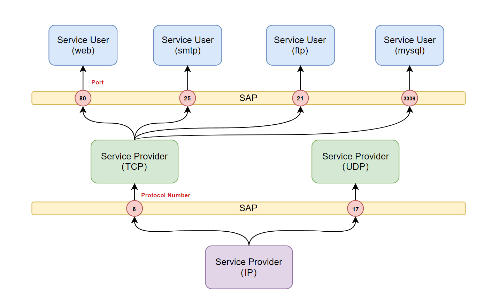
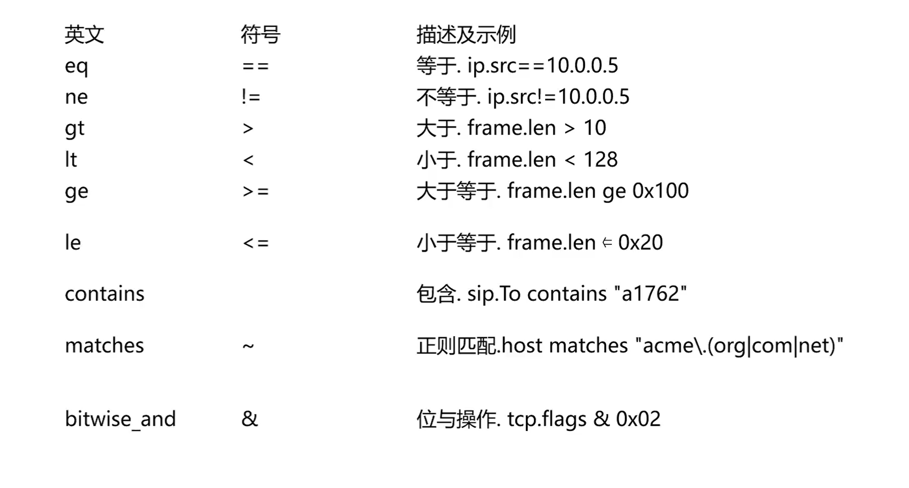

## 1.1 网络基础概述


### 1.1.1 什么是Internet

#### 1.1.1.1 什么是网络


举几个网络的例子：电话网，蜘蛛网，交际网也是网络，所以网络有什么特点？

```bat
都是由节点和边构成的
```


**上述三个网络是不是一种网络？**

答案是的，所以网络就是和大小无关的，节点和边的关系，和形状无关。

- 这个图里的节点，可以是个人，那这个边可能就是他们的朋友关系。
- 这也可以是一个蜘蛛网的节点到另外一个节点，中间是蜘蛛线，这也是网络。
- 又或者神经元即它的树突等，也是网络


<span style="color:red">**再拉回到蜘蛛网，蜘蛛网就是与大小，形状无关的网络的拓扑，这叫网络。那什么是计算机网络？**</span>


#### 1.1.1.2 什么是计算机网络


**计算机网络**：计算机网络是联网的计算机，所构成的系统。我们都知道网络有节点和线构成，那么计算机网络中，节点都是什么？


**计算机网络中的节点分为两种**

- **主机节点**

  比如：笔记本，手机，ipad，联网的冰箱，机顶盒等等，它是数据的源，也是数据的目标


- **数据交换节点**

  比如交换机，路由器，它即不是数据的源，也不是数据的目标，来一个分组从一个端口进来，按照一定的工作方式。

  如果是**交换机**的话就是按照目标mac地址，决定从某个方向转。

  如果是一个**路由器**的话，来一个分组，从一个端口通过网卡收进来，收进来之后，通过查路由表，决定从另一个方向放出去，它是转发数据的，它既不是源，也不是目标。

  路由器和交换机，它们只是层次不同，作用不同，路由器是工作在网络层，交换机工作在链路层，当然还有更高层的网络交换设别，比如还有第4层，第5层的负载均衡设备等等，这些设备有什么特点？它也是节点，但是它既不是数据的源，也不是数据的目标，它是数据的中转节点。收到数据后将它转走，到下一节点后，收到之后转走，通过这些中转节点的相互配合，最终实现从源节点到目标节点。

​	


把节点连在一起的是什么？叫**链路（Link）**也就是边。把主机跟交换节点连在一起，把交换节点和交换节点连在一起，最后构成一个网，然后节点之间才能够相互通信。


**计算机中的链路，也分两种**

- **第一类**：我的主机通过以太网的网线，接到最近的一个交换机，所以叫接入网，接入的链路（Access）
- **第二类**：路由器和路由器，路由器和交换机，交换机和交换机，也就是交换节点之间的骨干链路（Backbone）


**总结:**

计算机网络，从构成的角度（节点和边）

节点包括**主机**和**交换节点**，数据交换节点工作的层次不同有分为交换机，路由器，以及一些高层的负载均衡设备等等

 链路的按照它连接的主机和路由器，还是交换节点之间链路可以分为 **Access **和 **Backbone**，也就是接入链路和骨干链路

```bat
所以说，连网的计算机系统，由节点和边构成的这样一个系统，我们把它叫做计算机网络
```


**协议**

当然除了互联网构成的这样一些硬件的组成，节点和边之外的，还有另外一些构成，一些软的，比如协议。

协议指的是支撑互联网工作的标准。各个厂商按照标准和协议来制作它的网络设备，这些不同的网络设备之间，就可以形成互操作，叫**Inter-operative**。

就是我这个网卡和你这个网卡，虽然来自不同的厂商，但只要按照同样的标准，就可以工作。当然，协议按照它的层次不同又可以分为物理层协议，链路层协议，网络层协议，传输层协议，应用层协议，而每层协议又分为若干种，比如传输层的TCP，UDP.网络层有IP还有一些路由选择协议。这些都是协议，也就是标准

协议的定义：对等层实体在通信过程中，应该遵循的规则的集合，包括语法，语义和时序。（当然咱们不太适合这么讲，怕你们惊慌试错，落荒而逃。）

听着好像很复杂，但是听后续咱们娓娓道来，其实也没那么复杂


<span style="color:red">**计算机网络讲清楚了，那互联网是什么呢？**</span>>


#### 1.1.1.3 什么是互联网


**互联网是以TCP协议和IP协议为主的一簇协议。就是协议族，协议套，有这些协议构成的网络，就我们目前在用的，规模最大的网络就叫互联网（internet）。**

对于按这中方式工作，也是以`TCP/IP`协议族为主的，但是我和别人不连，我厂里自己用，也行。这个不叫Internet，这个叫**Intronet**，叫企业网，也叫内部网


从构成的角度来看，互联网也是计算机网络中的一种，互联网有哪些端节点。PC，主机，server，手机，ipad等等...以及一些有趣的端系统，赋予十亿计的端系统。


**网络中端系统的组成**

那么端系统包括什么呢？计算机本身**硬件**，能够把硬件管理起来的**操作系统**，这个操作系统要支持通讯吧；然后在操作系统之上驻留的浏览器，web服务器，上面的一些app等**网络应用程序**。

所以整个端系统分为，硬件本身，支持网络通讯的操作系统，以及基于操作系统，在操作系统上运行的各种网络应用程序；这些构成了端系统,这个端系统我们通常称作`end System` 或者 `host`


#### 1.1.1.4 协议的概念


**我们可以把主机之间的通信类比为两个人之间通过写信交流。**

- 写信需要**统一语言**，否则看不懂。

- 这个“语言”包含两部分：**语法（Syntax）**和 **语义（Semantics）**：

  - 语法是指**信件内容的结构格式**（比如谁是收件人、正文在哪、结尾怎么写）；

  - 语义是指**看到特定内容后应该做什么反应**（比如“请寄回发票”就要附上发票，“GET /index.html”就返回网页）。


除了语法和语义，我们还要统一**顺序（Timing / Sequencing）**，否则交流会乱：

- 比如：必须**先打招呼再请求事情**，不能一上来就说“给我xx”；

- 或者**对方还没回信之前不能发第二封信**；

- 又比如**问和答的顺序不能颠倒**（像 TCP 的三次握手就是典型的顺序协商过程）。


```bat
所以，协议的本质，就是对通信中语法、语义、顺序的全面规定，这样双方才能无障碍地互相理解、正确响应，完成通信
```


**协议的目的：**

发送协议数据的根本目的是：**实现各种网络应用**，如网页浏览、文件传输、电子邮件等。

```bat
通常来说，人和人之间的通信，也遵循同样的协议。
```


#### 1.1.1.5  Internet标准


- **RFC：Request For Comments**
- **IETF：Internet Engineering Task Force**


互联网的标准是由 IETF（互联网工程任务组）以 RFC 文档的形式发布的。

IETF 是一个非盈利组织，任何人对互联网的发展和演进有建议或新想法，都可以向 IETF 提交文档。通过审核的文档会被赋予正式编号，并在官方网站上公开发布，供全球科学家和工程师查阅和评议。评议意见也可以被整理成新的文档，进一步提交和审议。如今，互联网中包括 TCP、UDP 等在内的所有协议标准，都是通过这种方式形成的。这种开放、透明的机制，保证了全球工程师对互联网标准的广泛参与和共同推动。

```http
https://www.ietf.org/
```


```http
https://www.rfc-editor.org/search/rfc_search_detail.php
```


**以RFC2616 — HTTP1.1为例**

```http
https://www.rfc-editor.org/rfc/pdfrfc/rfc2616.txt.pdf
```


### 1.1.2 网络结构


如果我们从网络类型的角度来看，互联网包括三个子系统：


- **网络边缘**
  - 主机
  - 应用程序（客户端和服务器）
- **网络核心**
  - 互连着的路由器
  - 网络的网络
- **接入网**，物理媒介
  - 有线或者无线通信链路


#### 1.1.2.1 网络边缘 Edge


**端系统（主机）**

- 运行应用程序
- 如Web，email
- 在“网络边缘”


**应用进程之间的通信模式**

- **客户/服务器模式**（CS模式）
  - 客户端向服务端请求，接收服务
  - 如Web浏览器/服务器，email客户端/服务器

- **对等（peer-peer）的模式**
  - 很少（甚至没有）专门的服务器
  - 如BT，区块链（公有链，如比特币）
- **CS模式和P2P模式结合**
  - 一些使用区块链技术的CS架构服务，联盟链-私有链
  - 比如：某政务区块链系统，企业区块链应用


在早期的网络通信中，广泛采用的是 **客户端-服务器（Client-Server，简称 C/S 或 C-S）模式**。在这种模式下，服务器作为中心节点，负责提供资源和服务，客户端负责发起请求并接收响应。

然而，**C/S 模式在面临大规模用户访问时，会暴露出两个主要问题**：

- **扩展性问题**：随着客户端数量的增加，服务器的资源和处理能力容易成为瓶颈，难以横向扩展。
- **可靠性问题**：服务器是中心节点，一旦出现故障，整个系统的服务可能就会中断，属于“单点故障（SPOF）”结构。


为了解决这些问题，后来出现了 **对等网络（Peer-to-Peer，P2P）模式**。

在 P2P 模式中，每个节点既可以是客户端，也可以是服务器，即所谓的“对等实体（peer）”。这种结构具有以下优势：

- **更好的扩展性**：每新增一个节点，就增加了整个系统的资源和服务能力。
- **更高的可靠性**：不存在单点故障，某个节点离线不会影响整个网络的运行。


#### 1.1.2.2 网络核心 Core

网络核心的组成：由交换节点与交换节点它们的链路构成的。最主要的作用是数据交换的功能，源主机发出去，正确的到达目标主机。

**分组交换**

```bat
	为了从源端系统向目的端系统发送一个报文，源将长报文划分为较小的数据块，称之为分组  （packet） 
在源和目的地之间，每个分组都通过通信链路和分组交换机（packet switch ）传送。（交换机主要有两类：路由器（router）和链路层交换机（link-layer* switch）。）分组以等于该链路最大传输速率的速度传输通过通信链路。  —— 《计算机网络—自顶向下》
```


以分组为单位存储-转发方式

- 网络带宽资源不再分为一个个片，传输时使用全部带宽
- 主机之间传输的数据被分为一个个分组


**什么是分组**

分组交换是一种通信方式，数据在发送前被**分割成较小的单元（分组）**，逐个传输。

这些分组具有以下特征：

- 独立路由（可能走不同路径）
- 独立封装
- 每个分组包含完整的目标地址信息


**存储转发**


存储转发传输是指在交换机能够开始向输岀链路传输该分组的第一个比特之前，必须接收到整个分组。

> 存储转发，为链路共享提供了基础。


**丢包**

路由器中的排队队列所容纳的分组是有限的，所以等到路由器队列堆满后，新到达的分组就无法被容纳，导致路由器 `丢弃(drop)` 该分组，即分组会 `丢失(lost)`。


### 1.1.3 Internet结构和ISP

端系统通过接入**ISPs**（Internet Service providers）连接到互联网。

接入ISPs相应的必须是互联的，因此任何两个端系统可相互发送分组到对方。


选项：将每个接入ISP都连接到全局ISP

**客户ISPs和提供者ISPs有经济合约**。


但是，如果全局[ISP](https://so.csdn.net/so/search?q=ISP&spm=1001.2101.3001.7020)是可行的业务，那会有竞争者有利可图，就会有**竞争**。


**竞争**：但是如果全局ISP是有利可为的业务，那会有竞争者

**合作**：通过ISP之间的合作可以完成业务的扩展，肯定会有互联，对等互联的结算关系


然后**内容提供商网络（Internet Content Providers**，Google，Microsoft，Akamai）可能会构建自己的网络，将它们的服务、内容更加靠近端用户，向用户提供更好的服务，从而减少自己的运营支出。


#### 1.1.3.1 🌍 全球一级 ISP（Tier-1）举例：

这些公司组成了全球互联网的“核心骨干”：

| 名称                      | 国家   | 特点                                         |
| ------------------------- | ------ | -------------------------------------------- |
| **NTT Communications**    | 日本   | 亚洲最强之一，拥有洲际骨干                   |
| **Tata Communications**   | 印度   | 全球性海底光缆提供商                         |
| **Level 3 (现属 Lumen)**  | 美国   | 全球主干，连接北美、欧洲、亚洲               |
| **AT&T**                  | 美国   | 拥有 Tier-1 网络基础设施                     |
| **Telefonica**            | 西班牙 | 欧洲和拉美的重要骨干运营商                   |
| **China Telecom**（部分） | 中国   | 国内有部分 Tier-1 地位（具体看国际互联协议） |


#### 1.1.3.2 **国内Internet结构**

- 家庭/公司/学校通过光纤、基站连接到城市移动公司（Tier-3 ISP）

- 城市公司通过省网汇聚流量，连接到全国骨干（Tier-2 ISP）

- 跨省访问或出国流量，再经 Tier-2 转发到国际出口（或 Tier-1 级别）


#### 1.1.3.3 Regional ISP（区域性互联网服务提供商）

**Regional ISP（区域性互联网服务提供商）** 是指服务范围覆盖**一个国家的部分地区、多个城市、或跨国但非全球规模**的 ISP，位于 Tier-1 和接入级 ISP（Tier-3）之间，也就是通常的 **Tier-2 ISP**。

这些 ISP 通常从 Tier-1 获取上游连接服务，并为 Tier-3 提供中继，或者直接为企业和用户服务。


**Regional ISP 举例** **（🇨🇳 中国**）

| 名称                                 | 覆盖范围           | 说明                                                  |
| ------------------------------------ | ------------------ | ----------------------------------------------------- |
| **中国移动/联通/电信 的各省分公司**  | 某省内             | 可视作“区域 ISP”，但依附于母公司的全国骨干网络        |
| **鹏博士宽带 / 长城宽带（已衰落）**  | 一线城市、重点省份 | 接入型 ISP，曾靠租用骨干资源运营                      |
| **广电网络（如湖南广电、东方有线）** | 各省               | 主要提供 IPTV + 网络，属于地方性 ISP，常见于学校/小区 |


### 1.1.4 网络通信相关设备

#### 1.1.4.1 组网设备

常见的组网设备包括路由器（Router）、交换机（Switch）、集线器（Hub）、中继器（Repeater） 以及线缆等，它们在构建和管理网络中发挥着各自独特的作用


##### 1.1.4.1.1 网络适配器

简介

```bat
	网络适配器（Network Interface Card，NIC），又称网卡或网络接口卡，是主机和网络的接口，具有信号转换、数据传输和网络通信等功能。用于协调主机与网络间数据、指令或信息的发送与接收。通过不断的技术创新和升级，网络适配器正在为人们的网络生活提供更加便捷、高效和安全的体验
```


工作原理

```bat
在物理层，
	网络适配器负责将计算机中的数字信号转换为能够在物理网络上传输的信号，如电信号或光信号。
在数据链路层，
	网络适配器负责将数据切割成小块，然后添加错误检测和纠正代码，以确保数据的完整性和准确性。
```


##### 1.1.4.1.2 交换机


交换机，又叫switch，跟集线器长得很像,但是功能更强一些。从网络分层上来说，属于数据链路层， 比集线器所在的物理层还要高一层

```bat
	交换机内部维护了一张MAC地址表，它记录了 端口号和主机MAC地址的对应关系，而且这个表的数据是交换机不断学习来维护各端口对应主机信息的结果。当A发消息到交换机时，交换机发现消息是从1号端口进来的，则会在MAC地址表上，记录A的MAC地址对应1号端口。如果A很长时间没发消息到这个1号端口，那这条记录就会过期并被删除
	所有发到交换机的数据，都会先进入交换机的缓存区。接着消息再被转发到对应机器上。
```


##### 1.1.4.1.3 路由器

路由器设备通常负责连接多个设备到互联网，并为这些设备提供无线或有线网络接入。


```bat
类似交换机的MAC地址表，路由器也维护了一张路由表，这张表是用于告诉路由器，消息目标在哪个端口所关联的交换机范围里面，然后转发过去。
如果路由表里找不到，那就交给默认网关，让其他路由器帮助去寻找目标地址。如果其他路由器的路由表中无法找到匹配记录，路由器会丢弃这个包，并通过ICMP消息告知消息发送方。
```


##### 1.1.4.1.4 猫和光猫


```bat
猫（Modem）
	传统的调制解调器，也称为Modem，是计算机的数字信号与电信号转换设备。
	主要用于将计算机的数字信号转换为可通过电话线传输的模拟信号，以及将接收到的模拟信号转换回数字信号，从而实现计算机与互联网之间的通信。
	使用铜缆（如电话线）进行信号传输，传输速度相对较慢,而且实现的能力主要是基本的网络连接功能。
```

```bat
光猫（Optical Modem）
	光调制解调器，也称为单端口光端机或光猫，是针对特殊用户环境而研发的一种三件一套的光纤传输设备。
	主要用于将光纤中的光信号转换为网络信号，使家庭或企业的设备能够接入互联网。它是家庭宽带的“入口”，集电话、TV、宽带等功能于一体。
	使用光纤进行信号传输，具有频带宽、容量大等优点，光猫的传输速度比传统猫快得多。除了基本的网络能力之外，还具有完整的告警状态指示和完善的网管功能。
```


#### 1.1.4.2 通常小型网络的基本架构

家庭上网通常通过**光猫**连接运营商的光纤网络，光猫将光信号转换为以太网信号，再接入用户自有的**路由器**，由路由器分发网络给各个**终端设备**。

```css
[ 运营商网络 ]
        │ 光纤
        ▼
    [ 光猫 / ONT ]
        │ 网线
        ▼
  [ 家用路由器 ]
     ├── 手机 / Wi-Fi
     ├── 笔记本 / Wi-Fi
     └── 电视 / 有线
```


### 1.1.5 网络分层模型

#### 1.1.5.1 模块化分层思路

我们首先要承认一点：网络是一个非常复杂的系统。有各种各样的终端设备，各种各样的链路，各种各样的应用。那么作为一个科学家或者工程师实体，如何设计和实现组织复杂的网络功能？

```bat
解决这个问题的思路：模块化的思路
```


什么是模块化的思路呢？就是把一个复杂的功能，分解成一个个模块，模块之间相互调用，而且平面性的调用，任何一个模块都可以调用任何模块提供的功能和服务，这样就可以一个比较复杂的功能通过模块化的分解来进行实现。


其中一个模块化的分解思路就是分层的方法来解决。将一个复杂的功能分为一个个模块，模块之间的调用和被调用关系是**从仅相邻**的两层的模块之间能够调用和被调用，他不允许或者说不推荐跨层调用。

而**计算机网络实现**这种复杂的问题，就是采用分层的模块化的方式来解决，设计和实现的。将功能非常复杂的计算机网络的功能分解为一个个功能明确的子模块，每一层实现一个或一组功能。每一层的功能通过层间的接口，向上层提供服务。像这样一层落一层，一次落一层，最后实现比较复杂的计算机网络的功能。


#### 1.1.5.2 异地哲学家交流哲学思想

计算机网络使用分层的方式如何解决比较复杂的计算机网络的功能实现，可以通过生活中的例子（异地哲学家使用不同语言进行哲学思想交流的复杂问题），来方便大家的理解


- **最下面是秘书层：**解决的是异地通讯的问题。（协议：约定通信的方式）
- **二层是翻译层：**解决的是表示转换的问题。将两位哲学家不同的语言转换为共用的语言进行交流（协议：约定共用的语言）
- **最上面是哲学家层：**两个哲学家交换哲学思想，从而完成深层次的学术交流


通过上述过程类比：两个应用进程通过交换应用报文来实现各种各样的网络应用。包括：电子商务，域名解析，文件下载等。


**上述分层解决问题的优势：**

- 把一个复杂的问题转换成3个子问题，每个问题的解决相对独立，单一。
- 每一层独立进行技术更新，不会影响其他层。


**层次化方式实现复杂网络功能**：

- 将网络复杂的功能分层功能明确的层次，每一层实现了其中一个或一组功能，功能中有其上层可以使用的功能：**服务**（本层功能的子集，能够为上层提供服务的部分）
- 本层协议（每一层交互应该遵守的规则的集合）实体相互交互执行本层的协议动作，目的是实现本层的功能，通过接口**为上层提供更好的服务**
- 本层的服务：借助下层服务实现的本层协议实体之间交互带来的新功能（上层可以利用）+更新本层提供的服务。


#### 1.1.5.3 协议和服务的关系

**协议的目的**：为上层提供更好的服务

**协议的实现**：通过层间的接口，借助于下层提供的服务，交换对等层相应的PDU，从而实现新的协议动作，目的是为上层提供更好的服务

```bat
每一层向上层提供的服务，包括了所有下层提供服务的总和，加上和对等层实体交互过程中形成的新的服务特性，通过层间接口向上层提供更好的服务
```


#### 1.1.5.4 互联网中的分层结构 — TCP/IP协议栈


**各层的作用**

- **应用程：**网络应用

  > 为人类用户或者其他应用进程提供网络应用服务
  >
  > FTP，SMTP，HTTP，DNS

- **传输层：**主机之间的数据传输

  > 在网络层提供的端到端通信基础上，1. 细分为进程到进程，2. 将网络层不可靠的通信变成可靠地通信

- **网络层：**为数据报（Package）从源到目的选择路由

  > 主机主机之间的通信，端到端通信，不可靠
  >
  > IP，路由协议

- **数据链路层：**相邻网络节点间的数据传输

  > **数据链路层的主要作用**是：以**帧（Frame）为单位在相邻节点之间可靠传输数据。 它负责将来自物理层的连续比特流（bit stream）划分为有界的帧，识别出每一帧的\**起始和结束位置**，从而实现对数据的组织和管理。
  >
  > 点对对协议PPP，802.11(wifi)，Ethernet

- **物理层：**在线路上传递bit（提供相邻两点，将数字信号和物理信号之间的相互转换）

  > 发送端：上层传下来的帧，变为物理信号，在介质中转播给对端。
  >
  > 接收端：将媒体中承载的电磁波或者光信号还原回数字信号。


#### 1.1.5.5 ISO/OSI 参考模型


- **表示层**：允许应用解释传输的数据。eg：加密，压缩，及其相关的转换
- **会话层：**数据交换的同步，检查点，恢复。


互联网协议栈没有这两层！这些服务，如果需要的话，必须被**应用实现**。


#### 1.1.5.6 服务和服务访问点

- **服务（Service）：**低层实现向上层实体提供它们之间的通信能力

  - 服务用户（Service User）
  - 服务提供者（Service Provider）

- **原语（Primitive）：**上层使用下层服务的形式，高层使用底层提供的服务，以及低层向高层提供服务都是通过服务访问原语来进行交互的 --- 形式

  > 比如：传输层向应用程提供服务的形式是Socket，上层向下层发送SDU时，进行标注。在对等端，下层向上层根据标注信息选择对应的应用接收数据

- **服务访问点SAP（Service Access Point）：**上层使用下层提供的服务通过层间的接口—地点：

  - 下层的一个实体支撑着上层的多个实体，SAP有标志不同上层实体的作用。
  - 例子：传输层的SAP，端口（Port）




#### 1.1.5.7 封装和解封装


##### 1.1.5.7.1 网络通信过程中的“封装与解封装”机制

从源主机向目标主机发送数据的过程中，**从逻辑上看，通信好像是源应用进程直接与目标应用进程进行的**。例如，一个 Web 客户端向服务器发出请求，服务器再返回响应，这似乎是“端到端”直接通信的过程。

然而，**这个“直接”只是逻辑上的抽象**。在实际的物理传输中，数据无法直接从源应用层传递给目标应用层，而是必须依赖下层各协议栈的逐层封装与逐层解封装来实现。这正是**分层网络架构的核心思想**。


##### 1.1.5.7.2 发送端的封装过程

在源主机中，数据从上至下依次通过协议栈的每一层，每一层都**通过服务访问点（SAP）调用下层服务**，并在上层数据的基础上添加本层的控制信息，形成该层的数据单元（PDU, Protocol Data Unit）。

1. **应用层 → 传输层**

- 应用进程将待发送的数据称为 **消息（Message）**。
- 该消息作为 **SDU（Service Data Unit）** 传递给传输层。
- 传输层在其前方添加本层的头部（例如 TCP/UDP 端口号、序列号、校验和等），形成 **传输层 PDU**，也称为 **报文段（Segment）**。

2. **传输层 → 网络层**

- 报文段无法直接交付给目标主机的传输层。
- 传输层将该报文作为 SDU，通过接口调用网络层服务。
- 网络层在其前方添加网络层头部（如源 IP、目标 IP），形成 **网络层 PDU**，即 **数据报（Packet）或分组（Datagram）**。

> ⚙️ 说明：网络层生成的头部信息，通常是根据上层传下来的接口控制信息（ICI, Interface Control Information）加工而成。

3. **网络层 → 数据链路层**

- 分组仍无法直接传输至对端的网络层实体。
- 网络层通过层间接口将其作为 SDU 交给链路层。
- 链路层添加本层的帧头（例如源 MAC、目标 MAC、帧类型等）和帧尾（如 CRC 校验），生成 **链路层 PDU**，即 **帧（Frame）**。

4. **数据链路层 → 物理层**

- 帧最终由链路层传递给物理层。
- 物理层将帧中的比特数据编码为物理信号（如电信号、光信号），通过物理介质（双绞线、光纤、无线等）传输到下一跳设备（交换机、路由器或目标主机）。


##### 1.1.5.7.3 接收端的解封装过程

在接收端，各层依次对接收到的数据进行 **解封装（decapsulation）**：

1. 物理层接收信号，转为比特流，交给链路层；
2. 链路层解析帧头，校验并提取数据部分（分组），交给网络层；
3. 网络层解析 IP 报文头，验证目标地址并提取传输层段；
4. 传输层解析 TCP/UDP 段头，最终将消息交付给目标应用进程。


##### 1.1.5.7.4 抓包演示数据包层层封装

**应用层：**


**传输层头部数据**


**网络层头部数据**


**数据链路层头部数据**


## 1.2 网络层与链路层

### 1.2.1 以太网技术

以太网（Ethernet）是一种产生较早且使用相当广泛的局域网，由美国Xerox（施乐）公司的Palo Alto  研究中心（简称为PARC）于20世纪70年代初期开始研究并于1975年研制成功。


| 字段                  | 长度 (字节) | 字段     | 备注                         | IEEE802.3 | Ethernet2 |
| --------------------- | ----------- | -------- | ---------------------------- | --------- | --------- |
| Preamble              | 7           | 前导信息 | 冲突检测，无实际意义         | Y         | Y         |
| SOF                   | 1           | 分割符   | 用来分割前导信息和后续内容   | Y         | N         |
| Destination Address   | 6           | 目标地址 | 目标设备网卡号               | Y         | Y         |
| Source Address        | 6           | 源地址   | 源设备网卡号                 | Y         | Y         |
| Length                | 2           | 长度     | 后面实际内容的长度           | Y         | N         |
| Type                  | 2           | 协议类型 | 上层协议类型                 | N         | Y         |
| 802.2 Header and Data | 46 -1500    | 实际内容 | 包含其它层协议加入的头部信息 | Y         | N         |
| Data                  | 46 -1500    | 实际内容 | 包含其它层协议加入的头部信息 | N         | Y         |
| FCS                   | 4           | 校验位   | 校验位                       | Y         | Y         |


### 1.2.2 mac地址


在局域网中，硬件地址又称为物理地址或MAC地址（因为这种地址用在MAC帧中）

IEEE 802标准为局域网规定了一种48位的全球地址（一般都简称为“地址”)，是局域网中每一台计算机固化在网卡ROM中的地址

IEEE 的注册管理机构 RA 负责向厂家分配地址字段的前三个字节(即高位 24 位)

地址字段中的后三个字节(即低位 24 位)由厂家自行指派，称为扩展标识符，必须保证生产出的适配器没 有重复地址


各大厂商MAC识别码：

```http
https://standards-oui.ieee.org/oui/oui.txt
```


### 1.2.3  冲突检测的载波侦听多路访问 CSMA/CD

主要用在早期的**Hub**环境中，用来解决冲突域的问题，现在主流的交换机上不再使用


**1. Carrier Sense（载波侦听）**

- 所有主机（如 A、B、C、D）在发送数据前，**先监听总线上是否有其他主机在发送数据**。
- 若总线空闲（无信号），则认为可以发送。
- 如果正在有人发送，则等待。

目的是**尽量避免冲突**。

**2. Multiple Access（多点接入）**

- 比如主机 A 和 D 同时检测到总线空闲，几乎在同一时刻开始发送数据（因为监听过程中，它们没有发现其他信号）。
- **这就是“多点接入”**：多个主机共享一条信道，可以随时发起访问请求。

**3. Collision（冲突）**

- 信号在总线上以有限速度传播，因此 A 和 D 开始发送后，并不会立即知道彼此在发送。
- 最终它们的信号在中间某一点相遇，发生**冲突（Collision）**。
- 所有主机都能检测到冲突（因为接收到信号的电压、波形异常）。

**4. Collision Detection & Backoff（冲突检测和退避）**

- 一旦检测到冲突，所有相关主机立即停止发送，并发送一个**Jam Signal（干扰信号）**，通知其他主机：“我这边冲突了！”
- 然后每个主机启动**退避算法（Backoff Algorithm）**：
  - 随机等待一段时间（以减少再次冲突概率）
  - 再重新从第一步开始侦听并尝试发送

```ABAP
总结：先听后发；边发边听；冲突停止；延迟重发
```


当任意一台主机向 Hub 发送数据时，**Hub 会把电信号广播给所有端口**，不管目标是谁。因此有主机都共享一个冲突域 ➜ **容易碰撞，效率低下**。


为了解决 Hub 的问题，出现了 Switch（交换机）


### 1.2.4 ARP协议


ARP（地址解析协议）工作在网络层与数据链路层之间,它的职责是：**给定一个 IP 地址，查找它对应的 MAC 地址。**

```bash
# 查看arp表
[root@ubuntu2204 ~]#arp -n
地址                     类型    硬件地址            标志  Mask            接口
10.0.0.2                 ether   00:50:56:eb:68:01   C                     eth0
10.0.0.107                       (incomplete)                              eth0
10.0.0.1                 ether   00:50:56:c0:00:08   C                     eth0
```


#### 1.2.4.1 抓包查看ARP报文


### 1.2.5 Gratuitous_ARP

**Gratuitous ARP（无偿 ARP）**是指：

> 主机**主动发送一个 ARP 请求或应答**，其**源和目标 IP 地址是同一个**，**目的 MAC 是广播地址**，即：

```bat
谁是 192.168.1.100？我是 192.168.1.100（并附上我的 MAC）
```

构造 Gratuitous_ARP

```bash
[root@ubuntu2204 ~]#sudo arping -A -I eth1 192.168.10.109
```


### 1.2.6 IP地址基础知识

#### 1.2.6.1 简介

```bat
	IP地址（Internet Protocol Address）是指互联网协议地址，又称网际协议地址。IP地址是IP协议提供的一种统一的地址格式，为互联网上的每一个网络和每一台主机分配一个逻辑地址，以此来屏蔽物理地址的差异。
```


#### 1.2.6.2 IPv4地址的点分十进制表示

```bat
IPv4，即互联网协议第4版（Internet Protocol Version 4），是互联网工程任务组（IETF）在1981年开发完成的网络协议版本。
IPv4使用32位二进制数字表示IP地址，通常呈现为4个由点分开的十进制整数，每个整数的取值范围为0到255。例如，192.168.1.1就是一个常见的IPv4地址。
IPv4的地址空间有限，只有约42亿(2^32)个地址是可用的。随着互联网的快速发展，IPv4地址空间在数年内就被耗尽
```


对于IPv4地址，通常习惯于把每8位转换为`0~255`的十进制，通过4个十进制数来表达IP地址，这就叫点分十进制表示


#### 1.2.6.3 公有 IP 地址与私有 IP 地址


平时我们办公室、家⾥、学校⽤的 IP 地址，⼀般都是私有 IP 地址。因为这些地址允许组织内部的 IT ⼈员⾃⼰管理、⾃⼰分配，⽽且可以重复。因此，你学校的某个私有 IP 地址和我学校的可以是⼀样的。

就像每个⼩区都有⾃⼰的楼编号和⻔牌号，你⼩区家可以叫 1 栋 101 号，我⼩区家也可以叫 1 栋 101，没有任何问题。但⼀旦出了⼩区，就需要带上中⼭路 666 号（公⽹ IP 地址），是国家统⼀分配的，不能两个⼩区都叫中⼭路 666。

所以，公有 IP 地址是有个组织统⼀分配的，假设你要开⼀个博客⽹站，那么你就需要去申请购买⼀个公有 IP，这样全世界的⼈才能访问。并且公有 IP 地址基本上要在整个互联⽹范围内保持唯⼀。


#### 1.2.6.4 公有 IP 地址 分配机构


私有 IP 地址通常是内部的 IT ⼈员管理，公有 IP 地址是由 ICANN 组织管理，中⽂叫「互联⽹名称与数字地址分配机构」。

IANA 是 ICANN 的其中⼀个机构，它负责分配互联⽹ IP 地址，是按州的⽅式层层分配。

其中，在中国是由 CNNIC 的机构进⾏管理，它是中国国内唯⼀指定的全局 IP 地址管理的组织。


也因此，很多软件和工具可以基于此，可以通过IP地址判断IP地址纠结属于哪个区域，并且从这个层层分配的IP地址中，我们可以感受到IP地址是分为网络区域的，而且这些网络区域是有父子结构的


#### 1.2.6.5 Ipv4分类地址


**分类IP寻址的问题**

- 缺少私有网络下的地址灵活性：同一网络下没有地址层次

- 3类地址块太少，无法与现实网络很好的匹配

  > 比如一个公司需要5000个地址，但是C类网络只有254个，不够用，B类地址有65534个，又远远用不了……


由于分类地址带过缺少灵活性，因此诞生了CIDR无分类地址


#### 1.2.6.6 CIDR无分类地址

CIDR地址的表示方法：

```ABAP
A.B.C.D/N (N<=32)
```


#### 1.2.6.7 两台主机能通信的条件

- 物理上是连通的

- 逻辑上是连通的

  > 逻辑上连通指：
  >
  > 若在同一网段：通信双方的IP都在对方的网段地址内。
  >
  > 若不在同一网段：则至少其中一方配置了能转发数据的网关（路由器），并能通过正确的路由路径到达对方 IP。

如果两台主机**IP 地址不在同一网段**，且它们之间的通信**必须通过路由器中转**，那么我们可以说：**它们不在同一个局域网（LAN）中。**


#### 1.2.6.8 IP网段地址与广播地址的计算

- **IP网络地址** = IP地址 与 子网掩码 按位进行 AND 运算（与运算）

  > 举例：
  >
  > - IP地址：192.168.1.10 → `11000000.10101000.00000001.00001010`
  > - 子网掩码：255.255.255.0 → `11111111.11111111.11111111.00000000`
  > - 做 AND 运算后：`11000000.10101000.00000001.00000000` → 192.168.1.0
  > - ✅ 这就是网络地址，也称**IP网段地址**

- **IP广播地址** = 网络地址 与 子网掩码的反码 做 OR 运算（或运算）

  > - IP地址：192.168.1.10
  > - 子网掩码：255.255.255.0（即 /24）
  >
  > 计算过程：
  >
  > 1. **网络地址** = 192.168.1.10 & 255.255.255.0 = 192.168.1.0
  > 2. **子网掩码反码** = `00000000.00000000.00000000.11111111` = `0.0.0.255`
  > 3. **广播地址** = 192.168.1.0 | 0.0.0.255 = **192.168.1.255**


#### 1.2.6.9 划分子网

划分子网：将一个大的网络（主机数多）划分成多个小的网络（主机数少），主机ID位数变少，网络ID 位数变多，网络ID位向主机ID位借n位,将划分2^n个子网


## 1.3 传输层

### 1.3.1 TCP/IP协议发展


- 最初在1973年，提出了TCPv1版本，此时还没有提出IP协议，IP协议所有的功能都融合在TCP协议中，可以查看(RFC675文档)，该文档描述了TCPv1所有的功能
- 1977年，推出了TCPv2
- 1978年，推出了TCPv3
  - 1978年，国际标准化组织ISO的与会专家提出来当下的TPC协议没有安装OSI进行分层，把网络层和传输层放在同一套协议中，他建议进行分层
- 所以，在1978年开始，历经2年，到1980年，TPC被分层，推出了TCPv4 + IPv4,这就是IPv4是怎么来的，为什么没有ipv1,ipv2..

TCP解决的是任意长度的数据包的可靠传输


### 1.3.2 TCP的作用


通过上图最常见的访问Web页面的场景了解TCP发挥了哪些作用


上图其实有3个网络

- 客户所在的客户端的网络Client Network
- 中间是一个广域网（骨干网），可能是光纤、海底电缆等等
- 企业IDC的内部网络


网络请求过程

- 首先在客户端发起了一个http request的get请求
- http request通过蓝色的线，先由数据链路层将数据包发送到路由器上
- 然后根据网络层也就是IP层，选择最短/最优的路径
- TCP层把不定长度的HTTP请求切分成TCP认为合适的segment(段)，然后将这些切分后的包发送到HTTP Server上，在中间的任意节点中，报文都有可能被丢掉，而且路径也可能发生变化，TCP来保证每一个Segment都能到达http Server
- HTTP Server接收到tcp segment后通常TCP层都是由操作系统内核实现的，操作系统上的kernel按照相同的顺序把http request发给web服务（nginx或者tomcat或者其他）处理，web服务器处理完数据后，将响应数据通过相同的路径将其发送给客户端


在整个过程中

- 如何选择跨越不同的网络是由IP层及其之下的数据链路层实现的
- 如何构造一条消息，如何生成一条响应，是由传输层之上的应用成解决的
- 该消息如何可靠的发送，如何保证顺序，都是有TCP层实现的


#### 1.3.2.1 TCP的定义

面向连接的、可靠的、基于字节流的传输层通信协议

- 面向连接指的是
  - 面向连接的一定是一对一才能连接，TCP不能像UDP那样一个主机同时向多个主机发送同一条消息
- 可靠的指的是
  - 无论网络链路出现了怎样的链路变化，TCP可以保证报文一定能最终到达接收端
- 基于字节流：
  - 表示消息是没有边界的，无论消息有多大，都可以使用TCP传输
  - 其次，基于字节流，它是一个有序的，当前一个字节，接收端没有收到的时候，即使它先收到了后一个字节，也不能扔给应用层去处理


#### 1.3.2.2 TCP协议的特点

- 点对点（不能广播，多播），面向连接

- 双向传递 (全双工)

- 字节里：打包成报文段，保证有序接受，重复报文自动丢弃

  - 缺点：不维护应用报文的边界

    > 对比http,使用\r\n，content length来自定义维护报文边界

  - 优点：不强制要求应用必须离散的创建数据块，不限制数据块大小

- 流量缓冲：解决速度不匹配问题

- 可靠的传输服务（保证可达，丢包时通过重发进而增加时延实现可靠性）--- 滑动窗口

- 拥塞控制


### 1.3.3 TCP报文格式

#### 1.3.3.1 UDP头部


#### 1.3.3.2 TCP协议的任务

- 主机内的进程寻址
- 创建、管理、终止连接
- 处理并将字节(8bit)流打包成报文段(如IP报文)
- 传输数据
- 保持可靠性与传输质量
  - 保证报文不失序，不乱序，不出错，不丢失
- 流控制与拥塞控制
  - 流控制：解决传输两端传输速度不匹配的问题
  - 拥塞控制：面向整个网络，防止网络中出现恶性拥塞


#### 1.3.3.3 TCP报文


#### 1.3.3.4 通过实验深入了解TCP连接的建立和关闭

##### 1.3.3.4.1 tcpdump的使用

```shell
# tcpdump的用法
# 捕获指定接口的流量
tcpdump -i eth0

# 捕获指定数量的数据包
tcpdump -c 10

# 用于显示捕获的数据包的十六进制和ASCII格式内容
tcpdump -X
# 这个选项告诉"tcpdump"，在捕获并显示数据包时，不仅要显示数据包的头部信息，还要显示数据包的负载(payload)部分

# 过滤数据包
# 捕获特定协议数据包
tcpdump icmp     # 只捕获ICMP协议的数据包

# 捕获特定主机的数据包
tcpdump host 192.168.0.2  # 捕获来自或发往IP地址192.168.0.2的数据包

# 捕获特定端口的数据包
tcpdump port 80           # 只捕获TCP或UDP端口为80的数据包(常用于HTTP流量分析)

# 捕获来自指定源或目的数据包
tcpdump src port 22
tcpdump dst port 53

# 高级用法
# 显示更详细的包信息：
tcpdump -vv

# 显示链路层头信息：
tcpdump -e      # 显示数据链路层的头信息，如MAC地址

# 组合使用（组合过滤条件）
tcpdump tcp and port 80 and host 192.168.1.1
```

##### 1.3.3.4.2 nc的使用

```shell
# -l选项(监听模式/listen mode)
# 这个选项使nc进入监听模式，充当一个服务器，等待传入的连接。通常用于创建一个简单的TCP或UDP服务器，监听指定的端口并接收连接请求
# 示例
nc -l 12345   # 监听当前机器的12345端口,等待其他客户端的连接

# -k选项（保持连接/keep-open）
# 这个选项通常与-l结合使用，告诉nc在当前连接关闭后继续保持监听状态，不退出，从而允许新的连接再次连接到同一个端口
# 在不使用"-k"时，nc在接收一个连接并关闭连接后会退出。如果你希望nc能持续接收多个连接而不退出，就需要使用-k选项
nc -l -k 12345
```

#### TCP连接的建立

- 开启抓包

```shell
# 在10.0.0.122主机上
# 抓取TCP端口为9527的数据包
# -s0 表示抓整个包
tcpdump -s0 -X -nn "tcp port 9527" -w tcp.pcap --print

# 在10.0.0.122主机上使用nc监听9527端口
nc -k -l 10.0.0.122 9527

# 查看端口状态
[root@worker1 ~]#netstat -anpo|grep Recv-Q;netstat -anpo | grep 9527
Proto Recv-Q Send-Q Local Address           Foreign Address         State       PID/Program name     Timer
tcp        0      0 10.0.0.122:9527         0.0.0.0:*               LISTEN      152632/nc            关闭 (0.00/0/0)

# 在10.0.0.121上查看服务端和客户端的连接信息
[root@master1 ~]#netstat -anpo|grep Recv-Q;netstat -anpo | grep 9527
Proto Recv-Q Send-Q Local Address           Foreign Address         State       PID/Program name     Timer
tcp        0      0 10.0.0.121:38114        10.0.0.122:9527         ESTABLISHED 117704/nc            关闭 (0.00/0/0)

# 此时在10.0.0.122上用nc监听的上面可以看到3次握手的信息

13:38:34.306735 IP 10.0.0.121.38114 > 10.0.0.122.9527: Flags [S], seq 1420407109, win 64240, options [mss 1460,sackOK,TS val 2998988679 ecr 0,nop,wscale 7], length 0
	0x0000:  4500 003c 4f91 4000 4006 d638 0a00 0079  E..<O.@.@..8...y
	0x0010:  0a00 007a 94e2 2537 54a9 b145 0000 0000  ...z..%7T..E....
	0x0020:  a002 faf0 d5cb 0000 0204 05b4 0402 080a  ................
	0x0030:  b2c0 ef87 0000 0000 0103 0307            ............
13:38:34.306792 IP 10.0.0.122.9527 > 10.0.0.121.38114: Flags [S.], seq 2715825113, ack 1420407110, win 65160, options [mss 1460,sackOK,TS val 2679345721 ecr 2998988679,nop,wscale 7], length 0
	0x0000:  4500 003c 0000 4000 4006 25ca 0a00 007a  E..<..@.@.%....z
	0x0010:  0a00 0079 2537 94e2 a1e0 33d9 54a9 b146  ...y%7....3.T..F
	0x0020:  a012 fe88 1521 0000 0204 05b4 0402 080a  .....!..........
	0x0030:  9fb3 9239 b2c0 ef87 0103 0307            ...9........
13:38:34.307293 IP 10.0.0.121.38114 > 10.0.0.122.9527: Flags [.], ack 1, win 502, options [nop,nop,TS val 2998988680 ecr 2679345721], length 0
	0x0000:  4500 0034 4f92 4000 4006 d63f 0a00 0079  E..4O.@.@..?...y
	0x0010:  0a00 007a 94e2 2537 54a9 b146 a1e0 33da  ...z..%7T..F..3.
	0x0020:  8010 01f6 f5d9 0000 0101 080a b2c0 ef88  ................
	0x0030:  9fb3 9239                                ...9
```

使用wireshark打开tcp.pcap文件


### 1.3.4 TCP三次握手


#### 1.3.4.1  三次握手的完整过程

- 客户端发送SYN分组（状态从Closed变为SYN-SENT），到达了服务器，首先在服务器内核中（也就是我们对TCP层的实现），会把这个SYN分组插入到SYN队列中，同时会发送一个SYN+ACK数据分组给客户端，此时服务端处于SYN-RECEIVED状态
- 当客户端返回ACK分组后，客户端进入ESTABLISHED，服务端也会在收到ack响应包后进入ESTABLISHED状态
- 但实际上，在我们的kernel中，会把之前放入SYN队列中的SYN分组移出，将其放入ACCEPT队列，这样当我们的应用程序，比如Nginx，在调用accept方法时，就会从ACCEPT队列中，将刚刚的连接拿出来，交给相关的方法去使用
- 在上述过程中可以看到，在SYN队列长度和ACCEPT队列长度，跟我们的负载都是相关的，如果我们这是一个面向每秒服务几十万请求的高负载机器时，我们的SYN队列是一定要延长的，ACCEPT队列也是要延长的


#### 1.3.4.2 半连接队列（链表）

半连接队列的长度由 `/proc/sys/net/ipv4/tcp_max_syn_backlog`

**半连接队列真正的意义是：**

| 意义             | 解释                                                     |
| ---------------- | -------------------------------------------------------- |
| 缓存握手中连接   | 保留处于 `SYN_RECV` 状态的连接，等第三次握手             |
| 限制资源占用     | 防止攻击者不断发 SYN 占用资源（配合 SYN cookie）         |
| 配合内核超时重传 | 如果客户端不响应第二次握手，内核会重发 SYN+ACK，直到超时 |
| 提高抗压能力     | 半连接队列容量决定了系统并发处理新连接的能力上限之一     |


#### 1.3.4.3 全连接队列

**全连接队列真正的意义是：**

全连接队列作用：对于服务器来说，TCP 连接的建立和维护涉及两个层次：**内核态协议栈**和**用户态应用程序**；

用户程序通过调用 `accept()` 主动从全连接队列中**取出已完成的连接**。

> 全连接队列的作用是：在客户端完成三次握手、连接状态达到 `ESTABLISHED` 后，**内核会将该连接放入全连接队列**，等待用户态应用程序通过 `accept()` 系统调用将其取出。
>
> 这个过程涉及两个层次：
>
> - 内核态负责管理 TCP 协议状态与连接队列；
> - 用户态程序负责调用 `accept()` 来获取连接并进一步处理。
>
> 所以，全连接队列的本质是：**内核维护的“已完成连接等待用户处理”的缓冲区**。


**全连接队列是操作系统内核维护的一个缓冲区，用于缓存已完成三次握手但尚未被用户态程序 accept 的连接。它的作用是：**

🟡 **“连接缓冲”** + 🟢 **“速率解耦”** + 🔵 **“保护用户态程序免于瞬时并发打爆”**

------

**✅ 全连接队列的作用详解：**

| 作用                 | 解释                                                         |
| -------------------- | ------------------------------------------------------------ |
| 🟡 **连接缓冲**       | 已完成握手的连接先进入队列，不必立即交给应用程序。           |
| 🟢 **速率解耦**       | 应用程序 accept() 的速度可以和客户端连接的速度解耦，临时排队处理。 |
| 🔵 **保护用户态进程** | 防止用户进程未及时响应导致连接丢失，提升抗瞬时高并发能力。   |
| 🔴 **连接控制**       | 若全连接队列已满，新的握手完成的连接将被内核丢弃，客户端可能收到 RST。 |


**1. `listen(fd, backlog)` 函数的 backlog 参数**

- 应用程序调用 listen 时会传一个 `backlog` 参数，例如：

```C
listen(sockfd, 1024);  // 表示允许最多排队 1024 个已完成连接
```

但这个值**不是最终有效值**，它有**上限限制**，见下。


**对于服务程序的backlog设置**

**对于 Nginx：**

```nginx
# nginx.conf
listen 80 backlog=1024;
```

如果你没设置 backlog，它默认是 511。

**对于 Node.js：**

```javascript
server.listen(port, backlog)
```

默认 backlog 是 511。

**对于 Java Netty/Tomcat：**

通过设置：

```java
serverSocketChannel.socket().bind(socketAddress, backlog);
```


**✅ 2. 内核限制值：`/proc/sys/net/core/somaxconn`**

- Linux 内核会将 `listen()` 传入的 backlog 与 `somaxconn` 进行比较，**取两者较小值**作为真正的全连接队列长度：

```bash
cat /proc/sys/net/core/somaxconn
# 默认值常见为 128，可以调大
```

所以如果你写 `listen(fd, 1024)`，但系统 `somaxconn = 128`，那么实际能排队的全连接最多是 **128**。


#### 1.3.4.4 超时时间与缓冲队列

客户端调整

- **应用层Connect超时时间调整**：当然我们的客户端也可以调整，比如客户端调用connect方法时，通常会有一个connect_timeout,可以设置超时时间

服务器端设置(操作系统内核限制调整)

- 服务端SYN_RCV状态
  - net.ipv4.tcp.max.syn.backlog: SYN_RCVD状态链接的最大个数（即调整SYN队列大小）
  - net.ipv4.tcp_synack_retries：被动建立连接时，发SYN/ACK的重试次数(当我们发送了SYN/ACK后，一定时间内，没有收到ACK后的重试次数)

- 客户端SYN_SENT状态
  - 客户端在处于SYN_SENT状态时，如果对Linux这样一个负载均衡，或者需要向其他服务进行大量的TCP连接时，可以更改下述内核参数
  - net.ipv4.tcp_syn_retries=6 主动建立连接时，发SYN的重试次数
  - net.ipv4.ip_local_port_rang=32768 60999 建立连接时的本地端口可用范围

- ACCEPT队列设置
  - 设置ACCEPT队列长度(backlog)


### 1.3.5 滑动窗口

#### 1.3.5.1 发送窗口

1. 已发送并收到Ack确认的数据：1-31字节
2. 已发送未收到Ack确认的数据：32-45字节
3. 未发送但总大小在接收方处理范围内：46-51字节
   - 我们还没有发送，但是对方的接收窗口只有这么大，也就是说我们只能发送这么多，是在对方的处理范围之内的
4. 未发送但总大小超出接收方处理范围：52-字节
   - 我们的应用程序已经明确的调用write等方法告诉我们需要发送的字节，但是这些字节是在接收方处理范围之外的


#### 1.3.5.2 可用窗口/发送窗口

- 可用窗口：46-51字节
- 发送窗口：32-51字节
  

当46-51字节已发送，此时可用窗口耗尽

当32-36字节已确认

- 发送窗口移动
  

因为我收到了5个字节，这样，发送窗口右移5个字节，此时，新的可用窗口（52-56），此时又可以发送5个字节，这就是所谓的滑动窗口


**发送窗口**

- SND.WND（Send Window）：发送窗口(20字节)  
- SND.UNA：一个指针，指向已发送未收到ACK的首部
- SND.NXT：指向可用窗口的第一个字节的指针

所以：Usable Window Size = SND.UNA + SND.WND - SND.NXT


#### 1.3.5.3 接收窗口

约等于对端发送窗口的接收窗口


####  1.3.5.4 滑动窗口实例：

前提：MSS不产生影响（MSS是与网络路径相关的，而TCP连接中的网络路径是有可能变化的，这里简化，默认不产生影响），窗口不变（实际情况中，发送和接收窗口的大小与我们的缓冲区相关，也与进程读取缓冲区的速度有关）


- 首先客户端发送一个http-get请求,该请求大小140字节，此时SND.NXT=141
- 服务器接收到该请求后，要返回一个响应，该响应有一个80字节的头部+280字节的body，首先先发送80字节的头部，并且告诉客户端140字节已收到，发送一个ACK报文
  - 此时服务器的RCV.NXT变为141，SND.NXT=241+80=321
- 客户端收到80字节后，接收窗口RCV.NXT=321，同时收到了ACK，因此SND.UNA=141，并向服务端发送ACK(第3步发送的Ack，第6步才到)
- 服务器读取自身280字节大小的文件，那现在能不能发送280字节的文件呢，这个时候流控就发生了影响！服务器发送body部分的280字节，但是由于此时可用窗口为241+200-321，只有120字节，因此此时流控发生作用，这里只能发送120字节，SND.NXT变为441
- 客户端收到响应文件的第1部分，此时接收窗口变为321+120=441，同时发送ACK给服务端，
- 服务端此时先收到第3步发送的ack，知晓第一个响应头部的80字节已经被确认了，SDN.UNA=241+80=321(理论上此时服务端的可用窗口应该向后滑动80字节)
- 紧接着收到第四步，也就是第二个响应文件120字节的ACK包，SDN.UNA=321+120=441,又腾出了120字节，此时服务器的可用窗口大小应该为200字节
- 第8步，因为此时可用窗口为200字节，满足剩下的160字节，因此将剩下的全部发送给客户端，此时可用窗口还剩40字节，SND.NXT=441+160=601字节
- 第9步中，接收到文件第2部分，发送ack，RCV.NXT=441+160=601,
- 在第10步，服务器收到了第160字节的响应报文的ACK，此时SND.UNA=441+160,变为601，此时可用窗口再次变为200字


#### 1.3.5.5 客户端发送消息的角度


#### 1.3.5.6 服务器消息的发送


#### 1.3.5.7 操作系统缓冲区与滑动窗口的关系

在上述示例，假定MSS不产生影响，窗口不变，但是实际上，发送窗口和接收窗口所存放的字节数都是放在操作系统的缓冲区中的

而操作系统的缓冲区会被操作系统调整，当我们的应用进程无法及时读取缓冲区中的内容时，也会对缓冲区造成影响


##### 1.3.5.7.1 窗口与缓存

- 应用层没有及时读取缓存


- 起初，客户端的发送窗口是360字节，它的可用窗口也是360字节；而服务器端的接收窗口也是360字节
- 第一步，客户端向服务端发送140字节给服务器，所以客户端的发送窗口仍然是360字节，但是它的可用窗口变为360-140=220字节，
- 服务器收到140字节后，它的接收窗口却变为了260字节，因为此时应用进程将140字节读取了40字节，还有100字节，进程没有读取，因此我们本身窗口是360字节，但是因为缓存里有100字节没有被读取，被占用了，导致接收窗口变为了360-100=260字节（接收窗口的第一次收缩）
- 服务端的接收窗口收缩后，通过TCP报文的Window字段（此时Window=260），带给客户端，客户端此时就会把发送窗口也从360减为260
- 第四步，客户端向服务端发送180字节，因为180字节小于当前可用窗口260字节，所以发送了180字节后，可用窗口变为了260-180=80字节，但是此时发送窗口仍然是260字节
- 第五步，服务端收到180字节后，我们假定我们的应用进程仍然没有读取新来的180字节，所以我们的接收窗口又收缩为260-180=80字节
- 服务端在向客户端发送ACK报文的时候，又会携带Window=80字段
- 客户端收到后，发送窗口变为80字节
- 第七步，客户端向服务端发送80字节后，可用窗口为0
- 服务器收到客户端发送的80字节后，本身的接收窗口收缩为0，因为应用进程仍然没有读取这个数据，而是占用了缓存，
- 此时服务端在向客户端发送ACK包时，携带window=0，告诉客户端
- 客户端的可用窗口收缩为0，**窗口关闭**


### 1.3.6 拥塞控制

由于TCP协议向应用层提供不定长的字节流发送方法，使得TCP协议先天性的就有意愿去占满网络中的每个带宽，但是当网络中许多TCP来来连接同时试图去占满整个带宽时，就有可能出现恶行拥塞事件，所以TCP的拥塞算法是十分必要的，当它们实施以后也能够有效的降低网络中的拥塞，提升所有TCP连接的发送速度


- **慢启动**
- **拥塞避免**
- **快速重传**
- **快速恢复**


**理想中的情况**：当没有达到1000M的时候，吞吐量是缓慢上升的，到了1000M就保持在1000M的水平

**实际情况**：比如从R1过来的流量是700M/s，从R2过来的流量是600M/s，但是实际上R3能够传输的流量是1000M每秒，所以一定会有300M的数据被R3丢掉，当R3发生丢弃过载的数据包的时候，R3上的队列也会非常的长，使得每个报文在网络中待的事件也会更长，RTT时延也会过长，所以实际上发生的这样的，当轻度拥塞的时候，吞吐量就已经下降了，当重度拥塞的时候，实际上整个网络是非常糟糕的，而拥塞控制实际上包含四部分：慢启动、拥塞避免、快速重传、快速恢复


#### 1.3.6.1 慢启动

- **拥塞窗口cwnd（congestion window）**
  - 通告窗口rwnd（receiver's advertised window）
    - 在TCP的报文头部，有一个Window字段，window字段就是通告窗口，也就是对方的接收窗口
  - 发送窗口swnd = min(cwnd, rwnd)


最初的时候，我们的拥塞窗口只有一个MSS，比如一个Pakcet，当我收到一个ack后（即没有发生丢包），这个时候将1个cwnd扩展成2个cwnd，当两个cwnd对应的ack收到后，认为没有发生丢包，此时就可以发送4个cwnd，...后续以次类推，它是以指数的方式非常快速的去上升发送窗口的


上述慢启动过程解决的问题是：当一开始不清楚当前网络中的状态的时候，应该先少发一些飞行中的报文，当我确定网络中没有丢包的时候，我再快速增加拥塞窗口，这就是慢启动的意义所在


上述例子中，我们初始的是1个MSS，但实际上现在的慢启动，初始是10个MSS


**慢启动的初始窗口**

- **慢启动初始窗口IW（Initial Window）**的变化

  - 1 SMSS：RFC2001（1997）
  - 2-4 SMSS：RFC2414（1998）
    - IW = min (4*MSS，max(2 * MSS, 4380))
  - 10 SMSS：RFC6928（2013）
    - IW = min (10*MSS，max(2 * MSS, 14600))

  


最初的时候也就是1997年，规定的是1个SMSS，到了1998年，重新定义了IW的公式，在这个公式中，我们的初始窗口是2个到4个，如果我们要发送的报文占有3个SMSS，那一次性就发完了，如果是6个，需要2个RTT，10个需要3个RTT；后面谷歌发现互联网中的网页通常需要10个RTT左右，这个时候，如果我们还采取初始的3个SMSS，那么会使得一定会浪费3个RTT去传递最初的HTML信息，随意Google建议使用初始SMSS=10

```ABAP
慢启动增长的是发送窗口（cwnd），这导致发送的包的数量增加，而不是包的大小。每次收到 ACK 后，发送窗口扩展，允许发送更多的包。最终表现为在一个 RTT 内，TCP 发出的包数量随着 cwnd 增长而增加。
```


**慢启动一定要和拥塞避免同时使用**


#### 1.3.6.2 拥塞避免算法

慢启动算法是以指数级来增加拥塞窗口的，所以当出现丢包时，丢包的数量一定会非常大，拥塞避免则可以很好的解决这个问题


- **慢启动阈值ssthresh(slow start threshold)：**
  - 达到ssthresh后，以**线性方式**增加cwnd
    - cwnd += SMSS * SMSS/cwnd

 


- 最初以4个MSS作为IW，以2倍的速度改为8
- 然后依次增长为16、32、64
- 当达到64，此时还没有达到最初的慢启动阈值的时候，就已经发生丢包了
- 出现丢包后，此时拥塞窗口是64，所以将新的慢启动阈值设置为32，即拥塞窗口的一半
- 然后重新从4个mss作为初始拥塞窗口，然后在32的时候做拥塞避免，开始以线性的方式增长
- 当到达红色点的进入快速恢复，快速重传，
- 当后续出现丢包的时候再次进入慢启动


当出现丢包时，我们将重新执行慢启动，此时意味着拥塞窗口大幅度下降，我们发送数据也会大幅度下降，当丢包出现的还不是很严重的时候，我们还可以通过快速重传与快速恢复这个阶段


#### 1.3.6.2 快速重传

**为何会接收到一个失序数据段？**

- 若报文丢失，将会产生连续的失序ACK段


假设：
 发送方正在发送字节流，单位按字节编号：

| 段编号 | 序列号范围 | 状态                 |
| ------ | ---------- | -------------------- |
| 段1    | 1000–1099  | ✅ 到达（接收方收到） |
| 段2    | 1100–1199  | ❌ **丢失**           |
| 段3    | 1200–1299  | ✅ 到达（失序）       |
| 段4    | 1300–1399  | ✅ 到达（失序）       |


**接收方行为如下：**

- 它已经收到 1000–1099，因此**它当前“希望”接收到的序列号是 1100**
- 结果却收到了 1200（比期望的大）→ **这就是失序段**
- TCP 是有序协议，不能接收不连续的段
- 所以它不会 ACK 1200，而是：

> ⚠️ “立刻发送 ACK=1100” —— 表示“我还在等 1100，请重发”

- 即使后面又收到了 1300，它还是不断发送 ACK=1100


如果发送方连续收到 **3 个相同的 ACK（也就是 Duplicate ACK）**

- 例如：ACK=1100，ACK=1100，ACK=1100

它就会判断：数据段 1100–1199 **大概率丢失了**

就会 **立刻触发快速重传** 这个段，而不是等超时


#### 1.3.6.3 快速恢复

- - 启动快速重传且正常未失序ACK段到达前，启动快速恢复
    - 将ssthresh设置为当前拥塞窗口cwnd的一半，设当前cwnd为ssthresh加上3*MMS
    - 每收到一个重复ACK，cwnd增加1个MSS
    - 当新数据ACK到达后，设置cwnd为sshtresh

  


## 1.4 WireShark

### 1.4.1 wireshark 面板


### 1.4.2 快捷方式工具栏


### 1.4.3 数据包的颜色（视图->着色规则）


### 1.4.4 设定时间显示格式

**绝对时间**


**相对时间**


**基于某个数据包的相对时间**


### 1.4.5 数据包列表面板的标记符号


### 1.4.6 捕获过滤器

- 用于减少抓取的报文体积

- 使用BPF语法，功能相对有限


#### 1.4.6.1 Expression 表达式

primitives 原语：由名称或数字，以及描述它的多个限定词组成。

- qualifiers 限定词
  - Type：设置数字或名称所指示类型。例如：host www.baidu.com
  - DIr：设置网络出入方向，例如：dst port 80
  - Proto：指定协议类型，例如：udp


原语运算符

- 与：&& 或者 and
- 或：|| 或者 or
- 非：！或者 not

例如：src or dst portrange 6000-8000 && tcp or ip6


##### 1.4.6.1.1 Type

设置数字或者名称所指示类型

- host、port
- net、设定子网、net 192.168.0.0 mask 255.255.255.0 等价于 net 192.168.0.0/24
- portrange，设置端口范围，例如：portrange 6000-8000


##### 1.4.6.1.2 Dir：设置网络出入方向

- src、dst、src or dst、src and dst
- addr2、addr3、addr4


##### 1.4.6.1.3 Proto：指定协议类型

- ether, tcp, udp, http等


##### 1.4.6.1.4 其他

- **gateway**：指明网关IP地址，等价于 ether host ehost and not host host
- **broadcast**：广播报文，例如：ether broadcast 或者 ip broadcast
- **multicast**：多播报文，例如：ip multicast 或者 ip6 multicast
- less，greater：小于或者大于


#### 1.4.6.2 基于协议域过滤

- 捕获所有 TCP 中的 RST 报文
  - tcp[13] & 4 == 4


### 1.4.7 显示过滤器

- 对已经抓取到的报文过滤显示
- 功能强大


#### 1.4.7.1 显示过滤器的过滤属性

任何在报文细节面板中解析出的字段名，都可以作为过滤属性

- 在**视图 -> 内部 -> 支持的协议**面板里，可以看到各字段对应的属性名
  - 例如：在报文细节面板中 TCP 协议头中的Source Port，对应着过滤属性为tcp.srcport


了解属性后，还需要知道这些属性如何使用


#### 1.4.7.2 过滤值比较符号



#### 1.4.7.3 过滤值类型

- Unsigned integer：无符号整型，例如：ip.len le 1500
- Signed integer：有符号整型
- Boolean：布尔值，例如：tcp.flags.syn
- IPv4 address：例如：ip.addr == 192.168.0.1
- IPv6.address：例如：ipv6.addr == ::1
- Text string：例如：http.request.uri == "https://www.wireshark.org"


#### 1.4.7.4 多个表达式之间的组合


#### 1.4.7.5 其他常用操作符


#### 1.4.7.6 显示过滤器的可视化对话框


### 1.4.8 Wireshark抓TLS加密的包


## 1.5 Linux 网络配置

### 1.5.1 更改网卡名

更改网卡名为 eth0，需要考虑两个维度

- 启动项是 **grub** 还是 **BLS** 管理
- 系统引导方式是 **BIOS** 还是 **UEFI** 


#### 1.5.1.1 启动项管理方式：GRUB vs BLS

##### 1.5.1.1.1 什么是GRUB

grub是一个启动管理程序，用来告诉 BIOS/UEFI：我现在要进入哪个系统、用哪个内核、带什么参数启动。

它通过读取 **grub.cfg**  （不同启动方式的 grub.cfg 路径不同）中内容，将参数传递给传递给 Linux 内核。


##### 1.5.1.1.2 什么是BLS

**什么是BLS**

**BLS 是一套标准**，由系统引导程序（如 GRUB）使用，用来 **管理每个内核启动项的配置**，以 **文件形式**存储在 `/boot/loader/entries/` 目录下，每一个启动项都是一个单独的 `.conf` 文件。

> ✅ 本质上：
> BLS（Boot Loader Specification）只是 Linux 内核启动配置的一种格式，而真正加载这些配置的，依然是 GRUB（或其他 bootloader）来执行的。
>
> BLS 是配置格式，GRUB 是执行者


##### 1.5.1.1.3 启动项参数读取与生成详解

如果`/etc/default/grub` 文件内 `GRUB_ENABLE_BLSCFG=true`，则最终生成的 `grub.cfg` 配置文件不包含 `menuentry`，而是系统启动项全部由 `/boot/loader/entries/*.conf` 控制


**传统 grub 模式**

```bat
# Rocky-BIOS
执行：grub2-mkconfig -o /boot/grub2/grub.cfg

# Ubuntu-BIOS
执行：grub-mkconfig -o /boot/grub/grub.cfg
```

它会执行：

- `/etc/grub.d/*` 脚本（主要是 `10_linux`）
- 并读取 `/etc/default/grub` 的 `GRUB_CMDLINE_LINUX`
- 拼接出 `menuentry` 区块：

```bash
menuentry 'Rocky Linux (5.14.0)' {
  linux /vmlinuz-5.14.0 root=UUID=... ro rhgb quiet crashkernel=auto
  initrd /initramfs-5.14.0.img
}
```

> 所以 `GRUB_CMDLINE_LINUX` 实际上就是所有 `menuentry` 的默认参数来源。


**BLS 模式**

GRUB 读取 `grub.cfg`，执行 `blscfg` 模块，转而读取 `/boot/loader/entries/*.conf` 启动项配置

> 即：**BLS 模式下，`grub.cfg` 中的 `blscfg` 模块负责在启动时**动态加载 `/boot/loader/entries/*.conf` 中的启动配置项。

你执行 `grub2-mkconfig` 时：

- 发现 `/etc/default/grub` 中有 `GRUB_ENABLE_BLSCFG=true`

- ➜ 那就不写 `menuentry`，而是写一句：

  ```bash
  blscfg
  ```

这句 `blscfg` 是 GRUB 的内建模块，它的作用是：

- 读取 `/boot/loader/entries/` 目录下的每个 `.conf` 文件
- 每个 `.conf` 都描述一个可启动的内核（title、linux、initrd、options）
- 动态组装出启动菜单（这些项在运行时生成，不保存在 grub.cfg 中）


示例 `/boot/grub2/grub.cfg`（BLS 模式下）：

```bash
set default="${saved_entry}"
load_env
blscfg
```


示例 `/boot/loader/entries/*.conf` 文件：

```bash
title   Rocky Linux (5.14.0-362.el9.x86_64)
version 5.14.0-362.el9.x86_64
linux   /vmlinuz-5.14.0-362.el9.x86_64
initrd  /initramfs-5.14.0-362.el9.x86_64.img
options root=UUID=xxxxx ro crashkernel=auto rhgb quiet
id      rocky-5.14.0-362.el9.x86_64
grub_users $grub_user
```


#### 1.5.1.2 **启动方式：BIOS vs UEFI**

启动方式的不同，决定了GRUB配置文件的所在路径不同

- **UEFI 系统**：
  `/boot/efi/EFI/<发行版>/grub.cfg`

- **BIOS 系统**：
  `/boot/grub2/grub.cfg`

- 默认模板文件（用于生成）：

  `/etc/default/grub`


##### 1.5.1.2.1 如何查看引导方式是BIOS还是UEFI

查看是否存在 EFI 目录（最常用、最快）

```bash
[root@magedu ~]# ls /sys/firmware/efi
ls: cannot access '/sys/firmware/efi': No such file or directory
```

- 有输出或目录存在 → ✅ **UEFI 引导**
- 无此目录（提示不存在） → ✅ **BIOS（Legacy）引导**


#### 1.5.1.3 网卡名更改实践

在确定 启动项管理方式 和 系统启动方式 后，网卡名的更改如下

```bat
# 使用BLS启动项管理方式的，禁用BLS。统一grub管理
sed -i 's/GRUB_ENABLE_BLSCFG=true/GRUB_ENABLE_BLSCFG=false/' /etc/default/grub

# 修改 /etc/default/grub中的 GRUB_CMDLINE_LINUX
在 GRUB_CMDLINE_LINUX 中添加 net.ifnames=0 biosdevname=0 即可

# 使用 /etc/default/grub 生成启动项配置文件 grub.cfg
# 如果启动方式是BIOS
Rocky： grub2-mkconfig -o /boot/grub2/grub.cfg
Ubuntu：grub-mkconfig -o /boot/grub/grub.cfg

# 如果启动方式是UEFI
Rocky： grub2-mkconfig -o /boot/efi/EFI/<发行版>/grub.cfg
Ubuntu：grub-mkconfig -o /boot/efi/EFI/<发行版>/grub.cfg

# 更改后重启
reboot
```

> 可以通过 /proc/cmdline 查看启动参数是否生效


### 1.5.2 配置静态IP

#### 1.5.2.1 Rocky

操作流程：修改配置文件 -> 启用配置文件（`Systemctl restart NetworkManager` 或  `nmcli conn reload && nmcli conn up eth0`）

> **nmcli：NetworkManager Command Line Interface** 的缩写


**兼容性说明：**

| 系统版本      | 默认方式                         | 是否兼容 ifcfg-* | 建议           |
| ------------- | -------------------------------- | ---------------- | -------------- |
| CentOS 7      | NetworkManager + network-scripts | ✅                | 可继续使用脚本 |
| Rocky 8       | NetworkManager + 脚本兼容模式    | ✅                | 逐步过渡       |
| Rocky 9/RHEL9 | NetworkManager + `.nmconnection` | ⚠️（部分兼容）    | 推荐全面迁移   |


 **NetworkManager 的配置源**

- `/etc/sysconfig/network-scripts/ifcfg-*`
- `/etc/NetworkManager/system-connections/*.nmconnection`


**NetworkManager 处理机制：**

- 启动时，**会自动读取两类配置文件**（除非被显式禁用）：
  - `/etc/sysconfig/network-scripts/` 下的 `ifcfg-*`
  - `/etc/NetworkManager/system-connections/` 下的 `.nmconnection`
- 如果同时存在，**`.nmconnection` 更优先**，并会尝试忽略 legacy `ifcfg-*` 文件，除非你开启了兼容模式（`ifcfg-rh` 插件）


##### 1.5.2.1.1 ifcfg-eth0文件

```ini
NAME=eth0
DEVICE=eth0
BOOTPROTO=static
IPADDR=10.0.0.100
PREFIX=24
GATEWAY=10.0.0.2
DNS1=8.8.8.8
ONBOOT=yes
```


##### 1.5.2.1.2 .nmconnection文件

```ini
[connection]
id=eth0
type=ethernet
interface-name=eth0
autoconnect=true

[ipv4]
method=manual
addresses=10.0.0.100/24,10.0.0.2
dns=223.6.6.6;114.114.114.114;
dns-search=
ignore-auto-dns=true                       # 忽略 DHCP 服务器分配的 DNS 地址;避免 DHCP 动态获取的 DNS 覆盖你自己设置的 DNS
may-fail=false

[ipv6]
method=ignore             # 禁用ipv6
```

`may-fail=false` 解读

**含义：**

网络连接失败时不能忽略该连接失败

**举个例子：**

- 如果你把 `may-fail=true`（默认），当 `eth0` 没网时，系统可能会继续启动而不报错。
- 如果设置为 `false`，当连接失败，**系统或 NetworkManager 会更严格地报错或阻止继续使用该配置。**

**适用场景：**

- 你有多块网卡，其中一块是必须工作的（比如用于连接外部网络或生产用途）。
- 你希望系统能明确判断该连接是否工作，而不是自动 fallback 或忽略。


`autoconnect=true` 的含义：

| 场景                  | 含义                                             |
| --------------------- | ------------------------------------------------ |
| NetworkManager 启动时 | 会自动启用这个配置                               |
| 网卡 eth0 插上线后    | 会自动激活 eth0 连接配置                         |
| 网络断开后重新恢复    | 会尝试重新连接该配置                             |
| 多个配置匹配时        | 优先使用 `autoconnect=true` 的配置（如果没禁用） |


##### 1.3.2.1.3 修改配置文件后立即生效

```bat
nmcli connection reload                     # 重新加载配置
nmcli connection up eth0                    # 激活 eth0 配置
```


#### 1.5.2.2 Ubuntu

##### 1.5.2.2.1 浅谈netplan

- **Netplan 是 Ubuntu 的统一网络配置前端**

- 用户只需要编写 **YAML 文件**（位置：`/etc/netplan/*.yaml`）

- 然后运行：

```bash
netplan apply
```

- Netplan 会根据 YAML 中指定的 `renderer` 字段：

  - 如果是 `NetworkManager`：
    - 就把配置“传递”给 NetworkManager（通过 D-Bus，**不会生成 .nmconnection 文件**）

  - 如果是 `systemd-networkd`：
    - 就自动生成 `.network` 文件，放在 `/run/systemd/network/` 下（**不是 /etc/systemd/network/**）


- Netplan 本身 **不负责管理网卡**，它只是 **翻译器**，真正负责管理的是：
  - `systemd-networkd`（轻量）
    - 客户端工具：networkctl（只读）
  - `NetworkManager`（功能多，如 Wi-Fi、VPN）
    - 客户端工具：nmcli（NetworkManager Command Line Interface）


##### 1.5.2.2.2 配置文件范例

```yaml
network:
  version: 2
  renderer: networkd         # 或者NetworkManager
  ethernets:
    eth0:
      dhcp4: no
      addresses:
        - 10.0.0.100/24
      routes:
        - to: default
          via: 10.0.0.2
      nameservers:
        addresses:
          - 223.6.6.6
          - 114.114.114.114
```

```bash
netplan apply    # 重载网卡配置
```


## 1.6 网络配置命令

### 1.6.1 ifconfig 命令

该命令来自于net-tools包，建议使用 ip 代替

```bash
[root@ubuntu ~]# dpkg -S /sbin/ifconfig 
net-tools: /sbin/ifconfig
```


