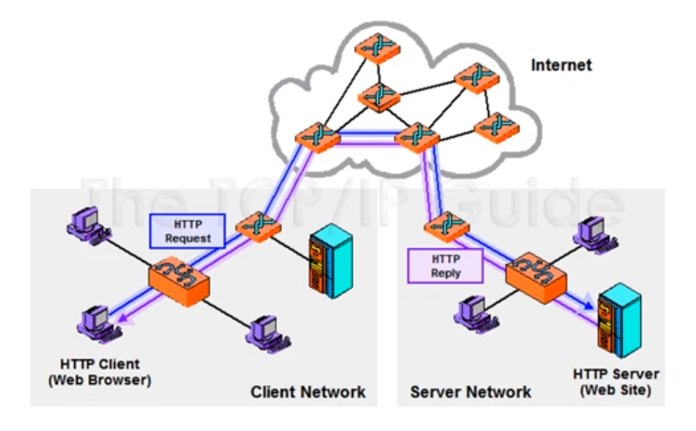
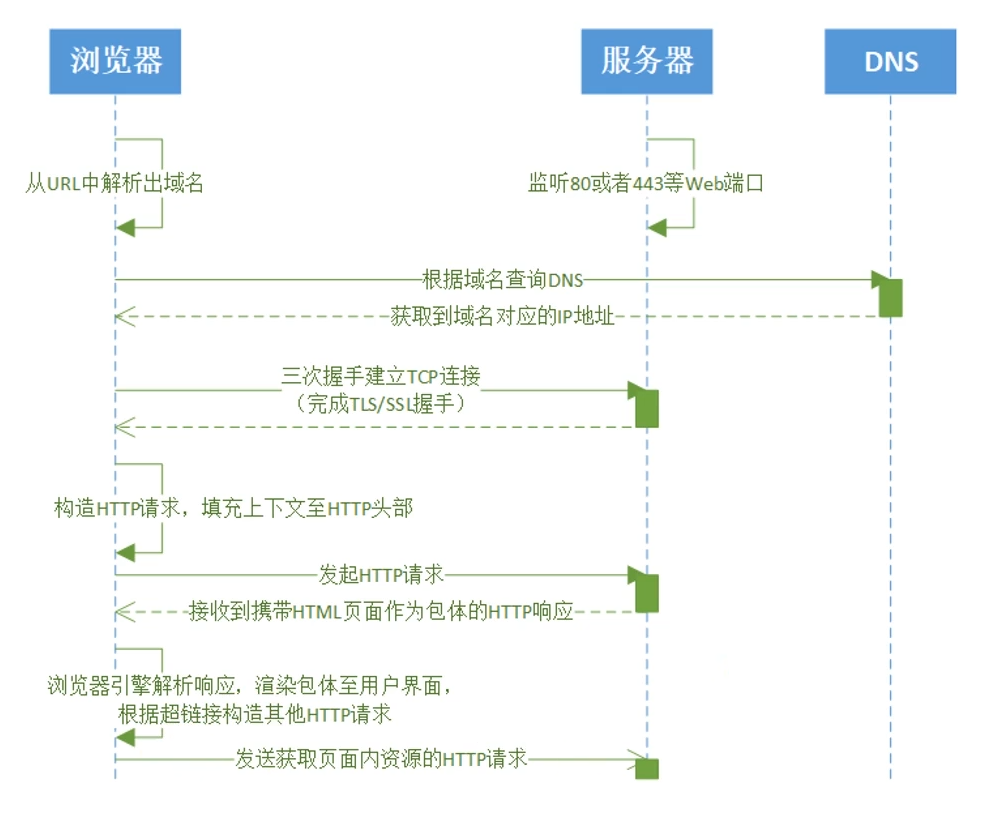

# 1. 网络基础与网站搭建

## 1.1 网络基础概述


### 1.1.1 什么是Internet

#### 1.1.1.1 什么是网络


举几个网络的例子：电话网，蜘蛛网，交际网也是网络，所以网络有什么特点？

```bat
都是由节点和边构成的
```


**上述三个网络是不是一种网络？**

答案是的，所以网络就是和大小无关的，节点和边的关系，和形状无关。

- 这个图里的节点，可以是个人，那这个边可能就是他们的朋友关系。
- 这也可以是一个蜘蛛网的节点到另外一个节点，中间是蜘蛛线，这也是网络。
- 又或者神经元即它的树突等，也是网络


<span style="color:red">**再拉回到蜘蛛网，蜘蛛网就是与大小，形状无关的网络的拓扑，这叫网络。那什么是计算机网络？**</span>


#### 1.1.1.2 什么是计算机网络


**计算机网络**：计算机网络是联网的计算机，所构成的系统。我们都知道网络有节点和线构成，那么计算机网络中，节点都是什么？


**计算机网络中的节点分为两种**

- **主机节点**

  比如：笔记本，手机，ipad，联网的冰箱，机顶盒等等，它是数据的源，也是数据的目标


- **数据交换节点**

  比如交换机，路由器，它即不是数据的源，也不是数据的目标，来一个分组从一个端口进来，按照一定的工作方式。

  如果是**交换机**的话就是按照目标mac地址，决定从某个方向转。

  如果是一个**路由器**的话，来一个分组，从一个端口通过网卡收进来，收进来之后，通过查路由表，决定从另一个方向放出去，它是转发数据的，它既不是源，也不是目标。

  路由器和交换机，它们只是层次不同，作用不同，路由器是工作在网络层，交换机工作在链路层，当然还有更高层的网络交换设别，比如还有第4层，第5层的负载均衡设备等等，这些设备有什么特点？它也是节点，但是它既不是数据的源，也不是数据的目标，它是数据的中转节点。收到数据后将它转走，到下一节点后，收到之后转走，通过这些中转节点的相互配合，最终实现从源节点到目标节点。

​	


把节点连在一起的是什么？叫**链路（Link）**也就是边。把主机跟交换节点连在一起，把交换节点和交换节点连在一起，最后构成一个网，然后节点之间才能够相互通信。


**计算机中的链路，也分两种**

- **第一类**：我的主机通过以太网的网线，接到最近的一个交换机，所以叫接入网，接入的链路（Access）
- **第二类**：路由器和路由器，路由器和交换机，交换机和交换机，也就是交换节点之间的骨干链路（Backbone）


**总结:**

计算机网络，从构成的角度（节点和边）

节点包括**主机**和**交换节点**，数据交换节点工作的层次不同有分为交换机，路由器，以及一些高层的负载均衡设备等等

 链路的按照它连接的主机和路由器，还是交换节点之间链路可以分为 **Access **和 **Backbone**，也就是接入链路和骨干链路

```bat
所以说，连网的计算机系统，由节点和边构成的这样一个系统，我们把它叫做计算机网络
```


**协议**

当然除了互联网构成的这样一些硬件的组成，节点和边之外的，还有另外一些构成，一些软的，比如协议。

协议指的是支撑互联网工作的标准。各个厂商按照标准和协议来制作它的网络设备，这些不同的网络设备之间，就可以形成互操作，叫**Inter-operative**。

就是我这个网卡和你这个网卡，虽然来自不同的厂商，但只要按照同样的标准，就可以工作。当然，协议按照它的层次不同又可以分为物理层协议，链路层协议，网络层协议，传输层协议，应用层协议，而每层协议又分为若干种，比如传输层的TCP，UDP.网络层有IP还有一些路由选择协议。这些都是协议，也就是标准

协议的定义：对等层实体在通信过程中，应该遵循的规则的集合，包括语法，语义和时序。（当然咱们不太适合这么讲，怕你们惊慌试错，落荒而逃。）

听着好像很复杂，但是听后续咱们娓娓道来，其实也没那么复杂


<span style="color:red">**计算机网络讲清楚了，那互联网是什么呢？**</span>>


#### 1.1.1.3 什么是互联网


**互联网是以TCP协议和IP协议为主的一簇协议。就是协议族，协议套，有这些协议构成的网络，就我们目前在用的，规模最大的网络就叫互联网（internet）。**

对于按这中方式工作，也是以`TCP/IP`协议族为主的，但是我和别人不连，我厂里自己用，也行。这个不叫Internet，这个叫**Intronet**，叫企业网，也叫内部网


从构成的角度来看，互联网也是计算机网络中的一种，互联网有哪些端节点。PC，主机，server，手机，ipad等等...以及一些有趣的端系统，赋予十亿计的端系统。


**网络中端系统的组成**

那么端系统包括什么呢？计算机本身**硬件**，能够把硬件管理起来的**操作系统**，这个操作系统要支持通讯吧；然后在操作系统之上驻留的浏览器，web服务器，上面的一些app等**网络应用程序**。

所以整个端系统分为，硬件本身，支持网络通讯的操作系统，以及基于操作系统，在操作系统上运行的各种网络应用程序；这些构成了端系统,这个端系统我们通常称作`end System` 或者 `host`


#### 1.1.1.4 协议的概念


**我们可以把主机之间的通信类比为两个人之间通过写信交流。**

- 写信需要**统一语言**，否则看不懂。

- 这个“语言”包含两部分：**语法（Syntax）**和 **语义（Semantics）**：

  - 语法是指**信件内容的结构格式**（比如谁是收件人、正文在哪、结尾怎么写）；

  - 语义是指**看到特定内容后应该做什么反应**（比如“请寄回发票”就要附上发票，“GET /index.html”就返回网页）。


除了语法和语义，我们还要统一**顺序（Timing / Sequencing）**，否则交流会乱：

- 比如：必须**先打招呼再请求事情**，不能一上来就说“给我xx”；

- 或者**对方还没回信之前不能发第二封信**；

- 又比如**问和答的顺序不能颠倒**（像 TCP 的三次握手就是典型的顺序协商过程）。


```bat
所以，协议的本质，就是对通信中语法、语义、顺序的全面规定，这样双方才能无障碍地互相理解、正确响应，完成通信
```


**协议的目的：**

发送协议数据的根本目的是：**实现各种网络应用**，如网页浏览、文件传输、电子邮件等。

```bat
通常来说，人和人之间的通信，也遵循同样的协议。
```


#### 1.1.1.5  Internet标准


- **RFC：Request For Comments**
- **IETF：Internet Engineering Task Force**


互联网的标准是由 IETF（互联网工程任务组）以 RFC 文档的形式发布的。

IETF 是一个非盈利组织，任何人对互联网的发展和演进有建议或新想法，都可以向 IETF 提交文档。通过审核的文档会被赋予正式编号，并在官方网站上公开发布，供全球科学家和工程师查阅和评议。评议意见也可以被整理成新的文档，进一步提交和审议。如今，互联网中包括 TCP、UDP 等在内的所有协议标准，都是通过这种方式形成的。这种开放、透明的机制，保证了全球工程师对互联网标准的广泛参与和共同推动。

```http
https://www.ietf.org/
```


```http
https://www.rfc-editor.org/search/rfc_search_detail.php
```


**以RFC2616 — HTTP1.1为例**

```http
https://www.rfc-editor.org/rfc/pdfrfc/rfc2616.txt.pdf
```


### 1.1.2 网络结构


如果我们从网络类型的角度来看，互联网包括三个子系统：


- **网络边缘**
  - 主机
  - 应用程序（客户端和服务器）
- **网络核心**
  - 互连着的路由器
  - 网络的网络
- **接入网**，物理媒介
  - 有线或者无线通信链路


#### 1.1.2.1 网络边缘 Edge


**端系统（主机）**

- 运行应用程序
- 如Web，email
- 在“网络边缘”


**应用进程之间的通信模式**

- **客户/服务器模式**（CS模式）
  - 客户端向服务端请求，接收服务
  - 如Web浏览器/服务器，email客户端/服务器

- **对等（peer-peer）的模式**
  - 很少（甚至没有）专门的服务器
  - 如BT，区块链（公有链，如比特币）
- **CS模式和P2P模式结合**
  - 一些使用区块链技术的CS架构服务，联盟链-私有链
  - 比如：某政务区块链系统，企业区块链应用


在早期的网络通信中，广泛采用的是 **客户端-服务器（Client-Server，简称 C/S 或 C-S）模式**。在这种模式下，服务器作为中心节点，负责提供资源和服务，客户端负责发起请求并接收响应。

然而，**C/S 模式在面临大规模用户访问时，会暴露出两个主要问题**：

- **扩展性问题**：随着客户端数量的增加，服务器的资源和处理能力容易成为瓶颈，难以横向扩展。
- **可靠性问题**：服务器是中心节点，一旦出现故障，整个系统的服务可能就会中断，属于“单点故障（SPOF）”结构。


为了解决这些问题，后来出现了 **对等网络（Peer-to-Peer，P2P）模式**。

在 P2P 模式中，每个节点既可以是客户端，也可以是服务器，即所谓的“对等实体（peer）”。这种结构具有以下优势：

- **更好的扩展性**：每新增一个节点，就增加了整个系统的资源和服务能力。
- **更高的可靠性**：不存在单点故障，某个节点离线不会影响整个网络的运行。


#### 1.1.2.2 网络核心 Core

网络核心的组成：由交换节点与交换节点它们的链路构成的。最主要的作用是数据交换的功能，源主机发出去，正确的到达目标主机。

**分组交换**

```bat
	为了从源端系统向目的端系统发送一个报文，源将长报文划分为较小的数据块，称之为分组  （packet） 
在源和目的地之间，每个分组都通过通信链路和分组交换机（packet switch ）传送。（交换机主要有两类：路由器（router）和链路层交换机（link-layer* switch）。）分组以等于该链路最大传输速率的速度传输通过通信链路。  —— 《计算机网络—自顶向下》
```


以分组为单位存储-转发方式

- 网络带宽资源不再分为一个个片，传输时使用全部带宽
- 主机之间传输的数据被分为一个个分组


**什么是分组**

分组交换是一种通信方式，数据在发送前被**分割成较小的单元（分组）**，逐个传输。

这些分组具有以下特征：

- 独立路由（可能走不同路径）
- 独立封装
- 每个分组包含完整的目标地址信息


**存储转发**


存储转发传输是指在交换机能够开始向输岀链路传输该分组的第一个比特之前，必须接收到整个分组。

> 存储转发，为链路共享提供了基础。


**丢包**

路由器中的排队队列所容纳的分组是有限的，所以等到路由器队列堆满后，新到达的分组就无法被容纳，导致路由器 `丢弃(drop)` 该分组，即分组会 `丢失(lost)`。


### 1.1.3 Internet结构和ISP

端系统通过接入**ISPs**（Internet Service providers）连接到互联网。

接入ISPs相应的必须是互联的，因此任何两个端系统可相互发送分组到对方。


选项：将每个接入ISP都连接到全局ISP

**客户ISPs和提供者ISPs有经济合约**。


但是，如果全局[ISP](https://so.csdn.net/so/search?q=ISP&spm=1001.2101.3001.7020)是可行的业务，那会有竞争者有利可图，就会有**竞争**。


**竞争**：但是如果全局ISP是有利可为的业务，那会有竞争者

**合作**：通过ISP之间的合作可以完成业务的扩展，肯定会有互联，对等互联的结算关系


然后**内容提供商网络（Internet Content Providers**，Google，Microsoft，Akamai）可能会构建自己的网络，将它们的服务、内容更加靠近端用户，向用户提供更好的服务，从而减少自己的运营支出。


#### 1.1.3.1 🌍 全球一级 ISP（Tier-1）举例：

这些公司组成了全球互联网的“核心骨干”：

| 名称                      | 国家   | 特点                                         |
| ------------------------- | ------ | -------------------------------------------- |
| **NTT Communications**    | 日本   | 亚洲最强之一，拥有洲际骨干                   |
| **Tata Communications**   | 印度   | 全球性海底光缆提供商                         |
| **Level 3 (现属 Lumen)**  | 美国   | 全球主干，连接北美、欧洲、亚洲               |
| **AT&T**                  | 美国   | 拥有 Tier-1 网络基础设施                     |
| **Telefonica**            | 西班牙 | 欧洲和拉美的重要骨干运营商                   |
| **China Telecom**（部分） | 中国   | 国内有部分 Tier-1 地位（具体看国际互联协议） |


#### 1.1.3.2 **国内Internet结构**

- 家庭/公司/学校通过光纤、基站连接到城市移动公司（Tier-3 ISP）

- 城市公司通过省网汇聚流量，连接到全国骨干（Tier-2 ISP）

- 跨省访问或出国流量，再经 Tier-2 转发到国际出口（或 Tier-1 级别）


#### 1.1.3.3 Regional ISP（区域性互联网服务提供商）

**Regional ISP（区域性互联网服务提供商）** 是指服务范围覆盖**一个国家的部分地区、多个城市、或跨国但非全球规模**的 ISP，位于 Tier-1 和接入级 ISP（Tier-3）之间，也就是通常的 **Tier-2 ISP**。

这些 ISP 通常从 Tier-1 获取上游连接服务，并为 Tier-3 提供中继，或者直接为企业和用户服务。


**Regional ISP 举例** **（🇨🇳 中国**）

| 名称                                 | 覆盖范围           | 说明                                                  |
| ------------------------------------ | ------------------ | ----------------------------------------------------- |
| **中国移动/联通/电信 的各省分公司**  | 某省内             | 可视作“区域 ISP”，但依附于母公司的全国骨干网络        |
| **鹏博士宽带 / 长城宽带（已衰落）**  | 一线城市、重点省份 | 接入型 ISP，曾靠租用骨干资源运营                      |
| **广电网络（如湖南广电、东方有线）** | 各省               | 主要提供 IPTV + 网络，属于地方性 ISP，常见于学校/小区 |


### 1.1.4 网络通信相关设备

#### 1.1.4.1 组网设备

常见的组网设备包括路由器（Router）、交换机（Switch）、集线器（Hub）、中继器（Repeater） 以及线缆等，它们在构建和管理网络中发挥着各自独特的作用


##### 1.1.4.1.1 网络适配器

简介

```bat
	网络适配器（Network Interface Card，NIC），又称网卡或网络接口卡，是主机和网络的接口，具有信号转换、数据传输和网络通信等功能。用于协调主机与网络间数据、指令或信息的发送与接收。通过不断的技术创新和升级，网络适配器正在为人们的网络生活提供更加便捷、高效和安全的体验
```


工作原理

```bat
在物理层，
	网络适配器负责将计算机中的数字信号转换为能够在物理网络上传输的信号，如电信号或光信号。
在数据链路层，
	网络适配器负责将数据切割成小块，然后添加错误检测和纠正代码，以确保数据的完整性和准确性。
```


##### 1.1.4.1.2 交换机


交换机，又叫switch，跟集线器长得很像,但是功能更强一些。从网络分层上来说，属于数据链路层， 比集线器所在的物理层还要高一层

```bat
	交换机内部维护了一张MAC地址表，它记录了 端口号和主机MAC地址的对应关系，而且这个表的数据是交换机不断学习来维护各端口对应主机信息的结果。当A发消息到交换机时，交换机发现消息是从1号端口进来的，则会在MAC地址表上，记录A的MAC地址对应1号端口。如果A很长时间没发消息到这个1号端口，那这条记录就会过期并被删除
	所有发到交换机的数据，都会先进入交换机的缓存区。接着消息再被转发到对应机器上。
```


##### 1.1.4.1.3 路由器

路由器设备通常负责连接多个设备到互联网，并为这些设备提供无线或有线网络接入。


```bat
类似交换机的MAC地址表，路由器也维护了一张路由表，这张表是用于告诉路由器，消息目标在哪个端口所关联的交换机范围里面，然后转发过去。
如果路由表里找不到，那就交给默认网关，让其他路由器帮助去寻找目标地址。如果其他路由器的路由表中无法找到匹配记录，路由器会丢弃这个包，并通过ICMP消息告知消息发送方。
```


##### 1.1.4.1.4 猫和光猫


```bat
猫（Modem）
	传统的调制解调器，也称为Modem，是计算机的数字信号与电信号转换设备。
	主要用于将计算机的数字信号转换为可通过电话线传输的模拟信号，以及将接收到的模拟信号转换回数字信号，从而实现计算机与互联网之间的通信。
	使用铜缆（如电话线）进行信号传输，传输速度相对较慢,而且实现的能力主要是基本的网络连接功能。
```

```bat
光猫（Optical Modem）
	光调制解调器，也称为单端口光端机或光猫，是针对特殊用户环境而研发的一种三件一套的光纤传输设备。
	主要用于将光纤中的光信号转换为网络信号，使家庭或企业的设备能够接入互联网。它是家庭宽带的“入口”，集电话、TV、宽带等功能于一体。
	使用光纤进行信号传输，具有频带宽、容量大等优点，光猫的传输速度比传统猫快得多。除了基本的网络能力之外，还具有完整的告警状态指示和完善的网管功能。
```


#### 1.1.4.2 通常小型网络的基本架构

家庭上网通常通过**光猫**连接运营商的光纤网络，光猫将光信号转换为以太网信号，再接入用户自有的**路由器**，由路由器分发网络给各个**终端设备**。

```css
[ 运营商网络 ]
        │ 光纤
        ▼
    [ 光猫 / ONT ]
        │ 网线
        ▼
  [ 家用路由器 ]
     ├── 手机 / Wi-Fi
     ├── 笔记本 / Wi-Fi
     └── 电视 / 有线
```


### 1.1.5 网络分层模型

#### 1.1.5.1 模块化分层思路

我们首先要承认一点：网络是一个非常复杂的系统。有各种各样的终端设备，各种各样的链路，各种各样的应用。那么作为一个科学家或者工程师实体，如何设计和实现组织复杂的网络功能？

```bat
解决这个问题的思路：模块化的思路
```


什么是模块化的思路呢？就是把一个复杂的功能，分解成一个个模块，模块之间相互调用，而且平面性的调用，任何一个模块都可以调用任何模块提供的功能和服务，这样就可以一个比较复杂的功能通过模块化的分解来进行实现。


其中一个模块化的分解思路就是分层的方法来解决。将一个复杂的功能分为一个个模块，模块之间的调用和被调用关系是**从仅相邻**的两层的模块之间能够调用和被调用，他不允许或者说不推荐跨层调用。

而**计算机网络实现**这种复杂的问题，就是采用分层的模块化的方式来解决，设计和实现的。将功能非常复杂的计算机网络的功能分解为一个个功能明确的子模块，每一层实现一个或一组功能。每一层的功能通过层间的接口，向上层提供服务。像这样一层落一层，一次落一层，最后实现比较复杂的计算机网络的功能。


#### 1.1.5.2 异地哲学家交流哲学思想

计算机网络使用分层的方式如何解决比较复杂的计算机网络的功能实现，可以通过生活中的例子（异地哲学家使用不同语言进行哲学思想交流的复杂问题），来方便大家的理解


- **最下面是秘书层：**解决的是异地通讯的问题。（协议：约定通信的方式）
- **二层是翻译层：**解决的是表示转换的问题。将两位哲学家不同的语言转换为共用的语言进行交流（协议：约定共用的语言）
- **最上面是哲学家层：**两个哲学家交换哲学思想，从而完成深层次的学术交流


通过上述过程类比：两个应用进程通过交换应用报文来实现各种各样的网络应用。包括：电子商务，域名解析，文件下载等。


**上述分层解决问题的优势：**

- 把一个复杂的问题转换成3个子问题，每个问题的解决相对独立，单一。
- 每一层独立进行技术更新，不会影响其他层。


**层次化方式实现复杂网络功能**：

- 将网络复杂的功能分层功能明确的层次，每一层实现了其中一个或一组功能，功能中有其上层可以使用的功能：**服务**（本层功能的子集，能够为上层提供服务的部分）
- 本层协议（每一层交互应该遵守的规则的集合）实体相互交互执行本层的协议动作，目的是实现本层的功能，通过接口**为上层提供更好的服务**
- 本层的服务：借助下层服务实现的本层协议实体之间交互带来的新功能（上层可以利用）+更新本层提供的服务。


#### 1.1.5.3 协议和服务的关系

**协议的目的**：为上层提供更好的服务

**协议的实现**：通过层间的接口，借助于下层提供的服务，交换对等层相应的PDU，从而实现新的协议动作，目的是为上层提供更好的服务

```bat
每一层向上层提供的服务，包括了所有下层提供服务的总和，加上和对等层实体交互过程中形成的新的服务特性，通过层间接口向上层提供更好的服务
```


#### 1.1.5.4 互联网中的分层结构 — TCP/IP协议栈


**各层的作用**

- **应用程：**网络应用

  > 为人类用户或者其他应用进程提供网络应用服务
  >
  > FTP，SMTP，HTTP，DNS

- **传输层：**主机之间的数据传输

  > 在网络层提供的端到端通信基础上，1. 细分为进程到进程，2. 将网络层不可靠的通信变成可靠地通信

- **网络层：**为数据报（Package）从源到目的选择路由

  > 主机主机之间的通信，端到端通信，不可靠
  >
  > IP，路由协议

- **数据链路层：**相邻网络节点间的数据传输

  > **数据链路层的主要作用**是：以**帧（Frame）为单位在相邻节点之间可靠传输数据。 它负责将来自物理层的连续比特流（bit stream）划分为有界的帧，识别出每一帧的\**起始和结束位置**，从而实现对数据的组织和管理。
  >
  > 点对对协议PPP，802.11(wifi)，Ethernet

- **物理层：**在线路上传递bit（提供相邻两点，将数字信号和物理信号之间的相互转换）

  > 发送端：上层传下来的帧，变为物理信号，在介质中转播给对端。
  >
  > 接收端：将媒体中承载的电磁波或者光信号还原回数字信号。


#### 1.1.5.5 ISO/OSI 参考模型


- **表示层**：允许应用解释传输的数据。eg：加密，压缩，及其相关的转换
- **会话层：**数据交换的同步，检查点，恢复。


互联网协议栈没有这两层！这些服务，如果需要的话，必须被**应用实现**。


#### 1.1.5.6 服务和服务访问点

- **服务（Service）：**低层实现向上层实体提供它们之间的通信能力
  - 服务用户（Service User）
  - 服务提供者（Service Provider）

- **原语（Primitive）：**上层使用下层服务的形式，高层使用底层提供的服务，以及低层向高层提供服务都是通过服务访问原语来进行交互的 --- 形式

  > 比如：传输层向应用程提供服务的形式是Socket，上层向下层发送SDU时，进行标注。在对等端，下层向上层根据标注信息选择对应的应用接收数据

- **服务访问点SAP（Service Access Point）：**上层使用下层提供的服务通过层间的接口—地点：
  - 下层的一个实体支撑着上层的多个实体，SAP有标志不同上层实体的作用。
  - 例子：传输层的SAP，端口（Port）


#### 1.1.5.7 封装和解封装


##### 1.1.5.7.1 网络通信过程中的“封装与解封装”机制

从源主机向目标主机发送数据的过程中，**从逻辑上看，通信好像是源应用进程直接与目标应用进程进行的**。例如，一个 Web 客户端向服务器发出请求，服务器再返回响应，这似乎是“端到端”直接通信的过程。

然而，**这个“直接”只是逻辑上的抽象**。在实际的物理传输中，数据无法直接从源应用层传递给目标应用层，而是必须依赖下层各协议栈的逐层封装与逐层解封装来实现。这正是**分层网络架构的核心思想**。


##### 1.1.5.7.2 发送端的封装过程

在源主机中，数据从上至下依次通过协议栈的每一层，每一层都**通过服务访问点（SAP）调用下层服务**，并在上层数据的基础上添加本层的控制信息，形成该层的数据单元（PDU, Protocol Data Unit）。

1. **应用层 → 传输层**

- 应用进程将待发送的数据称为 **消息（Message）**。
- 该消息作为 **SDU（Service Data Unit）** 传递给传输层。
- 传输层在其前方添加本层的头部（例如 TCP/UDP 端口号、序列号、校验和等），形成 **传输层 PDU**，也称为 **报文段（Segment）**。

2. **传输层 → 网络层**

- 报文段无法直接交付给目标主机的传输层。
- 传输层将该报文作为 SDU，通过接口调用网络层服务。
- 网络层在其前方添加网络层头部（如源 IP、目标 IP），形成 **网络层 PDU**，即 **数据报（Packet）或分组（Datagram）**。

> ⚙️ 说明：网络层生成的头部信息，通常是根据上层传下来的接口控制信息（ICI, Interface Control Information）加工而成。

3. **网络层 → 数据链路层**

- 分组仍无法直接传输至对端的网络层实体。
- 网络层通过层间接口将其作为 SDU 交给链路层。
- 链路层添加本层的帧头（例如源 MAC、目标 MAC、帧类型等）和帧尾（如 CRC 校验），生成 **链路层 PDU**，即 **帧（Frame）**。

4. **数据链路层 → 物理层**

- 帧最终由链路层传递给物理层。
- 物理层将帧中的比特数据编码为物理信号（如电信号、光信号），通过物理介质（双绞线、光纤、无线等）传输到下一跳设备（交换机、路由器或目标主机）。


##### 1.1.5.7.3 接收端的解封装过程

在接收端，各层依次对接收到的数据进行 **解封装（decapsulation）**：

1. 物理层接收信号，转为比特流，交给链路层；
2. 链路层解析帧头，校验并提取数据部分（分组），交给网络层；
3. 网络层解析 IP 报文头，验证目标地址并提取传输层段；
4. 传输层解析 TCP/UDP 段头，最终将消息交付给目标应用进程。


##### 1.1.5.7.4 设备与分层结构

```bat
设备处理到了哪一层协议，就属于“几层设备”。
```

**举几个常见的例子来说明：**

| 设备                    | 处理的协议层                  | 所属OSI层级                  | 举例说明                             |
| ----------------------- | ----------------------------- | ---------------------------- | ------------------------------------ |
| **集线器（Hub）**       | 仅处理物理信号（电/光信号）   | **第1层：物理层设备**        | 不检查 MAC、不理解帧，只做电信号转发 |
| **交换机（Switch）**    | 解析链路层帧头（如 MAC 地址） | **第2层：数据链路层设备**    | 根据 MAC 地址学习并转发帧            |
| **路由器（Router）**    | 解析网络层 IP 报文头          | **第3层：网络层设备**        | 根据目标 IP 地址进行路由选择         |
| **防火墙（传统）**      | 分析 IP + 端口 + 协议类型     | **第3~4层：网络+传输层设备** | 如基于五元组的访问控制               |
| **L7代理 / 应用层网关** | 解析 HTTP、FTP 等协议内容     | **第7层：应用层设备**        | 如反向代理、WAF、安全网关等          |
| **三层交换机**          | 同时处理 MAC + IP             | **第2层 + 第3层（复合型）**  | 即具备路由功能的交换机               |


### 1.1.6 常见网络访问场景解析



上图最常见的访问Web页面的场景，其中有3个网络

- 客户所在的客户端的网络Client Network
- 中间是一个广域网（骨干网），可能是光纤、海底电缆等等
- 企业IDC的内部网络


**网络请求过程如下：**

- 首先在客户端发起了一个http request的get请求
- http request通过蓝色的线，先由数据链路层将数据包发送到路由器上
- 然后根据网络层也就是IP层，选择最短/最优的路径
- 传输层（TCP）把不定长度的HTTP请求切分成TCP认为合适的segment(段)，然后将这些切分后的包发送到HTTP Server上，在中间的任意节点中，报文都有可能被丢掉，而且路径也可能发生变化，TCP来保证每一个Segment都能到达http Server

- HTTP Server接收到tcp segment后通常TCP层都是由操作系统内核实现的，操作系统上的kernel按照相同的顺序把http request发给web服务（nginx或者tomcat或者其他）处理，web服务器处理完数据后，将响应数据通过相同的路径将其发送给客户端


**整个过程中：**

- 如何选择跨越不同的网络是由IP层及其之下的数据链路层实现的
- 如何构造一条消息，如何生成一条响应，是由传输层之上的应用成解决的
- 该消息如何可靠的发送，如何保证顺序，都是有TCP层实现的


### 1.1.7 Mac地址与IP地址

#### 1.1.7.1 IP地址基础知识

##### 1.1.7.1.1 简介

```bat
	IP地址（Internet Protocol Address）是指互联网协议地址，又称网际协议地址。IP地址是IP协议提供的一种统一的地址格式，为互联网上的每一个网络和每一台主机分配一个逻辑地址，以此来屏蔽物理地址的差异。
```


##### 1.1.7.1. 2 IPv4地址的点分十进制表示

```bat
IPv4，即互联网协议第4版（Internet Protocol Version 4），是互联网工程任务组（IETF）在1981年开发完成的网络协议版本。
IPv4使用32位二进制数字表示IP地址，通常呈现为4个由点分开的十进制整数，每个整数的取值范围为0到255。例如，192.168.1.1就是一个常见的IPv4地址。
IPv4的地址空间有限，只有约42亿(2^32)个地址是可用的。随着互联网的快速发展，IPv4地址空间在数年内就被耗尽
```


对于IPv4地址，通常习惯于把每8位转换为`0~255`的十进制，通过4个十进制数来表达IP地址，这就叫点分十进制表示


##### 1.1.7.1.3 公有 IP 地址与私有 IP 地址


平时我们办公室、家⾥、学校⽤的 IP 地址，⼀般都是私有 IP 地址。因为这些地址允许组织内部的 IT ⼈员⾃⼰管理、⾃⼰分配，⽽且可以重复。因此，你学校的某个私有 IP 地址和我学校的可以是⼀样的。

就像每个⼩区都有⾃⼰的楼编号和⻔牌号，你⼩区家可以叫 1 栋 101 号，我⼩区家也可以叫 1 栋 101，没有任何问题。但⼀旦出了⼩区，就需要带上中⼭路 666 号（公⽹ IP 地址），是国家统⼀分配的，不能两个⼩区都叫中⼭路 666。

所以，公有 IP 地址是有个组织统⼀分配的，假设你要开⼀个博客⽹站，那么你就需要去申请购买⼀个公有 IP，这样全世界的⼈才能访问。并且公有 IP 地址基本上要在整个互联⽹范围内保持唯⼀。


##### 1.1.7.1.4 公有 IP 地址 分配机构


私有 IP 地址通常是内部的 IT ⼈员管理，公有 IP 地址是由 ICANN 组织管理，中⽂叫「互联⽹名称与数字地址分配机构」。

IANA 是 ICANN 的其中⼀个机构，它负责分配互联⽹ IP 地址，是按州的⽅式层层分配。

其中，在中国是由 CNNIC 的机构进⾏管理，它是中国国内唯⼀指定的全局 IP 地址管理的组织。


也因此，很多软件和工具可以基于此，可以通过IP地址判断IP地址纠结属于哪个区域，并且从这个层层分配的IP地址中，我们可以感受到IP地址是分为网络区域的，而且这些网络区域是有父子结构的


##### 1.1.7.1.5 Ipv4分类地址


**分类IP寻址的问题**

- 缺少私有网络下的地址灵活性：同一网络下没有地址层次

- 3类地址块太少，无法与现实网络很好的匹配

  > 比如一个公司需要5000个地址，但是C类网络只有254个，不够用，B类地址有65534个，又远远用不了……


由于分类地址带过缺少灵活性，因此诞生了CIDR无分类地址


##### 1.1.7.1.6 CIDR无分类地址

CIDR地址的表示方法：

```ABAP
A.B.C.D/N (N<=32)
```


##### 1.1.7.1.7 两台主机能通信的条件

- 物理上是连通的

- 逻辑上是连通的

  > 逻辑上连通指：
  >
  > 若在同一网段：通信双方的IP都在对方的网段地址内。
  >
  > 若不在同一网段：则至少其中一方配置了能转发数据的网关（路由器），并能通过正确的路由路径到达对方 IP。

如果两台主机**IP 地址不在同一网段**，且它们之间的通信**必须通过路由器中转**，那么我们可以说：**它们不在同一个局域网（LAN）中。**


##### 1.1.7.1.8 IP网段地址与广播地址的计算

- **IP网络地址** = IP地址 与 子网掩码 按位进行 AND 运算（与运算）

  > 举例：
  >
  > - IP地址：192.168.1.10 → `11000000.10101000.00000001.00001010`
  > - 子网掩码：255.255.255.0 → `11111111.11111111.11111111.00000000`
  > - 做 AND 运算后：`11000000.10101000.00000001.00000000` → 192.168.1.0
  > - ✅ 这就是网络地址，也称**IP网段地址**

- **IP广播地址** = 网络地址 与 子网掩码的反码 做 OR 运算（或运算）

  > - IP地址：192.168.1.10
  > - 子网掩码：255.255.255.0（即 /24）
  >
  > 计算过程：
  >
  > 1. **网络地址** = 192.168.1.10 & 255.255.255.0 = 192.168.1.0
  > 2. **子网掩码反码** = `00000000.00000000.00000000.11111111` = `0.0.0.255`
  > 3. **广播地址** = 192.168.1.0 | 0.0.0.255 = **192.168.1.255**


#### 1.1.7.2 链路层mac地址


在局域网中，硬件地址又称为物理地址或MAC地址（因为这种地址用在MAC帧中）

IEEE 802标准为局域网规定了一种48位的全球地址（一般都简称为“地址”)，是局域网中每一台计算机固化在网卡ROM中的地址

IEEE 的注册管理机构 RA 负责向厂家分配地址字段的前三个字节(即高位 24 位)

地址字段中的后三个字节(即低位 24 位)由厂家自行指派，称为扩展标识符，必须保证生产出的适配器没 有重复地址


各大厂商MAC识别码：

```http
https://standards-oui.ieee.org/oui/oui.txt
```


### 1.18 浅谈传输层协议

传输层位于网络层之上，应用层之下；传输层负责在“源主机的进程”与“目的主机的进程”之间建立、管理、终止通信通道，并**可选地**提供可靠性、拥塞控制等机制。

- 网络层：主机与主机之间的通信（主机 = IP 地址）
- **传输层：主机中具体某个“进程”与另一个主机中具体“进程”通信（通过端口）**
- 应用层：运行在进程上的协议（HTTP、FTP等）


**传输层核心机制：**

| 功能            | 说明                                       |
| --------------- | ------------------------------------------ |
| 端口号（Port）  | 区分同一主机上多个进程（如浏览器、QQ）     |
| 多路复用/解复用 | 把多个应用进程的通信复用在一个主机连接中   |
| TCP（可靠）     | 三次握手、滑动窗口、确认重传               |
| UDP（不可靠）   | 最简单的进程对进程通信，不保证顺序与可靠性 |


### 1.1.9 浅谈应用程协议

#### 1.1.9.1 DNS协议

DNS（Domain Name System）即域名系统，是应用层的一项重要协议，它在互联网中扮演着关键角色。

```bat
	在互联网中，人们更习惯使用方便记忆的域名（如 www.example.com）来访问网站，但计算机网络通信实际上依靠的是 IP 地址（如 192.0.2.1）。DNS 协议的主要功能就是将域名解析为对应的 IP 地址，从而实现用户通过域名便捷地访问互联网资源。
```


**应用场景**

```bat
网站访问：
	用户在浏览器中输入域名访问网站时，DNS 协议会将域名解析为对应的 IP 地址，从而让用户能够正常访问网站。
电子邮件收发：
	在发送和接收电子邮件时，DNS 协议用于解析邮件服务器的地址，确保邮件能够准确地发送到收件人的邮箱。
负载均衡：
	通过 DNS 可以将域名解析到多个不同的 IP 地址，从而实现网站或服务的负载均衡。例如，将域名 www.example.com 解析到多个服务器的 IP 地址，用户访问该域名时，DNS 服务器会根据一定的算法选择一个合适的 IP 地址返回给用户，从而将用户的请求分配到不同的服务器上。
```


#### 1.1.9.2 HTTP协议介绍

HTTP（HyperText Transfer Protocol）即超文本传输协议，是互联网上信息传递与共享的核心应用层协议。

```bat
HTTP 是用于从万维网（WWW）服务器传输超文本到本地浏览器的传送协议，它允许客户端（如浏览器）与服务器之间进行信息交互，使得用户能够通过浏览器访问各种网页、获取图片、视频、音频等资源，是互联网上信息交流的重要基础。
```


**HTTP 的三个核心特性**

1️⃣ **无连接（Connectionless）**

> 客户端每次发起请求时，和服务器建立连接；请求完成后就关闭连接（除非使用 keep-alive）。

- 本质：**请求-响应一次性通信**
- 优点：简单、节省资源
- 缺点：高并发下频繁建连接代价大（HTTP/1.1 引入 Keep-Alive 缓解）


2️⃣ **无状态（Stateless）**

> 每次 HTTP 请求都是**完全独立的**，服务器**不会自动记住客户端的任何状态**。

- 状态管理靠什么？👉 Cookie / Session / Token / JWT 自己实现
- 优点：服务端简洁、易扩展
- 缺点：需要额外机制维持登录、购物车等状态


3️⃣ **请求-响应模型**

> 客户端发起请求，服务器返回响应。**通信由客户端驱动**，服务器永远不会主动推送数据（除非你用 WebSocket）。

- 特点：**单向模型**
- 所以不能实现推送？👉 你得用：WebSocket、Server-Sent Events、Long Polling 等技术


## 1.2 Linux 网络信息获取

### 1.2.1 主机名设定

#### 1.2.1.1 hostname

查看当前主机名

```bash
[root@magedu myblogs]# hostname
magedu
```

- 配置文件

``````bash
/etc/hostname   #注意：主机名不要使用下划线
``````

``````bash
# 临时设置主机名
hostname 新主机名
``````

- 通过命令修改hostname配置文件

``````bash
hostnamectl set-hostname ubuntu1804.magedu.org
``````

- 在不重启的情况下，是hostname在prompt上生效，最快的方法是开启一个新的终端会话


### 1.2.2 网卡信息查看

#### 1.2.2.1 通过 ifconfig 查看网卡信息

简介

```bat
	ifconfig（interface configuration）是一个在类Unix操作系统（如Linux和某些BSD系统）中用于配置和显示网络接口参数的命令行工具。它允许系统管理员查看和修改网络接口的IP地址、子网掩码、广播地址、硬件地址（MAC地址）、激活或禁用网络接口等。
	该命令来自于net-tools包，可以直接使用 ip 代替
```

命令解读

```bat
命令格式：
ifconfig [OPTIONS...] COMMAND ...

常用选项
-a            #显示所有                     
-s            #以短格式显示                  
-v            #显示详细错误信息                  
```

示例：查看所有启用的设备

```bat
查看所有启用的设备
[root@magedu myblogs]# ifconfig
eth0: flags=4163<UP,BROADCAST,RUNNING,MULTICAST>  mtu 1500
        inet 10.0.0.231  netmask 255.255.255.0  broadcast 10.0.0.255
        inet6 fe80::20c:29ff:fe11:41f1  prefixlen 64  scopeid 0x20<link>
        ether 00:0c:29:11:41:f1  txqueuelen 1000  (Ethernet)
        RX packets 945560  bytes 1363637066 (1.3 GB)
        RX errors 0  dropped 0  overruns 0  frame 0
        TX packets 220345  bytes 24141323 (24.1 MB)
        TX errors 0  dropped 0 overruns 0  carrier 0  collisions 0

lo: flags=73<UP,LOOPBACK,RUNNING>  mtu 65536
        inet 127.0.0.1  netmask 255.0.0.0
        inet6 ::1  prefixlen 128  scopeid 0x10<host>
        loop  txqueuelen 1000  (Local Loopback)
        RX packets 926  bytes 92669 (92.6 KB)
        RX errors 0  dropped 0  overruns 0  frame 0
        TX packets 926  bytes 92669 (92.6 KB)
        TX errors 0  dropped 0 overruns 0  carrier 0  collisions 0
        
查看 ifconfig 的 简洁统计模式
[root@magedu myblogs]# ifconfig -s
Iface      MTU    RX-OK RX-ERR RX-DRP RX-OVR    TX-OK TX-ERR TX-DRP TX-OVR Flg
eth0             1500   945602      0      0 0        220374      0      0      0 BMRU
lo              65536      926      0      0 0           926      0      0      0 LRU
```

**字段解释**

| 字段名           | 含义                                                         |
| ---------------- | ------------------------------------------------------------ |
| **Iface**        | 网络接口名称（如 eth0, lo, ens33）                           |
| **MTU**          | Maximum Transmission Unit，最大传输单元（单位：字节） eth0 的 MTU 通常为 1500，lo（本地环回）很大，65536 |
| **RX-OK**        | 接收成功的数据包数量（Receive OK）                           |
| **RX-ERR**       | 接收时发生错误的包数（如校验错误）                           |
| **RX-DRP**       | 接收时被丢弃的包数（因缓冲区满、过滤器丢弃等）               |
| **RX-OVR**       | 接收时发生的溢出错误数（Overrun：驱动没来得及处理）          |
| **TX-OK**        | 成功发送的数据包数量（Transmit OK）                          |
| **TX-ERR**       | 发送时发生错误的包数                                         |
| **TX-DRP**       | 发送时被丢弃的包数（一般出现在拥塞或队列满）                 |
| **TX-OVR**       | 发送时的溢出错误（罕见，通常与驱动或硬件相关）               |
| **Flg（Flags）** | 接口的状态标志，用于描述接口特性（如下）                     |

**Flags（Flg）常见含义：**

| 字母  | 含义                                        |
| ----- | ------------------------------------------- |
| **B** | BROADCAST：支持广播                         |
| **M** | MULTICAST：支持多播（如用于组播 DNS）       |
| **R** | RUNNING：设备正在运行（驱动已加载且已启用） |
| **U** | UP：接口启用中（up 状态）                   |
| **L** | LOOPBACK：回环接口（如 lo）                 |

如示例所示

- `eth0` 是启用、运行中，支持广播/多播（`BMRU`）
- `lo` 是本地回环接口（`LRU`）


#### 1.2.2.2 通过 ip 命令查看网卡信息

**ip 命令简介**

```bat
	IP命令是一个非常强大的命令行工具，主要用于管理与配置网络接口和路由表。IP命令整合了ifconfig与route这两个命令的功能，并进行了扩展和增强。它不仅可以用于显示或设置网络设备的IP地址、MAC地址等参数，还可以管理路由表，包括添加、删除和查看路由信息等。
	该命令来自于iproute包，可用于代替ifconfig。
```

**查看网卡信息**

```bash
[root@magedu myblogs]# ip a
1: lo: <LOOPBACK,UP,LOWER_UP> mtu 65536 qdisc noqueue state UNKNOWN group default qlen 1000
    link/loopback 00:00:00:00:00:00 brd 00:00:00:00:00:00
    inet 127.0.0.1/8 scope host lo
       valid_lft forever preferred_lft forever
    inet6 ::1/128 scope host noprefixroute 
       valid_lft forever preferred_lft forever
2: eth0: <BROADCAST,MULTICAST,UP,LOWER_UP> mtu 1500 qdisc pfifo_fast state UP group default qlen 1000
    link/ether 00:0c:29:11:41:f1 brd ff:ff:ff:ff:ff:ff
    altname enp2s1
    altname ens33
    inet 10.0.0.231/24 brd 10.0.0.255 scope global eth0
       valid_lft forever preferred_lft forever
    inet6 fe80::20c:29ff:fe11:41f1/64 scope link 
       valid_lft forever preferred_lft forever
```


### 1.2.3 网络连接状态查看

#### 1.2.3.1 使用 netstat 命令查看网络连接

简介

```bat
	netstat 是一个网络相关的命令行工具，它用于显示网络连接、路由表、接口统计、伪装连接和多播成员资格等信息。这个命令在许多类Unix操作系统（如Linux、macOS）以及Windows操作系统中都可用，尽管在某些系统上，它可能通过不同的包或工具集提供。
	默认情况下，该命令来自于net-tools包，有些场景下可以使用 ss 来代替netstat命令。
```

使用netstat查看网络连接示例

```bash
[root@magedu myblogs]# netstat -tunlp
Active Internet connections (only servers)
Proto Recv-Q Send-Q Local Address           Foreign Address         State       PID/Program name    
tcp        0      0 127.0.0.53:53           0.0.0.0:*               LISTEN      32929/systemd-resol 
tcp        0      0 127.0.0.54:53           0.0.0.0:*               LISTEN      32929/systemd-resol 
tcp        0      0 127.0.0.1:6010          0.0.0.0:*               LISTEN      1255/sshd: root@pts 
tcp        0      0 127.0.0.1:6011          0.0.0.0:*               LISTEN      1443/sshd: root@pts 
tcp6       0      0 ::1:6010                :::*                    LISTEN      1255/sshd: root@pts 
tcp6       0      0 ::1:6011                :::*                    LISTEN      1443/sshd: root@pts 
tcp6       0      0 :::22                   :::*                    LISTEN      1/systemd           
udp        0      0 127.0.0.54:53           0.0.0.0:*                           32929/systemd-resol 
udp        0      0 127.0.0.53:53           0.0.0.0:*                           32929/systemd-resol
```


#### 1.2.3.2 使用 ss 命令查看网络连接

简介

```bat
	ss命令是Socket Statistics的缩写，也称为IPC（Inter-process Communication）套接字统计。它主要用于获取系统中socket的统计信息，可以帮助系统管理员诊断和排查网络问题，包括检查当前网络连接及端口状态、搜索网络问题、统计网络情况等
```

使用 ss 查看网络连接示例

```bash
[root@magedu myblogs]# ss -nltp
State     Recv-Q    Send-Q       Local Address:Port         Peer Address:Port    Process                                         
LISTEN    0         4096         127.0.0.53%lo:53                0.0.0.0:*        users:(("systemd-resolve",pid=32929,fd=15))   
LISTEN    0         4096            127.0.0.54:53                0.0.0.0:*        users:(("systemd-resolve",pid=32929,fd=17))   
LISTEN    0         128              127.0.0.1:6010              0.0.0.0:*        users:(("sshd",pid=1255,fd=7))                 
LISTEN    0         128              127.0.0.1:6011              0.0.0.0:*        users:(("sshd",pid=1443,fd=7))                 
LISTEN    0         128                  [::1]:6010                 [::]:*        users:(("sshd",pid=1255,fd=6))                 
LISTEN    0         128                  [::1]:6011                 [::]:*        users:(("sshd",pid=1443,fd=6))                 
LISTEN    0         4096                     *:22                      *:*        users:(("systemd",pid=1,fd=150))
```


## 1.3 Linux 网络配置

### 1.3.1 更改网卡名

更改网卡名为 eth0，需要考虑两个维度

- 启动项是 **grub** 还是 **BLS** 管理
- 系统引导方式是 **BIOS** 还是 **UEFI** 


#### 1.3.1.1 启动项管理方式：GRUB vs BLS

##### 1.3.1.1.1 什么是GRUB

grub是一个启动管理程序，用来告诉 BIOS/UEFI：我现在要进入哪个系统、用哪个内核、带什么参数启动。

它通过读取 **grub.cfg**  （不同启动方式的 grub.cfg 路径不同）中内容，将参数传递给传递给 Linux 内核。


##### 1.3.1.1.2 什么是BLS

**什么是BLS**

**BLS 是一套标准**，由系统引导程序（如 GRUB）使用，用来 **管理每个内核启动项的配置**，以 **文件形式**存储在 `/boot/loader/entries/` 目录下，每一个启动项都是一个单独的 `.conf` 文件。

> ✅ 本质上：
> BLS（Boot Loader Specification）只是 Linux 内核启动配置的一种格式，而真正加载这些配置的，依然是 GRUB（或其他 bootloader）来执行的。
>
> BLS 是配置格式，GRUB 是执行者


##### 1.3.1.1.3 启动项参数读取与生成详解

如果`/etc/default/grub` 文件内 `GRUB_ENABLE_BLSCFG=true`，则最终生成的 `grub.cfg` 配置文件不包含 `menuentry`，而是系统启动项全部由 `/boot/loader/entries/*.conf` 控制


**传统 grub 模式**

```bat
# Rocky-BIOS
执行：grub2-mkconfig -o /boot/grub2/grub.cfg

# Ubuntu-BIOS
执行：grub-mkconfig -o /boot/grub/grub.cfg
```

它会执行：

- `/etc/grub.d/*` 脚本（主要是 `10_linux`）
- 并读取 `/etc/default/grub` 的 `GRUB_CMDLINE_LINUX`
- 拼接出 `menuentry` 区块：

```bash
menuentry 'Rocky Linux (5.14.0)' {
  linux /vmlinuz-5.14.0 root=UUID=... ro rhgb quiet crashkernel=auto
  initrd /initramfs-5.14.0.img
}
```

> 所以 `GRUB_CMDLINE_LINUX` 实际上就是所有 `menuentry` 的默认参数来源。


**BLS 模式**

GRUB 读取 `grub.cfg`，执行 `blscfg` 模块，转而读取 `/boot/loader/entries/*.conf` 启动项配置

> 即：**BLS 模式下，`grub.cfg` 中的 `blscfg` 模块负责在启动时**动态加载 `/boot/loader/entries/*.conf` 中的启动配置项。

你执行 `grub2-mkconfig` 时：

- 发现 `/etc/default/grub` 中有 `GRUB_ENABLE_BLSCFG=true`

- ➜ 那就不写 `menuentry`，而是写一句：

  ```bash
  blscfg
  ```

这句 `blscfg` 是 GRUB 的内建模块，它的作用是：

- 读取 `/boot/loader/entries/` 目录下的每个 `.conf` 文件
- 每个 `.conf` 都描述一个可启动的内核（title、linux、initrd、options）
- 动态组装出启动菜单（这些项在运行时生成，不保存在 grub.cfg 中）


示例 `/boot/grub2/grub.cfg`（BLS 模式下）：

```bash
set default="${saved_entry}"
load_env
blscfg
```


示例 `/boot/loader/entries/*.conf` 文件：

```bash
title   Rocky Linux (5.14.0-362.el9.x86_64)
version 5.14.0-362.el9.x86_64
linux   /vmlinuz-5.14.0-362.el9.x86_64
initrd  /initramfs-5.14.0-362.el9.x86_64.img
options root=UUID=xxxxx ro crashkernel=auto rhgb quiet
id      rocky-5.14.0-362.el9.x86_64
grub_users $grub_user
```


#### 1.3.1.2 **启动方式：BIOS vs UEFI**

启动方式的不同，决定了GRUB配置文件的所在路径不同

- **UEFI 系统**：
   `/boot/efi/EFI/<发行版>/grub.cfg`

- **BIOS 系统**：
   `/boot/grub2/grub.cfg`

- 默认模板文件（用于生成）：

  `/etc/default/grub`


##### 1.3.1.2.1 如何查看引导方式是BIOS还是UEFI

查看是否存在 EFI 目录（最常用、最快）

```bash
[root@magedu ~]# ls /sys/firmware/efi
ls: cannot access '/sys/firmware/efi': No such file or directory
```

- 有输出或目录存在 → ✅ **UEFI 引导**
- 无此目录（提示不存在） → ✅ **BIOS（Legacy）引导**


#### 1.3.1.3 网卡名更改实践

在确定 启动项管理方式 和 系统启动方式 后，网卡名的更改如下

```bat
# 使用BLS启动项管理方式的，禁用BLS。统一grub管理
sed -i 's/GRUB_ENABLE_BLSCFG=true/GRUB_ENABLE_BLSCFG=false/' /etc/default/grub

# 修改 /etc/default/grub中的 GRUB_CMDLINE_LINUX
在 GRUB_CMDLINE_LINUX 中添加 net.ifnames=0 biosdevname=0 即可

# 使用 /etc/default/grub 生成启动项配置文件 grub.cfg
# 如果启动方式是BIOS
Rocky： grub2-mkconfig -o /boot/grub2/grub.cfg
Ubuntu：grub-mkconfig -o /boot/grub/grub.cfg

# 如果启动方式是UEFI
Rocky： grub2-mkconfig -o /boot/efi/EFI/<发行版>/grub.cfg
Ubuntu：grub-mkconfig -o /boot/efi/EFI/<发行版>/grub.cfg

# 更改后重启
reboot
```

> 可以通过 /proc/cmdline 查看启动参数是否生效


### 1.3.2 配置静态IP

#### 1.3.2.1 Rocky

操作流程：修改配置文件 -> 启用配置文件（`Systemctl restart NetworkManager` 或  `nmcli conn reload && nmcli conn up eth0`）

> **nmcli：NetworkManager Command Line Interface** 的缩写


**兼容性说明：**

| 系统版本      | 默认方式                         | 是否兼容 ifcfg-* | 建议           |
| ------------- | -------------------------------- | ---------------- | -------------- |
| CentOS 7      | NetworkManager + network-scripts | ✅                | 可继续使用脚本 |
| Rocky 8       | NetworkManager + 脚本兼容模式    | ✅                | 逐步过渡       |
| Rocky 9/RHEL9 | NetworkManager + `.nmconnection` | ⚠️（部分兼容）    | 推荐全面迁移   |


 **NetworkManager 的配置源**

- `/etc/sysconfig/network-scripts/ifcfg-*`
- `/etc/NetworkManager/system-connections/*.nmconnection`


**NetworkManager 处理机制：**

- 启动时，**会自动读取两类配置文件**（除非被显式禁用）：
  - `/etc/sysconfig/network-scripts/` 下的 `ifcfg-*`
  - `/etc/NetworkManager/system-connections/` 下的 `.nmconnection`
- 如果同时存在，**`.nmconnection` 更优先**，并会尝试忽略 legacy `ifcfg-*` 文件，除非你开启了兼容模式（`ifcfg-rh` 插件）


##### 1.3.2.1.1 ifcfg-eth0文件

```ini
NAME=eth0
DEVICE=eth0
BOOTPROTO=static
IPADDR=10.0.0.100
PREFIX=24
GATEWAY=10.0.0.2
DNS1=8.8.8.8
ONBOOT=yes
```


##### 1.3.2.1.2 .nmconnection文件

```ini
[connection]
id=eth0
type=ethernet
interface-name=eth0
autoconnect=true

[ipv4]
method=manual
addresses=10.0.0.100/24,10.0.0.2
dns=223.6.6.6;114.114.114.114;
dns-search=
ignore-auto-dns=true                       # 忽略 DHCP 服务器分配的 DNS 地址;避免 DHCP 动态获取的 DNS 覆盖你自己设置的 DNS
may-fail=false

[ipv6]
method=ignore             # 禁用ipv6
```

`may-fail=false` 解读

**含义：**

网络连接失败时不能忽略该连接失败

**举个例子：**

- 如果你把 `may-fail=true`（默认），当 `eth0` 没网时，系统可能会继续启动而不报错。
- 如果设置为 `false`，当连接失败，**系统或 NetworkManager 会更严格地报错或阻止继续使用该配置。**

**适用场景：**

- 你有多块网卡，其中一块是必须工作的（比如用于连接外部网络或生产用途）。
- 你希望系统能明确判断该连接是否工作，而不是自动 fallback 或忽略。


`autoconnect=true` 的含义：

| 场景                  | 含义                                             |
| --------------------- | ------------------------------------------------ |
| NetworkManager 启动时 | 会自动启用这个配置                               |
| 网卡 eth0 插上线后    | 会自动激活 eth0 连接配置                         |
| 网络断开后重新恢复    | 会尝试重新连接该配置                             |
| 多个配置匹配时        | 优先使用 `autoconnect=true` 的配置（如果没禁用） |


##### 1.3.2.1.3 修改配置文件后立即生效

```bat
nmcli connection reload                     # 重新加载配置
nmcli connection up eth0                    # 激活 eth0 配置
```


#### 1.3.2.2 Ubuntu

##### 1.3.2.2.1 浅谈netplan

- **Netplan 是 Ubuntu 的统一网络配置前端**

- 用户只需要编写 **YAML 文件**（位置：`/etc/netplan/*.yaml`）

- 然后运行：

```bash
netplan apply
```

- Netplan 会根据 YAML 中指定的 `renderer` 字段：

  - 如果是 `NetworkManager`：
    - 就把配置“传递”给 NetworkManager（通过 D-Bus，**不会生成 .nmconnection 文件**）

  - 如果是 `systemd-networkd`：
    - 就自动生成 `.network` 文件，放在 `/run/systemd/network/` 下（**不是 /etc/systemd/network/**）


- Netplan 本身 **不负责管理网卡**，它只是 **翻译器**，真正负责管理的是：
  - `systemd-networkd`（轻量）
    - 客户端工具：networkctl（只读）
  - `NetworkManager`（功能多，如 Wi-Fi、VPN）
    - 客户端工具：nmcli（NetworkManager Command Line Interface）


##### 1.3.2.2.2 配置文件范例

```yaml
network:
  version: 2
  renderer: networkd         # 或者NetworkManager
  ethernets:
    eth0:
      dhcp4: no
      addresses:
        - 10.0.0.100/24
      routes:
        - to: default
          via: 10.0.0.2
      nameservers:
        addresses:
          - 223.6.6.6
          - 114.114.114.114
```

```bash
netplan apply    # 重载网卡配置
```


## 1.4 http基础知识

### 1.4.1 Web浏览器发起HTTP请求得典型场景



**详解过程**

- 首先服务器监听打开了443或者80端口
- 浏览器从url中解析出域名
- 根据域名查询DNS，获取域名对应得IP地址
- 浏览器根据ip地址，和服务器三次握手建立TCP链接，https会额外完成TLS/SSL的握手
- 构造HTTP请求，在构造请求的过程中，填充相应的HTTP头部，包括上下文所需要的信息，至头部中
- 通过链接发起HTTP请求
- 服务器接收到HTTP请求后，完成资源的表述，把客户端请求的文件如html页面作为包体返回给浏览器
- 浏览器在渲染引擎中解析响应，根据这个响应中一些其他的超链接资源去构造其他HTTP请求


### 1.4.2  Hypertext Transfer Protocol(HTTP)协议


- **Stateless**：无状态的，也就是说连续的两个请求中，后一个请求不能依赖前一个请求中相应的字段。或者head头部等。

- **request/reponse**：这里说明一定是基于一个连接，首先由客户端发起请求，然后服务器才能在这个连接上发起response响应，它必须以这样的方式工作。

- **extensible semantics**：语义可扩展，协议的设计允许不同版本之间兼容，并且新版本中增加的新功能不会影响老版本的正常工作。

  > **HTTP 的语义可扩展表现在哪？**
  >
  > 例子：
  >
  > - HTTP/1.1 引入了 `Host` 头、持久连接（Keep-Alive）、管道化等新特性；
  > - HTTP/1.0 的服务器并不了解这些新特性；
  > - 但 **浏览器仍然可以向 HTTP/1.0 的服务器发送兼容的请求**，并且 **服务器可以正常响应**。
  >
  > 原因：
  >
  > - HTTP 的请求/响应结构是基于「**文本协议** + **键值对头部**」的形式；
  > - **不认识的 header**，服务器/客户端是允许 **忽略** 的 —— 这是协议设计上的要求；
  > - 所以 HTTP/1.1 客户端即使发送了一些 HTTP/1.1 才定义的头部，HTTP/1.0 的服务器看到不认识的头部时会 **跳过它们**，只处理它认识的那部分。

  

- **self-decriptive**：我们所传送的消息，是要一个子描述的消息，我们从一个请求中就能知道这个消息是视频还是文本还是音频，而不需要依赖于其他的请求

- **hypertext information**：这个是一个超文本系统，我们传输的不只有文档，还有视频，音频等大颗粒度的内容


### 1.4.3 基于ABNF语义定义的HTTP消息格式

#### 1.4.3.1 什么是 ABNF？

**ABNF（Augmented Backus-Naur Form）** 是一种形式语言，用于**描述语法规则**，也就是 **RFC 文档中定义协议格式的“最权威语言”**。


#### 1.4.3.2 ABNF能避免哪些问题

**示例1：空格位置误用导致代理崩溃**

一些中间件或网关（如 Nginx、Envoy）对请求行解析较为严格。

```haskell
GET  /index.html   HTTP/1.1\r\n   ← ❌ 多个空格
```

虽然人类能看懂，但 ABNF 中明确只允许一个 `SP`，因此规范实现会报错。

**示例2：`Content Type`（中间有空格）则是非法的**

```haskell
Content Type: XXXXX  非法字段
Content-Type: XXXXX  合法字段
```

基于 ABNF 理解 HTTP 是对协议最精确的理解方式，能够避免很多因模糊处理造成的 bug、安全漏洞或兼容性问题。


#### 1.4.3.3 ABNF (扩充巴克斯-瑙尔范式) 写法

主要包含两个部分：**操作符** 和 **核心语法规则**


##### 1.4.3.3.1 操作符

- **空白字符**: 用来分隔定义中的各个元素（并不是空格的意思，仅仅是便于观察）
  - 例：`method SP request-target SP HTTP-version CRLF`
- **选择 /**: 表示多条规则都是可供选择的规则，相当于or
  - 例：`start-line = request-line/status-line`
- **值范围** `%c##-##`
  - 例：`OCTAL = "0"/"1"/"2"/"3"/"4"/"5"/"6"/"7"` 与 `%x30-37` 等价（十六进制30-37对照ascll码，即字符0-7）
- **序列组合()**: 将规则组合起来，视为单个元素
- **不定量重复m*n**：
  - `*` 元素表示零个或更多元素：*(header-field CRLF)
  - `1*` 元素一个或更多元素
  - `2*4` 表示两个至四个元素
- **可选序列`[ ]`**：表示可以有，也可以没有
  - [message-body]


##### 1.4.3.3.2 核心规则


#### 1.4.3.4 基于ABNF描述的HTTP协议格式


```haskell
# HTTP完整格式
HTTP-message = start-line*(hearder-field CRLF) CRLF [message-body]


# 详细解读
  start-line = request-line/status-line
    request-line = method SP request-target SP HTTP-version CRLF
    status-line = HTTP-version SP status-code SP reason-phrase CRLF
  header-field = field-name ":" OWS field-valus OWS
    OWS = *(SP / HTAB)
    field-name = token
    field-value = *(field-content/obs-fold)
  message-body = *OCTET
  
  token = 1*tchar
  tchar = "!" / "#" / "$" / "%" / "&" / "'" / "*" / "+" / "-" / "." /
        "^" / "_" / "`" / "|" / "~" / DIGIT / ALPHA
  
  field-content = field-vchar [ 1*( SP / HTAB ) field-vchar ]
  field-vchar = VCHAR / obs-text
  obs-text = %x80-FF   
  # 虽然现代 HTTP 头部推荐只使用 ASCII，但为了兼容老版本实现，仍保留了 obs-text。
```


**可以通过telnet进行对指定网站发送请求，收到响应值**

- 响应信息无法观看隐藏字符，隐藏字符可以通过wireshark进行观测

```shell
[root@ubuntu2204 ~]#telnet www.feng.org 80
Trying 10.0.0.200...
Connected to www.feng.org.
Escape character is '^]'.
GET / HTTP/1.1
Host: www.feng.org

HTTP/1.1 200 OK
Server: nginx/1.18.0 (Ubuntu)
Date: Sun, 23 Jun 2024 04:06:22 GMT
Content-Type: text/html
Content-Length: 26
Last-Modified: Sun, 23 Jun 2024 04:00:08 GMT
Connection: keep-alive
ETag: "66779dc8-1a"
Accept-Ranges: bytes

i'm test-10.0.0.200-index
```


### 1.4.4 OSI（Open System Interconnection Reference Model）概念模型


SI是一个概念模型，也就是说它从来没有被实现过，但是我们在实现网络协议的时候，必须要参考这样一个概念模型，才能非常好的理解网络中的协议分层


**应用层：** HTTP，FTP，DNS，都在应用层，应用层解决的是业务问题

**表示层：** 表示层负责把网络中的消息转换成应用层可以读取的消息

> 比如：ssl，ssl加密的数据，用户是无法直接读取的，需要表示层做一次转换。所以TLS/SSL 工作在表示层

**会话层：** 是一个完全概念化的一层，Session。他负责建立会话，握手，维持连接，关闭，但实际上传输层（TCP）和表示层，都有部分延伸到会话层，因此会话层只是一个概念。用来帮助理解会话这个概念。

**传输层：** 包括TCP，UDP协议，主要解决进程与进程之间的通讯。除此之外，TCP还解决了数据传输的可靠性。

**网络层：**IP协议，确保了在广域网中，可以把报文从一个主机发送到另一个主机上。

**数据链路层：**负责局域网中的主机间数据交换。


OSI仅仅是一个概念模型，而互联网上实际使用的是TCP/IP模型


#### 1.4.4.1 抓包演示数据包层层封装

**应用层：**


**传输层头部数据**


**网络层头部数据**


**数据链路层头部数据**


### 1.4.5 Cookie 与 Session

#### 1.4.5.1 Cookie的格式与约束

Cookie是前端编程中经常使用的概念。 我们可以使用cookie利用浏览器帮助我们存放用户的相关状态信息，保存用户已经做了哪些事情。

- Cookie的工作原理是什么？

- Cookie的限制又是什么？

- Session是服务器端所维护的会话状态，Session又怎样与Cookie关联起来？ 


##### 1.4.5.1.1 Cookie是什么？


**RFC6265，HTTP State Management Mechanism**


Cookie保持在客户端，由浏览器维护（但是是由服务端生成的），表示应用状态的HTTP头部

- 存放在内存或者磁盘中
- 服务器端生成Cookie在响应中通过Set-Cookie头部告知客户端（允许多个Set-Cookie头部传递多个值）
- 客户端得到Cookie后，后续请求都会自动将Cookie头部携带至请求中


##### 1.4.5.1.2 Cookie 与 Set-Cookie头部的定义

Cookie 头部中可以存放多个 **name/value** 名值对

```haskell
cookie-header = "Cookie:" OWS cookie-string OWS
  cookie-string = cookie-pai r*( ";" SP cookie-pair )
  cookie-pair = cookie-name "=" cookie-value
```


Set-Cookie头部一次只能传递1个 **name/value** 名值对，响应中可以含多个头部

```haskell
set-cookie-header = "Set-Cookie:" SP set-cookie-string
  set-cookie-string = cookie-pair *( ";" SP cookie-av )
  cookie-pair = cookie-name "=" cookie-value
  cookie-av: 描述 cookie-pair 的可选属性
```


浏览器查看Set-Cookie


##### 1.4.5.1.3 Set-Cookie 中描述cookie-pair的属性


##### 1.4.5.1.4 Cookie 使用的限制

RFC规范对浏览器使用Cookie的要求

- 每条Cookie的长度（包括 name, value 以及描述的属性等总长度）至少要支持达到 4KB
- 每个域名下至少支持50 个 Cookie
- 至少要支持 3000 个 Cookie


代理服务器传递Cookie时会有限制（Nginx默认32k）


##### 1.4.5.1.5 Cookie 在协议设计上的问题

- Cookie会被附加在每个HTTP请求中，所以无形中增加了流量
- 由于在HTTP请求中的 Cookie 是明文传递的，所以安全性成问题（除非用HTTPS）
- Cookie的大小不应超过4KB，因为对于复杂的存储需求来说是不够用的。


#### 1.4.5.2 Session 及第三方Cookie的工作原理

##### 1.4.5.2.1 登录场景下 Cookie与Session的常见用法


- 首先登录请求发起一个POST表单的login操作。
- 服务器收到请求后，从表单中读取用户名和密码，和持久化数据中的数据进行比对，比对通过后，把登录状态生成session（这个session是有时效的）。
- 将有时效的session数据写入内存数据库
- 将session中的session_ID在响应中返回给浏览器，SESSIOIN返回的方式是Set-Cookie
- 浏览器在它的Storage中保存收到的Cookie
- 浏览器发起的后续请求会携带这个Cookie信息
- 服务器收到携带Cookie的信息后，会在后端解析Cookie携带的Session_ID，判断该用户是否是登录的，如果判断成功，则执行该用户的相关业务，并将结果返回给用户。

| 步骤                                    | 建议或补充                                                   |
| --------------------------------------- | ------------------------------------------------------------ |
| 1. 用户发送 POST /login 请求            | 可以带表单或 JSON 格式登录信息                               |
| 2. 服务端读取用户名密码，与持久化库比对 | 实际上可使用数据库或认证中心（如 LDAP）                      |
| 3. 验证通过，生成 session（含有效期）   | 通常 `session = { user_id, expires_at, ... }`                |
| 4. 将 session 存入“内存数据库”          | 通常是 Redis，或者内存 hashmap（如 Java `HttpSession`）      |
| 5. 返回 Set-Cookie，设置 `session_id`   | 示例：`Set-Cookie: session=abc123; Path=/; HttpOnly; Secure` |
| 6. 浏览器接收并保存 Cookie              | 浏览器自动保存，并根据 Path/Domain 控制何时发送              |
| 7. 后续请求自动带上 Cookie              | 浏览器自动加上 `Cookie: session=abc123`                      |
| 8. 服务端读取 Cookie 并验证 session     | 查 Redis 判断 session 是否存在、是否过期                     |
| 9. 执行业务并返回结果                   | 此时说明用户已认证，按权限执行对应业务                       |


## 1.5 web站点部署


### 1.5.1 主流 Web 服务介绍

Web服务是提供Web信息服务的软件，它通过HTTP或HTTPS协议与客户端通信，接受客户端请求， 处理请求，然后返回响应数据，Web 服务器的主要工作是通过存储、处理和交付网页给用户来显示网站 内容，一个成熟的WEB服务器软件不仅仅只是处理客户端请求，还要有良好的安全性和稳定性，以满足用户不断变化和增长的需求


以下是一些主流的Web服务器以及它们的特点，这些Web服务器都有各自特点和优势，在使用的时候， 要取决于项目需求，性能要求及开发人员偏好等


**Apache**

Apache 是目前市场占有率最高的WEB服务器，它免费开源，功能强大，支持多种操作系统，可在多平 台上运行，包括Unix、Linux、Windows等，同时具有强大的模块化体系结构，提供了丰富的模块，也 支持许多第三方模块，允许用户自定义服务器功能，另外也支持虚拟主机配置


**Nginx**

Nginx是一个高性能的Web服务器，广泛应用于高并发、大流量的互联网应用场景中，Nginx还可以作为反向代理服务器、负载均衡服务器，其优异的静态处理能力，使其在处理静态文件时具有很高的效率， 由于选择了高效的网络IO模型，使其在高并发大流量的工作场景下，对于资源（CPU，内存等）的要求非常低，且运行非常稳定


**Tomcat**

Tomcat是一个开放源代码、运行 servlet 和 JSP Web 应用软件，它不仅仅是一个WEB服务器，也是一个 Servle t和 JSP 容器，但其对静态文件和高并发的处理能力较弱


#### 1.5.1.1 WEB 服务器市场占有率排名

W3Techs，全名 **Web Technology Surveys**，是一个专门统计全球网站使用的技术情况的网站，包括：

- Web 服务器（如 Nginx、Apache）
- 编程语言（如 PHP、Node.js）
- CMS（如 WordPress、Drupal）
- JS 框架、CDN、SSL 使用情况等

```http
https://w3techs.com/technologies/overview/web_server
```

This diagram shows the percentages of websites using various web servers. See [technologies overview](https://w3techs.com/technologies) for explanations on the methodologies used in the surveys. Our reports are updated daily.（号称每日更新）

Nginx is used by 33.7% of all the websites whose web server we know.

| [Nginx](https://w3techs.com/technologies/details/ws-nginx)   | 33.7%                     |
| :----------------------------------------------------------- | ------------------------- |
| [Apache](https://w3techs.com/technologies/details/ws-apache) | 26.0%                     |
| [Cloudflare Server](https://w3techs.com/technologies/details/ws-cloudflare) | 24.0%                     |
| [LiteSpeed](https://w3techs.com/technologies/details/ws-litespeed) | 14.7%                     |
| [Node.js](https://w3techs.com/technologies/details/ws-nodejs) | 4.6%                      |
| [Microsoft-IIS](https://w3techs.com/technologies/details/ws-microsoftiis) | 3.9%                      |
| [Envoy](https://w3techs.com/technologies/details/ws-envoyproxy) | 1.4%                      |
| [Google Servers](https://w3techs.com/technologies/details/ws-google) | 0.8%                      |
| [Caddy](https://w3techs.com/technologies/details/ws-caddy)   | 0.3%                      |
| [IdeaWebServer](https://w3techs.com/technologies/details/ws-ideawebserver) | 0.1%                      |
| [Tengine](https://w3techs.com/technologies/details/ws-tengine) | 0.1%                      |
| [Kestrel](https://w3techs.com/technologies/details/ws-kestrel) | 0.1%                      |
| [Cowboy](https://w3techs.com/technologies/details/ws-cowboy) | 0.1%                      |
| [ArvanNginx](https://w3techs.com/technologies/details/ws-arvannginx) | 0.1%                      |
| Percentages of websites using various web servers Note: a website may use more than one web server | W3Techs.com, 15 June 2025 |


### 1.5.2  Nginx服务

#### 1.5.2.1 Ubuntu环境部署Nginx

简介

```bat
	Nginx 一般可以使用 apt/yum 来安装二进制包，如果需要使用特定的功能模块，也可以使用源码安装，使用 yum/apt 安装的时候，只能安装操作系统发行版厂商己经提交到仓库中的版本，如果需要安装更新的版本或历史版本，可自行配置官方仓库，然后进行安装。
```

Ubuntu系统软件安装

```bash
root@ubuntu24:~# apt install nginx -y
```

```bat
查看服务状态
[root@magedu ~]# systemctl is-active nginx
active

[root@magedu ~]# ss -ntlp
State       Recv-Q      Send-Q           Local Address:Port             Peer Address:Port      Process                           
LISTEN      0           4096                127.0.0.54:53                    0.0.0.0:*          users:(("systemd-resolve",pid=738,fd=17))                                            
LISTEN      0           511                    0.0.0.0:80                    0.0.0.0:*          users:(("nginx",pid=1759,fd=5),("nginx",pid=1758,fd=5),("nginx",pid=1757,fd=5))      
LISTEN      0           4096             127.0.0.53%lo:53                    0.0.0.0:*          users:(("systemd-resolve",pid=738,fd=15))                                            
LISTEN      0           128                  127.0.0.1:6010                  0.0.0.0:*          users:(("sshd",pid=1367,fd=7))   
LISTEN      0           128                      [::1]:6010                     [::]:*          users:(("sshd",pid=1367,fd=5))   
LISTEN      0           511                       [::]:80                       [::]:*          users:(("nginx",pid=1759,fd=6),("nginx",pid=1758,fd=6),("nginx",pid=1757,fd=6))      
LISTEN      0           4096                         *:22                          *:*          users:(("sshd",pid=1365,fd=3),("systemd",pid=1,fd=119))
```

浏览器访问效果


#### 1.5.2.2 Nginx 软件环境解读

配置文件目录

```bat
# Ubuntu系统
[root@magedu ~]# ls /etc/nginx
conf.d        fastcgi_params  koi-win     modules-available  nginx.conf    scgi_params      sites-enabled  uwsgi_params
fastcgi.conf  koi-utf         mime.types  modules-enabled    proxy_params  sites-available  snippets       win-utf
```

默认首页

```bat
[root@magedu ~]# ls /var/www/html
index.nginx-debian.html

# 在 /var/www/html 目录下添加index.html
[root@magedu ~]# echo hello > /var/www/html/index.html
[root@magedu ~]# curl 10.0.0.231
hello
```


#### 1.5.2.3 常用 nginx 命令

常用命令

```bat
# 检查配置文件语法
[root@magedu ~]# nginx -t
nginx: the configuration file /etc/nginx/nginx.conf syntax is ok
nginx: configuration file /etc/nginx/nginx.conf test is successful

# 重新加载配置文件
[root@magedu ~]# nginx -s reload
2025/06/18 10:27:24 [notice] 1861#1861: signal process started
```


#### 1.5.2.4 Nginx配置解读

##### 1.5.2.4.1 nginx配置目录结构

```bat
[root@magedu ~]# ll /etc/nginx
total 76
drwxr-xr-x   8 root root 4096 Jun 18 10:14 ./
drwxr-xr-x 114 root root 4096 Jun 18 10:14 ../
drwxr-xr-x   2 root root 4096 Apr  1 02:38 conf.d/                 # 子配置文件目录，在主配置文件中被包含，默认为空
-rw-r--r--   1 root root 1125 Dec  1  2023 fastcgi.conf            # FastCGI配置文件，定义相关配置项，被引用
-rw-r--r--   1 root root 1055 Dec  1  2023 fastcgi_params          # FastCGI配置文件，定义相关配置项，被引用
-rw-r--r--   1 root root 2837 Dec  1  2023 koi-utf                 # 用于转换KOI8-R编码的字符集到UTF-8
-rw-r--r--   1 root root 2223 Dec  1  2023 koi-win                 # 用于转换KOI8-U编码的字符集到UTF-8
-rw-r--r--   1 root root 5465 Dec  1  2023 mime.types              # 包含文件扩展名和相应MIME类型的映射
drwxr-xr-x   2 root root 4096 Apr  1 02:38 modules-available/      # 模块配置文件目录
drwxr-xr-x   2 root root 4096 Apr  1 02:38 modules-enabled/        # 当前生效的模块配置文件目录，用软链接指向真正的文件
-rw-r--r--   1 root root 1446 Dec  1  2023 nginx.conf              * 主配置文件
-rw-r--r--   1 root root  180 Dec  1  2023 proxy_params            # 反向代理配置文件
-rw-r--r--   1 root root  636 Dec  1  2023 scgi_params             # SCGI配置文件，SCGI和FastCGI类似，都是一种协议
drwxr-xr-x   2 root root 4096 Jun 18 10:14 sites-available/        # 所有域名配置文件
drwxr-xr-x   2 root root 4096 Jun 18 10:14 sites-enabled/          * 生效的域名配置文件，用软连接指向site-available中的文件
drwxr-xr-x   2 root root 4096 Jun 18 10:14 snippets/               # 通用的配置片段目录，需要时被引用
-rw-r--r--   1 root root  664 Dec  1  2023 uwsgi_params            # 配置 Nginx uWSGI 模块的默认参数的文件
-rw-r--r--   1 root root 3071 Dec  1  2023 win-utf                 # 编码转换映射转化文件

```

Nginx 配置文件格式说明

- 配置文件由指令与指令块构成
- 每条指令以 ` ; ` 分号结尾，指令与值之间以空格符号分隔
- 可以将多条指令放在同一行，用分号分隔即可，但可读性差，不推荐
- 指令块以{ }大括号将多条指令组织在一起，且可以嵌套指令块
- include 语句允许组合多个配置文件以提升可维护性
- 使用 # 号添加注释，提高可读性
- 使用 $ 符号使用变量
- 变量分为 Nginx 内置变量和自定义变量，自定义变量用 set 指令定义
- 部分指令的参数支持正则表达式


##### 1.5.2.4.2 核心配置文件

nginx配置的完整结构

```bat
# --- 全局配置段 ---
user ...;
worker_processes ...;
...
# --- 事件驱动相关的配置 --
events {
     ...;
}

# --- http/https 协议相关配置段 --
http {
    ...;
    server {
        ...;
        location {
            ...;
        }
    }
}

# --- mail 协议相关配置段，默认被注释 --
mail {
    server {
        ...
    }
}
 
# --- stream 协议相关配置 --
stream {
    ...;
}
```

查看默认主配置文件内容

```bat
[root@magedu ~]# cat /etc/nginx/nginx.conf | grep -Ev "#|^$"
 # --- 全局配置段 ---
user www-data;
worker_processes auto;
pid /run/nginx.pid;
error_log /var/log/nginx/error.log;
include /etc/nginx/modules-enabled/*.conf;

# --- 事件驱动相关的配置 ---
events {
	worker_connections 768;
}

# --- http/https 协议相关配置段 ---
http {
	sendfile on;
	tcp_nopush on;
	types_hash_max_size 2048;
	include /etc/nginx/mime.types;
	default_type application/octet-stream;
	ssl_prefer_server_ciphers on;
	access_log /var/log/nginx/access.log;
	gzip on;
	include /etc/nginx/conf.d/*.conf;
	include /etc/nginx/sites-enabled/*;
}
```


##### 1.5.2.4.3 Server配置段

server 主要用来配置虚拟主机，可以在一台 web 服务器上支持多个域名，一个 server 配置段中可 以有多个 location 配置。location块是Server配置段中的关键部分，用于进一步细分对虚拟主机的请求 处理规则。location块可以基于请求的URL进行匹配，并根据匹配结果执行相应的处理指令。


**常用 server 属性**

当前虚以主机监听的ip,port，是否是default_server，是否支持ssl 等 默认值 *:80|*:8000; 可以写多条，完全说明请参考官方文档

```nginx
listen address[:port] [default_server] [ssl];       
listen port [default_server] [ssl];
listen unix:path [default_server] [ssl];    
```

```nginx
root path;              # 当前虚拟主机网页文件目录，写在location中，文件路径是root+location
index file ...;         # 当前虚拟主机的默认页面，可以写多个，按顺序生效，默认 index.html
server_name name ...;   # 虚拟主机域名，可以写多个值，客户端请求头中的 Host 字段会与此处匹配
```


##### 1.5.2.4.4 Location配置段

**配置样式**

```nginx
location [ = | ~ | ~* | ^~ ] uri { ... }
location @name { ... }
```

```bat
配置段匹配规则
	=              # 用于标准uri前，需要请求字串与uri精确匹配，区分大小写   
	^~             # 用于标准uri前，表示包含正则表达式，匹配以特定字符串开始，区分大小写 
	~              # 用于标准uri前，表示包含正则表达式，区分大小写
	~*             # 用于标准uri前，表示包含正则表达式，不区分大写       
	/str           # 不带符号 匹配以 str 开头的 uri，/ 也是一个字符
	\              # 用于标准uri前，表示包含正则表达式并且转义字符，可以将 . * ?等转义为普通符号    
	@name          # 定义
```

```bat
常用配置项   
root path;             # 定义网站在文件系统上的家目录，server_root/location_root   
index file ...;        # 当前配置段的默认页面，可以写多个，依次生效，默认 index.html
proxy_pass URL;        # 设置反向代理，将符合规则的请求转发到后端服务器进行处理
```


#### 1.5.2.5 Nginx web实践

##### 1.5.2.5.1 server实践准备

查看默认配置文件

```nginx
[root@magedu ~]# grep -Ev '^$|#' /etc/nginx/sites-enabled/default
server {
	listen 80 default_server;
	listen [::]:80 default_server;
	root /var/www/html;
	index index.html index.htm index.nginx-debian.html;
	server_name _;
	location / {
		try_files $uri $uri/ =404;
	}
}
```

准备工作

```bash
# 删除默认配置
root@magedu ~]# rm -f /etc/nginx/sites-enabled/default
```

```bat
# 定制应用页面
mkdir /data/server/nginx/web{1..3} -p
echo "nginx web1" > /data/server/nginx/web1/index.html
echo "nginx web2" > /data/server/nginx/web2/index.html
echo "nginx web3" > /data/server/nginx/web3/index.html
```


#####  1.5.2.5.2 基于端口的站点实践

基于端口号实现多server

```nginx
[root@magedu ~]# vim /etc/nginx/conf.d/vhost.conf
server {
    listen 80;
    root /data/server/nginx/web1;
}

server {
    listen 81;
    root /data/server/nginx/web2;
}

server {
    listen 82;
    root /data/server/nginx/web3;
}

# 检查配置文件
[root@magedu ~]# nginx -t
nginx: the configuration file /etc/nginx/nginx.conf syntax is ok
nginx: configuration file /etc/nginx/nginx.conf test is successful

# 重新加载配置
[root@magedu ~]# nginx -s reload
2025/06/18 10:58:56 [notice] 2084#2084: signal process started
```

检测效果

```bat
[root@magedu ~]# curl 10.0.0.231
nginx web1
[root@magedu ~]# curl 10.0.0.231:81
nginx web2
[root@magedu ~]# curl 10.0.0.231:82
nginx web3
```


##### 1.5.2.5.3 基于域名的站点实践

基于域名实现多server

```nginx
# 定制配置文件
[root@magedu ~]# vim /etc/nginx/conf.d/vhost.conf 
server {
    listen 80 default_server;
    server_name www.web1.com;
    root /data/server/nginx/web1;
}
    server {
    listen 80;
    server_name www.web2.com;
    root /data/server/nginx/web2;
}
server {
    listen 80;
    server_name www.web3.com;
    root /data/server/nginx/web3;
}

# 检查配置文件
[root@magedu ~]# nginx -t
nginx: the configuration file /etc/nginx/nginx.conf syntax is ok
nginx: configuration file /etc/nginx/nginx.conf test is successful

# 重启服务
[root@magedu ~]# nginx -s reload
2025/06/18 11:04:12 [notice] 2127#2127: signal process started
```

在 `/etc/hosts` 中加入域名解析

```bash
[root@magedu ~]# echo "10.0.0.231 www.web1.com www.web2.com www.web3.com" >> /etc/hosts
[root@magedu ~]# cat /etc/hosts
127.0.0.1   localhost localhost.localdomain localhost4 localhost4.localdomain4
::1         localhost localhost.localdomain localhost6 localhost6.localdomain6

10.0.0.231 www.web1.com www.web2.com www.web3.com
```

访问站点信息，查看效果

```bash
[root@magedu ~]# curl www.web1.com
nginx web1
[root@magedu ~]# curl www.web2.com
nginx web2
[root@magedu ~]# curl www.web3.com
nginx web3
```


### 1.5.3 Nodejs项目

#### 1.5.3.1 Nodejs基础

##### 1.5.3.1.1 Nodejs简介

Node.js 是一个基于 Chrome V8 引擎的 JavaScript 运行环境，让 JavaScript 可以在服务器端运行.

```bat
	传统意义上 JavaScript 主要运行在浏览器中，用于实现网页的交互效果。而 Node.js 突破了这一限制，它将 Chrome V8 引擎移植到服务器端，使得开发者能够使用 JavaScript 编写服务器端代码，创建高性能、可扩展的网络应用程序。
```

发展历程

```bat
	2009 年，由 Ryan Dahl 开发的 Node.js 项目诞生。它的初衷是为了实现高性能的网络服务器，解决服务器端在处理高并发请求时的性能瓶颈问题。
	2010 年，npm（Node Package Manager）发布，这是 Node.js 的包管理工具，极大地促进了 Node.js 生态系统的发展。开发者可以方便地共享和使用各种开源模块，加速项目的开发。
	随着时间的推移，Node.js 不断发展和完善，其应用范围也越来越广泛，逐渐成为服务器端开发的主流技术之一
```

应用场景

```bat
Web 服务器开发：
	Node.js 可以用于构建高性能的 Web 服务器，处理大量的并发请求。许多知名的网站和应用都使用 Node.js 作为服务器端技术，如 Netflix、PayPal 等。
实时应用开发：
	由于 Node.js 的非阻塞 I/O 和事件驱动特性，非常适合开发实时应用，如在线聊天应用、实时游戏、实时数据监控系统等。
命令行工具开发：
	开发者可以使用 Node.js 编写命令行工具，利用其丰富的模块和跨平台特性，方便地实现各种功能，如文件处理、代码编译、自动化部署等。
微服务架构：
	Node.js 可以用于构建微服务架构中的各个服务，通过 npm 模块和 HTTP 协议进行服务之间的通信和协作，实现系统的高可扩展性和灵活性。
```

官方网站： https://nodejs.cn/


##### 1.5.3.1.2 环境部署

安装软件

```bash
# Ubuntu环境
# 使用一键换源工具，更换国内源
[root@magedu ~]# wget https://www.mysticalrecluse.com/script/Shell/switchsource
[root@magedu ~]# bash switchsource -t

# 安装nodejs，npm包管理
[root@magedu ~]# apt install -y nodejs npm
```

查看

````bash
[root@magedu ~]# node -v
v18.19.1
````


##### 1.5.3.1.2 简单实践

创建一个新的项目目录

```bash
[root@magedu ~]# mkdir -p /data/codes/my-node-server -p
[root@magedu ~]# cd /data/codes/my-node-server/
```

创建文件 server.js

```bash
[root@magedu my-node-server]# vim server.js
const http = require('http');

// 创建一个 HTTP 服务器
const server = http.createServer((req, res) => {
    // 设置响应头
    res.writeHead(200, { 'Content-Type': 'text/plain' });
    // 发送响应内容
    res.end('Hello, World!\n');
});

// 监听 3000 端口
server.listen(3000, '0.0.0.0', () => {
    console.log('Server running at http://0.0.0.0:3000/')
});
```

运行代码

```bash
[root@magedu my-node-server]# node server.js
Server running at http://0.0.0.0:3000/
```

浏览器访问http://10.0.0.231:3000


Ctrl + C 关闭服务

```bash
[root@magedu my-node-server]# node server.js
Server running at http://0.0.0.0:3000/
^C
```


#### 1.5.3.2 npm基础

##### 1.5.3.2.1 npm是什么

```bat
	npm（Node Package Manager）是 Node.js 的默认包管理器，类似于手机应用市场。其主要功能是管理 Node.js 项目中的各种依赖包。npm 拥有巨大的软件仓库，汇聚了海量 Node.js 包，功能覆盖网络编程、数据库交互、前端框架搭建等众多领域, 比如网络编程、文件操作、数据库管理、前端框架等，开发者可以在其中找到满足自己项目需求的各种包。
```

功能

```bat
	npm能让开发者方便地共享和重用代码，同时管理项目中的依赖项。当你安装 Node.js 时，npm 会随之自动安装。
```


##### 1.5.3.2.2 nodejs 和 npm

npm（Node Package Manager）和 Node.js 之间存在着紧密的关联

```bat
	当你安装 Node.js 时，npm 会被默认捆绑安装。也就是说，安装 Node.js 的过程中，npm 也会一同被安装到系统中，你无需额外进行操作去安装 npm。这样的设计让开发者在开始使用 Node.js 时，就能立即使用 npm 来管理项目的依赖。
```

功能互补

```bat
npm 推动 Node.js 生态发展
	npm 拥有庞大的软件仓库，其中包含了大量的开源 Node.js 包，这些包涵盖了各种功能和应用场景。开发者可以轻松地从 npm 上获取所需的包，无需重复造轮子，大大提高了开发效率。丰富的包资源吸引了更多的开发者使用 Node.js 进行开发，从而推动了 Node.js 生态系统的不断壮大。
	
Node.js 为 npm 提供应用场景
	Node.js 的广泛应用为 npm 提供了大量的使用场景。随着 Node.js 在服务器端开发、前端构建工具、自动化脚本等领域的应用越来越广泛，对各种功能包的需求也日益增加，这促使更多的开发者将自己开发的包发布到 npm 上，进一步丰富了 npm 的生态
```


##### 1.5.3.2.3 项目初始化

初始化项目

```bash
[root@magedu my-node-server]# mkdir /data/codes/npm-project
[root@magedu my-node-server]# cd /data/codes/npm-project/

# 运行npm init后，会引导你创建一个 package.json 文件，该文件记录了项目的元数据和依赖项信息。
[root@magedu npm-project]# npm init
This utility will walk you through creating a package.json file.
It only covers the most common items, and tries to guess sensible defaults.

See `npm help init` for definitive documentation on these fields
and exactly what they do.

Use `npm install <pkg>` afterwards to install a package and
save it as a dependency in the package.json file.

Press ^C at any time to quit.
package name: (npm-project)                                   # 直接Enter
version: (1.0.0)                                              # 直接Enter
description: simple demo                                      # 简单描述
entry point: (index.js)                                       # 直接Enter
test command:                                                 # 直接Enter
git repository:                                               # 直接Enter
keywords:                                                     # 直接Enter
author: mystical                                              # 直接Enter
license: (ISC)                                                # 直接Enter
About to write to /data/codes/npm-project/package.json:

{
  "name": "npm-project",
  "version": "1.0.0",
  "description": "simple demo",
  "main": "index.js",
  "scripts": {
    "test": "echo \"Error: no test specified\" && exit 1"
  },
  "author": "mystical",
  "license": "ISC"
}


Is this OK? (yes)                                             # 直接Enter
```

项目目录下生成一个 package.json 文件，该文件记录了项目的元数据和依赖信息。

```bash
[root@magedu npm-project]# cat package.json 
{
  "name": "npm-project",
  "version": "1.0.0",
  "description": "simple demo",
  "main": "index.js",
  "scripts": {
    "test": "echo \"Error: no test specified\" && exit 1"
  },
  "author": "mystical",
  "license": "ISC"
}
```


##### 1.5.3.2.4 项目依赖

为了避免获取互联网的软件包过于缓慢，定制专属的镜像源

```bash
[root@magedu npm-project]# npm config set registry https://registry.npmmirror.com
```

```bash
# 在当前目录下生产一个隐藏的配置文件
# 查看
[root@magedu npm-project]# cat .npmrc 
registry=https://registry.npmmirror.com/
```

安装 express 框架作为项目依赖， express 是一个流行的 Node.js Web 应用框架。

```bash
[root@magedu npm-project]# npm install express

added 67 packages in 2s

14 packages are looking for funding
  run `npm fund` for details
```

```bash
# 临时指定下载仓库的方式
npm install express --registry=https://registry.npmmirror.com
```


express 安装到项目的  node_modules 目录下，并在  package.json 文件中添加相应的依赖项。

```bash
[root@magedu npm-project]# ls
node_modules  package.json  package-lock.json
[root@magedu npm-project]# tree -L 1 node_modules/
node_modules/
├── accepts
├── body-parser
├── bytes
├── call-bind-apply-helpers
├── call-bound
├── content-disposition
├── content-type
├── cookie
├── cookie-signature
......
```

```bash
# 查看依赖项
[root@magedu npm-project]# head package-lock.json 
{
  "name": "npm-project",
  "version": "1.0.0",
  "lockfileVersion": 3,
  "requires": true,
  "packages": {
    "": {
      "name": "npm-project",
      "version": "1.0.0",
      "license": "ISC",
```


##### 1.5.3.2.5 项目创建

创建入口文件 index.js

```bash
[root@magedu npm-project]# vim index.js
const express = require('express');
const app = express();
const port = 3000;

// 定义简单的路由
app.get('/', (req, res) => {
    res.send('站点首页!!!\n');
});
app.get('/login', (req, res) => {
    res.send('站点登录页面!!!\n');
});
app.get('/register', (req, res) => {
    res.send('站点注册页面!!!\n');
});

// 启动服务器
app.listen(port, () => {
    console.log(`Server is running on port ${port}`);
});
```


##### 1.5.3.2.6 项目启动

为了方便启动项目，你可以在 package.json 文件中添加一个启动脚本

```bash
[root@magedu npm-project]# vim package.json
{
  "name": "npm-project",
  "version": "1.0.0",
  "description": "simple demo",
  "main": "index.js",
  "scripts": {
    "start": "node index.js"
  },
  "author": "mystical",
  "license": "ISC",
  "dependencies": {
    "express": "^5.1.0"
  }
}
```

运行项目

```bash
[root@magedu npm-project]# npm start

> npm-project@1.0.0 start
> node index.js

Server is running on port 3000
......
```

访问查看（另起一个终端）

```bash
[root@magedu ~]# curl 10.0.0.231:3000
站点首页!!!
[root@magedu ~]# curl 10.0.0.231:3000/login
站点登录页面!!!
[root@magedu ~]# curl 10.0.0.231:3000/register
站点注册页面!!!
```


#### 1.5.3.3 博客系统

##### 1.5.3.3.1 基础环境

环境准备

```bash
[root@magedu npm-project]# mkdir /data/codes/hexo_project
[root@magedu npm-project]# cd /data/codes/hexo_project/
[root@magedu hexo_project]# npm config set registry https://registry.npmmirror.com
```

安装软件

```bash
[root@magedu hexo_project]# npm install -g hexo-cli

added 53 packages in 4s

14 packages are looking for funding
  run `npm fund` for details
```


##### 1.5.3.3.2 定制项目

新建一个 myblogs 文件夹,该过程会持续20s左右，因为要下载文件

```bash
[root@magedu hexo_project]# hexo init myblogs
INFO  Cloning hexo-starter https://github.com/hexojs/hexo-starter.git
fatal: unable to access 'https://github.com/hexojs/hexo-starter.git/': Recv failure: Connection reset by peer
WARN  git clone failed. Copying data instead
INFO  Install dependencies
INFO  Start blogging with Hexo!
```

安装hexo项目所依赖的文件

```bash
# 设定本地下载源信息
[root@magedu hexo_project]# cd myblogs/
[root@magedu myblogs]# npm config set registry https://registry.npmmirror.com
[root@magedu myblogs]# ls -a
.                      _config.yml   .npmrc             scaffolds
..                     .github       package.json       source
_config.landscape.yml  node_modules  package-lock.json  themes
```

```bash
# 安装 Hexo 项目所需的依赖项
[root@magedu myblogs]# npm install

added 2 packages in 1s

29 packages are looking for funding
  run `npm fund` for details
```

运行项目，这里虽然提示 localhost，但是依然可以通过IP地址进行访问

```bash
[root@magedu myblogs]# hexo server
INFO  Validating config
INFO  Start processing
INFO  Hexo is running at http://localhost:4000/ . Press Ctrl+C to stop.
......
```

浏览器访问 10.0.0.13:4000


##### 1.5.3.3.3 更改新的主题

```bash
# 安装icarus主题
[root@magedu myblogs]# npm install -S hexo-theme-icarus hexo-renderer-inferno

added 169 packages in 7s

38 packages are looking for funding
  run `npm fund` for details
```

```bash
# 切换主题
[root@magedu myblogs]# hexo config theme icarus
INFO  Validating config
Inferno is in development mode.
```

```bash
# 生成主题并部署
[root@magedu myblogs]# hexo generate
[root@magedu myblogs]# hexo deploy
```


```bash
# 启用 hexo 查看主题效果
[root@magedu myblogs]# hexo server
INFO  Validating config
Inferno is in development mode.
......
```


###### 1.5.3.3.3.1 添加新的文章

```bash
[root@magedu myblogs]# hexo new "Day01 Learning Linux"
INFO  Validating config
Inferno is in development mode.
INFO  =======================================
 ██╗ ██████╗ █████╗ ██████╗ ██╗   ██╗███████╗
 ██║██╔════╝██╔══██╗██╔══██╗██║   ██║██╔════╝
 ██║██║     ███████║██████╔╝██║   ██║███████╗
 ██║██║     ██╔══██║██╔══██╗██║   ██║╚════██║
 ██║╚██████╗██║  ██║██║  ██║╚██████╔╝███████║
 ╚═╝ ╚═════╝╚═╝  ╚═╝╚═╝  ╚═╝ ╚═════╝ ╚══════╝
=============================================
INFO  === Checking package dependencies ===
INFO  === Checking theme configurations ===
INFO  === Registering Hexo extensions ===
INFO  Created: /data/codes/hexo_project/myblogs/source/_posts/Day01-Learning-Linux.md

[root@magedu myblogs]# cd source/_posts/
[root@magedu _posts]# ls
Day01-Learning-Linux.md  hello-world.md
[root@magedu _posts]# vim Day01-Learning-Linux.md 
---
title: Day01 Learning Linux
date: 2025-06-16 11:45:03
tags: linux
categories: Linux教程
cover: ../image/computer1.png                                        # 卡片图片
---

本篇文章将介绍Linux历史，计算机基础硬件知识，操作系统基础知识以及Linux常见系统>的安装。  # 描述信息

<!-- more -->                                                               # 起到折叠卡片的效果

# Linux Base
```


###### 1.5.3.3.3.2 修改个人信息

```bash
# 在source目录下创建image目录，用来存放图片
[root@magedu myblogs]# cd source/
[root@magedu source]# mkdir image
[root@magedu source]# ls
image  _posts

# 将自己喜欢的头像放入image目录下
[root@magedu source]# cd image/
[root@magedu image]# rz
[root@magedu image]# ls
touxiang.jpg

# 修改配置文件,填写个人信息
[root@magedu myblogs]# vim _config.icarus.yml
widgets:
    # Profile widget configurations
    -
        # Where should the widget be placed, left sidebar or right sidebar
        position: left
        type: profile
        # Author name
        author: Mystical Recluse                            # 修改用户名
        # Author title
        author_title: My Blog                               # 修改title
        # Author's current location
        location: china, beijing                            # 修改地址
        # URL or path to the avatar image
        avatar: image/touxiang.jpg                          # 修改头像
        # Whether show the rounded avatar image
        avatar_rounded: false
......
```

修改后查看效果


###### 1.5.3.3.3.3 修改布局

```bash
# 将常用的侧边栏放到右边
[root@magedu myblogs]# vim _config.icarus.yml 
   # Categories widget configurations
    -
        # Where should the widget be placed, left sidebar or right sidebar
        position: right                            # 改到右边
        type: categories
    # Recent posts widget configurations
    -
        # Where should the widget be placed, left sidebar or right sidebar
        position: right                            # 改到右边
        type: recent_posts
    # Archives widget configurations
    -
        # Where should the widget be placed, left sidebar or right sidebar
        position: left
        type: archives
    # Tags widget configurations
    -
        # Where should the widget be placed, left sidebar or right sidebar
        position: right                            # 改到右边
        type: tags

# 保存后，启用服务，查看效果
[root@magedu myblogs]# hexo server
```


###### 1.5.3.3.3.4 修改RECENTS风格

**主题配置中启用组件**

在你的主题配置文件 `_config.icarus.yml` 中启用侧边栏组件：

```yaml
widgets:
  - type: recent_posts
    position: right
    limit: 5     # 显示多少篇文章
```

这段配置表示：

- 使用 `recent_posts` 小部件（Icarus 自带）
- 显示在右侧 `position: right`
- 限制只展示最近 5 篇文章


**文章启用封面图 thumbnail（实现缩略图）**

为了让每篇文章在 `RECENTS` 中显示小图，必须在每篇文章的 `Front Matter` 中添加 `thumbnail` 字段：

```yaml
---
title: Day01 Learning Linux
date: 2025-06-16 11:45:03
tags: linux
categories: 
cover: image/computer1.png
thumbnail: image/computer1.png   # 填写图片路径，以source为根目
---
......
```


###### 1.5.3.3.3.5 目录设置与优化

设置目录

```bash
[root@magedu myblogs]# vim _config.icarus.yml
......
    # Table of contents widget configurations
    -
        # Where should the widget be placed, left sidebar or right sidebar
        position: left                                                # 把目录放在左边栏（你也可以改为 right）
        type: toc                                                     # 表示这是“目录组件”，不是分类或标签组件
        # Whether to show the index of each heading
        index: true                                                   # 显示标题前的序号（1、2、3…）
        # Whether to collapse sub-headings when they are out-of-view
        collapsed: true                                               # 子标题默认折叠（点击展开），可改为 false
        # Maximum level of headings to show (1-6)
        depth: 4                                                      # 显示目录的最大标题层级（支持 ## 到 ####）
```

文章中显示加载目录

```bat
---
title: 计算机基础和Linux安装
date: 2025-06-14
toc: true              # 添加toc: true
tags: [Linux, OS]
categories:
cover: markdown_img/computer1.png
thumbnail: markdown_img/computer1.png
---
```

添加懒加载，优化网站加载速度

```bash
# 安装 Hexo 插件自动懒加载
npm install hexo-lazyload-image --save

# _config.yml 添加配置
lazyload:
  enable: true
  onlypost: true
  loadingImg: /images/loading.gif # 可选
```

使用js，优化目录折叠效果加载速度

```bash
[root@magedu source]# mkdir -p js/custom/
```

```bash
[root@magedu source]# cd /js/custom/
[root@magedu custom]# vim custom.js
document.addEventListener('DOMContentLoaded', () => {
  const tocEl = document.querySelector('#toc');

  if (tocEl) {
    // 如果目录已经渲染好了，直接绑定
    bindTocToggle();
  } else {
    // 否则监听 DOM 变化
    const observer = new MutationObserver(() => {
      const tocNow = document.querySelector('#toc');
      if (tocNow) {
        observer.disconnect();
        bindTocToggle();
      }
    });

    observer.observe(document.body, { childList: true, subtree: true });
  }
});

function bindTocToggle() {
  console.log('✅ 正在绑定 TOC 折叠功能');

  const tocItems = document.querySelectorAll('.catalogue .is-collapsible');

  tocItems.forEach(li => {
    const btn = li.querySelector('.catalogue-toggle');
    const subList = li.querySelector('ul');

    if (btn && subList) {
      btn.addEventListener('click', () => {
        subList.classList.toggle('is-hidden');
        btn.classList.toggle('is-expanded');
      });
    }
  });

  console.log('✅ TOC 折叠绑定完成');
}

# 在配置文件中，加载自定义js
[root@magedu myblogs]# vim _config.icarus.yml
......
injects:
  bottom:
    - <script src="/js/custom/custom.js"></script>    # ✅ 加入这一行
```

重启服务

```bash
[root@magedu myblogs]# nohup hexo server &
```

查看效果


###### 15.3.3.3.6 多级分类实现

使用嵌套数组形式的 `categories` front-matter

示例

```bash
---
title: 使用 Valine 评论系统
date: 2025-06-16
categories:
  - Plugins
  - Comment
tags: [Valine, Comment]
---
```

注意：配置文件中，启用分类组件（通常默认启用）

```bash
widgets:
  -
    type: categories
    position: leftv
```

效果展示


###### 1.5.3.3.3.7 更改主题风格

通过此设置为Icarus更换”皮肤“。 此设置目前支持”`default`“和”`cyberpunk`“两种值。 你可以在[此处](https://ppoffice.github.io/hexo-theme-icarus/uncategorized/cyberpunk-theme-variant/)查看Cyberpunk变体的效果。

```bash
[root@magedu myblogs]# vim _config.icarus.yml
# Icarus theme variant, can be "default" or "cyberpunk"
#variant: default
variant: cyberpunk      # 改为 cyberpunk 风格
```

```bash
# 重启服务
[root@magedu myblogs]# nohup hexo server &
```

查看效果


###### 1.5.3.3.3.8 添加ShareThis

进入sharethis网站

```http
https://sharethis.com/
```

1. 访问[ShareThis](https://sharethis.com/)并点击页面上的“从分享按钮开始”(Start with Share Buttons)按钮。


在“选择分享按钮类型”(Choose type of sharing button)页面选择你需要的按钮类型。 不要启用”GDPR规范工具“，否则可能会导致一些问题。 你也可以点击“自定义你的分享按钮”(Customize your share buttons)链接来进行按钮的进一步配置。 完成后点击“下一步”(Next)。


在“注册并获取代码”(Register and get the code!)页面输入邮箱和密码完成ShareThis的注册。(我直接使用Google账户登录了)


从HTML代码段中复制`src`中的URL地址到分享按钮配置中


例如：下面的ShareThis代码

```bash
<script type="text/javascript" src="https://platform-api.sharethis.com/js/sharethis.js#property=xxxxxxxxxxxxx&product=inline-share-buttons" async="async"></script>
```

对应下面的主题配置：

```yaml
share:
    type: sharethis
    install_url: https://platform-api.sharethis.com/js/sharethis.js#property=xxxxxxxxxxxxx&product=inline-share-buttons

```

```bash
# 修改配置后，重启hexo
```


测试分享


使用二维码分享


###### 1.5.3.3.3.9 创建comment评论

**Disqus**

首先，登录[Disqus](https://disqus.com/)。 点击首页的“开始”(GET STARTED)按钮来创建新的站点评论服务。

```http
https://disqus.com/
```


先下拉，选择免费版本使用


选择Disqus的安装平台。 此处选择页面底部的“上面没有列出我使用的平台，使用通用代码安装” (I don’t see my platform listed, install manually with Universal Code)。


1. 点击页面底部的“配置”(Configure)按钮跳过“通用代码安装指南”(Universal Code install instructions)。


Comment Policy URL 编写示例

```bash
# vim source/comment-policy.md

# comment-policy.md 内容如下：
---
title: Comment Policy
date: 2025-06-15 10:00:00
layout: page
---

# Comment Policy

We welcome and encourage comments on this site. To maintain a respectful and valuable community, please follow these simple rules:

## ✅ What’s encouraged:

- Sharing your experiences and ideas
- Asking thoughtful questions
- Engaging in respectful, constructive conversation

## 🚫 What’s not allowed:

- **Off-topic** comments unrelated to the post content
- **Spam or self-promotion**, including unrelated links
- **Hate speech or discrimination** of any kind
- **Personal attacks, harassment, or abusive language**
- **Flooding** the comments with repeated messages

## 🔧 Moderation Policy

Comments are subject to manual or automatic moderation. We reserve the right to:

- Edit or delete any comment at any time
- Block repeat offenders from commenting
- Use spam filters to detect low-quality or harmful content

## 💬 You agree:

By posting a comment, you agree to follow this policy and contribute positively to the discussion.

Thank you for helping make this a respectful and engaging space for all readers!
```

```bash
# 部署生效
root@mystical:/data/codes/hexo_project/myblogs/source# hexo clean && hexo g && hexo d
```

``` bat
# 访问查看
http://blog.mysticalrecluse.com/comment-policy.html
```


创建好后，点击Next


部署成功！在“配置Disqus”(Configure Disqus)页面中按需填写Disqus个性化配置。 然后，点击“完成安装”(Complete Setup)和“关闭配置”(Dismiss Setup)按钮来结束配置。


下一步，在评论服务首页的右上角点击“编辑配置”(Edit Settings)按钮


在“为你的站点配置Disqus”(Configure Disqus for Your Site)页面上找到“Shortname”的值， 复制到主题配置的评论配置项中。 例如，下面截图中的“Shortname”为`mystical-blog`：


对应的主题配置为：

```bash
root@mystical:/data/codes/hexo_project/myblogs# vim _config.icarus.yml
comment:
......
    type: disqus
    # Disqus shortname
    shortname: mystical-blog
    ...... 
```

重启hexo后查看评论效果

```bash
root@mystical:/data/codes/hexo_project/myblogs# updatehexo
root@mystical:/data/codes/hexo_project/myblogs# alias updatehexo
alias updatehexo='killall hexo && nohup hexo server &'
```


（可选）你可以在文章的front-matter中加入`disqusId`来为文章添加Disqus唯一标识。 这样，你可以在未来更改文章的位置而不会丢失所有评论。

```bash
title: 我的第一篇文章
date: 2015-01-01 00:00:01
disqusId: post-0001-hello-world
---
# Hello world
```

你也可以使用一些规则化方式来生成它：

- 用文件名做 ID：`disqusId: 2024-hello-world`
- 用文章 slug：`disqusId: first-post`
- 用数据库 ID（如果你从 CMS 导入文章）：`disqusId: post-123`


##### 1.5.3.3.4 配置Nginx代理

部署Nginx

```bash
[root@magedu myblogs]# apt install -y nginx
```

定制nginx配置

```nginx
[root@magedu sites-enabled]# vim blog.magedu.org.conf  
server {
    server_name blog.magedu.org;

    location / {
         proxy_pass http://localhost:4000;
    }
}
```

重启配置

```bat
[root@magedu sites-enabled]# nginx -s reload
2025/06/18 11:36:28 [notice] 2663#2663: signal process started
```

更改宿主机hosts文件

```bat
# Windows操作系统hosts文件路径
C:\Windows\System32\drivers\etc\hosts
```

找到 hosts 文件


更改 hosts 文件权限


在桌面添加快捷方式


在 `hosts` 文件中添加：

```bat
10.0.0.231 blog.magedu.org
```


在浏览器查看`blog.magedu.org`


 
