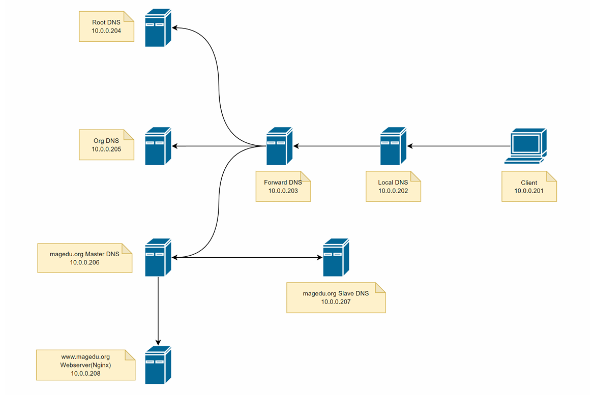
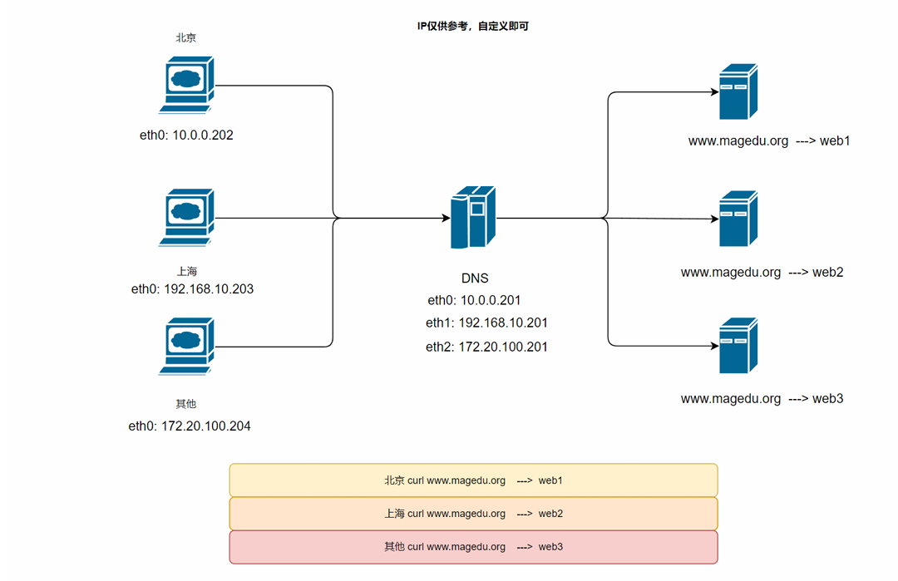

# 实验1：DNS综合实验




准备8台机器

``````bash
10.0.0.201   Client
10.0.0.202   localdns
10.0.0.203   forwarddns
10.0.0.204   rootdns
10.0.0.204   orgdns
10.0.0.206   magedumaster
10.0.0.207   mageduslave
10.0.0.208   webserver
``````

在复杂架构中，我们进行配置，要保证每次配置都能够得到验证，防止全部配置后，出现问题无法排错，因此，这里我们从下往上搭建，先搭建主从复制

客户端client配置

``````bash
# 更改网卡配置，将DNS指向10.0.0.202
# Ubuntu将resolve和网卡DNS对齐
rm -rf /etc/resolv.conf 
ln -s /run/systemd/resolve/resolv.conf /etc/resolv.conf

# 保证所有主机都能ping通
``````

配置webserver

``````bash
# 下载nginx
apt install -y nginx
systemctl enable --now nginx
echo www.magedu.org > /var/www/html/index.html
``````

搭建主MasterDNS服务器

``````bash
# 服务器：10.0.0.206

vim /etc/bind/name.conf.default-zones

# 添加
zone "magedu.org" {
    type master;
    file "/etc/bind/db.magedu.org.zone"; # 写绝对路径
};

vim /etc/bind/db.magedu.org.zone

$TTL 1D

@   IN   SOA   master  admin.magedu.org. (1 1D 1H 1W 3H)

         NS    master
         NS    slave

master   A     10.0.0.206
slave    A     10.0.0.207
www      A     10.0.0.208

# 授权
chown bind:bind db.magedu.org.zone

# 检查语法命令
named-checkzone magedu.org /etc/bind/db.magedu.org.zone
# 检查bind配置
named-checkconf
``````

实现从节点DNS服务器

``````bash
vim /etc/bind/named.conf.default-zones

zone "magedu.org" {
    type slave;
    masters {10.0.0.206;};
    file "/etc/bind/slaves/magedu.org.zone"; #建议绝对路径
};

mkdir /etc/bind/slaves
chown -R bind:bind /etc/bind/slaves

# 给权限
vim /etc/apparmor.d/usr.sbin.named

# 添加
/etc/bind/slaves/** rw,
/etc/bind/slaves/ rw,

# 重启
systemctl restart named
``````

配置magedu的父域

``````
# 服务器：10.0.0.205，orgdns
apt install -y bind9

vim /etc/bind/named.conf.default-zones

zone "org." {
    type master;
    file "/etc/bind/db.org";
}

vim db.org

$TTL 86400

@  IN  SOA  master  admin.magedu.org. ( 123 1D 1H 1W 3D )

  NS  master

magedu  NS mageduns1
magedu  NS mageduns2

master A 10.0.0.205
mageduns1 A 10.0.0.206
mageduns2 A 10.0.0.207

# 重启
rndc reload
``````

实现根域的主DNS服务器

``````bash
# 服务器：10.0.0.204  rootdns
# 修改配置
vim named.conf.default-zones

zone "." {
	type master;
	file "/etc/bind/root.zone";
};

vim root.zone

$TTL 1D

@  IN  SOA  master  admin.magedu.org. ( 1 1D 1H 1W 3D )

    NS   master
org NS   orgns

master  A  10.0.0.204 
orgns  A  10.0.0.205 
``````

实现转发目标的DNS服务器

``````bash
# 转发DNS： 10.0.0.203 forwarddns

apt install -y bind9

vim /usr/share/dns/root.hints
.                        3600000      NS    A.ROOT-SERVERS.NET.
A.ROOT-SERVERS.NET.      3600000      A     10.0.0.204

# 重启服务
systemctl restart named

# ubuntu，关闭安全加密
dnssec-validation no;

# 如果是rocky，将安全加密关闭
dnssec-enable no;
dnssec-validation no;

# 测试
nslookup www.magedu.org 10.0.0.203
``````

配置本地localDNS服务器

``````bash
# 服务器：10.0.0.202 localdns

# 设置转发，并取消安全加固
options {
	directory "/var/cache/bind";

	// If there is a firewall between you and nameservers you want
	// to talk to, you may need to fix the firewall to allow multiple
	// ports to talk.  See http://www.kb.cert.org/vuls/id/800113

	// If your ISP provided one or more IP addresses for stable 
	// nameservers, you probably want to use them as forwarders.  
	// Uncomment the following block, and insert the addresses replacing 
	// the all-0's placeholder.

  forward first;
	forwarders { 10.0.0.203; };

	//========================================================================
	// If BIND logs error messages about the root key being expired,
	// you will need to update your keys.  See https://www.isc.org/bind-keys
	//========================================================================
	dnssec-validation no;

	listen-on-v6 { any; };
    
};
``````

在客户端测试

``````bash
# 在客户端10.0.0.201测试
[root@client ~]$ curl www.magedu.org
www.magedu.org

# 成功
``````


# 实验2：view视图




