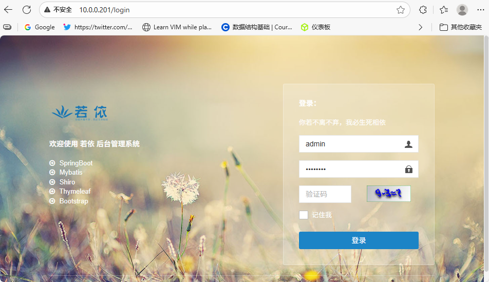
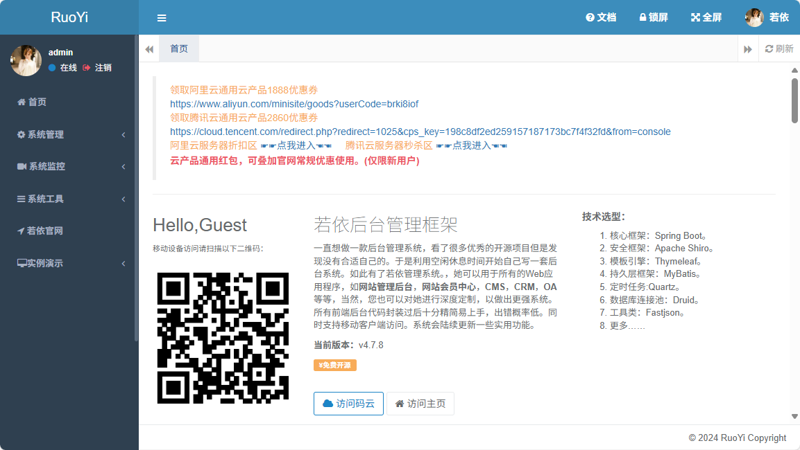

# Java项目综合案例


## 若依 RuoYi 单体服务项目构建案例


### 下载项目

```bash
# 下载资源
[root@ubuntu2204 ~]#git clone https://gitee.com/lbtooth/RuoYi.git

# 查看
[root@ubuntu2204 ~]#ls
bin  Dockerfile              kubernetes  pom.xml    ruoyi-admin   ruoyi-framework  ruoyi-quartz   ruoyi-system  ry.sh      ry.sh-java17
doc  Dockerfile-multi-stage  LICENSE     README.md  ruoyi-common  ruoyi-generator  ruoyi.service  ry.bat        ry.sh.bak  sql
```


### 准备数据库

```bash
# 安装和配置MySQL
[root@ubuntu2204 ~]#apt update && apt install -y mysql-server
[root@ubuntu2204 ~]#sed -i '/127.0.0.1/s/^/#/' /etc/mysql/mysql.conf.d/mysqld.cnf 
[root@ubuntu2204 ~]#systemctl restart mysql

# 查看数据库脚本
[root@ubuntu2204 ~]#ls sql/
quartz.sql  ruoyi.html  ruoyi.pdm  ry_20240112.sql

# 准备数据库表和数据及用户
[root@ubuntu2204 ~]# mysql
......
mysql> create database ry;                            # 创建数据库
Query OK, 1 row affected (0.01 sec)

mysql> create user ry@'%' identified by '123456';     # 创建用户
Query OK, 0 rows affected (0.01 sec)

mysql> grant all on ry.* to ry@'%';                   # 授权
Query OK, 0 rows affected (0.00 sec)

mysql> use ry                                         # 进入数据库
Database changed
mysql> source RuoYi/sql/ry_20240112.sql               # 导入数据
mysql> source RuoYi/sql/quartz.sql                    # 导入数据
mysql> show tables;                                   # 查看导入的数据表
+--------------------------+
| Tables_in_ry             |
+--------------------------+
| QRTZ_BLOB_TRIGGERS       |
| QRTZ_CALENDARS           |
| QRTZ_CRON_TRIGGERS       |
| QRTZ_FIRED_TRIGGERS      |
| QRTZ_JOB_DETAILS         |
| QRTZ_LOCKS               |
| QRTZ_PAUSED_TRIGGER_GRPS |
| QRTZ_SCHEDULER_STATE     |
| QRTZ_SIMPLE_TRIGGERS     |
| QRTZ_SIMPROP_TRIGGERS    |
| QRTZ_TRIGGERS            |
| gen_table                |
| gen_table_column         |
| sys_config               |
| sys_dept                 |
| sys_dict_data            |
| sys_dict_type            |
| sys_job                  |
| sys_job_log              |
| sys_logininfor           |
| sys_menu                 |
| sys_notice               |
| sys_oper_log             |
| sys_post                 |
| sys_role                 |
| sys_role_dept            |
| sys_role_menu            |
| sys_user                 |
| sys_user_online          |
| sys_user_post            |
| sys_user_role            |
+--------------------------+
31 rows in set (0.00 sec)
mysql> exit;                            # 退出

# 修改连接MySQL的配置
[root@ubuntu2204 ~]#cat RuoYi/ruoyi-admin/src/main/resources/application-druid.yml 
# 数据源配置
spring:
    datasource:
        type: com.alibaba.druid.pool.DruidDataSource
        driverClassName: com.mysql.cj.jdbc.Driver
        druid:
            # 主库数据源，修改数据名称和用户密码
            # 数据库地址：mysql.wang.org:3306
            # 用户名：ry
            # 密码：123456
            master:
                url: jdbc:mysql://mysql.wang.org:3306/ry?useUnicode=true&characterEncoding=utf8&zeroDateTimeBehavior=convertToNull&useSSL=true&serverTimezone=GMT%2B8
                username: ry
                password: 123456
```


### 域名解析

```bash
#注意:mysql.wang.org 需要通过/etc/hosts或DNS实现名称解析,这里的IP是MySQL所在的服务器IP
[root@ubuntu2204 ~]#cat /etc/hosts
10.0.0.201 mysql.wang.org 
```


### 构建Java项目

```bash
[root@ubuntu2204 ~]#apt update && apt -y install maven
[root@ubuntu2204 ~]#cd RuoYi/
[root@ubuntu2204 RuoYi]#mvn clean package -Dmaven.test.skip=true

# 运行
[root@ubuntu2204 RuoYi]#java -jar ruoyi-admin/target/ruoyi-admin.jar
......
16:25:41.400 [main] INFO  c.r.RuoYiApplication - [logStarted,61] - Started RuoYiApplication in 9.927 seconds (JVM running for 10.639)
(♥◠‿◠)ﾉﾞ  若依启动成功   ლ(´ڡ`ლ)ﾞ  
 .-------.       ____     __        
 |  _ _   \      \   \   /  /    
 | ( ' )  |       \  _. /  '       
 |(_ o _) /        _( )_ .'         
 | (_,_).' __  ___(_ o _)'          
 |  |\ \  |  ||   |(_,_)'         
 |  | \ `'   /|   `-'  /           
 |  |  \    /  \      /           
 ''-'   `'-'    `-..-'   
 
# 查看浏览器
```


### 使用Service方式管理服务

```bash
[root@ubuntu2204 ~]#cp RuoYi/ry.sh /srv/
[root@ubuntu2204 ~]#cp RuoYi/ruoyi-admin/target/ruoyi-admin.jar /srv
[root@ubuntu2204 ~]#ls /srv
ruoyi-admin.jar  ry.sh

# 修改官方脚本bug
[root@ubuntu2204 ~]#vim /srv/ry.sh
# JVM参数
# 将JVM_OPTS改为如下配置
JVM_OPTS="-Dname=$AppName  -Duser.timezone=Asia/Shanghai -Xms512m -Xmx1024m -XX:MetaspaceSize=128m -XX:MaxMetaspaceSize=512m -XX:+HeapDumpOnOutOfMemoryError  -XX:+PrintGCDetails -XX:NewRatio=1 -XX:SurvivorRatio=30 -XX:+UseParallelGC -XX:+UseParallelOldGC"

 #创建service文件
[root@ubuntu2204 ~]#vim /lib/systemd/system/ruoyi.service
[Unit]
Description=Ruoyi
After=network.target

[Service]
Type=forking
ExecStart=/srv/ry.sh start
ExecStop=/srv/ry.sh stop
LimitNOFILE=10000

[Install]
WantedBy=multi-user.target

# 启用
[root@ubuntu2204 ~]#systemctl daemon-reload ;systemctl enable --now ruoyi

# 浏览器查看
```


### 登录访问

```bash
http://10.0.0.201/login

#默认用户名/密码
admin/admin123 
```






## 若依RuoYi单体服务基于容器化构建

```bash
# 安装工具
[root@ubuntu2204 ~]#apt update && apt install -y git maven docker.io

[root@ubuntu2204 ~]#git clone https://gitee.com/lbtooth/RuoYi.git
正克隆到 'RuoYi'...
remote: Enumerating objects: 30620, done.
remote: Counting objects: 100% (44/44), done.
remote: Compressing objects: 100% (42/42), done.
remote: Total 30620 (delta 22), reused 0 (delta 0), pack-reused 30576 (from 1)
接收对象中: 100% (30620/30620), 11.50 MiB | 7.57 MiB/s, 完成.
处理 delta 中: 100% (14691/14691), 完成.

# 修改数据库连接信息
[root@ubuntu2204 ~]#vim RuoYi/ruoyi-admin/src/main/resources/application-druid.yml 
# 数据源配置
spring:
    datasource:
        type: com.alibaba.druid.pool.DruidDataSource
        driverClassName: com.mysql.cj.jdbc.Driver
        druid:
            # 主库数据源
            master:
                url: jdbc:mysql://mysql.wang.org:3306/ry?useUnicode=true&characterEncoding=utf8&zeroDateTimeBehavior=convertToNull&useSSL=true&serverTimezone=GMT%2B8
                username: ry
                password: 123456
                
# 启动数据容器
[root@ubuntu2204 ~]#docker run -p 3306:3306 -e MYSQL_ROOT_PASSWORD=123456 -e MYSQL_DATABASE=ry -e MYSQL_USER=ry -e MYSQL_PASSWORD=123456 --name mysql -d -v /data/mysql:/var/lib/mysql --restart=always registry.cn-beijing.aliyuncs.com/wangxiaochun/mysql:8.0.29-oracle

# 添加hosts记录
[root@ubuntu2204 ~]#vim /etc/hosts
[root@ubuntu2204 ~]#cat /etc/hosts
......
10.0.0.131 mysql.wang.org

# 导入表结构
[root@ubuntu2204 ~]#apt install -y mysql-client
[root@ubuntu2204 ~]#mysql -ury -p123456 -hmysql.wang.org
 mysql> use ry
 mysql> source RuoYi/sql/ry_20240112.sql
 mysql> source RuoYi/sql/quartz.sql
 mysql> show tables;
+--------------------------+
| Tables_in_ry             |
+--------------------------+
| QRTZ_BLOB_TRIGGERS       |
| QRTZ_CALENDARS           |
| QRTZ_CRON_TRIGGERS       |
| QRTZ_FIRED_TRIGGERS      |
| QRTZ_JOB_DETAILS         |
| QRTZ_LOCKS               |
| QRTZ_PAUSED_TRIGGER_GRPS |
| QRTZ_SCHEDULER_STATE     |
| QRTZ_SIMPLE_TRIGGERS     |
| QRTZ_SIMPROP_TRIGGERS    |
| QRTZ_TRIGGERS            |
| gen_table                |
| gen_table_column         |
| sys_config               |
| sys_dept                 |
| sys_dict_data            |
| sys_dict_type            |
| sys_job                  |
| sys_job_log              |
| sys_logininfor           |
| sys_menu                 |
| sys_notice               |
| sys_oper_log             |
| sys_post                 |
| sys_role                 |
| sys_role_dept            |
| sys_role_menu            |
| sys_user                 |
| sys_user_online          |
| sys_user_post            |
| sys_user_role            |
+--------------------------+
31 rows in set (0.00 sec)

mysql> exit
Bye

[root@ubuntu2204 ~]#cd RuoYi
[root@ubuntu2204 RuoYi]#ls
bin         Dockerfile-multi-stage  pom.xml      ruoyi-common     ruoyi-quartz   ry.bat     ry.sh-java17
doc         kubernetes              README.md    ruoyi-framework  ruoyi.service  ry.sh      sql
Dockerfile  LICENSE                 ruoyi-admin  ruoyi-generator  ruoyi-system   ry.sh.bak

# 构建并生成jar包
[root@ubuntu2204 RuoYi]#mvn -U clean package -DskipTests

# 查看目录下有jar包
[root@ubuntu2204 RuoYi]#ls ruoyi-admin/target/
classes  generated-sources  maven-archiver  maven-status  ruoyi-admin.jar  ruoyi-admin.jar.original

```


### 方法1: 宿主机编译构建JAVA应用

```bash
#方法1: 宿主机编译构建JAVA应用
[root@ubuntu2204 RuoYi]#cat Dockerfile
# 基础镜像
#FROM adoptopenjdk/openjdk11:alpine-jre
#FROM openjdk:11.0.16
#FROM openjdk:11.0.16-jre-slim
#FROM openjdk:8u212-jre-alpine3.9
FROM registry.cn-beijing.aliyuncs.com/wangxiaochun/openjdk:8u212-jre-alpine3.9

# 作者
LABEL MAINTAINER="wangxiaochun<root@wangxiaochun.com>"

ENV APP_NAME=ruoyi APP_PATH=/data/ruoyi  APP_PORT=80

RUN sed -i 's/dl-cdn.alpinelinux.org/mirrors.aliyun.com/' /etc/apk/repositories && apk update && apk --no-cache add tzdata && ln -sf /usr/share/zoneinfo/Asia/Shanghai /etc/localtime

# 挂载目录
VOLUME ${APP_PATH}

# 创建目录
RUN mkdir -p ${APP_PATH}

# 指定路径
WORKDIR  ${APP_PATH}

# 复制jar文件到路径
COPY ./ruoyi-admin/target/*.jar ${APP_PATH}/${APP_NAME}.jar
#COPY ./target/*.jar ${APP_PATH}/${APP_NAME}.jar

#暴露端口
EXPOSE $APP_PORT

# 启动服务
CMD java -jar ${APP_PATH}/${APP_NAME}.jar --server.port=$APP_PORT

#安装字体相关包，否则无法显示验证码
RUN sed -i 's/dl-cdn.alpinelinux.org/mirrors.aliyun.com/' /etc/apk/repositories && apk update && apk  --no-cache add ttf-dejavu fontconfig

# 构建镜像
[root@ubuntu2204 RuoYi]#APP=ruoyi
[root@ubuntu2204 RuoYi]#PORT=80
[root@ubuntu2204 RuoYi]#HARBOR=harbor.wang.org
[root@ubuntu2204 RuoYi]#TAG=v1.0
[root@ubuntu2204 RuoYi]#HOST=10.0.0.131
[root@ubuntu2204 RuoYi]#docker build -t ${HARBOR}/example/${APP}:${TAG} .

# 查看镜像
[root@ubuntu2204 RuoYi]#docker images
REPOSITORY                                              TAG                   IMAGE ID       CREATED         SIZE
harbor.wang.org/example/ruoyi                           v1.0                  fe31993f09a2   6 seconds ago   187MB
registry.cn-beijing.aliyuncs.com/wangxiaochun/mysql     8.0.29-oracle         33037edcac9b   3 years ago     444MB
registry.cn-beijing.aliyuncs.com/wangxiaochun/openjdk   8u212-jre-alpine3.9   f7a292bbb70c   6 years ago     84.9MB

# 启用容器 
[root@ubuntu2204 RuoYi]#docker run -d --add-host mysql.wang.org:10.0.0.131 --restart always --name $APP  -p $PORT:80 $HARBOR/example/$APP:$TAG
```


### 方法2: 基于多阶段构建实现容器内编译构建JAVA应用

```bash
# 方法2，基于多阶段构建实现容器内编译构建JAVA应用,宿机无需安装JAVA和MAVEN，只需要Docker即可
[root@ubuntu2204 RuoYi]#cat Dockerfile-multi-stage 
#多阶段构建
#FROM maven:3.9.9-eclipse-temurin-8-alpine as build
FROM registry.cn-beijing.aliyuncs.com/wangxiaochun/maven:3.9.9-eclipse-temurin-8-alpine as build
COPY . /RuoYi
WORKDIR /RuoYi
RUN mvn clean package -Dmaven.test.skip=true

# 基础镜像
#FROM adoptopenjdk/openjdk11:alpine-jre
#FROM openjdk:11.0.16
#FROM openjdk:11.0.16-jre-slim
#FROM openjdk:8u212-jre-alpine3.9
FROM registry.cn-beijing.aliyuncs.com/wangxiaochun/openjdk:8u212-jre-alpine3.9

# 作者
LABEL MAINTAINER="wangxiaochun<root@wangxiaochun.com>"

ENV APP_NAME=ruoyi APP_PATH=/data/ruoyi  APP_PORT=80

RUN sed -i 's/dl-cdn.alpinelinux.org/mirrors.aliyun.com/' /etc/apk/repositories && apk update && apk --no-cache add tzdata && ln -sf /usr/share/zoneinfo/Asia/Shanghai /etc/localtime

# 挂载目录
VOLUME ${APP_PATH}

# 创建目录
RUN mkdir -p ${APP_PATH}

# 指定路径
WORKDIR  ${APP_PATH}

# 复制jar文件到路径
COPY --from=build  /RuoYi/ruoyi-admin/target/*.jar ${APP_PATH}/${APP_NAME}.jar

#安装依赖的字体，否则无法显示验证码
RUN sed -i 's/dl-cdn.alpinelinux.org/mirrors.aliyun.com/' /etc/apk/repositories && apk update && apk  --no-cache add ttf-dejavu fontconfig

#暴露端口
EXPOSE $APP_PORT

# 启动服务
CMD java -jar ${APP_PATH}/${APP_NAME}.jar --server.port=$APP_PORT
#参考ry.sh
#CMD java -jar  ${APP_PATH}/${APP_NAME}.jar --server.port=$APP_PORT -Dname=$AppName  -Duser.timezone=Asia/Shanghai -Xms512m -Xmx1024m -XX:MetaspaceSize=128m -XX:MaxMetaspaceSize=512m -XX:+HeapDumpOnOutOfMemoryError  -XX:+PrintGCDetails -XX:NewRatio=1 -XX:SurvivorRatio=30


# 构建镜像
[root@ubuntu2204 RuoYi]#APP=ruoyi
[root@ubuntu2204 RuoYi]#PORT=80
[root@ubuntu2204 RuoYi]#HARBOR=harbor.wang.org
[root@ubuntu2204 RuoYi]#TAG=v1.0
[root@ubuntu2204 RuoYi]#HOST=10.0.0.131
[root@ubuntu2204 RuoYi]#docker build -t $HARBOR/example/$APP:$TAG -f Dockerfile-multi-stage .

# 启动容器
[root@ubuntu2204 RuoYi]#docker run -d --add-host mysql.wang.org:10.0.0.131 --restart always --name $APP  -p $PORT:80 $HARBOR/example/$APP:$TAG
```


## 若依 RuoYi 前后端分离项目

### RuoYi 系统前后端分离项目构建案例

####  环境准备

```bat
当前版本默认不支持Ubuntu24.04
```


##### 准备 DNS 名称解析

```bash
# 配置DNS实现域名解析
[root@ubuntu2204 ~]#atp update && apt install -y bind9
[root@ubuntu2204 ~]#cd /etc/bind/
[root@ubuntu2204 bind]#ls
bind.keys  db.127  db.empty  named.conf                named.conf.local    rndc.key
db.0       db.255  db.local  named.conf.default-zones  named.conf.options  zones.rfc1918

[root@ubuntu2204 bind]#vim named.conf.default-zones 
......
zone "wang.org" {
    type master;
    file "/etc/bind/wang.org.zone";
};

[root@ubuntu2204 bind]#vim wang.org.zone
$TTL 86400

@  IN   SOA  master mysticalrecluse.gmail.com (11 1h 10m 1D 12h)

        NS   master
master  A    10.0.0.131

mysql   A    10.0.0.131
redis   A    10.0.0.131
ryvue   A    10.0.0.131

# 注意:如果当前主机为DNS服务器,则网卡配置指向本机的IP而非127.0.0.1,否则会造成此主机上的Docker容器无法获取宿主机的DNS地址配置
# 修改网卡配置
[root@ubuntu2204 bind]#vim /etc/netplan/01-netcfg.yaml 
......
      nameservers:
        addresses: [10.0.0.131]
[root@ubuntu2204 bind]#netplan apply
```


#### 下载项目

```bash
[root@ubuntu2204 ~]#apt update && apt install -y git
[root@ubuntu2204 ~]#git clone https://gitee.com/lbtooth/RuoYi-Vue.git

[root@ubuntu2204 ~]#cd RuoYi-Vue/
[root@ubuntu2204 RuoYi-Vue]#ls
bin  Dockerfile              LICENSE       pom.xml    ruoyi-admin   ruoyi-framework  ruoyi-quartz  ruoyi-ui  ry.sh      sql
doc  Dockerfile-multi-stage  nginx-docker  README.md  ruoyi-common  ruoyi-generator  ruoyi-system  ry.bat    ry.sh.bak
```


#### 准备MySQL和Redis

```bash
# 安装和配置MySQL和redis
[root@ubuntu2204 ~]#apt update && apt install -y mysql-server redis

# 如果若依和MySQL在同一台主机可以不做修改（可选）
[root@ubuntu2204 ~]#sed -i '/127.0.0.1/s/^/#/' /etc/mysql/mysql.conf.d/mysqld.cnf
[root@ubuntu2204 ~]#systemctl restart mysql

# 查看数据库脚本
[root@ubuntu2204 ~]#ls RuoYi-Vue/sql
quartz.sql  ry_20231130.sql

# 准备数据库表和数据及用户
[root@ubuntu2204 ~]#mysql
......
mysql> create database ryvue;
Query OK, 1 row affected (0.02 sec)

#如果若依和MySQL在同一台主机
mysql> create user ryvue@'localhost' identified by '123456';
Query OK, 0 rows affected (0.01 sec)

mysql> grant all on ryvue.* to ryvue@'localhost';
Query OK, 0 rows affected (0.00 sec)

#如果若依和MySQL不在同一台主机（这里因为后续使用域名解析IP访问，因此这里用户）
mysql> create  user ryvue@'%' identified by '123456';
Query OK, 0 rows affected (0..01 sec)

mysql> grant all on ryvue.* to  ryvue@'%';
Query OK, 0 rows affected (0..01 sec)


mysql> use ryvue
Database changed
mysql> source RuoYi-Vue/sql/ry_20231130.sql
......
mysql> source RuoYi-Vue/sql/quartz.sql
......
mysql> exit

# 修改连接MySQL的配置
[root@ubuntu2204 ~]#vim RuoYi-Vue/ruoyi-admin/src/main/resources/application-druid.yml
......
            master:
                url: jdbc:mysql://mysql.wang.org:3306/ryvue?useUnicode=true&characterEncoding=utf8&zeroDateTimeBehavior=convertToNull&useSSL=true&serverTimezone=GMT%2B8
                username: ryvue
                password: 123456
......

# 修改redis配置
[root@ubuntu2204 ~]#sed -i.bak -e 's/^bind .*/bind 0.0.0.0/' -e  '$a requirepass 123456' /etc/redis/redis.conf
[root@ubuntu2204 ~]#systemctl restart redis

# 修改连接Redis配置和服务启动端口（可选）
......
# 开发环境配置
server:
  # 服务器的HTTP端口，默认为8080
  port: 8080
......
  redis:
    # 地址
    host: redis.wang.org
    # 端口，默认为6379
    port: 6379
    # 数据库索引
    database: 0
    # 密码
    password: 123456
......
```


#### 后端项目构建

```bash
# 安装java工具
[root@ubuntu2204 ~]#apt update && apt install -y maven

# 查看
[root@ubuntu2204 ~]#mvn -v
Apache Maven 3.6.3
Maven home: /usr/share/maven
Java version: 11.0.28, vendor: Ubuntu, runtime: /usr/lib/jvm/java-11-openjdk-amd64
Default locale: zh_CN, platform encoding: UTF-8
OS name: "linux", version: "5.15.0-52-generic", arch: "amd64", family: "unix"

#maven加速配置(可选,因为RuoYi本身项目已有配置加速,此步可不做)
[root@ubuntu2204 ~]#vim /etc/maven/settings.xml
......
    <mirror>
      <id>nexus-aliyun</id>
      <mirrorOf>*</mirrorOf>
      <name>Nexus aliyun</name>
      <url>http://maven.aliyun.com/nexus/content/groups/public</url>
    </mirror>
......

# 编译打包,可能因为网络原因失败，重试即可，此步如果网络较慢可能会需要花数十分钟的较长时间
[root@ubuntu2204 RuoYi-Vue]#cd RuoYi-Vue
[root@ubuntu2204 RuoYi-Vue]#mvn clean package -Dmaven.test.skip=true
......
[INFO] Replacing main artifact with repackaged archive
[INFO] ------------------------------------------------------------------------
[INFO] Reactor Summary for ruoyi 3.8.7:
[INFO] 
[INFO] ruoyi .............................................. SUCCESS [  0.523 s]
[INFO] ruoyi-common ....................................... SUCCESS [ 16.612 s]
[INFO] ruoyi-system ....................................... SUCCESS [  0.785 s]
[INFO] ruoyi-framework .................................... SUCCESS [  2.169 s]
[INFO] ruoyi-quartz ....................................... SUCCESS [  0.625 s]
[INFO] ruoyi-generator .................................... SUCCESS [  0.527 s]
[INFO] ruoyi-admin ........................................ SUCCESS [  6.930 s]
[INFO] ------------------------------------------------------------------------
[INFO] BUILD SUCCESS
[INFO] ------------------------------------------------------------------------
[INFO] Total time:  31.417 s
[INFO] Finished at: 2025-09-10T11:56:36+08:00
[INFO] ------------------------------------------------------------------------

# 验证构建成功
[root@ubuntu2204 RuoYi-Vue]#ll ruoyi-admin/target/ruoyi-admin.jar  -h
-rw-r--r-- 1 root root 80M  9月 10 11:56 ruoyi-admin/target/ruoyi-admin.jar

# 启动
[root@ubuntu2204 RuoYi-Vue]#cp ruoyi-admin/target/ruoyi-admin.jar /opt/
[root@ubuntu2204 RuoYi-Vue]#cd ..

#使用默认端口8080,可以通过--server.port=8888指定端口
[root@ubuntu2204 ~]#java -jar /opt/ruoyi-admin.jar 

# 查看浏览器
http://10.0.0.131:8080/
```


#### 前端项目构建

##### 安装依赖和测试启动

```bash
# 安装工具
[root@ubuntu2204 RuoYi-Vue]#apt update && apt -y install npm

# 查看版本
[root@ubuntu2204 RuoYi-Vue]#npm -v
8.5.1
[root@ubuntu2204 RuoYi-Vue]#node -v
v12.22.9

[root@ubuntu2204 RuoYi-Vue]#cd ruoyi-ui
[root@ubuntu2204 ruoyi-ui]#npm install --registry=https://registry.npmmirror.com
[root@ubuntu2204 ruoyi-ui]#npm run build:prod
[root@ubuntu2204 ruoyi-ui]#npm run dev
```


##### 构建发布

```bash
# 构建测试环境
[root@ubuntu2204 ruoyi-ui]#npm run build:stage

# 构建生产环境
[root@ubuntu2204 ruoyi-ui]#npm run build:prod

# 查看生成./dist目录
[root@ubuntu2204 ruoyi-ui]#ls dist/
favicon.ico  html  index.html  index.html.gz  robots.txt  static
```


#### 反向代理

```bash
# 安装nginx
[root@ubuntu2204 ruoyi-ui]#apt update && apt install -y nginx

# 准备静态页面文件
[root@ubuntu2204 RuoYi-Vue]#mkdir -p /data/ryvue
[root@ubuntu2204 RuoYi-Vue]#cp -r ruoyi-ui/dist/* /data/ryvue/

# 实现Nginx反向代理配置
[root@ubuntu2204 conf.d]#vim /etc/nginx/conf.d/ryvue.wang.org.conf 
server {
    listen 80;
    server_name ryvue.wang.org www.ryvue.wang.org;
    location / {
        root /data/ryvue;
        try_files $uri $uri/ /index.html;
        index index.html index,htm;
    }
  
    location /prod-api/ {
        proxy_pass http://10.0.0.131:8080/;
        proxy_set_header Host $http_host;
        proxy_set_header X-Real-IP $remote_addr;
        proxy_set_header REMOTE-HOST $remote_addr;
        proxy_set_header X-Forwarded-For $remote_addr;
    }
}

# 重启nginx
[root@ubuntu2204 conf.d]#nginx -s reload

# 访问浏览器
http://ryvue.wang.org/index
```


### RuoYi 系统前后端分离项目基于容器化构建案例

#### 环境准备

##### 准备DNS名称解析

```bash
# 配置DNS实现域名解析
[root@ubuntu2204 ~]#apt update && apt install -y bind9

# 所有容器运行在同一主机
[root@ubuntu2204 bind]#vim named.conf.default-zones 
zone "wang.org" {
    type master;
    file "/etc/bind/wang.org.zone";
};

# 添加三个解析记录
[root@ubuntu2204 bind]#vim wang.org.zone
$TTL 86400

@  IN  SOA master mysticalrecluse.gmail.com. (11 1h 10m 1D 12h)

       NS  master
master A   10.0.0.131 

mysql  A   10.0.0.131
redis  A   10.0.0.131
ryvue  A   10.0.0.131

# 重新加载
[root@ubuntu2204 bind]#rndc reload

# 测试
[root@ubuntu2204 bind]#nslookup mysql.wang.org 10.0.0.131
Server:         10.0.0.131
Address:        10.0.0.131#53

Name:   mysql.wang.org
Address: 10.0.0.131

# 修改网卡
[root@ubuntu2204 bind]#vim /etc/netplan/01-netcfg.yaml 
......
      nameservers:
        addresses: [10.0.0.131]
[root@ubuntu2204 bind]#netplan apply
```


#### 安装工具和下载源码

```bash
# 所有主机都安装工具
[root@ubuntu2204 ~]#apt update && apt -y install docker.io git

#所有主机都下载源码
[root@ubuntu2204 ~]#git clone https://gitee.com/lbtooth/RuoYi-Vue.git

# 查看
[root@ubuntu2204 ~]#ls RuoYi-Vue/
bin  Dockerfile              LICENSE       pom.xml    ruoyi-admin   ruoyi-framework  ruoyi-quartz  ruoyi-ui  ry.sh      sql
doc  Dockerfile-multi-stage  nginx-docker  README.md  ruoyi-common  ruoyi-generator  ruoyi-system  ry.bat    ry.sh.bak
```


#### 指定若依连接 MySQL 和 Redis 相关配置信息

```bash
#在后端服务器修改JAVA的连接 MySQL 和Redis 相关配置信息
[root@ubuntu2204 ~]#cd RuoYi-Vue

#修改数据库连接配置
[root@ubuntu2204 RuoYi-Vue]#vim ruoyi-admin/src/main/resources/application-druid.yml
# 数据源配置
spring:
    datasource:
        type: com.alibaba.druid.pool.DruidDataSource
        driverClassName: com.mysql.cj.jdbc.Driver
        druid:
            # 主库数据源
            master:
                url: jdbc:mysql://mysql.wang.org:3306/ryvue?useUnicode=true&characterEncoding=utf8&zeroDateTimeBehavior=convertToNull&useSSL=true&serverTimezone=GMT%2B8
                username: ryvue
                password: 123456
                
# 修改Redis连接配置
[root@ubuntu2204 RuoYi-Vue]#vim ruoyi-admin/src/main/resources/application.yml 
......
  redis:
    # 地址
    host: redis.wang.org
    # 端口，默认为6379
    port: 6379
    # 数据库索引
    database: 0
    # 密码
    password: 123456
    # 连接超时时间
    timeout: 10s
```


#### 启动 MySQL 和 Redis 服务

```bash
#在数据库服务器上启动数据库容器
[root@ubuntu2204 RuoYi-Vue]#docker run --name ruoyi-mysql  -d  -p 3306:3306 -e MYSQL_ROOT_PASSWORD=123456 -e MYSQL_DATABASE=ryvue -e MYSQL_USER=ryvue -e MYSQL_PASSWORD=123456 -v /data/mysql:/var/lib/mysql --restart=always registry.cn-beijing.aliyuncs.com/wangxiaochun/mysql:8.0.29-oracle

#查看数据库脚本
[root@ubuntu2204 RuoYi-Vue]#ls sql/
quartz.sql  ry_20231130.sql

# 准备数据表
[root@ubuntu2204 RuoYi-Vue]#apt install -y mysql-client
[root@ubuntu2204 RuoYi-Vue]#mysql -uroot -p123456 -hmysql.wang.org
mysql> use ryvue
Database changed
mysql> source RuoYi-Vue/sql/ry_20231130.sql
mysql> source RuoYi-Vue/sql/quartz.sql
mysql> show tables in ryvue;
+--------------------------+
| Tables_in_ryvue          |
+--------------------------+
| QRTZ_BLOB_TRIGGERS       |
| QRTZ_CALENDARS           |
| QRTZ_CRON_TRIGGERS       |
| QRTZ_FIRED_TRIGGERS      |
| QRTZ_JOB_DETAILS         |
| QRTZ_LOCKS               |
| QRTZ_PAUSED_TRIGGER_GRPS |
| QRTZ_SCHEDULER_STATE     |
| QRTZ_SIMPLE_TRIGGERS     |
| QRTZ_SIMPROP_TRIGGERS    |
| QRTZ_TRIGGERS            |
| gen_table                |
| gen_table_column         |
| sys_config               |
| sys_dept                 |
| sys_dict_data            |
| sys_dict_type            |
| sys_job                  |
| sys_job_log              |
| sys_logininfor           |
| sys_menu                 |
| sys_notice               |
| sys_oper_log             |
| sys_post                 |
| sys_role                 |
| sys_role_dept            |
| sys_role_menu            |
| sys_user                 |
| sys_user_post            |
| sys_user_role            |
+--------------------------+
30 rows in set (0.00 sec)

mysql> exit
Bye

#在数据库服务后启动Redis服务
[root@ubuntu2204 ~]#docker run --name ruoyi-redis -d -p 6379:6379  --restart always registry.cn-beijing.aliyuncs.com/wangxiaochun/redis:7.2.5 redis-server --requirepass 123456 

# 测试连接Redis
[root@ubuntu2204 ~]#apt -y install redis-tools
[root@ubuntu2204 ~]#redis-cli -a 123456 keys "*"
Warning: Using a password with '-a' or '-u' option on the command line interface may not be safe.
(empty array)

# 查看
[root@ubuntu2204 ~]#docker ps
CONTAINER ID   IMAGE                                                               COMMAND                   CREATED              STATUS              PORTS                                                  NAMES
17cbac14f2b1   registry.cn-beijing.aliyuncs.com/wangxiaochun/redis:7.2.5           "docker-entrypoint.s…"   About a minute ago   Up About a minute   0.0.0.0:6379->6379/tcp, :::6379->6379/tcp              ruoyi-redis
b5a627108ae0   registry.cn-beijing.aliyuncs.com/wangxiaochun/mysql:8.0.29-oracle   "docker-entrypoint.s…"   7 minutes ago        Up 7 minutes        0.0.0.0:3306->3306/tcp, :::3306->3306/tcp, 33060/tcp   ruoyi-mysql
```


#### 后端项目构建

##### 宿主机编译打包JAVA应用制作镜像

```bash
#在后端JAVA服务器上执行
[root@ubuntu2204 ~]#apt update && apt -y install  maven 

#maven加速配置(可选,因为RuoYi本身项目已有配置加速,此步可不做)
[root@ubuntu2204 ~]#vim /etc/maven/settings.xml
......
    <mirror>
      <id>nexus-aliyun</id>
      <mirrorOf>*</mirrorOf>
      <name>Nexus aliyun</name>
      <url>http://maven.aliyun.com/nexus/content/groups/public</url>
    </mirror>
......

# 下载源码
[root@ubuntu2204 ~]#cd RuoYi-Vue
[root@ubuntu2204 RuoYi-Vue]#mvn clean package -Dmaven.test.skip=true
......
[INFO] Replacing main artifact with repackaged archive
[INFO] ------------------------------------------------------------------------
[INFO] Reactor Summary for ruoyi 3.8.7:
[INFO] 
[INFO] ruoyi .............................................. SUCCESS [  1.108 s]
[INFO] ruoyi-common ....................................... SUCCESS [ 14.542 s]
[INFO] ruoyi-system ....................................... SUCCESS [  0.756 s]
[INFO] ruoyi-framework .................................... SUCCESS [  2.207 s]
[INFO] ruoyi-quartz ....................................... SUCCESS [  0.593 s]
[INFO] ruoyi-generator .................................... SUCCESS [  0.635 s]
[INFO] ruoyi-admin ........................................ SUCCESS [  5.597 s]
[INFO] ------------------------------------------------------------------------
[INFO] BUILD SUCCESS
[INFO] ------------------------------------------------------------------------
[INFO] Total time:  25.698 s
[INFO] Finished at: 2025-09-10T16:31:51+08:00
[INFO] ------------------------------------------------------------------------

# 查看编译结果
[root@ubuntu2204 RuoYi-Vue]#find -name "*.jar"
./ruoyi-generator/target/ruoyi-generator-3.8.7.jar
./ruoyi-system/target/ruoyi-system-3.8.7.jar
./ruoyi-framework/target/ruoyi-framework-3.8.7.jar
./ruoyi-admin/target/ruoyi-admin.jar
./ruoyi-common/target/ruoyi-common-3.8.7.jar
./ruoyi-quartz/target/ruoyi-quartz-3.8.7.jar

# 准备Dockerfile
[root@ubuntu2204 RuoYi-Vue]#cat Dockerfile
# 基础镜像
#FROM adoptopenjdk/openjdk11:alpine-jre
#FROM openjdk:11.0.16
#FROM openjdk:11.0.16-jre-slim
#FROM openjdk:8u212-jre-alpine3.9
FROM registry.cn-beijing.aliyuncs.com/wangxiaochun/openjdk:8u212-jre-alpine3.9


# 作者
LABEL MAINTAINER="wangxiaochun<root@wangxiaochun.com>"

ENV APP_NAME=ruoyi APP_PATH=/data/ruoyi  APP_PORT=8080


# 挂载目录
VOLUME ${APP_PATH}

# 创建目录
RUN mkdir -p ${APP_PATH}

# 指定路径
WORKDIR  ${APP_PATH}

# 复制jar文件到路径
COPY ./ruoyi-admin/target/*.jar ${APP_PATH}/${APP_NAME}.jar
#COPY ./target/*.jar ${APP_PATH}/${APP_NAME}.jar

#暴露端口
EXPOSE $APP_PORT

# 启动服务
CMD java -jar ${APP_PATH}/${APP_NAME}.jar --server.port=$APP_PORT

#安装字体相关包，否则无法显示验证码
RUN sed -i 's/dl-cdn.alpinelinux.org/mirrors.aliyun.com/' /etc/apk/repositories && apk update && apk  --no-cache add ttf-dejavu fontconfig

# 构建镜像
[root@ubuntu2204 RuoYi-Vue]#docker build -t ruoyi-vue:v1.0 .

# 启动镜像
[root@ubuntu2204 RuoYi-Vue]#docker run --name ruoyi-vue -d -p 82:8080 ruoyi-vue:v1.0

# 浏览器查看
http://10.0.0.131:82
```


##### 容器内编译打包JAVA应用通过多阶段制作镜像

```bash
[root@ubuntu2204 RuoYi-Vue]#cat Dockerfile-multi-stage 
#多阶段构建
#FROM maven:3.9.9-eclipse-temurin-8-alpine as build
FROM registry.cn-beijing.aliyuncs.com/wangxiaochun/maven:3.9.9-eclipse-temurin-8-alpine as build
COPY . /RuoYi-Vue
WORKDIR /RuoYi-Vue
RUN mvn clean package -Dmaven.test.skip=true


# 基础镜像
#FROM adoptopenjdk/openjdk11:alpine-jre
#FROM openjdk:11.0.16
#FROM openjdk:11.0.16-jre-slim
#FROM openjdk:8u212-jre-alpine3.9
FROM registry.cn-beijing.aliyuncs.com/wangxiaochun/openjdk:8u212-jre-alpine3.9


# 作者
LABEL MAINTAINER="wangxiaochun<root@wangxiaochun.com>"

ENV APP_NAME=ruoyi APP_PATH=/data/ruoyi  APP_PORT=8080


# 挂载目录
VOLUME ${APP_PATH}

# 创建目录
RUN mkdir -p ${APP_PATH}

# 指定路径
WORKDIR  ${APP_PATH}

# 复制jar文件到路径
COPY --from=build /RuoYi-Vue/ruoyi-admin/target/*.jar ${APP_PATH}/${APP_NAME}.jar
#COPY ./target/*.jar ${APP_PATH}/${APP_NAME}.jar

#暴露端口
EXPOSE $APP_PORT

# 启动服务
CMD java -jar ${APP_PATH}/${APP_NAME}.jar --server.port=$APP_PORT

#安装字体相关包，否则无法显示验证码
RUN sed -i 's/dl-cdn.alpinelinux.org/mirrors.aliyun.com/' /etc/apk/repositories && apk update && apk  --no-cache add ttf-dejavu fontconfig

# 镜像构建
[root@ubuntu2204 RuoYi-Vue]#docker build -t ruoyi-vue:v0.1 -f Dockerfile-multi-stage .

# 启用镜像
[root@ubuntu2204 RuoYi-Vue]#docker run --name ruoyi-vue -d -p 82:8080 ruoyi-vue:v0.1

# 查看浏览器
http://10.0.0.131:82
```


#### 前端项目构建

```bash
[root@ubuntu2204 ~]#cd RuoYi-Vue/ruoyi-ui/

# 查看Dockerfile
[root@ubuntu2204 ruoyi-ui]#cat Dockerfile 
#FROM registry.cn-beijing.aliyuncs.com/wangxiaochun/node:14.17.6 AS build
FROM registry.cn-beijing.aliyuncs.com/wangxiaochun/node:16.20-bullseye-slim AS build
COPY . /vue
WORKDIR /vue
RUN npm install  --registry=https://registry.npmmirror.com && npm run build:prod

FROM registry.cn-beijing.aliyuncs.com/wangxiaochun/nginx:1.20.0
LABEL maintainer="wangxiaochun <root@wangxiaochun.com>"
COPY --from=build /vue/dist /usr/share/nginx/html

# 构建镜像
[root@ubuntu2204 ruoyi-ui]#docker build  -t ruoyi-ui:v1.0 .

# 启用镜像
[root@ubuntu2204 ruoyi-ui]#docker run --name ruoyi-ui -d -p 81:80 ruoyi-ui:v1.0
```


#### 反向代理构建

```bash
[root@ubuntu2204 ~]#cd RuoYi-Vue/nginx-docker
[root@ubuntu2204 nginx-docker]#cat Dockerfile 
FROM registry.cn-beijing.aliyuncs.com/wangxiaochun/nginx:1.20.0
LABEL MAINTAINER="wangxiaochun<root@wangxiaochun.com>"
COPY *.conf /etc/nginx/conf.d

#重新打新的镜像，反向代理和前端分别两个容器，所有容器运行在同一个主机
[root@ubuntu2204 nginx-docker]#docker build -t nginx:1.20.0-ryvue .

# 运行容器
[root@ubuntu2204 nginx-docker]#docker run --name ruoyi-nginx -d -p 80:80 nginx:1.20.0-ryvue

# 访问浏览器
http://ryvue.wang.org
```


## 若依 RuoYi 微服务项目

### RuoYi 微服务版项目构建案例

基于docker-compose部署,建议内存8G以上


#### 安装Maven和JAVA工具

```bash
#安装JDK-21
[root@ubuntu2204 ~]#apt update && apt -y install git maven npm docker-compose python3-pip
```


#### 克隆项目代码

```bash
[root@ubuntu2204 ~]#git clone https://gitee.com/lbtooth/RuoYi-Cloud.git

# 查看
[root@ubuntu2204 ~]#ls RuoYi-Cloud/
bin     LICENSE  README.md  ruoyi-auth    ruoyi-gateway  ruoyi-ui      scripts
docker  pom.xml  ruoyi-api  ruoyi-common  ruoyi-modules  ruoyi-visual  sql
```


#### 构建后端 JAVA 微服务

```bash
# 构建后端微服务项目
[root@ubuntu2204 RuoYi-Cloud]#cd RuoYi-Cloud
[root@ubuntu2204 RuoYi-Cloud]#mvn clean package -Dmaven.test.skip=true
[INFO] Building jar: /root/RuoYi-Cloud/ruoyi-common/ruoyi-common-seata/target/ruoyi-common-seata-3.6.3.jar
[INFO] ------------------------------------------------------------------------
[INFO] Reactor Summary for ruoyi 3.6.3:
[INFO] 
[INFO] ruoyi .............................................. SUCCESS [  1.875 s]
[INFO] ruoyi-common ....................................... SUCCESS [  0.004 s]
[INFO] ruoyi-common-core .................................. SUCCESS [ 18.692 s]
[INFO] ruoyi-api .......................................... SUCCESS [  0.008 s]
[INFO] ruoyi-api-system ................................... SUCCESS [  0.597 s]
[INFO] ruoyi-common-redis ................................. SUCCESS [  3.948 s]
[INFO] ruoyi-common-security .............................. SUCCESS [  0.783 s]
[INFO] ruoyi-auth ......................................... SUCCESS [ 22.685 s]
[INFO] ruoyi-gateway ...................................... SUCCESS [  3.245 s]
[INFO] ruoyi-visual ....................................... SUCCESS [  0.012 s]
[INFO] ruoyi-visual-monitor ............................... SUCCESS [  3.175 s]
[INFO] ruoyi-common-datasource ............................ SUCCESS [  1.172 s]
[INFO] ruoyi-common-datascope ............................. SUCCESS [  0.157 s]
[INFO] ruoyi-common-log ................................... SUCCESS [  0.224 s]
[INFO] ruoyi-common-swagger ............................... SUCCESS [  0.269 s]
[INFO] ruoyi-modules ...................................... SUCCESS [  0.006 s]
[INFO] ruoyi-modules-system ............................... SUCCESS [  1.162 s]
[INFO] ruoyi-modules-gen .................................. SUCCESS [  0.745 s]
[INFO] ruoyi-modules-job .................................. SUCCESS [  0.837 s]
[INFO] ruoyi-modules-file ................................. SUCCESS [  1.807 s]
[INFO] ruoyi-common-seata ................................. SUCCESS [  2.916 s]
[INFO] ------------------------------------------------------------------------
[INFO] BUILD SUCCESS
[INFO] ------------------------------------------------------------------------
[INFO] Total time:  01:07 min
[INFO] Finished at: 2025-09-10T17:17:30+08:00
[INFO] ------------------------------------------------------------------------

# 验证编译结果
[root@ubuntu2204 RuoYi-Cloud]#find ruoyi-*/ -name "*.jar"
ruoyi-api/ruoyi-api-system/target/ruoyi-api-system-3.6.3.jar
ruoyi-auth/target/ruoyi-auth.jar
ruoyi-common/ruoyi-common-swagger/target/ruoyi-common-swagger-3.6.3.jar
ruoyi-common/ruoyi-common-datasource/target/ruoyi-common-datasource-3.6.3.jar
ruoyi-common/ruoyi-common-core/target/ruoyi-common-core-3.6.3.jar
ruoyi-common/ruoyi-common-datascope/target/ruoyi-common-datascope-3.6.3.jar
ruoyi-common/ruoyi-common-security/target/ruoyi-common-security-3.6.3.jar
ruoyi-common/ruoyi-common-redis/target/ruoyi-common-redis-3.6.3.jar
ruoyi-common/ruoyi-common-seata/target/ruoyi-common-seata-3.6.3.jar
ruoyi-common/ruoyi-common-log/target/ruoyi-common-log-3.6.3.jar
ruoyi-gateway/target/ruoyi-gateway.jar
ruoyi-modules/ruoyi-job/target/ruoyi-modules-job.jar
ruoyi-modules/ruoyi-system/target/ruoyi-modules-system.jar
ruoyi-modules/ruoyi-file/target/ruoyi-modules-file.jar
ruoyi-modules/ruoyi-gen/target/ruoyi-modules-gen.jar
ruoyi-visual/ruoyi-monitor/target/ruoyi-visual-monitor.jar
```


#### 构建前端应用

```bash
#安装依赖
[root@ubuntu2204 RuoYi-Cloud]#cd ruoyi-ui
[root@ubuntu2204 ruoyi-ui]#npm install

# 构建生产环境
[root@ubuntu2204 ruoyi-ui]#npm run build:prod
```


#### 准备Docker-compose启动所需的文件和包

```bash
#准备相关文件和包
[root@ubuntu2204 ruoyi-ui]#cd ../docker/
[root@ubuntu2204 docker]#ls
copy-jar.sh  deploy-network.sh  docker-compose-network.yaml  move.sh  nacos  redis
copy.sh      deploy.sh          docker-compose.yml           mysql    nginx  ruoyi

# 执行脚本
[root@ubuntu2204 docker]#sh move.sh
begin copy sql 
begin prepare html 
begin move ruoyi-gateway 
begin move ruoyi-auth 
begin move ruoyi-visual 
begin move ruoyi-modules-system 
begin move ruoyi-modules-file 
begin move ruoyi-modules-job 
begin move ruoyi-modules-gen 
```


#### 启动容器

##### 构建基础服务容器

```bash
#构建基础服务容器
[root@ubuntu2204 docker]#sh deploy.sh base

#查看
[root@ubuntu2204 docker]#docker-compose images
 Container                            Repository                            Tag       Image Id       Size  
-----------------------------------------------------------------------------------------------------------
ruoyi-mysql   registry.cn-beijing.aliyuncs.com/wangxiaochun/mysql          5.7      6d2211a5ad79   380.3 MB
ruoyi-nacos   registry.cn-beijing.aliyuncs.com/wangxiaochun/nacos-server   v2.4.1   800285d43c6c   284.1 MB
ruoyi-redis   registry.cn-beijing.aliyuncs.com/wangxiaochun/redis          6.2      68ce8221c621   105.4 MB

[root@ubuntu2204 docker]#docker-compose ps
   Name                  Command               State                                       Ports                                    
------------------------------------------------------------------------------------------------------------------------------------ruoyi-mysql   docker-entrypoint.sh mysql ...   Up      0.0.0.0:3306->3306/tcp,:::3306->3306/tcp                                     
ruoyi-nacos   sh bin/docker-startup.sh         Up      0.0.0.0:8848->8848/tcp,:::8848->8848/tcp,                                    
                                                       0.0.0.0:9848->9848/tcp,:::9848->9848/tcp,                                    
                                                       0.0.0.0:9849->9849/tcp,:::9849->9849/tcp                                     
ruoyi-redis   docker-entrypoint.sh redis ...   Up      0.0.0.0:6379->6379/tcp,:::6379->6379/tcp

[root@ubuntu2204 docker]#docker network ls
NETWORK ID     NAME             DRIVER    SCOPE
777c93450226   bridge           bridge    local
4214e533c997   docker_default   bridge    local
35b11e69d16c   host             host      local
63776eb57b05   none             null      local
```


##### 构建 RuoYi 应用容器

```bash
#构建RuoYi应用容器
[root@ubuntu2204 docker]#sh deploy.sh modules
```


#### 测试访问 RuoYI 应用

```bash
#使用默认用户名密码:admin/admin123登录RuoYi应用
http://ruoyi.wang.org
```

