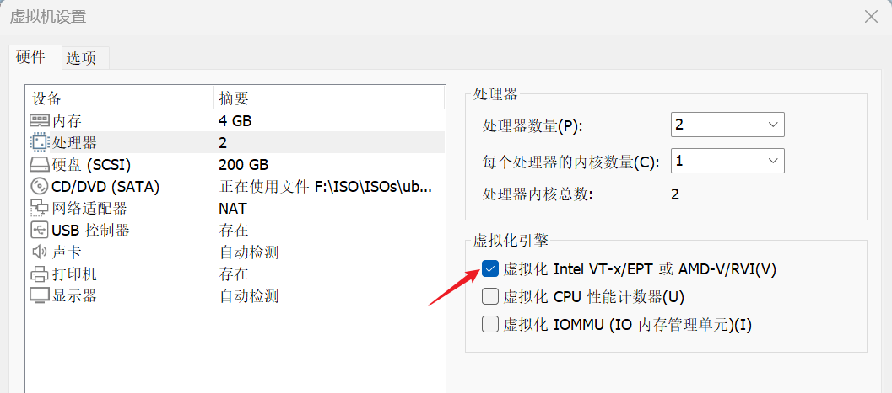
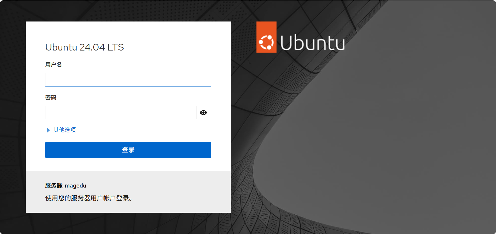
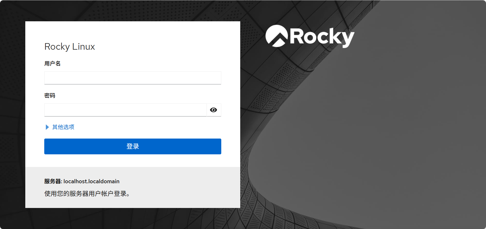
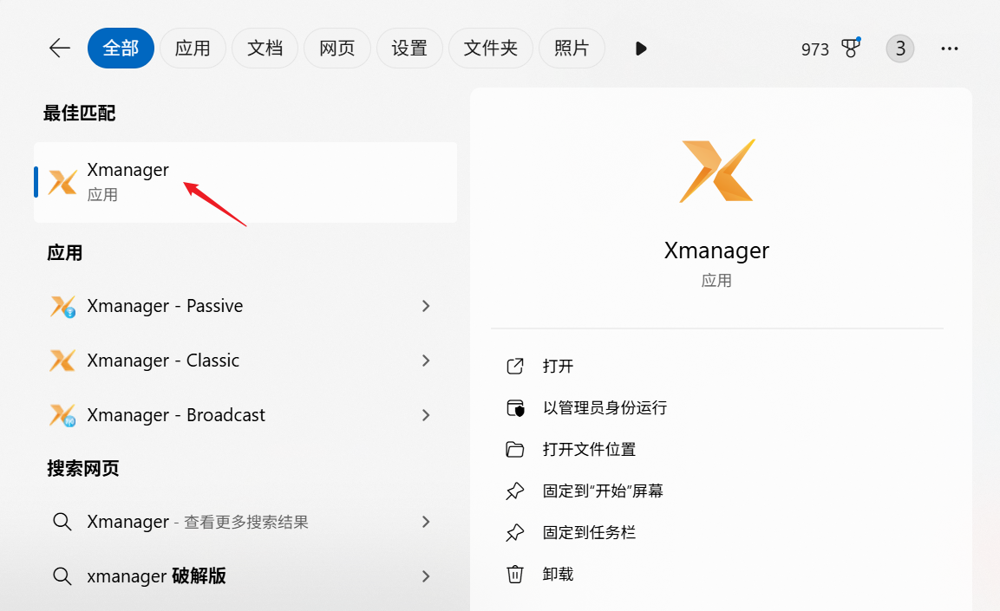

# 安装KVM


## Ubuntu安装KVM

```bash
# 检测是否支持KVM
[root@magedu ~]# apt install -y cpu-checker

# 如果CPU不支持会如下提示
[root@magedu ~]# kvm-ok
INFO: Your CPU does not support KVM extensions
KVM acceleration can NOT be used

# 关机后开启虚拟化，重启
```




```bash
# 再次检查CPU是否支持KVM
[root@magedu ~]# kvm-ok
INFO: /dev/kvm exists
KVM acceleration can be used

# 安装KVM工具
[root@magedu ~]# apt update
[root@magedu ~]# apt -y install qemu-kvm virt-manager

# Ubuntu 安装 cockpit 工具
[root@magedu ~]# apt update && apt -y install cockpit  cockpit-machines

# 开启9090
[root@magedu ~]# ss -nltp|grep 9090
LISTEN 0      4096               *:9090            *:*    users:(("systemd",pid=1,fd=81))  
```




## Rocky安装KVM

开启处理器虚拟化


```bash
# 安装 KVM 相关工具 
[root@centos8 ~]# yum -y install qemu-kvm libvirt virt-manager virt-install virt-viewer
[root@centos8 ~]# systemctl start --now libvirtd

# 基于Web的虚拟机管理方式
[root@centos8 ~]#yum -y install cockpit  cockpit-machines
[root@centos8 ~]#systemctl  enable --now cockpit.socket 
Created symlink /etc/systemd/system/sockets.target.wants/cockpit.socket → /usr/lib/systemd/system/cockpit.socket.

 #打开浏览器，访问以下地址：
https://centos8主机:9090
```




```bat
Rocky Linux 官方文档明确指出：在 Rocky Linux 10 中，virt-manager 已被移除，并由 Cockpit 取代 。
	- Rocky Linux 10 的 Virtualization（虚拟化）部分架构改变，官方不再维护 virt-manager GUI 工具；
	- 推荐使用 Cockpit 的 Web 界面来进行虚拟管理。
因此在 Rocky10 无法从仓库下载 virt-manager
```


## 图形化工具vir-manager

```bat
Ubuntu 和 Rocky 的用法一致
```

打开 `Xmanager.exe`



```bash
[root@magedu ~]# export DISPLAY=10.0.0.1:0.0
[root@magedu ~]# virt-manager
```


