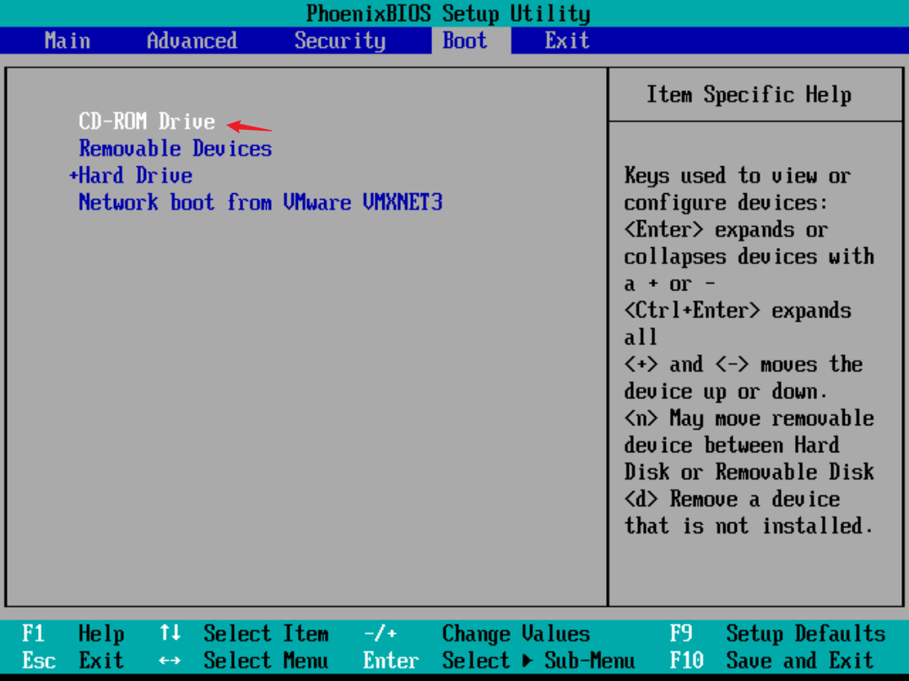

# 实验1:MBR分区表破坏与修复实验

## MBR分区表破坏

```bash
# 备份分区表(将数据备份到mbrtb.img文件)
root@localhost:~# dd if=/dev/sda of=/home/magedu/mbrtb.img bs=1 count=64 skip=446
64+0 records in
64+0 records out
64 bytes copied, 0.00013719 s, 467 kB/s

# 将备份数据放到远程服务器保存(保存到服务器10.0.0.130)
[root@magedu ~]# scp 10.0.0.148:/home/magedu/mbrtb.img .
root@10.0.0.148's password: 
mbrtb.img 

# 将分区表的64byte部分，填充0
root@localhost:~# dd if=/dev/zero of=/dev/sda bs=1 count=64 seek=446
64+0 records in
64+0 records out
64 bytes copied, 0.000107318 s, 596 kB/s

# 重启后，操作系统因分区表被破坏，无法启动
root@localhost:~# reboot
```


## Rocky分区修复

### 从光驱驱动进入救援模式


使用`shift + 加号` 将 `CD-ROM Drive` 上移到最顶端，并按 `F10` 继续 



使用 `CD-ROM drive` 启动，进入安装界面后，选择 `Troubleshooting`


选择 `Rescue a Rocky Linux System`


出现选择页面后，选择1，回车，再回车，拿到一个 `shell`


```bash
# 远程将分区备份拷贝过来
bash-5.2# scp root@10.0.0.130:/root/mbrtb.img .

# 使用备份数据修复磁盘分区表后，调整加载启动项，重启即可
bash-5.2# dd if=mbrtb.img of=/dev/sda bs=1 count=64 seek=446

# 关机
```

将启动项调整为`Hard Driver`，然后 `F10` 重启


进入Grub页面，修复成功


## Ubuntu分区修复

### 从光驱驱动进入救援模式


使用`shift + 加号` 将 `CD-ROM Drive` 上移到最顶端，并按 `F10` 继续 


选择 `Try or Install Ubuntu Server` 进入安装界面


看到如下界面，按 `ctrl+alt+f2` 进入救援模式的命令行


按 `ctrl+alt+f2` 后，进入如下界面


```bash
# 切换root用户
ubuntu-server@ubuntu-server:~$ sudo -i

# 将之前备份在远程服务器的备份文件复制到待修复的服务器中
root@ubuntu-server:~# scp root@10.0.0.130:/home/mystical/mbrtb.img

# 加载过来后，将数据恢复重启即可
root@ubuntu-server:~# dd if=mbrtb.img of=/dev/sda bs=1 count=64 seek=446
root@ubuntu-server:~# fdisk -l /dev/sda # 看到分区表信息，即证明修复成功
```

使用bios复原加载启动项，然后重启即可

将启动项调整为`Hard Driver`，然后 `F10` 重启


# 实验2:使用逻辑卷在不影响应用运行的情况下，将数据迁移到新盘


```bash
# 扫描出刚添加的硬盘
[root@ubuntu2204 ~]#for i in {0..32};do echo "- - -" > /sys/class/scsi_host/host${i}/scan;done
[root@ubuntu2204 ~]#lsblk
NAME                      MAJ:MIN RM  SIZE RO TYPE MOUNTPOINTS
sda                         8:0    0  200G  0 disk 
├─sda1                      8:1    0    1M  0 part 
├─sda2                      8:2    0    2G  0 part /boot
└─sda3                      8:3    0  198G  0 part 
  └─ubuntu--vg-ubuntu--lv 253:0    0   99G  0 lvm  /
sdb                         8:16   0   20G  0 disk 
sr0                        11:0    1 1024M  0 rom 

# 创建物理卷
[root@ubuntu2204 ~]#pvcreate /dev/sdb 
  Physical volume "/dev/sdb" successfully created.
  
# 创建卷组
[root@ubuntu2204 ~]#vgcreate mytest /dev/sdb 
  Volume group "mytest" successfully created
  
# 创建逻辑卷 
[root@ubuntu2204 ~]#lvcreate -l 100%free -n mylvs mytest
  Logical volume "mylvs" created.
  
# 创建文件系统
[root@ubuntu2204 ~]#mkfs.ext4 /dev/mytest/mylvs 
mke2fs 1.46.5 (30-Dec-2021)
创建含有 5241856 个块（每块 4k）和 1310720 个 inode 的文件系统
文件系统 UUID：20ca1727-ce79-4083-a478-75d4b4164a63
超级块的备份存储于下列块： 
        32768, 98304, 163840, 229376, 294912, 819200, 884736, 1605632, 2654208, 
        4096000

正在分配组表： 完成                            
正在写入 inode表： 完成                            
创建日志（32768 个块）： 完成
写入超级块和文件系统账户统计信息： 已完成 

# 挂载
[root@ubuntu2204 ~]#mkdir /data
[root@ubuntu2204 ~]#mount /dev/mytest/mylvs /data

# 在里面添加文件
[root@ubuntu2204 ~]#cp /etc/passwd /data

#先卸载
[root@ubuntu2204 ~]#umount /data

# 添加新盘，扫描并查看
[root@ubuntu2204 ~]#for i in {0..32};do echo "- - -" > /sys/class/scsi_host/host${i}/scan;done
[root@ubuntu2204 ~]#lsblk
NAME                      MAJ:MIN RM  SIZE RO TYPE MOUNTPOINTS
sda                         8:0    0  200G  0 disk 
├─sda1                      8:1    0    1M  0 part 
├─sda2                      8:2    0    2G  0 part /boot
└─sda3                      8:3    0  198G  0 part 
  └─ubuntu--vg-ubuntu--lv 253:0    0   99G  0 lvm  /
sdb                         8:16   0   20G  0 disk 
└─mytest-mylvs            253:1    0   20G  0 lvm  
sdc                         8:32   0   20G  0 disk 


# 将新盘加入到卷组
[root@ubuntu2204 ~]#vgextend mytest /dev/sdc
  Volume group "mytest" successfully extended
  
# 迁移数据到新盘，使用 pvmove 命令将数据从旧盘迁移到新盘上
[root@ubuntu2204 ~]#pvmove /dev/sdb /dev/sdc
  /dev/sdb: Moved: 0.21%
  /dev/sdb: Moved: 100.00%
  
# 查看
[root@ubuntu2204 ~]#lsblk
NAME                      MAJ:MIN RM  SIZE RO TYPE MOUNTPOINTS
sda                         8:0    0  200G  0 disk 
├─sda1                      8:1    0    1M  0 part 
├─sda2                      8:2    0    2G  0 part /boot
└─sda3                      8:3    0  198G  0 part 
  └─ubuntu--vg-ubuntu--lv 253:0    0   99G  0 lvm  /
sdb                         8:16   0   20G  0 disk 
sdc                         8:32   0   20G  0 disk 
└─mytest-mylvs            253:1    0   20G  0 lvm  
sr0                        11:0    1 1024M  0 rom  

# 重新挂载
[root@ubuntu2204 ~]#mount /dev/mytest/mylvs /data
[root@ubuntu2204 ~]#ls /data
lost+found  passwd

# 移除旧盘
[root@ubuntu2204 ~]#vgreduce mytest /dev/sdb
  Removed "/dev/sdb" from volume group "mytest"
```


# 实验3:逻辑卷快照

```bash
# 添加硬盘，并扫描使系统识别
[root@ubuntu2204 ~]#for i in {0..32};do echo "- - -" > /sys/class/scsi_host/host${i}/scan;done

[root@ubuntu2204 ~]#lsblk
NAME                      MAJ:MIN RM  SIZE RO TYPE MOUNTPOINTS
sda                         8:0    0  200G  0 disk 
├─sda1                      8:1    0    1M  0 part 
├─sda2                      8:2    0    2G  0 part /boot
└─sda3                      8:3    0  198G  0 part 
  └─ubuntu--vg-ubuntu--lv 253:0    0   99G  0 lvm  /
sdb                         8:16   0   20G  0 disk 
sr0                        11:0    1 1024M  0 rom 


# 创建物理卷
[root@ubuntu2204 ~]#pvcreate /dev/sdb
  Physical volume "/dev/sdb" successfully created.
  
# 创建卷组
[root@ubuntu2204 ~]#vgcreate vgtest /dev/sdb
  Volume group "vgtest" successfully created
  
# 创建逻辑卷
[root@ubuntu2204 ~]#lvcreate -L 10G -n lv1 vgtest 
  Logical volume "lv1" created.
  
# 查看
[root@ubuntu2204 ~]#lsblk
NAME                      MAJ:MIN RM  SIZE RO TYPE MOUNTPOINTS
sda                         8:0    0  200G  0 disk 
├─sda1                      8:1    0    1M  0 part 
├─sda2                      8:2    0    2G  0 part /boot
└─sda3                      8:3    0  198G  0 part 
  └─ubuntu--vg-ubuntu--lv 253:0    0   99G  0 lvm  /
sdb                         8:16   0   20G  0 disk 
└─vgtest-lv1              253:1    0   10G  0 lvm  
sr0                        11:0    1 1024M  0 rom  

# 在该逻辑卷上创建文件系统
[root@ubuntu2204 ~]#mkfs.ext4 /dev/vgtest/lv1 
mke2fs 1.46.5 (30-Dec-2021)
创建含有 2621440 个块（每块 4k）和 655360 个 inode 的文件系统
文件系统 UUID：5b33868c-aec2-4ba0-aa97-7da0a4d357e6
超级块的备份存储于下列块： 
        32768, 98304, 163840, 229376, 294912, 819200, 884736, 1605632

正在分配组表： 完成                            
正在写入 inode表： 完成                            
创建日志（16384 个块）： 完成
写入超级块和文件系统账户统计信息： 已完成

# 创建目录
[root@ubuntu2204 ~]#mkdir /lv1

# 挂载
[root@ubuntu2204 ~]#mount /dev/vgtest/lv1 /lv1

# 向逻辑卷中写入文件
[root@ubuntu2204 ~]#echo hello > /lv1/hello.txt

# 查看
[root@ubuntu2204 ~]#ls /lv1
hello.txt  lost+found

# 创建lv1_snapshot目录
[root@ubuntu2204 ~]#mkdir /lv1_snapshot

# 为该逻辑卷创建快照，创建前保证卷组有足够的空间
[root@ubuntu2204 ~]#lvcreate -n lv1_snapshot -s -L 100M -p r /dev/vgtest/lv1
  Logical volume "lv1_snapshot" created.
  
# 选项解读
-n            # 指定逻辑卷快照的名称
-s            # 表示创建的逻辑卷是快照
-L            # 指定快照空间大小
-p r          # 表示该卷只读  

  
# 挂载快照
[root@ubuntu2204 ~]#mount /dev/vgtest/lv1_snapshot /lv1_snapshot/
mount: /lv1_snapshot: WARNING: source write-protected, mounted read-only.

# 查看此时的/lv1_snapshot内容
[root@ubuntu2204 ~]#ls /lv1_snapshot/
hello.txt  lost+found

[root@ubuntu2204 ~]#cat /lv1_snapshot/hello.txt 
hello

# 修改逻辑卷中的hello.txt文件
[root@ubuntu2204 ~]#echo bbbbb >> /lv1/hello.txt 
[root@ubuntu2204 ~]#cat /lv1/hello.txt 
hello
bbbbb

# 使用快照恢复hello.txt文件
# 先将快照和源都取消挂载
[root@ubuntu2204 ~]#umount /lv1; umount /lv1_snapshot

# 从快照中恢复
[root@ubuntu2204 ~]#lvconvert --merge /dev/vgtest/lv1_snapshot 
  Merging of volume vgtest/lv1_snapshot started.
  vgtest/lv1: Merged: 100.00%
  
# 将源逻辑卷挂载回去
[root@ubuntu2204 ~]#mount /dev/vgtest/lv1 /lv1

# 查看/lv1/hello.txt,数据恢复
[root@ubuntu2204 ~]#cat /lv1/hello.txt 
hello
```

