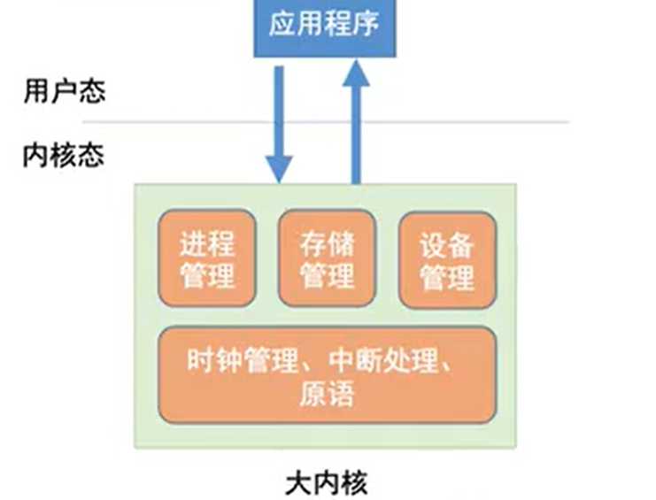
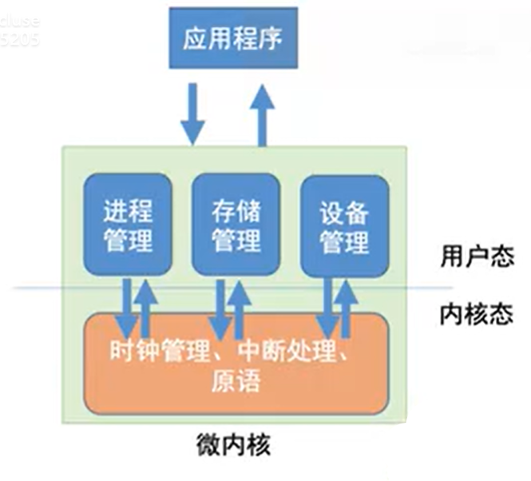

# 计算机基础和Linux安装


## 内容概述

- **计算机硬件组成**
- **操作系统**
- **Linux相关介绍**
- **Linux哲学思想**
- **虚拟机**
- **Linux安装**


## 1 计算机基础


计算机发展历史：

电子管时代：第一代计算机（1945-1957）

晶体管时代：第二代计算机（1958-1964）

集成电路时代：第三代计算机（1965-1970）

大规模集成电路时代：第四代计算机（1972-至今）

量子计算机/生物计算机：第五代计算机(可能己经开始了)


### 1.1 冯诺依曼体系结构


#### 冯诺依曼

约翰·冯·诺依曼（John von Neumann，1903~1957）美籍匈牙利数学家、计算机科学家、物理学家， 是20世纪最重要的数学家之一。 是现代计算机、博弈论、核武器和生化武器等领域内的科学全才之一， 被后人称为“现代计算机之父”、“博弈论之父”。 第二次世界大战期间曾参与曼哈顿计划，为第一颗原子弹的研制作出了贡献。 现代计算机发展所遵循的基本结构形式始终是冯·诺依曼机结构。这种结构特点是 “程序存储，共享数 据，顺序执行”，需要 CPU 从存储器取出指令和数据进行相应的计算


#### 冯诺依曼体系结构

无论是个人电脑，还是智能手机又或者ipad，它们上面的APP，应用程序似乎没什么差别，都是通过“高级语言”这样的编程语言撰写、编译之后，一样是把代码和数据加载到内存里来执行。这是为什么呢？因为，无论是个人电脑、服务器、智能手机，都遵循着同一个“计算机”的抽象概念。这个概念就是**冯·诺依曼体系结构（Von Neumann architecture）**，也叫**存储程序计算机**。

**存储程序计算机**：这里面其实暗含了两个概念，一个是“**可编程**”计算机，一个是**“存储**”计算机

**可编程：**想要理解可编程的概念，可以先了解什么是**“不可编程”**


类似计算器这种就是“不可编程”的，因为程序在计算机硬件层面是“写死”的。最常见的就是老式计算器，电路板设好了加减乘除，做不了任何计算逻辑固定之外的事情。


**存储：**我们同样通过先看下什么是“不可存储”的计算机，来了解什么是可存储计算机


典型的就是早年的“Plugboard”这样的插线板式的计算机。整个计算机就是一个巨大的插线板，通过在板子上不同的插头或者接口的位置插入线路，来实现不同的功能。这样的计算机自然是“可编程”的，但是编写好的程序不能存储下来供下一次加载使用，不得不每次要用到和当前不同的“程序”的时候，重新插板子，重新“编程”

可以看到，无论是“**不可编程**”还是“**不可存储**”，都会让使用计算机的效率大大下降。而这个对于效率的追求，也就是“**存储程序计算机**”的由来。


冯诺依曼基于当时在秘密开发的 EDVAC 写了一篇报告《First Draft of a Report on the EDVAC》，描述了他心目中的一台计算机应该长什么样。这篇报告在历史上有个很特殊的简称，叫 First Draft，翻译成中文，其实就是《第一份草案》。这样，现代计算机的发展就从祖师爷写的一份草案开始了。


首先是一个包含算术逻辑单元（Arithmetic Logic Unit，ALU）和处理器寄存器（Processor Register）的处理器单元（Processing Unit），用来完成各种算术和逻辑运算。因为它能够完成各种数据的处理或者计算工作，因此也有人把这个叫作数据通路（Datapath）或者**运算器**。

然后是一个包含指令寄存器（Instruction Register）和程序计数器（Program Counter）的控制器单元（Control Unit/CU）也就是**控制器**，用来控制程序的流程，通常就是不同条件下的分支和跳转。在现在的计算机里，上面的算术逻辑单元和这里的控制器单元，共同组成了我们说的 CPU（算术逻辑单元【运算器】，控制单元【控制器】，寄存器组）。

接着是用来存储数据（Data）和指令（Instruction）的**内存**。以及更大容量的**外部存储**，在过去，可能是磁带、磁鼓这样的设备，现在通常就是硬盘。

最后就是各种**输入和输出设备**，以及对应的输入和输出机制。我们现在无论是使用什么样的计算机，其实都是和输入输出设备在打交道。个人电脑的鼠标键盘是输入设备，显示器是输出设备。我们用的智能手机，触摸屏既是输入设备，又是输出设备。而跑在各种云上的服务器，则是通过网络来进行输入和输出。这个时候，网卡既是输入设备又是输出设备。


**冯诺依曼结构的现代意义**

**任何一台计算机的任何一个部件都可以归到运算器、控制器、存储器、输入设备和输出设备这五部分中，而所有的现代计算机也都是基于这个基础架构来设计开发的。所有的计算机程序，也都可以抽象为从输入设备读取输入信息，通过运算器和控制器来执行存储在存储器里的程序，最终把结果输出到输出设备中。而我们所有撰写的无论高级还是低级语言的程序，也都是基于这样一个抽象框架来进行运作的。**


**既定框架中的创造**

这里其实可以理解的更深刻一点，就是“**有限规则下的无限可能**”，可以看作是哲学上的“框架”与“自由”关系的具体实践：

- **框架提供秩序**：通过固定的模块（运算、存储、控制等）和流程（输入-处理-输出），使得系统具有确定性和可预测性。

- **自由带来创新**：在这一框架内，人们可以自由地设计程序、算法和优化方法，实现无数种可能性。

这种思维模式不仅适用于计算机科学，也适用于其他学科领域，例如物理学中的统一理论、生物学中的进化模型等。


### 1.2服务器种类

按外形划分

``````shell
塔式服务器、刀片式服务器、机架式服务器
``````


#### 塔式服务器

``````
外形类似于桌面电脑的塔式机箱，可以独立放置在办公室或机房中，无需专门的机架。它通常具有较大的机箱和独立的支架，便于内部硬件的扩展和维护。
 适用于中小型企业、办公室等环境，以及需要文件共享、打印服务、网络应用服务、数据备份和恢复、软件开发和测试等任务的场景。
``````


``````
特点：
 扩展性强：通常具有较多的扩展插槽和硬盘位，可以方便地升级和扩展存储和其他硬件。
 易于维护：由于机箱独立设计，内部硬件和组件更易于维护和更换。
 灵活性高：支持多种操作系统和应用程序，适用于不同的业务需求和应用场景。
 噪音较低：相比一些机架式服务器，塔式服务器的噪音较低，适用于安静的办公环境
``````


刀片式服务器

``````
外表结构是大型主机机箱，内部存在数个“刀片”，每块刀片是系统母版，可以看作是独立服务器。刀片服
务器专为特殊应用行业和高密度计算环境设计，能够在标准高度的机架式机箱内插装多个卡式
 适用于大型数据中心或者需要大规模计算的领域，如银行、电信、金融行业以及互联网数据中心等。刀片
服务器已经成为高性能计算集群的主流。
``````


``````
特点：
    高密度：能够在有限的空间内部署更多的服务器单元，提高资源密度。
    高可用性：通过冗余设计和热插拔功能，确保服务器的高可用性。
    易于管理：可以通过系统软件将主板集合形成服务器集群，实现资源共享和统一管理。
    节省空间：相比传统服务器，刀片服务器能够最大限度地节约服务器的使用空间。
``````


机架式服务器

``````
专为机架架构设计的服务器，机箱宽度为19英寸，高度有1-7U几个标准，适合放置在标准的19英寸机架
中。机架式服务器通常采用垂直设计，便于多台服务器垂直堆叠，节省空间。
 广泛应用于数据中心，是构建云计算平台、进行大数据处理和分析、托管Web服务器、应用服务器和数据
库服务器等的核心组件。
``````


``````
特点：
    高密度：垂直设计允许将多台服务器堆叠在一个机架中，提高数据中心中服务器的密度。
    灵活性：标准化的尺寸和设计使得机架式服务器可以在不同的数据中心和机架中灵活部署和管理。
    管理简便：垂直堆叠设计和热插拔功能使得对服务器的管理和维护更加便捷。
    高可用性：冗余设计和支持热插拔功能保证了服务器的高可用性。
``````

| 规格 | 尺寸                  | 价位          |
| ---- | --------------------- | ------------- |
| 1U   | 1.75英寸，约4.445厘米 | 数千~上万     |
| 2U   | 两个1U，约8.89厘米    | 1万~数万      |
| 4U   | 四个1U，约17.78厘米   | 2万~数十万    |
| 8U   | 八个1U，约35.56厘米   | 数十万~数百万 |


#### 数据中心

``````
数据中心可以分为IDC（Internet Data Center，互联网数据中心）、EDC（Enterprise Data Center，企业数据中心）、NSC（National Supercomputing Center，国家超级计算中心）。

IDC：
 是电信业务经营者利用已有的互联网通信线路、带宽资源，建立标准化的电信专业级机房环境，通过互联网向客户提供服务器托管、租用以及相关增值等方面的全方位服务。
 
EDC： 
 是指由企业或机构构建并所有，服务于企业或机构自身业务的数据中心，是一个企业数据运算、存储和交换的核心计算环境，它为企业、客户及合作伙伴提供数据处理、数据访问等信息，应用支持服务。
 
NSC：
 是指由国家兴建、部署有千万亿次高效能计算机的超级计算中心。与IDC、EDC不同，国家超级计算中心由国家兴建和运营，对外提供的是运算能力
``````


``````
数据中心的基础设施主要包括：
硬件组件：
 服务器、存储设备、网络设备
软件系统：
 操作系统、虚拟化技术、数据中心管理软件
物理基础设施：
 电力供应、冷却交换系统、安全系统【门禁、监控头、防火墙、入侵检测等】
``````


### 1.3 CPU（Central Processing Unit）

#### 1.3.1 CPU的分类


**汇编、CPU架构、硬编码之间的关系**

**CPU架构**

- CISC：Complex Instruction Set Computer，复杂指令集

  - X86（32位CPU）、X64（64位CPU）

- RISC：Reduced Instruction Set Computer，精减指令集

  - ARM、MAC后期(M1，M2)【MAC早期是X64复杂指令集】

  

  PC设备（Intel、AMD）------>  复杂指令集

  

  

  

  

手持设备，嵌入式设备   ------ >  ARM(精简指令集)


**指令集是什么？**

``````
CPU指令集（Instruction Set Architecture, ISA）是存储在CPU内部，对CPU运算进行指导和优化的硬程序，它定义了一台计算机可以执行的所有指令的集合，每条指令规定了计算机执行什么操作，所处理的操作数存放的地址空间以及操作数类型。 指令集是软件与CPU之间的一个接口，通过指令集，软件能够向CPU发送指令，控制其执行各种操作。拥有这些指令集，CPU就可以更高效地运行。
``````

指令集我们实际能看到的不同就是汇编，就是相同的指令，在不同的CPU架构中，它的汇编是不一样的，但它**本质上是机器码的不同**

**什么是硬编码**

硬编码长啥样子

``````C
内存地址      硬编码(机器码)    汇编   
0X006013c0   0X55            push   ebp
// 为什么计算机看到55可以推出push ebp这段汇编代码，还可以在编译的时候，将push ebp编译成55，就是因为硬编码的生成规范
``````

``````
汇编   ---> 机器码    编译
机器码 ----> 汇编     反汇编
``````

**什么是汇编**

``````
汇编语言是介于高级语言和机器码之间的一种低级语言，它使用助记符来表示指令，并直接对应于处理器的指令集。
``````

ARM指令集


X64指令集


**思考问题：**

``````
0X006013c0   0X55            push   ebp
在Windows操作系统，55  ----> push ebp
在Linux操作系统，55 ---->  ?  一样吗
``````


#### 1.3.2 CPU的组成

CPU的三大组成：算数逻辑单元；控制单元；寄存器组

无论是算数逻辑单元，控制单元，寄存器组本质上都是由各种数字电路实现的，而数字电路的基本构造单元就是逻辑门

- 算数逻辑单元ALU
  - 功能：对数据进行逻辑，位移和算数计算
  - 图例：https://www.mysticalrecluse.com/script/images/teach/%E6%99%B6%E4%BD%93%E7%AE%A1%E5%88%B0ALU%E7%9A%84%E5%AE%9E%E7%8E%B0.png

- 寄存器
  - 功能：寄存器是用来存储临时数据的高速独立的存储单元。、
  - 分类：数据寄存器；指令寄存器；程序计数器；段寄存器；条件码寄存器等等
    - 数据寄存器：用来存储输入数据（通用寄存器）和运算结果（累加器AC：负责保存ALU进行运算得出的结果，以备后续使用。）
    - 指令寄存器（IR）：CPU从内存中逐条地取出指令，并将取出的指令存储在指令寄存器中，解释并执行指令。
    - 程序计数器（PC寄存器）：保存着当前正在执行指令的内存地址。当前的指令执行完后，计数器将自动加一，指向下一条指令的内存地址。
  - 图例：https://www.mysticalrecluse.com/script/images/teach/%E9%80%9A%E7%94%A8%E5%AF%84%E5%AD%98%E5%99%A8%E7%9A%84%E9%97%A8%E7%94%B5%E8%B7%AF%E5%AE%9E%E7%8E%B0.png
- 控制单元
  - 功能：控制单元控制各个子系统的操作。控制是通过从控制单元到其他子系统的信号来进行。


#### 1.3.3 CPU性能和功耗

**什么是性能？**

计算机的性能，其实和我们干体力劳动很像，好比是我们要搬东西。对于计算机的性能，我们需要有个标准来衡量。这个标准中主要有两个指标。


**响应时间**

第一个是响应时间（Response time）或者叫执行时间（Execution time）。想要提升响应时间这个性能指标，你可以理解为让计算机“跑得更快”。

响应时间指的就是，我们执行一个程序，到底需要花多少时间。花的时间越少，自然性能就越好。

而通常我们计算CPU的执行时间

``````
程序的 CPU 执行时间 = CPU 时钟周期数 × 时钟周期时间
``````


**时钟周期时间**

你在买电脑的时候，一定关注过 CPU 的主频。比如我手头的这台电脑就是 **Intel Core-i7-7700HQ 2.8GHz**，这里的 2.8GHz 就是电脑的**主频**（Frequency/Clock Rate）。这个 2.8GHz 就代表，我们 CPU 的一个“钟表”能够识别出来的最小的时间间隔。就像我们挂在墙上的挂钟，都是“滴答滴答”一秒一秒地走，所以通过墙上的挂钟能够识别出来的最小时间单位就是秒。

而在 CPU 内部，和我们平时戴的电子石英表类似，有一个叫晶体振荡器（Oscillator Crystal）的东西，简称为**晶振**。我们把晶振当成 CPU 内部的电子表来使用。晶振带来的每一次“滴答”，就是时钟周期时间。

在这个 2.8GHz 的 CPU 上，这个时钟周期时间，就是 1/2.8G。我们的 CPU，是按照这个“时钟”提示的时间来进行自己的操作。主频越高，意味着这个表走得越快，我们的 CPU 也就“被逼”着走得越快。

如果你自己组装过台式机的话，可能听说过“**超频**”这个概念，这说的其实就相当于把买回来的 CPU 内部的钟给调快了，于是 CPU 的计算跟着这个时钟的节奏，也就自然变快了。当然这个快不是没有代价的，CPU 跑得越快，散热的压力也就越大。就和人一样，超过生理极限，CPU 就会崩溃了。


我们现在回到上面程序 CPU 执行时间的公式。

```
程序的 CPU 执行时间 =CPU 时钟周期数×时钟周期时间
```


最简单的提升性能方案，自然缩短时钟周期时间，也就是提升主频。换句话说，就是换一块好一点的 CPU。不过，这个是我们这些软件工程师控制不了的事情，所以我们就把目光挪到了乘法的另一个因子——CPU 时钟周期数上。如果能够减少程序需要的 CPU 时钟周期数量，一样能够提升程序性能。


对于 CPU 时钟周期数，我们可以再做一个分解，把它变成“指令数×每条指令的平均时钟周期数（Cycles Per Instruction，简称 CPI）”。不同的指令需要的 Cycles 是不同的，加法和乘法都对应着一条 CPU 指令，但是乘法需要的 Cycles 就比加法要多，自然也就慢。在这样拆分了之后，我们的程序的 CPU 执行时间就可以变成这样三个部分的乘积

``````
程序的 CPU 执行时间 = 指令数×CPI×Clock Cycle Time
也就是

CPU时钟周期 = 指令数 * CPI
``````


因此，如果我们想要解决性能问题，其实就是要优化这三者。

- 时钟周期时间，就是计算机主频，这个取决于计算机硬件。我们所熟知的摩尔定律就一直在不停地提高我们计算机的主频。比如说，我最早使用的 80386 主频只有 33MHz，现在手头的笔记本电脑就有 2.8GHz，在主频层面，就提升了将近 100 倍
- 每条指令的平均时钟周期数 CPI，就是一条指令到底需要多少 CPU Cycle。
- 指令数，代表执行我们的程序到底需要多少条指令、用哪些指令。这个很多时候就把挑战交给了编译器。同样的代码，编译成计算机指令时候，就有各种不同的表示方式。


在早期，计算机硬件工程师就是通过增加晶体管数量，提升主频，不断提升 CPU 的时钟频率，这样就能让 CPU 变得更快，程序的执行时间就会缩短。


于是，从 1978 年 Intel 发布的 8086 CPU 开始，计算机的主频从 5MHz 开始，不断提升。1980 年代中期的 80386 能够跑到 40MHz，1989 年的 486 能够跑到 100MHz，直到 2000 年的奔腾 4 处理器，主频已经到达了 1.4GHz。而消费者也在这 20 年里养成了“看主频”买电脑的习惯。当时已经基本垄断了桌面 CPU 市场的 Intel 更是夸下了海口，表示奔腾 4 所使用的 CPU 结构可以做到 10GHz，颇有一点“大力出奇迹”的意思。


然而，计算机科学界从来不相信“大力出奇迹”。奔腾 4 的 CPU 主频从来没有达到过 10GHz，最终它的主频上限定格在 3.8GHz。这还不是最糟的，更糟糕的事情是，大家发现，奔腾 4 的主频虽然高，但是它的实际性能却配不上同样的主频。想要用在笔记本上的奔腾 4 2.4GHz 处理器，其性能只和基于奔腾 3 架构的奔腾 M 1.6GHz 处理器差不多。


于是，这一次的“大力出悲剧”，不仅让 Intel 的对手 AMD 获得了喘息之机，更是代表着“主频时代”的终结。后面几代 Intel CPU 主频不但没有上升，反而下降了。到如今，2019 年的最高配置 Intel i9 CPU，主频也只不过是 5GHz 而已。相较于 1978 年到 2000 年，这 20 年里 300 倍的主频提升，从 2000 年到现在的这 19 年，CPU 的主频大概提高了 3 倍。


奔腾 4 的主频为什么没能超过 3.8GHz 的障碍呢？答案就是**功耗问题**。什么是功耗问题呢？我们先看一个直观的例子。


我们的 CPU，一般都被叫作超大规模集成电路（Very-Large-Scale Integration，VLSI）。这些电路，实际上都是一个个晶体管组合而成的。CPU 在计算，其实就是让晶体管里面的“开关”不断地去“打开”和“关闭”，来组合完成各种运算和功能。想要计算得快，一方面，我们要在 CPU 里，同样的面积里面，多放一些晶体管，也就是增加密度；另一方面，我们要让晶体管“打开”和“关闭”得更快一点，也就是提升主频。而这两者，都会增加功耗，带来**耗电和散热**的问题。


由于耗电和散热带来的问题，因此，在 CPU 里面，能够放下的晶体管数量和晶体管的“开关”频率也都是有限的。一个 CPU 的功率，可以用这样一个公式来表示

``````
功耗 ~= 1/2 ×负载电容×电压的平方×开关频率×晶体管数量
``````


从这个公式可以看出有一点非常关键，在整个功耗的公式里面，功耗和电压的平方是成正比的。这意味着电压下降到原来的 1/5，整个的功耗会变成原来的 1/25。


事实上，从 5MHz 主频的 8086 到 5GHz 主频的 Intel i9，CPU 的电压已经从 5V 左右下降到了 1V 左右。这也是为什么我们 CPU 的主频提升了 1000 倍，但是功耗只增长了 40 倍。


**并行优化，理解阿姆达尔定律**

虽然制程的优化和电压的下降，在过去的 20 年里，让我们的 CPU 性能有所提升。但是从上世纪九十年代到本世纪初，软件工程师们所用的“面向摩尔定律编程”的套路越来越用不下去了。“写程序不考虑性能，等明年 CPU 性能提升一倍，到时候性能自然就不成问题了”，这种想法已经不可行了。


于是，从奔腾 4 开始，Intel 意识到通过提升主频比较“难”去实现性能提升，边开始推出 Core Duo 这样的多核 CPU，通过提升“吞吐率”而不是“响应时间”，来达到目的


**吞吐量**

吞吐率（Throughput）或者带宽（Bandwidth），想要提升这个指标，你可以理解为让计算机“搬得更多”。

吞吐率是指我们在一定的时间范围内，到底能处理多少事情。这里的“事情”，在计算机里就是处理的数据或者执行的程序指令。

也可以理解为**“通过并行提高性能。”**


###  1.4 主板


主板mainboard，安装在机箱内，是计算机最基本的也是最重要的部件之一 主板一般为矩形电路板，上面安装了组成计算机的主要电路系统，一般有BIOS芯片、I/O控制芯片、键 盘和面板控制开关接口、指示灯插接件、扩充插槽、主板及插卡的直流电源供电接插件等元件


### 1.5 内存


内存是介于CPU和外部存储之间，是CPU对外部存储中程序与数据进行高速运算时存放程序指令、数据 和中间结果的临时场所，它的物理实质就是一组具备数据输入输出和数据存储功能的高速集成电路 

内存是CPU能直接寻址的存储空间，由半导体器件制成。内存的特点是存取速度快 

计算机中所有程序的运行都是在内存中进行的，因此内存的性能对计算机的影响非常大 

与之相对应的还有外存：硬盘，U盘，软盘，光盘


**内存和外存的区别：**

- 内存速度快，价格高，断电后数据丢失
- 外存速度慢，价格相对低廉，断电后数据可以保存


### 1.6 硬盘


**常见的磁盘接口种类**

- IDE：Integrated Drive Electronics，电子集成[驱动器，早期家用电脑常用接口
- SCSI：Small Computer System Interface，小型计算机系统接口，早期的服务器常用接口
- SATA：Serial ATA （Advanced Technology Attachment 高技术配置），家用电脑常用的接口
- SAS：Serial Attached SCSI，是目前服务器上主流的接口
- 光纤通道：Fiber Channel，高性能服务器上采用的接口
- M.2 ：固态硬盘接口，性能更强


**结构分类：**

- 机械硬盘HDD（Hard Disk Drive）
- 固态硬盘SSD（Solid State Drives ）


**机械硬盘：**


- 存储介质（Media）——盘片
  - 盘片的基板是金属或玻璃材质制成，为达到高密度高稳定的质量，基板要求表面光滑平整，不可 有 任何暇疵
- 读写磁头（Read Write Head）——磁头
  - 磁头是硬盘读取数据的关键部件，它的主要作用就是将存储在硬盘盘片上的磁信息转化为电信号 向 外传输
- 马达（ Spindle Motor & Voice Coil Motor ）


**机械硬盘基本参数：**

- 容量：容量是硬盘最主要的参数。单位有MB、GB、TB，常见容量：500GB，1T，2T，3T，4T， 6T
- 转速：转速是指硬盘盘片每分钟转动的圈数，单位为rpm。常见：7200rpm，10000rpm， 15000rpm
- 传输速率：传输速率(Data Transfer Rate) 。硬盘的数据传输率是指硬盘读写数据的速度，单位为 兆字节每秒（MB/s），常见：6Gb/s,12Gb/s

- 缓存：硬盘缓存的目的是为了解决系统前后级读写速度不匹配的问题，以提高硬盘的读写速度
- 磁盘尺寸：3.5”/2.5”/1.8”
- 是否支持热插拔


**SSD硬盘：**


SD，即固态硬盘，泛指使用NAND Flash组成的固态硬盘。其特别之处在于没有机械结构，以区块写入 和抹除的方式作读写的功能，因此在读写的效率上，非常依赖读写技术上的设计SSD读写存取速度快， 性能稳定，防震性高，发热低，耐低温，电耗低，无噪音。因为没有机械部分，所以长时间使用也出现 故障几率也较小。缺点：价格高，容量小，相对普通机械硬盘性价比低


### 1.7 网卡


服务器一般都在主板上集成了网卡LOM (LAN on motherboard主板集成网卡) ，传输速率通常为 1Gbps，即千兆网卡 ，特殊应用需要高端网卡，如光纤网卡，Infiniband网卡等，传输速率能达到 10Gbps、20Gbps，即万兆网卡

​                                                                                                                                                                                                                                                                                                                                                                                                                                                                                                                                                                                                                                                                                                                                                                                                                                                                                                                                                                                                                                                                     


## 操作系统

### 操作系统层级结构


### 第二层
- 时钟管理：
  - 应用场景：CPU时间分片
- 中断处理
  - 应用场景：时钟中断，操作系统状态切换，
- 原语：原子的原，表示一种执行起来，不可中断的程序，它会一口气执行到结束
  - 设备驱动
  - CPU切换

### 第三层
这里设计到操作系统的一些功能：进程管理，存储（内存）管理，设备管理，文件系统等

在裸机之上，有两层是操作系统内核的功能

### 第四层: 非内核功能
- 非内核功能：比如Linux操作系统，它是一个什么样的操作系统呢，它其实就是以linux为内核的一系列操作系统，我们把它们统称为Linux操作系统，那么对于这些操作系统，它们相同的都是使用的是LInux内核，而不同的是非内核功能，也就是操作系统里面个性化定制的一些应用程序，所有以Linux为内核开发的操作系统，统称Linux操作系统


### 第五层：应用程序
通常是用户使用安装的应用程序


## 内核
内核是操作系统最基本，最核心的部分
实现操作系统内核功能的那些程序就是`内核程序`

下面，针对于不同操作系统的设计思路，引入宏内核和微内核的概念

### 宏内核(大内核)
在我们通用的操作系统中，大多数操作系统都是大内核的
就是把第二、三层作为内核功能


### 微内核(小内核) 
该体系认为内核功能没有必要做的特别复杂，我们把内核功能就做核心的三个：时钟管理，中断处理，原语
把三层以上包括三层，都变成非内核功能

微内核仅包含时钟，中断，原语三部分功能，而进程管理，内存管理，设备管理等交给非内核功能去实现

#### 内核的功能和意义
在操作系统执行的过程中，有一些功能是操作系统内核去实现的，并且只能由操作系统内核实现，包括时钟管理，中断，原语(设备驱动（包含我们的键盘怎么驱动起来，摄像头如何抓拍数据，CPU切换等)，这些功能是用户程序完全无法进行的

场景：
假设有一个微信应用程序，我们希望访问摄像头，来进行一个视频会议
此时作为一个用户程序，其实是有对底层设备，计算机资源的使用需求的
那么是这部分需求如何满足？-----> 用户自己是没有权限去做的，这个事情只能由内核去做
用户程序请求内核去做这部分关于计算机资源调用的需求，因此此时就涉及到一个调用关系，此时必须在用户态**下沉**到内核态，去请求数据
也就是说，摄像头由内核驱动的，摄像头启动后，数据是不是要回到应用层数据中，让微信去处理这些数据，这是就涉及到数据从用户态到内核态再到用户态的过程


#### 我们比较宏内核和微内核的两种机制：

#### 宏内核


根据上述场景，当我们用微信拍摄一张照片，此时发生微信调用摄像头驱动拍摄照片，摄像头拍摄完后将数据返给微信，此时微信拿到这张照片，这个过程发生2次切换


#### 微内核


根据上述场景，此时进行设备管理的时候，其实发生在应用层，激活设备，检查设备是否可用，此时要从设备管理下到内核去看，因为驱动实在底层原语里面去做的，然后原语检查摄像头可以用，再返回给设备管理，告诉设备管理可以用，这个时候，设备发送请求去启动摄像头，启动摄像头之后，这个中间可能会有更多的这种交互，也就是会说他由用户到切换到内核态的次数应该是增加了的，这个过程此时还仅仅发生在设备管理，而这个场景中，这个图片还可能涉及到存储，这里存储管理也还要下沉到内核态，以及从内核态上到用户态，后续我拍照的过程中，摄像机的进程进行切换，比如我原先用微信，现在要用一个程序来执行拍照的功能，然后这个功能可能还需要对照片进行美化，美颜操作，这里还会涉及进程的切换，这个进程的切换也必须进入到内核，然后再从内核出来。
因此会发现，如果使用微内核后，我们由用户态进入内核态的频次会急剧增加 


此时我们还没有学什么是用户态和内核态，目前只是在操作系统的层级上划分一条线，标记用户空间和内核空间，我们会发现用户做不了的事情必须由内核去执行，所以我们需要切花到内核状态去做，内核做完后将数据还给应用程序，此时就一定会发生切换


而且上述过程我们发现，内核的功能越少，如果只包含第二层，我们应用程序和内核之间的变换状态的次数会急剧升高，这意味着微内核中过多的状态转换会导致很多的性能损失（**状态的转换是由成本的**），频繁地切换CPU状态会降低系统性能


思考题：宏内核和微内核谁的资源利用率更高？


#### 宏内核和微内核的对比
宏内核：
- 优点：
  - 资源利用率更高，高性能  
- 缺点：
  - 当前linux内核代码已经超3000万行，如此庞大的代码量，无论是维护还是升级更新都很麻烦

微内核
- 优点：内核功能少，结构清晰，因为第三层设备管理，内存管理，进程管理等功能作为用户空间的的程序，这就意味着，普通开发者也可以去开发和优化，只有核心功能是由操作系统内核提供的，上层的进程，内存，设备管理都变成了应用层软件，都是用户软件，因此：开发成本降低，升级更新，维护成本也会变低
- 缺点：需要频繁的在内核和用户态之间切换，性能差


典型的大内核/宏内核操作系统：Linux、Unix
典型的微内核操作系统：Windows NT


## 操作系统运行机制
### 应用程序和内核程序

普通程序的执行过程：

高级语言代码  ------- 通过编译  ---->  机器指令 ------>  CPU处理

int x = 1; x++; ------>  0110101010101 --------> CPU处理

普通程序员写的程序大多是“应用程序”
微软、苹果等负责开发实现操作系统的人，他们写的是“内核程序”，有很多内核程序组成的就是操作系统内核，**内核是操作系统最核心的部分，也是最接近硬件的部分**


甚至可以说，一个操作系统只要有内核就够了（比如：Docker ---> 仅需Liux内核，因此容器化技术比虚拟化技术能强悍一些，它需要的资源更少，运行成本更低）


### 特权指令和非特权指令
#### 非特权指令
应用程序只能使用“非特权指令”，如加法指令，减法指令，这种数学操作，不需要操作系统的**额外硬件**就可以执行的指令，仅需要CPU就可以处理，我们不需要访问磁盘，不需要访问外设就可以做的事情，就是非特权指令


#### 特权指令
内核程序中，操作系统作为管理者，用来操作计算机资源的指令称为特权指令，比如：C语言中的memset()将一段内存清0，又或者打开文件，打开设备，这些都是特权指令


#### 特权指令与非特权指令的由来
在CPU设计和生产的时候，就划分了特权指令和非特权指令，这里其实有是CPU指令集中就已经区分好的，因此CPU执行指令前，一定就能够判断这条指令它到底是什么类型，是特权指令还是非特权指令，所谓特权指令就是操作系统作为管理者，它来管理计算机资源用到的指令，而非特权指令时应用程序可以直接做的，常见的就是数学计算。

cpu能判断出指令类型，那么如何区分此时正在进行的是内核程序还是应用程序？


### 内核态和用户态
CPu有两种状态，“内核态”和“用户态”（重要）
用于内核态时，说明此时正在运行的是内核程序，此时可以执行特权指令（当然也可以执行非特权指令）
用于用户态时，说明此时正在运行的是应用程序，此时只能执行非特权指令
(如果当前处于用户态，你却非要调用特权指令，CPU就会报错)

拓展：CPU中有一个寄存器叫程序状态字寄存器(PSW)，其中有个二进制位，**1表示内核态，0表示用户态**，所以CPU在每个时刻可以去看自己的寄存器，里面的值是多少，进而判断当前状态

别名：内核态=核心态=管态； 用户态=目态


#### 理解内核态和用户态的意义
当我们进行程序设计或者管理维护的时候，特别是大型软件设计与优化，我们会考虑我们的应用程序它的性能，常见的会影响程序性能的其中一个问题就是：由程序引起的用户态到内核态的一个频繁切换，如果过于频繁切换，就会导致程序效率底下，这也是了解内核态和用户态的意义之一


#### 内核态和用户态的切换
内核态 -> 用户态：执行一条特权指令——修改PSW的标志位为“用户态”，这个动作意味着操作系统将主动让出CPU使用权，此时CPU的使用权归用户态，内核态到用户态是由操作系统主动让出的，它让出的过程就是使用一个特权指令，修改PSW寄存器上的值


用户态 -> 内核态：由“中断”引发，硬件自动完成变态过程(除了非法使用特权指令外，还有很多事情会触发中断信号。一个共性是，但凡需要操作系统介入的地方，都会触发中断信号)，触发中断信号意味着操作系统将强行夺回CPU的使用权


每个进程都是自私的，都希望拥有更多的CPU时间，所以用户态不可能主动让出CPU，所以从用户态到内核态通常需要由中断引起，这个中断通常是硬件自动完成的

``````
什么是中断
比如：吃饭的时候，老板来了个电话
比如：睡觉的时候，被闹钟吵醒
比如：应用程序正在执行的过程中，被打断，操作系统强行夺回CPU控制权，变为内核态
``````


#### 触发中断的几种常见情况（共性：凡是需要操作系统介入的地方）
- 用户态应用程序非法使用特权指令，会被操作系统中断，并夺回CPU控制权
- 程序执行过程中，被分配的CPU时间片的时间到了，也触发中断，然后被夺回CPU控制权
- 除0，非法操作
- 应用程序操作鼠标键盘，这个操作鼠标硬盘，这种IO操作，必须交给操作系统内核去做 ，这个也会产生中断，这个通常是通过系统调用实现的，这里有个概念："陷入"（从用户态陷入内核态）

``````
一个故事：
1. 刚开机时，CPU为“内核态”，操作系统内核程序先上CPU运行
2. 开机完成后，用户可以启动某个应用程序
3. 操作系统内核程序在合适的时候主动让出CPU，让该应用程序上CPU运行
4. 应用程序运行在“用户态”
5. 此时，一个猥琐的黑客在应用程序中植入一个特权指令，企图破坏系统...
6. CPU发现接下来要执行的这条指令时特权指令，但自己又处于"用户态"
7. 这个非法事件会引发一个中断信号
8. 中断会使操作系统再次夺回CPU的控制权
9. 操作系统会对引发中断的时间进行处理，处理完了再把CPU使用权交给别的应用程序

我们对中断时间的处理，有一个中断表，也叫中断向量表，里面记录每种中断的编号和对应的中断处理操作（即中断程序）

``````


## 中断(Interrupts)和异常


### 异常（内中断）
CPU内部产生的错误
- 除0
- 内存越界产生的段错误等
- 陷入指令
- 故障：访问内存，但所需数据并不在访问的内存中，就会引发故障，故障就是我出错了，但是没关系，下次重新做，可以由操作系统修改的
- 终止（除零，段错误），只能杀死进程

### 中断（外中断）
外部信号导致CPU中断，就是中断

<span style="color:red">“中断”是让操作系统内核夺回CPU使用权的唯一途径</span>
如果没有“中断”机制，那么一旦应用程序上CPU运行，CPU就会一直运行这个程序，直到程序执行结束，或者程序主动让出CPU的使用权，而这种程序主动让出使用权的方式，风险很大。因此需要一种机制让应用程序让出CPU，这种就是中断


### 内中断
与当前执行的指令有关（比如CPU在执行指令的时候发现了问题），中断信号来源于CPU内部

#### 案例
比方一段程序访问数组地址，CPU的基址寄存器是0，长度的寄存器是100，你访问101，就会发生数组越界，此时就会发生段错误
当然，也有人数组越界的时候，没有发生段错误，而仅仅是数据错误，这是因为，虽然数组越界了，但此时的内存地址还在该程序的进程内，如果你越界的地址恰巧在该程序进程内存之外，那么一定会发生段错误


### 外中断
与当前执行的指令无关，中断信号来源于CPU外部
- 时钟信号
- 进行写操作，但是写入的磁盘地址错误发生中断，这种中断是在CPU外部产生的，因此是外中断
- 时钟中断
- IO中断，由输入输出设备发出的中断信号

### 扩展知识：陷入
trap指令（陷入指令）：由用户态进入内核态的过程，也就是CPU的使用权由用户态转交给内核态的过程


### 中断的基本原理
不同的中断信号，需要用不同的中断处理程序来处理，当CPU检测到中断信号后，会根据中断信号的类型去查询“中断向量表”，以此来找到相应的中断处理程序在内存中存放的位置
```shell
中断向量表：本质是一个数组，里面存放着一个个中断处理程序的指针，下标表示一个个中断信号类型
显然，中断处理程序一定是内核程序，需要运行在内核态
```


## 系统调用(system call)

什么是call,call就是摇人，打架打不过怎么办，摇人！call，就是这个事你处理不了，请别人帮你做，就叫call

```shell
操作系统是计算机资源的管理者
是不是意味着应用程序不具备使用计算机资源的权限
如果有程序想使用硬件怎么办
```

比如去银行取钱，取20块钱，你不可能自己去金库把钱取走，你这就不是取钱，而是抢银行
去银行取钱（用户看作是应用程序），使用银行卡取（用什么卡），取多少，就是取钱的参数，取钱的过程是由柜员（系统调用）将钱去给你 ---  对应着 ----->  你虽然对计算机有拥有权，但是你不能直接往计算机的屏幕打字，你想往计算机的程序上打字，必须借助操作系统内核把字打印在硬件上。因为只有硬件才有对底层资源的操作权限。
此外，还会有安全措施，监督系统调用的过程

系统调用，就是操作系统提供给应用程序（程序员/编程人员）使用的接口，可以理解为一种可供应用程调用的特殊函数，`应用程序可以通过系统调用来请求获得操作系统内核的服务`

### 接口
操作系统作为用户和计算机硬件之间的接口，需要向上提供一些简单易用的服务。主要包括命令接口和程序接口。其中，程序接口由一组`系统调用`组成

- 用户与计算机系统之间的接口
  - 给用户使用的
    - CUI
    - 命令接口
      - 联机命令接口
      - 脱机命令接口
  - 给应用程序使用的
    - 程序接口（系统调用）

### 系统调用和库函数的区别

``````C
printf("Hello, World!\n");
// printf()就是C语言的库函数
// C语言的库函数调用程序接口（也就是操作系统提供的服务即系统调用）
// 系统调用在执行过程中会完成一一系列对资源的管理和修改
``````


有些库函数包含系统调用，有些不包含，取决于是否需要调用内核资源

- 普通应用程序
  - 可直接进行系统调用，也可使用库函数，有的库函数涉及系统调用，有的不涉及

- 编程语言
  - 向上提供库函数。有时会将系统调用封装成库函数，以及隐藏系统调用的一些细节，使程序员编程更方便

- 操作系统
  - 向上提供系统调用，使得上层程序能请求内核服务
### 什么功能要系统调用实现

应用程序通过`系统调用`请求操作系统的服务，而系统中的各种共享资源都是由操作系统内核同一掌管，因此凡是与共享资源相关的操作(如存储分片，IO操作，文件管理等)，都必须通过系统调用的方式（方向性）向操作系统内核提出服务请求，有操作系统内核代为完成。这样可以保证系统的稳定性和安全性，防止用户进行非法操作。


#### 应用程序使用系统调用的过程
传递系统调用参数 -> 执行陷入指令（用户态）-> 执行相应的内核程序处理系统调用 -> 返回

发出系统调用请求是在用户态，而对系统调用的相应处理在核心态下进行