# 计算机基础
## CPU设计与结构
### 计算工具历史
- 美索不达米亚（主要作用是存储，对计算效率几乎无提高）（公元前2500年）
- 古希腊算盘（abacus）
- 中国算盘（除存储作用外，也能提高计算效率）
- 计算尺（1620-1630）
- 有电之后
  - 英国数学家乔治布尔在19世纪第一次将逻辑运算系统化，符号化
  - 门电路 -> 电子管
  - ENIAC计算机：第一代电子管计算机（1946-1957）
  - 晶体管计算机（纸带打孔输入）（1957-1964）
  - 集成电路计算机（1964-1980）
  - 超大规模集成电路计算机（1980-now）

### 开关到电子管的演变
- 门电路
  - 逻辑与&&（串联门电路）
  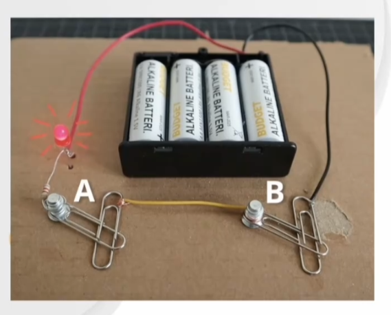
  - 逻辑非（门电路）
  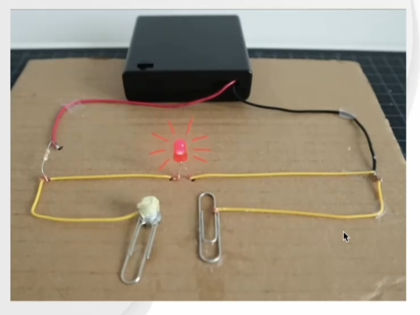
  - 逻辑或 || （并联门电路）


- 电流控制器件（电子管）
  - 图例
    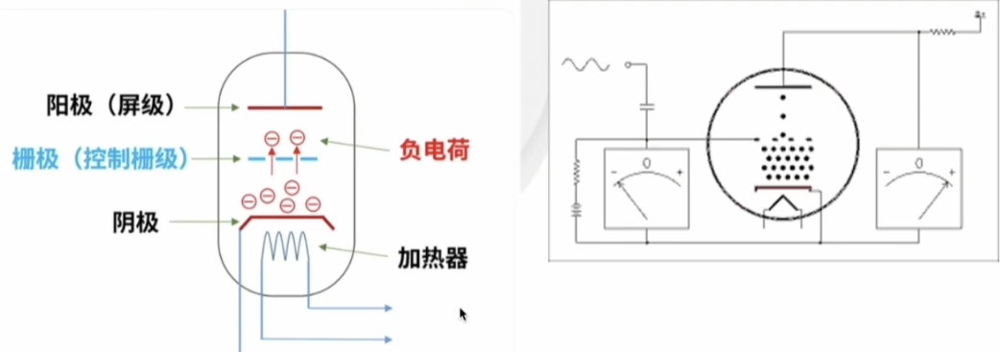
  - 通过加热器控制开关
  - 通过栅极可以控制电流的大小，后期广泛应用在广播，起到电流放大的作用
  - 真空三极管
  - 问题：寿命短

### 半导体
- 晶体管
  - 导体（铜）导电及电流的原理
    
  - 电流（正电的移动方向）和电子的移动方向相反
  - 绝缘体（橡胶）：
    - 外部没有飘逸的电子，原子核束缚力强，很难形成电子外流
  - 半导体（硅）
    - 纯硅，多个硅元素形成共价键，形成稳定结构，此时电子稳定，导电性很弱
    - N型参杂：载流子是多出的电子
      - 当硅中参杂了磷元素，外部就会多出一个电子（磷外部游离5个电子）
    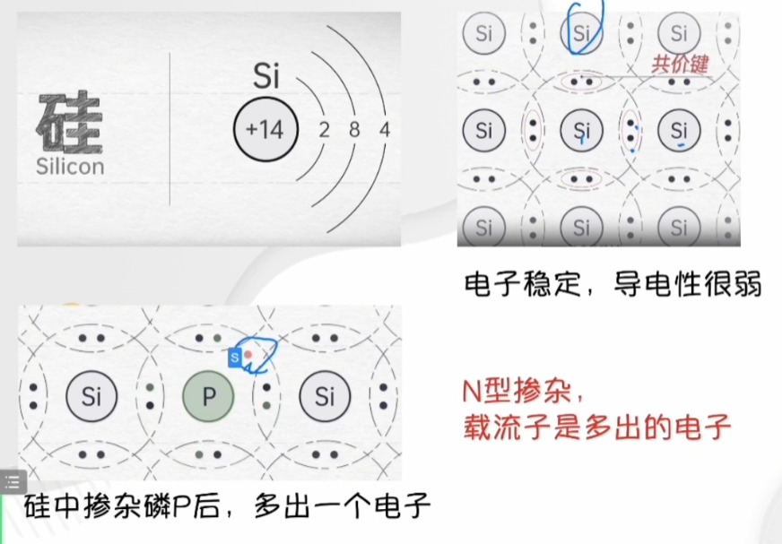
    - P型参杂：载流子是多出的空穴
      - 当硅中参杂硼元素（外部游离3个电子）
    
    - 一半N型参杂，一半P型参杂，由于N型参杂多出一个电子，P型参杂多出一个空穴，因此电子从N型往P型移动，此时，N区少电子带正电，P区多电子带负电，于是就会形成电场，在电场的作用下，电子会从p型往N型跑（即电子向正电方向移动），此时就会在中间形成平衡，形成一个耗尽层
    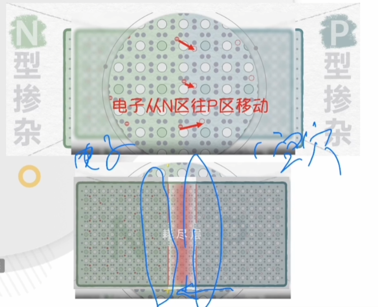
    - 当这种平衡受到外界影响，比如外部通电后，外部的电流导向不同，会出现两种结果:
    - p -> N 导通
    - N -> P 导通
    - 形成二极管的单向导通性
    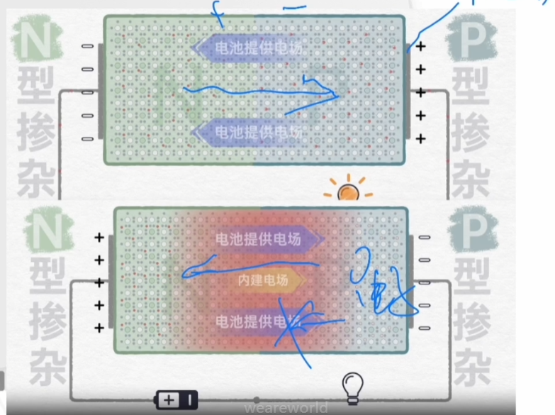

- MOSFET的结果与工作原理
  - NMOS：
    - 当电压高于阈值电压，可以导通
    - 当电压低于阈值，不能导通
  - NMOS原理：
    - 当大片的P区中，参杂两个N区时
    - 两个N区之间通电，是无法导通的
    - 但是当栅极和p区之间通电（只需一个极小的电压），电子往上跑，中间就会形成一个电场
    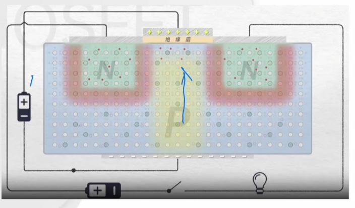
    - 此时两个N区之间就会形成导通层
    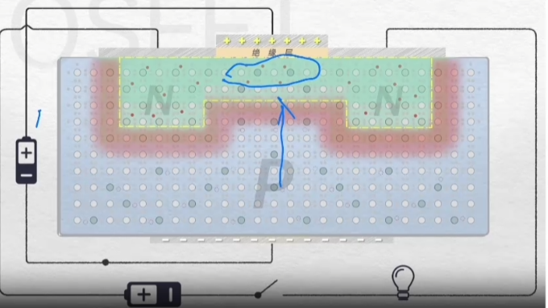
    - 因此在栅极只需一个极小的电压，就可以让两个N区之间形成通路（N沟道）
    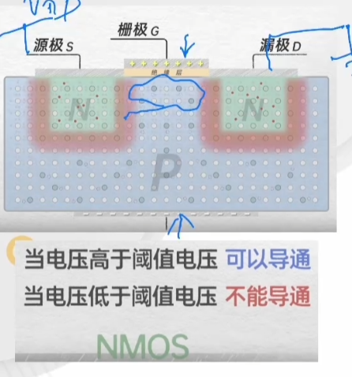
    - 此时栅极就是一个开关，根据电压的阈值可以控制NMOS的导通与否
  - PMOS
    - 原理和作用与NMOS相反
    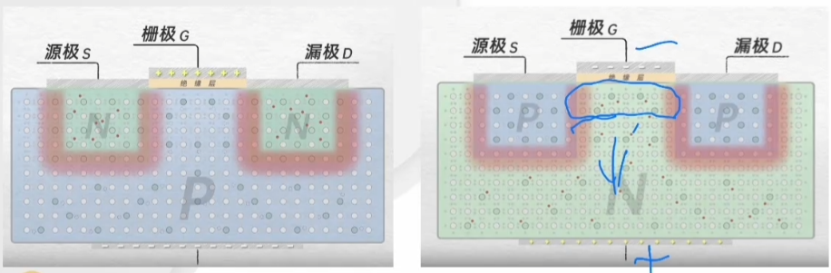
    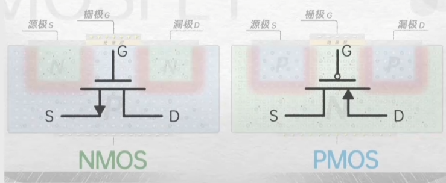
    - 注意：
      - NMOS中栅极接正电，PMOS中栅极带负电
  - 将PMOS和NMOS接在一起，就会形成一个CMOS电路
  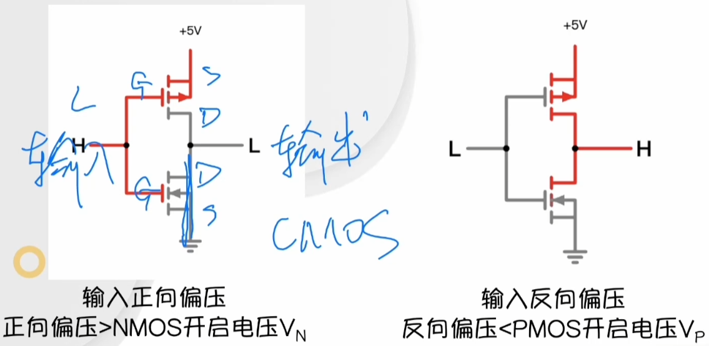
  - MOSFET特性
    - 电压控制
    - 高输入阻抗
    - 响应速度快
    - 能耗低
    - 有N型和P型，工作方式相反，组合起来工作
    - 工作可靠稳定

### 冯诺依曼架构
- 第一份草案重要思想（冯诺依曼公布）
  - 采用存储程序原理
  - 数据以二进制编码
  - 明确计算机的结构组成
    - 运算器，控制器
    - 存储器
    - 输入设备和输出设备

- 冯诺依曼架构的主要特点
  - 以运算单元为中心
  - 采用存储程序原理
  - 存储器是按地址访问，线性编址的空间
  - 控制流由指令流产生
  - 指令由操作码和地址码组成
  - 数据以二进制编码
  
### 现代CPU的内部架构和特点
- 现代CPU特点
  - 多核和多线程
  - 高频率和高性能
  - 能效优化
  - 高级缓存系统
  - 向量化和SIMD指令、虚拟化支持
  - 安全性和可靠性
  - 集成和片上系统（SOC）


### CPU执行程序
- Register Transfer Language(RTL) 寄存器传输语言
```rtl
[8000] = 100 // 将数据100存储到内存空间8000的地址上
[8000] = [8000] + 1  // [8000]表示内存空间

[2000] = 5
[2000] <- 6  // 数据6存到地址2000的内存空间
[2000] <- [6]  // 将地址6中的数据取出，存放到地址2000的内存空间中
```  
```
Opertion Address1, Address2, Address3  // 三地址指令

举例：ADD P, Q, R

Address2和Address3是原数据地址
Address1是目的数地址

Opertion Address1, Address2  // 两地址指令

Address2是源数据地址， Address1是源数据地址也是目的数据地址

Opertion Address1  // 单地址指令
常见：测试指令，跳转指令
```
- 计算机的六大类指令
```assembly
MOV   A, B  (赋值， 偏向于将一个数据，如常数10， 直接赋值到寄存器中)
<<<<<<< HEAD
LOAD  A, B
STORE A, B
=======
LOAD  A, B （通常B是一个内存地址，将B地址中的数值，加载到A寄存器，通常A是寄存器）
STORE A, B （与LOAD相反，将寄存器A中的数值，加载到内存地址B中
>>>>>>> 7a794a713a1b043c1041182895a874450d05bad6
ADD   A, B
TEST  A （分支判断）
BEQ   Z （函数调用，会引起PC程序计数器的变化，改变指令流）
```

- CPU执行程序
  - CPU只能执行机器码
  - 高级语言程序需要编译生成机器码才能执行
  - CPU所有执行指令都来自存储器
  - 指令中包含操作和数据
  - 执行过各需要借助CPU内的寄存器
  - CPU内部的PC寄存器的特殊作用，用来控制指令流

<<<<<<< HEAD
## 数据表示与存储


## 程序运行
=======
### CPU分支处理（参考ARM内核CPU）
- 详情看图

### CPU函数调用的底层原理
- 函数的调用和返回（R14的作用）
```assembly
START
    mov     R0, #8
    mov     R1, #6
    bl      GCD  // 这里r14寄存器值变为下一条语句的地址， r14称为链接寄存器
    // CPU自动记录下一条程序的地址到lr寄存器，即r14寄存器中
    // bl指令：同时影响两个寄存器PC(r15)和LR(r14)
    mov     R0, #118
    mov     R1, #223
    bl      GCD
    b       STOP

GCD
    cmp     R0, R1
    moveq   pc, lr // r15就是pc就是pc寄存器，r14为lr寄存器
    // moveq  pc, lr 实现函数返回
    subgt   R0, R0, R1
    suble   R1, R1, R0
    b       GCD

STOP

```

- 函数参数的传递
  ```
  START
    mov	r0, #8
    mov	r1, #6
    mov	r2, #10
    mov	r3, #15
    bl	ADD_GCD
    b	START
    
  ADD_GCD
    mov	r6, lr
    bl	MYADD
    mov	r7, r0
    mov	r0, r2
    mov	r1, r3
    bl	MYADD
    mov	r1, r0
    mov	r0, r7
    bl	GCD
    mov	pc, r6
    
  MYADD
    add	r0, r0, r1
    mov	pc, lr
    
  GCD	
    cmp	 r0, r1
    moveq pc, lr
    subgt r0, r0, r1
    suble r1, r1, r0
    b 	 GCD
    
  STOP
  ```
  - 如果少于3个参数，直接使用r0, r1, r2来存放参数
  - 超过3个参数的部分，需要保存到栈空间，使用时从栈空间取出（如果是自己手写汇编程序，则没有这个限制，这个只是编译器将高级语言翻译成汇编时的规则）

- 函数的返回值
  - 有返回值的话，通过R0寄存器传递
  - 当通过高级语言编译成汇编语言时，是使用r0存储返回值，但是当自己使用汇编直接编程的时候，实际上，只要保证数据安全，可以使用任何寄存器来存储返回值

- 寄存器中的数据保存
  - 为了避免影响，在函数内使用的寄存器，使用前要先保存它的数据，防止有用数据被覆盖
  - 如果函数内还要调用函数，要先对lr进行保存，然后在使用bl进行跳转，第二级调用返回后先恢复lr，然后再进行第一级调用的返回
  - 在实际过程中，并不会特别频繁的调用寄存器，更多的是将数据存储到内存中

- 数据保存到内存
  - 先要知道保存到内存的位置（即地址）
  - r13，又叫SP（帧指针-栈顶地址），用来保存栈地址
  - 使用<scan style="color: red">str</scan>可以把寄存器中的数据保存到指定内存
  - 使用<scan style="color: red">ldr</scan>可以将指定内存的数据加载到寄存器中
  - 不能直接把一个常数写入内存中（CPU的运行方式决定的）
  - push {r6, lr}
    - 首先 lr 寄存器的内容被压入堆栈，然后是 r6 寄存器的内容。这是因为 ARM 的堆栈操作是按照从左到右的顺序进行的。
    - 在每次压栈操作后，堆栈指针（SP）会相应地向下移动（对于“向下增长”的堆栈）。这意味着，首先 lr 的值被保存在较低的地址处，然后是 r6 的值。
    - 假设 SP 初始指向地址 X，则 lr 的内容将被保存在 X - 4（考虑到 ARM 通常使用 32 位宽的字），r6 的内容将被保存在 X - 8。之后，SP 将更新为 X - 8。（这里不同的CPU，处理细节不同）
    ```
    满递减堆栈
    在“满递减”模式下，SP 指向最后被压入堆栈的数据。当执行 push {r6, lr} 时：

    首先，lr 的值被压入当前 SP 指向的地址（假设是 X）。
    SP 递减 4（对于 32 位宽的字），现在指向 X - 4。
    然后，r6 的值被压入新的 SP 指向的地址（即 X - 4）。
    SP 再次递减 4，最终指向 X - 8。
    空递减堆栈
    在“空递减”模式下，SP 指向下一个数据将要被压入的位置。当执行 push {r6, lr} 时：

    首先，SP 递减 4，指向 X - 4。
    lr 的值被压入新的 SP 指向的地址（即 X - 4）。
    SP 再次递减 4，指向 X - 8。
    r6 的值被压入新的 SP 指向的地址（即 X - 8）。
    ```
  - pop {r6, lr}
    - pop 指令会从堆栈指针（SP）当前指向的位置开始，将数据读出堆栈。
    - pop {r6, lr} 首先会将堆栈中 SP 指向的位置的数据（之前由 push 操作保存的 r6 的值）加载到 r6，然后将 SP + 4 处的数据（保存的 lr 的值）加载到 lr。
    - 每次从堆栈中弹出数据后，堆栈指针（SP）会相应地向上移动（对于“向下增长”的堆栈）
    ```
    向下增长的堆栈（递减堆栈）
    在向下增长的堆栈中，堆栈指针在数据被推入堆栈时向更低的地址移动。这意味着，当新数据被推入堆栈时，堆栈指针减小。

    例如，如果堆栈指针初始时指向地址 0x1000，在向堆栈中推入一个数据项后，堆栈指针可能移动到 0x0FFC（假设每个堆栈项占用 4 个字节，且系统为 32 位）。在这种情况下，堆栈的顶部始终位于较低的内存地址处。

    向上增长的堆栈（递增堆栈）
    在向上增长的堆栈中，堆栈指针在数据被推入堆栈时向更高的地址移动。这意味着，当新数据被推入堆栈时，堆栈指针增大。

    例如，如果堆栈指针初始时指向地址 0x1000，在向堆栈中推入一个数据项后，堆栈指针可能移动到 0x1004。在这种情况下，堆栈的顶部始终位于较高的内存地址处。

    实际应用
    在大多数现代体系结构（如 x86 和大部分 ARM 架构）中，堆栈是向下增长的。这意味着当数据被推入堆栈时，堆栈指针会递减；当数据被弹出堆栈时，堆栈指针会递增。

    理解堆栈的增长方向对于深入理解函数调用、内存管理、缓冲区溢出等概念非常重要。编写汇编语言或进行低级编程时，正确地处理堆栈增长方向是至关重要的。
    ```

### 扩展：堆栈增长与大小端
```
堆栈增长方向
堆栈增长方向是指在数据被推入（push）或弹出（pop）堆栈时，堆栈指针（通常是 SP）移动的方向。在计算机体系结构中，堆栈可以向下增长（递减堆栈）或向上增长（递增堆栈）：

向下增长的堆栈：堆栈指针在数据被推入堆栈时向较低的内存地址移动。
向上增长的堆栈：堆栈指针在数据被推入堆栈时向较高的内存地址移动。
大小端系统
大小端系统描述的是多字节数据在内存中的存放顺序：

大端（Big-Endian）系统：数据的高位字节存储在低地址处，低位字节存储在高地址处。
小端（Little-Endian）系统：数据的低位字节存储在低地址处，高位字节存储在高地址处。
```

### 函数参数的处理过程
- <b style="color:tomato">函数参数传递：</b>
  - 当一个函数被调用时，其参数通常被放置在栈上（特别是在使用基于栈的调用约定的体系结构中）。在某些体系结构或调用约定中，前几个参数可能会被传递通过寄存器来提高效率。

- <b style="color:tomato">加载到寄存器：</b>
  - 在函数体内，如果需要对这些参数进行运算，它们首先会从栈（或直接从寄存器，如果它们已经在寄存器中）加载到 CPU 的寄存器中。这是因为 CPU 的算术逻辑单元（ALU）主要在寄存器之间进行运算。

- <b style="color:tomato">执行 ALU 运算：</b>
  - 一旦所需的数据在寄存器中，ALU 就可以执行算术和逻辑运算。这些运算包括加法、减法、乘法、除法、逻辑运算等。

- <b style="color:tomato">存储运算结果：</b>
  - 运算的结果通常存储在寄存器中，可以用于后续的操作或计算。如果需要，这个结果也可以被写回到内存中，例如存储在栈上或在堆上分配的数据结构中。

- <b style="color:tomato">返回值处理：</b>
  - 函数的返回值通常也是通过寄存器传递的。在函数执行完毕后，返回值会被放置在特定的寄存器中，然后控制权返回给调用者。

### 函数内常规操作流程
- 示例代码
```C
int FuncA(int x) {
    int arr[3];
    return 3 * x;
}

int FuncB(int x, int y) {
    return x + y;
}

int main() {
    FuncA(10);
    FuncB(20, 30);
    return 0;
}
```

- 对应汇编指令
```assembly
START
	mov		sp, #0x1000
	bl		MAIN
	b		START

MAIN
	sub		sp, sp, #4
	str		lr, [sp]
	mov		r0, #10

	bl		FUNCA
	mov		r0, #20
	mov		r1, #30
	bl		FUNCB
	ldr		pc, [sp]

FUNCA
	sub		sp, sp, #16
	; arr[3]和变量X
	str		r0, [sp]
	add		r0, r0, r0
	str		r0, [sp]
	add		r0, r0, r0
	str		r0, [sp]
	mov		r1, #100
	str		r1, [sp, #8]
	add		r1, r1, #10
	str		r1, [sp, #4]
	add		r1, r1, #10
	str		r1, [sp]
	add		sp, sp, #16
	mov		pc, lr

FUNCB
	sub		sp, sp, #8
	str		r0, [sp, #4]
	str		r1, [sp]
	add		r0, r0, r1
	; 刚好结果在r0,可以直接作为返回值
	add		sp, sp, #8
	mov		pc, lr
```
- 流程总结
  - 函数在执行前，是通过sp指针去分配临时栈空间的
  - 函数执行完毕后，释放内存，就是将sp指针加回去，恢复sp指针的指向

- 注意要点：
  - 局部变量在函数返回后无法使用

### 全局变量
- 全局变量的汇编实现
```C
G_X     DCD      1  
// DCD存储数值需要4个字节
G_Y     DCD      2, 3, 4, 5 // 此处使用16个字节
G_Z     DCB      0，0，0，0 // 使用时，必须定义4个数值，每个数值一个字节
// DCB存储使用1个字节存储，范围是0-255
```

## 数据表示与存储
### 进制转换（略）
### 补码
- 取反加1
### 移位运算
- 逻辑移位
  - 在不丢失高位的情况下，左移乘2，右移除2 

- 算术移位
  - 有符号数移位，右移时，符号位是什么，就补什么

- 汇编代码实现
```C
    mov   r0, #-4
LOOP
    lsl   r0, r0, #1
    // lsl(logic shift left)逻辑左移
    // lsr(logic shift right)逻辑右移
    asr   r0, r0, #2
    // asr 算数右移
    b LOOP
```
- 循环移位
  - 把移出的位放到另一边，形成循环移位
  - 作用：通常用来加密
  ```C
  unsigned char circularLeftShift(unsigned char val, int n) {
      int num_bits = sizeof(val) * 8; // 计算位数，对于字节是8位
      n = n % num_bits; // 确保移动位数不超过位数
      return (val << n) | (val >> (num_bits - n));
  }
  ```
- 位扩展
  - 数据扩展符号位，8位数据128，扩展到16位数据，前面补0；负数则前面补1

### 二进制乘除
- 定点数一位乘法
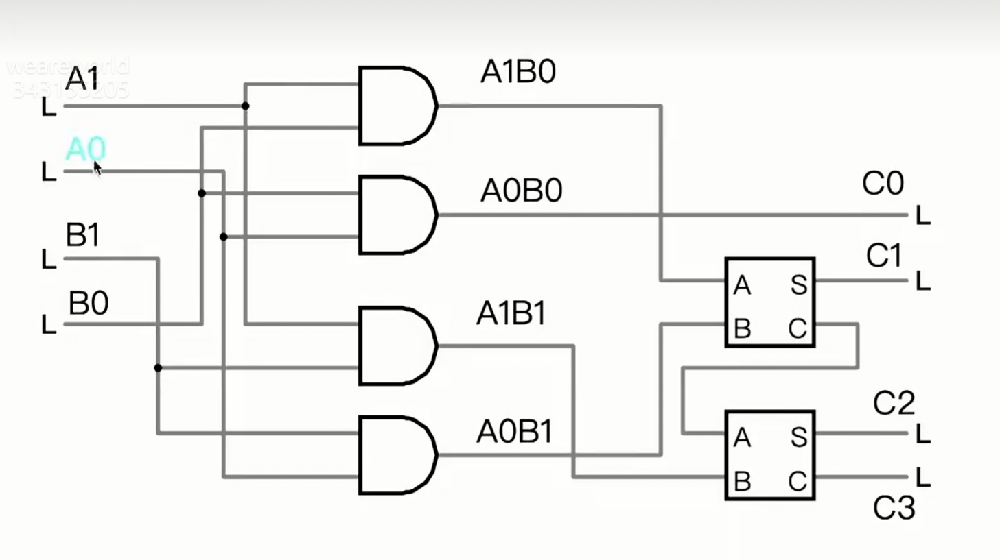
```
      A1A0
      B1B0
-----------------
      A1B0  A0B0  // 乘法用与门表示
A1B1  A0B1
-----------------
C3  C2  C1  C0
```

- 无符号乘法：原码一位乘法运算单元
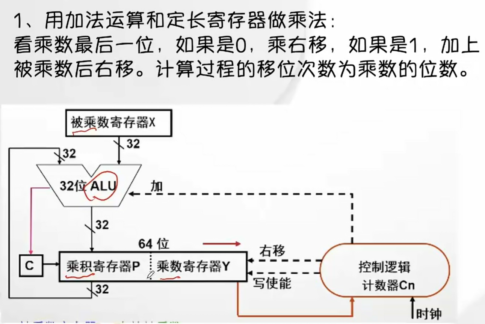

- 补码乘法（Booth乘法）
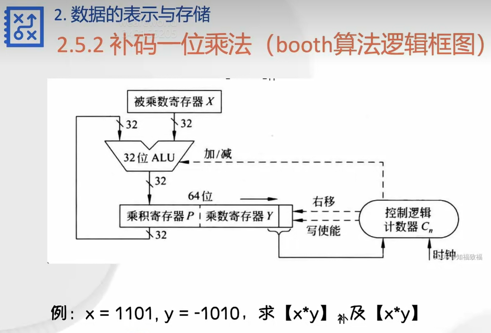

- 恢复余数除法

- 不恢复余数除法

### 浮点数
- 二进制存储浮点数
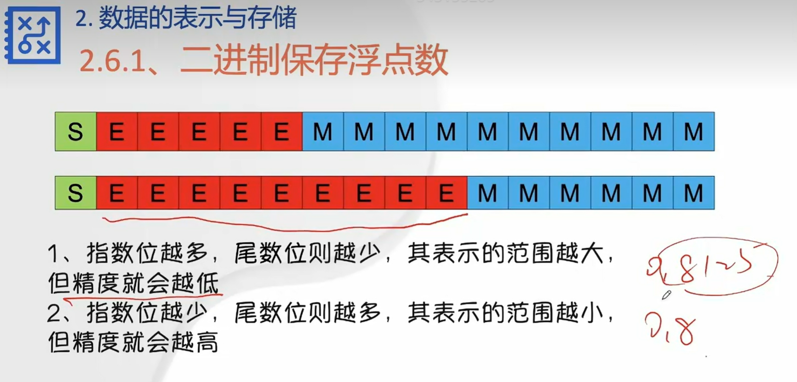


- 使用移码来表示指数
  - 移码等于真实值 + 偏移值（偏移值：2^n-1 - 1）
  - float是32位，1位符号位，8位指数
  位，23位尾数位，指数的偏移值的127 
  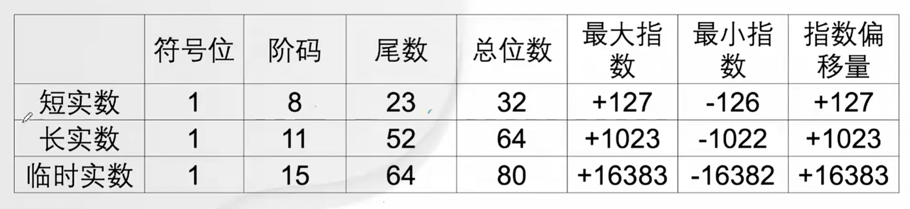
  - 指数00000000和11111111有特殊含义，因此最大指数是127，最小是-126
  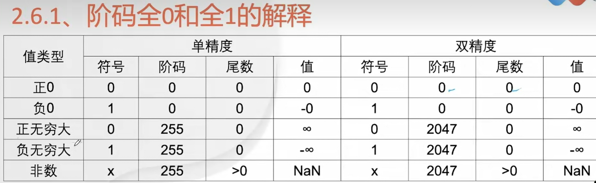

- 浮点数的舍入处理
  - 舍入到最近接近，一样接近的情况下，偶数优先

- IEEE754浮点数标准
  - 32位单精度浮点数
    - 规格化浮点数：小数点前，必须是1
  - 64位双精度浮点数
  - 临时实数，不做要求

### 数据存储与主存储器
- 数据在读写之间或两次读取或两次写入之间会有一个恢复时间

- 一个读写时间+一个恢复时间，共计一次读/写周期

- 存储器分类
  - 易失性存储器：DRAM，Register，Cache(SRAM)
  - 非易失性存储器：ROM，Flash，EPROM，EEPROM，磁盘，SSD，U盘，SD卡等
  - 只读存储器：ROM
  - 串行访问存储器：磁盘，光盘，磁带（顺序存取）
  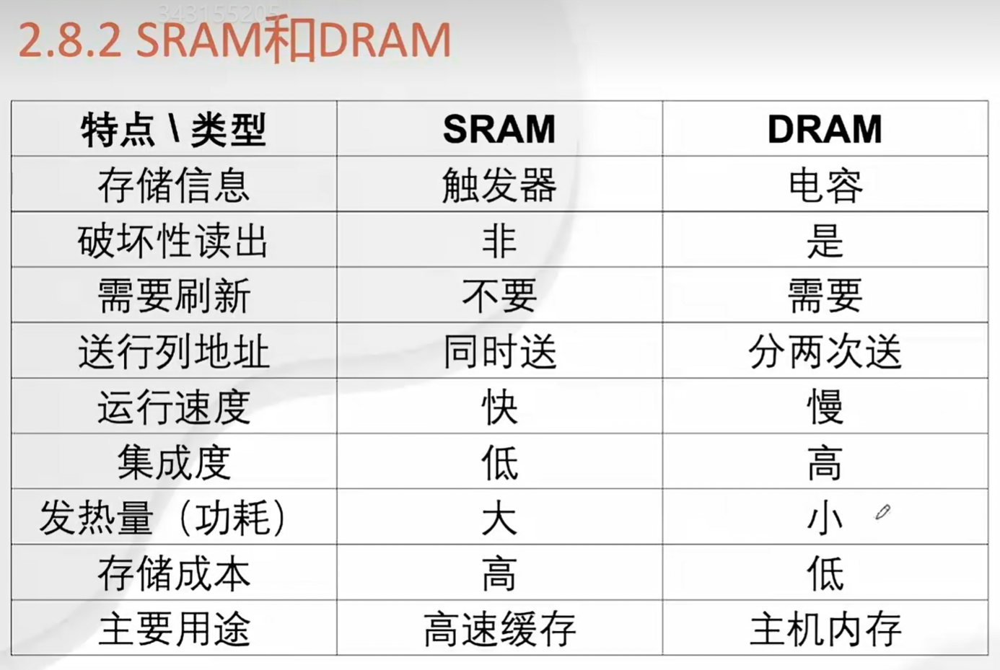

### 存储方式
- 大端：数据的低位存储在地址的高位
- 小端：数据的低位存储在地址的低位（个人电脑上更常见）

### 数据存储的运行
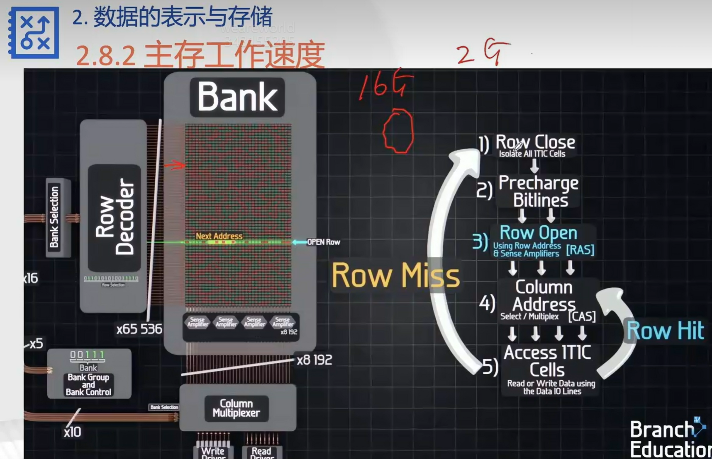
- 地址通过ROw Decoder编译后，传到Bank的wordline(行线)
- 确定操作的地址后，Row Open, 通电，将数据写入或读取，通过Column line
- 数据在列上，通过底端的放大器将电信号放大，传到数据总线，通过控制总线的调控，决定数据的读写。

### 存储优化
- 由于CPU中寄存器的速度几乎是主存的10-20倍，因此，在数据读写期间，CPU会大量时间处于等待状态，为了充分利用CPU的性能，需要对存储方式进行优化

- 优化方案
  - 双口RAM
  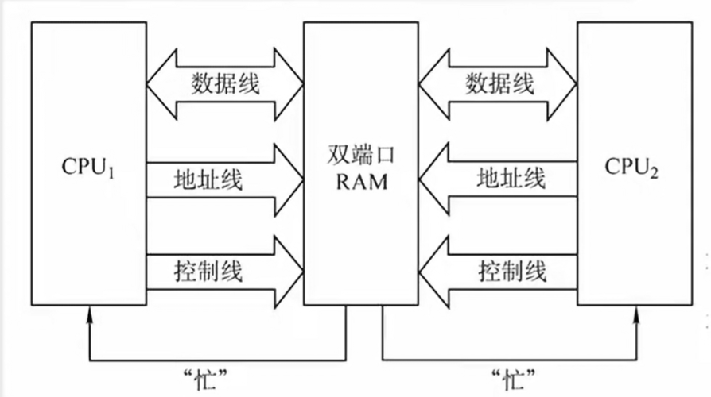
    - 两个端口同时对相同/不同的地址单元读取数据没有影响
    - 但是不能同时对同一个地址单元进行写数据
    - 不能对同一个地址，一个读取，一个写入，也是会出错的
    - 因此，会有一个状态信号，当状态信号对某一个地址标识为忙，则另一个CPU暂停对该地址的访问
  
  - 单体多字存储器
  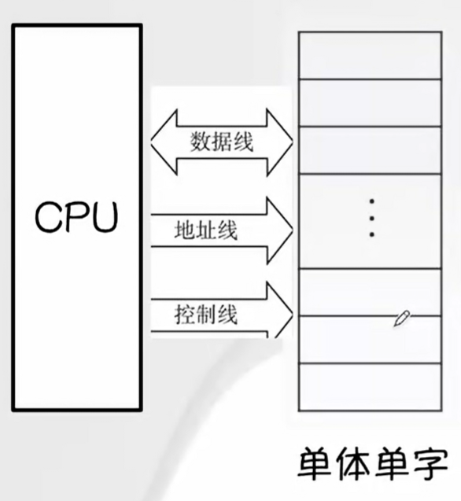
  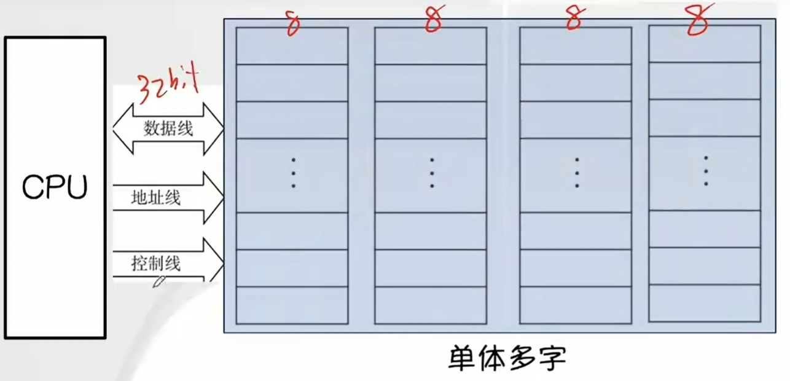
  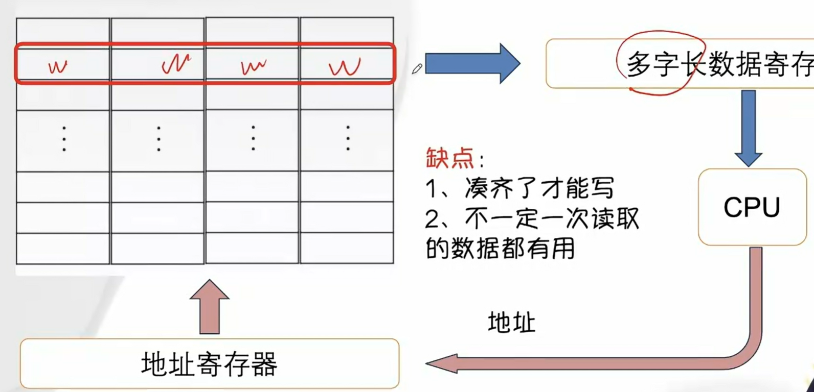

  - 多体并行交叉存储
  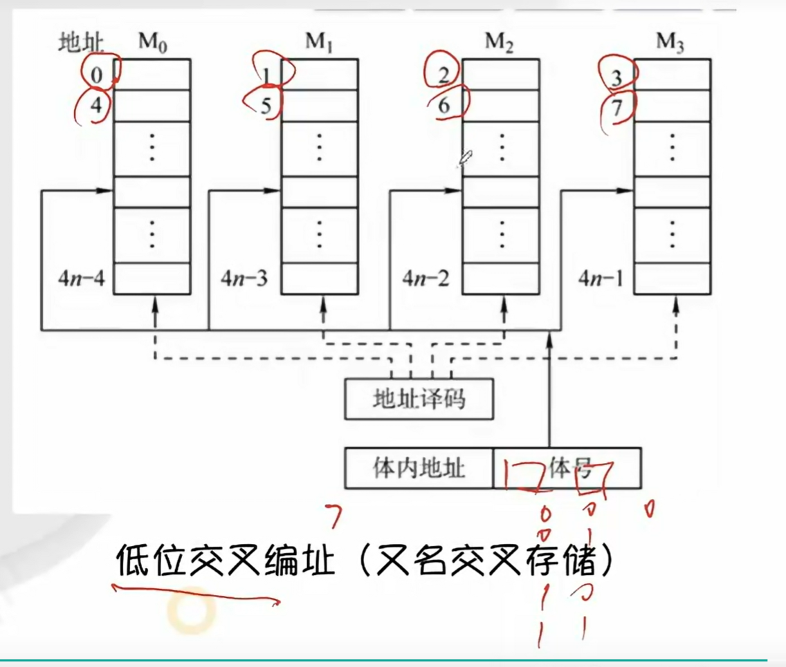
  - 在读写M0之后，读写M1,然后M2,M3..., 此时M0可以进行恢复，就没有单体数据读写的延迟问题
  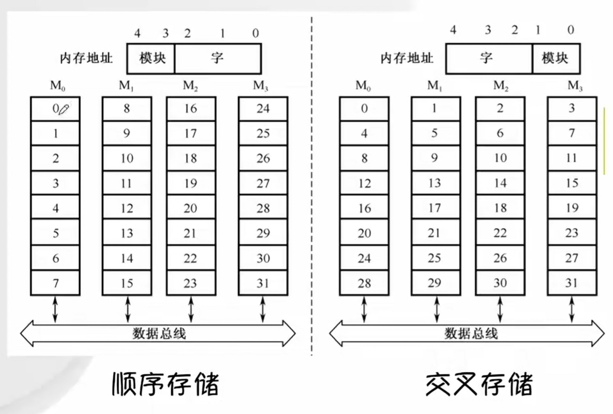
  - 多体并行顺序存储和多体并行交叉存储的运行时间差异
  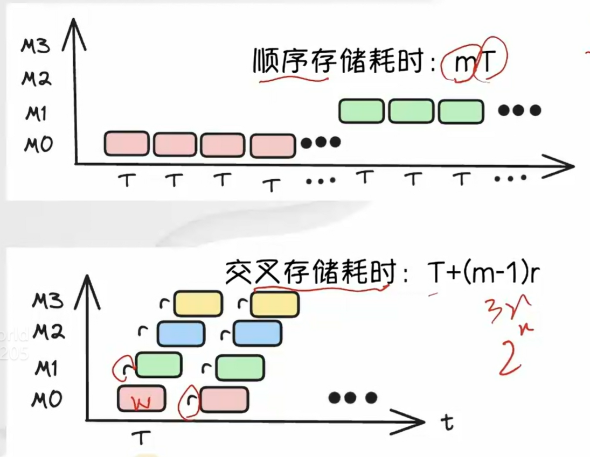
    - T：模块存储周期
    - r：地址总线传达时间
    - m：模块数量

### 主存与CPU的连接
- 图例
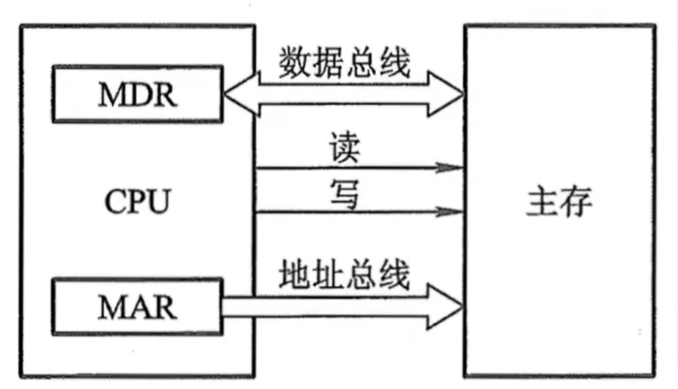
  - MDR：数据寄存器
  - MAR：地址寄存器

- 总结：
  - 数据总线的位数与工作频率的乘积正比于数据传输率
  - 地址总线的位数，解决可寻址的最大内存空间

### 高速缓存Cache
- 局部性
  - 重复引用相同变量的程序有良好的时间局部性
  - 连续内存访问时，步长越小，空间局部性越好
  - 对于指令来说，循环具有好的时间局部性和空间局部性
  - 循环体越小，循环次数越多，局部性越好

- CPU在指向存储地址的时候，都是指主存地址，高速缓存对于CPU都是透明的，看不到的，数据从主存进入高速缓存，再到被CPU读取，这个过程是有由硬件完成的，对于CPU而言，都是从主存地址中取得数据

- 缓存原理
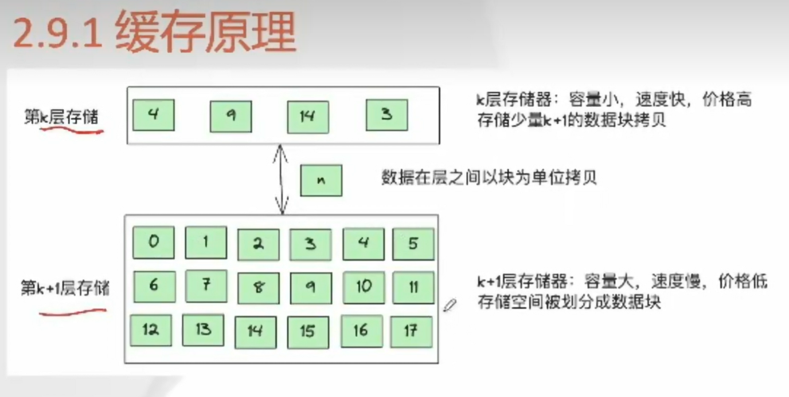

- 基本概念
  - 缓存命中 Cache Hit
  - 缓存不命中 Cache miss(将发生替换：从主存中将数据块调到缓存中)
  - 空缓存 cold Cache (冷不命中)
  - 放置策略：直接映射，全相联，组相联
  - 命中率：CPU要访问的信息在Cache中的占比
  - 平均访问时间ta:htc + (1-h)tm,tc为命中访问时间，tm为未命中访问时间
  - Cache-主存系统访问效率：tc/ta

- 高速缓存与主存的映射
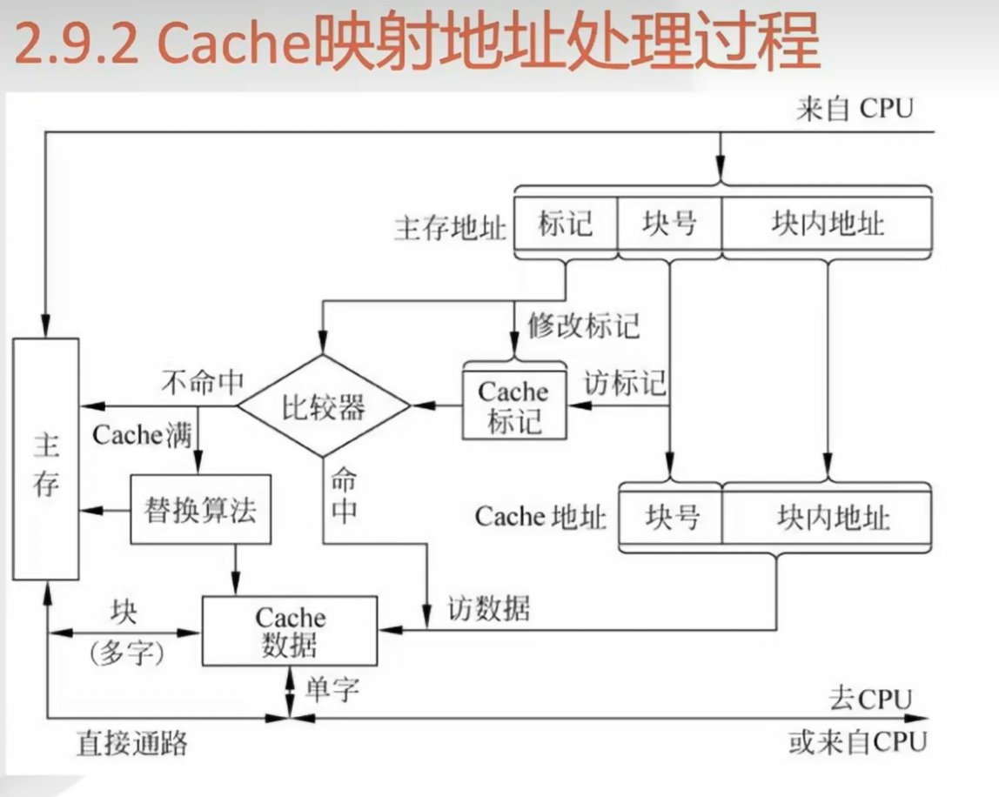

- 大体过程：
  - CPU访问根据地址信息访问主存，地址信息上分为3个部分：标记，块号，块内地址
  - 根据标记位，通过比较器进行判断，该数据在缓存中是否命中，如果命中，则CPU直接从缓存Cache中读取信息
  - 如果不命中，且Cache以满的情况下，根据替换算法，将主存中的相应数据和缓存中的数据进行替换，然后CPU从缓存中读取数据 

- 该过程中间的问题
  - 数据存储在缓存中的时候，数据的组织方式
  - 主存和缓存之间的替换算法

- 映射方式
  - 直接映射
    - 不够灵活
    - 冲突概率高（抖动）
    - 一般用于大容量，低级别cache
    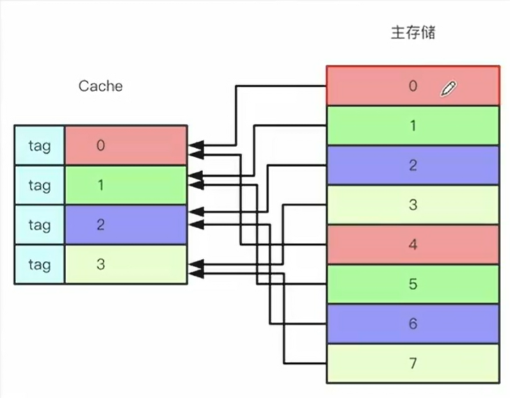
    - 主存数据：标记 - Cache行号 - 块内地址
  - 主存到cache的直接映射计算
  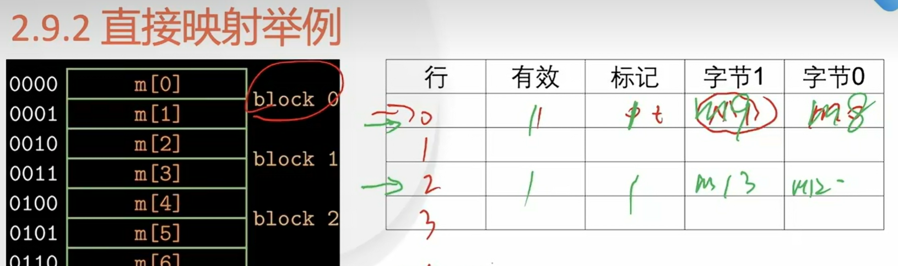
    - 最末尾是Cache一个行中的数据字节数
    - 然后往前是行数
    - 最前面是标记，主要用来匹配主存地址，看是否命中
    - 如果没有命中，则将数据根据行号和字节数，将整个数据块复制进cache
  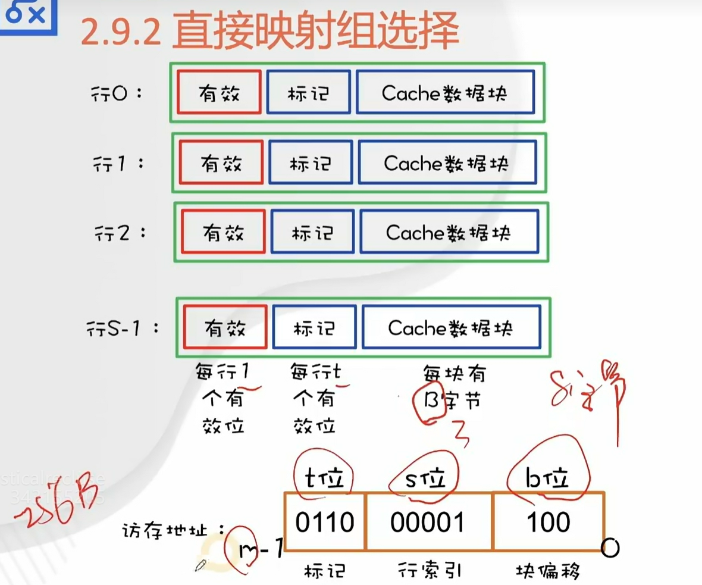
    - 计算过程：
      - b位： 一个块的数据量，比如：要表示8个地址，就需要3位
      - s位：块数量，即Cache的行号：如果需要8个块，则s位也是3位
      - t位：剩余总大小-b位-s位=t位

    - <span style="color:red">重点：主存中的块大小和Cache中的块大小要匹配</span>
    - <span style="color:red">重点：Cache到主存的映射中，地址上分别表示，有效位1位，标记（t位）， 行索引（s位），块偏移（b位），块数据（n位）</span>
  - Cache冲突不命中
    - 从底层优化数据访问速度
    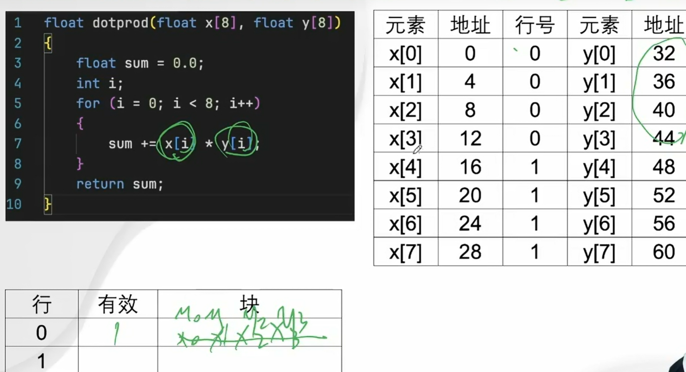
    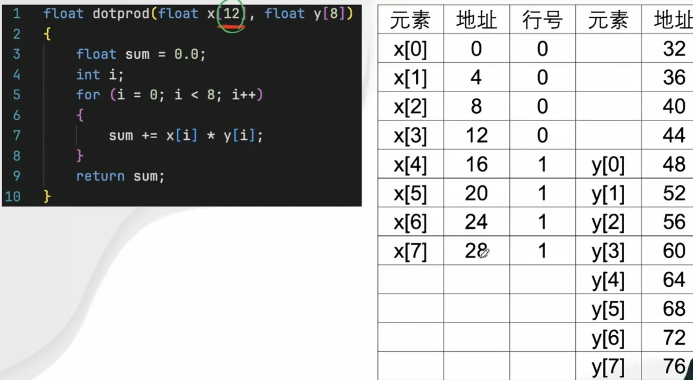

- 全相联映射
  - 一次扫描所有行，直到找到命中的地址
  - 灵活，空间利用率高，命中率高
  - 标记位长，成本高，处理复杂

- 组相联映射
  - 直接映射和全相联映射的结合
  - 分组对行入座，组内随便坐
  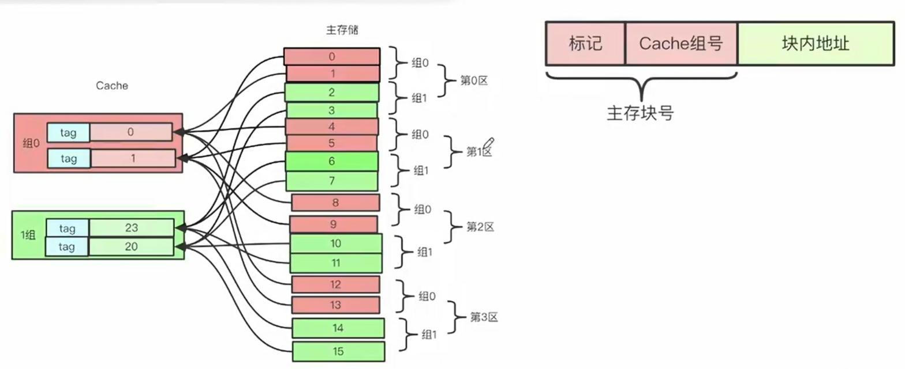
  - 组相联映射地址处理
    - 组选择
    - 行匹配
    - 字抽取

#### <span style="color:red">主存 ---> 缓存（自述）</span>
```shell
1. 缓存中的数据信息和地址信息分开存放
2. 地址信息中， 主要是标记位，有效位，脏位
3. 其中，行索引和块偏移是CPU访问主存时，使用主存地址的一部分计算出这个地址的对应的缓存行的位置，然后通过标记为，找到缓存行位置上的具体地址
4. 如果匹配成功则，直接从缓存中读取数据，如果不命中，则从主存中将地址信息和数据加载到缓存，在从缓存中读取信息
5. 如果缓存中数据以满，则根据替换规则，将缓存中的数据更新，然后从缓存中读取数据
```
  
- 缓存替换规则
  - 随机替换
  - FIFO替换
  - LRU替换（最常用）
    - 未命中且有空闲行时，新装入的行计数清0，其余非空行加1
    - 命中时，比所命中行计数小的加1，命中行清0
    - 未命中，且无空闲行时，将计数值最大的替换清0，其余行计数加1
    - 当频繁访问主存块大于行数时，就容易发生抖动
  - LFU替换
    - 新调入时计数0
    - 命中时加1
    - 替换时，计数最小的替换，如果计数一致，按FIFO规则替换
    - 问题：当下频繁使用的，后面不一定会使用，没有LRU效果好
  
- Cache写策略
  - 写命中 
    - 全写法（写穿透）：同时写入缓存和主存
    - 回写法：只写入缓存，被替换时写入主存，（要记录状态位置，脏位）
      - 可能发生缓存和主存数据不一致
  - 写不命中
    - 写分配：加载主存块到缓存，然后更新，即同时更新主存和缓存
      - 考虑到新写入的数据，后续可能会用到
    - 写不分配：直接写入主存
  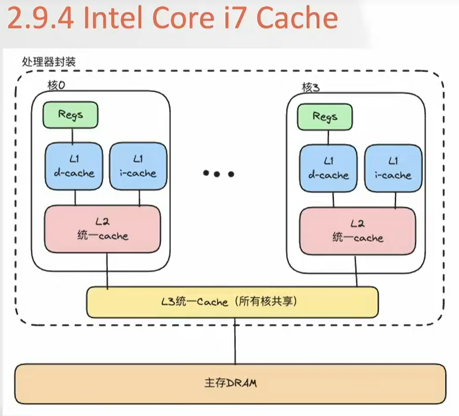

- CPU的告诉缓存分级
  - L1：分为d-cache（数据缓存）和 i(instruction)-cache（指令缓存）
  - L2：里面同时存放数据和指令，L2和L1，每个核心都独立拥有
  - L3：多核心共享数据

- <span style="color:red">容易误解的地方（自述）</span>
```
缓存的总体大小通常引用的是它能够存储用户数据的容量，也就是缓存行的数据部分大小的总和。实际上，为了维护缓存的组织和实现有效的缓存查找和替换策略，每个缓存行还需要额外的存储空间来保存元数据和地址信息，如标记位和有效位。

缓存行的总容量通常如下：

数据部分（Data Part）：这是缓存行可以直接存储数据的部分，大小通常为32字节、64字节或128字节等，具体取决于缓存设计。

控制信息（Control Information）：每个缓存行还包含控制信息，这是为了维护缓存的一致性和有效性所必需的。这些控制信息通常包括：

有效位（Valid Bit）：表示该缓存行是否包含有效数据。
脏位（Dirty Bit）：如果实现了写回策略，表示该缓存行的数据自从被加载到缓存以来是否被修改过。
标记位（Tag）：内存地址的一部分，用于标识缓存行中数据对应的内存地址。
这些元数据不计入缓存行的数据部分大小，但它们是缓存容量的一部分，因为它们是每个缓存行所必需的。当我们谈论缓存大小时，如"L2缓存为256KB"，通常是指它可以存储数据的总量，而不包括管理这些数据所需的元数据和地址信息的大小。
```
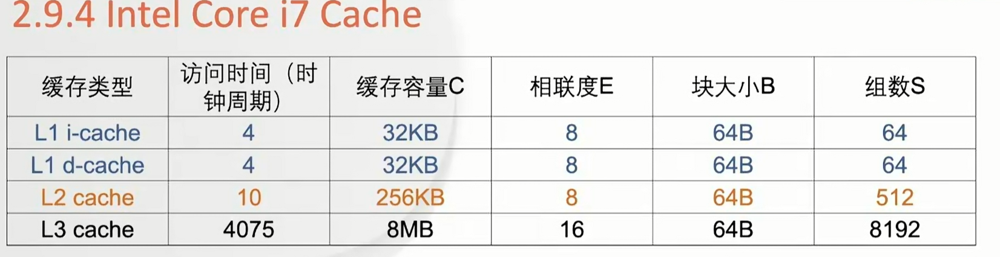
- 解读真实CPU的缓存数据
  - L1 i-cache
    - 总容量32kB(这里一般仅指存放数据大小，实际大小会比这个大，因为需要索引信息，元数据等额外信息)
    - 相联度E：指每组有8个块，每个组内，采用全相连映射的方式进行主存和Cache之间的映射关系
    - 块大小B：64B，主存和Cache之间的数据传输的最小单位是块
    - 组数S：共64组，

## 虚拟存储
- 虚拟存储空间，由操作系统和硬件共同维护管理
### 地址空间管理
- 虚拟存储机制要解决的关键问题
  - 调度问题：决定哪些程序和数据应该被调入主存当中
  - 地址映射问题：在访问主存时，将虚拟地址变为主存物理地址（这一过程称为内地址变换）；在访问辅存时，将虚拟地址变为辅存的物理地址（这一过程称为外地址变换），以便换页；
  - 主存分配问题
  - 存储保护
  - 程序再定位
  - 替换问题：决定哪些程序或数据被调出主存
  - 更新问题：保证主存和辅存的一致性
  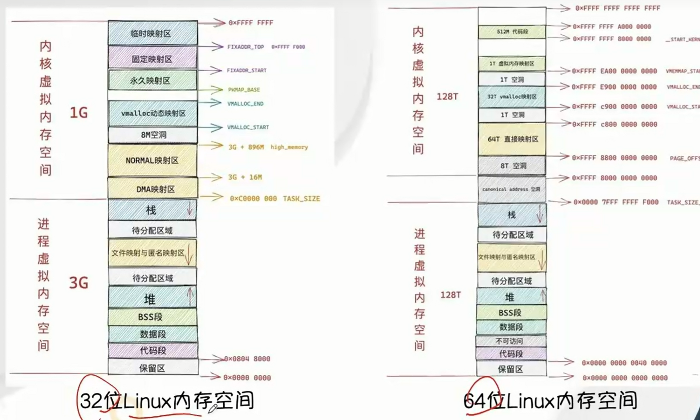

- 细节补充
  - 32位系统：
    - 0xC...,即1100...开头是给内核使用的地址（1G）
    - 00开头的地址是给进程，应用使用的地址（3G）
  - 64位系统
    - 0xFFFF....开头，即前16位为1开头，是给内核使用的（128T）
    - 0x0000....开头，即前16为为0开头，是给进程使用的（128T） 
  ```
  实际上，现代操作系统和硬件并不会使用所有这些可用地址空间。
  例如，现代x86_64架构的实际可用地址空间通常被限制在48位，其中一部分是用户空间，另一部分是内核空间。
  这意味着虚拟内存空间通常小于理论的最大值，大约为256TB（即 2^{48}2 ^48字节）。
  这里内核空间占128T，用户空间占128T
  ```

### 页式虚拟存储管理
- 图例
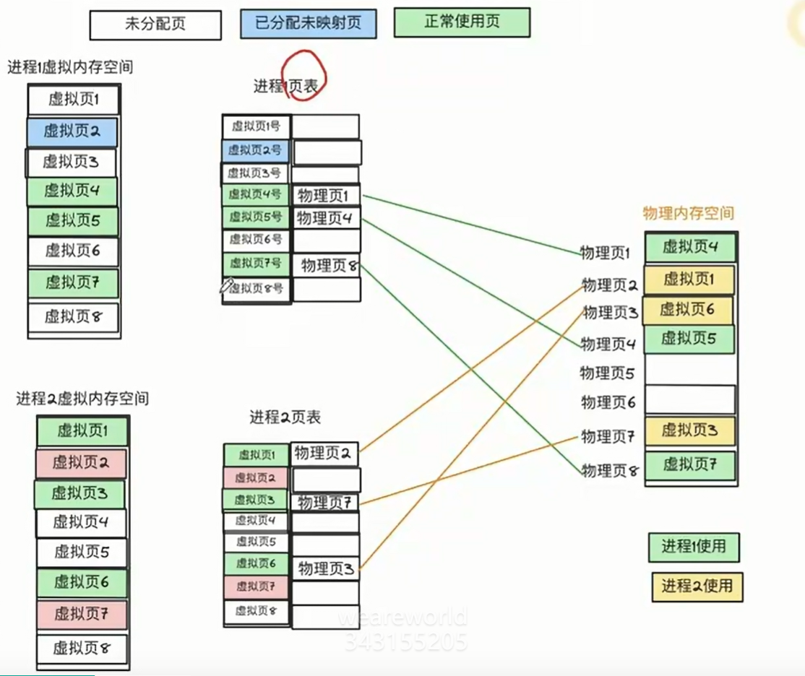

- 页表：
  - 本质是一块内存空间，用C语言表示，类似：struct page_info p[]
  ```C
  typedef struct page_info {
      "虚拟页号" = "";
      "物理页号" = "";
  } page_info;  // 结构体中有两个信息
  page_info p[]; // 表示进程页表
  ```
  - 虚拟页的大小和物理页的大小一致（大小一般默认为4K）
  - 页数根据空间大小绝决定
  - CPU在运行进程的时候，所使用的地址是虚拟地址，在实际调用物理地址时，需要映射转换
  - 页表的作用
    - 管理虚拟内存和物理内存之间的映射关系
    - 访问权限管理，控制进程对物理内存的访问权限（读写执行）
  - 一组虚拟内存和物理内存在页表中的记录，也成为一组页表项

- 页表项参数
  - 页表作用：保存PTE数组，即页表项
  - 每个page大小：一般为4K
  - 32为寻址空间：4GB
  - 页表项数：4GB/4K = 1M
  - 页表的起始位置
    - 进程控制块中有mm_struct项，mm_struct有一个pdg的值，里面保存了页表首地址，（一些教材中，也叫页表基址寄存器）
    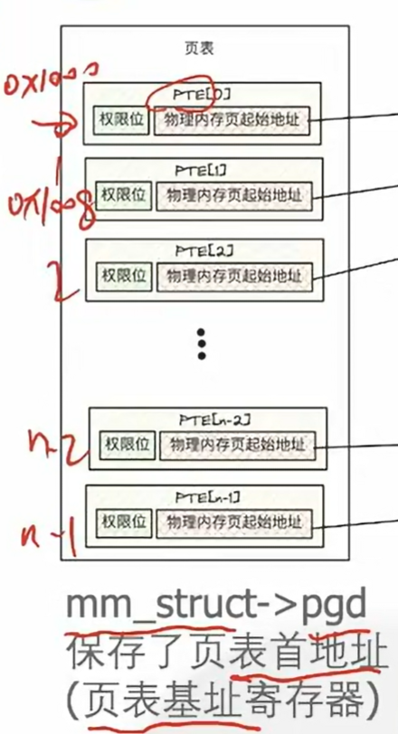

- <span style="color:red;font-weight:700">虚拟空间中页大小和文件系统中块大小的概念区别</span>
```
虚拟页（Virtual Page）
在虚拟内存管理中，页是内存被分割成的固定长度的块。这些页用于虚拟地址到物理地址的映射：

页的大小：页的大小是操作系统定义的，常见的大小有4KB（4096字节）、2MB（对于大页，也称作“巨页”或“大页框”）等。页大小是由硬件和操作系统共同决定的，不同的系统和架构可能支持不同的页大小。
目的：页用于虚拟内存管理，例如在内存分页、页置换算法和虚拟地址到物理地址的转换中起关键作用。
块（Block）
在文件系统中，块是存储数据的单位，它们与文件系统的管理密切相关：

块的大小：块大小通常由文件系统决定，例如在Linux中，常见的块大小有512字节、1KB、2KB、4KB等。文件系统的块大小可以在文件系统创建时指定，也可以使用默认值。

目的：块是文件数据在磁盘上的物理存储单位，文件系统使用块来组织和管理存储在磁盘上的数据。

虽然页和块都是存储管理中的基本单元，它们的大小有时候相同（如都为4KB），但它们属于不同的抽象层级并服务于不同的目的。虚拟内存的页主要用于内存和交换空间（swap space）的管理，而文件系统的块主要用于文件存储和磁盘空间的管理。在某些上下文中，这两个术语可能会有所重叠，特别是在涉及到内存映射文件时，文件系统的块大小可能会与页大小对齐以提高效率。
```

- <span style="color:red;font-weight:700">Linux中关于页表和虚拟-物理页映射关系的查看</span>
```
在Linux系统中，进程控制块通常是指任务控制块（Task Control Block, TCB），其中包含了进程或线程的所有信息，包括页表的首地址。这部分信息是内核维护的，并不直接暴露在文件系统中供用户查看。然而，对于进程的虚拟内存布局，包括其页表入口等信息，你可以通过/proc文件系统来查看一些相关的信息。

每个运行中的进程都有一个以其进程ID命名的目录位于/proc中，例如/proc/1234，其中1234是进程ID。在这个目录下，有几个文件和目录提供了有关该进程的详细信息，但页表的首地址并不直接提供。

以下是一些相关的文件：

/proc/[pid]/maps：这个文件列出了进程的内存映射，包括加载的二进制文件、动态库、共享内存等的地址范围。
/proc/[pid]/pagemap：这是一个二进制接口，提供了页框号和物理页号的映射。不过，读取这个文件需要具有足够权限，且通常用于开发和调试。
对于页表的首地址，只有操作系统内核才能访问它，因为页表是在内核地址空间中维护的。如果你需要查看或操作页表，你需要具有内核级别的访问权限，通常是通过编写内核模块或使用特定的系统调用。

如果你有内核模块编程的经验，你可以访问当前进程的mm_struct结构体，这是内核中维护内存管理信息的结构，其中pgd字段就是页全局目录的地址，是页表首地址的起点。这需要深入了解Linux内核，且通常只在特定的开发或调试工作中进行。
```

- 页式虚拟存储器的地址变换过程
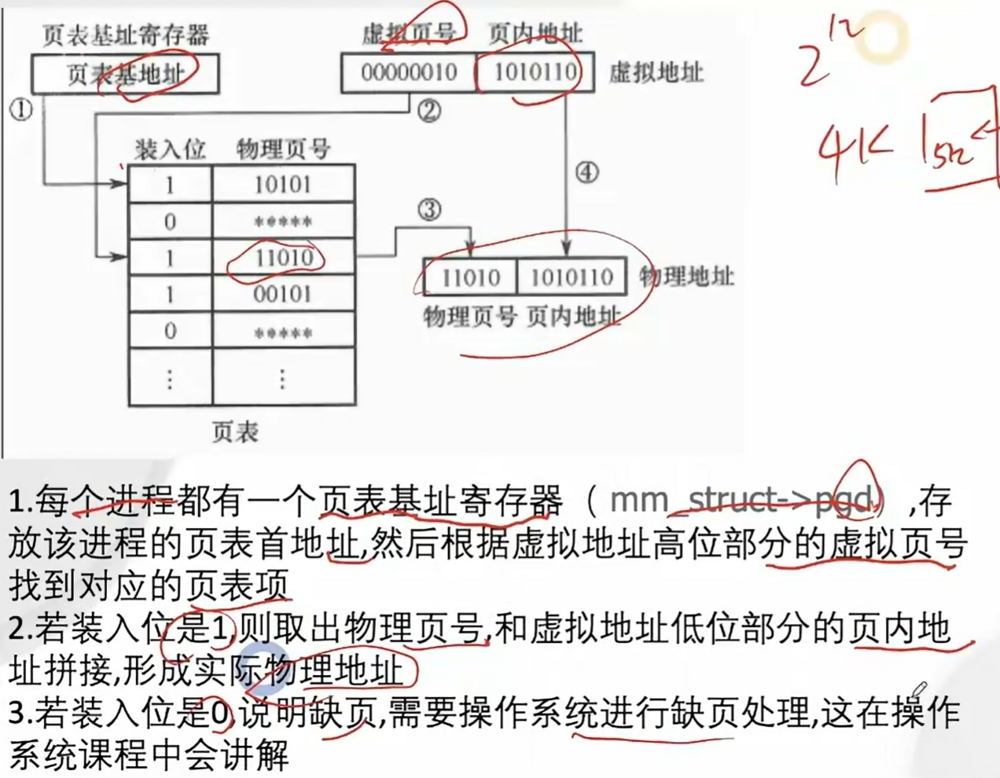

### 段式虚拟存储器
- 图例
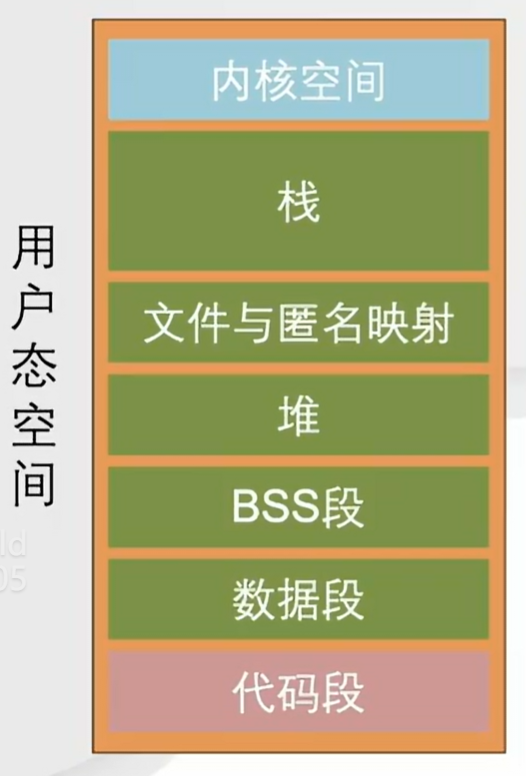

- 详解：
  - 用于存放进程程序二进制文件中的机器指令的代码段
  - 用于存放程序二进制文件中定义的全局变量和静态变量的数据段和BBS段
  - 用于在程序运行过程中动态申请内存的堆
  - 用于存放动态链接库以及内存映射区域的文件映射和匿名映射区
  - 用于存放函数调用过程中的局部变量和函数参数的栈

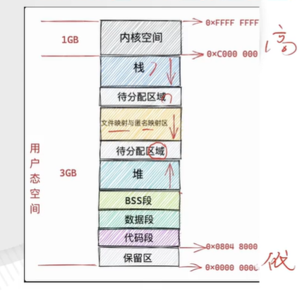

- 分段的详细解释
  - 整个区域分为系统内核区和用户区，分别在两端
  - 用户区又分为动态区和静态区，分别在两端
  - 动态区又分为栈区，堆区，分别在两端（栈在高位，堆在低位）
  - 静态区分为可读写区（数据段，BBS段），只读区（代码段），也分别在两端

- <span style="color:red; font-weight:700">关于虚拟运行空间区域管理，后面操作系统课程详解</span>
  - 在操作系统中，有一个地方，里面定义一个结构体，上面对虚拟内存的开始，结束，权限和划分
  - 这些信息在程序开始的时候，已经由操作系统准备好

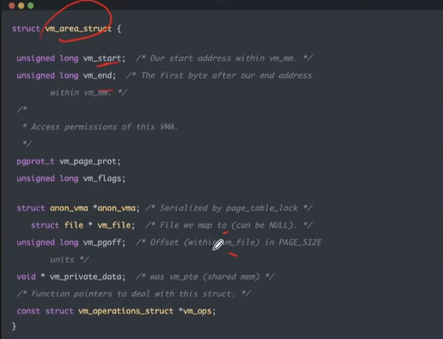
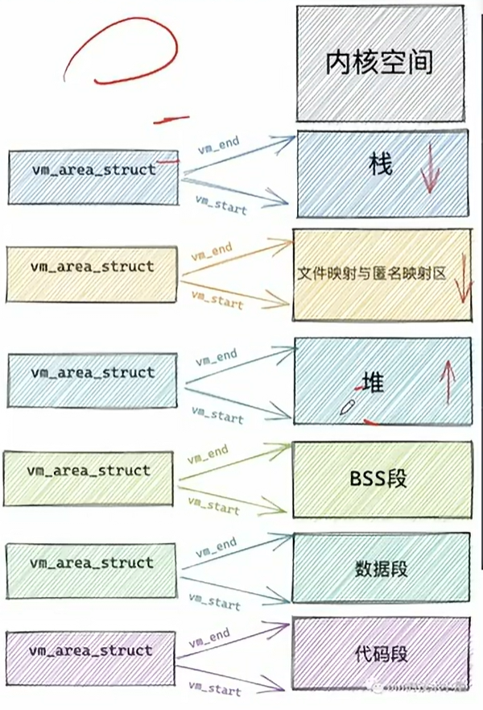
### 段页式虚拟存储器
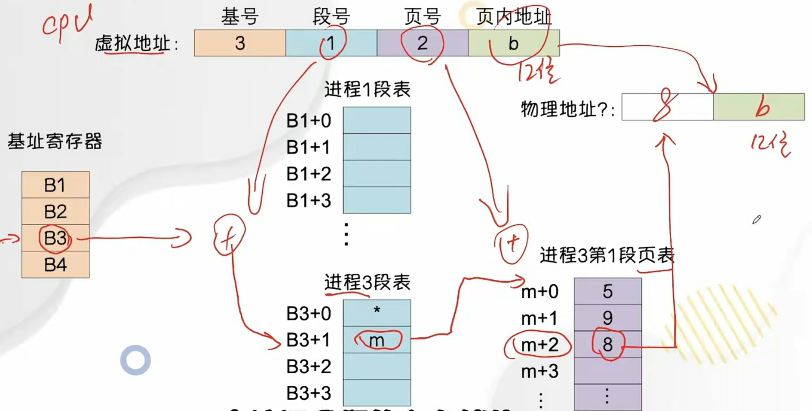

-  虚拟地址到物理地址的具体映射方法（段页式）
  - 其中虚拟地址的页内地址和物理地址的后面一部分一致
  - 虚拟地址的前面分为，基号，段号，页号
    - 首先根据基号，找到需要用到的进程段表基址
    - 根据基址和段号，形成进程段表中的段表项，在该段表项中，记录了相应的页表的地址，
    - 根据页表地址，加上页号，即可找到页表中的页表项位置
    - 找到了页表项位置，也就找到了物理的页号，然后物理页号和虚拟地址中的页内地址拼接，得到物理地址

### TLB (快表)
- 快表属于页表的子集，存储在Cache中
- 一般使用全相联或组相联的方式进行映射（尽量防止页表缺失，导致访问辅存）
```
TLB 是 CPU 内部的一个硬件高速缓存，专用于存储热门的页表条目，加快虚拟地址到物理地址的映射过程。虽然它确实是主存中页表的子集，但它并不存储在普通的 CPU 缓存（如 L1、L2、L3 缓存）中。
```

- 页表存储在内存中，快表存储在告诉缓存中，快表是页表的一个子集，关于快表和页表的映射关系，和主存与Cache的映射方式一致

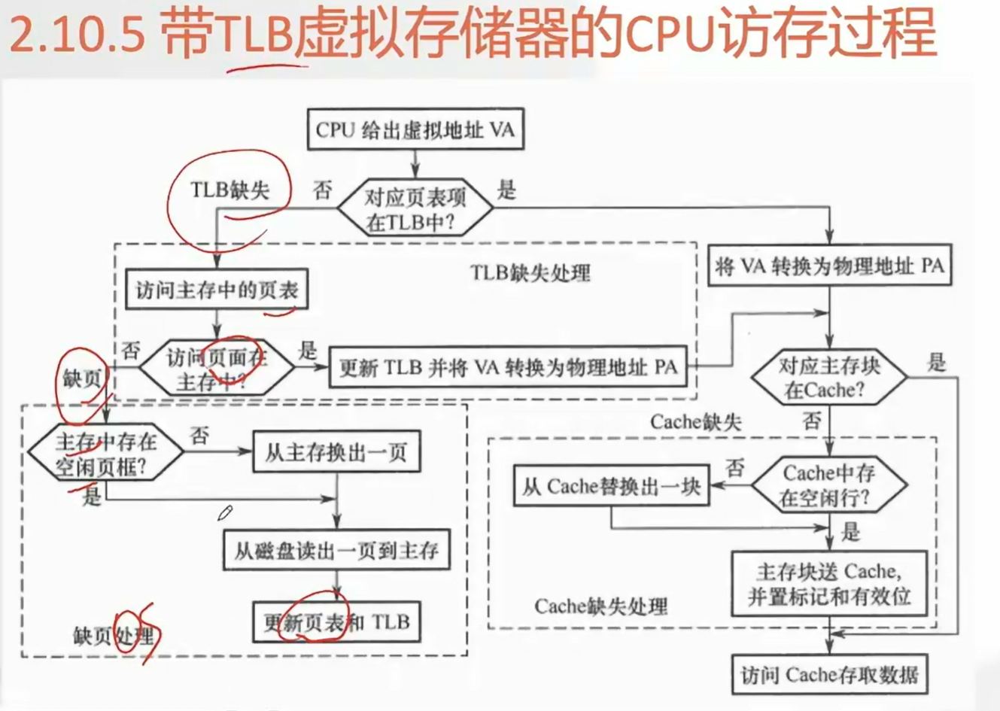

- <span style="color:red;font-weight:700">CPU访问虚拟地址的全过程解析
  - 首先，CPU根据虚拟地址访问内存
  - 虚拟地址中的地址分为虚页号和页内地址，其中页内地址可以直接作为物理地址的尾部使用（假设该虚拟内存的页大小是4KB，则，页内地址用12bit表示，因为2^12=4K,再假设这个CPU架构是32位，则虚页号部分为20位）
  - 首先在高速缓存Cache的快表中查询虚页号，如果存在且标志位是1（如果标志位为0，表示缺失），则直接将后面的实页号，也就是对应的物理地址拼接页内地址，找到完整的物理地址，通过内存的物理地址读写数据
    - 在访问主存的时候，先取缓存Cache中，看该物理地址是否命中，如果命中，则直接从Cache中读写数据，如果未命中，则从主存中将数据加载到缓存，再进行读写
  - 如果快表中未找到虚页号，TLB缺失，则把虚页号拆分为段表，页表目录，页表，进而找到页表项，再同过页表项找到物理地址的实 页号，拼接页内地址，得到完整的物理地址，后续方法一样，使用物理地址，去Cache中查看是否命中</span>

- 上述过程中总共有三种缺失
  - TLB缺失
  - Cache缺失
  - 缺页

- 总结：
  - 也就是说，在高速缓存和主存中，是2种数据，一种是数据信息，一种是物理内存地址和元数据
  - 关于虚拟地址与物理地址的转换以及快表信息，存储在CPU的MMU中
  ```
  转换后备缓冲器（Translation Lookaside Buffer, TLB）通常被视为内存中页表的一个快速缓存，或者说是页表的一个子集。它存储了最近使用的一小部分虚拟地址到物理地址的映射，以便快速地址转换，避免每次都需要访问内存中的完整页表。

  当CPU访问虚拟内存时，它会首先检查TLB中是否有相应的映射。如果在TLB中找到（TLB命中），则地址转换立即发生，无需访问完整的页表。如果在TLB中找不到（TLB未命中），则必须从内存中的页表中检索映射，并将该映射加载到TLB中，以供下次使用。由于TLB具有非常高的访问速度，它显著提高了地址转换的效率。

  因此，可以说TLB是为了优化地址转换性能而存在的，它缓存了内存中页表的一部分内容。不过，TLB的大小比完整的页表小得多，只能存储有限数量的地址映射。
  ```
### 存储保护
- 每个进程的基址寄存器的数值不同，因此起始物理地址分配不同，从而隔离不同进程的物理空间，保护每个进程不相互干扰

- 在页表/段表项中，有权限数据，用来对不同段空间的访问权限进行限制，从而区分用户权限和管理员权限，进而保护系统

## 辅助存储器
### Flash
- SSD固定硬盘
  - nand：目前最新技术是3Dnandflash
  - nor：多用于路由，机顶盒，嵌入式

### 磁盘
- 盘面，柱面，磁道，扇区
- 磁头在每次操作中会处理一个扇区（Sector）的数据，而一个扇区通常包含 512 字节（即 4096 bits）或者更多（比如现代硬盘中常见的 4K 扇区）。
- 在一个有多个盘面（Platters）的硬盘中，每个盘面都有自己的读写磁头。但这些磁头通常是联动的，它们在同一时间只能读写一个盘面上的一个扇区。也就是说，虽然有多个盘面和磁头，但它们在同一时刻只能读写一个扇区的数据。

### 辅存数据接口
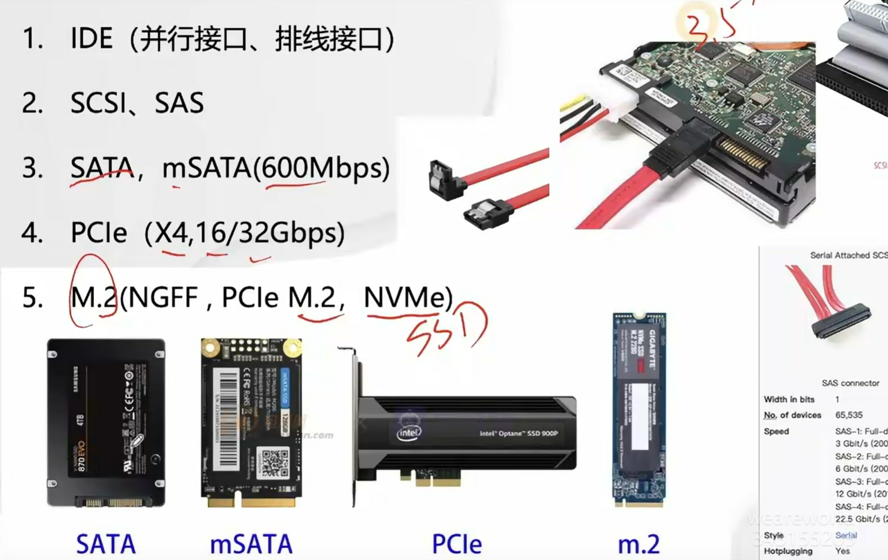

### 磁盘阵列 RAID
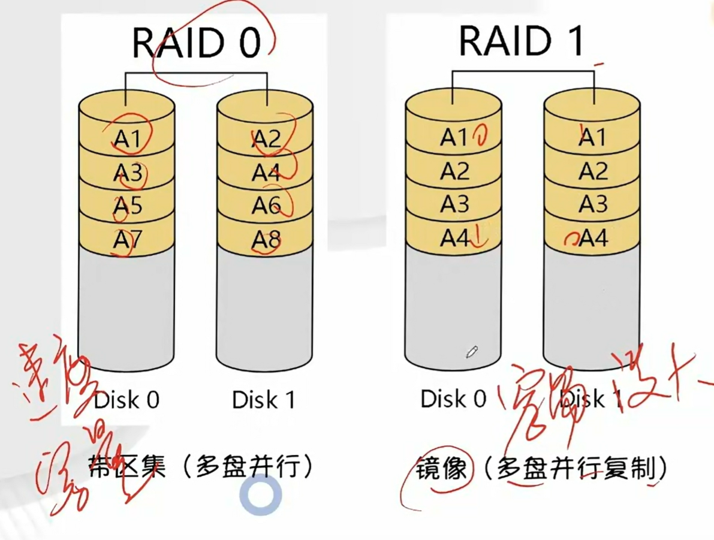
- RAID0：容量和速度提高，容错性不变
- RAID0: 容量和速度不变，提高容错，空间利用率1/2
 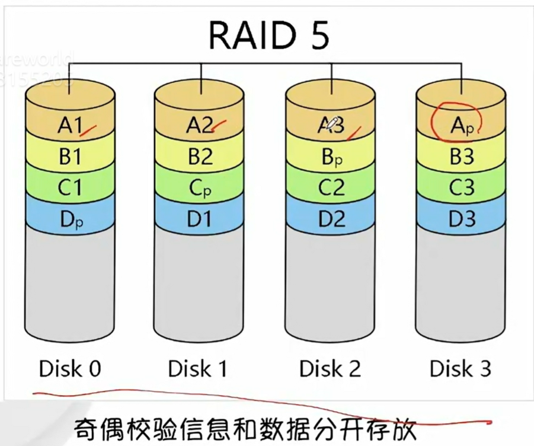
- RAID0：空间利用率：3/4；容错率也调高了
- 组合：RAID 1+0
- 组合：RAID 5+0


## 指令系统设计与执行
### 完整指令格式设计
- 操作码字段 + 地址码字段

- 指令长度和机器字长没有固定关系

- 定长指令字结构：所有指令的长度都一样
  - 单字长指令
  - 半字长指令
  - 双字长指令

- 变长指令字结构：根据功能长度变化

- 指令类型：
  - 零地址指令（只有操作码，无地址码字段（即无数据））
    - 只给出操作码（空、停机、关中断）
    - 默认用栈空间数据
  - 一地址指令 （OP A1）
    - 在A1地址读取数据，OP操作完后，存储回A1（例如：自增自减）
    - 隐含约定地址的双操作数指令，一个数据来自A1，另一个可能来自ACC(累加器)
    - 如果指令的长度是32位， 操作码占8位，地址占24位，则指令操作数据的寻址范围为2^24 = 16M

  - 二地址指令：
    - OP A1 A2
  - 三地址指令
  - 四地址指令：OP A1 A2 A3 A4
    - 读取A1和A2地址数据，OP操作完成后，再把结果返回给A3，A4中存储下一条要执行的指令的地址
    - 因为一般下一条要执行的指令都是存储在PC寄存器中，所以实际上，A4的这种四地址指令很少使用
  
  - 操作码分类
  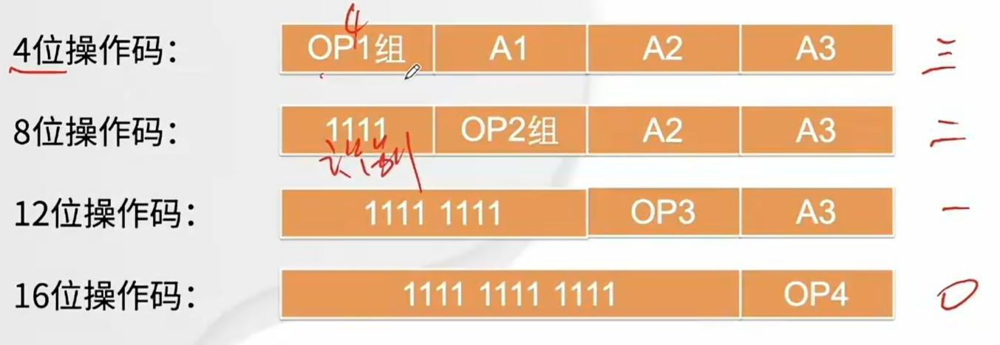
    - 总结1：只用频率高的指令分配较短的操作码
    - 总结2：操作码不能重复
    - 总结3：扩展操作码增加了译码和分析的难度，控制器设计复杂

### ARM指令集
- RISC，精简指令集，定长32位指令集
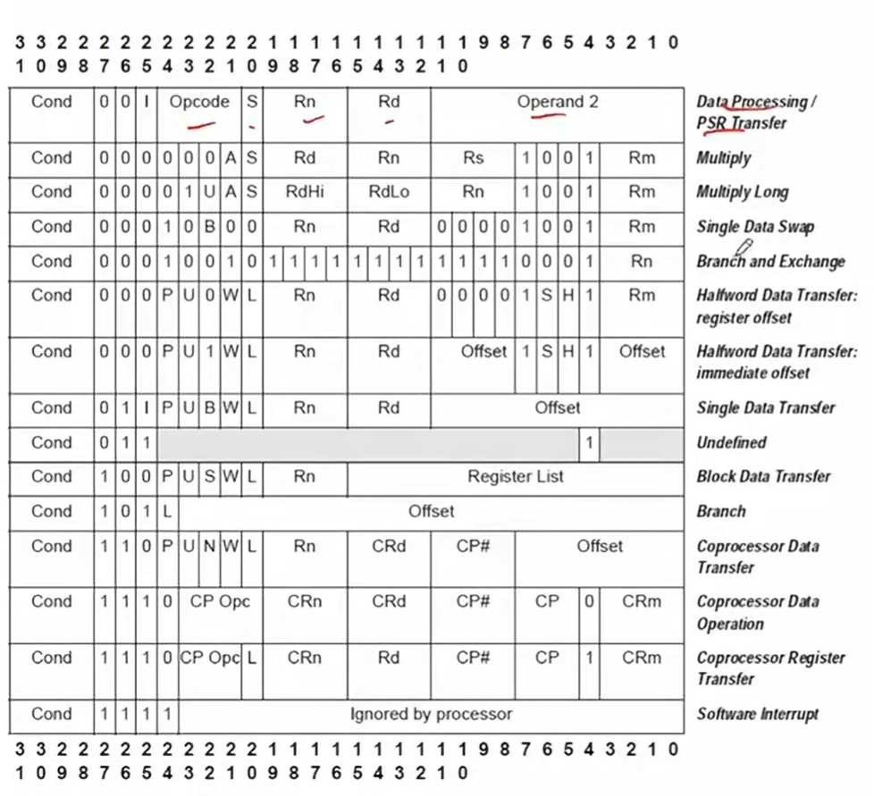

- 详解(从左到右)
  - Condition：判断指令是否执行（条件码）
  - 后面是判断执行的指令类别
  - opcode：操作码
  - S：标识
  - Rn...：寄存器

- ARM指令操作类型
  - 数据传输
    - LDR/STR：用于加载和存储操作，可以将数据在内存和寄存器之间传输
    - MOV：将一个寄存器值或者常数（立即数）移动到另一个寄存器
    - LDM/STM：加载和存储多个寄存器，用于处理多数据传送
  - 算数和逻辑运算
    - ADD/SUB：用于加法和减法运算
    - MUL：用于乘法运算
    - AND/ORR/EOR：逻辑与，或，异或运算
    - CMP：比较两个寄存器的值
  - 移位操作
    - LSL/LSR：逻辑左移和逻辑右移
    - ASR：算数右移
    - ROR：循环右移
  - 转移操作
    - B/BL：无条件跳转，BL还会保存返回地址在lr寄存器中
    - BX：通过寄存器值跳转
    - 条件转移指令：BEQ（等于时跳转），BNE（不等于时跳转）
  - 输入输出操作
    - ARMv7指令集本身不直接提供输入输出指令，这些操作通常通过操作系统或特定硬件接口实现。但是，可以使用LDR/STR指令与内存映射的I/O接口进行数据交换。

- ARMCPU特点
  - ARMCPU不能直接通过主存进行计算，必须将数据从主存加载到寄存器后，CPU才能通过访问寄存器获取数据，进行运算，计算结束后，结果保存到寄存器中，然后在从寄存器传输到主存进行保存

- ARM标记位（记录在CPSR寄存器中）
  - 零标志（ZERO）
  - 负标志（N flag）
  - 进位标志（C flag）
  - 溢出标志（V flag）
  - 如果32位机器码中S标志位为1，则该指令会将指令状态记录在CPSR寄存器中
  ```
  MOVS r0 #0
  此时，S为会标记为1，同时CPSR的零标志为标记为1
  ```
  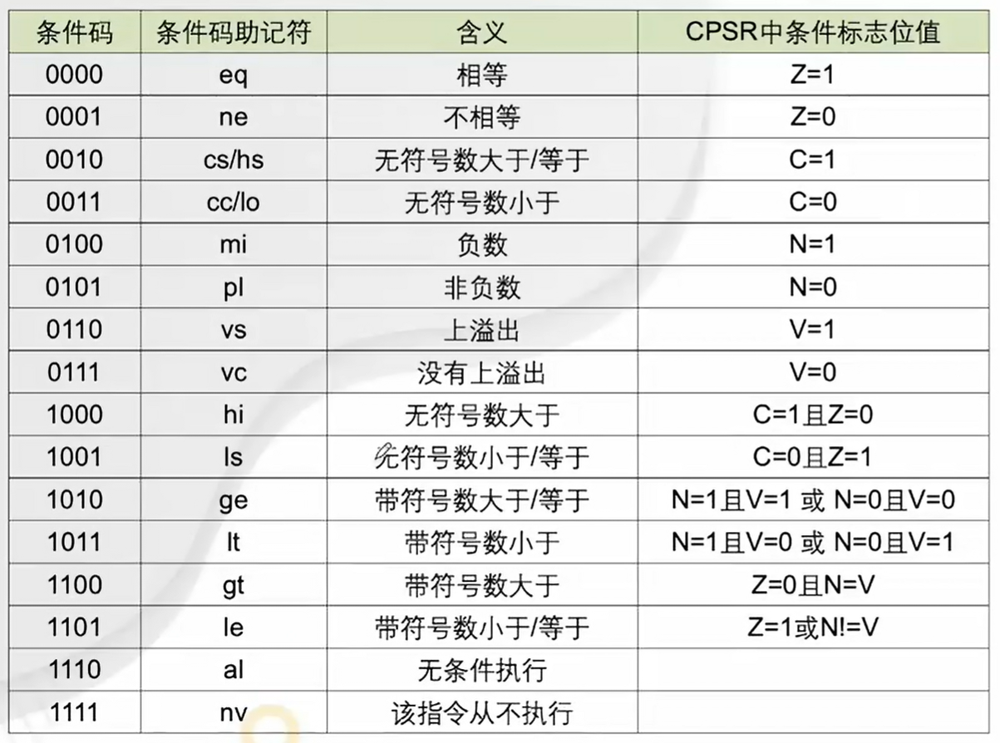

### X86指令集
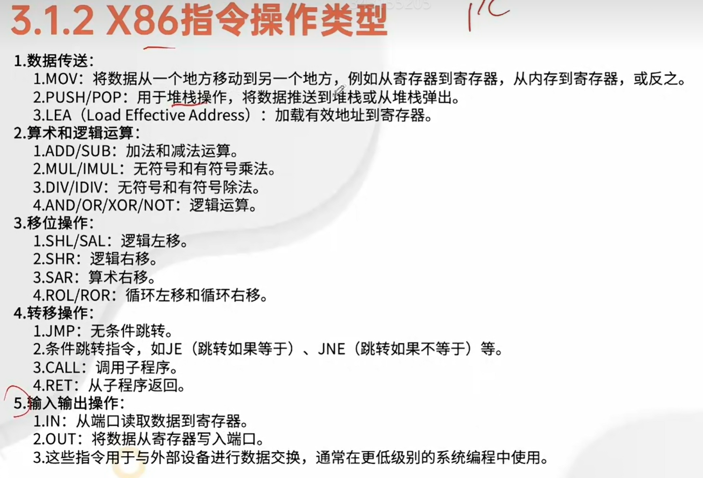
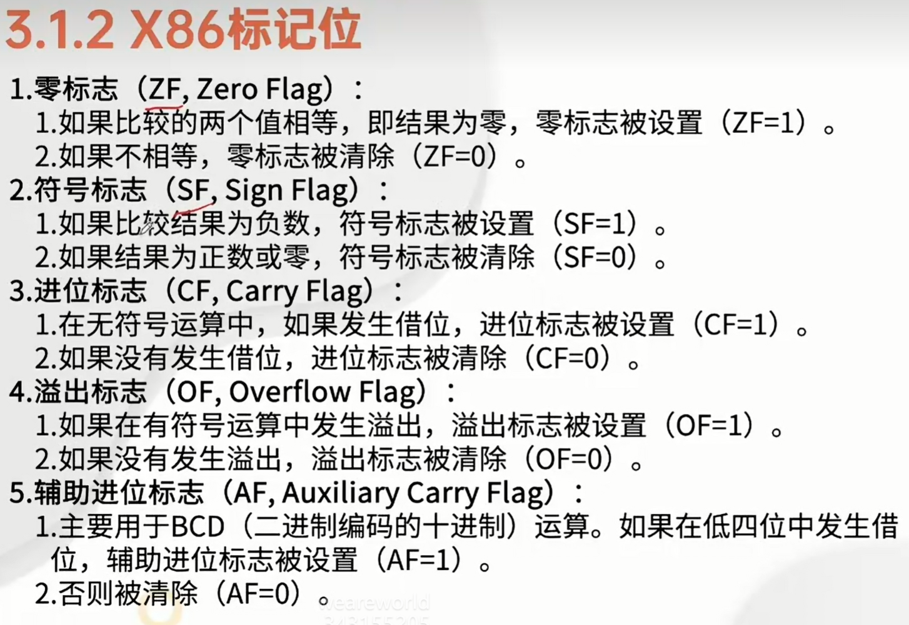
>>>>>>> 7a794a713a1b043c1041182895a874450d05bad6
