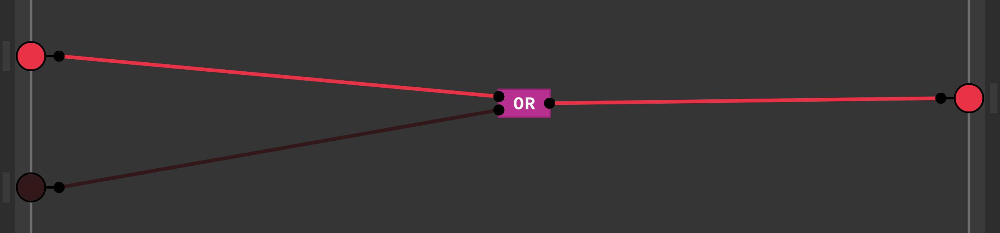
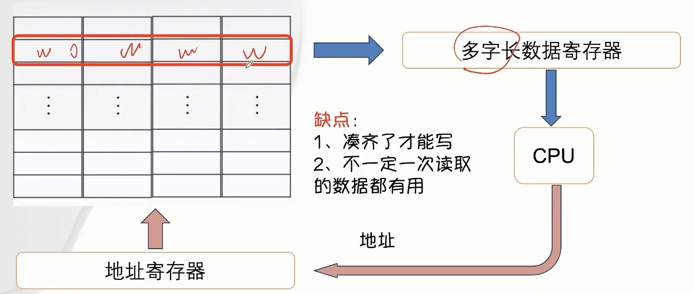
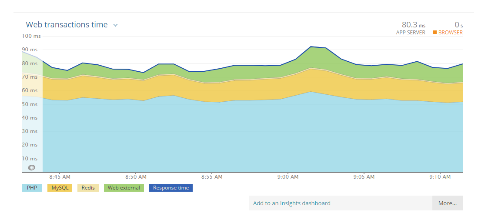
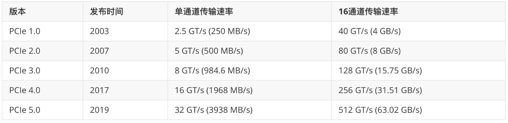
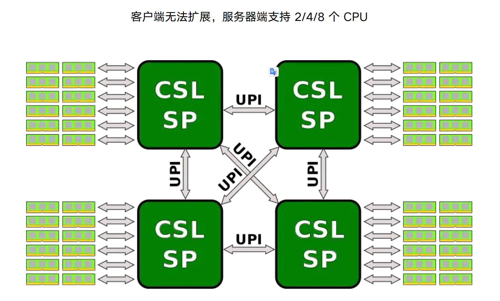

# 计算机组成原理：手动编写CPU
## 计算机系统概述

### 计算机发展史


- **第零代：继电器机械计算机（~1945**）
- **第一代：电子管计算机（1945~1955）**
- **第二代：晶体管计算机（1955~1965）**
- **第三代：集成电路计算机（1965~1980）**
- **第四代：微型计算机（1980~至今）**


#### **布尔代数和数字电路**

计算机的基础是数字电路，数字电路的基础是布尔代数

- 1847年英国数学家**乔治布尔**发明布尔代数


**布尔代数与数字电路之间的关系**


假设：开关断开为0，反之为1，灯灭为0，反之为1

- 图1相当于AND运算的逻辑
- 图2相当于OR运算的逻辑


<span style="color:red;font-weight:700">问题：上述的电路只能完成简单的逻辑运算，其他复杂逻辑运算无法实现。比如：要求两个开关断开，灯亮，即 ( 0，0 ) -> 1。因此需要结合继电器来实现</span>


#### 继电器（relay）

- In：输入小电流，Out：输出大电流，起到中继的作用


继电器的原理：当电流从IN输入，电磁铁通电，会将上面的弹片下压，从而将上面的电路打通

图三中（数字电路会将高电压用1表示，低电压用0表示）

- 当两个开关闭合，则灯是灭的
- 当两个开关都断开或只断开一个，则灯是两的

上述图三符合**NAND**的运算逻辑，即与非门


<span style="color:red;font-weight:700">从继电器发明之后，没有人将电路与逻辑运算联系起来，直到20世纪30年代</span>


#### 继电器与开关电路的符号分析

- 1938年英国科学家**克劳德.香浓**发表论文《A Symbolic Analysis of Relay and Switching Circuits》将布尔代数应用到电路中，奠定了数字电路的理论基础
- 1949年9月香浓信息论《The Mathematical Theory of Communication通讯的数字原理》提出“位”这个单词来表示二进制数字
- 继电器的组合称为逻辑门，他们构造基本的逻辑电路，也叫**门电路**


<span style="color:red;font-weight:700">门电路只是数字电路的最基本部件，如何使用门电路来设计一个计算机，或者计算机应该由哪些部件构成以怎样的方式来运行呢</span>


#### 图灵机

- 1936年，英国数学家**艾伦图灵**提出了一种抽象的计算机模型，被称为图灵机
- 图灵机第1次提出程序的概念
- 图灵机提出了一种使用机器进行计算的简单方法


解析上述图灵机

上面是一个无限长的纸袋，下方有个红色的读写头，读写头上有一个状态码 `q1`，根据程序表来对纸袋进行计算处理

- 比如当前读写头指向1，状态是 `q1`，根据程序表得到 `1Rq1`，这里1表示将当前纸带上的数字变为1，如果是1则不变，R表示向右移动一位（L表示向左移动一位，H表示不动），`q1` 表示状态码变为 `q1`，如果之前就是 `q1`，则不变。
- 根据上述规则即可将程序执行起来。这就是图灵机


<span style="color:red;font-weight:700">图灵机为计算机的实现提供了一种重要的思想，肯定了计算机实现的可能，为计算机的实现提供了一种大致的架构</span>


#### 冯诺依曼体系结构

- 冯诺依曼于1946年提出冯诺依曼计算机体系结构
- 制造了第一台现代意义的通用计算机EDVAC
- 冯诺依曼计算机几大特点：
  - 五大组成部分（存储器，运算器，控制器，输入，输出设备）
  - 使用二进制计算（使用二进制可以大大的简化乘法和除法的运算）
  - 提粗存储程序的概念，自动取指令


<span style="color:red;font-weight:700">冯诺依曼对计算机的影响是巨大的，直到现在绝大多数的计算机，仍然采用的是冯诺依曼体系结构</span>


#### 继电器计算机

- 1944年 IBM制造出哈佛Mark1号大约有3500个继电器，1秒能做3次加法或减法运算，乘法要花6秒，除法要花15秒
- 1947年9月，哈佛Mark2号操作员，从故障继电器中，拔出一只死虫，从那时起，每当电脑出现了问题，我们就说它出了bug（虫子）
- 继电器1秒能翻转50次


<span style="color:red;font-weight:700">继电器属于机械设备，随着时间的使用，它会磨损，会变慢甚至损坏，而且机械运动很慢，继电器一秒只能开关50次，所以需要更快更可靠的部件来设计计算机</span>


#### 真空管

- 热电子发射（爱迪生效应）是指在真空条件下加热金属时，电子从材料表面溢出的现象
- 真空管属于电子设备，每秒可以开闭数千次


- 通过加热器控制开关
- 通过栅极可以控制电流的大小，后期广泛应用在广播，起到电流放大的作用
- 真空三极管
  - 当加热器加热，阴极的金属表面会溢出电子（即热电子发射），而阳极有一个正电电压，让阳极带正电荷，此时电子会向阳极移动，而电子的移动就会产生电流，此时阳极就会输出高电压
  - 栅极是一个金属网，它有一个电压可以让栅极带正电或者负电，如果带正电，电子就会移动，阳级就会输出高电压，如果是负电，则电子停止流动，阳极就会输出低电压，从而实现和继电器类似的开关功能
- 问题：寿命短


#### 真空管计算机

- 第一个大规模使用真空管的计算机是“巨人1号”，拥有1600个真空管，完工于1943
- 1946年在宾夕法尼亚大学完成制作了ENIAC，它是世界上第一台真正通用可编程计算机（采用10进制，其编程是利用电线插入插板完成），使用了18000多只电子管，重130多吨，占地面积170多平方米，每秒钟可作5000多次加法计算


<span style="color:red;font-weight:700">真空管本身非常脆弱，很容易坏，而且寿命短，因此后面被晶体管所取代</span>


#### 晶体管

- 1947年，贝尔实验室发明了晶体管，一个全新的计算机时代到来

- 导体（铜）导电及电流的原理
  
- 电流（正电的移动方向）和电子的移动方向相反
- 绝缘体（橡胶）：
  - 外部没有飘逸的电子，原子核束缚力强，很难形成电子外流
- 半导体（硅）
  - 纯硅，多个硅元素形成共价键，形成稳定结构，此时电子稳定，导电性很弱
  - N型参杂：载流子是多出的电子
    - 当硅中参杂了磷元素，外部就会多出一个电子（磷外部游离5个电子）
    
  - P型参杂：载流子是多出的空穴
    - 当硅中参杂硼元素（外部游离3个电子）
    
  - 一半N型参杂，一半P型参杂，由于N型参杂多出一个电子，P型参杂多出一个空穴，因此电子从N型往P型移动，此时，N区少电子带正电，P区多电子带负电，于是就会形成电场，在电场的作用下，电子会从p型往N型跑（即电子向正电方向移动），此时就会在中间形成平衡，形成一个耗尽层
  
  - 当这种平衡受到外界影响，比如外部通电后，外部的电流导向不同，会出现两种结果:
  - p -> N 导通
  - N -> P 无法导通
  - 形成二极管的单向导通性
  - 上述方向指的是电流方向，与电子移动方向相反9
  - 

- MOSFET的结果与工作原理
  - NMOS：
    - 当电压高于阈值电压，可以导通
    - 当电压低于阈值，不能导通
  - NMOS原理：
    - 当大片的P区中，参杂两个N区时
    - 两个N区之间通电，是无法导通的
    - 但是当栅极和p区之间通电（只需一个极小的电压），电子往上跑，中间就会形成一个电场
    
    - 此时两个N区之间就会形成导通层
    
    - 因此在栅极只需一个极小的电压，就可以让两个N区之间形成通路（N沟道）
    
    - 此时栅极就是一个开关，根据电压的阈值可以控制NMOS的导通与否
  - PMOS
    - 原理和作用与NMOS相反
    
    
    - 注意：
      - NMOS中栅极接正电，PMOS中栅极带负电
      - 上面的箭头指的是传统电流方向，即永远是N指向P，因为在NP结中，电流只能从N流向P，从P到N，反过来无法通电，即二极管的单向导电性

  下图分析

  

  上图是NMOS，首先漏极侧到源极这条线，形成NP结，这个时候如果给漏极负电，源极正电则直接通电就，但此时G，也就是栅极毫无意义，没有任何控制作用

  当漏极是正电，而源极是负电时，此时无法通电，当给栅极G一个正电，形成N沟道，此时从漏极D到源极S就通电了，又因为漏极D是正电，因此电子方向是流向D，而电流方向与电子相反，从D流向S。

  

  上图是PMOS，首先漏极侧到源极这条线，形成NP结，这个时候如果给漏极正电，直接通电，栅极毫无意义，无法起到控制作用

  所以一定是漏极是负电，源极S是正电，此时无法通电，当给栅极G一个负电时，此时形成P沟道，漏极D到源极S通电，因为源极S是正电，所以电子从D流向S，也因此电流方向是从S流向D

  - 将PMOS和NMOS接在一起，就会形成一个CMOS电路
    

  上图CMOS分析：

  首先如果要看懂上图，要先记得箭头远离G区是PMOS，箭头接近G区是NMOS，根据这个符号规定可以看出

  上图中上面的MOS管是PMOS，下面的是NMOS

  这里如果给H一个高电平，即+5v，相当于给正电，则PMOS不通，NMOS通，此时上面不通电，下面通电直接接地，此时输出低电平

  ```ABAP
  这里给高电平，意味着+5v，给一个电压，而电子是从低电压流向高电压，因此相当于抽离电子，也就是给一个正电
  ```

  如果给H一个低电平，相当于给一个负电，则PMOS通，NMOS不同，则上面通电，下面不通电，则输出高电平

  ```ABAP
  这里给低电平，意味着0v，相当于处于低电压，而电子是从低电压流向高电压，也就是外面的电压低，则电子向MOS管移动，相当于给一个负电
  ```

  **而上述的CMOS，其实就是门电路中的非门**

  - MOSFET特性

    - 电压控制
    - 高输入阻抗

    ```ABAP
    这里低功耗和高阻抗是因为栅极上有绝缘层，而低功耗意味着耗电少，散热少
    ```

    - 响应速度快
    - 能耗低
    - 有N型和P型，工作方式相反，组合起来工作
    - 工作可靠稳定


#### 晶体管详解

##### 晶体管是大家族的统称

“晶体管”（**Transistor**）是指**利用半导体材料控制电流的开关器件**。它们的主要作用有两类：

- **放大作用**（小电流控制大电流）
- **开关作用**（控制导通与截止）


##### 晶体管有两大类：

| 类型    | 名称                                        | 特点                                 |
| ------- | ------------------------------------------- | ------------------------------------ |
| **BJT** | 双极型晶体管（Bipolar Junction Transistor） | 电流控制型，放大能力强               |
| **FET** | 场效应晶体管（Field Effect Transistor）     | 电压控制型，输入阻抗高，适合数字电路 |


##### MOS管就是一种 FET

MOS 全称是：**Metal–Oxide–Semiconductor Field-Effect Transistor**

中文叫：**金属–氧化物–半导体场效应管**

> 所以 MOS 是 FET（场效应晶体管）的一种
>  而 FET 又是晶体管的一个子类
>  ✅ 所以 MOS 是晶体管的子孙


##### 总体结构关系图：

```markdown
晶体管 (Transistor)
├── 双极型晶体管 BJT（电流控制）
│   ├── NPN型
│   └── PNP型
└── 场效应晶体管 FET（电压控制）
    ├── JFET（结型场效应管）
    └── MOSFET（MOS管） ✅
        ├── NMOS
        └── PMOS
```


##### MOSFET 的优势（为什么常用）

MOS管（尤其是CMOS）现在广泛用于数字电路，如计算机、手机芯片，因为它：

- 输入阻抗高（几乎无功耗）
- 驱动速度快
- 工艺成熟（适合大规模集成）
- 面积小、电流控制更精准


#### 晶体管计算机

- 1955年发布的IBM 608 — 第一台完全使用晶体管的商用计算机。它包含3000个晶体管，每秒可以执行4500次加法，或者大约80次乘法或除法
- 今天，计算机使用尺寸小于50纳米的晶体管，作为参考，一张纸大约100000纳米厚，它们不仅非常小，而且速度非常快，每秒可以切换数百万次状态，并且可以运行数十年


#### 集成电路

- 1958年，美国德州仪器的工程师Jack Kilby发明了集成电路（IC）
- 集成电路（integrated circuit）是一种微型电子器件或部件。采用一定的工艺，把一个电路中所需的晶体管，电阻，电容和电感等独立元件及布线互连在一起，制作在一块芯片上；其中所有元件在结构上已组成了一个整体，变成一个新的独立组件，使电子元件向着微小型化，低功耗，智能化和高可靠性方面迈进了一大步
- 集成电路具有体积小，重量轻，引出线和焊接点少，寿命长，可靠性高，性能好等优点，同时成本低，便于大规模生产。


#### 微型计算机

- 微处理器是由一片或少数几片大规模集成电路组成的中央处理器CPU。这些电路执行控制部件和计算逻辑部件的功能
- Intel于1971年发布第一款微处理器Intel 4004，片内集成了2250个晶体管
- 微型计算机（Microcomputer,MC）是由微处理器加上同样采用大规模集成电路制成的程序存储器（ROM、EPROM、Flash ROM）和数据存储器（RAM），以及外围设备相连接的输入/输出（I/O）接口电路等构成


#### 摩尔定律

- 摩尔定律：集成电路上可以容纳的晶体管数目在大约每经过18个月到24个月便会增加一倍。换言之，处理器的性能大约每两年翻一倍，同时价格下降为之前的一半
- 摩尔定律有英特尔创始人之一**戈登摩尔**提出，它一定程度上揭示了信息技术进步的速度


#### 现代计算机结构


上述是早期现代计算机结构，它有一个CPU，CPU连接一个北桥芯片，在北桥芯片里面有主存跟显卡控制器，用来访问主存和显示器，北桥芯片再连接一个南桥芯片，在南桥芯片里面有各种IO设备的控制器，有磁盘，USB设备，因为不同的设备，它的构造是不一样的，有的是机械设备，有的是磁性设备，而cpu是电子设备，所以CPU是不能和这些设备进行通信的，每个设备都要有一个对应的控制器，CPU通过控制器跟这些设备进行通信


采用这种南北桥的架构，CPU在访问主存的时候，首先要经过北桥，然后在访问磁盘的时候，要下先经过北桥，再到南桥。这样性能就会低一些


#### 现代计算机结构2


后面计算机结构做了改进，它把对性能要求高的主存控制器跟显卡控制器还有CPU都集成在同一个芯片里面，这样访问主存跟显示器就会更快一些，然后其他控制器就集成在另一块芯片中


#### SOC

- 片上系统芯片（System-on-a-Chip,SOC）
- 将cpu，主存，控制器集成在一个芯片内
- 广泛应用于手机，平板等移动设备


## 门电路的实现 (Verilog)

### 常用门电路符号


### 等价电路


### Verilog

- 硬件描述语言HDL是以文本形式来描述数字系统硬件的结构和行为的语言，用它可以表示逻辑电路图
  - 硬件描述语言（HDL）用来设计硬件电路，HDL语句的顺序无关紧要
  - Verilog HDL 和 VHDL 是世界上最流行的两种硬件描述语言
- 使用Verilog编写完代码后，可以使用仿真工具模拟电路的运行情况，验证电路的正确性
  - 常用的仿真工具有ModelSim，ISE Simulator，iverilog

**示例**

```verilog
module test(input a,b,c,output sum,carry);
    wire s1,c1,c2;
    Xor g1(a,b,s1);
    Nand g3(a,b,c1);
    And g4(s1,c,c2);
    Or g5(c2,c1,carry);
endmodule
```


### FPGA

- 仿真完成后使用综合器将Verilog代码转化为实际电路表示，也称为网表，烧写到FPGA开发板中验证
- 现场可编程门阵列（Field-Programmable Gate Array）
- 查找表（Look-up-Table）简写为LUT，LUT本质上就是一个RAM，多个LUT和寄存器的组合，也被叫做CLB（Configurable Logic Block，可配置逻辑块）
  - 通过Verilog转换成的网表，就是下载到LUT中，去配置LUT里面的内容，这样我们就可以在不改变硬件焊接逻辑的情况下，去实现不同的逻辑

- 多个CLB组合构成FPGA


### 与非门Verilog HDL表示


```verilog
// nand.v
module Nand(input a, b, output out);    // 定义一个与非门的模块
    nmos n1(o1, 0, b);                 // n1即为图中BG4,BG4是一个nmos管，这个gate（栅极）输入是b，源级接地，所以输入为0，输出是o1
                                       // 括号里的顺序是漏极，源极，栅极
    nmos n2(out, o1, a);
    
    pmos p1(out, 1, a);                // pmos的源极接电源，nmos源极接地，括号里顺序是一样的
    pmos p2(out, 1, b);
endmodule
```


对于每个模块，都要定义一个对应的测试模块

```verilog
// nand_tb.v
`include "nand.v"                // 在测试模块中，首先include被测试模块
module nand_tb;
    reg a, b;                   // 定义输入信号a, b
    wire out;                   // wire表示连线或逻辑组合，代表自动随驱动变化而变化的信号
    Nand obj(a, b, out);        // 调用被测试模块
    
    initial begin
        a=0;
        b=0;
        #10 b=1;                // # 10表示延迟10个时间单位，把b设为1，时间单位长度取决于timescale指令，如未设定，通常仿真默认单位1ns
        #10 a=1;                // # 再过10个时间段，把a设为1,b设为0
          b=0;
        #10 a=1                 // # 再过10个时间段，把a设为1，b设为1
          b=1;
    end
    
    initial begin
        $monitor("a=%d b=%d out=%d\n", a, b, out);
    end
endmodule
```


仿真编译，执行

```bash
[root@devops-custom]# iverilog nand_tb.v 
[root@devops-custom]# ls
a.out  nand_tb.v  nand.v
[root@devops-custom]# ./a.out 
a=0 b=0 out=1

a=0 b=1 out=1

a=1 b=0 out=1

a=1 b=1 out=0
```


**补充：timescale用法**

```verilog
// timescale <time_unit> / <time_percision>
// time_unit (时间单位)
// time_percision (时间精度)

// 示例
`timescale 1ns / 1ps  // 表示时间单位是1ns，精确到1ps
                      // verilog中，单反引号是预处理指令的固定格式

// 单位转换
1s = 1000ms
1ms = 1000us
1us = 1000ns
1ns = 1000ps
```


### 门电路Verilog表示


#### 与门实现

使用两个与非门，得到**与门**

```verilog
module And(input a, b, output out);
    Nand g1(a, b, AnandB);
    Nand g2(AnandB, AnandB, outp);
endmodule
```

```verilog
// 测试模块
[root@devops-custom]$ cat and_tb.v 
`include "nand.v"           
`include "and.v"           
module and_tb;
    reg a, b;                   // 定义输入值a, b
    wire out;
    And obj(a, b, out);        // 调用被测试模块
    
    initial begin
        a=0;
        b=0;
        #10 b=1;                // # 10表示延迟10个时间单位，把b设为1，时间单位长度取决于timescale指令，如未设定，通常仿真默认单位1ns
        #10 a=1;                // # 再过10个时间段，把a设为1,b设为0
          b=0;
        #10 a=1;                 // # 再过10个时间段，把a设为1，b设为1
          b=1;
    end
    
    initial begin
        $monitor("a=%d b=%d out=%d\n", a, b, out);
    end
endmodule
```

```bash
[root@devops-custom]# iverilog and_tb.v
[root@devops-custom]# ./a.out 
a=0 b=0 out=0

a=0 b=1 out=0

a=1 b=0 out=0

a=1 b=1 out=1
```


#### 非门实现

```verilog
// not.v
module Not(input a, output out);
    pmos(out,1,a);
    nmos(out,0,a);
endmodule
```

```verilog
// 测试模块，not_tb.v
`include "not.v" 
module not_tb;
    reg a;
    wire out;
    Not obj(a, out);
    
    initial begin
        a=0;
        #10 a=1;
    end
    
    initial begin
        $monitor("a=%d out=%d\n", a, out);
    end
endmodul
```


#### 或门实现

```verilog
// or.v
[root@devops-custom ~/verilog]# cat or.v 
module Or(input a, b, output out);
    Not g1(a, NotA);
    Not g2(b, NotB);
    Nand g3(NotA, NotB, out);
endmodule
[root@devops-cu
```

```verilog
// 测试模块
// or_tb.v
`include "nand.v"                // 在测试模块中，首先include被测试模块
`include "not.v"                // 在测试模块中，首先include被测试模块
`include "or.v"                // 在测试模块中，首先include被测试模块
module or_tb;
    reg a, b;                   // 定义输入值a, b
    wire out;
    Or obj(a, b, out);        // 调用被测试模块
    
    initial begin
        a=0;
        b=0;
        #10 b=1;                // # 10表示延迟10个时间单位，把b设为1，时间单位长度取决于timescale指令，如未设定，通常仿真默认单位1ns
        #10 a=1;                // # 再过10个时间段，把a设为1,b设为0
          b=0;
        #10 a=1;                 // # 再过10个时间段，把a设为1，b设为1
          b=1;
    end
    
    initial begin
        $monitor("a=%d b=%d out=%d\n", a, b, out);
    end
endmodule
```

```bash
[root@devops-custom ~/verilog]# iverilog or_tb.v 
[root@devops-custom ~/verilog]# ./a.out 
a=0 b=0 out=0

a=0 b=1 out=1

a=1 b=0 out=1

a=1 b=1 out=1
```


#### 异或门实现

```verilog
// xor.v
module Xor(input a, b, output out);
    Or g1(a, b, AOrB);
    Nand g2(a, b, ANandB);
    And g3(AOrB, ANandB, out);
endmodule
```

```verilog
// xor_tb.v
`include "nand.v"                // 在测试模块中，首先include被测试模块
`include "and.v"                // 在测试模块中，首先include被测试模块
`include "not.v"                // 在测试模块中，首先include被测试模块
`include "or.v"                // 在测试模块中，首先include被测试模块
module xor_tb;
    reg a, b;                   // 定义输入值a, b
    wire out;
    Xor obj(a, b, out);        // 调用被测试模块
    
    initial begin
        a=0;
        b=0;
        #10 b=1;                // # 10表示延迟10个时间单位，把b设为1，时间单位长度取决于timescale指令，如未设定，通常仿真默认单位1ns
        #10 a=1;                // # 再过10个时间段，把a设为1,b设为0
          b=0;
        #10 a=1;                 // # 再过10个时间段，把a设为1，b设为1
          b=1;
    end
    
    initial begin
        $monitor("a=%d b=%d out=%d\n", a, b, out);
    end
endmodule
```

```bash
[root@devops-custom ~/verilog]# iverilog xor_tb.v 
[root@devops-custom ~/verilog]# ./a.out 
a=0 b=0 out=0

a=0 b=1 out=1

a=1 b=0 out=1

a=1 b=1 out=0
```


## 加法器实现

### 数字电路类型

- **组合逻辑电路**
  - 没有存储功能，其输出仅依赖于当前输入
  - 如：运算器（加减乘除法器），ALU
- **时序逻辑电路**
  - 具有存储功能，电路可以存储或记住信息，其输出不仅依赖于当前输入，还依赖于存储单元的当前状态
  - 如：寄存器，存储器


### 半加器

半加器就是没有考虑进位的加法器


```verilog
// halfadder.v
module HalfAddr(input a, b, output sum, carry);
    And g1(a, b, carry);
    Xor g2(a, b, sum);
endmodule
```

```verilog
// halfadder_tb.v
`include "and.v"                // 在测试模块中，首先include被测试模块
`include "nand.v"                // 在测试模块中，首先include被测试模块
`include "or.v"                // 在测试模块中，首先include被测试模块
`include "not.v"                // 在测试模块中，首先include被测试模块
`include "xor.v"                // 在测试模块中，首先include被测试模块
`include "halfaddr.v"                // 在测试模块中，首先include被测试模块
module halfaddr_tb;
    reg a, b;                   // 定义输入值a, b
    wire carry, sum;
    HalfAddr obj(a, b, sum, carry);        // 调用被测试模块
    
    initial begin
        a=0;
        b=0;
        #10 b=1;                // # 10表示延迟10个时间单位，把b设为1，时间单位长度取决于timescale指令，如未设定，通常仿真默认单位1ns
        #10 a=1;                // # 再过10个时间段，把a设为1,b设为0
          b=0;
        #10 a=1;                 // # 再过10个时间段，把a设为1，b设为1
          b=1;
    end
    
    initial begin
        $monitor("a=%d b=%d sum=%d carry=%d\n", a, b, sum, carry);
    end
endmodule
```

```bash
[root@devops-custom ~/verilog]# iverilog halfadder_tb.v 
[root@devops-custom ~/verilog]# ./a.out 
a=0 b=0 sum=0 carry=0

a=0 b=1 sum=1 carry=0

a=1 b=0 sum=1 carry=0

a=1 b=1 sum=0 carry=1
```


### 全加器


```verilog
// fulladder.v
module FullAdder(input a, b, c, output sum, carry);
    Xor g1(a, b, AxorB);
    Xor g2(c, AxorB, sum);
    And g3(a, b, AandB);
    And g4(AxorB, c, AxorBandC);
    Or g5(AandB, AxorBandC, carry);
endmodule
```

```verilog
// fulladder_tb.v
`include "and.v"                // 在测试模块中，首先include被测试模块
`include "nand.v"                // 在测试模块中，首先include被测试模块
`include "or.v"                // 在测试模块中，首先include被测试模块
`include "not.v"                // 在测试模块中，首先include被测试模块
`include "xor.v"                // 在测试模块中，首先include被测试模块
`include "fulladder.v"                // 在测试模块中，首先include被测试模块
module fulladder_tb;
    reg a, b, c;                   // 定义输入值a, b
    wire carry, sum;
    FullAdder obj(a, b, c, sum, carry);        // 调用被测试模块
    
    initial begin
        a=0;
        b=0;
        c=0;
        #10 c=1;                // # 10表示延迟10个时间单位，把b设为1，时间单位长度取决于timescale指令，如未设定，通常
仿真默认单位1ns
        #10 b=1;
            c=0;
        #10 b=1;                // # 再过10个时间段，把a设为1,b设为0
            c=1;
        #10 a=1;                 // # 再过10个时间段，把a设为1，b设为1
            b=0;
            c=0;
        #10 a=1;                 // # 再过10个时间段，把a设为1，b设为1
            b=0;
            c=1;
        #10 a=1;                 // # 再过10个时间段，把a设为1，b设为1
            b=1;
            c=0;
        #10 a=1;
            b=1;
            c=1;

    end
    
    initial begin
        $monitor("a=%d b=%d c=%d sum=%d carry=%d\n", a, b, c, sum, carry);
    end
endmodule
```

```bash
[root@devops-custom ~/verilog]# iverilog fulladder_tb.v 
[root@devops-custom ~/verilog]# ./a.out 
a=0 b=0 c=0 sum=0 carry=0

a=0 b=0 c=1 sum=1 carry=0

a=0 b=1 c=0 sum=1 carry=0

a=0 b=1 c=1 sum=0 carry=1

a=1 b=0 c=0 sum=1 carry=0

a=1 b=0 c=1 sum=0 carry=1

a=1 b=1 c=0 sum=0 carry=1

a=1 b=1 c=1 sum=1 carry=1
```

**优化后**

```verilog
// fulladder_2.v
module FullAdder(input a, b, c, output sum, carry);
    wire s1, c1, c2;       //使用wire接收中间值
    Xor g1(a, b, s1);
    Xor g2(c, s1, sum);
    And g3(a, b, c1);
    And g4(s1, c, c2);
    Or g5(c1, c2, carry);
endmodule
```

```verilog
// fulladder_2_tb.v
`include "and.v"                // 在测试模块中，首先include被测试模块
`include "nand.v"                // 在测试模块中，首先include被测试模块
`include "or.v"                // 在测试模块中，首先include被测试模块
`include "not.v"                // 在测试模块中，首先include被测试模块
`include "xor.v"                // 在测试模块中，首先include被测试模块
`include "fulladder_2.v"                // 在测试模块中，首先include被测试模块
module fulladder_2_tb;
    reg a, b, c;                   // 定义输入值a, b
    wire carry, sum;
    FullAdder obj(a, b, c, sum, carry);        // 调用被测试模块
    
    initial begin
        a=0;
        b=0;
        c=0;
        #10 c=1;                // # 10表示延迟10个时间单位，把b设为1，时间单位长度取决于timescale指令，如未设定，通常仿真默认单位1ns
        #10 b=1;
            c=0;
        #10 b=1;                // # 再过10个时间段，把a设为1,b设为0
            c=1;
        #10 a=1;                 // # 再过10个时间段，把a设为1，b设为1
            b=0;
            c=0;
        #10 a=1;                 // # 再过10个时间段，把a设为1，b设为1
            b=0;
            c=1;
        #10 a=1;                 // # 再过10个时间段，把a设为1，b设为1
            b=1;
            c=0;
        #10 a=1;
            b=1;
            c=1;

    end
    
    initial begin
        $monitor("a=%d b=%d c=%d sum=%d carry=%d\n", a, b, c, sum, carry);
    end
endmodule
```

```bash
[root@devops-custom ~/verilog]# iverilog fulladder_2_tb.v 
[root@devops-custom ~/verilog]# ./a.out 
a=0 b=0 c=0 sum=0 carry=0

a=0 b=0 c=1 sum=1 carry=0

a=0 b=1 c=0 sum=1 carry=0

a=0 b=1 c=1 sum=0 carry=1

a=1 b=0 c=0 sum=1 carry=0

a=1 b=0 c=1 sum=0 carry=1

a=1 b=1 c=0 sum=0 carry=1

a=1 b=1 c=1 sum=1 carry=1
```


### 十六位全加器

```verilog
// add16.v
module Add16(input[15:0] a, b, output[15:0] out);
    wire[15:0] c;
    // 1'b0 : <位宽>'<基数><值>，其中b表示二进制，h表示十六进制,d表示十进制,o表示八进制
    FullAdder g01(a[0],b[0],1'b0, out[0], c[0]);   
    FullAdder g02(a[1],b[1],c[0], out[1], c[1]);
    FullAdder g03(a[2],b[2],c[1], out[2], c[2]);
    FullAdder g04(a[3],b[3],c[2], out[3], c[3]);
    FullAdder g05(a[4],b[4],c[3], out[4], c[4]);
    FullAdder g06(a[5],b[5],c[4], out[5], c[5]);
    FullAdder g07(a[6],b[6],c[5], out[6], c[6]);
    FullAdder g08(a[7],b[7],c[6], out[7], c[7]);
    FullAdder g09(a[8],b[8],c[7], out[8], c[8]);
    FullAdder g10(a[9],b[9],c[8], out[9], c[9]);
    FullAdder g11(a[10],b[10],c[9], out[10], c[10]);
    FullAdder g12(a[11],b[11],c[10], out[11], c[11]);
    FullAdder g13(a[12],b[12],c[11], out[12], c[12]);
    FullAdder g14(a[13],b[13],c[12], out[13], c[13]);
    FullAdder g15(a[14],b[14],c[13], out[14], c[14]);
    FullAdder g16(a[15],b[15],c[14], out[15], c[15]);
endmodule
```

```verilog
// add16_tb.v
`include "and.v"                // 在测试模块中，首先include被测试模块
`include "nand.v"                // 在测试模块中，首先include被测试模块
`include "or.v"                // 在测试模块中，首先include被测试模块
`include "not.v"                // 在测试模块中，首先include被测试模块
`include "xor.v"                // 在测试模块中，首先include被测试模块
`include "fulladder_2.v"                // 在测试模块中，首先include被测试模块
`include "add16.v"                // 在测试模块中，首先include被测试模块
module add16_tb;
    reg  [15:0] a, b;                   // 定义输入值a, b
    wire [15:0] out;
    Add16 obj(a, b, out);        // 调用被测试模块
    
    initial begin
        a=16'h0001;
        b=16'h1080;
    end
    
    initial begin
        $monitor("%x + %x = %x, %d + %d = %d\n", a, b, out, a, b, out);
    end
endmodule
```

```bash
[root@devops-custom ~/verilog]# ./a.out 
0001 + 1080 = 1081,     1 +  4224 =  4225
```


### 减法

负数的补码由它的正数按位取反加1，cpu不区分有符号数和无符号数

整体设计没有变化，有无符号数是编程语言决定的，在Verilog中，通过`signed`

```verilog
// add16.v不变
// add16_tb.v
`include "and.v"                // 在测试模块中，首先include被测试模块
`include "nand.v"                // 在测试模块中，首先include被测试模块
`include "or.v"                // 在测试模块中，首先include被测试模块
`include "not.v"                // 在测试模块中，首先include被测试模块
`include "xor.v"                // 在测试模块中，首先include被测试模块
`include "fulladder_2.v"                // 在测试模块中，首先include被测试模块
`include "add16.v"                // 在测试模块中，首先include被测试模块
module add16_tb;
    reg signed [15:0] a, b;                   // 定义输入值a, b
    wire signed [15:0] out;
    Add16 obj(a, b, out);        // 调用被测试模块
    
    initial begin
        a=16'h0001;
        b=16'h1080;
        #10 a=16'h8001;
            b=16'h4001;
        #10 a=16'ha211;
            b=16'h0730;
    end
    
    initial begin
        $monitor("%x + %x = %x, %d + %d = %d\n", a, b, out, a, b, out);
    end
endmodule
```

```bash
[root@devops-custom ~/verilog]# iverilog add16_tb.v 
[root@devops-custom ~/verilog]# ./a.out 
0001 + 1080 = 1081,      1 +   4224 =   4225

8001 + 4001 = c002, -32767 +  16385 = -16382

a211 + 0730 = a941, -24047 +   1840 = -22207
```


### 带溢出判断的加减法器

- 两个正数相加结果为负称为正溢，两个负数相加结果为正称为负溢
  - `010010 + 010101 = 100111(正溢)`， `101110 + 101011 = 011001(负溢)`
- 检测方法：当最高有效位相加产生进位，而符号位相加无进位时，产生正溢，当最高有效位相加无进位而符号位相加有进位时产生负溢
  - 最高位就是符号位，倒数第二位就是最高有效位

```verilog
// add16.v
module Add16(input[15:0] a, b, output[15:0] out, output overflow);  // 将数据和标记位分离，接口清晰，便于数据格式化
    wire[15:0] c;
    FullAdder g01(a[0],b[0],1'b0, out[0], c[0]);
    FullAdder g02(a[1],b[1],c[0], out[1], c[1]);
    FullAdder g03(a[2],b[2],c[1], out[2], c[2]);
    FullAdder g04(a[3],b[3],c[2], out[3], c[3]);
    FullAdder g05(a[4],b[4],c[3], out[4], c[4]);
    FullAdder g06(a[5],b[5],c[4], out[5], c[5]);
    FullAdder g07(a[6],b[6],c[5], out[6], c[6]);
    FullAdder g08(a[7],b[7],c[6], out[7], c[7]);
    FullAdder g09(a[8],b[8],c[7], out[8], c[8]);
    FullAdder g10(a[9],b[9],c[8], out[9], c[9]);
    FullAdder g11(a[10],b[10],c[9], out[10], c[10]);
    FullAdder g12(a[11],b[11],c[10], out[11], c[11]);
    FullAdder g13(a[12],b[12],c[11], out[12], c[12]);
    FullAdder g14(a[13],b[13],c[12], out[13], c[13]);
    FullAdder g15(a[14],b[14],c[13], out[14], c[14]);
    FullAdder g16(a[15],b[15],c[14], out[15], c[15]);
    Xor g17(c[14], c[15], overflow);
    // assign overflow = c[14] ^ c[15]; 独立标志位
endmodule
```

```verilog
// add16_tb.v
`include "and.v"                // 在测试模块中，首先include被测试模块
`include "nand.v"                // 在测试模块中，首先include被测试模块
`include "or.v"                // 在测试模块中，首先include被测试模块
`include "not.v"                // 在测试模块中，首先include被测试模块
`include "xor.v"                // 在测试模块中，首先include被测试模块
`include "fulladder_2.v"                // 在测试模块中，首先include被测试模块
`include "add16.v"                // 在测试模块中，首先include被测试模块
module add16_tb;
    reg signed [15:0] a, b;                   // 定义输入值a, b
    wire signed [15:0] out;
    wire overflow;
    Add16 obj(a, b, out, overflow);        // 调用被测试模块
    
    initial begin
        a=16'h0001;
        b=16'h1080;
        #10 a=16'h8001;
            b=16'h4001;
        #10 a=16'ha211;
            b=16'h0730;
    end
    
    initial begin
        $monitor("%d + %d = %d, overflow=%d", a, b, out, overflow);
    end
endmodule
```

```bash
[root@devops-custom ~/verilog]# iverilog add16_tb.v 
[root@devops-custom ~/verilog]# ./a.out 
     1 +   4224 =   4225, overflow=0
-32767 +  16385 = -16382, overflow=0
-24047 +   1840 = -22207, overflow=0
```


### 在输入端添加M控制位实现

```verilog
// add16.v
[root@devops-custom ~/verilog]# cat add16.v 
module Add16(input[15:0] a, b, input m, output[15:0] out, output overflow);
    wire[15:0] c;
    wire[15:0] tmpd;
    assign tmpd = b ^ {16{m}};
    FullAdder g01(a[0],tmpd[0],m, out[0], c[0]);
    FullAdder g02(a[1],tmpd[1],c[0], out[1], c[1]);
    FullAdder g03(a[2],tmpd[2],c[1], out[2], c[2]);
    FullAdder g04(a[3],tmpd[3],c[2], out[3], c[3]);
    FullAdder g05(a[4],tmpd[4],c[3], out[4], c[4]);
    FullAdder g06(a[5],tmpd[5],c[4], out[5], c[5]);
    FullAdder g07(a[6],tmpd[6],c[5], out[6], c[6]);
    FullAdder g08(a[7],tmpd[7],c[6], out[7], c[7]);
    FullAdder g09(a[8],tmpd[8],c[7], out[8], c[8]);
    FullAdder g10(a[9],tmpd[9],c[8], out[9], c[9]);
    FullAdder g11(a[10],tmpd[10],c[9], out[10], c[10]);
    FullAdder g12(a[11],tmpd[11],c[10], out[11], c[11]);
    FullAdder g13(a[12],tmpd[12],c[11], out[12], c[12]);
    FullAdder g14(a[13],tmpd[13],c[12], out[13], c[13]);
    FullAdder g15(a[14],tmpd[14],c[13], out[14], c[14]);
    FullAdder g16(a[15],tmpd[15],c[14], out[15], c[15]);
    Xor g17(c[14], c[15], overflow);
    // assign overflow = c[14] ^ c[15]; 独立标志位
endmodule
```

```verilog
// add16_tb.v
`include "and.v"                // 在测试模块中，首先include被测试模块
`include "nand.v"                // 在测试模块中，首先include被测试模块
`include "or.v"                // 在测试模块中，首先include被测试模块
`include "not.v"                // 在测试模块中，首先include被测试模块
`include "xor.v"                // 在测试模块中，首先include被测试模块
`include "fulladder_2.v"                // 在测试模块中，首先include被测试模块
`include "add16.v"                // 在测试模块中，首先include被测试模块
module add16_tb;
    reg signed [15:0] a, b;                   // 定义输入值a, b
    reg m;
    wire signed [15:0] out;
    wire overflow;
    Add16 obj(a, b, m, out, overflow);        // 调用被测试模块
    
    initial begin
        m=0;
        a=16'h0001;
        b=16'h1080;
        #10 a=16'h8001;
            b=16'h4001;
        #10 a=16'ha211;
            b=16'h0730;
            m=1;
    end
    
    initial begin
        $monitor("%d + %d = %d, mark=%b, overflow=%b", a, b, out, m, overflow);
    end
endmodule
```

```bash
[root@devops-custom ~/verilog]# iverilog add16_tb.v 
[root@devops-custom ~/verilog]# ./a.out 
     1 +   4224 =   4225, mark=0, overflow=0
-32767 +  16385 = -16382, mark=0, overflow=0
-24047 +   1840 = -25887, mark=1, overflow=0
```


### 带标志的加法器

- **溢出标志OF**：Cn 和 Cn-1 异或
- **符号标志SF**：SF=Fn-1
- **零标志ZF**=1当且仅当F=0
- **进位标志CF**：CF=Cout


#### 先配置或非门

```verilog
// nor.v
module Nor(input a, b, output out);
    Or g1(a, b, AOrB);
    Not g2(AOrB, out);
endmodule
```

```verilog
// nor_tb.v
`include "nand.v"                // 在测试模块中，首先include被测试模块
`include "not.v"                // 在测试模块中，首先include被测试模块
`include "or.v"                // 在测试模块中，首先include被测试模块
`include "nor.v"                // 在测试模块中，首先include被测试模块
module nor_tb;
    reg a, b;                   // 定义输入值a, b
    wire out;
    Nor obj(a, b, out);        // 调用被测试模块
    
    initial begin
        a=0;
        b=0;
        #10 b=1;                // # 10表示延迟10个时间单位，把b设为1，时间单位长度取决于timescale指令，如未设定，通常仿真默认单位1ns
        #10 a=1;                // # 再过10个时间段，把a设为1,b设为0
          b=0;
        #10 a=1;                 // # 再过10个时间段，把a设为1，b设为1
          b=1;
    end
    
    initial begin
        $monitor("a=%d b=%d out=%d\n", a, b, out);
    end
endmodule
```

```bash
[root@devops-custom ~/verilog]# iverilog nor_tb.v 
[root@devops-custom ~/verilog]# ./a.out 
a=0 b=0 out=1

a=0 b=1 out=0

a=1 b=0 out=0

a=1 b=1 out=0
```


#### 实现带标志加法器

```verilog
// add16.v
module Add16(input[15:0] a, b, input m, output[15:0] out, output overflow, output sf, output zf, output cf);
    wire[15:0] c;
    wire[15:0] tmpd;
    assign tmpd = b ^ {16{m}};
    FullAdder g01(a[0],tmpd[0],m, out[0], c[0]);
    FullAdder g02(a[1],tmpd[1],c[0], out[1], c[1]);
    FullAdder g03(a[2],tmpd[2],c[1], out[2], c[2]);
    FullAdder g04(a[3],tmpd[3],c[2], out[3], c[3]);
    FullAdder g05(a[4],tmpd[4],c[3], out[4], c[4]);
    FullAdder g06(a[5],tmpd[5],c[4], out[5], c[5]);
    FullAdder g07(a[6],tmpd[6],c[5], out[6], c[6]);
    FullAdder g08(a[7],tmpd[7],c[6], out[7], c[7]);
    FullAdder g09(a[8],tmpd[8],c[7], out[8], c[8]);
    FullAdder g10(a[9],tmpd[9],c[8], out[9], c[9]);
    FullAdder g11(a[10],tmpd[10],c[9], out[10], c[10]);
    FullAdder g12(a[11],tmpd[11],c[10], out[11], c[11]);
    FullAdder g13(a[12],tmpd[12],c[11], out[12], c[12]);
    FullAdder g14(a[13],tmpd[13],c[12], out[13], c[13]);
    FullAdder g15(a[14],tmpd[14],c[13], out[14], c[14]);
    FullAdder g16(a[15],tmpd[15],c[14], out[15], c[15]);
    Xor g17(c[14], c[15], overflow);
    // assign overflow = c[14] ^ c[15]; 独立标志位
    assign sf = out[15];
    // 逐步归约
    Not n1(out[0], Not1);
    Not n2(out[1], Not2);
    Not n3(out[2], Not3);
    Not n4(out[3], Not4);
    Not n5(out[4], Not5);
    Not n6(out[5], Not6);
    Not n7(out[6], Not7);
    Not n8(out[7], Not8);
    Not n9(out[8], Not9);
    Not n10(out[9], Not10);
    Not n11(out[10], Not11);
    Not n12(out[11], Not12);
    Not n13(out[12], Not13);
    Not n14(out[13], Not14);
    Not n15(out[14], Not15);
    Not n16(out[15], Not16);
    And a1(Not1, Not2, And2);
    And a2(Not3, And2, And3);
    And a3(Not4, And3, And4);
    And a4(Not5, And4, And5);
    And a5(Not6, And5, And6);
    And a6(Not7, And6, And7);
    And a7(Not8, And7, And8);
    And a8(Not9, And8, And9);
    And a9(Not10, And9,And10);
    And a10(Not11, And10, And11);
    And a11(Not12, And11, And12);
    And a12(Not13, And12, And13);
    And a13(Not14, And13, And14);
    And a14(Not15, And14, And15);
    And a15(Not16, And15, zf);

    // 内置归约运算符
    // assign zf = ~(|out); // 与上面的逐步归约等价
    assign cf = c[15];
endmodule
```

```verilog
// add16_tb.v
`include "and.v"                // 在测试模块中，首先include被测试模块
`include "nor.v"                // 在测试模块中，首先include被测试模块
`include "nand.v"                // 在测试模块中，首先include被测试模块
`include "or.v"                // 在测试模块中，首先include被测试模块
`include "not.v"                // 在测试模块中，首先include被测试模块
`include "xor.v"                // 在测试模块中，首先include被测试模块
`include "fulladder_2.v"                // 在测试模块中，首先include被测试模块
`include "add16.v"                // 在测试模块中，首先include被测试模块
module add16_tb;
    reg signed [15:0] a, b;                   // 定义输入值a, b
    reg m;
    wire signed [15:0] out;
    wire overflow;
    wire sf, zf, cf;
    Add16 obj(a, b, m, out, overflow, sf, zf, cf);        // 调用被测试模块
    
    initial begin
        m=0;
        a=16'h0001;
        b=16'h1080;
        #10 a=16'h8001;
            b=16'h4001;
        #10 a=16'ha211;
            b=16'h0730;
            m=1;
    end
    
    initial begin
        $monitor("%d + %d = %d, mark=%b, overflow=%b, sf=%b, zf=%b, cf=%b", a, b, out, m, overflow, sf, zf, cf);
    end
endmodule
```

```bash
[root@devops-custom ~/verilog]# iverilog add16_tb.v 
[root@devops-custom ~/verilog]# ./a.out 
     1 +   4224 =   4225, mark=0, overflow=0, sf=0, zf=0, cf=0
-32767 +  16385 = -16382, mark=0, overflow=0, sf=1, zf=0, cf=0
-24047 +   1840 = -25887, mark=1, overflow=0, sf=1, zf=0, cf=1
```


## 乘除法器实现

早期的乘法器使用的是循环累加法


4位乘法的运算需要8位被乘数，4位乘数，8位加法器，和8位记录乘积，因为每次计算需要被乘数向左移动一位，乘数向右移动一位

上述循环累加的方式是串行的方式，4位乘法，需要4次操作才能完成计算


随着工业的发展，芯片里即使部件很多，它的体积和功耗也不会很大，因此，可以使用并行的方式，就相当于把前面的循环展开


### 阵列乘法器实现


```verilog
// multi.v
module Multi(input[3:0] a, b, output[7:0] out);
    wire[3:0] tmp1, tmp2, tmp3, tmp4;
    And g1(a[0], b[0], out[0]);
    And g2(a[1], b[0], tmp1[1]);
    And g3(a[2], b[0], tmp1[2]);
    And g4(a[3], b[0], tmp1[3]);

    And g5(a[0], b[1], tmp2[0]);
    And g6(a[1], b[1], tmp2[1]);
    And g7(a[2], b[1], tmp2[2]);
    And g8(a[3], b[1], tmp2[3]);

    And g9(a[0], b[2], tmp3[0]);
    And g10(a[1], b[2], tmp3[1]);
    And g11(a[2], b[2], tmp3[2]);
    And g12(a[3], b[2], tmp3[3]);

    And g13(a[0], b[3], tmp4[0]);
    And g14(a[1], b[3], tmp4[1]);
    And g15(a[2], b[3], tmp4[2]);
    And g16(a[3], b[3], tmp4[3]);

    FullAdder g17(tmp1[1], tmp2[0], 1'b0, out[1], c1);
    
    FullAdder g18(tmp1[2], tmp2[1], c1, s1, c2);
    FullAdder g19(tmp3[0], s1, 1'b0, out[2], c3);  // 这里的c2, c3是传给下一列

    FullAdder g20(tmp1[3], tmp2[2], c2, s2, c4); // 这里c4, c5, c6是传给下一列的
    FullAdder g21(tmp3[1], s2, c3, s3, c5);   
    FullAdder g22(tmp4[0], s3, 1'b0, out[3], c6);  

    FullAdder g23(tmp2[3], tmp3[2], c4, s4, c7);
    FullAdder g24(tmp4[1], s4, c5, s5, c8);
    FullAdder g25(s5, c6, 1'b0, out[4], c9);


    FullAdder g26(tmp3[3], tmp4[2], c7, s6, c10);
    FullAdder g27(s6, c8, 1'b0, s7, c11);
    FullAdder g28(s7, c9, 1'b0, out[5], c12);

    FullAdder g29(tmp4[3], c10, 1'b0, out[6], out[7]);
endmodule
```

```verilog
// multi_tb.v
`include "and.v"                // 在测试模块中，首先include被测试模块
`include "nor.v"                // 在测试模块中，首先include被测试模块
`include "nand.v"                // 在测试模块中，首先include被测试模块
`include "or.v"                // 在测试模块中，首先include被测试模块
`include "not.v"                // 在测试模块中，首先include被测试模块
`include "xor.v"                // 在测试模块中，首先include被测试模块
`include "fulladder_2.v"                // 在测试模块中，首先include被测试模块
`include "multi.v"                // 在测试模块中，首先include被测试模块
module multi_tb;
    reg [3:0] a, b;                   // 定义输入值a, b
    wire [7:0] out;
    Multi obj(a, b, out);        // 调用被测试模块
    
    initial begin
        a=4'h2;
        b=4'h3;
        #10 a=4'h5;
            b=4'h2;
    end
    
    initial begin
        $monitor("%d * %d = %d", a, b, out);
    end
endmodule
```

```bash
[root@devops-custom ~/verilog]# iverilog multi_tb.v 
[root@devops-custom ~/verilog]# ./a.out 
 2 *  3 =   6
 5 *  2 =  10
```


### 有符号数的乘法


#### 4位求补器实现

```verilog
// complementer.v
module Complementer(input[3:0] a, output[3:0] out);
    wire[3:0] tmp, c;
    Xor g1(a[0], a[3], tmp[0]);
    Xor g2(a[1], a[3], tmp[1]);
    Xor g3(a[2], a[3], tmp[2]);
    Xor g4(a[3], a[3], tmp[3]);
    
    FullAdder g5(tmp[0], a[3], 1'b0, out[0], c[0]);
    FullAdder g6(tmp[1], c[0], 1'b0, out[1], c[1]);
    FullAdder g7(tmp[2], c[1], 1'b0, out[2], c[2]);
    FullAdder g8(tmp[3], c[2], 1'b0, out[3], c[3]);
endmodule
```

```verilog
[root@devops-custom ~/verilog]# cat complementer_tb.v 
`include "and.v"                // 在测试模块中，首先include被测试模块
`include "nor.v"                // 在测试模块中，首先include被测试模块
`include "nand.v"                // 在测试模块中，首先include被测试模块
`include "or.v"                // 在测试模块中，首先include被测试模块
`include "not.v"                // 在测试模块中，首先include被测试模块
`include "xor.v"                // 在测试模块中，首先include被测试模块
`include "fulladder_2.v"                // 在测试模块中，首先include被测试模块
`include "complementer.v"                // 在测试模块中，首先include被测试模块
module complementer_tb;
    reg signed[3:0]  a;
    wire signed [3:0] out;
    Complementer obj(a, out);        // 调用被测试模块
    
    initial begin
        a=4'd6;
        #10 a=4'ha;
    end
    
    initial begin
        $monitor("%d -> %d", a, out);
    end
endmodule
```

```bash
[root@devops-custom ~/verilog]# iverilog complementer_tb.v 
[root@devops-custom ~/verilog]# ./a.out 
 6 ->  6
-6 ->  6
```


#### 8位求补器实现

```verilog
// complementer8.v
module Complementer8(input[7:0] a, input b, output[7:0] out);
    wire[7:0] tmp, c;
    Xor g1(a[0], b, tmp[0]);
    Xor g2(a[1], b, tmp[1]);
    Xor g3(a[2], b, tmp[2]);
    Xor g4(a[3], b, tmp[3]);
    Xor g5(a[4], b, tmp[4]);
    Xor g6(a[5], b, tmp[5]);
    Xor g7(a[6], b, tmp[6]);
    Xor g8(a[7], b, tmp[7]);
    
    FullAdder n1(tmp[0], b, 1'b0, out[0], c[0]);
    FullAdder n2(tmp[1], c[0], 1'b0, out[1], c[1]);
    FullAdder n3(tmp[2], c[1], 1'b0, out[2], c[2]);
    FullAdder n4(tmp[3], c[2], 1'b0, out[3], c[3]);
    FullAdder n5(tmp[4], c[3], 1'b0, out[4], c[4]);
    FullAdder n6(tmp[5], c[4], 1'b0, out[5], c[5]);
    FullAdder n7(tmp[6], c[5], 1'b0, out[6], c[6]);
    FullAdder n8(tmp[7], c[6], 1'b0, out[7], c[7]);
endmodule
```


#### 有符号乘法器实现

```verilog
// sigmulti.v
module SigMulti(input[3:0] a, b, output[7:0] out);
    wire[7:0] tmp;
    wire[3:0] a2, b2;
    wire j;
    Complementer n1(a, a[3], a2);
    Complementer n2(b, b[3], b2);
    Multi g1(a2, b2, tmp);
    Xor g2(a[3], b[3], j);
    Complementer8 g3(tmp, j, out);
endmodule
```

```verilog
// sigmulti_tb.v
`include "and.v"                // 在测试模块中，首先include被测试模块
`include "nor.v"                // 在测试模块中，首先include被测试模块
`include "nand.v"                // 在测试模块中，首先include被测试模块
`include "or.v"                // 在测试模块中，首先include被测试模块
`include "not.v"                // 在测试模块中，首先include被测试模块
`include "xor.v"                // 在测试模块中，首先include被测试模块
`include "fulladder_2.v"                // 在测试模块中，首先include被测试模块
`include "complementer.v"                // 在测试模块中，首先include被测试模块
`include "complementer8.v"                // 在测试模块中，首先include被测试模块
`include "multi0.v"                // 在测试模块中，首先include被测试模块
`include "sigmulti.v"                // 在测试模块中，首先include被测试模块
module sigmulti_tb;
    reg signed [3:0] a, b;                   // 定义输入值a, b
    wire signed [7:0] out;
    SigMulti obj(a, b, out);        // 调用被测试模块
    
    initial begin
        a=4'hd;
        b=4'h3;
        #10 a=4'h5;
            b=4'h2;
    end
    
    initial begin
        $monitor("%d * %d = %d", a, b, out);
    end
endmodule
```

```bash
[root@devops-custom ~/verilog]# iverilog sigmulti_tb.v 
[root@devops-custom ~/verilog]# ./a.out 
-3 *  3 =   -9
 5 *  2 =   10
```


### 除法器实现


### 阵列除法器实现


## 寄存器REG与存储器RAM的实现

### 时钟


### 多路选择器(MultiPlexor)

```verilog
/**
* if(sel==0) out=a
* if(sel==1) out=b
*/

module Mux(input a, b, sel, output out);
    Not g1(sel, nsel);
    And g2(a, nsel, o1);
    And g3(b, sel, o2);
    Or g4(o1, o2, out);
endmodule
```


#### 16位多路选择器

```verilog
//16-bit mulitplexor:
//for i = 0..15 out[i]=a[i] if sel == 0
//               b[i] if sel == 1
module Mux16(input[15:0] a, b, input sel, output[15:0] out);
    Mux g15(a[15],b[15],sel,out[15]);
    Mux g14(a[14],b[14],sel,out[14]);
    Mux g13(a[13],b[13],sel,out[13]);
    Mux g12(a[12],b[12],sel,out[12]);
    Mux g11(a[11],b[11],sel,out[11]);
    Mux g10(a[10],b[10],sel,out[10]);
    Mux g09(a[9],b[9],sel,out[9]);
    Mux g08(a[8],b[8],sel,out[8]);
    Mux g07(a[7],b[7],sel,out[7]);
    Mux g06(a[6],b[6],sel,out[6]);
    Mux g05(a[5],b[5],sel,out[5]);
    Mux g04(a[4],b[4],sel,out[4]);
    Mux g03(a[3],b[3],sel,out[3]);
    Mux g02(a[2],b[2],sel,out[2]);
    Mux g01(a[1],b[1],sel,out[1]);
    Mux g00(a[0],b[0],sel,out[0]); 
endmodule
```


#### 4way多路选择器

```verilog
/**
 * 4-way 16-bit multiplexor:
 * out = a if sel == 00
 *    b if sel == 01
 *    c if sel == 10
 *    d if sel == 11
 */

module Mux4Way16(input[15:0] a, b, c, d, input[1:0] sel, ouput[15:0] out);
    wire[15:0] outab, outcd;
    Mux16 g1(a, b, sel[0], outab);
    Mux16 g2(c, d, sel[0], outcd);
    Mux16 g3(outab, outcd, sel[1], out);
endmodule
```


#### 8way多路选择器

```verilog
/**
 * 8-way 16-bit multiplexor:
 * out = a if sel == 000
 *    b if sel == 001
 *    etc
 *    h if sel == 111
 */

module Mux8Way16(input[15:0] a, b, c, d, e, f, g, h, input[2:0] sel, output[15:0] out);
    wire[15:0] outad, outeh;
    Mux4Way16 g1(a, b, c, d, sel[1:0], outad);
    Mux4Way16 g2(e, f, g, h, sel[1:0], outeh);
    Mux16 g3(outad, outeh, sel[2], out);
endmodule
```


### 多路复用器（Demultiplexor）

```verilog
/**
 * if sel == 0, a = in, b = 0;
 * if sel == 1, a = 0, b = in;
 */

module DMux(input in, sel, output a, b);
    Not g1(sel, nsel);
    And g2(nsel, in, a);
    And g3(sel, in, b);
endmodule
```


#### 4way多路复用

```verilog
/**
 * 4-way demultiplexor:
 * {a,b,c,d}={in,0,0,0} if sel == 00;
 *           {0,in,0,0} if sel == 01;
 *           {0,0,in,0} if sel == 10;
 *           {0,0,0,in} if sel == 11;
 */

module DMux4Way(input in, input[1:0] sel, output a, b, c, d);
    Not g1(sel[1], nsel1);
    Not g2(sel[0], nsel0);
    And g3(nsel1, nsel0, sel00);
    And g4(nsel1, sel[0], sel01);
    And g5(sel[1], nsel0, sel10);
    And g6(sel[1], sel[0], sel11);
    
    DMux g7(in, sel00, d0, a);
    DMux g8(in, sel01, d1, b);
    DMux g9(in, sel10, d2, c);
    DMux g10(in, sel11, d3, d);
endmodule
```


#### 8way多路复用

```verilog
/**
 * 8-way demultiplexor:
 * {a, b, c, d, e, f, g, h} = {in, 0, 0, 0, 0, 0, 0, 0} if sel == 000
 *                            {0, in, 0, 0, 0, 0, 0, 0} if sel == 001
 *                            etc
 *                            {0, 0, 0, 0, 0, 0, 0, in} if sel == 111
 */

module DMux8Way(input in, input[2:0] sel, output a, b, c, d, e, f, g, h);
    Not g1(sel[2], nsel2);
    And g2(in, sel[2], s2h);
    And g3(in, nsel2, s2l);
    DMux4Way g4(s2h, sel[1:0], e, f, g, h);
    DMux4Way g5(s2l, sel[1:0], a, b, c, d);
endmodule
```


### SR锁存器


### SR锁存器实现


#### 补充知识：为什么必须要有Q'的存在？

**状态验证能力（错误检测）**

S表示置位，当S为1，则Q置为1

R表示复位，当R为1，则Q归0

但是如果只有Q，当Q出现意外掉电，受干扰，驱动失败变成0，如果没有Q'，则根本无法知道Q是否是合法的，当Q为0时，是正常复位，还是意外掉电都不知道

如果有Q'，则当S=1时，Q置为1，Q'为0，此时Q和Q'互补，说明没问题，如果Q出现意外掉电的情况，则 Q变为0 ，但此时Q'为0，此时Q和Q'都为0，非互补，可以判断此时结果异常。

<span style="color:red">**因此Q'用来帮助电路检测“当前状态是否一致可靠”。没有 Q'，任何单独的 Q 状态都无法被电路本身验证合法性。**</span>    


**驱动优势（省资源 + 提高性能）**

在一些电路设计中，有**正逻辑和负逻辑两种需求**：

- 正逻辑：用 Q = 1 表示激活
- 负逻辑：用 Q' = 0 表示激活

如果没有 Q'，你需要**增加额外反相器**，

- **消耗更多资源**
- **增加电路延迟**

而直接提供 Q'

- **节省资源**
- **响应更快**


​                                                                          

实际在使用SR锁存器的时候，还会增加一个控制信号，通常是一个时钟

- 当这个时钟信号为1的时候，输出才受r跟s的影响
- 当这个时钟信号为0的时候，输出保持之前的值 

后面会使用这个特性来简化电路分析

```verilog
// srff.v
module SRFF(input R, clock, S, output Q, Q_dot);
    And g1(R, clock, Rout);
    And g2(S, clock, Sout);
    Nor g3(Rout, Q_dot, Q);
    Nor g3(Sout, Q, Q_dot);
endmodule
```

```verilog
// srff_tb.v
`include "nand.v"
`include "not.v"
`include "or.v"
`include "nor.v"
`include "and.v"
`include "srff.v"

module srff_tb;
    reg R, clk,S;
    wire Q,Q_dot;
    SRFF obj(R, clk, S, Q, Q_dot);

    always #10 clk=~clk;

    initial begin
        clk=0;
        R=0;
        S=1;
        #10
        R=0;
        S=1;
        #10
        S=0;
        R=1;
        #10
        R=0;
        S=1;
        #10
        R=0;
        S=1;
        #10
        R=1;
        S=0;
        #10
        R=0;
        S=1;
        #10
        R=0;
        S=1;
        #10 $finish;
    end

    initial begin
        $monitor($time,,,"R=%d clk=%d S=%d Q=%d Q_dot=%d\n", R, clk, S, Q, Q_dot);
    end

endmodule
```

```bash
[root@devops-custom ~/verilog]# iverilog srff_tb.v 
[root@devops-custom ~/verilog]# ./a.out 
                   0  R=0 clk=0 S=1 Q=x Q_dot=x

                  10  R=0 clk=1 S=1 Q=1 Q_dot=0

                  20  R=1 clk=0 S=0 Q=1 Q_dot=0

                  30  R=0 clk=1 S=1 Q=1 Q_dot=0

                  40  R=0 clk=0 S=1 Q=1 Q_dot=0

                  50  R=1 clk=1 S=0 Q=0 Q_dot=1

                  60  R=0 clk=0 S=1 Q=0 Q_dot=1

                  70  R=0 clk=1 S=1 Q=1 Q_dot=0

                  80  R=0 clk=0 S=1 Q=1 Q_dot=0
```


### D锁存器


D锁存器的本质就是将之前的两个输入，变成一个输入，同时通过非门，保证R和S的输入绝对互斥，防止R,S相同的这种非法情况出现

```verilog
// dl.v
module DL(input S, clock, output Q, Q_dot);
    Not g1(S, R);
    And g2(R, clock, Rout);
    And g3(S, clock, Sout);
    Nor g4(Rout, Q_dot, Q);
    Nor g5(Sout, Q, Q_dot);
endmodule
```

```verilog
// dl_tb.v
`include "nand.v"
`include "not.v"
`include "or.v"
`include "nor.v"
`include "and.v"
`include "dl.v"

module dff_tb;
    reg S, clk;
    wire Q,Q_dot;
    DL obj(S, clk, Q, Q_dot);

    always #10 clk=~clk;

    initial begin
        clk=0;
        S=0;
        #10
        S=0;
        #10
        S=1;
        #10
        S=1;
        #10
        S=0;
        #10
        S=0;
        #10
        S=1;
        #10
        S=1;
        #10 $finish;
    end

    initial begin
        $monitor($time,,,"S=%d clk=%d Q=%d Q_dot=%d\n", S, clk, Q, Q_dot);
    end

endmodule
```

```verilog
[root@devops-custom ~/verilog]# iverilog dl_tb.v 
[root@devops-custom ~/verilog]# ./a.out 
                   0  S=0 clk=0 Q=x Q_dot=x

                  10  S=1 clk=0 Q=0 Q_dot=1

                  20  S=0 clk=1 Q=0 Q_dot=1

                  30  S=1 clk=1 Q=1 Q_dot=0

                  40  S=0 clk=0 Q=1 Q_dot=0

                  50  S=1 clk=0 Q=0 Q_dot=1

                  60  S=0 clk=1 Q=0 Q_dot=1

                  70  S=1 clk=1 Q=1 Q_dot=0

                  80  S=0 clk=1 Q=1 Q_dot=0
```


当时钟保持1的时候，它的输出等于输入，这种方式也叫做电平触发


### D触发器

D触发器，它是属于边沿触发，就是当时钟从0到1以后，它的输出才等于输入，其他情况输出都不受输入的影响

D触发器，本质上是由**两个时钟SR锁存器**构成


本质上是使用两个时钟SR锁存器，这里**设计的精妙之处在于**：2个时钟锁存器的时钟信号相反

- 当输入的时钟为0时，第一个锁存器的时钟为1，第二个锁存器的时钟为0，此时前段的SR锁存器上的输出会变化，但是会卡在前面，后端因为时钟为0，因此不会产生变化，也就是说，此时Data的变化对后端无影响，仅影响前部分的SR锁存器
- 但是当时钟从0变化为1的时候，存在前端的带输出的数值就会传递到后端，于是Q的输出变为了开始的S设置的数值
- 但是如果时钟为1,无法发生变化，那么第一个SR锁存器的输出就始终无变化，所以如果想让D触发器产生变化，必须一开始是时钟是0，所以前部分时钟是1，变化能存储在前半部分，当然后半部分无效，后面时钟变为1，后半部分的SR锁存器生效，之前存储在前面的变化就会输出到后端，也就是从而实现了只有当clock从0到1的时候，输入的值才有效，其他时候，后端输出无任何影响


这里的思想是使用两个SR锁存器，将输出分两个阶段控制，又因为两个SR锁存器会导致输出取反，因此在输入S的后面加一个取反，这样相当于没取反，解决了在结果相同的情况下，将输出分两个阶段控制的结果


### D触发器的实现

在前面加1个多路选择器，它一个输入是新的输入in，一个输入是之前的输入out

当load=1时，它的输出就是新的输入in，当load=0时，它的输入就是之前的输出out


上述D触发器本质由两个时钟SR锁存器构成

- 第一个时钟SR锁存器的R端输入是in，S端是inNot，时钟是clockNot，输出是Q
- 第二个时钟SR锁存器的R端输入是Q，S端是Q'，时钟是clock，输出是out


```verilog
// dff.v
module Dff(input in, clock, load, output out);
    wire t1, t2;
    Mux g1(out, in, load, in1);
    Not g2(clock, clockNot);
    Not g3(in1, in1not);
    DL g4(in1not, clockNot, Q, Q_dot);
    SRFF g5(Q, clock, Q_dot, out, Q1_dot);
endmodule
```

```verilog
`include "nand.v"
`include "not.v"
`include "or.v"
`include "nor.v"
`include "and.v"
`include "mux.v"
`include "dl.v"
`include "srff.v"
`include "dff.v"

module dff_tb;
    reg in, clk, load;
    wire Q, Q_dot;
    Dff obj(in, clk, load, Q, Q_dot);

    always #10 clk=~clk;

    initial begin
        clk=0;
        in=1;
        load=1;
        #10
        #10
        #10
        in=0;
        #10
        #10
        #10
        #10
        load=0;
        #10
        in=1;
        #10
        #10 $finish;
    end

    initial begin
        $monitor($time,,,"IN=%d clk=%d Load=%d Q=%d Q_dot=%d\n", in, clk, load, Q, Q_dot);
    end

endmodule
```

```bash
[root@devops-custom ~/verilog]# iverilog dff_tb.v 
[root@devops-custom ~/verilog]# ./a.out 
                   0  IN=1 clk=0 Load=1 Q=x

                  10  IN=1 clk=1 Load=1 Q=1

                  20  IN=1 clk=0 Load=1 Q=1

                  30  IN=0 clk=1 Load=1 Q=1

                  40  IN=0 clk=0 Load=1 Q=1

                  50  IN=0 clk=1 Load=1 Q=0

                  60  IN=0 clk=0 Load=1 Q=0

                  70  IN=0 clk=1 Load=0 Q=0

                  80  IN=1 clk=0 Load=0 Q=0

                  90  IN=1 clk=1 Load=0 Q=0

                 100  IN=1 clk=0 Load=0 Q=0
```


### 寄存器

```verilog
// register.v
module Register(input[15:0] in, input clock, load, output[15:0] out);
    DFF g01(in[15], clock, load, out[15]);
    DFF g02(in[14], clock, load, out[14]);
    DFF g03(in[13], clock, load, out[13]);
    DFF g04(in[12], clock, load, out[12]);
    DFF g05(in[11], clock, load, out[11]);
    DFF g06(in[10], clock, load, out[10]);
    DFF g07(in[9], clock, load, out[9]);
    DFF g08(in[8], clock, load, out[8]);
    DFF g09(in[7], clock, load, out[7]);
    DFF g10(in[6], clock, load, out[6]);
    DFF g11(in[5], clock, load, out[5]);
    DFF g12(in[4], clock, load, out[4]);
    DFF g13(in[3], clock, load, out[3]);
    DFF g14(in[2], clock, load, out[2]);
    DFF g15(in[1], clock, load, out[1]);
    DFF g16(in[0], clock, load, out[0]);
endmodule
```


### 存储器

#### 2B存储器

8个地址，但是每个地址存放16bit数据

将8个寄存器组合构成一个RAM8，它通过<span style="color:red">**地址寻址**</span>，地址的范围是3位，也就是8个地址，8个地址对应8个寄存器

最下面有一个多路选择器，通过地址来选择把哪个寄存器的值作为输出，比如地址是1，那么选择的输出就是寄存器1的输出作为地该地址的输出

```verilog
//RAM8.v
module RAM8(input[15:0] in, input clk, load, input[2:0] address, output[15:0] out);
  wire[15:0] o0,o1,o2,o3,o4,o5,o6,o7;
  // 多路复用器，当load=1时，选择把输入存储到哪个寄存器里面
  DMux8Way g0(load, address, loadA, loadB, loadC, loadD, loadE, loadF, loadG, loadH);
  
  Register r0(in, clk, loadA, o0);
  Register r1(in, clk, loadB, o1);
  Register r2(in, clk, loadC, o2);
  Register r3(in, clk, loadD, o3);
  Register r4(in, clk, loadE, o4);
  Register r5(in, clk, loadF, o5);
  Register r6(in, clk, loadG, o6);
  Register r7(in, clk, loadH, o7);
  
  Mux8Way16 g1(o0, o1, o2, o3, o4, o5, o6, o7, address, out);
endmodule
```


<span style="color:red">**现代DDR4-4G内存条，每个地址8位，有4G的地址**</span>


#### 128B存储器

64个地址，但是每个地址存放16bit数据

```verilog
// RAM64.v
module RAM64(input[15:0] in, input clk, load, input[5:0] address, output[15:0] out);
    wire[15:0] o1, o2, o3, o4, o5, o6, o7, o8;
    DMux8Way d1(load, address[5:3], loadA, loadB, loadC, loadD, loadE, loadF, loadG, loadH);
    RAM8 r1(in, clk, loadA, address[2:0], o1);
    RAM8 r2(in, clk, loadB, address[2:0], o2);
    RAM8 r3(in, clk, loadC, address[2:0], o3);
    RAM8 r4(in, clk, loadD, address[2:0], o4);
    RAM8 r5(in, clk, loadE, address[2:0], o5);
    RAM8 r6(in, clk, loadF, address[2:0], o6);
    RAM8 r7(in, clk, loadG, address[2:0], o7);
    RAM8 r8(in, clk, loadH, address[2:0], o8);
    Mux8Way16 m1(o1, o2, o3, o4, o5, o6, o7, o8, address[5:3], out);
endmodule
```


#### 1K存储器

512个地址，每个地址存放16bit数据

```verilog
module RAM512(intput[15:0]in, input clk, load, input[8:0] address, output[15:0] out);
    wire[15:0] o1, o2, o3, o4, o5, o6, o7, o8;
    DMux8Way d1(load, address[8:6], loadA, loadB, loadC, loadD, loadE, loadF, loadG, loadH);
    RAM64 r1(in, clk, loadA, address[5:0], o1);
    RAM64 r2(in, clk, loadB, address[5:0], o2);
    RAM64 r3(in, clk, loadC, address[5:0], o3);
    RAM64 r4(in, clk, loadD, address[5:0], o4);
    RAM64 r5(in, clk, loadE, address[5:0], o5);
    RAM64 r6(in, clk, loadF, address[5:0], o6);
    RAM64 r7(in, clk, loadG, address[5:0], o7);
    RAM64 r8(in, clk, loadH, address[5:0], o8);
    Mux8Way16 m1(o1, o2, o3, o4, o5, o6, o7, o8, address[8:6], out);
endmodule
```


## 门电路的推演（DLS）

**Digital Logic Sim (v1) 下载地址**

重要又好用的门电路搭建，实验环境软件，玩起来！！！

```http
https://sebastian.itch.io/digital-logic-sim?download#google_vignette

```

#### 最基础的门电路—非门

本质上是由CMOS构成，CMOS的详解见上文


#### 万能门（Universal Gate）— 与非门


上图中BG1和BG2是PMOS，BG3和BG4是NMOS

- 当A为0（0表低电平，后续不再赘述），B也为0时，BG1和BG2通电，BG3和BG4不通，此时Z是高电平（1表高电平，后续不再赘述）
- 当A为0，B为1时，BG1不通，但是BG2通，BG3通，但BG4不通，因此，输出Z依然是高电平，也就是1
- 当A为1，B为0时，BG1通，BG2不通，BG3通，BG4不通，因此，从VDD --> BG1 --> Z，Z依然是高电平，也就是1
- 当A为1，B为1时，BG1不通，BG2不通，BG3通，BG4通，电路接地，Z为低电平，也就是0

**上述就是与非门的实现**


**使用与门和非门**


**生成与非门**


#### 与门的实现

```css
A ─────┐
       │
      NAND────┐
B ─────┘       │
             NOT
              │
           A AND B
```

**步骤如下：**

1. 先构建一个 **NAND 门**
    → `A NAND B` = `NOT(A AND B)`
2. 然后对这个结果 **再取反**（即接一个 NOT 门）
    → `NOT(NAND(A, B))` =` AND(A, B)`


#### 或门的实现

使用两个**非门（NOT）**和一个**与非门（NAND）**，生成**或门（OR）**





#### 或非门（NOR）的实现


#### 异或门的实现

使用一个或门（OR），一个与非门（NAND），一个与门（AND），实现一个异或门


### 构建加法器


两个二进制相加，进位叫做`carry`，落位的值称为`sum`

**观察两个数相加时，进位carry和落位sum的关系**


由此可以观察得到，两个二进制相加，Carry位符合或门（NOT），Sum位符合异或（XOR）


上图**加法器（ADDR）**的构建思路

- 左侧三个针脚中，两个针脚代表两个数相加，第三个针脚代表进位
  - 两个数相加，可以看做是两个数加上初始值为0的进位的三个数相加
- XOR的结果是SUM，AND的结果是CURRY
- 两个数之间的结果SUM,还要与进位CARRY相加，因此要使用第二组XOR和AND
  - 得到的SUM可以直接输出到右侧上面的针脚，该针脚代表最终结果SUM
  - 得到的CURRY要与落位CURRY计算
- 两个CURRY进行计算，（0，0）—> 0，（1， 0|0， 1）—> 1，（1， 1）—> 1，结果符合OR门，因此前面加上OR门，得到的结果输出到右侧下方的针脚，该针脚代表最终的CURRY的结果


#### **4BIT ADDER（4位加法器）**


### 进阶构建ALU 

源4BIT ADDER 基础上，加上计算减法的功能，即加负数的功能

二进制中负数的表述可以看做：正数取反，加1，最终得到一个正数的负数


**ALU构建思路**

ALU（ARITHMETIC AND LOGIC UNIT），又叫做算术逻辑单元，可以做加减运算

- 左侧最下面的针脚高电平表示执行减法，也可以理解为将下面的4BIT二进制转换为负数
  - 这里的思路就是一个数的负数 = 该数取反 + 1
    - 使用XOR实现，当减法位高电平时，实现取反，低电平是不变
    - 然后将减法位接到4BIT ADDER的进位上，实现加1操作
- 最右侧下面三个针脚为状态位
  - 最下面的表示ZER0位，即结果是否为0
    - 这里的实现就是4个SUM值都为0，则值为0，通过
  - 倒数第二个表示，结果是否为负
  - 倒数第三个表示，进位CURRY


### 构建寄存器

#### SR（SET/RESET LATCH）锁存器实现1


- 左侧上面的针脚是SET
- 左侧下面的针脚是RESET，用于重置状态


#### SR（SET/RESET）锁存器实现2


#### 进阶：实现数据锁存器（D LATCH）

- Data：负责设置数据是1还是0
- STORE：负责存储功能，如果不启用STORE，则DATA设置的数据无法存储


#### 4BIT REGISTER（4位寄存器）


#### 寄存器REGISTER和ALU的应用场景


上图接通STORE，会不断计算，然后存储在上面的寄存器，然后使用这个寄存器再计算，很难精准控制STORE，所以为了保存第一次结果，需要非常精确的开启和关闭STORE信号，但这个很难可靠的做到，因此就需要进一步改进来解决这个问题


#### 时钟

时钟能够生成一个1~0之间无线循环的信号，我们称为高低电平。高低电平的的切换速度要求稳定，这样的信号就是时钟信号，这样就可以帮助这个信号同步和协调计算机内部发生的一切


时钟信号在平坦的位置是什么都不做的，，因为时钟的速度被精确的控制着，这种控制可以使计算机中最慢的信号提供足够的时间，来达到想要完成的功能并且使这一切进入稳定状态。

在整个时钟信号发生的过程中，有上升沿，即信号从低电平到高电平的转变，也有下降沿，即信号从高电平到低电平的转变，在使用的时候可以任选一个（上升沿或者下降沿都行），来决定只在这个时刻会将数据存储在内存中，而不是快速的跟着变化


#### 边沿触发的数据翻转触发器（D-FLIP-FLOP）


如上图，DATA为1时，数据会被存储到D-LATCH，但是此时数据并没有被输出，而是只有CLOCK从0变为1时，也就是只有处于时钟的上升沿的时候，数据才会被输出，这就实现了只有边沿触发的数据翻转触发器

但此时这个翻转触发器仍存在问题，也就是它会在每个上升沿都会存储数据，我们没有办法去告诉它，使其停止存储数据。因此我们继续改进


如上图使用“与门“来修改时钟信号，当STORE未开启时，时钟对DATA并无影响，只有当开启STORE时，才会在CLOCK的上升沿存储数据，而在上升沿这个时间内，又有时间关闭STORE，使其存储数据后续不发生改变

但是这个结构仍然存在一个问题，就是当CLOCK为HIGH，而STORE关闭的时候，它会误认为时钟的信号为low，而开启STORE的时候，此时时钟会变HIGH，整个过程中，就仿佛时钟信号从LOW-> HIGH，但实际上时钟信号有没有发生改变，因此，它会在错误的时间存储数据，我们继续优化


如上图，我们构建了一个多路选择器的东西，来解决上面的问题，这个多路选择器由一个非门，两个与门和一个或门组成

上述就是改进后的**1BIT REGISTER**

我们使用上述改进后的**1BIT REGISTER**，将其设置成**4 BIT REGISTER**


**应用场景**


## 存储器层次结构

### 存储器分类

- 常见存储器
  - 寄存器，高速缓存，主存，硬盘，光盘
- 按存储介质分
  - 磁性材料，半导体，光存储
- 按存取方式分
  - 随机存储器，顺序存储器
- 读写功能
  - 随机读写存储器RAM，只读存储器ROM
- 信息易失性
  - 易失性存储器，非易失性存储器


### 存储器层次结构


这里CPU和内存之间的性能差距，是冯诺依曼体系结构的主要瓶颈（即著名的**冯诺依曼瓶颈**），大部分的优化就是为了解决这个问题

**常见优化手段**

| 优化手段                        | 解决点                                 |
| ------------------------------- | -------------------------------------- |
| **Cache（L1/L2/L3 缓存）**      | 将高频数据提前缓存到更快的存储中       |
| **指令预取、乱序执行**          | 隐藏访问延迟                           |
| **内存控制器优化**              | 提高带宽利用率                         |
| **总线协议优化（AXI、PCIe）**   | 提高数据传输效率                       |
| **存算一体、HBM（高带宽内存）** | 试图突破冯诺依曼架构限制，减少数据移动 |


### 存储器对比


### 每个层次的**控制者**和**影响要素**

| 传输路径                        | 传输块大小主要由谁决定                       | 受哪些因素影响                                               |
| ------------------------------- | -------------------------------------------- | ------------------------------------------------------------ |
| **硬盘 ➡ 内存**                 | **操作系统、文件系统、硬盘控制器**           | 磁盘扇区大小（通常 512B/4KB）、文件系统块大小、页大小（4KB/2MB/1GB）、I/O调度 |
| **内存 ➡ CPU 缓存（L1/L2/L3）** | **硬件架构设计者（固定的 Cache Line 大小）** | CPU 架构（如 64B cache line）、总线宽度、预取策略            |
| **CPU 缓存 ➡ CPU 寄存器**       | **CPU 指令集和硬件设计**                     | 寄存器位宽（如 32bit/64bit/128bit）、指令操作数宽度          |


#### 硬盘到内存

- **块大小是“可变的”**，可以被**文件系统**或**操作系统调度策略**影响。
  - 例如 Linux 默认按 **4KB 页（Page）** 读入。
  - 但硬盘控制器可能 **最小只支持 512B 或 4KB 扇区**。
- 这层数据传输块是**软件和硬件共同决定的**，比较灵活。


#### 内存到缓存

- **固定的 Cache Line 大小**（比如 64 Byte）由**硬件架构设计者**决定。
- 程序无法改变这个大小。
- **CPU 预取机制** 可能影响**一次取几行**，但**单行大小不变**。


#### 缓存到寄存器

- 决定因素是**指令集（ISA）\**和\**寄存器大小**。
- 比如 `MOV` 指令决定拷贝多少位（8位/16位/32位/64位）。
- **程序可以控制**每次用多大的寄存器操作（如 int32 vs int64）。


### 缓存结构


## 随机存储器

### 随机存储器（RAM）

- 每个存储单元的读写时间一样，与存储单元的位置无关，比如上面verilog写的RAM就是随机存储器，寻址时间和读写位置无关，**不管地址大小，寻址时间相同**
- 易失性存储器，半导体材料
- 静态随机存储器（**SRAM**），用作**高速缓存**
  - 存储原理是**触发器**
  - 静态的，不断电信息就不会丢失
- 动态随机存储器（DRAM），用作**内存**
  - 存储原理是**电容器**
  - 电容容易丢失电荷，需要定时刷新
  - SDRAM
  - DDR、DDR2、DDR3、DDR4、DDR5


#### **DDR2 / DDR3 / DDR4 区别主要在以下几个方面**

| 对比项           | DDR2          | DDR3                | DDR4            |
| ---------------- | ------------- | ------------------- | --------------- |
| **发布时间**     | 2003          | 2007                | 2014            |
| **电压**         | 1.8V          | 1.5V / 1.35V (低压) | 1.2V            |
| **引脚数**       | 240           | 240                 | 288             |
| **时钟频率**     | 400-1066 MHz  | 800-2133 MHz        | 2133-3200+ MHz  |
| **带宽**         | 6.4-8.5 GB/s  | 12.8-17 GB/s        | 25.6-28.8 GB/s  |
| **刷新频率**     | 普通          | 增强的自刷新        | 自适应刷新优化  |
| **功耗**         | 高            | 较低                | 更低            |
| **数据传输速率** | 800-2133 MT/s | 1600-4266 MT/s      | 3200-6400+ MT/s |


#### 为什么内存和CPU要匹配？

因为：

1. **内存控制器（Memory Controller）通常集成在CPU上**（从Intel Nehalem、AMD Zen开始都是这样）。
   - 控制器决定支持的内存代际（DDR3、DDR4、DDR5）。
   - 决定**支持的最高时钟频率和容量**。
2. **内存槽（主板电气规格）必须匹配内存代际和频率**。
   - DDR3、DDR4、DDR5 的物理接口、信号、电压都不兼容。
   - 主板声明支持的频率范围也有限。


#### CPU主频 vs 内存时钟频率

| 对比点   | CPU主频                                      | 内存时钟频率                       |
| -------- | -------------------------------------------- | ---------------------------------- |
| 定义     | CPU 内部**执行指令的速度**                   | 内存控制器与内存**交换数据的速度** |
| 单位     | GHz（十亿次每秒）                            | MHz（百万次每秒）或 MT/s           |
| 控制者   | CPU 内部时钟                                 | 内存控制器（在 CPU 上）            |
| 互相独立 | 是                                           | 是                                 |
| 关联     | 通过**总线（如Infinity Fabric/Uncore）**桥接 |                                    |
| 实际表现 | CPU算得快但取数据慢就是“性能瓶颈”            |                                    |

- **CPU 与内存必须匹配代际（DDR3/DDR4/DDR5）和主板支持的频率**。

- **CPU主频和内存频率独立，但通过内存控制器桥接**。

- **带宽差异决定了内存是性能瓶颈，缓存是缓解手段**。


#### 带宽详解

**带宽的定义**

**带宽**指的是 **单位时间内** 允许传输的 **数据量**，通常以 **GB/s（GigaBytes per second）** 表示。


**带宽 ≠ 频率**

- 频率是 "每秒钟的传输次数"（单位 Hz）
- 带宽是 "每秒钟总共传输了多少数据"（单位 GB/s）
- 两者关系：
   带宽 = 频率 × 数据总线宽度（每次传输的数据位宽）

例如：

- DDR4 3200 频率 = 3200 MT/s
   数据总线宽度 = 64 bit = 8 Bytes
   理论带宽 = 3200 × 8 / 8 = **25.6 GB/s**


**内存带宽 vs 缓存带宽对比**

| 存储层次  | 典型带宽（GB/s） | 访问延迟（ns） |
| --------- | ---------------- | -------------- |
| L1 Cache  | 1000+            | 1              |
| L2 Cache  | 500+             | 3~5            |
| L3 Cache  | 100~200          | 10~20          |
| DDR4 内存 | 25~50            | 50~100         |
| 硬盘 SSD  | 0.5~5            | 100000+        |

你会发现：

- **带宽从 Cache 到 内存 下降了 10 倍以上**
- **访问延迟提升了 10~100 倍**


<span style="color:red">**访问延迟来源于 距离、物理限制、总线仲裁、电子信号传播速度和协议开销**。</span>


#### 访问延迟

**为什么会有访问延迟**

1. **物理距离**
   - Cache 和 CPU 同芯片，纳米级距离，电信号几乎瞬达。
   - 内存（DDR）在主板上，信号通过**内存总线**传输，距离远，信号衰减、干扰都更严重。
   - 硬盘更远，要经过 **I/O 控制器** 或 **PCIe 总线**，甚至是网络传输（比如 iSCSI）。
2. **总线仲裁**
   - 多个设备或 CPU 需要访问内存，必须**排队仲裁**，这增加等待时间。
   - Cache 是专属的，几乎无等待。
3. **协议和控制逻辑开销**
   - Cache 访问几乎是裸数据访问，简单直接。
   - DDR 内存遵循**复杂的访问协议（如 DDR Timing）**，要完成行选通、列选通、预充电等操作。
   - 硬盘遵循 SATA/NVMe 等协议，带来控制指令和握手开销。
4. **信号完整性和稳定性要求**
   - 远距离传输需要额外的信号增强、校验等逻辑，牺牲时延换取可靠性。
5. **电子信号物理极限**
   - 电信号在 PCB 上传播速度接近光速，但由于走线弯曲、反射、干扰，**实际稳定速率有限**。
   - Cache 几乎没有这些限制。


**访问延迟的量化（示意）**

| 层次              | 访问延迟      | 说明                             |
| ----------------- | ------------- | -------------------------------- |
| L1 Cache          | 1 ns          | 芯片内部直接访问                 |
| L2 Cache          | 3~5 ns        | 稍远，但仍在芯片内部             |
| L3 Cache          | 10~20 ns      | 跨核共享缓存，稍慢               |
| DDR4 内存         | 50~100 ns     | 需要走总线、控制器仲裁、协议处理 |
| NVMe SSD          | 100,000 ns    | 走 PCIe 总线，复杂协议，设备交互 |
| 网络存储（iSCSI） | 1,000,000 ns+ | 经过网络堆栈、协议、多设备交互   |


### SRAM的1bit存储单元


注解：M6是NMOS（加电压，正电导通），M4是PMOS（与之NMOS相反）

**上图核心结构**

- 两个**交叉反相器**构成稳态锁存电路（保持 0 或 1）。
- 两个**nmos访问管**受 `WL` 控制决定是否允许 BL 传递数据。

**交叉反相器部分**

- `p1/n1`、`p2/n2` 交叉形成 **锁存结构**（保持数据）。
- PMOS 连接到电源 `1'b1`(即VDD上高电位)，NMOS 连接到地 `1'b0`。

**访问晶体管部分**

- `n3/n4` 受控于 **字线 WL**，控制读写操作。

**读写机制**

- **写入时**：BL、BL_bar 提供数据，WL 打开使数据写入。
- **读取时**：WL 打开，把锁存的数据传到 BL、BL_bar。

```verilog
// sram1bit.v
module Sram1bit(input bl, bl_dot, wl, output Q, Q_dot);
    wire n1_out, n2_out;
    
    // 交叉耦合反相器对
    pmos p1(Q, 1'b1, Q_bar);
    nmos n1(Q, 1'b0, Q_bar);
    pmos p2(Q_dot, 1'b1, Q);
    pmos n2(Q_dot, 1'b0, Q);
    
    // 访问晶体管（通过WL控制）
    nmos n3(Q, bl, wl);
    nmos n4(Q_dot, bl_dot, wl);
    
endmodule
```


### 静态随机存储器（SRAM）

将多个1位的SRAM组合起来，就构成了SRAM大致的内部结构

- 一个1bit存储单元6个晶体管
- 速度较快
- 密度低，功耗较高，价格较贵
- 对个存储单元构成存储阵列


SRAM有一个地址译码器对地址进行译码，译码成对应的选择线，去选择一行的数据。比如你的地址线是6位（如上图），那么它对应的选择线就是2^6=64根，

每一根选择线上可以选择一位或者多位，比如可以是8位，16位，32位，下面有一个数据线进行数据的输入输出，控制线用来控制读或者写

<span style="color:red">**数据译码器本质上是一个多路复用器，而数据输入输出，本质上是一个多路选择器，且地址线的宽度和数据线并无直接关系**</span>

数据线的宽度和一行的存储单元的个数相关，而地址线的宽度和地址范围相关


#### SRAM实现

```verilog
// 即之前的RAM64
module RAM64(input[15:0] in, input clk, load, input[5:0] address, output[15:0] out);
```


### 译码方式

上述译码方式也叫做**单地址译码**


<span style="color:red">**注意：双译码器一次只能定位1位数据，所以如果想要同时定位多位数据，需要使用存储阵列**</span>

<span style="color:red">**双译码器的本质就是两个多路复用器**</span>


### 存储阵列


#### 1bit * 16地址存储阵列实现

```verilog
// StorageArray1bit.v
module StorageArray1bit(input in, clk, load, input[1:0] x, y, output out);
    wire loadA, loadB, loadC, loadD;
    wire loada1, loadb1, loadc1, loadd1;
    wire loada2, loadb2, loadc2, loadd2;
    wire loada3, loadb3, loadc3, loadd3;
    wire loada4, loadb4, loadc4, loadd4;
    wire o1, o2, o3, o4, o5, o6, o7, o8, o9, o10, o11, o12, o13, o14, o15, o16;
    
    DMux4Way g0(load, x, loadA, loadB, loadC, loadD);
    
    // 不要电路复用，否则可能导致线路冲突
    DMux4Way g1(loadA, y, loada1, loadb1, loadc1, loadd1);
    DFF n1(in, clk, loada1, o1);
    DFF n2(in, clk, loadb1, o2);
    DFF n3(in, clk, loadc1, o3);
    DFF n4(in, clk, loadd1, o4);
    
    DMux4Way g2(loadB, y, loada2, loadb2, loadc2, loadd2);
    DFF n5(in, clk, loada2, o5);
    DFF n6(in, clk, loadb2, o6);
    DFF n7(in, clk, loadc2, o7);
    DFF n8(in, clk, loadd2, o8);
    
    DMux4Way g3(loadC, y, loada3, loadb3, loadc3, loadd3);
    DFF n9(in, clk, loada3, o9);
    DFF n10(in, clk, loadb3, o10);
    DFF n11(in, clk, loadc3, o11);
    DFF n12(in, clk, loadd3, o12);
    
    DMux4Way g4(loadD, y, loada4, loadb4, loadc4, loadd4);
    DFF n13(in, clk, loada4, o13);
    DFF n14(in, clk, loadb4, o14);
    DFF n15(in, clk, loadc4, o15);
    DFF n16(in, clk, loadd4, o16);
    
    wire [3:0] z = {x, y};  // 表示x和y直接拼接
    
    Mmux16Way g5(o1, o2, o3, o4, o5, o6, o7, o8, o9, o10, o11, o12, o13, o14, o15, o16, z, out);
endmodule
```


#### 1bit * 64地址存储阵列实现

```verilog
module StorageArray1bit64(
    input in,
    input clk,
    input load,
    input [5:0] addr,     // 6-bit 地址
    output out
);
    wire load0, load1, load2, load3;
    wire o0, o1, o2, o3;

    // 用2-bit高位选择哪个16单元模块
    DMux4Way mux(load, addr[5:4], load0, load1, load2, load3);

    // 四个 1bit × 16地址单元
    StorageArray1bit arr0(in, clk, load0, addr[3:2], addr[1:0], o0);
    StorageArray1bit arr1(in, clk, load1, addr[3:2], addr[1:0], o1);
    StorageArray1bit arr2(in, clk, load2, addr[3:2], addr[1:0], o2);
    StorageArray1bit arr3(in, clk, load3, addr[3:2], addr[1:0], o3);

    // 读取选择
    Mux4Way muxout(o0, o1, o2, o3, addr[5:4], out);

endmodule
```


#### 4bit的存储阵列实现

```verilog
// StorageArray4bit.v
module StorageArray4bit(input[3:0] in, clk, load, input[1:0] x, y, output[3:0] out);
    StorageArray1bit(in[0], clk, load, x, y, out[0]);
    StorageArray1bit(in[1], clk, load, x, y, out[1]);
    StorageArray1bit(in[2], clk, load, x, y, out[2]);
    StorageArray1bit(in[3], clk, load, x, y, out[3]);
endmodule
```


### 动态随机存储器（DRAM）


#### 1T1C DRAM 实物图


如上图所示，DRAM的一位存储单元，有一个**晶体管T**，和一个**电容C**构成，同时还有一个**行在选择信号**和一个**列选择信号**，只有当行选择信号和列选择信号都为1时，才能对这1位存储单元进行读写的操作

- **写入**：数据写1， 0对电容C进行充放电
- **读出**：电容放电，电流经过T到数据线
- **刷新放大器作用**：
  - **重写：**破坏性读出，需要重写
  - **放大：**电容放电产生的电流很小，需要进行放大
  - **刷新：**电容里的电子会丢失，大概只能存**10ms**，需要定时补充电荷
- **密度高**（一位存储单元：一个晶体管 + 一个电容）
- **功耗较低**（晶体管少，电容稳定时，没有电流流动）
- **价格相对便宜**
- **访问速度相对慢**（电荷充电慢）


### DRAM刷新：按行刷新

DRAM中每一行是一个地址，侧面没画出来的有译码器，本质上是多路复用器


#### 补充对照实物图（1bit存储单元）


**补充理解**

| 结构部分              | 你说的含义           | 更准确的补充                                                 |
| --------------------- | -------------------- | ------------------------------------------------------------ |
| **Row × Column 大小** | 决定地址空间范围     | ✅ 正确，确实决定了 **寻址能力**（能访问多少单元）。地址范围 = 行数 × 列数。 |
| **Bank 数量**         | 决定数据宽度/位数    | ✅ 更准确说： **Bank 是独立的寻址区块**， **并行访问多个 Bank 提升带宽**， **每个 Bank 内部也有 Row × Column 结构**。 |
| **总容量**            | 地址空间 × Bank 数量 | ✅ 更准确的表达： **单个 Bank 容量 = Row × Column × 单元位宽**  **总容量 = Bank 数 × 单个 Bank 容量** |


### DDR

- **SDRAM (Synchronous DRAM)**：同步动态随机存储器，同步是指存储器的工作受时钟控制，内部的命令的发送与数据的传输都以它为基准
- **DDR SDRAM (Double Date Rate)**：即双倍速率同步动态随机存储器，它表示每一个时钟时钟传输两次数据，分别在时钟脉冲的上升沿和下降沿各传输一次数据，因此称为双倍速率的SDRM


之前传统的DRAM的方式，它是不受时钟控制的，所以发送命令和地址信号以后，CPU不知道要等到多长时间，数据才会输出，那么CPU就需要不断地去查询，看数据是否准备好，而在这个查询的过程中，CPU就不能做其他事情

而采用SDRAM的方式，CPU就可以知道命令跟地址发送以后，需要等两个确切的时钟周期以后数据才会输出，那么这两个时钟周期，CPU就可以做其他事情，那么效率就会高很多


#### CPU上时钟和内存所谓受时钟控制的联系

**物理上不是同一个时钟**

- **CPU** 有自己的**CPU主频时钟**（比如 3.5 GHz）。
- **内存（SDRAM）** 有自己的**内存时钟**（比如 1600 MHz）。
- 这两个**物理上是不同的振荡源**，但必须通过控制器协调**保持同步时序关系**。


**逻辑上是“时序同步”**

- SDRAM 之所以叫**同步 DRAM（SDRAM）**，是因为它接受来自**内存控制器**的**统一时钟信号**进行所有命令和数据操作的定序。
- **CPU通过内存控制器（Memory Controller）给SDRAM发时钟**，SDRAM工作基于这个控制器提供的**同步时钟**。
- 所以 CPU 和 SDRAM **通过内存控制器建立了时序同步**，但它们的物理时钟源可以不同。


**内存控制器的作用**

- **位于 CPU 内部或主板芯片组上**（现代多为集成在 CPU 内部）。
- 它负责协调：
  - CPU 的指令节拍（主频）
  - 内存的时序节拍（内存时钟）
  - 命令、地址、数据流转的同步
- 这样 CPU 和内存虽然时钟不同，但**通过控制器形成同步访问协议**。


### DDR发展

SDRAM从发展到现在已经经历了五代，分别是：第一代SDR SDRAM，第二代DDR SDRAM，第三代DDR2 SDRAM，第四代DDR3 SDRAM，第五代，DDR4 SDRAM

**示例**：DDR3-1600

- 等效时钟频率1600MHz
- 位宽64位
- 传输带宽12.8GB/s
- 1600MHz * 64bit / 8


### 只读存储器（ROM）

- 非易失性存储器，半导体材料
- **ROM**用来存放固件，引导程序
- **PROM**（可编程只读存储器）
  - 只可编程一次
- **EPROM**（可擦除可编程只读存储器）
  - 使用紫外线灯照擦除，一次需要擦除所有信息
- **EEPROM**（电可擦除可编程只读存储器）
  - 使用电擦除，一次可以只擦除可别内容，写入前要先执行擦除操作
- **flash memory**（闪存），广泛应用于U盘，数码相机，手机，音乐播放器
  - 基于EEPROM，擦除写入更快
  - 读取速度与RAM相当，写入速度（擦除-编程）与磁盘相当


### 存储单元的地址及大端小端

**小端**：数据的低位存在内存地址的低字节

**大端**：数据的低位存在内存地址的高字节


**示例：**

- **小端模式（Little Endian）**：
  - **低字节存在低地址**（不是“低位”）
  - 例如 **数据`0x12345678`** 存储为：`78 56 34 12`
  - **地址**从低到高：`0x00: 78`, `0x01: 56`, `0x02: 34`, `0x03: 12`
- **大端模式（Big Endian）**：
  - **高字节存在低地址**
  - 例如 **数据`0x12345678`** 存储为：`12 34 56 78`
  - **地址**从低到高：`0x00: 12`, `0x01: 34`, `0x02: 56`, `0x03: 78`

```ABAP
端序指的是字节顺序，不是位顺序。
```


### 主存DRAM的详细解读


图中只展示了 **Row Decoder**（行译码器），只对“行地址”做了解码。

**列地址（Column）** 是通过 **Column Multiplexer** 选择的，没有独立的 Column Decoder。

这种结构称为 **单译码器结构**，不过工业产品往往会在 Bank Group 层面再加多级译码，但图中是单译码器的典型表示。

```ABAP
32Banks * 8192Columns * 65536Rows = 17179869184 / 8 = 2GB   # 因此途中一个存储芯片2GB大小，共8个存储芯片，所以是16G内存条
```


#### 补充说明

**✅1. 早期 DDR（DDR1~DDR3）——单译码为主**

- **特点**：
  - 只有 Row Decoder 作为显式译码。
  - 列地址是通过 **Column Multiplexer** 直接选择的，没有独立的 Column Decoder。
  - 整个 Bank 需要**先激活整行（Activate）**，然后**分批读取列（Column Access）**。
- **优势**：
  - 硬件简单、成本低。
- **劣势**：
  - 对大带宽、多并发支持较差。
  - 行冲突、Bank 冲突带来的性能损耗较大。

**✅ 2. 新一代 DDR（DDR4/DDR5）——bankgroup结构**

- **新增 Bank Group 机制**：
  - DDR4/DDR5 引入了 **Bank Group** 概念，把 Bank 再细分组。
  - 通过 **Bank Group + Bank + Row + Column** 形成**双层甚至多层译码**。
- **隐含 Column Decoder**：
  - 实际上，DDR4/DDR5 的 Column 选择逻辑更复杂，通常内部实现已经接近 **列译码器** 的概念，而不仅仅是 Multiplexer。
- **独立子通道**：
  - DDR5 支持 **两个独立子通道**，每个子通道都有自己的地址和控制信号，更像是“物理双通道”。
- **优势**：
  - 提升并发访问能力。
  - 减少 Bank 和行切换带来的延迟。
  - 带宽提升，适合高性能需求。

**✅ 3. 总结对比**

| 特性             | DDR1-3（单译码）      | DDR4/5（Bank Group）        |
| ---------------- | --------------------- | --------------------------- |
| **译码结构**     | 仅行译码 + 多路选择器 | 行译码 + Bank Group（隐含） |
| **Bank 分组**    | 无                    | 有 Bank Group               |
| **并发能力**     | 较差                  | 更强                        |
| **带宽利用率**   | 受限                  | 提高                        |
| **成本和复杂度** | 低                    | 高                          |
| **典型代表**     | DDR1/2/3              | DDR4/5                      |


<span style="color:red">**重点：Bank Group 是一个逻辑上的寻址扩展机制，物理实现上仍然是传统的单译码器 + 列选择结构，没有引入新的物理双译码单元**</span>


**✅ 物理层面**

1. **行地址译码（Row Decoder）**：
    依旧是单一硬件译码器，解码到具体的 **一整行存储单元**。
2. **列选择（Column Multiplexer）**：
    依旧是从 Sense Amplifier 读取 **列数据** 时通过 **多路复用器** 选择一部分。
3. **Bank 内部结构**：
    依然是**单译码结构 + 列复用**，没有额外的物理双译码单元。


**✅ 逻辑层面**

1. **Bank Group**：
   - 是 **地址编码上的扩展**，将 Bank 分成多个 **Group**。
   - 通过 **地址线组合（比如 Bank Address + Bank Group Address）**，扩展 Bank 数量和寻址能力。
2. **并发访问优化**：
   - **允许不同 Bank Group 的 Bank 同时被访问**。
   - 降低了 Bank 之间的访问冲突。


#### **Row Decoder 是什么？**

- **作用**：把 **地址线输入的行地址** 转换成 **实际激活的行**。
   比如：
  - 输入地址：`0b0000000000000001`
  - Row Decoder 负责 **唯一** 激活第 1 行，其它行保持未激活。
- **工作方式**：一对多译码，比如 16 地址线（2^16=65536），激活 65536 行中的 1 行。


#### **Sense Amplifier 是什么？**

- **作用**：把**存储单元电容上的微小电压变化**放大为稳定的 **0 或 1**。
- **原因**：
  - DRAM 里的电容很小，电压变化极小，不足以直接读取。
  - 需要 Sense Amplifier 放大并稳定成标准的数字信号。
- **典型位置**：位于 **行和列的交界处**，一行通常有多个 Sense Amplifier。
- **工作流程**：
  1. **激活某一行**，行上的所有电容电荷加载到 Sense Amplifier。
  2. **Sense Amplifier 放大**，并保留在感测器中等待列访问。


#### **Column Multiplexer 是多路选择器**

- **Column Multiplexer** 正是你说的 **多路选择器**。
- 它的作用是：
  - 只从当前打开的 **8KB 行（比如 8192 列 × 1bit）** 中
  - 选择部分数据（比如 64B、128B）传递给读写电路。
- **为什么需要它**：
  - 因为一整行非常大，直接输出不现实。
  - 降低 IO 成本，提高访问效率。


####  DRAM **随机访问**（尤其是 Row Miss 时）**完整的访问时序流程**

**场景：访问的数据不在当前已打开的行（Row Miss）**


✅**1. Row Close - 关闭当前激活行**

- **作用**：断开 Sense Amplifier 和之前激活的行，释放访问资源。
- **为什么**：因为 DRAM 同时只能激活一行，要关闭之前的才能打开新的。
- **操作**：释放位线连接，断开行电路。

✅**2. Precharge Bitlines - 位线预充电**

- **作用**：将位线电压预充到中间电平（Vcc/2）。
- **为什么**：为下一次可靠感测电荷变化做准备。
- **本质**：将所有位线恢复到感测前的基准状态。

✅**3. Row Open - 打开新的行 (RAS 阶段)**

- **RAS（Row Address Strobe）**：行地址锁存
- **作用**：
  - 行译码器（Row Decoder）接收新行地址，激活对应行。
  - 该行的 **所有单元电荷加载到 Sense Amplifier**。
- **注意**：虽然行很大（比如 8KB），但是 **一次只能激活一行**。

✅**4. Column Address - 列选择 (CAS 阶段)**

- **CAS（Column Address Strobe）**：列地址锁存
- **作用**：
  - 选择激活行中的某一部分（比如 64B）。
  - 通过 Column Multiplexer 输出到数据接口。
- **为什么**：行很大，不可能全输出，只取所需部分提高带宽效率。

✅**5.  Access Cells - 访问单元**

- **读取**：
  - 选择的列数据经过 Sense Amplifier 发送到 Read Driver。
- **写入**：
  - 通过 Write Driver 把新数据写入 Sense Amplifier，并更新存储单元。


**整体逻辑循环（右侧图示）**

1. **Row Close**：关闭当前行。
2. **Precharge**：位线恢复。
3. **Row Open (RAS)**：新行加载到 Sense Amplifier。
4. **Column Select (CAS)**：选择列数据。
5. **Access**：执行读写操作。


**性能关键点**

- **Row Hit vs Row Miss**：
  - **Row Hit**：行已打开，只需要步骤 4 和 5，速度快。
  - **Row Miss**：需要完整执行 1-5，开销大。
- **预取行（Open Row）策略**：尽量重用当前行，减少 Row Miss 频率。


**示例**

假设 CPU 先读取地址 A（在 Row 10），接着要读取地址 B（在 Row 11）：

1. 关闭 Row 10。
2. 预充电。
3. 打开 Row 11。
4. 选择地址 B 所在列。
5. 读取数据。


### 主存工作速度


### 计算机处理速度优化方案


- **双口RAM**
- **单体多字存储**
- **多体并行存储**
- **高速缓存Cache（多级）**


它们面向的是**不同层次和不同目标的性能优化**，在现代系统中**经常组合使用**：

| 技术                          | 作用目标                                                     | 适用层级                            |
| ----------------------------- | ------------------------------------------------------------ | ----------------------------------- |
| 双口 RAM（Dual-Port RAM）     | 允许**两个端口同时访问**（读或写），**提升并发访问能力**     | 通常用于寄存器堆、缓存或GPU共享存储 |
| 单体多字存储                  | 一次**取多个字（比如一次取64bit而不是8bit）**，**提升访问带宽** | 内存条、总线接口                    |
| 多体并行存储（Banked Memory） | 把存储**分成多个独立的 bank**，**提升并发访问能力和带宽**    | DRAM、Cache                         |
| 高速缓存（Cache）             | 通过**局部性原理（时间、空间局部性）**，**减少访问主存的频率**，**降低访问延迟** | CPU 内部 L1/L2/L3 缓存              |


#### CPU 中的组合应用示例（以 x86/ARM 现代处理器为例）

1. **高速缓存（Cache）**

- 位置：L1 / L2 / L3 Cache
- 作用：缓存**常用指令和数据**，减少访问主存的次数。
- 特点：**多体（bank）+ 单体多字（cache line）**
  - 例如：L1 Cache 通常 32KB，64B Cache Line，每次从内存取一行 64 字节。
  - 多个 Bank 提高并发。

2. **单体多字存储**

- 位置：CPU <-> 内存的数据总线
- 作用：**宽总线设计提高单次传输的数据量**。
  - 比如 DDR4/DDR5 一次 64 bit 甚至 128 bit 传输。
  - CPU Cache Line 一次 64 字节填充。

3. **多体并行存储（Banked Memory）**

- 位置：DRAM（内存条内部）
- 作用：**多个 Bank 并行工作**。
  - 比如 DDR4 内存条 16 个 Bank 并行，提高带宽。

4. **双口 RAM 或多端口寄存器堆**

- 位置：CPU **寄存器堆** / **执行单元内部寄存器**
- 作用：**多个指令或流水线阶段并发读写寄存器**。
  - 典型：x86 / ARM 多发射超标量 CPU，寄存器堆至少是**双读一写**或**三读一写**端口设计。
  - 符合双口 RAM 思路。

5. **流水线与乱序执行结合缓存访问**

- 位置：CPU 内部流水线
- 作用：**隐藏内存访问延迟**。
  - 比如同时发起多条指令，其中一部分在访问 Cache 或内存时不阻塞后续指令。


#### 优化方案1：双口RAM


**双口 RAM 的优化点**

**多核/多控制器并发访问提升**

- **核心优势**：
   允许**两个独立端口**并发读写，不会互相阻塞。
   适合 **双核 CPU、CPU+DMA** 等并发访问场景。
- **示例应用**：
  - 网络处理（接收队列和处理逻辑同时访问）
  - 图像处理（读取和显示或处理同时进行）
  - 多核通信缓冲区

**单 CPU 并无太大提升**

- **原因**：
   单 CPU 仍然是**串行访问**，即便内存提供双端口，也**无法突破 CPU 本身的顺序访问瓶颈**。
- **表现**：
  - 无法提高单线程带宽
  - 无法降低单线程延迟


#### 优化方案2：单体多字存储器



**“单体多字存储器”的定义**

- **单体**：
   一个**整体的、统一寻址**的存储模块，比如一整块**SRAM芯片**或一整颗**DRAM芯片**。
  - 这个“单体”内部可以有很多 **Bank** 或 **Bank Group**，但它们对**外部看起来是一个整体的存储资源**。
  - 它**对外暴露的是一个统一的地址空间**。
- **多字**：
   每次访问可以传输 **多个字（word）**，比如：
  - 一次访问返回 32bit、64bit、128bit
  - 内存总线带宽宽度，例如 DDR4 是 64bit（即 8 字节）


#### 优化方案3.1：多体并行之顺序存储


**高位交叉编址（又名顺序存储）**

- 由体号定位具体的存储体，然后使用体内地址定位具体的存储体里的存储位置
- 比如由4个存储体，那么体号就取前两位


#### 优化方案3.2：多体并行之交叉存储


**低位交叉编址（又名交叉存储）**


#### 多体并行耗时分析


**说明**

- **模块存储周期：T**
- **总线传输周期：r**
- **前提条件：`m >= T/r`**


**总结**

- **顺序存储的并行：**不同的请求源并行访问不同的存储体
- **交叉存储的并行：**同一请求源并行访问不同的存储体


### 主存与CPU的连接


**CPU内部通常有两种寄存器**

- MDR（数据寄存器）
- MAR（地址寄存器）

存储器的数据和地址会分别通过**数据总线**和**地址总线**跟**CPU**之间进行数据交互，还会通过控制总线传递读写信号和数据流向


**✅ 1. 地址总线（Address Bus）**

- **用途**：
   CPU 通过地址总线告诉内存 **“我要访问哪个存储单元”**。
- **特点**：
  - **单向**（从 CPU 到 存储器）
  - 位宽决定寻址范围。例如 32 位地址总线最大寻址 4GB（2³²）。

**✅ 2. 数据总线（Data Bus）**

- **用途**：
   CPU 和存储器之间 **“读数据”** 或 **“写数据”**。
- **特点**：
  - **双向**（CPU 读内存 或 写内存）
  - 位宽决定单次数据传输的大小，例如 64 位数据总线每次传输 8 字节。

**✅ 3. 控制总线（Control Bus）**

- **用途**：
   控制操作，比如：
  - **读信号（Read / RD）**
  - **写信号（Write / WR）**
  - **存储器选择信号（Chip Select / CS）**
  - **数据方向、时序等控制信号**
- **特点**：
  - 包含多种控制线。
  - 通知存储器当前是读还是写操作，并控制数据流向。


#### 主存扩展：位扩展


8片`8K * 1位`的RAM芯片组成 `8K * 8 位`

各片地址线相同，数据线分开


#### 主存扩展：字扩展


4片`16K * 8`位的RAM芯片组成 `64K * 8位`

各片数据线相同，地址线低位部分相同

高位部分用来片选

字扩展就是**并排放置多个 RAM 芯片**来增加地址空间，让 CPU 通过**高位地址**控制**片选信号（Chip Select）**来选择其中一个芯片参与工作。


**✅为什么多个芯片的数据总线是共用的**

**原因**

- 因为**同一时刻只有一个被片选的芯片在响应**；
- 没有被片选的芯片**数据引脚处于高阻态（不干扰总线）**；
- 芯片选中时，才把数据送到总线上或从总线上接收数据。

**好处**

- **节省总线资源**（否则总线数量会暴涨）
- **便于 CPU 统一访问**


#### 主存扩展：字位扩展


上述三种主存扩展方式不是**相互替代或迭代**，而是 **针对不同需求的组合手段**，可以 **单独使用，也可以联合使用**：

- 只需要**更大容量** → 采用 **字扩展**
- 只需要**更宽位宽** → 采用 **位扩展**
- 需要**容量和位宽都扩展** → 采用 **字位扩展**

所以它们是**并列可选或联合可用的技术**，不是时代上的技术迭代。


**实际应用示例**

- **字扩展示例**：
   你有一个 8 位字长的 RAM 模块，需要更多容量，你可以再挂 4 组相同模块，通过增加地址译码来区分。
- **位扩展示例**：
   你需要将 8 位数据总线提升到 16 位，可以并联两块 8 位 RAM 模块，一次并发读取两块，共16位。
- **字位扩展示例**：
   你既要**增加容量**又要**增加位宽**，那就横向+纵向扩展，比如 4 组 8 位 × 4 组地址，共 16 组模块。


## 高速缓存

- 解决CPU和内存之间速度不匹配，现在CPU比内存快120倍
  - 根据摩尔定律，CPU每年大概速度提升60%，而内存大概会提升7%
- Cache由SRAM构成，直接作用在CPU芯片内，速度几乎与CPU一样快
- 含有内存中的一部分内容副本
- 利用程序时间和空间局部性特点


### 程序局部性原理

- **时间局部性**

  - 最近被访问的存储单元可能很快还会被访问

    ```C
    sum = 0
    for (i = 0; i < n; i++) {
        sum += a[i];
    }
    ```

    在程序中有大量的循环结构，那么在循环结构中的指令和数据，就会被反复调用，此时就呈现出比较高的时间局部性

  - cache会保存近期频繁被访问的内存单元的数据

- **空间局部性**

  - 正在被访问的存储器单元附近的单元可能很快会被访问
    - 比如在程序中程序的指令都是按照顺序去存放的，每个指令之间是相邻的，我们在访问指令的时候也是按顺序去取每个指令然后执行
    - 数组中的元素在内存中也是顺序存放，这样就呈现出比较高的空间局部性
  - cache从内存中取回数据时，会同时取回与位置相邻的内存单元的数据，以数据库（Block）为单位存取


### 缓存友好代码

**示例A**

```C
sum = 0;
a[M][N];
for (i = 0; i < M; i++) {
    for (j = 0; j < N; j++) {
        sum += a[i][j];
    };
}
```

**示例B**

```C
sum = 0;
a[M][N];
for (i = 0; i < N; i++) {
    for (j = 0; j < M; j++) {
        sum += a[i][j];
    };
}
```

上述两个示例中，示例A就是缓存友好代码，因为它在访问数组的时候，是按顺序访问的，因此**缓存命中率高，访问效率好**，被称为“缓存友好”。

注解：C 语言中二维数组是 **按行优先（Row-major order）** 存储的，也就是说 `a[i][j]` 实际在内存中是线性排列的。访问顺序是 `a[0][0]`, `a[0][1]`, `a[0][2]`, ..., `a[0][N-1]`, 然后是 `a[1][0]`, `a[1][1]`, ..., 依次类推。这个顺序与内存布局完全一致，是连续访问。因此**缓存命中率高，访问效率好**。


### 高速缓存结构

- 直接映射 E=1
- 组相联映射 1< E < C/B（高速缓存通常都是使用组相联的映射方式）
- 全相联映射S = 1, E = C/B


- **<span style="color:red">容易误解的地方（自述）</span>**

```
缓存的总体大小通常引用的是它能够存储用户数据的容量，也就是缓存行的数据部分大小的总和。实际上，为了维护缓存的组织和实现有效的缓存查找和替换策略，每个缓存行还需要额外的存储空间来保存元数据和地址信息，如标记位和有效位。

缓存行的总容量通常如下：

数据部分（Data Part）：这是缓存行可以直接存储数据的部分，大小通常为32字节、64字节或128字节等，具体取决于缓存设计。

控制信息（Control Information）：每个缓存行还包含控制信息，这是为了维护缓存的一致性和有效性所必需的。这些控制信息通常包括：

有效位（Valid Bit）：表示该缓存行是否包含有效数据。
脏位（Dirty Bit）：如果实现了写回策略，表示该缓存行的数据自从被加载到缓存以来是否被修改过。
标记位（Tag）：内存地址的一部分，用于标识缓存行中数据对应的内存地址。
这些元数据不计入缓存行的数据部分大小，但它们是缓存容量的一部分，因为它们是每个缓存行所必需的。当我们谈论缓存大小时，如"L2缓存为256KB"，通常是指它可以存储数据的总量，而不包括管理这些数据所需的元数据和地址信息的大小。
```


如上图所示，高速缓存的结构，它分为很多个组（**Set**），每个组有很多行，每行数据分三部分：（**Valid**, **Tag**, **cacheblock**）

- **Valid**：一位有效位，用来看该行缓存数据是否有效
- **Tag**：t位，用来跟地址的tag位进行比较
- **cacheblock**：缓存块，用来存放具体的数据】


解析：每组Set中数据行的本质是：主存和CPU之间数据交换的基本单位

例如：Block Size = 64 字节

- 说明 **每次从主存读入或写回缓存** 都是 **64 字节** 为单位。


#### 关于缓存行详解

Cache里一个缓存行的大小是**valid + Tag + CacheBlock**，<span style="color:red">**但是 :**</span> 

**Valid + Tag 是**

- **元数据（Metadata）**
- **和数据块（Block Size）物理上分开存放**
   （在硬件 Cache 结构里通常是分布式存储或紧凑存储，但逻辑上是独立管理的）

**Cache Line 大小 = Valid + Tag + Block Size**

- **这是逻辑概念**，描述 Cache 行**整体需要管理的内容**
- **并不意味着它们物理上必须连在一起排布**
  - 实际硬件实现里经常**分区存储**：Tag 区、Valid 位区、数据区等分开放置。
  - 这样可以优化访问 Tag 匹配效率或数据带宽。


**硬件实现示意**

```sql
+---------+---------+---------------------------------+
| Valid   | Tag     |            Block Data           |
+---------+---------+---------------------------------+
```

但硬件内部通常是这样拆开的：

```scss
Tag Array (保存 Tag 和 Valid)
    - Valid Bit
    - Tag Bits
Data Array (保存 Block 数据)
    - Data Block (64B / 128B ...)
```

- **Tag Array 和 Data Array 物理上分开存放**

- **访问 Tag 时不需要立刻访问数据块，提高效率**

```ABAP
可以这样类比：像一本书的目录（Tag + Valid）和正文内容（Block Data）；目录和正文不一定物理相邻，但逻辑上是一一对应的。
```


高速缓存内部结构是按地址划分的，分三部分：

- **Tag**：这里Tag对应上面的Tag位
- **Set index**：根据set index判断数据在哪个组
- **Block offset**：根据偏移量在cache block中找到具体数据
- 因此高速缓存的大小Cache size = B * E * S


<span style="color:red">注意： **缓存的最小传输和存储单位是字节（Byte），现代计算机都是字节寻址**</span>


#### 主存映射到高速缓存的完整过程

- **CPU 访问地址 0x1024**

- 拆分为：

  - Tag = X

  - Set Index = Y

  - Block Offset = 0x24 - 0x00 = 36

- 查找 Cache：

  - 定位到 Set Y

  - 在 Set Y 里查找 Tag X

  - 找到后，从块首地址 `0x1000` 开始，偏移 36 字节处读取数据


### 直接映射


**直接映射中，一组只有一行**

**为什么用中间为做组索引**

- 因为如果高位做组索引，很容易发生相邻数据在同一组的情况，会导致空间局限性失效

**为什么直接映射必须用Tag**

- 虽然 **Set Index** 确定了唯一的一行（Way=1），
   但这个行**可能会被多个地址反复覆盖使用**，必须靠 **Tag 来区分“这行里现在是谁的数据”**。


### 全相联映射


所有缓存行都在一个组里，因此直接根据Tag遍历，查找缓存中和主存数据对应的缓存行

适合小的高速缓存如（**TLB**）


### cache替换策略

- 先进先出FIFO（first-in-first-out）
- 随机替换算法（Random）
- 最不经常用LFU（least-frequently used）
  - 将一段时间内被访问次数最少的行换出。每行设置一个计数器，新行计数0，cache每命中一次，命中行计数加1，当需要替换时将计数值最小的行换出

- **最近最少用LRU（least-recently used）**
  - 将长久未被访问的行换出。每行设置一个计数器，新行计数0，cache每命中一次，命中行计数清零，其他各行加1，当需要替换时，将计数值最大的行换出，保护了新行


### cache写策略

- 写命中（Write Hit）：要写的单元已经在Cache中
  - Write Through（写直达）— 同时写cache和主存单元
  - **Write Back（写返回）— 只写cache不写主存**（稍后写内存（性能好，但数据暂时只在 Cache）。）
- 写不命中（Write Miss）：要写的单元不在Cache中
  - Not Write Allocate（非写分配）— 直接写主存单元，不把主存块装入到Cache
  - **Write Allocate（写分配）— 将主存块装入Cache，在Cache中更新内容**（写的时候可能比非写分配慢，但是后续读会很快）

**所以高速缓存通常采用 Write Back（写返回）和Write Allocate（写分配）**


### Intel Core i7缓存结构


- **缓存等级**

  - **一级缓存**

    - **指令Cache（i-cache）**，**数据Cache（d-cache）**，CPU可以并行读取指令和数据
    - 一级缓存每个CPU有两个

    ```bash
    [root@master1 ~]#cat /sys/devices/system/cpu/cpu0/cache/index0/size
    48K
    
    [root@master1 ~]#cat /sys/devices/system/cpu/cpu0/cache/index1/size
    32K
    ```

  - **二级缓存**

    - 同样每个CPU独立拥有，但只有1个二级缓存

    ```bash
    [root@master1 ~]# cat /sys/devices/system/cpu/cpu0/cache/index2/size
    2048K
    ```

  - **三级缓存**

    - 多个CPU高享三级缓存
    - CPU 与主存之间数据交换的基本块大小

    ```bash
    [root@master1 ~]# cat /sys/devices/system/cpu/cpu0/cache/index3/size
    24576K
    ```

  CPU 与主存之间数据交换的基本块大小

  ```bash
  [root@master1 ~] $cat /sys/devices/system/cpu/cpu0/cache/index0/coherency_line_size 
  64
  ```

  

  

### 多核CPU缓存一致性

- CPU的每个核都有各自的缓存，相互之间的操作又是各自独立的，就会带来缓存一致性（Cache Coherence）的问题
- 通过**MESI协议**保证缓存一致性
  - **写传播：**在一个CPU核心写入的内容，需要传播到其他CPU核心里
  - **保障事务的串行化**：如果两个CPU核心里有相同的数据的Cache，那么对于这个Cache数据的更新，只有拿到了锁，才能进行对应的数据更新


## 虚拟存储


- **地址空间管理**
- **页式虚拟存储管理**
- **段式虚拟存储器**
- **段页式虚拟存储器**
- **TLB（快表）**
- **存储保护**


### 地址空间管理

**虚拟内存**是操作系统提供的“看似无限大”的逻辑空间，**实际是通过物理内存 + 硬盘空间（Swap / mmap 等）** 共同实现的。


#### 虚拟机制要解决的关键问题

- **调度问题**：决定哪些程序和数据应被调入主存
- **地址映射问题**：在访问主存时把虚拟地址变为主存物理地址（这一过程称为内地址变换）；在访问辅存时把虚拟地址变为辅存的物理地址（这一过程称为外地址变换），以便换页。此外还要解决主存分配，存储保护与程序再定位等问题

- **替换问题**：决定哪些程序和数据应被调出主存
- **更新问题**：确保主存与辅存的一致性


#### 虚拟内存空间


不同于高速缓存由硬件来实现，虚拟内存空间由**操作系统**和**硬件**一起来共同维护

在64位Linux内存空间中，如果最高位是**0xFFFF**，则该空间是给内核使用的，即为**内核空间**，如果最高位是**0x0000**，则该地址是给用户使用的，即位**用户空间**


### 页式虚拟存储器 


页表是用来维护虚拟页到物理页映射关系的数据结构。早期通常用**单级数组**实现，但现代操作系统多使用**多级页表**，以节省内存并适应大地址空间。每个页表项描述一个虚拟页的物理位置和访问属性

每个进程都有一个属于自己的页表，虚拟页和物理页之间的大小通常是一致的，默认是4K


**CPU实际访问物理内存中数据的过程**

**1. CPU 访问的是虚拟地址空间**

- 每个**进程**运行时，都认为自己拥有完整的、连续的内存（虚拟地址空间）。
- 这部分虚拟地址空间是**CPU通过MMU（内存管理单元）和页表**管理的，并不是直接对应物理内存。

**2. MMU 完成地址转换（虚拟地址 -> 物理地址）**

- 当CPU要**访问数据或指令**时，拿到的是虚拟地址。
- **MMU 会查页表**，将虚拟地址映射到物理内存中的某个物理页框。
  - 这个查找过程通常**多级页表**完成。
  - 常用 **TLB（Translation Lookaside Buffer）** 缓存加速这个过程。

**3. 物理内存访问**

- 映射完成后，CPU 再通过物理地址访问到真正的物理内存单元。
- 也就是说，**虚拟地址是“看上去”的地址，实际操作是基于物理地址**。

**4. 页表按需建立（比如懒加载、按需分配）**

- 有的虚拟页还没有分配物理内存（比如程序还没用到的内存区域）。
- 操作系统会在访问未映射页时触发**缺页异常（Page Fault）**，由内核分配物理页，再更新页表。


**图解模型**

```scss
[ CPU (虚拟地址) ] 
        ↓
  [ MMU (查页表) ] -- 缓存 (TLB)
        ↓
[ 物理地址（物理内存单元） ]
```


**页表的作用**

- 管理虚拟内存与物理内存之间的映射关系
- 访问权限的管理，控制进程对物理内存的访问权限


**页表（专用物理页，保存PTE数组）**


如上图所示，早期页表本质可以看做一个数组，数组中每个元素`PTE[n]`本质上是一个结构体，可以记录了权限，物理内存页起始地址等信息

**页表的起始位置**记录在进程的`PCB -> mm_struct -> pgd`保存了**页表首地址**（在一些教材中也叫做“页表基址寄存器”）

页表首地址 + 页表项的数组下标 * 页表项大小，就能得到该页表项的具体位置，从而查看页表项的数据


**每个虚拟内存字节的虚拟地址格式如下**


**虚拟页号是页表项的索引值**

- **虚拟页号（VPN）**
  - **决定从页表中取第几项页表项（PTE）**。
  - 就像数组的下标，用来**索引页表项**。
- **页表是页表项（PTE）数组**
  - 每个页表项描述**虚拟页**到**物理页**的映射关系。
  - 里面包含**物理页框号、有效位、脏位、引用位、权限等信息**。


**✅ 1. 有效位（Valid Bit 或 Present Bit）**

**1.1 定义**

- 标志该页表项是否**有效**或**当前是否映射到了物理内存**。
- 如果是**无效**，说明这个页当前没有分配物理页框。

**1.2 作用**

- 阻止 CPU 访问**未映射或非法的虚拟内存**。
- 如果 CPU 访问无效页，会触发 **缺页异常（Page Fault）**，由操作系统处理，比如分配物理内存或终止进程。

**1.3 应用场景**

- 按需分配内存（懒加载）。
- 页面换出到磁盘后，清除有效位，但保留页表信息（用于换页管理）。

**1.4 直观例子**

| 有效位 | 状态                       |
| ------ | -------------------------- |
| 1      | 页存在于物理内存           |
| 0      | 页不存在或被换出，触发异常 |


**✅ 2. 脏位（Dirty Bit）**

**2.1 定义**

- 标志该页是否被**写过**。
- 如果页被修改过，需要在换出到磁盘之前**写回更新的数据**。

**2.2 作用**

- **页面置换（Page Replacement）**时判断：
  - 脏页需要**写回磁盘**。
  - 干净页可以**直接丢弃**或覆盖，因为磁盘已有副本。

**2.3 应用场景**

- 文件映射（`mmap`）。
- 虚拟内存换出（Swap）。
- 写时复制（Copy-On-Write）。

**2.4 直观例子**

| 脏位 | 状态                   |
| ---- | ---------------------- |
| 1    | 页被修改，需要写回磁盘 |
| 0    | 页未修改，可以直接释放 |


**✅ 3. 引用位（Accessed Bit / Referenced Bit）**

**3.1 定义**

- 标志该页是否**被访问过**（读或写）。
- 每次访问页都会**自动置位**。

**3.2 作用**

- 帮助操作系统判断哪些页**“活跃”**或**“不活跃”**。
- 常用于**页面置换算法**（如 LRU、Clock）。

**3.3 应用场景**

- 选择要淘汰的页面。
- 统计访问热度。

**3.4 直观例子**

| 引用位 | 状态                       |
| ------ | -------------------------- |
| 1      | 最近被访问                 |
| 0      | 长时间未被访问，可能被换出 |


**✅ 三者在页面置换中的配合示意**

| 有效位 | 脏位 | 引用位 | 操作                   |
| ------ | ---- | ------ | ---------------------- |
| 1      | 0    | 0      | 可直接回收             |
| 1      | 1    | 0      | 写回磁盘后回收         |
| 0      | x    | x      | 触发缺页异常           |
| 1      | x    | 1      | 继续保留内存（活跃页） |


**✅ 实际意义总结**

| 控制位                | 主要用途                             |
| --------------------- | ------------------------------------ |
| **有效位**/**装入位** | 确认页是否有效/在内存中              |
| **脏位**              | 记录页是否被写过，决定是否需要写回   |
| **引用位**            | 记录页是否被访问过，帮助页面替换决策 |


以 **x86-64 页表项（PTE）** 为例：

| 位位置  | 含义                             |
| ------- | -------------------------------- |
| Bit 0   | **Present Bit（装入位/有效位）** |
| Bit 1   | 读/写                            |
| Bit 2   | 用户/内核                        |
| Bit 5   | **Accessed Bit（引用位）**       |
| Bit 6   | **Dirty Bit（脏位）**            |
| ...     | 其他控制位                       |
| Bit 12+ | 物理页框号                       |

**例如：**

```css
[ 物理页框号 | ... | 脏位 | 引用位 | ... | 装入位 ]
```

- **装入位一般在低位**，**不是最高位**。


#### 页式虚拟存储器的地址变换过程


- 每个进程都有一个页表基址寄存器（`mm_struct -> pgd`）,存放该进程的页表首地址，然后根据虚拟地址高位部分的虚拟页号找到对应的页表项

- 若装入位是1，则取出物理页号，和虚拟地址低位部分的页内地址拼接，形成实际物理地址
- 若装入位是0，说明缺页，需要操作系统进行缺页处理，这在操作系统课程中会讲解


**页式虚拟存储器的优缺点**

- 优点：页面长度固定，页表简单，调入方便
- 缺点：由于程序不可能正好是页面的整数倍，最后一页的零头将无法利用而造成浪费，并且页不是逻辑上独立的实体，所以处理，保护和共享都不及段式存储器方便，表态大


### 段式虚拟存储器（仅做了解）

**x86-64 保留了“段机制”的形式，但现代 Linux / Windows 实际只用页表。**

**“段页结合”在现代 64 位模式下，基本是历史遗留**，只保留最小的特权隔离功能。


#### 32位Linux虚拟运行空间分布


- **代码段：**
  - 用于存放进程程序二进制文件中的**机器指令**的代码段
- **数据段和BSS段：**
  - 用于存放程序二进制文件中定义的全局变量和静态变量的**数据段（有初始值）**和**BBS段（无初始值）**
- **堆：**
  - 用于在程序运行过程中**动态申请内存（Malloc）**的堆
- **文件映射与匿名映射区：**
  - 用于存放你动态链接库以及内存映射区域的文件映射与匿名映射区
- **栈：**
  - 用于存放函数调用过程中的**局部变量**和**函数参数**的栈


- 整个区域分为系统内核区和用户区，分别在两端
- 用户区又分为动态区和静态区，分别在两端
- 动态区又分为栈区和堆区，分别在两端
- 静态区又分为可读写区和只读区，分别在两端


#### 段表管理


**✅ 1. `task_struct` 结构体**

这是 **Linux 内核中用来描述“进程”的主结构体**，它包含进程的各种元数据。

**你图里体现的 `task_struct` 关键成员**

```C
struct task_struct {
    pid_t pid;                    // 进程 ID
    struct files_struct *files;   // 打开文件描述符表
    struct mm_struct *mm;         // 内存描述符（用户空间内存信息）
    // ... 其他成员
};
```

- **pid**：进程号。
- **files**：文件描述符表。
- **mm**：指向**`mm_struct`**，用于描述该进程的**用户空间内存布局**。


**✅ 2. `mm_struct` 结构体**

`mm_struct` 负责记录**进程用户空间的所有内存区布局**，比如堆、栈、代码段、数据段等。

**你图里体现的 `mm_struct` 关键成员**

```C
struct mm_struct {
    unsigned long start_code;     // 代码段起始地址
    unsigned long end_code;       // 代码段结束地址
    unsigned long start_data;     // 数据段起始地址
    unsigned long end_data;       // 数据段结束地址
    unsigned long start_brk;      // 堆起始地址
    unsigned long brk;            // 堆当前结束地址
    unsigned long mmap_base;      // mmap 区起始地址
    unsigned long start_stack;    // 用户栈起始地址
    // ... 其他成员
};
```


**✅ 图示各个成员说明对照**

| `mm_struct` 成员 | 说明                                   |
| ---------------- | -------------------------------------- |
| **start_code**   | 代码段起始地址                         |
| **end_code**     | 代码段结束地址                         |
| **start_data**   | 数据段起始地址                         |
| **end_data**     | 数据段结束地址                         |
| **start_brk**    | 堆起始地址（`malloc` 分配从这里开始）  |
| **brk**          | 堆当前边界（堆的顶部）                 |
| **mmap_base**    | 文件映射区域起始地址（mmap、共享库等） |
| **start_stack**  | 用户态栈的起始地址（栈顶）             |


**✅ 图的含义总结**

1. **task_struct** 代表进程整体。
2. **mm_struct** 代表进程的用户空间内存布局。
3. 各个内存区域（代码段、数据段、堆、栈、mmap区）都有明确边界和起止地址。
4. Linux 通过这些结构管理进程内存的**分配、释放、保护**等行为。


**✅ 进阶提示**

如果你想查看**真实 Linux 进程的这些数据**，可以通过 `/proc/<pid>/maps` 或 `/proc/<pid>/stat` 查看。
 比如：

```bash
cat /proc/$$/maps
```

这个命令会展示当前 shell 进程的完整内存布局。


#### 为什么没有段机制依然有“代码段、数据段、堆、栈”？


- 即使是 **纯页表机制（无段寻址）**，Linux 依然提供 **逻辑区块（VMA）** 管理和导出。
- `/proc/<pid>/maps` **反映的是逻辑内存布局**，与**物理内存页映射无直接关系**。
- **段机制早已不用，但逻辑内存区块概念仍存在**。


**1. “内存布局”是操作系统的设计**

- 操作系统通过 **`mm_struct`** 和 **`vm_area_struct`（VMA）** 逻辑划分内存。
- 这些区域包括：
  - 代码段（text）
  - 数据段（data）
  - BSS段（未初始化全局变量）
  - 堆（heap）
  - 栈（stack）
  - 映射区（mmap，如共享库、内存映射文件）

2. **这和“硬件段机制”无关**

- 段机制是**硬件（CPU）提供的寻址机制**。
  - 32位保护模式用过。
  - 64位几乎不用，退化成全0基址。
- 但**操作系统完全可以在逻辑层面定义和管理内存区间**。

3. **操作系统逻辑管理 VS 硬件寻址机制**

| 概念                                     | 依赖硬件段机制吗 | 依赖操作系统管理吗 |
| ---------------------------------------- | ---------------- | ------------------ |
| 逻辑内存布局（代码段、数据段、堆、栈等） | ❌ 否             | ✅ 是               |
| 段基址+偏移硬件寻址（分段机制）          | ✅ 是             | ❌ 否               |


#### 段式虚拟存储器的映射方式


- 根据段号与段表基地址拼接成对对应的段表行
- 根据段表行的**装入位**判断该段是否已调入主存（1-该段已调入主存，0-该段不在主存中），已调入主存时，从段表读出该段在主存中的起始地址，与段内地址（偏移量相加），得到对应的主存实地址


**总结**

- **逻辑结构**上看，它们都是“两段式地址拆解”，这个理解是完全对的。

- **实现机制**上，页表是**表驱动、灵活可变**，而段表是**硬件固定、功能单一**。


#### 早期X86-段页式虚拟存储器


- 首选CPU会拿到换一个虚拟地址，这个虚拟地址由基号 + 段号 + 页号 + 页内地址组成（如果页内地址是4K，那么内存中就用12位表示）。
- 虚拟地址的页内地址，直接作为物理地址的页内地址
- 然后根据基号找到基址寄存器，使用基址寄存器+段号，在进程的段表中定位段表项，在段表项中，能够得到页表的基址
- 使用页表的基址和页号，则可以获得物理页号
- 使用物理页号+ 页内地址 得到物理地址
- 拿到物理地址后，取高速缓存查看是否命中，如果未命中则可能同事需要进行Cache替换......


上述过程中的段表和页表都存放在主存储体中，意味着在查询虚拟地址映射的物理地址的时候，需要进行多次的主存储体的访问

为提升性能加快地址转换，可以使用**快表TLB**


### 快表TLB


- 将页表中的物理页号，存放在Cache中形成表格，为提高地址转换，CPU在拿到虚拟地址的时候，首先到快表中去查找是否有物理页号，如果有，则直接页内地址生成物理 页号

- 快表属于页表的子集，存储在Cache中
- 一般使用全相联或组相联的方式进行映射（尽量防止页表缺失，导致访问辅存）


#### 带TLB虚拟存储器的CPU访问过程


- <span style="color:red;font-weight:700">CPU访问虚拟地址的全过程解析</span>

  - 首先，CPU根据虚拟地址访问内存
  - 虚拟地址中的地址分为虚页号和页内地址，其中页内地址可以直接作为物理地址的尾部使用（假设该虚拟内存的页大小是4KB，则，页内地址用12bit表示，因为2^12=4K,再假设这个CPU架构是32位，则虚页号部分为20位）
  - 首先在高速缓存Cache的快表中查询虚页号，如果存在且标志位是1（如果标志位为0，表示缺失），则直接将后面的实页号，也就是对应的物理地址拼接页内地址，找到完整的物理地址，通过内存的物理地址读写数据
    - 在访问主存的时候，先取缓存Cache中，看该物理地址是否命中，如果命中，则直接从Cache中读写数据，如果未命中，则从主存中将数据加载到缓存，再进行读写
  - 如果快表中未找到虚页号，TLB缺失，则把虚页号拆分为段表，页表目录，页表，进而找到页表项，再同过页表项找到物理地址的实 页号，拼接页内地址，得到完整的物理地址，后续方法一样，使用物理地址，去Cache中查看是否命中</span>

- 上述过程中总共有三种缺失

  - TLB缺失
  - Cache缺失
  - 缺页

- 总结：

  - 也就是说，在高速缓存和主存中，是2种数据，一种是数据信息，一种是物理内存地址和元数据
  - 关于虚拟地址与物理地址的转换以及快表信息，存储在CPU的MMU中

  ```
  转换后备缓冲器（Translation Lookaside Buffer, TLB）通常被视为内存中页表的一个快速缓存，或者说是页表的一个子集。它存储了最近使用的一小部分虚拟地址到物理地址的映射，以便快速地址转换，避免每次都需要访问内存中的完整页表。
  
  当CPU访问虚拟内存时，它会首先检查TLB中是否有相应的映射。如果在TLB中找到（TLB命中），则地址转换立即发生，无需访问完整的页表。如果在TLB中找不到（TLB未命中），则必须从内存中的页表中检索映射，并将该映射加载到TLB中，以供下次使用。由于TLB具有非常高的访问速度，它显著提高了地址转换的效率。
  
  因此，可以说TLB是为了优化地址转换性能而存在的，它缓存了内存中页表的一部分内容。不过，TLB的大小比完整的页表小得多，只能存储有限数量的地址映射。
  ```

### 存储保护

- 每个进程的基址寄存器的数值不同，因此起始物理地址分配不同，从而隔离不同进程的物理空间，保护每个进程不相互干扰

- 在页表/段表项中，有权限数据，用来对不同段空间的访问权限进行限制，从而区分用户权限和管理员权限，进而保护系统


## 辅助存储器

- **机械硬盘（磁盘）**
- **固态硬盘（SSD）**
- **CD/DVD/CD-ROM/磁带**


### 磁盘结构


### 磁盘容器

- 磁盘容量 = 一个扇区字节数 * 一个磁盘平均扇区数 * 一个表面磁盘书 * 2（1盘片2个盘面） * 盘片个数
- 磁盘容器 = 512 * 300 * 2000 * 2 * 5 = 30.72Gb


### 磁盘访问时间


### 固态硬盘SSD


### 辅助存储接口

- **IDE（并行接口，排线接口）**
- **SCSI、SAS、串行SCSI**
- **SATA、mSATA（600Mbps）**
- **PCIe（X4,16/32Gbps）**
- **M.2（NGFF,PCIe M.2, NVMe）**


| 协议（管规则） | 物理接口（管样子）  | 备注                             |
| -------------- | ------------------- | -------------------------------- |
| SATA 协议      | SATA 7+15 针接口    | 符合 SATA 传输规则               |
| PCIe 协议      | PCIe x1/x4/x16 插槽 | 符合 PCIe 传输规则               |
| PCIe 协议      | M.2 插槽            | 符合 PCIe 传输规则，只是形状不同 |
| SATA 协议      | M.2 插槽            | 也是 SATA 规则，只是形状不同     |

- **协议**：决定 **数据如何传输**。
- **接口/插槽**：决定 **物理连接长什么样子**。
- 有些术语是 **协议+插槽合一**（SATA、SAS）
- 有些术语是 **纯插槽规格**（M.2）


**PCIe协议的承载介质**

- 物理上，PCIe 协议的信号是通过 **主板走线、插槽、接口** 传输的。
- 常见的几种“承载 PCIe 协议信号”的硬件接口有：

| 物理接口类型             | 传输的协议            | 说明                    |
| ------------------------ | --------------------- | ----------------------- |
| **PCIe 长条插槽**        | PCIe 协议             | 显卡、网卡、RAID 卡常用 |
| **M.2 插槽（Key M/B）**  | PCIe 协议 / SATA 协议 | NVMe SSD、Wi-Fi 卡常用  |
| **U.2 接口（企业存储）** | PCIe 协议             | 企业级 NVMe SSD 常用    |
| **板载直连（BGA 封装）** | PCIe 协议             | 高端服务器/嵌入式直焊   |


### 磁盘阵列RAID

- 独立磁盘冗余阵列：用多张磁盘代替一张磁盘存储数据
- 通过冗余提高可靠性
  - 可采用镜像的方式，相同内容同时存放在两张物理磁盘上
- 通过并行提高读写性能
  - 把大的文件拆分为多个快，存放在不同的磁盘上
- 磁盘阵列管理
  - 软件方式：由操作系统负责逻辑磁盘到物理磁盘的转换
  - 硬件方式：由专门的RAID控制器负责逻辑磁盘到物理磁盘的转换
- RAID级别：
  - RAID0, RAID1, RAID4, RAID5,RAID10, RAID01


## 16位CPU指令设计

### 指令格式

- **D寄存器**：仅用来存储数据值
- **A寄存器**：存储地址或数据
- **A-指令用来为A寄存器设置15位的值**
  - A指令以0开头，后面的15位就是可以进行设置的值
  - 比如后面的15位都为0，则这条指令就代表把0赋值给A寄存器


- **C-指令完成算数逻辑操作，存储器读写操作，控制流跳转操作**
  - C指令以1开头，后面两个1是保留不用的
  - 从`a,c1~c6` 这个区域是属于**computer计算域**，用来告诉ALU是做什么计算的，可以做加减和与或非等运算
  - `d1, d2, d3`是**dest域**，用来告诉CPU前面的计算结果是存放在哪里，是存放在寄存器还是存放在存储器里面
  - `j1,j2,j3` 是**jump域**，用来告诉CPU这条指令完成以后，是继续往下执行还是跳转到其他的地址去执行


### C-指令comp域


**D**和**A**是寄存器的名字，**M**代表内存单元，地址由**A寄存器**给出，即**M=Memory[A]**


### C-指令dest域

指定comp计算出来的值存储的地方


- d1 和 A寄存器对应
- d2 和 D寄存器对应
- d3 和 Memory[A] 对应


### C-指令jump域

out指comp计算出来的结果，jump指**跳转到A寄存器指定的地址**继续执行


### 示例：3 * 6指令代码

使用循环加法，计算3 * 6的结果


```bash
000 0 000000 000 000   # 格式：指令类型(1) + 2位预留位 + c1 + comp(6) + dest(3) + jmp(3)

00: 000 0 000000 000 011   # 首位0表示A-指令，                                                      A=3
01: 111 0 110000 010 000   # 首位1表示C指令，110000->A的计算结果，010->存到D寄存器，000不跳转，即         D=A
02: 000 0 000000 000 000   # 首位0表示A-指令，                                                      A=0
03: 111 1 001100 001 000   # 首位1，a=1表示操作的是M,001100->D的值，001->存到M[A],000不跳转，即         M[A]=D,M[0]=3
04: 000 0 000000 000 110   # 首位0表示A-指令                                                        A=6
05: 111 0 110000 010 000   # 首位1表示C指令，110000->A的计算结果，010->存到D寄存器，000不跳转，即         D=A
06: 000 0 000000 000 110   # 首位0表示A-指令                                                        A=1
07: 111 1 001100 001 000   # 首位1，a=1表示操作的是M,001100->D的值，001->存到M[A],000不跳转，即         M[A]=D,M[1]=6
08: 000 0 000000 000 010   # 首位0表示A-指令                                                        A=2
09: 111 0 101010 001 000   # 首位1表示C指令，101010->计算结果0，001->存到M[A]，000不跳转，即             M[A]=0,M[2]=0
10: 000 0 000000 000 000   # 首位0表示A-指令，                                                      A=0
11: 111 1 110000 010 000   # 首位1，a=1表示操作的是M,110000->M计算结果，010->存到D寄存器，000不跳转，即   D=M[A],D=M[0]=3
12: 000 0 000000 011 001   # 首位0表示A-指令                                                        A=25
13: 111 0 001100 000 100   # 首位1，a=0,001100->D的值，000->null,100-> JLT                          if D<0,jmp to A
14: 000 0 000000 000 001   # 首位0表示A-指令                                                        A=1
15: 111 1 110010 001 000   # 首位1，a=1表示操作的是M，110010->M-1,001->存到M[A],000跳转                M[A]=M[A]-1,M[1]=5
16: 111 1 110000 010 000   # 首位1，a=1表示操作的是M,110000->M计算结果，010->存到D寄存器，000不跳转，即    D=M[A],D=M[0]=5
17: 000 0 000000 011 001   # 首位0表示A-指令                                                         A=25
18: 111 0 001100 000 100   # 首位1，a=0,001100->D的值，000->null,100-> JLT                          if D<0,jmp to A
19: 000 0 000000 000 000   # 首位0表示A-指令，                                                       A=0
20: 111 1 110000 010 000   # 首位1，a=1表示操作的是M,110000->M计算结果，010->存到D寄存器，000不跳转，即    D=M[A],D=M[0]=3
21: 000 0 000000 000 010   # 首位0表示A-指令                                                         A=2
22: 111 1 000010 001 000   # 首位1，a=1表示操作的是M,000010->D+M, 001->存到M[A],000不跳转，即           M[A]=M[A] + D
23: 000 0 000000 001 110   # 首位0表示A-指令                                                         A=14
24: 111 0 101010 000 111   # 首位1，a=0,101010->0,111->直接跳转到A                                    jup to A
25: 000 0 000000 011 001   # 首位0表示A-指令                                                         A=25
26: 111 0 101010 000 111   # 首位1，a=0,101010->0,111->直接跳转到A                                    jup to A

# 解析M[0]步长  M[1]记录次数  M[2]是sum结果
```


## ALU实现

### ALU功能描述

ALU用来实现前面的CPU指令设计中**computer域**的计算


上图ALU，有**2个16bit的输入x, y**，和**一个16bit的输出out**；以及**6个控制输入**和**2个控制输出**

ALU在6个控制输入的不同组合下，可以实现不同的功能，因为`2^6=64`，因此总共可以实现64种功能，这里只使用其中的18种功能

上述图表是经过精心设计的，通过设计，简化电路，通过多个if判断，可以实现一些相对复杂的计算

```verilog
/**
 * The ALU(Arithmetic Logic Unit)
 * Computes one of the following functions:
 * x+y, x-y, 0, 1, -1, x, y, -x, -y, !x, !y,
 * x+1, y+1, x-1, y-1, x&y, x|y on two 16-bit inputs,
 * accroding to 6 input bits denoted zx, nx, zy, ny, f, no.
 * in addtion, the ALU computes two 1-bit outputs;
 * if the ALU output == 0, zr is set to 1; otherwise zr is set to 0;
 * if the ALU output < 0, ng is set to 1; otherwise ng is set to 0.
 */
// Implementation: the ALU logic manipulates the x and y inputss
// and operates on the resulting values, as follows:
// if (zx == 1) set x = 0       // 16-bit constant
// if (nx == 1) set x = !x      // bitwise not
// if (zy == 1) set y = 0       // 16-bit constant
// if (ny == 1) set y = !y      // bitwise not
// if (f == 1) set out = x + y  // integer 2's complement addtion
// if (f == 0) set out = x & y  // bitwise and
// if (no == 1) set out = !out  // bitwise not
// if (out == 0) set zr = 1
// if (out < 0) set ng = 1

// alu.v
module Or16Way(input[15:0] x, output out);
    Or g1(x[15], x[14], o1);
    Or g2(o1, x[13], o2);
    Or g3(o2, x[12], o3);
    Or g4(o3, x[11], o4);
    Or g5(o4, x[10], o5);
    Or g6(o5, x[9], o6);
    Or g7(o6, x[8], o7);
    Or g8(o7, x[7], o8);
    Or g9(o8, x[6], o9);
    Or g10(o9, x[5], o10);
    Or g11(o10, x[4], o11);
    Or g12(o11, x[3], o12);
    Or g13(o12, x[2], o13);
    Or g14(o13, x[1], o14);
    Or g15(o14, x[0], out);  
endmodule

module ALU(input[15:0] x, y, input zx, nx, zy, ny, f, no, output[15:0] out, output zr, n
g);
    wire[15:0] x1, notx1, x2, y1, noty1, y2, andxy, o1, noto1, o2, addxy;
    Mux16 g1(x, 0, zx, x1);
    Mux16 g2(y, 0, zy, y1);
    Not16 g3(x1, notx1);
    Not16 g4(y1, noty1);
    Mux16 g5(x1, notx1, nx, x2);
    Mux16 g6(y1, noty1, ny, y2);
    And16 g7(x2, y2, andxy);
    Add16 g8(x2, y2, 1'b0, addxy, of, sf, zf, cf);
    Mux16 g9(andxy, addxy, f, o1);
    Not16 g10(o1, noto1);
    Mux16 g11(o1, noto1, no, out);
    Or16Way g12(out, o2);
    Not g13(o2, zr);
    assign ng = out[15];
endmodule
```

```verilog
// alu_tb.v
`include "nand.v"
`include "not.v"
`include "or.v"
`include "nor.v"
`include "and.v"
`include "xor.v"
`include "halfadder.v"
`include "fulladder.v"
`include "and16.v"
`include "add16.v"
`include "or16way.v"
`include "not16.v"
`include "mux.v"
`include "mux16.v"
`include "alu.v"

module main;
reg signed[15:0] x, y;
reg zx,nx,zy,ny,f,no;
wire signed[15:0] out;
wire zr, ng;

ALU alu1(x,y, zx,nx,zy,ny,f,no, out, zr,ng);

initial
begin
  $monitor("%4dns x=%d,%x y=%d,%x zx=%b nx=%b zy=%b ny=%b f=%b no=%b out=%d,%x zr=%b ng=%b", $stime, x, x, y, y, zx, nx, zy, ny, f, no, out, out, zr, ng);
        x = 4;
        y = 1;
        zx = 0;
        nx = 0;
        zy = 0;
        ny = 0;
        f  = 0;
        no = 0;
end

always #320 begin
  zx = zx+1;
end

always #160 begin
  nx = nx+1;
end

always #80 begin
  zy = zy+1;
end

always #40 begin
  ny = ny+1;
end

always #20 begin
  f = f+1;
end

always #10 begin
  no = no+1;
end

initial #640 $finish;

endmodule
```


### ALU数据通路


## CPU实现

### CPU功能描述


### CPU数据通路


### PC寄存器实现

```verilog
// inc16.v
/**
 * 16-bit incrementer:
 * out = in + 1 (arithmetic addition)
 */

module Inc16(input[15:0] in, output[15:0] out);
  Add16 g1(in, 16'h1, out);
endmodule

/*****************************************************************************************************/

// pc.v
/**
 * A 16-bit counter with jump and reset control bits
 * if (reset[t] == 1)     out[t+1] = 0
 * else if (jump[t] == 1) out[t+1] = in[t]
 * else if (inc[t] == 1)  out[t+1] = out[t] + 1 (integer addition)
 * else                   out[t+1] = out[t]
 */

module PC(input[15:0] in, input clock, jump, inc, reset, output[15:0] out);
    wire[15:0] if1, if2, if3, oInc, o;
    
    Or g1(jump, inc, jumpInc);
    Or g2(jumpInc, reset, jumpIncReset);
    
    Inc16 inc1(o, oInc);
    And16 g3(o, o, out);
    
    Mux16 g4(o, oInc, inc, if1);
    Mux16 g5(if1, in, jump, if2);
    Mux16 g6(if2, 16'b0, reset, if3);
    
    Register reg1(if3, clock, jumpIncReset, o);
endmodule
```


### CPU实现

```verilog
module CPU(
    input[15:0] inM,          // M value input (M = contents of RAM[A])
                              // 把内存的输出作为CPU的输入，内存的地址通过A寄存器指定，
                              // 后面内存单元的地址都是通过A寄存器指定的,inM就是寄存器A这个内存单元的内容
                instruction , // Instruction for execution(输入的指令)
    input clock, reset,       // Signals Whether to re-start the current
                              // program (reset == 1) or continue executing
                              // 如果reset等于1，就把PC寄存器的值设置为0，从头开始执行程序
                              // the current program (reset == 0)
    output[15:0] outM,        // M value output，把CPU输出的结果连接到内存
    output       writeM,      // Write to M? 判断是否把outM的内容写入了内存
    output       addressM,    // Address in data memory(of M)，写入内存的地址
                 pC           // address of next instruction
    );
    wire[15:0] inAR, outAR, outALU, pcOut, OutAM, outDR;
    
    // 首先对指令进行译码，判断是A指令还是C指令
    // if (instruction[15]==1) set isC=1, else set isA=1
    
    // 观察DR(D寄存器)的输入和输出
    // D寄存器的输入只可能来自于ALU的运算结果outALU
    // isWriteDR判断是不是把outALU的结果写入到DR，这里isWriteDR是通过指令的dest域进行判断，对应dest域上的d2，即低位索引4
    Register D1(outALU, clock, isWriteDR, outDR);
    
    Register A1(inAR, clock, iswriteAR, outAR);
        // check use A or M from instruction[12](a bit)
    
        // set alu input from instruction[6] /7/8/9/10/11.outDR.outAM
    
    ALU alu(outDR, outAM, zx, nx, zy, ny, f, no, outALU, zr, ng);
        // if (idC&instruction[3]) set writeM=1, then set outM=outALU
        // assign addressM = outAR[14:0]
    
        // isLT=instruction[2], if(isLT&&ng) set isLtJump=1
    
        // isEQ=instruction[1], if(isEQ&&zr) set isEqJump=1
    
        // if out>0, set isOutGt=1
    
        // ifGT=instruction[0], if(isGT&&isOutGt) set isGtJump=1
    
        // if(isLtJump|isEqJump|isGtJump) set jump=1
    
        // set pcOut accroding to jump, reset, outAR, use PC module
    
    // 把PC寄存器它的输入时钟取反，跟CPU的输入时钟相反，这样就是在时钟的下降沿去获取下一条指令地址
    // 当前实现的CPU属于单周期的CPU，即一个时钟周期去执行一条指令
    // 指令周期从时钟的下降沿开始，去获取下一条指令的地址，然后CPU开始取指译码执行
    // 执行的结果要等到时钟的上升沿才会写入内存或者寄存器当中
    // CPU的运算跟写入寄存器跟内存它的速度是不一样的
    // 所以要保证时钟周期足够大，可以完成所有的操作
    PC pcm(outAR, !clock, jump, 1'b1, reset, pcOut);
        //assign pc = pcOut[14:0]
```


## Computer实现

### Computer功能描述


**内存采用统一寻址的方式**：把一部分的地址空间划分给内存，一部分划分给键盘跟显示器，这样我们就可以像访问内存一样去访问键盘跟显示器

```verilog
// computer.v
module Computer(input clock, reset);
    wire[15:0] inM, outM, I;
    wire[14:0] addressM, pc;
	
    Memory ram(inM, clock, writeM, addressM, outM);
    // 指令放在ROM存储器中
    ROM32K rom(pc, I);
    CPU    cpu(outM, I, clock, reset, inM, writeM, addressM, pc);	
endmodule
```

```verilog
// rom32k.v
module ROM32k(input[14:0] address, output[15:0] out);
    reg[15:0] m[2:2**14-1];
    assign out = m[address];
endmodule
```

```verilog
// memeory.v
module Memory(input[15:0] in, input clock, write, input[14:0] address, output[15:0] out);
  wire[15:0] outRam, outS, outK;

  // select ram/screen/keyboard according to address[14:13], 00/01 is RAM, 10 is screen, 11 is keyboard
  // 多路复用器，决定数据是写入到内存还是键盘还是显示器
  DMux4Way g1(write, address[14:13], writeA, writeB, writeS, writeKK);

  // 通过输入地址的第13位和第14位去判断想访问内存，还是访问键盘跟显示器
  // 如果13,14位是00，01，则是访问内存，如果是10，则是访问显示器，如果是11，则是访问键盘
  And a1(1'b1, address[14], k1);
  And a2(1'b1, address[13], k2);
  And a3(k1, k2, writeK);

  // 00|01 
  Or g2(writeA, writeB, writeRam);
    
  RAM16K ram16k(in, clock, writeRam, address[13:0], outRam);
  RAM8K screen(in, clock, writeS, address[12:0], outS);
  Register keyboard(16'h0005, clock, writeK, outK);

  // 通过13,14位选择是从内存还是键盘和显示器作为输出
  Mux4Way16 g6(outRam, outRam, outS, outK, address[14:13], out);

endmodule
```

```verilog
// computer_tb.v
`include "nand.v"
`include "not.v"
`include "or.v"
`include "nor.v"
`include "and.v"
`include "xor.v"
`include "halfadder.v"
`include "fulladder.v"
`include "dmux.v"
`include "dmux4way.v"
`include "dmux8way.v"
`include "mux4way16.v"
`include "mux.v"
`include "mux16.v"
`include "and16.v"
`include "and15.v"
`include "add16.v"
`include "not16.v"
`include "inc16.v"
`include "or16way.v"
`include "isneg.v"
`include "mux8way16.v"
`include "srff.v"
`include "dff.v"
`include "register.v"
`include "ram8k.v"
`include "ram16k.v"
`include "rom32k.v"
`include "memory.v"
`include "pc.v"
`include "alu.v"
`include "cpu.v"
`include "computer.v"

module main;
reg reset, clock;

Computer c(clock, reset);

integer i;

initial
begin
  // 读取指令mult.o，mult.o文件如下
  $readmemb("mult.o", c.rom.m);
  for (i=0; i < 32; i=i+1) begin
    $display("%4x: %x", i, c.rom.m[i]);
  end
  $monitor("%4dns reset = %d clock=%d pc=%d I=%x A=%4x D=%d M[A]=%d ram[0]=%d ram[1]=%d ram[2]=%d screen[2]=%d"
	, $stime, reset, clock, c.pc, c.I, c.addressM, c.cpu.outDR, c.outM,c.ram.ram16k.m[0],c.ram.ram16k.m[1],c.ram.ram16k.m[2],c.ram.screen.m[2]);
	clock = 0;
	#10 reset=1;
	#30 reset=0;
end

always #5 begin
  clock = clock + 1;
end

initial #1800 $finish;

endmodule

```

```verilog
// mult.o
0000000000000011
1110110000010000
0000000000000000
1111001100001000
0000000000000110
1110110000010000
0000000000000001
1111001100001000
0000000000000010
1110101010001000
0000000000000000
1111110000010000
0000000000011001
1110001100000100
0000000000000001
1111110010001000
1111110000010000
0000000000011001
1110001100000100
0000000000000000
1111110000010000
0000000000000010
1111000010001000
0000000000001110
1110101010000111
0000000000011001
1110101010000111
```

```verilog
// mult_key11.o
0    0110000000000011     //A=keyboard=5 6003
1    1111 110000 010 000  //D = M[A]  fc10
2    0000000000000000     //A=0    0000
3    1111 001100 001 000  //M[A]=D  f308
4    0000000000000110     //A=6   0006
5    1110 110000 010 000  //D=A   ec10
6    0000000000000001     //A=1   0001
7    1111 001100 001 000  //M[A]=D  f308
8    0100000000000010     //A=2   4002
9    1110 101010 001 000  //M[A] = 0  ea88
10  0000000000000000     //A=0   0000
11  1111 110000 010 000  //D = M[A]
12  0000000000011001     //A=25
13  1110 001100 000 100  // if D<0, jump to A
14  0000000000000001    //A=1    6
15  1111 110010 001 000  // M[A] = M[A] - 1
16  1111 110000 010 000  //D = M[A]
17  0000000000011001    //A=25
18  1110 001100 000 100    // if D<0, jump to A
19  0000000000000000     //A=0
20  1111 110000 010 000  //D = M[A]
21  0100000000000010     //A=2
22  1111 000010 001 000       // M[A] = M[A] + D
23  0000000000001110     //A=14
24  1110 101010 000 111    // jump to A
25  0000000000011001      //A=25     17
26  1110 101010 000 111   // jump to A
```


## 中央处理器

### CPU组成和功能


#### CPU的功能

- **指令控制**：程序的顺序控制，称为指令控制。由于程序是一个指令序列，这些指令相互顺序不能任意颠倒，必须严格按程序规定的顺序进行，因此，保证机器按顺序执行顺序是CPU的首要任务
- **操作控制**：一条指令的功能往往是由若干个操作信号的组合来实现的，因此，CPU管理并产生由内存取出的每条指令的操作信号，把各种操作信号送往相应的组件，从而控制这些部件按指令的要求进行动作
- **时间控制**：对各种操作实施时间上的定时，成为时间控制。因为在计算机中，各种指令的操作信号均受到时间的严格定时。另外，一条指令的整个执行过程也受到时间的额严格定时。只有这样，计算机才能有条不絮地自动工作
- **数据加工**：所谓数据加工，就是对数据进行算术运算和逻辑运算处理。完成数据的加工处理，是CPU的根本任务。因为，原始信息只有经过加工处理后才能对人有用


#### CPU的基本组成

- **取指令并执行指令的部件—CPU**
- **控制器**
  - 取指令并指出下一条指令的地址
  - 对指令译码产生相应的控制信号，以启动规定的动作
  - 时序控制，控制操作信号的产生时间，持续时间
  - 异常中断处理
- **运算器**：接收控制器的控制信号执行算术/逻辑运算
- **指令寄存器（IR）**：保存当前正在执行的指令
- **数据寄存器（DR）**：存放你运算结果或从存储器里读出的数据
- **地址寄存器（AR）**：存放CPU要访问的数据存储单元的地址
- **程序计数器（PC）**：存放下一条指令地址
- **通用寄存器**：存放运算操作数，运算结果
- **状态寄存器**：存放各种状态条件标志：溢出，进位，中断


### 指令系统

- **ISA**指 `Instruction Set Architecture`，即指令集体系统结构或指令系统
- **指令系统规定了**
  - cpu能执行的指令的集合
  - 指令的格式，功能
  - 寄存器的个数，位数，编号和功能
  - 存储地址空间大小，编址方式，大小端
  - 指令寻址方式
- **指定系统分类**
  - 栈（stack）型指令系统
  - 寄存器型指令系统
  - Load/Store型指令系统
  - CISC/RISC


### RISC/CISC

最常用的只占指令系统的20%的一些简单指令，他们占程序代表的80%以上，而需要大量硬件逻辑支持的复杂指令出现概率却很低，造成资源的浪费

 


### 计算机性能指标

#### 什么是性能？时间的倒数

对于计算机的性能，我们需要有个标准来衡量。这个标准中主要有两个指标。

第一个是**响应时间**（Response time）或者叫执行时间（Execution time）。想要提升响应时间这个性能指标，你可以理解为让计算机“跑得更快”。



> 上图是实际系统里性能检测工具NewRelic中的响应时间，代表了每个外部的Web请求的执行时间


第二个是**吞吐率**（Throughput）或者带宽（Bandwidth），想要提升这个指标，你可以理解为让计算机“搬得更多”。


> 上图是服务器使用的网络带宽，通常就是一个吞吐率性能指标


**响应时间**：指的就是，我们执行一个程序，到底需要花多少时间。花的时间越少，自然性能就越好。

**吞吐率**：指我们在一定的时间范围内，到底能处理多少事情。这里的“事情”，在计算机里就是处理的数据或者执行的程序指令。

```ABAP
缩短程序的响应时间，一般来说都会提升吞吐率。
```


#### 计算机的计时单位：CPU 时钟

虽然时间是一个很自然的用来衡量性能的指标，但是用时间来衡量时，有两个问题。


**第一个就是时间不“准”**。如果用你自己随便写的一个程序，来统计程序运行的时间，每一次统计结果不会完全一样。有可能这一次花了 45ms，下一次变成了 53ms。

> 原因是：计算机可能同时运行着好多个程序，CPU 实际上不停地在各个程序之间进行切换。在这些走掉的时间里面，很可能 CPU 切换去运行别的程序了。而且，有些程序在运行的时候，可能要从网络、硬盘去读取数据，要等网络和硬盘把数据读出来，给到内存和 CPU。所以说，要想准确统计某个程序运行时间，进而去比较两个程序的实际性能，我们得把这些时间给刨除掉。
>
> ```bash
> [root@devops ~]#time seq 100000000|wc -l
> 100000000
> 
> real	0m1.886s
> user	0m1.603s
> sys	    0m0.277s
> 
> # real time，也就是我们说的 Wall Clock Time，也就是运行程序整个过程中流逝掉的时间；
> # user time，也就是 CPU 在运行你的程序，在用户态运行指令的时间；
> # sys time，是 CPU 在运行你的程序，在操作系统内核里运行指令的时间。
> # 程序实际花费的 CPU 执行时间（CPU Time），就是 user time 加上 sys time。
> # 即：CPU Time = user time + sys time
> ```
>
> > 备注：你最好在云平台上，找一台 1 CPU 的机器来跑这个命令，在多 CPU 的机器上，seq 和 wc 两个命令可能分配到不同的 CPU 上，我们拿到的 user time 和 sys time 是两个 CPU 上花费的时间之和，可能会导致 real time 可能会小于 user time+sys time。


**其次，即使我们已经拿到了 CPU 时间，我们也不一定可以直接“比较”出两个程序的性能差异。即使在同一台计算机上，CPU 可能满载运行也可能降频运行，降频运行的时候自然花的时间会多一些。**


除了 CPU 之外，时间这个性能指标还会受到主板、内存这些其他相关硬件的影响。所以，我们需要对“时间”这个我们可以感知的指标进行拆解，把程序的 CPU 执行时间变成 CPU 时钟周期数（CPU Cycles）和 时钟周期时间（Clock Cycle）的乘积。


> **CPU时钟周期时间**：你在买电脑的时候，一定关注过 CPU 的主频。比如我手头的这台电脑就是 Intel Core-i7-7700HQ 2.8GHz，这里的 2.8GHz 就是电脑的主频（Frequency/Clock Rate）。这个 2.8GHz，我们可以先粗浅地认为，CPU 在 1 秒时间内，可以执行的简单指令的数量是 2.8G 条。
>
> 如果想要更准确一点描述，这个 2.8GHz 就代表，我们 CPU 的一个“钟表”能够识别出来的最小的时间间隔。就像我们挂在墙上的挂钟，都是“滴答滴答”一秒一秒地走，所以通过墙上的挂钟能够识别出来的最小时间单位就是秒。
>
> 而在 CPU 内部，和我们平时戴的电子石英表类似，有一个叫晶体振荡器（Oscillator Crystal）的东西，简称为晶振。我们把晶振当成 CPU 内部的电子表来使用。晶振带来的每一次“滴答”，就是**时钟周期时间**。
>
> 在我这个 2.8GHz 的 CPU 上，这个时钟周期时间，就是 1/2.8G。我们的 CPU，是按照这个“时钟”提示的时间来进行自己的操作。主频越高，意味着这个表走得越快，我们的 CPU 也就“被逼”着走得越快。
>
> <span style="color:brown">如果你自己组装过台式机的话，可能听说过“超频”这个概念，这说的其实就相当于把买回来的 CPU 内部的钟给调快了，于是 CPU 的计算跟着这个时钟的节奏，也就自然变快了。当然这个快不是没有代价的，CPU 跑得越快，散热的压力也就越大。就和人一样，超过生理极限，CPU 就会崩溃了。</span>


最简单的提升性能方案，自然缩短时钟周期时间，也就是提升主频。换句话说，就是换一块好一点的 CPU。不过，这个是我们这些软件工程师控制不了的事情，所以我们就把目光挪到了乘法的另一个因子——CPU 时钟周期数上。如果能够减少程序需要的 CPU 时钟周期数量，一样能够提升程序性能。

> **CPU时钟周期数**：对于 CPU 时钟周期数，我们可以再做一个分解，把它变成“指令数×每条指令的平均时钟周期数（Cycles Per Instruction，简称 CPI）”。不同的指令需要的 Cycles 是不同的，加法和乘法都对应着一条 CPU 指令，但是乘法需要的 Cycles 就比加法要多，自然也就慢。在这样拆分了之后，我们的程序的 CPU 执行时间就可以变成这样三个部分的乘积。


因此，如果我们想要解决性能问题，其实就是要优化这三者。

- **时钟周期时间**，就是计算机主频，这个取决于计算机硬件。我们所熟知的摩尔定律就一直在不停地提高我们计算机的主频。比如说，我最早使用的 80386 主频只有 33MHz，现在手头的笔记本电脑就有 2.8GHz，在主频层面，就提升了将近 100 倍。
- **每条指令的平均时钟周期数 CPI**，就是一条指令到底需要多少 CPU Cycle。在后面讲解 CPU 结构的时候，我们会看到，现代的 CPU 通过流水线技术（Pipeline），让一条指令需要的 CPU Cycle 尽可能地少。因此，对于 CPI 的优化，也是计算机组成和体系结构中的重要一环。
- **指令数**，代表执行我们的程序到底需要多少条指令、用哪些指令。这个很多时候就把挑战交给了编译器。同样的代码，编译成计算机指令时候，就有各种不同的表示方式。


### 时序结构

计算机之所以能够自动地工作，是因为CPU能从存放程序的内存里取出一条指令并执行这条指令；紧接着又是取指令，执行指令……如此周而复始，构成了一个封闭的循环。除非遇到停机指令，否则这个循环将一直继续下去 


#### 指令周期

CPU取出一条指令并执行这条指令，都要完成一系列的操作，这一系列操作所需的事件通常叫做一个**指令周期**。

换言之，<span style="color:red">**指令周期是取出一条指令并执行这条指令的时间。**</span>由于各种指令的操作功能不同，因此**各种指令的指令周期是不尽相同**的。


#### CPU周期

指令周期通常用若干个CPU周期数来表示，**CPU周期又称为机器周期**。CPU访问一次内存所花的时间较长，因此通常用内存中读取一个**指令字**的最短时间来规定**CPU周期**

> “指令字“ 指的是CPU是一次从内存中读取的一条完整的**机器指令的长度**
>
> **不同架构的常见情况：**
>
> | 架构           | 指令字大小                                     | 举例                                 |
> | -------------- | ---------------------------------------------- | ------------------------------------ |
> | x86            | **可变长**（1~15字节）                         | 每条指令长度不一样，取指需要复杂逻辑 |
> | MIPS           | **固定 4 字节**（32位）                        | 每条机器指令正好4字节                |
> | RISC-V         | **固定 4 字节（主流）**，支持压缩指令（2字节） | 支持两种长度                         |
> | ARM            | 通常 4 字节（也支持 Thumb 2 字节）             | Thumb 模式优化空间占用               |
> | Hack（教学用） | 16 位（2 字节）                                | 每条指令 16 位，A 或 C 指令          |

这就是说，一条指令的取出阶段（通常称为取指）需要一个CPU周期时间。而一个CPU周期时间又包含有若干个**时钟周期**（又称T周期或节拍脉冲，它是处理操作的最基本单位）。这些Ti周期的总和规定了一个CPU周期的时间宽度


#### 时钟周期

时钟周期指时钟两个相邻的上升沿之间的时间间隙称为时钟周期


```ABAP
时钟周期：是固定的

CPU周期：是不固定的，在现代 CPU 中并不总是固定，比如访问内存时会因为缓存命中与否、总线占用等因素波动。

指令周期：执行一条完整指令所需的全部时间，包括取指（fetch）、译码（decode）、执行（execute）等阶段。在 CISC 架构如 x86 中是不固定的：一条简单的 MOV 可能只需几个 CPU 周期；而复杂的 REP MOVS 或浮点指令可能需要几十甚至几百个 CPU 周期。
指令周期可被流水线、乱序执行等机制隐藏和打散。
```


在实际 CPU 尤其是现代 CPU 中，一个完整的**指令周期（Instruction Cycle）** 通常被细分为多个 **CPU 子周期（Machine Cycles）**，例如：

**经典 5 阶段划分（如 MIPS 架构）**

| 步骤  | 名称                       | 属于哪个阶段？     |
| ----- | -------------------------- | ------------------ |
| 1️⃣ IF  | Instruction Fetch 取指     | ✅ 取指周期         |
| 2️⃣ ID  | Instruction Decode 译码    | ✅ 执行前准备       |
| 3️⃣ EX  | Execute 执行               | ✅ 执行周期         |
| 4️⃣ MEM | Memory Access 访存（可选） | ✅ 执行周期的一部分 |
| 5️⃣ WB  | Write Back 写回结果        | ✅ 执行周期的一部分 |

> 一个指令周期 ≈ 一个取指周期 + 一个或多个执行阶段子周期


#### 总结

```css
指令周期（Instruction Cycle）
├── CPU周期 / 机器周期（Machine Cycle）
│   ├── 时钟周期（Clock Cycle）
```

✅ 1. **时钟周期（Clock Cycle）**

- **最小单位**，由晶振决定（如 3GHz = 每 0.33ns 一次）；
- 固定频率 → **时长固定不变**；
- 所有电路动作（取指、运算、读写）都以这个“嘀嗒”为节拍同步。


✅ 2. **CPU周期 / 机器周期（Machine Cycle）**

- 通常表示 **一个内存访问 / 一个总线操作 / 一次寄存器动作的时长**；
- **通常由多个时钟周期组成**，根据操作复杂度不同，例如：
  - 内部寄存器之间移动数据 → 1~2 个时钟周期；
  - 访问内存或设备 → 4~6 个时钟周期。

⏱️ → “**每个 CPU 周期可能由不同数量的时钟周期组成**” 


✅ 3. **指令周期（Instruction Cycle）**

- 表示一条完整指令的执行过程；
- 一般包括：**取指周期 + 执行周期**，有时还包括：访存、写回等；
- 每个阶段会使用 **1 个或多个 CPU 周期** 来完成；
- **不同指令所需的 CPU 周期数不同**（如 `MOV` 可能只需2个，`DIV` 可能需要10个）。

⏱️ → “**指令周期也可能包含不同数量的 CPU 周期**” 


**举个实际例子（假设 CPU 时钟频率 2GHz，1周期 = 0.5ns）**

| 操作             | 所需 CPU 周期 | 每个 CPU 周期需多少时钟周期 | 总时间估计 |
| ---------------- | ------------- | --------------------------- | ---------- |
| `MOV R1, R2`     | 2 个机器周期  | 每个机器周期 ≈ 2 时钟周期   | ≈ 2ns      |
| `ADD R1, R2, R3` | 3 个机器周期  | 每个机器周期 ≈ 2 时钟周期   | ≈ 3ns      |
| `DIV R1, R2`     | 10 个机器周期 | 每个机器周期 ≈ 3 时钟周期   | ≈ 15ns     |


### 单周期和多周期CPU

**单周期CPU**：在一个**时钟周期**内完成从指令取出到得到结果的所有工作，指令系统中所有指令执行时间都以最长时间的指令为准，因而效率低，当前较少采用

> 在单周期 CPU 中：
>
> - 取指（IF）
> - 译码（ID）
> - 执行（EX）
> - 访存（MEM）
> - 写回（WB）
>
> 👆 这五个阶段必须**在一个时钟周期（上升沿→上升沿之间）内全部完成**。
>
> 因此为了保证**最慢的指令（如访存+跳转）**能在一个周期内完成，所有指令都被迫使用这么“长”的一个时钟周期；导致**简单指令（如 `ADD`）浪费时间**，性能低。
>
> **单周期 CPU 的时钟周期时间必须足够长，以容纳最慢指令的全部执行过程，因此通常**比多周期 CPU **的时钟周期时间要长很多**。


**多周期CPU**：把指令的执行分为多个阶段，每个阶段在一个时钟周期内完成，因而时钟周期短，不同指令所用周期数可以不同。


下面列出了由6条指令组成的一个简单程序。这6条指令是有意安排的，因为他们是非常典型的额，既有**RR型指令**，又有**RS型指令**；既有**算术逻辑指令**，又有**访问指令**，还有**程序转移指令**。我们将在下面通过CPU取出一条指令并**执行这条指令的分解动作**，来具体认识每条指令的指令周期

> **RR 型指令** 是指 :
>
> **操作数和结果都来自寄存器**（Register-to-Register）的指令类型。
>
> **RS 型指令** 是指：
>  一类 **使用寄存器（R）作为源操作数**，**使用状态寄存器（S，如标志位）作为条件判断依据** 的 **条件控制类或分支类指令**。


#### MOV指令的指令周期

MOV是一条RR型指令，其指令周期如下图所示


它需要两个CPU周期，其中取指周期需要一个CPU周期，执行周期需要一个CPU周期


**取指周期中CPU完成三件事**

- 从指存取出指令
- 对程序计数器PC加1，以便为取下一条指令做好准备
- 对指令操作码进行译码或测试，以便确定进行什么操作


**执行周期中CPU根据对指令操作码的译码或测试，进行指令所要求的操作**

对MOV指令来说，执行周期中完成到两个通用寄存器R0、R1之间的数据传送操作。由于时间充足，执行周期一般只需要一个CPU周期。


**取指周期**


- 程序计数器PC中装入第一条指令地址101（八进制）

- PC的内容被放到**指令地址总线ABUS(I)**上，对**指存（指主存中的指令区域）**进行译码，并启动读命令

  >所谓“对指存进行译码”，其实是说：
  >
  >- **主存控制电路接收到地址后，译码判断该地址属于哪一块存储单元**；
  >- 类似“地址译码器”（地址线选通逻辑）；
  >- 然后启动对应的读控制信号，从该地址位置读取指令。

- 从101号地址读出的MOV指令通过总线IBUS装入指令寄存器IR

- 程序计数器加1，变成102，为取下一条指令做好准备

- 指令寄存器中的操作码（OP）被译码；

- CPU识别出MOV指令。至此取指周期结束


**执行指令阶段（执行周期）**


- 操作控制器（OC）送出控制信号到通用寄存器，选择R1(10)作**源寄存器**，选择R0作**目标寄存器**

- OC送出控制信号到ALU，指定ALU做出传送操作

- OC送出控制信号，打开ALU输出三态门，将ALU输出送到数据总线DBUS上。

  > 注意：任何时候DBUS上只能有一个数据

- OC送出控制信号，将DBUS上的数据打入到数据缓冲寄存器DR(10)

- OC送出控制信号，将DR中的数据10打入到目标寄存器R0，R0的内容由00变为10。至此，MOV指令执行结束。


#### 多周期处理器数据通路


#### 微程序控制器设计

##### 微程序控制原理


## CPU硬件组成介绍

### 冯诺依曼架构

- 第一份草案重要思想（冯诺依曼公布）
  - 采用存储程序原理
  - 数据以二进制编码
  - 明确计算机的结构组成
    - 运算器，控制器
    - 存储器
    - 输入设备和输出设备

- 冯诺依曼架构的主要特点
  - 以运算单元为中心
  - 采用存储程序原理
  - 存储器是按地址访问，线性编址的空间
  - 控制流由指令流产生
  - 指令由操作码和地址码组成
  - 数据以二进制编码
  
### 现代CPU的内部架构和特点
- 现代CPU特点
  - 多核和多线程
  - 高频率和高性能
  - 能效优化
  - 高级缓存系统
  - 向量化和SIMD指令、虚拟化支持
  - 安全性和可靠性
  - 集成和片上系统（SOC）


### CPU结构简介


上图CPU是一个10核的英特尔i9CPU，X86架构


把CPU倒过来如上图，CPU的上方通常有个盖子，起散热作用，盖子下面有个 **Die** 这个 **Die** 指的就是芯片，芯片和基板之间有1200个连接点，把信号通过下方的基板连接到下面的主板


CPU的背面有1200个针脚，会插到主板上面，主板上有一个专门的CPU的插槽，CPU插槽插上后会把信号传递到 die 里面，


#### DIE — 芯片


DIE（芯片）是在硅片上面，通过激光蚀刻的方式去加工出来的，上面有很多晶体管和电路，它们能完成复杂的任务


每个DIE（芯片）中的每个核上面，如上图（ARM A76），包含了很多功能

##### Front End（前端指令获取与解码）

这是 CPU 的入口，负责从内存中取指令并转换为内部能执行的操作。

| 模块                                    | 功能                                                         |
| --------------------------------------- | ------------------------------------------------------------ |
| **Branch Predictor (BPU)**              | 分支预测单元，预测 if/else、跳转等分支走哪条路，防止流水线中断 |
| **L1 Instruction Cache (64 KiB 4-Way)** | 一级指令缓存，存放最近使用的指令，速度极快                   |
| **Instruction Fetch (16 Bytes/cycle)**  | 每周期取 16 字节指令到 Decode Queue                          |
| **Decode Queue (16×32b)**               | 暂存待解码的指令，准备进入解码器                             |
| **4-Way Decode**                        | 每周期可并行解码 4 条指令（Inst → MOP）                      |
| **Instruction TLB**                     | 指令页表缓存，加速虚拟地址转物理地址                         |


##### Rename / Allocate / Commit

这是**乱序执行核心**的关键部分，负责资源分配、寄存器重命名、提交指令：

| 模块                           | 功能                                         |
| ------------------------------ | -------------------------------------------- |
| **ReOrder Buffer (128-entry)** | 指令乱序执行后保持程序语义一致，按序提交结果 |
| **Rename / Allocate / Commit** | 指令在执行前做寄存器重命名，防止冲突         |


##### Dispatch（派发阶段）

从前端来的 micro-op（μOP）被分配给不同功能单元：

| 模块                                 | 功能                        |
| ------------------------------------ | --------------------------- |
| **General-Purpose Register File**    | 通用寄存器组                |
| **System Registers**                 | 控制、系统寄存器            |
| **Advanced SIMD & FP Register File** | 向量运算（AVX/SIMD）寄存器  |
| **Dispatch**                         | 每周期将 μOP 分发到执行单元 |


##### Execution Engine（执行引擎）

这是真正执行计算指令的区域：

| 子模块                             | 功能说明                                 |
| ---------------------------------- | ---------------------------------------- |
| **Queue Ports + Issue**            | 存储待执行的 μOP 指令                    |
| **ALU（整数加减乘）**              | 算术逻辑单元                             |
| **MAC / IMAC / DIV / FMUL / FADD** | 乘加、整数乘法、除法、浮点乘法、浮点加法 |
| **AGU（地址生成单元）**            | 处理内存读写的地址计算                   |
| **Branch Unit**                    | 执行跳转判断逻辑                         |
| **EUs**                            | 执行单元集合                             |


##### Load/Store Unit（内存读写）

| 模块                           | 功能                   |
| ------------------------------ | ---------------------- |
| **LSU（Load Store Unit）**     | 加载/存储调度器        |
| **Load Buffer / Store Buffer** | 处理数据访问前后的暂存 |


##### Cache Hierarchy（缓存系统）

| 模块                        | 功能                                         |
| --------------------------- | -------------------------------------------- |
| **L1 Data Cache（64 KiB）** | 一级数据缓存，速度最快                       |
| **L2 Cache（256-512 KiB）** | 二级缓存，稍慢但容量更大                     |
| **Unified STLB / Data TLB** | 地址翻译加速器，处理虚拟地址到物理地址的转换 |
| **To L3**                   | 通往共享的 L3 缓存或更深层内存系统           |


##### 晶体管


上图是CPU放大N倍后，可以看到整个CPU遍布有很多晶体管和导线（铜箔）【因为CPU的核是多层了，因此上下之间要用导线连接起来】，上图是12nm的晶体管展示，现代工艺以支持5nm，3nm工艺

**当前主流晶体管工艺节点一览（2024–2025）**

| 工艺节点 | 实际发布时间          | 制造商                   | 应用产品                                    |
| -------- | --------------------- | ------------------------ | ------------------------------------------- |
| **7nm**  | 2018（台积电）        | 台积电 / Samsung / Intel | Ryzen 3000/5000, A12, Snapdragon 855 等     |
| **5nm**  | 2020（台积电）        | 台积电 / Samsung         | Apple M1/M2, A14~A17, Snapdragon 8 Gen 1 等 |
| **4nm**  | 2021–2022（过渡节点） | Samsung / 台积电         | Snapdragon 8 Gen 2，Exynos 系列             |
| **3nm**  | 2022试产 / 2023商用   | 台积电 N3 / Samsung 3GAE | Apple A17 Pro（iPhone 15 Pro），M3 系列     |
| **2nm**  | 预计2025试产          | 台积电 N2 / IBM 研发中   | 研发中，尚未量产                            |

```ABAP
注意：晶体管工艺中的 “nm” 并不一定是晶体管“某个具体长度”的真实尺寸
而是一个工艺节点的代号，代表该代工技术所能达到的综合密度、性能和功耗水平。

在早期（90nm、65nm时代），它确实代表栅长或沟道长度
但从 16nm 以后已逐渐脱离物理尺寸，变成了一个品牌标号
```

**新工艺采用的关键技术**

| 工艺节点      | 技术突破                                                   |
| ------------- | ---------------------------------------------------------- |
| **7nm → 5nm** | 更小间距、更精细的多重曝光，FinFET 工艺优化                |
| **5nm → 3nm** | 更短栅极、更密集布局，FinFET 极限 + 向 GAA（环绕栅极）过渡 |
| **3nm → 2nm** | GAA（Gate-All-Around）纳米片技术，晶体管控制更精细         |

**实际影响（以 5nm vs 3nm 举例）**

| 对比项目   | 5nm         | 3nm（台积电 N3） | 提升     |
| ---------- | ----------- | ---------------- | -------- |
| 晶体管密度 | ~170MTr/mm² | ~250MTr/mm²      | ↑ 40–60% |
| 功耗       | 基准        | ↓ 30%            | 更省电   |
| 性能       | 基准        | ↑ 15–20%         | 更快     |

**哪些芯片已经用上 3nm 工艺了？**

| 产品                            | 工艺              | 发布时间            |
| ------------------------------- | ----------------- | ------------------- |
| Apple A17 Pro                   | 台积电 N3B（3nm） | iPhone 15 Pro，2023 |
| Apple M3 / M3 Pro / M3 Max      | 台积电 N3         | MacBook 系列，2023  |
| Samsung Exynos 2400（部分核心） | Samsung 3GAE      | Galaxy S24，2024    |


如上图，在这10个核之间，有一些通道，而这些通道里面放的是L3 Cache，而每个核内部是L1 Cache，也就是说，L1 和 L2 Cache 是每个核心独有的，而 L3 Cache 通常是多个核心共享的，L3主要负责多核CPU的核间通信


而在L3 Cache下面是环形连接，用来将这些核连接起来，起到数据通路的作用


##### Ring Interconnect详解

**Ring Interconnect 的作用：**

**Ring Interconnect 是 Intel 用于连接多个 CPU 核心、L3 Cache、iGPU、内存控制器等模块的通信“高速环形总线”。**

它的主要功能是：

| 功能                                | 说明                                                       |
| ----------------------------------- | ---------------------------------------------------------- |
| **核心之间通信**                    | 核心 A 要读取核心 B 的数据，会通过 Ring                    |
| **访问共享 L3 Cache**               | 每个核心通过 Ring 与 L3 Cache 通信（即使它不是本地的部分） |
| **访问内存控制器/PCIe/iGPU 等模块** | 所有互联通信都依赖这条 Ring                                |
| **分发 Cache 行或保持一致性**       | 通过 Ring 来广播“某缓存行无效/修改”的消息（如 MESI 协议）  |

**Ring 是承载“L3 Cache 共享访问”的通信通道。**

在 Intel 的架构中：

- 每个核心旁边会“带一块”L3 Cache（称作 Slice）

- 所有这些 L3 Slice 通过 Ring 组成一个**逻辑共享的 L3 Cache**

- 不论哪个核心访问哪个 Slice，都通过 Ring 自动路由

  ```ABAP
  路由的过程
  假设有 8 个核心（编号 C0~C7），每个有 2MB L3 Cache（共 16MB）：
  
  某个地址哈希后落入 L3 Slice 5
  如果此时 C1 核心发起请求，那么请求沿着 Ring（C1→C2→C3...）传递到 Slice 5
  到 Slice 5 后读取数据，再回传给 C1
  这个过程 由 Ring 节点的硬件逻辑自动完成，无需 CPU 软件干预
  ```


**Slice是什么？**

**L3 Cache Slice（切片）** 指的是 **L3 Cache 被分割成的物理分区**，
 通常是 **“按核心分布”** 的。
 比如：

- 8 核 CPU，通常会有 **8 个 L3 Slice**，每个核心对应一个 Slice。
- 每个 Slice 提供 **部分 L3 Cache 存储空间**（例如 2MB）。

它们 **逻辑上组成一个大 L3 Cache（共享 16MB）**，但 **物理上是分散在每个核心附近的**。


**Slice 和 Ring Bus 的关系**

- 每个 Slice **挂在 Ring Bus** 上。
- 不管哪个核心发出访问请求，都会 **通过 Ring Bus 定位到对应的 Slice**。


**路由过程解析**

举个例子：

| 场景                            | 说明                                |
| ------------------------------- | ----------------------------------- |
| **C1 需要访问 L3 Cache 地址 X** | 地址 X 通过 Hash 算法映射到 Slice 5 |
| **C1 发起访问请求**             | 请求沿 Ring Bus 传递到 Slice 5      |
| **Slice 5 响应数据**            | 数据再通过 Ring Bus 回传给 C1       |
| **过程特点**                    | **全硬件实现，无需软件干预**        |


**为什么要划分 Slice？**

1. **物理分布提升带宽与延迟特性**
   - 各核心就近访问自己的 Slice 较快。
2. **易于扩展**
   - 多核 CPU 通过增加 Slice 扩展 L3 容量。
3. **并行性更高**
   - 多个 Slice 可并行响应不同核心的访问请求。
4. **配合一致性协议**
   - 确保 L3 Cache 作为共享资源的一致性和正确性。


这种方式叫做：

✅ **Distributed Shared L3 Cache over Ring Bus**


而 Ring Interconnect 旁边绿色的是集成显卡 **Intergrated Graphics Processor**

 

如上图所示，在CPU边缘是Memory Controller（内存管理器），这个内存管理器也叫内存连接器，会连接到内存条DRAM，这个控制器会在DRAM和CPU内核之间进行数据的传输，交互和控制


再往下是System Agent-Platform I/O，这个是CPU和外界通信的输入输出接口（System Agent 是 Intel CPU 内部的**系统控制中枢**，Platform I/O 属于它管理的 I/O 子系统，负责 CPU 与**内存控制器、PCIe、显示、IO 总线（如 USB/SATA）**等的通信。），CPU通过这个模块会与外界设备进行数据传输以及发送一些控制信息等。


根据上述苹果芯片的性能对比可以看出，晶体管数量和性能成正比

### CPU执行程序

#### C语言示例

```C
int add() {
    int x = 2;
    int y = 3;
    return x + y
}

int main() {
    int a;
    a = add();
}
```

#### 程序及其数据表示


#### 运算数据来自存储器（DRAM/REG）


上图所示，程序要执行的时候，必须要从存储器里面去读取数据，冯诺依曼架构中，最主要的特点就是存储器里面存储了指令，运算器需要执行的时候，指令都来自于存储器，所以CPU要频繁访问存储器，从里面获取指令和数据，并保存数据。在这个过程中，如果访问数据的速度慢了，来不及给到CPU去运算，它CPU就只能等。在计算机的整个发展过程中，这个就是冯诺依曼的瓶颈所在，如何图突破这个瓶颈，人们下来很大功夫，很大一部分成本就在这里，比如使用Cache，加快频率，以及去掉早期南北桥的架构，将内存中数据的访问直接放到CPU里面等，都是为了解决这个问题

在冯诺依曼架构中，指令和数据统一存储于内存。CPU 执行时需要从内存中不断读取指令和数据，并将计算结果写回内存。由于 CPU 的处理速度远远快于内存的访问速度，这就形成了所谓的“冯诺依曼瓶颈”。为了缓解这个瓶颈，计算机体系结构的发展主要集中在提高内存访问效率上，例如引入多级 Cache、高速总线、内存控制器集成到 CPU 中、乱序执行、预测执行等机制，都是为了尽量减少 CPU 因等待内存而空转的时间。

#### 冯诺依曼瓶颈（von Neumann Bottleneck）定义：

CPU 和 内存 之间的带宽限制，导致 CPU 需要“等”数据，形成性能瓶颈。

**原因是：**

- 内存比 CPU 慢几个数量级（尤其是主存 RAM）
- 每条指令的执行都可能需要访问内存：读取指令本身、加载数据、写回结果
- 访问速度慢导致 CPU 流水线停滞、性能下降


#### 地址的概念

现代计算机中，每个地址存放1字节，也就是8位数据，所以如果要保存一个数字，在C语言中，一个整型是4字节，也就是需要4个地址进行存储

- 内存就像一个**巨大的字节数组**

- 每个**字节位置都有一个唯一编号（地址）**

- 这个编号就是我们说的 “地址”

现在的家用CPU通常的地址总线是48位，也叫意味着理论上CPU支持的最大内存是256TB

但是地址总线决定了理论上 CPU 最多能访问的内存空间（例如 48 位 = 256TB），但在实际使用中，主板插槽数量、内存控制器（IMC）的通道数、支持的内存类型，以及 BIOS/芯片组的设计共同限制了实际可用内存容量。


##### 限制内存容量的主要因素有：

###### 1️⃣ ✅ **CPU 的内存控制器（IMC）限制**

- 现代 CPU 内置了内存控制器（IMC，Integrated Memory Controller），决定了能支持：
  - **最大总内存容量**
  - **最大支持的内存条数量**
  - **支持的内存通道数（Dual/Quad Channel）**
  - **最大支持的每根 DIMM 容量**

**🧠 举个例子：**

| CPU               | 最大内存容量                |
| ----------------- | --------------------------- |
| Intel i7-12700K   | 128GB（4 × 32GB）           |
| AMD Ryzen 9 7950X | 128GB（4 × 32GB）           |
| Xeon Gold 6346    | 支持 6TB 内存（需配对主板） |

> 🔍 即使主板再强，**CPU 不支持，也没用！**

------

###### 2️⃣ ✅ **主板的物理设计限制（内存插槽数量）**

- 普通 ATX 主板只有 **2 或 4 个 DIMM 插槽**
- 每个插槽即使支持最大 32GB，也只能插：
  - 2×32GB = 64GB
  - 4×32GB = 128GB
- HEDT 主板（高端桌面）可能有 8 个插槽，能上到 256GB 或更多

> ⚠️ 所以物理插槽数限制了可扩展空间

------

###### 3️⃣ ✅ **芯片组和 BIOS 固件限制**

- 芯片组可能限制地址映射范围、时序、容量
- BIOS/UEFI 固件中写死了最大内存容量
  - 比如某些老主板：你插 4×32GB，它只能识别 64GB
  - 需要 BIOS 升级支持高密度内存

------

###### 4️⃣ ❌ ECC / REG 内存支持问题

- 家用主板通常只支持非 ECC 的普通内存
- 高容量内存条往往是 ECC Registered（带缓冲+校验），家用 CPU/主板不支持
- Server CPU + Workstation 主板才能支持 ECC RDIMM/LRDIMM 内存，容量可以上 TB


**（普通家用平台 vs 服务器平台）**

| 对比项         | 家用平台   | 服务器平台                |
| -------------- | ---------- | ------------------------- |
| CPU 内存通道   | 2 通道     | 6~12 通道                 |
| 内存插槽数     | 2~4 个     | 8~32 个                   |
| 支持 DIMM 类型 | 普通非 ECC | 支持 ECC / RDIMM / LRDIMM |
| 总容量上限     | 64~192GB   | 1~12TB（视型号而定）      |


#### 指令格式（汇编）

**Register Transfer Language(RTL) 寄存器传输语言**

```rtl
[8000] = 100 // 将数据100存储到内存空间8000的地址上
[8000] = [8000] + 1  // [8000]表示内存空间

[2000] = 5
[2000] <- 6  // 数据6存到地址2000的内存空间
[2000] <- [6]  // 将地址6中的数据取出，存放到地址2000的内存空间中
```
```
Opertion Address1, Address2, Address3  // 三地址指令

举例：ADD P, Q, R

Address2和Address3是原数据地址
Address1是目的数地址

Opertion Address1, Address2  // 两地址指令

Address2是源数据地址， Address1是源数据地址也是目的数据地址

Opertion Address1  // 单地址指令
常见：测试指令，跳转指令
```
如以上描述所示，程序中一条命令通常是指令+数据，它们都存储在内存中，每一项都**以字节为单位寻址**

数据通常以**地址对齐的形式（比如 4 字节、8 字节对齐）**来放置在内存中，便于高效访问

**对于不同的CPU架构，指令的长度不同**

🔹1. **x86 / x86_64 架构（Intel/AMD）**

- 指令长度 **可变**：1 ~ 15 字节
- 有些简单指令可能 1~2 字节，复杂指令带前缀/立即数可能达到十几字节
- 不强制对齐，但**出于性能考虑，常按 4~8 字节对齐**

✅ 示例：

```ASM
mov eax, 1         ; 5 字节
add eax, ebx       ; 2 字节
```

------

🔹2. **ARM 架构（常见于手机 / 嵌入式）**

- **ARM（32 位）指令固定为 4 字节**
- **Thumb 指令集（16 位精简）支持 2 字节指令**
- ARMv8-A（64 位）仍保持 4 字节对齐

✅ 特性：

- 必须按 2 或 4 字节对齐（即地址必须是 2 或 4 的倍数）
- 不允许跳转到非对齐指令地址

------

🔹3. **RISC-V 架构（纯粹简洁的 RISC）**

- 指令长度也可以变（支持 2、4、6、8 字节），但：
- 默认**基础指令是 4 字节**（32 位）
- 变长指令以 2 字节为单位扩展
- 访问必须**按 2 字节或 4 字节对齐**


上述指令的具体含义

一条完整的机器指令可以包含以下部分：

| 组成部分             | 说明                                         |
| -------------------- | -------------------------------------------- |
| **操作码（Opcode）** | 指定执行的操作，如加法、加载、跳转等         |
| **寄存器编码**       | 哪个寄存器参与（如 eax, r1）                 |
| **寻址模式信息**     | 是否是立即数？内存？偏移？                   |
| **立即数 / 偏移值**  | 指令中包含的**内联数据字节**（算是“小数据”） |

✅ 这些都属于**指令本体的一部分**，**是“指令的编码”**，确实存储在**程序代码段中**


- 计算机的六大类指令

```assembly
MOV   A, B  (赋值， 偏向于将一个数据，如常数10， 直接赋值到寄存器中)
LOAD  A, B （通常B是一个内存地址，将B地址中的数值，加载到A寄存器，通常A是寄存器）
STORE A, B （与LOAD相反，将寄存器A中的数值，加载到内存地址B中
ADD   A, B
TEST  A （分支判断）
BEQ   Z （函数调用，会引起PC程序计数器的变化，改变指令流）
```

- CPU执行程序
  - CPU只能执行机器码
  - 高级语言程序需要编译生成机器码才能执行
  - CPU所有执行指令都来自存储器
  - 指令中包含操作和数据
  - 执行过各需要借助CPU内的寄存器
  - CPU内部的PC寄存器的特殊作用，用来控制指令流

**示例**

```C
int main() {
    int x;
    x = 3;
    
    return 0;
}
```

```asm
# armv7-a clang 9.0.0
main:
        sub     sp, sp, #8        # sp是一个寄存器，里面通常存放内存地址
        mov     r0, #0
        str     r0, [sp, #4]
        mov     r1, #3
        str     r1, [sp]
        add     sp, sp, #8
        bx      lr
```


### CPU分支处理（参考ARM内核CPU）
#### ARM内核中的典型寄存器


- R0~7是通用
- R15是PC寄存器
- CPSR是状态寄存器

### CPU函数调用的底层原理

- 函数的调用和返回（R14的作用）
```assembly
START
    mov     R0, #8
    mov     R1, #6
    bl      GCD  // 这里r14寄存器值变为下一条语句的地址， r14称为链接寄存器
    // CPU自动记录下一条程序的地址到lr寄存器，即r14寄存器中
    // bl指令：同时影响两个寄存器PC(r15)和LR(r14)
    mov     R0, #118
    mov     R1, #223
    bl      GCD
    b       STOP

GCD
    cmp     R0, R1
    moveq   pc, lr // r15就是pc就是pc寄存器，r14为lr寄存器
    // moveq  pc, lr 实现函数返回
    subgt   R0, R0, R1
    suble   R1, R1, R0
    b       GCD

STOP

```

- 函数参数的传递
  ```
  START
    mov	r0, #8
    mov	r1, #6
    mov	r2, #10
    mov	r3, #15
    bl	ADD_GCD
    b	START
    
  ADD_GCD
    mov	r6, lr
    bl	MYADD
    mov	r7, r0
    mov	r0, r2
    mov	r1, r3
    bl	MYADD
    mov	r1, r0
    mov	r0, r7
    bl	GCD
    mov	pc, r6
    
  MYADD
    add	r0, r0, r1
    mov	pc, lr
    
  GCD	
    cmp	 r0, r1
    moveq pc, lr
    subgt r0, r0, r1
    suble r1, r1, r0
    b 	 GCD
    
  STOP
  ```
  - 如果少于3个参数，直接使用r0, r1, r2来存放参数
  - 超过3个参数的部分，需要保存到栈空间，使用时从栈空间取出（如果是自己手写汇编程序，则没有这个限制，这个只是编译器将高级语言翻译成汇编时的规则）

- 函数的返回值
  - 有返回值的话，通过R0寄存器传递
  - 当通过高级语言编译成汇编语言时，是使用r0存储返回值，但是当自己使用汇编直接编程的时候，实际上，只要保证数据安全，可以使用任何寄存器来存储返回值

- 寄存器中的数据保存
  - 为了避免影响，在函数内使用的寄存器，使用前要先保存它的数据，防止有用数据被覆盖
  - 如果函数内还要调用函数，要先对lr进行保存，然后在使用bl进行跳转，第二级调用返回后先恢复lr，然后再进行第一级调用的返回
  - 在实际过程中，并不会特别频繁的调用寄存器，更多的是将数据存储到内存中

- 数据保存到内存
  - 先要知道保存到内存的位置（即地址）
  - r13，又叫SP（帧指针-栈顶地址），用来保存栈地址
  - 使用<scan style="color: red">str</scan>可以把寄存器中的数据保存到指定内存
  - 使用<scan style="color: red">ldr</scan>可以将指定内存的数据加载到寄存器中
  - 不能直接把一个常数写入内存中（CPU的运行方式决定的）
  - push {r6, lr}
    - 首先 lr 寄存器的内容被压入堆栈，然后是 r6 寄存器的内容。这是因为 ARM 的堆栈操作是按照从左到右的顺序进行的。
    - 在每次压栈操作后，堆栈指针（SP）会相应地向下移动（对于“向下增长”的堆栈）。这意味着，首先 lr 的值被保存在较低的地址处，然后是 r6 的值。
    - 假设 SP 初始指向地址 X，则 lr 的内容将被保存在 X - 4（考虑到 ARM 通常使用 32 位宽的字），r6 的内容将被保存在 X - 8。之后，SP 将更新为 X - 8。（这里不同的CPU，处理细节不同）
    ```
    满递减堆栈
    在“满递减”模式下，SP 指向最后被压入堆栈的数据。当执行 push {r6, lr} 时：
    
    首先，lr 的值被压入当前 SP 指向的地址（假设是 X）。
    SP 递减 4（对于 32 位宽的字），现在指向 X - 4。
    然后，r6 的值被压入新的 SP 指向的地址（即 X - 4）。
    SP 再次递减 4，最终指向 X - 8。
    空递减堆栈
    在“空递减”模式下，SP 指向下一个数据将要被压入的位置。当执行 push {r6, lr} 时：
    
    首先，SP 递减 4，指向 X - 4。
    lr 的值被压入新的 SP 指向的地址（即 X - 4）。
    SP 再次递减 4，指向 X - 8。
    r6 的值被压入新的 SP 指向的地址（即 X - 8）。
    ```
  - pop {r6, lr}
    - pop 指令会从堆栈指针（SP）当前指向的位置开始，将数据读出堆栈。
    - pop {r6, lr} 首先会将堆栈中 SP 指向的位置的数据（之前由 push 操作保存的 r6 的值）加载到 r6，然后将 SP + 4 处的数据（保存的 lr 的值）加载到 lr。
    - 每次从堆栈中弹出数据后，堆栈指针（SP）会相应地向上移动（对于“向下增长”的堆栈）
    ```
    向下增长的堆栈（递减堆栈）
    在向下增长的堆栈中，堆栈指针在数据被推入堆栈时向更低的地址移动。这意味着，当新数据被推入堆栈时，堆栈指针减小。
    
    例如，如果堆栈指针初始时指向地址 0x1000，在向堆栈中推入一个数据项后，堆栈指针可能移动到 0x0FFC（假设每个堆栈项占用 4 个字节，且系统为 32 位）。在这种情况下，堆栈的顶部始终位于较低的内存地址处。
    
    向上增长的堆栈（递增堆栈）
    在向上增长的堆栈中，堆栈指针在数据被推入堆栈时向更高的地址移动。这意味着，当新数据被推入堆栈时，堆栈指针增大。
    
    例如，如果堆栈指针初始时指向地址 0x1000，在向堆栈中推入一个数据项后，堆栈指针可能移动到 0x1004。在这种情况下，堆栈的顶部始终位于较高的内存地址处。
    
    实际应用
    在大多数现代体系结构（如 x86 和大部分 ARM 架构）中，堆栈是向下增长的。这意味着当数据被推入堆栈时，堆栈指针会递减；当数据被弹出堆栈时，堆栈指针会递增。
    
    理解堆栈的增长方向对于深入理解函数调用、内存管理、缓冲区溢出等概念非常重要。编写汇编语言或进行低级编程时，正确地处理堆栈增长方向是至关重要的。
    ```

### 扩展：堆栈增长与大小端
```
堆栈增长方向
堆栈增长方向是指在数据被推入（push）或弹出（pop）堆栈时，堆栈指针（通常是 SP）移动的方向。在计算机体系结构中，堆栈可以向下增长（递减堆栈）或向上增长（递增堆栈）：

向下增长的堆栈：堆栈指针在数据被推入堆栈时向较低的内存地址移动。
向上增长的堆栈：堆栈指针在数据被推入堆栈时向较高的内存地址移动。
大小端系统
大小端系统描述的是多字节数据在内存中的存放顺序：

大端（Big-Endian）系统：数据的高位字节存储在低地址处，低位字节存储在高地址处。
小端（Little-Endian）系统：数据的低位字节存储在低地址处，高位字节存储在高地址处。
```

### 函数参数的处理过程
- <b style="color:tomato">函数参数传递：</b>
  - 当一个函数被调用时，其参数通常被放置在栈上（特别是在使用基于栈的调用约定的体系结构中）。在某些体系结构或调用约定中，前几个参数可能会被传递通过寄存器来提高效率。

- <b style="color:tomato">加载到寄存器：</b>
  - 在函数体内，如果需要对这些参数进行运算，它们首先会从栈（或直接从寄存器，如果它们已经在寄存器中）加载到 CPU 的寄存器中。这是因为 CPU 的算术逻辑单元（ALU）主要在寄存器之间进行运算。

- <b style="color:tomato">执行 ALU 运算：</b>
  - 一旦所需的数据在寄存器中，ALU 就可以执行算术和逻辑运算。这些运算包括加法、减法、乘法、除法、逻辑运算等。

- <b style="color:tomato">存储运算结果：</b>
  - 运算的结果通常存储在寄存器中，可以用于后续的操作或计算。如果需要，这个结果也可以被写回到内存中，例如存储在栈上或在堆上分配的数据结构中。

- <b style="color:tomato">返回值处理：</b>
  - 函数的返回值通常也是通过寄存器传递的。在函数执行完毕后，返回值会被放置在特定的寄存器中，然后控制权返回给调用者。

### 函数内常规操作流程
- 示例代码
```C
int FuncA(int x) {
    int arr[3];
    return 3 * x;
}

int FuncB(int x, int y) {
    return x + y;
}

int main() {
    FuncA(10);
    FuncB(20, 30);
    return 0;
}
```

- 对应汇编指令
```assembly
START
	mov		sp, #0x1000
	bl		MAIN
	b		START

MAIN
	sub		sp, sp, #4
	str		lr, [sp]
	mov		r0, #10

	bl		FUNCA
	mov		r0, #20
	mov		r1, #30
	bl		FUNCB
	ldr		pc, [sp]

FUNCA
	sub		sp, sp, #16
	; arr[3]和变量X
	str		r0, [sp]
	add		r0, r0, r0
	str		r0, [sp]
	add		r0, r0, r0
	str		r0, [sp]
	mov		r1, #100
	str		r1, [sp, #8]
	add		r1, r1, #10
	str		r1, [sp, #4]
	add		r1, r1, #10
	str		r1, [sp]
	add		sp, sp, #16
	mov		pc, lr

FUNCB
	sub		sp, sp, #8
	str		r0, [sp, #4]
	str		r1, [sp]
	add		r0, r0, r1
	; 刚好结果在r0,可以直接作为返回值
	add		sp, sp, #8
	mov		pc, lr
```
- 流程总结
  - 函数在执行前，是通过sp指针去分配临时栈空间的
  - 函数执行完毕后，释放内存，就是将sp指针加回去，恢复sp指针的指向

- 注意要点：
  - 局部变量在函数返回后无法使用

### 全局变量
- 全局变量的汇编实现
```C
G_X     DCD      1  
// DCD存储数值需要4个字节
G_Y     DCD      2, 3, 4, 5 // 此处使用16个字节
G_Z     DCB      0，0，0，0 // 使用时，必须定义4个数值，每个数值一个字节
// DCB存储使用1个字节存储，范围是0-255
```

## 数据表示与存储
### 进制转换（略）
### 补码
- 取反加1
### 移位运算
- 逻辑移位
  - 在不丢失高位的情况下，左移乘2，右移除2 

- 算术移位
  - 有符号数移位，右移时，符号位是什么，就补什么

- 汇编代码实现
```C
    mov   r0, #-4
LOOP
    lsl   r0, r0, #1
    // lsl(logic shift left)逻辑左移
    // lsr(logic shift right)逻辑右移
    asr   r0, r0, #2
    // asr 算数右移
    b LOOP
```
- 循环移位
  - 把移出的位放到另一边，形成循环移位
  - 作用：通常用来加密
  ```C
  unsigned char circularLeftShift(unsigned char val, int n) {
      int num_bits = sizeof(val) * 8; // 计算位数，对于字节是8位
      n = n % num_bits; // 确保移动位数不超过位数
      return (val << n) | (val >> (num_bits - n));
  }
  ```
- 位扩展
  - 数据扩展符号位，8位数据128，扩展到16位数据，前面补0；负数则前面补1

### 二进制乘除
- 定点数一位乘法

```
      A1A0
      B1B0
-----------------
      A1B0  A0B0  // 乘法用与门表示
A1B1  A0B1
-----------------
C3  C2  C1  C0
```

- 无符号乘法：原码一位乘法运算单元


- 补码乘法（Booth乘法）


- 恢复余数除法

- 不恢复余数除法

### 浮点数
- 二进制存储浮点数


- 使用移码来表示指数
  - 移码等于真实值 + 偏移值（偏移值：2^n-1 - 1）
  - float是32位，1位符号位，8位指数
  位，23位尾数位，指数的偏移值的127 
  
  - 指数00000000和11111111有特殊含义，因此最大指数是127，最小是-126
  

- 浮点数的舍入处理
  - 舍入到最近接近，一样接近的情况下，偶数优先

- IEEE754浮点数标准
  - 32位单精度浮点数
    - 规格化浮点数：小数点前，必须是1
  - 64位双精度浮点数
  - 临时实数，不做要求

### 数据存储与主存储器
- 数据在读写之间或两次读取或两次写入之间会有一个恢复时间

- 一个读写时间+一个恢复时间，共计一次读/写周期

- 存储器分类
  - 易失性存储器：DRAM，Register，Cache(SRAM)
  - 非易失性存储器：ROM，Flash，EPROM，EEPROM，磁盘，SSD，U盘，SD卡等
  - 只读存储器：ROM
  - 串行访问存储器：磁盘，光盘，磁带（顺序存取）
  

### 存储方式
- 大端：数据的低位存储在地址的高位
- 小端：数据的低位存储在地址的低位（个人电脑上更常见）

### 数据存储的运行

- 地址通过ROw Decoder编译后，传到Bank的wordline(行线)
- 确定操作的地址后，Row Open, 通电，将数据写入或读取，通过Column line
- 数据在列上，通过底端的放大器将电信号放大，传到数据总线，通过控制总线的调控，决定数据的读写。

### 存储优化
- 由于CPU中寄存器的速度几乎是主存的10-20倍，因此，在数据读写期间，CPU会大量时间处于等待状态，为了充分利用CPU的性能，需要对存储方式进行优化

- 优化方案
  - 双口RAM
  
    - 两个端口同时对相同/不同的地址单元读取数据没有影响
    - 但是不能同时对同一个地址单元进行写数据
    - 不能对同一个地址，一个读取，一个写入，也是会出错的
    - 因此，会有一个状态信号，当状态信号对某一个地址标识为忙，则另一个CPU暂停对该地址的访问
  
  - 单体多字存储器
  
  
  

  - 多体并行交叉存储
  
  - 在读写M0之后，读写M1,然后M2,M3..., 此时M0可以进行恢复，就没有单体数据读写的延迟问题
  
  - 多体并行顺序存储和多体并行交叉存储的运行时间差异
    
    - T：模块存储周期
    - r：地址总线传达时间
    - m：模块数量

### 主存与CPU的连接
- 图例

  - MDR：数据寄存器
  - MAR：地址寄存器

- 总结：
  - 数据总线的位数与工作频率的乘积正比于数据传输率
  - 地址总线的位数，解决可寻址的最大内存空间

### 高速缓存Cache
- 局部性
  - 重复引用相同变量的程序有良好的时间局部性
  - 连续内存访问时，步长越小，空间局部性越好
  - 对于指令来说，循环具有好的时间局部性和空间局部性
  - 循环体越小，循环次数越多，局部性越好

- CPU在指向存储地址的时候，都是指主存地址，高速缓存对于CPU都是透明的，看不到的，数据从主存进入高速缓存，再到被CPU读取，这个过程是有由硬件完成的，对于CPU而言，都是从主存地址中取得数据

- 缓存原理


- 基本概念
  - 缓存命中 Cache Hit
  - 缓存不命中 Cache miss(将发生替换：从主存中将数据块调到缓存中)
  - 空缓存 cold Cache (冷不命中)
  - 放置策略：直接映射，全相联，组相联
  - 命中率：CPU要访问的信息在Cache中的占比
  - 平均访问时间ta:htc + (1-h)tm,tc为命中访问时间，tm为未命中访问时间
  - Cache-主存系统访问效率：tc/ta

- 高速缓存与主存的映射


- 大体过程：
  - CPU访问根据地址信息访问主存，地址信息上分为3个部分：标记，块号，块内地址
  - 根据标记位，通过比较器进行判断，该数据在缓存中是否命中，如果命中，则CPU直接从缓存Cache中读取信息
  - 如果不命中，且Cache以满的情况下，根据替换算法，将主存中的相应数据和缓存中的数据进行替换，然后CPU从缓存中读取数据 

- 该过程中间的问题
  - 数据存储在缓存中的时候，数据的组织方式
  - 主存和缓存之间的替换算法

- 映射方式
  - 直接映射
    - 不够灵活
    - 冲突概率高（抖动）
    - 一般用于大容量，低级别cache
    
    - 主存数据：标记 - Cache行号 - 块内地址
  - 主存到cache的直接映射计算
    
    - 最末尾是Cache一个行中的数据字节数
    - 然后往前是行数
    - 最前面是标记，主要用来匹配主存地址，看是否命中
    - 如果没有命中，则将数据根据行号和字节数，将整个数据块复制进cache
    
    - 计算过程：
      - b位： 一个块的数据量，比如：要表示8个地址，就需要3位
      - s位：块数量，即Cache的行号：如果需要8个块，则s位也是3位
      - t位：剩余总大小-b位-s位=t位

    - <span style="color:red">重点：主存中的块大小和Cache中的块大小要匹配</span>
    - <span style="color:red">重点：Cache到主存的映射中，地址上分别表示，有效位1位，标记（t位）， 行索引（s位），块偏移（b位），块数据（n位）</span>
  - Cache冲突不命中
    - 从底层优化数据访问速度
    
    

- 全相联映射
  - 一次扫描所有行，直到找到命中的地址
  - 灵活，空间利用率高，命中率高
  - 标记位长，成本高，处理复杂

- 组相联映射
  - 直接映射和全相联映射的结合
  - 分组对行入座，组内随便坐
  
  - 组相联映射地址处理
    - 组选择
    - 行匹配
    - 字抽取

#### <span style="color:red">主存 ---> 缓存（自述）</span>
```shell
1. 缓存中的数据信息和地址信息分开存放
2. 地址信息中， 主要是标记位，有效位，脏位
3. 其中，行索引和块偏移是CPU访问主存时，使用主存地址的一部分计算出这个地址的对应的缓存行的位置，然后通过标记为，找到缓存行位置上的具体地址
4. 如果匹配成功则，直接从缓存中读取数据，如果不命中，则从主存中将地址信息和数据加载到缓存，在从缓存中读取信息
5. 如果缓存中数据以满，则根据替换规则，将缓存中的数据更新，然后从缓存中读取数据
```

- 缓存替换规则
  - 随机替换
  - FIFO替换
  - LRU替换（最常用）
    - 未命中且有空闲行时，新装入的行计数清0，其余非空行加1
    - 命中时，比所命中行计数小的加1，命中行清0
    - 未命中，且无空闲行时，将计数值最大的替换清0，其余行计数加1
    - 当频繁访问主存块大于行数时，就容易发生抖动
  - LFU替换
    - 新调入时计数0
    - 命中时加1
    - 替换时，计数最小的替换，如果计数一致，按FIFO规则替换
    - 问题：当下频繁使用的，后面不一定会使用，没有LRU效果好
  
- Cache写策略
  - 写命中 
    - 全写法（写穿透）：同时写入缓存和主存
    - 回写法：只写入缓存，被替换时写入主存，（要记录状态位置，脏位）
      - 可能发生缓存和主存数据不一致
  - 写不命中
    - 写分配：加载主存块到缓存，然后更新，即同时更新主存和缓存
      - 考虑到新写入的数据，后续可能会用到
    - 写不分配：直接写入主存
    

- CPU的告诉缓存分级
  - L1：分为d-cache（数据缓存）和 i(instruction)-cache（指令缓存）
  - L2：里面同时存放数据和指令，L2和L1，每个核心都独立拥有
  - L3：多核心共享数据

- 
- 解读真实CPU的缓存数据
  - L1 i-cache
    - 总容量32kB(这里一般仅指存放数据大小，实际大小会比这个大，因为需要索引信息，元数据等额外信息)
    - 相联度E：指每组有8个块，每个组内，采用全相连映射的方式进行主存和Cache之间的映射关系
    - 块大小B：64B，主存和Cache之间的数据传输的最小单位是块
    - 组数S：共64组，


## 指令系统设计与执行
### 完整指令格式设计
- 操作码字段 + 地址码字段

- 指令长度和机器字长没有固定关系

- 定长指令字结构：所有指令的长度都一样
  - 单字长指令
  - 半字长指令
  - 双字长指令

- 变长指令字结构：根据功能长度变化

- 指令类型：
  - 零地址指令（只有操作码，无地址码字段（即无数据））
    - 只给出操作码（空、停机、关中断）
    - 默认用栈空间数据
  - 一地址指令 （OP A1）
    - 在A1地址读取数据，OP操作完后，存储回A1（例如：自增自减）
    - 隐含约定地址的双操作数指令，一个数据来自A1，另一个可能来自ACC(累加器)
    - 如果指令的长度是32位， 操作码占8位，地址占24位，则指令操作数据的寻址范围为2^24 = 16M

  - 二地址指令：
    - OP A1 A2
  - 三地址指令
  - 四地址指令：OP A1 A2 A3 A4
    - 读取A1和A2地址数据，OP操作完成后，再把结果返回给A3，A4中存储下一条要执行的指令的地址
    - 因为一般下一条要执行的指令都是存储在PC寄存器中，所以实际上，A4的这种四地址指令很少使用
  
  - 操作码分类
    
    - 总结1：只用频率高的指令分配较短的操作码
    - 总结2：操作码不能重复
    - 总结3：扩展操作码增加了译码和分析的难度，控制器设计复杂

### ARM指令集
- RISC，精简指令集，定长32位指令集


- 详解(从左到右)
  - Condition：判断指令是否执行（条件码）
  - 后面是判断执行的指令类别
  - opcode：操作码
  - S：标识
  - Rn...：寄存器

- ARM指令操作类型
  - 数据传输
    - LDR/STR：用于加载和存储操作，可以将数据在内存和寄存器之间传输
    - MOV：将一个寄存器值或者常数（立即数）移动到另一个寄存器
    - LDM/STM：加载和存储多个寄存器，用于处理多数据传送
  - 算数和逻辑运算
    - ADD/SUB：用于加法和减法运算
    - MUL：用于乘法运算
    - AND/ORR/EOR：逻辑与，或，异或运算
    - CMP：比较两个寄存器的值
  - 移位操作
    - LSL/LSR：逻辑左移和逻辑右移
    - ASR：算数右移
    - ROR：循环右移
  - 转移操作
    - B/BL：无条件跳转，BL还会保存返回地址在lr寄存器中
    - BX：通过寄存器值跳转
    - 条件转移指令：BEQ（等于时跳转），BNE（不等于时跳转）
  - 输入输出操作
    - ARMv7指令集本身不直接提供输入输出指令，这些操作通常通过操作系统或特定硬件接口实现。但是，可以使用LDR/STR指令与内存映射的I/O接口进行数据交换。

- ARMCPU特点
  - ARMCPU不能直接通过主存进行计算，必须将数据从主存加载到寄存器后，CPU才能通过访问寄存器获取数据，进行运算，计算结束后，结果保存到寄存器中，然后在从寄存器传输到主存进行保存

- ARM标记位（记录在CPSR寄存器中）
  - 零标志（ZERO）
  - 负标志（N flag）
  - 进位标志（C flag）
  - 溢出标志（V flag）
  - 如果32位机器码中S标志位为1，则该指令会将指令状态记录在CPSR寄存器中
  ```
  MOVS r0 #0
  此时，S为会标记为1，同时CPSR的零标志为标记为1
  ```
  

### X86指令集


# 补充资料


## 硬件原理


### CPU内部原理介绍


#### 个人CPU的型号与代际

```ABAP
Windows电脑：--> 设备管理器 --> 处理器
```


```scss
Intel(R) Core(TM) i5-14600KF
```

| 部分       | 示例值               | 含义 ✅                                                       |
| ---------- | -------------------- | ------------------------------------------------------------ |
| `Intel(R)` | 品牌厂商             | 英特尔                                                       |
| `Core(TM)` | **品牌系列**         | **Core 系列**，表示主流消费级 CPU，属于高性能产品线,以前推出过奔腾，赛扬等 |
| `i5`       | **品牌修饰符**       | 表示中端性能档次（i3 / i5 / i7 / i9）                        |
| `14`       | **代际编号**         | 表示 **第 14 代 Core 处理器**                                |
| `600`      | **SKU（型号编号）**  | 标识该代处理器中的具体型号，与核心数/频率相关                |
| `KF`       | **产品后缀（特性）** | `K`: 可超频，`F`: 无核显（需要独显）                         |

**常见后缀意义速查表**

| 后缀 | 含义                             |
| ---- | -------------------------------- |
| K    | 支持超频（Unlocked）             |
| F    | 无集成显卡（No iGPU）            |
| KF   | 可超频 + 无核显                  |
| T    | 低功耗版本（节能桌面）           |
| H    | 高性能移动端（High Performance） |
| U    | 超低功耗版（Ultra-low Power）    |
| P    | 不支持超频，但带核显             |
| E/X  | 工作站 / 企业 / 高端扩展型号     |

**代际详解表**

| 时间 | 代数   | CPU代际             | 制程工艺 | 微架构                        |
| ---- | ------ | ------------------- | -------- | ----------------------------- |
| 2013 | 第4代  | Haswell             | 22nm     | Haswell                       |
| 2014 | 第5代  | Broadwell           | 14nm     | Haswell                       |
| 2015 | 第6代  | Skylake(client)     | 14nm     | Skylake                       |
| 2016 | 第7代  | Kaby Lake           | 14nm     | Skylake                       |
| 2017 | 第8代  | Coffee Lake         | 14nm     | Skylake                       |
| 2018 | 第9代  | Coffee Lake Refresh | 14nm     | Skylake                       |
| 2019 | 第10代 | Ice Lake(client)    | 10nm     | Sunny Cove                    |
| 2020 | 第11代 | Tiger Lake          | 10nm     | Willow Cove                   |
| 2021 | 第12代 | Alder Lake S        | 7nm      | 大核Golden Cove 小核Gracemont |
| 2022 | 第13代 | Raptor Lake         | 7nm      | 大核Raptor Cove 小核Gracemont |


**不同代际的CPU主要一下几点不同**

- **制程工艺不同：** 40nm --> 7nm
- **架构设计不同**
- **微架构不同：** Haswell，Skylake，SunnyCove，GoldenCove，小核Gracemont
- **内存控制器支持的内存不同：** DDR3，DDR4，DDR5，LPDDR，通道数（即槽位数）

> 
>
> - **Internal rate (MHz)**
>   - 含义：内部核心工作频率，也就是 DRAM 芯片内部的操作频率。
>   - 意义：略
> - **Bus clock (MHz)**
>   - 含义：内存总线时钟频率，表示内存与控制器之间数据传输的频率。
>   - 意义：总线频率越高，单位时间能发出更多信号，传输更快。
> - **Prefetch**
>   - 含义：每个内存时钟周期内，预取的数据量倍数。1n 表示 1 倍预取，DDR4 达到 8n，表示同一时钟周期内从 DRAM 中预取 8 倍数据。
>   - 意义：预取倍数高表示单个时钟周期搬运的数据更多。
> - **Data rate (MT/s)**
>   - 含义：每秒传输的百万次数据（Mega Transfers per second），是衡量内存速度的关键指标（= Bus Clock × Prefetch）。
>   - 意义：反映带宽能力，直接决定内存能传输多少数据。
> - **Transfer rate (GB/s)**
>   - 含义：实际数据吞吐率（带宽），单位是 GB/s（每秒多少 GB），这是最直观的性能指标。
>   - 意义：真正体现内存性能的指标，游戏/渲染/服务器常用作瓶颈判断。
> - **Voltage (V)**
>   - 含义：内存工作电压，越低越省电，发热更少，尤其在服务器和移动端重要
>   - 意义：越低越省电，利于低功耗设计或高密度部署。
> - <span style="color:brown">**总结：数据率（MT/s）和传输率（GB/s）是衡量内存性能的核心指标，而它们受总线频率和预取技术提升影响最大**。</span>


- **连接外设的PCIe总线不同：**PCIe 3.0、PCIe 4.0、PCIe 5.0

> 
>
> PCIe总线的传输速率指：主板与设备（如显卡、SSD、网卡）之间的数据通道速率，这个速率决定了**设备和主板之间的数据流通速度上限**。
>
> PCIe 是一种高度**可扩展的串行通信架构**，它的设计允许设备使用不同数量的“通道”（Lanes）：
>
> | 通道数 | 通常用途                        |
> | ------ | ------------------------------- |
> | x1     | 网卡、USB 扩展卡等低带宽设备    |
> | x4     | SSD（NVMe M.2 通常使用 x4）     |
> | x8     | 有些 RAID 控制器或服务器扩展卡  |
> | x16    | 显卡或带宽需求极高的 AI 卡、GPU |
>
> 每多一条 Lane，**吞吐量就线性增加**。


#### 个人CPU的架构

以目前还比较主流的**Ice Lake（client）**为例，来看下该代际下某CPU的内部架构图


- **Gen11 Graphics**：指的是 Intel 的第 11 代集成显卡架构
- 图中每个核心标注为 **Sunny Cove Core**，它是 Intel 第10代 **Ice Lake** 架构下的核心。

>**Sunny Cove 支持 SMT（超线程技术）** 因此，每个核心默认提供 **2 个逻辑线程**，该图基本可以判断是**4 核 8 线程** 的 Ice Lake 处理器结构

- [CPU物理结构](#CPU结构简介)


#### 个人CPU微架构

##### SkyLake


> **µop（micro-operation）**是 CPU 将一条复杂机器指令拆解成的一系列更基础的操作，方便在执行引擎中调度、乱序执行和并行处理。


- **前端：**预解码、解码、分支预测、L1指令缓存、指令TLB缓存
- **后端：**顺序重排缓存器ROB处理依赖，调度器送到执行引擎
- **执行引擎：**8路超标量，每一路可以进行独立的微指令操作处理
  - Port0、1、5、6支持整数、浮点数的加法运算
  - Port2、3用于地址生成和加载
  - Port4用于存储操作
- **缓存：**L1、L2、数据TLB缓存
  - 其中L1有两个，一个是**Data Cache**，一个是**Instruction Cache**


**总结**

CPU 微架构分为**前端、后端、执行引擎与存储系统**四大模块：

- 前端：**取指、预解码、分支预测、µop缓存与解码**，<span style="color:red">**负责将机器码转为 µops；**</span>

> **解码（Decode）的核心目的就是把复杂的二进制机器指令，翻译成若干个标准化、粒度更细的 µops（微操作）**，以便 CPU 能高效、并行、乱序地执行它们。

- 后端：**寄存器重命名、乱序调度、内存队列管理**，<span style="color:red">**准备指令调度（负责将解码后的指令依赖补全，比如内存中的数据等）；**</span>
- 执行引擎：通过多个 **执行端口（Ports）** 并行运行 µops；
  - 每个 **port** 连接一个或多个功能单元（ALU、FPU、Branch Unit、Load Unit）
  - µops 被调度器分发到可用的 port
  - port 数量直接影响 CPU 并行处理能力（Intel 典型为 8-port）
- 存储系统：利用 **多级 Cache（L1-L3）** 减少内存访问瓶颈，提升指令执行效率。


##### Sunny Cove


**单核性能提升18% ~ 20%**

- **前端**
  - uOP缓存2.3K (from 1536)
- **后端**
  - ROB 352条目（from 1536）
- **执行引擎**
  - 存储操作端口2（from1）
  - 地址生成端口2（from1）
- **缓存系统**
  - L1 48KiB（from 32）
  - L2 512KiB（from 256）


##### GoldenCove

- 后端部分的ROB 512条目（from 352）
- 执行引擎中的端口12个（from 10）


#### CPU核的主要参数

##### CPU的工作频率


✅ **处理器基本频率（Base Frequency）**

- 就是我们常说的 **CPU主频**。
- 是指在处理器标准功耗（TDP）下所有核心工作的**最低保障频率**。
- 图中为 **2.90 GHz**，意味着在不超频、正常供电、满载时，CPU核心至少会以这个频率运行。


⚡ **最大睿频频率（Max Turbo Frequency）**

- 又称 **Turbo Boost 频率**，是 **Intel 的动态加速技术**。
- 当温度允许、电压允许、功耗允许、并非所有核心都满载时，**部分核心可以自动提频**，以获得更高性能。
- 图中为 **3.80 GHz**，代表**单个核心在理想状态下**最高可达到的频率。


**查看当前CPU的实时频率**

```bash
[root@devops-custom ~]# cat /proc/cpuinfo|grep MHz
cpu MHz         : 2249.998
cpu MHz         : 2249.998
```

**可以每 0.5 秒刷新一次，看到频率的动态变化**

```bash
watch -n 0.5 "cat /proc/cpuinfo | grep MHz"
```


##### CPU各级缓存


**使用 getconf 命令查看各级缓存信息**

```bash
[root@devops-custom ~]# getconf -a|grep CACHE
LEVEL1_ICACHE_SIZE                 32768
LEVEL1_ICACHE_ASSOC                
LEVEL1_ICACHE_LINESIZE             64
LEVEL1_DCACHE_SIZE                 32768
LEVEL1_DCACHE_ASSOC                8
LEVEL1_DCACHE_LINESIZE             64
LEVEL2_CACHE_SIZE                  524288
LEVEL2_CACHE_ASSOC                 8
LEVEL2_CACHE_LINESIZE              64
LEVEL3_CACHE_SIZE                  16777216
LEVEL3_CACHE_ASSOC                 16
LEVEL3_CACHE_LINESIZE              64
```


**逻辑核与物理核**

Intel运用了超线程技术，一个物理核可以被虚拟出来两个逻辑核来用


两个逻辑核的总处理能力通常比一个物理核的性能提高20%左右，按时如果服务对单个核心的性能要求高，建议关闭逻辑核


**查看物理核与逻辑核**


在 Linux 服务器上，控制是否启用 **逻辑核（即超线程 Hyper-Threading）** 功能，主要有两种方式：


**推荐方式：在 BIOS 中永久关闭/开启超线程**

1. 重启服务器。
2. 按 `DEL` / `F2` / `F10` / `ESC` 等键进入 BIOS 设置界面。
3. 找到类似于：
   - `CPU Configuration`、
   - `Processor Settings`、
   - `Advanced BIOS Features`、
   - `Intel Hyper-Threading Technology`。
4. 将其设置为：
   - `Disabled` → 关闭超线程（每个物理核只启一个逻辑核）。
   - `Enabled` → 启用超线程（每个物理核启两个逻辑核）。
5. 保存并重启。

🔍 BIOS 设置效果最彻底，**不会让 Linux 看到逻辑核**，系统中就只剩物理核数量。


**临时方式：Linux 内核中禁用部分逻辑核**

> **这种方法不会关闭超线程，只是让操作系统忽略部分逻辑核。**适合测试或不方便改 BIOS 的情况。

1. **查看物理核和逻辑核关系**

```bash
[root@devops-custom ~]# lscpu -e
CPU NODE SOCKET CORE L1d:L1i:L2:L3 ONLINE
  0    0      0    0 ...            yes
  1    0      0    0 ...            yes   # <-- 和 CPU0 是同一个物理核心（超线程）
  2    0      0    1 ...            yes
  3    0      0    1 ...            yes   # <-- 和 CPU2 是同一个物理核心（超线程）
```

> 同一个 `CORE` ID 的两个 CPU，是一对超线程逻辑核。

2. **临时关闭逻辑核（不重启）**

假设你要关闭cpu1(它是cpu0的逻辑核)

```bash
[root@devops-custom ~]# echo 0 | sudo tee /sys/devices/system/cpu/cpu1/online
```

3. **恢复逻辑核：**

```bash
[root@devops-custom ~]# echo 1 | sudo tee /sys/devices/system/cpu/cpu1/online
```


#### 个人CPU与服务器CPU的差异

##### **尺寸不一样**

- 服务器CPU要比个人CPU大


##### **价格不一样**，频率不一样


**硬件模块不一样**


- **集成显卡**：客户端支持，服务端不支持

- **核数不同**：客户端核数少，服务端核数多

- **内存通道**：客户端2-4通道，服务端6通道起步

  > 每个**内存通道**是一条 CPU 到内存控制器之间的**独立数据传输通路**。
  >
  > 内存通道数（Memory Channel）不是直接决定支持插几根内存条，而是决定 CPU 同时能并行访问多少条内存通路，从而影响内存带宽。

- **内存型号**：服务器端支持ECC、RDIMM、LRDIMM

- **扩展性**：客户端没有UPI，服务端标配

  > **UPI（Ultra Path Interconnect）** 是 Intel 推出的用于 **多颗 CPU（Socket）之间互连通信** 的高带宽、低延迟、高速互连总线协议
  >
  > 在 **双路或多路服务器** 中，一台机器通常有 2 颗、4 颗甚至 8 颗物理 CPU（Socket）。每颗 CPU 自带一套内存控制器 + IO 通道 + 核心资源。
  >
  > 为了让这些 CPU **彼此通信、共享内存、协调工作**，必须有一种 **高速总线**，这就是 **UPI 的作用**。





### 内存原理介绍

#### CPU对内存的硬件支持


- 学会查看服务器CPU的内存支持
- 理解内存DDR3、DDR4、DDR5代际
- 了解UDIMM、RDIMM、LRDIMM的工作原理及其区别


##### CPU内存控制器


- 有两个内存控制器（IMC，Integrate Memory Controller）

- 每个内存控制器上都有一个 DDR PHY。DDR PHY 是连接DDR内存条和内存控制器的桥梁。它负在内存控制器和内存条之间做协议信号的转换

  > **CPU 内部是纯数字信号（0 和 1）**，而 **内存条内部需要通过电压、电流形式的模拟电气信号控制电容或晶体管阵列**。所以必须通过 **内存控制器 + DDR PHY** 来完成从逻辑指令到电气行为的转换。

- 每个DDR PHY 有3个channels（通道）。每个Channel 有两个内存插槽，也就是说最多可以支持 2 * 3 * 2 = 12 个内存条


**内存支持 = CPU + 内存控制器 + 主板布局**

| 项目                     | 含义                                             | 是否与 CPU 有关        |
| ------------------------ | ------------------------------------------------ | ---------------------- |
| **内存控制器**           | 决定能支持的内存代际（DDR4/5）、最大容量、通道数 | ✅ CPU 内部集成         |
| **通道数（Channel）**    | 决定 CPU 同时访问几条内存通路（**带宽关键**）    | ✅ CPU定义              |
| **每通道支持的 DIMM 数** | 决定每通道能插几根内存条（一般为 1~2）           | ❌ 主板决定             |
| **最大容量（GB）**       | 由内存控制器规格 + 每 DIMM 支持容量决定          | ✅（由 CPU 控制器定义） |
| **ECC / Non-ECC 支持**   | 是否支持纠错内存                                 | ✅ CPU+主板共同决定     |


**CPU支持的内存规格信息（内存通道数、类型、速率、带宽）**


查 **CPU 官方规格页（Intel Ark / AMD 产品页）**【最准确】

```ABAP
Intel 官网：https://ark.intel.com
AMD 官网：https://www.amd.com
```

```http
https://www.intel.com/content/www/us/en/ark/featurefilter.html?productType=873&0_ECCMemory=True
```


✅ **1. CPU 支持 DDR4 和 DDR5 是**互斥的（几乎总是）：

- **CPU 的内存控制器（IMC）**设计时就是面向某种内存类型的（DDR4 或 DDR5），这两者在：
  - **电压**（DDR4: 1.2V，DDR5: 1.1V）、
  - **信号协议**、
  - **时序机制（如 PMIC、电源管理集成电路）**
     上差异非常大。
- 所以大多数 CPU 只能支持一种类型，例如：
  - **Intel 12代** 支持 DDR4 和 DDR5，但要二选一。
  - **Intel Xeon 6774P** 只支持 DDR5。


✅ **2. 主板插槽形状不一样，DDR4 和 DDR5 不可混插**：

- DDR4 与 DDR5 的**金手指位置不同**，即使强插也插不进去，防止误操作。
- 即使是**支持双内存标准的 CPU**（如 Intel 12/13 代），**主板也只会支持其中一种**：
  - 如果买的是 DDR5 主板，就只能插 DDR5。
  - 如果买的是 DDR4 主板，就只能插 DDR4。
  - 两种内存条不能同时混用。


#### CPU支持的内存代际


> DDR 中 IO频率一定是等效传输频率的一半，因为上沿+下沿 2 次传输 等于一次主存时钟周期
>
> 等效传输频率 = 核心频率 * Prefetch
>
> 后面使用BG技术，效率再乘2

- **SDR时代**：在最古老的SDR（Single Data Rate SDRAM）年代里，一个时钟脉冲只能在脉冲上沿时传输数据，所以也叫单倍数据传输率内存。这个时期内存的提升方法就是提升内存电路的核心频率

- **DDR时代**：但是内存制造商们发现核心频率到了200MHz再提升的话，难度就很大了。所以在电路时钟周期内预取2bit，输出的时候就在上升期和下降期各传输一次数据。所以核心频率不变的情况下，Speed（等效频率）就翻倍了。

- **DDR2时代**：同样是在上下沿各传一次数据，但将Prefech提升为4，每个电路周期一次读取4bit。所以DDR2的Speed（等效频率）就达到了核心频率的4倍

  > **Prefetch** 指的是**每个内存核心时钟周期内，预取（Prefetch）多少位（bit）数据到I/O接口**。 
  >
  > **预取机制（Prefetch）** 本质上就是：在内存内部一次性取出多个数据项（burst），并将其缓存到 I/O buffer 中，按需发送，从而提升带宽。
  >
  > > **burst**：表示**内存总线中一次传输的数据量（通常为 64 字节）**，主要用于提升**内存带宽**。
  > >
  > > burst大小 = Prefetch值 * 总线宽度（数据总线）
  > >
  > > ```css
  > > ┌─────────────── DRAM Bank ───────────────┐
  > > │                                          │
  > > │  ┌───┐ ┌───┐ ┌───┐ ... ┌───┐              │
  > > │  │8B │ │8B │ │8B │ ... │8B │   ← 8个数据单元（Prefetch）│
  > > │  └───┘ └───┘ └───┘     └───┘              │
  > > │          ↓ 送入 I/O Buffer               │
  > > └──────────────► Burst：64 字节 ──────────────┘
  > >                            ↓
  > >                        总线传输（按 64bit 节拍送出）
  > > ```
  > >
  > > 图中8B = 8 Bytes = 64 bits，它指的是：**每一个预取单元的大小**，对应 **数据总线宽度**
  > >
  > > Prefetch = 8 表示内存芯片每次预取了 8 个这样的“8B 单元”

- **DDR3时代**：同样也是上下沿各传一次数据，进一步将Prefect提升为8。所以DDR3的等效频率可以达到核心频率的8倍。

- **DDR4时代**：在数据预取上和DDR3一样，Prefetch仍然为8。内存制造商们又另辟蹊径，提出了**Bank Group设计**。允许各个 Bank Group 具备独立启动操作读写等动作特性。所以等效频率可以提升到核心频率的16倍

- **最新的DDR5**：又把提升Prefetch提了上来，每个时钟周期预取16bit的数据。这相比DDR4和DDR3采用Prefetch为8翻倍了，进而让等效传输频率也再翻倍


#### CPU支持内存模块规格


**DIMM是双列直插内存模块**

它的英文全名 Dual In-Line Memory Module。表示的是信号接触在金手指两侧，并且在**DIMM条**的边沿作为信号接触面


**个人台式机内存**


**UDIMM：无缓冲双列直插内存模块，是 Unbuffered DIMM 的缩写**

指地址和控制信号不经缓冲器，无需做任何时序调整，直接到达DIMM上的DRAM芯片。这种内存虽然没有缓存延迟会比较低，但要求CPU到每个内存颗粒之间的传输距离相等，这样就对内存的容量和频率都产生了限制。这种内存由于容量相对较小，但成本便宜，所以在个人台式机上用的比较多。


**个人笔记本内存**


**SODIMM：小外形模块，是 Small Outline DIMM 的缩写**

在笔记本电脑出现后，对内存的体积和功耗都要求更小一些。SO-DIMM 就是针对笔记本电脑定义的标准。其宽度标准是67.6mm


**服务器 RIDMM 内存**


**RDIMM：带寄存器双列直插模块，是 Registered DIMM 的缩写**

RDIMM 在内存条上加了一个寄存缓存器（RCD，Register Clock Driver）进行传输。控制器输出的地址和控制信号经过Register芯片寄存后输出到DRAM芯片。CPU访问数据时都先经过寄存器再到内存颗粒。减少了CPU到内存颗粒的距离，使得频率可以提高。而且不再像之前一样要求每个内存颗粒传输距离相等，工艺复杂度因寄存缓存器的引入而下降，使得容量也可以提高到 **32GB~128GB** 。主要在服务器上。


**服务器 LRIDMM 内存**


**LRDIMM：低负载双列直插内存模块，是 Load Reduced DIMM 的缩写**

LRDIMM 相比 RDIMM 在引入寄存缓存器 RCD 的基础上，又进一步引入了数据缓冲器 DB（Data Buffer）。引入数据缓冲器作用是缓冲来自内存控制器或内存颗粒的数据信号。实现了对地址，控制信号，数据的全缓冲。成本更高，但可以**支持更大容量**，可以**提到 64GB 甚至更高**


**RDIMM 和 LRDIMM 的区别**


**RDIMM（Registered DIMM）** 只对控制信号缓冲，
**LRDIMM（Load Reduced DIMM）** 不仅对控制信号缓冲，还对数据线也缓冲。


**RCD**（Register Clock Driver）

- 放在 RDIMM/LRDIMM 上的芯片。
- 用来缓冲 **命令（CMD）/地址（ADD）/控制（CTRL）信号**。
- 减轻主控器直接驱动多个 DRAM 芯片的负担。


**RDIMM（Registered DIMM）**

- 控制信号（CMD/ADD/CTRL）通过 RCD 缓冲
- **数据线（DQ/DQS）没有缓冲，直接连接到每个 DRAM 芯片**
- DRAM 数量限制：通常 **1~4 Rank**
- 信号负载较高：数据线直接连多个芯片 → **信号完整性较差**

✅ **优点**：

- 成本比 LRDIMM 低
- 延迟较低，适合延迟敏感的任务

❌ **缺点**：

- 无法支持太高容量或 Rank 数量，受信号完整性限制


**LRDIMM（Load Reduced DIMM）**

- 控制信号仍通过 RCD 缓冲
- **数据线也通过 Buffer（DB）缓冲**（图中标记为“DB”芯片）
- 所有信号都“中继”过一层 → 只呈现 **单一负载** 给主控器
- 可支持 **更多的 Rank / 更大容量**

✅ **优点**：

- 支持更高容量（如单条支持 128GB+）
- 信号完整性好、频率可更高

❌ **缺点**：

- 成本更高
- 增加一层 Buffer → **延迟略高**


<span style="color:red">**另外服务器CPU还全系支持ECC内存**</span>


#### 服务器ECC内存工作原理


- **了解电磁干扰可以造成和比特翻转**
- **理解服务器内存和个人内存的区别**
- **理解ECC内存中使用的海明码的算法设计原理**


```ABAP
为什么上面两个内存条一个有8个颗粒，另外一个是9个颗粒
```


##### 内存比特翻转


**当前世界充斥着无处不在的电磁干扰**


**个人PC场景**

电磁干扰可能会导致CPU读到的数据中某一个比特或者多个比特存在错误。据统计，一根 8GB 的内存条平均大约每小时会出现 1~5 个这样的错误

对于个人PC，我们使用个人电脑打游戏，追剧，办公的时候，由于内存主要都用来处理图片，视频等显示数据。即使内存出现了比特翻转，可能影响的只是一个像素值，很难感觉出来，没有太大的影响。

即使是比特翻转真的发生在关键的系统代码导致运行出问题，也不是什么大事，重启一次就解决了。


**服务器场景**

但在服务器应用中，处理的一般都是非常重要的计算，可能是一笔订单交易，也可能是一笔存款。另外就是服务器经常要运行几个月甚至是几年，没有办法通过重启的方式来解决问题

因此服务器对比特翻转错误的容忍度很低。需要有技术方案能够一定程度解决比特翻转问题所带来的影响


##### 比特翻转解决方案：ECC内存

ECC就是这样一种内存技术。它的英文全称是："Error Checking and Correcting"，对应的中文名称就叫做 "错误检查和纠正"。从它的名称中我们可以看出，ECC不但能发现内存中的错误，而且还可以进行纠正


普通一次只需要传输 64bit 数据就可以了，而ECC内存需要传输 72bit，其中 8bit 是用作错误校验


##### ECC工作原理

**简单奇偶检验**

原理是发送方在要检测的数据前面加入 1bit 的数据，用来保证整个二进制数组中（包括校验位）的 1 的个数的偶数

接收方在收到数据的时候判断 1 的个数，如果是偶数个则认为没有出错。如果是奇数个则知道数据在传输过程中发生了错误。


<span style="color:red">**简单的奇偶检验可以用来发现单比特翻转**</span>


**海明码介绍**

为了解决纠错和两个数据出错的问题，Richard Hamming 于 1950 年在简单奇偶校验算法的基础上提出了也叫海明校验码算法。Richard Hamming 本人也因为该算法获得了 1968 年的图灵奖

**方案的重点在于找到出错的位置**


首先要说的是海明码是有局限性的。对于以下几种情况：

- 如果64bit数据中发生了单比特翻转的话，海明码不但能够发现错误，还能找到错误的位置并纠正
- 如果发生了两个比特翻转，海明码只能够发现出了错误。但无法定位到具体的位置无法纠错，只能通过重传的方式来解决
- 如果发生了3个或者以上的比特翻转的话，海明码就无能为力了。

虽然海明码不能解决3比特或以上的翻转，但胜在硬件实现简单，而且实践中64比特中同时出现3比特错误的概念也非常非常的低

```ABAP
因为基于海明码的ECC内存不能处理3比特或以上的比特翻转，所以在安全对抗领域里有个专门的方向是研究如何实现在内存中人为故意制造3比特翻转实现攻击行为。以及如何对抗3比特翻转攻击
```


##### 海明码工作原理

**第一次校验：全矩阵校验**


**第二层校验：列分组校验**


**第三层校验：行分组校验**


##### **单比特翻转示例**

第二层列分组校验：根据三个分组的校验结果可以推导出错误在第6列


第一层：先使用左上角的比特位进行**全矩阵校验**，发现错误

第二层：进行列分组校验

- 第一分组中，发现错误发生在2，4，6，8
- 第二分组中，即3，4，7，8无错误
- 第三分组中，即5，6，7，8有错误
- 总结判断错误发生在6组

第三层：同理定位行分组校验

- 根据三个分组的校验结果可以推导出错误在第5列 


##### 双比特翻转示例

**第一层**：全局校验无法发现问题


**第二层列校验：**其中第三分组校验正确（简单奇偶校验无法发现两个比特的错误），那么列分组交叉验证得出的结论是在第2列发生错误。**两个比特翻转的错误导致列分组校验结论出错了**


**第三层行校验：**行分组的校验结论是全部正确。**两个比特翻转导致行校验也失败了。**


三个校验结论存在冲突，所以推导出肯定不正确，但哪里有错误不知道。

**所以基于海明码的ECC内存无法纠正双比特翻转。不过发现错误也是有用的，重传即可**

```ABAP
有一些能力更强的纠错算法，但是由于其复杂程度，不适合在内存中应用，因为会严重影响性能，因此在这些纠错算法更多在磁盘上应用
```


#### 内存硬件内部结构


- **学会查看内存的Rank与位宽**
- **理解内存颗粒的内部物理结构**
- **学会查看服务器内存参数，知道它与个人电脑内存的区别**


<span style="color:red">**思考题：上图是一个笔记本内存条的正反面，字符串标识`16 GB 2R\*8 PC4-3200AA-SE1-11`。在这段标识中，16 GB 很好理解，是内存的容量大小。那么后面的`2R\*8` 是什么意思呢？**</span>


##### 内存Rank与位宽

内存标识中的 2R 的意思是标识该内存有2个Rank，每8个黑色的内存颗粒组成一个Rank


在内存中，其中每一个黑色的内存颗粒叫一个Chip。所谓 Rank 指的是属于同一个组的 Chip 的综合

这些 Chip 并行工作，共同组成一个64bit的数据，供CPU来同时读取。2R 后面的`\*4`表示每个内存颗粒的位宽是4比特


因为 CPU 要同时读写 64bit 的数据。所以

- 对于位宽为4的颗粒，需要16个Chip来组成一个Rank
- **对于位宽为8的颗粒，需要8个Chip来组成一个Rank**
- 对于位宽为16的颗粒，需要4个Chip来组成一个Rank（笔记本常见）


**2个Rank的目的**

**✅ 1. 提高容量**

- 一个 DIMM 上多个 Rank = 可以焊接更多颗 DRAM 芯片，**扩大单条内存的容量**。

**✅ 2. 提高带宽（通过 Rank Interleaving）**

- 你访问 Rank A 时，它需要准备数据，有延迟（比如 10ns）。
- CPU 这时可以访问 Rank B，等 Rank A 准备好后再回来读取。
- 这样交错进行，就可以**隐藏延迟、提高访问效率**，**提升吞吐量**。

**✅ 3. 增加并发度**

- 虽然一次只能访问一个 R


来看个新内存，其参数为 `4 GB 1R*16 PC4-2666v-SC0-11`

| 字段      | 含义                                                         |
| --------- | ------------------------------------------------------------ |
| **4GB**   | 模块总容量，4 Gigabytes                                      |
| **1R**    | 单 Rank（1 Rank），表示该内存条只有一个 Rank                 |
| ***16**   | 每个 DRAM 芯片的数据宽度是 16bit（不是芯片个数，而是**单颗芯片的宽度**） |
| **PC4**   | DDR4 内存（PC4 = DDR4，PC3 = DDR3）                          |
| **2666V** | 标称频率 2666 MT/s（百万次/秒），末尾的 **V** 是厂商对电压或版本的标记（可能指 1.2V） |
| **SC0**   | 厂商内部编码（通常用于标识封装类型、供应链、或颗粒布局等），**并不是 JEDEC 标准**，不可直接判断具体技术含义 |
| **11**    | 通常表示模块的**时序延迟编号**，但不是标准的 CAS Latency 形式，可能是厂商内部用来标识 CL16、CL19 等延迟档位的编号。需要查看 SPD 或规格书确定具体含义 |


##### Chip内存结构

[Chip物理结构解析](#主存DRAM的详细解读)

基于链接文件再次解读

在 DRAM（包括 DDR3、DDR4）中：

> **每个 Bank 中的一个“行 × 列”地址，对应一个存储单元，而这个存储单元表示的是 1 bit 数据。**

也就是说：

- DRAM 的**最小存储粒度是 bit**
- 存储阵列是一个**二维结构（行 × 列）**
- 每个交叉点是一个存储单元（由一个电容和一个晶体管组成），保存 **1 bit**


 **多列并不是一次只访问一个 bit**

虽然**单个行列地址指的是一个 bit**，但实际上：

> DRAM 一次访问通常会**激活整行**（叫做 row activation），然后从中选出需要的**多个列bit**（列选通），通常是**64 bit** 或更多（比如一个 Burst）

例如：

- 一次传输的是 64 bit 数据
- 可能来自于不同的列，但**都在同一行上**


**一步步回顾读数据过程：**

1. **行地址 → Row Decoder**
   - 选中一整行，整行电容释放电压到位线（位线由感测放大器读取）
2. **列地址 → Column Decoder**
   - 从这一整行中，挑出你要的那几个 bit（比如 64 个）
3. 这些 bit 汇总成最终要读出的数据（如 64bit）


#### 内存IO工作过程


- **学会查看内存硬件的延迟参数**
- **理解内存IO过程的内部工作原理**
- **理解CPU核内存协同时的 Cacheline 和 BurstIO**


##### 内存延迟参数

内存一般来说有4个内存延迟参数

| 参数名                                         | 中文               | 作用解释                                                     | 何时触发                     | 举例（周期数） |
| ---------------------------------------------- | ------------------ | ------------------------------------------------------------ | ---------------------------- | -------------- |
| **CL（CAS Latency）**                          | 列地址延迟         | 从发送列地址（READ命令）到数据返回所需的时钟周期数           | 在行已经激活后，读取列时触发 | CL = 16        |
| **tRCD (Row Address to Column Address Delay)** | 行地址到列地址延迟 | 激活某一行（ACTIVATE）后，要等几个周期才能进行读/写操作（发列地址） | 从 Row 地址发出后，读写前    | tRCD = 16      |
| **tRP (Row Precharge Time)**                   | 行预充电时间       | 关闭当前行（PRECHARGE）之后，要等几个周期才能激活下一行      | 行切换前                     | tRP = 16       |
| **tRAS(Row Active Time)**                      | 行激活时间         | 一行激活后，至少要保持激活多少周期，才能进行预充电（必须活跃一段时间） | ACTIVATE 后到 PRECHARGE 前   | tRAS = 39      |

<span style="color:red">**注意：这里的周期表示一个完整的周期，不要和“DDR 的双倍速率“混淆**</span>

为更好的理解延迟，可以研读下面链接

[详情见 DRAM **随机访问**（尤其是 Row Miss 时）**完整的访问时序流程**](#DRAM **随机访问**（尤其是 Row Miss 时）**完整的访问时序流程**)


 **示例顺序流程（一次典型行访问）：**

```css
时间线（周期）：
│
├─► ACTIVATE (行地址)
│        ↑
│        └───── tRCD（如 16 周期）
│
├─► READ/WRITE（列地址）
│        ↑
│        └───── CL（如 16 周期）后返回数据
│
├─► PRECHARGE（关闭行）
│        ↑
│        └───── tRAS（如 39 周期）必须满足才能关
│
├─► 下一次 ACTIVATE（另一行）
│        ↑
│        └───── tRP（如 16 周期）后才允许
```

**总结对比表**

| 时序参数 | 含义       | 涉及操作                    | 控制了哪两个操作间的时间 | 影响                           |
| -------- | ---------- | --------------------------- | ------------------------ | ------------------------------ |
| CL       | 列延迟     | READ → 数据返回             | READ 发出 到 数据到达    | 影响数据访问延迟               |
| tRCD     | 行列延迟   | ACTIVATE → READ/WRITE       | 激活行 到 发列地址       | 控制行选通到数据访问的最早时间 |
| tRP      | 行预充电   | PRECHARGE → 下一个 ACTIVATE | 当前行关掉 到 下行激活   | 控制行切换效率                 |
| tRAS     | 行活跃时间 | ACTIVATE → PRECHARGE        | 行激活 到 可以关闭该行   | 保障数据完整性                 |

```ABAP
补充:预充电的目的是复位整个位线阵列的状态，让它准备好接受下一次从新行释放的电荷
```


**实际参数示例**

- 某DDR3-1066 延迟值是 7-7-7
- 某DDR3-1600 延迟值是9-9-9
- 某DDR4-2400 延迟值是17-17-17
- <span style="color:red">**如果只标一个数字，表示CL延迟**</span>

第四个参数很多时候会被省略，原因是这个延迟发生的概率相对要低一些


**真实访问延迟：**

如果访问一个未激活的行，需要：


前面看到，单次访问的时候，哪怕是延迟最低的顺序IO都需要十几个纳秒，至于随机IO更是达到了几十纳秒

事实上，内存控制器发出地址信息后，只有第一个 64bit 需要较大的延迟，其紧邻着的其他数据都可以快速的内存数据频率吐出来了。比如1066 MHz的内存条，一个数据频率还不到 1ns

所以一个性能优化的思路就是在一次IO的时候，让内存尽量多吐一些数据回来。这就是**Burst IO**

[Burst IO说明](#CPU支持的内存代际)：**下面有Burst的详细说明**


## 内存管理


### 内核的物理内核检测


- **理解如何查看内存硬件参数**
- **理解内核检测内存的工作原理**


#### 远程查看IDC机房中服务器的配置参数

服务器一般都部署在IDC机房中！只能使用demidecode命令查看


# 操作系统

## 操作系统体系结构
- 最底层：裸机
- 第二层：
  - 时钟管理：利用时钟中断实现计时功能, 判断CPU时间分片是否时间到了等
  - 中断处理：信号，时钟中断，信号转换
  - 原语（设备驱动、CPU切换等）原子性
    - 指一种特殊的程序，执行起来不可中断，会一口气执行到结束
    - 运行时间较短，调用频繁
    - CPU切换：就是a程序执行中，如果b程序要执行，就要进行CPU切换
- 第三层：
  - 进程管理
  - 存储器管理
  - 设备管理
- 第四层
  - 非内核功能：Ubuntu,RedHat的开发团队，其主要工作时实现非内核功能，而内核都是用了Linux内核
- 第五层
  - 应用程序
- 第六层
  - 用户

其中二，三层是内核，二三四层是操作系统

### 内核分类
- 宏内核（大内核）：包含二三层功能的内核，
  - 优点：高性能
  - 缺点：开发升级维护的成本相较于微内核高很多
  - 大内核操作系统：Linux，Unix
- 微内核（小内核）：仅包含第二层功能的内核，
  - 优点：内核功能少，结构清晰，方便维护
  - 缺点：用户态到内核态的切换相较于大内核急剧增加，对导致性能损失，降低性能
  -  微内核操作系统：Windows NT

## 用户态和内核态
### 特权指令
操作系统内核作为“管理者”，有时会让CPU执行一些“特权指令”，如：内存清零，打开文件，设备等，这些指令影响重大，只允许管理者，即操作系统内核使用(操作系统作为管理者，管理计算机资源的一系列指令：特权指令)
### 非特权指令
应用程序只能使用“非特权指令”，如：加法指令，减法指令等，不需要操作系统额外硬件就可以执行

在CPU设计和生产的时候，就已经划分了特权指令和非特权指令，因此CPU执行指令前就能判断它到底是什么类型，CPU在执行一条指令之前，一定能够判断它是特权还是非特权指令

### 内核态和用户态
CPU有两种状态：内核态和用户态
- 处于内核态时，说明此时正在运行的是内核程序，此时可以执行特权指令
- 处于用户态时，说明此时正在运行的是应用程序，此时只能执行非特权指令

- 扩展：
  - CPU有一个寄存器叫做程序状态字寄存器(PSW)，其中有个二进制位，1表示“内核态”，0表示“用户态”
  - 别名：内核态=核心态=管态； 用户态=目态

### 内核态和用户态切换
- 内核态 -> 用户态：
  - 执行一条特权指令 --- 修改PSW的标志位为“用户态”，这个动作意味着操作系统将主动让出CPU使用权

- 用户态 -> 内核态：
  - 由“中断”引发，硬件自动完成变态过程，触发中断信号意味着操作系统将强行夺回CPU的使用权
  - 除了非法使用特权指令之外，还有很多事件会触发中断信号，一个共性是：但凡需要操作系统介入的地方，都会触发中断信号

#### 触发中断的几种常见情况
- 用户态应用程序非法使用特权指令，会被操作系统中断，并夺回CPU控制权
- 程序执行过程中，被分配的CPU时间片的时间到了，也触发中断，然后被夺回CPU控制权
- 除0


## 中断(Interrupts)和异常
### 异常（内中断）
CPU内部产生的错误
- 除0
- 内存越界产生的段错误等
- 陷入指令
- 故障：访问内存，但所需数据并不在访问的内存中，就会引发故障，故障就是我出错了，但是没关系，下次重新做，可以由操作系统修改的
- 终止（除零，段错误），只能杀死进程

### 中断
外部信号导致CPU中断，就是中断（外中断）

<span style="color:red">“中断”是让操作系统内核夺回CPU使用权的唯一途径</span>
如果没有“中断”机制，那么一旦应用程序上CPU运行，CPU就会一直运行这个程序


### 内中断
与当前执行的指令有关（比如CPU在执行指令的时候发现了问题），中断信号来源于CPU内部

#### 案例
比方一段程序访问数组地址，CPU的基址寄存器是0，长度的寄存器是100，你访问101，就会发生数组越界，此时就会发生段错误
当然，也有人数组越界的时候，没有发生段错误，而仅仅是数据错误，这是因为，虽然数组越界了，但此时的内存地址还在该程序的进程内，如果你越界的地址恰巧在该程序进程内存之外，那么一定会发生段错误

### 外中断
与当前执行的指令无关，中断信号来源于CPU外部
- 时钟信号
- 进行写操作，但是写入的磁盘地址错误发生中断，这种中断是在CPU外部产生的，因此是外中断
- 时钟中断
- IO中断，由输入输出设备发出的中断信号

### 扩展知识：陷入
trap指令（陷入指令）：由用户态进入内核态的过程，也就是CPU的使用权由用户态转交给内核态的过程

### 中断的基本原理
不同的中断信号，需要用不同的中断处理程序来处理，当CPU检测到中断信号后，会根据中断信号的类型去查询“中断向量表”，以此来找到相应的中断处理程序在内存中存放的位置
```shell
中断向量表：本质是一个数组，里面存放着一个个中断处理程序的指针，下标表示一个个中断信号类型
显然，中断处理程序一定是内核程序，需要运行在内核态
```

## 系统调用(system call)
什么是call,call就是摇人，打架打不过怎么办，摇人！call，就是这个事你处理不了，请别人帮你做，就叫call

```shell
操作系统是计算机资源的管理者
是不是意味着应用程序不具备使用计算机资源的权限
如果有程序想使用硬件怎么办
```

比如去银行取钱，取20块钱，你不可能自己去金库把钱取走，你这就不是取钱，而是抢银行
去银行取钱（用户看作是应用程序），使用银行卡取（用什么卡），取多少，就是取钱的参数，取钱的过程是由柜员（系统调用）将钱去给你
此外，还会有安全措施，监督系统调用的过程

系统调用，就是操作系统提供给应用程序（程序员/编程人员）使用的接口，可以理解为一种可供应用程调用的特殊函数，`应用程序可以通过系统调用来请求获得操作系统内核的服务`

### 接口
操作系统作为用户和计算机硬件之间的接口，需要向上提供一些简单易用的服务。主要包括命令接口和程序接口。其中，程序接口由一组`系统调用`组成

- 用户与计算机系统之间的接口
  - 给用户使用的
    - CUI
    - 命令接口
      - 联机命令接口
      - 脱机命令接口
  - 给应用程序使用的
    - 程序接口（系统调用）

### 系统调用和库函数的区别
有些库函数包含系统调用，有些不包含，取决于是否需要调用内核资源

- 普通应用程序
  - 可直接进行系统调用，也可使用库函数，有的库函数涉及系统调用，有的不涉及

- 编程语言
  - 向上提供库函数。有时会将系统调用封装成库函数，以及隐藏系统调用的一些细节，是程序员编程更方便

- 操作系统
  - 向上提供系统调用，使得上层程序能请求内核服务
### 什么功能要系统调用实现

应用程序通过`系统调用`请求操作系统的服务，而系统中的各种共享资源都是由操作系统内核同一掌管，因此凡是与共享资源相关的操作(如存储分片，IO操作，文件管理等)，都必须通过系统调用的方式（方向性）向操作系统内核提出服务请求，有操作系统内核代为完成。这样可以保证系统的稳定性和安全性，防止用户进行非法操作。

#### 应用程序使用系统调用的过程
传递系统调用参数 -> 执行陷入指令（用户态）-> 执行相应的内核程序处理系统调用 -> 返回

发出系统调用请求是在用户态，而对系统调用的相应处理在核心态下进行

## 文件
### 一切皆文件
#### 文件的7种类型
- 普通文件
- 目录文件
- 符号链接文件
- 块设备文件：用于存储数据的设备，如硬盘，U盘等
  - 块的化，他一次性读取的数据，是一块数据，也就是说它读取的是一个多字节的数据
- 字符设备文件：用于传输字符流的设备，如键盘
  - 而字符设备文件，一次只读一个字符，也就是说它的数据传输是以字节流的形式传输的
- 套接字文件
  - 用于进程间通信的文件
- 管道文件
  - 也用于进程间通信，但是只能在本机的进程间通信


#### 普通文件分类
- 文本文件
- 可执行二进制文件
- 其他特殊编码的数据文件：图片，音视频，数据库文件等

阅读其他特殊编码文件的方法：
```shell
# 查看操作系统中，哪些用户在登录过你的系统
last -f /var/log/wmtp
```

#### 块设备文件
块设备文件在Linux中的文件类型占位符为b，块设备是系统中用来存储数据的设备

块（BLOCK）的概念在操作系统中广泛存在，虽然所处的层，模块各不相同，但其本质思想是相通的。它指的是一段固定大小的连续内存或磁盘空间，用于数据存储和管理。块是用于以结构化和高效的方式组织和管理数据。它们嫁给你数据分解成更小，可管理的部分，从而使数据的访问，检索和修改更容易。这个概念被应用于操作系统的许多不同部分，从文件系统到输入/输出操作

#### 字符设备
它的特点是该文件中传递的数据为字符数据，构成字符流，同时数据是实时的，不能存储
常见的字符设备：键盘，鼠标...

#### 套接字文件
主要用在网络通信

套接字(socket)是应用层和传输层的接口，负责将应用层的数据，通过传输层的TCP或UDP传输出去。Socket是网路编程中，发送和接收数据的唯一接口，发数据则往socket文件写，收数据则时从socket中读数据

套接字有两个缓冲区：
- 接收缓冲区：也称为输入缓冲区，它存储来自网络的待读取应用程序
- 发送缓冲区：也称为输出缓冲区，它存储应用程序等待发送到网络的数据

这些缓冲区用于临时存储数据，直到应用程序准备处理或发送到网路上为止。

#### 管道文件

管道文件是linux中用于进程间通信的一种文件类型
- 它允许两个或多个进程通过读写共享数据缓冲区来相互通信。管道文件类似于普通文件，但不同的是，它只存在于内存中，而不是存储在磁盘中
- 管道文件有两个端口，一个用于写入，一个用于读取
- 当一个进程向管道文件的写入端口写入数据时，数据将存储在共享缓冲区中，一个进程可以从管道文件的读取端口读取数据。数据按照写入的顺序读取，所以第一个写入的数据也是第一个读取的数据
```shell
ps aux | grep ping

ping baidu.com > /dev/null
ping baidu.com > /dev/zero
```

#### 一切皆文件的好处
- 统一的接口：统一的文件IO接口简化了系统的管理和编程，使得用户和开发者无需了解不同资源的特定接口和细节
- 易于扩展：新的设备和资源可以通过文件系统的形式轻松地添加到系统中，无需修改现有的程序或工具
- 灵活性：由于一切被视为文件，因此可以使用标准的文件操作工具（cat,tail...）来操作各种资源，提高了系统的灵活性和可编程性
- 安全性：Unix和Linux系统通过权限控制来限制对文件的访问，从而提高系统的安全性


#### 相关实验1
```shell
# 开启多个会话
# 使用w查看
[root@ubuntu2204 ~]#w
 15:01:15 up  5:59,  3 users,  load average: 0.00, 0.01, 0.00
USER     TTY      来自           LOGIN@   IDLE   JCPU   PCPU WHAT
root     pts/0    10.0.0.1         09:08    1.00s  0.05s  0.00s w
root     pts/1    10.0.0.1         14:45    6:26   0.04s  0.02s -bash
root     pts/2    10.0.0.1         14:55    1:31   0.02s  0.02s -bash

# 将字符写入对应设备文件查看效果
echo a > /dev/pts/0

# 在对应终端查看效果
```
#### 相关实验2
```c
#include<stdio.h>
#include<unistd.h>

int main() {
    printf("Hello!\n");
    sleep(1000);
    return 0;
}
```

```shell
# 编译后执行
./a.out

# 查看该程序PID
ps aux|grep a.out

# 然后进入进程中，通过该进程使用的文件描述符，查看该进程打开并使用哪些文件
cd /proc/PID/fd/
```

### 文件的相关概念
#### 文件的属性
文件有哪些属性
- 文件名
- 标识符（id）
- 类型
- 位置
- 大小
- 创建时间...
- 保护信息(权限)

#### 文件内部的数据应该怎样组织起来
无结构文件（如文本文件）- 由一些二进制或字符流组成，又称为“流式文件”

有结构文件（如数据库表）- 由一组相似的记录组成，又称为“记录式文件”
- 其中记录是一组相关数据项(field)的集合，数据项是文件系统的基本单位
- 记录间具有相似性
- 数据项是文件系统最基本的数据单位
- 目录其实是一种特殊的有结构文件（由记录组成 ）

#### 操作系统应该向上提供哪些功能
- 创建文件（create系统调用）
- 删除文件（delete系统调用）
- 读文件（read系统调用）
- 写文件（write系统调用）
- 打开文件（open系统调用）
- 关闭文件（close系统调用）

可用几个基本操作完成更复杂的操作，比如：“复制文件”：
- 先创建一个空文件，
- 再把源文件读入内存，
- 再将内存中的数据写到新文件中

#### 简单来看文件应如何存放在外层

操作系统以“块”为单位为文件分配存储空间，因此即使一个文件大小只有10B，但它依然需要占用1KB的(举例，也可能4k,或其他)磁盘块。外存中的数据读入内存时同样以块为单位

通常来将内存块和外存块应该是大小相等的，或者至少是2的N次方的整数倍，方便磁盘中共的数据，放入内存中的时候，方便计算

#### 文件时如何存放在外存中
- 可能1：文件数据放在连续的几个磁盘块中（读写速度块，但是扩展性差）
- 可能2：文件数据放在离散的几个磁盘块中，使用一个表记录顺序，或者使用链表处理

#### 其他需要有操作系统实现的文件管理功能
- 文件共享：使多个用户可以共享使用一个文件
- 文件保护：如何保证不同的用户对文件有不同的操作权限

### 文件的逻辑结构
所谓的“逻辑结构”，就是指在用户看来，文件内部的数据还应该是如何组织起来的。
“物理结构”指的是在操作系统看来，文件的数据是如何存放在外存中的

- 无结构文件
- 有结构文件
  - 顺序文件
    - 文件中的记录一个接一个地顺序排列（逻辑上），记录可以是定长的或可变长的。各记录在物理上可以`顺序存储`或`链式存储(离散存储)`
    - 链式存储：无论是定长/可变长记录，都无法实现随机存取（随机存取(可以马上定位文件位置的存取，比如数组a[5])，读写速度快），只能从第一个记录开始一次往后查找
    - 顺序存储
      - 可变长记录: 无法实现随机存取
      - 定长记录: 
        - 可以随机存取，记录长度为L，则第i各记录存放在相对位置是i*L的位置
        - 若采用串结构，无法快速找到某关键字对应的记录
        - 若采用顺序结构，可以快速找到某关键字对应的记录，（二分查找）

    - 总点：顺序文件中的链式存储和顺序存储的各种记录，是否支持随机存取，以及什么是随机存取
  - 索引文件
    - 索引表本身是`定长记录的顺序文件`。因此可以快速找到第i各记录对应的索引项
    - 可以将关键字作为索引号的内容，若按关键字顺序排列，则还可以支持按关键字折半查找
    - 每当要增加/删除一个记录时，需要对索引表进行修改。由于索引文件又很快的检索速度，因此`主要用于对信息处理的及时性要求比较高的场合`
  - 索引顺序文件
    - 多级索引顺序文件


### 文件目录结构
#### 文件控制块(FCB,File Control Block)
文件控制块是文件系统中存储文件元数据的数据结构。它记录了与文件相关的各种重要信息，使得操作系统可以正确的管理和访问文件。在Unix和Linux系统中，文件控制块的实现形式通常是inode(索引节点)

文件控制块包含的信息
- 文件类型：文件是普通文件、目录、符号链接，还是其他类型。
- 文件权限：文件的读、写、执行权限（例如在 Unix 系统中通过 rwx 权限表示）。
- 文件大小：文件的大小（以字节为单位）。
- 文件的物理位置：文件内容在硬盘上的物理地址。具体的实现可能是直接存储物理块号，或者通过指针（例如直接指针和间接指针）指向数据块。
- 时间戳：
  - 访问时间 (atime)：文件最后一次被访问的时间。
  - 修改时间 (mtime)：文件内容最后一次被修改的时间。
  - 元数据修改时间 (ctime)：文件元数据最后一次被修改的时间。
- 文件所有者信息：包括文件所有者的用户 ID (UID) 和组 ID (GID)。
- 文件链接计数：文件的硬链接数量，表示有多少目录项指向该文件。
- 文件标志信息：例如文件是否为只读、是否被锁定等状态信息

文件控制块的作用
- 文件管理：操作系统使用文件控制块中的信息来管理文件的存取，包括读取、写入文件和修改文件属性。
- 空间管理：文件控制块包含了文件数据块在磁盘上的位置，因此操作系统可以根据这些信息找到并读取文件的实际数据。
- 权限管理：操作系统通过文件控制块中的权限信息，来决定谁可以对文件进行何种操作（例如读、写、执行）。
- 高效访问：通过文件控制块，文件系统可以快速查找文件的物理位置和元数据，而不需要每次都从头遍历整个文件系统。

示例：linux中的inode
```shell
ls -i
```

在linux文件系统中，inode是文件控制块的具体实现形式
- inode 是一个数据结构，它包含了多种信息，包括文件的元数据和指向数据块的指针。因此，inode 的主要作用是管理文件的元数据，而不仅仅是指向文件的物理位置。
- inode 中包含多个指针：inode 中包含了多个指向磁盘上数据块的指针，用来定位文件的实际内容。文件的大小决定了需要多少个数据块来存储文件内容，而 inode 结构中的指针帮助文件系统找到这些数据块。
```C
struct inode {
    umode_t i_mode;                 // 文件的类型和权限（如文件、目录、符号链接等）
    unsigned short i_opflags;
    kuid_t i_uid;                   // 文件的用户 ID（所有者）
    kgid_t i_gid;                   // 文件的组 ID（所属组）
    unsigned int i_flags;
    struct timespec64 i_atime;      // 最后访问时间
    struct timespec64 i_mtime;      // 最后修改时间
    struct timespec64 i_ctime;      // 元数据最后修改时间
    unsigned int i_nlink;           // 硬链接数
    blkcnt_t i_blocks;              // 分配给该文件的块数
    loff_t i_size;                  // 文件的大小（字节）
    
    struct super_block *i_sb;       // 指向超级块的指针
    struct address_space *i_mapping;// 关联文件数据的地址空间
    // ... 其他成员
};
```

#### 如何通过inode查找文件位置
当文件系统需要访问文件内容时，它首先会通过目录项找到文件名对应的 inode 号。然后，文件系统通过 inode 号找到对应的 inode 结构，接着通过 inode 中存储的指针找到文件实际存储的磁盘块。这个过程包括以下几个步骤：
- inode 是数据结构：inode 包含了文件的元数据和指向文件数据块的指针，而不仅仅是一个指向数据块的引用。
- 指针是单一的地址引用：指针通常只是一个地址，指向某个特定的内存位置或磁盘位置。而 inode 是一个数据结构，包含多个指针来管理和访问文件的多个数据块。


#### 目录项
目录项是指文件系统中记录文件或子目录名称与其对应的文件控制块（如 inode）之间关系的数据结构。目录本质上也是一种文件，其内容就是多个目录项的集合

目录项包含的信息：
- 文件名：文件或子目录的名称。
- 文件控制块的引用：通常是文件的 inode 号（或其他系统实现中的文件控制块标识符）。

目录项的本质
- 在 Unix/Linux 文件系统中，目录的内容实际上是一个包含文件名和 inode 号的表。例如，目录 /home/user 的内容可能包含 file1.txt、file2.txt 的文件名及其对应的 inode 号。
```rust
file1.txt -> inode 12345
file2.txt -> inode 67890
```

目录项的作用
- 文件名与文件控制块的映射：目录项实现了文件名到文件控制块（如 inode）的映射。当用户在某个目录下操作文件时（如打开、修改文件），操作系统会通过目录项查找到文件名对应的文件控制块，再根据文件控制块中的信息进行具体操作。
- 层次结构的组织：目录项使得文件系统可以形成层次化的目录结构（如 /home/user/file1.txt），使文件的组织和访问更加有序和高效。
- 硬链接：在 Unix 系统中，多个目录项可以指向同一个文件控制块（inode），这就实现了所谓的 硬链接。例如，文件 file1.txt 可能存在于 /home/user/ 和 /tmp/ 目录下，而它们实际上指向同一个 inode。这样，删除其中一个目录项并不会删除实际的文件数据，只有当所有指向该 inode 的目录项都被删除时，文件数据才会被清除。

#### Inode表
每当在文件系统中创建一个新文件或目录时，文件系统会在 inode 表 中分配一个 inode，并为该文件生成一个 inode 结构体，存储该文件的元数据。这些 inode 是在 文件系统初始化时（通常是格式化时）预留的，保存在磁盘上的 inode 表中。
详细过程
- 文件系统初始化（格式化）：
  - 当文件系统（如 ext4）被初始化或格式化时，文件系统会在磁盘上划分出一定的空间，用来存储 inode 表。
  - inode 表中的 inode 数量是有限的，是在文件系统创建时确定的。例如，如果你创建一个文件系统并指定 10,000 个 inode，那么这个文件系统最多只能支持 10,000 个文件或目录（即使磁盘空间没有用完）。
  - inode 表会被分配固定大小的空间。例如，一个 inode 大约占用 128 或 256 字节，这取决于文件系统的配置。格式化时会计算 inode 表所需的空间，并在磁盘上预留这些空间。

- 创建文件时的 inode 分配：
  - 每当你创建一个新文件或目录时，文件系统会从 inode 表中分配一个空闲的 inode，用于存储该文件的元数据。
  - inode 分配后，文件系统会将文件的相关元数据（如权限、所有者、时间戳、数据块指针等）填入该 inode，并更新文件系统的目录项，将文件名与该 inode 关联。
  - 随着文件的增加，inode 表中的空闲 inode 逐渐减少；一旦 inode 耗尽，文件系统将无法创建新文件或目录，尽管磁盘上可能还有剩余空间。
  
- inode 表的有限性：
  - inode 表在文件系统创建时确定大小，之后通常不可动态调整。这意味着文件系统可以存储的文件数量受限于 inode 数量，而不仅仅是磁盘容量。
  对于存储大量小文件的场景，inode 数量可能比磁盘容量更早耗尽。因此在格式化文件系统时，可以通过调整 inode 数量来优化文件系统的使用。

#### 单级目录结构
整个文件系统只建立一张目录表

- 优点
  - 实现简单
  - 能实现按名存取
- 缺点
  - 查找速度慢
  - 不允许重名
  - 不便于实现文件共享

#### 两级目录结构
将文件目录分为主文件目录和用户文件目录，主文件目录存储用户目录，用户目录存储自己的文件

- 优点
  - 提高了目录检索速度
  - 允许文件重名
  - 不同该用户可以使用不同的文件名来访问系统中的同一个共享文件
- 缺点
  - 缺乏灵活性
  - 无法很好地满足文件多的用户的需要

#### 多级目录结构
两级目录结构加以推广，允许用户文件目录再建立下级子目录，由此形成了多级目录结构。在树形目录中，主目录则称为根目录，目录树种的非叶节点均为目录文件（又称子目录），叶节点为数据文件

- 优点
  - 层次清楚
  - 允许文件重名
  - 进一步提高目录检索速度
  - 容易实现共享

#### 无环图目录结构(当前的操作系统的现代目录结构)
可以用不同的文件名指向同一个文件（硬链接），甚至可以指向同一个目录（共享同一目录下的所有内容）

- 文件索引控制块FBC
  - 为管理文件而设置的数据结构，保持管理文件所需的所有相关信息（元数据）
  共享计数器：
- 需要为每个共享节点设置一个共享计数器，用于记录此时有多少个地方在共享该节点。用户提出删除节点的请求时，只是删除该用户的FCB(File Control Block文件控制块)，并使共享计数器减1，并不会直接删除共享节点。
- 只有当共享计数器减为0时，才删除节点
- 注意：共享文件不同于复制文件。在共享文件中，由于各用户指向的是同一个文件，因此只要其中一个用户修改了文件数据，那么所有用户都可以看到文件数据的变化
- 因此在系统调用中删除一个文件其实是unlike()

### 索引节点（Index Node，简称inode）

- 目录表：
  - 文件名
  - 索引节点指针

- 索引节点
  - 除文件名之外的文件描述信息都放到这里，即元数据
  - 包含文件大小，外存地址，属性，权限，创建时间等等

#### 思考索引节点机制的好处
假设一个FCB是64B，磁盘块的大小为1KB，则每个盘块中只能存放16个FCB。若一个文件目录中共有640个目录项，则共需要占用640/16=40个盘块。因此按照某个文件名检索该目录，平均需要查询320个目录项，平均需要启动磁盘20次（每次磁盘IO读入一块）

若使用索引节点机制，文件名占用14B，索引节点指针占2B，则每个盘块可存放64个目录项，那么按文件名检索目录平均只需要读入320/64=5个磁盘块。显然这将大大提升文件检索速度

当找到文件名对应的目录项时，才需要将索引节点调入内存，索引节点中记录了文件中的各种信息，包括文件在外存中的存储位置，根据“存放位置”即可找到文件

存放在外存中的索引节点称为“磁盘索引接节点”，当索引节点放入内存后成为“内存索节点”
相比之下，内存索引节点中需要增加一些信息，比如：文件是否被修改，此时有几个进程正在访问该文件等

### 文件系统实现

在内存管理中，进程的逻辑地址空间被分为一个一个页面
同样的，在外存管理中，为了方便对文件数据的管理，文件的逻辑地址空间也被分为了一个一个的文件“块”
于是文件的逻辑地址也可以表示为（逻辑块号，快内地址）的形式，

用户通过逻辑地址来操作自己的文件，操作系统负责实现从逻辑地址到物理地址的映射。

为了内存与磁盘之间的数据交换，最好每个磁盘块之间的大小和内存页的大小一致，或者2^n的倍数关系

### 文件分配方式（连续分配）

连续分配方式要求每个文件在磁盘上占有一组连续的块

在连续分配中，文件目录中记录存放的起始块号和长度（总共占用几个块）

Q: 用户通过逻辑地址来操作自己的文件，操作系统如何实现从逻辑地址到物理地址的映射
A: (逻辑块号，块内地址) --> (物理块号，快内地址)。只需要换块号就行，块内地址保持不变

连续分配中，文件的记录方式是：文件目录中记录存放文件的`起始块号`和`长度`（总共占用几个块）

```shell
# 查看文件起始块号
filefrag -v filename

# 输出示例
ext:     logical_offset:        physical_offset: length:   expected: flags:
  0:        0..       0:    3018231..   3018231:      1:             last,eof

# logical: 文件中的逻辑块号(相对偏移)
# physical: 实际的物理块号
# expected: 预期的下一块号（如果块是连续的，此字段与physical相同）
# length: 该段连续块的长度
# flags: 文件系统标志
```
物理块号 = 起始地址 + 逻辑块号

读取某个磁盘块，需要移动磁头。访问的两个磁盘块相隔越远，移动磁头所需时间就越长.因此：连续分配的文件在顺序读/写时速度最快o
文件连续分配的缺点：不支持文件扩展，存储空间利用率低，会产生磁盘碎片

碎片分为外部碎片和内部碎片，外部碎片是指空余内存过小，操作系统无法分配的空间就是外部碎片，内部碎片指操作系统已经分配给你内存空间，你使用后剩余的空间称为内部碎片

可以用紧凑技术来处理碎片，但需要耗费很大的时间代价

连续分配的优点：
- 支持顺序访问和直接访问（即随机访问）
- 连续分配的文件在顺序访问时速度最快

连续分配的缺点
- 不方便文件扩展
- 存储空间利用率低，会产生磁盘碎片

#### Inode与文件控制块的关系
inode 是 UNIX 文件系统中的一种文件元数据管理方式，与文件控制块有类似作用，但 inode 结构更灵活、适应性更强，尤其适用于大型和复杂文件系统。

### 文件分配方式（链接分配）
链接分配采取离散分配的方式，可以为文件分配离散的磁盘块，分为隐式链接和显式链接2种

#### 隐式链接
链接行为隐藏在文件内部
- 文件的记录方式仅记录`起始块号`和`结束块号`(有的也会增加一个字段来表示文件的长度),即文件目录包括第一个块的指针和最后一块的指针
- 在每个磁盘块的最后留出一部分空间，用来记录指向哪里
- 因为指针记录是存储在磁盘块内部，因此用户感知不到，所以叫隐式链接

结论：
- 缺点：
  - 采用隐式链接的方式的文件，只支持顺序访问，不支持随机访问，查找效率低。
  - 另外，只想下一个盘块的指针页需要消耗少量的存储空间
- 优点
  - 采用隐式链接的链接分配方式，很方便文件扩展
  - 所有的空闲磁盘块都可以被利用，不会有碎片文件，外存利用率高

#### 显示链接
把用于链接文件各物理块的指针显示的存放到一张表中。即文件分配表（FAT,File Allocation Table）,目录中只需记录文件的起始号，即第一个块的指针
FAT中是物理块号和下一块的对应关系


假设某个新创建的文件"a.c"依次存放在磁盘块2->5->0->1->-1(-1表结束)

注意：`一个磁盘仅设置一张FAT`。开机时，将FAT读入内存，FAT的各个表项在物理上时连续的且每个表项的长度相等。因此“物理块号”字段可以是隐含的，即用下标表示

FAT 常驻内存，减小后续文件检索的阻力，即增加文件检索的效率

Q: 如何实现文件的逻辑块号到物理块号的转变
A: 用户给出要访问的逻辑块号i，操作系统找到该文件的Inode(FCB),从(Inode)中找到起始块号，若i>0，则查询内存中的文件分配表FAT，往后找到i号逻辑块对应的物理块号。逻辑块号转成物理块号的过程不需要读磁盘操作

结论：采用链式分配（显示链接方式的文件），支持顺序访问，也支持随机访问（想访问i号逻辑块时，不需要依次，仅需访问之前的i-1号逻辑块），由于块号转换的过程不需要访问磁盘，因此相比于隐式链接来说，访问速度快很多

现代计算机中，操作系统的文件分配方式一般来说两者都有：

- 早期的文件系统（如 FAT）更倾向显示链接。
- 现代文件系统（如 EXT4、NTFS）主要使用隐式链接的索引节点结构，有时也结合显示链接来管理大文件或复杂文件结构。

### 文件分配方式（索引分配）

索引分配和FAT的区别
- FAT是一个文件系统只有一张表
- 而索引分配里面的索引表是每个文件都建议一张索引表，索引表中记录了文件的各个逻辑块对应的物理块。

一个索引块里面包含着一个索引表，这个索引表是一个数组，每个元素使指向物理块的指针,这个指针可能指向

索引分配允许文件离散地分配在各个磁盘块中，系统会为每个文件建立一张索引表`，索引表中记录了文件的各个逻辑块对应的物理块（建立逻辑块和物理块之间的映射关系）。

存放索引表的磁盘块称为索引块。存放文件数据的磁盘块称为数据块

inode 是一个结构体，所有的 inode 被存放在 inode 表中，而 inode 位图用于管理 inode 表的使用状态，指示哪些 inode 是空闲的、哪些被占用。


假设某个新创建的文件“a.c”的数据依次存放在磁盘块2->5->13->9
7号磁盘块作为“a.c”的索引块，索引块中保持了索引表的内容

Q: 若每个磁盘块1KB，一个索引表项4B，则一个磁盘块只能存放256个索引项，如果一个文件的大小超过256块，那么一个磁盘块时装不下文件的整张索引表的，如何解决这个问题


#### 多层索引
建立多层索引（原理类似于多级页表）。使第一层索引块只想第二层索引块。还可以根据文件大小的要求再建立第三层、第四层索引块


#### 混合索引
多种索引分配方式的结合。例如：一个文件的顶级索引表中，即包含直接地址索引（直接指向数据块），又包含一级间接索引（指向单层索引表），还包括两级间接索引（指向两层索引表）


#### 整体工作流程
- 创建文件时：
  - 文件系统查找 inode 位图，找到一个空闲的 inode（位图中的某位为 0）。
  - 在 inode 表中找到相应位置的 inode 条目，并在其中写入新文件的元数据。
  - 将 inode 位图中的相应位置设置为 1，表示该 inode 已被使用。

- 访问文件时：
  - 文件系统根据文件的路径找到对应的 inode 号。
  - 在 inode 表中找到该 inode 条目，并读取其中的元数据和数据块指针，访问文件内容。


### 文件的基本操作
#### 创建


### 磁盘的物理结构


## 进程
### 进程的组成（PCB）
当进程被创建时，操作系统会为该进程分配一个“唯一的、不可重复的”身份证号 —— PID(Process ID,进程ID)

- 操作系统要记录PID，进程所属用户ID（UID）
  - 基本的进程描述信息，可以让操作系统区分各个进程
- 还要记录给进程分配了哪些资源（如：分配了多少内存，正在使用哪些IO设备，正在使用哪些文件）
  - 可用于实现操作系统对资源的管理
- 还要记录进程的运行情况（如：CPU使用时间，磁盘使用情况，网络流量使用情况等）
  - 可用于实现操作系统对进程的控制、调度

上述信息都被保存在一个数据结构PCB（Process Contorl Block）中，即进程控制块
操作系统需要对各个并发运行的进程进行管理，但凡管理时所需要的信息，都会被放进来

PCB是进程存在的唯一标志，当进程被创建时，操作系统为其创建PCB，当进程结束时，会回收其PCB（操作系统对进程进行管理工作所需的信息都存在PCB中）

#### 进程控制块
- 进程控制块（PCB）
  - 进程描述信息
    - 进程标识符PID
    - 用户标识符UID
  - 进程控制和管理信息
    - CPU、磁盘、网络流量使用情况统计
    - 进程当前状态：就绪态，阻塞态，运行态...
  - 资源分配清单
    - 正在使用哪些文件
    - 正在使用哪些内存区域
    - 正在使用哪些IO设备
  - 处理机相关信息
    - PSW，PC等各种寄存器的值
    - 用于实现进程间切换

#### 进程的组成

- 进程控制块(PCB)
- 程序段
  - 程序代码（指令序列）
- 数据段
  - 运行过程中产生的各种数据
    - 程序中定义的变量

PCB是给操作系统用的，程序段、数据段是给进程自己用的
程序段、数据段、PCB三部分组成了进程实体（进程映像）
进程是进程实体的运行过程，是系统进行资源分配的最小单位（线程是调度的最小单位）

### 进程的特征
- 动态性
  - 进程是程序的一次执行过程，是动态地产生、变化和消亡的
- 并发性
  - 内存中有多个进程实体，各进程可并发执行（非并行）
- 独立性
  - 进程是能独立运行的，独立获得资源，独立接受调度的基本单位
- 异步性
  - 各进程按各自独立的，不可预期的速度向前推进，操作系统要提供“进程同步机制”来解决异步问题
- 结构性
  - 每个进程都会配置一个PCB。结构上看，进程由程序段，数据段，PCB构成

### 进程的状态和转换
#### 创建态（一闪而过，瞬时状态）
进程正在被创建时，它的状态是“创建态”，这个阶段操作系统会为进程分配资源、初始化PCB

#### 就绪态
当进程创建完成后，便进入“就绪态”，处于就绪态的进程已经具备运行条件，但由于没有空闲CPU，就暂时不能运行

#### 运行态
当CPU空闲时，操作系统就会选择一个就绪进程，让它上处理机运行(系统中可能有很多进程都处于就绪态)，实际情况是可能会有多个就绪态队列，每个队列都有多个就绪态的进程

#### 阻塞态
在进程运行过程中，可能会请求等待某个事件的发生（如等待某种系统资源的分配，或者等待其他进程的响应）
在这个事件发生之前，进程无法继续往下执行，此时操作系统就会让这个进程`下CPU`，并让它进入阻塞态
当CPU空闲时，又会选择另一个“就绪态”进程上CPU

#### 终止态
一个进程可以执行exit系统调用，请求操作系统终止该进程。
此时该进程就会进入“终止态”，操作系统会让该进程下CPU，并回收内存空间等资源，最后还要回收该进程的PCB
当终止进程的工作完成后，这个进程就彻底消失了

#### 总结

状态
- 运行状态（Running）
  - 占有CPU，并在CPU上运行
- 就绪状态（Ready）
  - 已经具备运行条件，但由于没有空闲CPU，而暂时不能运行
- 阻塞状态，又称等待态（Waiting/Blockecd）
  - 因等待某一事件而暂时不能运行
- 创建状态，又称新建态（New）
  - 进程正在被创建，操作系统为进程分配资源，初始化PCB
- 终止状态，又称结束态（Termineted）
  - 进程正在从系统中撤销，操作系统回收进程拥有的资源，撤销PCB

进程PCB中，会有一个变量state来表示进程的当前状态。如：1表示创建态、2表示就绪态、3表示运行态...
为了对同一个状态下的各个进程进行统一的管理，操作系统会将各个进程的PCB组织起来

### 进程状态的转换

#### 三态模型
就绪态 ---> 运行态 ---> 阻塞态 ---> 就绪态...

- 就绪态只能变为运行态
- 运行态的时间片用完，如果程序还没运行完，就会回到就绪态，等待下一次的CPU时间片的分配
- 运行态运行过程中，如果缺少每种资源，比如IO过程中，等待所需数据，就会进入阻塞态，当然，也可能是其他资源
- 阻塞态不可能变为运行态，得到所需资源后，会进入就绪态，因为当前依然缺少CPU时间片
- 就绪态也不可能直接变为阻塞态

#### 五态模型
创建态 ---> 就绪态 ---> ... ---> 程序退出，结束 ---> 终止态


### 进程组织
操作系统为了能够管理进程的各种状态切换，他就需要一种方式把不同状态的进程组织起来


