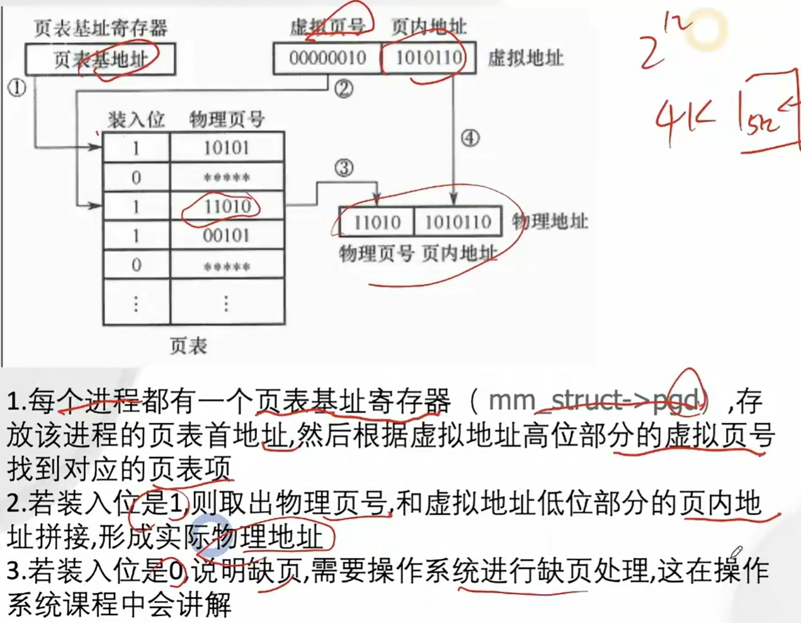
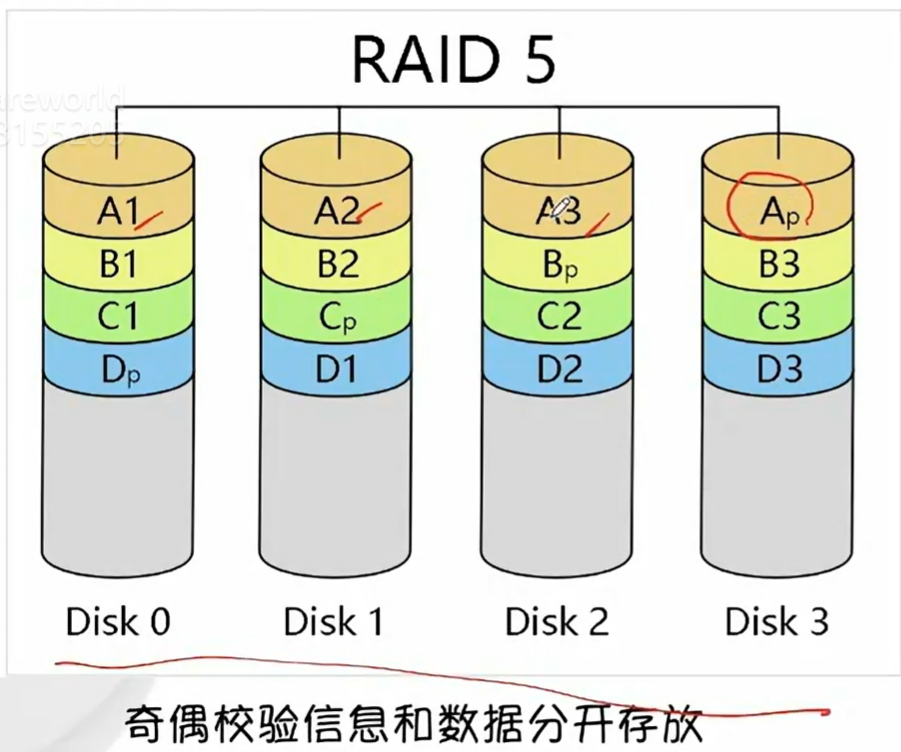

# 计算机组成原理：手动编写CPU
## 计算机系统概述

### 计算机发展史


- **第零代：继电器机械计算机（~1945**）
- **第一代：电子管计算机（1945~1955）**
- **第二代：晶体管计算机（1955~1965）**
- **第三代：集成电路计算机（1965~1980）**
- **第四代：微型计算机（1980~至今）**


#### **布尔代数和数字电路**

计算机的基础是数字电路，数字电路的基础是布尔代数

- 1847年英国数学家**乔治布尔**发明布尔代数


**布尔代数与数字电路之间的关系**


假设：开关断开为0，反之为1，灯灭为0，反之为1

- 图1相当于AND运算的逻辑
- 图2相当于OR运算的逻辑


<span style="color:red;font-weight:700">问题：上述的电路只能完成简单的逻辑运算，其他复杂逻辑运算无法实现。比如：要求两个开关断开，灯亮，即 ( 0，0 ) -> 1。因此需要结合继电器来实现</span>


#### 继电器（relay）

- In：输入小电流，Out：输出大电流，起到中继的作用


继电器的原理：当电流从IN输入，电磁铁通电，会将上面的弹片下压，从而将上面的电路打通

图三中（数字电路会将高电压用1表示，低电压用0表示）

- 当两个开关闭合，则灯是灭的
- 当两个开关都断开或只断开一个，则灯是两的

上述图三符合**NAND**的运算逻辑，即与非门


<span style="color:red;font-weight:700">从继电器发明之后，没有人将电路与逻辑运算联系起来，直到20世纪30年代</span>


#### 继电器与开关电路的符号分析

- 1938年英国科学家**克劳德.香浓**发表论文《A Symbolic Analysis of Relay and Switching Circuits》将布尔代数应用到电路中，奠定了数字电路的理论基础
- 1949年9月香浓信息论《The Mathematical Theory of Communication通讯的数字原理》提出“位”这个单词来表示二进制数字
- 继电器的组合称为逻辑门，他们构造基本的逻辑电路，也叫**门电路**


<span style="color:red;font-weight:700">门电路只是数字电路的最基本部件，如何使用门电路来设计一个计算机，或者计算机应该由哪些部件构成以怎样的方式来运行呢</span>


#### 图灵机

- 1936年，英国数学家**艾伦图灵**提出了一种抽象的计算机模型，被称为图灵机
- 图灵机第1次提出程序的概念
- 图灵机提出了一种使用机器进行计算的简单方法


解析上述图灵机

上面是一个无限长的纸袋，下方有个红色的读写头，读写头上有一个状态码 `q1`，根据程序表来对纸袋进行计算处理

- 比如当前读写头指向1，状态是 `q1`，根据程序表得到 `1Rq1`，这里1表示将当前纸带上的数字变为1，如果是1则不变，R表示向右移动一位（L表示向左移动一位，H表示不动），`q1` 表示状态码变为 `q1`，如果之前就是 `q1`，则不变。
- 根据上述规则即可将程序执行起来。这就是图灵机


<span style="color:red;font-weight:700">图灵机为计算机的实现提供了一种重要的思想，肯定了计算机实现的可能，为计算机的实现提供了一种大致的架构</span>


#### 冯诺依曼体系结构

- 冯诺依曼于1946年提出冯诺依曼计算机体系结构
- 制造了第一台现代意义的通用计算机EDVAC
- 冯诺依曼计算机几大特点：
  - 五大组成部分（存储器，运算器，控制器，输入，输出设备）
  - 使用二进制计算（使用二进制可以大大的简化乘法和除法的运算）
  - 提粗存储程序的概念，自动取指令


<span style="color:red;font-weight:700">冯诺依曼对计算机的影响是巨大的，直到现在绝大多数的计算机，仍然采用的是冯诺依曼体系结构</span>


#### 继电器计算机

- 1944年 IBM制造出哈佛Mark1号大约有3500个继电器，1秒能做3次加法或减法运算，乘法要花6秒，除法要花15秒
- 1947年9月，哈佛Mark2号操作员，从故障继电器中，拔出一只死虫，从那时起，每当电脑出现了问题，我们就说它出了bug（虫子）
- 继电器1秒能翻转50次


<span style="color:red;font-weight:700">继电器属于机械设备，随着时间的使用，它会磨损，会变慢甚至损坏，而且机械运动很慢，继电器一秒只能开关50次，所以需要更快更可靠的部件来设计计算机</span>


#### 真空管

- 热电子发射（爱迪生效应）是指在真空条件下加热金属时，电子从材料表面溢出的现象
- 真空管属于电子设备，每秒可以开闭数千次


- 通过加热器控制开关
- 通过栅极可以控制电流的大小，后期广泛应用在广播，起到电流放大的作用
- 真空三极管
  - 当加热器加热，阴极的金属表面会溢出电子（即热电子发射），而阳极有一个正电电压，让阳极带正电荷，此时电子会向阳极移动，而电子的移动就会产生电流，此时阳极就会输出高电压
  - 栅极是一个金属网，它有一个电压可以让栅极带正电或者负电，如果带正电，电子就会移动，阳级就会输出高电压，如果是负电，则电子停止流动，阳极就会输出低电压，从而实现和继电器类似的开关功能
- 问题：寿命短


#### 真空管计算机

- 第一个大规模使用真空管的计算机是“巨人1号”，拥有1600个真空管，完工于1943
- 1946年在宾夕法尼亚大学完成制作了ENIAC，它是世界上第一台真正通用可编程计算机（采用10进制，其编程是利用电线插入插板完成），使用了18000多只电子管，重130多吨，占地面积170多平方米，每秒钟可作5000多次加法计算


<span style="color:red;font-weight:700">真空管本身非常脆弱，很容易坏，而且寿命短，因此后面被晶体管所取代</span>


#### 晶体管

- 1947年，贝尔实验室发明了晶体管，一个全新的计算机时代到来

- 导体（铜）导电及电流的原理
  
- 电流（正电的移动方向）和电子的移动方向相反
- 绝缘体（橡胶）：
  - 外部没有飘逸的电子，原子核束缚力强，很难形成电子外流
- 半导体（硅）
  - 纯硅，多个硅元素形成共价键，形成稳定结构，此时电子稳定，导电性很弱
  - N型参杂：载流子是多出的电子
    - 当硅中参杂了磷元素，外部就会多出一个电子（磷外部游离5个电子）
    
  - P型参杂：载流子是多出的空穴
    - 当硅中参杂硼元素（外部游离3个电子）
    
  - 一半N型参杂，一半P型参杂，由于N型参杂多出一个电子，P型参杂多出一个空穴，因此电子从N型往P型移动，此时，N区少电子带正电，P区多电子带负电，于是就会形成电场，在电场的作用下，电子会从p型往N型跑（即电子向正电方向移动），此时就会在中间形成平衡，形成一个耗尽层
  
  - 当这种平衡受到外界影响，比如外部通电后，外部的电流导向不同，会出现两种结果:
  - p -> N 导通
  - N -> P 无法导通
  - 形成二极管的单向导通性
  - 上述方向指的是电流方向，与电子移动方向相反9
  - 

- MOSFET的结果与工作原理
  - NMOS：
    - 当电压高于阈值电压，可以导通
    - 当电压低于阈值，不能导通
  - NMOS原理：
    - 当大片的P区中，参杂两个N区时
    - 两个N区之间通电，是无法导通的
    - 但是当栅极和p区之间通电（只需一个极小的电压），电子往上跑，中间就会形成一个电场
    
    - 此时两个N区之间就会形成导通层
    
    - 因此在栅极只需一个极小的电压，就可以让两个N区之间形成通路（N沟道）
    
    - 此时栅极就是一个开关，根据电压的阈值可以控制NMOS的导通与否
  - PMOS
    - 原理和作用与NMOS相反
    
    
    - 注意：
      - NMOS中栅极接正电，PMOS中栅极带负电
      - 上面的箭头指的是传统电流方向，即永远是N指向P，因为在NP结中，电流只能从N流向P，从P到N，反过来无法通电，即二极管的单向导电性

  下图分析

  

  上图是NMOS，首先漏极侧到源极这条线，形成NP结，这个时候如果给漏极负电，源极正电则直接通电就，但此时G，也就是栅极毫无意义，没有任何控制作用

  当漏极是正电，而源极是负电时，此时无法通电，当给栅极G一个正电，形成N沟道，此时从漏极D到源极S就通电了，又因为漏极D是正电，因此电子方向是流向D，而电流方向与电子相反，从D流向S。

  

  上图是PMOS，首先漏极侧到源极这条线，形成NP结，这个时候如果给漏极正电，直接通电，栅极毫无意义，无法起到控制作用

  所以一定是漏极是负电，源极S是正电，此时无法通电，当给栅极G一个负电时，此时形成P沟道，漏极D到源极S通电，因为源极S是正电，所以电子从D流向S，也因此电流方向是从S流向D

  - 将PMOS和NMOS接在一起，就会形成一个CMOS电路
    

  上图CMOS分析：

  首先如果要看懂上图，要先记得箭头远离G区是PMOS，箭头接近G区是NMOS，根据这个符号规定可以看出

  上图中上面的MOS管是PMOS，下面的是NMOS

  这里如果给H一个高电平，即+5v，相当于给正电，则PMOS不通，NMOS通，此时上面不通电，下面通电直接接地，此时输出低电平

  ```ABAP
  这里给高电平，意味着+5v，给一个电压，而电子是从低电压流向高电压，因此相当于抽离电子，也就是给一个正电
  ```

  如果给H一个低电平，相当于给一个负电，则PMOS通，NMOS不同，则上面通电，下面不通电，则输出高电平

  ```ABAP
  这里给低电平，意味着0v，相当于处于低电压，而电子是从低电压流向高电压，也就是外面的电压低，则电子向MOS管移动，相当于给一个负电
  ```

  **而上述的CMOS，其实就是门电路中的非门**

  - MOSFET特性

    - 电压控制
    - 高输入阻抗

    ```ABAP
    这里低功耗和高阻抗是因为栅极上有绝缘层，而低功耗意味着耗电少，散热少
    ```

    - 响应速度快
    - 能耗低
    - 有N型和P型，工作方式相反，组合起来工作
    - 工作可靠稳定


#### 晶体管详解

##### 晶体管是大家族的统称

“晶体管”（**Transistor**）是指**利用半导体材料控制电流的开关器件**。它们的主要作用有两类：

- **放大作用**（小电流控制大电流）
- **开关作用**（控制导通与截止）


##### 晶体管有两大类：

| 类型    | 名称                                        | 特点                                 |
| ------- | ------------------------------------------- | ------------------------------------ |
| **BJT** | 双极型晶体管（Bipolar Junction Transistor） | 电流控制型，放大能力强               |
| **FET** | 场效应晶体管（Field Effect Transistor）     | 电压控制型，输入阻抗高，适合数字电路 |


##### MOS管就是一种 FET

MOS 全称是：**Metal–Oxide–Semiconductor Field-Effect Transistor**

中文叫：**金属–氧化物–半导体场效应管**

> 所以 MOS 是 FET（场效应晶体管）的一种
>  而 FET 又是晶体管的一个子类
>  ✅ 所以 MOS 是晶体管的子孙


##### 总体结构关系图：

```markdown
晶体管 (Transistor)
├── 双极型晶体管 BJT（电流控制）
│   ├── NPN型
│   └── PNP型
└── 场效应晶体管 FET（电压控制）
    ├── JFET（结型场效应管）
    └── MOSFET（MOS管） ✅
        ├── NMOS
        └── PMOS
```


##### MOSFET 的优势（为什么常用）

MOS管（尤其是CMOS）现在广泛用于数字电路，如计算机、手机芯片，因为它：

- 输入阻抗高（几乎无功耗）
- 驱动速度快
- 工艺成熟（适合大规模集成）
- 面积小、电流控制更精准


#### 晶体管计算机

- 1955年发布的IBM 608 — 第一台完全使用晶体管的商用计算机。它包含3000个晶体管，每秒可以执行4500次加法，或者大约80次乘法或除法
- 今天，计算机使用尺寸小于50纳米的晶体管，作为参考，一张纸大约100000纳米厚，它们不仅非常小，而且速度非常快，每秒可以切换数百万次状态，并且可以运行数十年


#### 集成电路

- 1958年，美国德州仪器的工程师Jack Kilby发明了集成电路（IC）
- 集成电路（integrated circuit）是一种微型电子器件或部件。采用一定的工艺，把一个电路中所需的晶体管，电阻，电容和电感等独立元件及布线互连在一起，制作在一块芯片上；其中所有元件在结构上已组成了一个整体，变成一个新的独立组件，使电子元件向着微小型化，低功耗，智能化和高可靠性方面迈进了一大步
- 集成电路具有体积小，重量轻，引出线和焊接点少，寿命长，可靠性高，性能好等优点，同时成本低，便于大规模生产。


#### 微型计算机

- 微处理器是由一片或少数几片大规模集成电路组成的中央处理器CPU。这些电路执行控制部件和计算逻辑部件的功能
- Intel于1971年发布第一款微处理器Intel 4004，片内集成了2250个晶体管
- 微型计算机（Microcomputer,MC）是由微处理器加上同样采用大规模集成电路制成的程序存储器（ROM、EPROM、Flash ROM）和数据存储器（RAM），以及外围设备相连接的输入/输出（I/O）接口电路等构成


#### 摩尔定律

- 摩尔定律：集成电路上可以容纳的晶体管数目在大约每经过18个月到24个月便会增加一倍。换言之，处理器的性能大约每两年翻一倍，同时价格下降为之前的一半
- 摩尔定律有英特尔创始人之一**戈登摩尔**提出，它一定程度上揭示了信息技术进步的速度


#### 现代计算机结构


上述是早期现代计算机结构，它有一个CPU，CPU连接一个北桥芯片，在北桥芯片里面有主存跟显卡控制器，用来访问主存和显示器，北桥芯片再连接一个南桥芯片，在南桥芯片里面有各种IO设备的控制器，有磁盘，USB设备，因为不同的设备，它的构造是不一样的，有的是机械设备，有的是磁性设备，而cpu是电子设备，所以CPU是不能和这些设备进行通信的，每个设备都要有一个对应的控制器，CPU通过控制器跟这些设备进行通信


采用这种南北桥的架构，CPU在访问主存的时候，首先要经过北桥，然后在访问磁盘的时候，要下先经过北桥，再到南桥。这样性能就会低一些


#### 现代计算机结构2


后面计算机结构做了改进，它把对性能要求高的主存控制器跟显卡控制器还有CPU都集成在同一个芯片里面，这样访问主存跟显示器就会更快一些，然后其他控制器就集成在另一块芯片中


#### SOC

- 片上系统芯片（System-on-a-Chip,SOC）
- 将cpu，主存，控制器集成在一个芯片内
- 广泛应用于手机，平板等移动设备


## 门电路的实现 (Verilog)

### 常用门电路符号


### 等价电路


### Verilog

- 硬件描述语言HDL是以文本形式来描述数字系统硬件的结构和行为的语言，用它可以表示逻辑电路图
  - 硬件描述语言（HDL）用来设计硬件电路，HDL语句的顺序无关紧要
  - Verilog HDL 和 VHDL 是世界上最流行的两种硬件描述语言
- 使用Verilog编写完代码后，可以使用仿真工具模拟电路的运行情况，验证电路的正确性
  - 常用的仿真工具有ModelSim，ISE Simulator，iverilog

**示例**

```verilog
module test(input a,b,c,output sum,carry);
    wire s1,c1,c2;
    Xor g1(a,b,s1);
    Nand g3(a,b,c1);
    And g4(s1,c,c2);
    Or g5(c2,c1,carry);
endmodule
```


### FPGA

- 仿真完成后使用综合器将Verilog代码转化为实际电路表示，也称为网表，烧写到FPGA开发板中验证
- 现场可编程门阵列（Field-Programmable Gate Array）
- 查找表（Look-up-Table）简写为LUT，LUT本质上就是一个RAM，多个LUT和寄存器的组合，也被叫做CLB（Configurable Logic Block，可配置逻辑块）
  - 通过Verilog转换成的网表，就是下载到LUT中，去配置LUT里面的内容，这样我们就可以在不改变硬件焊接逻辑的情况下，去实现不同的逻辑

- 多个CLB组合构成FPGA


### 与非门Verilog HDL表示


```verilog
// nand.v
module Nand(input a, b, output out);    // 定义一个与非门的模块
    nmos n1(o1, 0, b);                 // n1即为图中BG4,BG4是一个nmos管，这个gate（栅极）输入是b，源级接地，所以输入为0，输出是o1
                                       // 括号里的顺序是漏极，源极，栅极
    nmos n2(out, o1, a);
    
    pmos p1(out, 1, a);                // pmos的源极接电源，nmos源极接地，括号里顺序是一样的
    pmos p2(out, 1, b);
endmodule
```


对于每个模块，都要定义一个对应的测试模块

```verilog
// nand_tb.v
`include "nand.v"                // 在测试模块中，首先include被测试模块
module nand_tb;
    reg a, b;                   // 定义输入信号a, b
    wire out;                   // wire表示连线或逻辑组合，代表自动随驱动变化而变化的信号
    Nand obj(a, b, out);        // 调用被测试模块
    
    initial begin
        a=0;
        b=0;
        #10 b=1;                // # 10表示延迟10个时间单位，把b设为1，时间单位长度取决于timescale指令，如未设定，通常仿真默认单位1ns
        #10 a=1;                // # 再过10个时间段，把a设为1,b设为0
          b=0;
        #10 a=1                 // # 再过10个时间段，把a设为1，b设为1
          b=1;
    end
    
    initial begin
        $monitor("a=%d b=%d out=%d\n", a, b, out);
    end
endmodule
```


仿真编译，执行

```bash
[root@devops-custom]# iverilog nand_tb.v 
[root@devops-custom]# ls
a.out  nand_tb.v  nand.v
[root@devops-custom]# ./a.out 
a=0 b=0 out=1

a=0 b=1 out=1

a=1 b=0 out=1

a=1 b=1 out=0
```


**补充：timescale用法**

```verilog
// timescale <time_unit> / <time_percision>
// time_unit (时间单位)
// time_percision (时间精度)

// 示例
`timescale 1ns / 1ps  // 表示时间单位是1ns，精确到1ps
                      // verilog中，单反引号是预处理指令的固定格式

// 单位转换
1s = 1000ms
1ms = 1000us
1us = 1000ns
1ns = 1000ps
```


### 门电路Verilog表示


#### 与门实现

使用两个与非门，得到**与门**

```verilog
module And(input a, b, output out);
    Nand g1(a, b, AnandB);
    Nand g2(AnandB, AnandB, outp);
endmodule
```

```verilog
// 测试模块
[root@devops-custom]$ cat and_tb.v 
`include "nand.v"           
`include "and.v"           
module and_tb;
    reg a, b;                   // 定义输入值a, b
    wire out;
    And obj(a, b, out);        // 调用被测试模块
    
    initial begin
        a=0;
        b=0;
        #10 b=1;                // # 10表示延迟10个时间单位，把b设为1，时间单位长度取决于timescale指令，如未设定，通常仿真默认单位1ns
        #10 a=1;                // # 再过10个时间段，把a设为1,b设为0
          b=0;
        #10 a=1;                 // # 再过10个时间段，把a设为1，b设为1
          b=1;
    end
    
    initial begin
        $monitor("a=%d b=%d out=%d\n", a, b, out);
    end
endmodule
```

```bash
[root@devops-custom]# iverilog and_tb.v
[root@devops-custom]# ./a.out 
a=0 b=0 out=0

a=0 b=1 out=0

a=1 b=0 out=0

a=1 b=1 out=1
```


#### 非门实现

```verilog
// not.v
module Not(input a, output out);
    pmos(out,1,a);
    nmos(out,0,a);
endmodule
```

```verilog
// 测试模块，not_tb.v
`include "not.v" 
module not_tb;
    reg a;
    wire out;
    Not obj(a, out);
    
    initial begin
        a=0;
        #10 a=1;
    end
    
    initial begin
        $monitor("a=%d out=%d\n", a, out);
    end
endmodul
```


#### 或门实现

```verilog
// or.v
[root@devops-custom ~/verilog]# cat or.v 
module Or(input a, b, output out);
    Not g1(a, NotA);
    Not g2(b, NotB);
    Nand g3(NotA, NotB, out);
endmodule
[root@devops-cu
```

```verilog
// 测试模块
// or_tb.v
`include "nand.v"                // 在测试模块中，首先include被测试模块
`include "not.v"                // 在测试模块中，首先include被测试模块
`include "or.v"                // 在测试模块中，首先include被测试模块
module or_tb;
    reg a, b;                   // 定义输入值a, b
    wire out;
    Or obj(a, b, out);        // 调用被测试模块
    
    initial begin
        a=0;
        b=0;
        #10 b=1;                // # 10表示延迟10个时间单位，把b设为1，时间单位长度取决于timescale指令，如未设定，通常仿真默认单位1ns
        #10 a=1;                // # 再过10个时间段，把a设为1,b设为0
          b=0;
        #10 a=1;                 // # 再过10个时间段，把a设为1，b设为1
          b=1;
    end
    
    initial begin
        $monitor("a=%d b=%d out=%d\n", a, b, out);
    end
endmodule
```

```bash
[root@devops-custom ~/verilog]# iverilog or_tb.v 
[root@devops-custom ~/verilog]# ./a.out 
a=0 b=0 out=0

a=0 b=1 out=1

a=1 b=0 out=1

a=1 b=1 out=1
```


#### 异或门实现

```verilog
// xor.v
module Xor(input a, b, output out);
    Or g1(a, b, AOrB);
    Nand g2(a, b, ANandB);
    And g3(AOrB, ANandB, out);
endmodule
```

```verilog
// xor_tb.v
`include "nand.v"                // 在测试模块中，首先include被测试模块
`include "and.v"                // 在测试模块中，首先include被测试模块
`include "not.v"                // 在测试模块中，首先include被测试模块
`include "or.v"                // 在测试模块中，首先include被测试模块
module xor_tb;
    reg a, b;                   // 定义输入值a, b
    wire out;
    Xor obj(a, b, out);        // 调用被测试模块
    
    initial begin
        a=0;
        b=0;
        #10 b=1;                // # 10表示延迟10个时间单位，把b设为1，时间单位长度取决于timescale指令，如未设定，通常仿真默认单位1ns
        #10 a=1;                // # 再过10个时间段，把a设为1,b设为0
          b=0;
        #10 a=1;                 // # 再过10个时间段，把a设为1，b设为1
          b=1;
    end
    
    initial begin
        $monitor("a=%d b=%d out=%d\n", a, b, out);
    end
endmodule
```

```bash
[root@devops-custom ~/verilog]# iverilog xor_tb.v 
[root@devops-custom ~/verilog]# ./a.out 
a=0 b=0 out=0

a=0 b=1 out=1

a=1 b=0 out=1

a=1 b=1 out=0
```


## 加法器实现

### 数字电路类型

- **组合逻辑电路**
  - 没有存储功能，其输出仅依赖于当前输入
  - 如：运算器（加减乘除法器），ALU
- **时序逻辑电路**
  - 具有存储功能，电路可以存储或记住信息，其输出不仅依赖于当前输入，还依赖于存储单元的当前状态
  - 如：寄存器，存储器


### 半加器

半加器就是没有考虑进位的加法器


```verilog
// halfadder.v
module HalfAddr(input a, b, output sum, carry);
    And g1(a, b, carry);
    Xor g2(a, b, sum);
endmodule
```

```verilog
// halfadder_tb.v
`include "and.v"                // 在测试模块中，首先include被测试模块
`include "nand.v"                // 在测试模块中，首先include被测试模块
`include "or.v"                // 在测试模块中，首先include被测试模块
`include "not.v"                // 在测试模块中，首先include被测试模块
`include "xor.v"                // 在测试模块中，首先include被测试模块
`include "halfaddr.v"                // 在测试模块中，首先include被测试模块
module halfaddr_tb;
    reg a, b;                   // 定义输入值a, b
    wire carry, sum;
    HalfAddr obj(a, b, sum, carry);        // 调用被测试模块
    
    initial begin
        a=0;
        b=0;
        #10 b=1;                // # 10表示延迟10个时间单位，把b设为1，时间单位长度取决于timescale指令，如未设定，通常仿真默认单位1ns
        #10 a=1;                // # 再过10个时间段，把a设为1,b设为0
          b=0;
        #10 a=1;                 // # 再过10个时间段，把a设为1，b设为1
          b=1;
    end
    
    initial begin
        $monitor("a=%d b=%d sum=%d carry=%d\n", a, b, sum, carry);
    end
endmodule
```

```bash
[root@devops-custom ~/verilog]# iverilog halfadder_tb.v 
[root@devops-custom ~/verilog]# ./a.out 
a=0 b=0 sum=0 carry=0

a=0 b=1 sum=1 carry=0

a=1 b=0 sum=1 carry=0

a=1 b=1 sum=0 carry=1
```


### 全加器


```verilog
// fulladder.v
module FullAdder(input a, b, c, output sum, carry);
    Xor g1(a, b, AxorB);
    Xor g2(c, AxorB, sum);
    And g3(a, b, AandB);
    And g4(AxorB, c, AxorBandC);
    Or g5(AandB, AxorBandC, carry);
endmodule
```

```verilog
// fulladder_tb.v
`include "and.v"                // 在测试模块中，首先include被测试模块
`include "nand.v"                // 在测试模块中，首先include被测试模块
`include "or.v"                // 在测试模块中，首先include被测试模块
`include "not.v"                // 在测试模块中，首先include被测试模块
`include "xor.v"                // 在测试模块中，首先include被测试模块
`include "fulladder.v"                // 在测试模块中，首先include被测试模块
module fulladder_tb;
    reg a, b, c;                   // 定义输入值a, b
    wire carry, sum;
    FullAdder obj(a, b, c, sum, carry);        // 调用被测试模块
    
    initial begin
        a=0;
        b=0;
        c=0;
        #10 c=1;                // # 10表示延迟10个时间单位，把b设为1，时间单位长度取决于timescale指令，如未设定，通常
仿真默认单位1ns
        #10 b=1;
            c=0;
        #10 b=1;                // # 再过10个时间段，把a设为1,b设为0
            c=1;
        #10 a=1;                 // # 再过10个时间段，把a设为1，b设为1
            b=0;
            c=0;
        #10 a=1;                 // # 再过10个时间段，把a设为1，b设为1
            b=0;
            c=1;
        #10 a=1;                 // # 再过10个时间段，把a设为1，b设为1
            b=1;
            c=0;
        #10 a=1;
            b=1;
            c=1;

    end
    
    initial begin
        $monitor("a=%d b=%d c=%d sum=%d carry=%d\n", a, b, c, sum, carry);
    end
endmodule
```

```bash
[root@devops-custom ~/verilog]# iverilog fulladder_tb.v 
[root@devops-custom ~/verilog]# ./a.out 
a=0 b=0 c=0 sum=0 carry=0

a=0 b=0 c=1 sum=1 carry=0

a=0 b=1 c=0 sum=1 carry=0

a=0 b=1 c=1 sum=0 carry=1

a=1 b=0 c=0 sum=1 carry=0

a=1 b=0 c=1 sum=0 carry=1

a=1 b=1 c=0 sum=0 carry=1

a=1 b=1 c=1 sum=1 carry=1
```

**优化后**

```verilog
// fulladder_2.v
module FullAdder(input a, b, c, output sum, carry);
    wire s1, c1, c2;       //使用wire接收中间值
    Xor g1(a, b, s1);
    Xor g2(c, s1, sum);
    And g3(a, b, c1);
    And g4(s1, c, c2);
    Or g5(c1, c2, carry);
endmodule
```

```verilog
// fulladder_2_tb.v
`include "and.v"                // 在测试模块中，首先include被测试模块
`include "nand.v"                // 在测试模块中，首先include被测试模块
`include "or.v"                // 在测试模块中，首先include被测试模块
`include "not.v"                // 在测试模块中，首先include被测试模块
`include "xor.v"                // 在测试模块中，首先include被测试模块
`include "fulladder_2.v"                // 在测试模块中，首先include被测试模块
module fulladder_2_tb;
    reg a, b, c;                   // 定义输入值a, b
    wire carry, sum;
    FullAdder obj(a, b, c, sum, carry);        // 调用被测试模块
    
    initial begin
        a=0;
        b=0;
        c=0;
        #10 c=1;                // # 10表示延迟10个时间单位，把b设为1，时间单位长度取决于timescale指令，如未设定，通常仿真默认单位1ns
        #10 b=1;
            c=0;
        #10 b=1;                // # 再过10个时间段，把a设为1,b设为0
            c=1;
        #10 a=1;                 // # 再过10个时间段，把a设为1，b设为1
            b=0;
            c=0;
        #10 a=1;                 // # 再过10个时间段，把a设为1，b设为1
            b=0;
            c=1;
        #10 a=1;                 // # 再过10个时间段，把a设为1，b设为1
            b=1;
            c=0;
        #10 a=1;
            b=1;
            c=1;

    end
    
    initial begin
        $monitor("a=%d b=%d c=%d sum=%d carry=%d\n", a, b, c, sum, carry);
    end
endmodule
```

```bash
[root@devops-custom ~/verilog]# iverilog fulladder_2_tb.v 
[root@devops-custom ~/verilog]# ./a.out 
a=0 b=0 c=0 sum=0 carry=0

a=0 b=0 c=1 sum=1 carry=0

a=0 b=1 c=0 sum=1 carry=0

a=0 b=1 c=1 sum=0 carry=1

a=1 b=0 c=0 sum=1 carry=0

a=1 b=0 c=1 sum=0 carry=1

a=1 b=1 c=0 sum=0 carry=1

a=1 b=1 c=1 sum=1 carry=1
```


### 十六位全加器

```verilog
// add16.v
module Add16(input[15:0] a, b, output[15:0] out);
    wire[15:0] c;
    // 1'b0 : <位宽>'<基数><值>，其中b表示二进制，h表示十六进制,d表示十进制,o表示八进制
    FullAdder g01(a[0],b[0],1'b0, out[0], c[0]);   
    FullAdder g02(a[1],b[1],c[0], out[1], c[1]);
    FullAdder g03(a[2],b[2],c[1], out[2], c[2]);
    FullAdder g04(a[3],b[3],c[2], out[3], c[3]);
    FullAdder g05(a[4],b[4],c[3], out[4], c[4]);
    FullAdder g06(a[5],b[5],c[4], out[5], c[5]);
    FullAdder g07(a[6],b[6],c[5], out[6], c[6]);
    FullAdder g08(a[7],b[7],c[6], out[7], c[7]);
    FullAdder g09(a[8],b[8],c[7], out[8], c[8]);
    FullAdder g10(a[9],b[9],c[8], out[9], c[9]);
    FullAdder g11(a[10],b[10],c[9], out[10], c[10]);
    FullAdder g12(a[11],b[11],c[10], out[11], c[11]);
    FullAdder g13(a[12],b[12],c[11], out[12], c[12]);
    FullAdder g14(a[13],b[13],c[12], out[13], c[13]);
    FullAdder g15(a[14],b[14],c[13], out[14], c[14]);
    FullAdder g16(a[15],b[15],c[14], out[15], c[15]);
endmodule
```

```verilog
// add16_tb.v
`include "and.v"                // 在测试模块中，首先include被测试模块
`include "nand.v"                // 在测试模块中，首先include被测试模块
`include "or.v"                // 在测试模块中，首先include被测试模块
`include "not.v"                // 在测试模块中，首先include被测试模块
`include "xor.v"                // 在测试模块中，首先include被测试模块
`include "fulladder_2.v"                // 在测试模块中，首先include被测试模块
`include "add16.v"                // 在测试模块中，首先include被测试模块
module add16_tb;
    reg  [15:0] a, b;                   // 定义输入值a, b
    wire [15:0] out;
    Add16 obj(a, b, out);        // 调用被测试模块
    
    initial begin
        a=16'h0001;
        b=16'h1080;
    end
    
    initial begin
        $monitor("%x + %x = %x, %d + %d = %d\n", a, b, out, a, b, out);
    end
endmodule
```

```bash
[root@devops-custom ~/verilog]# ./a.out 
0001 + 1080 = 1081,     1 +  4224 =  4225
```


### 减法

负数的补码由它的正数按位取反加1，cpu不区分有符号数和无符号数

整体设计没有变化，有无符号数是编程语言决定的，在Verilog中，通过`signed`

```verilog
// add16.v不变
// add16_tb.v
`include "and.v"                // 在测试模块中，首先include被测试模块
`include "nand.v"                // 在测试模块中，首先include被测试模块
`include "or.v"                // 在测试模块中，首先include被测试模块
`include "not.v"                // 在测试模块中，首先include被测试模块
`include "xor.v"                // 在测试模块中，首先include被测试模块
`include "fulladder_2.v"                // 在测试模块中，首先include被测试模块
`include "add16.v"                // 在测试模块中，首先include被测试模块
module add16_tb;
    reg signed [15:0] a, b;                   // 定义输入值a, b
    wire signed [15:0] out;
    Add16 obj(a, b, out);        // 调用被测试模块
    
    initial begin
        a=16'h0001;
        b=16'h1080;
        #10 a=16'h8001;
            b=16'h4001;
        #10 a=16'ha211;
            b=16'h0730;
    end
    
    initial begin
        $monitor("%x + %x = %x, %d + %d = %d\n", a, b, out, a, b, out);
    end
endmodule
```

```bash
[root@devops-custom ~/verilog]# iverilog add16_tb.v 
[root@devops-custom ~/verilog]# ./a.out 
0001 + 1080 = 1081,      1 +   4224 =   4225

8001 + 4001 = c002, -32767 +  16385 = -16382

a211 + 0730 = a941, -24047 +   1840 = -22207
```


### 带溢出判断的加减法器

- 两个正数相加结果为负称为正溢，两个负数相加结果为正称为负溢
  - `010010 + 010101 = 100111(正溢)`， `101110 + 101011 = 011001(负溢)`
- 检测方法：当最高有效位相加产生进位，而符号位相加无进位时，产生正溢，当最高有效位相加无进位而符号位相加有进位时产生负溢
  - 最高位就是符号位，倒数第二位就是最高有效位

```verilog
// add16.v
module Add16(input[15:0] a, b, output[15:0] out, output overflow);  // 将数据和标记位分离，接口清晰，便于数据格式化
    wire[15:0] c;
    FullAdder g01(a[0],b[0],1'b0, out[0], c[0]);
    FullAdder g02(a[1],b[1],c[0], out[1], c[1]);
    FullAdder g03(a[2],b[2],c[1], out[2], c[2]);
    FullAdder g04(a[3],b[3],c[2], out[3], c[3]);
    FullAdder g05(a[4],b[4],c[3], out[4], c[4]);
    FullAdder g06(a[5],b[5],c[4], out[5], c[5]);
    FullAdder g07(a[6],b[6],c[5], out[6], c[6]);
    FullAdder g08(a[7],b[7],c[6], out[7], c[7]);
    FullAdder g09(a[8],b[8],c[7], out[8], c[8]);
    FullAdder g10(a[9],b[9],c[8], out[9], c[9]);
    FullAdder g11(a[10],b[10],c[9], out[10], c[10]);
    FullAdder g12(a[11],b[11],c[10], out[11], c[11]);
    FullAdder g13(a[12],b[12],c[11], out[12], c[12]);
    FullAdder g14(a[13],b[13],c[12], out[13], c[13]);
    FullAdder g15(a[14],b[14],c[13], out[14], c[14]);
    FullAdder g16(a[15],b[15],c[14], out[15], c[15]);
    Xor g17(c[14], c[15], overflow);
    // assign overflow = c[14] ^ c[15]; 独立标志位
endmodule
```

```verilog
// add16_tb.v
`include "and.v"                // 在测试模块中，首先include被测试模块
`include "nand.v"                // 在测试模块中，首先include被测试模块
`include "or.v"                // 在测试模块中，首先include被测试模块
`include "not.v"                // 在测试模块中，首先include被测试模块
`include "xor.v"                // 在测试模块中，首先include被测试模块
`include "fulladder_2.v"                // 在测试模块中，首先include被测试模块
`include "add16.v"                // 在测试模块中，首先include被测试模块
module add16_tb;
    reg signed [15:0] a, b;                   // 定义输入值a, b
    wire signed [15:0] out;
    wire overflow;
    Add16 obj(a, b, out, overflow);        // 调用被测试模块
    
    initial begin
        a=16'h0001;
        b=16'h1080;
        #10 a=16'h8001;
            b=16'h4001;
        #10 a=16'ha211;
            b=16'h0730;
    end
    
    initial begin
        $monitor("%d + %d = %d, overflow=%d", a, b, out, overflow);
    end
endmodule
```

```bash
[root@devops-custom ~/verilog]# iverilog add16_tb.v 
[root@devops-custom ~/verilog]# ./a.out 
     1 +   4224 =   4225, overflow=0
-32767 +  16385 = -16382, overflow=0
-24047 +   1840 = -22207, overflow=0
```


### 在输入端添加M控制位实现

```verilog
// add16.v
[root@devops-custom ~/verilog]# cat add16.v 
module Add16(input[15:0] a, b, input m, output[15:0] out, output overflow);
    wire[15:0] c;
    wire[15:0] tmpd;
    assign tmpd = b ^ {16{m}};
    FullAdder g01(a[0],tmpd[0],m, out[0], c[0]);
    FullAdder g02(a[1],tmpd[1],c[0], out[1], c[1]);
    FullAdder g03(a[2],tmpd[2],c[1], out[2], c[2]);
    FullAdder g04(a[3],tmpd[3],c[2], out[3], c[3]);
    FullAdder g05(a[4],tmpd[4],c[3], out[4], c[4]);
    FullAdder g06(a[5],tmpd[5],c[4], out[5], c[5]);
    FullAdder g07(a[6],tmpd[6],c[5], out[6], c[6]);
    FullAdder g08(a[7],tmpd[7],c[6], out[7], c[7]);
    FullAdder g09(a[8],tmpd[8],c[7], out[8], c[8]);
    FullAdder g10(a[9],tmpd[9],c[8], out[9], c[9]);
    FullAdder g11(a[10],tmpd[10],c[9], out[10], c[10]);
    FullAdder g12(a[11],tmpd[11],c[10], out[11], c[11]);
    FullAdder g13(a[12],tmpd[12],c[11], out[12], c[12]);
    FullAdder g14(a[13],tmpd[13],c[12], out[13], c[13]);
    FullAdder g15(a[14],tmpd[14],c[13], out[14], c[14]);
    FullAdder g16(a[15],tmpd[15],c[14], out[15], c[15]);
    Xor g17(c[14], c[15], overflow);
    // assign overflow = c[14] ^ c[15]; 独立标志位
endmodule
```

```verilog
// add16_tb.v
`include "and.v"                // 在测试模块中，首先include被测试模块
`include "nand.v"                // 在测试模块中，首先include被测试模块
`include "or.v"                // 在测试模块中，首先include被测试模块
`include "not.v"                // 在测试模块中，首先include被测试模块
`include "xor.v"                // 在测试模块中，首先include被测试模块
`include "fulladder_2.v"                // 在测试模块中，首先include被测试模块
`include "add16.v"                // 在测试模块中，首先include被测试模块
module add16_tb;
    reg signed [15:0] a, b;                   // 定义输入值a, b
    reg m;
    wire signed [15:0] out;
    wire overflow;
    Add16 obj(a, b, m, out, overflow);        // 调用被测试模块
    
    initial begin
        m=0;
        a=16'h0001;
        b=16'h1080;
        #10 a=16'h8001;
            b=16'h4001;
        #10 a=16'ha211;
            b=16'h0730;
            m=1;
    end
    
    initial begin
        $monitor("%d + %d = %d, mark=%b, overflow=%b", a, b, out, m, overflow);
    end
endmodule
```

```bash
[root@devops-custom ~/verilog]# iverilog add16_tb.v 
[root@devops-custom ~/verilog]# ./a.out 
     1 +   4224 =   4225, mark=0, overflow=0
-32767 +  16385 = -16382, mark=0, overflow=0
-24047 +   1840 = -25887, mark=1, overflow=0
```


### 带标志的加法器

- **溢出标志OF**：Cn 和 Cn-1 异或
- **符号标志SF**：SF=Fn-1
- **零标志ZF**=1当且仅当F=0
- **进位标志CF**：CF=Cout


#### 先配置或非门

```verilog
// nor.v
module Nor(input a, b, output out);
    Or g1(a, b, AOrB);
    Not g2(AOrB, out);
endmodule
```

```verilog
// nor_tb.v
`include "nand.v"                // 在测试模块中，首先include被测试模块
`include "not.v"                // 在测试模块中，首先include被测试模块
`include "or.v"                // 在测试模块中，首先include被测试模块
`include "nor.v"                // 在测试模块中，首先include被测试模块
module nor_tb;
    reg a, b;                   // 定义输入值a, b
    wire out;
    Nor obj(a, b, out);        // 调用被测试模块
    
    initial begin
        a=0;
        b=0;
        #10 b=1;                // # 10表示延迟10个时间单位，把b设为1，时间单位长度取决于timescale指令，如未设定，通常仿真默认单位1ns
        #10 a=1;                // # 再过10个时间段，把a设为1,b设为0
          b=0;
        #10 a=1;                 // # 再过10个时间段，把a设为1，b设为1
          b=1;
    end
    
    initial begin
        $monitor("a=%d b=%d out=%d\n", a, b, out);
    end
endmodule
```

```bash
[root@devops-custom ~/verilog]# iverilog nor_tb.v 
[root@devops-custom ~/verilog]# ./a.out 
a=0 b=0 out=1

a=0 b=1 out=0

a=1 b=0 out=0

a=1 b=1 out=0
```


#### 实现带标志加法器

```verilog
// add16.v
module Add16(input[15:0] a, b, input m, output[15:0] out, output overflow, output sf, output zf, output cf);
    wire[15:0] c;
    wire[15:0] tmpd;
    assign tmpd = b ^ {16{m}};
    FullAdder g01(a[0],tmpd[0],m, out[0], c[0]);
    FullAdder g02(a[1],tmpd[1],c[0], out[1], c[1]);
    FullAdder g03(a[2],tmpd[2],c[1], out[2], c[2]);
    FullAdder g04(a[3],tmpd[3],c[2], out[3], c[3]);
    FullAdder g05(a[4],tmpd[4],c[3], out[4], c[4]);
    FullAdder g06(a[5],tmpd[5],c[4], out[5], c[5]);
    FullAdder g07(a[6],tmpd[6],c[5], out[6], c[6]);
    FullAdder g08(a[7],tmpd[7],c[6], out[7], c[7]);
    FullAdder g09(a[8],tmpd[8],c[7], out[8], c[8]);
    FullAdder g10(a[9],tmpd[9],c[8], out[9], c[9]);
    FullAdder g11(a[10],tmpd[10],c[9], out[10], c[10]);
    FullAdder g12(a[11],tmpd[11],c[10], out[11], c[11]);
    FullAdder g13(a[12],tmpd[12],c[11], out[12], c[12]);
    FullAdder g14(a[13],tmpd[13],c[12], out[13], c[13]);
    FullAdder g15(a[14],tmpd[14],c[13], out[14], c[14]);
    FullAdder g16(a[15],tmpd[15],c[14], out[15], c[15]);
    Xor g17(c[14], c[15], overflow);
    // assign overflow = c[14] ^ c[15]; 独立标志位
    assign sf = out[15];
    // 逐步归约
    Not n1(out[0], Not1);
    Not n2(out[1], Not2);
    Not n3(out[2], Not3);
    Not n4(out[3], Not4);
    Not n5(out[4], Not5);
    Not n6(out[5], Not6);
    Not n7(out[6], Not7);
    Not n8(out[7], Not8);
    Not n9(out[8], Not9);
    Not n10(out[9], Not10);
    Not n11(out[10], Not11);
    Not n12(out[11], Not12);
    Not n13(out[12], Not13);
    Not n14(out[13], Not14);
    Not n15(out[14], Not15);
    Not n16(out[15], Not16);
    And a1(Not1, Not2, And2);
    And a2(Not3, And2, And3);
    And a3(Not4, And3, And4);
    And a4(Not5, And4, And5);
    And a5(Not6, And5, And6);
    And a6(Not7, And6, And7);
    And a7(Not8, And7, And8);
    And a8(Not9, And8, And9);
    And a9(Not10, And9,And10);
    And a10(Not11, And10, And11);
    And a11(Not12, And11, And12);
    And a12(Not13, And12, And13);
    And a13(Not14, And13, And14);
    And a14(Not15, And14, And15);
    And a15(Not16, And15, zf);

    // 内置归约运算符
    // assign zf = ~(|out); // 与上面的逐步归约等价
    assign cf = c[15];
endmodule
```

```verilog
// add16_tb.v
`include "and.v"                // 在测试模块中，首先include被测试模块
`include "nor.v"                // 在测试模块中，首先include被测试模块
`include "nand.v"                // 在测试模块中，首先include被测试模块
`include "or.v"                // 在测试模块中，首先include被测试模块
`include "not.v"                // 在测试模块中，首先include被测试模块
`include "xor.v"                // 在测试模块中，首先include被测试模块
`include "fulladder_2.v"                // 在测试模块中，首先include被测试模块
`include "add16.v"                // 在测试模块中，首先include被测试模块
module add16_tb;
    reg signed [15:0] a, b;                   // 定义输入值a, b
    reg m;
    wire signed [15:0] out;
    wire overflow;
    wire sf, zf, cf;
    Add16 obj(a, b, m, out, overflow, sf, zf, cf);        // 调用被测试模块
    
    initial begin
        m=0;
        a=16'h0001;
        b=16'h1080;
        #10 a=16'h8001;
            b=16'h4001;
        #10 a=16'ha211;
            b=16'h0730;
            m=1;
    end
    
    initial begin
        $monitor("%d + %d = %d, mark=%b, overflow=%b, sf=%b, zf=%b, cf=%b", a, b, out, m, overflow, sf, zf, cf);
    end
endmodule
```

```bash
[root@devops-custom ~/verilog]# iverilog add16_tb.v 
[root@devops-custom ~/verilog]# ./a.out 
     1 +   4224 =   4225, mark=0, overflow=0, sf=0, zf=0, cf=0
-32767 +  16385 = -16382, mark=0, overflow=0, sf=1, zf=0, cf=0
-24047 +   1840 = -25887, mark=1, overflow=0, sf=1, zf=0, cf=1
```


## 乘除法器实现

早期的乘法器使用的是循环累加法


4位乘法的运算需要8位被乘数，4位乘数，8位加法器，和8位记录乘积，因为每次计算需要被乘数向左移动一位，乘数向右移动一位

上述循环累加的方式是串行的方式，4位乘法，需要4次操作才能完成计算


随着工业的发展，芯片里即使部件很多，它的体积和功耗也不会很大，因此，可以使用并行的方式，就相当于把前面的循环展开


### 阵列乘法器实现


```verilog
// multi.v
module Multi(input[3:0] a, b, output[7:0] out);
    wire[3:0] tmp1, tmp2, tmp3, tmp4;
    And g1(a[0], b[0], out[0]);
    And g2(a[1], b[0], tmp1[1]);
    And g3(a[2], b[0], tmp1[2]);
    And g4(a[3], b[0], tmp1[3]);

    And g5(a[0], b[1], tmp2[0]);
    And g6(a[1], b[1], tmp2[1]);
    And g7(a[2], b[1], tmp2[2]);
    And g8(a[3], b[1], tmp2[3]);

    And g9(a[0], b[2], tmp3[0]);
    And g10(a[1], b[2], tmp3[1]);
    And g11(a[2], b[2], tmp3[2]);
    And g12(a[3], b[2], tmp3[3]);

    And g13(a[0], b[3], tmp4[0]);
    And g14(a[1], b[3], tmp4[1]);
    And g15(a[2], b[3], tmp4[2]);
    And g16(a[3], b[3], tmp4[3]);

    FullAdder g17(tmp1[1], tmp2[0], 1'b0, out[1], c1);
    
    FullAdder g18(tmp1[2], tmp2[1], c1, s1, c2);
    FullAdder g19(tmp3[0], s1, 1'b0, out[2], c3);  // 这里的c2, c3是传给下一列

    FullAdder g20(tmp1[3], tmp2[2], c2, s2, c4); // 这里c4, c5, c6是传给下一列的
    FullAdder g21(tmp3[1], s2, c3, s3, c5);   
    FullAdder g22(tmp4[0], s3, 1'b0, out[3], c6);  

    FullAdder g23(tmp2[3], tmp3[2], c4, s4, c7);
    FullAdder g24(tmp4[1], s4, c5, s5, c8);
    FullAdder g25(s5, c6, 1'b0, out[4], c9);


    FullAdder g26(tmp3[3], tmp4[2], c7, s6, c10);
    FullAdder g27(s6, c8, 1'b0, s7, c11);
    FullAdder g28(s7, c9, 1'b0, out[5], c12);

    FullAdder g29(tmp4[3], c10, 1'b0, out[6], out[7]);
endmodule
```

```verilog
// multi_tb.v
`include "and.v"                // 在测试模块中，首先include被测试模块
`include "nor.v"                // 在测试模块中，首先include被测试模块
`include "nand.v"                // 在测试模块中，首先include被测试模块
`include "or.v"                // 在测试模块中，首先include被测试模块
`include "not.v"                // 在测试模块中，首先include被测试模块
`include "xor.v"                // 在测试模块中，首先include被测试模块
`include "fulladder_2.v"                // 在测试模块中，首先include被测试模块
`include "multi.v"                // 在测试模块中，首先include被测试模块
module multi_tb;
    reg [3:0] a, b;                   // 定义输入值a, b
    wire [7:0] out;
    Multi obj(a, b, out);        // 调用被测试模块
    
    initial begin
        a=4'h2;
        b=4'h3;
        #10 a=4'h5;
            b=4'h2;
    end
    
    initial begin
        $monitor("%d * %d = %d", a, b, out);
    end
endmodule
```

```bash
[root@devops-custom ~/verilog]# iverilog multi_tb.v 
[root@devops-custom ~/verilog]# ./a.out 
 2 *  3 =   6
 5 *  2 =  10
```


### 有符号数的乘法


#### 4位求补器实现

```verilog
// complementer.v
module Complementer(input[3:0] a, output[3:0] out);
    wire[3:0] tmp, c;
    Xor g1(a[0], a[3], tmp[0]);
    Xor g2(a[1], a[3], tmp[1]);
    Xor g3(a[2], a[3], tmp[2]);
    Xor g4(a[3], a[3], tmp[3]);
    
    FullAdder g5(tmp[0], a[3], 1'b0, out[0], c[0]);
    FullAdder g6(tmp[1], c[0], 1'b0, out[1], c[1]);
    FullAdder g7(tmp[2], c[1], 1'b0, out[2], c[2]);
    FullAdder g8(tmp[3], c[2], 1'b0, out[3], c[3]);
endmodule
```

```verilog
[root@devops-custom ~/verilog]# cat complementer_tb.v 
`include "and.v"                // 在测试模块中，首先include被测试模块
`include "nor.v"                // 在测试模块中，首先include被测试模块
`include "nand.v"                // 在测试模块中，首先include被测试模块
`include "or.v"                // 在测试模块中，首先include被测试模块
`include "not.v"                // 在测试模块中，首先include被测试模块
`include "xor.v"                // 在测试模块中，首先include被测试模块
`include "fulladder_2.v"                // 在测试模块中，首先include被测试模块
`include "complementer.v"                // 在测试模块中，首先include被测试模块
module complementer_tb;
    reg signed[3:0]  a;
    wire signed [3:0] out;
    Complementer obj(a, out);        // 调用被测试模块
    
    initial begin
        a=4'd6;
        #10 a=4'ha;
    end
    
    initial begin
        $monitor("%d -> %d", a, out);
    end
endmodule
```

```bash
[root@devops-custom ~/verilog]# iverilog complementer_tb.v 
[root@devops-custom ~/verilog]# ./a.out 
 6 ->  6
-6 ->  6
```


#### 8位求补器实现

```verilog
// complementer8.v
module Complementer8(input[7:0] a, input b, output[7:0] out);
    wire[7:0] tmp, c;
    Xor g1(a[0], b, tmp[0]);
    Xor g2(a[1], b, tmp[1]);
    Xor g3(a[2], b, tmp[2]);
    Xor g4(a[3], b, tmp[3]);
    Xor g5(a[4], b, tmp[4]);
    Xor g6(a[5], b, tmp[5]);
    Xor g7(a[6], b, tmp[6]);
    Xor g8(a[7], b, tmp[7]);
    
    FullAdder n1(tmp[0], b, 1'b0, out[0], c[0]);
    FullAdder n2(tmp[1], c[0], 1'b0, out[1], c[1]);
    FullAdder n3(tmp[2], c[1], 1'b0, out[2], c[2]);
    FullAdder n4(tmp[3], c[2], 1'b0, out[3], c[3]);
    FullAdder n5(tmp[4], c[3], 1'b0, out[4], c[4]);
    FullAdder n6(tmp[5], c[4], 1'b0, out[5], c[5]);
    FullAdder n7(tmp[6], c[5], 1'b0, out[6], c[6]);
    FullAdder n8(tmp[7], c[6], 1'b0, out[7], c[7]);
endmodule
```


#### 有符号乘法器实现

```verilog
// sigmulti.v
module SigMulti(input[3:0] a, b, output[7:0] out);
    wire[7:0] tmp;
    wire[3:0] a2, b2;
    wire j;
    Complementer n1(a, a[3], a2);
    Complementer n2(b, b[3], b2);
    Multi g1(a2, b2, tmp);
    Xor g2(a[3], b[3], j);
    Complementer8 g3(tmp, j, out);
endmodule
```

```verilog
// sigmulti_tb.v
`include "and.v"                // 在测试模块中，首先include被测试模块
`include "nor.v"                // 在测试模块中，首先include被测试模块
`include "nand.v"                // 在测试模块中，首先include被测试模块
`include "or.v"                // 在测试模块中，首先include被测试模块
`include "not.v"                // 在测试模块中，首先include被测试模块
`include "xor.v"                // 在测试模块中，首先include被测试模块
`include "fulladder_2.v"                // 在测试模块中，首先include被测试模块
`include "complementer.v"                // 在测试模块中，首先include被测试模块
`include "complementer8.v"                // 在测试模块中，首先include被测试模块
`include "multi0.v"                // 在测试模块中，首先include被测试模块
`include "sigmulti.v"                // 在测试模块中，首先include被测试模块
module sigmulti_tb;
    reg signed [3:0] a, b;                   // 定义输入值a, b
    wire signed [7:0] out;
    SigMulti obj(a, b, out);        // 调用被测试模块
    
    initial begin
        a=4'hd;
        b=4'h3;
        #10 a=4'h5;
            b=4'h2;
    end
    
    initial begin
        $monitor("%d * %d = %d", a, b, out);
    end
endmodule
```

```bash
[root@devops-custom ~/verilog]# iverilog sigmulti_tb.v 
[root@devops-custom ~/verilog]# ./a.out 
-3 *  3 =   -9
 5 *  2 =   10
```


### 除法器实现


### 阵列除法器实现


## 寄存器与存储器的实现

### 时钟


### 多路选择器(MultiPlexor)

```verilog
/**
* if(sel==0) out=a
* if(sel==1) out=b
*/

module Mux(input a, b, sel, output out);
    Not g1(sel, nsel);
    And g2(a, nsel, o1);
    And g3(b, sel, o2);
    Or g4(o1, o2, out);
endmodule
```


#### 16位多路选择器

```verilog
//16-bit mulitplexor:
//for i = 0..15 out[i]=a[i] if sel == 0
//               b[i] if sel == 1
module Mux16(input[15:0] a, b, input sel, output[15:0] out);
    Mux g15(a[15],b[15],sel,out[15]);
    Mux g14(a[14],b[14],sel,out[14]);
    Mux g13(a[13],b[13],sel,out[13]);
    Mux g12(a[12],b[12],sel,out[12]);
    Mux g11(a[11],b[11],sel,out[11]);
    Mux g10(a[10],b[10],sel,out[10]);
    Mux g09(a[9],b[9],sel,out[9]);
    Mux g08(a[8],b[8],sel,out[8]);
    Mux g07(a[7],b[7],sel,out[7]);
    Mux g06(a[6],b[6],sel,out[6]);
    Mux g05(a[5],b[5],sel,out[5]);
    Mux g04(a[4],b[4],sel,out[4]);
    Mux g03(a[3],b[3],sel,out[3]);
    Mux g02(a[2],b[2],sel,out[2]);
    Mux g01(a[1],b[1],sel,out[1]);
    Mux g00(a[0],b[0],sel,out[0]); 
endmodule
```


#### 4way多路选择器

```verilog
/**
 * 4-way 16-bit multiplexor:
 * out = a if sel == 00
 *    b if sel == 01
 *    c if sel == 10
 *    d if sel == 11
 */

module Mux4Way16(input[15:0] a, b, c, d, input[1:0] sel, ouput[15:0] out);
    wire[15:0] outab, outcd;
    Mux16 g1(a, b, sel[0], outab);
    Mux16 g2(c, d, sel[0], outcd);
    Mux16 g3(outab, outcd, sel[1], out);
endmodule
```


#### 8way多路选择器

```verilog
/**
 * 8-way 16-bit multiplexor:
 * out = a if sel == 000
 *    b if sel == 001
 *    etc
 *    h if sel == 111
 */

module Mux8Way16(input[15:0] a, b, c, d, e, f, g, h, input[2:0] sel, output[15:0] out);
    wire[15:0] outad, outeh;
    Mux4Way16 g1(a, b, c, d, sel[1:0], outad);
    Mux4Way16 g2(e, f, g, h, sel[1:0], outeh);
    Mux16 g3(outad, outeh, sel[2], out);
endmodule
```


### 多路复用器（Demultiplexor）

```verilog
/**
 * if sel == 0, a = in, b = 0;
 * if sel == 1, a = 0, b = in;
 */

module DMux(input in, sel, output a, b);
    Not g1(sel, nsel);
    And g2(nsel, in, a);
    And g3(sel, in, b);
endmodule
```


#### 4way多路复用

```verilog
/**
 * 4-way demultiplexor:
 * {a,b,c,d}={in,0,0,0} if sel == 00;
 *           {0,in,0,0} if sel == 01;
 *           {0,0,in,0} if sel == 10;
 *           {0,0,0,in} if sel == 11;
 */

module DMux4Way(input in, input[1:0] sel, output a, b, c, d);
    Not g1(sel[1], nsel1);
    Not g2(sel[0], nsel0);
    And g3(nsel1, nsel0, sel00);
    And g4(nsel1, sel[0], sel01);
    And g5(sel[1], nsel0, sel10);
    And g6(sel[1], sel[0], sel11);
    
    DMux g7(in, sel00, d0, a);
    DMux g8(in, sel01, d1, b);
    DMux g9(in, sel10, d2, c);
    DMux g10(in, sel11, d3, d);
endmodule
```


#### 8way多路复用

```verilog
/**
 * 8-way demultiplexor:
 * {a, b, c, d, e, f, g, h} = {in, 0, 0, 0, 0, 0, 0, 0} if sel == 000
 *                            {0, in, 0, 0, 0, 0, 0, 0} if sel == 001
 *                            etc
 *                            {0, 0, 0, 0, 0, 0, 0, in} if sel == 111
 */

module DMux8Way(input in, input[2:0] sel, output a, b, c, d, e, f, g, h);
    Not g1(sel[2], nsel2);
    And g2(in, sel[2], s2h);
    And g3(in, nsel2, s2l);
    DMux4Way g4(s2h, sel[1:0], e, f, g, h);
    DMux4Way g5(s2l, sel[1:0], a, b, c, d);
endmodule
```


## 门电路的推演（DLS）

**Digital Logic Sim (v1) 下载地址**

重要又好用的门电路搭建，实验环境软件，玩起来！！！

```http
https://sebastian.itch.io/digital-logic-sim?download#google_vignette

```

#### 最基础的门电路—非门

本质上是由CMOS构成，CMOS的详解见上文


#### 万能门（Universal Gate）— 与非门


上图中BG1和BG2是PMOS，BG3和BG4是NMOS

- 当A为0（0表低电平，后续不再赘述），B也为0时，BG1和BG2通电，BG3和BG4不通，此时Z是高电平（1表高电平，后续不再赘述）
- 当A为0，B为1时，BG1不通，但是BG2通，BG3通，但BG4不通，因此，输出Z依然是高电平，也就是1
- 当A为1，B为0时，BG1通，BG2不通，BG3通，BG4不通，因此，从VDD --> BG1 --> Z，Z依然是高电平，也就是1
- 当A为1，B为1时，BG1不通，BG2不通，BG3通，BG4通，电路接地，Z为低电平，也就是0

**上述就是与非门的实现**


**使用与门和非门**


**生成与非门**


#### 与门的实现

```css
A ─────┐
       │
      NAND────┐
B ─────┘       │
             NOT
              │
           A AND B
```

**步骤如下：**

1. 先构建一个 **NAND 门**
    → `A NAND B` = `NOT(A AND B)`
2. 然后对这个结果 **再取反**（即接一个 NOT 门）
    → `NOT(NAND(A, B))` =` AND(A, B)`


#### 或门的实现

使用两个**非门（NOT）**和一个**与非门（NAND）**，生成**或门（OR）**


#### 或非门（NOR）的实现


#### 异或门的实现

使用一个或门（OR），一个与非门（NAND），一个与门（AND），实现一个异或门


### 构建加法器


两个二进制相加，进位叫做`carry`，落位的值称为`sum`

**观察两个数相加时，进位carry和落位sum的关系**


由此可以观察得到，两个二进制相加，Carry位符合或门（NOT），Sum位符合异或（XOR）


上图**加法器（ADDR）**的构建思路

- 左侧三个针脚中，两个针脚代表两个数相加，第三个针脚代表进位
  - 两个数相加，可以看做是两个数加上初始值为0的进位的三个数相加
- XOR的结果是SUM，AND的结果是CURRY
- 两个数之间的结果SUM,还要与进位CARRY相加，因此要使用第二组XOR和AND
  - 得到的SUM可以直接输出到右侧上面的针脚，该针脚代表最终结果SUM
  - 得到的CURRY要与落位CURRY计算
- 两个CURRY进行计算，（0，0）—> 0，（1， 0|0， 1）—> 1，（1， 1）—> 1，结果符合OR门，因此前面加上OR门，得到的结果输出到右侧下方的针脚，该针脚代表最终的CURRY的结果


#### **4BIT ADDER（4位加法器）**


### 进阶构建ALU 

源4BIT ADDER 基础上，加上计算减法的功能，即加负数的功能

二进制中负数的表述可以看做：正数取反，加1，最终得到一个正数的负数


**ALU构建思路**

ALU（ARITHMETIC AND LOGIC UNIT），又叫做算术逻辑单元，可以做加减运算

- 左侧最下面的针脚高电平表示执行减法，也可以理解为将下面的4BIT二进制转换为负数
  - 这里的思路就是一个数的负数 = 该数取反 + 1
    - 使用XOR实现，当减法位高电平时，实现取反，低电平是不变
    - 然后将减法位接到4BIT ADDER的进位上，实现加1操作
- 最右侧下面三个针脚为状态位
  - 最下面的表示ZER0位，即结果是否为0
    - 这里的实现就是4个SUM值都为0，则值为0，通过
  - 倒数第二个表示，结果是否为负
  - 倒数第三个表示，进位CURRY


### 构建寄存器

#### SR（SET/RESET LATCH）锁存器实现1


- 左侧上面的针脚是SET
- 左侧下面的针脚是RESET，用于重置状态


#### SR（SET/RESET）锁存器实现2


#### 进阶：实现数据锁存器（D LATCH）

- Data：负责设置数据是1还是0
- STORE：负责存储功能，如果不启用STORE，则DATA设置的数据无法存储


#### 4BIT REGISTER（4位寄存器）


#### 寄存器REGISTER和ALU的应用场景


上图接通STORE，会不断计算，然后存储在上面的寄存器，然后使用这个寄存器再计算，很难精准控制STORE，所以为了保存第一次结果，需要非常精确的开启和关闭STORE信号，但这个很难可靠的做到，因此就需要进一步改进来解决这个问题


#### 时钟

时钟能够生成一个1~0之间无线循环的信号，我们称为高低电平。高低电平的的切换速度要求稳定，这样的信号就是时钟信号，这样就可以帮助这个信号同步和协调计算机内部发生的一切


时钟信号在平坦的位置是什么都不做的，，因为时钟的速度被精确的控制着，这种控制可以使计算机中最慢的信号提供足够的时间，来达到想要完成的功能并且使这一切进入稳定状态。

在整个时钟信号发生的过程中，有上升沿，即信号从低电平到高电平的转变，也有下降沿，即信号从高电平到低电平的转变，在使用的时候可以任选一个（上升沿或者下降沿都行），来决定只在这个时刻会将数据存储在内存中，而不是快速的跟着变化


#### 边沿触发的数据翻转触发器（D-FLIP-FLOP）


如上图，DATA为1时，数据会被存储到D-LATCH，但是此时数据并没有被输出，而是只有CLOCK从0变为1时，也就是只有处于时钟的上升沿的时候，数据才会被输出，这就实现了只有边沿触发的数据翻转触发器

但此时这个翻转触发器仍存在问题，也就是它会在每个上升沿都会存储数据，我们没有办法去告诉它，使其停止存储数据。因此我们继续改进


如上图使用“与门“来修改时钟信号，当STORE未开启时，时钟对DATA并无影响，只有当开启STORE时，才会在CLOCK的上升沿存储数据，而在上升沿这个时间内，又有时间关闭STORE，使其存储数据后续不发生改变

但是这个结构仍然存在一个问题，就是当CLOCK为HIGH，而STORE关闭的时候，它会误认为时钟的信号为low，而开启STORE的时候，此时时钟会变HIGH，整个过程中，就仿佛时钟信号从LOW-> HIGH，但实际上时钟信号有没有发生改变，因此，它会在错误的时间存储数据，我们继续优化


如上图，我们构建了一个多路选择器的东西，来解决上面的问题，这个多路选择器由一个非门，两个与门和一个或门组成

上述就是改进后的**1BIT REGISTER**

我们使用上述改进后的**1BIT REGISTER**，将其设置成**4 BIT REGISTER**


**应用场景**


### 冯诺依曼架构

- 第一份草案重要思想（冯诺依曼公布）
  - 采用存储程序原理
  - 数据以二进制编码
  - 明确计算机的结构组成
    - 运算器，控制器
    - 存储器
    - 输入设备和输出设备

- 冯诺依曼架构的主要特点
  - 以运算单元为中心
  - 采用存储程序原理
  - 存储器是按地址访问，线性编址的空间
  - 控制流由指令流产生
  - 指令由操作码和地址码组成
  - 数据以二进制编码
  
### 现代CPU的内部架构和特点
- 现代CPU特点
  - 多核和多线程
  - 高频率和高性能
  - 能效优化
  - 高级缓存系统
  - 向量化和SIMD指令、虚拟化支持
  - 安全性和可靠性
  - 集成和片上系统（SOC）


### CPU结构简介


上图CPU是一个10核的英特尔i9CPU，X86架构


把CPU倒过来如上图，CPU的上方通常有个盖子，起散热作用，盖子下面有个 **Die** 这个 **Die** 指的就是芯片，芯片和基板之间有1200个连接点，把信号通过下方的基板连接到下面的主板


CPU的背面有1200个针脚，会插到主板上面，主板上有一个专门的CPU的插槽，CPU插槽插上后会把信号传递到 die 里面，


#### DIE — 芯片


DIE（芯片）是在硅片上面，通过激光蚀刻的方式去加工出来的，上面有很多晶体管和电路，它们能完成复杂的任务


每个DIE（芯片）中的每个核上面，如上图（ARM A76），包含了很多功能

##### Front End（前端指令获取与解码）

这是 CPU 的入口，负责从内存中取指令并转换为内部能执行的操作。

| 模块                                    | 功能                                                         |
| --------------------------------------- | ------------------------------------------------------------ |
| **Branch Predictor (BPU)**              | 分支预测单元，预测 if/else、跳转等分支走哪条路，防止流水线中断 |
| **L1 Instruction Cache (64 KiB 4-Way)** | 一级指令缓存，存放最近使用的指令，速度极快                   |
| **Instruction Fetch (16 Bytes/cycle)**  | 每周期取 16 字节指令到 Decode Queue                          |
| **Decode Queue (16×32b)**               | 暂存待解码的指令，准备进入解码器                             |
| **4-Way Decode**                        | 每周期可并行解码 4 条指令（Inst → MOP）                      |
| **Instruction TLB**                     | 指令页表缓存，加速虚拟地址转物理地址                         |


##### Rename / Allocate / Commit

这是**乱序执行核心**的关键部分，负责资源分配、寄存器重命名、提交指令：

| 模块                           | 功能                                         |
| ------------------------------ | -------------------------------------------- |
| **ReOrder Buffer (128-entry)** | 指令乱序执行后保持程序语义一致，按序提交结果 |
| **Rename / Allocate / Commit** | 指令在执行前做寄存器重命名，防止冲突         |


##### Dispatch（派发阶段）

从前端来的 micro-op（μOP）被分配给不同功能单元：

| 模块                                 | 功能                        |
| ------------------------------------ | --------------------------- |
| **General-Purpose Register File**    | 通用寄存器组                |
| **System Registers**                 | 控制、系统寄存器            |
| **Advanced SIMD & FP Register File** | 向量运算（AVX/SIMD）寄存器  |
| **Dispatch**                         | 每周期将 μOP 分发到执行单元 |


##### Execution Engine（执行引擎）

这是真正执行计算指令的区域：

| 子模块                             | 功能说明                                 |
| ---------------------------------- | ---------------------------------------- |
| **Queue Ports + Issue**            | 存储待执行的 μOP 指令                    |
| **ALU（整数加减乘）**              | 算术逻辑单元                             |
| **MAC / IMAC / DIV / FMUL / FADD** | 乘加、整数乘法、除法、浮点乘法、浮点加法 |
| **AGU（地址生成单元）**            | 处理内存读写的地址计算                   |
| **Branch Unit**                    | 执行跳转判断逻辑                         |
| **EUs**                            | 执行单元集合                             |


##### Load/Store Unit（内存读写）

| 模块                           | 功能                   |
| ------------------------------ | ---------------------- |
| **LSU（Load Store Unit）**     | 加载/存储调度器        |
| **Load Buffer / Store Buffer** | 处理数据访问前后的暂存 |


##### Cache Hierarchy（缓存系统）

| 模块                        | 功能                                         |
| --------------------------- | -------------------------------------------- |
| **L1 Data Cache（64 KiB）** | 一级数据缓存，速度最快                       |
| **L2 Cache（256-512 KiB）** | 二级缓存，稍慢但容量更大                     |
| **Unified STLB / Data TLB** | 地址翻译加速器，处理虚拟地址到物理地址的转换 |
| **To L3**                   | 通往共享的 L3 缓存或更深层内存系统           |


##### 晶体管


上图是CPU放大N倍后，可以看到整个CPU遍布有很多晶体管和导线（铜箔）【因为CPU的核是多层了，因此上下之间要用导线连接起来】，上图是12nm的晶体管展示，现代工艺以支持5nm，3nm工艺

**当前主流晶体管工艺节点一览（2024–2025）**

| 工艺节点 | 实际发布时间          | 制造商                   | 应用产品                                    |
| -------- | --------------------- | ------------------------ | ------------------------------------------- |
| **7nm**  | 2018（台积电）        | 台积电 / Samsung / Intel | Ryzen 3000/5000, A12, Snapdragon 855 等     |
| **5nm**  | 2020（台积电）        | 台积电 / Samsung         | Apple M1/M2, A14~A17, Snapdragon 8 Gen 1 等 |
| **4nm**  | 2021–2022（过渡节点） | Samsung / 台积电         | Snapdragon 8 Gen 2，Exynos 系列             |
| **3nm**  | 2022试产 / 2023商用   | 台积电 N3 / Samsung 3GAE | Apple A17 Pro（iPhone 15 Pro），M3 系列     |
| **2nm**  | 预计2025试产          | 台积电 N2 / IBM 研发中   | 研发中，尚未量产                            |

```ABAP
注意：晶体管工艺中的 “nm” 并不一定是晶体管“某个具体长度”的真实尺寸
而是一个工艺节点的代号，代表该代工技术所能达到的综合密度、性能和功耗水平。

在早期（90nm、65nm时代），它确实代表栅长或沟道长度
但从 16nm 以后已逐渐脱离物理尺寸，变成了一个品牌标号
```

**新工艺采用的关键技术**

| 工艺节点      | 技术突破                                                   |
| ------------- | ---------------------------------------------------------- |
| **7nm → 5nm** | 更小间距、更精细的多重曝光，FinFET 工艺优化                |
| **5nm → 3nm** | 更短栅极、更密集布局，FinFET 极限 + 向 GAA（环绕栅极）过渡 |
| **3nm → 2nm** | GAA（Gate-All-Around）纳米片技术，晶体管控制更精细         |

**实际影响（以 5nm vs 3nm 举例）**

| 对比项目   | 5nm         | 3nm（台积电 N3） | 提升     |
| ---------- | ----------- | ---------------- | -------- |
| 晶体管密度 | ~170MTr/mm² | ~250MTr/mm²      | ↑ 40–60% |
| 功耗       | 基准        | ↓ 30%            | 更省电   |
| 性能       | 基准        | ↑ 15–20%         | 更快     |

**哪些芯片已经用上 3nm 工艺了？**

| 产品                            | 工艺              | 发布时间            |
| ------------------------------- | ----------------- | ------------------- |
| Apple A17 Pro                   | 台积电 N3B（3nm） | iPhone 15 Pro，2023 |
| Apple M3 / M3 Pro / M3 Max      | 台积电 N3         | MacBook 系列，2023  |
| Samsung Exynos 2400（部分核心） | Samsung 3GAE      | Galaxy S24，2024    |


如上图，在这10个核之间，有一些通道，而这些通道里面放的是L3 Cache，而每个核内部是L1 Cache，也就是说，L1 和 L2 Cache 是每个核心独有的，而 L3 Cache 通常是多个核心共享的，L3主要负责多核CPU的核间通信


而在L3 Cache下面是环形连接，用来将这些核连接起来，起到数据通路的作用


##### Ring Interconnect详解

**Ring Interconnect 的作用：**

**Ring Interconnect 是 Intel 用于连接多个 CPU 核心、L3 Cache、iGPU、内存控制器等模块的通信“高速环形总线”。**

它的主要功能是：

| 功能                                | 说明                                                       |
| ----------------------------------- | ---------------------------------------------------------- |
| **核心之间通信**                    | 核心 A 要读取核心 B 的数据，会通过 Ring                    |
| **访问共享 L3 Cache**               | 每个核心通过 Ring 与 L3 Cache 通信（即使它不是本地的部分） |
| **访问内存控制器/PCIe/iGPU 等模块** | 所有互联通信都依赖这条 Ring                                |
| **分发 Cache 行或保持一致性**       | 通过 Ring 来广播“某缓存行无效/修改”的消息（如 MESI 协议）  |

**Ring 是承载“L3 Cache 共享访问”的通信通道。**

在 Intel 的架构中：

- 每个核心旁边会“带一块”L3 Cache（称作 Slice）

- 所有这些 L3 Slice 通过 Ring 组成一个**逻辑共享的 L3 Cache**

- 不论哪个核心访问哪个 Slice，都通过 Ring 自动路由

  ```ABAP
  路由的过程
  假设有 8 个核心（编号 C0~C7），每个有 2MB L3 Cache（共 16MB）：
  
  某个地址哈希后落入 L3 Slice 5
  如果此时 C1 核心发起请求，那么请求沿着 Ring（C1→C2→C3...）传递到 Slice 5
  到 Slice 5 后读取数据，再回传给 C1
  这个过程 由 Ring 节点的硬件逻辑自动完成，无需 CPU 软件干预
  ```


**Slice是什么？**

**L3 Cache Slice（切片）** 指的是 **L3 Cache 被分割成的物理分区**，
 通常是 **“按核心分布”** 的。
 比如：

- 8 核 CPU，通常会有 **8 个 L3 Slice**，每个核心对应一个 Slice。
- 每个 Slice 提供 **部分 L3 Cache 存储空间**（例如 2MB）。

它们 **逻辑上组成一个大 L3 Cache（共享 16MB）**，但 **物理上是分散在每个核心附近的**。


**Slice 和 Ring Bus 的关系**

- 每个 Slice **挂在 Ring Bus** 上。
- 不管哪个核心发出访问请求，都会 **通过 Ring Bus 定位到对应的 Slice**。


**路由过程解析**

举个例子：

| 场景                            | 说明                                |
| ------------------------------- | ----------------------------------- |
| **C1 需要访问 L3 Cache 地址 X** | 地址 X 通过 Hash 算法映射到 Slice 5 |
| **C1 发起访问请求**             | 请求沿 Ring Bus 传递到 Slice 5      |
| **Slice 5 响应数据**            | 数据再通过 Ring Bus 回传给 C1       |
| **过程特点**                    | **全硬件实现，无需软件干预**        |


**为什么要划分 Slice？**

1. **物理分布提升带宽与延迟特性**
   - 各核心就近访问自己的 Slice 较快。
2. **易于扩展**
   - 多核 CPU 通过增加 Slice 扩展 L3 容量。
3. **并行性更高**
   - 多个 Slice 可并行响应不同核心的访问请求。
4. **配合一致性协议**
   - 确保 L3 Cache 作为共享资源的一致性和正确性。


这种方式叫做：

✅ **Distributed Shared L3 Cache over Ring Bus**


而 Ring Interconnect 旁边绿色的是集成显卡 **Intergrated Graphics Processor**

 

如上图所示，在CPU边缘是Memory Controller（内存管理器），这个内存管理器也叫内存连接器，会连接到内存条DRAM，这个控制器会在DRAM和CPU内核之间进行数据的传输，交互和控制


再往下是System Agent-Platform I/O，这个是CPU和外界通信的输入输出接口（System Agent 是 Intel CPU 内部的**系统控制中枢**，Platform I/O 属于它管理的 I/O 子系统，负责 CPU 与**内存控制器、PCIe、显示、IO 总线（如 USB/SATA）**等的通信。），CPU通过这个模块会与外界设备进行数据传输以及发送一些控制信息等。


根据上述苹果芯片的性能对比可以看出，晶体管数量和性能成正比

### CPU执行程序

#### C语言示例

```C
int add() {
    int x = 2;
    int y = 3;
    return x + y
}

int main() {
    int a;
    a = add();
}
```

#### 程序及其数据表示


#### 运算数据来自存储器（DRAM/REG）


上图所示，程序要执行的时候，必须要从存储器里面去读取数据，冯诺依曼架构中，最主要的特点就是存储器里面存储了指令，运算器需要执行的时候，指令都来自于存储器，所以CPU要频繁访问存储器，从里面获取指令和数据，并保存数据。在这个过程中，如果访问数据的速度慢了，来不及给到CPU去运算，它CPU就只能等。在计算机的整个发展过程中，这个就是冯诺依曼的瓶颈所在，如何图突破这个瓶颈，人们下来很大功夫，很大一部分成本就在这里，比如使用Cache，加快频率，以及去掉早期南北桥的架构，将内存中数据的访问直接放到CPU里面等，都是为了解决这个问题

在冯诺依曼架构中，指令和数据统一存储于内存。CPU 执行时需要从内存中不断读取指令和数据，并将计算结果写回内存。由于 CPU 的处理速度远远快于内存的访问速度，这就形成了所谓的“冯诺依曼瓶颈”。为了缓解这个瓶颈，计算机体系结构的发展主要集中在提高内存访问效率上，例如引入多级 Cache、高速总线、内存控制器集成到 CPU 中、乱序执行、预测执行等机制，都是为了尽量减少 CPU 因等待内存而空转的时间。

#### 冯诺依曼瓶颈（von Neumann Bottleneck）定义：

CPU 和 内存 之间的带宽限制，导致 CPU 需要“等”数据，形成性能瓶颈。

**原因是：**

- 内存比 CPU 慢几个数量级（尤其是主存 RAM）
- 每条指令的执行都可能需要访问内存：读取指令本身、加载数据、写回结果
- 访问速度慢导致 CPU 流水线停滞、性能下降


#### 地址的概念

现代计算机中，每个地址存放1字节，也就是8位数据，所以如果要保存一个数字，在C语言中，一个整型是4字节，也就是需要4个地址进行存储

- 内存就像一个**巨大的字节数组**

- 每个**字节位置都有一个唯一编号（地址）**

- 这个编号就是我们说的 “地址”

现在的家用CPU通常的地址总线是48位，也叫意味着理论上CPU支持的最大内存是256TB

但是地址总线决定了理论上 CPU 最多能访问的内存空间（例如 48 位 = 256TB），但在实际使用中，主板插槽数量、内存控制器（IMC）的通道数、支持的内存类型，以及 BIOS/芯片组的设计共同限制了实际可用内存容量。


##### 限制内存容量的主要因素有：

###### 1️⃣ ✅ **CPU 的内存控制器（IMC）限制**

- 现代 CPU 内置了内存控制器（IMC，Integrated Memory Controller），决定了能支持：
  - **最大总内存容量**
  - **最大支持的内存条数量**
  - **支持的内存通道数（Dual/Quad Channel）**
  - **最大支持的每根 DIMM 容量**

**🧠 举个例子：**

| CPU               | 最大内存容量                |
| ----------------- | --------------------------- |
| Intel i7-12700K   | 128GB（4 × 32GB）           |
| AMD Ryzen 9 7950X | 128GB（4 × 32GB）           |
| Xeon Gold 6346    | 支持 6TB 内存（需配对主板） |

> 🔍 即使主板再强，**CPU 不支持，也没用！**

------

###### 2️⃣ ✅ **主板的物理设计限制（内存插槽数量）**

- 普通 ATX 主板只有 **2 或 4 个 DIMM 插槽**
- 每个插槽即使支持最大 32GB，也只能插：
  - 2×32GB = 64GB
  - 4×32GB = 128GB
- HEDT 主板（高端桌面）可能有 8 个插槽，能上到 256GB 或更多

> ⚠️ 所以物理插槽数限制了可扩展空间

------

###### 3️⃣ ✅ **芯片组和 BIOS 固件限制**

- 芯片组可能限制地址映射范围、时序、容量
- BIOS/UEFI 固件中写死了最大内存容量
  - 比如某些老主板：你插 4×32GB，它只能识别 64GB
  - 需要 BIOS 升级支持高密度内存

------

###### 4️⃣ ❌ ECC / REG 内存支持问题

- 家用主板通常只支持非 ECC 的普通内存
- 高容量内存条往往是 ECC Registered（带缓冲+校验），家用 CPU/主板不支持
- Server CPU + Workstation 主板才能支持 ECC RDIMM/LRDIMM 内存，容量可以上 TB


**（普通家用平台 vs 服务器平台）**

| 对比项         | 家用平台   | 服务器平台                |
| -------------- | ---------- | ------------------------- |
| CPU 内存通道   | 2 通道     | 6~12 通道                 |
| 内存插槽数     | 2~4 个     | 8~32 个                   |
| 支持 DIMM 类型 | 普通非 ECC | 支持 ECC / RDIMM / LRDIMM |
| 总容量上限     | 64~192GB   | 1~12TB（视型号而定）      |


#### 指令格式（汇编）

**Register Transfer Language(RTL) 寄存器传输语言**

```rtl
[8000] = 100 // 将数据100存储到内存空间8000的地址上
[8000] = [8000] + 1  // [8000]表示内存空间

[2000] = 5
[2000] <- 6  // 数据6存到地址2000的内存空间
[2000] <- [6]  // 将地址6中的数据取出，存放到地址2000的内存空间中
```
```
Opertion Address1, Address2, Address3  // 三地址指令

举例：ADD P, Q, R

Address2和Address3是原数据地址
Address1是目的数地址

Opertion Address1, Address2  // 两地址指令

Address2是源数据地址， Address1是源数据地址也是目的数据地址

Opertion Address1  // 单地址指令
常见：测试指令，跳转指令
```
如以上描述所示，程序中一条命令通常是指令+数据，它们都存储在内存中，每一项都**以字节为单位寻址**

数据通常以**地址对齐的形式（比如 4 字节、8 字节对齐）**来放置在内存中，便于高效访问

**对于不同的CPU架构，指令的长度不同**

🔹1. **x86 / x86_64 架构（Intel/AMD）**

- 指令长度 **可变**：1 ~ 15 字节
- 有些简单指令可能 1~2 字节，复杂指令带前缀/立即数可能达到十几字节
- 不强制对齐，但**出于性能考虑，常按 4~8 字节对齐**

✅ 示例：

```ASM
mov eax, 1         ; 5 字节
add eax, ebx       ; 2 字节
```

------

🔹2. **ARM 架构（常见于手机 / 嵌入式）**

- **ARM（32 位）指令固定为 4 字节**
- **Thumb 指令集（16 位精简）支持 2 字节指令**
- ARMv8-A（64 位）仍保持 4 字节对齐

✅ 特性：

- 必须按 2 或 4 字节对齐（即地址必须是 2 或 4 的倍数）
- 不允许跳转到非对齐指令地址

------

🔹3. **RISC-V 架构（纯粹简洁的 RISC）**

- 指令长度也可以变（支持 2、4、6、8 字节），但：
- 默认**基础指令是 4 字节**（32 位）
- 变长指令以 2 字节为单位扩展
- 访问必须**按 2 字节或 4 字节对齐**


上述指令的具体含义

一条完整的机器指令可以包含以下部分：

| 组成部分             | 说明                                         |
| -------------------- | -------------------------------------------- |
| **操作码（Opcode）** | 指定执行的操作，如加法、加载、跳转等         |
| **寄存器编码**       | 哪个寄存器参与（如 eax, r1）                 |
| **寻址模式信息**     | 是否是立即数？内存？偏移？                   |
| **立即数 / 偏移值**  | 指令中包含的**内联数据字节**（算是“小数据”） |

✅ 这些都属于**指令本体的一部分**，**是“指令的编码”**，确实存储在**程序代码段中**


- 计算机的六大类指令

```assembly
MOV   A, B  (赋值， 偏向于将一个数据，如常数10， 直接赋值到寄存器中)
LOAD  A, B （通常B是一个内存地址，将B地址中的数值，加载到A寄存器，通常A是寄存器）
STORE A, B （与LOAD相反，将寄存器A中的数值，加载到内存地址B中
ADD   A, B
TEST  A （分支判断）
BEQ   Z （函数调用，会引起PC程序计数器的变化，改变指令流）
```

- CPU执行程序
  - CPU只能执行机器码
  - 高级语言程序需要编译生成机器码才能执行
  - CPU所有执行指令都来自存储器
  - 指令中包含操作和数据
  - 执行过各需要借助CPU内的寄存器
  - CPU内部的PC寄存器的特殊作用，用来控制指令流

**示例**

```C
int main() {
    int x;
    x = 3;
    
    return 0;
}
```

```asm
# armv7-a clang 9.0.0
main:
        sub     sp, sp, #8        # sp是一个寄存器，里面通常存放内存地址
        mov     r0, #0
        str     r0, [sp, #4]
        mov     r1, #3
        str     r1, [sp]
        add     sp, sp, #8
        bx      lr
```


### CPU分支处理（参考ARM内核CPU）
#### ARM内核中的典型寄存器


- R0~7是通用
- R15是PC寄存器
- CPSR是状态寄存器

### CPU函数调用的底层原理

- 函数的调用和返回（R14的作用）
```assembly
START
    mov     R0, #8
    mov     R1, #6
    bl      GCD  // 这里r14寄存器值变为下一条语句的地址， r14称为链接寄存器
    // CPU自动记录下一条程序的地址到lr寄存器，即r14寄存器中
    // bl指令：同时影响两个寄存器PC(r15)和LR(r14)
    mov     R0, #118
    mov     R1, #223
    bl      GCD
    b       STOP

GCD
    cmp     R0, R1
    moveq   pc, lr // r15就是pc就是pc寄存器，r14为lr寄存器
    // moveq  pc, lr 实现函数返回
    subgt   R0, R0, R1
    suble   R1, R1, R0
    b       GCD

STOP

```

- 函数参数的传递
  ```
  START
    mov	r0, #8
    mov	r1, #6
    mov	r2, #10
    mov	r3, #15
    bl	ADD_GCD
    b	START
    
  ADD_GCD
    mov	r6, lr
    bl	MYADD
    mov	r7, r0
    mov	r0, r2
    mov	r1, r3
    bl	MYADD
    mov	r1, r0
    mov	r0, r7
    bl	GCD
    mov	pc, r6
    
  MYADD
    add	r0, r0, r1
    mov	pc, lr
    
  GCD	
    cmp	 r0, r1
    moveq pc, lr
    subgt r0, r0, r1
    suble r1, r1, r0
    b 	 GCD
    
  STOP
  ```
  - 如果少于3个参数，直接使用r0, r1, r2来存放参数
  - 超过3个参数的部分，需要保存到栈空间，使用时从栈空间取出（如果是自己手写汇编程序，则没有这个限制，这个只是编译器将高级语言翻译成汇编时的规则）

- 函数的返回值
  - 有返回值的话，通过R0寄存器传递
  - 当通过高级语言编译成汇编语言时，是使用r0存储返回值，但是当自己使用汇编直接编程的时候，实际上，只要保证数据安全，可以使用任何寄存器来存储返回值

- 寄存器中的数据保存
  - 为了避免影响，在函数内使用的寄存器，使用前要先保存它的数据，防止有用数据被覆盖
  - 如果函数内还要调用函数，要先对lr进行保存，然后在使用bl进行跳转，第二级调用返回后先恢复lr，然后再进行第一级调用的返回
  - 在实际过程中，并不会特别频繁的调用寄存器，更多的是将数据存储到内存中

- 数据保存到内存
  - 先要知道保存到内存的位置（即地址）
  - r13，又叫SP（帧指针-栈顶地址），用来保存栈地址
  - 使用<scan style="color: red">str</scan>可以把寄存器中的数据保存到指定内存
  - 使用<scan style="color: red">ldr</scan>可以将指定内存的数据加载到寄存器中
  - 不能直接把一个常数写入内存中（CPU的运行方式决定的）
  - push {r6, lr}
    - 首先 lr 寄存器的内容被压入堆栈，然后是 r6 寄存器的内容。这是因为 ARM 的堆栈操作是按照从左到右的顺序进行的。
    - 在每次压栈操作后，堆栈指针（SP）会相应地向下移动（对于“向下增长”的堆栈）。这意味着，首先 lr 的值被保存在较低的地址处，然后是 r6 的值。
    - 假设 SP 初始指向地址 X，则 lr 的内容将被保存在 X - 4（考虑到 ARM 通常使用 32 位宽的字），r6 的内容将被保存在 X - 8。之后，SP 将更新为 X - 8。（这里不同的CPU，处理细节不同）
    ```
    满递减堆栈
    在“满递减”模式下，SP 指向最后被压入堆栈的数据。当执行 push {r6, lr} 时：
    
    首先，lr 的值被压入当前 SP 指向的地址（假设是 X）。
    SP 递减 4（对于 32 位宽的字），现在指向 X - 4。
    然后，r6 的值被压入新的 SP 指向的地址（即 X - 4）。
    SP 再次递减 4，最终指向 X - 8。
    空递减堆栈
    在“空递减”模式下，SP 指向下一个数据将要被压入的位置。当执行 push {r6, lr} 时：
    
    首先，SP 递减 4，指向 X - 4。
    lr 的值被压入新的 SP 指向的地址（即 X - 4）。
    SP 再次递减 4，指向 X - 8。
    r6 的值被压入新的 SP 指向的地址（即 X - 8）。
    ```
  - pop {r6, lr}
    - pop 指令会从堆栈指针（SP）当前指向的位置开始，将数据读出堆栈。
    - pop {r6, lr} 首先会将堆栈中 SP 指向的位置的数据（之前由 push 操作保存的 r6 的值）加载到 r6，然后将 SP + 4 处的数据（保存的 lr 的值）加载到 lr。
    - 每次从堆栈中弹出数据后，堆栈指针（SP）会相应地向上移动（对于“向下增长”的堆栈）
    ```
    向下增长的堆栈（递减堆栈）
    在向下增长的堆栈中，堆栈指针在数据被推入堆栈时向更低的地址移动。这意味着，当新数据被推入堆栈时，堆栈指针减小。
    
    例如，如果堆栈指针初始时指向地址 0x1000，在向堆栈中推入一个数据项后，堆栈指针可能移动到 0x0FFC（假设每个堆栈项占用 4 个字节，且系统为 32 位）。在这种情况下，堆栈的顶部始终位于较低的内存地址处。
    
    向上增长的堆栈（递增堆栈）
    在向上增长的堆栈中，堆栈指针在数据被推入堆栈时向更高的地址移动。这意味着，当新数据被推入堆栈时，堆栈指针增大。
    
    例如，如果堆栈指针初始时指向地址 0x1000，在向堆栈中推入一个数据项后，堆栈指针可能移动到 0x1004。在这种情况下，堆栈的顶部始终位于较高的内存地址处。
    
    实际应用
    在大多数现代体系结构（如 x86 和大部分 ARM 架构）中，堆栈是向下增长的。这意味着当数据被推入堆栈时，堆栈指针会递减；当数据被弹出堆栈时，堆栈指针会递增。
    
    理解堆栈的增长方向对于深入理解函数调用、内存管理、缓冲区溢出等概念非常重要。编写汇编语言或进行低级编程时，正确地处理堆栈增长方向是至关重要的。
    ```

### 扩展：堆栈增长与大小端
```
堆栈增长方向
堆栈增长方向是指在数据被推入（push）或弹出（pop）堆栈时，堆栈指针（通常是 SP）移动的方向。在计算机体系结构中，堆栈可以向下增长（递减堆栈）或向上增长（递增堆栈）：

向下增长的堆栈：堆栈指针在数据被推入堆栈时向较低的内存地址移动。
向上增长的堆栈：堆栈指针在数据被推入堆栈时向较高的内存地址移动。
大小端系统
大小端系统描述的是多字节数据在内存中的存放顺序：

大端（Big-Endian）系统：数据的高位字节存储在低地址处，低位字节存储在高地址处。
小端（Little-Endian）系统：数据的低位字节存储在低地址处，高位字节存储在高地址处。
```

### 函数参数的处理过程
- <b style="color:tomato">函数参数传递：</b>
  - 当一个函数被调用时，其参数通常被放置在栈上（特别是在使用基于栈的调用约定的体系结构中）。在某些体系结构或调用约定中，前几个参数可能会被传递通过寄存器来提高效率。

- <b style="color:tomato">加载到寄存器：</b>
  - 在函数体内，如果需要对这些参数进行运算，它们首先会从栈（或直接从寄存器，如果它们已经在寄存器中）加载到 CPU 的寄存器中。这是因为 CPU 的算术逻辑单元（ALU）主要在寄存器之间进行运算。

- <b style="color:tomato">执行 ALU 运算：</b>
  - 一旦所需的数据在寄存器中，ALU 就可以执行算术和逻辑运算。这些运算包括加法、减法、乘法、除法、逻辑运算等。

- <b style="color:tomato">存储运算结果：</b>
  - 运算的结果通常存储在寄存器中，可以用于后续的操作或计算。如果需要，这个结果也可以被写回到内存中，例如存储在栈上或在堆上分配的数据结构中。

- <b style="color:tomato">返回值处理：</b>
  - 函数的返回值通常也是通过寄存器传递的。在函数执行完毕后，返回值会被放置在特定的寄存器中，然后控制权返回给调用者。

### 函数内常规操作流程
- 示例代码
```C
int FuncA(int x) {
    int arr[3];
    return 3 * x;
}

int FuncB(int x, int y) {
    return x + y;
}

int main() {
    FuncA(10);
    FuncB(20, 30);
    return 0;
}
```

- 对应汇编指令
```assembly
START
	mov		sp, #0x1000
	bl		MAIN
	b		START

MAIN
	sub		sp, sp, #4
	str		lr, [sp]
	mov		r0, #10

	bl		FUNCA
	mov		r0, #20
	mov		r1, #30
	bl		FUNCB
	ldr		pc, [sp]

FUNCA
	sub		sp, sp, #16
	; arr[3]和变量X
	str		r0, [sp]
	add		r0, r0, r0
	str		r0, [sp]
	add		r0, r0, r0
	str		r0, [sp]
	mov		r1, #100
	str		r1, [sp, #8]
	add		r1, r1, #10
	str		r1, [sp, #4]
	add		r1, r1, #10
	str		r1, [sp]
	add		sp, sp, #16
	mov		pc, lr

FUNCB
	sub		sp, sp, #8
	str		r0, [sp, #4]
	str		r1, [sp]
	add		r0, r0, r1
	; 刚好结果在r0,可以直接作为返回值
	add		sp, sp, #8
	mov		pc, lr
```
- 流程总结
  - 函数在执行前，是通过sp指针去分配临时栈空间的
  - 函数执行完毕后，释放内存，就是将sp指针加回去，恢复sp指针的指向

- 注意要点：
  - 局部变量在函数返回后无法使用

### 全局变量
- 全局变量的汇编实现
```C
G_X     DCD      1  
// DCD存储数值需要4个字节
G_Y     DCD      2, 3, 4, 5 // 此处使用16个字节
G_Z     DCB      0，0，0，0 // 使用时，必须定义4个数值，每个数值一个字节
// DCB存储使用1个字节存储，范围是0-255
```

## 数据表示与存储
### 进制转换（略）
### 补码
- 取反加1
### 移位运算
- 逻辑移位
  - 在不丢失高位的情况下，左移乘2，右移除2 

- 算术移位
  - 有符号数移位，右移时，符号位是什么，就补什么

- 汇编代码实现
```C
    mov   r0, #-4
LOOP
    lsl   r0, r0, #1
    // lsl(logic shift left)逻辑左移
    // lsr(logic shift right)逻辑右移
    asr   r0, r0, #2
    // asr 算数右移
    b LOOP
```
- 循环移位
  - 把移出的位放到另一边，形成循环移位
  - 作用：通常用来加密
  ```C
  unsigned char circularLeftShift(unsigned char val, int n) {
      int num_bits = sizeof(val) * 8; // 计算位数，对于字节是8位
      n = n % num_bits; // 确保移动位数不超过位数
      return (val << n) | (val >> (num_bits - n));
  }
  ```
- 位扩展
  - 数据扩展符号位，8位数据128，扩展到16位数据，前面补0；负数则前面补1

### 二进制乘除
- 定点数一位乘法

```
      A1A0
      B1B0
-----------------
      A1B0  A0B0  // 乘法用与门表示
A1B1  A0B1
-----------------
C3  C2  C1  C0
```

- 无符号乘法：原码一位乘法运算单元


- 补码乘法（Booth乘法）


- 恢复余数除法

- 不恢复余数除法

### 浮点数
- 二进制存储浮点数


- 使用移码来表示指数
  - 移码等于真实值 + 偏移值（偏移值：2^n-1 - 1）
  - float是32位，1位符号位，8位指数
  位，23位尾数位，指数的偏移值的127 
  
  - 指数00000000和11111111有特殊含义，因此最大指数是127，最小是-126
  

- 浮点数的舍入处理
  - 舍入到最近接近，一样接近的情况下，偶数优先

- IEEE754浮点数标准
  - 32位单精度浮点数
    - 规格化浮点数：小数点前，必须是1
  - 64位双精度浮点数
  - 临时实数，不做要求

### 数据存储与主存储器
- 数据在读写之间或两次读取或两次写入之间会有一个恢复时间

- 一个读写时间+一个恢复时间，共计一次读/写周期

- 存储器分类
  - 易失性存储器：DRAM，Register，Cache(SRAM)
  - 非易失性存储器：ROM，Flash，EPROM，EEPROM，磁盘，SSD，U盘，SD卡等
  - 只读存储器：ROM
  - 串行访问存储器：磁盘，光盘，磁带（顺序存取）
  

### 存储方式
- 大端：数据的低位存储在地址的高位
- 小端：数据的低位存储在地址的低位（个人电脑上更常见）

### 数据存储的运行

- 地址通过ROw Decoder编译后，传到Bank的wordline(行线)
- 确定操作的地址后，Row Open, 通电，将数据写入或读取，通过Column line
- 数据在列上，通过底端的放大器将电信号放大，传到数据总线，通过控制总线的调控，决定数据的读写。

### 存储优化
- 由于CPU中寄存器的速度几乎是主存的10-20倍，因此，在数据读写期间，CPU会大量时间处于等待状态，为了充分利用CPU的性能，需要对存储方式进行优化

- 优化方案
  - 双口RAM
  
    - 两个端口同时对相同/不同的地址单元读取数据没有影响
    - 但是不能同时对同一个地址单元进行写数据
    - 不能对同一个地址，一个读取，一个写入，也是会出错的
    - 因此，会有一个状态信号，当状态信号对某一个地址标识为忙，则另一个CPU暂停对该地址的访问
  
  - 单体多字存储器
  
  
  

  - 多体并行交叉存储
  
  - 在读写M0之后，读写M1,然后M2,M3..., 此时M0可以进行恢复，就没有单体数据读写的延迟问题
  
  - 多体并行顺序存储和多体并行交叉存储的运行时间差异
    
    - T：模块存储周期
    - r：地址总线传达时间
    - m：模块数量

### 主存与CPU的连接
- 图例

  - MDR：数据寄存器
  - MAR：地址寄存器

- 总结：
  - 数据总线的位数与工作频率的乘积正比于数据传输率
  - 地址总线的位数，解决可寻址的最大内存空间

### 高速缓存Cache
- 局部性
  - 重复引用相同变量的程序有良好的时间局部性
  - 连续内存访问时，步长越小，空间局部性越好
  - 对于指令来说，循环具有好的时间局部性和空间局部性
  - 循环体越小，循环次数越多，局部性越好

- CPU在指向存储地址的时候，都是指主存地址，高速缓存对于CPU都是透明的，看不到的，数据从主存进入高速缓存，再到被CPU读取，这个过程是有由硬件完成的，对于CPU而言，都是从主存地址中取得数据

- 缓存原理


- 基本概念
  - 缓存命中 Cache Hit
  - 缓存不命中 Cache miss(将发生替换：从主存中将数据块调到缓存中)
  - 空缓存 cold Cache (冷不命中)
  - 放置策略：直接映射，全相联，组相联
  - 命中率：CPU要访问的信息在Cache中的占比
  - 平均访问时间ta:htc + (1-h)tm,tc为命中访问时间，tm为未命中访问时间
  - Cache-主存系统访问效率：tc/ta

- 高速缓存与主存的映射


- 大体过程：
  - CPU访问根据地址信息访问主存，地址信息上分为3个部分：标记，块号，块内地址
  - 根据标记位，通过比较器进行判断，该数据在缓存中是否命中，如果命中，则CPU直接从缓存Cache中读取信息
  - 如果不命中，且Cache以满的情况下，根据替换算法，将主存中的相应数据和缓存中的数据进行替换，然后CPU从缓存中读取数据 

- 该过程中间的问题
  - 数据存储在缓存中的时候，数据的组织方式
  - 主存和缓存之间的替换算法

- 映射方式
  - 直接映射
    - 不够灵活
    - 冲突概率高（抖动）
    - 一般用于大容量，低级别cache
    
    - 主存数据：标记 - Cache行号 - 块内地址
  - 主存到cache的直接映射计算
    
    - 最末尾是Cache一个行中的数据字节数
    - 然后往前是行数
    - 最前面是标记，主要用来匹配主存地址，看是否命中
    - 如果没有命中，则将数据根据行号和字节数，将整个数据块复制进cache
    
    - 计算过程：
      - b位： 一个块的数据量，比如：要表示8个地址，就需要3位
      - s位：块数量，即Cache的行号：如果需要8个块，则s位也是3位
      - t位：剩余总大小-b位-s位=t位

    - <span style="color:red">重点：主存中的块大小和Cache中的块大小要匹配</span>
    - <span style="color:red">重点：Cache到主存的映射中，地址上分别表示，有效位1位，标记（t位）， 行索引（s位），块偏移（b位），块数据（n位）</span>
  - Cache冲突不命中
    - 从底层优化数据访问速度
    
    

- 全相联映射
  - 一次扫描所有行，直到找到命中的地址
  - 灵活，空间利用率高，命中率高
  - 标记位长，成本高，处理复杂

- 组相联映射
  - 直接映射和全相联映射的结合
  - 分组对行入座，组内随便坐
  
  - 组相联映射地址处理
    - 组选择
    - 行匹配
    - 字抽取

#### <span style="color:red">主存 ---> 缓存（自述）</span>
```shell
1. 缓存中的数据信息和地址信息分开存放
2. 地址信息中， 主要是标记位，有效位，脏位
3. 其中，行索引和块偏移是CPU访问主存时，使用主存地址的一部分计算出这个地址的对应的缓存行的位置，然后通过标记为，找到缓存行位置上的具体地址
4. 如果匹配成功则，直接从缓存中读取数据，如果不命中，则从主存中将地址信息和数据加载到缓存，在从缓存中读取信息
5. 如果缓存中数据以满，则根据替换规则，将缓存中的数据更新，然后从缓存中读取数据
```

- 缓存替换规则
  - 随机替换
  - FIFO替换
  - LRU替换（最常用）
    - 未命中且有空闲行时，新装入的行计数清0，其余非空行加1
    - 命中时，比所命中行计数小的加1，命中行清0
    - 未命中，且无空闲行时，将计数值最大的替换清0，其余行计数加1
    - 当频繁访问主存块大于行数时，就容易发生抖动
  - LFU替换
    - 新调入时计数0
    - 命中时加1
    - 替换时，计数最小的替换，如果计数一致，按FIFO规则替换
    - 问题：当下频繁使用的，后面不一定会使用，没有LRU效果好
  
- Cache写策略
  - 写命中 
    - 全写法（写穿透）：同时写入缓存和主存
    - 回写法：只写入缓存，被替换时写入主存，（要记录状态位置，脏位）
      - 可能发生缓存和主存数据不一致
  - 写不命中
    - 写分配：加载主存块到缓存，然后更新，即同时更新主存和缓存
      - 考虑到新写入的数据，后续可能会用到
    - 写不分配：直接写入主存
    

- CPU的告诉缓存分级
  - L1：分为d-cache（数据缓存）和 i(instruction)-cache（指令缓存）
  - L2：里面同时存放数据和指令，L2和L1，每个核心都独立拥有
  - L3：多核心共享数据

- <span style="color:red">容易误解的地方（自述）</span>
```
缓存的总体大小通常引用的是它能够存储用户数据的容量，也就是缓存行的数据部分大小的总和。实际上，为了维护缓存的组织和实现有效的缓存查找和替换策略，每个缓存行还需要额外的存储空间来保存元数据和地址信息，如标记位和有效位。

缓存行的总容量通常如下：

数据部分（Data Part）：这是缓存行可以直接存储数据的部分，大小通常为32字节、64字节或128字节等，具体取决于缓存设计。

控制信息（Control Information）：每个缓存行还包含控制信息，这是为了维护缓存的一致性和有效性所必需的。这些控制信息通常包括：

有效位（Valid Bit）：表示该缓存行是否包含有效数据。
脏位（Dirty Bit）：如果实现了写回策略，表示该缓存行的数据自从被加载到缓存以来是否被修改过。
标记位（Tag）：内存地址的一部分，用于标识缓存行中数据对应的内存地址。
这些元数据不计入缓存行的数据部分大小，但它们是缓存容量的一部分，因为它们是每个缓存行所必需的。当我们谈论缓存大小时，如"L2缓存为256KB"，通常是指它可以存储数据的总量，而不包括管理这些数据所需的元数据和地址信息的大小。
```

- 解读真实CPU的缓存数据
  - L1 i-cache
    - 总容量32kB(这里一般仅指存放数据大小，实际大小会比这个大，因为需要索引信息，元数据等额外信息)
    - 相联度E：指每组有8个块，每个组内，采用全相连映射的方式进行主存和Cache之间的映射关系
    - 块大小B：64B，主存和Cache之间的数据传输的最小单位是块
    - 组数S：共64组，

## 虚拟存储
- 虚拟存储空间，由操作系统和硬件共同维护管理
### 地址空间管理
- 虚拟存储机制要解决的关键问题
  - 调度问题：决定哪些程序和数据应该被调入主存当中
  - 地址映射问题：在访问主存时，将虚拟地址变为主存物理地址（这一过程称为内地址变换）；在访问辅存时，将虚拟地址变为辅存的物理地址（这一过程称为外地址变换），以便换页；
  - 主存分配问题
  - 存储保护
  - 程序再定位
  - 替换问题：决定哪些程序或数据被调出主存
  - 更新问题：保证主存和辅存的一致性
  

- 细节补充
  - 32位系统：
    - 0xC...,即1100...开头是给内核使用的地址（1G）
    - 00开头的地址是给进程，应用使用的地址（3G）
  - 64位系统
    - 0xFFFF....开头，即前16位为1开头，是给内核使用的（128T）
    - 0x0000....开头，即前16为为0开头，是给进程使用的（128T） 
  ```
  实际上，现代操作系统和硬件并不会使用所有这些可用地址空间。
  例如，现代x86_64架构的实际可用地址空间通常被限制在48位，其中一部分是用户空间，另一部分是内核空间。
  这意味着虚拟内存空间通常小于理论的最大值，大约为256TB（即 2^{48}2 ^48字节）。
  这里内核空间占128T，用户空间占128T
  ```

### 页式虚拟存储管理
- 图例


- 页表：
  - 本质是一块内存空间，用C语言表示，类似：struct page_info p[]
  ```C
  typedef struct page_info {
      "虚拟页号" = "";
      "物理页号" = "";
  } page_info;  // 结构体中有两个信息
  page_info p[]; // 表示进程页表
  ```
  - 虚拟页的大小和物理页的大小一致（大小一般默认为4K）
  - 页数根据空间大小绝决定
  - CPU在运行进程的时候，所使用的地址是虚拟地址，在实际调用物理地址时，需要映射转换
  - 页表的作用
    - 管理虚拟内存和物理内存之间的映射关系
    - 访问权限管理，控制进程对物理内存的访问权限（读写执行）
  - 一组虚拟内存和物理内存在页表中的记录，也成为一组页表项

- 页表项参数
  - 页表作用：保存PTE数组，即页表项
  - 每个page大小：一般为4K
  - 32为寻址空间：4GB
  - 页表项数：4GB/4K = 1M
  - 页表的起始位置
    - 进程控制块中有mm_struct项，mm_struct有一个pdg的值，里面保存了页表首地址，（一些教材中，也叫页表基址寄存器）
    

- <span style="color:red;font-weight:700">虚拟空间中页大小和文件系统中块大小的概念区别</span>
```
虚拟页（Virtual Page）
在虚拟内存管理中，页是内存被分割成的固定长度的块。这些页用于虚拟地址到物理地址的映射：

页的大小：页的大小是操作系统定义的，常见的大小有4KB（4096字节）、2MB（对于大页，也称作“巨页”或“大页框”）等。页大小是由硬件和操作系统共同决定的，不同的系统和架构可能支持不同的页大小。
目的：页用于虚拟内存管理，例如在内存分页、页置换算法和虚拟地址到物理地址的转换中起关键作用。
块（Block）
在文件系统中，块是存储数据的单位，它们与文件系统的管理密切相关：

块的大小：块大小通常由文件系统决定，例如在Linux中，常见的块大小有512字节、1KB、2KB、4KB等。文件系统的块大小可以在文件系统创建时指定，也可以使用默认值。

目的：块是文件数据在磁盘上的物理存储单位，文件系统使用块来组织和管理存储在磁盘上的数据。

虽然页和块都是存储管理中的基本单元，它们的大小有时候相同（如都为4KB），但它们属于不同的抽象层级并服务于不同的目的。虚拟内存的页主要用于内存和交换空间（swap space）的管理，而文件系统的块主要用于文件存储和磁盘空间的管理。在某些上下文中，这两个术语可能会有所重叠，特别是在涉及到内存映射文件时，文件系统的块大小可能会与页大小对齐以提高效率。
```

- <span style="color:red;font-weight:700">Linux中关于页表和虚拟-物理页映射关系的查看</span>
```
在Linux系统中，进程控制块通常是指任务控制块（Task Control Block, TCB），其中包含了进程或线程的所有信息，包括页表的首地址。这部分信息是内核维护的，并不直接暴露在文件系统中供用户查看。然而，对于进程的虚拟内存布局，包括其页表入口等信息，你可以通过/proc文件系统来查看一些相关的信息。

每个运行中的进程都有一个以其进程ID命名的目录位于/proc中，例如/proc/1234，其中1234是进程ID。在这个目录下，有几个文件和目录提供了有关该进程的详细信息，但页表的首地址并不直接提供。

以下是一些相关的文件：

/proc/[pid]/maps：这个文件列出了进程的内存映射，包括加载的二进制文件、动态库、共享内存等的地址范围。
/proc/[pid]/pagemap：这是一个二进制接口，提供了页框号和物理页号的映射。不过，读取这个文件需要具有足够权限，且通常用于开发和调试。
对于页表的首地址，只有操作系统内核才能访问它，因为页表是在内核地址空间中维护的。如果你需要查看或操作页表，你需要具有内核级别的访问权限，通常是通过编写内核模块或使用特定的系统调用。

如果你有内核模块编程的经验，你可以访问当前进程的mm_struct结构体，这是内核中维护内存管理信息的结构，其中pgd字段就是页全局目录的地址，是页表首地址的起点。这需要深入了解Linux内核，且通常只在特定的开发或调试工作中进行。
```

- 页式虚拟存储器的地址变换过程


### 段式虚拟存储器
- 图例


- 详解：
  - 用于存放进程程序二进制文件中的机器指令的代码段
  - 用于存放程序二进制文件中定义的全局变量和静态变量的数据段和BBS段
  - 用于在程序运行过程中动态申请内存的堆
  - 用于存放动态链接库以及内存映射区域的文件映射和匿名映射区
  - 用于存放函数调用过程中的局部变量和函数参数的栈


- 分段的详细解释
  - 整个区域分为系统内核区和用户区，分别在两端
  - 用户区又分为动态区和静态区，分别在两端
  - 动态区又分为栈区，堆区，分别在两端（栈在高位，堆在低位）
  - 静态区分为可读写区（数据段，BBS段），只读区（代码段），也分别在两端

- <span style="color:red; font-weight:700">关于虚拟运行空间区域管理，后面操作系统课程详解</span>
  - 在操作系统中，有一个地方，里面定义一个结构体，上面对虚拟内存的开始，结束，权限和划分
  - 这些信息在程序开始的时候，已经由操作系统准备好


### 段页式虚拟存储器


-  虚拟地址到物理地址的具体映射方法（段页式）
  - 其中虚拟地址的页内地址和物理地址的后面一部分一致
  - 虚拟地址的前面分为，基号，段号，页号
    - 首先根据基号，找到需要用到的进程段表基址
    - 根据基址和段号，形成进程段表中的段表项，在该段表项中，记录了相应的页表的地址，
    - 根据页表地址，加上页号，即可找到页表中的页表项位置
    - 找到了页表项位置，也就找到了物理的页号，然后物理页号和虚拟地址中的页内地址拼接，得到物理地址

### TLB (快表)
- 快表属于页表的子集，存储在Cache中
- 一般使用全相联或组相联的方式进行映射（尽量防止页表缺失，导致访问辅存）
```
TLB 是 CPU 内部的一个硬件高速缓存，专用于存储热门的页表条目，加快虚拟地址到物理地址的映射过程。虽然它确实是主存中页表的子集，但它并不存储在普通的 CPU 缓存（如 L1、L2、L3 缓存）中。
```

- 页表存储在内存中，快表存储在告诉缓存中，快表是页表的一个子集，关于快表和页表的映射关系，和主存与Cache的映射方式一致


- <span style="color:red;font-weight:700">CPU访问虚拟地址的全过程解析
  - 首先，CPU根据虚拟地址访问内存
  - 虚拟地址中的地址分为虚页号和页内地址，其中页内地址可以直接作为物理地址的尾部使用（假设该虚拟内存的页大小是4KB，则，页内地址用12bit表示，因为2^12=4K,再假设这个CPU架构是32位，则虚页号部分为20位）
  - 首先在高速缓存Cache的快表中查询虚页号，如果存在且标志位是1（如果标志位为0，表示缺失），则直接将后面的实页号，也就是对应的物理地址拼接页内地址，找到完整的物理地址，通过内存的物理地址读写数据
    - 在访问主存的时候，先取缓存Cache中，看该物理地址是否命中，如果命中，则直接从Cache中读写数据，如果未命中，则从主存中将数据加载到缓存，再进行读写
  - 如果快表中未找到虚页号，TLB缺失，则把虚页号拆分为段表，页表目录，页表，进而找到页表项，再同过页表项找到物理地址的实 页号，拼接页内地址，得到完整的物理地址，后续方法一样，使用物理地址，去Cache中查看是否命中</span>

- 上述过程中总共有三种缺失
  - TLB缺失
  - Cache缺失
  - 缺页

- 总结：
  - 也就是说，在高速缓存和主存中，是2种数据，一种是数据信息，一种是物理内存地址和元数据
  - 关于虚拟地址与物理地址的转换以及快表信息，存储在CPU的MMU中
  ```
  转换后备缓冲器（Translation Lookaside Buffer, TLB）通常被视为内存中页表的一个快速缓存，或者说是页表的一个子集。它存储了最近使用的一小部分虚拟地址到物理地址的映射，以便快速地址转换，避免每次都需要访问内存中的完整页表。
  
  当CPU访问虚拟内存时，它会首先检查TLB中是否有相应的映射。如果在TLB中找到（TLB命中），则地址转换立即发生，无需访问完整的页表。如果在TLB中找不到（TLB未命中），则必须从内存中的页表中检索映射，并将该映射加载到TLB中，以供下次使用。由于TLB具有非常高的访问速度，它显著提高了地址转换的效率。
  
  因此，可以说TLB是为了优化地址转换性能而存在的，它缓存了内存中页表的一部分内容。不过，TLB的大小比完整的页表小得多，只能存储有限数量的地址映射。
  ```
### 存储保护
- 每个进程的基址寄存器的数值不同，因此起始物理地址分配不同，从而隔离不同进程的物理空间，保护每个进程不相互干扰

- 在页表/段表项中，有权限数据，用来对不同段空间的访问权限进行限制，从而区分用户权限和管理员权限，进而保护系统

## 辅助存储器
### Flash
- SSD固定硬盘
  - nand：目前最新技术是3Dnandflash
  - nor：多用于路由，机顶盒，嵌入式

### 磁盘
- 盘面，柱面，磁道，扇区
- 磁头在每次操作中会处理一个扇区（Sector）的数据，而一个扇区通常包含 512 字节（即 4096 bits）或者更多（比如现代硬盘中常见的 4K 扇区）。
- 在一个有多个盘面（Platters）的硬盘中，每个盘面都有自己的读写磁头。但这些磁头通常是联动的，它们在同一时间只能读写一个盘面上的一个扇区。也就是说，虽然有多个盘面和磁头，但它们在同一时刻只能读写一个扇区的数据。

### 辅存数据接口


### 磁盘阵列 RAID

- RAID0：容量和速度提高，容错性不变
- RAID0: 容量和速度不变，提高容错，空间利用率1/2
 
- RAID0：空间利用率：3/4；容错率也调高了
- 组合：RAID 1+0
- 组合：RAID 5+0


## 指令系统设计与执行
### 完整指令格式设计
- 操作码字段 + 地址码字段

- 指令长度和机器字长没有固定关系

- 定长指令字结构：所有指令的长度都一样
  - 单字长指令
  - 半字长指令
  - 双字长指令

- 变长指令字结构：根据功能长度变化

- 指令类型：
  - 零地址指令（只有操作码，无地址码字段（即无数据））
    - 只给出操作码（空、停机、关中断）
    - 默认用栈空间数据
  - 一地址指令 （OP A1）
    - 在A1地址读取数据，OP操作完后，存储回A1（例如：自增自减）
    - 隐含约定地址的双操作数指令，一个数据来自A1，另一个可能来自ACC(累加器)
    - 如果指令的长度是32位， 操作码占8位，地址占24位，则指令操作数据的寻址范围为2^24 = 16M

  - 二地址指令：
    - OP A1 A2
  - 三地址指令
  - 四地址指令：OP A1 A2 A3 A4
    - 读取A1和A2地址数据，OP操作完成后，再把结果返回给A3，A4中存储下一条要执行的指令的地址
    - 因为一般下一条要执行的指令都是存储在PC寄存器中，所以实际上，A4的这种四地址指令很少使用
  
  - 操作码分类
    
    - 总结1：只用频率高的指令分配较短的操作码
    - 总结2：操作码不能重复
    - 总结3：扩展操作码增加了译码和分析的难度，控制器设计复杂

### ARM指令集
- RISC，精简指令集，定长32位指令集


- 详解(从左到右)
  - Condition：判断指令是否执行（条件码）
  - 后面是判断执行的指令类别
  - opcode：操作码
  - S：标识
  - Rn...：寄存器

- ARM指令操作类型
  - 数据传输
    - LDR/STR：用于加载和存储操作，可以将数据在内存和寄存器之间传输
    - MOV：将一个寄存器值或者常数（立即数）移动到另一个寄存器
    - LDM/STM：加载和存储多个寄存器，用于处理多数据传送
  - 算数和逻辑运算
    - ADD/SUB：用于加法和减法运算
    - MUL：用于乘法运算
    - AND/ORR/EOR：逻辑与，或，异或运算
    - CMP：比较两个寄存器的值
  - 移位操作
    - LSL/LSR：逻辑左移和逻辑右移
    - ASR：算数右移
    - ROR：循环右移
  - 转移操作
    - B/BL：无条件跳转，BL还会保存返回地址在lr寄存器中
    - BX：通过寄存器值跳转
    - 条件转移指令：BEQ（等于时跳转），BNE（不等于时跳转）
  - 输入输出操作
    - ARMv7指令集本身不直接提供输入输出指令，这些操作通常通过操作系统或特定硬件接口实现。但是，可以使用LDR/STR指令与内存映射的I/O接口进行数据交换。

- ARMCPU特点
  - ARMCPU不能直接通过主存进行计算，必须将数据从主存加载到寄存器后，CPU才能通过访问寄存器获取数据，进行运算，计算结束后，结果保存到寄存器中，然后在从寄存器传输到主存进行保存

- ARM标记位（记录在CPSR寄存器中）
  - 零标志（ZERO）
  - 负标志（N flag）
  - 进位标志（C flag）
  - 溢出标志（V flag）
  - 如果32位机器码中S标志位为1，则该指令会将指令状态记录在CPSR寄存器中
  ```
  MOVS r0 #0
  此时，S为会标记为1，同时CPSR的零标志为标记为1
  ```
  

### X86指令集


# 操作系统

## 操作系统体系结构
- 最底层：裸机
- 第二层：
  - 时钟管理：利用时钟中断实现计时功能, 判断CPU时间分片是否时间到了等
  - 中断处理：信号，时钟中断，信号转换
  - 原语（设备驱动、CPU切换等）原子性
    - 指一种特殊的程序，执行起来不可中断，会一口气执行到结束
    - 运行时间较短，调用频繁
    - CPU切换：就是a程序执行中，如果b程序要执行，就要进行CPU切换
- 第三层：
  - 进程管理
  - 存储器管理
  - 设备管理
- 第四层
  - 非内核功能：Ubuntu,RedHat的开发团队，其主要工作时实现非内核功能，而内核都是用了Linux内核
- 第五层
  - 应用程序
- 第六层
  - 用户

其中二，三层是内核，二三四层是操作系统

### 内核分类
- 宏内核（大内核）：包含二三层功能的内核，
  - 优点：高性能
  - 缺点：开发升级维护的成本相较于微内核高很多
  - 大内核操作系统：Linux，Unix
- 微内核（小内核）：仅包含第二层功能的内核，
  - 优点：内核功能少，结构清晰，方便维护
  - 缺点：用户态到内核态的切换相较于大内核急剧增加，对导致性能损失，降低性能
  -  微内核操作系统：Windows NT

## 用户态和内核态
### 特权指令
操作系统内核作为“管理者”，有时会让CPU执行一些“特权指令”，如：内存清零，打开文件，设备等，这些指令影响重大，只允许管理者，即操作系统内核使用(操作系统作为管理者，管理计算机资源的一系列指令：特权指令)
### 非特权指令
应用程序只能使用“非特权指令”，如：加法指令，减法指令等，不需要操作系统额外硬件就可以执行

在CPU设计和生产的时候，就已经划分了特权指令和非特权指令，因此CPU执行指令前就能判断它到底是什么类型，CPU在执行一条指令之前，一定能够判断它是特权还是非特权指令

### 内核态和用户态
CPU有两种状态：内核态和用户态
- 处于内核态时，说明此时正在运行的是内核程序，此时可以执行特权指令
- 处于用户态时，说明此时正在运行的是应用程序，此时只能执行非特权指令

- 扩展：
  - CPU有一个寄存器叫做程序状态字寄存器(PSW)，其中有个二进制位，1表示“内核态”，0表示“用户态”
  - 别名：内核态=核心态=管态； 用户态=目态

### 内核态和用户态切换
- 内核态 -> 用户态：
  - 执行一条特权指令 --- 修改PSW的标志位为“用户态”，这个动作意味着操作系统将主动让出CPU使用权

- 用户态 -> 内核态：
  - 由“中断”引发，硬件自动完成变态过程，触发中断信号意味着操作系统将强行夺回CPU的使用权
  - 除了非法使用特权指令之外，还有很多事件会触发中断信号，一个共性是：但凡需要操作系统介入的地方，都会触发中断信号

#### 触发中断的几种常见情况
- 用户态应用程序非法使用特权指令，会被操作系统中断，并夺回CPU控制权
- 程序执行过程中，被分配的CPU时间片的时间到了，也触发中断，然后被夺回CPU控制权
- 除0


## 中断(Interrupts)和异常
### 异常（内中断）
CPU内部产生的错误
- 除0
- 内存越界产生的段错误等
- 陷入指令
- 故障：访问内存，但所需数据并不在访问的内存中，就会引发故障，故障就是我出错了，但是没关系，下次重新做，可以由操作系统修改的
- 终止（除零，段错误），只能杀死进程

### 中断
外部信号导致CPU中断，就是中断（外中断）

<span style="color:red">“中断”是让操作系统内核夺回CPU使用权的唯一途径</span>
如果没有“中断”机制，那么一旦应用程序上CPU运行，CPU就会一直运行这个程序


### 内中断
与当前执行的指令有关（比如CPU在执行指令的时候发现了问题），中断信号来源于CPU内部

#### 案例
比方一段程序访问数组地址，CPU的基址寄存器是0，长度的寄存器是100，你访问101，就会发生数组越界，此时就会发生段错误
当然，也有人数组越界的时候，没有发生段错误，而仅仅是数据错误，这是因为，虽然数组越界了，但此时的内存地址还在该程序的进程内，如果你越界的地址恰巧在该程序进程内存之外，那么一定会发生段错误

### 外中断
与当前执行的指令无关，中断信号来源于CPU外部
- 时钟信号
- 进行写操作，但是写入的磁盘地址错误发生中断，这种中断是在CPU外部产生的，因此是外中断
- 时钟中断
- IO中断，由输入输出设备发出的中断信号

### 扩展知识：陷入
trap指令（陷入指令）：由用户态进入内核态的过程，也就是CPU的使用权由用户态转交给内核态的过程

### 中断的基本原理
不同的中断信号，需要用不同的中断处理程序来处理，当CPU检测到中断信号后，会根据中断信号的类型去查询“中断向量表”，以此来找到相应的中断处理程序在内存中存放的位置
```shell
中断向量表：本质是一个数组，里面存放着一个个中断处理程序的指针，下标表示一个个中断信号类型
显然，中断处理程序一定是内核程序，需要运行在内核态
```

## 系统调用(system call)
什么是call,call就是摇人，打架打不过怎么办，摇人！call，就是这个事你处理不了，请别人帮你做，就叫call

```shell
操作系统是计算机资源的管理者
是不是意味着应用程序不具备使用计算机资源的权限
如果有程序想使用硬件怎么办
```

比如去银行取钱，取20块钱，你不可能自己去金库把钱取走，你这就不是取钱，而是抢银行
去银行取钱（用户看作是应用程序），使用银行卡取（用什么卡），取多少，就是取钱的参数，取钱的过程是由柜员（系统调用）将钱去给你
此外，还会有安全措施，监督系统调用的过程

系统调用，就是操作系统提供给应用程序（程序员/编程人员）使用的接口，可以理解为一种可供应用程调用的特殊函数，`应用程序可以通过系统调用来请求获得操作系统内核的服务`

### 接口
操作系统作为用户和计算机硬件之间的接口，需要向上提供一些简单易用的服务。主要包括命令接口和程序接口。其中，程序接口由一组`系统调用`组成

- 用户与计算机系统之间的接口
  - 给用户使用的
    - CUI
    - 命令接口
      - 联机命令接口
      - 脱机命令接口
  - 给应用程序使用的
    - 程序接口（系统调用）

### 系统调用和库函数的区别
有些库函数包含系统调用，有些不包含，取决于是否需要调用内核资源

- 普通应用程序
  - 可直接进行系统调用，也可使用库函数，有的库函数涉及系统调用，有的不涉及

- 编程语言
  - 向上提供库函数。有时会将系统调用封装成库函数，以及隐藏系统调用的一些细节，是程序员编程更方便

- 操作系统
  - 向上提供系统调用，使得上层程序能请求内核服务
### 什么功能要系统调用实现

应用程序通过`系统调用`请求操作系统的服务，而系统中的各种共享资源都是由操作系统内核同一掌管，因此凡是与共享资源相关的操作(如存储分片，IO操作，文件管理等)，都必须通过系统调用的方式（方向性）向操作系统内核提出服务请求，有操作系统内核代为完成。这样可以保证系统的稳定性和安全性，防止用户进行非法操作。

#### 应用程序使用系统调用的过程
传递系统调用参数 -> 执行陷入指令（用户态）-> 执行相应的内核程序处理系统调用 -> 返回

发出系统调用请求是在用户态，而对系统调用的相应处理在核心态下进行

## 文件
### 一切皆文件
#### 文件的7种类型
- 普通文件
- 目录文件
- 符号链接文件
- 块设备文件：用于存储数据的设备，如硬盘，U盘等
  - 块的化，他一次性读取的数据，是一块数据，也就是说它读取的是一个多字节的数据
- 字符设备文件：用于传输字符流的设备，如键盘
  - 而字符设备文件，一次只读一个字符，也就是说它的数据传输是以字节流的形式传输的
- 套接字文件
  - 用于进程间通信的文件
- 管道文件
  - 也用于进程间通信，但是只能在本机的进程间通信


#### 普通文件分类
- 文本文件
- 可执行二进制文件
- 其他特殊编码的数据文件：图片，音视频，数据库文件等

阅读其他特殊编码文件的方法：
```shell
# 查看操作系统中，哪些用户在登录过你的系统
last -f /var/log/wmtp
```

#### 块设备文件
块设备文件在Linux中的文件类型占位符为b，块设备是系统中用来存储数据的设备

块（BLOCK）的概念在操作系统中广泛存在，虽然所处的层，模块各不相同，但其本质思想是相通的。它指的是一段固定大小的连续内存或磁盘空间，用于数据存储和管理。块是用于以结构化和高效的方式组织和管理数据。它们嫁给你数据分解成更小，可管理的部分，从而使数据的访问，检索和修改更容易。这个概念被应用于操作系统的许多不同部分，从文件系统到输入/输出操作

#### 字符设备
它的特点是该文件中传递的数据为字符数据，构成字符流，同时数据是实时的，不能存储
常见的字符设备：键盘，鼠标...

#### 套接字文件
主要用在网络通信

套接字(socket)是应用层和传输层的接口，负责将应用层的数据，通过传输层的TCP或UDP传输出去。Socket是网路编程中，发送和接收数据的唯一接口，发数据则往socket文件写，收数据则时从socket中读数据

套接字有两个缓冲区：
- 接收缓冲区：也称为输入缓冲区，它存储来自网络的待读取应用程序
- 发送缓冲区：也称为输出缓冲区，它存储应用程序等待发送到网络的数据

这些缓冲区用于临时存储数据，直到应用程序准备处理或发送到网路上为止。

#### 管道文件

管道文件是linux中用于进程间通信的一种文件类型
- 它允许两个或多个进程通过读写共享数据缓冲区来相互通信。管道文件类似于普通文件，但不同的是，它只存在于内存中，而不是存储在磁盘中
- 管道文件有两个端口，一个用于写入，一个用于读取
- 当一个进程向管道文件的写入端口写入数据时，数据将存储在共享缓冲区中，一个进程可以从管道文件的读取端口读取数据。数据按照写入的顺序读取，所以第一个写入的数据也是第一个读取的数据
```shell
ps aux | grep ping

ping baidu.com > /dev/null
ping baidu.com > /dev/zero
```

#### 一切皆文件的好处
- 统一的接口：统一的文件IO接口简化了系统的管理和编程，使得用户和开发者无需了解不同资源的特定接口和细节
- 易于扩展：新的设备和资源可以通过文件系统的形式轻松地添加到系统中，无需修改现有的程序或工具
- 灵活性：由于一切被视为文件，因此可以使用标准的文件操作工具（cat,tail...）来操作各种资源，提高了系统的灵活性和可编程性
- 安全性：Unix和Linux系统通过权限控制来限制对文件的访问，从而提高系统的安全性


#### 相关实验1
```shell
# 开启多个会话
# 使用w查看
[root@ubuntu2204 ~]#w
 15:01:15 up  5:59,  3 users,  load average: 0.00, 0.01, 0.00
USER     TTY      来自           LOGIN@   IDLE   JCPU   PCPU WHAT
root     pts/0    10.0.0.1         09:08    1.00s  0.05s  0.00s w
root     pts/1    10.0.0.1         14:45    6:26   0.04s  0.02s -bash
root     pts/2    10.0.0.1         14:55    1:31   0.02s  0.02s -bash

# 将字符写入对应设备文件查看效果
echo a > /dev/pts/0

# 在对应终端查看效果
```
#### 相关实验2
```c
#include<stdio.h>
#include<unistd.h>

int main() {
    printf("Hello!\n");
    sleep(1000);
    return 0;
}
```

```shell
# 编译后执行
./a.out

# 查看该程序PID
ps aux|grep a.out

# 然后进入进程中，通过该进程使用的文件描述符，查看该进程打开并使用哪些文件
cd /proc/PID/fd/
```

### 文件的相关概念
#### 文件的属性
文件有哪些属性
- 文件名
- 标识符（id）
- 类型
- 位置
- 大小
- 创建时间...
- 保护信息(权限)

#### 文件内部的数据应该怎样组织起来
无结构文件（如文本文件）- 由一些二进制或字符流组成，又称为“流式文件”

有结构文件（如数据库表）- 由一组相似的记录组成，又称为“记录式文件”
- 其中记录是一组相关数据项(field)的集合，数据项是文件系统的基本单位
- 记录间具有相似性
- 数据项是文件系统最基本的数据单位
- 目录其实是一种特殊的有结构文件（由记录组成 ）

#### 操作系统应该向上提供哪些功能
- 创建文件（create系统调用）
- 删除文件（delete系统调用）
- 读文件（read系统调用）
- 写文件（write系统调用）
- 打开文件（open系统调用）
- 关闭文件（close系统调用）

可用几个基本操作完成更复杂的操作，比如：“复制文件”：
- 先创建一个空文件，
- 再把源文件读入内存，
- 再将内存中的数据写到新文件中

#### 简单来看文件应如何存放在外层

操作系统以“块”为单位为文件分配存储空间，因此即使一个文件大小只有10B，但它依然需要占用1KB的(举例，也可能4k,或其他)磁盘块。外存中的数据读入内存时同样以块为单位

通常来将内存块和外存块应该是大小相等的，或者至少是2的N次方的整数倍，方便磁盘中共的数据，放入内存中的时候，方便计算

#### 文件时如何存放在外存中
- 可能1：文件数据放在连续的几个磁盘块中（读写速度块，但是扩展性差）
- 可能2：文件数据放在离散的几个磁盘块中，使用一个表记录顺序，或者使用链表处理

#### 其他需要有操作系统实现的文件管理功能
- 文件共享：使多个用户可以共享使用一个文件
- 文件保护：如何保证不同的用户对文件有不同的操作权限

### 文件的逻辑结构
所谓的“逻辑结构”，就是指在用户看来，文件内部的数据还应该是如何组织起来的。
“物理结构”指的是在操作系统看来，文件的数据是如何存放在外存中的

- 无结构文件
- 有结构文件
  - 顺序文件
    - 文件中的记录一个接一个地顺序排列（逻辑上），记录可以是定长的或可变长的。各记录在物理上可以`顺序存储`或`链式存储(离散存储)`
    - 链式存储：无论是定长/可变长记录，都无法实现随机存取（随机存取(可以马上定位文件位置的存取，比如数组a[5])，读写速度快），只能从第一个记录开始一次往后查找
    - 顺序存储
      - 可变长记录: 无法实现随机存取
      - 定长记录: 
        - 可以随机存取，记录长度为L，则第i各记录存放在相对位置是i*L的位置
        - 若采用串结构，无法快速找到某关键字对应的记录
        - 若采用顺序结构，可以快速找到某关键字对应的记录，（二分查找）

    - 总点：顺序文件中的链式存储和顺序存储的各种记录，是否支持随机存取，以及什么是随机存取
  - 索引文件
    - 索引表本身是`定长记录的顺序文件`。因此可以快速找到第i各记录对应的索引项
    - 可以将关键字作为索引号的内容，若按关键字顺序排列，则还可以支持按关键字折半查找
    - 每当要增加/删除一个记录时，需要对索引表进行修改。由于索引文件又很快的检索速度，因此`主要用于对信息处理的及时性要求比较高的场合`
  - 索引顺序文件
    - 多级索引顺序文件


### 文件目录结构
#### 文件控制块(FCB,File Control Block)
文件控制块是文件系统中存储文件元数据的数据结构。它记录了与文件相关的各种重要信息，使得操作系统可以正确的管理和访问文件。在Unix和Linux系统中，文件控制块的实现形式通常是inode(索引节点)

文件控制块包含的信息
- 文件类型：文件是普通文件、目录、符号链接，还是其他类型。
- 文件权限：文件的读、写、执行权限（例如在 Unix 系统中通过 rwx 权限表示）。
- 文件大小：文件的大小（以字节为单位）。
- 文件的物理位置：文件内容在硬盘上的物理地址。具体的实现可能是直接存储物理块号，或者通过指针（例如直接指针和间接指针）指向数据块。
- 时间戳：
  - 访问时间 (atime)：文件最后一次被访问的时间。
  - 修改时间 (mtime)：文件内容最后一次被修改的时间。
  - 元数据修改时间 (ctime)：文件元数据最后一次被修改的时间。
- 文件所有者信息：包括文件所有者的用户 ID (UID) 和组 ID (GID)。
- 文件链接计数：文件的硬链接数量，表示有多少目录项指向该文件。
- 文件标志信息：例如文件是否为只读、是否被锁定等状态信息

文件控制块的作用
- 文件管理：操作系统使用文件控制块中的信息来管理文件的存取，包括读取、写入文件和修改文件属性。
- 空间管理：文件控制块包含了文件数据块在磁盘上的位置，因此操作系统可以根据这些信息找到并读取文件的实际数据。
- 权限管理：操作系统通过文件控制块中的权限信息，来决定谁可以对文件进行何种操作（例如读、写、执行）。
- 高效访问：通过文件控制块，文件系统可以快速查找文件的物理位置和元数据，而不需要每次都从头遍历整个文件系统。

示例：linux中的inode
```shell
ls -i
```

在linux文件系统中，inode是文件控制块的具体实现形式
- inode 是一个数据结构，它包含了多种信息，包括文件的元数据和指向数据块的指针。因此，inode 的主要作用是管理文件的元数据，而不仅仅是指向文件的物理位置。
- inode 中包含多个指针：inode 中包含了多个指向磁盘上数据块的指针，用来定位文件的实际内容。文件的大小决定了需要多少个数据块来存储文件内容，而 inode 结构中的指针帮助文件系统找到这些数据块。
```C
struct inode {
    umode_t i_mode;                 // 文件的类型和权限（如文件、目录、符号链接等）
    unsigned short i_opflags;
    kuid_t i_uid;                   // 文件的用户 ID（所有者）
    kgid_t i_gid;                   // 文件的组 ID（所属组）
    unsigned int i_flags;
    struct timespec64 i_atime;      // 最后访问时间
    struct timespec64 i_mtime;      // 最后修改时间
    struct timespec64 i_ctime;      // 元数据最后修改时间
    unsigned int i_nlink;           // 硬链接数
    blkcnt_t i_blocks;              // 分配给该文件的块数
    loff_t i_size;                  // 文件的大小（字节）
    
    struct super_block *i_sb;       // 指向超级块的指针
    struct address_space *i_mapping;// 关联文件数据的地址空间
    // ... 其他成员
};
```

#### 如何通过inode查找文件位置
当文件系统需要访问文件内容时，它首先会通过目录项找到文件名对应的 inode 号。然后，文件系统通过 inode 号找到对应的 inode 结构，接着通过 inode 中存储的指针找到文件实际存储的磁盘块。这个过程包括以下几个步骤：
- inode 是数据结构：inode 包含了文件的元数据和指向文件数据块的指针，而不仅仅是一个指向数据块的引用。
- 指针是单一的地址引用：指针通常只是一个地址，指向某个特定的内存位置或磁盘位置。而 inode 是一个数据结构，包含多个指针来管理和访问文件的多个数据块。


#### 目录项
目录项是指文件系统中记录文件或子目录名称与其对应的文件控制块（如 inode）之间关系的数据结构。目录本质上也是一种文件，其内容就是多个目录项的集合

目录项包含的信息：
- 文件名：文件或子目录的名称。
- 文件控制块的引用：通常是文件的 inode 号（或其他系统实现中的文件控制块标识符）。

目录项的本质
- 在 Unix/Linux 文件系统中，目录的内容实际上是一个包含文件名和 inode 号的表。例如，目录 /home/user 的内容可能包含 file1.txt、file2.txt 的文件名及其对应的 inode 号。
```rust
file1.txt -> inode 12345
file2.txt -> inode 67890
```

目录项的作用
- 文件名与文件控制块的映射：目录项实现了文件名到文件控制块（如 inode）的映射。当用户在某个目录下操作文件时（如打开、修改文件），操作系统会通过目录项查找到文件名对应的文件控制块，再根据文件控制块中的信息进行具体操作。
- 层次结构的组织：目录项使得文件系统可以形成层次化的目录结构（如 /home/user/file1.txt），使文件的组织和访问更加有序和高效。
- 硬链接：在 Unix 系统中，多个目录项可以指向同一个文件控制块（inode），这就实现了所谓的 硬链接。例如，文件 file1.txt 可能存在于 /home/user/ 和 /tmp/ 目录下，而它们实际上指向同一个 inode。这样，删除其中一个目录项并不会删除实际的文件数据，只有当所有指向该 inode 的目录项都被删除时，文件数据才会被清除。

#### Inode表
每当在文件系统中创建一个新文件或目录时，文件系统会在 inode 表 中分配一个 inode，并为该文件生成一个 inode 结构体，存储该文件的元数据。这些 inode 是在 文件系统初始化时（通常是格式化时）预留的，保存在磁盘上的 inode 表中。
详细过程
- 文件系统初始化（格式化）：
  - 当文件系统（如 ext4）被初始化或格式化时，文件系统会在磁盘上划分出一定的空间，用来存储 inode 表。
  - inode 表中的 inode 数量是有限的，是在文件系统创建时确定的。例如，如果你创建一个文件系统并指定 10,000 个 inode，那么这个文件系统最多只能支持 10,000 个文件或目录（即使磁盘空间没有用完）。
  - inode 表会被分配固定大小的空间。例如，一个 inode 大约占用 128 或 256 字节，这取决于文件系统的配置。格式化时会计算 inode 表所需的空间，并在磁盘上预留这些空间。

- 创建文件时的 inode 分配：
  - 每当你创建一个新文件或目录时，文件系统会从 inode 表中分配一个空闲的 inode，用于存储该文件的元数据。
  - inode 分配后，文件系统会将文件的相关元数据（如权限、所有者、时间戳、数据块指针等）填入该 inode，并更新文件系统的目录项，将文件名与该 inode 关联。
  - 随着文件的增加，inode 表中的空闲 inode 逐渐减少；一旦 inode 耗尽，文件系统将无法创建新文件或目录，尽管磁盘上可能还有剩余空间。
  
- inode 表的有限性：
  - inode 表在文件系统创建时确定大小，之后通常不可动态调整。这意味着文件系统可以存储的文件数量受限于 inode 数量，而不仅仅是磁盘容量。
  对于存储大量小文件的场景，inode 数量可能比磁盘容量更早耗尽。因此在格式化文件系统时，可以通过调整 inode 数量来优化文件系统的使用。

#### 单级目录结构
整个文件系统只建立一张目录表

- 优点
  - 实现简单
  - 能实现按名存取
- 缺点
  - 查找速度慢
  - 不允许重名
  - 不便于实现文件共享

#### 两级目录结构
将文件目录分为主文件目录和用户文件目录，主文件目录存储用户目录，用户目录存储自己的文件

- 优点
  - 提高了目录检索速度
  - 允许文件重名
  - 不同该用户可以使用不同的文件名来访问系统中的同一个共享文件
- 缺点
  - 缺乏灵活性
  - 无法很好地满足文件多的用户的需要

#### 多级目录结构
两级目录结构加以推广，允许用户文件目录再建立下级子目录，由此形成了多级目录结构。在树形目录中，主目录则称为根目录，目录树种的非叶节点均为目录文件（又称子目录），叶节点为数据文件

- 优点
  - 层次清楚
  - 允许文件重名
  - 进一步提高目录检索速度
  - 容易实现共享

#### 无环图目录结构(当前的操作系统的现代目录结构)
可以用不同的文件名指向同一个文件（硬链接），甚至可以指向同一个目录（共享同一目录下的所有内容）

- 文件索引控制块FBC
  - 为管理文件而设置的数据结构，保持管理文件所需的所有相关信息（元数据）
  共享计数器：
- 需要为每个共享节点设置一个共享计数器，用于记录此时有多少个地方在共享该节点。用户提出删除节点的请求时，只是删除该用户的FCB(File Control Block文件控制块)，并使共享计数器减1，并不会直接删除共享节点。
- 只有当共享计数器减为0时，才删除节点
- 注意：共享文件不同于复制文件。在共享文件中，由于各用户指向的是同一个文件，因此只要其中一个用户修改了文件数据，那么所有用户都可以看到文件数据的变化
- 因此在系统调用中删除一个文件其实是unlike()

### 索引节点（Index Node，简称inode）

- 目录表：
  - 文件名
  - 索引节点指针

- 索引节点
  - 除文件名之外的文件描述信息都放到这里，即元数据
  - 包含文件大小，外存地址，属性，权限，创建时间等等

#### 思考索引节点机制的好处
假设一个FCB是64B，磁盘块的大小为1KB，则每个盘块中只能存放16个FCB。若一个文件目录中共有640个目录项，则共需要占用640/16=40个盘块。因此按照某个文件名检索该目录，平均需要查询320个目录项，平均需要启动磁盘20次（每次磁盘IO读入一块）

若使用索引节点机制，文件名占用14B，索引节点指针占2B，则每个盘块可存放64个目录项，那么按文件名检索目录平均只需要读入320/64=5个磁盘块。显然这将大大提升文件检索速度

当找到文件名对应的目录项时，才需要将索引节点调入内存，索引节点中记录了文件中的各种信息，包括文件在外存中的存储位置，根据“存放位置”即可找到文件

存放在外存中的索引节点称为“磁盘索引接节点”，当索引节点放入内存后成为“内存索节点”
相比之下，内存索引节点中需要增加一些信息，比如：文件是否被修改，此时有几个进程正在访问该文件等

### 文件系统实现

在内存管理中，进程的逻辑地址空间被分为一个一个页面
同样的，在外存管理中，为了方便对文件数据的管理，文件的逻辑地址空间也被分为了一个一个的文件“块”
于是文件的逻辑地址也可以表示为（逻辑块号，快内地址）的形式，

用户通过逻辑地址来操作自己的文件，操作系统负责实现从逻辑地址到物理地址的映射。

为了内存与磁盘之间的数据交换，最好每个磁盘块之间的大小和内存页的大小一致，或者2^n的倍数关系

### 文件分配方式（连续分配）

连续分配方式要求每个文件在磁盘上占有一组连续的块

在连续分配中，文件目录中记录存放的起始块号和长度（总共占用几个块）

Q: 用户通过逻辑地址来操作自己的文件，操作系统如何实现从逻辑地址到物理地址的映射
A: (逻辑块号，块内地址) --> (物理块号，快内地址)。只需要换块号就行，块内地址保持不变

连续分配中，文件的记录方式是：文件目录中记录存放文件的`起始块号`和`长度`（总共占用几个块）

```shell
# 查看文件起始块号
filefrag -v filename

# 输出示例
ext:     logical_offset:        physical_offset: length:   expected: flags:
  0:        0..       0:    3018231..   3018231:      1:             last,eof

# logical: 文件中的逻辑块号(相对偏移)
# physical: 实际的物理块号
# expected: 预期的下一块号（如果块是连续的，此字段与physical相同）
# length: 该段连续块的长度
# flags: 文件系统标志
```
物理块号 = 起始地址 + 逻辑块号

读取某个磁盘块，需要移动磁头。访问的两个磁盘块相隔越远，移动磁头所需时间就越长.因此：连续分配的文件在顺序读/写时速度最快o
文件连续分配的缺点：不支持文件扩展，存储空间利用率低，会产生磁盘碎片

碎片分为外部碎片和内部碎片，外部碎片是指空余内存过小，操作系统无法分配的空间就是外部碎片，内部碎片指操作系统已经分配给你内存空间，你使用后剩余的空间称为内部碎片

可以用紧凑技术来处理碎片，但需要耗费很大的时间代价

连续分配的优点：
- 支持顺序访问和直接访问（即随机访问）
- 连续分配的文件在顺序访问时速度最快

连续分配的缺点
- 不方便文件扩展
- 存储空间利用率低，会产生磁盘碎片

#### Inode与文件控制块的关系
inode 是 UNIX 文件系统中的一种文件元数据管理方式，与文件控制块有类似作用，但 inode 结构更灵活、适应性更强，尤其适用于大型和复杂文件系统。

### 文件分配方式（链接分配）
链接分配采取离散分配的方式，可以为文件分配离散的磁盘块，分为隐式链接和显式链接2种

#### 隐式链接
链接行为隐藏在文件内部
- 文件的记录方式仅记录`起始块号`和`结束块号`(有的也会增加一个字段来表示文件的长度),即文件目录包括第一个块的指针和最后一块的指针
- 在每个磁盘块的最后留出一部分空间，用来记录指向哪里
- 因为指针记录是存储在磁盘块内部，因此用户感知不到，所以叫隐式链接

结论：
- 缺点：
  - 采用隐式链接的方式的文件，只支持顺序访问，不支持随机访问，查找效率低。
  - 另外，只想下一个盘块的指针页需要消耗少量的存储空间
- 优点
  - 采用隐式链接的链接分配方式，很方便文件扩展
  - 所有的空闲磁盘块都可以被利用，不会有碎片文件，外存利用率高

#### 显示链接
把用于链接文件各物理块的指针显示的存放到一张表中。即文件分配表（FAT,File Allocation Table）,目录中只需记录文件的起始号，即第一个块的指针
FAT中是物理块号和下一块的对应关系


假设某个新创建的文件"a.c"依次存放在磁盘块2->5->0->1->-1(-1表结束)

注意：`一个磁盘仅设置一张FAT`。开机时，将FAT读入内存，FAT的各个表项在物理上时连续的且每个表项的长度相等。因此“物理块号”字段可以是隐含的，即用下标表示

FAT 常驻内存，减小后续文件检索的阻力，即增加文件检索的效率

Q: 如何实现文件的逻辑块号到物理块号的转变
A: 用户给出要访问的逻辑块号i，操作系统找到该文件的Inode(FCB),从(Inode)中找到起始块号，若i>0，则查询内存中的文件分配表FAT，往后找到i号逻辑块对应的物理块号。逻辑块号转成物理块号的过程不需要读磁盘操作

结论：采用链式分配（显示链接方式的文件），支持顺序访问，也支持随机访问（想访问i号逻辑块时，不需要依次，仅需访问之前的i-1号逻辑块），由于块号转换的过程不需要访问磁盘，因此相比于隐式链接来说，访问速度快很多

现代计算机中，操作系统的文件分配方式一般来说两者都有：

- 早期的文件系统（如 FAT）更倾向显示链接。
- 现代文件系统（如 EXT4、NTFS）主要使用隐式链接的索引节点结构，有时也结合显示链接来管理大文件或复杂文件结构。

### 文件分配方式（索引分配）

索引分配和FAT的区别
- FAT是一个文件系统只有一张表
- 而索引分配里面的索引表是每个文件都建议一张索引表，索引表中记录了文件的各个逻辑块对应的物理块。

一个索引块里面包含着一个索引表，这个索引表是一个数组，每个元素使指向物理块的指针,这个指针可能指向

索引分配允许文件离散地分配在各个磁盘块中，系统会为每个文件建立一张索引表`，索引表中记录了文件的各个逻辑块对应的物理块（建立逻辑块和物理块之间的映射关系）。

存放索引表的磁盘块称为索引块。存放文件数据的磁盘块称为数据块

inode 是一个结构体，所有的 inode 被存放在 inode 表中，而 inode 位图用于管理 inode 表的使用状态，指示哪些 inode 是空闲的、哪些被占用。


假设某个新创建的文件“a.c”的数据依次存放在磁盘块2->5->13->9
7号磁盘块作为“a.c”的索引块，索引块中保持了索引表的内容

Q: 若每个磁盘块1KB，一个索引表项4B，则一个磁盘块只能存放256个索引项，如果一个文件的大小超过256块，那么一个磁盘块时装不下文件的整张索引表的，如何解决这个问题


#### 多层索引
建立多层索引（原理类似于多级页表）。使第一层索引块只想第二层索引块。还可以根据文件大小的要求再建立第三层、第四层索引块


#### 混合索引
多种索引分配方式的结合。例如：一个文件的顶级索引表中，即包含直接地址索引（直接指向数据块），又包含一级间接索引（指向单层索引表），还包括两级间接索引（指向两层索引表）


#### 整体工作流程
- 创建文件时：
  - 文件系统查找 inode 位图，找到一个空闲的 inode（位图中的某位为 0）。
  - 在 inode 表中找到相应位置的 inode 条目，并在其中写入新文件的元数据。
  - 将 inode 位图中的相应位置设置为 1，表示该 inode 已被使用。

- 访问文件时：
  - 文件系统根据文件的路径找到对应的 inode 号。
  - 在 inode 表中找到该 inode 条目，并读取其中的元数据和数据块指针，访问文件内容。


### 文件的基本操作
#### 创建


### 磁盘的物理结构


## 进程
### 进程的组成（PCB）
当进程被创建时，操作系统会为该进程分配一个“唯一的、不可重复的”身份证号 —— PID(Process ID,进程ID)

- 操作系统要记录PID，进程所属用户ID（UID）
  - 基本的进程描述信息，可以让操作系统区分各个进程
- 还要记录给进程分配了哪些资源（如：分配了多少内存，正在使用哪些IO设备，正在使用哪些文件）
  - 可用于实现操作系统对资源的管理
- 还要记录进程的运行情况（如：CPU使用时间，磁盘使用情况，网络流量使用情况等）
  - 可用于实现操作系统对进程的控制、调度

上述信息都被保存在一个数据结构PCB（Process Contorl Block）中，即进程控制块
操作系统需要对各个并发运行的进程进行管理，但凡管理时所需要的信息，都会被放进来

PCB是进程存在的唯一标志，当进程被创建时，操作系统为其创建PCB，当进程结束时，会回收其PCB（操作系统对进程进行管理工作所需的信息都存在PCB中）

#### 进程控制块
- 进程控制块（PCB）
  - 进程描述信息
    - 进程标识符PID
    - 用户标识符UID
  - 进程控制和管理信息
    - CPU、磁盘、网络流量使用情况统计
    - 进程当前状态：就绪态，阻塞态，运行态...
  - 资源分配清单
    - 正在使用哪些文件
    - 正在使用哪些内存区域
    - 正在使用哪些IO设备
  - 处理机相关信息
    - PSW，PC等各种寄存器的值
    - 用于实现进程间切换

#### 进程的组成

- 进程控制块(PCB)
- 程序段
  - 程序代码（指令序列）
- 数据段
  - 运行过程中产生的各种数据
    - 程序中定义的变量

PCB是给操作系统用的，程序段、数据段是给进程自己用的
程序段、数据段、PCB三部分组成了进程实体（进程映像）
进程是进程实体的运行过程，是系统进行资源分配的最小单位（线程是调度的最小单位）

### 进程的特征
- 动态性
  - 进程是程序的一次执行过程，是动态地产生、变化和消亡的
- 并发性
  - 内存中有多个进程实体，各进程可并发执行（非并行）
- 独立性
  - 进程是能独立运行的，独立获得资源，独立接受调度的基本单位
- 异步性
  - 各进程按各自独立的，不可预期的速度向前推进，操作系统要提供“进程同步机制”来解决异步问题
- 结构性
  - 每个进程都会配置一个PCB。结构上看，进程由程序段，数据段，PCB构成

### 进程的状态和转换
#### 创建态（一闪而过，瞬时状态）
进程正在被创建时，它的状态是“创建态”，这个阶段操作系统会为进程分配资源、初始化PCB

#### 就绪态
当进程创建完成后，便进入“就绪态”，处于就绪态的进程已经具备运行条件，但由于没有空闲CPU，就暂时不能运行

#### 运行态
当CPU空闲时，操作系统就会选择一个就绪进程，让它上处理机运行(系统中可能有很多进程都处于就绪态)，实际情况是可能会有多个就绪态队列，每个队列都有多个就绪态的进程

#### 阻塞态
在进程运行过程中，可能会请求等待某个事件的发生（如等待某种系统资源的分配，或者等待其他进程的响应）
在这个事件发生之前，进程无法继续往下执行，此时操作系统就会让这个进程`下CPU`，并让它进入阻塞态
当CPU空闲时，又会选择另一个“就绪态”进程上CPU

#### 终止态
一个进程可以执行exit系统调用，请求操作系统终止该进程。
此时该进程就会进入“终止态”，操作系统会让该进程下CPU，并回收内存空间等资源，最后还要回收该进程的PCB
当终止进程的工作完成后，这个进程就彻底消失了

#### 总结

状态
- 运行状态（Running）
  - 占有CPU，并在CPU上运行
- 就绪状态（Ready）
  - 已经具备运行条件，但由于没有空闲CPU，而暂时不能运行
- 阻塞状态，又称等待态（Waiting/Blockecd）
  - 因等待某一事件而暂时不能运行
- 创建状态，又称新建态（New）
  - 进程正在被创建，操作系统为进程分配资源，初始化PCB
- 终止状态，又称结束态（Termineted）
  - 进程正在从系统中撤销，操作系统回收进程拥有的资源，撤销PCB

进程PCB中，会有一个变量state来表示进程的当前状态。如：1表示创建态、2表示就绪态、3表示运行态...
为了对同一个状态下的各个进程进行统一的管理，操作系统会将各个进程的PCB组织起来

### 进程状态的转换

#### 三态模型
就绪态 ---> 运行态 ---> 阻塞态 ---> 就绪态...

- 就绪态只能变为运行态
- 运行态的时间片用完，如果程序还没运行完，就会回到就绪态，等待下一次的CPU时间片的分配
- 运行态运行过程中，如果缺少每种资源，比如IO过程中，等待所需数据，就会进入阻塞态，当然，也可能是其他资源
- 阻塞态不可能变为运行态，得到所需资源后，会进入就绪态，因为当前依然缺少CPU时间片
- 就绪态也不可能直接变为阻塞态

#### 五态模型
创建态 ---> 就绪态 ---> ... ---> 程序退出，结束 ---> 终止态


### 进程组织
操作系统为了能够管理进程的各种状态切换，他就需要一种方式把不同状态的进程组织起来


