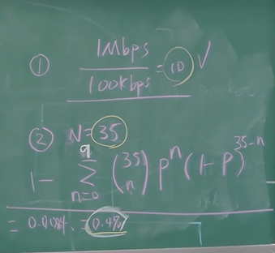
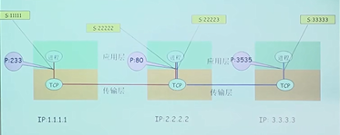
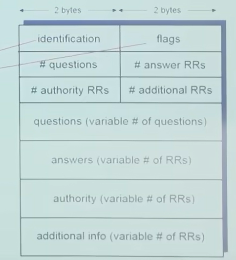

# 第一章：计算机网络和因特网
## 因特网

- 从构成角度解读网络
- 从服务应用角度解读网络
- 从边缘，核心，接入角度解读网络


### 因特网的构成描述
- 概念：
  - <font color=tomato>host(主机)/end system(端系统)</font>：所有接入因特网的设备，都称为~
  ```sql
  -- 端系统通过通信链路和分组交换机的网络连接到一起
  ```
  - <font color=tomato>Communication link(通信链路)</font>：类似于高速公路，是信号传播的媒介，物理媒介包括：同轴电缆，双绞铜线，光纤等。
  - <font color=tomato>transmission rate(传输速率)</font>：不同的链路能够以不同过的速率传输数据，以比特/秒(bit/s或bps)度量
  - <font color=tomato>packet switch(分组交换机)</font>：从它的一条入通信链路接收到达的<font color=tomato>分组</font>，并从它的一条出通信链路转发该<font color=tomato>分组</font>。
    - <font color=tomato>router(路由器)</font>：路由通常用于网络核心，作用于第三层网络层，面向端对端的数据发送和路由
    - <font color=tomato>link-layer switch(链路层交换机)</font>：常用于接入网，作用于第二层链路层，面向点对点的数据发送

  - <font color=tomato>packet(分组)：</font>：当一台端系统向另一台端系统发送数据时，发送端系统将数据分段，并为每段加上首部字节。由此形成的信息包用计算机网络术语，就叫分组。
  - <font color=tomato>path 或 route(路径)</font>：从发送端系统到接收端系统，一个分组所经历的一系列通信链路和分组交换机称为该网络的路径
  - <font color=tomato>Internet Service Provider，ISP(因特网服务提供商)</font>：每个ISP自身就是一个由多台分组交换机和多段通信链路组成的网络；每个ISP网络都是独立管理的，运行着IP协议，遵从一定的命名和地址规则。


#### 从具体构成角度
- 网络中一共分为两种节点：
  - 主机节点 ：主机及其上运行的应用程序
  - 中转（数据交换）节点：交换机等网络交换设备

- 边：通信链路
  - 接入网链路：主机连接到互联网的链路
  - 主干链路：路由器间的链路

### 服务描述
- 概念：
  - <font color=tomato>distributed application(分布式应用)</font>：涉及多个相互交换数据的端系统的应用。重要的是，因特网应用运行在端系统上，即它们并不运行在网络核心中的分组交换机上。尽管分组交换机能够加速端系统之间的数据交换，但它们并不关注作为数据的源或宿的应用。
  ```sql
  -- 运行在一个端系统上的应用怎样才能“指挥”因特网向运行在另一个端系统上的软件传递数据
  ```
  - <font color=tomato>socket interface(套接字接口)</font>：与因特网连接的端系统提供了一个套接字接口，该接口规定了运行在一个端系统上的程序，请求因特网基础设施，向运行在另一个端系统上的特定目的地程序交付数据的方式。
  <br>套接字接口是一套发送程序必须遵循的规则合集

### 总结
- 构成描述：端系统 -> 通信链路和分组交换机 -> 端系统
- 服务描述：端系统应用 -> 套接字接口 -> 另一个端系统的特定目的地程序

### 协议
- 定义：protocol(协议)定义了两个或多个通信实体之间交换的报文的格式和顺序，以及报文的发送/接收或其他事件所采取的操作。

### 网络结构
- 网络边缘（edge）
  - 主机
  - 应用程序（客户端和服务器）
  - 作用
    - 网络存在的理由，上面承载着各种功能与服务

- 网络核心（core）
  - 互联着的路由器
  - 网络的网络
  - 作用：
    - 数据交换

- 接入网、物理媒介（access ）
  - 有线或者无线通信链路
  - 作用：
    - 连接 网络边缘和网络核心

#### 网络核心
- 电路交换
  - 为呼叫预留端-端资源
    - 链路带宽，交换能力
    - 专用资源，不共享
    - 保证性能
    - 要求建立呼叫连接
  - 电路交换不适合计算机之间的通信
    - 连接建立时间长
    - 计算机之间的通信有突发性，如果使用线路交换，则浪费的片较多
      - 即使这个呼叫没有数据传递，其所占据的片也不能够被别的呼叫使用
    - 可靠性不高？
    
- 分组交换（详情在下 面）

- 网络核心的关键功能
  - 路由：决定分组采用的源到目标的路径
  - 转发：查路由表将分组从路由器的输入链路转移到输出链路
    - 转发需要路由表
    - 路由表由路由器通过路由算法计算得出

#### 建模比较分组交换和线路交换
- 设传输带宽为1Mbps，每个用户高峰使用流量是100kbps,线路交换和分组交换中，所支持的用户数量
  - 线路交换支持10个人
  - 分组交换，当有35个用户的时候，计算方法如下
  
  - 由此得出，只有0.4%的几率，网络hold不住，但是分组交换有缓存机制，暂时无法转发的分组，会缓存在路由器中，当其他99.6%的时间段网络通畅的时候，再将缓存的分组打出，从而解决小概率的分组堵塞问题。

- 结论是，同等资源下，分组交换支持的人更多

### 网络通信模式
- C/S：Client/Server，客户端，服务端模式
- P2P: peer to peer， 对等体（分布式应用进程 ），每个对等体，在不同的对话上下文中，即是客户端，又是服务器
  - 常见于各种文件分发系统，比如迅雷，电驴等

### 分组交换
- <span style="color:tomato;font-weight:700">存储转发的意义</span>
  - 如果不存储转发，当数据传输的时候，比如从A到B经过4个节点，在这个过程中，中间经过的线路都会被占用，此时，就变成了独享，变成了线路交换
  - 如果存储转发，在第一个链路使用，下一链路暂时没在使用的时候，其他的数据可以使用没有使用的链路进行通信，<span style="color:tomato;font-weight:700">实现网路共享</span>

- 存储转发传输：指在交换机开始向输出链路传输该分组的第一个比特之前，必须接受到整个分组。
- 分组交换网中的时延，丢包和吞吐量
  - 时延类型
    - 处理时延
      - 检查分组首部和决定将该分组导向何处所需要的时间是处理时延的一部分。当然，处理时延也包括其他因素。
      - 高速路由器的处理时延通常是微妙或更低的数量级（后面会详细研究路由运行的细节）
    - 排队时延
      - 在队列中，当分组在链路上等待传输时，将经受排队时延
      - 一个特定分组的排队时延长度将取决于先期到达的正在排队等待向链路传输的分组的数量
      - 如果到达速率 > 链路的输出速率
        - 分组将会排队，等待传输
        - 如果路由器的缓存用完了，分组将会被抛弃 
    - 传输时延（transmission）
      - 将所有分组的比特推向链路（即传输，或者说发射）所需要的时间<span style="color:tomato">(发送和接收，时间仅算一次，发送即是接收，中间差距仅仅是传播所需的时间)</span>
       
    - 传播时延
      - 一旦一个比特被推向链路，该比特需要向路由器B传播。从该链路的起点到路由器B传播所需要的时间就是传播时延。
  - 传输时延和传播时延的区别
    - 传输时延是路由器推出分组所需要的时间，它是分组长度和链路传输速率的函数，而和两台路由之间的距离无关。
    - 而传播时延是一个比特从一个路由器传播到另一台路由器所需要的时间，他是两台路由器之间距离的函数，和长度以及链路传输速率无关
  - 吞吐量
    - 瓶颈链路
      - 即，整个路由链路中的最小链路速率，决定了整个链路上的吞吐量
      - 该瓶颈，既由链路本身的带宽决定，也有该链路的使用数量决定，如果由n个用户同时使用，则瓶颈链路的带宽=链路带宽/用户数量的最小值
  - 吞吐量分类
    - 瞬间吞吐量
    - 平均吞吐量


- LAN和WAN
  - 在LAN的情况下，传播 时延可以忽略不计
- 统计多路复用 

#### 实验：使用Tracerout诊断程序，测试感受延时和路由
- Traceroute：提供从源端，经过路由器，到目的的延时测量
- For all
  - 沿着目的路径，向每个路由器发送3个探测分组
  - 路由器i将向发送方返回一个分组
  - 发送方对发送和回复之间间隔计时

- 原理：使用ICMP协议
  - 前面放出来以一系列TTL（time to live）递增的测试包，来收集TTL过期的ICMP控制报文，计时
  - 直到测试包到达目标机器，测试包传到目标机器的指定端口进程，由于目标机器的该端口无服务等候，导致该测试包被丢弃，并返回报文，源主机通过该报文得知测试结束，从而完成测试
  - 其目的是得到源主机到目标主机过程中的经过的 节点和往返延迟时间

- 数据包丢失的处理
  - 1.看该通信链路提供的服务是否可靠，要不要重传，如果可靠，由上一层重传（比如无限链路，WIFI标准）（链路层细讲）
  - 2.如果该链路不可靠，比如，以太网向上层提供的服务就是不可靠的，丢了就丢了（链路层细讲）
    - 根据链路层本身是否可靠，链路层可以向上提供两种服务，可靠的服务（WIFI，因为下层链路不可靠）或不可靠服务（以太网，因为底层链路可靠）
  - 3.有可能由源主机重传，看传输层协议是否可靠，比如可靠的TCP，或者不可靠的UDP协议
#### 分组交换的分类
- 数据报网路
  - 两个主机之间不建立连接
  - 每个交换节点不维护主机之间的通信状态
  - 每个分组携带目标的完整地址，每个分组都是独立的，以存储转发的方式传送

- 虚电路网路
  - 主机和目标主机通信之间需要握手，在交换节点之间保持通信状态，建立一个虚拟的线路，虚拟线路建立后，每个分组携带一个虚电路号，每个分组按照虚电路号标识，按照虚电路号进行分组转发 
  - 虚电路使用信令建立虚电路号
  - 虚电路的连接不仅体现在源主机和目标主机，同时体现在中间经过的所有交换节点上

### 接入网与物理媒体
- 接入网的重要指标
  - 带宽（bit per second）
  - 共享 / 专用

- 接入方式
  - 住宅接入：modem（调制解调器）
    - 将上网数据调制加载音频信号上，在电话线上传输，在局端将其中的数据解调出来，反之亦然（电信运营商）
    - 拨号调制解调器
      - 56Kbps的速率直接接入路由器
      - 不能同时上网和打电话，不能总是在线
  - 线缆网络
    - 有线电视信号线缆双向改造（有线电视运营商 ）
      - 在不同频段传输不同信道的数据，数字电视和上网数据（上下行）
  - 无线接入
    - 地面微波
    - 无线LANs（WIFI）
    - 无线广域（蜂窝，4G,5G）
  - 现在，端系统经常直接接到以太网络交换机上

- 物理媒体
  - 有型介质：数据衰减低
    - 双绞铜线
    - 同轴电缆
    - 光纤和光缆（光信号受电磁波干扰小）
  - 无形介质：数据衰减很快
    - 电磁波
    - 地面微波
    - 卫星

### Internet结构和ISP


## 协议层次和服务模型
### 互联网结构2——网络的网络
- 端系统通过接入网ISP连接到互联网
  - 住宅，公司和大学的ISP

- 接入ISP相应的必须是互联的
  - 因此任何两个端系统可以相互发送分组到对方

- 导致网络的网络非常复杂
  - 发展和演化是通过经济的和国家的政策来驱动

### 接入ISP的互联方式
- 选项1：
  - 将每个接入ISP都连接到全局ISP（多个global ISP全局范围内覆盖），客户ISP和提供者ISP有经济合约
  - ICP（互联网内容提供商）：
    - 谷歌，百度，电商，社交媒体（在全球布置数据中心，机房），通常ICP数据中心距离核心ISP机房比较近
  
- ISP之间的连接方式
  - POP：高层ISP面向客户网络的接入点，涉及费用结算
    - 如一个低层ISP接入多个高级ISP，多宿（multi home）
  - 对等接入：
    - 2个ISP对等互接，不涉及费用结算
  - IXP：
    - 多个对等ISP互联互通之处，通常不涉及费用结算
  - ICP：
    - 自己部署专用网络，同时和各级ISP连接


### 协议层次和服务模型、 
- 服务：即能被上层调用的功能的子集
  - 即下层通过层间接口向上层提供的功能

- 服务示例
  - 服务的提供者：TCP协议
  - 服务的用户：web服务，FTP服务，telnet服务等
  - 服务访问点（SAP）：
    - 在层间接口，通过服务访问点，用来区分服务提供者向不同服务用户提供服务
    - 例如：Socket API:

- <span style="color:tomato">协议：协议的实现，需要借助下层提供的服务；协议实现的目的，是为了向上层提供更好的服务</span>
  - <span style="color:tomato">对等层实体在通信过程中应该遵守的规则的集合，是一种规范
    - 格式
      - PDU（协议数据单元）：包括语法，语义
    - 时序 
      - 发送报文的时机  
    - 动作</span>
  - <span style="color:red; font-weight:700">协议的实现
    - 通过层间接口（interface）访问下层所提供的服务层来实现
    - 每一次的协议的实现都是通过下层提供的服务加上本层的处理实现的</span>

- SAP协议访问点：用来区分下层协议提供的服务所应用的不同的上层应用，这个用来区分的信息，就是服务访问点，比如，网络层向传输层的SAP就是IP和port端口号的组合,传输层向应用层提供服务的SAP就是套接字，Socket API

- 套接字的简单概述：传下来的时候加以标注，另一端，传上去的时候加以区分

- primitive原语：上层使用下层服务的形式，高层使用低层提供的服务，以及低层向高层提供服务都是通过服务访问原语来进行交互的形式；<span style="color:red">比如socketAPI中规定的一系列函数（这些函数包括创建socket，通过sockt发送，关闭socket）。</span>
 
- <span style="color:red; font-weight:700">服务与协议的区别</span>
  - 协会是平行的关系，是对等层实体在通信过程中所需要遵循的集合，目的是实现对等层的通信
  - 服务是垂直关系，是下层实体向上层提供的服务，或者上层实体为了实现更好的服务，所需要使用下层提供的服务。 <span style="color:tomato">（服务是通过层间接口在Interface的SAP上，通过原语的形式向上层提供服务）</span>

- <span style="color:red; font-weight:700">服务和协议的联系</span>
  - 本层协会的实现要靠下层提供的服务来实现
  - 实现本层协议的目的是为了向上层提供更高级的服务


- 服务类型
  - 面向连接的服务
    - 实质通讯前需要建立连接，以及预留一定的资源
  - 无连接服务
    - 实质通讯前不需要建立连接

- 面向连接与有链接的区别
  - 如果仅仅是端系统维持通信状态，中间的网络不知道，叫面向连接
  - 如果端系统知道，中间的网路节点也维持通信状态，同时需要维护，叫有连接 

- 数据单元DU
  - <span style="color:red; font-weight:700">PDU：协议数据单元</span>
  - SDU：服务数据单元（上层向下传输的数据包）
  - 上层传下来的SDU加上本层的控制信息）(ICI interface control infomation 接口控制信息)，头部信息，组成本层的PDU
  - 每一层的头部包含之前的ICI，即上层的头部加本层的控制信息的头部
  - 每一层PDU的名称：
    - 应用层：应用报文（message）
    - 传输层：报文段(segment)
    - 网络层：分组/ip数据报(package)
    - 链路层：帧(frame)
    - 物理层：位 

- SDU->PDU实现过程中的可能
  - 理想情况：上层传下来的SDU直接作为本层PDU的数据部分
  - 实际可能发生的情况：SDU很大，通过层间接口，分解成n个小块，每个块是SDU的一部分，加上第N层的头部信息，形成第N层的PDU（因为本层的PDU在封装的时候，有大小的上限）
  - 实际可能发生的情况2：SDU很小，多个SDU穿过层间接口，将多个SDU合在一起，加上第N层的头部信息，形成第N层的PDU

- 每一层的作用：
  - 物理层：提供相邻两点，将数字信号转化成物理信号，再由物理信号，还原为数字信号
  - 链路层：相邻两点间(例如相邻的交换机之间)，实现帧的传输
    - 链路层和物理层的协议，一般被封装在网卡中
    - 链路层在物理传输的基础上，在相邻两点，传输以帧为单位的数据
    - 以太网协议，wlan无线通信协议
  - 网络层：完成主机到主机，端到端的传输（P2P，port to port）
    - 在链路层所提供的相邻两点的传输的基础上，提供以分组为单位的端到端的数据传输 (E2E,edge to edge)
    - 重要作用：转发与路由
    - IP，路由选择协议
  - 传输层：区分进程，加强网络层提供的服务，完善数据的可靠性
    - 在网络层提供的主机到主机的传输基础上，提供进程到进程之间的传输
    - 将网络层可能提供的不可靠的通信服务，将其变成可靠的通信服务
      - 例如解决：TCP解决乱序，丢，错，重复等问题
  - 应用层：实现网络应用

### ISO 参考模型


# 第二章：应用层
## 网络应用原理
### 网路应用体系结构
- 现代网络应用程序中的两种主流体系结构
  - 客户-服务器体系结构
    - 特点：
      - 在客户-服务器体系结构下，客户相互之间不直接通信。
      - 该服务器具有固定的周知的地址，并且服务器总是打开的，所以客户总是能够通过向该服务器的IP地址发送分组来与其联系。
    - 举例；搜索引擎、web电子邮件、电子商务
  - 对等(P2P)体系结构
    - 特点：
      - 对于数据中心的专用服务器有最小的(或者没有依赖)
      - 应用程序在间断连接的主机对之间使用直接通信，这些主机对被称为对等方
      - 自扩展性：在一个P2P文件共享应用中，尽管每个对等方都由于请求文件产生工作负载，但每个对等方通过向其他对等方分发文件也为系统增加服务能力。
    - 问题：P2P应用由于高度非集中式结构，面临安全性，性能和可靠性等挑战


## 进程通信
### 客户和服务器进程
- 进程：在主机上运行的应用程序
  - 客户端进程：发起通信的进程
  - 服务器进程：等待连接的进程
  - 在同一个主机内，使用进程间通信机制通信（操作系统定义）
  - 在不同的主机，通过交换报文（Message）来通信
    - 使用OS提供的通信服务
    - 按照应用协议交换报文（借助传输层提供的服务）

### 进程与计算机网络之间的接口
- 套接字：
  - 作用：
    - 多数应用程序由通信进程对组成，每对中的两个进程相互发送报文。从一个进程向另一个进程发送的报文必须通过下面的网络。进程通过一个称为<font color=tomato>套接字(socket)</font>的软件接口向网络发送报文和从网络接收报文
  - 通俗类比：
    - 进程可类比一座房子，而它的套接字可以类比它的门。当一个进程想向位于另外一个主机上的另一个进程发送报文时，它把报文推出该门(套接字)。该发送进程假定该门到另外一侧之间有运输的基础设施，该设施把报文传送到目的进程的门口。一旦该报文抵达目的主机，它通过接收进程的门(套接字)传递，然后接收进程对该报文进行处理。
    - 概念：套接字是同一台主机内应用层与传输层之家你的接口。由于套接字是建立网络应用程序的可编程接口，因此套接字也称为应用程序和网络之间的应用编程接口(application Programming Interface)API。
    - 应用程序开发者权限：
      - 应用程序开发者可以控制套接字在应用层的一切，但对该套接字在运输层几乎没有控制权。
      - 应用程序开发者对运输层的控制仅限于
        - 悬着运输层协议
        - 也许能设定几个运输层参数(如最大缓存和最大报文段长度)

### 分布式进程通信需要解决的问题
- 进程标识和寻址（标识自己的不同，同时让其他机器可以找到自己）

-  传输层-应用层提供服务是如何（服务）
  - 位置：层间界面的SAP(TCP/IP：socket)
  - 形式：应用程序接口API（TCP/IP:socket API）

- 如何使用传输层提供的服务，实现应用进程之间的报文交换，实现应用（用户使用服务）
  - 定义应用程协议：报文格式，解释，时序等
  - 编制程序，使用OS提供的API，调用网络基础设施提供通信服务传报文，实现应用时序等

#### 问题1：对进程进行编址
- 标识一个应用进程的三个要素
  - 主机IP
  - TCP还是UDP
  - TCP/UDP的端口号（16bit）
    - TCP有自己的16bit的端口号空间
    - UDP也有自己的16bit的端口号空间

#### 对进程寻址（addressing）
- 进程为了接收报文所必须的标识
  - 主机IP（32位IP）
  - 传输层协议:TCP/UDP
  - 使用过的端口包Port，即传输层的SAP
  - 总结：一个进程，使用IP和（TCP/UDP）端口号进行标识

- 一个进程的会话关系，由两个端节点（end point）标识

#### 问题2：传输层的服务，需要穿过层间的信息
- 层间接口必须携带的信息
  - 要传输的报文（对本层来说：SDU）
  - 谁传的（发送端应用进程的标识）[主机IP + 应用进程使用的端口号]
  - 传给谁（接收端应用进程的标识）[主机IP + 应用进程使用的端口号] 

#### 解读TCP的socket

- 为了减少层间接口之间传输的信息量（数据信息每次必须传输，但是进程标识也可以想办法减少），<span style="color:red">使用Socket（本质是一个整数，一个文件的句柄handle，实际上是代表会话一种会话关系的 本地标识）</span> 
  - 一旦应用进程间建立起通信关系，接收端 就会返回给发送端一个整数，这个整数就代表着接收端的标识（我是谁，IP和端口号）
    - 在TCP中该整数代表一个四元组（我是谁【我的IP和端口号】对方是谁【对方的IP和端口号】）
    - UDP中，该整数代表一个两元组（我是谁，【我用的IP和UDP端口号】）
    - <span style="color:red">类似于使用操作系统打开一个文件，OS返回一个文件句柄一样，以后使用这个文件句柄，而不是使用这个文件的目录名，文件名【文件句柄，也叫文件标识符】</span>

- 之前讲过SDU在穿过层间接口的时候，会带入控制信息ICI，ICI的具体表现：
  - 一个socket的表项，该表项如下
  

- 如图所示，同一个IP和端口号，即同一个应用进程，可以有不同的socket值，因为socket实际代表了一种会话关系的本地表示，会话关系不同，则socket值不同


- <span style="color:red">因此，TCP在向下传输信息时，只需要传输两样东西：数据本身和TCP socket</span>

#### 解读UDP的socket
- UDP Socket
  - UDP服务，两个进程之间的通信，无需在之间建立连接
    - 每个报文都是独立传输的
    - 前后报文可能给不同的分布式进程 
  - 因此，只能用一个整数表示本应用实体的标识，无法代表一种会话关系
    - 因为无法保证每次的通信对象一致
  - UDP Socket：仅代表本地IP，本地端口，一个二元组的捆绑关系
  - 但是传输报文时，必须要提供对方IP，port
    - 接受报文时，传输层需要上传对方的IP，port
- <span style="color:red">因此，UDP在向下传输信息时，需要至少传递三样东西：数据本身，UDP socket，对方的IP和port（在socket API中，对方的IP和port，由特定的数据结构表示）</span>


#### 问题3：如何使用传输层提供的服务实现应用
- 定义了应用层协议：报文格式，解释，时序
  - 应用协议仅仅是应用的一个组成部分
    - 例如：web应用：HTTP协议，web客户端，web服务端，HTML...


- 编制程序，通过API调用网络基础设施提供通信服务传报文，解析报文，实现应用时序等

- 传输实体（tcp或udp实体）根据这些信息进行TCP报文（UDP数据报）的封装
  - 源端口号，目标端口号，数据等
  - 将IP地址往下交IP实体，对于封装IP数据报，源IP，目标IP

- TCP的特点
  - 有连接服务
  - 保证数据可靠性，即，不错，不丢，不失序，不重复
  - 流量控制：TCP通信实体，自动的根据协议来协调发送的速度和接受的速度，以至于不让发送方发送速度过快，超过接收方的处理能力
  - 拥塞控制：除了考虑通信双方的发送和接受能力，也考虑网络路径上的通行能力，即拥塞控制

- UDP特点
  - 无连接服务
  - 不可靠，无流量控制，无拥塞控制
  - 可靠性的保证需要时间的代价，多数实时多媒体应用受不了此代价
  - 拥塞控制对实时多媒体应用的流量传输会产生干扰，通信紧张时，会减小流量，通信通畅时，可以传输大规模流量，但是无此规模流量传输

- 可供应用程序使用的运输服务
  - 一个运输车协议能够为调用它的应用的程序提供哪些服务：(大致四种)
    - 可靠数据传输
    - 吞吐量
      - 具有吞吐量要求的应用程序被称为带宽敏感的应用
      - 弹性应用能够根据当时可用的带宽或多或少地利用可供使用的吞吐量
    - 定时
      - 运输层协议也能提供定时保证，例如：发送方注入套接字中的每个比特到达接收方的套接字不迟于100ms。
      - 这种服务对交互式实时应用程序有吸引力
      - 比如：网络电话，视频会议，多方游戏等
    - 安全性
      - 比如：对于数据的加解密
      - TLC协议，应用层协议，用来加强TCP协议

- 可供应用程序使用的运输服务
  - 一个运输车协议能够为调用它的应用的程序提供哪些服务：(大致四种)
    - 可靠数据传输
    - 吞吐量
      - 具有吞吐量要求的应用程序被称为带宽敏感的应用
      - 弹性应用能够根据当时可用的带宽或多或少地利用可供使用的吞吐量
    - 定时
      - 运输层协议也能提供定时保证，例如：发送方注入套接字中的每个比特到达接收方的套接字不迟于100ms。
      - 这种服务对交互式实时应用程序有吸引力
      - 比如：网络电话，视频会议，多方游戏等
    - 安全性
      - 比如：对于数据的加解密
      - TLC协议，应用层协议，用来加强TCP协议

- 传输层提供的服务-需要穿过层间的信息
  - 层间接口必须携带的信息
    - 要传输的报文（SDU）
    - 谁传的：自己应用进程的标识：IP+TCP(UDP)端口
    - 传给谁；对方应用进程的标识：IP+TCP(UDP)端口
  - 传输层实体(tcp或udp实体)根据这些信息进行TCP报文段(UDP)报文段的封装。
    - 源端口号、目标端口号、数据
    - 将IP地址往下交IP实体，用于封装IP数据报，源IP，目标IP

** 端口号：16个bit，共有65536个端口号 
- 传输层提供的服务-层间信息的代表SocketAPI
  - 作用：减少每次传输所携带的信息量
  - TCP：Socket的含义：
    - TCP服务，两个进程之间的通信需要之前要建立连接
    - 可以用一个整数标识两个应用实体的通信关系，是一种本地的标识，分别是源IP，源端口，目标IP，目标端口，是用整数表示一个四元组的数据
  - UDP Socket含义
    - UDP Socket是一个二元组，指包含本IP和本端口，所以，传输过程中，需要向下传递3件东西：传输实体，对方的IP和端口号，UDP Socket

## 应用协议
- 定义了：运行在不同端系统上的应用进程如何相互交换报文
  - 交换的报文类型，请求和应答报文
  - 各种报文类型的语法：报文中各个字段及其描述
  - 字段的语义：即字段取值的含义
  - 进程何时，如何发送报文以及对报文进行响应的规则


- 协议分类
  - 公开协议
    - 由RFC文档定义
    - 允许互操作
    - 如HTTP，SMTP
  - 专用（私有）协议
    - 协议不公开
    - 如：Skype

### 应用层需要传输层提供什么样的服务
- 数据丢失率
  - 有些应用要求100%的可靠数据传输（如文件）
  - 有些应用（如音频）允许容忍一定比例以下的数据丢失
- 吞吐
  - 一些应用（如多媒体）必须需要最小限度的吞吐，从而使得应用能够有效运转
  - 一些应用能充分利用可供使用的吞吐（弹性应用）

- 延迟

- 安全性
  - 机密性
  - 完整性
  - 可认证性
  - TCP和UDP都没有加密，明文通过互联网传输，甚至密码
  - SSL（安全套接字层）在应用层
    - 应用采用SSL库，SSL库使用TCP通信

### Web 和 HTTP
#### HTTP概述
- 官方定义：
```
a stateless application-level request/reponse protocol that uses extensible semantics and self-descriptive message payloads for flexible interaction with network-based hypertext information systems

# 一种无状态的，应用层的，以请求/应答方式运行的协议，它使用可扩展语义和自描述消息格式，与基于网络的超文本信息系统灵活的互动
```
- 无状态详解：
  - 服务器向客户发送被请求的文件，而不存储任何关于该客户的状态信息
  - 例如：某个特定的客户在短短的几秒内两次请求同一个对象，服务器并不会因为刚刚为该客户提供了该对象就不再作出反应，而是重新发送该对象，就像服务器已经完全忘记不久之前所做过的事情一样。因为HTTP服务器并不保存关于客户的任何信息，所以我们说HTTP是一个无状态协议。
- 非持续链接和持续连接（Connection头部信息，keep-live|close）
  - 概述：
    - 在许多因特网应用中，客户和服务器会在一个相当长的时间范围内通信。在此期间，客户发出一系列请求，服务器对每个请求进行响应。
    - 依据应用程序以及该应用程序的使用方式，这一系列请求可以以规则的间隔周期性地或者间断性地一个接一个发出。
    - 当这种客户-服务器的交互是经TCP进行的时，应用程序的研制者需要做一个重要决定
    - 每个请求/响应是经一个单独的TCP连接发送 -（非持续连接）
    - 还是所有请求及其响应经相同的TCP连接发送 - (持续连接)
  - 非持续连接的具体过程
    - 在客户端向服务端发送数据请求之前，会经历TCP的三次握手，用来建立连接
    - 在三次握手期间，客户端不会向服务端发送实际的数据请求，而是在三次握手建立成功之后发送
    - 在非持续连接中，三次握手建立成功 -> 客户端发送数据请求 -> 服务端响应请求 -> 当TCP确认客户完整收到响应报文后，HTTP服务器进程通知TCP断开该TCP连接
    - 后续所有文件对象的引用，重复之前的过程
    - HTTP1.0默认非持续连接
  - 持续连接
    - 在HTTP1.1默认持续连接
    - 一旦TCP连接建立，客户端可以在同一个连接上发送多个HTTP请求，并可以接收多个响应，直到连接被任何一方关闭。这意味着，只有第一个请求会经历三次握手，之后的请求则不会

- HTTP报文格式：<a href="../cyber_security/web协议详解与抓包实战.md">详情见web协议详解与抓包实战</a>

- HTTP请求报文
```shell
GET /somedir/page.html HTTP/1.1
Host: www.someschool.edu    # Web代理缓存所要求的
Connection: close    # 意味着告诉服务器使用非持续连接
# 它要求服务器在发送完被请求的对象后就关闭这条链接
User-agent: Mozilla/5.0
# 向服务器发送请求的浏览器的类型，这里表示火狐浏览器
# 这个首部行的作用：服务器可以有效地为不同类型的用户代理实际发送相同对象的不同版本（如果服务器有这样的对象的话）；
# 否则，服务器应当发送它的默认版本
Accept-language: fr
```

- HTTP响应报文
```shell
HTTP/1.1 200 ok
Connection: close
# 告诉客户，发送完报文后将关闭该TCP链接
Date: Tue, 18 Aug 2015 15 15:44:04 GMT
# 服务器产生并发送该响应报文的时间日期
#这里是指服务器从它的文件系统种检索得到该对象，将该对象插入响应报文，并发送该响应报文的时间
Server: Apache/2.2.3 (CentOS)
Last-Modified: Tue, 18 Aug 2015 15:11:03 GMT
Content-Length: 6821
Content-Type: text/html

(data data data data data ...)
```

- 用户与服务器的交互：cookie
  - Cookie技术有4个组件
    - 在HTTP响应报文中的一个cookie首部行
    - 在HTTP请求报文中的一个cookie首部行
    - 在用户端系统中保留的一个cookie文件
    - 位于Web站点的一个后端数据库
  - 实际场景：
    - Susan用家中的PC使用IE浏览器上网，首次访问amazon.com
    - 当请求报文到达Amazon Web服务器时，该Web站点将产生一个唯一识别码，并以此作为索引在它的后端数据库产生一个表项；接下来Amazon Web服务器用一个包含"Set-cookie:"首部的HTTP响应报文对Susan的浏览器进行响应，"Set-cookie"首部含有该识别码，例如`set-cookie: 1678`
    - 当Susan的浏览器收到该HTTP响应报文时，它会看到"Set-cookie:"首部。该浏览器在它管理的特定cookie文件中添加一行，该行包含服务器的主机名和"Set-cookie:"首部中的识别码
    - 当Susan继续浏览Amazon网站时，每请求一个Web页面，其浏览器就会查询该cookie文件并抽取她对这个网站的识别码，并放到HTTP请求报文中包括识别码的cookie首部行中。特别是，发往该amazon服务器的每个HTTP请求报文都包括一下首部行：`Cookie: 1678`
    - 在这种方式下，Amazon服务器可以跟踪Susan在Amazon站点的活动。尽管Web站点不必知道Susan的名字，但ta确切地知道用户1678按照什么顺序在什么时间访问了哪些页面！

- Web缓存
  - 概述：Web缓存器(Web cache)也叫代理服务器(proxy server)，它是能够代表初始Web服务器来满足HTTP请求的网络实体。
  - Web缓存器参与工作的流程；
    - 浏览器创建一个到Web缓存器的TCP链接，并向Web缓存器中的对象发送一个HTTP请求
    - Web缓存器进行检查，看看本地是否存储了该对象副本。如果有，Web缓存器就向客户浏览器用HTTP响应报文返回该对象
    - 如果Web缓存器中没有该对象，它就打开一个与该对象的初始服务器的TCP链接。Web缓存器则在这个缓存器到服务器TCP链接上发送一个对该对象的HTTP请求。在收到请求后，初始化服务器向该Web缓存器发送具有该对象的HTTP响应
    - 当Web缓存器接收到该对象时，它在本地存储空间存储一份副本，并向客户的浏览器用HTTP响应报文发送该副本
  - 注意：
    - Web缓存器既是服务器又是客户
  - 也叫内容网络分发(Content Distribution Network,CDN)
  - 条件Get方法
    - 作用：HTTP的一种机制，允许缓存器证实它的对象是最新的。这种机制就是条件GET
    - 条件GET方法标识：
      - 如果HTTP请求报文使用GET方法，并且请求报文中包含一个"If-modified-since:"首部行，那么这个HTTP请求报文就是一个条件GET请求报文
    - 整个流程：
      - 首先，一个代理缓存器(proxy cache)代表一个请求浏览器，向某Web服务器发送一个请求报文：
      ```shell
      GET /fruit/kiwi.gif HTTP/1.1
      Host: www.exotiquecuisine.com
      ```
      - 其次，该Web服务器向缓存器发送具有被请求的对象的响应报文：
      ```shell
      HTTP/1.1 200 OK
      Date: Sat, 3 Oct 2015 15:39:29
      Server: Apache/1.3.0(Unix)
      Last-Modified: Wed, 9 Sep 2015 09:23:24
      Content-Type: image/gif

      (data data data data ...)
      ```
      - 该缓存器在将对象转发到请求的浏览器的同时，也在本地缓存了该对象。重要的是，缓存器在存储该对象时也存储了最后修改日期。
      - 一个星期后，另一个用户经过缓存器请求同一个对象，该对象仍在这个缓存器中。由于在过去的一个星期中位于Web服务器上的该对象可能已经被修改，该缓存器通过发送一个条件GET执行最新检查
      ```shell
      GET /fruit/kiwi.gif HTTP/1.1
      Host: www.exotiquecuisine.com
      If-modified-since: Wed, 9 Sep 2015 09:23:24
      # "If-modified-sine:" 首部行正好等于一个星期前服务器发送的响应报文中的"Last-Modified:"
      # 该条件GET报文告诉服务器，仅当自指定日期之后该对象被修改过，才发送该对象。
      ```
      - 假设该对象自上一个星期之后，没有任何修改，则Web服务器向该缓存器发送一个响应报文
      ```shell
      HTTP/1.1 304 Not Modified
      Date: Sat, 10 Oct 2015 15:39:29
      Server: Apache/1.3.0 (Unix)

      (empty entity body)
      ```
      - 作为对条件GET方法的响应，该Web服务器仍发送一个响应报文，但没有在该响应报文中包含所请求的对象。
      - 值得注意的是，在最后的响应报文中，状态行中为304 Not Modified,它告诉缓存器可以使用该对象，能向请求的浏览器转发它。


### FTP
- 文件传输协议
    - ftp服务器，端口号：21
    - 向远程主机上传输文件或从远程主机接收文件
    - C/S模式
        - Client：发起传输的一方
        - 服务器：  远程主机

- 控制连接与数据连接分开
    - FTP客户端与FTP服务器通过端口21联系，并使用TCP为传输协议
    - 客户端通过控制连接获得身份确认
    - 收到一个文件传输命令时，服务器打开一个客户端的数据连接（服务器<span style="color:red">主动和客户端的20号端口建立TCP数据连接</span>）
        - 数据的连接通过另外一个TCP传输完成
        - 这里客户端向服务器发送的控制信息的连接，即控制连接和服务器向客户端传输数据的数据连接是两个连接
        - 对比http协议，http客户端和服务端之间控制信息和数据传输是在一个TCP连接下完成的 
        - ftp的服务器和客户端之间的连接是有状态连接，服务器需要维护建立的连接
    - 一个文件传输完成后，服务器关闭连接

### EMAIL（电子邮件）
- 3个主要组成部分
    - 用户代理
    - 邮件服务器
    - 简单邮件传输协议：SMTP
        - 发送的协议：SMTP
        - 拉取的协议：POP3，MIP，HTTP

#### 用户代理（User Agent）
- 又名“邮件阅读器”
- 撰写，编辑和阅读文件的后端软件
- 解读代理：
    - 撰写，编辑阅读文件的后端软件是电子邮件的用户代理
    - 浏览器是WEB应用的用户代理
    - FTP应用的用户代理是FTP的客户端软件
    - <span style="color:red">是用户通过客户端软件跟FTP或其他应用服务打交道，而不是用户直接和应用服务打交道</span>
- 如：outlook，Foxmail
- 输出和输入邮件保存在服务器上

#### 邮件服务器
- 守候在25号端口
- 邮箱中管理和维护发送给用户的邮件
- 输出报文队列保持待发送邮件报文
- 邮件服务器之间的SMTP协议：发送email报文
    - 客户：发送方邮件服务器
    - 服务器：接收端邮件服务器

- 过程
    - 用户代理配置好邮件服务器的IP地址，端口号；通过邮件服务器发邮件
    - 邮件服务器收到邮件后，放到队列中，将其发给相应的邮件服务器
    - 邮件服务器收到邮件后，将其收到用户的邮箱中
    - 客户端的用户代理，再将邮件服务器，用户自己的邮箱当中的邮件拉取过来（使用拉取协议）
    - 整个过程中的协议
        - 用户代理发送邮件到邮件服务器：SMTP协议
        - 邮件服务器发送到相应的邮件服务器：SMTP协议
        - 对方用户代理将邮件从邮件服务器拉取（拉取协议）：POP3，MIP，HTTP...

- SMTP协议原理
    - 使用TCP在客户端和服务端之间传送报文，服务器守候在25号端口
    - 直接传输：从发送端服务器到接收方服务器
    - 传输的3个阶段
        - 握手
        - 传输报文
        - 关闭
    - 命令/响应交互
        - 命令：ASCII文本
        - 响应：状态码和状态信息
    - 报文必须是7位ASCII码

- SMTP交互示例：
```
S: 220 hamburger.edu
C: HELO crepes.fr
S: 250 Hello crepes.fr,pleased to meet you
C: MEET FROM: <alice@crepes.fr>
S: 250 alice@crepes.fr ... Sender ok
C: RCPT TO: <bob@hamburger.edu>
S: 250 bob@hamburger.edu ... Recipient ok
C: DATA
S: 354 Enter mail, end with "." on a line by itself
C: Do you like ketchup?
S: How about pickles?
C: .
S: 250 Message accepted for delivery
C: QUIT
S: 221 hamburger.edu closing connection
```

### DNS域名解析系统
- 作用：域名到IP地址的转换
 
#### DNS系统需要解决的问题
- 问题1：如何命名设备
  - 用有意义的字符串，好记，便于人类使用
  - 解决一个平面命名的重名问题，<span style="color:red">层次化命名</span>

- 问题2：如何完成名字到IP的转换
  - <span style="color:red">分布式数据库维护和响应名字查询（解析）</span>

- 问题3：如何维护：增加和删除一个域，需要在域名系统中做哪些工作


#### DNS总体思路和目标
- DNS的主要思路
  - 分层的，基于域的命名机制
  - 若干分布式的数据库完成名字到IP地址的转换
  - 运行在UDP之上<span style="color:red">端口为53</span>的应用服务
  - 核心的Internet功能，但以应用层协议实现（在网络边缘处理复杂性）

- DNS主要目的
  - 实现主机名-IP地址的转换（name/IP translate）
  - 其它目的
    - 主机别名到规范名称的转换：Host aliasing
      - 规范名称是为了便于管理
      - 别名是为了用户访问
    - 邮件服务器别名到邮件服务器的正规名字的转换：Mail server aliasing
    -  负载均衡：Load Distribution
    ```
    # 场景1：
    比如www.ibm.com，该域名可能有无数个服务器（东海岸，西海岸，等，上面还有一堆的机柜，机柜上很多的刀片都可以向用户提供服务），
    所有用户都使用www.ibm.com访问这些服务器，通过DNS，可以把这个名称解析成不同的规范的名称，
    比如东海岸的某个机柜上的某个刀片服务器向用户提供某种服务（相当于在所有服务之间起到一个负载均衡的作用）
    ```

- DNS域名结构
  - DNS采用层次树状结构的命名方法
  - 最上面是根域（13个）（10个美国，2个欧洲，1个日本）
  - 其次几百个顶级域（top level domains）
  - 每个(子)域下面可划分为若干子域 (subdomains)
  - 树叶是主机

- 一个名字服务器的问题
  - 可靠性问题；单点故障
  - 扩展性问题，通信容量
  - 维护问题，远距离的集中式数据库

- 区域（zone）
  - 区域的划分有区域管理者自己决定
  - 将DNS名字空间划分为互不相交的区域
  - 名称服务器
    - 每个区域都有一个名称服务器，维护它所管辖区域的权威信息
    - 名称服务器允许被防止在区域之外，以保障可靠性

- 权威DNS服务器
  - 组织机构的DNS服务器，提供组织机构服务器（如web和mail）可访问的主机和IP之间的映射
  - 组织机构可以选择实现自己维护或有某个服务提供商来维护


- TLD服务器
  - 顶级域TLD服务器：负责顶级域名和所有国家级顶级域名
    - Newwork solutions 公司维护com TLD服务器
    - Educause公司维护edu TLD服务器

- 区域名字服务器维护资源记录
  - 资源记录（resource records）
    - 作用：维护域名-IP的映射关系
    - 位置：Name Server的分布式数据库中
  - RR格式（domain_name, ttl, type, class, value）
    - Domain_name 域名
    - ttl：time to live：生存时间（权威，缓存时间）
      - ttl如果维护的是一个权威记录，就是无限大
      - 如果是一个缓存记录，就是有限值
      - 缓存是为了效率，删除是为了一致性，比如其中一方更新
    - class类别：对于Internet，值为IN
    - Value值：可以是数字，域名或字符串
    - Type类别：资源记录的类型

#### DNS记录
- DNS：保存资源记录（RR）的分布式数据库
  - RR格式（name, value, class, type, ttl）
  
- Type=A
  - Name为主机
  - Value为Ip地址

- Type=CNAME
  - Name为规范名称的别名
  - value为规范名称

- Type=NS
  - Name域名（如foo.com）
  - Value为该域名的权威服务器域名
  - 对于上层域，要知道下层的两个信息
    - 你叫什么（NS）对于这个子域，谁是你的权威服务器
    - 你在哪(A) 权威服务器的地址是什么

- Type=MX
  - Value为name对应的邮件服务器名字

#### DNS协议：查询和响应报文的报文格式相同
- 报文首部
  - 标识符（ID）：16位
    - 很重要，根据查询ID和响应ID相同，可以同时并发的维护多个查询事务
  - flag
    - 查询/应答
    - 希望递归
    - 递归可用
    - 应答为权威


#### 维护问题，如何新增一个域
- 在上级域的名字服务器中增加两条记录，指向这个新增的子域的域名和域名服务器的地址

- 在新增子域的名字服务器上运行名字服务器，负责本域的名字解析：名字->IP地址
  - 例：在com域中建立一个“Network Utopia”
    - 到注册登记机构注册域名networktopia.com
    - 需要向该机构提供权威DNS服务器（基本的，辅助的）名字和IP地址
    - 登记机构在com TLD服务器中插入两条RR记录
    - 在networktopia.com的权威服务器中确保有
      - 用于Web服务器的A记录
      - 用于邮件服务器类型的MX记录


### CDN内容分发系统（可以看做一种基础设施）
- 在端系统的应用层运转起来的基础设施


# 第六章 链路层与局域网

- 在本身比较可靠的链路中，比如以太网链路，链路层本身提供不可靠的服务

- 在本身不可靠的链路中，比如Wlan-无线链路（存在衰减，存在干扰），因此需要链路层本身提供可靠的服务，要确定传输的可靠性，超时重传，出错重传等
 
- 网卡，网络适配器，NIC，网络接口，都是一个东西

## 错误检测

## 多路访问链路和协议

### 点对点（广域网用的比较多）
- 拨号访问的PPP
- 以太网交换机和主机之间的点对点的链路

### 广播（共享线路或媒体）

- 传统以太网
- HFC上行链路
- 802.11无线局域网


### 多路访问协议

- 分布式算法--决定节点如何使用共享信道，即：决定节点什么时候可以发送？
- 关于共享控制的通信必须用借助信道本身传输
  - 没有带外的信道，各节点使用其协调信道使用
  - 用于传输控制信息


### MAC(媒体访问控制)，协议分类

三大类

- 信道划分
  - 把信道划分成小片(时分，频分，码分)
  - 分配片给每个节点专用

- 随机访问
  - 信道不划分，允许冲突
  - 冲突后恢复

- 依次轮流
  - 节点依次轮流
  - 但是有很多数据传输的节点可以获得较长的信道使用权

## LANS
### MAC地址和ARP

- 32bitIP地址
  - 网络层地址
  - 用于是数据报到达目的IP子网，前n-1跳
  - 从而到达子网中的目标节点，最后一跳

- LAN(MAC/物理/以太网)地址：
  - 用于使帧从一个网卡传递到其物理连接的另一个网卡
  - 48bitMAC地址固化在适配器的ROM，有时也可以通过软件设定
  - 理论上全球任意2个网卡的MAC地址都不同

### ARP：Address Resolution Protocol

- 在LAN上的每个IP节点都有一个ARP表
- ARP表：包括一些LAN节点IP/MAC地址的映射