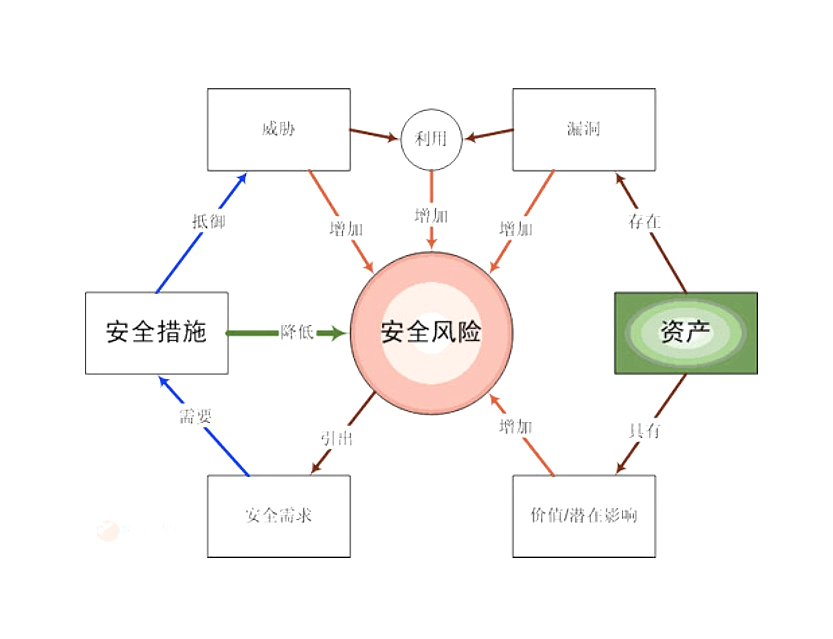
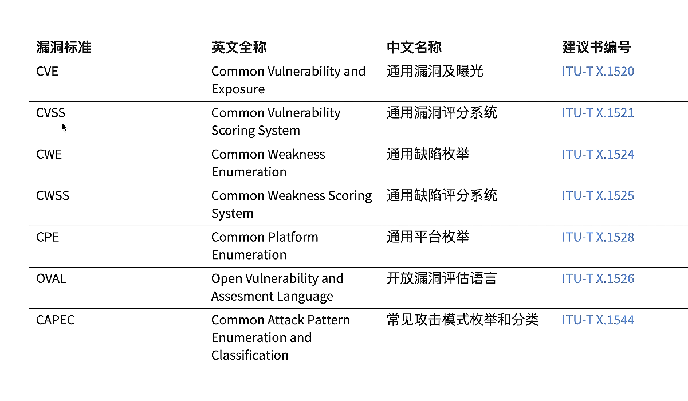
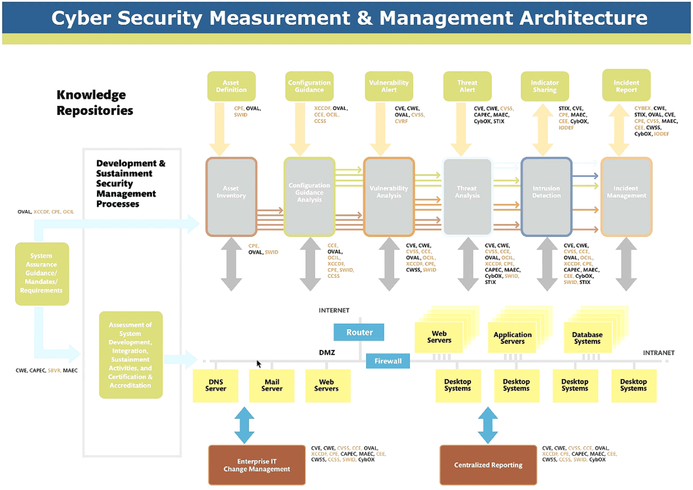

# 网络安全基础
## 专业术语定义
- 资产：
  - 任何对组织业务具有价值的信息资产，包括计算机硬件、通信设施、IT环境、数据库、软件、文档资料、信息服务和人员等。

- 网络安全(Cyberspace Security/Cyber Security/Network Secuiity)
  - Network 【狭义】 的网络安全，主要指的是计算机网络中的信息安全问题
  - Cyberspace /Cyber 【广义】 的网络空间安全，【狭义】的网路安全问题演变成了【真实世界】的数字孪生安全问题，并借助于各种泛在互联技术影响到【真实世界】安全

- 安全属性 CIA
  - 机密性(Confidentiality)
    - 从 【信息不可见】 到 【状态不可见】
  - 完整性(Integrity)
    - 未经授权不能进行更改
  - 可用性(Availability)
    - 信息可被授权实体访问并按需使用

- 漏洞(Vulnerability)
  - 漏洞又被称为脆弱性或弱点（Weakness）
  - 信息资产及其安全措施在安全方面的不足或弱点
  - 漏洞存在于IT基础设施（计算机软硬件、通信设备等）和人（管理制度、操做规范和流程）
  - 漏洞一旦被利用，即会对资产造成影响
  - 通常一个网络的漏洞/弱点可被分为：技术漏洞、配置漏洞、安全策略漏洞

- 风险（Risk）
  - 风险是威胁事件发生的可能性与影响综合作用的结果
  - 风险称为事实后，就会造成具体的影响

- 攻击（Attack）
  - 攻击是指由威胁源所实施的、导致安全事件发生的行为，它是漏洞利用和实现威胁的过程，一旦攻击得手，即会造成影响

## 风管理图

## 微软STRIDE模型
<table>
    <thead>
        <th style="background:darkred;color:white">威胁</th>
        <th style="background:darkred;color:white">安全性属性</th>
    </thead>
    <tbody>
        <tr>
            <td>假冒 (Spoof)</td>
            <td>认证 (Authentication)</td>
        </tr>
        <tr>
            <td>篡改 (Tamper)</td>
            <td>完整性</td>
        </tr>
        <tr>
            <td>否认 (Repudiation)</td>
            <td>不可抵赖性</td>
        </tr>
        <tr>
            <td>信息泄露 (Information Disclosure)</td>
            <td>机密性</td>
        </tr>
        <tr>
            <td>拒绝服务 (Denial of Service)</td>
            <td>可用性</td>
        </tr>
         <tr>
            <td>权限提升 (Elevation of Privilege)</td>
            <td>授权（Authorization）</td>
        </tr>
    </tbody>
</table>

### 安全属性扩充
- 认证 (Authentication)：身份验证
  
- 授权 (Authorization): 行为验证
  
- 审计 (Audit): 结果验证+责任认定（Accountability）
  - 不可抵赖性可通过审计来保证

- 总结：访问控制要素

### DREAD模型
- Damage Potential 潜在损失
- Reproducibility 可复现性
- Exploitability 可利用性
- Affected users 受影响的用户
- Discoverability 可发现性（防火墙，阻隔内网发现）  】

### 漏洞管理相关标准

  
- CVE：
  - 历史漏洞数据库
  - 全称Common Vulnerabilities & Exposures，中国翻译对应【公共漏洞曝光】
  - CVE目前已经是信息安全界内有关漏洞的一个事实上的标准，安全研究人员也把自己发现的漏洞能够具备CVE_ID编号为荣
  - 并不是所有发现的安全漏洞都能获得CVE-ID，申请CVE-ID有一个严格的流程

- CVSS
  - 量化的进行风险/漏洞价值的评价系统
  - 通用弱点评价系统（Common Vulnerability Scoring System，CVSS）是由美国国土安全部主导的NIAC（国家咨询与分析中心）开发、FIRST（Forum of Incident Response and Security Teams，事件反应和安全小组论坛）维护的一个开放并且能够被产品厂商免费采用的标准

- CWE
  - 关于软件缺陷的知识库（缺陷代码）

- CWSS
  - 对于软件缺陷的评分系统

- CPE
  - 对于软件缺陷的描述性信息（辅助CPE）
  - 准确全面的描述软件在漏洞环境下的信息

- CAPEC
  - 攻击模式的分类

- MAEC
  - 恶意软件知识库

- 总结：
  - 上述标准的目标都是为了创建可度量的安全
  - CVSS计算器：https://nvd.nist.gov/vuln-metrics/cvss/v3-calculator?name=CVE-2014-6271&vector=AV:N/AC:L/PR:N/UI:N/S:U/C:H/I:H/A:H&version=3.1&source=NIST

### ATT&CK模型
- ATT&CK模型是MITRE在洛克希德-马丁公司提出的网络杀伤链模型的基础上，构建了一套更细粒度，更易共享的知识模型和框架
- 分支
  - PRE_ATT&CK
    - 覆盖杀伤链模型的前两个阶段，包含了与攻击者在尝试利用特定目标网络或系统漏洞进行相关操做有关的战术和技术
  - ATT&CK for Enterprise
  - ATT&CK for Mobile

- ATT&CK模型详细的划分了攻击的各个阶段及每个阶段所需的技术
  - Reconnaissance
  - Resource Development
  - Initial Access
  - Execution
  - Persisitence
  - Privilege Escalation
  - Defense Evasion
  - Credential Access
  - Discovery
  - Lateral Movement
  - Collection
  - Command and Control
  - Exfiltration

### 安全策略（Security Policy）