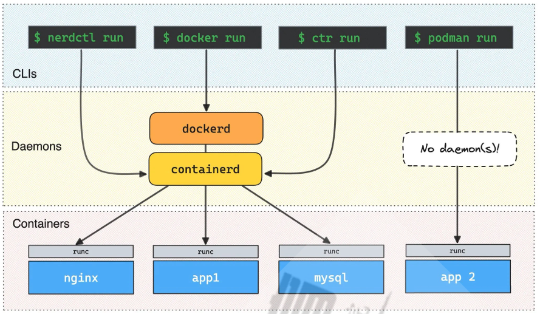
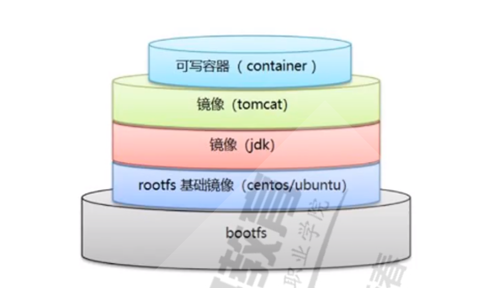
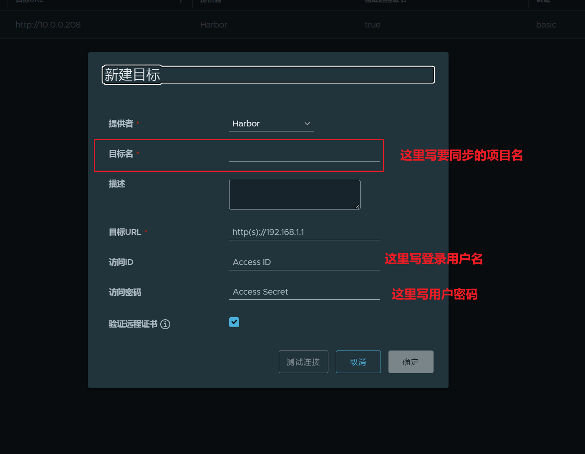

# Docker
## 名称空间Namespace技术

namespace是Linux系统的底层概念。在Linux内核实现，即有一些不同类型的命名空间被部署在内核，各个`docker容器`运行在同一个`docker主进程`并且共用同一个宿主机系统内核，各docker容器运行在宿主机的用户空间，每个容器都有类似于虚拟机一样的相互隔离的运行空间，但是容器技术是`在一个进程内`实现运行指定服务的运行环境，并且还可以保护宿主机内核不受其他进程的干扰和影响，如文件系统空间，网络空间，进程空间等，目前主要通过以下技术实现容器运行空间的相互隔离

隔离类型
- MNT Namespace(mount)
  - 功能：提供磁盘挂载和文件系统的隔离能力
  - 系统调用参数：CLONE_NEWNS
- IPC Namespace(inter-Process Communication)
  - 功能：提供进程间通信的隔离能力，包括信号量，消息队列和共享内存
- UTS Namespace(UNIX Timesharing System)
  - 功能：提供内核，主机名和域名隔离能力
- PID Namespace(Process Identification)
  - 功能：提供进程隔离能力
- Net Namespace(network)
  - 功能：提供网络隔离能力，包括网络设备，网络栈，端口等
- User Namespace(user)
  - 功能：提供用户隔离能力，包括用户和组

## Control groups

Cgroups最主要的作用，就是限制一个进程组能够使用的资源上限，包括CPU，内存，磁盘，网络带宽等等。此外，还能够对进程进行优先级设置，资源的计量以及资源的控制（比如：将进程挂起和恢复等操作）


## 容器管理工具

### nerdctl 
nerdctl是与Docker兼容的CLI for Containerd，其支持Compose

### docker


### ctr
ctr是由containerd提供的一个客户端工具

### podman
Podman即Pod Manager tool，从名称上可以看出和kubernets的pod的密切联系，

Podman是一个为Kubernetes而生的开源的容器管理工具，可在大多数Linux平台上使用，它是一种无守护程序的容器引擎，用于在Linux系统上开发，管理和运行任何符合Open Container Initiative(OCI)标准的容器和容器镜像。

### Podman和docker不同之处
- docker需要在系统上运行一个守护进程(docker daemon)，这会产生一定的开销，而podman不需要
- 启动容器的方式不同
  - Docker：
    - `docker cli`命令通过API跟`Docker Engine(引擎)`交互告诉它我想创建一个container
    - `Docker Engine`调用`OCI container runtime(runc)`来启动一个container。
    - 这代表container的process(进程)不会是`Docker CLI`的`child process`(子进程)，而是`Docker Engine`的`child process`
  - Podman:
    - 直接给OCI container runtime（runc）进行交互来创建container,所以`container process`直接是`podman`的`child process`

- docker在linux上作为守护进程运行扼杀了容器社区的创新。如果要更改容器的工作方式，则需要更改docker守护程序并将这些更改推送到上游
- 没有守护进程，容器基础结构更加模块化，更容易进行更改。podman的无守护进程架构更加灵活和安全


## 容器相关技术

### 容器规范(OPEN CONTAINER INITIATIVE)

为了保证容器生态的标准性和健康可持续发展，包括linux基金会，Docker，微软，红帽，谷歌和IBM等公司在2015年6月共同成立了一个叫Open Container Initiative(OCI)的组织，其目的就是定制开放的标准的容器规范

目前OCI一共发布了两个规范
- runtime spec
  - 容器运行环境的规范
- image format spec
  - 镜像格式规范


### 容器runtime

runtime是真正运行容器的地方，因此为了运行不同的容器runtime需要和操作系统内核紧密合作相互在支持，以便为容器提供相应的运行环境。

对于容器运行时主要有两个级别
- Low Level（使用接近内核层）
  - runc: 早期libcontainer是Dockerk公司控制的一个项目，OCI的成立后，Docker把libcontainer项目移交给了OCI组织，runC就是在libcontainer的基础上进化而来
- High Level（使用接近用户层）
  - cri-o
  - containerd
  - dockershim
  

  ### Docker运行机制
  Docker client---> Docker Engine ---> containterd
  Contained.shim---> runc ---> container


### 镜像仓库Registry

### 容器编排工具

当多个容器在多个主机上运行时，单独管理容器是相当复杂而且很容易出错，而且也无法实现某台主机宕机后，容器自动迁移到其他主机从而实现高可用目的，也无法是实现动态伸缩的功能，因此需要有一种工具可以实现统一的管理，动态伸缩，故障自愈，批量执行等功能，这就是容器编排引擎

- K8S


## Docker安装

### 内置仓库
Ubuntu内置仓库安装
```shell
apt -y install docker.io
```

### 官方仓库
#### 阿里云官方仓库
- 官方地址
```shell
https://developer.aliyun.com/mirror/docker-ce?spm=a2c6h.13651102.0.0.57e31b11DDIh92
```

- 官方操作（可以看做是脚本运行）
```shell
# step 1: 安装必要的一些系统工具
sudo apt-get update
sudo apt-get -y install apt-transport-https ca-certificates curl software-properties-common
# step 2: 安装GPG证书
curl -fsSL https://mirrors.aliyun.com/docker-ce/linux/ubuntu/gpg | sudo apt-key add -
# Step 3: 写入软件源信息
sudo add-apt-repository "deb [arch=amd64] https://mirrors.aliyun.com/docker-ce/linux/ubuntu $(lsb_release -cs) stable"
# Step 4: 更新并安装Docker-CE
sudo apt-get -y update
sudo apt-get -y install docker-ce # 默认下载最新版

# 安装Docker-CE特定版本
sudo apt-get -y install docker-ce=[VERSION] docker-ce-cli=[VERSION]
```


### 二进制安装（离线）
本方法适用于无法上网或无法通过包安装方式安装的主机上安装docker
```shell
二进制安装下载路径
https://download.docker.com/linux/
https://mirrors.aliyun.com/docker-ce/linux/static/stable/x86_64/
```

示例：在CentOS上实现二进制安装docker
```shell
wget 
https://download.docker.com/linux/static/stable/x86_64/docker-19.03.5.tgz

# 解压到指定目录
tar xvf docker-19.03.5.tgz    

# 加入环境变量
cp docker/* /usr/bin/

# 创建 service文件
cat > /lib/systemd/system/docker.service <<-EOF
[Unit]
Description=Docker Application Container Engine
Documentation=https://docs.docker.com
After=network-online.target firewalld.service
Wants=network-online.target
[Service]
Type=notify
# the default is not to use systemd for cgroups because the delegate issues 
still
# exists and systemd currently does not support the cgroup feature set required
# for containers run by docker
ExecStart=/usr/bin/dockerd -H unix://var/run/docker.sock
ExecReload=/bin/kill -s HUP \$MAINPID
# Having non-zero Limit*s causes performance problems due to accounting overhead
# in the kernel. We recommend using cgroups to do container-local accounting.
LimitNOFILE=infinity
LimitNPROC=infinity
LimitCORE=infinity
# Uncomment TasksMax if your systemd version supports it.
# Only systemd 226 and above support this version.
#TasksMax=infinity
TimeoutStartSec=0
# set delegate yes so that systemd does not reset the cgroups of docker 
containers
Delegate=yes
# kill only the docker process, not all processes in the cgroup
KillMode=process
# restart the docker process if it exits prematurely
Restart=on-failure
StartLimitBurst=3
StartLimitInterval=60s
[Install]
WantedBy=multi-user.target
EOF

# 重启
systemctl daemon-reload
systemctl enable --now docker   
```

### 官方脚本
- install_docker_offline.sh
```shell
#!/bin/bash
#
#********************************************************************
#Author:            wangxiaochun
#QQ:                29308620
#Date:              2022-10-14
#FileName:          install_docker_offline.sh
#URL:               http://www.wangxiaochun.com
#Description:       The test script
#Copyright (C):     2022 All rights reserved
#********************************************************************

#支持在线和离线安装

DOCKER_VERSION=26.1.4
#DOCKER_VERSION=26.0.0
#DOCKER_VERSION=24.0.7
#DOCKER_VERSION=24.0.5
#DOCKER_VERSION=23.0.3
#DOCKER_VERSION=20.10.19

URL=https://mirrors.tuna.tsinghua.edu.cn
#URL=https://mirrors.aliyun.com
#URL=https://download.docker.com

color () {
    RES_COL=60
    MOVE_TO_COL="echo -en \\033[${RES_COL}G"
    SETCOLOR_SUCCESS="echo -en \\033[1;32m"
    SETCOLOR_FAILURE="echo -en \\033[1;31m"
    SETCOLOR_WARNING="echo -en \\033[1;33m"
    SETCOLOR_NORMAL="echo -en \E[0m"
    echo -n "$1" && $MOVE_TO_COL
    echo -n "["
    if [ $2 = "success" -o $2 = "0" ] ;then
        ${SETCOLOR_SUCCESS}
        echo -n $"  OK  "    
    elif [ $2 = "failure" -o $2 = "1"  ] ;then 
        ${SETCOLOR_FAILURE}
        echo -n $"FAILED"
    else
        ${SETCOLOR_WARNING}
        echo -n $"WARNING"
    fi
    ${SETCOLOR_NORMAL}
    echo -n "]"
    echo 
}

prepare () {
    if [ ! -e docker-${DOCKER_VERSION}.tgz ];then
        #wget ${URL}/docker-ce/linux/static/stable/x86_64/docker-${DOCKER_VERSION}.tgz
        wget ${URL}/docker-ce/linux/static/stable/x86_64/docker-${DOCKER_VERSION}.tgz
    fi
    [ $? -ne 0  ] && { echo "文件下载失败"; exit; }
}

install_docker () {
    tar xf docker-${DOCKER_VERSION}.tgz -C /usr/local/
    cp /usr/local/docker/* /usr/local/bin/
    cat > /lib/systemd/system/docker.service <<-EOF
[Unit]
Description=Docker Application Container Engine
Documentation=https://docs.docker.com
After=network-online.target firewalld.service
Wants=network-online.target

[Service]
Type=notify
# the default is not to use systemd for cgroups because the delegate issues still
# exists and systemd currently does not support the cgroup feature set required
# for containers run by docker
ExecStart=/usr/local/bin/dockerd -H unix://var/run/docker.sock
ExecReload=/bin/kill -s HUP \$MAINPID
# Having non-zero Limit*s causes performance problems due to accounting overhead
# in the kernel. We recommend using cgroups to do container-local accounting.
LimitNOFILE=infinity
LimitNPROC=infinity
LimitCORE=infinity
# Uncomment TasksMax if your systemd version supports it.
# Only systemd 226 and above support this version.
#TasksMax=infinity
TimeoutStartSec=0
# set delegate yes so that systemd does not reset the cgroups of docker containers
Delegate=yes
# kill only the docker process, not all processes in the cgroup
KillMode=process
# restart the docker process if it exits prematurely
Restart=on-failure
StartLimitBurst=3
StartLimitInterval=60s

[Install]
WantedBy=multi-user.target
EOF
    systemctl daemon-reload
}

config_docker () {
    mkdir -p /etc/docker
    tee /etc/docker/daemon.json <<-'EOF'
    {
      "registry-mirrors": ["https://si7y70hh.mirror.aliyuncs.com"]
     }
EOF
    #systemctl restart docker

}

start_docker (){
    systemctl enable --now docker
    docker version && color "Docker 安装成功" 0 ||  color "Docker 安装失败" 1
}


config_docker_completion () {
    wget -P /etc/bash_completion.d http://www.wangxiaochun.com:8888/testdir/docker/docker_completion 
    #source /etc/bash_completion.d/docker_completion
}


prepare

install_docker

config_docker

start_docker

config_docker_completion
```

## Docker删除

```shell
apt purge docker-ce
rm -rf /var/lib/docker
```

## 停止docker服务
```shell
# 仅停止docker.service，暂停后会被自动激活
systemctl stop docker.service

# 想停止该服务，还需停止docker.socket
systemctl stop docker.service docker.socket
```

## Docker命令分类
### 通用命令

### 管理命令
#### 管理镜像image

#### 管理容器container
- 运行容器`run`
  - `docker container run` = `docker run`
#### 管理网络network
### Swarm命令
Swarm就是docker swarm（官方开发的容器编排引擎）,新版中swarm被集成在docker里


## Docker相关信息与优化配置

### docker优化配置
#### 优化方法1：用空间足够的高速磁盘用来存放docker的相关数据
```shell
# 在/etc/docker/目录下创建配置文件daemon.json(该文件默认不存在，需要自己创建)
vim /etc/docker/daemon.json

# daemon.json
{
  #指定docker数据目录,新版24.0.0不支持，
  # 实现：修改service文件
  # ExecStart=/usr/bin/dockerd --data-root=/data/docker
  "graph": "/data/docker",  
}
```

#### 优化方法2：从自建仓库下载镜像
```shell
# 查看docker信息
docker info

# 默认不信任外部仓库
···
Insecure Registries:
  127.0.0.0/8
···

# 需要在配置文件中添加信任的仓库
vim /etc/docker/daemon.json
{
  "insecure-registries": ["harbor.wang.org","172.18.0.253"]
}

# 添加后重启
systemctl restart docker

# 再次查看docker信息
docker info
···
Insecure Registries:
  harbor.wang.org
  172.18.0.253
  127.0.0.0/8
```

#### 优化方法3：调整允许最多同时下载docker镜像的数量（使其性能更好）
```shell
vim /etc/docker/daemon.json
{
  # 允许最多同时下载docker镜像的数量
  "max-concurrent-downloads": 10,
  # 最大允许同时上传多少个
  "max-concurrent-uploads": 5
}
```

#### 优化方法4：对容器中生成的日志进行约束
```shell
vim /etc/docker/daemon.json
{
  # 防止容器的日志过大，撑满磁盘
  "log-opts": {
    # 指定容器日志文件的最大值
    "max-size": "300m",
    # 指定容器日志文件的个数
    # 循环写入日志文件
    # 即一个日志满，会写入第二个
    "max-file": "2"
  }
}
```

#### 优化方法5：镜像加速，加快镜像下载速度
```shell
# docker网站被墙的情况下，该加速无效
vim /etc/docker/daemon.json
{
  "registry-mirrors": [
    "https://registry.docker-cn.com",
    "http://hub-mirror.c.163.com",
    "https://docker.mirrors.ustc.edu.cn",
    "https://si7y70hh.mirror.aliyuncs.com/"
  ]
}
```

#### 扩展：docker远程连接
```shell
systemctl cat docker

...
# -H 指定客户端和服务端通信的媒介
# docker客户端通过该socket文件发送指令
# docker服务端通过该socket通过该文件接收指令
# for containers run by docker
ExecStart=/usr/bin/dockerd -H unix://var/run/docker.sock  --data-root=/data/docker
ExecReload=/bin/kill -s HUP $MAINPID
...
# 但是这只能保证同主机间的通信
# 如果客户端和服务器端不再同一主机
# 比如在10.0.0.101的客户端，去访问10.0.0.100的docker服务端，需要打开远程连接
# 方法：在dockerd的守护进程上开启远程连接
# -H,--host=
# tcp://host:port,
# 默认2375端口（不加密），加密：2376
# unix://path/to/socket
# fd://* or fd://socketfd
```

#### 远程连接的实现方法1

方法1：修改service文件
```shell
vim /lib/systemd/system/docker.service
# 后面加一行 -H tcp://0.0.0.0:2375
ExecStart=/usr/bin/dockerd -H unix://var/run/docker.sock  --data-root=/data/docker -H tcp://0.0.0.0:2375
```

#### 问题：当虚拟机的全局环境变量开启代理，该虚拟机远程连接其他机器的docker服务端失效

```shell
cat .bashrc
...
export http_proxy=http://10.0.0.1:10809
export https_proxy=http://10.0.0.1:10809
export ftp_proxy=ftp://10.0.0.1:10809
```

此时运行`docker -H 10.0.0.208 version`失败

原因：Docker 客户端直接连接：Docker 客户端连接 Docker 守护进程通常通过直接 TCP 连接 (tcp://) 而不是 HTTP(S) 代理。代理的设置会导致 Docker 客户端尝试通过代理去连接，而代理并不支持这种直接 TCP 连接，从而导致连接失败。

解决方案
```shell
export http_proxy=http://10.0.0.1:10809
export https_proxy=http://10.0.0.1:10809
export ftp_proxy=ftp://10.0.0.1:10809
export NO_PROXY="10.0.0.208"
```

指定连接10.0.0.208的通信不走代理即可

#### 远程连接的实现方法2（更安全）

通过ssh远程连接
```shell
docker -H ssh://root@10.0.0.206 version
```

实现ssh远程连接的前提
- 打通key验证
```shell
# 生成密钥私钥对
ssh-keygen

# 将公钥拷贝到指定服务器
ssh-copy-id root@10.0.0.206
```


#### 优化方法6：重启docker不影响容器运行
```shell
vim /etc/docker/daemon.json

{
  # docker.service重启，不影响容器的运行
  "live-restore": true
}
```

## 镜像管理
### 镜像结构和原理


镜像即创建容器的模版，含有启动容器所需要的文件系统及所需要的内容，因此镜像主要用于方便和快速的创建并启动容器

#### 镜像的分层

镜像里面是一层层文件系统，叫做Union FS(联合文件系统)，联合文件系统，可以将几层目录挂载到一起，形成一个虚拟文件系统

虚拟文件系统的目录结构就像普通Linux的目录结构一样

镜像通过`这些文件`再加上`宿主机的内核`共同提供了一个Linux的虚拟环境

每一层文件系统叫做layer，联合文件系统可以对每一层文件系统设置三种权限：
- 只读(readonly)
- 读写(readwrite)
- 写出(writeout-able)

镜像中的每一层文件系统都是只读的，构建镜像的时候，从一个最基本的操作系统开始，每个构件提交的操作都相当于做一层的修改，增加了一层文件系统，一层层往上叠，上层的修改会覆盖下层的配置

### 查看镜像（格式化输出）
指定在输出中显示映像信息的格式。
```shell
docker images --format

# 常用的格式占位符
{{.Repository}}: 映像的仓库名称
{{.Tag}}: 映像的标签
{{.ID}}: 映像的ID
{{.Digest}}: 映像的摘要值
{{.CreateAt}}: 映像的创建时间
{{.Size}}: 映像的大小

# 示例
docker images --format "{{.Repository}}:{{.Tag}}"
```

#### 查看说有dangling状态的镜像
```shell
docker images -f dangling=true
```


### 搜索镜像
#### 官方网站进行镜像搜索
```shell
http://hub.docker.com
http://dockerhub.com
https://hub-stage.docker.com/
```

#### 执行docker search命令搜索
```shell
docker search [OPTIONS] TERM

# 搜索点赞100个以上的镜像
docker search --filter=stars=100 centos
```


### 上传和下载镜像
```shell
docker pull [image_name]

# 后面详解，push需要账号密码
docker push [image_name]
```

### 删除镜像
```shell
docker rmi [repository:tag]
```

#### 当容器运行时，强删镜像
```shell
# 生成一个容器并运行
docker run nginx:1.24
# 当有容器运行时，强删镜像
docker rmi -f nginx:1.24
# 此时镜像还在，仅仅是逻辑上被删除了
# 镜像名没了变成了dangling状态
<none>  <none>  ...
# 此时该镜像还有机会找回来
# 实现方式是，赋予它一个名字
docker tag <image_id> ngixn:1.24
```

### 镜像的导入导出
导出镜像
```shell
# save默认作为标准输出，输出到屏幕上
docker save nginx:1.24 > nginx.tar
# 等价于
docker save nginx:1.24 -o nginx.tar
# 导出并压缩
docker save nginx:1.24 |gzip > nginx.tar.gz
```

导入镜像
```shell
# 支持直接导入压缩后的文件
docker load -i nginx.tar.gz
```

导入导出的特殊情况
- 如果导出时使用的IMAGE—ID进行导出，由于导出的时候没有名称，使用的是ID，因此导入到新的docker服务端的时候，是dangling状态

- 解决方案：使用tag给dangling状态的镜像起名
```shell
docker tag [image_ID] [自己起的名]

# 示例
docker tag 243kjsdas nginx:1.24
```

### 清理所有dangling状态的镜像
```shell
# 清理dangling和不再使用的镜像
docker image prune -a -f
# 清理dangling的镜像
docker rmi -f `docker images -q -f dangling=true`
```

### 扩展：一次导出所有镜像的方法
```shell
docker save `docker image|awk 'NR>1{print $1":"$2}'` -o all2.tar
# 等价
docker images | awk 'NR >1{print $1":"$2}' | xargs docker save -o all3.tar
# 等价
docker images --format "{{.Repository}}:{{.Tag}}" | xargs docker save -o all4.tarc 
```

### import的使用场景

将容器导出为tar包，再将tar包使用import转换为镜像
container --> tar --> image

### 查看镜像的制作历史
```shell
docker history nginx:1.24
```

### 查看镜像的详细信息
```shell
docker inspect nginx:1.24
```

## 容器管理(容器操作基础命令)
### 运行容器
```shell
docker [container] run [repository:tag]
# 等价于
docker [container] create [repository:tag]
docker [container] start [repository:tag]
```

在运行docker create的时候，docker会给创建的容器分配容器名，并且分配id，资源等元数据，但是如果该容器仅仅是创建，而没有运行，docker仅仅准备该容器的相关数据，并不会真正的使其在内存中运行

```shell
[root@ubuntu2204 ~]#du -sh /data/docker/
531M    /data/docker/
[root@ubuntu2204 ~]#docker images
REPOSITORY           TAG       IMAGE ID       CREATED         SIZE
nginx                1.24      6c0218f16876   14 months ago   142MB
sagikazarmark/dvwa   latest    e901498e651a   7 years ago     359MB
# 创建nginx,但是不运行
[root@ubuntu2204 ~]#docker create nginx:1.24
052400cbac800ee5b588d756f13c52481f8049fce236672133c235f039d1d4a3
# docker容器数据目录无变化
[root@ubuntu2204 ~]#du -sh /data/docker/
531M    /data/docker/
# 启动该容器
[root@ubuntu2204 ~]#docker start 052400cbac800ee5b588d756f13c52481f8049fce236672133c235f039d1d4a3
052400cbac800ee5b588d756f13c52481f8049fce236672133c235f039d1d4a3
# 目录的大小上涨100多M
[root@ubuntu2204 ~]#du -sh /data/docker/
683M    /data/docker/

# 查看进程
systemd(1)─┬─ModemManager(830)─┬─{ModemManager}(845)
           │                   └─{ModemManager}(850)
           ├─VGAuthService(761)
           ├─agetty(823)
           ├─containerd(811)─┬─{containerd}(843)
           │                 ├─{containerd}(844)
           │                 ├─{containerd}(846)
           │                 ├─{containerd}(847)
           │                 ├─{containerd}(857)
           │                 ├─{containerd}(858)
           │                 └─{containerd}(859)
           ├─containerd-shim(4823)─┬─nginx(4848)─┬─nginx(4900)
           │                       │             └─nginx(4901)
           │                       ├─{containerd-shim}(4825)
           │                       ├─{containerd-shim}(4826)
           │                       ├─{containerd-shim}(4827)
           │                       ├─{containerd-shim}(4828)
           │                       ├─{containerd-shim}(4829)
           │                       ├─{containerd-shim}(4830)
           │                       ├─{containerd-shim}(4831)
           │                       ├─{containerd-shim}(4833)
           │                       ├─{containerd-shim}(4872)
           │                       └─{containerd-shim}(4873)
           ├─cron(794)
           ├─dbus-daemon(795)
```


### 启动容器的流程（面试题）
- 现在本地寻找镜像
- 本机由镜像直接运行，没有的话去DockerHub上下载
- 如果DockerHub上有则将进行拉到本地，然后运行
- 如果DockerHub没有，则返回错误，找不到镜像

### 查看容器ps
```shell
# 查看执行中的容器
docker ps

# 查看所有的容器
docker ps -a

# 使用 -f | --filter filter 筛选出指定状态的容器
# 筛选出退出状态的容器
docker ps -f 'status=exited'

# 列出所有id
docker ps -f 'status=exited' -qa
```


### 启动容器run
```shell
docker run [option] IMAGE [COMAMND] [ARG...]

# 启动时，指定名称 --name string
docker run --name mynginx nginx:1.24

# 启动时后台运行 -d
docker run -d --name mynginx nginx:1.24

# 一个容器要持续运行的条件：在镜像中有一个持续运行并以前台方式运行的进程作为容器启动的默认程序
# 关键点：前台，持续运行
# 因此因为Ubuntu的默认程序是bash，满足秩序运行，不满足前台，因此启动时，如果不指定ubuntu前台运行的话，Ubuntu会启动后自动退出
# 为了防止ubuntu启动后立即退出，使用-it给ubuntu分配一个终端，使其具有交互的能力，也就是说满足前台的条件
docker run -it ubuntu:22.04
# 进入ubuntu后，看到的磁盘和文件系统等都是宿主机的
# 但是，很多root权限才能执行的操作，是没有权限执行的，需要使用特权指令
docker run --privileged -it ubuntu:22.04
# 从容器中退出
exit
# 从容器中退出，但容器不停止
ctrl + p + q

# 再次进入ubuntu
docker exec -it <容器名> bash

# 一次性容器：--rm 容器退出后，立即销毁
docker run --rm mynginx nginx:1.24

# --restart 可以指定四种不同的policy
# always，程序停止后，自动重启
# 容器加always可以实现开机自启
docker run --name nginx01 --restart always -d nginx:1.22

# 容器启动的时候执行指定命令
docker run ubuntu:22.04 cmd
```

#### 详解--restart的四种policy
```shell
# no: 默认策略，不会自动重启容器
docker run --name mycontainer --restart no myimage

# no-failure[:max-retries]: 如果容器因错误退出（非零退出码），则重启容器，可以选择性地指定最大重启次数
docker run --name mycontainer --restart on-failure:5 myimage

# always：无论容器因何原因停止，都会重启容器。如果手动停止容器，只有在Docker守护进程重启或手动重启容器时才会重新启动(这里意味容器因错误退出可能导致无限重启，所以建议在这里配置一个监控项并设置报警或者触发器，以防止容器重现重启导致的负载上升)
docker run --name mycontainer --restart always myimage

# unless-stopped：类似于always，但如果容器被手动停止，则不会在Docker守护进程重启后重新启动
docker run --name mycontainer --restart unless-stopped myimage

# always和unless-stopped都可以实现开机自启，不同点在于，如果手动停止容器后，重启docker进程，比如systemctl restart docker,此时always会重启容器，而unless-stopped不会
```

### 停止容器
```shell
# docker stop [container_NAMES]
docker stop mynginx
# 容器停止后会释放掉资源
# 容器只有启动状态才会占磁盘空间
```

### 删除容器
```shell
# -f 强删
docker rm -f [container_NAMES]
```

### 删除所有停止的容器
```shell
docker container prune -f
```

### 给正在运行的容器发信号
```shell
# 重新加载配置
docker kill -s 1 web01

# 强行关闭所有运行中的容器
docker kill `docker ps -a -q`
```

### docker补齐失效解决方案
```shell
# 大概率缺少补齐脚本文件
[root@ubuntu2204 ~]#ll /usr/share/bash-completion/completions/docker 
-rw-r--r-- 1 root root 114588  6月  5 19:27 /usr/share/bash-completion/completions/docker

# 将其他能补全的docker上的该目录下的docker脚本复制过去
scp docker 10.0.0.XX:/usr/share/bash-completion/completions/

# 然后将服务重启即可
```

### 进入正在运行的容器
#### attach

```shell
# docker attach 容器名
docker attach mynginx 

# 两个终端使用attach进入同一个容器时
# 两个终端的显示图面是同步的
```

#### exec
```shell
docker exec -it 容器名 bash
```

#### 暴漏所有容器端口

容器启动后，默认处于预定义的NAT网络中，所以外部网络的主机无法直接访问容器中网络服务
`docker run -p`可以将实现容器预定义的所有端口映射宿主机的网卡的随机端口，默认从32768开始
使用随机端口时，当停止容器后再启动可能会导致端口发生变化

```shell
# 映射容器所有暴露端口至随机本地端口
docker run -P docker.io/nginx

# 查看端口映射关系
docker port 容器名
```

#### 指定端口映射
```shell
# 使用-p
docker run -d -p 80:80 --name mynginx nginx:1.24
```

#### 查看容器日志
```shell
# 查看后台运行的容器日志
docker logs 容器名

# 跟踪日志输出，相当于tail -f
docker logs -f 容器名

# 查看日志最后N行
docker logs --tail N 容器名
```

#### 传递命令

使用自己指定的命令替代容器运行时的初始化命令
```shell
# 直接在容器名后面跟命令即可替代原默认初始化命令
docker run --name nginx01 sleep 30
```

#### 容器内部的hosts文件

容器会自动将容器的ID加入自己的/etc/hosts文件中，并解析成容器IP
```shell
# 修改容器的hosts文件
docker run -it --rm --add-host www.wang.com:6.6.6.6 --add-host www.wang.org:8.8.8.8 busybox cat /etc/hosts
```

#### 指定容器内的DNS
```shell
# 指定DNS地址
docker run -it --rm --dns1.1.1.1 --dns 8.8.8.8 centos bash


#配置文件指定DNS和搜索domain名
vim /etc/docker/daemon.json
{
  "dns"： 【"114.114.114.114"】
  "dns-search": ["magedu.org"]
}

# 改完重启
```

### 容器内和宿主机之间复制文件

不论容器的状态是否运行，复制都可以实现
```shell
docker cp [OPTIONS] CONTAINER:SRC_PATH DEST_PATH
docker cp [OPTIONS] SRC_PATH CONTAINER:DEST_PATH

# 示例
docker cp -a 1311:/etc/centos-release .
docker cp /etc/issue 1311:/root/
```

### 传递环境变量

有些容器运行时，需要传递变量，可以使用-e<参数> 或 --env-file<参数文件>实现
```shell
docker run --name mysql-test1 -v /data/mysql:/var/lib/mysql -e MYSQL_ROOT_PASSWORD=123456 -e MYSQL_DATABASE=wordpress -e MYSQL_USER=wpuser -e 
MYSQL_PASSWORD=123456 -d -p 3306:3306 mysql:5.7.3
```

### 清除不再使用的数据
```shell
docker system prune -f -a
```

### 导出和导出容器文件系统
#### export, import
container ---> tar ---> image
#### save, load
images ---> tar ---> image

## 镜像制作

### 手动制作
通过`docker commit`手动构建镜像
```sh
docker commit [OPOTIONS] CONTAINER [REPOSITORY:[TAG]]

# commit = export + import
```
### 自动制作
#### 创建dockerfile进行自动构建镜像的目录结构
```shell
# 按照业务类型或系统类型等方式划分创建目录环境，方便后期镜像比较多的时候进行分类
mkdir -p /data/dockerfile/{web/{nginx,apache,tomcat,jdk},system/{centos,ubuntu,alpine,debian}}
[root@ubuntu2204 data]#tree dockerfile/
dockerfile/
├── system
│   ├── alpine
│   ├── centos
│   ├── debian
│   └── ubuntu
└── web
    ├── apache
    ├── jdk
    ├── nginx
    └── tomcat
```
#### 关于scratch镜像

该镜像是一个空的镜像，可以用于构建busybox等超小镜像，可以说是真正的从零开始构建属于自己的镜像

该镜像用于构建基础镜像或超小镜像

### 制作镜像的指令
### FROM
### LABEL
### RUN
### ENV
### COPY
```shell
COPY  src   dest
# 源地址必须是该dockerfile路径的相对路径
# 源地址是目录的话，拷贝到容器的时候，会是该目录下的内容
# 如果目标目录不存在，copy执行的时候，会在镜像中，生成该路径
```

### ADD 
ADD命令会自动解压缩，相当于增强版的COPY

### CMD（重点）

指定程序启动时的默认指令

CMD的格式和RUN的格式一样，分为exec格式和shell格式

```shell
格式3：
```

### CMD和entrypoint的区别

### 制作镜像的要点
- 频繁变化的变量往后放，因为哪个指令变化了，制作镜像时，就会从此指令开始重新执行，前面的有缓存，可以不需要执行
- 将多个指令尽可能合并，可能会减少大小（镜像每一层只会叠加，不会减少）


### 多阶段构建

多阶段构建可以帮助你在构建阶段使用大型的构建工具和依赖项，但是在最终阶段只包含运行时所需的内容

利用多阶段构建，可以大大减少镜像的大小，但要注意相关依赖文件都要复制新构建中才能正常运行的容器

多阶段构建的本质写两遍FROM，一次遍的FROM是基础的过渡阶段，在第二次写的时候，使用第一次的镜像的必要文件作为最终用的镜像（第二遍FROM）的父镜像

第一遍的镜像仅仅是临时的中间镜像，将第一遍镜像生成的文件复制到最后所需要依赖的镜像中，复制过程中仅复制最有用的必要文件，其他的无用文件就留在了旧的镜像中不再使用

#### 使用GO语言实现多阶段构建
```go
package main

import {
  "fmt"
  "time"
}

func main() {
  for {
    fmt.Println("hello,world")
    time.Sleep(time.Second)
  }
}

// 使用go build hello.go -> 生成二进制执行文件
```
```dockerfile
FROM golang:1.18-alpine as builder 
COPY hello.go /opt
WORKDIR /opt
RUN go build hello.go

FROM alpine:3.15.0
COPY --from=builder /opt/hello /hello
# CMD /hello
CMD ["/hello"]
# JSON 数组语法 [ ... ] 确保 Docker 不使用 shell 来运行命令。
``` 
```shell
# 创建docker镜像
docker build go-hello-v2 -t go-hello-mini:v.0.2
# 运行镜像
docker run --rm --name mygo go-hello-mini:v.0.2ls

```

## 容器的数据管理
### Docker的数据分层
- LowerDir:
  - image镜像层，即镜像本身，只读
- UpperDir:
  - 容器的上层，可读写，容器变化的数据存放在此处
- MergeDir:
  - 容器的文件系统，使用Union FS（联合文件系统）将lowerdir和upperdir合并完成后给容器使用，最终呈现给用户的统一视图 
- WorkDir:
  - 容器在宿主机的工作目录，挂载后内容会被清空，且在使用过程中其内容用户不可见

### 实现持久化的三种方式
#### 卷(Volume)
匿名卷
```shell
# 在/var/lib/docker/volumes/随机目录/
docker run -it --name web01 -v /path/dir <image>:<tag>
# 删除镜像以及匿名卷内容
docker rm -v
# 新容器的匿名卷的内容无法直接使用就得匿名件的内容，除非手动复制

# 查看匿名卷名称
docker volume ls

# 查看匿名卷详细信息
docker volume inspect <匿名件名称>

# 清理匿名卷
docker volume prune

# 所有不再用的卷包括命名卷都删
docker volume prune -a
```

命名卷
```shell
# 创建命名卷
docker volume create mydata
# 启动容器的时候，顺便生成命名卷
docker run -it --name web01 -v mynginx_data:/usr/share/nginx/html
```

#### 绑定挂载(Bind Mount)
```shell
# 指定宿主机目录或文件格式
-v <宿主机绝对路径的目录或文件>:<容器目录或文件>[:ro]  # 将宿主机目录挂载容器目录，两个目录都可自动创建
# 使用相对路径也不是不可以，但是必须前面加点./

```

#### tmpfs挂载（不算持久化）
tmpfs挂载不与宿主机上的任何文件或目录相关联，而是将一个临时文件系统挂载到容器的某个目录下。这种方式的主要优点是它提供了一个高速且安全的挂载方式，因为tmpfs挂载通常驻留在宿主机的内存中，且在容器停止后会被自动删除。
```shell
docker run -d --tmpfs/data --name test <镜像名>:<tag>
```


## 容器的网路管理


```shell
# 查询网桥
brctl show

# 查看设备驱动
ethtool -S <网卡名>

ethtool -i <网卡名>
```

### 禁止容器间通讯
```shell
# dockerd的 --icc=false 选项可以禁止同一个宿主机的不同容器间通信
vim /lib/sysgtemd/system/docker.service
ExecStart=/usr/bin/dockerd -H fd:// --containerd=/run/containerd.sock --icc=false
# 重启服务
systemctl daemon-reload
systemctl restart docker

# 此后创建的容器间无法通信
# 本质上是修改了iptables规则
# -A FORWARD -i docker0 -o docker0 -j ACCEPT修改为DROP
```

### 更改容器默认docker网桥的网络配置
默认docker后会自动生成一个docker0的网桥，使用的IP是172.17.0.1/16，可能和宿主机的网段发生冲突，可以将其修改为其他网段的地址，避免冲突
```shell
# 方法1
vim /etc/docker/daemon.json
{
  "bip": "192.168.100.1/24"
}

systemctl restart docker.service

# 方法2
vim /lib/systemd/system/docker.service
ExecStart=/usr/bin/dockerd -H fd:// --containerd=/run/containerd/containerd.sock --bip=192.168.100.1/24
systemctl daemon-reload
systemctl restart docker.service

# 注意两种方法不可混用，否则将无法启动docker服务
```

### 自定义网桥
```shell
# 创建网桥
brctl addbr docker1

# 启用网桥
ip link set docker1 up

# 添加网桥地址
ip a a 172.27.0.1/16 dev docker1

# 修改配置文件/usr/lib/systemd/system/docker.service
ExecStart=...         -b docker1 # 加在后面

# 重启system
systemctl daemon-reload
systemctl restart docker
```

### 容器名称互联
新建容器时，docker会自动分配容器名称，容器ID和IP地址，导致容器名称，容器ID和容器IP都不固定，那么如何区分不同的容器，实现和确定的目标容器的通信？
解决方案：给容器起个固定的名字，容器之间通过固定名称实现确定目标的通信

#### 容器名称实现
`docker run`创建容器，可使用--link选项实现容器名的引用，其本质就是在容器内的/etc/hosts中添加--link后指定的容器的IP和主机名的对应关系，从而实现名称解析
```shell
# --link list
# 格式
docker run --name <容器名称>                   # 先创建指定名称的容器
docker run --link <目标通信的容器ID或容器名>    # 再创建容器时引用上面容器的名称 
```

#### 容器别名
自定义的容器名称可能后期会发生变化，那么一旦名称发生变化，容器内程序之间也必须要随之改变，比如：程序通过固定的容器名称进行服务调用，但是容器名称发生变化之后再使用之前的名称肯定无法调用成功，每次都进行更改又比较麻烦，因此可以使用自定义别名的方式解决，即容器名称可以随意更改，只要不能改别名即可

```shell
docker run -d --name mysql -e MYSQL_ROOT_PASSWORD=123456 -e MYSQL_DATABASE=wordpress -e MYSQL_USER=wordpress -e MYSQL_PASSWORD=123456 mysql:8.0.29-oracle

# 方式1
docker run -p 80:80 --name wordpress --link mysql -d wordpress:php8.2-apache
# 方式2
docker run -p 80:80 --name wordpress --link mysql:mysql123  -e WORDPRESS_DB_HOST=mysql123 -e WORDPRESS_DB_NAME=wordpress -e WORDPRESS_DB_USER=wordpress -e WORDPRESS_DB_PASSWORD=123456  -d wordpress:php8.2-apache
```

## 网络模型

### docker的五种网络模型（面试题）

```shell
# 定义当前网路模型，默认bridge

# 查看网络模型
docker network ls
```

### Bridge网络模式
查看bridge的详细情况
```shell
docker inspect bridge
```

### Host模式
```shell
# 指定host模式
docker run --network host
```


### None模式
没有网络，不进行任何网路配置


### Container模式
```shell
docker run --network container:<依附的容器>
```

### 自定义网路 Network Name
```shell
docker network create -d<mode> --subnet<CIDR> --gateway<网关> 自定义网名
# 这里网关实际就是网桥的ip
# -d默认bridge模式
# 注意mode不支持host和none
# 示例
[root@ubuntu2204 ~]#docker network create -d bridge --subnet 172.27.0.0/16 --gateway 172.27.0.1 net1
3b47ed4b6b8315ebc2ee2a13cc503b497394e899c014bbb2a2f4e68dada10089
[root@ubuntu2204 ~]#docker network ls
NETWORK ID     NAME      DRIVER    SCOPE
78d56445a976   bridge    bridge    local
e2ed4b9c13ec   host      host      local
3b47ed4b6b83   net1      bridge    local
ceb31d2b93b7   none      null      local

# 查看网络
docker network ls

# 查看自定义网络信息
docker network inspect <自定义网路名称或网络ID>

# 引用自定义网络
docker run --network <自定义网络名称> <镜像名称>
docker run --net <自定义网路名称> --ip <指定静态ip> <镜像名称>

# 删除自定义网络
docker network rm <自定义网络名称或网络ID>

# 内置网路，比如：host,none,bridge无法删除

# 将容器加入指定网路
docker network connect <网络> <容器名>
# 本质上是添加一个新网卡，分配了新加入网路的同网段IP

# 当容器都处在一个自定义网路中的时候，可以直接使用容器名通讯，不需要--link再指定一次
```

## Docker Compose容器单机编排

### 安装Docker Compose

新版不需要安装，直接以子命令的模式就有，只有旧版本需要安装

#### 通过Compose plugin形式安装
即通过docker内置子命令实现，此方式无需专门安装独立的docker-compose工具
- 注意：此方式需要配置官方仓库才支持，Ubuntu内置仓库没有此插件包
```shell
# 先安装旧版的docker
apt update && apt install docker.io # ubuntu默认24.0.7，该版本没有compose的子命令

# 安装compose plugin需要先配置docker仓库
# step 1: 安装必要的一些系统工具
apt-get update
apt-get -y install apt-transport-https ca-certificates curl software-properties-common
# step 2: 安装GPG证书
curl -fsSL https://mirrors.aliyun.com/docker-ce/linux/ubuntu/gpg | sudo apt-key add -
# Step 3: 写入软件源信息
add-apt-repository "deb [arch=amd64] https://mirrors.aliyun.com/docker-ce/linux/ubuntu $(lsb_release -cs) stable"

# 安装插件
apt-get install docker-compose-plugin
```

#### 安装独立的docker compose
```shell
# 版本较老
apt install docker-compose

# 下载新版
# 国内加速 https://mirror.ghproxy.com/<github资源链接>
wget https://mirrors.ghproxy.com/https://github.com/docker/compose/release/download/v2.27.1/docker-compose-linux-x86_64
# 下载的直接就是二进制静态编译的文件，可以直接加执行权限使用
# 加入环境变量
mv docker-compose-linux-x86_64 /usr/local/bin/docker-compose
chmod +x /usr/local/bin/docker-compose
```

#### docker命令自动转换为docker compose
```shell
www.composerize.com

# 反查，docekr composr转docker run
www.decomposerize.com
```

### 常用Docker compose命令
```shell
# 进入docker compose所在目录
#启动和关闭项目
docker compose up
docker compose down

# 查看项目下的容器
docker compose ps

# 项目已后台方式启动
docker compose up -d

# 查看项目相关镜像
docker compose images

# 检查docker-compose.yaml语法是否正确
docker compose config -q
# 如果有错，会报错
```

### Docker Compose使用

详情查看`Docker_Compose.md`

## Docker仓库管理

### 利用github项目来使用CICD技术自动将镜像下载到阿里云
```shell
项目名称：docker_image_pusher

# 该项目下有个images.txt的文件
将你想要的镜像编辑到该文件下，会自动将上面写的镜像pull到aliyun中 # 这里要进行配置一些环境变量，关于阿里云账号等信息的，否则没有权限上传到阿里云

# B站有详细的配置流程
```

### Docker harbor

- vmware 官方开源服务：https://vmware.github.io/
- harbor 官方github地址：https://github.com/vmware/harbor
- harbor 官方网站：https://goharbor.io
- harbor 官方文档：https://goharbor.io/docs/

### Harbor组成

```shell
# Harbor是由很多容器组成实现完整的功能
```

### Harbor安装（虚拟机内存至少4G以上）

- 前置要求：安装docker,docker compose
```shell
# 下载harbor安装包并解压缩
wget https://mirror.ghprowget https://mirror.ghproxy.com/https://github.com/goharbor/harbor/releases/download/v2.11.0/harbor-offline-installer-v2.11.0.tgz

# 解压缩
mkdir /apps
tar xvf harbor-offline-install-v1.7.6.tgz -C /apps/
```

### 创建账号
系统管理 ---> 用户管理 ---> 创建用户

### 将项目授权给用户
项目 ---> 具体项目 ---> 成员

### 上传镜像
```shell
# 默认向官网推镜像
docker push mysql:8.0.29-oracle

# 向指定仓储（自建仓库）推镜像
# 第一步：更改镜像名
docker tag mysql:8.0.29-oracle 10.0.0.206/example/mysql:8.0.29-oracle
# 直接推会报错，需要解决两个问题
# 1. docker默认推https协议，我们之开启了80端口
# 解决方案：将仓库地址加入不信任列表/etc/docker/daemon.json
{
  "insecure-registries": ["harbor.wang.org","172.18.0.253","harbor.magedu.org","10.0.0.206"]
}
# 2. 需要认证登录才能上传
docker login 10.0.0.206 -u zhangyifeng -p Zyf646130..

# 上面两个问题解决，即可成功上传镜像
docker push 10.0.0.206/example/mysql:8.0.29-oracle
```

### 扩展：harbor仓库的目录结构
```shell
[root@ubuntu2204 apps]#cd /data/harbor/
[root@ubuntu2204 harbor]#ls
ca_download  database  job_logs  redis  registry  secret
```

## Harbor仓库的高可用
### 使用NFS服务器实现（存在NFS服务器单点问题）
两台Harbor仓库，共用NFS服务器的数据


### 使用数据实时同步（rsync）实现


### 使用官方解决方案（双向复制）

当前两台harbor，IP分别是10.0.0.206和10.0.0.208
先将10.0.0.206的仓库作为源，向10.0.0.208进行同步

实现步骤：
- 先在10.0.0.206即源仓库进行操作
- 仓库管理 ---> 新建目标 （配好目标后）
- 复制管理 ---> 新建规则
- 建好规则后，第一次手动点击复制触发


然后反向再做一次，即可实现双向复制



其他的比较简单，这里不做图例
