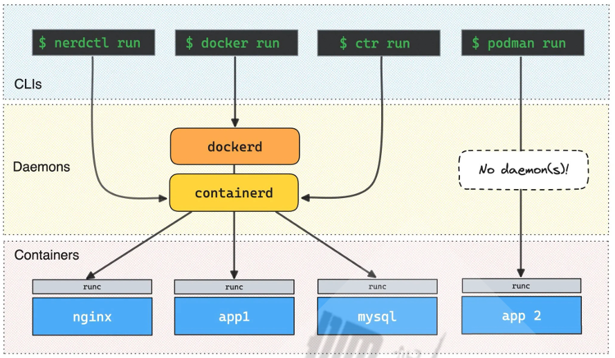

# Docker
## 名称空间Namespace技术

namespace是Linux系统的底层概念。在Linux内核实现，即有一些不同类型的命名空间被部署在内核，各个`docker容器`运行在同一个`docker主进程`并且共用同一个宿主机系统内核，各docker容器运行在宿主机的用户空间，每个容器都有类似于虚拟机一样的相互隔离的运行空间，但是容器技术是`在一个进程内`实现运行指定服务的运行环境，并且还可以保护宿主机内核不受其他进程的干扰和影响，如文件系统空间，网络空间，进程空间等，目前主要通过以下技术实现容器运行空间的相互隔离

隔离类型
- MNT Namespace(mount)
  - 功能：提供磁盘挂载和文件系统的隔离能力
  - 系统调用参数：CLONE_NEWNS
- IPC Namespace(inter-Process Communication)
  - 功能：提供进程间通信的隔离能力，包括信号量，消息队列和共享内存
- UTS Namespace(UNIX Timesharing System)
  - 功能：提供内核，主机名和域名隔离能力
- PID Namespace(Process Identification)
  - 功能：提供进程隔离能力
- Net Namespace(network)
  - 功能：提供网络隔离能力，包括网络设备，网络栈，端口等
- User Namespace(user)
  - 功能：提供用户隔离能力，包括用户和组

## Control groups

Cgroups最主要的作用，就是限制一个进程组能够使用的资源上限，包括CPU，内存，磁盘，网络带宽等等。此外，还能够对进程进行优先级设置，资源的计量以及资源的控制（比如：将进程挂起和恢复等操作）


## 容器管理工具

### nerdctl 
nerdctl是与Docker兼容的CLI for Containerd，其支持Compose

### docker


### ctr
ctr是由containerd提供的一个客户端工具

### podman
Podman即Pod Manager tool，从名称上可以看出和kubernets的pod的密切联系，

Podman是一个为Kubernetes而生的开源的容器管理工具，可在大多数Linux平台上使用，它是一种无守护程序的容器引擎，用于在Linux系统上开发，管理和运行任何符合Open Container Initiative(OCI)标准的容器和容器镜像。

### Podman和docker不同之处
- docker需要在系统上运行一个守护进程(docker daemon)，这会产生一定的开销，而podman不需要
- 启动容器的方式不同
  - Docker：
    - `docker cli`命令通过API跟`Docker Engine(引擎)`交互告诉它我想创建一个container
    - `Docker Engine`调用`OCI container runtime(runc)`来启动一个container。
    - 这代表container的process(进程)不会是`Docker CLI`的`child process`(子进程)，而是`Docker Engine`的`child process`
  - Podman:
    - 直接给OCI container runtime（runc）进行交互来创建container,所以`container process`直接是`podman`的`child process`

- docker在linux上作为守护进程运行扼杀了容器社区的创新。如果要更改容器的工作方式，则需要更改docker守护程序并将这些更改推送到上游
- 没有守护进程，容器基础结构更加模块化，更容易进行更改。podman的无守护进程架构更加灵活和安全


## 容器相关技术

### 容器规范(OPEN CONTAINER INITIATIVE)

为了保证容器生态的标准性和健康可持续发展，包括linux基金会，Docker，微软，红帽，谷歌和IBM等公司在2015年6月共同成立了一个叫Open Container Initiative(OCI)的组织，其目的就是定制开放的标准的容器规范

目前OCI一共发布了两个规范
- runtime spec
  - 容器运行环境的规范
- image format spec
  - 镜像格式规范


### 容器runtime

runtime是真正运行容器的地方，因此为了运行不同的容器runtime需要和操作系统内核紧密合作相互在支持，以便为容器提供相应的运行环境。

对于容器运行时主要有两个级别
- Low Level（使用接近内核层）
  - runc: 早期libcontainer是Dockerk公司控制的一个项目，OCI的成立后，Docker把libcontainer项目移交给了OCI组织，runC就是在libcontainer的基础上进化而来
- High Level（使用接近用户层）
  - cri-o
  - containerd
  - dockershim
  

  ### Docker运行机制
  Docker client---> Docker Engine ---> containterd
  Contained.shim---> runc ---> container


### 镜像仓库Registry

### 容器编排工具

当多个容器在多个主机上运行时，单独管理容器是相当复杂而且很容易出错，而且也无法实现某台主机宕机后，容器自动迁移到其他主机从而实现高可用目的，也无法是实现动态伸缩的功能，因此需要有一种工具可以实现统一的管理，动态伸缩，故障自愈，批量执行等功能，这就是容器编排引擎

- K8S


## Docker安装

### 内置仓库
Ubuntu内置仓库安装
```shell
apt -y install docker.io
```

### 官方仓库
#### 阿里云官方仓库
- 官方地址
```shell
https://developer.aliyun.com/mirror/docker-ce?spm=a2c6h.13651102.0.0.57e31b11DDIh92
```

- 官方操作（可以看做是脚本运行）
```shell
# step 1: 安装必要的一些系统工具
sudo apt-get update
sudo apt-get -y install apt-transport-https ca-certificates curl software-properties-common
# step 2: 安装GPG证书
curl -fsSL https://mirrors.aliyun.com/docker-ce/linux/ubuntu/gpg | sudo apt-key add -
# Step 3: 写入软件源信息
sudo add-apt-repository "deb [arch=amd64] https://mirrors.aliyun.com/docker-ce/linux/ubuntu $(lsb_release -cs) stable"
# Step 4: 更新并安装Docker-CE
sudo apt-get -y update
sudo apt-get -y install docker-ce # 默认下载最新版

# 安装Docker-CE特定版本
sudo apt-get -y install docker-ce=[VERSION] docker-ce-cli=[VERSION]
```


### 二进制安装（离线）
本方法适用于无法上网或无法通过包安装方式安装的主机上安装docker
```shell
二进制安装下载路径
https://download.docker.com/linux/
https://mirrors.aliyun.com/docker-ce/linux/static/stable/x86_64/
```

示例：在CentOS上实现二进制安装docker
```shell
wget 
https://download.docker.com/linux/static/stable/x86_64/docker-19.03.5.tgz

# 解压到指定目录
tar xvf docker-19.03.5.tgz    

# 加入环境变量
cp docker/* /usr/bin/

# 创建 service文件
cat > /lib/systemd/system/docker.service <<-EOF
[Unit]
Description=Docker Application Container Engine
Documentation=https://docs.docker.com
After=network-online.target firewalld.service
Wants=network-online.target
[Service]
Type=notify
# the default is not to use systemd for cgroups because the delegate issues 
still
# exists and systemd currently does not support the cgroup feature set required
# for containers run by docker
ExecStart=/usr/bin/dockerd -H unix://var/run/docker.sock
ExecReload=/bin/kill -s HUP \$MAINPID
# Having non-zero Limit*s causes performance problems due to accounting overhead
# in the kernel. We recommend using cgroups to do container-local accounting.
LimitNOFILE=infinity
LimitNPROC=infinity
LimitCORE=infinity
# Uncomment TasksMax if your systemd version supports it.
# Only systemd 226 and above support this version.
#TasksMax=infinity
TimeoutStartSec=0
# set delegate yes so that systemd does not reset the cgroups of docker 
containers
Delegate=yes
# kill only the docker process, not all processes in the cgroup
KillMode=process
# restart the docker process if it exits prematurely
Restart=on-failure
StartLimitBurst=3
StartLimitInterval=60s
[Install]
WantedBy=multi-user.target
EOF

# 重启
systemctl daemon-reload
systemctl enable --now docker   
```

### 官方脚本


## Docker删除

```shell
apt purge docker-ce
rm -rf /var/lib/docker
```